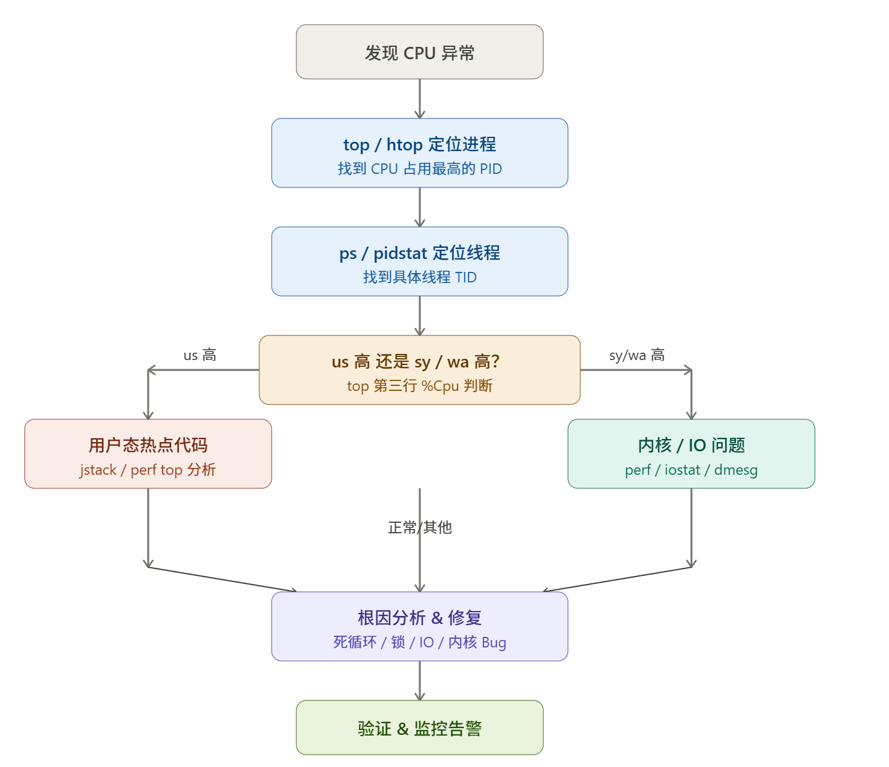
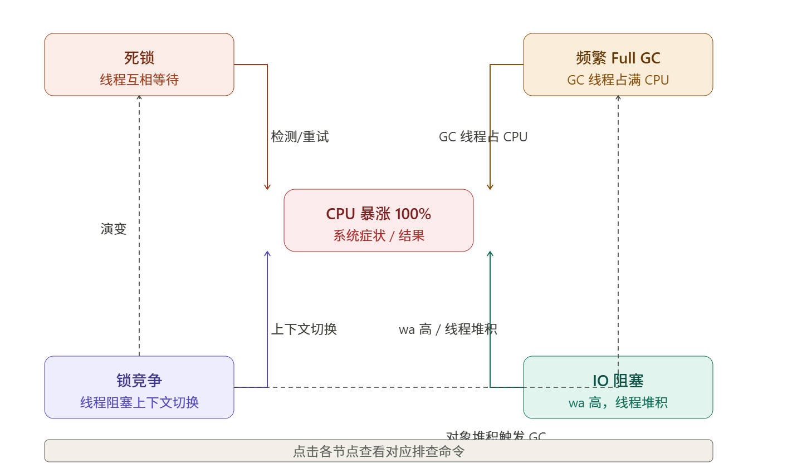
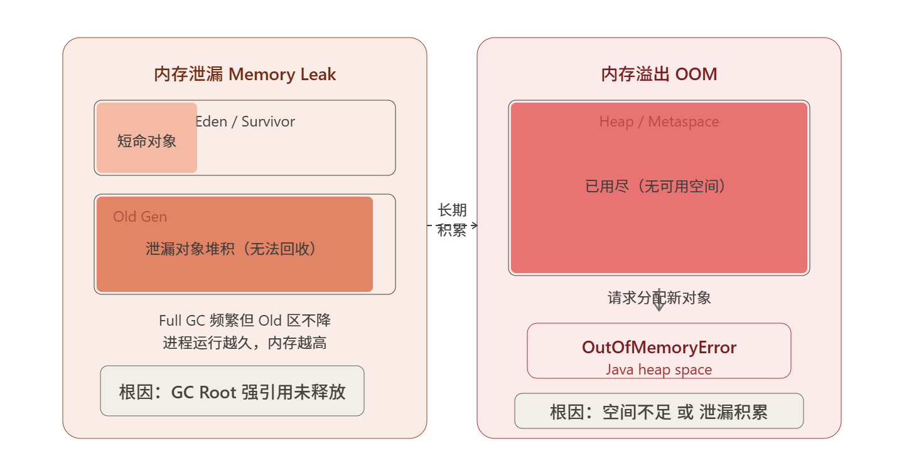
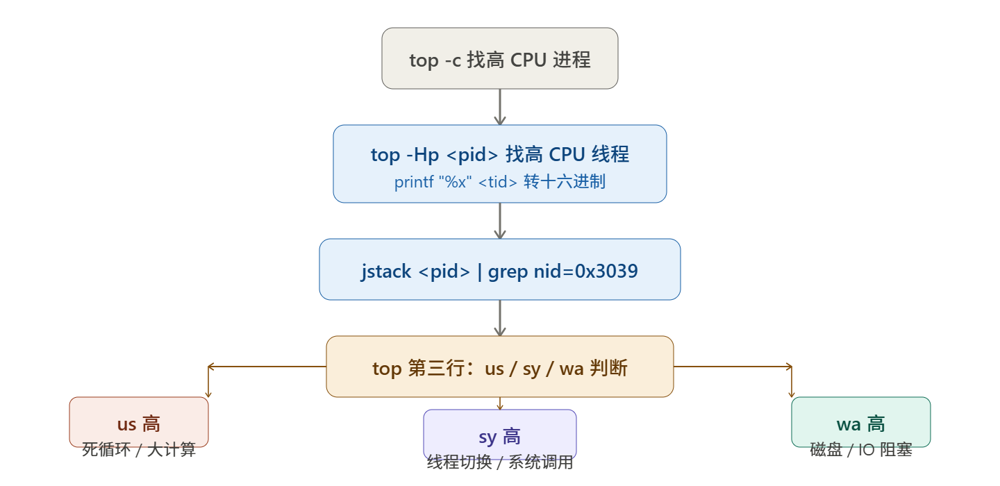
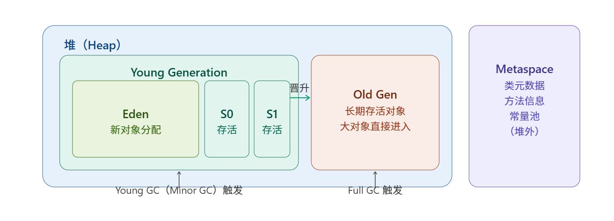

### Linux CPU 暴涨 100% 排查指南

#### 排查总流程---



#### 第一步：快速定位高 CPU 进程

```bash
# 实时查看 CPU 占用 TOP，按 CPU 排序（默认）
top -c           # -c 显示完整命令行

# 更好用的交互式版本
htop             # 可鼠标操作，F6 选择排序字段

# 非交互式，适合脚本和 CI
ps aux --sort=-%cpu | head -20
```

**top 关键区域解读：**

```
%Cpu(s): 85.3 us,  8.1 sy,  0.0 ni,  4.2 id,  2.0 wa,  0.4 hi,  0.0 si
          ↑用户态    ↑内核态                ↑空闲    ↑IO等待  ↑硬中断
```

| 指标    | 含义       | 高了说明                             |
| ------- | ---------- | ------------------------------------ |
| `us`    | 用户态 CPU | 业务代码热点（死循环、大量计算）     |
| `sy`    | 内核态 CPU | 系统调用频繁（线程切换、网络、文件） |
| `wa`    | IO 等待    | 磁盘/网络 IO 成为瓶颈                |
| `hi/si` | 硬/软中断  | 网络包处理压力大（高流量）           |

------

#### 第二步：定位具体线程

```bash
# 找到进程 PID 后，查看该进程的线程 CPU 占用
top -Hp <pid>          # H=显示线程，p=指定PID

# 或用 pidstat（更详细）
pidstat -p <pid> -t 1   # -t 显示线程，每秒刷新

# 输出示例：
# TID   %usr  %system  %CPU  Command
# 12345  95.0    0.5   95.5  java

# 将 TID 转成十六进制（用于 jstack 匹配）
printf "%x\n" 12345     # → 3039
```

------

#### 第三步：按 us/sy/wa 分支排查

##### 分支 A：us 高 → 用户态热点代码

###### Java 进程

```bash
# 1. 找到高 CPU 线程 TID，转十六进制
top -Hp <pid>
printf "%x\n" <tid>   # 比如 → 3039

# 2. jstack 导出线程栈，搜索对应线程
jstack <pid> | grep -A 30 "nid=0x3039"

# 关键看：
# - RUNNABLE 状态 + 同一个方法反复出现 → 死循环
# - BLOCKED / WAITING → 锁竞争
# 3. perf 采样（更精确，适用所有语言）
perf top -p <pid>                    # 实时热点函数
perf record -F 99 -p <pid> -g -- sleep 30   # 录制 30s
perf report --sort=dso,sym           # 分析报告

# 4. async-profiler（Java 专用，无 SafePoint 偏差）
./profiler.sh -d 30 -f /tmp/flame.html <pid>
# 用浏览器打开 flame.html → 看最宽的柱子
```

###### Go / C++ / Python 进程

```bash
# Go：内置 pprof
go tool pprof http://localhost:6060/debug/pprof/profile?seconds=30

# C++：gprof / perf
perf record -g -p <pid> sleep 30
perf report

# Python：py-spy
py-spy top --pid <pid>
py-spy record -o /tmp/flame.svg --pid <pid> --duration 30
```

**常见 us 高根因：**

```java
// ❌ 死循环（最常见！）
while (true) {
    if (queue.isEmpty()) continue;  // 空转 CPU 100%
    process(queue.poll());
}

// ✅ 修复：改用阻塞等待
Object item = queue.take();  // 阻塞直到有数据

// ❌ 正则回溯灾难（ReDoS）
Pattern.compile("(a+)+").matcher(longStr).matches();  // 指数级回溯

// ❌ JSON/XML 超大对象反序列化
// ❌ 无限递归（StackOverflow 前 CPU 先飙）
// ❌ HashMap 死循环（JDK 7 并发 put，已修复）
```

------

##### 分支 B：sy 高 → 内核态 / 系统调用

```bash
# 查看系统调用频率
strace -p <pid> -c -f     # 统计各 syscall 次数和耗时
# 输出：write/futex/mmap 次数异常高 → 定位方向

# 查看上下文切换
pidstat -w -p <pid> 1
# cswch/s（自愿切换）高 → 线程太多或锁争用
# nvcswch/s（非自愿）高 → 时间片用尽，线程过多

# 查看系统整体
vmstat 1
# cs 列 → 每秒上下文切换总数（正常 < 1万，异常 > 10万）
```

**sy 高常见场景：**

| 现象               | 根因             | 解决                        |
| ------------------ | ---------------- | --------------------------- |
| `futex` 调用极多   | 锁竞争激烈       | 减少锁粒度，用 CAS/无锁结构 |
| `mmap/munmap` 频繁 | 内存频繁申请释放 | 对象池，减少 GC             |
| 线程数 > 1000      | 线程池无界       | 限制线程池大小              |
| `write` 次数极高   | 日志/IO 刷盘过频 | 异步写，批量 flush          |

------

##### 分支 C：wa 高 → IO 等待

```bash
# 查看磁盘 IO
iostat -xz 1
# %util 接近 100% → 磁盘打满
# await 高 → IO 延迟大

# 找到 IO 最多的进程
iotop -o -P        # -o 只显示有 IO 的进程

# 查看具体文件
lsof -p <pid> | grep REG    # 进程打开的文件
```

------

##### 分支 D：hi/si 高 → 中断

```bash
# 查看中断分布
watch -n 1 cat /proc/interrupts

# 软中断统计
watch -n 1 cat /proc/softirqs

# 网卡软中断集中在单核 → 开启多队列
ethtool -l eth0               # 查看队列数
ethtool -L eth0 combined 8    # 设置 8 队列
```

------

#### 第四步：线上常见根因 & 解法

##### 死循环

```bash
# 特征：jstack 反复看到同一线程 RUNNABLE 在同一行代码
jstack <pid> | grep "RUNNABLE" -A 5
# 或 3 次 jstack 对比，同一行反复出现
for i in 1 2 3; do jstack <pid> > /tmp/jstack$i.txt; sleep 2; done
diff /tmp/jstack1.txt /tmp/jstack2.txt
```

##### GC 引发 CPU 高（Java）

```bash
# Full GC 频繁 → CPU 被 GC 线程占满
jstat -gcutil <pid> 1000
# FGC 列快速增长 → OOM 临界 / 内存泄漏

# GC 线程数过多占 CPU
ps -Lp <pid> | grep GC | wc -l
```

##### 线程池打满 + 自旋

```java
// ❌ 无界队列导致大量任务积压，CPU 空转处理
ExecutorService pool = Executors.newFixedThreadPool(200);

// ✅ 限流 + 有界队列 + 拒绝策略
ThreadPoolExecutor pool = new ThreadPoolExecutor(
    20, 50, 60L, TimeUnit.SECONDS,
    new LinkedBlockingQueue<>(1000),
    new ThreadPoolExecutor.CallerRunsPolicy()  // 背压
);
```

##### CPU 亲和性 / NUMA 问题

```bash
# 查看 CPU 核心分布
numactl --hardware

# 绑定进程到特定核，避免跨 NUMA 访问
taskset -cp 0-7 <pid>          # 绑定到 0-7 号 CPU
numactl --cpunodebind=0 <cmd>  # 绑定到 NUMA node 0
```

------

#### 第五步：应急处置 & 预防

```bash
# 临时降低进程优先级（不杀进程）
renice +10 -p <pid>       # nice 值调高，降低调度优先级

# cgroup 限制 CPU 使用（容器/非容器均可）
cgcreate -g cpu:/limit_group
cgset -r cpu.cfs_quota_us=50000 limit_group   # 限制 50% CPU
cgexec -g cpu:/limit_group <command>
```

**监控告警配置（Prometheus 示例）：**

```yaml
# CPU 使用率超 80% 持续 5 分钟告警
- alert: HighCPUUsage
  expr: 100 - (avg by(instance)(rate(node_cpu_seconds_total{mode="idle"}[5m])) * 100) > 80
  for: 5m
  labels:
    severity: warning

# 上下文切换异常
- alert: HighContextSwitch
  expr: rate(node_context_switches_total[1m]) > 100000
  for: 2m
```

------

#### 速查命令表

| 目的          | 命令                             |
| ------------- | -------------------------------- |
| 找高 CPU 进程 | `top -c` / `ps aux --sort=-%cpu` |
| 找高 CPU 线程 | `top -Hp <pid>`                  |
| 看线程栈      | `jstack <pid>`                   |
| 看系统调用    | `strace -cp <pid>`               |
| 看上下文切换  | `pidstat -w 1`                   |
| 看磁盘 IO     | `iostat -xz 1` / `iotop`         |
| 性能采样      | `perf top -p <pid>`              |
| Java 火焰图   | `async-profiler`                 |
| 临时限速      | `renice +10 -p <pid>`            |

> **核心思路**：`top` 找进程 → `top -Hp` 找线程 → TID 转十六进制 → `jstack`/`perf` 找代码热点 → 按 us/sy/wa 三路分别深挖。CPU 100% 最常见是**死循环**和**GC 风暴**，其次是锁竞争和 IO 阻塞。

### CPU暴涨的四个常见原因

四个问题本质上都是同一条链路上的不同卡点。先用一张总览图把它们的关系说清楚，再逐个深入。五个问题相互牵连：锁竞争恶化变死锁，IO 阻塞导致线程堆积，两者都加剧 Full GC，GC 线程本身又把 CPU 打满。下面逐一拆解。



------

#### 一、CPU 暴涨 100%

##### 快速定位三板斧

```bash
# 第一板：找进程
top -c                          # 按 CPU 降序，记下 PID

# 第二板：找线程
top -Hp <pid>                   # 展开线程，记下高 CPU 的 TID
printf "%x\n" <tid>             # 转十六进制，如 12345 → 3039

# 第三板：找代码
jstack <pid> | grep -A 30 "nid=0x3039"   # 定位热点栈帧
```

##### 按 top 第三行分流

```
%Cpu(s): 91.2 us,  5.3 sy,  0.0 ni,  1.2 id,  1.8 wa,  0.5 hi
          ↑                                      ↑
        us 高 → 业务代码                      wa 高 → IO 阻塞
```

| 指标高  | 方向                 | 工具                               |
| ------- | -------------------- | ---------------------------------- |
| `us`    | 死循环 / 大计算 / GC | `jstack` + `async-profiler` 火焰图 |
| `sy`    | 线程切换 / 系统调用  | `pidstat -w` + `strace -cp`        |
| `wa`    | 磁盘 / 网络 IO       | `iostat -xz` + `iotop`             |
| `hi/si` | 网络中断             | `/proc/interrupts` + 多队列网卡    |

##### 死循环（us 高最常见根因）

```java
// ❌ 典型死循环：空转等待
while (!queue.isEmpty()) {
    // 队列为空时 CPU 100% 空转
}

// ✅ 改为阻塞等待
Object item = blockingQueue.take();   // 无数据时挂起，不消耗 CPU

// ❌ HashMap 并发死循环（JDK 7）
// 多线程同时 put 触发 rehash，形成环形链表
// ✅ 改用 ConcurrentHashMap
```

##### 应急降速

```bash
# 不杀进程，临时降低调度优先级
renice +15 -p <pid>

# 容器环境限制 CPU 配额
# docker run --cpus="2.0" ...
# k8s: resources.limits.cpu: "2"
```

------

#### 二、死锁

##### 识别特征

```bash
# jstack 直接报告死锁
jstack <pid> | grep -A 20 "deadlock"

# 典型输出：
# Found one Java-level deadlock:
# "Thread-1" waiting for lock 0x000000076b5d0f40
#   held by "Thread-2"
# "Thread-2" waiting for lock 0x000000076b5d1090
#   held by "Thread-1"
```

##### 死锁四个必要条件及破解

```
互斥  → 无法避免（锁的本质）
持有并等待 → 破解：一次性申请所有锁，或超时放弃
不可剥夺  → 破解：tryLock + 超时
循环等待  → 破解：固定加锁顺序
// ❌ 经典死锁：加锁顺序不一致
// Thread-1: 先锁 A，再锁 B
// Thread-2: 先锁 B，再锁 A
synchronized (lockA) {
    synchronized (lockB) { /* ... */ }
}

// ✅ 方案一：统一加锁顺序（最简单）
// 所有线程都按 lockA → lockB 顺序加锁
int idA = System.identityHashCode(lockA);
int idB = System.identityHashCode(lockB);
Object first  = idA < idB ? lockA : lockB;
Object second = idA < idB ? lockB : lockA;
synchronized (first) {
    synchronized (second) { /* ... */ }
}

// ✅ 方案二：tryLock + 超时（推荐）
ReentrantLock lockA = new ReentrantLock();
ReentrantLock lockB = new ReentrantLock();

boolean acquired = false;
try {
    acquired = lockA.tryLock(500, TimeUnit.MILLISECONDS);
    if (acquired) {
        acquired = lockB.tryLock(500, TimeUnit.MILLISECONDS);
    }
    if (acquired) {
        // 执行业务
    } else {
        // 获取失败，回退重试
    }
} finally {
    if (lockB.isHeldByCurrentThread()) lockB.unlock();
    if (lockA.isHeldByCurrentThread()) lockA.unlock();
}

// ✅ 方案三：用单一全局锁或消息队列串行化
// 将两个资源的操作放入同一个有界队列，单线程处理
```

##### 预防死锁的设计原则

```java
// 1. 减少锁的持有时间
synchronized (lock) {
    // ❌ 锁内做 IO / RPC / 复杂计算
    String result = httpClient.get("http://...");  // 网络调用！
}

// ✅ 锁外准备，锁内只做内存操作
String result = httpClient.get("http://...");      // 锁外完成
synchronized (lock) {
    cache.put(key, result);                         // 锁内极简
}

// 2. 使用无锁结构替代
// AtomicInteger / AtomicLong / AtomicReference 替代 synchronized 计数器
AtomicLong counter = new AtomicLong(0);
counter.incrementAndGet();  // CAS，无锁

// 3. 使用 StampedLock 读写分离（比 ReadWriteLock 更高效）
StampedLock sl = new StampedLock();
long stamp = sl.readLock();
try {
    return data;
} finally {
    sl.unlockRead(stamp);
}
```

------

#### 三、频繁 Full GC

##### 诊断命令

```bash
# 实时监控各代使用率（每 2s 刷一次，采 20 次）
jstat -gcutil <pid> 2000 20
# 关注：FGC 列快速增长，OU（Old使用率）居高不下

# 输出示例（问题状态）：
#  S0     S1     E      O      M     CCS    YGC     YGCT    FGC    FGCT     GCT
#   0.00   0.00   8.21  97.43  95.12  92.80    142    3.852    38   42.137   45.989
#                        ↑ Old 区 97%，Full GC 38 次，耗时 42s

# 查看 GC 原因（JDK 11+）
jcmd <pid> GC.heap_info

# 自动生成 GC 日志（启动参数配置）
-Xlog:gc*:file=/data/logs/gc.log:time,uptime:filecount=10,filesize=50m
```

##### Full GC 六大根因与解法

###### 根因 1：Old 区内存泄漏（最常见）

```bash
# 诊断：OU 持续增长，FGC 后不降
jstat -gcutil <pid> 3000
# → 参考前文「内存泄漏」章节，heap dump + MAT 分析
```

###### 根因 2：大对象直接进 Old 区

```java
// ❌ 一次性加载大量数据
List<Order> orders = orderDao.findAll();   // 返回百万行！

// ✅ 分页 + 流式处理
orderDao.findAllStream().forEach(order -> process(order));
// 或
int page = 0;
while (true) {
    List<Order> batch = orderDao.findByPage(page++, 1000);
    if (batch.isEmpty()) break;
    processBatch(batch);
}

// JVM 参数：超过阈值直接进 Old（减少大对象在 Young 区复制开销）
-XX:PretenureSizeThreshold=4m
```

###### 根因 3：元空间（Metaspace）不足

```bash
# 监控 Metaspace
jstat -gcmetacapacity <pid> 2000

# 动态代理/类加载器泄漏 → 详见内存泄漏章节
# 临时扩容
-XX:MetaspaceSize=256m -XX:MaxMetaspaceSize=512m
```

###### 根因 4：`System.gc()` 被显式调用

```bash
# 找出谁调了 System.gc()
jstack <pid> | grep -B5 "System.gc"
grep -r "System\.gc" src/

# JVM 参数禁用（防止第三方库触发）
-XX:+DisableExplicitGC

# 如果用了 NIO DirectBuffer，禁用 System.gc 后需手动触发堆外内存回收
-XX:+ExplicitGCInvokesConcurrent   # 用并发 GC 替代 Full GC
```

###### 根因 5：Young GC 晋升失败（Promotion Failure）

```bash
# GC 日志中看到：
# [GC (Allocation Failure) ... [Full GC (Promotion Failure) ...]

# 原因：Old 区没有足够连续空间接收从 Young 晋升的对象
# 解法：
-XX:G1ReservePercent=15              # G1 预留更多空间
-XX:InitiatingHeapOccupancyPercent=35  # 更早触发并发 GC
```

###### 根因 6：堆本身太小

```bash
# 业务增长，堆不够用 → 直接调大（治标但必要）
-Xms8g -Xmx8g      # 初始=最大，避免动态扩容

# G1 调优套餐
-XX:+UseG1GC
-XX:MaxGCPauseMillis=200
-XX:G1HeapRegionSize=16m
```

##### GC 选择器

```
堆 < 4G，延迟不敏感  → ParallelGC（吞吐优先）
堆 4G~32G，低延迟   → G1GC（推荐默认）
堆 > 32G，超低延迟  → ZGC（JDK 15+，停顿 < 1ms）
```

------

#### 四、锁竞争

##### 诊断

```bash
# 上下文切换过高（sy 高的伴生现象）
pidstat -w -p <pid> 1
# nvcswch/s（非自愿切换）持续 > 10000/s → 锁竞争严重

# jstack 看 BLOCKED 线程比例
jstack <pid> | grep "BLOCKED" | wc -l
jstack <pid> | grep "BLOCKED" -A 10 | head -50

# 用 async-profiler 采集锁竞争热点（最准确）
./profiler.sh -e lock -d 30 -f /tmp/lock.html <pid>
```

##### 优化梯度（从简到难）

###### 第一层：缩小锁粒度

```java
// ❌ 整个方法加锁
public synchronized void processOrder(Order order) {
    validate(order);           // 纯计算，不需要锁
    String result = rpcCall(); // 远程调用，绝对不能持锁！
    synchronized (this) {
        cache.put(order.id, result);  // 只有这里需要锁
    }
}

// ✅ 只锁必要的内存操作
public void processOrder(Order order) {
    validate(order);                   // 锁外
    String result = rpcCall();         // 锁外（最耗时）
    synchronized (cacheLock) {
        cache.put(order.id, result);   // 锁内极简
    }
}
```

###### 第二层：锁分段（ConcurrentHashMap 思路）

```java
// ❌ 单一锁保护大 Map
private final Map<String, Data> map = new HashMap<>();
private final Object lock = new Object();

// ✅ 分段锁，16 个桶各自独立
private static final int SEGMENTS = 16;
private final Map<String, Data>[] segments = new Map[SEGMENTS];
private final Object[] locks = new Object[SEGMENTS];

{
    for (int i = 0; i < SEGMENTS; i++) {
        segments[i] = new HashMap<>();
        locks[i] = new Object();
    }
}

private int segmentFor(String key) {
    return Math.abs(key.hashCode() % SEGMENTS);
}

public void put(String key, Data data) {
    int seg = segmentFor(key);
    synchronized (locks[seg]) {
        segments[seg].put(key, data);
    }
}
```

###### 第三层：读写锁分离

```java
// ❌ 读多写少场景用 synchronized（读也互斥）
private final Map<String, Config> configMap = new HashMap<>();

// ✅ ReadWriteLock：读读不互斥，读写 / 写写互斥
private final ReadWriteLock rwLock = new ReentrantReadWriteLock();
private final Map<String, Config> configMap = new HashMap<>();

public Config get(String key) {
    rwLock.readLock().lock();
    try { return configMap.get(key); }
    finally { rwLock.readLock().unlock(); }
}

public void put(String key, Config config) {
    rwLock.writeLock().lock();
    try { configMap.put(key, config); }
    finally { rwLock.writeLock().unlock(); }
}

// ✅ 更高性能：StampedLock（乐观读，适合读远多于写）
private final StampedLock sl = new StampedLock();

public Config get(String key) {
    long stamp = sl.tryOptimisticRead();   // 不加锁读
    Config val = configMap.get(key);
    if (!sl.validate(stamp)) {             // 读期间有写？
        stamp = sl.readLock();             // 降级为悲观读
        try { val = configMap.get(key); }
        finally { sl.unlockRead(stamp); }
    }
    return val;
}
```

###### 第四层：无锁数据结构

```java
// 计数器 → AtomicLong
AtomicLong counter = new AtomicLong();
counter.incrementAndGet();

// 队列 → ConcurrentLinkedQueue（无锁）
// 高并发缓存 → ConcurrentHashMap（分段 CAS）
// 单个引用更新 → AtomicReference + CAS
AtomicReference<Node> head = new AtomicReference<>();
Node oldHead, newNode;
do {
    oldHead = head.get();
    newNode = new Node(value, oldHead);
} while (!head.compareAndSet(oldHead, newNode));  // CAS 替代锁

// 高性能队列 → Disruptor（无锁环形缓冲，金融级）
```

###### 第五层：消除共享状态（根本解法）

```java
// 线程本地变量：彻底消除竞争
ThreadLocal<SimpleDateFormat> sdf = ThreadLocal.withInitial(
    () -> new SimpleDateFormat("yyyy-MM-dd")
);

// Actor 模型（Akka）：消息传递替代共享内存
// 每个 Actor 单线程处理，天然无竞争
```

------

#### 五、IO 阻塞

##### 诊断命令

```bash
# 看磁盘 IO 整体情况
iostat -xz 1
# %util 接近 100% → 磁盘打满
# await 高（> 20ms）→ IO 延迟严重
# r/s w/s 高 → 读写 IOPS 高

# 找 IO 最多的进程/线程
iotop -o -P            # -o 只显示有 IO 的，-P 显示进程级

# 找具体文件
lsof -p <pid> | grep REG
```

##### 磁盘 IO 阻塞优化

###### 日志写入优化

```java
// ❌ 同步写日志，每条都 fsync
logger.info("处理订单: " + order.toJson());  // 字符串拼接 + 同步IO

// ✅ 异步日志（Log4j2 AsyncAppender）
// log4j2.xml 配置：
<AsyncRoot level="info" includeLocation="false">
    <AppenderRef ref="RollingFile"/>
</AsyncRoot>

// ✅ Logback AsyncAppender
<appender name="ASYNC" class="ch.qos.logback.classic.AsyncAppender">
    <queueSize>512</queueSize>
    <discardingThreshold>0</discardingThreshold>  <!-- 0=不丢弃 -->
    <appender-ref ref="FILE"/>
</appender>
```

##### 数据库 IO 优化

```java
// ❌ N+1 查询（最常见 IO 杀手）
List<Order> orders = orderRepo.findAll();
for (Order order : orders) {
    User user = userRepo.findById(order.userId);  // 每条查一次！N 次 IO
}

// ✅ JOIN 一次查完 / 批量 IN 查询
List<Order> orders = orderRepo.findAllWithUser();  // LEFT JOIN

// ❌ 无索引全表扫描
SELECT * FROM orders WHERE status = 'PENDING';

// ✅ 加索引
CREATE INDEX idx_orders_status ON orders(status);
EXPLAIN SELECT * FROM orders WHERE status = 'PENDING';  -- 确认走索引

// ❌ 大事务持有连接 + 锁太久
@Transactional
public void processAllOrders() {
    List<Order> all = repo.findAll();   // 百万行，连接被长占
    all.forEach(this::processOrder);    // 全部处理完才提交
}

// ✅ 小事务，分批提交
@Transactional(propagation = REQUIRES_NEW)
public void processBatch(List<Order> batch) {
    batch.forEach(this::processOrder);
}   // 每批独立提交，释放连接
```

##### NIO / 异步 IO（彻底解法）

```java
// ❌ 传统 BIO：一请求一线程，线程等 IO
ServerSocket server = new ServerSocket(8080);
while (true) {
    Socket client = server.accept();
    new Thread(() -> handle(client)).start();  // IO 阻塞时线程挂起
}

// ✅ Netty NIO：事件驱动，少量线程处理大量连接
EventLoopGroup bossGroup   = new NioEventLoopGroup(1);
EventLoopGroup workerGroup = new NioEventLoopGroup();  // CPU 核数 * 2

ServerBootstrap b = new ServerBootstrap();
b.group(bossGroup, workerGroup)
 .channel(NioServerSocketChannel.class)
 .childHandler(new ChannelInitializer<SocketChannel>() {
     @Override
     protected void initChannel(SocketChannel ch) {
         ch.pipeline().addLast(new MyHandler());
     }
 });
```

##### 连接池调优

```yaml
# HikariCP 配置（数据库连接池）
spring:
  datasource:
    hikari:
      maximum-pool-size: 20       # 核心数 * 2 + 磁盘数（SSD 场景）
      minimum-idle: 10
      connection-timeout: 3000    # 获取连接超时 3s
      idle-timeout: 600000        # 空闲连接 10 分钟回收
      max-lifetime: 1800000       # 连接最长存活 30 分钟
      leak-detection-threshold: 5000  # 5s 未归还 → 打印泄漏堆栈
```

------

#### 六、监控告警配置

```yaml
# Prometheus 告警规则（覆盖五大问题）

# CPU 持续 > 85%
- alert: HighCPU
  expr: 100 - (avg by(instance)(rate(node_cpu_seconds_total{mode="idle"}[2m])) * 100) > 85
  for: 3m

# 线程数暴涨（死锁/锁竞争信号）
- alert: ThreadCountHigh
  expr: jvm_threads_live_threads > 800
  for: 2m

# Full GC 频率 > 2次/分钟
- alert: FrequentFullGC
  expr: rate(jvm_gc_collection_seconds_count{gc=~".*MarkSweep.*|.*G1 Mixed.*"}[1m]) > 2
  for: 2m

# GC 停顿时间 > 1s
- alert: GCPauseLong
  expr: rate(jvm_gc_collection_seconds_sum[1m]) > 1

# 磁盘 IO 利用率 > 90%
- alert: DiskIOHigh
  expr: rate(node_disk_io_time_seconds_total[1m]) > 0.9
  for: 2m

# 上下文切换 > 10万/s（锁竞争信号）
- alert: HighContextSwitch
  expr: rate(node_context_switches_total[1m]) > 100000
  for: 2m
```

------

#### 七、快速参考卡

| 问题     | 第一命令                       | 关键信号                        | 核心解法                           |
| -------- | ------------------------------ | ------------------------------- | ---------------------------------- |
| CPU 暴涨 | `top -c` → `top -Hp <pid>`     | `us` 高 + RUNNABLE 线程栈       | 消除死循环，异步化                 |
| 死锁     | `jstack <pid> | grep deadlock` | "Found one Java-level deadlock" | 统一加锁顺序 / `tryLock` 超时      |
| Full GC  | `jstat -gcutil <pid> 2000`     | FGC 频繁 + OU 不降              | 修复泄漏 / 扩堆 / 优化对象生命周期 |
| 锁竞争   | `pidstat -w -p <pid> 1`        | `nvcswch/s` > 10000             | 缩小粒度 → 读写锁 → 无锁 CAS       |
| IO 阻塞  | `iostat -xz 1` + `iotop`       | `%util` > 90% / `await` > 20ms  | 异步日志 / 批量查询 / NIO          |

### JVM 线上 OOM 问题排查解决指南

#### OOM 类型识别

首先确认 OOM 的具体类型，错误信息决定排查方向：

| 错误信息                                                     | 问题区域            |
| ------------------------------------------------------------ | ------------------- |
| `java.lang.OutOfMemoryError: Java heap space`                | 堆内存不足          |
| `java.lang.OutOfMemoryError: GC overhead limit exceeded`     | GC 频繁但回收效果差 |
| `java.lang.OutOfMemoryError: Metaspace`                      | 元空间不足          |
| `java.lang.OutOfMemoryError: Direct buffer memory`           | 堆外内存不足        |
| `java.lang.OutOfMemoryError: unable to create new native thread` | 线程数超限          |
| `java.lang.OutOfMemoryError: map failed`                     | 内存映射失败        |

------

#### 第一步：现场保留（发生时）

OOM 发生时第一时间保留现场，否则进程重启后数据丢失。

```bash
# JVM 启动参数加上自动 dump（提前配置）
-XX:+HeapDumpOnOutOfMemoryError
-XX:HeapDumpPath=/data/logs/heapdump.hprof
-XX:+PrintGCDetails
-XX:+PrintGCDateStamps
-Xloggc:/data/logs/gc.log
# 如果进程还存活，立即手动 dump
jmap -dump:format=b,file=/tmp/heap.hprof <pid>

# 查看 GC 实时情况
jstat -gcutil <pid> 1000 10

# 查看对象占用 TOP
jmap -histo:live <pid> | head -50
```

------

#### 第二步：快速定位（分钟级）

##### 堆内存问题

```bash
# 查看堆各区域使用情况
jstat -gc <pid> 1000

# 输出关键列含义：
# S0C/S1C  - Survivor 区容量
# EC       - Eden 区容量
# OC       - Old 区容量
# OU       - Old 区已使用（持续增长 = 内存泄漏）
# FGC      - Full GC 次数（频繁 = 问题严重）
# 查看对象实例数 TOP20（不触发 GC）
jmap -histo <pid> | sort -k2 -rn | head -20

# 触发 GC 后再查（排除短命对象）
jmap -histo:live <pid> | sort -k2 -rn | head -20
```

##### Metaspace 问题

```bash
# 查看已加载类数量
jcmd <pid> VM.class_hierarchy | wc -l

# 监控 Metaspace
jstat -gcmetacapacity <pid> 1000
```

##### 线程问题

```bash
# 查看线程数
cat /proc/<pid>/status | grep Threads
ls /proc/<pid>/task | wc -l

# 导出线程快照
jstack <pid> > /tmp/thread_dump.txt
grep "java.lang.Thread.State" thread_dump.txt | sort | uniq -c
```

------

#### 第三步：Heap Dump 深度分析

##### 使用 MAT（Memory Analyzer Tool）

```
1. 打开 heap.hprof
2. 选择 "Leak Suspects Report" → 自动报告泄漏嫌疑
3. 查看 "Dominator Tree" → 找占用内存最大的对象
4. 查看 "Retained Heap" → 找到 GC Root 引用链
```

**关键分析路径：**

```
Leak Suspects → 找大对象 → 查引用链 → 定位代码位置
```

##### 使用 jvisualvm / JProfiler

```bash
# 本地连接远程 JVM（需提前开启）
# 启动参数加：
-Dcom.sun.management.jmxremote
-Dcom.sun.management.jmxremote.port=9999
-Dcom.sun.management.jmxremote.authenticate=false
-Dcom.sun.management.jmxremote.ssl=false
```

------

#### 第四步：常见场景与解决

##### 场景 1：内存泄漏（Old 区持续增长）

```java
// ❌ 常见泄漏：静态集合无限增长
public class CacheService {
    private static Map<String, Object> cache = new HashMap<>(); // 只进不出
    
    public void put(String key, Object value) {
        cache.put(key, value); // 永远不清理
    }
}

// ✅ 修复：使用有界缓存
private static Map<String, Object> cache = new LinkedHashMap<>(1000, 0.75f, true) {
    protected boolean removeEldestEntry(Map.Entry eldest) {
        return size() > 1000;
    }
};
// 或使用 Caffeine/Guava Cache 并设置过期时间
// ❌ 常见泄漏：ThreadLocal 未清理
public class UserContext {
    private static ThreadLocal<User> userLocal = new ThreadLocal<>();
    
    public static void set(User user) { userLocal.set(user); }
    // 线程池中线程复用，没有 remove() → 泄漏！
}

// ✅ 修复：在 finally 中清理
try {
    UserContext.set(user);
    // ... 业务逻辑
} finally {
    UserContext.remove(); // 必须！
}
```

##### 场景 2：GC overhead limit exceeded

```bash
# 原因：GC 时间超过 98%，但回收不足 2%
# 排查：分析对象存活率，通常是大量小对象

# 临时缓解（治标）
-XX:-UseGCOverheadLimit

# 根因通常是：
# 1. 大量 String 拼接 → 改用 StringBuilder
# 2. 大集合排序/转换 → 流式处理
# 3. 堆设置过小 → 适当调大 -Xmx
```

##### 场景 3：Metaspace OOM

```bash
# 常见原因：动态代理/CGLib 生成大量类，类加载器泄漏

# 排查类加载情况
jcmd <pid> VM.classloaders

# 临时增大 Metaspace
-XX:MaxMetaspaceSize=512m

# 根因排查：找到重复加载的类
jcmd <pid> VM.class_hierarchy | grep "$$" | head -30
# $$ 开头通常是动态生成类（cglib/lambda）
// ❌ 每次请求都创建新的 Enhancer（CGLib）
Enhancer enhancer = new Enhancer();
enhancer.setSuperclass(Target.class);
enhancer.setCallback(interceptor);
Target proxy = (Target) enhancer.create(); // 每次都生成新类！

// ✅ 复用代理对象或使用缓存
// Spring 已处理好，自定义时需注意复用
```

##### 场景 4：Direct Buffer Memory

```bash
# NIO / Netty 堆外内存不足
# 启动参数限制：
-XX:MaxDirectMemorySize=1g

# 排查 DirectByteBuffer 使用
jmap -histo:live <pid> | grep DirectByteBuffer
// ❌ DirectByteBuffer 未释放
ByteBuffer buf = ByteBuffer.allocateDirect(1024 * 1024);
// 使用后没有显式释放

// ✅ 显式释放（Java 9+）
import sun.misc.Cleaner;
((DirectBuffer) buf).cleaner().clean();
// 或通过 Netty 的 ReferenceCountUtil.release(buf)
```

##### 场景 5：unable to create native thread

```bash
# 查看系统线程限制
ulimit -u           # 当前用户线程上限
cat /proc/sys/kernel/threads-max  # 系统总线程上限

# 修改限制（临时）
ulimit -u 65535

# 永久修改 /etc/security/limits.conf
* soft nproc 65535
* hard nproc 65535

# 排查线程泄漏
jstack <pid> | grep "Thread-" | wc -l
# 检查线程池是否无界
```

------

#### 第五步：JVM 参数调优

```bash
# 生产推荐基础配置（以 8G 堆为例）
-Xms8g -Xmx8g                          # 堆大小，初始=最大，避免动态扩容
-XX:+UseG1GC                           # G1 收集器（JDK 9+ 默认）
-XX:MaxGCPauseMillis=200               # 目标 GC 停顿时间
-XX:G1HeapRegionSize=16m               # Region 大小
-XX:InitiatingHeapOccupancyPercent=45  # 触发并发 GC 的堆占用阈值
-XX:+HeapDumpOnOutOfMemoryError
-XX:HeapDumpPath=/data/logs/
-XX:+PrintGCDetails
-XX:+PrintGCDateStamps
-Xloggc:/data/logs/gc-%t.log
-XX:+UseGCLogFileRotation
-XX:NumberOfGCLogFiles=10
-XX:GCLogFileSize=100m
```

------

#### 排查流程图

```
OOM 发生
    │
    ├─ 进程存活？─── 否 ──→ 查 HeapDump 文件 + GC 日志
    │
    └─ 是
        │
        ├─ jmap -histo:live → 找大对象类型
        ├─ jstat -gcutil    → 看各区使用率
        └─ jstack           → 看线程状态
            │
            ├─ Old 区 > 80% 持续增长 → 内存泄漏，分析引用链
            ├─ FGC 频繁但 OU 不降   → 对象存活率高，业务逻辑问题  
            ├─ Metaspace 满          → 类加载泄漏，查动态代理
            ├─ 线程数暴涨            → 线程池无界或泄漏
            └─ Direct Memory 满      → NIO 堆外内存未释放
```

------

#### 应急处置 SOP

| 步骤 | 操作                         | 目的           |
| ---- | ---------------------------- | -------------- |
| 1    | `jmap -dump` 或检查自动 dump | 保留现场       |
| 2    | `jstat -gcutil` 持续观察     | 判断严重程度   |
| 3    | `jmap -histo:live`           | 快速定位大对象 |
| 4    | 重启服务（如已影响业务）     | 恢复服务       |
| 5    | MAT 分析 dump 文件           | 根因分析       |
| 6    | 修复代码 + 调整 JVM 参数     | 彻底解决       |
| 7    | 接入监控告警（heap/GC/线程） | 预防复发       |

> **核心原则**：先保现场 → 再恢复服务 → 最后根因分析。线上 OOM 大多是**内存泄漏**，少数是**内存不足**，两者解决思路不同，heap dump 是区分关键。

### JVM 内存泄漏 vs 内存溢出

 解决方案先用一张结构图把两个概念和它们的关系说清楚，再逐层展开解决方案。



两者核心区别：内存泄漏是"对象活着但没用"，GC 无法回收，长期积累最终导致 OOM；内存溢出是"需要内存但没有"，可能由泄漏引起，也可能是空间本就不够。

------

#### 一、核心对比

| 维度     | 内存泄漏                  | 内存溢出                    |
| -------- | ------------------------- | --------------------------- |
| 本质     | 对象被强引用，GC 无法回收 | 申请内存时堆/Metaspace 已满 |
| 现象     | Old 区缓慢持续增长        | 立刻抛出 `OutOfMemoryError` |
| 发生时机 | 系统运行一段时间后        | 可能立即（分配大对象）      |
| 重启后   | 临时恢复，稍后复发        | 视情况，调大堆可能解决      |
| 排查工具 | MAT、jmap、async-profiler | GC 日志、jstat              |

------

#### 二、内存泄漏：六大根因与修复

##### 根因 1：静态集合无限增长

```java
// ❌ 只进不出的静态 Map
public class TokenCache {
    private static final Map<String, Token> cache = new HashMap<>();

    public static void put(String key, Token token) {
        cache.put(key, token);  // 永远不清理 → 泄漏
    }
}

// ✅ 方案一：Caffeine 有界缓存 + 过期时间
private static final Cache<String, Token> cache = Caffeine.newBuilder()
    .maximumSize(10_000)
    .expireAfterWrite(30, TimeUnit.MINUTES)
    .build();

// ✅ 方案二：LRU LinkedHashMap（轻量场景）
private static final Map<String, Token> cache =
    Collections.synchronizedMap(new LinkedHashMap<>(1000, 0.75f, true) {
        @Override
        protected boolean removeEldestEntry(Map.Entry<String, Token> eldest) {
            return size() > 1000;
        }
    });
```

##### 根因 2：ThreadLocal 未清理（线程池场景必现）

```java
// ❌ 线程池线程复用，ThreadLocal 值永久残留
public class UserContext {
    private static final ThreadLocal<UserInfo> LOCAL = new ThreadLocal<>();

    public static void set(UserInfo user) { LOCAL.set(user); }
    public static UserInfo get()          { return LOCAL.get(); }
    // 没有 remove()！线程归还线程池后值残留
}

// ✅ 必须在 finally 中清理
try {
    UserContext.set(currentUser);
    doBusinessLogic();
} finally {
    UserContext.remove();   // 关键！
}

// ✅ 更好：用拦截器统一清理（Spring 场景）
@Component
public class UserContextInterceptor implements HandlerInterceptor {
    @Override
    public void afterCompletion(...) {
        UserContext.remove();   // 每次请求结束后自动清理
    }
}
```

##### 根因 3：监听器 / 回调未注销

```java
// ❌ 注册了监听器，对象销毁时没有注销
public class DataPanel extends JPanel {
    public DataPanel(EventBus bus) {
        bus.register(this);   // 注册后 bus 持有 DataPanel 强引用
        // DataPanel 关闭后，bus 仍持有引用 → 无法 GC
    }
}

// ✅ 在生命周期结束时注销
public class DataPanel extends JPanel {
    private final EventBus bus;

    public DataPanel(EventBus bus) {
        this.bus = bus;
        bus.register(this);
    }

    public void dispose() {
        bus.unregister(this);   // 主动注销
    }
}

// ✅ 或使用 WeakReference 持有监听器
Map<String, WeakReference<Listener>> listeners = new WeakHashMap<>();
```

##### 根因 4：内部类 / 匿名类持有外部类引用

```java
// ❌ 非静态内部类隐式持有 Activity 引用
public class MainActivity extends Activity {
    private Handler handler = new Handler() {
        @Override
        public void handleMessage(Message msg) {
            // 隐式持有 MainActivity 的引用！
            // 延迟消息未执行时，Activity 无法 GC
        }
    };
}

// ✅ 改用静态内部类 + WeakReference
public class MainActivity extends Activity {
    private static class SafeHandler extends Handler {
        private final WeakReference<MainActivity> actRef;

        SafeHandler(MainActivity act) {
            actRef = new WeakReference<>(act);
        }

        @Override
        public void handleMessage(Message msg) {
            MainActivity act = actRef.get();
            if (act != null) { /* 处理逻辑 */ }
        }
    }

    private final SafeHandler handler = new SafeHandler(this);
}
```

##### 根因 5：连接 / 流未关闭

```java
// ❌ 异常时未关闭，资源泄漏
public String readFile(String path) throws Exception {
    FileInputStream fis = new FileInputStream(path);
    // 如果这里抛异常，fis 永远不关闭
    return new String(fis.readAllBytes());
}

// ✅ try-with-resources 自动关闭
public String readFile(String path) throws Exception {
    try (FileInputStream fis = new FileInputStream(path)) {
        return new String(fis.readAllBytes());
    }
}

// ✅ 数据库连接同理（必须用连接池 + try-with-resources）
try (Connection conn = dataSource.getConnection();
     PreparedStatement ps = conn.prepareStatement(sql);
     ResultSet rs = ps.executeQuery()) {
    // 使用 rs
}   // 自动关闭全部资源
```

##### 根因 6：JVM 类加载器泄漏（Metaspace）

```java
// ❌ 每次请求都创建新的 CGLib Enhancer，生成新的类
public Object createProxy(Class<?> target) {
    Enhancer enhancer = new Enhancer();
    enhancer.setSuperclass(target);
    enhancer.setCallback(new MyInterceptor());
    return enhancer.create();   // 每次生成一个新类 → Metaspace 增长
}

// ✅ 复用 Enhancer 或缓存代理类
private static final Map<Class<?>, Object> proxyCache = new ConcurrentHashMap<>();

public Object createProxy(Class<?> target) {
    return proxyCache.computeIfAbsent(target, clz -> {
        Enhancer enhancer = new Enhancer();
        enhancer.setSuperclass(clz);
        enhancer.setCallback(new MyInterceptor());
        return enhancer.create();
    });
}
```

------

#### 三、内存溢出：分类处理

##### OOM 类型速查

```
java.lang.OutOfMemoryError: Java heap space
    → 堆内存不足，最常见
    → 排查：jmap -histo:live <pid> | head -30

java.lang.OutOfMemoryError: GC overhead limit exceeded
    → GC 耗时 > 98%，回收 < 2%，几乎等同堆满
    → 排查：GC 日志 + heap dump

java.lang.OutOfMemoryError: Metaspace
    → 类加载器泄漏 / 动态代理失控
    → 排查：jcmd <pid> VM.class_hierarchy | grep '\$\$' | wc -l

java.lang.OutOfMemoryError: Direct buffer memory
    → NIO / Netty 堆外内存泄漏
    → 排查：jmap -histo:live | grep DirectByteBuffer

java.lang.OutOfMemoryError: unable to create new native thread
    → 线程数超限（OS 或 JVM）
    → 排查：cat /proc/<pid>/status | grep Threads
```

##### 堆内存溢出排查步骤

```bash
# 1. 保留现场（提前配置，OOM 时自动 dump）
-XX:+HeapDumpOnOutOfMemoryError
-XX:HeapDumpPath=/data/logs/heapdump.hprof

# 2. 进程存活时手动 dump
jmap -dump:live,format=b,file=/tmp/heap.hprof <pid>

# 3. 快速看大对象（不需要 dump）
jmap -histo:live <pid> | head -30

# 4. 监控 Old 区趋势（持续增长 = 泄漏）
jstat -gcutil <pid> 2000 20
# OU 列持续上涨且 FGC 后不降 → 内存泄漏

# 5. 用 MAT 分析 dump
# Leak Suspects → Dominator Tree → 找最大 Retained Heap 对象
```

##### Metaspace OOM 排查

```bash
# 查看已加载类数量
jcmd <pid> VM.class_hierarchy | wc -l

# 找动态生成类（$$ 前缀）
jcmd <pid> VM.class_hierarchy | grep '\$\$' | head -30

# 监控 Metaspace 趋势
jstat -gcmetacapacity <pid> 2000

# 临时扩容（治标）
-XX:MetaspaceSize=256m
-XX:MaxMetaspaceSize=512m
```

##### Direct Memory OOM

```java
// ❌ DirectByteBuffer 用完未释放
ByteBuffer buf = ByteBuffer.allocateDirect(64 * 1024 * 1024);
// ... 用完后没有释放

// ✅ 显式释放（JDK 9+）
import sun.nio.ch.DirectBuffer;
((DirectBuffer) buf).cleaner().clean();

// ✅ Netty 场景
ReferenceCountUtil.release(byteBuf);  // 引用计数 - 1，归零时释放

// 监控配置
-XX:MaxDirectMemorySize=1g            // 设置上限，超出时早抛异常
```

------

#### 四、MAT 分析 Heap Dump 实战

```
打开 heap.hprof 后，按以下顺序分析：

1. "Leak Suspects Report"
   → 自动识别嫌疑对象，90% 情况直接命中

2. "Dominator Tree"（按 Retained Heap 降序）
   → 找单个对象或类实例占用最大内存的
   → 展开引用链，看是什么对象引用了它

3. "Object Query Language (OQL)"
   → 精确查询：
   SELECT * FROM java.util.HashMap WHERE size > 100000
   SELECT * FROM java.lang.Thread

4. "Path to GC Roots"（右键大对象 → GC Roots）
   → 找到是谁持有该对象的强引用
   → 这条引用链就是泄漏路径

5. 定位代码
   → 引用链末端通常是业务代码中的静态字段或单例
```

------

#### 五、JVM 参数全套配置

```bash
# ===== 生产推荐（以 16G 内存、8 核为例）=====

# 堆大小（初始=最大，避免动态扩容停顿）
-Xms8g -Xmx8g

# G1 收集器（JDK 9+ 默认，推荐）
-XX:+UseG1GC
-XX:MaxGCPauseMillis=200          # 目标停顿时间
-XX:G1HeapRegionSize=16m          # Region 大小（大对象阈值 = RegionSize/2）
-XX:InitiatingHeapOccupancyPercent=45  # 触发并发 GC 的堆占比
-XX:G1ReservePercent=10           # 预留空间防止晋升失败

# Metaspace
-XX:MetaspaceSize=256m
-XX:MaxMetaspaceSize=512m

# 堆外内存
-XX:MaxDirectMemorySize=1g

# OOM 时自动 dump（必配）
-XX:+HeapDumpOnOutOfMemoryError
-XX:HeapDumpPath=/data/logs/heap-$(date +%Y%m%d%H%M%S).hprof

# OOM 时执行脚本（可用于告警或重启）
-XX:OnOutOfMemoryError="sh /data/scripts/oom-alert.sh %p"

# GC 日志（JDK 11+）
-Xlog:gc*:file=/data/logs/gc-%t.log:time,uptime,level,tags:filecount=10,filesize=50m

# 大对象直接进 Old 区（减少 Young GC 压力）
-XX:PretenureSizeThreshold=4m

# 禁用 System.gc()（防止外部触发 Full GC）
-XX:+DisableExplicitGC
```

------

#### 六、监控指标与告警阈值

```yaml
# Prometheus 告警规则

# Old 区使用率 > 85% 持续 5 分钟
- alert: OldGenHigh
  expr: jvm_memory_used_bytes{area="heap",id=~".*Old.*"} /
        jvm_memory_max_bytes{area="heap",id=~".*Old.*"} > 0.85
  for: 5m

# Full GC 频率 > 2次/分钟
- alert: FullGCFrequent
  expr: rate(jvm_gc_collection_seconds_count{gc="PS MarkSweep"}[1m]) > 2
  for: 2m

# Metaspace 使用率 > 90%
- alert: MetaspaceHigh
  expr: jvm_memory_used_bytes{id="Metaspace"} /
        jvm_memory_max_bytes{id="Metaspace"} > 0.9
  for: 3m

# GC 停顿时间 > 1s
- alert: GCPauseLong
  expr: rate(jvm_gc_collection_seconds_sum[1m]) > 1
  for: 1m
```

------

#### 七、快速排查决策树

```
内存问题出现
    │
    ├── OOM 日志是什么类型？
    │       ├── heap space → jmap -histo + MAT 分析
    │       ├── Metaspace  → 查动态代理 / 类加载器
    │       ├── Direct buf → 查 NIO/Netty ByteBuf 释放
    │       └── native thr → 查线程池是否无界
    │
    ├── jstat -gcutil 看 OU 趋势
    │       ├── OU 持续增长，FGC 不降 → 内存泄漏
    │       └── OU 突增后抛 OOM     → 对象过大 / 堆不足
    │
    ├── 内存泄漏 → heap dump → MAT → 找 GC Root 引用链
    │
    └── 堆不足 → 先调大 -Xmx 缓解 → 再优化对象生命周期
```

> 核心原则：调大 JVM 参数是**应急**，找到泄漏根因并修复才是**治本**。90% 的 OOM 问题背后都有一条可追溯的引用链——`MAT 的 Leak Suspects + Path to GC Roots` 是最快的定位路径。


# 线上问题排查

以下是 Java 线上问题排查的完整分类：

------

## 一、性能问题

- CPU 暴涨 100%
- 接口响应慢 / 超时
- 吞吐量下降
- 内存持续增长
- 系统负载高（load average 高）

------

### 1. CPU 暴涨 100%



#### **面试答法（三段式）：**

**现象识别：** `top` 看到某进程 CPU 接近 100%，`%Cpu` 行 `us` 或 `sy` 异常高。

**排查步骤：**

```bash
top -c                          # 1. 找高 CPU 进程，记 PID
top -Hp <pid>                   # 2. 展开线程，找高 CPU 的 TID
printf "%x\n" <tid>             # 3. TID 转十六进制
jstack <pid> | grep -A 30 "nid=0x<hex>"  # 4. 定位热点代码栈
```

**常见根因与解法：**

| 信号                      | 根因              | 解法                   |
| ------------------------- | ----------------- | ---------------------- |
| `us` 高 + RUNNABLE 同一行 | 死循环            | 改用阻塞队列 `take()`  |
| `us` 高 + FGC 频繁        | GC 线程占 CPU     | 修复内存泄漏 / 扩堆    |
| `sy` 高 + `nvcswch` 高    | 锁竞争 / 线程过多 | 减少锁粒度、限制线程池 |
| `wa` 高                   | 磁盘 IO 阻塞      | 异步日志、批量 IO      |

------

### 2. 接口响应慢 / 超时

**面试答法（分层排查）：**

**第一步：确定慢在哪一层**

```bash
# 链路追踪（有 SkyWalking / Zipkin）
# → 直接看各 span 耗时，定位慢节点

# 没有链路追踪时，手动分段计时
long t1 = System.currentTimeMillis();
Object result = remoteCall();
long t2 = System.currentTimeMillis();
log.info("rpc耗时: {}ms", t2 - t1);
```

**第二步：按层定位**

```
客户端慢？ → 网络问题 / DNS 解析
网关慢？   → 限流 / 鉴权逻辑
业务层慢？ → 代码热点（用 async-profiler 火焰图）
DB 慢？    → 慢 SQL（explain 看执行计划）
缓存慢？   → Redis 大 Key / 热点 Key
外部 RPC？ → 依赖方超时 / 网络抖动
```

**第三步：常见根因**

```java
// 根因 1：串行调用改并行
// ❌ 三个 RPC 串行，总耗时 = 300ms + 200ms + 150ms
UserInfo user   = userService.get(uid);
OrderInfo order = orderService.get(oid);
GoodsInfo goods = goodsService.get(gid);

// ✅ CompletableFuture 并行，总耗时 ≈ max(300,200,150) = 300ms
CompletableFuture<UserInfo>  fu = CompletableFuture.supplyAsync(() -> userService.get(uid));
CompletableFuture<OrderInfo> fo = CompletableFuture.supplyAsync(() -> orderService.get(oid));
CompletableFuture<GoodsInfo> fg = CompletableFuture.supplyAsync(() -> goodsService.get(gid));
CompletableFuture.allOf(fu, fo, fg).join();

// 根因 2：缺索引 / 慢 SQL
EXPLAIN SELECT * FROM orders WHERE user_id = 123;
-- type=ALL → 全表扫描 → 加索引
CREATE INDEX idx_orders_user_id ON orders(user_id);

// 根因 3：N+1 查询
// ❌ 循环内查库
for (Order o : orders) {
    User u = userDao.findById(o.getUserId());  // N 次 IO
}
// ✅ 批量 IN 查询
List<Long> uids = orders.stream().map(Order::getUserId).collect(toList());
Map<Long, User> userMap = userDao.findByIds(uids).stream()
    .collect(toMap(User::getId, u -> u));
```

**超时兜底配置：**

```yaml
# Feign / RestTemplate 必须配超时，否则线程池被慢请求耗尽
feign:
  client:
    config:
      default:
        connectTimeout: 1000   # 连接超时 1s
        readTimeout: 3000      # 读超时 3s
```

------

### 3. 吞吐量下降

**面试答法：**

**现象：** QPS 比平时低，但 CPU / 内存没有异常，请求没有报错。

**排查维度：**

```
吞吐量 = 并发线程数 / 平均响应时间（Little 定律）

→ 响应时间变长了？  → 参考「接口响应慢」排查
→ 并发能力下降了？  → 线程池 / 连接池配置
→ 限流触发了？      → 查限流日志 / 熔断状态
→ 外部依赖变慢了？  → 查下游服务 RT
```

**线程池排查：**

```bash
# 暴露线程池指标（Spring Actuator）
curl http://localhost:8080/actuator/metrics/executor.pool.size
curl http://localhost:8080/actuator/metrics/executor.queue.remaining

# jstack 看线程池状态
jstack <pid> | grep "pool-" | grep "WAITING" | wc -l
# 大量 WAITING → 任务都在排队，线程池不够用
// 线程池调优
ThreadPoolExecutor pool = new ThreadPoolExecutor(
    Runtime.getRuntime().availableProcessors() * 2,  // 核心线程
    Runtime.getRuntime().availableProcessors() * 4,  // 最大线程
    60L, TimeUnit.SECONDS,
    new LinkedBlockingQueue<>(500),                   // 有界队列，防堆积
    new ThreadPoolExecutor.CallerRunsPolicy()         // 背压：调用方执行
);
```

**GC 导致吞吐量下降：**

```bash
jstat -gcutil <pid> 1000
# GCT（GC 总耗时）/ 运行时间 > 5% → GC 占用太多 CPU
# 吞吐量 = 1 - GCT / 总时间
```

------

### 4. 内存持续增长

**面试答法：**

**核心判断：泄漏 vs 不足**

```bash
jstat -gcutil <pid> 2000 20
# OU（Old 区使用率）持续增长 + FGC 后不下降 → 内存泄漏
# OU 每次 FGC 后恢复正常 → 堆不够用，扩堆即可
```

**排查步骤：**

```bash
# 1. 快速看大对象（不 dump，秒出结果）
jmap -histo:live <pid> | head -30

# 2. 完整 heap dump（进程存活时）
jmap -dump:live,format=b,file=/tmp/heap.hprof <pid>

# 3. MAT 分析：Leak Suspects → Dominator Tree → Path to GC Roots
# 找到引用链：哪个静态变量 / 单例持有大对象
```

**六大常见泄漏根因：**

| 根因               | 典型代码                                    | 修复                         |
| ------------------ | ------------------------------------------- | ---------------------------- |
| 静态集合无限增长   | `static Map cache = new HashMap()`          | 改用 Caffeine 有界缓存       |
| ThreadLocal 未清理 | 线程池中 `set()` 没 `remove()`              | `finally` 块调 `remove()`    |
| 监听器未注销       | `eventBus.register(this)` 没有 `unregister` | 生命周期结束时注销           |
| 连接 / 流未关闭    | `new FileInputStream()` 异常路径未关闭      | `try-with-resources`         |
| 内部类持有外部引用 | 非静态匿名类 Handler                        | 改静态内部类 + WeakReference |
| CGLib 动态代理失控 | 每次请求 `new Enhancer().create()`          | 缓存代理对象                 |

**提前配置，OOM 时自动 dump：**

```bash
-XX:+HeapDumpOnOutOfMemoryError
-XX:HeapDumpPath=/data/logs/heap.hprof
```

------

### 5. 系统负载高（load average 高）

**面试答法：**

**什么是 load average：**

```bash
# uptime 或 top 第一行
load average: 8.23, 6.45, 4.12
#             ↑1分钟  ↑5分钟  ↑15分钟

# 经验值：load > CPU 核数 * 2 → 需要关注
# 8核机器 load > 16 → 严重过载
nproc   # 查看 CPU 核数
```

**Load 高 ≠ CPU 高，关键区别：**

```
CPU 使用率高 + Load 高  → CPU 密集，线程在跑
CPU 使用率低 + Load 高  → IO 等待，线程在阻塞（D 状态）
```

**排查步骤：**

```bash
# 1. 看 CPU 使用率
top   # %Cpu 行 id（空闲）低 → CPU 密集
      # %Cpu 行 wa（等待）高 → IO 阻塞

# 2. 看 D 状态线程（不可中断睡眠 = 等 IO）
ps aux | awk '$8=="D"' | wc -l
# D 状态进程多 → 磁盘 / NFS 卡住

# 3. 磁盘 IO 确认
iostat -xz 1
# await > 50ms 或 %util > 90% → 磁盘成瓶颈

# 4. 查具体 IO 慢的进程
iotop -o
```

**常见场景与解法：**

| 场景              | 信号                         | 解法                           |
| ----------------- | ---------------------------- | ------------------------------ |
| 线程数过多        | `ps -Lp <pid> | wc -l` > 500 | 限制线程池大小                 |
| 磁盘 IO 满        | `iostat %util` ≈ 100%        | 异步写 / SSD / 挂载点分离      |
| NFS / 网络盘卡    | 大量 D 状态进程              | 换本地盘或检查网络             |
| 僵尸进程堆积      | `ps aux | grep 'Z'`          | 检查父进程是否正常 wait        |
| 内存不足触发 swap | `free -h` swap 使用率高      | 扩内存 / 关 swap / 限制 JVM 堆 |

**Swap 导致 load 高（Java 最怕这个）：**

```bash
free -h          # 看 swap 使用量
vmstat 1         # si/so 列 > 0 → 正在 swap 进出，性能断崖
# 解法：-Xmx 不超过物理内存 70%，或直接关闭 swap
swapoff -a
```

------

### 面试总结答题套路

```
所有性能问题统一答题结构：

1. 现象描述  → 用监控数据说明（CPU %、RT ms、QPS、OU %）
2. 排查工具  → top / jstack / jstat / jmap / iostat（说出命令）
3. 根因定位  → 说出 2~3 个最常见根因及判断依据
4. 解决方案  → 应急（renice / 重启）+ 根治（代码 / 配置修改）
5. 预防措施  → 监控告警 + JVM 参数 + 代码规范
```

------

## 二、内存问题

- 堆内存溢出（Java heap space OOM）
- 内存泄漏（Memory Leak）
- Metaspace OOM（类加载器泄漏）
- 堆外内存泄漏（Direct Buffer Memory）
- 栈溢出（StackOverflowError）

------

## 三、线程问题

- 死锁（Deadlock）
- 锁竞争（Lock Contention）
- 线程池打满 / 任务堆积
- 线程泄漏（线程只增不减）
- 上下文切换过频

------

## 四、GC 问题

- 频繁 Full GC
- GC 停顿时间过长（Stop-The-World）
- Young GC 过于频繁
- GC 晋升失败（Promotion Failure）
- G1 Mixed GC 失控

 Java GC 问题排查 — 面试答题框架



先建立 JVM 内存结构的整体认知，五个 GC 问题都在这张图的不同位置发生。

------

### 通用诊断命令（先背熟）

```bash
# 实时监控各代使用率（面试必说）
jstat -gcutil <pid> 2000 20
# 输出含义：
# S0    S1    E      O      M     YGC  YGCT  FGC  FGCT
# 0.00  42.3  78.5   91.2   94.1  142  3.85   38  42.1
#                    ↑Old区          ↑YGC次数  ↑FGC次数

# GC 日志（启动时配置，线上必备）
-Xlog:gc*:file=/data/logs/gc.log:time,uptime:filecount=10,filesize=50m

# 查看 GC 详情
jcmd <pid> GC.heap_info
```

------

### 1. 频繁 Full GC

**面试一句话定义：** Old 区来不及回收，GC 线程反复触发 Full GC，期间 STW 导致业务线程全部暂停。

**识别信号：**

```bash
jstat -gcutil <pid> 2000
# FGC 列每隔几秒 +1，FGCT 持续增长
# OU（Old 使用率）FGC 后不下降 → 内存泄漏
# OU FGC 后恢复正常 → 堆不够用
```

**六大根因与解法：**

```
根因 1：内存泄漏（最常见）
→ OU 持续增长，FGC 后不降
→ jmap -histo:live <pid> | head -30 → 找大对象类型
→ heap dump + MAT 分析引用链
→ 根治：修复 ThreadLocal/静态集合/监听器泄漏

根因 2：堆设置过小
→ OU 每次 FGC 后能恢复，但很快又满
→ 临时：调大 -Xmx；根治：分析对象存活量合理设堆

根因 3：大对象直接进 Old
→ 单次请求分配超大 List / byte[]
→ 分页处理 / 流式读取
→ -XX:PretenureSizeThreshold=4m（超过阈值直接进 Old，减少复制开销）

根因 4：System.gc() 被调用
→ grep -r "System\.gc" src/ 找出调用方
→ -XX:+DisableExplicitGC 禁用

根因 5：Metaspace 不足
→ jstat -gcmetacapacity <pid>
→ 动态代理 / CGLib 失控生成大量类
→ -XX:MaxMetaspaceSize=512m + 修复类加载泄漏

根因 6：GC overhead limit exceeded
→ GC 耗时 > 98% 但回收 < 2%，JVM 自动抛 OOM
→ 临时：-XX:-UseGCOverheadLimit；根治：同内存泄漏
```

**面试答题结构：**

```
现象 → FGC 频繁，STW 导致接口超时
排查 → jstat -gcutil 看 FGC 频率和 OU 趋势
       分两路：OU 不降（泄漏）/ OU 能降（堆小）
工具 → 泄漏：jmap -histo + MAT；堆小：调参
预防 → 配置 HeapDumpOnOutOfMemoryError + GC 日志 + 监控告警
```

------

### 2. GC 停顿时间过长（STW）

**面试一句话定义：** GC 期间所有业务线程被迫暂停（Stop-The-World），导致接口 P99 出现尖峰。

**识别信号：**

```bash
# GC 日志中看停顿时间
grep "Pause" gc.log | awk '{print $NF}' | sort -n | tail -20
# Pause Full (Ergonomics) 1200ms  ← 超过 200ms 需要关注

# 或用 GCViewer / GCEasy 可视化分析 gc.log
```

**停顿来源分类：**

```
Young GC STW  → 通常 < 50ms，可接受
Full GC STW   → 可达秒级，必须消灭
G1 Remark     → 并发标记后的 STW，通常 < 100ms
G1 Cleanup    → 很短，可忽略
```

**核心解法 —— 选对 GC 收集器：**

```bash
# 场景一：堆 < 8G，吞吐优先（批处理）
-XX:+UseParallelGC
-XX:GCTimeRatio=99          # GC 时间占比 < 1%

# 场景二：堆 4G~32G，低延迟（推荐大多数服务）
-XX:+UseG1GC
-XX:MaxGCPauseMillis=200    # 目标停顿时间（软目标）
-XX:G1HeapRegionSize=16m
-XX:InitiatingHeapOccupancyPercent=45

# 场景三：堆 > 32G 或超低延迟（JDK 15+）
-XX:+UseZGC                 # 停顿 < 1ms，与堆大小无关
# 或
-XX:+UseShenandoahGC        # Red Hat 出品，同级别低延迟
```

**G1 调优减少 STW：**

```bash
# 问题：Remark 阶段停顿过长
# 原因：并发标记期间引用变更太多（写屏障压力）
-XX:G1MixedGCLiveThresholdPercent=85   # 只回收存活率 < 85% 的 Region
-XX:G1RSetUpdatingPauseTimePercent=5   # RSet 更新时间占停顿比例上限

# 问题：Full GC 退化（G1 无法完成并发回收）
# 原因：并发回收速度跟不上对象分配速度
→ 增大堆 / 降低 IHOP / 增加并发线程数
-XX:ConcGCThreads=4                    # 并发 GC 线程数（默认核数/4）
```

------

### 3. Young GC 过于频繁

**面试一句话定义：** Eden 区太小或对象分配速率太高，Young GC 每隔几百毫秒就触发一次，累积 STW 不可忽视。

**识别信号：**

```bash
jstat -gcutil <pid> 1000
# YGC 列每秒 +2 以上 → 过于频繁
# 正常：几秒到几十秒一次 Young GC
```

**根因与解法：**

```
根因 1：Eden 区太小
→ -Xmn 设置过小，或 -XX:NewRatio 比例不合理
→ 调大 Young 区：-Xmn4g 或 -XX:NewRatio=2（Old:Young = 2:1）

根因 2：短命大对象太多
→ 高并发下每次请求创建大量临时对象
→ 对象复用：StringBuilder 池、对象池（Commons Pool）
→ 减少不必要的装箱：用 int[] 替代 List<Integer>

根因 3：分配速率过高
→ async-profiler 采集分配热点
  ./profiler.sh -e alloc -d 30 -f /tmp/alloc.html <pid>
→ 定位高频创建对象的代码路径

根因 4：Survivor 区太小，对象过早晋升
→ 存活对象 > Survivor 区 50% → 动态年龄判定触发提前晋升
→ 调大 Survivor：-XX:SurvivorRatio=6（Eden:S = 6:1:1）
→ 延长晋升年龄：-XX:MaxTenuringThreshold=15
```

**代码层面减少对象分配：**

```java
// ❌ 循环内频繁创建对象
for (Order order : orders) {
    String desc = new StringBuilder()
        .append(order.getId()).append("-").append(order.getName())
        .toString();   // 每次 new StringBuilder
}

// ✅ 复用 StringBuilder
StringBuilder sb = new StringBuilder(64);
for (Order order : orders) {
    sb.setLength(0);   // 清空复用，不 new
    sb.append(order.getId()).append("-").append(order.getName());
    String desc = sb.toString();
}

// ❌ 不必要的自动装箱
Long sum = 0L;
for (long i = 0; i < 1000000; i++) {
    sum += i;   // 每次 Long 拆装箱，产生大量临时 Long 对象
}
// ✅
long sum = 0L;  // 基本类型
```

------

### 4. GC 晋升失败（Promotion Failure）

**面试一句话定义：** Young GC 时存活对象要晋升 Old 区，但 Old 区没有足够连续空间接收，触发 Full GC。

**识别信号：**

```bash
# GC 日志关键字
grep "Promotion Failure\|promotion failed" gc.log

# 典型日志：
# [GC (Allocation Failure) ... [Full GC (Promotion Failure) 8192M->7943M 12.453s]
#                                              ↑ 这就是晋升失败退化为 Full GC
```

**根因分析：**

```
Old 区空间不足 → 碎片化（CMS 特有）/ Old 区真的满了
               ↓
对象等待晋升   → Survivor 放不下，必须晋升
               ↓
Old 区无连续空间 → 触发 Full GC 整理碎片
```

**解法：**

```bash
# 解法 1：换 G1（G1 用 Region 管理，天然解决碎片问题）
-XX:+UseG1GC

# 解法 2：CMS 场景下增加压缩频率（治标）
-XX:+UseCMSCompactAtFullCollection
-XX:CMSFullGCsBeforeCompaction=0   # 每次 Full GC 都压缩

# 解法 3：提前触发并发 GC，给 Old 区留余量
-XX:CMSInitiatingOccupancyFraction=68   # CMS：Old 区 68% 时开始并发回收
-XX:InitiatingHeapOccupancyPercent=35   # G1：整堆 35% 时开始并发标记

# 解法 4：减少大对象晋升
-XX:PretenureSizeThreshold=4m    # 超大对象直接进 Old，跳过 Young 复制
-XX:MaxTenuringThreshold=15      # 延迟晋升年龄

# 解法 5：增大 Old 区（治标）
-Xmx16g -XX:NewRatio=2           # Old:Young = 2:1，Old 区占 2/3
```

**G1 下的晋升失败（Evacuation Failure）：**

```bash
# G1 日志关键字
grep "Evacuation Failure\|to-space exhausted" gc.log

# 原因：G1 并发回收跟不上分配速度，to-space 耗尽
# 解法：
-XX:G1ReservePercent=15              # 预留 15% 空间作为晋升缓冲（默认 10%）
-XX:InitiatingHeapOccupancyPercent=35  # 更早触发并发标记
-XX:ConcGCThreads=8                    # 加快并发回收速度
```

------

### 5. G1 Mixed GC 失控

**面试一句话定义：** G1 的 Mixed GC 负责回收 Old 区中垃圾比例高的 Region，如果触发过于频繁或每次回收量不足，会导致 Old 区持续增长最终退化为 Full GC。

**G1 GC 分类（先说清楚）：**

```
Young GC  → 只回收 Young 区 Region
Mixed GC  → 回收所有 Young Region + 部分 Old Region（垃圾多的优先）
Full GC   → G1 兜底，单线程，极慢（要不惜一切避免）
```

**识别信号：**

```bash
grep "GC pause (G1 Mixed)" gc.log | wc -l   # Mixed GC 次数
grep "Full GC" gc.log                         # 是否退化为 Full GC

# jstat 观察
jstat -gcutil <pid> 2000
# O 列持续增长，YGC 后 O 不降 → Mixed GC 没有及时回收
```

**Mixed GC 失控的四个场景：**

```
场景 1：IHOP 设置过高，触发太晚
→ Old 区已经很满才开始并发标记，来不及回收
→ 降低 IHOP：-XX:InitiatingHeapOccupancyPercent=35

场景 2：并发标记来不及完成（Concurrent Mode Failure）
→ 标记期间 Old 继续膨胀，标记结果过期
→ 增加并发线程：-XX:ConcGCThreads=8
→ 增大堆，给并发回收留余量

场景 3：Mixed GC 每次回收 Region 太少
→ 默认每次 Mixed GC 回收 Old 区 Region 的 1/8
→ 调大单次回收比例：-XX:G1MixedGCCountTarget=4（从 8 次减为 4 次回收完）

场景 4：Region 中存活对象比例过高，没有可回收的
→ 活对象太多的 Region G1 不回收（浪费时间）
→ 降低阈值：-XX:G1MixedGCLiveThresholdPercent=65（默认 85%）
```

**G1 调优全套参数：**

```bash
-XX:+UseG1GC
-XX:MaxGCPauseMillis=200                    # 停顿目标
-XX:G1HeapRegionSize=16m                    # Region 大小（1m~32m，2的幂）
-XX:InitiatingHeapOccupancyPercent=35       # 更早开始并发标记（默认45）
-XX:G1ReservePercent=15                     # 晋升预留空间（默认10）
-XX:ConcGCThreads=8                         # 并发 GC 线程数
-XX:G1MixedGCCountTarget=4                  # Mixed GC 分几次完成回收
-XX:G1MixedGCLiveThresholdPercent=65        # 存活率低于此才纳入回收
-XX:G1HeapWastePercent=5                    # 可回收空间低于此停止 Mixed GC
```

------

### 面试总结：五个问题对照表

| 问题          | 核心信号               | 第一命令                  | 最常见根因            | 关键解法                   |
| ------------- | ---------------------- | ------------------------- | --------------------- | -------------------------- |
| 频繁 Full GC  | FGC 列快速增长         | `jstat -gcutil`           | 内存泄漏 / 堆太小     | MAT 分析 + 扩堆            |
| STW 过长      | GC 日志 Pause > 500ms  | `grep Pause gc.log`       | Full GC / 收集器不对  | 换 G1/ZGC                  |
| Young GC 频繁 | YGC 每秒 2 次以上      | `jstat -gcutil`           | Eden 小 / 分配速率高  | 扩 Young 区 + 减少临时对象 |
| 晋升失败      | 日志 Promotion Failure | `grep "Promotion" gc.log` | Old 区碎片 / 空间不足 | 换 G1 / 提前触发并发 GC    |
| Mixed GC 失控 | Old 区持续增长         | `grep "Mixed" gc.log`     | IHOP 过高 / 并发太慢  | 降 IHOP + 增并发线程       |

**一句话总结答题思路：**

> GC 问题排查三步走：`jstat` 看趋势定方向 → GC 日志看细节找根因 → 调参或改代码根治，同时配好监控告警防复发。

------

## 五、数据库 / 中间件问题

- 慢 SQL / 全表扫描
- 数据库连接池打满
- 死锁（数据库行锁 / 表锁）
- N+1 查询问题
- 大事务阻塞
- Redis 热点 Key / 大 Key
- MQ 消息积压 / 消费失败


------

## 六、网络 / IO 问题

- IO 阻塞（磁盘 / 网络）
- 连接超时 / 读写超时
- TCP 连接数暴涨（TIME_WAIT / CLOSE_WAIT 堆积）
- 文件描述符耗尽
- 带宽打满

------

## 七、代码逻辑问题

- 空指针异常（NPE）
- 并发数据不一致（可见性 / 原子性）
- 缓存击穿 / 穿透 / 雪崩
- 接口幂等性问题
- 分布式事务不一致

------

## 八、JVM 启动 / 配置问题

- JVM 参数配置不合理
- 类加载失败 / 版本冲突
- OOM Killer 被系统杀掉进程

