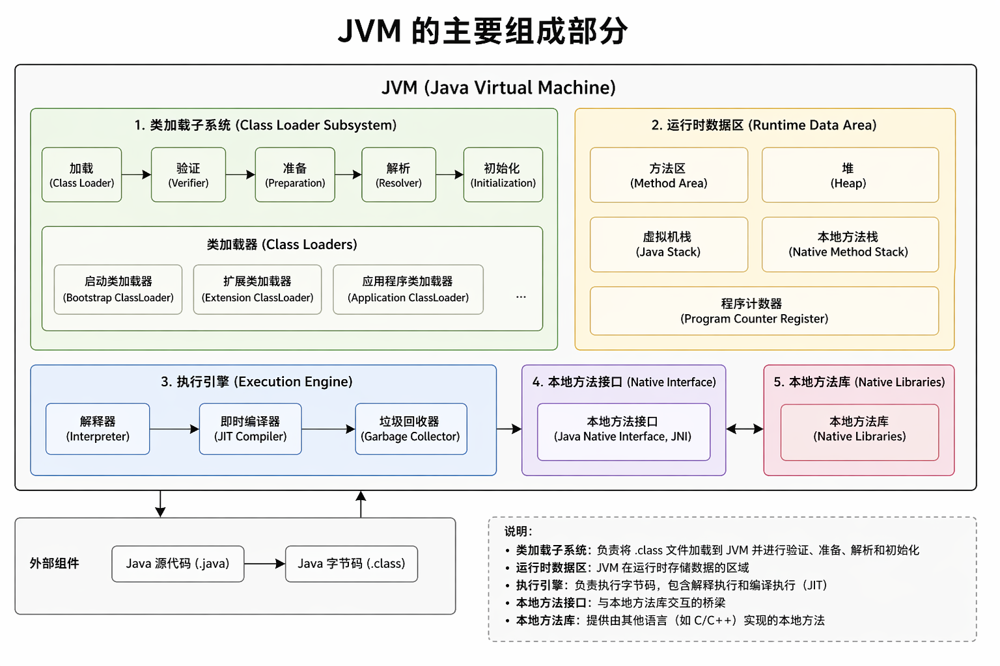
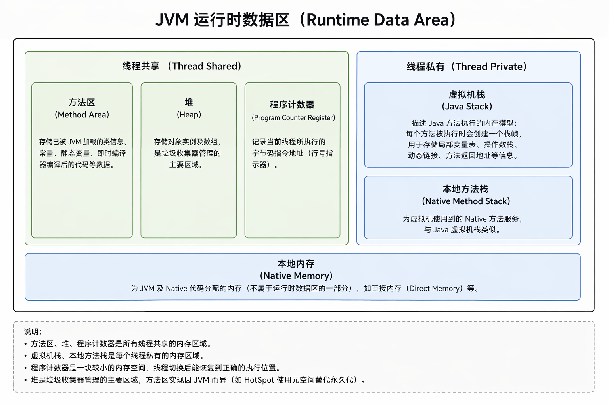
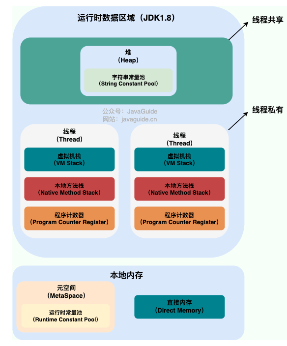
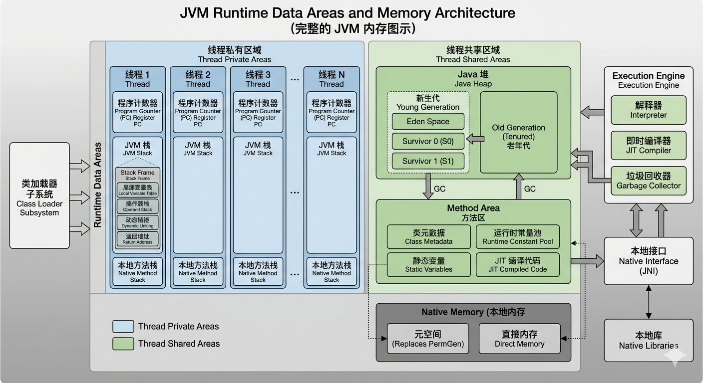
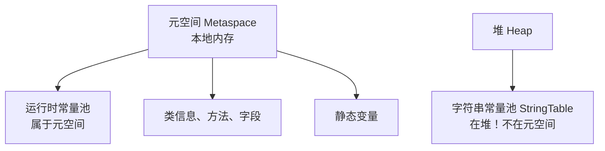
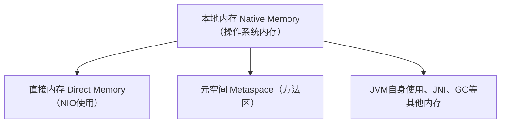
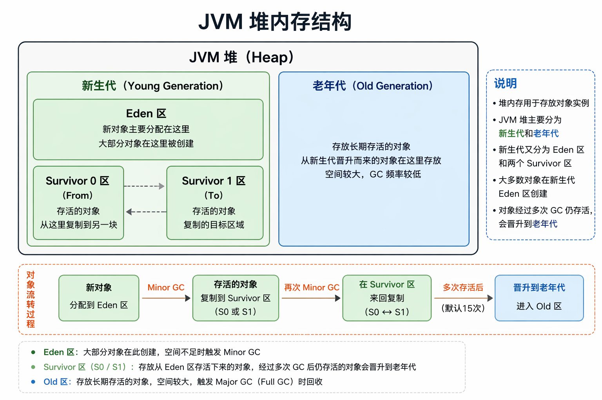

## jvm基础篇

整理黑马jvm基础篇内容

## 一、JVM 基础概念

1. **JVM 的主要组成部分有哪些？各自的作用是什么？**
    ➤ 类加载子系统、运行时数据区、执行引擎、本地方法接口（JNI）、垃圾回收系统。
2. **什么是 Java 内存区域（运行时数据区）？**
    ➤ 包括方法区（MetaSpace）、堆、虚拟机栈、本地方法栈、程序计数器。
3. **堆与栈的区别？**
    ➤ 栈存储局部变量、方法调用；堆存储对象实例；栈线程私有，堆线程共享。
4. **什么是栈帧？包含哪些信息？**
    ➤ 局部变量表、操作数栈、动态链接、方法出口。

------

### **1. JVM 的主要组成部分有哪些？各自的作用是什么？**

1. **类加载子系统**将 `.class` 文件加载到方法区，生成 `Class` 对象。  
2. 程序执行时，JVM 在堆中创建对象，**虚拟机栈/本地方法栈**记录方法调用，**程序计数器**跟踪执行位置。  
3. 执行引擎通过解释器或 JIT 编译器执行字节码，GC 负责回收堆中无用对象。  
4. 若需调用本地方法，通过 JNI 接口调用本地方法库中的实现。  

| 组成部分                                       | 作用                                                         |
| ---------------------------------------------- | ------------------------------------------------------------ |
| **类加载子系统（Class Loader Subsystem）**     | 负责加载 `.class` 字节码文件到内存中，执行加载、链接、初始化过程。 |
| **运行时数据区（Runtime Data Areas）**         | JVM 运行时内存结构，用于存储类信息、对象实例、方法栈帧、常量池等。 |
| **执行引擎（Execution Engine）**               | 解释执行或 JIT 编译字节码成机器指令，执行具体的 Java 指令集。 |
| **本地方法接口（JNI, Java Native Interface）** | 允许 Java 调用 C/C++ 本地代码。                              |
| **本地方法库（Native Libraries）**             | 存放通过 JNI 调用的底层函数库。                              |
| **垃圾回收系统（Garbage Collector, GC）**      | 自动管理内存分配与释放，清理无用对象，防止内存泄漏。         |

📘 **延伸面试点：**

- JVM 的实现有多个：HotSpot（主流）、OpenJ9、GraalVM。
- HotSpot 中的执行引擎由解释器 + JIT 编译器（C1/C2）组成。



#### 一、类加载子系统（Class Loading Subsystem）

##### 作用：负责将 `.class` 字节码文件加载到 JVM 中，并转化为可使用的类信息。

##### 核心流程（类加载的“三步曲”）：

1. **加载（Loading）**：  
   通过类的全限定名（如 `java.lang.String`），从文件、网络或内存中读取 `.class` 字节流，生成代表该类的 `Class` 对象（存储在方法区）。  
   - 加载器：由不同的类加载器完成（Bootstrap、Extension、Application/System 类加载器，遵循“双亲委派模型”避免类重复加载）。

2. **链接（Linking）**：  
   - **验证（Verification）**：检查 `.class` 文件的格式合法性（如魔数、版本号）、语义正确性（如是否符合 Java 语法规范），防止恶意字节码危害 JVM。  
   - **准备（Preparation）**：为类的静态变量（`static`）分配内存并设置默认值（如 `int` 默认为 0，`boolean` 默认为 `false`），不包含实例变量（实例变量在对象创建时分配）。  
   - **解析（Resolution）**：将类中的符号引用（如代码中引用的类名、方法名）转化为直接引用（内存地址），让 JVM 能直接定位到目标。

3. **初始化（Initialization）**：  
   执行类的静态代码块（`static {}`）和静态变量的赋值语句（如 `static int a = 10;`），按照代码书写顺序执行。这是类加载的最后一步，标志着类正式可用。

#### 二、运行时数据区（Runtime Data Area）

**作用：**JVM 运行时的内存分配区域，用于存储程序执行过程中的数据（如变量、对象、方法等），是 JVM 管理内存的核心区域。

##### **JVM 运行时数据区结构图示**

**这里图示有错误，程序计数器是线程私有的。**



JVM 在运行时划分的内存区域，用于存储程序执行过程中的数据，是面试核心考点，分为 **线程共享区** 和 **线程私有区**：

##### 1. 线程共享区（所有线程共用，随 JVM 启动/关闭创建/销毁）

- **方法区（Method Area）**：
  - 存储类信息（类名、父类、接口、方法、字段等）、常量池（字符串常量、符号引用等）、静态变量、即时编译（JIT）后的代码。
  - JDK 8 及以上用 **元空间（Metaspace）** 实现（物理内存中分配，默认无上限，受系统内存限制）；JDK 7 及以下用 **永久代（PermGen）** 实现（堆内存中分配，大小固定，易溢出）。

- **堆（Heap）**：
  - JVM 中最大的内存区域，存储所有对象实例和数组，是垃圾回收（GC）的主要区域。
  - 按对象存活周期划分为：
    - 年轻代（Young Generation）：分为 Eden 区（新对象优先分配）和两个 Survivor 区（From/To，对象存活一次 GC 后复制至此）；
    - 老年代（Old Generation）：存放存活时间长的对象（多次 GC 后仍存活的对象）；
  - 堆内存不足时抛出 `OutOfMemoryError: Java heap space`。

##### 2. 线程私有区（每个线程独立创建，随线程启动/结束销毁）

- **程序计数器（Program Counter Register）**：
  - 记录当前线程执行的字节码指令地址（如即将执行的指令索引），线程切换时通过它恢复执行位置。
  - 唯一不会抛出 `OutOfMemoryError` 的区域。

- **虚拟机栈（VM Stack）**：
  - 存储方法调用的栈帧（Stack Frame），每个栈帧包含局部变量表（方法参数、局部变量）、操作数栈（计算过程中的临时数据）、返回地址（方法执行完后回到的位置）等。
  - 栈深度超过 JVM 限制时抛出 `StackOverflowError`；栈内存申请失败时抛出 `OutOfMemoryError`。

- **本地方法栈（Native Method Stack）**：
  - 功能与虚拟机栈类似，但专为本地方法（Native Method，如 C/C++ 实现的方法）服务。
  - 异常类型与虚拟机栈一致（`StackOverflowError` 或 `OutOfMemoryError`）。


#### 三、执行引擎（Execution Engine）

##### 作用：负责执行运行时数据区中的字节码指令，是 JVM 的“CPU”。

##### 核心组件与工作方式：

1. **解释器（Interpreter）**：  
   逐行解释字节码指令并执行，启动速度快，但执行效率低（因为每次执行都需要重新解释）。

2. **即时编译器（JIT Compiler，Just-In-Time Compiler）**：  
   为解决解释器效率低的问题，JIT 会将**频繁执行的热点代码（如循环、常用方法）** 编译为本地机器码（直接被 CPU 执行），并缓存起来，后续执行直接使用机器码，提升效率。  
   - JVM 通常采用“解释执行 + 即时编译”的混合模式（如 HotSpot 虚拟机），平衡启动速度和运行效率。

3. **垃圾回收器（Garbage Collector，GC）**：  
   虽然属于内存管理的一部分，但通常归为执行引擎的子模块，负责自动回收堆中不再使用的对象（无引用的对象），释放内存。  
   - 核心算法：标记-清除、复制、标记-整理、分代收集等，不同 GC 实现（如 SerialGC、ParallelGC、G1、ZGC）适用于不同场景。

#### 四、本地方法接口（Native Method Interface，JNI）

##### 作用：作为 Java 代码与本地代码（如 C、C++）的桥梁，允许 Java 调用非 Java 实现的方法（native 方法）。

##### 典型场景：

- 当 Java 无法直接操作底层硬件或系统资源时（如操作系统内核调用、图形渲染），通过 JNI 调用本地方法实现。  
- JDK 源码中许多基础类（如 `java.lang.Thread`、`java.io.File`）的核心功能依赖 native 方法（如线程的启动、文件的读写）。

#### 五、本地方法库（Native Libraries）

##### 作用：存储 JNI 调用的本地方法实现（如 C/C++ 编写的库文件），是 native 方法的实际执行者。

##### 示例：

- Windows 系统中可能是 `.dll` 文件，Linux 系统中可能是 `.so` 文件，这些文件由操作系统提供或第三方开发，供 JNI 接口调用。


------

### **2. 什么是 Java 内存区域（运行时数据区）？**

**答：**
 Java 程序运行时，JVM 会在内存中划分多个区域用于管理数据：

| 区域名称                                             | 是否线程共享 | 作用                                                   |
| ---------------------------------------------------- | ------------ | ------------------------------------------------------ |
| **程序计数器（PC Register）**                        | 否           | 每个线程都有，用于记录下一条将要执行的字节码指令地址。 |
| **虚拟机栈（VM Stack）**                             | 否           | 保存栈帧（方法调用信息、局部变量、操作数栈等）。       |
| **本地方法栈（Native Method Stack）**                | 否           | 服务于 JNI 调用的本地方法。                            |
| **堆（Heap）**                                       | ✅ 是         | 存储对象实例，是 GC 管理的主要区域。                   |
| **方法区（Method Area）**（JDK8 之后改为 Metaspace） | ✅ 是         | 存放类信息、常量、静态变量、JIT 编译代码等。           |

📘 **延伸考点：**

- **JDK8 以后**：永久代（PermGen）被移除，改为使用 **本地内存的 Metaspace**。
- 堆由 **新生代（Eden + Survivor）** 和 **老年代（Tenured）** 组成。

#### 内存区域图示



#### JVM内存图示




### 元空间（Metaspace）

#### 一、元空间（Metaspace）核心定义

元空间是 **JDK 8 取代永久代（PermGen）** 的内存区域，属于**本地内存（Native Memory）**（而非 JVM 堆内存），用于存储类的元数据（类结构、方法信息、常量池、注解等），是 JVM 实现类加载机制的核心区域。

#### 二、元空间 vs 永久代（核心区别）

| 特性     | 永久代（PermGen，JDK 7及以前）        | 元空间（Metaspace，JDK 8+）                |
| -------- | ------------------------------------- | ------------------------------------------ |
| 内存归属 | JVM 堆内存（新生代/老年代同区）       | 操作系统本地内存（堆外内存）               |
| 内存上限 | 默认有限制（如64MB/128MB）            | 默认无上限（受物理内存限制）               |
| 溢出异常 | `java.lang.OutOfMemoryError: PermGen` | `java.lang.OutOfMemoryError: Metaspace`    |
| 核心参数 | `-XX:PermSize`/`-XX:MaxPermSize`      | `-XX:MetaspaceSize`/`-XX:MaxMetaspaceSize` |

#### 三、元空间核心参数

##### 1. 关键配置（JVM 启动参数）

| 参数                        | 作用                                                         |
| --------------------------- | ------------------------------------------------------------ |
| `-XX:MetaspaceSize`         | 元空间初始阈值（触发 Full GC 的初始大小），默认约 21MB       |
| `-XX:MaxMetaspaceSize`      | 元空间最大上限（默认无限制），建议设置（如 256MB）避免占满本地内存 |
| `-XX:MinMetaspaceFreeRatio` | 元空间空闲比例下限，低于该值则扩容（默认 40）                |
| `-XX:MaxMetaspaceFreeRatio` | 元空间空闲比例上限，高于该值则缩容（默认 70）                |

##### 2. 示例配置

```bash
# 设置元空间初始阈值64MB，最大上限256MB
java -XX:MetaspaceSize=64m -XX:MaxMetaspaceSize=256m YourApplication
```

#### 四、元空间的内存管理机制

1. **初始化**：JVM 启动时分配初始元空间（基于 `MetaspaceSize`），存储启动类加载器加载的核心类（如 `java.lang.String`）。
2. **扩容**：当元空间使用量达到 `MetaspaceSize` 时，触发 Full GC 清理无用类元数据；若仍不足，则自动扩容（直到 `MaxMetaspaceSize`）。
3. **缩容**：GC 后若元空间空闲比例超过 `MaxMetaspaceFreeRatio`，会自动释放多余内存。
4. **类卸载**：只有当类的**类加载器**被回收时，其加载的类元数据才会被卸载（如自定义类加载器销毁），否则元数据永久占用空间。

#### 五、元空间溢出（OOM）的常见原因 & 解决方案

##### 1. 溢出原因

- 频繁动态生成类（如动态代理、反射、ASM 字节码生成、Spring/CGLIB 代理），导致类元数据堆积；
- 未设置 `MaxMetaspaceSize`，元空间占满物理内存；
- 类加载器泄露（如自定义类加载器未销毁，导致类元数据无法卸载）。

##### 2. 解决方案

- 临时方案：调大 `MaxMetaspaceSize`（如 `-XX:MaxMetaspaceSize=512m`）；
- 根本方案：
  ① 排查并修复类加载器泄露（如关闭无用的自定义类加载器）；
  ② 减少不必要的动态类生成（如缓存动态代理实例）；
  ③ 开启类卸载日志排查：`-XX:+TraceClassUnloading -XX:+TraceClassLoading`。

#### 六、核心特性总结

1. **内存归属**：元空间是本地内存，不受 JVM 堆大小限制，彻底解决了永久代内存溢出的“历史痛点”；
2. **动态扩缩容**：默认随使用量动态调整，建议显式设置 `MaxMetaspaceSize` 避免占用过多系统内存；
3. **类卸载规则**：类元数据的卸载依赖类加载器的回收，这是元空间内存管理的核心；
4. **溢出风险**：虽无默认上限，但动态生成大量类仍会导致 Metaspace OOM，需关注类加载器和动态类生成逻辑。

#### 总结

1. 元空间是 JDK 8 替代永久代的类元数据存储区，使用本地内存，默认无上限；
2. 核心参数是 `MetaspaceSize`（初始阈值）和 `MaxMetaspaceSize`（最大上限），建议显式配置；
3. 元空间溢出多因动态类生成或类加载器泄露，需结合日志排查类加载/卸载逻辑；
4. 与永久代相比，元空间的优势是内存不受堆限制，劣势是若不限制可能占用过多系统内存。


### 元空间 & 运行时常量池

**运行时常量池 是 元空间 的一部分。**
元空间 = 方法区的实现
运行时常量池 = 方法区里的一块数据

在 JDK 8+ 的 HotSpot JVM 中，**运行时常量池逻辑上是方法区的一部分，物理上存放在元空间（Metaspace）里**，而字符串常量池则在 Java 堆中。

---

#### 1. 先理清三代变化（面试必考）

##### JDK 1.6 及以前

- 方法区 = **永久代（PermGen）**（在堆里）
- 运行时常量池 **在永久代**
- 字符串常量池 **也在永久代**

##### JDK 1.7

- 方法区还在永久代
- **字符串常量池 移到 堆**
- 运行时常量池 **仍在永久代**

##### JDK 1.8 及以后（现在）

- **永久代被删除**
- 方法区 = **元空间（Metaspace）**
- **运行时常量池 放在 元空间**
- 字符串常量池 **仍在堆**

---

#### 2. 元空间（Metaspace）到底是什么？

- **元空间 = JDK8+ 方法区的落地实现**
- 位于**本地内存（Native Memory）**，不在堆
- 存储：
  1. 类的结构信息（全类名、父类、接口）
  2. 方法信息（代码、访问标志、注解）
  3. 字段信息
  4. **运行时常量池**
  5. 静态变量（static 变量）

一句话：
**元空间 = 放“类的元数据”的本地内存。**

---

#### 3. 运行时常量池（Runtime Constant Pool）是什么？

每个类被加载后，**Class 文件里的常量池**会被加载到内存，变成：
**运行时常量池**

它存储两类东西：
1. **字面量（Literal）**
   - 字符串字面量（但**对象实例在堆，池里存引用**）
   - final 常量值
2. **符号引用（Symbolic Reference）**
   - 类/接口全限定名
   - 字段名 + 描述符
   - 方法名 + 描述符

作用：**为动态链接服务**（运行时把符号引用变成真实内存地址）

---

#### 4. 最关键关系（画图表）




- **元空间**：**整个方法区**，存类元数据，在本地内存。
- **运行时常量池**：**元空间里面的一小块**，存类的常量与符号引用。

---

#### 5. 高频面试坑题（你一定会遇到）

##### Q：运行时常量池在堆还是元空间？

**A：JDK8+ 在元空间。**

##### Q：字符串常量池在堆还是元空间？

**A：在堆！绝对不在元空间！**

##### Q：运行时常量池 和 字符串常量池 是什么关系？

**A：完全不同区域。**

- 字符串常量池：**堆**，全局唯一，缓存字符串对象
- 运行时常量池：**元空间**，每个类一个，存字面量和符号引用

---

#### 最终极简总结（背这个）

1. **元空间 = JDK8+ 方法区，在本地内存**
2. **运行时常量池 = 元空间的一部分**
3. **字符串常量池 = 在堆，和元空间无关**
4. 类加载 → Class 常量池 → 变成**运行时常量池（元空间中）**

### **本地内存、直接内存、元空间**

#### 一句话终极区分

1. **本地内存（Native Memory）**
   = **操作系统给 JVM 进程用的、不属于 JVM 堆的所有内存**。
   → 是**大概念**。

2. **直接内存（Direct Memory）**
   = **Java NIO 使用的、直接申请的本地内存**。
   → 是**本地内存的一部分**。

3. **元空间（Metaspace）**
   = **存储类信息、方法、常量的本地内存**。
   → 也是**本地内存的一部分**。

#### 关系图（超级清晰）




#### 1. 本地内存（Native Memory）

- **不属于 JVM 托管的堆内存**
- 是**整个 JVM 进程可以使用的系统内存**
- 不受 `-Xmx` 限制
- 包括：元空间、直接内存、JVM 自身运行内存、JNI 内存、GC 内存等

一句话：
**本地内存 = JVM 进程能用但不归 GC 管的所有系统内存。**

---

#### 2. 直接内存（Direct Memory）

- 属于**本地内存的一种**
- 用于 **NIO（ByteBuffer.allocateDirect()）**
- 特点：
  - 不经过 Java 堆，**少一次拷贝（零拷贝）**
  - 读写速度快
  - 分配慢，因为要调用操作系统 API
  - 不受 GC 管理，需要**手动释放/或基于 Cleaner 机制释放**

一句话：
**直接内存 = NIO 专用的一块本地内存，用来提升 IO 效率。**

---

#### 3. 元空间（Metaspace）

- 属于**本地内存的一种**
- JDK8 以后用来替代**永久代（PermGen）**
- 存储：
  - 类信息（Class 对象）
  - 方法信息
  - 字段描述
  - 运行时常量池
- 不受堆大小限制，**默认只受机器物理内存限制**

一句话：
**元空间 = 放在本地内存里的“方法区”。**

##### 本地内存 VS 直接内存

- **本地内存：大概念，所有非堆内存。**
- **直接内存：小概念，NIO 使用的那一块本地内存。**

##### 直接内存 VS 堆内存

- 堆内存：GC 管理，读写稍慢，分配快
- 直接内存：OS 管理，**读写极快，分配慢**，用于 NIO 缓冲区

##### 元空间 VS 直接内存

**都在本地内存，完全两回事：**
- 元空间：存**类、方法、常量**
- 直接内存：存**NIO 缓冲区数据**

---

#### 最精简总结

1. **本地内存 = 非堆的所有系统内存（大概念）**
2. **直接内存 = NIO 使用的本地内存（小概念）**
3. **元空间 = 方法区，也在本地内存**
4. **直接内存 + 元空间 + JVM自身内存 = 本地内存**

### 字符串常量池 vs 运行时常量池

这两个是JVM内存中最容易混淆的概念，我会从**核心定义、存储位置、生命周期、核心区别、经典案例**5个维度彻底讲透，帮你一次搞懂，面试不踩坑。

---

#### 一、先给核心结论（一句话区分）

- **运行时常量池（Runtime Constant Pool）**：是**方法区（元空间）**的一部分，存储**类加载时的所有常量信息**（字面量+符号引用），是Class文件常量池的运行时版本。
- **字符串常量池（String Constant Pool / String Table）**：是**堆内存**的一部分，专门存储**字符串字面量**，是全局唯一的缓存池，用于避免重复创建字符串对象。

---

#### 二、分区域详细拆解

##### 1. 运行时常量池（Runtime Constant Pool）

###### 核心定义

每个类加载到JVM时，都会将Class文件中的`constant_pool`（常量池）加载到方法区，形成**运行时常量池**，是类的元数据的一部分。

###### 存储内容

分为两大类：
- **字面量**：文本字符串、基本类型常量（如`final int a = 1`）、`final`修饰的常量
- **符号引用**：类/接口的全限定名、字段名和描述符、方法名和描述符（用于动态链接，解析为直接引用）

###### 存储位置（JDK版本差异）

| JDK版本       | 方法区实现                    | 运行时常量池位置   |
| ------------- | ----------------------------- | ------------------ |
| JDK 1.6及之前 | 永久代（PermGen）             | 永久代（堆内）     |
| JDK 1.7       | 永久代逐步移除                | 堆内存（与堆共享） |
| JDK 1.8及之后 | 元空间（MetaSpace，本地内存） | 元空间（本地内存） |

###### 核心特点

- **类级别的资源**：每个类对应一个运行时常量池，随类加载而创建，类卸载而销毁
- **动态性**：运行期间可动态添加常量（如`String.intern()`）
- **线程共享**：属于方法区，所有线程共享

---

##### 2. 字符串常量池（String Constant Pool / String Table）

###### 核心定义

JVM为了优化字符串创建性能，在堆中维护的一个**全局唯一的哈希表（StringTable）**，专门缓存字符串字面量，避免重复创建相同内容的字符串对象，节省内存。

###### 存储内容

仅存储**字符串字面量**（如`"abc"`），不存储其他类型的常量。

###### 存储位置（JDK版本差异）

| JDK版本       | 字符串常量池位置 |
| ------------- | ---------------- |
| JDK 1.6及之前 | 永久代（堆内）   |
| JDK 1.7及之后 | 堆内存（Heap）   |

###### 核心特点

- **全局唯一**：整个JVM进程只有一个字符串常量池，所有线程共享
- **缓存机制**：创建字符串时，先检查池中是否存在相同内容，存在则直接返回引用，不存在则创建并放入池中
- **`String.intern()`方法**：手动将字符串对象放入池中（JDK1.7+逻辑变化，是高频考点）
- **GC回收**：堆内存中的字符串常量池，在无引用时可被GC回收（JDK1.7+）

---

#### 三、核心区别对比表（面试直接背）

| 对比维度           | 运行时常量池                   | 字符串常量池                       |
| ------------------ | ------------------------------ | ---------------------------------- |
| **所属区域**       | 方法区（元空间，JDK8+）        | 堆内存（Heap，JDK7+）              |
| **存储内容**       | 所有常量（字面量+符号引用）    | 仅字符串字面量                     |
| **生命周期**       | 随类加载创建，类卸载销毁       | 全局唯一，随JVM进程存在（可GC）    |
| **数量**           | 每个类对应一个                 | 整个JVM只有一个                    |
| **核心作用**       | 支持类的动态链接、存储类元数据 | 缓存字符串，避免重复创建，节省内存 |
| **`intern()`关联** | 仅存储字符串字面量的引用       | `intern()`的核心操作对象           |

---

#### 四、经典面试题：`String.intern()` 方法（JDK版本差异）

这是两个常量池最核心的联动考点，也是面试必问：
##### 1. 方法作用

`String.intern()`：如果字符串常量池中存在该字符串，直接返回池中的引用；如果不存在，将该字符串的引用（JDK1.7+）/副本（JDK1.6）放入池中，再返回引用。

##### 2. JDK版本差异（核心考点）

###### JDK 1.6及之前

- 字符串常量池在永久代，`intern()`会**在堆中创建字符串副本，放入永久代的常量池**，返回永久代中的引用。
- 堆中的原对象和池中的对象是两个不同的对象。

###### JDK 1.7及之后

- 字符串常量池移到堆中，`intern()`**不再创建副本，直接将堆中对象的引用存入常量池**，返回该引用。
- 堆中的原对象和池中的对象是同一个对象。

##### 3. 经典代码案例（JDK1.8+）

```java
public class StringPoolTest {
    public static void main(String[] args) {
        String s1 = new String("abc");
        s1.intern();
        String s2 = "abc";
        System.out.println(s1 == s2); // false

        String s3 = new String("def") + new String("ghi");
        s3.intern();
        String s4 = "defghi";
        System.out.println(s3 == s4); // true
    }
}
```
###### 代码解析（JDK1.8+）

- **s1 vs s2**：`new String("abc")`会先在字符串常量池创建`"abc"`，再在堆中创建s1对象；`s1.intern()`发现池中有`"abc"`，直接返回引用；s2直接从池中取引用。s1是堆中对象，s2是池中对象，所以`false`。
- **s3 vs s4**：`new String("def") + new String("ghi")`只会在池创建`"def"`和`"ghi"`，不会创建`"defghi"`；`s3.intern()`将堆中s3的引用存入池；s4从池中取s3的引用，所以`true`。

---

#### 五、补充：JDK1.7+ 两大关键变更（面试加分项）

1. **字符串常量池从永久代移到堆**
   - 原因：永久代内存小，容易OOM；堆内存大，可GC，避免内存泄漏。
   - 影响：字符串常量可被GC回收，`intern()`逻辑变更。

2. **运行时常量池从永久代移到元空间**
   - 原因：永久代与堆共享内存，容易OOM；元空间使用本地内存，仅受物理内存限制。
   - 影响：类元数据不再受JVM堆大小限制，减少OOM风险。

---

#### 六、一句话总结（面试收尾用）

运行时常量池是**类的元数据容器**，存在方法区，存储所有常量；字符串常量池是**字符串的全局缓存池**，存在堆中，仅存储字符串字面量，两者是包含与被包含的关系（字符串字面量会同时出现在运行时常量池和字符串常量池）。


------

### **3. 堆与栈的区别？**

| 对比项   | **堆（Heap）**     | **栈（Stack）**                  |
| -------- | ------------------ | -------------------------------- |
| 存储内容 | 对象实例、数组     | 方法调用信息、局部变量、操作数栈 |
| 管理方式 | 由 GC 自动管理     | 由线程自动创建与销毁             |
| 作用范围 | 线程共享           | 线程私有                         |
| 生命周期 | 与 JVM 同生共死    | 与线程生命周期一致               |
| 性能开销 | 较高，需 GC 管理   | 较快，直接内存操作               |
| 线程安全 | 需同步机制（如锁） | 线程私有，无需同步               |

📘 **延伸面试点：**

- 对象在堆上分配，但**逃逸分析**可使对象在栈上分配（栈上分配优化）。
- 栈溢出异常：`StackOverflowError`；堆溢出异常：`OutOfMemoryError: Java heap space`。

------

### **4. 什么是栈帧？包含哪些信息？**

**答：**
 栈帧（Stack Frame）是 **虚拟机栈的基本单位**，每当方法被调用时，JVM 会为该方法创建一个栈帧，方法执行结束后栈帧被销毁。

**栈帧主要包括以下内容：**

| 组成部分                               | 说明                                                   |
| -------------------------------------- | ------------------------------------------------------ |
| **局部变量表（Local Variable Table）** | 存放方法参数与局部变量（int、long、引用等）。          |
| **操作数栈（Operand Stack）**          | 存放操作数及计算中间结果，用于字节码指令计算。         |
| **动态链接（Dynamic Linking）**        | 指向运行时常量池中引用的方法或字段，用于解析符号引用。 |
| **方法返回地址（Return Address）**     | 记录调用方法的字节码地址（方法执行完后返回位置）。     |
| **附加信息（Additional Info）**        | 包括异常处理表、调试信息等。                           |

📘 **延伸考点：**

- JVM 的方法调用指令：`invokestatic`, `invokevirtual`, `invokespecial`, `invokeinterface`。
- 每次方法调用都会压栈帧，方法返回后弹栈帧。
- 栈帧过深 → 抛出 `StackOverflowError`。

------

✅ **小结图示：**

```
┌────────────────────────────┐
│         JVM 结构图          │
├────────────────────────────┤
│ Class Loader Subsystem     │ ← 加载 class 文件
├────────────────────────────┤
│ Runtime Data Areas         │ ← 方法区、堆、栈、程序计数器
├────────────────────────────┤
│ Execution Engine            │ ← 解释执行 + JIT 编译
├────────────────────────────┤
│ Native Interface (JNI)     │ ← 调用本地代码
├────────────────────────────┤
│ Garbage Collector           │ ← 自动内存回收
└────────────────────────────┘
```

### 5.JVM的实现

JVM（Java 虚拟机）的实现是指具体厂商或组织根据《Java 虚拟机规范》开发的可运行软件，其核心目标是**执行 Java 字节码**并保证跨平台性。不同的 JVM 实现在遵循规范的基础上，可能在性能优化、垃圾回收、即时编译等方面有不同的设计，以适应不同的应用场景（如桌面应用、服务器、嵌入式设备等）。

#### 一、JVM 实现的核心原则

所有 JVM 实现必须严格遵守 **《Java 虚拟机规范》**（由 Oracle 维护，定义了字节码格式、类加载机制、运行时数据区结构、指令集等），以保证“一次编写，到处运行”（WORA）：  
- 无论在 Windows、Linux 还是 macOS 上，相同的 `.class` 字节码在任何合规 JVM 中必须产生相同的逻辑结果。  
- 规范仅定义“做什么”，不限制“怎么做”，因此不同实现可在性能、内存管理等方面自由优化。

#### 二、主流 JVM 实现及特点

##### 1. HotSpot VM（最主流、应用最广）

- **开发者**：最初由 Sun 公司开发，后被 Oracle 收购，是 JDK（Oracle JDK、OpenJDK）的默认 JVM。  
- **核心特点**：  
  - **热点代码优化**：通过 JIT 编译器（C1 客户端编译器、C2 服务器编译器）将频繁执行的“热点代码”编译为本地机器码，大幅提升执行效率。  
  - **分代垃圾回收**：支持多种 GC 算法（如 SerialGC、ParallelGC、G1、ZGC、Shenandoah），可根据应用场景（吞吐量优先、低延迟优先）选择。  
  - **混合执行模式**：结合解释器（快速启动）和 JIT 编译（高效运行），平衡启动速度和长期性能。  
- **适用场景**：服务器应用、桌面程序、移动设备（早期 Android 基于 HotSpot 衍生）等几乎所有 Java 应用。

##### 2. OpenJ9（高性能、轻量级）

- **开发者**：最初由 IBM 开发，后捐献给 Eclipse 基金会，更名为 Eclipse OpenJ9。  
- **核心特点**：  
  - **内存占用低**：相比 HotSpot，相同应用的内存消耗更小，适合资源受限场景（如容器、云原生应用）。  
  - **启动速度快**：优化了类加载和初始化流程，尤其在微服务等短生命周期应用中表现优异。  
  - **JIT 优化**：采用“共享类数据”技术，可在多个 JVM 实例间共享已编译的机器码，减少重复编译开销。  
- **适用场景**：云原生、微服务、嵌入式设备、大型企业级应用（如 IBM WebSphere 服务器）。

##### 3. GraalVM（多语言支持、极致性能）

- **开发者**：Oracle 开发的新一代虚拟机，不仅支持 Java，还支持 JavaScript、Python、Ruby 等多种语言。  
- **核心特点**：  
  - **多语言统一运行时**：通过 Truffle 框架将不同语言编译为中间表示（IR），统一由 Graal JIT 编译优化，避免跨语言调用开销。  
  - **AOT 编译**：支持“提前编译”（Ahead-of-Time Compilation），可将 Java 程序直接编译为本地机器码（类似 C/C++），启动速度极快且无需 JIT 预热。  
  - **Substrate VM**：轻量级运行时，可将 Java 程序编译为独立可执行文件（无 JVM 依赖），适合容器化和边缘计算。  
- **适用场景**：多语言混合开发、需要极致启动速度的应用（如 Serverless）、原生镜像（Native Image）部署。

##### 4. JRockit（专注服务器端，已整合）

- **开发者**：最初由 BEA 公司开发，后被 Oracle 收购，专注于服务器端高性能应用。  
- **核心特点**：  
  - 无解释器，完全依赖 JIT 编译（启动稍慢，但长期运行性能优异）。  
  - 针对大型企业级应用优化，支持大内存和高并发。  
- **现状**：Oracle 已将 JRockit 的优秀特性（如低延迟 GC）整合到 HotSpot 中，JRockit 本身不再单独维护。

##### 5. Dalvik VM 与 ART（Android 平台专用）

- **开发者**：Google 为 Android 开发，早期使用 Dalvik VM，Android 5.0 后替换为 ART（Android Runtime）。  
- **核心特点**：  
  - ** Dalvik VM**：执行 Dalvik 字节码（由 Java 字节码转换而来），采用寄存器架构（不同于 JVM 的栈架构），内存占用低。  
  - **ART**：支持 AOT 编译（安装时将字节码编译为机器码），提升运行速度（代价是安装时间和存储空间增加），替代了 Dalvik 的 JIT 实时编译。  
- **适用场景**：Android 应用（本质是 Java/Kotlin 程序的特殊运行时）。

#### 三、JVM 实现的核心技术差异

不同 JVM 实现的核心差异体现在**性能优化策略**上，主要包括：  
1. **编译策略**：  
   - HotSpot：解释器 + C1/C2 JIT（分层编译，兼顾启动和运行效率）。  
   - OpenJ9：JIT 编译 + 共享类数据（优化多实例场景）。  
   - GraalVM：Graal JIT（更先进的优化算法） + AOT 编译（静态编译）。  

2. **垃圾回收**：  
   - HotSpot：支持 G1（默认）、ZGC（低延迟）、Shenandoah（低暂停）等。  
   - OpenJ9：平衡回收器（Balanced GC）、metronome（实时 GC，低延迟）。  
   - GraalVM：Substrate VM 采用区域化内存管理（无传统 GC）。  

3. **内存模型**：  
   - 堆布局、方法区实现（如 HotSpot 的元空间、OpenJ9 的共享类缓存）不同，影响内存利用率和 GC 效率。  

#### 四、选择 JVM 实现的依据

- **应用场景**：服务器端高并发应用优先 HotSpot（成熟稳定）；云原生/微服务考虑 OpenJ9（轻量快速）；多语言或原生部署选 GraalVM。  
- **性能需求**：低延迟选 ZGC/Shenandoah（HotSpot）或 metronome（OpenJ9）；高吞吐量选 ParallelGC（HotSpot）。  
- **生态兼容性**：大部分框架默认适配 HotSpot，若使用特殊功能（如 GraalVM 的 Native Image）需确认框架支持。  

#### 总结

JVM 的实现是规范的具体落地，不同厂商通过优化编译、垃圾回收、内存管理等核心模块，形成了适应不同场景的虚拟机产品。其中，HotSpot 是最通用的选择，OpenJ9 适合轻量场景，GraalVM 代表未来多语言和原生部署的趋势。理解不同 JVM 实现的特点，有助于针对应用需求选择最优运行时环境。


### 面试1：Java 内存溢出问题的解决方法

Java 内存溢出（OutOfMemoryError）是开发中常见的问题，本质是「程序申请的内存超过了 JVM 所能分配的最大内存限制」。解决这类问题需要结合**内存模型分析**、**问题定位工具**和**代码优化手段**，以下是系统化的解决思路：

#### 一、先明确：内存溢出的常见类型及原因

不同区域的内存溢出，表现和原因不同，需针对性分析：
1. **Java 堆溢出（Java heap space）**  
   - 原因：对象创建过多且未被 GC 回收（如内存泄漏、大对象堆积、集合未清空）。  
   - 示例：循环创建大量对象并放入静态集合，导致对象常驻内存。

2. **方法区/元空间溢出（Metaspace/PermGen space）**  
   - 原因：类信息（类定义、方法、注解等）加载过多且未释放（如频繁动态生成类、依赖包过大）。  
   - 示例：使用 CGLib 动态代理生成大量代理类，或 JSP 页面频繁编译导致类爆炸。

3. **虚拟机栈/本地方法栈溢出（StackOverflowError）**  
   - 原因：方法调用栈深度过大（如递归调用无终止条件）。  
   - 注意：栈溢出通常抛出 `StackOverflowError`，但某些场景（如不断创建线程）也可能导致栈内存整体溢出（OOM）。

4. **直接内存溢出（Direct buffer memory）**  
   - 原因：NIO 直接内存（不受 JVM 堆管理）分配过多，超过系统限制。  
   - 示例：频繁使用 `ByteBuffer.allocateDirect()` 分配大内存，且未及时释放。

#### 二、解决内存溢出的核心步骤

##### 1. 复现问题，收集现场数据（关键）

内存溢出具有偶发性，需先稳定复现问题，再通过工具收集内存快照：
- **添加 JVM 参数**：启动时配置参数，记录内存溢出时的快照和日志：
  
  ```bash
  # 堆溢出时自动生成内存快照（.hprof文件）
  -XX:+HeapDumpOnOutOfMemoryError 
  -XX:HeapDumpPath=/path/to/dump.hprof
  # 打印GC日志，分析内存回收情况
  -XX:+PrintGCDetails -XX:+PrintGCDateStamps -Xloggc:/path/to/gc.log
  ```
- **监控实时内存**：使用 `jconsole` 或 `jvisualvm` 连接进程，实时观察堆内存、线程、类加载等指标，定位溢出前的异常波动。

##### 2. 分析内存快照，定位根因

利用工具分析收集到的 `.hprof` 快照和 GC 日志，找到内存泄漏或过度使用的源头：
- **工具选择**：  
  - 堆分析：MAT（Memory Analyzer Tool）、JProfiler、VisualVM（内置堆分析器）。  
  - 线程分析：jstack（生成线程栈快照，排查死锁或无限递归）。  
  - GC 分析：GCEasy（在线工具）、GCViewer（本地工具）。

- **关键分析点**：  
  - **堆溢出**：通过 MAT 的「支配树（Dominator Tree）」查看哪些对象占用内存最大，是否有异常引用链（如静态集合持有大量对象）。  
  - **方法区溢出**：检查类加载数量（`jmap -clstats <pid>`），是否有动态生成类的逻辑（如反射、代理）未限制。  
  - **栈溢出**：通过 `jstack` 查看线程栈深度，是否存在无限递归（如递归调用无终止条件）。  
  - **直接内存溢出**：检查 NIO 操作，是否有 `DirectByteBuffer` 未释放（需显式调用 `cleaner()` 或依赖 GC 回收）。

##### 3. 针对性优化（解决根本问题）

根据分析结果，从代码、JVM 参数、架构设计三方面优化：

###### （1）代码层面：修复内存泄漏和不合理内存使用

- **避免内存泄漏**：  
  - 及时清空不再使用的集合（`list.clear()`），避免静态集合（`static List`）无限制存储对象。  
  - 释放资源引用：如关闭流（IO/NIO）、断开数据库连接、移除监听器等，避免对象被无意识引用。  
  - 慎用单例模式：单例生命周期与 JVM 一致，若持有大对象或外部资源，易导致内存堆积。

- **优化对象创建**：  
  - 避免创建大对象（如超大数组、长字符串），可拆分处理（如分批读取大文件）。  
  - 复用对象：使用对象池（如数据库连接池）、享元模式（如字符串常量池）减少重复创建。  
  - 合理使用弱引用（`WeakReference`）：对于缓存场景，用弱引用存储临时对象，便于 GC 回收。

- **控制递归和线程创建**：  
  - 递归调用添加终止条件，或改为迭代实现（避免栈深度过大）。  
  - 线程池管理线程（`ExecutorService`），避免无限制创建线程（每个线程默认占用 1MB 栈内存）。

###### （2）JVM 参数调优：合理分配内存资源

根据应用特性调整内存区域大小，避免因参数不合理导致溢出：
- **堆内存调整**：  
  - 初始堆大小 `-Xms` 和最大堆大小 `-Xmx` 设为相同（避免频繁扩容），如 `-Xms2g -Xmx2g`。  
  - 年轻代与老年代比例：默认 1:2，可根据对象存活时间调整（如频繁创建短期对象，增大年轻代 `-Xmn`）。

- **方法区/元空间调整**：  
  - JDK 8+ 元空间（Metaspace）：`-XX:MetaspaceSize=256m -XX:MaxMetaspaceSize=512m`（避免动态扩展导致溢出）。  
  - JDK 7 及之前永久代（PermGen）：`-XX:PermSize=256m -XX:MaxPermSize=512m`。

- **直接内存调整**：  
  - 通过 `-XX:MaxDirectMemorySize=512m` 限制直接内存大小（默认与堆最大值相同）。

###### （3）架构层面：分散内存压力

- **分布式部署**：将单节点压力分散到多节点（如集群部署，避免单机内存不足）。  
- **数据分片**：大集合或缓存数据分片存储（如 Redis 集群分片），减少单节点内存占用。  
- **异步处理**：非实时任务通过消息队列（如 Kafka）异步处理，避免同步操作堆积对象。

#### 三、总结：解决内存溢出的核心原则

1. **先定位，后优化**：通过内存快照和日志工具找到溢出根因，避免盲目调参。  
2. **优先修复代码问题**：内存泄漏是最常见原因，需从代码层面解除不合理引用。  
3. **参数调优是辅助**：JVM 参数需结合应用特性（如对象生命周期、并发量）调整，而非越大越好。  
4. **预防大于解决**：上线前通过压测（如 JMeter）模拟高负载，提前发现内存瓶颈；生产环境部署监控（如 Prometheus + Grafana），实时告警内存异常。


5. 


### 缓存池

在 Java 中，“**缓存池**”并不是一个单一的、官方定义的 JVM 机制，而是对**多种用于复用对象或常量以提升性能的缓存技术**的统称。常见的“缓存池”包括：

- **字符串常量池（String Pool）**
- **Integer 等包装类缓存池（如 IntegerCache）**
- **Class 常量池 & 运行时常量池（Runtime Constant Pool）**

下面从 **分类、原理、位置、使用场景** 四个维度系统梳理 Java 中的各类“缓存池”。

------

#### 一、1. 字符串常量池（String Pool）

##### ✅ 本质

JVM 维护的一个**哈希表结构**，用于存储唯一的 `String` 对象引用。

##### 🔧 触发方式

- 字面量：`String s = "hello";` → 自动入池
- 手动：`new String("hello").intern();` → 显式入池

##### 📍 位置（JDK 版本）

| JDK  | 位置               |
| ---- | ------------------ |
| ≤6   | 永久代（PermGen）  |
| ≥7   | **堆内存（Heap）** |

##### 💡 特点

- 内容相同的字符串只存一份；
- 支持 GC（JDK 7+）；
- 提升 `==` 比较效率（但**不推荐依赖**）。

##### 📌 示例

```java
String a = "abc";
String b = "abc";
System.out.println(a == b); // true
```

------

#### 二、2. 包装类缓存池（Boxing Cache）

##### ✅ 本质

Java 标准库（`java.lang`）在**应用层实现的静态对象缓存**，用于自动装箱优化。

##### 🔧 涉及类型与范围

| 类型           | 缓存范围        | 可配置？                          |
| -------------- | --------------- | --------------------------------- |
| `Byte`         | -128 ~ 127      | ❌                                 |
| `Short`        | -128 ~ 127      | ❌                                 |
| `Long`         | -128 ~ 127      | ❌                                 |
| `Character`    | 0 ~ 127         | ❌                                 |
| `Integer`      | -128 ~ 127      | ✅（通过 `-XX:AutoBoxCacheMax=N`） |
| `Boolean`      | `TRUE`, `FALSE` | ❌（仅两个对象）                   |
| `Float/Double` | ❌ 无缓存        | —                                 |

##### 📍 位置

- **堆内存**（作为普通 Java 对象，由静态数组持有引用）

##### 💡 原理（以 `Integer` 为例）

```java
public static Integer valueOf(int i) {
    if (i >= -128 && i <= IntegerCache.high)
        return IntegerCache.cache[i + 128];
    return new Integer(i);
}
```

##### 📌 示例

```java
Integer a = 100, b = 100;
System.out.println(a == b); // true（缓存复用）

Integer c = 200, d = 200;
System.out.println(c == d); // false（超出范围，新建对象）
```

> ⚠️ **切记**：比较包装类请用 `equals()`！

------

#### 三、3. Class 常量池 & 运行时常量池

##### ✅ 本质

JVM 用于存储**编译期确定的常量和符号引用**的数据结构。

##### 🔧 分类

| 名称             | 生成时机                  | 内容                                | 位置                                           |
| ---------------- | ------------------------- | ----------------------------------- | ---------------------------------------------- |
| **Class 常量池** | 编译期（`.class` 文件中） | 字面量、类/方法/字段的符号引用      | `.class` 文件                                  |
| **运行时常量池** | 类加载时                  | Class 常量池的运行时表示 + 动态常量 | JDK 6：永久代；JDK 7+：**元空间（Metaspace）** |

##### 💡 作用

- 支持动态链接（将符号引用解析为直接引用）；
- 存储字符串字面量（但**字符串对象本身在字符串常量池**）；
- 是反射、动态代理等机制的基础。

##### 📌 示例（查看 Class 常量池）

```bash
javap -v MyClass.class
```

输出包含：

```
Constant pool:
   #1 = Methodref          #6.#20         // java/lang/Object."<init>":()V
   #2 = String             #21            // "hello"
   #3 = Class              #22            // com/example/MyClass
```

> 🔍 注意：`#2 = String #21` 表示这是一个字符串字面量的引用，其实际内容 `"hello"` 会被放入**字符串常量池**。

------

#### 四、对比总结表

| 缓存池类型         | 所属层级    | 存储内容                   | 位置（JDK 8+）          | 是否 JVM 内置 | 是否可 GC            |
| ------------------ | ----------- | -------------------------- | ----------------------- | ------------- | -------------------- |
| **字符串常量池**   | JVM         | `String` 对象引用          | **堆内存**              | ✅ 是          | ✅ 是                 |
| **Integer 缓存池** | Java 标准库 | `Integer` 对象（-128~127） | 堆内存（静态引用）      | ❌ 否          | ⚠️ 静态引用通常不回收 |
| **运行时常量池**   | JVM         | 符号引用、字面量描述       | **元空间（Metaspace）** | ✅ 是          | ✅（类卸载时）        |
| **Class 常量池**   | 编译产物    | 同上                       | `.class` 文件           | —             | —                    |

------

#### 五、常见误区澄清

##### ❌ 误区 1：“所有常量都在常量池”

- `new String("abc")` 创建的对象在堆，不在字符串常量池；
- `Integer i = 200` 超出缓存范围，对象在堆，无复用。

##### ❌ 误区 2：“缓存池 = 运行时常量池”

- 运行时常量池 ≠ 字符串常量池；
- Integer 缓存池完全独立于 JVM 常量池体系。

##### ❌ 误区 3：“== 比较包装类安全”

- 仅在缓存范围内可能为 `true`，**永远用 `equals()`**！

------

#### 六、最佳实践建议

1. **字符串比较**：始终用 `equals()`；
2. **避免依赖 `==` 判断对象相等性**；
3. **高频小整数**：可利用 Integer 缓存，但不要依赖；
4. **大字符串去重**：谨慎使用 `intern()`，避免常量池膨胀；
5. **理解自动装箱机制**：避免在循环中频繁装箱拆箱。

------

#### 七、一句话总结

> **Java 的“缓存池”是一个多层次体系：**  
>
> - **JVM 层**：字符串常量池 + 运行时常量池（元空间）  
> - **标准库层**：Integer/Byte 等包装类缓存（堆中静态数组）
>   它们共同目标是：**减少重复对象，提升性能，节省内存**。


### 字符串常量池

**字符串常量池（String Pool）** 是 Java 虚拟机（JVM）为优化字符串处理而设计的一种**内存缓存机制**，用于存储**字符串字面量（literal）** 和通过 `intern()` 方法显式加入的字符串对象。它的核心目标是：**避免重复创建内容相同的字符串对象，节省内存，提升性能**。

------

#### 一、字符串常量池的位置（JDK 版本差异）

| JDK 版本         | 字符串常量池位置             |
| ---------------- | ---------------------------- |
| **JDK 6 及之前** | **方法区（永久代 PermGen）** |
| **JDK 7 及之后** | **堆内存（Heap）**           |

> ✅ **为什么移到堆？**
> 永久代空间有限，大量字符串容易导致 `OutOfMemoryError: PermGen space`；堆内存更大、更灵活，且能被 GC 回收。

------

#### 二、工作原理

##### 1. **字面量创建：自动入池**

```java
String s1 = "hello";
String s2 = "hello";
```

- JVM 首次遇到 `"hello"` 时，会在常量池中创建一个对象；
- 再次遇到相同字面量时，**直接复用池中对象**；
- `s1 == s2` → `true`（引用同一对象）。

##### 2. **new String()：不自动入池**

```java
String s3 = new String("hello");
String s4 = new String("hello");
```

- `new` 关键字**强制在堆中创建新对象**；
- 即使内容相同，也是不同对象；
- `s3 == s4` → `false`；
- 但注意：`new String("hello")` 的构造参数 `"hello"` 本身仍是字面量，**会先放入常量池**（如果不存在）。

##### 3. **手动入池：`intern()` 方法**

```java
String s5 = new String("hello").intern();
String s6 = "hello";
System.out.println(s5 == s6); // true
```

- ```
  intern()
  ```

   会检查常量池：

  - 若存在相同内容的字符串 → 返回池中引用；
  - 若不存在 → 将当前字符串**加入池中**，并返回引用（JDK 7+ 是返回堆中对象的引用，但保证唯一性）。

------

#### 三、图解内存结构（JDK 8+）

```
堆内存（Heap）
┌───────────────────────┐
│  字符串常量池         │ ← 存放字面量和 intern() 后的字符串
│  "hello"              │
├───────────────────────┤
│  普通对象             │
│  new String("hello")  │ ← 堆中独立对象
└───────────────────────┘
```

> 💡 注意：JDK 7+ 的常量池虽然在堆中，但逻辑上仍是“池”，由 JVM 管理唯一性。

------

#### 四、经典面试题解析

##### ❓ 题目 1：

```java
String a = "hello";
String b = "hel" + "lo";
System.out.println(a == b); // ?
```

✅ **答案：`true`**  

> 编译期优化：`"hel" + "lo"` 被编译器合并为 `"hello"`，直接从常量池获取。

------

##### ❓ 题题目 2：

```java
String x = "hello";
String y = new String("hello");
String z = y.intern();
System.out.println(x == z); // ?
```

✅ **答案：`true`**  

> `y.intern()` 返回常量池中的 `"hello"` 引用，与 `x` 相同。

------

##### ❓ 题目 3：

```java
String p = "a" + new String("b");
String q = "ab";
System.out.println(p == q); // ?
```

✅ **答案：`false`**  

> `"a" + new String("b")` 在运行期拼接，结果是一个**新的堆对象**，不会自动入池。

------

#### 五、性能与内存影响

##### ✅ 优势：

- 减少重复对象，节省内存；
- `==` 比较更快（地址比较 vs 内容逐字符比较）。

##### ⚠️ 注意事项：

- 不要滥用 `intern()`

  ：  

  - JDK 6：大量调用可能导致 PermGen OOM；  
  - JDK 7+：虽在堆中，但常量池本身也有大小限制（可通过 `-XX:StringTableSize` 调整，默认 60013 桶）。

- **仅对确定会重复的字符串使用 `intern()`**（如枚举值、状态码等）。

------

#### 六、如何验证常量池行为？

##### 方法 1：使用 `==` 和 `equals()`

```java
String s1 = "test";
String s2 = "test";
String s3 = new String("test");

System.out.println(s1 == s2);     // true
System.out.println(s1 == s3);     // false
System.out.println(s1.equals(s3)); // true
```

##### 方法 2：查看字节码（javap）

```java
public void test() {
    String s = "hello";
}
```

编译后字节码中会看到：

```
ldc #2          // 从常量池加载 "hello"
```

------

#### 七、最佳实践

| 场景                     | 建议                                                    |
| ------------------------ | ------------------------------------------------------- |
| 字符串拼接（编译期确定） | 用字面量直接写，如 `"hello world"`                      |
| 字符串拼接（运行期）     | 用 `StringBuilder`（单线程）或 `StringBuffer`（多线程） |
| 判断字符串相等           | **永远用 `equals()`**，除非你 100% 确定来自常量池       |
| 高频重复字符串去重       | 考虑 `intern()`，但需测试性能和内存                     |

------

#### 八、总结

| 关键点       | 说明                                                       |
| ------------ | ---------------------------------------------------------- |
| **本质**     | JVM 维护的字符串缓存池，保证内容相同的字符串只存一份       |
| **触发方式** | 字面量自动入池；`new String()` 不入池；`intern()` 手动入池 |
| **位置**     | JDK 7+ 在堆内存                                            |
| **核心价值** | 内存优化 + 快速比较                                        |
| **陷阱**     | `new String()` 不共享；运行期拼接不入池                    |

> 🔑 **一句话记住**：
> **“双引号进池，new 出堆；想进池，调 intern。”**

理解字符串常量池，是掌握 Java 内存模型和编写高效字符串代码的关键！


------

##  二、类加载机制与双亲委派模型

1. **JVM 类加载过程包括哪些阶段？**
    ➤ 加载 → 验证 → 准备 → 解析 → 初始化。
2. **什么是双亲委派模型？为什么需要它？**
    ➤ 类加载器的层级委派机制：防止类重复加载、保证核心类安全性。
3. **类加载器有哪些类型？**
    ➤ Bootstrap、Extension、AppClassLoader、CustomClassLoader（用户自定义）。
4. **如何破坏双亲委派模型？为什么要这么做？**
    ➤ 自定义类加载器重写 `loadClass()`；典型场景：SPI、Tomcat、OSGi 模块化加载。


------

### **1️⃣ JVM 类加载过程包括哪些阶段？**

**答：**
 JVM 从 `.class` 文件加载类到内存的过程主要包括以下 **5 个阶段**：

| 阶段                         | 主要任务                                                     |
| ---------------------------- | ------------------------------------------------------------ |
| **加载（Loading）**          | 通过类加载器读取类的字节码（.class）文件，生成 `Class` 对象  |
| **验证（Verification）**     | 确保字节码符合 JVM 规范（如栈帧结构、访问权限、类型安全等）  |
| **准备（Preparation）**      | 为类变量（static）分配内存，并设置默认值（不执行初始化）     |
| **解析（Resolution）**       | 将常量池中的符号引用替换为直接引用（指向内存中的对象或方法） |
| **初始化（Initialization）** | 执行类构造方法 `<clinit>()`，初始化静态变量和静态块          |

> ✅ **注意**：加载、验证、准备阶段可交错执行，但初始化一定在类首次主动使用时触发（如 new 对象、访问静态变量、调用静态方法等）。

------

### **2️⃣ 什么是双亲委派模型？为什么需要它？**

**答：**
 双亲委派模型（Parent Delegation Model）是 **类加载器的工作机制**：

- 当一个类加载器加载某个类时，它会先 **委托父加载器** 尝试加载；
- 若父加载器无法完成，才由当前加载器加载。

**模型结构：**

```
BootstrapClassLoader（启动类加载器）
      ↑
ExtClassLoader（扩展类加载器）
      ↑
AppClassLoader（应用类加载器）
      ↑
CustomClassLoader（自定义类加载器）
```

**好处：**

- ✅ 避免重复加载同名类（类唯一性由其“类加载器+类名”共同确定）
- ✅ 保证核心类（如 `java.lang.*`）的安全性，防止用户自定义覆盖

> 例如：即使用户路径下存在 `java.lang.String.class`，也不会被加载，因为 `BootstrapClassLoader` 会优先加载 JDK 自带的核心类。

------

### **3️⃣ 类加载器有哪些类型？**

| 加载器                   | 作用                                | 加载路径                 | 是否可见             |
| ------------------------ | ----------------------------------- | ------------------------ | -------------------- |
| **BootstrapClassLoader** | 启动类加载器，加载核心类库          | `$JAVA_HOME/jre/lib`     | 不可见（C++ 实现）   |
| **ExtensionClassLoader** | 扩展类加载器                        | `$JAVA_HOME/jre/lib/ext` | Java 实现            |
| **AppClassLoader**       | 应用类加载器，加载 classpath 下的类 | `classpath`              | Java 实现            |
| **CustomClassLoader**    | 用户自定义类加载器                  | 用户定义                 | 可重写 `findClass()` |

**父子关系：**

```
Bootstrap → Extension → App → Custom
```

**示例：**

```java
ClassLoader cl = MyClass.class.getClassLoader();
System.out.println(cl);                      // AppClassLoader
System.out.println(cl.getParent());          // ExtClassLoader
System.out.println(cl.getParent().getParent()); // null (Bootstrap)
```

------

### **4️⃣ 如何破坏双亲委派模型？为什么要这么做？**

#### 一、先回顾：什么是双亲委派模型

1. 类加载器层级（从上到下）
   **启动类加载器(Bootstrap) → 扩展类加载器(Extension) → 应用类加载器(App) → 自定义类加载器**
2. 核心规则
   子类加载器收到加载请求，**先向上委托父加载器加载**；
   父加载器加载不了（找不到类），子类才自己加载。
3. 好处

- 避免类重复加载、保证核心类安全（防止篡改`java.lang.String`）
- 统一类加载优先级，保证JDK基础类全局唯一

---

#### 二、如何破坏双亲委派模型（三种方式，面试必背）

##### 方式1：重写 `loadClass()` 方法【经典破坏】

双亲委派的核心逻辑全部在 `ClassLoader#loadClass()` 中：
先委派父加载器 → 再自己加载。
**重写该方法，删掉向上委托逻辑，直接自己加载类**，即可强行破坏。

```java
protected Class<?> loadClass(String name, boolean resolve) {
    // 不调用super.loadClass，不委派父加载器
    // 直接自定义findClass加载
    return findClass(name);
}
```

> JDK1.2 之前就是这么干的，后来为了安全引入双亲委派。

---

##### 方式2：自定义类加载器，直接**主动绕过父加载器**

不遵循「向上委托」，收到类加载请求直接由当前加载器读取字节码、定义类，
完全不交给上层加载器处理，强行打破委派规则。

---

##### 方式3：线程上下文类加载器 `Thread.getContextClassLoader()`【主流破坏方式】

**SPI 核心破坏方案（最常用）**

- 双亲委派：上层加载器只能调用下层加载器无法加载的类
- 上下文类加载器：**上层代码可以使用下层应用类加载器**
  典型场景：JDBC、SPI、Spring、Dubbo 大量使用。

原理：
启动类加载器加载核心SPI接口，但实现类由第三方jar提供，需要**反向委派**，
用上下文类加载器反向加载下层实现类，破坏单向双亲委派。

---

#### 三、为什么要破坏双亲委派模型？（核心面试点）

双亲委派是**单向向上委托**，存在明显局限性，必须破坏才能解决业务问题：

##### 1. 解决 SPI 反向依赖问题（最核心）

JDK 核心接口由 **启动类/扩展类加载器** 加载（上层），
而接口实现类由第三方厂商jar包提供，由**应用类加载器**加载（下层）。

上层加载器默认无法访问下层类，
**不破坏双亲委派，就加载不到第三方实现类**。
举例：

- `java.sql.Driver`（Bootstrap加载）
- MySQL驱动实现类 `com.mysql.cj.Driver`（App加载）
  通过**上下文类加载器**破坏委派，实现反向加载。

##### 2. 实现热部署、热加载

场景：Tomcat、模块化框架、自定义插件化开发

- Tomcat 每个Web应用独立自定义类加载器
- 不同web项目可以加载同名不同版本的类
- 不破坏委派，全局类唯一，无法隔离、无法热更新class

##### 3. 实现类隔离、版本隔离

- 中间件、框架需要依赖不同版本Jar（如Spring、Dubbo）
- 避免Jar包冲突、版本冲突
- 自定义类加载器隔离不同版本类，互不影响

##### 4. 加密/自定义字节码加载

加密class文件、动态解密加载、远程加载字节码（网络/数据库读取class），
需要完全自己掌控类加载流程，必须重写加载逻辑，破坏双亲委派。

##### 5. 框架自定义扩展

Spring、MyBatis、SpringBoot 大量自定义类加载逻辑，
需要灵活控制类加载顺序、加载来源，打破固定委派规则。

---

#### 四、JDK 历史上三次大规模破坏双亲委派

1. **JDK1.2之前**：没有双亲委派，用户自定义`loadClass`随意加载
2. **SPI机制**：线程上下文类加载器，反向委派
3. **OSGi/模块化**：每个模块独立类加载器，网状加载，完全抛弃双亲委派

---

#### 五、极简背诵版（面试直接口述）

1. **如何破坏**

- 重写 `loadClass()` 方法，去掉父加载器委派逻辑；
- 自定义类加载器，不向上委托，直接自己加载；
- 使用**线程上下文类加载器**，实现反向委派，是目前主流方式。

2. **为什么破坏**
   双亲委派是单向向上委托，上层无法加载下层类：

- 一是为了支持**SPI机制**，加载第三方实现类；
- 二是Tomcat等容器实现**热部署、web应用类隔离**；
- 三是解决Jar版本冲突、插件化开发、自定义加密加载字节码等场景。


------

##  三、JVM 内存管理与垃圾回收（GC）

1. **Minor GC、Major GC、Full GC 有何区别？**
    ➤ Minor：年轻代；Major/Full：老年代；Full GC 通常最耗时。
2. **JVM 中的分代回收机制是如何工作的？**
    ➤ 新生代（Eden + Survivor）、老年代、元空间；对象晋升与年龄阈值控制。
3. **常见的垃圾回收算法有哪些？**
    ➤ 标记-清除、标记-整理、复制算法、分代收集算法。
4. **JVM 中有哪些垃圾回收器？它们的特点是什么？**
    ➤ Serial、Parallel、CMS、G1、ZGC、Shenandoah（低延迟）。
5. **CMS 与 G1 的区别？G1 如何实现并行与分区？**
    ➤ CMS：标记-清除；G1：Region 分区，预测停顿时间，更适合大内存场景。


### JVM堆内存结构

#### JVM堆内存结构图示




#### **标准 JVM 堆内存结构图（经典分代模型）**

```
                ┌──────────────────────────────┐
                │            JVM Heap          │
                └──────────────────────────────┘
                               │
        ┌──────────────────────┴──────────────────────┐
        │                                             │
┌──────────────────────┐                  ┌──────────────────────┐
│     Young Generation  │                  │     Old Generation   │
│      （新生代）       │                  │      （老年代）      │
└──────────────────────┘                  └──────────────────────┘
        │
        │
┌──────────────────────────────────────────────┐
│                Eden 区                      │
│  新对象主要分配在这里（绝大多数对象）       │
└──────────────────────────────────────────────┘
        │
        ├───────────────┬───────────────────────┐
        │               │                       │
┌──────────────┐  ┌──────────────┐
│ Survivor 0   │  │ Survivor 1   │
│   (S0 / From)│  │   (S1 / To)  │
└──────────────┘  └──────────────┘
        │
        └────── Minor GC 后对象在 S0 ↔ S1 之间复制
                存活多次后晋升到 Old Gen
```


##### 1️⃣ 新生代（Young Generation）

用于存放**新创建的对象**

组成：

- Eden 区（最大）
- Survivor 0（S0）
- Survivor 1（S1）

特点：

- GC 频繁（Minor GC）
- 大部分对象“朝生夕死”

------

##### 2️⃣ 老年代（Old Generation）

存放：

- 长期存活对象
- 大对象（部分情况）
- 从新生代“晋升”的对象

特点：

- GC 频率低（Major / Full GC）
- 回收成本高

------

##### 3️⃣ 对象流转过程（非常重要）

```
新对象 → Eden
        ↓
    Minor GC
        ↓
存活 → S0 / S1 复制
        ↓
多次存活（默认15次）→ 晋升 Old Gen
```

------

#### 🚨 常见面试加分点

- 新生代 GC = Minor GC
- 老年代 GC = Major / Full GC
- 大多数对象“朝生夕死”（Eden 特性）
- Survivor 区避免“碎片化直接进入老年代”

### JVM参数 设置 Eden、Survivor(S0/S1) 比例

#### 一、核心原理

新生代 `Young Gen` 组成：
$$\boldsymbol{新生代 = Eden + S0(From) + S1(To)}$$
**S0 和 S1 永远等大**，只会设置：
`Eden : Survivor` 比值，不能单独改 S0/S1 比例。

---

#### 二、关键JVM参数

##### 1. 控制 Eden 和 Survivor 比例

```bash
-XX:SurvivorRatio=8
```

含义：

- `SurvivorRatio=N` → **Eden : S0 = S1 : N : 1**
- 整体新生代划分：$\boldsymbol{Eden:S0:S1 = N:1:1}$

###### 示例

- `-XX:SurvivorRatio=8`
  Eden占新生代 8/10 = 80%
  S0、S1 各占 1/10 = 10%

- `-XX:SurvivorRatio=6`
  Eden:S0:S1 = **6:1:1**

---

##### 2. 额外补充：新生代总大小

```bash
-Xmn512m        # 直接指定新生代总大小
-XX:NewRatio=2  # 老年代:新生代 = 2:1
```

- `-Xmn` 优先级高于 `NewRatio`
- 日常调优常用：`-Xmn` 固定新生代大小 + `SurvivorRatio` 细分区比例

---

#### 三、完整JVM启动参数示例

```bash
# 新生代总大小1G，Eden:S0:S1 = 8:1:1
java -Xmn1g -XX:SurvivorRatio=8 -jar app.jar
```

---

#### 四、高频面试问答

##### 1. 能不能单独设置 S0 和 S1 大小不一样？

**不能**。
JVM 设计上两个Survivor区必须**大小完全相等**，保证复制回收时对等切换，没有参数可以修改 S0/S1 比值。

##### 2. 默认值是多少？

- 默认 `-XX:SurvivorRatio=8`
- 默认 Eden:S0:S1 = 8:1:1

##### 3. 还有一个参数：-XX:InitialSurvivorRatio

动态GC（G1/ZGC等）用，**ParNew+CMS 传统收集器只看 SurvivorRatio**。

---

#### 五、快速背诵总结

1. 设置 Eden 与 幸存区比例：
   **`-XX:SurvivorRatio=N`**
2. 分区比例：$\boldsymbol{Eden:S0:S1 = N:1:1}$
3. S0、S1 强制相等，无法修改互相比例；
4. 搭配 `-Xmn` 指定新生代总容量，完成新生代内存精细化划分。

------

### **1️⃣ Minor GC、Major GC、Full GC 有何区别？**

**答：**

| 类型                      | 回收区域                                  | 触发时机                                 | 特点                                      |
| ------------------------- | ----------------------------------------- | ---------------------------------------- | ----------------------------------------- |
| **Minor GC（年轻代 GC）** | 回收新生代（Eden + Survivor 区）          | Eden 区满时触发                          | 频繁、速度快、STW（Stop-The-World）时间短 |
| **Major GC（老年代 GC）** | 回收老年代                                | 老年代空间不足时触发                     | 耗时较长，STW 明显                        |
| **Full GC（全局 GC）**    | 同时回收整个堆（新生代 + 老年代）及元空间 | 调用 `System.gc()`、老年代满、元空间满等 | 最耗时，应尽量避免频繁触发                |

**优化建议：**

- 减少对象创建频率；
- 调整新生代大小；
- 避免频繁 `System.gc()`；
- 使用 G1/ZGC 等低延迟收集器。


#### JVM 堆内存结构

```
┌─────────────────────────────────────────────┐
│                 Java Heap                   │
│                                             │
│  ┌─────────────────────┐   ┌──────────────┐ │
│  │    新生代 Young     │   │  老年代 Old  │ │
│  │                     │   │              │ │
│  │  ┌──────────┐       │   │              │ │
│  │  │  Eden    │       │   │              │ │
│  │  │   80%    │       │   │              │ │
│  │  └──────────┘       │   │              │ │
│  │  ┌──────────┐       │   │              │ │
│  │  │   S0     │       │   │              │ │
│  │  │   10%    │       │   │              │ │
│  │  └──────────┘       │   │              │ │
│  │  ┌──────────┐       │   │              │ │
│  │  │   S1     │       │   │              │ │
│  │  │   10%    │       │   │              │ │
│  │  └──────────┘       │   │              │ │
│  └─────────────────────┘   └──────────────┘ │
└─────────────────────────────────────────────┘
```

#### 核心关系一句话总结

1. **堆 = 新生代 + 老年代**
2. **新生代 = Eden + S0 + S1**
   - 默认比例：**Eden:S0:S1 = 8:1:1**
3. **S0 和 S1 完全对称、角色互换**
   - 一个叫 From，一个叫 To
   - 每次 GC 后互换身份
4. **对象流动规则**
   - 新对象 → **Eden**
   - Eden 满 → **Minor GC**
   - 存活 → **S0/S1**
   - S 区来回拷贝，**年龄够** → **老年代**

#### GC 流程极简版

1. 新对象放 Eden
2. Eden 满 → 清理，存活丢 S0
3. S0 满 → 清理，存活丢 S1
4. S1 满 → 清理，存活丢 S0（来回倒）
5. 年龄达标 → 进入**老年代**
6. 老年代满 → **Full GC**

我可以再给你画一张**对象晋升流程图**，要吗？

#### JVM 对象晋升流程图

```
对象创建
   ↓
新对象 → 优先分配到 【Eden 区】
   ↓
Eden 区空间不足
   ↓
触发 【Minor GC / Young GC】
   ↓
Eden 存活对象
   ↓
复制到 【S0（Survivor From）】
   同时对象年龄 +1
   ↓
再次 Eden 满 → 又一次 Minor GC
   ↓
Eden + S0 存活对象
   ↓
全部复制到 【S1（Survivor To）】
   S0 清空
   S0 ↔ S1 角色互换
   对象年龄全部 +1
   ↓
循环：下次 GC → 又从 S1 复制回 S0
   每熬过一次 GC，年龄 +1
   ↓
对象年龄 达到 【-XX:MaxTenuringThreshold】
   默认 15 岁
   ↓
直接晋升 → 【老年代 Old Gen】
   ↓
老年代满了
   ↓
触发 【Major GC / Full GC】
```

##### 超简记忆口诀（面试秒懂）

1. **新生在Eden**
2. **存活去S区**
3. **S区来回拷贝**
4. **够岁进老年**

------

### **2️⃣ JVM 的分代回收机制是如何工作的？**

**答：**
 JVM 将堆内存划分为多个区域，**根据对象生命周期长短采用不同策略**。

```
堆内存结构：
┌────────────────────────────┐
│        新生代（Young Gen） │ → 频繁GC，速度快
│  ├─ Eden   80%            │
│  ├─ S0     10%            │
│  └─ S1     10%            │
├────────────────────────────┤
│        老年代（Old Gen）  │ → 存活时间长的对象
├────────────────────────────┤
│        元空间（MetaSpace）│ → 存放类元数据（JDK 8+）
└────────────────────────────┘
```

**对象晋升规则：**

- 新生代中经历多次 Minor GC 仍存活的对象 → 晋升老年代；
- 晋升条件由“对象年龄阈值”决定（默认 `-XX:MaxTenuringThreshold=15`）；
- 大对象（如大数组）可能直接进入老年代。

------

### **3️⃣ 常见的垃圾回收算法有哪些？**

**答：**

| 算法                          | 思想                          | 优点           | 缺点         | 典型使用场景              |
| ----------------------------- | ----------------------------- | -------------- | ------------ | ------------------------- |
| **标记-清除（Mark-Sweep）**   | 标记可达对象 → 清除未标记对象 | 简单实现       | 产生内存碎片 | 老年代（CMS）             |
| **标记-整理（Mark-Compact）** | 清除后移动存活对象，避免碎片  | 无碎片         | 移动成本高   | 老年代（Serial Old、G1）  |
| **复制算法（Copying）**       | 将存活对象复制到另一块内存    | 无碎片、效率高 | 内存浪费一半 | 新生代（Eden ↔ Survivor） |
| **分代收集算法**              | 按对象年龄分区处理            | 综合优化       | 实现复杂     | 几乎所有现代 JVM          |

> ✅ **JVM 实际使用的是“分代 + 组合算法”策略。**


#### JVM 垃圾回收算法 演化史

```
1. 标记-清除算法（Mark-Sweep）
   ┌──────────┐     ┌──────────┐
   │ 标记存活  │────▶│ 清除垃圾   │
   └──────────┘     └──────────┘
        ↓
   缺点：
   - 效率低
   - 产生**内存碎片**
   → 不适合大堆、高并发

==================================================
2. 标记-复制算法（Mark-Copy）
   【解决碎片问题】
   ┌──────────┐     ┌─────────────────────┐
   │ 标记存活 │────▶│ 复制到另一半空闲区   │
   └──────────┘     └─────────────────────┘
        ↓
   优点：无碎片、速度快
   缺点：**空间浪费一半**
   → 适合**新生代**（Eden/S0/S1 就是用它）

==================================================
3. 标记-整理算法（Mark-Compact）
   【老年代专用】
   ┌──────────┐     ┌─────────────────────┐
   │ 标记存活 │────▶│ 往一端移动、压缩内存 │
   └──────────┘     └─────────────────────┘
        ↓
   优点：无碎片、不浪费空间
   缺点：速度慢
   → 适合**老年代**

==================================================
4. 分代收集算法（现代 JVM 最终方案）
   【组合最优解】
   新生代（对象死得快）
   → 使用 **标记-复制**（Eden ↔ S0 ↔ S1）
   老年代（对象活得久）
   → 使用 **标记-整理** 或 **标记-清除**

        新生代 Minor GC
             ↓
   对象存活够年龄 → 老年代
             ↓
        老年代满 → Full GC

==================================================
5. 现代进阶：增量 GC & 并发 GC
   【为了低延迟】
   - 不一次性扫描全堆
   - 与用户线程**并发执行**
   - 代表：CMS、G1、ZGC、Shenandoah
```

##### 一句话总结演化逻辑

**从效率低 → 无碎片 → 省空间 → 分代最优 → 低延迟并发**

##### 最核心记忆（面试必问）

- **新生代**：用 **复制算法**（Eden/S0/S1）
- **老年代**：用 **标记-整理**
- **现代 JVM**：**分代收集** = 复制 + 标记-整理 组合

#### 1. 标记 - 清除算法（Mark-Sweep）

##### 思想

1. **标记**：遍历所有 GC Roots，标记所有**存活对象**
2. **清除**：遍历堆，**回收未标记的对象**

##### 优点

- 原理最简单
- 不需要移动对象

##### 缺点

- **两次遍历，效率低**
- **产生大量内存碎片**（最致命）
- 大对象无法分配，容易触发 Full GC

##### 使用场景

- 老年代回收
- **CMS 垃圾收集器**的主要回收阶段

---

#### 2. 标记 - 整理算法（Mark-Compact）

##### 思想

1. **标记**：标记存活对象
2. **整理**：把存活对象**往内存一端移动**
3. **清除**：直接清理掉边界以外的内存

##### 优点

- **没有内存碎片**
- 分配内存极快（指针碰撞）

##### 缺点

- **必须移动对象**
- 内存移动、更新引用地址，成本高

##### 使用场景

- 老年代
- Serial Old、Parallel Old、G1 整理阶段

---

#### 3. 复制算法（Copying）

##### 思想

把内存**分成两块**，每次只使用一块。
GC 时：

1. 把存活对象**复制到另一块空内存**
2. 直接清空原来整块内存

##### JVM 实际实现（新生代）

- Eden : S0 : S1 = **8:1:1**
- 每次 GC：
  - Eden + From Survivor 存活 → **复制到 To Survivor**
  - 然后交换 From/To 角色

##### 优点

- **速度极快**
- **无内存碎片**
- 适合存活对象少的场景

##### 缺点

- 会**浪费一部分空间**

##### 使用场景

- **新生代**（对象朝生夕死，存活率极低）

---

#### 4. 分代收集算法（现代 JVM 最终方案）

##### 核心思想

**根据对象存活周期，把堆分成不同区域，不同区域用不同算法。**

##### 分代规则

1. **新生代**
   - 对象存活时间短、存活率低
   → 使用 **复制算法**

2. **老年代**
   - 对象存活时间长、存活率高
   → 使用 **标记-清除 或 标记-整理**


**分代GC算法将堆分成年轻代和老年代主要原因有：**

1、可以通过调整年轻代和老年代的比例来适应不同类型的应用程序，提高内存的利用率和性能。

2、新生代和老年代使用不同的垃圾回收算法，新生代一般选择复制算法，老年代可以选择标记-清除和标记-整理算法，由程序员来选择灵活度较高。

3、分代的设计中允许只回收新生代（minor gc），如果能满足对象分配的要求就不需要对整个堆进行回收(full gc),STW时间就会减少。

##### 回收分类

- **Minor GC**：只回收新生代
- **Major GC**：只回收老年代
- **Full GC**：回收整个堆（新生代 + 老年代 + 元空间）

##### 优点

- 综合性能**最优**
- 兼顾速度、内存利用率、无碎片

##### 缺点

- 实现复杂

##### 使用场景

**所有现代商用 JVM 默认策略**
（HotSpot 默认就是分代回收）

------

### **4️⃣ JVM 中有哪些垃圾回收器？它们的特点是什么？**

| 收集器                           | 代别     | 特点                         | 适用场景                          |
| -------------------------------- | -------- | ---------------------------- | --------------------------------- |
| **Serial**                       | 新生代   | 单线程，STW，简单高效        | 单核、小堆环境                    |
| **Serial Old**                   | 老年代   | 单线程标记整理               | 与 Serial / CMS 搭配              |
| **Parallel Scavenge**            | 新生代   | 多线程复制算法               | 吞吐量优先                        |
| **Parallel Old**                 | 老年代   | 多线程标记整理               | 吞吐量优先                        |
| **CMS（Concurrent Mark Sweep）** | 老年代   | 并发标记清除，低停顿         | 响应速度优先系统（Web服务）       |
| **G1（Garbage First）**          | 整堆分区 | 分 Region 管理，预测停顿时间 | 大内存、低延迟系统                |
| **ZGC**                          | 整堆     | 基于染色指针、并发压缩       | 超大堆（TB 级），极低延迟 (<10ms) |
| **Shenandoah**                   | 整堆     | 与 ZGC 类似，RedHat 实现     | 低延迟、低暂停时间场景            |

**选择建议：**

- 高吞吐：Parallel GC
- 低延迟：G1 / ZGC / Shenandoah
- 小堆：Serial GC

#### STW 全称与含义

**STW** = **Stop-The-World**，中文：**全局停顿**

**STW 就是 GC 期间冻结全部业务线程的停顿行为，是所有垃圾收集器都会存在的机制，只是停顿时长、频率不同。**

1. **作用**
JVM 在执行**垃圾回收(GC)** 时，会**暂停所有正在运行的业务用户线程**，只保留 GC 专属垃圾回收线程工作，直到本次 GC 执行完毕，再恢复所有业务线程。

2. **结合 Serial 收集器场景**
- Serial 是**单线程新生代收集器**；
- 触发 Minor GC 时**必然 STW**；
- 暂停所有应用线程，单线程做完新生代垃圾清理；
- 优点：实现简单、内存开销小、单核/小堆下效率高；
- 缺点：堆稍大、业务量大时，STW 停顿时间变长，用户卡顿明显。


------

### **5️⃣ CMS 与 G1 的区别？G1 如何实现并行与分区？**

**答：**

| 特性           | CMS                | G1                               |
| -------------- | ------------------ | -------------------------------- |
| **代别**       | 老年代             | 整堆（Region）                   |
| **算法**       | 标记-清除          | 标记-整理（Region级）            |
| **是否并发**   | 是                 | 是                               |
| **内存碎片**   | 有（清除不整理）   | 无（压缩）                       |
| **停顿可控性** | 不可预测           | 可预测（`-XX:MaxGCPauseMillis`） |
| **适用场景**   | 中等堆、低停顿需求 | 大堆、延迟敏感服务（如在线业务） |

**G1 原理简述：**

- 堆被划分为多个 **Region（默认 2048 个）**；
- 每次 GC 时选择 **“收益最高”** 的 Region 回收；
- 通过 **并行 + 增量 + 可预测停顿时间** 提升性能；
- 含 **Remembered Set**，跟踪跨 Region 引用；
- 支持 **全并发标记 + 局部整理**。


### G1 垃圾回收器（Garbage-First）

G1 是 JDK7 引入、JDK9 默认的**面向大堆（4GB~32GB）、低延迟（可控STW）**的分代垃圾回收器，核心是**Region化堆 + 优先回收垃圾最多区域 + 可控停顿**，平衡吞吐量与延迟，解决 CMS 的碎片与不可控 Full GC 问题。

---

#### 一、核心设计与内存布局

##### 1. 基本思想

- **Garbage-First**：优先回收**垃圾最多、回收收益最高**的 Region，而非整代回收。
- **化整为零**：将堆划分为**2048个左右、大小相等的Region**（1MB~32MB，2的幂），堆大小/2048 取整；如 8GB 堆 → 4MB/Region。
- **逻辑分代、物理不连续**：Region 动态扮演 Eden、Survivor、Old、Humongous，无固定连续分代边界。

##### 2. Region 类型

- **Eden（E）**：新对象分配，Young GC 时清空。
- **Survivor（S）**：Young GC 存活对象，默认2个，动态调整。
- **Old（O）**：长期存活对象、晋升对象。
- **Humongous（H）**：大对象（>Region 50%），直接分配在 Old 区，占用连续多个 Region，避免复制开销。

##### 3. 关键数据结构

- **Remembered Set（RSet）**：每个 Region 维护，记录**跨Region引用**（如 Old→Eden），避免 Young GC 扫描整个老年代，只扫 RSet，提升效率。
- **Card Table（卡表）**：字节数组，每页512字节，标记页面是否有修改；写屏障更新卡表，RSet 基于卡表构建。
- **SATB（Snapshot-At-The-Beginning）**：并发标记开始时快照，记录标记期间新增/修改引用，防止漏标浮动垃圾。

---

#### 二、GC 周期：两大阶段

G1 循环执行 **Young-only（纯新生代）** 与 **Space Reclamation（空间回收，混合GC）**，目标控制每次停顿 ≤ **-XX:MaxGCPauseMillis=200ms**。

##### 1. Young-only 阶段（频繁、短停顿）

- **触发**：Eden 区满，正常 Young GC。
- **过程**：
  1. **STW**，并行回收 Eden + Survivor。
  2. 存活对象复制到新 Survivor，年龄达标晋升 Old。
  3. 清空 Eden/旧 Survivor，变为空闲 Region。
- **特点**：停顿短（几十ms）、无碎片、复制算法。

##### 2. Space Reclamation 阶段（混合GC，可控停顿）

- **触发**：老年代占用率达阈值（**-XX:InitiatingHeapOccupancyPercent=45%**），启动并发标记周期。
- **完整5步（含2次STW）**：
  1. **初始标记（Initial Mark，STW）**：
     - 随一次 Young GC 执行，**只扫描GC Roots**，标记直接可达对象，耗时短。
  2. **并发标记（Concurrent Mark，与用户线程并发）**：
     - 遍历老年代+Survivor，标记存活对象；SATB 记录并发期间引用变化。
     - 不STW，耗时较长，可被 Young GC 打断。
  3. **重新标记（Remark，STW）**：
     - 修正并发标记期间变动，处理 SATB 日志，完成存活标记；比 CMS Remark 快。
  4. **筛选回收（Mixed GC，STW，核心）**：
     - 按**回收价值（垃圾占比）排序**，选最优 Region 集合（控制总耗时≤200ms）。
     - 并行回收选中的 Old + 部分 Young Region，存活对象复制到空闲 Region，清空原 Region。
     - **解决碎片**：标记-整理+复制算法，无内存碎片。
  5. **清理（Cleanup，部分并发）**：
     - 回收完全空闲 Region，更新元数据，准备下一轮周期。

---

#### 三、核心特性对比（vs CMS/Parallel）

| 特性         | G1                             | CMS                   | Parallel Old |
| ------------ | ------------------------------ | --------------------- | ------------ |
| **分代**     | 逻辑分代、Region化             | 物理分代              | 物理分代     |
| **算法**     | 复制（Young）+标记-整理（Old） | 标记-清除             | 标记-整理    |
| **碎片**     | 无（整理）                     | 严重                  | 无           |
| **停顿控制** | 可控（≤200ms）                 | 不可控                | 长停顿       |
| **并发**     | 并发标记+部分并发清理          | 并发标记              | 无           |
| **适用堆**   | 4GB~32GB                       | ≤4GB                  | 大堆、高吞吐 |
| **Full GC**  | 极少（降级Serial）             | 频繁（碎片/并发失败） | 长停顿       |

---

#### 四、适用场景与参数调优

##### 1. 适用场景

- ✅ 堆 4GB~32GB，多核CPU（≥4核）。
- ✅ 要求**低延迟（50~200ms）+ 高吞吐**（吞吐量≥90%）。
- ✅ 应用有**大对象、内存碎片**问题。
- ✅ 需**可控GC停顿**，避免CMS的不可控Full GC。

##### 2. 核心参数

```bash
# 启用G1（JDK9+默认）
-XX:+UseG1GC

# 最大停顿目标（默认200ms，50~300ms）
-XX:MaxGCPauseMillis=200

# 老年代占用阈值（默认45%，触发并发标记）
-XX:InitiatingHeapOccupancyPercent=45

# Region大小（1~32MB，2的幂，默认堆/2048）
-XX:G1HeapRegionSize=8m

# 并行GC线程数（默认CPU核数，≤8）
-XX:ParallelGCThreads=8

# 并发标记线程数（默认ParallelGCThreads/4）
-XX:ConcGCThreads=2
```

---

#### 五、优缺点总结

##### 优点

1. **可控低延迟**：可预测停顿，适合对响应敏感的业务。
2. **无内存碎片**：标记-整理+复制，避免CMS碎片问题。
3. **高吞吐**：并发标记+并行回收，吞吐量接近Parallel。
4. **大堆友好**：Region化管理，支持32GB+堆。

##### 缺点

1. **小堆低效**：堆<4GB时，Region开销大，不如Parallel。
2. **RSet维护成本**：堆越大，跨Region引用越多，RSet开销上升。
3. **调优复杂**：参数多，需根据业务调整停顿目标与阈值。
4. **Full GC风险**：并发失败/堆溢出时，降级为Serial Old，长停顿。

---

#### 六、G1 vs ZGC（简单对比）

- **G1**：JDK9+默认，**低延迟+平衡吞吐**，适合百ms级停顿，堆≤32GB。
- **ZGC**：JDK15+正式，**超低延迟（≤10ms）**，支持TB级堆，无Full GC，适合对延迟极致敏感的场景。

### ZGC

ZGC（Z Garbage Collector）是 JDK11 引入、JDK15 正式转正、**面向 TB 级大堆、亚毫秒级停顿**的低延迟垃圾回收器，核心靠**染色指针+读屏障+全并发回收**，实现几乎全程无长时间 STW，停顿时间与堆大小无关。

---

#### 一、核心定位与设计目标

- **官方目标**：堆从几百 MB 到 **16TB**，GC 停顿 **<10ms（JDK16+ 优化到 <1ms）**。
- **核心优势**：**超低延迟 + 超大堆支持 + 高吞吐 + 无内存碎片**。
- **适用场景**：金融交易、实时计算、高频交易、大内存微服务、对响应时间极度敏感的系统。
- **版本演进**：
  - JDK11：实验性 ZGC（非分代）
  - JDK15：正式版（非分代）
  - JDK21：**分代 ZGC（Generational ZGC）**，年轻代快速回收，老年代低频率整理，吞吐更高。

---

#### 二、底层三大核心黑科技

##### 1. 染色指针（Colored Pointers）—— 无锁标记、省内存

64 位指针“偷”**高 4 位**存 GC 状态（Marked0/1、Remapped、Finalizable），低 **42~48 位**存地址（支持 16TB）。
- **Marked0/1**：标记两轮 GC，区分新旧存活状态。
- **Remapped**：对象已转移，指向新地址。
- **作用**：**替代 RSet、卡表**，不用额外内存存标记；靠硬件 MMU 保证原子性，**无锁并发标记**。

##### 2. 读屏障（Load Barrier）—— 并发转移安全、无停顿

应用线程**读取对象引用时**触发（伪屏障、无锁）：
- 检查指针颜色：未标记 → 标记；已转移 → 自动重定向到新地址（转发表）。
- **作用**：解决并发转移时“旧地址访问”问题，**全程不 STW**，不用等 GC 整理完。

##### 3. 动态 Region 分区 —— 按对象大小分代、无碎片

堆划分为 **3 种固定大小页面**（JDK21+ 逻辑分代）：
- **小页面（2MB）**：≤256KB 对象，优先回收、复制算法。
- **中页面（32MB）**：256KB~4MB 对象。
- **大页面（≥4MB）**：>4MB 大对象，**不复制、直接回收整页**，避免大对象拷贝开销。


---

#### 三、GC 完整周期（5 阶段，仅 2 次短 STW）

ZGC 是**并发标记-转移-重定位**循环，全程仅两次 **<1ms** 的 STW：
##### 1. 初始标记（Initial Mark，STW，<1ms）

- 扫描 **GC Roots**，标记直接可达对象；
- 随一次 Young GC 触发（分代 ZGC），**停顿极短**。

##### 2. 并发标记（Concurrent Mark，与应用并发）

- 遍历堆对象图，**染色指针标记存活对象**；
- 不 STW，可被 Young GC 打断；
- 用 **SATB 快照**记录并发期间新增引用，防漏标。

##### 3. 再标记（Remark，STW，<1ms）

- 修正并发标记期间变动，处理 SATB 日志；
- 比 G1 Remark 快得多，**停顿可忽略**。

##### 4. 并发转移（Concurrent Relocate，与应用并发）

- 按回收价值排序，选垃圾最多的 Region；
- **并发复制存活对象到新 Region**，转发表记录新旧地址映射；
- 应用线程访问旧地址时，**读屏障自动重定向**，全程不卡顿。

##### 5. 并发重映射（Concurrent Remap，与应用并发）

- 清理旧引用（延迟到下次 GC）；
- 回收完全空闲 Region，更新元数据；
- **无碎片、无需 Full GC**。

---

#### 四、分代 ZGC（JDK21+，Generational ZGC）

##### 设计思想

- **年轻代（Young）**：对象“朝生夕死”，**高频快速回收**（类似 G1 Young GC），短停顿、高吞吐。
- **老年代（Old）**：长期存活对象，**低频并发回收**，主打低延迟。
- **优势**：非分代 ZGC 对年轻代小对象回收效率低，分代后**吞吐提升 10%~20%**，更适合业务高峰期。

##### 启用参数

```bash
-XX:+UseZGC -XX:+ZGenerational  # JDK21+ 分代ZGC
```

---

#### 五、ZGC vs G1 核心对比

| 特性           | ZGC（分代）            | G1                    |
| -------------- | ---------------------- | --------------------- |
| **停顿时间**   | <1ms（亚毫秒级）       | 50~200ms              |
| **堆大小支持** | 几百 MB ~ 16TB         | 4GB ~ 32GB            |
| **碎片**       | 无（并发整理）         | 无（整理）            |
| **并发能力**   | 全程并发（仅2次短STW） | 并发标记+STW回收      |
| **RSet/卡表**  | 无（染色指针替代）     | 有（内存开销大）      |
| **大对象处理** | 直接回收大页面，不复制 | 分配在Old区，整理耗时 |
| **吞吐量**     | 接近Parallel（高）     | 平衡吞吐与延迟        |
| **Full GC**    | 几乎无（仅极端OOM）    | 极少（并发失败）      |

---

#### 六、优缺点总结

##### 优点

1. **亚毫秒级停顿**：<1ms，与堆大小无关，大堆无卡顿。
2. **超大堆支持**：最高 16TB，适合大数据、大内存场景。
3. **高吞吐+低延迟**：分代后吞吐接近 Parallel，延迟碾压 G1。
4. **无内存碎片**：并发整理，无需 Full GC 压缩。
5. **调优极简**：默认参数适配 90% 场景，主要设堆大小即可。

##### 缺点

1. **CPU 开销略高**：染色指针、读屏障有少量 CPU 消耗（约 5%~10%）。
2. **JDK 版本要求高**：生产建议 JDK21+（分代 ZGC）。
3. **小堆性价比低**：堆 <4GB 时，不如 Parallel GC 简单高效。

---

#### 七、核心参数（JDK21+ 分代 ZGC）

```bash
# 启用分代ZGC（推荐）
-XX:+UseZGC -XX:+ZGenerational

# 堆大小（根据业务设，如8GB）
-Xms8g -Xmx8g

# 年轻代占比（默认60%，动态调整）
-XX:ZYoungGenerationSizePercent=60

# 并发标记线程数（默认CPU核数/4）
-XX:ConcGCThreads=2

# 启用NUMA感知（多CPU节点优化）
-XX:+UseNUMA
```

---

#### 八、适用场景与不适用场景

##### ✅ 最适合

- 堆 ≥16GB，要求**亚毫秒级响应**（金融、实时游戏）。
- 大对象多、内存碎片严重（G1 频繁 Full GC）。
- 业务高峰期不能卡顿，需**稳定低延迟**。

##### ❌ 不适合

- 堆 <4GB，单核/双核小服务器（Parallel 更优）。
- JDK 版本 <15（非分代 ZGC 效率低）。
- 极度 CPU 敏感（如嵌入式、边缘计算）。

---

要不要我把 ZGC 的核心参数整理成一份可直接复制的 JVM 启动配置模板？

------

### ✅ 延伸考点（高频追问）

| 面试延伸问题                       | 要点                                                        |
| ---------------------------------- | ----------------------------------------------------------- |
| **如何判断对象是否可回收？**       | 引用计数法（缺陷：循环引用） vs 可达性分析（GC Roots 搜索） |
| **GC Roots 包括哪些？**            | 虚拟机栈中引用对象、静态变量、JNI 引用、常量池引用等        |
| **对象从新生代晋升老年代的条件？** | 年龄阈值、动态年龄判定、大对象直接分配                      |
| **如何查看 GC 日志？**             | `-XX:+PrintGCDetails` `-Xlog:gc*`（JDK9+）                  |
| **常用调优参数？**                 | `-Xms -Xmx -Xmn -XX:SurvivorRatio -XX:MaxTenuringThreshold` |

### 引用计数法/可达性分析

#### 一、核心结论

引用计数法和可达性分析是 JVM 判断对象是否“存活”的两种核心算法，**可达性分析是现代 JVM 的主流实现**，引用计数法因“循环引用”缺陷被弃用。

#### 二、逐算法详解

##### 1. 引用计数法（Reference Counting）

###### 核心思想

给每个对象分配一个**引用计数器**：
- 当对象被引用时，计数器 +1；
- 当引用失效时，计数器 -1；
- 计数器 = 0 时，判定对象为“垃圾”，可回收。

###### 代码模拟逻辑

```java
class ObjectWithRefCount {
    // 引用计数器
    private int refCount = 0;

    // 被引用时计数+1
    public void addRef() {
        refCount++;
    }

    // 引用失效时计数-1
    public void releaseRef() {
        if (refCount > 0) {
            refCount--;
        }
    }

    // 判断是否可回收
    public boolean isGarbage() {
        return refCount == 0;
    }
}
```

###### 优点

- 实现简单，判定效率极高；
- 垃圾判定是“即时”的，无需等到 GC 触发。

###### 致命缺点（被弃用的核心原因）

**无法解决循环引用问题**：两个对象互相引用，计数器始终 > 0，即使无外部引用，也永远无法被回收，导致内存泄漏。

```java
// 循环引用示例：objA 和 objB 互相引用，计数器均为1，无法被回收
ObjectWithRefCount objA = new ObjectWithRefCount();
ObjectWithRefCount objB = new ObjectWithRefCount();
objA.addRef(); // objA.refCount=1
objB.addRef(); // objB.refCount=1
// 互相引用
objA.setRef(objB); 
objB.setRef(objA);
// 外部引用置空
objA = null;
objB = null;
// 此时 objA/objB 计数器仍为1，引用计数法判定为“存活”，但实际已无外部引用
```

##### 使用场景
仅少数简单语言（如 Python 早期、ActionScript）使用，**JVM 完全不采用**。

---

##### 2. 可达性分析算法（Reachability Analysis）

###### 核心思想

以 **GC Roots** 为起点，遍历所有对象的引用链：
- 若对象能通过引用链连接到 GC Roots → 判定为“存活”；
- 若对象与 GC Roots 无任何引用链 → 判定为“可回收垃圾”。

###### 核心概念：GC Roots（根对象）

必须是“永远不会被回收”的对象，JVM 中常见的 GC Roots 包括：
1. 虚拟机栈（栈帧）中局部变量表引用的对象；
2. 方法区中**类静态属性**引用的对象；
3. 方法区中常量引用的对象；
4. 本地方法栈（JNI）中引用的对象；
5. JVM 内部的核心对象（如 ClassLoader、System 类）。

###### 可视化流程

```
┌─────────────┐
│  GC Roots   │  ←  根节点（如栈变量、静态变量）
└──────┬──────┘
       │ 引用链
┌──────▼──────┐      ┌──────────────┐
│  对象A      │ ──→ │  对象B       │ （存活）
└─────────────┘      └──────────────┘

┌─────────────┐
│  对象C      │ （无引用链连接到GC Roots → 可回收）
└─────────────┘

┌─────────────┐      ┌──────────────┐
│  对象D      │ ──→ │  对象E       │ （循环引用，但无GC Roots引用 → 均可回收）
└─────────────┘ ←── └──────────────┘
```

###### 优点

- 彻底解决循环引用问题（即使对象互相引用，无 GC Roots 连接仍会被判定为垃圾）；
- 判定精准，是现代 JVM 的标准实现。

###### 缺点

- 实现复杂，需要遍历整个引用链，耗时较长；
- 为避免遍历过程中引用关系变化，**必须暂停所有用户线程（Stop The World，STW）**（现代 GC 如 G1/ZGC 会优化 STW 时间）。

###### JVM 实际处理逻辑

1. 触发 GC 时，暂停所有用户线程（STW）；
2. 从 GC Roots 出发，遍历所有对象，标记“存活”对象；
3. 回收未被标记的对象；
4. 恢复用户线程。

---

#### 三、核心对比表
| 特性     | 引用计数法           | 可达性分析算法           |
| -------- | -------------------- | ------------------------ |
| 核心逻辑 | 计数器统计引用数     | GC Roots 遍历引用链      |
| 循环引用 | 无法解决（致命缺陷） | 完美解决                 |
| 实现难度 | 简单                 | 复杂                     |
| 执行效率 | 高（即时判定）       | 较低（需遍历引用链）     |
| STW 暂停 | 无需暂停             | 必须暂停（遍历需一致性） |
| JVM 支持 | 不支持               | 所有现代 JVM 标配        |

#### 总结

1. 引用计数法因“循环引用”缺陷，JVM 完全弃用，仅适用于简单场景；
2. 可达性分析是 JVM 判定垃圾的核心算法，通过 GC Roots 遍历引用链，解决了循环引用问题；
3. 可达性分析的核心痛点是 STW，现代垃圾收集器（G1/ZGC/Shenandoah）的优化重点就是减少可达性分析的暂停时间。

------

##  四、性能调优与诊断工具

1. **如何查看和分析 JVM 堆内存使用情况？**
    ➤ 使用 `jmap -heap`、`jconsole`、`VisualVM`、`jstat`、`MAT`。
2. **如何分析 Java 线程状态和死锁？**
    ➤ `jstack` 打印线程堆栈；可结合 `jvisualvm` 查看阻塞线程。
3. **JVM 常见调优参数有哪些？**
    ➤ `-Xms`, `-Xmx`, `-Xss`, `-XX:NewRatio`, `-XX:SurvivorRatio`, `-XX:+UseG1GC` 等。
4. **如何定位内存泄漏问题？**
    ➤ 分析 Heap Dump (`jmap -dump`)，使用 MAT/VisualVM 查看 GC Roots 引用链。

------

### **1️⃣ 如何查看和分析 JVM 堆内存使用情况？**

**答：**

JVM 堆的实时使用情况可以通过命令行工具和可视化工具查看。

------

#### ✅ 常用命令行工具

| 工具                                     | 功能                                   | 示例命令                                  |
| ---------------------------------------- | -------------------------------------- | ----------------------------------------- |
| **`jmap`**                               | 查看堆配置、导出内存快照（Heap Dump）  | `jmap -heap <pid>`                        |
| **`jstat`**                              | 实时监控堆内存使用、GC 次数与时间      | `jstat -gc <pid> 1000`（每秒输出一次）    |
| **`jcmd`**                               | 综合诊断工具（JDK 8+ 推荐）            | `jcmd <pid> GC.heap_info`                 |
| **`jconsole`**                           | 图形界面实时监控内存、线程、类加载情况 | 启动命令：`jconsole`                      |
| **`VisualVM`**                           | 可视化 JVM 性能监控和分析工具          | 支持内存采样、GC 监控、线程分析           |
| **`MAT (Eclipse Memory Analyzer Tool)`** | 分析 Heap Dump，定位内存泄漏           | 分析 `*.hprof` 文件，查找 GC Roots 引用链 |

------

#### ✅ 示例分析流程

```bash
# 1. 获取 Java 进程 PID
jps

# 2. 查看堆信息
jmap -heap <pid>

# 3. 导出堆快照文件
jmap -dump:format=b,file=heap.hprof <pid>

# 4. 使用 MAT 打开 heap.hprof 分析内存泄漏
```

**MAT 重点分析项：**

- **Dominators Tree（支配树）**：定位占用最多内存的对象；
- **Leak Suspects Report**：自动检测潜在内存泄漏；
- **Path to GC Roots**：查找引用链，确认对象未被释放原因。

------

### **2️⃣ 如何分析 Java 线程状态和死锁？**

**答：**

线程问题分析重点在于：

- 是否有线程阻塞、死锁；
- 是否有线程长期占用 CPU；
- 是否出现频繁上下文切换（性能下降）。

------

#### ✅ 常用工具与命令

| 工具           | 功能                                     | 示例命令                  |
| -------------- | ---------------------------------------- | ------------------------- |
| **`jstack`**   | 打印线程堆栈信息，分析死锁与卡顿         | `jstack -l <pid>`         |
| **`jcmd`**     | 获取线程 Dump（推荐 JDK8+）              | `jcmd <pid> Thread.print` |
| **`VisualVM`** | 图形化线程分析，检测阻塞、等待、运行状态 | 可直接 attach 目标 JVM    |
| **`jconsole`** | 可视化线程监控，显示线程状态变化         | 启动后进入“线程”标签页    |

------

#### ✅ 死锁分析示例

```java
public class DeadlockDemo {
    private static final Object A = new Object();
    private static final Object B = new Object();

    public static void main(String[] args) {
        new Thread(() -> {
            synchronized (A) {
                try { Thread.sleep(100); } catch (InterruptedException e) {}
                synchronized (B) {}
            }
        }, "Thread-1").start();

        new Thread(() -> {
            synchronized (B) {
                synchronized (A) {}
            }
        }, "Thread-2").start();
    }
}
```

**检测命令：**

```bash
jstack <pid>
```

输出结果中可见：

```
Found one Java-level deadlock:
"Thread-1": waiting to lock <0x000000076c12b320> (a java.lang.Object)
"Thread-2": waiting to lock <0x000000076c12b310> (a java.lang.Object)
```

**诊断建议：**

- 按固定顺序获取锁；
- 使用 `tryLock(timeout)` 防止永久等待；
- 引入死锁监控线程定期检测。

------

### **3️⃣ JVM 常见调优参数有哪些？**

**答：**

#### ✅ 内存配置参数

| 参数                                          | 说明                         | 示例                           |
| --------------------------------------------- | ---------------------------- | ------------------------------ |
| `-Xms` （**X**tended **M**emory **S**tart）   | JVM 初始堆大小               | `-Xms512m`                     |
| `-Xmx` （**X**tended **M**emory **M**aximum） | 最大堆大小                   | `-Xmx2048m`                    |
| `-Xmn` （**X**tended **M**emory **N**ew）     | JVM **新生代（New）** 总内存 |                                |
| `-Xss`                                        | 每个线程栈大小               | `-Xss256k`                     |
| `-XX:NewRatio`                                | 新生代与老年代比例           | `-XX:NewRatio=2`（1/3 新生代） |
| `-XX:SurvivorRatio`                           | Eden:S0:S1 比例              | `-XX:SurvivorRatio=8`          |
| `-XX:MaxTenuringThreshold`                    | 晋升老年代的对象年龄阈值     | `-XX:MaxTenuringThreshold=15`  |


##### -Xms1G -Xmx2G -Xmn500M

**`-Xms1G`**

JVM **初始堆内存** = 1G

JVM 启动时就向操作系统申请 1G 堆内存。

**`-Xmx2G`**

JVM **最大堆内存** = 2G

堆最多扩容到 2G，不会再大。

**`-Xmn500M`**

JVM **新生代内存大小** = 500M

（Eden + S0 + S1 总和）

------

#### ✅ GC 相关参数

| 参数                   | 说明                        | 示例                       |
| ---------------------- | --------------------------- | -------------------------- |
| `-XX:+UseSerialGC`     | 使用 Serial 收集器          | 单核场景                   |
| `-XX:+UseParallelGC`   | 使用吞吐量优先收集器        | 批处理系统                 |
| `-XX:+UseG1GC`         | 启用 G1 收集器              | 大堆、低延迟应用           |
| `-XX:+UseZGC`          | 启用 ZGC                    | 超大堆低延迟应用           |
| `-XX:+PrintGCDetails`  | 输出详细 GC 日志            | `-Xlog:gc*`（JDK9+）       |
| `-XX:MaxGCPauseMillis` | 期望最大停顿时间（G1 参数） | `-XX:MaxGCPauseMillis=200` |

------

#### ✅ 诊断与调试参数

| 参数                                | 功能                      |
| ----------------------------------- | ------------------------- |
| `-XX:+HeapDumpOnOutOfMemoryError`   | OOM 时生成 Heap Dump 文件 |
| `-XX:HeapDumpPath=/path/heap.hprof` | 指定 Dump 文件路径        |
| `-XX:+PrintGCDateStamps`            | 输出 GC 时间戳            |
| `-XX:+PrintTenuringDistribution`    | 查看对象晋升年龄分布      |

------

### **4️⃣ 如何定位内存泄漏问题？**

**答：**

**内存泄漏（Memory Leak）**：对象不再被使用，但仍被引用，导致无法被 GC 回收。

------

#### ✅ 检测与分析流程

1. **发现问题**

   - 应用长期运行内存持续增长；
   - GC 次数增加但堆空间未释放；
   - OOM 报错。

2. **导出堆快照**

   ```bash
   jmap -dump:format=b,file=heap.hprof <pid>
   ```

3. **使用 MAT / VisualVM 分析**

   - 打开 `heap.hprof`；
   - 查看 **Dominator Tree**；
   - 查找大对象（Big Object）与 GC Roots 引用链；
   - 定位未释放对象的持有者。

4. **常见泄漏原因**

   - 静态集合（如 `Map`, `List`）未清理；
   - 注册监听器、缓存未释放；
   - ThreadLocal 未调用 `remove()`；
   - JDBC、IO、Socket 未关闭；
   - Web 容器中 ClassLoader 泄漏。

------

#### ✅ 优化建议

- 养成“**谁创建谁销毁**”的资源管理习惯；
- 优先使用 **try-with-resources**；
- 对于缓存，设置过期时间或使用弱引用（`WeakReference`）；
- 定期监控堆增长趋势。

------

### ✅ 延伸追问（高频）

| 问题                           | 简答                                                   |
| ------------------------------ | ------------------------------------------------------ |
| **如何实时观察 GC 状态？**     | `jstat -gcutil <pid> 1000`                             |
| **如何快速判断是否内存泄漏？** | GC 后堆使用量不下降，趋势持续上升                      |
| **线程过多如何排查？**         | `jstack` + VisualVM 线程视图，查找频繁阻塞或死循环线程 |
| **常用性能分析工具？**         | VisualVM, JConsole, Arthas, YourKit, async-profiler    |

------

##  五、JIT 编译与运行时优化机制（JIT、逃逸分析、热点探测、C1/C2 优化等）

1. **什么是 JIT（即时编译器）？它与解释执行有何区别？**
    ➤ JIT 将热点字节码编译成本地机器码，提高执行效率；解释执行逐行解释字节码，启动快但执行慢。

2. **JIT 编译器有哪些类型？它们的区别是什么？**
    ➤ **C1（Client Compiler）**：优化少、编译快；
    **C2（Server Compiler）**：优化多、编译慢但性能高。
    HotSpot JVM 会根据代码执行情况自动切换使用。

3. **JIT 是如何判断“热点代码”的？**
    ➤ 通过计数器（方法调用计数、循环回边计数）判断是否达到阈值，从而触发编译优化。

4. **解释执行与编译执行的混合模式是如何工作的？**
    ➤ JVM 启动时通过解释执行收集热点信息，之后将热点方法 JIT 编译为机器码，实现“逐步优化”。

5. **什么是逃逸分析（Escape Analysis）？**
    ➤ 分析对象是否逃出方法或线程作用域：

   - 不逃逸 → 可栈上分配
   - 无共享 → 可锁消除
   - 无副作用 → 可标量替换

    ➤ 判断对象是否逃出方法或线程作用域，用于栈上分配、锁消除等优化。

6. **什么是锁消除（Lock Elimination）与锁粗化（Lock Coarsening）？**
    ➤

   - **锁消除**：通过逃逸分析发现锁对象仅线程内使用，去掉同步开销。
   - **锁粗化**：合并多个连续同步块，减少频繁加锁解锁。

7. **JIT 中的内联优化（Method Inlining）是什么？**
    ➤ 将被频繁调用的小方法直接展开到调用处，减少方法调用开销，提高指令局部性。

8. **什么是分支预测优化（Branch Prediction）？**
    ➤ JVM 统计分支执行概率，优化分支布局，使 CPU 指令流水线不中断。

9. **JVM 如何进行去虚拟化（Devirtualization）？**
    ➤ 通过类型分析（CHA：Class Hierarchy Analysis）确定实际调用目标，消除虚方法调用开销。

10. **JIT 编译触发时机与性能影响是什么？**
     ➤ 热点方法触发编译，初期有编译开销，但长期执行性能更高；可通过 `-XX:+PrintCompilation` 查看。

11. **JVM 中有哪些性能优化技术？**
     ➤ 内联优化、逃逸分析、锁消除、分支预测、热点探测与编译（C1/C2 编译器）。


------

## 六、JVM 类加载机制与反射原理

（ClassLoader、加载过程、双亲委派、反射机制等）

1. **JVM 的类加载过程包括哪几个阶段？**
    ➤ **加载（Loading）**、**连接（Linking：验证→准备→解析）**、**初始化（Initialization）**。
    其中，加载阶段读取字节码；连接阶段验证与符号解析；初始化阶段执行 `<clinit>` 静态代码块。
2. **类加载的五个主要阶段分别做了什么？**
    ➤
   - **加载**：读取类文件字节码并生成 `Class` 对象。
   - **验证**：确保字节码格式与安全性。
   - **准备**：为静态变量分配内存并设默认值。
   - **解析**：符号引用 → 直接引用。
   - **初始化**：执行静态初始化语句。
3. **什么是双亲委派模型？为什么要这样设计？**
    ➤ 加载请求从子类加载器委托给父加载器，父加载器无法加载再由子加载器尝试。
    优点：防止类重复加载、保证核心类安全性（如 `java.lang.*` 不被篡改）。
4. **哪些情况会破坏双亲委派模型？**
    ➤
   - 自定义类加载器不调用 `super.loadClass()`；
   - OSGi、Tomcat、JSP 热加载等框架出于模块化或热部署需求打破模型。
5. **JVM 中有哪些常见的类加载器？**
    ➤
   - **BootstrapClassLoader**：加载核心类库（`rt.jar`）；
   - **ExtClassLoader**：加载扩展类库（`jre/lib/ext`）；
   - **AppClassLoader**：加载应用类路径下的类；
   - **CustomClassLoader**：用户自定义加载器（实现 `findClass()`）。
6. **如何自定义类加载器？应用场景有哪些？**
    ➤ 继承 `ClassLoader` 并重写 `findClass()`；常用于：
   - 模块热加载 / 插件系统；
   - 加密类文件解密加载；
   - 实现沙箱隔离或字节码注入。
7. **类的加载时机有哪些？**
    ➤ 以下情况会触发类初始化（从而类加载）：
   - 访问静态字段或调用静态方法；
   - 创建类实例；
   - 反射调用 `Class.forName()`；
   - JVM 启动时加载主类。
8. **Java 反射机制的原理是什么？**
    ➤ 基于 `Class` 对象的元数据操作：
    通过 `Class.forName()` 获取类信息，可操作其字段、方法、构造函数，实现动态调用与实例化。
9. **反射的常用 API 有哪些？**
    ➤ `Class<?>`, `Constructor<?>`, `Method`, `Field`
   - `clazz.newInstance()`：创建对象
   - `method.invoke(obj, args)`：调用方法
   - `field.setAccessible(true)`：访问私有字段
10. **反射的性能与安全问题有哪些？如何优化？**
     ➤
    - 反射调用绕过编译期检查 → 性能较低；
    - 可访问私有成员 → 有安全风险；
    - 可通过 **MethodHandle / LambdaMetaFactory** 优化性能。


##  七、内存模型与并发可见性

（JMM、`volatile`、`happens-before`、指令重排、内存屏障等核心考点，共 10 题）


1. **什么是 Java 内存模型（JMM）？它解决了什么问题？**
    ➤ JMM 定义了多线程读写共享变量时的**可见性、原子性、有序性**规则。
    主要解决：**不同 CPU 缓存之间的数据一致性问题**。
2. **JMM 将内存划分为哪两个部分？**
    ➤

- **主内存（Main Memory）**：所有线程共享，用于存放对象实例、共享变量。
- **工作内存（Working Memory）**：每个线程独有，保存主内存变量的副本。
   ➤ 线程对变量操作必须先从主内存读取 → 操作副本 → 回写主内存。

3. **什么是可见性、原子性、有序性？请分别举例说明。**
➤
- **可见性**：一个线程修改共享变量，其他线程能立即看到。`volatile`、锁、final 可保证。
- **原子性**：操作不可被中断。`synchronized`、`Lock` 保证。
- **有序性**：指令执行顺序与代码顺序一致。可通过 `volatile`、内存屏障保证。

4. **什么是指令重排？为什么会发生？**
    ➤ JVM 和 CPU 为优化性能，会在不改变单线程语义的情况下重新排序指令执行顺序。
    ⚠️ 多线程下可能造成“指令先行”的可见性问题（例如 DCL 单例的失效）。

5. **`volatile` 关键字的底层原理是什么？**
    ➤
   - 保证 **可见性**：写操作会强制刷新主内存，读操作强制从主内存读取。
   - 禁止 **指令重排**：在字节码层面插入内存屏障（Memory Barrier）。
   - 不保证 **原子性**：如 `count++` 仍然不是原子操作。

6. **`synchronized` 与 `volatile` 的区别？**
    ➤

   | 特性   | synchronized     | volatile               |
   | ------ | ---------------- | ---------------------- |
   | 原子性 | ✅ 保证           | ❌ 不保证               |
   | 可见性 | ✅ 保证           | ✅ 保证                 |
   | 有序性 | ✅ 保证           | ✅ 保证（通过内存屏障） |
   | 性能   | 相对较低（有锁） | 较高（无锁）           |

7. **什么是 `happens-before` 原则？有哪些规则？**
    ➤ 定义了操作间的**内存可见性关系**。如果 A happens-before B，则 A 的结果对 B 可见。
    常见规则：
   
   - 程序顺序规则：同一线程内按代码顺序执行。
   - 锁定规则：解锁 `unlock` happens-before 之后的加锁 `lock`。
   - volatile 变量规则：对 volatile 写 happens-before 对该变量的后续读。
   - 线程启动规则：`Thread.start()` happens-before 线程内操作。
- 线程终止规则：线程所有操作 happens-before `Thread.join()` 返回。
  
8. **指令重排可能导致哪些典型问题？**
    ➤
   - **双重检查锁（DCL）单例失效**：对象引用赋值在初始化完成前被其他线程读到。
   - **乱序执行 bug**：读写操作被提前或延后。
      ✅ 解决：给单例对象加上 `volatile`，禁止重排。

9. **什么是内存屏障（Memory Barrier）？它如何防止乱序？**
    ➤ 内存屏障是一种 CPU 指令，强制刷新/同步内存操作顺序。
    JVM 通过 `volatile` 或 `Unsafe` 调用插入：
   - **LoadLoad**、**StoreStore**、**LoadStore**、**StoreLoad** 四种屏障。
      目的是让写操作对其他线程可见并保持执行顺序。

10. **在 JVM 层面，`volatile` 是如何实现的？（汇编层面）**
    ➤
    编译后会在访问 `volatile` 变量的读写指令前后插入：
   - x86 平台上：使用 `lock` 前缀指令（如 `lock addl $0x0, (%rsp)`）实现内存屏障。
   - 该指令会刷新 CPU 缓存并同步到主内存，从而实现跨线程可见性。


------

##  八、内存溢出与调优

（OOM 分析、Heap Dump、内存泄漏、GC 调优）

------

### 1. **什么是内存溢出（OOM）？常见类型有哪些？**

➤ 当 JVM 无法为对象分配内存，且 GC 无法回收更多空间时，会抛出 `OutOfMemoryError`。

常见类型：

| 类型                  | 异常信息                                                     | 常见原因                            |
| --------------------- | ------------------------------------------------------------ | ----------------------------------- |
| **堆溢出**            | `java.lang.OutOfMemoryError: Java heap space`                | 对象过多、内存泄漏、加载大文件      |
| **永久代/元空间溢出** | `OutOfMemoryError: PermGen space`（JDK8前） / `Metaspace`（JDK8+） | 动态生成类太多（如反射、CGLIB）     |
| **栈溢出**            | `StackOverflowError`                                         | 递归过深、方法调用层次太多          |
| **直接内存溢出**      | `OutOfMemoryError: Direct buffer memory`                     | NIO 分配的堆外内存过多              |
| **GC 开销过大**       | `GC overhead limit exceeded`                                 | 内存紧张，GC 花费过多时间但回收率低 |

------

### 2. **如何判断程序中是否存在内存泄漏？**

➤ **内存泄漏（Memory Leak）**：对象不再使用，但仍被引用导致无法回收。
 判断方式：

- GC 后内存占用持续上升，且老年代对象越来越多；
- 使用工具分析：
  - `jvisualvm` → **内存监控曲线**
  - `MAT` → **Leak Suspects 报告**
  - `jmap -histo:live pid` 查看存活对象数量

------

### 3. **如何生成和分析 Heap Dump 文件？**

➤ Heap Dump 是堆内存快照，记录当时所有对象及引用关系。

生成方式：

```bash
# 运行时手动导出
jmap -dump:live,format=b,file=heapdump.hprof <pid>
# 或 JVM 启动参数自动导出
-XX:+HeapDumpOnOutOfMemoryError -XX:HeapDumpPath=./dump/
```

分析工具：

- Eclipse MAT（推荐）
- VisualVM / JProfiler / YourKit

重点分析：

- **大对象占比**
- **GC Roots 路径**
- **泄漏疑似链（Leak Suspects）**

------

### 4. **如何分析 JVM 垃圾回收日志？**

启用 GC 日志：

```bash
-XX:+PrintGCDetails -XX:+PrintGCDateStamps -Xloggc:gc.log
```

查看内容包括：

- GC 类型（Minor/Full GC）
- 各代内存变化（Eden, Survivor, Old）
- STW 停顿时间
- GC 原因（如 Allocation Failure）

分析工具：

- [GCViewer](https://github.com/chewiebug/GCViewer)
- [GCEasy.io](https://gceasy.io/)

------

### 5. **如何定位 OOM 的具体原因？**

排查思路：

1. 观察 GC 日志是否频繁触发 → 分析内存占用。
2. 导出 Heap Dump → 用 MAT 定位大对象。
3. 分析引用链 → 找出未释放的集合、缓存或静态对象。
4. 检查线程数量是否异常 → 可能为线程泄漏。

------

### 6. **常见内存泄漏场景有哪些？**

| 场景                          | 描述                                             |
| ----------------------------- | ------------------------------------------------ |
| **静态集合类**                | `Map`, `List` 等被 `static` 修饰导致对象常驻内存 |
| **监听器或回调未注销**        | 注册事件监听后未 remove                          |
| **缓存过大或未清理**          | 自定义缓存、LRU 实现错误                         |
| **ThreadLocal 使用不当**      | 未调用 `remove()` 导致线程复用时数据残留         |
| **JDBC / IO / Socket 未关闭** | 系统资源未释放                                   |
| **第三方库 Bug**              | 比如老版本 Netty 或反射类加载泄漏                |

------

### 7. **如何优化 JVM 内存配置？**

根据应用特性调整：

```bash
-Xms4g               # 初始堆内存
-Xmx4g               # 最大堆内存
-XX:NewRatio=3       # 新生代:老年代=1:3
-XX:SurvivorRatio=8  # Eden:S0:S1=8:1:1
-XX:MetaspaceSize=128m
-XX:MaxMetaspaceSize=512m
```

建议：

- `Xms` 与 `Xmx` 设置为相同，避免频繁扩容；
- 对 I/O 密集型程序减少新生代比例；
- 使用 `-XX:+UseG1GC` 或 `-XX:+UseZGC` 提升吞吐与低延迟。

------

### 8. **如何进行 GC 调优？**

目标：**减少 Full GC 次数、降低 STW 时间、提高吞吐量**

调优步骤：

1. 确定 GC 类型（Parallel、G1、ZGC、CMS）
2. 观察 GC 日志，评估停顿时间
3. 调整新生代大小、Survivor 比例
4. 适当提高 `MaxTenuringThreshold` 延迟晋升
5. 使用对象池、缓存减少短命对象创建

------

### 9. **如何避免常见的 OOM？**

✅ 建议：

- 使用软引用（`SoftReference`）缓存大对象；
- 定期清理未使用的集合；
- 限制线程池大小；
- 合理使用 `WeakHashMap`；
- 避免不必要的动态类加载。

------

### 10. **如何结合工具进行完整调优流程？**

📊 综合调优步骤：

1. **监控指标**：`jconsole`、`VisualVM`、Prometheus + Grafana
2. **采样分析**：`jmap` + `jstack` + `jstat`
3. **GC 分析**：`GCViewer` / `GCEasy`
4. **Heap Dump 分析**：`MAT`
5. **优化与验证**：修改 JVM 参数 → 回测性能

------

##  九、类加载与内存泄漏实战

（ClassLoader、Metaspace、热部署问题）

------

### 1. **类加载器（ClassLoader）与内存泄漏的关系？**

➤ 每个类加载器都有独立的命名空间，**类是由“类加载器 + 类的全限定名”共同决定的唯一性**。
 如果类加载器无法被 GC 回收，会导致其加载的所有类、静态变量、常量池、方法引用都留在内存中，从而引发 **Metaspace 泄漏**。

📌 常见表现：

- 应用重新部署后内存不释放；
- `Metaspace` 占用持续上升；
- 多次热加载后 OOM: `java.lang.OutOfMemoryError: Metaspace`

------

### 2. **常见的类加载器内存泄漏场景？**

| 场景                              | 典型问题                                                     |
| --------------------------------- | ------------------------------------------------------------ |
| **Web 容器热部署**                | WebAppClassLoader 未被卸载，导致旧类仍被引用（Tomcat、Jetty） |
| **线程上下文 ClassLoader 未清理** | ThreadLocal 中引用了类加载器导致线程复用时无法回收           |
| **静态变量持有外部类引用**        | 旧类加载器加载的类被新类引用（如静态缓存）                   |
| **第三方库注册监听器/驱动未注销** | 如 JDBC DriverManager、JMX MBean、LogManager                 |
| **自定义类加载器泄漏**            | 动态加载的类未正确卸载（如插件系统、脚本引擎）               |

------

### 3. **为什么热部署会导致 Metaspace 泄漏？**

➤ 热部署时，新的应用使用新的 `ClassLoader` 加载所有类，但旧 `ClassLoader` 仍被引用，无法回收。

📌 典型案例（Tomcat）：

- 每次 redeploy 都创建新的 `WebAppClassLoader`
- 旧类加载器仍被线程、日志框架、JDBC 驱动等引用
- 导致 Metaspace 不断增加，最终 `OutOfMemoryError: Metaspace`

------

### 4. **如何排查类加载器泄漏？**

#### 🧠 方法 1：分析 Heap Dump

```bash
jmap -dump:format=b,file=heapdump.hprof <pid>
```

在 MAT（Memory Analyzer Tool）中：

- 选择 **"ClassLoader Explorer"**
- 查看是否存在多个相同类名但不同加载器
- 分析 GC Roots → 看是否有 Thread/Static 引用残留

#### 🧠 方法 2：使用 `jcmd` 检查 Metaspace

```bash
jcmd <pid> VM.native_memory summary
```

查看 `Metaspace (reserved/committed)` 增长情况。

#### 🧠 方法 3：通过 `jvisualvm` → “类加载器视图”

实时查看各 ClassLoader 加载的类数量是否持续上升。

------

### 5. **如何避免类加载器内存泄漏？**

✅ **最佳实践：**

1. **清理 ThreadLocal**

   ```java
   try {
       threadLocal.set(obj);
   } finally {
       threadLocal.remove();
   }
   ```

2. **取消注册监听器与驱动**

   ```java
   DriverManager.deregisterDriver(driver);
   MBeanServer.unregisterMBean(name);
   ```

3. **自定义 ClassLoader 时，重写 close()**

   ```java
   URLClassLoader loader = new URLClassLoader(urls);
   loader.close(); // JDK7+
   ```

4. **控制热部署频率**

   - 使用 JRebel、Spring DevTools、HotswapAgent 等工具进行安全热替换；
   - 定期重启容器，防止累积泄漏。

5. **日志与线程隔离**

   - 避免在 `static` 中持有外部引用；
   - 使用独立的线程池并在卸载时关闭。

------

### 6. **如何验证类加载器能否被 GC 回收？**

**示例代码：**

```java
WeakReference<ClassLoader> ref = new WeakReference<>(new MyClassLoader());
System.gc();
if (ref.get() == null) {
    System.out.println("ClassLoader 已被回收");
} else {
    System.out.println("ClassLoader 未回收");
}
```

若 `ref.get()` 长期不为 null，说明存在引用链阻止 GC。

------

### 7. **自定义类加载器导致的内存泄漏案例**

```java
public class MyClassLoader extends URLClassLoader {
    public MyClassLoader(URL[] urls) {
        super(urls, null);
    }
}

// 动态加载类
MyClassLoader loader = new MyClassLoader(new URL[]{new URL("file:/app/classes/")});
Class<?> cls = loader.loadClass("com.example.Plugin");
Object plugin = cls.newInstance();

// 若未关闭 loader，则内存中 Class 元数据不会释放
loader.close();
```

🚨 若多次加载相同类但未释放旧加载器，`Metaspace` 将不断增长。

------

### 8. **如何在 Tomcat / Spring Boot 中防止类加载泄漏？**

**Tomcat 解决方案：**

- 关闭 WebApp 时调用：

  ```java
  org.apache.catalina.loader.WebappClassLoaderBase.clearReferencesThreads();
  ```

- 避免在线程中直接引用应用类；

- 检查 `catalina.out` 是否有 “The web application appears to have started a thread named... but has failed to stop it” 报告。

**Spring Boot 解决方案：**

- 使用 `SpringApplication.exit()` 正确关闭上下文；
- 避免在单例 Bean 中持有第三方资源（如线程、驱动、反射类）。

------

### 9. **Metaspace 调优参数**

```bash
-XX:MetaspaceSize=128m
-XX:MaxMetaspaceSize=512m
```

调优建议：

- 若频繁 Full GC：增大 `MetaspaceSize`
- 若 Metaspace 增长过快：检查类加载器泄漏
- 使用 `-XX:+CMSClassUnloadingEnabled`（CMS）或 G1 默认卸载类元数据

------

### 10. **面试追问方向（高频）**

> 🔹 面试官常用“深入追问链”👇

1. 什么是类加载器？不同加载器之间的关系？
2. 如何破坏双亲委派模型？为什么 Tomcat 要这样做？
3. Metaspace 和 PermGen 区别？
4. 热部署时为什么容易 OOM？
5. 如何检测类加载器泄漏？
6. ThreadLocal 导致泄漏的底层原因？
7. 有没有遇到过线上 Metaspace OOM？怎么排查？

------

##  十、JVM 实战与调优案例

（线上 OOM 排查、GC 优化、线程死锁分析、性能监控）

------

### 1. **线上 OOM（OutOfMemoryError）排查流程**

#### 步骤 1：确认 OOM 类型

- `java.lang.OutOfMemoryError: Java heap space` → 堆溢出
- `OutOfMemoryError: Metaspace` → 元空间溢出
- `StackOverflowError` → 栈溢出
- `GC overhead limit exceeded` → GC 开销过大

#### 步骤 2：收集诊断信息

- **GC 日志**：`-XX:+PrintGCDetails -Xloggc:gc.log`
- **线程堆栈**：`jstack <pid>`
- **堆快照**：`jmap -dump:format=b,file=heapdump.hprof <pid>`

#### 步骤 3：分析 Heap Dump

- 使用 **Eclipse MAT** 查看大对象占用
- 查找 **Leak Suspects**
- 分析 GC Roots 引用链，找到泄漏对象

#### 步骤 4：解决方案

- 清理静态缓存和 ThreadLocal
- 优化对象生命周期、减少长寿命大对象
- 增加堆大小或优化 GC 策略

------

### 2. **GC 优化与调优案例**

#### 常见 GC 策略：

| GC 类型          | 特点               | 适用场景           |
| ---------------- | ------------------ | ------------------ |
| Serial           | 单线程，STW 停顿   | 小内存应用         |
| Parallel         | 多线程，吞吐高     | CPU 密集型         |
| CMS              | 并发收集，低停顿   | 响应敏感型         |
| G1               | 分区 + 并行 + 并发 | 大内存、低停顿     |
| ZGC / Shenandoah | 超低延迟           | 千万级对象、超大堆 |

#### GC 调优思路：

1. 调整堆大小：`-Xms`/`-Xmx`
2. 调整新生代比例：`-XX:NewRatio`
3. 调整 Survivor 区比例：`-XX:SurvivorRatio`
4. 调整元空间：`-XX:MetaspaceSize`/`-XX:MaxMetaspaceSize`
5. 选择合适 GC 策略：G1/Parallel/CMS
6. 使用 GC 日志分析停顿时间和回收频率

------

### 3. **线程死锁分析与排查**

#### 死锁特征

- 多线程互相等待对方持有的锁
- 四个必要条件：
  1. 互斥
  2. 请求与保持
  3. 不可剥夺
  4. 循环等待

#### 排查方法

- `jstack <pid>` 查看线程状态
- `BLOCKED` 或 `WAITING` 堆栈分析
- 识别锁持有顺序冲突

#### 解决方案

- 按固定顺序加锁
- 使用 `tryLock(timeout)` 避免无限等待
- 采用高层并发工具（`ConcurrentHashMap`, `Semaphore`）

------

### 4. **性能监控与诊断工具**

#### JVM 内置工具

| 工具        | 功能                                      |
| ----------- | ----------------------------------------- |
| `jconsole`  | 可视化监控 CPU、内存、线程、GC            |
| `jvisualvm` | Heap Dump、线程监控、CPU/Memory Profiling |
| `jstack`    | 查看线程堆栈、死锁分析                    |
| `jmap`      | Heap Dump、对象统计                       |
| `jstat`     | GC 状态、类加载统计                       |

---

##### 0. 统一前提

所有工具都在 JDK 的 `bin` 目录下：
- Windows：`jdk/bin/jconsole.exe`
- Linux：直接输命令即可

使用前先拿到 Java 进程 PID：
```bash
jps -l
```

---

##### 1. jconsole —— 轻量级可视化监控

###### 作用

- 实时看：**堆内存、非堆、CPU、线程数、类加载**
- 看 GC 次数、GC 时间
- 简单排查：内存上涨、线程暴涨、死锁

###### 启动

```bash
jconsole
```
然后选择进程连接即可。

###### 重点看什么

- **内存页**：堆曲线是否一直涨、FullGC 后是否回落
- **线程页**：线程数是否疯涨、有无峰值异常
- **VM 摘要**：看 JVM 参数、堆最大/已用

###### 适合场景

- 快速看应用健康度
- 简单定位内存泄漏趋势

---

##### 2. jvisualvm —— 全能型可视化分析工具（最强）

**jvisualvm 不用在 CMD 输，直接去 JDK 的 bin 文件夹双击就能打开！**

###### 作用

比 jconsole 强得多：
- Heap Dump（内存快照）
- 线程 dump、死锁检测
- **CPU 采样分析**（哪个方法耗 CPU）
- **内存采样**（哪个对象最多）
- 对接远程 JVM

###### 启动

```bash
jvisualvm
```

###### 核心功能

1. **抽样器（Sampler）**
   - 看哪些类占内存最多
   - 看哪些方法最耗 CPU

2. **线程页**
   - 直接标红死锁
   - 看线程状态（RUNNABLE / BLOCKED / WAITING）

3. **堆 Dump**
   右键进程 → **Heap Dump**
   直接生成 `.hprof`，内置分析器。

###### 适合场景

- 开发/测试环境定位 OOM、CPU 高、死锁
- 比 MAT 轻，开箱即用

---

##### 3. jstat —— GC 状态查看神器（线上必用）

###### 作用

**纯命令行看 GC 情况**，不侵入、不卡顿，生产最常用。
看：YGC、FGC、GC 耗时、伊甸区/幸存者区/老年代使用率。

###### 常用命令

```bash
jstat -gc <PID> 1000 10
```
含义：
- `-gc`：查看 GC 堆使用 + GC 次数
- `1000`：每 1000ms 打印一次
- `10`：打印 10 次

###### 关键字段（必须会）

- **S0C/S1C**：Survivor 区大小
- **S0U/S1U**：已使用
- **EC/EU**：Eden 区
- **OC/OU**：老年代
- **MC/MU**：元空间
- **YGC/YGT**：Young GC 次数/总耗时
- **FGC/FGCT**：Full GC 次数/总耗时
- **GCT**：GC 总耗时

###### 怎么判断问题

- **FGC 频繁且上涨** → 内存泄漏
- **OU 只升不降** → 泄漏
- **YGC 极频繁** → 新生代太小或短生命周期对象太多

---

##### 4. jmap —— 抓堆快照、看对象统计

###### 作用

- 导出 Heap Dump（`.hprof`）
- 查看当前堆中对象数量、大小统计
- 排查大对象、泄漏类

###### 常用命令

###### （1）查看对象统计（快速定位谁占内存）

```bash
jmap -histo <PID>  # jmap -histo：只打印类的统计信息 → 输出 文本 / 简单统计
jmap -histo 12345 > histo.log # 保存成文件
jmap -histo:live 12345 > histo_live.log # 只统计存活对象（触发一次 Full GC，清理掉垃圾对象后再统计），可以加 live 参数，这能过滤掉大量已死亡对象，结果更精准：

```
输出：
```
num     #instances         #bytes  class name
----------------------------------------------
  1:         12345        1234560  [C
  2:          6789         789012  java.lang.String
```
看哪个类实例超多，就是嫌疑犯。

`jmap -histo <PID>`

- **输出**：**纯文本**（控制台打印）
- 内容：只统计：
  - 每个类有多少个实例
  - 占用多少字节
- **大小**：极小（几 KB）
- 用途：
  - **快速看哪些类对象最多**
  - 快速排查大对象、暴涨对象
- MAT 不认这种文本

###### （2）导出堆快照（OOM 分析必备）

```bash
jmap -dump:format=b,file=heap.hprof <PID>  # jmap -dump：导出整个堆的完整快照 → 生成 .hprof 二进制文件
```
生成的 `heap.hprof` 用 MAT / jvisualvm 打开。

`jmap -dump:format=b,file=heap.hprof <PID>`

- **生成文件**：`heap.hprof`（**二进制大文件**）
- **内容**：**整个堆所有对象 + 引用关系 + 实例数据**
- **大小**：很大（几百 M～几 G）
- 用途：
  - 用 **MAT、VisualVM、JProfiler** 做**深度内存泄漏分析**
  - 查 OOM、查大对象、查引用链

###### 注意

- 生产执行 dump 会**STW 卡顿**，低峰期执行。

---

##### 5. jstack —— 线程堆栈、死锁、CPU 高排查

###### 作用

- 导出所有线程栈
- 查死锁
- 查 CPU 飙高（找到耗 CPU 的方法）
- 查线程池阻塞、大量 WAITING

###### 命令

```bash
jstack <PID>
jstack <PID> > stack.log  # 保存到文件方便查
```

###### 重点看

- **Deadlock**：jstack 会自动标出死锁
- **BLOCKED**：线程被锁阻塞
- **WAITING / TIMED_WAITING**：大量等待可能是池满、死循环等待
- 大量相同栈轨迹 → 可能是业务瓶颈

##### CPU 高排查套路

1. `top` 找到 CPU 高的 Java 进程 PID
2. `top -H -p <PID>` 找到最耗 CPU 的线程 tid
3. `printf "%x" <tid>` 转 16 进制
4. `jstack <PID> | grep <16进制tid>`
直接定位到耗 CPU 的代码行。

---

##### 一张表总结

| 工具      | 核心用途        | 最典型场景                          |
| --------- | --------------- | ----------------------------------- |
| jconsole  | 可视化监控      | 快速看内存/线程/CPU 趋势            |
| jvisualvm | 全能可视化分析  | CPU  profiling、内存分析、Heap Dump |
| jstat     | GC 状态监控     | 线上看 YGC/FGC，判断泄漏            |
| jmap      | 堆快照+对象统计 | 导出 hprof、看哪些对象最多          |
| jstack    | 线程栈+死锁     | CPU 高、死锁、线程阻塞              |

#### `jps` 

是 **JDK 自带的最基础命令**

全称：**JVM Process Status Tool**
作用：**查看当前机器上所有正在运行的 Java 进程**
**Java 版的任务管理器（只看 Java 进程）**

---

##### 一、最常用命令

```bash
jps
```
会输出：
```
12345 Jps
67890 YourApplication.jar
```
- 前面数字 = **PID（进程ID）**
- 后面名字 = 进程名称

---

##### 二、最实用的参数（必学）

###### 1. `jps -l` 显示完整包名（最常用）

```bash
jps -l
```
输出：
```
67890 com.example.demo.DemoApplication
```
能看清**到底是哪个服务**。

###### 2. `jps -v` 显示启动时的 JVM 参数

```bash
jps -v
```
能看到：
- `-Xmx`
- `-Xms`
- `-XX:HeapDump...`

---

##### 三、它有什么用？（排查问题第一步）

所有排查命令**都需要 PID**：
```
jstack 12345   → 看线程
jmap 12345     → 抓内存快照
jstat 12345    → 看GC
```
**第一步永远是：jps 找 PID**

---

##### 四、一句话总结

**jps = 查看当前运行的所有 Java 进程 + 获取进程ID（PID）**

---
需要我给你整理一套 **线上排查万能口诀** 吗？
jps → jstat → jstack → jmap 一套带走问题。

#### 第三方工具

- **MAT**：堆分析、内存泄漏排查
- **YourKit / JProfiler**：深度 CPU、内存分析
- **Prometheus + Grafana**：线上指标监控
- **async-profiler**：火焰图 CPU 分析

------

### 5. **实战案例示例**

#### 案例 1：堆内存泄漏

- **症状**：应用运行 1 天后 OOM
- **排查**：
  1. 收集 Heap Dump
  2. MAT 报告发现大量静态集合对象未释放
- **解决**：
  - 清理静态缓存
  - 定期释放线程池中对象引用

#### 案例 2：Metaspace 泄漏（热部署）

- **症状**：频繁 redeploy 后 Metaspace 占用增长
- **排查**：
  - Heap Dump → ClassLoader 无法回收
- **解决**：
  - 清理 ThreadLocal
  - 关闭自定义 ClassLoader
  - 使用 `-XX:+CMSClassUnloadingEnabled` 或 G1 自动卸载

#### 案例 3：线程死锁

- **症状**：部分请求长期阻塞
- **排查**：
  - `jstack` → 两线程互相持有对方锁
- **解决**：
  - 固定锁获取顺序
  - 使用 `ReentrantLock.tryLock(timeout)` 避免死锁

------

### 6. **线上性能调优思路**

1. **先监控再优化**
   - CPU、GC、线程、内存趋势
2. **分析热点**
   - 找出耗时方法、锁争用点
3. **优化 GC**
   - 选择低停顿 GC，调整堆大小
4. **优化线程模型**
   - 限制线程池大小，避免线程过多导致上下文切换
5. **优化对象分配**
   - 避免频繁创建短命对象
   - 使用对象池、LongAdder、无锁结构

------

### 7. **面试常问追问点**

- 线上 OOM 如何快速定位
- 如何判断 Full GC 停顿时间过长
- ThreadLocal 导致内存泄漏的底层原理
- ClassLoader 热部署与 Metaspace 泄漏的关系
- 并发情况下如何优化锁与对象分配


------

## 工具

### MAT

#### 一、MAT 全称

**MAT = Eclipse Memory Analyzer Tool**
Eclipse 出品、免费、专业 **Java 堆dump 离线分析工具**

#### 二、核心作用

1. 解析 **hprof 堆快照文件**
2. 定位：**内存泄漏、大对象、内存溢出OOM**
3. 快速查看：对象占用、引用链、GC Roots、支配树
4. 自动生成：**Leak Suspects 泄漏可疑报告**

#### 三、和 VisualVM 区别

1. **VisualVM**
   JDK 自带，偏向**实时监控、轻量堆分析**，在线查看、简单dump；
   大堆、复杂内存泄漏分析弱。

2. **MAT**
   纯**离线分析**，专门干内存泄漏；
   支持超大堆、自动泄漏分析、支配树、批量过滤，**排查OOM首选**。

#### 四、常用核心功能（面试常问）

- Leak Suspects：自动怀疑泄漏对象，一键定位
- Dominator Tree：支配树，查看谁占用内存最大
- Histogram：类/实例数量、内存占用排行
- GC Roots 查找：定位无效引用、静态集合泄漏
- 线程视图：排查线程泄漏、死锁

#### 五、使用流程

1. 项目触发OOM/手动堆dump，生成 `.hprof`
2. 用 MAT 打开堆文件
3. 查看泄漏报告 → 支配树 → 锁定大对象/长生命周期引用
4. 找到代码位置修复

#### 六、一句话极简背诵

MAT 是 Eclipse 内存分析工具，专门解析堆快照，**专业解决 Java 内存泄漏、OOM 问题**，是线上内存问题排查的核心工具。


### Arthas

**Arthas（阿尔萨斯）** 是阿里巴巴开源的 **Java 线上实时诊断工具**，核心是**无侵入、不重启、在线排查**，被称为线上问题的“瑞士军刀”。

#### 一、核心定位（与 MAT/VisualVM 区别）

- **MAT**：**离线堆分析**（.hprof），专攻**内存泄漏、OOM**。
- **VisualVM**：**GUI 综合监控**，侧重实时概览、轻量堆分析。
- **Arthas**：**命令行在线诊断**，**动态追踪、热调试、热修复**，**线上问题首选**。

#### 二、核心功能（面试必背）

1. **JVM 实时监控**
   - `dashboard`：实时面板（CPU、内存、GC、线程）
   - `thread`：查线程栈、死锁、CPU 高的线程
   - `jvm`：JVM 参数与运行时信息

2. **类与方法深度诊断**
   - `jad`：**反编译线上代码**（看是否是最新版本）
   - `sc`/`sm`：查类/方法加载信息、来源 Jar
   - `getstatic`：查看静态变量

3. **动态追踪（最强）**
   - `watch`：监控方法**入参、返回值、异常**
   - `trace`：追踪方法调用链路与**耗时**
   - `stack`：查看方法**调用路径**
   - `tt`：记录方法调用现场，**事后回放**

4. **性能与热修复**
   - `profiler`：生成 **CPU 火焰图**
   - `redefine`：**热替换 class**（线上紧急修复）
   - `heapdump`：导出堆快照（给 MAT 深度分析）

#### 三、典型线上场景（高频）

- **CPU 100%**：`dashboard` → `thread -n 3` → 定位代码
- **接口超时**：`trace` 定位慢方法
- **类冲突**：`sc` 查类加载来源
- **无日志异常**：`watch` 实时抓参数与异常
- **代码不生效**：`jad` 反编译验证
- **内存问题**：`heapdump` 导出后用 MAT 分析

#### 四、一句话总结

**Arthas 是阿里开源的 Java 在线诊断神器，无需重启、无侵入，实时监控、追踪方法、热修复，是线上 CPU/性能/类/异常问题排查的首选工具。**

### Arthas 安装使用完整教程

Arthas 是阿里巴巴开源的 Java 诊断工具，支持 **Linux/macOS/Windows**，无需重启服务即可实时定位线上问题，适合排查接口慢、线程阻塞、类加载异常、JVM 问题等场景。

#### 核心前提

- 依赖：**JDK 8+**（目标进程与 Arthas 版本尽量接近，跨版本兼容但不保证 100% 稳定）
- 权限：与目标 Java 进程**同用户**运行（否则 attach 失败）
- 网络：在线安装需访问外网；生产环境优先选**离线安装**

#### 安装方式（按场景选择）

##### 1. 在线安装（推荐开发/测试环境）

###### 方式 A：arthas-boot（最通用，一键下载）

```bash
# 1. 下载 arthas-boot.jar（阿里云镜像，速度快）
curl -O https://arthas.aliyun.com/arthas-boot.jar
# 或 wget 下载
# wget https://arthas.aliyun.com/arthas-boot.jar

# 2. 启动（自动列出本机所有 Java 进程）
java -jar arthas-boot.jar

# 加速下载（国内网络）
java -jar arthas-boot.jar --repo-mirror aliyun --use-http

# 查看帮助（可选参数）
java -jar arthas-boot.jar -h
```

###### 方式 B：as.sh 脚本（Linux/macOS 一键安装）

```bash
# 一键下载并安装 as.sh
curl -L https://arthas.aliyun.com/install.sh | sh

# 启动（交互式选择进程）
./as.sh

# 查看帮助
./as.sh -h
```

##### 2. 离线安装（生产环境推荐，无外网依赖）

1. **下载全量包**：前往 [GitHub  releases](https://github.com/alibaba/arthas/releases) 下载最新版 `arthas-packaging-bin.zip`

2. **解压到目标服务器**：

   ```bash
   unzip arthas-packaging-bin.zip -d /opt/arthas
   ```

3. **清理旧版本**（可选）：

   ```bash
   rm -rf ~/.arthas/lib/*
   ```

4. **安装并启动**：

   ```bash
   cd /opt/arthas
   ./install-local.sh  # 安装本地依赖
   ./as.sh             # 启动（选择进程编号）
   ```

##### 3. Windows 专属安装

1. **手动下载**：访问 [Arthas 官网](https://arthas.aliyun.com/) 下载 `arthas-boot.jar`

2. **启动**：打开命令行，进入 jar 所在目录执行：

   ```cmd
   java -jar arthas-boot.jar
   ```

3. **脚本方式**：解压全量包后，在 `bin` 目录使用 `as.bat <PID>` 直接 attach 到指定进程

##### 4. 容器化安装（Docker/K8s）

###### Docker 集成（预安装到镜像）

```dockerfile
FROM openjdk:17-jdk-slim
# 复制 Arthas 全量包到镜像
COPY arthas-packaging-bin.zip /opt/
RUN unzip /opt/arthas-packaging-bin.zip -d /opt/arthas && \
    rm /opt/arthas-packaging-bin.zip
# 复制应用
COPY target/your-app.jar /app.jar
# 启动应用并自动 attach Arthas
CMD java -jar /app.jar & sleep 10 && \
    java -jar /opt/arthas/arthas-boot.jar --telnet-port 3658 --http-port 8563
```

###### K8s 集成（使用 arthas-k8s 工具）

```bash
# 添加 Helm 仓库
helm repo add arthas https://alibaba.github.io/arthas
# 安装 Arthas Tunnel Server
helm install arthas arthas/arthas-k8s
#  attach 到目标 Pod
arthas-k8s attach <pod-name>
```

#### 启动与 Attach 到目标进程

以 `arthas-boot` 为例（其他方式类似）：

1. 执行启动命令后，Arthas 会列出所有 Java 进程，格式如下：

   ```
   [INFO] Found existing java process, please choose one and input the serial number
   * [1]: 12345 com.intellij.idea.Main
   * [2]: 36400 com.sky.SkyApplication  # 你的 SpringBoot 项目
   * [3]: 67890 org.jetbrains.jps.cmdline.Launcher
   ```

2. **输入进程编号**（如 `2`），回车即可 attach 成功

3. 成功后会进入 Arthas 命令行：`[arthas@36400]$`

##### 关键启动参数（常用）

| 参数            | 说明                             | 示例                              |
| --------------- | -------------------------------- | --------------------------------- |
| `--telnet-port` | 指定 telnet 端口（默认 3658）    | `--telnet-port 3658`              |
| `--http-port`   | 指定 Web 控制台端口（默认 8563） | `--http-port 8563`                |
| `--target-ip`   | 绑定 IP（0.0.0.0 允许远程连接）  | `--target-ip 0.0.0.0`             |
| `--repo-mirror` | 指定镜像源                       | `--repo-mirror aliyun`            |
| `<PID>`         | 直接指定进程 ID（非交互模式）    | `java -jar arthas-boot.jar 36400` |

#### Web 控制台（可视化操作）

Arthas 启动后**自动开启 Web 控制台**，无需额外配置，浏览器直接访问：

```
http://127.0.0.1:8563  # 本地访问
# 或远程访问（需指定 --target-ip 0.0.0.0）
http://<服务器IP>:8563
```

- 功能：支持命令输入、历史记录、日志保存、代码高亮、复制粘贴
- 优势：比命令行更便捷，适合新手使用

#### 核心命令速查（按场景分类）

##### 1. 基础监控（快速概览）

| 命令        | 功能                                         | 退出方式   |
| ----------- | -------------------------------------------- | ---------- |
| `dashboard` | 实时监控 CPU、内存、线程、GC                 | `Ctrl + C` |
| `jvm`       | 查看 JVM 详细信息（堆、非堆、GC 配置）       | 自动退出   |
| `thread`    | 查看线程堆栈（`-n 3` 显示最耗 CPU 3 个线程） | `Ctrl + C` |
| `sysenv`    | 查看系统环境变量                             | 自动退出   |

##### 2. 方法追踪与调试（核心场景）

| 命令       | 功能                           | 示例                                                         |
| ---------- | ------------------------------ | ------------------------------------------------------------ |
| `trace`    | 追踪方法耗时（定位接口慢）     | `trace com.sky.* *`（追踪 com.sky 包下所有方法）             |
| `watch`    | 监控方法入参/返回值/异常       | `watch com.sky.controller.UserController getUser "{params, returnObj, throwExp}" -x 2` |
| `stack`    | 打印方法调用堆栈               | `stack com.sky.service.UserService getUser`                  |
| `tt`       | 记录方法调用（可回放）         | `tt -t -i 1000`（查看 ID 为 1000 的调用记录）                |
| `jad`      | 反编译类（查看线上代码）       | `jad com.sky.SkyApplication`                                 |
| `mc`       | 编译内存中的 Java 类（热更新） | `mc /tmp/Test.java -d /tmp`                                  |
| `redefine` | 热替换类（修改代码不重启）     | `redefine /tmp/Test.class`                                   |

##### 3. 类加载与类信息

| 命令          | 功能                     | 示例                                             |
| ------------- | ------------------------ | ------------------------------------------------ |
| `sc`          | 搜索类（查看类是否加载） | `sc -d com.sky.*`（详细显示 com.sky 包下类信息） |
| `sm`          | 搜索类的方法             | `sm com.sky.controller.UserController`           |
| `classloader` | 查看类加载器层次         | `classloader -l`（显示加载器统计）               |
| `dump`        | 导出类字节码到文件       | `dump com.sky.*`                                 |

##### 4. 进阶诊断（性能/内存问题）

| 命令       | 功能                             | 示例                                                        |
| ---------- | -------------------------------- | ----------------------------------------------------------- |
| `profiler` | 生成性能火焰图（定位热点）       | `profiler start -e cpu -f /tmp/cpu.html`（生成 CPU 火焰图） |
| `heapdump` | 导出堆转储文件（分析内存泄漏）   | `heapdump /tmp/heap.hprof`                                  |
| `ognl`     | 执行 OGNL 表达式（动态获取对象） | `ognl '@com.sky.util.DateUtils@format(new Date())'`         |

#### 常见问题与解决

1. **attach 失败**

   - 原因：权限不足、进程不存在、JDK 版本不兼容
   - 解决：
     - 切换到与目标进程**同用户**执行
     - 确认进程 PID 正确
     - 尽量保持 JDK 版本一致（如项目用 JDK 17，Arthas 也用 JDK 17）

2. **下载速度慢**

   - 解决：使用阿里云镜像启动

     ```bash
     java -jar arthas-boot.jar --repo-mirror aliyun --use-http
     ```

3. **Web 控制台无法访问**

   - 原因：未开启 Web 端口、防火墙拦截
   - 解决：
     - 启动时指定 `--http-port 8563`
     - 开放服务器防火墙 8563 端口
     - 确认浏览器访问地址正确

4. **日志查看**

   - Arthas 日志默认存放在 `~/.arthas/logs/arthas.log`（Linux/macOS）、`C:\Users\<用户名>\.arthas\logs\arthas.log`（Windows）

####  退出方式

**临时退出**：

输入 `quit` 或 `exit`，Arthas 服务仍运行，下次可直接连接

只**关闭当前命令行会话**，Java 项目正常运行。**Arthas 后台还挂在项目里、端口 (3658/8563) 不释放**下次再开 `arthas-boot.jar` 会直接连上上次的会话

**完全退出**：

输入 `stop`，关闭 Arthas 服务，目标进程不受影响

**强制退出**：

```
# 查看进程 PID
36400 com.sky.SkyApplication
taskkill /F /PID 36400
```


## 线上问题排查

### Linux CPU 100% 排查 标准问答

#### 一、面试官经典提问

##### 问题1：线上Linux服务器Java项目CPU飙到100%，你怎么排查？

###### 标准满分回答（一步步说）

1. 先用 **top** 命令，找出 CPU 占用最高的 Java 进程 PID；
2. 再执行 **top -H -p 进程PID**，查看该进程下所有线程，找到占用CPU最高的**线程TID**；
3. 使用 `printf "%x" 线程TID`，把十进制线程ID转为**十六进制**；
4. 执行 **jstack 进程PID | grep 十六进制TID -A20**，打印该线程堆栈；
5. 根据堆栈信息，定位到具体类和代码行，排查问题：
   - 死循环、无限递归
   - 锁自旋、死锁
   - 代码复杂逻辑、大量计算
6. 若整体CPU高但无明显业务线程，再用 **jstat** 查看GC，判断是不是**频繁Full GC/GC爆满**导致CPU拉高。

---

#### 二、面试官追问1：为什么线程ID要转16进制？

**答：**
jstack 打印的线程栈中，线程 nid 是**十六进制**存储的，
所以需要把Linux查到的十进制线程TID转为16进制，才能精准匹配过滤。

---

#### 三、面试官追问2：导致CPU100%常见原因有哪些？

1. **业务代码死循环、while(true) 无休眠**
2. 无限递归、复杂循环计算、大数据量循环处理
3. **锁竞争、CAS自旋、死锁自旋**
4. 频繁GC、Full GC过多，GC线程占用大量CPU
5. 定时任务并发积压、异步任务疯狂执行

---

#### 四、面试官追问3：除了传统命令，还有更快的排查方式吗？

**答：**
生产可以用 **Arthas** 快速排查，不用复杂命令：

1. `dashboard` 整体观察CPU、GC、线程状态
2. `thread -n 5` 直接展示当前最耗CPU的前5个线程+完整堆栈，一步定位代码
3. `trace` 追踪热点方法耗时，定位慢接口、耗时代码

---

#### 五、面试官追问4：如何区分「业务代码CPU高」和「GC导致CPU高」？

1. 看top：CPU高，但**业务线程不多** → 大概率GC问题
2. `jstat -gc PID` 观察：
   - YGC/FGC 次数频繁、GC时间持续走高
3. 排查方向：内存泄漏、堆太小、大对象频繁创建

---

#### 六、面试极简流程口诀（超好背）

top查进程 → top -H查线程 → 转16进制 → jstack抓堆栈 → 定位代码
额外兜底：看GC、用Arthas快速定位

---

#### 七、完整命令串（面试可直接写）

```bash
# 1. 找高CPU进程
top
# 2. 看进程内高CPU线程
top -H -p 【pid】
# 3. 线程ID转16进制
printf "%x\n" 【tid】
# 4. 定位代码行
jstack 【pid】 | grep 【16进制tid】 -A 20
```

需要我再给你整理一份：**线上 频繁FullGC 面试排查流程** 吗？也是必问原题。

### 线上 Linux CPU 100%，用 Arthas 完整排查+解决流程

#### 一、整体步骤

1. 上传 `arthas-boot.jar`，执行启动

```bash
java -jar arthas-boot.jar
```

2. 选择卡死/CPU高的 Java 进程，进入诊断

---

#### 二、第一步：全局观察，判断是「业务线程」还是「GC线程」

```bash
dashboard
```

- 看 `CPU` 列：业务线程占比高 → 代码问题
- 看 `GC` 频率：GC频繁、GC线程CPU高 → 内存/堆问题

---

#### 三、第二步：一键查出占用CPU最高的线程+直接打印堆栈（核心）

```bash
thread -n 5
```

- 自动列出 **CPU 最高前5个线程**
- 直接打印**代码堆栈、类名、行号**
- 不需要：top、线程ID、转16进制、jstack、grep

👉 直接定位：死循环、空循环、复杂计算、CAS自旋、死锁代码

---

#### 四、第三步：如果是方法耗时/热点代码

```bash
trace 包名.类名 方法名
```

追踪方法调用链路、耗时，定位循环/复杂逻辑。

---

#### 五、第四步：排查死锁

```bash
thread -b
```

检测是否存在**死锁**导致线程阻塞、空转拉高CPU。

---

#### 六、第五步：如果是 GC 频繁导致 CPU 高

```bash
jvm
```

查看堆配置、元空间；
再配合：

```bash
heapdump --live /tmp/dump.hprof
```

导出存活对象堆快照，下载到本地用 **MAT** 分析内存泄漏、大对象。

---

#### 面试精简背诵版（直接背）

CPU 100% 用 Arthas 排查流程：

1. 启动 Arthas 挂载 Java 进程；
2. `dashboard` 整体观察 CPU、线程、GC 运行状态；
3. `thread -n 5` 直接查看高 CPU 线程堆栈，快速定位死循环、热点代码；
4. `trace` 追踪慢方法、循环逻辑；
5. `thread -b` 排查死锁；
6. 若是 GC 导致，dump 堆文件，用 MAT 分析内存泄漏。

---

#### 加分对比（面试官爱听）

传统方案：
`top → top -H → 转16进制 → jstack → grep` 步骤繁琐

Arthas方案：
**一条 thread 命令直接出结果**，线上应急、快速止血首选。

### 线上OOM 

面试直接背，分三步：**先止血、再排查、最后根治**

**OOM**：Out Of Memory，**内存溢出**
JVM 内存不足，无法分配新对象，直接崩溃退出。

#### 一、紧急临时解决（线上马上止血）

1. **立刻重启服务**
   快速恢复业务，临时缓解OOM。
2. **临时调高堆内存**
   修改JVM参数，加大最大堆：

```
-Xms4g -Xmx4g
```

固定堆大小，避免频繁扩容。

3. **限流/降级**
   减少请求量、关闭非核心定时任务、避免瞬时大流量压垮。

---

#### 二、立刻排查定位根因（关键）

##### **1.开启/确认OOM自动堆Dump**

```
-XX:+HeapDumpOnOutOfMemoryError
-XX:HeapDumpPath=/tmp
```

OOM时自动生成 `hprof` 文件。

##### 2.三种方式分析

- 离线：下载dump文件，用 **MAT** 分析
  看泄漏报告、支配树、大对象、GC Roots，找非法强引用

- 线上快速：

  ```bash
  jmap -histo:live 进程ID > histo.log
  ```

  查看实例数暴增的类

- 实时诊断：Arthas

  ```bash
  dashboard
  heapdump --live dump.hprof
  ```

##### 3.区分OOM类型

- `Java heap space`：堆对象过多/内存泄漏
- `Metaspace`：动态类、代理、反射泛滥
- `Direct buffer memory`：Netty/NIO 堆外内存泄漏
- `GC overhead`：GC频繁、回收效率极低


#### 怎么区分 4 种 OOM 类型

---

###### 4种常见OOM

1. `Java heap space` 👉 堆内存溢出
2. `Metaspace` 👉 元空间溢出
3. `Direct buffer memory` 👉 堆外直接内存
4. `GC overhead limit exceeded` 👉 GC超负荷

---

##### 一、jmap -histo:live 如何区分

###### 1. 大量业务类、集合对象暴涨

= **Java heap space 堆OOM**

> 看到自定义业务Bean、List、Map、实体类数量几十万、几百万。

###### 2. 大量 CGLIB、Proxy、Lambda、动态代理类

= **Metaspace 元空间OOM**

> 类数量爆炸，大量 xxx$$Enhancer、xxxProxy。

###### 3. 普通对象不多、堆内存看着正常

= 怀疑 **Direct 堆外内存 / GC overhead**

> histo 只统计**堆内对象**，看不到堆外内存。

---

##### 二、MAT 分析 dump 文件（最精准）

###### 1. 堆大对象、集合占用极高

👉 **Java heap space**
支配树、大List、大缓存、内存泄漏引用链明显。

###### 2. ClassLoader、类对象、方法元数据占比极高

👉 **Metaspace 溢出**
大量动态生成类、代理类泛滥。

###### 3. 堆内对象正常，内存整体不高，但依然OOM

👉 **Direct buffer memory 堆外内存泄漏**

> hprof 默认**不完整捕获堆外内存**，
> 堆内看不出问题，结合Netty、NIO组件判断。

###### 4. 堆内存不大，但GC反复回收、回收不到内存

👉 **GC overhead 超限OOM**

---

##### 三、Arthas 实时区分（线上最快）

###### 1. `dashboard`

- 老年代持续打满、GC频繁 → **堆OOM / GC overhead**
- 堆内存正常，进程物理内存一直涨 → **堆外Direct内存泄漏**

###### 2. `jvm` 命令

- Metaspace 使用率爆满 → **Metaspace OOM**

###### 3. `heapdump` 导出快照

再丢给 MAT 精准判定。

---

##### 四、面试极简背诵版（直接背）

1. **jmap -histo**
   看对象数量：业务对象暴增是堆OOM；代理/动态类暴增是元空间OOM；堆内对象正常则怀疑堆外内存。

2. **MAT 分析hprof**
   看支配树与GC引用链：大集合、泄漏引用是堆溢出；类加载/元数据过多是元空间；堆内正常却OOM，判定堆外内存泄漏。

3. **Arthas**
   dashboard 看堆和GC频率，jvm 看元空间占用；物理内存持续上涨、堆内存正常，就是堆外Direct内存溢出。

---

##### 五、一句话终极总结

- 查**堆** → `jmap-histo` + MAT
- 查**元空间** → 看动态类数量 + Arthas jvm
- 查**堆外内存** → 堆内看不出，看进程物理内存、Netty/NIO 资源
- 查**GC超负荷** → 看GC频率、GC耗时

---

#### 三、永久解决方案（根治）

##### 1. 内存泄漏（最常见）

- 清理**静态集合、全局Map、无限缓存**
- 业务缓存加过期时间、LRU淘汰、定时清理
- 避免长生命周期对象持有短生命周期引用

##### 2. 代码优化

- 大数据**分页、分批、流式处理**，杜绝一次性查全表
- 大集合及时置为 `null`，帮助GC回收
- 禁止死循环创建对象

##### 3. JVM参数合理优化

- 合理设置新生代、Survivor比例
- 必要时调大元空间、限制堆外内存
- 生产统一 `Xms=Xmx`

##### 4. 中间件/框架优化

- Netty、NIO 手动释放堆外内存
- 线程池合理配置，避免任务堆积
- 定时任务控制并发，防止积压创建大量对象

---

#### 四、面试极简满分话术（直接背诵）

线上发生OOM，首先**重启服务+临时调大堆内存+限流降级**快速恢复业务；
再通过OOM自动生成的堆快照，使用MAT分析大对象与GC引用链，结合jmap、Arthas定位内存泄漏或大数据加载问题；
最后通过修复代码泄漏、分批处理数据、合理优化JVM参数、规范缓存与资源释放，彻底解决并预防再次发生。

### OOM 

#### 一、OOM 是什么

**OOM**：Out Of Memory，**内存溢出**
JVM 内存不足，无法分配新对象，直接崩溃退出。

---

#### 二、OOM 五大常见类型（必背）

1. **Java heap space**
   堆内存满，最常见；对象太多、内存泄漏、堆太小。
2. **Metaspace**
   元空间溢出；大量动态类、CGLIB代理、频繁反射、动态生成类。
3. **Direct buffer memory**
   直接内存溢出；NIO、Netty 未释放堆外内存。
4. **GC overhead limit exceeded**
   GC 花费时间极高（超过98%），回收不出内存，JVM 直接自保报错。
5. **Unable to create new native thread**
   线程太多，操作系统资源耗尽。

---

#### 三、OOM 核心产生原因

1. **内存泄漏**
   静态集合、全局Map、缓存不清理、长生命周期引用持有短对象。
2. **内存溢出（本身业务就需要大内存）**
   一次性加载超大文件、批量查全表、大List/大集合。
3. **JVM 内存配置过小**
   `-Xmx` 太小，扛不住业务峰值。
4. **堆外内存泄露**
   Netty、NIO、第三方框架未释放 DirectMemory。
5. **频繁创建大量临时对象**
   导致GC压力过大，触发GC超限OOM。

---

#### 四、OOM 标准排查流程（面试满分）

##### 1. 配置 OOM 自动 Dump

```bash
-XX:+HeapDumpOnOutOfMemoryError 
-XX:HeapDumpPath=/data/dump/
```

OOM 自动生成 `hprof` 堆文件。

##### 2. 拿到 dump 文件

##### 3. 用 **MAT** 离线分析（核心）

- Leak Suspects：自动定位泄漏对象
- 支配树：看大对象、占用最多内存
- 查找 GC Roots：定位无效强引用

##### 4. 线上实时排查（Arthas）

```bash
# 查看内存、GC
dashboard
# 导出堆快照
heapdump --live oom.hprof
# 查看类实例数量
sc -d 类名
```

##### 5. 配合 JDK 命令

```bash
# 查看对象数量排行
jmap -histo:live PID
# 查看GC情况
jstat -gc PID
```

---

#### 五、各类 OOM 解决方案

1. **Java heap space**

- 修复内存泄漏（断开无效引用、定时清理缓存）
- 合理调高 `-Xmx`
- 分批查询、分页、避免一次性加载全量数据

2. **Metaspace 溢出**

- 限制动态生成类次数
- 调高元空间：`-XX:MaxMetaspaceSize`
- 优化热部署、代理类泛滥问题

3. **Direct buffer memory**

- 合理释放 NIO/Netty 资源
- 限制堆外内存大小：`-XX:MaxDirectMemorySize`

4. **GC overhead limit exceeded**

- 减少短命对象创建
- 优化代码、减少频繁GC
- 扩容堆内存

5. **线程溢出**

- 合理使用线程池、禁止无限制创建线程

---

#### 六、面试极简背诵版

OOM 是内存溢出，常见有堆溢出、元空间、堆外内存、GC超限、线程创建失败。
排查方式：开启OOM自动堆dump，用MAT分析泄漏引用与大对象；线上用Arthas、jmap、jstat实时观察。
解决思路：修复内存泄漏、分批处理大数据、合理调整JVM内存参数、优化代码与资源释放。