# 1、初始JVM

## 1.1 什么是JVM

JVM 全称是 Java Virtual Machine，中文译名 Java虚拟机。JVM 本质上是一个运行在计算机上的程序，他的职责是运行Java字节码文件。

Java源代码执行流程如下：

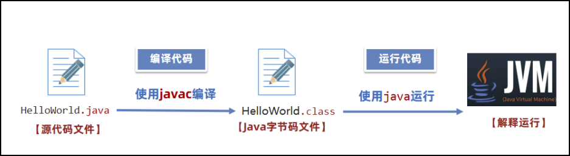

分为三个步骤：

1、编写Java源代码文件。

2、使用Java编译器（javac命令）将源代码编译成Java字节码文件。

3、使用Java虚拟机加载并运行Java字节码文件，此时会启动一个新的进程。


## 1.2 JVM的功能

* 1 - 解释和运行

* 2 - 内存管理

* 3 - 即时编译


### 1.2.1 解释和运行

对字节码文件中的指令，实时的解释成机器码，让计算机执行。

字节码文件中包含了字节码指令，计算器无法直接执行，Java虚拟机会将字节码文件中的字节码指令实时地解释成机器码，机器码是计算机可以运行的指令。

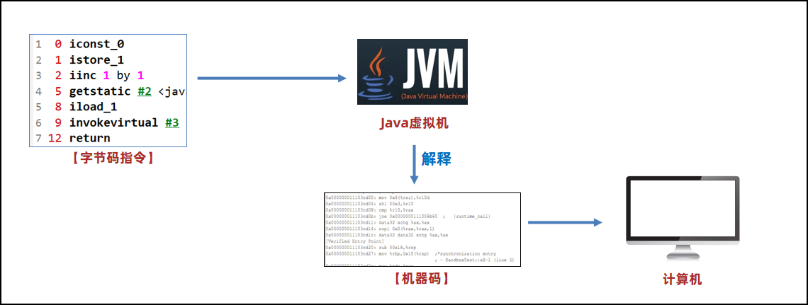


### 1.2.2 内存管理

* 自动为对象、方法等分配内存

* 自动的垃圾回收机制，回收不再使用的对象

Java虚拟机会帮助程序员为对象分配内存，同时将不用的对象使用垃圾回收器回收掉，这是对比C和C++这些语言的一个优势。在C/C++语言中，对象的回收需要程序员手动去编写代码完成，如果遗漏了这段删除对象的代码，这个对象就会永远占用内存空间，不会再回收。所以JVM的这个功能降低了程序员编写代码的难度。


### 1.2.3 即时编译

对热点代码进行优化，提升执行效率。即时编译可以说是提升Java程序性能最核心的手段。


#### Java性能低的主要原因和跨平台特性

Java语言如果不做任何的优化，性能其实是不如C和C++语言的。主要原因是：

在程序运行过程中，Java虚拟机需要将字节码指令实时地解释成计算机能识别的机器码，这个过程在运行时可能会反复地执行，所以效率较低。

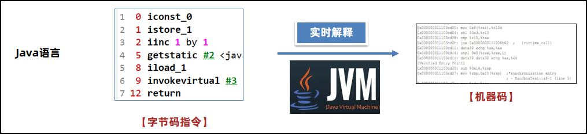


C和C++语言在执行过程中，只需要将源代码编译成可执行文件，就包含了计算机能识别的机器码，无需在运行过程中再实时地解释，所以性能较高。

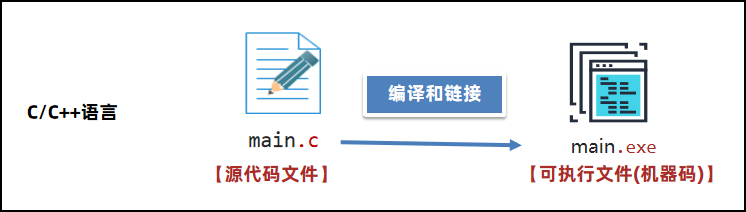


Java为什么要选择一条执行效率比较低的方式呢？主要是为了实现跨平台的特性。Java的字节码指令，如果希望在不同平台（操作系统+硬件架构），比如在windows或者linux上运行。可以使用同一份字节码指令，交给windows和linux上的Java虚拟机进行解释，这样就可以获得不同平台上的机器码了。这样就实现了Write Once，Run Anywhere 编写一次，到处运行 的目标。

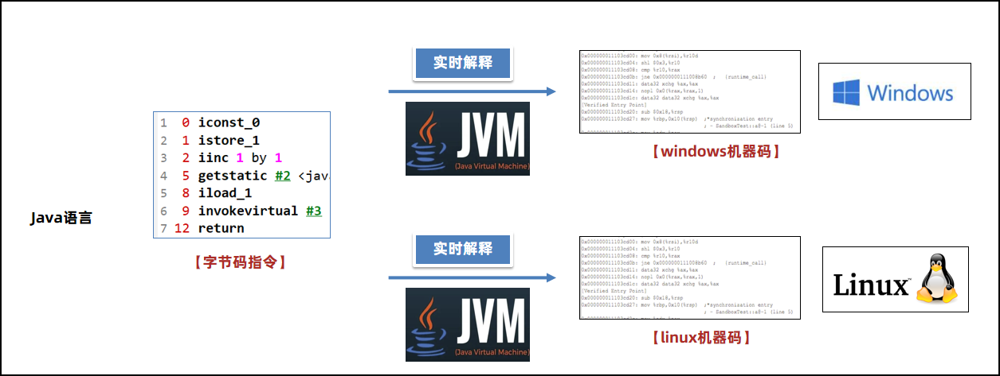

但是C/C++语言，如果要让程序在不同平台上运行，就需要将一份源代码在不同平台上分别进行编译，相对来说比较麻烦。


再回到即时编译，在JDK1.1的版本中就推出了即时编译去优化对应的性能。

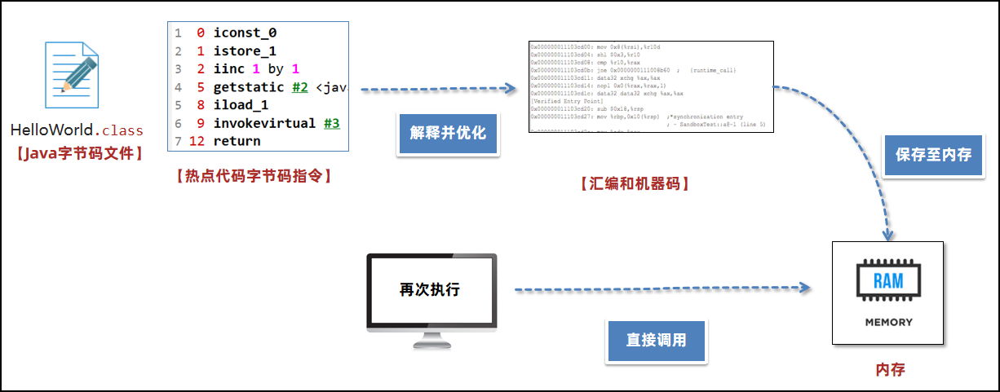

虚拟机在运行过程中如果发现某一个方法甚至是循环是热点代码（被非常高频调用），即时编译器会优化这段代码并将优化后的机器码保存在内存中，如果第二次再去执行这段代码。Java虚拟机会将机器码从内存中取出来直接进行调用。这样节省了一次解释的步骤，同时执行的是优化后的代码，效率较高。

Java通过即时编译器获得了接近C/C++语言的性能，在某些特定的场景下甚至可以实现超越。


## 1.3 常见的JVM

### 1.3.1 Java虚拟机规范

* 《Java虚拟机规范》由Oracle制定，内容主要包含了Java虚拟机在设计和实现时需要遵守的规范，主要包含class字节码文件的定义、类和接口的加载和初始化、指令集等内容。

* 《Java虚拟机规范》是对虚拟机设计的要求，而不是对Java设计的要求，也就是说虚拟机可以运行在其他的语言比如Groovy、Scala生成的class字节码文件之上。

* 官网地址：https://docs.oracle.com/javase/specs/index.html


### 1.3.2 Java虚拟机规范

平时我们最常用的，就是Hotspot虚拟机。


### 1.3.3 HotSpot的发展历程

##### 初出茅庐 - 1999年4月 &#x20;

源自1997年收购的SmallTalk语言的虚拟机，HotSpot虚拟机初次在JDK中使用。在JDK1.2中作为附加功能存在，

JDK1.3之后作为默认的虚拟机。


##### 野蛮生长 - 2006年12月

JDK 6发布，并在虚拟机层面做了大量的优化，这些优化对后续虚拟机的发展产生了深远的影响。


##### 稳步前进 - 2009-2013

JDK7中首次推出了G1垃圾收集器。收购了Sun公司之后，吸纳了JRockIt虚拟机的一些设计思想，JDK8中引入了JMC等工具，去除了永久代。


##### 百家争鸣 - 2018-2019

JDK11优化了G1垃圾收集器的性能,同时推出了ZGC新一代的垃圾回收器，JDK12推出Shenan-doah垃圾回收器。


##### 拥抱云原生 - 2019-至今

以Hotspot为基础的GraalVM虚拟机诞生，不仅让解决了单体应用中多语言整合的难题，同时也提升了这些语言运行时的效率。极高的性能、极快的启动速度也更适用于当下的云原生架构。


# 2、字节码文件详解

## 2.1 Java虚拟机的组成

Java虚拟机主要分为以下几个组成部分：

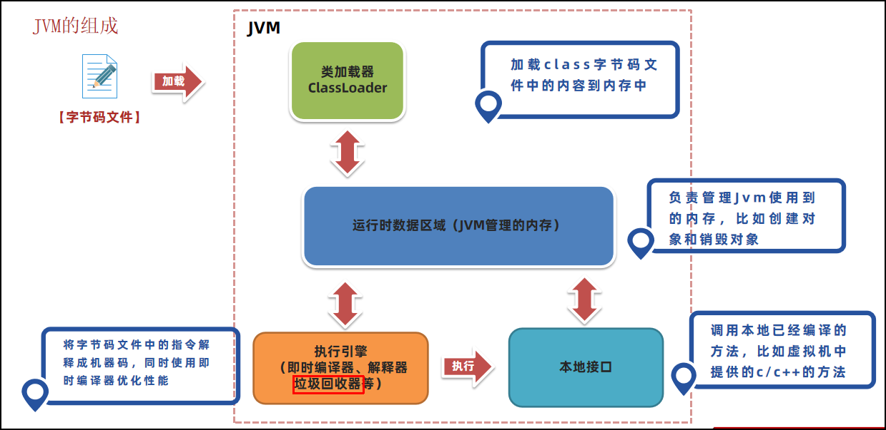

* 类加载子系统：核心组件类加载器，负责将字节码文件中的内容加载到内存中。

* 运行时数据区：JVM管理的内存，创建出来的对象、类的信息等等内容都会放在这块区域中。

* 执行引擎：包含了即时编译器、解释器、垃圾回收器，执行引擎使用解释器将字节码指令解释成机器码，使用即时编译器优化性能，使用垃圾回收器回收不再使用的对象。

* 本地接口：调用本地使用C/C++编译好的方法，本地方法在Java中声明时，都会带上native关键字，如下图所示。

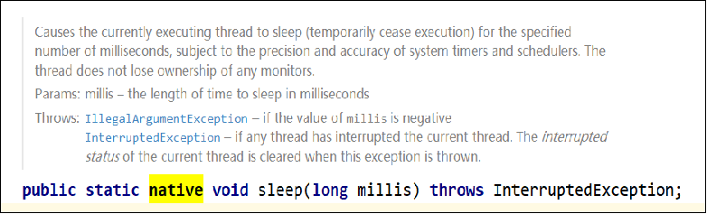

### 概括

1、JVM到底是什么？
JVM全称是JavaVirtualMachine，中文译名Java虚拟机，是一个运行在计算机上的程序，他的职责是运行Java字节码文件。
2、JVM的三大核心功能是什么？JVM包含内存管理、解释执行虚拟机指令、即时编译三大功能。
3、常见的JVM虚拟机有哪些？
常见的JVM有HotSpot、GraalVM、OpenJ9等，另外DragonWell龙井JDK也提供了一款功能增强版的JVM。其中使用最广泛的是HotSpot虚拟机。

## 2.2 字节码文件的组成

### 2.2.1 以正确的姿势打开文件

字节码文件中保存了源代码编译之后的内容，以二进制的方式存储，无法直接用记事本打开阅读。

通过NotePad++使用十六进制插件查看class文件：

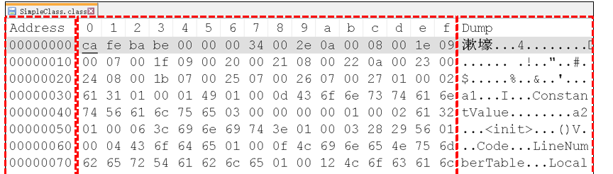


无法解读出文件里包含的内容，推荐使用 jclasslib工具查看字节码文件。
Github地址： https://github.com/ingokegel/jclasslib

安装方式：找到 资料\工具\jclasslib\_win64\_6\_0\_4.exe 安装即可

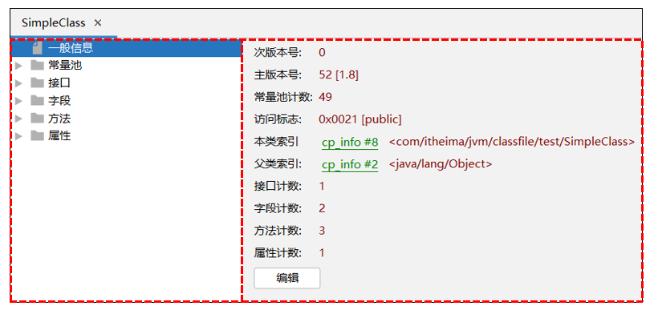


### 2.2.2 字节码文件的组成

字节码文件总共可以分为以下几个部分：

* **基础信息**：魔数、字节码文件对应的Java版本号、访问标识(public final等等)、父类和接口信息

* **常量池：&#x20;**&#x4FDD;存了字符串常量、类或接口名、字段名，主要在字节码指令中使用

* **字段：** 当前类或接口声明的字段信息

* **方法：&#x20;**&#x5F53;前类或接口声明的方法信息，核心内容为方法的字节码指令

* **属性：&#x20;**&#x7C7B;的属性，比如源码的文件名、内部类的列表等


#### 2.2.2.1 基本信息

基本信息包含了jclasslib中能看到的两块内容：

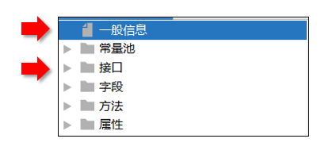


##### Magic魔数

每个Java字节码文件的前四个字节是固定的，用16进制表示就是0xcafebabe。文件是无法通过文件扩展名来确定文件类型的，文件扩展名可以随意修改不影响文件的内容。软件会使用文件的头几个字节（文件头）去校验文件的类型，如果软件不支持该种类型就会出错。

比如常见的文件格式校验方式如下：

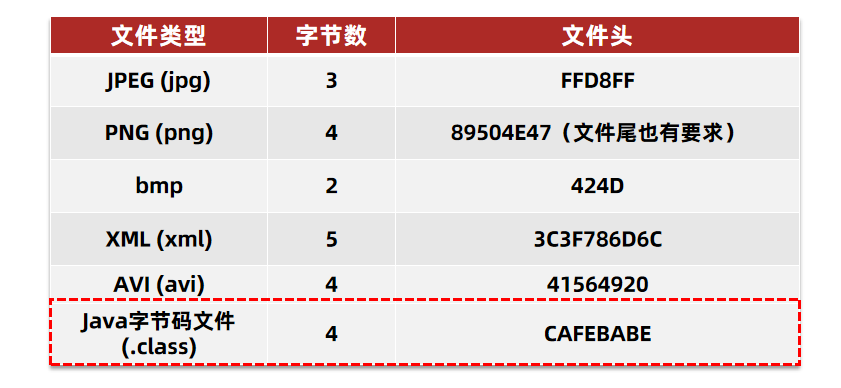

Java字节码文件中，将文件头称为magic魔数。Java虚拟机会校验字节码文件的前四个字节是不是0xcafebabe，如果不是，该字节码文件就无法正常使用，Java虚拟机会抛出对应的错误。


##### 主副版本号

主副版本号指的是编译字节码文件时使用的JDK版本号，主版本号用来标识大版本号，JDK1.0-1.1使用了45.0-45.3，JDK1.2是46之后每升级一个大版本就加1；副版本号是当主版本号相同时作为区分不同版本的标识，一般只需要关心主版本号。

1.2之后大版本号计算方法就是 : 主版本号 – 44，比如主版本号52就是JDK8。

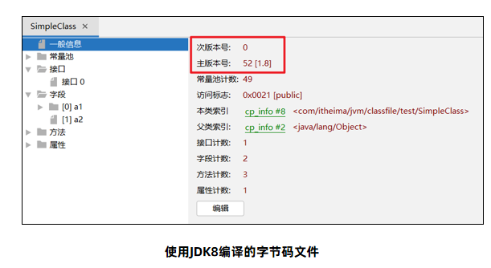

版本号的作用主要是判断当前字节码的版本和运行时的JDK是否兼容。如果使用较低版本的JDK去运行较高版本JDK的字节码文件，无法使用会显示如下错误：


有两种方案：

1.升级JDK版本，将图中使用的JDK6升级至JDK8即可正常运行，容易引发其他的兼容性问题，并且需要大量的测试。

2.将第三方依赖的版本号降低或者更换依赖，以满足JDK版本的要求。建议使用这种方案


##### 其他基础信息

其他基础信息包括访问标识、类和接口索引，如下：

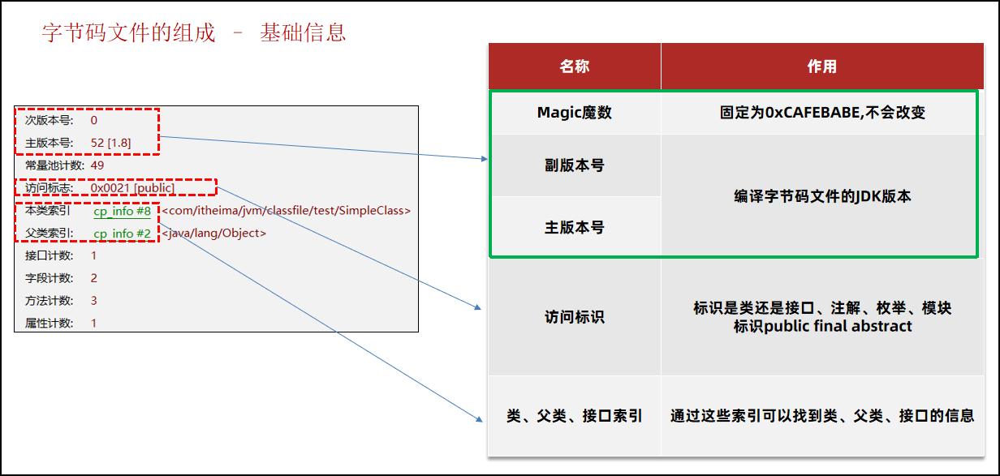


#### 2.2.2.2 常量池

字节码文件中常量池的作用：避免相同的内容重复定义，节省空间。如下图，常量池中定义了一个字符串，字符串的字面量值为123。

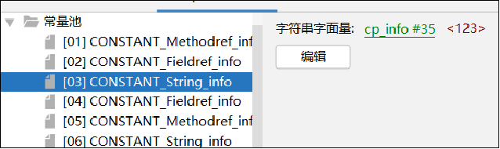

比如在代码中，编写了两个相同的字符串“我爱北京天安门”，字节码文件甚至将来在内存中使用时其实只需要保存一份，此时就可以将这个字符串以及字符串里边包含的字面量，放入常量池中以达到节省空间的作用。


常量池中的数据都有一个编号，编号从1开始。比如“我爱北京天安门”这个字符串，在常量池中的编号就是7。在字段或者字节码指令中通过编号7可以快速的找到这个字符串。

字节码指令中通过编号引用到常量池的过程称之为符号引用。

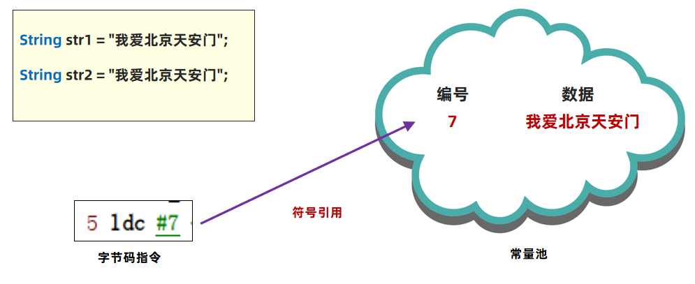


#### 2.2.2.3 字段

字段中存放的是当前类或接口声明的字段信息。

如下图中，定义了两个字段a1和a2，这两个字段就会出现在字段这部分内容中。同时还包含字段的名字、描述符（字段的类型）、访问标识（public/private static final等）。

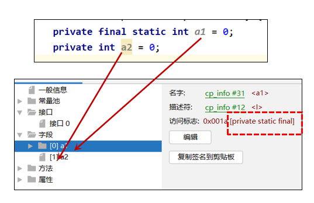


#### 2.2.2.4 方法

字节码中的方法区域是存放**字节码指令**的核心位置，字节码指令的内容存放在方法的Code属性中。

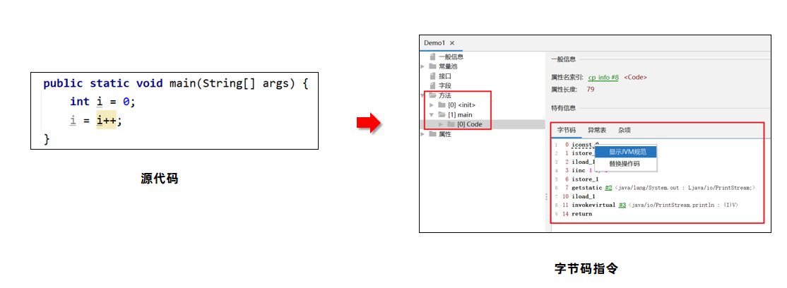

通过分析方法的字节码指令，可以清楚地了解一个方法到底是如何执行的。先来看如下案例：

这段代码编译成字节码指令之后是如下内容：

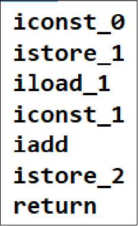

要理解这段字节码指令是如何执行的，我们需要先理解两块内存区域：操作数栈和局部变量表。

**操作数栈**是用来存放临时数据的内容，是一个栈式的结构，先进后出。

**局部变量表**是存放方法中的局部变量，包含方法的参数、方法中定义的局部变量，在编译期就已经可以确定方法有多少个局部变量。


1、iconst\_0，将常量0放入操作数栈。此时栈上只有0。

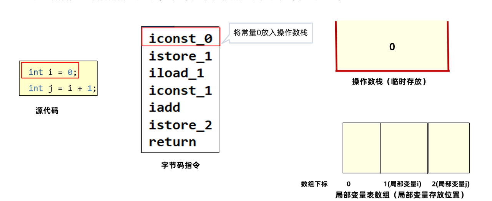


2、istore\_1会从操作数栈中，将栈顶的元素弹出来，此时0会被弹出，放入局部变量表的1号位置。局部变量表中的1号位置，在编译时就已经确定是局部变量i使用的位置。完成了对局部变量i的赋值操作。

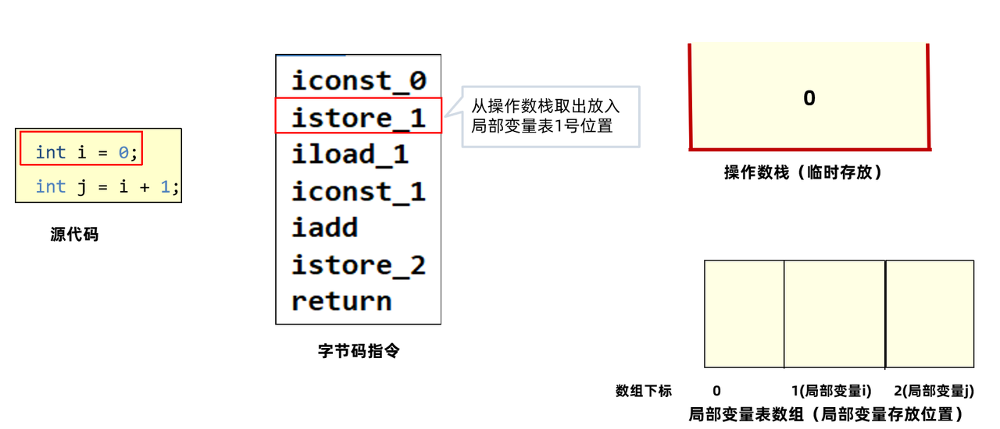


3、iload\_1将局部变量表1号位置的数据放入操作数栈中，此时栈中会放入0。

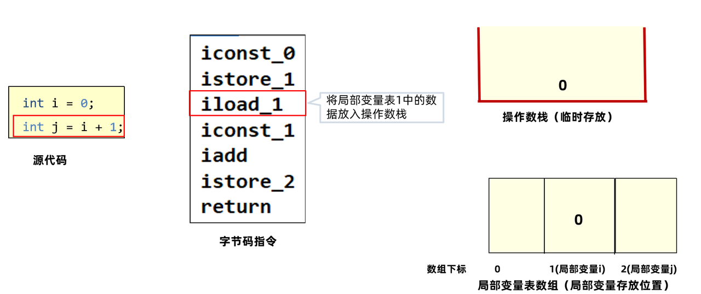


4、iconst\_1会将常量1放入操作数栈中。

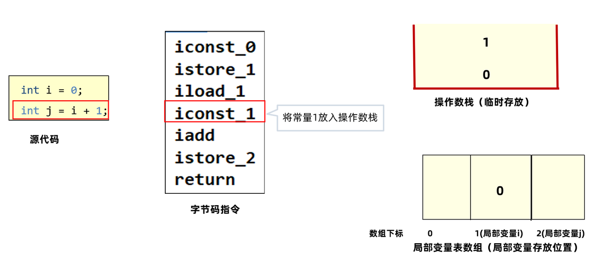


5、iadd会将操作数栈顶部的两个数据相加，现在操作数栈上有两个数0和1，相加之后结果为1放入操作数栈中，此时栈上只有一个数也就是相加的结果1。

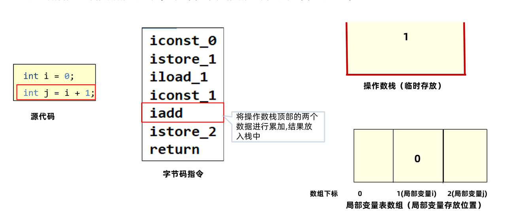


6、istore\_2从操作数栈中将1弹出，并放入局部变量表的2号位置，2号位置是j在使用。完成了对局部变量j的赋值操作。

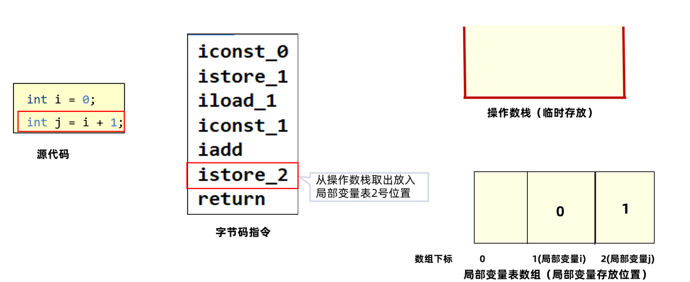

7、return语句执行，方法结束并返回。

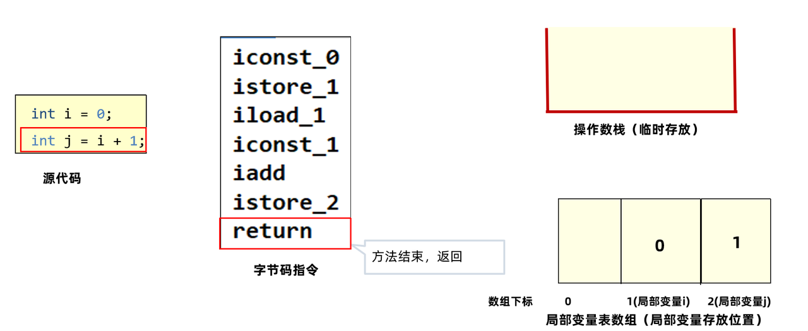


同理，同学们可以自行分析下i++和++i的字节码指令执行的步骤。

i++的字节码指令如下，其中iinc 1 by 1指令指的是将局部变量表1号位置增加1，其实就实现了i++的操作。

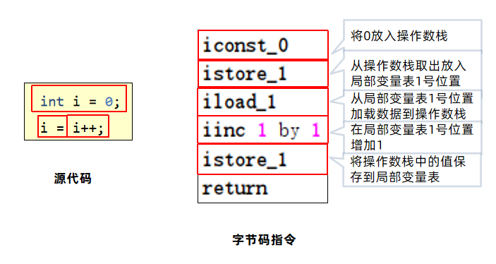

而++i只是对两个字节码指令的顺序进行了更改：

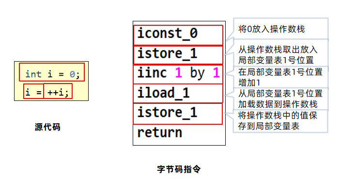

##### 面试题：

问：int i = 0; i = i++; 最终i的值是多少？

答：答案是0，我通过分析字节码指令发现，i++先把0取出来放入临时的操作数栈中，

接下来对i进行加1，i变成了1，最后再将之前保存的临时值0放入i，最后i就变成了0。


#### 2.2.2.5 属性

属性主要指的是类的属性，比如源码的文件名、内部类的列表等。

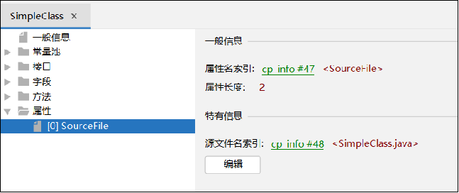


### 2.2.3 玩转字节码常用工具

#### 2.2.3.1 javap

javap是JDK自带的反编译工具，可以通过控制台查看字节码文件的内容。适合在服务器上查看字节码文件内容。

直接输入javap查看所有参数。输入`javap -v` 字节码文件名称 查看具体的字节码信息。如果jar包需要先使用 `jar –xvf` 命令解压。

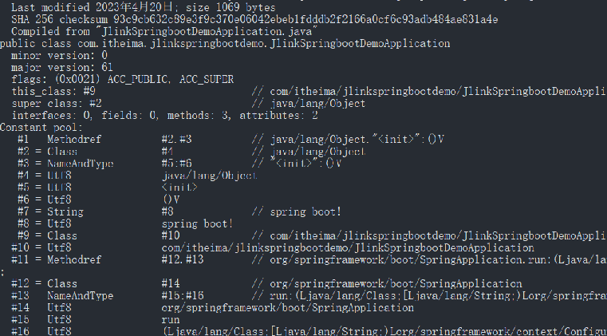


#### 2.2.3.2 jclasslib插件

jclasslib也有Idea插件版本，建议开发时使用Idea插件版本，可以在代码编译之后实时看到字节码文件内容。

安装方式：

1、打开idea的插件页面，搜索jclasslib

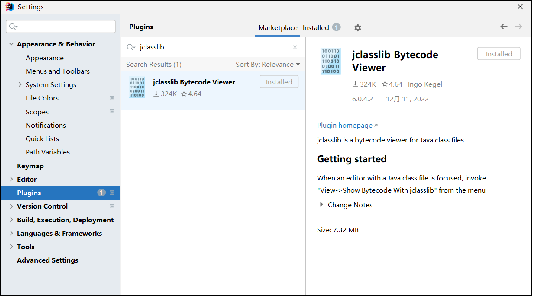


2、选中要查看的源代码文件，选择 视图(View) - Show Bytecode With Jclasslib

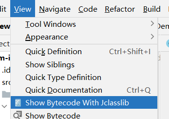

右侧会展示对应源代码编译后的字节码文件内容：

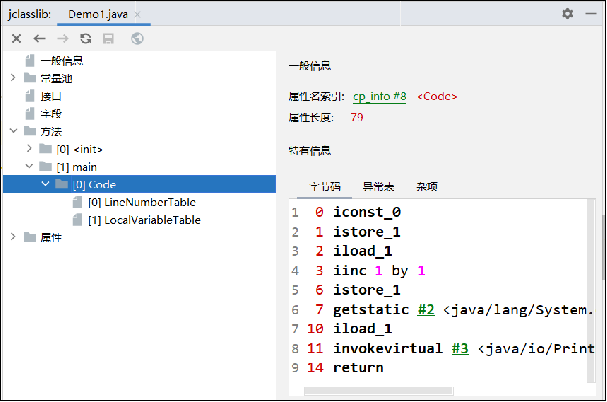

> tips:
>
> 1、一定要选择文件再点击视图(view)菜单，否则菜单项不会出现。
>
> 2、文件修改后一定要重新编译之后，再点击刷新按钮。


#### 2.2.3.3 Arthas

Arthas 是一款线上监控诊断产品，通过全局视角实时查看应用 load、内存、gc、线程的状态信息，并能在不修改应用代码的情况下，对业务问题进行诊断，大大提升线上问题排查效率。
官网：https://arthas.aliyun.com/doc/
Arthas的功能列表如下：

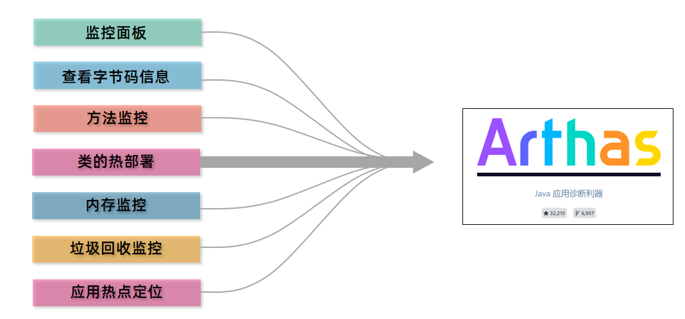

**安装方法：**

1、将 资料/工具/arthas-boot.jar 文件复制到任意工作目录。

2、使用`java -jar arthas-boot.jar ` 启动程序。

3、输入需要Arthas监控的进程id。直接输入1,2,3等就可以了，不用输入pid

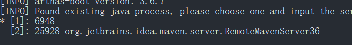

4、输入命令即可使用。

**注意**：**如果启动监控的进程id错误，切换id时，必须结束旧id，因为之前的 Arthas（attach 到进程 24512）占用了默认端口（3658 和 8563），导致你现在无法 attach 到另一个进程（22324，即 `arthas.Demo`），所以必须清理旧的 Arthas 实例，释放端口。**

 **✅ 所以解决方案就是：**

> **清理旧的 Arthas 实例 → 释放 3658/8563 端口 → 让新的 Arthas 可以正常启动**

而“清理”的标准方式就是向旧实例发送 `stop` 命令：

arthas-client.jar一般在默认的.arthas文件夹中，例如`C:\Users\24141\.arthas\lib\4.1.5\arthas`

```bash
java -jar arthas-client.jar 127.0.0.1 3658 -c "stop"
```

这会：

- 卸载 JVM 中的 Arthas agent
- 关闭 Telnet 和 Web 服务
- 释放端口
- **不影响原 Java 应用本身（24512 进程继续运行，只是不再被监控）**

**dump**

命令详解：https://arthas.aliyun.com/doc/dump.html

dump命令可以将字节码文件保存到本地，如下将`java.lang.String` 的字节码文件保存到了/tmp/output目录下：


**jad**

命令详解：https://arthas.aliyun.com/doc/jad.html

jad命令可以将类的字节码文件进行反编译成源代码，用于确认服务器上的字节码文件是否是最新的，如下将demo.MathGame的源代码进行了显示。

```bash
[arthas@22324]$ jad arthas.Demo

ClassLoader:
+-sun.misc.Launcher$AppClassLoader@18b4aac2
  +-sun.misc.Launcher$ExtClassLoader@646fe906

Location:
/E:/Desktop/java/JVM/3.JVM%e8%99%9a%e6%8b%9f%e6%9c%ba%e5%85%a5%e9%97%a8%e5%88%b0%e5%ae%9e%e6%88%98/1%e3%80%81%e5%9f%ba%
e7%a1%80%e7%af%87%e4%bb%a3%e7%a0%81/%e4%bb%a3%e7%a0%81/day01/day01/jvm/target/classes/

       /*
        * Decompiled with CFR.
        */
       package arthas;

       public class Demo {
           public static void main(String[] args) throws InterruptedException {
               while (true) {
/* 6*/             Thread.sleep(1000L);
               }
           }
       }

Affect(row-cnt:1) cost in 755 ms.
[arthas@22324]$
```

#### 概括

##### 1、如何查看字节码文件？ 

 ⚫ 本地文件可以使用jclasslib工具查看，开发环境使用jclasslib插件。 

⚫ 服务器上文件使用javap命令直接查看，也可以通过arthas的dump命令导 出字节码文件再查看本地文件。还可以使用jad命令反编译出源代码。

##### **2、字节码文件的核心组成有哪些？**

字节码文件（`.class` 文件）由以下几个核心部分组成，每个部分负责存储不同类型的元数据和代码信息。

###### 1. **基本信息**

- 包含：魔数（Magic Number）、字节码文件对应的 Java 版本号、访问标识（如 `public`、`final` 等）、父类和接口信息。  
- 作用：标识文件类型、版本兼容性以及类的基本属性。

###### 2. **常量池**

- 保存了字符串常量、类或接口名、字段名等。  
- 主要在字节码指令中被引用，用于解析符号名称为实际地址。

###### 3. **字段**

- 存储当前类或接口声明的字段信息，包括字段名、类型、访问权限等。  
- 不包含字段的初始值（初始值在常量池中）。

###### 4. **方法**

- 存储当前类或接口声明的方法信息，包括方法名、参数、返回类型、访问标志等。  
- 每个方法内部包含具体的**字节码指令**（如 `iload`, `iadd`, `return` 等），是程序执行逻辑的核心。

###### 5. **属性**

- 存储类的附加属性信息，例如：  
  - 源码文件名（`SourceFile` 属性）  
  - 内部类的列表（`InnerClasses` 属性）  
  - 注解信息（`RuntimeVisibleAnnotations` 等）  
  - 其他编译器生成的元数据

------

✅ 总结

Java 字节码文件结构清晰，主要分为：

- **基本信息**（头部元数据）
- **常量池**（符号表）
- **字段**（成员变量）
- **方法**（函数逻辑与字节码）
- **属性**（扩展信息）

这些部分共同构成了 JVM 能够加载和执行的 `.class` 文件基础。

## 2.3、类的生命周期

类的生命周期描述了一个类加载、使用、卸载的整个过程。整体可以分为：

* 加载

* 连接，其中又分为验证、准备、解析三个子阶段

* 初始化

* 使用

* 卸载

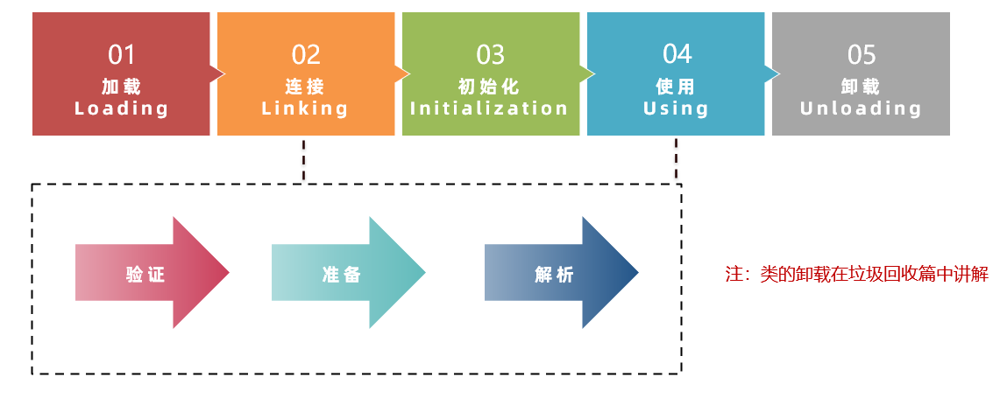


### 2.3.1 加载阶段

1、加载(Loading)阶段第一步是类加载器根据类的全限定名通过不同的渠道以二进制流的方式获取字节码信息，程序员可以使用Java代码拓展的不同的渠道。

* 从本地磁盘上获取文件

* 运行时通过动态代理生成，比如Spring框架

* Applet技术通过网络获取字节码文件

2/3、类加载器在加载完类之后，Java虚拟机会将字节码中的信息保存到方法区中，方法区中生成一个InstanceKlass对象，保存类的所有信息，里边还包含实现特定功能比如多态的信息。

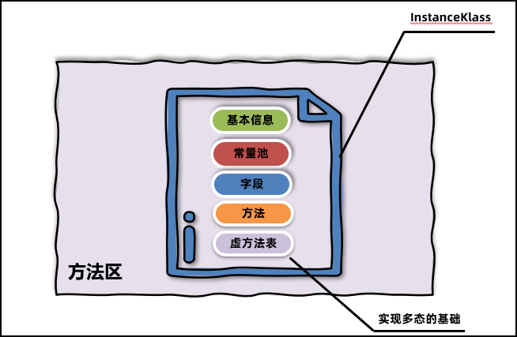

4、Java虚拟机同时会在堆上生成与方法区中数据类似的java.lang.Class对象，作用是在Java代码中去获取类的信息以及存储静态字段的数据（JDK8及之后）。

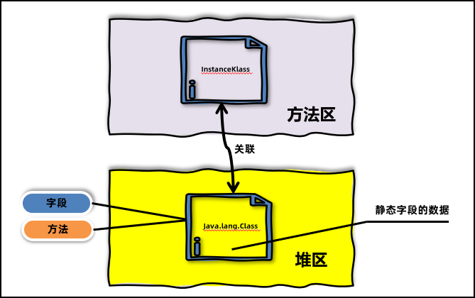

#### 查看内存中的对象 

类的生命周期 加载阶段 –查看内存中的对象  

⚫ 推荐使用 JDK自带的hsdb工具查看Java虚拟机内存信息。工具位于JDK安装目录下lib文件夹中的sa-jdi.jar中。 

⚫ 启动命令：java -cp sa-jdi.jar sun.jvm.hotspot.HSDB

jps命令会显示当前显示的所有java进程以及对应id。

```bash
E:\Desktop\java\JVM\3.JVM虚拟机入门到实战\资料\工具>jps
24512
28080 HsdbDemo
16152 Jps
26332 RemoteMavenServer36
27452 Launcher
```


### 2.3.2 连接阶段

连接阶段分为三个子阶段:

* 验证，验证内容是否满足《Java虚拟机规范》。

* 准备，给静态变量赋初值。

* 解析，将常量池中的符号引用替换成指向内存的直接引用。

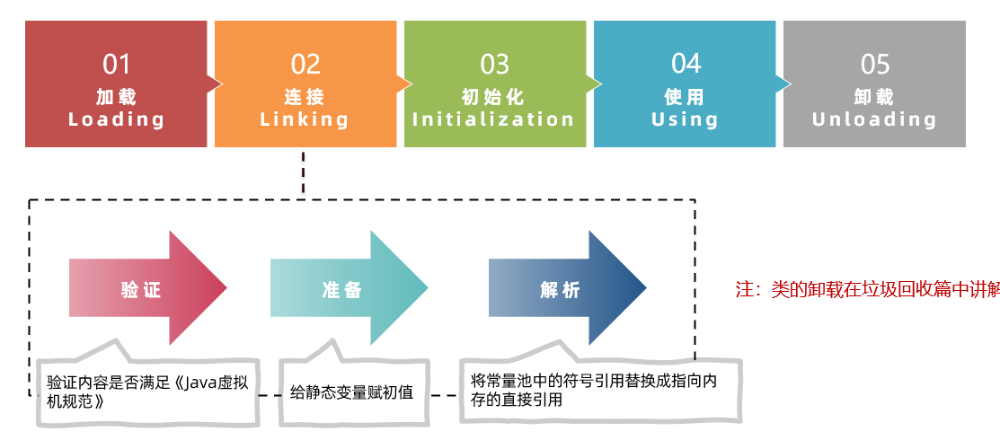

#### 验证

验证的主要目的是检测Java字节码文件是否遵守了《Java虚拟机规范》中的约束。这个阶段一般不需要程序员参与。主要包含如下四部分，具体详见《Java虚拟机规范》：

1、文件格式验证，比如文件是否以0xCAFEBABE开头，主次版本号是否满足当前Java虚拟机版本要求。

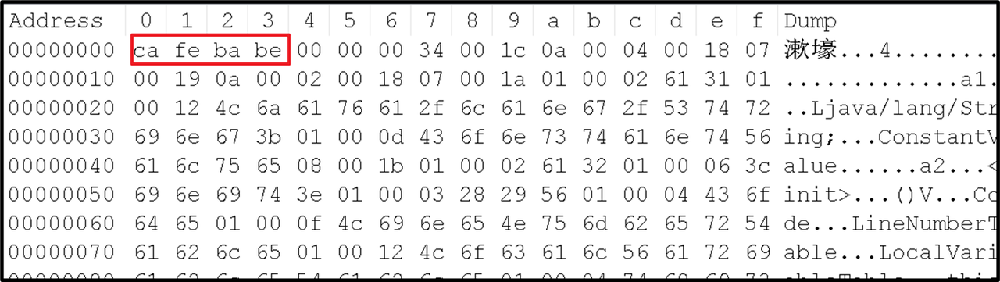

2、元信息验证，例如类必须有父类（super不能为空）。

3、验证程序执行指令的语义，比如方法内的指令执行中跳转到不正确的位置。

4、符号引用验证，例如是否访问了其他类中private的方法等。


对版本号的验证，在JDK8的源码中如下：

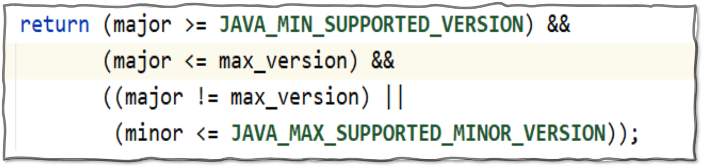

编译文件的主版本号不能高于运行环境主版本号，如果主版本号相等，副版本号也不能超过。


#### 准备

准备阶段为静态变量（static）分配内存并设置初值，每一种基本数据类型和引用数据类型都有其初值。

| **数据类型**    | **初始值**      |
| ----------- | ------------ |
| **int**     | **0**        |
| **long**    | **0L**       |
| **short**   | **0**        |
| **char**    | **‘\u0000’** |
| **byte**    | **0**        |
| **boolean** | **false**    |
| **double**  | **0.0**      |
| **引用数据类型**  | **null**     |

如下代码：

在准备阶段会为value分配内存并赋初值为0，在初始化阶段才会将值修改为1。


> final修饰的基本数据类型的静态变量，准备阶段直接会将代码中的值进行赋值。
>
> 如下例子中，变量加上final进行修饰，在准备阶段value值就直接变成1了，因为final修饰的变量后续不会发生值的变更。

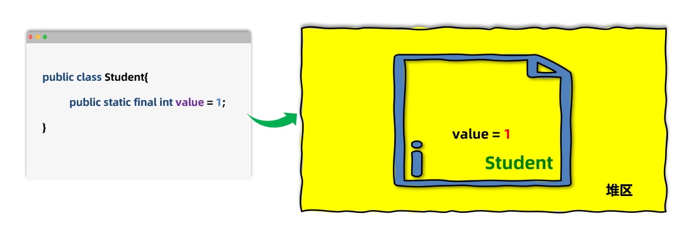


来看这个案例：

从字节码文件也可以看到，编译器已经确定了该字段指向了常量池中的常量2：

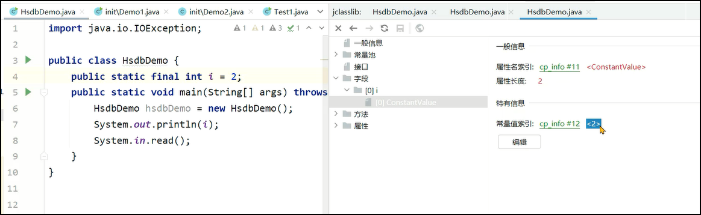


#### 解析

解析阶段主要是将常量池中的符号引用替换为直接引用，符号引用就是在字节码文件中使用编号来访问常量池中的内容。

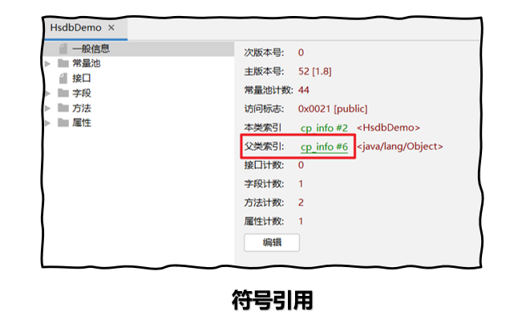

直接引用不在使用编号，而是使用内存中地址进行访问具体的数据。

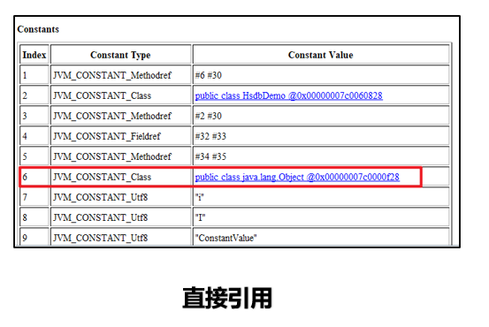


### 2.3.3 初始化阶段

初始化阶段会执行字节码文件中clinit（class init 类的初始化）方法的字节码指令，包含了静态代码块中的代码，并为静态变量赋值。

如下代码编译成字节码文件之后，会生成三个方法：

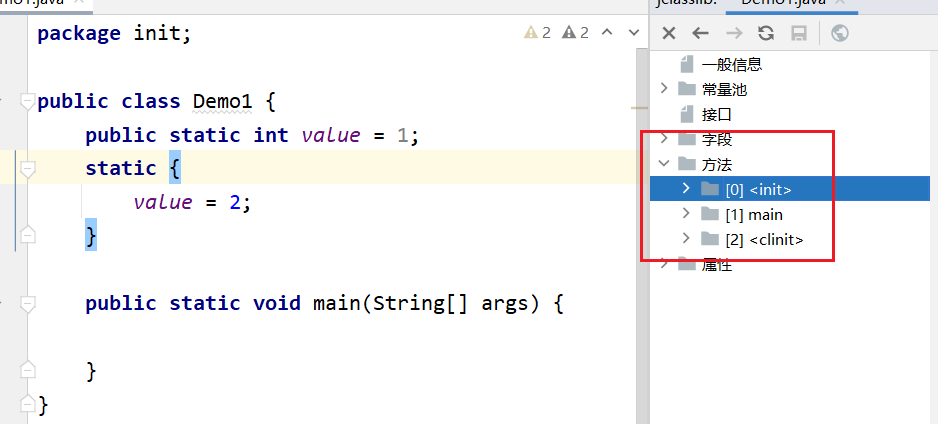

* init方法，会在对象初始化时执行

* main方法，主方法

* clinit方法，类的初始化阶段执行


继续来看clinit方法中的字节码指令：

1、iconst\_1，将常量1放入操作数栈。此时栈中只有1这个数。

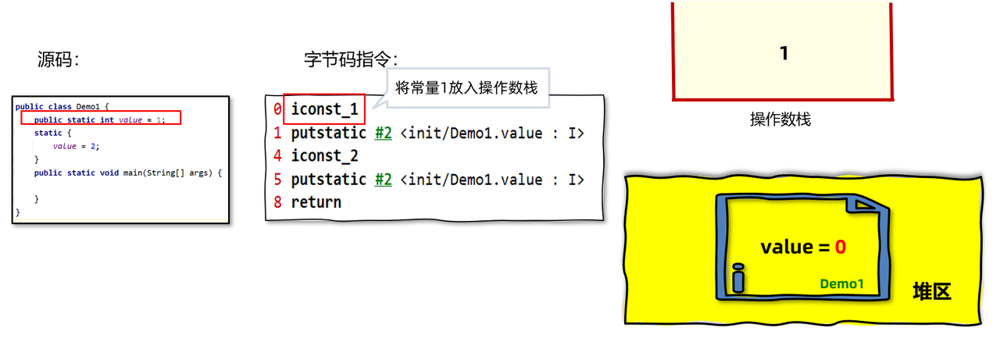


2、putstatic指令会将操作数栈上的数弹出来，并放入堆中静态变量的位置，字节码指令中#2指向了常量池中的静态变量value，在解析阶段会被替换成变量的地址。

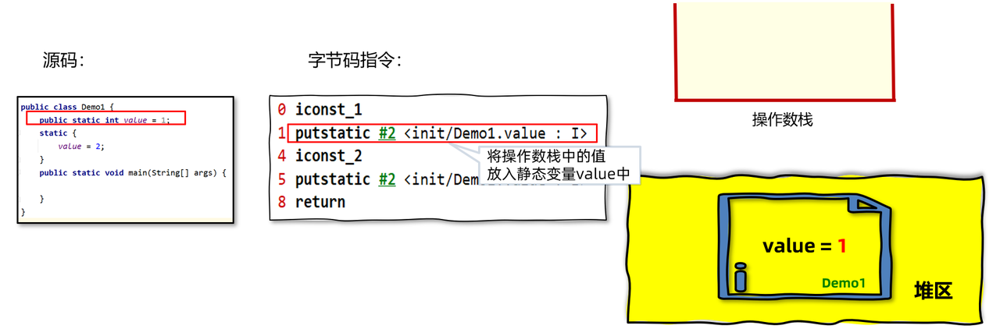


3、后两步操作类似，执行value=2，将堆上的value赋值为2。


如果将代码的位置互换：

字节码指令的位置也会发生变化：

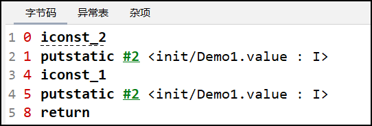

这样初始化结束之后，最终value的值就变成了1而不是2。

**注意**：clinit方法中的执行顺序与Java中编写的顺序是一致的。

以下几种方式会导致类的初始化：

1.访问一个类的静态变量或者静态方法，注意变量是final修饰的并且等号右边是常量不会触发初始化。

2.调用Class.forName(String className)。

3.new一个该类的对象时。

4.执行Main方法的当前类。

在虚拟机参数VM Options中，添加-XX:+TraceClassLoading 参数可以打印出加载并初始化的类


#### 面试题1：

如下代码的输出结果是什么？

```java
public class Test1 {
    public static void main(String[] args) {
        System.out.println("A");
        new Test1();
        new Test1();
    }

    public Test1() {
        System.out.println("B");
    }

    {
        System.out.println("C");
    }

    static {
        System.out.println("D");
    }
}
```

分析步骤：

1、执行main方法之前，先执行clinit指令。

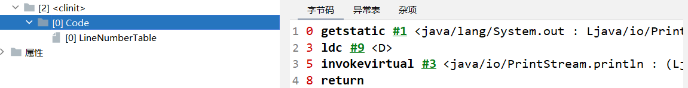

指令会输出D

2、执行main方法的字节码指令。

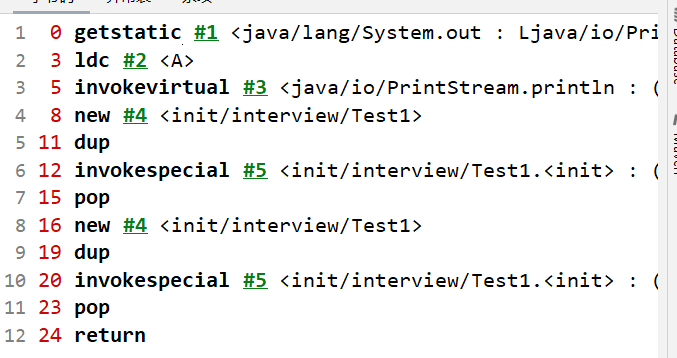

指令会输出A

3、创建两个对象，会执行两次对象初始化的指令。

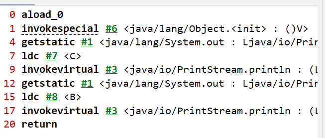

这里会输出CB，源代码中输出C这行，被放到了对象初始化的一开始来执行。

所以最后的结果应该是DACBCB

------

#### 详细分析：类加载与对象创建的执行顺序

Java 中代码块的执行顺序遵循以下规则：

1. **静态内容（static）**：在**类加载时**执行，只执行一次。
2. **实例初始化块（`{}`）**：在**每次创建对象时**、**构造方法之前**执行。
3. **构造方法**：在实例初始化块之后执行。

##### ✅ 第一步：程序启动，调用 `main` 方法

JVM 首先要加载 `Test1` 类。**类加载过程中会执行静态代码块**：

```java
static {
    System.out.println("D");
}
```

➡️ 输出：**`D`**

> ⚠️ 注意：静态代码块只执行一次，无论创建多少个对象。

------

##### ✅ 第二步：执行 `main` 方法体

```java
System.out.println("A");
```

➡️ 输出：**`A`**

------

##### ✅ 第三步：第一次 `new Test1()`

创建对象时的初始化顺序为：

1. **实例初始化块**：

   ```java
   {
       System.out.println("C");
   }
   ```

   ➡️ 输出：**`C`**

2. **构造方法**：

   ```java
   public Test1() {
       System.out.println("B");
   }
   ```

   ➡️ 输出：**`B`**

所以第一次 `new Test1()` 输出：**`C` → `B`**

------

##### ✅ 第四步：第二次 `new Test1()`

再次创建对象，**静态代码块不再执行**（已加载过类），但**实例初始化块和构造方法会再次执行**：

- 实例块：**`C`**
- 构造方法：**`B`**

输出：**`C` → `B`**

------

##### 📋 最终输出顺序汇总

| 执行阶段           | 输出 |
| ------------------ | ---- |
| 类加载（静态块）   | D    |
| main 方法第一行    | A    |
| 第一次 new Test1() | C, B |
| 第二次 new Test1() | C, B |

✅ **完整输出：**

```
D
A
C
B
C
B
```

------

##### 🧠 关键知识点总结

| 元素                 | 执行时机                        | 执行次数       |
| -------------------- | ------------------------------- | -------------- |
| `static {}`          | 类加载时（首次使用类时）        | 1 次           |
| `{}`（实例初始化块） | 每次 `new` 对象时，在构造方法前 | 每次创建都执行 |
| 构造方法             | 每次 `new` 对象时，在实例块后   | 每次创建都执行 |
| `main` 方法          | 程序入口                        | 1 次           |

> 💡 实例初始化块常用于多个构造器共享的初始化逻辑，避免重复代码。

#### clinit不会执行的几种情况

如下几种情况是不会进行初始化指令执行的：

1.无静态代码块且无静态变量赋值语句。

2.有静态变量的声明，但是没有赋值语句。


3.静态变量的定义使用final关键字，这类变量会在准备阶段直接进行初始化。

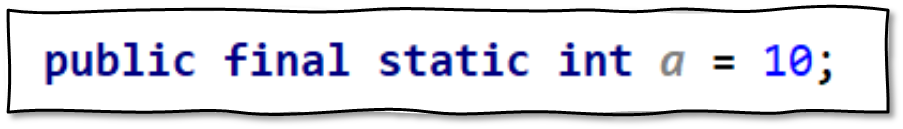


#### 面试题2：

如下代码的输出结果是什么？

```java
public class Demo02 {
    public static void main(String[] args) {
        new B02();
        System.out.println(B02.a);
    }
}

class A02 {
    static int a = 0;

    static {
        a = 1;
    }
}

class B02 extends A02 {
    static {
        a = 2;
    }
}
```


分析步骤：

1、调用new创建对象，需要初始化B02，优先初始化父类。

2、执行A02的初始化代码，将a赋值为1。

3、B02初始化，将a赋值为2。


##### 变化

将`new B02();`注释掉会怎么样？

分析步骤：

1、访问父类的静态变量，只初始化父类。

2、执行A02的初始化代码，将a赋值为1。

------

##### 🔍 详细分析：类加载与静态初始化顺序（涉及继承）

关键点在于 **Java 类的加载和初始化时机**，尤其是在**继承关系中**。

------

##### 🧩 代码结构回顾

- `A02` 是父类，定义了静态变量 `a`，并在静态块中赋值为 `1`。

- `B02` 是子类，继承 `A02`，并在自己的静态块中将 `a` 改为 `2`。

- ```
  main
  ```

   方法中：

  1. `new B02();` → 创建子类对象
  2. `System.out.println(B02.a);` → 访问静态变量 `a`

------

##### ✅ 执行流程详解

###### 步骤 1：执行 `new B02()`

创建子类对象时，JVM 需要确保 **整个继承链的类都已初始化**。

> 📌 **Java 规定：初始化子类前，必须先初始化其直接父类（递归向上）**。

所以初始化顺序为：

1. **加载并初始化 `A02`**
   - 分配静态变量 `a = 0`（默认值）
   - 执行静态块：`a = 1`
   - ✅ 此时 `A02.a = 1`
2. **加载并初始化 `B02`**
   - 因为 `B02` 没有定义自己的 `a`，它**继承的是 `A02.a`**
   - 执行 `B02` 的静态块：`a = 2`
   - ✅ 此时 `A02.a`（也就是 `B02.a`）变为 `2`

> 💡 注意：`a` 是 `A02` 中定义的静态变量，`B02` 只是通过继承“看到”它。
> 所以 `B02.a = 2` 实际上修改的是 **父类 `A02` 的静态变量 `a`**。

1. 调用 `B02` 的构造方法（此处无显式构造器，使用默认无参构造）

✅ 到此，`a` 的值已经是 `2`。

------

###### 步骤 2：执行 `System.out.println(B02.a);`

- 直接访问 `B02.a`，由于 `a` 已在步骤 1 中被初始化并修改为 `2`
- 输出：**`2`**

------

##### 📋 关键知识点总结

| 概念                               | 说明                                                  |
| ---------------------------------- | ----------------------------------------------------- |
| **静态变量属于定义它的类**         | `a` 属于 `A02`，即使通过 `B02.a` 访问，也是同一个变量 |
| **子类静态块可以修改父类静态变量** | 因为静态变量在内存中只有一份                          |
| **类初始化顺序**                   | 父类 → 子类（静态变量 + 静态块按源码顺序）            |
| **触发类初始化的操作**             | `new`、访问/修改静态成员、反射、`main` 入口等         |

------

##### ❓ 常见疑问

###### Q：如果把 `new B02()` 注释掉，只保留 `System.out.println(B02.a);`，结果还是 `2` 吗？

✅ 不是！

因为访问 `B02.a` 会直接调用父类的静态成员变量，不会执行自己的静态代码块。

```java
// 即使这样写：
public static void main(String[] args) {
    System.out.println(B02.a); // 输出是 1
}
```

###### Q：如果 `B02` 也定义了自己的 `static int a`？

那就会**隐藏（hide）** 父类的 `a`，变成两个不同的变量：

```java
class B02 extends A02 {
    static int a = 3; // 新的 a，与 A02.a 无关
    static {
        a = 2; // 修改的是 B02 自己的 a
    }
}
```

此时 `B02.a` 是 `2`，而 `A02.a` 是 `1`。

------

##### ✅ 最终结论

> **输出为 `2`**，因为在初始化 `B02` 时，其静态代码块将继承自 `A02` 的静态变量 `a` 修改为了 `2`。

这是 Java **类加载机制** 和 **静态变量作用域** 的典型体现。

#### 补充练习题

分析如下代码执行结果:

数组的创建不会导致数组中元素的类进行初始化。

#### 有多个静态代码块的执行顺序

final修饰的变量如果赋值的内容需要执行指令才能得出结果，会执行clinit方法进行初始化。

在 Java 中，**如果有多个静态代码块（`static {}`）**，它们的执行顺序遵循一个简单而明确的规则：

------

##### ✅ **执行顺序：从上到下，按源代码中出现的顺序依次执行。**

------

##### 🔍 详细说明

- 静态代码块属于**类初始化阶段**的一部分。
- JVM 在**首次主动使用某个类**时（如调用其静态方法、创建实例等），会加载并初始化该类。
- 类初始化时，JVM 会**按源文件中从上到下的顺序**，依次执行所有的 `static {}` 块。
- 所有静态代码块**只执行一次**，且**早于任何对象创建和 `main` 方法的调用**。

------

##### 🧪 示例代码

```java
public class MultiStaticBlocks {
    static {
        System.out.println("静态块 1");
    }

    public static void main(String[] args) {
        System.out.println("main 方法");
    }

    static {
        System.out.println("静态块 2");
    }

    static {
        System.out.println("静态块 3");
    }
}
```

##### ✅ 输出结果：

```
静态块 1
静态块 2
静态块 3
main 方法
```

> 即使 `main` 方法写在中间，**所有静态块仍按定义顺序在 `main` 之前执行**。

------

##### ⚠️ 注意事项

1. **静态变量初始化与静态块的混合顺序**
   静态变量的初始化（如 `static int x = 10;`）也按**源码顺序**穿插在静态块之间执行。

   ```java
   static {
       System.out.println("块1");
   }
   static int a = initA(); // 这是一个方法调用，也算初始化语句
   static {
       System.out.println("块2");
   }
   
   static int initA() {
       System.out.println("初始化 a");
       return 1;
   }
   ```

   输出：

   ```
   块1
   初始化 a
   块2
   ```

2. **继承中的静态块执行顺序**
   父类的静态块先于子类执行（因为要先加载父类）。

------

##### ✅ 总结

| 情况                    | 执行顺序                             |
| ----------------------- | ------------------------------------ |
| 多个静态代码块          | **按源代码从上到下依次执行**         |
| 静态块 + 静态变量初始化 | **按源码顺序交错执行**               |
| 继承关系                | **父类静态块 → 子类静态块**          |
| 执行时机                | **类初始化时（早于 main 和构造器）** |
| 执行次数                | **仅一次**                           |

------

因此，记住一句话：

> **“静态代码块，谁在上面谁先跑。”** ✅

#### 静态初始化块/实例初始化块

是的，**一个 Java 类中可以有多个初始化块（Initializer Blocks）**，包括：

1. **多个静态初始化块（`static { }`）**
2. **多个实例初始化块（`{ }`）**

它们都会被 JVM 正确处理，并按照**在源代码中出现的顺序依次执行**。

------

##### ✅ 一、静态初始化块（Static Initializer Blocks）

- 用 `static { ... }` 定义
- 在**类加载时执行一次**
- 多个静态块按**从上到下的顺序**执行

```java
public class Example {
    static {
        System.out.println("静态块 1");
    }

    static {
        System.out.println("静态块 2");
    }

    public static void main(String[] args) {
        System.out.println("main");
    }
}
```

**输出：**

```
静态块 1
静态块 2
main
```

------

##### ✅ 二、实例初始化块（Instance Initializer Blocks）

- 用 `{ ... }` 定义（无 `static`）
- 在**每次创建对象时执行**（在构造方法之前）
- 多个实例块也按**从上到下的顺序**执行

```java
public class Example {
    {
        System.out.println("实例块 1");
    }

    {
        System.out.println("实例块 2");
    }

    public Example() {
        System.out.println("构造方法");
    }

    public static void main(String[] args) {
        new Example();
    }
}
```

**输出：**

```
实例块 1
实例块 2
构造方法
```

------

##### ✅ 三、混合情况（静态 + 实例 + 构造器）

```java
public class Example {
    static {
        System.out.println("静态块 A");
    }

    {
        System.out.println("实例块 X");
    }

    static {
        System.out.println("静态块 B");
    }

    {
        System.out.println("实例块 Y");
    }

    public Example() {
        System.out.println("构造器");
    }

    public static void main(String[] args) {
        System.out.println("main 开始");
        new Example();
        new Example();
    }
}
```

**输出：**

```
静态块 A
静态块 B
main 开始
实例块 X
实例块 Y
构造器
实例块 X
实例块 Y
构造器
```

> 🔍 说明：
>
> - 静态块只在类加载时执行一次（早于 `main`）
> - 每次 `new` 对象时，所有实例块按顺序执行，然后才是构造器

------

##### ✅ 使用场景

- **实例初始化块**：当多个构造器需要共享相同的初始化逻辑时，避免重复代码。
- **静态初始化块**：用于复杂静态变量初始化（比如读取配置、建立连接池等）。

```java
// 示例：多个构造器共享初始化逻辑
public class Person {
    private String id;

    {
        // 所有构造器都会执行这段
        this.id = java.util.UUID.randomUUID().toString();
    }

    public Person() {}
    public Person(String name) { /* 其他逻辑 */ }
}
```

------

##### ❌ 常见误区

- **误区**：“只能有一个初始化块”
  **正解**：可以有任意多个，JVM 按顺序合并执行。
- **误区**：“实例块会覆盖前面的”
  **正解**：不会覆盖，是顺序执行。

------

##### ✅ 总结

| 类型                       | 是否允许多个？ | 执行时机                        | 执行顺序     |
| -------------------------- | -------------- | ------------------------------- | ------------ |
| 静态初始化块 (`static {}`) | ✅ 是           | 类加载时（一次）                | 源码从上到下 |
| 实例初始化块 (`{}`)        | ✅ 是           | 每次 `new` 对象时（在构造器前） | 源码从上到下 |

> 💡 **Java 完全支持多个初始化块，且语义清晰、安全可靠。**

#### 静态变量/静态代码块

在以下代码中：

```java
class A02 {
    static int a = 0;

    static {
        a = 1;
    }
}
```

静态变量 `a` 的值会经历 **两个阶段的赋值**，最终结果是 **`a = 1`**。下面是详细的执行过程（按 JVM 类初始化顺序）：

------

##### 🔁 静态变量 `a` 的变化过程

###### ✅ 第 1 步：**准备阶段（Preparation）** —— JVM 内部（不可见）

- 在类加载的 **“准备”阶段**，JVM 为所有静态变量分配内存，并赋予**默认初始值**。
- 对于 `int` 类型，默认值是 `0`。
- 此时：`a = 0`（但这是 JVM 自动设置的，不是你写的代码）

> ⚠️ 注意：这一步发生在任何 Java 代码执行之前，属于 JVM 底层行为。

------

###### ✅ 第 2 步：**初始化阶段（Initialization）** —— 执行你的代码

JVM 按照 **源代码中从上到下的顺序** 执行静态变量显式初始化和静态代码块：

1. **执行 `static int a = 0;`**  
   - 这是你显式写的初始化语句
   - 将 `a` 赋值为 `0`
   - ✅ 此时 `a = 0`
2. **执行 `static { a = 1; }`**  
   - 静态代码块被执行
   - 将 `a` 重新赋值为 `1`
   - ✅ 此时 `a = 1`

> 📌 **关键点**：静态变量的显式初始化（如 `= 0`）和静态代码块，在字节码层面会被**按顺序合并到 `<clinit>` 方法中**，依次执行。

------

##### 🧪 验证示例

```java
class A02 {
    static int a = 0;      // (1) 显式初始化为 0

    static {
        a = 1;             // (2) 静态块中改为 1
    }

    public static void main(String[] args) {
        System.out.println(A02.a); // 输出：1
    }
}
```

**输出：**

```
1
```

------

##### 📊 总结：`a` 的值变化时间线

| 阶段              | 操作                     | `a` 的值            |
| ----------------- | ------------------------ | ------------------- |
| 类加载 - 准备阶段 | JVM 设置默认值           | `0`（内部，不可见） |
| 类初始化 - 第1步  | 执行 `static int a = 0;` | `0`                 |
| 类初始化 - 第2步  | 执行 `static { a = 1; }` | `1`                 |
| 程序运行          | 访问 `A02.a`             | `1`                 |

------

##### 💡 补充说明

- 如果你把顺序反过来：

  ```java
  static {
      a = 1;
  }
  static int a = 0;
  ```

  那么最终 `a = 0`！因为显式初始化在静态块之后执行，会覆盖前面的值。

- 这说明：**静态成员的初始化顺序完全取决于它们在源文件中的书写顺序**。

------

##### ✅ 结论

在你给出的代码中：

```java
static int a = 0;
static { a = 1; }
```

> **`a` 最终的值是 `1`**，因为它先被初始化为 `0`，随后在静态代码块中被修改为 `1`。

#### 几个要点：

1.静态变量的定义使用final关键字，这类变量会在准备阶段直接进行初始化（除非要执行方法）。
2.直接访问父类的静态变量，不会触发子类的初始化。子类的初始化cinit调用之前，会先调用父类的cinit初始化方法。

添加-XX：+TraceClassLoading参数可以打印出加载并初始化的类

## 2.4、类加载器

### 2.4.1 什么是类加载器

类加载器（ClassLoader）是Java虚拟机提供给应用程序去实现获取类和接口字节码数据的技术，类加载器只参与加载过程中的字节码获取并加载到内存这一部分。

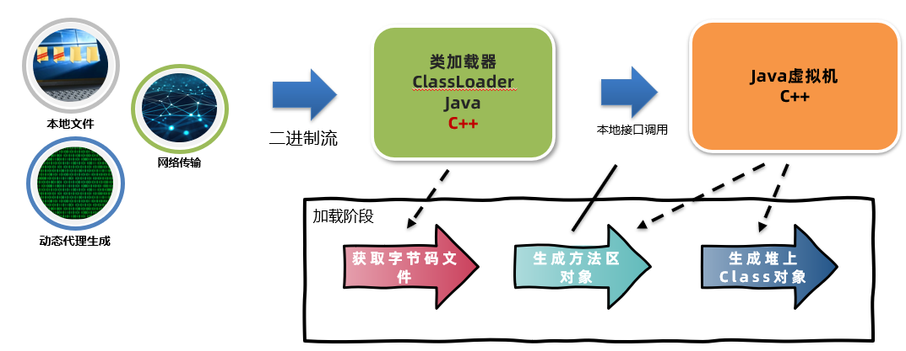

类加载器会通过二进制流的方式获取到字节码文件的内容，接下来将获取到的数据交给Java虚拟机，虚拟机会在方法区和堆上生成对应的对象保存字节码信息。

**本地接口JNI**是Java Native Interface的缩写，允许Java调用其他语言编写的方法。 获取字节码文 件 生成方法区 对象 生成堆上 Class对象 在hotspot类加载器中，主要用于调用Java虚拟机中的方法，这些方法使用C++编写。 高级软件人才培训

### 2.4.2 类加载器的分类

类加载器分为两类，一类是Java代码中实现的，一类是Java虚拟机底层源码实现的。

* 虚拟机底层实现：源代码位于Java虚拟机的源码中，实现语言与虚拟机底层语言一致，比如Hotspot使用C++。主要目的是保证Java程序运行中基础类被正确地加载，比如java.lang.String，Java虚拟机需要确保其可靠性。

* JDK中默认提供或者自定义：JDK中默认提供了多种处理不同渠道的类加载器，程序员也可以自己根据需求定制，使用Java语言。所有Java中实现的类加载器都需要继承ClassLoader这个抽象类。


类加载器的设计JDK8和8之后的版本差别较大，首先来看JDK8及之前的版本，这些版本中默认的类加载器有如下几种：

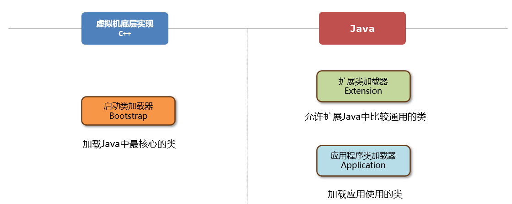


类加载器的详细信息可以通过Arthas的classloader命令查看：

> `classloader` - 查看 classloader 的继承树，urls，类加载信息，使用 classloader 去 getResource

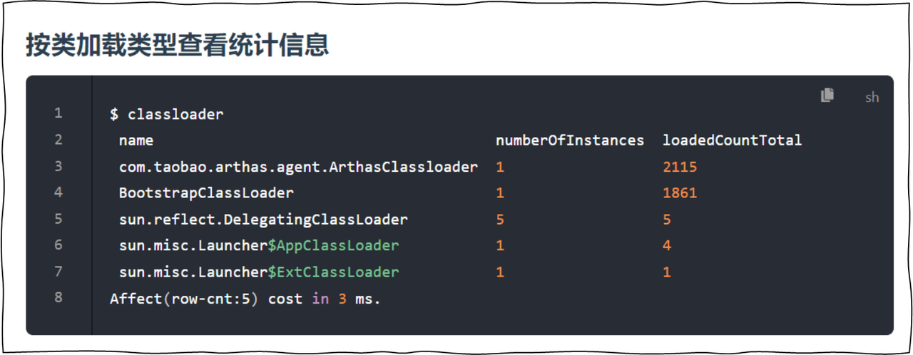

* BootstrapClassLoader是启动类加载器，numberOfInstances是类加载器的数量只有1个，loadedCountTotal是加载类的数量1861个。

* ExtClassLoader是扩展类加载器

* AppClassLoader是应用程序类加载器


### 2.4.3 启动类加载器

* 启动类加载器（Bootstrap ClassLoader）是由Hotspot虚拟机提供的、使用C++编写的类加载器。

* 默认加载Java安装目录/jre/lib下的类文件，比如rt.jar，tools.jar，resources.jar等。


运行如下代码：

这段代码通过String类获取到它的类加载器并且打印，结果是`null`。这是因为启动类加载器在JDK8中是由C++语言来编写的，在Java代码中去获取既不适合也不安全，所以才返回`null`


在Arthas中可以通过`sc -d 类名`的方式查看加载这个类的类加载器详细的信息，比如：

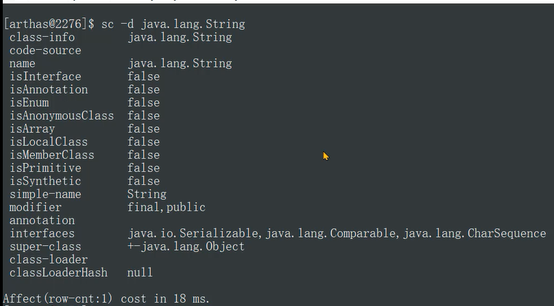

通过上图可以看到，java.lang.String类的类加载器是空的，Hash值也是null。


#### 用户扩展基础jar包

如果用户想扩展一些比较基础的jar包，让启动类加载器加载，有两种途径：

* **放入jre/lib下进行扩展**。不推荐，尽可能不要去更改JDK安装目录中的内容，会出现即时放进去由于文件名不匹配的问题也不会正常地被加载。

* **使用参数进行扩展。**&#x63A8;荐，使用-Xbootclasspath/a:jar包目录/jar包名 进行扩展，参数中的/a代表新增。


如下图，在IDEA配置中添加虚拟机参数，就可以加载`D:/jvm/jar/classloader-test.jar`这个jar包了。

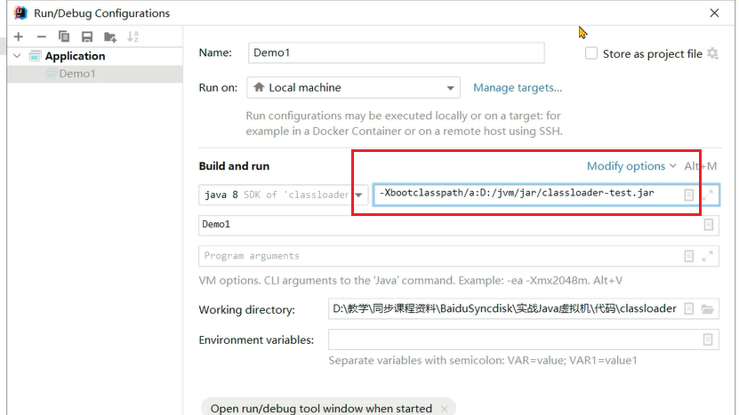


### 2.4.4 扩展类加载器和应用程序类加载器

* 扩展类加载器和应用程序类加载器都是JDK中提供的、使用Java编写的类加载器。

* 它们的源码都位于sun.misc.Launcher中，是一个静态内部类。继承自URLClassLoader。具备通过目录或者指定jar包将字节码文件加载到内存中。


继承关系图如下：

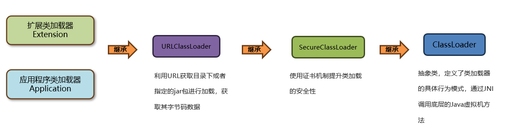

* ClassLoader类定义了具体的行为模式，简单来说就是先从本地或者网络获得字节码信息，然后调用虚拟机底层的方法创建方法区和堆上的对象。这样的好处就是让子类只需要去实现如何获取字节码信息这部分代码。

* SecureClassLoader提供了证书机制，提升了安全性。

* URLClassLoader提供了根据URL获取目录下或者指定jar包进行加载，获取字节码的数据。

* 扩展类加载器和应用程序类加载器继承自URLClassLoader，获得了上述的三种能力。


#### 扩展类加载器

扩展类加载器（Extension Class Loader）是JDK中提供的、使用Java编写的类加载器。**默认加载Java安装目录/jre/lib/ext下的类文件。**

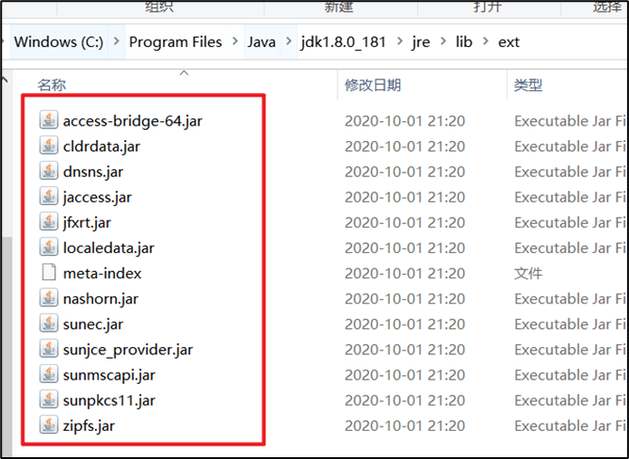

如下代码会打印ScriptEnvironment类的类加载器。ScriptEnvironment是nashorn框架中用来运行javascript语言代码的环境类，他位于nashorn.jar包中被扩展类加载器加载

打印结果如下：

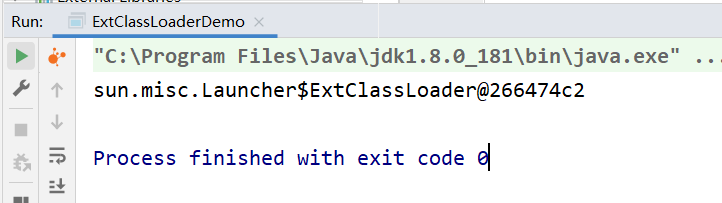


通过扩展类加载器去加载用户jar包：

* **放入/jre/lib/ext下进行扩展**。不推荐，尽可能不要去更改JDK安装目录中的内容。

* **使用参数进行扩展使用参数进行扩展**。推荐，使用-Djava.ext.dirs=jar包目录 进行扩展,这种方式会覆盖掉原始目录，可以用;(windows):(macos/linux)追加上原始目录

如下图中：

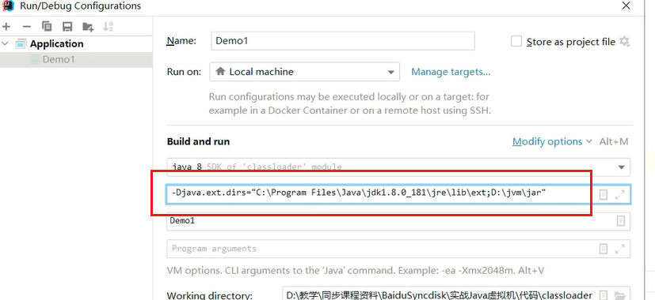

使用`引号`将整个地址包裹起来，这样路径中即便是有空格也不需要额外处理。路径中要包含原来ext文件夹，同时在最后加上扩展的路径。


#### &#x20;应用程序加载器

**应用程序类加载器会加载classpath下的类文件，默认加载的是项目中的类以及通过maven引入的第三方jar包中的类。**

如下案例中，打印出`Student`和`FileUtils`的类加载器：

输出结果如下：

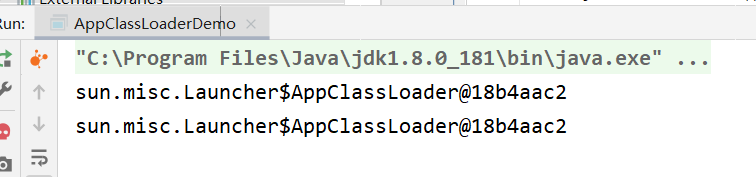

这两个类均由应用程序类加载器加载。


类加载器的加载路径可以通过classloader –c hash值 查看：

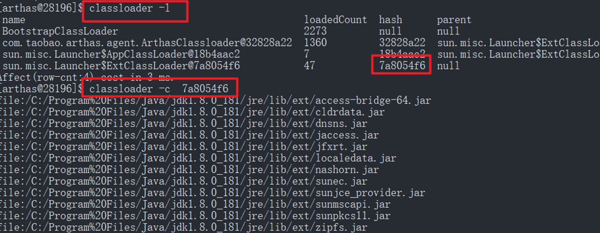


## 2.5、双亲委派机制

双亲委派机制指的是：当一个类加载器接收到加载类的任务时，会自底向上查找是否加载过，

再由顶向下进行加载。

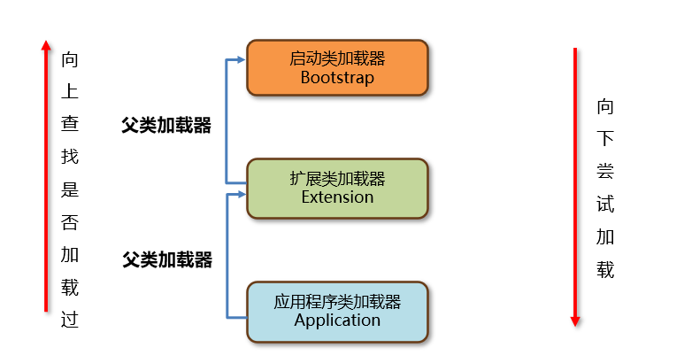

详细流程：

每个类加载器都有一个父类加载器。父类加载器的关系如下，启动类加载器没有父类加载器：

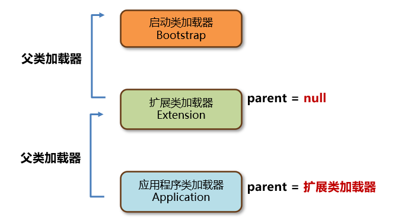

在类加载的过程中，每个类加载器都会先检查是否已经加载了该类，如果已经加载则直接返回，否则会将加载请求委派给父类加载器。


#### 案例1：

比如com.itheima.my.A假设在启动类加载器的加载目录中，而应用程序类加载器接到了加载类的任务。

1、应用程序类加载器首先判断自己加载过没有，没有加载过就交给父类加载器 - 扩展类加载器。

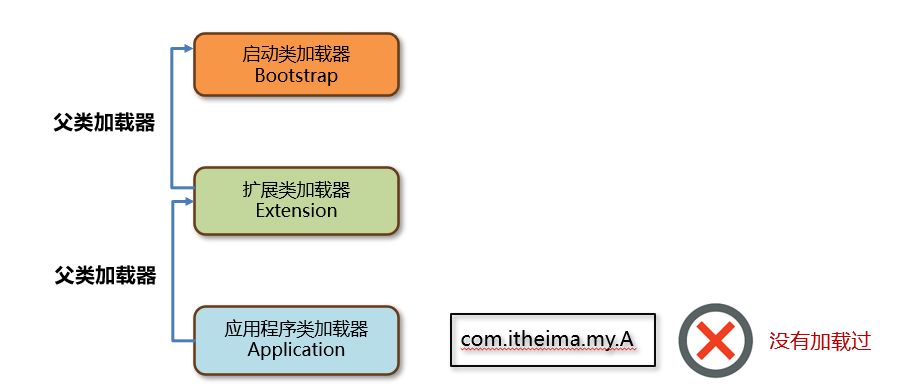

2、扩展类加载器也没加载过，交给他的父类加载器 - 启动类加载器。

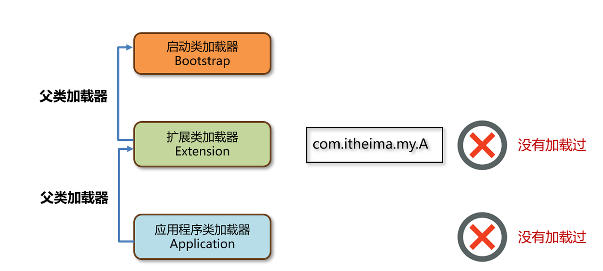

3、启动类加载器发现已经加载过，直接返回。

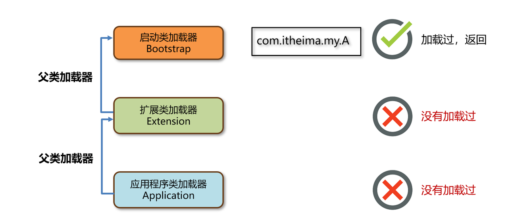


#### 案例2：

B类在扩展类加载器加载路径中，同样应用程序类加载器接到了加载任务，按照案例1中的方式一层一层向上查找，发现都没有加载过。那么启动类加载器会首先尝试加载。它发现这类不在它的加载目录中，向下传递给扩展类加载器。

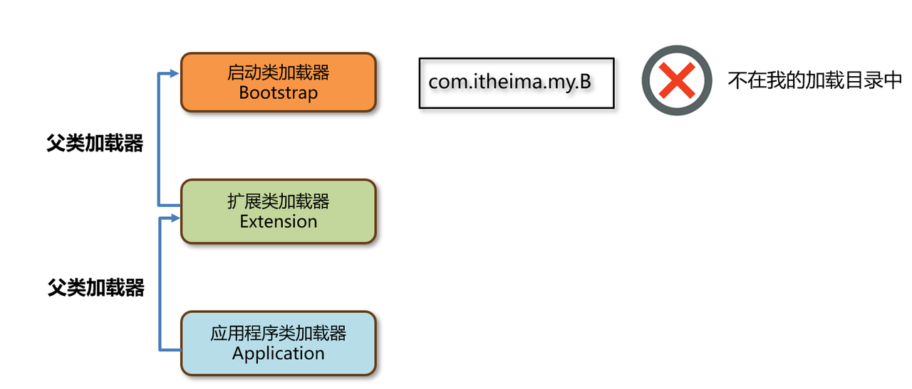

扩展类加载器发现这个类在它加载路径中，加载成功并返回。

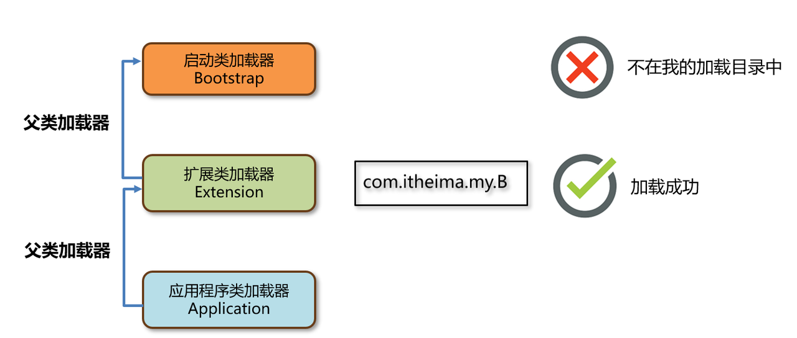

如果第二次再接收到加载任务，同样地向上查找。扩展类加载器发现已经加载过，就可以返回了。

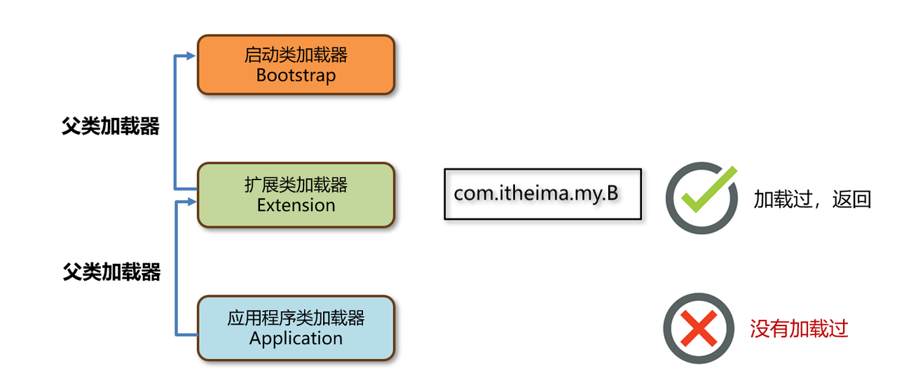

#### 类加载器的双亲委派机制的双亲关系

 ⚫ 应用程序类加载器的parent父类加载器是扩展类加载器，而扩展类加载器的parent是空。 

⚫ 启动类加载器使用C++编写，没有上级类加载器。

#### 双亲委派机制的作用

1.保证类加载的安全性。通过双亲委派机制避免恶意代码替换JDK中的核心类库，比如java.lang.String，确保核心类库的完整性和安全性。

2.避免重复加载。双亲委派机制可以避免同一个类被多次加载。


#### 如何指定加载类的类加载器？

在Java中如何使用代码的方式去主动加载一个类呢？

方式1：使用Class.forName方法，使用当前类的类加载器去加载指定的类。

方式2：获取到类加载器，通过类加载器的loadClass方法指定某个类加载器加载。

例如：

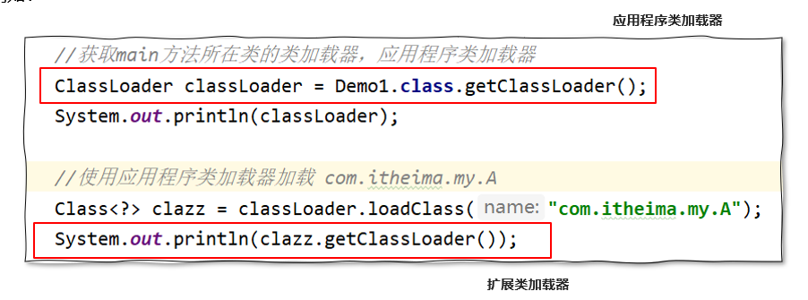

#### 三个面试题

1、如果一个类重复出现在三个类加载器的加载位置，应该由谁来加载？

启动类加载器加载，根据双亲委派机制，它的优先级是最高的


2、String类能覆盖吗，在自己的项目中去创建一个java.lang.String类，会被加载吗？

不能，会返回启动类加载器加载在rt.jar包中的String类。


3、**类的双亲委派机制是什么？**

* 当一个类加载器去加载某个类的时候，会自底向上查找是否加载过，如果加载过就直接返回，如果一直到最顶层的类加载器都没有加载，再由顶向下进行加载。

* 应用程序类加载器的父类加载器是扩展类加载器，扩展类加载器的父类加载器是启动类加载器。

* 双亲委派机制的好处有两点：第一是避免恶意代码替换JDK中的核心类库，比如java.lang.String，确保核心类库的完整性和安全性。第二是避免一个类重复地被加载。

------

####  标题：**类加载器的双亲委派机制**

##### 问题：

在 Java 中如何使用代码的方式去主动加载一个类呢？

##### 方式1：

使用 `Class.forName` 方法，使用当前类的类加载器去加载指定的类。

##### 方式2：

获取到类加载器，通过类加载器的 `loadClass` 方法指定某个类加载器加载。

##### 在 IDEA 中测试下面的案例：

```java
// 获取 main 方法所在类的类加载器，应用程序类加载器
ClassLoader classLoader = Demo1.class.getClassLoader();
System.out.println(classLoader);

// 使用应用程序类加载器加载 com.itheima.my.A
Class<?> clazz = classLoader.loadClass("com.itheima.my.A");
System.out.println(clazz.getClassLoader());
```

> 🔍 图中注释说明：
>
> - 第一行（红色框）：获取当前类 `Demo1` 的类加载器（通常是 **应用程序类加载器**）
> - 第二行（黄色背景）：使用该类加载器加载指定类 `com.itheima.my.A`
> - 第三行（红色框）：打印被加载类的类加载器，验证其是否由应用程序类加载器加载

###### 图形标注：

- 上方文字：“**应用程序类加载器**”
- 下方文字：“**扩展类加载器**”
- 中间箭头指向“**双亲委派机制**”，表示类加载过程中遵循双亲委派模型

------

##### ✅ 补充说明（根据上下文推断）：

- Java 类加载器采用 

  双亲委派机制（Parent Delegation Model）

  ：

  1. 当前类加载器收到加载请求时，**先委托父类加载器**尝试加载。
  2. 只有当父类加载器无法加载时，才由自己加载。

- 通常类加载器层次结构为：

  - 启动类加载器（Bootstrap ClassLoader）
  - 扩展类加载器（Extension ClassLoader）
  - 应用程序类加载器（Application ClassLoader）

> 💡 示例中 `Demo1.class.getClassLoader()` 返回的是 **应用程序类加载器**，它会委托给上级（扩展类加载器 → 启动类加载器），最终完成类加载。

------

##### 🧠 总结

这段代码演示了如何通过 `getClassLoader()` 获取当前类的类加载器，并使用 `loadClass()` 主动加载另一个类。同时结合“双亲委派机制”图示，说明类加载过程中的委托关系和层级结构。

## 2.6、打破双亲委派机制

打破双亲委派机制历史上有三种方式，但本质上只有第一种算是真正的打破了双亲委派机制：

* 自定义类加载器并且重写loadClass方法。Tomcat通过这种方式实现应用之间类隔离，《面试篇》中分享它的做法。

* 线程上下文类加载器。利用上下文类加载器加载类，比如JDBC和JNDI等。

* Osgi框架的类加载器。历史上Osgi框架实现了一套新的类加载器机制，允许同级之间委托进行类的加载，目前很少使用。


#### 自定义类加载器

一个Tomcat程序中是可以运行多个Web应用的，如果这两个应用中出现了相同限定名的类，比如Servlet类，Tomcat要保证这两个类都能加载并且它们应该是不同的类。如果不打破双亲委派机制，当应用类加载器加载Web应用1中的MyServlet之后，Web应用2中相同限定名的MyServlet类就无法被加载了。

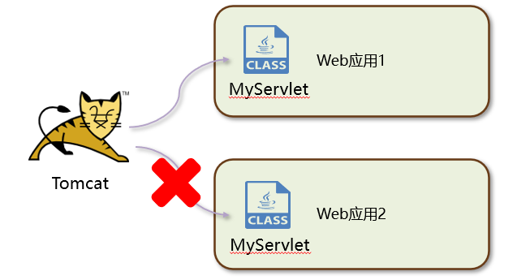

Tomcat使用了自定义类加载器来实现应用之间类的隔离。 每一个应用会有一个独立的类加载器加载对应的类。

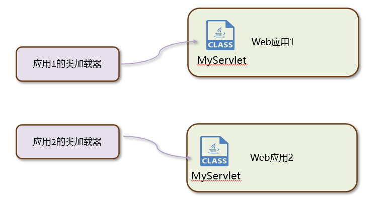

那么自定义加载器是如何能做到的呢？首先我们需要先了解，双亲委派机制的代码到底在哪里，接下来只需要把这段代码消除即可。

ClassLoader中包含了4个核心方法，双亲委派机制的核心代码就位于loadClass方法中。

1、入口方法：

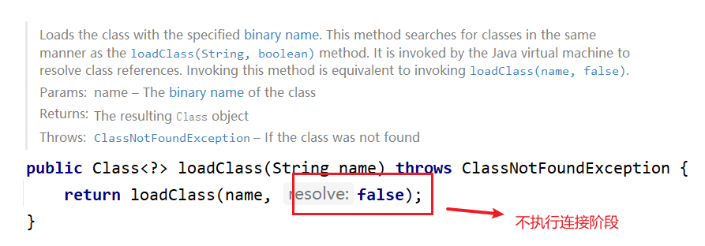


2、再进入看下：

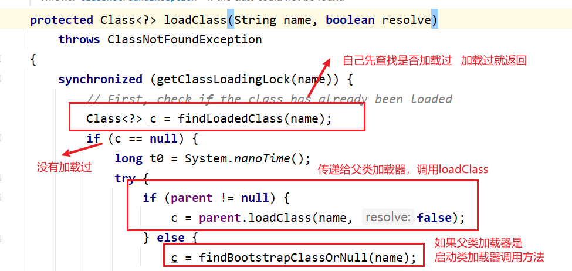


如果查找都失败，进入加载阶段，首先会由启动类加载器加载，这段代码在`findBootstrapClassOrNull`中。如果失败会抛出异常，接下来执行下面这段代码：

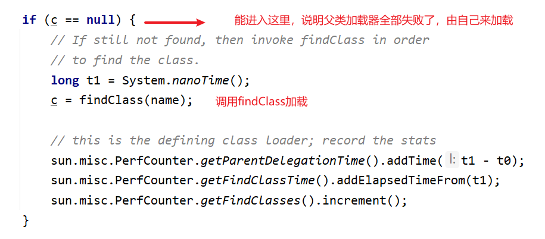

父类加载器加载失败就会抛出异常，回到子类加载器的这段代码，这样就实现了加载并向下传递。


3、最后根据传入的参数判断是否进入连接阶段：

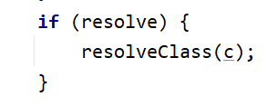


接下来实现打破双亲委派机制：


##### 自定义类加载器父类怎么是AppClassLoader呢？

默认情况下自定义类加载器的父类加载器是应用程序类加载器：

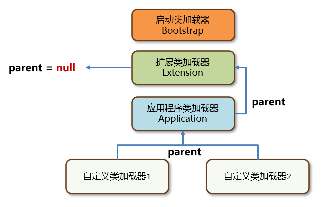

以Jdk8为例，ClassLoader类中提供了构造方法设置parent的内容：

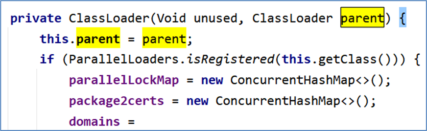

这个构造方法由另外一个构造方法调用，其中父类加载器由getSystemClassLoader方法设置，该方法返回的是AppClassLoader。

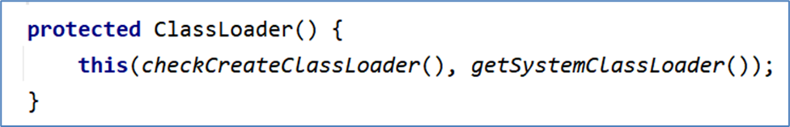


##### 两个自定义类加载器加载相同限定名的类，不会冲突吗？

不会冲突，在同一个Java虚拟机中，只有相同类加载器+相同的类限定名才会被认为是同一个类。

在Arthas中使用sc –d 类名的方式查看具体的情况。

如下代码：

打印的应该是false，因为两个类加载器不同，尽管加载的是同一个类名，最终Class对象也不是相同的。

通过Arthas看：

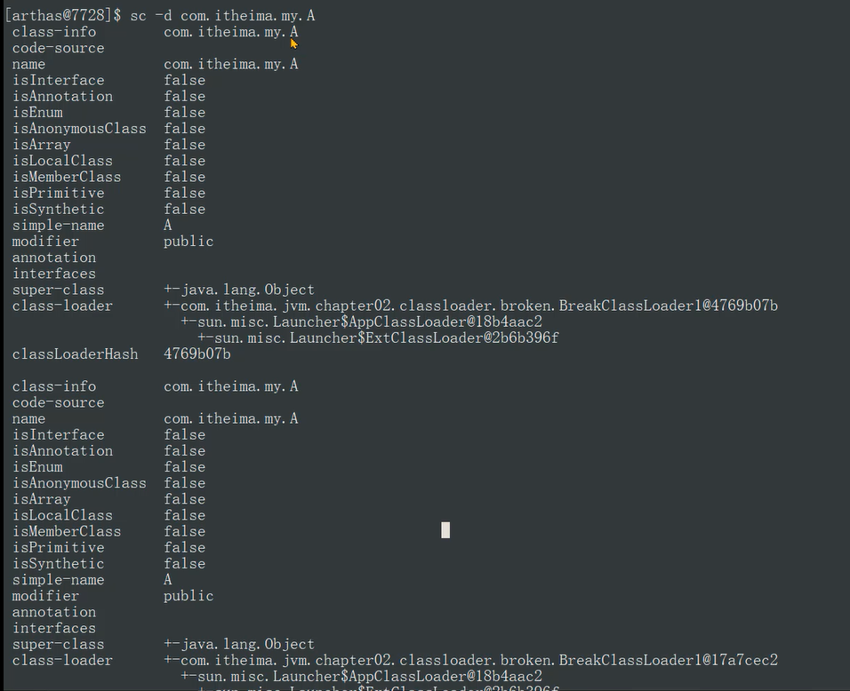

也会出现两个不同的A类。


#### 线程上下文类加载器

利用上下文类加载器加载类，比如JDBC和JNDI等。

我们来看下JDBC的案例：

1、JDBC中使用了DriverManager来管理项目中引入的不同数据库的驱动，比如mysql驱动、oracle驱动。


2、DriverManager类位于rt.jar包中，由启动类加载器加载。

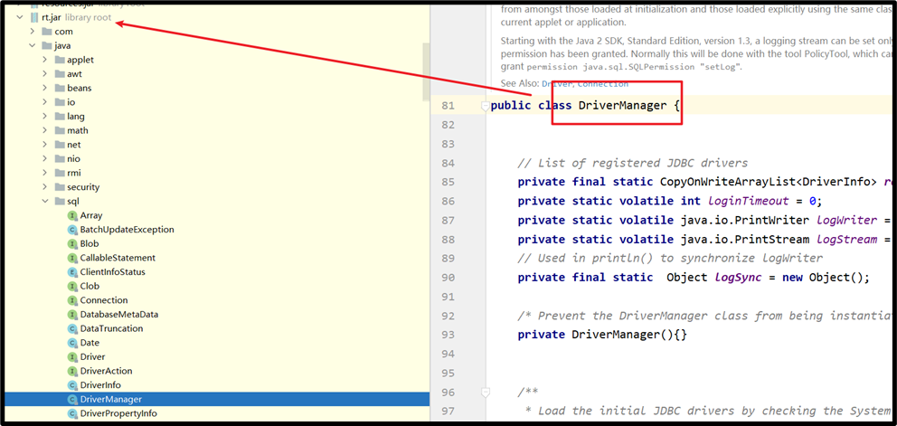


3、依赖中的mysql驱动对应的类，由应用程序类加载器来加载。


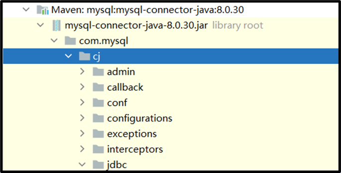

在类中有初始化代码：

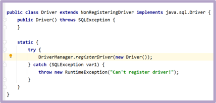


DriverManager属于rt.jar是启动类加载器加载的。而用户jar包中的驱动需要由应用类加载器加载，*这就违反了双亲委派机制*。（这点存疑，一会儿再讨论）


那么问题来了，DriverManager怎么知道jar包中要加载的驱动在哪儿？

1、在类的初始化代码中有这么一个方法`LoadInitialDrivers`：

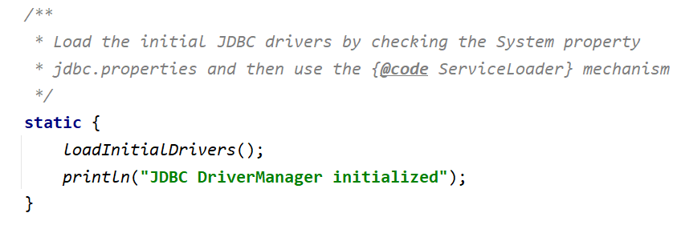

2、这里使用了SPI机制，去加载所有jar包中实现了Driver接口的实现类。

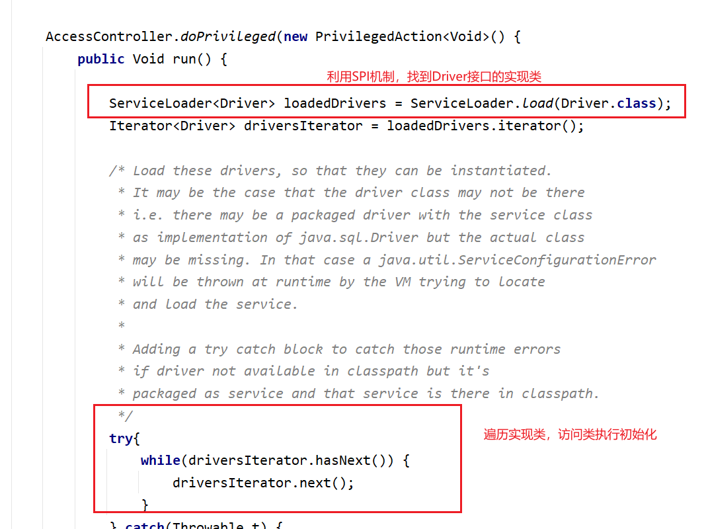

3、SPI机制就是在这个位置下存放了一个文件，文件名是接口名，文件里包含了实现类的类名。这样SPI机制就可以找到实现类了。

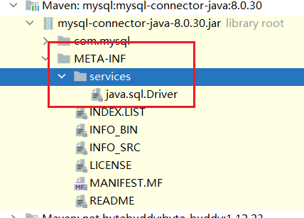

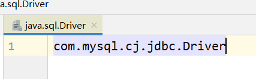


4、SPI中利用了线程上下文类加载器（应用程序类加载器）去加载类并创建对象。

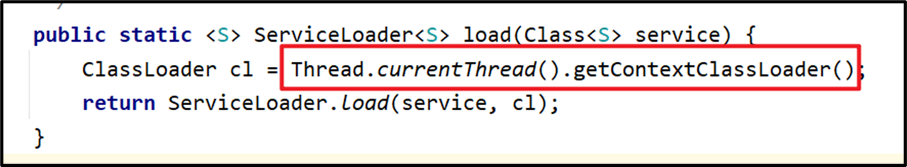


总结：

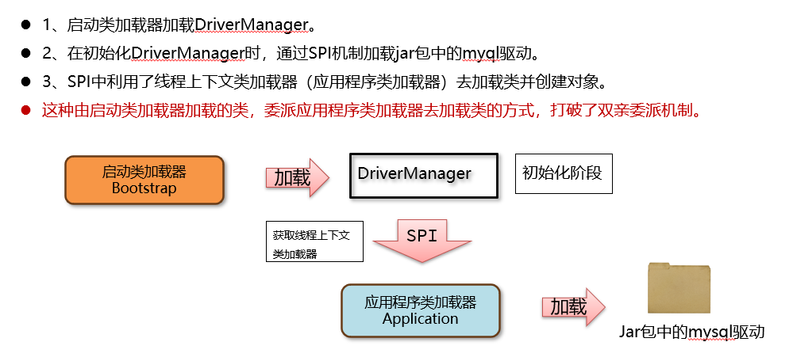


##### JDBC案例中真的打破了双亲委派机制吗？

最早这个论点提出是在周志明《深入理解Java虚拟机》中，他认为打破了双亲委派机制，这种由启动类加载器加载的类，委派应用程序类加载器去加载类的方式，所以打破了双亲委派机制。

但是如果我们分别从DriverManager以及驱动类的加载流程上分析，JDBC只是在DriverManager加载完之后，通过初始化阶段触发了驱动类的加载，类的加载依然遵循双亲委派机制。

所以我认为这里没有打破双亲委派机制，只是用一种巧妙的方法让启动类加载器加载的类，去引发的其他类的加载。


#### Osgi框架的类加载器

历史上，OSGi模块化框架。它存在同级之间的类加载器的委托加载。OSGi还使用类加载器实现了热部署的功能。热部署指的是在服务不停止的情况下，动态地更新字节码文件到内存中。

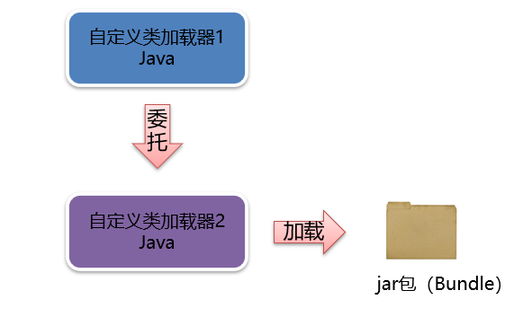

由于这种机制使用已经不多，所以不再过多讨论OSGi，着重来看下热部署在实际项目中的应用。


#### 案例：使用阿里arthas不停机解决线上问题

**背景：**

小李的团队将代码上线之后，发现存在一个小bug，但是用户急着使用，如果重新打包再发布需要一个多小时的时间，所以希望能使用arthas尽快的将这个问题修复。


**思路：**

1. 在出问题的服务器上部署一个 arthas，并启动。

2. jad --source-only 类全限定名 > 目录/文件名.java      jad 命令反编译，然后可以用其它编译器，比如 vim 来修改源码

3. mc –c 类加载器的hashcode 目录/文件名.java -d 输出目录

&#x20;     mc 命令用来编译修改过的代码

* &#x20;retransform class文件所在目录/xxx.class

&#x20;     用 retransform 命令加载新的字节码


**详细流程：**

1、这段代码编写有误，在枚举中的类型判断上使用了`==` 而不是`equals`。

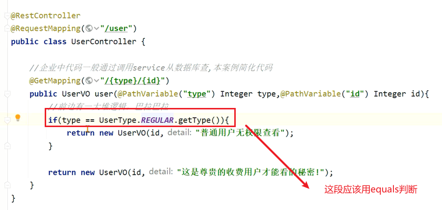


2、枚举中是这样定义的，1001是普通用户，1002是VIP用户：

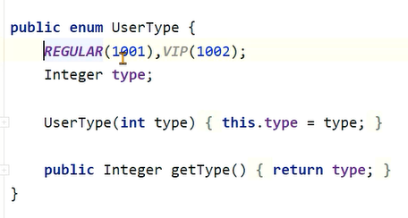


3、由于代码有误，导致传递1001参数时，返回的是收费用户的内容。

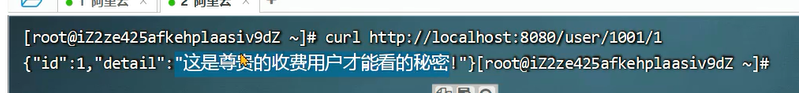


4、`jad --source-only 类全限定名 > 目录/文件名.java` 使用 jad 命令反编译，然后可以用其它编译器，比如 vim 来修改源码

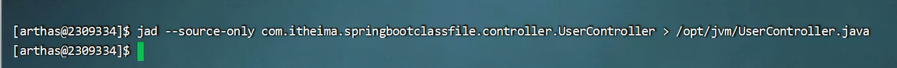

这里直接双击文件使用finalShell编辑：

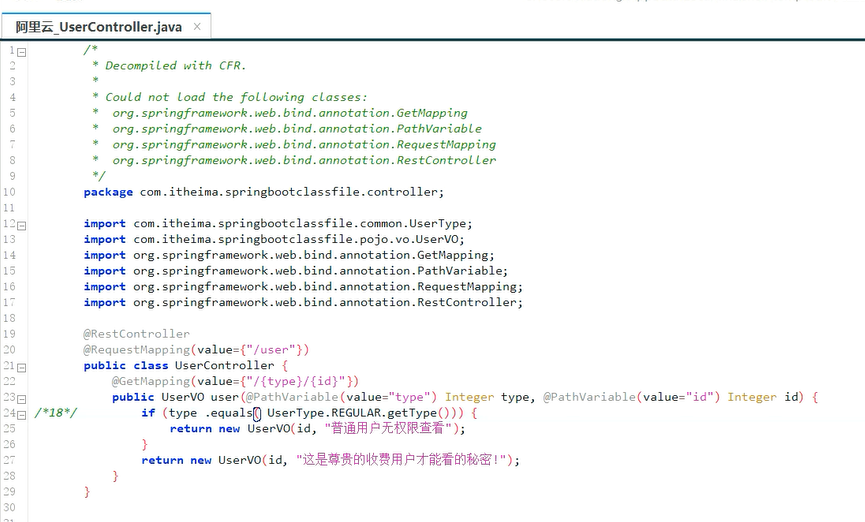


5、`mc –c 类加载器的hashcode 目录/文件名.java -d 输出目录` 使用mc 命令用来编译修改过的代码

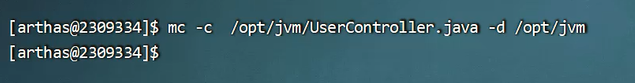


6、`retransform class文件所在目录/xxx.class` 用 retransform 命令加载新的字节码

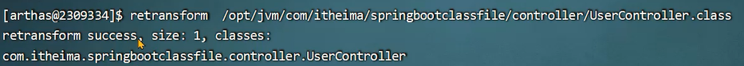


7、测试：

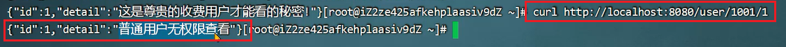


**注意事项：**

1、程序重启之后，字节码文件会恢复，除非将class文件放入jar包中进行更新。

2、使用retransform不能添加方法或者字段，也不能更新正在执行中的方法。


## 2.7、JDK9之后的类加载器

JDK8及之前的版本中，扩展类加载器和应用程序类加载器的源码位于rt.jar包中的sun.misc.Launcher.java。

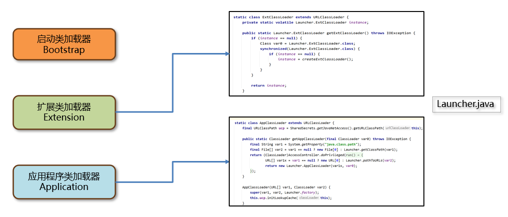


由于JDK9引入了module的概念，类加载器在设计上发生了很多变化。

1.启动类加载器使用Java编写，位于jdk.internal.loader.ClassLoaders类中。

&#x20;  Java中的BootClassLoader继承自BuiltinClassLoader实现从模块中找到要加载的字节码资源文件。

&#x20;  启动类加载器依然无法通过java代码获取到，返回的仍然是null，保持了统一。


2、扩展类加载器被替换成了平台类加载器（Platform Class Loader）。

&#x20;    平台类加载器遵循模块化方式加载字节码文件，所以继承关系从URLClassLoader变成了BuiltinClassLoader，BuiltinClassLoader实现了从模块中加载字节码文件。平台类加载器的存在更多的是为了与老版本的设计方案兼容，自身没有特殊的逻辑。

## 概括

1.类加载器的作用是什么？ 

类加载器（ClassLoader）负责在类加载过程中的字节码获取并加载到内存这 一部分。通过加载字节码数据放入内存转换成byte[]，接下来调用虚拟机底层 方法将byte[]转换成方法区和堆中的数据。

2.有几种类加载器？

 1.启动类加载器（BootstrapClassLoader）加载核心类 

2.扩展类加载器（Extension ClassLoader）加载扩展类 

3.应用程序类加载器（Application ClassLoader）加载应用classpath中的类 

4.自定义类加载器，重写findClass方法。 JDK9及之后扩展类加载器（Extension ClassLoader）变成了平台类加载器（Platform  ClassLoader）

3、什么是双亲委派机制？ 

每个Java实现的类加载器中保存了一个成员变量叫“父”（Parent）类加载器。 自底向上查找是否加载过，再由顶向下进行加载。避免了核心类被应用程序重 写并覆盖的问题，提升了安全性。

4、怎么打破双亲委派机制？ 

1、重写loadClass方法，不再实现双亲委派机制。 

2、JNDI、JDBC、JCE、JAXB和JBI等框架使用了SPI机制+线程上下文类加载器。 

3、OSGi实现了一整套类加载机制，允许同级类加载器之间互相调用。


# 3、运行时数据区

Java虚拟机在运行Java程序过程中管理的内存区域，称之为运行时数据区。《Java虚拟机规范》中规定了每一部分的作用。

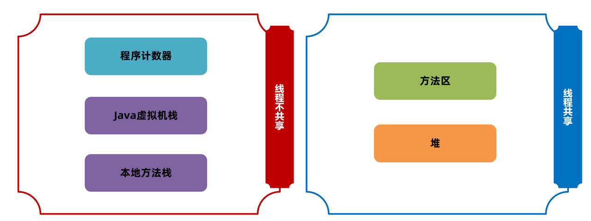

### 面试题

Java的内存分成哪几部分？详细介绍一下吧

Java内存中哪些部分会内存溢出？

 JDK7和8中在内存结构上的区别是什么？

### 内存调优学习路线

01了解运行时内存结构  

了解JVM运行过程中每一部分的内存结构以 及哪些部分容易出现内存溢出 

02掌握内存问题的产生原因 

学习代码中常见的几种内存泄漏、 性能问题的常见原因 

03 掌握内存调优的基本方法 

学习内存泄漏、性能问题等常见JVM问题 的常规解决方案

### 3.1 程序计数器

程序计数器（Program Counter Register）也叫PC寄存器，每个线程会通过程序计数器记录当前要执行的的字节码指令的地址。

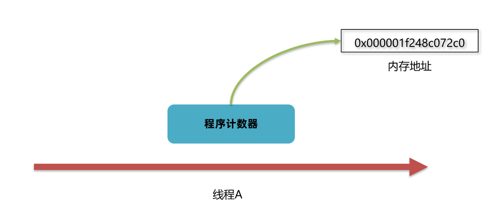

一个程序计数器的具体案例：

在加载阶段，虚拟机将字节码文件中的指令读取到内存之后，会将原文件中的偏移量转换成内存地址。每一条字节码指令都会拥有一个内存地址。

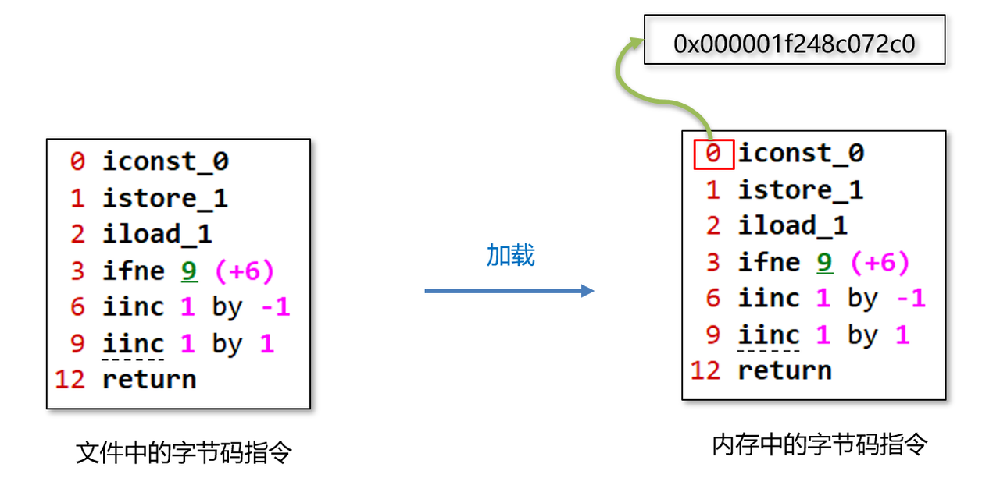

在代码执行过程中，程序计数器会记录下一行字节码指令的地址。执行完当前指令之后，虚拟机的执行引擎根据程序计数器执行下一行指令。这里为了简单起见，使用偏移量代替，真实内存中执行时保存的应该是地址。

比如当前执行的是偏移量为0的指令，那么程序计数器中保存的就是下一条的地址（偏移量1）。

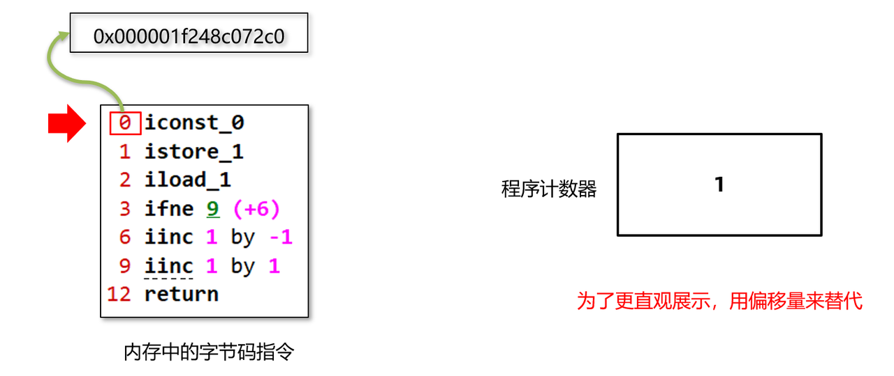

一路向下执行

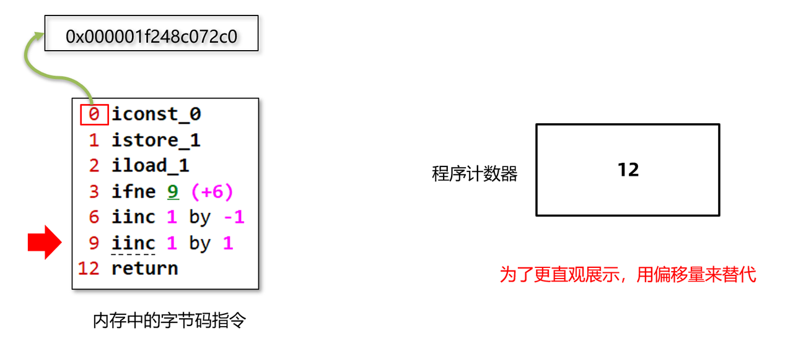

一直执行到方法的最后一行指令，此时方法执行return语句，当前方法执行结束，程序计数器中会放入方法出口的地址（栈中讲解，简单来说就是这个B方法结束了，A调用了B，那么要回到A方法）

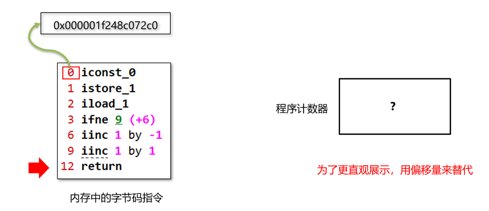

所以，程序计数器可以控制程序指令的进行，实现分支、跳转、异常等逻辑。不管是分支、跳转、异常，只需要在程序计数器中放入下一行要执行的指令地址即可。


在多线程执行情况下，Java虚拟机需要通过程序计数器记录CPU切换前解释执行到那一句指令并继续解释运行。

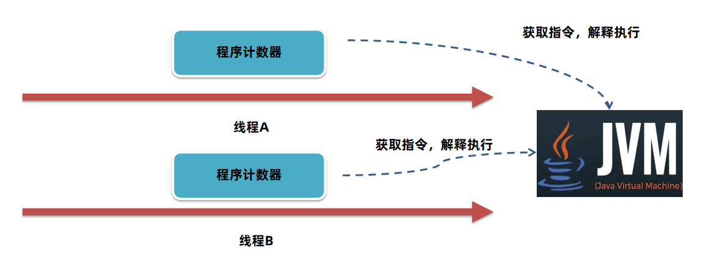


#### 程序计数器会出现内存溢出吗？

内存溢出指的是程序在使用某一块内存区域时，存放的数据需要占用的内存大小超过了虚拟机能提供的内存上限。由于每个线程只存储一个固定长度的内存地址，程序计数器是不会发生内存溢出的。程序员无需对程序计数器做任何处理。


### 3.2 Java虚拟机栈

Java虚拟机栈（Java Virtual Machine Stack）采用栈的数据结构来管理方法调用中的基本数据，先进后出（First In Last Out）,每一个方法的调用使用一个栈帧（Stack Frame）来保存。

main方法执行时，会创建main方法的栈帧：

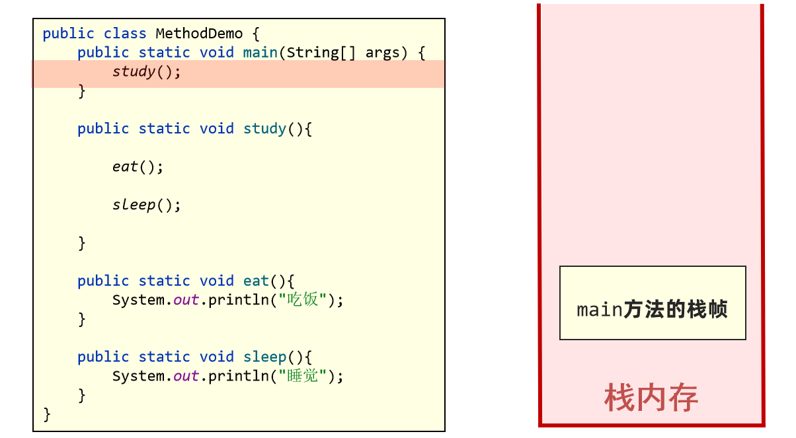

接下来执行study方法，会创建study方法的栈帧

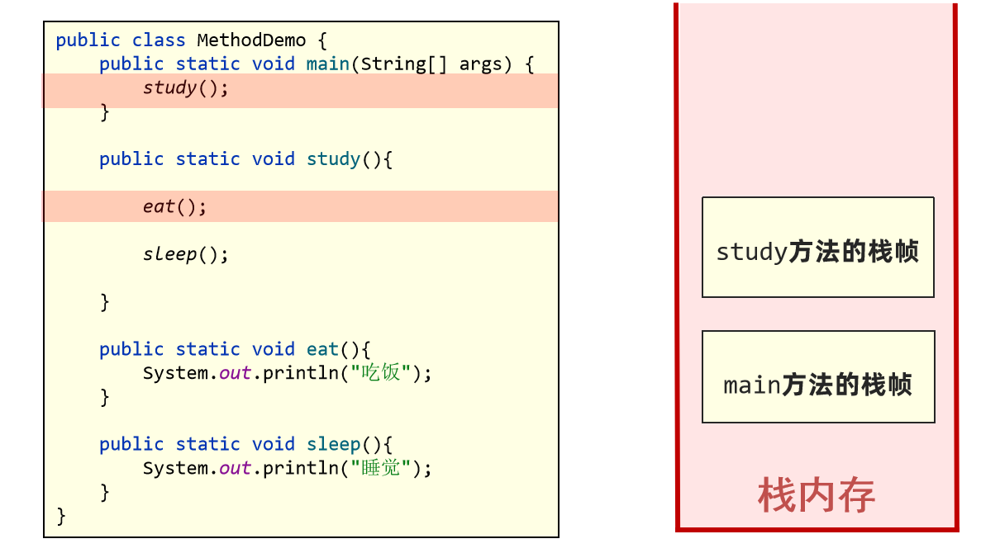

进入eat方法，创建eat方法的栈帧

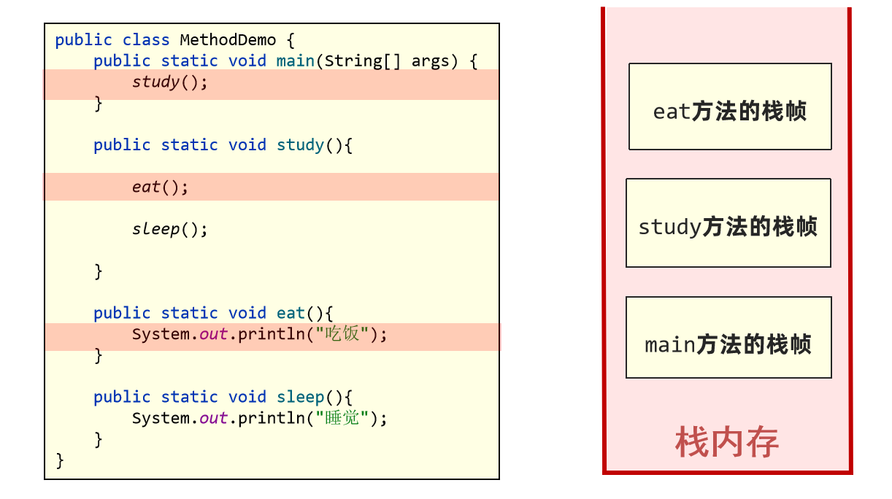

eat方法执行完之后，会弹出它的栈帧：

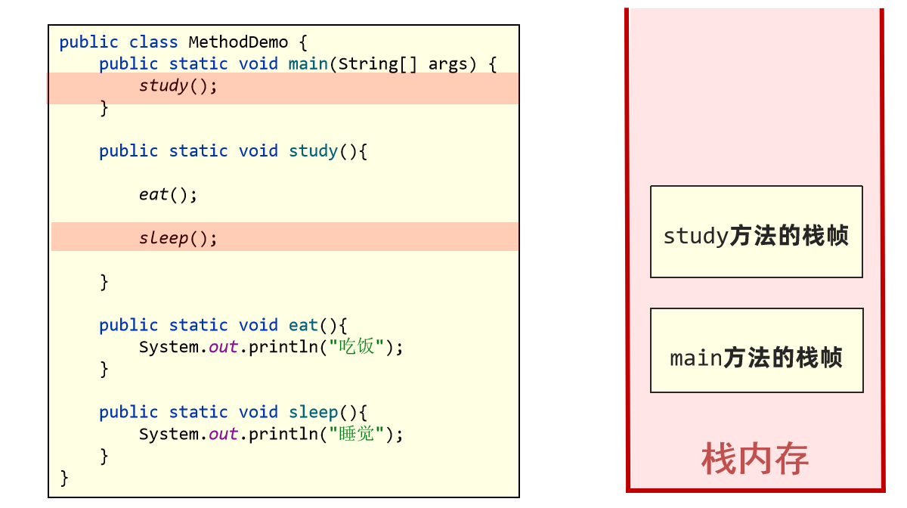

然后调用sleep方法，创建sleep方法栈帧

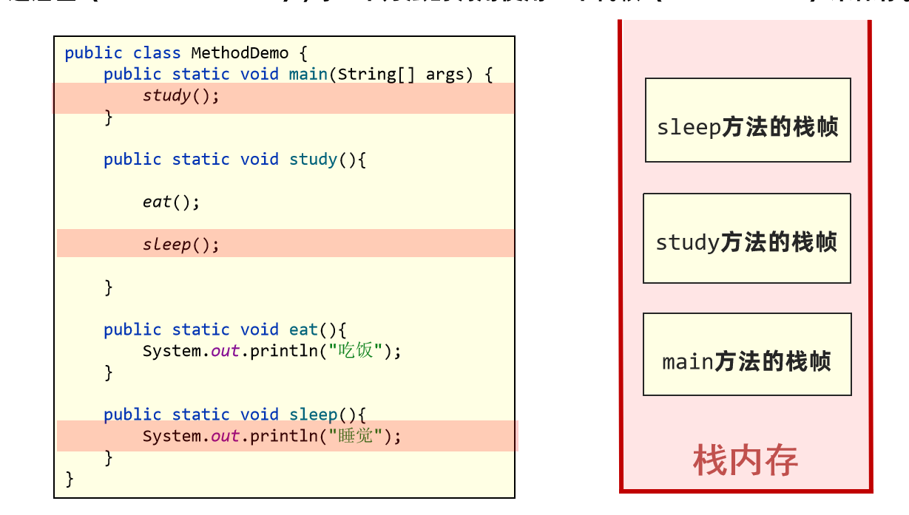

最后study方法结束之后弹出栈帧，main方法结束之后弹出main的栈帧。


在IDEA中也可以看到对应的栈帧：

打上断点debug之后会出现栈帧内容：

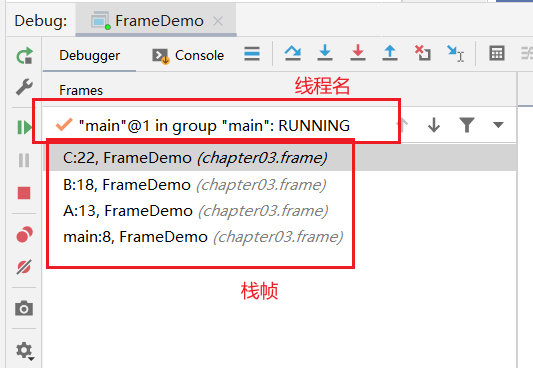

Java虚拟机栈随着线程的创建而创建，而回收则会在线程的销毁时进行。由于方法可能会在不同线程中执行，每个线程都会包含一个自己的虚拟机栈。如下就有两个线程的虚拟机栈，main线程和线程A。

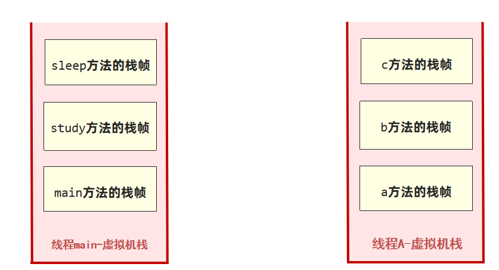


Java虚拟机栈的栈帧中主要包含三方面的内容：

* 局部变量表，局部变量表的作用是在运行过程中存放所有的局部变量

* 操作数栈，操作数栈是栈帧中虚拟机在执行指令过程中用来存放临时数据的一块区域

* 帧数据，帧数据主要包含动态链接、方法出口、异常表的引用


#### 局部变量表

局部变量表的作用是在方法执行过程中存放所有的局部变量。局部变量表分为两种，一种是字节码文件中的，另外一种是栈帧中的也就是保存在内存中。栈帧中的局部变量表是根据字节码文件中的内容生成的。


我们先来看下字节码文件中的局部变量表：编译成字节码文件时就可以确定局部变量表的内容。

test1方法的局部变量表如下：

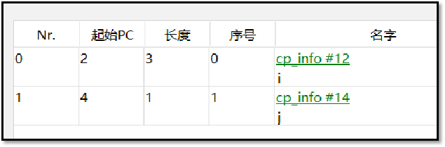

局部变量表中保存了字节码指令生效的偏移量：

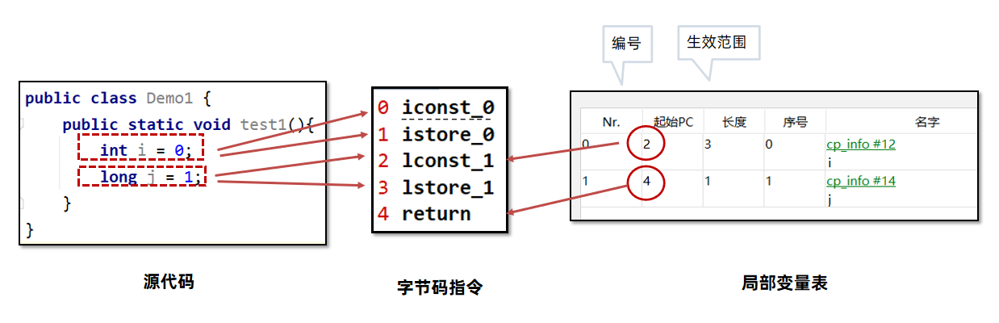

比如`i`这个变量，它的起始PC是2，代表从`lconst_1`这句指令开始才能使用`i`，长度为3，也就是2-4这三句指令都可以使用`i`。为什么从2才能使用，因为0和1这两句字节码指令还在处理`int i = 0`这句赋值语句。`j`这个变量只有等3指令执行完之后也就是`long j = 1`代码执行完之后才能使用，所以起始PC为4，只能在4这行字节码指令中使用。


接下来看下栈帧中的局部变量表，栈帧中的局部变量表是一个数组，数组中每一个位置称之为槽(slot) ，long和double类型占用两个槽，其他类型占用一个槽。

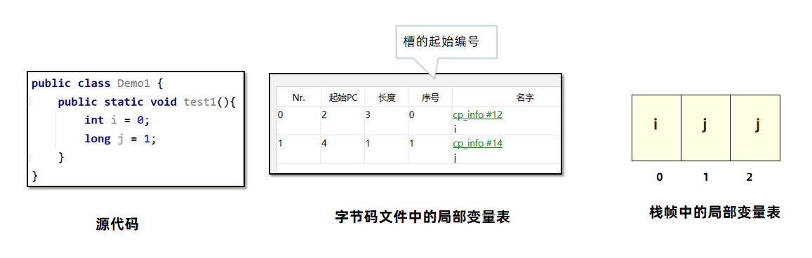

`i`占用数组下标为0的位置，`j`占用数组下标1-2的位置。


刚才看到的是静态方法，实例方法中的序号为0的位置存放的是this，指的是当前调用方法的对象，运行时会在内存中存放实例对象的地址。

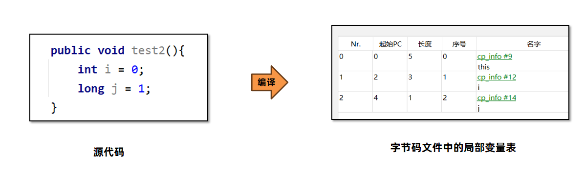


方法参数也会保存在局部变量表中，其顺序与方法中参数定义的顺序一致。局部变量表保存的内容有：实例方法的this对象，方法的参数，方法体中声明的局部变量。


test3方法中包含两个参数`k`,`m`，这两个参数也会被加入到局部变量表中。


**以下代码的局部变量表中会占用几个槽？**

为了节省空间，局部变量表中的槽是可以复用的，一旦某个局部变量不再生效，当前槽就可以再次被使用。

1、方法执行时，实例对象`this`、`k`、`m` 会被放入局部变量表中，占用3个槽

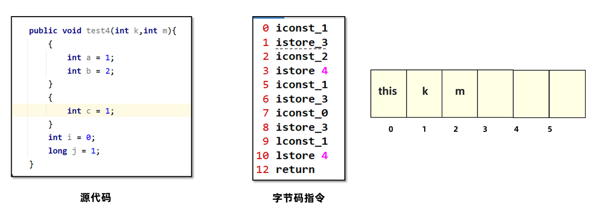

2、将1的值放入局部变量表下标为3的位置上，相当于给a进行赋值。

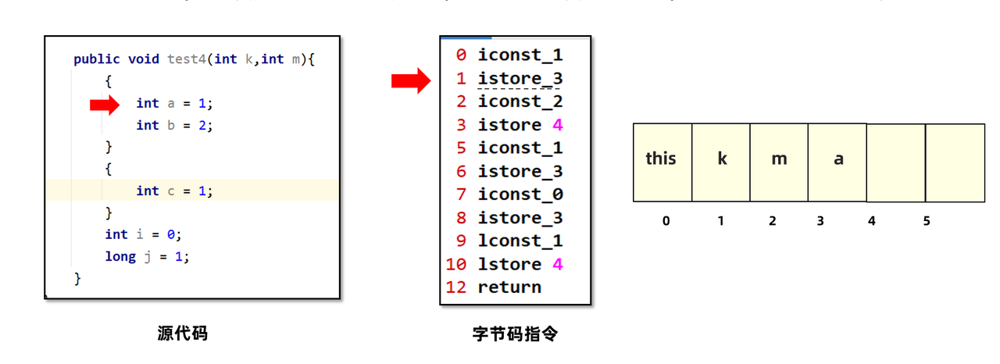

3、将2放入局部变量表下标为4的位置，给b赋值为2。

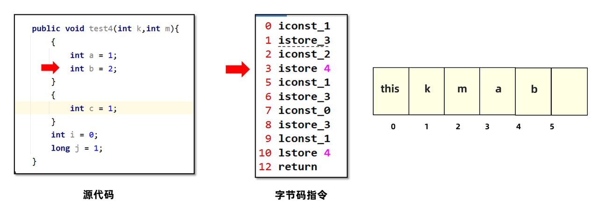

4、ab已经脱离了生效范围，所以下标为3和4的这两个位置可以复用。此时c的值1就可以放入下标为3的位置。

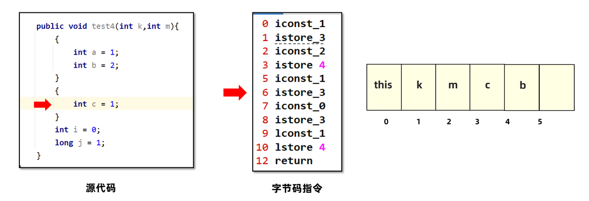

4、脱离c的生效范围之后，给i赋值就可以复用c的位置。

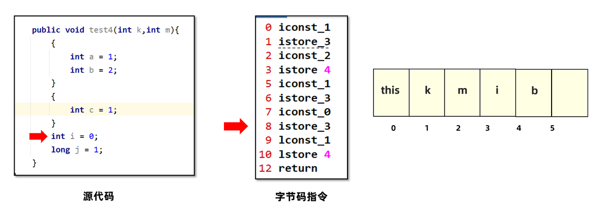

5、最后放入j，j是一个long类型，占用两个槽。但是可以复用b所在的位置，所以占用4和5这两个位置


所以，局部变量表数值的长度为6。这一点在编译期间就可以确定了，运行过程中只需要在栈帧中创建长度为6的数组即可。

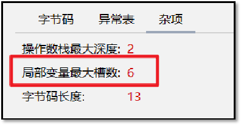


#### 操作数栈

操作数栈是栈帧中虚拟机在执行指令过程中用来存放中间数据的一块区域。他是一种栈式的数据结构，如果一条指令将一个值压入操作数栈，则后面的指令可以弹出并使用该值。

在编译期就可以确定操作数栈的最大深度，从而在执行时正确的分配内存大小。

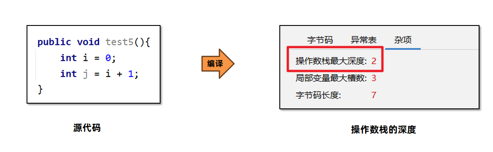

比如之前的相加案例中，操作数栈最大的深入会出现在这个时刻：

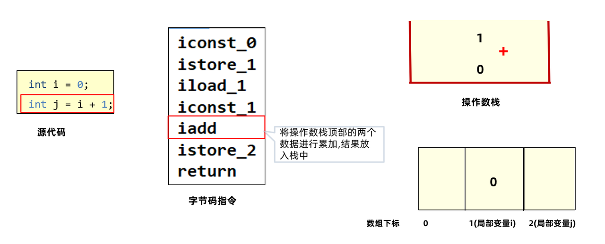

所以操作数栈的深度会定义为2。


#### 帧数据

帧数据主要包含动态链接、方法出口、异常表的引用。


##### 动态链接

当前类的字节码指令引用了其他类的属性或者方法时，需要将符号引用（编号）转换成对应的运行时常量池中的内存地址。动态链接就保存了编号到运行时常量池的内存地址的映射关系。

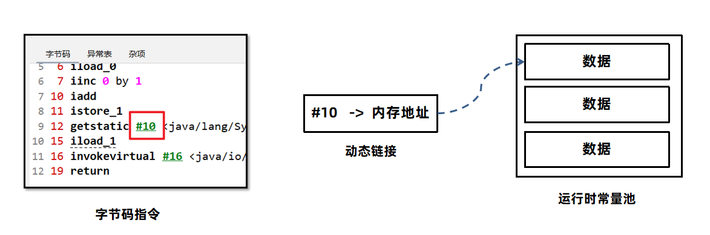


##### 方法出口

方法出口指的是方法在正确或者异常结束时，当前栈帧会被弹出，同时程序计数器应该指向上一个栈帧中的下一条指令的地址。所以在当前栈帧中，需要存储此方法出口的地址。

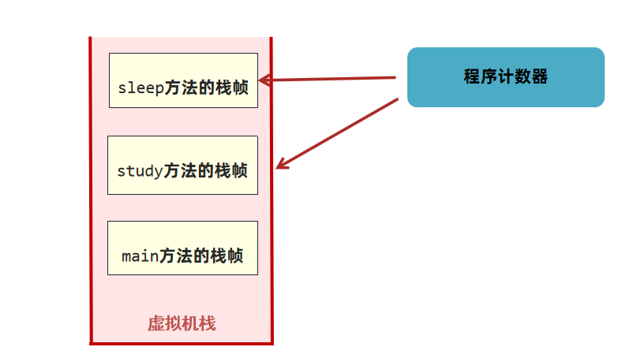


##### 异常表

异常表存放的是代码中异常的处理信息，包含了异常捕获的生效范围以及异常发生后跳转到的字节码指令位置。

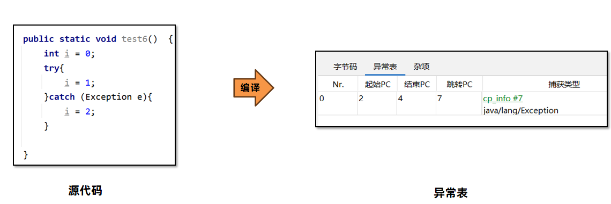

`如下案例：i=1`这行源代码编译成字节码指令之后，会包含偏移量2-4这三行指令。其中2-3是对i进行赋值1的操作，4的没有异常就跳转到10方法结束。如果出现异常的情况下，继续执行到7这行指令，7会将异常对象放入操作数栈中，这样在catch代码块中就可以使用异常对象了。接下来执行8-9，对i进行赋值为2的操作。

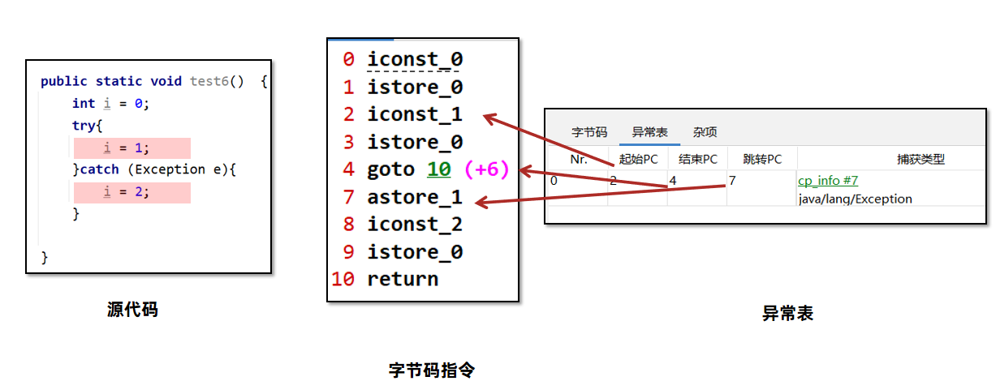

所以异常表中，异常捕获的起始偏移量就是2，结束偏移量是4，在2-4执行过程中抛出了`java.lang.Exception`对象或者子类对象，就会将其捕获，然后跳转到偏移量为7的指令。


#### 栈内存溢出

Java虚拟机栈如果栈帧过多，占用内存超过栈内存可以分配的最大大小就会出现内存溢出。Java虚拟机栈内存溢出时会出现StackOverflowError的错误。

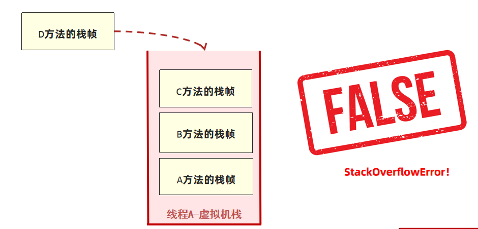


如果我们不指定栈的大小，JVM 将创建一个具有默认大小的栈。大小取决于操作系统和计算机的体系结构。

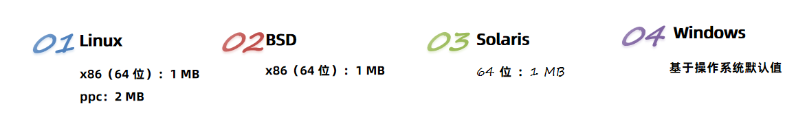

我们来模拟下栈内存的溢出情况:

使用递归让方法调用自身，但是不设置退出条件。定义调用次数的变量，每一次调用让变量加1。查看错误发生时总调用的次数。

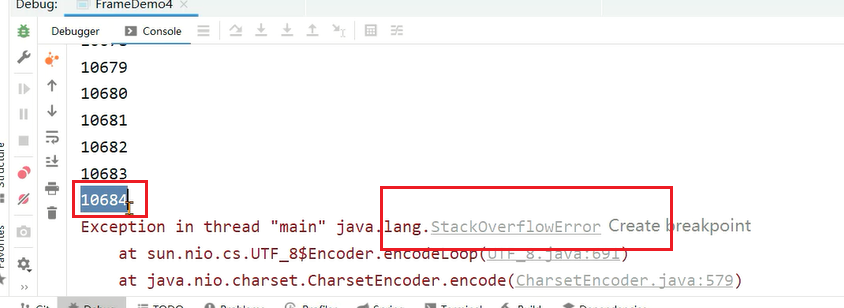

执行之后可以打印出溢出时总栈帧的数量，并且发现虚拟机已经抛出了StackOverflow的错误。


要修改Java虚拟机栈的大小，可以使用虚拟机参数 -Xss 。

* 语法：-Xss栈大小

* 单位：字节（默认，必须是 1024 的倍数）、k或者K(KB)、m或者M(MB)、g或者G(GB)

例如：

操作步骤如下，不同IDEA版本的设置方式会略有不同：

1、点击修改配置Modify options

2、点击Add VM options

3、添加参数`-Xss512k`等

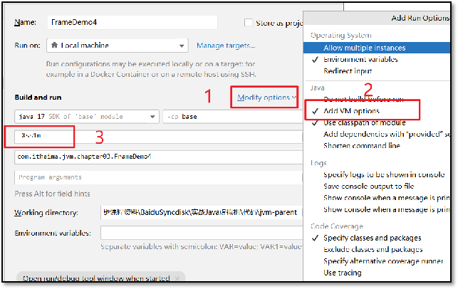

调成512k之后，明显发现最大栈帧数量减少了：

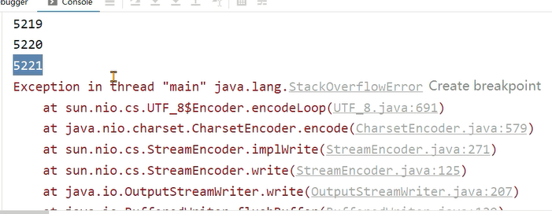


**注意事项：**

1、与-Xss类似，也可以使用 -XX:ThreadStackSize 调整标志来配置堆栈大小。

格式为： `-XX:ThreadStackSize=1024`


2、HotSpot JVM对栈大小的最大值和最小值有要求：

&#x20;     比如测试如下两个参数，会直接报错:

`-Xss1k`

`-Xss1025m`

Windows（64位）下的JDK8测试最小值为`180k`，最大值为`1024m`。


3、局部变量过多、操作数栈深度过大也会影响栈内存的大小。我们在这段代码中添加一些局部变量。

使用默认大小来测试之后，发现栈帧数量从10000+减少了到8000+

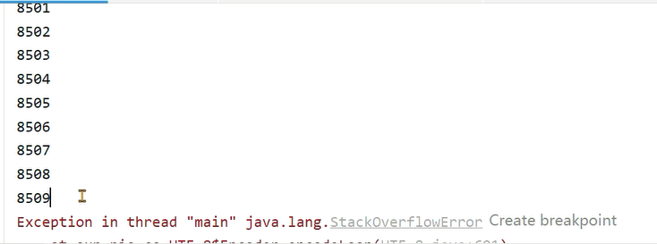


一般情况下，工作中即便使用了递归进行操作，栈的深度最多也只能到几百,不会出现栈的溢出。所以此参数可以手动指定为-Xss256k节省内存。


### 3.3 本地方法栈

Java虚拟机栈存储了Java方法调用时的栈帧，而本地方法栈存储的是native本地方法的栈帧。

在Hotspot虚拟机中，Java虚拟机栈和本地方法栈实现上使用了同一个栈空间。本地方法栈会在栈内存上生成一个栈帧，临时保存方法的参数同时方便出现异常时也把本地方法的栈信息打印出来。

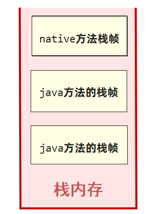

比如测试下这段代码：

执行之后发生异常，会打印出所有栈帧的名字：

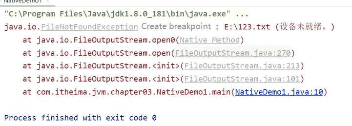

`open0`是一个本地方法，所以创建了本地方法的栈帧。本地方法和Java虚拟机方法的栈帧在一个栈上。


### 3.4 堆内存

一般Java程序中堆内存是空间最大的一块内存区域。创建出来的对象都存在于堆上。栈上的局部变量表中，可以存放堆上对象的引用。静态变量也可以存放堆对象的引用，通过静态变量就可以实现对象在线程之间共享。


这段代码中通过`new`关键字创建了两个`Student`类的对象，这两个对象会被存放在堆上。在栈上通过`s1`和`s2`两个局部变量保存堆上两个对象的地址，从而实现了引用关系的建立。

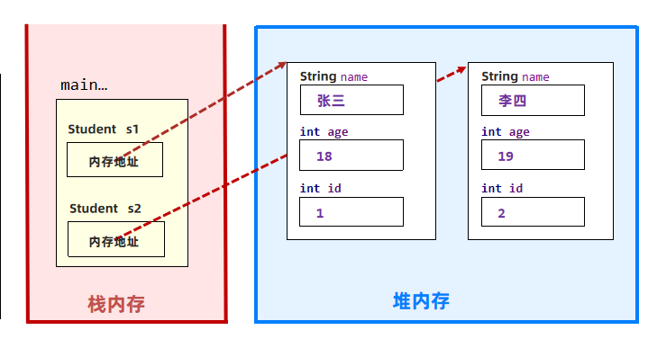


#### 堆内存的溢出

通过new关键字不停创建对象，放入集合中，模拟堆内存的溢出，观察堆溢出之后的异常信息。

堆内存大小是有上限的，当对象一直向堆中放入对象达到上限之后，就会抛出OutOfMemory错误。在这段代码中，不停创建100M大小的字节数组并放入ArrayList集合中，最终超过了堆内存的上限。抛出如下错误：

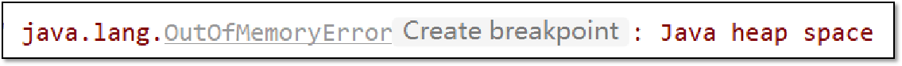


#### 三个重要的值

堆空间有三个需要关注的值，used、total、max。used指的是当前已使用的堆内存，total是java虚拟机已经分配的可用堆内存，max是java虚拟机可以分配的最大堆内存。


堆内存used total max三个值可以通过dashboard命令看到。

> 手动指定刷新频率（不指定默认5秒一次）：`dashboard –i  刷新频率(毫秒)`

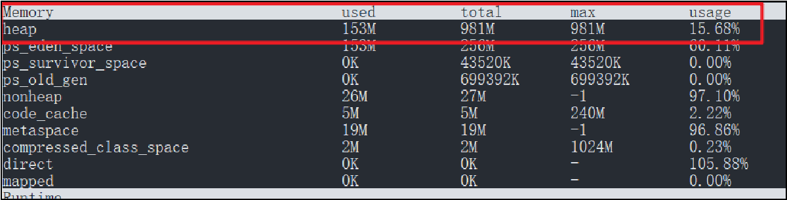


随着堆中的对象增多，当total可以使用的内存即将不足时，java虚拟机会继续分配内存给堆。


此时used达到了total的大小，Java虚拟机会向操作系统申请更大的内存。

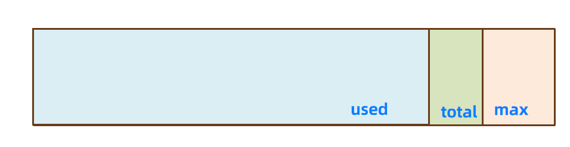

但是这个申请过程不是无限的，total最多只能与max相等。

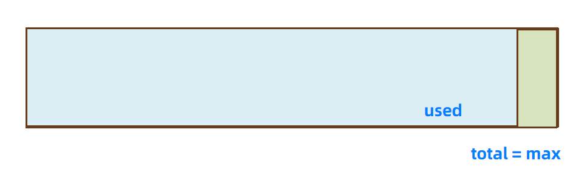

那么是不是当used = max = total的时候，堆内存就溢出了呢？

不是，堆内存溢出的判断条件比较复杂，在下一章《垃圾回收器》中会详细介绍。


如果不设置任何的虚拟机参数，max默认是系统内存的1/4，total默认是系统内存的1/64。在实际应用中一般都需要设置total和max的值。
Oracle官方文档：https://docs.oracle.com/javase/8/docs/technotes/tools/unix/java.html


#### 设置堆的大小

要修改堆的大小，可以使用虚拟机参数 –Xmx（max最大值）和-Xms (初始的total)。

语法：`-Xmx值 -Xms值`

单位：字节（默认，必须是 1024 的倍数）、k或者K(KB)、m或者M(MB)、g或者G(GB)

限制：Xmx必须大于 2 MB，Xms必须大于1MB


这样可以将max和初始的total都设置为4g，在启动后就已经获得了最大的堆内存大小。运行过程中不需要向操作系统申请。

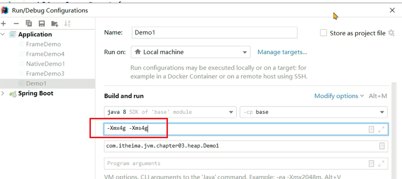

使用`arthas`的`memory`命令同样可以看到：

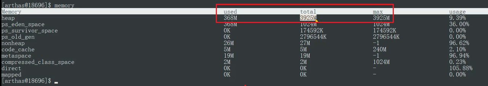


为什么arthas中显示的heap堆大小与设置的值不一样呢？

arthas中的heap堆内存使用了JMX技术中内存获取方式，这种方式与垃圾回收器有关，计算的是可以分配对象的内存，而不是整个内存。


**建议：**

Java服务端程序开发时，建议将-Xmx和-Xms设置为相同的值，这样在程序启动之后可使用的总内存就是最大内存，而无需向java虚拟机再次申请，减少了申请并分配内存时间上的开销，同时也不会出现内存过剩之后堆收缩的情况。-Xmx具体设置的值与实际的应用程序运行环境有关，在《实战篇》中会给出设置方案。


### 3.5 方法区

方法区是存放基础信息的位置，线程共享，主要包含三部分内容：

* 类的元信息，保存了所有类的基本信息

* 运行时常量池，保存了字节码文件中的常量池内容

* 字符串常量池，保存了字符串常量


#### 类的元信息

方法区是用来存储每个类的基本信息（元信息），一般称之为InstanceKlass对象。在类的加载阶段完成。其中就包含了类的字段、方法等字节码文件中的内容，同时还保存了运行过程中需要使用的虚方法表（实现多态的基础）等信息。

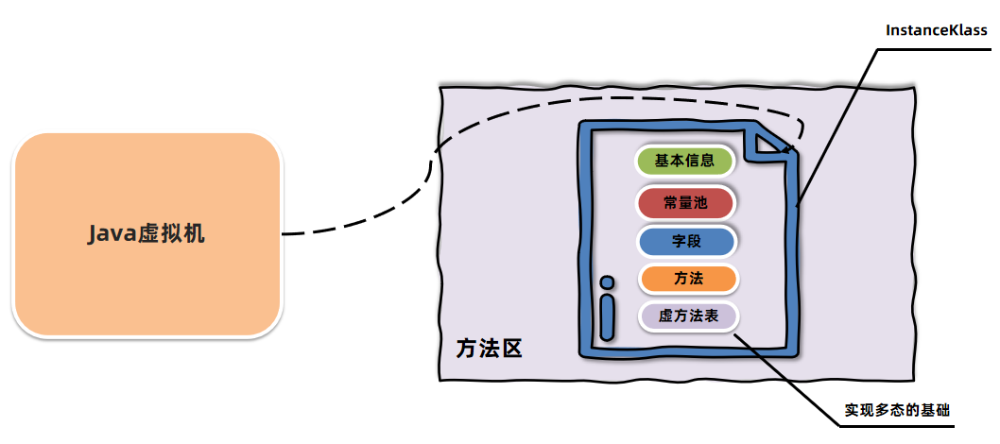


#### 运行时常量池

方法区除了存储类的元信息之外，还存放了运行时常量池。常量池中存放的是字节码中的常量池内容。

字节码文件中通过编号查表的方式找到常量，这种常量池称为**静态常量池**。当常量池加载到内存中之后，可以通过内存地址快速的定位到常量池中的内容，这种常量池称为**运行时常量池**。

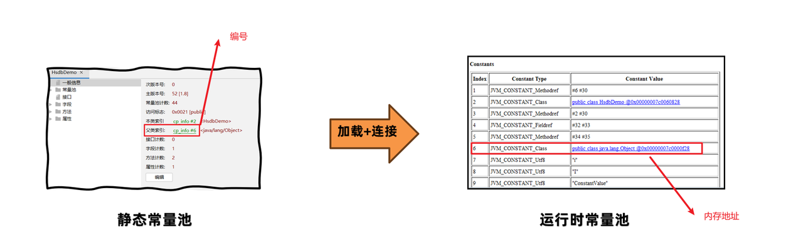


#### 方法区的实现

方法区是《Java虚拟机规范》中设计的虚拟概念，每款Java虚拟机在实现上都各不相同。Hotspot设计如下：

JDK7及之前的版本将方法区存放在堆区域中的永久代空间，堆的大小由虚拟机参数来控制。

JDK8及之后的版本将方法区存放在元空间中，元空间位于操作系统维护的直接内存中，默认情况下只要不超过操作系统承受的上限，可以一直分配。

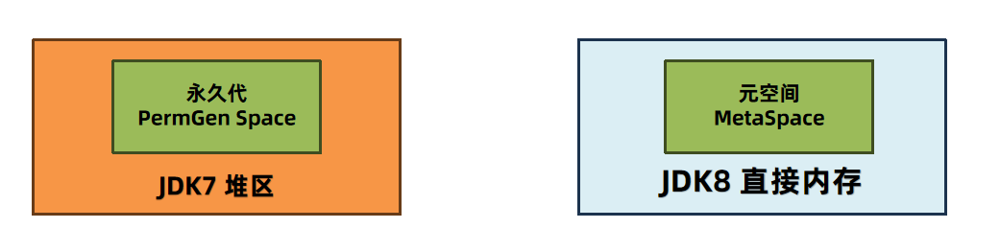

可以通过arthas的`memory`命令看到方法区的名称以及大小：

* JDK7及之前的版本查看ps\_perm\_gen属性。

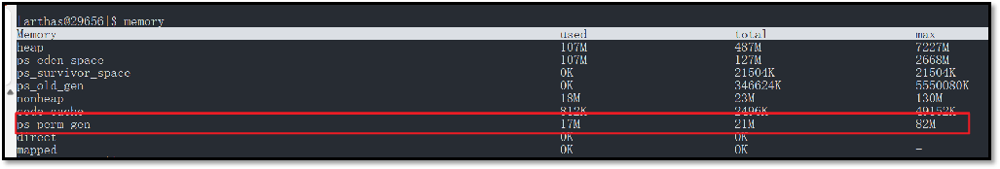

* JDK8及之后的版本查看metaspace属性。

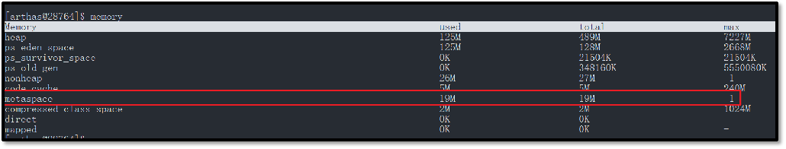


#### 方法区的溢出

通过ByteBuddy框架，动态创建类并将字节码数据加载到内存中。通过死循环不停地加载到方法区，观察方法区是否会出现内存溢出的情况。分别在JDK7和JDK8上运行上述代码。

ByteBuddy是一个基于Java的开源库，用于生成和操作Java字节码。

1.引入依赖

2.创建ClassWriter对象


3.调用visit方法，创建字节码数据。

代码：


实验发现，JDK7上运行大概十几万次，就出现了错误。

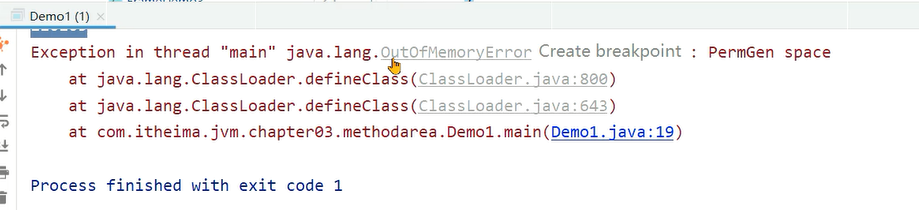

在JDK8上运行百万次，程序都没有出现任何错误，但是内存会直线升高。这说明JDK7和JDK8在方法区的存放上，采用了不同的设计。


* JDK7将方法区存放在堆区域中的永久代空间，堆的大小由虚拟机参数-XX:MaxPermSize=值来控制。

* JDK8将方法区存放在元空间中，元空间位于操作系统维护的直接内存中，默认情况下只要不超过操作系统承受的上限，可以一直分配。可以使用-XX:MaxMetaspaceSize=值将元空间最大大小进行限制。


在JDK8中将最大元空间内存设置为256m，再次测试

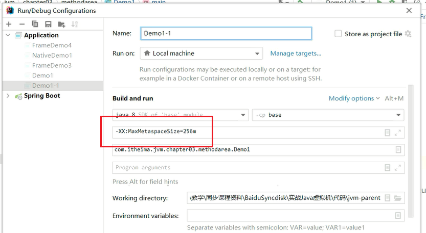

这次就出现了MetaSpace溢出的错误：

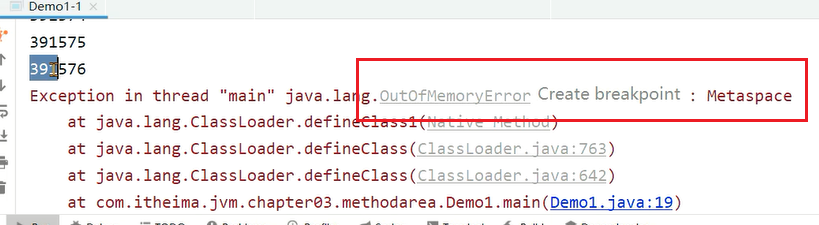


#### 字符串常量池

方法区中除了类的元信息、运行时常量池之外，还有一块区域叫字符串常量池(StringTable)。

字符串常量池存储在代码中定义的常量字符串内容。比如“123” 这个123就会被放入字符串常量池。


如下代码执行时，代码中包含`abc`字符串，就会被直接放入字符串常量池。在堆上创建String对象，并通过局部变量s1引用堆上的对象。

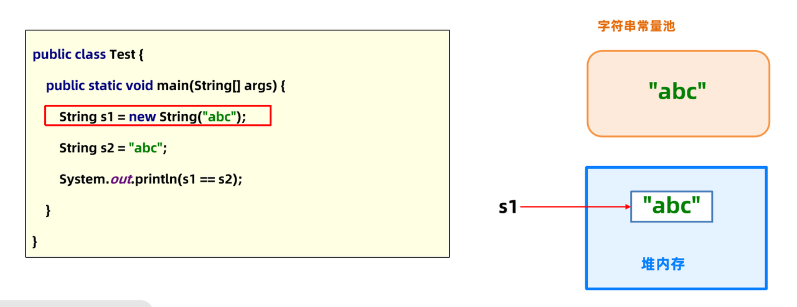

接下来通过s2局部变量引用字符串常量池的`abc`。

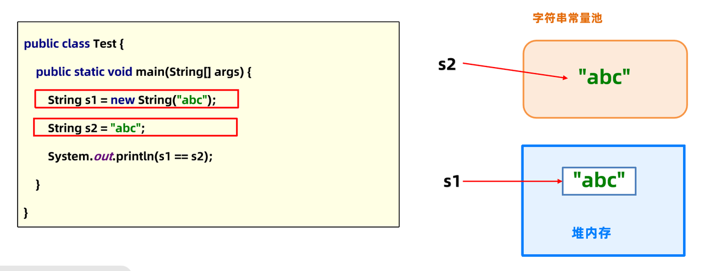

所以s1和s2指向的不是同一个对象，打印出`false`。


##### 字符串常量池和运行时常量池有什么关系？

早期设计时，字符串常量池是属于运行时常量池的一部分，他们存储的位置也是一致的。后续做出了调整，将字符串常量池和运行时常量池做了拆分。

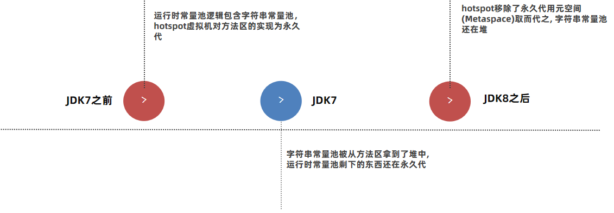


##### StringTable的练习题1：


1、首先将`1`放入字符串常量池，通过局部变量a引用字符串常量池中的`1`字符串。

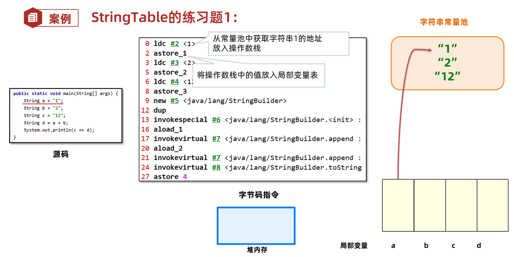

2、同理处理b和c：

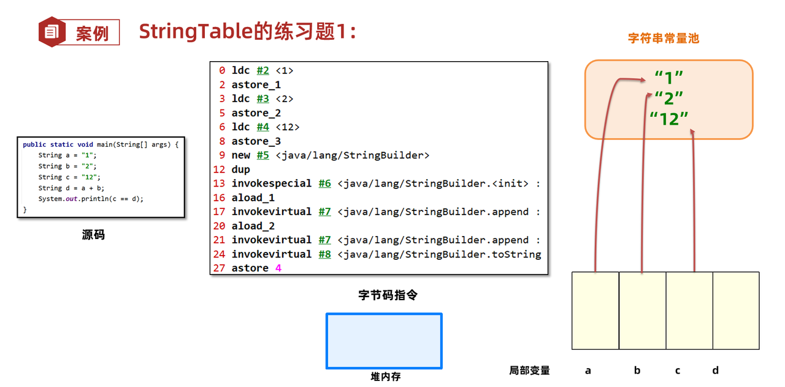


3、将a和b指向的字符串进行连接，本质上就是使用StringBuilder进行连接，最后创建了一个新的字符串放入堆中。然后将局部变量d指向堆上的对象。

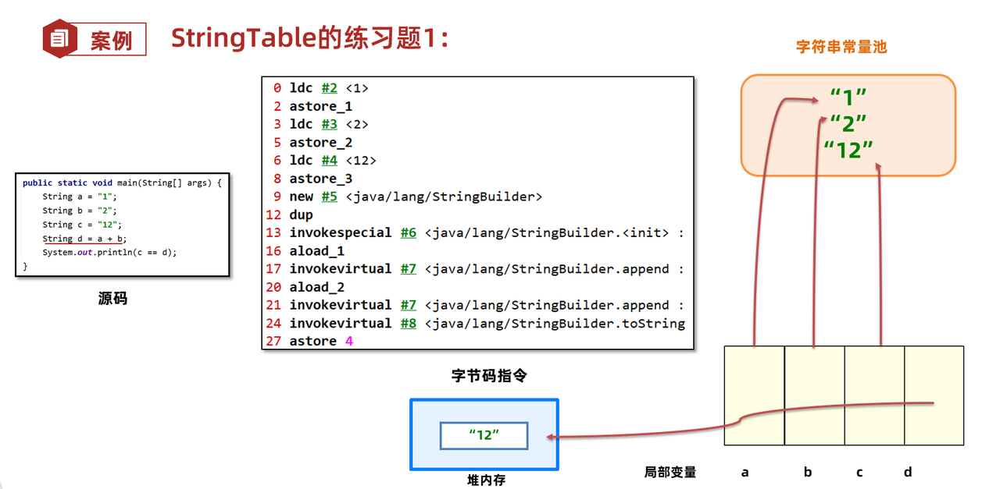


4、所以c和d指向的不是同一个对象，打印出的结果就是false。


##### StringTable的练习题2：

编译之后的字节码指令如下：

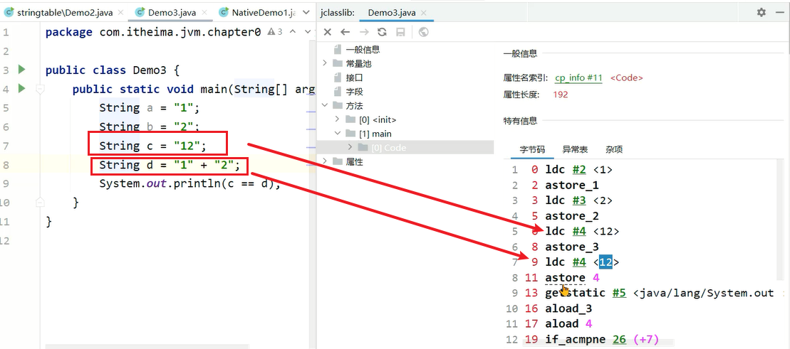

说明在编译阶段，已经将1和2进行连接，最终生成12的字符串常量池中的结果。所以返回结果就是true，c和d都指向字符串常量池中的对象。


总结一下：

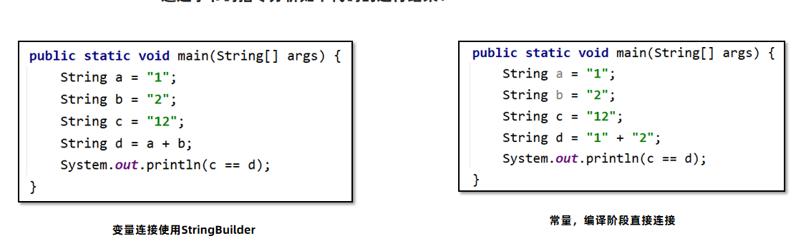


##### 神奇的intern

String.intern()方法是可以手动将字符串放入字符串常量池中，分别在JDK6 JDK8下执行代码，JDK6 中结果是false false ，JDK8中是true false

**JDK6版本中intern() 方法**会把第一次遇到的**字符串实例复制到永久代的字符串常量池**中，返回的也是永久代里面这个字符串实例的引用。JVM启动时就会把java加入到常量池中。

**JDK7及之后版本**中由于字符串常量池在堆上，所以intern()方法会把第一次遇到的**字符串的引用放入字符串常量池**。

先来分析JDK6中，代码执行步骤如下：

1、使用StringBuilder的将`think`和`123`拼接成`think123`，转换成字符串，在堆上创建一个字符串对象。局部变量`s1`指向堆上的对象。

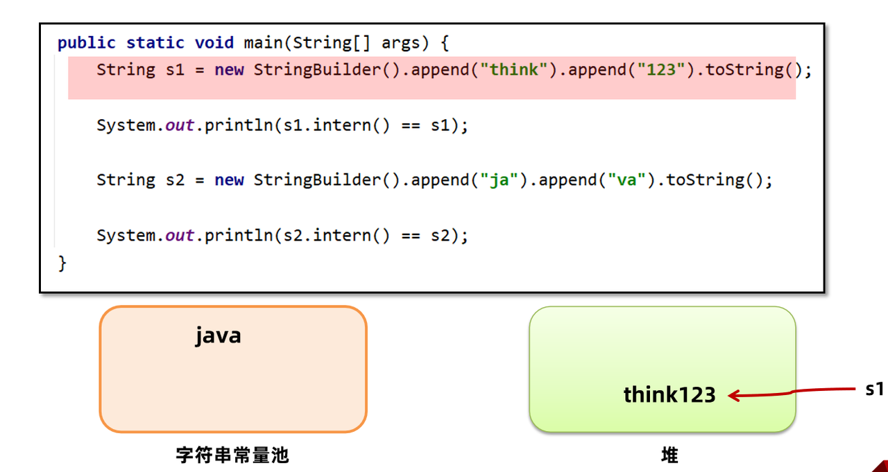

2、调用s1.intern方法，会在字符串常量池中创建think123的对象，最后将对象引用返回。所以s1.intern和s1指向的不是同一个对象。打印出false。

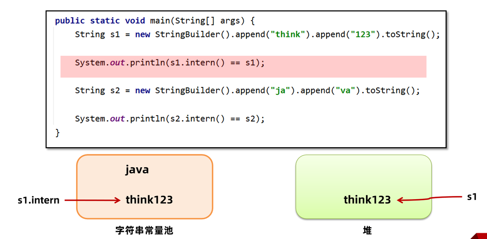

3、同理，通过StringBuilder在堆上创建java字符串对象。这里注意字符串常量池中本来就有一个java字符串对象，这是java虚拟机自身使用的所以启动时就会创建出来。

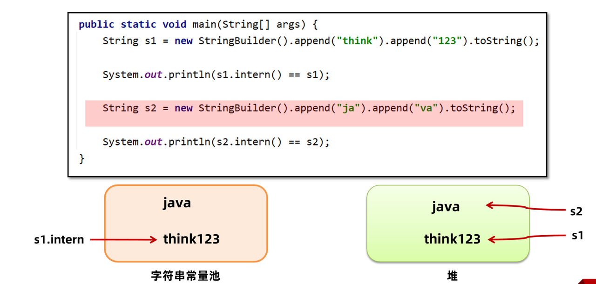

4、调用s2.intern发现字符串常量池中已经有java字符串对象了，就将引用返回。所以s2.intern指向的是字符串常量池中的对象，而s2指向的是堆中的对象。打印结果为false。

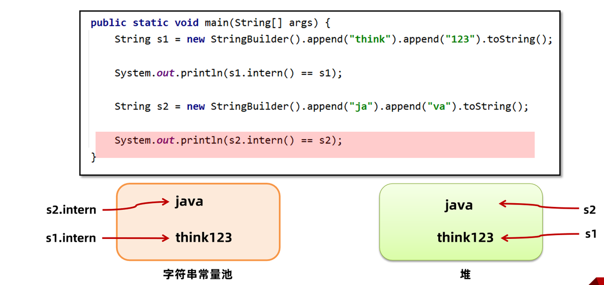


接下来分析JDK7中，JDK7及之后版本中由于字符串常量池在堆上，所以intern () 方法会把第一次遇到的字符串的引用放入字符串常量池。

代码执行步骤如下：

1、执行第二句代码时，由于字符串常量池中没有think123的字符串，所以直接创建一个引用，指向堆中的think123对象。所以s1.intern和s1指向的都是堆上的对象，打印结果为true。

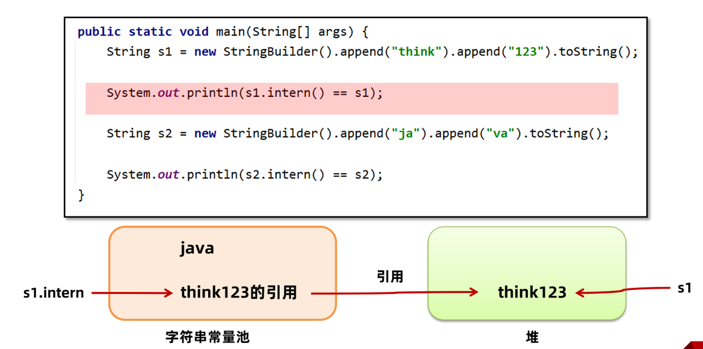

2、s2.intern方法调用时，字符串常量池中已经有java字符串了，所以将引用返回。这样打印出来的结果就是false。

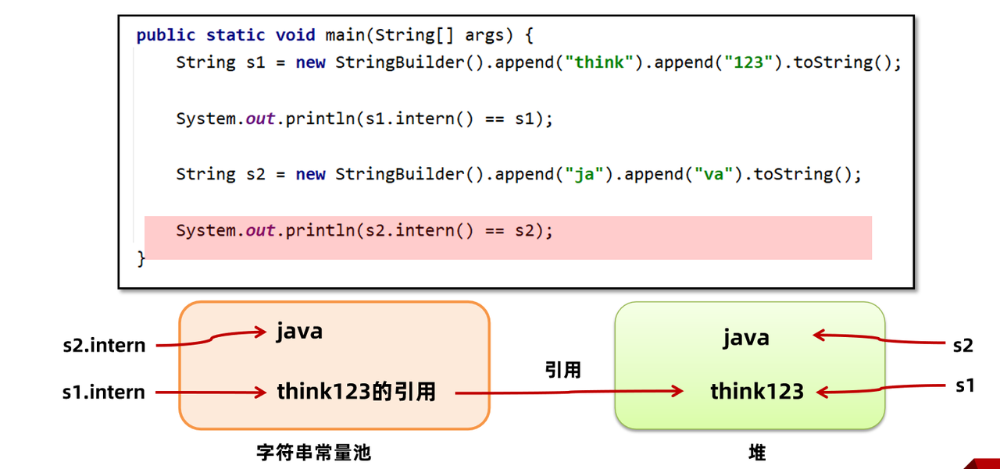


> 后续JDK版本中，如果Java虚拟机不需要使用java字符串，那么字符串常量池中就不会存放`java`。打印结果有可能会出现两个true。


#### &#x20;面试题：静态变量存储在哪里呢？

* JDK6及之前的版本中，静态变量是存放在方法区中的，也就是永久代。

* JDK7及之后的版本中，静态变量是存放在堆中的Class对象中，脱离了永久代。具体源码可参考虚拟机源码：BytecodeInterpreter针对putstatic指令的处理。


### 3.6 直接内存

直接内存（Direct Memory）并不在《Java虚拟机规范》中存在，所以并不属于Java运行时的内存区域。

在 JDK 1.4 中引入了 NIO 机制，使用了直接内存，主要为了解决以下两个问题:

1、Java堆中的对象如果不再使用要回收，回收时会影响对象的创建和使用。

2、IO操作比如读文件，需要先把文件读入直接内存（缓冲区）再把数据复制到Java堆中。

现在直接放入直接内存即可，同时Java堆上维护直接内存的引用，减少了数据复制的开销。写文件也是类似的思路。


使用堆创建对象的过程：

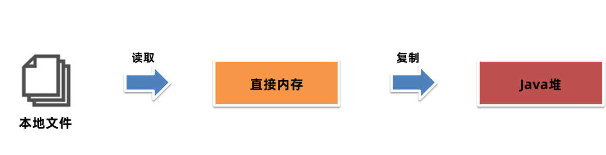

使用直接内存创建对象的过程，不需要进行复制对象，数据直接存放在直接内存中：

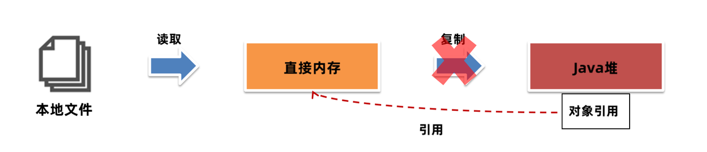


#### 使用方法：

要创建直接内存上的数据，可以使用`ByteBuffer`。

语法： `ByteBuffer directBuffer = ByteBuffer.allocateDirect(size);`

注意事项： arthas的memory命令可以查看直接内存大小，属性名direct。

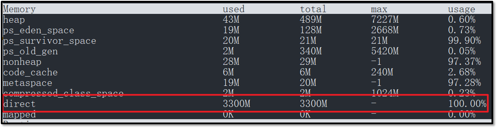


代码：

运行之后，用arthas监控发现，每隔5秒直接内存会增长100M：

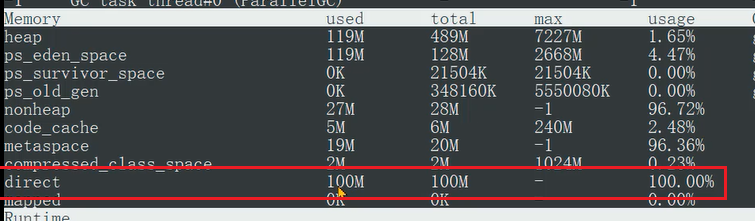

如果将`Thread.`*`sleep`*`(5000);`注释掉，让直接内存快速大量分配。操作系统内存不足时就会报错：

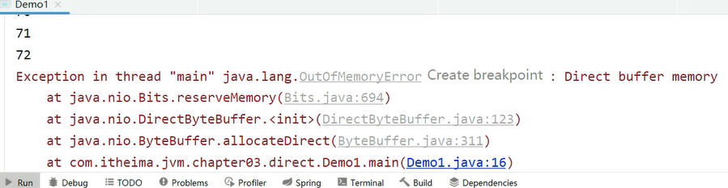


但是工作中服务器上有可能部署了其他应用，为了避免将内存耗尽，需要设置直接内存的最大值。如果需要手动调整直接内存的大小，可以使用`XX:MaxDirectMemorySize=大小`

单位k或K表示千字节，m或M表示兆字节，g或G表示千兆字节。默认不设置该参数情况下，JVM 自动选择 最大分配的大小。

以下示例以不同的单位说明如何将 直接内存大小设置为 1024 KB：

在Idea中设置直接内存最大值为1g：

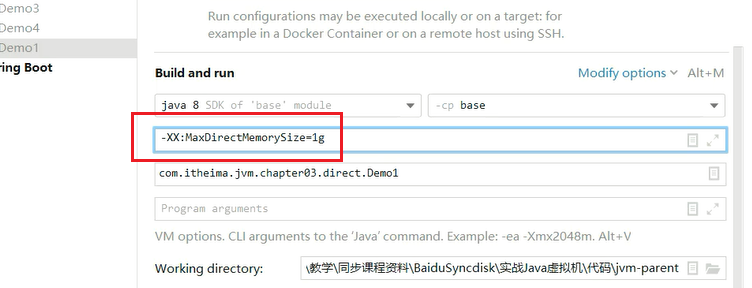

直接循环11次之后，超过最大值就会报错：

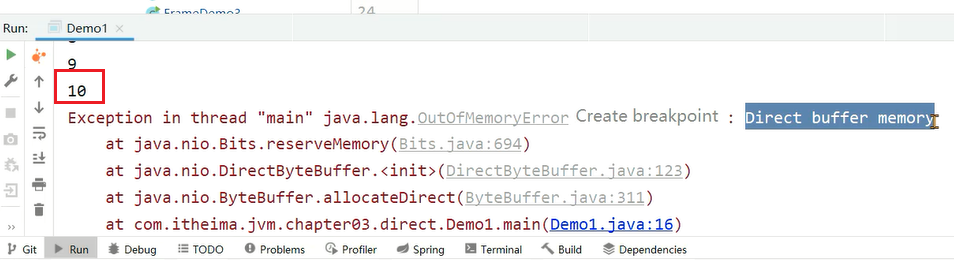

### 概括

1、运行时数据区分成哪几部分，每一部分的作用是什么？ 

程序计数器

Java虚拟机栈

本地方法栈

方法区

堆


2、不同JDK版本之间运行时数据区域的区别是什么？

JDK6

JDK7以及以上版本


# 4、垃圾回收

在C/C++这类没有自动垃圾回收机制的语言中，一个对象如果不再使用，需要手动释放，否则就会出现内存泄漏。

内存泄漏指的是不再使用的对象在系统中未被回收，内存泄漏的积累可能会导致内存溢出。  &#x20;


在这段代码中，通过死循环不停创建Test类的对象，每一轮循环结束之后，这次创建的对象就不再使用了。但是没有手动调用删除对象的方法，此时对象就会出现内存泄漏。    &#x20;

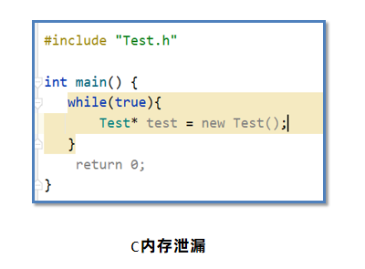

这段代码中，手动调用`delete`删除对象，就不会出现内存泄漏。

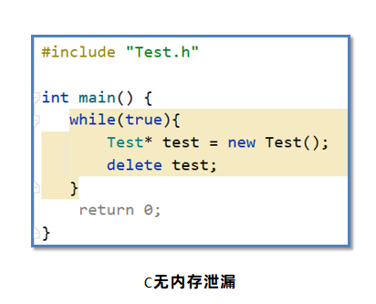


我们称这种释放对象的过程为垃圾回收，而需要程序员编写代码进行回收的方式为手动回收。手动回收的方式相对来说回收比较及时，删除代码执行之后对象就被回收了，可以快速释放内存。缺点是对程序员要求比较高，很容易出现创建完对象之后，程序员忘记释放对象。


Java中为了简化对象的释放，引入了自动的垃圾回收（Garbage Collection简称GC）机制。通过垃圾回收器来对不再使用的对象完成自动的回收，垃圾回收器主要负责对堆上的内存进行回收。其他很多现代语言比如C#、Python、Go都拥有自己的垃圾回收器。

垃圾回收器如果发现某个对象不再使用，就可以回收该对象。

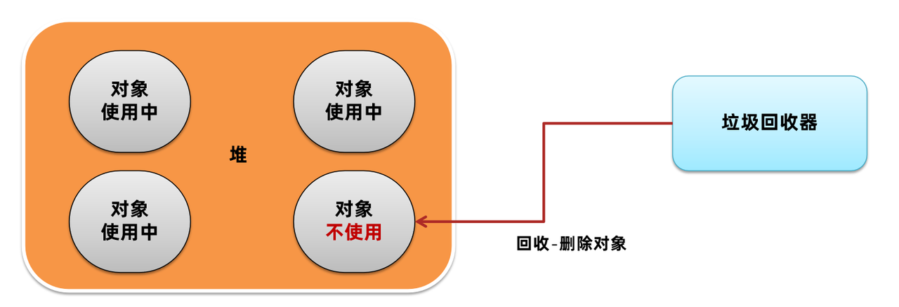

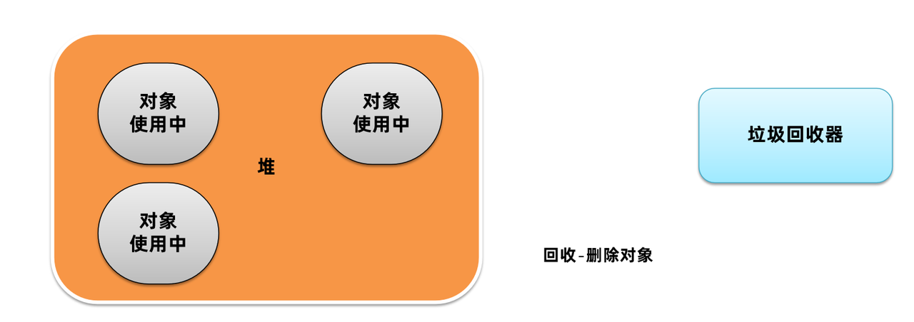


* **自动垃圾回收**，自动根据对象是否使用由虚拟机来回收对象
* 优点：**降低**程序员实现难度、降低对象回收bug的可能性
  
* 缺点：程序员无法控制内存回收的及时性
  
* **手动垃圾回收**，由程序员编程实现对象的删除
* 优点：回收及时性高，由程序员把控回收的时机
  
* 缺点：编写不当容易出现悬空指针、重复释放、内存泄漏等问题

## 自动垃圾回收 – 应用场景 

01 解决系统僵死的问题 

大厂的系统出现的许多系统僵死问题 都与频繁的垃圾回收有关 

02 性能优化 

对垃圾回收器进行合理的设置可以有效地提升程序的执行性能 

03 高频面试题 

⚫ 常见的垃圾回收器 

⚫ 常见的垃圾回收算法 

⚫ 四种引用 

⚫ 项目中用了哪一种垃圾回收器

**那么垃圾回收器需要负责对哪些部分的内存进行回收呢？**

首先是**线程不共享**的部分，都是伴随着线程的创建而创建，线程的销毁而销毁。而方法的栈帧在执行完方法之后就会自动弹出栈并释放掉对应的内存。所以这一部分不需要垃圾回收器负责回收。

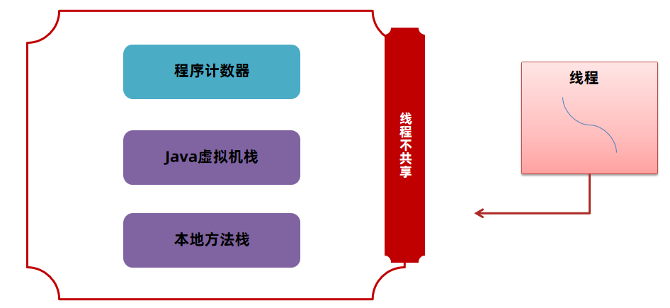


## 4.1 方法区的回收

方法区中能回收的内容主要就是不再使用的类。

### 判定一个类可以被卸载。需要同时满足下面三个条件：

1、此类所有实例对象都已经被回收，在堆中不存在任何该类的实例对象以及子类对象。

这段代码中就将局部变量对堆上实例对象的引用去除了，所以对象就可以被回收。

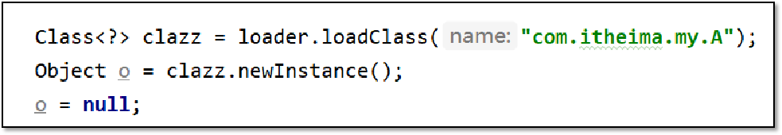

2、加载该类的类加载器已经被回收。

这段代码让局部变量对类加载器的引用去除，类加载器就可以回收。

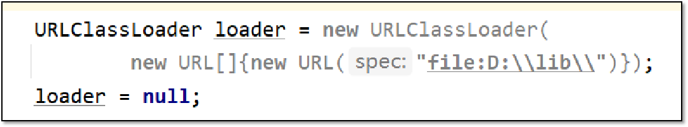

3、该类对应的 java.lang.Class 对象没有在任何地方被引用。

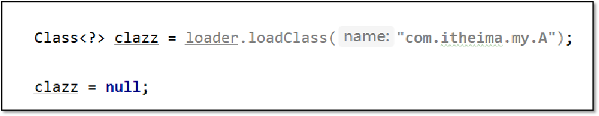


代码:

添加这两个虚拟机参数进行测试：

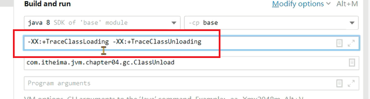

如果注释掉代码中三句add调用，就可以同时满足3个条件。但是需要手动调用`System.gc()`方法，让垃圾回收器进行回收。

> 如果需要手动触发垃圾回收，可以调用System.gc()方法。
>
> 语法： `System.gc()`
>
> 注意事项：
>
> &#x20;  调用System.gc()方法并不一定会立即回收垃圾，仅仅是向Java虚拟机发送一个垃圾回收的请求，具体是否需要执行垃圾回收Java虚拟机会自行判断。

执行之后，日志中就会打印出类卸载的内容：

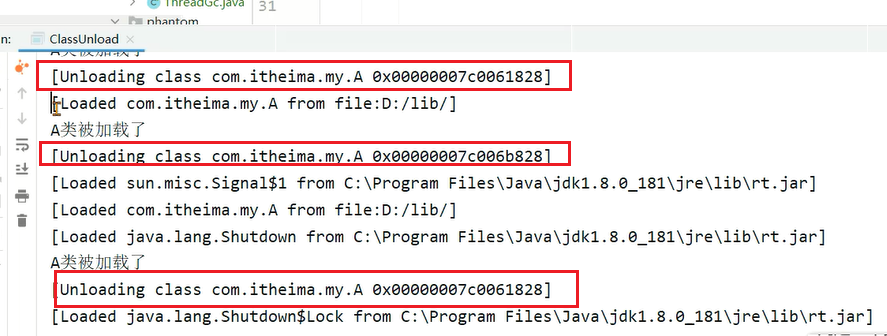


### **那么类卸载主要用在什么场景下呢？**

开发中此类场景一般很少出现，主要在如 OSGi、JSP 的热部署等应用场景中。

每个jsp文件对应一个唯一的类加载器，当一个jsp文件修改了，就直接卸载这个jsp类加载器。重新创建类加载器，重新加载jsp文件。


## 4.2 如何判断堆上的对象可以回收？

垃圾回收器要回收对象的第一步就是判断哪些对象可以回收。Java中的对象是否能被回收，是根据对象是否被引用来决定的。如果对象被引用了，说明该对象还在使用，不允许被回收。

比如下面代码的内存结构图：

第一行代码执行之后，堆上创建了Demo类的实例对象，同时栈上保存局部变量引用堆上的对象。

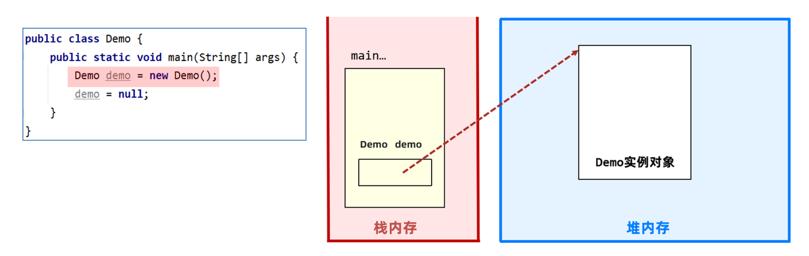

第二行代码执行之后，局部变量对堆上的对象引用去掉，那么堆上的对象就可以被回收了。

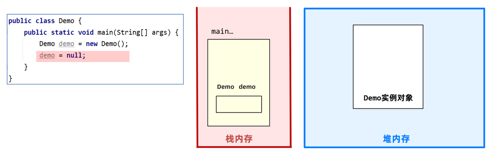


一个更复杂的案例：

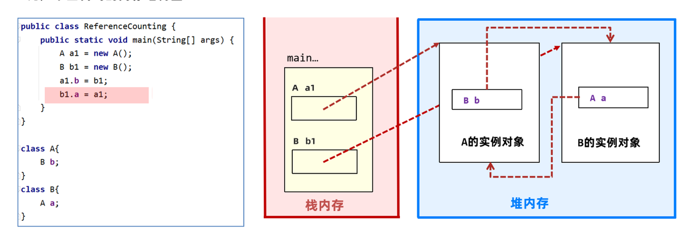

这个案例中，如果要让对象a和b回收，必须将局部变量到堆上的引用去除。

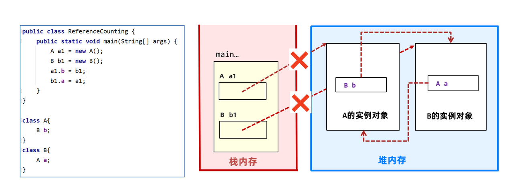

那么问题来了，A和B互相之间的引用需要去除吗？答案是不需要，因为局部变量都没引用这两个对象了，在代码中已经无法访问这两个对象，即便他们之间互相有引用关系，也不影响对象的回收。


判断对象是否可以回收，主要有两种方式：引用计数法和可达性分析法。


### 引用计数法

引用计数法会为每个对象维护一个引用计数器，当对象被引用时加1，取消引用时减1。

比如下图中，对象A的计数器初始为0，局部变量a1对它引用之后，计数器加1就变成了1。同样A对B产生了引用，B的计数器也是1。

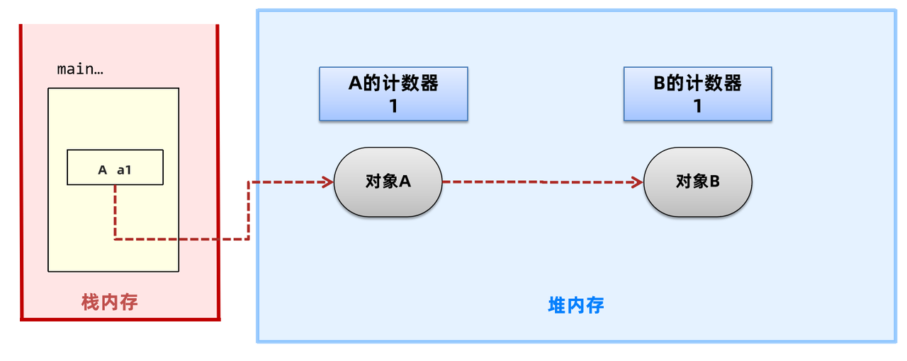

引用计数法的优点是实现简单，C++中的智能指针就采用了引用计数法，但是它也存在缺点，主要有两点：

1.每次引用和取消引用都需要维护计数器，对系统性能会有一定的影响

2.存在循环引用问题，所谓循环引用就是当A引用B，B同时引用A时会出现对象无法回收的问题。

这张图上，由于A和B之间存在互相引用，所以计数器都为1，两个对象都不能被回收。但是由于没有局部变量对这两个代码产生引用，代码中已经无法访问到这两个对象，理应可以被回收。

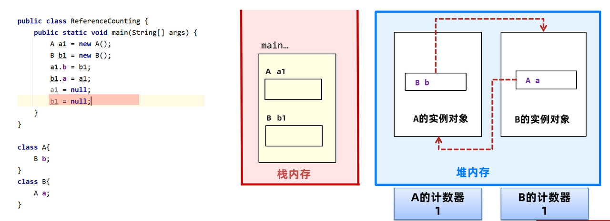


我们来做一个实验，验证下Java中循环引用不会导致内存泄漏，因为Java虚拟机根本没有使用引用计数法。首先我们要学会去看一个对象有没有被回收，可以通过垃圾回收日志来查看。

如果想要查看垃圾回收的信息，可以使用`-verbose:gc`参数。

语法： `-verbose:gc`

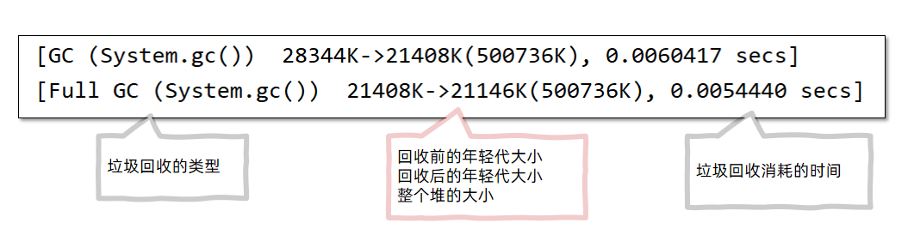

加上这个参数之后执行代码，发现对象确实被回收了：

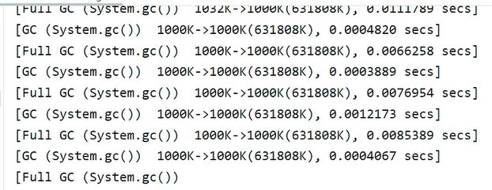

通过不同的死循环创建对象，内存并没有上升，一直维持在1000K,说明每轮循环创建的两个对象在垃圾回收之后都被回收了。


### 可达性分析法

Java使用的是可达性分析算法来判断对象是否可以被回收。可达性分析将对象分为两类：垃圾回收的根对象（GC Root）和普通对象，对象与对象之间存在引用关系。

下图中A到B再到C和D，形成了一个引用链，可达性分析算法指的是如果从某个到GC Root对象是可达的，对象就不可被回收。

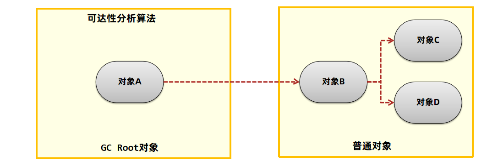


#### 哪些对象被称之为GC Root对象呢？

* 线程Thread对象，引用线程栈帧中的方法参数、局部变量等。

* 系统类加载器加载的java.lang.Class对象，引用类中的静态变量。

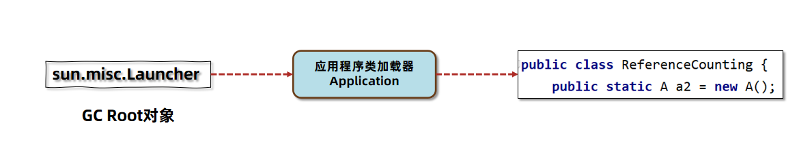

* 监视器对象，用来保存同步锁synchronized关键字持有的对象。

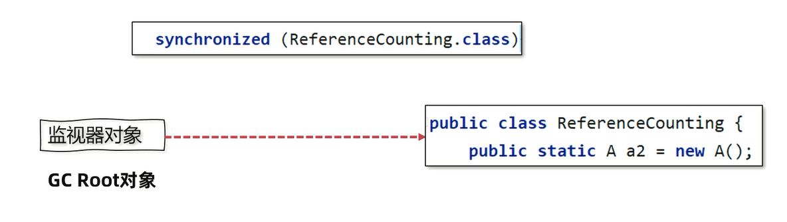

* 本地方法调用时使用的全局对象。

#### 查看GC Root

通过arthas和eclipse Memory Analyzer (MAT) 工具可以查看GC Root，MAT工具是eclipse推出的Java堆内存检测工具。具体操作步骤如下：

1、使用arthas的heapdump命令将堆内存快照保存到本地磁盘中。

2、使用MAT工具打开堆内存快照文件。

3、选择GC Roots功能查看所有的GC Root。

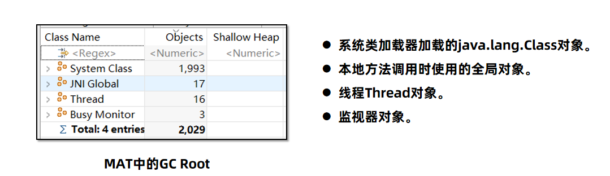


##### 步骤详解：

1、代码如下：

2、使用arthas连接到程序，输入如下命令:

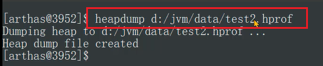

这样就生成了一个堆内存快照（后面介绍，简单来说就是包含了所有堆中的对象信息）。

3、打开资料中提供的MAT工具，如果出现如下错误，请将环境变量中的JDK版本升级到17以上。

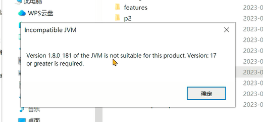

4、选择菜单中的打开堆内存快照功能，并选择刚才生成的文件。

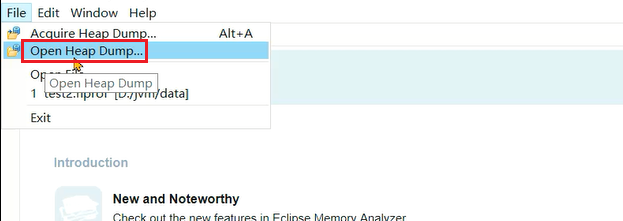

5、选择内存泄漏检测报告，并确定。

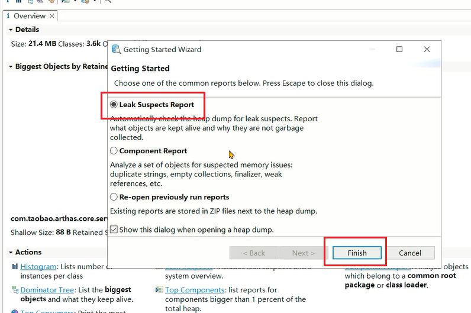

6、通过菜单找到GC Roots。

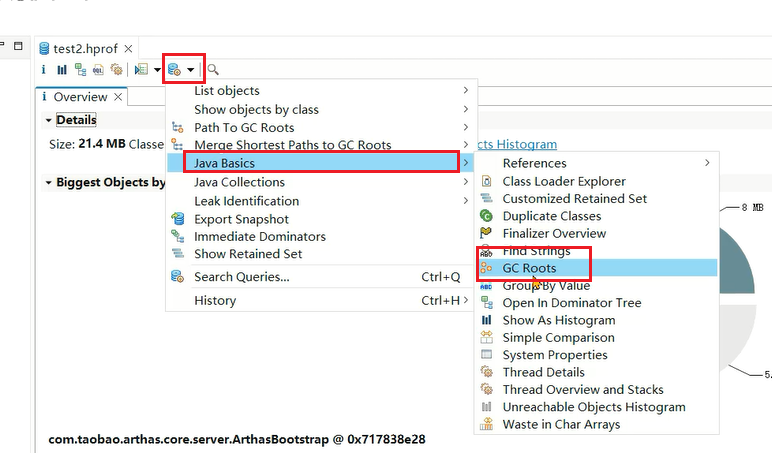

7、MAT对4类GC Root对象做了分类。

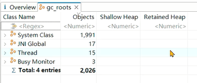

8、找到静态变量。

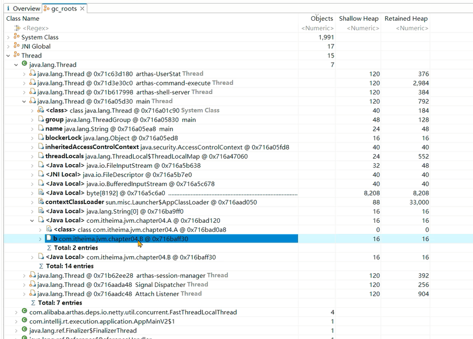

9、找到局部变量

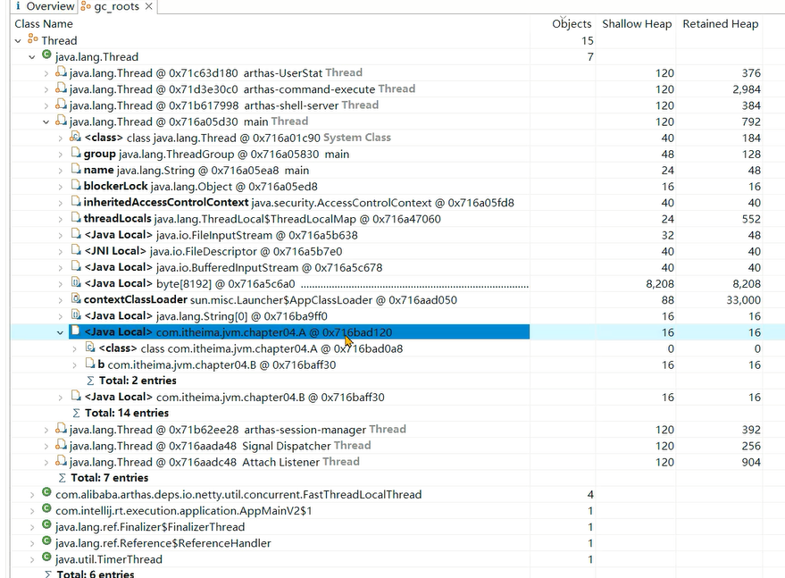


可达性算法中描述的对象引用，一般指的是强引用，即是GCRoot对象对普通对象有引用关系，只要这层关系存在，普通对象就不会被回收。除了强引用之外，Java中还设计了几种其他引用方式：

* 软引用

* 弱引用

* 虚引用

* 终结器引用


### 软引用

软引用相对于强引用是一种比较弱的引用关系，如果一个对象只有软引用关联到它，当程序内存不足时，就会将软引用中的数据进行回收。在JDK 1.2版之后提供了SoftReference类来实现软引用，软引用常用于缓存中。


如下图中，对象A被GC Root对象强引用了，同时我们创建了一个软引用SoftReference对象（它本身也是一个对象），软引用对象中引用了对象A。

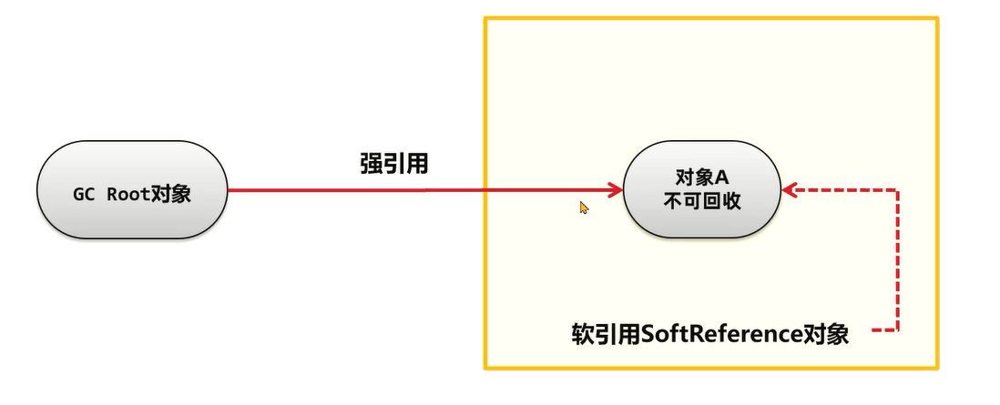

接下来强引用被去掉之后，对象A暂时还是处于不可回收状态，因为有软引用存在并且内存还够用。

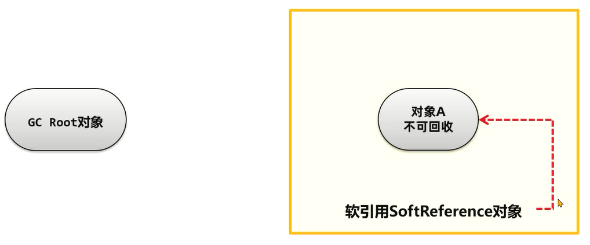

如果内存出现不够用的情况，对象A就处于可回收状态，可以被垃圾回收器回收。


这样做有什么好处？如果对象A是一个缓存，平时会保存在内存中，如果想访问数据可以快速访问。但是如果内存不够用了，我们就可以将这部分缓存清理掉释放内存。即便缓存没了，也可以从数据库等地方获取数据，不会影响到业务正常运行，这样可以减少内存溢出产生的可能性。


**特别注意：**

软引用对象本身，也需要被强引用，否则软引用对象也会被回收掉。

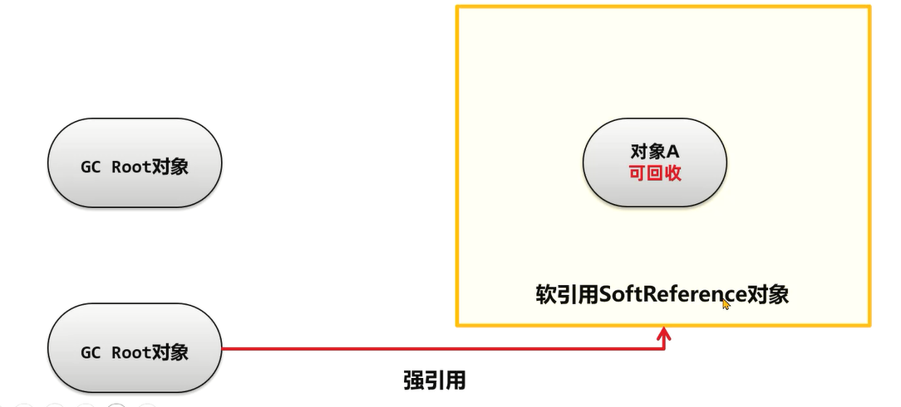


#### 软引用的使用方法

软引用的执行过程如下：

1.将对象使用软引用包装起来，new SoftReference<对象类型>(对象)。

2.内存不足时，虚拟机尝试进行垃圾回收。

3.如果垃圾回收仍不能解决内存不足的问题，回收软引用中的对象。

4.如果依然内存不足，抛出OutOfMemory异常。


代码：

添加虚拟机参数，限制最大堆内存大小为200m：

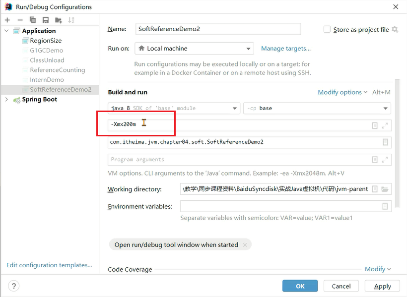

执行后发现，第二个100m对象创建之后需，软引用中包含的对象已经被回收了。

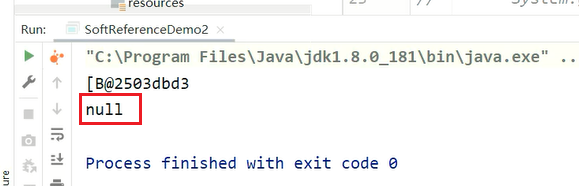


#### 软引用对象本身怎么回收呢？

如果软引用对象里边包含的数据已经被回收了，那么软引用对象本身其实也可以被回收了。

SoftReference提供了一套队列机制：

1、软引用创建时，通过构造器传入引用队列

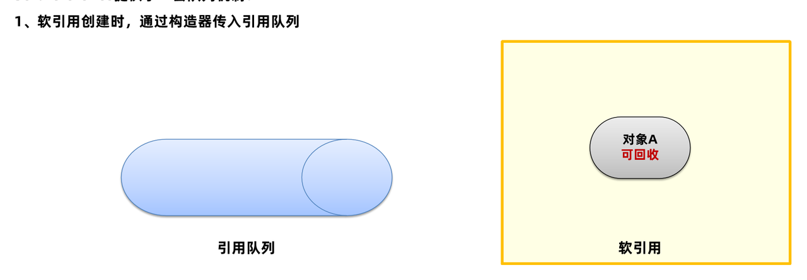

2、在软引用中包含的对象被回收时，该软引用对象会被放入引用队列

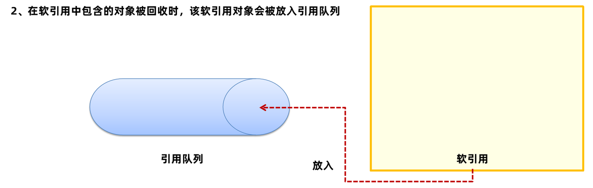


3、通过代码遍历引用队列，将SoftReference的强引用删除


代码

最终展示的结果是：

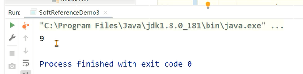

这9个软引用对象中包含的数据已经被回收掉，所以可以手动从ArrayList中去掉，这样就可以释放这9个对象。


#### 软引用的缓存案例

使用软引用实现学生信息的缓存，能支持内存不足时清理缓存。

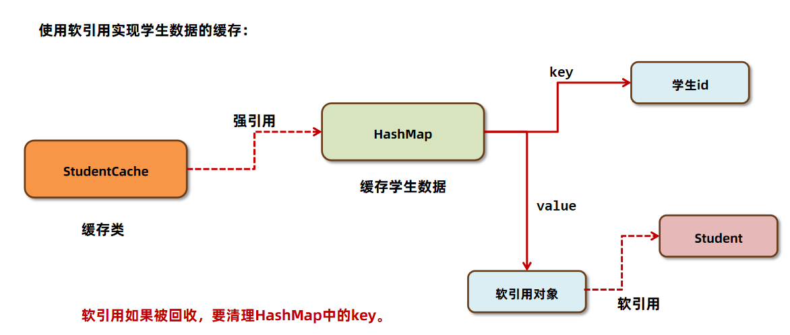

代码：

```java
package chapter04.soft;

import java.lang.ref.ReferenceQueue;
import java.lang.ref.SoftReference;
import java.util.HashMap;
import java.util.Map;
/**
 * 软引用案例4 - 学生信息的缓存
 */
public class StudentCache {

    private static StudentCache cache = new StudentCache();

    public static void main(String[] args) {
        for (int i = 0; ; i++) {
            StudentCache.getInstance().cacheStudent(new Student(i, String.valueOf(i)));
        }
    }

    private Map<Integer, StudentRef> StudentRefs;// 用于Cache内容的存储
    private ReferenceQueue<Student> q;// 垃圾Reference的队列

    // 继承SoftReference，使得每一个实例都具有可识别的标识。
    // 并且该标识与其在HashMap内的key相同。
    private class StudentRef extends SoftReference<Student> {
        private Integer _key = null;

        public StudentRef(Student em, ReferenceQueue<Student> q) {
            super(em, q);
            _key = em.getId();
        }
    }

    // 构建一个缓存器实例
    private StudentCache() {
        StudentRefs = new HashMap<Integer, StudentRef>();
        q = new ReferenceQueue<Student>();
    }

    // 取得缓存器实例
    public static StudentCache getInstance() {
        return cache;
    }

    // 以软引用的方式对一个Student对象的实例进行引用并保存该引用
    private void cacheStudent(Student em) {
        cleanCache();// 清除垃圾引用
        StudentRef ref = new StudentRef(em, q);
        StudentRefs.put(em.getId(), ref);
        System.out.println(StudentRefs.size());
    }

    // 依据所指定的ID号，重新获取相应Student对象的实例
    public Student getStudent(Integer id) {
        Student em = null;
// 缓存中是否有该Student实例的软引用，如果有，从软引用中取得。
        if (StudentRefs.containsKey(id)) {
            StudentRef ref = StudentRefs.get(id);
            em = ref.get();
        }
// 如果没有软引用，或者从软引用中得到的实例是null，重新构建一个实例，
// 并保存对这个新建实例的软引用
        if (em == null) {
            em = new Student(id, String.valueOf(id));
            System.out.println("Retrieve From StudentInfoCenter. ID=" + id);
            this.cacheStudent(em);
        }
        return em;
    }

    // 清除那些所软引用的Student对象已经被回收的StudentRef对象
    private void cleanCache() {
        StudentRef ref = null;
        while ((ref = (StudentRef) q.poll()) != null) {
            StudentRefs.remove(ref._key);
        }
    }

//    // 清除Cache内的全部内容
//    public void clearCache() {
//        cleanCache();
//        StudentRefs.clear();
//        //System.gc();
//        //System.runFinalization();
//    }
}

class Student {
    int id;
    String name;

    public Student(int id, String name) {
        this.id = id;
        this.name = name;
    }

    public int getId() {
        return id;
    }

    public void setId(int id) {
        this.id = id;
    }

    public String getName() {
        return name;
    }

    public void setName(String name) {
        this.name = name;
    }
}
```


### 弱引用

弱引用的整体机制和软引用基本一致，区别在于**弱引用包含的对象在垃圾回收时，不管内存够不够都会直接被回收**。在JDK 1.2版之后提供了WeakReference类来实现弱引用，弱引用主要在ThreadLocal中使用。

弱引用对象本身也可以使用引用队列进行回收。

执行之后发现gc执行之后，对象已经被回收了。

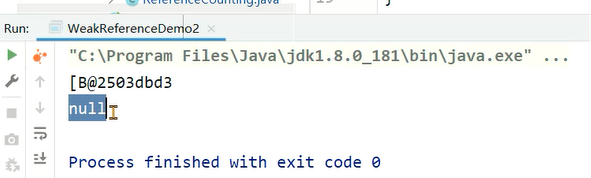


### 虚引用和终结器引用

这两种引用在常规开发中是不会使用的。

* 虚引用也叫幽灵引用/幻影引用，不能通过虚引用对象获取到包含的对象。虚引用唯一的用途是当对象被垃圾回收器回收时可以接收到对应的通知。Java中使用PhantomReference实现了虚引用，直接内存中为了及时知道直接内存对象不再使用，从而回收内存，使用了虚引用来实现。


* 终结器引用指的是在对象需要被回收时，终结器引用会关联对象并放置在Finalizer类中的引用队列中，在稍后由一条由FinalizerThread线程从队列中获取对象，然后执行对象的finalize方法，在对象第二次被回收时，该对象才真正的被回收。在这个过程中可以在finalize方法中再将自身对象使用强引用关联上，但是不建议这样做。


## 4.4 垃圾回收算法

Java是如何实现垃圾回收的呢？简单来说，垃圾回收要做的有两件事：

1、找到内存中存活的对象

2、释放不再存活对象的内存，使得程序能再次利用这部分空间&#x20;

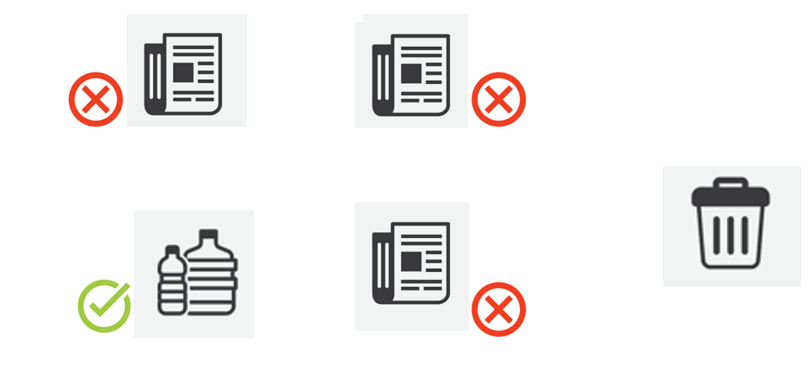

### 垃圾回收算法的历史和分类

1960年John McCarthy发布了第一个GC算法：标记-清除算法。

1963年Marvin L. Minsky 发布了复制算法。

本质上后续所有的垃圾回收算法，都是在上述两种算法的基础上优化而来。

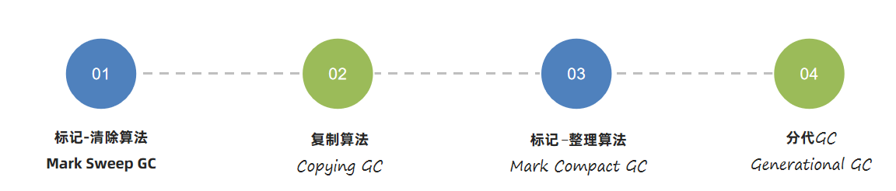


### 垃圾回收算法的评价标准

Java垃圾回收过程会通过单独的GC线程来完成，但是不管使用哪一种GC算法，都会有部分阶段需要停止所有的用户线程。这个过程被称之为Stop The World简称STW，如果STW时间过长则会影响用户的使用。


如下图，用户代码执行和垃圾回收执行让用户线程停止执行（STW）是交替执行的。

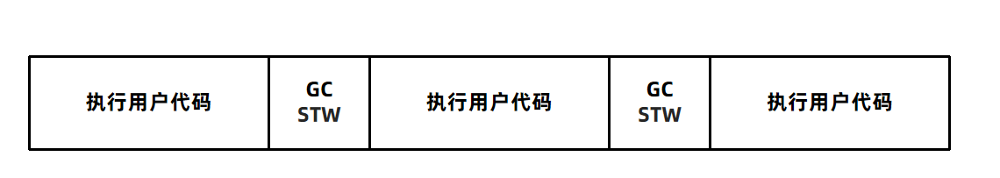

所以判断GC算法是否优秀，可以从三个方面来考虑：

#### 1.吞吐量

吞吐量指的是 CPU 用于执行用户代码的时间与 CPU 总执行时间的比值，即吞吐量 = 执行用户代码时间 /（执行用户代码时间 + GC时间）。吞吐量数值越高，垃圾回收的效率就越高。

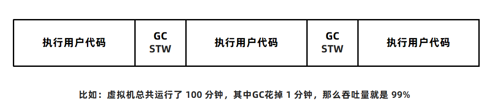

#### 2.最大暂停时间

最大暂停时间指的是所有在垃圾回收过程中的STW时间最大值。比如如下的图中，黄色部分的STW就是最大暂停时间，显而易见上面的图比下面的图拥有更少的最大暂停时间。最大暂停时间越短，用户使用系统时受到的影响就越短。

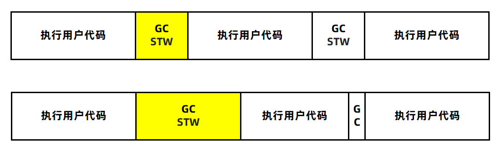

#### 3.堆使用效率

不同垃圾回收算法，对堆内存的使用方式是不同的。比如标记清除算法，可以使用完整的堆内存。而复制算法会将堆内存一分为二，每次只能使用一半内存。从堆使用效率上来说，标记清除算法要优于复制算法。


上述三种评价标准：堆使用效率、吞吐量，以及最大暂停时间不可兼得。

一般来说，堆内存越大，最大暂停时间就越长。想要减少最大暂停时间，就会降低吞吐量。

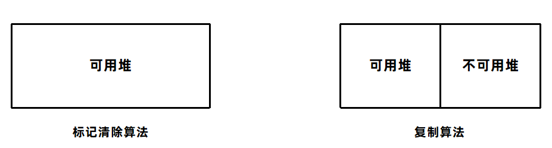


没有一个垃圾回收算法能兼顾上述三点评价标准，所以不同的垃圾回收算法它的侧重点是不同的，适用于不同的应用场景。


### 标记清除算法

#### 标记清除算法两阶段

标记清除算法的核心思想分为两个阶段：

1.标记阶段，将所有存活的对象进行标记。Java中使用可达性分析算法，从GC Root开始通过引用链遍历出所有存活对象。

2.清除阶段，从内存中删除没有被标记也就是非存活对象。


第一个阶段，从GC Root对象开始扫描，将对象A、B、C在引用链上的对象标记出来：

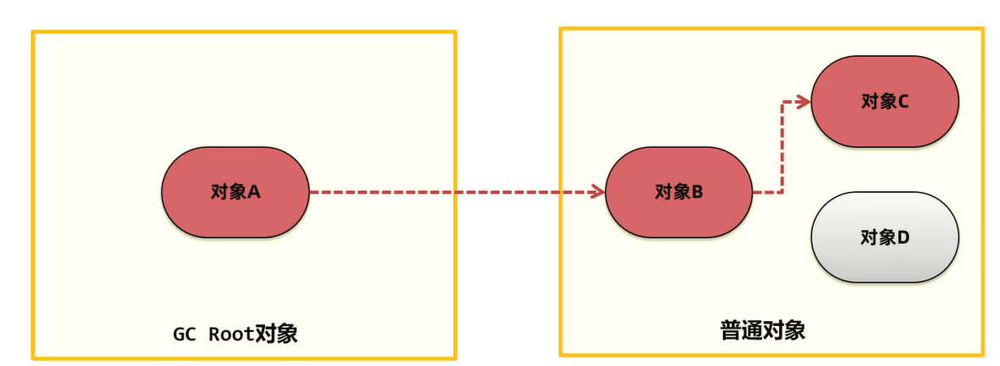

第二个阶段，将没有标记的对象清理掉，所以对象D就被清理掉了。

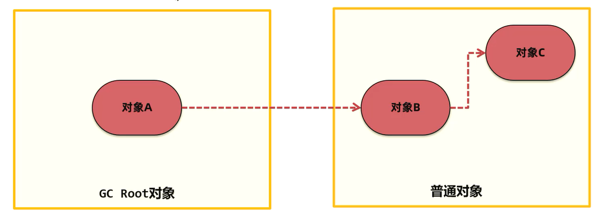


#### 优点：

实现简单，只需要在第一阶段给每个对象维护标志位，第二阶段删除对象即可。

#### 缺点：1.碎片化问题

由于内存是连续的，所以在对象被删除之后，内存中会出现很多细小的可用内存单元。如果我们需要的是一个比较大的空间，很有可能这些内存单元的大小过小无法进行分配。


如下图，红色部分已经被清理掉了，总共回收了9个字节，但是每个都是一个小碎片，无法为5个字节的对象分配空间。

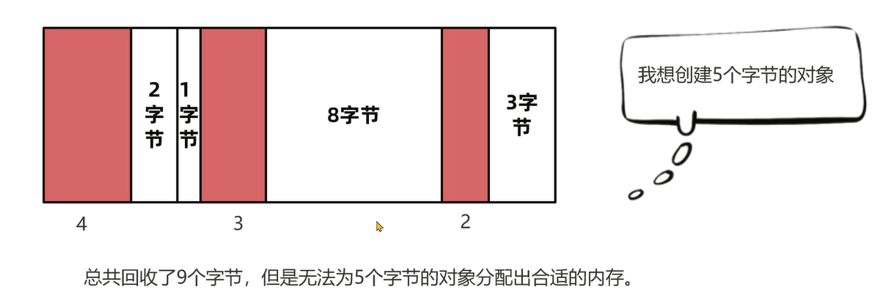


#### 标记清除算法的缺点2：

2.分配速度慢。由于内存碎片的存在，需要维护一个空闲链表，极有可能发生每次需要遍历到链表的最后才能获得合适的内存空间。
我们需要用一个链表来维护，哪些空间可以分配对象，很有可能需要遍历这个链表到最后，才能发现这块空间足够我们去创建一个对象。如下图，遍历到最后才发现有足够的空间分配3个字节的对象了。如果链表很长，遍历也会花费较长的时间。

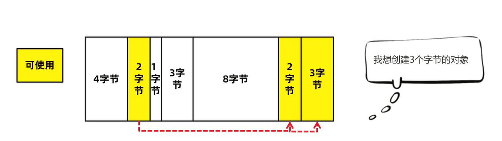


### 复制算法

#### 复制算法的核心思想

复制算法的核心思想是：

1.准备两块空间From空间和To空间，每次在对象分配阶段，只能使用其中一块空间（From空间）。

对象A首先分配在From空间：


2.在垃圾回收GC阶段，将From中存活对象复制到To空间。

在垃圾回收阶段，如果对象A存活，就将其复制到To空间。然后将From空间直接清空。


3.将两块空间的From和To名字互换。

接下来将两块空间的名称互换，下次依然在From空间上创建对象。


#### 完整的复制算法的例子：

1.将堆内存分割成两块From空间 To空间，对象分配阶段，创建对象。

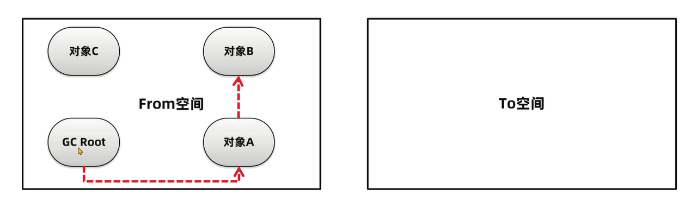

2.GC阶段开始，将GC Root搬运到To空间

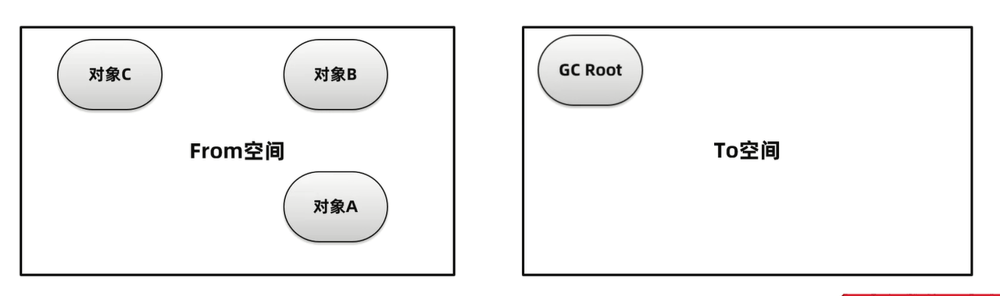

3.将GC Root关联的对象，搬运到To空间

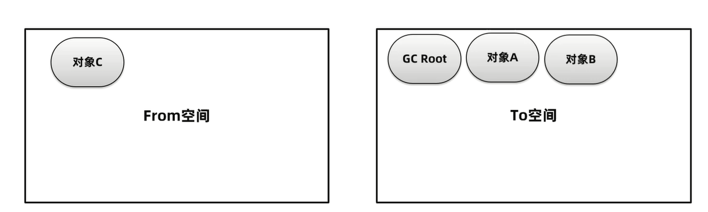

4.清理From空间，并把名称互换

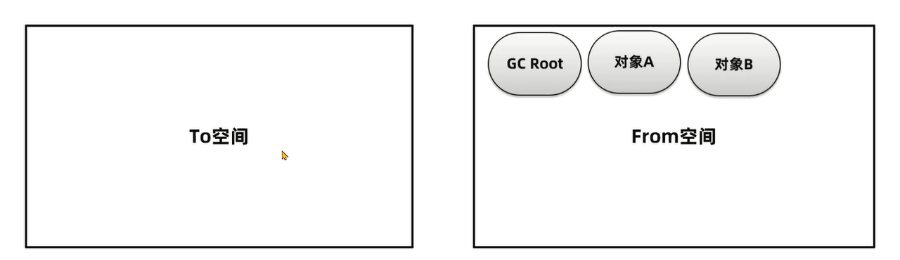


优点：

* 吞吐量高，复制算法只需要遍历一次存活对象复制到To空间即可，比标记-整理算法少了一次遍历的过程，因而性能较好，但是不如标记-清除算法，因为标记清除算法不需要进行对象的移动

* 不会发生碎片化，复制算法在复制之后就会将对象按顺序放入To空间中，所以对象以外的区域都是可用空间，不存在碎片化内存空间。


缺点：

内存使用效率低，每次只能让一半的内存空间来为创建对象使用。


### 标记整理算法

标记整理算法也叫标记压缩算法，是对标记清理算法中容易产生内存碎片问题的一种解决方案。

核心思想分为两个阶段：

1.标记阶段，将所有存活的对象进行标记。Java中使用可达性分析算法，从GC Root开始通过引用链遍历出所有存活对象。

2.整理阶段，将存活对象移动到堆的一端。清理掉存活对象的内存空间。

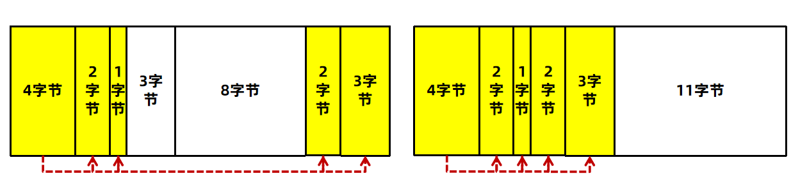


优点：

* 内存使用效率高，整个堆内存都可以使用，不会像复制算法只能使用半个堆内存

* 不会发生碎片化，在整理阶段可以将对象往内存的一侧进行移动，剩下的空间都是可以分配对象的有效空间

缺点：

整理阶段的效率不高，整理算法有很多种，比如Lisp2整理算法需要对整个堆中的对象搜索3次，整体性能不佳。可以通过Two-Finger、表格算法、ImmixGC等高效的整理算法优化此阶段的性能。


### 分代垃圾回收算法

现代优秀的垃圾回收算法，会将上述描述的垃圾回收算法组合进行使用，其中应用最广的就是分代垃圾回收算法(Generational GC)。

分代垃圾回收将整个内存区域划分为年轻代和老年代：


我们通过arthas来验证下内存划分的情况：

在JDK8中，添加-XX:+UseSerialGC参数使用分代回收的垃圾回收器，运行程序。

在arthas中使用memory命令查看内存，显示出三个区域的内存情况。

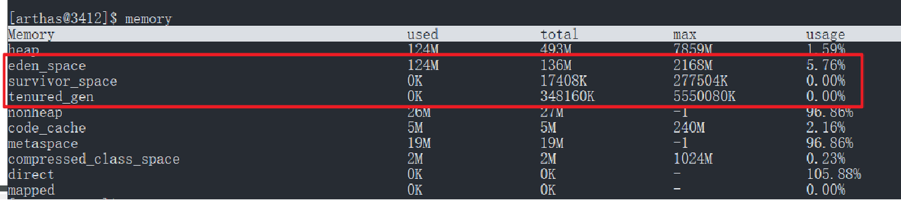

Eden + survivor 这两块区域组成了年轻代。

tenured\_gen指的是晋升区域，其实就是老年代。


另外还可以选择的虚拟机参数如下

#### 📌 案例：调整内存区域的大小

> **说明**：根据以下虚拟机参数，调整堆的大小并观察结果。
> ⚠️ 注意：需加上 `-XX:+UseSerialGC` 以启用串行垃圾收集器，便于观察 GC 行为。

| 参数名                              | 参数含义                                                     | 示例                                                         |
| ----------------------------------- | ------------------------------------------------------------ | ------------------------------------------------------------ |
| `-Xms`                              | 设置堆的最小和初始大小，必须是 1024 的倍数且大于 1MB         | 比如初始大小为 6MB 的写法： `-Xms6291456` `-Xms6144k` `-Xms6m` |
| `-Xmx`                              | 设置最大堆的大小，必须是 1024 的倍数且大于 2MB               | 比如最大堆为 80 MB 的写法： `-Xmx83886080` `-Xmx81920k` `-Xmx80m` |
| `-Xmn`                              | 设置新生代（Young Generation）的大小                         | 新生代为 256 MB 的写法： `-Xmn256m` `-Xmn262144k` `-Xmn268435456` |
| `-XX:SurvivorRatio`                 | 设置伊甸园区（Eden Space）与幸存区（Survivor Space）的比例，默认值为 8。 例如：当新生代为 1GB 时，Eden 占 800MB，S0 和 S1 各占 100MB。 | 将比例调整为 4 的写法： `-XX:SurvivorRatio=4`                |
| `-XX:+PrintGCDetails<br>verbose:gc` | 打印详细的 GC 日志，用于分析垃圾回收行为                     | 无                                                           |

------

##### ✅ 补充说明

- **单位支持**：

  - `m`：表示 MB（兆字节）
  - `k`：表示 KB（千字节）
  - 数值直接使用字节数（如 6291456 字节 = 6MB）

- **推荐实践**：
  在运行 Java 程序时，可通过如下方式添加参数：

  ```bash
  java -Xms6m -Xmx80m -Xmn256m -XX:SurvivorRatio=4 -XX:+PrintGCDetails -XX:+UseSerialGC YourClassName
  ```

- **目的**：
  通过调整这些参数，可以控制 JVM 堆内存的分配策略，从而优化程序性能，减少 GC 频率或提升响应速度。

代码：

使用arthas的memory展示出来的效果：

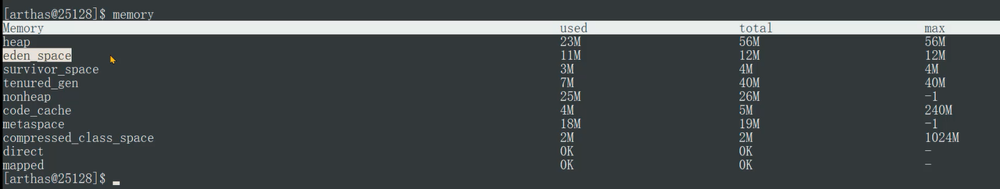

heap展示的是可用堆，survivor区每次只有一块能使用，所以60 - 4 = 56m。

#### 分代垃圾回收算法

1、分代回收时，创建出来的对象，首先会被放入Eden伊甸园区。

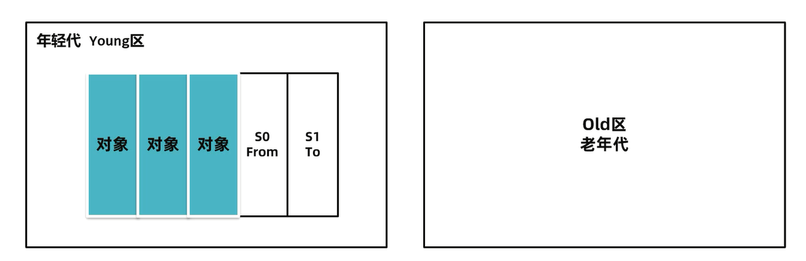

2、随着对象在Eden区越来越多，如果Eden区满，新创建的对象已经无法放入，就会触发年轻代的GC，称为Minor GC或者Young GC。

Minor GC会把需要eden中和From需要回收的对象回收，把没有回收的对象放入To区。

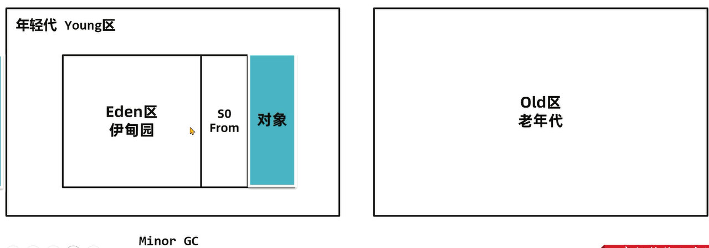

3、接下来，S0会变成To区，S1变成From区。当eden区满时再往里放入对象，依然会发生Minor GC。

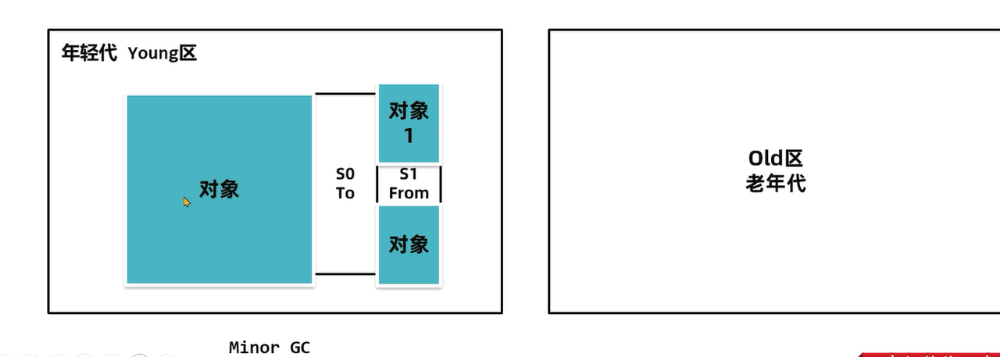

此时会回收eden区和S1(from)中的对象，并把eden和from区中剩余的对象放入S0。

注意：每次Minor GC中都会为对象记录他的年龄，初始值为0，每次GC完加1。

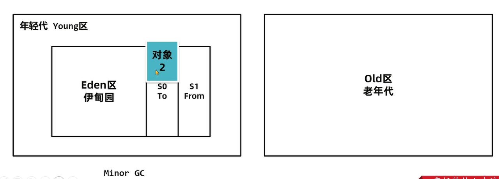

4、如果Minor GC后对象的年龄达到阈值（最大15，默认值和垃圾回收器有关），对象就会被晋升至老年代。

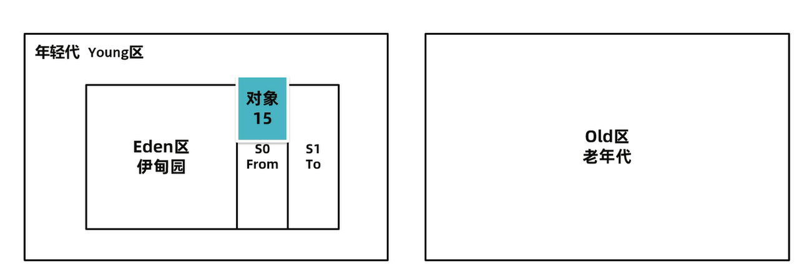

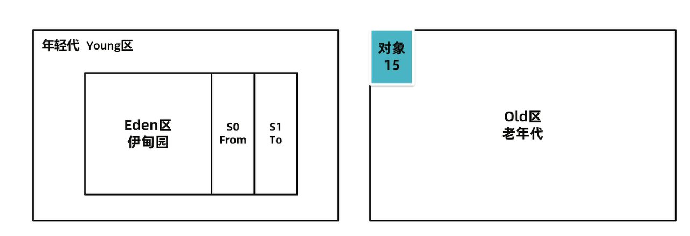

当老年代中空间不足，无法放入新的对象时，先尝试minor gc如果还是不足，就会触发Full GC，Full GC会对整个堆进行垃圾回收。

如果Full GC依然无法回收掉老年代的对象，那么当对象继续放入老年代时，就会抛出Out Of Memory异常。


下图中的程序为什么会出现OutOfMemory？

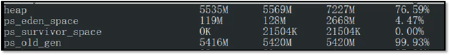

从上图可以看到，Full GC无法回收掉老年代的对象，那么当对象继续放入老年代时，就会抛出Out Of Memory异常。


继续使用这段代码测试：

结果如下：

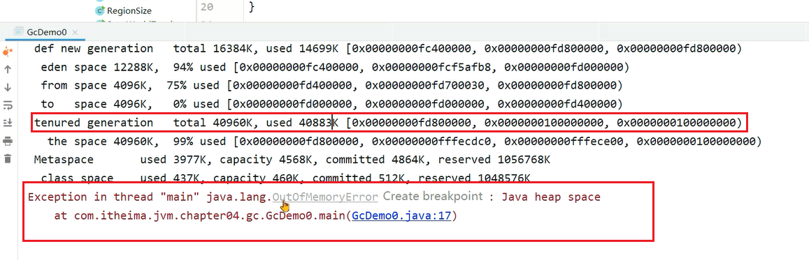

老年代已经满了，而且垃圾回收无法回收掉对象，如果还想往里面放就发生了`OutOfMemoryError`。


## 4.5 垃圾回收器

### 垃圾回收器的学习内容 

垃圾回收器的种类 

常见的垃圾回收器及其优点和 使用场景--- 基础篇 

使用垃圾回收器 

如何使用指定的垃圾回收器， 并进行简单的测试 ---基础篇 

垃圾回收器的实战 

针对特定应用场景进行垃圾回 收器的调优、解决垃圾回收导 致的CPU占用率高的问题 ----实战篇 

垃圾回收器的原理 

垃圾回收器实现的底层原理--- 原理篇

**为什么分代GC算法要把堆分成年轻代和老年代？**首先我们要知道堆内存中对象的特性：

* 系统中的大部分对象，都是创建出来之后很快就不再使用可以被回收，比如用户获取订单数据，订单数据返回给用户之后就可以释放了。

* 老年代中会存放长期存活的对象，比如Spring的大部分bean对象，在程序启动之后就不会被回收了。

* 在虚拟机的默认设置中，新生代大小要远小于老年代的大小。


**分代GC算法将堆分成年轻代和老年代主要原因有：**

1、可以通过调整年轻代和老年代的比例来适应不同类型的应用程序，提高内存的利用率和性能。

2、新生代和老年代使用不同的垃圾回收算法，新生代一般选择复制算法，老年代可以选择标记-清除和标记-整理算法，由程序员来选择灵活度较高。

3、分代的设计中允许只回收新生代（minor gc），如果能满足对象分配的要求就不需要对整个堆进行回收(full gc),STW时间就会减少。

#### 垃圾回收期的组合关系

垃圾回收器是垃圾回收算法的具体实现。

由于垃圾回收器分为年轻代和老年代，除了G1之外其他垃圾回收器必须成对组合进行使用。

具体的关系图如下：

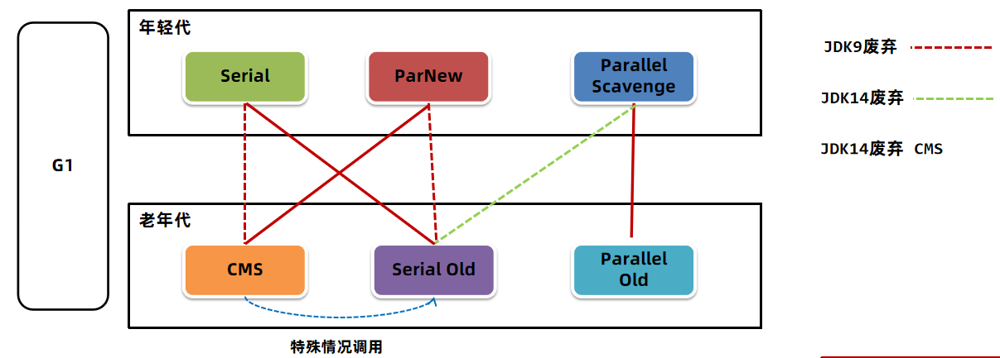


### 年轻代-Serial垃圾回收器

Serial是是一种单线程串行回收年轻代的垃圾回收器。

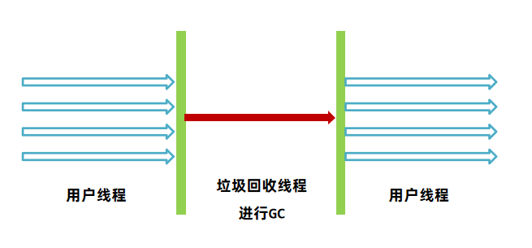

**回收年代和算法：**

年轻代

复制算法

**优点**

单CPU处理器下吞吐量非常出色

**缺点**

多CPU下吞吐量不如其他垃圾回收器，堆如果偏大会让用户线程处于长时间的等待

**适用场景**

Java编写的客户端程序或者硬件配置有限的场景


### 老年代-SerialOld垃圾回收器

SerialOld是Serial垃圾回收器的老年代版本，**采用单线程串行回收**

**-XX:+UseSerialGC 新生代、老年代都使用串行回收器。**


**回收年代和算法：**

老年代

标记-整理算法

**优点**

单CPU处理器下吞吐量非常出色

**缺点**

多CPU下吞吐量不如其他垃圾回收器，堆如果偏大会让用户线程处于长时间的等待

**适用场景**

与Serial垃圾回收器搭配使用，或者在CMS特殊情况下使用

这里的 **CMS** 指的是 **Concurrent Mark-Sweep Collector**（并发标记清除垃圾回收器），它是 Java 虚拟机（JVM）中一种**以低延迟为目标的垃圾回收器**，主要用于老年代（Old Generation）的垃圾回收。

### 年轻代-ParNew垃圾回收器

ParNew垃圾回收器本质上是对Serial在多CPU下的优化，使用多线程进行垃圾回收

-XX:+UseParNewGC 新生代使用ParNew回收器， 老年代使用串行回收器

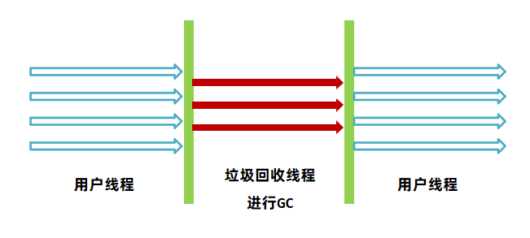

**回收年代和算法：**

年轻代

复制算法

**优点**

多CPU处理器下停顿时间较短

**缺点**

吞吐量和停顿时间不如G1，所以在JDK9之后不建议使用

**适用场景**

&#x20;JDK8及之前的版本中，与CMS老年代垃圾回收器搭配使用


### 老年代- CMS(Concurrent Mark Sweep)垃圾回收器

CMS垃圾回收器关注的是系统的暂停时间，允许用户线程和垃圾回收线程在某些步骤中同时执行，减少了用户线程的等待时间。

参数：XX:+UseConcMarkSweepGC

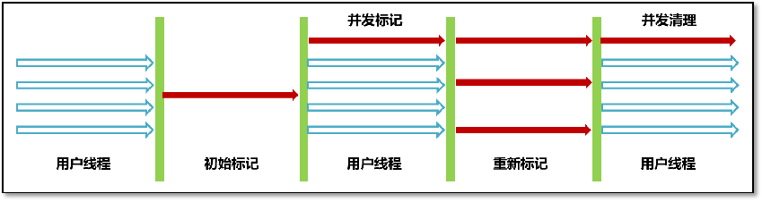

**回收年代和算法：**

老年代

标记清除算法

**优点**

系统由于垃圾回收出现的停顿时间较短，用户体验好

**缺点**

1、内存碎片问题

2、退化问题

3、浮动垃圾问题

**适用场景**

&#x20;大型的互联网系统中用户请求数据量大、频率高的场景，比如订单接口、商品接口等


#### CMS执行步骤：

1.初始标记，用极短的时间标记出GC Roots能直接关联到的对象。

2.并发标记,   标记所有的对象，用户线程不需要暂停。

3.重新标记，由于并发标记阶段有些对象会发生了变化，存在错标、漏标等情况，需要重新标记。

4.并发清理，清理死亡的对象，用户线程不需要暂停。


缺点：

1、CMS使用了标记-清除算法，在垃圾收集结束之后会出现大量的内存碎片，CMS会在Full GC时进行碎片的整理。这样会导致用户线程暂停，可以使用-XX:CMSFullGCsBeforeCompaction=N 参数（默认0）调整N次Full GC之后再整理。

2.、无法处理在并发清理过程中产生的“浮动垃圾”，不能做到完全的垃圾回收。

3、如果老年代内存不足无法分配对象，CMS就会退化成Serial Old单线程回收老年代。


#### 并发线程数：

在CMS中并发阶段运行时的线程数可以通过-XX:ConcGCThreads参数设置，默认值为0，由系统计算得出。

计算公式为(-XX:ParallelGCThreads定义的线程数 + 3) / 4， ParallelGCThreads是STW停顿之后的并行线程数

#### ParallelGCThreads是由处理器核数决定的：

&#x20; 1、当cpu核数小于8时，ParallelGCThreads = CPU核数

&#x20; 2、否则 ParallelGCThreads = 8 + (CPU核数 – 8 )\*5/8&#x20;

我的电脑上逻辑处理器有12个，所以ParallelGCThreads  =  8 + （12 - 8）\* 5/8 = 10，ConcGCThreads = (-XX:ParallelGCThreads定义的线程数 + 3) / 4 = （10 + 3） / 4 = 3

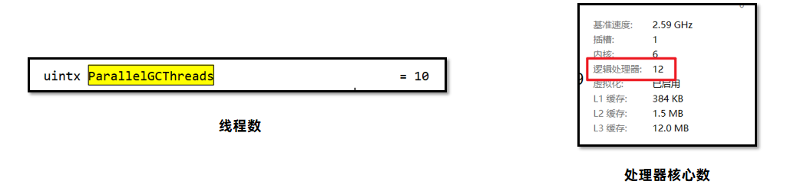

最终可以得到这张图：

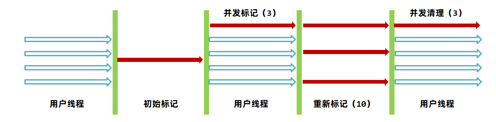

并发标记和并发清理阶段，会使用3个线程并行处理。重新标记阶段会使用10个线程处理。

由于CPU的核心数有限，并发阶段会影响用户线程执行的性能。

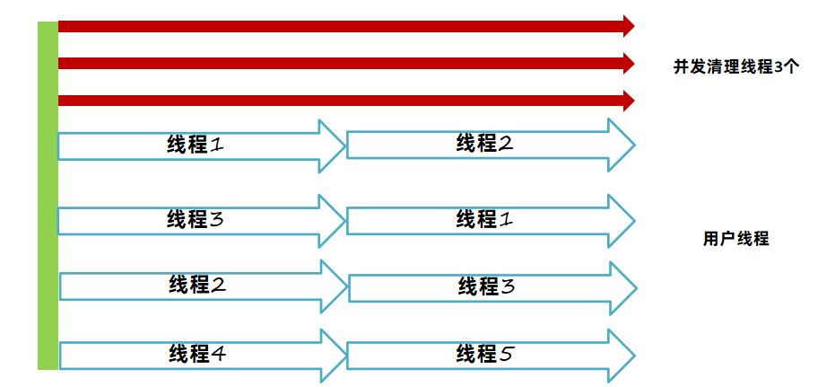


### 年轻代-Parallel Scavenge垃圾回收器

Parallel Scavenge是JDK8默认的年轻代垃圾回收器，多线程并行回收，关注的是系统的吞吐量。具备自动调整堆内存大小的特点。

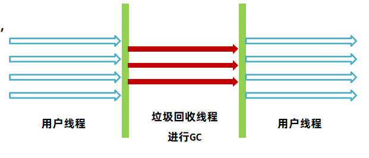

**回收年代和算法：**

年轻代

复制算法

**优点**

吞吐量高，而且手动可控。为了提高吞吐量，虚拟机会动态调整堆的参数

**缺点**

不能保证单次的停顿时间

**适用场景**

后台任务，不需要与用户交互，并且容易产生大量的对象。比如：大数据的处理，大文件导出


**常用参数：**

Parallel Scavenge允许手动设置最大暂停时间和吞吐量。Oracle官方建议在使用这个组合时，不要设置堆内存的最大值，垃圾回收器会根据最大暂停时间和吞吐量自动调整内存大小。

* 最大暂停时间，`-XX:MaxGCPauseMillis=n` 设置每次垃圾回收时的最大停顿毫秒数

* 吞吐量，`-XX:GCTimeRatio=n` 设置吞吐量为n（用户线程执行时间 = n/n + 1）

* 自动调整内存大小, `-XX:+UseAdaptiveSizePolicy`设置可以让垃圾回收器根据吞吐量和最大停顿的毫秒数自动调整内存大小


### 老年代-Parallel Old垃圾回收器

Parallel Old是为Parallel Scavenge收集器设计的老年代版本，利用多线程并发收集。

参数： -XX:+UseParallelGC  或

&#x20;          -XX:+UseParallelOldGC可以使用Parallel Scavenge + Parallel Old这种组合。


**回收年代和算法：**

老年代

标记-整理算法

**优点**

并发收集，在多核CPU下效率较高

**缺点**

暂停时间会比较长

**适用场景**

与Parallel Scavenge配套使用


### G1垃圾回收器

**JDK9之后默认的垃圾回收器是G1（Garbage First）垃圾回收器。**Parallel Scavenge关注吞吐量，允许用户设置最大暂停时间 ，但是会减少年轻代可用空间的大小。CMS关注暂停时间，但是吞吐量方面会下降。

而G1设计目标就是将上述两种垃圾回收器的优点融合：

1.支持巨大的堆空间回收，并有较高的吞吐量。

2.支持多CPU并行垃圾回收。

3.允许用户设置最大暂停时间。

JDK9之后强烈建议使用G1垃圾回收器。


G1出现之前的垃圾回收器，年轻代和老年代一般是连续的，如下图：

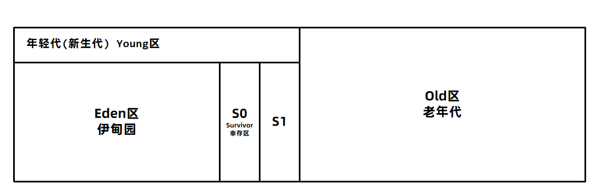

G1的整个堆会被划分成多个大小相等的区域，称之为区Region，区域不要求是连续的。分为Eden、Survivor、Old区。Region的大小通过堆空间大小/2048计算得到，也可以通过参数-XX:G1HeapRegionSize=32m指定(其中32m指定region大小为32M)，Region size必须是2的指数幂，取值范围从1M到32M。

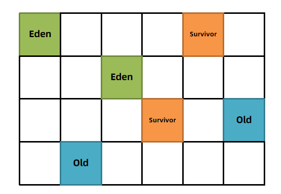

#### G1垃圾回收有两种方式：

1、年轻代回收（Young GC）

2、混合回收（Mixed GC）


#### 年轻代回收

年轻代回收（Young GC），回收Eden区和Survivor区中不用的对象。会导致STW，G1中可以通过参数

-XX:MaxGCPauseMillis=n（默认200）  设置每次垃圾回收时的最大暂停时间毫秒数，G1垃圾回收器会尽可能地保证暂停时间。

1、新创建的对象会存放在Eden区。当G1判断年轻代区不足（max默认60%），无法分配对象时需要回收时会执行Young GC。

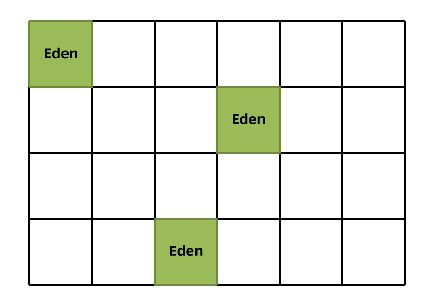

2、标记出Eden和Survivor区域中的存活对象，

3、根据配置的最大暂停时间选择某些区域将存活对象复制到一个新的Survivor区中（年龄+1），清空这些区域。

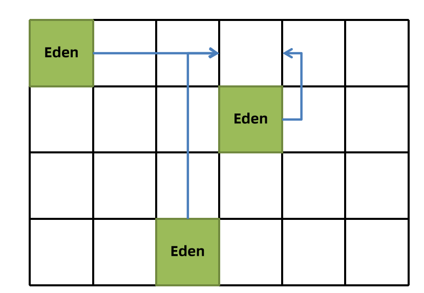


G1在进行Young GC的过程中会去记录每次垃圾回收时每个Eden区和Survivor区的平均耗时，以作为下次回收时的参考依据。这样就可以根据配置的最大暂停时间计算出本次回收时最多能回收多少个Region区域了。

比如 -XX:MaxGCPauseMillis=n（默认200），每个Region回收耗时40ms，那么这次回收最多只能回收4个Region。

4、后续Young GC时与之前相同，只不过Survivor区中存活对象会被搬运到另一个Survivor区。

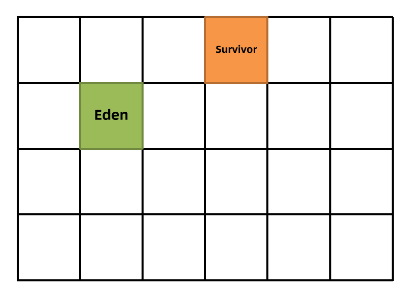

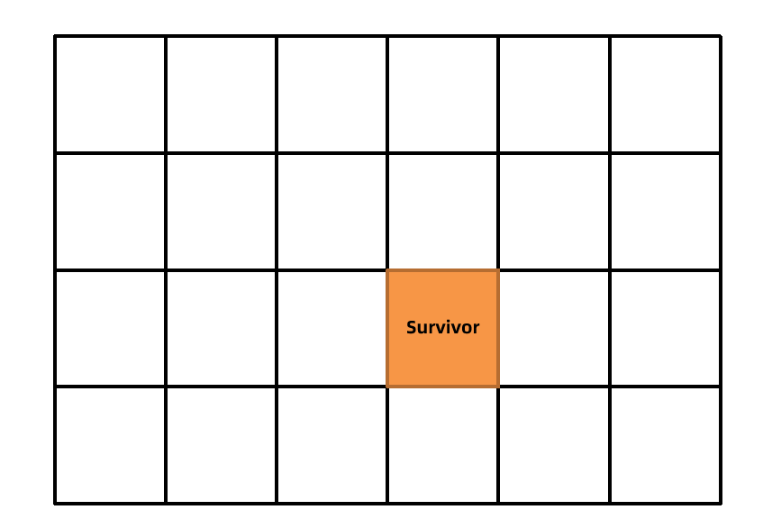

5、当某个存活对象的年龄到达阈值（默认15），将被放入老年代。

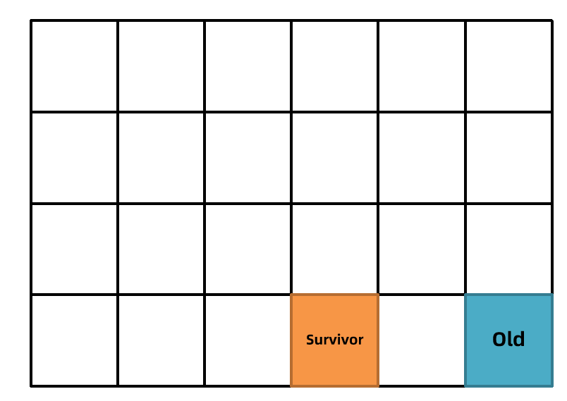

6、部分对象如果大小超过Region的一半，会直接放入老年代，这类老年代被称为Humongous区。比如堆内存是4G，每个Region是2M，只要一个大对象超过了1M就被放入Humongous区，如果对象过大会横跨多个Region。

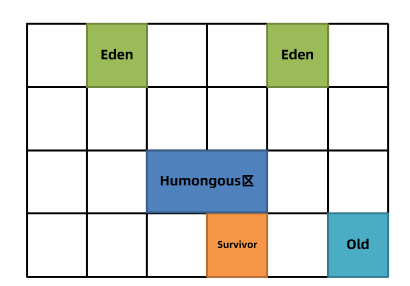

7、多次回收之后，会出现很多Old老年代区，此时总堆占有率达到阈值时

（-XX:InitiatingHeapOccupancyPercent默认45%）会触发混合回收MixedGC。回收所有年轻代和部分老年代的对象以及大对象区。采用复制算法来完成。

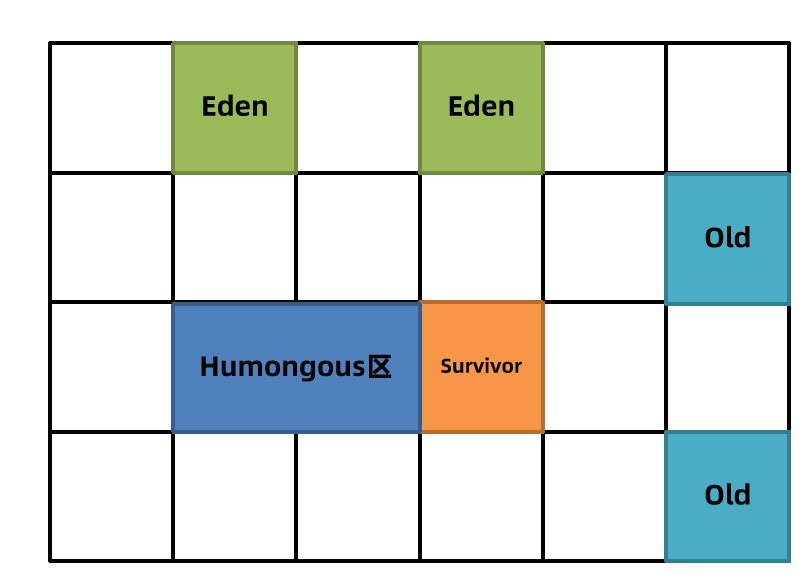

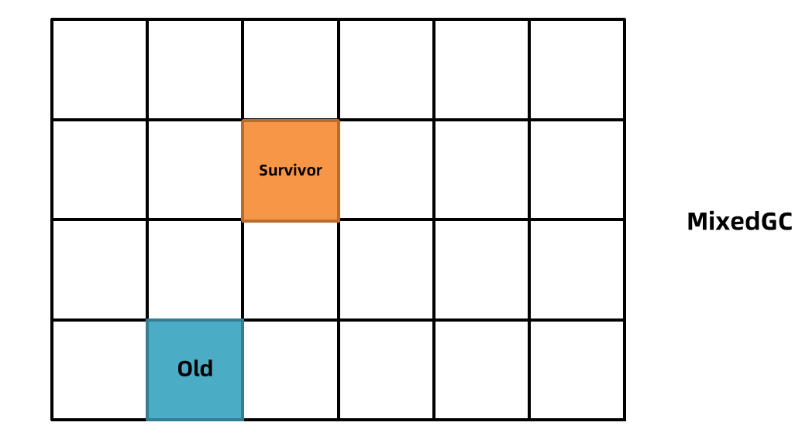

#### 混合回收

混合回收分为：初始标记（initial mark）、并发标记（concurrent mark）、最终标记（remark或者Finalize Marking）、并发清理（cleanup）

G1对老年代的清理会选择存活度最低的区域来进行回收，这样可以保证回收效率最高，这也是G1（Garbage first）名称的由来。

&#x20; &#x20;

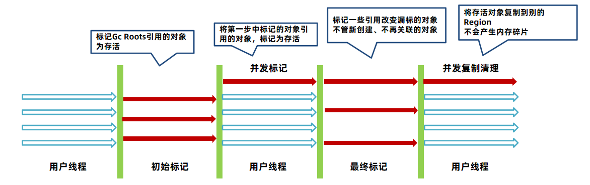

G1对老年代的清理会选择存活度最低的区域来进行回收，这样可以保证回收效率最高，这也是G1（Garbage first）名称的由来。最后清理阶段使用复制算法，不会产生内存碎片。

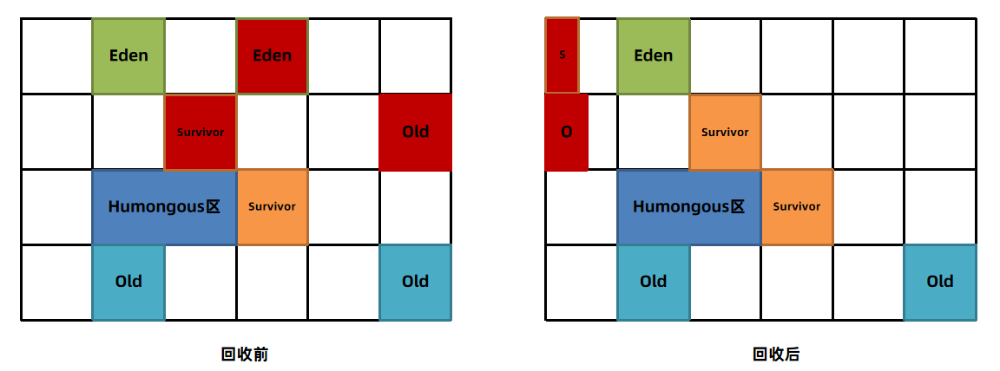

注意：如果清理过程中发现没有足够的空Region存放转移的对象，会出现Full GC。单线程执行标记-整理算法，此时会导致用户线程的暂停。所以尽量保证应该用的堆内存有一定多余的空间。

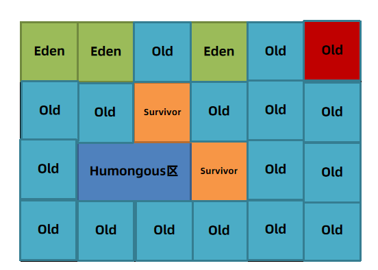


### G1 – Garbage First 垃圾回收器

参数1： `-XX:+UseG1GC`  打开G1的开关，JDK9之后默认不需要打开

参数2：`-XX:MaxGCPauseMillis=毫秒值` 最大暂停的时间

**回收年代和算法：**

年轻代+老年代

复制算法

**优点**

对比较大的堆如超过6G的堆回收时，延迟可控

不会产生内存碎片

并发标记的SATB算法效率高

**缺点**

JDK8之前还不够成熟

**适用场景**

JDK8最新版本、JDK9之后建议默认使用


使用以下代码测试g1垃圾回收器，打印出每个阶段的时间:

每个region大小为2m，一共有84个young区，26个幸存者区。

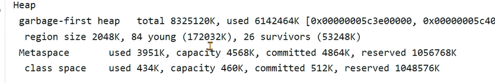

初始标记花了0.0478秒。

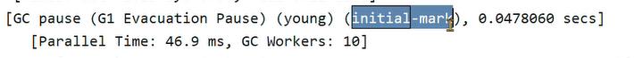

并发标记总共耗时10ms，不会产生STW。

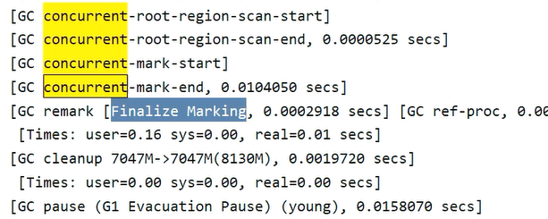

### 总结

垃圾回收器的组合关系虽然很多，但是针对几个特定的版本，比较好的组合选择如下：

JDK8及之前：

ParNew + CMS（关注暂停时间）、Parallel Scavenge + Parallel Old (关注吞吐量)、 G1（JDK8之前不建议，较大堆并且关注暂停时间）


JDK9之后:

G1（默认）


从JDK9之后，由于G1日趋成熟，JDK默认的垃圾回收器已经修改为G1，所以强烈建议在生产环境上使用G1。

G1的实现原理将在《原理篇》中介绍，更多前沿技术ZGC、GraalVM将在《高级篇》中介绍。

