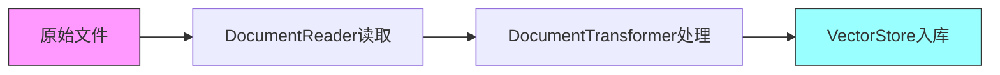
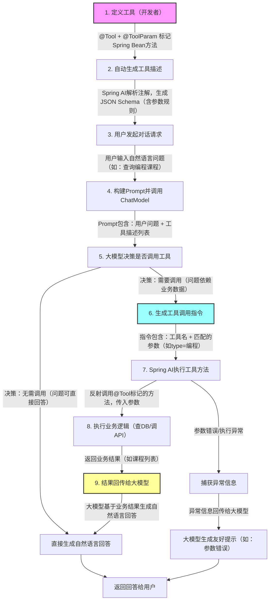

# Spring AI 

Spring AI 是 Spring 生态下的 AI 应用开发框架，核心是**统一 API 抽象 + 模块化能力**，让 Java 开发者快速接入大模型、向量数据库、RAG、函数调用等能力。下面按官方模块与功能维度做完整分类介绍。

---

## 一、AI 模型集成（核心入口）

统一封装主流大模型，屏蔽厂商差异，提供同步/流式调用。

**1. 聊天模型（Chat Models）**

- **核心 API**：`ChatClient`（流畅式，类似 WebClient）、`ChatModel`
- **能力**：多轮对话、流式响应、结构化输出（POJO 映射）、Prompt 模板、消息类型（User/System/Assistant）
- **支持厂商**：OpenAI、Azure OpenAI、Anthropic Claude、Amazon Bedrock、Google Gemini、Ollama 等

**2. 嵌入模型（Embedding Models）**

- **核心 API**：`EmbeddingModel`、`EmbeddingClient`
- **能力**：文本转向量、批量嵌入、向量维度配置
- **用途**：RAG、语义检索、推荐系统

**3. 多模态模型**

- **文生图（Text-to-Image）**：`ImageClient`，支持 DALL·E、Stable Diffusion 等
- **语音（Audio）**：
  - 语音识别（ASR）：`AudioTranscriptionClient`
  - 语音合成（TTS）：`AudioSpeechClient`
- **内容审核（Moderation）**：`ModerationClient`，检测违规内容


---

### 一、聊天模型（Chat Models）：核心对话能力

#### 1. 核心设计理念

Spring AI 对聊天模型的封装遵循「**统一抽象 + 厂商适配**」原则：
- 上层：统一的 `ChatModel`/`ChatClient` API，开发者无需关注厂商差异
- 下层：不同厂商的实现（如 `OpenAiChatModel`、`GeminiChatModel`）
- 核心优势：切换模型（如从 OpenAI 换到 Ollama）只需改依赖和配置，无需改业务代码

#### 2. 核心 API 详解

| API 类型             | 用途                           | 特点                                                         |
| -------------------- | ------------------------------ | ------------------------------------------------------------ |
| `ChatModel`          | 基础接口，定义对话核心能力     | 同步调用 `call(ChatRequest)`，返回 `ChatResponse`            |
| `StreamingChatModel` | 流式响应接口（继承 ChatModel） | 异步流式返回 `Flux<ChatResponse>`，适合实时展示回答（如打字机效果） |
| `ChatClient`         | 流畅式 API（推荐）             | 链式调用，内置 Prompt 模板、结构化输出、异常处理，简化开发   |

#### 3. 关键功能与代码示例

##### （1）基础同步调用（ChatClient 推荐用法）

```java
// 1. 引入依赖（以 OpenAI 为例）
// <dependency>
//   <groupId>org.springframework.ai</groupId>
//   <artifactId>spring-ai-openai-spring-boot-starter</artifactId>
//   <version>1.0.0-M1</version>
// </dependency>

// 2. 配置（application.yml）
spring:
  ai:
    openai:
      api-key: ${OPENAI_API_KEY}
      base-url: https://api.openai.com/v1
      chat:
        options:
          model: gpt-3.5-turbo
          temperature: 0.7  # 随机性，0-2，越小越精准
          max-tokens: 1000   # 最大输出令牌数

// 3. 代码调用
@RestController
public class ChatController {
    private final ChatClient chatClient;

    // 自动注入（Spring Boot 自动配置）
    public ChatController(ChatClient chatClient) {
        this.chatClient = chatClient;
    }

    // 基础对话
    @GetMapping("/chat")
    public String chat(@RequestParam String question) {
        // 最简调用
        return chatClient.prompt()
                .user(question)  // 用户消息
                .call()          // 同步调用
                .content();      // 提取回答内容
    }
}
```

##### （2）流式响应（实时输出）

```java
// 流式返回（适合前端实时展示）
@GetMapping(value = "/chat/stream", produces = MediaType.TEXT_EVENT_STREAM_VALUE)
public Flux<String> streamChat(@RequestParam String question) {
    return chatClient.prompt()
            .user(question)
            .stream()  // 开启流式
            .content();// 逐段返回内容
}
```

##### （3）多轮对话（带上下文）

```java
@GetMapping("/chat/multi")
public String multiRoundChat() {
    // 构建多轮消息（System + User + Assistant + User）
    ChatResponse response = chatClient.prompt()
            .system("你是一个Java开发助手，回答简洁明了")  // 系统指令
            .user("什么是Spring AI？")                     // 第一轮用户问题
            .assistant("Spring AI是Spring生态的AI开发框架...") // 助手历史回答
            .user("它和原生OpenAI SDK有什么区别？")         // 第二轮用户问题
            .call();

    return response.content();
}
```

##### （4）结构化输出（POJO 映射）

无需手动解析 JSON，直接映射到自定义类：
```java
// 定义返回结构体
public record UserInfo(String name, Integer age, String city) {}

// 结构化输出调用
@GetMapping("/chat/struct")
public UserInfo structChat() {
    String prompt = "生成一个用户信息，包含姓名、年龄、城市，返回JSON格式";
    return chatClient.prompt()
            .user(prompt)
            .call()
            .entity(UserInfo.class); // 自动解析为POJO
}
```

##### （5）Prompt 模板（复用性）

```java
// 定义模板（支持SpEL表达式）
String template = "请用{language}语言解释{concept}，控制在{length}字以内";

// 填充参数并调用
Map<String, Object> params = Map.of(
    "language", "中文",
    "concept", "向量数据库",
    "length", 200
);

String result = chatClient.prompt()
        .template(template, params) // 模板+参数
        .call()
        .content();
```

#### 4. 支持的核心参数（通用）

所有聊天模型都支持的通用配置（以 OpenAI 为例）：
- `temperature`：随机性（0=精准，2=创意）
- `max-tokens`：输出令牌上限（防止超长回答）
- `topP`：核采样，0.1 表示只选前10%概率的令牌（与 temperature 二选一）
- `stop`：停止词（如设置为 "END"，模型输出到 END 就停止）
- `presencePenalty`：惩罚重复内容（-2~2，正数减少重复）

---

### 二、嵌入模型（Embedding Models）：文本转向量

#### 1. 核心作用

将文本（如文档、问题、摘要）转换为**数值向量**（Embedding），核心用途：
- RAG：计算用户问题与文档向量的相似度，检索相关内容
- 语义检索：按语义而非关键词搜索
- 文本聚类/分类：通过向量距离判断文本相似度

#### 2. 核心 API 详解

| API 类型            | 用途                     | 示例                                     |
| ------------------- | ------------------------ | ---------------------------------------- |
| `EmbeddingModel`    | 基础接口，转换文本为向量 | `embed(List<Document> documents)`        |
| `EmbeddingClient`   | 简化版 API（推荐）       | `embed(String text)`                     |
| `EmbeddingResponse` | 返回结果                 | 包含 `embedding`（向量数组）、`metadata` |

#### 3. 代码示例

##### （1）基础文本转向量

```java
// 1. 配置（application.yml）
spring:
  ai:
    openai:
      api-key: ${OPENAI_API_KEY}
      embedding:
        options:
          model: text-embedding-3-small # 嵌入模型（轻量版）
          dimensions: 1536              # 向量维度（可选，部分模型支持）

// 2. 代码调用
@Service
public class EmbeddingService {
    private final EmbeddingClient embeddingClient;

    public EmbeddingService(EmbeddingClient embeddingClient) {
        this.embeddingClient = embeddingClient;
    }

    // 单文本转向量
    public List<Double> embedText(String text) {
        EmbeddingResponse response = embeddingClient.embed(text);
        // 获取向量（float转double，方便后续计算）
        return response.getEmbeddings().get(0).getEmbedding().stream()
                .map(Float::doubleValue)
                .toList();
    }

    // 批量文本转向量
    public List<List<Double>> batchEmbed(List<String> texts) {
        // 封装为 Document（可带元数据）
        List<Document> documents = texts.stream()
                .map(t -> new Document(t))
                .toList();
        
        return embeddingClient.embed(documents).getEmbeddings().stream()
                .map(e -> e.getEmbedding().stream().map(Float::doubleValue).toList())
                .toList();
    }
}
```

##### （2）相似度计算（RAG 核心）

```java
// 计算两个向量的余弦相似度（值越大越相似，范围 [-1,1]）
public double cosineSimilarity(List<Double> vec1, List<Double> vec2) {
    if (vec1.size() != vec2.size()) {
        throw new IllegalArgumentException("向量维度不一致");
    }
    double dotProduct = 0.0;
    double norm1 = 0.0;
    double norm2 = 0.0;
    for (int i = 0; i < vec1.size(); i++) {
        dotProduct += vec1.get(i) * vec2.get(i);
        norm1 += Math.pow(vec1.get(i), 2);
        norm2 += Math.pow(vec2.get(i), 2);
    }
    return dotProduct / (Math.sqrt(norm1) * Math.sqrt(norm2));
}

// 示例：检索与问题最相似的文档
public String retrieveSimilarDoc(String question, List<String> docs) {
    // 1. 问题转向量
    List<Double> questionVec = embedText(question);
    // 2. 所有文档转向量
    List<List<Double>> docVecs = batchEmbed(docs);
    // 3. 计算相似度并找最大值
    int maxIndex = 0;
    double maxSim = 0.0;
    for (int i = 0; i < docVecs.size(); i++) {
        double sim = cosineSimilarity(questionVec, docVecs.get(i));
        if (sim > maxSim) {
            maxSim = sim;
            maxIndex = i;
        }
    }
    return docs.get(maxIndex);
}
```

#### 4. 关键注意事项

- 向量维度：不同模型维度不同（如 text-embedding-3-small 是 1536，Gemini 是 768），维度越大精度越高但存储/计算成本越高
- 批量处理：优先用批量嵌入（`embed(List<Document>)`），减少 API 调用次数，提升性能
- 归一化：部分向量库要求向量归一化（模长为1），需在嵌入后处理

---

### 三、多模态模型：跨模态交互

#### 1. 文生图（Text-to-Image）

##### 核心 API 与示例

```java
// 1. 配置（DALL·E 为例）
spring:
  ai:
    openai:
      api-key: ${OPENAI_API_KEY}
      image:
        options:
          model: dall-e-3
          size: 1024x1024  # 尺寸：256x256/512x512/1024x1024
          quality: standard # 质量：standard/hd
          response-format: url # 返回格式：url/b64_json

// 2. 代码调用
@Service
public class ImageGenerationService {
    private final ImageClient imageClient;

    public ImageGenerationService(ImageClient imageClient) {
        this.imageClient = imageClient;
    }

    // 生成图片（返回URL）
    public String generateImage(String prompt) {
        ImageResponse response = imageClient.call(
                ImagePrompt.builder()
                        .prompt(prompt) // 提示词："生成一张卡通风格的Spring Boot吉祥物，背景是绿色的"
                        .build()
        );
        // 获取图片URL
        return response.getImages().get(0).getUrl();
    }
}
```

#### 2. 语音能力（ASR/TTS）

##### （1）语音识别（ASR）：音频转文字

```java
// 配置（OpenAI Whisper 为例）
spring:
  ai:
    openai:
      api-key: ${OPENAI_API_KEY}
      audio:
        transcription:
          options:
            model: whisper-1
            language: zh  # 语言：zh/en/ja 等

// 代码调用
@Service
public class AudioTranscriptionService {
    private final AudioTranscriptionClient transcriptionClient;

    public AudioTranscriptionService(AudioTranscriptionClient transcriptionClient) {
        this.transcriptionClient = transcriptionClient;
    }

    // 音频文件转文字（支持mp3/wav/m4a等）
    public String transcribeAudio(MultipartFile file) throws IOException {
        AudioTranscriptionRequest request = AudioTranscriptionRequest.builder()
                .audio(new ByteArrayResource(file.getBytes()))
                .build();
        AudioTranscriptionResponse response = transcriptionClient.call(request);
        return response.getResult().getTranscript();
    }
}
```

##### （2）语音合成（TTS）：文字转音频

```java
// 配置
spring:
  ai:
    openai:
      api-key: ${OPENAI_API_KEY}
      audio:
        speech:
          options:
            model: tts-1
            voice: alloy  # 音色：alloy/echo/fable/onyx/nova/shimmer
            response-format: mp3
            speed: 1.0    # 语速：0.25-4.0

// 代码调用
public Resource synthesizeSpeech(String text) {
    AudioSpeechRequest request = AudioSpeechRequest.builder()
            .input(text)
            .build();
    AudioSpeechResponse response = speechClient.call(request);
    // 返回音频资源（可直接下载）
    return new ByteArrayResource(response.getAudioContent());
}
```

#### 3. 内容审核（Moderation）

用于检测文本是否包含违规内容（暴力、色情、仇恨等）：
```java
@Service
public class ModerationService {
    private final ModerationClient moderationClient;

    public ModerationService(ModerationClient moderationClient) {
        this.moderationClient = moderationClient;
    }

    // 审核文本
    public boolean isTextSafe(String text) {
        ModerationResponse response = moderationClient.call(
                new ModerationPrompt(text)
        );
        // 判断是否违规
        return !response.getResults().get(0).isFlagged();
    }

    // 获取违规详情
    public Map<String, Double> getModerationScores(String text) {
        ModerationResponse response = moderationClient.call(new ModerationPrompt(text));
        return response.getResults().get(0).getCategoryScores();
    }
}
```

---

#### 总结

1. **聊天模型**：Spring AI 的核心，通过 `ChatClient` 实现同步/流式对话、多轮上下文、结构化输出，切换模型无需改业务代码；
2. **嵌入模型**：文本转向量的核心，是 RAG/语义检索的基础，需关注向量维度、批量处理和相似度计算；
3. **多模态模型**：覆盖文生图、语音识别/合成、内容审核，API 设计统一，只需配置对应厂商参数即可快速集成。

核心避坑点：
- 切换模型时，只需替换依赖（如 `spring-ai-openai` → `spring-ai-gemini`）和配置，无需改调用代码；
- 流式响应需注意前端适配（SSE），结构化输出需保证模型返回合法 JSON；
- 嵌入模型的向量维度需与向量数据库兼容（如 PGVector 无维度限制，Pinecone 需提前指定）。

---

## 二、向量数据库与存储（RAG 基础）

统一向量存储 API，支持主流向量库，提供类 SQL 元数据过滤。

**1. 向量存储（Vector Store）**

- **核心接口**：`VectorStore`
- **支持数据库**：
  - 开源：Chroma、Milvus、Qdrant、Weaviate、PGVector、Redis
  - 云服务：Pinecone、Azure AI Search、MongoDB Atlas、Neo4j 等
- **能力**：增删改查、相似度搜索、元数据过滤、批量导入

 **2. 文档处理与 ETL**

- **文档读取器（Document Reader）**：PDF、Markdown、Word、Tika（多格式）、JSON、CSV 等
- **转换器/分割器**：文本分块、元数据 enrich、去重、清洗
- **ETL 流水线**：`DocumentReader` → `DocumentTransformer` → `VectorStore` 一键入库

---

### 一、向量存储（Vector Store）：核心抽象与集成

#### 1. 核心设计理念

Spring AI 对向量存储的封装遵循「**统一接口 + 厂商适配**」：
- 上层：`VectorStore` 核心接口，定义向量增删改查、相似度搜索、元数据过滤等通用能力
- 下层：不同向量库的实现（如 `ChromaVectorStore`、`PgVectorStore`）
- 核心优势：切换向量库（如从 Chroma 换到 PGVector）只需改依赖和配置，业务代码无需修改

#### 2. 核心接口 `VectorStore` 详解

| 核心方法                      | 用途                       | 关键参数                                                     |
| ----------------------------- | -------------------------- | ------------------------------------------------------------ |
| `add(List<Document>)`         | 批量添加文档（自动转向量） | `Document`（含文本、元数据、自定义ID）                       |
| `delete(List<String>)`        | 按ID删除文档               | 文档ID列表                                                   |
| `similaritySearch(…)`         | 相似度搜索（核心）         | `query`（查询文本）、`topK`（返回数量）、`filters`（元数据过滤） |
| `similaritySearchByVector(…)` | 按向量搜索                 | 预计算的向量、`topK`、`filters`                              |

#### 3. 主流向量库集成示例

##### （1）轻量开源：Chroma（本地/单机，适合开发测试）

###### ① 依赖与配置

```xml
<!-- Maven 依赖 -->
<dependency>
    <groupId>org.springframework.ai</groupId>
    <artifactId>spring-ai-chroma-spring-boot-starter</artifactId>
    <version>1.0.0-M1</version>
</dependency>
```
```yaml
# application.yml
spring:
  ai:
    chroma:
      client:
        base-url: http://localhost:8000  # Chroma 服务地址（需先启动Chroma）
        api-version: v1
    embedding:
      openai: # 绑定嵌入模型（自动为文档生成向量）
        api-key: ${OPENAI_API_KEY}
        options:
          model: text-embedding-3-small
```

###### ② 核心代码示例

```java
@Service
public class ChromaVectorStoreService {
    private final VectorStore vectorStore;

    // Spring Boot 自动注入 ChromaVectorStore
    public ChromaVectorStoreService(VectorStore vectorStore) {
        this.vectorStore = vectorStore;
    }

    // 1. 批量添加文档到向量库
    public void addDocuments() {
        // 构建文档（可带元数据，如文档类型、创建时间、作者）
        List<Document> documents = List.of(
                new Document(
                        "Spring AI 是 Spring 生态的 AI 开发框架，支持大模型集成和向量存储",
                        Map.of("type", "tech", "source", "官网", "create_time", "2026-03")
                ),
                new Document(
                        "RAG 即检索增强生成，核心是先检索相关文档再生成回答",
                        Map.of("type", "ai", "source", "论文", "create_time", "2026-02")
                ),
                new Document(
                        "向量数据库用于存储文本的向量表示，支持相似度搜索",
                        Map.of("type", "database", "source", "博客", "create_time", "2026-01")
                )
        );
        // 自动转向量并入库（底层调用 EmbeddingModel）
        vectorStore.add(documents);
    }

    // 2. 基础相似度搜索
    public List<Document> basicSearch(String query) {
        // 搜索与query最相似的前2个文档
        return vectorStore.similaritySearch(
                SimilaritySearchRequest.builder()
                        .query(query)
                        .topK(2)
                        .build()
        );
    }

    // 3. 带元数据过滤的搜索（类SQL WHERE条件）
    public List<Document> filteredSearch(String query) {
        // 过滤条件：type = 'ai' 且 create_time >= '2026-02'
        Filter filter = Filter.builder()
                .and(
                        Filter.eq("type", "ai"),
                        Filter.gte("create_time", "2026-02")
                )
                .build();

        return vectorStore.similaritySearch(
                SimilaritySearchRequest.builder()
                        .query(query)
                        .topK(1)
                        .filter(filter)
                        .build()
        );
    }

    // 4. 按向量搜索（预计算向量场景）
    public List<Document> searchByVector(List<Double> queryVector) {
        return vectorStore.similaritySearch(
                SimilaritySearchRequest.builder()
                        .queryVector(queryVector) // 直接传入向量，无需再调用嵌入模型
                        .topK(2)
                        .build()
        );
    }

    // 5. 删除文档
    public void deleteDocuments(List<String> docIds) {
        vectorStore.delete(docIds);
    }
}
```

##### （2）生产级：PGVector（PostgreSQL 扩展，适合企业级）

###### ① 依赖与配置

```xml
<!-- Maven 依赖 -->
<dependency>
    <groupId>org.springframework.ai</groupId>
    <artifactId>spring-ai-pgvector-spring-boot-starter</artifactId>
    <version>1.0.0-M1</version>
</dependency>
<!-- PostgreSQL JDBC -->
<dependency>
    <groupId>org.postgresql</groupId>
    <artifactId>postgresql</artifactId>
</dependency>
```
```yaml
# application.yml
spring:
  datasource: # PG 数据库连接
    url: jdbc:postgresql://localhost:5432/ai_db
    username: postgres
    password: 123456
  ai:
    pgvector:
      table-name: document_embeddings # 存储向量的表名（自动创建）
      vector-dimension: 1536          # 向量维度（需与嵌入模型一致）
      similarity-function: cosine     # 相似度计算方式：cosine/euclidean/dot_product
    embedding:
      openai:
        api-key: ${OPENAI_API_KEY}
        options:
          model: text-embedding-3-small
```

###### ② 关键差异说明

- PGVector 需先安装 `pgvector` 扩展（`CREATE EXTENSION vector;`）
- 支持索引优化（如 `HNSW` 索引），适合海量数据：
  ```sql
  -- 创建余弦相似度索引（生产必备）
  CREATE INDEX idx_document_embeddings_vector ON document_embeddings 
  USING hnsw (vector vector_cosine_ops);
  ```
- 元数据过滤支持复杂 SQL 条件（如模糊查询）：
  ```java
  Filter filter = Filter.like("source", "%官网%"); // 匹配source包含"官网"的文档
  ```

##### （3）云服务：Pinecone（托管式向量库，无需运维）

```yaml
spring:
  ai:
    pinecone:
      api-key: ${PINECONE_API_KEY}
      environment: gcp-starter
      index-name: my-ai-index # 提前在Pinecone控制台创建的索引
      namespace: spring-ai    # 命名空间（隔离不同业务数据）
    embedding:
      openai:
        api-key: ${OPENAI_API_KEY}
```

#### 4. 向量存储选型建议

| 向量库        | 部署方式   | 适合场景                   | 优势                         | 劣势                           |
| ------------- | ---------- | -------------------------- | ---------------------------- | ------------------------------ |
| Chroma        | 本地/单机  | 开发测试、小体量数据       | 轻量、无需配置、开箱即用     | 不支持分布式、性能一般         |
| PGVector      | 数据库扩展 | 企业级生产环境、结构化数据 | 兼容SQL、支持事务、易运维    | 需要PostgreSQL基础、需手动索引 |
| Milvus/Qdrant | 独立服务   | 海量向量（千万级+）        | 高性能、分布式、支持多种索引 | 部署复杂、需运维               |
| Pinecone      | 云托管     | 快速上线、无运维资源       | 托管式、高可用、自动扩缩容   | 成本高、依赖外网               |

#### **Redis 向量数据库**

**Redis 向量数据库**（Redis Vector Database）是 Redis 内置的、用于存储**高维向量（Embedding）** 并执行**近似最近邻搜索（ANN）** 的能力，核心用于 AI 场景下的**语义检索、RAG、推荐、多模态搜索**。它把 Redis 从纯 KV 数据库扩展为**高性能实时向量库**，优势是**内存级速度、支持混合过滤、与原有数据无缝共存**。

---

##### 一、支持版本与形态

###### 1. 两种使用方式

- **Redis Stack / Redis 7.2+（RediSearch 模块）**
  传统方案，基于 `FT.CREATE` 创建向量索引，支持 Hash/JSON 数据。
- **Redis 8.0+（原生 Vector Sets）**
  内置原生数据结构（类似 Sorted Set），命令更简洁（`VADD`/`VSIM`），性能更强。

###### 2. 核心能力

- 存储：**浮点数数组向量**（常见 128/768/1024/1536 维）
- 索引：**FLAT / HNSW / SVS-VAMANA** 三种算法
- 距离：**L2（欧氏）、IP（内积）、COSINE（余弦）**
- 查询：**KNN 最相似、范围检索、混合过滤（文本/数值/标签）**

---

##### 二、核心概念

###### 1. 向量（Embedding）

文本/图片/音频经 AI 模型转为**高维浮点数组**。
例：`[0.123, 0.456, ..., 0.789]`（768 维）

###### 2. 距离/相似度

- **L2（欧氏距离）**：越小越相似
- **COSINE（余弦）**：[-1,1]，越接近 1 越相似
- **IP（内积）**：越大越相似（适合归一化向量）

###### 3. 索引算法

- **FLAT（暴力）**
  精确全表扫描，**100% 准确**，适合**小数据量（万级内）**。
- **HNSW（图索引，默认）**
  多层导航小世界图，**速度极快、内存高、召回率高**，适合**百万–亿级**。
- **SVS-VAMANA（单层压缩图）**
  内存更省、速度略慢于 HNSW，适合**海量数据**。

---

##### 三、两种使用方式（实战）

###### 方式1：Redis Stack / RediSearch（通用）

###### 1）创建向量索引（FT.CREATE）

```bash
FT.CREATE idx:doc
ON JSON
PREFIX 1 doc:
SCHEMA
  $.vector VECTOR
    HNSW  # 算法
    6     # 参数个数
    TYPE FLOAT32 DIM 768 DISTANCE_METRIC COSINE
  $.title TEXT
  $.category TAG
```
- `DIM 768`：向量维度
- `DISTANCE_METRIC COSINE`：余弦距离

###### 2）插入带向量的 JSON 数据

```bash
JSON.SET doc:1 $ '{"title":"Redis向量","category":"AI","vector":[0.1,0.2,...]}'
JSON.SET doc:2 $ '{"title":"ES搜索","category":"DB","vector":[0.3,0.4,...]}'
```

###### 3）KNN 相似搜索（返回 top5）

```bash
FT.SEARCH idx:doc "*=>[KNN 5 @vector $query_vec AS score]"
PARAMS 2 query_vec [0.15,0.25,...]
DIALECT 2
SORTBY score ASC
```
- `KNN 5`：取最相似 5 条
- `score`：距离（越小越相似）

###### 4）混合检索（向量 + 过滤）

```bash
FT.SEATCH idx:doc "@category:{AI} =>[KNN 5 @vector $q]"
PARAMS 2 q [0.15,...]
DIALECT 2
```
**先过滤类别为 AI，再做向量搜索**。

---

##### 方式2：Redis 8 原生 Vector Sets（更简洁）

###### 1）添加向量（VADD）

```bash
VADD vs:doc
  VALUES 768 <doc1向量> "doc:1"
  VALUES 768 <doc2向量> "doc:2"
```

###### 2）相似搜索（VSIM）

```bash
VSIM vs:doc VALUES 768 <查询向量> COUNT 5 WITHSCORES
```
- 分数：`(cosine+1)/2` → **0~1，1=完全相同**

###### 3）带属性过滤

```bash
VADD vs:doc VALUES 768 <向量> "doc:1" SETATTR '{"cat":"AI"}'
VSIM vs:doc VALUES ... FILTER 'cat=="AI"' COUNT 5
```

---

##### 四、Java 代码示例（Jedis）

```java
// 1. 构建查询向量（float[]）
float[] queryVec = embedingModel.embed("Redis怎么用");

// 2. KNN 查询
FTSearchParams params = new FTSearchParams()
  .addParam("query_vec", queryVec)
  .dialect(2);

FTResult result = client.ftSearch(
  "idx:doc",
  "*=>[KNN 5 @vector $query_vec AS score]",
  params
);

// 3. 遍历结果（按 score 升序）
for (FTDocument doc : result.docs()) {
  String id = doc.getId();
  double score = doc.getScore(); // 距离
  String title = doc.getString("title");
}
```

---

##### 五、优势与适用场景

###### ✅ 优势

- **极致速度**：内存查询 **<1ms**（百万级）
- **混合查询**：向量 + 全文 + 标签 + 地理 + 数值
- **数据一体**：向量与业务数据同库，**无数据同步**
- **水平扩展**：Redis Cluster 支持分片

###### ✅ 最佳场景

- **RAG 知识库检索**
- **推荐系统（相似商品/内容）**
- **语义搜索、智能问答**
- **多模态（图/文/音）相似匹配**
- **实时风控/异常检测**

---

##### 六、与专业向量库对比

- **Redis**：快、混合强、运维简单，适合**实时+中小规模**
- **Milvus/FAISS/Qdrant**：纯向量更强、维度支持更高，适合**超大规模**

---

##### 七、关键注意点

- **维度必须一致**：索引 DIM 与向量维度严格匹配
- **text 不能直接排序/检索**：向量必须是 `FLOAT32` 数组
- **HNSW 调参**：`EF_CONSTRUCTION`/`EF_RUNTIME` 平衡速度与召回率
- **内存**：HNSW 内存较大（百万 768 维约几十 GB）

---

##### 一句话总结

**Redis 向量数据库 = Redis 高性能 KV + 实时向量检索 + 混合过滤**，是 AI 应用**最简单、最实时**的向量存储方案。

---

### 二、文档处理与 ETL：从原始文件到向量库

#### 1. 核心流程


- **读取（Read）**：将 PDF/Word/Markdown 等文件转为 `Document` 对象
- **转换（Transform）**：文本分块、元数据增强、清洗、去重
- **加载（Load）**：将处理后的文档转入向量库

#### 2. 文档读取器（DocumentReader）

Spring AI 内置多种格式的读取器，无需手动解析文件：

| 读取器类型               | 支持格式                    | 核心依赖                    |
| ------------------------ | --------------------------- | --------------------------- |
| `PdfDocumentReader`      | PDF                         | `org.apache.pdfbox:pdfbox`  |
| `DocxDocumentReader`     | Word（.docx）               | `org.apache.poi:poi-ooxml`  |
| `MarkdownDocumentReader` | Markdown（.md）             | 内置                        |
| `TikaDocumentReader`     | 通用格式（txt/ppt/Excel等） | `org.apache.tika:tika-core` |
| `JsonDocumentReader`     | JSON                        | 内置                        |

##### 读取器代码示例

```java
@Service
public class DocumentReaderService {
    // 1. 读取PDF文件
    public List<Document> readPdf(File pdfFile) {
        PdfDocumentReader reader = new PdfDocumentReader(pdfFile);
        return reader.read(); // 返回Document列表（默认按页拆分）
    }

    // 2. 读取Markdown文件（带元数据）
    public List<Document> readMarkdown(File mdFile) {
        MarkdownDocumentReader reader = new MarkdownDocumentReader(mdFile);
        // 为所有文档添加统一元数据
        return reader.read().stream()
                .map(doc -> doc.withMetadata(Map.of("source", mdFile.getName(), "type", "md")))
                .toList();
    }

    // 3. 通用读取器（支持任意格式）
    public List<Document> readAnyFile(File file) {
        TikaDocumentReader reader = new TikaDocumentReader(file);
        return reader.read();
    }
}
```

#### 3. 文档转换器（DocumentTransformer）：核心处理环节

##### （1）文本分块（最核心）

大模型有上下文窗口限制（如 gpt-3.5 是 4k/16k），长文本必须分块后入库：
```java
// 递归字符分块器（推荐）：按字符数拆分，保留语义完整性
public List<Document> splitDocuments(List<Document> documents) {
    RecursiveCharacterTextSplitter splitter = new RecursiveCharacterTextSplitter(
            1000, // 块大小（字符数）
            200   // 重叠字符数（保证上下文连续）
    );
    return splitter.apply(documents);
}
```
- **关键参数**：
  - `chunkSize`：每个块的最大字符数（建议 500-2000，根据模型窗口调整）
  - `chunkOverlap`：块之间的重叠字符数（避免语义断裂，一般为 chunkSize 的 10%-20%）
- **其他分块器**：
  - `TokenTextSplitter`：按令牌数拆分（更精准，适配模型令牌限制）
  - `MarkdownTextSplitter`：按Markdown标题/段落拆分（保留结构）

##### （2）元数据增强

为文档添加更多维度的元数据，方便后续过滤：
```java
// 元数据增强转换器
public List<Document> enrichMetadata(List<Document> documents) {
    MetadataEnricher enricher = new MetadataEnricher();
    // 为所有文档添加固定元数据
    enricher.addMetadata("author", "Spring AI 团队");
    // 为每个文档添加动态元数据（如长度）
    enricher.addMetadataFunction(doc -> Map.of("length", doc.getContent().length()));
    return enricher.apply(documents);
}
```

##### （3）其他常用转换器

```java
// 1. 文本清洗：去除多余空格、换行
TextCleanerTransformer cleaner = new TextCleanerTransformer();
List<Document> cleanedDocs = cleaner.apply(documents);

// 2. 去重：按内容去重
DocumentDeduplicator deduplicator = new DocumentDeduplicator();
List<Document> uniqueDocs = deduplicator.apply(documents);

// 3. 文本摘要：为每个块生成摘要（减少后续检索量）
SummaryTransformer summarizer = new SummaryTransformer(chatClient);
List<Document> summarizedDocs = summarizer.apply(documents);
```

#### 4. ETL 流水线：一站式入库

将读取、转换、入库整合为流水线，简化开发：
```java
@Service
public class DocumentETLService {
    private final VectorStore vectorStore;

    public DocumentETLService(VectorStore vectorStore) {
        this.vectorStore = vectorStore;
    }

    // 完整ETL流程：PDF文件 → 读取 → 分块 → 增强 → 入库
    public void etlPipeline(File pdfFile) {
        // 1. 读取
        List<Document> rawDocs = new PdfDocumentReader(pdfFile).read();

        // 2. 转换（分块 + 元数据增强）
        List<Document> processedDocs = new RecursiveCharacterTextSplitter(1000, 200)
                .apply(rawDocs).stream()
                .map(doc -> doc.withMetadata(Map.of(
                        "source", pdfFile.getName(),
                        "upload_time", LocalDateTime.now().toString()
                )))
                .toList();

        // 3. 入库
        vectorStore.add(processedDocs);
        
        System.out.println("ETL完成，入库文档数：" + processedDocs.size());
    }
}
```

#### 5. 生产级优化建议

##### （1）分块策略优化

- 按语义拆分（如按段落/句子），而非硬编码字符数
- 避免过小的块（<100字符）：语义不完整，影响检索精度
- 避免过大的块（>2000字符）：向量表示不精准

##### （2）性能优化

- 批量入库：优先用 `add(List<Document>)`，减少向量库调用次数
- 异步处理：大文件ETL用 `@Async` 异步执行，避免阻塞主线程
- 缓存：高频查询的向量结果可缓存（如 Redis），减少向量库查询

##### （3）数据一致性

- 文档更新：先删除旧文档（按ID），再添加新文档
- 索引维护：定期重建向量索引（如 PGVector 的 HNSW 索引）
- 监控：监控向量库入库成功率、检索耗时、召回率

---

#### 总结

1. **向量存储**：Spring AI 通过 `VectorStore` 统一接口屏蔽不同向量库差异，开发时优先选 `ChatClient` 风格的调用方式，生产环境需根据数据量/运维能力选择向量库（小体量用 Chroma，企业级用 PGVector，无运维用 Pinecone）；
2. **文档ETL**：核心是「读取→分块→转换→入库」，文本分块需控制块大小和重叠度，元数据增强能提升过滤精度；
3. **关键优化**：生产环境需为向量库创建索引（如 PGVector 的 HNSW 索引），ETL 流程建议异步化，分块策略需兼顾语义完整性和模型上下文限制。

核心避坑点：
- 向量维度必须与嵌入模型一致（如 text-embedding-3-small 是 1536，需确保向量库配置的维度匹配）；
- 分块重叠度过小会导致语义断裂，过大则会增加冗余；
- 元数据过滤需提前规划字段（如文档类型、来源），避免后期无法精准检索。


---

## 三、对话管理与记忆（多轮会话）

**1. 对话记忆（Chat Memory）**

- **核心接口**：`ChatMemory`
- **存储实现**：
  - 内存（默认）、Redis、JDBC、Cassandra、MongoDB、Neo4j 等
- **能力**：会话历史持久化、多轮上下文注入、会话 ID 隔离

**2. 对话增强（Advisors）**

- **AOP 式拦截**：请求/响应拦截、通用模式封装
- **常用 Advisor**：
  - 记忆注入：`MessageChatMemoryAdvisor`
  - RAG 检索：`VectorStoreChatMemoryAdvisor`
  - 内容过滤、日志、监控、重试、熔断

### 1. 对话记忆 ChatMemory

#### 核心作用

- 保存用户与 AI 的多轮对话历史
- 自动把历史消息注入下一次请求
- 按 **conversationId** 做会话隔离
- 支持内存 / Redis / DB 等持久化

#### 核心接口

```java
public interface ChatMemory {

    // 获取当前会话的所有消息
    List<Message> get(String conversationId);

    // 添加消息
    void add(String conversationId, Message message);

    // 清空会话
    void clear(String conversationId);

    // 移除会话
    void remove(String conversationId);
}
```

#### 三大类记忆实现（面试常问）

##### （1）InMemoryChatMemory（内存记忆）

- 默认实现
- 速度最快
- 重启丢失、不支持分布式
- 适合：本地调试、单实例服务

##### （2）RedisChatMemory（分布式首选）

- 基于 Redis 存储
- 支持过期、分布式会话
- 适合：微服务、多实例、生产环境

配置示例（yaml）
```yaml
spring:
  ai:
    chat:
      memory:
        type: redis
        redis:
          ttl: 3600s  # 会话过期时间
```

##### （3）JdbcChatMemory / MongoChatMemory 等

- 持久化到数据库
- 适合需要审计、留存、可查询历史的场景
- 性能不如 Redis

---

### 2. 消息结构 Message

记忆里存的就是一组 `Message`：
- `SystemMessage`：系统提示
- `UserMessage`：用户问题
- `AssistantMessage`：AI 回答
- `ToolResponseMessage`：函数调用结果

Spring AI 会自动把这些历史拼进 Prompt，让模型知道上下文。

---

### 3. 对话增强 Advisor（核心机制）

Advisor 是 Spring AI 的“**AOP 增强器**”，在请求前后做拦截、增强、修改。

你可以理解为：
> 不改动 ChatClient 调用代码，自动给对话加能力。

#### 常用 Advisor 详解

##### （1）MessageChatMemoryAdvisor

**最基础、最常用：记忆注入**

作用：
- 从 ChatMemory 取出历史
- 自动拼到本次请求的消息列表
- 实现多轮对话

使用示例：
```java
ChatClient chatClient = ChatClient.builder(chatModel)
    .advisors(
        new MessageChatMemoryAdvisor(chatMemory)  // 自动带记忆
    )
    .build();
```

之后你每次调用：
```java
chatClient.prompt()
          .user("什么是RAG")
          .call()
```
Spring AI 会自动：
1. 查 conversationId 对应的记忆
2. 把历史消息一起发给大模型
3. 把新回答存回记忆

**完全无感实现多轮对话。**

---

##### （2）VectorStoreChatMemoryAdvisor

**RAG 增强：自动检索知识库**

作用：
- 用户提问 → 自动去向量库检索
- 把相关文档拼进 Prompt
- 实现“知识库问答”

```java
ChatClient chatClient = ChatClient.builder(chatModel)
    .advisors(
        new VectorStoreChatMemoryAdvisor(vectorStore)
    )
    .build();
```

特点：
- 不需要你手动写检索代码
- 检索 + 提示词拼接 全自动
- 可配置 topK、相似度阈值、过滤条件

---

##### （3）其他实用 Advisor

###### 日志/监控

- `LoggingAdvisor`：记录请求、响应、耗时
- `ObservationAdvisor`：对接 Micrometer 可观测性

###### 内容安全

- `ModerationAdvisor`：调用内容审核模型，过滤违规输入/输出

###### 重试与容错

- `RetryAdvisor`：模型超时、限流自动重试
- `CircuitBreakerAdvisor`：熔断防止雪崩

###### 自定义 Advisor

你可以自己实现：
- 敏感词过滤
- 企业规则拦截
- 统一 Prompt 改写
- 输出格式强制校验

---

### 4. 完整多轮对话示例（可直接跑）

#### 步骤1：配置记忆（Redis）

```yaml
spring:
  ai:
    openai:
      api-key: xxx
      chat:
        options:
          model: gpt-3.5-turbo
    chat:
      memory:
        type: redis
```

#### 步骤2：构建带记忆的 ChatClient

```java
@Bean
public ChatClient chatClient(ChatModel chatModel, ChatMemory chatMemory) {
    return ChatClient.builder(chatModel)
            .advisors(new MessageChatMemoryAdvisor(chatMemory))
            .build();
}
```

#### 步骤3：多轮对话接口

```java
@GetMapping("/chat")
public String chat(
        @RequestParam String conversationId,
        @RequestParam String question
) {
    return chatClient.prompt()
            .user(question)
            .conversationId(conversationId)  // 关键：会话隔离
            .call()
            .content();
}
```

效果：
- 同一个 conversationId 会自动记住上下文
- 不同 conversationId 互不干扰
- 重启服务依然保留（Redis）

---

### 5. 核心机制总结（面试可直接背）

#### ChatMemory

- 负责**存储会话历史**
- 支持内存、Redis、JDBC、Mongo 等
- 按 conversationId 做隔离

#### Advisor

- 是**AOP 式增强器**
- 不侵入业务代码
- 自动完成：记忆注入、RAG 检索、日志、审核、重试

#### 组合能力

- 记忆 + RAG = 企业级智能客服
- 记忆 + 审核 = 安全对话
- 记忆 + 重试 = 生产高可用

---

### 6. 选型建议

- 开发环境：`InMemoryChatMemory`
- 微服务生产：`RedisChatMemory`
- 需要留存记录：`JdbcChatMemory`
- 知识库问答：`VectorStoreChatMemoryAdvisor`
- 高可用：加 `RetryAdvisor` + `ObservationAdvisor`

---

如果你需要，我可以继续往下讲：
**第四部分：工具/函数调用（Function Calling）**
或者给你画一张 **Spring AI 整体架构流程图**。

---

## 四、工具与函数调用（Agent 能力）
**1. 函数调用（Function Calling）**

- **核心 API**：`FunctionCallback`、`@Tool` 注解
- **能力**：
  - 自动注册 Spring Bean 为工具
  - 参数解析、调用、结果回传给模型
  - 同步/异步、批量调用
- **场景**：查询数据库、调用第三方 API、执行业务逻辑

**2. 结构化输出（Structured Output）**

- **输出解析器（Output Parser）**：
  - 内置：JSON、List、Enum、Bean 解析
  - 自定义：`BeanOutputParser`、`JsonOutputParser`
- **示例**：`chatClient.prompt().call().entity(User.class)`

Spring AI 的函数调用（Function Calling）是实现「AI 驱动业务操作」的核心，本质是让大模型根据用户意图**自动选择并调用预设的工具（Java 方法）**，再将工具返回结果融入回答；结构化输出则是让 AI 输出标准化数据（而非自由文本），两者结合可实现「AI 决策 + 业务执行 + 标准化返回」的完整闭环。

### 1. 函数调用（Function Calling）：AI 调用业务代码

#### 核心设计理念

- **统一抽象**：通过 `@Tool` 注解将任意 Spring Bean 方法标记为「AI 可调用工具」
- **自动适配**：Spring AI 自动解析方法参数/返回值，生成大模型能识别的「函数描述」
- **闭环执行**：模型决定是否调用工具 → Spring AI 执行方法 → 结果回传给模型 → 模型生成最终回答

#### 核心组件

| 组件                    | 作用                                               |
| ----------------------- | -------------------------------------------------- |
| `@Tool`                 | 注解，标记 Spring Bean 方法为 AI 可调用工具        |
| `FunctionCallback`      | 底层接口，定义工具调用逻辑（`@Tool` 是简化封装）   |
| `ToolCallingChatClient` | 增强版 ChatClient，内置工具调用能力                |
| `ToolOptions`           | 配置工具调用参数（如是否允许多工具调用、超时时间） |

#### 关键概念：工具描述

Spring AI 会自动将 `@Tool` 注解的方法转换为大模型能识别的 JSON 描述，示例：
```java
@Tool("查询用户订单信息") // 工具名称+描述
public OrderDTO queryOrder(@Description("订单ID") String orderId) {
    // 业务逻辑：查数据库/调用API
    return orderService.getById(orderId);
}
```
自动生成的工具描述（传给大模型）：
```json
{
  "name": "queryOrder",
  "description": "查询用户订单信息",
  "parameters": [
    {
      "name": "orderId",
      "type": "string",
      "description": "订单ID",
      "required": true
    }
  ]
}
```

#### 完整实战示例

##### 步骤1：定义工具（Spring Bean + @Tool）

```java
// 1. 定义返回结构体（标准化）
public record OrderDTO(
        String orderId,
        String userId,
        BigDecimal amount,
        LocalDateTime createTime,
        String status
) {}

// 2. 工具类（Spring Bean）
@Service
public class OrderToolService {

    // 模拟订单数据库
    private final Map<String, OrderDTO> orderDB = Map.of(
            "ORD123456", new OrderDTO("ORD123456", "U8888", new BigDecimal("99.9"), 
                                      LocalDateTime.of(2026, 3, 20, 10, 0), "已支付"),
            "ORD789012", new OrderDTO("ORD789012", "U8888", new BigDecimal("199.9"), 
                                      LocalDateTime.of(2026, 3, 21, 14, 0), "已发货")
    );

    /**
     * 工具1：查询订单
     * @param orderId 订单ID（必填）
     * @return 订单详情
     */
    @Tool("查询用户订单信息 - 用于回答用户关于订单的问题，参数是订单ID")
    public OrderDTO queryOrder(@Description("订单唯一标识，如ORD123456") String orderId) {
        if (!orderDB.containsKey(orderId)) {
            throw new IllegalArgumentException("订单ID不存在：" + orderId);
        }
        return orderDB.get(orderId);
    }

    /**
     * 工具2：查询用户所有订单
     * @param userId 用户ID
     * @return 订单列表
     */
    @Tool("查询用户所有订单 - 当用户未指定具体订单ID时调用")
    public List<OrderDTO> queryUserOrders(@Description("用户ID，如U8888") String userId) {
        return orderDB.values().stream()
                .filter(order -> userId.equals(order.userId()))
                .toList();
    }
}
```

##### 步骤2：配置工具调用的 ChatClient

```java
@Configuration
public class AiConfig {

    // 自动注入所有@Tool注解的工具
    private final List<FunctionCallback> functionCallbacks;

    // 构造器注入（Spring 自动扫描@Tool生成FunctionCallback）
    public AiConfig(ApplicationContext context) {
        this.functionCallbacks = context.getBeansOfType(FunctionCallback.class).values().stream().toList();
    }

    // 构建带工具调用能力的ChatClient
    @Bean
    public ChatClient chatClient(ChatModel chatModel) {
        return ChatClient.builder(chatModel)
                // 注册工具
                .functions(functionCallbacks)
                // 工具调用配置：允许多工具调用、超时3秒
                .toolOptions(ToolOptions.builder()
                        .functionCall(FunctionsCall.auto()) // auto：模型自动决定是否调用工具
                        .maxFunctionCalls(3) // 最多调用3次工具
                        .timeout(Duration.ofSeconds(3))
                        .build())
                .build();
    }
}
```

##### 步骤3：调用测试（自动触发工具）

```java
@RestController
public class ToolController {
    private final ChatClient chatClient;

    public ToolController(ChatClient chatClient) {
        this.chatClient = chatClient;
    }

    // 测试1：明确指定订单ID → 调用queryOrder工具
    @GetMapping("/ai/order")
    public String queryOrder(@RequestParam String question) {
        // 示例question："查询订单ORD123456的详情"
        return chatClient.prompt()
                .user(question)
                .call()
                .content();
    }

    // 测试2：未指定订单ID → 调用queryUserOrders工具
    @GetMapping("/ai/user-orders")
    public String queryUserOrders(@RequestParam String userId) {
        String question = "查询用户" + userId + "的所有订单";
        return chatClient.prompt()
                .user(question)
                .call()
                .content();
    }
}
```

##### 调用效果

- 输入：`查询订单ORD123456的详情`
- AI 行为：自动识别需要调用 `queryOrder` 工具，传入参数 `orderId=ORD123456`，执行后返回结果，再生成自然语言回答：
  > 订单ORD123456的详情如下：
  > - 用户ID：U8888
  > - 金额：99.9元
  > - 创建时间：2026-03-20 10:00
  > - 状态：已支付

##### 进阶能力：异步工具调用

适合耗时较长的工具（如调用第三方 API、查询大数据）：
```java
// 异步工具方法（返回CompletableFuture）
@Tool("异步查询物流信息")
public CompletableFuture<LogisticsDTO> queryLogisticsAsync(@Description("订单ID") String orderId) {
    return CompletableFuture.supplyAsync(() -> {
        // 模拟耗时操作（如调用物流API）
        try { Thread.sleep(1000); } catch (InterruptedException e) {}
        return new LogisticsDTO(orderId, "已发货", "顺丰速运", "SF123456789");
    });
}
```

##### 异常处理

Spring AI 会捕获工具调用异常，并将异常信息回传给大模型，让模型友好提示用户：
```java
// 工具方法抛出异常
@Tool("查询库存")
public Integer queryStock(@Description("商品ID") String productId) {
    if (productId == null || productId.isEmpty()) {
        throw new IllegalArgumentException("商品ID不能为空");
    }
    // 模拟库存查询
    return 100;
}
```
- 输入：`查询商品ID为空的库存`
- AI 回答：`查询库存时发生错误：商品ID不能为空，请提供有效的商品ID。`

#### `@ToolParam` 

`@ToolParam` 是 Spring AI 框架中用于**精细化定义工具方法参数元信息**的核心注解，是对 `@Tool`（标记工具方法）的补充，主要作用是告诉大模型「工具参数的含义、规则、取值范围」，让 AI 能更精准地理解和调用业务工具方法，避免参数错误或无效调用。

##### 一、核心定位

- **归属**：Spring AI 2.0+ 版本引入（旧版本对应 `@Parameter`，功能完全一致），包路径为 `org.springframework.ai.tool.annotation.ToolParam`；
- **作用域**：仅用于工具方法的**参数上**（包括基础类型参数、复杂对象参数、嵌套对象参数）；
- **核心价值**：将「人工定义的参数规则」转换为大模型能识别的 JSON Schema 描述，实现参数的标准化、规范化调用。

##### 二、核心属性（按重要性排序）

| 属性名         | 类型     | 默认值     | 核心作用                                                     |
| -------------- | -------- | ---------- | ------------------------------------------------------------ |
| `description`  | String   | 空字符串   | **必填（语义上）**，描述参数的含义/用途（比如「订单ID」「联系电话」），是大模型理解参数的关键； |
| `required`     | boolean  | `true`     | 标记参数是否必填：<br>- `true`：大模型未传参时会主动追问用户；<br>- `false`：参数可选，允许不传； |
| `name`         | String   | 参数变量名 | 手动指定参数名称（默认取方法参数名），解决参数名混淆（如编译混淆、嵌套对象参数名自定义）； |
| `type`         | String   | 自动推导   | 指定参数类型（如 `string`/`int`/`boolean`/`array`），避免大模型自动推导错误； |
| `enumValues`   | String[] | 空数组     | 限定参数的合法枚举值（如 `{"已支付", "已发货"}`），大模型只能传入指定值； |
| `defaultValue` | String   | 空字符串   | 可选参数的默认值（仅 `required = false` 时生效），大模型未传参时自动使用该值； |
| `example`      | String   | 空字符串   | 参数示例值（如 `"ORD123456"`），帮助大模型更精准地生成符合格式的参数； |

##### 三、基础使用场景

###### 1. 基础类型参数（必填/可选）

```java
// 必填参数：无 required 显式指定，默认 true
@ToolParam(description = "学生姓名")
String studentName;

// 可选参数：指定 required = false + 默认值
@ToolParam(
    description = "备注信息",
    required = false,
    defaultValue = "无备注"
)
String remark;

// 枚举限制参数：仅允许传入指定值
@ToolParam(
    description = "课程类型",
    enumValues = {"编程", "设计", "自媒体"}
)
String type;
```

###### 2. 复杂对象参数（嵌套参数）

`@ToolParam` 支持递归解析嵌套对象的参数元信息，比如复杂查询对象：
```java
// 外层对象
@Data
public class CourseQuery {
    // 基础参数
    @ToolParam(description = "课程类型：编程/设计/自媒体", enumValues = {"编程", "设计", "自媒体"})
    private String type;
    
    // 嵌套参数：List<Sort>
    @ToolParam(description = "排序规则")
    private List<Sort> sorts;

    // 嵌套内部类
    @Data
    public static class Sort {
        // 嵌套参数的 @ToolParam
        @ToolParam(description = "排序字段", enumValues = {"price", "duration"})
        private String field;
        
        @ToolParam(description = "是否升序", type = "boolean")
        private Boolean asc;
    }
}

// 工具方法中使用复杂对象参数
@Tool(description = "查询课程")
public List<Course> queryCourse(
    @ToolParam(description = "查询条件", required = false) CourseQuery query
) {
    // 业务逻辑
}
```

##### 四、核心特性

###### 1. 自动推导类型

Spring AI 会根据参数的 Java 类型自动推导 `type` 属性，无需手动指定：
| Java 类型       | 自动推导的 type 值 |
| --------------- | ------------------ |
| String          | string             |
| Integer/int     | int                |
| Boolean/boolean | boolean            |
| List/数组       | array              |
| 自定义对象      | object             |

###### 2. 与 `@Tool` 协同工作

`@Tool` 定义工具方法的「整体描述」，`@ToolParam` 定义「参数细节」，两者结合会生成标准化的 JSON Schema 描述（传给大模型）：
```java
// 工具方法
@Tool(description = "新增课程预约")
public Integer createReservation(
    @ToolParam(description = "课程名称") String courseName,
    @ToolParam(description = "联系电话", required = false) String phone
) { /* 逻辑 */ }

// 自动生成的 JSON 描述（传给大模型）
{
  "name": "createReservation",
  "description": "新增课程预约",
  "parameters": [
    {
      "name": "courseName",
      "type": "string",
      "description": "课程名称",
      "required": true
    },
    {
      "name": "phone",
      "type": "string",
      "description": "联系电话",
      "required": false
    }
  ]
}
```

###### 3. 异常自动处理

如果大模型传入不符合 `@ToolParam` 规则的参数（比如必填参数缺失、枚举值错误）：
- Spring AI 会捕获参数校验异常；
- 将异常信息回传给大模型；
- 大模型会生成友好的提示（比如「请提供必填的课程名称」「课程类型只能是编程/设计/自媒体」）。

##### 五、使用注意事项

1. **参数名混淆问题**：如果项目开启了编译时参数名混淆（如 ProGuard），需通过 `name` 属性手动指定参数名，避免大模型收到错误的参数名；
2. **枚举值格式**：`enumValues` 中的值需与参数类型匹配（比如 String 类型参数对应字符串枚举，int 类型对应数字枚举）；
3. **嵌套对象限制**：嵌套对象的参数元信息需在内部类中通过 `@ToolParam` 定义，Spring AI 会递归解析；
4. **默认值类型匹配**：`defaultValue` 的值需与参数类型匹配（比如 boolean 类型的默认值只能是 `true`/`false`）。

##### 总结

1. `@ToolParam` 是 Spring AI 工具调用的「参数规则定义器」，核心用于描述参数的含义、必填性、取值范围；
2. 核心属性包括 `description`（语义描述）、`required`（必填性）、`enumValues`（枚举限制），是大模型精准调用工具的关键；
3. 支持基础类型、复杂对象、嵌套对象等所有参数类型，与 `@Tool` 协同生成标准化的工具描述，适配生产级工具调用场景。


#### Spring AI 工具调用完整流程图示

以下使用 **Mermaid 流程图语法** 绘制 Spring AI 工具调用的核心流程，覆盖「工具定义 → 描述生成 → 模型决策 → 工具执行 → 结果返回」全链路，逻辑清晰且贴合实际开发场景：



##### 流程图核心节点说明

| 节点编号 | 核心动作              | 关键细节                                                     |
| -------- | --------------------- | ------------------------------------------------------------ |
| 1        | 定义工具              | 开发者用 `@Tool` 标记业务方法，`@ToolParam` 定义参数规则（必填/枚举/描述） |
| 2        | 生成工具描述          | Spring AI 自动解析注解，生成大模型能识别的 JSON Schema（工具名/参数/规则） |
| 3-4      | 用户请求 & 构建Prompt | 将用户问题 + 所有工具描述拼接成 Prompt，传给大模型           |
| 5        | 模型决策              | 大模型分析问题，判断是否需要调用工具（比如「查课程」需要调用，「你好」不需要） |
| 6-8      | 工具调用 & 业务执行   | Spring AI 解析模型的调用指令，反射执行工具方法，完成DB查询/API调用等业务逻辑 |
| 9        | 结果回传              | 业务结果（如课程列表）返回给大模型，作为回答的依据           |
| 10       | 生成最终回答          | 大模型将业务结果转换为自然语言（如「编程类课程有：Java入门、Python进阶」） |

##### 简化版流程（文字版）

如果需要更简洁的流程总结，可参考：
1. **定义阶段**：开发者通过 `@Tool`/`@ToolParam` 封装业务能力为 AI 可调用工具；
2. **请求阶段**：用户输入问题 → 系统拼接「问题 + 工具描述」传给大模型；
3. **决策阶段**：大模型判断是否调用工具，生成调用指令（或直接回答）；
4. **执行阶段**：Spring AI 执行工具方法，返回业务结果给大模型；
5. **返回阶段**：大模型基于业务结果生成自然语言回答，返回给用户。

##### 总结

1. Spring AI 工具调用的核心是「注解驱动的工具标准化」+「大模型自主决策调用」，无需开发者手动解析用户意图；
2. 关键链路：**工具定义 → 描述生成 → 模型决策 → 工具执行 → 结果封装**，全程由 Spring AI 自动化处理；
3. 异常处理是重要补充：工具执行出错时，异常信息会回传给大模型，由模型生成友好提示，保证用户体验。

### 2. 结构化输出（Structured Output）：AI 输出标准化数据

#### 核心痛点

没有结构化输出时，AI 返回的是自由文本，解析成本高且易出错；结构化输出让 AI 直接返回指定格式的 Java 对象（POJO/List/Enum），无需手动解析 JSON。

#### 核心 API

| 方法                         | 用途               | 示例                                   |
| ---------------------------- | ------------------ | -------------------------------------- |
| `entity(Class<T> clazz)`     | 直接转换为指定POJO | `call().entity(OrderDTO.class)`        |
| `entities(Class<T> clazz)`   | 转换为POJO列表     | `call().entities(OrderDTO.class)`      |
| `json()`                     | 转换为JsonNode     | `call().json()`                        |
| `outputParser(OutputParser)` | 自定义解析器       | `outputParser(new JsonOutputParser())` |

#### 实战示例

##### 示例1：直接转换为 POJO

```java
// 定义返回结构体
public record UserInfo(
        @JsonProperty("user_name") String userName, // 适配JSON字段名
        Integer age,
        String city,
        List<String> hobbies
) {}

// 调用并转换为POJO
@GetMapping("/ai/struct/user")
public UserInfo getUserInfo() {
    String prompt = "生成一个用户信息，要求：\n" +
            "1. 姓名：张三\n" +
            "2. 年龄：25\n" +
            "3. 城市：北京\n" +
            "4. 爱好：篮球、编程、阅读\n" +
            "返回JSON格式，字段名：user_name、age、city、hobbies";
    
    return chatClient.prompt()
            .user(prompt)
            .call()
            .entity(UserInfo.class); // 自动解析为UserInfo对象
}
```
返回结果（直接是 UserInfo 对象，可直接序列化返回给前端）：
```json
{
  "user_name": "张三",
  "age": 25,
  "city": "北京",
  "hobbies": ["篮球", "编程", "阅读"]
}
```

##### 示例2：转换为列表

```java
@GetMapping("/ai/struct/orders")
public List<OrderDTO> getOrderList() {
    String prompt = "生成2条订单数据，返回JSON数组，字段：orderId、userId、amount、createTime、status";
    
    return chatClient.prompt()
            .user(prompt)
            .call()
            .entities(OrderDTO.class); // 转换为List<OrderDTO>
}
```

##### 示例3：自定义输出解析器

适合复杂格式解析（如固定模板、特殊分隔符）：
```java
// 自定义解析器：解析"姓名：张三|年龄：25"格式
public class CustomOutputParser implements OutputParser<UserInfo> {
    @Override
    public UserInfo parse(String text) {
        String[] parts = text.split("\\|");
        String userName = parts[0].split("：")[1];
        Integer age = Integer.parseInt(parts[1].split("：")[1]);
        return new UserInfo(userName, age, null, null);
    }
}

// 使用自定义解析器
@GetMapping("/ai/struct/custom")
public UserInfo getCustomUserInfo() {
    String prompt = "生成用户信息，格式：姓名：XXX|年龄：XX";
    
    return chatClient.prompt()
            .user(prompt)
            .call()
            .outputParser(new CustomOutputParser())
            .get();
}
```

##### 关键优化：强制结构化输出

为了让 AI 严格返回指定格式，建议在 Prompt 中明确约束：
```java
String prompt = """
        请严格按照以下JSON Schema返回数据，不要添加任何额外说明：
        {
          "type": "object",
          "properties": {
            "orderId": {"type": "string"},
            "amount": {"type": "number"},
            "status": {"type": "string", "enum": ["已支付", "已发货", "已完成"]}
          },
          "required": ["orderId", "amount", "status"]
        }
        生成一条订单数据。
        """;
```

### 3. 函数调用 + 结构化输出 组合实战（生产级）

场景：AI 先调用工具查询订单，再以标准化 JSON 格式返回结果
```java
@GetMapping("/ai/order/struct")
public OrderDTO getStructuredOrder(@RequestParam String orderId) {
    String question = "查询订单" + orderId + "的详情，并严格返回OrderDTO格式的JSON数据，不要额外内容";
    
    // 1. AI 调用工具查询订单
    String rawResponse = chatClient.prompt()
            .user(question)
            .call()
            .content();
    
    // 2. 结构化解析为OrderDTO
    return new ObjectMapper().readValue(rawResponse, OrderDTO.class);
    
    // 更简洁的方式：直接链式调用
    // return chatClient.prompt().user(question).call().entity(OrderDTO.class);
}
```

### 4. 生产级最佳实践

#### （1）工具设计规范

- 工具职责单一：一个工具只做一件事（如查询订单、查询物流分开）
- 参数明确：每个参数都加 `@Description`，让模型理解参数含义
- 返回值标准化：优先用 POJO，避免返回自由文本
- 异常友好：工具抛出的异常信息要清晰，方便模型提示用户

#### （2）性能优化

- 工具异步化：耗时工具（>1秒）用 `CompletableFuture` 异步调用
- 工具缓存：高频调用的工具结果（如查询商品信息）加 Redis 缓存
- 批量工具调用：允许模型一次调用多个工具（`maxFunctionCalls` 配置）

#### （3）安全控制

- 权限校验：工具内添加权限检查（如只能查询自己的订单）
- 参数校验：严格校验工具参数（非空、格式、范围），防止注入
- 调用限流：对工具调用添加限流（如每秒最多100次），避免压垮业务系统

#### （4）可观测性

- 日志：记录工具调用的入参、出参、耗时、异常
- 监控：统计工具调用成功率、耗时、调用频率
- 审计：记录谁通过 AI 调用了哪个工具、操作了什么数据

### 5. 常见问题与避坑

#### （1）模型不调用工具

- 原因：Prompt 描述不清晰、工具描述不明确
- 解决：在 Prompt 中强制要求「需要调用工具时必须调用」，优化 `@Tool` 注解的描述

#### （2）结构化输出解析失败

- 原因：AI 返回了额外文本（如解释性内容）、字段名不匹配
- 解决：Prompt 中明确要求「只返回JSON，不要其他内容」，使用 `@JsonProperty` 适配字段名

#### （3）工具参数解析错误

- 原因：模型返回的参数类型与工具方法不匹配（如字符串转数字失败）
- 解决：工具方法参数优先用 String 类型，内部手动转换；添加参数校验

---

#### 总结

1. **函数调用**：核心是通过 `@Tool` 注解将 Spring Bean 方法注册为 AI 可调用工具，Spring AI 自动完成「模型决策→工具执行→结果回传」闭环，适合让 AI 驱动业务操作（查库、调API等）；
2. **结构化输出**：通过 `entity()`/`entities()` 或自定义解析器，让 AI 直接返回标准化 Java 对象，避免手动解析 JSON，核心是 Prompt 中明确格式约束；
3. **生产关键**：工具设计要单一职责、参数明确，结构化输出要强制格式约束，同时做好异步、缓存、权限、监控等生产级优化。

核心避坑点：
- 工具描述（`@Tool` 注解）要清晰，否则模型无法正确识别何时调用；
- 结构化输出必须在 Prompt 中严格约束格式，避免 AI 返回额外内容导致解析失败；
- 工具调用要做参数校验和异常处理，防止业务系统被非法调用或异常击穿。


---

## 五、RAG 与检索增强（知识库问答）

**1. 检索组件**

- **检索器（Retriever）**：从向量库查询相关文档
- **重排序（Reranker）**：对检索结果二次排序，提升相关性
- **查询预处理**：查询扩展、重写、优化

**2. RAG 流水线**

- 流程：用户问题 → 检索 → 上下文组装 → 生成 → 后处理
- 内置：`VectorStoreRetriever`、`DefaultRagAdvisor` 等

RAG = Retrieval-Augmented Generation  
**先检索相关知识 → 再丢给大模型生成回答**  
解决大模型“不知道企业内部数据”、“容易胡说八道（幻觉）”的问题。

Spring AI 把整套流程封装成**可插拔组件**，不用自己写复杂的检索+Prompt拼接。

---

### 1. 核心检索组件

#### （1）Retriever 检索器

作用：根据用户问题，从向量库中找出最相关的文档片段。

##### 核心实现

- **VectorStoreRetriever**（最常用）
  从 VectorStore 做相似度搜索，自动把文本转向量 → 搜索 → 返回 topK 结果。

常用方法：
```java
List<Document> docs = retriever.retrieve("用户的问题");
```

可配置：
- topK：返回几条最相似的（常用 3~5）
- 相似度阈值：低于多少分的直接丢掉
- 元数据过滤：只查某个部门/某个文件的内容

---

#### （2）Reranker 重排序（提升准确率神器）

流程：
1. 向量检索粗排 → 得到 10~20 条
2. **重排序模型精排** → 只留最相关 3~5 条

为什么要用？
- 向量检索是**语义近似**，不一定最贴合问题
- 重排序用小模型专门做“相关性打分”，准确率明显提升

Spring AI 内置：
- **CrossEncoderReranker**
- 支持 bge-reranker、micromark-reranker 等开源模型

使用后，回答精准度会明显上升，幻觉减少。

---

#### （3）查询预处理（优化检索效果）

在检索前对用户问题“加工一下”，让检索更准：

- **查询重写**
  把口语化问题 → 更适合检索的标准问题
  例：“我上次发的那个订单咋回事” → “查询用户历史订单状态”

- **查询扩展**
  补充同义词、专业术语
  例：“RAG” → “检索增强生成 RAG 知识库”

- **关键词提取**
  只保留核心词检索，减少噪声

Spring AI 可以通过 **Advisor** 或自定义过滤器自动完成。

---

### 2. RAG 流水线（Spring AI 官方标准流程）

#### 标准 RAG 流程

```
用户问题
   ↓
查询预处理（优化问题）
   ↓
Retriever 检索（向量库找相关文档）
   ↓
Reranker 重排序（精排）
   ↓
上下文组装（把文档拼进 Prompt）
   ↓
大模型生成回答
   ↓
后处理（清洗、格式校验）
```

Spring AI 不需要你手写这一整套，它提供了 **开箱即用的 RagAdvisor**。

---

### 3. Spring AI 内置 RAG 核心类

#### （1）VectorStoreRetriever

最简单的检索器，直接绑定向量库：

```java
@Bean
public Retriever vectorStoreRetriever(VectorStore vectorStore, EmbeddingModel embeddingModel) {
    return new VectorStoreRetriever.Builder(vectorStore, embeddingModel)
            .topK(3)                  // 取Top3
            .similarityThreshold(0.7)  // 相似度阈值
            .build();
}
```

#### （2）DefaultRagAdvisor（最强懒人神器）

它是一个 **Advisor**，可以直接插到 ChatClient 里：

- 自动检索
- 自动拼接上下文
- 自动构造 Prompt
- 完全不侵入业务代码

使用示例：
```java
ChatClient chatClient = ChatClient.builder(chatModel)
    .advisors(
        // RAG 自动增强
        DefaultRagAdvisor.builder()
            .retriever(retriever)
            .reranker(reranker) // 可选
            .build()
    )
    .build();
```

之后你调用：
```java
chatClient.prompt()
          .user("Spring AI支持哪些向量数据库？")
          .call()
```

**内部自动走完整 RAG 流程**。

---

### 4. 完整可运行极简示例（最常用）

#### 1）构建向量库（提前把文档入库）

```java
List<Document> docs = loadPdfDocuments("企业知识库.pdf");
vectorStore.add(docs);
```

#### 2）构建 Retriever

```java
Retriever retriever = new VectorStoreRetriever.Builder(vectorStore, embeddingModel)
        .topK(3)
        .build();
```

#### 3）构建带 RAG 的 ChatClient

```java
ChatClient ragChatClient = ChatClient.builder(chatModel)
    .advisors(
        new DefaultRagAdvisor(retriever)
    )
    .build();
```

#### 4）直接问答

```java
String answer = ragChatClient.prompt()
        .user("公司最新的请假制度是什么？")
        .call()
        .content();
```

效果：
- AI 不会瞎编
- 只会根据你上传的 PDF 内容回答
- 完全企业内部知识库

---

### 5. RAG 高级增强（生产必加）

#### （1）带元数据过滤的 RAG

比如只允许查询“人力资源部”文档：
```java
Filter filter = Filter.eq("department", "HR");

var retriever = new VectorStoreRetriever.Builder(...)
        .filter(filter)
        .build();
```

#### （2）Hybrid Search 混合检索

向量检索 + 关键词检索（BM25）结合，Spring AI 部分库已支持：
- PGVector
- Elasticsearch
- Weaviate
- Qdrant

#### （3）多文档召回 + 摘要压缩

召回太多内容会超上下文窗口：
- 使用 **DocumentSummarizer**
- 先把长文档压缩成短摘要
- 再丢给大模型

#### （4） hallucination check 幻觉检查

检索结果与模型回答对比，不一致则拒绝回答。

---

### 6. 面试/总结高频要点（可直接背）

- **RAG 解决什么问题？**
  大模型无实时/内部数据、易产生幻觉。

- **Retriever 作用**
  从向量库做相似度检索，召回相关文档。

- **Reranker 作用**
  对粗排结果精排，大幅提升相关性与回答准确率。

- **DefaultRagAdvisor 是什么？**
  Spring AI 内置的 RAG 增强器，AOP 方式自动完成检索+拼接。

- **标准 RAG 流程**
  问题 → 检索 → 重排 → 上下文注入 → 生成 → 后处理

- **Spring AI RAG 核心优势**
  统一 API、不关心底层向量库、可插拔、支持分布式、可观测。

---

如果你愿意，我可以继续讲**第六部分：可观测性、评估、生产部署**，
或者给你整理一份 **Spring AI 全模块 1 页纸总结（面试背诵版）**。


---

## 六、可观测性与评估（生产级）
**1. 可观测性（Observability）**

- **Metrics/Tracing**：基于 Micrometer、OpenTelemetry
- **监控点**：模型调用耗时、token 用量、错误率、向量检索性能

**2. 模型评估（Evaluation）**

- **幻觉检测**、生成质量评估、一致性校验
- **工具**：`ChatResponseEvaluator`、`EmbeddingResponseEvaluator`


Spring AI 作为企业级框架，核心目标是让 AI 应用能**稳定上线、可监控、可优化**。可观测性解决“知道系统怎么运行”的问题，模型评估解决“知道 AI 回答好不好”的问题，两者结合是生产级 AI 应用的必备能力。

### 1. 可观测性（Observability）：监控 AI 应用的全生命周期

#### 核心设计理念

Spring AI 复用 Spring 生态的成熟可观测性体系：
- **Metrics**：基于 Micrometer（对接 Prometheus/Grafana），统计量化指标（耗时、次数、成功率）
- **Tracing**：基于 OpenTelemetry（对接 Jaeger/Zipkin），追踪单次请求全链路（模型调用→向量检索→工具调用）
- **Logging**：结构化日志，记录关键环节的入参、出参、异常
- 核心优势：无需从零开发监控，直接复用 Spring Boot 生态的监控体系

#### 1.1 核心监控指标（Metrics）

Spring AI 内置了全链路的监控指标，关键指标分类如下：

| 指标分类     | 核心指标                                 | 用途                | 单位 |
| ------------ | ---------------------------------------- | ------------------- | ---- |
| **模型调用** | `spring.ai.chat.duration`                | 大模型单次调用耗时  | 毫秒 |
|              | `spring.ai.chat.token.usage.prompt`      | 提示词 token 消耗量 | 个   |
|              | `spring.ai.chat.token.usage.completion`  | 回答 token 消耗量   | 个   |
|              | `spring.ai.chat.error.count`             | 模型调用错误次数    | 次   |
|              | `spring.ai.chat.request.count`           | 模型调用总次数      | 次   |
| **向量检索** | `spring.ai.vector.store.search.duration` | 向量库检索耗时      | 毫秒 |
|              | `spring.ai.vector.store.search.count`    | 向量检索次数        | 次   |
|              | `spring.ai.vector.store.add.duration`    | 向量入库耗时        | 毫秒 |
| **工具调用** | `spring.ai.tool.call.duration`           | 工具调用耗时        | 毫秒 |
|              | `spring.ai.tool.call.error.count`        | 工具调用错误次数    | 次   |
| **RAG 流程** | `spring.ai.rag.retrieval.duration`       | RAG 检索环节总耗时  | 毫秒 |
|              | `spring.ai.rag.generation.duration`      | RAG 生成环节总耗时  | 毫秒 |

#### 1.2 可观测性配置（开箱即用）

##### 步骤1：引入依赖

```xml
<!-- Micrometer（Metrics 核心） -->
<dependency>
    <groupId>org.springframework.boot</groupId>
    <artifactId>spring-boot-starter-actuator</artifactId>
</dependency>
<dependency>
    <groupId>io.micrometer</groupId>
    <artifactId>micrometer-registry-prometheus</artifactId>
</dependency>
<!-- OpenTelemetry（Tracing 核心） -->
<dependency>
    <groupId>org.springframework.boot</groupId>
    <artifactId>spring-boot-starter-opentelemetry</artifactId>
</dependency>
```

##### 步骤2：配置（application.yml）

```yaml
# 暴露监控端点
management:
  endpoints:
    web:
      exposure:
        include: prometheus, metrics, traces
  metrics:
    tags:
      application: spring-ai-demo # 应用标识（方便多实例区分）
    export:
      prometheus:
        enabled: true
  tracing:
    sampling:
      probability: 1.0 # 100% 采样（生产可设0.1）
    exporter:
      otlp:
        endpoint: http://localhost:4317 # Jaeger/Otel Collector 地址

# Spring AI 可观测性配置
spring:
  ai:
    observability:
      enabled: true # 开启AI模块监控
      metrics:
        enabled: true
      tracing:
        enabled: true
```

##### 步骤3：查看监控

- Metrics：访问 `http://localhost:8080/actuator/prometheus`，可看到所有 AI 相关指标
- Tracing：在 Jaeger 控制台可看到单次请求的全链路追踪（模型调用→向量检索→工具调用）

#### 1.3 自定义监控指标

如果内置指标不够，可自定义监控（如 RAG 召回率、结构化输出成功率）：
```java
@Service
public class RagMonitorService {
    // 自定义计量器：RAG 召回率
    private final MeterRegistry meterRegistry;
    private final Counter ragSuccessCounter;
    private final Counter ragFailCounter;

    public RagMonitorService(MeterRegistry meterRegistry) {
        this.meterRegistry = meterRegistry;
        this.ragSuccessCounter = meterRegistry.counter("spring.ai.rag.retrieval.success");
        this.ragFailCounter = meterRegistry.counter("spring.ai.rag.retrieval.fail");
    }

    // 记录RAG检索结果
    public void recordRagRetrieval(boolean success) {
        if (success) {
            ragSuccessCounter.increment();
        } else {
            ragFailCounter.increment();
        }
    }

    // 计算召回率（成功率 = 成功次数 / 总次数）
    public double getRagRetrievalSuccessRate() {
        double success = ragSuccessCounter.count();
        double fail = ragFailCounter.count();
        return (success + fail) == 0 ? 0 : success / (success + fail);
    }
}
```

#### 1.4 结构化日志（生产必备）

通过 MDC 记录单次请求的全链路上下文：
```java
@RestController
public class AiController {
    private final ChatClient chatClient;
    private static final Logger log = LoggerFactory.getLogger(AiController.class);

    @GetMapping("/ai/chat")
    public String chat(@RequestParam String question) {
        // 生成请求ID，放入MDC
        String requestId = UUID.randomUUID().toString();
        MDC.put("requestId", requestId);
        MDC.put("question", question);

        try {
            String answer = chatClient.prompt().user(question).call().content();
            // 记录成功日志
            log.info("AI调用成功，answer={}", answer);
            return answer;
        } catch (Exception e) {
            // 记录异常日志
            log.error("AI调用失败", e);
            throw e;
        } finally {
            MDC.clear();
        }
    }
}
```
日志输出示例（可被 ELK 收集分析）：
```
2026-03-21 15:00:00 [INFO] [requestId: xxx] [question: 什么是RAG] AI调用成功，answer=xxx
```

### 2. 模型评估（Evaluation）：衡量 AI 回答的质量

#### 核心痛点

上线后无法量化 AI 回答的好坏：
- 是不是胡说八道（幻觉）？
- 回答是否和知识库一致？
- 多次回答是否稳定？
Spring AI 提供了标准化的评估工具，自动完成这些校验。

#### 2.1 核心评估维度

| 评估维度                  | 含义                       | 评估方法                             |
| ------------------------- | -------------------------- | ------------------------------------ |
| **相关性（Relevance）**   | 回答是否与用户问题相关     | 大模型打分（1-5分）、人工标注        |
| **准确性（Accuracy）**    | 回答是否与知识库/事实一致  | 对比检索结果与回答、Embedding 相似度 |
| **幻觉（Hallucination）** | 回答是否包含无依据的信息   | 检索结果与回答的重叠度、关键词匹配   |
| **流畅性（Fluency）**     | 回答是否通顺、符合语言习惯 | 大模型打分                           |
| **一致性（Consistency）** | 相同问题多次回答是否一致   | 多次回答的 Embedding 相似度          |

#### 2.2 核心评估工具

Spring AI 内置两类评估器：
- `ChatResponseEvaluator`：基于大模型评估回答质量
- `EmbeddingResponseEvaluator`：基于向量相似度评估一致性/准确性

#### 2.3 实战示例：评估 RAG 回答质量

##### 步骤1：定义评估数据集（测试用例）

```java
// 评估用例：问题 + 预期答案（或知识库参考）
public record EvaluationCase(String question, String expectedAnswer) {}

// 构建测试数据集
List<EvaluationCase> testCases = List.of(
        new EvaluationCase("Spring AI支持哪些向量数据库？", 
                "Spring AI支持Chroma、PGVector、Milvus、Qdrant、Pinecone等向量数据库"),
        new EvaluationCase("RAG的核心流程是什么？", 
                "RAG核心流程是：用户问题→检索→上下文组装→生成→后处理")
);
```

##### 步骤2：使用 ChatResponseEvaluator 评估

```java
@Service
public class ModelEvaluationService {
    private final ChatClient chatClient;
    private final ChatResponseEvaluator evaluator;

    public ModelEvaluationService(ChatClient chatClient) {
        this.chatClient = chatClient;
        // 初始化评估器（基于大模型打分）
        this.evaluator = new ChatResponseEvaluator(chatClient);
    }

    // 评估RAG回答质量
    public void evaluateRagQuality() {
        List<EvaluationCase> testCases = getTestCases();
        List<EvaluationResult> results = new ArrayList<>();

        for (EvaluationCase testCase : testCases) {
            // 1. 获取AI回答
            String actualAnswer = chatClient.prompt()
                    .user(testCase.question())
                    .call()
                    .content();

            // 2. 构建评估请求
            EvaluationRequest request = EvaluationRequest.builder()
                    .userMessage(testCase.question())
                    .response(actualAnswer)
                    .referenceAnswer(testCase.expectedAnswer()) // 预期答案
                    .build();

            // 3. 执行评估
            EvaluationResult result = evaluator.evaluate(request);

            // 4. 记录结果
            results.add(result);
            log.info("问题：{}，评分：{}，评语：{}", 
                    testCase.question(), 
                    result.getScore(), // 1-5分
                    result.getExplanation()); // 评分理由
        }

        // 5. 计算整体评分
        double avgScore = results.stream()
                .mapToDouble(EvaluationResult::getScore)
                .average()
                .orElse(0.0);
        log.info("整体平均评分：{}", avgScore);
    }
}
```

##### 步骤3：使用 EmbeddingResponseEvaluator 检测幻觉

```java
// 初始化嵌入评估器（检测幻觉）
private final EmbeddingResponseEvaluator embeddingEvaluator;

public ModelEvaluationService(ChatClient chatClient, EmbeddingModel embeddingModel) {
    // ... 其他初始化
    this.embeddingEvaluator = new EmbeddingResponseEvaluator(embeddingModel);
}

// 检测幻觉：对比回答与检索结果的相似度
public double detectHallucination(String question, String actualAnswer, List<Document> retrievedDocs) {
    // 1. 拼接检索结果为参考文本
    String referenceText = String.join("\n", 
            retrievedDocs.stream().map(Document::getContent).toList());

    // 2. 计算回答与参考文本的向量相似度（越低越可能是幻觉）
    return embeddingEvaluator.evaluateSimilarity(actualAnswer, referenceText);
}
```

#### 2.4 生产级评估策略

- **离线评估**：定期（每日/每周）运行评估数据集，监控评分趋势
- **在线评估**：抽样生产流量（1%），异步评估，不影响主流程
- **人工复核**：对低分（<3分）的回答人工复核，优化 Prompt/知识库
- **闭环优化**：根据评估结果调整 RAG 策略（如调整 topK、重排序阈值）

### 3. 生产级最佳实践

#### 3.1 可观测性最佳实践

1. **核心指标告警**：为关键指标设置阈值告警（如模型调用耗时>5秒、错误率>1%）
2. **链路追踪分析**：通过 Tracing 定位慢环节（如向量检索耗时过长→优化索引）
3. **成本监控**：统计 token 消耗量，控制 API 成本（尤其 OpenAI 等付费模型）
4. **日志分级**：INFO 记录正常流程，WARN 记录非致命错误，ERROR 记录致命错误

#### 3.2 模型评估最佳实践

1. **评估数据集迭代**：不断补充真实用户问题到评估集，贴近真实场景
2. **多维度评估**：同时用大模型打分 + 向量相似度，避免单一评估偏差
3. **基线对比**：每次优化（如调整 Prompt）后，对比评估分数是否提升
4. **幻觉防控**：相似度<0.6的回答直接拒绝返回，提示“暂无足够信息回答”

### 4. 常见问题与避坑

#### 4.1 可观测性问题

- **指标缺失**：确认 `spring.ai.observability.enabled=true`，且依赖引入完整
- **Tracing 断链**：确保所有 AI 相关操作都在同一个 Trace 上下文（MDC/ThreadLocal）
- **监控数据量大**：生产环境调整 Metrics 采集频率，Tracing 采样率设为 0.1~0.5

#### 4.2 模型评估问题

- **评估分数不准**：优化评估 Prompt，明确打分规则（如“1分完全不相关，5分完全相关”）
- **评估耗时过长**：离线评估批量执行，在线评估异步执行，避免阻塞主流程
- **幻觉检测误判**：调整相似度阈值（建议 0.6~0.7），结合关键词匹配

---

#### 总结

1. **可观测性**：Spring AI 复用 Spring 生态的 Micrometer/OpenTelemetry 实现全链路监控，核心关注模型调用耗时、token 用量、向量检索性能，生产环境需配置告警和结构化日志；
2. **模型评估**：通过 `ChatResponseEvaluator`（大模型打分）和 `EmbeddingResponseEvaluator`（向量相似度）评估回答的相关性、准确性、幻觉，核心是构建评估数据集并定期监控评分趋势；
3. **生产关键**：可观测性要“监控核心指标+追踪全链路”，模型评估要“离线批量+在线抽样”，两者结合才能持续优化 AI 应用的稳定性和回答质量。

核心避坑点：
- 可观测性不要开启 100% Tracing 采样（生产环境会产生大量数据）；
- 模型评估不要仅依赖大模型打分，需结合向量相似度等客观指标；
- 幻觉检测阈值要根据业务场景调整，过高会漏判，过低会误判。


---

## 七、Spring Boot 集成（开箱即用）
- **自动配置**：`@EnableAi`、Starter 依赖（`spring-ai-starter-*`）
- **配置绑定**：`application.yml` 配置模型密钥、向量库地址、超时等
- **生态兼容**：与 Spring Security、Spring Cloud、Spring Data 无缝集成


Spring AI 作为 Spring 生态的官方框架，和 Spring Boot 的集成做到了「零侵入、全自动、可扩展」—— 只需引入 Starter 依赖、配置 `application.yml`，就能直接使用所有 AI 能力，无需手动创建 Bean、配置客户端，还能无缝兼容 Spring 生态的其他组件。

### 1. 核心集成方式：Starter 依赖（开箱即用）

Spring AI 为不同厂商/组件提供了标准化的 Starter 依赖，遵循 Spring Boot 「约定优于配置」的原则，引入即自动配置核心 Bean（如 `ChatClient`、`VectorStore`、`EmbeddingModel`）。

#### 1.1 核心 Starter 依赖分类

| 功能类型       | Starter 依赖                                 | 适用场景                            |
| -------------- | -------------------------------------------- | ----------------------------------- |
| **大模型集成** | `spring-ai-openai-spring-boot-starter`       | 对接 OpenAI/GPT                     |
|                | `spring-ai-gemini-spring-boot-starter`       | 对接 Google Gemini                  |
|                | `spring-ai-ollama-spring-boot-starter`       | 对接本地 Ollama（如 Llama3、Qwen）  |
|                | `spring-ai-bedrock-spring-boot-starter`      | 对接 AWS Bedrock                    |
| **向量存储**   | `spring-ai-chroma-spring-boot-starter`       | 对接 Chroma 向量库                  |
|                | `spring-ai-pgvector-spring-boot-starter`     | 对接 PGVector（PostgreSQL）         |
|                | `spring-ai-pinecone-spring-boot-starter`     | 对接 Pinecone 云向量库              |
| **多模态**     | `spring-ai-openai-image-spring-boot-starter` | OpenAI 文生图（DALL·E）             |
|                | `spring-ai-openai-audio-spring-boot-starter` | OpenAI 语音识别/合成（Whisper/TTS） |
| **核心能力**   | `spring-ai-spring-boot-starter`              | 基础核心能力（无厂商绑定）          |

#### 1.2 最简依赖示例（OpenAI + Chroma）

```xml
<!-- Spring Boot 基础依赖 -->
<parent>
    <groupId>org.springframework.boot</groupId>
    <artifactId>spring-boot-starter-parent</artifactId>
    <version>3.2.4</version>
    <relativePath/>
</parent>

<!-- Web 依赖（提供接口） -->
<dependency>
    <groupId>org.springframework.boot</groupId>
    <artifactId>spring-boot-starter-web</artifactId>
</dependency>

<!-- Spring AI + OpenAI Starter -->
<dependency>
    <groupId>org.springframework.ai</groupId>
    <artifactId>spring-ai-openai-spring-boot-starter</artifactId>
    <version>1.0.0-M1</version> <!-- 最新版本参考官方文档 -->
</dependency>

<!-- Spring AI + Chroma Starter -->
<dependency>
    <groupId>org.springframework.ai</groupId>
    <artifactId>spring-ai-chroma-spring-boot-starter</artifactId>
    <version>1.0.0-M1</version>
</dependency>
```

### 2. 自动配置（AutoConfiguration）：无需手动写配置类

#### 2.1 核心原理

Spring AI 的 Starter 内置了 `xxxAutoConfiguration` 自动配置类（如 `OpenAiAutoConfiguration`、`ChromaAutoConfiguration`），满足以下条件时自动生效：
1. 引入对应 Starter 依赖；
2. `application.yml` 配置了必要参数（如 API Key、服务地址）；
3. 未手动创建同名 Bean（手动创建会覆盖自动配置）。

#### 2.2 `@EnableAi` 注解（可选）

- 作用：显式开启 Spring AI 自动配置（大部分场景无需手动加，Starter 已默认开启）；
- 适用场景：自定义自动配置顺序、禁用部分默认 Bean 时使用。
```java
@SpringBootApplication
@EnableAi // 显式开启AI自动配置
public class SpringAiDemoApplication {
    public static void main(String[] args) {
        SpringApplication.run(SpringAiDemoApplication.class, args);
    }
}
```

#### 2.3 自动配置的核心 Bean

引入 Starter 后，Spring 容器会自动创建以下核心 Bean，可直接 `@Autowired` 使用：
| Bean 名称         | 用途                                 |
| ----------------- | ------------------------------------ |
| `ChatClient`      | 核心对话客户端（推荐优先使用）       |
| `ChatModel`       | 底层聊天模型接口                     |
| `EmbeddingModel`  | 嵌入模型（文本转向量）               |
| `EmbeddingClient` | 简化版嵌入客户端                     |
| `VectorStore`     | 向量存储接口（如 ChromaVectorStore） |

### 3. 配置绑定（application.yml）：统一配置入口

Spring AI 所有配置都通过 `application.yml`/`application.properties` 管理，遵循 Spring Boot 配置绑定规则，支持占位符、环境变量、配置中心（Nacos/Apollo）。

#### 3.1 核心配置分类与示例

##### （1）大模型配置（以 OpenAI 为例）

```yaml
spring:
  ai:
    # 全局AI配置
    enabled: true # 是否开启Spring AI（默认true）
    # OpenAI 核心配置
    openai:
      api-key: ${OPENAI_API_KEY} # 从环境变量读取（生产推荐）
      base-url: https://api.openai.com/v1 # 国内可配置代理地址
      # 聊天模型配置
      chat:
        options:
          model: gpt-3.5-turbo # 模型名称
          temperature: 0.7     # 随机性（0-2）
          max-tokens: 2000     # 最大输出令牌数
          timeout: 30s         # 超时时间
          top-p: 1.0           # 核采样参数
      # 嵌入模型配置
      embedding:
        options:
          model: text-embedding-3-small
          dimensions: 1536     # 向量维度
```

##### （2）向量库配置（以 Chroma 为例）

```yaml
spring:
  ai:
    chroma:
      client:
        base-url: http://localhost:8000 # Chroma 服务地址
        api-version: v1
      vector-store:
        collection-name: spring-ai-docs # 向量库集合名称（自动创建）
```

##### （3）多模态配置（OpenAI 文生图）

```yaml
spring:
  ai:
    openai:
      image:
        options:
          model: dall-e-3
          size: 1024x1024 # 图片尺寸
          quality: standard # 质量（standard/hd）
          response-format: url # 返回格式（url/b64_json）
```

##### （4）对话记忆配置（Redis）

```yaml
spring:
  ai:
    chat:
      memory:
        type: redis # 记忆存储类型（memory/redis/jdbc）
        redis:
          ttl: 3600s # 会话过期时间
  # Redis 配置（需引入 spring-boot-starter-data-redis）
  data:
    redis:
      host: localhost
      port: 6379
      password: 123456
```

#### 3.2 配置优先级（生产必知）

Spring AI 配置优先级从高到低：
1. 手动创建的 Bean（如自定义 `ChatModel`）；
2. `application.yml` 中的自定义配置；
3. Starter 内置的默认配置；
4. 系统环境变量/命令行参数。

### 4. 生态兼容：无缝对接 Spring 全家桶

Spring AI 作为 Spring 官方框架，与 Spring 生态组件完全兼容，无需额外适配。

#### 4.1 与 Spring Security 集成（权限控制）

场景：限制不同用户调用不同 AI 模型/工具
```java
@RestController
@RequestMapping("/ai")
public class AiController {
    private final ChatClient chatClient;

    // 仅认证用户可调用
    @GetMapping("/chat")
    @PreAuthorize("hasRole('USER')") // Spring Security 权限注解
    public String chat(@RequestParam String question) {
        return chatClient.prompt().user(question).call().content();
    }

    // 仅管理员可调用工具（如查询订单）
    @GetMapping("/tool/order")
    @PreAuthorize("hasRole('ADMIN')")
    public String queryOrder(@RequestParam String orderId) {
        String question = "查询订单" + orderId + "的详情";
        return chatClient.prompt().user(question).call().content();
    }
}
```

#### 4.2 与 Spring Cloud 集成（微服务）

##### （1）配置中心（Nacos）

将 AI 配置（如 API Key）放到 Nacos 配置中心，动态刷新：
```yaml
# Nacos 配置示例
spring:
  cloud:
    nacos:
      config:
        server-addr: localhost:8848
        namespace: ai-demo
        group: DEFAULT_GROUP
  ai:
    openai:
      api-key: ${OPENAI_API_KEY} # 从 Nacos 读取
```

##### （2）服务注册发现

将 AI 服务注册到 Nacos/Eureka，供其他微服务调用：
```yaml
spring:
  cloud:
    nacos:
      discovery:
        server-addr: localhost:8848
        service: spring-ai-service
```

#### 4.3 与 Spring Data 集成（数据库）

场景：RAG 检索结果落地到数据库、工具调用查询 Spring Data JPA 数据
```java
// Spring Data JPA 仓库
public interface OrderRepository extends JpaRepository<Order, String> {}

// AI 工具调用 JPA 查询
@Service
public class OrderToolService {
    private final OrderRepository orderRepository;

    @Tool("查询订单信息")
    public Order queryOrder(@Description("订单ID") String orderId) {
        // 直接调用 Spring Data JPA
        return orderRepository.findById(orderId)
                .orElseThrow(() -> new IllegalArgumentException("订单不存在"));
    }
}
```

#### 4.4 与 Spring Cache 集成（缓存）

场景：缓存高频 AI 回答、向量检索结果，提升性能
```java
@Service
public class AiCacheService {
    private final ChatClient chatClient;

    // 缓存 5 分钟（key 为 question）
    @Cacheable(value = "ai_chat", key = "#question")
    public String chatWithCache(String question) {
        return chatClient.prompt().user(question).call().content();
    }
}
```

### 5. 生产级集成最佳实践

#### 5.1 配置最佳实践

1. **敏感信息隔离**：API Key、向量库密码等敏感信息不要硬编码，通过环境变量/配置中心/密钥管理服务（如 Vault）读取；
2. **多环境配置**：为 dev/test/prod 配置不同的 `application-{env}.yml`，如 prod 环境调低 temperature、增加超时时间；
3. **配置校验**：使用 `@ConfigurationProperties` 自定义配置类，添加参数校验：
   ```java
   @ConfigurationProperties(prefix = "spring.ai.openai")
   @Validated
   public record OpenAiConfig(
           @NotBlank String apiKey,
           @URL String baseUrl,
           @Min(0) @Max(2) float temperature
   ) {}
   ```

#### 5.2 依赖最佳实践

1. **按需引入 Starter**：只引入业务需要的 Starter（如不用文生图就不引入 `spring-ai-openai-image-starter`），减少依赖体积；
2. **锁定版本**：Spring AI 版本需与 Spring Boot 版本兼容（如 Spring Boot 3.2.x 对应 Spring AI 1.0.0-M1）；
3. **排除不必要的自动配置**：禁用不需要的自动配置 Bean：
   ```java
   @SpringBootApplication(exclude = {ChromaAutoConfiguration.class}) // 禁用 Chroma 自动配置
   public class SpringAiDemoApplication {}
   ```

#### 5.3 性能与稳定性最佳实践

1. **异步调用**：AI 模型调用、向量检索等耗时操作使用 `@Async` 异步执行：
   ```java
   @Async
   public CompletableFuture<String> asyncChat(String question) {
       return CompletableFuture.supplyAsync(() -> 
               chatClient.prompt().user(question).call().content()
       );
   }
   ```
2. **熔断降级**：使用 Resilience4j/Sentinel 做熔断降级，防止模型服务不可用导致雪崩：
   ```java
   @CircuitBreaker(name = "aiChat", fallbackMethod = "chatFallback")
   public String chatWithCircuitBreaker(String question) {
       return chatClient.prompt().user(question).call().content();
   }

   // 降级方法
   public String chatFallback(String question, Exception e) {
       return "当前AI服务繁忙，请稍后再试";
   }
   ```
3. **连接池配置**：为 HTTP 客户端配置连接池（Spring AI 底层用 RestTemplate/HttpClient）：
   ```yaml
   spring:
     ai:
       openai:
         client:
           connect-timeout: 5s
           read-timeout: 30s
           max-connections: 100 # 最大连接数
           max-connections-per-route: 50
   ```

### 6. 常见集成问题与避坑

#### 6.1 自动配置不生效

- 原因：未引入对应 Starter、配置参数缺失、手动创建了同名 Bean；
- 解决：检查依赖是否正确、配置参数是否完整、通过 `@ConditionalOnMissingBean` 确认 Bean 加载状态。

#### 6.2 配置中心参数不生效

- 原因：配置中心参数未刷新、占位符解析失败；
- 解决：开启配置自动刷新（`@RefreshScope`）、检查占位符格式（`${KEY:默认值}`）。

#### 6.3 生态组件冲突

- 原因：Spring AI 依赖与其他组件版本冲突（如 HttpClient、Jackson）；
- 解决：使用 `mvn dependency:tree` 分析依赖树，排除冲突依赖：
  ```xml
  <dependency>
      <groupId>org.springframework.ai</groupId>
      <artifactId>spring-ai-openai-spring-boot-starter</artifactId>
      <exclusions>
          <exclusion>
              <groupId>org.apache.httpcomponents</groupId>
              <artifactId>httpclient</artifactId>
          </exclusion>
      </exclusions>
  </dependency>
  ```

---

### 总结

1. **核心集成方式**：Spring AI 与 Spring Boot 集成的核心是「Starter 依赖 + application.yml 配置」，引入对应 Starter 即自动配置核心 Bean，无需手动编写配置类；
2. **配置管理**：所有参数通过 `application.yml` 统一管理，支持环境变量、配置中心，敏感信息需隔离存储；
3. **生态兼容**：与 Spring Security（权限）、Spring Cloud（微服务）、Spring Data（数据库）、Spring Cache（缓存）无缝集成，可直接复用 Spring 生态的成熟能力；
4. **生产关键**：按需引入依赖、配置异步/熔断/连接池、隔离敏感信息，确保 AI 应用的稳定性和性能。

核心避坑点：
- 确保 Spring AI 版本与 Spring Boot 版本兼容，避免依赖冲突；
- 敏感配置（如 API Key）不要硬编码，优先使用环境变量/配置中心；
- 生产环境需配置熔断降级，防止 AI 模型服务不可用导致业务雪崩。


---

## 八、核心能力总览表

| 功能分类   | 核心 API/组件                           | 典型场景                 |
| ---------- | --------------------------------------- | ------------------------ |
| 模型集成   | ChatClient、EmbeddingModel、ImageClient | 聊天、摘要、翻译、文生图 |
| 向量存储   | VectorStore、DocumentReader             | RAG、语义搜索、知识库    |
| 对话管理   | ChatMemory、Advisor                     | 多轮客服、智能助手       |
| 函数调用   | @Tool、FunctionCallback                 | 数据库查询、API 调用     |
| 结构化输出 | OutputParser                            | 数据提取、表单填充       |
| RAG        | Retriever、RagAdvisor                   | 文档问答、企业知识库     |
| 可观测性   | Observation、Metrics                    | 监控、告警、性能优化     |

---

## 代码示例

### 对话机器人


#### 会话记忆


#### 会话历史


#### 返回类型


### 智能客服


### ChatPDF


# Sparing AI Alibaba


