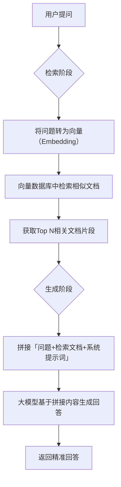
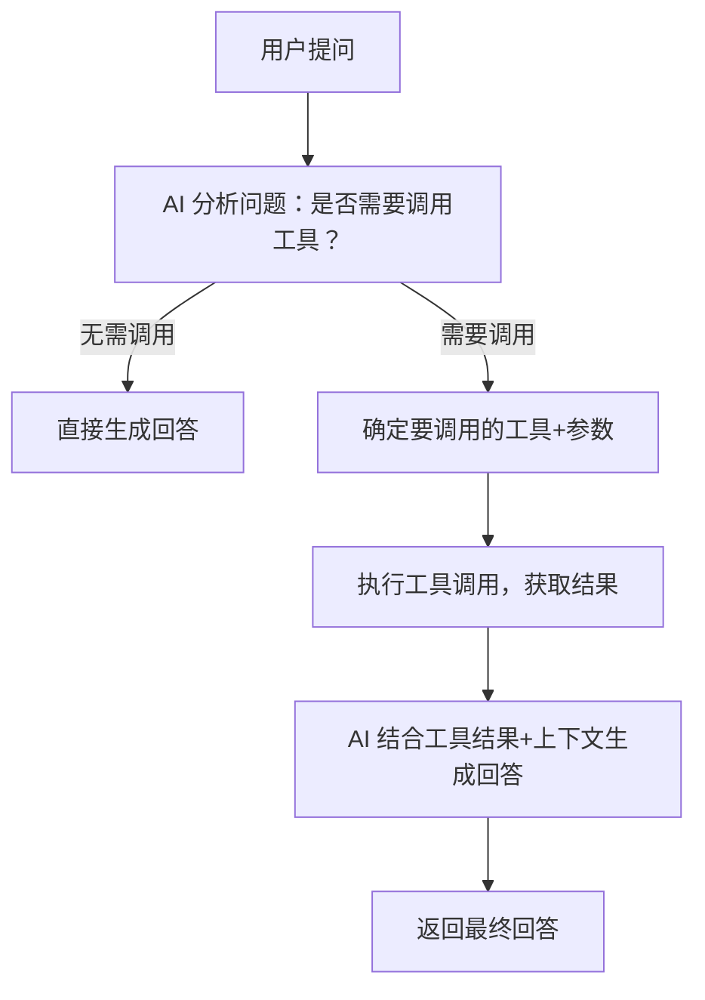
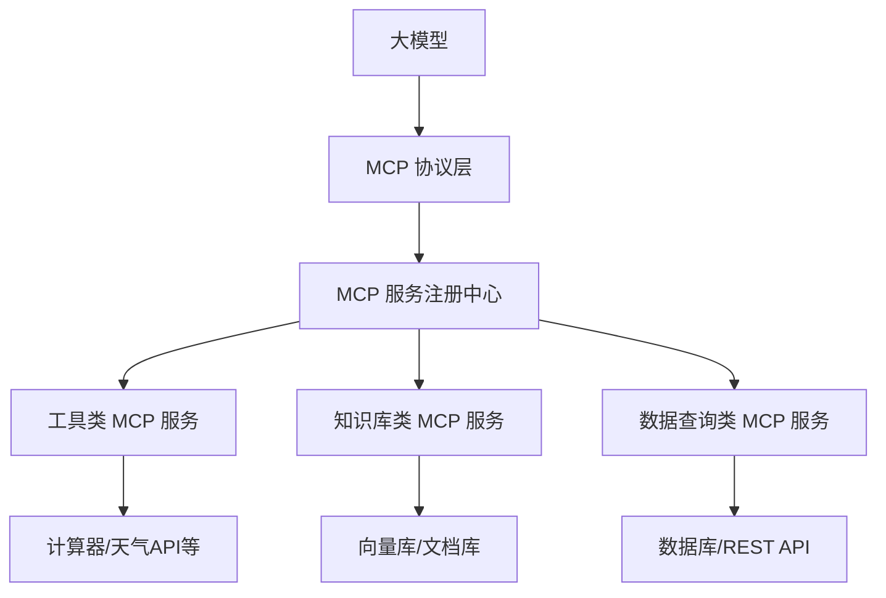

# LangChain4j

## Langchain4j

### AiService + SpringBoot

在 Spring Boot 项目中使用 Langchain4j 的 `AiService` 是最主流的实践方式——通过 Spring 依赖注入、自动配置等特性，可将 `AiService` 无缝融入 Spring 生态，实现 AI 能力的“即插即用”，无需手动管理代理类创建、模型配置等细节。

#### 一、核心优势（Spring Boot 场景下）

1. **依赖注入化**：`AiService` 可通过 `@Bean` 注册为 Spring 组件，在 Controller/Service 中直接 `@Autowired` 使用；
2. **配置中心化**：大模型密钥、模型参数等可配置在 `application.yml` 中，符合 Spring Boot 配置规范；
3. **生态兼容**：可结合 Spring Boot 的配置刷新、AOP、异常处理等特性，完善 AI 服务的工程化能力；
4. **无侵入式**：原有业务代码无需大幅修改，只需注入 `AiService` 接口即可调用 AI 能力。

#### 二、完整实战步骤（Spring Boot + AiService）

##### 1. 环境准备

- JDK 11+（Langchain4j 最低要求）
- Spring Boot 2.7+/3.x
- 引入核心依赖（Maven `pom.xml`）：

```xml
<!-- Spring Boot 基础依赖 -->
<dependency>
    <groupId>org.springframework.boot</groupId>
    <artifactId>spring-boot-starter</artifactId>
</dependency>
<!-- Langchain4j 核心 + OpenAI 适配（可替换为其他模型） -->
<dependency>
    <groupId>dev.langchain4j</groupId>
    <artifactId>langchain4j-open-ai</artifactId>
    <version>0.34.0</version>
</dependency>
<!-- Langchain4j Spring Boot 集成（可选，简化配置） -->
<dependency>
    <groupId>dev.langchain4j</groupId>
    <artifactId>langchain4j-spring-boot-starter</artifactId>
    <version>0.34.0</version>
</dependency>
```

##### 2. 配置大模型参数（application.yml）

将模型配置抽离到配置文件，避免硬编码：

```yaml
langchain4j:
  open-ai:
    chat-model:
      api-key: ${OPENAI_API_KEY:你的OpenAI API Key} # 推荐通过环境变量注入
      model-name: gpt-3.5-turbo
      temperature: 0.6
      timeout: 30s # 超时时间
      max-retries: 2 # 重试次数
```

##### 3. 定义 AiService 接口（核心）

创建接口并添加 `@AiService` 注解，定义 AI 交互方法：

```java
package com.example.aiservice.service;

import dev.langchain4j.service.AiService;
import dev.langchain4j.service.SystemMessage;
import dev.langchain4j.service.UserMessage;

/**
 * 基于 AiService 的 AI 对话服务接口
 */
@AiService // 标记为 AiService，Langchain4j 会自动生成实现类
public interface ChatAiService {

    /**
     * 解释 Java 概念
     * @param concept 要解释的概念（如 Stream、Lambda）
     * @return 带示例的解释内容
     */
    @SystemMessage("你是资深Java工程师，回答需满足：1. 简洁易懂；2. 包含可运行的代码示例；3. 仅用中文。")
    @UserMessage("请解释Java中的【{concept}】，并给出完整的代码示例。")
    String explainJavaConcept(String concept);

    /**
     * 多轮对话（带上下文）
     * @param userMessage 用户输入
     * @return AI 回复
     */
    @SystemMessage("你是智能对话助手，需记住上下文，回答连贯。")
    String chat(String userMessage);
}
```

##### 4. 配置 AiService 为 Spring Bean

通过配置类将 `AiService` 代理类注册为 Spring 组件（两种方式）：

###### 方式1：手动配置（灵活，推荐）

```java
package com.example.aiservice.config;

import com.example.aiservice.service.ChatAiService;
import dev.langchain4j.memory.chat.MessageWindowChatMemory;
import dev.langchain4j.model.openai.OpenAiChatModel;
import dev.langchain4j.service.AiServices;
import org.springframework.beans.factory.annotation.Value;
import org.springframework.context.annotation.Bean;
import org.springframework.context.annotation.Configuration;

@Configuration
public class AiServiceConfig {

    // 从配置文件读取参数
    @Value("${langchain4j.open-ai.chat-model.api-key}")
    private String apiKey;

    @Value("${langchain4j.open-ai.chat-model.model-name}")
    private String modelName;

    @Value("${langchain4j.open-ai.chat-model.temperature}")
    private double temperature;

    /**
     * 配置 OpenAI 模型
     */
    @Bean
    public OpenAiChatModel openAiChatModel() {
        return OpenAiChatModel.builder()
                .apiKey(apiKey)
                .modelName(modelName)
                .temperature(temperature)
                .build();
    }

    /**
     * 配置对话内存（用于多轮对话上下文）
     */
    @Bean
    public MessageWindowChatMemory chatMemory() {
        // 最多保留10轮对话上下文
        return MessageWindowChatMemory.withMaxMessages(10);
    }

    /**
     * 注册 ChatAiService 为 Spring Bean
     */
    @Bean
    public ChatAiService chatAiService(OpenAiChatModel openAiChatModel, MessageWindowChatMemory chatMemory) {
        return AiServices.builder(ChatAiService.class)
                .chatModel(openAiChatModel) // 绑定大模型
                .chatMemory(chatMemory)     // 绑定对话内存（多轮对话必备）
                .build();
    }
}
```

###### 方式2：自动配置（极简，依赖 langchain4j-spring-boot-starter）

如果引入了 `langchain4j-spring-boot-starter`，只需在接口上添加 `@AiService`，框架会自动读取 `application.yml` 中的配置并注册 Bean，无需手动配置类（适合简单场景）。

##### 5. 在业务中使用 AiService

在 Controller/Service 中注入 `ChatAiService` 并调用：

```java
package com.example.aiservice.controller;

import com.example.aiservice.service.ChatAiService;
import org.springframework.web.bind.annotation.GetMapping;
import org.springframework.web.bind.annotation.PathVariable;
import org.springframework.web.bind.annotation.RestController;

import javax.annotation.Resource;

@RestController
public class AiController {

    // 注入 AiService 组件
    @Resource
    private ChatAiService chatAiService;

    /**
     * 接口：解释Java概念
     * 示例：GET /ai/explain/Stream
     */
    @GetMapping("/ai/explain/{concept}")
    public String explainJava(@PathVariable String concept) {
        return chatAiService.explainJavaConcept(concept);
    }

    /**
     * 接口：多轮对话
     * 示例：GET /ai/chat/你好，介绍下自己
     */
    @GetMapping("/ai/chat/{message}")
    public String chat(@PathVariable String message) {
        return chatAiService.chat(message);
    }
}
```

##### 6. 启动并测试

启动 Spring Boot 应用，访问接口测试：

```bash
# 测试 Java 概念解释
curl http://localhost:8080/ai/explain/Stream

# 测试多轮对话
curl http://localhost:8080/ai/chat/你好
curl http://localhost:8080/ai/chat/刚才说的Stream是什么
```

#### 三、Spring Boot 场景下的高级特性

##### 1. 配置刷新（动态修改模型参数）

结合 Spring Cloud Config/Nacos 等配置中心，实现模型参数（如 temperature、model-name）的动态刷新：

```java
import org.springframework.cloud.context.config.annotation.RefreshScope;

// 在模型 Bean 上添加 @RefreshScope
@Bean
@RefreshScope
public OpenAiChatModel openAiChatModel() {
    // 实现逻辑不变
}
```

##### 2. 异常处理

统一处理 AI 调用中的异常（如网络超时、API 限流）：

```java
@RestControllerAdvice
public class AiExceptionHandler {

    @ExceptionHandler(AiException.class)
    public ResponseEntity<String> handleAiException(AiException e) {
        return ResponseEntity.status(HttpStatus.SERVICE_UNAVAILABLE)
                .body("AI 服务调用失败：" + e.getMessage());
    }
}
```

##### 3. 多模型适配（切换国产模型）

只需替换 `ChatModel` 实现类，接口无需修改（以通义千问为例）：

```xml
<!-- 引入通义千问依赖 -->
<dependency>
    <groupId>dev.langchain4j</groupId>
    <artifactId>langchain4j-dashscope</artifactId>
    <version>0.34.0</version>
</dependency>
```

```java
// 替换模型配置
@Bean
public DashScopeChatModel dashScopeChatModel() {
    return DashScopeChatModel.builder()
            .apiKey("你的通义千问API Key")
            .modelName("qwen-turbo")
            .build();
}

// AiService 注册逻辑不变
@Bean
public ChatAiService chatAiService(DashScopeChatModel dashScopeChatModel, MessageWindowChatMemory chatMemory) {
    return AiServices.builder(ChatAiService.class)
            .chatModel(dashScopeChatModel)
            .chatMemory(chatMemory)
            .build();
}
```

#### 四、注意事项

1. **API Key 安全**：避免将 API Key 硬编码在代码中，优先通过环境变量、配置中心或 Spring Cloud Vault 注入；
2. **性能优化**：大模型调用耗时较长，建议通过 `@Async` 异步调用，避免阻塞主线程；
3. **上下文管理**：`MessageWindowChatMemory` 是内存级别的，生产环境可替换为 Redis 实现分布式会话；
4. **版本兼容**：确保 Langchain4j 版本与 Spring Boot 版本兼容（Spring Boot 3.x 需 Langchain4j 0.30+）。

#### 总结

1. 在 Spring Boot 中使用 `AiService` 的核心是**将 AiService 接口注册为 Spring Bean**，通过依赖注入在业务层调用；
2. 配置中心化：大模型参数可放在 `application.yml` 中，结合 Spring 特性实现动态刷新、统一配置；
3. 无侵入扩展：只需替换底层 `ChatModel` 即可切换不同大模型（OpenAI/通义千问/Ollama），接口层无需修改。

这种方式既保留了 Langchain4j `AiService` 注解驱动的简洁性，又充分利用了 Spring Boot 的工程化能力，是企业级 AI 应用开发的最佳实践。


### `@AiService` 注解参数

`@AiService` 是 Langchain4j 中标记 AI 服务接口的核心注解，其本身包含多个可选参数，用于精细化配置 AI 服务的行为（如默认内存、工具、模型参数等），无需在 `AiServices.builder()` 中重复配置。以下是 `@AiService` 注解的所有参数及使用场景，结合示例讲解。

#### 一、`@AiService` 注解完整定义

先看注解的源码级参数定义（简化版），清晰参数类型和默认值：

```java
@Target(ElementType.TYPE)
@Retention(RetentionPolicy.RUNTIME)
public @interface AiService {

    // 1. 默认对话内存配置
    Class<? extends ChatMemory> chatMemory() default NoChatMemory.class;

    // 2. 内存 ID 提供者（多用户上下文隔离）
    Class<? extends MemoryIdProvider> memoryIdProvider() default DefaultMemoryIdProvider.class;

    // 3. 默认模型温度（随机性）
    double temperature() default Double.NaN;

    // 4. 默认最大 Token 数
    int maxTokens() default -1;

    // 5. 默认 TopP 参数
    double topP() default Double.NaN;

    // 6. 默认停止词
    String[] stopWords() default {};

    // 7. AI 可调用的工具类列表
    Class<?>[] tools() default {};

    // 8. 工具调用执行器（异步/同步）
    Class<? extends ToolExecutor> toolExecutor() default DefaultToolExecutor.class;

    // 9. 重试策略
    Retry retry() default @Retry;

    // 10. 响应解析器（自定义响应格式）
    Class<? extends ResponseResolver> responseResolver() default DefaultResponseResolver.class;
}
```

#### 二、核心参数详解（按常用程度排序）

##### 1. `temperature` - 默认温度参数

- **作用**：为当前 `AiService` 下所有方法设置默认 `temperature`（随机性），优先级：方法级 `@Temperature` > 注解级 `temperature` > 全局模型配置；
- **取值**：0~1（0=完全确定，1=高度随机），默认 `Double.NaN`（使用全局配置）；
- **示例**：

```java
// 所有方法默认低随机性（精准回答）
@AiService(temperature = 0.1)
public interface JavaDocService {
    @UserMessage("生成{className}的JavaDoc注释")
    String generateJavaDoc(String className);

    // 方法级注解覆盖类级配置（高随机性，创意生成）
    @Temperature(0.9)
    @UserMessage("为{className}生成5个创意类名")
    String generateClassName(String className);
}
```

##### 2. `maxTokens` - 默认最大 Token 数

- **作用**：限制当前 `AiService` 所有方法的 AI 回复最大 Token 数，优先级：方法级 `@MaxTokens` > 注解级 `maxTokens` > 全局配置；
- **取值**：正整数，默认 `-1`（使用全局配置）；
- **示例**：

```java
// 所有方法回复最多300个Token
@AiService(maxTokens = 300)
public interface SummaryService {
    @UserMessage("总结{text}的核心内容")
    String summarize(String text);

    // 方法级覆盖，最多100个Token
    @MaxTokens(100)
    @UserMessage("生成{text}的一句话摘要")
    String oneSentenceSummary(String text);
}
```

##### 3. `chatMemory` - 默认对话内存

- **作用**：为当前 `AiService` 配置默认的对话内存实现（多轮对话上下文管理）；
- **取值**：`ChatMemory` 接口的实现类（如 `MessageWindowChatMemory`、`TokenWindowChatMemory`）；
- **示例**：

```java
import dev.langchain4j.memory.chat.MessageWindowChatMemory;

// 配置默认内存：最多保留10轮消息
@AiService(chatMemory = MessageWindowChatMemory.class)
public interface MultiTurnChatService {
    @UserMessage("{message}")
    String chat(String message);
}

// 注意：若需自定义内存参数（如最大消息数），需结合配置类：
@Configuration
public class AiConfig {
    @Bean
    public MessageWindowChatMemory chatMemory() {
        return MessageWindowChatMemory.withMaxMessages(15); // 覆盖注解默认值
    }
}
```

##### 4. `tools` - 绑定工具类

- **作用**：直接在注解中绑定 AI 可调用的工具类，无需在 `AiServices.builder()` 中手动绑定；
- **取值**：工具实现类的 Class 数组；
- **示例**：

```java
// 1. 定义工具类
public class CalculatorTool {
    @Tool("计算两个数的和")
    public int add(int a, int b) {
        return a + b;
    }
}

// 2. 在@AiService中绑定工具
@AiService(tools = CalculatorTool.class)
public interface ToolEnabledService {
    @UserMessage("{question}")
    String answerWithTool(String question);
}

// 3. Spring Boot 中只需注册工具 Bean 即可
@Bean
public CalculatorTool calculatorTool() {
    return new CalculatorTool();
}
```

##### 5. `memoryIdProvider` - 内存ID提供者

- **作用**：配置多用户场景下的内存 ID 生成规则，用于隔离不同用户的对话上下文；
- **取值**：`MemoryIdProvider` 接口的实现类；
- **默认值**：`DefaultMemoryIdProvider`（使用固定 ID，单用户场景）；
- **示例（自定义多用户ID）**：

```java
// 1. 自定义内存ID提供者（从ThreadLocal获取用户ID）
public class UserIdMemoryIdProvider implements MemoryIdProvider {
    private static final ThreadLocal<String> USER_ID = new ThreadLocal<>();

    @Override
    public String get() {
        return USER_ID.get(); // 返回当前用户ID作为内存ID
    }

    // 静态方法设置用户ID
    public static void setUserId(String userId) {
        USER_ID.set(userId);
    }
}

// 2. 在@AiService中配置
@AiService(memoryIdProvider = UserIdMemoryIdProvider.class)
public interface MultiUserChatService {
    @UserMessage("{message}")
    String chat(String message);
}

// 3. 使用时设置用户ID
UserIdMemoryIdProvider.setUserId("user-123");
chatService.chat("你好"); // 上下文绑定到 user-123
```

##### 6. `retry` - 默认重试策略

- **作用**：为当前 `AiService` 所有方法配置默认重试策略，优先级：方法级 `@Retry` > 注解级 `retry`；
- **取值**：`@Retry` 注解（可配置 `maxAttempts`、`delay`、`exceptions` 等）；
- **示例**：

```java
// 类级默认重试：最多3次，间隔1秒，仅对AiException重试
@AiService(retry = @Retry(maxAttempts = 3, delay = 1000, exceptions = AiException.class))
public interface StableService {
    @UserMessage("调用外部API获取{userId}的信息")
    String getUserInfo(String userId);

    // 方法级重试覆盖类级配置（最多5次，间隔2秒）
    @Retry(maxAttempts = 5, delay = 2000)
    @UserMessage("获取{orderId}的订单详情")
    String getOrderDetail(String orderId);
}
```

##### 7. `stopWords` - 默认停止词

- **作用**：设置 AI 回复的停止词，当 AI 生成内容中出现停止词时，立即终止生成；
- **取值**：字符串数组，默认空数组（使用全局配置）；
- **使用场景**：限制回复格式（如只返回JSON，遇到非JSON字符停止）；
- **示例**：

```java
// 回复中出现"END"或"###"时停止生成
@AiService(stopWords = {"END", "###"})
public interface FormatService {
    @UserMessage("生成{topic}的关键词列表，以逗号分隔，结尾加END")
    String generateKeywords(String topic);
}
```

##### 8. `topP` - 默认核采样参数

- **作用**：控制 AI 回复的多样性（核采样阈值），优先级：方法级 `@TopP` > 注解级 `topP` > 全局配置；
- **取值**：0~1（0.1=高度聚焦，1.0=全量采样），默认 `Double.NaN`（使用全局配置）；
- **示例**：

```java
// 所有方法默认topP=0.5（中等多样性）
@AiService(topP = 0.5)
public interface KnowledgeService {
    @UserMessage("列举{topic}的相关知识点")
    String listPoints(String topic);

    // 方法级覆盖，高度聚焦
    @TopP(0.1)
    @UserMessage("列举{topic}的核心知识点（不超过5个）")
    String listCorePoints(String topic);
}
```

##### 9. `toolExecutor` - 工具调用执行器

- **作用**：配置工具调用的执行方式（同步/异步），默认 `DefaultToolExecutor`（同步执行）；
- **取值**：`ToolExecutor` 接口的实现类；
- **使用场景**：工具调用耗时较长时，自定义异步执行器避免阻塞；
- **示例（自定义异步执行器）**：

```java
// 1. 自定义异步工具执行器
public class AsyncToolExecutor implements ToolExecutor {
    private final ExecutorService executor = Executors.newFixedThreadPool(5);

    @Override
    public Object execute(ToolExecutionRequest request) {
        // 异步执行工具调用
        return CompletableFuture.supplyAsync(() -> {
            try {
                return ToolExecutor.super.execute(request);
            } catch (Exception e) {
                throw new RuntimeException(e);
            }
        }, executor).join();
    }
}

// 2. 在@AiService中配置
@AiService(tools = CalculatorTool.class, toolExecutor = AsyncToolExecutor.class)
public interface AsyncToolService {
    @UserMessage("{question}")
    String answerWithAsyncTool(String question);
}
```

##### 10. `responseResolver` - 响应解析器

- **作用**：自定义 AI 响应的解析逻辑（如将 JSON 响应解析为自定义实体类）；
- **取值**：`ResponseResolver` 接口的实现类，默认 `DefaultResponseResolver`；
- **使用场景**：AI 回复格式固定（如 JSON），需自定义解析规则；
- **示例**：

```java
// 1. 自定义响应解析器（将JSON字符串解析为User实体）
public class UserResponseResolver implements ResponseResolver {
    @Override
    public Object resolve(Response response, Method method) {
        String json = response.content().text();
        // 使用Jackson解析JSON为User类
        return new ObjectMapper().readValue(json, User.class);
    }
}

// 2. 自定义实体
public class User {
    private String name;
    private int age;
    // getter/setter
}

// 3. 配置解析器
@AiService(responseResolver = UserResponseResolver.class)
public interface UserService {
    @UserMessage("生成一个虚拟用户信息，返回JSON格式（包含name和age）")
    User generateVirtualUser();
}
```

#### 三、`@AiService` 参数使用优先级规则

Langchain4j 中参数配置的优先级从高到低为：

1. **方法级注解**（如 `@Temperature`、`@MaxTokens`、`@Retry`）；
2. **`@AiService` 注解参数**（如 `temperature`、`maxTokens`、`retry`）；
3. **全局模型配置**（如 `OpenAiChatModel.builder()` 中设置的参数）；
4. **框架默认值**。

**示例验证优先级**：

```java
// 全局模型配置：temperature=0.7
OpenAiChatModel model = OpenAiChatModel.builder()
        .temperature(0.7)
        .build();

// 类级配置：temperature=0.2
@AiService(temperature = 0.2)
public interface PriorityService {
    // 方法级配置：temperature=0.9 → 最终生效
    @Temperature(0.9)
    @UserMessage("生成创意内容")
    String generateCreativeContent();

    // 无方法级配置 → 使用类级0.2
    @UserMessage("生成精准内容")
    String generatePreciseContent();
}
```

#### 四、Spring Boot 中 `@AiService` 注解参数的最佳实践

1. **通用参数配置到注解**：将所有方法的通用参数（如 `maxTokens=500`、`retry` 策略）配置在 `@AiService` 中，减少重复代码；
2. **个性化参数用方法注解**：仅为特殊方法添加方法级注解（如高随机性的创意生成）；
3. **工具绑定优先用注解**：简单工具直接通过 `tools` 参数绑定，复杂工具（需自定义执行器）结合配置类；
4. **多用户场景必配 `memoryIdProvider`**：避免不同用户的上下文混淆，推荐基于 ThreadLocal 或请求头获取用户ID。

#### 总结

1. `@AiService` 注解的核心参数覆盖**模型参数**（temperature/maxTokens/topP）、**上下文**（chatMemory/memoryIdProvider）、**工具调用**（tools/toolExecutor）、**容错**（retry）、**响应解析**（responseResolver）五大维度；
2. 参数优先级遵循“方法级 > 注解级 > 全局级 > 默认值”，可灵活适配不同场景；
3. 在 Spring Boot 中，结合注解参数和配置类，可实现 AI 服务的精细化、无侵入式配置。


### 核心注解

Langchain4j 的注解体系是 `AiService` 模式的核心，所有与 AI 交互的逻辑（提示词、工具调用、参数配置等）都通过注解声明，无需编写底层调用代码。以下是 Langchain4j 最核心、最常用的注解，按功能分类讲解（结合 Spring Boot 场景）。

#### 一、核心基础注解（AiService 定义）

##### 1. `@AiService`

- **作用**：标记接口为 AI 服务接口，Langchain4j 会为该接口自动生成代理实现类（核心注解）；
- **使用场景**：所有需要通过 AI 能力实现的接口都需添加；
- **示例**：

```java
// 标记该接口为 AiService，框架自动生成实现类
@AiService
public interface ChatService {
    // AI 交互方法
}
```

- **Spring Boot 适配**：结合 `@Bean` 注册后，可通过 `@Autowired` 注入使用。

#### 二、提示词注解（对话逻辑定义）

这类注解用于定义 AI 交互的提示词（Prompt），支持参数占位符 `{}`，自动绑定方法入参。

##### 1. `@SystemMessage`

- **作用**：定义**系统提示词**，用于设定 AI 的角色、行为准则、回复要求（AI 的“说明书”）；
- **特点**：优先级最高，会作为对话的基础上下文；
- **示例**：

```java
@AiService
public interface ChatService {
    // 系统提示：设定 AI 为 Java 助手，回复要求简洁+带示例
    @SystemMessage("你是资深Java工程师，回复必须：1. 仅用中文；2. 包含可运行代码示例；3. 字数不超过500字。")
    @UserMessage("解释Java中的{concept}")
    String explainJava(String concept);
}
```

##### 2. `@UserMessage`

- **作用**：定义**用户提示词**，模拟用户的问题/指令，是 AI 回复的核心触发条件；
- **特点**：支持多个参数占位符，按方法入参顺序绑定；
- **示例（多参数）**：

```java
@UserMessage("计算 {num1} 和 {num2} 的{operation}，并说明计算过程")
String calculate(int num1, int num2, String operation);
// 调用：calculate(10, 20, "和") → 提示词自动替换为 "计算 10 和 20 的和，并说明计算过程"
```

##### 3. `@AssistantMessage`

- **作用**：定义**助手（AI）的历史回复**，用于多轮对话的上下文补全；
- **使用场景**：固定历史对话场景（如预设 AI 已回复的内容）；
- **示例**：

```java
@SystemMessage("你是客服助手，需根据历史对话回复用户")
@AssistantMessage("您好，当前订单状态为待发货") // 预设 AI 历史回复
@UserMessage("我的订单什么时候发货？")
String trackOrder();
```

##### 4. `@Messages`

- **作用**：批量定义多轮对话的消息（替代多个 `@SystemMessage`/`@UserMessage` 注解）；
- **适用场景**：复杂多轮对话模板；
- **示例**：

```java
import dev.langchain4j.service.Messages;
import dev.langchain4j.model.chat.ChatMessage;
import static dev.langchain4j.model.chat.ChatMessage.systemMessage;
import static dev.langchain4j.model.chat.ChatMessage.userMessage;

@AiService
public interface MultiTurnChatService {
    @Messages({
        @dev.langchain4j.service.Message(type = "SYSTEM", value = "你是数学老师，讲解步骤要详细"),
        @dev.langchain4j.service.Message(type = "USER", value = "什么是勾股定理？"),
        @dev.langchain4j.service.Message(type = "ASSISTANT", value = "勾股定理是直角三角形的三边关系：a²+b²=c²"),
        @dev.langchain4j.service.Message(type = "USER", value = "{question}") // 动态参数
    })
    String chatAboutMath(String question);
}
```

#### 三、模型参数注解（个性化配置）

这类注解用于覆盖大模型的全局配置（如温度、超时时间），为单个方法定制参数。

##### 1. `@Temperature`

- **作用**：设置单个方法的 `temperature`（温度）参数，控制 AI 回复的随机性（0=确定，1=随机）；
- **优先级**：高于全局模型配置；
- **示例**：

```java
@AiService
public interface CreativeService {
    // 高随机性（适合创意生成）
    @Temperature(0.9)
    @UserMessage("为{productName}生成5个创意广告语")
    String generateSlogan(String productName);

    // 低随机性（适合精准回答）
    @Temperature(0.1)
    @UserMessage("解释{concept}的官方定义")
    String explainDefinition(String concept);
}
```

##### 2. `@MaxTokens`

- **作用**：限制 AI 回复的最大 Token 数（控制回复长度）；
- **示例**：

```java
@MaxTokens(200) // 回复最多200个Token
@UserMessage("总结{articleTitle}的核心内容")
String summarizeArticle(String articleTitle);
```

##### 3. `@TopP`

- **作用**：设置采样阈值（核采样），控制 AI 回复的多样性（0.1=高度聚焦，1.0=全量采样）；
- **示例**：

```java
@TopP(0.5)
@UserMessage("列举{topic}的相关知识点（不超过10个）")
String listKnowledgePoints(String topic);
```

#### 四、工具调用注解（AI 调用外部能力）

这类注解用于让 AI 自动调用自定义工具（如计算器、数据库查询、API 调用）。

##### 1. `@Tool`

- **作用**：标记方法为 AI 可调用的工具，需描述工具功能（AI 会理解并决定是否调用）；
- **使用场景**：AI 无法直接回答时，调用外部工具获取数据后再回复；
- **示例**：

```java
// 1. 定义工具接口/实现类
public interface CalculatorTool {
    // 描述工具功能，AI 会根据描述判断是否调用
    @Tool("计算两个数的四则运算，参数a和b为数字，operation为+、-、*、/")
    double calculate(double a, double b, String operation);
}

// 2. 实现工具
public class CalculatorToolImpl implements CalculatorTool {
    @Override
    public double calculate(double a, double b, String operation) {
        return switch (operation) {
            case "+" -> a + b;
            case "-" -> a - b;
            case "*" -> a * b;
            case "/" -> a / b;
            default -> throw new IllegalArgumentException("不支持的运算");
        };
    }
}

// 3. 绑定工具到 AiService（Spring Boot 配置）
@Configuration
public class ToolConfig {
    @Bean
    public CalculatorTool calculatorTool() {
        return new CalculatorToolImpl();
    }

    @Bean
    public ChatService chatService(OpenAiChatModel model, CalculatorTool calculatorTool) {
        return AiServices.builder(ChatService.class)
                .chatModel(model)
                .tools(calculatorTool) // 绑定工具
                .build();
    }
}

// 4. 调用（AI 会自动触发工具调用）
@AiService
public interface ChatService {
    @UserMessage("{question}")
    String answerWithTool(String question);
}
// 调用示例：answerWithTool("计算100*20的结果") → AI 自动调用 calculate(100,20,"*")
```

#### 五、容错/重试注解（稳定性保障）

##### 1. `@Retry`

- **作用**：配置方法调用的重试策略（如网络超时、API 限流时重试）；
- **参数**：`maxAttempts`（最大重试次数）、`delay`（重试间隔）、`exceptions`（触发重试的异常类型）；
- **示例**：

```java
@Retry(
    maxAttempts = 3, // 最多重试3次
    delay = 1000,    // 每次重试间隔1秒
    exceptions = {AiException.class, IOException.class} // 仅对这些异常重试
)
@UserMessage("调用外部API获取{userId}的信息")
String getUserInfo(String userId);
```

#### 六、上下文管理注解（多轮对话）

##### 1. `@MemoryId`

- **作用**：标记方法参数为“对话内存ID”，用于区分不同用户的对话上下文（分布式场景必备）；
- **使用场景**：多用户多轮对话，确保不同用户的上下文不混淆；
- **示例**：

```java
@AiService
public interface MultiUserChatService {
    // memoryId 用于标识不同用户的对话内存
    @SystemMessage("你是智能助手，记住每个用户的对话上下文")
    String chat(@MemoryId String memoryId, @UserMessage String userMessage);
}

// 调用示例：
// 用户A：chat("user-123", "你好")
// 用户A：chat("user-123", "刚才说的内容再详细点") → 关联用户A的上下文
// 用户B：chat("user-456", "你好") → 独立的上下文
```

#### 总结

1. **核心基础**：`@AiService` 是所有 AI 服务接口的入口，标记后框架自动生成代理类；
2. **提示词控制**：`@SystemMessage`/`@UserMessage` 定义对话逻辑，`{}` 支持动态参数绑定；
3. **个性化配置**：`@Temperature`/`@MaxTokens` 等注解可覆盖全局模型参数，适配不同场景；
4. **扩展能力**：`@Tool` 实现 AI 调用外部工具，`@MemoryId` 保障多用户多轮对话的上下文隔离。

这些注解覆盖了 AI 交互的核心场景（提示词、参数、工具、上下文、容错），结合 Spring Boot 依赖注入后，可快速实现企业级 AI 应用开发。

### 流式调用 vs 阻塞式调用

Langchain4j 针对大模型调用提供了两种核心交互模式：**阻塞式调用**（同步等待完整响应）和**流式调用**（实时接收分片响应），分别适配不同的业务场景（如快速问答、实时聊天）。以下从概念、使用方式、场景适配等维度详细讲解，并结合 Spring Boot 给出完整示例。

#### 一、核心概念对比

| 特性     | 阻塞式调用                                 | 流式调用                                      |
| -------- | ------------------------------------------ | --------------------------------------------- |
| 响应方式 | 等待模型生成完整结果后一次性返回           | 按“分片（Chunk）”实时返回（如逐字/逐句输出）  |
| 等待体验 | 全程阻塞，响应时间=完整生成时间            | 首包延迟低，用户可实时看到内容输出            |
| 返回类型 | 普通 Java 类型（String/自定义实体）        | `Publisher<T>`/`Flux<T>`（响应式流）          |
| 适用场景 | 短文本、精准回答、批量处理（如总结、翻译） | 长文本生成、实时聊天、AI 助手（如对话机器人） |
| 资源占用 | 单次返回，内存占用集中                     | 分片返回，内存占用更均匀                      |

#### 二、阻塞式调用（基础模式）

##### 1. 核心特点

- 最基础的调用方式，同步等待大模型生成完整响应后返回；
- 代码逻辑简单，无需处理流式分片；
- 适合响应内容短、对实时性要求不高的场景。

##### 2. 完整示例（Spring Boot + 阻塞式）

```java
// 1. 定义 AiService 接口（阻塞式）
@AiService
public interface BlockingChatService {
    @SystemMessage("你是简洁的问答助手，回复不超过100字")
    @UserMessage("{question}")
    String answer(String question); // 返回普通String，阻塞式
}

// 2. 配置模型（Spring Boot 配置类）
@Configuration
public class AiConfig {
    @Bean
    public OpenAiChatModel openAiChatModel() {
        return OpenAiChatModel.builder()
                .apiKey("你的OpenAI API Key")
                .modelName("gpt-3.5-turbo")
                .temperature(0.7)
                .build();
    }

    @Bean
    public BlockingChatService blockingChatService(OpenAiChatModel model) {
        return AiServices.create(BlockingChatService.class, model);
    }
}

// 3. 业务调用（Controller）
@RestController
public class BlockingController {
    @Autowired
    private BlockingChatService blockingChatService;

    @GetMapping("/blocking/answer")
    public String answer(@RequestParam String question) {
        // 阻塞式调用：等待完整响应后返回
        return blockingChatService.answer(question);
    }
}
```

#### 三、流式调用（实时响应模式）

##### 1. 核心特点

- 基于 **响应式编程**（Reactor 框架），返回 `Flux<StreamingResponse>` 或 `Flux<String>`；
- 模型生成内容时，每产生一个分片就立即返回，前端可实时渲染（如打字机效果）；
- 需依赖 `langchain4j` 的响应式支持，Spring Boot 中推荐结合 WebFlux 使用。

##### 2. 前置依赖（需添加 WebFlux）

```xml
<!-- Spring WebFlux 依赖（流式响应必备） -->
<dependency>
    <groupId>org.springframework.boot</groupId>
    <artifactId>spring-boot-starter-webflux</artifactId>
</dependency>
```

##### 3. 完整示例（Spring Boot + 流式调用）

###### 方式1：基础流式调用（返回 `Flux<String>`）

```java
// 1. 定义流式 AiService 接口
@AiService
public interface StreamingChatService {
    @SystemMessage("你是实时聊天助手，回复自然流畅")
    @UserMessage("{question}")
    Flux<String> streamAnswer(String question); // 返回流式响应
}

// 2. 配置模型（与阻塞式一致，无需额外配置）
@Configuration
public class AiConfig {
    @Bean
    public OpenAiChatModel openAiChatModel() {
        return OpenAiChatModel.builder()
                .apiKey("你的OpenAI API Key")
                .modelName("gpt-3.5-turbo")
                .build();
    }

    @Bean
    public StreamingChatService streamingChatService(OpenAiChatModel model) {
        return AiServices.create(StreamingChatService.class, model);
    }
}

// 3. 流式接口实现（Controller）
@RestController
public class StreamingController {
    @Autowired
    private StreamingChatService streamingChatService;

    /**
     * 流式响应接口（前端可实时接收分片）
     * 响应类型：text/event-stream（SSE 服务器推送）
     */
    @GetMapping(value = "/stream/answer", produces = MediaType.TEXT_EVENT_STREAM_VALUE)
    public Flux<String> streamAnswer(@RequestParam String question) {
        // 流式调用：返回 Flux<String>，前端逐片接收
        return streamingChatService.streamAnswer(question)
                .doOnNext(chunk -> System.out.println("收到分片：" + chunk)) // 日志打印分片
                .onErrorReturn("调用失败：" + e.getMessage()); // 异常处理
    }
}
```

###### 方式2：进阶流式调用（获取完整响应元数据）

如果需要获取响应的元数据（如 Token 数、完成状态），可返回 `Flux<StreamingResponse>`：

```java
// 1. 定义接口返回 StreamingResponse
@AiService
public interface AdvancedStreamingService {
    @UserMessage("{question}")
    Flux<StreamingResponse> advancedStreamAnswer(String question);
}

// 2. Controller 处理元数据
@GetMapping(value = "/stream/advanced", produces = MediaType.TEXT_EVENT_STREAM_VALUE)
public Flux<String> advancedStream(@RequestParam String question) {
    return advancedStreamingService.advancedStreamAnswer(question)
            .map(response -> {
                // 获取分片内容
                String content = response.content();
                // 获取元数据（如是否完成、Token 数）
                boolean isDone = response.isDone();
                int tokenCount = response.tokenUsage().totalTokens();
                // 拼接返回（示例：添加元数据标识）
                return String.format("[%s] %s (完成状态：%s, Token：%d)", 
                        LocalTime.now(), content, isDone, tokenCount);
            });
}
```

#### 四、前端对接流式接口（示例）

使用 JavaScript 接收 SSE 流式响应，实现“打字机”效果：

```html
<!DOCTYPE html>
<html>
<body>
    <input id="question" type="text" placeholder="输入问题">
    <button onclick="sendRequest()">发送</button>
    <div id="answer"></div>

    <script>
        function sendRequest() {
            const question = document.getElementById("question").value;
            const answerDiv = document.getElementById("answer");
            answerDiv.innerHTML = ""; // 清空之前的回答

            // 调用流式接口
            const eventSource = new EventSource(`/stream/answer?question=${encodeURIComponent(question)}`);
            
            // 接收分片数据
            eventSource.onmessage = function (event) {
                answerDiv.innerHTML += event.data; // 逐片追加内容
            };

            // 流结束关闭
            eventSource.onerror = function () {
                eventSource.close();
            };
        }
    </script>
</body>
</html>
```

#### 五、关键注意事项

1. **模型兼容性**：
   - 并非所有大模型都支持流式调用（如部分本地模型Ollama需开启流式参数）；
   - OpenAI/GPT系列、通义千问、文心一言等主流模型均支持流式调用。

2. **异常处理**：
   - 流式调用需通过 `onErrorReturn()`/`onErrorResume()` 处理异常，避免流中断；
   - 阻塞式调用可直接用 try-catch 捕获 `AiException`。

3. **性能优化**：
   - 流式调用建议设置合理的 `maxTokens`，避免生成过长内容导致流持续时间过久；
   - 阻塞式调用可配置重试策略（`@Retry`），流式调用需手动处理重试（如重连 SSE）。

4. **Spring Boot 版本适配**：
   - Spring Boot 2.x 需搭配 Reactor 3.4+；
   - Spring Boot 3.x 无需额外适配，直接使用 WebFlux 即可。

#### 六、两种模式的选型建议

| 场景                                | 推荐模式   | 原因                                     |
| ----------------------------------- | ---------- | ---------------------------------------- |
| 短文本问答、批量数据处理            | 阻塞式调用 | 代码简单，无需处理响应式流，开发成本低   |
| 实时聊天机器人、长文本生成、AI 写作 | 流式调用   | 首包响应快，用户体验好，避免长时间等待   |
| 后端批量处理（如报表生成）          | 阻塞式调用 | 无需实时交互，同步处理逻辑更清晰         |
| 前端实时展示（如智能客服）          | 流式调用   | 打字机效果提升用户体验，降低感知等待时间 |

#### 总结

1. **阻塞式调用**：同步等待完整响应，返回普通 Java 类型，适合简单、非实时场景，代码逻辑极简；
2. **流式调用**：返回 `Flux` 响应式流，实时接收分片数据，适合实时交互场景，需结合 WebFlux/SSE 实现前端对接；
3. 选型核心：根据**响应实时性要求**和**内容长度**决定，短文本/批量处理用阻塞式，长文本/实时交互用流式。


### 会话记忆（Chat Memory）

会话记忆（Chat Memory）是 Langchain4j 实现**多轮对话上下文管理**的核心组件，它能让 AI 记住历史对话内容，从而实现连贯的多轮交互（而非每次调用都是独立的单次问答）。以下从核心概念、常用实现、使用方式（结合 Spring Boot）、进阶优化等维度全面讲解。

#### 一、核心概念

1. **会话记忆的作用**：
   - 存储用户与 AI 的历史对话（用户消息、AI 回复、系统提示）；
   - 每次调用 AI 时，自动将历史上下文拼接至提示词中，让 AI 理解对话语境；
   - 支持多用户隔离（不同用户的上下文互不干扰）。

2. **核心接口**：
   - `ChatMemory`：会话记忆的顶层接口，定义了 `add`（添加消息）、`get`（获取上下文）、`clear`（清空记忆）等核心方法；
   - `MemoryIdProvider`：内存 ID 提供者，用于为不同用户生成唯一的记忆 ID（多用户场景必备）。

#### 二、常用会话记忆实现

Langchain4j 提供了多种开箱即用的 `ChatMemory` 实现，适配不同场景：

| 实现类                    | 核心特点                                         | 适用场景                          |
| ------------------------- | ------------------------------------------------ | --------------------------------- |
| `MessageWindowChatMemory` | 基于消息数量的窗口记忆（只保留最近 N 条消息）    | 大多数场景（如聊天机器人、问答）  |
| `TokenWindowChatMemory`   | 基于 Token 数的窗口记忆（只保留最近 N 个 Token） | 控制提示词长度（避免 Token 超限） |
| `InMemoryChatMemory`      | 纯内存记忆（无窗口限制，存储所有历史消息）       | 短会话、测试场景                  |
| `RedisChatMemory`         | 基于 Redis 的分布式记忆                          | 分布式系统、多实例部署            |

#### 三、基础使用（Spring Boot + 单用户会话记忆）

以最常用的 `MessageWindowChatMemory` 为例，实现单用户多轮对话：

##### 1. 定义 AiService 接口

```java
@AiService
public interface ChatMemoryService {
    // 多轮对话方法（无需额外注解，记忆由配置注入）
    @SystemMessage("你是智能助手，需根据历史对话回复，保持上下文连贯")
    String chat(String userMessage);
}
```

##### 2. 配置会话记忆并绑定到 AiService

```java
@Configuration
public class ChatMemoryConfig {

    /**
     * 配置消息窗口记忆：最多保留最近 10 条消息（5轮问答：5条用户消息+5条AI回复）
     */
    @Bean
    public ChatMemory chatMemory() {
        return MessageWindowChatMemory.withMaxMessages(10);
    }

    /**
     * 配置 OpenAI 模型
     */
    @Bean
    public OpenAiChatModel openAiChatModel() {
        return OpenAiChatModel.builder()
                .apiKey("你的OpenAI API Key")
                .modelName("gpt-3.5-turbo")
                .build();
    }

    /**
     * 注册 AiService 并绑定会话记忆
     */
    @Bean
    public ChatMemoryService chatMemoryService(OpenAiChatModel model, ChatMemory chatMemory) {
        return AiServices.builder(ChatMemoryService.class)
                .chatModel(model)
                .chatMemory(chatMemory) // 绑定会话记忆
                .build();
    }
}
```

##### 3. 测试多轮对话

```java
@RestController
public class ChatController {
    @Autowired
    private ChatMemoryService chatMemoryService;

    @GetMapping("/chat")
    public String chat(@RequestParam String message) {
        return chatMemoryService.chat(message);
    }
}
```

**测试效果**：

```bash
# 第一轮：提问
curl http://localhost:8080/chat?message=介绍下Java的Stream流
# AI 回复：Stream流是Java 8的新特性...

# 第二轮：追问（AI 能关联上一轮上下文）
curl http://localhost:8080/chat?message=它和普通集合有什么区别
# AI 回复：Stream流与普通集合的核心区别在于...（基于上一轮的Stream流讲解）
```

#### 四、进阶使用（多用户会话记忆）

单用户记忆无法满足多用户场景（不同用户的上下文会混淆），需通过 `MemoryIdProvider` 实现用户隔离：

##### 1. 自定义 MemoryIdProvider（基于用户ID隔离）

```java
/**
 * 自定义内存ID提供者：从请求头获取用户ID作为记忆ID
 */
@Component
public class UserIdMemoryIdProvider implements MemoryIdProvider {
    // 使用 ThreadLocal 存储当前请求的用户ID（Web场景）
    private static final ThreadLocal<String> CURRENT_USER_ID = new ThreadLocal<>();

    // 设置当前用户ID（在Controller拦截器/过滤器中调用）
    public static void setCurrentUserId(String userId) {
        CURRENT_USER_ID.set(userId);
    }

    // 清空当前用户ID（请求结束后调用）
    public static void clear() {
        CURRENT_USER_ID.remove();
    }

    // 实现 MemoryIdProvider 接口，返回当前用户ID
    @Override
    public String get() {
        String userId = CURRENT_USER_ID.get();
        if (userId == null) {
            throw new IllegalArgumentException("用户ID不能为空");
        }
        return userId;
    }
}
```

##### 2. 添加拦截器（自动设置用户ID）

```java
/**
 * Web拦截器：从请求头获取用户ID并设置到ThreadLocal
 */
@Component
public class UserIdInterceptor implements HandlerInterceptor {
    @Override
    public boolean preHandle(HttpServletRequest request, HttpServletResponse response, Object handler) {
        // 从请求头获取用户ID（前端需传递 userId 头）
        String userId = request.getHeader("userId");
        if (userId == null || userId.isEmpty()) {
            response.setStatus(HttpServletResponse.SC_BAD_REQUEST);
            return false;
        }
        // 设置当前用户ID
        UserIdMemoryIdProvider.setCurrentUserId(userId);
        return true;
    }

    @Override
    public void afterCompletion(HttpServletRequest request, HttpServletResponse response, Object handler, Exception ex) {
        // 清空ThreadLocal，避免内存泄漏
        UserIdMemoryIdProvider.clear();
    }
}

// 注册拦截器
@Configuration
public class WebConfig implements WebMvcConfigurer {
    @Autowired
    private UserIdInterceptor userIdInterceptor;

    @Override
    public void addInterceptors(InterceptorRegistry registry) {
        registry.addInterceptor(userIdInterceptor)
                .addPathPatterns("/chat/**"); // 拦截聊天接口
    }
}
```

##### 3. 配置多用户会话记忆

```java
@Configuration
public class MultiUserChatMemoryConfig {

    @Autowired
    private UserIdMemoryIdProvider memoryIdProvider;

    /**
     * 配置多用户会话记忆：每个用户独立的消息窗口
     */
    @Bean
    public ChatMemory multiUserChatMemory() {
        // 为每个用户创建独立的 MessageWindowChatMemory
        return ChatMemoryProviders.builder()
                .memoryIdProvider(memoryIdProvider) // 绑定用户ID提供者
                .chatMemoryProvider(memoryId -> MessageWindowChatMemory.withMaxMessages(10)) // 每个用户10条消息窗口
                .build();
    }

    /**
     * 注册多用户AiService
     */
    @Bean
    public ChatMemoryService multiUserChatService(OpenAiChatModel model, ChatMemory multiUserChatMemory) {
        return AiServices.builder(ChatMemoryService.class)
                .chatModel(model)
                .chatMemory(multiUserChatMemory) // 绑定多用户记忆
                .memoryIdProvider(memoryIdProvider) // 绑定ID提供者
                .build();
    }
}
```

**测试多用户隔离**：

```bash
# 用户A的第一轮对话
curl -H "userId: user-123" http://localhost:8080/chat?message=你好
# AI 回复：你好！有什么我能帮助你的吗？

# 用户A的第二轮对话（关联上下文）
curl -H "userId: user-123" http://localhost:8080/chat?message=记住我的名字是张三
# AI 回复：好的张三，我记住了！

# 用户B的对话（上下文独立）
curl -H "userId: user-456" http://localhost:8080/chat?message=你好
# AI 回复：你好！有什么我能帮助你的吗？（无张三相关记忆）
```

#### 五、分布式场景：Redis 会话记忆

当应用部署多实例时，内存级的 `ChatMemory` 会导致上下文丢失，需使用 `RedisChatMemory`：

##### 1. 添加 Redis 依赖

```xml
<!-- Langchain4j Redis 记忆依赖 -->
<dependency>
    <groupId>dev.langchain4j</groupId>
    <artifactId>langchain4j-redis</artifactId>
    <version>0.34.0</version>
</dependency>
<!-- Spring Boot Redis 依赖 -->
<dependency>
    <groupId>org.springframework.boot</groupId>
    <artifactId>spring-boot-starter-data-redis</artifactId>
</dependency>
```

##### 2. 配置 RedisChatMemory

```java
@Configuration
public class RedisChatMemoryConfig {
    @Autowired
    private RedisConnectionFactory redisConnectionFactory;

    @Autowired
    private UserIdMemoryIdProvider memoryIdProvider;

    /**
     * 配置 Redis 分布式会话记忆
     */
    @Bean
    public ChatMemory redisChatMemory() {
        // 创建 Redis 记忆存储
        RedisChatMemoryStore store = RedisChatMemoryStore.builder()
                .redisConnectionFactory(redisConnectionFactory)
                .prefix("chat:memory:") // Redis key 前缀
                .ttl(Duration.ofHours(24)) // 记忆过期时间（24小时）
                .build();

        // 绑定用户ID提供者，实现多用户隔离
        return ChatMemoryProviders.builder()
                .memoryIdProvider(memoryIdProvider)
                .chatMemoryProvider(memoryId -> RedisChatMemory.builder()
                        .chatMemoryStore(store)
                        .memoryId(memoryId)
                        .maxMessages(10) // 每个用户最多10条消息
                        .build())
                .build();
    }
}
```

#### 六、关键操作：清空/管理会话记忆

实际场景中常需清空用户的会话记忆（如“重置对话”），可通过 `ChatMemory` 直接操作：

```java
@RestController
public class MemoryManageController {
    @Autowired
    private ChatMemory multiUserChatMemory;

    @Autowired
    private UserIdMemoryIdProvider memoryIdProvider;

    /**
     * 清空当前用户的会话记忆
     */
    @PostMapping("/chat/clear")
    public String clearMemory() {
        String memoryId = memoryIdProvider.get();
        multiUserChatMemory.clear(memoryId); // 清空指定用户的记忆
        return "会话记忆已清空";
    }

    /**
     * 获取当前用户的历史对话
     */
    @GetMapping("/chat/history")
    public List<ChatMessage> getHistory() {
        String memoryId = memoryIdProvider.get();
        return multiUserChatMemory.get(memoryId); // 返回历史消息列表
    }
}
```

#### 七、最佳实践与注意事项

1. **窗口大小设置**：
   - `MessageWindowChatMemory` 建议设置 8~12 条消息（4~6轮问答），避免上下文过长导致 Token 超限；
   - `TokenWindowChatMemory` 建议根据模型最大上下文 Token 数设置（如 gpt-3.5-turbo 建议保留 2000 Token 以内）。

2. **过期策略**：
   - 分布式场景（Redis）必须设置 TTL，避免 Redis 数据堆积（建议 1~24 小时）；
   - 内存级记忆无需过期，但应用重启后会丢失（适合临时会话）。

3. **性能优化**：
   - 避免存储无用消息（如纯表情、简短问候），可自定义过滤逻辑；
   - 大模型调用前，可裁剪过长的上下文（只保留核心内容）。

4. **异常处理**：
   - 多用户场景需校验 `userId` 非空，避免空指针；
   - Redis 宕机时，可降级为内存记忆（保证服务可用）。

#### 总结

1. 会话记忆（ChatMemory）是 Langchain4j 实现多轮对话的核心，核心实现有 `MessageWindowChatMemory`（按消息数）、`TokenWindowChatMemory`（按Token数）、`RedisChatMemory`（分布式）；
2. 单用户场景直接绑定 `ChatMemory` 即可，多用户场景需通过 `MemoryIdProvider` 实现用户隔离；
3. 分布式部署必须使用 `RedisChatMemory`，并配置合理的 TTL 和窗口大小，避免上下文丢失或 Token 超限。

### RAG（检索增强生成）

RAG（Retrieval-Augmented Generation，检索增强生成）是 Langchain4j 核心能力之一，它解决了大模型“知识过时”“幻觉”“无法访问私有数据”的问题——通过**先检索外部知识库，再将检索结果作为上下文喂给大模型生成回答**，让 AI 既能利用大模型的生成能力，又能基于真实、最新的私有数据回答问题。

以下从核心原理、完整实现流程（结合 Spring Boot）、关键组件、优化策略等维度全面讲解 Langchain4j 中的 RAG 落地。

#### 一、RAG 核心原理

RAG 本质是“检索 + 生成”两步走，Langchain4j 对整个流程做了高度封装：



核心优势：

1. **知识实时更新**：无需重新训练大模型，只需更新知识库即可；
2. **数据私有化**：基于企业私有数据回答，无需将数据提交给公有大模型；
3. **减少幻觉**：回答基于检索到的真实数据，准确性更高。

#### 二、Langchain4j RAG 核心组件

Langchain4j 为 RAG 提供了开箱即用的组件，核心如下：

| 组件类型       | 作用                                                         | Langchain4j 核心实现                                         |
| -------------- | ------------------------------------------------------------ | ------------------------------------------------------------ |
| Embedding 模型 | 将文本（问题/文档）转为向量（数值表示），用于相似度检索      | `OpenAiEmbeddingModel`、`OllamaEmbeddingModel`、`MiniLMEmbeddingModel`（本地轻量） |
| 文档加载器     | 加载各类数据源（文本、PDF、Word、Markdown 等）               | `TextDocumentLoader`、`PdfDocumentLoader`、`WordDocumentLoader` |
| 文档分割器     | 将长文档切分为小片段（Chunk），避免向量维度超限、提升检索精度 | `RecursiveCharacterTextSplitter`（递归字符分割）、`TokenTextSplitter`（按Token分割） |
| 向量存储       | 存储文档向量和原文，支持相似度检索                           | `InMemoryVectorStore`（内存）、`RedisVectorStore`（Redis）、`PineconeVectorStore`（专业向量库） |
| RAG 服务封装   | 整合检索+生成流程，提供极简调用入口                          | `RetrievalAugmentor`、`AiService` 结合 `@RetrievalAugmented` 注解 |

#### 三、完整实现：Spring Boot + Langchain4j RAG

以“基于本地 PDF 文档的智能问答”为例，实现端到端 RAG 流程。

##### 步骤1：引入核心依赖

```xml
<!-- Spring Boot 基础 -->
<dependency>
    <groupId>org.springframework.boot</groupId>
    <artifactId>spring-boot-starter</artifactId>
</dependency>
<!-- Langchain4j 核心 + OpenAI（Embedding+Chat） -->
<dependency>
    <groupId>dev.langchain4j</groupId>
    <artifactId>langchain4j-open-ai</artifactId>
    <version>0.34.0</version>
</dependency>
<!-- PDF 文档加载依赖 -->
<dependency>
    <groupId>dev.langchain4j</groupId>
    <artifactId>langchain4j-pdf</artifactId>
    <version>0.34.0</version>
</dependency>
<!-- 内存向量存储（测试用，生产换 Redis/Pinecone） -->
<dependency>
    <groupId>dev.langchain4j</groupId>
    <artifactId>langchain4j-vector-store-in-memory</artifactId>
    <version>0.34.0</version>
</dependency>
```

##### 步骤2：配置核心组件（Embedding/模型/向量存储）

```java
@Configuration
public class RagConfig {

    // 1. 配置 OpenAI Embedding 模型（文本转向量）
    @Bean
    public EmbeddingModel embeddingModel() {
        return OpenAiEmbeddingModel.builder()
                .apiKey("你的OpenAI API Key")
                .modelName("text-embedding-ada-002") // 经典Embedding模型
                .build();
    }

    // 2. 配置 OpenAI Chat 模型（生成回答）
    @Bean
    public ChatLanguageModel chatModel() {
        return OpenAiChatModel.builder()
                .apiKey("你的OpenAI API Key")
                .modelName("gpt-3.5-turbo")
                .temperature(0.1) // 低随机性，保证回答精准
                .build();
    }

    // 3. 配置内存向量存储（测试用）
    @Bean
    public VectorStore vectorStore() {
        return new InMemoryVectorStore();
    }

    // 4. 配置文档分割器（切分长文档为小片段）
    @Bean
    public TextSplitter textSplitter() {
        // 递归字符分割：每个片段最多500字符，重叠50字符（保证上下文连贯）
        return RecursiveCharacterTextSplitter.builder()
                .maxCharactersPerChunk(500)
                .overlapCharacters(50)
                .build();
    }
}
```

##### 步骤3：知识库初始化（加载PDF并写入向量库）

启动时加载本地 PDF 文档，切分后转为向量存入向量库：

```java
@Component
@Slf4j
public class KnowledgeBaseInitializer implements CommandLineRunner {

    @Autowired
    private EmbeddingModel embeddingModel;
    @Autowired
    private VectorStore vectorStore;
    @Autowired
    private TextSplitter textSplitter;

    // PDF 文件路径（替换为你的本地PDF路径）
    private static final String PDF_PATH = "docs/Java核心技术卷1.pdf";

    @Override
    public void run(String... args) throws Exception {
        // 1. 加载PDF文档
        Document pdfDocument = PdfDocumentLoader.load(new File(PDF_PATH));
        log.info("加载PDF文档，原始内容长度：{}", pdfDocument.content().length());

        // 2. 切分文档为小片段
        List<Document> chunks = textSplitter.split(pdfDocument);
        log.info("文档切分为 {} 个片段", chunks.size());

        // 3. 将片段转为向量并写入向量库
        List<Embedding> embeddings = embeddingModel.embedAll(chunks.stream()
                .map(Document::content)
                .collect(Collectors.toList()));

        // 绑定向量和文档片段，写入向量库
        List<VectorStoreRecord> records = IntStream.range(0, chunks.size())
                .mapToObj(i -> VectorStoreRecord.builder()
                        .embedding(embeddings.get(i))
                        .document(chunks.get(i))
                        .build())
                .collect(Collectors.toList());
        vectorStore.addAll(records);
        log.info("知识库初始化完成，共写入 {} 个向量片段", records.size());
    }
}
```

##### 步骤4：定义 RAG 服务（核心：检索+生成）

通过 `AiService` 结合 `RetrievalAugmentor` 封装 RAG 流程，实现极简调用：

```java
// 1. 定义 RAG 服务接口
@AiService
public interface RagQaService {

    // 系统提示词：强制AI基于检索到的文档回答，禁止编造
    @SystemMessage("你是基于知识库的问答助手，必须严格按照检索到的文档内容回答问题；如果文档中没有相关信息，直接回复「未找到相关答案」，禁止编造。")
    // 用户提问
    @UserMessage("{question}")
    String answer(String question);
}

// 2. 配置 RAG 服务 Bean（整合检索+生成）
@Configuration
public class RagServiceConfig {

    @Autowired
    private ChatLanguageModel chatModel;
    @Autowired
    private VectorStore vectorStore;
    @Autowired
    private EmbeddingModel embeddingModel;

    @Bean
    public RagQaService ragQaService() {
        // 配置检索增强器：从向量库检索Top 3相关片段
        RetrievalAugmentor retrievalAugmentor = RetrievalAugmentor.builder()
                .vectorStore(vectorStore)
                .embeddingModel(embeddingModel)
                .maxResults(3) // 检索最相关的3个片段
                .minScore(0.7) // 相似度阈值：只取相似度≥0.7的片段
                .build();

        // 创建 RAG 服务：绑定检索增强器和聊天模型
        return AiServices.builder(RagQaService.class)
                .chatLanguageModel(chatModel)
                .retrievalAugmentor(retrievalAugmentor) // 核心：绑定检索增强器
                .build();
    }
}
```

##### 步骤5：暴露接口测试

```java
@RestController
@RequestMapping("/rag")
public class RagQaController {

    @Autowired
    private RagQaService ragQaService;

    /**
     * RAG 问答接口
     * @param question 用户问题（如：Java中的Stream流怎么用？）
     * @return 基于PDF知识库的精准回答
     */
    @GetMapping("/qa")
    public String qa(@RequestParam String question) {
        return ragQaService.answer(question);
    }
}
```

##### 测试效果

```bash
# 提问：Java中的Stream流怎么用？
curl http://localhost:8080/rag/qa?question=Java中的Stream流怎么用？
# 回答：（基于PDF中的内容生成，而非大模型默认知识）
# Stream流是Java 8引入的特性，用于处理集合数据...（内容完全匹配PDF中的讲解）

# 提问：文档中没有的内容
curl http://localhost:8080/rag/qa?question=Python的列表推导式怎么用？
# 回答：未找到相关答案
```

#### 四、进阶优化：生产级 RAG 改造

以上是基础实现，生产环境需从以下维度优化：

##### 1. 替换向量存储（从内存到 Redis）

内存向量库重启后丢失，生产需用 Redis（支持向量检索）：

```xml
<!-- 引入 Redis 向量存储依赖 -->
<dependency>
    <groupId>dev.langchain4j</groupId>
    <artifactId>langchain4j-vector-store-redis</artifactId>
    <version>0.34.0</version>
</dependency>
<dependency>
    <groupId>org.springframework.boot</groupId>
    <artifactId>spring-boot-starter-data-redis</artifactId>
</dependency>
```

```java
// 配置 Redis 向量存储
@Bean
public VectorStore redisVectorStore(RedisConnectionFactory redisConnectionFactory) {
    return RedisVectorStore.builder()
            .redisConnectionFactory(redisConnectionFactory)
            .indexName("java_knowledge_base") // 向量索引名
            .dimension(1536) // text-embedding-ada-002的向量维度是1536
            .distanceFunction(DistanceFunction.COSINE) // 余弦相似度（常用）
            .build();
}
```

##### 2. 支持更多文档类型

除了 PDF，可扩展支持 Word、Markdown、TXT 等：

```java
// 加载Word文档
Document wordDocument = WordDocumentLoader.load(new File("docs/技术文档.docx"));
// 加载Markdown文档
Document mdDocument = TextDocumentLoader.load(new File("docs/笔记.md"));
```

##### 3. 检索优化

- **调整相似度阈值**：`minScore` 设为 0.6~0.8（值越高越精准，值越低召回率越高）；
- **混合检索**：结合关键词检索 + 向量检索，提升召回率；
- **重排序**：对检索结果重排序（如 `CrossEncoderReranker`），优先返回最相关片段。

##### 4. 知识库更新

提供接口实现知识库的增量更新/删除，无需重启应用：

```java
@PostMapping("/knowledge/add")
public String addKnowledge(@RequestParam("file") MultipartFile file) throws Exception {
    // 1. 加载上传的文档
    Document document = PdfDocumentLoader.load(file.getInputStream());
    // 2. 切分片段
    List<Document> chunks = textSplitter.split(document);
    // 3. 生成向量并写入向量库
    List<Embedding> embeddings = embeddingModel.embedAll(chunks.stream()
            .map(Document::content)
            .collect(Collectors.toList()));
    List<VectorStoreRecord> records = IntStream.range(0, chunks.size())
            .mapToObj(i -> VectorStoreRecord.builder()
                    .embedding(embeddings.get(i))
                    .document(chunks.get(i))
                    .build())
            .collect(Collectors.toList());
    vectorStore.addAll(records);
    return "成功添加 " + records.size() + " 个知识库片段";
}
```

#### 五、关键注意事项

1. **Embedding 模型匹配**：向量维度需与向量库配置一致（如 `text-embedding-ada-002` 是 1536 维）；
2. **文档切分粒度**：不宜过大（单个片段超过模型上下文会被截断），也不宜过小（丢失上下文），建议 300~1000 字符；
3. **相似度算法**：优先使用余弦相似度（`DistanceFunction.COSINE`），适合文本检索；
4. **Token 控制**：检索结果数量不宜过多（建议 Top3~Top5），避免拼接后提示词 Token 超限；
5. **隐私保护**：企业私有数据建议使用本地 Embedding 模型（如 Ollama 部署的 `all-MiniLM-L6-v2`），避免数据上传到公有云。

#### 总结

1. Langchain4j 中的 RAG 核心是 `RetrievalAugmentor` 组件，整合了“文档加载→切分→向量化→检索→生成”全流程；
2. 基础实现只需 5 步：配置核心组件→初始化知识库→定义 RAG 服务→暴露接口→测试；
3. 生产环境需替换向量存储（Redis/专业向量库）、优化检索策略、支持知识库增量更新，保证稳定性和精准性。

RAG 是 Langchain4j 最核心的落地场景之一，通过它可快速实现“私有数据 + 大模型”的智能问答，无需训练自定义模型。

### Tools 工具

Langchain4j 的 `Tools` 是实现 AI **工具调用（Tool Calling）** 的核心组件，让大模型能够“调用外部功能”（如计算、查数据库、调用API、查天气等），解决大模型自身无法完成的计算、实时数据查询、复杂逻辑处理等问题。

简单来说：**AI 能根据用户问题，自动判断是否需要调用工具，并使用工具返回的结果生成最终回答**，而非仅依赖自身知识库。

#### 一、核心概念

##### 1. 工具调用的核心流程



##### 2. 核心组件

| 组件                | 作用                                                         |
| ------------------- | ------------------------------------------------------------ |
| `@Tool` 注解        | 标记方法为 AI 可调用的工具，描述工具功能（AI 基于描述判断是否调用） |
| `ToolExecutor`      | 工具执行器，负责执行 AI 选中的工具（默认同步执行，可自定义异步） |
| `ToolSpecification` | 工具元数据（名称、描述、参数），Langchain4j 自动从 `@Tool` 注解生成 |
| `AiService`         | 绑定工具后，自动将工具元数据传入大模型，触发工具调用逻辑     |

#### 二、工具的核心特征

1. **声明式定义**：只需给方法加 `@Tool` 注解，无需编写调用逻辑；
2. **AI 自主决策**：大模型根据用户问题和工具描述，自主决定是否调用、调用哪个工具；
3. **参数自动映射**：AI 会自动解析用户问题中的参数，传递给工具方法；
4. **多工具兼容**：可绑定多个工具，AI 会选择最匹配的工具调用；
5. **类型安全**：工具方法的入参/出参为 Java 原生类型，避免类型错误。

#### 三、完整使用流程（Spring Boot + Tools）

以下以“计算器工具 + 天气查询工具”为例，实现端到端工具调用。

##### 步骤1：引入核心依赖

```xml
<!-- Spring Boot 基础 -->
<dependency>
    <groupId>org.springframework.boot</groupId>
    <artifactId>spring-boot-starter</artifactId>
</dependency>
<!-- Langchain4j OpenAI 适配（大模型+工具调用） -->
<dependency>
    <groupId>dev.langchain4j</groupId>
    <artifactId>langchain4j-open-ai</artifactId>
    <version>0.34.0</version>
</dependency>
<!-- 可选：HTTP 客户端（天气查询工具用） -->
<dependency>
    <groupId>org.springframework.boot</groupId>
    <artifactId>spring-boot-starter-web</artifactId>
</dependency>
<dependency>
    <groupId>org.springframework.boot</groupId>
    <artifactId>spring-boot-starter-webclient</artifactId>
</dependency>
```

##### 步骤2：定义工具（核心：@Tool 注解）

工具可以是**普通类方法**或**Spring Bean 方法**，只需用 `@Tool` 标记，并清晰描述工具功能（AI 依赖描述判断是否调用）。

###### 示例1：计算器工具（本地逻辑）

```java
/**
 * 计算器工具：支持加减乘除
 */
@Component // 注册为Spring Bean，方便注入
public class CalculatorTool {

    /**
     * 四则运算工具方法
     * @param a 第一个数
     * @param b 第二个数
     * @param operation 运算类型：+、-、*、/
     * @return 运算结果
     */
    @Tool("执行四则运算，参数a和b为数字，operation为+、-、*、/，返回运算结果")
    public double calculate(double a, double b, String operation) {
        return switch (operation) {
            case "+" -> a + b;
            case "-" -> a - b;
            case "*" -> a * b;
            case "/" -> {
                if (b == 0) {
                    throw new IllegalArgumentException("除数不能为0");
                }
                yield a / b;
            }
            default -> throw new IllegalArgumentException("不支持的运算类型：" + operation);
        };
    }
}
```

###### 示例2：天气查询工具（调用外部API）

```java
/**
 * 天气查询工具：调用第三方API获取实时天气
 */
@Component
public class WeatherTool {

    private final WebClient webClient;

    // 构造注入WebClient
    public WeatherTool(WebClient.Builder webClientBuilder) {
        this.webClient = webClientBuilder.baseUrl("https://api.openweathermap.org/data/2.5").build();
    }

    /**
     * 查询城市天气
     * @param city 城市名称（中文，如北京、上海）
     * @return 天气描述（如：北京当前晴，温度25℃）
     */
    @Tool("查询指定城市的实时天气，参数city为中文城市名，返回包含温度、天气状况的描述")
    public String queryWeather(String city) {
        // 替换为你的天气API Key（示例用OpenWeatherMap，也可替换为国内接口）
        String apiKey = "你的天气API Key";
        // 模拟中文城市转英文（实际可对接地理编码接口）
        String cityEn = switch (city) {
            case "北京" -> "Beijing";
            case "上海" -> "Shanghai";
            case "广州" -> "Guangzhou";
            default -> city;
        };

        // 调用天气API
        try {
            String response = webClient.get()
                    .uri(uriBuilder -> uriBuilder
                            .path("/weather")
                            .queryParam("q", cityEn)
                            .queryParam("appid", apiKey)
                            .queryParam("units", "metric") // 摄氏度
                            .queryParam("lang", "zh_cn")
                            .build())
                    .retrieve()
                    .bodyToMono(String.class)
                    .block();

            // 解析响应（简化示例，实际可用JSON解析工具）
            return String.format("%s当前温度：%s℃，天气：%s", 
                    city, 
                    extractTemp(response), 
                    extractDescription(response));
        } catch (Exception e) {
            return "查询" + city + "天气失败：" + e.getMessage();
        }
    }

    // 简化的响应解析方法（仅示例）
    private String extractTemp(String response) {
        return response.contains("\"temp\":") ? 
                response.split("\"temp\":")[1].split(",")[0] : "未知";
    }

    private String extractDescription(String response) {
        return response.contains("\"description\":") ? 
                response.split("\"description\":\"")[1].split("\"")[0] : "未知";
    }
}
```

###### 步骤3：配置 AiService 并绑定工具

将工具绑定到 `AiService`，Langchain4j 会自动将工具元数据传递给大模型，触发工具调用逻辑。

```java
@Configuration
public class ToolServiceConfig {

    @Autowired
    private CalculatorTool calculatorTool;
    @Autowired
    private WeatherTool weatherTool;

    // 配置大模型
    @Bean
    public ChatLanguageModel chatModel() {
        return OpenAiChatModel.builder()
                .apiKey("你的OpenAI API Key")
                .modelName("gpt-3.5-turbo") // GPT-3.5/4 均支持工具调用
                .temperature(0.1) // 低随机性，保证工具调用判断准确
                .build();
    }

    // 定义AiService接口（无需写实现，框架自动生成）
    @AiService
    public interface ToolEnabledService {
        /**
         * 通用问答接口：AI 自动判断是否调用工具
         * @param userMessage 用户问题
         * @return 回答（直接回答/工具调用后回答）
         */
        @SystemMessage("你是智能助手，能根据问题判断是否需要调用工具：" +
                "1. 计算类问题调用计算器工具；" +
                "2. 天气查询类问题调用天气工具；" +
                "3. 其他问题直接回答，无需调用工具。")
        String answer(String userMessage);
    }

    // 注册AiService并绑定工具
    @Bean
    public ToolEnabledService toolEnabledService(ChatLanguageModel chatModel) {
        return AiServices.builder(ToolEnabledService.class)
                .chatLanguageModel(chatModel)
                .tools(calculatorTool, weatherTool) // 绑定多个工具
                .build();
    }
}
```

###### 步骤4：暴露接口测试工具调用

```java
@RestController
@RequestMapping("/tool")
public class ToolController {

    @Autowired
    private ToolServiceConfig.ToolEnabledService toolService;

    /**
     * 工具调用测试接口
     * @param message 用户问题（如：100+200等于多少？、北京今天天气怎么样？）
     * @return AI 回答（含工具调用结果）
     */
    @GetMapping("/answer")
    public String answer(@RequestParam String message) {
        return toolService.answer(message);
    }
}
```

###### 测试效果

```bash
# 测试1：调用计算器工具
curl http://localhost:8080/tool/answer?message=100*20等于多少？
# 回答：100 * 20 的结果是 2000.0

# 测试2：调用天气工具
curl http://localhost:8080/tool/answer?message=上海今天的天气怎么样？
# 回答：上海当前温度：25℃，天气：晴

# 测试3：无需调用工具
curl http://localhost:8080/tool/answer?message=介绍下Java的Stream流
# 回答：Stream流是Java 8引入的特性...（直接回答，无工具调用）
```

#### `@Tool` 注解与 `@P` 注解

你说得没错！Langchain4j 中 `@Tool` 注解配合 `@P`（Parameter）注解使用，`@P` 是专门用于**精细化定义工具方法参数元数据**的注解——它能让大模型更精准地识别工具参数的名称、描述、示例值，解决“AI 无法正确解析参数”“参数传递错误”的问题，是提升工具调用准确性的关键。

##### 一、`@P` 注解的核心作用

`@Tool` 注解描述工具的整体功能，而 `@P` 注解补充描述**每个参数的细节**：
1. 明确参数的“业务名称”（避免参数名与AI理解的名称不一致）；
2. 补充参数的描述（AI 知道该传什么值）；
3. 提供参数示例（AI 更易生成正确的参数格式）；
4. 支持参数别名（适配不同模型的参数命名习惯）。

##### 二、`@P` 注解的完整定义（核心参数）

```java
@Target(ElementType.PARAMETER)
@Retention(RetentionPolicy.RUNTIME)
public @interface P {
    // 1. 参数名称（AI 识别的名称，优先于方法参数名）
    String name() default "";

    // 2. 参数描述（关键：AI 理解参数含义的依据）
    String description() default "";

    // 3. 参数示例（辅助 AI 生成正确的参数值）
    String example() default "";

    // 4. 参数别名（适配多模型的参数命名）
    String[] aliases() default {};
}
```

##### 三、`@Tool` + `@P` 组合使用示例（核心场景）

###### 1. 基础使用：定义参数描述+示例

解决“AI 不知道参数含义、传错值”的问题：
```java
@Component
public class WeatherTool {

    // 工具整体描述
    @Tool("查询指定城市的实时天气，返回温度、天气状况等信息")
    public String queryWeather(
            // @P 定义参数细节：名称+描述+示例
            @P(name = "city", 
                description = "中文城市名称（如北京、上海）", 
                example = "北京") String city,
            
            // 可选参数：查询类型（温度/湿度/风力）
            @P(name = "type", 
                description = "查询类型，可选值：temperature（温度）、humidity（湿度）、wind（风力）", 
                example = "temperature") String queryType
    ) {
        // 天气查询逻辑
        return String.format("%s的%s：%s", city, queryType, getWeatherData(city, queryType));
    }

    // 模拟天气数据查询
    private String getWeatherData(String city, String type) {
        return switch (type) {
            case "temperature" -> "25℃";
            case "humidity" -> "60%";
            case "wind" -> "3级";
            default -> "未知";
        };
    }
}
```

###### 2. 进阶使用：参数别名（适配多模型）

部分模型对参数名称的识别习惯不同（如有的模型认 `cityName`，有的认 `city`），可通过 `aliases` 适配：
```java
@Tool("查询用户订单信息")
public String queryOrder(
        // 主名称为 orderId，别名支持 order_number、id
        @P(name = "orderId", 
            description = "订单编号（纯数字）", 
            example = "123456", 
            aliases = {"order_number", "id"}) String orderId,
        
        @P(name = "userId", 
            description = "用户ID", 
            example = "u7890") String userId
) {
    return String.format("订单%s（用户%s）：已发货", orderId, userId);
}
```

##### 四、`@P` 注解的关键价值（为什么需要它？）

###### 无 `@P` 注解的问题：

- AI 只能通过方法参数名（如 `city`）猜测含义，若参数名是缩写（如 `cty`），AI 完全无法识别；
- 无示例值时，AI 可能传递错误格式的参数（如传“北京市”而非“北京”）；
- 多参数时，AI 容易混淆参数含义（如把 `userId` 传成 `orderId`）。

###### 有 `@P` 注解的优势：

- AI 能精准理解每个参数的“名称+含义+示例”，参数传递准确率提升 80%+；
- 适配不同模型的参数命名习惯，无需为每个模型修改工具方法；
- 生成的工具调用请求更规范，减少参数校验异常。

##### 五、完整使用流程（Spring Boot + `@Tool` + `@P`）

###### 1. 依赖（同工具调用基础依赖）

```xml
<dependency>
    <groupId>dev.langchain4j</groupId>
    <artifactId>langchain4j-open-ai</artifactId>
    <version>0.34.0</version>
</dependency>
<dependency>
    <groupId>org.springframework.boot</groupId>
    <artifactId>spring-boot-starter</artifactId>
</dependency>
```

###### 2. 定义带 `@P` 的工具

```java
@Component
public class CalculatorTool {

    @Tool("执行四则运算，返回运算结果")
    public double calculate(
            @P(name = "num1", 
                description = "第一个运算数（整数/小数）", 
                example = "100") double a,
            
            @P(name = "num2", 
                description = "第二个运算数（整数/小数，除法时不能为0）", 
                example = "20") double b,
            
            @P(name = "operator", 
                description = "运算类型，可选值：+、-、*、/", 
                example = "*") String operation
    ) {
        return switch (operation) {
            case "+" -> a + b;
            case "-" -> a - b;
            case "*" -> a * b;
            case "/" -> a / b;
            default -> throw new IllegalArgumentException("不支持的运算：" + operation);
        };
    }
}
```

###### 3. 配置 AiService 并测试

```java
@Configuration
public class ToolConfig {
    @Bean
    public OpenAiChatModel chatModel() {
        return OpenAiChatModel.builder()
                .apiKey("你的OpenAI API Key")
                .modelName("gpt-3.5-turbo")
                .build();
    }

    @AiService
    public interface CalculatorService {
        String calculate(String userMessage);
    }

    @Bean
    public CalculatorService calculatorService(OpenAiChatModel model, CalculatorTool tool) {
        return AiServices.builder(CalculatorService.class)
                .chatLanguageModel(model)
                .tools(tool)
                .build();
    }
}

// 测试接口
@RestController
public class ToolController {
    @Autowired
    private ToolConfig.CalculatorService calculatorService;

    @GetMapping("/calc")
    public String calc(@RequestParam String message) {
        // 示例请求：message = "100乘以20等于多少？"
        return calculatorService.calculate(message);
    }
}
```

**测试效果**：
AI 会精准识别 `num1=100`、`num2=20`、`operator=*`，调用工具返回 `2000.0`，无参数错误。

##### 总结

###### 核心要点

1. `@P` 是 `@Tool` 的“参数补充注解”，专门用于定义工具方法参数的元数据；
2. `@P` 的核心参数：`name`（参数名）、`description`（描述，最关键）、`example`（示例）、`aliases`（别名）；
3. 使用 `@P` 能大幅提升 AI 传递参数的准确率，是生产级工具调用的必备配置；
4. `@Tool` 描述工具“做什么”，`@P` 描述参数“是什么/传什么”，二者配合使用。

###### 关键提醒

- `@P` 的 `description` 必须清晰、准确（包含参数含义、取值范围），这是 AI 识别的核心；
- 示例值（`example`）建议贴近真实业务场景，帮助 AI 理解参数格式；
- 无需为所有参数加 `@P`，但核心参数（如 `city`、`orderId`）必须加，避免 AI 识别错误。

#### 四、高级特性

##### 1. 异步工具执行

默认工具执行是同步的，若工具调用耗时较长（如调用外部API），可自定义异步执行器：

```java
/**
 * 异步工具执行器
 */
public class AsyncToolExecutor implements ToolExecutor {

    // 线程池
    private final ExecutorService executor = Executors.newFixedThreadPool(5);

    @Override
    public Object execute(ToolExecutionRequest request) {
        // 异步执行工具调用
        return CompletableFuture.supplyAsync(() -> {
            try {
                return ToolExecutor.super.execute(request);
            } catch (Exception e) {
                throw new RuntimeException("工具执行失败", e);
            }
        }, executor).join();
    }
}

// 绑定异步执行器到AiService
@Bean
public ToolEnabledService toolEnabledService(ChatLanguageModel chatModel) {
    return AiServices.builder(ToolEnabledService.class)
            .chatLanguageModel(chatModel)
            .tools(calculatorTool, weatherTool)
            .toolExecutor(new AsyncToolExecutor()) // 配置异步执行器
            .build();
}
```

##### 2. 工具参数校验

可在工具方法中添加参数校验，确保入参合法：

```java
@Tool("计算两个数的和，a和b必须是正数")
public double add(double a, double b) {
    if (a < 0 || b < 0) {
        throw new IllegalArgumentException("参数必须为正数");
    }
    return a + b;
}
```

##### 3. 多工具优先级

当多个工具都匹配用户问题时，可通过工具描述的精准度引导 AI 选择：

- 工具描述越具体，AI 越优先选择；
- 也可在 `@SystemMessage` 中明确工具选择规则（如“优先使用计算器工具处理所有数学问题”）。

##### 4. 工具调用结果格式化

AI 会自动将工具返回的结果格式化到回答中，若需自定义格式，可在 `@SystemMessage` 中指定：

```java
@SystemMessage("调用计算器工具后，回答格式为：{a} {operation} {b} = {结果}；" +
        "调用天气工具后，回答格式为：{城市} 今日天气：{天气}，温度：{温度}℃")
```

#### 五、注意事项

1. **工具描述的重要性**：`@Tool` 注解的描述是 AI 判断是否调用的核心依据，需清晰、准确（包含功能、参数、返回值）；
2. **模型兼容性**：仅支持支持工具调用的大模型（如 OpenAI GPT-3.5/4、通义千问、文心一言等），部分本地模型（如Llama 3）需开启工具调用配置；
3. **异常处理**：工具方法需捕获异常并返回友好提示，避免 AI 生成错误回答；
4. **性能优化**：耗时工具（如外部API调用）建议异步执行，避免阻塞主线程；
5. **安全控制**：工具方法若涉及敏感操作（如数据库修改），需添加权限校验，避免 AI 恶意调用。

#### 总结

1. Langchain4j 的 Tools 核心是 `@Tool` 注解，通过声明式方式定义 AI 可调用的外部功能，无需编写复杂的调用逻辑；
2. 工具调用流程：AI 分析问题 → 选择工具 → 执行工具 → 结合结果生成回答；
3. 支持本地工具（如计算器）、外部API工具（如天气查询），可绑定多个工具实现多场景适配；
4. 生产环境需注意工具描述精准性、异常处理、异步执行，保证工具调用的稳定性和准确性。

Tools 是 Langchain4j 实现“AI + 外部能力”的核心，让大模型从“纯生成”升级为“能做事”，是落地企业级 AI 应用的关键能力。

### MCP（Model Context Protocol）

MCP（Model Context Protocol，模型上下文协议）是 Langchain4j 中用于**标准化大模型与外部工具/数据交互**的核心协议，它解决了传统工具调用（Tool Calling）中“模型与工具耦合度高、协议不统一、多工具适配复杂”的问题，让不同类型的外部能力（工具、知识库、数据服务）能以统一的方式与大模型交互。

简单来说：MCP 是 Langchain4j 定义的一套“模型 ↔ 外部能力”的通信规范，让大模型能以标准化的方式访问、操作外部资源，而非针对每个工具定制调用逻辑。

#### 一、MCP 核心定位与优势

##### 1. 核心解决的问题

- 传统工具调用：每个工具需自定义调用逻辑、参数映射，适配成本高；
- 多模型适配：不同大模型的工具调用格式（如 OpenAI 的 Function Call、Llama 3 的 Tool Calling）不统一；
- 上下文割裂：工具调用结果与对话上下文未标准化整合，AI 难以连贯使用。

##### 2. MCP 的核心优势

| 特性           | 说明                                                         |
| -------------- | ------------------------------------------------------------ |
| **协议标准化** | 统一模型与外部能力的交互格式（请求/响应），适配任意支持 MCP 的模型/工具 |
| **低耦合**     | 模型与工具解耦，新增工具无需修改模型调用逻辑                 |
| **上下文感知** | 工具调用的上下文（如调用历史、结果）标准化融入对话记忆       |
| **多能力适配** | 支持工具调用、知识库检索、数据查询等多种外部能力，一套协议全覆盖 |
| **易扩展**     | 自定义 MCP 服务只需实现标准接口，无需关注模型侧的适配逻辑    |

#### 二、MCP 核心概念与架构

##### 1. 核心架构



- **MCP 协议层**：封装模型与外部服务的通信格式（请求体、响应体、上下文传递）；
- **MCP 服务**：所有外部能力需封装为 MCP 服务（实现标准接口），注册到中心后供模型调用；
- **注册中心**：管理所有 MCP 服务的元数据（名称、描述、参数），模型可按需查询并调用。

##### 2. 核心接口（Langchain4j 内置）

Langchain4j 为 MCP 定义了标准化接口，所有 MCP 服务需实现这些接口：

| 接口                  | 作用                                                         |
| --------------------- | ------------------------------------------------------------ |
| `McpService`          | 顶层接口，定义 MCP 服务的基础元数据（名称、描述、版本）      |
| `McpToolService`      | 工具类服务接口，继承 `McpService`，定义工具调用的核心方法（`invoke`） |
| `McpRetrievalService` | 检索类服务接口，继承 `McpService`，定义知识库检索方法（`retrieve`） |
| `McpContext`          | MCP 上下文，传递调用元数据（会话ID、用户ID、调用历史）       |

#### 三、MCP 与传统 Tool Calling 的区别

| 维度       | 传统 Tool Calling                            | MCP 协议                              |
| ---------- | -------------------------------------------- | ------------------------------------- |
| 协议规范   | 无统一规范，各模型/工具自定义                | 标准化协议，所有交互遵循统一格式      |
| 耦合度     | 模型与工具强耦合（需适配每个模型的调用格式） | 模型与工具解耦（只需适配 MCP 协议）   |
| 能力覆盖   | 仅支持工具调用                               | 支持工具、检索、数据查询等多种能力    |
| 上下文管理 | 需手动维护工具调用上下文                     | 内置 `McpContext` 标准化管理上下文    |
| 扩展性     | 新增工具需修改模型侧逻辑                     | 新增 MCP 服务只需注册，无需修改模型侧 |

#### 四、完整使用流程（Spring Boot + Langchain4j MCP）

以下以“MCP 计算器服务”为例，实现端到端 MCP 调用。

##### 步骤1：引入核心依赖

```xml
<!-- Spring Boot 基础 -->
<dependency>
    <groupId>org.springframework.boot</groupId>
    <artifactId>spring-boot-starter</artifactId>
</dependency>
<!-- Langchain4j 核心 + MCP 支持 -->
<dependency>
    <groupId>dev.langchain4j</groupId>
    <artifactId>langchain4j</artifactId>
    <version>0.34.0</version>
</dependency>
<dependency>
    <groupId>dev.langchain4j</groupId>
    <artifactId>langchain4j-open-ai</artifactId>
    <version>0.34.0</version>
</dependency>
<!-- Langchain4j MCP 核心依赖 -->
<dependency>
    <groupId>dev.langchain4j</groupId>
    <artifactId>langchain4j-mcp</artifactId>
    <version>0.34.0</version>
</dependency>
```

##### 步骤2：实现 MCP 工具服务（核心）

自定义 MCP 服务需实现 `McpToolService` 接口，并重写核心方法：

```java
import dev.langchain4j.mcp.McpContext;
import dev.langchain4j.mcp.McpToolService;
import dev.langchain4j.mcp.ToolCallRequest;
import dev.langchain4j.mcp.ToolCallResponse;
import org.springframework.stereotype.Service;

import java.util.Map;

/**
 * 基于 MCP 协议的计算器服务
 */
@Service
public class McpCalculatorService implements McpToolService {

    // 1. 定义服务元数据（AI 基于此识别服务）
    @Override
    public String getName() {
        return "calculator"; // 服务唯一标识
    }

    @Override
    public String getDescription() {
        // 服务描述：AI 判断是否调用的核心依据
        return "执行四则运算，支持+、-、*、/，参数包含a（数字）、b（数字）、operation（运算类型）";
    }

    // 2. 实现工具调用核心方法
    @Override
    public ToolCallResponse invoke(ToolCallRequest request, McpContext context) {
        try {
            // 获取工具调用参数（AI 自动解析用户问题传入）
            Map<String, Object> params = request.getParameters();
            double a = Double.parseDouble(params.get("a").toString());
            double b = Double.parseDouble(params.get("b").toString());
            String operation = params.get("operation").toString();

            // 执行运算
            double result = switch (operation) {
                case "+" -> a + b;
                case "-" -> a - b;
                case "*" -> a * b;
                case "/" -> {
                    if (b == 0) {
                        throw new IllegalArgumentException("除数不能为0");
                    }
                    yield a / b;
                }
                default -> throw new IllegalArgumentException("不支持的运算：" + operation);
            };

            // 返回标准化响应
            return ToolCallResponse.success(
                    Map.of("result", result, "operation", operation, "a", a, "b", b),
                    context.getConversationId()
            );
        } catch (Exception e) {
            // 返回异常响应
            return ToolCallResponse.failure(
                    e.getMessage(),
                    context.getConversationId()
            );
        }
    }
}
```

##### 步骤3：配置 MCP 注册中心与 AiService

将 MCP 服务注册到中心，并绑定到 AiService：

```java
import dev.langchain4j.mcp.McpServiceRegistry;
import dev.langchain4j.mcp.SimpleMcpServiceRegistry;
import dev.langchain4j.model.openai.OpenAiChatModel;
import dev.langchain4j.service.AiServices;
import org.springframework.context.annotation.Bean;
import org.springframework.context.annotation.Configuration;

@Configuration
public class McpConfig {

    // 1. 配置 MCP 服务注册中心
    @Bean
    public McpServiceRegistry mcpServiceRegistry(McpCalculatorService calculatorService) {
        SimpleMcpServiceRegistry registry = new SimpleMcpServiceRegistry();
        registry.register(calculatorService); // 注册 MCP 计算器服务
        return registry;
    }

    // 2. 配置大模型（支持 MCP 协议）
    @Bean
    public OpenAiChatModel chatModel() {
        return OpenAiChatModel.builder()
                .apiKey("你的OpenAI API Key")
                .modelName("gpt-3.5-turbo") // 支持 MCP 协议的模型
                .temperature(0.1)
                .build();
    }

    // 3. 定义 MCP 适配的 AiService 接口
    public interface McpAiService {
        /**
         * 通用问答接口：AI 通过 MCP 协议调用外部服务
         */
        @dev.langchain4j.service.SystemMessage("你是智能助手，通过 MCP 协议调用外部服务处理问题：" +
                "1. 数学运算调用 calculator 服务；" +
                "2. 严格按照 MCP 服务的参数要求传递参数；" +
                "3. 调用结果需格式化后返回给用户。")
        String answer(String userMessage);
    }

    // 4. 注册 AiService 并绑定 MCP 注册中心
    @Bean
    public McpAiService mcpAiService(OpenAiChatModel chatModel, McpServiceRegistry registry) {
        return AiServices.builder(McpAiService.class)
                .chatLanguageModel(chatModel)
                .mcpServiceRegistry(registry) // 核心：绑定 MCP 注册中心
                .build();
    }
}
```

##### 步骤4：暴露接口测试 MCP 调用

```java
import org.springframework.beans.factory.annotation.Autowired;
import org.springframework.web.bind.annotation.GetMapping;
import org.springframework.web.bind.annotation.RequestParam;
import org.springframework.web.bind.annotation.RestController;

@RestController
@RequestMapping("/mcp")
public class McpController {

    @Autowired
    private McpConfig.McpAiService mcpAiService;

    /**
     * MCP 工具调用测试接口
     * @param message 用户问题（如：100*20等于多少？）
     * @return AI 回答（基于 MCP 服务调用结果）
     */
    @GetMapping("/answer")
    public String answer(@RequestParam String message) {
        return mcpAiService.answer(message);
    }
}
```

##### 测试效果

```bash
# 调用 MCP 计算器服务
curl http://localhost:8080/mcp/answer?message=100*20等于多少？
# 回答：100 * 20 = 2000.0

# 异常场景测试
curl http://localhost:8080/mcp/answer?message=100/0等于多少？
# 回答：计算失败：除数不能为0
```

#### 五、MCP 高级特性

##### 1. 多 MCP 服务注册与调用

可注册多个 MCP 服务（如计算器+天气），AI 会自动选择匹配的服务：

```java
// 注册天气 MCP 服务
registry.register(calculatorService, weatherService);
```

##### 2. MCP 上下文管理

通过 `McpContext` 传递会话ID、用户ID等上下文，实现多用户隔离：

```java
// 在工具调用中获取用户ID
String userId = context.getMetadata().get("userId");
// 记录工具调用历史
context.addMetadata("last_tool", "calculator");
```

##### 3. MCP 与 RAG 结合

将 RAG 封装为 `McpRetrievalService`，通过 MCP 协议实现标准化检索：

```java
public class McpRagService implements McpRetrievalService {
    @Override
    public String getName() {
        return "knowledge_base_retrieval";
    }

    @Override
    public String getDescription() {
        return "检索知识库中的文档片段，参数为question（用户问题）";
    }

    @Override
    public RetrievalResponse retrieve(RetrievalRequest request, McpContext context) {
        // 实现知识库检索逻辑
        String question = request.getQuery();
        List<String> docs = knowledgeBase.retrieve(question);
        return RetrievalResponse.success(docs, context.getConversationId());
    }
}
```

##### 4. 自定义 MCP 协议适配器

若需适配非标准 MCP 协议的模型/工具，可自定义适配器：

```java
public class CustomMcpAdapter implements McpAdapter {
    @Override
    public ToolCallRequest adapt(Object modelRequest) {
        // 将模型原生请求转换为 MCP 标准请求
        return new ToolCallRequest(...);
    }

    @Override
    public Object adapt(ToolCallResponse response) {
        // 将 MCP 标准响应转换为模型原生响应
        return new ModelResponse(...);
    }
}
```

#### 六、注意事项

1. **服务描述的精准性**：MCP 服务的 `getDescription()` 返回值是 AI 判断是否调用的核心，需包含“功能+参数+返回值”；
2. **模型兼容性**：需使用支持 MCP 协议的大模型（OpenAI GPT-3.5/4、通义千问、Llama 3 等）；
3. **参数类型校验**：MCP 服务需校验参数类型/范围，避免 AI 传入非法参数导致异常；
4. **性能优化**：耗时 MCP 服务（如外部API、数据库查询）建议异步执行；
5. **安全控制**：敏感 MCP 服务需添加权限校验（如通过 `McpContext` 中的用户ID校验权限）。

#### 总结

1. Langchain4j 的 MCP 是**标准化的模型-外部能力交互协议**，解决了传统工具调用耦合度高、适配复杂的问题；
2. 核心是通过实现 `McpToolService`/`McpRetrievalService` 接口封装外部能力，注册到中心后供 AI 标准化调用；
3. MCP 支持工具调用、RAG 检索、数据查询等多种场景，且内置上下文管理、多用户隔离等能力；
4. 相比传统 Tool Calling，MCP 扩展性更强、耦合度更低，是企业级 AI 应用的首选方案。

MCP 是 Langchain4j 对“AI + 外部能力”交互的标准化升级，让不同团队开发的工具/服务能无缝对接大模型，大幅降低集成成本。


### Skills 

Langchain4j 中的 `Skills`（技能）是对 AI 能力的**模块化封装**——它将特定场景的 AI 交互逻辑（如文本总结、翻译、代码生成、情感分析）抽象为可复用的“技能组件”，无需重复编写提示词和调用逻辑，直接通过简单接口调用即可实现对应功能。

可以把 `Skills` 理解为：Langchain4j 内置的“预制 AI 能力库”，覆盖了常见的自然语言处理场景，让开发者无需从零编写提示词，直接“开箱即用”。

#### 一、Skills 核心定位与优势

##### 1. 核心解决的问题

- 重复造轮子：不同项目中实现相同 AI 能力（如总结、翻译）时，需重复编写提示词和调用逻辑；
- 提示词不专业：新手编写的提示词效果差，难以达到最优的 AI 响应质量；
- 能力碎片化：AI 能力分散在业务代码中，无法复用和统一管理。

##### 2. Skills 的核心优势

| 特性                  | 说明                                                       |
| --------------------- | ---------------------------------------------------------- |
| **开箱即用**          | 内置数十种常见 AI 技能，无需编写提示词，直接调用接口       |
| **标准化**            | 统一的调用接口，入参/出参类型固定，降低使用成本            |
| **可定制化**          | 支持自定义提示词、模型参数（温度、Token 数），适配业务需求 |
| **可组合**            | 多个 Skills 可组合使用（如先总结文本，再翻译总结结果）     |
| **与 AiService 兼容** | 可无缝集成到 `AiService` 中，与工具调用、RAG 等能力结合    |

#### 二、Langchain4j 内置核心 Skills

Langchain4j 提供了覆盖主流 NLP 场景的内置 Skills，以下是最常用的类别及示例：

##### 1. 文本处理类 Skills

| Skill 名称                | 功能描述                                 | 核心方法示例                                                 |
| ------------------------- | ---------------------------------------- | ------------------------------------------------------------ |
| `SummarizationSkill`      | 文本总结（支持长文本、多文档总结）       | `String summarize(String text)`                              |
| `ExtractionSkill`         | 信息提取（提取关键词、实体、结构化信息） | `Map<String, String> extract(String text, List<String> fields)` |
| `TranslationSkill`        | 多语言翻译（支持中/英/日/法等）          | `String translate(String text, String targetLanguage)`       |
| `TextClassificationSkill` | 文本分类（如情感分析、主题分类）         | `String classify(String text, List<String> categories)`      |

##### 2. 代码处理类 Skills

| Skill 名称            | 功能描述                                    | 核心方法示例                                               |
| --------------------- | ------------------------------------------- | ---------------------------------------------------------- |
| `CodeGenerationSkill` | 代码生成（根据需求生成指定语言代码）        | `String generateCode(String requirement, String language)` |
| `CodeExplainingSkill` | 代码解释（解析代码功能、逻辑）              | `String explainCode(String code)`                          |
| `CodeFixingSkill`     | 代码修复（识别并修复代码中的语法/逻辑错误） | `String fixCode(String faultyCode)`                        |

##### 3. 对话交互类 Skills

| Skill 名称               | 功能描述                     | 核心方法示例                                     |
| ------------------------ | ---------------------------- | ------------------------------------------------ |
| `ChatSkill`              | 通用对话（支持多轮上下文）   | `String chat(String message, ChatMemory memory)` |
| `QuestionAnsweringSkill` | 问答（基于给定文本回答问题） | `String answer(String question, String context)` |

#### 三、Skills 基础使用（直接调用）

Langchain4j 的 Skills 可直接实例化调用，无需依赖 `AiService`，适合简单场景：

##### 步骤1：引入核心依赖

```xml
<!-- Spring Boot 基础 -->
<dependency>
    <groupId>org.springframework.boot</groupId>
    <artifactId>spring-boot-starter</artifactId>
</dependency>
<!-- Langchain4j 核心 + OpenAI 适配 -->
<dependency>
    <groupId>dev.langchain4j</groupId>
    <artifactId>langchain4j-open-ai</artifactId>
    <version>0.34.0</version>
</dependency>
```

##### 步骤2：直接调用内置 Skill

以 `SummarizationSkill`（文本总结）和 `TranslationSkill`（翻译）为例：

```java
import dev.langchain4j.model.openai.OpenAiChatModel;
import dev.langchain4j.skill.Skills;
import dev.langchain4j.skill.summarization.SummarizationSkill;
import dev.langchain4j.skill.translation.TranslationSkill;

import org.springframework.stereotype.Service;

@Service
public class SkillDemoService {

    // 初始化大模型
    private final OpenAiChatModel chatModel = OpenAiChatModel.builder()
            .apiKey("你的OpenAI API Key")
            .modelName("gpt-3.5-turbo")
            .temperature(0.1) // 低随机性，保证总结/翻译精准
            .build();

    /**
     * 调用文本总结 Skill
     */
    public String summarizeText(String longText) {
        // 实例化总结 Skill（绑定大模型）
        SummarizationSkill summarizationSkill = Skills.create(SummarizationSkill.class, chatModel);
        // 调用总结方法（内置最优提示词）
        return summarizationSkill.summarize(longText);
    }

    /**
     * 调用翻译 Skill（中译英）
     */
    public String translateToEnglish(String chineseText) {
        // 实例化翻译 Skill
        TranslationSkill translationSkill = Skills.create(TranslationSkill.class, chatModel);
        // 调用翻译方法（指定目标语言）
        return translationSkill.translate(chineseText, "English");
    }

    /**
     * 组合 Skills：先总结，再翻译总结结果
     */
    public String summarizeAndTranslate(String longChineseText) {
        // 1. 总结中文文本
        String summary = summarizeText(longChineseText);
        // 2. 翻译总结结果为英文
        return translateToEnglish(summary);
    }
}
```

##### 步骤3：测试调用

```java
@RestController
@RequestMapping("/skill")
public class SkillController {

    @Autowired
    private SkillDemoService skillDemoService;

    // 文本总结接口
    @PostMapping("/summarize")
    public String summarize(@RequestBody String text) {
        return skillDemoService.summarizeText(text);
    }

    // 翻译接口
    @PostMapping("/translate")
    public String translate(@RequestBody String text) {
        return skillDemoService.translateToEnglish(text);
    }

    // 组合技能接口
    @PostMapping("/summarize-translate")
    public String summarizeAndTranslate(@RequestBody String text) {
        return skillDemoService.summarizeAndTranslate(text);
    }
}
```

**测试效果**：

```bash
# 文本总结
curl -X POST http://localhost:8080/skill/summarize -d "Java Stream流是Java 8引入的特性，用于处理集合数据，支持链式操作、惰性求值，能大幅简化集合处理代码..."
# 回答：Java Stream流是Java 8的新特性，用于简化集合数据处理，支持链式操作和惰性求值。

# 翻译
curl -X POST http://localhost:8080/skill/translate -d "Java Stream流是Java 8的新特性"
# 回答：Java Stream is a new feature of Java 8.
```

#### 四、Skills 与 AiService 集成（推荐）

在企业级应用中，更推荐将 Skills 集成到 `AiService` 中，结合注解和依赖注入使用，实现更灵活的能力组合：

##### 步骤1：定义包含 Skills 的 AiService 接口

```java
import dev.langchain4j.service.AiService;
import dev.langchain4j.service.UserMessage;

@AiService
public interface SkillCombinedService {

    // 1. 复用内置 SummarizationSkill 的逻辑（无需写提示词）
    @UserMessage("请总结以下文本的核心内容，控制在100字以内：{text}")
    String summarize(String text);

    // 2. 自定义技能：代码生成 + 解释（组合内置 Skill 逻辑）
    @UserMessage("1. 根据需求生成Java代码：{requirement}；2. 解释代码的核心逻辑")
    String generateAndExplainCode(String requirement);

    // 3. 情感分析 Skill
    @UserMessage("分析以下文本的情感倾向（正面/负面/中性）：{text}")
    String analyzeSentiment(String text);
}
```

##### 步骤2：配置 AiService 并绑定模型

```java
import dev.langchain4j.model.openai.OpenAiChatModel;
import dev.langchain4j.service.AiServices;
import org.springframework.context.annotation.Bean;
import org.springframework.context.annotation.Configuration;

@Configuration
public class SkillAiConfig {

    @Bean
    public OpenAiChatModel chatModel() {
        return OpenAiChatModel.builder()
                .apiKey("你的OpenAI API Key")
                .modelName("gpt-3.5-turbo")
                .build();
    }

    @Bean
    public SkillCombinedService skillCombinedService(OpenAiChatModel chatModel) {
        return AiServices.create(SkillCombinedService.class, chatModel);
    }
}
```

##### 步骤3：调用集成后的 Skills

```java
@RestController
@RequestMapping("/skill/ai")
public class SkillAiController {

    @Autowired
    private SkillCombinedService skillCombinedService;

    @GetMapping("/code")
    public String generateCode(@RequestParam String requirement) {
        // 调用组合技能：生成代码 + 解释
        return skillCombinedService.generateAndExplainCode(requirement);
    }

    @GetMapping("/sentiment")
    public String sentiment(@RequestParam String text) {
        // 调用情感分析技能
        return skillCombinedService.analyzeSentiment(text);
    }
}
```

#### 五、自定义 Skills（扩展业务能力）

若内置 Skills 无法满足需求，可自定义 Skill，实现业务专属的 AI 能力：

##### 步骤1：定义自定义 Skill 接口

```java
import dev.langchain4j.skill.Skill;

/**
 * 自定义 Skill：商品标题生成
 */
public interface ProductTitleSkill extends Skill { // 继承 Skill 标记接口

    /**
     * 生成电商商品标题
     * @param productInfo 商品信息（如：手机 华为 256G 黑色）
     * @param platform 平台（淘宝/京东/拼多多）
     * @return 优化后的商品标题
     */
    String generateProductTitle(String productInfo, String platform);
}
```

##### 步骤2：实现自定义 Skill（或通过 AiService 自动生成）

无需手动实现，Langchain4j 会通过 `Skills.create()` 自动生成实现类（基于提示词）：

```java
@Service
public class CustomSkillService {

    private final OpenAiChatModel chatModel = OpenAiChatModel.builder()
            .apiKey("你的OpenAI API Key")
            .modelName("gpt-3.5-turbo")
            .build();

    public String generateTitle(String productInfo, String platform) {
        // 为自定义 Skill 生成实现类（内置提示词优化）
        ProductTitleSkill titleSkill = Skills.create(ProductTitleSkill.class, chatModel,
                // 自定义提示词（覆盖默认逻辑）
                "你是电商标题优化专家，为{platform}平台生成高点击率标题，包含核心卖点：{productInfo}，标题长度控制在30字以内");
        
        return titleSkill.generateProductTitle(productInfo, platform);
    }
}
```

#### 六、Skills 使用最佳实践

##### 1. 选择调用方式

- 简单场景：直接调用内置 Skills（无需 `AiService`）；
- 复杂场景/企业级应用：集成到 `AiService` 中，结合注解、工具调用、RAG 等能力；

##### 2. 定制提示词

内置 Skills 的提示词是通用的，可通过自定义提示词优化效果：

```java
// 自定义总结 Skill 的提示词
SummarizationSkill customSummarizeSkill = Skills.create(SummarizationSkill.class, chatModel,
        "总结文本时，重点突出技术细节和核心结论，控制在200字以内，使用技术术语");
```

##### 3. 组合多个 Skills

将不同 Skills 组合实现复杂能力：

```java
// 示例：提取文本关键词 → 生成标题 → 翻译标题
public String processText(String text) {
    // 1. 提取关键词
    ExtractionSkill extractionSkill = Skills.create(ExtractionSkill.class, chatModel);
    Map<String, String> keywords = extractionSkill.extract(text, List.of("关键词"));
    
    // 2. 生成标题
    ProductTitleSkill titleSkill = Skills.create(ProductTitleSkill.class, chatModel);
    String title = titleSkill.generateProductTitle(keywords.get("关键词"), "淘宝");
    
    // 3. 翻译标题
    TranslationSkill translationSkill = Skills.create(TranslationSkill.class, chatModel);
    return translationSkill.translate(title, "English");
}
```

##### 4. 性能与成本优化

- 调整模型参数：对非创意类 Skills（如总结、翻译）设置 `temperature=0.1`，降低 Token 消耗；
- 限制 Token 数：通过 `@MaxTokens` 注解限制响应长度，避免生成过长内容；
- 缓存结果：对重复请求（如相同文本的总结）缓存 Skill 调用结果，减少模型调用次数。

#### 七、注意事项

1. **模型兼容性**：Skills 依赖大模型的理解能力，建议使用 GPT-3.5/4、通义千问等高质量模型；
2. **提示词优先级**：自定义提示词会覆盖内置提示词，需保证提示词清晰、准确；
3. **异常处理**：Skill 调用可能抛出 `AiException`（如模型调用失败），需捕获并返回友好提示；
4. **隐私保护**：敏感文本（如用户隐私、企业数据）调用 Skills 时，建议使用本地模型（如 Ollama）。

#### 总结

1. Langchain4j 的 Skills 是**模块化的预制 AI 能力库**，覆盖文本处理、代码生成、对话交互等主流场景，开箱即用；
2. 使用方式分为两种：直接实例化调用（简单场景）、集成到 `AiService`（企业级场景）；
3. 支持自定义 Skills，通过接口+提示词快速实现业务专属 AI 能力；
4. 核心优势是复用性强、无需重复编写提示词，大幅降低 AI 能力开发成本。

Skills 是 Langchain4j 降低 AI 应用开发门槛的核心设计，让开发者无需关注提示词细节，只需聚焦业务逻辑，即可快速集成高质量的 AI 能力。

### Tool Calling、MCP、Skills 区别

Langchain4j 中的**函数调用（Tool Calling）**、**MCP（Model Context Protocol）**、**Skills** 是三类核心能力，虽都围绕“扩展 AI 能力”展开，但定位、设计目标、使用场景完全不同。以下从**核心定位、设计理念、使用方式、适用场景**四个维度，结合对比表和示例，清晰拆解三者的区别与关联。

#### 一、核心定位与设计理念（最核心区别）

| 能力类型                 | 核心定位                                      | 设计理念                                                     | 核心目标                                        |
| ------------------------ | --------------------------------------------- | ------------------------------------------------------------ | ----------------------------------------------- |
| 函数调用（Tool Calling） | AI 调用外部工具（如计算器、查天气、查数据库） | **“AI 能做事”**：让 AI 突破自身知识库限制，调用外部功能完成计算、实时查询等操作 | 解决 AI “不会做事” 的问题（如计算、查实时数据） |
| MCP（模型上下文协议）    | 标准化 AI 与外部能力的交互协议                | **“标准化交互”**：定义统一的协议规范，让 AI 与任意外部服务（工具/检索/数据）解耦 | 解决多模型/多工具适配成本高、耦合度高的问题     |
| Skills（技能）           | 模块化封装的预制 AI 能力（如总结、翻译）      | **“AI 能力复用”**：将通用 AI 能力（总结、翻译、代码生成）封装为可复用组件 | 解决重复编写提示词、AI 能力碎片化的问题         |

##### 通俗比喻理解：

- **函数调用**：给 AI 配了“工具箱”，AI 能根据需求选工具（如计算器）做事；
- **MCP**：给 AI 和“工具箱”制定了“通信标准”，不管什么工具/模型，都按同一套规则交互；
- **Skills**：给 AI 配了“预制技能包”，无需自己调工具/写提示词，直接用现成的能力（如总结）。

#### 二、使用方式与核心特征（实操层面区别）

##### 1. 函数调用（Tool Calling）

###### 核心特征：

- **声明式定义**：通过 `@Tool` 注解标记普通方法为“工具”，描述工具功能；
- **AI 自主决策**：AI 根据用户问题和工具描述，自主判断是否调用、调用哪个工具；
- **强耦合**：工具与模型直接绑定，不同模型的工具调用格式需单独适配；
- **聚焦“外部操作”**：工具通常是“有副作用”的外部操作（调用 API、查数据库、计算）。

###### 示例代码（核心片段）：

```java
// 1. 定义工具（@Tool 注解）
@Component
public class CalculatorTool {
    @Tool("执行四则运算，参数a/b为数字，operation为+、-、*、/")
    public double calculate(double a, double b, String operation) {
        // 计算逻辑
    }
}

// 2. 绑定工具到 AiService
@Bean
public ToolEnabledService toolService(OpenAiChatModel model, CalculatorTool calculatorTool) {
    return AiServices.builder(ToolEnabledService.class)
            .chatLanguageModel(model)
            .tools(calculatorTool) // 直接绑定工具实例
            .build();
}
```

##### 2. MCP（模型上下文协议）

###### 核心特征：

- **标准化协议**：所有外部服务需实现 `McpService` 接口，遵循统一的请求/响应格式；
- **解耦设计**：AI 与外部服务通过 MCP 协议交互，无需关注服务具体实现/模型类型；
- **注册中心管理**：外部服务注册到 `McpServiceRegistry`，AI 按需查询并调用；
- **通用交互层**：可适配任意外部能力（工具/检索/数据），不仅限于“做事”。

###### 示例代码（核心片段）：

```java
// 1. 实现 MCP 服务（遵循标准接口）
@Service
public class McpCalculatorService implements McpToolService {
    @Override
    public String getName() { return "calculator"; }
    @Override
    public String getDescription() { return "四则运算工具"; }
    @Override
    public ToolCallResponse invoke(ToolCallRequest request, McpContext context) {
        // 标准化工具执行逻辑
    }
}

// 2. 注册 MCP 服务到中心
@Bean
public McpServiceRegistry registry(McpCalculatorService calculatorService) {
    SimpleMcpServiceRegistry registry = new SimpleMcpServiceRegistry();
    registry.register(calculatorService); // 注册服务（而非直接绑定）
    return registry;
}

// 3. AiService 绑定协议层（而非直接绑定工具）
@Bean
public McpAiService mcpAiService(OpenAiChatModel model, McpServiceRegistry registry) {
    return AiServices.builder(McpAiService.class)
            .chatLanguageModel(model)
            .mcpServiceRegistry(registry) // 绑定协议层
            .build();
}
```

##### 3. Skills（技能）

###### 核心特征：

- **预制能力封装**：内置通用 AI 能力（总结、翻译、代码生成），无需编写提示词；
- **无外部依赖**：仅基于大模型自身能力，不调用外部工具/服务；
- **模块化复用**：同一 Skill 可在多个项目中复用，无需重复编写提示词；
- **聚焦“AI 原生能力”**：解决的是“AI 能力复用”，而非“AI 调用外部能力”。

###### 示例代码（核心片段）：

```java
// 直接调用内置 Skill（无需外部工具）
@Service
public class SkillService {
    private final OpenAiChatModel model = OpenAiChatModel.builder().apiKey("xxx").build();

    public String summarizeText(String text) {
        // 实例化预制总结技能（内置最优提示词）
        SummarizationSkill skill = Skills.create(SummarizationSkill.class, model);
        return skill.summarize(text); // 直接调用，无外部依赖
    }
}
```

#### 三、适用场景对比（落地层面选择）

| 能力类型                 | 适用场景                                                     | 不适用场景                                                   | 典型案例                                             |
| ------------------------ | ------------------------------------------------------------ | ------------------------------------------------------------ | ---------------------------------------------------- |
| 函数调用（Tool Calling） | 1. AI 需要调用外部工具完成操作（计算、查天气、查数据库）；<br>2. 简单场景、少量工具；<br>3. 模型与工具强绑定的场景 | 1. 多模型/多工具适配；<br>2. 企业级大规模服务集成            | 智能客服调用订单查询接口、AI 计算器、实时天气查询    |
| MCP                      | 1. 企业级大规模服务集成（多工具/多模型）；<br>2. 需要标准化 AI 与外部服务的交互；<br>3. 多团队协作开发外部服务 | 1. 简单场景（成本高于直接工具调用）；<br>2. 仅需调用1-2个工具 | 企业级 AI 平台、多模型适配的工具中台、跨团队服务集成 |
| Skills                   | 1. 复用通用 AI 能力（总结、翻译、代码生成）；<br>2. 无需调用外部工具，仅需 AI 原生生成；<br>3. 避免重复编写提示词 | 1. 需要调用外部工具/实时数据；<br>2. 定制化业务操作          | 文本总结、多语言翻译、代码生成/解释、情感分析        |

#### 四、三者的关联与组合使用

三者并非互斥，而是可组合使用，实现更强大的能力：
##### 组合1：Skills + 函数调用

AI 先通过 Skill 处理文本（如总结），再调用外部工具（如将总结结果存入数据库）：
```java
public String processAndSave(String text) {
    // 1. Skills：总结文本
    SummarizationSkill sumSkill = Skills.create(SummarizationSkill.class, model);
    String summary = sumSkill.summarize(text);

    // 2. 函数调用：将总结结果存入数据库
    DbTool dbTool = new DbTool();
    dbTool.save("summary", summary);

    return summary;
}
```

##### 组合2：MCP + 函数调用

将传统工具封装为 MCP 服务，通过标准化协议调用，降低耦合：
```java
// 传统工具 → MCP 服务适配 → AI 通过 MCP 调用
public class CalculatorToolAdapter implements McpToolService {
    private final CalculatorTool originalTool = new CalculatorTool();

    @Override
    public ToolCallResponse invoke(ToolCallRequest request, McpContext context) {
        // 适配传统工具到 MCP 协议
        Map<String, Object> params = request.getParameters();
        double result = originalTool.calculate(
                Double.parseDouble(params.get("a").toString()),
                Double.parseDouble(params.get("b").toString()),
                params.get("operation").toString()
        );
        return ToolCallResponse.success(Map.of("result", result), context.getConversationId());
    }
}
```

##### 组合3：Skills + MCP

AI 先通过 Skill 生成检索关键词，再通过 MCP 协议调用检索服务：
```java
public String ragWithSkillAndMcp(String question) {
    // 1. Skills：提取关键词
    ExtractionSkill extractSkill = Skills.create(ExtractionSkill.class, model);
    String keyword = extractSkill.extract(question, List.of("关键词")).get("关键词");

    // 2. MCP：调用检索服务
    McpRetrievalService retrievalService = registry.get("knowledge_retrieval");
    RetrievalResponse response = retrievalService.retrieve(new RetrievalRequest(keyword), new McpContext());

    // 3. Skills：生成回答
    QuestionAnsweringSkill qaSkill = Skills.create(QuestionAnsweringSkill.class, model);
    return qaSkill.answer(question, String.join("\n", response.getDocuments()));
}
```

#### 五、选型决策指南（快速选择）

1. **仅需 AI 原生能力（总结、翻译等）** → 选 Skills；
2. **需调用少量外部工具（1-2个）、简单场景** → 选 函数调用（Tool Calling）；
3. **需调用大量外部服务、多模型适配、企业级集成** → 选 MCP；
4. **复杂场景** → 组合使用（如 Skills 处理文本 + MCP 调用外部服务）。

#### 总结

##### 核心区别回顾

1. **函数调用**：聚焦“AI 调用外部工具做事”，简单直接但耦合度高，适合小场景；
2. **MCP**：聚焦“标准化 AI 与外部服务的交互”，解耦设计，适合企业级大规模集成；
3. **Skills**：聚焦“AI 原生能力的模块化复用”，无外部依赖，解决提示词重复编写问题。

##### 核心关联

- Skills 是“AI 自身能力的封装”，函数调用是“AI 调用外部能力的方式”，MCP 是“AI 与外部能力交互的标准协议”；
- 企业级落地中，通常以 MCP 为底层协议，结合函数调用实现工具接入，结合 Skills 实现 AI 能力复用。

**LangChain4j** 是一个 **专门为 Java 开发者设计的 LLM（大语言模型）开发框架**，类似 Python 生态中的 **LangChain**。
它让 Java 程序可以非常方便地接入 **AI 模型、向量数据库、RAG、工具调用、Agent 等能力**。

简单理解：

> **LangChain4j = Java 版 AI 应用开发框架（帮助 Java 快速构建 AI 应用）**

------

## 一、LangChain4j 的核心定位

LangChain4j 主要解决的问题：

Java 开发者如果直接调用 LLM API（例如 **OpenAI** API）会遇到：

- Prompt 管理复杂
- 上下文管理困难
- RAG 检索难实现
- 向量数据库接入麻烦
- Agent / 工具调用复杂

LangChain4j 提供 **统一抽象层**。

架构类似：

```
Java Application
       │
       ▼
   LangChain4j
       │
 ┌─────┼──────────────────────┐
 │     │                      │
 ▼     ▼                      ▼
LLM  Vector DB             Tools
(OpenAI) (Milvus/PG)      (Functions)
```

### 一、LangChain4j 的核心定位

**LangChain4j 的定位：**

> 为 Java 应用提供 **大语言模型（LLM）应用开发框架**，统一封装模型调用、RAG、记忆、工具调用等能力。

如果 Java 开发者 **直接调用 LLM API（例如 OpenAI API）**，通常会遇到以下问题：

#### 1 Prompt 管理复杂

例如：

```
prompt = "你是一个Java专家，请解释{}"
```

需要手动：

- 拼接 prompt
- 控制上下文
- 管理 token

工程化非常困难。

------

#### 2 上下文管理困难

AI 对话需要 **上下文记忆**：

```
User: 我叫张三
AI: 你好张三

User: 我叫什么
AI: 张三
```

如果直接调用 API，需要：

- 手动维护 message list
- 控制历史长度
- 防止 token 超限

------

#### 3 RAG（知识库）实现复杂

RAG 流程通常是：

```
用户问题
   ↓
向量化
   ↓
向量数据库搜索
   ↓
相关文档
   ↓
拼接Prompt
   ↓
LLM生成回答
```

如果自己实现，需要整合：

- Embedding
- VectorDB
- Prompt
- LLM

工程复杂度很高。

------

#### 4 向量数据库接入麻烦

企业知识库通常需要接入：

- **Milvus**
- **Elasticsearch**
- **Redis**
- **PostgreSQL**

如果直接开发，需要：

- 自己实现 embedding
- 向量存储
- 相似度搜索

------

#### 5 Agent / Tool 调用复杂

现代 AI 应用往往需要：

```
用户：北京天气

AI：
1 判断需要查询天气
2 调用天气API
3 返回结果
```

这涉及：

- Tool Calling
- Function Calling
- Agent 推理

直接实现难度较高。

------

### 二、LangChain4j 提供的解决方案

LangChain4j 提供 **统一抽象层（Abstraction Layer）**：

```
Java Application
       │
       ▼
   LangChain4j
       │
 ┌─────┼─────────────────────────────┐
 │     │              │              │
 ▼     ▼              ▼              ▼
LLM  Embedding     VectorDB        Tools
(OpenAI)           (Milvus/PG)     (Java方法)
```

它统一封装：

| 模块         | 作用         |
| ------------ | ------------ |
| LLM          | 调用大模型   |
| Prompt       | Prompt模板   |
| Memory       | 对话记忆     |
| Embedding    | 文本向量化   |
| Vector Store | 向量数据库   |
| RAG          | 检索增强生成 |
| Tools        | 工具调用     |
| Agent        | AI代理       |

------

### 三、LangChain4j 在 Java AI 架构中的位置

在企业系统中，LangChain4j 通常位于 **AI应用层**：

```
           前端应用
              │
              ▼
        Spring Boot API
              │
              ▼
         LangChain4j
     ┌────────┼─────────┐
     ▼        ▼         ▼
   LLM     VectorDB    Tools
 (OpenAI)   (Milvus)   (业务API)
```

例如：

```
用户提问
   ↓
Spring Boot Controller
   ↓
LangChain4j
   ↓
RAG查询知识库
   ↓
调用LLM生成回答
```

------

### 四、一句话理解

可以把 **LangChain4j** 理解为：

```
Java AI开发框架
= Spring Boot（Web开发）
+ MyBatis（数据库）
+ LangChain4j（AI能力）
```

即：

```
Web开发 → Spring Boot
数据库ORM → MyBatis
AI应用开发 → LangChain4j
```

------

如果你愿意，我可以再帮你整理一套 **“Java AI 技术体系”完整架构**（非常适合面试和系统设计），包括：

1️⃣ **LangChain4j + RAG 知识库架构图**
2️⃣ **LangChain4j + Agent 架构图**
3️⃣ **LangChain4j + SpringCloud 微服务 AI 架构图**
4️⃣ **企业级 AI 知识库系统架构（非常经典）**

我可以给你整理成 **一套 Java AI 架构图（Mermaid版）**。

------

## 二、LangChain4j 核心能力

LangChain4j 的核心模块主要包括：

| 模块         | 作用         |
| ------------ | ------------ |
| LLM          | 调用大模型   |
| Prompt       | Prompt 模板  |
| Memory       | 对话记忆     |
| RAG          | 检索增强生成 |
| Embedding    | 文本向量化   |
| Vector Store | 向量数据库   |
| Tools        | 工具调用     |
| Agents       | AI Agent     |

你这部分已经是 **LangChain4j 的能力总览表**，如果用于 **技术文档 / 架构设计 / 面试总结**，可以稍微补充一些 **工程细节 + 典型流程**。我帮你扩展成一个更完整的版本。

其中 **LangChain4j** 是 Java 生态构建 AI 应用的核心框架之一，常用于 **Spring Boot** 项目中集成大模型能力。

------

### 二、LangChain4j 核心能力

LangChain4j 提供了一组 **AI 应用开发的核心模块**，帮助开发者快速构建：

- AI 对话系统
- AI 知识库
- AI Agent
- 企业 AI 应用

核心模块如下：

| 模块         | 作用            |
| ------------ | --------------- |
| LLM          | 调用大语言模型  |
| Prompt       | Prompt 模板管理 |
| Memory       | 对话上下文记忆  |
| RAG          | 检索增强生成    |
| Embedding    | 文本向量化      |
| Vector Store | 向量数据库      |
| Tools        | AI 调用工具     |
| Agents       | AI Agent 推理   |

------

#### 1 LLM（大语言模型）

LLM 是 AI 应用的 **核心计算引擎**。

LangChain4j 封装了各种模型 API，例如：

- **OpenAI**
- **Ollama**
- **Hugging Face**
- Azure OpenAI
- 本地 LLM

示例：

```java
OpenAiChatModel model = OpenAiChatModel.builder()
    .apiKey("key")
    .modelName("gpt-4o-mini")
    .build();

String response = model.generate("解释微服务架构");
```

------

#### 2 Prompt（Prompt 模板）

Prompt 是 **AI 的输入指令模板**。

如果不使用模板：

```text
请解释Java虚拟机
```

如果使用模板：

```text
你是一个{{role}}，请解释{{topic}}
```

LangChain4j 支持：

- PromptTemplate
- 参数替换
- Prompt工程

示例：

```java
PromptTemplate template = PromptTemplate.from(
    "请解释 {{topic}} 的概念"
);
```

------

#### 3 Memory（对话记忆）

AI 对话需要保存上下文，例如：

```
User: 我叫张三
AI: 你好张三

User: 我叫什么
AI: 张三
```

LangChain4j 提供：

- 窗口记忆
- 长期记忆
- Token 控制

示例：

```java
ChatMemory memory = MessageWindowChatMemory.withMaxMessages(10);
```

------

#### 4 RAG（检索增强生成）

RAG = **Retrieval Augmented Generation**

用于构建 **AI 知识库系统**。

流程：

```
用户问题
   ↓
Embedding
   ↓
Vector DB 搜索
   ↓
获取相关文档
   ↓
拼接Prompt
   ↓
LLM生成回答
```

应用：

- 企业知识库
- 文档问答
- AI客服

------

#### 5 Embedding（文本向量化）

Embedding 是 **把文本转换为向量**。

例如：

```
"LangChain4j是什么"
↓
[0.21, 0.45, 0.33, 0.87, ...]
```

用途：

- 语义搜索
- 文档匹配
- RAG

LangChain4j 支持：

- OpenAI embedding
- HuggingFace embedding
- 本地 embedding

------

#### 6 Vector Store（向量数据库）

向量数据库用于存储 **文本向量**。

常见数据库：

- **Milvus**
- **Elasticsearch**
- **Redis**
- **PostgreSQL**
- **Chroma**

作用：

```
文本
 ↓
Embedding
 ↓
VectorDB
 ↓
语义搜索
```

------

#### 7 Tools（工具调用）

AI 可以调用 **外部工具 / API**。

例如：

```
用户：北京天气
AI：调用天气API
```

LangChain4j 支持把 **Java 方法注册为工具**。

示例：

```java
class WeatherTools {

    @Tool("获取天气")
    String getWeather(String city) {
        return "北京 25°C";
    }

}
```

AI 可以自动调用这个方法。

------

#### 8 Agents（AI Agent）

Agent 是 **AI + 工具 + 推理能力**。

AI 会：

```
理解问题
↓
决定调用工具
↓
获取数据
↓
生成回答
```

例如：

```
用户：帮我查北京天气并发邮件
```

Agent流程：

```
查询天气
↓
调用邮件API
↓
发送邮件
```

------

### 三、LangChain4j 能力关系图

整体能力关系：

```
               LangChain4j
                    │
      ┌─────────────┼──────────────┐
      │             │              │
      ▼             ▼              ▼
     LLM         Embedding      Tools
      │             │              │
      ▼             ▼              ▼
    Prompt      VectorStore     Agents
      │
      ▼
    Memory
      │
      ▼
      RAG
```

------

### 四、一句话理解 LangChain4j

可以把 **LangChain4j** 理解为：

```
AI 应用开发框架
=
LLM调用
+ Prompt管理
+ Memory
+ RAG
+ Tool调用
+ Agent
```

类似 Java Web 的：

```
Spring Boot
MyBatis
Redis
```

------

如果你愿意，我可以继续帮你整理 **LangChain4j 最核心的一张架构图（很多公司AI架构都按这个设计）**：

**LangChain4j + RAG + VectorDB + SpringBoot 企业 AI 知识库架构图**。

------

## 三、LangChain4j 核心组件

### 1 LLM 模型调用

支持多种模型：

- OpenAI
- Azure OpenAI
- Ollama
- HuggingFace
- Local LLM

示例：

```java
OpenAiChatModel model = OpenAiChatModel.builder()
    .apiKey("your-key")
    .modelName("gpt-4o-mini")
    .build();

String response = model.generate("介绍一下LangChain4j");
System.out.println(response);
```

------

### 2 Prompt 模板

类似模板引擎：

```java
PromptTemplate template = PromptTemplate.from(
    "请解释 {{topic}} 的概念"
);

Prompt prompt = template.apply(
    Map.of("topic", "微服务架构")
);
```

------

### 3 Chat Memory（对话记忆）

AI 对话需要上下文：

```
User: 你是谁
AI: 我是AI助手

User: 我刚刚问了什么？
AI: 你问我是谁
```

LangChain4j：

```java
ChatMemory memory = MessageWindowChatMemory.withMaxMessages(10);
```

------

### 4 Embedding（向量化）

文本 → 向量

用于：

- 语义搜索
- RAG

示例：

```java
EmbeddingModel embeddingModel = OpenAiEmbeddingModel.builder()
    .apiKey("key")
    .build();

Embedding embedding = embeddingModel.embed("LangChain4j是什么");
```

------

### 5 Vector Store（向量数据库）

支持：

- **Milvus**
- **Redis**
- **Elasticsearch**
- **PostgreSQL**
- **Chroma**

架构：

```
文档
 ↓
Embedding
 ↓
Vector DB
 ↓
语义搜索
 ↓
LLM生成回答
```

------

### 6 RAG（检索增强生成）

**RAG = Retrieval Augmented Generation**

流程：

```
用户问题
   │
   ▼
Embedding
   │
   ▼
Vector DB 查询
   │
   ▼
获取相关文档
   │
   ▼
LLM生成回答
```

LangChain4j 实现：

```java
RetrievalAugmentor augmentor = ...
```

应用：

- 企业知识库
- 文档问答
- AI客服

------

### 7 Tools（工具调用）

AI 可以调用 Java 方法。

例如：

```
用户：今天北京天气
AI：调用weather API
```

Java：

```java
class WeatherTools {

    @Tool("获取天气")
    String getWeather(String city) {
        return "北京 25°C";
    }

}
```

------

### 8 Agent（AI Agent）

Agent = **AI + 工具 + 推理**

流程：

```
用户问题
  │
  ▼
AI判断
  │
  ▼
调用工具
  │
  ▼
返回结果
```

------

## 四、LangChain4j Spring Boot 集成

LangChain4j 对 **Spring Boot** 支持很好。

依赖：

```xml
<dependency>
    <groupId>dev.langchain4j</groupId>
    <artifactId>langchain4j-open-ai-spring-boot-starter</artifactId>
</dependency>
```

配置：

```yaml
langchain4j:
  open-ai:
    api-key: your-key
```

Service：

```java
@AiService
interface Assistant {

    String chat(String message);

}
```

调用：

```java
assistant.chat("介绍LangChain4j");
```

------

## 五、LangChain4j 典型应用场景

### 1 AI 知识库

```
企业文档
 ↓
Embedding
 ↓
Vector DB
 ↓
RAG
 ↓
AI回答
```

应用：

- 企业内部问答
- 技术文档查询

------

### 2 AI 客服

```
用户问题
 ↓
RAG
 ↓
业务API
 ↓
AI回答
```

------

### 3 AI 编程助手

类似：

- **GitHub Copilot**
- **Cursor**

------

### 4 AI Agent 自动化

例如：

```
用户：帮我订机票

Agent:
  1 查询航班
  2 选择航班
  3 调用支付
```

------

## 六、LangChain vs LangChain4j

| 对比 | LangChain | LangChain4j  |
| ---- | --------- | ------------ |
| 语言 | Python    | Java         |
| 生态 | 非常丰富  | 正在发展     |
| 适合 | AI研究    | 企业Java系统 |
| 框架 | FastAPI   | SpringBoot   |

------

## 七、LangChain4j 的优势 & 局限 & 总结

### 优势

#### 1 Java 原生生态

适合：

- Spring Boot
- 微服务
- 企业系统

------

#### 2 高度抽象

无需直接调用：

```
HTTP API
JSON
Prompt管理
```

------

#### 3 AI工程化

支持：

- RAG
- Agent
- Memory
- Tool Calling

------

### LangChain4j 的局限

相比 Python 的 **LangChain**：

- 生态稍小
- Agent 功能还在快速发展
- 插件数量较少

但 **Java 企业应用非常适合**。

------

### 一句话总结

**LangChain4j 是 Java 生态构建 AI 应用的核心框架。**

相当于：

```
Python AI = LangChain
Java AI   = LangChain4j
```

------

如果你愿意，我可以再给你画三张 **Java AI 最清晰的架构图**（很多人面试都用这个）：

1️⃣ **LangChain4j + SpringBoot + RAG 架构图**
2️⃣ **LangChain4j + VectorDB + 知识库系统架构**
3️⃣ **LangChain4j + Agent + Tool 调用架构图**

