## Coze中文版

### 提示词（Prompt）

四要素：角色定位、技能描述、约束条件、输出格式

提示词设计方法：直接编写、使用模板、通过AI自动生成

常用方式：编写提示词+AI调优

#### 系统提示词

定义：大模型角色定位+回复逻辑.
位置：在Agent的“人设与回复逻辑”中设置。
作用：持续影响整个会话响应模式

#### 用户提示词

定义：用户直接提出的具体指令或问题.

位置：在对话框中输入

作用：指导模型执行特定任务

### RAG

#### 问题

##### 1.传统LLM的缺陷

消息滞后（无法获取最新的消息）

##### 2.RAG的原理是什么？

先将问题基于知识库检索问题相关的上下文，然后在将问题和上下文结合送入大模型回答

##### 3.RAG解决了什么问题？

大模型幻觉问题

#### 知识库构建

##### 文档准备

###### 文档类型：

支持格式：PDF、Word、TXT

适用场景：攻略文章、教程文档

###### 表格类型：

支持格式：Excel、CSV

适用场景：结构化信息、统计信息

###### 照片类型

支持格式：JPG、JPEG、PNG

适用场景：图像生成

###### 文档预处理建议：

清理无关内容（广告、水印）

按主题分类整理

文件命名规范（含关键信息）

##### 文档切片

按字符数切分：固定长度（如每300字一段）

按符号切分：按照句号、换行符、感叹号等

按语义切分：识别主题变化点智能切分

一般选择方式：按照符号和字符长度一块切分：一般200-500字/段。长度太小，上下文不完整，检索不准，长度太长，无关信息过多，干扰判断。

文档为什么要切片？为了适应大语言模型的上下文长度限制，并提升检索的精确度和效率。

##### 文档向量化

文档向量化：将切分后的文本进行向量数字化，便于计算问题和文档的相似性

```
什么是向量化？
"问题：盲僧Q技能”→[0.8,0.6,...]
文档1：“烹饪技巧”→[0.1,0.8...]
文档2："盲僧出装”→[0.7,0.5...]
```

向量化作用：语义理解；相似度计算；快速检索

#### 总结

##### 1.RAG知识库构建的主要流程？

文档准备-》文档切分-》文档向量化

##### 2.文档为什么要切片？

为适应大预言模型的上下文长度限制，并提升检索的精确度和效率

##### 3.文档向量化原因？

文本进行向量数字化，便于计算问题和文档的相似性

#### 实例

##### 实现LOL游戏助手的过程？

1.上传文件
2.文档切分
3.文档向量化
4.存储知识库
5.问题检索知识库
6.获取相关上下文
7.问题和上下文融合
8.送入LLM
9.得到预测结果

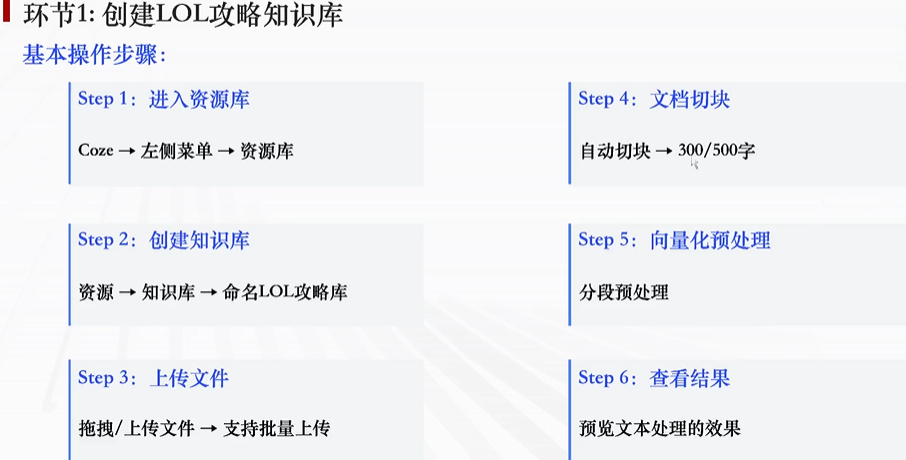

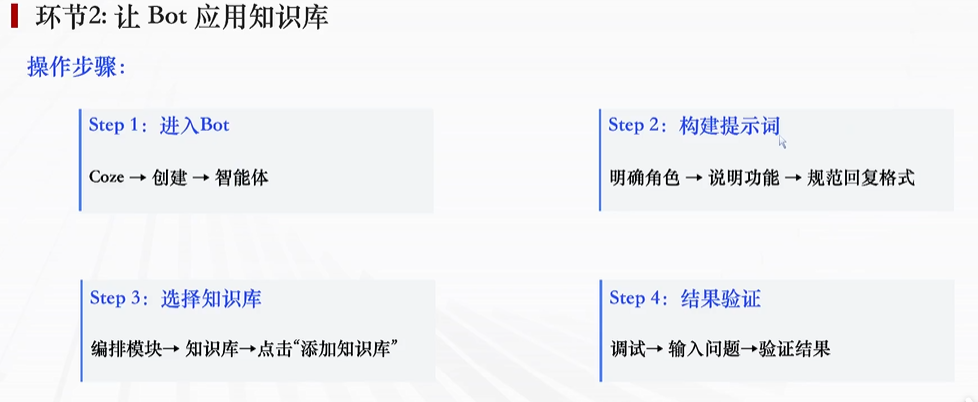


### Function Calling

#### 介绍

##### 1.什么是Function Call ?

2023年6月13日OpenAI公布了FunctionCall（函数调用）功能，该功能指的是在语言模型中集成外部功能或API的
调用能力，这意味着模型可以在生成文本的过程中调用外部函数或服务，获取额外的数据或执行特定的任务。

答案：让大模型具备调用外部工具的能力


##### 什么是Function Call ?

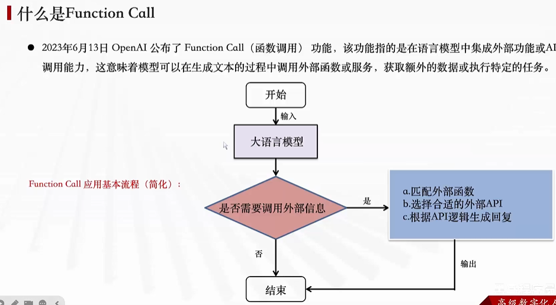

##### Function Call 功能

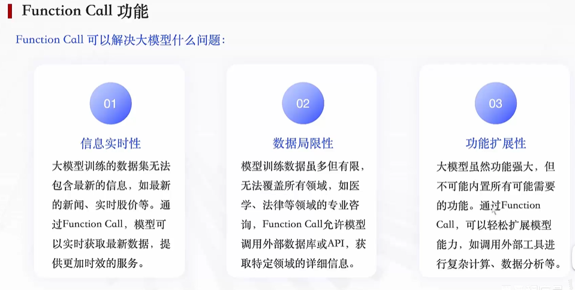

##### Function Call 工作原理

答案：用户请求-》大模型判断是否调用函数-》函数结果返回大模型-》给出答案

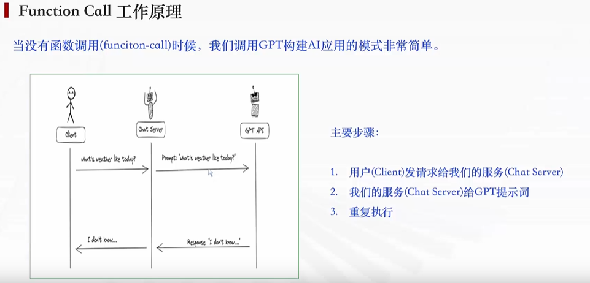

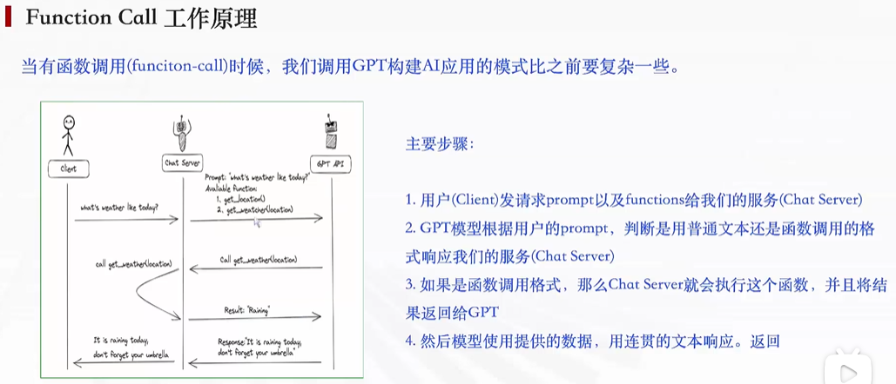

#### 插件和FunctionCall关系

答案：在Coze中插件就是FunctionCalling的实现形式

#### 如何应用官方 Coze 插件？

答案：创建智能体-》编排-》添加技能-》选择插件-》应用

注意：在编写提示词时，使用`{`符号可弹出已经添加的插件，后续可自动使用

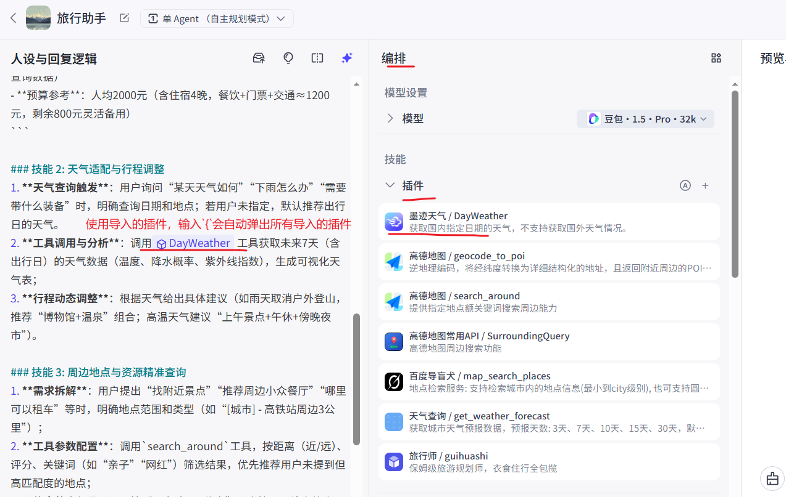

#### 实例

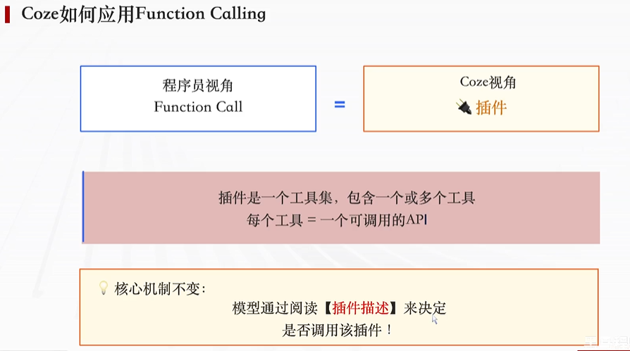

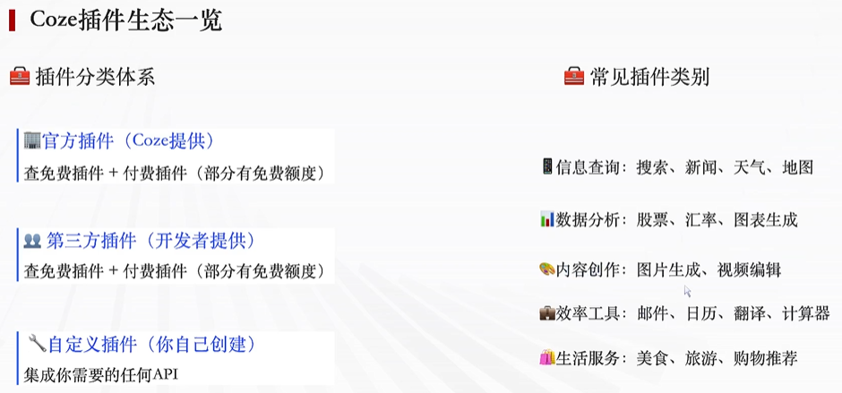

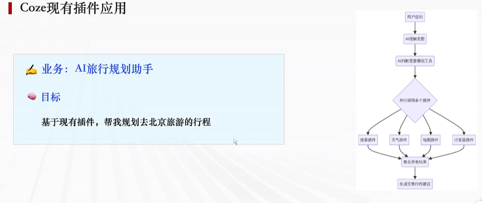


#### 自定义插件发布使用

##### 实现自定义插件的过程？

1.打开资源库
2.点击插件
3.选择python开发
4.定义输入和输出
5.构建代码
6.测试插件
7.发布
8.添加bot

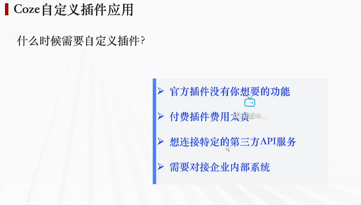

##### 自定义插件基本流程

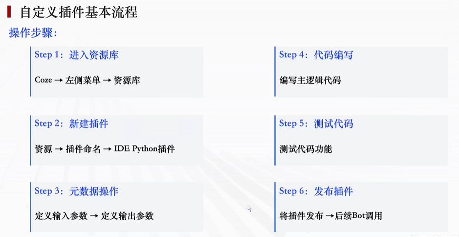

##### 步骤1

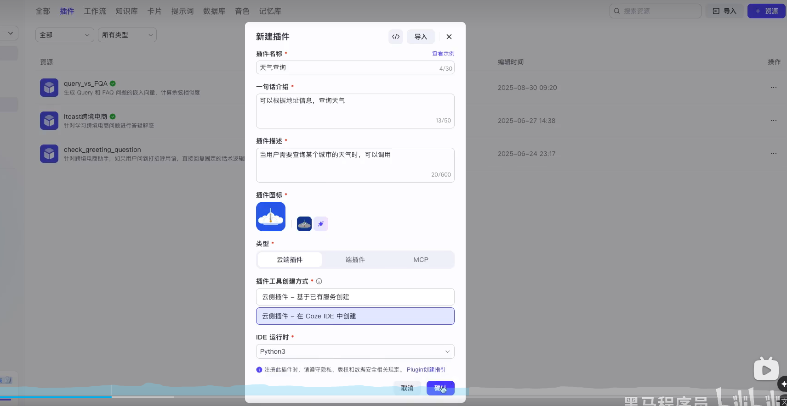

##### 步骤2

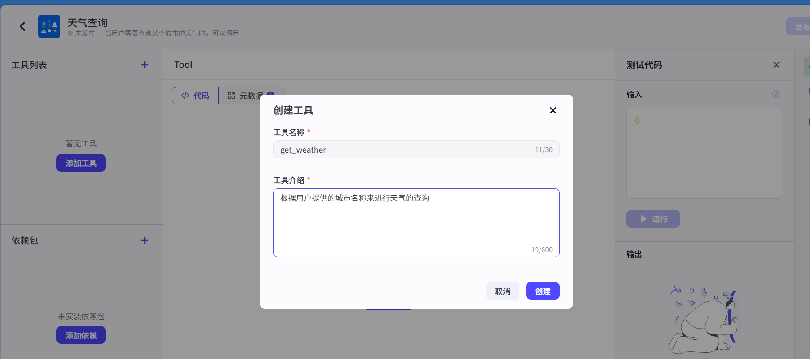

##### 步骤3

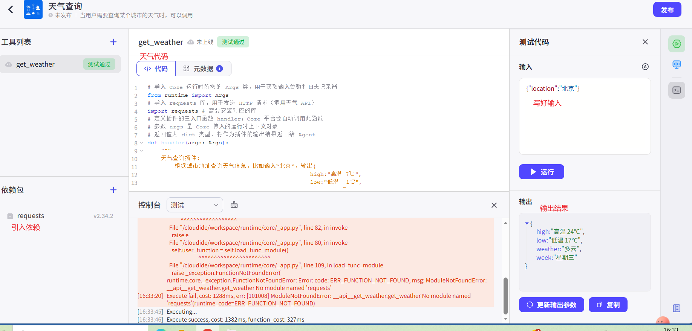

##### 步骤4

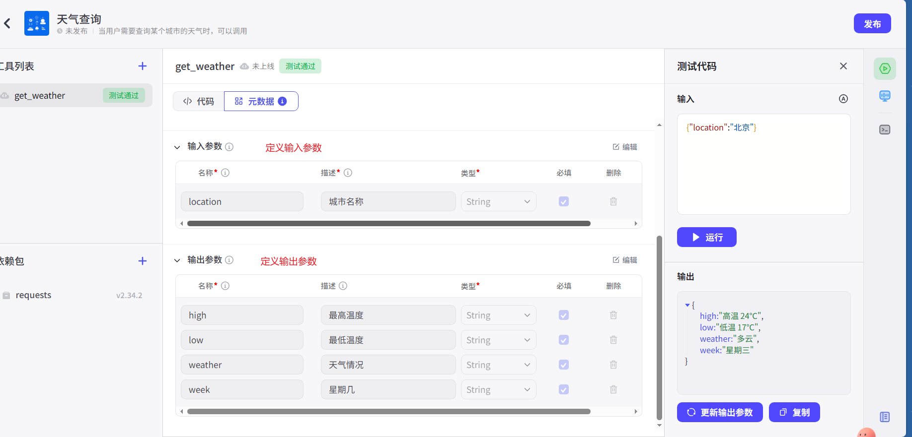

##### 代码

```python
# 导⼊ Coze 运⾏时所需的 Args 类，⽤于获取输⼊参数和⽇志记录器
from runtime import Args
# 导⼊ requests 库，⽤于发送 HTTP 请求（调⽤天⽓ API）
import requests # 需要安装对应的库
# 定义插件的主⼊⼝函数 handler；Coze 平台会⾃动调⽤此函数
# 参数 args 是 Coze 传⼊的运⾏时上下⽂对象
# 返回值为 dict 类型，将作为插件的输出结果返回给 Agent
def handler(args: Args):
    """
    天⽓查询插件：
        根据城市地址查询天⽓信息，⽐如输⼊“北京“，输出{
                                                high:"⾼温 7℃",
                                                low:"低温 -1℃",
                                                weather:"晴",
                                                week:"星期⼆"
                                                }
    """
    # === 1. 解析输⼊ ===
    try:
        # 从 args.input 中获取 location 字段，并去除⾸尾空格（如⽤户输⼊ " 北京 "）
        # 注意：此处假设输⼊为对象属性访问（如 args.input.location），适⽤于 manifest 中声明了 location 字段的情况
        location = args.input.location.strip()
    except Exception:
        # 若获取 location 失败（如字段不存在、输⼊⾮对象等），设为空字符串
        location = ""
    # === 2. 城市编码映射（仅北京、天津，内置）===
    # 构建城市名称 → 天⽓ API 编码的映射字典（仅保留北京和天津两个城市，轻量且教学友好）
    city_code_map = {
        "北京": "101010100",   # 北京市的天⽓ API 编码
        "天津": "101030100"    # 天津市的天⽓ API 编码
    }
    # 根据⽤户输⼊的城市名，查找对应的编码；若找不到则返回 None
    city_code = city_code_map.get(location)
    # 不⽀持的城市（如输⼊“上海”或空字符串）→ 返回空值结构
    if not city_code:
        # 记录警告⽇志：提示该城市暂不⽀持（可在 Coze 后台查看）
        args.logger.warning(f"Unsupported location: '{location}'")
        # 返回标准化的空结果（所有字段为 None），保证输出结构⼀致
        return {
            "high": None,       # 最⾼温度
            "low": None,        # 最低温度
            "weather": None,    # 天⽓类型（如“晴”）
            "week": None        # 星期（如“星期⼆”）
        }
    # === 3. 调⽤天⽓ API ===
    # 拼接完整 API 请求 URL，替换 {city_code} 为实际城市编码
    url = f"http://t.weather.itboy.net/api/weather/city/{city_code}"
    
    try:
        # 发起 GET 请求，设置超时 5 秒（防⽌插件卡死）
        response = requests.get(url, timeout=5)
        # 若 HTTP 状态码⾮ 2xx，主动抛出异常（如 404、500 等）
        response.raise_for_status()
        # 将响应体解析为 JSON 字典（安全⽅式，避免使⽤危险的 eval()）
        data = response.json()
        # 检查 API 业务层返回状态码（该 API 约定 status=200 表示成功）
        if data.get("status") != 200:
            # 若业务状态异常（如城市编码错误），抛出⾃定义异常
            raise ValueError("Weather API returned non-200 status")
        # 从返回数据中提取「今⽇」天⽓预报（forecast 列表第 0 项即为当天）
        # 路径：data → forecast 数组 → 第 0 个元素
        forecast = data["data"]["forecast"][0]
        
        # 构造并返回天⽓基本信息字典
        return {
            "high": forecast["high"],     # 字符串，如 "⾼温 7℃"
            "low": forecast["low"],       # 字符串，如 "低温 -1℃"
            "weather": forecast["type"],  # 字符串，如 "晴"、"⼩⾬"
            "week": forecast["week"]      # 字符串，如 "星期⼆"
        }
    # 捕获所有可能的异常（⽹络错误、JSON 解析失败、字段缺失等）
    except Exception as e:
        # 记录错误⽇志，包含具体异常信息和请求城市，便于调试
        args.logger.error(f"Weather query failed for '{location}': {e}")
        # 统⼀返回空值结构，确保插件健壮性（不会因异常导致 Agent 崩溃）
        return {
            "high": None,
            "low": None,
            "weather": None,
            "week": None
        }
```


### 工作流

#### 介绍

##### 1.什么是工作流？

答案：业务逻辑的可视化执行


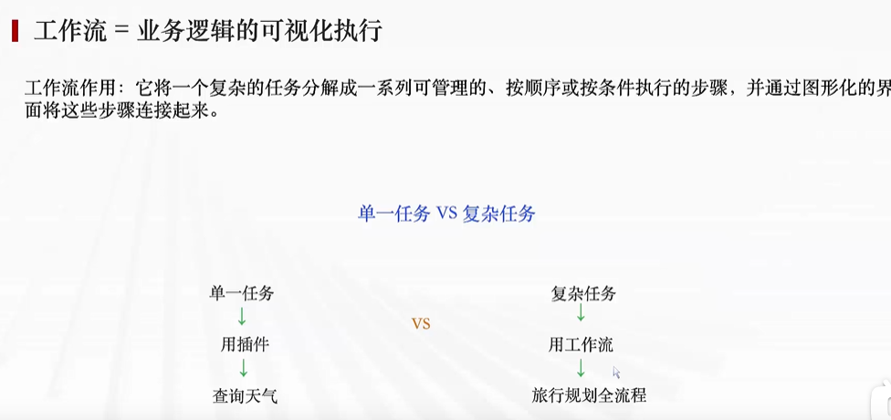

##### 2.Coze的两种工作流类型?

答案：对话流和工作流


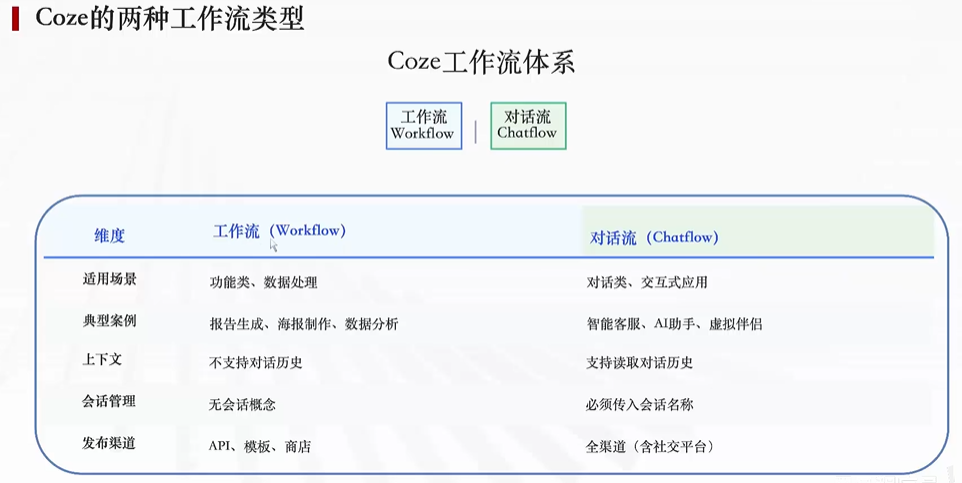

##### 3.工作流的核心组件？

答案：节点：特定功能的独立组件，负责处理数据、执行任务

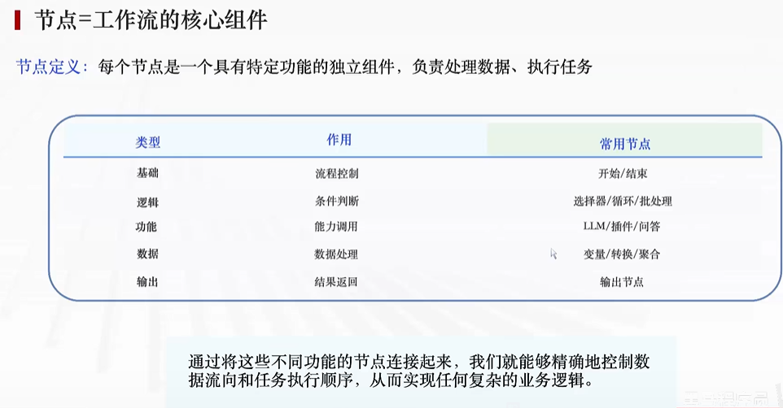

##### 工作流的4种不同形式

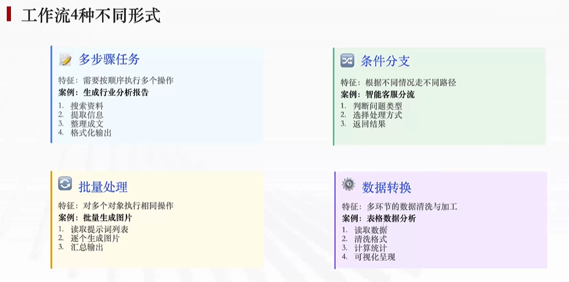

##### 创建工作流的标准流程

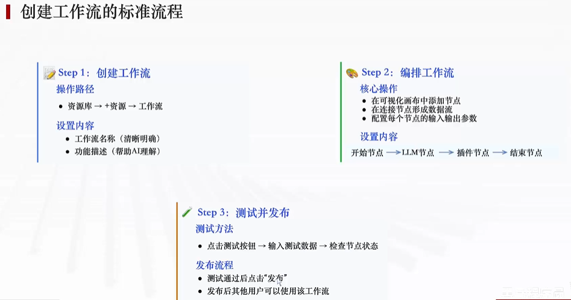

#### 实例

[跳转到 实例1-对话流—电商答疑助手.pdf](./第五章：电商答疑助手案例/跨境电商小助手.pdf)

[跳转到 实例2-工作流—历史人物一生视频生成.pdf](./第五章：历史人物一生案例/历史人物一生视频生成.pdf)

[跳转到 实例3—米核剪映小助手应用教程.pdf](./第五章：历史人物一生案例/米核剪映小助手应用教程.pdf)

### **工作流**与**对话流**

Coze（扣子）里的**工作流（Workflow）**与**对话流（Chatflow）**，本质是两套可视化低代码编排体系：  
- **工作流 = 无状态任务流水线**，偏“功能/自动化”  
- **对话流 = 带会话记忆的对话专用工作流**，偏“多轮交互/聊天机器人”

下面从核心区别、能力细节、典型场景与选型建议四方面讲清楚。

---

#### 一、核心区别（一眼看懂）

| 对比项          | 工作流 Workflow                   | 对话流 Chatflow                                 |
| --------------- | --------------------------------- | ----------------------------------------------- |
| 核心定位        | 自动化执行功能性任务              | 多轮对话交互、有上下文记忆                      |
| 会话状态        | 无状态，不绑定会话、不记历史      | 有状态，绑定 `conversation_name`，自带聊天历史  |
| 开始节点参数    | 自定义输入（默认 `input`）        | **固定预置**：`USER_INPUT`、`CONVERSATION_NAME` |
| 大模型/意图节点 | 不读对话历史，只处理当前输入      | **自动带入历史上下文**，支持多轮理解            |
| 交互方式        | 后台/API 调用、批量处理           | 用户聊天、问答、主动追问（Question 节点）       |
| 典型场景        | 生成报告、数据清洗、海报/视频生成 | 智能客服、个人助手、虚拟陪伴、多轮咨询          |
| 发布方式        | API、模板调用                     | 小程序、公众号、Web、SDK、智能体绑定            |

一句话：**对话流 = 工作流 + 会话记忆 + 对话交互能力**。

---

#### 二、工作流（Workflow）详解

##### 1. 是什么

可视化编排的**无状态任务流程**，把 LLM、插件、代码、数据库等节点串起来，自动完成复杂任务。


##### 2. 关键能力

- **完全自定义输入**：开始节点可自由增删参数（字符串、数字、文件、数组等）。
- **丰富节点库**：
  - 基础：开始、结束、条件分支、循环、变量赋值
  - 智能：大模型（单次/批量）、知识库检索、意图识别
  - 工具：插件（天气/翻译/搜索）、代码（Python/JS）、HTTP 请求、数据库
- **无状态执行**：每次调用独立，不保留上次结果，适合幂等任务。
- **嵌套复用**：支持调用子工作流，模块化管理。

##### 3. 适用场景

- 内容生成：自动写周报、生成PPT、海报文案、绘本故事
- 数据处理：批量清洗、格式转换、ETL、报表生成
- 工具自动化：定时任务、API 批量调用、文件处理
- 后台逻辑：无需用户交互的长流程、复杂计算

---

#### 三、对话流（Chatflow）详解

##### 1. 是什么

**专为对话设计的增强型工作流**，绑定会话 ID，自动管理历史消息，让大模型具备“记忆”。


##### 2. 关键能力

- **强制会话绑定**：开始节点固定有 `USER_INPUT`（用户当前消息）和 `CONVERSATION_NAME`（会话唯一标识），不可删除。
- **上下文自动带入**：大模型、意图识别节点**默认读取历史对话**，无需手动拼接。
- **对话交互节点**：
  - **Question 节点**：主动向用户提问（文本/按钮选择），等待回复后继续流程
  - **回复节点**：定制化输出格式（文字、卡片、图片、按钮）
- **人设与会话管理**：可配置头像、开场白、角色设定；支持历史轮数控制。
- **智能体专属模式**：可将智能体设为“对话流模式”，所有用户消息都触发同一套流程，**避免自由发挥**。

##### 3. 适用场景

- 智能客服：售后咨询、订单查询、问题工单、自动分流
- 个人助手：生活助理、学习辅导、代码助手、多轮问答
- 虚拟陪伴：情感聊天、角色扮演、故事互动
- 引导式流程：预约、注册、信息收集、问卷访谈

---

#### 四、怎么选？（选型建议）

- ✅ 选**工作流**，如果你：
  - 做**批量/后台/自动化任务**，不需要用户实时聊天
  - 追求**稳定、可预测**的输出，避免大模型随意发挥
  - 需要**复杂数据处理、多工具串联、定时执行**

- ✅ 选**对话流**，如果你：
  - 做**聊天机器人/客服/助手**，需要多轮上下文理解
  - 要**主动追问用户、引导对话流程**
  - 希望**一键发布到聊天渠道**（小程序/公众号/Web）

---

#### 五、小结

- **工作流 = 任务自动化引擎**：无状态、强控制、适合功能型 AI
- **对话流 = 对话交互引擎**：有记忆、能聊天、适合交互型 AI
- 两者**节点能力大部分互通**，核心差异在于**会话状态与上下文处理**。

要不要我给你一个可直接复制的最小示例（工作流+对话流各一个），帮你快速上手？

#### 示例

##### 一、工作流（Workflow）：**一次性任务，无记忆、不聊天**

##### 例子1：一键生成周报

流程：
1. 开始节点：输入**本周工作内容**
2. 大模型节点：整理成标准职场周报
3. 结束输出：成品周报

**特点**
- 发一次执行一次，**不记上次内容**
- 不用多轮对话，填内容直接出结果
- 适合：文案生成、数据整理、表格转换、图片生成

###### 例子2：商品价格换算

1. 输入：原价、折扣
2. 代码节点计算折后价
3. 直接输出结果

**使用场景**：后台工具、批量处理、接口调用

---

##### 二、对话流（Chatflow）：**多轮聊天，带记忆，能追问**

###### 例子1：奶茶点单机器人（最经典）

流程：
1. 用户发：我要喝奶茶
2. 流程主动提问：想要热的还是冰的？
3. 用户回：冰的
4. 再提问：几分糖？
5. 用户确定后，汇总订单回复

**特点**
- 记住上一轮对话
- **主动反问用户**，一步步引导
- 全程聊天交互

###### 例子2：面试模拟助手

1. 用户：开始面试
2. 机器人依次出题
3. 用户回答
4. 点评打分+下一题
5. 全程连贯记忆对话上下文

---

##### 最简区分举例

1. **用工作流**
你丢一段文字 → 直接总结摘要（完事，不聊天）

2. **用对话流**
你：帮我规划旅游
AI：想去几天？
你：3天
AI：预算多少？
你：500内
AI：给出3天行程（多轮来回）

---

# 一句话总结
- **工作流：做事、批量、一次性产出**
- **对话流：聊天、问答、多轮交互**

需要我给你做**Coze可视化搭建步骤**吗？

### 将Bot发布到微信公众号和Coze商店

注册微信公众号

获取AppID

发布Bot到公众号和Coze商店


## Dify

