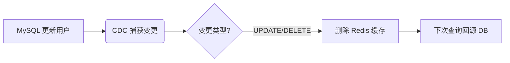

### Canal

**Canal** 是阿里巴巴开源的一款 **基于 MySQL 数据库增量日志（binlog）解析的数据库同步工具**，主要用于**实时捕获 MySQL 的数据变更（增、删、改）**，并将这些变更以事件流的形式投递给下游系统。

------

#### 🔍 一、Canal 的核心定位

> **“MySQL 的 binlog 订阅者”**
> 它伪装成 MySQL 的 **从库（Slave）**，通过 MySQL 的主从复制协议（Replication Protocol）拉取 binlog，然后解析成结构化的数据变更事件（如 `INSERT`、`UPDATE`、`DELETE`），供其他系统消费。

------

#### 🧩 二、Canal 的工作原理（树状图）

```
MySQL 主库
│
├── 开启 binlog（必须！）
│   └── 格式建议：ROW（记录每行变化）
│
└── Canal Server（部署在应用服务器）
    │
    ├── 模拟 MySQL Slave 连接主库
    │
    ├── 拉取 binlog 日志流
    │
    ├── 解析 binlog → 转为 Java 对象（Entry/RowData）
    │   ├── 表名、数据库名
    │   ├── 变更类型（INSERT/UPDATE/DELETE）
    │   ├── 变更前后的字段值
    │
    └── 推送变更事件给客户端（Client）
        │
        ├── 直连模式（TCP）
        ├── Kafka / RocketMQ / RabbitMQ（消息队列模式）
        └── 自定义 Client（如写入 Elasticsearch、缓存、数仓等）
```

------

#### ✅ 三、Canal 的典型应用场景

| 场景                        | 说明                                                         |
| --------------------------- | ------------------------------------------------------------ |
| **1. 数据库与缓存同步**     | MySQL 更新 → Canal 捕获 → 删除/更新 Redis 缓存（解决缓存不一致） |
| **2. 搜索引擎索引更新**     | 用户修改商品信息 → Canal → 同步到 Elasticsearch              |
| **3. 数据仓库/BI 实时同步** | 将业务库变更实时写入 Hive、ClickHouse、Doris 等              |
| **4. 异构数据库同步**       | MySQL → Oracle / PostgreSQL（需自定义转换逻辑）              |
| **5. 审计日志 / 操作留痕**  | 记录所有数据变更历史                                         |
| **6. 微服务解耦**           | 订单服务不直接调用库存服务，而是通过 Canal 事件触发          |

------

#### ⚙️ 四、Canal 的核心组件

| 组件               | 作用                                                |
| ------------------ | --------------------------------------------------- |
| **Canal Server**   | 核心服务，负责连接 MySQL、拉取并解析 binlog         |
| **Canal Instance** | 每个实例对应一个 MySQL 数据库的监听任务（可多实例） |
| **Canal Client**   | 消费端程序，订阅 Canal Server 的数据变更事件        |
| **Meta Manager**   | 存储消费位点（如 ZooKeeper、本地文件、数据库）      |
| **Event Store**    | （可选）将事件暂存到内存或磁盘队列                  |

------

#### 📦 五、Canal 部署架构示例

##### 方式 1：直连模式（简单场景）

```
[MySQL] ←(binlog)→ [Canal Server] ←(TCP)→ [Your Application]
```

##### 方式 2：消息队列模式（生产推荐）

```
[MySQL] 
   ↓ (binog)
[Canal Server] 
   ↓ (推送)
[Kafka / RocketMQ]
   ↓ (消费)
[Elasticsearch]  [Redis]  [Data Warehouse]  [Audit System]
```

> ✅ **优势**：解耦、削峰、多消费者、高可用

------

#### ⚠️ 六、使用前提（MySQL 配置）

必须在 MySQL 配置中开启 binlog：

```ini
# my.cnf
[mysqld]
server-id         = 1
log-bin           = mysql-bin
binlog-format     = ROW        # 必须为 ROW 模式！
binlog-row-image  = FULL       # 推荐（记录完整前后镜像）
```

> 💡 如果是云数据库（如阿里云 RDS、腾讯云 CDB），通常在控制台开启即可。

------

#### 🧪 七、简单代码示例（Java Client）

```java
// 创建 Canal 连接
CanalConnector connector = CanalConnectors.newSingleConnector(
    new InetSocketAddress("127.0.0.1", 11111), "example", "", "");

connector.connect();
connector.subscribe("jc_club\\.user"); // 监听 jc_club 库的 user 表

while (true) {
    Message message = connector.getWithoutAck(1000);
    List<CanalEntry.Entry> entries = message.getEntries();
    
    for (CanalEntry.Entry entry : entries) {
        if (entry.getEntryType() == CanalEntry.EntryType.ROWDATA) {
            RowChange rowChange = RowChange.parseFrom(entry.getStoreValue());
            for (RowData rowData : rowChange.getRowDatasList()) {
                if (rowChange.getEventType() == EventType.INSERT) {
                    // 处理插入
                } else if (rowChange.getEventType() == EventType.UPDATE) {
                    // 处理更新
                }
            }
        }
    }
    connector.ack(message.getId()); // 确认消费
}
```

------

#### 🆚 八、Canal vs 其他 CDC 工具

| 工具          | 语言       | 特点                                                       |
| ------------- | ---------- | ---------------------------------------------------------- |
| **Canal**     | Java       | 阿里开源，专注 MySQL，生态成熟                             |
| **Debezium**  | Java       | 支持多种数据库（MySQL, PG, Oracle...），基于 Kafka Connect |
| **Maxwell**   | Java       | 轻量级，直接输出 JSON 到 Kafka                             |
| **Flink CDC** | Java/Scala | 流处理框架内置 CDC 能力，适合实时计算                      |

> ✅ **Canal 优势**：轻量、稳定、国内社区活跃、与阿里系技术栈集成好。

------

#### ✅ 总结一句话：

> **Canal 是一个“监听 MySQL 数据变化”的中间件，它把数据库变成一个“消息源”，让其他系统能实时响应数据变更，实现最终一致性、解耦和实时数据管道。**

适用于任何需要 **“感知数据库变化”** 的场景，是构建现代数据架构的重要组件。

### **CDC (Change Data Capture)工具**

**CDC 工具**（Change Data Capture，变更数据捕获工具）是一类用于**实时捕获数据库中数据变更（增、删、改）** 并将这些变更以结构化事件形式传递给下游系统的软件工具。

它的核心目标是：  

> **“知道数据库里什么数据在什么时候发生了什么变化”，并让其他系统能实时响应。**

------

#### 🔍 一、CDC 的本质

| 传统方式                                                     | CDC 方式                                                  |
| ------------------------------------------------------------ | --------------------------------------------------------- |
| 定时全量/增量轮询（如每5分钟查一次 `update_time > last_time`） | **实时监听数据库日志**（如 MySQL binlog、PostgreSQL WAL） |
| 延迟高、性能差（频繁查表）                                   | **低延迟、低侵入、高性能**                                |
| 可能漏数据（如删除记录无时间戳）                             | **精确捕获所有 DML 操作**（包括 DELETE）                  |

✅ **CDC = 数据库的“监听器” + “消息生产者”**

------

#### 🌐 二、CDC 工具的核心工作原理（通用）

```
[源数据库]
│
├── 开启事务日志（必须！）
│   ├── MySQL → binlog（需 ROW 模式）
│   ├── PostgreSQL → WAL（Write-Ahead Logging）
│   ├── Oracle → Redo Log / GoldenGate
│   └── SQL Server → Transaction Log
│
└── [CDC 工具]
    │
    ├── 连接数据库（模拟从库或使用逻辑解码）
    │
    ├── 实时读取并解析日志
    │
    ├── 转换为标准化事件（如 JSON）
    │   {
    │     "table": "user",
    │     "type": "UPDATE",
    │     "before": {"id":1, "name":"Alice"},
    │     "after":  {"id":1, "name":"Alice_new"}
    │   }
    │
    └── 投递到下游
        ├── Kafka / Pulsar / RocketMQ
        ├── Elasticsearch
        ├── Redis / 缓存
        ├── 数据仓库（ClickHouse, Doris, Hive）
        └── 微服务（通过 API 或消息）
```

------

#### 🧰 三、主流 CDC 工具对比

| 工具                  | 开源        | 支持数据库                                | 特点                                     | 适用场景              |
| --------------------- | ----------- | ----------------------------------------- | ---------------------------------------- | --------------------- |
| **Canal**             | ✅           | MySQL                                     | 阿里开源，轻量，Java 生态友好            | 国内 MySQL 场景首选   |
| **Debezium**          | ✅           | MySQL, PG, Oracle, SQL Server, MongoDB... | 基于 Kafka Connect，生态强大，支持快照   | 多数据库、云原生架构  |
| **Maxwell**           | ✅           | MySQL                                     | 输出纯 JSON 到 Kafka，简单易用           | 轻量级 MySQL 同步     |
| **Flink CDC**         | ✅           | MySQL, PG 等                              | 内嵌于 Flink，支持流批一体、Exactly-Once | 实时计算 + CDC 一体化 |
| **Oracle GoldenGate** | ❌（商业）   | Oracle, MySQL, PG...                      | 企业级，高可靠，昂贵                     | 金融、大型企业        |
| **AWS DMS**           | ❌（云服务） | 多种                                      | 托管服务，开箱即用                       | AWS 云上迁移/同步     |

------

#### 🏗️ 四、CDC 的典型应用场景

##### 1. **缓存一致性**



##### 2. **搜索索引同步**

- 用户修改商品 → CDC → 推送新数据到 Elasticsearch → 搜索结果实时更新

##### 3. **实时数仓 / BI**

- 业务库（OLTP）→ CDC → Kafka → Flink → 数仓（OLAP）

##### 4. **微服务解耦**

- 订单服务不直接调用积分服务，而是：

  ```
  订单创建 → CDC → 发送“订单已创建”事件 → 积分服务消费事件
  ```

##### 5. **数据备份与异地多活**

- 通过 CDC 将主库变更实时同步到备库或异地集群

------

#### ⚙️ 五、CDC 的三种实现模式

| 模式                               | 原理                             | 优点                         | 缺点                                  |
| ---------------------------------- | -------------------------------- | ---------------------------- | ------------------------------------- |
| **1. 基于日志（Log-based）**       | 解析数据库事务日志（binlog/WAL） | ✅ 实时、无侵入、捕获完整变更 | ❌ 依赖数据库日志格式，配置复杂        |
| **2. 基于触发器（Trigger-based）** | 在表上建触发器，写变更到日志表   | ✅ 兼容老数据库               | ❌ 性能差、侵入性强、难维护            |
| **3. 基于时间戳/版本号**           | 轮询 `update_time > last_time`   | ✅ 简单                       | ❌ 延迟高、无法捕获 DELETE、可能漏数据 |

> ✅ **现代 CDC 工具几乎都采用“基于日志”模式**（如 Canal、Debezium）

------

#### ✅ 六、使用 CDC 的前提条件

1. **数据库必须开启事务日志**  
   - MySQL：`binlog_format=ROW`
   - PostgreSQL：`wal_level=logical`
2. **有足够权限读取日志**  
   - MySQL：`REPLICATION SLAVE`, `REPLICATION CLIENT`
   - PG：创建 replication user
3. **网络可达**  
   - CDC 工具需能连接数据库

------

#### 💡 七、总结一句话

> **CDC 工具是现代数据架构的“神经末梢”——它让数据库的每一次心跳（数据变更）都能被整个系统感知和响应，从而实现真正的实时数据驱动。**

如果你需要：

- 实时同步数据
- 解耦微服务
- 构建实时数仓
- 保证缓存一致性

那么 **CDC 工具（如 Canal、Debezium）就是你的必备武器**。