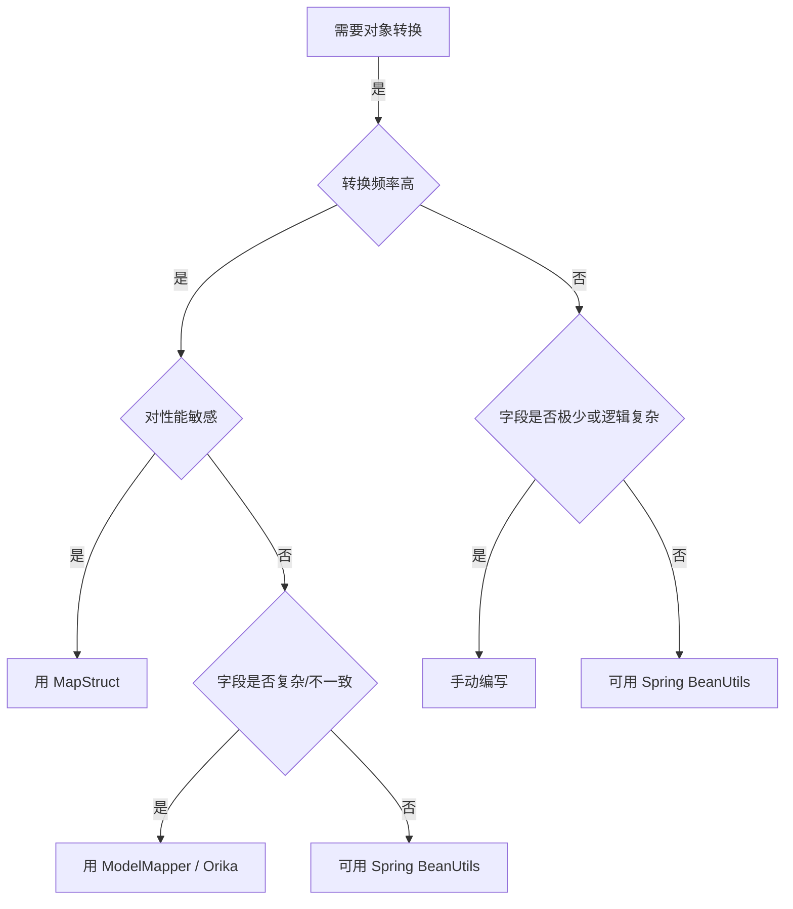
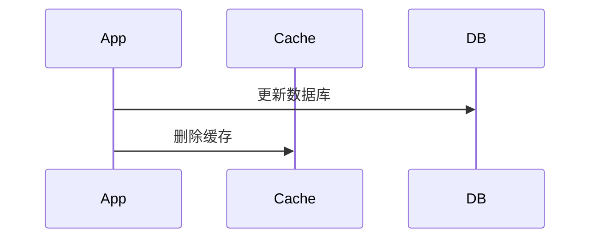
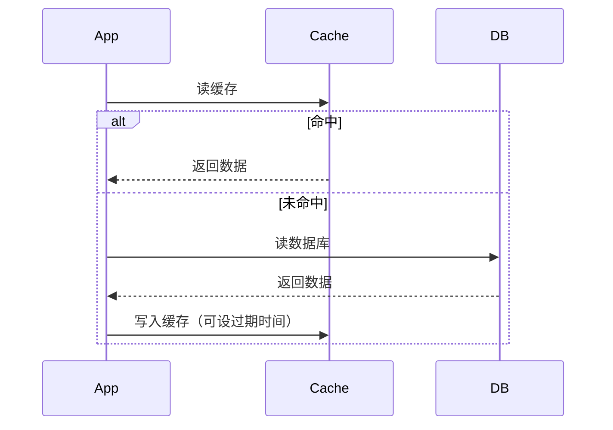
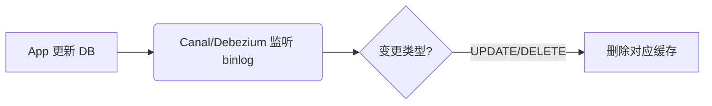
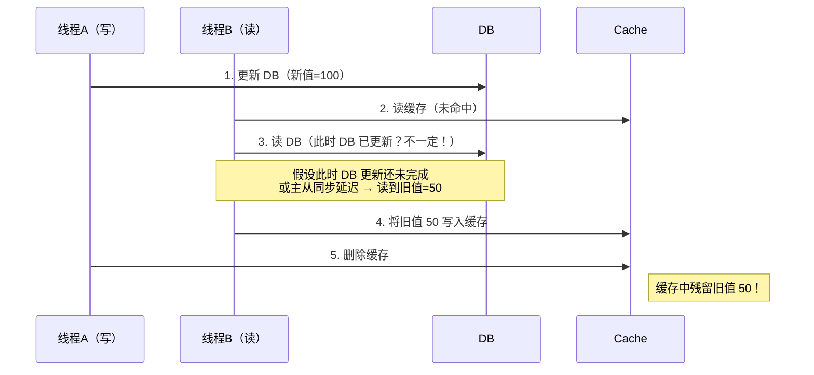
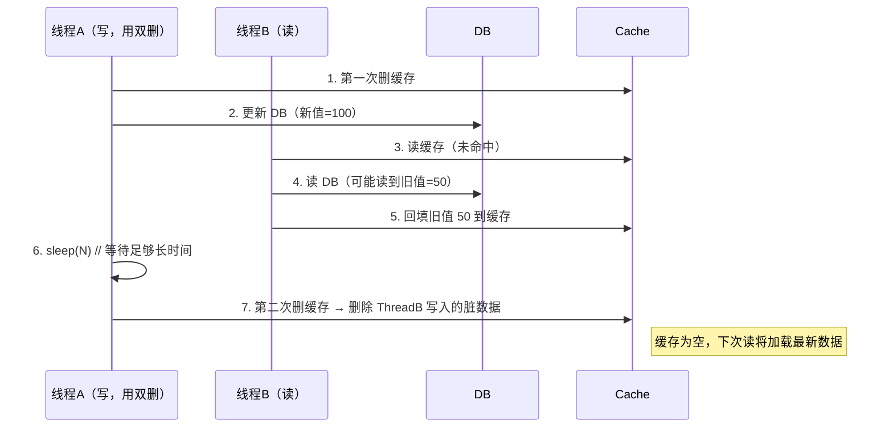
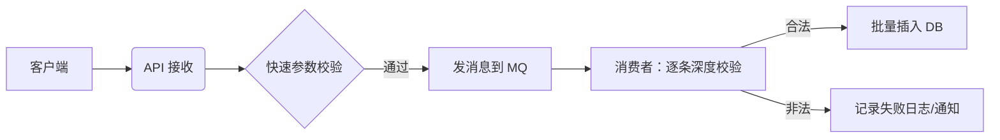
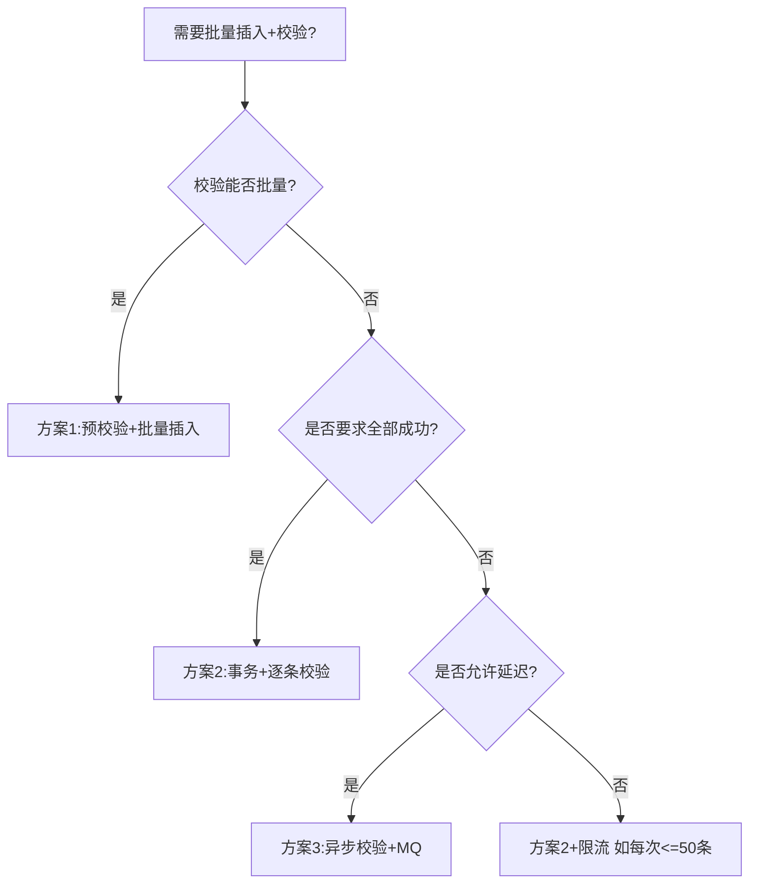
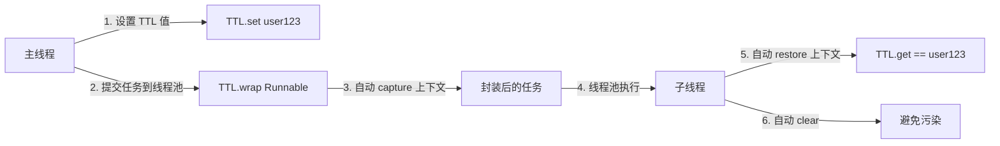

## 文件路径

### 1.三种路径

非常好的问题！理解 **当前工作目录（Current Working Directory）**、**项目根目录（Project Root）** 和 **类路径（Classpath）** 的区别，是 Java 开发中避免“文件找不到”错误的关键。下面为你详细解析三者的定义、区别、获取方式及使用场景。

------

#### 一、三者定义与本质区别

| 概念                    | 英文                      | 本质                                                         | 作用                                         |
| ----------------------- | ------------------------- | ------------------------------------------------------------ | -------------------------------------------- |
| **当前工作目录**        | Current Working Directory | **操作系统概念**：JVM 启动时所在的文件系统目录               | 相对路径（如 `new File("a.txt")`）的基准目录 |
| **类路径（Classpath）** | Classpath                 | **JVM 概念**：JVM 查找 `.class` 文件和资源（resources）的路径集合 | 加载类、读取 `src/main/resources` 下的资源   |
| **项目根目录**          | Project Root Directory    | **开发约定**：包含 `src/`、`pom.xml` 等的源码顶层目录        | 仅在开发阶段有意义，运行时无直接对应         |

> ✅ **关键区别**：
>
> - **工作目录 = 文件系统的起点**
>
> - **类路径 = class 和资源的查找路径**
>
> - **项目根目录 ≠ 工作目录 ≠ 类路径**（尽管开发时可能重合）
>
> - **“项目根目录”是你写代码时的家，“当前工作目录”是程序运行时站的地方——在家时两者一样，出门后就不一定了。**
>
>   如果你只是本地开发测试，放心用；如果要上线，请做好路径解耦 😊


#### **“当前工作目录”和“项目根目录”的区别**

**在概念上是两回事，但在某些开发场景下它们恰好相同。**

------

##### ✅ 简短回答：

> **不是一回事。**  
>
> - **当前工作目录（Current Working Directory）**：是 **操作系统层面** 的概念，指 JVM 启动时所在的目录。  
> - **项目根目录（Project Root Directory）**：是 **开发者/构建工具约定** 的概念，指包含 `src/`、`pom.xml` 等的源码顶层目录。

它们**可能重合，但不一定总是相等**。

------

##### 🔍 详细解释

###### 1. **当前工作目录（`user.dir`）**

- 由 **启动 Java 进程的位置** 决定。

- 可通过 `System.getProperty("user.dir")` 获取。

- 示例：

  ```bash
  # 在 /home/user 下运行
  cd /home/user
  java -jar /opt/myapp/app.jar
  ```

  → 此时 

  ```
  user.dir = /home/user
  ```

  ，

  即使 JAR 文件在 `/opt/myapp/`

###### 2. **项目根目录**

- 是你写代码时的工程结构顶层，比如：

  ```
  ~/projects/my-spring-app/   ← 这就是项目根目录
    ├── src/
    ├── pom.xml
    └── 中二知识笔记.pdf
  ```

- 它只存在于 **开发阶段** 或 **源码仓库中**。

- 一旦项目打包成 JAR/WAR，**“项目根目录”这个概念在运行时就消失了**（只剩文件系统路径或 classpath）。

------

##### 🆚 对比示例

| 场景                                           | 当前工作目录 (`user.dir`)       | 项目根目录                 | 是否相同？ |
| ---------------------------------------------- | ------------------------------- | -------------------------- | ---------- |
| 在 IDEA 中运行 main 方法                       | `~/projects/my-spring-app`      | `~/projects/my-spring-app` | ✅ 是       |
| 在项目根目录执行 `mvn spring-boot:run`         | `~/projects/my-spring-app`      | `~/projects/my-spring-app` | ✅ 是       |
| 打包后，在任意位置运行： `java -jar myapp.jar` | `/home/ops`（你执行命令的地方） | （已不存在）               | ❌ 否       |
| 用 systemd 服务启动 Java 应用                  | `/` 或 `/root`（默认）          | —                          | ❌ 否       |
| Docker 容器中运行（未指定 WORKDIR）            | `/`                             | —                          | ❌ 否       |

------

##### 💡 关键结论

- **开发阶段（IDE / 命令行在项目目录下运行）**：
  两者通常一致，所以 `new FileSystemResource("xxx.pdf")` 能工作。
- **部署/生产环境**：
  “项目根目录”不再存在，只有“当前工作目录”，而它可能是任意位置。此时硬编码相对路径会失败。

------

##### ✅ 最佳实践建议

1. **不要假设 `user.dir` 就是项目根目录**，尤其在生产代码中。

2. 如果需要访问外部文件：

   - 通过配置指定绝对路径（如 `app.document.path=/data/docs/xxx.pdf`）

   - 或明确基于 

     ```
     user.dir
     ```

      构建路径并加校验：

     ```java
     Path file = Paths.get(System.getProperty("user.dir")).resolve("中二知识笔记.pdf");
     if (!Files.exists(file)) {
         // 报错或使用默认路径
     }
     ```

3. **资源文件（如配置、小图片）应放 `src/main/resources`，用 `ClassPathResource` 加载**，与工作目录无关。

------

##### 🎯 一句话总结：

> **“项目根目录”是你写代码时的家，“当前工作目录”是程序运行时站的地方——在家时两者一样，出门后就不一定了。**

如果你只是本地开发测试，放心用；如果要上线，请做好路径解耦 😊

#### 二、如何获取它们？

##### 1. 获取 **当前工作目录**

```java
String workingDir = System.getProperty("user.dir");
System.out.println("当前工作目录: " + workingDir);
```

- 返回 JVM 启动时的目录。
- 示例输出（Linux/macOS）：`/home/user/my-project`
  （Windows）：`C:\Users\user\my-project`

> 📌 所有 **相对路径文件操作**（如 `new File("log.txt")`）都基于此目录。

------

##### 2. 获取 **类路径（Classpath）**

类路径是一个**路径列表**，可通过以下方式查看：

###### 方法 A：打印整个 classpath

```java
String classpath = System.getProperty("java.class.path");
System.out.println("类路径: " + classpath);
```

- 输出示例（Maven 项目）：

  ```
  /home/user/my-project/target/classes:
  /home/user/.m2/repository/org/springframework/spring-core/5.3.0/spring-core-5.3.0.jar:...
  ```

###### 方法 B：获取某个类或资源的实际位置

```java
// 获取当前类的 .class 文件位置
URL classUrl = MyClass.class.getProtectionDomain().getCodeSource().getLocation();
System.out.println("类所在位置: " + classUrl);

// 获取 classpath 下某资源的位置
URL resourceUrl = MyClass.class.getClassLoader().getResource("application.properties");
System.out.println("资源位置: " + resourceUrl);
```

> ⚠️ 注意：如果代码被打包进 JAR，`classUrl` 可能是 `file:/app.jar`，而资源 URL 可能是 `jar:file:/app.jar!/application.properties`。

------

##### 3. “获取项目根目录”？—— 它没有直接 API！

因为 **项目根目录是开发概念**，JVM 运行时并不知道它。

但你可以**间接推测**（仅限开发阶段）：

```java
// 假设你在 target/classes 下运行（Maven 默认）
URL classesUrl = Thread.currentThread().getContextClassLoader().getResource(".");
if (classesUrl != null) {
    try {
        Path classesDir = Paths.get(classesUrl.toURI()); // .../target/classes
        Path projectRoot = classesDir.getParent().getParent(); // .../my-project
        System.out.println("推测的项目根目录: " + projectRoot);
    } catch (Exception e) {
        e.printStackTrace();
    }
}
```

> ❗ 此方法在 JAR 中失效（因为 `getResource(".")` 在 JAR 内返回 `jar:...!/.`，无法转为文件路径）。

✅ **更可靠的做法**：通过配置或 `user.dir`（见下文）。

------

#### 三、典型使用场景对比

| 需求                                           | 应该用                     | 示例                                              |
| ---------------------------------------------- | -------------------------- | ------------------------------------------------- |
| 读取 `src/main/resources/config.json`          | **类路径**                 | `new ClassPathResource("config.json")`            |
| 读取项目根目录下的 `data/input.csv`            | **当前工作目录**（开发时） | `new FileSystemResource("data/input.csv")`        |
| 写日志到 `logs/app.log`（与启动脚本同目录）    | **当前工作目录**           | `new FileOutputStream("logs/app.log")`            |
| 加载外部配置文件（如 `/etc/myapp/config.yml`） | **绝对路径**               | `new FileSystemResource("/etc/myapp/config.yml")` |

------

#### 四、常见误区与陷阱

##### ❌ 误区 1：认为 `getClass().getResource("/")` 是项目根目录

```java
// 错误！这返回的是 classpath 根（如 target/classes），不是项目根目录
URL url = getClass().getResource("/");
```

- 在 Maven 项目中，它指向 `target/classes/`，比项目根目录深两层。

##### ❌ 误区 2：用 `ClassPathResource` 读项目根目录的文件

```java
// 如果 "readme.txt" 在项目根目录（不在 resources/），这会失败！
new ClassPathResource("readme.txt"); // 找不到
```

→ 只有放在 `src/main/resources/` 的文件才会进入 classpath。

##### ❌ 误区 3：假设打包后还能访问项目结构

- JAR/WAR 包只包含编译后的 class 和 resources，**不包含 `pom.xml`、`src/`、项目根目录下的普通文件**。

------

#### 五、最佳实践建议

| 场景                         | 推荐做法                                                     |
| ---------------------------- | ------------------------------------------------------------ |
| **开发阶段读项目根目录文件** | 确保文件存在 + 使用 `user.dir` + 加存在校验                  |
| **生产环境读外部文件**       | 通过配置指定**绝对路径**（如 `-Dconfig.path=/opt/app/data.cfg`） |
| **读应用配置/模板等资源**    | 放入 `src/main/resources`，用 `ClassPathResource`            |
| **不确定路径？**             | 打印 `user.dir` 和 `java.class.path` 调试                    |

------

#### 六、总结表

| 特性               | 当前工作目录                     | 类路径（Classpath）                     | 项目根目录                 |
| ------------------ | -------------------------------- | --------------------------------------- | -------------------------- |
| **本质**           | OS 概念                          | JVM 概念                                | 开发约定                   |
| **获取方式**       | `System.getProperty("user.dir")` | `System.getProperty("java.class.path")` | 无直接方式（需推测或配置） |
| **相对路径基准**   | 是                               | 否（classpath 资源用自己规则）          | 否                         |
| **打包后是否有效** | 取决于启动位置                   | 有效（JAR 内部）                        | 无效                       |
| **典型用途**       | 读写外部文件、日志               | 加载类、读 resources 资源               | 仅用于开发组织代码         |

------

如果你告诉我你的具体需求（比如：“我想在 Spring Boot 里读一个放在项目根目录的 PDF 文件”），我可以给出最合适的代码方案！

### 2.绝对路径和相对路径

在 Java（以及所有操作系统和编程语言）中，**绝对路径**和**相对路径**是文件系统操作的基础概念。理解它们对正确读写文件、避免 `FileNotFoundException` 至关重要。

------

#### 一、定义

##### ✅ 绝对路径（Absolute Path）

- **从文件系统的根目录开始**，完整描述文件或目录的位置。

- **不依赖当前工作目录**，在任何地方运行都指向同一个位置。

- 示例

  ：

  - Windows:  

    ```text
    C:\Users\Alice\Documents\notes.txt
    D:\myapp\config\app.conf
    ```

  - Linux / macOS:  

    ```text
    /home/alice/documents/notes.txt
    /opt/myapp/logs/app.log
    ```

> 🔑 特点：以盘符（Windows）或 `/`（Unix-like）开头。

------

##### ✅ 相对路径（Relative Path）

- **相对于“当前工作目录”（Current Working Directory）** 的路径。

- **会随着程序启动位置不同而指向不同文件**。

- 示例

  （假设当前工作目录是 

  ```
  /home/alice/myproject
  ```

  ）：

  ```text
  notes.txt           → /home/alice/myproject/notes.txt
  data/input.csv      → /home/alice/myproject/data/input.csv
  ../shared/utils.jar → /home/alice/shared/utils.jar
  ./config/app.conf   → /home/alice/myproject/config/app.conf
  ```

> 🔑 特点：不以 `/` 或盘符开头；常用 `.`（当前目录）、`..`（上级目录）。

------

#### 二、在 Java 中如何使用？

##### 1. 使用 `java.io.File`

```java
// 相对路径：相对于 user.dir
File relative = new File("data.txt");

// 绝对路径
File absolute = new File("/home/alice/data.txt");        // Linux/macOS
File absoluteWin = new File("C:\\Users\\Alice\\data.txt"); // Windows
```

##### 2. 使用 `java.nio.file.Path`（推荐）

```java
Path relative = Paths.get("data.txt");
Path absolute = Paths.get("/home/alice/data.txt");

// 将相对路径转为绝对路径（基于当前工作目录）
Path resolved = Paths.get(System.getProperty("user.dir")).resolve("data.txt");
```

##### 3. 在 Spring 中使用 `Resource`

```java
// 相对路径（基于工作目录）
Resource rel = new FileSystemResource("config/app.yml");

// 绝对路径
Resource abs = new FileSystemResource("/etc/myapp/app.yml");
```

------

#### 三、关键区别总结

| 特性                 | 绝对路径                          | 相对路径                               |
| -------------------- | --------------------------------- | -------------------------------------- |
| **起点**             | 文件系统根目录（如 `/` 或 `C:\`） | 当前工作目录（`user.dir`）             |
| **可移植性**         | ❌ 差（硬编码路径）                | ✅ 好（但依赖运行位置）                 |
| **是否受 `cd` 影响** | 否                                | 是                                     |
| **Java 中判断方法**  | `path.isAbsolute()`               | `!path.isAbsolute()`                   |
| **适用场景**         | 配置文件、日志目录（固定位置）    | 项目内资源、临时文件（与启动位置相关） |

------

#### 四、如何查看当前工作目录？

```java
String workingDir = System.getProperty("user.dir");
System.out.println("当前工作目录: " + workingDir);
```

- 这就是**所有相对路径的基准**！

------

#### 五、常见陷阱与最佳实践

##### ⚠️ 陷阱 1：在 IDE 能跑，打包后找不到文件

- **原因**：IDE 中工作目录 = 项目根目录，但生产环境不是。
- **解决**：用绝对路径，或通过配置指定路径。

##### ⚠️ 陷阱 2：混用 `/` 和 `\`

- 错误（Windows）

  ：

  ```java
  new File("C:\my folder\file.txt"); // \m 被当作转义字符！
  ```

- 正确做法

  ：

  ```java
  new File("C:\\my folder\\file.txt");     // 转义
  new File("C:/my folder/file.txt");       // Java 允许用 / 即使在 Windows
  Paths.get("C:", "my folder", "file.txt"); // 最安全
  ```

##### ✅ 最佳实践

1. **开发阶段**：可用相对路径（确保文件在工作目录下）。

2. 生产部署

   ：

   - 外部文件用**绝对路径**；
   - 或通过 `-Dconfig.path=...` 等 JVM 参数传入路径。

3. **资源文件**（如模板、配置）：放 `src/main/resources`，用 **classpath** 加载（与路径无关）。

4. 永远校验文件是否存在

   ：

   ```java
   if (!Files.exists(path)) {
       throw new FileNotFoundException("文件不存在: " + path.toAbsolutePath());
   }
   ```

------

#### 六、示例：相对路径 vs 绝对路径行为对比

假设项目结构：

```
/home/user/myapp/
├── app.jar
├── config/
│   └── settings.properties
└── data.txt
```

##### 场景 1：在 `/home/user/myapp` 下运行

```bash
cd /home/user/myapp
java -jar app.jar
```

- `new File("data.txt")` → ✅ 找到
- `new File("config/settings.properties")` → ✅ 找到

##### 场景 2：在 `/tmp` 下运行

```bash
cd /tmp
java -jar /home/user/myapp/app.jar
```

- `new File("data.txt")` → ❌ 找不到（会去 `/tmp/data.txt`）
- `new File("/home/user/myapp/data.txt")` → ✅ 找到

------

#### 七、一句话总结

> **绝对路径 = “身份证号”，全球唯一；
> 相对路径 = “我家楼下”，取决于你站在哪。**

在 Java 中：

- 用 **绝对路径** 确保稳定（适合生产）；
- 用 **相对路径** 方便开发（需控制运行目录）；
- 用 **classpath** 管理应用内资源（最可靠）。

如有具体场景（比如 Spring Boot 读外部文件、Web 上传保存等），欢迎告诉我，我可以给出针对性代码！


## 业务场景

### 对象之间的属性拷贝

在 Java 项目中，对象之间的属性拷贝（如 DTO ↔ Entity、VO ↔ BO 等）是极其常见的操作。不同的实现方式在**性能、可维护性、安全性、开发效率**等方面差异显著。下面对主流方案进行系统分类与对比：

------

#### ✅ 一、四大类方案概览

| 类别                         | 代表工具/方式                                 | 核心机制                          | 适用场景                     |
| ---------------------------- | --------------------------------------------- | --------------------------------- | ---------------------------- |
| **1. 编译时代码生成**        | MapStruct、Lombok（部分）                     | **编译期生成 setter/getter 代码** | 高性能、类型安全、企业级项目 |
| **2. 运行时反射**            | Spring `BeanUtils`、Apache `BeanUtils`、Dozer | **运行时通过反射读写字段**        | 快速原型、简单转换、低频调用 |
| **3. 手动编写**              | 自己写 `setXxx(getYyy())`                     | **硬编码赋值**                    | 字段极少、逻辑复杂需定制     |
| **4. 动态代理 / 字节码增强** | ModelMapper、Orika                            | **运行时生成代理类或字节码**      | 灵活映射、支持深度嵌套       |

------

#### 🔹 二、详细对比分析

##### 1️⃣ **编译时代码生成 —— MapStruct（推荐）**

###### ✅ 优点：

- **高性能**：生成纯 Java 代码，无反射，速度 ≈ 手写
- **类型安全**：编译期检查字段是否存在、类型是否匹配
- **支持复杂映射**：嵌套对象、集合、枚举、自定义方法
- **IDE 友好**：生成的代码可调试、可跳转
- **零运行时依赖**：仅编译期需要，不增加 jar 包体积

###### ❌ 缺点：

- 需要学习注解（如 `@Mapping`, `@AfterMapping`）
- 不支持运行时动态映射（所有映射关系必须在编译前确定）

###### 📦 典型依赖（Maven）：

```xml
<dependency>
    <groupId>org.mapstruct</groupId>
    <artifactId>mapstruct</artifactId>
    <version>1.5.5.Final</version>
</dependency>
<annotationProcessorPaths>
    <path>
        <groupId>org.mapstruct</groupId>
        <artifactId>mapstruct-processor</artifactId>
        <version>1.5.5.Final</version>
    </path>
</annotationProcessorPaths>
```

###### 🎯 适用场景：

> **企业级后端服务、高频调用接口、对性能敏感的系统**

------

##### 2️⃣ **运行时反射 —— Spring / Apache BeanUtils**

###### ✅ 优点：

- **简单易用**：一行代码完成拷贝
- **无需额外依赖**（Spring 项目自带）
- **适合临时/低频转换**

###### ❌ 缺点：

- **性能差**：反射调用比直接方法调用慢 10~100 倍
- **不安全**：字段名错误在运行时才报错（`NoSuchMethodException`）
- **不支持泛型集合**：`List<UserDTO>` → `List<UserBO>` 需手动循环
- **忽略 null 值问题**：可能覆盖目标对象已有值

###### 🧪 示例：

```java
// Spring BeanUtils（浅拷贝）
BeanUtils.copyProperties(source, target);

// Apache BeanUtils（更慢，已不推荐）
org.apache.commons.beanutils.BeanUtils.copyProperties(target, source);
```

###### ⚠️ 性能数据（参考）：

| 方式             | 10万次拷贝耗时 |
| ---------------- | -------------- |
| 手写 / MapStruct | ~10 ms         |
| Spring BeanUtils | ~200 ms        |
| Apache BeanUtils | ~800 ms        |

###### 🎯 适用场景：

> **内部工具、测试代码、管理后台等低频非核心路径**

------

##### 3️⃣ **手动编写 —— 硬编码赋值**

###### ✅ 优点：

- **完全可控**：可加日志、校验、转换逻辑
- **极致性能**：无任何框架开销
- **清晰透明**：代码即文档

###### ❌ 缺点：

- **冗余枯燥**：10个字段就要写10行 setter
- **易出错**：字段增减时容易遗漏
- **维护成本高**：修改对象结构需同步更新所有转换处

###### 🧪 示例：

```java
UserBO bo = new UserBO();
bo.setId(dto.getId());
bo.setName(dto.getName().trim()); // 可加定制逻辑
bo.setEmail(dto.getEmail().toLowerCase());
```

###### 🎯 适用场景：

> **字段极少（≤3个）、转换逻辑复杂（如格式化、计算）、一次性脚本**

------

##### 4️⃣ **动态代理 / 字节码增强 —— ModelMapper、Orika**

###### ✅ 优点：

- **高度灵活**：支持条件映射、类型转换、扁平化
- **配置驱动**：可通过规则自动映射不同名字段
- **支持深度嵌套**：`user.address.city` → `userInfo.city`

###### ❌ 缺点：

- **启动慢**：首次映射需生成代理类
- **内存占用高**：缓存大量映射元数据
- **调试困难**：错误信息不直观
- **性能中等**：优于反射，但不如 MapStruct

###### 🧪 ModelMapper 示例：

```java
ModelMapper mapper = new ModelMapper();
UserBO bo = mapper.map(dto, UserBO.class);
```

###### 🎯 适用场景：

> **快速集成遗留系统、字段命名不一致、需要复杂映射规则**

------

#### 🔸 三、选型决策树（建议）



------

#### 🔹 四、最佳实践建议

| 场景                                       | 推荐方案                                   |
| ------------------------------------------ | ------------------------------------------ |
| **标准分层架构（Controller/Service/DAO）** | MapStruct（DTO/VO/BO/Entity 转换）         |
| **临时脚本、测试代码**                     | Spring `BeanUtils.copyProperties`          |
| **集成第三方 API（字段名不一致）**         | MapStruct + `@Mapping` 或 ModelMapper      |
| **超高性能要求（如金融交易）**             | 手动编写 or MapStruct                      |
| **避免使用**                               | Apache Commons BeanUtils（性能差、已过时） |

------

#### ✅ 总结一句话：

> **“高频用 MapStruct，低频用 BeanUtils，复杂用手动，灵活用 ModelMapper。”**

在现代 Spring Boot 项目中，**MapStruct 是对象转换的黄金标准**——它兼顾了性能、安全与开发效率，值得作为默认选择。

####  **完整的 Spring Boot + MapStruct 示例**

下面以一个 **完整的 Spring Boot + MapStruct 示例**，手把手演示如何实现 **编译时代码生成的对象转换**。我们将实现 `UserDTO` ↔ `UserBO` 的双向转换。

------

##### 一、项目依赖（Maven）

```xml
<dependencies>
    <!-- Spring Boot Web -->
    <dependency>
        <groupId>org.springframework.boot</groupId>
        <artifactId>spring-boot-starter-web</artifactId>
    </dependency>

    <!-- MapStruct 核心 API -->
    <dependency>
        <groupId>org.mapstruct</groupId>
        <artifactId>mapstruct</artifactId>
        <version>1.5.5.Final</version>
    </dependency>
</dependencies>

<build>
    <plugins>
        <plugin>
            <groupId>org.apache.maven.plugins</groupId>
            <artifactId>maven-compiler-plugin</artifactId>
            <configuration>
                <annotationProcessorPaths>
                    <!-- MapStruct 注解处理器（关键！） -->
                    <path>
                        <groupId>org.mapstruct</groupId>
                        <artifactId>mapstruct-processor</artifactId>
                        <version>1.5.5.Final</version>
                    </path>
                    <!-- 如果使用 Lombok，需同时引入 -->
                    <!--
                    <path>
                        <groupId>org.projectlombok</groupId>
                        <artifactId>lombok</artifactId>
                        <version>1.18.30</version>
                    </path>
                    -->
                </annotationProcessorPaths>
            </configuration>
        </plugin>
    </plugins>
</build>
```

> 💡 **关键点**：`mapstruct-processor` 必须在 `annotationProcessorPaths` 中，否则不会生成实现类！

------

##### 二、定义源对象和目标对象

###### `UserDTO.java`（数据传输对象）

```java
package com.example.demo.dto;

public class UserDTO {
    private Long id;
    private String username;
    private String email;
    // 注意：这里没有 getter/setter（MapStruct 不强制要求，但建议有）

    // 为清晰起见，手动添加（或用 Lombok @Data）
    public Long getId() { return id; }
    public void setId(Long id) { this.id = id; }
    public String getUsername() { return username; }
    public void setUsername(String username) { this.username = username; }
    public String getEmail() { return email; }
    public void setEmail(String email) { this.email = email; }
}
```

###### `UserBO.java`（业务对象）

```java
package com.example.demo.bo;

public class UserBO {
    private Long userId;      // 字段名不同！
    private String name;      // 字段名不同！
    private String emailAddress;

    // getter/setter 略（同上）
    public Long getUserId() { return userId; }
    public void setUserId(Long userId) { this.userId = userId; }
    public String getName() { return name; }
    public void setName(String name) { this.name = name; }
    public String getEmailAddress() { return emailAddress; }
    public void setEmailAddress(String emailAddress) { this.emailAddress = emailAddress; }
}
```

> 📌 注意：`UserDTO` 和 `UserBO` 的字段**名称不完全相同**，这是真实场景！

------

##### 三、编写 MapStruct 转换接口

###### `UserConverter.java`

💡 **最佳实践**：
**要么全用 Spring 注入（推荐）**，
**要么全用 `INSTANCE`（仅限无依赖的简单转换）**。
**不要混合使用！**

```java
package com.example.demo.converter;

import com.example.demo.bo.UserBO;
import com.example.demo.dto.UserDTO;
import org.mapstruct.Mapper;
import org.mapstruct.Mapping;
import org.mapstruct.factory.Mappers;

@Mapper(componentModel = "spring") // ← 关键：生成 Spring Bean
public interface UserConverter {

    // 单例方式（可选，推荐用 Spring 注入，则可以不用创建INSTANCE，注释掉即可）
    UserConverter INSTANCE = Mappers.getMapper(UserConverter.class);

    // DTO → BO：指定字段映射关系,相同名称的字段会自动映射
    @Mapping(source = "id", target = "userId")
    @Mapping(source = "username", target = "name")
    @Mapping(source = "email", target = "emailAddress")
    UserBO dtoToBo(UserDTO userDTO);

    // BO → DTO：反向映射
    @Mapping(source = "userId", target = "id")
    @Mapping(source = "name", target = "username")
    @Mapping(source = "emailAddress", target = "email")
    UserDTO boToDto(UserBO userBO);
}
```

> 🔍 `@Mapping` 说明：
>
> - `source`：源对象的字段名
> - `target`：目标对象的字段名

------

##### 四、在 Service 中使用（推荐 Spring 注入方式）

💡 **最佳实践**：
**要么全用 Spring 注入（推荐）**，
**要么全用 `INSTANCE`（仅限无依赖的简单转换）**。
**不要混合使用！**

###### `UserService.java`

```java
package com.example.demo.service;

import com.example.demo.bo.UserBO;
import com.example.demo.converter.UserConverter;
import com.example.demo.dto.UserDTO;
import org.springframework.stereotype.Service;

@Service
public class UserService {

    // 方式1：Spring 自动注入（推荐✅）
    private final UserConverter userConverter;

    public UserService(UserConverter userConverter) {
        this.userConverter = userConverter;
    }

    public UserDTO processUser(UserDTO inputDto) {
        // 1. DTO → BO
        UserBO bo = userConverter.dtoToBo(inputDto);
        
        // 2. 业务逻辑（例如：保存到数据库）
        // userRepository.save(bo);
        
        // 3. BO → DTO 返回
        return userConverter.boToDto(bo);
    }

    // 方式2：使用 INSTANCE（不推荐，但可行）
    public UserDTO processUserWithInstance(UserDTO inputDto) {
        UserBO bo = UserConverter.INSTANCE.dtoToBo(inputDto);
        return UserConverter.INSTANCE.boToDto(bo);
    }
}
```

------

##### 五、验证生成的代码（编译后）

执行 `mvn compile` 后，MapStruct 会在 `target/generated-sources/annotations` 下生成：

###### `UserConverterImpl.java`（自动生成，无需手写！）

```java
package com.example.demo.converter;

import com.example.demo.bo.UserBO;
import com.example.demo.dto.UserDTO;
import javax.annotation.processing.Generated;
import org.springframework.stereotype.Component;

@Generated
@Component  // 因为 componentModel = "spring"
public class UserConverterImpl implements UserConverter {

    @Override
    public UserBO dtoToBo(UserDTO userDTO) {
        if (userDTO == null) return null;
        UserBO userBO = new UserBO();
        userBO.setUserId(userDTO.getId());
        userBO.setName(userDTO.getUsername());
        userBO.setEmailAddress(userDTO.getEmail());
        return userBO;
    }

    @Override
    public UserDTO boToDto(UserBO userBO) {
        if (userBO == null) return null;
        UserDTO userDTO = new UserDTO();
        userDTO.setId(userBO.getUserId());
        userDTO.setUsername(userBO.getName());
        userDTO.setEmail(userBO.getEmailAddress());
        return userDTO;
    }
}
```

> ✅ 这是**纯 Java 代码，无反射，性能极高**！

------

##### 六、测试验证

###### `DemoApplicationTests.java`

```java
@SpringBootTest
class DemoApplicationTests {

    @Autowired
    private UserService userService;

    @Test
    void testConversion() {
        UserDTO input = new UserDTO();
        input.setId(1L);
        input.setUsername("alice");
        input.setEmail("alice@example.com");

        UserDTO output = userService.processUser(input);

        assertThat(output.getId()).isEqualTo(1L);
        assertThat(output.getUsername()).isEqualTo("alice");
        assertThat(output.getEmail()).isEqualTo("alice@example.com");
    }
}
```

------

##### 七、高级技巧（按需扩展）

###### 1. **忽略某些字段**

```java
@Mapping(target = "password", ignore = true)
UserBO dtoToBo(UserDTO dto);
```

###### 2. **常量/默认值**

```java
@Mapping(target = "status", constant = "ACTIVE")
@Mapping(target = "createTime", expression = "java(java.time.LocalDateTime.now())")
UserBO dtoToBo(UserDTO dto);
```

###### 3. **嵌套对象转换**

```java
// 自动调用 AddressConverter
@Mapping(source = "address", target = "location")
UserBO dtoToBo(UserDTO dto);
```

###### 4. **集合转换**

```java
List<UserBO> dtoListToBoList(List<UserDTO> dtos); // 自动生成循环
```

------

##### 总结：MapStruct 实现步骤

| 步骤 | 操作                                            |
| ---- | ----------------------------------------------- |
| 1️⃣    | 添加 `mapstruct` 和 `mapstruct-processor` 依赖  |
| 2️⃣    | 定义源对象（DTO）和目标对象（BO/Entity）        |
| 3️⃣    | 创建 `@Mapper` 接口，用 `@Mapping` 处理字段差异 |
| 4️⃣    | 使用 `componentModel = "spring"` 让其成为 Bean  |
| 5️⃣    | 在 Service 中通过 `@Autowired` 注入使用         |
| 6️⃣    | 编译后自动生成高效转换代码                      |

> 🚀 **优势**：开发时像用反射一样简单，运行时像手写代码一样快！

这就是 **MapStruct 编译时代码生成** 的完整实践方案，可直接用于生产项目。


### 将 JSON 字符串反序列化为泛型集合

将 JSON 字符串反序列化为泛型集合（如 `List<User>`、`Map<String, List<Order>>` 等）是 Java 开发中的常见需求。但由于 **Java 的类型擦除（Type Erasure）**，直接使用 `.class` 无法保留泛型信息，因此需要特殊处理。

下面以主流 JSON 库 **Gson** 和 **Jackson** 为例，详细说明正确做法。

------

#### 🔍 一、问题根源：Java 类型擦除

```java
List<String> list1 = new ArrayList<>();
List<Integer> list2 = new ArrayList<>();

// 运行时两者 class 相同！
System.out.println(list1.getClass() == list2.getClass()); // true → 都是 ArrayList.class
```

➡️ JVM 在运行时**不知道泛型参数的具体类型**，导致 JSON 库无法知道应将 JSON 对象映射成什么 Java 类。

------

#### ✅ 二、解决方案总览

| JSON 库     | 核心机制                     | 典型用法                                  |
| ----------- | ---------------------------- | ----------------------------------------- |
| **Gson**    | `TypeToken` + 匿名内部类     | `new TypeToken<List<User>>(){}.getType()` |
| **Jackson** | `TypeReference` + 匿名内部类 | `new TypeReference<List<User>>() {}`      |

两者原理相同：**利用匿名子类保留泛型签名**。

------

#### 📘 三、Gson 方式详解

##### 1. 基本语法

```java
String json = "[{\"name\":\"Alice\"}, {\"name\":\"Bob\"}]";

// ✅ 正确：使用 TypeToken
Type type = new TypeToken<List<User>>(){}.getType();
List<User> users = new Gson().fromJson(json, type);
```

##### 2. 为什么必须加 `{}`？

```java
// ❌ 错误：没有创建匿名子类
new TypeToken<List<User>>()  // ← 这只是一个普通实例，无法获取泛型信息

// ✅ 正确：创建匿名子类
new TypeToken<List<User>>() {}  // ← 注意最后的 {}
```

- `{}` 表示**定义一个匿名内部类**，继承自 `TypeToken<List<User>>`
- Gson 通过反射读取这个子类的**父类泛型信息**，从而获得 `List<User>`

##### 3. 常见场景示例

###### ▶ 场景 1：`List<T>`

```java
Type listType = new TypeToken<List<Product>>(){}.getType();
List<Product> products = gson.fromJson(json, listType);
```

###### ▶ 场景 2：`Map<K, V>`

```java
Type mapType = new TypeToken<Map<String, Integer>>(){}.getType();
Map<String, Integer> counts = gson.fromJson(json, mapType);
```

###### ▶ 场景 3：嵌套泛型

```java
// Map<String, List<User>>
Type nestedType = new TypeToken<Map<String, List<User>>>(){}.getType();
Map<String, List<User>> userGroups = gson.fromJson(json, nestedType);
```

###### ▶ 场景 4：带通配符（较少用）

```java
Type wildcardType = new TypeToken<List<? extends Animal>>(){}.getType();
```

##### 4. 封装建议（避免重复创建）

```java
public class JsonUtils {
    public static final Type USER_LIST_TYPE = new TypeToken<List<User>>(){}.getType();
    
    public static List<User> parseUserList(String json) {
        return new Gson().fromJson(json, USER_LIST_TYPE);
    }
}
```

------

#### 📗 四、Jackson 方式详解

Jackson 使用 `TypeReference`，用法几乎一致：

##### 1. 基本语法

```java
ObjectMapper mapper = new ObjectMapper();
String json = "[{\"name\":\"Alice\"}, {\"name\":\"Bob\"}]";

// ✅ 正确：使用 TypeReference
List<User> users = mapper.readValue(json, new TypeReference<List<User>>() {});
```

> ⚠️ 注意：**不需要调用 `.getType()`**，直接传入 `TypeReference` 实例。

##### 2. 常见场景示例

###### ▶ `List<T>`

```java
List<Product> products = mapper.readValue(json, new TypeReference<List<Product>>() {});
```

###### ▶ `Map<K, V>`

```java
Map<String, Integer> counts = mapper.readValue(json, new TypeReference<Map<String, Integer>>() {});
```

###### ▶ 嵌套泛型

```java
Map<String, List<User>> groups = mapper.readValue(
    json, 
    new TypeReference<Map<String, List<User>>>() {}
);
```

##### 3. 封装建议

```java
public class JsonUtils {
    private static final TypeReference<List<User>> USER_LIST_REF = 
        new TypeReference<List<User>>() {};

    public static List<User> parseUserList(String json) throws Exception {
        return new ObjectMapper().readValue(json, USER_LIST_REF);
    }
}
```

------

#### ⚠️ 五、常见错误与陷阱

| 错误写法                                      | 后果                                          | 正确做法                                                  |
| --------------------------------------------- | --------------------------------------------- | --------------------------------------------------------- |
| `gson.fromJson(json, List.class)`             | 返回 `List<LinkedTreeMap>`，不是 `List<User>` | 用 `TypeToken`                                            |
| `mapper.readValue(json, List.class)`          | 报错或返回 `List<Object>`                     | 用 `TypeReference`                                        |
| 忘记 `{}`（如 `new TypeToken<List<User>>()`） | 泛型信息丢失                                  | 加 `{}` 创建匿名类                                        |
| 没有无参构造函数                              | Gson/Jackson 反序列化失败                     | 确保类有 `public User()`                                  |
| 字段名不匹配                                  | 字段值为 `null`                               | 用 `@SerializedName`（Gson）或 `@JsonProperty`（Jackson） |

------

#### 🔁 六、Gson vs Jackson 对比

| 特性                 | Gson                       | Jackson                     |
| -------------------- | -------------------------- | --------------------------- |
| **泛型反序列化**     | `TypeToken` + `.getType()` | `TypeReference`（直接传入） |
| **性能**             | 较慢                       | 更快（尤其大数据）          |
| **Spring Boot 默认** | 否                         | 是（`spring-web` 内置）     |
| **注解**             | `@SerializedName`          | `@JsonProperty`             |
| **空值处理**         | 默认忽略 null              | 默认包含 null               |

> 💡 **建议**：  
>
> - 如果项目已用 Spring Boot → 优先用 **Jackson**  
> - 如果轻量级或 Android → 可用 **Gson**

------

#### ✅ 七、完整可运行示例（Gson）

```java
import com.google.gson.Gson;
import com.google.gson.reflect.TypeToken;
import java.lang.reflect.Type;
import java.util.List;

public class Main {
    public static void main(String[] args) {
        String json = "[{\"id\":1,\"name\":\"Alice\"},{\"id\":2,\"name\":\"Bob\"}]";
        
        // 反序列化为 List<User>
        Type userType = new TypeToken<List<User>>(){}.getType();
        List<User> users = new Gson().fromJson(json, userType);
        
        users.forEach(u -> System.out.println(u.id + ": " + u.name));
    }
}

class User {
    public int id;
    public String name;
    // 无参构造函数（可省略）
}
```

**输出：**

```
1: Alice
2: Bob
```

------

#### 💡 总结

| 关键点               | 说明                                             |
| -------------------- | ------------------------------------------------ |
| **必须用泛型容器**   | `TypeToken`（Gson）或 `TypeReference`（Jackson） |
| **必须加 `{}`**      | 创建匿名内部类以保留泛型签名                     |
| **确保类可反序列化** | 有无参构造函数 + 字段匹配                        |
| **不要用 `.class`**  | `List.class` 会丢失泛型信息                      |

掌握这一模式，你就能安全、高效地将任意 JSON 数组/嵌套结构映射到 Java 泛型集合中。


### Mono

`Mono` 是 **Project Reactor**（响应式编程库）中的核心类型之一，代表 **0 或 1 个元素的异步数据流**。在 Spring WebFlux、Spring Cloud Gateway、R2DBC 等响应式技术栈中，`Mono` 不仅用于异常处理和过滤器，还在实际项目中有**极其广泛的应用场景**。

下面从 **8 个典型方向**详细说明 `Mono` 在真实企业级项目中的用途：

------

#### 🔹 1. **Web 层：Controller 返回响应式结果**

在 Spring WebFlux 中，Controller 方法可直接返回 `Mono<T>`，实现非阻塞 I/O。

```java
@RestController
public class UserController {

    @GetMapping("/user/{id}")
    public Mono<User> getUser(@PathVariable Long id) {
        // 异步从数据库查询（如 R2DBC）
        return userService.findById(id);
    }

    @PostMapping("/user")
    public Mono<ResponseEntity<Void>> createUser(@RequestBody User user) {
        return userService.save(user)
            .map(saved -> ResponseEntity.ok().build())
            .onErrorReturn(ResponseEntity.status(500).build());
    }
}
```

✅ **优势**：  

- 高并发下线程不阻塞（Tomcat 线程可处理更多请求）  
- 自动与底层响应式数据库（如 MongoDB、R2DBC）集成

##### 和没有使用Mono相比有什么区别 ?

###### ✅ 响应式写法（使用 `Mono`）：

```java
@GetMapping("/user/{id}")
public Mono<User> getUser(@PathVariable Long id) {
    return userService.findById(id); // 返回 Mono<User>
}
```

###### ❌ 传统阻塞写法（不使用 `Mono`）：

```java
@GetMapping("/user/{id}")
public User getUser(@PathVariable Long id) {
    return userService.findById(id); // 直接返回 User（同步阻塞）
}
```

它们之间的区别**不仅仅是返回类型不同**，而是代表了 **两种完全不同的编程模型和系统架构风格**。下面从多个维度详细对比：

------

##### 🔹 1. **线程模型：阻塞 vs 非阻塞**

| 维度             | 传统同步（无 `Mono`）                                        | 响应式（`Mono`）                                             |
| ---------------- | ------------------------------------------------------------ | ------------------------------------------------------------ |
| **请求处理线程** | Tomcat 线程（如 `http-nio-8080-exec-1`）                     | 同样是 Tomcat 线程（但行为不同）                             |
| **数据库调用时** | **线程被阻塞**，等待 DB 返回结果 （线程挂起，不能处理其他请求） | **线程立即释放** DB 操作由 Netty/NIO 等异步驱动完成 结果就绪后回调继续处理 |
| **并发能力**     | 受限于 Tomcat 线程池大小（默认 200） 高并发时线程耗尽 → 拒绝请求 | 单线程可处理成千上万个并发请求 资源利用率极高                |

###### 📊 举例说明：

假设你的服务每秒收到 **1000 个 `/user/{id}` 请求**，每个 DB 查询耗时 **50ms**。

- **传统方式**：
  需要至少 **50 个线程** 才能不排队（1000 req/s × 0.05s = 50）。
  如果线程池只有 200，勉强扛住；但如果还有其他接口，很容易线程打满。
- **响应式方式**：
  **1~2 个线程** 就能处理全部请求！
  因为线程在等待 DB 时不“睡觉”，而是去处理下一个请求。

> 💡 这就是 **“用更少的资源处理更高的负载”** 的核心优势。

------

##### 🔹 2. **底层技术栈要求**

| 写法                            | 必须配套的技术                                               |
| ------------------------------- | ------------------------------------------------------------ |
| **返回 `User`（同步）**         | - JDBC（如 MyBatis、JPA） - RestTemplate - Redis Lettuce（阻塞模式） |
| **返回 `Mono<User>`（响应式）** | - **R2DBC**（响应式 JDBC）或 **MongoDB Reactive Driver** - **WebClient**（不能用 RestTemplate） - **Reactive Redis**（Lettuce 响应式模式） |

> ⚠️ **重要警告**：
> 如果你在 WebFlux Controller 中返回 `Mono`，但 `userService.findById()` 内部仍用 **JDBC（如 MyBatis）**，那么：
>
> - 表面看代码“响应式”
> - 实际仍是**阻塞调用**（只是把阻塞操作包装在 `Mono.fromCallable()` 里）
> - **无法获得非阻塞优势**，反而增加复杂度！

✅ 正确做法：全链路响应式（WebFlux + R2DBC + WebClient）

------

##### 🔹 3. **性能与资源消耗对比**

| 指标              | 同步（JDBC）               | 响应式（R2DBC + Mono）       |
| ----------------- | -------------------------- | ---------------------------- |
| **内存占用**      | 高（每个线程 ~1MB 栈空间） | 极低（事件驱动，无大量线程） |
| **CPU 利用率**    | 上下文切换开销大           | 更高效（减少线程调度）       |
| **吞吐量（TPS）** | 受限于线程数               | 可提升 2~10 倍（实测常见）   |
| **延迟（P99）**   | 高并发时急剧上升           | 更稳定（无线程竞争）         |

> 📌 **适用场景**：  
>
> - 高并发 API 网关、实时数据服务 → 选响应式  
> - 内部管理系统、低频后台 → 同步足够

------

##### 🔹 4. **代码可读性与调试难度**

| 方面           | 同步               | 响应式                          |
| -------------- | ------------------ | ------------------------------- |
| **代码直观性** | 直线型逻辑，易理解 | 需理解操作符（flatMap, zip...） |
| **调试**       | 断点直接跟踪       | 异步回调，堆栈信息分散          |
| **异常处理**   | try-catch          | onErrorResume / doOnError       |
| **学习曲线**   | 低                 | 中高（需掌握响应式思维）        |

> 💡 **建议**：
> 团队若无响应式经验，不要为了“时髦”强行上 WebFlux。
> **“简单正确” > “高性能但脆弱”**

------

##### 🔹 5. **Spring Boot 中的实际表现**

###### 场景：使用 **Spring MVC（Servlet 栈）**

```java
// 即使你写成这样，Spring MVC 也会把它转为同步调用！
@GetMapping("/user/{id}")
public Mono<User> getUser(...) { ... }
```

- Spring MVC 会**阻塞等待 `Mono` 完成**，再返回结果
- **毫无性能收益**，反而增加开销

###### 场景：使用 **Spring WebFlux（Reactive 栈）**

- 必须启动 **Netty 或 Undertow（非阻塞服务器）**
- 全链路非阻塞才能发挥优势

> ✅ **结论**：
> 要用 `Mono` 获得好处，必须：
>
> 1. 使用 **Spring WebFlux**（不是 Spring MVC）
> 2. 数据库用 **R2DBC / Reactive MongoDB**
> 3. HTTP 客户端用 **WebClient**
> 4. 缓存用 **Reactive Redis**

------

##### ✅ 总结：关键区别一览表

| 对比项          | 无 `Mono`（同步）           | 有 `Mono`（响应式）    |
| --------------- | --------------------------- | ---------------------- |
| **编程模型**    | 阻塞式                      | 非阻塞、事件驱动       |
| **线程使用**    | 1 请求 = 1 线程（直到结束） | N 请求 ≈ 1~2 线程      |
| **技术栈**      | JDBC, RestTemplate          | R2DBC, WebClient       |
| **适用场景**    | 低并发、内部系统            | 高并发、API 服务、网关 |
| **资源效率**    | 低                          | 高                     |
| **开发难度**    | 简单                        | 较复杂                 |
| **Spring 环境** | Spring MVC                  | Spring WebFlux         |

------

##### 💡 最终建议：

- **如果你的项目是 Spring Cloud Gateway、高并发微服务、实时系统** → 拥抱 `Mono`，全链路响应式。
- **如果你的项目是传统后台、管理端、低流量应用** → 用同步模型，更简单可靠。
- **切忌“半吊子响应式”**：Controller 返回 `Mono`，但底层用 MyBatis → **有害无益**！

> 技术选型的核心是：**匹配业务需求，而非追逐潮流**。

------

#### 🔹 2. **服务调用：Feign / WebClient 异步调用**

使用 `WebClient`（Spring 官方响应式 HTTP 客户端）调用其他微服务：

```java
@Service
public class OrderService {

    private final WebClient webClient;

    public Mono<OrderDetail> getOrderDetail(Long orderId) {
        return webClient.get()
            .uri("/api/order/{id}", orderId)
            .retrieve()
            .bodyToMono(OrderDetail.class) // ← 返回 Mono
            .timeout(Duration.ofSeconds(3))
            .onErrorResume(e -> Mono.empty()); // 超时或失败返回空
    }
}
```

✅ **对比传统 RestTemplate**：  

- 不会阻塞线程等待网络响应  
- 支持超时、重试、熔断等响应式操作符

------

#### 🔹 3. **数据库操作：R2DBC / MongoDB 响应式查询**

使用响应式数据库驱动时，所有操作返回 `Mono` 或 `Flux`：

```java
@Repository
public class UserRepository {

    private final DatabaseClient client;

    public Mono<User> findById(Long id) {
        return client.sql("SELECT * FROM users WHERE id = :id")
            .bind("id", id)
            .fetch()
            .one() // ← 返回 Mono<Map<String, Object>>
            .map(row -> new User((Long)row.get("id"), (String)row.get("name")));
    }

    public Mono<Void> deleteById(Long id) {
        return client.sql("DELETE FROM users WHERE id = :id")
            .bind("id", id)
            .fetch()
            .rowsUpdated()
            .then(); // 转为 Mono<Void>
    }
}
```

✅ **适用数据库**：  

- R2DBC（MySQL, PostgreSQL, SQL Server）  
- MongoDB Reactive Driver  
- Cassandra, Redis（Lettuce）

------

#### 🔹 4. **缓存操作：响应式 Redis（Lettuce）**

Spring Data Redis 的响应式版本返回 `Mono`：

```java
@Service
public class CacheService {

    private final ReactiveRedisTemplate<String, User> redisTemplate;

    public Mono<User> getUserFromCache(String key) {
        return redisTemplate.opsForValue().get(key); // ← Mono<User>
    }

    public Mono<Boolean> setUserToCache(String key, User user) {
        return redisTemplate.opsForValue().set(key, user, Duration.ofMinutes(10));
    }
}
```

------

#### 🔹 5. **组合多个异步操作（关键优势！）**

`Mono` 提供丰富的操作符，优雅组合多个异步任务：

##### ▶ 场景：获取用户 + 订单 + 积分（并行）

```java
public Mono<UserProfile> buildUserProfile(Long userId) {
    Mono<User> userMono = userService.findById(userId);
    Mono<List<Order>> ordersMono = orderService.findByUserId(userId);
    Mono<Integer> pointsMono = pointService.getPoints(userId);

    // 并行执行三个异步操作
    return Mono.zip(userMono, ordersMono, pointsMono)
        .map(tuple -> new UserProfile(
            tuple.getT1(), // User
            tuple.getT2(), // List<Order>
            tuple.getT3()  // Integer
        ));
}
```

##### ▶ 场景：先查缓存，未命中再查 DB

```java
public Mono<User> getUser(Long id) {
    String cacheKey = "user:" + id;
    return cacheService.get(cacheKey)
        .switchIfEmpty( // 缓存无数据时
            userService.findById(id)
                .doOnNext(user -> cacheService.set(cacheKey, user)) // 回填缓存
        );
}
```

✅ **优势**：避免回调地狱，代码清晰且高效（自动并行化）

------

#### 🔹 6. **错误处理与降级**

使用 `onErrorReturn`、`onErrorResume` 实现容错：

```java
public Mono<String> getConfig() {
    return configService.fetchFromRemote()
        .timeout(Duration.ofSeconds(2))
        .onErrorResume(timeoutEx -> {
            log.warn("远程配置超时，使用本地默认配置");
            return Mono.just(DEFAULT_CONFIG);
        })
        .onErrorReturn("fallback_config"); // 兜底值
}
```

------

#### 🔹 7. **网关层：Spring Cloud Gateway 过滤器**

你之前看到的 `LoginFilter` 就是典型应用：

```java
@Override
public Mono<Void> filter(ServerWebExchange exchange, GatewayFilterChain chain) {
    if (isAuthRequired(exchange)) {
        return validateToken(exchange)
            .flatMap(valid -> chain.filter(exchange)) // 验证通过则继续
            .switchIfEmpty(unauthorizedResponse(exchange)); // 验证失败返回 401
    }
    return chain.filter(exchange);
}
```

------

#### 🔹 8. **消息队列：响应式消费（如 Kafka, RabbitMQ）**

Spring for Apache Kafka 的响应式消费者：

```java
@KafkaListener(topics = "order-topic")
public Mono<Void> listenOrderEvents(Flux<OrderEvent> events) {
    return events
        .concatMap(event -> orderService.process(event)) // 逐个处理（保持顺序）
        .then(); // 返回 Mono<Void>
}
```

------

#### ⚠️ 何时**不要**用 `Mono`？

| 场景                          | 建议                              |
| ----------------------------- | --------------------------------- |
| 传统 Spring MVC（Servlet 栈） | 用 `CompletableFuture` 或同步调用 |
| 简单 CRUD 且无高并发需求      | 同步代码更易维护                  |
| 团队不熟悉响应式编程          | 学习成本高，易出错                |

> 💡 **经验法则**：  
>
> - 如果你的系统需要 **高吞吐、低延迟、资源受限（如云原生环境）** → 用响应式（`Mono`/`Flux`）  
> - 如果是内部管理系统、低流量后台 → 传统同步模型更简单

------

#### ✅ 总结：`Mono` 的核心价值

| 特性           | 业务价值                                               |
| -------------- | ------------------------------------------------------ |
| **非阻塞 I/O** | 单机支持更高并发（节省服务器成本）                     |
| **声明式组合** | 复杂异步逻辑代码清晰（zip, flatMap, switchIfEmpty...） |
| **背压支持**   | 防止生产者压垮消费者（流控）                           |
| **生态整合**   | 无缝对接 WebFlux、R2DBC、Reactive Redis、WebClient 等  |

> 在 **Spring Cloud 微服务、API 网关、实时数据处理** 等场景中，`Mono` 已成为构建高性能、弹性系统的**标准工具**。掌握它，是进阶现代 Java 开发的关键一步。

### 缓存与数据一致性解决方案1

缓存与数据库的一致性问题是分布式系统中的经典难题。核心矛盾在于：**缓存是数据库的副本，但更新操作通常只作用于数据库，导致缓存可能“过期”或“脏读”**。

下面系统梳理主流解决方案、适用场景及其优缺点。

------

#### 🔁 一、常见一致性策略（按更新顺序分类）

##### 1. **Cache-Aside（旁路缓存）** ← 最常用

> 应用层控制缓存与数据库的读写逻辑。

###### ✅ 写流程：



###### ✅ 读流程：



###### ⚖️ 优点：

- 简单直观，开发者可控
- 缓存无冗余写（只在读未命中时加载）

###### ⚠️ 缺点：

- **存在短暂不一致窗口**（先删缓存再更新 DB 失败 → 缓存空，DB 旧）
- **并发问题**（见下文“双写顺序”）

------

##### 2. **Read/Write Through（读写穿透）**

> 缓存层代理所有读写，应用只与缓存交互。

###### ✅ 写流程：

```
App → Cache → 自动同步更新 DB
```

###### ✅ 读流程：

```
App → Cache（若未命中，Cache 自动加载 DB 并回填）
```

###### ⚖️ 优点：

- 应用无感知，逻辑简单
- 保证写操作原子性（由缓存层实现）

###### ⚠️ 缺点：

- 缓存层需实现复杂同步逻辑（如 Redis 不原生支持）
- 写性能受 DB 同步影响

> 💡 实际中多由框架实现（如 Hibernate L2 Cache），但 Redis 场景较少用。

------

##### 3. **Write Behind（写回/异步写）**

> 先写缓存，异步批量刷入数据库。

###### ✅ 流程：

```
App → Cache（立即返回） → 后台线程异步写 DB
```

#### ⚖️ 优点：

- 写性能极高（类似消息队列削峰）
- 适合写多读少场景

###### ⚠️ 缺点：

- **数据可能丢失**（缓存宕机未刷盘）
- **一致性最弱**（DB 滞后严重）
- 实现复杂（需处理重试、顺序、幂等）

> 📌 典型应用：操作系统 Page Cache、日志收集系统。

------

#### ⚔️ 二、关键挑战：并发下的“双写顺序”问题

即使采用 **Cache-Aside**，高并发下仍可能出现不一致：

##### ❌ 场景：先更新 DB，再删缓存（推荐顺序）

```text
线程A：更新 DB（新值=100）
线程B：读缓存（未命中）→ 读 DB（旧值=50）→ 写入缓存
线程A：删除缓存
→ 缓存中残留旧值 50！
```

##### ✅ 解决方案：

###### (1) **延时双删（Double Delete）**

```java
// 第一次删除
redis.del(key);
// 更新数据库
db.update(data);
// 延迟 N 毫秒后再次删除（覆盖并发读写导致的脏缓存）
Thread.sleep(N);
redis.del(key);
```

- **N 如何定？** > 主从同步延迟 + 业务查询耗时（如 500ms~1s）
- **缺点**：增加写延迟；仍不能 100% 避免（极端情况）

###### (2) **加锁（串行化）**

- 更新操作加分布式锁（如 Redis RedLock）
- 保证“查 DB → 写缓存”原子性
- **缺点**：性能下降，可能成为瓶颈

###### (3) **订阅 binlog（最终一致）** ← 推荐生产方案



- **优点**：解耦、可靠、无并发竞争
- **缺点**：架构复杂，需引入 CDC 组件

------

#### 📊 三、各方案对比总结

| 方案                          | 一致性强度           | 性能         | 复杂度 | 适用场景                   |
| ----------------------------- | -------------------- | ------------ | ------ | -------------------------- |
| **Cache-Aside + 先删缓存**    | 弱一致（有窗口）     | 高           | 低     | 通用场景（容忍短暂不一致） |
| **Cache-Aside + 延时双删**    | 较强一致             | 中（写延迟） | 中     | 对一致性要求较高           |
| **Cache-Aside + binlog 订阅** | 最终一致             | 高           | 高     | 高可用、高并发生产系统     |
| **Read/Write Through**        | 强一致               | 中           | 高     | 有成熟中间件支持时         |
| **Write Behind**              | 弱一致（可能丢数据） | 极高         | 极高   | 日志、监控等非关键数据     |

------

#### ✅ 四、最佳实践建议

1. **默认选择 Cache-Aside（先更新 DB，再删缓存）**  

   - 90% 场景足够，简单可靠

2. **对一致性要求高的场景，用“binlog 订阅”替代应用层删缓存**  

   - 如订单状态、账户余额变更

3. **避免“先删缓存，再更新 DB”**  

   - 若 DB 更新失败，缓存已删 → 大量请求压垮 DB

4. **给缓存设置合理 TTL**  

   - 作为兜底机制（即使删缓存失败，也能自动过期）

5. **重要数据增加版本号/时间戳校验**  

   ```java
   // 读缓存时检查版本
   if (cache.version < db.version) {
       // 重新加载
   }
   ```

------

#### 💡 终极结论：

> **没有 100% 强一致的缓存方案！**
> 所有方案都是 **“一致性、性能、复杂度” 的权衡**。  
>
> - **容忍秒级不一致** → 用 Cache-Aside  
> - **要求最终一致 + 高可靠** → 用 binlog 订阅  
> - **绝对不能错** → 不要缓存，直连数据库！

根据业务容忍度选择合适策略，比追求“完美一致”更重要。

### 缓存与数据库的一致性问题2

缓存与数据库的一致性问题是分布式系统中的核心挑战之一。由于缓存是数据库的副本，而更新操作通常只作用于数据库，**无法做到强一致性（CAP 理论限制）**，因此实际工程中追求的是 **“最终一致性”** 或 **“弱一致性”**。

以下是主流解决方案的系统梳理，包含原理、适用场景、优缺点及典型实践建议。

------

#### 🧩 一、核心策略分类

##### 1. **Cache-Aside（旁路缓存）** ← 最常用

> 应用层主动管理缓存与数据库的读写。

#### ✅ 流程：

- **读**：先读缓存 → 未命中 → 读 DB → 回填缓存  
- **写**：先更新 DB → 再删除缓存（**推荐顺序**）

###### ⚖️ 优点：

- 简单、灵活、无侵入
- 缓存按需加载，节省内存

###### ⚠️ 缺点：

- **存在不一致窗口**（如删缓存后 DB 更新失败）
- **并发问题**：A 更新 DB → B 读旧数据回填缓存 → A 删缓存 → 缓存残留旧值

###### 🔧 改进方案：

- **延时双删**：删缓存 → 更新 DB → 延迟 N 毫秒再删一次（覆盖并发脏读）
- **加锁**：写操作加分布式锁，串行化“查 DB + 写缓存”（性能差）
- **binlog 订阅**：由 CDC 工具监听 DB 变更，异步删缓存（解耦可靠）

------

##### 2. **Read/Write Through（读写穿透）**

> 缓存层代理所有读写，应用只与缓存交互。

###### ✅ 流程：

- **写**：App → Cache → Cache 同步写 DB  
- **读**：App → Cache → Cache 自动加载 DB（若未命中）

###### ⚖️ 优点：

- 应用无感知，逻辑统一
- 写操作原子性由缓存层保证

###### ⚠️ 缺点：

- 缓存层需实现复杂同步逻辑（Redis 不原生支持）
- 写延迟高（必须等 DB 成功）
- 实际落地少（多用于 ORM 二级缓存）

------

##### 3. **Write Behind（写回/异步写）**

> 先写缓存，后台异步批量刷入 DB。

###### ✅ 流程：

App → Cache（立即返回） → 后台线程异步写 DB

###### ⚖️ 优点：

- 写性能极高（类似消息队列削峰）
- 适合写密集型场景（如日志、监控）

###### ⚠️ 缺点：

- **可能丢数据**（缓存宕机未刷盘）
- **一致性最弱**（DB 严重滞后）
- 实现复杂（需处理顺序、幂等、重试）

> 📌 典型应用：操作系统 Page Cache、Kafka Producer 缓冲

------

#### 🔄 二、高可用增强方案（解决“删缓存失败”）

##### 方案：**MQ 补偿机制** ← 推荐生产使用

###### ✅ 流程：

1. 更新 DB 成功  
2. 尝试删除缓存  
3. **若失败 → 发送“缓存失效”消息到 MQ**  
4. 消费者重试删除（带退避策略 + 死信队列）

###### ⚖️ 优点：

- 主流程不阻塞，高可用
- 消息持久化保障可靠性
- 可监控、可告警、可人工干预

###### ⚠️ 注意事项：

- 消息内容需含上下文（表名、主键、key）
- **只删缓存，不要重建**（避免覆盖新数据）
- 配合 **TTL 兜底**（防止永久脏缓存）

------

##### 方案：**Binlog 订阅（CDC）** ← 核心系统首选

###### ✅ 流程：

App 更新 DB → Canal/Debezium 监听 binlog → 异步删除缓存

###### ⚖️ 优点：

- 完全解耦，无并发竞争
- 100% 捕获 DB 变更（包括 DELETE）
- 无需修改业务代码

###### ⚠️ 缺点：

- 架构复杂，需维护 CDC 组件
- 依赖数据库开启 binlog（ROW 模式）

------

#### 📊 三、方案对比总表

| 方案                       | 一致性强度 | 性能 | 复杂度 | 数据丢失风险 | 适用场景                   |
| -------------------------- | ---------- | ---- | ------ | ------------ | -------------------------- |
| **Cache-Aside（基础）**    | 弱一致     | 高   | 低     | 低           | 通用业务（容忍短暂不一致） |
| **Cache-Aside + 延时双删** | 较强一致   | 中   | 中     | 低           | 对一致性要求较高           |
| **MQ 补偿**                | 最终一致   | 高   | 中     | 极低         | 高可用生产系统（推荐）     |
| **Binlog 订阅**            | 最终一致   | 高   | 高     | 极低         | 核心系统（订单、账户）     |
| **Read/Write Through**     | 强一致     | 中   | 高     | 低           | 有成熟中间件支持时         |
| **Write Behind**           | 弱一致     | 极高 | 极高   | **高**       | 非关键数据（日志、埋点）   |

------

#### ✅ 四、最佳实践建议

1. **默认选择 Cache-Aside（先更新 DB，再删缓存）**  

   - 简单有效，覆盖 80% 场景

2. **关键数据用“MQ 补偿”或“Binlog 订阅”兜底**  

   - 如用户余额、订单状态、商品库存

3. **永远不要“先删缓存，再更新 DB”**  

   - 若 DB 更新失败，缓存已空 → 缓存击穿

4. **所有缓存必须设置 TTL**  

   - 作为最后防线（即使补偿失败，也能自动恢复）

5. **避免在补偿逻辑中“重建缓存”**  

   - 只做删除，让下次读 miss 时加载最新数据

6. **重要场景增加版本号校验**  

   ```java
   // 读缓存时比对版本
   if (cache.version < db.version) {
       reloadFromDB();
   }
   ```

------

#### 💡 终极结论：

> **没有银弹！一致性、性能、复杂度三者不可兼得。**  
>
> - **普通业务** → Cache-Aside + TTL  
> - **高可靠系统** → Binlog 订阅 或 MQ 补偿  
> - **绝对不能错的数据** → **不要缓存，直连数据库**

根据业务容忍度选择合适策略，比追求“完美一致”更重要。**最终一致性 + 快速自愈能力 = 生产系统的最佳平衡点。**

### 延迟双删

**延迟双删（Double Delete with Delay）** 是一种在 **Cache-Aside 模式下**，用于**缓解高并发场景下缓存与数据库短暂不一致问题**的实用技巧。它的核心思想是：**通过两次删除 + 延迟，覆盖“并发读导致脏缓存回填”的时间窗口**。

下面详细解释它**如何起作用、为什么有效、以及局限性**。

------

#### 🔍 一、问题背景：为什么需要“双删”？

在标准 Cache-Aside 中，写操作流程为：

```text
1. 更新数据库
2. 删除缓存
```

但在**高并发**下，可能出现以下**脏数据场景**：



> 💥 结果：**缓存中存的是旧数据（50），而数据库已是新数据（100）→ 不一致！**

------

#### 🛠️ 二、延迟双删如何解决？

##### ✅ 改进后的写流程：

```java
// 第一次删除：清空可能存在的旧缓存
redis.del("user:123");

// 更新数据库
db.update("UPDATE user SET name='new' WHERE id=123");

// 延迟 N 毫秒
Thread.sleep(N);

// 第二次删除：清除“并发读”在此期间回填的脏缓存
redis.del("user:123");
```

##### 🔄 它如何覆盖上述问题场景？

我们重新走一遍并发流程，加入**延迟双删**：



✅ **关键点**：  

- 第二次删除发生在 **“所有可能的并发读回填”之后**
- 只要 `N` 足够大（> DB 主从同步延迟 + 业务查询耗时），就能清除脏缓存

------

#### ⏱️ 三、延迟时间 N 如何设置？

| 因素                 | 建议值                                           |
| -------------------- | ------------------------------------------------ |
| **主从复制延迟**     | 查看 MySQL `Seconds_Behind_Master`，通常 < 100ms |
| **业务查询最大耗时** | 监控 P99 查询时间（如 200ms）                    |
| **网络抖动余量**     | +100~200ms                                       |

> ✅ **推荐 N = 500ms ~ 1000ms**（保守值，覆盖绝大多数场景）

> ⚠️ **不要设太小**（如 10ms）→ 无法覆盖慢查询
> ⚠️ **不要设太大**（如 5s）→ 写接口延迟高，用户体验差

------

#### ⚖️ 四、延迟双删的优缺点

##### ✅ 优点：

- **实现简单**：只需加两行代码（删 + sleep + 删）
- **无需引入 MQ/CDC**：适合中小型系统
- **显著降低不一致概率**：对“并发读回填”场景有效

##### ⚠️ 缺点：

1. 不能 100% 保证一致
   - 如果第二次删除也失败（Redis 宕机），仍会残留脏数据
2. 增加写接口延迟
   - 每次写操作至少 +N 毫秒（影响用户体验）
3. N 难以精确设定
   - 网络/DB 负载波动时，可能不够或过大
4. 无法处理“先删后更新失败”
   - 若 DB 更新失败，缓存已删 → 缓存击穿

------

#### 🛡️ 五、如何增强可靠性？

##### 1. **捕获第二次删除异常，发 MQ 补偿**

```java
try {
    redis.del(key);
    db.update(...);
    Thread.sleep(500);
    redis.del(key); // 第二次删
} catch (Exception e) {
    // 若第二次删失败，发消息重试
    mq.send(new CacheInvalidateMessage(key));
}
```

##### 2. **配合 TTL 兜底**

```java
// 读缓存时设置 TTL（如 30 分钟）
redis.setex("user:123", 1800, data);
```

> 即使双删失败，缓存也会自动过期。

##### 3. **监控告警**

- 记录“双删失败”日志
- 设置缓存命中率下降告警（可能不一致）

------

#### 🆚 六、与其他方案对比

| 方案                 | 是否解决并发脏读 | 写延迟     | 复杂度 | 可靠性 |
| -------------------- | ---------------- | ---------- | ------ | ------ |
| **基础 Cache-Aside** | ❌                | 无         | 低     | 低     |
| **延迟双删**         | ✅（大概率）      | +500ms~1s  | 低     | 中     |
| **MQ 补偿**          | ✅                | 无（异步） | 中     | 高     |
| **Binlog 订阅**      | ✅                | 无         | 高     | 极高   |

> 💡 **建议**：  
>
> - 小型项目 → 用延迟双删 + TTL  
> - 中大型项目 → 用 **MQ 补偿** 或 **Binlog 订阅**

------

#### ✅ 七、总结：延迟双删的本质

> **它不是“保证强一致”，而是“用可控的写延迟，换取更高的一致性概率”。**

- **适用场景**：对一致性有要求，但无法引入复杂架构的系统  
- **核心价值**：低成本解决“并发读回填脏数据”这一最常见不一致场景  
- **正确姿势**：**双删 + 合理延迟 + TTL 兜底 + 异常补偿**

只要理解其原理和局限，延迟双删仍然是一个**简单、有效、值得掌握的工程技巧**。

#### 标准Aside-Cache不是已经删除缓存了吗？为什么最后缓存还是有旧数据

你提出了一个非常关键且常见的疑问！我们来**逐帧拆解这个高并发场景**，解释为什么 **“第五步明明删除了缓存，最终缓存里却还是旧数据”**。

------

##### 🎯 核心原因：

> **线程 A 的“删除缓存”操作，发生在 线程 B “回填旧数据到缓存” 之后！**
> 所以：**A 删的是 B 刚写进去的脏数据 → 但删完后，缓存为空；而问题在于 —— 后续没有新请求来触发加载最新数据，或者有其他并发读又把旧数据（或中间状态）重新加载进去了？**

等等 —— 其实更准确地说，在你描述的经典场景中，**“第五步删除之后，缓存是空的”**，那为什么还会说“缓存中存的是旧数据”？

🔍 **这里有一个常见的误解**。让我们用**精确的时间线 + 状态变化**来还原真相。

------

##### ✅ 正确的高并发脏读场景（经典版）

假设初始状态：

- 数据库中 `user:123` 的值 = **50**
- 缓存中 `user:123` = **50**（或不存在）

现在两个线程并发操作：

| 时间 | 线程 A（写：更新为 100） | 线程 B（读）                                                 | 数据库值           | 缓存值            |
| ---- | ------------------------ | ------------------------------------------------------------ | ------------------ | ----------------- |
| t1   | 开始                     |                                                              | 50                 | 50                |
| t2   |                          | 开始                                                         | 50                 | 50                |
| t3   | **更新 DB → 100**        |                                                              | **100**            | 50                |
| t4   |                          | **读缓存 → 命中？NO！**（假设缓存刚被其他操作清掉，或 TTL 过期） | 100                | **空**            |
| t5   |                          | **读 DB → 得到 100？不一定！** ⚠️ 如果 DB 是主从架构，B 读的是**从库**，而主从同步有延迟 → **读到 50** | 100（主） 50（从） | 空                |
| t6   |                          | **将 50 写入缓存**                                           | 100                | **50** ← 脏数据！ |
| t7   | **删除缓存**             |                                                              | 100                | **空**            |

➡️ **此时缓存是空的，看起来没问题？**

##### ❓ 那“缓存中有旧数据”是怎么来的？

关键在于：**t7 之后，如果有另一个读请求（线程 C）进来**：

| t8   | 线程 C（读） | 缓存未命中 → 读 DB → 如果此时从库仍未同步 → 又读到 50 → 再次写入缓存 |
| ---- | ------------ | ------------------------------------------------------------ |
|      |              | **缓存 = 50（脏）**，而 DB 主库 = 100                        |

> 💥 **不一致真正暴露是在“后续读请求”将旧数据重新加载进缓存时！**

------

##### 🔁 更经典的“双写顺序”并发问题（无主从）

即使**没有主从延迟**，仅因**CPU 调度顺序**，也会出现脏缓存：

| 时间 | 线程 A（写）  | 线程 B（读）          | DB   | Cache          |
| ---- | ------------- | --------------------- | ---- | -------------- |
| t1   | 更新 DB → 100 |                       | 100  | ?              |
| t2   |               | 读缓存 → **未命中**   | 100  | 空             |
| t3   |               | **读 DB → 100**       | 100  | 空             |
| t4   |               | **准备写缓存（100）** | 100  | 空             |
| t5   | **删除缓存**  |                       | 100  | 空             |
| t6   |               | **写入缓存 → 100**    | 100  | **100** ✅ 正常 |

→ 这个顺序是**正常的**！

##### ⚠️ 但如果是这个顺序呢？

| 时间 | 线程 A（写）      | 线程 B（读）      | DB      | Cache         |
| ---- | ----------------- | ----------------- | ------- | ------------- |
| t1   |                   | 读缓存 → 未命中   | 50      | 空            |
| t2   |                   | **读 DB → 50**    | 50      | 空            |
| t3   | **更新 DB → 100** |                   | **100** | 空            |
| t4   |                   | **写入缓存 → 50** | 100     | **50** ← 脏！ |
| t5   | **删除缓存**      |                   | 100     | **空**        |

➡️ **t5 之后缓存是空的**，但：

- 如果在 t5 之前，已经有其他请求读到了缓存中的 50（比如 t4.5 有个线程 C 读缓存命中），那么**不一致已经发生**！
- 或者 t5 之后，下一个读请求如果遇到 DB 暂时不可用/回滚等异常，可能又把旧数据加载进来。

------

##### 🎯 所以，为什么说“缓存中有旧数据”？

实际上，在 **“先更新 DB，再删缓存”** 的标准流程中：

- **线程 A 的 delete 操作本身不会导致缓存残留旧数据**
- **问题出在：delete 之前，已经有并发读线程把（可能是旧的）数据写入了缓存**

而 **“延迟双删” 的作用** 就是：

> 在更新 DB **之后等待一段时间**，让所有“已经开始但未完成”的读请求**全部执行完毕并回填缓存**，然后再**第二次删除**，把这段时间内可能写入的脏缓存清除掉。

------

##### ✅ 举个“延迟双删”生效的例子

| 时间 | 线程 A（写）     | 线程 B（读）                          | Cache  |
| ---- | ---------------- | ------------------------------------- | ------ |
| t1   | 第一次删缓存     |                                       | 空     |
| t2   | 更新 DB → 100    |                                       | 空     |
| t3   |                  | 读缓存 miss → 读 DB（可能 50 或 100） | 空     |
| t4   |                  | 写入缓存（假设是 50）                 | **50** |
| t5   | **sleep(500ms)** | （其他可能的读也完成回填）            | 50     |
| t6   | **第二次删缓存** |                                       | **空** |

→ 此时缓存为空，**下一次读将从 DB 加载最新值（100）**，不一致窗口被关闭。

------

##### 💡 总结：你的疑问的根源

> **“第五步不是删除缓存了吗？为什么还有旧数据？”**

✅ 正确理解是：

- **第五步确实删除了缓存**，此时缓存是空的。
- **但“不一致”可能已经在线程 B 写入缓存到线程 A 删除缓存之间的极短时间内发生了**（有请求读到了脏缓存）。
- 或者，**删除之后，由于系统复杂性（如主从延迟、重试机制），旧数据又被重新加载进缓存**。

因此，**“缓存中有旧数据”不是指 delete 之后立刻有，而是指在整个并发窗口期内，系统曾短暂处于不一致状态，且可能被外部观察到**。

> 🛡️ **延迟双删的目的**：不是防止“瞬时不一致”，而是**缩短不一致窗口，并清除在此窗口内产生的脏缓存副本**，从而**降低业务感知到不一致的概率**。

这才是它在工程实践中价值所在。

### 多线程使用及优化

多线程是提升系统吞吐量和响应速度的重要手段，尤其在 **I/O 密集型**（如数据库查询、HTTP 调用、文件读写）或 **CPU 密集型但可并行化** 的任务中效果显著。但若使用不当，会导致 **内存溢出、线程阻塞、数据不一致、资源耗尽** 等严重问题。

下面从 **正确使用 → 性能优化 → 避坑指南** 三个维度，系统讲解 **多线程的使用与优化最佳实践**。

------

#### ✅ 一、多线程的正确使用方式

##### 1. **不要直接使用 `new Thread()`**

```java
// ❌ 危险！无限制创建线程
new Thread(() -> { /* task */ }).start();
```

- 无法控制线程数量
- 无异常处理
- 无生命周期管理

##### 2. **必须使用线程池（ThreadPool）**

```java
// ✅ 推荐：通过 Spring 管理
@Bean
public ThreadPoolTaskExecutor ioIntensiveExecutor() {
    ThreadPoolTaskExecutor executor = new ThreadPoolTaskExecutor();
    executor.setCorePoolSize(10);          // 核心线程数
    executor.setMaxPoolSize(50);           // 最大线程数
    executor.setQueueCapacity(100);        // 任务队列容量
    executor.setThreadNamePrefix("io-task-");
    executor.setRejectedExecutionHandler(new ThreadPoolExecutor.CallerRunsPolicy()); // 拒绝策略
    executor.initialize();
    return executor;
}
```

###### 📌 线程池参数设置建议：

| 场景                      | corePoolSize | maxPoolSize  | queueCapacity            |
| ------------------------- | ------------ | ------------ | ------------------------ |
| **I/O 密集型**（DB/HTTP） | CPU 核数 × 2 | CPU 核数 × 4 | 100~1000                 |
| **CPU 密集型**            | CPU 核数 + 1 | 同 core      | 0（用 SynchronousQueue） |

> 💡 公式参考：
> **I/O 密集型线程数 ≈ CPU 核数 × (1 + 平均等待时间 / 平均 CPU 时间)**

------

#### ⚡ 二、多线程性能优化技巧

##### 1. **使用 `CompletableFuture` 异步编排**

```java
// 并发执行多个 I/O 任务
CompletableFuture<String> cf1 = CompletableFuture.supplyAsync(() -> callServiceA(), executor);
CompletableFuture<Integer> cf2 = CompletableFuture.supplyAsync(() -> callServiceB(), executor);

// 等待所有完成
CompletableFuture<Void> all = CompletableFuture.allOf(cf1, cf2);
all.join();

// 获取结果
String res1 = cf1.get();
Integer res2 = cf2.get();
```

✅ 优势：非阻塞、可组合、异常传播清晰

------

##### 2. **分批处理大数据集（防 OOM）**

```java
List<Data> allData = fetchData(); // 10万条

// 每批 1000 条
Lists.partition(allData, 1000).forEach(batch -> {
    List<CompletableFuture<Void>> futures = batch.stream()
        .map(item -> CompletableFuture.runAsync(() -> process(item), executor))
        .collect(Collectors.toList());
    
    CompletableFuture.allOf(futures.toArray(new CompletableFuture[0])).join();
});
```

✅ 避免一次性加载过多数据到内存

------

##### 3. **避免锁竞争（无锁化设计）**

- 使用 `ConcurrentHashMap` 代替 `HashMap + synchronized`
- 使用 `AtomicInteger` / `LongAdder` 代替 `synchronized` 计数
- 使用 `ThreadLocal` 隔离线程上下文（如用户信息、TraceID）

```java
// ✅ 高性能计数
private static final LongAdder counter = new LongAdder();

public void increment() {
    counter.increment(); // 无锁，CAS 优化
}
```

------

##### 4. **合理设置超时（防死锁/雪崩）**

```java
// CompletableFuture 支持超时
CompletableFuture<String> cf = CompletableFuture
    .supplyAsync(() -> callExternalAPI(), executor)
    .orTimeout(3, TimeUnit.SECONDS) // 3秒超时
    .exceptionally(ex -> "default");
```

> ⚠️ 所有外部调用（DB、RPC、HTTP）**必须设超时**！

------

#### ⚠️ 三、常见陷阱与避坑指南

| 陷阱                            | 后果                  | 解决方案                                 |
| ------------------------------- | --------------------- | ---------------------------------------- |
| **1. 线程池拒绝策略不当**       | 任务静默丢失          | 使用 `CallerRunsPolicy` 或自定义告警     |
| **2. 异常未捕获**               | 线程静默退出          | 用 `exceptionally()` 或 `whenComplete()` |
| **3. 共享可变状态**             | 数据错乱              | 用不可变对象 / 线程安全容器 / 局部变量   |
| **4. 在线程中使用 Spring Bean** | 事务/代理失效         | 确保 Bean 是单例，且不依赖 Request Scope |
| **5. 忘记关闭资源**             | 内存泄漏              | 用 try-with-resources 或 finally 清理    |
| **6. 过度并行**                 | 上下文切换开销 > 收益 | 监控 CPU 使用率，调整线程数              |

------

#### 🛠️ 四、监控与调试

##### 1. **暴露线程池指标（Spring Boot Actuator）**

```yaml
management:
  endpoints:
    web:
      exposure:
        include: metrics,threaddump
  metrics:
    tags:
      application: ${spring.application.name}
```

→ 访问 `/actuator/metrics` 查看 `executor.active`, `executor.queue.remaining`

##### 2. **日志记录线程名**

```java
// 日志格式包含 %t（线程名）
log.info("Processing item: {}", item); // [io-task-3] Processing item: ...
```

##### 3. **Arthas / JStack 分析线程阻塞**

```bash
# 查看线程堆栈
thread -n 3  # 显示 CPU 占用最高的 3 个线程
thread <tid> # 查看具体线程堆栈
```

------

#### 📊 五、多线程 vs 其他并发模型对比

| 模型                           | 适用场景       | 优点             | 缺点               |
| ------------------------------ | -------------- | ---------------- | ------------------ |
| **线程池（Thread Pool）**      | 通用异步任务   | 成熟、可控       | 上下文切换开销     |
| **虚拟线程（Loom, Java 21+）** | 超高并发 I/O   | 轻量（百万级）   | 新技术，生态待成熟 |
| **Reactor（Project Reactor）** | 响应式流       | 无阻塞、资源高效 | 学习曲线陡峭       |
| **Actor 模型（Akka）**         | 分布式状态管理 | 消息驱动、容错   | 架构复杂           |

> 💡 **当前（Java 8~17）主流选择仍是线程池 + CompletableFuture**

------

#### ✅ 六、总结：多线程使用 Checklist

-  使用 **自定义线程池**，禁止 `Executors.newFixedThreadPool`
-  **I/O 密集型**：线程数 > CPU 核数；**CPU 密集型**：线程数 ≈ CPU 核数
-  所有异步任务 **捕获异常**，避免静默失败
-  外部调用 **设置超时**
-  大数据集 **分批处理**
-  共享状态使用 **线程安全容器** 或 **无状态设计**
-  **监控线程池指标**（活跃数、队列、拒绝次数）
-  **DB/缓存操作** 优先考虑 **批量查询**，而非多线程查单条

------

> 🔑 **核心原则**：
> **“多线程不是银弹，而是有成本的工具。
> 能用批量解决的，不用多线程；
> 能用异步非阻塞解决的，不用线程池。”**

合理使用多线程，可让系统性能提升数倍；滥用则会导致系统脆弱不堪。**性能优化的本质，是平衡资源利用率与系统稳定性。**

### FutureTask和CompletableFuture 的区别

`CompletableFuture` 和 `FutureTask` 都是 Java 中用于**异步编程**的工具类，但它们在 **功能、易用性、灵活性** 上有显著差异。下面从多个维度进行系统对比，并给出使用建议。

------

#### 🧩 一、核心定位对比

| 特性                 | `FutureTask`                                   | `CompletableFuture`                                         |
| -------------------- | ---------------------------------------------- | ----------------------------------------------------------- |
| **引入版本**         | Java 5                                         | Java 8                                                      |
| **设计目的**         | 表示一个**可取消的异步计算任务**，支持手动完成 | 提供**声明式、组合式**的异步编程模型（响应式风格）          |
| **是否可手动完成**   | ❌ 仅能通过 `run()` 或 `Callable.call()` 完成   | ✅ 可通过 `complete()` / `completeExceptionally()` 手动完成  |
| **是否支持链式调用** | ❌ 仅能 `get()` 阻塞等待                        | ✅ 支持 `thenApply`, `thenCompose`, `thenCombine` 等流式操作 |
| **异常处理**         | `get()` 抛出 `ExecutionException`              | 支持 `exceptionally()`, `handle()` 等非阻塞异常处理         |
| **是否依赖线程池**   | 是（需显式提交到 `Executor`）                  | 是（但也可不指定，默认用 `ForkJoinPool.commonPool()`）      |

------

#### 🔍 二、代码示例对比

##### 1. **基本用法**

###### ✅ `FutureTask`（过程式）

```java
// 创建任务
FutureTask<String> future = new FutureTask<>(() -> {
    Thread.sleep(1000);
    return "Hello";
});

// 提交到线程池
ExecutorService executor = Executors.newSingleThreadExecutor();
executor.submit(future);

// 阻塞获取结果
try {
    String result = future.get(); // 阻塞！
    System.out.println(result);
} catch (InterruptedException | ExecutionException e) {
    e.printStackTrace();
}
```

###### ✅ `CompletableFuture`（声明式）

```java
// 异步执行 + 非阻塞回调
CompletableFuture<String> future = CompletableFuture
    .supplyAsync(() -> {
        try { Thread.sleep(1000); } catch (Exception e) {}
        return "Hello";
    })
    .thenApply(s -> s + " World")      // 转换
    .thenAccept(System.out::println);  // 消费

// 主线程不阻塞！
future.join(); // 或 future.get()
```

------

##### 2. **组合多个异步任务**

###### ❌ `FutureTask`：无法直接组合，需手动管理

```java
FutureTask<String> f1 = new FutureTask<>(() -> "A");
FutureTask<String> f2 = new FutureTask<>(() -> "B");

executor.submit(f1);
executor.submit(f2);

// 必须分别 get()，且无法优雅处理依赖
String res1 = f1.get();
String res2 = f2.get();
String combined = res1 + res2;
```

###### ✅ `CompletableFuture`：天然支持组合

```java
CompletableFuture<String> f1 = CompletableFuture.supplyAsync(() -> "A");
CompletableFuture<String> f2 = CompletableFuture.supplyAsync(() -> "B");

// 并行组合
CompletableFuture<String> combined = f1.thenCombine(f2, (a, b) -> a + b);

// 或等待所有完成
CompletableFuture<Void> all = CompletableFuture.allOf(f1, f2);
all.thenRun(() -> {
    System.out.println("Both done: " + f1.join() + f2.join());
});
```

------

##### 3. **异常处理**

###### ❌ `FutureTask`：只能在 `get()` 时捕获

```java
try {
    future.get();
} catch (ExecutionException e) {
    // 所有异常被包装成 ExecutionException
    Throwable cause = e.getCause();
}
```

###### ✅ `CompletableFuture`：支持非阻塞异常处理

```java
CompletableFuture<String> future = CompletableFuture
    .supplyAsync(() -> { throw new RuntimeException("Oops!"); })
    .exceptionally(ex -> "Default Value") // 出错时返回默认值
    .thenApply(s -> s.toUpperCase());

System.out.println(future.join()); // 输出: DEFAULT VALUE
```

------

#### ⚙️ 三、底层实现关系

- `FutureTask` 是 `Future` 接口的一个**基础实现类**，内部维护任务状态（NEW, COMPLETING, NORMAL, EXCEPTIONAL 等）。
- `CompletableFuture` **也实现了 `Future` 接口**，但它**不继承 `FutureTask`**，而是独立实现了一套更复杂的**回调链（Completion）机制**。
- 你可以把 `CompletableFuture` 看作是 `FutureTask` 的 **“现代化、函数式、可组合” 升级版**。

> 💡 技术细节：
> `CompletableFuture` 内部使用 **无锁栈（Treiber Stack）** 管理依赖的回调，支持高效并发触发。

------

#### 📊 四、使用场景建议

| 场景                                | 推荐方案                                   | 理由                                  |
| ----------------------------------- | ------------------------------------------ | ------------------------------------- |
| **简单异步任务，只需获取结果**      | `FutureTask` 或 `ExecutorService.submit()` | 轻量，无需额外依赖                    |
| **需要链式处理、组合多个异步操作**  | ✅ `CompletableFuture`                      | 代码简洁，可读性强                    |
| **需要非阻塞异常处理/降级**         | ✅ `CompletableFuture`                      | `exceptionally()` / `handle()` 更灵活 |
| **需要手动完成任务（如 RPC 回调）** | ✅ `CompletableFuture`                      | 支持 `complete()`                     |
| **Java 8 以下项目**                 | `FutureTask` + 手动管理                    | 兼容性要求                            |

------

#### ⚠️ 五、常见误区

### 1. **`CompletableFuture` 默认线程池问题**

```java
// ❌ 危险！默认使用 ForkJoinPool.commonPool()
CompletableFuture.supplyAsync(() -> ioOperation());
```

- `commonPool` 线程数 = CPU 核数（适合 CPU 密集型）
- **I/O 密集型任务会阻塞整个 commonPool**，影响其他并行流！

✅ **正确做法**：**始终传入自定义线程池**

```java
CompletableFuture.supplyAsync(() -> ioOperation(), ioThreadPool);
```

#### 2. **`FutureTask` 重复提交问题**

```java
FutureTask task = new FutureTask<>(callable);
executor.submit(task);
executor.submit(task); // ❌ 第二次提交会抛出 IllegalStateException
```

- `FutureTask` 是**一次性**的，不能重复执行。

------

#### ✅ 六、总结：如何选择？

| 维度         | `FutureTask` | `CompletableFuture` |
| ------------ | ------------ | ------------------- |
| **易用性**   | 低（过程式） | **高（函数式）**    |
| **组合能力** | 无           | **强大**            |
| **异常处理** | 阻塞式       | **非阻塞、可降级**  |
| **手动完成** | 不支持       | **支持**            |
| **适用版本** | Java 5+      | **Java 8+**         |
| **推荐指数** | ⭐⭐           | **⭐⭐⭐⭐⭐**           |

> 🔑 **结论**：
> **在 Java 8 及以上项目中，优先使用 `CompletableFuture`**。
> `FutureTask` 仅适用于简单场景或兼容旧代码。

> 💡 **记住一句话**：
> **“FutureTask 是异步的起点，CompletableFuture 是异步的未来。”**


### 对于**批量插入前需逐条校验业务规则**的场景

对于**批量插入前需逐条校验业务规则**的场景（如唯一性、状态合法性、权限等），既要保证**数据一致性**，又要兼顾**性能与可维护性**，以下是经过生产验证的几种主流方案及其适用边界：

------

#### ✅ 一、核心挑战分析

| 问题                    | 说明                                         |
| ----------------------- | -------------------------------------------- |
| **1. 校验依赖外部状态** | 如“用户名唯一”需查 DB，“库存充足”需查 Redis  |
| **2. 批量 vs 逐条矛盾** | 批量插入快，但校验需逐条；逐条校验慢，但安全 |
| **3. 部分失败处理**     | 100 条中 1 条失败，其余 99 条是否插入？      |
| **4. 性能瓶颈**         | N 次校验 + 1 次批量插入 vs N 次单条插入      |

------

#### 🛠️ 二、推荐解决方案（按优先级排序）

##### 方案 1️⃣：**预校验 + 批量插入（首选）**

> **先批量校验所有数据 → 再一次性批量插入**

###### ✅ 实现步骤：

```java
// 1. 提取待插入数据的关键字段（用于校验）
List<String> usernames = records.stream().map(User::getUsername).collect(Collectors.toList());

// 2. 批量查询已存在的用户名（利用 DB 索引）
List<String> existing = userMapper.selectExistingUsernames(usernames);

// 3. 过滤掉不合法的数据
Set<String> existingSet = new HashSet<>(existing);
List<User> validRecords = records.stream()
    .filter(user -> !existingSet.contains(user.getUsername()))
    .collect(Collectors.toList());

// 4. 批量插入合法数据
userMapper.batchInsert(validRecords);
```

###### ⚖️ 优点：

- **仅 2 次 DB 交互**（查存在 + 批量插）
- **原子性好**：要么全插，要么全不插（或按业务决定）
- **性能最优**：O(1) 校验 + O(1) 插入

###### ⚠️ 限制：

- **校验逻辑必须可批量化**（如唯一性、状态枚举）
- **无法处理强依赖单条上下文的校验**（如“用户 A 的积分 ≥ 商品价格”）

> 💡 **适用场景**：80% 的常规校验（唯一索引、格式、枚举值等）

------

##### 方案 2️⃣：**分批次 + 事务回滚（强一致性要求）**

> 若业务要求 **“全部成功 or 全部失败”**，且校验无法批量

###### ✅ 实现：

```java
@Transactional
public void batchInsertWithValidation(List<User> records) {
    for (User user : records) {
        // 单条校验（可能查 DB/Redis）
        if (!validateUser(user)) {
            throw new ValidationException("Invalid: " + user.getUsername());
        }
        userMapper.insert(user); // 单条插入（MyBatis 可批处理）
    }
}
```

> 🔸 MyBatis 开启 `ExecutorType.BATCH` 可减少网络往返

###### ⚖️ 优点：

- **强一致性**：任一失败，全部回滚
- **校验灵活**：支持任意复杂逻辑

###### ⚠️ 缺点：

- **性能差**：N 次校验 + N 次插入（即使 MyBatis 批处理，DB 仍执行 N 条 SQL）
- **长事务风险**：大批量时锁表时间长

> 💡 **适用场景**：金融、订单等强一致性场景，且批量量小（< 100 条）

------

##### 方案 3️⃣：**异步校验 + 重试队列（高吞吐场景）**

> 先接收请求 → 异步校验 → 合法则入库，否则通知失败

###### ✅ 架构：



###### ⚖️ 优点：

- **API 响应快**（只做基础校验）
- **削峰填谷**：MQ 缓冲突发流量
- **失败可追溯**：非法数据单独处理

###### ⚠️ 缺点：

- **最终一致性**：插入有延迟
- **架构复杂**：需引入 MQ、监控、告警

> 💡 **适用场景**：日志上报、用户行为埋点、非实时业务

------

##### 方案 4️⃣：**数据库约束兜底（必备！）**

> 无论用哪种方案，**必须在 DB 层加唯一索引/外键约束**

```sql
-- 示例：用户名唯一
ALTER TABLE user ADD UNIQUE INDEX uk_username (username);
```

###### 作用：

- 防止并发写入导致的校验失效（如两个请求同时校验“用户名不存在”，都通过，然后同时插入）
- 作为代码校验的**最后一道防线**

> ⚠️ 注意：应用层仍需校验，避免直接暴露 DB 错误给用户

------

#### 📊 三、方案选型决策树



------

#### ✅ 四、最佳实践总结

1. **优先尝试“批量校验”**  
   - 将校验逻辑抽象为可批量操作（如 `SELECT id FROM table WHERE field IN (...)`）
2. **必须加 DB 唯一约束**  
   - 防止并发漏洞，这是底线！
3. **大批次拆小批**  
   - 即使批量插入，也建议每批 100~1000 条（避免 OOM / DB 锁超时）
4. **失败数据隔离**  
   - 记录非法数据到独立表，供人工处理或重试
5. **监控指标**  
   - 跟踪：校验失败率、批量插入耗时、DB 锁等待时间

------

#### 💡 终极建议：

> **“能批量校验，绝不逐条查；能 DB 约束，绝不只靠代码。”**  
>
> 对于你的场景：  
>
> - 如果校验是 **“是否存在”、“是否唯一”** → **用方案1（预校验+批量插入）**  
> - 如果校验是 **“用户余额 ≥ 价格”**（需实时查 Redis）→ **用方案2（小批次+事务）或方案3（异步）**

这样既能保证数据正确性，又能获得可接受的性能。

### 多线程来解决“批量插入前需逐条校验”的问题

是的，**可以使用多线程来解决“批量插入前需逐条校验”的问题**，但**是否“推荐”取决于具体场景**。多线程在这里是一把“双刃剑”——用得好能提升吞吐，用不好反而引发一致性问题、资源耗尽或数据错乱。

下面从 **适用场景、实现方式、风险控制、对比建议** 四个维度详细分析：

------

#### ✅ 一、什么情况下可以用多线程？

##### ✅ 适合使用多线程的场景（满足以下任一）：

| 场景                            | 说明                                      |
| ------------------------------- | ----------------------------------------- |
| **1. 校验是 I/O 密集型**        | 如查 Redis、调外部 API、读 DB（非同一行） |
| **2. 批量数据量大（>1000 条）** | 串行校验耗时过长（如 >5s），影响用户体验  |
| **3. 允许“部分成功”**           | 不要求原子性，失败条目可单独重试或丢弃    |
| **4. 校验逻辑相互独立**         | 每条数据的校验不依赖其他条目的状态        |

> 💡 举例：  
>
> - 批量导入用户（校验手机号是否已注册 → 查 DB）  
> - 批量创建订单（校验商品库存 → 查 Redis）
>   这些都是典型的 **I/O 等待型操作**，多线程可有效提升 CPU 利用率。

------

#### 🛠️ 二、如何安全地使用多线程？（关键实现）

##### 步骤 1：**使用自定义线程池（禁止用 `Executors.newFixedThreadPool`！）**

```java
// 推荐：Spring 中定义
@Bean
public ThreadPoolTaskExecutor batchValidateExecutor() {
    ThreadPoolTaskExecutor executor = new ThreadPoolTaskExecutor();
    executor.setCorePoolSize(10);
    executor.setMaxPoolSize(20);
    executor.setQueueCapacity(100); // 防止 OOM
    executor.setThreadNamePrefix("batch-validate-");
    executor.setRejectedExecutionHandler(new ThreadPoolExecutor.CallerRunsPolicy());
    executor.initialize();
    return executor;
}
```

##### 步骤 2：**并发校验 + 收集结果**

```java
@Autowired
private ThreadPoolTaskExecutor batchValidateExecutor;

public List<Record> validateConcurrent(List<Record> records) {
    List<CompletableFuture<Record>> futures = records.stream()
        .map(record -> CompletableFuture
            .supplyAsync(() -> validateSingle(record), batchValidateExecutor)
            .exceptionally(ex -> { 
                log.error("校验失败: {}", record, ex);
                return null; // 或标记为 invalid
            }))
        .collect(Collectors.toList());

    // 等待所有完成
    return futures.stream()
        .map(CompletableFuture::join)
        .filter(Objects::nonNull)
        .collect(Collectors.toList());
}
```

##### 步骤 3：**批量插入合法数据**

```java
List<Record> validRecords = validateConcurrent(inputRecords);
if (!validRecords.isEmpty()) {
    recordMapper.batchInsert(validRecords); // MyBatis 批量插入
}
```

------

#### ⚠️ 三、必须规避的风险

| 风险                  | 后果                                          | 解决方案                                             |
| --------------------- | --------------------------------------------- | ---------------------------------------------------- |
| **1. 数据库连接耗尽** | 多线程同时查 DB → 连接池打满                  | 校验时使用**只读数据源**，限制线程池大小 ≤ DB 连接数 |
| **2. 并发写冲突**     | 多线程同时校验“用户名唯一”，都通过 → 插入冲突 | **DB 层加唯一索引**（兜底！）                        |
| **3. 内存溢出**       | 10万条数据全加载到内存                        | 分批次处理（如每批 1000 条）                         |
| **4. 异常丢失**       | 某条校验失败但未记录                          | 使用 `exceptionally()` 捕获异常，记录失败明细        |
| **5. 事务失效**       | 多线程中无法共享 Spring 事务                  | **校验阶段不要开启事务**，插入阶段再开               |

> 🔥 **特别注意**：
> **多线程校验 + 批量插入 ≠ 原子操作**！
> 如果业务要求“全部成功或全部失败”，**不要用多线程校验**，改用小批次事务（见下文对比）。

------

#### 📊 四、多线程 vs 其他方案对比

| 方案                           | 吞吐量   | 一致性               | 复杂度 | 适用场景                       |
| ------------------------------ | -------- | -------------------- | ------ | ------------------------------ |
| **串行校验 + 批量插入**        | 低       | 强                   | 低     | 小批量（<100）、强一致         |
| **多线程校验 + 批量插入**      | **高**   | 弱（需 DB 约束兜底） | 中     | 大批量、I/O 密集、允许部分失败 |
| **预校验（批量查）+ 批量插入** | **极高** | 强                   | 中     | 校验可批量（如唯一性）         |
| **小批次事务（50条/批）**      | 中       | 强                   | 低     | 中等批量、强一致               |

> ✅ **结论**：  
>
> - 如果校验**能批量** → 选 **预校验方案**（最优）  
> - 如果校验**不能批量但可并行** → 选 **多线程校验**  
> - 如果**必须强一致** → 选 **小批次事务**

------

#### 💡 五、最佳实践建议

1. **先尝试“批量校验”**
   90% 的唯一性/存在性校验都能转为 `SELECT ... WHERE id IN (...)`，比多线程更高效安全。

2. **若用多线程，务必分批**  

   ```java
   // 每批 500 条，避免内存爆炸
   Lists.partition(records, 500).forEach(batch -> {
       List<Record> valid = validateConcurrent(batch);
       insertBatch(valid);
   });
   ```

3. **DB 唯一索引是底线**
   即使应用层校验了，也必须有 DB 约束防止并发漏洞。

4. **监控线程池状态**
   暴露指标：活跃线程数、队列大小、拒绝次数。

------

#### ✅ 总结

> **可以用多线程，但不是首选方案。**  
>
> - **推荐路径**：
>   `批量校验` → `小批次事务` → `多线程校验（兜底）`  
> - **多线程适用条件**：
>   ✅ I/O 密集型校验
>   ✅ 允许部分失败
>   ✅ 数据量大（>1000）
>   ✅ 有 DB 唯一约束兜底

只要控制好线程池、分批处理、异常捕获，并配合 DB 约束，多线程完全可以成为高性能批量校验的有效手段。

### 对于 **“1 对多” 且 “多”的部分需独立查询** 的场景

对于 **“1 对多” 且 “多”的部分需独立查询** 的场景（例如：查询多个分类，每个分类下再查其关联的标签、评论、商品规格等），核心挑战是 **避免 N+1 查询问题**，同时兼顾 **性能、可维护性与一致性**。

以下是经过生产验证的 **系统化解决方案**，按优先级排序：

------

#### ✅ 一、首选方案：**批量查询（Batch Query）** ← 强烈推荐

##### 📌 核心思想：

> **将 N 次单条查询 → 1 次批量查询 + 内存分组**

##### 🔧 实现步骤：

```java
// 1. 先查出 "1" 的列表（如分类）
List<Category> categories = categoryDao.queryAll();

// 2. 提取所有外键 ID
List<Long> categoryIds = categories.stream()
    .map(Category::getId)
    .collect(Collectors.toList());

// 3. 批量查询 "多" 的数据（如标签）
List<Label> allLabels = labelDao.queryByCategoryIds(categoryIds); // WHERE category_id IN (...)

// 4. 按外键分组
Map<Long, List<Label>> labelMap = allLabels.stream()
    .collect(Collectors.groupingBy(Label::getCategoryId));

// 5. 组装结果
categories.forEach(category -> 
    category.setLabels(labelMap.get(category.getId()))
);
```

##### ✅ 优点：

- **仅 2 次 DB 查询**（查主表 + 查从表）
- **充分利用数据库索引**（`IN` 查询可走索引）
- **无并发风险**，逻辑清晰
- **性能最优**（O(1) 而非 O(N)）

##### ⚠️ 前提：

- DAO 层需支持 `queryByXXXIds(List<Long>)` 接口
- “多”的数据量可控（避免 `IN` 列表过大，可分批）

> 💡 **适用 90% 以上标准关系型场景**（如分类-标签、订单-商品项、用户-地址）

------

#### ✅ 二、次选方案：**JOIN 查询（适合简单字段）**

##### 📌 适用场景：

- “多”的部分字段少、无嵌套
- 不需要复杂业务逻辑处理

##### 🔧 SQL 示例：

```sql
SELECT 
  c.id AS category_id,
  c.name AS category_name,
  l.id AS label_id,
  l.name AS label_name
FROM category c
LEFT JOIN label l ON c.id = l.category_id
WHERE c.parent_id = 100;
```

##### ✅ 优点：

- **1 次查询搞定**
- 数据库优化器可高效执行

##### ⚠️ 缺点：

- **结果集膨胀**：若一个分类有 100 个标签，则分类信息重复 100 次
- **内存浪费**：需在应用层去重组装
- **不适用于大字段或复杂对象**

> 📌 **建议**：仅当“多”的平均数量小（<10）时使用。

------

#### ⚠️ 三、兜底方案：**多线程并发查询（谨慎使用）**

##### 📌 适用场景（必须同时满足）：

- 无法批量查询（如调用外部 RPC 服务）
- “多”的查询是 I/O 密集型（如查 Redis、HTTP API）
- 允许最终一致性，且有 DB 约束兜底

##### 🔧 安全实现：

```java
// 使用自定义线程池
List<CompletableFuture<Void>> futures = categories.stream()
    .map(category -> CompletableFuture.runAsync(() -> {
        List<Label> labels = externalService.queryLabels(category.getId());
        category.setLabels(labels);
    }, customThreadPool))
    .collect(Collectors.toList());

// 等待完成
CompletableFuture.allOf(futures.toArray(new CompletableFuture[0])).join();
```

##### ⚠️ 风险：

- **资源耗尽**：N 条数据 → N 个线程（需限流）
- **无原子性**：部分成功部分失败
- **调试困难**：异步链路追踪复杂

> ❌ **不要用于 DB 查询**！DB 查询应优先用批量或 JOIN。

------

#### 🛠️ 四、高级方案：**缓存预热 + 批量加载**

##### 📌 适用场景：

- “多”的数据读多写少
- 可接受短暂延迟

##### 🔧 流程：

1. 查询主表（分类）

2. 从缓存（如 Redis Hash）批量获取子数据  

   ```bash
   HMGET category:labels:101 category:labels:102 ...
   ```

3. 若缓存未命中，回源 DB 批量加载并回填

##### ✅ 优点：

- **极致性能**（缓存命中率高时接近 O(1)）
- 减轻 DB 压力

##### ⚠️ 挑战：

- 缓存一致性（需配合 binlog/MQ 更新缓存）
- 内存占用（大对象需压缩）

------

#### 📊 五、方案对比决策表

| 场景                         | 推荐方案          | 理由               |
| ---------------------------- | ----------------- | ------------------ |
| **标准 DB 关联（如 MySQL）** | ✅ 批量查询        | 性能好、安全、简单 |
| **“多”的数据量小（<10）**    | ✅ JOIN 查询       | 一次查完，开发快   |
| **调用外部服务/RPC**         | ⚠️ 多线程 + 限流   | 无法批量，只能并发 |
| **高频读、低频写**           | 🛠️ 缓存 + 批量加载 | 性能极致优化       |
| **强一致性要求**             | ✅ 批量查询 + 事务 | 避免多线程不确定性 |

------

#### ✅ 六、最佳实践总结

1. **永远优先尝试“批量查询”**  

   - 在 DAO 层提供 `queryByXXXIds` 方法
   - 使用 MyBatis `<foreach>` 或 JPA `In` 查询

2. **分批处理大数据集**  

   ```java
   // 防止 IN 列表过长（MySQL 默认 1000 项）
   Lists.partition(ids, 500).forEach(batch -> {
       dao.queryByCategoryIds(batch);
   });
   ```

3. **DB 层加索引**  

   - 外键字段（如 `label.category_id`）必须有索引

4. **避免在循环内查 DB**  

   - 这是 N+1 问题的根源！

5. **监控慢查询**  

   - 如果“批量查询”变慢，可能是缺失索引或数据倾斜

------

#### 💡 终极建议：

> **“1 对多”查询的黄金法则：
> 能用一条 SQL 或两次批量查询解决的，就不要开 N 个线程。”**

多线程是**最后的选择**，而非首选。
**批量查询 + 内存分组** 是最平衡、最可靠的工程实践。

### `SpringCloud`微服务优先使用`InheritableThreadLocal` 而不是 `ThreadLocal`

**简短回答**：  

> 使用 `InheritableThreadLocal` 而不是 `ThreadLocal`，是为了在 **主线程创建子线程时，自动将上下文（如用户登录信息）传递给子线程**，避免在异步或并发场景下丢失上下文。

但要注意：**它只对 `new Thread()` 有效，对线程池（如 `@Async`、`CompletableFuture`、`ExecutorService`）无效！**

------

#### 🔍 一、核心区别：继承性

| 特性                           | `ThreadLocal`    | `InheritableThreadLocal`                                   |
| ------------------------------ | ---------------- | ---------------------------------------------------------- |
| **子线程能否继承父线程的值？** | ❌ 不能           | ✅ 能（仅限 `new Thread()` 创建的子线程）                   |
| **底层机制**                   | 每个线程独立存储 | 子线程初始化时，**拷贝**父线程的 `inheritableThreadLocals` |

##### 📌 关键源码（JDK）：

```java
// Thread.java 构造函数中
if (parent.inheritableThreadLocals != null)
    this.inheritableThreadLocals = 
        ThreadLocal.createInheritedMap(parent.inheritableThreadLocals);
```

→ 只有 `InheritableThreadLocal` 的值会被拷贝到子线程。

------

#### 🧪 二、代码对比演示

##### 场景：主线程设置用户 ID，子线程读取

###### ❌ 使用 `ThreadLocal`（失败）

```java
public class Test {
    private static final ThreadLocal<String> USER = new ThreadLocal<>();

    public static void main(String[] args) {
        USER.set("user123");
        System.out.println("Main: " + USER.get()); // user123

        new Thread(() -> {
            System.out.println("Child: " + USER.get()); // null！
        }).start();
    }
}
```

输出：

```
Main: user123
Child: null
```

###### ✅ 使用 `InheritableThreadLocal`（成功）

```java
private static final InheritableThreadLocal<String> USER = new InheritableThreadLocal<>();

// 其他代码不变
```

输出：

```
Main: user123
Child: user123  // ✅ 自动继承！
```

------

#### ⚠️ 三、重要限制：**线程池中无效！**

这是最容易踩的坑！

##### 问题原因：

- 线程池中的线程是**预先创建并复用的**，不是由当前请求线程“新建”的
- 因此 **不会触发 `inheritableThreadLocals` 的拷贝逻辑**

##### 🧪 验证代码：

```java
ExecutorService executor = Executors.newFixedThreadPool(2);
USER.set("user123");

executor.submit(() -> {
    System.out.println("Pool thread: " + USER.get()); // null！
});
```

→ 即使使用 `InheritableThreadLocal`，**在线程池中依然为 null**。

------

#### 🛠️ 四、实际项目中的正确做法

##### 1. **普通 `new Thread()` 场景**

- 可安全使用 `InheritableThreadLocal`
- 但不推荐手动 `new Thread()`（应使用线程池）

##### 2. **线程池 / 异步场景（如 `@Async`, `CompletableFuture`）**

必须**手动传递上下文**：

###### ✅ 方案：在提交任务前 capture，执行时 restore

```java
// 捕获当前上下文
String loginId = LoginContextHolder.getLoginId();

CompletableFuture.supplyAsync(() -> {
    // 手动恢复上下文
    LoginContextHolder.set("loginId", loginId);
    try {
        // 业务逻辑
        return doSomething();
    } finally {
        // 清理！防止污染后续任务
        LoginContextHolder.remove();
    }
}, executor);
```

##### 3. **更优雅的封装（推荐）**

```java
public static <T> CompletableFuture<T> withContext(Supplier<T> supplier) {
    String loginId = LoginContextHolder.getLoginId();
    return CompletableFuture.supplyAsync(() -> {
        LoginContextHolder.set("loginId", loginId);
        try {
            return supplier.get();
        } finally {
            LoginContextHolder.remove();
        }
    }, customExecutor);
}

// 使用
withContext(() -> orderService.createOrder(dto));
```

------

#### 🤔 五、那为什么还要用 `InheritableThreadLocal`？

尽管线程池中无效，但在以下场景仍有价值：

| 场景                            | 说明                                           |
| ------------------------------- | ---------------------------------------------- |
| **框架内部创建的子线程**        | 如某些 RPC 框架、测试框架会 `new Thread()`     |
| **未来可能用到 `new Thread()`** | 提前兼容（虽然不推荐）                         |
| **与第三方库集成**              | 某些库依赖 `InheritableThreadLocal` 传递上下文 |
| **心理安全感**                  | “万一有人写 `new Thread()` 呢？”               |

> 💡 **现实情况**：
> 很多开源项目（如 Alibaba Sentinel、SkyWalking）都使用 `InheritableThreadLocal`，
> 既为了兼容 `new Thread()`，也作为一种“防御性设计”。

------

#### ✅ 六、总结：如何选择？

| 你的场景                                        | 推荐                                          |
| ----------------------------------------------- | --------------------------------------------- |
| **纯同步 Web 请求（无异步）**                   | `ThreadLocal` 足够                            |
| **可能有 `new Thread()`**                       | ✅ `InheritableThreadLocal`                    |
| **使用线程池 / `@Async` / `CompletableFuture`** | `InheritableThreadLocal` + **手动传递上下文** |
| **响应式编程（WebFlux）**                       | 改用 `Reactor Context`，不用 ThreadLocal      |

> 🔑 **终极建议**：
> **在 Web 项目中，优先使用 `InheritableThreadLocal`（成本几乎为零），
> 但必须清楚它在线程池中无效，并做好手动传递的准备。**

同时，**永远不要忘记在请求结束时调用 `remove()`** —— 这比选哪种 ThreadLocal 更重要！

### `TransmittableThreadLocal`

`TransmittableThreadLocal`（简称 TTL）是 **阿里巴巴开源的 Java 库 `transmittable-thread-local` 中的核心类**，它解决了 **`ThreadLocal` / `InheritableThreadLocal` 在线程池场景下无法传递上下文** 的致命缺陷。

> 💡 **一句话总结**：
> **TTL = InheritableThreadLocal + 线程池支持 + 自动清理**，是微服务、异步编程中传递上下文（如用户身份、TraceID）的**工业级解决方案**。

------

#### 🆚 一、为什么需要 TTL？—— 传统方案的痛点

| 方案                     | 能否在线程池中传递上下文？ | 原因                                              |
| ------------------------ | -------------------------- | ------------------------------------------------- |
| `ThreadLocal`            | ❌ 不能                     | 子线程与父线程无继承关系                          |
| `InheritableThreadLocal` | ❌ 不能                     | 线程池复用线程，不触发“继承”逻辑                  |
| **手动 set/remove**      | ✅ 能，但**极易出错**       | 需在每个异步任务中重复写样板代码，易漏 `remove()` |

##### 🧪 问题演示（InheritableThreadLocal 在线程池中失效）：

```java
ExecutorService executor = Executors.newFixedThreadPool(2);
InheritableThreadLocal<String> ttl = new InheritableThreadLocal<>();
ttl.set("user123");

executor.submit(() -> {
    System.out.println(ttl.get()); // 输出 null！
});
```

------

#### ✅ 二、TransmittableThreadLocal 如何工作？

##### 核心机制：**任务提交时 capture，执行时 restore**

TTL.set("user123")

TTL.wrap(Runnable)

TTL.get() == "user123"

由于mermaid语法限制，这里画图时去掉了 `()` 和 `""`



##### 🔧 使用方式（极简）：

```java
// 1. 定义 TTL（替代 InheritableThreadLocal）
public static final TransmittableThreadLocal<String> USER_ID = new TransmittableThreadLocal<>();

// 2. 设置值（同 ThreadLocal）
USER_ID.set("user123");

// 3. 提交任务时 wrap（关键！）
ExecutorService executor = ...;
Runnable task = () -> {
    System.out.println(USER_ID.get()); // 正常输出 user123
};
executor.submit(TtlExecutors.getTtlExecutor(executor)); // 自动 wrap
// 或
executor.submit(TtlRunnable.get(task)); // 手动 wrap
```

------

#### 🛠️ 三、TTL 的三种使用方式（按推荐度排序）

##### 方式 1️⃣：**装饰线程池（最推荐）**

```java
ExecutorService executor = Executors.newFixedThreadPool(2);
// 装饰原生线程池
executor = TtlExecutors.getTtlExecutor(executor);

USER_ID.set("user123");
executor.submit(() -> {
    System.out.println(USER_ID.get()); // ✅ user123
});
```

- **优点**：对业务代码透明，无需修改任务逻辑
- **适用**：Spring `@Async`、自定义线程池

##### 方式 2️⃣：**装饰任务（灵活控制）**

```java
Runnable task = () -> { ... };
executor.submit(TtlRunnable.get(task)); // Runnable
executor.submit(TtlCallable.get(callable)); // Callable
```

- **优点**：可精确控制哪些任务需要传递上下文
- **适用**：临时异步任务

##### 方式 3️⃣：**Spring 集成（自动代理）**

```java
@Bean
@Primary
public ExecutorService ttlExecutor() {
    return TtlExecutors.getTtlExecutor(
        Executors.newFixedThreadPool(10)
    );
}

// 在 @Async 方法中直接使用
@Async
public void asyncMethod() {
    String userId = USER_ID.get(); // ✅ 自动传递
}
```

------

#### ⚙️ 四、TTL 如何解决线程池问题？（原理揭秘）

##### 关键设计：

1. **`TtlRunnable` / `TtlCallable`**  
   - 包装原始任务，在 `run()` 前 `capture()` 所有 TTL 的值
   - 执行后 `restore()` 原始值，并 `clear()` 防止污染
2. **`TtlExecutors`**  
   - 返回装饰后的 `ExecutorService`，自动 wrap 提交的任务
3. **自动注册机制**  
   - TTL 实例创建时自动加入全局注册表，`capture()` 时遍历所有 TTL

##### 源码简化逻辑：

```java
public class TtlRunnable implements Runnable {
    private final Runnable runnable;
    private final Map<TransmittableThreadLocal<?>, Object> captured;

    public TtlRunnable(Runnable runnable) {
        this.runnable = runnable;
        this.captured = TransmittableThreadLocal.copy(); // 捕获当前所有 TTL 值
    }

    @Override
    public void run() {
        Map<TransmittableThreadLocal<?>, Object> backup = TransmittableThreadLocal.replay(captured);
        try {
            runnable.run();
        } finally {
            TransmittableThreadLocal.restore(backup); // 恢复并清理
        }
    }
}
```

------

#### 🌐 五、典型应用场景

| 场景                    | 说明                                            |
| ----------------------- | ----------------------------------------------- |
| **用户身份透传**        | 将 `loginId` 从 Controller 传递到 `@Async` 任务 |
| **链路追踪（TraceID）** | SkyWalking / Zipkin 的 TraceID 跨线程传递       |
| **多租户 ID**           | SaaS 系统中传递 `tenantId`                      |
| **语言/时区上下文**     | 国际化场景中传递 `locale`                       |

##### 📌 示例：Spring Boot 中传递用户 ID

```java
// 1. 定义 TTL
public class UserContext {
    public static final TransmittableThreadLocal<String> LOGIN_ID = new TransmittableThreadLocal<>();
}

// 2. 拦截器设置
@Component
public class AuthInterceptor implements HandlerInterceptor {
    @Override
    public boolean preHandle(HttpServletRequest req, ...) {
        String token = req.getHeader("token");
        String loginId = parseToken(token);
        UserContext.LOGIN_ID.set(loginId);
        return true;
    }

    @Override
    public void afterCompletion(...) {
        UserContext.LOGIN_ID.remove(); // 主线程清理
    }
}

// 3. 异步方法中直接使用
@Service
public class OrderService {
    @Async
    public void createOrderAsync(OrderDTO dto) {
        String currentUserId = UserContext.LOGIN_ID.get(); // ✅ 正常获取
        // ...
    }
}

// 4. 配置 TTL 线程池
@Configuration
@EnableAsync
public class AsyncConfig {
    @Bean("taskExecutor")
    public Executor taskExecutor() {
        ThreadPoolTaskExecutor executor = new ThreadPoolTaskExecutor();
        executor.setCorePoolSize(10);
        executor.initialize();
        // 装饰为 TTL 线程池
        return TtlExecutors.getTtlExecutor(executor.getThreadPoolExecutor());
    }
}
```

------

#### ⚠️ 六、注意事项

1. **必须使用 TTL 提供的 wrap 或装饰器**
   直接提交任务到原生线程池仍会失效！
2. **不要存储大对象**
   TTL 本质仍是 ThreadLocal，大对象导致 OOM
3. **与 Spring Security 冲突？**
   Spring Security 的 `SecurityContext` 默认不支持线程池传递，
   可通过 `DelegatingSecurityContextExecutor` 或改用 TTL 自行管理
4. **性能开销极小**
   capture/restore 是浅拷贝，仅传递引用

------

#### 📦 七、如何引入？

##### Maven：

```xml
<dependency>
    <groupId>com.alibaba</groupId>
    <artifactId>transmittable-thread-local</artifactId>
    <version>2.14.2</version>
</dependency>
```

##### Gradle：

```groovy
implementation 'com.alibaba:transmittable-thread-local:2.14.2'
```

> GitHub: https://github.com/alibaba/transmittable-thread-local

------

#### ✅ 八、总结：TTL vs 其他方案

| 方案                         | 线程池支持 | 自动清理 | 使用复杂度 | 推荐度 |
| ---------------------------- | ---------- | -------- | ---------- | ------ |
| `ThreadLocal`                | ❌          | ❌        | 低         | ⭐      |
| `InheritableThreadLocal`     | ❌          | ❌        | 低         | ⭐⭐     |
| 手动 set/remove              | ✅          | 需手动   | 高（易错） | ⭐⭐     |
| **TransmittableThreadLocal** | ✅          | ✅        | **低**     | ⭐⭐⭐⭐⭐  |

> 🔑 **结论**：
> **在任何涉及线程池、异步、并行流的 Java 项目中，
> 只要需要传递上下文，就应优先使用 `TransmittableThreadLocal`。**
> 它是阿里、美团、滴滴等大厂的**标准实践**，解决了 ThreadLocal 最大的工程痛点。

### Guava Cache

**Guava Cache 是 Google Guava 库提供的一个高性能、线程安全的本地（内存）缓存实现**，用于在单个 JVM 进程内临时存储数据，以**避免重复计算或频繁访问慢速资源（如数据库、远程接口）**，从而显著提升应用性能。

> 💡 简单说：**Guava Cache = 一个更智能、自带管理功能的 `ConcurrentHashMap`。**

------

#### ✅ 一、核心特点（为什么不用普通 Map？）

| 功能         | 普通 `ConcurrentHashMap` | Guava Cache                   |
| ------------ | ------------------------ | ----------------------------- |
| **自动过期** | ❌ 需手动清理             | ✅ 支持按写入/访问时间自动失效 |
| **容量限制** | ❌ 无限增长（可能 OOM）   | ✅ 可设最大条目数或权重        |
| **淘汰策略** | ❌ 无                     | ✅ 基于 LRU（最近最少使用）    |
| **统计监控** | ❌ 无                     | ✅ 可记录命中率、加载耗时等    |
| **自动加载** | ❌ 需手动 put             | ✅ 支持 `CacheLoader` 懒加载   |
| **移除监听** | ❌ 无                     | ✅ 可监听条目被移除的原因      |

------

#### 🔧 二、基本使用方式

##### 1. **手动缓存（`Cache` 接口）**

```java
// 创建缓存：最多1000条，写入10分钟后过期
Cache<String, String> cache = CacheBuilder.newBuilder()
    .maximumSize(1000)
    .expireAfterWrite(10, TimeUnit.MINUTES)
    .build();

// 手动放入
cache.put("key1", "value1");

// 获取（不存在返回 null）
String value = cache.getIfPresent("key1");
```

##### 2. **自动加载缓存（`LoadingCache` 接口）**

```java
LoadingCache<String, String> loadingCache = CacheBuilder.newBuilder()
    .maximumSize(1000)
    .build(
        new CacheLoader<String, String>() {
            @Override
            public String load(String key) throws Exception {
                // 缓存未命中时自动调用此方法（如查数据库）
                return fetchDataFromDB(key);
            }
        }
    );

// 自动加载：如果 key 不存在，会触发 load()
String value = loadingCache.get("key1");
```

------

#### ⚙️ 三、核心配置参数（通过 `CacheBuilder` 设置）

| 参数                            | 作用                           | 示例                               |
| ------------------------------- | ------------------------------ | ---------------------------------- |
| `maximumSize(long)`             | 最大缓存条目数                 | `.maximumSize(1000)`               |
| `maximumWeight(long)`           | 按权重限制容量（如按对象大小） | `.weigher((k,v) -> v.size())`      |
| `expireAfterWrite(long, unit)`  | 写入后多久过期                 | `.expireAfterWrite(10, MINUTES)`   |
| `expireAfterAccess(long, unit)` | 最后访问后多久过期             | `.expireAfterAccess(5, MINUTES)`   |
| `weakKeys()` / `weakValues()`   | 使用弱引用（GC 可回收）        | 防止内存泄漏                       |
| `softValues()`                  | 使用软引用（内存不足时回收）   |                                    |
| `recordStats()`                 | 开启统计（命中率等）           | `.recordStats()` → `cache.stats()` |
| `removalListener(listener)`     | 监听条目被移除                 | 记录日志、释放资源                 |

------

#### 🌰 四、典型应用场景

##### 场景 1：缓存数据库查询结果

```java
LoadingCache<Long, User> userCache = CacheBuilder.newBuilder()
    .maximumSize(10_000)
    .expireAfterWrite(1, TimeUnit.HOURS)
    .build(new CacheLoader<Long, User>() {
        public User load(Long userId) {
            return userMapper.selectById(userId); // 查 DB
        }
    });

// 业务代码直接 get，无需关心缓存逻辑
User user = userCache.get(123L);
```

##### 场景 2：缓存远程 API 调用结果

```java
Cache<String, String> authCache = CacheBuilder.newBuilder()
    .maximumSize(100)
    .expireAfterWrite(5, TimeUnit.MINUTES)
    .build();

// 调用前先查缓存
public String getToken(String appId) {
    String token = authCache.getIfPresent(appId);
    if (token == null) {
        token = callAuthServer(appId); // 调远程服务
        authCache.put(appId, token);
    }
    return token;
}
```

------

#### ⚠️ 五、重要注意事项

##### 1. **仅限单机缓存**

- Guava Cache **不支持分布式**（多实例间数据不共享）
- 分布式场景应使用 **Redis、Caffeine + Redis 二级缓存**

##### 2. **内存敏感**

- 缓存数据存在堆内存中，**大对象或无限增长会导致 OOM**
- 务必设置 `maximumSize` 或 `maximumWeight`

##### 3. **过期 ≠ 立即删除**

- Guava Cache **不会开后台线程清理过期数据**
- 过期条目在**下一次读写操作时才被惰性删除**
- 如需主动清理，可调用 `cleanUp()`

##### 4. **替代方案：Caffeine**

- Guava Cache 已进入维护模式
- **新项目推荐使用 [Caffeine](https://github.com/ben-manes/caffeine)**（API 兼容，性能更高，功能更强）

------

#### 📊 六、Guava Cache vs 其他缓存

| 缓存类型        | 适用场景                        | 是否分布式 | 特点                                   |
| --------------- | ------------------------------- | ---------- | -------------------------------------- |
| **Guava Cache** | 单机、高频读、小数据            | ❌          | 简单、高效、无外部依赖                 |
| **Caffeine**    | 单机（Guava 的现代替代）        | ❌          | 性能更好，支持 Window TinyLFU 淘汰算法 |
| **Ehcache**     | 单机 or 分布式（需 Terracotta） | ⚠️          | 功能全，但配置复杂                     |
| **Redis**       | 分布式、大数据、持久化          | ✅          | 标准分布式缓存，需额外部署             |

------

#### ✅ 总结

> **Guava Cache 是 Java 本地缓存的“瑞士军刀”**：
>
> - **轻量级**：仅需引入 Guava 依赖
> - **功能全**：过期、淘汰、统计、监听一应俱全
> - **易使用**：Builder 模式 + 函数式加载
>
> **适合场景**：
> ✅ 单机应用
> ✅ 读多写少的数据
> ✅ 对一致性要求不高的热点数据  
>
> **不适合场景**：
> ❌ 分布式系统（需 Redis）
> ❌ 超大缓存（需考虑堆外内存）
> ❌ 强一致性要求  

> 📌 **一句话记住**：
> **“Guava Cache = 智能版 ConcurrentHashMap，专为解决本地缓存痛点而生。”**


### **日期属性在 JSON 序列化（Java → JSON）和反序列化（JSON → Java）时的处理**

在 Java 应用（尤其是 Spring Boot）中，**日期属性在 JSON 序列化（Java → JSON）和反序列化（JSON → Java）时的处理**是一个常见但容易出错的问题。以下是系统、全面且实用的解决方案，涵盖不同场景和技术栈。

------

#### 一、核心问题

1. **默认序列化格式不友好**  
   - `Date`/`LocalDateTime` 默认可能输出为时间戳（如 `1704067200000`）或 ISO 格式（如 `"2025-01-01T12:00:00"`），前端难以直接使用。
2. **反序列化失败**  
   - 前端传入 `"2025-01-01 12:00:00"`，但 Jackson 默认只识别 ISO 格式，导致 `InvalidFormatException`。
3. **时区混乱**  
   - 未指定时区时，序列化/反序列化可能按服务器默认时区转换，造成数据偏差（如差 8 小时）。
4. **多格式共存需求**  
   - 不同接口需要不同的时间格式（如日志用 ISO，用户界面用 `"yyyy-MM-dd HH:mm:ss"`）。

------

#### 二、主流解决方案（基于 Jackson）

> Spring Boot 默认使用 **Jackson** 作为 JSON 处理库，以下方案均围绕 Jackson 展开。

------

##### ✅ 方案 1：字段级注解 —— `@JsonFormat`（推荐用于局部定制）

###### 作用

- 控制单个字段的序列化/反序列化格式。
- 支持指定 `pattern`、`timezone`、`locale`。

###### 示例

```java
public class User {
    @JsonFormat(
        pattern = "yyyy-MM-dd HH:mm:ss",
        timezone = "GMT+8",
        locale = "zh"
    )
    private LocalDateTime loginTime;

    @JsonFormat(pattern = "yyyy-MM-dd")
    private LocalDate birthDate;
}
```

###### 优点

- 精准控制，不影响其他字段。
- 同时支持序列化和反序列化。

###### 注意事项

- 仅对 **Jackson** 生效。
- 若使用 `LocalDateTime`，`timezone` 实际用于**反序列化时将字符串转为本地时间**（因 `LocalDateTime` 无时区，需先按指定时区解析再转为本地时间）。
- `Date` 类型必须指定 `timezone`，否则易出错。

------

##### ✅ 方案 2：全局配置 ObjectMapper（推荐用于统一格式）

适用于整个应用采用**统一时间格式**的场景。

###### 方法一：通过 `application.yml`

```yaml
spring:
  jackson:
    date-format: yyyy-MM-dd HH:mm:ss
    time-zone: GMT+8
    serialization:
      write-dates-as-timestamps: false
```

> ⚠️ 注意：此配置**仅对 `java.util.Date` 和 `Calendar` 有效**，对 `java.time.*`（如 `LocalDateTime`）无效！

###### 方法二：自定义 `ObjectMapper` Bean（完整控制）

**步骤1:自定义 `ObjectMapper` Bean**

```java
@Configuration
public class JacksonConfig {

    @Bean
    @Primary
    public ObjectMapper objectMapper() {
        ObjectMapper mapper = new ObjectMapper();

        // 支持 java.time.*
        mapper.registerModule(new JavaTimeModule());

        // 禁用时间戳格式
        mapper.disable(SerializationFeature.WRITE_DATES_AS_TIMESTAMPS);

        // 全局 LocalDateTime 格式（可选）
        SimpleModule module = new SimpleModule();
        DateTimeFormatter formatter = DateTimeFormatter.ofPattern("yyyy-MM-dd HH:mm:ss");
        module.addSerializer(LocalDateTime.class, new LocalDateTimeSerializer(formatter));
        module.addDeserializer(LocalDateTime.class, new LocalDateTimeDeserializer(formatter));
        mapper.registerModule(module);

        // 设置时区（影响 Date 类型）
        mapper.setTimeZone(TimeZone.getTimeZone("Asia/Shanghai"));

        return mapper;
    }
}
```

**步骤2：使用自定义的objectMapper,扩展消息转换器**

```java
/**
 * 配置类，注册web层相关组件
 */
@Configuration
@Slf4j
public class WebMvcConfiguration extends WebMvcConfigurationSupport {

    @Autowired
    private JwtTokenAdminInterceptor jwtTokenAdminInterceptor;

    @Autowired
    private JwtTokenUserInterceptor jwtTokenUserInterceptor;

    ...
    ...

    /**
     * 扩展消息转换器
     * 自定义并优先注册一个基于 Jackson 的 HTTP 消息转换器（MappingJackson2HttpMessageConverter），
     * 用于在 Spring MVC 中控制 Java 对象与 JSON 之间的序列化/反序列化行为。
     */
    @Override
    protected void extendMessageConverters(List<HttpMessageConverter<?>> converters) {
        // 创建一个消息转换器
        MappingJackson2HttpMessageConverter messageConverter = new MappingJackson2HttpMessageConverter();
        // 设置对象转换器，将java对象序列化
        messageConverter.setObjectMapper(new JacksonObjectMapper());
        // 消息转换器添加到容器中，这里设置序号0是因为有很多消息转换器，这里将自己写的消息转换器排在第一个
        converters.add(0, messageConverter);
   }
}

```


**优点**

- 一次配置，全局生效。
- 可同时处理 `Date` 和 `java.time.*`。

**缺点**

- 无法满足“不同接口不同格式”的需求。

------

###### ✅ 方案 3：自定义 Serializer / Deserializer（高级控制）

当内置机制无法满足复杂逻辑时（如动态格式、兼容多种输入格式）。

**示例：支持多种格式反序列化 `LocalDateTime`**

```java
public class FlexibleLocalDateTimeDeserializer extends JsonDeserializer<LocalDateTime> {
    private static final List<DateTimeFormatter> FORMATTERS = Arrays.asList(
        DateTimeFormatter.ofPattern("yyyy-MM-dd HH:mm:ss"),
        DateTimeFormatter.ofPattern("yyyy/MM/dd HH:mm:ss"),
        DateTimeFormatter.ISO_LOCAL_DATE_TIME
    );

    @Override
    public LocalDateTime deserialize(JsonParser p, DeserializationContext ctxt) 
            throws IOException {
        String text = p.getText().trim();
        for (DateTimeFormatter formatter : FORMATTERS) {
            try {
                return LocalDateTime.parse(text, formatter);
            } catch (DateTimeParseException ignored) {}
        }
        throw new IllegalArgumentException("无法解析时间: " + text);
    }
}

// 使用
@JsonDeserialize(using = FlexibleLocalDateTimeDeserializer.class)
private LocalDateTime eventTime;
```

------

###### ✅ 方案 4：DTO 层转换（架构级解耦）

- 在 Controller 层使用 **DTO 对象**，而非直接暴露 Entity。
- DTO 中使用 `String` 类型接收/返回时间，手动转换。

```java
public class OrderDTO {
    private String createTime; // 前端传字符串，后端手动 parse

    public LocalDateTime getCreateTimeAsLocalDateTime() {
        return LocalDateTime.parse(this.createTime, DateTimeFormatter.ofPattern("yyyy-MM-dd HH:mm:ss"));
    }
}
```

**适用场景**

- 需要极高灵活性；
- 时间格式高度动态（如用户可自定义）；
- 避免 Jackson 配置复杂化。

**缺点**

- 代码量增加；
- 失去自动反序列化便利性。

------

#### 三、不同类型的最佳实践建议

| Java 类型                 | 推荐方案                                                     | 说明                     |
| ------------------------- | ------------------------------------------------------------ | ------------------------ |
| `java.util.Date`          | 全局 `time-zone` + `date-format` 或 `@JsonFormat(timezone=...)` | 必须处理时区             |
| `LocalDateTime`           | `@JsonFormat` 或 自定义 `LocalDateTimeSerializer`            | 无时区，注意反序列化语义 |
| `LocalDate` / `LocalTime` | 通常无需特殊处理，或简单 `@JsonFormat`                       | 格式简单                 |
| `Instant`                 | 保持 ISO 格式（如 `"2025-01-01T04:00:00Z"`）                 | 适合 UTC 场景            |

------

#### 四、验证与调试技巧

1. **开启 Jackson 日志**：

   ```yaml
   logging:
     level:
       com.fasterxml.jackson: DEBUG
   ```

2. **单元测试反序列化**：

   ```java
   @Test
   void testDeserialize() throws Exception {
       String json = "{\"loginTime\":\"2025-01-01 12:00:00\"}";
       User user = objectMapper.readValue(json, User.class);
       assertThat(user.getLoginTime()).isEqualTo(LocalDateTime.of(2025, 1, 1, 12, 0));
   }
   ```

3. **Postman / curl 测试接口**，观察实际 JSON 输入输出。

------

#### 总结：如何选择？

| 需求                 | 推荐方案                 |
| -------------------- | ------------------------ |
| 整个项目统一格式     | 全局 `ObjectMapper` 配置 |
| 某些字段特殊格式     | `@JsonFormat` 注解       |
| 需要兼容多种输入格式 | 自定义 `Deserializer`    |
| 极高灵活性或安全隔离 | DTO + 手动转换           |

> 💡 **最佳实践组合**：  
>
> - 使用 `java.time.LocalDateTime`（避免 `Date`）  
> - 全局注册 `JavaTimeModule` 并禁用时间戳  
> - 关键字段用 `@JsonFormat` 微调  
> - 明确指定 `timezone` 和 `locale` 防止环境差异

这样可确保 JSON 时间处理 **稳定、可读、可维护**。

### 公共字段自动填充

1.自定义注解 AutoFill，用于标识需要进行公共字段自动填充的方法

2.自定义切面类 AutoFillAspect，统一拦截加入了 AutoFill 注解的方法，通过反射为公共字段赋值

3.在 Mapper 的方法上加入 AutoFill 注解

这些代码实现了基于 AOP 的 **公共字段自动填充（如创建时间、更新时间、创建人、修改人）** 功能。

------

#### ✅ 1. 自定义注解 `@AutoFill`

```java
/**
 * 自动填充注解
 */
@Target(ElementType.METHOD)
@Retention(RetentionPolicy.RUNTIME)
public @interface AutoFill {
    /**
     * 数据库操作类型
     *
     * @return 操作类型
     */
    OperationType value();
}
```

------

#### ✅ 2. 枚举类 `OperationType`（假设存在）

```java
/**
 * 数据库操作类型枚举
 */
public enum OperationType {
    INSERT,
    UPDATE
}
```

------

#### ✅ 3. 常量类 `AutoFillConstant`（用于方法名常量）

```java
/**
 * 自动填充常量类
 */
public class AutoFillConstant {
    public static final String SET_CREATE_TIME = "setCreateTime";
    public static final String SET_UPDATE_TIME = "setUpdateTime";
    public static final String SET_CREATE_USER = "setCreateUser";
    public static final String SET_UPDATE_USER = "setUpdateUser";
}
```

------

#### ✅ 4. 自定义切面类 `AutoFillAspect`

```java
/**
 * 自定义切面类：统一为公共字段赋值
 */
@Aspect
@Component
@Slf4j
public class AutoFillAspect {

    /**
     * 切入点：拦截所有 com.sky.mapper 包下的方法，并且方法上带有 @AutoFill 注解
     */
    @Pointcut("execution(* com.sky.mapper.*.*(..)) && @annotation(com.sky.annotation.AutoFill)")
    public void autoFillPointCut() {}

    /**
     * 通知：在目标方法执行前，自动填充公共字段
     *
     * @param joinPoint 连接点
     */
    @Before("autoFillPointCut()")
    public void autoFill(JoinPoint joinPoint) {
        log.info("公共字段自动填充...");

        // 获取方法签名对象
        MethodSignature signature = (MethodSignature) joinPoint.getSignature();

        // 获取方法上的注解
        AutoFill autoFill = signature.getMethod().getAnnotation(AutoFill.class);

        // 获取注解中的操作类型
        OperationType operationType = autoFill.value();

        // 获取当前目标方法的参数
        Object[] args = joinPoint.getArgs();

        if (args == null || args.length == 0) {
            return;
        }

        // 实体对象（第一个参数）
        Object entity = args[0];

        // 准备赋值的数据
        LocalDateTime time = LocalDateTime.now();
        Long empId = BaseContext.getCurrentId(); // 假设是获取当前登录员工 ID

        // 根据操作类型进行不同字段的填充
        if (operationType == OperationType.INSERT) {
            try {
                // 获取 set 方法对象
                Method setCreateTime = entity.getClass().getDeclaredMethod(AutoFillConstant.SET_CREATE_TIME, LocalDateTime.class);
                Method setCreateUser = entity.getClass().getDeclaredMethod(AutoFillConstant.SET_CREATE_USER, Long.class);
                Method setUpdateTime = entity.getClass().getDeclaredMethod(AutoFillConstant.SET_UPDATE_TIME, LocalDateTime.class);
                Method setUpdateUser = entity.getClass().getDeclaredMethod(AutoFillConstant.SET_UPDATE_USER, Long.class);

                // 通过反射调用目标对象的方法
                setCreateTime.invoke(entity, time);
                setCreateUser.invoke(entity, empId);
                setUpdateTime.invoke(entity, time);
                setUpdateUser.invoke(entity, empId);
            } catch (Exception ex) {
                log.error("公共字段自动填充失败: {}", ex.getMessage());
            }
        } else {
            try {
                // 获取 set 方法对象
                Method setUpdateTime = entity.getClass().getDeclaredMethod(AutoFillConstant.SET_UPDATE_TIME, LocalDateTime.class);
                Method setUpdateUser = entity.getClass().getDeclaredMethod(AutoFillConstant.SET_UPDATE_USER, Long.class);

                // 通过反射调用目标对象的方法
                setUpdateTime.invoke(entity, time);
                setUpdateUser.invoke(entity, empId);
            } catch (Exception ex) {
                log.error("公共字段自动填充失败: {}", ex.getMessage());
            }
        }
    }
}
```

------

#### ✅ 5. Mapper 接口示例（使用 `@AutoFill` 注解）

```java
/**
 * 插入数据
 *
 * @param category 分类实体
 */
@AutoFill(OperationType.INSERT)
@Insert("insert into category(type, name, sort, status, create_time, update_time, create_user, update_user)" +
        " VALUES " +
        "(#{type}, #{name}, #{sort}, #{status}, #{createTime}, #{updateTime}, #{createUser}, #{updateUser})")
void insert(Category category);

/**
 * 根据id修改分类
 *
 * @param category 分类实体
 */
@AutoFill(OperationType.UPDATE)
void update(Category category);
```

------

#### ✅ 6. 假设的 `BaseContext` 工具类（用于获取当前用户 ID）

```java
/**
 * 当前上下文工具类
 */
public class BaseContext {
    private static ThreadLocal<Long> threadLocal = new ThreadLocal<>();

    public static void setCurrentId(Long id) {
        threadLocal.set(id);
    }

    public static Long getCurrentId() {
        return threadLocal.get();
    }

    public static void remove() {
        threadLocal.remove();
    }
}
```

------

#### ✅ 7. 实体类示例（`Category.java`）

```java
public class Category {
    private Long id;
    private Integer type;
    private String name;
    private Integer sort;
    private Integer status;

    // 公共字段
    private LocalDateTime createTime;
    private LocalDateTime updateTime;
    private Long createUser;
    private Long updateUser;

    // getter 和 setter 省略
}
```

------

#### 📌 使用说明

1. 在所有需要自动填充的实体类中添加：
   - `createTime`, `updateTime`, `createUser`, `updateUser` 字段；
   - 对应的 `setXxx()` 方法。
2. 在 Mapper 接口中对 `insert` 和 `update` 方法加上 `@AutoFill` 注解。
3. 确保 `BaseContext` 能正确设置当前登录用户的 `empId`（通常在登录拦截器中完成）。
4. 启动项目后，插入和更新时会自动填充时间与用户信息。

------

#### ✅ 总结

这套代码实现了一个 **通用的 AOP 自动填充机制**，可以：

- 避免手动写 `setCreateTime()` 等重复代码；
- 统一管理公共字段；
- 支持插入和更新两种场景；
- 适用于 MyBatis / MyBatis-Plus 等持久层框架。

> ⚠️ 注意：此方案依赖于实体类有对应的 `setXxx()` 方法，且 `BaseContext` 中已设置当前用户 ID。

### **公共字段自动填充解决方案**

在 Spring Boot 项目中，对于数据库表中的公共字段（如 `create_time`、`update_time`、`create_by`、`update_by` 等），我们通常希望在插入或更新记录时自动填充这些字段，而无需在每个业务方法中手动设置。以下是几种常见的 **公共字段自动填充解决方案**：

------

#### ✅ 方案一：使用 MyBatis-Plus 的自动填充功能（推荐）

> 适用于使用 MyBatis-Plus 作为 ORM 框架的项目。

##### 1. 实体类添加注解

```java
import com.baomidou.mybatisplus.annotation.*;
import java.time.LocalDateTime;

public class User {
    @TableId(type = IdType.AUTO)
    private Long id;

    private String name;

    @TableField(fill = FieldFill.INSERT) // 插入时填充
    private LocalDateTime createTime;

    @TableField(fill = FieldFill.INSERT_UPDATE) // 插入和更新时填充
    private LocalDateTime updateTime;

    @TableField(fill = FieldFill.INSERT)
    private String createBy;

    @TableField(fill = FieldFill.INSERT_UPDATE)
    private String updateBy;
}
```

##### 2. 编写 MetaObjectHandler 实现类

```java
import com.baomidou.mybatisplus.core.handlers.MetaObjectHandler;
import org.apache.ibatis.reflection.MetaObject;
import org.springframework.stereotype.Component;

import java.time.LocalDateTime;

@Component
public class MyMetaObjectHandler implements MetaObjectHandler {

    @Override
    public void insertFill(MetaObject metaObject) {
        this.strictInsertFill(metaObject, "createTime", LocalDateTime::now, LocalDateTime.class);
        this.strictInsertFill(metaObject, "updateTime", LocalDateTime::now, LocalDateTime.class);
        this.strictInsertFill(metaObject, "createBy", () -> getCurrentUser(), String.class);
        this.strictInsertFill(metaObject, "updateBy", () -> getCurrentUser(), String.class);
    }

    @Override
    public void updateFill(MetaObject metaObject) {
        this.strictUpdateFill(metaObject, "updateTime", LocalDateTime::now, LocalDateTime.class);
        this.strictUpdateFill(metaObject, "updateBy", () -> getCurrentUser(), String.class);
    }

    private String getCurrentUser() {
        // 从 SecurityContext、ThreadLocal 或其他方式获取当前用户
        return "admin"; // 示例
    }
}
```

> ✅ 优点：简洁、无侵入、支持细粒度控制
> ⚠️ 注意：需确保实体字段名与数据库列名一致（或通过 @TableField 指定）

------

#### ✅ 方案二：使用 JPA 的 `@PrePersist` / `@PreUpdate`

> 适用于 Spring Data JPA 项目。

```java
import javax.persistence.*;
import java.time.LocalDateTime;

@Entity
public class User {

    @Id
    @GeneratedValue(strategy = GenerationType.IDENTITY)
    private Long id;
    private String name;

    @Column(name = "create_time")
    private LocalDateTime createTime;

    @Column(name = "update_time")
    private LocalDateTime updateTime;

    @PrePersist
    protected void onCreate() {
        createTime = LocalDateTime.now();
        updateTime = LocalDateTime.now();
    }

    @PreUpdate
    protected void onUpdate() {
        updateTime = LocalDateTime.now();
    }
}
```

> ✅ 优点：JPA 原生支持，无需额外依赖
> ❌ 缺点：无法直接获取当前用户（除非配合 ThreadLocal）

------

#### ✅ 方案三：使用 AOP + 自定义注解（通用方案）

适用于任何持久层框架（MyBatis、JPA、JDBC 等）。

##### 1. 定义公共字段接口

```java
public interface Auditable {
    void setCreateTime(LocalDateTime time);
    void setUpdateTime(LocalDateTime time);
    void setCreateBy(String user);
    void setUpdateBy(String user);
}
```

##### 2. 实体实现接口

```java
public class User implements Auditable {
    // ... 字段
    private LocalDateTime createTime;
    private LocalDateTime updateTime;
    private String createBy;
    private String updateBy;

    // setter...
}
```

##### 3. 自定义注解

```java
@Target(ElementType.METHOD)
@Retention(RetentionPolicy.RUNTIME)
public @interface AutoFill {}
```

##### 4. AOP 切面

```java
@Aspect
@Component
public class AutoFillAspect {

    @Around("@annotation(com.example.demo.AutoFill) && args(entity,..)")
    public Object fillAuditFields(ProceedingJoinPoint joinPoint, Object entity) throws Throwable {
        if (entity instanceof Auditable) {
            Auditable auditable = (Auditable) entity;
            String currentUser = getCurrentUser();

            // 判断是新增还是更新（可通过 ID 是否为 null 判断）
            boolean isNew = isEntityNew(entity); // 自定义逻辑，如 ID == null

            if (isNew) {
                auditable.setCreateTime(LocalDateTime.now());
                auditable.setCreateBy(currentUser);
            }
            auditable.setUpdateTime(LocalDateTime.now());
            auditable.setUpdateBy(currentUser);
        }
        return joinPoint.proceed();
    }

    private String getCurrentUser() {
        return "admin";
    }

    private boolean isEntityNew(Object entity) {
        // 反射获取 ID 字段判断
        try {
            Field idField = entity.getClass().getDeclaredField("id");
            idField.setAccessible(true);
            return idField.get(entity) == null;
        } catch (Exception e) {
            return false;
        }
    }
}
```

##### 5. 在 Service 方法上使用

```java
@Service
public class UserService {

    @AutoFill
    public void saveUser(User user) {
        userMapper.insert(user);
    }

    @AutoFill
    public void updateUser(User user) {
        userMapper.update(user);
    }
}
```

> ✅ 优点：框架无关，灵活
> ❌ 缺点：需手动标注方法，反射性能略低

------

#### ✅ 方案四：数据库层面自动填充（不推荐用于用户字段）

- 使用 MySQL 的 `DEFAULT CURRENT_TIMESTAMP` 和 `ON UPDATE CURRENT_TIMESTAMP`
- 仅适用于时间字段，无法处理 `create_by` 等业务字段

```sql
CREATE TABLE user (
    id BIGINT PRIMARY KEY AUTO_INCREMENT,
    name VARCHAR(100),
    create_time DATETIME DEFAULT CURRENT_TIMESTAMP,
    update_time DATETIME DEFAULT CURRENT_TIMESTAMP ON UPDATE CURRENT_TIMESTAMP
);
```

> ⚠️ 无法获取当前登录用户，仅适合纯时间字段

------

#### 🔚 总结建议

| 场景                 | 推荐方案                             |
| -------------------- | ------------------------------------ |
| 使用 MyBatis-Plus    | ✅ 方案一（MetaObjectHandler）        |
| 使用 Spring Data JPA | ✅ 方案二（@PrePersist / @PreUpdate） |
| 多框架共存或高度定制 | ✅ 方案三（AOP + 注解）               |
| 仅需自动时间戳       | ✅ 方案四（数据库默认值）             |

> 💡 最佳实践：**结合 ThreadLocal 存储当前用户上下文**，在自动填充时安全获取操作人。

如有具体技术栈（如是否用 Security、Shiro、MyBatis 还是 JPA），可提供更精准方案。


### 对于两个Bean名字相同的解决方案

在 Java（特别是 Spring 框架）中，如果定义了两个 **Bean 名字相同** 的 Bean，就会发生 **Bean 名称冲突（Bean name collision）**。Spring 默认使用类名首字母小写作为 Bean 的名字，但如果手动指定了相同的名称，或者通过组件扫描自动注册时恰好类名相同（虽然不太常见），就可能出现冲突。

以下是几种常见的解决方案：

------

#### 1. **显式指定不同的 Bean 名称**

这是最直接的解决方法：为每个 Bean 显式指定唯一的名称。

##### 使用 `@Component`、`@Service` 等注解时：

```java
@Component("userServiceA")
public class UserService {
    // ...
}

@Component("userServiceB")
public class AnotherUserService {
    // ...
}
```

##### 使用 `@Bean` 方法时：

```java
@Configuration
public class AppConfig {

    @Bean("orderServiceV1")
    public OrderService orderServiceV1() {
        return new OrderServiceImplV1();
    }

    @Bean("orderServiceV2")
    public OrderService orderServiceV2() {
        return new OrderServiceImplV2();
    }
}
```

------

#### 2. **使用 `@Primary` 注解标记首选 Bean**

当有多个同类型的 Bean，但你希望在没有明确指定名称时使用某一个作为默认，可以用 `@Primary`：

```java
@Component
@Primary
public class DefaultUserService implements UserService { }

@Component("premiumUserService")
public class PremiumUserService implements UserService { }
```

这样，当你用 `@Autowired` 注入 `UserService` 而不指定名称时，Spring 会注入 `DefaultUserService`。

> ⚠️ 注意：`@Primary` 只能用于解决“默认注入”的问题，不能消除名称冲突本身。如果两个 Bean 名称完全相同，仍然会启动失败。

------

#### 3. **使用 `@Qualifier` 明确指定要注入的 Bean**

配合不同名称的 Bean 使用：

```java
@Service
public class OrderController {

    private final UserService userService;

    public OrderController(@Qualifier("premiumUserService") UserService userService) {
        this.userService = userService;
    }
}
```

------

#### 4. **避免自动扫描冲突（如类名重复）**

如果你有两个同名类（比如在不同包下），Spring 扫描时可能生成相同默认 Bean 名，导致冲突：

```java
com.example.service.UserService
com.example.admin.UserService
```

此时，即使包不同，默认 Bean 名都是 `userService`，会冲突。

✅ **解决方案**：显式命名：

```java
@Component("customerUserService")
package com.example.service;
public class UserService { }

@Component("adminUserService")
package com.example.admin;
public class UserService { }
```

------

#### 5. **使用配置类或条件装配（高级）**

通过 `@Profile`、`@Conditional` 等机制，在不同环境下只激活一个 Bean：

```java
@Bean
@Profile("dev")
public DataSource devDataSource() { ... }

@Bean
@Profile("prod")
public DataSource prodDataSource() { ... }
```

这样虽然名字可以相同（实际建议不同），但不会同时存在。

------

#### 总结

| 场景                   | 解决方案                                             |
| ---------------------- | ---------------------------------------------------- |
| 两个 Bean 名称冲突     | 显式指定不同 `@Component("name")` 或 `@Bean("name")` |
| 多个实现，需要默认注入 | 使用 `@Primary`                                      |
| 需要精确控制注入哪个   | 使用 `@Qualifier("name")`                            |
| 同名类在不同包下       | 手动命名避免默认名称冲突                             |
| 不同环境用不同实现     | 使用 `@Profile` 或 `@Conditional`                    |

------

如有具体代码场景，也可以贴出来，我可以给出更针对性的建议。


## 业务场景2


# 结束