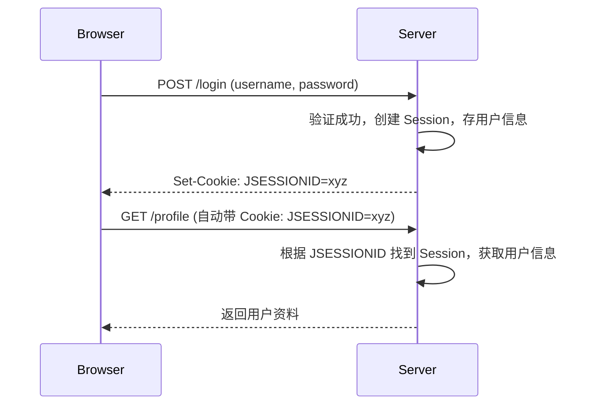
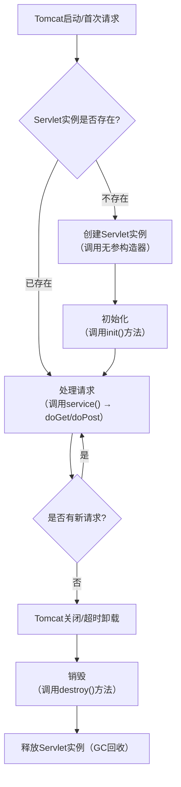
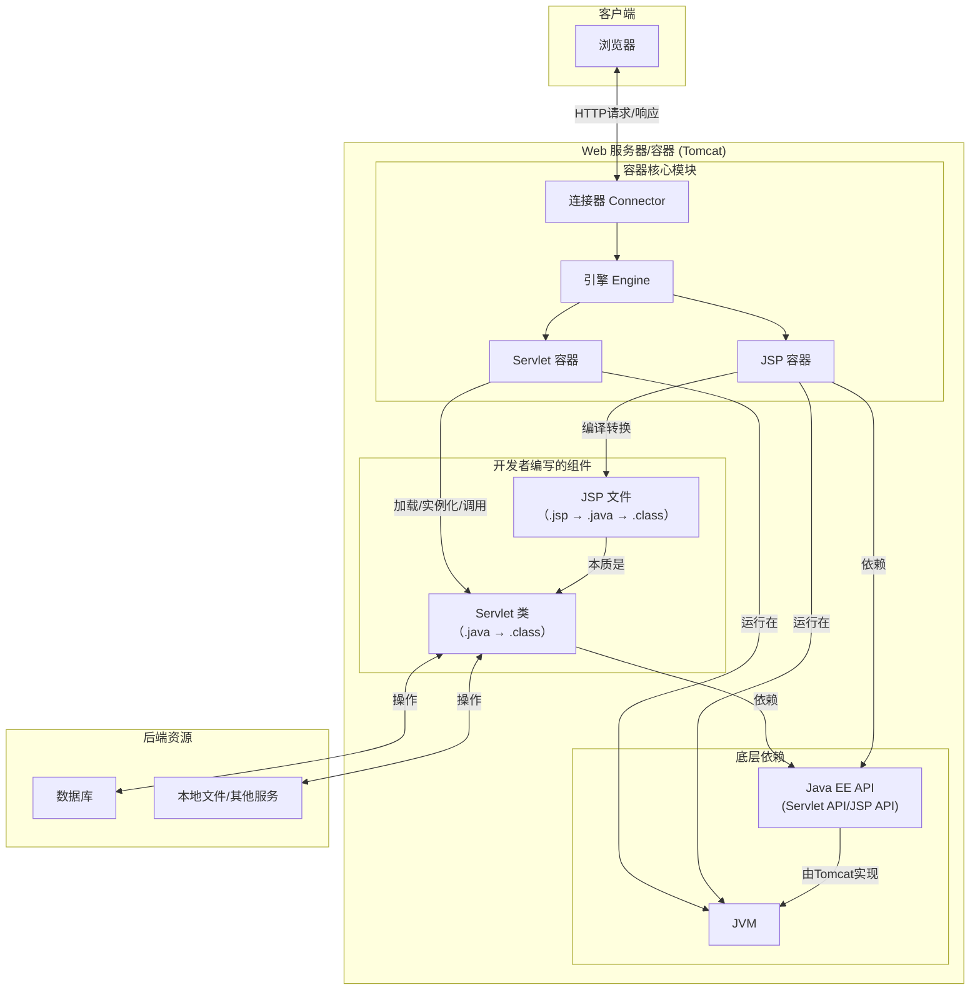
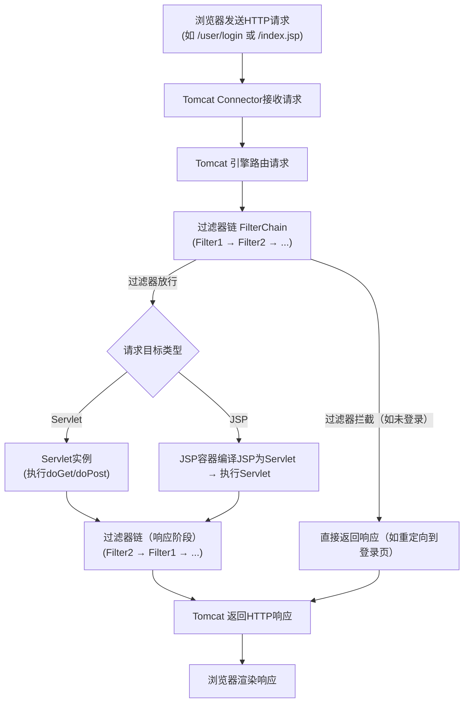

# Java网络编程面试题

## 基本概念

### HTTP请求方式有哪些？

#### 简要回答

- HTTP/1.1最初定义了8种核心请求方法

  （RFC 2616, 1999）：

  1. **GET**：获取资源，参数在URL中，安全且幂等。
  2. **POST**：提交数据（如表单数据），可能修改服务器状态。
  3. **PUT**：全量更新资源，幂等。
  4. **DELETE**：删除资源，幂等。
  5. **HEAD**：类似GET，仅返回响应头。
  6. **OPTIONS**：查询服务器支持的请求方法。
  7. **TRACE**：回显请求（因安全风险通常禁用）。
  8. **CONNECT**：建立代理隧道（如HTTPS）。

- 注意事项：

  1. **PATCH** 是后续通过 RFC 5789（2010）添加的扩展方法，**不属于 HTTP/1.1 最初定义的方法**。

#### 详细回答

##### HTTP/1.1 最初定义的 8种核心请求方法

1. GET：
   - **作用**：请求指定资源，参数通过URL传递。
   - **特点**：**安全**（不修改服务器资源）、**幂等**（多次请求结果一致）、**可缓存**（响应可被浏览器或代理缓存）。
   - **场景**：数据查询、页面加载。
2. POST：
   - **作用**：提交数据（请求体携带数据）。
   - **特点**：**不安全**（可能修改服务器状态，eg: 新增订单）、**不幂等**（重复提交可能产生不同结果，eg: 多次创建订单）。
   - **场景**：表单提交、触发业务逻辑。
3. PUT：
   - **作用**：全量更新资源（客户端需提供完整数据）。
   - **特点**：**幂等**（多次更新结果一致，如重复更新同一资源）、**不安全**（可能覆盖其他用户的修改）。
   - **场景**：用户信息全量更新。
4. DELETE：
   - **作用**：删除指定资源。
   - **特点**：**幂等**（多次删除同一资源效果相同，如资源不存在时返回相同状态）、**不安全**（直接修改服务器状态）。
   - **场景**：删除文章、用户等资源。
5. HEAD：
   - **作用**：与GET类似，但服务器不返回响应体，仅返回响应头。
   - **特点**：**轻量**（节省带宽，用于检查资源是否存在或是否更新，如**Last-Modified**）、**安全**、**幂等**。
   - **场景**：检查资源是否存在或更新，eg: 验证链接有效性、资源缓存状态。
6. OPTIONS：
   - **作用**：查询服务器支持的请求方法，或检查跨域请求权限。
   - **特点**：**预检请求**：浏览器自动发送OPTIONS请求进行CORS验证。
   - **场景**：跨域API调用前的预检请求。
7. TRACE：
   - **作用**：回显客户端请求（用于调试）。
   - **特点**：**易引发安全风险**（如XST攻击），通常禁用。
8. CONNECT：
   - **作用**：建立代理隧道（如HTTPS）。
   - **特点**：由服务器/代理处理，**不直接暴露给业务层**。

#### 扩展方法（非HTTP/1.1原生）

1. PATCH：
   - **说明**：来自RFC 5789（2010），注意，RFC 5789（2010）是独立扩展规范，仅新增PATCH方法，需显式支持，不涉及HTTP版本更新。
   - **作用**：局部更新资源，需定义数据格式（如JSON Patch），客户端仅提交需修改的字段。
   - **特点**：**非幂等**（多次局部更新可能导致不同结果）、**灵活**（需定义数据格式）。
   - **场景**：修改用户的部分信息（如昵称）。


### GET 和 POST 请求的核心区别

`GET` 和 `POST` 是 HTTP 协议中**最常用的两种请求方法**，核心区别是：**GET 用于「获取数据」，POST 用于「提交/修改数据」**，在使用场景、数据传输、安全性等方面有明确差异。

我整理了**最实用、面试常考、开发必懂**的区别，不绕弯子：

---

#### 一、核心区别速查表

| 对比项        | GET                                        | POST                                 |
| ------------- | ------------------------------------------ | ------------------------------------ |
| **核心用途**  | **查询、获取数据**（只读）                 | **提交、新增、修改数据**（写操作）   |
| **数据位置**  | 拼接在 **URL 地址栏** 中                   | 放在 **请求体（body）** 里           |
| **数据大小**  | 有限制（浏览器/服务器限制，约 2KB）        | 无大小限制（可传大文件、大数据）     |
| **安全性**    | 低（数据明文可见）                         | 相对高（数据不直接暴露）             |
| **缓存**      | 会被浏览器**自动缓存**                     | 默认**不缓存**                       |
| **书签/历史** | 可收藏为书签、保留在历史记录               | 不可收藏、不保留                     |
| **后退/刷新** | **无影响**（无害）                         | 会**重新提交数据**（浏览器会提示）   |
| **编码类型**  | 只支持 `application/x-www-form-urlencoded` | 支持多种编码（可传文件、JSON、表单） |
| **幂等性**    | 幂等（多次请求结果一致）                   | 非幂等（多次请求可能重复提交）       |

---

#### 二、关键区别详细解释

##### 1. 数据传输位置（最直观区别）

- **GET**：数据直接拼在 URL 后面  
  示例：`https://api.com/search?keyword=手机&page=1`
- **POST**：数据放在**请求体**中，地址栏看不到  
  适合传密码、表单、JSON、文件等隐私/大量数据

##### 2. 安全性

- **GET 绝对不能传敏感信息**  
  密码、token、身份证号用 GET 会直接暴露在地址栏、历史记录、服务器日志里。
- **POST 相对安全**  
  数据不暴露，但**不是加密**，抓包依然能看到，真正安全需要用 **HTTPS**。

##### 3. 数据大小限制

- **GET**：受 URL 长度限制，一般**不能超过 2KB**。
- **POST**：理论无限制，可传图片、视频、大表单。

##### 4. 缓存与历史记录

- **GET**：浏览器会自动缓存结果，适合查询接口（如列表、详情）。
- **POST**：默认不缓存，适合提交订单、登录、发布内容。

##### 5. 后退/刷新行为

- 页面用 GET 请求：刷新/后退**不会重复提交**，安全无害。
- 页面用 POST 请求：刷新会弹出**「确认重新提交表单」**，容易重复下单、重复发布。

---

#### 三、最标准的使用场景

##### ✅ 什么时候用 GET？

- 查询数据、搜索、分页、获取详情
- 页面跳转、接口获取静态数据
- 可被缓存、可收藏为书签的请求

##### ✅ 什么时候用 POST？

- 登录、注册（传密码）
- 提交表单、发布文章、下单支付
- 上传文件、传 JSON 大数据
- 会修改服务器数据的操作

---

#### 四、两个重要误区（面试常问）

1. **误区：POST 比 GET 更安全，是因为加密了**  
   ❌ 错！两者都是明文传输，**POST 只是不暴露在地址栏**，真正加密必须用 HTTPS。

2. **误区：GET 只能传文本，POST 能传所有类型**  
   ❌ 错！本质是协议设计用途不同，不是技术能力限制。

3. **误区：GET 比 POST 性能更好**  
   ⚠️ 半对：GET 可以缓存，所以**重复请求更快**，但单次请求速度几乎无差别。

---

#### 五、一句话总结

**GET 是「查数据」，把参数放地址栏，不安全、有大小限制、会缓存；  
POST 是「交数据」，把参数放请求体，相对安全、无限制、不缓存。**

---

#### 总结

1. **核心用途**：GET 查数据，POST 交数据；
2. **数据位置**：GET 在 URL，POST 在请求体；
3. **安全禁忌**：密码/隐私绝对不能用 GET；
4. **开发原则**：查询用 GET，修改/提交用 POST。


### HTTP 常见状态码

HTTP 状态码分为**5大类**，**第一位数字代表类型**，非常好记。我给你整理**最常考、最常用**的，不废话、直接背。

#### 一、状态码分类（记住第一位即可）

- **1xx**：信息性 — 请求正在处理
- **2xx**：成功 — 请求正常处理完毕
- **3xx**：重定向 — 需要进一步操作
- **4xx**：客户端错误 — 前端/请求方问题
- **5xx**：服务器错误 — 后端/服务问题

---

#### 二、高频必背状态码（面试必考）

##### 2xx 成功

###### **200 OK**

- 请求**完全成功**，正常返回数据。
- GET 请求最常见。

###### **201 Created**

- 创建资源成功（如：注册、新建文章、新增数据）。
- RESTful 接口常用。

###### **204 No Content**

- 请求成功，但**没有返回内容**（如删除接口）。

---

#### 3xx 重定向

###### **301 Moved Permanently**

- **永久重定向**。
- 旧网址废弃，浏览器会缓存新地址。

###### **302 Found / 307 Temporary Redirect**

- **临时重定向**。
- 本次跳过去，以后还能用原地址。

###### **304 Not Modified**

- **资源未修改**，使用缓存。
- 协商缓存命中，非常常见。

---

##### 4xx 客户端错误（前端/用户问题）

###### **400 Bad Request**

- **请求参数错误**、格式不对、后端无法理解。

###### **401 Unauthorized**

- **未认证**：没登录、token 无效/过期。

###### **403 Forbidden**

- **已登录，但无权限**（禁止访问）。
- 注意：401=没登录；403=登录了但没权限。

###### **404 Not Found**

- 资源不存在、接口不存在、路径错误。

###### **405 Method Not Allowed**

- 请求方法不允许（如接口只支持 POST，你用 GET）。

###### **429 Too Many Requests**

- 请求过多，**限流**。

---

##### 5xx 服务器错误（后端问题）

###### **500 Internal Server Error**

- **服务器内部错误**（代码报错、空指针、异常）。

###### **502 Bad Gateway**

- 网关错误（Nginx 转发失败、服务挂了）。

###### **503 Service Unavailable**

- 服务不可用（过载、维护中）。

###### **504 Gateway Timeout**

- 网关超时（后端接口响应太慢）。

---

#### 三、极简记忆口诀（面试秒答）

- **200 成功**
- **201 创建**
- **301 永久移**
- **302 临时移**
- **304 用缓存**
- **400 参数错**
- **401 未登录**
- **403 没权限**
- **404 找不到**
- **500 服务器炸**
- **502 网关挂**
- **503 超负载**
- **504 超时了**

---

### HTTP 常见请求头 + 响应头

我直接给你**最常用、最常问**的，分类清晰、一看就懂、背完就能面试。

#### 一、通用头（请求+响应都能用）

1. **Content-Type**
    数据类型（格式）。
    例：`application/json`、`form`、`text/html`
2. **Content-Length**
    数据长度（字节）。
3. **Connection**
    连接管理：`keep-alive` 长连接 / `close` 关闭。
4. **Cache-Control**
    缓存控制：`no-cache`、`max-age=xxx`、`no-store`。

#### 二、请求头 Request Headers（客户端→服务器）

##### 1. 客户端标识

- **User-Agent**
    浏览器/设备信息（手机、Chrome、版本）。
- **Host**
    目标主机域名+端口（**HTTP/1.1 必须带**）。

##### 2. 认证权限

- **Authorization**
    存放 Token、Bearer 令牌、身份凭证。

##### 3. 缓存相关（高频）

- **If-Modified-Since**
    问服务器：文件从某个时间后改过吗？
- **If-None-Match**
    带上 ETag，问资源是否变化。

##### 4. 内容格式

- **Accept**
    客户端希望接收的数据类型：`application/json`
- **Accept-Encoding**
    支持压缩：`gzip, deflate`
- **Accept-Language**
    语言：`zh-CN, en`

##### 5. 跨域相关（必问）

- **Origin**
    当前源（协议+域名+端口），跨域时必带。
- **Access-Control-Request-Headers**
    预检请求：告诉我允许哪些头。
- **Access-Control-Request-Method**
    预检请求：我要用什么方法（GET/POST）。

##### 6. 其他

- **Referer**
    从哪个页面跳转过来的（防盗链常用）。
- **Cookie**
    携带本地 Cookie。

#### 三、响应头 Response Headers（服务器→客户端）

##### 1. 缓存相关（必问）

- **Cache-Control**
    强制缓存策略。
- **Expires**
    过期时间（老版本）。
- **Last-Modified**
    资源最后修改时间。
- **ETag**
    资源唯一标识（比 Last-Modified 更准确）。

##### 2. 跨域（超级高频）

- **Access-Control-Allow-Origin**
    允许哪些源跨域（`*` 或具体域名）。
- **Access-Control-Allow-Headers**
    允许携带哪些头。
- **Access-Control-Allow-Methods**
    允许哪些请求方法 GET/POST/PUT/DELETE。
- **Access-Control-Allow-Credentials**
    是否允许携带 Cookie。

##### 3. Cookie 相关

- **Set-Cookie**
    服务器种下 Cookie。

##### 4. 服务信息

- **Server**
    服务器软件 Nginx、Apache。
- **Content-Encoding**
    响应压缩方式 gzip。
- **Location**
    重定向地址（配合 301/302）。

---

#### 四、极简高频总结（面试直接背）

- **Host**：目标主机
- **User-Agent**：客户端信息
- **Authorization**：Token
- **Content-Type**：数据格式
- **Accept**：希望返回格式
- **Origin**：跨域源
- **Referer**：来源页面
- **Cache-Control / If-Modified-Since / ETag**：缓存
- **Set-Cookie**：种Cookie
- **Access-Control-Allow-***：跨域全部

---

如果你要，我可以给你整理**一套 HTTP 三连问标准答案**：
GET/POST + 状态码 + 请求头 → 面试高频组合题，直接背就能满分。

------

##  一、基础概念类

1. **什么是 Java 网络编程？有哪些常见协议？**
   ➤ 考点：TCP、UDP、HTTP、FTP、SMTP 等；Socket 概念。
2. **TCP 和 UDP 的区别是什么？分别适合哪些场景？**
   ➤ 考点：可靠性、连接方式、速度、使用场景（如文件传输 vs 实时通信）。
3. **在 Java 中如何使用 Socket 实现 TCP 通信？**
   ➤ 考点：`Socket`、`ServerSocket`、输入输出流、客户端与服务端模型。
4. **DatagramSocket 与 DatagramPacket 的作用是什么？**
   ➤ 考点：UDP 编程模型、无连接传输。
5. **InetAddress 类的主要作用是什么？如何获取主机名和 IP 地址？**
   ➤ 考点：`InetAddress.getLocalHost()`、`getByName()`、`getHostAddress()`。
6. **Java 如何实现多线程 Socket 服务端？**
   ➤ 考点：每连接一个线程、线程池优化、阻塞 IO 的缺点。
7. **什么是阻塞 I/O 和非阻塞 I/O？Java 是如何支持的？**
   ➤ 考点：BIO、NIO、AIO 区别；Java NIO 包。
8. **NIO 中的 Channel、Buffer、Selector 分别有什么作用？**
   ➤ 考点：NIO 核心三件套机制。
9. **Java NIO 如何实现多路复用？**
   ➤ 考点：`Selector`、事件驱动模型、操作系统底层 `epoll`。
10. **AIO（Asynchronous I/O）与 NIO 的区别是什么？**
     ➤ 考点：异步 vs 非阻塞，回调机制。

------

### 1. **什么是 Java 网络编程？有哪些常见协议？**

**答：**
 Java 网络编程是指利用 Java 提供的 `java.net` 包实现不同主机间通过网络进行通信的过程。核心目标是**在进程间传输数据**。

常见网络通信协议：

- **TCP（Transmission Control Protocol）**：面向连接、可靠传输；
- **UDP（User Datagram Protocol）**：无连接、速度快；
- **HTTP / HTTPS**：应用层协议，基于 TCP；
- **FTP**：文件传输；
- **SMTP / POP3**：邮件传输。

**关键类：**

- `Socket` / `ServerSocket`：TCP 通信；
- `DatagramSocket` / `DatagramPacket`：UDP 通信；
- `InetAddress`：IP 解析；
- `URL`、`URLConnection`：HTTP 通信。


你对Java网络编程的核心定义和关键类总结得很精准，完全抓住了这部分知识的重点。

在此基础上，可以补充协议的核心应用场景和类的工作逻辑，让内容更完整。

#### 一、常见协议及应用场景补充

不同协议因特性差异，适用场景截然不同，具体如下：

1. **TCP**：适用于对数据可靠性要求高的场景，如文件下载、即时通讯、银行转账等。它通过三次握手建立连接，四次挥手断开连接，能确保数据不丢失、不重复。
2. **UDP**：适用于对实时性要求高于可靠性的场景，如视频通话、语音聊天、网络广播等。它无需建立连接，直接发送数据，传输效率高但可能存在丢包。
3. **HTTP/HTTPS**：HTTP常用于普通网页浏览、API接口调用；HTTPS在HTTP基础上增加了SSL/TLS加密，适用于敏感数据传输，如电商支付、用户登录。
4. **FTP**：专门用于服务器与客户端之间的文件上传和下载，比如网站管理员向服务器上传网页文件。
5. **SMTP/POP3**：SMTP负责将邮件从发件人服务器发送到收件人服务器；POP3负责收件人从服务器下载邮件到本地客户端。

#### 二、关键类工作逻辑说明

1. **Socket/ServerSocket**：ServerSocket负责在服务端监听指定端口，等待客户端连接；Socket在客户端发起连接请求，与服务端的ServerSocket建立TCP连接后，双方即可通过输入流和输出流传输数据。
2. **DatagramSocket/DatagramPacket**：DatagramSocket用于发送和接收UDP数据报；DatagramPacket则封装了要发送或接收的数据、目标地址和端口，数据以数据包的形式在网络中传输。
3. **InetAddress**：无法通过new关键字创建实例，需通过`getByName(String host)`等静态方法获取，可用于获取主机的IP地址（如`getHostAddress()`）和主机名（如`getHostName()`）。
4. **URL、URLConnection**：URL代表统一资源定位符，如`http://www.example.com`，可直接打开连接；URLConnection是URL打开连接后的实例，能设置请求头、获取响应头，并通过流读取服务器返回的数据。

#### Java 网络编程 TCP 与 UDP 核心类体系

```
├─ TCP 通信（面向连接，可靠传输）
│  ├─ 服务端核心类：ServerSocket（监听端口，接收客户端连接）
│  │  ├─ 核心方法：accept()（阻塞等待，返回与客户端通信的 Socket）
│  │  ├─ 核心方法：bind()（绑定指定端口，也可通过构造方法直接绑定）
│  │  └─ 核心方法：close()（关闭服务端，释放端口资源）
│  │
│  └─ 客户端与服务端通信类：Socket（建立连接，传输数据）
│     ├─ 构造方法：Socket(String host, int port)（指定服务端 IP 和端口，发起连接）
│     ├─ 核心方法：getInputStream()（获取输入流，读取对方数据）
│     ├─ 核心方法：getOutputStream()（获取输出流，向对方发送数据）
│     └─ 核心方法：close()（关闭连接，释放资源）
│
└─ UDP 通信（无连接，不可靠传输）
   ├─ 发送与接收统一类：DatagramSocket（发送、接收数据报，绑定端口）
   │  ├─ 构造方法：DatagramSocket()（不绑定端口，系统分配临时端口，常用于发送端）
   │  ├─ 构造方法：DatagramSocket(int port)（绑定指定端口，常用于接收端）
   │  ├─ 核心方法：send(DatagramPacket p)（发送封装好的数据报）
   │  ├─ 核心方法：receive(DatagramPacket p)（阻塞等待，接收数据报存入参数）
   │  └─ 核心方法：close()（关闭，释放端口资源）
   │
   └─ 数据封装类：DatagramPacket（封装数据、目标地址、端口，承载 UDP 数据）
      ├─ 构造方法（接收用）：DatagramPacket(byte[] buf, int length)（创建空数据包，接收数据存入 buf）
      ├─ 构造方法（发送用）：DatagramPacket(byte[] buf, int length, InetAddress addr, int port)（封装数据、目标地址和端口）
      ├─ 核心方法：getData()（获取数据包中的字节数组数据）
      └─ 核心方法：getLength()（获取实际存储的数据长度，避免缓冲区空字符干扰）

```


---

#### 在Java中如何实现TCP网络编程？

在 Java 中实现 TCP 网络编程需基于 `Socket`（客户端）和 `ServerSocket`（服务端），核心流程是**建立连接→传输数据→关闭连接**。以下是详细步骤和代码示例：

##### **一、TCP 通信核心流程**

1. **服务端**：  
   - 创建 `ServerSocket` 并绑定端口，监听客户端连接。  
   - 调用 `accept()` 阻塞等待客户端连接，返回 `Socket` 对象（与客户端的连接）。  
   - 通过 `Socket` 获取输入流/输出流，读取/发送数据。  
   - 通信结束后关闭流和 `Socket`、`ServerSocket`。  

2. **客户端**：  
   - 创建 `Socket` 并指定服务端 IP 和端口，发起连接。  
   - 通过 `Socket` 获取输入流/输出流，发送/读取数据。  
   - 通信结束后关闭流和 `Socket`。  

##### **二、代码示例（单客户端通信）**

###### 1. 服务端（Server）

```java
import java.io.*;
import java.net.ServerSocket;
import java.net.Socket;

public class TCPServer {
    public static void main(String[] args) {
        ServerSocket serverSocket = null;
        Socket socket = null;
        BufferedReader in = null;
        PrintWriter out = null;

        try {
            // 1. 创建ServerSocket，绑定端口8888
            serverSocket = new ServerSocket(8888);
            System.out.println("服务端启动，等待客户端连接...");

            // 2. 阻塞等待客户端连接（返回与客户端的Socket）
            socket = serverSocket.accept();
            System.out.println("客户端已连接：" + socket.getInetAddress().getHostAddress());

            // 3. 获取输入流（读取客户端数据）
            in = new BufferedReader(
                new InputStreamReader(socket.getInputStream(), "UTF-8")
            );

            // 4. 获取输出流（向客户端发送数据）
            out = new PrintWriter(
                new OutputStreamWriter(socket.getOutputStream(), "UTF-8"), 
                true  // 自动刷新缓冲区
            );

            // 5. 通信过程：读取客户端消息并回复
            String clientMsg;
            while ((clientMsg = in.readLine()) != null) {
                System.out.println("收到客户端消息：" + clientMsg);
                if ("exit".equals(clientMsg)) { // 约定退出指令
                    out.println("服务端已收到退出请求，断开连接");
                    break;
                }
                out.println("服务端已收到：" + clientMsg); // 回复客户端
            }

        } catch (IOException e) {
            e.printStackTrace();
        } finally {
            // 6. 关闭资源（逆序关闭）
            try {
                if (out != null) out.close();
                if (in != null) in.close();
                if (socket != null) socket.close();
                if (serverSocket != null) serverSocket.close();
                System.out.println("服务端关闭");
            } catch (IOException e) {
                e.printStackTrace();
            }
        }
    }
}
```

###### 2. 客户端（Client）

```java
import java.io.*;
import java.net.Socket;

public class TCPClient {
    public static void main(String[] args) {
        Socket socket = null;
        BufferedReader in = null;
        PrintWriter out = null;
        BufferedReader consoleIn = null;

        try {
            // 1. 创建Socket，连接服务端（IP为localhost，端口8888）
            socket = new Socket("localhost", 8888);
            System.out.println("已连接服务端");

            // 2. 获取输入流（读取服务端回复）
            in = new BufferedReader(
                new InputStreamReader(socket.getInputStream(), "UTF-8")
            );

            // 3. 获取输出流（向服务端发送数据）
            out = new PrintWriter(
                new OutputStreamWriter(socket.getOutputStream(), "UTF-8"), 
                true  // 自动刷新
            );

            // 4. 从控制台读取用户输入并发送
            consoleIn = new BufferedReader(new InputStreamReader(System.in));
            String userInput;
            while (true) {
                System.out.print("请输入消息（输入exit退出）：");
                userInput = consoleIn.readLine();
                out.println(userInput); // 发送到服务端

                // 读取服务端回复
                String serverMsg = in.readLine();
                System.out.println("服务端回复：" + serverMsg);

                if ("exit".equals(userInput)) {
                    break;
                }
            }

        } catch (IOException e) {
            e.printStackTrace();
        } finally {
            // 5. 关闭资源
            try {
                if (consoleIn != null) consoleIn.close();
                if (out != null) out.close();
                if (in != null) in.close();
                if (socket != null) socket.close();
                System.out.println("客户端关闭");
            } catch (IOException e) {
                e.printStackTrace();
            }
        }
    }
}
```

##### **三、多客户端通信（服务端优化）**

上述示例仅支持单客户端连接。若需同时处理多个客户端，服务端需为每个连接启动**独立线程**：

```java
// 多线程服务端（核心修改）
public class MultiThreadTCPServer {
    public static void main(String[] args) throws IOException {
        ServerSocket serverSocket = new ServerSocket(8888);
        System.out.println("多线程服务端启动，等待客户端连接...");

        while (true) { // 循环接收客户端
            Socket socket = serverSocket.accept(); // 阻塞等待新连接
            // 为每个客户端创建线程处理通信
            new Thread(() -> {
                try (
                    BufferedReader in = new BufferedReader(
                        new InputStreamReader(socket.getInputStream(), "UTF-8")
                    );
                    PrintWriter out = new PrintWriter(
                        new OutputStreamWriter(socket.getOutputStream(), "UTF-8"), 
                        true
                    )
                ) {
                    System.out.println("新客户端连接：" + socket.getInetAddress());
                    String msg;
                    while ((msg = in.readLine()) != null) {
                        System.out.println("客户端" + socket.getPort() + "：" + msg);
                        out.println("已收到：" + msg);
                        if ("exit".equals(msg)) break;
                    }
                } catch (IOException e) {
                    e.printStackTrace();
                } finally {
                    try {
                        socket.close();
                        System.out.println("客户端" + socket.getPort() + "断开连接");
                    } catch (IOException e) {
                        e.printStackTrace();
                    }
                }
            }).start();
        }
    }
}
```

##### **四、关键注意事项**

1. **流的关闭顺序**：先关闭输出流，再关闭输入流，最后关闭 `Socket`/`ServerSocket`。  
2. **编码问题**：使用 `InputStreamReader`/`OutputStreamWriter` 时指定编码（如 UTF-8），避免乱码。  
3. **异常处理**：网络操作可能抛出 `IOException`，必须捕获或声明抛出。  
4. **多线程资源**：多客户端场景需注意线程安全（如共享数据需加锁）。  

通过以上方式，即可实现基于 TCP 的可靠网络通信。如果需要更复杂的场景（如 BIO/NIO 模型对比），可以进一步探讨。


#### 在Java中如何实现UDP网络编程？


在 Java 中实现 UDP 网络编程需基于 `DatagramSocket`（用于发送和接收数据报）和 `DatagramPacket`（封装数据、地址和端口），核心特点是**无连接、数据以数据包形式传输**。以下是详细步骤和代码示例：

##### **一、UDP 通信核心流程**

1. **发送端**：  
   - 创建 `DatagramSocket`（无需绑定端口，也可指定端口）。  
   - 准备要发送的数据（字节数组），封装为 `DatagramPacket`（需指定目标 IP 和端口）。  
   - 通过 `DatagramSocket` 发送数据包。  
   - 关闭 `DatagramSocket`。  

2. **接收端**：  
   - 创建 `DatagramSocket` 并绑定固定端口（用于监听数据）。  
   - 创建空的 `DatagramPacket`（用于接收数据，需指定缓冲区大小）。  
   - 调用 `receive()` 阻塞等待接收数据包，数据会存入缓冲区。  
   - 从 `DatagramPacket` 中解析数据、发送方地址和端口。  
   - 关闭 `DatagramSocket`。  

##### **二、代码示例（单向通信）**

###### 1. 接收端（Receiver）

```java
import java.net.DatagramPacket;
import java.net.DatagramSocket;

public class UDPReceiver {
    public static void main(String[] args) {
        DatagramSocket socket = null;
        try {
            // 1. 创建DatagramSocket，绑定端口9999（固定端口用于接收）
            socket = new DatagramSocket(9999);
            System.out.println("接收端启动，等待数据...");

            // 2. 创建缓冲区（字节数组）和空数据包
            byte[] buffer = new byte[1024]; // 缓冲区大小（根据实际需求设置）
            DatagramPacket packet = new DatagramPacket(buffer, buffer.length);

            // 3. 阻塞等待接收数据（数据存入buffer，packet会记录发送方信息）
            socket.receive(packet);

            // 4. 解析数据：从packet中提取字节数组，转为字符串
            String data = new String(
                packet.getData(), 
                0, 
                packet.getLength() // 实际接收的字节数（避免缓冲区空字符）
            );

            // 5. 打印发送方信息和数据
            System.out.println("收到来自 " + 
                packet.getAddress().getHostAddress() + ":" + 
                packet.getPort() + " 的数据：" + data);

        } catch (Exception e) {
            e.printStackTrace();
        } finally {
            // 6. 关闭Socket
            if (socket != null) {
                socket.close();
            }
        }
    }
}
```

##### 2. 发送端（Sender）

```java
import java.net.DatagramPacket;
import java.net.DatagramSocket;
import java.net.InetAddress;

public class UDPSender {
    public static void main(String[] args) {
        DatagramSocket socket = null;
        try {
            // 1. 创建DatagramSocket（不指定端口，系统会分配临时端口）
            socket = new DatagramSocket();

            // 2. 准备要发送的数据（转为字节数组）
            String msg = "Hello, UDP!";
            byte[] data = msg.getBytes("UTF-8"); // 指定编码，避免乱码

            // 3. 封装数据包：指定目标IP（localhost）、端口（9999）和数据
            DatagramPacket packet = new DatagramPacket(
                data, 
                data.length, 
                InetAddress.getByName("localhost"), 
                9999
            );

            // 4. 发送数据包
            socket.send(packet);
            System.out.println("数据发送完成");

        } catch (Exception e) {
            e.printStackTrace();
        } finally {
            // 5. 关闭Socket
            if (socket != null) {
                socket.close();
            }
        }
    }
}
```

##### **三、双向通信示例（模拟对话）**

UDP 也可实现双向通信，只需在接收端收到数据后，根据数据包中的发送方地址和端口，回复数据即可。

###### 1. 服务端（既能接收也能回复）

```java
import java.net.DatagramPacket;
import java.net.DatagramSocket;

public class UDPServer {
    public static void main(String[] args) throws Exception {
        DatagramSocket socket = new DatagramSocket(8888);
        byte[] buffer = new byte[1024];

        while (true) { // 循环接收
            // 接收客户端数据
            DatagramPacket receivePacket = new DatagramPacket(buffer, buffer.length);
            socket.receive(receivePacket); // 阻塞等待

            // 解析客户端数据和地址
            String clientMsg = new String(
                receivePacket.getData(), 0, receivePacket.getLength(), "UTF-8"
            );
            System.out.println("客户端说：" + clientMsg);

            // 准备回复数据
            String reply = "服务端收到：" + clientMsg;
            byte[] replyData = reply.getBytes("UTF-8");

            // 回复客户端（使用客户端的地址和端口）
            DatagramPacket replyPacket = new DatagramPacket(
                replyData,
                replyData.length,
                receivePacket.getAddress(), // 客户端IP
                receivePacket.getPort()     // 客户端端口
            );
            socket.send(replyPacket);

            // 约定退出条件
            if ("exit".equals(clientMsg)) {
                System.out.println("服务端退出");
                break;
            }
        }
        socket.close();
    }
}
```

###### 2. 客户端（发送并接收回复）

```java
import java.net.DatagramPacket;
import java.net.DatagramSocket;
import java.net.InetAddress;
import java.util.Scanner;

public class UDPClient {
    public static void main(String[] args) throws Exception {
        DatagramSocket socket = new DatagramSocket(); // 临时端口
        Scanner scanner = new Scanner(System.in);

        while (true) {
            // 从控制台输入消息
            System.out.print("请输入消息（输入exit退出）：");
            String msg = scanner.nextLine();

            // 发送给服务端（IP：localhost，端口：8888）
            byte[] data = msg.getBytes("UTF-8");
            DatagramPacket sendPacket = new DatagramPacket(
                data, data.length, InetAddress.getByName("localhost"), 8888
            );
            socket.send(sendPacket);

            // 接收服务端回复
            byte[] replyBuffer = new byte[1024];
            DatagramPacket replyPacket = new DatagramPacket(replyBuffer, replyBuffer.length);
            socket.receive(replyPacket); // 阻塞等待回复

            String serverReply = new String(
                replyPacket.getData(), 0, replyPacket.getLength(), "UTF-8"
            );
            System.out.println("服务端回复：" + serverReply);

            // 退出条件
            if ("exit".equals(msg)) {
                break;
            }
        }
        scanner.close();
        socket.close();
    }
}
```

##### **四、UDP 关键特性与注意事项**

1. **无连接**：发送端和接收端无需建立连接，直接发送数据包，效率高但不可靠（可能丢包、乱序）。  
2. **数据包大小限制**：`DatagramPacket` 缓冲区大小有限制（通常不超过 65535 字节），过大的数据需分片传输。  
3. **阻塞与线程**：`receive()` 是阻塞方法，若需同时处理发送和接收，需使用多线程。  
4. **编码一致性**：发送和接收时需使用相同的字符编码（如 UTF-8），否则会出现乱码。  
5. **端口绑定**：接收端必须绑定固定端口，发送端可使用系统分配的临时端口。  


UDP 适用于实时性要求高（如视频通话、游戏数据）但可容忍少量丢包的场景。如果需要更深入的内容（如 UDP 可靠性优化），可以进一步探讨。

------

### 2. **TCP 和 UDP 的区别是什么？分别适合哪些场景？**

| 对比项   | TCP                              | UDP                        |
| -------- | -------------------------------- | -------------------------- |
| 连接方式 | 面向连接（三次握手）             | 无连接                     |
| 可靠性   | 可靠传输（校验、重传、流量控制） | 不可靠，可能丢包           |
| 速度     | 较慢                             | 较快                       |
| 开销     | 较大                             | 较小                       |
| 适用场景 | 文件传输、邮件、HTTP、数据库通信 | 视频流、语音通话、实时游戏 |

#### 1.TCP和UDP的概念：

- **TCP**：通过三次握手**建立连接**，提供**端到端的可靠传输**，确保数据无差错、不丢失、按序到达。
- **UDP**：直接发送数据包，**不建立连接**，**不保证传输质量**，但延迟极低，适用于**实时性要求高**的场景。

#### 2.TCP和UDP的区别：

- **连接方式**：
  **TCP**：TCP需先通过**三次握手建立连接**（SYN、SYN-ACK、ACK），数据传输完成后，再通过**四次挥手释放连接**（FIN、ACK、FIN-ACK、ACK）。
  **UDP**：UDP直接发送数据包，**无需握手和挥手**。
- **可靠性**：
  **TCP**：TCP通过确认应答（ACK）、超时重传、数据校验（校验和）**确保数据可靠**。
  **UDP**：UDP无重传机制，发送即丢弃，**可靠性由应用层处理**（如视频丢帧不影响整体）。
- **传输顺序**：
  **TCP**：TCP通过序列号（Sequence Number）保证接收端**按序**重组数据。
  **UDP**：UDP不维护数据顺序，接收端**可能乱序接收**（如VoIP通话中语音包顺序错乱）。
- **传输速度**：
  **TCP**：TCP因连接管理、流量控制、重传等机制，**传输延迟较高**。
  **UDP**：UDP无控制开销，**传输速度极快**，适合实时应用（如在线游戏、直播）。
- **头部开销**：
  **TCP**：TCP**头部最小20字节**（含选项字段可扩展），包含序列号、确认号、窗口大小等字段。
  **UDP**：UDP**头部固定8字节**（仅源/目标端口、长度、校验和）。
- **流量控制**：
  **TCP**：TCP通过**滑动窗口**动态调整发送速率，避免接收方缓冲区溢出。
  **UDP**：UDP**无流量控制**，可能因接收方处理不及时导致丢包。
- **拥塞控制**：
  **TCP**：TCP通过**慢启动、拥塞避免、快重传**等算法避免网络拥堵。
  **UDP**：UDP**无拥塞控制**，可能加剧拥塞（如P2P下载中的UDP Flood攻击）。
- **应用场景**：
  **TCP**：HTTP/HTTPS、SMTP（邮件）、FTP（文件传输）。
  **UDP**：DNS查询、视频会议（Zoom）、在线游戏（UDP+应用层可靠性增强）。


------

### 3. **在 Java 中如何使用 Socket 实现 TCP 通信？**

**核心步骤：**

- **服务端：**

  ```java
  ServerSocket server = new ServerSocket(8080);
  Socket client = server.accept();  // 等待客户端连接
  InputStream in = client.getInputStream();
  OutputStream out = client.getOutputStream();
  // 读写数据
  client.close();
  server.close();
  ```

- **客户端：**

  ```java
  Socket socket = new Socket("localhost", 8080);
  OutputStream out = socket.getOutputStream();
  InputStream in = socket.getInputStream();
  socket.close();
  ```

**考点：** TCP 通信是**全双工**的，建立连接后可双向收发数据。

------

### 4. **DatagramSocket 与 DatagramPacket 的作用是什么？**

**答：**

- `DatagramSocket`：用于发送和接收 UDP 数据包；
- `DatagramPacket`：表示一个具体的 UDP 数据报。

**示例：**

```java
// 发送端
DatagramSocket socket = new DatagramSocket();
byte[] data = "Hello UDP".getBytes();
InetAddress address = InetAddress.getByName("localhost");
DatagramPacket packet = new DatagramPacket(data, data.length, address, 8888);
socket.send(packet);

// 接收端
DatagramSocket receiver = new DatagramSocket(8888);
byte[] buf = new byte[1024];
DatagramPacket recvPacket = new DatagramPacket(buf, buf.length);
receiver.receive(recvPacket);
```

------

### 5. **InetAddress 类的主要作用是什么？如何获取主机名和 IP 地址？**

**答：**
 `InetAddress` 用于表示 IP 地址（IPv4 或 IPv6）。

**常用方法：**

```java
InetAddress local = InetAddress.getLocalHost();
System.out.println(local.getHostName());     // 主机名
System.out.println(local.getHostAddress());  // IP 地址

InetAddress remote = InetAddress.getByName("www.google.com");
System.out.println(remote.getHostAddress());
```

------

### 6. **Java 如何实现多线程 Socket 服务端？**

**答：**
 每当 `ServerSocket.accept()` 接收到一个连接，就启动一个新线程处理该客户端通信。

**示例：**

```java
ServerSocket server = new ServerSocket(8080);
while (true) {
    Socket client = server.accept();
    new Thread(() -> handleClient(client)).start();
}
```

或使用线程池：

```java
ExecutorService pool = Executors.newFixedThreadPool(10);
while (true) {
    Socket client = server.accept();
    pool.execute(() -> handleClient(client));
}
```

**缺点：** BIO 阻塞模式下线程多、资源开销大 → 可用 NIO 或 Netty 优化。

------

### 7. **什么是阻塞 I/O 和非阻塞 I/O？Java 是如何支持的？**

| 模式                        | 描述                                     | Java 实现                                     |
| --------------------------- | ---------------------------------------- | --------------------------------------------- |
| **BIO（Blocking I/O）**     | 每次 I/O 调用阻塞线程，直到完成          | `Socket` / `ServerSocket`                     |
| **NIO（Non-blocking I/O）** | 线程可同时监控多个通道，I/O 就绪时再操作 | `java.nio`                                    |
| **AIO（Asynchronous I/O）** | 完全异步回调机制，操作系统完成后通知应用 | `java.nio.channels.AsynchronousSocketChannel` |

------

### 8. **NIO 中的 Channel、Buffer、Selector 分别有什么作用？**

| 组件         | 作用                                                      |
| ------------ | --------------------------------------------------------- |
| **Channel**  | 双向数据通道，替代流（如 `FileChannel`, `SocketChannel`） |
| **Buffer**   | 数据缓冲区（如 `ByteBuffer`），支持读写模式切换           |
| **Selector** | 多路复用器，单线程可监控多个通道事件（如读、写、连接）    |

**示例：**

```java
Selector selector = Selector.open();
ServerSocketChannel server = ServerSocketChannel.open();
server.configureBlocking(false);
server.register(selector, SelectionKey.OP_ACCEPT);
```

------

### 9. **Java NIO 如何实现多路复用？**

**答：**
 利用 `Selector` 监听多个 `Channel` 的事件：

1. `register()` 注册通道；
2. `select()` 阻塞等待事件；
3. `selectedKeys()` 获取就绪事件；
4. 轮询处理。

**底层机制：**

- Windows → `select/poll`
- Linux → `epoll`
- macOS → `kqueue`

------

### 10. **AIO（Asynchronous I/O）与 NIO 的区别是什么？**

| 项目     | NIO                         | AIO                                              |
| -------- | --------------------------- | ------------------------------------------------ |
| 模式     | 非阻塞                      | 异步                                             |
| 线程模型 | 主动轮询 Selector           | 回调通知 CompletionHandler                       |
| 系统支持 | 所有 Java 平台              | JDK7+，需 OS 支持异步 IO                         |
| 使用类   | `SocketChannel`, `Selector` | `AsynchronousSocketChannel`, `CompletionHandler` |

**AIO 示例：**

```java
AsynchronousServerSocketChannel server =
    AsynchronousServerSocketChannel.open().bind(new InetSocketAddress(8080));

server.accept(null, new CompletionHandler<AsynchronousSocketChannel, Void>() {
    @Override
    public void completed(AsynchronousSocketChannel ch, Void att) {
        ByteBuffer buf = ByteBuffer.allocate(1024);
        ch.read(buf, buf, new CompletionHandler<Integer, ByteBuffer>() { ... });
    }
    public void failed(Throwable exc, Void att) { exc.printStackTrace(); }
});
```

### 11.Cookie和Session的区别

当然可以！下面对 **Cookie 与 Session 的区别**进行**系统化、分类式介绍**，从多个维度清晰对比，便于理解与记忆。

------

#### 🧩 一、基本概念

| 项目     | Cookie                                                       | Session                                                      |
| -------- | ------------------------------------------------------------ | ------------------------------------------------------------ |
| **定义** | 服务器发送到用户浏览器并保存的一小段数据，浏览器下次请求时自动携带 | 服务器为每个用户创建的会话对象，用于在多次请求间保存用户状态 |
| **目的** | 在客户端保存少量状态信息（如偏好设置、跟踪 ID）              | 在服务端维护用户会话状态（如登录信息、购物车）               |

> ✅ 简单说：  
>
> - **Cookie 是“客户端记事本”**  
> - **Session 是“服务端记事本”**

------

#### 📊 二、核心区别（分类详解）

##### 1. **存储位置**

|                | Cookie                                   | Session                                                 |
| -------------- | ---------------------------------------- | ------------------------------------------------------- |
| **存储在哪？** | 用户的**浏览器**（硬盘或内存）           | 服务器的**内存 / Redis / 数据库**等                     |
| **示例**       | 浏览器开发者工具 → Application → Cookies | Tomcat 的 `HttpSession` 对象；Spring Session 存入 Redis |

> 🔍 即使关闭浏览器，持久化 Cookie 仍存在；而 Session 通常随会话超时销毁。

------

##### 2. **安全性**

|                | Cookie                                      | Session                                                      |
| -------------- | ------------------------------------------- | ------------------------------------------------------------ |
| **是否安全？** | ❌ 较低（明文存储，可被窃取、篡改）          | ✅ 较高（敏感数据在服务端，客户端仅存 ID）                    |
| **风险**       | XSS 攻击可窃取 Cookie；中间人攻击可劫持会话 | 若 Session ID 被窃（如通过 Cookie），仍可能被冒用（需配合 HTTPS + HttpOnly） |

> ✅ 安全建议：
>
> - 敏感信息（如密码、权限）**绝不存 Cookie**
> - Cookie 设置 `HttpOnly=true`（防 JS 窃取）、`Secure=true`（仅 HTTPS 传输）

------

##### 3. **生命周期**

|              | Cookie                                                       | Session                                                      |
| ------------ | ------------------------------------------------------------ | ------------------------------------------------------------ |
| **默认行为** | 会话 Cookie：关闭浏览器即失效 持久化 Cookie：可设置 `Expires` 或 `Max-Age` | 默认 30 分钟无活动超时（Tomcat 默认），可配置                |
| **控制方式** | 服务端通过 `Set-Cookie: name=value; Max-Age=3600` 控制       | 服务端调用 `session.setMaxInactiveInterval(1800)` 或配置 `web.xml` |

------

##### 4. **存储容量**

|              | Cookie                                        | Session                                         |
| ------------ | --------------------------------------------- | ----------------------------------------------- |
| **大小限制** | 单个 ≤ **4KB**，每个域名通常最多 **20~50 个** | 理论上只受**服务器内存/存储限制**（但不宜过大） |
| **影响**     | 不适合存大量数据（如用户头像、订单列表）      | 可存复杂对象（如 User 对象、购物车 List）       |

------

##### 5. **工作原理**

| 步骤              | Cookie                                     | Session                                                      |
| ----------------- | ------------------------------------------ | ------------------------------------------------------------ |
| **1. 首次访问**   | 服务器响应头：`Set-Cookie: theme=dark`     | 服务器创建 `HttpSession`，生成唯一 ID（如 `JSESSIONID=abc123`） |
| **2. 后续请求**   | 浏览器自动在请求头加：`Cookie: theme=dark` | 浏览器自动携带：`Cookie: JSESSIONID=abc123`                  |
| **3. 服务端识别** | 直接读取 Cookie 值                         | 根据 `JSESSIONID` 查找对应的 Session 对象                    |

> 💡 注意：**Session 依赖 Cookie 传递 ID**！
> 若浏览器禁用 Cookie，可通过 **URL 重写**（如 `?JSESSIONID=abc123`）维持 Session。

------

##### 6. **性能与网络开销**

|                | Cookie                                  | Session                                       |
| -------------- | --------------------------------------- | --------------------------------------------- |
| **网络传输**   | 每次 HTTP 请求都携带 Cookie（增加带宽） | 仅传递 Session ID（很小，通常几十字节）       |
| **服务器压力** | 无（数据在客户端）                      | 有（需维护 Session 存储，集群需共享 Session） |

> ✅ 集群环境下：Session 需用 **Redis / 数据库** 共享，否则用户切换节点会“掉登录”。

------

##### 7. **典型应用场景**

| 场景                 | 推荐方案                                |
| -------------------- | --------------------------------------- |
| 记住用户名（非密码） | ✅ Cookie                                |
| 自动登录（Token）    | ✅ Cookie（设 HttpOnly + Secure）        |
| 用户登录状态         | ✅ Session（或 JWT Token）               |
| 购物车（未登录）     | ⚠️ Cookie（简单数据） ✅ 登录后转 Session |
| 网站主题/语言偏好    | ✅ Cookie                                |
| 验证码、临时令牌     | ✅ Session（防止伪造）                   |

------

#### 🔄 三、协同工作示例（登录流程）



> 🔑 关键：**Session ID 通过 Cookie 传递**，但用户数据本身在服务端。

------

#### ✅ 四、总结对比表

| 维度         | Cookie           | Session               |
| ------------ | ---------------- | --------------------- |
| **存储位置** | 客户端（浏览器） | 服务端                |
| **安全性**   | 低（可篡改）     | 高（数据不暴露）      |
| **生命周期** | 可持久化         | 通常短期（会话级）    |
| **存储大小** | ≤4KB             | 无硬限制              |
| **依赖关系** | 独立             | 默认依赖 Cookie 传 ID |
| **网络开销** | 每次请求都传     | 仅传 ID               |
| **适用数据** | 非敏感、小数据   | 敏感、结构化数据      |

------

#### 💡 最佳实践建议

1. **敏感信息永远不要放 Cookie**

2. Cookie 设置安全属性

   ：

   ```http
   Set-Cookie: token=abc; HttpOnly; Secure; SameSite=Strict
   ```

3. **Session 超时时间合理设置**（如 30 分钟）

4. **分布式系统用 Redis 存 Session**

5. **现代应用可考虑用 JWT 替代 Session**（无状态，适合微服务）

------

如有需要，我也可以补充 **JWT 与 Session/Cookie 的对比**，或 **如何在 Spring Boot 中配置 Session 和 Cookie** 😊

### 在Java面试中回答 Cookie 和 Session 的区别

建议遵循「先定义→核心区别→细节对比→应用场景→关联Java开发」的逻辑，既保证条理清晰，又能体现你对底层原理和实际开发的理解，避免只罗列零散知识点。

#### 一、基础定义（先搭框架）

- **Cookie**：客户端（浏览器）存储的**小型文本文件**，由服务器生成并通过响应头下发给浏览器，浏览器会保存并在后续请求中自动携带（仅限指定域名/路径）。
- **Session**：服务器端的**内存/持久化存储对象**，用于保存用户的会话状态（比如登录信息、购物车），每个Session对应一个唯一的SessionID，服务器通过这个ID识别用户。

#### 二、核心区别（分维度对比，易记且全面）

| 维度           | Cookie                                    | Session                                               |
| -------------- | ----------------------------------------- | ----------------------------------------------------- |
| 存储位置       | 客户端（浏览器）                          | 服务器端（内存/Redis/Mysql）                          |
| 存储大小限制   | 有（单个Cookie≤4KB，域名下总Cookie≤50个） | 无（仅受服务器内存/存储资源限制）                     |
| 数据类型       | 仅支持字符串（键值对）                    | 支持任意Java对象（如User、List）                      |
| 安全性         | 较低（明文存储，可被客户端修改/伪造）     | 较高（数据不暴露给客户端，仅传递SessionID）           |
| 有效期         | 可设置长期有效（持久化Cookie）            | 默认随会话结束失效（关闭浏览器），也可手动设置超时    |
| 服务器资源消耗 | 无（存储在客户端）                        | 有（大量用户会占用服务器内存，需考虑分布式/过期清理） |
| 跨域支持       | 受同源策略限制（需配置CORS+SameSite）     | 跨域需结合Cookie（传递SessionID）或Token              |

#### 三、关键关联（面试加分点：讲清两者的配合逻辑）

Cookie 和 Session 并非完全独立，Java Web 中最常见的使用方式是：
1. 用户首次请求时，服务器创建 Session 对象，生成唯一的 `JSESSIONID`（SessionID）；
2. 服务器通过 `Set-Cookie` 响应头将 `JSESSIONID` 下发给浏览器，浏览器保存为 Cookie；
3. 后续用户请求时，浏览器自动携带 `JSESSIONID` Cookie 到服务器；
4. 服务器通过 `JSESSIONID` 找到对应的 Session 对象，从而识别用户身份、获取会话数据。

#### 四、Java开发中的实际应用（体现落地能力）

1. **Cookie 操作（Servlet/JSP）**：
   ```java
   // 服务器下发Cookie
   Cookie cookie = new Cookie("username", "zhangsan");
   cookie.setMaxAge(3600); // 有效期1小时（持久化Cookie）
   cookie.setPath("/"); // 全站有效
   response.addCookie(cookie);

   // 读取客户端携带的Cookie
   Cookie[] cookies = request.getCookies();
   if (cookies != null) {
       for (Cookie c : cookies) {
           if ("JSESSIONID".equals(c.getName())) {
               String sessionId = c.getValue();
               // 后续可通过SessionID获取Session
           }
       }
   }
   ```

2. **Session 操作（Servlet/JSP）**：
   ```java
   // 获取/创建Session（true=无则创建，false=无则返回null）
   HttpSession session = request.getSession(true);
   session.setAttribute("user", new User("zhangsan", 25)); // 存储对象
   session.setMaxInactiveInterval(1800); // 30分钟无操作过期
   
   // 获取Session数据
   User user = (User) session.getAttribute("user");
   
   // 销毁Session（退出登录）
   session.invalidate();
   ```

3. **常见问题与解决方案**：
   - 问题：分布式系统中 Session 共享（单服务器Session无法跨节点）；
   - 解决方案：① 将 Session 存储到 Redis（分布式Session）；② 改用 Token（JWT）替代 Session+Cookie。

#### 五、总结性回答（面试话术示例）

“Cookie 和 Session 都是用于维护用户会话的技术，但核心区别在存储位置：Cookie 存在客户端，大小受限、安全性低，但不消耗服务器资源；Session 存在服务器端，无大小限制、安全性高，但会占用服务器资源。

实际Java开发中，两者通常配合使用：服务器通过 Cookie 传递 SessionID，再通过 SessionID 找到对应的 Session 对象存储用户状态。比如登录功能中，我们会把用户信息存在 Session 里，同时设置 Cookie 的有效期控制登录状态时长；对于分布式系统，还会把 Session 序列化到 Redis 实现跨节点共享，避免单服务器的瓶颈。

另外需要注意 Cookie 的安全性问题，比如敏感数据不能直接存在 Cookie 中，必要时可对 Cookie 内容加密；而 Session 要做好超时清理，防止内存泄漏。”

#### 总结

1. 核心区别：Cookie 是客户端存储（小、不安全），Session 是服务器存储（大、安全、耗资源）；
2. 配合逻辑：通过 Cookie 传递 SessionID，服务器通过 SessionID 关联 Session 数据；
3. 开发要点：Java 中通过 `HttpCookie`/`HttpSession` 操作，分布式场景需用 Redis 共享 Session。

### 12.Web层的Cookie 和 Session

**Cookie 和 Session 属于 Web 应用开发中的“会话管理（Session Management）”机制**，通常出现在 **Java Web 开发的“表现层”或“Web 层”**。

下面我们从 **Java EE / Spring 架构分层** 的角度来清晰定位它们的位置：

------

#### ✅ 一、在 Java Web 分层架构中的位置

典型的 Java Web 应用分层如下：

```
┌───────────────────┐
│   表现层（Presentation Layer）     │ ← 📍 **Cookie & Session 在这里**
│   - Controller（@Controller）      │
│   - Servlet / JSP / Thymeleaf      │
│   - HTTP 请求/响应处理             │
└───────────────────┘
┌───────────────────┐
│   业务逻辑层（Service Layer）      │
│   - @Service                       │
│   - 核心业务逻辑                   │
└───────────────────┘
┌───────────────────┐
│   数据访问层（DAO / Repository）   │
│   - @Repository                    │
│   - 操作数据库                     │
└───────────────────┘
```

> 🔑 **结论**：
> **Cookie 和 Session 属于“表现层”（Web 层）的技术**，用于在 **HTTP 无状态协议** 上维护用户会话状态。

------

#### ✅ 二、为什么属于表现层？

##### 1. **与 HTTP 协议直接相关**

- Cookie 通过 HTTP 响应头 `Set-Cookie` 和请求头 `Cookie` 传输
- Session ID 通常通过 Cookie 或 URL 重写在 HTTP 请求中传递
- 这些都是 **Web 容器（如 Tomcat）和 Servlet 规范** 处理的内容

##### 2. **由 Web 框架/容器管理**

- 在 Java 中：
  - `HttpServletRequest.getCookies()` → 获取 Cookie
  - `request.getSession()` → 获取 Session
- 这些 API 属于 **Servlet API（javax.servlet.http）**，是 Web 层的核心接口

##### 3. **不涉及业务逻辑或数据持久化**

- 业务层（Service）只关心“用户是谁”，不关心“Session ID 是多少”
- 数据层（DAO）完全不接触 Cookie/Session
- 它们只是 **Web 层用来识别用户身份的手段**

------

#### ✅ 三、代码示例（Spring Boot）

```java
@RestController
public class UserController {

    // ✅ 表现层：使用 Cookie 和 Session
    @PostMapping("/login")
    public String login(HttpServletRequest request, 
                        HttpServletResponse response) {
        
        // 1. 读取 Cookie（表现层）
        Cookie[] cookies = request.getCookies();
        
        // 2. 操作 Session（表现层）
        HttpSession session = request.getSession();
        session.setAttribute("userId", 123);
        
        // 3. 写入 Cookie（表现层）
        Cookie theme = new Cookie("theme", "dark");
        theme.setHttpOnly(true);
        response.addCookie(theme);
        
        return "Login success";
    }

    // 4. 业务层只接收 userId，不碰 Session
    @Autowired
    private UserService userService;

    @GetMapping("/profile")
    public User profile(HttpServletRequest request) {
        HttpSession session = request.getSession();
        Integer userId = (Integer) session.getAttribute("userId");
        return userService.getUserById(userId); // ← 交给 Service 层
    }
}
```

> 📌 注意：**良好的设计应将 Session/Cookie 的解析限制在 Controller 层**，Service 层应只接收明确参数（如 `userId`），避免直接依赖 `HttpSession`。

------

#### ✅ 四、常见误区澄清

| 误区                           | 正确理解                                                     |
| ------------------------------ | ------------------------------------------------------------ |
| “Session 是 Java 的特性”       | ❌ Session 是 **Web 会话机制**，Java 只是通过 Servlet API 实现它 |
| “Cookie 是后端技术”            | ❌ Cookie 是 **客户端存储机制**，后端只是设置它               |
| “Session 存在数据库就是数据层” | ❌ Session **存储位置可变**（内存/Redis/DB），但**用途仍是 Web 层的会话管理** |

------

#### ✅ 五、扩展：现代替代方案（仍属表现层）

- **JWT（JSON Web Token）**：
  将用户信息加密后存入 Token，由前端保存（LocalStorage/Cookie），每次请求携带。
  → **仍属于表现层的身份认证机制**
- **OAuth2 / SSO**：
  第三方登录，本质仍是 Web 层的会话/认证流程

------

#### ✅ 总结

| 项目                   | 归属                                                 |
| ---------------------- | ---------------------------------------------------- |
| **技术范畴**           | Web 开发 / HTTP 会话管理                             |
| **Java 分层**          | **表现层（Presentation Layer） / Web 层**            |
| **核心 API**           | `javax.servlet.http.Cookie`、`HttpSession`           |
| **框架位置**           | Spring MVC 的 `@Controller`、Servlet、Filter 等      |
| **是否属于 Java SE？** | ❌ 不属于，属于 **Java EE / Jakarta EE / Spring Web** |

> 💡 记住：
> **只要涉及 `HttpServletRequest`、`HttpServletResponse`、`@Controller`，就属于 Web 表现层** —— Cookie 和 Session 正是在这里发挥作用的。

### 13.HttpServletRequest和HttpServletResponse

在 Java Web 开发（尤其是 Servlet 编程）中，**`HttpServletRequest`** 和 **`HttpServletResponse`** 是两个最核心的接口，分别代表 **客户端的 HTTP 请求** 和 **服务器对客户端的 HTTP 响应**。它们由 Servlet 容器（如 Tomcat）在每次 HTTP 请求到达时自动创建，并传递给 `doGet()`、`doPost()` 等方法。

------

#### ✅ 一、`HttpServletRequest` —— 封装客户端请求

##### 主要作用：

获取客户端发送的所有信息，包括：

- 请求行（方法、URL、协议）
- 请求头（Headers）
- 请求参数（Query String / Form Data / JSON Body）
- 会话（Session）、Cookie、用户认证信息等

##### 常用方法示例：

```java
// 获取请求方法
String method = request.getMethod(); // "GET", "POST"

// 获取请求参数
String username = request.getParameter("username");
String[] hobbies = request.getParameterValues("hobby");

// 获取请求头
String userAgent = request.getHeader("User-Agent");

// 获取 Cookie
Cookie[] cookies = request.getCookies();

// 获取 Session（自动创建或复用）
HttpSession session = request.getSession();
session.setAttribute("user", user);

// 获取请求体（用于 JSON、XML 等）
BufferedReader reader = request.getReader();
String body = reader.lines().collect(Collectors.joining("\n"));
```

> 📌 注意：`getParameter()` 只能获取 **表单数据**（`application/x-www-form-urlencoded` 或 `multipart/form-data`），不能直接读取 JSON。读 JSON 需用 `getInputStream()` 或 `getReader()`。

------

#### ✅ 二、`HttpServletResponse` —— 构建服务器响应

##### 主要作用：

设置返回给客户端的内容，包括：

- 响应状态码（200、404、500 等）
- 响应头（Content-Type、Cache-Control 等）
- 响应体（HTML、JSON、文件等）

##### 常用方法示例：

```java
// 设置状态码
response.setStatus(HttpServletResponse.SC_OK); // 200

// 设置响应头
response.setContentType("application/json;charset=UTF-8");
response.setHeader("Cache-Control", "no-cache");

// 写入响应体（文本）
PrintWriter out = response.getWriter();
out.print("{\"status\":\"success\"}");

// 重定向（302）
response.sendRedirect("/login");

// 下载文件
response.setHeader("Content-Disposition", "attachment; filename=data.txt");
OutputStream os = response.getOutputStream();
os.write(fileBytes);
```

> ⚠️ 注意：一旦调用了 `getWriter()` 或 `getOutputStream()`，就不能再调用另一个（否则抛异常）。

------

#### ✅ 三、关键对比总结

| 特性            | `HttpServletRequest`                            | `HttpServletResponse`              |
| --------------- | ----------------------------------------------- | ---------------------------------- |
| **方向**        | 客户端 → 服务器                                 | 服务器 → 客户端                    |
| **主要用途**    | 读取请求数据                                    | 写入响应数据                       |
| **参数获取**    | `getParameter()`, `getHeader()`, `getCookies()` | ❌ 不适用                           |
| **内容输出**    | ❌ 不适用                                        | `getWriter()`, `getOutputStream()` |
| **会话管理**    | `getSession()`                                  | ❌（但可通过 Set-Cookie 间接影响）  |
| **重定向/转发** | 用于 `RequestDispatcher.forward()`              | `sendRedirect()`                   |

------

#### ✅ 四、典型使用场景（Servlet 示例）

```java
@WebServlet("/login")
public class LoginServlet extends HttpServlet {
    @Override
    protected void doPost(HttpServletRequest request, HttpServletResponse response) 
            throws IOException {
        // 1. 读取请求参数
        String username = request.getParameter("username");
        String password = request.getParameter("password");

        // 2. 业务处理（略）

        // 3. 设置响应
        response.setContentType("application/json;charset=UTF-8");
        if (isValid(username, password)) {
            HttpSession session = request.getSession();
            session.setAttribute("user", username);
            response.getWriter().print("{\"code\":200, \"msg\":\"登录成功\"}");
        } else {
            response.setStatus(401);
            response.getWriter().print("{\"code\":401, \"msg\":\"用户名或密码错误\"}");
        }
    }
}
```

------

#### ✅ 五、常见面试考点

1. **`getParameter()` 能否获取 JSON？**
   → 不能！需用 `getReader()` 手动解析。
2. **`forward()` 和 `sendRedirect()` 的区别？**  
   - `forward()`：服务器内部跳转，**URL 不变**，共享 `request` 对象  
   - `sendRedirect()`：客户端重定向，**URL 改变**，发起新请求
3. **如何防止中文乱码？**  
   - 请求：`request.setCharacterEncoding("UTF-8")`（仅对 POST 有效）  
   - 响应：`response.setContentType("text/html;charset=UTF-8")`
4. **`getWriter()` 和 `getOutputStream()` 能同时用吗？**
   → 不能！二者互斥，只能选其一。

------

#### ✅ 总结（一句话高分回答）

> `HttpServletRequest` 用于**获取客户端的 HTTP 请求数据**（如参数、头、Cookie），而 `HttpServletResponse` 用于**构建并发送服务器的 HTTP 响应**（如状态码、响应体、重定向）。二者是 Java Web 开发中处理 HTTP 通信的基础，贯穿于 Servlet、Filter、MVC 框架等核心流程。

掌握这两个对象，就掌握了 Java Web 的“输入”与“输出”！

### **`HttpServletRequest`** 和 **`HttpServletResponse`** 的树状图

以下是 **`HttpServletRequest`** 和 **`HttpServletResponse`** 的核心功能结构 **树状图（层级化分类）**，便于理解、记忆和面试/笔试时系统化作答：

#### HttpServletRequest

```
HttpServletRequest（客户端 → 服务器）
├── 1. 请求基本信息
│   ├── getMethod()          // GET / POST / PUT ...
│   ├── getRequestURI()      // /app/login
│   ├── getQueryString()     // ?id=123&name=abc
│   ├── getProtocol()        // HTTP/1.1
│   └── getContextPath()     // /myapp
│
├── 2. 请求头（Headers）
│   ├── getHeader(String name)
│   ├── getHeaders(String name) → Enumeration
│   └── getHeaderNames() → Enumeration
│
├── 3. 请求参数（Parameters）
│   ├── getParameter(String name)       // 单值
│   ├── getParameterValues(String name) // 多值（如 checkbox）
│   ├── getParameterMap()               // Map<String, String[]>
│   └── getParameterNames()             // Enumeration
│
├── 4. 请求体（Body）
│   ├── getInputStream() → ServletInputStream  // 二进制（文件、JSON）
│   └── getReader() → BufferedReader           // 文本（JSON、XML）
│
├── 5. Cookie 相关
│   └── getCookies() → Cookie[]
│
├── 6. 会话（Session）管理
│   ├── getSession()          // 获取或创建 Session
│   ├── getSession(boolean create)
│   └── isRequestedSessionIdValid()
│
├── 7. 客户端信息
│   ├── getRemoteAddr()       // 客户端 IP
│   ├── getRemoteHost()
│   └── getLocale() / getLocales()
│
└── 8. 转发与属性（用于 include/forward）
    ├── setAttribute(String, Object)
    ├── getAttribute(String)
    ├── getAttributeNames()
    └── removeAttribute(String)

```

#### HttpServletResponse

```
HttpServletResponse（服务器 → 客户端）
├── 1. 响应状态码
│   ├── setStatus(int sc)
│   └── getStatus() （Servlet 3.0+）
│
├── 2. 响应头（Headers）
│   ├── setHeader(String name, String value)
│   ├── addHeader(String name, String value)
│   ├── setIntHeader / setDateHeader
│   └── containsHeader(String name)
│
├── 3. 响应内容类型与编码
│   ├── setContentType("text/html;charset=UTF-8")
│   └── setCharacterEncoding("UTF-8")
│
├── 4. 响应体输出
│   ├── getWriter() → PrintWriter        // 文本输出（HTML/JSON）
│   └── getOutputStream() → ServletOutputStream // 二进制输出（图片/文件）
│       ⚠️ 二者互斥！只能调用一个
│
├── 5. 重定向（Redirect）
│   └── sendRedirect(String location)  // 发送 302 + Location 头
│
├── 6. Cookie 写入
│   └── addCookie(Cookie cookie)       // 自动写入 Set-Cookie 头
│
└── 7. 缓冲区控制（较少用）
    ├── flushBuffer()
    ├── reset()
    ├── isCommitted()
    └── setBufferSize(int size)
```


------

#### ✅ 关键说明（面试加分点）：

1. **互斥性**  
   - `getWriter()` 和 `getOutputStream()` **不能同时调用**，否则抛 `IllegalStateException`。
2. **中文乱码处理**  
   - 请求（POST）：`request.setCharacterEncoding("UTF-8")`  
   - 响应：`response.setContentType("text/html;charset=UTF-8")`
3. **参数 vs Body**  
   - `getParameter()` 仅解析 **表单数据**（`application/x-www-form-urlencoded`）  
   - JSON/原始数据需用 `getReader()` 或 `getInputStream()`
4. **重定向 vs 转发**  
   - `response.sendRedirect()` → 客户端跳转（新请求，URL 变）  
   - `request.getRequestDispatcher().forward()` → 服务端跳转（同请求，URL 不变）
5. **Session 本质**  
   - `request.getSession()` 默认通过 **Cookie（JSESSIONID）** 跟踪会话

------

#### 🎯 使用场景速记：

- 想**读用户数据**？ → 看 `HttpServletRequest`
- 想**返回结果给用户**？ → 看 `HttpServletResponse`

此树图覆盖了 95% 以上 Web 开发和面试考点，建议结合实际代码理解记忆！


------

##  二、HTTP与高层封装类

1. **Java 中有哪些方式可以发送 HTTP 请求？**
   ➤ 考点：`HttpURLConnection`、`HttpClient`、第三方库（OkHttp、Apache HttpClient）。
2. **HttpURLConnection 的基本使用流程是怎样的？**
   ➤ 考点：设置请求方法、请求头、发送与读取响应。
3. **如何在 Java 中实现一个简单的 HTTP 服务器？**
   ➤ 考点：`ServerSocket` 接收请求、解析请求行、返回响应。
4. **什么是 URL 与 URI，它们在 Java 中的区别是什么？**
   ➤ 考点：`java.net.URL`、`java.net.URI` 的区别（URL 包含协议、URI 只标识资源）。
5. **如何通过 Java 获取网络资源（如下载文件）？**
   ➤ 考点：`URL.openStream()`、`URLConnection`、输入输出流。

------

### 1. **Java 中有哪些方式可以发送 HTTP 请求？**

**答：**
 Java 提供多种方式发送 HTTP 请求：

| 方式                            | 特点                           | 适用场景             |
| ------------------------------- | ------------------------------ | -------------------- |
| `HttpURLConnection`（JDK 自带） | 轻量级、底层原生支持           | 简单请求、系统内置   |
| `HttpClient`（Java 11+）        | 支持异步、流式 API、标准化     | 现代 HTTP 调用       |
| **Apache HttpClient**           | 功能强大、支持连接池、超时控制 | 企业应用             |
| **OkHttp**                      | 轻量高性能、链式调用           | Android/微服务客户端 |

**示例（Java 11 HttpClient）：**

```java
HttpClient client = HttpClient.newHttpClient();
HttpRequest request = HttpRequest.newBuilder()
    .uri(URI.create("https://example.com"))
    .GET()
    .build();
HttpResponse<String> response = client.send(request, HttpResponse.BodyHandlers.ofString());
System.out.println(response.body());
```

------

### 2. **HttpURLConnection 的基本使用流程是怎样的？**

**答：**

1. 创建 `URL` 对象；
2. 调用 `openConnection()`；
3. 设置请求方法（GET/POST）、头信息；
4. 发送数据（如 POST body）；
5. 读取响应；
6. 关闭流。

**示例：**

```java
URL url = new URL("https://example.com/api");
HttpURLConnection conn = (HttpURLConnection) url.openConnection();
conn.setRequestMethod("GET");
conn.setRequestProperty("User-Agent", "JavaClient");
conn.connect();

int code = conn.getResponseCode();
InputStream in = conn.getInputStream();
BufferedReader reader = new BufferedReader(new InputStreamReader(in));
String line;
while ((line = reader.readLine()) != null) System.out.println(line);

reader.close();
conn.disconnect();
```

------

### 3. **如何在 Java 中实现一个简单的 HTTP 服务器？**

**答：**
 可以使用 `ServerSocket` 手动解析 HTTP 请求并返回响应。

**示例：**

```java
ServerSocket server = new ServerSocket(8080);
System.out.println("HTTP server running on port 8080...");
while (true) {
    Socket client = server.accept();
    new Thread(() -> {
        try (BufferedReader in = new BufferedReader(new InputStreamReader(client.getInputStream()));
             OutputStream out = client.getOutputStream()) {

            String line = in.readLine();
            System.out.println("Request: " + line);

            String response = "HTTP/1.1 200 OK\r\n" +
                    "Content-Type: text/html\r\n\r\n" +
                    "<h1>Hello, HTTP!</h1>";
            out.write(response.getBytes());
        } catch (Exception e) { e.printStackTrace(); }
    }).start();
}
```

**说明：**
 这里只演示基础实现；实际 HTTP 服务器可用 Jetty、Tomcat、Netty 等更高性能框架。

------

### 4. **什么是 URL 与 URI，它们在 Java 中的区别是什么？**

**答：**

| 项目     | URL（Uniform Resource Locator）  | URI（Uniform Resource Identifier） |
| -------- | -------------------------------- | ---------------------------------- |
| 含义     | 统一资源定位符，**包含访问协议** | 统一资源标识符，仅标识资源         |
| 包含内容 | 协议、主机、端口、路径等         | 仅表示资源标识（可能无协议）       |
| Java 类  | `java.net.URL`                   | `java.net.URI`                     |

**示例：**

```java
URI uri = new URI("https://example.com/index.html");
URL url = uri.toURL();
System.out.println(url.getProtocol()); // https
System.out.println(url.getHost());     // example.com
```

------

### 5. **如何通过 Java 获取网络资源（如下载文件）？**

**答：**
 通过 `URL.openStream()` 或 `URLConnection` 获取输入流，然后写入文件。

**示例：**

```java
URL url = new URL("https://example.com/image.png");
InputStream in = url.openStream();
FileOutputStream out = new FileOutputStream("image.png");

byte[] buffer = new byte[1024];
int bytesRead;
while ((bytesRead = in.read(buffer)) != -1) {
    out.write(buffer, 0, bytesRead);
}
out.close();
in.close();
System.out.println("Download complete!");
```


在 Java 中获取网络资源（如下载文件）是高频开发需求，核心有 **传统 IO 方式**（JDK 原生 API）和 **NIO 方式**（高效异步），还可以结合第三方库简化开发。下面按「基础实现→进阶优化→第三方库」的逻辑讲解，覆盖面试和实际开发场景，代码可直接运行。

#### 一、基础实现：JDK 原生 IO（URL + HttpURLConnection）

这是最基础的方式，依赖 JDK 自带的 `java.net` 包，无需额外依赖，适合简单场景。

##### 核心思路

1. 通过 `URL` 类封装网络资源地址；
2. 打开 `HttpURLConnection` 连接，设置请求方式、超时等参数；
3. 读取服务器响应流，写入本地文件流完成下载。

##### 完整代码示例

```java
import java.io.*;
import java.net.HttpURLConnection;
import java.net.URL;

public class HttpDownloader {
    // 下载文件的核心方法
    public static void downloadFile(String urlStr, String savePath) throws IOException {
        // 1. 封装网络地址
        URL url = new URL(urlStr);
        // 2. 打开 HTTP 连接
        HttpURLConnection conn = (HttpURLConnection) url.openConnection();
        
        // 3. 设置连接参数（关键）
        conn.setRequestMethod("GET"); // 请求方式：GET
        conn.setConnectTimeout(5000); // 连接超时：5秒
        conn.setReadTimeout(10000); // 读取超时：10秒
        conn.setDoInput(true); // 允许读取输入流（响应流）
        
        // 4. 检查响应状态码（200 表示成功）
        if (conn.getResponseCode() != HttpURLConnection.HTTP_OK) {
            throw new IOException("请求失败，状态码：" + conn.getResponseCode());
        }
        
        // 5. 获取响应流（网络资源的输入流）
        try (InputStream in = conn.getInputStream();
             OutputStream out = new FileOutputStream(savePath)) {
            
            // 6. 缓冲区读写（8KB 缓冲区，减少 IO 次数）
            byte[] buffer = new byte[8192];
            int len;
            while ((len = in.read(buffer)) != -1) {
                out.write(buffer, 0, len); // 写入本地文件
            }
            System.out.println("文件下载完成，保存路径：" + savePath);
        } finally {
            conn.disconnect(); // 关闭连接，释放资源
        }
    }

    // 测试方法
    public static void main(String[] args) {
        // 示例：下载一张图片（替换为实际可访问的资源地址）
        String resourceUrl = "https://img.example.com/test.jpg";
        String savePath = "D:/download/test.jpg";
        try {
            downloadFile(resourceUrl, savePath);
        } catch (IOException e) {
            e.printStackTrace();
            System.out.println("下载失败：" + e.getMessage());
        }
    }
}
```

##### 关键说明

- **状态码检查**：必须判断 `getResponseCode()` 是否为 `200`（HTTP_OK），避免下载错误页面；
- **资源关闭**：使用 `try-with-resources` 自动关闭流（JDK 7+ 特性），无需手动 `close()`；
- **缓冲区**：8KB 是平衡性能和内存的常用大小，避免单次读写1字节导致的低效。

#### 二、进阶实现：NIO 方式（Files.copy + URL）

JDK 7+ 提供的 NIO（`java.nio.file`）简化了文件操作，代码更简洁，底层优化了 IO 效率。

##### 完整代码示例

```java
import java.io.IOException;
import java.net.URI;
import java.net.URISyntaxException;
import java.net.URL;
import java.nio.file.Files;
import java.nio.file.Paths;
import java.nio.file.StandardCopyOption;

public class NioDownloader {
    public static void downloadWithNio(String urlStr, String savePath) throws IOException, URISyntaxException {
        URL url = new URL(urlStr);
        // NIO 方式：直接将网络输入流复制到本地文件
        Files.copy(
            url.openStream(), // 网络资源输入流
            Paths.get(savePath), // 本地文件路径
            StandardCopyOption.REPLACE_EXISTING // 覆盖已存在的文件
        );
        System.out.println("NIO 方式下载完成：" + savePath);
    }

    public static void main(String[] args) {
        String resourceUrl = "https://img.example.com/test.jpg";
        String savePath = "D:/download/test_nio.jpg";
        try {
            downloadWithNio(resourceUrl, savePath);
        } catch (Exception e) {
            e.printStackTrace();
        }
    }
}
```

##### 优势

- 代码极简，无需手动处理缓冲区和流关闭；
- `Files.copy` 底层采用 NIO 的零拷贝（Zero-Copy）机制，大文件下载效率更高。

#### 三、更高效：第三方库（Apache HttpClient）

原生 API 处理复杂场景（如 HTTPS、重定向、请求头定制）较繁琐，实际开发中常用 **Apache HttpClient**（成熟的 HTTP 客户端库）。

##### 前置条件

在 Maven 中引入依赖：
```xml
<!-- Apache HttpClient -->
<dependency>
    <groupId>org.apache.httpcomponents.client5</groupId>
    <artifactId>httpclient5</artifactId>
    <version>5.3</version>
</dependency>
```

##### 完整代码示例

```java
import org.apache.hc.client5.http.classic.methods.HttpGet;
import org.apache.hc.client5.http.impl.classic.CloseableHttpClient;
import org.apache.hc.client5.http.impl.classic.CloseableHttpResponse;
import org.apache.hc.client5.http.impl.classic.HttpClients;
import org.apache.hc.core5.http.HttpEntity;
import org.apache.hc.core5.http.io.entity.EntityUtils;

import java.io.FileOutputStream;
import java.io.IOException;
import java.io.InputStream;

public class HttpClientDownloader {
    public static void downloadWithHttpClient(String urlStr, String savePath) throws IOException {
        // 1. 创建 HttpClient 实例（可复用）
        try (CloseableHttpClient httpClient = HttpClients.createDefault()) {
            // 2. 创建 GET 请求
            HttpGet httpGet = new HttpGet(urlStr);
            // 可选：设置请求头（如 User-Agent，模拟浏览器）
            httpGet.setHeader("User-Agent", "Mozilla/5.0 (Windows NT 10.0; Win64; x64) Chrome/120.0.0.0");
            
            // 3. 执行请求，获取响应
            try (CloseableHttpResponse response = httpClient.execute(httpGet)) {
                // 4. 检查响应状态
                if (response.getCode() != 200) {
                    throw new IOException("请求失败，状态码：" + response.getCode());
                }
                
                // 5. 获取响应实体（网络资源）
                HttpEntity entity = response.getEntity();
                if (entity != null) {
                    // 6. 读取实体流，写入本地文件
                    try (InputStream in = entity.getContent();
                         FileOutputStream out = new FileOutputStream(savePath)) {
                        byte[] buffer = new byte[8192];
                        int len;
                        while ((len = in.read(buffer)) != -1) {
                            out.write(buffer, 0, len);
                        }
                    }
                    // 释放实体资源
                    EntityUtils.consume(entity);
                    System.out.println("HttpClient 下载完成：" + savePath);
                }
            }
        }
    }

    public static void main(String[] args) {
        String resourceUrl = "https://img.example.com/test.jpg";
        String savePath = "D:/download/test_httpclient.jpg";
        try {
            downloadWithHttpClient(resourceUrl, savePath);
        } catch (IOException e) {
            e.printStackTrace();
        }
    }
}
```

##### 优势

- 自动处理 HTTPS、重定向、Cookie 等复杂场景；
- 支持连接池、异步请求，适合高并发场景；
- 丰富的 API 可定制请求头、超时、代理等参数。

#### 四、面试加分点：关键注意事项

1. **异常处理**：必须捕获 `IOException`（网络中断、文件权限不足等），并做容错（如重试机制）；
2. **资源释放**：流和连接必须关闭，否则会导致资源泄漏（优先用 `try-with-resources`）；
3. **大文件处理**：避免将整个文件读入内存，必须用「流+缓冲区」的方式逐段读写；
4. **HTTPS 支持**：原生 `HttpURLConnection` 可直接处理 HTTPS，HttpClient 也内置了 SSL 支持；
5. **超时设置**：必须设置连接/读取超时，避免程序卡死在网络请求上。

#### 总结

1. 基础场景：用 JDK 原生 `URL + HttpURLConnection`，无需依赖，代码直观；
2. 简洁高效：用 NIO 的 `Files.copy`，代码极简，大文件下载更优；
3. 生产环境：优先用 Apache HttpClient，处理复杂 HTTP 场景更稳定；
4. 核心原则：流资源必须关闭、设置超时、逐段读写大文件、检查响应状态码。

### 6.Servlet 规范中定义的核心对象接口体系图

Servlet 规范中定义的核心对象接口围绕请求处理、会话管理、应用上下文等核心功能构建，以下是其核心接口的体系关系图（简化版），展示主要接口的层级和关联：


```
java.lang.Object
  ├─ ServletContext         （Web应用全局上下文，应用域对象）
  ├─ ServletConfig          （Servlet组件的配置信息）
  ├─ HttpServletRequest     （HTTP请求封装，请求域对象）
  │   └─ 继承自 ServletRequest （通用请求接口，HTTP无关）
  ├─ HttpServletResponse    （HTTP响应封装）
  │   └─ 继承自 ServletResponse （通用响应接口，HTTP无关）
  └─ HttpSession            （HTTP会话管理，会话域对象，无父接口）
```

#### 关键说明：

1. **根类**：所有接口最终间接关联 `java.lang.Object`（Java 所有类/接口的根）。
   
2. **请求/响应体系**：
   - `ServletRequest`：通用请求接口（定义与协议无关的请求方法，如获取参数、输入流等）。
   - `HttpServletRequest`：继承 `ServletRequest`，增加 HTTP 协议特有的方法（如获取请求头、Cookie、Session 等）。
   - `ServletResponse`：通用响应接口（定义与协议无关的响应方法，如获取输出流、设置内容类型等）。
   - `HttpServletResponse`：继承 `ServletResponse`，增加 HTTP 协议特有的方法（如设置响应码、添加 Cookie、重定向等）。

3. **其他核心接口**：
   - `ServletContext`：独立接口，代表整个 Web 应用的上下文，全局唯一，用于共享应用级数据。
   - `ServletConfig`：独立接口，每个 Servlet 对应一个实例，用于获取 Servlet 的初始化参数。
   - `HttpSession`：独立接口，无父接口，专注于 HTTP 会话管理，存储用户会话级数据。

这些接口由 Web 容器（如 Tomcat）实现，共同支撑 Servlet 处理请求、管理状态、共享数据的核心功能，是 Java Web 应用的基础。


Servlet规范中核心接口（`ServletContext`、`ServletConfig`、`HttpServletRequest`、`HttpServletResponse`、`HttpSession`）各自承担不同职责，共同支撑Java Web应用的请求处理、数据共享和生命周期管理。以下是各接口的详细功能介绍：

#### 1. `ServletContext`（应用上下文对象）

- **核心定位**：代表整个Web应用的全局上下文，是Web应用的“大管家”，全局唯一，生命周期与Web应用一致（从应用启动到停止）。
- **主要功能**：
  - **应用级数据共享**：通过`setAttribute`/`getAttribute`存储全局共享数据（如系统配置、全局计数器），所有用户、所有请求均可访问。
  - **资源访问**：获取Web应用内的资源（如配置文件、静态资源），例如：
    ```java
    // 读取Web-INF下的config.properties文件
    InputStream is = getServletContext().getResourceAsStream("/WEB-INF/config.properties");
    ```
  - **获取初始化参数**：获取`web.xml`中定义的应用级初始化参数（`<context-param>`），例如：
    ```xml
    <context-param>
        <param-name>appName</param-name>
        <param-value>MyWebApp</param-value>
    </context-param>
    ```
    通过`getInitParameter("appName")`获取参数值。
  - **获取Servlet信息**：获取所有Servlet的注册信息（如名称、映射路径）。
  - **域范围**：应用域（整个Web应用生命周期），是范围最大的域对象。

#### 2. `ServletConfig`（Servlet配置对象）

- **核心定位**：每个Servlet实例对应一个`ServletConfig`，用于封装当前Servlet的专属配置信息，生命周期与所属Servlet一致。
- **主要功能**：
  - **获取Servlet初始化参数**：获取`web.xml`中为当前Servlet配置的私有参数（`<init-param>`），例如：
    ```xml
    <servlet>
        <servlet-name>UserServlet</servlet-name>
        <servlet-class>com.example.UserServlet</servlet-class>
        <init-param>
            <param-name>encoding</param-name>
            <param-value>UTF-8</param-value>
        </init-param>
    </servlet>
    ```
    通过`getInitParameter("encoding")`获取参数值，仅当前Servlet可见。
  - **关联`ServletContext`**：通过`getServletContext()`方法获取应用上下文对象，实现Servlet与全局资源的交互。
  - **获取Servlet名称**：通过`getServletName()`获取当前Servlet在`web.xml`中配置的名称（`<servlet-name>`）。

#### 3. `HttpServletRequest`（HTTP请求对象）

- **核心定位**：封装客户端发送的HTTP请求信息，是Servlet处理请求的“输入源”，生命周期与一次请求一致（从请求到达服务器到响应返回客户端）。
- **主要功能**：
  - **获取请求行/头信息**：
    - 请求行：`getMethod()`（获取请求方法，如GET/POST）、`getRequestURI()`（获取请求路径）、`getProtocol()`（获取协议版本，如HTTP/1.1）。
    - 请求头：`getHeader("User-Agent")`（获取浏览器信息）、`getIntHeader("Content-Length")`（获取请求体长度）等。
  - **获取请求参数**：
    - `getParameter("username")`：获取表单或URL参数（单个值）。
    - `getParameterValues("hobby")`：获取多值参数（如复选框）。
    - `getParameterMap()`：获取所有参数的键值对映射（用于参数封装）。
  - **操作Cookie**：`getCookies()`获取客户端发送的所有Cookie。
  - **会话管理**：`getSession()`获取当前用户的`HttpSession`对象（若不存在则创建），`getSession(false)`仅获取已存在的会话。
  - **请求转发**：通过`getRequestDispatcher("target.jsp").forward(request, response)`实现服务器内部跳转，共享请求域数据。
  - **域范围**：请求域（一次请求周期），用于在请求转发的多个资源（Servlet/JSP）间共享数据。

`HttpServletRequest` 是 Java Servlet API 中封装 HTTP 请求信息的核心接口，提供了获取请求行、请求头、请求参数、会话信息等各类请求相关数据的方法。以下按功能分类详解其常用方法：

##### 一、获取请求行信息

请求行包含 **请求方法（GET/POST等）、请求URL、协议版本**，是HTTP请求的第一行数据。

| 方法签名 | 功能描述 | 示例 |
|----------|----------|------|
| `String getMethod()` | 获取请求方法（如 `GET`、`POST`、`PUT`、`DELETE`） | `if ("POST".equals(request.getMethod())) { ... }` |
| `String getRequestURI()` | 获取请求URI（不包含协议、域名、端口，如 `/user/login`） | `String uri = request.getRequestURI(); // 结果：/app/user` |
| `StringBuffer getRequestURL()` | 获取完整请求URL（包含协议、域名、端口，如 `http://localhost:8080/app/user`） | `String url = request.getRequestURL().toString();` |
| `String getContextPath()` | 获取当前Web应用的上下文路径（部署路径，如 `/app`） | 项目部署在 `/shop` 时，返回 `"/shop"` |
| `String getServletPath()` | 获取当前Servlet的映射路径（如 `/loginServlet`） | 若Servlet映射为 `/user/*`，请求 `/user/add` 时返回 `"/user/add"` |
| `String getProtocol()` | 获取请求协议及版本（如 `HTTP/1.1`） | `String protocol = request.getProtocol();` |

##### 二、获取请求头信息

请求头是客户端发送的键值对元信息（如浏览器类型、请求数据类型等）。

| 方法签名 | 功能描述 | 示例 |
|----------|----------|------|
| `String getHeader(String name)` | 获取指定名称的请求头值 | `String userAgent = request.getHeader("User-Agent"); // 浏览器信息` |
| `Enumeration<String> getHeaders(String name)` | 获取指定名称的所有请求头值（可能多个，如 `Accept`） | 遍历获取所有 `Accept` 头的值 |
| `Enumeration<String> getHeaderNames()` | 获取所有请求头的名称 | 遍历所有请求头键值对 |
| `int getIntHeader(String name)` | 获取整数类型的请求头值（如 `Content-Length`） | `int length = request.getIntHeader("Content-Length");` |
| `long getDateHeader(String name)` | 获取日期类型的请求头值（如 `If-Modified-Since`，返回毫秒时间戳） | `long lastModified = request.getDateHeader("If-Modified-Since");` |

##### 三、获取请求参数（表单/URL参数）

请求参数是客户端传递的数据（如表单提交的 `username`、URL中的 `?id=1`）。

| 方法签名 | 功能描述 | 适用场景 |
|----------|----------|----------|
| `String getParameter(String name)` | 获取指定名称的参数值（单个值，如文本框） | `String username = request.getParameter("username");` |
| `String[] getParameterValues(String name)` | 获取指定名称的多值参数（如复选框、下拉框多选） | `String[] hobbies = request.getParameterValues("hobby");` |
| `Map<String, String[]> getParameterMap()` | 获取所有参数的键值对映射（键为参数名，值为参数值数组） | 用于参数封装（如封装到JavaBean） |
| `Enumeration<String> getParameterNames()` | 获取所有参数的名称 | 遍历所有请求参数 |

##### 注意事项：

- **编码问题**：GET请求参数默认随URL解码（依赖服务器配置，如Tomcat的 `URIEncoding`），POST请求需通过 `request.setCharacterEncoding("UTF-8")` 手动设置解码编码（需在 `getParameter()` 前调用）。
- **参数存在性**：若参数不存在，`getParameter()` 返回 `null`，`getParameterValues()` 返回 `null`。

##### 四、操作请求域数据（共享数据）

`HttpServletRequest` 作为**请求域对象**，可在一次请求的多个资源（如Servlet转发到JSP）间共享数据。

| 方法签名 | 功能描述 | 示例 |
|----------|----------|------|
| `void setAttribute(String name, Object value)` | 向请求域中存储数据（键值对） | `request.setAttribute("user", userObj);` |
| `Object getAttribute(String name)` | 从请求域中获取指定名称的数据 | `User user = (User) request.getAttribute("user");` |
| `void removeAttribute(String name)` | 从请求域中移除指定名称的数据 | `request.removeAttribute("tempData");` |
| `Enumeration<String> getAttributeNames()` | 获取请求域中所有数据的名称 | 遍历请求域中的所有属性 |

##### 五、请求转发与包含

服务器内部资源跳转，共享同一请求对象（与重定向 `sendRedirect` 不同）。

| 方法签名 | 功能描述 | 特点 |
|----------|----------|------|
| `RequestDispatcher getRequestDispatcher(String path)` | 获取请求调度器，用于转发或包含资源 | `path` 以 `/` 开头表示相对于上下文路径，否则相对于当前Servlet路径 |
| `void forward(ServletRequest request, ServletResponse response)` | 转发请求到目标资源（如JSP、Servlet） | 1. 服务器内部跳转，客户端URL不变；<br>2. 共享请求域数据；<br>3. 示例：`request.getRequestDispatcher("/success.jsp").forward(request, response);` |
| `void include(ServletRequest request, ServletResponse response)` | 包含目标资源的输出到当前响应中 | 常用于复用页面片段（如导航栏、页脚），目标资源的响应被合并到当前响应 |

##### 六、会话管理（获取 HttpSession）

通过请求对象获取用户会话（`HttpSession`），实现跨请求数据共享。

| 方法签名 | 功能描述 | 示例 |
|----------|----------|------|
| `HttpSession getSession()` | 获取当前会话，若不存在则创建新会话 | `HttpSession session = request.getSession();`（常用） |
| `HttpSession getSession(boolean create)` | 若 `create=true`，则同 `getSession()`；若 `create=false`，不存在则返回 `null` | `HttpSession session = request.getSession(false); // 仅获取已存在的会话` |

##### 七、获取客户端与服务器信息

| 方法签名 | 功能描述 | 示例 |
|----------|----------|------|
| `String getRemoteAddr()` | 获取客户端IP地址 | `String clientIp = request.getRemoteAddr();` |
| `int getRemotePort()` | 获取客户端端口号（随机分配） | `int clientPort = request.getRemotePort();` |
| `String getLocalAddr()` | 获取服务器IP地址 | `String serverIp = request.getLocalAddr();` |
| `int getLocalPort()` | 获取服务器端口号（如8080） | `int serverPort = request.getLocalPort();` |

##### 八、获取输入流（处理非表单数据）

用于获取请求体的原始字节流（如上传文件、接收JSON/XML数据）。

| 方法签名 | 功能描述 | 适用场景 |
|----------|----------|----------|
| `ServletInputStream getInputStream()` | 获取请求体的字节输入流 | 处理二进制数据（文件上传）、非表单数据（JSON/XML） |
| `BufferedReader getReader()` | 获取请求体的字符输入流（已解码） | 接收纯文本数据（如JSON字符串） |

##### 注意事项：

- 输入流与参数方法（`getParameter()` 等）互斥：调用 `getInputStream()` 或 `getReader()` 后，不能再调用 `getParameter()`，反之亦然（会抛异常）。
- 需手动关闭流（或通过 `try-with-resources` 自动关闭）。

##### 核心使用场景

- 获取用户提交的表单数据或URL参数；
- 在Servlet与JSP之间通过请求域共享数据；
- 实现服务器内部跳转（请求转发）；
- 获取客户端信息（IP、浏览器类型）；
- 处理非表单请求（如接收JSON、文件上传）。

掌握这些方法是处理HTTP请求的基础，需注意编码、流的互斥性等细节，避免常见错误（如乱码、流已关闭异常）。


#### 4. `HttpServletResponse`（HTTP响应对象）

- **核心定位**：封装服务器向客户端返回的HTTP响应信息，是Servlet处理请求的“输出端”，生命周期与一次请求一致。
- **主要功能**：
  - **设置响应行/头信息**：
    - 响应行：`setStatus(200)`设置响应状态码（如200成功、404未找到、500服务器错误）。
    - 响应头：`setHeader("Content-Type", "text/html;charset=UTF-8")`设置内容类型和编码；`setHeader("Refresh", "3;url=index.jsp")`实现3秒后自动跳转。
  - **输出响应体**：
    - 通过`getWriter()`获取字符输出流（输出文本内容，如HTML、JSON）。
    - 通过`getOutputStream()`获取字节输出流（输出二进制数据，如图片、文件）。
  - **操作Cookie**：`addCookie(cookie)`向客户端写入Cookie（如存储会话ID、用户偏好）。
  - **重定向**：`sendRedirect("login.jsp")`通知客户端跳转到新URL（本质是返回302状态码和Location头，属于客户端跳转，不共享请求域数据）。
  - **设置缓存**：通过`setHeader("Cache-Control", "no-store")`禁止浏览器缓存响应内容（如敏感页面）。


`HttpServletResponse` 是 Java Servlet API 中封装 HTTP 响应的核心接口，其方法主要围绕 **设置响应信息**、**输出响应内容**、**控制客户端行为** 三大核心功能设计，以下按功能分类详解常用方法：

##### 一、设置 HTTP 响应状态码

用于向客户端告知请求处理结果（成功、错误、重定向等），状态码遵循 HTTP 协议规范（如 2xx 成功、3xx 重定向、4xx 客户端错误、5xx 服务器错误）。

| 方法签名 | 功能描述 | 示例 |
|----------|----------|------|
| `void setStatus(int sc)` | 设置响应状态码（适用于 2xx、3xx 等非重定向场景） | `response.setStatus(200);`（请求成功） |
| `void sendError(int sc)` | 发送错误状态码，并返回默认错误页面 | `response.sendError(404);`（资源未找到） |
| `void sendError(int sc, String msg)` | 发送错误状态码，并自定义错误提示信息 | `response.sendError(500, "服务器内部错误，请联系管理员");` |

##### 二、设置 HTTP 响应头

响应头用于传递额外的响应元信息（如内容类型、缓存策略、跳转目标等），通过键值对形式设置。

| 方法签名 | 功能描述 | 示例 |
|----------|----------|------|
| `void setHeader(String name, String value)` | 设置指定名称的响应头（覆盖已有同名头） | `response.setHeader("Content-Type", "text/html;charset=UTF-8");`（设置响应内容类型和编码） |
| `void addHeader(String name, String value)` | 添加指定名称的响应头（不覆盖，可存在多个同名头） | `response.addHeader("Set-Cookie", "username=test; Path=/");`（添加 Cookie 头） |
| `void setIntHeader(String name, int value)` | 设置值为整数的响应头（避免类型转换） | `response.setIntHeader("Content-Length", 1024);`（设置响应体长度） |
| `void addIntHeader(String name, int value)` | 添加值为整数的响应头 | `response.addIntHeader("Max-Age", 3600);`（设置缓存有效期） |
| `void setContentType(String type)` | 简化设置 `Content-Type` 头（常用，推荐优先使用） | `response.setContentType("application/json;charset=UTF-8");`（返回 JSON 数据） |
| `void setCharacterEncoding(String charset)` | 设置响应体的字符编码（通常与 `setContentType` 配合使用） | `response.setCharacterEncoding("UTF-8");` |

##### 三、输出 HTTP 响应体

响应体是服务器返回给客户端的实际内容（如 HTML 页面、JSON 数据、二进制文件等），通过流对象输出。

| 方法签名 | 功能描述 | 适用场景 |
|----------|----------|----------|
| `PrintWriter getWriter()` | 获取**字符输出流**，用于输出文本内容（如 HTML、JSON、纯文本） | 返回网页、接口 JSON 数据 |
| `ServletOutputStream getOutputStream()` | 获取**字节输出流**，用于输出二进制内容（如图片、文件、Excel） | 下载文件、返回图片资源 |

##### 注意事项：

1. 一个响应中**只能使用一种流**（`getWriter()` 和 `getOutputStream()` 不能同时调用），否则会抛出 `IllegalStateException`。
2. 输出前需确保响应头（如 `Content-Type`、编码）已设置，避免乱码或内容解析错误。
3. 流对象无需手动关闭，Web 容器会自动处理，但建议通过 `flush()` 强制刷新缓冲区（尤其是大文件输出）。

##### 四、控制客户端跳转

通过设置响应头或状态码，引导客户端跳转到新 URL，分为**重定向**（客户端跳转）和**刷新跳转**两种场景。

| 方法签名 | 功能描述 | 特点 |
|----------|----------|------|
| `void sendRedirect(String location)` | 发送 302 重定向状态码，告知客户端跳转到 `location` 指定的 URL | 1. 客户端发起新请求，原请求域（`request`）数据失效；<br>2. URL 可跨域（如跳转到百度）；<br>3. 示例：`response.sendRedirect("/login.jsp");` |
| `void setHeader("Refresh", "n;url=xxx")` | 设置刷新头，让客户端 `n` 秒后自动跳转（或刷新当前页） | 1. 可实现延迟跳转（如“3秒后返回首页”）；<br>2. 不设置 `url` 则刷新当前页；<br>3. 示例：`response.setHeader("Refresh", "3;url=/index.jsp");` |

##### 五、操作 Cookie

通过响应头向客户端写入 Cookie（用于存储用户会话标识、偏好设置等），配合 `HttpServletRequest` 的 `getCookies()` 实现 Cookie 读写。

| 方法签名 | 功能描述 | 示例 |
|----------|----------|------|
| `void addCookie(Cookie cookie)` | 向响应中添加 Cookie（本质是设置 `Set-Cookie` 响应头） | ```java<br>Cookie cookie = new Cookie("JSESSIONID", "123456");<br>cookie.setPath("/"); // 设置 Cookie 生效路径<br>response.addCookie(cookie);<br>``` |

##### 六、其他常用方法

| 方法签名 | 功能描述 | 应用场景 |
|----------|----------|----------|
| `void setContentLength(int len)` | 设置响应体的长度（字节数），优化传输效率 | 下载文件时明确文件大小，便于客户端显示进度 |
| `void setContentLengthLong(long len)` | 同上，支持大文件（长度超过 `int` 最大值） | 处理 GB 级大文件下载 |
| `boolean isCommitted()` | 判断响应是否已“提交”（即响应头/状态码已发送给客户端） | 避免在响应提交后修改头或状态码（会抛异常） |
| `void reset()` | 重置响应（清空已设置的头、状态码和缓冲区），仅在响应未提交时可用 | 处理异常时，重置响应后返回错误页面 |

##### 核心使用原则

1. **响应头优先设置**：所有头信息（如 `Content-Type`、`Redirect`）必须在响应体输出前设置，否则头已发送，无法修改。
2. **编码一致性**：响应体编码（`setCharacterEncoding`）需与前端页面/接口预期编码一致，避免中文乱码。
3. **流的正确选择**：文本内容用 `getWriter()`，二进制内容用 `getOutputStream()`，严格避免混用。

要不要我帮你整理一份 **`HttpServletResponse` 常用方法速查表**？包含方法分类、功能、示例和注意事项，方便你日常开发查阅。

#### 5. `HttpSession`（HTTP会话对象）

- **核心定位**：管理单个用户的会话状态，在多次请求间保持用户数据，生命周期从会话创建到超时/销毁（默认30分钟，可配置）。
- **主要功能**：
  - **会话级数据存储**：通过`setAttribute("user", userObj)`存储用户登录信息、购物车等数据，仅当前用户可见。
  - **会话标识与管理**：
    - `getId()`获取唯一会话ID（`JSESSIONID`，通常通过Cookie或URL重写传递）。
    - `isNew()`判断会话是否为新创建（用户首次访问时为`true`）。
  - **生命周期控制**：
    - `setMaxInactiveInterval(1800)`设置会话超时时间（单位：秒，1800=30分钟），-1表示永不超时。
    - `invalidate()`立即销毁会话（如用户退出登录时），清除所有属性。
  - **域范围**：会话域（用户会话周期），用于跨请求保存用户专属数据，避免重复提交或验证（如登录状态维持）。

#### 总结

这些接口分工明确，协同支撑Java Web应用的核心流程：  
- `HttpServletRequest`和`HttpServletResponse`处理单次请求-响应交互；  
- `HttpSession`维护用户跨请求的会话状态；  
- `ServletContext`管理应用全局资源和配置；  
- `ServletConfig`负责单个Servlet的私有配置。  

它们共同构成了Java Web的基础骨架，是理解Servlet工作原理的核心。

### 7.域对象（Domain Object）

在Java Web中，**域对象（Domain Object）** 是指用于在不同组件（如Servlet、JSP、过滤器等）之间共享数据的对象，其核心特征是拥有自己的“域范围”（即数据的有效生命周期和访问范围）。域对象通过`setAttribute(String name, Object value)`存储数据，通过`getAttribute(String name)`获取数据，通过`removeAttribute(String name)`移除数据。


Java Web中定义了4个核心域对象，按**域范围从小到大**排序如下：


1. **`pageContext`（页面域）**  
   - 所属范畴：JSP内置对象（仅在JSP页面中有效）。  
   - 域范围：当前JSP页面。数据仅在当前JSP页面内可见，页面跳转后失效。  
   - 主要作用：  
     - 存储当前页面的临时数据；  
     - 作为访问其他域对象（如`request`、`session`）的入口（通过`pageContext.getRequest()`等方法）；  
     - 提供页面内的属性操作和资源访问功能。  


2. **`request`（请求域）**  
   - 接口类型：`HttpServletRequest`（Servlet规范定义）。  
   - 域范围：一次请求的完整生命周期（从客户端发送请求到服务器返回响应）。若通过`请求转发（forward）`跳转页面，数据可在转发链的多个资源（Servlet/JSP）中共享；若使用`重定向（redirect）`，数据会失效（因为重定向是两次独立请求）。  
   - 主要作用：存储与当前请求相关的数据，例如表单提交的参数、请求处理过程中的临时结果等。  


3. **`session`（会话域）**  
   - 接口类型：`HttpSession`（Servlet规范定义）。  
   - 域范围：用户会话的生命周期（从用户首次访问服务器创建会话，到会话超时、手动销毁或关闭浏览器结束）。数据仅对当前用户的所有请求可见，不同用户的会话数据相互隔离。  
   - 主要作用：存储用户的会话状态数据，例如登录信息、购物车数据、用户偏好设置等。  


4. **`application`（应用域）**  
   - 接口类型：`ServletContext`（Servlet规范定义）。  
   - 域范围：整个Web应用的生命周期（从Web应用启动到停止）。数据对所有用户的所有请求可见，是全局共享的。  
   - 主要作用：存储应用级的共享数据，例如系统配置信息、全局计数器、缓存的公共数据等。  

#### 域对象的核心特点：

- **范围限定**：数据仅在自身域范围内有效，超出范围自动失效，避免内存浪费。  
- **组件通信**：解决Servlet、JSP等组件之间的数据传递问题，无需通过方法参数显式传递。  
- **使用原则**：尽量使用**范围最小的域对象**存储数据（例如，仅需在一次请求中共享的数据，优先用`request`而非`session`），以提高资源利用率和安全性。  


总结：域对象是Java Web中数据共享的核心机制，通过不同的域范围满足从页面内临时数据到全局应用数据的各种共享需求。


### 8.HttpSession

`HttpSession`是Java Servlet规范中定义的核心接口，用于在服务器端管理用户**会话状态**，是实现用户跨请求数据共享的关键机制。它允许在多个请求之间存储和获取与特定用户相关的数据，常用于保存登录状态、购物车信息、用户偏好等会话级数据。

#### 核心特性

1. **会话唯一性**  
   每个用户会话对应一个唯一的`HttpSession`实例，通过会话ID（`JSESSIONID`）标识，通常以Cookie形式存储在客户端，或通过URL重写传递。

2. **生命周期**  
   - **创建**：当用户首次访问服务器（或调用`request.getSession()`）时，服务器自动创建`HttpSession`，并生成唯一会话ID。  
   - **销毁**：  
     - 会话超时（默认通常为30分钟，可通过`setMaxInactiveInterval(int seconds)`设置）；  
     - 手动调用`invalidate()`方法销毁；  
     - 服务器关闭或Web应用卸载。

3. **作用范围**  
   属于**会话域**，数据仅在当前用户的会话生命周期内有效，不同用户的`HttpSession`数据相互隔离，保证安全性。

#### 常用方法

| 方法签名                          | 功能描述                                  |
|-----------------------------------|-------------------------------------------|
| `void setAttribute(String name, Object value)` | 向会话中存储属性（键值对）                |
| `Object getAttribute(String name)`          | 获取会话中指定名称的属性值                |
| `void removeAttribute(String name)`        | 移除会话中指定名称的属性                  |
| `String getId()`                          | 获取当前会话的唯一ID（`JSESSIONID`）       |
| `void setMaxInactiveInterval(int seconds)` | 设置会话超时时间（秒），-1表示永不超时    |
| `int getMaxInactiveInterval()`             | 获取当前会话的超时时间（秒）              |
| `void invalidate()`                       | 立即销毁当前会话，清除所有属性            |
| `boolean isNew()`                          | 判断会话是否为新创建（用户首次访问时）    |

#### 典型使用场景

- 保存用户登录状态（如用户名、权限信息），避免每次请求重复验证；  
- 存储用户在会话期间的临时操作数据（如购物车、表单填写进度）；  
- 跟踪用户行为（如浏览历史）。

#### 注意事项

- **会话安全**：敏感数据（如密码）不应存入`HttpSession`，建议仅存储用户标识等非敏感信息；  
- **性能影响**：`HttpSession`存储在服务器内存中，大量活跃会话可能占用资源，需合理设置超时时间；  
- **分布式环境**：集群部署时，需通过会话共享机制（如Redis、数据库）保证`HttpSession`在多节点间同步。

`HttpSession`是Java Web中维护用户状态的核心工具，与`HttpServletRequest`（请求域）、`ServletContext`（应用域）共同构成数据共享的域对象体系，但其作用范围限定于单个用户的会话周期。

### Servlet 生命周期管理

Servlet 的生命周期管理是 Java Web 面试的核心考点，本质是 **Tomcat（Servlet 容器）对 Servlet 实例从「创建→初始化→处理请求→销毁」的全生命周期管控**。下面我会按「生命周期阶段拆解+流程图+代码验证+面试高频考点」的逻辑讲解，让你既懂原理又能精准回答。

#### 一、Servlet 生命周期核心流程（可视化）

先通过 Mermaid 流程图明确整体阶段，再逐个拆解：


#### 二、生命周期四大核心阶段（逐阶段拆解）

##### 1. 实例化（创建 Servlet 对象）

- **触发时机**：
  - 「懒加载（默认）」：客户端**首次访问**该 Servlet 时触发；
  - 「预加载」：Tomcat 启动时触发（需配置 `loadOnStartup = 0/正数`）。
- **核心操作**：Tomcat 通过反射调用 Servlet 的 **无参构造器** 创建实例。
- **关键特性**：
  - Servlet 是**单例多线程**：一个 Servlet 类在 Tomcat 中只有一个实例，处理所有请求（因此绝不能在 Servlet 中定义成员变量存储用户状态，会导致线程安全问题）；
  - 构造器仅执行**一次**，是生命周期的起点。

##### 2. 初始化（init() 方法）

- **触发时机**：实例化后立即执行，且**仅执行一次**。
- **核心方法**：`void init(ServletConfig config) throws ServletException`
- **核心作用**：
  - 初始化 Servlet 配置（如读取 web.xml 中的初始化参数）；
  - 加载资源（如数据库连接池、配置文件）。
- **代码示例**：
  ```java
  import javax.servlet.*;
  import javax.servlet.annotation.WebInitParam;
  import javax.servlet.annotation.WebServlet;

  // 配置初始化参数 + 预加载（loadOnStartup=1，Tomcat启动时初始化）
  @WebServlet(
      urlPatterns = "/demo",
      initParams = {@WebInitParam(name = "db.url", value = "jdbc:mysql://localhost:3306/test")},
      loadOnStartup = 1
  )
  public class DemoServlet extends HttpServlet {
      private String dbUrl;

      // 初始化方法（仅执行一次）
      @Override
      public void init(ServletConfig config) throws ServletException {
          super.init(config); // 必须调用父类方法，否则ServletConfig无法使用
          // 获取初始化参数
          dbUrl = config.getInitParameter("db.url");
          System.out.println("DemoServlet 初始化，db.url = " + dbUrl);
          // 初始化数据库连接池等资源
      }
  }
  ```

##### 3. 处理请求（service() → doGet/doPost）

- **触发时机**：每次客户端请求该 Servlet 时触发（实例化+初始化完成后）。
- **核心流程**：
  1. Tomcat 封装请求为 `HttpServletRequest`、响应为 `HttpServletResponse`；
  2. 调用 Servlet 的 `service()` 方法（由 `HttpServlet` 实现）；
  3. `service()` 方法根据请求方式（GET/POST/PUT 等）自动路由到对应的 `doGet()`/`doPost()` 等方法；
  4. 开发者重写 `doGet()`/`doPost()` 处理具体业务逻辑。
- **关键特性**：
  - `service()` 方法**每次请求都执行**，且是**多线程**执行（每个请求对应一个线程）；
  - 若未重写 `doGet()`/`doPost()`，默认返回 405 错误（Method Not Allowed）。
- **代码示例**：
  ```java
  @Override
  protected void doGet(HttpServletRequest req, HttpServletResponse resp) throws ServletException, IOException {
      // 处理GET请求逻辑
      resp.getWriter().write("Hello Servlet! db.url = " + dbUrl);
      System.out.println("处理GET请求，线程ID：" + Thread.currentThread().getId());
  }

  @Override
  protected void doPost(HttpServletRequest req, HttpServletResponse resp) throws ServletException, IOException {
      // 处理POST请求逻辑
      doGet(req, resp); // 复用GET逻辑
  }
  ```

##### 4. 销毁（destroy() 方法）

- **触发时机**：
  - Tomcat 正常关闭时；
  - Servlet 被卸载时（如应用重新部署）；
  - Tomcat 检测到 Servlet 长时间无请求且配置了超时卸载。
- **核心方法**：`void destroy()`
- **核心作用**：释放资源（如关闭数据库连接池、释放文件句柄）。
- **关键特性**：仅执行**一次**，执行后 Servlet 实例被标记为可回收，最终由 GC 回收。
- **代码示例**：
  ```java
  @Override
  public void destroy() {
      super.destroy();
      // 释放数据库连接池、关闭文件流等
      System.out.println("DemoServlet 销毁，释放资源");
  }
  ```

#### 三、面试高频考点（核心问答）

##### 1. Servlet 是单例还是多例？为什么？

- 答：**单例**（一个 Servlet 类只有一个实例）。
- 原因：Tomcat 为了减少内存开销，避免频繁创建/销毁 Servlet 实例，因此采用单例模式管理 Servlet；但需注意：单例导致成员变量是线程不安全的，因此绝不能在 Servlet 中定义用户相关的成员变量（如 `private String username;`）。

##### 2. init() 方法执行几次？可以重载 init() 吗？

- 答：`init(ServletConfig config)` 是 Servlet 规范定义的初始化方法，**仅执行一次**；
- 可以重载无参的 `init()` 方法（`HttpServlet` 已提供默认实现），Tomcat 会先调用 `init(ServletConfig)`，再调用无参 `init()`，推荐重载无参 `init()` 做初始化（避免覆盖 `ServletConfig` 传递逻辑）。

##### 3. loadOnStartup 作用是什么？

- 答：控制 Servlet 的初始化时机：
  - `loadOnStartup < 0`（默认）：懒加载，首次请求时初始化；
  - `loadOnStartup = 0` 或 正数：预加载，Tomcat 启动时初始化，数字越小优先级越高（如 1 比 2 先初始化）；
  - 适用场景：核心 Servlet（如权限校验）需提前初始化，避免首次请求延迟。

##### 4. Servlet 生命周期由谁管理？开发者能手动控制吗？

- 答：Servlet 生命周期**完全由 Tomcat（Servlet 容器）管控**，开发者无法手动调用 `init()`/`destroy()`/`service()` 方法（这些方法由容器调用）；开发者只能通过重写这些方法实现自定义逻辑。

#### 四、关键注意事项

1. **线程安全**：Servlet 单例导致成员变量线程不安全，如需存储请求相关数据，应使用 `request`/`session` 域，而非 Servlet 成员变量；
2. **资源释放**：必须在 `destroy()` 中释放重量级资源（如数据库连接池），否则 Tomcat 关闭时会导致资源泄漏；
3. **ServletConfig**：`init(ServletConfig config)` 中必须调用 `super.init(config)`，否则 `getServletConfig()` 会返回 null。

#### 总结

1. Servlet 生命周期分为 **实例化（构造器）→ 初始化（init()）→ 处理请求（service()/doGet/doPost）→ 销毁（destroy()）** 四个阶段，仅处理请求阶段会多次执行，其余阶段均只执行一次；
2. Tomcat 是 Servlet 生命周期的管理者，Servlet 采用单例多线程模式，需注意成员变量的线程安全问题；
3. `loadOnStartup` 控制初始化时机，`init()` 初始化资源，`destroy()` 释放资源是核心开发要点。

###  Java 中 JSP、Tomcat、Servlet 的关系

要清晰理解 Java 中 JSP、Tomcat、Servlet 的关系，我会先用 **Mermaid 流程图** 可视化核心层级和交互逻辑，再分模块解释图示中的关键关联，让你既能直观看到整体架构，又能理解底层原理。

#### 一、核心关系图示（Mermaid 语法，可直接渲染）



#### 二、图示核心关系解释

##### 1. 层级定位（从外到内）

| 层级     | 组件            | 核心作用                                                     |
| -------- | --------------- | ------------------------------------------------------------ |
| 客户端   | 浏览器          | 发送 HTTP 请求（如访问 `.jsp`/`.do` 地址），接收并渲染响应（HTML/JSON） |
| 核心容器 | Tomcat          | 既是 **Web 服务器**（处理 HTTP 协议），又是 **Servlet/JSP 容器**（管理组件生命周期） |
| 开发组件 | Servlet/JSP     | 开发者编写的业务逻辑组件，运行在 Tomcat 内部                 |
| 底层依赖 | Java EE API/JVM | Servlet/JSP 遵循统一的 API 规范，最终通过 JVM 执行字节码     |

##### 2. 关键交互逻辑（重点）

###### （1）Tomcat 与 Servlet 的关系

- Tomcat 是 **Servlet 容器**（Servlet Container），实现了 Java EE 定义的 `Servlet API`（如 `javax.servlet.http.HttpServlet`）；
- 开发者编写的 Servlet 类（继承 `HttpServlet`），**不能独立运行**，必须部署到 Tomcat 中；
- Tomcat 负责 Servlet 的「生命周期管理」：加载类 → 实例化 → 调用 `init()` → 处理请求（`doGet()`/`doPost()`）→ 销毁（`destroy()`）；
- Tomcat 的 `Connector` 模块接收浏览器的 HTTP 请求，解析后交给 `Engine` 引擎，再路由到对应的 Servlet 实例。

###### （2）JSP 与 Servlet 的关系

- JSP 是 **Servlet 的“语法糖”**，本质上就是 Servlet：
  1. 浏览器首次访问 `.jsp` 文件时，Tomcat 的 `JSP 容器` 会先将 JSP 文件**编译成 Java 源文件**（比如 `index.jsp` → `index_jsp.java`）；
  2. 再将 Java 文件编译成 `.class` 字节码文件；
  3. 这个生成的 `.class` 文件本质是继承 `HttpServlet` 的 Servlet 类，后续请求直接执行该 Servlet；
- JSP 的核心语法（如 `<% %>` 脚本、`${}` EL 表达式），编译后都会转换成 Servlet 的 `service()` 方法中的 Java 代码，最终输出 HTML 响应。

###### （3）Tomcat 与 JSP 的关系

- Tomcat 内置 `JSP 容器`（基于 Jasper 引擎），负责 JSP 的编译、加载和运行；
- Tomcat 同时实现了 `JSP API`（如 `javax.servlet.jsp.PageContext`），让 JSP 能调用内置对象（`request`/`response`/`session` 等）；
- JSP 的编译结果（Servlet 类），依然由 Tomcat 的 Servlet 容器管理生命周期。

##### 3. 简化版交互流程（浏览器→Tomcat→JSP/Servlet）

```
浏览器请求 http://localhost:8080/test.jsp
  ↓
Tomcat Connector 接收 HTTP 请求，解析路径
  ↓
Tomcat 引擎判断是 JSP 文件，交给 JSP 容器
  ↓
JSP 容器编译 test.jsp → test_jsp.class（Servlet 类）
  ↓
Servlet 容器加载并执行 test_jsp.class，调用 service() 方法
  ↓
Servlet 生成 HTML 响应，通过 Tomcat 回传给浏览器
  ↓
浏览器渲染 HTML 页面
```

#### 三、补充：核心关联总结


#### 总结

1. **层级关系**：浏览器 → Tomcat（Web服务器/容器）→ Servlet/JSP（业务组件）→ 后端资源，所有组件最终运行在 JVM 上；
2. **本质关系**：JSP 是 Servlet 的语法糖，编译后均为 Servlet 类；
3. **依赖关系**：Servlet/JSP 不能独立运行，必须部署到 Tomcat（Servlet/JSP 容器）中，Tomcat 实现了对应的 Java EE API 并管理其生命周期。

###  Java 中**过滤器（Filter）、Servlet、JSP** 

要理清 Java 中**过滤器（Filter）、Servlet、JSP** 的关系，我会先通过「核心定位+交互流程图」建立整体认知，再拆解各自的角色、执行顺序和实际应用场景，最后结合代码示例和面试高频考点讲解，让你既懂原理又会落地。

#### 一、核心定位（先明确各自“分工”）

| 组件             | 核心角色                                       | 运行位置                         | 核心作用                                                     |
| ---------------- | ---------------------------------------------- | -------------------------------- | ------------------------------------------------------------ |
| 过滤器（Filter） | 「请求/响应拦截器」，属于 Servlet 规范的一部分 | Tomcat 容器中，Servlet 之前/之后 | 统一处理通用逻辑（如登录校验、编码统一、日志记录），可拦截多个 Servlet/JSP |
| Servlet          | 「核心业务处理器」，Java EE 核心组件           | Tomcat 容器中                    | 处理具体的业务逻辑（如接收参数、操作数据库、返回 JSON/HTML），是请求的最终处理者之一 |
| JSP              | 「Servlet 的语法糖」，本质是编译后的 Servlet   | Tomcat 容器中                    | 简化 HTML + Java 混合开发（如页面渲染），编译后与普通 Servlet 无本质区别 |

#### 二、核心交互流程（可视化执行顺序）

##### 1. 流程图（Mermaid 语法）



##### 2. 执行顺序关键说明

- **请求阶段**：过滤器 → Servlet/JSP（过滤器先执行，可拦截/修改请求，甚至直接返回响应，不让请求到达 Servlet/JSP）；
- **响应阶段**：Servlet/JSP → 过滤器（响应返回前，过滤器可修改响应内容，如统一添加响应头）；
- **过滤器链**：多个过滤器按配置顺序执行（请求时正序，响应时逆序）；
- **JSP 特殊点**：JSP 会先被 Tomcat 编译为 Servlet，再按「过滤器→Servlet」的流程执行，因此 JSP 的执行顺序和 Servlet 完全一致。

#### 三、代码示例（落地理解）

##### 1. 过滤器示例（登录校验 + 编码统一）

```java
import javax.servlet.*;
import javax.servlet.annotation.WebFilter;
import javax.servlet.http.HttpServletRequest;
import javax.servlet.http.HttpServletResponse;
import java.io.IOException;

// 拦截所有请求（urlPatterns = "/*"）
@WebFilter(urlPatterns = "/*")
public class LoginFilter implements Filter {
    // 过滤器初始化（Tomcat启动时执行一次）
    @Override
    public void init(FilterConfig filterConfig) throws ServletException {
        System.out.println("LoginFilter 初始化");
    }

    // 核心拦截方法（每次请求都会执行）
    @Override
    public void doFilter(ServletRequest request, ServletResponse response, FilterChain chain) throws IOException, ServletException {
        // 1. 统一设置请求/响应编码（通用逻辑）
        request.setCharacterEncoding("UTF-8");
        response.setCharacterEncoding("UTF-8");
        response.setContentType("text/html;charset=UTF-8");

        // 2. 登录校验（业务拦截逻辑）
        HttpServletRequest req = (HttpServletRequest) request;
        HttpServletResponse resp = (HttpServletResponse) response;
        String requestURI = req.getRequestURI();
        
        // 排除登录页、静态资源等无需校验的路径
        if (!requestURI.contains("/login") && !requestURI.contains("/static/")) {
            Object user = req.getSession().getAttribute("user");
            if (user == null) {
                // 未登录，直接重定向到登录页，不执行后续过滤器/Servlet
                resp.sendRedirect("/login.jsp");
                return;
            }
        }

        // 3. 放行：让请求继续到下一个过滤器/Servlet/JSP
        chain.doFilter(request, response);

        // 4. 响应阶段逻辑（放行后，响应返回前执行）
        System.out.println("响应返回前：" + requestURI);
    }

    // 过滤器销毁（Tomcat关闭时执行）
    @Override
    public void destroy() {
        System.out.println("LoginFilter 销毁");
    }
}
```

##### 2. Servlet 示例（处理登录请求）

```java
import javax.servlet.annotation.WebServlet;
import javax.servlet.http.HttpServlet;
import javax.servlet.http.HttpServletRequest;
import javax.servlet.http.HttpServletResponse;
import java.io.IOException;

@WebServlet("/login")
public class LoginServlet extends HttpServlet {
    @Override
    protected void doPost(HttpServletRequest req, HttpServletResponse resp) throws IOException {
        // 1. 获取请求参数（过滤器已统一编码）
        String username = req.getParameter("username");
        String password = req.getParameter("password");

        // 2. 模拟登录校验
        if ("admin".equals(username) && "123456".equals(password)) {
            // 登录成功，存入Session
            req.getSession().setAttribute("user", username);
            // 重定向到首页
            resp.sendRedirect("/index.jsp");
        } else {
            // 登录失败，返回提示
            resp.getWriter().write("用户名或密码错误！");
        }
    }
}
```

##### 3. JSP 示例（首页渲染）

```jsp
<%@ page contentType="text/html;charset=UTF-8" language="java" %>
<html>
<head>
    <title>首页</title>
</head>
<body>
    <%-- 从Session中获取用户信息（过滤器已校验登录） --%>
    <h1>欢迎你，${user}！</h1>
    <a href="/logout">退出登录</a>
</body>
</html>
```

#### 四、面试高频考点（核心区别与应用）

##### 1. Filter vs Servlet 核心区别

| 维度       | 过滤器（Filter）                    | Servlet                          |
| ---------- | ----------------------------------- | -------------------------------- |
| 执行时机   | 请求到达 Servlet/JSP 前/后          | 过滤器放行后执行                 |
| 核心目的   | 通用逻辑拦截（如编码、登录校验）    | 具体业务逻辑处理（如登录、查询） |
| 配置粒度   | 可拦截多个路径（/*、/user/*）       | 对应单个路径（/login、/query）   |
| 方法核心   | doFilter() + 放行（chain.doFilter） | doGet()/doPost() 处理请求        |
| 是否可拦截 | 可主动拦截请求（不放行）            | 被动接收请求，无法拦截其他组件   |

##### 2. JSP vs Servlet 核心区别

| 维度     | JSP                              | Servlet                          |
| -------- | -------------------------------- | -------------------------------- |
| 开发方式 | HTML + Java 混合编写             | 纯 Java 代码编写                 |
| 编译时机 | 首次访问时编译为 Servlet         | 启动时加载（或首次访问时）       |
| 适用场景 | 页面渲染（如展示数据、HTML页面） | 业务逻辑处理（如接口、数据操作） |
| 内置对象 | 自带 request/response/session 等 | 需要手动获取                     |

##### 3. 典型应用场景

- **过滤器**：登录校验、跨域处理、请求日志、参数加密/解密、编码统一；
- **Servlet**：RESTful 接口、表单提交处理、后台数据查询；
- **JSP**：后端渲染页面（如管理后台、静态页面+动态数据）。

#### 五、关键注意事项

1. **过滤器放行**：必须调用 `chain.doFilter(request, response)`，否则请求会被拦截，无法到达 Servlet/JSP；
2. **过滤器顺序**：多个过滤器的执行顺序可通过 `@WebFilter` 的 `order` 属性（数字越小越先执行）或 web.xml 配置顺序控制；
3. **JSP 性能**：首次访问 JSP 会编译，生产环境可提前编译 JSP 为 Servlet 避免首次延迟；
4. **现代开发趋势**：JSP 逐渐被前后端分离替代（Servlet 作为接口层，前端用 Vue/React 渲染），Filter 仍广泛用于网关/拦截逻辑。

#### 总结

1. **执行顺序**：浏览器请求 → 过滤器链（请求阶段）→ Servlet/JSP（JSP 编译为 Servlet）→ 过滤器链（响应阶段）→ 浏览器；
2. **核心分工**：Filter 做通用拦截，Servlet 做业务处理，JSP 简化页面渲染（本质是 Servlet）；
3. **关键特性**：Filter 可拦截/修改请求响应，Servlet 处理具体业务，JSP 适合 HTML + Java 混合开发。


##  三、进阶与框架类

1. **Netty 是什么？相比原生 NIO 有什么优势？**
   ➤ 考点：事件驱动、线程模型、零拷贝、Pipeline。
2. **Netty 中的 ChannelHandler 与 Pipeline 是什么？**
   ➤ 考点：责任链模型、入站/出站事件处理。
3. **Netty 的零拷贝是如何实现的？**
   ➤ 考点：`DirectBuffer`、`FileRegion`、`CompositeByteBuf`。
4. **RPC 框架的核心原理是什么？Java 如何实现一个简单的 RPC？**
   ➤ 考点：序列化、Socket 通信、动态代理、服务注册。
5. **在分布式系统中，网络通信失败时常见的重试机制有哪些？如何防止雪崩？**
   ➤ 考点：重试次数、退避算法、熔断机制。

------

### 1. **Netty 是什么？相比原生 NIO 有什么优势？**

**答：**
 Netty 是一个基于 **NIO 的高性能异步网络框架**，用于快速开发可扩展的网络服务器和客户端。

**相比原生 NIO 的优势：**

- ✅ 更易用的抽象（`ChannelHandler`, `Pipeline`）；
- ✅ 高效线程模型（事件循环 + Reactor）；
- ✅ 零拷贝支持（DirectBuffer、CompositeBuffer）；
- ✅ 内置心跳、重连、超时等机制；
- ✅ 支持多种协议（HTTP、WebSocket、TCP、自定义协议）。

------

### 2. **Netty 中的 ChannelHandler 与 Pipeline 是什么？**

**答：**

- **ChannelHandler**：事件处理器，用于处理入站（Inbound）或出站（Outbound）事件；
- **ChannelPipeline**：由多个 `ChannelHandler` 组成的责任链，按顺序处理数据流。

**数据流方向：**

```
Inbound:  Socket → Decoder → BusinessHandler
Outbound: Encoder → Socket
```

**示例：**

```java
public class EchoServerHandler extends ChannelInboundHandlerAdapter {
    @Override
    public void channelRead(ChannelHandlerContext ctx, Object msg) {
        ctx.write(msg); // Echo back
    }
    @Override
    public void channelReadComplete(ChannelHandlerContext ctx) {
        ctx.flush();
    }
}
```

------

### 3. **Netty 的零拷贝是如何实现的？**

**答：**
 零拷贝（Zero-Copy）指的是**减少用户态与内核态之间的数据复制**，提升 I/O 性能。

Netty 的零拷贝机制：

1. **DirectBuffer**：直接内存分配（非 JVM 堆内存），避免复制到用户空间；
2. **CompositeByteBuf**：逻辑拼接多个 ByteBuf，而非复制；
3. **FileRegion**：文件直接从磁盘传输到 Socket（利用 `sendfile()` 系统调用）。

------

### 4. **RPC 框架的核心原理是什么？Java 如何实现一个简单的 RPC？**

**答：**
 RPC（远程过程调用）实现原理：

1. **服务注册与发现**；
2. **客户端 Stub 封装调用请求（方法名、参数）**；
3. **通过 Socket/HTTP 发送序列化后的数据**；
4. **服务端反序列化并调用目标方法**；
5. **返回结果给客户端。**

**核心技术点：**

- 通信：Socket、Netty；
- 序列化：Java Serializable、JSON、Protobuf；
- 动态代理：屏蔽远程调用细节。

**简单示例：**

```java
public interface HelloService { String sayHello(String name); }

public class HelloServiceImpl implements HelloService {
    public String sayHello(String name) { return "Hello, " + name; }
}
```

客户端通过动态代理发送调用请求（RPC Stub），服务端通过反射调用 `HelloServiceImpl`，再返回结果。

------

### 5. **在分布式系统中，网络通信失败时常见的重试机制有哪些？如何防止雪崩？**

**答：**

**常见重试机制：**

- 固定间隔重试；
- 指数退避（Exponential Backoff）；
- 随机抖动（Jitter）；
- 最大重试次数限制。

**防雪崩措施：**

- **熔断机制**：连续失败时短路请求；
- **限流与降级**：保护下游系统；
- **缓存与批量请求**：减少调用频率。

**示例伪代码：**

```java
int retries = 0;
while (retries < 3) {
    try {
        callRemoteService();
        break;
    } catch (Exception e) {
        Thread.sleep((long) (Math.pow(2, retries) * 100)); // 指数退避
        retries++;
    }
}
```


------

### 🔍 Bonus：推荐实战方向

如果你想更系统准备，可以重点练习以下三类题型：

- **Socket 实现聊天程序**（TCP）
- **NIO 多路复用 Echo 服务**
- **基于 Netty 的 HTTP/RPC 小框架**

## 四、其他

### 1.**HttpServletRequest** 

**简短结论：**
**HttpServletRequest** **不属于底层的 Java 网络编程，但属于基于 HTTP 的 Web 网络编程（Java Web 技术的一部分）。**

可以从 **三个层次**来理解。

------

#### 一、Java 网络编程的层次

Java 网络相关技术大致可以分为 **三层**：

```
Java网络通信
│
├─ ① 底层网络编程
│   ├─ Socket
│   ├─ ServerSocket
│   ├─ TCP / UDP
│
├─ ② HTTP 网络编程
│   ├─ HttpURLConnection
│   ├─ HttpClient
│
└─ ③ Web 编程
    ├─ Servlet
    ├─ HttpServletRequest
    └─ HttpServletResponse
```

因此：

```
HttpServletRequest
属于 Web 层
而不是底层 Socket 网络编程
```

------

#### 二、HttpServletRequest 是什么

**HttpServletRequest**
是 **Java Servlet API** 中的一个接口。

作用：

```
表示客户端发送的 HTTP 请求
```

它封装了 HTTP 请求中的所有信息：

| 内容     | 示例       |
| -------- | ---------- |
| 请求方法 | GET / POST |
| 请求参数 | ?id=1      |
| 请求头   | User-Agent |
| 请求体   | JSON       |

------

#### 三、HttpServletRequest 的工作位置

在 Web 服务器中流程是：

```
Browser
   │
HTTP请求
   │
   ▼
Web Server (Tomcat)
   │
创建 HttpServletRequest
   │
调用 Servlet
```

例如：

```java
protected void doGet(
        HttpServletRequest request,
        HttpServletResponse response) {

}
```

这里：

- **Apache Tomcat**
  会解析 HTTP 请求并生成 `HttpServletRequest` 对象。

开发者并 **不需要处理 Socket**。

------

#### 四、HttpServletRequest 底层其实还是网络编程

虽然你写代码时用的是：

```
HttpServletRequest
```

但底层流程是：

```
Socket连接
   ↓
HTTP请求解析
   ↓
创建 HttpServletRequest
   ↓
调用 Servlet
```

也就是：

```
Socket -> HTTP -> Servlet
```

------

#### 五、HttpServletRequest 常见功能

获取请求参数：

```java
String name = request.getParameter("name");
```

获取请求方法：

```java
request.getMethod();
```

获取请求头：

```java
request.getHeader("User-Agent");
```

获取请求路径：

```java
request.getRequestURI();
```

------

#### 六、面试回答模板（推荐）

如果面试问：

**HttpServletRequest 属于 Java 网络编程吗？**

可以这样回答：

> `HttpServletRequest` 属于 Java Web 技术，是 Servlet API 中用于封装 HTTP 请求的接口。
> 它并不是底层的 Java Socket 网络编程，而是建立在 HTTP 协议和 Web 容器（如 Tomcat）之上的高级网络编程接口。
> Web 容器会通过 Socket 接收 HTTP 请求，然后解析请求并封装为 HttpServletRequest 对象供开发者使用。

------

✅ **一句话总结**

```
HttpServletRequest
不是底层Socket网络编程
而是基于HTTP的Java Web网络编程接口
```

------

如果你愿意，我可以再给你讲清楚一个 **很多人分不清的知识点：**

**HttpServletRequest、HttpServletResponse、Servlet、Tomcat、Socket 的完整关系图（非常清晰，一次搞懂 Java Web 的底层）。**

### 2.**HttpServletResponse** 

**HttpServletResponse** 是 **Java Servlet API** 中的一个核心接口，用于 **向客户端返回 HTTP 响应**。它和 **HttpServletRequest** 一起构成了 Java Web 开发中最基础的一对对象。

下面从 **概念 → 作用 → 工作流程 → 常用方法 → 示例代码 → 与 Request 的关系**详细说明。

------

#### 一、什么是 HttpServletResponse

`HttpServletResponse` 表示：

```text
服务器返回给客户端的 HTTP 响应
```

作用：

```text
Servlet 通过 HttpServletResponse
向浏览器发送数据
```

例如：

- 返回 HTML 页面
- 返回 JSON 数据
- 返回文件下载
- 设置响应状态码
- 设置响应头

------

#### 二、HttpServletResponse 在 Web 请求中的位置

在 **Apache Tomcat** 等 Web 容器中，一个 HTTP 请求处理流程如下：

```
Browser
   │
HTTP Request
   │
   ▼
Web Server (Tomcat)
   │
创建 HttpServletRequest
创建 HttpServletResponse
   │
调用 Servlet
   │
Servlet 写入 Response
   │
返回给浏览器
```

代码形式：

```java
protected void doGet(
        HttpServletRequest request,
        HttpServletResponse response)
```

------

#### 三、HttpServletResponse 的主要功能

##### 1️⃣ 向浏览器输出数据

最常用方法：

```
getWriter()
```

示例：

```java
response.getWriter().write("Hello World");
```

返回结果：

```
Hello World
```

浏览器直接显示。

------

##### 2️⃣ 设置响应类型

浏览器需要知道数据类型。

方法：

```
setContentType()
```

示例：

```java
response.setContentType("text/html;charset=UTF-8");
```

常见类型：

| 类型             | 说明 |
| ---------------- | ---- |
| text/html        | HTML |
| application/json | JSON |
| text/plain       | 文本 |

------

##### 3️⃣ 设置 HTTP 状态码

方法：

```
setStatus()
```

示例：

```java
response.setStatus(200);
```

常见状态码：

| 状态码 | 含义       |
| ------ | ---------- |
| 200    | 成功       |
| 404    | 资源不存在 |
| 500    | 服务器错误 |

------

##### 4️⃣ 设置响应头

方法：

```
setHeader()
```

示例：

```java
response.setHeader("Cache-Control", "no-cache");
```

------

##### 5️⃣ 重定向

方法：

```
sendRedirect()
```

示例：

```java
response.sendRedirect("login.jsp");
```

流程：

```
浏览器 -> 请求A
服务器 -> 返回302
浏览器 -> 请求B
```

------

##### 6️⃣ 文件下载

示例：

```java
response.setContentType("application/octet-stream");
response.setHeader("Content-Disposition",
                   "attachment;filename=test.txt");

OutputStream os = response.getOutputStream();
os.write(data);
```

浏览器会自动下载文件。

------

#### 四、HttpServletResponse 常用方法

| 方法              | 作用         |
| ----------------- | ------------ |
| getWriter()       | 输出文本     |
| getOutputStream() | 输出二进制   |
| setContentType()  | 设置响应类型 |
| setHeader()       | 设置响应头   |
| setStatus()       | 设置状态码   |
| sendRedirect()    | 重定向       |

------

#### 五、简单示例

示例 Servlet：

```java
@WebServlet("/hello")
public class HelloServlet extends HttpServlet {

    protected void doGet(HttpServletRequest request,
                         HttpServletResponse response)
            throws IOException {

        response.setContentType("text/plain");

        response.getWriter().write("Hello Java Web");
    }
}
```

浏览器访问：

```
http://localhost:8080/hello
```

返回：

```
Hello Java Web
```

------

#### 六、HttpServletResponse 与 HttpServletRequest 的关系

二者总是一起使用。

| 对象                    | 作用           |
| ----------------------- | -------------- |
| **HttpServletRequest**  | 接收客户端请求 |
| **HttpServletResponse** | 返回服务器响应 |

结构：

```
Client
  │
Request
  ▼
HttpServletRequest
  │
Servlet处理
  │
HttpServletResponse
  ▼
Response
  │
Client
```

------

#### 七、底层原理

虽然开发者使用：

```
HttpServletResponse
```

但底层实际上是：

```
Socket连接
   ↓
HTTP响应构建
   ↓
写入OutputStream
   ↓
发送给浏览器
```

也就是：

```
Servlet → HttpServletResponse → HTTP → Socket
```

------

#### 八、总结

**HttpServletResponse 的核心作用：**

```
用于向客户端发送 HTTP 响应
```

主要功能：

```
输出数据
设置响应头
设置状态码
重定向
文件下载
```

在 Java Web 中：

```
HttpServletRequest  -> 接收请求
HttpServletResponse -> 返回响应
```

------

如果你愿意，我可以给你画一张 **Java Web 最核心的一张图：**

```
Browser → HTTP → Tomcat → Servlet
                   │
       HttpServletRequest
       HttpServletResponse
```

很多 Java 面试其实都围绕这张图展开。

### 3.**Java Servlet API**

**Java Servlet API** 中的 **Servlet** 是 Java Web 开发最基础的技术之一，用于 **在服务器端处理客户端的请求并生成响应**。它是很多 Java Web 框架（如 **Spring Boot**）的底层基础。

下面从 **概念 → 工作流程 → 结构 → 生命周期 → 示例 → 与 Tomcat 的关系**详细介绍。

------

#### 一、什么是 Servlet

**Servlet** 是一种 **运行在服务器上的 Java 程序**，用于处理客户端请求并返回响应。

作用：

```text
处理 HTTP 请求
生成 HTTP 响应
```

基本结构：

```text
Browser → Web Server → Servlet → Database
```

浏览器通过 **HTTP** 访问 Servlet。

------

#### 二、Servlet 在 Web 系统中的位置

在 **Apache Tomcat** 中，一个请求的处理流程如下：

```text
Browser
   │
HTTP Request
   │
   ▼
Tomcat (Web容器)
   │
创建 HttpServletRequest
创建 HttpServletResponse
   │
调用 Servlet
   │
Servlet处理请求
   │
返回响应
   │
Browser
```

在 Servlet 方法中：

```java
protected void doGet(
    HttpServletRequest request,
    HttpServletResponse response)
```

------

#### 三、Servlet 的核心接口

Servlet 其实是一个 **接口**：

- **Servlet**

主要方法：

| 方法      | 作用     |
| --------- | -------- |
| init()    | 初始化   |
| service() | 处理请求 |
| destroy() | 销毁     |

但实际开发一般不直接实现 `Servlet` 接口，而是继承：

- **HttpServlet**

------

#### 四、HttpServlet

**HttpServlet** 是最常用的 Servlet 类。

它专门处理 HTTP 请求。

核心方法：

| 方法       | 作用             |
| ---------- | ---------------- |
| doGet()    | 处理 GET 请求    |
| doPost()   | 处理 POST 请求   |
| doPut()    | 处理 PUT 请求    |
| doDelete() | 处理 DELETE 请求 |

示例：

```java
@WebServlet("/hello")
public class HelloServlet extends HttpServlet {

    protected void doGet(HttpServletRequest req,
                         HttpServletResponse resp)
            throws IOException {

        resp.getWriter().write("Hello Servlet");
    }
}
```

访问：

```
http://localhost:8080/hello
```

返回：

```
Hello Servlet
```

------

#### 五、Servlet 生命周期

Servlet 生命周期由 **Apache Tomcat** 管理。

生命周期如下：

```text
1 类加载
2 创建 Servlet 实例
3 调用 init()
4 多次调用 service()
5 调用 destroy()
```

流程图：

```text
加载类
   │
创建Servlet对象
   │
init()
   │
service() → service() → service()
   │
destroy()
```

------

#### 六、Servlet 处理请求流程

当浏览器访问：

```
http://localhost:8080/hello
```

处理流程：

```text
1 浏览器发送HTTP请求
2 Tomcat接收请求
3 Tomcat找到对应Servlet
4 创建 HttpServletRequest
5 创建 HttpServletResponse
6 调用 Servlet.service()
7 返回响应
```

------

#### 七、Servlet 的配置方式

##### 1️⃣ 注解方式（现代）

```java
@WebServlet("/hello")
```

优点：

- 简单
- 不需要 XML

------

##### 2️⃣ XML 配置（旧方式）

在 `web.xml` 中：

```xml
<servlet>
    <servlet-name>HelloServlet</servlet-name>
    <servlet-class>com.demo.HelloServlet</servlet-class>
</servlet>

<servlet-mapping>
    <servlet-name>HelloServlet</servlet-name>
    <url-pattern>/hello</url-pattern>
</servlet-mapping>
```

------

#### 八、Servlet 的特点

##### 1️⃣ 运行在服务器端

Servlet 在 Web 容器中运行，例如：

- **Apache Tomcat**
- **Jetty**

------

##### 2️⃣ 多线程处理请求

默认情况下：

```text
一个Servlet实例
多个线程处理请求
```

因此 Servlet 必须注意：

```text
线程安全问题
```

------

##### 3️⃣ 基于 HTTP

Servlet 专门用于处理：

- **HTTP**
- **HTTPS**

请求。

------

#### 九、Servlet 与 JSP 的关系

JSP 其实也是 Servlet。

当服务器运行 JSP 时：

```text
JSP
  ↓
编译
  ↓
Servlet
```

例如：

```jsp
<%= "Hello" %>
```

会被转换为：

```java
out.write("Hello");
```

------

#### 十、Servlet 在 Java Web 技术体系中的位置

Java Web 技术体系：

```text
Java Web
│
├─ Servlet
│   ├─ HttpServletRequest
│   └─ HttpServletResponse
│
├─ JSP
│
├─ Spring MVC
│
└─ Spring Boot
```

现代框架（如 **Spring Boot**）其实都是基于 Servlet。

------

#### 十一、总结

Servlet 的核心作用：

```text
处理客户端HTTP请求
生成HTTP响应
```

关键对象：

| 对象                    | 作用 |
| ----------------------- | ---- |
| **HttpServletRequest**  | 请求 |
| **HttpServletResponse** | 响应 |

运行环境：

- **Apache Tomcat**

------

如果你愿意，我可以再给你讲清 **一个很多人第一次学 Java Web 都搞不懂的问题**：

**Servlet、Tomcat、Spring MVC、Spring Boot 的关系（其实只要一张图就能彻底理解）。**

### 4.Servlet、Tomcat、Spring MVC、Spring Boot 的关系

好的，我们可以用一张 **层级结构图 + 流程说明**，把 **Servlet、Tomcat、Spring MVC、Spring Boot** 的关系彻底搞清楚。下面我帮你梳理清楚。

------

#### 一、四者关系概览

```text
Browser
   │
   ▼
HTTP Request
   │
   ▼
【Web Server / Servlet Container】
   └─ Tomcat (Servlet 容器)
        │
        └─ Servlet (核心处理单元)
             │
             └─ HttpServletRequest / HttpServletResponse
                     │
                     ▼
             Spring MVC DispatcherServlet (基于 Servlet)
                     │
                     ▼
             Controller -> Service -> Repository
                     │
                     ▼
                  数据库 / 业务逻辑
```

------

#### 二、文字说明

| 名称            | 作用              | 备注                                                         |
| --------------- | ----------------- | ------------------------------------------------------------ |
| **Tomcat**      | Web 容器 / 服务器 | 负责接收 HTTP 请求，启动 Servlet，管理线程                   |
| **Servlet**     | 核心处理单元      | 用于处理请求和生成响应，是 Java Web 的基础                   |
| **Spring MVC**  | Web 框架          | 基于 Servlet（DispatcherServlet），封装路由、控制器、视图解析等 |
| **Spring Boot** | 框架 / 快速启动   | 自动配置 Tomcat 容器 + Spring MVC + Spring 应用，开发者只需关注业务 |

------

#### 三、层级总结

1. **Tomcat** 是运行环境
   - 类似 “容器” 或 “中间件”
   - 底层处理网络（Socket / HTTP）
   - 启动 Servlet
2. **Servlet** 是核心接口
   - 所有请求都要经过 Servlet
   - DispatcherServlet 本质上也是一个 Servlet
3. **Spring MVC** 是 Servlet 之上的框架
   - 提供路由映射、控制器、数据绑定、视图解析
   - 开发者不需要直接处理 HttpServletRequest / Response
4. **Spring Boot** 是 Spring MVC 的增强和快速启动
   - 内置 Tomcat（或 Jetty/Undertow）
   - 自动配置 DispatcherServlet、Spring MVC、Bean
   - 开发者只写业务代码即可

------

#### 四、HTTP 请求处理流程（结合四者）

```text
Browser
   │
   ▼
HTTP Request
   │
   ▼
Tomcat Server (容器)
   │
   ▼
Servlet (DispatcherServlet)
   │
   ▼
Spring MVC Controller
   │
   ▼
Service -> Repository -> Database
   │
   ▼
Response -> HttpServletResponse
   │
   ▼
Browser
```

------

#### 五、理解方式

- **Servlet**：Java Web 核心接口
- **Tomcat**：Servlet 容器（运行环境）
- **Spring MVC**：Servlet 上的 Web 框架（开发框架）
- **Spring Boot**：快速开发平台（自动集成 Tomcat + Spring MVC + 配置）

一句话总结：

> **Servlet 是核心，Tomcat 提供运行环境，Spring MVC 基于 Servlet 封装框架，Spring Boot 自动集成和简化部署。**

------

如果你愿意，我可以帮你画一张 **一眼看懂 Servlet/Tomcat/Spring MVC/Spring Boot 关系图（带请求流程 + 层级 + 对应对象）**，可以直接贴到笔记或面试手册里。

你希望我帮你画吗？

### Websocket+springboot

我给你写**最简单、最实用、企业级标准**的用法，一步到位，不用踩坑！

#### 一、先引入依赖（必须）

在 `pom.xml` 中加入 WebSocket 启动器：
```xml
<dependency>
    <groupId>org.springframework.boot</groupId>
    <artifactId>spring-boot-starter-websocket</artifactId>
</dependency>
```

---

#### 二、创建配置类（开启 WebSocket）

新建 `WebSocketConfig.java`
```java
import org.springframework.context.annotation.Bean;
import org.springframework.context.annotation.Configuration;
import org.springframework.web.socket.server.standard.ServerEndpointExporter;

/**
 * WebSocket 配置类
 */
@Configuration
public class WebSocketConfig {

    /**
     * 注入ServerEndpointExporter，自动注册使用@ServerEndpoint的Bean
     */
    @Bean
    public ServerEndpointExporter serverEndpointExporter() {
        return new ServerEndpointExporter();
    }
}
```

---

#### 三、核心：WebSocket 服务类（最关键）

新建 `WebSocketServer.java`
```java
import lombok.extern.slf4j.Slf4j;
import org.springframework.stereotype.Component;
import javax.websocket.*;
import javax.websocket.server.PathParam;
import javax.websocket.server.ServerEndpoint;
import java.util.concurrent.ConcurrentHashMap;
import java.util.concurrent.CopyOnWriteArraySet;

/**
 * WebSocket 服务
 * /ws/1001  1001是用户ID
 */
@Slf4j
@Component
@ServerEndpoint("/ws/{userId}")  // 连接地址
public class WebSocketServer {

    // 静态变量，用来记录当前在线连接数（线程安全）
    private static int onlineCount = 0;

    // 线程安全的Set，用来存放每个客户端对应的 WebSocket 对象
    private static CopyOnWriteArraySet<WebSocketServer> webSocketSet = new CopyOnWriteArraySet<>();

    // 存储用户与Session的映射（根据userId发消息）
    private static ConcurrentHashMap<String, Session> sessionMap = new ConcurrentHashMap<>();

    // 与某个客户端的会话，需要通过它来给客户端发送数据
    private Session session;

    private String userId;

    /**
     * 连接建立成功调用的方法
     */
    @OnOpen
    public void onOpen(Session session, @PathParam("userId") String userId) {
        this.session = session;
        this.userId = userId;
        sessionMap.put(userId, session);
        addOnlineCount();
        log.info("用户【{}】连接成功！当前在线人数：{}", userId, getOnlineCount());
        sendMessage("连接成功！");
    }

    /**
     * 连接关闭调用的方法
     */
    @OnClose
    public void onClose() {
        sessionMap.remove(userId);
        webSocketSet.remove(this);
        subOnlineCount();
        log.info("用户【{}】断开连接！当前在线人数：{}", userId, getOnlineCount());
    }

    /**
     * 收到客户端消息后调用的方法
     */
    @OnMessage
    public void onMessage(String message, Session session) {
        log.info("收到用户【{}】消息：{}", userId, message);
        // 可以在这里处理消息、转发、广播等
    }

    /**
     * 发生错误时调用
     */
    @OnError
    public void onError(Session session, Throwable error) {
        log.error("用户【{}】发生错误", userId);
        error.printStackTrace();
    }

    /**
     * 发送消息（服务器 -> 客户端）
     */
    public void sendMessage(String message) {
        try {
            this.session.getBasicRemote().sendText(message);
        } catch (Exception e) {
            log.error("发送消息失败：{}", e.getMessage());
        }
    }

    /**
     * 【工具方法】指定发消息给某个用户
     */
    public static void sendToUser(String userId, String message) {
        Session session = sessionMap.get(userId);
        if (session != null && session.isOpen()) {
            try {
                session.getBasicRemote().sendText(message);
            } catch (Exception e) {
                e.printStackTrace();
            }
        }
    }

    /**
     * 【工具方法】群发消息
     */
    public static void sendToAll(String message) {
        for (WebSocketServer item : webSocketSet) {
            item.sendMessage(message);
        }
    }

    public static synchronized int getOnlineCount() {
        return onlineCount;
    }

    public static synchronized void addOnlineCount() {
        WebSocketServer.onlineCount++;
    }

    public static synchronized void subOnlineCount() {
        WebSocketServer.onlineCount--;
    }
}
```

---

#### 四、如何使用？（业务代码中发消息）

在你的 **Controller / Service** 里直接调用：
```java
// 给指定用户发消息
WebSocketServer.sendToUser("1001", "你有一条新消息！");

// 给所有人发消息
WebSocketServer.sendToAll("系统公告：服务器维护中");
```

---

#### 五、前端连接测试（JS 代码）

```javascript
// 连接 WebSocket
let userId = 1001;
let socket = new WebSocket("ws://localhost:8080/ws/" + userId);

// 连接成功
socket.onopen = function () {
    console.log("连接成功");
};

// 收到服务端消息
socket.onmessage = function (evt) {
    console.log("收到消息：" + evt.data);
};

// 断开连接
socket.onclose = function () {
    console.log("断开连接");
};
```

---

#### 核心功能总结（你直接用）

1. **用户连接**：`ws://localhost:8080/ws/用户ID`
2. **单发消息**：`sendToUser(userId, content)`
3. **群发消息**：`sendToAll(content)`
4. **在线人数统计**
5. **心跳、异常处理**

---

#### 你可能遇到的坑（我提前告诉你）

1. **nginx 部署需要配置 WebSocket 支持**
2. **分布式环境**要用 Redis + RabbitMQ 转发消息
3. **SpringBoot 内置 tomcat 直接支持，无需额外配置**

---

#### 超简总结

SpringBoot 使用 WebSocket 只需要 3 步：
**引依赖 → 加配置 → 写服务端**
就能实现**消息实时推送、聊天室、在线通知**等功能。

需要我给你写**分布式 WebSocket** 或者**心跳重连**方案吗？

------

# Java网络编程分类

Java 网络编程一般可以从 **通信方式、协议类型、实现技术、架构模式** 等多个角度进行分类。面试或学习时，通常按下面几类来理解比较清晰。

------

## 一、按通信方式分类

### 1️⃣ 基于 TCP 的网络编程

**特点：面向连接、可靠传输。**

- 使用 **Socket**
- 使用 **ServerSocket**

**通信流程**

```
客户端:
Socket socket = new Socket(ip, port)

服务器: 服务器端首先要通过new ServerSocket()创建服务器套接字对象,然后调用accept()方法获取与客户端通信的Socket
ServerSocket server = new ServerSocket(port)
Socket client = server.accept()


在Java Socket通信过程中:
- 服务器端需要先创建ServerSocket对象监听特定端口
- 客户端通过new Socket(ip,port)创建Socket对象连接服务器
- 服务器通过accept()接受连接并获得用于通信的Socket对象
- 双方通过各自的Socket对象进行数据传输
```

**特点**

- 连接稳定
- 数据不丢失
- 顺序保证
- 适合：
  - 文件传输
  - 聊天系统
  - HTTP服务器


基于 **TCP 的 Java 网络编程**是最常见的网络通信方式之一，在面试、课程和实际项目中都非常重要。下面从 **TCP 原理 → Java 类 → 通信流程 → 代码示例 → 特点 → 应用场景** 给你完整讲清楚。

------

#### 一、什么是 TCP 网络编程

TCP（Transmission Control Protocol）是一种 **面向连接、可靠传输的通信协议**。

在 Java 中通常通过：

- **Socket**（客户端）
- **ServerSocket**（服务器）

来实现 TCP 通信。

TCP 通信本质：

```
客户端 Socket  <------TCP连接------>  服务器 Socket
```

------

#### 二、TCP 的核心特点

##### 1️⃣ 面向连接

通信前必须建立连接。

TCP 建立连接过程是 **三次握手**：

```
Client -> SYN
Server -> SYN + ACK
Client -> ACK
```

------

##### 2️⃣ 可靠传输

TCP保证：

- 数据不丢失
- 数据不重复
- 数据按顺序到达

机制包括：

- ACK确认
- 重传机制
- 流量控制
- 拥塞控制

------

##### 3️⃣ 面向字节流

TCP传输的是 **字节流（Stream）**。

Java 中通过：

- **InputStream**
- **OutputStream**

读取和发送数据。

------

#### 三、Java TCP 网络编程核心类

##### 1️⃣ ServerSocket（服务器）

**ServerSocket**

作用：

```
监听客户端连接
```

核心方法：

| 方法               | 作用           |
| ------------------ | -------------- |
| ServerSocket(port) | 绑定端口       |
| accept()           | 等待客户端连接 |
| close()            | 关闭           |

示例：

```java
ServerSocket server = new ServerSocket(8888);
Socket socket = server.accept();
```

`accept()` 是 **阻塞方法**。

**accept()方法是服务器端ServerSocket对象的方法,用于接受客户端连接并返回与客户端通信的Socket对象**

------

##### 2️⃣ Socket（客户端）

**客户端通过new Socket()方法创建通信的Socket对象**

**Socket**

作用：

```
连接服务器
```

示例：

```java
Socket socket = new Socket("127.0.0.1", 8888);
```

------

##### 3️⃣ 数据流

通信通过：

- **InputStream**
- **OutputStream**

获取方式：

```java
InputStream in = socket.getInputStream();
OutputStream out = socket.getOutputStream();
```

------

#### 四、TCP 通信流程（非常重要）

在Java Socket通信过程中:
\- 服务器端需要先创建ServerSocket对象监听特定端口
\- 客户端通过new Socket(ip,port)创建Socket对象连接服务器
\- 服务器通过accept()接受连接并获得用于通信的Socket对象
\- 双方通过各自的Socket对象进行数据传输

完整流程：

```
服务器
1 创建ServerSocket
2 监听端口
3 accept()等待连接
4 获取输入输出流
5 通信
6 关闭资源
客户端
1 创建Socket
2 连接服务器
3 获取输入输出流
4 通信
5 关闭资源
```

流程图：

```
Client                      Server
  |                           |
  |------建立连接------------->|
  |                           |
  |<------连接成功-------------|
  |                           |
  |------发送数据------------->|
  |                           |
  |<------返回数据-------------|
  |                           |
  |-----------关闭连接--------|
```

------

#### 五、TCP 网络编程代码示例

##### 1️⃣ 服务器端代码

```java
import java.io.*;
import java.net.*;

public class TCPServer {

    public static void main(String[] args) throws Exception {

        ServerSocket server = new ServerSocket(8888);

        System.out.println("服务器启动...");

        Socket socket = server.accept();

        InputStream in = socket.getInputStream();

        byte[] buffer = new byte[1024];
        int len = in.read(buffer);

        System.out.println("收到客户端消息：" + new String(buffer, 0, len));

        socket.close();
        server.close();
    }
}
```

------

##### 2️⃣ 客户端代码

```java
import java.io.*;
import java.net.*;

public class TCPClient {

    public static void main(String[] args) throws Exception {

        Socket socket = new Socket("127.0.0.1", 8888);

        OutputStream out = socket.getOutputStream();

        out.write("Hello Server".getBytes());

        socket.close();
    }
}
```

------

#### 六、TCP 多客户端通信（服务器升级）

真实服务器需要支持 **多个客户端**。

解决方法：

```
一个客户端 -> 一个线程
```

示例：

```java
while(true){

    Socket socket = server.accept();

    new Thread(() -> {

        try{
            InputStream in = socket.getInputStream();

            byte[] buffer = new byte[1024];
            int len = in.read(buffer);

            System.out.println(new String(buffer,0,len));

        }catch(Exception e){
            e.printStackTrace();
        }

    }).start();

}
```

这种模型叫：

```
BIO模型
```

------

#### 七、TCP 通信常见问题

##### 1️⃣ read() 阻塞

```
InputStream.read()
```

如果没有数据：

```
线程会一直等待
```

------

##### 2️⃣ 粘包问题

TCP 是 **字节流**：

```
消息1 + 消息2
可能一次接收
```

解决方案：

- 固定长度
- 分隔符
- 消息头长度

------

##### 3️⃣ 端口占用

错误：

```
Address already in use
```

说明：

```
端口被占用
```

------

#### 八、TCP 网络编程应用场景

常见应用：

| 应用       | 说明     |
| ---------- | -------- |
| HTTP服务器 | Web服务  |
| FTP        | 文件传输 |
| 数据库连接 | MySQL    |
| 聊天程序   | 即时通信 |
| RPC框架    | 微服务   |

例如：

- **Apache Tomcat**
- **Netty**

底层都是 TCP。

------

#### 九、TCP 编程结构总结（面试版）

```
Java TCP 编程
│
├── ServerSocket
│     └── 监听端口
│
├── Socket
│     └── 建立连接
│
├── InputStream
│     └── 接收数据
│
└── OutputStream
      └── 发送数据
```

通信流程：

```
ServerSocket -> accept()
Socket -> 输入输出流 -> 数据通信
```

------

💡 **Java面试高频问题：**

1️⃣ TCP 与 UDP 区别
2️⃣ ServerSocket 和 Socket 作用
3️⃣ TCP 粘包如何解决
4️⃣ TCP 为什么可靠
5️⃣ Java 如何实现多客户端服务器

------

如果你愿意，我可以再给你整理一份 **Java TCP 网络编程面试必问 15 题（含标准答案）**，很多公司面试都会问。

------

### 2️⃣ 基于 UDP 的网络编程

**特点：无连接、不保证可靠性，但速度快。**

使用：

- **DatagramSocket**
- **DatagramPacket**

**示例**

```java
DatagramSocket socket = new DatagramSocket()

DatagramPacket packet =
    new DatagramPacket(data, len, ip, port)

socket.send(packet)
```

**特点**

- 不建立连接
- 可能丢包
- 速度快
- 适合：
  - 视频直播
  - 在线游戏
  - 语音通信

基于 **UDP 的 Java 网络编程**是 Java 网络通信的重要组成部分，虽然在实际业务系统中使用不如 TCP 多，但在 **视频、直播、游戏、语音等实时系统**中非常常见。下面从 **UDP 原理 → Java 核心类 → 通信流程 → 示例代码 → 特点 → 与 TCP 对比** 详细介绍。

------

#### 一、什么是 UDP

UDP（User Datagram Protocol）是一种 **无连接、不可靠、面向数据报的传输协议**。

特点：

- 不需要建立连接
- 发送数据直接发送
- 不保证数据到达
- 不保证顺序
- 速度快、开销小

UDP 通信示意：

```
客户端  --------->  服务器
       数据报(datagram)
```

在 Java 中 UDP 编程主要使用：

- **DatagramSocket**
- **DatagramPacket**

------

#### 二、UDP 的核心特点

##### 1️⃣ 无连接通信

UDP 不需要像 TCP 那样建立连接。

TCP：

```
三次握手 -> 发送数据
```

UDP：

```
直接发送数据
```

------

##### 2️⃣ 不可靠传输

UDP 不保证：

- 数据是否到达
- 数据是否重复
- 数据顺序

因此 UDP 不会：

- 自动重传
- 自动确认

------

##### 3️⃣ 面向数据报

UDP 发送的是 **数据包（Packet）**。

每次发送就是一个完整的数据包：

```
数据包 = 头部 + 数据
```

Java 中由 **DatagramPacket** 表示。

------

#### 三、Java UDP 编程核心类

##### 1️⃣ DatagramSocket

**DatagramSocket**

作用：

```
发送和接收 UDP 数据包
```

常用方法：

| 方法                 | 作用     |
| -------------------- | -------- |
| DatagramSocket(port) | 绑定端口 |
| send(packet)         | 发送数据 |
| receive(packet)      | 接收数据 |
| close()              | 关闭     |

------

##### 2️⃣ DatagramPacket

**DatagramPacket**

作用：

```
封装 UDP 数据报
```

包含：

- 数据
- 长度
- 目标 IP
- 目标端口

构造方法：

发送数据：

```java
DatagramPacket(byte[] buf, int len, InetAddress address, int port)
```

接收数据：

```java
DatagramPacket(byte[] buf, int len)
```

------

##### 3️⃣ InetAddress

IP 地址对象：

- **InetAddress**

获取方式：

```java
InetAddress.getByName("127.0.0.1")
```

------

#### 四、UDP 通信流程

##### 服务器流程

```
1 创建 DatagramSocket
2 绑定端口
3 创建 DatagramPacket
4 receive() 接收数据
5 处理数据
```

------

##### 客户端流程

```
1 创建 DatagramSocket
2 创建 DatagramPacket
3 send() 发送数据
```

------

#### 五、UDP 网络编程示例

##### 1️⃣ UDP 服务器

```java
import java.net.*;

public class UDPServer {

    public static void main(String[] args) throws Exception {

        DatagramSocket socket = new DatagramSocket(8888);

        byte[] buffer = new byte[1024];

        DatagramPacket packet =
                new DatagramPacket(buffer, buffer.length);

        socket.receive(packet);

        String data = new String(packet.getData(), 0, packet.getLength());

        System.out.println("收到数据：" + data);

        socket.close();
    }
}
```

------

##### 2️⃣ UDP 客户端

```java
import java.net.*;

public class UDPClient {

    public static void main(String[] args) throws Exception {

        DatagramSocket socket = new DatagramSocket();

        byte[] data = "Hello UDP".getBytes();

        InetAddress address = InetAddress.getByName("127.0.0.1");

        DatagramPacket packet =
                new DatagramPacket(data, data.length, address, 8888);

        socket.send(packet);

        socket.close();
    }
}
```

运行流程：

```
先启动服务器
再启动客户端
```

服务器输出：

```
收到数据：Hello UDP
```

------

#### 六、UDP 双向通信（简单聊天）

UDP 可以实现简单聊天。

流程：

```
客户端A -> 服务器 -> 客户端B
```

或者：

```
客户端A <-> 客户端B
```

实现方式：

- send()
- receive()

------

#### 七、UDP 广播

UDP 支持 **广播通信**。

广播地址：

```
255.255.255.255
```

示例：

```java
InetAddress.getByName("255.255.255.255")
```

应用：

- 局域网发现设备
- 服务发现

------

#### 八、UDP 多播（组播）

UDP 支持 **组播（Multicast）**。

Java 使用：

- **MulticastSocket**

组播地址范围：

```
224.0.0.0 - 239.255.255.255
```

应用：

- IPTV
- 视频直播
- 股票行情推送

------

#### 九、UDP 与 TCP 对比（面试重点）

| 特点     | TCP       | UDP        |
| -------- | --------- | ---------- |
| 连接     | 面向连接  | 无连接     |
| 可靠性   | 可靠      | 不可靠     |
| 速度     | 较慢      | 快         |
| 数据顺序 | 保证      | 不保证     |
| 适用场景 | 文件、Web | 视频、游戏 |

Java 类对比：

| TCP              | UDP                |
| ---------------- | ------------------ |
| **Socket**       | **DatagramSocket** |
| **ServerSocket** | **DatagramPacket** |

------

#### 十、UDP 常见应用场景

UDP 常见于 **实时通信系统**：

| 场景     | 说明       |
| -------- | ---------- |
| 视频直播 | 延迟要求高 |
| 在线游戏 | 实时同步   |
| 语音通话 | VoIP       |
| DNS 查询 | 域名解析   |
| 网络监控 | SNMP       |

例如：

- **DNS**
- **RTP**

很多都是 UDP。

------

#### 十一、UDP 编程结构总结

```
Java UDP 编程
│
├── DatagramSocket
│     ├── send()
│     └── receive()
│
├── DatagramPacket
│     └── 数据包
│
└── InetAddress
      └── IP地址
```

通信流程：

```
DatagramSocket -> DatagramPacket -> send/receive
```

------

✅ **UDP 面试高频问题**

1️⃣ UDP 和 TCP 区别
2️⃣ UDP 为什么快
3️⃣ UDP 为什么不可靠
4️⃣ Java UDP 用哪些类
5️⃣ UDP 能否实现可靠通信

------

如果你愿意，我可以再给你整理一份 **Java 网络编程完整知识体系图（BIO / NIO / Netty / TCP / UDP 一张图讲清）**，这对面试复习非常有用。


------

## 二、按 IO 模型分类

这是 **面试最常问的分类**。

### 1️⃣ BIO（Blocking IO）

Java 早期模型。

使用：

- **java.io**
- **Socket**

特点：

```
一个连接 -> 一个线程
```

流程：

```
ServerSocket.accept()  // 阻塞
InputStream.read()     // 阻塞
```

缺点：

- 线程消耗大
- 并发能力差

适用：

- 小型系统

------

### 2️⃣ NIO（Non-Blocking IO）

Java 1.4 引入。

核心包：

- **java.nio**

核心组件：

| 组件     | 作用     |
| -------- | -------- |
| Channel  | 数据通道 |
| Buffer   | 数据缓冲 |
| Selector | 多路复用 |

常用类：

- **Selector**
- **SocketChannel**
- **ServerSocketChannel**

特点：

```
一个线程 -> 管理多个连接
```

优点：

- 高并发
- 服务器框架常用

例如：

- Netty
- Redis
- Kafka

------

### 3️⃣ AIO（Asynchronous IO）

Java 1.7 引入。

核心：

- **java.nio.channels**
- **AsynchronousSocketChannel**

特点：

```
完全异步
回调通知
```

流程：

```
read(data, attachment, CompletionHandler)
```

优点：

- 不阻塞线程
- 高并发

缺点：

- 使用复杂
- 实际项目较少直接使用

------

## 三、按架构模式分类

### 1️⃣ C/S 架构（Client / Server）

经典网络模型。

例子：

- FTP
- 数据库客户端

结构：

```
Client  <----->  Server
```

Java实现：

- Socket
- TCP

在 **Java 网络编程按架构模式分类** 中，**C/S 架构（Client / Server）** 是最经典、最基础的网络架构模式。很多网络系统（数据库、FTP、聊天系统等）都基于这种架构。下面从 **概念 → 架构结构 → 工作流程 → Java 实现 → 特点 → 应用场景**进行详细介绍。

------

#### 一、什么是 C/S 架构

**Client/Server architecture**
即 **客户端 / 服务器架构（Client / Server）**。

含义：

```text
客户端(Client) 向服务器(Server) 发送请求
服务器(Server) 处理请求并返回结果
```

基本结构：

```text
Client  <------网络通信------>  Server
```

在 Java 网络编程中通常使用：

- **Socket**（客户端）
- **ServerSocket**（服务器）

------

#### 二、C/S 架构结构

C/S 架构通常由两个核心部分组成：

##### 1️⃣ 客户端（Client）

客户端负责：

- 用户界面
- 发送请求
- 接收服务器数据

常见客户端：

| 客户端     | 示例         |
| ---------- | ------------ |
| 桌面程序   | QQ           |
| 移动APP    | 微信         |
| 命令行工具 | MySQL Client |

客户端通过 **Socket** 连接服务器。

------

##### 2️⃣ 服务器（Server）

服务器负责：

- 接收请求
- 处理业务逻辑
- 返回结果

服务器使用：

- **ServerSocket**

监听客户端连接。

------

#### 三、C/S 架构通信流程

完整通信流程：

```text
1 客户端启动
2 服务器启动并监听端口
3 客户端连接服务器
4 客户端发送请求
5 服务器处理请求
6 服务器返回结果
7 客户端接收数据
```

流程图：

```text
Client                         Server
  |                               |
  |------连接服务器-------------->|
  |                               |
  |------发送请求--------------->|
  |                               |
  |<-----返回数据----------------|
  |                               |
```

------

#### 四、Java C/S 架构实现

Java 中 C/S 架构通常基于 **TCP 网络编程**实现。

核心类：

- **Socket**
- **ServerSocket**
- **InputStream**
- **OutputStream**

------

##### 1️⃣ 服务器端代码

```java
import java.net.*;
import java.io.*;

public class Server {

    public static void main(String[] args) throws Exception {

        ServerSocket server = new ServerSocket(8888);

        System.out.println("服务器启动");

        Socket socket = server.accept();

        InputStream in = socket.getInputStream();

        byte[] buffer = new byte[1024];
        int len = in.read(buffer);

        System.out.println("客户端：" + new String(buffer,0,len));

        socket.close();
        server.close();
    }
}
```

------

##### 2️⃣ 客户端代码

```java
import java.net.*;
import java.io.*;

public class Client {

    public static void main(String[] args) throws Exception {

        Socket socket = new Socket("127.0.0.1",8888);

        OutputStream out = socket.getOutputStream();

        out.write("Hello Server".getBytes());

        socket.close();
    }
}
```

通信过程：

```text
Client -> Server : Hello Server
```

------

#### 五、C/S 架构特点

##### 1️⃣ 专用客户端

客户端通常是 **独立程序**。

例如：

- QQ客户端
- MySQL客户端

------

##### 2️⃣ 通信效率高

客户端与服务器 **直接通信**：

```text
Client -> Server
```

没有中间层。

------

##### 3️⃣ 服务器压力较大

所有客户端请求都集中到服务器。

------

##### 4️⃣ 客户端需要安装

用户必须安装客户端软件。

------

#### 六、C/S 架构优缺点

##### 优点

| 优点   | 说明                   |
| ------ | ---------------------- |
| 性能高 | 直接通信               |
| 功能强 | 客户端可以实现复杂功能 |
| 交互好 | 用户体验好             |

------

##### 缺点

| 缺点           | 说明                 |
| -------------- | -------------------- |
| 客户端维护困难 | 需要升级             |
| 跨平台差       | 不同系统需要不同版本 |
| 部署复杂       | 每台客户端安装       |

------

#### 七、C/S 架构应用场景

C/S 架构常见于：

| 应用         | 示例      |
| ------------ | --------- |
| 即时通讯     | QQ        |
| 数据库客户端 | MySQL     |
| FTP客户端    | FileZilla |
| 游戏客户端   | Steam     |

例如：

- **MySQL**
- **FileZilla**

------

#### 八、C/S 与 B/S 架构对比

| 特点     | C/S       | B/S      |
| -------- | --------- | -------- |
| 客户端   | 专用程序  | 浏览器   |
| 协议     | TCP / UDP | HTTP     |
| 更新     | 需要安装  | 无需安装 |
| 开发难度 | 较高      | 较低     |

示意：

C/S：

```text
Client <-----> Server
```

B/S：

```text
Browser -> Web Server
```

------

#### 九、C/S 架构在 Java 网络编程中的位置

Java 网络架构：

```text
Java网络编程
│
├── 按通信协议
│     ├── TCP
│     └── UDP
│
├── 按架构模式
│     ├── C/S
│     └── B/S
│
└── 按IO模型
      ├── BIO
      ├── NIO
      └── AIO
```

C/S 通常使用：

```text
TCP + Socket
```

实现通信。

------

#### 十、C/S 架构总结

C/S 架构核心思想：

```text
客户端负责交互
服务器负责处理
客户端与服务器直接通信
```

在 Java 中：

```text
Client -> Socket
Server -> ServerSocket
```

实现网络通信。

------

如果你需要，我还可以帮你整理 **B/S 架构的详细介绍（Java Web开发核心）**，并且可以给你一张 **C/S vs B/S 架构对比图（面试非常爱问）**。

------

### 2️⃣ B/S 架构（Browser / Server）

浏览器访问服务器。

协议：

- HTTP
- HTTPS

常见服务器：

- **Apache Tomcat**
- **Jetty**

结构：

```
Browser -> Web Server -> Application
```

在 **Java 网络编程按架构模式分类** 中，**B/S 架构（Browser / Server）** 是现代 Web 系统最主流的架构模式。几乎所有 **网站、Web 系统、后台管理系统、微服务接口** 都基于这种架构。下面从 **概念 → 架构结构 → 工作流程 → Java 实现 → 优缺点 → 应用场景**系统介绍。

------

#### 一、什么是 B/S 架构

**Browser/Server architecture**
即 **浏览器 / 服务器架构（Browser / Server）**。

含义：

```text
浏览器(Browser) 作为客户端
通过 HTTP 请求访问服务器(Server)
服务器处理后返回结果
```

基本结构：

```text
Browser  ----HTTP---->  Web Server
Browser  <---Response--  Web Server
```

浏览器就是客户端，不需要安装专用软件。

------

#### 二、B/S 架构结构

B/S 架构一般由 **三层结构**组成：

```text
Browser
   │
   ▼
Web Server
   │
   ▼
Database
```

完整结构：

```text
Browser → Web Server → Application → Database
```

------

##### 1️⃣ 浏览器（Browser）

浏览器负责：

- 用户界面展示
- 发送 HTTP 请求
- 解析服务器返回的 HTML / JSON

常见浏览器：

- **Google Chrome**
- **Microsoft Edge**
- **Mozilla Firefox**

浏览器通过：

- **HTTP**
- **HTTPS**

访问服务器。

------

##### 2️⃣ Web 服务器（Web Server）

Web服务器负责：

- 接收 HTTP 请求
- 调用业务逻辑
- 返回响应

常见 Java Web 服务器：

- **Apache Tomcat**
- **Jetty**
- **Spring Boot**

------

##### 3️⃣ 数据库（Database）

服务器通常需要访问数据库：

例如：

- **MySQL**
- **MongoDB**

用于存储数据。

------

#### 三、B/S 架构工作流程

完整流程：

```text
1 用户在浏览器输入URL
2 浏览器发送HTTP请求
3 Web服务器接收请求
4 服务器处理业务逻辑
5 查询数据库
6 返回响应
7 浏览器渲染页面
```

流程图：

```text
Browser                Server
   |                       |
   |----HTTP Request----->|
   |                       |
   |<---HTTP Response-----|
   |                       |
```

------

#### 四、Java B/S 架构实现

Java Web 开发通常基于：

- **Java Servlet API**

Servlet 是 Java Web 的核心技术。

------

##### 示例：简单 Servlet

```java
import javax.servlet.*;
import javax.servlet.http.*;
import javax.servlet.annotation.*;
import java.io.*;

@WebServlet("/hello")
public class HelloServlet extends HttpServlet {

    protected void doGet(HttpServletRequest req,
                         HttpServletResponse resp)
            throws IOException {

        resp.getWriter().write("Hello World");
    }
}
```

访问：

```text
http://localhost:8080/hello
```

服务器返回：

```text
Hello World
```

------

#### 五、Spring Boot 实现 B/S 架构

现代 Java Web 通常使用：

- **Spring Boot**

示例：

```java
@RestController
public class HelloController {

    @GetMapping("/hello")
    public String hello() {
        return "Hello World";
    }
}
```

浏览器访问：

```text
http://localhost:8080/hello
```

返回：

```text
Hello World
```

------

#### 六、B/S 架构特点

##### 1️⃣ 客户端是浏览器

用户无需安装软件：

```text
Browser = Client
```

------

##### 2️⃣ 基于 HTTP 通信

通信协议：

- **HTTP**
- **HTTPS**

------

##### 3️⃣ 系统更新方便

只需要更新服务器：

```text
Server Update → All Clients Updated
```

------

##### 4️⃣ 跨平台

浏览器可以运行在：

- Windows
- Linux
- macOS
- Mobile

------

#### 七、B/S 架构优缺点

##### 优点

| 优点           | 说明           |
| -------------- | -------------- |
| 无需安装客户端 | 浏览器即可     |
| 易维护         | 只需更新服务器 |
| 跨平台         | 浏览器即可运行 |
| 部署简单       | Web服务器      |

------

##### 缺点

| 缺点       | 说明           |
| ---------- | -------------- |
| 性能较低   | 受浏览器限制   |
| 功能受限   | 浏览器能力有限 |
| 网络依赖强 | 必须联网       |

------

#### 八、B/S 架构应用场景

B/S 架构是 **互联网系统主流架构**。

常见应用：

| 系统         | 示例      |
| ------------ | --------- |
| 网站         | 新闻网站  |
| 后台管理系统 | Admin系统 |
| 电商平台     | 在线购物  |
| 在线办公     | 协同系统  |

例如：

- **Gmail**
- **Google Docs**

都是 B/S 架构。

------

#### 九、C/S 与 B/S 架构对比

| 特点   | C/S        | B/S        |
| ------ | ---------- | ---------- |
| 客户端 | 专用程序   | 浏览器     |
| 协议   | TCP / UDP  | HTTP       |
| 更新   | 客户端升级 | 服务器升级 |
| 部署   | 较复杂     | 简单       |

结构：

C/S：

```text
Client <-----> Server
```

B/S：

```text
Browser -> Web Server
```

------

#### 十、B/S 架构在 Java 网络编程中的位置

Java 网络编程体系：

```text
Java网络编程
│
├── 按通信协议
│     ├── TCP
│     ├── UDP
│     ├── HTTP
│     └── WebSocket
│
├── 按架构
│     ├── C/S
│     └── B/S
│
└── 按IO模型
      ├── BIO
      ├── NIO
      └── AIO
```

B/S 架构通常基于：

```text
HTTP + Web Server
```

实现。

------

#### 十一、B/S 架构总结

B/S 架构核心思想：

```text
浏览器作为客户端
通过 HTTP 访问服务器
服务器处理业务逻辑并返回结果
```

简化结构：

```text
Browser -> HTTP -> Server -> Database
```

------

如果你愿意，我可以帮你整理一份 **Java 网络编程最完整知识体系图（TCP、UDP、HTTP、WebSocket、C/S、B/S、BIO、NIO、Netty 一张图总结）**，非常适合做复习笔记或面试准备。


------

## 四、按网络协议分类（重点）

### 原生 Socket

**Java 单体项目、微服务项目中，99.9% 不会手动写原生 Socket（TCP API）！**
**业务开发永远不会自己 new Socket() / ServerSocket()！**

---

#### 一、为什么绝对不用原生 Socket？

1. **原生 Socket 太底层**
   要自己处理：**粘包、拆包、断连、重连、心跳、序列化、并发、缓冲区**……
   写起来极其复杂，容易出BUG。

2. **HTTP 已经封装好一切**
   Tomcat、Jetty、Undertow 内部**已经用 Socket 实现了 HTTP 服务器**
   → 我们只需要写 `@RestController` 就行。

3. **微服务通信全是 HTTP/gRPC**
   用 Feign、RestTemplate、OkHttp、Retrofit
   **底层都是框架封装好的 Socket，开发者完全无感知**。

4. **就算要长连接、实时通信**
   也是用 **WebSocket 标准 API**，**不是原生 Socket**
   Spring 直接提供：`@OnOpen`、`@OnMessage` 等注解。

---

#### 二、那**谁才会写原生 Socket**？

只有**底层框架开发者**才会用：
- Tomcat、Jetty 内核
- Netty、Mina 框架
- MySQL、Redis、RocketMQ 客户端底层
- 网关（Spring Cloud Gateway 底层用 Netty）
- 自研RPC框架

**普通Java后端、业务开发、微服务开发，一辈子都不会手写原生Socket。**

---

#### 三、真实情况总结（超级重要）

你在**实际工作**中会遇到的网络技术只有这4个，按频率排序：

1. **HTTP（最常用）**
2. **WebSocket（实时推送）**
3. **OkHttp/Feign/Retrofit（调用接口）**
4. **Netty（极少数底层项目）**

✅ **原生 Socket（TCP API）：业务代码中几乎不存在！**

---

#### 四、面试标准答案（背这句就够）

**原生 Socket 是对 TCP 的底层 API，过于底层且复杂，需要处理粘包拆包、断连重连等问题。
在 Java 单体和微服务的业务开发中，几乎不会手动实现；
我们都是基于 HTTP、WebSocket 或 OkHttp、Feign 等封装好的框架进行网络通信，
底层 Socket 已经被服务器或框架自动处理，开发者无需关心。**

---

#### 五、你现在的知识体系完全正确了（最终图谱）

```
应用层：HTTP、WebSocket（业务开发用）
↑
框架层：OkHttp、Feign、Tomcat、SpringMVC（封装好）
↑
传输层：TCP、UDP（协议）
↑
API 层：Socket（底层API，业务不用）
```

---

如果你愿意，我可以帮你把**整个 Java 网络编程所有概念**整理成**一张超级清晰的面试脑图**，
包含：HTTP、WebSocket、Socket、TCP、OkHttp、Feign、Retrofit、Netty 之间关系，**彻底不混淆**。

### 1️⃣ HTTP 编程

Java中常用：

- **HttpURLConnection**

或第三方：

- **OkHttp**

原生 Socket（TCP API）底层操作 TCP，**最原始网络编程**。

HTTP基于 Socket 封装，**我们不用直接写 Socket**，由 Tomcat、OkHttp 内部封装好了。

WebSocket 是应用层协议，**基于 TCP，也是通过 Socket 实现**


------

#### 一、什么是 HTTP 编程

HTTP 编程指的是 **通过 HTTP 协议进行客户端与服务器之间的数据通信**。

HTTP 全称：

- **HTTP**

HTTP 属于：

```text
应用层协议
基于 TCP
```

通信模型：

```text
Client  ----HTTP Request---->  Server
Client  <---HTTP Response----  Server
```

HTTP 是 **请求-响应模型（Request-Response）**。

------

#### 二、HTTP 协议结构

HTTP 通信分为两部分：

##### 1️⃣ HTTP 请求（Request）

结构：

```text
请求行
请求头
空行
请求体
```

示例：

```http
GET /api/user HTTP/1.1
Host: example.com
Content-Type: application/json

{"id":1}
```

组成：

| 部分     | 说明                      |
| -------- | ------------------------- |
| 请求方法 | GET / POST / PUT / DELETE |
| URL      | 请求路径                  |
| Header   | 请求头                    |
| Body     | 请求数据                  |

------

##### 2️⃣ HTTP 响应（Response）

结构：

```text
状态行
响应头
空行
响应体
```

示例：

```http
HTTP/1.1 200 OK
Content-Type: application/json

{"name":"Tom"}
```

状态码：

| 状态码 | 含义       |
| ------ | ---------- |
| 200    | 成功       |
| 404    | 资源不存在 |
| 500    | 服务器错误 |

------

#### 三、Java HTTP 编程方式

Java 中 HTTP 编程主要有 **4种方式**：

| 方式              | 使用情况 |
| ----------------- | -------- |
| HttpURLConnection | JDK 原生 |
| HttpClient        | Java11   |
| 第三方库          | OkHttp   |
| Web 框架          | Spring   |

------

#### 四、JDK 原生 HTTP 编程

最经典方式使用：

- **HttpURLConnection**

该类基于：

- **HTTP**

------

##### 1️⃣ GET 请求示例

```java
import java.net.*;
import java.io.*;

public class HttpGetExample {

    public static void main(String[] args) throws Exception {

        URL url = new URL("https://api.github.com");

        HttpURLConnection conn =
                (HttpURLConnection) url.openConnection();

        conn.setRequestMethod("GET");

        BufferedReader reader =
                new BufferedReader(
                        new InputStreamReader(conn.getInputStream()));

        String line;

        while((line = reader.readLine()) != null){
            System.out.println(line);
        }

        reader.close();
    }
}
```

流程：

```text
URL -> openConnection()
-> HttpURLConnection
-> 设置请求方法
-> 获取响应流
```

------

##### 2️⃣ POST 请求示例

POST 需要发送数据：

```java
import java.net.*;
import java.io.*;

public class HttpPostExample {

    public static void main(String[] args) throws Exception {

        URL url = new URL("https://example.com/api");

        HttpURLConnection conn =
                (HttpURLConnection) url.openConnection();

        conn.setRequestMethod("POST");

        conn.setDoOutput(true);

        conn.setRequestProperty("Content-Type","application/json");

        String data = "{\"name\":\"Tom\"}";

        OutputStream os = conn.getOutputStream();
        os.write(data.getBytes());

        BufferedReader reader =
                new BufferedReader(
                        new InputStreamReader(conn.getInputStream()));

        String line;

        while((line = reader.readLine()) != null){
            System.out.println(line);
        }

        reader.close();
    }
}
```

关键步骤：

```text
setDoOutput(true)
getOutputStream()
```

------

#### 五、Java11 HttpClient（现代方式）

Java11 引入新的 HTTP 客户端：

- **HttpClient**

相比旧 API：

优点：

- API 更现代
- 支持异步
- 支持 HTTP/2

------

##### 示例

```java
import java.net.http.*;
import java.net.URI;

public class HttpClientExample {

    public static void main(String[] args) throws Exception {

        HttpClient client = HttpClient.newHttpClient();

        HttpRequest request =
                HttpRequest.newBuilder()
                        .uri(URI.create("https://api.github.com"))
                        .GET()
                        .build();

        HttpResponse<String> response =
                client.send(request,
                        HttpResponse.BodyHandlers.ofString());

        System.out.println(response.body());
    }
}
```

------

#### 六、第三方 HTTP 客户端

实际开发中通常不用原生 API，而使用第三方库。

最常见：

- **OkHttp**

特点：

- 简洁
- 高性能
- 支持连接池

------

##### OkHttp 示例

```java
OkHttpClient client = new OkHttpClient();

Request request = new Request.Builder()
        .url("https://api.github.com")
        .build();

Response response = client.newCall(request).execute();

System.out.println(response.body().string());
```

------

#### 七、HTTP 服务器编程

Java 也可以实现 HTTP 服务器。

例如：

- **Apache Tomcat**
- **Jetty**

这些服务器基于：

- **Java Servlet API**

Servlet 示例：

```java
@WebServlet("/hello")
public class HelloServlet extends HttpServlet {

    protected void doGet(HttpServletRequest req,
                         HttpServletResponse resp)
            throws IOException {

        resp.getWriter().write("Hello World");
    }
}
```

------

#### 八、HTTP 编程应用场景

HTTP 在 Java 中的应用非常广泛：

| 场景       | 说明       |
| ---------- | ---------- |
| Web 网站   | 浏览器访问 |
| REST API   | 微服务接口 |
| 第三方 API | 支付、地图 |
| 爬虫       | 抓取网页   |
| 数据同步   | 服务间通信 |

------

#### 九、HTTP 编程整体结构

```text
Java HTTP 编程
│
├── 客户端
│     ├── HttpURLConnection
│     ├── HttpClient
│     └── OkHttp
│
└── 服务器
      ├── Servlet
      ├── Tomcat
      └── SpringBoot
```

通信流程：

```text
Java Client -> HTTP Request -> Server
Java Client <- HTTP Response <- Server
```

------

#### 十、HTTP 编程面试高频问题

非常常见的问题：

1️⃣ HTTP 和 TCP 的关系
2️⃣ GET 和 POST 区别
3️⃣ HTTP 请求结构
4️⃣ HTTP 状态码分类
5️⃣ Java 如何发送 HTTP 请求

------

💡如果你愿意，我可以再给你整理一份 **Java 网络编程最完整知识体系（BIO、NIO、Netty、HTTP、WebSocket 一张图讲清）**，很多 Java 面试复习都会用这张图。

------

### 2️⃣ WebSocket 编程

全双工通信。

Java支持：

- **Java WebSocket API**

常见场景：

- 聊天系统
- 实时推送
- 在线游戏

原生 Socket（TCP API）底层操作 TCP，**最原始网络编程**。

HTTP基于 Socket 封装，**我们不用直接写 Socket**，由 Tomcat、OkHttp 内部封装好了。

WebSocket 是应用层协议，**基于 TCP，也是通过 Socket 实现**

------

#### 一、什么是 WebSocket

**WebSocket** 是一种基于 TCP 的 **全双工通信协议**。

特点：

```text
客户端和服务器可以同时发送数据
```

通信模型：

```text
Client  <------->  Server
        WebSocket
```

与 **HTTP** 不同：

- HTTP 是 **请求-响应模式**
- WebSocket 是 **持续连接模式**

------

#### 二、WebSocket 工作原理

WebSocket 建立连接时 **先通过 HTTP 协议升级**。

过程：

##### 1️⃣ HTTP 握手

客户端发送：

```http
GET /chat HTTP/1.1
Upgrade: websocket
Connection: Upgrade
Sec-WebSocket-Key: xxx
```

服务器响应：

```http
HTTP/1.1 101 Switching Protocols
Upgrade: websocket
Connection: Upgrade
```

然后：

```text
HTTP连接升级为 WebSocket
```

------

##### 2️⃣ 建立 WebSocket 连接

之后通信：

```text
Client <-------> Server
WebSocket Frame
```

数据以 **Frame（帧）** 形式传输。

------

#### 三、WebSocket 与 HTTP 对比

| 特点     | HTTP             | WebSocket  |
| -------- | ---------------- | ---------- |
| 通信模式 | 请求-响应        | 全双工     |
| 连接     | 短连接           | 长连接     |
| 实时性   | 较差             | 很好       |
| 开销     | 每次请求都建连接 | 只建立一次 |

示意：

HTTP：

```text
Request -> Response
Request -> Response
```

WebSocket：

```text
Client <-------> Server
持续通信
```

------

#### 四、Java WebSocket 编程

Java WebSocket 标准：

- **Java WebSocket API**

常见实现：

- **Apache Tomcat**
- **Spring Boot**
- **Netty**

------

#### 五、Java WebSocket 服务器实现

Java WebSocket 使用 **注解方式**定义。

核心注解：

| 注解            | 作用                |
| --------------- | ------------------- |
| @ServerEndpoint | 定义 WebSocket 端点 |
| @OnOpen         | 连接建立            |
| @OnMessage      | 接收消息            |
| @OnClose        | 连接关闭            |
| @OnError        | 异常处理            |

------

##### 示例：简单 WebSocket 服务器

```java
import jakarta.websocket.*;
import jakarta.websocket.server.ServerEndpoint;

@ServerEndpoint("/chat")
public class ChatServer {

    @OnOpen
    public void onOpen(Session session) {
        System.out.println("客户端连接：" + session.getId());
    }

    @OnMessage
    public void onMessage(String message, Session session) {
        System.out.println("收到消息：" + message);

        try {
            session.getBasicRemote().sendText("服务器回复：" + message);
        } catch (Exception e) {
            e.printStackTrace();
        }
    }

    @OnClose
    public void onClose(Session session) {
        System.out.println("连接关闭：" + session.getId());
    }

    @OnError
    public void onError(Session session, Throwable error) {
        error.printStackTrace();
    }
}
```

说明：

| 方法      | 作用     |
| --------- | -------- |
| onOpen    | 建立连接 |
| onMessage | 接收消息 |
| onClose   | 关闭连接 |

------

#### 六、WebSocket 客户端

浏览器原生支持 WebSocket。

JavaScript 示例：

```javascript
let socket = new WebSocket("ws://localhost:8080/chat");

socket.onopen = function() {
    socket.send("Hello Server");
};

socket.onmessage = function(event) {
    console.log("收到消息:", event.data);
};
```

通信流程：

```text
Browser -> WebSocket Server
Browser <- WebSocket Server
```

------

#### 七、Spring Boot WebSocket 示例

Spring Boot 中常用：

```java
@Configuration
@EnableWebSocket
public class WebSocketConfig {
}
```

控制器：

```java
@ServerEndpoint("/ws")
public class WebSocketController {
}
```

或者使用：

- **Spring WebSocket**

------

#### 八、WebSocket 通信流程

完整流程：

```text
1 浏览器发送 HTTP 请求
2 升级为 WebSocket
3 建立长连接
4 双向通信
5 关闭连接
```

示意图：

```text
Browser        Server
   |              |
   | HTTP握手     |
   |------------->|
   |              |
   | WebSocket建立|
   |<------------>|
   |              |
   | 实时通信     |
   |<------------>|
```

------

#### 九、WebSocket 应用场景

WebSocket 最大优势是 **实时通信**。

常见应用：

| 应用     | 说明        |
| -------- | ----------- |
| 在线聊天 | QQ / Slack  |
| 实时通知 | 消息推送    |
| 在线游戏 | 实时同步    |
| 股票行情 | 实时数据    |
| 协同编辑 | Google Docs |

例如：

- **Slack**
- **Discord**

都大量使用 WebSocket。

------

#### 十、WebSocket 编程结构

Java WebSocket 编程结构：

```text
WebSocket
│
├── 客户端
│     └── 浏览器 WebSocket API
│
└── 服务器
      ├── Java WebSocket API
      ├── Tomcat
      └── Spring Boot
```

核心组件：

```text
@ServerEndpoint
Session
@OnMessage
```

------

#### 十一、WebSocket 面试高频问题

面试经常问：

1️⃣ WebSocket 与 HTTP 区别
2️⃣ WebSocket 为什么适合实时通信
3️⃣ WebSocket 如何建立连接
4️⃣ WebSocket 是否基于 TCP
5️⃣ WebSocket 在 Java 中如何实现

------

✅ **一句话总结**

```text
HTTP：请求-响应通信
WebSocket：长连接实时双向通信
```

------

如果你愿意，我可以再给你整理一份 **Java 网络编程完整体系图（TCP、UDP、HTTP、WebSocket、BIO、NIO、Netty 一张图总结）**，这在复习或写笔记时非常好用。

## OkHttp vs HttpClient

OkHttp（Square）与 Apache HttpClient（Apache HttpComponents）是 Java 生态最主流的两款 HTTP 客户端。**核心区别：OkHttp 现代简洁、性能强、Android 首选；HttpClient 老牌全面、可控度高、企业级兼容好。**

### 一、基础定位与背景
- **Apache HttpClient**
  - 起源：Apache 基金会，2001 年，经典老牌
  - 定位：**全面、严谨、高度可定制**的企业级 HTTP 工具包
  - 版本：4.5.x（稳定）、5.x（新版）
  - 代表：Spring 早期默认、传统 Java 项目常用

- **OkHttp**
  - 起源：Square 公司，2013 年，为移动/现代应用设计
  - 定位：**简洁 API、高性能、开箱即用**的现代 HTTP 客户端
  - 版本：OkHttp 3、4（Kotlin 重写）
  - 代表：Android 标配、Retrofit 底层、微服务常用

### 二、核心对比（面试高频）
#### 1. 性能与协议
- **HTTP/2 支持**
  - **OkHttp**：原生支持，**多路复用**（单连接并发多请求）、头部压缩
  - **HttpClient**：4.5 不支持；5.x 需额外配置
- **连接池**
  - **OkHttp**：自动管理，默认 5 个空闲连接 5 分钟保活，**高效复用**
  - **HttpClient**：需手动配置连接池参数
- **压缩/缓存**
  - **OkHttp**：**透明 GZIP**、自动缓存（开箱即用）
  - **HttpClient**：需手动开启与配置

#### 2. API 设计与易用性
- **OkHttp（简洁流畅）**
  ```java
  OkHttpClient client = new OkHttpClient();
  Request request = new Request.Builder().url(url).build();
  try (Response response = client.newCall(request).execute()) {
      String body = response.body().string();
  }
  ```
  - Builder 链式、**资源自动管理**（try-with-resources）
  - 同步 `execute()` / 异步 `enqueue()` 简单统一

- **HttpClient（繁琐 verbose）**
  ```java
  try (CloseableHttpClient client = HttpClients.createDefault()) {
      HttpGet get = new HttpGet(url);
      try (CloseableHttpResponse res = client.execute(get)) {
          String body = EntityUtils.toString(res.getEntity());
      }
  }
  ```
  - 多层对象、**必须手动关闭资源**
  - 配置复杂（RequestConfig、连接管理器分开）

#### 3. 扩展与拦截器
- **OkHttp**
  - **拦截器链**（Application / Network）：日志、重试、Header、缓存统一处理
  - 生态成熟：logging-interceptor、缓存、Mock 等现成扩展

- **HttpClient**
  - HttpRequestInterceptor / HttpResponseInterceptor（较笨重）
  - 灵活度高但代码量大，**底层可控性极强**

#### 4. 异步与线程
- **OkHttp**：内置线程池，`enqueue()` 直接异步，回调简单
- **HttpClient**：异步需 `HttpAsyncClient` 配合 Future/Callback，更复杂

#### 5. 异常与可靠性
- **OkHttp**：自动重试、重定向、链路健康检测，**容错更好**
- **HttpClient**：需手动配置 `RetryHandler`，可控但繁琐

### 三、功能总览表
| 维度          | OkHttp                      | Apache HttpClient           |
| :------------ | :-------------------------- | :-------------------------- |
| **协议**      | HTTP/1.1、HTTP/2、WebSocket | HTTP/1.1（5.x 支持 HTTP/2） |
| **API**       | 简洁、链式、现代            | 复杂、多层、传统            |
| **HTTP/2**    | ✅ 原生                      | ❌ 4.5 不支持                |
| **拦截器**    | ✅ 强大、易用                | ✅ 灵活、复杂                |
| **异步**      | ✅ 简单内置                  | ✅ 需额外组件                |
| **缓存/GZIP** | ✅ 自动开启                  | ❌ 手动配置                  |
| **Android**   | ✅ 官方首选                  | ❌ 6.0 后移除                |
| **学习成本**  | 低                          | 高                          |
| **定制深度**  | 中高                        | **极高**（协议级控制）      |

### 四、如何选择（一句话总结）
- **选 OkHttp 如果你：**
  - 做 **Android / 新 Java 项目**
  - 要 **简洁代码、高性能、HTTP/2、拦截器**
  - 用 Retrofit、微服务、高频请求场景

- **选 HttpClient 如果你：**
  - 维护**老项目/企业系统**（银行、ERP）
  - 需要**极致底层控制、复杂认证（NTLM/Kerberos）、特殊代理**
  - 环境限制不能引入新三方库

### 五、常见误区
1. **性能谁更快？**
   - 单例下：两者接近；**HTTP/2 场景 OkHttp 明显领先**
   - 非单例：OkHttp 连接池初始化更快

2. **OkHttp 不能精细控制？**
   - 错。OkHttp 可自定义 Dispatcher、ConnectionPool、CertificatePinner、DNS、Interceptor 等，**足够企业级**。

3. **HttpClient 已过时？**
   - 错。5.x 仍在更新，**企业/政府/银行大量依赖**，稳定性与兼容性无可替代。

### 六、最终建议
新项目优先 **OkHttp**：开发快、性能好、生态强。
老项目/强定制场景继续 **HttpClient**：稳定、可控、兼容好。

要不要我给你一份可直接复制的**最佳实践模板**（单例、超时、连接池、日志拦截器），包含 OkHttp 和 HttpClient 两个版本？

###  OkHttp应用场景

**OkHttp 在 Java 单体项目 + 微服务项目 到底用来干嘛、有哪些场景、为什么要用它。**

#### 一、OkHttp 本质作用（一句话）

**OkHttp 就是 Java 里最好用、最稳定、性能最强的 HTTP 客户端，用来发 HTTP/HTTPS 请求，调用第三方接口、微服务接口、外部API。**

> 微服务之间通信、调用第三方支付、短信、OSS、OAuth、登录鉴权……**全都靠 HTTP 客户端，OkHttp 是行业事实标准。**

---

#### 二、OkHttp 在 **Java 单体项目** 中的应用场景

单体项目 = 传统 SpringBoot 项目，不分微服务

##### 1. 调用第三方平台 API（最常用）

- 支付宝/微信支付
- 短信验证码（阿里云、腾讯云）
- 快递查询
- 地图API（高德、百度）
- OAuth 登录（微信、QQ、钉钉）
- 第三方内容/数据接口

**作用：** 项目自身不具备的能力，通过 HTTP 请求外部服务。

##### 2. 文件上传/下载

- 上传图片到 OSS（阿里云OSS、Minio）
- 下载文件、导出Excel
OkHttp 支持**大文件流式上传**，不OOM。

##### 3. 爬虫/数据采集

简单爬虫获取网页、接口数据。

##### 4. 内部 HTTP 接口调用

单体里有时也会拆多个模块，通过 HTTP 互相调用。

##### 5. 异步请求、不阻塞主线程

OkHttp 天然支持**异步 enqueue**，适合：
- 发送短信
- 日志上报
- 统计数据
不需要等待返回，提高接口响应速度。

---

#### 三、OkHttp 在 **微服务项目** 中的核心场景（更重要）

微服务 = 用户服务、订单服务、商品服务、支付服务…互相调用

##### 1. **微服务之间 HTTP 接口调用（核心）**

微服务通信主流两种：
- RESTful（HTTP）
- gRPC

**大部分公司微服务都是 HTTP，所以必须用 HTTP 客户端。**

常见调用：
- 订单服务 → 调用用户服务（获取用户信息）
- 订单服务 → 调用商品服务（扣库存）
- 支付服务 → 调用订单服务（修改状态）

**OkHttp 就是完成这个调用的工具。**

##### 2. 作为 **OpenFeign、Retrofit** 的底层（超级重点）

Spring Cloud OpenFeign **默认底层不是OkHttp，但是公司常要求切换为 OkHttp**
Retrofit（Android/Spring 通用）**底层是 OkHttp**

###### Spring Cloud OpenFeign

- 上层：Feign 接口 + 注解
- 底层**可切换**：HttpURLConnection / HttpClient / OkHttp

你用 Feign 写：
```java
@FeignClient(name = "user-service")
public interface UserClient {
    @GetMapping("/user/{id}")
    UserDTO getUser(@PathVariable Long id);
}
```
**底层真正发请求的就是 OkHttp！**

作用：
- 连接复用
- HTTP/2 多路复用
- 性能极高
- 自动重试、重定向
- 优雅的连接池管理

##### 3. 网关层请求转发（Spring Cloud Gateway）

Gateway 底层也是 **Reactor+OkHttp** 风格的网络框架。

##### 4. 微服务常见功能：鉴权、令牌传递

用 OkHttp **拦截器（Interceptor）** 统一：
- 添加 Token
- 添加 TraceId（全链路追踪）
- 统一请求头
- 统一日志打印
- 统一签名/验签
- 统一异常处理

**微服务必备！**

##### 5. 健康检查、状态上报

微服务之间心跳检测、状态同步。

---

#### 四、OkHttp 到底**有什么用**？核心价值（面试必背）

##### 1. **连接池（最大优势）**

- 默认 5 个空闲连接，5 分钟保活
- **大量请求复用同一个TCP连接**
避免频繁创建销毁连接，**性能提升10～100倍**

##### 2. **HTTP/2 多路复用**

- 单连接同时并发多个请求
- 头部压缩
微服务集群环境下**极快**

##### 3. **自动重试、自动重定向**

- 连接失败自动重试
- 301/302 自动跟随
稳定可靠

##### 4. **拦截器机制（微服务神器）**

- 统一加请求头
- 统一日志
- 统一签名验签
- 统一限流、缓存
- 全链路追踪

##### 5. 异步请求支持

- 同步 execute()
- 异步 enqueue()
不阻塞业务线程

##### 6. 自动 GZIP、透明压缩

减少流量，加快速度

##### 7. 现代、简洁、无BUG、维护活跃

Square 公司维护，全球最稳定 HTTP 客户端

---

#### 五、一句话总结（面试满分答案）

**OkHttp 是现代Java最主流的HTTP客户端，
在单体项目中用于调用第三方API、文件上传下载；
在微服务中用于服务间HTTP通信，作为Feign/Retrofit底层，
依靠连接池、HTTP/2、拦截器、异步、重试重定向等特性，实现高性能、稳定、优雅的服务调用。**

---

如果你愿意，我可以下一步给你：
**1）OkHttp 微服务最佳实践（单例、连接池、拦截器、超时）**
**2）OkHttp + Spring 全局配置类（直接复制到项目可用）**

#### OpenFeign 默认底层不是 OkHttp

**结论先说清：**
**OpenFeign 默认底层不是 OkHttp，也不会自动引入 OkHttp。必须手动加 pom + 手动开启配置，才会用 OkHttp。**

##### 一、OpenFeign 默认用什么？

**默认：JDK 原生 `HttpURLConnection`（`feign.Client.Default`）**
- **无连接池**、**无 HTTP/2**、**性能差**
- 只适合测试/简单场景，**生产环境绝对不推荐**

##### 二、为什么你会以为默认是 OkHttp？

因为：
- 很多教程/公司 **生产环境都会强制换成 OkHttp**（性能好）
- Spring Cloud 生态里 **OkHttp 是首选优化方案**
- 但 **默认不自带、不自动开启**

##### 三、要在 OpenFeign 中使用 OkHttp：必须两步

###### 1. 必须加 pom 依赖（缺一不可）

```xml
<!-- OpenFeign 核心（你已经有了） -->
<dependency>
    <groupId>org.springframework.cloud</groupId>
    <artifactId>spring-cloud-starter-openfeign</artifactId>
</dependency>

<!-- 必须手动加：OkHttp 集成包 -->
<dependency>
    <groupId>io.github.openfeign</groupId>
    <artifactId>feign-okhttp</artifactId>
</dependency>
```
- 不是直接加 `okhttp3`，而是加 `feign-okhttp`（Feign 适配包）

###### 2. 必须在 application.yml 开启

```yaml
feign:
  okhttp:
    enabled: true  # 关键：开启 OkHttp
  httpclient:
    enabled: false # 可选：关闭 Apache HttpClient（避免冲突）
```
- **不写 `enabled: true` = 还是用默认 HttpURLConnection**

##### 四、三种客户端对比（面试/选型）

| 客户端                | 来源    | 连接池 | HTTP/2      | 生产推荐       |
| :-------------------- | :------ | :----- | :---------- | :------------- |
| **HttpURLConnection** | JDK原生 | ❌ 无   | ❌ 不支持    | ❌ 不推荐       |
| **Apache HttpClient** | Apache  | ✅ 支持 | ❌ 4.5不支持 | ⭕ 可用         |
| **OkHttp**            | Square  | ✅ 优秀 | ✅ 原生支持  | ✅ **强烈推荐** |

##### 五、一句话总结（必背）

**OpenFeign 默认是 JDK HttpURLConnection，性能差。
要用上 OkHttp：必须手动引入 `feign-okhttp` 依赖 + 配置 `feign.okhttp.enabled=true`。
生产环境一定要换 OkHttp，连接池、HTTP/2、性能提升非常明显。**

要不要我给你一份**生产可用的 OkHttp+Feign 完整配置**（连接池、超时、拦截器），直接复制到项目即可？

## `HttpClient`

`HttpClient` 是用于在 Java 应用程序中发送 HTTP 请求（如 GET、POST、PUT、DELETE 等）并处理响应的客户端工具。根据上下文不同，"HttpClient" 可能指以下三种主流实现之一：

------

### 一、JDK 内置 HttpClient（Java 11+）

> 包路径：`java.net.http.HttpClient`
> 特点：**标准库、无需依赖、支持 HTTP/2、异步非阻塞**

#### ✅ 优点：

- JDK 自带，零依赖
- 支持 HTTP/1.1 和 **HTTP/2**（自动协商）
- 原生支持 WebSocket（Java 11+）
- 完全支持异步（基于 `CompletableFuture`）
- 线程安全，可复用

#### 🔧 基本用法示例：

##### 1. 同步 GET

```java
HttpClient client = HttpClient.newHttpClient();
HttpRequest request = HttpRequest.newBuilder()
    .uri(URI.create("https://api.example.com/data"))
    .timeout(Duration.ofSeconds(10))
    .build();

HttpResponse<String> response = client.send(request, HttpResponse.BodyHandlers.ofString());
System.out.println(response.statusCode());
System.out.println(response.body());
```

##### 2. 异步 POST（JSON）

```java
String json = "{\"user\":\"alice\"}";
HttpRequest req = HttpRequest.newBuilder()
    .uri(URI.create("https://httpbin.org/post"))
    .header("Content-Type", "application/json")
    .POST(HttpRequest.BodyPublishers.ofString(json))
    .build();

client.sendAsync(req, HttpResponse.BodyHandlers.ofString())
    .thenAccept(resp -> System.out.println("Async: " + resp.body()))
    .join();
```

##### 3. 处理文件上传（multipart）

需手动构造 body（或使用第三方工具辅助），JDK 原生不直接提供 multipart 构建器。

###### ⚙️ 配置选项：

```java
HttpClient client = HttpClient.newBuilder()
    .connectTimeout(Duration.ofSeconds(5))
    .followRedirects(HttpClient.Redirect.NORMAL)
    .sslContext(SSLContext.getDefault())
    .executor(Executors.newFixedThreadPool(4)) // 用于异步回调
    .build();
```

------

### 二、Apache HttpClient 4.5.x（经典版）

> GroupId: `org.apache.httpcomponents:httpclient:4.5.13`
> 包路径：`org.apache.http.client.*`

#### ✅ 优点：

- 成熟稳定，广泛使用
- 功能丰富：连接池、重试、Cookie 管理、代理、认证等
- 支持自定义拦截器（Interceptor）

#### ❌ 缺点：

- API 略显冗长
- 不支持 HTTP/2
- Java 6 起兼容，但已停止新功能开发

#### 🔧 示例（GET + 连接池）：

```java
// 创建带连接池的客户端
PoolingHttpClientConnectionManager cm = new PoolingHttpClientConnectionManager();
cm.setMaxTotal(100);
cm.setDefaultMaxPerRoute(20);

CloseableHttpClient client = HttpClients.custom()
    .setConnectionManager(cm)
    .setDefaultRequestConfig(RequestConfig.custom()
        .setConnectTimeout(5000)
        .setSocketTimeout(10000)
        .build())
    .build();

HttpGet get = new HttpGet("https://example.com");
try (CloseableHttpResponse resp = client.execute(get)) {
    String body = EntityUtils.toString(resp.getEntity(), StandardCharsets.UTF_8);
    System.out.println(body);
}
```

#### 常见功能：

- **Basic Auth**: `CredentialsProvider`
- **Cookie 管理**: `BasicCookieStore`
- **重试机制**: 自定义 `HttpRequestRetryHandler`
- **日志调试**: 配合 SLF4J 查看 wire log

------

### 三、Apache HttpClient 5.x（现代版）

> GroupId: `org.apache.httpcomponents.client5:httpclient5`
> 包路径：`org.apache.hc.client5.http.*`

#### ✅ 优点（相比 4.x）：

- 更清晰的 API 设计
- 更好的资源管理（自动关闭连接）
- 支持 **HTTP/2（实验性）**
- 内置异步客户端（`MinimalHttpAsyncClient`）
- 更强的安全默认配置

#### 🔧 示例（同步请求）：

```java
CloseableHttpClient client = HttpClientBuilder.create()
    .setConnectionTimeToLive(TimeValue.ofMinutes(1))
    .setDefaultRequestConfig(RequestConfig.custom()
        .setResponseTimeout(TimeValue.ofSeconds(10))
        .build())
    .build();

ClassicHttpRequest request = ClassicRequestBuilder.get("https://httpbin.org/get").build();
try (ClassicHttpResponse response = client.executeOpen(null, request, null)) {
    String body = EntityUtils.toString(response.getEntity());
    System.out.println(body);
}
```

> 注意：5.x 中区分了 `Classic`（阻塞）和 `Async`（非阻塞）两种客户端模型。

------

### 四、对比总结

| 特性               | JDK HttpClient (11+)        | Apache HC 4.5                 | Apache HC 5.x |
| ------------------ | --------------------------- | ----------------------------- | ------------- |
| **是否标准库**     | ✅ 是                        | ❌ 否                          | ❌ 否          |
| **HTTP/2 支持**    | ✅ 原生                      | ❌                             | ✅（实验性）   |
| **异步支持**       | ✅ 原生（CompletableFuture） | ⚠️ 需 `httpasyncclient`        | ✅ 内置        |
| **连接池**         | ✅（内置）                   | ✅                             | ✅（改进）     |
| **Cookie 管理**    | ⚠️ 手动处理                  | ✅ 内置                        | ✅ 内置        |
| **Multipart 上传** | ❌（需手写）                 | ✅（`MultipartEntityBuilder`） | ✅             |
| **学习成本**       | 低                          | 中                            | 中高          |
| **推荐新项目使用** | ✅（若 Java ≥11）            | ❌                             | ✅             |

------

### 五、如何选择？

- **如果你使用 Java 11 或更高版本，且需求简单（REST API 调用）** → 优先用 **JDK HttpClient**。
- **你需要高级功能（如自动重试、复杂认证、Multipart 上传）且不能升级到 HC5** → 可暂时用 **HC 4.5.13**（但不推荐新项目）。
- **你希望用最新 Apache 生态、需要 HTTP/2 或更好性能** → 选择 **HttpClient 5.x**。
- **Android 开发或轻量级场景** → 考虑 **OkHttp**（另一个流行选择）。

------

### 六、常见问题

#### Q1: JDK HttpClient 能处理 Cookie 吗？

可以，但需手动管理。例如：

```java
Map<String, List<String>> cookies = new HashMap<>();
// 在请求中添加 Cookie 头
// 在响应中解析 Set-Cookie 并存储
```

不如 Apache HttpClient 自动化程度高。

#### Q2: 如何设置代理？

**JDK 方式**：

```java
ProxySelector proxy = ProxySelector.of(new InetSocketAddress("proxy.example.com", 8080));
HttpClient.newBuilder().proxy(proxy).build();
```

**Apache HC 5.x**：

```java
HttpHost proxy = new HttpHost("proxy.example.com", 8080);
RequestConfig config = RequestConfig.custom().setProxy(proxy).build();
```

#### Q3: 如何启用 HTTPS（忽略证书）？

> ⚠️ 仅用于测试！生产环境应正确配置 SSL。

JDK 示例（不推荐）：

```java
SSLContext sc = SSLContext.getInstance("TLS");
sc.init(null, new TrustManager[]{new X509TrustManager() {
    public void checkClientTrusted(X509Certificate[] c, String a) {}
    public void checkServerTrusted(X509Certificate[] c, String a) {}
    public X509Certificate[] getAcceptedIssuers() { return new X509Certificate[0]; }
}}, new SecureRandom());

HttpClient.newBuilder().sslContext(sc).build();
```

------

如需具体场景的完整代码（如文件上传、OAuth2 认证、重试机制等），欢迎继续提问！

在 Java 中，**发送 HTTP 请求**的三大主流方式是：

1. **JDK 内置 HttpClient（Java 11+）**
2. **Apache HttpClient 4.5.x（经典版）**
3. **Apache HttpClient 5.x（现代版）**

### 发送 HTTP 请求

虽然目标一致（发送 HTTP 请求），但三者的**使用步骤和 API 设计差异较大**。下面以 **GET 请求** 和 **POST JSON 请求** 为例，清晰对比三者的**典型使用步骤**。

------

#### ✅ 通用目标

- 发送一个 **GET 请求** 到 `https://httpbin.org/get`
- 发送一个 **POST JSON 请求** 到 `https://httpbin.org/post`，Body 为 `{"name":"Alice"}`

------

#### 一、JDK HttpClient（Java 11+）

##### 📌 步骤概览：

1. 创建 `HttpClient` 实例（可复用）
2. 构建 `HttpRequest`
3. 调用 `client.send()`（同步）或 `client.sendAsync()`（异步）
4. 处理 `HttpResponse`

##### 🔧 示例代码：

###### GET 请求

```java
// 1. 创建客户端（通常单例）
HttpClient client = HttpClient.newHttpClient();

// 2. 构建请求
HttpRequest request = HttpRequest.newBuilder()
    .uri(URI.create("https://httpbin.org/get"))
    .build();

// 3. 发送请求（同步）
HttpResponse<String> response = client.send(request, HttpResponse.BodyHandlers.ofString());

// 4. 使用结果
System.out.println(response.statusCode());
System.out.println(response.body());
```

###### POST JSON

```java
String json = "{\"name\":\"Alice\"}";

HttpRequest request = HttpRequest.newBuilder()
    .uri(URI.create("https://httpbin.org/post"))
    .header("Content-Type", "application/json")
    .POST(HttpRequest.BodyPublishers.ofString(json)) // 步骤：指定方法 + body
    .build();

HttpResponse<String> response = client.send(request, HttpResponse.BodyHandlers.ofString());
```

> ✅ **特点**：简洁、无依赖、支持异步、自动管理连接。

------

#### 二、Apache HttpClient 4.5.x

##### 📌 步骤概览：

1. 创建 `CloseableHttpClient`（通常带连接池）
2. 创建 `HttpGet` / `HttpPost` 对象
3. （POST 时）设置请求体（如 `StringEntity`）
4. 调用 `client.execute(request)`
5. 从 `CloseableHttpResponse` 读取响应
6. **必须手动关闭响应和客户端**（推荐 try-with-resources）

##### 🔧 示例代码：

###### GET 请求

```java
// 1. 创建客户端（建议配置连接池）
CloseableHttpClient client = HttpClients.createDefault();

// 2. 创建请求
HttpGet request = new HttpGet("https://httpbin.org/get");

// 3-5. 执行并读取（自动关闭资源）
try (CloseableHttpResponse response = client.execute(request)) {
    // 6. 读取响应体
    String body = EntityUtils.toString(response.getEntity(), "UTF-8");
    System.out.println(response.getStatusLine().getStatusCode());
    System.out.println(body);
}
// 自动关闭 response 和 client（若 client 在 try 外，需单独 close）
```

###### POST JSON

```java
HttpPost post = new HttpPost("https://httpbin.org/post");
post.setHeader("Content-Type", "application/json");

// 设置 body
String json = "{\"name\":\"Alice\"}";
post.setEntity(new StringEntity(json, ContentType.APPLICATION_JSON));

try (CloseableHttpResponse response = client.execute(post)) {
    String body = EntityUtils.toString(response.getEntity());
    System.out.println(body);
}
```

> ⚠️ **注意**：必须处理 `IOException`，且要确保资源关闭。

------

#### 三、Apache HttpClient 5.x

##### 📌 步骤概览：

1. 使用 `HttpClientBuilder` 创建 `CloseableHttpClient`
2. 创建 `ClassicHttpRequest`（如 `ClassicRequestBuilder.get()`）
3. （POST 时）通过 `.body()` 设置请求体
4. 调用 `client.executeOpen(...)` 或使用 `ExecChainHandler` 高级模式
5. 读取 `ClassicHttpResponse`
6. **必须关闭响应**（try-with-resources）

> 💡 HC 5.x 区分 **Classic（阻塞）** 和 **Async（非阻塞）** 模式，这里展示 Classic。

##### 🔧 示例代码：

###### GET 请求

```java
// 1. 创建客户端
CloseableHttpClient client = HttpClientBuilder.create().build();

// 2. 构建请求
ClassicHttpRequest request = ClassicRequestBuilder.get("https://httpbin.org/get").build();

// 3-5. 执行并读取
try (ClassicHttpResponse response = client.executeOpen(null, request, null)) {
    String body = EntityUtils.toString(response.getEntity(), StandardCharsets.UTF_8);
    System.out.println(response.getCode()); // 注意：不是 getStatusCode()
    System.out.println(body);
}
```

###### POST JSON

```java
String json = "{\"name\":\"Alice\"}";
ClassicHttpRequest post = ClassicRequestBuilder.post("https://httpbin.org/post")
    .setHeader("Content-Type", "application/json")
    .body(json) // 直接设字符串 body
    .build();

try (ClassicHttpResponse response = client.executeOpen(null, post, null)) {
    String body = EntityUtils.toString(response.getEntity());
    System.out.println(body);
}
```

> ✅ **改进**：API 更一致，`body()` 方法简化了实体设置。

------

#### 🆚 三者步骤对比总结

| 步骤                 | JDK HttpClient                              | Apache HC 4.5                             | Apache HC 5.x                            |
| -------------------- | ------------------------------------------- | ----------------------------------------- | ---------------------------------------- |
| 1. 创建客户端        | `HttpClient.newHttpClient()`                | `HttpClients.createDefault()`             | `HttpClientBuilder.create().build()`     |
| 2. 构建请求          | `HttpRequest.newBuilder().uri(...).build()` | `new HttpGet(url)` 或 `new HttpPost(url)` | `ClassicRequestBuilder.get(url).build()` |
| 3. 设置 Body（POST） | `.POST(BodyPublishers.ofString(json))`      | `post.setEntity(new StringEntity(json))`  | `.body(json)`                            |
| 4. 发送请求          | `client.send(req, handler)`                 | `client.execute(req)`                     | `client.executeOpen(null, req, null)`    |
| 5. 读取响应          | `response.body()`                           | `EntityUtils.toString(resp.getEntity())`  | 同左                                     |
| 6. 资源管理          | 自动管理（无需 close）                      | 必须 close `response` 和 `client`         | 必须 close `response`                    |

------

#### ✅ 建议

- **新项目 + Java ≥11** → 优先用 **JDK HttpClient**（简单、干净、无依赖）
- **需要高级功能（如自动重试、Cookie 管理、Multipart）** → 用 **Apache HC 5.x**
- **维护老系统** → 继续用 **HC 4.5.13**，但不要在新模块中扩展


------

## 五、按框架分类（实际项目）

实际开发基本不会直接写 Socket，而是使用框架。

### 1️⃣ Netty

最常用网络框架：

- **Netty**

特点：

- 高性能
- NIO实现
- 支持TCP/UDP/WebSocket

很多系统基于它：

- Dubbo
- RocketMQ
- Elasticsearch

------

### 2️⃣ Mina

早期网络框架：

- **Apache MINA**

现在用得少。

------

## 六、Java网络编程整体结构总结（面试版）

Java 网络编程通常分为：

```
Java网络编程
│
├── 按协议
│   ├── TCP（Socket）
│   └── UDP（DatagramSocket）
│
├── 按IO模型
│   ├── BIO
│   ├── NIO
│   └── AIO
│
├── 按架构
│   ├── C/S
│   └── B/S
│
└── 按框架
    ├── Netty
    └── Mina
```

------

✅ **面试最爱问的三点：**

1️⃣ TCP vs UDP
2️⃣ BIO vs NIO vs AIO
3️⃣ NIO 的 **Channel + Buffer + Selector**

------

如果你需要，我可以再给你整理一份 **Java 网络编程面试最常问 20 题（非常高频）**，很多 Java 面试几乎都会问。

## RPC调用方式

### 一、

**RPC = Remote Procedure Call**

远程过程调用

**简单理解：**
> 像调用本地方法一样，调用**另一台机器上的方法**，无感、透明、简单。

#### 核心思想

本地这样调用：
```java
userService.getName(id);
```

远程调用希望**写法完全一样**：
```java
userClient.getName(id); // 底层走网络，但你感觉不到
```

**这就是 RPC。**

---

### 二、RPC 不是协议！不是框架！

**RPC 是一种思想、一种模式、一种风格。**

可以基于 **TCP** 实现  
可以基于 **HTTP** 实现  
可以基于 **HTTP/2** 实现

---

### 三、RPC 和 HTTP 的关系（最重要）

#### 错误理解：RPC 和 HTTP 是对立的

#### 正确理解：

- **HTTP 是传输协议**
- **RPC 是调用方式/思想**

#### 关系：

**很多 RPC 框架底层就是 HTTP！**  
比如：
- **OpenFeign 就是 RESTful 风格的 RPC**
- **gRPC 是基于 HTTP/2 的 RPC**

所以：
#### **HTTP 可以是 RPC 的底层传输协议**

#### **RPC 是基于 HTTP（或TCP）封装的调用方式**

---

### 四、主流 RPC 框架（必须记住）

#### 1. **基于 HTTP 的 RPC（国内微服务主流）**

- **OpenFeign（Spring Cloud 标配）**
- Retrofit

特点：JSON、简单、易调试、跨语言。

#### 2. **基于 HTTP/2 的 RPC（高性能）**

- **gRPC（谷歌）**

特点：Protobuf、二进制、流式、极快、强类型。

#### 3. **基于 TCP 的 RPC（早期）**

- Dubbo
- Motan
- Thrift

特点：性能极高，但跨语言差。

---

### 五、最关键一句（面试必考）

**OpenFeign 就是 RPC！gRPC 也是 RPC！  Dubbo 也是 RPC！**

#### 区别只是底层协议不同：

- Feign：**HTTP**
- gRPC：**HTTP/2**
- Dubbo：**TCP**

---

### 六、HTTP 接口 vs RPC 接口 的区别（最容易考）

#### 1. RESTful（HTTP）

- 面向**资源**
- GET /user/1  
- POST /user  
- 风格：**名词 + HTTP 方法**

#### 2. RPC 风格

- 面向**方法/过程**
- `/getUser`  
- `/createOrder`  
- 风格：**动词+名词，像调用方法**

---

### 七、最终极简总结（背这个就够）

1. **RPC = 远程过程调用，像调用本地方法一样调用远程服务**
2. **RPC 是思想，不是协议**
3. **底层可以用 HTTP、HTTP/2、TCP**
4. **OpenFeign、gRPC、Dubbo 都是 RPC 框架**
5. **微服务通信 = 99% 都是 RPC**
   - 国内主流：**Feign（HTTP）**
   - 高性能：**gRPC（HTTP/2）**

---

### 超级清晰一句话（面试官最爱）

**RPC 是远程调用的思想，HTTP 是传输协议；  
OpenFeign 和 gRPC 都是基于 HTTP 实现的 RPC 框架，  
是微服务之间通信的主流方式。**

---

我可以帮你整理一张**终极图：HTTP / RPC / Feign / gRPC 关系图**，

## Dubbo3  / OpenFeign 

**Apache Dubbo3 是高性能、全功能的 Java RPC 框架；OpenFeign 是 Spring Cloud 生态中的声明式 HTTP 客户端。二者定位不同：Dubbo3 主打性能与服务治理，Feign 主打便捷与通用性。**

### 一、核心定位与本质区别
- **Apache Dubbo3 (RPC)**
  - **定位**：**一站式、高性能微服务 RPC 框架**。
  - **本质**：基于 **TCP 长连接（Netty）** 的二进制 RPC 调用。
  - **核心**：服务治理、高性能、面向接口、Java 生态优先。
- **Spring Cloud OpenFeign (HTTP)**
  - **定位**：**声明式 RESTful HTTP 客户端**。
  - **本质**：对 **HTTP/1.1 短连接** 的封装，简化 HTTP 调用。
  - **核心**：简单易用、无缝整合 Spring Web、跨语言友好。

### 二、核心技术对比（2026 最新）
| 维度         | **Apache Dubbo3**                            | **Spring Cloud OpenFeign**                        |
| :----------- | :------------------------------------------- | :------------------------------------------------ |
| **通信模型** | **RPC (远程过程调用)**                       | **RESTful HTTP (资源调用)**                       |
| **底层协议** | **Triple (HTTP/2, 兼容 gRPC)**、Dubbo (TCP)  | **HTTP/1.1 (默认)**、HTTP/2                       |
| **连接方式** | **长连接 (Netty NIO)**，一次建立多次复用     | **短连接**，每次请求新建连接                      |
| **序列化**   | **Hessian2, Protobuf, Kryo** (二进制高效)    | **JSON (Jackson)** (文本, 冗余)                   |
| **服务发现** | **应用级服务发现** (百万集群)                | 依赖注册中心 (Nacos/Eureka)                       |
| **服务治理** | **内置全功能**：负载、熔断、限流、灰度、路由 | **依赖集成**：Sentinel/Resilience4j, LoadBalancer |
| **跨语言**   | **强 (Triple 兼容 gRPC)**                    | **天然支持** (HTTP 标准)                          |
| **性能**     | **极高** (低延迟, 高吞吐)                    | **一般** (HTTP 开销大)                            |
| **开发体验** | 接口定义 + 实现, 需 Dubbo 注解               | **极简**：接口 + Spring MVC 注解                  |
| **生态**     | **Spring Cloud Alibaba** 主导                | **Spring Cloud** 原生核心组件                     |
| **适用场景** | 高性能内部微服务, 大数据量, 高并发           | 轻量级调用, 跨团队/跨语言, 对外API                |

### 三、核心原理与流程
#### 1. Dubbo3 核心流程
1. **服务提供方**：实现接口，用 `@DubboService` 暴露服务，注册到注册中心。
2. **服务消费方**：用 `@DubboReference` 注入远程接口代理。
3. **调用**：
   - 代理通过 Netty 建立**长连接**。
   - 参数用 **Hessian2/Protobuf** 序列化。
   - 数据通过 TCP 高速传输。
   - 服务端反序列化，执行方法，返回结果。

#### 2. OpenFeign 核心流程
1. **消费方**：定义接口，添加 `@FeignClient` 和 `@GetMapping` 等注解。
2. **启动**：Spring 扫描接口，生成 **JDK 动态代理**。
3. **调用**：
   - 代理解析注解，**构建 HTTP 请求**。
   - 从注册中心获取服务地址，**负载均衡**。
   - 发送 **HTTP 请求**，参数转为 JSON。
   - 接收 HTTP 响应，解析 JSON 为对象。

### 四、适用场景（关键）
#### 选择 **Dubbo3** 的场景
- **追求极致性能**：高并发、低延迟、大数据量传输。
- **纯 Java 内部微服务**：公司内部系统，无跨语言需求。
- **需要完整服务治理**：灰度发布、流量管控、复杂路由。
- **大规模集群**：实例数多，对注册中心压力敏感。
- **云原生/Service Mesh**：Triple 协议友好支持。

#### 选择 **OpenFeign** 的场景
- **Spring Cloud 标准栈**：项目已用 Eureka/Sentinel/Spring Cloud Gateway。
- **跨语言/跨团队**：调用第三方服务、前端 BFF 层、对外提供 API。
- **快速开发**：简单业务，不想引入复杂 RPC 框架。
- **兼容老旧系统**：只提供 HTTP 接口的遗留系统。

### 五、一句话总结（选型口诀）
**内部高性能、大规模集群、Java 全家桶 → 选 Dubbo3；
轻量便捷、跨语言、Spring Cloud 标准 → 选 OpenFeign。**

---

要不要我分别提供 **Dubbo3 和 OpenFeign 的最简可运行代码示例**（服务端 + 客户端），方便你直接对比上手？

## RMI

**结论先说：RMI 现在绝对不是主流，甚至已被官方标记为「过时」，现代项目基本不用；但在特定历史遗留、纯Java封闭场景里还有少量应用。**

---

### 一、RMI 现状：已被边缘化、官方弃用

1. **JDK 官方态度**
   - Java 9+ 开始，RMI 被标注为 **Deprecated（不推荐、过时）**
   - Oracle 明确：不再投入、未来可能移除

2. **为什么不再主流？（致命缺点）**
   - **Java 锁死**：只能 Java ↔ Java，完全不跨语言
   - **协议封闭（JRMP）**：难穿透防火墙、端口随机
   - **序列化危险**：Java 原生序列化有**反序列化漏洞**（高危）
   - **无服务治理**：没有负载均衡、熔断、监控、链路追踪
   - **生态死亡**：无社区更新、无云原生支持、无连接池
   - **性能一般**：比 gRPC/Dubbo 慢、不支持流式、不支持多路复用

3. **主流替代（2026 年）**
   - **高性能 Java 内部调用**：**Apache Dubbo3**（Triple 协议）
   - **跨语言微服务**：**gRPC**（HTTP/2 + Protobuf）
   - **通用轻量**：**Spring Cloud OpenFeign / RESTful HTTP**
   - **大数据/批处理**：**Thrift、Hessian、HTTP Invoker**

---

### 二、RMI 仅存的应用场景（非常有限）

#### 1. **历史遗留老项目维护（最主要）**

- 2000–2010 年的 **EJB2/EJB3、传统 J2EE 系统**
- 银行、证券、国企、传统软件（未重构的老系统）
- 特点：**不敢改、不能停、只能维护**

#### 2. **纯 Java 封闭内网、无跨语言需求**

- 同公司、同技术栈、**完全 Java 生态**的内部小系统
- 对性能有一定要求、**不需要服务治理**
- 示例：
  - 内网管理工具互相调用
  - 旧版 Java 中间件内部通信
  - 简单的客户端-服务器桌面应用（极少）

#### 3. **学习与面试（唯一“正面”场景）**

- 理解 **RPC 原理、Stub/Skeleton、序列化、远程代理**
- 面试常问：RMI 原理、与 RPC/HTTP/Dubbo 区别（**淘汰技术但必考**）

#### 4. **极少数特殊需求**

- **服务端主动回调客户端**（RMI 支持双向通信，HTTP 很难）
- 极度简单、不想引入第三方依赖（JDK 原生）

---

### 三、RMI vs 主流 RPC（一眼看懂）

| 特性         | **RMI（过时）**       | **Dubbo3（主流Java）** | **gRPC（云原生跨语言）** |
| :----------- | :-------------------- | :--------------------- | :----------------------- |
| **语言**     | Java only             | Java 为主              | 全语言支持               |
| **协议**     | JRMP（TCP）           | dubbo/triple（HTTP/2） | HTTP/2                   |
| **序列化**   | Java 序列化（不安全） | Hessian2/Protobuf      | Protobuf（高效安全）     |
| **服务治理** | 无                    | 内置（注册/负载/熔断） | 依赖 Service Mesh        |
| **流式**     | 不支持                | 支持（Triple）         | 原生支持（4种模式）      |
| **云原生**   | 不支持                | 支持                   | 原生设计                 |
| **现状**     | 过时、弃用            | 国内Java微服务主流     | 全球云原生主流           |

---

### 四、一句话总结（面试/选型必背）

**RMI 是 Java 早期 RPC 方案，现已过时、非主流；
仅用于老项目维护与纯Java封闭内网；
现代微服务一律用 Dubbo、gRPC 或 REST。**

---

要不要我给你整理一份 **RMI 高频面试题 + 标准答案小抄**（含原理、优缺点、场景、与 Dubbo/gRPC 对比）？

---

### 一、RMI 是什么（一句话）

**RMI = Remote Method Invocation（Java 远程方法调用）**
- 允许 **一个 JVM 调用另一个 JVM 上的 Java 对象方法**（跨进程/跨机器）
- **Java 专属的 RPC**（只能 Java ↔ Java）
- 底层：**TCP + Java 序列化 + Stub/Skeleton 代理**
- 目的：**像调用本地方法一样调用远程方法**（透明）

---

### 二、RMI 完整架构图（最标准）

```
┌─────────────────────────────────────────────────────────────┐
│                      客户端 JVM                             │
│  ┌─────────────┐        ┌─────────────┐        ┌─────────┐  │
│  │  业务代码   │ ─────→ │   Stub（代理） │ ─────→ │ Socket  │  │
│  └─────────────┘        └─────────────┘        └─────────┘  │
└───────────────────────────┬─────────────────────────────────┘
                            │ TCP 网络
┌───────────────────────────┼─────────────────────────────────┐
│                      服务端 JVM                             │
│  ┌─────────┐        ┌─────────────┐        ┌─────────────┐  │
│  │ Socket  │ ←────→ │ Skeleton/代理 │ ←────→ │ 远程实现类  │  │
│  └─────────┘        └─────────────┘        └─────────────┘  │
└───────────────────────────┬─────────────────────────────────┘
                            │
┌───────────────────────────┴─────────────────────────────────┐
│                     RMI Registry（注册表）                   │
│  作用：服务端注册对象，客户端 lookup 获取 Stub 引用          │
│  默认端口：1099                                             │
└─────────────────────────────────────────────────────────────┘
```

#### 分层结构（官方三层）

1. **Stub/Skeleton 层（代理层）**
   - **Stub（客户端）**：本地代理，看起来像远程对象
     - 方法调用 → 序列化参数 → 发网络请求
   - **Skeleton（服务端，JDK5后废弃）**
     - 收请求 → 反序列化 → 调用真实对象 → 返回结果
   - JDK5+：**不再需要 Skeleton**，用反射+动态代理直接调用

2. **Remote Reference Layer（远程引用层）**
   - 管理对象引用、通信语义、连接复用

3. **Transport Layer（传输层）**
   - 基于 **TCP Socket**
   - 默认协议：**JRMP（Java Remote Method Protocol）**
   - 数据：**Java 序列化**（必须实现 Serializable）

---

### 三、RMI 核心角色（必须掌握）

- **Remote 接口**：所有远程接口必须继承 `java.rmi.Remote`
- **RemoteException**：所有远程方法必须声明抛出
- **UnicastRemoteObject**：服务端实现类必须继承（自动导出远程对象）
- **Stub**：客户端代理（RMI 自动生成）
- **Registry**：命名服务（地址簿），默认 1099
- **Serializable**：参数/返回值必须可序列化

---

### 四、完整开发步骤（标准流程）

#### 1. 定义远程接口（必须继承 Remote）


#### 2. 服务端实现类（继承 UnicastRemoteObject）


#### 3. 服务端启动 + 注册到 Registry


#### 4. 客户端调用（lookup 获取 Stub）


---

### 五、完整调用流程（一步不漏）

1. **服务端**
   - 启动 Registry（1099）
   - 创建远程对象
   - 绑定到 Registry：`rebind("rmi://...", obj)`

2. **客户端**
   - `lookup("rmi://...")` → 从 Registry 获取 **Stub 代理对象**
   - 调用 `stub.sayHello()`
     - Stub 序列化参数 → 发 TCP 到服务端
     - 服务端接收 → 反序列化 → 反射调用实现类方法
     - 结果序列化 → 返回客户端 Stub
     - Stub 反序列化 → 返回给业务代码

3. **关键**
   - `lookup` 返回的是 **Stub（代理）**，不是真实对象
   - 客户端和服务端必须有 **完全一样的远程接口（包名+类名+方法）**

---

### 六、RMI 特点（面试必背）

✅ **优点**
- **纯 Java、面向对象**：可传对象、支持多态
- **透明调用**：像本地一样，代码简单
- **JDK 原生**：无需第三方依赖
- **强类型**：编译期检查

❌ **缺点**
- **Java 专属**：不能跨语言（不能调 Python/C++）
- **Java 序列化**：效率一般、有安全风险（反序列化漏洞）
- **防火墙不友好**：端口随机、难穿透
- **无连接池**：原生不支持，需自己封装
- **现代微服务不用**：已被 Dubbo、gRPC、HTTP 替代

---

### 七、RMI vs RPC vs JDBC（你之前问过，放一起对比）

### 1. RMI vs 通用 RPC
- **RMI**：Java 专用、面向对象、传对象、JRMP、序列化
- **RPC**：跨语言、传数据（XML/JSON/Protobuf）、通用协议

### 2. RMI vs JDBC（你之前的主题）
- **JDBC**：访问数据库（SQL）、跨数据库、有连接池
- **RMI**：调用 Java 对象方法、Java 专属、无连接池

---

### 八、一句话总结（可直接背）

**RMI 是 Java 原生的远程方法调用，通过 Stub 代理、TCP 传输、Java 序列化，让客户端像调用本地方法一样调用另一 JVM 的对象方法；仅限 Java 生态，适合纯 Java 分布式系统。**

---

