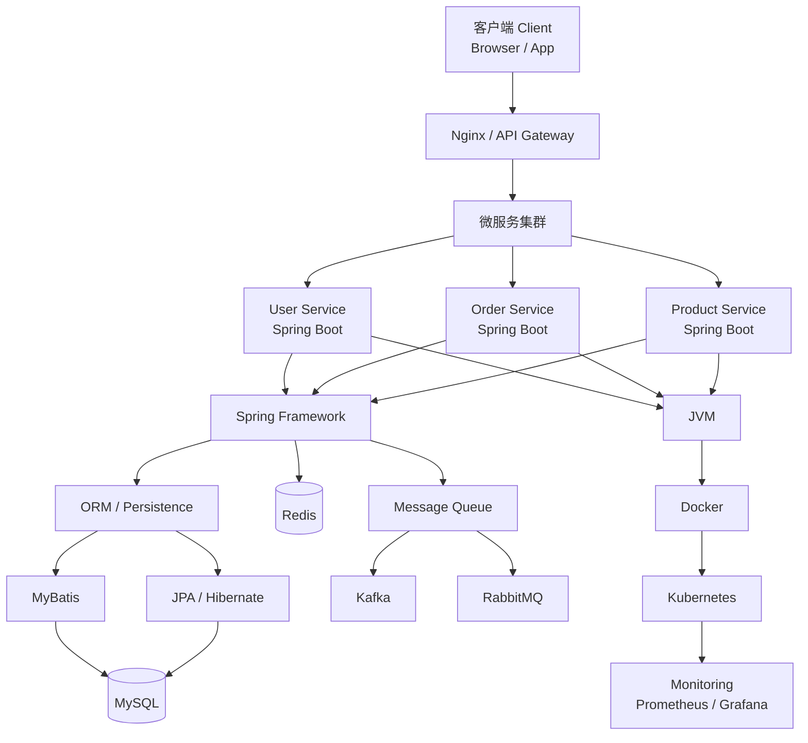
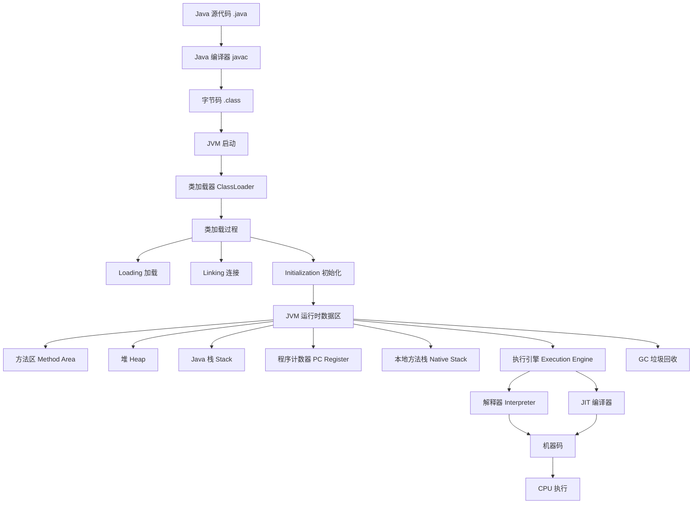
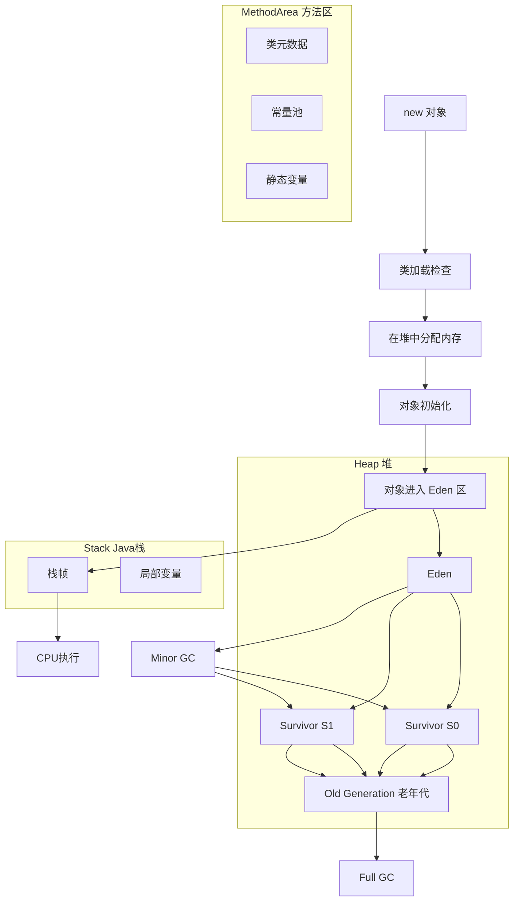
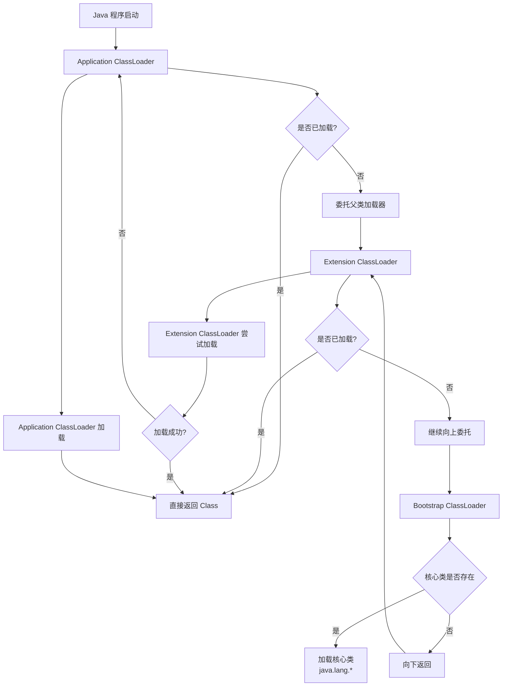
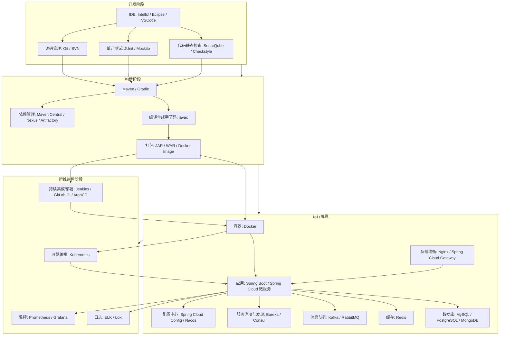
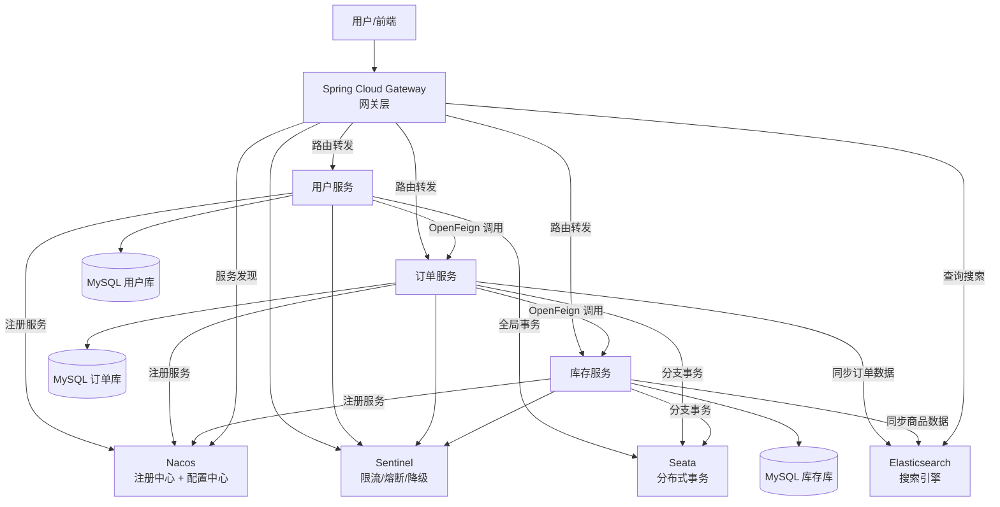
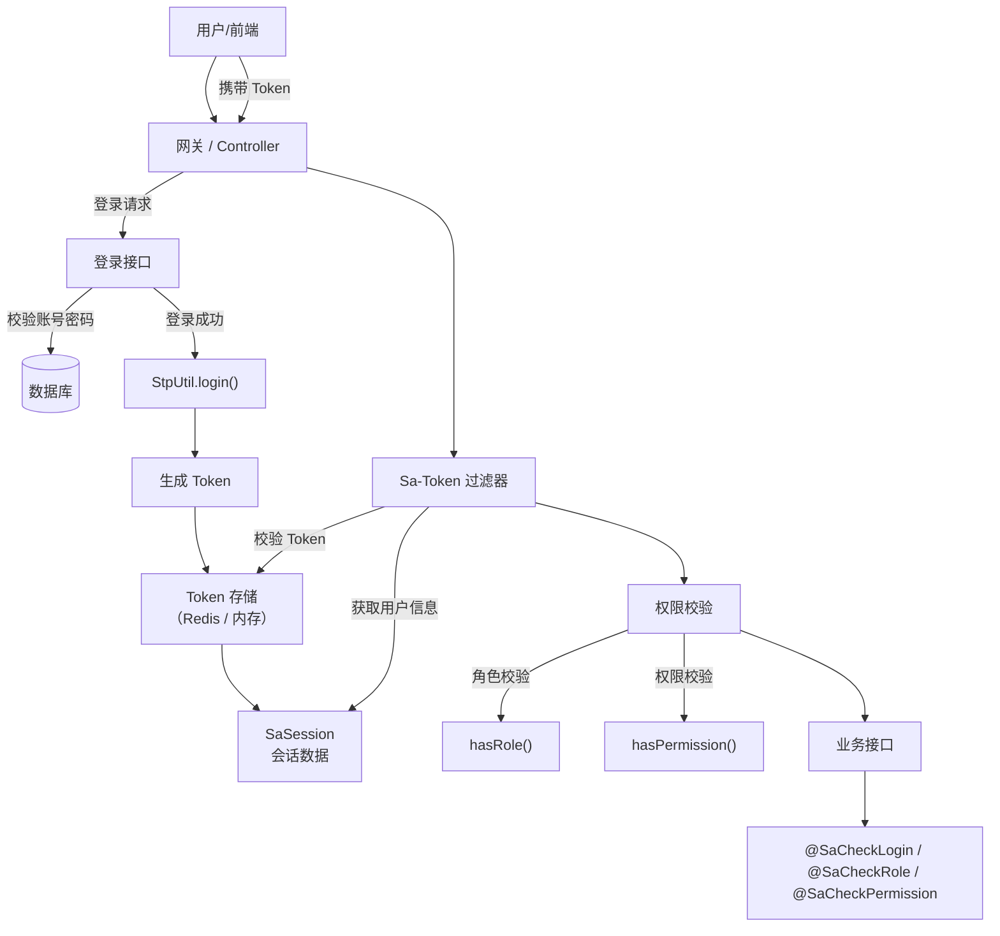
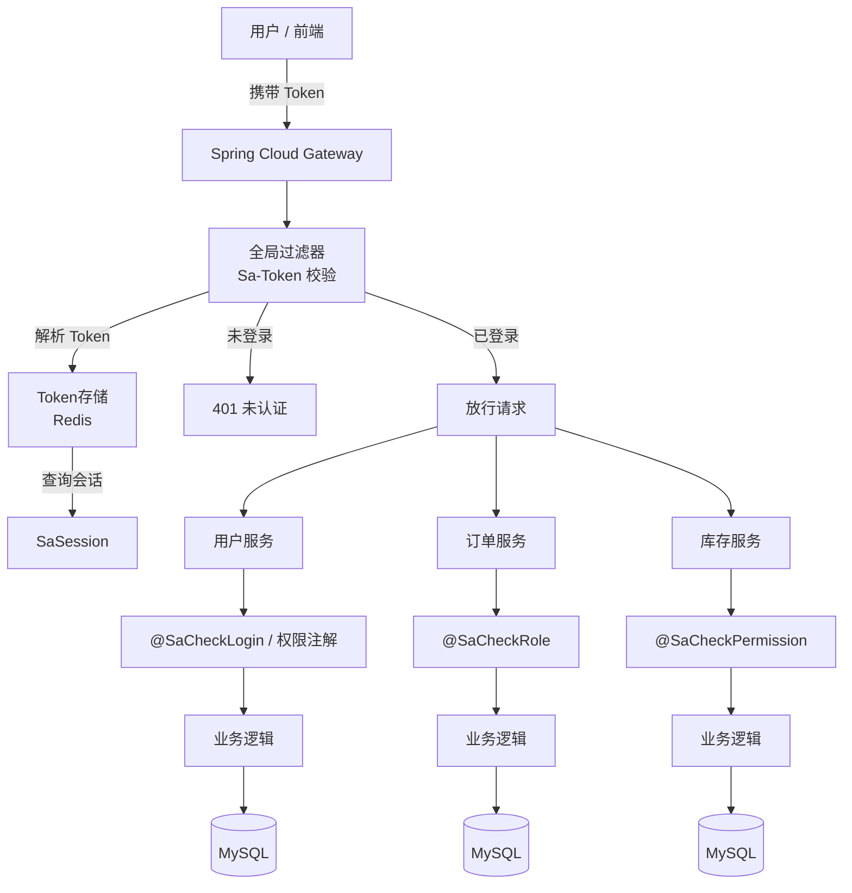

## **Java 后端技术体系全景图**

下面给你整理一张 **Java 后端技术体系全景图**，把常见的 **Spring、JVM、数据库、中间件、微服务、DevOps** 技术全部串起来，方便整体理解和面试复盘。

涉及核心平台与框架：

- **Java**
- **Java Virtual Machine**
- **Spring Framework**
- **Spring Boot**
- **Spring Cloud**
- **MySQL**
- **Redis**
- **Apache Kafka**
- **Docker**
- **Kubernetes**

------

### Java 后端技术体系全景图



------

### Java 后端体系结构（分层理解）

#### 1 客户端层

客户端包括：

```
浏览器
移动 App
小程序
第三方 API
```

通过：

```
HTTP / HTTPS
REST API
```

访问服务。

------

#### 2 网关层

常见组件：

- **Nginx**
- **Spring Cloud Gateway**

作用：

```
负载均衡
路由转发
限流
认证
```

------

#### 3 微服务层

每个业务拆成独立服务：

```
User Service
Order Service
Product Service
Payment Service
```

常用框架：

- **Spring Boot**
- **Spring Cloud**

------

#### 4 Spring 应用层

核心框架：

**Spring Framework**

提供：

```
IOC
AOP
事务管理
MVC
依赖注入
```

------

#### 5 数据访问层

常见持久化框架：

- **MyBatis**
- **Hibernate**
- **Spring Data JPA**

作用：

```
SQL映射
ORM
数据库操作
```

------

#### 6 数据存储层

核心数据库：

- **MySQL**

常见表：

```
user
order
product
payment
```

------

#### 7 缓存层

高性能缓存：

- **Redis**

作用：

```
热点数据缓存
分布式锁
Session共享
排行榜
```

------

#### 8 消息队列

用于系统解耦。

常见：

- **Apache Kafka**
- **RabbitMQ**

用途：

```
异步处理
削峰填谷
日志流
事件驱动
```

------

#### 9 JVM 运行环境

所有 Java 程序运行在：

**Java Virtual Machine**

提供：

```
类加载
内存管理
垃圾回收
线程管理
```

------

#### 10 容器化部署

应用通常部署在：

- **Docker**

作用：

```
环境一致
快速部署
镜像管理
```

------

#### 11 容器编排

生产环境通常使用：

- **Kubernetes**

作用：

```
自动扩容
服务发现
负载均衡
自动恢复
```

------

#### 12 监控系统

企业级系统需要监控：

```
CPU
内存
QPS
错误率
```

常见工具：

- **Prometheus**
- **Grafana**

------

### Java 后端技术栈一张总结图

```
客户端
 ↓
Nginx / API Gateway
 ↓
Spring Boot 微服务
 ↓
Spring Framework
 ↓
MyBatis / JPA
 ↓
MySQL
```

旁边：

```
Redis（缓存）
Kafka / MQ（消息队列）
```

底层：

```
JVM
Docker
Kubernetes
```

------

### Java 后端能力成长路线（非常实用）

初级：

```
Java
Spring Boot
MySQL
Redis
```

中级：

```
Spring MVC
MyBatis
消息队列
JVM
```

高级：

```
微服务
Spring Cloud
分布式系统
容器化
高并发架构
```

------

如果你愿意，我可以再给你画一张 **Java 技术体系最震撼的一张图**：

**《Java 程序从源码到运行的完整流程图（JVM + 类加载 + 执行引擎）》**

很多人看到这张图会 **彻底理解 Java 是怎么运行的。**

##  **Java 程序从源码到运行的完整流程图**

下面给你整理一张 **Java 程序从源码到运行的完整流程图**，把 **编译 → 类加载 → JVM运行 → 执行引擎 → 内存结构 → GC** 全部串起来。
核心运行环境是 **Java Virtual Machine**，语言是 **Java**。

------

### Java 程序从源码到运行完整流程图



------

### Java 程序执行完整过程

#### ① 编写源码

开发者编写：

```java
public class Hello {
    public static void main(String[] args){
        System.out.println("Hello Java");
    }
}
```

文件：

```
Hello.java
```

------

#### ② 编译阶段

通过 Java 编译器：

```
javac Hello.java
```

生成：

```
Hello.class
```

这是 **字节码（Bytecode）**。

特点：

```
跨平台
平台无关
```

这就是 Java 的：

```
Write Once Run Anywhere
```

------

#### ③ JVM 启动

运行程序：

```
java Hello
```

启动：

**Java Virtual Machine**

JVM 负责：

```
加载类
管理内存
执行代码
垃圾回收
```

------

#### ④ 类加载过程（ClassLoader）

JVM 通过 **类加载器** 加载 `.class` 文件。

主要类加载器：

```
Bootstrap ClassLoader
Extension ClassLoader
Application ClassLoader
```

加载流程：

```
.class 文件
↓
ClassLoader
↓
进入 JVM
```

------

#### ⑤ 类加载的三个阶段

类加载包括：

```
Loading
Linking
Initialization
```

------

##### Loading（加载）

读取 `.class` 文件：

```
磁盘
网络
JAR
```

生成：

```
Class 对象
```

------

##### Linking（连接）

连接分三步：

```
Verification   验证字节码
Preparation    分配静态变量
Resolution     符号引用解析
```

------

##### Initialization（初始化）

执行：

```
static 代码块
静态变量初始化
```

例如：

```java
static {
   System.out.println("class init");
}
```

------

#### ⑥ JVM 运行时数据区

程序运行后会进入 **JVM 内存结构**。

主要包括：

##### 1 方法区（Method Area）

存储：

```
类信息
常量池
静态变量
```

------

##### 2 堆（Heap）

最大的一块内存。

存储：

```
对象实例
数组
```

例如：

```java
new User();
```

------

##### 3 Java 栈（Stack）

每个线程都有一个。

存储：

```
局部变量
方法调用
栈帧
```

------

##### 4 程序计数器（PC Register）

作用：

```
记录当前执行的字节码行号
```

------

##### 5 本地方法栈

执行：

```
Native 方法
```

例如：

```
C/C++ 代码
```

------

#### ⑦ 执行引擎

JVM 内部的 **执行引擎**负责执行字节码。

包含：

```
Interpreter
JIT Compiler
```

------

##### 解释器（Interpreter）

逐行解释字节码：

```
.class
↓
机器指令
↓
CPU执行
```

优点：

```
启动快
```

缺点：

```
执行慢
```

------

##### JIT 编译器（Just-In-Time）

热点代码：

```
字节码
↓
编译成本地机器码
↓
缓存
```

优点：

```
执行速度快
```

------

#### ⑧ CPU 执行

最终：

```
机器码
↓
CPU
↓
执行程序
```

------

#### ⑨ 垃圾回收（GC）

JVM 自动管理内存。

回收：

```
不再使用的对象
```

常见 GC：

```
Serial GC
Parallel GC
G1 GC
ZGC
```

------

### Java 程序完整运行路径

```
Java源码
 ↓
javac 编译
 ↓
字节码 .class
 ↓
JVM
 ↓
类加载器
 ↓
运行时数据区
 ↓
执行引擎
 ↓
机器码
 ↓
CPU
```

------

### 面试最经典回答（JVM执行流程）

如果面试官问：

**Java 程序是怎么运行的？**

可以这样答：

> Java 程序首先由 javac 编译器将 `.java` 文件编译成 `.class` 字节码文件。
>
> 运行程序时 JVM 会启动，通过类加载器加载字节码，并经过加载、连接和初始化三个阶段完成类加载。
>
> 然后程序进入 JVM 的运行时数据区，包括堆、方法区、Java 栈、程序计数器等。
>
> 执行引擎通过解释器或 JIT 编译器将字节码转换为机器码，由 CPU 执行。
>
> 在程序运行过程中 JVM 还会通过垃圾回收器自动回收不再使用的对象。

------

如果你愿意，我可以再给你一张 **JVM 面试最重要的一张图**：

## **《JVM 内存结构 + GC 算法 + 对象创建全过程图》**

很多 Java 面试 **80% JVM问题都来自这张图。**

下面给你整理一张 **JVM 内存结构 + 对象创建过程 + GC 算法完整图**。
这是理解 **Java Virtual Machine** 的核心知识，也是 Java 面试中 JVM 部分最常问的一块。语言本身是 **Java**。

------

### JVM 内存结构 + 对象创建 + GC 全流程图



------

### 一 JVM 内存结构

JVM 运行时内存通常分为 **5 大区域**。

#### 1 堆（Heap）

最大的一块内存。

存储：

```
对象实例
数组
```

堆结构：

```
Young Generation
Old Generation
```

------

##### 新生代（Young Generation）

新对象首先进入：

```
Eden
```

结构：

```
Eden
Survivor 0
Survivor 1
```

比例通常：

```
8 : 1 : 1
```

------

##### 老年代（Old Generation）

存放：

```
长期存活对象
大对象
```

当对象经过多次 GC 后会进入老年代。

------

#### 2 方法区（Method Area）

存储：

```
类信息
常量池
静态变量
方法代码
```

在 JDK8 以后叫：

```
Metaspace
```

------

#### 3 Java 栈（Stack）

每个线程一个。

存储：

```
局部变量
方法调用
栈帧
```

方法调用：

```
push 栈帧
pop 栈帧
```

------

#### 4 程序计数器（PC Register）

作用：

```
记录当前线程执行的位置
```

------

#### 5 本地方法栈

执行：

```
Native 方法
```

例如：

```
C/C++ 调用
```

------

### 二 对象创建全过程

Java 中创建对象：

```java
User user = new User();
```

JVM 过程：

------

#### 1 类加载检查

JVM 检查：

```
User 类是否加载
```

如果没有：

```
ClassLoader 加载
```

------

#### 2 分配内存

在 **Heap 堆** 中分配空间。

两种方式：

```
指针碰撞
空闲列表
```

------

#### 3 初始化零值

对象字段初始化：

```
0
null
false
```

------

#### 4 设置对象头

对象头包含：

```
hashcode
GC信息
锁信息
类型指针
```

------

#### 5 执行构造方法

最后执行：

```java
User()
```

对象创建完成。

------

### 三 对象在堆中的生命周期

对象创建后：

```
Eden
```

如果发生 GC：

```
Eden → Survivor
```

多次 GC 后：

```
Survivor → Old
```

最终：

```
Old → GC回收
```

------

### 四 JVM 垃圾回收算法

#### 1 标记-清除（Mark-Sweep）

步骤：

```
标记存活对象
清除垃圾对象
```

缺点：

```
内存碎片
```

------

#### 2 复制算法（Copying）

用于：

```
新生代
```

流程：

```
Eden → Survivor
```

特点：

```
速度快
无碎片
```

缺点：

```
浪费空间
```

------

#### 3 标记-整理（Mark-Compact）

步骤：

```
标记
整理
压缩
```

用于：

```
老年代
```

优点：

```
无碎片
```

------

#### 4 分代收集（Generational GC）

JVM 采用：

```
新生代 GC
老年代 GC
```

组合：

```
Copying + MarkCompact
```

------

### 五 JVM 常见 GC 类型

常见垃圾回收器：

```
Serial GC
Parallel GC
CMS
G1
ZGC
```

现代 JVM 常用：

```
G1 GC
ZGC
```

------

### 六 Minor GC vs Full GC

#### Minor GC

发生在：

```
新生代
```

特点：

```
速度快
频率高
```

------

#### Full GC

发生在：

```
老年代
```

特点：

```
时间长
影响性能
```

------

### JVM 对象生命周期总结

```
new 对象
 ↓
Eden
 ↓
Minor GC
 ↓
Survivor
 ↓
多次 GC
 ↓
Old Generation
 ↓
Full GC
 ↓
回收
```

------

### JVM 面试经典回答

如果面试官问：

**JVM 内存结构是什么？**

可以这样回答：

> JVM 运行时内存主要包括堆、方法区、Java 栈、程序计数器和本地方法栈。
>
> 其中堆用于存储对象实例，分为新生代和老年代；方法区存储类元数据和常量池；Java 栈存储方法调用的栈帧。
>
> JVM 通过垃圾回收机制管理堆内存，新生代通常使用复制算法，老年代使用标记整理算法。

------

如果你愿意，我可以再给你一张 **JVM 最震撼的一张图**：

## **《JVM 类加载器 + 双亲委派模型完整流程图》**

这是 **JVM 面试必问 TOP3** 的知识点。

下面给你整理一张 **JVM 类加载器 + 双亲委派模型完整流程图**。
这是理解 **类加载机制** 的核心，也是 **JVM 面试 TOP3 高频问题**之一。运行环境是 **Java Virtual Machine**，语言平台是 **Java**。

------

### JVM 类加载器 + 双亲委派模型完整图



------

### 一 JVM 类加载器结构

JVM 中主要有 **三层类加载器**。

#### 1 Bootstrap ClassLoader

最顶层加载器。

负责加载：

```
Java 核心类库
```

例如：

```
java.lang.*
java.util.*
java.io.*
```

这些类来自：

```
$JAVA_HOME/lib
```

------

#### 2 Extension ClassLoader

负责加载：

```
扩展类库
```

路径：

```
$JAVA_HOME/lib/ext
```

例如：

```
javax.*
```

------

#### 3 Application ClassLoader

也叫：

```
System ClassLoader
```

负责加载：

```
classpath 中的类
```

例如：

```
项目代码
第三方 jar
```

------

#### 类加载器层级结构

```text
Bootstrap ClassLoader
        ↑
Extension ClassLoader
        ↑
Application ClassLoader
```

加载顺序：

```
自下而上委托
自上而下加载
```

------

### 二 双亲委派模型（Parent Delegation Model）

当 JVM 需要加载一个类时：

流程：

```
Application ClassLoader
        ↓
委托给父加载器
        ↓
Extension ClassLoader
        ↓
Bootstrap ClassLoader
```

如果父加载器找不到：

```
再由子加载器加载
```

------

#### 双亲委派执行流程

完整步骤：

```
1 收到类加载请求
2 检查是否已加载
3 委托父类加载器
4 父加载器继续向上委托
5 Bootstrap 尝试加载
6 如果失败逐级返回
7 最终由当前类加载器加载
```

------

### 三 为什么要双亲委派？

核心目的：

```
保证安全
避免类重复加载
```

最经典例子：

如果没有双亲委派：

你可以写：

```java
package java.lang;

public class String {
}
```

这样就可能：

```
替换系统 String 类
```

有双亲委派后：

```
Bootstrap 已经加载 java.lang.String
你的类不会被加载
```

保证：

```
Java 核心类安全
```

------

### 四 类加载完整生命周期

类加载不只是加载 `.class` 文件。

完整流程：

```
Loading
Linking
Initialization
```

------

#### Loading

读取 `.class` 文件：

来源：

```
文件系统
网络
JAR
数据库
```

------

#### Linking

包括：

```
Verification
Preparation
Resolution
```

作用：

```
字节码校验
分配静态变量
符号引用解析
```

------

#### Initialization

执行：

```
static 代码
静态变量赋值
```

例如：

```java
static {
   System.out.println("init class");
}
```

------

### 五 打破双亲委派的情况

某些框架会 **打破双亲委派**。

例如：

- **Apache Tomcat**
- **OSGi**

原因：

```
不同应用需要不同版本类
```

例如：

```
WebApp1 使用 Spring5
WebApp2 使用 Spring6
```

Tomcat 会使用：

```
WebAppClassLoader
```

来隔离类。

------

### 六 类加载器架构总结图

```text
Java程序
   ↓
Application ClassLoader
   ↓
Extension ClassLoader
   ↓
Bootstrap ClassLoader
   ↓
核心类库
```

加载逻辑：

```
向上委托
向下加载
```

------

### 面试最经典回答（双亲委派）

如果面试官问：

**什么是双亲委派模型？**

可以这样回答：

> JVM 在加载类时会采用双亲委派机制。
>
> 当一个类加载器收到类加载请求时，它不会立即加载，而是先将请求委托给父类加载器。
>
> 父类加载器再继续向上委托，直到 Bootstrap ClassLoader。
>
> 如果父加载器无法加载该类，才会由当前类加载器进行加载。
>
> 这种机制可以保证 Java 核心类库不会被篡改，并避免类被重复加载。

------

如果你愿意，我可以再给你整理一张 **Java 技术体系最震撼的一张图**：

## **《Java 从源码到微服务部署的全链路架构图（开发 → 构建 → 运行 → 运维）》**

很多人看完那张图会 **彻底理解整个 Java 技术体系。**

好的，我帮你整理一张 **Java 从源码到微服务部署的全链路架构图**，覆盖 **开发 → 构建 → 运行 → 运维**，适合面试、复盘和全局理解。涉及技术和平台包括 **Java**、**Spring Boot**、**Maven**、**Docker**、**Kubernetes**、**Prometheus** 等。

------

### Java 全链路架构图



------

### 各阶段核心说明

#### 1 开发阶段（DEV）

- **IDE**：编写、调试源码
- **源码管理**：Git / SVN 版本控制
- **单元测试**：保证功能正确性
- **代码静态检查**：提高代码质量

------

#### 2 构建阶段（BUILD）

- **构建工具**：Maven / Gradle
- **依赖管理**：Maven Central、私服（Nexus/Artifactory）
- **编译**：生成 `.class` 文件
- **打包**：生成 JAR/WAR 或 Docker 镜像

------

#### 3 运行阶段（RUN）

- **容器**：Docker 容器化应用
- **应用**：Spring Boot / 微服务
- **配置中心**：统一配置管理
- **服务注册与发现**：Eureka / Consul
- **消息队列**：Kafka / RabbitMQ 实现异步和解耦
- **缓存**：Redis 提升访问速度
- **数据库**：MySQL / PostgreSQL / MongoDB
- **负载均衡**：Nginx / Spring Cloud Gateway

------

#### 4 运维监控阶段（OPS）

- **容器编排**：Kubernetes，实现自动扩容、健康检查
- **监控**：Prometheus + Grafana
- **日志管理**：ELK / Loki
- **持续集成 / 部署**：Jenkins / GitLab CI / ArgoCD

------

### 面试总结回答

如果面试官问：

**Java 微服务是如何从源码到部署的全流程？**

可以回答：

> 开发阶段：开发者在 IDE 编写代码，使用 Git 管理版本，通过单元测试和静态代码检查保证质量。
>
> 构建阶段：使用 Maven/Gradle 管理依赖，编译源码生成字节码，打包成 JAR/WAR 或 Docker 镜像。
>
> 运行阶段：镜像部署到 Docker 容器中，Spring Boot 微服务通过配置中心获取配置，使用注册中心完成服务发现，通过消息队列和缓存实现高性能，连接数据库提供持久化，Nginx/Gateway 做负载均衡。
>
> 运维阶段：Kubernetes 负责容器编排和自动扩缩容，Prometheus/Grafana 监控应用性能，ELK/Loki 管理日志，CI/CD 工具自动部署更新。

------

如果你愿意，我可以帮你画一张 **“Java 技术体系全景+全链路执行图”**，把 **源码、Maven、JVM、Spring、微服务、容器、运维监控**都放在一张图里，成为 **面试和学习最震撼的一张图**。

你想让我画吗？

## Spring Cloud 微服务架构关系图

给你一张**面向面试 + 架构理解**的 Spring Cloud 全家桶关系图（包含你提到的 Nacos、OpenFeign、Gateway、ES、Sentinel、Seata），我用 **Mermaid** 帮你画清楚整体调用链👇

------

### 🌐 Spring Cloud 微服务架构关系图



------

### 🧠 一句话理解整个链路（面试必备）

👉 请求流程：

```
用户 → Gateway → 微服务 → 数据库 / ES
```

👉 服务治理：

```
Nacos = 注册中心 + 配置中心
```

👉 服务调用：

```
OpenFeign = 服务间远程调用
```

👉 稳定性：

```
Sentinel = 限流 + 熔断 + 降级
```

👉 数据一致性：

```
Seata = 分布式事务控制
```

------

### 🔥 各组件“人话版”理解

#### 1️⃣ Gateway（网关）

👉 相当于：**系统门卫**

- 统一入口
- 路由转发
- 鉴权 / 限流

------

#### 2️⃣ Nacos

👉 相当于：**通讯录 + 配置中心**

- 服务注册（谁在哪）
- 服务发现（我找谁）
- 配置管理（统一配置）

------

#### 3️⃣ OpenFeign

👉 相当于：**远程函数调用（RPC）**

```java
@FeignClient("order-service")
public interface OrderClient {
    @GetMapping("/order/{id}")
    Order getOrder(@PathVariable Long id);
}
```

👉 本质：HTTP + 接口调用

------

#### 4️⃣ Sentinel

👉 相当于：**系统保险丝**

- 限流（防止流量打爆）
- 熔断（服务挂了就断）
- 降级（返回兜底数据）

------

#### 5️⃣ Seata

👉 相当于：**分布式事务协调员**

典型场景：

```
下单 = 扣库存 + 扣余额
```

👉 要么全成功，要么全失败

------

#### 6️⃣ Elasticsearch（ES）

👉 相当于：**搜索引擎 + 高性能查询**

- 商品搜索
- 订单查询
- 日志分析

------

### ⚡ 面试高频问题总结

#### ❓1：Gateway 和 Nginx 区别

- Nginx：偏**基础流量转发**
- Gateway：偏**微服务治理**

------

#### ❓2：Feign 和 RestTemplate 区别

- RestTemplate：手写 HTTP
- Feign：接口式调用（更优雅）

------

#### ❓3：Sentinel vs Hystrix

- Sentinel：阿里主推（现在主流）
- Hystrix：已停止维护

------

#### ❓4：Seata 解决什么问题

👉 分布式事务一致性

------

### 🚀 如果你想更进一步

我可以帮你再画几张“进阶图”：

✅ Spring Cloud **完整调用时序图（请求一步一步走）**
✅ Seata **AT模式执行流程图**
✅ Sentinel **限流算法图（滑动窗口）**
✅ Nacos **注册&心跳机制图**

直接说一句：
👉「进阶版架构图」我给你画一套面试王炸级的 👍

## **Sa-Token 权限认证体系完整关系图**

给你一张**Sa-Token 权限认证体系完整关系图**（面试 + 实战都能用），我帮你把登录、鉴权、Session、Token 全串起来👇

------

### 🌐 Sa-Token 整体架构关系图



------

### 🧠 一句话理解

```text
登录 → 生成Token → 存储 → 请求携带Token → 校验 → 权限判断 → 放行
```

------

### 🔥 核心组件拆解（面试重点）

#### 1️⃣ StpUtil（核心入口）

👉 Sa-Token 的“总控制器”

```java
StpUtil.login(userId);     // 登录
StpUtil.logout();         // 登出
StpUtil.getLoginId();     // 获取当前用户
```

------

#### 2️⃣ Token

👉 用户身份凭证（类似 JWT，但更灵活）

特点：

- 可存 Redis / 内存
- 支持踢人下线
- 支持多端登录

------

#### 3️⃣ SaSession（会话）

👉 存储用户数据

```java
StpUtil.getSession().set("name", "张三");
```

👉 类似：

```text
HttpSession 的升级版
```

------

#### 4️⃣ 权限控制（两种方式）

##### ✅ 编程式

```java
StpUtil.checkPermission("user:add");
StpUtil.checkRole("admin");
```

------

##### ✅ 注解式（推荐）

```java
@SaCheckLogin
@SaCheckRole("admin")
@SaCheckPermission("user:add")
```

------

#### 5️⃣ 过滤器 / 拦截器

👉 自动做这些事：

- Token 校验
- 是否登录
- 权限验证

------

### ⚡ Sa-Token vs Spring Security（面试必问）

| 对比     | Sa-Token            | Spring Security |
| -------- | ------------------- | --------------- |
| 上手难度 | ⭐ 简单              | ❌ 复杂          |
| 灵活性   | ⭐⭐⭐⭐⭐               | ⭐⭐⭐             |
| 功能     | 认证 + 权限 + 会话  | 全家桶（偏重）  |
| 适合     | 中小项目 / 快速开发 | 大型复杂系统    |

------

### 🚀 典型请求流程（面试说这个直接加分）

#### 🧾 登录流程

```text
1. 用户输入账号密码
2. 后端校验成功
3. 调用 StpUtil.login(userId)
4. 生成 Token
5. 返回给前端
```

------

#### 🔁 访问流程

```text
1. 前端携带 Token
2. 进入 Sa-Token 过滤器
3. 校验 Token 是否有效
4. 校验权限
5. 放行到业务接口
```

------

#### ❌ 未登录 / 无权限

```text
→ 抛出异常
→ 全局异常处理
→ 返回 401 / 403
```

------

### 🧩 实战架构（你做项目可以这么用）

```text
Spring Boot
 + Sa-Token
 + Redis（存Token）
 + MySQL（用户数据）
 + Gateway（统一鉴权）
```

------

### 💡 你可以再升级一层（我可以帮你画）

如果你要冲**面试高分 / 架构进阶**，我可以再帮你画：

✅ Sa-Token + Gateway **统一认证架构图**
✅ Sa-Token + JWT **对比架构图**
✅ Sa-Token **多端登录（PC + App）图**
✅ Sa-Token + Redis **分布式会话图**

直接说一句：
👉「进阶版 Sa-Token」我给你整一套更炸的 💥

##  Sa-Token + Gateway 统一认证

好，这一张是**面试含金量非常高的架构图** 👉
👉 **Sa-Token + Gateway 统一认证（微服务必备方案）**

我帮你把**认证前移到网关层 + 服务内部细粒度鉴权**全部串起来👇

------

### 🌐 Sa-Token + Gateway 统一认证架构图



------

### 🧠 一句话理解（面试直接背）

```text
Gateway做“统一认证”，微服务做“权限控制”
```

------

### 🔥 核心设计思想（非常重要）

#### ✅ 1️⃣ 为什么要“认证前移到 Gateway”

👉 本质：**减少重复代码 + 提升性能**

传统问题：

```text
每个微服务都要写一遍登录校验 ❌
```

现在：

```text
Gateway统一校验一次 ✅
```

------

#### ✅ 2️⃣ 职责划分（面试重点）

| 层级    | 负责什么                    |
| ------- | --------------------------- |
| Gateway | 是否登录（Token是否合法）   |
| 微服务  | 是否有权限（角色 / 权限点） |

------

### ⚡ 完整请求流程（建议你背）

#### 🔁 正常请求流程

```text
1. 用户登录 → 获取 Token
2. 请求携带 Token → 进入 Gateway
3. Gateway 全局过滤器校验 Token
4. 校验成功 → 转发到微服务
5. 微服务通过 @SaCheckPermission 做权限校验
6. 通过 → 返回数据
```

------

### ❌ 异常流程

#### 🚫 Token 无效

```text
→ Gateway直接拦截
→ 返回 401
```

#### 🚫 权限不足

```text
→ 微服务抛异常
→ 返回 403
```

------

### 🧩 核心代码（面试加分点）

#### ① Gateway 全局过滤器（统一认证）

```java
@Component
public class SaTokenGlobalFilter implements GlobalFilter {

    @Override
    public Mono<Void> filter(ServerWebExchange exchange, GatewayFilterChain chain) {

        try {
            // 校验是否登录
            StpUtil.checkLogin();
        } catch (Exception e) {
            // 未登录
            exchange.getResponse().setStatusCode(HttpStatus.UNAUTHORIZED);
            return exchange.getResponse().setComplete();
        }

        return chain.filter(exchange);
    }
}
```

------

#### ② 微服务权限控制

```java
@RestController
public class OrderController {

    @SaCheckPermission("order:create")
    @PostMapping("/order")
    public String createOrder() {
        return "创建订单成功";
    }
}
```

------

### 🚀 架构升级（高级玩法）

#### 🔥 1️⃣ Token 透传优化

Gateway 校验后，把用户信息传给下游：

```text
Header:
X-User-Id
X-User-Role
```

👉 微服务无需再查 Token（性能提升）

------

#### 🔥 2️⃣ Redis 集群（分布式）

```text
Token → Redis
Session → Redis
```

👉 支持：

- 多实例
- 横向扩展

------

#### 🔥 3️⃣ 单点登录（SSO）

```text
多个系统共享一套 Token
```

------

#### 🔥 4️⃣ 多端登录控制

```text
PC / App / 小程序 独立 Token
```

------

### ⚔️ 面试高频问题

#### ❓ Gateway 能不能做权限控制？

👉 可以，但不推荐：

```text
Gateway → 粗粒度（是否登录）
Service → 细粒度（权限点）
```

------

#### ❓ 为什么不用 JWT？

👉 对比：

|        | Sa-Token       | JWT    |
| ------ | -------------- | ------ |
| 可控性 | ✅ 强（可踢人） | ❌ 弱   |
| 存储   | Redis          | 无状态 |
| 实时性 | ✅              | ❌      |

------

#### ❓ Token 存哪里？

```text
Redis（推荐） > 内存
```

------

### 🎯 一句话总结（面试王炸）

```text
Sa-Token + Gateway = 统一认证 + 分布式权限控制 + 高性能鉴权体系
```

------

如果你下一步想冲更高阶，我可以帮你再画👇

✅ **Sa-Token + Spring Cloud 全家桶（终极架构图）**
✅ **登录 → Token → Redis → 权限 → Gateway 全流程时序图（超清晰）**
✅ **多租户 + 多角色 + RBAC 权限模型图**

直接说一句：
👉「终极架构图」我给你整一张能吊打面试官的 💥

# 其他


