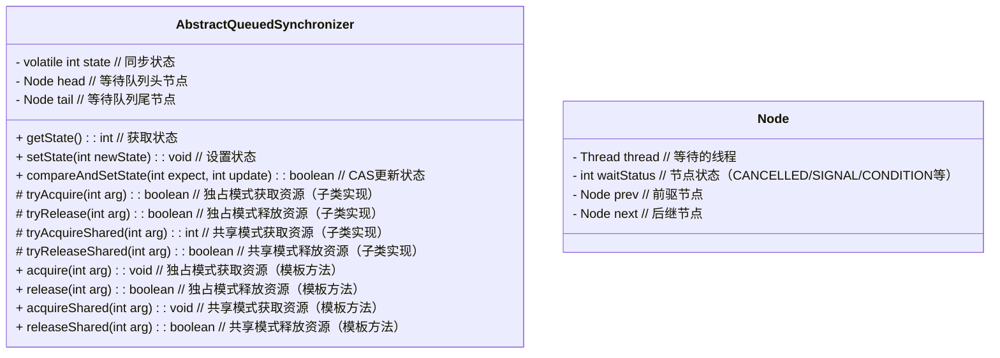
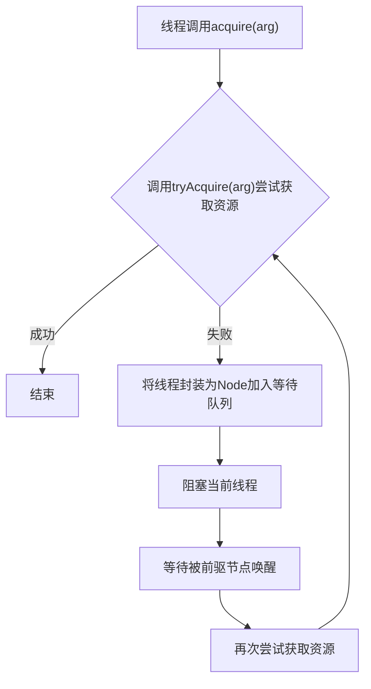
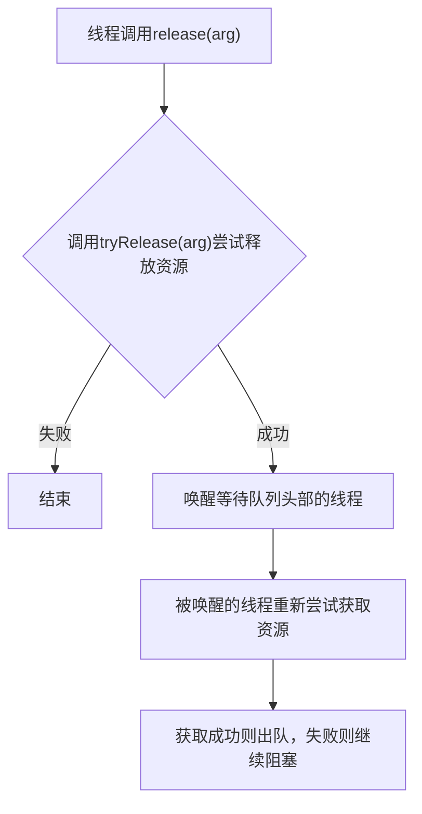

##  一、基础概念类（线程与内存模型）

1. **什么是进程与线程？它们的区别是什么？**
2. **创建线程的三种方式有哪些？各自的优缺点？**
    ➤ `Thread` 类继承、`Runnable` 接口、`Callable + Future`。
3. **线程的生命周期与状态转换有哪些？**
    ➤ `NEW → RUNNABLE → BLOCKED → WAITING → TIMED_WAITING → TERMINATED`。
4. **`sleep()`、`wait()`、`join()` 的区别是什么？**
5. **什么是 Java 内存模型（JMM）？它解决了哪些问题？**
    ➤ 可见性、有序性、原子性；`volatile`、`synchronized`、`final`。
6. **什么是指令重排？`volatile` 如何禁止它？**
7. **什么是线程安全？如何保证线程安全？**
    ➤ 同步锁、原子类、线程封闭、不可变对象。
8. **`synchronized` 的底层实现原理是什么？**
    ➤ Monitor、对象头、JVM 锁升级（偏向锁→轻量级锁→重量级锁）。
9. **`volatile` 关键字的作用是什么？能保证原子性吗？**
10. **什么是 CAS（Compare-And-Swap）？它在并发中如何使用？**
     ➤ 原子操作机制、ABA 问题、`AtomicInteger` 内部实现。


------

### **1. 什么是进程与线程？它们的区别是什么？**

**进程（Process）**

- 是操作系统分配资源的基本单位。
- 每个进程有独立的内存空间和系统资源。

**线程（Thread）**

- 是 CPU 调度和执行的最小单位。
- 一个进程中可以有多个线程共享同一内存空间（堆、方法区）。

**区别**

| 项目     | 进程                  | 线程                     |
| -------- | --------------------- | ------------------------ |
| 内存空间 | 独立                  | 共享进程内存             |
| 通信方式 | IPC（管道、Socket等） | 共享内存                 |
| 切换开销 | 大                    | 小                       |
| 崩溃影响 | 一个崩溃互不影响      | 一个崩溃可能影响整个进程 |

### 并行和并发有什么区别？

- **并发（Concurrency）**：**同一个 CPU 核心**，通过时间片轮转交替执行多个任务，**看起来同时运行**，实际是交替执行。
- **并行（Parallelism）**：**多个 CPU 核心**，**真正同时执行**多个任务。
- 一句话总结：**并发是交替做，并行是同时做**。

### 在 Java 程序中怎么保证多线程的运行安全？

这 5 种方案 ** 只解决「同一台 JVM 进程内」** 的多线程安全问题，跨机器、跨进程完全无效。

**分布式锁**：管**分布式集群、多机器**的并发安全，依赖中间件

1. **加锁**：`synchronized`、`Lock`
2. **使用线程安全类**：`Vector`、`ConcurrentHashMap`
3. **ThreadLocal**：线程本地变量，隔离数据
4. **volatile**：保证可见性、禁止指令重排
5. **原子类**：`AtomicInteger`等 CAS 无锁操作

------

### 创建线程的 4 种方式

Java 里创建线程**本质只有一种**：**new Thread()**，但**任务定义方式**有 4 种常见写法。

---

#### 一、方式1：继承 Thread 类

**步骤**

1. 自定义类 **extends Thread**
2. 重写 **run()** 方法
3. 创建实例，调用 **start()**（不是 run()）

```java
class MyThread extends Thread {
    @Override
    public void run() {
        System.out.println("线程执行：" + getName());
    }
}

// 使用
new MyThread().start();
```

**优点**：简单
**缺点**：

- Java 单继承，无法再继承其他类
- 任务与线程耦合，不利于线程池复用

---

#### 二、方式2：实现 Runnable 接口（无返回值）

**步骤**

1. 实现 **Runnable** 接口
2. 重写 **run()**
3. 传入 Thread 构造，调用 start()

```java
class MyTask implements Runnable {
    @Override
    public void run() {
        System.out.println("Runnable 任务执行");
    }
}

// 使用
new Thread(new MyTask()).start();
```

**优点**：

- 避免单继承局限
- 任务与线程解耦，适合线程池

**缺点**：**无返回值**、不能抛受检异常

---

#### 三、方式3：实现 Callable 接口（带返回值）

**步骤**

1. 实现 **Callable<V>**
2. 重写 **call()**，可返回值、抛异常
3. 用 **FutureTask** 包装
4. 传入 Thread 执行
5. 通过 **futureTask.get()** 获取结果

```java
class MyCallable implements Callable<Integer> {
    @Override
    public Integer call() throws Exception {
        return 100;
    }
}

// 使用
FutureTask<Integer> task = new FutureTask<>(new MyCallable());
new Thread(task).start();

// 获取返回值（阻塞）
Integer res = task.get();
```

**优点**：

- **有返回值**
- 可抛出异常
- 适合异步计算

**缺点**：get() 会阻塞

---

#### 四、方式4：使用线程池（企业开发标准方式）

通过 **ExecutorService** 提交任务，**不建议手动创建线程**。

```java
ExecutorService pool = Executors.newFixedThreadPool(3);

// 提交 Runnable
pool.execute(new Runnable() { ... });

// 提交 Callable（带返回值）
Future<Integer> future = pool.submit(new Callable<Integer>() { ... });
```

**优点**：

- 复用线程，减少创建销毁开销
- 控制并发数，防 OOM
- 管理任务生命周期

**企业规范**：**禁止用 Executors 创建线程池**，要用 **ThreadPoolExecutor** 手动构造。

---

#### 五、run() 和 start() 的区别（必问）

- **start()**：
  - 启动线程，进入就绪状态
  - 底层调用 native 方法，真正开启新线程
  - **一个线程只能调用一次**
- **run()**：
  - 只是普通方法调用
  - **不会开启新线程**，在当前线程执行

---

#### 六、4 种方式对比表

| 方式          | 核心接口 | 返回值 | 抛异常 | 继承限制 | 推荐度       |
| ------------- | -------- | ------ | ------ | -------- | ------------ |
| 继承 Thread   | Thread   | 无     | 不能   | 单继承 ❌ | 不推荐       |
| 实现 Runnable | Runnable | 无     | 不能   | 无 ✅     | 一般         |
| 实现 Callable | Callable | 有 ✅   | 能 ✅   | 无 ✅     | 推荐         |
| 线程池        | Executor | 可有无 | 可有无 | 无 ✅     | **生产首选** |

---

#### 七、一句话总结

- 想**简单无返回值**：Runnable
- 想**有返回值**：Callable + FutureTask
- 企业**正式项目**：**线程池 ThreadPoolExecutor**
- 永远记住：**启动线程必须用 start()，不是 run()**

需要我再给你整理 **Callable + Future + FutureTask 完整详解** 吗？

### 线程池详解

#### 一、什么是线程池

简单说：**事先创建好一批线程，反复利用，避免频繁创建/销毁线程**。
核心思想：**池化思想**，类似数据库连接池。

##### 线程池体系结构（基于 `Executor` 框架）

```
java.util.concurrent
├─ 顶层接口：Executor（定义执行任务的规范）
│  └─ 核心接口：ExecutorService（扩展 Executor，提供线程池生命周期管理）
│     ├─ 抽象类：AbstractExecutorService（实现 ExecutorService 基础方法）
│     │  └─ 核心实现类：ThreadPoolExecutor（线程池核心实现，可自定义参数）
│     │     └─ 内部类：Worker（管理线程与任务的绑定）
│     │
│     └─ 定时任务接口：ScheduledExecutorService（扩展 ExecutorService，支持定时任务）
│        └─ 定时线程池实现类：ScheduledThreadPoolExecutor（继承 ThreadPoolExecutor，实现定时任务）
│
├─ 线程池工具类：Executors（提供线程池快捷创建方法）
│  ├─ 创建方法对应 ThreadPoolExecutor 的封装：
│  │  ├─ newFixedThreadPool() → 固定大小线程池
│  │  ├─ newCachedThreadPool() → 缓存线程池
│  │  └─ newSingleThreadExecutor() → 单线程池
│  │
│  └─ 创建方法对应 ScheduledThreadPoolExecutor 的封装：
│     ├─ newScheduledThreadPool() → 定时线程池
│     └─ newSingleThreadScheduledExecutor() → 单线程定时池
│
├─ 任务接口：
│  ├─ Runnable（无返回值任务）
│  └─ Callable<V>（有返回值任务，可抛异常）
│
└─ 任务结果封装：Future<V>（获取异步任务结果）
   └─ 实现类：FutureTask（实现 RunnableFuture，可作为 Runnable 提交给线程池）
```

##### 核心组件说明：

1. **`Executor` 接口**：最顶层抽象，仅定义 `execute(Runnable command)` 方法，标志“执行任务”的能力。  
2. **`ExecutorService` 接口**：扩展 `Executor`，增加线程池生命周期管理（`shutdown()`、`shutdownNow()`）、任务提交（`submit()`）等核心方法。  
3. **`ThreadPoolExecutor` 类**：线程池核心实现，通过七大参数（核心线程数、最大线程数等）控制线程池行为，是自定义线程池的基础。  
4. **`ScheduledExecutorService` 接口**：专门用于定时/周期任务，提供 `schedule()`、`scheduleAtFixedRate()` 等方法。  
5. **`Executors` 工具类**：通过静态方法快速创建线程池，但因默认参数存在 OOM 风险，**推荐直接使用 `ThreadPoolExecutor` 自定义**。  

该体系通过接口抽象与实现分离，既保证了扩展性（如自定义线程池），又提供了便捷的默认实现（如定时任务池）。

---

#### 二、为什么要用线程池

1. **降低资源消耗**：避免频繁 `new Thread()` 销毁线程
2. **提高响应速度**：任务来了直接用已有线程，不用新建
3. **提高线程可管理性**：统一控制并发数、线程名、拒绝策略
4. **防止OOM**：无限制创建线程会耗尽内存

---

#### 三、Java 线程池体系结构

```
Executor
  ↳ ExecutorService
      ↳ ThreadPoolExecutor（核心实现类）
      ↳ ScheduledThreadPoolExecutor（定时线程池）
```

日常说的“线程池”，基本都指 **ThreadPoolExecutor**。

---

#### 四、ThreadPoolExecutor 核心参数

```java
new ThreadPoolExecutor(
    int corePoolSize,         // 核心线程数
    int maximumPoolSize,      // 最大线程数
    long keepAliveTime,       // 非核心线程空闲时间
    TimeUnit unit,            // 时间单位
    BlockingQueue<Runnable> workQueue,  // 任务队列
    ThreadFactory threadFactory,        // 线程工厂（命名、优先级）
    RejectedExecutionHandler handler     // 拒绝策略
);
```

##### 逐个解释

1. **corePoolSize**
   常驻核心线程数，即使空闲也不会被回收（默认）。
2. **maximumPoolSize**
   队列满了以后，最多能开到多少线程。
3. **keepAliveTime**
   非核心线程空闲多久会被回收。
4. **unit**
   时间单位：秒/毫秒等。
5. **workQueue**
   核心线程都忙时，新任务进队列排队。
   常用：
   - `ArrayBlockingQueue` 有界队列
   - `LinkedBlockingQueue` 无界/有界
   - `SynchronousQueue` 不存元素，直接提交
6. **threadFactory**
   自定义线程名、优先级、守护线程等。
7. **handler**
   任务满到 **maxPoolSize + 队列满** 时的拒绝策略。


##### 线程池中的任务队列（Work Queue）

线程池的任务队列是 `ThreadPoolExecutor` 七大核心参数之一，用于存储当线程池所有核心线程都在工作时，新提交的任务。队列的类型直接影响线程池的任务处理策略，常见类型如下：

###### 一、核心任务队列类型及特点

```
线程池任务队列（均为 BlockingQueue 接口实现）
├─ 无界队列（队列长度理论上无限制）
│  ├─ LinkedBlockingQueue（链表结构，optioally-bounded）
│  │  ├─ 特点：默认容量为 Integer.MAX_VALUE（几乎无界），可指定容量变为有界
│  │  ├─ 适用场景：任务提交速度稳定，且任务执行时间较短（如 newFixedThreadPool 使用）
│  │  └─ 风险：任务过多时可能导致 OOM（队列无限扩容）
│  │
│  └─ PriorityBlockingQueue（优先级队列）
│     ├─ 特点：按任务优先级排序，无界（容量可指定但会自动扩容）
│     ├─ 适用场景：需要按优先级处理的任务（如紧急任务优先执行）
│     └─ 注意：需任务实现 Comparable 接口
│
├─ 有界队列（队列长度固定）
│  └─ ArrayBlockingQueue（数组结构）
│     ├─ 特点：容量必须在创建时指定，FIFO 顺序，底层为数组（查询快）
│     ├─ 适用场景：任务数量可控，需限制队列大小（自定义线程池常用）
│     └─ 优势：避免 OOM，配合拒绝策略可控制资源上限
│
└─ 同步队列（不存储任务，直接传递，有界队列）
   └─ SynchronousQueue（无缓冲队列）
      ├─ 特点：队列本身不存储任务，提交的任务需立即被线程接收（否则阻塞或创建新线程）
      ├─ 适用场景：任务提交后需快速处理，线程数可动态调整（如 newCachedThreadPool 使用）
      └─ 注意：需配合 maximumPoolSize 较大的线程池使用
```

###### 二、队列与线程池的协作逻辑

当新任务提交到线程池时，处理流程如下：

1. 若当前线程数 < 核心线程数（`corePoolSize`）：直接创建核心线程执行任务。
2. 若当前线程数 ≥ 核心线程数：任务进入队列等待。
3. 若队列已满且当前线程数 < 最大线程数（`maximumPoolSize`）：创建临时线程执行任务。
4. 若队列已满且当前线程数 ≥ 最大线程数：触发**拒绝策略**（如抛出异常、丢弃任务等）。

###### 三、队列选择建议

1. **避免无界队列**：`LinkedBlockingQueue` 等无界队列在高并发下可能因任务堆积导致 OOM，除非能严格控制任务提交速率。
2. **优先有界队列**：`ArrayBlockingQueue` 可明确设置容量（如 `new ArrayBlockingQueue(1000)`），配合合理的 `maximumPoolSize` 和拒绝策略（如 `CallerRunsPolicy` 让提交者线程执行任务，缓解压力），更适合生产环境。
3. **特殊场景用同步队列**：`SynchronousQueue` 适合任务执行速度快、临时并发高的场景（如处理瞬时请求峰值），但需注意控制最大线程数避免线程爆炸。

---

#### 五、线程池执行流程

1. 任务进来
2. **核心线程未满** → 创建核心线程执行
3. **核心线程满** → 任务进入 **workQueue 排队**
4. **队列满** → 创建 **非核心线程** 执行
5. **非核心线程也达到 maxPoolSize** → 执行 **拒绝策略**

一句话记忆：
**核心线程 → 队列 → 最大线程 → 拒绝策略**

##### 执行流程：

1. 当前线程数 < corePoolSize → 创建新线程
2. 队列未满 → 加入队列
3. 队列满 & 线程数 < max → 创建新线程
4. 超出最大 → 执行拒绝策略

---

#### 六、四大拒绝策略

1. **AbortPolicy（默认）**
   直接抛异常 `RejectedExecutionException`

2. **CallerRunsPolicy**
   让**提交任务的主线程自己执行**（最常用、最安全）

3. **DiscardPolicy**
   默默丢掉任务，不抛异常

4. **DiscardOldestPolicy**
   丢掉队列里**最老的任务**，再尝试提交

生产常用：**CallerRunsPolicy**，不会丢任务、不会炸服务。

---

#### 七、Executors 提供的四种快捷线程池（面试必问坑）

##### 1. newFixedThreadPool

```java
Executors.newFixedThreadPool(n);
```

- 固定线程数
- 队列：`LinkedBlockingQueue` 无界队列
  **坑**：队列无限长，高并发下会 **OOM**

##### 2. newSingleThreadExecutor

单线程线程池，顺序执行。
**坑**：同上，无界队列 OOM。

##### 3. newCachedThreadPool

- 核心线程 0，最大线程无限
- 队列：`SynchronousQueue`
  **坑**：线程无限创建，直接 OOM。

##### 4. newScheduledThreadPool

定时、周期性执行任务。
**坑**：最大线程数无限，OOM 风险。

| 方法                        | 类型           | 特点                   |
| --------------------------- | -------------- | ---------------------- |
| `newFixedThreadPool(n)`     | 固定大小线程池 | 任务多时排队           |
| `newCachedThreadPool()`     | 缓存线程池     | 动态创建、复用空闲线程 |
| `newSingleThreadExecutor()` | 单线程池       | 顺序执行任务           |
| `newScheduledThreadPool(n)` | 定时线程池     | 支持定时/周期任务      |

✅ **推荐使用**：`ThreadPoolExecutor`（可自定义参数）
 因为 `Executors` 默认策略可能导致 OOM（无界队列）。

| 方法                                 | 底层核心参数（基于 `ThreadPoolExecutor`）                    | 特点与适用场景                                               |
| ------------------------------------ | ------------------------------------------------------------ | ------------------------------------------------------------ |
| `newFixedThreadPool(n)`              | 核心线程数=最大线程数=n，队列用 `LinkedBlockingQueue`（无界） | - 线程数量固定，任务队列无界<br>- 适用于任务数量已知、长期稳定运行的场景（如服务器后台任务） |
| `newCachedThreadPool()`              | 核心线程数=0，最大线程数=Integer.MAX_VALUE，队列用 `SynchronousQueue`（同步队列，不存储任务） | - 线程动态创建（60秒空闲后销毁），任务直接提交给线程<br>- 适用于短期、突发且耗时短的任务（如临时并发请求） |
| `newSingleThreadExecutor()`          | 核心线程数=最大线程数=1，队列用 `LinkedBlockingQueue`（无界） | - 单线程串行执行任务，保证任务顺序<br>- 适用于需要按顺序执行的任务（如日志写入、单线程事务） |
| `newScheduledThreadPool(n)`          | 核心线程数=n，最大线程数=Integer.MAX_VALUE，队列用 `DelayedWorkQueue`（延迟队列） | - 支持定时执行（`schedule`）、周期执行（`scheduleAtFixedRate`）<br>- 适用于定时任务（如定时备份、心跳检测） |
| `newSingleThreadScheduledExecutor()` | 核心线程数=1，最大线程数=Integer.MAX_VALUE，队列用 `DelayedWorkQueue` | - 单线程执行定时任务，保证顺序<br>- 适用于需要串行执行的定时任务 |

##### **关键注意事项**

1. **`Executors` 的隐患**：  

   - `newFixedThreadPool`/`newSingleThreadExecutor` 使用无界队列，任务过多时可能导致 OOM（队列无限扩容）。  
   - `newCachedThreadPool`/`newScheduledThreadPool` 最大线程数为 `Integer.MAX_VALUE`，高并发下可能创建大量线程导致 OOM。  

2. **推荐用法**：  
   直接使用 `ThreadPoolExecutor` 构造方法自定义参数，核心参数包括：  

   ```java
   new ThreadPoolExecutor(
       corePoolSize,    // 核心线程数（常驻线程）
       maximumPoolSize, // 最大线程数（核心+临时线程）
       keepAliveTime,   // 临时线程空闲存活时间
       unit,            // 时间单位
       workQueue,       // 任务队列（有界队列更安全，如 ArrayBlockingQueue）
       threadFactory,   // 线程创建工厂（自定义线程名、优先级等）
       handler          // 拒绝策略（任务满时的处理方式，如 AbortPolicy、CallerRunsPolicy 等）
   );
   ```

通过自定义线程池，可以更灵活地控制资源上限，避免 OOM 风险，尤其在高并发场景下更可靠。


---

#### 八、阿里巴巴规范：禁止使用 Executors！

必须手动 **new ThreadPoolExecutor(...)**，理由：

- 无界队列 OOM
- 无限制线程创建 OOM
- 无法自定义线程名，排查困难
- 拒绝策略不可控

---

#### 九、线程池常用提交方式

1. **execute(Runnable)**
   无返回值，异常直接抛出。

2. **submit(Runnable/Callable)**
   返回 Future，可获取结果/异常。

3. **invokeAll、invokeAny**
   批量执行任务。

---

#### 十、关闭线程池

- `shutdown()`：温和关闭，不接受新任务，执行完已有任务
- `shutdownNow()`：立刻关闭，尝试中断正在执行的任务
- `isShutdown() / isTerminated()`：判断状态

---

#### 十一、如何合理设置线程池大小（经典公式）

##### 1. CPU 密集型

任务：计算、逻辑处理
核心数：**CPU核心数 + 1**

```java
int core = Runtime.getRuntime().availableProcessors() + 1;
```

##### 2. IO 密集型

任务：RPC、HTTP、DB、Redis
核心数：**CPU核心数 * 2**
或更精准：

```
核心数 = CPU核心数 * (1 + 平均等待时间/平均CPU时间)
```

生产一般：**IO 密集 20~200，CPU 密集 5~20**

---

#### 十二、线程池状态（了解）

1. RUNNING 运行
2. SHUTDOWN 关闭中
3. STOP 停止
4. TIDYING 整理
5. TERMINATED 终止

---

#### 十三、面试高频问答

##### 1）核心线程会被回收吗？

默认不会。
可以通过 `allowCoreThreadTimeOut(true)` 允许核心线程超时回收。

##### 2）submit 和 execute 区别？

- execute：无返回值，异常直接抛出
- submit：返回 Future，异常被吞，需 get() 才抛出

##### 3）线程池线程是懒加载吗？

是。默认任务来了才创建核心线程，不会初始化就创建。

##### 4）为什么不允许用 Executors？

因为容易 OOM：

- Fixed/Single：无界队列
- Cached：无限线程

---

#### 十四、一句话总结

线程池 = **核心线程 + 任务队列 + 最大线程 + 拒绝策略**
执行顺序：**核心线程 → 队列 → 最大线程 → 拒绝**
生产必须手写 **ThreadPoolExecutor**，拒绝 Executors，拒绝策略用 **CallerRunsPolicy**。

### 线程池参数配置与调优

线程池是 Java 并发编程中提升性能、控制系统资源的关键组件。合理配置和调优线程池的核心参数，不仅能**避免系统过载**，还能**最大化 CPU 和 I/O 资源利用率**。

------

#### 一、线程池核心参数（以 `ThreadPoolExecutor` 为例）

Java 中最常用的线程池实现是 `java.util.concurrent.ThreadPoolExecutor`，其构造函数包含 **7 个核心参数**：

```java
public ThreadPoolExecutor(
    int corePoolSize,          // 核心线程数
    int maximumPoolSize,       // 最大线程数
    long keepAliveTime,        // 空闲线程存活时间
    TimeUnit unit,             // 时间单位
    BlockingQueue<Runnable> workQueue, // 任务队列
    ThreadFactory threadFactory,       // 线程工厂
    RejectedExecutionHandler handler   // 拒绝策略
)
```

下面逐个解析并说明如何配置与调优。

------

#### 二、核心参数详解与调优策略

##### 1. **corePoolSize（核心线程数）**

- **含义**：线程池中**长期存活的最小线程数**，即使空闲也不会被回收（除非设置 `allowCoreThreadTimeOut(true)`）。

- 调优建议

  ：

  - CPU 密集型任务

    （如计算、加密）：

    ```text
    corePoolSize ≈ CPU 核数（或 +1 防 I/O 阻塞）
    Runtime.getRuntime().availableProcessors()
    ```

  - I/O 密集型任务

    （如数据库查询、HTTP 请求）：

    ```text
    corePoolSize ≈ CPU 核数 × (1 + 平均等待时间 / 平均工作时间)
    ```

    > 例如：CPU 4 核，I/O 等待时间是计算时间的 3 倍 → `4 × (1 + 3) = 16`

✅ **经验公式**（来自《Java 并发编程实战》）：

```java
int corePoolSize = Runtime.getRuntime().availableProcessors() * (1 + avgWaitTime / avgWorkTime);
```

------

##### 2. **maximumPoolSize（最大线程数）**

- **含义**：线程池允许创建的**最大线程数量**。

- **触发条件**：当**任务队列已满**且当前线程数 < `maximumPoolSize` 时，才会创建新线程。

- 调优建议

  ：

  - 不宜过大：线程过多会导致**上下文切换开销剧增**，反而降低吞吐量；
  - 可设为 `corePoolSize` 的 1.5~2 倍（I/O 密集型可更高）；
  - 若使用**无界队列**（如 `LinkedBlockingQueue` 默认无界），此参数**无效**（因为队列永远不会满）。

> ⚠️ **重要**：若队列有界，`maximumPoolSize` 才有意义！

------

##### 3. **workQueue（任务队列）**

决定任务如何排队，直接影响线程创建行为。

| 队列类型                    | 特点                     | 适用场景                                         |
| --------------------------- | ------------------------ | ------------------------------------------------ |
| **`ArrayBlockingQueue`**    | 有界队列，FIFO           | 控制内存，防止 OOM；需配合合理 `maximumPoolSize` |
| **`LinkedBlockingQueue`**   | 无界（默认）或有界       | 任务量稳定、可接受延迟；**慎用无界！易 OOM**     |
| **`SynchronousQueue`**      | 不存储任务，直接交给线程 | 高吞吐、短任务；要求 `maximumPoolSize` 足够大    |
| **`PriorityBlockingQueue`** | 优先级队列               | 任务有优先级需求                                 |

###### ✅ 推荐策略：

- **拒绝无界队列**：生产环境应使用**有界队列**（如 `new LinkedBlockingQueue<>(1000)`）；

- 队列大小

  ：根据 TPS、平均处理时间估算：

  ```text
  队列容量 ≈ (峰值 TPS × 平均响应时间) - corePoolSize
  ```

------

##### 4. **keepAliveTime + unit（空闲线程存活时间）**

- **含义**：当线程数 > `corePoolSize` 时，多余空闲线程的存活时间。

- 调优建议

  ：

  - I/O 密集型：可适当增大（如 60 秒），避免频繁创建/销毁线程；
  - CPU 密集型：可设小（如 10 秒）；
  - 若启用 `allowCoreThreadTimeOut(true)`，核心线程也会超时回收（适用于突发流量场景）。

------

##### 5. **threadFactory（线程工厂）**

- **作用**：自定义线程名称、优先级、是否守护线程等。

- 最佳实践

  ：

  ```java
  new ThreadFactoryBuilder()
      .setNameFormat("order-pool-%d")
      .setDaemon(false)
      .build();
  ```

  > 命名规范便于排查问题（如 jstack 日志）。

------

##### 6. **handler（拒绝策略）**

当**队列满 + 线程数达上限**时触发。

| 策略                      | 行为                              | 适用场景                     |
| ------------------------- | --------------------------------- | ---------------------------- |
| **`AbortPolicy`**（默认） | 抛出 `RejectedExecutionException` | 快速失败，避免雪崩           |
| **`CallerRunsPolicy`**    | 由提交任务的线程执行该任务        | 降低新任务提交速度，保护系统 |
| **`DiscardPolicy`**       | 静默丢弃任务                      | 允许丢失非关键任务           |
| **`DiscardOldestPolicy`** | 丢弃队列中最旧的任务，重试提交    | 尽可能保留新任务             |

###### ✅ 推荐：

- **核心业务**：用 `AbortPolicy` + 监控告警；
- **非关键任务**（如日志上报）：用 `DiscardPolicy`；
- **弹性降级**：用 `CallerRunsPolicy`（但注意主线程阻塞风险）。

------

#### 三、不同类型任务的线程池配置示例

##### 1. **CPU 密集型任务**（如图像处理、科学计算）

```java
int cpuCores = Runtime.getRuntime().availableProcessors();
ExecutorService executor = new ThreadPoolExecutor(
    cpuCores,           // corePoolSize
    cpuCores,           // maximumPoolSize（等于 core，避免切换）
    10L,                // keepAliveTime
    TimeUnit.SECONDS,
    new LinkedBlockingQueue<>(100), // 小队列缓冲突发
    new ThreadFactoryBuilder().setNameFormat("cpu-task-%d").build(),
    new ThreadPoolExecutor.AbortPolicy()
);
```

##### 2. **I/O 密集型任务**（如 Web 请求、DB 查询）

```java
int ioThreads = Runtime.getRuntime().availableProcessors() * 8; // 假设 I/O 等待时间远大于计算
ExecutorService executor = new ThreadPoolExecutor(
    ioThreads / 2,      // corePoolSize
    ioThreads,          // maximumPoolSize
    60L,                // keepAliveTime 较长
    TimeUnit.SECONDS,
    new ArrayBlockingQueue<>(2000), // 有界队列防 OOM
    new ThreadFactoryBuilder().setNameFormat("io-task-%d").build(),
    new ThreadPoolExecutor.CallerRunsPolicy() // 降级处理
);
```

##### 3. **高吞吐短任务**（如 RPC 调用）

```java
// 使用 SynchronousQueue，无队列，直接交由线程处理
ExecutorService executor = new ThreadPoolExecutor(
    10,
    100,
    30L,
    TimeUnit.SECONDS,
    new SynchronousQueue<>(), // 不排队
    new ThreadFactoryBuilder().setNameFormat("rpc-pool-%d").build(),
    new ThreadPoolExecutor.AbortPolicy()
);
```

------

#### 四、监控与动态调优

##### 1. **关键监控指标**

- `getActiveCount()`：活跃线程数
- `getQueue().size()`：队列积压任务数
- `getCompletedTaskCount()`：已完成任务数
- 拒绝任务次数（需自定义 `RejectedExecutionHandler` 计数）

##### 2. **动态调整（谨慎！）**

`ThreadPoolExecutor` 支持运行时调整：

```java
executor.setCorePoolSize(20);
executor.setMaximumPoolSize(50);
```

> ⚠️ 注意：调小 `corePoolSize` 不会立即杀死线程，需配合 `purge()` 或等待超时。

------

#### 五、常见错误与避坑指南

| 错误                                  | 后果                       | 正确做法                            |
| ------------------------------------- | -------------------------- | ----------------------------------- |
| 使用 `Executors.newFixedThreadPool()` | 内部用无界队列 → **OOM**   | 自定义有界队列                      |
| `corePoolSize = 0` + 无界队列         | 所有任务入队，永不创建线程 | 至少设 `corePoolSize ≥ 1`           |
| 拒绝策略用默认但不处理异常            | 任务静默失败               | 显式指定策略 + 告警                 |
| 线程池未关闭                          | 资源泄漏，JVM 无法退出     | `shutdown()` + `awaitTermination()` |

------

#### 六、总结：配置口诀

> 🔧 **“CPU 密集看核数，I/O 密集看等待；
> 队列有界防 OOM，拒绝策略要显配；
> 线程命名好排查，监控告警不能少。”**

| 场景     | corePoolSize  | maximumPoolSize | 队列             | 拒绝策略           |
| -------- | ------------- | --------------- | ---------------- | ------------------ |
| CPU 密集 | N（CPU 核数） | = core          | 小有界           | Abort              |
| I/O 密集 | N×(1+W/C)     | 1.5~2×core      | 有界（1k~10k）   | CallerRuns / Abort |
| 突发流量 | 较小          | 较大            | SynchronousQueue | Abort              |

通过结合**业务特性 + 压测数据 + 实时监控**，才能配置出真正高效的线程池。

### **线程池 真实业务场景**

不讲理论，只讲**代码里到底在哪用线程池**，你一听就懂、一背就会。

#### 一、线程池的核心作用（一句话）

**避免频繁创建销毁线程，复用线程，提高性能、控制并发量，防止OOM。**

---

#### 二、线程池 **真实业务场景（必考 10 个）**

##### 1. **异步处理（最常用！）**

不阻塞主线程，提高接口响应速度。
**场景：**

- 用户注册 → 发送短信/邮件
- 订单创建 → 推送消息、记录日志
- 上传文件 → 异步生成缩略图、水印

这些**不需要立刻返回结果**，丢给线程池**后台慢慢跑**。

```java
@Async // 底层就是线程池
void sendSms(String phone) {}
```

##### 2. **批量任务并行执行**

一次处理大量数据，并行加速。
**场景：**

- 批量导入Excel（1000条数据）
- 批量查询多个商品信息
- 批量发送通知
- 报表统计、数据清洗

用线程池**并行跑**，速度提升 N 倍。

##### 3. **接口并发优化（聚合接口）**

一个接口需要调用：

- 用户服务
- 订单服务
- 商品服务
- 优惠券服务

**串行：10+20+30+40 = 100ms**
**线程池并行：最长40ms**

**微服务极其常用！**

##### 4. **定时任务内部并发**

`@Scheduled` 是单线程！
如果定时任务多、执行慢，**会阻塞**。

所以：
**定时任务内部用线程池并行执行，不阻塞调度线程。**

##### 5. **消息队列消费者（RocketMQ/Kafka/RabbitMQ）**

MQ 客户端内部**必须用线程池**并发消费消息。

- 提高消费速度
- 控制并发数
- 防止消息堆积

**所有消息队列底层全是线程池。**

##### 6. **HTTP 异步请求（OkHttp/AsyncHttpClient）**

微服务大量调用第三方接口：

- 异步发送HTTP请求
- 回调交给线程池处理

**不阻塞业务线程。**

##### 7. **WebSocket 长连接消息推送**

聊天室、弹幕、在线通知：

- 大量客户端连接
- 推送消息时**用线程池异步发送**
- 避免一个客户端阻塞全部

##### 8. **延迟任务、异步回调**

- 订单超时未支付取消
- 异步回调结果处理
- 多阶段任务异步串联

都靠线程池。

##### 9. **Tomcat 内置线程池（处理HTTP请求）**

你写的所有 `@RestController`
**每一个请求，都是Tomcat线程池分配的线程！**

**你天天用，只是没看见。**

##### 10. **自定义业务线程池（隔离核心业务）**

**线程隔离（关键！微服务必备）**

- 发送短信用 A 线程池
- 生成报表用 B 线程池
- 订单计算用 C 线程池

避免**一个业务慢 → 所有业务都卡死**。

---

#### 三、线程池存在的意义（面试满分回答）

1. **复用线程，减少创建销毁开销，提升性能**
2. **控制并发数量，防止无限创建线程导致OOM**
3. **异步、并行、提速接口**
4. **线程隔离，避免一个模块拖垮整个服务**
5. **统一管理：监控、拒绝策略、调优**

---

#### 四、最精简总结（背这段就够）

**线程池在Java项目中主要用于：
异步处理、批量并行任务、接口并发优化、定时任务、消息队列消费、HTTP异步请求、WebSocket推送、请求隔离等。
目的是复用线程、提高性能、控制并发、避免OOM、保证系统稳定。**

---

#### 五、面试官最爱问的一句：

**你们项目中哪些地方用了线程池？**

**你直接这样答（满分）：**

> 我们项目多处使用线程池：
>
> 1. 使用@Async异步处理短信、邮件、日志；
> 2. 批量导入Excel并行处理；
> 3. 接口多服务调用并行聚合；
> 4. 消息队列并发消费；
> 5. 自定义线程池做业务隔离，防止线程耗尽。
>    所有场景都是为了复用线程、提高性能、控制并发、避免OOM。

---


------

### **5. 什么是 Java 内存模型（JMM）？它解决了哪些问题？**

**Java Memory Model (JMM)** 是一种抽象规范，定义了线程与主内存（主存、工作内存）之间的交互规则。

**三大问题：**

1. **原子性**：操作不可被中断（如 `i++` 不是原子操作）
2. **可见性**：一个线程修改变量，其他线程立即可见（`volatile`）
3. **有序性**：禁止指令重排（`volatile`、`synchronized` 可保证）

**核心机制：**

- 每个线程有工作内存（缓存变量副本）
- `volatile`、锁、final 可影响内存可见性与重排序规则

#### JMM 是什么？

**JMM = Java Memory Model（Java 内存模型）**

**本质：**
JMM 是一套**规范、规则、抽象模型**，用来**屏蔽各种硬件和操作系统的内存访问差异**，保证 Java 程序在**多线程环境下，对共享变量的读写是可预期、一致、安全**的。

**一句话：**
**JMM 定义了线程和主内存之间的抽象关系，解决可见性、原子性、有序性问题。**

#### 一、先理解：JMM 要解决的底层问题

多线程环境下，CPU 和 JVM 的优化会破坏“共享变量访问的一致性”，这是 JMM 诞生的根本原因，具体有两个核心问题：

##### 1. CPU 缓存导致的“内存可见性”问题

- **现象**：线程操作共享变量时，会先将变量从主内存加载到 CPU 高速缓存（L1/L2/L3），操作后再刷回主内存。若其他线程未从主内存重新加载，会读取到缓存中的旧值。  
  例：线程 A 把 `flag=true` 写入 CPU 缓存但未刷回主内存，线程 B 一直从自己的缓存读 `flag`，始终得到 `false`，导致逻辑错误。
- **JMM 的解决思路**：定义“可见性规则”，强制特定场景下的变量读写必须直接操作主内存（如 `volatile` 关键字），确保一个线程的修改对其他线程可见。

##### 2. 指令重排导致的“执行有序性”问题

- **现象**：JVM 和 CPU 为提升性能，会在不影响单线程执行结果的前提下，调整代码执行顺序（如“创建对象”的 `new`、`init`、`assign` 三步可能重排）。多线程场景下，重排会破坏操作顺序。  
  例：线程 A 执行 `a=1; flag=true;`，指令重排后可能先执行 `flag=true`，线程 B 看到 `flag=true` 后读取 `a`，得到的是默认值 `0`（而非预期的 `1`）。
- **JMM 的解决思路**：定义“有序性规则”，禁止特定场景下的指令重排（如 `volatile` 禁止重排、`synchronized` 保证代码块内有序），或通过“happens-before 规则”明确操作的先后顺序。

#### 二、JMM 的核心作用：定义三大线程安全特性

JMM 不直接实现功能，而是通过规范约束 JVM 和 CPU 的行为，最终保证并发程序的三大核心特性（按需满足）：

| 特性         | 定义                                                                 | JMM 的保障手段                                                                 |
|--------------|----------------------------------------------------------------------|------------------------------------------------------------------------------|
| **原子性**   | 一个操作或多个操作，要么全部执行且不被中断，要么全部不执行。               | 依赖 `synchronized`（块/方法）、`volatile`（仅保证单个变量写操作原子性）、`Atomic` 原子类（CAS 实现）。 |
| **可见性**   | 一个线程对共享变量的修改，能被其他线程立即感知到。                         | 依赖 `volatile`（写后刷主内存、读后读主内存）、`synchronized`（释放锁刷主内存、获取锁清缓存）、`final`（初始化后不可变，天然可见）。 |
| **有序性**   | 程序执行的顺序按照代码的逻辑顺序执行（禁止不合理的指令重排）。             | 依赖 `volatile`（禁止重排屏障）、`synchronized`（代码块内有序）、`happens-before` 规则（定义操作先后顺序）。 |

#### 三、JMM 的核心规则：happens-before 规则

JMM 通过 `happens-before` 规则（共 8 条，核心为 6 条），明确“哪些操作的结果对后续操作可见”，是判断线程安全的核心依据，无需关心底层实现：

1. **程序次序规则**：单线程内，代码书写在前面的操作 `happens-before` 后面的操作（单线程内逻辑有序）。  
   例：线程 A 先执行 `a=1`，再执行 `b=a`，则 `a=1` 的结果对 `b=a` 可见。

2. **锁规则**：同一把锁的“释放锁操作” `happens-before` 后续的“获取锁操作”（锁保证跨线程有序）。  
   例：线程 A 释放 `synchronized` 锁，线程 B 之后获取同一把锁，则 A 的操作结果对 B 可见。

3. **volatile 变量规则**：对 `volatile` 变量的“写操作” `happens-before` 后续对该变量的“读操作”（volatile 保证可见性和有序性）。 
   例：线程 A 写 `volatile flag=true`，线程 B 之后读 `flag`，则 B 一定能读到 `true`。

4. **线程启动规则**：`Thread.start()` 操作 `happens-before` 线程内的所有操作（启动前的准备对线程可见）。  
   例：主线程调用 `t.start()` 前设置 `initData=10`，线程 t 启动后能读到 `initData=10`。

5. **线程 join 规则**：线程内的所有操作 `happens-before` 其他线程调用该线程 `join()` 方法的返回（子线程结果对主线程可见）。  
   例：主线程调用 `t.join()`，则线程 t 执行完的 `result=5` 对主线程可见。

6. **传递性规则**：若 A `happens-before` B，B `happens-before` C，则 A `happens-before` C（链式推导有序性）。

#### 四、总结：JMM 的核心价值

JMM 本质是“Java 为多线程共享内存访问制定的‘交通规则’”：
- **解决的问题**：屏蔽 CPU 缓存、指令重排的底层差异，统一多线程访问共享内存的行为，避免可见性、有序性问题。  
- **给开发者的意义**：无需关注硬件细节，只需通过 `volatile`、`synchronized` 或 `happens-before` 规则，即可写出线程安全的并发程序。

简单来说，JMM 是连接“底层硬件优化”和“上层并发编程”的桥梁，确保了 Java 并发程序在不同硬件和操作系统上的一致性和正确性。


------

### **6. 什么是指令重排？`volatile` 如何禁止它？**

**指令重排（Instruction Reordering）**：
 CPU 或编译器为优化执行速度，可能调整指令执行顺序，但不改变单线程语义。

⚠️ 但在多线程中可能引发问题，如双重检查锁定（DCL）失效。

```java
// 示例：可能重排导致对象未初始化完全就被引用
if (instance == null) {
    synchronized (Singleton.class) {
        if (instance == null) instance = new Singleton();
    }
}
```

**`volatile` 的作用：**

- 禁止指令重排（通过内存屏障 Memory Barrier）
- 保证可见性（修改立即刷新到主内存）

------

### **7. 什么是线程安全？如何保证线程安全？**

**定义：**
 当多个线程同时访问某对象或方法时，不会出现数据错误、状态不一致。

**保证方式：**

1. **同步机制**：`synchronized`、`Lock`
2. **原子类**：`AtomicInteger`、`AtomicReference`
3. **线程封闭**：局部变量（如 `ThreadLocal`）
4. **不可变对象**：`String`、`Integer`、`LocalDateTime`

------

### **8. `synchronized` 的底层实现原理是什么？**

`synchronized` 是基于 **对象监视器（Monitor）** 的同步机制。

**底层实现：**

- 对象头中有 Mark Word，记录锁状态
- 依赖 JVM 的 **MonitorEnter / MonitorExit 指令**

**锁升级过程：**

1. 偏向锁（Biased Lock）
2. 轻量级锁（Lightweight Lock）
3. 重量级锁（Heavyweight Lock）

> 锁会随着竞争程度自动升级，提升性能。

`synchronized` 的底层实现依赖 **JVM 内置锁机制**，核心是通过 **对象头（Mark Word）** 和 **监视器锁（Monitor）** 协作完成，不同锁状态（偏向锁、轻量级锁、重量级锁）对应不同的实现逻辑，以平衡性能与线程安全。

#### 一、核心基础：对象头与 Monitor

要理解 `synchronized`，首先要明确两个关键概念：
##### 1. 对象头（Mark Word）

Java 中每个对象都有对象头（占 8 字节，64 位 JVM），其中 **Mark Word** 是核心字段，用于存储对象的锁状态、持有线程 ID 等信息。  
Mark Word 的结构会随锁状态变化，例如：
- 无锁状态：存储对象哈希码、分代年龄。  
- 偏向锁状态：存储偏向线程 ID、偏向时间戳。  
- 轻量级锁状态：存储指向线程栈中“锁记录”的指针。  
- 重量级锁状态：存储指向“Monitor”的指针。  

`synchronized` 加锁的本质，就是修改对象头中 Mark Word 的锁状态信息。

##### 2. 监视器锁（Monitor）

Monitor 是 JVM 内部的一个 **同步工具**（也叫管程），每个对象都关联一个 Monitor（可理解为“锁的实体”）。  
Monitor 内部有三个核心结构：
- **Entry Set（入口集）**：等待获取锁的线程队列（线程竞争锁失败时进入）。  
- **Owner（所有者）**：当前持有锁的线程（同一时间只有一个线程能成为 Owner）。  
- **Wait Set（等待集）**：调用 `wait()` 后释放锁的线程队列（需 `notify()` 唤醒）。  

当线程通过 `synchronized` 竞争锁时，本质是竞争对象关联的 Monitor 的 Owner 资格。

#### 二、synchronized 的两种使用形式与底层关联

`synchronized` 有“同步代码块”和“同步方法”两种形式，底层实现略有差异，但核心都依赖 Mark Word 和 Monitor：
##### 1. 同步代码块（`synchronized (obj) {}`）

- **底层指令**：通过 `monitorenter` 和 `monitorexit` 两个 JVM 指令实现。  
  - 线程进入同步代码块时，执行 `monitorenter`：尝试获取 obj 关联的 Monitor 的 Owner 资格（若成功则成为 Owner，失败则进入 Entry Set 阻塞）。  
  - 线程退出同步代码块时（正常执行或抛异常），执行 `monitorexit`：释放 Monitor 的 Owner 资格，唤醒 Entry Set 中等待的线程。  
- **锁对象**：显式指定的 `obj`，锁状态存储在 `obj` 的 Mark Word 中。

##### 2. 同步方法（`public synchronized void method()`）

- **底层标记**：无需 `monitorenter`/`monitorexit` 指令，而是在方法的 **访问标志（access_flags）** 中添加 `ACC_SYNCHRONIZED` 标记。  
  - 线程调用同步方法时，JVM 会检查该标记：若存在，需先获取方法所属对象（非静态方法）或类对象（静态方法）关联的 Monitor。  
- **锁对象**：  
  - 非静态方法：锁对象是 `this`（当前实例），Mark Word 存在于实例的对象头。  
  - 静态方法：锁对象是 `类名.class`（类对象），Mark Word 存在于类对象的对象头。

#### 三、关键优化：锁的升级流程（偏向锁 → 轻量级锁 → 重量级锁）

JVM 为提升 `synchronized` 性能，引入了“锁升级”机制：从低开销的偏向锁开始，仅在存在竞争时逐步升级为重量级锁，避免一开始就使用高开销的锁。
##### 1. 偏向锁（Biased Locking）：无竞争场景优化

- **核心假设**：多数情况下，锁由同一线程重复获取，无多线程竞争。  
- **实现逻辑**：  
  1. 线程第一次获取锁时，JVM 将对象头 Mark Word 的“锁状态”设为偏向锁，并记录当前线程 ID（偏向线程 ID）。  
  2. 线程再次获取该锁时，无需竞争 Monitor，只需判断 Mark Word 中的线程 ID 是否为当前线程：若是，直接进入同步代码（几乎零开销）。  
- **升级触发**：当其他线程尝试获取该锁时，偏向锁会被“撤销”，升级为轻量级锁。

##### 2. 轻量级锁（Lightweight Locking）：低竞争场景优化

- **核心思路**：用“CAS 操作”替代 Monitor 竞争，避免线程阻塞（阻塞属于内核态操作，开销大）。  
- **实现逻辑**：  
  1. 线程获取锁时，先在自己的线程栈中创建“锁记录（Lock Record）”，存储对象头 Mark Word 的拷贝（称为 Displaced Mark Word）。  
  2. 通过 CAS 操作，将对象头 Mark Word 替换为“指向当前线程栈中锁记录的指针”：  
     - CAS 成功：获取轻量级锁，进入同步代码。  
     - CAS 失败：说明存在竞争，轻量级锁升级为重量级锁。  
- **升级触发**：多线程同时竞争锁，CAS 操作频繁失败时，升级为重量级锁。

##### 3. 重量级锁（Heavyweight Locking）：高竞争场景

- **实现逻辑**：完全依赖 Monitor 锁机制，线程竞争失败时会进入 Entry Set 阻塞（由操作系统内核调度，开销大）。  
- **特点**：  
  - 线程阻塞/唤醒需要切换内核态，性能较低，但能保证线程安全（完全互斥）。  
  - 此时对象头 Mark Word 存储的是“指向 Monitor 的指针”，线程通过争夺 Monitor 的 Owner 资格获取锁。

#### 四、总结：synchronized 底层核心逻辑

1. **锁的载体**：以对象为锁载体，锁状态存储在对象头的 Mark Word 中，每个对象关联一个 Monitor。  
2. **实现指令/标记**：同步代码块用 `monitorenter`/`monitorexit`，同步方法用 `ACC_SYNCHRONIZED` 标记，最终都指向 Monitor 竞争。  
3. **性能优化**：通过“锁升级”（偏向锁→轻量级锁→重量级锁）适配不同竞争场景，平衡开销与安全性。  

简单来说，`synchronized` 的底层是“对象头记录锁状态 + Monitor 控制线程竞争”的组合，JVM 通过锁升级优化，让它在单线程、低竞争场景下性能接近无锁，高竞争场景下保证安全。

要不要我帮你整理一份 **synchronized 锁升级流程的可视化步骤图**？用文字分步描述每个锁状态的切换条件和操作，更直观理解升级逻辑。


------

### **9. `volatile` 关键字的作用是什么？能保证原子性吗？**

**作用：**

1. 保证可见性（写入主存后立即被其他线程看到）
2. 禁止指令重排（通过内存屏障）

**不能保证原子性！**

```java
volatile int count = 0;
count++; // 实际是三步操作：读-改-写（非原子）
```

✅ 可用 `AtomicInteger` 或 `synchronized` 解决。

可见性：

\- volatile保证一个线程修改变量的值时,其他线程能够立即看到修改后的值
\- 它强制线程从主内存中读取变量,而不是从线程的工作内存中读取
\- 确保多线程之间对volatile变量的访问是同步的

 volatile防止指令重排序
\- 保证volatile变量的写操作先于后续操作
\- 保证volatile变量的读操作先于前面的操作

------

### **10. 什么是 CAS？它在并发中如何使用？**

**CAS（Compare-And-Swap）（比较并交换）**
 是一种无锁（lock-free）原子操作机制。

```java
do {
    oldValue = atomic.get();
    newValue = oldValue + 1;
} while (!atomic.compareAndSet(oldValue, newValue));
```

**原理：**

- 比较内存值是否与期望值相等
- 相等则更新，否则重试

**优点：** 高效，无锁化
 **缺点：** ABA 问题、自旋耗时高
 **典型应用：** `AtomicInteger`、`ConcurrentHashMap`、`AQS`

CAS（Compare-And-Swap，比较并交换）是一种**硬件级别的原子操作**，核心是通过一条CPU指令完成“比较变量当前值与预期值、符合则更新为新值”的逻辑，无需加锁即可保证操作原子性，是无锁并发编程的基础。

#### 一、CAS 的核心原理

##### 1. 三个核心参数

CAS 操作需明确三个要素，缺一不可：
- **内存地址 V**：要操作的共享变量在主内存中的地址（需精准定位变量位置）。
- **预期值 A**：线程认为变量当前应该有的值（即操作前读取到的旧值）。
- **新值 B**：线程希望将变量更新为的值（基于旧值计算出的结果）。

##### 2. 执行逻辑（原子性由 CPU 保证）

1. 线程从内存地址 V 中读取变量的当前值，记为“实际值 C”。
2. 比较“实际值 C”与“预期值 A”：
   - 若 C == A：说明变量未被其他线程修改，将新值 B 写入内存地址 V，操作成功。
   - 若 C != A：说明变量已被其他线程修改，放弃写入，操作失败（线程可选择重试或退出）。

整个过程由 CPU 单条指令完成（如 x86 架构的 `cmpxchg` 指令），不会被中断，天然保证原子性。

#### 二、CAS 在 Java 并发中的核心使用场景

Java 中不直接暴露 CAS 接口，而是通过 `sun.misc.Unsafe` 类封装 CPU 指令，再基于 `Unsafe` 实现上层并发工具，主要用于以下场景：

##### 1. 原子变量（AtomicXXX 系列）

`java.util.concurrent.atomic` 包下的类（如 `AtomicInteger`、`AtomicReference`），底层完全依赖 CAS 实现线程安全的原子操作，无需加锁。  
**示例**：`AtomicInteger` 的自增方法 `getAndIncrement()`  

```java
public class AtomicInteger extends Number implements Serializable {
    private static final Unsafe unsafe = Unsafe.getUnsafe();
    private static final long valueOffset; // 变量 value 在内存中的偏移量（定位 V）

    static {
        valueOffset = unsafe.objectFieldOffset(AtomicInteger.class.getDeclaredField("value"));
    }

    private volatile int value; // 共享变量（volatile 保证可见性，避免读取旧值）

    public final int getAndIncrement() {
        // 调用 Unsafe 的 CAS 方法：循环重试直到成功
        return unsafe.getAndAddInt(this, valueOffset, 1);
    }
}

// Unsafe 中 CAS 逻辑的简化实现
public final int getAndAddInt(Object o, long offset, int delta) {
    int expected; // 预期值 A
    do {
        // 1. 读取变量当前值（内存地址 V = o + offset），作为预期值 A
        expected = unsafe.getIntVolatile(o, offset);
        // 2. CAS 比较：若实际值 == 预期值，更新为 expected + delta（新值 B）
    } while (!unsafe.compareAndSwapInt(o, offset, expected, expected + delta));
    return expected; // 返回更新前的旧值
}
```
**核心逻辑**：通过 `do-while` 循环重试 CAS 操作，直到成功（自旋 CAS），确保自增操作原子性。

##### 2. 并发容器（如 ConcurrentHashMap）

JDK 1.8 后的 `ConcurrentHashMap` 放弃了分段锁，改用“CAS + synchronized”实现高效并发：
- 新增元素时，通过 CAS 尝试直接插入节点（无竞争时无需加锁）。
- 若 CAS 失败（存在竞争），再对当前节点加 `synchronized` 锁，避免大规模锁竞争。

##### 3. 同步工具（如 AQS 框架）

`AbstractQueuedSynchronizer`（AQS）是 `ReentrantLock`、`CountDownLatch` 等同步工具的底层框架，其核心状态变量 `state` 的修改完全依赖 CAS：

- 线程获取锁时，通过 CAS 尝试将 `state` 从 0 改为 1（独占锁）。
- 释放锁时，通过 CAS 将 `state` 从 1 改回 0，唤醒等待线程。

#### 三、CAS 的局限性与解决方案

##### 1. ABA 问题

- **问题**：变量值从 A 改为 B 再改回 A，CAS 会误认为“未被修改”而成功更新，可能导致逻辑错误（如链表节点复用场景）。  
- **解决方案**：给变量加“版本号”，通过“值 + 版本号”共同判断（如 `AtomicStampedReference`），示例：
  
  ```java
  // 用“值 + 版本号”封装变量
  AtomicStampedReference<Integer> stampedRef = new AtomicStampedReference<>(100, 1);
  // CAS 时同时比较值和版本号：预期值 100，预期版本 1，更新为 200，版本 2
  boolean success = stampedRef.compareAndSet(100, 200, 1, 2);
  ```

##### 2. 自旋开销

- **问题**：高并发下，CAS 可能多次失败并自旋重试，导致 CPU 资源浪费（线程空转）。  
- **解决方案**：
  - 限制重试次数（如重试 3 次后放弃，改用其他策略）。
  - 自适应自旋：JVM 根据历史重试成功率动态调整自旋次数（成功率高则多自旋，反之少自旋）。

##### 3. 仅支持单个变量原子性

- **问题**：CAS 只能保证单个变量操作的原子性，无法直接实现多变量组合操作的原子性（如“更新变量 a 同时更新变量 b”）。  
- **解决方案**：将多个变量合并为一个对象（如用 `AtomicReference` 包裹自定义对象），通过 CAS 更新整个对象，间接实现多变量原子性。

#### 四、总结

- **本质**：CAS 是 CPU 提供的原子指令，是无锁并发的“基石”，避免了锁机制的上下文切换开销。  
- **Java 中的应用**：通过 `Unsafe` 封装 CAS 操作，支撑原子变量、并发容器、AQS 等上层工具，实现高效线程安全。  
- **权衡**：CAS 适合竞争不激烈的场景（自旋开销小），高竞争场景需结合锁或其他优化（如限制自旋），避免 CPU 浪费。

简单来说，CAS 的核心价值是“无锁实现原子操作”，让 Java 并发编程在保证安全的同时，尽可能降低性能损耗。

### 11.守护线程（Daemon Thread）

守护线程（Daemon Thread）是 Java 中一种特殊的线程类型，主要用于为其他线程（用户线程）提供“后台支持服务”，其生命周期依赖于用户线程，当所有用户线程结束时，守护线程会自动终止。

#### 一、守护线程的核心特性

1. **后台服务角色**  
   守护线程通常用于执行辅助性任务，如：  
   - JVM 的垃圾回收线程（`GC`）：自动回收内存，为用户线程提供内存管理支持。  
   - 日志记录线程：在后台记录程序运行日志。  
   - 监控线程：实时监控系统状态（如 CPU 使用率、内存占用）。  

2. **生命周期依赖用户线程**  
   - 当 JVM 中**所有用户线程（非守护守护线程）执行完毕**，无论守护守护线程是否执行完毕，都会守护线程都会被强制终止，随后 JVM 退出。  
   - 反之，只要有一个用户线程在运行，守护线程就会持续工作。  

3. **默认优先级低**  
   守护线程的默认优先级通常低于用户线程，JVM 可能会优先调度用户线程（可通过 `setPriority()` 调整，但不建议）。  

#### 二、守护线程的创建与使用

##### 1. 创建方式

通过 `Thread.setDaemon(true)` 方法将线程标记为守护线程，**必须在 `start()` 方法调用前设置**，否则会抛出 `IllegalThreadStateException`。  

示例：  
```java
public class DaemonDemo {
    public static void main(String[] args) {
        // 创建守护线程（后台打印时间）
        Thread daemonThread = new Thread(() -> {
            while (true) { // 无限循环，理论上会一直执行
                System.out.println("守护线程运行中：" + System.currentTimeMillis());
                try {
                    Thread.sleep(1000); // 每秒打印一次
                } catch (InterruptedException e) {
                    e.printStackTrace();
                }
            }
        });

        // 标记为守护线程（必须在 start() 前）
        daemonThread.setDaemon(true);
        daemonThread.start();

        // 主线程（用户线程）执行 3 秒后结束
        try {
            Thread.sleep(3000);
        } catch (InterruptedException e) {
            e.printStackTrace();
        }
        System.out.println("主线程（用户线程）结束");
        // 主线程结束后，JVM 中无用户线程，守护线程会被强制终止
    }
}
```

**执行结果**：  

```
守护线程运行中：1620000000000
守护线程运行中：1620000001000
守护线程运行中：1620000002000
主线程（用户线程）结束
```
（主线程结束后，守护线程的无限循环被强制终止，程序退出）

##### 2. 注意事项

- **不能持有资源**：守护线程被强制终止时，不会执行 `finally` 块中的资源释放逻辑（如关闭文件、释放网络连接），因此**不能用于处理需要确保完成的任务**（如数据持久化）。  
- **默认继承性**：线程的守护属性不继承，子线程默认是用户线程（即使父线程是守护线程，子线程也需显式调用 `setDaemon(true)` 才会成为守护线程）。  
- **有限的操作**：守护线程中应避免执行复杂逻辑或长时间阻塞，以免影响 JVM 退出效率。  

#### 三、守护线程 vs 用户线程（核心区别）

| **对比项**       | 守护线程（Daemon Thread）               | 用户线程（User Thread）                 |
|------------------|-----------------------------------------|-----------------------------------------|
| **作用**         | 为用户线程提供后台支持（如 GC、日志）    | 执行程序核心业务逻辑（如主线程、任务线程）|
| **生命周期**     | 依赖用户线程，所有用户线程结束后自动终止 | 独立运行，需自行结束（或异常终止）       |
| **资源处理**     | 不保证资源释放（被强制终止）            | 可通过 `finally` 确保资源释放           |
| **创建方式**     | 需显式调用 `setDaemon(true)`            | 默认创建的线程均为用户线程              |

#### 总结

守护线程是 Java 中“默默付出”的后台角色，适用于不需要确保完成的辅助性任务。其核心价值在于：当程序的核心业务（用户线程）结束后，无需手动关闭后台服务，JVM 会自动清理，简化了资源管理。但需注意：**严禁用守护线程处理关键业务（如数据写入、事务提交）**，否则可能导致数据丢失或不一致。

### wait / notify / notifyAll 

这三个是 **Object 类自带的线程协作方法**，基于 Java 对象内置的 **Monitor（监视器锁）** 工作，是最基础、最原生的线程间通信机制。

---

#### 一、核心前提（必须记住）

1. **这三个方法必须在同步块/同步方法内调用**
   - 必须先持有该对象的锁（`synchronized`）
   - 否则直接抛 `IllegalMonitorStateException`
2. 它们是 **Object** 的方法，不是 Thread 的方法
3. 依赖对象的 **monitor 锁**与 **等待队列（WaitSet）** 实现

---

#### 二、三个方法作用

##### 1. wait()

- 让**当前线程**进入**该对象的等待队列（WaitSet）**
- 同时**释放持有的锁**（关键！不释放会造成死锁）
- 线程状态变为 **WAITING**
- 直到被：
  - `notify()` / `notifyAll()` 唤醒
  - 线程被中断（`interrupt()`）
  - 超时（`wait(long timeout)`）

常用重载：

- `wait()`：无限等待
- `wait(long timeout)`：超时自动唤醒

##### 2. notify()

- **随机唤醒**等待队列中的**一个线程**
- 不会立刻释放锁，要等当前同步块执行完才释放
- 唤醒后线程要**重新竞争锁**，拿到才能继续执行

##### 3. notifyAll()

- 唤醒**等待队列中所有线程**
- 所有线程一起竞争锁
- 只有一个能抢到，其余继续阻塞

---

#### 三、工作机制（Monitor 模型）

每个对象有三个区域：

1. **Owner**：当前持有锁的线程
2. **EntryList**：竞争锁的阻塞队列
3. **WaitSet**：调用 wait() 进入的等待队列

执行流程：

1. 线程 A 获取锁 → 执行 `wait()`
2. A 释放锁 → 进入 WaitSet
3. 线程 B 获取锁 → 执行 `notify()`
4. B 执行完同步块，释放锁
5. WaitSet 中的线程被移到 EntryList 重新抢锁

---

#### 四、最简单示例：生产者 - 消费者

```java
class Box {
    private int data;
    private boolean hasData = false;

    // 生产者放数据
    public synchronized void put(int val) throws InterruptedException {
        // 必须用 while，不能用 if！
        while (hasData) {
            wait();
        }
        data = val;
        hasData = true;
        System.out.println("生产：" + data);
        notifyAll();
    }

    // 消费者取数据
    public synchronized void take() throws InterruptedException {
        while (!hasData) {
            wait();
        }
        System.out.println("消费：" + data);
        hasData = false;
        notifyAll();
    }
}
```

```java
public class Test {
    public static void main(String[] args) {
        Box box = new Box();

        new Thread(() -> {
            for (int i = 1; i <= 5; i++) {
                try { box.put(i); } catch (InterruptedException e) {}
            }
        }).start();

        new Thread(() -> {
            for (int i = 1; i <= 5; i++) {
                try { box.take(); } catch (InterruptedException e) {}
            }
        }).start();
    }
}
```

---

#### 五、关键要点（面试高频）

##### 1. 为什么 wait 必须写在 while 循环里？

因为存在**虚假唤醒（spurious wakeup）**：

- 线程没被真正通知，也可能被唤醒
- 唤醒后条件**可能仍不满足**
- 用 `if` 会直接往下执行，导致逻辑错误
- 用 `while` 会**重新检查条件**，安全

> 规范写法：

```java
synchronized (obj) {
    while (条件不满足) {
        obj.wait();
    }
    // 执行业务
}
```

##### 2. wait() vs sleep()

| 对比       | wait()                 | sleep()       |
| ---------- | ---------------------- | ------------- |
| 所属类     | Object                 | Thread        |
| 是否释放锁 | **释放**               | 不释放        |
| 调用前提   | 必须在 synchronized 内 | 任意地方      |
| 唤醒方式   | notify/notifyAll/中断  | 时间到/中断   |
| 线程状态   | WAITING                | TIMED_WAITING |

**核心区别：wait 释放锁，sleep 抱着锁睡**

##### 3. notify vs notifyAll

- **notify()**：唤醒一个，效率高，但容易造成**部分线程永远睡死**
- **notifyAll()**：唤醒全部，安全，不会丢线程
- 高并发、多条件场景**必须用 notifyAll**

---

#### 六、与 Lock/Condition 的关系

- `wait()` → `condition.await()`
- `notify()` → `condition.signal()`
- `notifyAll()` → `condition.signalAll()`

JUC 的 Condition 更强大：

- 一个锁可以绑定多个等待队列
- 精准唤醒某一类线程，避免全部唤醒

---

#### 七、一句话总结

- **wait()**：我等，释放锁，进 WaitSet
- **notify()**：叫醒一个
- **notifyAll()**：叫醒全部
- 必须在 `synchronized` 内使用
- 必须用 `while` 包裹，防止虚假唤醒

如果你需要，我可以把 **wait/notify** 和 **Condition**、**LockSupport** 做一张完整对比表，面试直接背。

### Condition 的 await / signal / signalAll

`Condition` 是 JUC 提供的线程协作工具，用来替代 **Object 的 wait() / notify() / notifyAll()**，功能更强大、更精准。
它必须配合 **Lock（ReentrantLock）** 使用。

---

#### 一、核心定位

- **Object 监视器模式**：一个对象只有 **一个等待队列**
- **Condition 模式**：一个 Lock 可以创建 **多个 Condition**，每个 Condition 对应一个独立等待队列
- 作用：**线程等待 + 精准唤醒**，解决 notify 只能随机唤醒、notifyAll 惊群效应的问题

---

#### 二、对应关系

| Object 方法 | Condition 方法 | 作用                            |
| ----------- | -------------- | ------------------------------- |
| wait()      | await()        | 线程等待，释放锁                |
| notify()    | signal()       | 唤醒一个等待线程                |
| notifyAll() | signalAll()    | 唤醒该 Condition 下所有等待线程 |

---

#### 三、核心 API

##### 1. await()

- 当前线程进入该 Condition 的等待队列
- **自动释放 Lock**（必须释放，否则死锁）
- 线程状态 WAITING
- 被唤醒后需要**重新竞争锁**，拿到锁才能继续执行

重载：

- `await()` 无限等待
- `await(long time, TimeUnit unit)` 超时等待
- `awaitUninterruptibly()` 不响应中断

##### 2. signal()

- 唤醒**该 Condition 等待队列中一个**等待线程
- 不会立即释放锁，要等当前 lock 同步块结束才释放

##### 3. signalAll()

- 唤醒**该 Condition 下所有**等待线程
- 唤醒后全部去竞争锁

---

#### 四、为什么 Condition 更强大？

1. **一个锁可以有多个等待队列**
   - 例如：生产者队列、消费者队列
   - 生产者满了，只唤醒消费者，不唤醒生产者
2. **避免惊群效应**
   - signal() 只唤醒一个
   - signalAll() 只唤醒一类线程
3. **更灵活的等待模式**
   - 支持超时、不响应中断等

---

#### 五、经典示例：生产者 - 消费者（Condition 版）

```java
class Box {
    private final Lock lock = new ReentrantLock();
    // 两个等待队列：生产者、消费者
    private final Condition notFull  = lock.newCondition();
    private final Condition notEmpty = lock.newCondition();

    private int data;
    private boolean hasData = false;

    public void put(int val) throws InterruptedException {
        lock.lock();
        try {
            // 必须用 while，防止虚假唤醒
            while (hasData) {
                notFull.await(); // 生产者等待
            }
            data = val;
            hasData = true;
            System.out.println("生产：" + data);
            notEmpty.signal(); // 精准唤醒消费者
        } finally {
            lock.unlock();
        }
    }

    public void take() throws InterruptedException {
        lock.lock();
        try {
            while (!hasData) {
                notEmpty.await(); // 消费者等待
            }
            System.out.println("消费：" + data);
            hasData = false;
            notFull.signal(); // 精准唤醒生产者
        } finally {
            lock.unlock();
        }
    }
}
```

---

#### 六、关键知识点（面试必考）

##### 1. await() 为什么必须放 while 里？

和 wait() 一样：

- 存在**虚假唤醒**
- 唤醒后条件可能仍不满足
- while 会重新判断，if 不会

##### 2. await() vs Object.wait()

- await() 必须配合 Lock
- wait() 必须配合 synchronized
- await() 功能更丰富（多等待队列、超时、不可中断等）
- 底层都是 park / unpark 机制

##### 3. signal() vs notify()

- signal() 只唤醒当前 Condition 队列里的线程
- notify() 唤醒对象唯一等待队列中的随机一个
- Condition 可以实现**精准唤醒**

##### 4. signalAll() vs notifyAll()

- notifyAll() 唤醒该对象上所有等待线程
- signalAll() 只唤醒**当前 Condition** 下的线程
- 更高效，无多余唤醒

---

#### 七、await() / signal() 执行流程

1. 线程获取 lock
2. 调用 await() → 释放锁 → 进入 Condition 等待队列
3. 其他线程 lock → 调用 signal()
4. 等待线程从 Condition 队列移到 AQS 阻塞队列
5. 等 lock 释放后，竞争锁
6. 拿到锁后，await() 返回，继续执行

---

#### 八、一句话总结

- **await()**：线程等待，释放锁，进入 Condition 队列
- **signal()**：唤醒该队列一个线程
- **signalAll()**：唤醒该队列全部线程
- 一个 Lock 可创建多个 Condition，实现**精准唤醒**，高效替代 wait/notify

#### 关键注意事项

1. **必须在同步块中调用**  
   若在未持有锁的情况下调用 `await()`/`signal()`，会抛出 `IllegalMonitorStateException`。

2. **使用 `while` 循环判断条件**  
   由于存在**虚假唤醒**（线程可能无原因被唤醒），必须用 `while` 而非 `if` 循环判断条件，确保被唤醒后重新检查条件是否真的满足：

   ```java
   // 错误：可能因虚假唤醒导致条件不满足时执行
   if (conditionNotMet) { lock.await(); }
   
   // 正确：重新检查条件
   while (conditionNotMet) { lock.await(); }
   ```

3. **锁对象的一致性**  
   等待和唤醒必须使用**同一个锁对象**，否则线程无法被正确唤醒。

4. **与 `Lock` 接口的对比**  
   JDK 5+ 引入的 `java.util.concurrent.locks.Lock` 接口提供了更灵活的 `Condition` 对象，其 `await()`/`signal()`/`signalAll()` 方法功能类似，但支持多条件等待，使用场景更广泛。


### 线程等待与唤醒机制

- **Object 监视器方法**：`wait()` / `notify()` / `notifyAll()`
- **Condition 接口方法**：`await()` / `signal()` / `signalAll()`

#### 一、核心区别（总表）

| 对比项           | wait/notify/notifyAll  | await/signal/signalAll           |
| :--------------- | :--------------------- | :------------------------------- |
| **所属**         | Object 类方法          | JUC 下 Condition 接口            |
| **依赖锁**       | synchronized（内置锁） | Lock（ReentrantLock 等）         |
| **等待队列数量** | **只有 1 个等待队列**  | **可以多个等待队列（关键优势）** |
| **唤醒方式**     | 随机唤醒1个 / 全部唤醒 | 随机唤醒1个 / 全部唤醒           |
| **是否响应中断** | 可响应，但会抛异常     | 可响应，且支持**不响应中断**     |
| **等待超时**     | 只支持固定格式         | 支持丰富时间单位                 |
| **使用灵活性**   | 低                     | 高                               |
| **精准唤醒**     | 不支持                 | **支持精准唤醒某类线程（核心）** |

---

#### 二、逐点精讲（面试必背）

##### 1. 底层锁不同（最根本）

- **wait/notify** 必须配合 **synchronized** 使用
- **await/signal** 必须配合 **Lock（ReentrantLock）** 使用

##### 2. 等待队列数量不同（最重要区别）

###### Object 监视器：**只有一个等待队列**

所有调用 `wait()` 的线程都进入**同一个等待队列**。
`notify()` 只能**随机唤醒一个**，无法区分线程类型。

###### Condition：**可以创建多个等待队列**

```java
Condition condition1 = lock.newCondition();
Condition condition2 = lock.newCondition();
```
- 线程A await 在 condition1
- 线程B await 在 condition2
- **signal() 可以只唤醒 condition1 里的线程**

👉 **Condition 支持精准唤醒！Object 不支持！**

这就是**生产者-消费者模型用 Condition 更优雅**的原因。

##### 3. 唤醒行为区别

- **notify()**：随机唤醒等待队列**一个**线程
- **notifyAll()**：唤醒**所有**等待线程（惊群效应）
- **signal()**：唤醒一个
- **signalAll()**：唤醒全部

功能类似，但**Condition 可以分队列唤醒，所以不会惊群**。

##### 4. 中断机制不同

- `wait()`：**只能响应中断**，抛出 InterruptedException
- `await()`：
  - `await()`：响应中断
  - `awaitUninterruptibly()`：**不响应中断**（Object没有）

##### 5. 超时功能不同

- `wait(long timeout)` 只支持毫秒
- Condition 支持：
  - `await(time, unit)` 支持任意时间单位
  - `awaitUntil(Date deadline)` 直到某个时间点

---

#### 三、最核心一句话区别（面试官最爱）

1. **wait/notify 是 synchronized 的配套方法，只有一个等待队列，无法精准唤醒。**
2. **await/signal 是 Lock 的配套方法，支持多等待队列，可实现精准唤醒，功能更强大灵活。**

---

#### 四、经典面试题

##### Q1：为什么 wait/notify 必须在 synchronized 里？

因为要获取**对象监视器锁**，否则抛 `IllegalMonitorStateException`。

##### Q2：为什么 wait 要写在 while 里，不能用 if？

因为**虚假唤醒（spurious wakeup）**！
唤醒后必须**再次判断条件**，否则逻辑错误。

```java
// 错误
if(条件不满足)
    wait();

// 正确
while(条件不满足)
    wait();
```

##### Q3：Condition 最大优势是什么？

**多个等待队列 + 精准唤醒**，避免全部唤醒导致的性能浪费。

---

#### 五、极简总结（背这一段就够）

- **wait/notify**：synchronized 原生，**一个等待队列**，不能精准唤醒。
- **await/signal**：Lock 配套，**多等待队列**，**支持精准唤醒**，功能更强。
- 两者都会**释放锁**，都存在**虚假唤醒**，都必须用 **while 循环**。

---
需要我给你写一段**极简可运行代码**：
用 `Lock + Condition` 实现**生产者消费者（精准唤醒）**吗？


### **线程的生命周期与状态转换有哪些？**

| 状态            | 含义                           |
| --------------- | ------------------------------ |
| `NEW`           | 新建线程，未启动               |
| `RUNNABLE`      | 可运行或运行中                 |
| `BLOCKED`       | 被同步锁阻塞                   |
| `WAITING`       | 无限期等待（如 `wait()`）      |
| `TIMED_WAITING` | 有时限等待（如 `sleep(1000)`） |
| `TERMINATED`    | 线程结束                       |

**状态转换图：**
 `NEW → RUNNABLE → {BLOCKED / WAITING / TIMED_WAITING} → RUNNABLE → TERMINATED`


Java 线程的生命周期包含6 种状态，由 `Thread.State` 枚举定义，状态转换遵循特定规则，核心状态及转换关系如下：

#### 一、6 种核心状态

1. **新建状态（New）**  
   - 定义：线程对象已创建（如 `new Thread()`），但未调用 `start()` 方法。  
   - 特点：尚未分配系统资源，未进入线程调度。  

2. **就绪状态（Runnable）**  
   - 定义：调用 `start()` 后，线程进入“就绪/运行中”的复合状态（JVM 层面不区分“就绪”和“运行中”，统一为 `Runnable`）。  
   - 特点：  
     - 就绪：线程已获得除 CPU 外的所有资源，等待 CPU 调度。  
     - 运行中：获得 CPU 时间片，正在执行 `run()` 方法。  
   - 转换：CPU 调度切换时，就绪与运行中状态交替。  

3. **阻塞状态（Blocked）**  
   - 定义：线程因竞争**对象锁**失败而暂停，等待锁释放。  
   - 场景：进入 `synchronized` 代码块/方法时，锁被其他线程持有。  
   - 转换：其他线程释放锁后，当前线程可能被唤醒，重新进入 `Runnable` 状态。  

4. **等待状态（Waiting）**  
   - 定义：线程无超时等待，需被其他线程显式唤醒。  
   - 触发方式：  
     - `Object.wait()`：释放对象锁，进入等待，需其他线程调用 `notify()`/`notifyAll()` 唤醒。  
     - `Thread.join()`：等待目标线程执行完毕，需目标线程结束后自动唤醒。  
     - `LockSupport.park()`：无参数阻塞，需其他线程调用 `unpark(Thread)` 唤醒。  
   - 特点：无超时时间，若不被唤醒会永久等待。  

5. **超时等待状态（Timed Waiting）**  
   - 定义：线程有超时时间的等待，超时后自动唤醒。  
   - 触发方式：  
     - `Thread.sleep(long)`：休眠指定时间，不释放锁。  
     - `Object.wait(long)`：带超时的等待，超时后自动唤醒。  
     - `Thread.join(long)`：等待指定时间后自动唤醒。  
     - `LockSupport.parkNanos(long)`/`parkUntil(long)`：带超时的阻塞。  
   - 特点：超时后无需其他线程唤醒，自动进入 `Runnable` 状态。  

6. **终止状态（Terminated）**  
   - 定义：线程执行完毕（`run()` 方法正常退出）或因异常终止。  
   - 特点：线程生命周期结束，无法再启动（调用 `start()` 会抛 `IllegalThreadStateException`）。  

#### 二、状态转换流程图（核心路径）

```
新建（New）  
    ↓（调用 start()）  
就绪（Runnable）  
    ↓（获取 CPU 时间片）  
运行中（Runnable 的子状态）  
    ├─ 正常执行完毕 → 终止（Terminated）  
    ├─ 竞争锁失败 → 阻塞（Blocked）→（锁释放）→ 就绪（Runnable）  
    ├─ 调用 wait()/join() 等 → 等待（Waiting）→（被唤醒）→ 就绪（Runnable）  
    └─ 调用 sleep(long)/wait(long) 等 → 超时等待（Timed Waiting）→（超时/被唤醒）→ 就绪（Runnable）  
```

#### 三、关键注意点

1. **`Runnable` 状态的特殊性**：Java 中“就绪”和“运行中”不区分，均属于 `Runnable`，状态转换由 CPU 调度决定，开发者无法直接干预。  
2. **`Blocked` 与 `Waiting` 的区别**：  
   - `Blocked`：仅因**竞争对象锁**阻塞，等待锁释放。  
   - `Waiting`：因调用 `wait()`/`join()` 等主动进入等待，需显式唤醒。  
3. **终止状态不可逆转**：线程一旦进入 `Terminated`，无法通过 `start()` 重启，需重新创建线程对象。  

理解线程状态转换是排查并发问题的基础（如死锁时线程处于 `Blocked` 状态，永久等待时处于 `Waiting` 状态）。


### 14.线程的生命周期

线程的生命周期（Thread Lifecycle）描述了一个线程从创建到终止所经历的各个状态。在 Java 中，线程的生命周期由 **`java.lang.Thread.State` 枚举**明确定义，共包含 **6 种状态**。

---

#### ✅ Java 线程的 6 种状态（JDK 5+）

| 状态（State）       | 说明         | 触发条件                                                     |
| ------------------- | ------------ | ------------------------------------------------------------ |
| **`NEW`**           | 新建状态     | 线程对象已创建，但尚未调用 `start()`                         |
| **`RUNNABLE`**      | 可运行状态   | 已调用 `start()`，正在 JVM 中运行 **或** 在操作系统就绪队列中等待 CPU |
| **`BLOCKED`**       | 阻塞状态     | 等待获取 **monitor 锁**（如进入 `synchronized` 块时锁被占用） |
| **`WAITING`**       | 无限等待状态 | 调用 `wait()`、`join()`、`LockSupport.park()`，**需其他线程显式唤醒** |
| **`TIMED_WAITING`** | 计时等待状态 | 调用 `sleep(time)`、`wait(timeout)`、`join(timeout)`、`parkNanos()` 等，**带超时时间** |
| **`TERMINATED`**    | 终止状态     | 线程执行完毕（正常结束或异常退出）                           |

> 📌 注意：**没有 “Running” 和 “Ready” 的区分**！  
> Java 将操作系统中的 “就绪（Ready）” 和 “运行（Running）” 合并为 **`RUNNABLE`**。

---

#### 🔄 线程状态转换图

```
        new Thread()
             │
             ▼
           [NEW] 
             │
         start()
             ▼
       [RUNNABLE] ◄──────────────┐
         │    ▲                 │
         │    │ CPU调度         │
         ▼    │                 │
   ┌──────────┴──────────┐      │
   │ 进入 synchronized     │      │
   │ 但锁被占用           │      │
   ▼                     │      │
[BLOCKED]                │      │
   │                     │      │
   └─────────┬───────────┘      │
             │ 锁释放           │
             ▼                  │
       [RUNNABLE] ◄─────────────┘
         │
         │ 调用 wait(), join(), park()
         ▼
     [WAITING] ─── notify()/interrupt() ───► [RUNNABLE]
         ▲
         │
         │ 调用 wait(timeout), sleep(), join(timeout)
         ▼
 [TIMED_WAITING] ── timeout/notify/interrupt ─► [RUNNABLE]
         │
         │ run() 执行完毕 或 异常退出
         ▼
     [TERMINATED]
     
     
     
     

用一个状态转移图表示如下：

         ┌─────────────┐
         │     New     │
         └─────────────┘
                │
                ▼
┌ ─ ─ ─ ─ ─ ─ ─ ─ ─ ─ ─ ─ ─ ─ ─ ┐
 ┌─────────────┐ ┌─────────────┐
││  Runnable   │ │   Blocked   ││
 └─────────────┘ └─────────────┘
│┌─────────────┐ ┌─────────────┐│
 │   Waiting   │ │Timed Waiting│
│└─────────────┘ └─────────────┘│
 ─ ─ ─ ─ ─ ─ ─ ─ ─ ─ ─ ─ ─ ─ ─ ─
                │
                ▼
         ┌─────────────┐
         │ Terminated  │
         └─────────────┘
```

---

#### 🔍 各状态详解 + 代码示例

##### 1️⃣ `NEW`（新建）

```java
Thread t = new Thread(() -> {
    System.out.println("Hello");
});
System.out.println(t.getState()); // NEW
```
- 仅创建了 `Thread` 对象，**未启动**

---

##### 2️⃣ `RUNNABLE`（可运行）

```java
Thread t = new Thread(() -> {
    while (true) {
        // 死循环，持续占用 CPU
    }
});
t.start();
System.out.println(t.getState()); // RUNNABLE（可能瞬间变为 TERMINATED）
```
- 已调用 `start()`
- 可能正在执行，也可能在 OS 就绪队列中等待 CPU 时间片

---

##### 3️⃣ `BLOCKED`（阻塞）

```java
Object lock = new Object();

Thread t1 = new Thread(() -> {
    synchronized (lock) {
        try { Thread.sleep(5000); } catch (Exception e) {}
    }
});

Thread t2 = new Thread(() -> {
    synchronized (lock) { // t1 持有锁，t2 被阻塞
        System.out.println("t2 got lock");
    }
});

t1.start();
Thread.sleep(100); // 确保 t1 先拿到锁
t2.start();
System.out.println(t2.getState()); // BLOCKED
```
- **只因等待 `synchronized` 锁而阻塞**
- `ReentrantLock` 的等待属于 `WAITING` 或 `TIMED_WAITING`（不是 `BLOCKED`！）

---

##### 4️⃣ `WAITING`（无限等待）

```java
Thread t = new Thread(() -> {
    try {
        Thread.sleep(1000); // 先让主线程进入 wait
        synchronized (lock) {
            lock.notify(); // 唤醒主线程
        }
    } catch (InterruptedException e) {}
});

Object lock = new Object();
synchronized (lock) {
    t.start();
    lock.wait(); // 无限等待，直到 notify()
}
System.out.println("继续执行");
```
- 调用：
  - `Object.wait()`
  - `Thread.join()`
  - `LockSupport.park()`

---

##### 5️⃣ `TIMED_WAITING`（计时等待）

```java
Thread t = new Thread(() -> {
    try {
        Thread.sleep(2000); // TIMED_WAITING
    } catch (InterruptedException e) {}
});
t.start();
System.out.println(t.getState()); // TIMED_WAITING（短时间内）
```
- 调用：
  - `Thread.sleep(millis)`
  - `Object.wait(timeout)`
  - `Thread.join(timeout)`
  - `LockSupport.parkNanos()`
  - `ReentrantLock.tryLock(timeout)`

---

##### 6️⃣ `TERMINATED`（终止）

```java
Thread t = new Thread(() -> {
    System.out.println("执行完毕");
});
t.start();
t.join(); // 等待 t 结束
System.out.println(t.getState()); // TERMINATED
```
- `run()` 方法正常结束
- 或因未捕获异常而终止

---

#### ⚠️ 常见误区澄清

##### ❌ 误区1：`RUNNABLE = 正在运行`

- ✅ 实际：包括 **就绪（Ready） + 运行（Running）**
- JVM 无法区分 OS 层的这两个状态，故合并

##### ❌ 误区2：`BLOCKED` 包括 I/O 阻塞

- ✅ 实际：**I/O 阻塞时线程仍是 `RUNNABLE`**！
  ```java
  Thread t = new Thread(() -> {
      new Scanner(System.in).nextLine(); // 等待输入
  });
  t.start();
  // 此时 getState() 仍是 RUNNABLE！
  ```
  > 因为 I/O 阻塞是 **操作系统层面** 的，JVM 认为线程仍在“可运行”状态

##### ❌ 误区3：`WAITING` 和 `BLOCKED` 是一回事

- ✅ 区别：
  - `BLOCKED`：**只因 synchronized 锁竞争**
  - `WAITING`：**主动调用 wait/join/park 进入等待**

---

#### ✅ 如何查看线程状态？

```java
Thread t = new Thread(...);
t.start();
System.out.println(t.getState()); // 打印当前状态
```

或使用 **JVM 工具**：
- `jstack <pid>`：查看所有线程状态
- VisualVM / JConsole：图形化监控

---

#### ✅ 总结：关键要点

| 状态            | 触发动作                | 是否可中断                |
| --------------- | ----------------------- | ------------------------- |
| `NEW`           | `new Thread()`          | —                         |
| `RUNNABLE`      | `start()`               | ✅（但需代码配合）         |
| `BLOCKED`       | 等待 `synchronized` 锁  | ❌（锁释放后自动恢复）     |
| `WAITING`       | `wait()`, `join()`      | ✅（`interrupt()` 可唤醒） |
| `TIMED_WAITING` | `sleep()`, `wait(1000)` | ✅（超时或 interrupt）     |
| `TERMINATED`    | `run()` 结束            | —                         |

> 💡 **记住**：  
> **线程状态由 JVM 管理，开发者通过 API（如 `wait()`、`sleep()`）触发状态转换，但不能直接“设置”状态。**

理解线程生命周期，是排查 **死锁、线程阻塞、性能瓶颈** 的基础！

### 15.线程的生命周期管理

线程的生命周期管理，是指**如何正确地创建、启动、协调、监控和终止线程**，以确保程序的**正确性、健壮性与性能**。它不仅包括线程状态的流转（如 NEW → RUNNABLE → TERMINATED），更强调**开发者如何主动控制和干预这一过程**。

---

#### 一、核心目标

线程生命周期管理的核心目标是：

1. **避免资源泄漏**（如线程未终止、锁未释放）
2. **防止死锁/活锁**
3. **支持优雅关闭**（Graceful Shutdown）
4. **提供可观测性**（监控、日志、调试）
5. **保证线程安全与协作**

---

#### 二、生命周期各阶段的管理策略

##### 1️⃣ 创建阶段（NEW）

✅ **最佳实践**：
- 使用 **线程池**（`ExecutorService`）代替手动 `new Thread()`
  ```java
  ExecutorService executor = Executors.newFixedThreadPool(4);
  executor.submit(() -> { /* 任务 */ });
  ```
- 若必须手动创建，**命名线程**便于调试：
  ```java
  Thread t = new Thread(runnable, "OrderProcessor-Thread");
  ```

❌ **避免**：
- 频繁创建/销毁线程（开销大）
- 匿名线程（难以追踪）

---

##### 2️⃣ 启动与运行阶段（RUNNABLE）

✅ **关键管理点**：
- **异常处理**：线程内未捕获异常会导致线程静默退出！
  ```java
  Thread t = new Thread(() -> {
      try {
          // 业务逻辑
      } catch (Exception e) {
          log.error("线程异常", e);
          // 可选：通知监控系统
      }
  });
  ```
- 设置 **UncaughtExceptionHandler**（推荐）：
  ```java
  t.setUncaughtExceptionHandler((thread, ex) -> {
      System.err.println("线程 " + thread.getName() + " 崩溃: " + ex);
  });
  ```

---

##### 3️⃣ 等待与阻塞阶段（WAITING / TIMED_WAITING / BLOCKED）

✅ **协作管理**：
- 使用 **`wait/notify` 或 `Condition`** 实现线程协作
- 避免 **永久等待**：优先使用带超时的方法
  ```java
  lock.tryLock(5, TimeUnit.SECONDS); // 而非 lock.lock()
  queue.poll(1, TimeUnit.SECONDS);  // 而非 take()
  ```

✅ **中断机制**：支持外部取消
```java
while (!Thread.currentThread().isInterrupted()) {
    // 工作循环
    try {
        task = queue.take(); // 可中断阻塞
    } catch (InterruptedException e) {
        Thread.currentThread().interrupt(); // 恢复中断状态
        break; // 退出
    }
}
```

---

##### 4️⃣ 终止阶段（TERMINATED）

这是**最容易出错**的环节！必须区分：

| 终止方式                       | 是否推荐           | 说明                           |
| ------------------------------ | ------------------ | ------------------------------ |
| **自然结束**（run() 执行完毕） | ✅ 推荐             | 最安全                         |
| **抛出未捕获异常**             | ⚠️ 可接受（需日志） | 线程退出，但需监控             |
| **`Thread.stop()`**            | ❌ **禁止**         | 已废弃，会导致状态不一致、死锁 |
| **`Thread.interrupt()`**       | ✅ 推荐             | **协作式中断**，需代码配合     |

###### ✅ 正确的“优雅关闭”模式（生产者-消费者示例）：

```java
public class Worker implements Runnable {
    private volatile boolean running = true; // 关闭标志
    private final BlockingQueue<Task> queue = new LinkedBlockingQueue<>();

    public void shutdown() {
        running = false;
        Thread.currentThread().interrupt(); // 中断阻塞
    }

    @Override
    public void run() {
        while (running) {
            try {
                Task task = queue.poll(1, TimeUnit.SECONDS); // 带超时
                if (task != null) {
                    task.execute();
                }
            } catch (InterruptedException e) {
                // 被中断，退出循环
                Thread.currentThread().interrupt();
                break;
            }
        }
        // 清理资源（如关闭连接）
        cleanup();
    }

    private void cleanup() { /* 释放资源 */ }
}
```

> 💡 **关键**：**不要依赖 `stop()`，而是用“协作式关闭”**（标志位 + 中断）

---

#### 三、高级管理：使用线程池（ExecutorService）

手动管理线程生命周期复杂且易错，**强烈推荐使用 `ExecutorService`**：

##### ✅ 示例：优雅关闭线程池

```java
ExecutorService executor = Executors.newFixedThreadPool(4);

// 提交任务
executor.submit(task1);
executor.submit(task2);

// 关闭流程
executor.shutdown(); // 不再接受新任务
try {
    if (!executor.awaitTermination(60, TimeUnit.SECONDS)) {
        executor.shutdownNow(); // 强制中断正在执行的任务
        if (!executor.awaitTermination(60, TimeUnit.SECONDS)) {
            System.err.println("线程池无法正常关闭");
        }
    }
} catch (InterruptedException e) {
    executor.shutdownNow();
    Thread.currentThread().interrupt();
}
```

> ✅ `shutdown()` + `awaitTermination()` 是标准关闭模式

---

#### 四、监控与调试

##### 1. 获取线程状态

```java
Thread t = new Thread(runnable);
System.out.println(t.getState()); // NEW, RUNNABLE, etc.
```

##### 2. 使用 JVM 工具

- `jstack <pid>`：打印线程堆栈（查看 BLOCKED/WAITING）
- `jconsole` / `VisualVM`：图形化监控线程状态
- `ThreadMXBean`：程序化监控
  ```java
  ThreadMXBean mx = ManagementFactory.getThreadMXBean();
  long[] threadIds = mx.getAllThreadIds();
  for (long id : threadIds) {
      ThreadInfo info = mx.getThreadInfo(id);
      System.out.println(info.getThreadName() + " - " + info.getThreadState());
  }
  ```

---

#### 五、常见陷阱与规避

| 问题               | 风险         | 解决方案                                             |
| ------------------ | ------------ | ---------------------------------------------------- |
| 忘记 `unlock()`    | 死锁         | `try-finally` 保证释放                               |
| 无限 `wait()`      | 线程永久挂起 | 使用 `wait(timeout)`                                 |
| 忽略中断           | 无法关闭     | 检查 `isInterrupted()` 或捕获 `InterruptedException` |
| 线程泄漏           | OOM          | 使用线程池 + 正确关闭                                |
| 共享可变状态无同步 | 数据错乱     | 用 `synchronized` / `ReentrantLock` / `volatile`     |

---

#### ✅ 总结：线程生命周期管理最佳实践

| 阶段         | 推荐做法                                               |
| ------------ | ------------------------------------------------------ |
| **创建**     | 用 `ExecutorService`，命名线程                         |
| **运行**     | 捕获异常，设置 `UncaughtExceptionHandler`              |
| **协作**     | 用 `interrupt()` + 超时机制，避免永久阻塞              |
| **终止**     | **协作式关闭**（标志位 + 中断），**绝不使用 `stop()`** |
| **资源清理** | 在 `finally` 或关闭钩子中释放资源                      |
| **监控**     | 使用 `jstack`、`ThreadMXBean` 跟踪状态                 |

> 💡 **终极建议**：  
> **“除非特殊需求，否则永远不要手动管理线程生命周期——交给 `ExecutorService`！”**

通过合理的生命周期管理，你的多线程程序将更**稳定、可控、可观测**。


### 18.竞态条件

在 Java 并发编程中，**竞态条件**（Race Condition）是最常见、最危险的并发问题之一。它发生在**多个线程同时访问共享资源，且最终结果依赖于线程执行的相对时序**时。

> 💥 简单说：**“谁先谁后不确定，导致结果不可预测”**。

------

#### 一、什么是竞态条件？

##### 定义：

当多个线程**并发读写同一个共享变量**，且**至少有一个是写操作**，并且**没有正确的同步机制**，那么程序的行为就依赖于线程调度的“运气”，这就是竞态条件。

##### 关键要素（三者缺一不可）：

1. **存在共享数据**（多个线程访问同一变量/对象）；
2. **至少一个线程修改该数据**（写操作）；
3. **没有适当的同步**（如锁、volatile、原子类等）。

------

#### 二、经典示例：计数器递增

```java
public class Counter {
    private int count = 0;

    public void increment() {
        count++; // 这不是原子操作！
    }

    public int getCount() {
        return count;
    }
}

// 多线程测试
public class RaceConditionDemo {
    public static void main(String[] args) throws InterruptedException {
        Counter counter = new Counter();
        Thread t1 = new Thread(() -> {
            for (int i = 0; i < 10000; i++) counter.increment();
        });
        Thread t2 = new Thread(() -> {
            for (int i = 0; i < 10000; i++) counter.increment();
        });

        t1.start();
        t2.start();
        t1.join();
        t2.join();

        System.out.println("期望值: 20000, 实际值: " + counter.getCount());
        // 输出可能是：19998、19995、20000（偶尔正确）……
    }
}
```

##### ❓ 为什么 `count++` 不是原子的？

`count++` 实际包含三个步骤（JVM 字节码层面）：

1. **读取** `count` 的当前值到寄存器；
2. **加 1**；
3. **写回** 到 `count`。

在多线程下，可能发生如下交错：

| 时间 | 线程 A       | 线程 B       |
| ---- | ------------ | ------------ |
| t1   | 读取 count=0 |              |
| t2   |              | 读取 count=0 |
| t3   | 加1 → 1      |              |
| t4   |              | 加1 → 1      |
| t5   | 写回 count=1 |              |
| t6   |              | 写回 count=1 |

✅ 两次递增，结果却只增加了 1！这就是典型的**丢失更新**（Lost Update）型竞态条件。

------

#### 三、竞态条件的类型

| 类型                    | 说明                                                 | 示例                                   |
| ----------------------- | ---------------------------------------------------- | -------------------------------------- |
| **Check-Then-Act**      | 先检查状态，再执行操作，但检查和执行之间状态可能改变 | `if (!list.isEmpty()) list.remove(0);` |
| **Read-Modify-Write**   | 读取 → 修改 → 写入，非原子                           | `count++`, `balance -= amount`         |
| **Lazy Initialization** | 延迟初始化未同步                                     | 双重检查锁定（DCL）未加 `volatile`     |

##### 示例：Check-Then-Act 竞态

```java
List<String> list = new ArrayList<>();

// 线程 A 和 B 同时执行：
if (!list.isEmpty()) {
    String item = list.remove(0); // 可能抛出 IndexOutOfBoundsException！
}
```

> 即使 `isEmpty()` 返回 `false`，另一个线程可能在你 `remove` 前清空了列表。

------

#### 四、如何避免竞态条件？

##### ✅ 核心原则：**保证对共享可变状态的操作具有原子性**

##### 1. **使用 synchronized 锁**

```java
public synchronized void increment() {
    count++;
}
```

或

```java
public void increment() {
    synchronized (this) {
        count++;
    }
}
```

##### 2. **使用 `java.util.concurrent.atomic` 原子类**

```java
private AtomicInteger count = new AtomicInteger(0);

public void increment() {
    count.incrementAndGet(); // 原子操作
}
```

#### 3. **使用 `volatile`（仅适用于“单写多读”且操作本身原子）**

> ⚠️ `volatile` **不能解决 `count++` 问题**！因为它不保证复合操作的原子性。 但可用于状态标志：

```java
private volatile boolean shutdownRequested = false;

public void shutdown() {
    shutdownRequested = true;
}

public void doWork() {
    while (!shutdownRequested) { ... } // 安全可见
}
```

#### 4. **使用并发集合**

```java
// 替代 ArrayList
ConcurrentLinkedQueue<String> queue = new ConcurrentLinkedQueue<>();
// 替代 HashMap
ConcurrentHashMap<String, Integer> map = new ConcurrentHashMap<>();
```

#### 5. **避免共享状态（无状态设计）**

- 使用局部变量；
- 使用不可变对象（`final` 字段）；
- 采用函数式编程风格（如 Stream）。

------

#### 五、检测竞态条件的工具

| 工具                                    | 说明                             |
| --------------------------------------- | -------------------------------- |
| **ThreadSanitizer**（TSan）             | C/C++ 强大，Java 支持有限        |
| **FindBugs / SpotBugs**                 | 静态分析，可检测部分竞态         |
| **IDEA / Eclipse**                      | 部分插件可提示潜在问题           |
| **压力测试 + 日志**                     | 手动构造高并发场景，观察异常结果 |
| **jcstress**（Java Concurrency Stress） | OpenJDK 官方并发测试工具         |

------

#### 六、常见误区

##### ❌ 误区 1：“我的代码在测试时没问题，所以没有竞态”

> 竞态条件是**概率性 bug**，可能在高负载、多核 CPU 下才暴露。

##### ❌ 误区 2：“用了 `volatile` 就安全了”

> `volatile` 只保证**可见性**和**禁止重排序**，**不保证原子性**。

##### ❌ 误区 3：“只有写操作才需要同步”

> 如果一个线程写，另一个线程读，**读线程可能看到过期或中间状态**，也需要同步（或使用 `volatile`/原子类）。

------

#### 七、总结：如何写出无竞态的并发代码？

| 原则                    | 实践                                                         |
| ----------------------- | ------------------------------------------------------------ |
| **1. 最小化共享状态**   | 优先使用局部变量、不可变对象                                 |
| **2. 明确同步策略**     | 对每个共享可变变量，明确用哪种同步方式                       |
| **3. 使用高级并发工具** | 优先用 `ConcurrentHashMap`、`AtomicInteger`、`ExecutorService` |
| **4. 避免手写锁逻辑**   | 除非必要，否则不要自己实现复杂的锁                           |
| **5. 测试并发行为**     | 使用 `CountDownLatch`、`CyclicBarrier` 构造并发场景          |

> 🔐 **黄金法则**：
> **“如果多个线程访问同一个可变变量，且未使用同步，那你的程序就是错误的。”**
> ——《Java 并发编程实战》（Brian Goetz）

### 19.线程协作

在 Java 并发编程中，**线程协作**（Thread Coordination）是指多个线程在执行过程中**相互配合、同步操作、等待条件满足后再继续执行**的机制。其核心目标是：**在保证线程安全的前提下，实现高效的任务协同**。

以下是 Java 中实现线程协作的**主流方式及原理**，适合面试或笔试系统化回答：

------

#### 一、核心协作机制对比

| 机制                                  | 所属类/接口                            | 适用场景                     | 特点                                       |
| ------------------------------------- | -------------------------------------- | ---------------------------- | ------------------------------------------ |
| `wait()` / `notify()` / `notifyAll()` | `Object` 类                            | 传统生产者-消费者模型        | 基于 **synchronized + 对象监视器**         |
| `Condition.await()` / `signal()`      | `java.util.concurrent.locks.Condition` | 更灵活的等待/通知            | 需配合 **`ReentrantLock`**，支持多条件队列 |
| `CountDownLatch`                      | `java.util.concurrent`                 | 等待 N 个任务完成            | **一次性**，不可重用                       |
| `CyclicBarrier`                       | `java.util.concurrent`                 | 多线程互相等待到达屏障       | **可重用**，支持 barrier action            |
| `Semaphore`                           | `java.util.concurrent`                 | 控制并发访问数量（如连接池） | 基于**许可（permit）** 机制                |
| `Exchanger`                           | `java.util.concurrent`                 | 两个线程交换数据             | 点对点数据交换                             |

------

#### 二、重点机制详解

##### 1. `wait()` / `notify()`（经典协作）

- **必须在 `synchronized` 块中调用**
- `wait()`：释放锁 + 进入等待队列
- `notify()`：唤醒一个等待线程（不释放锁）
- **典型应用：生产者-消费者**

```java
synchronized (queue) {
    while (queue.isEmpty()) {
        queue.wait(); // 等待非空
    }
    Object item = queue.remove();
    queue.notifyAll(); // 通知生产者可以继续放
}
```

> ⚠️ 注意：用 `while` 而非 `if`（防止虚假唤醒）

------

##### 2. `Condition`（更强大的替代方案）

- 一个 `Lock` 可创建多个 `Condition`，实现**精细化等待**
- 示例：有界缓冲区，分别控制“满”和“空”

```java
ReentrantLock lock = new ReentrantLock();
Condition notFull = lock.newCondition();
Condition notEmpty = lock.newCondition();

// 生产者
lock.lock();
try {
    while (count == items.length) 
        notFull.await(); // 等待“不满”
    // 放入数据
    notEmpty.signal(); // 唤醒消费者
} finally {
    lock.unlock();
}
```

------

##### 3. `CountDownLatch`（倒计时门闩）

- 主线程等待多个子任务完成
- **初始化时指定计数，每调用 `countDown()` 减 1，为 0 时释放等待线程**

```java
CountDownLatch latch = new CountDownLatch(3);
for (int i = 0; i < 3; i++) {
    new Thread(() -> {
        // 执行任务
        latch.countDown();
    }).start();
}
latch.await(); // 主线程阻塞，直到3个任务完成
```

------

##### 4. `CyclicBarrier`（循环屏障）

- 多个线程互相等待，**全部到达后一起继续**
- 可重复使用（`reset()` 后可复用）

```java
CyclicBarrier barrier = new CyclicBarrier(3, () -> {
    System.out.println("All threads arrived!");
});

new Thread(() -> {
    // 做一部分工作
    barrier.await(); // 等待其他线程
}).start();
```

------

##### 5. `Semaphore`（信号量）

- 控制同时访问某资源的线程数（如数据库连接池）

```java
Semaphore semaphore = new Semaphore(2); // 最多2个并发

semaphore.acquire(); // 获取许可（若无则阻塞）
try {
    // 访问共享资源
} finally {
    semaphore.release(); // 释放许可
}
```

------

#### 三、如何选择？

| 场景                    | 推荐机制                         |
| ----------------------- | -------------------------------- |
| 简单生产者-消费者       | `wait/notify` 或 `BlockingQueue` |
| 多条件等待（如读写锁）  | `Condition`                      |
| 主线程等 N 个任务       | `CountDownLatch`                 |
| 多线程同步启动/阶段同步 | `CyclicBarrier`                  |
| 限流、资源池控制        | `Semaphore`                      |
| 两线程交换数据          | `Exchanger`                      |

> 💡 **现代开发建议**：
> 优先使用 `java.util.concurrent` 包中的高级工具（如 `BlockingQueue`、`CountDownLatch`），**避免直接使用 `wait/notify`**（易出错）。

------

#### 四、面试高分总结（一句话）

> Java 线程协作通过 **等待/通知机制**（`wait/notify`、`Condition`） 和 **同步辅助类**（`CountDownLatch`、`CyclicBarrier`、`Semaphore` 等）实现，核心思想是让线程在特定条件下**安全地等待与唤醒**，从而协调任务执行顺序，提升并发程序的正确性与效率。

------

### 20.线程池的配置与调优


线程池的配置与调优是后端开发中提升系统性能和稳定性的核心技能，其核心目标是**让线程池的资源消耗与业务场景精准匹配**，既不浪费资源，也不出现任务堆积或线程竞争。下面我会从核心参数、配置原则、调优方法、实战案例四个维度，帮你彻底掌握线程池的配置与调优。

---

#### 一、线程池核心参数（以 Java ThreadPoolExecutor 为例）

先明确线程池的核心参数，这是配置的基础：
```java
// ThreadPoolExecutor 核心构造方法
public ThreadPoolExecutor(
    int corePoolSize,        // 核心线程数（常驻线程数）
    int maximumPoolSize,     // 最大线程数（线程池能创建的最大线程数）
    long keepAliveTime,      // 非核心线程空闲超时时间
    TimeUnit unit,           // keepAliveTime 的时间单位
    BlockingQueue<Runnable> workQueue,  // 任务等待队列
    ThreadFactory threadFactory,        // 线程创建工厂
    RejectedExecutionHandler handler    // 任务拒绝策略
)
```
##### 关键参数解释

1. **corePoolSize**：线程池长期维持的线程数，即使空闲也不会销毁（除非设置 `allowCoreThreadTimeOut=true`）。
2. **maximumPoolSize**：线程池的“上限”，当任务队列满时，会创建新线程直到达到该值。
3. **workQueue**：任务排队的缓冲区，常见类型：
   - `ArrayBlockingQueue`：有界数组队列（推荐），能控制队列长度，避免内存溢出。
   - `LinkedBlockingQueue`：无界链表队列（慎用），任务过多会导致 OOM。
   - `SynchronousQueue`：无缓冲队列，直接传递任务，需配合较大的 maximumPoolSize。
4. **拒绝策略**：队列满且线程数达 maximumPoolSize 时的处理方式：
   - `AbortPolicy`：抛出异常（默认）。
   - `CallerRunsPolicy`：由提交任务的线程执行（兜底策略，适合低并发）。
   - `DiscardOldestPolicy`：丢弃队列最老的任务。
   - `DiscardPolicy`：直接丢弃新任务。

---

#### 二、线程池配置的核心原则

配置线程池的核心是**根据任务类型和系统资源计算关键参数**，先明确任务的两个核心属性：
##### 1. 任务类型分类

| 任务类型   | 特点                                                         | 配置思路                                                 |
| ---------- | ------------------------------------------------------------ | -------------------------------------------------------- |
| CPU 密集型 | 任务主要消耗 CPU（如计算、排序），线程数过多会导致上下文切换频繁 | 线程数 = CPU 核心数 + 1（或 2），减少上下文切换          |
| IO 密集型  | 任务主要等待 IO（如数据库、网络请求），线程空闲时间长        | 线程数 = CPU 核心数 × 2（或更高，如 4~10），充分利用 CPU |
| 混合型     | 既有 CPU 计算，又有 IO 等待                                  | 拆分任务为 CPU 密集 + IO 密集，分别配置线程池            |

##### 2. 核心参数计算方法

###### （1）CPU 密集型任务

```
corePoolSize = Runtime.getRuntime().availableProcessors() + 1
maximumPoolSize = corePoolSize （无需更多线程，避免上下文切换）
workQueue = 有界队列（长度适中，如 100~500）
```
示例（4 核 CPU）：
```java
int core = Runtime.getRuntime().availableProcessors() + 1; // 5
ThreadPoolExecutor cpuExecutor = new ThreadPoolExecutor(
    core,
    core,
    0L,
    TimeUnit.MILLISECONDS,
    new ArrayBlockingQueue<>(200), // 有界队列，控制任务堆积
    new ThreadFactoryBuilder().setNameFormat("cpu-task-%d").build(),
    new ThreadPoolExecutor.CallerRunsPolicy() // 兜底策略
);
```

###### （2）IO 密集型任务

经典公式：
```
线程数 = CPU 核心数 × (1 + 平均等待时间 / 平均工作时间)
```
示例（4 核 CPU，等待时间 100ms，工作时间 10ms）：
```
线程数 = 4 × (1 + 100/10) = 44
```
配置示例：
```java
int core = Runtime.getRuntime().availableProcessors() * 10; // 40
int max = core + 4; // 44
ThreadPoolExecutor ioExecutor = new ThreadPoolExecutor(
    core,
    max,
    60L, // 非核心线程空闲 60 秒销毁
    TimeUnit.SECONDS,
    new ArrayBlockingQueue<>(1000), // 较大的有界队列
    new ThreadFactoryBuilder().setNameFormat("io-task-%d").build(),
    new ThreadPoolExecutor.DiscardOldestPolicy() // 丢弃最老任务（适合非核心任务）
);
// 允许核心线程超时销毁（空闲时释放资源）
ioExecutor.allowCoreThreadTimeOut(true);
```

---

##### 三、线程池调优的实战方法

###### 1. 监控先行（关键指标）

调优前必须监控线程池状态，推荐通过 `ThreadPoolExecutor` 的内置方法获取：
```java
// 核心监控指标
executor.getPoolSize(); // 当前线程数
executor.getActiveCount(); // 活跃线程数（正在执行任务）
executor.getCompletedTaskCount(); // 已完成任务数
executor.getQueue().size(); // 队列等待任务数
executor.getRejectedExecutionCount(); // 被拒绝的任务数
```
**异常信号**：
- 队列等待任务数持续增长 → 线程数不足或队列太小。
- 被拒绝任务数 > 0 → 拒绝策略触发，需扩容线程池或队列。
- 活跃线程数长期等于核心线程数 → 核心线程数可适当增加。

##### 2. 分步调优（从易到难）

###### 步骤 1：调整队列大小（优先）

- 无界队列（`LinkedBlockingQueue`）→ 改为有界队列（`ArrayBlockingQueue`），避免 OOM。
- 队列长度从“适中”开始（如 1000），根据监控调整：
  - 队列空 → 队列太大，可减小。
  - 队列满 → 队列太小，可增大（或增加线程数）。

###### 步骤 2：调整核心/最大线程数

- CPU 密集型：从 `CPU 核心数 + 1` 开始，逐步增加，直到性能不再提升（再增加会下降）。
- IO 密集型：从公式计算值开始，根据活跃线程数调整：
  - 活跃线程数 < 核心线程数 → 核心线程数可减小。
  - 活跃线程数 = 最大线程数且队列满 → 适当增加最大线程数（但不超过 CPU 核心数 × 20）。

###### 步骤 3：调整空闲超时时间

- 非核心线程：IO 密集型任务可设置较长超时（如 60 秒），CPU 密集型可设置较短（如 10 秒）。
- 核心线程：通过 `allowCoreThreadTimeOut(true)` 让核心线程空闲时销毁，适合波动大的任务场景。

###### 步骤 4：优化拒绝策略

- 核心任务：避免 `DiscardPolicy`/`DiscardOldestPolicy`，改用 `CallerRunsPolicy`（兜底）或自定义拒绝策略（如记录日志 + 放入消息队列重试）。
- 非核心任务：可使用 `DiscardOldestPolicy`，但需记录被拒绝的任务数。

##### 3. 避坑指南（常见错误）

❌ 错误 1：设置过大的最大线程数（如 1000）→ 导致上下文切换频繁，CPU 利用率下降。
❌ 错误 2：使用无界队列 → 任务堆积导致 OOM，系统崩溃。
❌ 错误 3：所有任务共用一个线程池 → 不同类型任务互相干扰（如 IO 密集型阻塞 CPU 密集型）。
✅ 正确做法：按任务类型拆分线程池（如 CPU 池、IO 池、定时任务池）。

---

#### 四、生产环境最佳实践示例

下面是一个适配大多数后端场景的通用配置模板（Spring Boot 环境）：
```java
@Configuration
public class ThreadPoolConfig {

    // CPU 密集型线程池
    @Bean("cpuThreadPool")
    public Executor cpuThreadPool() {
        int core = Runtime.getRuntime().availableProcessors() + 1;
        ThreadPoolTaskExecutor executor = new ThreadPoolTaskExecutor();
        executor.setCorePoolSize(core);
        executor.setMaxPoolSize(core);
        executor.setQueueCapacity(200);
        executor.setKeepAliveSeconds(10);
        executor.setThreadNamePrefix("cpu-task-");
        // 拒绝策略：提交任务的线程执行
        executor.setRejectedExecutionHandler(new ThreadPoolExecutor.CallerRunsPolicy());
        // 线程池关闭时等待所有任务完成
        executor.setWaitForTasksToCompleteOnShutdown(true);
        executor.setAwaitTerminationSeconds(60);
        executor.initialize();
        return executor;
    }

    // IO 密集型线程池
    @Bean("ioThreadPool")
    public Executor ioThreadPool() {
        int core = Runtime.getRuntime().availableProcessors() * 10;
        int max = core + 4;
        ThreadPoolTaskExecutor executor = new ThreadPoolTaskExecutor();
        executor.setCorePoolSize(core);
        executor.setMaxPoolSize(max);
        executor.setQueueCapacity(1000);
        executor.setKeepAliveSeconds(60);
        executor.setThreadNamePrefix("io-task-");
        // 允许核心线程超时销毁
        executor.setAllowCoreThreadTimeOut(true);
        // 自定义拒绝策略：记录日志 + 兜底执行
        executor.setRejectedExecutionHandler((r, executor1) -> {
            log.error("任务被拒绝，线程池状态：{}", getThreadPoolStatus(executor1));
            new Thread(r, "rejected-task-").start(); // 兜底执行
        });
        executor.setWaitForTasksToCompleteOnShutdown(true);
        executor.setAwaitTerminationSeconds(60);
        executor.initialize();
        return executor;
    }

    // 辅助方法：获取线程池状态
    private String getThreadPoolStatus(ThreadPoolExecutor executor) {
        return String.format(
            "当前线程数：%d，活跃线程数：%d，队列任务数：%d，已完成任务数：%d",
            executor.getPoolSize(),
            executor.getActiveCount(),
            executor.getQueue().size(),
            executor.getCompletedTaskCount()
        );
    }
}
```

---

#### 总结

1. **核心配置原则**：CPU 密集型线程数 = CPU 核心数 + 1，IO 密集型按 `CPU 核心数 × (1 + 等待时间/工作时间)` 计算，优先使用有界队列。
2. **调优步骤**：先监控线程池关键指标（活跃线程数、队列长度、拒绝数），再分步调整队列大小 → 线程数 → 超时时间 → 拒绝策略。
3. **避坑要点**：避免无界队列和过大的线程数，按任务类型拆分线程池，核心任务慎用丢弃类拒绝策略。

通过以上方法，你可以根据业务场景精准配置线程池，既保证系统性能，又避免资源浪费和稳定性问题。如果需要针对具体业务场景（如定时任务、高并发接口）的调优细节，我可以进一步补充。

### 21.`synchronized`、`ReentrantLock`、`volatile` 合理使用

`synchronized`、`ReentrantLock`、`volatile` 是 Java 中处理并发问题的核心工具，三者定位不同、适用场景有明确边界：**volatile 解决可见性和禁止指令重排，不保证原子性；synchronized 是通用的隐式锁，易用但灵活度低；ReentrantLock 是显式锁，功能丰富但需手动管理**。下面从核心特性、使用场景、最佳实践三个维度，帮你掌握它们的合理使用方式。

---

#### 一、核心特性对比（先理清本质区别）

| 特性           | volatile             | synchronized                                | ReentrantLock                          |
| -------------- | -------------------- | ------------------------------------------- | -------------------------------------- |
| **核心作用**   | 可见性、禁止指令重排 | 原子性、可见性、有序性（全量保障）          | 原子性、可见性、有序性（全量保障）     |
| **锁类型**     | 无锁（仅内存语义）   | 隐式锁（JVM 自动释放）                      | 显式锁（需手动 `lock()`/`unlock()`）   |
| **可重入性**   | 无（无锁概念）       | 可重入                                      | 可重入（默认）                         |
| **公平性**     | 无                   | 非公平（无法配置）                          | 可配置（公平/非公平）                  |
| **中断响应**   | 无                   | 不支持                                      | 支持（`lockInterruptibly()`）          |
| **超时获取锁** | 无                   | 不支持                                      | 支持（`tryLock(long time, TimeUnit)`） |
| **适用场景**   | 单一变量的状态标记   | 通用同步（方法/代码块）                     | 复杂同步场景（超时、中断、公平锁）     |
| **性能**       | 极高（无锁开销）     | 高（JDK 1.6 后优化，与 ReentrantLock 接近） | 高（略高于 synchronized，灵活度更高）  |
| **原子性保障** | ❌ 不保证             | ✅ 保证                                      | ✅ 保证                                 |

---

#### 二、各自的合理使用场景 & 代码示例

##### 1. volatile：单一变量的“状态同步”

###### 适用场景

- 标记位（如停止线程的 `flag`）、状态变量（如连接状态 `connected`）。
- 无需复合操作（如 `i++` 不行，仅 `i = 1` 可行）。
- 替代锁来优化“读多写少”的场景（如配置项缓存）。

###### 正确示例：线程停止标记

```java
public class VolatileDemo {
    // volatile 保证 flag 的修改对所有线程可见
    private volatile boolean stopFlag = false;

    public void startTask() {
        new Thread(() -> {
            int i = 0;
            // 无需加锁，能及时感知 stopFlag 的变化
            while (!stopFlag) {
                i++;
                // 模拟任务执行
            }
            System.out.println("线程停止，最终计数：" + i);
        }).start();
    }

    public void stopTask() {
        // 修改标记，所有线程立即可见
        stopFlag = true;
    }

    public static void main(String[] args) throws InterruptedException {
        VolatileDemo demo = new VolatileDemo();
        demo.startTask();
        Thread.sleep(1000);
        demo.stopTask(); // 停止线程
    }
}
```

###### ❌ 错误示例（volatile 不保证原子性）

```java
private volatile int count = 0;

// 错误：count++ 是复合操作（读-改-写），volatile 无法保证原子性
public void increment() {
    count++; // 多线程下会出现计数错误
}
```

##### 2. synchronized：通用同步，“简单优先”

###### 适用场景

- 大多数普通同步场景（如方法级同步、简单代码块同步）。
- 不想手动管理锁的释放（避免忘记 `unlock()` 导致死锁）。
- 同步逻辑简单，无需公平性、超时、中断等高级特性。

###### 使用形式

- **方法级**：锁对象是 `this`（实例方法）或类对象（静态方法）。
- **代码块级**：指定锁对象（推荐，缩小锁范围）。

###### 正确示例：安全的计数（原子性保障）

```java
public class SynchronizedDemo {
    private int count = 0;

    // 方式1：方法级同步（锁 this）
    public synchronized void increment() {
        count++; // 复合操作，synchronized 保证原子性
    }

    // 方式2：代码块级同步（推荐，锁范围更小）
    public void incrementBlock() {
        synchronized (this) {
            count++;
        }
    }

    public int getCount() {
        return count;
    }

    public static void main(String[] args) throws InterruptedException {
        SynchronizedDemo demo = new SynchronizedDemo();
        ExecutorService executor = Executors.newFixedThreadPool(10);

        for (int i = 0; i < 10000; i++) {
            executor.submit(demo::increment);
        }

        executor.shutdown();
        executor.awaitTermination(1, TimeUnit.MINUTES);
        System.out.println("最终计数：" + demo.getCount()); // 正确输出 10000
    }
}
```

##### 3. ReentrantLock：复杂同步场景，“灵活为王”

###### 适用场景

- 需要公平锁（按请求顺序获取锁，避免线程饥饿）。
- 需要中断等待锁的线程（如超时未获取锁则放弃）。
- 需要尝试获取锁（`tryLock()`），避免死锁。
- 需要多个条件变量（`Condition`）实现精准唤醒。

###### 核心注意点

- 必须在 `finally` 块中释放锁（`unlock()`），避免异常导致锁泄漏。
- 默认非公平锁（性能更高），公平锁需显式指定 `new ReentrantLock(true)`。

###### 正确示例1：超时获取锁（避免死锁）

```java
public class ReentrantLockTimeoutDemo {
    private final ReentrantLock lock = new ReentrantLock();

    public void doTask() {
        try {
            // 尝试获取锁，5 秒超时则放弃
            if (lock.tryLock(5, TimeUnit.SECONDS)) {
                try {
                    // 模拟核心业务逻辑
                    System.out.println(Thread.currentThread().getName() + " 获取锁，执行任务");
                    Thread.sleep(1000);
                } finally {
                    lock.unlock(); // 必须在 finally 释放
                }
            } else {
                System.out.println(Thread.currentThread().getName() + " 超时未获取锁，放弃执行");
            }
        } catch (InterruptedException e) {
            Thread.currentThread().interrupt();
            System.out.println(Thread.currentThread().getName() + " 获取锁时被中断");
        }
    }

    public static void main(String[] args) {
        ReentrantLockTimeoutDemo demo = new ReentrantLockTimeoutDemo();
        // 线程1占用锁
        new Thread(demo::doTask, "线程1").start();
        // 线程2尝试获取锁，超时放弃
        new Thread(demo::doTask, "线程2").start();
    }
}
```

###### 正确示例2：条件变量精准唤醒

```java
public class ReentrantLockConditionDemo {
    private final ReentrantLock lock = new ReentrantLock();
    // 两个条件变量：空、满
    private final Condition empty = lock.newCondition();
    private final Condition full = lock.newCondition();
    private final Queue<String> queue = new LinkedList<>();
    private static final int CAPACITY = 5;

    // 生产
    public void produce(String item) throws InterruptedException {
        lock.lock();
        try {
            // 队列满则等待
            while (queue.size() == CAPACITY) {
                full.await(); // 等待“不满”信号
            }
            queue.add(item);
            System.out.println("生产：" + item);
            empty.signal(); // 唤醒等待“非空”的消费者
        } finally {
            lock.unlock();
        }
    }

    // 消费
    public String consume() throws InterruptedException {
        lock.lock();
        try {
            // 队列空则等待
            while (queue.isEmpty()) {
                empty.await(); // 等待“非空”信号
            }
            String item = queue.poll();
            System.out.println("消费：" + item);
            full.signal(); // 唤醒等待“不满”的生产者
            return item;
        } finally {
            lock.unlock();
        }
    }

    public static void main(String[] args) {
        ReentrantLockConditionDemo demo = new ReentrantLockConditionDemo();
        // 生产者
        new Thread(() -> {
            for (int i = 0; i < 10; i++) {
                try {
                    demo.produce("商品" + i);
                } catch (InterruptedException e) {
                    Thread.currentThread().interrupt();
                }
            }
        }).start();
        // 消费者
        new Thread(() -> {
            for (int i = 0; i < 10; i++) {
                try {
                    demo.consume();
                } catch (InterruptedException e) {
                    Thread.currentThread().interrupt();
                }
            }
        }).start();
    }
}
```

---

#### 三、最佳实践：如何选择？

##### 1. 优先选简单的，再选灵活的

- 仅需保证单一变量的可见性 → **volatile**（无锁开销，性能最高）。
- 普通同步场景（方法/代码块）→ **synchronized**（JVM 优化好，无需手动管理锁）。
- 复杂场景（超时、中断、公平锁、条件变量）→ **ReentrantLock**（灵活度高）。

##### 2. 性能优化建议

- 缩小锁范围：`synchronized`/`ReentrantLock` 尽量只包裹核心同步代码，而非整个方法。
- 避免锁竞争：将“读多写少”的场景用 `volatile` + 乐观锁替代悲观锁。
- 公平锁慎用：公平锁会降低性能（需维护等待队列），仅在必须保证顺序时使用。

##### 3. 避坑指南

❌ 用 `volatile` 处理复合操作（如 `i++`）→ 改用 `synchronized`/`ReentrantLock` 或原子类（`AtomicInteger`）。
❌ `ReentrantLock` 忘记在 `finally` 中释放锁 → 必现死锁，牢记 `lock()` 后立即写 `try-finally`。
❌ 无脑用 `synchronized` 修饰所有方法 → 锁粒度太大，导致性能下降。
✅ 补充：简单原子操作（如计数）可优先用 `java.util.concurrent.atomic` 包（`AtomicInteger`/`AtomicLong`），性能优于锁。

---

#### 总结

1. **volatile** 只解决单一变量的可见性和有序性，无原子性，适合做状态标记，不可替代锁。
2. **synchronized** 是通用的隐式锁，覆盖绝大多数普通同步场景，简单易用且JVM优化充分。
3. **ReentrantLock** 是显式锁，适用于需要超时、中断、公平锁或条件变量的复杂同步场景，需手动保证锁释放。

核心选择逻辑：先看是否仅需变量可见性（选 volatile），再看是否需要高级锁特性（选 ReentrantLock），否则优先选 synchronized。

###  `Lock` 接口体系树状图

以下是纯 TXT 格式的 `Lock` 接口体系树状图，采用缩进+符号的方式清晰展示层级关系，适配纯文本阅读场景，同时标注核心说明：

```txt
java.util.concurrent.locks 包
├─ 核心顶层接口
│  ├─ Lock 接口 【所有锁实现的核心契约】
│  │  ├─ ReentrantLock 类 【独占式可重入锁】
│  │  │  ├─ Sync 内部类 (继承 AQS) 【锁逻辑核心】
│  │  │  │  ├─ NonfairSync 子类 【非公平锁，默认】
│  │  │  │  └─ FairSync 子类 【公平锁】
│  │  │  └─ ConditionObject 内部类 (实现 Condition) 【条件队列】
│  │  ├─ ReentrantReadWriteLock 类 【读写分离锁】
│  │  │  ├─ ReadLock 内部类 (实现 Lock) 【共享读锁】
│  │  │  ├─ WriteLock 内部类 (实现 Lock) 【独占写锁】
│  │  │  └─ Sync 内部类 (继承 AQS) 【读写锁核心逻辑】
│  │  │     ├─ NonfairSync 子类 【非公平读写锁】
│  │  │     └─ FairSync 子类 【公平读写锁】
│  │  └─ StampedLock 类 【乐观锁(JDK8+)，不依赖AQS】
│  └─ Condition 接口 【锁的条件等待/唤醒机制】
│     └─ ConditionObject 类 (AQS内部类) 【Condition默认实现】
└─ 底层同步框架
   ├─ AbstractOwnableSynchronizer (AOS) 【AQS父类，管理独占线程】
   │  └─ AbstractQueuedSynchronizer (AQS) 【并发同步核心骨架】
   │     ├─ 核心属性：state(同步状态)、head/tail(等待队列)
   │     └─ 核心方法：acquire/release(模板方法)、tryAcquire/tryRelease(子类实现)
   └─ Node 类 (AQS内部类) 【等待队列节点，封装线程+状态】
```

##### 补充说明（纯文本适配）

1. 核心依赖关系（纯文本描述）：
   - ReentrantLock/ReentrantReadWriteLock 均通过「内部 Sync 类继承 AQS」实现锁逻辑；
   - AQS 是所有基于队列同步的锁的底层支撑，封装了“状态管理、队列操作、线程阻塞/唤醒”；
   - Condition 接口的实现全部依赖 AQS 内部的 ConditionObject 类；
   - StampedLock 是特例，不依赖 AQS，独立实现乐观锁机制。

##### 总结

1. Lock 接口体系的核心层级为：顶层接口（Lock/Condition）→ 具体实现类（ReentrantLock 等）→ 内部 Sync 类（继承 AQS）→ 底层 AQS 框架。
2. ReentrantLock/ReentrantReadWriteLock 均基于 AQS 实现，区别仅在于独占/共享模式的定制化逻辑；StampedLock 是独立实现的高性能锁。
3. AQS 是整个 Lock 体系的核心骨架，所有队列同步的锁都依赖其封装的通用逻辑。

### ReentrantLock 详解

（Java 可重入独占锁，AQS 经典实现，synchronized 的升级版）

- **底层实现**：
  - 基于 **AQS**，维护 FIFO 队列
  - `lock()` 调用 `acquire()`，尝试 CAS 获取锁，失败则入队等待
- **公平锁**：
  - 按队列顺序获取锁
  - 线程按等待时间依次获取，避免线程饥饿
- **非公平锁**：
  - 线程可以抢占锁，提高吞吐量，但可能导致某些线程长期等待

**应用场景**：需要显式加锁或可中断锁的场景

---

#### 一、核心定位

**ReentrantLock = 可重入的独占锁**

- 同一线程可以重复加锁多次，不会自己锁死自己
- 基于 **AQS（AbstractQueuedSynchronizer）** 实现
- 完全可以替代 `synchronized`，功能更强、更灵活
- 支持**公平/非公平模式**、**可中断**、**超时获取锁**、**多 Condition 等待队列**

---

#### 二、与 synchronized 对比（面试必考）

| 特性         | synchronized     | ReentrantLock              |
| :----------- | :--------------- | :------------------------- |
| 底层实现     | JVM 内置 monitor | 基于 AQS 纯 Java 实现      |
| 可重入       | 是               | 是                         |
| 公平锁       | 不支持           | 支持公平/非公平            |
| 等待可中断   | 不支持           | 支持 lockInterruptibly()   |
| 超时获取     | 不支持           | 支持 tryLock(timeout)      |
| 多个等待队列 | 只有一个 WaitSet | 多个 Condition，精准唤醒   |
| 释放方式     | 自动释放         | 必须手动 unlock（finally） |
| 性能         | JDK1.8 后很高    | 高并发下更可控             |

---

#### 三、核心 API

```java
// 构造
ReentrantLock()         // 默认非公平
ReentrantLock(boolean fair) // true=公平锁

// 获取锁
lock()                  // 阻塞获取，不响应中断
lockInterruptibly()     // 阻塞获取，可被中断
tryLock()               // 尝试获取，立即返回
tryLock(timeout, unit)  // 超时获取

// 释放锁
unlock()                // 必须执行，且在 finally

// 条件队列
newCondition()          // 创建一个等待/唤醒队列

// 状态查询
isLocked()              // 是否被锁定
isHeldByCurrentThread() // 是否当前线程持有
getHoldCount()          // 重入次数
```

---

#### 四、基本使用模板（固定写法）

```java
Lock lock = new ReentrantLock();

lock.lock();
try {
    // 临界区代码
} finally {
    lock.unlock(); // 必须 finally！
}
```

---

#### 五、三大核心特性

##### 1. 可重入性

同一线程多次调用 `lock()` 不会死锁。

- 每加锁一次，AQS state +1
- 每解锁一次，state -1
- state=0 才真正释放锁

```java
lock.lock();
try {
    // 再次加锁，成功
    lock.lock();
} finally {
    lock.unlock();
    lock.unlock();
}
```

##### 2. 公平锁 vs 非公平锁

- **非公平（默认）**：线程上来直接抢锁，抢不到再排队 → 吞吐高、可能饥饿
- **公平**：严格按等待顺序获取锁 → 无饥饿、性能略低

```java
new ReentrantLock(true); // 公平
```

##### 3. 多 Condition 等待队列

一个锁可以创建多个等待队列，实现**精准唤醒**，解决 `notify()` 随机唤醒问题。

```java
Condition c1 = lock.newCondition();
Condition c2 = lock.newCondition();

c1.await();
c1.signal();
c1.signalAll();
```

---

#### 六、底层原理（极简版）

ReentrantLock 内部用 AQS 的 `state` 表示锁状态：

- `state = 0`：无锁
- `state ≥ 1`：已加锁，数值=重入次数
- `exclusiveOwnerThread`：记录持有锁的线程

加锁流程：

1. 尝试 CAS 修改 state 从 0→1，成功则获取锁
2. 若已持有锁，state+1（可重入）
3. 否则进入 AQS 队列阻塞，等待唤醒

解锁流程：

1. state-1
2. state=0 时释放锁，唤醒队列下一个线程

---

#### 七、典型场景

1. **高并发临界区**：替代 synchronized，更灵活
2. **需要超时/中断**：防止线程永久卡死
3. **精准唤醒**：多 Condition 实现生产者-消费者
4. **需要公平性**：调度敏感场景

---

#### 八、常见坑

1. **忘记 unlock** → 直接死锁
2. **lock 不在 try 之前** → 异常时没解锁
3. **重入次数不匹配** → 锁无法释放
4. **Condition 未配套 lock** → 抛 IllegalMonitorStateException

---

#### 九、一句话总结

**ReentrantLock 是 Java 层面实现的可重入独占锁，基于 AQS，支持公平/非公平、可中断、超时、多 Condition 精准唤醒，是 synchronized 的功能增强版。**

---


### ReentrantLock 与 Lock

---

#### 一、先搞懂核心关系（一句话）

**Lock 是接口，ReentrantLock 是 Lock 的实现类。**

就像：
- **List 是接口**
- **ArrayList 是实现类**

关系图：
```
Lock 接口
   ↑ 实现
ReentrantLock 类
```

---

#### 二、Lock 接口是什么？

Java 提供的**官方锁规范**，定义了锁的基本方法：
```java
interface Lock {
    void lock(); // 加锁
    void unlock(); // 释放锁
    boolean tryLock(); // 尝试加锁
    void lockInterruptibly(); // 可中断锁
    Condition newCondition(); // 等待/唤醒
}
```
**Lock 本身不能直接 new，只能用它的实现类！**

---

#### 三、ReentrantLock 是什么？

**Lock 接口最常用、最核心的实现类**，叫**可重入锁**。

你写代码必须用它：
```java
Lock lock = new ReentrantLock(); // 标准写法
```

---

#### 四、可重入是什么意思？

**同一个线程，可以多次加锁，不会卡死自己。**

```java
lock.lock(); // 第一次加锁
lock.lock(); // 同一个线程，第二次加锁 → 不会阻塞
```
这就是**可重入**。

---

#### 五、Lock 与 ReentrantLock 最直观区别

| 类型              | 角色   | 能否 new | 作用         |
| ----------------- | ------ | -------- | ------------ |
| **Lock**          | 接口   | ❌ 不能   | 定义锁的规则 |
| **ReentrantLock** | 实现类 | ✅ 能 new | 真正的锁     |

---

#### 六、标准使用模板（背会直接用）

```java
Lock lock = new ReentrantLock();

public void method() {
    lock.lock(); // 加锁
    try {
        // 业务代码
    } finally {
        lock.unlock(); // 必须在 finally 释放锁
    }
}
```

---

#### 七、面试必背总结

1. **Lock 是接口，提供锁的标准**
2. **ReentrantLock 是实现类，真正干活的锁**
3. **ReentrantLock 是可重入锁**
4. **使用格式：Lock lock = new ReentrantLock()**

---

#### 终极一句话

**Lock 是规矩，ReentrantLock 是遵守规矩的锁！**


### **ReentrantLock 原理图**

、我给你画**最核心、面试必问、一看就懂**的 **ReentrantLock 原理图**，包含：
可重入、公平/非公平、AQS 队列、state 状态、lock/unlock 流程。

#### 一、ReentrantLock 整体结构（顶层图）

```
ReentrantLock
   ├─ 内部持有一个 Sync（继承 AQS）
   │    ├─ NonfairSync（非公平锁，默认）
   │    └─ FairSync（公平锁）
   └─ 核心：AQS（AbstractQueuedSynchronizer）
         ├─ state：int（0=无锁，≥1=加锁次数）
         ├─ exclusiveOwnerThread：持有锁的线程
         └─ CLH 队列：双向链表，存储等待线程
```

#### 二、AQS 核心变量图示

```
AQS
├─ state = 0     → 无锁
├─ state = 1     → 已加锁1次
├─ state = 2     → 可重入2次
├─ exclusiveOwnerThread = 当前持有锁的线程
└─ 等待队列（CLH）
     ┌───────┐    ┌───────┐    ┌───────┐
     │ Node1 │ ←→ │ Node2 │ ←→ │ Node3 │
     └───────┘    └───────┘    └───────┘
      (线程A)      (线程B)      (线程C)
```

#### 三、可重入机制图示（最关键）

同一个线程多次 lock，**state 累加**，unlock 递减，直到 0 才释放锁。
```
线程第一次 lock() → state 0 → 1
线程第二次 lock() → state 1 → 2（可重入成功）
线程第一次 unlock() → state 2 → 1
线程第二次 unlock() → state 1 → 0（真正释放锁）
```

#### 四、公平锁 vs 非公平锁 流程对比图

##### 1. 非公平锁（默认）

上来就抢，不管队列有没有人：
```
线程调用 lock()
     ↓
尝试 CAS state: 0→1
     ↓
成功 → 占有锁
失败 → 进入 CLH 队列排队
```

##### 2. 公平锁

先看队列，有人排队就必须排：
```
线程调用 lock()
     ↓
判断：队列是否有等待线程？
     ├─ 有 → 直接进队
     └─ 无 → 尝试 CAS 抢锁
```

#### 五、lock() 完整流程（流程图）

```
lock()
  ↓
尝试 CAS state 0→1
  ↓
成功？→ 持有锁，exclusiveOwnerThread=当前线程
  ↓
失败？→ 判断是否是**同一个线程重入**
  ↓
是重入？→ state++
  ↓
不是？→ 加入 CLH 队列，阻塞（park）
```

#### 六、unlock() 流程

```
unlock()
  ↓
state--
  ↓
state == 0？
  ├─ 否 → 只是减少重入次数
  └─ 是 → 释放锁，唤醒队列第一个节点（unpark）
```

#### 七、内存结构总图示（最强总结）

```
┌─────────────────────────────────────────────┐
│              ReentrantLock                  │
│                                              │
│  ┌─────────────────┐       ┌─────────────┐  │
│  │   Sync(AQS)     │       │  等待队列   │  │
│  │                 │       │  CLH 双向链表│  │
│  │  state = 2      │ ←────→ ┌───┐ ┌───┐  │  │
│  │  ownerThread=T1 │       │ T2│ │T3 │  │  │
│  └─────────────────┘       └───┘ └───┘  │  │
└─────────────────────────────────────────────┘
```


------

##  二、线程机制与同步类（锁、线程池、通信）

1. **`ReentrantLock` 与 `synchronized` 的区别是什么？**
    ➤ 公平锁、可中断锁、tryLock 等高级特性。
2. **什么是 `ThreadLocal`？它的使用场景和原理是什么？**
3. **`CountDownLatch`、`CyclicBarrier`、`Semaphore` 的区别与应用场景？**
4. **Java 中的线程池有哪些类型？使用 `Executors` 创建线程池的方式有哪些？**
5. **线程池的核心参数（corePoolSize、maximumPoolSize、keepAliveTime、workQueue）含义？**
6. **线程池的拒绝策略（RejectedExecutionHandler）有哪些？**
7. **`Future`、`Callable`、`CompletableFuture` 的区别是什么？**
8. **生产者-消费者模型如何实现？请举例说明（wait/notify 或 BlockingQueue）。**


### synchronized

详解（Java 最基础、最常用的内置锁）

`synchronized` 是 JVM 原生提供的**可重入独占互斥锁**，用来解决多线程下的**原子性、可见性、有序性**问题，是 Java 并发编程的基石。

---

#### 一、核心作用

1. **原子性**：同一时刻只有一个线程执行临界区代码
2. **可见性**：解锁时对变量的修改，对后续加锁线程立即可见
3. **有序性**：禁止指令重排，避免多线程下逻辑错乱

---

#### 二、三种使用位置

##### 1. 修饰实例方法（锁当前对象 this）

```java
public synchronized void method() {
    // 临界区
}
```

##### 2. 修饰静态方法（锁当前类 Class 对象）

```java
public static synchronized void staticMethod() {
    // 临界区
}
```

##### 3. 修饰代码块（灵活指定锁对象）

```java
synchronized (lockObj) {
    // 临界区
}
```

> 锁对象建议：
>
> - 实例方法：锁 `this`
> - 静态方法：锁 `XXX.class`
> - 代码块：建议用**专门的 final Object lock = new Object()**

---

#### 三、核心特性

##### 1. 可重入性

同一线程可多次获取同一把锁，不会死锁。

```java
public synchronized void a() {
    b();
}
public synchronized void b() {
    // 可重入，不会阻塞
}
```

原理：每个锁维护**计数器 + 持有线程**，重入时计数+1，解锁-1。

##### 2. 互斥排他

同一时刻只有一个线程进入临界区。

##### 3. 可见性

遵循 **Happens-Before** 规则：

- 解锁操作 Happens-Before 加锁操作
- 线程解锁前修改的变量，对其他线程立即可见

##### 4. 不可中断、非公平、无超时

- 获取锁时**不可中断**
- 不支持**超时获取**
- 默认**非公平锁**（效率高）

---

#### 四、底层实现原理

##### 1. 代码块：monitorenter / monitorexit

JVM 指令：

- `monitorenter`：加锁
- `monitorexit`：解锁（正常退出 + 异常退出各一个，保证一定释放）

##### 2. 方法：ACC_SYNCHRONIZED 标识

方法级通过**方法标志位**声明同步，JVM 自动加锁解锁。

##### 3. 对象头与 Monitor

每个对象关联一个 Monitor（监视器锁）：

- `_owner`：持有锁的线程
- `_count`：重入次数
- `_WaitSet`：调用 wait() 的线程队列
- `_EntryList`：竞争锁的阻塞队列

---

#### 五、锁升级机制（JDK1.6 优化重点）

**synchronized 为了提高性能，不会一开始就加重量级锁，而是根据线程竞争程度，从偏向锁、轻量级锁逐步升级到重量级锁，竞争越激烈，锁越重。**

JDK1.6 为了提升性能，引入**锁膨胀/升级**机制：

**偏向锁 → 轻量级锁 → 重量级锁**

1. **偏向锁**
   只有一个线程使用锁时，直接偏向该线程，几乎无开销。

2. **轻量级锁（自旋锁）**
   多个线程交替使用，使用 CAS 竞争，不阻塞，减少内核态切换。

3. **重量级锁**
   高并发竞争激烈，线程阻塞，进入内核态（Monitor）。

额外优化：

- **自旋锁**
- **锁消除**
- **锁粗化**

**synchronized 锁会随着竞争程度逐步升级：**
**无锁 → 偏向锁 → 轻量级锁 → 重量级锁**
**只能升级，不能降级（不可逆）**

---

##### 1. 无锁状态

对象刚创建，没有任何线程竞争。

##### 2. 偏向锁（Biased Lock）

- **只有一个线程反复获取锁**，无竞争。
- 对象头`Mark Word`里**记录当前线程ID**。
- 下次该线程再来，**不需要CAS，直接获得锁**，效率极高。
- 一旦**出现第二个线程竞争**，偏向锁立即**撤销**，升级为**轻量级锁**。

##### 3. 轻量级锁（Lightweight Lock）

- **多个线程交替执行锁，无长时间竞争**。
- 线程在自己栈帧中创建**锁记录（Lock Record）**。
- 通过**CAS**尝试将对象`Mark Word`指向锁记录。
- 失败则**自旋（循环重试）**，不阻塞线程。
- 自旋一定次数仍获取不到 → **升级为重量级锁**。

##### 4. 重量级锁（Heavyweight Lock）

- **多线程激烈竞争**。
- 依赖操作系统**Mutex Lock（互斥量）**。
- 失败线程会**进入阻塞、挂起**，CPU切换开销大。
- 性能最差，但竞争激烈时最稳定。

---

#### 额外高频考点（面试官常追问）

1. **锁升级为什么不可逆？**
   因为降级会带来极大的状态维护成本，JVM设计为**只升不降**。

2. **偏向锁一定好吗？**
   高并发、多线程频繁竞争时，**偏向锁撤销开销很大**，JDK15+默认关闭偏向锁。

3. **自旋锁的缺点？**
   占用CPU，竞争激烈时白白浪费CPU，所以必须升级重量级。

---

#### 六、synchronized 与 ReentrantLock 对比（面试必考）

| 特性       | synchronized  | ReentrantLock          |
| ---------- | ------------- | ---------------------- |
| 实现       | JVM 内置      | JDK 基于 AQS           |
| 可重入     | 是            | 是                     |
| 公平锁     | 不支持        | 支持                   |
| 可中断     | 不支持        | 支持 lockInterruptibly |
| 超时获取   | 不支持        | 支持 tryLock(timeout)  |
| 多等待队列 | 一个 WaitSet  | 多 Condition           |
| 释放       | 自动          | 手动 unlock（finally） |
| 使用       | 简单          | 灵活                   |
| 性能       | JDK1.8 后极高 | 高并发更可控           |

---

#### 七、常见面试题

##### 1. 锁对象是 null 会怎样？

抛 **NullPointerException**

##### 2. 线程异常会释放锁吗？

会。JVM 保证异常自动释放锁。

##### 3. sleep() 和 wait() 区别？

- `sleep()`：不释放锁
- `wait()`：释放锁，进入等待队列

##### 4. 静态 synchronized 和普通 synchronized 互斥吗？

**不互斥**

- 静态锁：锁 Class
- 实例锁：锁 this
  两把不同的锁。

##### 5. 为什么 wait/notify 必须在 synchronized 内？

因为它们依赖 **Monitor**，必须先持有对象锁才能操作等待队列。

---

#### 八、最佳实践

1. 锁粒度尽可能小
2. 不要在循环中使用锁
3. 不要锁字符串常量、包装类等共享对象
4. 高竞争场景优先考虑 ReentrantLock
5. 简单同步优先用 synchronized（简洁、JVM 优化好）

---

#### 九、一句话总结

**synchronized 是 JVM 原生可重入独占锁，通过对象 Monitor 实现互斥，支持锁升级优化，保证原子性、可见性、有序性，简单安全，是 Java 并发最基础的同步方案。**

### ReentrantLock 与 synchronized 

#### 一、一句话概括区别

- **synchronized**：JVM 内置的**隐式锁**，自动加锁、自动解锁，使用简单，功能较少。
- **ReentrantLock**：JDK 实现的**显式锁**，手动加锁、手动解锁，功能强大，是 synchronized 的增强版。

---

#### 二、核心对比表（直接背这个）

| 对比项           | synchronized           | ReentrantLock                               |
| ---------------- | ---------------------- | ------------------------------------------- |
| **实现层面**     | JVM 内置实现           | Java 代码基于 AQS 实现                      |
| **获取/释放**    | 自动，JVM 保证         | 手动 lock() / unlock()，必须在 finally 释放 |
| **可重入**       | 支持                   | 支持                                        |
| **公平锁**       | 不支持                 | 支持（true=公平，false=非公平）             |
| **获取锁可中断** | 不支持                 | 支持（lockInterruptibly）                   |
| **超时获取锁**   | 不支持                 | 支持（tryLock(timeout, unit)）              |
| **等待唤醒机制** | 只有一个 wait 队列     | 可绑定多个 Condition，精准唤醒              |
| **性能**         | JDK1.8 后极优          | 高并发下更可控                              |
| **使用复杂度**   | 简单，不易出错         | 稍复杂，易忘 unlock 导致死锁                |
| **异常安全**     | 异常自动释放锁         | 必须手动释放，否则死锁                      |
| **适用场景**     | 简单同步、绝大多数业务 | 需要公平/中断/超时/多条件队列               |

---

#### 三、关键差异详细说明

##### 1. 锁释放方式（最核心区别）

- **synchronized**：
  退出同步代码块 / 方法，或发生异常，**JVM 自动释放锁**。
- **ReentrantLock**：
  必须手动调用 `unlock()`，且必须写在 `finally` 中，否则会**永久死锁**。

```java
// ReentrantLock 标准模板
lock.lock();
try {
    // 业务
} finally {
    lock.unlock();
}
```

##### 2. 公平性

- **synchronized**：纯非公平，线程直接抢，效率高。

- **ReentrantLock**：

  ```java
  new ReentrantLock(true);  // 公平锁，按等待顺序获取
  ```

  公平锁不会产生线程饥饿，但吞吐量略低。

##### 3. 等待可中断 & 超时

- **synchronized**：一旦进入阻塞，无法中断，只能等锁。
- **ReentrantLock**：
  - `lockInterruptibly()`：等待锁时可被中断
  - `tryLock(3, TimeUnit.SECONDS)`：3 秒拿不到锁就放弃，避免死锁

##### 4. 多 Condition 等待队列（最大优势）

- **synchronized**：一个对象只有一个等待队列，`notify()` 随机唤醒，效率低。
- **ReentrantLock**：
  可创建多个 `Condition`，实现**生产者、消费者分开等待、精准唤醒**，无“惊群效应”。

---

#### 四、底层实现区别

- **synchronized**：
  对象头 MarkWord + Monitor（监视器锁）+ 锁升级（偏向→轻量→重量）。
- **ReentrantLock**：
  基于 **AQS** 同步队列 + CAS + state 状态位实现。

---

#### 五、性能对比（很多人误解）

- JDK1.6 之前：**ReentrantLock 性能明显优于 synchronized**
- JDK1.6+：synchronized 加入大量优化（锁偏向、轻量级锁、自旋、锁消除、锁粗化）
- **现在两者性能几乎持平**
  高竞争激烈场景下 ReentrantLock 控制更精细，略占优。

---

#### 六、实际开发怎么选？

##### 优先用 synchronized：

- 业务代码绝大多数场景
- 简单、安全、不容易写错
- JVM 持续优化，未来只会更强

##### 必须用 ReentrantLock：

- 需要**公平锁**
- 需要**超时获取锁**
- 需要**可中断**
- 需要**多个等待队列、精准唤醒**

---


#### 七、面试一句话总结

**synchronized 是 JVM 自动管理的隐式独占锁，简单安全；ReentrantLock 是 JDK 手动控制的显式锁，功能更强大，支持公平、中断、超时和多 Condition 精准唤醒，是 synchronized 的功能增强版。**


### **synchronized 实际应用场景**

并且明确告诉你：**什么时候能用、什么时候绝对不能用**。

#### 一、先记住一句话（核心）

**synchronized 是 JVM 级别的独占锁，保证同一时刻只有一个线程执行一段代码，解决：原子性、可见性、有序性。  
但它**只在单个JVM（单体）有效，集群/微服务下无效！**

---

#### 二、synchronized **最经典、最常用的 6 大实际场景**

##### 1. 单例模式 —— DCL 双重校验锁（最经典）

防止多线程同时创建多个实例。
```java
public class Singleton {
    private static volatile Singleton instance;
    private Singleton() {}

    public static Singleton getInstance() {
        if (instance == null) {
            synchronized (Singleton.class) { // 锁类
                if (instance == null) {
                    instance = new Singleton();
                }
            }
        }
        return instance;
    }
}
```
**面试必考！**

---

##### 2. 简单的**计数、自增**操作（单体环境）

`i++` 非原子，多线程会丢数。

```java
private int count = 0;

public synchronized void add() {
    count++;
}
```
适用：**单机简单计数、接口访问次数统计、本地操作**  
不适用：集群（会计数不准）

---

##### 3. **操作非线程安全的集合**

ArrayList、HashMap、StringBuilder 都**非线程安全**。
多线程同时操作会：**数据错乱、并发修改异常、死循环**。

```java
List<String> list = new ArrayList<>();

public void add(String s) {
    synchronized (this) {
        list.add(s);
    }
}
```
当然实际开发用 `CopyOnWriteArrayList` 更多，但 **synchronized 是最原始方案**。

---

##### 4. **操作共享资源（文件、IO、设备）**

防止多线程同时写文件导致：**内容覆盖、乱码、文件损坏**。
```java
public void writeFile(String content) {
    synchronized (this) {
        // 文件写入操作
    }
}
```

---

##### 5. **局部简单安全控制（单体项目）**

比如：
- 防止用户**重复提交**（单机）
- 秒杀/减库存**单机简化版**
- 敏感操作（抽奖、扣款）串行化

```java
public synchronized void reduceStock() {
    if (stock > 0) stock--;
}
```
⚠️ 注意：**高并发、集群、秒杀正式环境必须用 Redis 锁，不能用 synchronized！**

---

##### 6. **Thread.sleep 不能释放锁，wait 可以释放锁**

这个是**面试必考场景**：生产者消费者。
```java
synchronized (lock) {
    while (queue.isEmpty()) {
        lock.wait(); // 释放锁
    }
    queue.take();
    lock.notifyAll();
}
```

---

#### 三、synchronized **绝对不能用的场景（超级重要）**

1. **微服务集群（多实例）**  
   → 锁只在当前JVM有效，**集群无效！**
2. **高并发秒杀、库存扣减**  
   → 性能差，必须用 Redis 分布式锁
3. **需要超时、尝试获取锁**  
   → synchronized 不支持超时，会**无限阻塞**
4. **需要公平锁**  
   → synchronized 是非公平锁

---

#### 四、synchronized 使用总结（面试满分回答）

**synchronized 用于单机多线程安全，保证原子性、可见性、有序性。  
常见场景：  
1. DCL单例  
2. 简单计数i++  
3. 保护非线程安全集合（ArrayList/HashMap）  
4. 文件/IO共享资源互斥  
5. 单机防止重复提交  
6. 生产者消费者模型  

但它只在单体JVM有效，集群、高并发、分布式场景必须使用分布式锁（Redis/Redisson/ZooKeeper），不能用synchronized。**

---

#### 五、最精炼一句话（背这个）

**synchronized 是单机内置锁，适合简单并发安全场景；  
分布式、高并发、集群下无效，必须用分布式锁。**

---

我给你**最清晰、最贴合面试、最贴近真实项目**的  
### **ReentrantLock 应用场景**

全程**不废话、只讲真实使用场景 + 代码用途**，面试直接背。

#### 一、先记住核心（和 synchronized 最大不同）

**ReentrantLock = 可重入锁（API级锁，比synchronized功能更强）**
比 synchronized 多**3个核心能力**：
1. **支持公平锁**
2. **支持尝试获取锁、超时获取锁（不会死等）**
3. **支持多个 Condition 等待队列（精准唤醒）**

---

#### 二、ReentrantLock **最标准 6 大应用场景（必考）**

##### 1. 需要 **公平锁** 的场景

synchronized **只能是非公平**。
场景：
- 调度系统
- 订单排队
- 任务必须**先来先服务**，不能插队

```java
ReentrantLock lock = new ReentrantLock(true); // true=公平锁
```

##### 2. 需要 **尝试获取锁、超时放弃**（最常用！）

synchronized 拿不到锁会**一直阻塞（死等）**。
ReentrantLock 可以：
- 尝试拿锁
- 拿不到立即返回
- 超时放弃

**场景：**
- 防止大量线程阻塞
- 秒杀、库存锁定**失败快速返回**
- 避免锁等待导致系统雪崩

```java
if (lock.tryLock()) {
    try {
        // 执行业务
    } finally {
        lock.unlock();
    }
} else {
    // 直接返回：系统繁忙、请稍后再试
}
```

##### 3. 需要 **带超时控制的锁**

```java
boolean ok = lock.tryLock(3, TimeUnit.SECONDS);
```
**场景：**
- 分布式任务、资源锁定
- 防止死锁、防止长时间占锁
- 支付、交易类业务

##### 4. 支持 **中断响应**

等待锁的线程可以被中断，避免**假死、死锁**。
synchronized 不可中断。

```java
lock.lockInterruptibly();
```

##### 5. **多 Condition 等待/唤醒（精准唤醒）**

**这是 ReentrantLock 吊打 synchronized 的核心场景！**

synchronized 只有**一个等待队列**，`notifyAll()` 会惊群。
ReentrantLock 可以**多个等待队列**：
- 生产者等待队列
- 消费者等待队列
**只唤醒指定队列，不浪费资源**

→ **生产者 - 消费者模型最优方案**

```java
Lock lock = new ReentrantLock();
Condition produce = lock.newCondition();
Condition consume = lock.newCondition();
```

##### 6. 高并发下 **更细粒度的锁控制**

- 手动加锁、手动释放
- 跨方法、跨代码块加锁
- 复杂业务流程中灵活控制锁范围

synchronized 是语法糖，不够灵活。

---

#### 三、ReentrantLock 最典型业务场景（真实项目）

1. **秒杀扣库存（避免大量线程阻塞）**
   tryLock 失败直接返回“已抢完”。

2. **限流、防重复提交**
   同一用户同一操作串行。

3. **生产者 - 消费者（阻塞队列）**
   精准唤醒，性能极高。

4. **公平任务调度（排队任务）**

5. **需要防止死锁、支持超时的复杂并发**

6. **替代 synchronized，但需要更多锁功能**

---

#### 四、ReentrantLock vs synchronized 一句话区别（面试必背）

- **synchronized：** JVM内置、简单、自动加解锁、非公平、不可中断、不可超时、**单个等待队列**。
- **ReentrantLock：** API级、手动加解锁、**公平/非公平、tryLock超时、可中断、多Condition精准唤醒**。

---

#### 五、满分面试回答（背这段就够）

**ReentrantLock是可重入锁，功能比synchronized更强大。
主要应用场景：
1. 需要公平锁；
2. 需要尝试获取锁、超时获取锁，避免线程无限阻塞；
3. 需要中断等待锁的线程；
4. 多Condition实现生产者-消费者，实现精准唤醒；
5. 高并发下需要更灵活、更细粒度的锁控制。
它适合复杂并发场景，synchronized适合简单场景。**


------

### **2. 什么是 `ThreadLocal`？它的使用场景和原理是什么？**

**定义：**
 为每个线程提供独立变量副本，避免多线程共享数据冲突。

**ThreadLocal**：线程本地存储工具，**每个线程独立拥有一份变量副本**，互不干扰。

```java
private static final ThreadLocal<SimpleDateFormat> formatter =
        ThreadLocal.withInitial(() -> new SimpleDateFormat("yyyy-MM-dd"));
```

**使用场景：**

- 数据库连接、Session、用户上下文信息

- 非线程安全对象（如 `SimpleDateFormat`）

- 存储用户登录信息

  数据库连接、Session 管理

  线程内参数传递

**原理：**

- 每个线程 `Thread` 内部维护 `ThreadLocalMap`
- key 为 `ThreadLocal` 实例，value 为线程独享数据
- 弱引用机制防止内存泄漏（但要注意调用 `remove()`）

### 什么是Threadlocal？具体实现？原理分析？内存列楼以及解决方法

#### 一、ThreadLocal 是什么？

**ThreadLocal = 线程本地变量**
作用：**让每个线程拥有自己独立的变量副本，线程之间完全隔离，互不干扰。**

核心特点：

- **线程私有**，不存在多线程竞争
- 不需要加锁，性能极高
- 常用于：存储用户会话、数据库连接、Request上下文、事务上下文、TraceID等

一句话总结：
**ThreadLocal 让变量只属于当前线程，别的线程访问不到。**

---

#### 二、底层原理（最重要）

##### 核心结构（必须背下来）

1. **每个 Thread 内部都有一个变量：**

```java
ThreadLocal.ThreadLocalMap threadLocals = null;
```

2. **ThreadLocalMap 是 ThreadLocal 的静态内部类**，本质是一个 **Entry[] 数组**
3. **Entry 结构：**

```java
static class Entry extends WeakReference<ThreadLocal<?>> {
    Object value;
    Entry(ThreadLocal<?> k, Object v) {
        super(k);  // key = WeakReference(ThreadLocal)
        value = v;
    }
}
```

##### 结构关系（超级关键）

```
Thread
   ↓
ThreadLocalMap (threadLocals)
   ↓
Entry[]
   ↓
Entry(WeakReference(ThreadLocal), value)
```

**重点：**

- **Key 是 ThreadLocal 对象，且是弱引用**
- **Value 是我们存的数据，强引用**
- **一个线程可以有多个 ThreadLocal，存在同一个 Map 里**

---

#### 三、执行流程（get/set 原理）

##### set() 流程

1. 获取**当前线程 Thread**
2. 获取线程内部的 **ThreadLocalMap**
3. 如果 Map 为空，则创建
4. 以 **当前 ThreadLocal 为 key**，存入 value

##### get() 流程

1. 获取当前线程
2. 获取线程的 ThreadLocalMap
3. 以当前 ThreadLocal 为 key，获取 value
4. 没有则返回初始化值

---

#### 四、为什么 ThreadLocal 会发生 **内存泄漏**？

这是**高频面试题**，我用最简单的话讲清楚：

##### 内存泄漏根源：

1. **ThreadLocal 被 GC 回收**（因为 key 是弱引用）
2. **Entry 中的 key = null**
3. 但 **value 仍然是强引用**
4. 这条引用链永远不断：

```
Thread → ThreadLocalMap → Entry → value（强引用）
```

5. 只要**线程不死亡**（线程池线程是复用的，永远不死）
   **value 永远无法被 GC → 内存泄漏！**

##### 总结泄漏原因（标准答案）

**Key 是弱引用会被回收，但 Value 是强引用，不会自动清理。
线程池中的线程长期存活，导致 Entry 越来越多，无法释放 → 内存泄漏。**

---

#### 五、如何避免 ThreadLocal 内存泄漏？（标准答案）

##### 核心方案：**使用完必须手动 remove()**

```java
threadLocal.set(user);
try {
    // 业务逻辑
} finally {
    threadLocal.remove(); // 必须手动删除！
}
```

##### 为什么 remove 能解决？

- `remove()` 会：
  1. 根据 ThreadLocal 找到 Entry
  2. **将 value 置为 null**
  3. **删除 Entry**
- 这样 value 就失去强引用，可以被 GC

#### 最佳实践（必须遵守）

1. **ThreadLocal 必须 static final**

```java
private static final ThreadLocal<User> USER = new ThreadLocal<>();
```

让 ThreadLocal 生命周期与类一致，避免 key 被意外回收。

2. **必须 try-finally 中 remove()**
3. **不要在 ThreadLocal 存大对象**

---

#### 六、常见面试题（必问）

##### 1. 为什么 Key 要设计成弱引用？

**如果 Key 是强引用：**
即使 ThreadLocal 外部不再使用，只要线程不死，**Key 永远不会被 GC**
→ **更严重的内存泄漏**

弱引用至少能保证 **Key 能被回收**，只是 Value 需要手动清理。

**结论：弱引用是为了减少内存泄漏，不是制造内存泄漏。**

##### 2. 父子线程如何共享 ThreadLocal？

使用 **InheritableThreadLocal**
原理：

- 子线程创建时，会把父线程的 `inheritableThreadLocals` 复制过去

##### 3. ThreadLocal 为什么线程安全？

因为**变量是每个线程自己独立的副本，不存在竞争**。

---

#### 七、极简总结（面试直接背）

1. **ThreadLocal 是线程本地变量，实现线程间隔离。**
2. 每个 Thread 内部持有 **ThreadLocalMap**。
3. Map 的 **Key 是弱引用的 ThreadLocal，Value 强引用**。
4. **内存泄漏原因：Key 被回收，Value 强引用无法释放，线程长期存活。**
5. **解决方案：使用完必须调用 remove()。**
6. 最佳实践：**static final + try-finally remove**

---

### **如何跨线程传递 ThreadLocal 的值？**

这道题是**Java 面试 ThreadLocal 终极压轴题**，非常高频！我直接给你**最清晰、最完整、面试可直接背诵**的答案，包含：

#### 一句话答案

**普通 ThreadLocal 不能跨线程传递，必须使用：**

1. **InheritableThreadLocal（ITL）**：父子线程传递
2. **TransmittableThreadLocal（TTL）**：**线程池场景也能传递（生产真正能用）**

---

#### 一、InheritableThreadLocal（父子线程）

##### 原理

**Thread 类里有两个 Map：**

```java
ThreadLocalMap threadLocals;         // 普通 ThreadLocal
ThreadLocalMap inheritableThreadLocals; // 可继承 ThreadLocal
```

**创建子线程时（new Thread()）：**
JVM 会**自动把父线程的 inheritableThreadLocals 复制到子线程**。

##### 使用方式

```java
private static final InheritableThreadLocal<String> ITL = new InheritableThreadLocal<>();
```

##### 优点

- 简单，JDK 自带
- 父子线程自动传递

##### 致命缺点（面试必说）

**只能在【创建新线程】时复制一次！**
**线程池中的线程是复用的，不会重复创建 → 无法传递，值错乱、旧值残留！**

👉 **生产绝对不能用 InheritableThreadLocal 配合线程池！**

---

#### 二、TransmittableThreadLocal（TTL，阿里开源，生产标准）

##### 真正解决：**线程池 + ThreadLocal 跨线程传递**

##### 为什么需要 TTL？

- 线程池线程**复用**
- ITL 只在**线程创建时复制一次**，后续复用不会更新
- 导致**上下文传递错误、TraceId 错乱、用户信息串线**

##### TTL 原理（面试必背）

1. 捕获**提交任务时父线程的 ThreadLocal 值**
2. 在**线程执行任务前**将值**恢复**到子线程
3. 执行后**还原现场**，避免污染
4. **每次提交任务都重新传递，不受线程复用影响**

##### 使用步骤（极简）

###### 1. 依赖

```xml
<dependency>
    <groupId>com.alibaba</groupId>
    <artifactId>transmittable-thread-local</artifactId>
    <version>2.14.2</version>
</dependency>
```

###### 2. 创建 TTL

```java
private static final TransmittableThreadLocal<String> TTL = new TransmittableThreadLocal<>();
```

###### 3. 包装线程池（必须）

```java
ExecutorService executor = TtlExecutors.getTtlExecutorService(Executors.newFixedThreadPool(5));
```

###### 4. 正常使用

```java
TTL.set("userId-123");

executor.submit(() -> {
    // 子线程中能获取到！
    System.out.println(TTL.get()); // userId-123
});
```

---

#### 三、面试满分总结（直接背）

##### 1. 普通 ThreadLocal

**线程私有，完全不能跨线程。**

##### 2. InheritableThreadLocal

- 可**父子线程传递**
- **线程池不能用**，复用线程不会更新，会**值错乱、内存污染**

##### 3. TransmittableThreadLocal（TTL）

- **阿里开源，生产标准**
- **支持线程池内跨线程传递 ThreadLocal**
- 在**任务提交时捕获父线程上下文，执行前恢复，执行后清理**
- 解决 TraceId、用户上下文、分布式链路跨线程传递问题

---

#### 四、面试官最爱追问（我帮你备好答案）

##### Q：为什么 ITL 不能用于线程池？

A：**因为 ITL 只在线程创建时复制一次父线程数据，线程池线程是复用的，不会重复创建，后续任务无法获取最新父线程值，导致值错乱、旧值残留。**

##### Q：TTL 核心原理是什么？

A：**通过包装线程池/任务，在提交任务时快照父线程的 ThreadLocal，在线程执行任务前将快照设置进去，执行完再还原，保证每次都能正确传递。**

------


------

### **7. `Future`、`Callable`、`CompletableFuture` 的区别是什么？**

| 对象                | 特点               | 局限                   |
| ------------------- | ------------------ | ---------------------- |
| `Callable`          | 带返回值的任务接口 | 无法直接异步组合       |
| `Future`            | 获取任务结果的句柄 | 只能阻塞 `get()`       |
| `CompletableFuture` | 异步编排、链式回调 | JDK 1.8 引入，功能强大 |

```java
CompletableFuture.supplyAsync(() -> task1())
    .thenApply(result -> task2(result))
    .thenAccept(System.out::println);
```


`Future`、`Callable`、`CompletableFuture` 都是 Java 中用于处理异步任务的工具，但它们的功能和使用场景有显著区别，具体如下：

#### 1. **Callable：异步任务的"执行者"**

- **本质**：是一个**函数式接口**，表示一个**有返回值的异步任务**。
- **核心方法**：`V call()`，执行任务并返回结果，可抛出受检异常。
- **特点**：
  - 必须配合线程池（`ExecutorService`）使用，通过 `executor.submit(callable)` 提交任务。
  - 本身不负责结果的获取，仅定义"要执行的任务"。
- **示例**：
  ```java
  Callable<Integer> task = () -> {
      Thread.sleep(1000);
      return 1 + 1; // 有返回值
  };
  ```

#### 2. **Future：异步结果的"持有者"**

- **本质**：是一个**接口**，表示**异步任务的结果容器**，用于获取 `Callable` 或 `Runnable` 的执行结果。
- **核心方法**：
  - `V get()`：阻塞当前线程，直到任务完成并返回结果。
  - `V get(long timeout, TimeUnit unit)`：超时阻塞获取结果。
  - `boolean isDone()`：判断任务是否完成。
  - `boolean cancel(boolean mayInterruptIfRunning)`：取消任务执行。
- **特点**：
  - 是 `Callable` 的"配套工具"，提交 `Callable` 后会返回 `Future` 对象。
  - 只能**被动等待结果**（通过 `get()` 阻塞），无法主动回调或链式处理。
  - 功能简单，适合简单的异步场景，但不支持复杂的异步流程编排。
- **示例**：
  ```java
  ExecutorService executor = Executors.newSingleThreadExecutor();
  Future<Integer> future = executor.submit(task); // 提交Callable，返回Future
  try {
      Integer result = future.get(); // 阻塞等待结果
  } catch (InterruptedException | ExecutionException e) {
      e.printStackTrace();
  }
  ```

#### 3. **CompletableFuture：异步编程的"增强版"**

- **本质**：是 `Future` 接口的**实现类**，但扩展了丰富的异步回调和流程编排能力（Java 8 引入）。
- **核心能力**：
  
  - **非阻塞获取结果**：通过回调函数（如 `thenAccept`、`whenComplete`）处理结果，无需阻塞。
  - **链式操作**：支持多个异步任务的串联（`thenApply`）、并行组合（`allOf`/`anyOf`）。
  - **异常处理**：提供 `exceptionally`、`handle` 等方法处理异步任务中的异常。
  - **自主完成**：可手动触发任务完成（`complete()`、`completeExceptionally()`）。
- **特点**：
  - 无需依赖线程池（可自建线程执行），但通常配合线程池使用。
  - 支持**复杂的异步流程**（如先执行 A，再用 A 的结果执行 B，最后汇总结果）。
  - 功能全面，是 Java 异步编程的推荐方案。
- **示例**：
  ```java
  // 异步执行任务，并在完成后回调处理结果
  CompletableFuture.supplyAsync(() -> {
          Thread.sleep(1000);
          return 1 + 1;
      })
      .thenAccept(result -> System.out.println("结果：" + result)) // 非阻塞回调
      .exceptionally(e -> { // 异常处理
          e.printStackTrace();
          return null;
      });
  ```

#### 三者核心区别总结

| 特性                | `Callable`               | `Future`                   | `CompletableFuture`               |
|---------------------|--------------------------|----------------------------|-----------------------------------|
| 角色                | 定义有返回值的异步任务   | 持有异步任务的结果         | 增强版 `Future`，支持回调和编排   |
| 核心能力            | 执行任务并返回结果       | 阻塞获取结果、判断状态     | 非阻塞回调、链式操作、异常处理等   |
| 是否依赖线程池      | 是                       | 是（配合 `Callable` 使用） | 可选（可自建线程）                 |
| 适用场景            | 简单的有返回值异步任务   | 简单获取异步结果           | 复杂异步流程（如链式、并行任务）   |


简单来说：`Callable` 定义"做什么"，`Future` 负责"拿结果"，而 `CompletableFuture` 则是更强大的"异步流程控制器"。


### 12.AQS

AQS（AbstractQueuedSynchronizer，抽象队列同步器）是 Java 并发包（`java.util.concurrent.locks`）的**核心底层框架**，它为 `ReentrantLock`、`CountDownLatch`、`Semaphore` 等所有同步工具类提供了统一的同步实现模板。简单来说：**AQS 是构建同步工具的“骨架”，所有并发同步工具都是基于 AQS 定制化实现的**。

 AQS 是一个基于 **FIFO 双向队列 + state 状态变量** 的同步框架。用来实现锁（独占）与同步器（共享）。

- **核心思想**：
  - 用 **FIFO 队列** 管理获取锁或资源的线程
  - 提供 **模板方法模式**：子类实现 `tryAcquire`、`tryRelease` 等方法
  - 内部使用 **state 状态 + 队列节点** 表示同步资源
- **使用场景**：
  - 基础组件：`ReentrantLock`、`ReentrantReadWriteLock`
  - 同步工具类：`CountDownLatch`、`Semaphore`、`FutureTask`
  - 所有锁和同步组件都通过继承 AQS 实现阻塞与唤醒逻辑

- **主要原理：**

  - `state` 表示资源状态（0=可获取，1=占用）
  - `acquire/release`：独占模式
  - `acquireShared/releaseShared`：共享模式
  - 线程获取失败 → 加入等待队列（CLH 队列）
  - 通过 `LockSupport.park/unpark` 挂起与唤醒线程

#### 一、AQS 核心设计思想

AQS 的核心是解决「多线程竞争共享资源」的问题，它通过两个核心组件实现：
1. **状态变量（State）**：用 `volatile int state` 表示同步状态（比如 `ReentrantLock` 中 `state=0` 表示锁空闲，`state>0` 表示锁被持有；`Semaphore` 中 `state` 表示剩余许可数）。
2. **CLH 等待队列**：一个双向链表，用于存放等待获取资源的线程（当线程获取资源失败时，会被封装成节点加入队列，阻塞等待；当资源释放时，唤醒队列头部的线程）。

AQS 定义了两种资源竞争模式，所有同步工具都基于其中一种实现：
- **独占模式**：同一时间只有一个线程能获取资源（如 `ReentrantLock`）。
- **共享模式**：同一时间多个线程可获取资源（如 `CountDownLatch`、`Semaphore`）。

#### 二、AQS 核心结构与流程

##### 1. 核心组件拆解


- **State 操作**：通过 `getState()`/`setState()`/`compareAndSetState()`（CAS）操作状态，保证原子性和可见性。
- **Node 节点**：封装等待的线程，包含线程引用、节点状态（如 `SIGNAL` 表示后继节点需要被唤醒）、前后指针。
- **模板方法**：AQS 提供 `acquire()`/`release()` 等模板方法（固定流程），子类只需实现 `tryAcquire()`/`tryRelease()` 等抽象方法（定制化逻辑）。

##### 2. 独占模式核心流程（以 ReentrantLock 为例）

**获取资源（lock()）**：



**释放资源（unlock()）**：


##### 3. 共享模式核心流程（以 Semaphore 为例）

共享模式与独占模式的核心区别是：
- 获取资源时，`tryAcquireShared()` 返回值 >=0 表示获取成功，多个线程可同时成功；
- 释放资源时，`tryReleaseShared()` 成功后会唤醒所有等待的线程（而非单个），让多个线程竞争资源。

#### 三、AQS 子类实现示例（自定义独占锁）

为了让你更直观理解，我们基于 AQS 实现一个简单的独占锁（模仿 ReentrantLock）：

```java
import java.util.concurrent.locks.AbstractQueuedSynchronizer;
import java.util.concurrent.locks.Lock;

// 自定义独占锁
public class MyReentrantLock implements Lock {
    // 核心：内部类继承AQS，实现自定义同步逻辑
    private final Sync sync = new Sync();

    // AQS子类，实现独占模式的tryAcquire和tryRelease
    private static class Sync extends AbstractQueuedSynchronizer {
        // 独占模式获取资源（对应lock()）
        @Override
        protected boolean tryAcquire(int arg) {
            // CAS更新state：0表示空闲，1表示占用
            if (compareAndSetState(0, 1)) {
                // 设置当前线程为独占线程
                setExclusiveOwnerThread(Thread.currentThread());
                return true;
            }
            return false;
        }

        // 独占模式释放资源（对应unlock()）
        @Override
        protected boolean tryRelease(int arg) {
            if (getState() == 0) {
                throw new IllegalMonitorStateException();
            }
            // 清空独占线程
            setExclusiveOwnerThread(null);
            setState(0);
            return true;
        }

        // 判断是否持有锁
        protected boolean isLocked() {
            return getState() != 0;
        }
    }

    // --------------------- Lock接口实现 ---------------------
    @Override
    public void lock() {
        // 调用AQS的模板方法acquire()，内部会调用tryAcquire()
        sync.acquire(1);
    }

    @Override
    public void unlock() {
        // 调用AQS的模板方法release()，内部会调用tryRelease()
        sync.release(1);
    }

    // 其他Lock接口方法（简化实现）
    @Override
    public void lockInterruptibly() throws InterruptedException {
        sync.acquireInterruptibly(1);
    }

    @Override
    public boolean tryLock() {
        return sync.tryAcquire(1);
    }

    @Override
    public boolean tryLock(long time, java.util.concurrent.TimeUnit unit) throws InterruptedException {
        return sync.tryAcquireNanos(1, unit.toNanos(time));
    }

    @Override
    public java.util.concurrent.locks.Condition newCondition() {
        return sync.new ConditionObject();
    }

    // 测试方法
    public boolean isLocked() {
        return sync.isLocked();
    }

    // 测试自定义锁
    public static void main(String[] args) {
        MyReentrantLock lock = new MyReentrantLock();

        // 线程1获取锁
        new Thread(() -> {
            lock.lock();
            try {
                System.out.println("线程1获取锁，执行任务");
                Thread.sleep(2000);
            } catch (InterruptedException e) {
                Thread.currentThread().interrupt();
            } finally {
                lock.unlock();
                System.out.println("线程1释放锁");
            }
        }).start();

        // 线程2尝试获取锁（会阻塞）
        new Thread(() -> {
            lock.lock();
            try {
                System.out.println("线程2获取锁，执行任务");
            } finally {
                lock.unlock();
                System.out.println("线程2释放锁");
            }
        }).start();
    }
}
```
**关键说明**：
1. 自定义锁的核心是实现 AQS 的 `tryAcquire()`（获取资源）和 `tryRelease()`（释放资源），这两个方法是「定制化逻辑」的入口。
2. AQS 的 `acquire()`/`release()` 是模板方法，已经封装了“入队、阻塞、唤醒”等通用逻辑，子类无需关心。
3. `compareAndSetState()` 是 CAS 操作，保证状态更新的原子性，是 AQS 实现无锁同步的核心。

#### 四、AQS 常见子类映射

| 同步工具类     | AQS 模式 | State 含义                    | 核心实现方法                      |
| -------------- | -------- | ----------------------------- | --------------------------------- |
| ReentrantLock  | 独占模式 | 0=空闲，>0=锁被持有（重入数） | tryAcquire/tryRelease             |
| Semaphore      | 共享模式 | 剩余许可数                    | tryAcquireShared/tryReleaseShared |
| CountDownLatch | 共享模式 | 剩余计数                      | tryAcquireShared/tryReleaseShared |
| CyclicBarrier  | 共享模式 | 屏障状态（结合 Condition）    | tryAcquireShared/tryReleaseShared |

#### 总结

1. **核心定位**：AQS 是 Java 并发同步的“底层骨架”，封装了「等待队列、状态管理、线程阻塞/唤醒」等通用逻辑，子类只需实现资源获取/释放的定制化逻辑。
2. **核心组件**：`volatile int state`（同步状态）+ CLH 双向等待队列（存放阻塞线程），通过 CAS 保证状态更新的原子性。
3. **核心模式**：独占模式（单线程持有）和共享模式（多线程持有），分别对应不同的同步工具类场景。
4. **设计模式**：采用「模板方法模式」，AQS 定义通用流程（模板方法），子类实现具体的资源竞争逻辑（抽象方法），这也是 AQS 能适配多种同步场景的关键。


### SpringBoot 使用线程池

**SpringBoot 项目中 4 种最标准线程池使用代码（@Async、自定义ThreadPool、并发接口、批量任务）**

#### 1. 最简单：@Async 异步（Spring 自带线程池）

##### ① 启动类开启异步

```java
@SpringBootApplication
@EnableAsync // 关键
public class Application {
    public static void main(String[] args) {
        SpringApplication.run(Application.class, args);
    }
}
```

##### ② 业务类异步方法

```java
@Service
public class AsyncService {

    @Async
    public void asyncSendSms(String phone) {
        // 发短信、发邮件、记录日志…
        System.out.println("异步执行：" + Thread.currentThread().getName());
    }
}
```

##### 使用场景

- 短信、邮件、日志、埋点、通知
- **不影响主接口响应速度**

---

#### 2. 最推荐：自定义 ThreadPoolTaskExecutor（生产标准）

##### ① 配置类（最标准）

```java
@Configuration
public class ThreadPoolConfig {

    @Bean("customExecutor")
    public Executor customExecutor() {
        ThreadPoolTaskExecutor executor = new ThreadPoolTaskExecutor();
        executor.setCorePoolSize(10);       // 核心线程
        executor.setMaxPoolSize(20);        // 最大线程
        executor.setQueueCapacity(100);     // 队列
        executor.setKeepAliveSeconds(60);   // 空闲时间
        executor.setThreadNamePrefix("custom-"); // 名字（排错神器）
        executor.setRejectedExecutionHandler(new ThreadPoolExecutor.CallerRunsPolicy());
        executor.initialize();
        return executor;
    }
}
```

##### ② 使用

```java
@Service
public class BizService {
    @Autowired
    @Qualifier("customExecutor")
    private Executor executor;

    public void test() {
        executor.execute(() -> {
            System.out.println("自定义线程池：" + Thread.currentThread().getName());
        });
    }
}
```

##### 使用场景

- **异步任务、解耦、线程隔离、避免吞线程**
- 生产**必须自定义**，不要用默认 @Async 池

---

#### 3. 接口性能优化：多服务并行调用（最经典！）

一个接口需要查：用户、订单、商品、优惠券

**串行 100ms → 并行 30ms**

```java
@Service
public class AggregateService {

    @Autowired
    private Executor customExecutor;

    public Map<String, Object> getUserAllInfo(Long userId) throws Exception {

        // 1. 提交并行任务
        CompletableFuture<User> userFuture = CompletableFuture.supplyAsync(
            () -> userService.getUser(userId), customExecutor);

        CompletableFuture<List<Order>> orderFuture = CompletableFuture.supplyAsync(
            () -> orderService.getOrderList(userId), customExecutor);

        CompletableFuture<Coupon> couponFuture = CompletableFuture.supplyAsync(
            () -> couponService.getCoupon(userId), customExecutor);

        // 2. 等待全部完成
        CompletableFuture.allOf(userFuture, orderFuture, couponFuture).join();

        // 3. 获取结果
        Map<String, Object> result = new HashMap<>();
        result.put("user", userFuture.get());
        result.put("orders", orderFuture.get());
        result.put("coupon", couponFuture.get());
        return result;
    }
}
```

##### 使用场景

- **微服务接口聚合、接口性能优化、高并发接口**
- **面试必考！**

---

#### 4. 批量任务（Excel 导入 / 批量处理 / 数据清洗）

1000 条数据，分10批，**并行处理**

```java
@Service
public class BatchService {

    @Autowired
    private Executor customExecutor;

    public void batchHandle(List<Integer> idList) throws InterruptedException {
        int batchSize = 100;
        List<Future<?>> futures = new ArrayList<>();

        for (int i = 0; i < idList.size(); i += batchSize) {
            int end = Math.min(i + batchSize, idList.size());
            List<Integer> subList = idList.subList(i, end);

            Future<?> future = customExecutor.submit(() -> {
                // 批量处理：入库、计算、更新、Excel解析
                System.out.println("处理：" + subList);
            });
            futures.add(future);
        }

        // 等待所有批次完成
        for (Future<?> f : futures) f.get();
    }
}
```

##### 使用场景

- Excel 导入
- 批量推送
- 数据清洗、报表计算
- 批量同步

---

#### 🔥 最终 4 种总结（面试直接说）

1. **@Async**：简单异步（短信、邮件、日志）
2. **自定义 ThreadPoolTaskExecutor**：生产通用、线程隔离
3. **CompletableFuture 并行**：接口多服务调用、性能优化
4. **批量分片线程池**：Excel、大数据量并行处理

---

### SpringBoot 整合线程池

SpringBoot 整合线程池**无需手动创建线程池对象**，官方提供了**注解式 + 配置化**的标准方案，简单、优雅且符合生产规范。

我给你整理了**最常用、最稳定**的两种整合方式：
1. **注解异步 + 配置线程池**（推荐，90% 场景用这个）
2. **手动注入 ThreadPoolTaskExecutor**（灵活控制）

---

#### 一、最简方案：@Async + 配置文件（推荐）

##### 1. 核心依赖

SpringBoot 自带 spring-context，**无需额外依赖**。

##### 2. 开启异步支持（关键）

在启动类添加 `@EnableAsync`：
```java
import org.springframework.boot.SpringApplication;
import org.springframework.boot.autoconfigure.SpringBootApplication;
import org.springframework.scheduling.annotation.EnableAsync;

@EnableAsync // 开启 Spring 异步线程池
@SpringBootApplication
public class ThreadPoolApplication {
    public static void main(String[] args) {
        SpringApplication.run(ThreadPoolApplication.class, args);
    }
}
```

##### 3. 自定义线程池配置（推荐）

新建配置类，覆盖 Spring 默认线程池：
```java
import org.springframework.context.annotation.Bean;
import org.springframework.context.annotation.Configuration;
import org.springframework.scheduling.concurrent.ThreadPoolTaskExecutor;

import java.util.concurrent.Executor;
import java.util.concurrent.ThreadPoolExecutor;

@Configuration
public class ThreadPoolConfig {

    @Bean("taskExecutor") // 线程池的 bean 名称，使用时指定
    public Executor taskExecutor() {
        ThreadPoolTaskExecutor executor = new ThreadPoolTaskExecutor();
        
        // 核心线程数：一直存活的线程
        executor.setCorePoolSize(5);
        // 最大线程数：队列满了才会创建到最大
        executor.setMaxPoolSize(20);
        // 队列容量：缓冲任务的队列大小
        executor.setQueueCapacity(100);
        // 空闲线程存活时间
        executor.setKeepAliveSeconds(60);
        // 线程名称前缀（方便日志排查）
        executor.setThreadNamePrefix("async-thread-");
        
        // 拒绝策略：队列满了如何处理
        // CallerRunsPolicy：由调用线程（主线程）执行任务
        executor.setRejectedExecutionHandler(new ThreadPoolExecutor.CallerRunsPolicy());
        
        // 初始化
        executor.initialize();
        return executor;
    }
}
```

##### 4. 使用线程池（@Async）

在**Service 方法**上直接加注解：
```java
import org.springframework.scheduling.annotation.Async;
import org.springframework.stereotype.Service;

@Service
public class AsyncService {

    // 使用我们自定义的线程池执行
    @Async("taskExecutor")
    public void asyncTask() {
        System.out.println("异步任务执行，线程名：" + Thread.currentThread().getName());
        // 执行业务：发送短信、日志、消息、导出等
    }
}
```

##### 5. 测试调用

```java
import org.junit.jupiter.api.Test;
import org.springframework.beans.factory.annotation.Autowired;
import org.springframework.boot.test.context.SpringBootTest;

@SpringBootTest
public class AsyncTest {

    @Autowired
    private AsyncService asyncService;

    @Test
    public void testAsync() {
        System.out.println("主线程：" + Thread.currentThread().getName());
        asyncService.asyncTask(); // 异步执行，不阻塞主线程
    }
}
```

---

#### 二、进阶方案：手动注入线程池（灵活控制）

如果你不想用注解，想**直接注入线程池对象**手动提交任务：

```java
@Autowired
@Qualifier("taskExecutor")
private ThreadPoolTaskExecutor executor;

// 使用
@Test
public void testExecutor() {
    executor.execute(() -> {
        System.out.println("手动提交异步任务：" + Thread.currentThread().getName());
    });
}
```

---

#### 三、application.yml 配置线程池（简化版）

如果你不想写配置类，也可以用配置文件：
```yaml
spring:
  task:
    execution:
      pool:
        core-size: 5        # 核心线程
        max-size: 20        # 最大线程
        queue-capacity: 100 # 队列容量
        keep-alive: 60s     # 空闲时间
      thread-name-prefix: async-thread- # 线程前缀
```
> 注意：yml 配置是**默认线程池**，无法自定义拒绝策略，生产环境建议用**配置类**。

---

#### 四、线程池核心参数（必懂）

| 参数                     | 含义             | 建议值                                                   |
| ------------------------ | ---------------- | -------------------------------------------------------- |
| corePoolSize             | 核心线程数       | CPU 密集型：CPU 核心数 + 1<br>I/O 密集型：CPU 核心数 * 2 |
| maxPoolSize              | 最大线程数       | 20~50（根据业务调整）                                    |
| queueCapacity            | 队列容量         | 100~500（不要设无限大）                                  |
| keepAliveSeconds         | 空闲线程存活时间 | 60 秒                                                    |
| threadNamePrefix         | 线程前缀         | 必须设置，日志排查神器                                   |
| RejectedExecutionHandler | 拒绝策略         | CallerRunsPolicy（主线程执行，不丢任务）                 |

---

#### 五、注意事项（避坑）

1. **@Async 必须用在 public 方法上**
2. **同类内部调用 @Async 无效**（必须从外部注入调用）
3. 线程池**不要用 Executors 创建**（容易 OOM）
4. 生产环境必须**自定义线程池**，不要用 Spring 默认的
5. 异步方法尽量**捕获异常**，避免线程池崩溃

---

#### 总结

1. 启动类加 `@EnableAsync`
2. 写配置类自定义 `ThreadPoolTaskExecutor`
3. 业务方法加 `@Async("线程池bean名")`
4. 优先使用**注解方式**，简单高效

这就是 SpringBoot 整合线程池**最标准、最稳定**的方案，直接复制就能用。

------

##  三、高级并发框架与性能优化类（JUC & Lock）

1. **`ConcurrentHashMap` 的实现原理是什么？JDK 1.7 与 1.8 有何不同？**
    ➤ 1.7: Segment 分段锁 + 链表
    ➤ 1.8: CAS + synchronized + 链表 + 红黑树（链表长度超过阈值时树化）
2. **请解释 AQS（AbstractQueuedSynchronizer）的核心思想与使用场景？**
    ➤ FIFO 队列 + 模板方法模式；基础组件用于实现 ReentrantLock、CountDownLatch、Semaphore、FutureTask 等
3. **`ReentrantLock` 的底层实现与公平锁机制？**
    ➤ 基于 AQS，内部维护 FIFO 队列；公平锁按队列顺序获取，非公平锁可能抢先
4. **`ReadWriteLock` 的工作原理与应用场景？**
    ➤ 多读单写，读共享锁、写独占锁；适合读多写少场景，提高并发读性能
5. **`Semaphore` 的原理及使用场景？**
    ➤ 内部维护可用许可数，acquire() 获取许可，release() 释放许可；常用于限制资源并发访问数量
6. **`CountDownLatch` 与 `CyclicBarrier` 区别与应用？**
    ➤ CountDownLatch：一次性倒计时，不能重用
    ➤ CyclicBarrier：可循环使用，多线程等待到达某个屏障后继续执行
7. **JUC 中锁性能优化策略有哪些？**
    ➤ 偏向锁、轻量级锁、自旋锁
    ➤ 锁粗化、锁消除
    ➤ 减少锁竞争区域，读写分离
8. **`StampedLock` 与 `ReentrantReadWriteLock` 的区别？**
    ➤ StampedLock 支持乐观读，适合读多写少
    ➤ 性能优于传统读写锁，但不可重入

------

### **1. `ConcurrentHashMap` 的实现原理是什么？JDK 1.7 与 1.8 的区别？**

**答案：**

- **JDK 1.7**
  - 使用 **Segment 分段锁**：Map 被分为若干段，每段一个锁，保证并发修改时只锁住段
  - 链表存储冲突的 key-value
  - 优点：降低锁竞争；缺点：扩容复杂
- **JDK 1.8**
  - 使用 **CAS + synchronized** 替代 Segment
  - 数据结构：链表 + 红黑树（当链表长度超过 8 转为红黑树）
  - 优点：减少锁粒度（只锁节点而非整个段）、提高扩容效率
  - CAS 用于无锁更新，链表/树化用 synchronized 锁节点

**应用场景**：高并发场景下的线程安全 Map，如缓存、统计计数

| 特性       | JDK 1.7                         | JDK 1.8                        |
| ---------- | ------------------------------- | ------------------------------ |
| 锁机制     | Segment 分段锁（ReentrantLock） | CAS + synchronized             |
| 数据结构   | Segment + HashEntry 链表        | Node + 红黑树（hash 冲突多时） |
| 并发度     | 由 segment 数量控制             | 无固定并发度，更灵活           |
| 遍历安全性 | 弱一致性（允许并发修改）        | 同上                           |

**JDK 1.8 核心改进：**

- 使用 **CAS + synchronized** 替代锁分段
- 链表过长自动转为红黑树（优化查询）
- 采用 **Node、TreeNode、TreeBin** 结构


------

### 4. `ReadWriteLock` 的工作原理与应用场景？

**答案：**

- **原理**：
  - 分为 **读锁（共享锁）** 和 **写锁（独占锁）**
  - 多个线程可同时持有读锁
  - 写锁独占，阻塞其他读写锁
- **应用场景**：
  - 读多写少的数据访问，如缓存、配置表
  - 可以提高并发读取性能，减少写操作的阻塞

**实现类**：`ReentrantReadWriteLock`


### 9.JUC简介

JUC 是 **java.util.concurrent** 包的缩写，它是 Java 提供的高级并发编程工具包，专门用于解决多线程环境下的同步、线程管理、并发集合等复杂问题，是实现高效并发程序的核心基础。

JUC 包在 JDK 1.5 中引入，弥补了早期 `synchronized` 和 `Thread` 类在复杂并发场景下的不足，提供了更灵活、更高效的并发控制能力。

#### 一、JUC 包的核心组成模块

JUC 包内容丰富，可按功能分为 5 大核心模块，覆盖并发编程的主要场景：

##### 1. 线程池与线程管理

提供线程的创建、复用和管理能力，避免频繁创建线程的开销，核心类包括：
- `ThreadPoolExecutor`：线程池核心实现类，支持自定义核心参数（核心线程数、队列、拒绝策略等）。
- `Executors`：线程池工具类，提供快捷创建线程池的静态方法（如 `newFixedThreadPool`）。
- `ScheduledExecutorService`：定时线程池接口，支持定时/周期执行任务（如 `scheduleAtFixedRate`）。
- `Future`/`FutureTask`：用于获取异步任务的执行结果，解决“主线程等待子线程结果”的问题。

##### 2. 锁与同步工具

提供比 `synchronized` 更灵活的锁机制和同步控制，核心类/接口包括：
- `Lock` 接口：显式锁顶层接口，核心实现类 `ReentrantLock`（可重入锁），支持公平锁、可中断、超时获取。
- `Condition` 接口：配合 `Lock` 使用，实现多条件等待（如生产者-消费者模型中的“队列满”“队列空”两个条件）。
- `ReadWriteLock` 接口：读写锁，实现“读-读共享、读-写互斥、写-写互斥”，提升读多写少场景的性能（核心实现 `ReentrantReadWriteLock`）。
- `StampedLock`：JDK 1.8 新增的乐观读写锁，支持乐观读模式，进一步优化读多写少场景的吞吐量。

##### 3. 并发集合

线程安全的集合类，替代非线程安全的 `ArrayList`、`HashMap` 等，核心类包括：
- `ConcurrentHashMap`：线程安全的哈希表，JDK 1.8 后基于“CAS +  synchronized”实现，性能优于早期的分段锁。
- `CopyOnWriteArrayList`：写时复制的ArrayList，读操作无锁（高效），写操作复制新数组（适合读多写少场景）。
- `ConcurrentLinkedQueue`：无界线程安全队列，基于 CAS 实现，适用于高并发场景下的任务排队。
- `BlockingQueue` 接口：阻塞队列，支持“满时阻塞写、空时阻塞读”，是线程池和生产者-消费者模型的核心组件（如 `ArrayBlockingQueue`、`LinkedBlockingQueue`）。

##### 4. 原子操作类

基于 CAS（Compare and Swap，比较并交换）实现的线程安全变量操作，避免使用锁，核心类包括：
- `AtomicInteger`/`AtomicLong`：原子整数/长整数，支持 `getAndIncrement`（原子自增）、`compareAndSet`（CAS 操作）等。
- `AtomicReference`：原子引用，支持对对象引用的原子操作（如原子更新对象属性）。
- `AtomicStampedReference`：带版本号的原子引用，解决 CAS 的“ABA 问题”。

##### 5. 同步辅助工具

用于协调多个线程的执行流程，核心类包括：
- `CountDownLatch`：倒计时门闩，让主线程等待多个子线程执行完毕后再继续（如“主线程等待 5 个任务线程都完成”）。
- `CyclicBarrier`：循环屏障，让多个线程到达屏障点后再一起继续执行（可重复使用，如“3 个线程都准备好后才开始计算”）。
- `Semaphore`：信号量，控制同时访问某个资源的线程数量（如“限制 10 个线程同时访问数据库连接池”）。
- `Exchanger`：线程交换器，让两个线程在指定点交换数据（如“生产者线程和消费者线程交换数据缓冲区”）。

#### 二、JUC 的核心价值

1. **提升并发性能**：相比早期 `synchronized`，JUC 提供的锁（如 `ReentrantLock`）、并发集合（如 `ConcurrentHashMap`）和原子类，在高并发场景下有更优的性能和吞吐量。
2. **增强灵活性**：支持公平锁、可中断锁、超时获取、多条件等待等 `synchronized` 不具备的特性，能应对更复杂的业务场景。
3. **简化开发**：封装了线程池、阻塞队列等复杂组件，开发者无需重复实现底层逻辑，直接调用 API 即可实现高效并发程序。

------

## 四、并发容器与原子类（高频 + 原理题）

### **1. 为什么要使用并发容器？有哪些常见类型？**

**问题背景：**

- 普通集合（如 `ArrayList`、`HashMap`）在多线程下是**非线程安全**的。
- `Collections.synchronizedList()` 虽然安全，但是**全局锁**，性能低。

**JUC 提供的并发容器：**

| 分类       | 类名                                        | 特点                  |
| ---------- | ------------------------------------------- | --------------------- |
| 并发 List  | `CopyOnWriteArrayList`                      | 读多写少，写时复制    |
| 并发 Map   | `ConcurrentHashMap`                         | 分段锁 / CAS 高性能   |
| 并发 Queue | `ConcurrentLinkedQueue`                     | 无界非阻塞队列        |
| 阻塞队列   | `ArrayBlockingQueue`、`LinkedBlockingQueue` | 支持生产者-消费者模型 |
| 跳表       | `ConcurrentSkipListMap`                     | 有序并发 Map          |

✅ **总结**：读多写少 → CopyOnWrite；
 频繁写操作 → ConcurrentXXX。

------

### **2. `CopyOnWriteArrayList` 的原理是什么？适合哪些场景？**

**原理：**

- 写操作时不修改原数组，而是**复制一份新数组**并修改。
- 写操作完成后再替换旧数组引用。
- 读操作无需加锁（因为数组不会被修改）。

```java
public boolean add(E e) {
    final ReentrantLock lock = this.lock;
    lock.lock();
    try {
        Object[] elements = getArray();
        Object[] newElements = Arrays.copyOf(elements, elements.length + 1);
        newElements[elements.length] = e;
        setArray(newElements);
        return true;
    } finally {
        lock.unlock();
    }
}
```

**优点：**

- 读操作无锁，性能高；
- 线程安全；
- 遍历时不会抛 `ConcurrentModificationException`。

**缺点：**

- 写操作需要复制整个数组（高开销）；
- 不适合写频繁场景。

**应用场景：**

- 读多写少，如黑名单、系统配置、观察者列表。

------

### **3. `BlockingQueue` 有哪些常见实现？适用场景？**

| 类名                    | 有界性 | 底层结构 | 典型用途                   |
| ----------------------- | ------ | -------- | -------------------------- |
| `ArrayBlockingQueue`    | 有界   | 数组     | 固定大小任务队列           |
| `LinkedBlockingQueue`   | 可选界 | 链表     | 默认无界，常用于线程池     |
| `PriorityBlockingQueue` | 无界   | 堆       | 优先级任务调度             |
| `DelayQueue`            | 无界   | 优先队列 | 定时任务（延迟队列）       |
| `SynchronousQueue`      | 零容量 | 无       | 任务直接交接（线程间传递） |

**使用示例：**

```java
BlockingQueue<Integer> queue = new LinkedBlockingQueue<>(5);

// Producer
new Thread(() -> {
    try { queue.put(1); } catch (Exception ignored) {}
}).start();

// Consumer
new Thread(() -> {
    try { System.out.println(queue.take()); } catch (Exception ignored) {}
}).start();
```

------

### **4. `ConcurrentLinkedQueue` 的底层原理是什么？**

**核心特征：**

- 基于 **CAS（Compare-And-Swap）** 实现的无锁队列。
- 内部结构为 **单向链表（Node）**，通过 `head` 与 `tail` 两个指针维护。

**入队逻辑（简化伪码）：**

```java
do {
    Node tail = this.tail;
    Node next = tail.next;
    if (next == null) {
        if (CAS(tail.next, null, newNode)) {
            CAS(this.tail, tail, newNode);
            return true;
        }
    } else {
        CAS(this.tail, tail, next);
    }
} while (true);
```

✅ **优点：**

- 无锁，高并发性能；
- 弱一致性（允许遍历过程中被修改）。

**适用场景：**

- 高并发日志缓冲、任务异步提交。

------

### **5. `ConcurrentSkipListMap` 是如何保证并发安全和有序性的？**

**核心结构：跳表（Skip List）**

- 多层链表 + 随机索引，用于高效查找；
- 类似平衡树，查找复杂度 O(log n)。

**并发实现：**

- 基于 **CAS + 局部锁**；
- 不同层级节点可并发修改；
- 天然有序，支持范围查询（如子区间）。

**适用场景：**

- 高并发下的有序数据结构；
- 排序、区间统计、排行榜。

------

### **6. 什么是原子类？`AtomicInteger` 的底层原理是什么？**

**原子类族（java.util.concurrent.atomic）：**

| 分类           | 类                                             |
| -------------- | ---------------------------------------------- |
| 基本类型原子类 | `AtomicInteger`, `AtomicLong`, `AtomicBoolean` |
| 引用类型原子类 | `AtomicReference`, `AtomicMarkableReference`   |
| 数组原子类     | `AtomicIntegerArray`                           |
| 对象字段更新器 | `AtomicIntegerFieldUpdater`                    |

**原理：**

- 基于 **CAS + volatile** 实现原子更新。

```java
public final int incrementAndGet() {
    return unsafe.getAndAddInt(this, valueOffset, 1) + 1;
}
```

**Unsafe 类作用：**

- 提供 `compareAndSwapInt()` 等底层原子操作。

**ABA 问题：**

- 两次 CAS 可能在中间被其他线程修改后又恢复原值。
   ✅ 解决：使用 `AtomicStampedReference`（带版本号）。

------

### **7. `LongAdder` 和 `AtomicLong` 的区别？为什么 LongAdder 更快？**

| 对比项   | `AtomicLong`     | `LongAdder`           |
| -------- | ---------------- | --------------------- |
| 实现方式 | 单一变量 CAS     | 分段累加（Cell 数组） |
| 并发性能 | 高冲突下性能下降 | 冲突时分散到不同 Cell |
| 适用场景 | 低并发统计       | 高并发计数、监控统计  |

```java
LongAdder counter = new LongAdder();
counter.increment();
System.out.println(counter.sum());
```

✅ **原理：**

- 通过分桶（Striped64）降低 CAS 竞争；
- 最终统计时聚合每个 Cell 的值。

------

### ✅ 小结：并发容器与原子类知识图谱

```
并发容器
 ├─ CopyOnWriteArrayList → 读多写少
 ├─ ConcurrentHashMap → 高性能 Map
 ├─ ConcurrentLinkedQueue → 无锁队列
 ├─ BlockingQueue → 生产者-消费者模型
 └─ ConcurrentSkipListMap → 有序结构

原子类
 ├─ 基本类型原子类（AtomicInteger）
 ├─ 高性能累加类（LongAdder）
 ├─ 引用类型原子类（AtomicReference）
 └─ 版本控制类（AtomicStampedReference）

锁机制
 └─ StampedLock → 乐观读、读多写少
```


------

##  五、并发实战与性能调优类（锁优化、伪共享、死锁检测、并发设计模式）

1. **什么是锁优化？JVM 对 synchronized 锁有哪些优化机制？**
    ➤ 考点：偏向锁、轻量级锁、自旋锁、锁消除、锁粗化。
    ➤ 追问：JVM 如何判断是否偏向锁？锁膨胀何时发生？

1. **什么是伪共享（False Sharing）？如何避免？**
    ➤ 考点：缓存行、CPU cache、@Contended 注解、数据填充（padding）。
    ➤ 示例：多个线程修改同一缓存行中的不同变量造成性能下降。


1. **如何检测和避免死锁？**
    ➤ 考点：四个必要条件（互斥、请求保持、不剥夺、循环等待）、`jstack` 工具检测、避免策略（按顺序加锁、超时获取锁、死锁监控线程）。
    ➤ 追问：请写出一个简单的死锁代码示例。

1. **什么是活锁（Livelock）和饥饿（Starvation）？如何解决？**
    ➤ 考点：线程反复改变状态但无法前进；某些线程长期得不到执行；解决方法：公平锁、重试延迟策略。

1. **在高并发场景下，如何减少锁的竞争？**
    ➤ 考点：分段锁、读写锁、CAS、锁分离（读写分离）、减少临界区代码长度、数据分区。
    ➤ 示例：ConcurrentHashMap、LongAdder、StampedLock。

1. **Java 中的 LongAdder 与 AtomicLong 的区别是什么？为什么 LongAdder 更快？**
    ➤ 考点：LongAdder 使用分段累加（Cell 数组 + CAS），降低竞争；AtomicLong 单点更新热点。

1. **有哪些常见的并发设计模式？请举例说明。**
    ➤ 考点：
   - 生产者-消费者模式（BlockingQueue）
   - Future 模式（异步计算）
   - Balking 模式（状态检测）
   - Guarded Suspension（保护性暂停）
   - Read-Write 模式（ReentrantReadWriteLock）
   - Thread-Per-Message（Netty 的请求处理）

1. **如何进行并发程序的性能调优与问题排查？**
    ➤ 考点：
   - 使用 `jstack`, `jconsole`, `VisualVM`, `async-profiler` 分析线程状态与锁争用
   - 减少上下文切换
   - 避免共享状态
   - 使用无锁结构（Lock-Free）与分区并行
   - 性能评估：TPS、吞吐量、响应时间


------

### 1. 什么是锁优化？JVM 对 `synchronized` 锁有哪些优化机制？

**答案：**
 锁优化是为了减少锁的开销，提高并发性能。JVM 对 `synchronized` 做了多种优化：

1. **偏向锁（Biased Locking）**
   - 假设锁通常被同一个线程占用，不做竞争检查直接加锁。
   - **优点**：消除无竞争场景下的加锁开销。
2. **轻量级锁（Lightweight Lock）**
   - 当偏向锁失效（另一个线程尝试获取锁）时，升级为轻量级锁。
   - 通过自旋 + CAS 获取锁，避免线程挂起。
3. **重量级锁（Monitor Lock）**
   - 当竞争激烈，轻量级锁自旋失败时，锁膨胀为重量级锁，内核态阻塞线程。
4. **锁消除（Lock Elimination）**
   - JVM JIT 在逃逸分析下，消除不可能被共享的锁。
5. **锁粗化（Lock Coarsening）**
   - 将连续的多次加锁操作合并为一次锁，减少锁申请次数。

**追问：**

- **偏向锁判定**：对象头 MarkWord 中的线程 ID
- **锁膨胀时机**：轻量级锁竞争失败，自旋次数过多或有多个线程等待时

------

### 2. 什么是伪共享（False Sharing）？如何避免？

**答案：**

- **伪共享**：多个线程访问不同变量，但这些变量位于同一个缓存行（Cache Line），导致 CPU 缓存频繁同步，性能下降。

**解决方法：**

1. 使用 `@sun.misc.Contended` 注解（JDK 8+）
2. 数据填充（Padding）使不同线程变量跨缓存行
3. 尽量避免多个热变量在同一对象内紧密排列

**示例：**

```java
class Counter {
    volatile long a; // 线程1
    volatile long b; // 线程2
}
```

- `a` 和 `b` 在同一缓存行 → 伪共享
- 解决：加填充或分散到不同对象

### 什么是死锁？

多个线程**互相持有对方需要的锁**，且都不释放，导致线程无限阻塞，程序无法执行。

**死锁四个必要条件**：互斥、请求保持、不可剥夺、循环等待。

------

### 3. 如何检测和避免死锁？

**答案：**

- **死锁四个必要条件**：
  1. 互斥条件
  2. 请求与保持条件
  3. 不可剥夺条件
  4. 循环等待条件
- **检测工具**：
  - `jstack` 分析线程栈
  - VisualVM / JConsole 查看线程阻塞情况
- **避免策略**：
  - 按固定顺序加锁
  - 使用 tryLock + 超时机制
  - 使用死锁检测线程或监控机制

**死锁示例：**

```java
class Deadlock {
    Object a = new Object();
    Object b = new Object();

    void task1() {
        synchronized(a) {
            synchronized(b) {
                System.out.println("Task1");
            }
        }
    }

    void task2() {
        synchronized(b) {
            synchronized(a) {
                System.out.println("Task2");
            }
        }
    }
}
```

------

### 4. 什么是活锁（Livelock）和饥饿（Starvation）？如何解决？

**答案：**

- **活锁**：线程持续响应，但无法取得进展（状态不断改变）。
- **饥饿**：某线程长期无法获取 CPU 或锁资源，无法执行。

**解决策略：**

- 使用公平锁（`ReentrantLock(true)`）
- 随机重试或延迟策略
- 控制线程优先级（谨慎使用）

------

### 5. 在高并发场景下，如何减少锁的竞争？

**答案：**

1. **分段锁/分区锁**
   - 将共享数据拆分多段，减少单锁竞争（如 ConcurrentHashMap）
2. **读写分离**
   - 多读单写场景使用 `ReentrantReadWriteLock` 或 `StampedLock`
3. **无锁结构 / CAS**
   - 原子类、LongAdder 等
4. **减少临界区长度**
   - 锁只保护必要代码，避免长时间占用

**示例**：

- ConcurrentHashMap（分段 + CAS）
- LongAdder（Cell 数组分散累加）
- StampedLock（乐观读）

------

### 6. Java 中的 LongAdder 与 AtomicLong 的区别？

**答案：**

| 特性     | AtomicLong | LongAdder                  |
| -------- | ---------- | -------------------------- |
| 并发更新 | 单点 CAS   | 分段累加（Cell 数组）      |
| 热点竞争 | 高         | 低                         |
| 适用场景 | 低并发计数 | 高并发计数，如统计、计数器 |
| 读取     | `get()`    | 聚合 `sum()`               |

**原理**：

- AtomicLong：单变量 CAS
- LongAdder：多个 Cell 分段 CAS 累加，降低冲突

------

### 7. 常见的并发设计模式

1. **生产者-消费者模式**：BlockingQueue
2. **Future 模式**：异步计算，等待结果
3. **Balking 模式**：状态检测，条件不满足则立即返回
4. **Guarded Suspension**：线程等待条件满足再执行
5. **Read-Write 模式**：读多写少，提高并发读效率
6. **Thread-Per-Message**：每条消息分配线程处理（如 Netty 异步模型）

------

### 8. 如何进行并发程序性能调优与问题排查？

**答案：**

1. **线程状态分析**：
   - jstack、VisualVM、JConsole
   - async-profiler 分析锁争用、热点方法
2. **性能优化策略**：
   - 避免共享变量，减少锁竞争
   - 使用无锁或分段并发数据结构（ConcurrentHashMap、LongAdder）
   - 控制线程数量，减少上下文切换
   - 使用乐观锁（StampedLock）或 CAS 机制
3. **指标评估**：
   - TPS（吞吐量）、延迟、响应时间
   - CPU 占用率与锁等待时间

------

如果你需要，我可以帮你把 **五大类共 42 道 Java 并发面试题** **整理成一份完整 Markdown 表格文档**，带**题目 + 核心考点 + 简答提示**，适合直接打印或导入 Notion 做复习笔记。

你希望我帮你整理吗？


------

✅ **总结分类回顾：**

| 分类                 | 主题               | 题量 |
| -------------------- | ------------------ | ---- |
| 一、基础概念类       | 线程与JMM基础      | 10题 |
| 二、线程机制与同步类 | 锁、线程池、通信   | 8题  |
| 三、高级并发框架类   | JUC核心原理        | 8题  |
| 四、并发容器与原子类 | 并发集合与原子操作 | 8题  |
| 五、实战与调优类     | 锁优化与性能调优   | 8题  |


## 六、其他

### 1. Java 内存可见性与 happens-before 规则

- **概念**：保证一个线程对共享变量的修改对其他线程可见，并规定操作顺序
- **关键点**：
  - `volatile`：保证可见性、禁止指令重排
  - `synchronized`：保证可见性和原子性
  - JMM happens-before 规则：写→读顺序、锁释放→锁获取、线程 start/join 等


你对Java内存可见性和happens-before规则的核心概念总结得很到位，在此基础上可以补充内存可见性的底层原因、`volatile`与`synchronized`的实现差异，以及happens-before规则的具体场景，让逻辑更完整。

#### 一、先搞懂：为什么会有“内存可见性问题”？

根本原因是 **CPU缓存与指令重排** 导致线程间共享变量读取不一致，具体流程如下：
1. **CPU缓存机制**：线程操作共享变量时，会先将变量从主内存加载到CPU高速缓存（如L1/L2/L3），操作完成后再刷回主内存。若其他线程未从主内存重新加载，就会读取到旧值。
2. **指令重排优化**：JVM和CPU为提升性能，会在不影响单线程执行结果的前提下，调整代码执行顺序（如“创建对象”的三步操作可能被重排），但多线程场景下会破坏执行顺序。

例如：线程A修改共享变量`flag=true`后，未及时刷回主内存；线程B一直从自己的CPU缓存读取`flag`，始终得到`false`，这就是内存可见性问题。

#### 二、解决内存可见性的核心手段

##### 1. `volatile` 关键字

- **核心作用**：保证可见性 + 禁止指令重排（**不保证原子性**，如`volatile int i++;`仍可能线程不安全）。
- **实现原理**：
  1. **可见性**：线程修改`volatile`变量后，会立即将CPU缓存中的新值刷回主内存；其他线程读取时，会强制从主内存加载最新值（跳过CPU缓存）。
  2. **禁止指令重排**：通过在变量操作前后添加“内存屏障”（如`StoreLoad`屏障），阻止JVM和CPU对该变量的指令重排。
- **适用场景**：变量赋值操作不依赖自身（如`flag=true`）、单线程写多线程读（如状态标记、双重检查锁单例）。

##### 2. `synchronized` 关键字

- **核心作用**：保证可见性 + 保证原子性 + 间接禁止指令重排（通过“锁的释放-获取”逻辑）。
- **实现原理（可见性）**：
  1. 线程释放锁时，会将CPU缓存中的共享变量刷回主内存。
  2. 线程获取锁时，会清空自己的CPU缓存，强制从主内存加载最新的共享变量。
- **与`volatile`的区别**：`synchronized`能解决原子性问题（如`i++`），但开销比`volatile`大；`volatile`开销小，但仅适用于非原子操作。

#### 三、happens-before 规则：定义“操作顺序”的官方规范

JMM（Java内存模型）通过happens-before规则，明确“哪些操作的结果对后续操作可见”，无需关心底层实现，直接判断即可。满足以下规则的操作，前一个操作的结果一定对后一个操作可见：

| 规则类别                | 具体场景                                                                 | 示例                                                                 |
| ----------------------- | ------------------------------------------------------------------------ | -------------------------------------------------------------------- |
| 1. 程序次序规则         | 单线程内，代码书写在前面的操作 happens-before 书写在后面的操作           | 线程A中先执行`a=1`，再执行`b=a`，则`a=1`的结果对`b=a`可见。         |
| 2. 锁规则               | 同一把锁的“释放锁操作” happens-before 后续的“获取锁操作”                 | 线程A释放`synchronized`锁，线程B之后获取同一把锁，则A的操作结果对B可见。 |
| 3. `volatile`变量规则   | 对`volatile`变量的“写操作” happens-before 后续对该变量的“读操作”         | 线程A写`volatile flag=true`，线程B之后读`flag`，则B一定能读到`true`。 |
| 4. 线程启动规则         | `Thread.start()`操作 happens-before 线程内的所有操作                     | 主线程调用`t.start()`，则`start()`前的准备工作（如`initData=10`）对线程t可见。 |
| 5. 线程 join 规则       | 线程内的所有操作 happens-before 其他线程调用该线程的`join()`方法返回后   | 主线程调用`t.join()`，则线程t执行完的所有操作（如`result=5`）对主线程可见。 |
| 6. 传递性规则           | 若A happens-before B，B happens-before C，则A happens-before C           | 线程A写`volatile x=1`（A），线程B读`x=1`（B），线程B写`y=2`（C），则A的操作对C可见。 |

#### 四、关键注意事项

1. **`volatile`不保证原子性**：例如`volatile int count=0;`，多线程执行`count++`时，仍可能因“读取-自增-写入”三步操作被打断，导致结果错误（需配合`AtomicInteger`或`synchronized`解决）。
2. **happens-before不是“时间先后”**：是“逻辑可见性先后”，即使操作A在物理时间上后执行，若满足规则，A的结果仍可能对之前的操作可见。
3. **单线程无需担心可见性**：JMM保证单线程内操作的“串行一致性”，CPU缓存和指令重排不会影响单线程执行结果。


简单来说，`volatile`和`synchronized`是解决可见性的“工具”，happens-before是判断可见性的“规则”，日常开发中可通过规则快速排查并发问题（如“线程A的操作是否对线程B可见”）。

#### 内存可见性问题的典型案例分析


以下是内存可见性问题的典型案例分析，包含问题代码、错误原因及修复方案，以非表格形式呈现：

##### 1. 状态标记位（多线程通信场景）

**问题代码**：

```java
public class FlagDemo {
    private boolean flag = false;  // 共享状态标记

    // 线程A：修改标记为true
    public void setFlag() {
        flag = true;
    }

    // 线程B：循环等待标记变为true
    public void checkFlag() {
        while (!flag) {
            // 若flag始终为false，会陷入死循环
        }
        System.out.println("flag已变为true");
    }
}
```

**错误原因**：  
线程A修改`flag`后，CPU缓存中的新值可能未及时刷回主内存；线程B始终从自己的CPU缓存读取`flag`，导致一直获取旧值（`false`），无法退出循环。这是典型的“修改不可见”问题。

**修复方案**：  
给`flag`添加`volatile`关键字，强制线程修改后立即刷回主内存，且读取时必须从主内存加载最新值：

```java
private volatile boolean flag = false;  // 保证可见性
```

##### 2. 双重检查锁单例模式

**问题代码**：
```java
public class Singleton {
    private static Singleton instance;  // 单例实例

    public static Singleton getInstance() {
        if (instance == null) {  // 第一次检查（无锁）
            synchronized (Singleton.class) {  // 加锁
                if (instance == null) {  // 第二次检查（加锁后）
                    instance = new Singleton();  // 问题点
                }
            }
        }
        return instance;
    }
}
```

**错误原因**：  
`instance = new Singleton()`实际分为三步：① 分配内存；② 初始化对象；③ 赋值给`instance`。JVM可能因指令重排将②和③颠倒，导致线程B在第一次检查时，看到`instance`非null但对象未初始化（不完整），进而返回错误实例。

**修复方案**：  
给`instance`添加`volatile`关键字，禁止指令重排，确保对象初始化完成后再赋值：

```java
private static volatile Singleton instance;  // 禁止指令重排
```


我理解你想了解 Java 中双重检查锁（Double-Checked Locking, DCL）的具体应用场景以及它的使用方式。

###### 双重检查锁的核心应用场景

双重检查锁最经典、最主要的应用场景是**实现线程安全的单例模式**，尤其是**懒汉式单例**（Lazy Initialization）。

- **懒汉式单例**：指对象在真正需要使用时才进行初始化，而不是在类加载时就创建。这可以节省内存资源，特别是当单例对象创建成本较高且不一定会被使用时。
- **线程安全**：确保在多线程环境下，无论多少线程同时尝试获取实例，最终都只会创建一个实例对象。

###### 双重检查锁的实现示例

下面是使用双重检查锁实现线程安全懒汉式单例的正确代码：

```java
public class Singleton {
    // 关键点1：使用 volatile 关键字修饰实例变量
    private static volatile Singleton instance;

    // 私有构造方法，防止外部实例化
    private Singleton() {}

    // 获取实例的静态方法
    public static Singleton getInstance() {
        // 第一次检查：如果实例已存在，直接返回，避免不必要的同步开销
        if (instance == null) {
            // 同步块：锁定类对象，确保只有一个线程能进入
            synchronized (Singleton.class) {
                // 第二次检查：再次确认实例是否为 null，因为可能有其他线程已在同步块外等待
                if (instance == null) {
                    // 创建实例
                    instance = new Singleton();
                }
            }
        }
        return instance;
    }
}
```

###### 实现思路解析

1. **第一次检查 (`if (instance == null)`)**：
   - 这是一个非同步的检查。如果实例已经创建完成，直接返回，避免了进入同步块的开销，保证了高性能。

2. **同步块 (`synchronized (Singleton.class)`)**：
   - 当实例尚未创建时，通过同步块确保只有一个线程能进入创建实例的代码段。

3. **第二次检查 (`if (instance == null)`)**：
   - 这是至关重要的一步。假设线程 A 进入同步块并开始创建实例，此时线程 B 可能在同步块外等待。当线程 A 创建完实例并退出同步块后，线程 B 获得锁进入同步块，如果没有第二次检查，它会误以为实例仍未创建，从而创建第二个实例。

4. **`volatile` 关键字**：
   - 在 Java 5 及以后版本中，`volatile` 关键字禁止了指令重排序优化。`instance = new Singleton()` 这行代码在 JVM 中可能被分解为：
     1. 分配内存空间
     2. 初始化对象
     3. 将 `instance` 引用指向分配的内存地址
   - 如果没有 `volatile`，JVM 可能会对步骤 2 和 3 进行重排序，导致 `instance` 引用在对象初始化完成前就不为 `null`。此时其他线程看到 `instance` 不为 `null` 并直接使用，就会导致访问到一个未完全初始化的对象，引发错误。

###### 其他应用场景

除了单例模式，DCL 还可以应用于任何需要**延迟初始化**且**对性能要求较高**的场景：

- **缓存初始化**：一个复杂的缓存结构，只有在首次使用时才初始化。
- **配置加载**：加载一个重量级的配置对象，确保只加载一次。
- **资源池创建**：创建数据库连接池或线程池等资源池，确保只初始化一次。

###### 总结

- **核心应用**：双重检查锁主要用于实现**线程安全的懒汉式单例模式**，兼顾了延迟初始化和高性能。
- **关键要点**：必须结合 `volatile` 关键字使用，以防止指令重排序导致的线程安全问题。
- **性能优势**：通过两次检查，避免了每次获取实例都进行同步的性能损耗，是一种高效的优化手段。
##### 3. 非原子计数器（volatile局限性）

**问题代码**：
```java
public class Counter {
    private volatile int count = 0;  // 用volatile保证可见性

    // 多线程并发调用
    public void increment() {
        count++;  // 问题点：非原子操作
    }

    public int getCount() {
        return count;
    }
}
```

**错误原因**：  
`count++`是“读取原值→加1→写入新值”三步操作（非原子）。`volatile`仅保证可见性，但无法阻止多线程同时读取旧值：例如线程A和B同时读取`count=5`，分别加1后写入，最终结果可能为6（而非预期7），导致计数错误。

**修复方案**：  
方案1：用`synchronized`保证原子性（同时保证可见性）：
```java
public synchronized void increment() {  // 同步方法，原子操作
    count++;
}
```
方案2：用原子类`AtomicInteger`（基于CAS无锁实现，更高效）：
```java
private AtomicInteger count = new AtomicInteger(0);

public void increment() {
    count.incrementAndGet();  // 原子自增
}
```

##### 4. 共享变量读写（无同步机制）

**问题代码**：
```java
public class SharedData {
    private int data = 0;  // 共享数据

    // 线程A写入数据
    public void setData(int value) {
        data = value;
    }

    // 线程B读取数据
    public int getData() {
        return data;
    }
}
```

**错误原因**：  
线程A写入`data`后，若未刷回主内存，线程B会从自己的CPU缓存读取旧值，导致“写后读不一致”。例如线程A调用`setData(10)`，线程B随后调用`getData()`可能返回0（旧值）。

**修复方案**：  
方案1：若场景为“单线程写、多线程读”，且写入不依赖当前值，可加`volatile`：
```java
private volatile int data = 0;  // 保证写操作对读操作可见
```
方案2：若涉及复杂读写（如写入依赖当前值），用`synchronized`修饰读写方法：
```java
public synchronized void setData(int value) { data = value; }
public synchronized int getData() { return data; }
```

##### 5. 线程启动前的初始化操作

**问题代码**：
```java
public class ThreadInitDemo {
    private int initValue;  // 需要初始化的变量

    public void startThread() {
        Thread t = new Thread(() -> {
            System.out.println("初始化值：" + initValue);  // 可能输出0
        });
        initValue = 100;  // 初始化操作在start()之后
        t.start();
    }
}
```

**错误原因**：  
主线程的`initValue = 100`与线程t的`start()`操作无happens-before关系，指令重排可能导致线程t启动后，`initValue`尚未被赋值（仍为默认值0），违背“初始化完成后再使用”的预期。

**修复方案**：  
利用“线程启动规则”（`Thread.start()` happens-before 线程内所有操作），确保初始化在`start()`前完成：
```java
public void startThread() {
    initValue = 100;  // 先初始化
    Thread t = new Thread(() -> {
        System.out.println("初始化值：" + initValue);  // 一定输出100
    });
    t.start();  // 后启动线程
}
```

##### 总结

内存可见性问题的核心是“CPU缓存与主内存同步延迟”或“指令重排”，解决手段需根据场景选择：
- `volatile`：适用于状态标记（单写多读）、禁止指令重排（如单例模式），但不保证原子性。
- `synchronized`：适用于需要原子性的操作（如计数器），同时保证可见性和有序性。
- 原子类（如`AtomicInteger`）：适用于简单累加/计数场景，性能优于`synchronized`。

通过上述案例可见，解决内存可见性问题的关键是：让“写操作”的结果能被后续“读操作”正确感知，或通过同步机制保证操作的原子性和有序性。


------

### 2. ForkJoin 框架与并行流（`ParallelStream`）

- **ForkJoinPool**：基于工作窃取（work-stealing）的线程池
- **适用场景**：可拆分任务，递归计算，CPU 密集型任务
- **ParallelStream**：Stream API 并行化实现，底层依赖 ForkJoinPool
- **注意事项**：
  - 小任务或 IO 密集任务并行化可能适得其反
  - 合理划分任务粒度，避免频繁线程切换

Fork/Join 是 Java 7 引入的并行计算框架，基于**分治思想**和**工作窃取算法**，专为 CPU 密集型、可递归拆分的任务设计，核心目标是最大化利用多核 CPU 提升计算效率。

#### 核心原理

##### 1. 分治思想（Divide and Conquer）

框架将大任务递归拆分为更小的子任务，直到子任务足够小（达到阈值）可直接执行，最终合并所有子任务结果得到最终结果，分为 3 个核心步骤：
- **Fork**：递归拆分任务为多个独立子任务
- **执行**：子任务并行执行
- **Join**：阻塞等待所有子任务完成，合并结果

##### 2. 工作窃取算法（Work-Stealing）

这是框架的核心优化手段，解决传统线程池负载不均问题：
- 每个工作线程维护独立双端队列（Deque），存储自身任务
- 线程优先从队列**头部**取任务执行（LIFO 策略，提升缓存局部性）
- 空闲线程从其他线程队列**尾部**窃取任务（FIFO 策略），减少竞争
- 核心优势：降低线程竞争、自动负载均衡、充分利用 CPU 资源

#### 核心组件

| 组件     | 作用                   | 关键类                                |
| -------- | ---------------------- | ------------------------------------- |
| 线程池   | 管理工作线程、调度任务 | `ForkJoinPool`（核心，Doug Lea 编写） |
| 任务抽象 | 定义任务拆分与合并逻辑 | `ForkJoinTask`（抽象类）              |
| 具体任务 | 无返回值任务           | `RecursiveAction`                     |
| 具体任务 | 有返回值任务           | `RecursiveTask<V>`                    |

#### 关键参数

- **并行度**：默认等于 CPU 核心数（`Runtime.getRuntime().availableProcessors()`），可通过构造函数指定
- **阈值**：任务拆分停止的临界值，需根据任务特性调整（过细增加调度开销，过粗无法利用多核）

#### 实战示例

##### 1. 有返回值任务（数组求和）

```java
import java.util.concurrent.RecursiveTask;
import java.util.concurrent.ForkJoinPool;

// 继承 RecursiveTask（有返回值）
public class SumTask extends RecursiveTask<Long> {
    private static final int THRESHOLD = 10_000; // 拆分阈值
    private final int[] array;
    private final int start;
    private final int end;

    public SumTask(int[] array, int start, int end) {
        this.array = array;
        this.start = start;
        this.end = end;
    }

    @Override
    protected Long compute() {
        // 任务足够小，直接计算
        if (end - start <= THRESHOLD) {
            long sum = 0;
            for (int i = start; i < end; i++) {
                sum += array[i];
            }
            return sum;
        }

        // 拆分任务
        int mid = (start + end) / 2;
        SumTask leftTask = new SumTask(array, start, mid);
        SumTask rightTask = new SumTask(array, mid, end);

        // 异步执行子任务（Fork）
        leftTask.fork();
        rightTask.fork();

        // 合并结果（Join）
        return leftTask.join() + rightTask.join();
    }

    // 测试
    public static void main(String[] args) {
        int[] array = new int[1_000_000];
        for (int i = 0; i < array.length; i++) {
            array[i] = 1;
        }

        ForkJoinPool pool = new ForkJoinPool();
        SumTask task = new SumTask(array, 0, array.length);
        Long result = pool.invoke(task); // 提交任务并获取结果
        System.out.println("总和：" + result); // 输出 1000000
    }
}
```

##### 2. 无返回值任务（并行打印）

```java
import java.util.concurrent.RecursiveAction;
import java.util.concurrent.ForkJoinPool;

public class PrintTask extends RecursiveAction {
    private static final int THRESHOLD = 100;
    private final int start;
    private final int end;

    public PrintTask(int start, int end) {
        this.start = start;
        this.end = end;
    }

    @Override
    protected void compute() {
        if (end - start <= THRESHOLD) {
            for (int i = start; i < end; i++) {
                System.out.println(Thread.currentThread().getName() + "：" + i);
            }
        } else {
            int mid = (start + end) / 2;
            PrintTask left = new PrintTask(start, mid);
            PrintTask right = new PrintTask(mid, end);
            left.fork();
            right.fork();
        }
    }

    public static void main(String[] args) {
        ForkJoinPool pool = new ForkJoinPool();
        pool.invoke(new PrintTask(0, 1000));
    }
}
```

##### 与传统线程池的区别

| 特性     | ForkJoinPool                   | ThreadPoolExecutor           |
| -------- | ------------------------------ | ---------------------------- |
| 任务类型 | 递归可拆分的计算密集型任务     | 独立的 IO 密集型/普通任务    |
| 调度算法 | 工作窃取（主动窃取）           | 任务排队（被动分配）         |
| 队列结构 | 每个线程双端队列               | 全局阻塞队列                 |
| 适用场景 | 归并排序、矩阵运算、大数据计算 | 文件读写、网络请求、异步处理 |
| 核心优势 | 多核利用率高、自动负载均衡     | 配置灵活、适合 IO 阻塞场景   |

#### 最佳实践

1. **任务阈值优化**：确保任务执行时间 > 100 微秒再拆分，避免过度拆分增加调度开销
2. **CPU 密集型优先**：仅用于纯计算任务，IO 密集型任务建议用普通线程池，避免线程阻塞
3. **避免嵌套使用**：不要在 `ForkJoinTask` 中提交其他 `ForkJoinTask`，可能导致死锁
4. **并行流替代**：Java 8+ 可使用 `Stream.parallel()`，底层基于 ForkJoinPool，简化开发
5. **自定义线程池**：避免使用公共 ForkJoinPool（并行流共享），关键业务用自定义线程池隔离资源

#### 常见误区

- ❌ 认为可替代所有线程池：仅适合分治任务，IO 任务不适用
- ❌ 阈值设置过小：拆分过多会导致调度开销超过计算收益
- ❌ 忽略异常：`ForkJoinTask` 异常会被抑制，需通过 `get()` 或 `join()` 主动捕获

#### 适用场景

- 大数据集计算（如数组/集合聚合、统计）
- 递归算法并行化（归并排序、快速排序、斐波那契数列）
- 矩阵运算、图像/视频处理
- 分布式任务拆分（如 MapReduce 思想的本地实现）

需要我补充**并行流与ForkJoinPool的对比**、**常见异常处理方案**，或提供**1000万数据排序**的实战代码吗？

### **并行流 parallelStream vs ForkJoinPool 完整对比 + 异常处理方案**

这是**面试必考 + 实战必坑**点，我给你整理成**最清晰、最直白**版本。

---

#### 一、并行流（parallelStream）与 ForkJoinPool 关系

**结论先行：**
**Java 并行流底层 = 公共 ForkJoinPool（commonPool）**
parallelStream 只是 ForkJoinPool 的**语法糖**。

##### 核心区别对比表

| 维度           | parallelStream                     | 手动 ForkJoinPool          |
| :------------- | :--------------------------------- | :------------------------- |
| **底层线程池** | 共用 **ForkJoinPool.commonPool()** | 自定义独立池               |
| **并行度**     | 默认 = CPU核心数                   | 可自定义并行度             |
| **线程隔离**   | ❌ 所有并行流共用一个池             | ✅ 完全隔离，互不影响       |
| **使用复杂度** | 极简，一行代码                     | 较繁琐，需写RecursiveTask  |
| **控制粒度**   | 粗粒度                             | 细粒度（拆分逻辑完全可控） |
| **适用场景**   | 简单并行计算                       | 复杂递归分治、大计算量     |
| **阻塞风险**   | 高（一个慢任务拖垮所有并行流）     | 低（自定义池隔离）         |
| **异常处理**   | 同普通流，会抛出                   | 需手动捕获，join会包装异常 |

---

#### 二、关键细节（面试高频）

##### 1. 公共池 commonPool 全局唯一

所有 `parallelStream()`、`Arrays.parallelSort()` 都**共用同一个 ForkJoinPool**。

**风险：**
如果一个任务**慢/阻塞**，所有并行流都会卡住。

##### 2. 并行流不能修改并行度

并行流**无法直接指定并行数**，只能通过 JVM 参数修改：
```
-Djava.util.concurrent.ForkJoinPool.common.parallelism=8
```
但这是**全局修改**，影响所有地方。

##### 3. 如何让并行流使用自定义ForkJoinPool？（经典 trick）

```java
ForkJoinPool customPool = new ForkJoinPool(4);

// 提交到自定义池执行并行流
int sum = customPool.submit(() -> 
    list.parallelStream().mapToInt(Integer::intValue).sum()
).get();
```
✅ 这样并行流**不会使用公共池**，完全隔离。

---

#### 三、什么时候用 parallelStream，什么时候手动 ForkJoinPool？

##### ✔ 使用 parallelStream 场景

- 简单计算：求和、过滤、映射、统计
- 代码简洁优先
- 任务**无阻塞、纯CPU计算**

##### ✔ 使用手动 ForkJoinPool 场景

- 递归分治（归并排序、斐波那契、大规模计算）
- 需要**自定义阈值、拆分逻辑**
- 需要**独立线程池、隔离风险**
- 大任务、长任务、避免污染公共池

---

#### 四、Fork/Join 与并行流 **异常处理方案（非常重要）**

Fork/Join 的异常机制**很特殊**，很多人踩坑。

##### 1. 核心规则

- `fork()` 不会抛出异常
- `join()` / `get()` 会把异常包装成 **CompletionException**
- 子任务抛出异常 → 调用 join 时才抛出
- 一旦异常，**其他任务不会自动取消**

---

##### 2. 并行流异常处理（简单）

和普通流一样：
```java
try {
    list.parallelStream().forEach(x -> {
        if (x < 0) throw new RuntimeException("异常");
    });
} catch (RuntimeException e) {
    // 捕获到包装后的异常
}
```

---

##### 3. ForkJoinTask 标准异常处理（推荐写法）

###### 方式1：compute 内部 try-catch（最安全）

```java
protected Long compute() {
    try {
        // 执行逻辑
    } catch (Exception e) {
        // 处理或记录
        throw new RuntimeException(e);
    }
}
```

###### 方式2：外部捕获 join 异常（标准用法）

```java
try {
    task.fork();
    Long res = task.join();
} catch (CompletionException e) {
    // 真实异常在 cause 中
    Throwable realCause = e.getCause();
}
```

###### 方式3：isCompletedAbnormally() 判断异常

```java
if (task.isCompletedAbnormally()) {
    Throwable ex = task.getException();
}
```

---

##### 4. 最佳实践模板（企业级）

```java
protected Long compute() {
    if (end - start <= THRESHOLD) {
        try {
            return computeDirectly();
        } catch (Exception e) {
            throw new RuntimeException("计算失败", e);
        }
    }

    // 拆分...
    left.fork();
    right.fork();

    try {
        return left.join() + right.join();
    } catch (CompletionException e) {
        throw new RuntimeException("子任务失败", e.getCause());
    }
}
```

---

#### 五、最容易踩的3个坑

1. **并行流使用公共池，阻塞导致整个应用并行能力雪崩**
2. **join() 异常被包装，不getCause()找不到真实错误**
3. **递归拆分不合理 → 栈溢出 / 性能反而更差**

---

#### 六、最终总结一句话

- **parallelStream = 简易版 ForkJoinPool（公共池）**
- **手动ForkJoinPool = 功能完整、可隔离、可精细控制**
- **异常都被 CompletionException 包装，必须 getCause()**

---

需要我给你整理一份**Fork/Join 面试连环问（含答案）**吗？
包括：工作窃取、commonPool、线程数量、异常、性能陷阱、适用场景。

------

### 3. Disruptor 高性能队列思想

- **背景**：高性能低延迟消息传递（适合金融、交易系统）
- **核心思想**：
  - 使用 **环形数组 + sequence** 实现无锁队列
  - 避免多线程竞争和缓存行伪共享
  - 单生产者/多消费者模式高效
- **优点**：比 BlockingQueue 延迟低、吞吐高

------

### 4. 锁优化（偏向锁、锁消除、锁粗化）

- **应用**：高并发场景下提升性能

1. **偏向锁、轻量级锁、自旋锁**
   - 偏向锁：减少无竞争场景下锁开销
   - 轻量级锁：自旋 + CAS 获取锁
   - 自旋锁：忙等待减少线程挂起开销
2. **锁消除与锁粗化**
   - JIT 优化，减少不必要的锁或合并连续加锁
3. **减少锁竞争区域**
   - 缩短临界区，读写分离，数据分区
4. **使用高性能锁结构**
   - `StampedLock` 乐观读
   - `ConcurrentHashMap` 分段/无锁操作

#### 一、偏向锁（Biased Locking）：减少无竞争场景的锁开销

##### 原理：

- **核心假设**：多数情况下，锁由同一线程多次获取，且无多线程竞争。  
- **实现逻辑**：  
  1. 当线程第一次获取锁时，JVM 在对象头的 `Mark Word` 中记录该线程 ID（偏向线程 ID），并设置“偏向模式”标记。  
  2. 后续该线程再次获取锁时，无需通过 CAS 或操作系统互斥量（`Monitor`）竞争，只需判断对象头的线程 ID 是否为当前线程：  
     - 是：直接获得锁（几乎零开销）。  
     - 否：触发偏向锁撤销，升级为轻量级锁或重量级锁。  

##### 适用场景：

- 单线程重复获取锁的场景（如单线程操作同步集合）。  
- 无多线程竞争的场景（若存在竞争，偏向锁会频繁撤销，反而增加开销）。  

##### 效果：

- 消除了无竞争时的锁申请开销（省去 CAS 操作和 `Monitor` 调用），提升单线程同步性能。  

#### 二、锁消除（Lock Elimination）：移除不必要的锁

##### 原理：

JIT 编译器在编译时，通过“逃逸分析”判断同步代码块中使用的锁对象是否为“线程私有”（即不会被其他线程访问）。若确认锁对象无逃逸，则直接移除该锁操作（无需加锁/解锁）。  

##### 典型案例：

```java
public String concat(String a, String b) {
    StringBuffer sb = new StringBuffer();  // StringBuffer 的方法默认加 synchronized 锁
    sb.append(a);
    sb.append(b);
    return sb.toString();
}
```
- 分析：`sb` 是方法内局部变量，不会被其他线程访问（无逃逸），其 `append` 方法的 `synchronized` 锁完全多余。  
- 优化后：JIT 会消除 `sb` 的锁，等价于使用 `StringBuilder`（非同步），减少锁开销。  

##### 适用场景：

- 锁对象为局部变量且无逃逸（仅当前线程可见）。  
- 同步代码块内无共享资源访问（锁存在但无实际意义）。  

##### 效果：

- 避免无意义的锁竞争，减少上下文切换和 `Monitor` 操作开销。  

#### 三、锁粗化（Lock Coarsening）：合并连续的锁操作

##### 原理：

当 JVM 检测到多个连续的加锁/解锁操作针对同一把锁时，会将这些操作合并为一次“范围更大的锁”，减少锁的申请/释放次数。  

##### 典型案例：

```java
public void loopAdd(List<Integer> list) {
    for (int i = 0; i < 1000; i++) {
        synchronized (list) {  // 循环内重复加锁/解锁
            list.add(i);
        }
    }
}
```
- 问题：循环内每次 `add` 都加锁/解锁，导致 1000 次锁操作，开销大。  
- 优化后：JIT 会将锁粗化到循环外部，只加锁一次：  
  ```java
  synchronized (list) {  // 粗化后：一次锁操作覆盖整个循环
      for (int i = 0; i < 1000; i++) {
          list.add(i);
      }
  }
  ```

##### 适用场景：

- 短时间内对同一锁进行多次连续操作（如循环内加锁、相邻同步代码块）。  
- 锁竞争不激烈（若竞争激烈，粗化可能导致其他线程等待时间变长，需权衡）。  

##### 效果：

- 减少锁的申请/释放次数（从 N 次变为 1 次），降低 `Monitor` 操作和上下文切换开销。  

#### 总结：三种优化的核心目标

- **偏向锁**：优化“无竞争”场景，让单线程获取锁的成本趋近于零。  
- **锁消除**：移除“多余锁”，避免无意义的同步开销。  
- **锁粗化**：减少“频繁锁操作”，降低锁的申请/释放成本。  

这些优化由 JVM 自动完成（无需开发者手动干预），核心是在保证线程安全的前提下，最大化减少锁带来的性能损耗。在高并发场景中，合理利用这些优化（如避免锁对象逃逸以触发锁消除）能显著提升程序吞吐量。


------

### 5. 无锁编程与原子变量底层（Unsafe 类）

- **无锁编程**：
  - 基于 **CAS（Compare-And-Swap）** 实现原子操作
  - 避免线程阻塞，提高并发性能
- **Unsafe 类**：
  - 提供底层内存操作、CAS、对象偏移量操作
  - AtomicXXX 系列（如 AtomicInteger）底层实现依赖 Unsafe
- **注意事项**：
  - 使用 Unsafe 需谨慎，易引发 JVM 崩溃
  - 通常通过 Atomic 类或 JUC 工具封装使用

#### 一、无锁编程：基于CAS的非阻塞同步

##### 1. CAS（Compare-And-Swap）核心原理

CAS是一种硬件级别的原子操作，通过三个参数实现：
- **内存地址（V）**：要操作的共享变量在内存中的地址。
- **预期值（A）**：线程认为变量当前应该有的值。
- **新值（B）**：线程希望将变量更新为的值。

**执行逻辑**：  
当且仅当内存地址V中的值等于预期值A时，才将该值更新为B；否则不做任何操作。整个过程是原子的（由CPU指令保证，如x86的`cmpxchg`指令），无需加锁。

**优势**：  
- 非阻塞：失败的线程不会被挂起，可重试或直接退出，避免锁竞争导致的上下文切换开销。  
- 高并发友好：在竞争不激烈时，性能优于锁机制。

##### 2. CAS的局限性

- **ABA问题**：  
  变量值从A→B→A，CAS会误认为“未被修改”而更新。解决方式：给变量加版本号（如`AtomicStampedReference`，通过“值+版本号”判断）。  
- **自旋开销**：  
  高并发下，CAS可能多次失败并自旋重试，导致CPU资源浪费（可通过限制重试次数优化）。  
- **只能保证单个变量原子性**：  
  无法直接实现多变量操作的原子性（需结合其他手段，如合并变量为对象）。

#### 二、Unsafe类：Java的“底层操作引擎”

`sun.misc.Unsafe`是JDK提供的底层工具类，直接操作内存和硬件级原子指令，是CAS和原子变量的核心依赖。

##### 1. 核心功能（为什么 Atomic 类依赖它？）

- **CAS操作**：  
  提供`compareAndSwapInt`、`compareAndSwapLong`等方法，直接调用CPU的CAS指令，实现共享变量的原子更新。  
  例：`AtomicInteger`的`getAndIncrement()`底层就是通过`Unsafe.compareAndSwapInt`实现。

- **内存操作**：  
  - 直接分配/释放内存（`allocateMemory`、`freeMemory`），绕过JVM堆内存管理（类似C的`malloc`）。  
  - 获取对象字段的内存偏移量（`objectFieldOffset`），用于定位变量在内存中的地址（CAS需要明确内存地址）。

- **线程调度**：  
  提供`park`/`unpark`方法，实现线程的挂起与唤醒（AQS框架的核心依赖，如`ReentrantLock`的等待/唤醒机制）。

##### 2. 使用风险与限制

- **安全性问题**：  
  直接操作内存可能导致JVM崩溃（如释放非自身分配的内存），且绕过JVM的安全检查（如访问私有字段）。  
- **API不稳定**：  
  `Unsafe`是`sun.misc`包下的非公开API，不同JDK版本实现可能不同，甚至被移除（如Java 9后需通过模块导出才能访问）。  
- **不推荐直接使用**：  
  开发者应优先使用JUC封装的原子类（`AtomicInteger`、`ConcurrentHashMap`等），而非直接调用`Unsafe`。

#### 三、原子变量（AtomicXXX）的底层实现

以`AtomicInteger`为例，解析其基于Unsafe和CAS的实现逻辑：

##### 1. 核心字段

```java
public class AtomicInteger extends Number implements java.io.Serializable {
    private static final Unsafe unsafe = Unsafe.getUnsafe();  // 获取Unsafe实例
    private static final long valueOffset;  // value字段的内存偏移量

    static {
        try {
            // 计算value字段在对象中的内存偏移量（用于CAS定位）
            valueOffset = unsafe.objectFieldOffset(AtomicInteger.class.getDeclaredField("value"));
        } catch (Exception ex) { throw new Error(ex); }
    }

    private volatile int value;  // 共享变量，volatile保证可见性
}
```

##### 2. 原子自增（`getAndIncrement`）实现

```java
public final int getAndIncrement() {
    // 调用Unsafe的CAS方法，循环重试直到成功
    return unsafe.getAndAddInt(this, valueOffset, 1);
}

// Unsafe中的getAndAddInt逻辑（简化）：
public final int getAndAddInt(Object o, long offset, int delta) {
    int v;
    do {
        v = getIntVolatile(o, offset);  // 读取当前值（volatile保证可见性）
    } while (!compareAndSwapInt(o, offset, v, v + delta));  // CAS更新，失败则重试
    return v;
}
```

**逻辑解析**：  
1. 读取变量当前值`v`（通过`getIntVolatile`保证从主内存读取最新值）。  
2. 尝试用CAS将变量更新为`v+1`：  
   - 成功：返回旧值`v`。  
   - 失败：重新读取`v`并再次尝试（自旋），直到成功。  

#### 总结

- **无锁编程**的核心是CAS，**通过硬件原子指令实现非阻塞同步**，适合竞争不激烈的场景。  
- **Unsafe类**是CAS的“执行者”，提供底层内存操作和原子指令调用，但因风险高，需通过JUC工具类（如AtomicXXX）间接使用。  
- 原子变量（如`AtomicInteger`）通过“`volatile`保证可见性 + Unsafe的CAS保证原子性”，实现高效的线程安全操作，是无锁编程在Java中的典型应用。  

在高并发场景中，合理使用原子变量可避免锁开销，但需注意CAS的ABA问题和自旋消耗，必要时结合锁机制（如`ReentrantLock`）平衡性能与安全性。

#### Unsafe类

`Unsafe` 是 Java 中一个特殊的底层工具类（位于 `sun.misc` 包，Java 9 后迁移至 `jdk.internal.misc`），它绕过了 Java 语言的安全检查和内存管理机制，直接提供对内存、线程、CAS 等底层操作的访问能力，是许多并发工具（如 `AtomicInteger`、`ReentrantLock`）和框架的核心依赖。

##### 一、`Unsafe` 的核心特性

1. **直接操作内存**  
   绕过 JVM 的堆内存管理，像 C 语言一样直接分配、释放和访问内存，例如：  
   
   - `allocateMemory(long size)`：直接分配堆外内存（不受 JVM 垃圾回收管理）。  
   - `freeMemory(long address)`：释放堆外内存。  
- `getInt(long address)` / `putInt(long address, int value)`：直接读写指定内存地址的整数。  
  

这一特性常用于需要高性能或避免 GC 影响的场景（如 Netty 的内存池）。

2. **CAS 原子操作**  
   提供硬件级别的 CAS（Compare-And-Swap）操作，是无锁编程的基础，例如：  
   
- `compareAndSwapInt(Object o, long offset, int expected, int update)`：对对象 `o` 中偏移量为 `offset` 的字段，若当前值等于 `expected`，则更新为 `update`，返回操作是否成功。  
  

JUC 中的原子类（如 `AtomicInteger`）的 `getAndIncrement()` 等方法，底层均依赖此操作。

3. **线程调度**  
   直接控制线程的挂起与唤醒，是 AQS（抽象队列同步器）的核心依赖：  
   - `park(boolean isAbsolute, long time)`：阻塞当前线程（可指定超时时间）。  
   - `unpark(Thread thread)`：唤醒指定线程。  

   `ReentrantLock`、`CountDownLatch` 等同步工具的等待/唤醒逻辑均基于此实现。

4. **获取对象字段偏移量**  
   通过 `objectFieldOffset(Field f)` 方法获取对象中字段的内存偏移量，结合 CAS 可实现对任意字段的原子操作。例如 `AtomicInteger` 就是通过该方法定位 `value` 字段的偏移量，再用 CAS 更新值。

5. **操作数组元素**  
   提供 `getIntArrayElement`、`putIntArrayElement` 等方法，直接通过数组地址和索引访问元素，比普通数组操作更高效（省去边界检查）。

##### 二、`Unsafe` 的使用限制与风险

1. **非公开 API**  
   `Unsafe` 不是 Java 标准 API，且构造方法是私有的，通常通过反射获取实例（`Unsafe.getUnsafe()` 仅允许 Bootstrap 类加载器加载的类调用）。不同 JDK 版本实现可能差异较大，存在兼容性风险。

2. **安全隐患**  
   直接操作内存可能导致 JVM 崩溃（如释放非法内存地址），或破坏对象的一致性（如修改 `final` 字段的值），绕过了 Java 的安全模型。

3. **内存管理风险**  
   堆外内存分配后需手动释放，若忘记释放会导致内存泄漏，且不受 JVM 垃圾回收控制，增加了内存管理复杂度。

##### 三、典型应用场景

- **JUC 原子类**：`AtomicInteger`、`AtomicReference` 等通过 `Unsafe` 的 CAS 方法实现原子更新。  
- **并发工具**：`ReentrantLock`（基于 `park`/`unpark` 实现等待队列）、`ConcurrentHashMap`（CAS 操作节点）。  
- **堆外内存框架**：Netty、Hadoop 等通过 `Unsafe` 管理堆外内存，提升 IO 性能。  
- **对象序列化/反序列化**：直接读写对象内存，实现高效序列化（如 Kryo 框架）。

##### 总结

`Unsafe` 是 Java 访问底层硬件和操作系统的“后门”，为高性能并发和底层操作提供了可能，但也因绕过安全机制而存在风险。**开发者应避免直接使用 `Unsafe`**，而是优先依赖 JUC 等封装好的工具类（如原子类、并发集合），这些类已通过 `Unsafe` 实现了安全高效的底层逻辑。

## 七、并发工具

### 1.延迟加载

在 Java 并发编程中，延迟加载（Lazy Loading）是一种优化技术，指的是在**首次使用时才初始化对象**，而非提前创建，从而节省资源（尤其适合初始化成本高的对象）。但在多线程环境下，延迟加载可能引发线程安全问题（如对象未完全初始化就被其他线程访问），因此需要特殊处理。

#### 一、线程不安全的延迟加载（单例模式为例）

最直观的延迟加载实现（如单例模式的懒汉式）在多线程下存在风险：

```java
public class LazySingleton {
    private static LazySingleton instance;

    private LazySingleton() {} // 私有构造，防止外部实例化

    // 线程不安全的延迟加载
    public static LazySingleton getInstance() {
        if (instance == null) { // 1. 检查是否为null
            instance = new LazySingleton(); // 2. 初始化对象
        }
        return instance;
    }
}
```

**问题**：多线程同时进入 `if (instance == null)` 时，可能多次创建实例，破坏单例性。

#### 二、线程安全的延迟加载方案

##### 1. 加锁（synchronized 方法）

最简单的修复方式是对获取实例的方法加锁：

```java
public static synchronized LazySingleton getInstance() {
    if (instance == null) {
        instance = new LazySingleton();
    }
    return instance;
}
```

**优点**：绝对线程安全。  
**缺点**：每次调用 `getInstance()` 都会加锁，性能开销大（尤其高并发场景）。

##### 2. 双重检查锁定（Double-Checked Locking, DCL）

优化加锁范围，仅在首次初始化时加锁，后续访问无需锁：

```java
public class LazySingleton {
    // 关键：使用 volatile 修饰实例变量
    // volatile 关键字的作用是防止指令重排序导致的 “半初始化” 问题，确保多线程环境下对象的完整初始化。
    private static volatile LazySingleton instance;

    // 防止反射破坏
    private LazySingleton() {}

    public static LazySingleton getInstance() {
        if (instance == null) { // 第一次检查（无锁，快速判断）
            synchronized (LazySingleton.class) { // 加锁
                if (instance == null) { // 第二次检查（防止多线程竞争时重复初始化）
                    instance = new LazySingleton(); 
                }
            }
        }
        return instance;
    }
}
```

**核心要点**：  
- **双重检查**：第一次无锁检查避免每次加锁，第二次加锁内检查防止多线程同时通过第一次检查后重复初始化。  
- **volatile 修饰**：防止 `instance = new LazySingleton()` 指令重排序导致的“半初始化”问题（即对象引用已赋值，但构造方法未执行完，其他线程获取到不完整对象）。

###### `volatile` 关键字的作用

在双重检查锁定（DCL）的延迟加载实现中，`volatile` 关键字的作用是**防止指令重排序导致的“半初始化”问题**，确保多线程环境下对象的完整初始化。

**具体原因：`new` 操作的指令重排序风险**

当执行 `instance = new LazySingleton();` 时，看似是一个单一操作，实际上 JVM 会分解为以下步骤：
1. **分配内存空间**（为对象开辟内存）。
2. **初始化对象**（调用构造方法，初始化成员变量）。
3. **将对象引用赋值给变量**（`instance` 指向刚分配的内存地址）。

正常情况下，这三步按 1→2→3 执行，`instance` 只有在对象完全初始化后才会被赋值，其他线程看到的 `instance` 要么是 `null`，要么是完整的对象。

但是，**JVM 可能会对指令进行重排序优化**（在单线程下不影响结果，但多线程下可能出问题）。重排序后，步骤可能变为：
1. 分配内存空间。
2. **将对象引用赋值给变量**（此时 `instance` 已非 `null`，但对象还未初始化）。
3. 初始化对象。

**若没有 `volatile`，多线程会出现什么问题？**

假设线程 A 执行到 `instance = new LazySingleton();` 时，JVM 重排序了指令，先执行了步骤 2（`instance` 非 `null`）但未执行步骤 3（对象未初始化）。  
此时线程 B 进入 `getInstance()` 方法，第一次检查 `instance == null` 时发现 `instance` 已非 `null`，直接返回该引用。但此时对象尚未完成初始化，线程 B 使用这个“半初始化”的对象可能导致**程序崩溃**（如访问未初始化的成员变量）。

**`volatile` 的作用：禁止指令重排序**

`volatile` 关键字的一个核心语义是**禁止指令重排序**（JDK 1.5 及以上版本对 `volatile` 进行了增强，支持此特性）。  
当 `instance` 被 `volatile` 修饰后，JVM 会保证 `new LazySingleton()` 的三步操作不会被重排序，必须严格按 1→2→3 执行。  
这意味着：只有当对象**完全初始化**后，`instance` 才会被赋值为非 `null`，其他线程不会获取到“半初始化”的对象。

**总结**

`volatile` 在 DCL 中是**必不可少的**，它通过禁止对象初始化过程中的指令重排序，确保多线程环境下，任何线程获取到的 `instance` 要么是 `null`，要么是完全初始化后的完整对象，从而避免了“半初始化”导致的线程安全问题。

- `synchronized` 解决的是**多线程竞争创建实例**的问题（保证同步代码块只能被一个线程执行，避免重复初始化）；
- `volatile` 解决的是**指令重排序导致的半初始化**问题（确保其他线程不会获取到未初始化完成的对象）。

两者作用不同，缺一不可：没有 `synchronized` 会导致多线程重复创建实例；没有 `volatile` 会导致线程可能获取到未初始化的对象。

##### 3. 静态内部类（Initialization-on-Demand Holder）

利用 Java 类加载机制的线程安全性实现延迟加载，是更推荐的方式：

先结论：这段代码**不是饿汉式**，而是「静态内部类实现的懒汉式」（也叫**延迟初始化占位符模式**），是懒汉式的一种更优雅、线程安全的实现方式。

```java
public class LazySingleton {
    private LazySingleton() {}

    // 静态内部类，仅在被调用时才会加载
    private static class Holder {
        private static final LazySingleton INSTANCE = new LazySingleton();
    }

    public static LazySingleton getInstance() {
        return Holder.INSTANCE; // 触发内部类加载，初始化实例
    }
}
```

**原理**：  
- 静态内部类 `Holder` 在 `getInstance()` 被调用前不会加载，实现延迟加载。  
- 类加载过程由 JVM 保证线程安全，多个线程同时触发 `Holder` 加载时，JVM 会确保仅初始化一次 `INSTANCE`。  

**优点**：无锁、线程安全、性能优，是单例模式延迟加载的最佳实践之一。

#### 三、总结

- **线程不安全场景**：简单的延迟加载（如未加锁的懒汉式）在多线程下可能重复初始化。  
- **解决方案**：  
  - 若允许性能损耗，可用 `synchronized` 方法。  
  - 高并发场景推荐 **双重检查锁定（DCL + volatile）** 或 **静态内部类**，两者均能兼顾延迟加载、线程安全和性能。  
  - 静态内部类方式更简洁，且无需处理 volatile 细节，优先推荐。

#### 单例模式：饿汉式/懒汉式

##### 一、先结论：饿汉式**天然线程安全**，但懒汉式（未加同步）存在并发问题

饿汉式的核心是「类加载时就完成实例化」，而类加载过程由 JVM 保证线程安全（类的初始化阶段是线程安全的），因此不存在多线程并发问题；而懒汉式（懒加载）是「第一次调用时才实例化」，多线程同时调用时可能创建多个实例。

##### 二、详细对比与代码示例

###### 1. 饿汉式（线程安全）

**原理**：利用 `static` 静态变量的特性——**类加载阶段（初始化阶段）**就完成实例化，JVM 在类加载时会保证只有一个线程执行类的 `<clinit>()` 方法**（类初始化方法）**，因此天然避免并发问题。

**代码实现**：
```java
// 饿汉式单例（线程安全，无并发问题）
public class HungrySingleton {
    // 1. 私有静态实例：类加载时直接初始化（饿汉式核心）
    private static final HungrySingleton INSTANCE = new HungrySingleton();

    // 2. 私有构造器：禁止外部new
    private HungrySingleton() {}

    // 3. 公有获取方法：直接返回已初始化的实例
    public static HungrySingleton getInstance() {
        return INSTANCE;
    }
}
```

**优点**：
- 线程安全，无需额外同步开销；
- 实现简单，无并发风险。

**缺点**：

- 类加载时就创建实例，若实例较大且长时间未使用，会浪费内存（“饿汉”即提前创建，不管是否需要）；
- 无法实现懒加载，不能延迟初始化。

###### 2. 懒汉式（未加同步：线程不安全）

**问题场景**：多线程同时调用 `getInstance()` 时，可能都进入 `if (instance == null)` 判断，导致创建多个实例。

**错误示例**：
```java
// 懒汉式（未加同步，多线程下不安全）
public class LazySingleton {
    private static LazySingleton instance;

    private LazySingleton() {}

    public static LazySingleton getInstance() {
        // 多线程同时进入此处，会创建多个实例
        if (instance == null) {
            instance = new LazySingleton(); 
        }
        return instance;
    }
}
```

**懒汉式的线程安全改造方案**：
```java
// 懒汉式（双重检查锁 + volatile，线程安全且懒加载）
public class SafeLazySingleton {
    // 1. volatile 禁止指令重排，避免半初始化对象被读取
    private static volatile SafeLazySingleton instance;

    private SafeLazySingleton() {}

    public static SafeLazySingleton getInstance() {
        // 2. 第一次检查：避免每次调用都加锁（提升性能）
        if (instance == null) {
            // 3. 加锁：保证只有一个线程进入初始化
            synchronized (SafeLazySingleton.class) {
                // 4. 第二次检查：防止加锁期间其他线程已创建实例
                if (instance == null) {
                    instance = new SafeLazySingleton();
                }
            }
        }
        return instance;
    }
}
```

##### 三、饿汉式 vs 懒汉式（核心对比）

| 特性       | 饿汉式                       | 懒汉式（未改造）         | 懒汉式（双重检查锁）         |
| ---------- | ---------------------------- | ------------------------ | ---------------------------- |
| 线程安全   | ✅ 天然安全（JVM 类加载保证） | ❌ 并发创建多个实例       | ✅ 线程安全                   |
| 懒加载     | ❌ 类加载时初始化             | ✅ 第一次调用时初始化     | ✅ 第一次调用时初始化         |
| 性能       | ✅ 无同步开销，获取实例速度快 | ❌ 并发问题 + 无性能优化  | ✅ 仅第一次加锁，后续无开销   |
| 内存占用   | ❌ 提前初始化，可能浪费内存   | ✅ 按需初始化，内存占用少 | ✅ 按需初始化，内存占用少     |
| 实现复杂度 | ✅ 最简单                     | ✅ 简单但不安全           | ❗ 需注意 volatile 和双重检查 |

##### 四、补充：饿汉式的其他实现形式（均线程安全）

除了静态变量初始化，饿汉式还可通过「静态代码块」实现（本质还是类加载时初始化）：
```java
// 饿汉式（静态代码块版，同样线程安全）
public class HungrySingleton2 {
    private static final HungrySingleton2 INSTANCE;

    // 静态代码块初始化（类加载时执行，线程安全）
    static {
        INSTANCE = new HungrySingleton2();
    }

    private HungrySingleton2() {}

    public static HungrySingleton2 getInstance() {
        return INSTANCE;
    }
}
```

##### 总结

1. **饿汉式**：类加载时完成实例化，JVM 保证类初始化的线程安全，因此天然无并发问题，但无法懒加载，可能浪费内存；
2. **懒汉式**：未加同步时存在并发问题（多线程创建多个实例），需通过「双重检查锁 + volatile」改造才能保证线程安全，同时保留懒加载特性；
3. 选型建议：若实例占用内存小、启动后大概率会使用，选饿汉式（简单安全）；若实例大、希望延迟加载，选「双重检查锁的懒汉式」（兼顾安全和性能）。

### CountDownLatch

**CountDownLatch（倒计时门闩）** 是 JUC 包下的核心同步工具，用于让**一个/多个线程等待其他线程执行完毕**再继续。它基于 **AQS 共享锁** 实现，是一次性、不可重置的计数器，核心是 **countDown() 减计数 + await() 阻塞等待**。

---

#### 一、核心概念与原理

##### 1. 基本定义

- **作用**：允许一个或多个线程阻塞等待，直到其他 N 个线程完成任务（计数器减至 0）。
- **本质**：基于 **AQS（AbstractQueuedSynchronizer）共享模式**，用 `state` 变量作为计数器。
- **关键特性**：**一次性不可复用**——计数器归 0 后永久失效，无法重置。

##### 2. 核心工作流程

1. **初始化**：`new CountDownLatch(int N)`，将 AQS 的 `state` 设为 N（需等待的任务数）。
2. **等待阻塞**：调用 `await()` 的线程检查 `state` > 0，进入 AQS 等待队列阻塞。
3. **计数递减**：完成任务的线程调用 `countDown()`，CAS 原子将 `state` 减 1。
4. **唤醒放行**：`state` 减至 0 时，自动唤醒所有等待线程，继续执行。

##### 3. 核心 API（4 个）

| 方法                                             | 功能                         | 异常                                  |
| :----------------------------------------------- | :--------------------------- | :------------------------------------ |
| **`CountDownLatch(int count)`**                  | 构造器，指定初始计数         | `IllegalArgumentException`（count<0） |
| **`void await()`**                               | 阻塞等待，直到计数为 0       | `InterruptedException`（线程被中断）  |
| **`boolean await(long timeout, TimeUnit unit)`** | 带超时的等待，超时返回 false | `InterruptedException`、超时          |
| **`void countDown()`**                           | 计数器减 1（为 0 时不再减）  | 无                                    |
| **`long getCount()`**                            | 获取当前剩余计数             | 无                                    |

---

#### 二、经典使用场景（2 大类）

##### 场景 1：主线程等待 N 个子线程完成（最常用）

服务启动时，主线程等待 DB、缓存、MQ 等组件初始化完毕再启动。
```java
public class AppStartup {
    public static void main(String[] args) throws InterruptedException {
        // 需等待3个组件初始化
        CountDownLatch latch = new CountDownLatch(3);

        // 线程1：初始化DB
        new Thread(() -> {
            try {
                System.out.println("DB初始化...");
                Thread.sleep(1000);
            } catch (InterruptedException e) {
                e.printStackTrace();
            } finally {
                latch.countDown(); // 完成减1
            }
        }).start();

        // 线程2：初始化Redis
        new Thread(() -> {
            try {
                System.out.println("Redis初始化...");
                Thread.sleep(1500);
            } catch (InterruptedException e) {
                e.printStackTrace();
            } finally {
                latch.countDown();
            }
        }).start();

        // 线程3：初始化MQ
        new Thread(() -> {
            try {
                System.out.println("MQ初始化...");
                Thread.sleep(2000);
            } catch (InterruptedException e) {
                e.printStackTrace();
            } finally {
                latch.countDown();
            }
        }).start();

        // 主线程阻塞等待
        System.out.println("主线程等待组件初始化...");
        latch.await();
        System.out.println("所有组件初始化完成，主线程启动服务！");
    }
}
```

##### 场景 2：并发压测——同时启动 N 个线程

所有线程先 `await()` 等待，主线程 `countDown()` 一次，所有线程同时开始执行，模拟并发。
```java
public class ConcurrentTest {
    public static void main(String[] args) throws InterruptedException {
        // 计数1：主线程发令
        CountDownLatch startLatch = new CountDownLatch(1);
        int threadNum = 5;

        for (int i = 0; i < threadNum; i++) {
            int finalI = i;
            new Thread(() -> {
                try {
                    // 所有线程等待开始信号
                    startLatch.await();
                    System.out.println("线程" + finalI + "开始执行压测任务：" + System.currentTimeMillis());
                } catch (InterruptedException e) {
                    e.printStackTrace();
                }
            }).start();
        }

        Thread.sleep(1000);
        System.out.println("主线程发令，所有线程同时开始！");
        startLatch.countDown(); // 减1，所有线程唤醒
    }
}
```

---

#### 三、底层实现（AQS 核心）

CountDownLatch 内部定义 **Sync 类** 继承 AQS，重写共享模式方法：
1. **`tryAcquireShared(int acquires)`**
   - 判断 `state` 是否为 0：是则返回 1（获取成功），否则返回 -1（阻塞）。
2. **`tryReleaseShared(int releases)`**
   - CAS 自旋将 `state` 减 1。
   - 减到 0 时返回 true，唤醒 AQS 队列中所有等待线程。

**关键特点**：
- **线程安全**：全程 CAS 无锁，保证多线程下计数原子性。
- **不可重置**：无 `reset()` 方法，`state` 归 0 后无法恢复。

---

#### 四、CountDownLatch vs CyclicBarrier（面试高频）

| 维度         | **CountDownLatch**                 | **CyclicBarrier**                     |
| :----------- | :--------------------------------- | :------------------------------------ |
| **设计目标** | 1个/多个线程 **等待其他线程** 完成 | N 个线程 **互相等待**，全部到齐再执行 |
| **复用性**   | **一次性**，计数归0即失效          | **可重复使用**，`reset()` 重置        |
| **线程角色** | 等待线程、计数线程（角色分离）     | 所有线程平等，既是等待也是计数        |
| **底层实现** | AQS 共享模式                       | ReentrantLock + Condition             |
| **回调支持** | 无                                 | 支持 `barrierAction`（到齐后执行）    |
| **适用场景** | 主线程等待子任务、并发启动         | 多阶段并行计算、分组汇总              |

---

#### 五、生产最佳实践与避坑

1. **必须在 `finally` 中 `countDown()`**
   确保任务异常也能减计数，避免**永久阻塞**。
   ```java
   try {
       // 业务逻辑
   } finally {
       latch.countDown(); // 必须放finally
   }
   ```

2. **避免重复 `countDown()`**
   计数归 0 后再调用无效果，但不抛错；**初始计数必须准确**。

3. **超时等待**
   生产环境用 `await(3, TimeUnit.SECONDS)`，防止死锁导致线程挂死。

4. **不可复用**
   需循环等待时，**必须新建实例**，或改用 `CyclicBarrier`。

5. **中断处理**
   `await()` 会响应中断，需捕获 `InterruptedException` 并处理线程退出。

---

#### 六、总结

- **核心定位**：**一次性倒计时同步器**，主线程等待子线程完成的首选工具。
- **核心 API**：`countDown()` 减计数、`await()` 阻塞等待。
- **底层**：AQS 共享锁，CAS 无锁高效。
- **选型**：一次性等待选 CountDownLatch；多阶段循环同步选 CyclicBarrier。

### CyclicBarrier 

详解：循环栅栏，一组线程互相等待到齐再一起走

`CyclicBarrier` 翻译就是**循环栅栏**，属于 JUC 同步工具。
核心作用：**让一组线程互相等待，全部到达栅栏位置后，再一起继续执行**，并且可以**重复使用**。

---

#### 一、核心概念

##### 1. 一句话理解

- 一组线程各自跑，跑到一个点就**停下来等同伴**
- 等**所有线程都到齐**，栅栏打开，大家一起继续跑
- 跑完这一轮，栅栏**可以重置继续用**（这就是 Cyclic 的含义）

##### 2. 核心特点

- **线程互相等待**，不是一个线程等其他线程
- **可循环使用**，不像 CountDownLatch 一次性用完就废
- 支持**栅栏任务**：所有线程到齐后，优先执行一个回调任务
- 底层基于 `ReentrantLock + Condition` 实现

##### 3. 典型场景

- 多线程计算，最后汇总结果
- 并发测试，所有线程准备好后同时开始
- 分阶段任务：每阶段必须全员到位再进入下一阶段

---

#### 二、核心 API

| 方法                                                 | 作用                             |
| ---------------------------------------------------- | -------------------------------- |
| `CyclicBarrier(int parties)`                         | 指定需要多少个线程一起到达栅栏   |
| `CyclicBarrier(int parties, Runnable barrierAction)` | 指定线程数 + 到齐后执行的任务    |
| `await()`                                            | 线程到达栅栏，开始等待；抛出异常 |
| `await(timeout, unit)`                               | 带超时的等待                     |
| `getParties()`                                       | 返回需要的总线程数               |
| `getNumberWaiting()`                                 | 当前在等待的线程数               |
| `isBroken()`                                         | 栅栏是否被破坏（中断/超时）      |
| `reset()`                                            | 手动重置栅栏                     |

---

#### 三、最简单示例：4 个线程互相等待

```java
public class CyclicBarrierDemo {
    public static void main(String[] args) {
        // 4 个线程互相等待
        CyclicBarrier barrier = new CyclicBarrier(4);

        for (int i = 0; i < 4; i++) {
            int finalI = i;
            new Thread(() -> {
                try {
                    System.out.println("线程 " + finalI + " 到达栅栏，等待其他线程...");
                    // 等待所有线程到位
                    barrier.await();

                    System.out.println("线程 " + finalI + " 开始继续执行");
                } catch (Exception e) {
                    e.printStackTrace();
                }
            }).start();
        }
    }
}
```

结果：
- 所有线程先打印“到达栅栏”
- 等 4 个都到齐，才一起打印“开始继续执行”

---

#### 四、高级用法：带栅栏任务（到齐后执行汇总）

```java
public class CyclicBarrierWithActionDemo {
    public static void main(String[] args) {
        // 3 个线程 + 到齐后执行一个汇总任务
        CyclicBarrier barrier = new CyclicBarrier(3, () -> {
            System.out.println("===== 所有线程到齐，执行汇总任务 =====");
        });

        for (int i = 0; i < 3; i++) {
            int finalI = i;
            new Thread(() -> {
                try {
                    System.out.println("线程" + finalI + " 计算完成");
                    barrier.await();
                    System.out.println("线程" + finalI + " 后续处理");
                } catch (Exception e) {
                    e.printStackTrace();
                }
            }).start();
        }
    }
}
```

---

#### 五、底层原理

- 内部用 `ReentrantLock` 保证线程安全
- 用 `Condition` 实现线程等待/唤醒
- 维护一个 `count` 计数，每来一个线程 `count--`
- 当 `count == 0`：
  - 执行 `barrierAction`
  - 唤醒所有等待线程
  - **自动重置 count**，进入下一轮循环

---

#### 六、高频面试对比

##### 1. CyclicBarrier vs CountDownLatch（最重要）

| 特性           | CyclicBarrier                   | CountDownLatch                  |
| -------------- | ------------------------------- | ------------------------------- |
| **是否可复用** | 可循环使用                      | 一次性，用完失效                |
| **等待关系**   | 线程**互相等待**                | 一个/多个线程等其他线程         |
| **计数方式**   | 线程到达 count-1，到 0 自动重置 | countDown() 减 1，到 0 永久打开 |
| **额外功能**   | 支持 barrierAction 回调         | 无                              |
| **底层**       | ReentrantLock + Condition       | AQS 共享模式                    |

##### 2. CyclicBarrier vs Semaphore

- Semaphore：控制**并发线程数量**
- CyclicBarrier：让一组线程**互相等待同步**

---

#### 七、常见坑与最佳实践

1. **await() 必须捕获异常**
   中断、超时都会抛异常，不捕获会导致栅栏 broken，其他线程一直等。

2. **线程数量必须等于 parties**
   少一个线程，所有线程都会**永久阻塞**。

3. **reset() 使用要谨慎**
   会把正在等待的线程抛出 `BrokenBarrierException`。

4. **生产建议用带超时的 await**
   ```java
   barrier.await(5, TimeUnit.SECONDS);
   ```

---

#### 八、一句话总结

- **CyclicBarrier = 循环栅栏 = 一组线程互相等齐再一起走**
- 可复用、支持回调、适合分阶段并行计算
- 和 CountDownLatch 最大区别：**可循环 + 线程互相等待**

### Semaphore

详解：信号量，控制并发线程数的神器

Semaphore（信号量）是 **java.util.concurrent(JUC)** 里的核心同步工具，用来**控制同时访问某个资源的线程数量**，可以理解成“许可证”：
- 线程要执行，必须先**获取许可证**
- 执行完必须**归还许可证**
- 没有许可证时，线程阻塞等待

非常适合做**限流、池化资源控制、接口并发保护**。

---

#### 一、核心概念

##### 1. 作用

- **限制同一时间最多 N 个线程并发执行**
- 用于保护**有限资源**：数据库连接、文件句柄、接口调用、连接池等
- 可实现**公平/非公平**抢占

##### 2. 核心思想

- 初始化时指定**许可证数量 permits**
- `acquire()`：获取许可证，没有则阻塞
- `release()`：释放许可证，唤醒等待线程
- 底层基于 **AQS 共享锁** 实现

##### 3. 两种模式

- **非公平（默认）**：线程抢占式获取许可证，性能高
- **公平**：按线程等待顺序获取，避免线程饥饿

```java
// 非公平（常用）
Semaphore semaphore = new Semaphore(3);

// 公平
Semaphore semaphore = new Semaphore(3, true);
```

---

#### 二、核心 API

| 方法                                      | 作用                          |
| ----------------------------------------- | ----------------------------- |
| `Semaphore(int permits)`                  | 指定许可证数量                |
| `Semaphore(int permits, boolean fair)`    | 指定数量+是否公平             |
| `acquire()`                               | 获取1个许可证，阻塞直到获取到 |
| `acquire(int permits)`                    | 获取多个许可证                |
| `tryAcquire()`                            | 尝试获取，立即返回 true/false |
| `tryAcquire(long timeout, TimeUnit unit)` | 带超时尝试获取                |
| `release()`                               | 释放1个许可证                 |
| `release(int permits)`                    | 释放多个                      |
| `availablePermits()`                      | 返回当前可用许可证数          |
| `getQueueLength()`                        | 返回等待的线程数              |

---

#### 三、最简单示例：限制最多 3 个线程同时执行

```java
public class SemaphoreDemo {
    public static void main(String[] args) {
        // 最多 3 个线程同时执行
        Semaphore semaphore = new Semaphore(3);

        for (int i = 0; i < 10; i++) {
            int finalI = i;
            new Thread(() -> {
                try {
                    // 获取许可证
                    semaphore.acquire();
                    System.out.println("线程 " + finalI + " 开始执行");
                    Thread.sleep(1000);
                    System.out.println("线程 " + finalI + " 执行完毕");
                } catch (InterruptedException e) {
                    e.printStackTrace();
                } finally {
                    // 必须释放！
                    semaphore.release();
                }
            }).start();
        }
    }
}
```

结果：
- 同一时间最多 3 个线程在运行
- 执行完一个，才会进入下一个

---

#### 四、典型使用场景

##### 1. 接口限流（最常用）

控制某个接口/方法**最多同时多少请求进入**，防止打垮下游服务。

```java
// 每秒最多 20 个并发
private static final Semaphore SEMAPHORE = new Semaphore(20);

public void api() {
    if (!SEMAPHORE.tryAcquire()) {
        throw new RuntimeException("系统繁忙，请稍后重试");
    }
    try {
        // 业务逻辑
    } finally {
        SEMAPHORE.release();
    }
}
```

##### 2. 数据库连接池/连接限流

限制同时获取 DB 连接的线程数。

##### 3. 资源池控制

文件句柄、Socket 连接、打印机等有限资源的并发访问控制。

##### 4. 实现互斥锁（permits=1）

`Semaphore(1)` 相当于 **独占锁（类似 synchronized）**，但更灵活。

---

#### 五、底层原理（AQS 共享模式）

Semaphore 内部类 **Sync 继承 AQS**：
- `state` 表示**剩余许可证数量**
- `acquire()` → 尝试减少 state，不够则阻塞进入队列
- `release()` → 增加 state，唤醒等待线程
- 全程 **CAS 无锁操作**，高并发性能好

---

#### 六、Semaphore 高频对比（面试必问）

##### 1. Semaphore vs synchronized

- `synchronized`：只能 1 个线程执行
- `Semaphore(n)`：可指定 N 个线程并发

##### 2. Semaphore vs CountDownLatch

- CountDownLatch：**倒计时，一次性**，等待 N 个任务完成
- Semaphore：**控制并发数**，可重复获取/释放

##### 3. Semaphore vs CyclicBarrier

- CyclicBarrier：一组线程互相等待，凑齐一起执行
- Semaphore：限流，不等待彼此，只抢许可证

##### 4. Semaphore vs Lock

- Lock：独占
- Semaphore：可共享（共享锁）

---

#### 七、生产最佳实践（非常重要）

1. **release 必须放在 finally**
   否则许可证泄露，最终耗尽导致所有线程阻塞。

2. **尽量使用 tryAcquire 避免无限阻塞**
```java
if (semaphore.tryAcquire(1, TimeUnit.SECONDS)) {
    try {
        // 业务
    } finally {
        semaphore.release();
    }
} else {
    // 降级/拒绝
}
```

3. **不要重复 release**
   会导致许可证“变多”，限流失效。

4. **高并发场景优先非公平模式**
   吞吐量更高。

---

#### 八、一句话总结

- **Semaphore = 许可证机制 = 控制并发数**
- `acquire()` 拿证，`release()` 还证
- 底层 AQS 共享锁，高性能
- 适合限流、资源池、接口并发保护
- 必须 `finally` 释放，否则死锁风险

### CountDownLatch、CyclicBarrier、Semaphore 


#### 一、一句话区分核心作用

- **CountDownLatch：倒计时门闩，一次性，线程等待其他线程完成。**
- **CyclicBarrier：循环栅栏，可复用，一组线程互相等待到齐再一起执行。**
- **Semaphore：信号量，许可证，控制同一时间最多多少线程并发。**

---

#### 二、核心对比表（直接背）

| 特性           | CountDownLatch               | CyclicBarrier             | Semaphore            |
| -------------- | ---------------------------- | ------------------------- | -------------------- |
| **核心作用**   | 等待一组任务完成             | 一组线程互相等待          | 控制并发线程数       |
| **是否可复用** | ❌ 一次性                     | ✅ 可循环使用              | ✅ 可重复获取释放     |
| **等待关系**   | 一方等另一方                 | 线程之间互相等            | 抢许可证，不等彼此   |
| **计数方式**   | countDown() 递减             | await() 递减，到0自动重置 | acquire/release 加减 |
| **额外功能**   | 无                           | 支持 barrierAction 回调   | 公平/非公平模式      |
| **底层**       | AQS 共享模式                 | ReentrantLock+Condition   | AQS 共享模式         |
| **典型场景**   | 主线程等子线程、启动并发压测 | 分阶段计算、多线程汇总    | 接口限流、资源池控制 |

---

#### 三、详细区别

##### 1. CountDownLatch（倒计时）

- **作用**：一个或多个线程等待，直到 N 个操作完成。
- **特点**：
  - 一次性，计数器到 0 就废，不能重置。
  - 线程角色分**等待方**和**执行方**，不对称。
- **示例**：
  - 主线程等待 5 个初始化线程完成。
  - 压测时所有线程准备好，主线程发令同时执行。

##### 2. CyclicBarrier（循环栅栏）

- **作用**：一组线程互相等待，全部到达后再一起继续执行。
- **特点**：
  - 可复用，一轮结束自动重置。
  - 所有线程地位平等，互相等待。
  - 支持**到齐后执行一个汇总任务**。
- **示例**：
  - 10 个线程分别计算，全部算完再汇总。
  - 多阶段任务，每阶段都要等齐所有人。

##### 3. Semaphore（信号量）

- **作用**：限制同一时间最多 N 个线程同时执行。
- **特点**：
  - 许可证机制，可重复获取、释放。
  - 不等待彼此，只抢许可证。
  - 可做**共享锁/限流**。
- **示例**：
  - 接口限流 20 并发。
  - 数据库连接池控制。
  - Semaphore(1) 相当于独占锁。

---

#### 四、最经典场景一句话记忆

- **CountDownLatch：**
  主线程说：你们先跑，跑完了我再走。
- **CyclicBarrier：**
  线程们互相说：大家都到齐了，我们一起出发。
- **Semaphore：**
  管理员说：一次只能进 3 个人，出来一个才能进一个。

---


#### 五、面试高频题标准答案

问：CountDownLatch 和 CyclicBarrier 区别？
答：

1. CountDownLatch 是**一次性**的，CyclicBarrier **可循环使用**。
2. CountDownLatch 是**一方等待另一方**，CyclicBarrier 是**线程互相等待**。
3. CountDownLatch 没有回调任务，CyclicBarrier 支持 barrierAction。

问：Semaphore 和前两者区别？
答：
Semaphore 不做线程等待同步，而是**控制并发数量**，用于限流和资源保护。


### 5、常用的并发工具类

Java 提供了丰富的并发工具类，用于解决多线程协作、同步、资源共享等问题。除了 `Semaphore`，常用的并发工具类还包括以下几类：

#### 1. **锁机制相关**

##### `ReentrantLock`（可重入锁）

- 与 `synchronized` 类似，但提供更灵活的锁控制（如可中断、超时获取、公平锁等）。
- 支持 `tryLock()` 尝试获取锁（非阻塞），以及 `lockInterruptibly()` 响应中断。
- 需手动释放锁（通常在 `finally` 块中调用 `unlock()`）。

```java
ReentrantLock lock = new ReentrantLock();
try {
    lock.lock(); // 获取锁
    // 临界区代码
} finally {
    lock.unlock(); // 释放锁
}
```

##### `ReentrantReadWriteLock`（读写锁）

- 区分"读锁"和"写锁"，允许多个线程同时读，但写操作是排他的。
- 适合"读多写少"场景，提高并发效率。

```java
ReentrantReadWriteLock rwLock = new ReentrantReadWriteLock();
// 读锁（共享）
rwLock.readLock().lock();
// 读操作...
rwLock.readLock().unlock();

// 写锁（排他）
rwLock.writeLock().lock();
// 写操作...
rwLock.writeLock().unlock();
```

#### 2. **线程协作工具**

##### `CountDownLatch`（倒计时器）

- 允许一个或多个线程等待其他线程完成操作后再执行。
- 初始化时指定计数，线程完成后调用 `countDown()` 减 1，计数为 0 时唤醒等待线程。

```java
CountDownLatch latch = new CountDownLatch(3); // 等待3个任务完成

// 任务线程
new Thread(() -> {
    // 执行任务
    latch.countDown(); // 计数减1
}).start();

// 等待线程
latch.await(); // 阻塞直到计数为0
System.out.println("所有任务完成");
```

##### `CyclicBarrier`（循环屏障）

- 让一组线程到达某个屏障点后再同时继续执行，且屏障可重复使用。
- 适合多线程分阶段协作（如多线程计算后汇总结果）。

```java
CyclicBarrier barrier = new CyclicBarrier(3, () -> {
    // 所有线程到达后执行的任务（如汇总）
    System.out.println("所有线程就绪，开始下一步");
});

// 每个线程到达屏障后等待
new Thread(() -> {
    // 执行部分任务
    barrier.await(); // 等待其他线程
    // 所有线程就绪后继续执行
}).start();
```

##### `Phaser`（阶段器）

- 更灵活的多阶段协作工具，支持动态调整参与线程数，可替代 `CountDownLatch` 和 `CyclicBarrier`。
- 适合复杂的分阶段任务（如并行计算的多个阶段）。

```java
Phaser phaser = new Phaser(3); // 3个参与线程

new Thread(() -> {
    phaser.arriveAndAwaitAdvance(); // 等待阶段完成
    // 下一阶段操作
}).start();
```

#### 3. **线程安全集合**

- **`ConcurrentHashMap`**：线程安全的哈希表，支持高效并发读写（分段锁机制）。
- **`CopyOnWriteArrayList`/`CopyOnWriteArraySet`**：读操作无锁，写操作复制底层数组，适合"读多写少"场景。
- **`ConcurrentLinkedQueue`**：无锁并发队列，高效的生产者-消费者模型实现。
- **`BlockingQueue` 接口**：阻塞队列，如 `ArrayBlockingQueue`、`LinkedBlockingQueue`，支持阻塞的入队/出队操作，常用于线程池和生产者-消费者模式。

#### 4. **其他工具类**

##### `Exchanger`（交换器）

- 用于两个线程交换数据，线程到达交换点后阻塞，直到另一个线程到达并交换数据。

```java
Exchanger<String> exchanger = new Exchanger<>();
new Thread(() -> {
    String data = "线程A的数据";
    try {
        String received = exchanger.exchange(data); // 等待并交换数据
        System.out.println("收到：" + received);
    } catch (InterruptedException e) { ... }
}).start();
```

##### `ThreadLocal`（线程本地变量）

- 为每个线程提供独立的变量副本，避免线程安全问题（无需同步）。
- 常用于存储线程私有信息（如用户会话、数据库连接）。

```java
ThreadLocal<Integer> threadLocal = ThreadLocal.withInitial(() -> 0);
// 线程内获取/修改
threadLocal.set(100);
int value = threadLocal.get();
```

#### 总结

这些工具类覆盖了并发编程的主要场景：
- 锁机制（`ReentrantLock`、`ReentrantReadWriteLock`）：控制临界区访问。
- 协作工具（`CountDownLatch`、`CyclicBarrier`）：协调多线程执行顺序。
- 线程安全集合：高效处理并发数据共享。
- 特殊场景工具（`Exchanger`、`ThreadLocal`）：解决特定协作或隔离问题。

## 面试点

### 核心考察模块

------

**一、线程基础**

面试官常问：线程的生命周期、创建方式、`sleep` vs `wait` 的区别。

回答要点：

- 创建方式说三种：继承 `Thread`、实现 `Runnable`、实现 `Callable`（有返回值）
- `sleep` 不释放锁，`wait` 释放锁并进入等待队列
- 线程状态：NEW → RUNNABLE → BLOCKED/WAITING/TIMED_WAITING → TERMINATED

------

**二、synchronized 关键字**

面试官常问：锁的升级过程、与 `ReentrantLock` 的区别。

回答模板：

> "synchronized 在 JDK 6 之后做了优化，引入了偏向锁 → 轻量级锁 → 重量级锁的升级机制。偏向锁针对单线程反复进入的场景，轻量级锁通过 CAS 自旋避免阻塞，竞争激烈时才膨胀为重量级锁。"

与 `ReentrantLock` 区别：

| 特性     | synchronized | ReentrantLock  |
| -------- | ------------ | -------------- |
| 可中断   | 不支持       | 支持           |
| 公平锁   | 不支持       | 支持           |
| 条件变量 | 单一         | 多个 Condition |
| 自动释放 | 是           | 需手动 unlock  |

------

**三、volatile 关键字**

高频考点：可见性 + 禁止指令重排，但**不保证原子性**。

回答要点：

- 底层通过内存屏障（Memory Barrier）实现

- 经典场景：DCL 双重检查锁单例中为什么要加 

  ```
  volatile
  ```

  - 防止对象创建时的指令重排（分配内存 → 初始化 → 赋引用，后两步可能重排）

------

**四、JUC 工具类（高频）**

面试官很爱考具体使用场景：

- **CountDownLatch**：一次性，主线程等待多个子线程完成
- **CyclicBarrier**：可重用，多线程互相等待到达屏障点
- **Semaphore**：限流、控制并发数量
- **ThreadLocal**：线程隔离变量，注意内存泄漏（key 为弱引用，value 强引用，用完需 `remove()`）

------

**五、线程池（必考）**

面试官必问：核心参数 + 拒绝策略 + 为什么不用 `Executors`。

七大核心参数：

```
corePoolSize      // 核心线程数
maximumPoolSize   // 最大线程数
keepAliveTime     // 空闲线程存活时间
unit              // 时间单位
workQueue         // 工作队列
threadFactory     // 线程工厂
handler           // 拒绝策略
```

四种拒绝策略：

- `AbortPolicy`：抛异常（默认）
- `CallerRunsPolicy`：调用者线程执行
- `DiscardPolicy`：静默丢弃
- `DiscardOldestPolicy`：丢弃队列最旧任务

为什么不用 `Executors`：`FixedThreadPool` 队列无界（`LinkedBlockingQueue`），可能 OOM；`CachedThreadPool` 最大线程数为 `Integer.MAX_VALUE`，可能创建大量线程。

------

**六、CAS 与 AQS**

CAS 回答：

> "CAS 是乐观锁的实现，通过比较内存值与期望值是否一致来决定是否更新，底层依赖 `Unsafe` 类的 CPU 原子指令。存在 ABA 问题，可用 `AtomicStampedReference` 加版本号解决。"

AQS 回答：

> "AQS 是 JUC 锁的核心框架，维护一个 volatile int state 和 CLH 队列。`ReentrantLock`、`Semaphore`、`CountDownLatch` 都基于 AQS 实现，通过重写 `tryAcquire/tryRelease` 定制锁语义。"

------

**七、常见并发集合**

- `ConcurrentHashMap`：JDK 8 之后用 CAS + synchronized 锁单个桶，取消分段锁
- `CopyOnWriteArrayList`：写时复制，适合读多写少，注意数据一致性延迟
- `BlockingQueue`：`ArrayBlockingQueue`（有界）vs `LinkedBlockingQueue`（可无界）

------

### 面试答题方法论

1. **先说结论**，再展开原理，最后补充使用场景
2. **画图辅助**（锁升级、线程池流程、AQS 队列），面试官印象深刻
3. **主动关联实践**：说你用过线程池处理异步任务、用 `ConcurrentHashMap` 做缓存等
4. **承认边界**：比如 CAS 的 ABA 问题、`volatile` 不能替代锁，体现扎实性


## CompletableFuture

详解：Java 异步编程的核心利器

CompletableFuture 是 Java 8 引入的异步编程工具，同时实现 **Future**（异步结果载体）与 **CompletionStage**（任务编排契约）接口，彻底解决了传统 Future 阻塞获取、多任务编排弱、无回调、异常处理简陋的痛点，是高并发、异步化业务场景的核心选型。

### 一、核心优势与设计理念

#### 1.1 对比传统 Future 的核心差异

| 能力维度     | 传统 Future                      | CompletableFuture                                            |
| :----------- | :------------------------------- | :----------------------------------------------------------- |
| **结果获取** | 阻塞式 `get()` / 轮询 `isDone()` | 非阻塞回调（`thenApply`/`thenAccept`），不阻塞主线程         |
| **任务编排** | 手动管理多任务依赖，代码冗余     | 链式调用（`thenCompose`/`thenCombine`）、多任务组合（`allOf`/`anyOf`） |
| **异常处理** | 无统一回调，需手动捕获           | 链式异常处理（`exceptionally`/`handle`），支持异常恢复与兜底 |
| **扩展性**   | 仅支持基础取消与结果获取         | 支持手动完成（`complete`/`completeExceptionally`）、超时控制（`orTimeout`） |

#### 1.2 核心设计思想

- **观察者模式**：任务完成后自动触发回调链，无需主动轮询或阻塞等待；
- **函数式编程**：基于 Lambda 表达式简化异步逻辑，代码更简洁易维护；
- **无锁并发**：通过 `CAS` 操作更新任务状态（`result` 字段），保证线程安全；
- **状态驱动**：内部通过 `volatile Object result` 管理状态（未完成/正常完成/异常完成），状态变更时自动通知回调。


#### 1.3、核心特点

1. **异步执行**：支持在后台线程池（默认或自定义）中执行任务，无需阻塞主线程。
2. **链式操作**：通过一系列方法（如 `thenApply`、`thenAccept`、`thenCompose` 等）实现任务的串联或组合。
3. **多任务协作**：支持并行执行多个任务，并对结果进行聚合（如 `allOf`、`anyOf`）。
4. **异常处理**：提供专门的异常处理方法（如 `exceptionally`、`handle`），避免异常被吞噬。
5. **非阻塞获取结果**：可通过回调函数处理结果，无需主动调用 `get()` 阻塞等待。

### 二、核心 API 分类与实战示例

#### 2.1 任务创建：启动异步任务

核心方法分**无返回值**（`runAsync`）与**有返回值**（`supplyAsync`）两类，生产环境**必须指定自定义线程池**，避免共享 `ForkJoinPool.commonPool()` 导致 IO 密集任务阻塞。

| 方法                              | 特征                   | 适用场景                       | 代码示例                                                     |
| :-------------------------------- | :--------------------- | :----------------------------- | :----------------------------------------------------------- |
| `runAsync(Runnable)`              | 无返回值，默认线程池   | 异步日志、清理等无结果任务     | `CompletableFuture.runAsync(() -> log.info("异步任务执行"));` |
| `runAsync(Runnable, Executor)`    | 无返回值，自定义线程池 | 生产环境 IO 密集型无结果任务   | `ExecutorService executor = Executors.newFixedThreadPool(10);`<br>`CompletableFuture.runAsync(() -> log.info("自定义线程池任务"), executor);` |
| `supplyAsync(Supplier)`           | 有返回值，默认线程池   | 数据查询、接口调用等有结果任务 | `CompletableFuture<String> future = CompletableFuture.supplyAsync(() -> "查询结果");` |
| `supplyAsync(Supplier, Executor)` | 有返回值，自定义线程池 | 生产环境 IO 密集型有结果任务   | `CompletableFuture<User> userFuture = CompletableFuture.supplyAsync(() -> userService.getById(1), executor);` |

**高频考点：链式编排**

| 方法             | 作用                        |
| ---------------- | --------------------------- |
| `thenApply`      | 上一步结果转换（同步）      |
| `thenApplyAsync` | 上一步结果转换（异步）      |
| `thenAccept`     | 消费结果，无返回值          |
| `thenCompose`    | 串联两个异步任务（flatMap） |
| `thenCombine`    | 两个任务都完成后合并结果    |
| `allOf`          | 等待所有任务完成            |
| `anyOf`          | 任意一个完成即继续          |

**经典面试题：thenApply vs thenCompose 区别？**

> `thenApply` 是 map，输入值返回普通对象；`thenCompose` 是 flatMap，返回的是新的 `CompletableFuture`，用于避免嵌套 `CompletableFuture<CompletableFuture<T>>`。

------

**异常处理（必考）：**

```java
.exceptionally(ex -> fallbackValue)   // 兜底返回
.handle((result, ex) -> {...})        // 无论成功失败都处理
.whenComplete((result, ex) -> {...})  // 回调，不改变结果
```

##### 创建 `CompletableFuture` 的常用方式

###### 1. 异步执行有返回值的任务（`supplyAsync`）

```java
// 使用默认线程池（ForkJoinPool.commonPool()）
CompletableFuture<String> future = CompletableFuture.supplyAsync(() -> {
    // 异步执行的任务（如耗时操作）
    return "任务结果";
});

// 使用自定义线程池
ExecutorService executor = Executors.newFixedThreadPool(2);
CompletableFuture<Integer> future2 = CompletableFuture.supplyAsync(() -> 1 + 1, executor);
```

- `supplyAsync(Supplier<T>)`：接收一个无参函数（`Supplier`），返回带结果的 `CompletableFuture<T>`。

###### 2. 异步执行无返回值的任务（`runAsync`）

```java
CompletableFuture<Void> future = CompletableFuture.runAsync(() -> {
    // 异步执行的任务（无返回值）
    System.out.println("执行任务");
});
```

- 适用于仅需执行动作，无需返回结果的场景。

###### 3. 直接创建已完成的任务

```java
// 直接返回一个已完成的结果
CompletableFuture<String> completedFuture = CompletableFuture.completedFuture("已完成");
```


#### 2.2 任务编排：串联与组合异步逻辑

##### 2.2.1 串行任务：基于前序结果执行后续逻辑

- **`thenApply(Function<T, R>)`**：接收前序结果，同步转换并返回新结果（需线程安全）；
- **`thenApplyAsync(Function<T, R>)`**：异步转换，默认用公共线程池或指定 Executor，不阻塞当前线程；
- **`thenCompose(Function<T, CompletableFuture<R>>)`**：扁平化嵌套 Future，适用于前序结果依赖后续异步任务的场景（核心区别于 `thenApply`：`thenApply` 返回 `R`，`thenCompose` 返回 `CompletableFuture<R>`）；
- **`thenAccept(Consumer<T>)`**：消费前序结果，无返回值（适用于结果落地、打印等场景）；
- **`thenRun(Runnable)`**：不依赖前序结果，仅执行后续动作（适用于无依赖的收尾任务）。

**示例：串行编排（用户查询→权限校验→日志记录）**

```java
// 自定义线程池（生产环境推荐线程池参数化配置）
ExecutorService executor = Executors.newFixedThreadPool(10);

CompletableFuture.supplyAsync(() -> userService.getById(1), executor) // 1. 异步查询用户
    .thenApplyAsync(user -> authService.checkPermission(user.getId()), executor) // 2. 异步校验权限
    .thenAccept(hasPermission -> { // 3. 消费校验结果
        if (hasPermission) {
            log.info("用户权限校验通过");
        } else {
            log.warn("用户权限校验失败");
        }
    })
    .thenRun(() -> log.info("权限校验流程完成")); // 4. 无依赖收尾动作
```

##### 2.2.2 并行任务：多任务组合与结果聚合

- **`thenCombine(CompletionStage<T>, BiFunction<T, U, R>)`**：两个并行任务完成后，聚合结果并转换为新结果；
- **`allOf(CompletableFuture<?>...)`**：等待**所有任务**完成（无论成功/失败），返回 `CompletableFuture<Void>`，需单独获取每个任务的结果（适用于批量并行任务）；
- **`anyOf(CompletableFuture<?>...)`**：等待**任一任务**完成，返回该任务的结果（适用于快速响应、冗余备份场景）。

**示例1：并行组合（用户信息+订单信息聚合）**

```java
CompletableFuture<User> userFuture = CompletableFuture.supplyAsync(() -> userService.getById(1), executor);
CompletableFuture<List<Order>> orderFuture = CompletableFuture.supplyAsync(() -> orderService.listByUserId(1), executor);

// 两个任务并行完成后，聚合结果
CompletableFuture<UserOrderVO> resultFuture = userFuture.thenCombine(orderFuture, (user, orders) -> {
    UserOrderVO vo = new UserOrderVO();
    vo.setUser(user);
    vo.setOrders(orders);
    return vo;
});

// 获取最终结果
UserOrderVO vo = resultFuture.join();
```

**示例2：allOf 批量并行（多接口调用汇总）**
```java
List<CompletableFuture<?>> futureList = Arrays.asList(
    CompletableFuture.supplyAsync(() -> productService.getById(1), executor),
    CompletableFuture.supplyAsync(() -> stockService.getByProductId(1), executor),
    CompletableFuture.supplyAsync(() -> commentService.listByProductId(1), executor)
);

// 等待所有任务完成
CompletableFuture.allOf(futureList.toArray(new CompletableFuture[0])).join();

// 单独获取每个任务结果（需处理异常）
Product product = (Product) futureList.get(0).join();
Stock stock = (Stock) futureList.get(1).join();
List<Comment> comments = (List<Comment>) futureList.get(2).join();
```

#### 2.3 异常处理：链式捕获与恢复

CompletableFuture 支持链式异常处理，避免传统 try-catch 嵌套冗余，核心方法如下：
- **`exceptionally(Function<Throwable, T>)`**：捕获异常，返回兜底结果（仅处理异常，不处理正常结果）；
- **`handle(BiFunction<T, Throwable, U>)`**：同时处理正常结果与异常，灵活返回新结果（推荐优先使用）；
- **`whenComplete(BiConsumer<T, Throwable>)`**：消费结果或异常，无返回值（适用于日志记录、资源释放等场景）。

**示例：异常处理与兜底**
```java
CompletableFuture.supplyAsync(() -> {
    // 模拟异常：用户不存在
    if (true) {
        throw new UserNotFoundException("用户ID不存在");
    }
    return userService.getById(1);
}, executor)
    .handle((user, ex) -> { // 同时处理结果与异常
        if (ex != null) {
            log.error("用户查询异常", ex);
            return new User(-1L, "未知用户"); // 兜底结果
        }
        return user;
    })
    .thenAccept(user -> log.info("最终用户信息：{}", user.getName()));
```

#### 2.4 超时控制与手动完成

##### 2.4.1 超时控制：避免任务无限等待

- **`orTimeout(long timeout, TimeUnit unit)`**：超时未完成则抛出 `TimeoutException`（JDK 9+ 支持）；
- **`completeOnTimeout(T value, long timeout, TimeUnit unit)`**：超时未完成则自动设置指定结果为完成（不抛出异常）。

**示例：超时熔断**
```java
CompletableFuture.supplyAsync(() -> remoteService.call(), executor)
    .orTimeout(3, TimeUnit.SECONDS) // 3秒超时，超时则抛异常
    .exceptionally(ex -> {
        log.error("远程调用超时", ex);
        return "默认响应";
    });
```

##### 2.4.2 手动完成：灵活控制任务状态

通过 `complete(T)` 或 `completeExceptionally(Throwable)` 手动设置任务结果/异常，适用于异步事件、外部触发等场景。

**示例：手动完成（异步事件通知）**
```java
CompletableFuture<String> future = new CompletableFuture<>();

// 异步线程处理业务，完成后手动设置结果
new Thread(() -> {
    try {
        String result = businessService.process();
        future.complete(result); // 手动正常完成
    } catch (Exception e) {
        future.completeExceptionally(e); // 手动异常完成
    }
}).start();

// 主线程等待结果（非阻塞回调）
future.thenAccept(result -> log.info("业务处理结果：{}", result));
```

#### 2.5 常用链式操作（处理结果）

`CompletableFuture` 的核心优势是通过链式方法处理异步结果，避免阻塞。

##### 1. 处理结果并返回新结果（`thenApply`）

对前一个任务的结果进行转换，返回新的 `CompletableFuture`：

```java
CompletableFuture<String> future = CompletableFuture.supplyAsync(() -> "hello")
    .thenApply(s -> s + " world") // 接收前一个结果，转换为新结果
    .thenApply(String::toUpperCase); // 继续转换

System.out.println(future.get()); // 输出：HELLO WORLD
```

##### 2. 消费结果（`thenAccept`）

接收前一个任务的结果并消费（无返回值）：

```java
CompletableFuture.supplyAsync(() -> "hello")
    .thenAccept(s -> System.out.println("结果：" + s)); // 输出：结果：hello
```

##### 3. 串联异步任务（`thenCompose`）

当前一个任务返回 `CompletableFuture` 时，用 `thenCompose` 避免嵌套，直接串联：

```java
// 模拟获取用户ID的异步任务
CompletableFuture<Integer> getUserId() {
    return CompletableFuture.supplyAsync(() -> 1001);
}

// 模拟根据ID获取用户名的异步任务
CompletableFuture<String> getUserName(int id) {
    return CompletableFuture.supplyAsync(() -> "User" + id);
}

// 串联两个异步任务
CompletableFuture<String> future = getUserId()
    .thenCompose(id -> getUserName(id)); // 用前一个结果作为参数，执行下一个异步任务

System.out.println(future.get()); // 输出：User1001
```

- 区别于 `thenApply`：`thenApply` 用于同步处理结果，`thenCompose` 用于串联异步任务（避免 `CompletableFuture<CompletableFuture<T>>` 的嵌套）。

##### 4. 组合两个任务的结果（`thenCombine`）

等待两个独立的异步任务完成后，组合它们的结果：

```java
CompletableFuture<Integer> future1 = CompletableFuture.supplyAsync(() -> 10);
CompletableFuture<Integer> future2 = CompletableFuture.supplyAsync(() -> 20);

// 组合两个结果（10 + 20）
CompletableFuture<Integer> sumFuture = future1.thenCombine(future2, Integer::sum);

System.out.println(sumFuture.get()); // 输出：30
```

#### 四、多任务批量处理

### 三、核心原理与底层实现

#### 3.1 核心结构

- **状态管理**：内部通过 `volatile Object result` 存储结果/异常，`result != null` 表示任务已完成（未完成时为 `null`，异常时封装为 `AltResult`）；
- **回调链**：通过 `Completion stack` 链表存储回调任务（观察者），任务完成时依次弹栈执行回调，保证顺序性；
- **线程模型**：支持默认线程池（`ForkJoinPool.commonPool()`）与自定义线程池，**生产环境必须用自定义线程池**（IO 密集任务避免共享线程池阻塞）。

#### 3.2 执行流程

1. 调用 `supplyAsync/runAsync` 提交任务到线程池；
2. 线程池执行任务，完成后更新 `result` 状态；
3. 若存在回调（如 `thenApply`），检查状态是否已完成：
   - 已完成：直接执行回调；
   - 未完成：将回调加入 `stack` 链表，待任务完成后自动触发；
4. 回调执行完成后，传递结果到下一个任务，形成链式执行。

#### 四、生产环境最佳实践

##### 4.1 线程池规范（核心！）

- 拒绝使用默认 `ForkJoinPool.commonPool()`，IO 密集任务（RPC、DB、Redis）会导致线程池耗尽，系统响应变慢；
- 自定义线程池参数：核心线程数、最大线程数、队列容量、拒绝策略，建议结合业务场景参数化配置（如 Spring Boot 中用 `ThreadPoolTaskExecutor`）；
- 示例（Spring Boot 线程池配置）：
```java
@Bean
public ThreadPoolTaskExecutor customExecutor() {
    ThreadPoolTaskExecutor executor = new ThreadPoolTaskExecutor();
    executor.setCorePoolSize(20); // 核心线程数
    executor.setMaxPoolSize(50); // 最大线程数
    executor.setQueueCapacity(100); // 队列容量
    executor.setRejectedExecutionHandler(new ThreadPoolExecutor.CallerRunsPolicy()); // 拒绝策略
    executor.setThreadNamePrefix("completable-future-");
    executor.initialize();
    return executor;
}
```

##### 线程池的选择（陷阱题）

面试官经常问：**CompletableFuture 默认用什么线程池？有什么问题？**

> 默认使用 `ForkJoinPool.commonPool()`，它是 JVM 全局共享的，核心线程数 = CPU核心数 - 1。**生产中必须传入自定义线程池**，否则所有异步任务共用，容易互相影响、线程饥饿。

```java
ExecutorService pool = Executors.newFixedThreadPool(10);
CompletableFuture.supplyAsync(() -> doWork(), pool);
```


#### 4.2 异常处理规范

- 所有异步链路必须加异常处理（`handle`/`exceptionally`），避免任务异常导致整个链路中断；
- 异常信息需完整记录（日志包含上下文、参数、堆栈），便于问题排查；
- 超时控制是必须的：避免慢任务阻塞后续逻辑，保证系统稳定性。

#### 4.3 结果获取规范

- 优先使用非阻塞回调（`thenAccept`/`thenApply`），避免在主线程调用 `join()`/`get()` 导致阻塞；
- 若必须阻塞（如需要结果落地），需设置超时时间（`join(timeout, unit)`），避免无限等待。

#### 4.4 常见避坑指南

1. **线程池滥用**：未指定线程池导致共享线程池阻塞，解决：强制使用自定义线程池；
2. **异常丢失**：未处理异常导致任务静默失败，解决：所有链路加 `handle`/`exceptionally`；
3. **`thenCompose` 误用**：用 `thenApply` 处理异步任务导致嵌套 Future，解决：复杂依赖用 `thenCompose` 扁平化；
4. **`allOf` 结果获取**：忽略 `allOf` 无返回值，需单独获取每个任务结果，解决：遍历 futureList 调用 `join()`；
5. **超时方法混淆**：混淆 `orTimeout`（抛异常）与 `completeOnTimeout`（设默认值），解决：根据业务需求选择。


### 五、典型业务场景实战

#### 5.1 电商场景：商品详情页异步加载

商品详情页需加载商品基本信息、库存、评论、促销信息，通过 CompletableFuture 并行查询，缩短响应时间：
```java
@Autowired
private ThreadPoolTaskExecutor executor;

public ProductDetailVO getProductDetail(Long productId) {
    // 1. 并行发起多个异步查询
    CompletableFuture<Product> productFuture = CompletableFuture.supplyAsync(() -> productService.getById(productId), executor);
    CompletableFuture<Stock> stockFuture = CompletableFuture.supplyAsync(() -> stockService.getByProductId(productId), executor);
    CompletableFuture<List<Comment>> commentFuture = CompletableFuture.supplyAsync(() -> commentService.listByProductId(productId, 0, 10), executor);
    CompletableFuture<Promotion> promotionFuture = CompletableFuture.supplyAsync(() -> promotionService.getByProductId(productId), executor);

    // 2. 等待所有任务完成
    CompletableFuture.allOf(productFuture, stockFuture, commentFuture, promotionFuture).join();

    // 3. 聚合结果
    ProductDetailVO vo = new ProductDetailVO();
    vo.setProduct(productFuture.join());
    vo.setStock(stockFuture.join());
    vo.setComments(commentFuture.join());
    vo.setPromotion(promotionFuture.join());
    return vo;
}
```

#### 5.2 高并发场景：分布式锁+异步处理

结合 CompletableFuture 与 Redisson 分布式锁，实现高并发下的异步任务处理（如订单创建、库存扣减）：
```java
@Autowired
private RedissonClient redissonClient;
@Autowired
private ThreadPoolTaskExecutor executor;

public CompletableFuture<Boolean> deductStock(Long productId, Integer quantity) {
    RLock lock = redissonClient.getLock("stock_lock_" + productId);
    return CompletableFuture.supplyAsync(() -> {
        try {
            lock.lock(10, TimeUnit.SECONDS); // 分布式锁
            Stock stock = stockService.getByProductId(productId);
            if (stock.getCount() < quantity) {
                return false; // 库存不足
            }
            stock.setCount(stock.getCount() - quantity);
            stockService.updateById(stock);
            return true;
        } finally {
            if (lock.isHeldByCurrentThread()) {
                lock.unlock();
            }
        }
    }, executor);
}
```

### 六、总结

CompletableFuture 是 Java 异步编程的核心工具，核心价值在于**非阻塞回调+灵活任务编排**，通过链式调用简化异步逻辑，支持异常处理、超时控制、多任务组合，完美适配高并发、异步化业务场景。

使用时需牢记核心原则：**生产环境必须用自定义线程池**，避免共享线程池阻塞；所有链路加异常处理