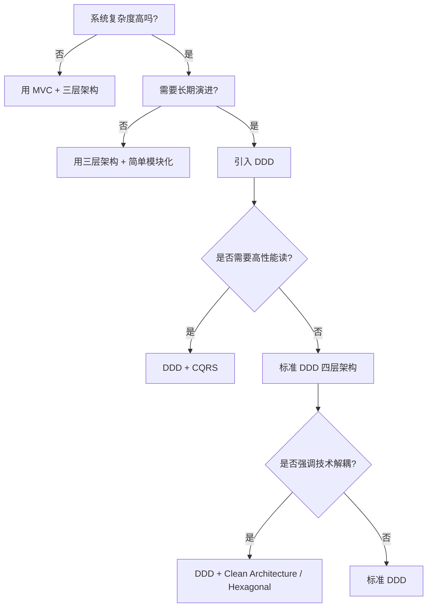
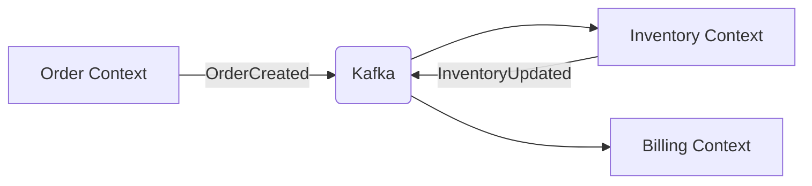

## 分类

### 架构模式分类

非常好的问题！**MVC 确实是一种架构模式，但它和 DDD 解决的问题层次不同**。我们可以从 **关注点、抽象层级、适用范围** 三个维度来系统梳理主流的软件架构/设计方法，并说明它们之间的关系。

------

#### 🧭 一、核心结论（先看全景）

| 方法                             | 全称                                     | 关注点                             | 抽象层级           | 是否与 DDD 冲突              |
| -------------------------------- | ---------------------------------------- | ---------------------------------- | ------------------ | ---------------------------- |
| **MVC**                          | Model-View-Controller                    | **表现层分离**（UI 与逻辑解耦）    | **UI 层设计模式**  | ❌ 不冲突，可共存             |
| **三层架构**                     | Presentation / BLL / DAL                 | **技术分层**（代码组织）           | **系统级架构**     | ⚠️ DDD 可视为其“业务层”的深化 |
| **DDD**                          | Domain-Driven Design                     | **业务建模**（复杂领域抽象）       | **业务架构方法论** | —                            |
| **Clean Architecture**           | —                                        | **依赖方向控制**（内层不依赖外层） | **架构风格**       | ✅ 与 DDD 高度兼容            |
| **Hexagonal (Ports & Adapters)** | 六边形架构                               | **核心逻辑与外部解耦**             | **架构风格**       | ✅ 常与 DDD 结合              |
| **CQRS**                         | Command Query Responsibility Segregation | **读写模型分离**                   | **数据访问模式**   | ✅ 常作为 DDD 的补充          |

> ✅ **关键理解**：
> **MVC 是“如何组织 UI 层”的模式，而 DDD 是“如何建模业务核心”的方法论——它们作用于不同层次，完全可以结合使用。**

------

#### 🏗️ 二、详细对比分析

##### 1. **MVC（Model-View-Controller）**

- **定位**：**表现层（Presentation Layer）设计模式**

- **目标**：分离用户界面（View）、用户输入（Controller）、数据模型（Model）

- 典型结构

  ：

  ```text
  View（HTML/React） 
    ←→ Controller（接收请求，调用 Service）
        → Model（通常是 DTO 或贫血 POJO）
  ```

- 与 DDD 的关系

  ：

  - MVC 中的 **Controller ≈ DDD 的 Interface Layer**
  - MVC 中的 **Model（DTO）≠ DDD 的 Domain Model**
  - **DDD 的领域层完全位于 MVC 的 "Model" 之下**，MVC 根本不关心领域逻辑！

> 💡 **实际项目中**：
> 你可以在 DDD 架构的 **Interface 层** 使用 Spring MVC 实现 Controller，**完全兼容**。

------

##### 2. **传统三层架构（Three-Layer Architecture）**

- 分层

  ：

  - **表现层（UI）**：Web/API
  - **业务逻辑层（BLL）**：Service 类（通常贫血）
  - **数据访问层（DAL）**：DAO/Repository

- 问题

  ：

  - 业务逻辑集中在 Service，导致 **“上帝类”**（如 `OrderService` 包含订单、库存、支付逻辑）
  - 模型是 **贫血的**（只有 getter/setter，无行为）

- 与 DDD 的关系

  ：

  - DDD 是对三层架构中 “BLL” 的重构

    ：

    - 将 Service 拆分为 **Application Service + Domain Model**
    - 引入 **聚合、实体、值对象** 等富模型

  - 可以说：**DDD = 三层架构 + 领域建模**

------

##### 3. **Clean Architecture（整洁架构） & Hexagonal（六边形架构）**

- **核心思想**：**依赖倒置** —— 内层（业务核心）不依赖外层（框架、DB、UI）

- 分层（由内到外）

  ：

  1. **Entities（领域层）** ← DDD 的 Domain
  2. **Use Cases（应用层）** ← DDD 的 Application
  3. **Interface Adapters（接口适配层）** ← DDD 的 Interface + Infrastructure
  4. **Frameworks & Drivers（框架/设备）**

- 与 DDD 的关系

  ：

  - **高度互补**！Clean Architecture 提供 **依赖规则**，DDD 提供 **领域建模方法**
  - 很多 DDD 项目采用 Clean Architecture 作为整体结构

------

##### 4. **CQRS（命令查询职责分离）**

- 核心思想

  ：

  读模型和写模型分离

  - **Command**：修改状态（走 DDD 聚合 + 事务）
  - **Query**：只读数据（可直接查 DB 视图，无需经过领域层）

- 与 DDD 的关系

  ：

  - CQRS **不是替代 DDD，而是增强它**
  - 在复杂系统中，**写操作用 DDD 保证一致性，读操作用简单 SQL 保证性能**

------

#### 📊 三、如何选择？决策树



------

#### ✅ 四、总结：它们不是“替代关系”，而是“组合关系”

| 场景                           | 推荐组合                                      |
| ------------------------------ | --------------------------------------------- |
| **简单后台管理系统**           | MVC + 三层架构                                |
| **中等复杂业务系统**           | DDD（四层） + Spring MVC（作为 Interface 层） |
| **大型复杂系统（如电商核心）** | DDD + CQRS + Hexagonal Architecture           |
| **需要严格技术隔离**           | DDD + Clean Architecture                      |

> 🔑 **终极理解**：  
>
> - **MVC 是“怎么画界面”的工具**  
> - **DDD 是“怎么想业务”的方法**  
> - **Clean/Hexagonal 是“怎么搭骨架”的原则**
>
> 它们各司其职，**组合使用才能构建出既清晰又健壮的系统**。

所以，**MVC 不仅“算”，而且常常是 DDD 架构中 Interface 层的实现方式之一**。


### DDD架构

**DDD（Domain-Driven Design，领域驱动设计）** 是由 Eric Evans 在 2003 年提出的软件开发方法论，其核心思想是：**将复杂业务系统的开发重心回归到“业务领域”本身，通过与领域专家紧密协作，构建出能够准确反映真实业务的软件模型。**

> 💡 简单说：**DDD 不是技术框架，而是一种“以业务为中心”的设计哲学和建模范式。**

------

#### 🧩 一、为什么需要 DDD？

在传统开发中，常见问题包括：

- 代码难以理解（充斥着 `if-else`、魔法数字）
- 业务逻辑散落在 Controller、Service、Util 中
- 需求变更时牵一发而动全身
- 开发人员与业务人员“说不同语言”

**DDD 的目标就是解决这些问题**，让软件系统 **“长得像业务”**。

------

#### 🏗️ 二、DDD 的核心概念（分层架构 + 战略/战术设计）

##### 1. **分层架构（Layered Architecture）**

DDD 推荐将系统分为四层：

| 层级                             | 职责                                  | 示例                                     |
| -------------------------------- | ------------------------------------- | ---------------------------------------- |
| **用户接口层（Interface）**      | 接收请求、返回响应                    | Controller、DTO                          |
| **应用层（Application）**        | 编排用例，协调领域对象                | `OrderAppService.placeOrder()`           |
| **领域层（Domain）**             | **核心！** 包含业务规则、实体、值对象 | `Order`, `Inventory`, `calculateTotal()` |
| **基础设施层（Infrastructure）** | 技术实现细节                          | DB 访问、MQ、Redis、HTTP 客户端          |

> ✅ **关键原则**：依赖方向只能从外向内（接口 → 应用 → 领域 ← 基础设施），**领域层不能依赖任何外部技术**。

------

##### 2. **战略设计（Strategic Design）—— 宏观规划**

关注 **“大方向”**：如何划分系统边界、团队协作。

| 概念                                | 说明                                                         |
| ----------------------------------- | ------------------------------------------------------------ |
| **限界上下文（Bounded Context）**   | **最重要的概念！** 一个明确的业务边界，内部有统一的模型和术语。 例如：“订单上下文” vs “库存上下文” |
| **通用语言（Ubiquitous Language）** | 开发、产品、业务使用**同一套术语**（如“下单”=“创建订单”）    |
| **上下文映射（Context Map）**       | 描述不同限界上下文之间的关系（如集成方式、数据流向）         |

> 🌰 举例：  
>
> - 在“电商系统”中，“用户”在**订单上下文**中只需 `userId`，  
> - 但在**会员上下文**中需要 `手机号、等级、积分`。
>   → 这是两个不同的模型，属于不同限界上下文！

------

##### 3. **战术设计（Tactical Design）—— 微观建模**

在限界上下文内部，如何用代码表达业务。

| 模式                           | 作用                                                         | 示例                                             |
| ------------------------------ | ------------------------------------------------------------ | ------------------------------------------------ |
| **实体（Entity）**             | 有唯一标识、生命周期的对象                                   | `Order(id=123)`, `User(id="U1001")`              |
| **值对象（Value Object）**     | 无 ID，靠属性定义，不可变                                    | `Address("北京", "朝阳区")`, `Money(100, "CNY")` |
| **聚合（Aggregate）**          | **一致性边界** 一组关联对象，由**聚合根（Aggregate Root）** 统一管理 | `Order` 是聚合根，包含 `OrderItem` 列表          |
| **领域服务（Domain Service）** | 跨多个实体的业务逻辑                                         | `TransferService.transfer(from, to, amount)`     |
| **领域事件（Domain Event）**   | 表示领域中发生的重要事情                                     | `OrderCreatedEvent`, `PaymentSucceededEvent`     |
| **仓储（Repository）**         | **抽象数据访问** 提供聚合的持久化接口（领域层定义，基础设施层实现） | `OrderRepository.save(order)`                    |

> ✅ **聚合的核心规则**：  
>
> - 外部只能通过**聚合根**访问内部对象  
> - 一次事务只修改**一个聚合**

------

#### 📊 三、DDD vs 传统 CRUD 开发

| 维度           | 传统 CRUD             | DDD                                   |
| -------------- | --------------------- | ------------------------------------- |
| **焦点**       | 数据表结构            | 业务行为与规则                        |
| **Service 层** | 充血（包含所有逻辑）  | 贫血（仅编排，核心逻辑在领域对象）    |
| **对象状态**   | 被动（POJO + setter） | 主动（封装行为，如 `order.cancel()`） |
| **可维护性**   | 需求一变，全盘皆乱    | 业务清晰，变更局部化                  |
| **团队协作**   | 开发与业务语言割裂    | 使用通用语言，高效沟通                |

------

#### ✅ 四、DDD 适合什么场景？

##### ✔️ 适合：

- **业务复杂**（如金融、电商、ERP）
- **需求频繁变化**
- **团队有领域专家参与**
- **系统需要长期演进**

##### ❌ 不适合：

- 简单 CRUD 系统（如后台管理）
- 数据报表类应用
- 快速原型验证（MVP）

> 💡 **Eric Evans 原话**：
> “DDD is not for all projects. It’s for the ones where the domain is complex and central to the business.”

------

#### 🛠️ 五、DDD 实践建议（避免误区）

1. **不要一上来就画聚合、实体**
   → 先和业务方聊清楚“通用语言”和“核心流程”
2. **领域层禁止依赖 Spring / MyBatis / JSON 注解**
   → 保持纯净，技术细节下沉到 Infrastructure
3. **聚合不宜过大**
   → 遵循“一个事务只改一个聚合”原则
4. **不要为了 DDD 而 DDD**
   → 简单业务用贫血模型更高效
5. **结合 CQRS、事件驱动可发挥更大价值**
   → 写模型（命令）和读模型（查询）分离

------

#### 💡 六、一句话总结 DDD

> **DDD 是一种通过“与业务专家共建通用语言”，在“限界上下文”内构建“富含行为的领域模型”，从而让软件系统真正反映业务本质的设计方法。**

它不是银弹，但对**复杂业务系统**而言，是目前最有效的应对之道。

> 📚 推荐学习路径：
> 《领域驱动设计精粹》（Vaughn Vernon） → 《实现领域驱动设计》 → 实战项目拆解


### 领域驱动思想

#### 一、领域驱动设计（DDD）核心思想

领域驱动设计（Domain-Driven Design，简称DDD）是由Eric Evans提出的一种软件设计思想，核心是**围绕业务领域建模**，让代码结构和业务逻辑高度对齐，解决复杂业务系统的设计难题。

##### 1. 核心概念（新手易懂版）

- **领域**：系统要解决的核心业务范围（比如电商系统的“订单领域”“商品领域”“支付领域”）。
- **子域**：领域的细分，分为三类：
  - 核心子域：系统最核心的业务（如电商的“订单履约”）；
  - 通用子域：多个子域共用的功能（如“用户认证”）；
  - 支撑子域：辅助核心业务的功能（如“日志统计”）。
- **限界上下文（Bounded Context）**：每个子域的“边界”，边界内的术语、模型有统一含义（比如“订单”在订单上下文里是“待支付/已支付”，在物流上下文里是“待发货/已签收”，上下文隔离避免歧义）。
- **聚合根**：领域模型的核心对象（比如“订单”是聚合根，包含订单项、收货地址等子对象，操作必须通过聚合根）。
- **领域服务**：不属于单个对象、跨多个对象的业务逻辑（比如“计算订单总价”需要结合商品价格、优惠规则，封装为领域服务）。

##### 2. DDD的核心目标

- 让技术人员和业务人员用“统一的语言”沟通（通用语言）；
- 避免代码被技术框架绑架，聚焦业务逻辑；
- 拆分复杂系统，降低耦合，提升可维护性。

---

#### 二、基于DDD拆分微服务的步骤（落地实操）

微服务拆分的核心是**以限界上下文为单位拆分**，而非按技术层（如“控制器层”“服务层”）或功能模块（如“查询模块”“新增模块”）拆分。以下是可落地的步骤：

##### 步骤1：梳理业务领域和子域

- 与业务人员沟通，识别核心业务流程（比如电商流程：用户下单→支付→发货→确认收货）；
- 拆分出子域，并标注类型（核心/通用/支撑）：
  示例（电商系统）：
  
  | 子域     | 类型     | 核心职责                 |
  | -------- | -------- | ------------------------ |
  | 订单子域 | 核心子域 | 订单创建、修改、取消     |
  | 商品子域 | 核心子域 | 商品管理、库存维护       |
  | 支付子域 | 核心子域 | 支付对接、账单管理       |
  | 用户子域 | 通用子域 | 用户注册、认证、信息管理 |
  | 日志子域 | 支撑子域 | 操作日志、业务日志统计   |

##### 步骤2：划分限界上下文

每个子域对应一个或多个限界上下文（根据业务复杂度），核心原则：
- 上下文内的模型语义统一；
- 上下文间通过“领域事件”或“接口”交互，避免直接依赖。
示例：
- 订单上下文：包含订单聚合根、订单状态变更领域服务、订单创建领域事件；
- 商品上下文：包含商品聚合根、库存扣减领域服务；
- 支付上下文：包含支付聚合根、支付结果回调领域服务。

##### 步骤3：将限界上下文映射为微服务

这是DDD拆分微服务的核心环节，映射规则：
1. **一对一映射（优先）**：一个限界上下文对应一个微服务（降低复杂度，符合高内聚低耦合）；
   示例：订单上下文 → 订单微服务，商品上下文 → 商品微服务。
2. **多对一映射**：多个简单的支撑子域/通用子域可合并为一个微服务（比如“日志+通知”合并为“基础服务微服务”）；
3. **一对多映射（谨慎）**：仅当单个上下文业务极复杂、流量极高时拆分（比如订单上下文拆分为“订单创建微服务”“订单查询微服务”）。

##### 步骤4：定义微服务间的交互方式

DDD强调“松耦合”，微服务间交互优先用以下方式：
- **领域事件**：异步通信（核心方式），比如“订单创建”事件触发“商品库存扣减”“支付单生成”；
  示例代码（Spring Cloud）：
  
  ```java
  // 订单微服务发布领域事件
  @Service
  public class OrderService {
      @Autowired
    private ApplicationEventPublisher eventPublisher;
  
      public void createOrder(OrderDTO orderDTO) {
          // 1. 业务逻辑：创建订单
          Order order = new Order();
        // ... 赋值逻辑
  
          // 2. 发布领域事件
          OrderCreatedEvent event = new OrderCreatedEvent(order.getId(), order.getProductId(), order.getQuantity());
          eventPublisher.publishEvent(event);
      }
}
  
  // 领域事件定义
  @Data
  @AllArgsConstructor
  public class OrderCreatedEvent {
      private Long orderId;
      private Long productId;
      private Integer quantity;
}
  
  // 商品微服务监听事件（异步）
  @Component
  public class OrderCreatedListener {
      @Autowired
    private ProductService productService;
  
      @EventListener
      @Async // 异步执行
      public void handleOrderCreatedEvent(OrderCreatedEvent event) {
          // 扣减库存
          productService.deductStock(event.getProductId(), event.getQuantity());
      }
  }
  ```
- **开放API**：同步通信（仅用于必须实时响应的场景），比如“创建订单前查询商品库存”；
- **防腐层（Anti-Corruption Layer，ACL）**：当微服务依赖外部系统（非DDD设计）时，封装外部接口，避免污染本域模型。

##### 步骤5：落地领域模型（微服务内的代码结构）

微服务内部按DDD分层设计，典型结构（从内到外）：
```
com.ecommerce.order（订单微服务）
├── domain（领域层：核心）
│   ├── aggregate（聚合根）
│   │   └── Order.java（订单聚合根）
│   ├── service（领域服务）
│   │   └── OrderDomainService.java
│   ├── event（领域事件）
│   │   └── OrderCreatedEvent.java
│   └── repository（仓储接口）
│       └── OrderRepository.java
├── infrastructure（基础设施层：实现）
│   ├── repository（仓储实现）
│   │   └── OrderRepositoryImpl.java（操作数据库）
│   └── client（外部服务调用）
│       └── ProductClient.java（调用商品微服务API）
├── application（应用层：编排）
│   ├── service
│   │   └── OrderAppService.java（调用领域服务，处理流程）
│   └── dto
│       └── OrderDTO.java
└── interface（接口层：对外）
    ├── rest
    │   └── OrderController.java（REST接口）
    └── facade
        └── OrderFacade.java（对内服务封装）
```

---

#### 三、拆分示例（电商系统）

以电商核心流程为例，最终拆分的微服务：
1. 订单微服务（核心）：订单创建/修改/取消、订单状态管理；
2. 商品微服务（核心）：商品CRUD、库存管理、商品规格；
3. 支付微服务（核心）：支付对接、账单管理、退款；
4. 用户微服务（通用）：用户注册、认证、信息管理；
5. 基础服务微服务（支撑）：日志、通知、配置管理。

---

#### 总结

1. DDD核心是**围绕业务领域建模**，通过“限界上下文”隔离业务边界，解决复杂系统的耦合问题；
2. 基于DDD拆分微服务的核心逻辑：**梳理子域→划分限界上下文→将上下文映射为微服务**，优先“一个上下文一个微服务”；
3. 微服务内部按DDD分层（领域层/应用层/基础设施层/接口层）设计，微服务间优先通过“领域事件”异步交互，保证松耦合。

### 传统三层架构

你描述的 **“entity 层 + mapper 层 + service 层 + controller 层”** 是典型的 **传统三层架构（Three-Layer Architecture）在 Java Web 项目中的具体实现形式**，常被称为 **“四层分层架构”** 或 **“Spring Boot 常见分层模式”**。

但它**不是 DDD（领域驱动设计）**，而是一种以**技术职责为中心**的分层方式。

------

#### 🏗️ 一、这种分层的本质：**技术分层（Technical Layering）**

| 层级             | 职责                                   | 技术关注点             |
| ---------------- | -------------------------------------- | ---------------------- |
| **Controller**   | 接收 HTTP 请求，参数校验，调用 Service | Web 框架（Spring MVC） |
| **Service**      | 业务逻辑编排（通常是事务边界）         | 业务流程、事务管理     |
| **Mapper / DAO** | 数据库 CRUD 操作                       | MyBatis / JPA          |
| **Entity / PO**  | 数据库表的映射对象（POJO）             | ORM 映射               |

> 🔍 **关键特征**：  
>
> - 每一层按**技术功能**划分（如“处理 HTTP”、“访问 DB”）  
> - **业务逻辑集中在 Service 层**，Entity 只是数据载体（**贫血模型**）  
> - 依赖方向：`Controller → Service → Mapper → Entity`

------

#### 🆚 二、与 DDD 分层架构对比

| 维度                 | 你描述的四层架构                                | DDD 四层架构                             |
| -------------------- | ----------------------------------------------- | ---------------------------------------- |
| **分层依据**         | **技术职责**（怎么实现）                        | **业务语义**（是什么）                   |
| **核心层**           | Service 层（过程式逻辑）                        | **Domain 层**（富领域模型）              |
| **Entity 角色**      | 贫血 POJO（只有 getter/setter）                 | **充血模型**（包含行为和业务规则）       |
| **业务逻辑位置**     | Service 类中（如 `OrderService.createOrder()`） | **领域对象内部**（如 `order.confirm()`） |
| **是否隔离技术细节** | 否（Service 可能直接依赖 MyBatis）              | 是（Domain 层不依赖任何框架）            |
| **适用场景**         | 简单 CRUD、快速开发                             | 复杂业务、长期演进                       |

##### 📌 举例说明差异：

###### ❌ 传统四层（贫血模型）：

```java
// Entity (只是数据容器)
public class Order {
    private Long id;
    private String status;
    // ... getter/setter
}

// Service (业务逻辑在这里)
@Service
public class OrderService {
    public void cancelOrder(Long orderId) {
        Order order = orderMapper.selectById(orderId);
        if ("PAID".equals(order.getStatus())) {
            throw new IllegalStateException("已支付订单不能取消");
        }
        order.setStatus("CANCELLED");
        orderMapper.update(order);
    }
}
```

###### ✅ DDD（充血模型）：

```java
// Entity (包含行为)
public class Order {
    private OrderStatus status;
    
    public void cancel() {
        if (status == OrderStatus.PAID) {
            throw new IllegalStateException("已支付订单不能取消");
        }
        this.status = OrderStatus.CANCELLED;
    }
}

// Application Service (只编排)
public class OrderAppService {
    public void cancelOrder(Long orderId) {
        Order order = orderRepository.findById(orderId);
        order.cancel(); // 业务规则在领域对象内部
        orderRepository.save(order);
    }
}
```

------

#### 📚 三、这种架构的正式名称

1. **传统三层架构（Three-Tier Architecture）的变体**  
   - 经典三层：**Presentation（表现层） + Business Logic（业务层） + Data Access（数据层）**
   - 你的四层 = 将 Presentation 拆为 Controller + Entity（DTO/PO），Business Logic = Service，Data Access = Mapper
2. **“贫血模型架构”（Anemic Domain Model Architecture）**  
   - 由 Martin Fowler 提出并**批评**的一种反模式（在简单场景下可接受）
   - 特征：领域对象无行为，业务逻辑散落在 Service 中
3. **Spring Boot 默认推荐结构**  
   - 因其简单、易上手，被广泛用于中小型项目

------

#### ⚖️ 四、优缺点分析

##### ✅ 优点：

- **简单直观**：新手容易理解
- **开发速度快**：适合 CRUD 为主的系统（如后台管理）
- **工具链成熟**：MyBatis-Plus、Spring Data JPA 等高度适配

##### ❌ 缺点：

- **业务逻辑分散**：复杂业务时 Service 类膨胀成“上帝类”
- **难以应对变化**：需求变更常需修改多处 Service 代码
- **测试困难**：业务逻辑与框架（Spring 事务）强耦合
- **无法表达业务语义**：代码读起来像“操作数据库”，不像“执行业务”

------

#### 💡 五、何时使用？何时升级？

| 场景                             | 建议                             |
| -------------------------------- | -------------------------------- |
| **内部管理系统、简单 API**       | ✅ 继续用四层架构，高效务实       |
| **核心业务系统（如电商、金融）** | ⚠️ 考虑引入 DDD，避免后期重构成本 |
| **团队有领域专家，业务复杂**     | ✅ 从 DDD 的“限界上下文”开始拆分  |
| **Service 类超过 1000 行**       | 🔔 警告！该向 DDD 演进了          |

------

#### ✅ 总结

> 你描述的 **entity + mapper + service + controller** 分层属于：
> **“基于技术职责的传统分层架构”**（或称 **贫血模型架构**），
> 它是 **三层架构在 Java 生态中的常见实现**，**不是 DDD**。

- **它不是错的** —— 对简单系统非常有效  
- **但它有局限** —— 面对复杂业务时会力不从心

> 🛠️ **最佳实践**：
> **简单业务用四层架构，复杂业务用 DDD**。
> 很多系统甚至混合使用：核心域用 DDD，支撑子域用传统分层。

###  真实架构选型经验

在实际业务开发中，**没有“放之四海而皆准”的架构**，但有 **“分场景、分阶段、分复杂度” 的务实选择策略**。以下是来自一线大厂和成熟团队的 **真实架构选型经验总结**：

------

#### ✅ 一、主流架构选型全景图（按业务复杂度）

| 业务类型                                             | 推荐架构                                                     | 典型技术栈                                | 占比（估算） |
| ---------------------------------------------------- | ------------------------------------------------------------ | ----------------------------------------- | ------------ |
| **1. 简单 CRUD / 内部工具** （如后台管理、报表系统） | **传统四层架构** （Controller + Service + Mapper + Entity）  | Spring Boot + MyBatis + MySQL             | **≈ 60%**    |
| **2. 中等复杂业务** （如电商商品、用户中心）         | **DDD 轻量级实践** （分模块 + 聚合根 + 领域服务）            | Spring Boot + DDD 分层 + CQRS（读写分离） | **≈ 30%**    |
| **3. 高复杂核心系统** （如订单、支付、风控）         | **完整 DDD + Clean Architecture** （限界上下文 + 事件驱动 + 最终一致性） | Spring Cloud + DDD + Kafka + Saga 事务    | **≈ 10%**    |

> 💡 **关键洞察**：
> **80% 的系统其实不需要完整 DDD**，但 **20% 的核心系统不用 DDD 会死得很惨**。

------

#### 🛠️ 二、各场景详细选型建议

##### 场景 1️⃣：**简单业务（快速交付优先）**

- **典型系统**：CMS 后台、OA 审批、数据看板

- **架构选择**：✅ **传统四层架构（贫血模型）**

- 为什么？

  - 开发快：MyBatis-Plus 自动生成 CRUD
  - 学习成本低：新人 1 天上手
  - 无过度设计：需求稳定，变更少

- 优化技巧

  ：

  - 用 `DTO` 隔离 `Entity`
  - Service 按功能拆分（如 `UserService`, `RoleService`）
  - 加上基础防腐层（Anti-Corruption Layer）防外部依赖污染

```text
Controller → Service → Mapper → Entity
          ↗
        DTO（用于接口）
```

------

##### 场景 2️⃣：**中等复杂业务（平衡可维护性与效率）**

- **典型系统**：电商平台的商品中心、用户中心、营销活动

- **架构选择**：✅ **轻量级 DDD（模块化 + 聚合）**

- 核心做法

  ：

  - **按业务能力划分模块**（如 `product-domain`, `user-domain`）

  - 每个模块内

    ：

    - 定义聚合根（如 `Product`）
    - 封装核心行为（如 `product.updatePrice()`）
    - Service 层只做编排（不包含业务规则）

  - **保留传统分层**，但强化领域层

- 不做什么

  ：

  - 不强行划分限界上下文（除非团队拆分）
  - 不引入事件驱动（除非有明确需求）

```text
[product-domain]
  ├── domain
  │   ├── Product (Aggregate Root)
  │   └── ProductRepository (interface)
  ├── application
  │   └── ProductAppService
  └── infrastructure
      └── ProductMapperImpl
```

> 📌 **这是目前最主流的“务实 DDD”** —— 既避免了贫血模型的混乱，又没陷入过度设计。

------

##### 场景 3️⃣：**高复杂核心系统（长期演进优先）**

- **典型系统**：金融交易、订单履约、供应链

- **架构选择**：✅ **完整 DDD + 事件驱动 + CQRS**

- 关键组件

  ：

  - **明确限界上下文**（Order Context, Inventory Context）
  - **领域事件**（`OrderCreatedEvent`）解耦上下文
  - **Saga 模式**处理跨上下文事务
  - **CQRS**：写模型（DDD 聚合） + 读模型（ES/物化视图）

- 技术栈

  ：

  - 消息队列：Kafka / RocketMQ
  - 事件存储：EventStore / 自建
  - 监控：分布式追踪（SkyWalking） + 事件日志审计



> ⚠️ **注意**：这种架构**团队要求高**，需有领域专家 + 架构师护航。

------

#### 🔍 三、一线大厂的真实实践（参考）

| 公司        | 做法                                                   |
| ----------- | ------------------------------------------------------ |
| **阿里**    | 核心链路（交易、支付）用完整 DDD；边缘系统用传统架构   |
| **美团**    | “DDD Lite”：模块化 + 聚合根，不强推事件驱动            |
| **腾讯**    | 游戏后台用 Actor 模型；ToB 系统用传统分层              |
| **Netflix** | 微服务 + Functional Core（类似 DDD 思想），但不用 Java |

> 💡 **共同点**：
> **“核心域重设计，支撑域重效率”** —— 不搞一刀切。

------

#### ⚖️ 四、决策 Checklist：你的项目该选哪种？

问自己以下问题：

| 问题                      | 选传统架构 | 选 DDD |
| ------------------------- | ---------- | ------ |
| **业务规则是否经常变？**  | 否         | 是     |
| **是否有专职领域专家？**  | 否         | 是     |
| **系统生命周期 > 3 年？** | 否         | 是     |
| **团队规模 > 20 人？**    | 否         | 是     |
| **是否涉及多团队协作？**  | 否         | 是     |
| **是否需要高一致性？**    | 否         | 是     |

✅ **只要有一个“是”，就考虑 DDD（至少轻量级）**

------

#### 💡 五、终极建议：渐进式演进

1. **起步阶段**：用传统四层架构快速验证业务
2. **发现痛点**（如 Service 类膨胀、逻辑重复）→ 引入 **模块化 + 聚合根**
3. **团队壮大/业务复杂** → 划分 **限界上下文**，引入 **领域事件**
4. **性能瓶颈** → 补充 **CQRS**，读写分离

> 🌟 **记住**：
> **“架构是演进而非设计出来的。”**
> 没有完美的起点，只有持续适配业务的迭代。

------

#### ✅ 总结

| 你的项目                   | 推荐架构                                       |
| -------------------------- | ---------------------------------------------- |
| **内部工具、简单 API**     | ✅ 传统四层（Controller/Service/Mapper/Entity） |
| **中台服务、产品核心模块** | ✅ 轻量级 DDD（模块化 + 聚合）                  |
| **金融级核心系统**         | ✅ 完整 DDD + 事件驱动 + CQRS                   |

> **不要为了用 DDD 而用 DDD，也不要因为怕复杂而拒绝 DDD。**
> **用最合适的工具，解决当前最痛的问题。**

### SpringCloud微服务中架构选型

在 **Spring Cloud 微服务实际项目中**，架构选型并非“全盘 DDD”或“纯传统分层”，而是采用 **“混合架构 + 分层治理”** 的务实策略：**核心域用 DDD 保证业务清晰性，支撑域用传统架构保障开发效率，整体通过微服务边界实现解耦**。

以下是来自一线互联网公司（阿里、腾讯、美团、京东等）的 **真实生产实践总结**：

------

#### ✅ 一、整体架构风格：**“DDD + Clean Architecture” 作为指导思想**

虽然不是每个服务都严格实现完整 DDD，但 **核心原则被广泛采纳**：

| 原则                          | 实践方式                                                     |
| ----------------------------- | ------------------------------------------------------------ |
| **限界上下文 = 微服务边界**   | 每个微服务对应一个 Bounded Context（如 `order-service`, `inventory-service`） |
| **领域层纯净**                | Domain 层不依赖 Spring / MyBatis / JSON 注解                 |
| **依赖方向由内向外**          | Domain ← Application ← Interface ← Infrastructure            |
| **防腐层（ACL）隔离外部依赖** | 调用其他微服务时，通过 DTO 转换，避免污染领域模型            |

> 📌 **关键认知**：
> **微服务天然支持 DDD 的“限界上下文”** —— 这是两者结合最自然的地方。

------

#### 🏗️ 二、单个微服务内部架构（主流选择）

##### 🔸 方案：**轻量级 DDD 四层架构（90% 核心服务采用）**

```text
order-service/
├── order-domain/          ← 领域层（核心！）
│   ├── model/
│   │   ├── Order (Aggregate Root)
│   │   ├── OrderItem (Entity)
│   │   └── OrderStatus (Value Object)
│   ├── service/
│   │   └── OrderDomainService.java  // 跨聚合逻辑
│   └── repository/
│       └── OrderRepository.java     // 接口（领域层定义）
│
├── order-application/     ← 应用层
│   ├── dto/               // 命令/查询 DTO
│   ├── command/
│   │   └── CreateOrderCommandHandler.java
│   └── query/
│       └── OrderQueryService.java
│
├── order-interface/       ← 接口层
│   ├── web/
│   │   └── OrderController.java     // Spring MVC
│   └── feign/
│       └── InventoryClient.java     // 调用其他服务
│
└── order-infrastructure/  ← 基础设施层
    ├── persistence/
    │   ├── OrderMapper.java         // MyBatis 实现
    │   └── OrderRepositoryImpl.java // 实现 Repository 接口
    └── mq/
        └── OrderEventProducer.java  // 发送 Kafka 消息
```

##### ✅ 为什么是“轻量级”？

- **不强制事件驱动**：除非有明确需求（如最终一致性），否则不用 Domain Event
- **不拆分过细**：一个微服务内通常只有 1~3 个聚合根
- **CQRS 按需引入**：读写模型分离仅用于高并发查询场景

------

#### ⚙️ 三、非核心服务：传统分层架构（效率优先）

对于 **支撑型微服务**（如通知服务、文件服务、配置中心），仍采用简单分层：

```text
notification-service/
├── controller/
├── service/              // 包含全部业务逻辑（贫血模型）
├── mapper/
└── entity/
```

> 💡 **理由**：这些服务业务简单、变更少，DDD 带来的收益 < 开发成本。

------

#### 🔗 四、微服务间协作模式（关键！）

##### 1. **同步调用：Feign + 防腐层（ACL）**

```java
// 在 order-service 中
@Service
public class InventoryClientAdapter {
    @Autowired
    private InventoryFeignClient client;

    public boolean deductStock(Long skuId, int quantity) {
        // 调用 inventory-service
        DeductStockRequest request = new DeductStockRequest(skuId, quantity);
        DeductStockResponse response = client.deductStock(request);
        
        // 转换为领域层能理解的结果
        return response.isSuccess();
    }
}
```

→ **避免直接使用 Feign 返回的 DTO 到领域层**

##### 2. **异步解耦：Kafka / RocketMQ + 事件**

- **领域事件**（Domain Event）只在**本服务内**发布
- **集成事件**（Integration Event）用于跨服务通信

```java
// order-domain
public class OrderCreatedEvent { /* 领域事件 */ }

// order-infrastructure
@EventListener
public void onOrderCreated(OrderCreatedEvent event) {
    // 转换为集成事件
    OrderPaidIntegrationEvent integrationEvent = convert(event);
    kafkaTemplate.send("order-topic", integrationEvent);
}
```

##### 3. **事务一致性：Saga 模式 or 最终一致性**

- **不跨服务用分布式事务**（如 Seata）—— 性能差、复杂度高
- **优先用“补偿 + 幂等 + 重试”实现最终一致性**

------

#### 🛡️ 五、必须配套的工程实践

| 实践                  | 说明                                                         |
| --------------------- | ------------------------------------------------------------ |
| **模块化 Maven 工程** | 每个微服务拆分为 `domain/application/interface/infrastructure` 子模块 |
| **API 版本管理**      | Controller 层支持 `/v1/orders`，DTO 向后兼容                 |
| **统一异常处理**      | 全局 `@ControllerAdvice` 返回标准错误码                      |
| **链路追踪**          | SkyWalking / Zipkin 集成，透传 TraceID                       |
| **配置中心**          | Nacos / Apollo 管理 `application.yml`                        |
| **服务网格（可选）**  | Istio 处理熔断、限流（替代 Hystrix）                         |

------

#### 📊 六、一线大厂真实案例参考

| 公司                  | 架构特点                                                     |
| --------------------- | ------------------------------------------------------------ |
| **阿里（电商）**      | 核心链路（交易、库存）用完整 DDD + TCC 事务；边缘服务用传统架构 |
| **美团（O2O）**       | “DDD Lite”：按业务能力拆微服务，每个服务内聚合根 + 领域服务  |
| **携程（旅游）**      | 订单系统用 Saga 模式 + Kafka 事件驱动，强最终一致性          |
| **Netflix（流媒体）** | Functional Core（类似 DDD 思想），但用 Kotlin + 异步非阻塞   |

> 🔑 **共同点**：
> **“核心域重设计，支撑域重效率；微服务即限界上下文。”**

------

#### ✅ 七、决策建议：你的 Spring Cloud 项目该怎么做？

| 你的场景                             | 推荐做法                                              |
| ------------------------------------ | ----------------------------------------------------- |
| **新项目，业务复杂（如金融、电商）** | ✅ 每个微服务采用 **轻量级 DDD 四层架构**              |
| **遗留系统拆微服务**                 | ✅ 先按功能拆服务，再在核心服务中逐步引入聚合根        |
| **团队无 DDD 经验**                  | ⚠️ 从 **模块化 + 领域对象行为封装** 开始，避免一步到位 |
| **高并发读场景**                     | ✅ 在应用层引入 **CQRS**，读模型直连 DB/ES             |

------

#### 💡 终极总结

> **Spring Cloud 微服务的实际架构 =**
> **“以微服务为限界上下文 + 单服务内轻量级 DDD + 传统分层用于支撑服务”**  
>
> **不要追求形式上的 DDD，而要抓住本质：**
> **1. 业务复杂处建模（聚合根、领域服务）**
> **2. 技术细节下沉（Infrastructure 隔离）**
> **3. 微服务边界即业务边界（Bounded Context）**

这种混合架构既保证了 **核心业务的可维护性**，又兼顾了 **整体开发效率**，是当前工业界最主流的选择。