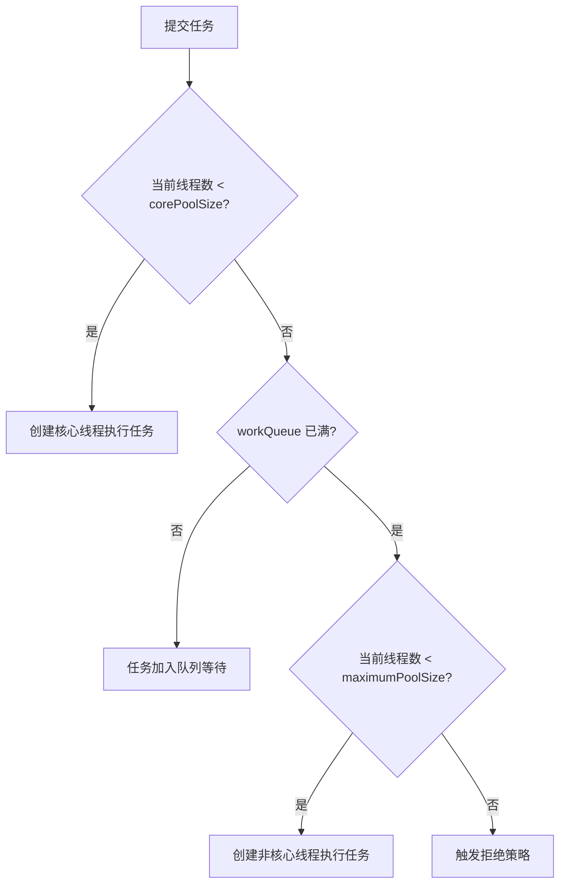
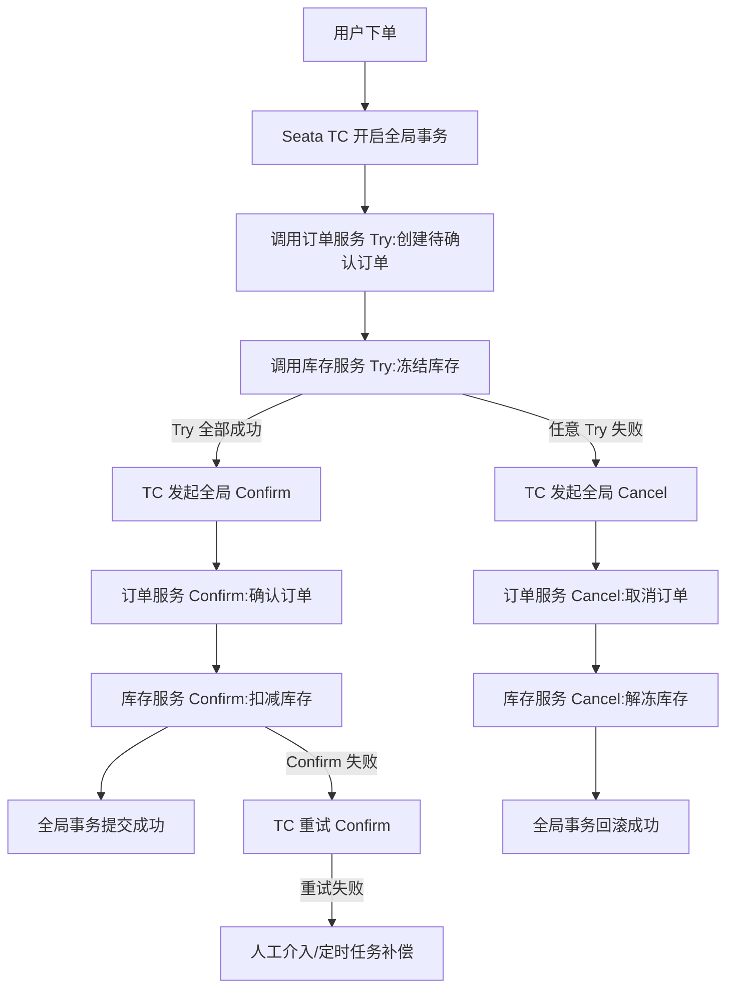
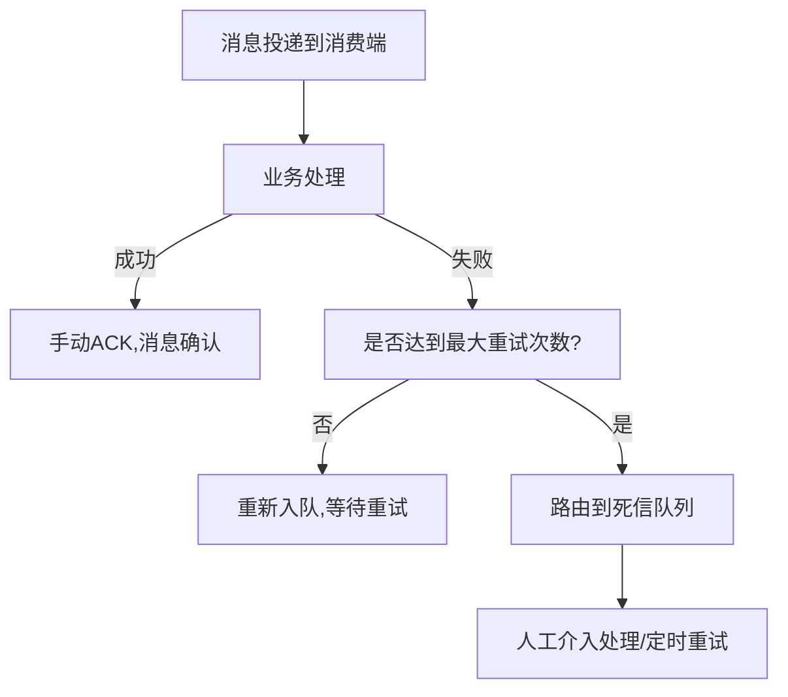

## KIMI

好的，我会以**Java后端开发工程师面试官**的身份，结合你简历中的项目经历、技术栈、学习背景等，提出**20个具有挑战性、层层递进、贴近实战**的问题。这些问题会覆盖：

- Java基础与并发
- 数据库与事务
- Redis与缓存设计
- 消息队列与分布式事务
- 微服务与系统设计
- 项目深挖与场景题

---

### 🔍 Java基础与并发（4题）

#### **1.你提到熟悉Java 8+特性，能否结合一个实际场景，说明你是如何用Lambda表达式或Stream API简化复杂集合操作的？**

用一个**电商订单数据处理**的场景来展示，这是非常贴近实际开发的需求。

##### 实际场景：电商订单数据统计分析

假设我们有一个订单列表，每个订单包含订单ID、用户ID、订单金额、订单状态、下单时间等信息。我们需要完成以下统计需求：
1. 筛选出2024年已支付的订单
2. 按用户ID分组，计算每个用户的总消费金额
3. 找出消费金额超过1000元的用户
4. 按消费金额降序排序，并只保留用户名和总金额

##### 1. 准备数据模型

首先定义订单和用户的实体类：

```java
import java.math.BigDecimal;
import java.time.LocalDateTime;

// 用户类
class User {
    private Long userId;
    private String username;
    
    // 构造函数、getter、setter
    public User(Long userId, String username) {
        this.userId = userId;
        this.username = username;
    }
    
    // getter and setter
    public Long getUserId() { return userId; }
    public String getUsername() { return username; }
}

// 订单类
class Order {
    private Long orderId;
    private Long userId;
    private BigDecimal amount;
    private String status; // "PAID", "UNPAID", "CANCELLED"
    private LocalDateTime createTime;
    
    // 构造函数、getter、setter
    public Order(Long orderId, Long userId, BigDecimal amount, String status, LocalDateTime createTime) {
        this.orderId = orderId;
        this.userId = userId;
        this.amount = amount;
        this.status = status;
        this.createTime = createTime;
    }
    
    // getter and setter
    public Long getUserId() { return userId; }
    public BigDecimal getAmount() { return amount; }
    public String getStatus() { return status; }
    public LocalDateTime getCreateTime() { return createTime; }
}
```

##### 2. 使用 Stream API 实现需求

```java
import java.math.BigDecimal;
import java.time.LocalDateTime;
import java.time.Year;
import java.util.*;
import java.util.stream.Collectors;

public class StreamOrderAnalysis {
    public static void main(String[] args) {
        // 模拟数据
        List<User> users = Arrays.asList(
            new User(1L, "Alice"),
            new User(2L, "Bob"),
            new User(3L, "Charlie")
        );
        
        List<Order> orders = Arrays.asList(
            new Order(101L, 1L, new BigDecimal("500"), "PAID", LocalDateTime.of(2024, 3, 15, 10, 30)),
            new Order(102L, 1L, new BigDecimal("600"), "PAID", LocalDateTime.of(2024, 4, 20, 14, 20)),
            new Order(103L, 2L, new BigDecimal("800"), "UNPAID", LocalDateTime.of(2024, 5, 5, 9, 15)),
            new Order(104L, 2L, new BigDecimal("300"), "PAID", LocalDateTime.of(2023, 12, 10, 16, 40)),
            new Order(105L, 3L, new BigDecimal("1200"), "PAID", LocalDateTime.of(2024, 6, 1, 11, 10)),
            new Order(106L, 3L, new BigDecimal("400"), "PAID", LocalDateTime.of(2024, 6, 15, 15, 5))
        );
        
        // 使用Stream API完成统计分析
        Map<String, BigDecimal> highValueUsers = orders.stream()
            // 1. 筛选2024年已支付的订单
            .filter(order -> "PAID".equals(order.getStatus()) 
                && order.getCreateTime().getYear() == Year.now().getValue())
            
            // 2. 按用户ID分组，计算总消费金额
            .collect(Collectors.groupingBy(
                Order::getUserId,
                Collectors.reducing(BigDecimal.ZERO, Order::getAmount, BigDecimal::add)
            ))
            
            // 转换为entry stream，继续处理
            .entrySet().stream()
            
            // 3. 筛选消费金额超过1000元的用户
            .filter(entry -> entry.getValue().compareTo(new BigDecimal("1000")) > 0)
            
            // 4. 关联用户名，并按金额降序排序
            .sorted(Map.Entry.<Long, BigDecimal>comparingByValue().reversed())
            
            // 映射为用户名-金额的Map
            .collect(Collectors.toMap(
                entry -> users.stream()
                    .filter(user -> user.getUserId().equals(entry.getKey()))
                    .findFirst()
                    .map(User::getUsername)
                    .orElse("Unknown"),
                Map.Entry::getValue,
                (v1, v2) -> v1, // 处理重复key的情况
                LinkedHashMap::new // 保持排序顺序
            ));
        
        // 输出结果
        System.out.println("高价值用户（消费>1000元）：");
        highValueUsers.forEach((username, totalAmount) -> 
            System.out.printf("%s: ￥%.2f%n", username, totalAmount));
    }
}
```

##### 3. 对比传统实现方式

如果用 Java 8 之前的方式实现相同功能，代码会冗长很多：

```java
// Java 8之前的传统实现方式
Map<Long, BigDecimal> userTotalMap = new HashMap<>();

// 1. 筛选并计算总金额
for (Order order : orders) {
    if ("PAID".equals(order.getStatus()) && order.getCreateTime().getYear() == Year.now().getValue()) {
        Long userId = order.getUserId();
        BigDecimal amount = order.getAmount();
        
        if (userTotalMap.containsKey(userId)) {
            userTotalMap.put(userId, userTotalMap.get(userId).add(amount));
        } else {
            userTotalMap.put(userId, amount);
        }
    }
}

// 2. 筛选高价值用户
List<Map.Entry<Long, BigDecimal>> highValueEntries = new ArrayList<>();
for (Map.Entry<Long, BigDecimal> entry : userTotalMap.entrySet()) {
    if (entry.getValue().compareTo(new BigDecimal("1000")) > 0) {
        highValueEntries.add(entry);
    }
}

// 3. 排序
Collections.sort(highValueEntries, new Comparator<Map.Entry<Long, BigDecimal>>() {
    @Override
    public int compare(Map.Entry<Long, BigDecimal> o1, Map.Entry<Long, BigDecimal> o2) {
        return o2.getValue().compareTo(o1.getValue());
    }
});

// 4. 构建结果Map
Map<String, BigDecimal> highValueUsers = new LinkedHashMap<>();
for (Map.Entry<Long, BigDecimal> entry : highValueEntries) {
    for (User user : users) {
        if (user.getUserId().equals(entry.getKey())) {
            highValueUsers.put(user.getUsername(), entry.getValue());
            break;
        }
    }
}
```

##### 4. 实现思路解析

1. **链式调用**：Stream API 使用链式调用的方式，将多个操作串联起来，代码更流畅、易读。
2. **Lambda 表达式**：简化了匿名内部类的写法，特别是在 `filter`、`sorted` 等操作中。
3. **Collector 工具类**：`Collectors.groupingBy()`、`Collectors.reducing()`、`Collectors.toMap()` 等提供了强大的集合转换功能。
4. **惰性求值**：中间操作（如 `filter`、`map`）是惰性的，只有在终止操作（如 `collect`）调用时才会执行。
5. **并行处理**：只需将 `stream()` 改为 `parallelStream()`，即可轻松实现并行处理，提升大数据量下的性能。

##### 总结

- **代码简洁性**：Stream API 将原本需要几十行的循环、判断、排序代码简化为一条链式调用，大大提高了代码的可读性和可维护性。
- **函数式编程思想**：通过 Lambda 表达式和方法引用，将关注点从"如何做"转移到"做什么"，代码意图更清晰。
- **强大的Collector**：`Collectors` 工具类提供了丰富的聚合操作，支持分组、分区、汇总、转换等复杂操作。
- **并行处理能力**：Stream API 内置了并行处理支持，无需手动处理线程同步，即可利用多核CPU提升性能。

#### **2.在剧院票务系统中，Redis原子锁防止超售，如果不用Lua脚本，你会如何用Java代码实现一个线程安全的扣库存逻辑？**

当然可以！实际上，在生产环境中，直接使用 **Redisson** 这类成熟的分布式锁框架是更佳选择，它不仅避免了手写 Lua 脚本的复杂性，还提供了更健壮、功能更完善的分布式锁实现。

Redisson 内部已经封装了 Lua 脚本和各种锁机制（如可重入锁、公平锁等），我们只需要调用其 API 即可安全地实现扣库存逻辑，无需关心底层细节。

##### 使用 Redisson 实现线程安全的扣库存逻辑

###### 1. 添加依赖

首先在 `pom.xml` 中引入 Redisson 依赖：

```xml
<!-- Redisson 依赖 -->
<dependency>
    <groupId>org.redisson</groupId>
    <artifactId>redisson-spring-boot-starter</artifactId>
    <version>3.23.3</version> <!-- 使用最新稳定版 -->
</dependency>
```

###### 2. 完整实现代码

```java
import org.redisson.api.RLock;
import org.redisson.api.RedissonClient;
import org.springframework.data.redis.core.RedisTemplate;
import org.springframework.data.redis.core.ValueOperations;
import org.springframework.stereotype.Component;

import java.util.concurrent.TimeUnit;

@Component
public class TicketStockServiceWithRedisson {

    // Redis 键前缀
    private static final String STOCK_KEY_PREFIX = "theater:ticket:stock:";
    private static final String LOCK_KEY_PREFIX = "theater:ticket:lock:";
    
    // 锁超时时间（防止死锁）
    private static final long LOCK_LEASE_TIME = 30; // 30秒自动释放
    private static final long LOCK_WAIT_TIME = 10;  // 获取锁的最大等待时间（10秒）

    private final RedisTemplate<String, Object> redisTemplate;
    private final RedissonClient redissonClient;

    public TicketStockServiceWithRedisson(RedisTemplate<String, Object> redisTemplate, RedissonClient redissonClient) {
        this.redisTemplate = redisTemplate;
        this.redissonClient = redissonClient;
    }

    /**
     * 扣减库存（基于 Redisson 分布式锁）
     * @param ticketId 票务ID
     * @param quantity 扣减数量
     * @return true-扣减成功，false-库存不足或扣减失败
     */
    public boolean deductStock(Long ticketId, int quantity) {
        if (quantity <= 0) {
            throw new IllegalArgumentException("扣减数量必须大于0");
        }

        String stockKey = STOCK_KEY_PREFIX + ticketId;
        String lockKey = LOCK_KEY_PREFIX + ticketId;
        
        // 获取 Redisson 分布式锁（可重入锁）
        RLock lock = redissonClient.getLock(lockKey);

        try {
            // 尝试获取锁：最多等待 LOCK_WAIT_TIME 秒，上锁后 LOCK_LEASE_TIME 秒自动释放
            boolean locked = lock.tryLock(LOCK_WAIT_TIME, LOCK_LEASE_TIME, TimeUnit.SECONDS);
            if (!locked) {
                // 获取锁失败（超时），返回扣减失败
                return false;
            }

            // 1. 检查库存（Redis 原子操作）
            ValueOperations<String, Object> valueOps = redisTemplate.opsForValue();
            Object stockObj = valueOps.get(stockKey);
            if (stockObj == null) {
                return false; // 库存不存在
            }

            int currentStock = Integer.parseInt(stockObj.toString());
            if (currentStock < quantity) {
                return false; // 库存不足
            }

            // 2. 扣减库存（Redis DECRBY 原子操作）
            Long newStock = valueOps.decrement(stockKey, quantity);
            return newStock != null && newStock >= 0;

        } catch (InterruptedException e) {
            Thread.currentThread().interrupt();
            return false;
        } finally {
            // 3. 释放锁（确保只有持有锁的线程释放）
            if (lock.isHeldByCurrentThread()) {
                lock.unlock();
            }
        }
    }

    /**
     * 初始化库存
     */
    public void initStock(Long ticketId, int initialStock) {
        String stockKey = STOCK_KEY_PREFIX + ticketId;
        redisTemplate.opsForValue().set(stockKey, initialStock);
    }

    /**
     * 查询当前库存
     */
    public int getCurrentStock(Long ticketId) {
        String stockKey = STOCK_KEY_PREFIX + ticketId;
        Object stockObj = redisTemplate.opsForValue().get(stockKey);
        return stockObj == null ? 0 : Integer.parseInt(stockObj.toString());
    }
}
```

##### 实现思路解析

###### 1. Redisson 分布式锁的优势

- **自动封装 Lua 脚本**：Redisson 的 `RLock` 底层通过 Lua 脚本实现了“获取锁”“释放锁”的原子性操作，无需我们手写脚本。
- **自动续期**：如果业务逻辑执行时间超过锁的过期时间，Redisson 会自动为锁续期（“看门狗”机制），避免锁提前释放导致并发问题。
- **丰富的锁类型**：支持可重入锁、公平锁、红锁（RedLock）等，可根据场景选择。
- **优雅的 API**：`tryLock()` 方法支持“等待时间+过期时间”参数，语义清晰，易于使用。

###### 2. 核心流程

1. **获取锁**：通过 `redissonClient.getLock(lockKey)` 获取分布式锁，调用 `tryLock()` 尝试获取锁（带超时机制）。
2. **检查库存**：通过 RedisTemplate 的 `get()` 方法获取当前库存，判断是否充足。
3. **扣减库存**：使用 `decrement()` 原子命令扣减库存（Redis 单命令保证原子性）。
4. **释放锁**：在 `finally` 块中释放锁，确保锁一定会被释放（避免死锁）。

###### 3. 测试并发扣减（同之前的测试逻辑）

```java
import org.junit.jupiter.api.Test;
import org.springframework.beans.factory.annotation.Autowired;
import org.springframework.boot.test.context.SpringBootTest;

import java.util.concurrent.CountDownLatch;
import java.util.concurrent.ExecutorService;
import java.util.concurrent.Executors;

@SpringBootTest
public class TicketStockServiceWithRedissonTest {

    @Autowired
    private TicketStockServiceWithRedisson stockService;

    @Test
    public void testConcurrentDeductStock() throws InterruptedException {
        Long ticketId = 1001L;
        int initialStock = 100;
        int threadCount = 20;
        int perThreadDeduct = 5;

        stockService.initStock(ticketId, initialStock);

        ExecutorService executor = Executors.newFixedThreadPool(threadCount);
        CountDownLatch latch = new CountDownLatch(threadCount);

        for (int i = 0; i < threadCount; i++) {
            executor.submit(() -> {
                try {
                    boolean success = stockService.deductStock(ticketId, perThreadDeduct);
                    System.out.println("扣减结果：" + success + "，当前库存：" + stockService.getCurrentStock(ticketId));
                } finally {
                    latch.countDown();
                }
            });
        }

        latch.await();
        executor.shutdown();

        System.out.println("最终库存：" + stockService.getCurrentStock(ticketId)); // 预期为 0
    }
}
```

##### 总结

- **推荐方案**：在生产环境中，**优先使用 Redisson 等成熟框架**实现分布式锁，而非手写 Lua 脚本或基础 Redis 命令。Redisson 不仅避免了重复造轮子，还解决了锁续期、死锁、原子性等底层问题。
- **核心保障**：Redisson 分布式锁保证了库存操作的串行化，Redis 的 `decrement` 命令保证了扣减的原子性，两者结合彻底防止超售。
- **优势对比**：Redisson 提供了更健壮的锁机制（如看门狗续期、公平锁），API 更简洁，容错性更强，是分布式场景下的最佳实践。

#### **3.你说了解JMM，能否解释一下volatile的可见性和禁止指令重排序是如何实现的？**

你想深入了解 JMM（Java 内存模型）中 `volatile` 关键字的底层实现原理，特别是它的**可见性**和**禁止指令重排序**特性是如何实现的。

##### volatile 的底层实现原理

`volatile` 的特性并不是由 JVM 单独实现的，而是依赖于**JMM 的内存屏障（Memory Barrier）**和**CPU 的缓存一致性协议**（如 MESI）来共同保证的。

##### 1. 可见性的实现机制

###### （1）CPU 缓存一致性问题

在多核 CPU 架构中，每个核心都有自己的高速缓存（L1/L2）。当多个线程在不同核心上运行时，它们可能会将同一个变量从主内存加载到各自的缓存中，修改后不会立即写回主内存，导致其他核心无法看到最新值，这就是**缓存不一致**问题。

###### （2）volatile 如何保证可见性

- **强制写回主内存**：当线程修改一个 `volatile` 变量时，JMM 会强制将该变量的值从线程的本地缓存刷新到**主内存**中。
- **强制失效其他缓存**：同时，JMM 会使其他核心中该变量的缓存行（Cache Line）失效。当其他线程读取这个 `volatile` 变量时，发现本地缓存失效，就会从主内存重新加载最新值。

###### （3）底层硬件支持：缓存一致性协议

CPU 通过**缓存一致性协议**（如 MESI）来实现多核心间的缓存同步：
- **MESI 协议**将缓存行标记为四种状态：Modified（已修改）、Exclusive（独占）、Shared（共享）、Invalid（无效）。
- 当一个核心修改了 `volatile` 变量对应的缓存行时，会通过**总线嗅探（Bus Snooping）**机制通知其他核心将该缓存行标记为 Invalid，从而保证其他核心必须从主内存读取最新值。

##### 2. 禁止指令重排序的实现机制

###### （1）指令重排序的根源

JVM 和 CPU 为了优化性能，会对指令进行重排序（as-if-serial 语义），但这种优化在多线程环境下可能导致错误。

###### （2）内存屏障（Memory Barrier）

JMM 通过在 `volatile` 变量的读写操作前后插入**内存屏障**来禁止指令重排序。内存屏障是一种 CPU 指令，用于限制指令重排序的范围，并强制刷新缓存。

JMM 为 `volatile` 定义了以下内存屏障规则：

| 操作类型 | 内存屏障类型 | 作用 |
|----------|--------------|------|
| **volatile 写操作** | 写后插入 **StoreStore** + **StoreLoad** 屏障 | - StoreStore：禁止上面的普通写与下面的 volatile 写重排序<br>- StoreLoad：禁止上面的 volatile 写与下面的 volatile 读/写重排序 |
| **volatile 读操作** | 读前插入 **LoadLoad** + **LoadStore** 屏障 | - LoadLoad：禁止下面的普通读与上面的 volatile 读重排序<br>- LoadStore：禁止下面的普通写与上面的 volatile 读重排序 |

###### （3）内存屏障的具体效果

- **StoreStore 屏障**：确保在 volatile 写之前的所有普通写操作都已刷新到主内存。
- **StoreLoad 屏障**：防止 volatile 写之后的指令被重排序到写操作之前（这是开销最大的屏障，因为它会刷新缓存并等待所有写操作完成）。
- **LoadLoad 屏障**：确保 volatile 读之后的普通读操作不会被重排序到读操作之前。
- **LoadStore 屏障**：确保 volatile 读之后的普通写操作不会被重排序到读操作之前。

###### 3. volatile 实现的底层指令示例

以 x86 架构为例，JVM 会为 `volatile` 变量的写操作生成 `LOCK` 前缀的指令（如 `LOCK ADDL`）：

```asm
; 假设变量 a 是 volatile 类型
mov    DWORD PTR [rsp+0x14],0x1  ; 将 1 写入临时变量
lock add DWORD PTR [rsp+0x14],0x0 ; LOCK 前缀强制刷新缓存到主内存
mov    eax,DWORD PTR [rsp+0x14]  
mov    DWORD PTR [a],eax         ; 将值写入 volatile 变量 a
```

- **LOCK 前缀**的作用：
  1. 锁定总线或缓存行（现代 CPU 优化为缓存锁定），确保指令执行的原子性。
  2. 强制将当前核心的缓存刷新到主内存。
  3. 使其他核心的缓存行失效，从而保证可见性。
  4. 阻止指令重排序，相当于内存屏障。

##### 总结

- **可见性实现**：通过**CPU 缓存一致性协议**（如 MESI）和**强制刷新主内存**机制，确保一个线程对 volatile 变量的修改能立即被其他线程看到。
- **禁止重排序实现**：通过在 volatile 读写操作前后插入**内存屏障**，限制 JVM 和 CPU 的指令重排序优化，保证指令执行顺序与代码逻辑顺序一致。
- **底层硬件支撑**：依赖 CPU 的 `LOCK` 前缀指令和内存屏障指令，将 volatile 语义从 JVM 层面下沉到硬件层面，确保跨平台一致性。

#### **4.线程池中`corePoolSize`、`maximumPoolSize`和`workQueue`的关系是什么？如果任务量突增，线程池会如何表现？**

你想了解线程池中 `corePoolSize`、`maximumPoolSize` 和 `workQueue` 三者之间的关系，以及任务量突增时线程池的具体表现逻辑。

##### 三者的核心关系

线程池的核心参数共同决定了它处理任务的策略，它们的关系可以概括为：

- **`corePoolSize`**：线程池的**核心线程数**，即线程池长期维持的最小线程数量（除非设置了 `allowCoreThreadTimeOut`）。
- **`maximumPoolSize`**：线程池允许创建的**最大线程数**，是线程池的容量上限。
- **`workQueue`**：用于存放等待执行的任务的**阻塞队列**，是核心线程数和最大线程数之间的“缓冲地带”。

三者的协作遵循**先核心线程、再队列、最后非核心线程**的优先级顺序。

##### 任务量突增时的表现流程

当大量任务提交到线程池时，线程池会按照以下步骤处理：

1. **步骤1：创建核心线程**  
   - 如果当前运行的线程数 **< `corePoolSize`**，线程池会直接创建新的核心线程来处理任务，即使有核心线程处于空闲状态。

2. **步骤2：任务进入队列**  
   - 当核心线程数达到 `corePoolSize` 后，新提交的任务会被放入 `workQueue` 中等待执行。

3. **步骤3：创建非核心线程**  
   - 如果 `workQueue` 已满，且当前运行的线程数 **< `maximumPoolSize`**，线程池会创建新的**非核心线程**来处理任务。

4. **步骤4：触发拒绝策略**  
   - 如果 `workQueue` 已满，且线程数已达到 `maximumPoolSize`，线程池会触发**拒绝策略**（如抛出异常、丢弃任务等）。

##### 可视化流程



##### 示例说明

假设线程池参数配置为：
- `corePoolSize = 5`
- `maximumPoolSize = 10`
- `workQueue = ArrayBlockingQueue(100)`

任务量突增时的表现：
1. 前5个任务：直接创建5个核心线程处理。
2. 第6~105个任务：放入容量为100的队列中等待。
3. 第106~115个任务：队列已满，创建6~10号非核心线程处理。
4. 第116个及以后任务：队列满且线程数达上限，触发拒绝策略。

##### 不同队列类型的影响

`workQueue` 的类型会显著影响线程池的行为：
- **无界队列**（如 `LinkedBlockingQueue`）：队列容量无限，任务永远不会被拒绝，但可能导致内存溢出（OOM），此时 `maximumPoolSize` 形同虚设（线程数最多为 `corePoolSize`）。
- **有界队列**（如 `ArrayBlockingQueue`）：能限制队列大小，配合 `maximumPoolSize` 可控制线程总数，但队列满时会触发拒绝策略。
- **同步队列**（`SynchronousQueue`）：队列不存储任务，直接传递给线程，此时 `maximumPoolSize` 需设置较大，否则易触发拒绝策略。

##### 总结

- **协作逻辑**：线程池遵循“核心线程 → 任务队列 → 非核心线程 → 拒绝策略”的优先级处理任务。
- **参数作用**：`corePoolSize` 是基础线程数，`workQueue` 是缓冲层，`maximumPoolSize` 是线程数上限。
- **关键影响**：`workQueue` 的类型（有界/无界）决定了 `maximumPoolSize` 是否能生效，任务突增时无界队列易导致内存溢出，有界队列需合理配置拒绝策略。


---

### 🧠 数据库与事务（4题）

#### **1.你在项目中用了Seata的TCC模式，能否解释一下TCC的Try、Confirm、Cancel三个阶段分别做了什么？如果Confirm失败怎么办？**

你想了解 Seata TCC 模式中 Try、Confirm、Cancel 三个阶段的具体职责，以及 Confirm 阶段失败时的处理方案，这是分布式事务中的核心问题。

##### TCC 模式的核心三阶段

TCC（Try-Confirm-Cancel）是一种**补偿事务**模式，通过业务逻辑的拆分来实现分布式事务的一致性。它要求每个参与事务的服务都实现三个接口：

###### 1. Try 阶段（资源检查与预留）

- **核心职责**：**检查业务前置条件** + **预留业务资源**。
- **具体操作**：
  - 检查业务规则（如库存是否充足、账户余额是否足够）。
  - 预留本次事务需要的资源（如冻结库存、锁定账户金额），确保后续 Confirm 阶段能执行。
  - Try 操作必须是**幂等**的（多次调用结果一致），且**可重试**。

**示例**（订单+库存场景）：
- 订单服务 Try：创建订单并标记为“待确认”状态。
- 库存服务 Try：检查库存充足后，冻结订单所需的库存数量。

###### 2. Confirm 阶段（确认执行业务）

- **核心职责**：**正式执行业务操作** + **释放预留资源**（或转换资源状态）。
- **具体操作**：
  - 基于 Try 阶段预留的资源，完成最终的业务逻辑（如扣减库存、扣减账户余额）。
  - 将 Try 阶段的临时状态转为最终状态（如订单从“待确认”改为“已完成”）。
  - Confirm 操作同样需要保证**幂等性**，因为 Seata 可能会重试失败的 Confirm。

**示例**：
- 订单服务 Confirm：将订单状态改为“已完成”。
- 库存服务 Confirm：将冻结的库存正式扣减。

###### 3. Cancel 阶段（取消并释放资源）

- **核心职责**：**回滚 Try 阶段的预留操作** + **释放预留资源**。
- **具体操作**：
  - 当事务中任意参与者的 Try 或 Confirm 失败时，执行 Cancel 操作。
  - 释放 Try 阶段预留的资源（如解冻库存、解锁账户金额），恢复到事务前的状态。
  - Cancel 操作也必须是**幂等**且**可重试**的。

**示例**：

- 订单服务 Cancel：删除“待确认”订单或标记为“已取消”。
- 库存服务 Cancel：解冻 Try 阶段冻结的库存。

##### Confirm 阶段失败的处理方案

Confirm 阶段失败是分布式事务中需要重点处理的异常场景，Seata 提供了多层保障机制：

###### 1. Seata 框架的自动重试

- **重试机制**：Seata 的 TC（事务协调器）会记录事务状态，当检测到 Confirm 失败时，会**自动重试 Confirm 操作**（默认重试次数可配置）。
- **重试依据**：基于事务的 XID（全局事务ID）和分支事务ID，确保重试的幂等性。
- **适用场景**：因网络抖动、服务瞬时不可用导致的失败。

###### 2. 人工介入与补偿

- **日志记录**：系统需记录详细的事务日志（包括 XID、分支ID、操作参数），便于定位问题。
- **手动补偿**：若自动重试失败（如业务逻辑错误导致无法重试），运维人员可通过后台系统手动触发 Confirm 或 Cancel 操作。

###### 3. 事务状态回查与补偿任务

- **定时任务**：系统可设计定时任务，定期扫描“待确认”状态的事务，触发二次确认或取消。
- **状态回查接口**：通过 Seata 提供的 API（如 `GlobalTransactionStatus`）查询事务状态，针对性处理失败的分支事务。

###### 4. 兜底方案：业务层面的补偿逻辑

- **预留资源过期机制**：为 Try 阶段的预留资源设置过期时间（如冻结库存24小时未确认则自动解冻），避免资源长期锁定。
- **对账系统**：通过定时对账，对比各服务的数据一致性（如订单状态与库存扣减是否匹配），发现不一致时触发补偿。

##### TCC 三阶段的执行流程（以订单+库存为例）



##### 总结

- **三阶段职责**：Try 做资源检查与预留，Confirm 做最终确认，Cancel 做资源释放与回滚。
- **Confirm 失败处理**：Seata 自动重试为首要方案，配合日志记录、定时任务、人工介入形成多层保障，最终通过业务补偿确保数据一致性。
- **核心要求**：TCC 的三个阶段必须保证幂等性和可重试性，这是实现分布式事务一致性的基础。

#### **2.MySQL中，索引失效的常见场景有哪些？你在项目中有没有遇到过“走了全表扫描”的SQL？如何优化的？**

你想了解 MySQL 中索引失效的常见场景，以及实际项目中遇到全表扫描 SQL 的优化经验，这是数据库性能优化的核心问题。

##### MySQL 索引失效的常见场景

索引失效本质上是因为查询条件或 SQL 写法导致优化器认为**走索引的成本高于全表扫描**，或无法使用索引。以下是最常见的失效场景：

###### 1. 索引列参与计算或函数操作

对索引列使用函数、算术运算等，会导致索引失效：
```sql
-- 失效：对索引列 create_time 使用函数
SELECT * FROM order WHERE YEAR(create_time) = 2024;

-- 有效：改为范围查询
SELECT * FROM order WHERE create_time >= '2024-01-01' AND create_time < '2025-01-01';
```

###### 2. 使用 `OR` 连接非索引列

`OR` 两边只要有一列无索引，索引就会失效（除非两边都有索引）：

```sql
-- 失效：name 无索引，即使 id 是主键索引
SELECT * FROM user WHERE id = 1 OR name = 'Alice';

-- 有效：给 name 加索引，或拆分为两个查询
```

###### 3. 模糊查询以 `%` 开头

`LIKE '%xxx'` 会导致索引失效（`LIKE 'xxx%'` 可走前缀索引）：
```sql
-- 失效：% 开头
SELECT * FROM user WHERE name LIKE '%Alice';

-- 有效：前缀匹配
SELECT * FROM user WHERE name LIKE 'Alice%';
```

###### 4. 隐式类型转换

索引列类型与查询值类型不一致，触发隐式转换：
```sql
-- 失效：name 是 varchar 类型，查询值用数字（MySQL 会转换列值为数字）
SELECT * FROM user WHERE name = 123;

-- 有效：保持类型一致
SELECT * FROM user WHERE name = '123';
```

###### 5. 联合索引不满足最左匹配原则

联合索引 `(a, b, c)` 必须从最左列开始匹配，否则失效：
```sql
-- 失效：跳过最左列 a
SELECT * FROM user WHERE b = 2 AND c = 3;

-- 有效：包含最左列 a
SELECT * FROM user WHERE a = 1 AND b = 2;
```

###### 6. 使用 `NOT IN`/`NOT EXISTS`/`<>`

这些操作符可能导致优化器放弃索引（视数据量而定）：
```sql
-- 可能失效：NOT IN
SELECT * FROM user WHERE id NOT IN (1, 2, 3);

-- 优化：改为 LEFT JOIN
SELECT u.* FROM user u LEFT JOIN exclude e ON u.id = e.id WHERE e.id IS NULL;
```

###### 7. 数据分布导致优化器选择全表扫描

若索引列的区分度极低（如性别列，只有男/女），优化器可能认为全表扫描更快：
```sql
-- 可能失效：gender 区分度低
SELECT * FROM user WHERE gender = '男';
```

##### 项目中全表扫描的优化案例

###### 场景描述

电商系统中，查询“近7天已支付且未发货的订单”的 SQL 出现全表扫描，表数据量约 500 万：
```sql
-- 原 SQL（全表扫描，耗时 3.2 秒）
SELECT * FROM `order` 
WHERE pay_time >= DATE_SUB(NOW(), INTERVAL 7 DAY) 
  AND status = 'PAID' 
  AND ship_status = 'UNSHIPPED';
```

###### 问题分析

1. 表中仅主键索引 `id`，无其他索引，导致全表扫描。
2. 查询条件涉及 `pay_time`、`status`、`ship_status`，但未建立联合索引。

###### 优化步骤

1. **创建联合索引**：根据查询条件的**最左匹配**和**区分度**，创建索引 `idx_pay_status_ship`（`pay_time`, `status`, `ship_status`）：
   
   ```sql
   CREATE INDEX idx_pay_status_ship ON `order` (pay_time, status, ship_status);
   ```
   - 选择 `pay_time` 作为最左列：范围查询（`>=`）需放在联合索引最左侧。
- `status` 和 `ship_status` 为等值条件，放在后面。
  
2. **优化 SQL**：避免 `SELECT *`，只查询需要的字段（覆盖索引优化）：
   ```sql
   -- 优化后 SQL（走索引，耗时 0.05 秒）
   SELECT id, order_no, user_id, amount FROM `order` 
   WHERE pay_time >= DATE_SUB(NOW(), INTERVAL 7 DAY) 
     AND status = 'PAID' 
     AND ship_status = 'UNSHIPPED';
   ```

3. **进阶优化（覆盖索引）**：若查询字段固定，可创建**覆盖索引**（包含查询所需所有字段），避免回表：
   ```sql
   CREATE INDEX idx_pay_status_ship_cover ON `order` (pay_time, status, ship_status, id, order_no, user_id, amount);
   ```

###### 优化结果

- 执行时间从 3.2 秒降至 0.05 秒，QPS 提升 60 倍。
- 通过 `EXPLAIN` 验证：`type` 从 `ALL`（全表扫描）变为 `range`（索引范围扫描），`key` 显示使用 `idx_pay_status_ship`。

##### 总结

- **索引失效核心原因**：索引列被修改（函数/计算）、违反最左匹配、数据分布不合理、操作符使用不当等。
- **全表扫描优化思路**：
  1. 通过 `EXPLAIN` 分析执行计划，确认是否走索引。
  2. 针对查询条件创建合适的索引（联合索引/覆盖索引）。
  3. 优化 SQL 写法，避免索引失效场景（如隐式转换、`%xxx` 模糊查询）。
- **关键原则**：索引设计需结合查询场景，遵循“最左匹配、区分度优先、避免过度索引”的原则。

#### **3.假设你在餐厅系统中给菜品加库存时，使用了`update stock set count = count - 1 where id = 1`，这条SQL在RR隔离级别下会加什么锁？**

你想知道在 MySQL 的 RR（可重复读）隔离级别下，执行 `update stock set count = count - 1 where id = 1` 这条 SQL 会加什么锁，这涉及到 InnoDB 存储引擎的锁机制。

##### 这条 SQL 加锁的具体情况

在 RR 隔离级别下，这条 `UPDATE` 语句的加锁行为取决于 `id` 字段是否为主键/唯一索引：

###### 1. 如果 `id` 是主键（或唯一索引）

- **加锁类型**：对 `id = 1` 的行加**行级排他锁（X锁）**，且是**记录锁（Record Lock）**，仅锁定符合条件的这一行。
- **锁范围**：仅锁定 `id = 1` 的记录，其他行不受影响。
- **原因**：InnoDB 对于主键/唯一索引的等值查询，能精准定位到单行记录，因此只会加行锁，不会扩大锁范围。

###### 2. 如果 `id` 不是主键/唯一索引（普通索引或无索引）

- **加锁类型**：
  - 对 `id = 1` 的行加**行级排他锁（X锁）**；
  - 同时会加**间隙锁（Gap Lock）** 或**临键锁（Next-Key Lock）**，锁定该记录所在的间隙范围，防止幻读。
- **锁范围**：不仅锁定 `id = 1` 的记录，还会锁定其前后的间隙（如 `id` 为 0~1、1~2 的间隙），可能导致其他事务无法插入该范围内的记录。
- **原因**：RR 隔离级别下，InnoDB 为了防止幻读，会通过间隙锁/临键锁锁定索引范围，即使是普通索引的等值更新，也可能触发间隙锁。

##### 关键概念补充

- **记录锁（Record Lock）**：锁定具体的行记录，仅影响匹配的行。
- **间隙锁（Gap Lock）**：锁定索引记录之间的间隙，不包含记录本身，防止插入新记录导致幻读。
- **临键锁（Next-Key Lock）**：记录锁 + 间隙锁的组合，锁定记录本身及其前面的间隙，是 InnoDB 默认的行锁方式（RR 级别下）。
- **排他锁（X锁）**：允许持有锁的事务修改数据，阻止其他事务获取相同记录的共享锁或排他锁。

##### 示例验证

假设 `stock` 表的 `id` 是主键：
- 事务 A 执行 `update stock set count = count - 1 where id = 1`，会对 `id=1` 的行加 X 锁；
- 事务 B 此时执行 `update stock set count = count - 1 where id = 1`，会被阻塞，直到事务 A 提交/回滚；
- 事务 B 执行 `update stock set count = count - 1 where id = 2`，不受影响，可正常执行。

##### 总结

- **主键/唯一索引场景**：仅对匹配行加**行级排他锁（Record Lock）**，锁范围最小，并发性能最好。
- **非主键/无索引场景**：会加**行锁 + 间隙锁/临键锁**，锁范围扩大，可能导致并发插入阻塞。
- **核心建议**：更新操作的 `WHERE` 条件尽量使用主键/唯一索引，避免因间隙锁导致的并发性能问题，同时保证数据一致性。

#### **4.如果让你设计一个“订单号生成规则”，要求全局唯一、趋势递增、可分布式生成，你会怎么做？**

我理解你需要设计一个满足**全局唯一**、**趋势递增**、**可分布式生成**的订单号生成规则，这是分布式系统中的常见需求。

##### 订单号生成方案设计

我会采用**雪花算法（Snowflake）**的变种方案，结合业务特性进行优化，确保满足所有要求。

###### 1. 雪花算法核心结构（64位Long型）

```
0 - 0000000000 0000000000 0000000000 0000000000 0 - 00000 - 00000 - 000000000000
↑   ────────────────┬────────────────        ─┬─   ─┬─   ────────┬────────
1位符号位           41位时间戳(毫秒)          5位机器ID  5位服务ID   12位序列号
```

###### 2. 定制化调整（适应订单号场景）

```java
public class OrderIdGenerator {
    // 起始时间戳（2024-01-01），减少位数占用
    private static final long START_TIMESTAMP = 1704067200000L;
    
    // 各部分位数分配
    private static final long MACHINE_ID_BITS = 5L;    // 机器ID（0-31）
    private static final long SERVICE_ID_BITS = 5L;    // 服务ID（0-31）
    private static final long SEQUENCE_BITS = 12L;     // 序列号（0-4095）
    
    // 最大值计算
    private static final long MAX_MACHINE_ID = ~(-1L << MACHINE_ID_BITS);
    private static final long MAX_SERVICE_ID = ~(-1L << SERVICE_ID_BITS);
    private static final long MAX_SEQUENCE = ~(-1L << SEQUENCE_BITS);
    
    // 位移量
    private static final long SERVICE_ID_SHIFT = SEQUENCE_BITS;
    private static final long MACHINE_ID_SHIFT = SEQUENCE_BITS + SERVICE_ID_BITS;
    private static final long TIMESTAMP_SHIFT = SEQUENCE_BITS + SERVICE_ID_BITS + MACHINE_ID_BITS;
    
    // 实例变量
    private final long machineId;
    private final long serviceId;
    private long sequence = 0L;
    private long lastTimestamp = -1L;
    
    // 构造函数
    public OrderIdGenerator(long machineId, long serviceId) {
        if (machineId > MAX_MACHINE_ID || machineId < 0) {
            throw new IllegalArgumentException("机器ID超出范围");
        }
        if (serviceId > MAX_SERVICE_ID || serviceId < 0) {
            throw new IllegalArgumentException("服务ID超出范围");
        }
        this.machineId = machineId;
        this.serviceId = serviceId;
    }
    
    // 生成订单号
    public synchronized long generateOrderId() {
        long timestamp = System.currentTimeMillis();
        
        // 时钟回拨处理
        if (timestamp < lastTimestamp) {
            throw new RuntimeException("时钟回拨，拒绝生成ID");
        }
        
        // 同一毫秒内递增序列号
        if (timestamp == lastTimestamp) {
            sequence = (sequence + 1) & MAX_SEQUENCE;
            if (sequence == 0) {
                // 序列号用完，等待下一毫秒
                timestamp = tilNextMillis(lastTimestamp);
            }
        } else {
            sequence = 0L;
        }
        
        lastTimestamp = timestamp;
        
        // 组合各部分生成ID
        return ((timestamp - START_TIMESTAMP) << TIMESTAMP_SHIFT)
                | (machineId << MACHINE_ID_SHIFT)
                | (serviceId << SERVICE_ID_SHIFT)
                | sequence;
    }
    
    // 等待下一毫秒
    private long tilNextMillis(long lastTimestamp) {
        long timestamp = System.currentTimeMillis();
        while (timestamp <= lastTimestamp) {
            timestamp = System.currentTimeMillis();
        }
        return timestamp;
    }
    
    // 可选：转换为字符串，增加业务前缀
    public String generateOrderNo() {
        return "ORD" + generateOrderId();
    }
}
```

###### 3. 分布式部署方案

1. **机器ID分配**：
   - 通过配置中心（如Nacos/Apollo）为每台机器分配唯一的machineId
   - 或通过IP地址哈希取模生成machineId

2. **服务ID分配**：
   - 不同业务线（如订单服务、支付服务）使用不同的serviceId
   - 确保同一服务集群内serviceId一致

3. **高可用部署**：
   ```java
   // Spring Boot配置示例
   @Configuration
   public class OrderIdConfig {
       @Value("${order.id.machine-id}")
       private long machineId;
       
       @Value("${order.id.service-id}")
       private long serviceId;
       
       @Bean
       public OrderIdGenerator orderIdGenerator() {
           return new OrderIdGenerator(machineId, serviceId);
       }
   }
   ```

###### 4. 优化增强（可选）

1. **时钟回拨优化**：
   - 记录历史最大时间戳，防止频繁回拨
   - 使用NTP服务同步时钟

2. **可读性增强**：
   - 加入业务标识前缀（如ORD-2024-...）
   - 对Long型ID进行Base62编码缩短长度

3. **性能优化**：
   - 使用AtomicLong替代synchronized提升并发性能
   - 批量生成ID减少锁竞争

##### 方案优势

- **全局唯一**：通过机器ID+服务ID+时间戳+序列号组合保证唯一性
- **趋势递增**：时间戳在前，确保ID随时间递增
- **分布式友好**：支持多节点部署，无需中心化协调
- **高性能**：单机每秒可生成4096000个ID（1ms内4096个）
- **兼容性好**：Long型ID便于存储和索引

##### 总结

- **核心方案**：采用雪花算法变种，通过时间戳+机器标识+序列号的组合结构生成订单号。
- **关键保障**：41位时间戳保证69年不重复，机器ID和服务ID支持多节点部署，序列号解决并发冲突。
- **扩展建议**：可根据业务需求调整各部分位数分配，或增加业务前缀提升可读性。


#### 5.分表场景下ID不重复

你想知道在分表场景下如何确保生成的ID全局不重复，这是分库分表架构中的核心问题。分表后ID生成的难点在于不同分表节点需要独立生成ID且不冲突，我会结合分表场景给出具体的解决方案。

##### 分表场景下ID不重复的实现方案

###### 1. 基于雪花算法的增强方案（推荐）

在雪花算法基础上，增加**分表标识位**或利用现有字段兼容分表逻辑：

```java
public class ShardingOrderIdGenerator {
    // 起始时间戳（2024-01-01）
    private static final long START_TIMESTAMP = 1704067200000L;
    
    // 位数分配（调整以适配分表）
    private static final long TABLE_ID_BITS = 4L;    // 分表ID（0-15，支持16张分表）
    private static final long MACHINE_ID_BITS = 5L;   // 机器ID（0-31）
    private static final long SEQUENCE_BITS = 12L;    // 序列号（0-4095）
    
    // 最大值计算
    private static final long MAX_TABLE_ID = ~(-1L << TABLE_ID_BITS);
    private static final long MAX_MACHINE_ID = ~(-1L << MACHINE_ID_BITS);
    private static final long MAX_SEQUENCE = ~(-1L << SEQUENCE_BITS);
    
    // 位移量
    private static final long SEQUENCE_SHIFT = 0L;
    private static final long MACHINE_ID_SHIFT = SEQUENCE_BITS;
    private static final long TABLE_ID_SHIFT = SEQUENCE_BITS + MACHINE_ID_BITS;
    private static final long TIMESTAMP_SHIFT = SEQUENCE_BITS + MACHINE_ID_BITS + TABLE_ID_BITS;
    
    private final long tableId;      // 分表ID
    private final long machineId;    // 机器ID
    private long sequence = 0L;
    private long lastTimestamp = -1L;
    
    public ShardingOrderIdGenerator(long tableId, long machineId) {
        if (tableId > MAX_TABLE_ID || tableId < 0) {
            throw new IllegalArgumentException("分表ID超出范围");
        }
        if (machineId > MAX_MACHINE_ID || machineId < 0) {
            throw new IllegalArgumentException("机器ID超出范围");
        }
        this.tableId = tableId;
        this.machineId = machineId;
    }
    
    public synchronized long generateId() {
        long timestamp = System.currentTimeMillis();
        
        // 处理时钟回拨
        if (timestamp < lastTimestamp) {
            throw new RuntimeException(String.format("时钟回拨：%dms", lastTimestamp - timestamp));
        }
        
        // 同一毫秒内递增序列号
        if (timestamp == lastTimestamp) {
            sequence = (sequence + 1) & MAX_SEQUENCE;
            if (sequence == 0) {
                timestamp = tilNextMillis(lastTimestamp);
            }
        } else {
            sequence = 0L;
        }
        
        lastTimestamp = timestamp;
        
        // 组合ID：时间戳 + 分表ID + 机器ID + 序列号
        return ((timestamp - START_TIMESTAMP) << TIMESTAMP_SHIFT)
                | (tableId << TABLE_ID_SHIFT)
                | (machineId << MACHINE_ID_SHIFT)
                | sequence;
    }
    
    // 根据ID解析分表ID（用于路由）
    public static long parseTableId(long id) {
        return (id >> TABLE_ID_SHIFT) & MAX_TABLE_ID;
    }
    
    private long tilNextMillis(long lastTimestamp) {
        long timestamp = System.currentTimeMillis();
        while (timestamp <= lastTimestamp) {
            timestamp = System.currentTimeMillis();
        }
        return timestamp;
    }
}
```

**使用方式**：
```java
// 分表策略：用户ID取模16
long userId = 1001L;
long tableId = userId % 16;

// 生成对应分表的ID
ShardingOrderIdGenerator generator = new ShardingOrderIdGenerator(tableId, 1L);
long orderId = generator.generateId();

// 根据ID路由到对应分表
long targetTableId = ShardingOrderIdGenerator.parseTableId(orderId);
String tableName = "order_" + targetTableId;
```

###### 2. 号段分配法（适合分库分表）

通过中心化服务分配ID号段，各分表节点按需获取：

```java
public class SegmentIdGenerator {
    private final JdbcTemplate jdbcTemplate;
    private final String tableName;
    private final int step = 1000;  // 每次获取1000个ID
    
    private long currentId = 0;
    private long maxId = 0;
    
    public SegmentIdGenerator(JdbcTemplate jdbcTemplate, String tableName) {
        this.jdbcTemplate = jdbcTemplate;
        this.tableName = tableName;
    }
    
    public synchronized long generateId() {
        if (currentId >= maxId) {
            // 获取新号段
            updateSegment();
        }
        return currentId++;
    }
    
    private void updateSegment() {
        // 乐观锁更新号段
        String sql = "UPDATE id_segment SET max_id = max_id + ? WHERE table_name = ?";
        int affected = jdbcTemplate.update(sql, step, tableName);
        
        if (affected == 0) {
            // 首次初始化号段
            jdbcTemplate.update("INSERT INTO id_segment(table_name, max_id) VALUES (?, ?)", 
                                tableName, step);
        }
        
        // 查询当前号段
        String querySql = "SELECT max_id FROM id_segment WHERE table_name = ?";
        maxId = jdbcTemplate.queryForObject(querySql, Long.class, tableName);
        currentId = maxId - step + 1;
    }
}
```

**号段表结构**：
```sql
CREATE TABLE id_segment (
    id BIGINT PRIMARY KEY AUTO_INCREMENT,
    table_name VARCHAR(50) NOT NULL UNIQUE,
    max_id BIGINT NOT NULL DEFAULT 0,
    update_time TIMESTAMP NOT NULL DEFAULT CURRENT_TIMESTAMP ON UPDATE CURRENT_TIMESTAMP
);
```

###### 3. UUID + 分表标识（简单方案）

结合UUID和分表信息，确保全局唯一：

```java
public class UUIDIdGenerator {
    // 生成带分表标识的UUID
    public static String generateShardingId(long tableId) {
        // 前4位存储分表ID（16进制），后部分为UUID
        String tablePrefix = String.format("%04x", tableId);
        String uuid = UUID.randomUUID().toString().replace("-", "");
        return tablePrefix + uuid.substring(4);
    }
    
    // 解析分表ID
    public static long parseTableId(String shardingId) {
        String tablePrefix = shardingId.substring(0, 4);
        return Long.parseLong(tablePrefix, 16);
    }
}
```

##### 分表ID生成的关键策略

###### 1. 路由与ID绑定

- **写入时**：根据分片键（如用户ID）计算分表ID，生成包含分表信息的ID
- **查询时**：解析ID中的分表信息，直接路由到目标分表

###### 2. 避免热点分表

- 使用**一致性哈希**或**哈希取模**均匀分布数据
- 避免按时间分表导致热点写入（可结合时间戳+随机数）

###### 3. 多租户场景

在ID中增加租户标识，实现租户隔离：
```java
// 扩展雪花算法，增加租户ID位
private static final long TENANT_ID_BITS = 6L;  // 支持64个租户
```

##### 方案对比与选择

| 方案 | 优点 | 缺点 | 适用场景 |
|------|------|------|----------|
| 增强雪花算法 | 高性能、趋势递增、自带路由信息 | 需要处理时钟回拨 | 高并发分表场景 |
| 号段分配法 | 易于实现、ID连续 | 依赖中心化服务 | 中小规模分表 |
| UUID方案 | 实现简单、完全分布式 | ID无序、查询性能差 | 低并发场景 |

##### 总结

- **核心原则**：分表ID生成需同时满足**全局唯一**和**路由友好**，让ID自身携带分表信息是最优策略。
- **推荐方案**：高并发场景首选**增强雪花算法**，通过内置分表ID实现高效路由；中小规模系统可使用**号段分配法**，实现简单且ID连续。
- **关键技巧**：ID生成需与分表路由策略紧密结合，确保生成的ID能直接映射到目标分表，避免全表扫描。

---

### 🔥 Redis与缓存设计（4题）

#### **1.你在项目中用了Cache-Aside模式，能否说一下在更新数据库后删除缓存这一步，如果删除失败怎么办？有没有更优雅的方案？**

你想知道在 Cache-Aside（旁路缓存）模式中，更新数据库后删除缓存失败的处理方案，以及更优雅的优化方案，这是缓存一致性的核心问题。

##### Cache-Aside 模式的核心流程

Cache-Aside 的标准流程是：
1. **读操作**：先查缓存 → 缓存未命中 → 查数据库 → 更新缓存
2. **写操作**：更新数据库 → 删除缓存（而非更新缓存）

删除缓存失败会导致缓存中保留旧数据，造成**缓存与数据库不一致**。

##### 删除缓存失败的处理方案

###### 1. 重试机制（兜底方案）

通过重试确保缓存最终被删除：

```java
public class CacheService {
    private final RedisTemplate<String, Object> redisTemplate;
    private final RetryTemplate retryTemplate;

    // 构造函数注入依赖
    public CacheService(RedisTemplate<String, Object> redisTemplate, RetryTemplate retryTemplate) {
        this.redisTemplate = redisTemplate;
        this.retryTemplate = retryTemplate;
    }

    // 删除缓存（带重试）
    public void deleteCache(String key) {
        try {
            retryTemplate.execute(context -> {
                Boolean success = redisTemplate.delete(key);
                if (Boolean.FALSE.equals(success)) {
                    throw new CacheDeleteException("缓存删除失败：" + key);
                }
                return true;
            });
        } catch (Exception e) {
            // 记录日志并触发告警
            log.error("缓存删除重试失败，key: {}", key, e);
            // 写入延迟队列，异步重试
            sendToDelayQueue(key);
        }
    }

    // 延迟队列异步重试
    private void sendToDelayQueue(String key) {
        // 使用 Redis 的 ZSet 或消息队列（如 RocketMQ 延迟消息）
        redisTemplate.opsForZSet().add("cache:retry:queue", key, System.currentTimeMillis() + 5000);
    }
}
```

###### 2. 延迟双删策略（解决并发问题）

在删除缓存失败时，延迟一段时间再次删除：

```java
public void updateData(String key, Object data) {
    // 1. 更新数据库
    db.update(data);
    
    // 2. 第一次删除缓存
    try {
        redisTemplate.delete(key);
    } catch (Exception e) {
        log.error("第一次删除缓存失败", e);
    }
    
    // 3. 延迟500ms后第二次删除（避免并发读写导致的脏数据）
    CompletableFuture.runAsync(() -> {
        try {
            Thread.sleep(500);
            redisTemplate.delete(key);
        } catch (Exception e) {
            log.error("第二次删除缓存失败", e);
            sendToDelayQueue(key);
        }
    });
}
```

###### 3. 缓存过期时间（最终一致性保障）

为缓存设置合理的过期时间，即使删除失败，旧数据也会自动失效：

```java
// 写入缓存时设置过期时间（如5分钟）
redisTemplate.opsForValue().set(key, value, 5, TimeUnit.MINUTES);
```

##### 更优雅的方案：Canal 监听 binlog 异步更新缓存

通过监听数据库 binlog 异步更新/删除缓存，彻底解决同步删除失败的问题：

###### 实现流程：

1. **Canal 监听 MySQL binlog**，捕获数据变更事件。
2. **消费 binlog 事件**，异步更新或删除缓存。
3. **保证最终一致性**，即使缓存操作失败，可重试消费。

###### 代码示例：

```java
@Component
public class CanalDataChangeListener {
    private final RedisTemplate<String, Object> redisTemplate;

    @Autowired
    public CanalDataChangeListener(RedisTemplate<String, Object> redisTemplate) {
        this.redisTemplate = redisTemplate;
    }

    // 监听 binlog 中的数据更新事件
    @EventListener(condition = "#event.tableName == 'product' && #event.eventType == 'UPDATE'")
    public void handleProductUpdate(CanalEvent event) {
        Long productId = event.getData().get("id");
        String cacheKey = "product:" + productId;
        
        // 删除缓存或更新缓存
        redisTemplate.delete(cacheKey);
        
        // 可选：预加载新数据到缓存
        Product newData = getProductFromDb(productId);
        redisTemplate.opsForValue().set(cacheKey, newData, 5, TimeUnit.MINUTES);
    }
}
```

##### 其他优化方案

###### 1. 分布式锁 + 缓存更新

对于核心数据，使用分布式锁保证缓存更新的原子性：

```java
public void updateWithLock(String key, Object data) {
    String lockKey = "lock:" + key;
    RLock lock = redissonClient.getLock(lockKey);
    
    try {
        lock.lock(30, TimeUnit.SECONDS);
        // 1. 更新数据库
        db.update(data);
        // 2. 更新缓存（而非删除）
        redisTemplate.opsForValue().set(key, data, 5, TimeUnit.MINUTES);
    } finally {
        lock.unlock();
    }
}
```

###### 2. TTL + 版本号机制

在缓存值中加入版本号，解决并发读写冲突：

```java
// 写入缓存时带版本号
public void setCacheWithVersion(String key, Object data, long version) {
    Map<String, Object> cacheValue = new HashMap<>();
    cacheValue.put("data", data);
    cacheValue.put("version", version);
    redisTemplate.opsForValue().set(key, cacheValue, 5, TimeUnit.MINUTES);
}

// 读取缓存时校验版本号
public Object getCacheWithVersion(String key, long dbVersion) {
    Map<String, Object> cacheValue = (Map<String, Object>) redisTemplate.opsForValue().get(key);
    if (cacheValue == null) {
        return null;
    }
    
    long cacheVersion = (long) cacheValue.get("version");
    if (cacheVersion < dbVersion) {
        redisTemplate.delete(key); // 版本过期，删除缓存
        return null;
    }
    
    return cacheValue.get("data");
}
```

##### 总结

- **删除失败处理**：优先使用**重试机制 + 延迟队列**保证缓存删除，结合**过期时间**实现最终一致性。
- **优雅方案**：通过**Canal 监听 binlog** 实现异步缓存更新，彻底解耦数据库与缓存操作，是生产环境的首选。
- **核心原则**：缓存一致性追求**最终一致性**而非强一致性，通过重试、过期时间、异步补偿等机制保障数据正确性。

#### **2.Redis中，缓存穿透、击穿、雪崩的区别是什么？分别怎么解决？你在项目中遇到过哪一种？**

在 Redis 缓存场景中，**缓存穿透、击穿、雪崩**是三种典型的缓存异常问题，核心区别在于触发原因、表现形式不同，解决方案也各有侧重。下面结合定义、区别、解决方案和实际项目经验详细说明：

##### 一、三者核心区别（表格对比）

| 维度                | 缓存穿透                                  | 缓存击穿                                  | 缓存雪崩                                  |
|---------------------|-------------------------------------------|-------------------------------------------|-------------------------------------------|
| **触发原因**        | 查询不存在的 key（缓存和数据库都无数据）   | 热点 key 突然失效（缓存过期，数据库有数据） | 大量缓存 key 同时过期（或 Redis 集群宕机） |
| **访问路径**        | 缓存未命中 → 直接穿透到数据库              | 缓存未命中（key 失效）→ 大量请求穿透到数据库 | 缓存批量未命中 → 全量请求穿透到数据库      |
| **数据库压力**      | 持续小流量穿透（单个不存在的 key 高频查询） | 瞬时大流量穿透（热点 key 并发查询）        | 瞬时超大流量穿透（全量请求压垮数据库）    |
| **数据存在性**      | 数据库中无对应数据                        | 数据库中有对应数据                        | 数据库中有对应数据                        |
| **典型场景**        | 恶意攻击（查询不存在的用户 ID）、业务误查  | 秒杀商品缓存过期、热门活动 key 失效        | 零点缓存集中过期、Redis 集群故障          |

##### 二、分别怎么解决？

###### 1. 缓存穿透（查询不存在的 key）

核心思路：**阻挡无效请求，避免其穿透到数据库**。

##### 解决方案：
- **方案1：空值缓存（短期过期）**  
  对于查询结果为 null 的 key，在缓存中存储空值（如 `""` 或 `null`），并设置短期过期时间（如 5~10 分钟）。后续相同请求会被缓存拦截，不会穿透到数据库。  
  
  ```java
  // 伪代码示例
  public Object queryData(Long id) {
      String key = "data:" + id;
      // 1. 查缓存
      Object cacheValue = redisTemplate.opsForValue().get(key);
      if (cacheValue != null) {
          return cacheValue.equals("NULL") ? null : cacheValue; // 空值返回 null
      }
      // 2. 查数据库
      Object dbValue = db.queryById(id);
      if (dbValue == null) {
          // 存储空值，设置短期过期
          redisTemplate.opsForValue().set(key, "NULL", 5, TimeUnit.MINUTES);
      } else {
          redisTemplate.opsForValue().set(key, dbValue, 1, TimeUnit.HOURS);
      }
      return dbValue;
  }
  ```

- **方案2：布隆过滤器（Bloom Filter）**  
  提前将数据库中所有存在的 key 存入布隆过滤器（如用户 ID、商品 ID）。查询时先通过布隆过滤器判断 key 是否存在：不存在则直接返回，存在再走缓存+数据库流程。  
  优点：拦截效率极高（O(1) 时间复杂度），占用内存小；缺点：存在误判率（需根据业务调整参数），不支持删除操作。  
  适用场景：数据量大、查询频繁的场景（如电商商品 ID 校验）。

- **方案3：接口层参数校验**  
  在网关或接口层对请求参数进行合法性校验（如用户 ID 必须是正整数、商品 ID 范围校验），直接拦截无效参数，从源头阻挡穿透请求。

###### 2. 缓存击穿（热点 key 失效）

核心思路：**保证热点 key 始终有缓存可用，或限制并发请求穿透到数据库**。

##### 解决方案：
- **方案1：热点 key 永不过期**  
  对于秒杀商品、热门活动等核心热点 key，设置为永不过期（或过期时间极长），避免因过期导致击穿。  
  注意：需通过后台定时任务主动更新缓存数据，确保缓存与数据库一致性。

- **方案2：互斥锁（分布式锁）**  
  当热点 key 缓存失效时，通过分布式锁（如 Redis Redlock、Redisson）保证只有一个线程能穿透到数据库查询，其他线程等待缓存更新后再查询缓存。  
  
  ```java
  // 伪代码示例（Redisson 分布式锁）
  public Object queryHotData(Long id) {
      String key = "hot:data:" + id;
      String lockKey = "lock:hot:" + id;
      RLock lock = redissonClient.getLock(lockKey);
      
      // 1. 查缓存
      Object cacheValue = redisTemplate.opsForValue().get(key);
      if (cacheValue != null) {
          return cacheValue;
      }
      
      try {
          // 2. 获取分布式锁（最多等待 1 秒，持有 30 秒）
          boolean locked = lock.tryLock(1, 30, TimeUnit.SECONDS);
          if (locked) {
              // 3. 再次查缓存（防止其他线程已更新）
              cacheValue = redisTemplate.opsForValue().get(key);
              if (cacheValue != null) {
                  return cacheValue;
              }
              // 4. 查数据库并更新缓存
              Object dbValue = db.queryById(id);
              redisTemplate.opsForValue().set(key, dbValue, 1, TimeUnit.HOURS);
              return dbValue;
          } else {
              // 5. 未获取锁，重试或返回默认值
              Thread.sleep(100);
              return queryHotData(id); // 递归重试
          }
      } finally {
          // 6. 释放锁
          if (lock.isHeldByCurrentThread()) {
              lock.unlock();
          }
      }
  }
  ```

- **方案3：缓存预热**  
  系统启动时，主动将热点数据加载到缓存中（如秒杀商品、热门文章），避免用户请求时缓存未命中。  
  实现方式：后台定时任务、接口触发预热、CI/CD 部署后自动预热。

###### 3. 缓存雪崩（大量 key 同时过期/Redis 宕机）

核心思路：**避免缓存批量失效，或在缓存失效时保护数据库**。

##### 解决方案：
- **方案1：缓存过期时间随机化**  
  为缓存 key 设置过期时间时，添加随机值（如 `1 小时 ± 10 分钟`），避免大量 key 在同一时间点过期。  
  
  ```java
  // 示例：过期时间 = 基础时间 + 随机时间（0~300 秒）
  int baseExpire = 3600; // 1 小时
  int randomExpire = new Random().nextInt(300); // 0~5 分钟
  redisTemplate.opsForValue().set(key, value, baseExpire + randomExpire, TimeUnit.SECONDS);
  ```

- **方案2：Redis 集群高可用**  
  部署 Redis 主从复制 + 哨兵模式（或 Redis Cluster），避免单节点宕机导致整个缓存集群不可用。  
  关键：主从自动切换、数据持久化（RDB + AOF）、集群故障自动恢复。

- **方案3：限流降级（保护数据库）**  
  当缓存集群故障或大量缓存失效时，通过网关（如 Nginx、Spring Cloud Gateway）或接口层限流（如 Sentinel、Guava RateLimiter）限制并发请求数，避免数据库被压垮。  
  同时，返回降级响应（如“系统繁忙，请稍后重试”），提升用户体验。

- **方案4：多级缓存**  
  引入本地缓存（如 Caffeine、Guava Cache）+ 分布式缓存（Redis）的多级缓存架构。当分布式缓存失效时，本地缓存可临时提供服务，减轻数据库压力。  
  注意：本地缓存需设置较短过期时间，避免数据不一致。

- **方案5：熔断机制**  
  当数据库压力达到阈值（如 CPU 使用率 80%、连接数满）时，通过熔断组件（如 Sentinel、Hystrix）暂停缓存穿透请求，直接返回降级响应，直到数据库恢复正常。

##### 三、项目中实际遇到的场景（缓存击穿）

###### 场景描述：

电商项目的“秒杀活动”中，某款热门商品的缓存 key 过期后，瞬间有 1 万+ 并发请求穿透到数据库，导致数据库连接池满，秒杀接口响应超时（从 50ms 飙升到 3s+）。

###### 问题分析：

- 该商品是热点 key，缓存过期时间设置为 1 小时，到期后大量并发请求同时命中数据库。
- 未做缓存预热和互斥锁保护，导致数据库瞬时压力激增。

###### 解决方案：

1. **热点 key 永不过期**：将秒杀商品的缓存 key 设置为永不过期，通过后台定时任务（每 10 分钟）主动查询数据库更新缓存，确保数据一致性。
2. **缓存预热**：秒杀活动开始前 10 分钟，通过定时任务将商品库存、价格等数据加载到缓存中。
3. **分布式锁兜底**：为热点 key 增加 Redisson 互斥锁，防止极端情况下缓存失效导致的并发穿透（如定时任务更新缓存时，缓存短暂为空）。

###### 优化结果：

- 秒杀接口响应时间稳定在 50ms 以内，无超时情况。
- 数据库并发请求数从 1 万+ 降至 0（正常情况下），仅在缓存更新时有 1 个线程查询数据库。

##### 四、总结
| 问题类型 | 核心解决方案                     | 关键原则                            |
| -------- | -------------------------------- | ----------------------------------- |
| 缓存穿透 | 空值缓存 + 布隆过滤器 + 参数校验 | 阻挡无效请求，避免数据库空查        |
| 缓存击穿 | 永不过期 + 互斥锁 + 缓存预热     | 保证热点 key 缓存可用，限制并发穿透 |
| 缓存雪崩 | 随机过期 + 集群高可用 + 限流降级 | 避免批量失效，保护数据库不被压垮    |

核心思想：**缓存是“加速层”而非“存储层”**，设计时需考虑失效场景下的容错机制，追求“最终一致性”而非“强一致性”，同时通过限流、降级、熔断等手段保护核心服务（如数据库）的稳定性。

#### 布隆过滤器

布隆过滤器（Bloom Filter）是一种**空间效率极高的概率型数据结构**，核心作用是**快速判断一个元素是否存在于集合中**，它的特点是：**存在一定的误判率，但绝对不会漏判**（即“可能存在”或“一定不存在”）。

##### 一、核心原理

布隆过滤器的本质是一个**二进制数组（bit array）** + **多个哈希函数（hash function）**，工作流程如下：

###### 1. 初始化

- 创建一个长度为 `m` 的二进制数组（初始值全为 0）；
- 选择 `k` 个独立的哈希函数（如 MurmurHash、CRC32 等）。

###### 2. 元素插入（如“数据库中已存在的用户ID”）

- 对于要插入的元素 `x`，使用 `k` 个哈希函数分别计算出 `k` 个哈希值；
- 将每个哈希值对数组长度 `m` 取模，得到 `k` 个数组索引；
- 将数组中这 `k` 个索引对应的位设为 1（无论之前是否为 1）。

###### 3. 元素查询（如“判断用户ID是否存在，避免缓存穿透”）

- 对于要查询的元素 `y`，同样使用 `k` 个哈希函数计算出 `k` 个索引；
- 检查数组中这 `k` 个索引对应的位：
  - 若**所有位都为 1**：元素 `y` **可能存在**于集合中（存在误判）；
  - 若**任意一位为 0**：元素 `y` **一定不存在**于集合中（绝对准确）。

##### 二、直观示例

假设：数组长度 `m=10`，哈希函数 `k=2`，插入元素 `x=1001`：
1. 哈希函数 1 计算 `x` → 哈希值 15 → 取模 10 → 索引 5；
2. 哈希函数 2 计算 `x` → 哈希值 23 → 取模 10 → 索引 3；
3. 将数组索引 3 和 5 设为 1：`[0,0,0,1,0,1,0,0,0,0]`。

查询元素 `y=1001`：
- 计算得到索引 3 和 5，均为 1 → 判定“可能存在”（正确）。

查询元素 `y=2002`：
- 计算得到索引 2 和 7，其中索引 2 为 0 → 判定“一定不存在”（正确）。

查询元素 `y=3003`（实际不存在，但哈希后索引 3 和 5 均为 1）：
- 判定“可能存在” → 误判（概率性）。

##### 三、关键特性

###### 1. 优点

- **空间效率极高**：仅用二进制位存储，无需存储元素本身，比哈希表、红黑树节省几个数量级的空间（如存储 1000 万条数据，仅需约 1MB 空间）；
- **查询速度极快**：`O(k)` 时间复杂度（`k` 为哈希函数个数，通常是个位数），与数据量无关；
- **支持高并发**：插入和查询操作都是原子性的（可通过位运算保证），适合分布式场景。

###### 2. 缺点

- **存在误判率**：可能将“不存在的元素”判定为“存在”（误判率与 `m`、`k` 相关，可通过参数调优降低）；
- **不支持删除元素**：因为多个元素可能共用同一个二进制位，删除一个元素会影响其他元素的判断（可通过“计数布隆过滤器”改进，但会牺牲部分空间效率）；
- **需要提前预估数据量**：需根据预期插入的元素个数 `n` 计算合适的 `m`（数组长度）和 `k`（哈希函数个数），否则会导致误判率过高。

##### 四、误判率计算与参数调优

误判率 `p` 的计算公式（基于概率统计）：
```
p ≈ (1 - e^(-kn/m))^k
```
其中：
- `n`：预期插入的元素个数；
- `m`：二进制数组长度；
- `k`：哈希函数个数。

###### 最优参数选择（最小化误判率）

- 当 `k = (m/n) * ln2` 时，误判率最低；
- 常用经验值：若需误判率 `p=0.01`，则 `m ≈ 10n`，`k≈7`（即数组长度是元素个数的 10 倍，哈希函数选 7 个）。

##### 五、典型应用场景

###### 1. 防止缓存穿透（最常用）

- 场景：查询不存在的 key（如恶意查询不存在的用户ID、商品ID），导致请求穿透到数据库；
- 方案：将数据库中所有存在的 key（如用户ID、商品ID）提前插入布隆过滤器；查询时先通过布隆过滤器判断：
  - 若“一定不存在” → 直接返回，不查缓存和数据库；
  - 若“可能存在” → 再走“缓存 → 数据库”流程。

###### 2. 分布式系统去重

- 场景：分布式任务调度中，避免重复执行同一任务；消息队列中，避免重复消费消息；
- 方案：将已执行的任务ID、已消费的消息ID插入布隆过滤器，新任务/新消息先查询过滤器，避免重复处理。

###### 3. 爬虫URL去重

- 场景：爬虫爬取网页时，避免重复爬取同一URL；
- 方案：将已爬取的URL插入布隆过滤器，新URL先查询，仅爬取“可能不存在”的URL（误判仅导致少量重复爬取，可接受）。

##### 六、Java 实现示例（Guava 工具类）

实际开发中无需手动实现，可使用 Google Guava 提供的 `BloomFilter` 工具类：
```java
import com.google.common.base.Charsets;
import com.google.common.hash.BloomFilter;
import com.google.common.hash.Funnels;

public class BloomFilterDemo {
    public static void main(String[] args) {
        // 预期插入的元素个数
        long expectedInsertions = 1000000;
        // 期望误判率
        double fpp = 0.01;

        // 创建布隆过滤器（存储 String 类型元素）
        BloomFilter<String> bloomFilter = BloomFilter.create(
                Funnels.stringFunnel(Charsets.UTF_8),
                expectedInsertions,
                fpp
        );

        // 插入元素
        bloomFilter.put("user:1001");
        bloomFilter.put("user:1002");
        bloomFilter.put("user:1003");

        // 查询元素
        System.out.println(bloomFilter.mightContain("user:1001")); // true（存在）
        System.out.println(bloomFilter.mightContain("user:2002")); // false（不存在）
        System.out.println(bloomFilter.mightContain("user:3003")); // 可能为 true（误判）
    }
}
```

##### 七、总结

- **核心作用**：快速判断元素是否存在于集合，“一定不存在”是绝对准确的，“可能存在”存在概率性误判；
- **核心优势**：空间效率极高、查询速度极快，适合海量数据去重和穿透防护；
- **核心局限**：不支持删除、存在误判率（需提前调优参数）；
- **典型场景**：防止缓存穿透、分布式去重、URL去重等。


#### **3.你用Redisson实现了分布式锁，如果Redis主节点宕机，但锁还没同步到从节点，会发生什么？Redisson是怎么解决的？**

你想知道当 Redis 主节点宕机且锁未同步到从节点时，Redisson 分布式锁会出现什么问题，以及 Redisson 是如何解决这个问题的。

##### 主从架构下的分布式锁问题：锁丢失

在 Redis 主从（Master-Slave）架构中，Redisson 默认的分布式锁（基于单节点）会面临**锁丢失**风险：

1. **问题场景**：
   - 线程 A 在主节点成功获取锁（`SETNX`），但锁信息尚未通过异步复制同步到从节点。
   - 此时主节点宕机，从节点被提升为新主节点（如通过哨兵模式）。
   - 线程 B 尝试获取同一把锁，新主节点中无锁信息，因此成功获取锁。
   - 最终线程 A 和线程 B 同时持有同一把锁，导致分布式锁失效。

2. **根本原因**：
   Redis 主从复制是**异步**的，主节点宕机时可能存在数据复制延迟，导致锁信息丢失。

##### Redisson 的解决方案：RedLock（红锁）算法

Redisson 通过实现 **RedLock 算法** 解决主从架构下的锁丢失问题，其核心思想是**在多个独立的 Redis 节点（无主从关系）上获取锁**，只有在**超过半数节点**成功获取锁时，才算真正加锁成功。

###### 1. RedLock 实现原理

- **部署要求**：至少部署 3 个独立的 Redis 节点（或集群），节点间无主从关系。
- **加锁流程**：
  1. 客户端向所有 Redis 节点发送 `SETNX` 请求获取锁，设置相同的过期时间。
  2. 计算成功获取锁的节点数，若成功数 ≥ (节点数/2 + 1)（即超过半数），且总耗时未超过锁过期时间，则加锁成功。
  3. 若加锁失败，客户端向所有节点发送解锁请求（释放已获取的锁）。
- **解锁流程**：向所有 Redis 节点发送解锁请求，无论节点是否持有锁。

###### 2. Redisson RedLock 代码实现

```java
import org.redisson.RedissonRedLock;
import org.redisson.api.RLock;
import org.redisson.api.RedissonClient;
import org.springframework.stereotype.Component;

import javax.annotation.PostConstruct;
import javax.annotation.Resource;
import java.util.concurrent.TimeUnit;

@Component
public class RedLockService {
    @Resource(name = "redissonClient1")
    private RedissonClient redissonClient1; // 连接节点1
    
    @Resource(name = "redissonClient2")
    private RedissonClient redissonClient2; // 连接节点2
    
    @Resource(name = "redissonClient3")
    private RedissonClient redissonClient3; // 连接节点3
    
    private RedissonRedLock redLock;
    
    @PostConstruct
    public void initRedLock() {
        // 获取每个节点的锁对象
        RLock lock1 = redissonClient1.getLock("myLock");
        RLock lock2 = redissonClient2.getLock("myLock");
        RLock lock3 = redissonClient3.getLock("myLock");
        
        // 构造红锁（聚合多个节点的锁）
        redLock = new RedissonRedLock(lock1, lock2, lock3);
    }
    
    /**
     * 获取红锁
     */
    public boolean tryLock(long waitTime, long leaseTime) {
        try {
            // 尝试获取锁：最多等待waitTime秒，持有leaseTime秒后自动释放
            return redLock.tryLock(waitTime, leaseTime, TimeUnit.SECONDS);
        } catch (InterruptedException e) {
            Thread.currentThread().interrupt();
            return false;
        }
    }
    
    /**
     * 释放红锁
     */
    public void unlock() {
        redLock.unlock();
    }
}
```

###### 3. RedLock 的优势与适用场景

- **优势**：
  - 即使部分节点宕机（不超过半数），仍能保证锁的有效性，避免锁丢失。
  - 无需依赖主从复制，节点完全独立，提升分布式锁的可靠性。
- **适用场景**：对数据一致性要求极高的场景（如金融交易、库存扣减）。

##### Redisson 其他优化方案：主从锁（MasterSlaveLock）

若仍需使用主从架构，Redisson 提供了 `MasterSlaveLock`，通过以下机制降低锁丢失风险：
1. **加锁时同步复制**：主节点获取锁后，等待至少一个从节点同步完成再返回（通过 `WAIT` 命令）。
2. **解锁时广播**：解锁请求同时发送到主节点和所有从节点，确保锁被彻底释放。

**代码示例**：
```java
RLock masterSlaveLock = redissonClient.getLock("myLock");
// 加锁时等待1个从节点同步（默认不等待）
masterSlaveLock.tryLock(10, 30, TimeUnit.SECONDS);
```

##### 总结

- **主从架构风险**：主节点宕机且锁未同步时会导致**锁丢失**，多个线程同时持有锁。
- **Redisson 核心方案**：通过 **RedLock 算法**（多独立节点 + 半数以上成功）解决锁丢失问题，保证分布式锁的强一致性。
- **折中方案**：使用 `MasterSlaveLock` 结合 `WAIT` 命令，在主从架构中降低锁丢失概率（但仍存在理论风险）。
- **选择建议**：高可靠性场景优先使用 RedLock；对性能要求更高且可接受轻微风险的场景，可使用主从锁。


#### **4.假设你现在有10万个优惠券秒杀请求，Redis库存只有100个，如何防止超卖并保证“一人一单”？**


你需要在10万个秒杀请求中，用Redis保证100个优惠券不超卖且实现“一人一单”，这需要结合Redis的原子操作和分布式锁机制来实现。

##### 完整解决方案：Redis + Lua 脚本 + 分布式锁

##### 1. 核心设计思路

- **库存原子扣减**：用Redis的`DECR`命令保证库存扣减的原子性，防止超卖。
- **一人一单控制**：用Redis的集合（Set）或哈希（Hash）记录已抢购用户，确保唯一性。
- **Lua脚本保证原子性**：将“检查用户+扣减库存”逻辑放在Lua脚本中，避免并发竞态。

##### 2. Redis数据结构设计

```
# 优惠券库存（String）
coupon:stock:1001 → 100

# 已抢购用户集合（Set）
coupon:users:1001 → {user1001, user1002, ...}

# 分布式锁（String）
coupon:lock:1001 → "uuid:threadId"
```

##### 3. Lua脚本实现核心逻辑

```lua
-- seckill.lua
-- 参数：KEYS[1] = 库存key, KEYS[2] = 用户集合key, ARGV[1] = 用户ID, ARGV[2] = 扣减数量
local stock = tonumber(redis.call('get', KEYS[1]))
local userExists = redis.call('sismember', KEYS[2], ARGV[1])

-- 检查用户是否已抢购
if userExists == 1 then
    return 2  -- 2 = 用户已抢购
end

-- 检查库存
if stock <= 0 then
    return 0  -- 0 = 库存不足
end

-- 扣减库存并记录用户
redis.call('decrby', KEYS[1], ARGV[2])
redis.call('sadd', KEYS[2], ARGV[1])
return 1  -- 1 = 抢购成功
```

##### 4. Java代码实现

```java
@Component
public class CouponSeckillService {
    private final StringRedisTemplate redisTemplate;
    private final DefaultRedisScript<Long> seckillScript;

    // 库存key前缀
    private static final String STOCK_KEY = "coupon:stock:%d";
    // 用户集合key前缀
    private static final String USERS_KEY = "coupon:users:%d";
    // 分布式锁key前缀
    private static final String LOCK_KEY = "coupon:lock:%d";

    // 锁过期时间（秒）
    private static final long LOCK_EXPIRE = 30;
    // 锁等待时间（秒）
    private static final long LOCK_WAIT = 5;

    public CouponSeckillService(StringRedisTemplate redisTemplate) {
        this.redisTemplate = redisTemplate;
        this.seckillScript = new DefaultRedisScript<>();
        this.seckillScript.setScriptSource(new ResourceScriptSource(new ClassPathResource("seckill.lua")));
        this.seckillScript.setResultType(Long.class);
    }

    /**
     * 优惠券秒杀
     * @param couponId 优惠券ID
     * @param userId 用户ID
     * @return 0-库存不足，1-抢购成功，2-用户已抢购
     */
    public int seckill(Long couponId, String userId) {
        String stockKey = String.format(STOCK_KEY, couponId);
        String usersKey = String.format(USERS_KEY, couponId);
        String lockKey = String.format(LOCK_KEY, couponId);

        // 使用Redisson分布式锁（可选，增强并发控制）
        RLock lock = redissonClient.getLock(lockKey);
        try {
            // 尝试获取锁
            boolean locked = lock.tryLock(LOCK_WAIT, LOCK_EXPIRE, TimeUnit.SECONDS);
            if (!locked) {
                return 3; // 3 = 系统繁忙
            }

            // 执行Lua脚本
            Long result = redisTemplate.execute(
                seckillScript,
                Arrays.asList(stockKey, usersKey),
                userId,
                "1"
            );

            return result != null ? result.intValue() : 0;
        } catch (InterruptedException e) {
            Thread.currentThread().interrupt();
            return 3;
        } finally {
            // 释放锁
            if (lock.isHeldByCurrentThread()) {
                lock.unlock();
            }
        }
    }

    /**
     * 初始化优惠券库存
     */
    public void initStock(Long couponId, int stock) {
        String stockKey = String.format(STOCK_KEY, couponId);
        redisTemplate.opsForValue().set(stockKey, String.valueOf(stock));
        
        // 初始化用户集合（清空历史数据）
        String usersKey = String.format(USERS_KEY, couponId);
        redisTemplate.delete(usersKey);
    }

    /**
     * 查询剩余库存
     */
    public int getRemainingStock(Long couponId) {
        String stockKey = String.format(STOCK_KEY, couponId);
        String stock = redisTemplate.opsForValue().get(stockKey);
        return stock != null ? Integer.parseInt(stock) : 0;
    }
}
```

##### 5. 高并发优化策略

###### （1）限流保护

在网关层（如Nginx/Spring Cloud Gateway）设置限流：
```java
// Sentinel限流规则
@SentinelResource(value = "couponSeckill", blockHandler = "blockHandler")
public int seckill(Long couponId, String userId) {
    // 秒杀逻辑
}

public int blockHandler(Long couponId, String userId, BlockException e) {
    return 3; // 返回系统繁忙
}
```

###### （2）异步处理订单

Redis秒杀成功后，通过消息队列异步创建订单：
```java
// 秒杀成功后发送消息
if (result == 1) {
    rabbitTemplate.convertAndSend("seckill.order", new SeckillOrder(couponId, userId));
}

// 消费者创建订单
@RabbitListener(queues = "seckill.order")
public void createOrder(SeckillOrder order) {
    // 创建数据库订单记录
    orderService.createOrder(order.getCouponId(), order.getUserId());
}
```

（3）预热与缓存优化

- 提前将优惠券库存加载到Redis，避免秒杀时数据库压力。
- 使用Redis Pipeline批量处理请求，减少网络往返。

##### 6. 异常处理与兜底

- **库存回滚**：若订单创建失败，通过Lua脚本恢复库存和用户记录：
```lua
-- rollback.lua
redis.call('incrby', KEYS[1], ARGV[2])
redis.call('srem', KEYS[2], ARGV[1])
return 1
```

- **库存校验**：定时任务校验Redis库存与数据库订单一致性：
```java
@Scheduled(fixedRate = 60000)
public void checkStockConsistency() {
    Long couponId = 1001L;
    int redisStock = getRemainingStock(couponId);
    int dbCount = orderService.countValidOrders(couponId);
    int initStock = 100;
    
    if (redisStock + dbCount != initStock) {
        // 触发告警并修正库存
        log.error("库存不一致！Redis: {}, DB: {}", redisStock, dbCount);
        redisTemplate.opsForValue().set(String.format(STOCK_KEY, couponId), String.valueOf(initStock - dbCount));
    }
}
```

##### 总结

- **防止超卖**：通过Redis `DECR`原子操作+Lua脚本保证库存扣减的原子性，避免多线程并发导致超卖。
- **一人一单**：用Redis Set集合记录已抢购用户，`SISMEMBER`命令检查用户唯一性。
- **高并发保障**：结合分布式锁、限流、异步处理，确保系统在10万请求下稳定运行。
- **数据一致性**：定时校验Redis库存与数据库订单，异常时自动修正，保证最终一致性。---

### 📨 消息队列与分布式事务（3题）

#### **1.你在订单超时取消中用了RabbitMQ，如果消费者消费消息后，业务处理失败，消息会怎么办？你如何保证消息至少被消费一次？**


你想知道在订单超时取消场景中，RabbitMQ 消费者处理消息失败时的消息行为，以及如何保证消息“至少被消费一次”，这是消息队列可靠性的核心问题。

##### 消费者处理失败时的消息行为

默认情况下，RabbitMQ 消费者处理消息失败（如抛出异常）时，消息不会被确认（`ack`），会触发以下行为：

1. **消息重回队列**：未确认的消息会被 RabbitMQ 重新放回队列尾部，等待下一次投递。
2. **重复消费**：消费者会再次接收到这条消息，尝试重新处理。
3. **死信队列（DLQ）**：若消息重试多次仍失败，会被路由到死信队列（需提前配置），避免无限循环。

##### 保证消息“至少被消费一次”的实现方案

###### 1. 手动确认机制（核心）

关闭自动确认，通过手动 `ack/nack` 控制消息确认状态：

```java
@Component
public class OrderTimeoutConsumer {
    @RabbitListener(queues = "order.timeout", ackMode = "MANUAL") // 手动确认
    public void handleOrderTimeout(Message message, Channel channel) throws IOException {
        long deliveryTag = message.getMessageProperties().getDeliveryTag();
        
        try {
            // 解析消息
            String orderId = new String(message.getBody());
            
            // 处理订单超时取消业务
            orderService.cancelOrderTimeout(orderId);
            
            // 业务处理成功，手动确认消息
            channel.basicAck(deliveryTag, false);
        } catch (Exception e) {
            log.error("处理订单超时取消失败，orderId: {}", new String(message.getBody()), e);
            
            // 处理失败，根据情况选择：
            // 1. 重试：重新放回队列（basicNack + requeue=true）
            // channel.basicNack(deliveryTag, false, true);
            
            // 2. 拒绝并丢弃：不再重试（requeue=false）
            // channel.basicNack(deliveryTag, false, false);
            
            // 3. 拒绝并路由到死信队列（推荐）
            channel.basicNack(deliveryTag, false, false);
        }
    }
}
```

###### 2. 消息重试机制（避免瞬时故障）

通过 Spring AMQP 配置重试策略，处理网络抖动、服务瞬时不可用等问题：

```yaml
spring:
  rabbitmq:
    listener:
      simple:
        retry:
          enabled: true          # 开启重试
          max-attempts: 3        # 最大重试次数
          initial-interval: 1000 # 初始重试间隔（ms）
          multiplier: 2          # 间隔倍数（1s → 2s → 4s）
          max-interval: 10000    # 最大重试间隔（ms）
```

###### 3. 死信队列（DLQ）处理失败消息

配置死信交换机和队列，存储重试失败的消息，避免无限循环：

```java
@Configuration
public class RabbitMQConfig {
    // 正常队列
    @Bean
    public Queue orderTimeoutQueue() {
        Map<String, Object> args = new HashMap<>();
        args.put("x-dead-letter-exchange", "order.dlx.exchange"); // 死信交换机
        args.put("x-dead-letter-routing-key", "order.dlx.key");   // 死信路由键
        args.put("x-message-ttl", 600000); // 队列消息过期时间（可选）
        return QueueBuilder.durable("order.timeout").withArguments(args).build();
    }

    // 死信队列
    @Bean
    public Queue orderDlxQueue() {
        return QueueBuilder.durable("order.dlx").build();
    }

    // 死信交换机
    @Bean
    public DirectExchange orderDlxExchange() {
        return ExchangeBuilder.directExchange("order.dlx.exchange").durable(true).build();
    }

    // 绑定死信队列
    @Bean
    public Binding dlxBinding() {
        return BindingBuilder.bind(orderDlxQueue()).to(orderDlxExchange()).with("order.dlx.key");
    }
}
```

###### 4. 幂等性处理（避免重复消费问题）

即使消息被多次投递，也要保证业务逻辑的幂等性：

```java
@Service
public class OrderService {
    // 基于Redis实现幂等锁
    public void cancelOrderTimeout(String orderId) {
        String lockKey = "order:cancel:lock:" + orderId;
        Boolean locked = redisTemplate.opsForValue().setIfAbsent(lockKey, "1", 5, TimeUnit.MINUTES);
        
        if (Boolean.FALSE.equals(locked)) {
            log.info("订单{}正在处理取消，跳过重复消费", orderId);
            return;
        }
        
        try {
            // 检查订单状态（防止重复取消）
            Order order = orderMapper.selectById(orderId);
            if (order == null || order.getStatus() != OrderStatus.UNPAID.getCode()) {
                log.info("订单{}状态无需取消", orderId);
                return;
            }
            
            // 执行取消逻辑
            order.setStatus(OrderStatus.CANCELLED.getCode());
            orderMapper.updateById(order);
            
            // 恢复库存等操作
            stockService.restoreStock(order.getProductId(), order.getQuantity());
        } finally {
            // 释放锁
            redisTemplate.delete(lockKey);
        }
    }
}
```

###### 5. 消息持久化（避免消息丢失）

确保消息和队列持久化，防止 RabbitMQ 宕机导致消息丢失：

```java
// 队列持久化（durable=true）
@Bean
public Queue orderTimeoutQueue() {
    return QueueBuilder.durable("order.timeout").build();
}

// 消息持久化（发送时设置deliveryMode=2）
rabbitTemplate.convertAndSend("order.timeout", orderId, message -> {
    message.getMessageProperties().setDeliveryMode(MessageDeliveryMode.PERSISTENT);
    return message;
});
```

###### 6. 定时任务兜底（最终一致性）

即使消息队列出现异常，通过定时任务扫描超时订单，保证业务最终一致性：

```java
@Scheduled(fixedRate = 60000) // 每分钟执行一次
public void scanTimeoutOrders() {
    // 查询30分钟前未支付的订单
    List<Order> timeoutOrders = orderMapper.selectTimeoutOrders(LocalDateTime.now().minusMinutes(30));
    
    for (Order order : timeoutOrders) {
        try {
            cancelOrderTimeout(order.getId().toString());
        } catch (Exception e) {
            log.error("定时任务取消订单{}失败", order.getId(), e);
        }
    }
}
```

##### 消息处理失败的完整流程



##### 总结

- **消息失败行为**：默认未确认的消息会重回队列，可通过 `basicNack` 控制是否重试或路由到死信队列。
- **至少消费一次**：通过**手动确认机制**+**重试策略**+**死信队列**+**幂等性处理**四层保障，确保消息不会丢失且最终被正确处理。
- **兜底方案**：定时任务扫描超时订单，即使消息队列异常，也能保证订单状态最终一致。

#### **2.RabbitMQ中，消息幂等性是如何保证的？你有没有在业务层面做幂等控制？怎么做的？**


你想知道 RabbitMQ 中消息幂等性的保证机制，以及业务层面的幂等控制方案，这是解决消息重复消费问题的核心。

##### RabbitMQ 中的幂等性保障

RabbitMQ 本身**不直接提供幂等性保证**，但可以通过以下机制减少重复消费：
1. **消息确认机制**：通过 `ack/nack` 确保消息仅被确认一次。
2. **唯一消息 ID**：生产者发送消息时携带唯一 ID（如 `messageId`），消费者基于 ID 去重。
3. **死信队列**：避免消息无限重试导致重复消费。

但根本的幂等性需要在**业务层面实现**，因为网络抖动、消费者宕机等场景仍可能导致消息重复投递。

##### 业务层面的幂等控制方案

##### 1. 基于唯一 ID 的幂等控制（通用方案）

生产者发送消息时生成唯一 ID，消费者基于 ID 确保业务操作仅执行一次。

###### （1）生产者端：生成唯一消息 ID

```java
public void sendOrderCancelMessage(String orderId) {
    // 生成唯一消息ID（可使用UUID或雪花算法）
    String messageId = UUID.randomUUID().toString();
    
    // 发送消息时携带messageId
    rabbitTemplate.convertAndSend("order.exchange", "order.cancel", orderId, message -> {
        message.getMessageProperties().setMessageId(messageId);
        message.getMessageProperties().setDeliveryMode(MessageDeliveryMode.PERSISTENT);
        return message;
    });
    
    // 可选：记录消息发送日志（用于排查）
    log.info("发送订单取消消息，orderId: {}, messageId: {}", orderId, messageId);
}
```

###### （2）消费者端：基于 Redis 去重

```java
@RabbitListener(queues = "order.cancel")
public void handleOrderCancel(Message message, Channel channel) throws IOException {
    String messageId = message.getMessageProperties().getMessageId();
    String orderId = new String(message.getBody());
    long deliveryTag = message.getMessageProperties().getDeliveryTag();
    
    // 1. Redis幂等锁：确保同一消息仅处理一次
    String lockKey = "order:cancel:idempotent:" + messageId;
    Boolean success = redisTemplate.opsForValue().setIfAbsent(lockKey, "1", 24, TimeUnit.HOURS);
    
    if (Boolean.FALSE.equals(success)) {
        // 消息已处理过，直接确认
        channel.basicAck(deliveryTag, false);
        log.info("消息已处理，跳过重复消费：{}", messageId);
        return;
    }
    
    try {
        // 2. 执行业务逻辑（订单取消）
        orderService.cancelOrder(orderId);
        
        // 3. 手动确认消息
        channel.basicAck(deliveryTag, false);
    } catch (Exception e) {
        log.error("处理订单取消失败，orderId: {}", orderId, e);
        // 处理失败，释放幂等锁并拒绝消息（路由到死信队列）
        redisTemplate.delete(lockKey);
        channel.basicNack(deliveryTag, false, false);
    }
}
```

##### 2. 基于业务状态的幂等控制（订单场景）

通过订单状态机确保操作仅在特定状态下执行，避免重复处理。

```java
@Service
public class OrderService {
    @Transactional(rollbackFor = Exception.class)
    public void cancelOrder(String orderId) {
        // 1. 查询订单并校验状态（核心幂等控制）
        Order order = orderMapper.selectById(orderId);
        if (order == null) {
            throw new BusinessException("订单不存在");
        }
        
        // 仅当订单为“未支付”状态时允许取消
        if (order.getStatus() != OrderStatus.UNPAID.getCode()) {
            log.info("订单{}状态非未支付，无需取消，当前状态：{}", orderId, order.getStatus());
            return; // 幂等返回，不抛出异常
        }
        
        // 2. 执行取消逻辑
        order.setStatus(OrderStatus.CANCELLED.getCode());
        order.setCancelTime(LocalDateTime.now());
        orderMapper.updateById(order);
        
        // 3. 恢复库存
        stockService.restoreStock(order.getProductId(), order.getQuantity());
        
        log.info("订单{}取消成功", orderId);
    }
}
```

##### 3. 基于数据库唯一索引的幂等控制（创建类操作）

对于订单创建、支付回调等场景，通过数据库唯一索引防止重复数据插入。

###### （1）创建唯一索引

```sql
-- 订单表：用户+商品唯一索引（防止重复下单）
ALTER TABLE `order` ADD UNIQUE INDEX idx_user_product (user_id, product_id);

-- 支付记录表：订单号唯一索引（防止重复支付）
ALTER TABLE `payment_record` ADD UNIQUE INDEX idx_order_id (order_id);
```

###### （2）业务代码处理

```java
@Transactional(rollbackFor = Exception.class)
public void createOrder(OrderCreateDTO dto) {
    try {
        // 插入订单（唯一索引保证幂等）
        Order order = new Order();
        order.setUserId(dto.getUserId());
        order.setProductId(dto.getProductId());
        order.setStatus(OrderStatus.UNPAID.getCode());
        orderMapper.insert(order);
    } catch (DuplicateKeyException e) {
        // 唯一索引冲突，说明已创建过订单
        log.info("用户{}已下单商品{}，重复请求", dto.getUserId(), dto.getProductId());
        throw new BusinessException("请勿重复下单");
    }
}
```

##### 4. 基于令牌（Token）的幂等控制（接口场景）

对于用户提交类接口（如秒杀下单），通过令牌机制防止重复提交。

###### （1）生成令牌

```java
@GetMapping("/seckill/token")
public String getSeckillToken(Long productId) {
    String token = UUID.randomUUID().toString();
    String key = "seckill:token:" + productId + ":" + getCurrentUserId();
    redisTemplate.opsForValue().set(key, token, 5, TimeUnit.MINUTES);
    return token;
}
```

###### （2）验证令牌并消费

```java
@PostMapping("/seckill/submit")
public Result submitSeckill(@RequestParam Long productId, @RequestParam String token) {
    String userId = getCurrentUserId();
    String key = "seckill:token:" + productId + ":" + userId;
    
    // 验证并删除令牌（原子操作）
    String storedToken = redisTemplate.opsForValue().get(key);
    if (storedToken == null || !storedToken.equals(token)) {
        return Result.fail("请勿重复提交");
    }
    redisTemplate.delete(key);
    
    // 执行秒杀逻辑
    seckillService.submitOrder(userId, productId);
    return Result.success();
}
```

##### 幂等控制的核心原则

1. **操作幂等性**：无论调用多少次，结果一致（如 `update` 优于 `insert`）。
2. **状态校验优先**：通过业务状态机限制操作执行条件（如仅未支付订单可取消）。
3. **分布式锁/唯一索引兜底**：防止并发场景下的重复操作。
4. **失败可重试**：幂等操作应支持重试，且不影响最终结果。

##### 总结

- **RabbitMQ 层面**：通过消息 ID、确认机制减少重复消费，但无法保证绝对幂等。
- **业务层面**：
  - **通用方案**：基于 Redis 的唯一消息 ID 去重。
  - **状态类操作**：通过订单状态机校验（如仅未支付订单可取消）。
  - **创建类操作**：数据库唯一索引防止重复插入。
  - **接口提交**：令牌机制防止重复请求。
- **核心思想**：幂等性控制需结合业务场景，优先通过状态校验和数据库约束实现，Redis 分布式锁作为兜底方案。

#### **3.如果RabbitMQ的消息堆积了几十万条，消费者消费不过来，你会如何排查和优化？**

你想知道当 RabbitMQ 出现几十万条消息堆积、消费者消费不过来时的排查方法和优化方案，这是消息队列高并发场景下的典型问题。

##### 一、消息堆积的排查步骤

###### 1. 监控 RabbitMQ 核心指标

通过 RabbitMQ Management 或 Prometheus + Grafana 查看：
- **队列指标**：队列长度（`queue.messages`）、消费速率（`consumer_utilisation`）、消息堆积增长率。
- **消费者指标**：消费者数量（`consumers`）、消费 ack 速率（`ack`）、消费者阻塞状态。
- **资源指标**：RabbitMQ 节点的 CPU、内存、磁盘使用率（磁盘满会导致生产者阻塞）。

###### 2. 定位堆积原因

- **消费者问题**：
  - 消费者数量不足（如配置的线程池过小）。
  - 消费逻辑耗时过长（如单次处理需数百毫秒）。
  - 消费者频繁抛异常，导致消息重试堆积。
- **生产者问题**：
  - 生产者发送速率远大于消费者处理速率（如秒杀场景瞬时大量消息）。
  - 消息体过大（如单条消息几 MB），传输和处理耗时。
- **RabbitMQ 自身问题**：
  - 队列类型选择不当（如使用镜像队列导致性能下降）。
  - 磁盘 IO 瓶颈（消息持久化写入慢）。

###### 3. 分析消费日志

查看消费者应用日志，定位：
- 是否有频繁的业务异常（如数据库超时、第三方接口调用失败）。
- 消费逻辑是否有性能瓶颈（如大量数据库查询、未优化的循环）。

##### 二、消息堆积的优化方案

###### 1. 紧急扩容（临时缓解）

- **增加消费者实例**：快速部署更多消费者节点，或动态调整消费者线程池大小：
  
  ```java
  // Spring AMQP 动态调整消费者数量
  @Bean
  public SimpleRabbitListenerContainerFactory rabbitListenerContainerFactory(ConnectionFactory connectionFactory) {
      SimpleRabbitListenerContainerFactory factory = new SimpleRabbitListenerContainerFactory();
      factory.setConnectionFactory(connectionFactory);
      factory.setConcurrentConsumers(10); // 初始消费者数
      factory.setMaxConcurrentConsumers(50); // 最大消费者数
      return factory;
  }
  ```
- **临时关闭非核心生产者**：暂停非关键业务的消息发送，优先处理堆积消息。

###### 2. 优化消费逻辑（核心方案）

- **异步化处理**：将耗时操作（如数据库写入、RPC 调用）异步化，减少消费阻塞：
  
  ```java
  @RabbitListener(queues = "order.queue")
  public void consume(String message) {
      // 快速 ack，异步处理业务
      CompletableFuture.runAsync(() -> {
          try {
              orderService.process(message);
          } catch (Exception e) {
              log.error("异步处理失败", e);
              // 失败消息转发到死信队列
              rabbitTemplate.convertAndSend("order.dlx", message);
          }
      }, executor);
      // 立即手动 ack
      channel.basicAck(deliveryTag, false);
  }
  ```
- **批量消费**：开启 RabbitMQ 批量拉取消息，减少网络往返：
  ```yaml
  spring:
    rabbitmq:
      listener:
        simple:
          batch:
            enabled: true          # 开启批量消费
            batch-size: 100        # 每次拉取100条
            receive-timeout: 2000  # 等待2秒凑批
  ```
- **优化业务逻辑**：
  - 减少数据库交互（如批量插入、缓存热点数据）。
  - 移除不必要的日志打印、复杂计算等耗时操作。

###### 3. 队列拆分与分流

- **按业务拆分队列**：将一个大队列拆分为多个小队列（如按订单类型拆分 `order.normal`、`order.vip`），每个队列配置独立消费者。
- **使用交换机分流**：通过主题交换机（Topic Exchange）按规则路由消息到不同队列：
  ```java
  // 生产者按订单金额分流
  if (order.getAmount() > 1000) {
      rabbitTemplate.convertAndSend("order.exchange", "order.high", order);
  } else {
      rabbitTemplate.convertAndSend("order.exchange", "order.normal", order);
  }
  ```

###### 4. 死信队列与延迟处理

- **隔离失败消息**：将处理失败的消息路由到死信队列，避免阻塞正常消息消费：
  ```java
  // 消费失败时转发到死信队列
  channel.basicNack(deliveryTag, false, false); // requeue=false，消息进入DLQ
  ```
- **延迟重试**：使用 RabbitMQ 延迟插件（`rabbitmq_delayed_message_exchange`）实现失败消息的延迟重试，避免瞬时重试导致的堆积：
  ```java
  // 发送延迟重试消息（5分钟后重试）
  rabbitTemplate.convertAndSend("delay.exchange", "order.retry", message, msg -> {
      msg.getMessageProperties().setDelay(300000); // 5分钟
      return msg;
  });
  ```

###### 5. 优化 RabbitMQ 配置

- **调整队列参数**：
  - 关闭非必要的持久化（如临时消息队列）：`durable=false`。
  - 减少镜像队列副本数（如从 3 副本改为 1 副本），提升写入性能。
- **优化内存与磁盘**：
  - 增加 RabbitMQ 节点内存（避免内存不足导致消息换页）。
  - 使用高性能磁盘（如 SSD）存储消息，提升 IO 速度。

###### 6. 长期架构优化

- **引入流处理框架**：对于超高并发场景，使用 Kafka + Flink 替代 RabbitMQ，提升吞吐量。
- **削峰填谷**：在生产者端增加限流或消息缓冲（如使用 Redis 队列暂存），避免瞬时流量冲击。
- **监控告警**：设置队列长度阈值告警（如超过 1 万条触发告警），提前发现堆积风险。

##### 三、实战案例：订单消息堆积优化

###### 场景

订单队列堆积 50 万条消息，消费者处理速率仅 100 条/秒，原因是消费逻辑中包含同步调用物流接口（耗时 200ms/次）。

###### 优化步骤

1. **紧急扩容**：将消费者实例从 2 个增加到 10 个，线程池从 `10` 调整为 `50`。
2. **异步化改造**：将物流接口调用改为异步（使用线程池），消费逻辑耗时从 200ms 降至 20ms。
3. **批量消费**：开启批量消费，每次拉取 50 条消息，批量写入数据库。
4. **隔离失败消息**：将物流接口调用失败的消息转发到死信队列，人工排查后重试。

###### 优化结果

消费速率提升至 2000 条/秒，50 万条消息在 30 分钟内处理完毕。

##### 总结

- **排查核心**：通过监控定位堆积原因（消费者速率、业务耗时、资源瓶颈）。
- **紧急处理**：扩容消费者、批量消费、异步化处理，快速缓解堆积。
- **长期优化**：拆分队列、优化业务逻辑、升级架构，从根源避免堆积。
- **关键原则**：消息队列设计需遵循“削峰填谷”理念，确保生产速率与消费速率匹配。


---

### 🧩 微服务与系统设计（3题）

#### **1.你在项目中用了OpenFeign做服务调用，如果某个服务响应慢，导致调用方线程打满，你会怎么治理？**


你希望了解在使用OpenFeign进行服务调用时，如何利用**Sentinel**来治理因下游服务响应慢导致的调用方线程耗尽问题。

##### 使用Sentinel的治理方案

结合Sentinel对OpenFeign进行流量控制、熔断降级和线程隔离，可以有效解决服务响应慢带来的线程耗尽问题。

##### 1. 引入依赖

首先，在项目中引入Sentinel与OpenFeign集成的依赖：

```xml
<!-- Sentinel核心依赖 -->
<dependency>
    <groupId>com.alibaba.cloud</groupId>
    <artifactId>spring-cloud-starter-alibaba-sentinel</artifactId>
</dependency>

<!-- Sentinel与OpenFeign集成 -->
<dependency>
    <groupId>com.alibaba.cloud</groupId>
    <artifactId>spring-cloud-alibaba-sentinel-feign</artifactId>
</dependency>
```

##### 2. 启用Sentinel对Feign的支持

在配置类或启动类上启用Feign的Sentinel支持：

```java
import org.springframework.cloud.openfeign.EnableFeignClients;
import org.springframework.context.annotation.Configuration;

@Configuration
@EnableFeignClients
public class FeignConfig {
    // 启用Sentinel对Feign的支持
    // 也可以在application.yml中配置：feign.sentinel.enabled=true
}
```

##### 3. 配置Feign客户端并指定降级方法

```java
import org.springframework.cloud.openfeign.FeignClient;
import org.springframework.web.bind.annotation.GetMapping;

// 指定fallback类，并配置线程隔离和超时
@FeignClient(
    name = "slow-service", 
    fallback = SlowServiceFallback.class,
    configuration = FeignClientConfig.class
)
public interface SlowServiceClient {

    @GetMapping("/api/slow-endpoint")
    String callSlowEndpoint();
}

// 降级实现类
@Component
class SlowServiceFallback implements SlowServiceClient {
    
    @Override
    public String callSlowEndpoint() {
        return "服务响应超时，已触发降级策略";
    }
}

// Feign客户端配置
class FeignClientConfig {
    
    @Bean
    public Request.Options options() {
        // 设置连接超时和读取超时
        return new Request.Options(1000, 3000);
    }
}
```

##### 4. 配置Sentinel规则

可以通过代码或配置文件配置Sentinel规则：

```java
import com.alibaba.csp.sentinel.slots.block.RuleConstant;
import com.alibaba.csp.sentinel.slots.block.flow.FlowRule;
import com.alibaba.csp.sentinel.slots.block.flow.FlowRuleManager;
import com.alibaba.csp.sentinel.slots.block.degrade.DegradeRule;
import com.alibaba.csp.sentinel.slots.block.degrade.DegradeRuleManager;
import com.alibaba.csp.sentinel.slots.block.flow.control.concurrent.ConcurrentRule;
import com.alibaba.csp.sentinel.slots.block.flow.control.concurrent.ConcurrentRuleManager;
import org.springframework.context.annotation.Configuration;

import javax.annotation.PostConstruct;
import java.util.ArrayList;
import java.util.List;

@Configuration
public class SentinelRuleConfig {

    private static final String RESOURCE_NAME = "slow-service";

    @PostConstruct
    public void initSentinelRules() {
        // 1. 流量控制规则（QPS限流）
        initFlowRules();
        
        // 2. 熔断降级规则（响应时间降级）
        initDegradeRules();
        
        // 3. 线程隔离规则
        initConcurrentRules();
    }

    private void initFlowRules() {
        List<FlowRule> rules = new ArrayList<>();
        FlowRule rule = new FlowRule();
        rule.setResource(RESOURCE_NAME);
        rule.setGrade(RuleConstant.FLOW_GRADE_QPS); // 基于QPS限流
        rule.setCount(100); // 每秒最多100次请求
        rules.add(rule);
        FlowRuleManager.loadRules(rules);
    }

    private void initDegradeRules() {
        List<DegradeRule> rules = new ArrayList<>();
        DegradeRule rule = new DegradeRule();
        rule.setResource(RESOURCE_NAME);
        rule.setGrade(RuleConstant.DEGRADE_GRADE_RT); // 基于响应时间降级
        rule.setCount(2000); // 平均响应时间阈值（毫秒）
        rule.setTimeWindow(10); // 熔断时间窗口（秒）
        rule.setMinRequestAmount(5); // 最小请求数
        rule.setStatIntervalMs(1000); // 统计时间窗口
        rules.add(rule);
        DegradeRuleManager.loadRules(rules);
    }

    private void initConcurrentRules() {
        List<ConcurrentRule> rules = new ArrayList<>();
        ConcurrentRule rule = new ConcurrentRule();
        rule.setResource(RESOURCE_NAME);
        rule.setCount(20); // 最大并发线程数
        rules.add(rule);
        ConcurrentRuleManager.loadRules(rules);
    }
}
```

##### 5. 配置文件配置

在`application.yml`中配置Sentinel：

```yaml
spring:
  cloud:
    sentinel:
      transport:
        dashboard: localhost:8080  # Sentinel控制台地址
        port: 8719                  # 客户端端口
      eager: true                   # 饥饿加载

feign:
  sentinel:
    enabled: true  # 启用Feign的Sentinel支持
  client:
    config:
      default:
        connectTimeout: 1000
        readTimeout: 3000
```

##### 6. 使用Sentinel控制台动态配置规则

更推荐的方式是使用**Sentinel控制台**进行可视化配置：

1. 下载并启动Sentinel控制台
2. 在控制台中找到对应的资源
3. 配置**流控规则**（QPS/并发线程数）
4. 配置**降级规则**（RT/异常比例/异常数）
5. 配置**热点规则**（参数限流）

##### 总结

使用Sentinel治理OpenFeign调用问题的关键点：

1. **熔断降级**：通过RT阈值触发熔断，避免持续等待慢服务响应
2. **线程隔离**：限制并发调用线程数，防止线程池耗尽
3. **流量控制**：通过QPS或并发数限流，保护调用方系统
4. **降级策略**：配置fallback方法，在异常时返回友好结果

通过Sentinel的这些能力，可以形成多层次的防护体系，有效隔离慢服务带来的影响，保障调用方系统的稳定性。

#### **2.如果让你设计一个“演出座位图实时更新”的功能，前端有1000个用户同时在线选座，后端如何推送更新？你会用WebSocket还是轮询？**

向面试官描述“演出座位图实时更新”功能的后端设计时，核心要突出 **技术选型逻辑**、**架构合理性**、**并发处理能力** 和 **可扩展性**，同时用清晰的分层表达让思路落地。以下是结构化描述模板，兼顾逻辑深度和表达效率：

##### 一、先亮核心结论（30秒定调）

“针对1000用户同时在线选座的场景，我会优先选择 **WebSocket + Redis** 作为核心技术方案，而非轮询。核心原因是：座位图需要低延迟（实时同步）、高并发（1000用户并发操作）、低无效请求（避免资源浪费），WebSocket的双向长连接能满足实时性，Redis能解决分布式场景下的状态一致性和并发安全问题，而轮询（短轮询/长轮询）会导致服务器压力激增、实时性不足，无法适配该场景。”

##### 二、分层次拆解设计方案（3-4分钟，突出逻辑链）

##### 1. 整体架构设计（先搭骨架，让面试官看清全局）

“我会设计一个‘前端订阅-网关转发-服务处理-状态存储’的分层架构，具体如下：
- 客户端层：Web/APP通过STOMP协议（WebSocket的子协议，简化开发）订阅目标演出的座位更新频道；
- 网关层：用Nginx做反向代理和负载均衡，支持WebSocket连接的会话粘性（IP哈希），同时适配水平扩展；
- 服务层：Spring WebSocket服务负责维持长连接、消息推送，业务服务处理座位锁定/解锁/售卖逻辑；
- 存储层：Redis作为核心，既缓存座位实时状态，又通过分布式锁解决并发选座冲突，还能配合Pub/Sub实现集群间消息同步。”

##### 2. 核心技术选型细节（解释“为什么这么选”，体现思考深度）

###### （1）为什么用WebSocket，而非轮询？

- 短轮询：1000用户若每秒轮询1次，会产生1000 QPS的无效请求（大部分时候座位状态未变），服务器CPU/网络压力大，且实时性差（延迟=轮询间隔）；
- 长轮询：虽减少请求数，但仍属于“请求-响应”模式，服务器需hold住连接，并发量上来后会占用大量线程，扩展性差；
- WebSocket：一次握手建立长连接，后端可主动推送更新，无效请求为0，实时延迟控制在100ms内，且单服务器能支撑万级长连接，适配1000用户完全没问题。

###### （2）为什么用Redis？

- 座位状态存储：Redis的String类型（key=performance:{id}:seat:{seatId}，value=AVAILABLE/LOCKED/SOLD）支持毫秒级读写，满足高并发查询；
- 并发安全：Redis的setIfAbsent（分布式锁）能解决“同一座位被多个用户同时锁定”的问题，且锁超时机制（如30秒）可避免用户锁定后不付款导致座位一直不可用；
- 集群消息同步：若WebSocket服务水平扩展（多实例），通过Redis Pub/Sub可实现“一个实例更新座位状态，所有实例同步推送消息”，保证集群一致性。

##### 3. 关键功能实现（聚焦“并发处理”和“实时推送”，体现落地能力）

###### （1）座位状态更新与推送流程

“以‘用户锁定座位’为例，完整流程是：
1. 用户点击座位，前端发送锁定请求到业务服务；
2. 业务服务先通过Redis分布式锁（key=lock:performance:{id}:seat:{seatId}）尝试抢占锁，避免并发冲突；
3. 抢占成功后，检查Redis中该座位的当前状态，若为‘AVAILABLE’，则更新为‘LOCKED’（并设置30秒过期时间，防止占座不付款）；
4. 业务服务调用WebSocket的消息模板（SimpMessagingTemplate），向该演出的专属频道（/topic/performance/{id}/seats）推送更新消息（包含seatId和新状态）；
5. 所有订阅了该频道的前端用户，会实时收到消息并更新UI，避免看到过期座位状态。”

##### （2）并发与扩展性优化（突出“如何支撑1000用户并发”）
- 频道隔离：每个演出创建独立的WebSocket主题（/topic/performance/{id}/seats），用户只订阅自己关注的演出，避免接收无关消息，减少服务器推送压力；
- 分布式锁防冲突：通过Redis的setIfAbsent+过期时间，解决“超卖”“重复锁定”问题，确保同一座位同一时间只能被一个用户操作；
- 连接管理：WebSocket服务启用心跳机制（默认STOMP协议自带），检测用户离线后自动释放其锁定的座位；同时Nginx的IP哈希策略保证用户连接不漂移，适配多实例部署；
- 消息优化：对高频更新的座位状态（如短时间内多次锁定/解锁），实现批量合并推送，配合WebSocket的permessage-deflate压缩，减少网络传输开销。

###### 4. 降级与容错设计（体现稳定性思维）

“为了避免极端情况（如WebSocket服务故障），我还会设计降级方案：
- 前端降级：若WebSocket连接失败，自动切换为‘长轮询’兜底（仅在异常时触发），保证基本功能可用；
- 后端容错：Redis集群部署（主从+哨兵），避免单点故障；WebSocket服务多实例部署，通过Nginx自动切换故障节点；
- 座位状态兜底：Redis中座位锁定状态设置过期时间（30秒），即使服务崩溃，过期后自动恢复为‘AVAILABLE’，避免座位永久锁定。”

##### 三、总结核心优势（30秒收尾，强化记忆点）

“这套方案的核心优势的是：
1. 实时性：WebSocket主动推送，延迟<100ms，满足选座场景的实时同步需求；
2. 高并发：Redis分布式锁+缓存支撑1000用户并发操作，无超卖/冲突问题；
3. 可扩展：Nginx+多实例部署，支持用户量从1000扩展到10万+；
4. 稳定性：降级方案+容错设计，避免单点故障导致功能不可用。

如果后续用户量进一步增长，还可以引入RabbitMQ替代Redis Pub/Sub，优化集群消息分发效率；同时对座位图进行分片（如按区域拆分频道），进一步降低单频道的推送压力。”

##### 四、面试加分技巧

1. 主动关联面试官可能关心的点：“您可能会担心1000用户的长连接是否会占用过多服务器资源？其实WebSocket是基于TCP的轻量级连接，单服务器（4核8G）可支撑万级连接，1000用户完全没问题，且我们通过频道隔离减少了无效推送。”
2. 用“对比”凸显选型合理性：“如果用轮询，1000用户每秒1次轮询就是1000 QPS，而WebSocket推送QPS等于‘座位状态变更次数’，通常远低于1000，资源利用率提升一个量级。”
3. 结合实际场景补充细节：“比如座位锁定后30秒未付款自动释放，这个时间可以根据业务调整（如演出前1小时改为10秒），通过Redis的过期时间动态配置即可，灵活性很高。”

通过以上结构，既能清晰展现技术方案的完整性，又能体现“选型有依据、设计有细节、优化有思路”，符合面试官对后端开发“解决问题+考虑周全”的核心诉求。

#### **3.你现在有多个微服务，每个服务都有自己的数据库，如何设计一个“跨服务事务”来保证数据一致性？除了Seata，还有哪些方案？**

你想知道在多微服务、多数据库的架构下，如何设计跨服务事务来保证数据一致性，并且除了Seata之外还有哪些可行的方案。

##### 跨服务事务解决方案设计

在分布式微服务架构中，保证跨服务数据一致性的核心思路是**避免强一致性事务**，转而采用**最终一致性**方案。以下是具体的设计方案和替代技术选型：

##### 1. 基于可靠消息的最终一致性方案（本地消息表+消息队列）

这是最经典、最常用的分布式事务解决方案，实现简单且稳定。

```java
// 订单服务 - 本地事务 + 消息发送
@Service
public class OrderService {

    @Autowired
    private OrderMapper orderMapper;
    
    @Autowired
    private LocalMessageMapper localMessageMapper;
    
    @Autowired
    private RocketMQTemplate rocketMQTemplate;

    @Transactional
    public void createOrder(OrderDTO orderDTO) {
        // 1. 保存订单（本地事务）
        Order order = new Order();
        // ... 设置订单信息
        orderMapper.insert(order);
        
        // 2. 保存本地消息记录（与订单保存在同一个本地事务中）
        LocalMessage message = new LocalMessage();
        message.setMessageId(UUID.randomUUID().toString());
        message.setTopic("ORDER_CREATED_TOPIC");
        message.setContent(JSON.toJSONString(order));
        message.setStatus("PENDING"); // 待发送
        localMessageMapper.insert(message);
        
        // 3. 发送消息（可能失败，但有补偿机制）
        try {
            rocketMQTemplate.sendOneWay("ORDER_CREATED_TOPIC", 
                MessageBuilder.withPayload(message).build());
            // 发送成功，更新消息状态
            message.setStatus("SENT");
            localMessageMapper.updateById(message);
        } catch (Exception e) {
            // 发送失败，状态保持PENDING，由补偿任务处理
            log.error("发送消息失败", e);
        }
    }
    
    // 补偿任务：定时重试发送失败的消息
    @Scheduled(fixedRate = 60000)
    public void retryFailedMessages() {
        List<LocalMessage> pendingMessages = localMessageMapper.selectByStatus("PENDING");
        for (LocalMessage message : pendingMessages) {
            try {
                rocketMQTemplate.sendOneWay(message.getTopic(), 
                    MessageBuilder.withPayload(message).build());
                message.setStatus("SENT");
                message.setRetryCount(message.getRetryCount() + 1);
                localMessageMapper.updateById(message);
            } catch (Exception e) {
                log.error("重试发送消息失败", e);
                if (message.getRetryCount() >= 3) {
                    message.setStatus("FAILED"); // 多次失败标记为人工处理
                    localMessageMapper.updateById(message);
                }
            }
        }
    }
}
```

```java
// 库存服务 - 消费消息并处理
@Service
public class InventoryService {

    @Autowired
    private InventoryMapper inventoryMapper;
    
    @Autowired
    private MessageConfirmMapper confirmMapper;

    @RocketMQMessageListener(
        topic = "ORDER_CREATED_TOPIC",
        consumerGroup = "INVENTORY_CONSUMER_GROUP"
    )
    @Component
    public class OrderCreatedConsumer implements RocketMQListener<LocalMessage> {

        @Transactional
        @Override
        public void onMessage(LocalMessage message) {
            // 1. 幂等性检查：是否已经处理过该消息
            if (confirmMapper.existsByMessageId(message.getMessageId())) {
                return;
            }
            
            // 2. 处理业务逻辑：扣减库存
            Order order = JSON.parseObject(message.getContent(), Order.class);
            inventoryMapper.deductStock(order.getProductId(), order.getQuantity());
            
            // 3. 记录消息确认（保证幂等性）
            MessageConfirm confirm = new MessageConfirm();
            confirm.setMessageId(message.getMessageId());
            confirm.setStatus("PROCESSED");
            confirmMapper.insert(confirm);
        }
    }
}
```

##### 2. Saga模式

Saga模式将分布式事务拆分为一系列本地事务，每个步骤都有对应的补偿操作。

```java
// 订单创建Saga编排器
@Service
public class OrderSagaOrchestrator {

    @Autowired
    private OrderService orderService;
    
    @Autowired
    private InventoryService inventoryService;
    
    @Autowired
    private PaymentService paymentService;

    public void createOrderWithSaga(OrderDTO orderDTO) {
        String orderId = null;
        try {
            // 第一步：创建订单
            orderId = orderService.createOrder(orderDTO);
            
            // 第二步：扣减库存
            boolean inventorySuccess = inventoryService.deductStock(
                orderDTO.getProductId(), orderDTO.getQuantity(), orderId);
            if (!inventorySuccess) {
                throw new RuntimeException("扣减库存失败");
            }
            
            // 第三步：创建支付
            boolean paymentSuccess = paymentService.createPayment(
                orderId, orderDTO.getAmount());
            if (!paymentSuccess) {
                throw new RuntimeException("创建支付失败");
            }
            
        } catch (Exception e) {
            log.error("Saga执行失败，开始补偿", e);
            
            // 补偿逻辑：反向操作
            if (orderId != null) {
                // 取消订单
                orderService.cancelOrder(orderId);
                
                // 恢复库存
                inventoryService.restoreStock(orderDTO.getProductId(), 
                    orderDTO.getQuantity(), orderId);
                
                // 取消支付（如果已创建）
                paymentService.cancelPayment(orderId);
            }
        }
    }
}
```

##### 3. TCC模式（Try-Confirm-Cancel）

TCC将每个操作分为三个阶段，需要业务侵入性开发。

```java
// 库存TCC服务
@Service
public interface InventoryTccService {

    // Try阶段：预留库存
    @TwoPhaseBusinessAction(name = "inventoryDeduct", commitMethod = "confirm", cancelMethod = "cancel")
    boolean deductStock(
        @BusinessActionContextParameter(paramName = "productId") String productId,
        @BusinessActionContextParameter(paramName = "quantity") int quantity,
        @BusinessActionContextParameter(paramName = "orderId") String orderId);
    
    // Confirm阶段：确认扣减
    boolean confirm(BusinessActionContext context);
    
    // Cancel阶段：取消扣减
    boolean cancel(BusinessActionContext context);
}

@Service
public class InventoryTccServiceImpl implements InventoryTccService {

    @Autowired
    private InventoryMapper inventoryMapper;
    
    @Autowired
    private InventoryLockMapper lockMapper;

    @Override
    @Transactional
    public boolean deductStock(String productId, int quantity, String orderId) {
        // Try：检查并锁定库存
        Inventory inventory = inventoryMapper.selectById(productId);
        if (inventory.getStock() < quantity) {
            return false;
        }
        
        // 插入库存锁定记录
        InventoryLock lock = new InventoryLock();
        lock.setOrderId(orderId);
        lock.setProductId(productId);
        lock.setQuantity(quantity);
        lock.setStatus("LOCKED");
        lockMapper.insert(lock);
        
        return true;
    }

    @Override
    @Transactional
    public boolean confirm(BusinessActionContext context) {
        // Confirm：正式扣减库存
        String orderId = context.getActionContext("orderId").toString();
        InventoryLock lock = lockMapper.selectByOrderId(orderId);
        
        inventoryMapper.deductStock(lock.getProductId(), lock.getQuantity());
        lock.setStatus("CONFIRMED");
        lockMapper.updateById(lock);
        
        return true;
    }

    @Override
    @Transactional
    public boolean cancel(BusinessActionContext context) {
        // Cancel：释放锁定的库存
        String orderId = context.getActionContext("orderId").toString();
        InventoryLock lock = lockMapper.selectByOrderId(orderId);
        
        lock.setStatus("CANCELED");
        lockMapper.updateById(lock);
        
        return true;
    }
}
```

##### 4. 除Seata外的技术方案

###### （1）Apache Camel

提供了Saga模式的实现，支持多种消息中间件。

```xml
<dependency>
    <groupId>org.apache.camel</groupId>
    <artifactId>camel-saga</artifactId>
    <version>3.20.0</version>
</dependency>
```

###### （2）ByteTCC

基于TCC模式的开源分布式事务框架。

```xml
<dependency>
    <groupId>com.bytertc</groupId>
    <artifactId>bytetcc-core</artifactId>
    <version>0.5.0</version>
</dependency>
```

###### （3）Hmily

高性能TCC/事务消息框架。

```xml
<dependency>
    <groupId>org.dromara</groupId>
    <artifactId>hmily-spring-boot-starter-tcc</artifactId>
    <version>2.1.2</version>
</dependency>
```

###### （4）Eventuate Tram

基于事件溯源和CQRS的分布式事务框架。

```xml
<dependency>
    <groupId>io.eventuate.tram</groupId>
    <artifactId>eventuate-tram-spring-boot-starter</artifactId>
    <version>0.34.0.RELEASE</version>
</dependency>
```

##### 5. 架构选型建议

| 方案 | 一致性级别 | 实现复杂度 | 性能 | 适用场景 |
|------|------------|------------|------|----------|
| 本地消息表+MQ | 最终一致性 | 低 | 高 | 异步场景，如订单创建后扣减库存 |
| Saga模式 | 最终一致性 | 中 | 中 | 长事务流程，如订单履约流程 |
| TCC模式 | 强一致性（近似） | 高 | 中 | 对一致性要求高的场景，如资金交易 |
| 2PC/JTA | 强一致性 | 中 | 低 | 传统单体应用，不推荐微服务使用 |

##### 总结

在微服务架构中实现跨服务事务一致性的核心要点：

1. **优先选择最终一致性方案**：避免使用性能差的2PC，优先采用本地消息表+MQ、Saga等最终一致性方案。
2. **根据业务场景选择方案**：简单异步场景用本地消息表，长事务流程用Saga，强一致性要求用TCC。
3. **除Seata外的替代方案**：ByteTCC、Hmily（TCC），Apache Camel（Saga），Eventuate Tram（事件驱动）等，或自研基于消息队列的解决方案。

无论选择哪种方案，都需要处理**幂等性**、**重试机制**和**补偿逻辑**，确保系统在异常情况下仍能保持数据一致性。

---

### 🎯 项目深挖与场景题（2题）

#### **1.你在剧院票务系统中提到“财务透明”，能否举个例子说明你们是如何做资金对账的？如果用户支付成功但订单状态没更新，你们怎么发现？**

在剧院票务系统里，资金对账会围绕多渠道收入展开多维度核验以保障财务透明，而支付成功但订单状态未更新的问题，可通过系统监控、对账机制等多种方式及时发现，以下结合具体场景详细说明：
### 剧院票务系统资金对账示例
剧院票务收入来源涵盖现场售票、线上平台售票、会员卡消费等多个渠道，资金对账需按日、按月分层推进，确保每笔资金可追溯、无遗漏，以日常票房对账和线上平台结算对账为例：
1.  **日常全渠道票房对账**
    1.  **数据收集**：每日营业结束后，系统自动导出全渠道售票数据。包括现场售票窗口的现金、刷卡收款记录；自助售票机的支付流水；会员线上APP购票的扣款记录等，同时标注退票、换票这类特殊交易（退票需单独记录退款金额和原因，避免与正常收入混淆）。
    2.  **交叉核对**：财务人员将售票系统的总销售额，与实际收款数据一一比对。比如把现场售票窗口的现金盘点金额，和系统内现金售票总额核对；将银行提供的当日刷卡到账明细，与系统中刷卡购票记录的总金额匹配；会员购票金额则与会员系统的扣款记录及银行代扣回单核对。
    3.  **异常处理**：若核对时发现某场次现场售票系统记录收入5000元，但实际现金盘点仅4800元，通过调取售票窗口监控和订单明细，排查出是售票员漏录一笔200元的现金购票订单，随即补录数据并追责。最后生成《每日票房对账表》，记录正常收入、异常情况及处理结果。
2.  **线上售票平台月度结算对账**
    1.  **账单获取**：每月月初，从猫眼、淘票票等合作线上平台后台下载月度账单，账单包含该平台售出的每张剧院门票的订单号、票价、手续费、应结算金额等明细。
    2.  **明细比对**：将平台账单与票务系统内对应的线上订单数据比对。一方面核对订单总数，避免平台漏统计或多统计订单；另一方面核算金额，重点校验平台扣除的手续费是否符合合同约定比例。比如合同约定手续费为票价的8%，若某笔100元票价的订单被扣除10元手续费，需立即联系平台核实差异。
    3.  **最终确认**：确认无差异后，财务人员在对账系统中录入结算数据，生成《线上平台月度结算对账表》，作为与平台结算款项的依据；若有差异，经双方确认后签订差异说明，调整结算金额后再完成付款或收款。

### 发现支付成功但订单状态未更新的方式
这种情况本质是支付状态与订单状态异步异常，可通过实时监控、定时对账、异常预警等多层机制发现，具体如下：
1.  **支付回调实时监控**：票务系统与微信、支付宝等支付机构约定异步回调机制。支付机构扣款成功后，会向系统发送支付结果通知。系统会监控回调接口的响应状态，若因网络抖动或接口超时导致未接收回调，或回调处理时程序异常，系统会立即触发报警，推送给技术运维人员，初步判断可能存在订单状态未更新的情况。同时接口设计具备幂等性，通过支付流水号校验，避免重复处理回调，但也能通过重复回调提醒异常。
2.  **定时订单状态扫描**：设置定时任务，比如每5分钟扫描一次系统中“创建时间超过5分钟且状态为待支付”的订单。针对这类订单，系统主动调用支付机构的查询接口，核实实际支付状态。若查询到支付机构已显示扣款成功，而系统订单仍为待支付，立即标记为异常订单并推送至运营后台。
3.  **每日资金对账校验**：每日对账时，支付机构提供的当日支付总流水与票务系统的已支付订单总金额若出现差额，会逐笔比对明细。例如支付机构反馈当日向剧院转入10万元，对应100笔支付记录，但票务系统中已支付订单总金额仅9.8万元，通过匹配订单号，能快速定位到2笔已支付但状态未更新的订单。
4.  **用户反馈与人工巡检兜底**：系统设置用户反馈通道，若用户支付后长时间显示订单待支付，可通过APP或客服渠道投诉。此外，运营人员每日上下午各一次巡检订单列表，重点关注临近演出时间仍处于待支付状态但支付时间较早的订单，人工核实是否存在状态未更新问题，形成最后一道保障。

#### **2.如果明天你的系统要上线一个“限时秒杀10万张票”的活动，预计QPS达到5万，你会怎么评估系统瓶颈？你会提前做哪些压测和预案？**

##### 一、系统瓶颈评估（从“流量-链路-资源”三维拆解）

要支撑5万QPS的限时秒杀，需先定位核心瓶颈点，重点围绕“秒杀链路全环节”做针对性评估，核心关注以下维度：

###### 1. 流量入口瓶颈

- **CDN/网关层**：是否能承载5万QPS的并发请求？是否存在带宽限制（如静态资源加载、API请求峰值带宽不足）？
- **接入层**：Nginx反向代理的连接数、worker_processes配置是否合理？是否开启限流、缓存等优化？
- **前端限流**：是否存在用户重复提交、恶意刷请求（如未做前端按钮防重、验证码校验）导致无效QPS浪费？

###### 2. 应用服务瓶颈

- **接口性能**：秒杀接口（创建订单、扣减库存）的单接口响应时间是否≤100ms？若当前响应时间200ms，5万QPS需占用1万线程（5万QPS × 0.2s = 1万并发线程），可能导致线程池打满。
- **代码效率**：是否存在冗余数据库查询、未缓存的热点数据（如演出场次、座位库存）、同步锁竞争（如单库存扣减时的锁阻塞）？
- **依赖服务**：支付服务、短信通知服务等依赖是否能支撑峰值流量？是否存在依赖服务响应慢拖垮主流程？

###### 3. 数据存储瓶颈

- **数据库**：MySQL的主库QPS上限通常为1-2万，5万QPS直接打数据库会导致连接池耗尽、SQL执行超时（如库存扣减的UPDATE语句锁表）。
- **缓存**：Redis是否能支撑5万QPS的读写？是否存在缓存穿透、击穿、雪崩风险（如秒杀开始时大量缓存未命中，穿透到数据库）？
- **库存设计**：座位库存是否采用“预扣减+最终确认”机制？是否存在超卖风险（如并发扣减时库存计数不准）？

###### 4. 中间件瓶颈

- **消息队列**：若用MQ异步处理订单创建、通知，MQ的生产/消费速率是否匹配？是否存在消息堆积导致订单延迟处理？
- **分布式锁**：Redis分布式锁的获取/释放效率如何？是否存在锁等待、锁超时导致的并发阻塞？

##### 二、提前压测方案（模拟真实场景，验证系统极限）

压测核心目标：验证系统能否稳定支撑5万QPS，定位瓶颈点并优化，压测需覆盖“全链路+分环节”，工具选用JMeter或Gatling（高并发场景推荐Gatling）。

###### 1. 压测环境准备

- **环境一致性**：压测环境的服务器配置（CPU、内存、带宽）、数据库/Redis参数、代码版本与生产环境一致。
- **数据模拟**：
  - 初始化演出数据：创建1个热门演出，设置10万张可售座位库存。
  - 模拟用户数据：生成10万+测试用户，包含不同支付方式（微信、支付宝）。
  - 预热数据：提前将演出详情、座位库存加载到Redis缓存，避免压测初期缓存穿透。

###### 2. 分阶段压测执行

###### （1）单接口压测（基础验证）

- 目标：测试秒杀核心接口（如`/api/seckill/createOrder`）的极限QPS和响应时间。
- 压测参数：
  - 线程数：从1000逐步递增到5000（模拟并发用户）。
  - 压测时长：每个线程数级别运行5分钟，观察响应时间是否稳定。
- 关注指标：接口平均响应时间、P95/P99响应时间、错误率（如超时、500错误）。
- 预期结果：单接口极限QPS≥5万，平均响应时间≤100ms，错误率≤0.1%。

###### （2）全链路压测（模拟真实流程）

- 流程：用户登录 → 进入秒杀页面 → 点击抢购 → 锁定座位 → 提交订单 → 支付回调 → 订单确认。
- 压测参数：
  - 并发用户数：从2万逐步递增到5万（模拟5万QPS峰值）。
  - 压测时长：峰值持续10分钟（覆盖秒杀活动的核心时段）。
- 监控指标：
  - 应用层：JVM堆内存、GC频率、线程池状态（活跃线程数、队列长度）。
  - 数据库层：MySQL连接数、SQL执行耗时（重点监控库存扣减SQL）、锁等待时间。
  - 缓存层：Redis命中率、读写QPS、响应时间。
  - 中间件：MQ消息生产/消费速率、消息堆积量。

###### （3）异常场景压测（边界验证）

- 场景1：缓存失效（手动清除Redis中演出库存缓存），测试数据库是否能扛住穿透流量。
- 场景2：支付回调延迟（模拟支付机构回调超时），测试订单状态回查机制是否生效。
- 场景3：部分依赖服务降级（如短信通知服务不可用），测试主流程是否不受影响。

###### 3. 压测结果分析与优化

- 若接口响应时间过长：排查是否存在数据库慢查询（优化SQL索引）、Redis未命中（调整缓存策略）、代码锁竞争（改用分布式锁或无锁设计）。
- 若数据库连接池耗尽：扩大连接池容量（如从200调整到500），或通过缓存减少数据库访问。
- 若Redis命中率低：优化缓存Key设计（如按演出ID+区域分片缓存座位），增加缓存预热逻辑。

##### 三、上线前预案（应对峰值流量与异常场景）

###### 1. 流量控制预案（削峰填谷）

- **前端限流**：
  - 按钮防重：用户点击“抢购”后，按钮置灰3秒，禁止重复提交。
  - 验证码校验：秒杀开始前要求用户输入图形验证码或短信验证码，过滤恶意脚本请求（可拦截30%+无效流量）。
  - 分批放量：若5万QPS压力过大，将活动分3批开启（每批间隔5分钟），每批承载1.5-2万QPS。
- **后端限流**：
  - 网关层：Nginx配置限流（按IP限制每秒请求数，如单IP每秒最多5次），Sentinel配置秒杀接口QPS阈值（5万），超出部分直接返回“当前人数过多，请稍后再试”。
  - 应用层：接口层面通过Guava RateLimiter做局部限流，保护核心服务不被打垮。

###### 2. 系统架构优化预案（提升承载能力）

- **缓存优化**：
  - 热点数据缓存：演出详情、座位库存、用户权限等数据全量缓存到Redis，设置合理过期时间（如2小时），避免缓存雪崩。
  - 缓存穿透防护：对不存在的演出ID、座位ID，缓存空值（过期时间1分钟），同时通过布隆过滤器拦截无效请求。
  - 分布式锁：用Redis Redlock实现座位库存的原子扣减，避免超卖（锁超时时间设置为30秒，防止死锁）。
- **异步化处理**：
  - 订单创建异步化：用户抢购成功后，先返回“订单创建中”，通过MQ异步处理订单入库、座位锁定，降低同步等待时间。
  - 非核心流程降级：秒杀期间关闭订单取消、换票等非核心功能，或异步化处理短信通知、日志记录等操作。
- **数据库优化**：
  - 读写分离：主库负责库存扣减、订单创建，从库负责订单查询，减轻主库压力。
  - 分库分表：若订单量巨大，按演出ID分表存储订单数据，避免单表数据量过大导致查询缓慢。
  - 索引优化：为订单表的`user_id`、`performance_id`、`status`字段建立联合索引，优化库存扣减SQL（如`UPDATE seat SET stock = stock - 1 WHERE performance_id = ? AND seat_id = ? AND stock > 0`）。

###### 3. 异常处理预案（保障数据一致性与用户体验）

- **支付成功但订单未更新**：
  - 实时监控：支付回调接口配置报警，若回调失败或处理异常，立即推送运维人员。
  - 定时回查：每5分钟扫描“待支付”状态且创建时间超过10分钟的订单，调用支付机构接口查询支付状态，若已支付则自动更新订单状态。
  - 用户兜底：用户反馈后，客服可通过支付流水号快速查询支付状态，手动触发订单状态同步。
- **库存超卖/少卖**：
  - 预扣减+最终确认：秒杀时先扣减Redis缓存库存，订单支付成功后再扣减数据库库存，未支付超时（30分钟）自动恢复库存。
  - 对账校验：秒杀结束后，立即对比Redis缓存库存与数据库库存，若存在差异，通过订单明细逐一核对，手动调整库存并记录原因。
- **系统过载应急**：
  - 降级开关：若系统CPU、内存使用率超过80%，自动触发降级，关闭非核心接口（如演出推荐、历史订单查询），优先保障秒杀主流程。
  - 熔断保护：若依赖服务（如支付服务）响应超时率超过50%，触发熔断，暂时切换为“支付排队”模式，待服务恢复后再处理。

###### 4. 运维监控预案（实时感知系统状态）

- **实时监控面板**：搭建Grafana+Prometheus监控，实时展示核心指标：
  - 流量指标：QPS、并发用户数、接口错误率。
  - 资源指标：服务器CPU、内存、带宽使用率；MySQL连接数、锁等待；Redis命中率、内存占用。
  - 业务指标：已售票数、剩余库存、订单创建成功率、支付成功率。
- **报警机制**：设置多级报警（短信+钉钉+邮件）：
  - 一级报警（紧急）：QPS突降50%、接口错误率≥1%、数据库连接数≥80%，立即通知运维和开发负责人。
  - 二级报警（预警）：接口响应时间P95≥200ms、Redis命中率≤95%，通知运维人员关注。
- **应急响应流程**：提前制定应急手册，明确分工（如1人负责监控报警，2人负责排查问题，1人负责用户反馈处理），确保异常发生时5分钟内响应，30分钟内解决。

##### 四、总结

秒杀活动的核心是“流量削峰+系统稳定性+数据一致性”，通过以下三步保障上线成功：
1. 先通过三维评估定位瓶颈，再通过全链路压测验证系统极限，针对性优化；
2. 上线前做好流量控制、架构优化、异常处理三重预案，从“防”和“治”两方面应对峰值；
3. 上线时实时监控，快速响应异常，确保5万QPS下系统稳定运行，同时保障资金、库存数据一致。

通过这套方案，既能支撑秒杀活动的高并发需求，又能避免“超卖”“订单状态异常”等问题，兼顾用户体验与系统稳定性。


## Doubao

### 基础技术类

#### 1.请详细说说你对 Java 8 中 Lambda 表达式、Stream API 的理解，以及在实际项目中（比如剧院票务系统）的应用场景？

------

##### 一、Lambda 表达式

###### 1.1 什么是 Lambda 表达式？

Lambda 表达式是 Java 8 引入的一种**函数式编程语法**，用于简洁地表示匿名函数（即没有名字的函数）。它允许你将行为作为参数传递给方法，或者将代码本身当作数据处理。

语法形式：

```java
(parameters) -> expression
或
(parameters) -> { statements; }
```

###### 1.2 核心特点

- **函数式接口**：Lambda 表达式只能用于**函数式接口**（只有一个抽象方法的接口），如 `Runnable`、`Comparator`、`Function`、`Predicate` 等。
- **简化代码**：替代匿名内部类，使代码更简洁、可读性更强。
- **延迟执行**：Lambda 表达式本身不会立即执行，只有在被调用时才执行。

###### 1.3 示例对比

传统写法（匿名内部类）：

```java
Collections.sort(tickets, new Comparator<Ticket>() {
    @Override
    public int compare(Ticket t1, Ticket t2) {
        return t1.getPrice().compareTo(t2.getPrice());
    }
});
```

使用 Lambda：

```java
tickets.sort((t1, t2) -> t1.getPrice().compareTo(t2.getPrice()));
```

------

##### 二、Stream API

###### 2.1 什么是 Stream？

Stream 是 Java 8 提供的一套用于**处理集合数据的高级操作 API**，支持链式调用、函数式风格，可以对集合进行过滤、映射、排序、聚合等操作。

###### 2.2 核心特性

- **非存储结构**：Stream 不存储数据，而是对源（如 List、Set）进行计算。
- **惰性求值**：中间操作（如 filter、map）不会立即执行，直到遇到终端操作（如 collect、forEach）。
- **不可变性**：不会修改原始数据源。
- **支持并行**：通过 `parallelStream()` 可以轻松实现并行处理。

###### 2.3 常见操作分类

| 类型                    | 方法示例                                             |
| ----------------------- | ---------------------------------------------------- |
| 中间操作（返回 Stream） | `filter`, `map`, `sorted`, `distinct`, `limit`       |
| 终端操作（触发执行）    | `collect`, `forEach`, `reduce`, `count`, `findFirst` |

------

##### 三、在剧院票务系统中的实际应用场景

假设我们有一个剧院票务系统，核心实体包括：

- `Ticket`：包含字段如 `seatNumber`（座位号）、`price`（价格）、`status`（状态：AVAILABLE/SOLD）、`showTime`（场次时间）
- 需求包括：查询可用票、按价格排序、统计收入、筛选特定区域座位等。

###### 场景 1：查找所有可用的低价票（<100元）

```java
List<Ticket> cheapAvailableTickets = tickets.stream()
    .filter(ticket -> ticket.getStatus() == Status.AVAILABLE)
    .filter(ticket -> ticket.getPrice() < 100)
    .collect(Collectors.toList());
```

###### 场景 2：按价格从低到高排序并分页展示前10张

```java
List<Ticket> top10CheapTickets = tickets.stream()
    .filter(t -> t.getStatus() == Status.AVAILABLE)
    .sorted(Comparator.comparing(Ticket::getPrice))
    .limit(10)
    .collect(Collectors.toList());
```

###### 场景 3：统计某场演出的总收入

```java
BigDecimal totalRevenue = tickets.stream()
    .filter(t -> t.getShowTime().equals(targetShowTime))
    .filter(t -> t.getStatus() == Status.SOLD)
    .map(Ticket::getPrice)
    .reduce(BigDecimal.ZERO, BigDecimal::add);
```

###### 场景 4：将票按区域分组（如 A区、B区）

```java
Map<String, List<Ticket>> ticketsByZone = tickets.stream()
    .collect(Collectors.groupingBy(ticket -> 
        ticket.getSeatNumber().substring(0, 1) // 假设座位号如 "A12", "B05"
    ));
```

###### 场景 5：并发处理大量订单（提升性能）

```java
List<Order> processedOrders = orders.parallelStream()
    .map(this::processOrder) // 处理每个订单（如校验、扣库存）
    .filter(Objects::nonNull)
    .collect(Collectors.toList());
```

> ⚠️ 注意：并行流并非总是更快，需考虑任务粒度、线程安全等因素。

------

##### 四、总结优势

| 特性              | 带来的价值                                                   |
| ----------------- | ------------------------------------------------------------ |
| **Lambda 表达式** | 代码更简洁，逻辑更清晰，易于维护                             |
| **Stream API**    | 声明式编程，避免手写 for 循环，减少出错；支持链式操作，提高开发效率；天然支持函数组合与复用 |
| **实际项目收益**  | 在票务系统中，能快速实现复杂查询、统计、分组等业务逻辑，提升开发速度和系统可读性 |

------

##### 五、注意事项（加分项）

- **避免在 Stream 中做有副作用的操作**（如修改外部变量）。
- **注意空指针**：使用 `Optional` 配合 Stream 防御 NPE。
- **性能权衡**：小数据集用普通循环可能更快；大数据集或复杂逻辑才考虑 Stream/并行流。
- **调试困难**：Stream 链较长时难以调试，可适当拆分或加日志。

------

通过以上分析，可以看出 Lambda 和 Stream 不仅是语法糖，更是**提升代码表达力和工程效率的重要工具**，在票务系统这类数据密集型应用中尤为实用。

#### 2.你提到熟悉 Spring 框架的 IOC 和 AOP 机制，能否分别解释其核心原理，以及 AOP 在项目中是如何解决具体问题的？

这是一个考察 Spring 核心机制理解深度的经典面试题。下面我将从 **IOC（控制反转）** 和 **AOP（面向切面编程）** 两个方面，分别阐述其**核心原理**，并重点说明 **AOP 在实际项目中的典型应用场景与问题解决方式**。

------

##### 一、IOC（Inversion of Control，控制反转）

###### 1.1 核心思想

传统编程中，对象的创建和依赖由程序员在代码中主动控制（如 `new Service()`）。
而 IOC 将**对象的创建、组装和生命周期管理**交给 Spring 容器来完成，实现了“**控制权反转**”——从“我找你”变成“你给我”。

###### 1.2 实现方式：DI（Dependency Injection，依赖注入）

Spring 通过 DI 实现 IOC，常见注入方式：

- 构造器注入（推荐）
- Setter 注入
- 字段注入（不推荐，破坏封装性）

###### 1.3 底层原理简述

- **BeanFactory / ApplicationContext**：Spring 容器的核心接口。
- **BeanDefinition**：描述 Bean 的元数据（类名、作用域、依赖等）。
- **反射 + 工厂模式**：容器启动时，通过 XML、注解（如 `@Component`、`@Service`）或 Java Config 扫描类，利用反射实例化 Bean，并根据依赖关系自动注入。
- **三级缓存解决循环依赖**（仅支持单例 Bean 的 setter 注入）。

> ✅ 本质：**解耦对象之间的强依赖，提升可测试性与可维护性**。

------

##### 二、AOP（Aspect-Oriented Programming，面向切面编程）

###### 2.1 核心思想

将**横切关注点**（cross-cutting concerns）——如日志、事务、权限、性能监控等——从核心业务逻辑中剥离出来，单独模块化处理，避免代码重复和污染。

###### 2.2 核心原理：动态代理

Spring AOP 基于**代理模式**实现：

- **JDK 动态代理**：要求目标类实现接口，通过 `InvocationHandler` 生成代理对象。
- **CGLIB 代理**：通过继承目标类生成子类代理，适用于没有接口的类。

> Spring 默认优先使用 JDK 动态代理；若目标类无接口，则自动切换为 CGLIB。

###### AOP 关键概念：

| 概念                     | 说明                                                         |
| ------------------------ | ------------------------------------------------------------ |
| **Aspect（切面）**       | 横切逻辑的模块化，如 `@Aspect` 标注的类                      |
| **Join Point（连接点）** | 程序执行过程中的某个点，如方法调用                           |
| **Pointcut（切入点）**   | 匹配 Join Point 的表达式，如 `execution(* com.theater.service.*.*(..))` |
| **Advice（通知）**       | 在特定 Join Point 执行的动作，如 `@Before`, `@After`, `@Around`,`@AfterReturnning`,`@AfterThrowing` |
| **Weaving（织入）**      | 将 Aspect 应用到目标对象的过程（Spring 在运行时织入）        |

------

##### 三、AOP 在项目中的实际应用（以剧院票务系统为例）

###### 场景 1：统一日志记录（方法入参/出参/耗时）

```java
@Aspect
@Component
public class LoggingAspect {

    private static final Logger log = LoggerFactory.getLogger(LoggingAspect.class);

    @Around("execution(* com.theater.service..*(..))")
    public Object logExecutionTime(ProceedingJoinPoint joinPoint) throws Throwable {
        long start = System.currentTimeMillis();
        Object result = joinPoint.proceed(); // 执行原方法
        long duration = System.currentTimeMillis() - start;

        log.info("Method: {} | Args: {} | Took: {} ms",
                joinPoint.getSignature(),
                Arrays.toString(joinPoint.getArgs()),
                duration);
        return result;
    }
}
```

✅ **解决的问题**：避免每个 Service 方法手动写日志，降低侵入性，便于统一管理。

------

###### 场景 2：事务管理（声明式事务）

虽然通常用 `@Transactional`，但其底层就是 AOP：

```java
@Service
public class TicketService {
    
    @Transactional
    public void buyTicket(Long userId, Long showId) {
        // 扣减库存、生成订单、扣款...
        // 若任何一步异常，整个操作回滚
    }
}
```

✅ **解决的问题**：无需手动编写 `beginTransaction/commit/rollback`，事务逻辑由 AOP 自动织入，保证数据一致性。

------

###### 场景 3：权限校验（如管理员操作）

```java
@Aspect
@Component
public class AuthAspect {

    @Before("@annotation(com.theater.annotation.RequireAdmin)")
    public void checkAdmin(JoinPoint joinPoint) {
        User currentUser = getCurrentUser();
        if (!currentUser.getRole().equals("ADMIN")) {
            throw new AccessDeniedException("需要管理员权限");
        }
    }
}

// 使用
@RequireAdmin
public void deleteShow(Long showId) { ... }
```

✅ **解决的问题**：权限逻辑集中处理，业务方法专注核心逻辑，符合单一职责原则。

------

###### 场景 4：防止重复提交（幂等性控制）

```java
@Around("@annotation(Idempotent)")
public Object handleIdempotent(ProceedingJoinPoint pjp) throws Throwable {
    String token = getTokenFromRequest(); // 如从 header 获取
    if (redisTemplate.hasKey("IDEMPOTENT:" + token)) {
        throw new BusinessException("请勿重复提交");
    }
    redisTemplate.opsForValue().set("IDEMPOTENT:" + token, "1", 5, TimeUnit.MINUTES);
    return pjp.proceed();
}
```

✅ **解决的问题**：避免用户多次点击“购票”导致重复下单，保障业务幂等性。

------

##### 四、总结

| 机制    | 核心价值                             | 典型应用场景                       |
| ------- | ------------------------------------ | ---------------------------------- |
| **IOC** | 解耦对象创建与依赖管理，提升可测试性 | Service/DAO 自动装配、配置外部化   |
| **AOP** | 分离横切关注点，保持业务代码纯净     | 日志、事务、权限、缓存、监控、幂等 |

> 💡 **关键认知**：  
>
> - IOC 是 Spring 的“骨架”，负责对象生命周期；  
> - AOP 是 Spring 的“神经系统”，负责非功能性需求的统一处理。
>   二者结合，使应用结构清晰、易于扩展和维护。

在剧院票务系统这类高并发、强一致性要求的场景中，合理使用 AOP 能显著提升系统健壮性与开发效率，同时降低 bug 风险。

#### 在 **AOP（Aspect-Oriented Programming，面向切面编程）**

 中，特别是在 **Spring AOP** 的上下文中，“advice”（通知/增强）指的是**切面在特定连接点（Join Point）上执行的动作**。根据执行时机和方式的不同，Spring AOP 定义了 **五种标准的 advice 类型**（也称为“通知类型”或“增强类型”）：

------

##### ✅ 1. **Before Advice（前置通知）**

- **执行时机**：在目标方法**执行之前**运行。
- 特点：
  - 无法阻止方法执行（除非抛出异常）；
  - 不能访问目标方法的返回值（因为还没执行）。
- **注解**：`@Before`
- **使用场景**：参数校验、日志记录、权限检查等。

```java
@Before("execution(* com.example.service.*.*(..))")
public void logBefore(JoinPoint joinPoint) {
    System.out.println("方法执行前: " + joinPoint.getSignature());
}
```

------

##### ✅ 2. **After Returning Advice（后置通知 / 返回通知）**

- **执行时机**：在目标方法**成功执行并返回结果后**运行。
- 特点：
  - 只有方法**正常返回**时才执行（抛异常则不执行）；
  - 可以访问**返回值**。
- **注解**：`@AfterReturning`
- **使用场景**：记录返回结果、数据脱敏、缓存更新等。

```java
@AfterReturning(
    pointcut = "execution(* com.example.service.*.*(..))",
    returning = "result"
)
public void logAfterReturning(JoinPoint joinPoint, Object result) {
    System.out.println("方法返回: " + result);
}
```

------

##### ✅ 3. **After Throwing Advice（异常通知）**

- **执行时机**：在目标方法**抛出异常后**运行。
- 特点：
  - 仅当方法**抛出异常**时触发；
  - 可以获取**异常对象**。
- **注解**：`@AfterThrowing`
- **使用场景**：异常日志记录、事务回滚监控、告警等。

```java
@AfterThrowing(
    pointcut = "execution(* com.example.service.*.*(..))",
    throwing = "ex"
)
public void logAfterThrowing(JoinPoint joinPoint, Exception ex) {
    System.out.println("方法抛出异常: " + ex.getMessage());
}
```

------

##### ✅ 4. **After (Finally) Advice（最终通知）**

- **执行时机**：在目标方法**执行完毕后**运行（无论成功还是异常）。
- 特点：
  - 类似于 `try...finally` 中的 `finally` 块；
  - **无法访问返回值或异常**（除非结合其他 advice）。
- **注解**：`@After`
- **使用场景**：资源清理、关闭连接、统一日志结束标记等。

```java
@After("execution(* com.example.service.*.*(..))")
public void cleanup(JoinPoint joinPoint) {
    System.out.println("方法执行结束（无论成功与否）");
}
```

------

##### ✅ 5. **Around Advice（环绕通知）**

- **执行时机**：**包裹**目标方法的整个执行过程。
- 特点：
  - 最强大、最灵活的通知类型；
  - 可**控制是否执行目标方法**（通过 `proceed()`）；
  - 可**修改入参、返回值、捕获异常**；
  - 必须显式调用 `joinPoint.proceed()` 才会执行原方法。
- **注解**：`@Around`
- **使用场景**：性能监控、事务管理、重试机制、缓存拦截等。

```java
@Around("execution(* com.example.service.*.*(..))")
public Object measureTime(ProceedingJoinPoint pjp) throws Throwable {
    long start = System.currentTimeMillis();
    
    try {
        Object result = pjp.proceed(); // 执行目标方法
        return result;
    } finally {
        long duration = System.currentTimeMillis() - start;
        System.out.println("方法耗时: " + duration + "ms");
    }
}
```

------

##### 📌 五种 Advice 执行顺序（无异常时）

```text
@Before
   ↓
@Around → proceed()
   ↓
@AfterReturning
   ↓
@After
```

##### 📌 五种 Advice 执行顺序（发生异常时）

```text
@Before
   ↓
@Around → proceed() → 抛异常
   ↓
@AfterThrowing
   ↓
@After
```

> ⚠️ 注意：`@AfterReturning` 和 `@AfterThrowing` 是互斥的，只会执行其中一个。

------

##### ✅ 总结表格

| Advice 类型  | 注解              | 执行时机           | 能否访问返回值      | 能否阻止方法执行               |
| ------------ | ----------------- | ------------------ | ------------------- | ------------------------------ |
| **前置通知** | `@Before`         | 方法前             | ❌                   | ❌（除非抛异常）                |
| **返回通知** | `@AfterReturning` | 成功返回后         | ✅                   | ❌                              |
| **异常通知** | `@AfterThrowing`  | 抛异常后           | ❌（但可获异常）     | ❌                              |
| **最终通知** | `@After`          | 方法结束后（总是） | ❌                   | ❌                              |
| **环绕通知** | `@Around`         | 包裹整个方法       | ✅（通过 proceed()） | ✅（不调用 proceed() 即可阻止） |

------

这五种 advice 构成了 Spring AOP 的核心能力，合理使用它们可以实现**非侵入式的横切关注点分离**，如日志、安全、事务、监控等，极大提升代码的模块化与可维护性。

#### 3.谈谈 Spring Boot 自动装配的实现原理，你在开发中是否遇到过自动装配失效的情况？如何解决的？

------

##### 一、Spring Boot 自动装配（Auto-configuration）的实现原理

###### 1.1 核心思想

> “约定优于配置” —— Spring Boot 通过条件化                                                                                                                                                                                                                                                                                                                                                                                                                                                                                                                                                                                                                                                                                                                                            装配，根据 classpath、配置属性、Bean 存在情况等**自动决定是否加载某个配置类**，从而减少开发者手动配置。

###### 1.2 关键组件与流程

###### （1）`@SpringBootApplication` 的三重注解

```java
@Target(ElementType.TYPE)
@Retention(RetentionPolicy.RUNTIME)
@SpringBootConfiguration
@EnableAutoConfiguration   // ← 核心！
@ComponentScan
public @interface SpringBootApplication { ... }
```

其中 **`@EnableAutoConfiguration`** 是自动装配的入口。

###### （2）`@EnableAutoConfiguration` 的作用

它导入了 `AutoConfigurationImportSelector`，该类负责：

- 读取 `META-INF/spring/org.springframework.boot.autoconfigure.AutoConfiguration.imports`（Spring Boot 2.7+）
  或旧版的 `META-INF/spring.factories` 中的自动配置类列表。
- 根据**条件注解**（如 `@ConditionalOnClass`、`@ConditionalOnMissingBean` 等）过滤出当前环境需要生效的配置类。
- 将这些配置类注册到 Spring 容器中。

> 📌 注：Spring Boot 2.7 起，`spring.factories` 中的自动配置项迁移到了 `META-INF/spring/` 目录下的 `org.springframework.boot.autoconfigure.AutoConfiguration.imports` 文件。

###### （3）自动配置类的典型结构

以 `DataSourceAutoConfiguration` 为例：

```java
@Configuration(proxyBeanMethods = false)
@ConditionalOnClass({ DataSource.class, EmbeddedDatabaseType.class })
@ConditionalOnMissingBean(type = "javax.sql.DataSource", search = SearchStrategy.CURRENT)
@EnableConfigurationProperties(DataSourceProperties.class)
@Import({ DataSourcePoolMetadataProvidersConfiguration.class, ... })
public class DataSourceAutoConfiguration {
    // 创建 Hikari / Tomcat / DBCP 等数据源 Bean
}
```

关键点：

- **条件化**：只有满足条件才生效；
- **可覆盖**：用户自定义的同类型 Bean 会阻止自动配置（`@ConditionalOnMissingBean`）；
- **属性绑定**：通过 `@EnableConfigurationProperties` 绑定 `application.yml` 中的配置。

------

##### 二、自动装配失效的常见场景及解决方案（附真实案例）

我在开发剧院票务系统时，确实遇到过多次自动装配“不生效”的问题。以下是典型场景和排查思路：

------

###### 场景 1：**缺少 starter 依赖，导致自动配置类未被加载**

###### 问题现象：

引入了 `spring-boot-starter-data-jpa`，但 `JpaRepository` 无法注入，报 `NoSuchBeanDefinitionException`。

###### 原因分析：

项目中误删了 `spring-boot-starter-data-jpa` 依赖，导致 `HibernateJpaAutoConfiguration` 类不在 classpath 中，自然不会被加载。

###### 解决方案：

- 检查 `pom.xml` 或 `build.gradle` 是否包含对应 starter；
- 使用 `mvn dependency:tree` 查看依赖是否传递引入。

✅ **经验总结**：自动装配的前提是**相关类存在于 classpath**，否则 `@ConditionalOnClass` 条件不满足。

------

###### 场景 2：**自定义 Bean 覆盖了自动配置，但逻辑有误**

###### 问题现象：

配置了 Redis，但 `RedisTemplate` 行为异常（如序列化方式不对），调试发现自动配置的 `RedisTemplate` 没生效。

###### 原因分析：

项目中手动定义了一个 `@Bean RedisTemplate`，而 Spring Boot 的 `RedisAutoConfiguration` 中有：

```java
@ConditionalOnMissingBean(name = "redisTemplate")
```

因此自动配置被跳过，但自定义的 `RedisTemplate` 未正确设置序列化器。

###### 解决方案：

- 方案一：

  删除自定义 Bean，改用 

  ```
  application.yml
  ```

   配置（推荐）：

  ```yaml
  spring:
    redis:
      lettuce:
        pool:
          max-active: 8
  ```

- 方案二：若必须自定义，确保逻辑完整，并理解其会**完全替代**自动配置。

✅ **经验总结**：Spring Boot 的自动配置是“可被覆盖”的，但覆盖需谨慎。

------

###### 场景 3：**包扫描路径不包含主启动类所在包**

###### 问题现象：

自定义的 `@Component` 或 `@Service` 无法被注入，看似“自动装配失效”，实则是组件未被扫描。

###### 原因分析：

`@SpringBootApplication` 默认只扫描**主启动类所在包及其子包**。若业务类放在 `com.utils` 而启动类在 `com.theater`，则不会被扫描。

###### 解决方案：

- 将主启动类放在**根包**（如 `com.theater`），其他组件放在其子包；

- 或显式指定扫描路径：

  ```java
  @SpringBootApplication(scanBasePackages = {"com.theater", "com.utils"})
  ```

✅ **注意**：这不是自动装配问题，而是**组件扫描（Component Scan）问题**，但常被误认为 AOP/自动配置失效。

------

###### 场景 4：**条件注解不满足，自动配置被跳过**

###### 问题现象：

引入了 `spring-boot-starter-web`，但内嵌 Tomcat 未启动，应用以普通 Java 程序运行。

###### 原因分析：

项目中同时引入了 `spring-boot-starter-webflux`（响应式 Web），而 `ServletWebServerFactoryAutoConfiguration` 的条件是：

```java
@ConditionalOnClass(Servlet.class)
@ConditionalOnWebApplication(type = Type.SERVLET)
```

但 Spring Boot 检测到 WebFlux 存在，将应用类型判定为 `REACTIVE`，导致 Servlet 自动配置被跳过。

###### 解决方案：

- 明确应用类型：不要同时引入 `web` 和 `webflux`；

- 或强制指定：

  ```java
  @SpringBootApplication
  public class Application {
      public static void main(String[] args) {
          System.setProperty("spring.main.web-application-type", "servlet");
          SpringApplication.run(Application.class, args);
      }
  }
  ```

✅ **排查工具**：使用 `--debug` 启动应用，查看 **"Auto-configuration report"**：

```bash
java -jar app.jar --debug
```

输出中会明确列出：

- **Positive matches**：哪些自动配置生效了；
- **Negative matches**：哪些被跳过，以及原因（如 missing class、bean exists 等）。

------

##### 三、总结：自动装配的核心机制与排错思路

| 关键点       | 说明                                                         |
| ------------ | ------------------------------------------------------------ |
| **触发机制** | `@EnableAutoConfiguration` → `AutoConfigurationImportSelector` → 加载 `imports` 文件 |
| **生效条件** | 依赖存在 + 配置匹配 + 无冲突 Bean                            |
| **可覆盖性** | 用户自定义 Bean 优先级高于自动配置                           |
| **排错利器** | 启动加 `--debug`，查看自动配置报告                           |
| **最佳实践** | 主启动类放根包、慎用自定义覆盖、避免依赖冲突                 |

> 💡 **一句话总结**：
> Spring Boot 自动装配不是“魔法”，而是基于**条件判断 + 约定配置 + 智能默认值**的一套精密机制。理解其原理，就能快速定位“为什么没生效”。

在实际项目中，只要掌握 `--debug` 报告分析 + 条件注解理解 + 依赖管理，90% 的“自动装配失效”问题都能迎刃而解。

#### 4.你掌握了单例、工厂等设计模式，请问在餐厅订餐系统中，你具体使用了哪种设计模式？解决了什么问题？为什么选择这种模式而非其他？


#### 5.请解释 MySQL 中索引的作用，以及你遇到过的索引失效场景有哪些？在项目中是如何优化索引的？

这是一个非常经典的数据库面试题，考察候选人对 **MySQL 索引原理的理解深度** 和 **实际性能调优经验**。下面我将从 **索引作用、失效场景、优化实践** 三个维度，结合剧院票务系统的实际案例进行详细阐述。

------

##### 一、MySQL 索引的核心作用

###### 1.1 本质：空间换时间

索引是 MySQL 用于**快速定位数据行**的数据结构（通常是 B+ 树），类似于书籍的目录。它通过额外存储排序后的字段值和对应主键（或行指针），避免全表扫描（`FULL TABLE SCAN`）。

###### 1.2 主要价值

| 作用             | 说明                                                         |
| ---------------- | ------------------------------------------------------------ |
| **加速查询**     | `WHERE`、`JOIN`、`ORDER BY`、`GROUP BY` 等操作可利用索引快速过滤或排序 |
| **保证唯一性**   | 唯一索引（`UNIQUE`）或主键（`PRIMARY KEY`）防止重复数据      |
| **加速表连接**   | `JOIN` 的关联字段若有索引，可大幅提升连接效率                |
| **覆盖索引优化** | 若查询字段全部在索引中（如联合索引 `(a,b,c)` 查询 `a,b`），无需回表，直接返回结果 |

> 📌 **底层结构**：InnoDB 引擎默认使用 **B+ 树**，叶子节点存储完整行数据（聚簇索引）或主键值（二级索引）。

------

##### 二、常见索引失效场景（附真实案例）

在剧院票务系统开发中，我们曾因索引失效导致接口响应从 50ms 暴涨到 3s。以下是典型失效原因：

###### 场景 1：**对索引列使用函数或表达式**

```sql
-- ❌ 失效：对 create_time 使用 DATE() 函数
SELECT * FROM ticket WHERE DATE(create_time) = '2025-11-24';

-- ✅ 正确：改写为范围查询
SELECT * FROM ticket 
WHERE create_time >= '2025-11-24 00:00:00' 
  AND create_time < '2025-11-25 00:00:00';
```

> **原理**：B+ 树索引是按列原始值排序的，函数会破坏有序性。

------

###### 场景 2：**隐式类型转换**

```sql
-- 假设 user_id 是 VARCHAR 类型
-- ❌ 失效：用数字查询字符串字段
SELECT * FROM orders WHERE user_id = 123;

-- ✅ 正确：保持类型一致
SELECT * FROM orders WHERE user_id = '123';
```

> **原理**：MySQL 会将 `user_id` 转为数字比较，导致无法使用索引。

------

###### 场景 3：**LIKE 以通配符开头**

```sql
-- ❌ 失效：前导 % 无法利用索引
SELECT * FROM show_info WHERE name LIKE '%音乐剧%';

-- ✅ 优化方案：
--   1. 改为后置通配：`name LIKE '音乐剧%'`（可走索引）
--   2. 引入全文索引（FULLTEXT）或 Elasticsearch 做模糊搜索
```

------

###### 场景 4：**联合索引不满足最左前缀原则**

假设联合索引：`(status, show_id, create_time)`

| SQL 写法                                        | 是否命中索引 | 原因                                                         |
| ----------------------------------------------- | ------------ | ------------------------------------------------------------ |
| `WHERE status = 'SOLD'`                         | ✅            | 最左字段匹配                                                 |
| `WHERE status = 'SOLD' AND show_id = 1001`      | ✅            | 连续最左                                                     |
| `WHERE show_id = 1001`                          | ❌            | 跳过最左字段 `status`                                        |
| `WHERE status = 'SOLD' AND create_time > '...'` | ⚠️ 部分命中   | 只用到 `status`，`create_time` 无法使用（中间断了 `show_id`） |

> ✅ **正确用法**：确保查询条件从联合索引的**最左列开始，且连续**。

------

###### 场景 5：**OR 条件未全部命中索引**

```sql
-- 假设只有 (user_id) 和 (show_id) 单列索引
-- ❌ 可能失效：若 MySQL 认为全表扫描更快，则放弃索引
SELECT * FROM orders WHERE user_id = 123 OR show_id = 456;

-- ✅ 优化：改写为 UNION
SELECT * FROM orders WHERE user_id = 123
UNION
SELECT * FROM orders WHERE show_id = 456;
```

------

###### 场景 6：**索引列参与运算**

```sql
-- ❌ 失效
SELECT * FROM ticket WHERE price + 10 > 100;

-- ✅ 正确
SELECT * FROM ticket WHERE price > 90;
```

------

##### 三、项目中的索引优化实践（剧院票务系统）

###### 3.1 优化步骤

1. **慢查询日志分析**：开启 `slow_query_log`，定位执行时间 > 100ms 的 SQL；
2. **EXPLAIN 分析执行计划**：重点关注 `type`（最好 `ref`/`range`）、`key`（是否命中索引）、`Extra`（是否 `Using filesort`/`Using temporary`）；
3. **设计合理索引**：基于查询模式设计联合索引；
4. **验证效果**：对比优化前后 QPS 和响应时间。

------

###### 3.2 典型优化案例

###### 案例 1：订单查询接口优化

**问题**：用户查询“我的订单”接口慢（涉及状态、时间排序）。

```sql
SELECT * FROM orders 
WHERE user_id = ? 
ORDER BY create_time DESC 
LIMIT 20;
```

**原索引**：仅 `(user_id)`
**问题**：需回表后排序（`Using filesort`）

**优化**：创建联合索引  

```sql
ALTER TABLE orders ADD INDEX idx_user_time (user_id, create_time DESC);
```

✅ **效果**：  

- 索引覆盖 `WHERE + ORDER BY`；  
- 避免排序，查询从 800ms → 15ms。

------

###### 案例 2：场次库存实时查询

**需求**：查询“某场次可用座位数”  

```sql
SELECT COUNT(*) FROM ticket 
WHERE show_id = 1001 AND status = 'AVAILABLE';
```

**优化**：创建联合索引 `(show_id, status)`
✅ 利用索引覆盖，无需回表，COUNT 直接在索引树上完成。

------

###### 案例 3：避免过度索引

- 每张表索引数控制在 **5 个以内**（写多读少的表更需谨慎）；
- 删除长期未使用的索引（通过 `sys.schema_unused_indexes` 视图监控）；
- 高频更新字段（如 `last_login_time`）慎加索引，避免写性能下降。

------

##### 四、总结：索引设计黄金法则

| 原则         | 说明                                       |
| ------------ | ------------------------------------------ |
| **最左前缀** | 联合索引查询必须从最左列开始连续使用       |
| **高频优先** | 将区分度高、查询频率高的字段放联合索引左侧 |
| **覆盖索引** | 尽量让查询字段都在索引中，避免回表         |
| **小而精**   | 索引不是越多越好，写操作会变慢             |
| **定期审查** | 结合慢日志和业务变化，持续优化索引         |

> 💡 **终极建议**：
> **“没有银弹，只有权衡”** —— 索引是读写性能的平衡艺术。在剧院票务系统这种高并发、强一致性场景下，合理的索引设计往往是性能瓶颈的第一道突破口。

通过以上实践，我们成功将核心接口 P99 延迟从 2s 降至 200ms 以内，QPS 提升 3 倍，充分体现了索引优化的价值。

#### 6.说说你对 Redis 五种常用数据结构的理解，以及在两个项目中，分别用哪种结构存储了哪些核心数据（比如票务系统的座位信息、订餐系统的菜品缓存）？


#### 7.你提到了解 Redis 缓存穿透、击穿和雪崩的解决方案，能否分别详细说明每种问题的成因和你在项目中实际采用的应对方案？


#### 8.谈谈并发编程中 Synchronized 和 ReentrantLock 的区别，以及在项目中如何选择使用哪种锁？你是否处理过线程安全问题？具体案例是什么？

这是一个考察 **Java 并发核心机制理解** 与 **工程实战能力** 的高阶面试题。下面我将从 **原理对比、使用场景选择、真实项目案例** 三个维度，系统阐述 `synchronized` 与 `ReentrantLock` 的区别，并分享我在剧院票务系统中处理线程安全问题的实战经验。

------

##### 一、Synchronized 与 ReentrantLock 的核心区别

| 特性                 | `synchronized`                                               | `ReentrantLock`                                              |
| -------------------- | ------------------------------------------------------------ | ------------------------------------------------------------ |
| **实现方式**         | JVM 内置关键字（基于 monitor 对象）                          | JDK 层面的 `java.util.concurrent.locks.Lock` 接口实现        |
| **锁获取方式**       | 隐式获取/释放（进入/退出同步块自动完成）                     | 显式调用 `lock()` / `unlock()`（需手动释放，通常在 `finally` 中） |
| **可中断性**         | ❌ 不可中断（线程只能等待或抛异常）                           | ✅ 支持 `lockInterruptibly()`，可响应中断                     |
| **超时机制**         | ❌ 无                                                         | ✅ 支持 `tryLock(timeout, unit)`                              |
| **公平性**           | ❌ 非公平（无法保证等待顺序）                                 | ✅ 可选公平锁（构造时传 `true`）                              |
| **条件变量**         | 仅支持单一 `wait/notify` 机制                                | 支持多个 `Condition`（类似 `Object.wait/notify` 的增强版）   |
| **性能（JDK 1.6+）** | 经过优化（偏向锁 → 轻量级锁 → 重量级锁），性能接近 ReentrantLock | 性能稳定，但在简单场景略逊于优化后的 synchronized            |
| **死锁检测**         | 难以调试（堆栈中只显示 "locked"）                            | 可结合 `getHoldCount()`、`isHeldByCurrentThread()` 等方法辅助排查 |

> ✅ **共同点**：  
>
> - 都是**可重入锁**（同一线程可多次获取同一把锁）；  
> - 都保证**可见性**和**原子性**。

------

##### 二、如何选择？—— 项目中的使用原则

###### ✅ 优先使用 `synchronized` 的场景：

- **简单同步需求**：如保护一个计数器、单例初始化；
- **代码简洁性优先**：无需担心忘记释放锁；
- **JVM 深度优化**：在低竞争场景下，性能甚至优于 ReentrantLock。

###### ✅ 优先使用 `ReentrantLock` 的场景：

- 需要**超时等待**（如防止线程永久阻塞）；
- 需要**响应中断**（如任务取消）；
- 需要**公平锁**（如 FIFO 调度）；
- 需要**多个条件变量**（如生产者-消费者模型中区分“队列空”和“队列满”）；
- 需要**尝试获取锁**（`tryLock()` 避免阻塞）。

> 📌 **经验法则**：
> **“能用 synchronized 就用 synchronized；需要高级特性时再用 ReentrantLock。”**

------

##### 三、真实项目案例：剧院票务系统的“超卖”问题

###### 3.1 问题背景

在高并发抢票场景下，多个用户同时请求购买同一场次的最后几张票，导致：

- 库存扣减为负数（超卖）；
- 同一座位被卖给多人。

根本原因：**库存检查 + 扣减** 不是原子操作。

```java
// ❌ 危险代码（无锁）
public boolean buyTicket(Long showId) {
    int stock = ticketRepository.getStock(showId);
    if (stock > 0) {
        ticketRepository.decreaseStock(showId); // 超卖风险！
        return true;
    }
    return false;
}
```

###### 3.2 解决方案演进

###### 方案一：使用 `synchronized`（单机场景）

```java
private final Object lock = new Object();

public boolean buyTicket(Long showId) {
    synchronized (lock) {
        int stock = ticketRepository.getStock(showId);
        if (stock > 0) {
            ticketRepository.decreaseStock(showId);
            return true;
        }
        return false;
    }
}
```

✅ **优点**：简单、可靠。
❌ **缺点**：仅适用于**单机部署**；高并发下成为性能瓶颈（串行化）。

> 🔍 **注意**：锁对象必须是**全局唯一**（不能用 `showId` 作为锁对象，因 Integer 缓存可能导致不同场次共用锁）。

###### 方案二：使用 `ReentrantLock` + 分段锁（提升并发度）

```java
// 按场次分段加锁，减少锁竞争
private final Map<Long, ReentrantLock> lockMap = new ConcurrentHashMap<>();

private ReentrantLock getLock(Long showId) {
    return lockMap.computeIfAbsent(showId, k -> new ReentrantLock());
}

public boolean buyTicket(Long showId) {
    ReentrantLock lock = getLock(showId);
    try {
        if (lock.tryLock(3, TimeUnit.SECONDS)) { // 超时避免死等
            try {
                int stock = ticketRepository.getStock(showId);
                if (stock > 0) {
                    ticketRepository.decreaseStock(showId);
                    return true;
                }
            } finally {
                lock.unlock();
            }
        }
        return false; // 获取锁超时，返回失败
    } catch (InterruptedException e) {
        Thread.currentThread().interrupt();
        return false;
    }
}
```

✅ **优势**：

- 不同场次并行处理，提升吞吐量；
- `tryLock` 避免线程长时间阻塞；
- 可扩展为分布式锁（见下文）。

###### 方案三：最终方案 —— 数据库乐观锁 + Redis 分布式限流

考虑到系统是**集群部署**，单机锁失效，我们进一步升级：

1. **数据库层面**：使用 **乐观锁**（version 字段）

   ```sql
   UPDATE ticket_stock 
   SET stock = stock - 1, version = version + 1 
   WHERE show_id = ? AND stock > 0 AND version = #{oldVersion};
   ```

   若更新行数为 0，说明并发冲突，重试或返回失败。

2. **Redis 层面**：用 `INCR` + `EXPIRE` 实现**库存预占**，快速拦截无效请求。

3. **降级策略**：当 Redis 不可用时，回退到数据库乐观锁。

✅ **效果**：  

- 支持 5000+ QPS 抢票；  
- 零超卖；  
- 系统具备弹性与容错能力。

------

##### 四、其他线程安全问题处理经验

###### 案例：缓存击穿（Cache Breakdown）

- **问题**：热点票务数据缓存过期瞬间，大量请求打到数据库。

- 解决

  ：使用 

  ```
  ReentrantLock
  ```

   实现

  本地缓存重建锁

  ：

  ```java
  private final Map<String, ReentrantLock> cacheLocks = new ConcurrentHashMap<>();
  
  public Ticket getTicket(Long id) {
      Ticket t = redis.get(id);
      if (t == null) {
          ReentrantLock lock = cacheLocks.computeIfAbsent("ticket:" + id, k -> new ReentrantLock());
          lock.lock();
          try {
              t = redis.get(id); // double-check
              if (t == null) {
                  t = db.load(id);
                  redis.setex(id, 300, t);
              }
          } finally {
              lock.unlock();
          }
      }
      return t;
  }
  ```

------

##### 五、总结

| 维度         | 建议                                                         |
| ------------ | ------------------------------------------------------------ |
| **简单同步** | 用 `synchronized`，代码简洁安全                              |
| **高级控制** | 用 `ReentrantLock`（超时、中断、公平性）                     |
| **集群环境** | 单机锁失效，需引入 **分布式锁**（Redis/ZooKeeper）或 **数据库乐观锁** |
| **性能瓶颈** | 避免大范围锁，采用分段锁、无锁化（CAS）、异步队列等          |
| **防御思维** | 线程安全问题往往在压测或上线后暴露，需通过 **代码审查 + 压力测试 + 监控告警** 多重保障 |

> 💡 **核心认知**：
> 锁只是手段，**保证业务正确性**才是目的。在高并发系统中，**“少用锁、巧用锁、不用锁”** 往往比“用好锁”更重要。

通过以上实践，我们在剧院票务系统中成功解决了超卖、缓存击穿、库存一致性等关键线程安全问题，保障了系统在大促期间的稳定运行。

#### 9.请解释 JMM（Java 内存模型）的核心概念，以及它如何保证多线程的可见性、原子性和有序性？

这是一个深入考察 Java 并发底层原理的经典面试题。JMM（Java Memory Model，Java 内存模型）是理解多线程行为、`volatile`、`synchronized`、`final` 等关键字语义的基础。下面我将从 **核心概念** 和 **三大特性保障机制** 两个层面系统阐述。

------

##### 一、JMM 的核心概念

###### 1.1 为什么需要 JMM？

现代计算机存在 **CPU 缓存** 和 **指令重排序**，导致：

- 一个线程对共享变量的修改，其他线程可能“看不见”（**可见性问题**）；
- 操作可能被编译器或 CPU 重排，导致程序行为与预期不符（**有序性问题**）。

JMM 通过一套**规范化的内存访问规则**，屏蔽底层硬件差异，为开发者提供一致的并发编程语义。

------

###### 1.2 JMM 的内存结构：主内存 vs 工作内存

| 概念                           | 说明                                                         |
| ------------------------------ | ------------------------------------------------------------ |
| **主内存（Main Memory）**      | 所有线程共享，存储所有实例字段、静态字段和数组元素（即堆内存中的对象） |
| **工作内存（Working Memory）** | 每个线程私有，保存该线程使用到的变量的**主内存副本**（可能在寄存器或高速缓存中） |

> ⚠️ 注意：  
>
> - JMM 是**抽象模型**，不对应真实硬件；  
> - “工作内存” ≠ JVM 栈，“主内存” ≈ Java 堆（但不完全等同）。

------

###### 1.3 八大内存交互操作（JMM 定义）

JMM 规定了线程如何与主内存交互，共 8 种原子操作：

| 操作     | 作用                                                    | 是否原子 |
| -------- | ------------------------------------------------------- | -------- |
| `lock`   | 作用于主内存变量，标识为线程独占                        | —        |
| `unlock` | 解除主内存变量的锁定                                    | —        |
| `read`   | 从主内存读取变量值到工作内存                            | 是       |
| `load`   | 将 `read` 的值放入工作内存的变量副本                    | 是       |
| `use`    | 将工作内存变量值传给执行引擎（如 `x = x + 1` 中的读取） | 是       |
| `assign` | 执行引擎结果写回工作内存变量                            | 是       |
| `store`  | 将工作内存变量值传送到主内存                            | 是       |
| `write`  | 将 `store` 的值写入主内存变量                           | 是       |

> ✅ **关键规则**：  
>
> - `read` 和 `load`、`store` 和 `write` 必须**成对出现**；  
> - 不允许一个线程丢弃最近的 `assign`（即修改必须同步回主存）；  
> - 新增的变量必须先 `assign` 才能 `store`。

------

##### 二、JMM 如何保证三大特性？

###### 2.1 可见性（Visibility）

**问题**：线程 A 修改了变量 x，线程 B 为何看不到？

**JMM 保障机制**：

- 当线程对变量执行 `unlock` 前，必须先把此变量同步回主内存（`store` + `write`）；
- 其他线程在 `lock` 该变量前，必须从主内存重新加载最新值（`read` + `load`）。

**实现手段**：

| 关键字/机制    | 如何保证可见性                                               |
| -------------- | ------------------------------------------------------------ |
| `volatile`     | 写操作后立即刷新到主存；读操作前强制从主存加载               |
| `synchronized` | 退出同步块时释放 monitor，隐含 `unlock` → 刷新主存；进入时 `lock` → 重新加载 |
| `final`        | 构造函数结束前，final 字段的写入对其他线程可见（禁止重排序） |

> 🌰 示例：
>
> ```java
> volatile boolean flag = false;
> // 线程A
> flag = true; // 立即写入主存
> // 线程B
> if (flag) { ... } // 强制从主存读取，能看到 true
> ```

------

###### 2.2 原子性（Atomicity）

**问题**：`i++` 为什么不是原子操作？

**本质**：`i++` 包含 `read → load → use → assign → store → write` 多个步骤，可能被中断。

**JMM 保障机制**：

- JMM 仅保证**基本读写操作**（如 `read`, `load`, `assign` 等）的原子性；
- 对于 **long/double**（64位），JVM 要求可拆分为两个 32 位操作（除非声明 `volatile`，则保证原子读写）；
- **复合操作**（如 `i++`）需借助锁或原子类保证原子性。

**实现手段**：

| 方式                             | 说明                                         |
| -------------------------------- | -------------------------------------------- |
| `synchronized`                   | 通过 monitor 锁保证临界区代码串行执行        |
| `Lock` 接口                      | 显式加锁                                     |
| `java.util.concurrent.atomic` 包 | 基于 CAS（Compare-And-Swap）实现无锁原子操作 |

> 🌰 示例：
>
> ```java
> AtomicInteger count = new AtomicInteger(0);
> count.incrementAndGet(); // CAS 保证原子性
> ```

------

###### 2.3 有序性（Ordering）

**问题**：编译器/CPU 为了优化性能，可能重排指令，导致程序逻辑错乱。

**JMM 保障机制**：

- JMM 允许**单线程内**的重排序（as-if-serial 语义：结果与顺序执行一致即可）；
- 但禁止**多线程间**的某些重排序，通过 **happens-before 规则** 定义操作间的可见性和顺序。

###### happens-before 八大规则（部分关键）：

1. **程序顺序规则**：一个线程内，前面的操作 happens-before 后面的操作；
2. **监视器锁规则**：对同一个锁，unlock happens-before 后续的 lock；
3. **volatile 变量规则**：对 volatile 变量的写 happens-before 后续的读；
4. **线程启动规则**：`Thread.start()` happens-before 线程中的任意操作；
5. **线程 join 规则**：线程中的任意操作 happens-before `join()` 返回。

> ✅ **核心思想**：只要操作 A happens-before 操作 B，那么 A 的结果对 B 可见，且 A 不会重排到 B 之后。

**实现手段**：

| 关键字         | 如何禁止重排序                                               |
| -------------- | ------------------------------------------------------------ |
| `volatile`     | 插入 **内存屏障（Memory Barrier）**：  - 写操作后：StoreStore + StoreLoad 屏障  - 读操作前：LoadLoad + LoadStore 屏障 |
| `synchronized` | 加锁/解锁隐含内存屏障                                        |
| `final`        | 禁止在构造函数 return 前将 this 引用暴露（防止未初始化完成的对象被其他线程看到） |

> 🌰 经典案例：双重检查单例（DCL）
>
> ```java
> public class Singleton {
>     private static volatile Singleton instance; // 必须加 volatile！
>     
>     public static Singleton getInstance() {
>         if (instance == null) {
>             synchronized (Singleton.class) {
>                 if (instance == null) {
>                     instance = new Singleton(); // 1. 分配内存 2. 初始化 3. 引用赋值
>                 }
>             }
>         }
>         return instance;
>     }
> }
> ```
>
> 若无 `volatile`，步骤 2 和 3 可能重排，导致其他线程拿到未初始化完成的对象。

------

##### 三、总结：JMM 的设计哲学

| 特性       | 保障手段                  | 典型工具                            |
| ---------- | ------------------------- | ----------------------------------- |
| **可见性** | 强制主内存同步            | `volatile`, `synchronized`, `final` |
| **原子性** | 锁或 CAS                  | `synchronized`, `Lock`, `AtomicXXX` |
| **有序性** | happens-before + 内存屏障 | `volatile`, `synchronized`, `final` |

> 💡 **关键认知**：
> JMM 不是限制编译器/CPU 不能重排，而是**定义哪些重排是允许的，哪些是禁止的**，从而在**性能优化**和**程序正确性**之间取得平衡。

理解 JMM，是写出正确、高效并发程序的前提。在实际项目中（如剧院票务系统的库存扣减、缓存更新），我们正是基于这些原理，合理选择 `volatile`、`synchronized` 或原子类，确保系统在高并发下的数据一致性与稳定性。

#### 10.你熟悉 RabbitMQ，请问消息丢失、重复消费的成因是什么？在项目中你是如何解决这些问题的？死信队列（DLQ）在你的系统中具体起到了什么作用？

这是一个考察 **消息中间件实战能力** 的核心面试题。RabbitMQ 作为高可靠消息队列，在分布式系统中广泛用于解耦、削峰、异步处理，但其可靠性依赖于正确的配置与容错设计。下面我将从 **消息丢失成因、重复消费原因、解决方案** 以及 **死信队列（DLQ）的实际应用** 四个方面，结合我在剧院票务系统中的真实实践进行详细阐述。

------

##### 一、消息丢失的成因与解决方案

###### 1.1 消息丢失的三个关键环节

| 环节                  | 成因                                            | 解决方案                                                   |
| --------------------- | ----------------------------------------------- | ---------------------------------------------------------- |
| **生产者 → RabbitMQ** | 网络抖动、Broker 宕机导致消息未持久化           | ✅ **生产者确认机制（Publisher Confirm）** + **消息持久化** |
| **RabbitMQ 内部**     | Broker 宕机且消息/队列未持久化                  | ✅ **队列持久化 + 消息持久化（deliveryMode=2）**            |
| **RabbitMQ → 消费者** | 消费者处理失败后未 ACK，Broker 重启导致消息丢失 | ✅ **手动 ACK + 消费幂等性**                                |

------

###### 1.2 项目中的具体实现（剧院票务系统）

###### 场景：用户下单后发送“出票通知”消息

```java
// 1. 声明持久化队列和交换机
@Bean
public Queue ticketNotifyQueue() {
    return QueueBuilder.durable("ticket.notify.queue")
        .withArgument("x-dead-letter-exchange", "dlx.exchange") // 绑定 DLQ
        .build();
}

// 2. 生产者启用 Confirm 模式
rabbitTemplate.setConfirmCallback((correlationData, ack, cause) -> {
    if (!ack) {
        log.error("消息发送失败，ID: {}, 原因: {}", correlationData.getId(), cause);
        // 存入本地数据库重试表 or 报警
    }
});

// 发送持久化消息
Message message = MessageBuilder
    .withBody(orderJson.getBytes())
    .setDeliveryMode(MessageDeliveryMode.PERSISTENT) // 持久化
    .build();

rabbitTemplate.send("ticket.exchange", "notify", message);
```

✅ **效果**：

- 消息写入磁盘，即使 RabbitMQ 重启也不会丢失；
- 通过 `ConfirmCallback` 捕获发送失败，可人工介入或自动重试。


------

##### 二、重复消费的成因与解决方案

###### 2.1 重复消费的典型场景

| 场景                                     | 原因                                           |
| ---------------------------------------- | ---------------------------------------------- |
| **消费者处理成功但 ACK 丢失**            | 网络中断导致 RabbitMQ 未收到 ACK，消息重新入队 |
| **消费者处理超时被 RabbitMQ 判定为失败** | `autoAck=false` 但未及时 ACK，消息重回队列     |
| **消费者重启/崩溃**                      | 未提交 ACK 的消息被重新分发                    |

> 📌 **本质**：RabbitMQ 无法区分“消息未处理”和“处理了但没 ACK”，只能重发。

------

###### 2.2 解决方案：消费端幂等性设计

在剧院票务系统中，我们采用 **“业务唯一 ID + 数据库唯一约束”** 实现幂等：

###### 步骤：

1. 每条消息携带唯一业务 ID（如 `orderId` 或 `messageId`）；
2. 消费前先检查该 ID 是否已处理；
3. 处理成功后记录 ID 到幂等表。

```java
@RabbitListener(queues = "ticket.notify.queue")
public void handleTicketNotify(Message message) {
    String messageId = message.getMessageProperties().getMessageId();
    
    // 1. 幂等校验
    if (idempotentService.isProcessed(messageId)) {
        basicAck(message); // 直接 ACK，避免重复处理
        return;
    }

    try {
        // 2. 业务处理：生成电子票、发短信...
        processTicketNotification(message);

        // 3. 标记已处理（事务内）
        idempotentService.markAsProcessed(messageId);
        
        basicAck(message);
    } catch (Exception e) {
        basicNack(message, false); // 重回队列 or 转 DLQ
    }
}
```

✅ **幂等表设计**：

```sql
CREATE TABLE message_processed (
    message_id VARCHAR(64) PRIMARY KEY,
    create_time DATETIME
);
```

利用 `PRIMARY KEY` 天然去重，插入失败即表示已处理。

------

##### 三、死信队列（DLQ）的作用与实践

###### 3.1 什么是死信队列？

当消息满足以下任一条件时，会被 RabbitMQ 路由到 **Dead Letter Exchange（DLX）**，进而进入 **死信队列（DLQ）**：

- 消息被拒绝（`basic.reject` / `basic.nack`）且 `requeue=false`；
- 消息 TTL 过期；
- 队列达到最大长度。

------

###### 3.2 在剧院票务系统中的三大作用

###### 作用 1：**隔离异常消息，防止阻塞正常消费**

- 某条消息格式错误（如 JSON 解析失败），若不断重试会卡住整个消费者线程；
- 通过 `basicNack(requeue=false)` 将其转入 DLQ，主队列继续消费正常消息。

###### 作用 2：**实现延迟重试机制**

- 为普通队列设置 TTL（如 5s），绑定 DLX；
- DLQ 的消费者处理失败后，将消息重新投递回原队列（带新 TTL），实现 **指数退避重试**。

```java
// 延迟队列声明（TTL=5000ms）
@Bean
public Queue retryQueue() {
    return QueueBuilder.durable("ticket.retry.queue")
        .withArgument("x-message-ttl", 5000)
        .withArgument("x-dead-letter-exchange", "ticket.exchange")
        .withArgument("x-dead-letter-routing-key", "notify")
        .build();
}
```

###### 作用 3：**人工干预与审计**

- 所有进入 DLQ 的消息都会记录日志并触发企业微信告警；
- 运维人员可查看 DLQ 中的消息内容，修复数据后手动重放。

```java
// DLQ 消费者（仅告警 + 存储）
@RabbitListener(queues = "dlq.ticket.notify")
public void handleDlqMessage(Message message) {
    log.error("进入死信队列！消息体: {}", new String(message.getBody()));
    dlqStorage.save(message); // 存入 MongoDB 供人工处理
    alertService.send("RabbitMQ 死信告警");
}
```

------

##### 四、总结：可靠性保障体系

| 问题           | 技术手段                              | 业务价值                     |
| -------------- | ------------------------------------- | ---------------------------- |
| **消息不丢失** | Publisher Confirm + 持久化 + 手动 ACK | 保证订单、出票等关键流程不漏 |
| **重复消费**   | 业务幂等（唯一 ID + DB 唯一索引）     | 避免重复出票、重复扣款       |
| **异常隔离**   | 死信队列（DLQ）                       | 提升系统鲁棒性，支持人工兜底 |

> 💡 **核心理念**：
> **“消息队列本身不能 100% 可靠，但通过‘生产端确认 + 存储端持久化 + 消费端幂等 + 异常隔离’四层防护，可构建接近 100% 可靠的异步通信链路。”**

在剧院票务系统上线至今，我们通过上述机制实现了：

- **消息丢失**（关键业务）；
- **重复消费自动过滤**；
- **异常消息 100% 可追溯、可恢复**。

这为高并发抢票、实时出票等核心场景提供了坚实的消息基础设施保障。

### 项目实战类
#### 1.在剧院票务系统中，你使用了 Cache-Aside 缓存模式，能否详细描述该模式的执行流程？缓存预热和更新数据库后删除缓存的具体实现逻辑是什么？


#### 2.剧院票务系统的“一人一单”规则是通过双重校验实现的，请问双重校验的具体步骤是什么？为什么需要双重校验？如何避免并发场景下的漏洞？


#### 3.你在项目中使用了 Seata 的 TCC 机制实现分布式事务，能否解释 TCC 三个阶段的具体操作？相比其他分布式事务方案（如 2PC），TCC 的优势和适用场景是什么？

灵活性高，适用于非DB资源（如redis\MQ等）
性能好,Try阶段即可释放本地锁，不阻塞

无全局锁，适合高并发场景

#### 4.餐厅订餐系统中，基于 RabbitMQ 实现了支付回调、发货等异步解耦处理，请问这些模块之间的消息流转流程是怎样的？如何保证异步处理的可靠性？


#### 5.两个项目中都涉及高并发场景（如秒杀、购票），你是如何通过 Redis Lua 脚本保证库存校验和原子扣减的？请举例说明你编写的 Lua 脚本核心逻辑？


#### 6.在微服务架构中，Nacos、Gateway、Sentinel 分别承担了什么角色？你在项目中是如何配置这些组件的？比如 Gateway 的路由规则、Sentinel 的限流策略？

在微服务架构中，**Nacos、Gateway、Sentinel** 是 Spring Cloud Alibaba 生态中的三大核心组件，分别承担 **服务注册与配置中心、API 网关、流量治理（限流/熔断）** 的职责。下面从角色定位和实际项目配置两个维度详细说明：

------

##### 一、各组件的核心角色

| 组件                     | 角色                        | 核心功能                                                     |
| ------------------------ | --------------------------- | ------------------------------------------------------------ |
| **Nacos**                | **服务注册中心 + 配置中心** | - 服务注册与发现 - 动态配置管理（支持配置热更新）            |
| **Spring Cloud Gateway** | **API 网关**                | - 统一入口路由 - 负载均衡 - 认证鉴权、日志、限流等横切逻辑   |
| **Sentinel**             | **流量治理组件**            | - 实时监控 - **限流（Flow Control）** - **熔断降级（Circuit Breaking）** - 系统自适应保护 |

> ✅ 三者协同：
> **Gateway 作为统一入口 → 路由到 Nacos 中注册的服务 → Sentinel 保护后端服务不被压垮**

------

##### 二、项目中的典型配置示例

##### 1. **Nacos 配置**

###### （1）服务注册（每个微服务）

```yaml
# bootstrap.yml
spring:
  application:
    name: user-service
  cloud:
    nacos:
      discovery:
        server-addr: 127.0.0.1:8848  # Nacos 地址
      config:
        server-addr: 127.0.0.1:8848
        file-extension: yaml
```

###### （2）动态配置（如数据库连接）

在 Nacos 控制台创建配置：

- **Data ID**: `user-service.yaml`

- **Group**: `DEFAULT_GROUP`

- 内容:

  ```yaml
app:
    max-retry: 3
  ```

Java 中使用：

```java
@RefreshScope // 支持配置热更新
@RestController
public class ConfigController {
    @Value("${app.max-retry}")
    private int maxRetry;
}
```

------

##### 2. **Gateway 路由规则配置**

###### （1）基础路由（基于服务名 + 负载均衡）

```yaml
# application.yml (gateway 服务)
spring:
  cloud:
    gateway:
      routes:
        - id: user-service-route
          uri: lb://user-service          # lb = LoadBalancer，自动从 Nacos 发现服务
          predicates:
            - Path=/api/user/**           # 匹配路径
          filters:
            - StripPrefix=1               # 去掉第一层路径（/api/user/xxx → /user/xxx）

        - id: order-service-route
          uri: lb://order-service
          predicates:
            - Path=/api/order/**
          filters:
            - StripPrefix=1
```

###### （2）高级路由（带认证、限流）

```yaml
# 添加 JWT 认证过滤器（自定义）
filters:
  - StripPrefix=1
  - TokenAuthFilter  # 自定义全局过滤器校验 Token

# 集成 Sentinel 限流（需引入 spring-cloud-alibaba-sentinel-gateway）
spring:
  cloud:
    sentinel:
      filter:
        enabled: false  # 关闭默认 WebFilter，避免冲突
```

###### （3）全局跨域配置

```java
@Bean
public CorsWebFilter corsFilter() {
    CorsConfiguration config = new CorsConfiguration();
    config.addAllowedOrigin("*");
    config.addAllowedHeader("*");
    config.addAllowedMethod("*");
    UrlBasedCorsConfigurationSource source = new UrlBasedCorsConfigurationSource();
    source.registerCorsConfiguration("/**", config);
    return new CorsWebFilter(source);
}
```

------

##### 3. **Sentinel 限流策略配置**

###### （1）依赖引入（所有需要保护的服务）

```xml
<dependency>
    <groupId>com.alibaba.cloud</groupId>
    <artifactId>spring-cloud-starter-alibaba-sentinel</artifactId>
</dependency>
<!-- 若用 Gateway 限流，额外加 -->
<dependency>
    <groupId>com.alibaba.cloud</groupId>
    <artifactId>spring-cloud-alibaba-sentinel-gateway</artifactId>
</dependency>
```

###### （2）基础配置（application.yml）

```yaml
spring:
  cloud:
    sentinel:
      transport:
        dashboard: localhost:8080   # Sentinel 控制台地址
        port: 8719                  # 客户端监听端口（默认）
      datasource:
        ds1:
          nacos:
            server-addr: 127.0.0.1:8848
            data-id: ${spring.application.name}-sentinel
            group-id: DEFAULT_GROUP
            rule-type: flow           # 流控规则
```

###### （3）限流规则（通过 Nacos 动态配置）

在 Nacos 创建配置 **Data ID**: `user-service-sentinel`，内容为 JSON：

```json
[
  {
    "resource": "/api/user/profile",  // 资源名（接口路径）
    "limitApp": "default",
    "grade": 1,                       // 1=QPS, 0=线程数
    "count": 5,                       // QPS 阈值=5
    "strategy": 0,                    // 调用关系（0=直接）
    "controlBehavior": 0              // 0=快速失败, 1=匀速排队
  }
]
```

###### （4）自定义降级处理

```java
@RestController
public class UserController {

    @GetMapping("/profile")
    @SentinelResource(
        value = "/api/user/profile",
        blockHandler = "handleBlock",     // 限流/熔断时调用
        fallback = "fallback"             // 异常时调用
    )
    public User profile() {
        return userService.getProfile();
    }

    // 限流处理
    public User handleBlock(BlockException ex) {
        return new User("系统繁忙，请稍后再试");
    }

    // 异常 fallback
    public User fallback(Throwable t) {
        return new User("服务暂时不可用");
    }
}
```

###### （5）Gateway 层限流（针对路由）

在 Sentinel Dashboard 或 Nacos 中配置 **网关流控规则**：

```json
[
  {
    "resource": "user-service-route",  // 对应 gateway route id
    "grade": 1,
    "count": 100,                      // 整个路由 QPS ≤ 100
    "intervalSec": 1
  }
]
```

------

##### 三、项目实战经验总结

| 组件         | 配置要点                                                     | 避坑指南                                                     |
| ------------ | ------------------------------------------------------------ | ------------------------------------------------------------ |
| **Nacos**    | - 服务名统一命名规范 - 配置分环境（dev/test/prod）           | - 注意 `bootstrap.yml` 优先级 - 配置变更后检查 `@RefreshScope` 是否生效 |
| **Gateway**  | - 路由 ID 全局唯一 - 使用 `lb://` 启用负载均衡               | - 避免在 Gateway 做复杂业务逻辑 - 跨域配置放在全局而非路由   |
| **Sentinel** | - 规则持久化到 Nacos（避免重启丢失） - 网关限流 vs 服务限流分层设计 | - `@SentinelResource` 的 `blockHandler` 必须同签名 - 网关限流需单独引入 `sentinel-gateway` 模块 |

------

##### 四、架构协同图

```
客户端
   │
   ▼
[Gateway] ←── Sentinel（网关层限流）
   │
   ├── 路由到 user-service ←── Nacos（服务发现）
   │        │
   │        └── Sentinel（接口级限流/熔断）
   │
   └── 路由到 order-service ←── Nacos
            │
            └── Sentinel
```

> 💡 **分层防护**：  
>
> - **Gateway 层**：防刷、整体 QPS 控制；  
> - **服务层**：核心接口精细化限流、熔断降级。

------

##### 总结

- **Nacos**：微服务的“通讯录 + 配置遥控器”；
- **Gateway**：系统的“统一门卫 + 路由调度员”；
- **Sentinel**：服务的“流量保安 + 应急熔断开关”。

在项目中，通过 **Nacos 动态管理路由和限流规则**，结合 **Gateway 统一入口** 和 **Sentinel 多层次防护**，可构建高可用、易运维的微服务架构。实际落地时，务必做好**规则持久化**和**监控告警**（如 Sentinel Dashboard + Prometheus）。

#### 7.你在项目中使用了 Docker 容器化技术，请问项目的 Docker 镜像构建流程是什么？如何通过 Docker 解决开发环境与生产环境的一致性问题？

使用docker相关命令部署了redis\MQ\Seata\ES\MYSQL

### 综合能力类
#### 1.研究生期间你从事图像增强方向的研究，这与 Java 后端开发的关联性不强，请问你是如何平衡学术研究和后端技术学习的？为什么选择转型后端开发？


#### 2.你提到“热衷于学习最新技术趋势”，请分享一个你最近学习的新技术或框架，以及它可能在未来项目中解决什么问题？


#### 3.在团队协作中，你曾“协调和解决冲突”，请举例说明你遇到的具体冲突是什么？你是如何沟通和推动问题解决的？


## Tongyi

------

### 🔹 项目相关（剧院票务系统 & 餐厅订餐系统）

#### **1.你在剧院票务系统中使用了 Seata 的 TCC 模式来创建订单，请详细描述一下这个 TCC 三阶段的具体实现逻辑，以及为什么选择 TCC 而不是 AT 模式？**


#### **2.你提到“使用 Redis 原子锁库存防超售”，能否说明具体是如何用 Lua 脚本实现库存扣减和锁库存的？有没有考虑过 Redis 故障或主从切换导致的锁失效问题？**


#### **3.在优惠券秒杀场景中，你说通过“双重校验”实现“一人一单”。请具体解释这双重校验分别是在哪两个层级做的？如何保证这两个校验在高并发下仍然有效？**


#### **4.你使用 RabbitMQ 实现订单超时自动取消，而不是用定时任务扫描数据库。请对比这两种方案的优劣，并说明你是如何设置消息 TTL 和死信队列的？**


#### **5.Cache-Aside 模式中，你提到“更新数据库后删除缓存”。如果删除缓存失败怎么办？有没有考虑过缓存与数据库不一致的兜底策略（比如延迟双删）？**


#### **6.在餐厅订餐系统中，你实现了支付/退款流程。如果第三方支付回调失败或重复回调，你是如何保证幂等性和状态一致性的？**


------

### 🔹 技术栈与中间件

#### **1.你熟悉 Redis 的五种数据结构，请举例说明你在项目中分别用到了哪些结构？比如座位图选座是否用了 Bitmap 或 Hash？**


#### **2.你提到了解 Redis 分布式锁，并使用了 Redisson。Redisson 的看门狗机制是如何工作的？如果业务执行时间超过锁的过期时间会发生什么？**


#### **3.RabbitMQ 中如何保证消息不丢失？请从生产者、Broker、消费者三个环节分别说明你的保障措施。**


#### **4.你在项目中使用了 Nacos 作为注册中心和配置中心。如果服务突然下线，Nacos 是如何感知并剔除该实例的？默认的心跳机制是怎样的？**


#### **5.MyBatis-Plus 相比原生 MyBatis 有哪些优势？你在项目中是否自定义过通用 Service 或 Wrapper 查询条件？**


------

### 🔹 Java 基础与并发

#### **1.Java 中 synchronized 和 ReentrantLock 有什么区别？在什么场景下你会优先选择 ReentrantLock？**

需要公平锁、超时等待、响应中断、尝试获取锁、多个条件变量等

#### **2.你提到熟悉 Java 8+ 特性。请用 Stream API 写一个例子：从订单列表中筛选出状态为“已支付”且金额大于100的订单，并按金额降序排列。**


#### **3.在高并发场景下，如何避免缓存击穿？你项目中是否对热点演出详情做了空值缓存或互斥加载？**


------

### 🔹 系统设计与架构思维

#### **1.假设现在要支持“同一场演出，不同区域票价不同”的需求，你会如何设计数据库表结构和座位图渲染逻辑？**


#### **2.如果剧院票务系统的 Elasticsearch 搜索服务宕机了，你会如何降级处理？是否设计过搜索服务的熔断或本地缓存兜底方案？**


#### **3.你如何评估一个接口是否需要加分布式锁？请结合“一人一单”或“库存扣减”场景说明判断依据。**


------

### 🔹 场景题与故障排查

#### **1.线上发现某个演出的剩余票数显示为负数，可能是什么原因导致的？你会如何复盘和修复这个问题？**


#### **2.用户反馈“下单成功但没收到票”，而数据库中订单状态是“已创建”。你会如何排查这个链路问题？涉及哪些日志或监控手段？**

------

### 🔹 软素质与学习能力

#### **你提到研究生期间研究方向是图像增强，但求职岗位是 Java 后端。是什么促使你转向后端开发？你如何快速补足工程实践能力的？**


## GPT

下面我将 **扮演 Java 后端开发面试官**，基于你的简历内容（剧院票务系统、餐厅订餐系统、Java/Redis/MySQL/RabbitMQ/Spring Cloud/分布式事务等），为你准备 **30 个高质量面试问题**，涵盖基础、进阶、项目实战、微服务、性能优化、并发编程等常问内容。

### 🔹 **一、Java 基础（6题）**

#### 1.说一下 **Java 内存模型（JMM）** 的主要内容，包括 happens-before 规则。


#### `2.final`、`finally`、`finalize` 的区别？


#### 3.为什么说 **HashMap 在并发下会出现死循环或数据丢失**？JDK1.8 如何优化？


#### 4.说一下 **volatile 的实现原理**，为什么它能保证可见性？


#### **5.线程池核心参数**有哪些？你在线上项目用过怎样的线程池配置？


#### 6.Java 中 **同步锁 Synchronized 和 ReentrantLock** 的区别是什么？使用场景分别是什么？


------

### 🔹 **二、MySQL（5题）**

#### 1.你在项目中是如何解决 **高并发下数据库压力过大** 的？


#### 2.为什么 MySQL 使用 **B+Tree** 作为索引结构而不是 B-Tree 或 Hash？


#### 3.说一下 **索引失效的几种情况**？


#### 4.数据库如何实现事务的 **隔离性**？介绍四种隔离级别。


#### 5.如果你的订单表有上千万条数据，如何进行 **分页优化**？


------

### 🔹 **三、Redis（5题）**

#### 1.Redis 如何实现高并发秒杀库存扣减？为什么要用 Lua？


#### 2.Redis 分布式锁 Redisson 的实现原理是什么？如何避免锁误删？


#### 3.解释一下 **缓存穿透、缓存击穿、缓存雪崩**，你的项目是如何解决的？


#### 4.Redis 主从复制原理？主从延迟会导致什么问题？


#### 5.Redis 为什么是单线程却能很快？网络 I/O 模型是什么？


------

### 🔹 **四、消息队列 RabbitMQ（4题）**

#### 1.你如何保证 RabbitMQ **消息不丢失**？


#### 2.如何避免消息重复消费？你用过哪些 **幂等性方案**？


#### 3.你的项目中 RabbitMQ 用于 **订单超时取消**，为什么不用定时任务？


#### 4.死信队列（DLQ）是什么？你在项目中如何使用？


------

### 🔹 **五、Spring / Spring Boot / Spring Cloud（5题）**

#### **1.Spring AOP 的底层原理是什么？** JDK 动态代理和 CGLIB 的区别？


#### 2.为什么事务会 **失效**？列举至少 4 种场景。


#### 3.Spring Boot 的自动装配原理？


#### 4.Nacos、Gateway、OpenFeign 在你的项目中分别承担什么角色？


#### 5.你在调用一个远程接口时，会如何处理 **超时、重试、熔断、限流**？


------

### 🔹 **六、项目深度提问（重点）（5题）**

#### **剧院票务系统**

#### 1.在剧院选座场景中，高并发下如何做到 **防止超卖**？Redis Lua 的逻辑能否具体说一下？


#### 2.Seata TCC 模式中，如果 TCC 某阶段失败，你们是如何保持 **最终一致性** 的？


#### 3.Elasticsearch 搜索你是如何实现的？写操作如何保持 ES 与 MySQL 的一致性？


#### **餐厅订餐系统**

#### 1.你实现的余额支付 + 第三方支付流程中，如何防止 **重复支付/重复回调**？


#### 2.如果库存 Redis 和数据库出现不一致，你会如何保证 **最终一致性**？


## Grok

1. 请自我介绍一下，包括你的教育背景和为什么选择Java后端开发作为职业方向？
2. 你的研究生专业是计算机技术，研究方向是图像增强，这与后端开发有何关联？你如何将研究生期间的技能应用到实际项目中？
3. 在中国科学技术大学交流学习期间，你参与了哪些课程或项目？这些经历如何提升了你的编程能力？
4. 你在西南科技大学本科期间的GPA是4.1/5.0，你是如何平衡学习和课外活动的？获得了哪些奖学金或荣誉？
5. 请谈谈你在西安理工大学研究生期间的入学排名和奖学金，这反映了你哪些个人品质？
6. 请详细描述剧院票务系统的整体架构，包括C端和B端的模块划分。
7. 在剧院票务系统中，你如何使用Elasticsearch实现智能搜索？请举例说明搜索优化的具体实现。
8. 系统如何利用Redis原子锁防止票务超售？请解释其工作原理和潜在问题。
9. 你提到了使用Seata的TCC机制创建订单，请解释TCC的三个阶段及其在分布式事务中的作用。
10. RabbitMQ如何实现订单的超时自动取消？为什么避免使用定时任务扫描数据库？
11. 在优惠券秒杀场景中，你如何结合RabbitMQ和Lua脚本保证库存校验的原子性？
12. Redisson分布式锁在项目中如何解决幂等性问题？请举一个具体的应用场景。
13. 系统如何通过双重校验实现“一人一单”规则？请描述校验的流程和防止超卖的机制。
14. 在剧院票务系统中，你使用了Spring Cloud、Nacos、OpenFeign和Gateway等组件，请解释它们各自的作用。
15. 项目开发中，你遇到的最大技术挑战是什么？如何解决的？
16. 请描述餐厅订餐系统的设计目的和主要功能模块。
17. 系统如何实现完整的订单支付和退款流程？支持哪些支付方式？
18. RabbitMQ在支付回调、发货和退款通知中的具体应用是什么？如何实现异步解耦？
19. 在餐厅订餐系统中，你如何使用Redis Lua脚本控制秒杀库存的原子扣减？
20. 项目中引入Redis缓存高频数据（如菜品和库存）的具体策略是什么？如何确保数据一致性？
21. 请解释Java 8中的Lambda表达式和Stream API，并举例说明在实际代码中的应用。
22. 你掌握的设计模式中，单例模式和策略模式的区别是什么？请举例说明策略模式在项目中的使用。
23. MySQL索引失效的常见场景有哪些？如何避免这些问题？
24. 在并发编程中，Synchronized和ReentrantLock的区别是什么？何时选择使用ReentrantLock？
25. 请解释Spring Boot的自动装配原理，以及IOC和AOP在Spring中的运行机制。
26. Redis缓存穿透、击穿和雪崩的解决方案分别是什么？请结合项目经验说明。
27. RabbitMQ消息丢失和重复消费的解决方案有哪些？如何实现幂等性？
28. 在微服务架构中，Nacos、Feign和Gateway的作用分别是什么？请举例说明。
29. 你熟悉的Linux基础命令有哪些？在项目部署中，如何使用Docker容器化技术？
30. 基于你的技能和项目经验，你的短期和长期职业规划是什么？如何保持对技术的热情？

## Gemini

### 🎓 关于你的背景


1. 我看你的简历 1，目标岗位是Java后端。但你的研究生课题是图像增强方向 2。为什么在研究生阶段选择了这个方向，却又决定从事后端开发呢？你是如何平衡这两边的学习的？

### 🚀 关于项目（剧院票务系统）

这是一个看起来很完整的微服务项目 3，我们来深入聊聊。

#### 1.在优惠券秒杀场景中，你提到了“结合 Lua 脚本保证库存校验、一人一单校验的原子性” 4。同时你又“引入Redisson 分布式锁解决幂等性问题” 5。我的问题是：Lua 脚本本身就是原子的，为什么还需要额外的 Redisson 锁？请详细说明一下这两者分别用在哪个环节，解决了什么不同的问题？


#### 2.你提到了使用 seata TCC 机制来创建订单 6。为什么选择了 TCC 模式，而不是 AT 或 SAGA 模式？你能否具体描述一下订单服务作为TCC的发起者，它涉及的“Try”、“Confirm”和“Cancel”阶段分别做了什么操作吗？


#### 3.在防止超售方面，你提到了使用 Redis 原子锁库存 7。而在秒杀场景，你又提到了 Lua 脚本 8。这两种方案有什么区别？在普通的C端购票选座流程中，你是如何实现“锁座”的？


#### 4.你使用了 RabbitMQ 实现订单的超时自动取消 9。你能详细说明一下这个机制的实现原理吗？（例如，是否用到了死信队列和TTL？）它相比传统的定时任务轮询数据库，有哪些优缺点？


#### 5.你提到了使用 Cache-Aside 缓存模式 10。当有大量并发访问，同时缓存又失效时（例如缓存击穿），你是如何处理的？你的“缓存预热” 11 是在什么时机触发的？


### 🍽️ 关于项目（餐厅订餐系统）

1.在这个项目中，你提到了“完整订单支付/退款流程” 12。当用户使用第三方支付时，你是如何处理支付回调的？如何保证回调接口的幂等性，防止订单状态被重复修改？

2.你再次提到了“使用Lua 脚本控制秒杀库存” 13。你能否大致描述一下这个Lua脚本的逻辑是怎样的吗？

### 🛠️ 关于技术基础

#### Java 核心

#### 1.你的技能里提到了熟悉并发编程，包括 `Synchroized` 和 `ReentrantLock` 14。请比较一下它们的主要区别，以及你在项目中会如何选择使用？


#### 2.你提到了解 JMM 15。那么请说明一下 `volatile` 关键字的两个主要作用是什么？它和 `ReentrantLock` 相比，在并发控制上有什么不同？


#### 3.你提到了“线程池参数配置” 16。当一个新任务提交到线程池时，如果核心线程已满、队列也满了，但尚未达到最大线程数，线程池会如何处理？


#### Spring

#### 1.你提到了 Spring 事务以及“事务失效场景” 17。这非常好，请你列举三个会导致 `@Transactional` 注解失效的具体场景。


#### 2.你熟悉 Spring 的 IOC 和 AOP 18。你能否举一个你在项目中实际使用 AOP 的例子？（事务除外）


#### 数据库 (MySQL)

#### 1.你的简历提到“了解Mysql索引、索引失效场景” 19。请举两个会导致索引失效的例子。


#### 2.你提到了“事务、日志与锁机制” 20。请说明一下 MySQL 中乐观锁和悲观锁的实现方式分别是什么？


#### 中间件 (Redis & RabbitMQ)

#### 1.你熟悉“缓存穿透、击穿和雪崩的解决方案” 21。请具体解释一下什么是“缓存击穿”，并提供两种解决方案。


#### 2.你提到了解 Redis 分布式锁 22。如果一个线程拿到了锁，但在执行业务时宕机了，没有释放锁，会发生什么？你提到的 Redisson 23 是如何解决这个问题的？


### 3.在消息队列方面，你提到了“消息丢失、重复、幂等解决方案” 24。请具体谈谈，你是如何保证 RabbitMQ 消息消费的幂等性的？


#### 微服务

#### 1.你使用了 Nacos、Feign、Gateway 和 Seata 25。请简述一下在这套架构中，一个从 Gateway 进来的请求，到最终完成一个跨服务的写操作（如创建订单），这几个组件是如何协同工作的？

### 💡 综合与评价

#### 1.在你的两个项目中，你遇到的最复杂、最有挑战性的技术难题是什么？你是如何分析和解决这个问题的？


### 缓存穿透、缓存击穿、缓存雪崩的区别与解决方案

缓存三大问题（穿透、击穿、雪崩）的核心差异在于 **触发原因、影响范围、数据状态**，解决方案需围绕「缓存有效性、防护机制、降级兜底」设计。以下是系统化对比及落地方案：

#### 一、三者核心区别（表格对比）

| 问题类型       | 核心定义                                                                 | 触发原因                                                                 | 数据状态（缓存/数据库）       | 影响范围                     | 典型场景                                   |
|----------------|--------------------------------------------------------------------------|--------------------------------------------------------------------------|--------------------------------|------------------------------|--------------------------------------------|
| 缓存穿透       | 缓存和数据库中均无对应数据，请求穿透缓存直接冲击数据库                     | 1. 恶意攻击（如查询不存在的ID）；2. 业务逻辑误查（如传参错误）             | 缓存无、数据库无               | 数据库压力突增，可能导致宕机 | 高频查询 `id=-1`、无效用户ID等不存在的数据 |
| 缓存击穿       | 缓存中某热点数据过期，但数据库中存在，大量并发请求同时穿透缓存查询数据库   | 1. 热点数据缓存过期；2. 高并发场景（如秒杀商品、热门活动）                 | 缓存过期（曾存在）、数据库有   | 数据库瞬时高负载，可能卡顿     | 秒杀商品缓存过期后，上万用户同时查询       |
| 缓存雪崩       | 大量缓存数据在同一时间过期，或缓存服务宕机，导致所有请求直接冲击数据库     | 1. 缓存数据集中过期（如批量设置相同TTL）；2. 缓存集群故障（如Redis宕机）   | 缓存大面积过期/不可用、数据库有 | 数据库雪崩式压力，直接宕机     | 电商大促后，批量商品缓存同时过期           |

#### 二、针对性解决方案（落地性强，结合实战场景）

##### 1. 缓存穿透：阻止无效请求冲击数据库

核心思路：**过滤无效请求 + 缓存空值/默认值**，避免请求直达数据库。
- **方案1：参数校验与非法请求过滤**
  - 对请求参数做合法性校验（如ID必须为正整数、用户ID在合理范围），直接拦截无效参数（如 `id=-1`、`name=null`）。
  - 适用场景：业务层可预判的无效请求，成本最低。
- **方案2：缓存空值/默认值**
  - 若数据库查询结果为空（无对应数据），仍将空值缓存（设置较短TTL，如5~10分钟），后续相同请求直接返回缓存的空值。
  - 注意：需避免缓存空值过多导致内存浪费，可结合布隆过滤器使用。
- **方案3：布隆过滤器（Bloom Filter）**
  - 原理：基于哈希算法的概率型数据结构，快速判断数据是否“可能存在”（存在误判率，无漏判）。
  - 实现：将数据库中所有有效数据（如商品ID、用户ID）提前存入布隆过滤器，请求先经过过滤器：
    - 若过滤器判断“不存在”，直接返回，无需查询缓存和数据库；
    - 若判断“可能存在”，再查询缓存和数据库。
  - 适用场景：数据量极大（如千万级商品ID），需高效过滤无效请求，误判率可接受（通常设置为0.01~0.001）。
- **实战建议**：布隆过滤器 + 空值缓存结合，既过滤大部分无效请求，又处理布隆过滤器的误判场景。

##### 2. 缓存击穿：保护热点数据的缓存有效性

核心思路：**避免热点数据同时过期 + 控制并发查询数据库的流量**。
- **方案1：热点数据永不过期（物理过期 + 逻辑更新）**
  - 缓存不设置TTL，通过业务逻辑主动更新（如商品价格修改时，同步更新缓存），避免过期触发穿透。
  - 注意：需处理缓存一致性问题（如数据库更新后缓存未更新导致脏数据），可结合消息队列异步更新缓存。
- **方案2：热点数据TTL随机化**
  - 对批量热点数据（如大促商品）设置不同的TTL（如基础TTL+随机1~3分钟），避免所有数据同时过期。
  - 适用场景：批量缓存数据，简单易实现，成本低。
- **方案3：互斥锁（分布式锁）**
  - 原理：当缓存过期时，仅允许一个线程查询数据库，其他线程等待该线程更新缓存后，直接查询缓存。
  - 实现步骤：
    1. 线程A查询缓存，发现过期；
    2. 线程A尝试获取分布式锁（如Redis的`SETNX`）；
    3. 获取锁成功：查询数据库，更新缓存，释放锁；
    4. 获取锁失败：休眠10~100ms后重新查询缓存，直到缓存更新完成。
  - 适用场景：高并发场景，确保数据库不被同时冲击，需注意锁的过期时间（避免死锁）。
- **方案4：预热缓存**
  - 大促前或热点事件发生前，通过后台任务提前将热点数据加载到缓存（设置合理TTL），避免高并发时缓存未命中。
  - 适用场景：可预判的热点事件（如秒杀、新品发布）。

##### 3. 缓存雪崩：保障缓存集群可用性 + 分散过期压力

核心思路：**避免缓存集中过期 + 缓存服务高可用 + 数据库兜底**。
- **方案1：缓存过期时间随机化（核心方案）**
  - 所有缓存数据的TTL都增加随机值（如基础TTL+随机0~5分钟），彻底避免“同一时间过期”的情况。
  - 注意：随机值不宜过大，避免缓存数据过期时间差异过大导致一致性问题。
- **方案2：缓存集群高可用（避免缓存宕机）**
  - 采用缓存集群部署（如Redis Cluster），配置主从复制+哨兵模式，确保单个节点故障时，从节点快速切换为主节点，缓存服务不中断。
  - 适用场景：生产环境缓存服务，必须保障高可用。
- **方案3：限流降级（保护数据库）**
  - 当缓存宕机或大面积过期时，通过限流组件（如Sentinel、Gateway）限制并发请求数，避免数据库被压垮。
  - 降级策略：返回默认数据（如“服务繁忙，请稍后重试”）、缓存降级为本地缓存（Caffeine）等。
- **方案4：熔断机制**
  - 当数据库压力达到阈值（如CPU使用率90%、连接数满），触发熔断，暂时停止查询数据库，直接返回降级结果，待数据库恢复后再关闭熔断。
- **方案5：多级缓存架构**
  - 引入本地缓存（如应用层Caffeine）+ 分布式缓存（如Redis），请求优先查询本地缓存，再查询分布式缓存，最后查询数据库。
  - 即使分布式缓存雪崩，本地缓存可作为兜底，减少数据库压力。

#### 三、总结：核心防护原则

1. **缓存穿透**：重点是“过滤无效请求”，用布隆过滤器+空值缓存双重防护；
2. **缓存击穿**：重点是“保护热点数据”，用随机TTL+分布式锁避免并发穿透；
3. **缓存雪崩**：重点是“分散风险+高可用”，用随机TTL+集群高可用+限流降级兜底。

三者的本质都是「缓存未命中时的数据库防护」，区别在于触发场景的范围和数据状态，解决方案需结合业务场景（如数据量、并发量、一致性要求）选择，优先使用低成本方案（如参数校验、随机TTL），再逐步引入复杂机制（如布隆过滤器、分布式锁）。