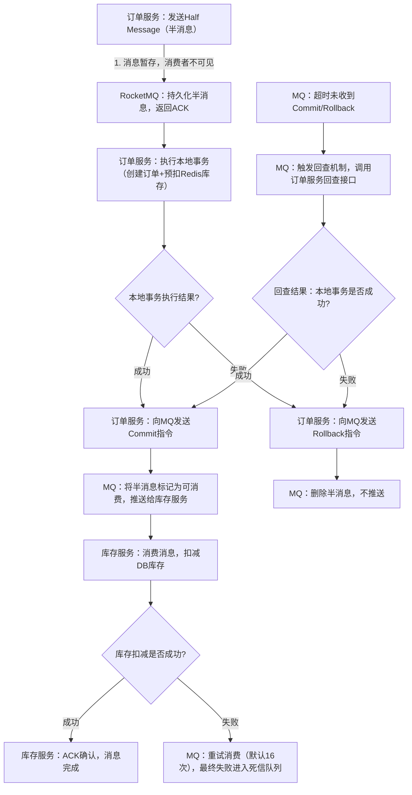

# Claude

以下是Java大厂面试业务场景题的分类整理：

------

## 一、高并发与限流

1. 秒杀系统如何设计？如何防止超卖？
2. 如何实现接口限流？令牌桶 vs 漏桶如何选择？
3. 高并发下如何保证库存扣减的原子性？
4. 大促活动期间流量突增，系统如何做弹性扩容？
5. 如何设计一个抢红包系统？

------

### 1. 秒杀系统如何设计？如何防止超卖？

#### 核心挑战

瞬时流量是平时的数百倍，库存只有少量，绝大多数请求必须被拦截在真正的数据库操作之前。

#### 整体分层设计

**第一层：客户端限流**

- 按钮点击后置灰，防止重复提交
- 请求加入随机 token，防脚本刷接口

**第二层：CDN + 静态化**

- 商品详情页静态化，全量推 CDN
- 秒杀开始时间、库存状态通过轮询独立接口获取，不打源站

**第三层：网关层限流**

- Nginx/Gateway 按 IP、用户 ID 做限流
- 对同一用户 1 秒内重复请求直接拒绝（Redis 计数）

**第四层：应用层削峰**

- 请求进入 MQ（Kafka/RocketMQ），消费端按库存数量匀速消费
- 库存预加载到 Redis，先扣 Redis 库存，扣减失败直接返回"已售罄"

**第五层：数据库兜底**

- 真正写 DB 的流量已极少
- DB 层用乐观锁/数据库行锁做最终防护

```
用户请求
  ↓
CDN（静态资源）
  ↓
Gateway 限流（令牌桶）
  ↓
Redis 库存预扣（原子扣减）—→ 库存不足 → 返回失败
  ↓
写入 MQ
  ↓
Consumer 消费 → 写 DB（乐观锁）→ 创建订单
  ↓
异步通知用户
```

#### 防超卖三道防线

| 防线   | 方案           | 说明                                               |
| ------ | -------------- | -------------------------------------------------- |
| 第一道 | Redis 原子扣减 | `DECR` / Lua 脚本，库存 < 0 则拒绝                 |
| 第二道 | MQ 流量整形    | 只允许与库存数量相当的消息进入消费                 |
| 第三道 | DB 乐观锁      | `UPDATE ... SET stock = stock - 1 WHERE stock > 0` |

#### Redis Lua 扣减库存（关键代码思路）

```lua
-- 原子操作，防止并发下的 check-then-act 问题
local stock = tonumber(redis.call('GET', KEYS[1]))
if stock <= 0 then
    return -1
end
redis.call('DECR', KEYS[1])
return stock - 1
```

#### CDN 

你问到了秒杀系统分层设计中的 **CDN** 部分，我会从「是什么」「为什么用」「怎么用」三个维度帮你讲清楚，结合秒杀场景的特殊性来解释。

##### 一、CDN 核心概念（先搞懂基础）

CDN（Content Delivery Network，内容分发网络）本质是**分布式的缓存网络**，核心作用是把静态资源（图片、HTML、JS、CSS、静态接口数据）部署到离用户最近的节点，用户请求时无需访问源站，直接从就近的 CDN 节点获取数据。

简单类比：源站是总仓库，CDN 节点是遍布全国的便利店，用户买水不用去总仓库，直接在楼下便利店拿，既快又能减轻总仓库的压力。

##### 二、秒杀场景下 CDN 的核心价值（为什么必须用）

秒杀的核心痛点是**瞬时流量洪峰**，而秒杀页的绝大部分内容（商品图片、描述、活动规则）都是静态的，如果所有用户都直接请求源站，源站会瞬间被打垮。CDN 在这里的作用是：
1. **扛住 90%+ 的静态流量**：秒杀页的静态资源全量推到 CDN，用户打开页面时，99% 的请求都被 CDN 承接，源站几乎不会收到这类请求；
2. **降低访问延迟**：用户从就近节点获取资源，页面加载速度快，提升体验；
3. **隔离静态/动态请求**：只有「查询库存」「提交订单」这类动态请求才会到源站，极大减少源站压力。

##### 三、秒杀系统中 CDN 的具体用法（怎么落地）

结合你提到的「CDN + 静态化」分层，实操方案如下：

###### 1. 静态资源全量静态化 + 预推 CDN

- **静态化范围**：
  - 商品详情页（HTML 页面本身）：把秒杀商品的标题、图片、原价/秒杀价、活动规则等固化成静态 HTML，而非动态渲染；
  - 静态资源：商品图片、CSS、JS、活动海报等；
- **推送方式**：秒杀开始前，提前把这些静态资源全量推送到所有 CDN 节点（预热），避免秒杀开始后 CDN 回源请求打垮源站；
- **缓存策略**：设置较长的缓存时间（如 24 小时），但对「秒杀开始时间」「库存状态」这类动态信息，**不放在 CDN 缓存里**（单独通过轮询接口获取）。

###### 2. 动态信息与静态页面解耦

秒杀页不是完全静态的，需要实时显示「秒杀倒计时」「库存剩余」，做法是：
- 静态页面（CDN 提供）里嵌入 JS 脚本，脚本定期（如 1 秒/次）调用**独立的动态接口**（不经过 CDN，直接访问源站/网关）获取秒杀状态、库存数；
- 这个动态接口做极致轻量化（只返回库存数、开始状态），且单独限流（如每个用户 1 秒 1 次），避免被刷。

###### 3. CDN 层的额外防护

- **缓存回源限流**：配置 CDN 节点对同一资源的回源请求限流（如每秒最多 10 次回源），防止个别 CDN 节点故障导致大量回源请求；
- **地域/运营商调度**：让用户优先访问同地域、同运营商的 CDN 节点，进一步降低延迟和故障率。

##### 四、举个实际例子

假设秒杀商品是「9.9 元耳机」，库存 1000 件：
1. 秒杀开始前，运营把「耳机秒杀页.html」「耳机图片.jpg」等推到全国 CDN 节点；
2. 用户打开页面时，直接从北京 CDN 节点拿到静态 HTML 和图片，页面加载耗时 < 100ms；
3. 页面里的 JS 每秒调用 `https://api.xxx.com/seckill/stock?goodsId=123` 接口，获取库存（这个接口走网关，做了用户限流）；
4. 秒杀开始后，只有用户点击「抢购」按钮的请求才会到应用层，而 99% 的用户只是浏览页面，这些浏览请求全被 CDN 承接，源站毫无压力。

---

##### 总结

1. **CDN 是秒杀系统的「第一道静态流量屏障」**：承接秒杀页 90%+ 的静态请求，避免源站被海量浏览请求打垮；
2. **核心原则是「静态/动态解耦」**：静态内容全量推 CDN 缓存，动态信息（库存、倒计时）通过独立轻量化接口获取；
3. **关键操作是「预热」**：秒杀前提前把静态资源推到 CDN 节点，避免秒杀开始后 CDN 回源冲击源站。

如果还想深入了解某一层（比如网关限流、Redis 扣库存防超卖），可以继续问。

------

### 2. 如何实现接口限流？令牌桶 vs 漏桶如何选择？

**接口限流 = 控制同一时间内，最多允许多少请求访问接口。**

#### 四种限流算法对比

| 算法     | 原理                       | 特点                       | 适用场景     |
| -------- | -------------------------- | -------------------------- | ------------ |
| 固定窗口 | 单位时间内计数             | 实现简单，有临界突刺问题   | 粗粒度限制   |
| 滑动窗口 | 动态窗口计数               | 解决突刺，内存稍高         | 通用限流     |
| 漏桶     | 请求入桶，匀速流出         | 强制平滑输出，超出直接丢弃 | 保护下游系统 |
| 令牌桶   | 匀速产生令牌，请求消耗令牌 | 允许一定突发流量           | 对外接口     |

#### 漏桶 vs 令牌桶 核心区别

```
漏桶：
请求 →→→ [桶] → 匀速输出 → 下游
超出桶容量 → 直接丢弃
特点：绝对平滑，不允许突发

令牌桶：
Token 生成器 → [桶里攒 Token]
请求到来 → 消耗 Token → 通过
桶里有积累的 Token → 可以允许短暂突发
特点：允许突发，但有上限
```

**选择原则：**

- 需要**保护数据库、下游服务**，不允许任何突发 → 用**漏桶**
- 需要**应对正常业务波峰**，用户体验优先 → 用**令牌桶**（大多数 API 场景首选）

#### 工程落地方案

**单机：** Guava `RateLimiter`（令牌桶实现），开箱即用

**分布式：** Redis + Lua 滑动窗口 或 Redisson `RRateLimiter`

```java
// Guava 示例
RateLimiter limiter = RateLimiter.create(100.0); // 每秒100个
if (!limiter.tryAcquire()) {
    throw new TooManyRequestsException();
}
```

**多维度限流组合：**

```
全局 QPS 限流（保护系统整体）
  + 用户维度限流（防刷）
  + IP 维度限流（防爬）
  + 接口维度限流（精细化）
```

------

### 3. 高并发下如何保证库存扣减的原子性？

#### 问题根源

并发场景下 "查询 → 判断 → 更新" 三步非原子，会出现：

- 多个线程同时读到库存 = 1
- 都判断通过
- 都执行扣减 → **超卖**

### 方案一：数据库乐观锁（低并发场景）

```sql
UPDATE product_stock 
SET stock = stock - 1, version = version + 1
WHERE id = #{id} AND version = #{version} AND stock > 0
```

- 优点：实现简单
- 缺点：高并发下大量更新失败，重试风暴，性能差

### 方案二：数据库行锁（悲观锁）

```sql
BEGIN;
SELECT stock FROM product_stock WHERE id = #{id} FOR UPDATE;
-- 判断库存
UPDATE product_stock SET stock = stock - 1 WHERE id = #{id};
COMMIT;
```

- 缺点：锁竞争严重，TPS 上不去，不适合高并发

### 方案三：Redis 原子扣减（推荐，高并发核心方案）

利用 Redis 单线程特性 + Lua 脚本保证原子性：

```lua
-- KEYS[1] = 库存key, ARGV[1] = 扣减数量
local stock = tonumber(redis.call('GET', KEYS[1]))
local num = tonumber(ARGV[1])
if stock < num then
    return -1  -- 库存不足
end
return redis.call('INCRBY', KEYS[1], -num)  -- 原子扣减
```

**完整流程：**

```
1. 活动开始前，将库存预加载到 Redis
2. 请求到来，执行 Lua 脚本原子扣减
3. 扣减成功 → 发 MQ → 异步更新 DB
4. 定时任务做 Redis 与 DB 的对账校验
```

### 方案四：分段库存（超高并发场景）

将 1000 个库存拆成 10 段，每段 100：

```
stock:item:1:seg:0  → 100
stock:item:1:seg:1  → 100
...
stock:item:1:seg:9  → 100
```

- 请求按用户 ID 取模路由到对应分段，减少锁竞争
- 某段售罄自动漂移到其他分段

------

### 4. 大促活动期间流量突增，系统如何做弹性扩容？

#### 扩容分两类

**预期流量（大促可预判）→ 预热扩容**

**非预期流量（突发）→ 自动弹性扩容**

#### 预热扩容清单

```
提前 1 小时：
  ✅ 扩容应用服务器（K8s 调整 replicas）
  ✅ 数据库连接池上调
  ✅ Redis 集群扩容/切换更高规格
  ✅ MQ Topic 分区数增加
  ✅ CDN 带宽预申请

提前 1 天：
  ✅ 全链路压测，确认水位
  ✅ 缓存预热（商品数据、用户数据）
  ✅ 关闭非核心功能（推荐、广告）
  ✅ 降级开关准备就绪
```

#### 自动弹性扩容架构（K8s HPA）

```
监控指标（CPU > 70% 或 QPS > 阈值）
  ↓
HPA 触发
  ↓
新 Pod 启动 → 注册到注册中心
  ↓
网关感知 → 流量分发到新节点
```

**关键指标选择：**

- CPU/内存：滞后指标，扩容慢
- QPS/RT（响应时间）：更灵敏，推荐作为主要触发指标
- 消息队列积压量：消费端扩容的核心指标

#### 扩容过程中的稳定性保障

| 问题                       | 解决方案                                  |
| -------------------------- | ----------------------------------------- |
| 新节点刚启动，缓存为空     | JVM 预热 + 流量预热（先导小流量）         |
| 扩容期间请求打到未就绪节点 | 就绪探针（Readiness Probe）通过后再接流量 |
| 数据库连接数暴涨           | 连接池 + PgBouncer/数据库代理层           |
| 快速缩容导致请求丢失       | 优雅下线（处理完存量请求再退出）          |

------

### 5. 如何设计一个抢红包系统？

#### 核心难点

- 高并发写（人人抢，瞬时并发高）
- 金额随机分配（总额固定，各包金额随机）
- 不能超发（总金额严格等于预设金额）
- 每人只能抢一次（幂等）

#### 金额预分配方案（推荐）

**发红包时**，提前用"二倍均值法"将金额拆好存入 Redis List：

```
总金额: 100元，10个红包

二倍均值法：
每次从剩余金额中随机 [0.01, 剩余均值×2]
最后一个直接取剩余金额

结果: [8.32, 12.01, 6.55, ..., 9.88] 存入 Redis List
Key: red_packet:{id}:amounts  → List [832, 1201, 655, ..., 988]（单位分）
Key: red_packet:{id}:info     → Hash {total, count, expire_time}
Key: red_packet:{id}:receivers → Set（已抢用户）
```

**抢红包时**（Lua 脚本保证原子性）：

```lua
-- 1. 判断是否已抢过
if redis.call('SISMEMBER', KEYS[2], ARGV[1]) == 1 then
    return -1  -- 已抢过
end
-- 2. 从 List 弹出一个金额
local amount = redis.call('LPOP', KEYS[1])
if not amount then
    return -2  -- 已抢完
end
-- 3. 记录已抢用户
redis.call('SADD', KEYS[2], ARGV[1])
return amount
```

#### 完整架构

```
用户发起抢红包请求
  ↓
Gateway 限流（同一红包 QPS 上限）
  ↓
执行 Lua 脚本（原子判断+弹出金额）
  ↓
成功 → 发 MQ
  ↓
Consumer 异步写 DB（红包明细、余额变更）
  ↓
通知用户抢到金额
```

#### 关键细节

| 问题               | 方案                                     |
| ------------------ | ---------------------------------------- |
| 每人只能抢一次     | Redis Set 记录已抢用户，Lua 原子判断     |
| 红包过期未抢完     | 定时任务扫描过期红包，剩余金额退回发包人 |
| Redis 挂了怎么办   | Redis 持久化（AOF）+ 定期 DB 对账        |
| 大群红包（万人群） | 红包 ID 分片，多个 Redis Key 分担压力    |
| DB 写入压力        | MQ 异步批量写，合并插入                  |

------

**总结一句话：** 高并发场景的核心思路始终是 **"前置拦截 + Redis 原子操作 + MQ 削峰 + DB 兜底"**，层层过滤，让真正到达数据库的请求量降到最低。

------

## 二、分布式事务与一致性

1. 下单减库存，如何保证分布式事务一致性？
2. 支付成功后通知商家，消息可靠投递怎么做？
3. 跨服务调用失败，如何做补偿和回滚？
4. TCC、SAGA、本地消息表各适用什么场景？
5. 数据库和缓存双写，如何保证一致性？

------

### 1. 下单减库存，如何保证分布式事务一致性？

#### 问题本质

订单服务和库存服务是两个独立数据库，"创建订单"和"扣减库存"必须同时成功或同时失败，但跨库无法用本地事务保证。

#### 三种库存扣减时机的权衡

| 时机                    | 方案               | 风险                                     |
| ----------------------- | ------------------ | ---------------------------------------- |
| 下单时扣减              | 用户下单即锁定库存 | 用户下单不付款，库存被占用（需超时释放） |
| 支付时扣减              | 付完才扣           | 并发下多人都能下单，付款时可能无库存     |
| **下单预占 + 支付确认** | 两阶段锁定         | **推荐**，兼顾体验和准确性               |

#### 主流方案：本地消息表（最终一致性）

```
订单服务 DB：
┌─────────────────┐    ┌──────────────────────┐
│   orders 表      │    │  local_messages 表    │
│  (创建订单)      │ +  │  (减库存消息,PENDING) │  ← 同一个事务
└─────────────────┘    └──────────────────────┘
         ↓
   事务提交成功
         ↓
   定时任务扫描 PENDING 消息 → 发 MQ
         ↓
   库存服务消费 → 扣减库存 → 回调更新消息状态为 DONE
```

**核心：消息写入和业务操作在同一个本地事务，彻底解耦两个服务。**

##### 本地消息表（经典最终一致性方案）

- **本质**：基于「本地事务 + 消息队列」的**柔性事务**（最终一致性），完全自研 / 基于基础组件（DB+MQ）实现，无框架依赖。

- 核心原理（以秒杀扣库存为例）：

  ```plaintext
  步骤1：在「订单库」中创建本地消息表（含消息ID、业务内容、状态、重试次数）；
  步骤2：开启本地事务，同时完成「创建订单」+「插入待发送的扣库存消息到本地消息表」，提交事务；
  步骤3：启动独立的「消息投递线程」，轮询本地消息表中「待发送」的消息，发送到MQ（如RocketMQ）；
  步骤4：库存服务消费MQ消息，扣减库存；若消费失败，MQ重试/本地消息表重试，直到扣减成功；
  步骤5：库存扣减成功后，回调订单服务，更新本地消息表状态为「已完成」。
  ```

- 核心特点：

  - 不依赖分布式事务框架，纯业务层实现；
  - 强依赖「本地事务的原子性」（订单 + 消息要么都成功，要么都失败）；
  - 最终一致性（可能有短暂的订单已创建、库存未扣减的状态）；
  - 需要自己处理消息重试、幂等、死信。

#### 方案二：RocketMQ 事务消息

```
1. 订单服务发送 Half Message（半消息，对消费者不可见）
        ↓
2. RocketMQ 返回 ACK
        ↓
3. 订单服务执行本地事务（创建订单）
        ↓
4. 成功 → 发送 Commit；失败 → 发送 Rollback
        ↓
5. 库存服务消费消息 → 扣减库存
        ↓
（如果第4步迟迟未收到）
6. RocketMQ 回查订单服务 → 查询本地事务状态 → 再决定 Commit/Rollback
Half Message          Commit/Rollback
     │                      │
     ▼                      ▼
[RocketMQ] ─── 回查 ──→ [订单服务]
     │
     ▼（Commit后可见）
[库存服务消费]
```

你贴出的 RocketMQ 事务消息流程非常核心，这是分布式事务中「最终一致性」的经典方案，尤其适合秒杀、订单-库存这类高并发场景。我会先拆解完整原理，再结合秒杀场景讲落地细节，最后对比它和本地消息表/XA/AT 模式的差异，帮你彻底掌握。

##### 一、RocketMQ 事务消息核心原理（流程拆解）

你给出的流程是核心骨架，我补充关键细节和设计初衷，让你理解「为什么要这么设计」：



###### **关键步骤详解（秒杀场景适配）**：

1. **Half Message（半消息）**：
   - 本质是「暂存的消息」，RocketMQ 收到后会持久化，但**对库存服务（消费者）完全不可见**；
   - 作用：先确保消息能成功发送到 MQ，避免「本地事务执行成功，但消息发失败」导致库存扣减丢失。

2. **本地事务执行（核心环节）**：
   - 秒杀场景下，这里的「本地事务」包含：创建订单记录 + 扣减 Redis 预库存（两步在同一个数据库本地事务里，原子性）；
   - 只有这两步都成功，才会发送 Commit；任意一步失败，发送 Rollback。

3. **Commit/Rollback 指令**：
   - Commit：MQ 把半消息标记为「可消费」，库存服务才能拿到消息扣减 DB 库存；
   - Rollback：MQ 直接删除半消息，库存服务永远不会收到，避免「订单创建失败但扣了库存」。

4. **回查机制（兜底保障）**：
   - 触发条件：订单服务发送半消息后，宕机/网络异常，没发 Commit/Rollback（默认超时时间 60 秒）；
   - 回查逻辑：MQ 调用订单服务的「事务回查接口」（需要业务实现），接口查询「该订单是否创建成功」，根据结果决定 Commit/Rollback；
   - 秒杀场景优化：回查接口要轻量化（只查订单状态），且加缓存（Redis），避免回查请求打垮数据库。

5. **消费重试与幂等**：
   - 库存服务消费消息时，若扣减库存失败（如数据库宕机），MQ 会自动重试（默认 16 次，指数退避）；
   - 必须做**幂等处理**：库存扣减前，先查「该消息是否已处理过」（通过消息 ID/订单 ID 做唯一键），避免重复扣减。

##### 二、秒杀场景下的落地要点（避坑指南）

RocketMQ 事务消息适配秒杀的核心是「高性能 + 防超卖 + 最终一致」，这几个细节必须注意：

###### 1. 预扣 Redis 库存（前置拦截）

- 秒杀请求进入订单服务前，先在 Redis 里扣减库存（如 `decr stock:123`），扣减失败直接返回「售罄」；
- 本地事务里只做「订单创建 + 确认 Redis 扣减有效」，避免大量请求走到 MQ 环节。

###### 2. 消息体设计（轻量化 + 幂等）

```json
// 秒杀场景的事务消息体示例
{
  "orderId": "seckill_10086",  // 订单ID（幂等键）
  "goodsId": 123,              // 商品ID
  "userId": 8888,              // 用户ID
  "stockNum": 1,               // 扣减库存数
  "msgId": "MQ123456789"       // MQ消息唯一ID
}
```

###### 3. 回查接口实现（极简）

```java
// 订单服务的事务回查接口（MQ调用）
@GetMapping("/seckill/transaction/check")
public String checkTransaction(String orderId) {
    // 1. 先查Redis缓存（避免查DB）
    String status = redisTemplate.opsForValue().get("tx_status:" + orderId);
    if ("SUCCESS".equals(status)) {
        return "COMMIT"; // 告诉MQ提交消息
    }
    if ("FAIL".equals(status)) {
        return "ROLLBACK"; // 告诉MQ回滚消息
    }
    // 2. 缓存未命中，查DB
    Order order = orderMapper.selectById(orderId);
    if (order != null && order.getStatus() == 1) { // 订单已创建
        redisTemplate.opsForValue().set("tx_status:" + orderId, "SUCCESS", 1, TimeUnit.HOURS);
        return "COMMIT";
    } else {
        redisTemplate.opsForValue().set("tx_status:" + orderId, "FAIL", 1, TimeUnit.HOURS);
        return "ROLLBACK";
    }
}
```

###### 4. 失败兜底（死信队列）

- 库存服务消费消息多次失败后，消息进入死信队列；
- 后台监控死信队列，人工介入处理（如「订单已创建但库存扣减失败」的情况，手动补扣库存或取消订单）。

##### 三、RocketMQ 事务消息 vs 其他方案（核心对比）

| 方案              | 一致性级别 | 性能 | 业务侵入性           | 适用场景                 |
| ----------------- | ---------- | ---- | -------------------- | ------------------------ |
| RocketMQ 事务消息 | 最终一致   | 高   | 中（需实现回查接口） | 高并发秒杀、订单-库存    |
| 本地消息表        | 最终一致   | 高   | 高（需建消息表）     | 无MQ依赖、自定义重试逻辑 |
| Seata AT 模式     | 准实时一致 | 中   | 低（仅加注解）       | 短事务、准实时一致       |
| XA 模式           | 强一致     | 低   | 低                   | 金融转账、低并发强一致   |

##### 四、秒杀场景选型建议

- **优先选 RocketMQ 事务消息**：秒杀的核心是「扛高并发」，它的异步解耦特性能支撑瞬时流量，且最终一致性足够（用户下单后，库存可能延迟1-2秒扣减，但用户无感知）；
- **搭配 Redis 预扣库存**：99% 的请求被 Redis 拦截，只有真正下单的请求走到 MQ 环节，避免 MQ 成为瓶颈；
- **不选 XA 模式**：性能太差，扛不住秒杀的瞬时洪峰；
- **本地消息表作为备选**：如果公司未接入 RocketMQ，可用「本地消息表 + 普通MQ」替代，但需要自己实现回查/重试逻辑。

---

##### 总结

1. **核心原理**：RocketMQ 事务消息通过「半消息 + 本地事务 + 回查机制」实现最终一致性，半消息保证消息不丢失，回查机制兜底异常场景；
2. **秒杀适配**：必须搭配 Redis 预扣库存拦截流量，消息体加幂等键，回查接口轻量化（查缓存），失败消息进入死信队列人工兜底；
3. **核心优势**：高性能、异步解耦，兼顾最终一致性，是秒杀/高并发场景分布式事务的最优选择之一。

如果想了解「RocketMQ 事务消息的代码完整实现」或「如何结合 Redis 防超卖」，可以继续问。

#### 方案三：TCC（强一致场景）

资金类业务要求强一致时使用，详见第3题。

#### 方案四：AT模式

#####  AT 模式（Seata 核心模式）

- **本质**：基于「两阶段提交（2PC）」的**柔性事务**（准实时一致性），是 Seata 框架封装的标准化方案，对业务无侵入。

- 核心原理（同样以秒杀扣库存为例）：

  ```plaintext
  阶段1（准备阶段）：
  1. TC（事务协调器）记录全局事务ID；
  2. 订单服务执行「创建订单」，Seata 拦截SQL，生成前置镜像（执行前数据）和后置镜像（执行后数据），写入undo_log表；
  3. 库存服务执行「扣减库存」，同样生成前后镜像，写入undo_log表；
  4. 所有分支事务告知TC「准备完成」。
  
  阶段2（提交/回滚阶段）：
  - 若所有分支都成功：TC下发「提交」指令，各分支删除undo_log，事务完成；
  - 若任意分支失败：TC下发「回滚」指令，各分支根据undo_log恢复数据（如库存回滚、订单回滚）。
  ```

- 核心特点：

  - 依赖 Seata 框架（TC/SM/RM），业务代码几乎无感知（只需要加 @GlobalTransactional 注解）；
  - 基于 SQL 拦截实现，自动生成回滚日志，无需业务层处理回滚；
  - 准实时一致性（两阶段完成后数据一致）；
  - 底层依赖数据库事务和锁（短事务场景友好）。

#### 方案五：XA模式

------

### 2. 支付成功后通知商家，消息可靠投递怎么做？

#### 问题拆解

消息可靠投递 = **不丢失** + **不重复** + **有序（部分场景）**

丢失的三个环节：

```
生产者 ──→ MQ Broker ──→ 消费者
  ①丢          ②丢          ③丢
```

#### ① 生产者侧：防丢失

**同步确认 + 失败重试：**

```java
// RocketMQ 同步发送，等待 Broker ACK
SendResult result = producer.send(message);
if (result.getSendStatus() != SendStatus.SEND_OK) {
    // 写入本地补偿表，定时重试
    failedMessageRepo.save(message);
}
```

**本地消息表兜底：**

```
业务操作 + 写消息记录  ← 同一个本地事务
         ↓
定时任务扫描未发送的消息 → 重新投递
         ↓
发送成功 → 更新状态为已发送
```

#### ② Broker 侧：防丢失

| 配置项   | 说明                           |
| -------- | ------------------------------ |
| 持久化   | 消息落盘再返回 ACK（同步刷盘） |
| 主从同步 | 主节点写成功同步从节点再 ACK   |
| 集群部署 | 避免单点故障                   |

#### ③ 消费者侧：防丢失 + 防重复

**防丢失：先处理业务，再提交 offset/ACK**

```java
// 错误做法：自动提交 offset，处理失败消息丢失
// 正确做法：手动 ACK
@RabbitListener(queues = "payment.notify")
public void onMessage(Message msg, Channel channel) {
    try {
        processNotify(msg);           // 先处理业务
        channel.basicAck(...);        // 成功再 ACK
    } catch (Exception e) {
        channel.basicNack(..., true); // 失败重回队列
    }
}
```

**防重复：消费幂等设计**

```
方案一：唯一消息ID + DB 唯一键
  消费前先 INSERT INTO consumed_messages(msg_id)
  主键冲突 → 说明已消费 → 跳过

方案二：业务状态判断
  检查商家通知状态，已通知则直接返回成功

方案三：Redis SETNX
  SET msg:{msgId} 1 NX EX 86400
  返回 0 → 已处理过
```

#### 完整可靠投递流程图

```
支付服务
  │
  ├─1. 更新支付状态
  ├─2. 写本地消息表(PENDING)    ← 同一事务
  │
  ↓
定时任务（每5秒扫描）
  │
  ├─ 查询 PENDING 消息
  ├─ 发送到 MQ
  ├─ 发送成功 → 状态改为 SENDING
  │
  ↓
MQ Broker（持久化）
  │
  ↓
商家通知服务消费
  │
  ├─ 幂等判断（是否处理过）
  ├─ 调用商家回调接口（失败重试，指数退避）
  ├─ 成功 → 手动 ACK + 回调订单服务改为 DONE
  │
  ↓
对账任务（每天）：SENDING 超时未 DONE 的消息重新投递
```

------

### 3. 跨服务调用失败，如何做补偿和回滚？

#### 核心思路

分布式环境不能像本地事务一样直接回滚，必须通过**补偿操作（反向业务操作）**来撤销已执行的步骤。

#### 补偿模式分类

```
调用链：A → B → C → D

D 失败：
  补偿 C（执行 C 的反向操作）
  补偿 B
  补偿 A
  最终状态回到初始
```

#### TCC 模式（Try-Confirm-Cancel）

**三个阶段：**

```
Try 阶段：资源预占（不直接执行业务）
  订单服务：创建"预占"订单，状态=INIT
  库存服务：冻结库存（stock_frozen += N，stock_available -= N）
  账户服务：冻结金额

Confirm 阶段：所有 Try 成功 → 正式执行
  订单服务：状态改为 CONFIRMED
  库存服务：扣减冻结库存（stock_frozen -= N）
  账户服务：扣减冻结金额

Cancel 阶段：任意 Try 失败 → 全部撤销
  订单服务：删除预占订单
  库存服务：解冻库存（stock_frozen -= N，stock_available += N）
  账户服务：解冻金额
```

**TCC 必须解决的三个问题：**

| 问题   | 原因                 | 解决方案                                             |
| ------ | -------------------- | ---------------------------------------------------- |
| 空回滚 | Cancel 先于 Try 到达 | Cancel 时检查 Try 记录是否存在，不存在则直接返回成功 |
| 悬挂   | Try 比 Cancel 后到达 | Try 前检查是否已有 Cancel 记录，有则拒绝 Try         |
| 幂等   | 网络重试导致重复执行 | 每个操作加唯一业务 ID，DB 唯一键防重                 |

#### SAGA 模式

**适合长事务，每步都是本地事务，失败执行补偿：**

```
Step1: 创建订单（本地事务）
  ↓ 成功
Step2: 扣减库存（本地事务）
  ↓ 成功
Step3: 扣减积分（本地事务）
  ↓ 失败！
  
补偿 Step2：归还库存
补偿 Step1：取消订单
```

**两种执行模式：**

```
编排模式（Orchestration）：由中央协调者统一调度
  [SAGA Coordinator] → 调用各服务 → 失败则发补偿指令

协同模式（Choreography）：服务间通过事件驱动，自行触发
  订单服务 → 发布"订单创建"事件
  库存服务监听 → 扣减库存 → 发布"库存扣减"事件
  积分服务监听 → ...
```

#### 补偿重试策略（指数退避）

```java
// 重试间隔：1s → 2s → 4s → 8s → 放弃 → 告警
int retryCount = 0;
while (retryCount < MAX_RETRY) {
    try {
        compensate();
        break;
    } catch (Exception e) {
        long waitTime = (long) Math.pow(2, retryCount) * 1000;
        Thread.sleep(waitTime);
        retryCount++;
    }
}
if (retryCount == MAX_RETRY) {
    alertService.sendAlert("补偿失败，需人工介入");
}
```

------

### 4. TCC、SAGA、本地消息表各适用什么场景？

#### 核心对比

| 维度         | TCC               | SAGA     | 本地消息表 | 事务消息(MQ) |
| ------------ | ----------------- | -------- | ---------- | ------------ |
| 一致性       | 强一致            | 最终一致 | 最终一致   | 最终一致     |
| 性能         | 低（锁资源）      | 中       | 高         | 高           |
| 实现复杂度   | 高                | 中       | 低         | 中           |
| 业务侵入性   | 高（需实现3接口） | 中       | 低         | 低           |
| 适合事务长度 | 短事务            | 长事务   | 异步场景   | 异步场景     |
| 失败处理     | Cancel 回滚       | 补偿     | 重试       | 重试         |

#### 场景选型指南

```
需要强一致性（如金融转账、资金冻结）？
  → TCC
  
长流程业务（如电商下单→支付→发货→积分，步骤多）？
  → SAGA
  
异步通知（支付通知、状态同步、跨系统数据同步）？
  → 本地消息表 或 事务消息MQ

已用 RocketMQ，且业务是生产者-消费者模型？
  → RocketMQ 事务消息（比本地消息表省一张表）

微服务数量多，想统一治理分布式事务？
  → Seata（支持 AT/TCC/SAGA 多模式）
```

#### 各方案适用场景总结

**TCC 典型场景：**

- 银行转账（A 账户扣款 + B 账户入账）
- 电商支付（账户余额扣减 + 订单状态变更）
- 秒杀下单（库存冻结 + 订单创建）

**SAGA 典型场景：**

- 旅行预订（机票+酒店+用车，步骤多，允许最终一致）
- 电商履单流程（下单→支付→仓储→物流，链路长）
- 跨多个微服务的业务流程

**本地消息表典型场景：**

- 支付成功通知商家
- 数据库变更同步到搜索引擎（ES）
- 跨系统数据最终一致性同步

------

### 5. 数据库和缓存双写，如何保证一致性？

#### 问题本质

DB 和 Cache 是两个独立存储，任何双写都无法保证原子性，必然存在短暂不一致窗口，目标是**尽量缩短不一致时间窗口**并保证**最终一致**。

#### 四种策略对比

##### ❌ 方案一：先写 DB，再写 Cache（不推荐）

```
线程A: 写DB(X=1) → 写Cache(X=1)
线程B:              写DB(X=2) → 写Cache(X=2)

如果执行顺序变成：
线程A: 写DB(X=1) ─────────────────→ 写Cache(X=1) ← 旧值覆盖新值！
线程B:              写DB(X=2) → 写Cache(X=2)

结果：DB=2，Cache=1，不一致！
```

##### ❌ 方案二：先写 Cache，再写 DB（不推荐）

Cache 写成功 DB 写失败，Cache 是脏数据，且无法轻易感知。

##### ✅ 方案三：Cache Aside（旁路缓存，最常用）

```
读操作：
  先读 Cache
    命中 → 返回
    未命中 → 读 DB → 写回 Cache → 返回

写操作：
  先更新 DB → 再删除 Cache（而非更新）
```

**为什么是删除 Cache 而不是更新 Cache？**

```
更新Cache的问题（并发写）：
  线程A 更新DB(X=1) → 线程B 更新DB(X=2) → 线程B 更新Cache(X=2) → 线程A 更新Cache(X=1)
  结果：DB=2，Cache=1，不一致！

删除Cache的好处：
  无论顺序如何，下次读必然重新从 DB 加载最新值
  用"懒加载"换取"写操作的安全性"
```

**Cache Aside 仍存在的问题（极小概率）：**

```
读线程：读Cache未命中 → 读DB(X=1旧值) ─────→ 写Cache(X=1)
写线程：                              更新DB(X=2) → 删Cache

时序：读线程的写Cache发生在删Cache之后 → Cache存了旧值X=1
（需要 DB 恰好在读线程读完、写Cache前完成更新，概率极低）
```

解决：给 Cache 设置较短的过期时间作为兜底。

##### ✅ 方案四：延迟双删（弥补 Cache Aside 的极端情况）

```java
// 写操作
void updateData(Data data) {
    // 1. 先删除 Cache
    cache.delete(key);
    // 2. 更新 DB
    db.update(data);
    // 3. 延迟 N 毫秒后再删一次（覆盖并发读线程写入的旧值）
    scheduler.schedule(() -> cache.delete(key), 500, TimeUnit.MILLISECONDS);
}
```

延迟时间 = 读线程"读DB+写Cache"的最大耗时，通常 500ms ～ 1s。

#### 终极方案：Canal 订阅 binlog 异步更新

```
应用服务
  ↓ 只写 DB
MySQL binlog
  ↓
Canal 监听 binlog 变更
  ↓
发送到 MQ
  ↓
Cache 更新服务消费 → 删除/更新 Cache
```

**优点：**

- 业务代码与缓存更新完全解耦
- 基于 DB 变更事件，不会遗漏
- 天然串行（同一行数据的 binlog 有序），解决并发覆盖问题

**缺点：** 架构复杂，引入 Canal + MQ，有一定延迟（通常 < 1s）

#### 选型建议

```
数据一致性要求不高，读多写少
  → Cache Aside + 过期时间兜底

写操作频繁，偶发不一致可接受
  → Cache Aside + 延迟双删

完全解耦，允许秒级延迟
  → Canal + MQ 异步更新

金融/强一致场景（如余额）
  → 不用缓存，直接读DB，或用分布式锁串行化读写
```

------

**总结核心原则：** 分布式事务没有银弹，本质是在**一致性、可用性、性能、复杂度**之间做权衡。

| 原则                         | 说明                             |
| ---------------------------- | -------------------------------- |
| 能用本地事务就不用分布式事务 | 合理划分服务边界，减少跨服务事务 |
| 强一致优先 TCC               | 资金类、库存类核心业务           |
| 长流程优先 SAGA              | 步骤多、允许最终一致的业务       |
| 异步场景用消息               | 通知类、同步类、解耦类需求       |
| 缓存一致性用 Cache Aside     | 删除优于更新，最终一致兜底       |

------

## 三、缓存设计

1. 如何解决缓存穿透、缓存击穿、缓存雪崩？
2. 热点数据倾斜（热key）如何处理？
3. 如何设计一个多级缓存架构？
4. 缓存预热怎么做？大Key问题如何排查和解决？
5. Redis 分布式锁的正确姿势是什么？Redlock 有什么问题？

------

### 1. 如何解决缓存穿透、缓存击穿、缓存雪崩？

#### 三者区别一句话总结

```
缓存穿透：查询根本不存在的数据，Cache 和 DB 都没有，每次都打到 DB
缓存击穿：某个热点 Key 过期，瞬间大量请求同时打到 DB
缓存雪崩：大量 Key 同时过期 或 Redis 宕机，流量全部压到 DB
```

------

#### 缓存穿透

**原因：** 恶意攻击或业务 Bug，查询 ID=-1 或不存在的商品，Cache 未命中，每次都透传 DB。

**解决方案：**

**方案一：缓存空值**

```java
Object value = cache.get(key);
if (value == null) {
    value = db.query(key);
    if (value == null) {
        // 缓存空对象，设置短过期时间（防止空值占用太久）
        cache.set(key, "NULL", 60);
    } else {
        cache.set(key, value, 3600);
    }
}
return "NULL".equals(value) ? null : value;
```

- 优点：简单
- 缺点：攻击者用不同 Key 轮询，缓存空值膨胀

**方案二：布隆过滤器（推荐）**

```
写入数据时：同步写入布隆过滤器
查询时：
  先问布隆过滤器 → "一定不存在" → 直接返回 null，不查 DB
                  → "可能存在"   → 查 Cache → 查 DB
// Guava BloomFilter
BloomFilter<Long> bloomFilter = BloomFilter.create(
    Funnels.longFunnel(),
    10_000_000,  // 预期数据量
    0.001        // 误判率 0.1%
);

// 查询前置过滤
if (!bloomFilter.mightContain(userId)) {
    return null; // 一定不存在，直接拦截
}
```

|          | 缓存空值              | 布隆过滤器                                 |
| -------- | --------------------- | ------------------------------------------ |
| 适用场景 | 少量固定 Key 的空查询 | 海量 ID 的恶意攻击防护                     |
| 内存占用 | 高（每个 Key 都存）   | 极低（1 亿数据约 120MB）                   |
| 误判     | 无                    | 有（可调控，通常 < 0.1%）                  |
| 删除支持 | 支持                  | 标准布隆不支持（用 Counting Bloom Filter） |

------

#### 缓存击穿

**原因：** 单个热点 Key（如明星直播间、爆款商品）到期，瞬间 N 个并发请求同时穿透到 DB。

**方案一：热点 Key 永不过期**

```java
// 逻辑过期：数据里带过期时间字段，异步刷新，缓存本身不设 TTL
CacheValue value = cache.get(key);
if (value.isLogicallyExpired()) {
    // 异步线程去刷新，当前请求返回旧数据
    executor.submit(() -> refreshCache(key));
}
return value.getData(); // 永远有数据返回，不穿透
```

**方案二：互斥锁（Mutex Lock）**

```java
Object value = cache.get(key);
if (value != null) return value;

// 只让一个线程去查 DB，其他等待
String lockKey = "lock:" + key;
if (redis.setnx(lockKey, "1", 5)) { // 抢到锁
    try {
        value = db.query(key);
        cache.set(key, value, 3600);
    } finally {
        redis.del(lockKey);
    }
} else {
    // 未抢到锁，短暂等待后重试
    Thread.sleep(50);
    return get(key); // 递归重试，此时大概率 Cache 已有值
}
return value;
```

|          | 永不过期             | 互斥锁           |
| -------- | -------------------- | ---------------- |
| 一致性   | 弱（短暂返回旧数据） | 强               |
| 性能     | 极高（无等待）       | 中（有等待）     |
| 适用场景 | 允许短暂旧数据的热点 | 强一致要求的热点 |

------

#### 缓存雪崩

**原因一：大量 Key 同时过期**

```java
// 过期时间加随机抖动，避免同时失效
int baseTTL = 3600;
int jitter = new Random().nextInt(600); // ±10分钟随机
cache.set(key, value, baseTTL + jitter);
```

**原因二：Redis 集群宕机**

```
多级降级策略：

Redis 宕机
  ↓
① 本地缓存（Caffeine/Guava）兜底
  ↓ 本地缓存也没有
② 数据库限流查询（限流器保护，只放少量请求）
  ↓
③ 熔断降级，返回兜底默认值（如"商品信息加载中"）
  ↓
④ 告警 + 自动重启/切换从节点
```

**雪崩整体防护体系：**

```
预防层：Key 过期时间加抖动 + 热点 Key 永不过期
保护层：服务降级 + 熔断 + 限流
兜底层：本地缓存 + 默认值
恢复层：Redis 哨兵/集群自动故障转移
```

------

### 2. 热点数据倾斜（热Key）如何处理？

#### 热 Key 的危害

```
正常：请求均匀分布到 Redis 集群各节点
热Key：某个 Key 的请求占单节点 QPS 的 90%
  → 该节点 CPU/带宽打满
  → 响应变慢甚至宕机
  → 整个集群雪崩
```

#### 如何发现热 Key

```bash
# 方法一：Redis 命令（生产慎用，影响性能）
redis-cli --hotkeys

# 方法二：monitor 命令抽样（只在低峰期短暂开启）
redis-cli monitor | grep GET | awk '{print $4}' | sort | uniq -c | sort -rn | head

# 方法三：客户端埋点统计（推荐）
# 在 Redis 客户端拦截器统计 Key 访问频次，上报到监控系统

# 方法四：proxy 层统计（如 Twemproxy、Codis）
# 代理层天然可以统计所有 Key 的访问频次
```

#### 解决方案

**方案一：本地缓存（最有效）**

```java
// 使用 Caffeine 本地缓存作为 L1，Redis 作为 L2
LoadingCache<String, Object> localCache = Caffeine.newBuilder()
    .maximumSize(1000)
    .expireAfterWrite(5, TimeUnit.SECONDS) // 短TTL，容忍短暂不一致
    .build(key -> redis.get(key));         // 本地未命中才查Redis

// 热Key请求大部分在JVM内存中解决，不经过网络
Object value = localCache.get(hotKey);
```

**方案二：Key 复制分片（多副本）**

```java
// 热Key复制成 N 份，分散到不同节点
String[] shardKeys = new String[SHARD_COUNT]; // SHARD_COUNT = 10
for (int i = 0; i < SHARD_COUNT; i++) {
    shardKeys[i] = hotKey + ":shard:" + i;
    redis.set(shardKeys[i], value);
}

// 读取时随机选一个分片
String readKey = hotKey + ":shard:" + ThreadLocalRandom.current().nextInt(SHARD_COUNT);
Object value = redis.get(readKey);
原来：item:1001 → 全部打到节点A
分片后：
  item:1001:shard:0 → 节点A
  item:1001:shard:1 → 节点B
  item:1001:shard:2 → 节点C
  ...                        请求均匀分散
```

**方案三：读写分离 + 从节点扩容**

```
主节点：只处理写请求
从节点：水平扩展，承接读流量（从1个扩到5个，读QPS×5）
```

**方案四：热Key自动探测 + 动态本地缓存**

```java
// 滑动窗口统计访问频次
if (hotKeyDetector.isHot(key)) {
    // 自动晋升为本地缓存
    return localCache.getOrLoad(key);
} else {
    return redis.get(key);
}
```

#### 各方案对比

| 方案       | 效果  | 一致性           | 适用场景                       |
| ---------- | ----- | ---------------- | ------------------------------ |
| 本地缓存   | ★★★★★ | 弱（短暂旧数据） | 读多写少，允许短暂不一致       |
| Key 分片   | ★★★★  | 强               | 写操作需同步所有分片，复杂度高 |
| 从节点扩容 | ★★★   | 强               | Redis 集群架构，扩容方便       |
| 熔断降级   | ★★    | —                | 兜底方案                       |

------

### 3. 如何设计一个多级缓存架构？

#### 多级缓存层次

```
用户请求
    ↓
┌─────────────────────────────────────┐
│  L0：客户端缓存（浏览器/App本地）      │  TTL: 几分钟
│  HTTP Cache-Control / ETag           │
└─────────────────────────────────────┘
    ↓ 未命中
┌─────────────────────────────────────┐
│  L1：CDN 缓存                        │  TTL: 几分钟~小时
│  静态资源、商品详情页、活动页          │
└─────────────────────────────────────┘
    ↓ 未命中
┌─────────────────────────────────────┐
│  L2：网关/Nginx 本地缓存              │  TTL: 秒级
│  lua_shared_dict / proxy_cache       │
└─────────────────────────────────────┘
    ↓ 未命中
┌─────────────────────────────────────┐
│  L3：应用进程内缓存（Caffeine）        │  TTL: 秒~分钟
│  JVM 堆内，最快，无网络开销           │
└─────────────────────────────────────┘
    ↓ 未命中
┌─────────────────────────────────────┐
│  L4：分布式缓存（Redis Cluster）      │  TTL: 分钟~小时
│  集中式，所有节点共享                 │
└─────────────────────────────────────┘
    ↓ 未命中
┌─────────────────────────────────────┐
│  L5：数据库（MySQL）                  │
│  最终数据源                           │
└─────────────────────────────────────┘
```

#### 各层职责与选型

| 层级      | 技术选型         | 命中率目标    | 容量              |
| --------- | ---------------- | ------------- | ----------------- |
| 进程内 L3 | Caffeine         | 30~50%        | 小（受JVM堆限制） |
| 分布式 L4 | Redis Cluster    | 90%+          | 大（可水平扩展）  |
| CDN L1    | 阿里云/腾讯云CDN | 静态资源 95%+ | 无限              |

#### 多级缓存读写流程

**读流程：**

```java
public Object get(String key) {
    // L3：本地缓存
    Object value = localCache.getIfPresent(key);
    if (value != null) return value;

    // L4：Redis
    value = redis.get(key);
    if (value != null) {
        localCache.put(key, value); // 回填本地缓存
        return value;
    }

    // L5：数据库
    value = db.query(key);
    if (value != null) {
        redis.set(key, value, 3600);
        localCache.put(key, value);
    }
    return value;
}
```

**写流程（更新时如何失效各层缓存）：**

```
方案一：写DB → 删Redis → 本地缓存等TTL自然过期（简单，短暂不一致）

方案二：写DB → 删Redis → 发MQ广播 → 所有节点收到消息删本地缓存（强一致）

方案三：写DB → Canal监听binlog → 发MQ → 各层缓存失效服务统一处理
```

**MQ 广播失效本地缓存：**

```java
// 发布者：数据变更时广播
mqProducer.broadcast("cache.invalidate", key);

// 每个应用节点订阅
@MqListener(topic = "cache.invalidate")
public void onInvalidate(String key) {
    localCache.invalidate(key); // 让本地缓存失效
}
```

#### 多级缓存的核心挑战

```
一致性问题：层级越多，数据越容易不一致
  → 本地缓存 TTL 尽量短（5~30s）
  → 关键数据只用 Redis，不用本地缓存

内存压力：本地缓存占 JVM 堆
  → Caffeine 设置最大条数和弱引用，防止 OOM
  → 只缓存热点数据，不做全量缓存
```

------

### 4. 缓存预热怎么做？大Key问题如何排查和解决？

#### 缓存预热

**为什么需要预热：**

```
服务刚启动 或 Redis 重启后，缓存为空
大量请求同时打到 DB → 缓存击穿 + DB 压力剧增
```

**预热方案：**

**方案一：启动时加载（适合数据量小）**

```java
@Component
public class CacheWarmUp implements ApplicationRunner {
    @Override
    public void run(ApplicationArguments args) {
        // 应用启动完成后执行
        List<HotItem> hotItems = db.queryHotItems(TOP_1000);
        hotItems.forEach(item ->
            redis.set("item:" + item.getId(), item, 3600)
        );
        log.info("缓存预热完成，共预热{}条", hotItems.size());
    }
}
```

**方案二：大促前定时预热任务**

```
提前 1 小时：
  定时任务读取 DB 中活动商品、热门商品 TOP N
  批量写入 Redis（pipeline 批量写，减少网络往返）
  写入完成后，再开放流量
```

**方案三：流量预热（灰度预热）**

```
新节点上线不直接接入全量流量：
  5% 流量 → 观察缓存命中率上升
  20% 流量 → 命中率稳定
  100% 流量 → 正式全量接入
```

**方案四：异步后台预热**

```java
// 结合访问日志，预测热点数据
// 每天凌晨分析昨日 TOP 访问数据，提前加载到 Redis
```

------

#### 大Key问题

**什么是大 Key：**

```
String 类型：Value 超过 10KB（严重：超过 1MB）
集合类型（Hash/List/Set/ZSet）：元素数量超过 5000 个
```

**大 Key 的危害：**

```
① 内存倾斜：单个 Key 占用内存过大，某节点内存爆掉
② 操作阻塞：Redis 单线程，大Key的读写耗时长，阻塞其他命令
③ 网络带宽：每次读取传输大量数据，带宽打满
④ 迁移/扩容困难：Rehash 时迁移大 Key 卡顿
```

**排查方法：**

```bash
# 方法一：redis-cli 自带扫描（推荐，非阻塞）
redis-cli --bigkeys
# 输出各类型最大的Key，不影响生产

# 方法二：RDB 分析工具（离线分析）
# 导出 RDB 文件，用 rdb-tools 分析
rdb -c memory dump.rdb | sort -t',' -k4 -rn | head -20

# 方法三：SCAN + DEBUG OBJECT（在线，谨慎使用）
redis-cli scan 0 count 100 | while read key; do
    redis-cli debug object $key
done
```

**解决方案：**

**① 拆分大 Key**

```
Hash 有 100 万个字段：
  拆成 1000 个 Hash，每个 1000 个字段
  key 规则：user:profile:{userId % 1000}:{userId}

List 存了 100 万条消息记录：
  按时间分片：msg:{roomId}:{yyyyMMdd}
  每天一个 Key，自然控制大小
```

**② 压缩 Value**

```java
// 序列化时使用压缩
byte[] compressed = LZ4.compress(JSON.toBytes(value));
redis.set(key, compressed);

// 读取时解压
byte[] data = redis.get(key);
Object value = JSON.parse(LZ4.decompress(data));
```

**③ 删除大 Key（不能直接 DEL，会阻塞）**

```bash
# 错误：直接 DEL 一个有100万元素的 ZSet，Redis 卡死几秒
DEL big_zset_key

# 正确：渐进式删除
# Hash/Set/ZSet/List 用 HSCAN/SSCAN/ZSCAN/LRANGE 分批删除
while true; do
    count=$(redis-cli ZCARD big_zset_key)
    [ "$count" -eq 0 ] && break
    redis-cli ZREMRANGEBYRANK big_zset_key 0 99  # 每次删100个
    sleep 0.01
done

# 或使用 UNLINK（异步删除，Redis 4.0+）
redis-cli UNLINK big_zset_key  # 异步后台删除，不阻塞主线程
```

------

### 5. Redis 分布式锁的正确姿势是什么？Redlock 有什么问题？

#### 单节点分布式锁

**错误写法（常见坑）：**

```java
// ❌ 错误：SETNX 和 EXPIRE 不是原子操作
redis.setnx("lock:order", "1");
redis.expire("lock:order", 30);   // 如果这行执行前宕机，锁永远不释放
```

**正确写法：原子命令**

```java
// ✅ 正确：SET key value NX EX 原子操作
Boolean success = redis.set(
    "lock:order:" + orderId,
    uniqueValue,           // 必须是唯一值（UUID），用于释放时验证身份
    SetArgs.Builder.nx().ex(30)
);
if (!success) {
    throw new LockException("获取锁失败");
}
```

**为什么 Value 必须唯一？**

```
线程A 加锁，value = UUID-A，30秒超时
线程A 业务执行了35秒，锁已自动释放
线程B 加锁，value = UUID-B
线程A 执行完，去释放锁 → 如果不判断value，会把线程B的锁释放掉！
```

**释放锁必须用 Lua 脚本（判断 + 删除原子）：**

```lua
-- 只有 value 匹配才删除，防止误删他人的锁
if redis.call('GET', KEYS[1]) == ARGV[1] then
    return redis.call('DEL', KEYS[1])
else
    return 0
end
```

#### 锁超时问题：看门狗机制

```
业务执行时间 > 锁超时时间 → 锁自动释放 → 其他线程进入 → 并发问题

解决：后台线程定期续期（Watchdog）
// Redisson 自动实现了看门狗
RLock lock = redisson.getLock("lock:order:" + orderId);
lock.lock(); // 默认30秒，每10秒自动续期一次
try {
    // 业务逻辑，不用担心超时
} finally {
    lock.unlock(); // 业务完成，释放锁并停止续期
}
看门狗工作原理：
加锁成功
    ↓
启动后台线程（每 10s 执行）
    └─ 检查锁还在持有中？
        ├─ 是 → 重置 TTL 为 30s（续期）
        └─ 否（业务完成/宕机）→ 停止续期，锁自然到期释放
```

#### 完整的单节点锁实现要点

| 要点         | 说明                                         |
| ------------ | -------------------------------------------- |
| 原子加锁     | `SET key uuid NX EX 30`                      |
| 唯一 Value   | UUID，防止误删他人锁                         |
| 原子解锁     | Lua 脚本判断 + 删除                          |
| 自动续期     | 看门狗，防止业务超时锁释放                   |
| 可重入       | Redisson 支持（同线程多次加锁）              |
| 加锁失败策略 | 快速失败 or 自旋等待（tryLock with timeout） |

------

#### Redlock 算法

**背景：** 单节点 Redis 主从切换时存在锁丢失风险：

```
主节点加锁成功 → 还没同步到从节点 → 主节点宕机
从节点升为主节点（锁丢失）
其他客户端在新主节点加锁成功
→ 两个客户端同时持有锁！
```

**Redlock 思路：** 在 N 个（通常5个）独立 Redis 节点上加锁，超过半数（3个）成功才算加锁成功：

```
客户端向 5 个独立 Redis 节点依次加锁
  节点1 ✅
  节点2 ✅
  节点3 ✅  ← 已过半，加锁成功
  节点4 ❌
  节点5 ❌

有效锁时间 = 设置的TTL - 获取锁消耗的时间
```

#### Redlock 的争议与问题

**问题一：时钟漂移**

```
节点3 的系统时钟突然向前跳跃
→ 该节点上的锁提前过期
→ 其他客户端在该节点重新加锁
→ 两个客户端同时持有锁
```

**问题二：GC STW（Stop-The-World）导致锁失效**

```
Martin Kleppmann 的经典反例：

1. 客户端A 获得 Redlock，有效期 30s
2. 客户端A 发生 GC，停顿 35s
3. 锁已过期，客户端B 获得锁
4. 客户端A GC 恢复，误以为自己还持有锁，继续操作共享资源
→ 两个客户端同时操作，数据损坏
```

**问题三：脑裂**

```
5个节点中某节点网络分区
→ 两组客户端各自认为自己获得了多数派
→ 同时持有锁
```

#### Redlock 的适用判断

```
是否需要 Redlock？

对锁的安全性要求极高（如金融操作）
  → 考虑用 ZooKeeper 或 etcd 分布式锁（基于 CP，更可靠）

可以接受极低概率的锁失效（如防重复提交）
  → 单节点 Redis 锁 + 幂等设计兜底，足够用

需要强一致性的分布式协调
  → ZooKeeper（临时顺序节点 + Watch 机制）
```

#### 各方案对比

| 方案            | 可靠性               | 性能 | 适用场景                       |
| --------------- | -------------------- | ---- | ------------------------------ |
| 单节点 Redis 锁 | 中（主从切换有风险） | 极高 | 大多数业务场景                 |
| Redlock         | 中高（有理论缺陷）   | 高   | Redis 多节点，容忍极低概率失效 |
| ZooKeeper 锁    | 高（CP系统）         | 中   | 强一致要求，如选主、关键资源   |
| etcd 锁         | 高（CP系统）         | 中高 | 云原生场景，K8s 生态           |

------

**缓存设计核心总结：**

```
穿透 → 布隆过滤器拦截非法请求
击穿 → 热点Key永不过期 + 互斥锁
雪崩 → TTL加抖动 + 本地缓存兜底 + 熔断降级
热Key → 本地缓存 + 分片多副本
大Key → 拆分 + UNLINK异步删除
分布式锁 → SET NX EX + Lua解锁 + Redisson看门狗
强一致锁 → ZooKeeper / etcd
```

------

## 四、消息队列

1. 如何保证消息不丢失、不重复消费？
2. 消息积压了几百万条，如何快速消费？
3. 如何实现延迟消息（如订单30分钟未支付自动取消）？
4. MQ 消费端幂等性如何保证？
5. 如何设计一个事务消息方案？

------

### 1. 如何保证消息不丢失、不重复消费？

#### 消息丢失的三个环节

```
生产者 ──发送──→ Broker（MQ服务器） ──推送──→ 消费者
  ①丢                 ②丢                    ③丢
```

------

#### ① 生产者侧防丢失

**同步发送 + 失败重试：**

```java
// 同步发送，等待 Broker ACK，失败抛异常
try {
    SendResult result = producer.send(message);
    if (result.getSendStatus() != SendStatus.SEND_OK) {
        // 写入本地补偿表，定时重试
        compensateRepo.save(buildCompensateRecord(message));
    }
} catch (Exception e) {
    // 网络异常，写补偿表
    compensateRepo.save(buildCompensateRecord(message));
}
```

**本地消息表兜底（最可靠）：**

```
业务操作 + 写消息记录(PENDING)  ← 同一个本地事务，要么都成功要么都失败
         ↓
定时任务扫描 PENDING 消息（每5秒）
         ↓
调用 MQ 发送 → 成功改状态为 SENT
         ↓
超过 N 分钟仍 PENDING → 重试发送
超过最大重试次数 → 告警人工介入
```

**Kafka 生产者关键配置：**

```java
Properties props = new Properties();
// ACK 策略：all = 所有副本写入才确认（最安全）
props.put("acks", "all");
// 失败重试次数
props.put("retries", 3);
// 幂等发送，防止重试导致重复（Kafka 0.11+）
props.put("enable.idempotence", true);
```

------

#### ② Broker 侧防丢失

| MQ       | 持久化配置                      | 高可用配置                        |
| -------- | ------------------------------- | --------------------------------- |
| RocketMQ | 同步刷盘（SYNC_FLUSH）          | 主从同步复制                      |
| Kafka    | `log.flush.interval.messages=1` | 副本数 ≥ 3，min.insync.replicas=2 |
| RabbitMQ | 队列声明 durable=true           | 镜像队列/仲裁队列                 |

```java
// RocketMQ 同步刷盘配置（broker.conf）
// flushDiskType = SYNC_FLUSH  ← 写磁盘再返回ACK
// brokerRole = SYNC_MASTER    ← 同步到从节点再返回ACK

// RabbitMQ 持久化队列声明
channel.queueDeclare(
    "order.queue",
    true,   // durable：Broker重启后队列仍存在
    false,
    false,
    null
);
// 消息也要设置持久化
AMQP.BasicProperties props = new AMQP.BasicProperties.Builder()
    .deliveryMode(2)  // 2 = 持久化
    .build();
```

------

#### ③ 消费者侧防丢失 + 防重复

**防丢失：手动 ACK，业务处理完再确认**

```java
// RabbitMQ 手动ACK
@RabbitListener(queues = "order.queue", ackMode = "MANUAL")
public void onMessage(Message msg, Channel channel,
                      @Header(AmqpHeaders.DELIVERY_TAG) long tag) {
    try {
        processOrder(msg);            // ① 先处理业务
        channel.basicAck(tag, false); // ② 成功再ACK
    } catch (BusinessException e) {
        // 业务异常，不重试，直接丢弃（进死信队列）
        channel.basicNack(tag, false, false);
    } catch (Exception e) {
        // 系统异常，重新入队重试
        channel.basicNack(tag, false, true);
    }
}
```

**防重复：消费幂等（详见第4题）**

```
核心思路：同一条消息消费多次，结果和消费一次相同
方案：消息唯一ID + DB唯一键 / Redis SETNX 去重
```

#### 防丢失全链路总结

```
生产者                  Broker                  消费者
  │                       │                       │
  ├─同步发送等ACK          ├─同步刷盘               ├─手动ACK
  ├─失败写补偿表           ├─主从同步复制            ├─业务处理完再确认
  ├─定时重试              ├─多副本/镜像队列          ├─幂等消费
  └─事务消息              └─持久化队列/消息          └─失败进死信队列
```

------

### 2. 消息积压了几百万条，如何快速消费？

#### 先定位积压原因

```
消息积压 = 生产速度 >> 消费速度

原因排查：
  ① 消费者宕机/下线 → 没有消费者在跑
  ② 消费者处理逻辑太慢 → 单条消息耗时过长（如调用慢接口）
  ③ 消费者抛异常一直重试 → 某条毒消息卡住整个队列
  ④ 生产侧突发流量暴增 → 大促、数据迁移等
```

#### 应急处理：快速扩容消费

**Step 1：扩容消费者实例**

```
正常：3个消费者实例，每个每秒处理100条 → 300条/s
积压：300万条 → 需要10000秒 ≈ 2.7小时

扩容到30个实例 → 3000条/s → 1000秒 ≈ 17分钟
// Kafka：增加消费者实例数（不能超过分区数）
// 分区数 = 消费并发上限，扩容前先扩分区

// RocketMQ：直接水平扩容消费者即可（自动负载均衡）

// 关键：消费者数量不能超过队列/分区数
// 否则多出来的消费者闲置，没有分区分配给它
```

**Step 2：临时扩分区（Kafka）**

```bash
# 当前分区数=4，消费者=4，想扩容到20个消费者
# 先扩分区（注意：分区只能增加不能减少）
kafka-topics.sh --alter \
  --topic order-topic \
  --partitions 20 \
  --bootstrap-server localhost:9092

# 再启动更多消费者实例（每个实例分配到更少的分区，整体并发提升）
```

**Step 3：提升单消费者处理速度**

```java
// 批量消费（一次拉取多条，批量处理）
@KafkaListener(topics = "order-topic", 
               containerFactory = "batchFactory")
public void batchConsume(List<ConsumerRecord<String, String>> records) {
    // 批量插入DB（比逐条插入快10倍以上）
    List<Order> orders = records.stream()
        .map(r -> JSON.parse(r.value(), Order.class))
        .collect(toList());
    orderRepo.batchInsert(orders); // 一次SQL插入N条
}
// 消费者内部多线程并行处理
@KafkaListener(topics = "order-topic")
public void consume(ConsumerRecord<String, String> record) {
    // 提交给线程池异步处理（注意：需自行处理ACK时机）
    threadPool.submit(() -> processOrder(record));
}
```

#### 毒消息处理（消息一直失败导致积压）

```
正常重试流程：
消息消费失败 → 重试3次 → 进入死信队列(DLQ) → 不再阻塞主队列

死信队列处理：
  ① 告警通知（钉钉/邮件）
  ② 人工查看消息内容，修复 Bug
  ③ 修复后从死信队列重新消费
  ④ 无法修复的丢弃并记录日志
// RabbitMQ 死信队列配置
Map<String, Object> args = new HashMap<>();
args.put("x-dead-letter-exchange", "dlx.exchange"); // 死信交换机
args.put("x-max-length", 10000);                     // 队列最大长度
args.put("x-message-ttl", 30000);                   // 消息过期时间
channel.queueDeclare("order.queue", true, false, false, args);
```

#### 积压处理完整流程

```
发现积压（监控告警）
    ↓
定位原因
    ├─ 消费者挂了 → 重启消费者
    ├─ 处理太慢   → 扩容消费者 + 批量消费
    ├─ 毒消息卡住 → 跳过/死信队列隔离
    └─ 分区不够   → 扩分区 + 扩消费者
    ↓
快速消费积压（临时扩容 + 批量处理）
    ↓
消费完成，恢复正常水位
    ↓
复盘：为何积压？调整预警阈值和扩容策略
```

------

### 3. 如何实现延迟消息（如订单30分钟未支付自动取消）？

#### 方案对比总览

```
延迟消息实现方式：
  ① RocketMQ 延迟消息（最简单）
  ② RabbitMQ 死信队列 + TTL（常用）
  ③ Redis ZSet 实现延迟队列（轻量）
  ④ 数据库定时扫描（兜底方案）
  ⑤ 时间轮算法（高性能本地方案）
```

------

#### 方案一：RocketMQ 延迟消息（推荐）

```java
// 发送延迟消息（支持18个固定延迟级别）
// 1s 5s 10s 30s 1m 2m 3m 4m 5m 6m 7m 8m 9m 10m 20m 30m 1h 2h
Message msg = new Message("order-cancel-topic", 
                           JSON.toBytes(order));
msg.setDelayTimeLevel(16); // level 16 = 30分钟

producer.send(msg);

// 消费者30分钟后才能收到这条消息
@RocketMQMessageListener(topic = "order-cancel-topic", ...)
public void onMessage(Order order) {
    // 检查订单是否已支付
    if (orderService.isUnpaid(order.getId())) {
        orderService.cancel(order.getId());
    }
    // 已支付则忽略
}
```

**缺点：** 只支持固定18个级别，不能精确到任意时间（如33分27秒）。RocketMQ 5.0+ 支持任意时间延迟。

------

#### 方案二：RabbitMQ TTL + 死信队列

```
原理：
消息发到"等待队列"，设置 TTL=30分钟
30分钟后消息过期 → 自动进入死信队列
消费者监听死信队列 → 执行取消逻辑
// 创建等待队列（不消费，只等待过期）
Map<String, Object> args = new HashMap<>();
args.put("x-message-ttl", 1800000);              // 30分钟（毫秒）
args.put("x-dead-letter-exchange", "cancel.dlx"); // 过期后转发到死信交换机
args.put("x-dead-letter-routing-key", "cancel");
channel.queueDeclare("order.wait.queue", true, false, false, args);

// 创建死信队列（真正消费的队列）
channel.queueDeclare("order.cancel.queue", true, false, false, null);
channel.queueBind("order.cancel.queue", "cancel.dlx", "cancel");

// 下单时发消息到等待队列
channel.basicPublish("", "order.wait.queue", props, 
                     JSON.toBytes(order));

// 30分钟后消费者从死信队列收到消息
```

**注意：** RabbitMQ TTL 是队列级别的，不支持每条消息设置不同延迟时间（需用插件 rabbitmq-delayed-message-exchange）。

------

#### 方案三：Redis ZSet 延迟队列（轻量灵活）

```
原理：
ZSet score = 执行时间戳（Unix时间戳）
后台线程轮询：取 score <= 当前时间 的消息 → 执行
// 下单时，把订单ID加入ZSet
long executeTime = System.currentTimeMillis() + 30 * 60 * 1000; // 30分钟后
redis.zadd("delay:order:cancel", executeTime, orderId);

// 后台轮询线程（每秒检查一次）
@Scheduled(fixedDelay = 1000)
public void pollDelayQueue() {
    long now = System.currentTimeMillis();
    // 取出所有 score <= now 的消息（已到期）
    Set<String> dueOrders = redis.zrangeByScore(
        "delay:order:cancel", 0, now, 0, 100 // 每次最多取100条
    );
    for (String orderId : dueOrders) {
        // 用 Lua 脚本原子操作：取出 + 删除，防止并发重复消费
        if (removeFromQueue(orderId)) {
            executor.submit(() -> cancelIfUnpaid(orderId));
        }
    }
}
-- 原子取出并删除（防并发重复处理）
local score = redis.call('ZSCORE', KEYS[1], ARGV[1])
if score ~= nil and tonumber(score) <= tonumber(ARGV[2]) then
    redis.call('ZREM', KEYS[1], ARGV[1])
    return 1
end
return 0
```

**优点：** 可精确到毫秒，任意延迟时间，实现简单 **缺点：** Redis 单点风险，需持久化兜底

------

#### 方案四：数据库定时扫描（兜底必备）

```java
// 每分钟扫描超时未支付订单（作为兜底）
@Scheduled(fixedDelay = 60000)
public void cancelExpiredOrders() {
    List<Order> expired = orderRepo.findExpired(
        OrderStatus.UNPAID,
        LocalDateTime.now().minusMinutes(30)
    );
    expired.forEach(order -> {
        try {
            orderService.cancel(order.getId());
        } catch (Exception e) {
            log.error("取消订单失败: {}", order.getId(), e);
        }
    });
}
```

**注意：** 多实例部署时扫描任务需加分布式锁，防止重复执行。

#### 方案选型建议

```
已用 RocketMQ 5.0+  → 直接用任意时间延迟消息，最简单
已用 RabbitMQ       → TTL + 死信队列
轻量级场景           → Redis ZSet
所有方案都要 +       → 数据库定时扫描兜底（防消息丢失）
```

------

### 4. MQ 消费端幂等性如何保证？

#### 为什么消息会重复

```
At-Least-Once 语义：MQ 保证消息至少投递一次，但可能多次

重复原因：
  ① 消费者处理完，发ACK前宕机 → Broker重新投递
  ② 网络超时，Broker未收到ACK → 重新投递
  ③ 消费者处理慢，Broker认为超时 → 重新投递
  ④ Rebalance 时消息被多个消费者收到
```

#### 幂等方案一：数据库唯一键

```java
// 消息表中以 msgId 为唯一键
CREATE TABLE consumed_messages (
    msg_id      VARCHAR(64) PRIMARY KEY,
    topic       VARCHAR(128),
    consumed_at DATETIME,
    status      TINYINT
);

public void consume(Message msg) {
    try {
        // 尝试插入消费记录（msgId唯一键）
        consumedMsgRepo.insert(msg.getMsgId());
    } catch (DuplicateKeyException e) {
        // 已消费过，直接跳过
        log.info("消息已处理，跳过: {}", msg.getMsgId());
        return;
    }
    // 执行业务逻辑
    doBusiness(msg);
}
```

**优点：** 可靠，有记录可查 **缺点：** 每条消息多一次DB写入

------

#### 幂等方案二：Redis SETNX

```java
public void consume(Message msg) {
    String dedupeKey = "msg:consumed:" + msg.getMsgId();
    
    // SETNX：不存在则设置成功（返回true），已存在则失败（返回false）
    Boolean isFirstTime = redis.opsForValue()
        .setIfAbsent(dedupeKey, "1", 24, TimeUnit.HOURS);
    
    if (!isFirstTime) {
        log.info("重复消息，忽略: {}", msg.getMsgId());
        return;
    }
    
    try {
        doBusiness(msg);
    } catch (Exception e) {
        // 业务失败，删除标记，允许重试
        redis.delete(dedupeKey);
        throw e;
    }
}
```

**注意：** Redis 不是强一致，极端情况（Redis 宕机）下可能失效，需配合业务状态判断。

------

#### 幂等方案三：业务状态判断（最本质）

```java
// 利用业务本身的状态天然幂等
public void handlePaymentSuccess(PaymentMessage msg) {
    Order order = orderRepo.findById(msg.getOrderId());
    
    // 判断当前状态，避免重复处理
    if (order.getStatus() != OrderStatus.UNPAID) {
        log.info("订单已处理，当前状态: {}", order.getStatus());
        return; // 幂等退出
    }
    
    // 状态机流转（数据库乐观锁保证原子性）
    int affected = orderRepo.updateStatus(
        msg.getOrderId(),
        OrderStatus.UNPAID,   // 期望当前状态
        OrderStatus.PAID      // 变更为
    );
    
    if (affected == 0) {
        log.info("状态已被其他线程更新，忽略");
        return;
    }
    
    // 后续业务（发货、积分等）
    afterPaymentSuccess(order);
}
```

------

#### 幂等方案四：Token 机制（防重复提交）

```
生产者发消息时生成唯一 Token，放在消息头
消费者处理前：
  检查 Token 是否已处理（Redis/DB查询）
  未处理 → 标记Token + 执行业务（原子操作）
  已处理 → 跳过
```

#### 三种方案对比与选型

| 方案         | 可靠性 | 性能 | 实现复杂度 | 适用场景                   |
| ------------ | ------ | ---- | ---------- | -------------------------- |
| DB 唯一键    | ★★★★★  | 中   | 低         | 消息量不大，需审计记录     |
| Redis SETNX  | ★★★★   | 高   | 低         | 高并发，允许极低概率失效   |
| 业务状态判断 | ★★★★★  | 高   | 中         | 有明确状态机的业务（首选） |
| Token 机制   | ★★★★   | 高   | 中         | 多场景通用幂等框架         |

**最佳实践：业务状态判断 + Redis SETNX 双重保险**

```java
public void consume(Message msg) {
    // 第一层：Redis 快速过滤重复
    if (!redisDedup(msg.getMsgId())) return;
    
    // 第二层：业务状态兜底（Redis 宕机时仍然安全）
    if (isAlreadyProcessed(msg)) return;
    
    // 执行业务
    doBusiness(msg);
}
```

------

### 5. 如何设计一个事务消息方案？

#### 事务消息解决的问题

```
本地事务 和 消息发送 无法原子：

// 问题场景
@Transactional
public void createOrder(Order order) {
    orderRepo.save(order);         // ① DB操作成功
    mqProducer.send(orderMsg);     // ② 如果这里失败？
    // DB已提交，消息没发出去 → 库存服务永远不知道有新订单
}
```

#### 方案一：本地消息表（经典方案）

```
设计：消息记录表 和 业务表在同一个库
     本地事务保证两者原子性
     定时任务负责可靠投递
```

**表设计：**

```sql
CREATE TABLE local_messages (
    id          BIGINT PRIMARY KEY AUTO_INCREMENT,
    msg_id      VARCHAR(64) UNIQUE NOT NULL,  -- 消息唯一ID
    topic       VARCHAR(128) NOT NULL,
    payload     TEXT NOT NULL,                -- 消息内容(JSON)
    status      TINYINT DEFAULT 0,            -- 0:PENDING 1:SENT 2:FAILED
    retry_count INT DEFAULT 0,
    next_retry  DATETIME,                     -- 下次重试时间
    created_at  DATETIME,
    updated_at  DATETIME
);
```

**发送流程：**

```java
@Transactional
public void createOrder(Order order) {
    // ① 业务操作
    orderRepo.save(order);
    
    // ② 同一事务写消息记录（PENDING状态）
    LocalMessage msg = LocalMessage.builder()
        .msgId(UUID.randomUUID().toString())
        .topic("order.created")
        .payload(JSON.toStr(order))
        .status(PENDING)
        .nextRetry(LocalDateTime.now())
        .build();
    localMessageRepo.save(msg);
    // 事务提交：order 和 message 同时落库
}

// 定时任务：扫描并投递
@Scheduled(fixedDelay = 5000)
public void deliverMessages() {
    List<LocalMessage> pending = localMessageRepo
        .findByStatusAndNextRetryBefore(PENDING, LocalDateTime.now(), 100);
    
    for (LocalMessage msg : pending) {
        try {
            mqProducer.send(msg.getTopic(), msg.getPayload());
            localMessageRepo.updateStatus(msg.getId(), SENT); // 更新为已发送
        } catch (Exception e) {
            // 指数退避重试
            int retry = msg.getRetryCount() + 1;
            LocalDateTime nextRetry = LocalDateTime.now()
                .plusSeconds((long) Math.pow(2, retry)); // 1s,2s,4s,8s...
            localMessageRepo.updateRetry(msg.getId(), retry, nextRetry);
            
            if (retry >= MAX_RETRY) {
                localMessageRepo.updateStatus(msg.getId(), FAILED);
                alertService.alert("消息发送失败，需人工处理: " + msg.getMsgId());
            }
        }
    }
}
```

**消费者回调确认（可选，更可靠）：**

```java
// 消费者处理成功后，回调通知生产者服务
// 或者生产者监听 MQ 的投递回执 Topic
@MqListener(topic = "order.created.ack")
public void onAck(String msgId) {
    localMessageRepo.updateStatus(msgId, DONE);
}
```

**完整流程图：**

```
业务服务
  ├─ orderRepo.save()          ┐
  └─ localMessageRepo.save()   ┘ 同一个本地事务
           ↓ 事务提交
  定时任务扫描 PENDING
           ↓
  mqProducer.send()
           ↓ 成功
  更新状态 SENT
           ↓
  MQ Broker 持久化
           ↓
  消费者消费（幂等处理）
           ↓
  回调ACK → 更新状态 DONE
```

------

#### 方案二：RocketMQ 事务消息（推荐，省去本地消息表）

```
两阶段：
  Phase 1：发 Half Message（半消息，消费者不可见）
  Phase 2：本地事务执行结果 → Commit（可见）或 Rollback（丢弃）
  兜底：Half Message 长时间未 Commit/Rollback → 回查本地事务状态
// 发送事务消息
TransactionSendResult result = producer.sendMessageInTransaction(
    message,
    new LocalTransactionExecuter() {
        @Override
        public LocalTransactionState executeLocalTransaction(
                Message msg, Object arg) {
            try {
                // 执行本地事务（创建订单）
                orderRepo.save((Order) arg);
                return COMMIT_MESSAGE;   // 成功：提交消息，消费者可见
            } catch (Exception e) {
                return ROLLBACK_MESSAGE; // 失败：回滚消息，消费者不可见
            }
        }
    },
    order
);
// 回查监听器（RocketMQ 未收到Commit/Rollback时主动回查）
@RocketMQTransactionListener
public class OrderTransactionListener 
        implements RocketMQLocalTransactionListener {
    
    @Override
    public RocketMQLocalTransactionState executeLocalTransaction(
            Message msg, Object arg) {
        // 执行本地事务（同上）
    }

    @Override
    public RocketMQLocalTransactionState checkLocalTransaction(Message msg) {
        // 回查：检查本地事务是否成功
        String orderId = msg.getUserProperty("orderId");
        Order order = orderRepo.findById(orderId);
        
        if (order == null) return ROLLBACK_MESSAGE;  // 订单不存在，回滚
        if (order.getStatus() == CREATED) return COMMIT_MESSAGE; // 已创建，提交
        return UNKNOW; // 还在处理中，稍后再查
    }
}
```

**RocketMQ 事务消息流程：**

```
生产者                    RocketMQ                  消费者
  │                          │                          │
  ├─ 发 Half Message ────→  │                          │
  │  ←─────────── ACK ──────┤                          │
  │                          │                          │
  ├─ 执行本地事务             │                          │
  │  成功                    │                          │
  ├─ 发 Commit ──────────→  │                          │
  │                          ├─ 消息变为可见 ──────────→│
  │                          │                          ├─ 消费处理
  │                          │                          │
  │（如果未收到Commit）        │                          │
  │  ←────── 回查 ───────────┤                          │
  ├─ 返回事务状态 ──────────→│                          │
```

------

#### 两种方案对比

| 维度       | 本地消息表                  | RocketMQ 事务消息        |
| ---------- | --------------------------- | ------------------------ |
| 实现复杂度 | 中（需维护消息表+定时任务） | 低（框架支持）           |
| 可靠性     | 高                          | 高                       |
| MQ 依赖    | 任意 MQ 均可                | 仅 RocketMQ              |
| 消息表维护 | 需要                        | 不需要                   |
| 回查机制   | 定时任务主动扫描            | RocketMQ 主动回查        |
| 适用场景   | 已有任意MQ，不想换          | 新项目，技术栈选RocketMQ |

------

#### 事务消息的消费侧保障

无论哪种方案，消费者都必须做到：

```java
// 消费幂等（可能重复投递）
// 消费失败进死信队列
// 死信队列告警 + 人工处理

完整闭环：
  本地事务 + 可靠投递（本地消息表/RocketMQ事务消息）
      ↓
  消费者幂等消费
      ↓
  失败进死信队列 + 告警
      ↓
  对账任务兜底（每天定时核对业务数据和消息状态）
```

------

**消息队列核心总结：**

```
不丢失  → 生产者同步ACK + Broker持久化主从 + 消费者手动ACK
不重复  → 消费幂等（业务状态判断 + Redis/DB去重）
消息积压 → 扩容消费者 + 批量消费 + 毒消息进死信
延迟消息 → RocketMQ延迟级别 / Redis ZSet / TTL死信队列
幂等消费 → 业务状态机 + 唯一键 双重保险
事务消息 → 本地消息表 或 RocketMQ两阶段事务消息
```

------

## 五、数据库与存储

1. 千万级订单表如何分库分表？路由策略怎么设计？
2. 历史数据归档方案怎么做？
3. 慢 SQL 如何排查优化？
4. 读写分离下，如何解决主从延迟导致的数据不一致？
5. 一张表有多个查询维度，索引如何设计？


------

### 1. 千万级订单表如何分库分表？路由策略怎么设计？

#### 为什么要分库分表

```
单表问题：
  数据量超过 500万~1000万行：B+树层级增加，查询变慢
  单库连接数有限：高并发下连接池打满
  单库写入瓶颈：所有写请求压在一个 MySQL 实例上
  备份/DDL 操作：锁表时间过长，影响业务

分库分表目标：
  分表：解决单表数据量大、查询慢的问题
  分库：解决单机连接数、写入并发瓶颈
```

#### 分片维度选择

**选 user_id 还是 order_id 作为 sharding key？**

```
以 user_id 分片：
  优点：同一用户的订单在同一个分片，查"我的订单"不跨库
  缺点：热点用户数据倾斜（大商家订单量极大）

以 order_id 分片：
  优点：数据分布均匀
  缺点：查"我的订单"需要跨库聚合（扫全库）

推荐：以 user_id 分片，同时建立 order_id → 分片 的映射关系
```

#### 路由策略一：Hash 取模

```
分片规则：shard_id = user_id % 分片总数

例：16个分片（4库 × 4表）
  user_id = 10000 → 10000 % 16 = 0 → 库0_表0
  user_id = 10001 → 10001 % 16 = 1 → 库0_表1
  user_id = 10016 → 10016 % 16 = 0 → 库0_表0
路由规则（4库4表）：
  db_index    = (user_id % 16) / 4   → 决定在哪个库（0~3）
  table_index = (user_id % 16) % 4   → 决定在哪张表（0~3）

最终表名：order_{db_index}_{table_index}
  user_id=100: 100%16=4, db=4/4=1, table=4%4=0 → order_1_0
```

**缺点：** 扩容时取模基数变化，大量数据需要迁移。

#### 路由策略二：一致性 Hash（解决扩容问题）

```
Hash 环（0 ~ 2^32）：
     0
   ↗   ↖
库3     库0
  ↑     ↓
库2   库1
   ↖   ↗
   2^32

user_id Hash后落在环上，顺时针找到最近的节点即为分片
扩容时只迁移相邻节点之间的数据（约 1/N 的数据）
```

#### 路由策略三：Range 范围分片

```
按 order_id 范围：
  0       ~ 1000万  → 分片0
  1000万  ~ 2000万  → 分片1
  2000万  ~ 3000万  → 分片2

优点：扩容简单，新数据直接写新分片
缺点：热点问题（最新数据全打在最后一个分片）
适合：日志、流水等时序数据
```

#### 推荐方案：基因法（同时支持多维度查询）

```
问题：按 user_id 分片后，按 order_id 查单笔订单需要全库扫描

解法：在 order_id 中嵌入 user_id 的分片信息（基因）

order_id 生成规则（64位）：
┌──────────────────┬────────────┬──────────┐
│  时间戳（41位）   │ 机器ID(10) │ 基因(13) │
└──────────────────┴────────────┴──────────┘
  基因 = user_id % 分片数（低N位）

路由时：
  通过 user_id 查询 → user_id % 分片数 → 直接定位分片
  通过 order_id 查询 → order_id % 分片数（取低N位）→ 直接定位分片

两种维度查询都不需要跨库！
// 生成含基因的 order_id
public long generateOrderId(long userId) {
    long timestamp = System.currentTimeMillis() - EPOCH; // 41位
    long machineId = getMachineId();                      // 10位
    long gene = userId % SHARD_COUNT;                     // 低13位（基因）
    
    return (timestamp << 23) | (machineId << 13) | gene;
}

// 路由计算
public int getShardIndex(long orderId) {
    return (int)(orderId & (SHARD_COUNT - 1)); // 取低N位基因
}
```

#### 分库分表后的核心难题

| 问题       | 解决方案                              |
| ---------- | ------------------------------------- |
| 跨库 JOIN  | 冗余字段 / 应用层聚合 / 宽表冗余      |
| 跨库分页   | 二次查询法 / 禁止深分页 / ES 承接搜索 |
| 全局唯一ID | Snowflake / 号段模式 / Redis INCR     |
| 跨库事务   | 避免（业务设计规避）/ Seata AT 模式   |
| count/聚合 | 单独统计表 / 实时计算（Flink）        |
| 扩容迁移   | 双写方案（详见下方）                  |

#### 扩容数据迁移（双写方案）

```
Phase 1：双写
  新数据同时写旧分片和新分片
  数据校验工具比对两边差异

Phase 2：迁移存量数据
  后台任务将旧分片历史数据迁移到新分片
  增量数据靠双写保持同步

Phase 3：切读
  灰度切换读流量到新分片（5% → 50% → 100%）
  观察查询结果一致性

Phase 4：停旧写
  全量读切换完成后，停止双写旧分片
  旧数据归档下线
```

------

### 2. 历史数据归档方案怎么做？

#### 为什么需要归档

```
在线库（热数据）：最近 3 个月订单，高频访问，需要快速响应
归档库（冷数据）：3个月前的历史订单，偶尔查询，允许慢一点

不归档的后果：
  在线表越来越大 → 索引膨胀 → 查询变慢
  备份时间越来越长
  DDL 变更越来越慢（加字段锁表）
```

#### 归档方案设计

**整体架构：**

```
在线库（MySQL）                归档库（MySQL/TiDB/HBase）
  order 表（近3个月）   ──→    order_archive 表（3个月前）
  3000万行                      10亿行
  SSD高性能实例                  普通HDD/分布式存储
  保留全量索引                   只保留必要索引
```

**归档策略选择：**

```
按时间归档：order_time < now() - 90天
  适合：订单、日志、流水等时序数据

按状态归档：status IN ('COMPLETED','CANCELLED') AND 完成时间 > 90天
  适合：只归档终态数据，避免归档后状态还会变更

按访问频率归档：结合访问日志，低频数据归档
  适合：有精细化数据运营需求的场景
```

**归档任务实现：**

```java
@Scheduled(cron = "0 2 * * * ?") // 每天凌晨2点执行
public void archiveOrders() {
    LocalDate cutoff = LocalDate.now().minusDays(90);
    int pageSize = 1000;
    long lastId = 0;
    
    while (true) {
        // 分批查询（游标翻页，避免深分页）
        List<Order> batch = orderRepo.findExpired(
            cutoff, lastId, pageSize
        );
        if (batch.isEmpty()) break;
        
        try {
            // 写入归档库
            archiveRepo.batchInsert(batch);
            
            // 验证归档成功（行数/checksum校验）
            verify(batch);
            
            // 从在线库删除（软删除先，确认后硬删除）
            orderRepo.batchSoftDelete(
                batch.stream().map(Order::getId).collect(toList())
            );
            
            lastId = batch.get(batch.size() - 1).getId();
            Thread.sleep(100); // 限速，避免影响在线业务
            
        } catch (Exception e) {
            log.error("归档失败，回滚此批: {}", lastId, e);
            archiveRepo.batchDelete(batch); // 回滚归档库写入
            break;
        }
    }
}
```

**软删除 → 硬删除的安全流程：**

```
Day 0: 归档任务运行
  → 数据写入归档库 ✅
  → 在线库数据标记 is_archived=1（软删除）

Day 1~7: 观察期
  → 业务方确认没有访问到空数据的告警
  → 查询路由层：is_archived=1 的数据自动路由到归档库查询

Day 7: 硬删除
  → DELETE FROM orders WHERE is_archived=1 AND archived_at < now()-7d
  → 分批删除（每次1000条，间隔100ms）
```

**归档查询路由：**

```java
public Order findOrder(String orderId) {
    // 先查在线库
    Order order = onlineRepo.findById(orderId);
    if (order != null) return order;
    
    // 在线库没有，查归档库
    return archiveRepo.findById(orderId);
}
```

------

### 3. 慢 SQL 如何排查优化？

#### 排查步骤

**Step 1：发现慢 SQL**

```sql
-- 开启慢查询日志（MySQL）
SET GLOBAL slow_query_log = ON;
SET GLOBAL long_query_time = 1;  -- 超过1秒记录
SET GLOBAL slow_query_log_file = '/var/log/mysql/slow.log';

-- 分析慢查询日志
mysqldumpslow -s t -t 10 /var/log/mysql/slow.log
-- -s t：按总耗时排序  -t 10：Top 10
```

**Step 2：EXPLAIN 分析执行计划**

```sql
EXPLAIN SELECT * FROM orders 
WHERE user_id = 10000 
  AND status = 1 
ORDER BY created_at DESC 
LIMIT 10;
```

**重点关注字段：**

| 字段  | 危险值          | 含义                 |
| ----- | --------------- | -------------------- |
| type  | ALL             | 全表扫描，最差       |
| type  | index           | 全索引扫描，次差     |
| type  | ref/range       | 索引范围查询，可接受 |
| type  | const/eq_ref    | 主键/唯一索引，最优  |
| key   | NULL            | 没有用到索引         |
| rows  | 很大            | 扫描行数多           |
| Extra | Using filesort  | 文件排序，需优化     |
| Extra | Using temporary | 使用临时表，需优化   |

**Step 3：针对性优化**

------

#### 优化一：索引优化

```sql
-- 慢查询：全表扫描
SELECT * FROM orders WHERE user_id=100 AND status=1;

-- 加复合索引（注意列顺序：区分度高的列在前）
ALTER TABLE orders ADD INDEX idx_user_status (user_id, status);

-- 验证：EXPLAIN type 从 ALL 变为 ref，rows 大幅减少
```

**索引失效常见场景：**

```sql
-- ❌ 对索引列做函数运算 → 索引失效
WHERE DATE(created_at) = '2024-01-01'
-- ✅ 改为范围查询
WHERE created_at >= '2024-01-01' AND created_at < '2024-01-02'

-- ❌ 隐式类型转换（user_id是int，传了字符串）
WHERE user_id = '10000'  -- 字符串转int，索引失效
-- ✅ 类型匹配
WHERE user_id = 10000

-- ❌ LIKE 前缀模糊 → 索引失效
WHERE order_no LIKE '%ABC%'
-- ✅ 只有后缀模糊才走索引
WHERE order_no LIKE 'ABC%'

-- ❌ OR 连接非索引列 → 索引失效
WHERE user_id = 100 OR address = '北京'

-- ❌ 复合索引不遵守最左前缀
INDEX (a, b, c)
WHERE b = 1 AND c = 2  -- 跳过a，索引失效
```

------

#### 优化二：深分页优化

```sql
-- ❌ 深分页：offset很大时，MySQL需要扫描并丢弃前N行
SELECT * FROM orders ORDER BY id LIMIT 1000000, 10;
-- 实际扫描了100万+10行，只返回10行，极慢

-- ✅ 方案一：游标翻页（最推荐）
-- 前端记录上次最后一条的 id
SELECT * FROM orders 
WHERE id > #{lastId}    -- 上次最后一条ID
ORDER BY id 
LIMIT 10;

-- ✅ 方案二：子查询延迟关联
SELECT o.* FROM orders o
INNER JOIN (
    SELECT id FROM orders ORDER BY id LIMIT 1000000, 10
) tmp ON o.id = tmp.id;
-- 子查询只查索引列（覆盖索引），回表只查10行

-- ✅ 方案三：ES 承接搜索，MySQL 只按主键查
List<Long> ids = es.search(query, page, size); // ES分页快
List<Order> orders = db.queryByIds(ids);        // 按主键批量查
```

------

#### 优化三：JOIN 优化

```sql
-- 小表驱动大表（让行数少的表作为驱动表）
-- ❌ 大表驱动小表
SELECT * FROM orders o 
JOIN users u ON o.user_id = u.id  -- orders 100万行，users 1万行

-- ✅ MySQL 会自动选择，但可以用 STRAIGHT_JOIN 强制
SELECT * FROM users u 
STRAIGHT_JOIN orders o ON u.id = o.user_id
-- 确保 users（小表）作为驱动表

-- 被驱动表的 JOIN 字段必须有索引
ALTER TABLE orders ADD INDEX idx_user_id (user_id);
```

------

#### 优化四：其他常见优化

```sql
-- 覆盖索引：查询字段全在索引中，无需回表
-- ❌ 回表查询
SELECT * FROM orders WHERE user_id = 100;
-- ✅ 覆盖索引（只查索引中有的字段）
SELECT id, status, amount FROM orders WHERE user_id = 100;
-- 建索引：idx_user_id_status_amount (user_id, status, amount)

-- 避免 SELECT *（多余字段增加IO和网络传输）
SELECT id, status, amount FROM orders WHERE ...

-- 大批量UPDATE拆小批次（避免长事务锁表）
-- ❌ 一次更新100万行
UPDATE orders SET status=2 WHERE created_at < '2023-01-01';
-- ✅ 分批更新
while (true) {
    int affected = db.update(
        "UPDATE orders SET status=2 WHERE created_at<? AND status=1 LIMIT 1000",
        cutoffDate
    );
    if (affected == 0) break;
    Thread.sleep(10);
}
```

#### 慢SQL优化checklist

```
□ EXPLAIN 确认 type 不是 ALL/index
□ 关键查询条件有合适索引
□ 索引没有失效（函数、类型转换、LIKE前缀）
□ 复合索引遵守最左前缀
□ 深分页改为游标翻页
□ SELECT * 改为按需查字段
□ 大事务拆小事务，减少锁持有时间
□ 复杂查询考虑拆成多步简单查询
```

------

### 4. 读写分离下，如何解决主从延迟导致的数据不一致？

#### 主从延迟的根本原因

```
MySQL 主从复制流程：

主库：写操作 → 写 binlog → 返回客户端成功
                  ↓（异步）
从库：IO Thread 读 binlog → 写 relay log
      SQL Thread 重放 relay log → 更新数据

延迟来源：
  主库写入后，从库重放存在时间差（正常 < 1s，高负载可达几秒）
```

**典型问题场景：**

```
用户修改手机号（写主库）
立刻查询手机号（读从库）→ 读到旧数据！

用户下单（写主库）
跳转订单详情页（读从库）→ 找不到刚创建的订单！
```

#### 解决方案

**方案一：写后强制读主库（最简单）**

```java
// 注解方式强制走主库
@ReadFromMaster  // 自定义注解
public Order findJustCreated(String orderId) {
    return orderRepo.findById(orderId);
}

// 或使用 ShardingSphere 的 Hint 强制主库
HintManager.getInstance().setMasterRouteOnly();
try {
    return orderRepo.findById(orderId);
} finally {
    HintManager.clear();
}
```

**哪些场景必须走主库：**

```
① 写操作后立刻读（下单后查订单、修改后查最新值）
② 对数据一致性要求高的读（余额查询、库存查询）
③ 用户自己刚操作过的数据查询
```

------

**方案二：等待主从同步（半同步复制）**

```
MySQL 半同步复制：
  主库写 binlog
  等待至少1个从库确认收到 binlog（不是执行完）
  再返回客户端成功

  主库确认成功时，从库已经有了 binlog
  从库执行延迟通常 < 几毫秒（只差一个SQL回放时间）
-- 开启半同步复制（主库）
INSTALL PLUGIN rpl_semi_sync_master SONAME 'semisync_master.so';
SET GLOBAL rpl_semi_sync_master_enabled = ON;
SET GLOBAL rpl_semi_sync_master_timeout = 1000; -- 超时降级为异步
```

------

**方案三：读自己写一致性（Session 一致性）**

```
核心思路：记录当前会话最新写入的 binlog 位置
         读请求路由到已追上该位置的从库

实现方式：
主库写入成功 → 获取当前 binlog position（如 mysql-bin.000001:12345）
存入 Session/Redis（key = userId）

路由读请求时：
  取出该用户最新 binlog position
  找到已执行到该 position 的从库
  将读请求路由到该从库
public void updateAndRead(User user) {
    // 写主库，获取 binlog position
    masterDb.update(user);
    String position = masterDb.queryBinlogPosition();
    
    // 存当前用户的最新写入位置
    redis.set("binlog:user:" + user.getId(), position, 30, SECONDS);
    
    // 读时找追上了的从库
    String requiredPos = redis.get("binlog:user:" + user.getId());
    DataSource slave = slaveRouter.findSlaveUpTo(requiredPos);
    return slave.query("SELECT * FROM users WHERE id=?", user.getId());
}
```

------

**方案四：缓存过渡（最常用实践）**

```
写操作完成后，将最新数据写入 Redis
读请求先读 Redis，Redis 未命中才读从库
Redis TTL = 主从延迟时间（通常 1~5s）

流程：
  更新用户信息（写主库）
  同时将最新用户信息写入 Redis（TTL=5s）
         ↓
  立刻读取：Redis 命中 → 返回最新数据 ✅
  5s后读取：Redis 过期 → 读从库（此时从库已追上）✅
@Transactional
public void updateUser(User user) {
    userRepo.update(user);          // 写主库
    redis.set("user:" + user.getId(), user, 5, SECONDS); // 缓存5秒
}

public User getUser(Long userId) {
    // 先读缓存
    User user = redis.get("user:" + userId);
    if (user != null) return user;
    // 缓存未命中读从库（此时从库已追上）
    return slaveDb.findById(userId);
}
```

#### 各方案对比与选型

| 方案           | 一致性   | 性能影响     | 实现复杂度   | 适用场景                   |
| -------------- | -------- | ------------ | ------------ | -------------------------- |
| 强制读主库     | 强       | 主库压力增加 | 低           | 写后立刻读，少量强一致查询 |
| 半同步复制     | 较强     | 写性能略降   | 低（配置级） | 对延迟容忍度低的整体方案   |
| binlog位置路由 | 强       | 低           | 高           | 大规模精细化路由           |
| 缓存过渡       | 最终一致 | 提升读性能   | 低           | 大多数读多写少场景         |

**实际工程推荐组合：**

```
缓存过渡（大多数读）
  + 强制读主库（写后立刻读的场景）
  + 半同步复制（从硬件层面缩短延迟）
```

------

### 5. 一张表有多个查询维度，索引如何设计？

#### 问题场景

```sql
-- 订单表，有以下多种查询：
SELECT * FROM orders WHERE user_id = ?                         -- ①用户查自己订单
SELECT * FROM orders WHERE merchant_id = ? AND status = ?      -- ②商家查订单
SELECT * FROM orders WHERE order_no = ?                        -- ③按单号查
SELECT * FROM orders WHERE status = ? AND created_at > ?       -- ④运营后台查
SELECT * FROM orders WHERE user_id=? ORDER BY created_at DESC  -- ⑤用户按时间排序

-- 不可能每种查询都建一个独立索引（索引太多影响写性能）
```

#### 索引设计原则

**原则一：区分度优先（Cardinality）**

```sql
-- 查看字段区分度
SELECT COUNT(DISTINCT user_id) / COUNT(*) AS user_selectivity,
       COUNT(DISTINCT status)  / COUNT(*) AS status_selectivity
FROM orders;

-- user_id 区分度高（0.9+）→ 适合放索引前缀
-- status  区分度低（0.001）→ 适合放索引后缀，配合高区分度字段
```

**原则二：复合索引列顺序 = 等值查询列在前，范围查询列在后**

```sql
-- 查询：WHERE user_id=? AND status=? AND created_at>?
-- ❌ 错误顺序：(created_at, status, user_id)
-- ✅ 正确顺序：(user_id, status, created_at)
--   等值列(user_id, status)在前，范围列(created_at)在后

ALTER TABLE orders ADD INDEX idx_user_status_time 
    (user_id, status, created_at);
```

**原则三：利用索引覆盖，减少回表**

```sql
-- 查询列表页（只需要 id, status, amount, created_at）
SELECT id, status, amount, created_at 
FROM orders WHERE user_id=? ORDER BY created_at DESC;

-- 建覆盖索引（查询字段全在索引中，无需回表）
ALTER TABLE orders ADD INDEX idx_user_covering 
    (user_id, created_at, status, amount);
```

#### 针对多维度查询的完整索引方案

```sql
-- 订单表多维度查询索引设计

-- 索引1：用户维度（最高频）等值+排序
ALTER TABLE orders ADD INDEX idx_user_time 
    (user_id, created_at);
-- 支持：①用户查订单  ⑤用户按时间排序

-- 索引2：商家维度 等值+等值+排序
ALTER TABLE orders ADD INDEX idx_merchant_status_time 
    (merchant_id, status, created_at);
-- 支持：②商家查订单（支持最左前缀：merchant_id / merchant_id+status）

-- 索引3：唯一索引
ALTER TABLE orders ADD UNIQUE INDEX uk_order_no (order_no);
-- 支持：③按单号查（唯一索引，O(1)查询）

-- 索引4：运营后台（低频，允许慢一点）
ALTER TABLE orders ADD INDEX idx_status_time 
    (status, created_at);
-- 支持：④运营查询（注意status区分度低，可考虑走ES）
```

**最左前缀复用验证：**

```
idx_merchant_status_time (merchant_id, status, created_at)

可以命中的查询：
  ✅ WHERE merchant_id = ?
  ✅ WHERE merchant_id = ? AND status = ?
  ✅ WHERE merchant_id = ? AND status = ? AND created_at > ?
  ✅ WHERE merchant_id = ? ORDER BY created_at  （索引排序，无filesort）

不能命中的查询：
  ❌ WHERE status = ?            （跳过了merchant_id）
  ❌ WHERE created_at > ?        （跳过了前两列）
```

#### 多维度查询的架构级解法

```
当查询维度太多，靠索引已无法覆盖时：

在线库（MySQL）：只保留核心业务索引（写性能优先）
  + user_id, order_no, merchant_id 等高频精确查询

搜索引擎（Elasticsearch）：承接复杂多维度查询
  商品搜索、订单搜索、运营后台多条件筛选
  ← Canal 同步 MySQL binlog → ES

数仓（ClickHouse/Hive）：OLAP 统计分析查询
  大范围聚合、报表、多维分析
```

**ES 多维度搜索示例：**

```java
// 运营后台：多条件组合查询（MySQL 索引难以覆盖）
BoolQueryBuilder query = QueryBuilders.boolQuery()
    .must(QueryBuilders.termQuery("status", status))
    .must(QueryBuilders.rangeQuery("created_at")
        .gte(startTime).lte(endTime))
    .should(QueryBuilders.termQuery("merchant_id", merchantId))
    .must(QueryBuilders.rangeQuery("amount").gte(minAmount));
```

#### 索引设计完整决策流程

```
分析查询频率和重要性（P0/P1/P2）
         ↓
高频精确查询（user_id, order_no）→ 单列索引 / 唯一索引
         ↓
高频组合查询 → 复合索引（等值列在前，范围列在后，结尾加排序列）
         ↓
需要覆盖索引？→ 在复合索引末尾加上 SELECT 列
         ↓
维度太多/复杂筛选 → ES 承接
         ↓
OLAP 聚合统计 → ClickHouse / 数仓
         ↓
验证：EXPLAIN 确认索引命中，type=ref/range，无 filesort
```

------

**数据库与存储核心总结：**

```
分库分表  → 基因法 sharding key，兼顾多维度路由，扩容双写迁移
数据归档  → 软删除过渡，分批迁移，查询路由兜底
慢SQL     → EXPLAIN 定位，索引优化，深分页游标，大事务拆分
主从延迟  → 强制读主 + 缓存过渡 + 半同步复制三层组合
多维索引  → 复合索引最左前缀，区分度优先，复杂查询走 ES
```

------

## 六、接口设计与幂等

1. 支付接口如何防止重复提交？
2. 如何设计一个幂等框架？
3. 对外开放 API 如何做鉴权和防刷？
4. 接口超时重试，如何避免副作用？
5. 如何设计一个 OpenAPI 网关？

------

### 1. 支付接口如何防止重复提交？

#### 重复提交的场景分类

```
场景一：用户侧重复
  用户连续点击"支付"按钮多次
  网络慢，用户等待中再次点击

场景二：系统侧重复
  客户端超时重试（以为失败，实际成功）
  MQ 重复投递支付消息
  第三方回调重复通知

场景三：恶意重复
  抓包重放攻击
  脚本循环调用
```

#### 防重复提交完整方案

**前端防护（第一道）：**

```javascript
// 点击后立即禁用按钮，避免重复点击
submitBtn.disabled = true;
submitBtn.innerText = "支付中...";

try {
    const result = await payOrder(orderId);
    handleSuccess(result);
} catch(e) {
    // 失败才恢复按钮，让用户重试
    submitBtn.disabled = false;
    submitBtn.innerText = "重新支付";
}
```

**Token 防重机制（第二道，核心）：**

```
流程：
① 客户端发起支付前，先请求服务端获取一次性 Token
② 服务端生成 Token，存入 Redis（TTL=5分钟），返回客户端
③ 客户端携带 Token 发起支付请求
④ 服务端原子检查并删除 Token（Lua脚本）
   - Token 存在 → 删除 → 放行执行支付
   - Token 不存在 → 拒绝（重复请求或Token已用）
⑤ Token 一次性消费，后续重复请求全部拦截
// Step1: 获取支付Token
@GetMapping("/pay/token")
public String getPayToken(String orderId, Long userId) {
    String token = UUID.randomUUID().toString().replace("-", "");
    // key 绑定用户和订单，防止token被其他人使用
    String key = "pay:token:" + userId + ":" + orderId;
    redis.set(key, token, 5, TimeUnit.MINUTES);
    return token;
}

// Step2: 支付时原子消费Token（Lua脚本保证检查+删除原子性）
private static final String CHECK_AND_DEL_LUA = """
    local val = redis.call('GET', KEYS[1])
    if val == ARGV[1] then
        redis.call('DEL', KEYS[1])
        return 1
    end
    return 0
    """;

@PostMapping("/pay")
public PayResult pay(PayRequest req) {
    String key = "pay:token:" + req.getUserId() + ":" + req.getOrderId();
    
    Long result = redis.execute(
        new DefaultRedisScript<>(CHECK_AND_DEL_LUA, Long.class),
        List.of(key),
        req.getToken()
    );
    
    if (result == 0) {
        throw new RepeatSubmitException("重复提交，请勿重复支付");
    }
    
    return doPayment(req); // 执行真正的支付逻辑
}
```

**幂等兜底（第三道）：**

```java
// 即使 Token 机制失效，业务层也要保证幂等
public PayResult doPayment(PayRequest req) {
    // 查询支付单状态（防止并发下的双重支付）
    PayOrder existing = payOrderRepo.findByOrderId(req.getOrderId());
    
    if (existing != null) {
        if (existing.getStatus() == PAID) {
            return PayResult.success(existing); // 已支付，直接返回成功
        }
        if (existing.getStatus() == PAYING) {
            return PayResult.processing();       // 支付中，等待结果
        }
    }
    
    // 创建支付单（数据库唯一键 order_id 防止并发插入两条）
    try {
        payOrderRepo.insert(new PayOrder(req.getOrderId(), PAYING));
    } catch (DuplicateKeyException e) {
        return PayResult.processing(); // 并发创建，等待结果
    }
    
    // 调用第三方支付
    return callThirdPartyPay(req);
}
```

**完整防重链路：**

```
前端按钮禁用（防用户重复点击）
    ↓
Token 一次性消费（防系统重试/快速重复请求）
    ↓
支付单唯一键（防并发穿透到支付）
    ↓
第三方支付幂等（携带商户唯一单号，第三方去重）
    ↓
回调幂等处理（支付结果回调多次，只处理一次）
```

------

### 2. 如何设计一个幂等框架？

#### 幂等框架设计目标

```
目标：业务方只需加一个注解，框架自动保证接口幂等
@Idempotent(keyExpression="#req.orderId", ttl=300)
public Result createOrder(OrderRequest req) { ... }

框架职责：
  ① 提取幂等 Key（支持 SpEL 表达式）
  ② 检查是否已处理（Redis/DB）
  ③ 未处理 → 执行业务 → 存储结果
  ④ 已处理 → 直接返回缓存结果
  ⑤ 处理中 → 等待或返回处理中状态
```

#### 核心数据结构设计

```java
// 幂等记录（存 Redis 或 DB）
@Data
public class IdempotentRecord {
    private String  key;          // 幂等键
    private Integer status;       // 0:处理中 1:已完成 2:已失败
    private String  result;       // 序列化后的返回结果
    private String  requestHash;  // 请求参数Hash（防止相同key不同参数）
    private Long    createTime;
    private Long    expireTime;
}

// 状态枚举
public enum IdempotentStatus {
    PROCESSING(0),  // 执行中（并发请求进来，等待第一个执行完）
    COMPLETED(1),   // 已完成（直接返回缓存结果）
    FAILED(2)       // 已失败（允许重试）
}
```

#### 核心流程与状态机

```
请求进入
    ↓
计算幂等 Key
    ↓
Redis SETNX 写入 PROCESSING 状态
    ├─ 成功（第一次）→ 执行业务逻辑
    │       ├─ 成功 → 更新为 COMPLETED + 存返回结果
    │       └─ 失败 → 更新为 FAILED（允许重试）or COMPLETED（不重试）
    │
    └─ 失败（已存在）
            ├─ 状态=COMPLETED → 直接返回缓存结果
            ├─ 状态=PROCESSING → 轮询等待 or 返回"处理中"
            └─ 状态=FAILED → 根据策略：允许重试 or 返回失败结果
```

#### 核心实现

```java
// 幂等注解
@Target(ElementType.METHOD)
@Retention(RetentionPolicy.RUNTIME)
public @interface Idempotent {
    String keyExpression();      // SpEL 表达式，从参数中提取业务key
    int ttl() default 300;       // 幂等记录存活时间（秒）
    boolean retryOnFail()        // 失败是否允许重试
        default true;
    int maxWaitMs() default 3000; // 等待并发请求完成的最大毫秒数
}

// AOP 切面
@Aspect
@Component
public class IdempotentAspect {
    
    @Around("@annotation(idempotent)")
    public Object around(ProceedingJoinPoint pjp, 
                         Idempotent idempotent) throws Throwable {
        // 1. 提取幂等 Key
        String bizKey = resolveKey(pjp, idempotent.keyExpression());
        String idempotentKey = buildKey(pjp, bizKey);
        
        // 2. 计算请求Hash（防止相同key传不同参数）
        String requestHash = hashRequest(pjp.getArgs());
        
        // 3. 尝试占位（SETNX）
        IdempotentRecord record = tryOccupy(
            idempotentKey, requestHash, idempotent.ttl()
        );
        
        if (record == null) {
            // 第一次请求，执行业务
            return executeAndRecord(
                pjp, idempotentKey, requestHash, idempotent
            );
        }
        
        // 已有记录，根据状态处理
        return handleExistingRecord(record, idempotentKey, idempotent);
    }
    
    private Object handleExistingRecord(IdempotentRecord record,
            String key, Idempotent idempotent) {
        switch (record.getStatus()) {
            case COMPLETED:
                // 直接返回上次的结果（反序列化）
                log.info("幂等命中，直接返回缓存结果: {}", key);
                return deserialize(record.getResult());
                
            case PROCESSING:
                // 轮询等待（第一个请求还在执行中）
                return waitForResult(key, idempotent.maxWaitMs());
                
            case FAILED:
                if (idempotent.retryOnFail()) {
                    // 删除失败记录，允许重试
                    redis.delete(key);
                    throw new RetryableException("上次执行失败，请重试");
                }
                return deserialize(record.getResult()); // 返回失败结果
                
            default:
                throw new IllegalStateException("Unknown status");
        }
    }
    
    private Object executeAndRecord(ProceedingJoinPoint pjp, 
            String key, String requestHash, Idempotent idempotent) 
            throws Throwable {
        try {
            Object result = pjp.proceed(); // 执行业务方法
            // 成功：保存结果，更新状态为 COMPLETED
            saveRecord(key, COMPLETED, serialize(result), idempotent.ttl());
            return result;
        } catch (Throwable e) {
            // 失败：更新状态为 FAILED
            saveRecord(key, FAILED, 
                serialize(ErrorResult.of(e)), idempotent.ttl());
            throw e;
        }
    }
}
```

**等待并发请求（自旋等待）：**

```java
private Object waitForResult(String key, int maxWaitMs) {
    long deadline = System.currentTimeMillis() + maxWaitMs;
    while (System.currentTimeMillis() < deadline) {
        IdempotentRecord record = redis.get(key);
        if (record != null && record.getStatus() == COMPLETED) {
            return deserialize(record.getResult()); // 等到了结果
        }
        try {
            Thread.sleep(50); // 每50ms轮询一次
        } catch (InterruptedException e) {
            Thread.currentThread().interrupt();
            break;
        }
    }
    // 超时仍未完成，返回处理中状态，让客户端轮询
    throw new ProcessingException("请求处理中，请稍后查询结果");
}
```

**业务方使用（极简）：**

```java
@Idempotent(
    keyExpression = "#req.userId + ':' + #req.orderId",
    ttl = 600,
    retryOnFail = true
)
public OrderResult createOrder(CreateOrderRequest req) {
    // 业务逻辑，框架保证幂等，业务方无感知
    return orderService.create(req);
}
```

------

### 3. 对外开放 API 如何做鉴权和防刷？

#### 鉴权体系设计

**三要素：身份认证（你是谁）+ 权限校验（你能做什么）+ 请求合法性（请求没被篡改）**

```
对外 API 鉴权流程：

开发者注册 → 平台颁发 AppKey + AppSecret
         ↓
开发者调用API时，用 AppSecret 对请求签名
         ↓
平台验证签名 → 通过 → 执行业务
            → 失败 → 拒绝
```

#### 签名方案设计（防篡改 + 防重放）

**请求参数组成：**

```
公共参数（每个请求必带）：
  app_key    : 应用标识（明文，标识是谁）
  timestamp  : 当前时间戳（防重放攻击）
  nonce      : 随机字符串（防重放攻击）
  sign       : 签名（防篡改）

业务参数：
  具体接口的业务字段
```

**签名生成规则：**

```java
public String generateSign(Map<String, String> params, String appSecret) {
    // 1. 过滤掉 sign 字段本身
    params.remove("sign");
    
    // 2. 所有参数按 key 字典序排列
    String sortedParams = params.entrySet().stream()
        .sorted(Map.Entry.comparingByKey())
        .map(e -> e.getKey() + "=" + e.getValue())
        .collect(Collectors.joining("&"));
    
    // 3. 拼接 AppSecret（头尾都加，防止长度延展攻击）
    String signStr = appSecret + "&" + sortedParams + "&" + appSecret;
    
    // 4. HMAC-SHA256 计算签名
    return HmacUtils.hmacSha256Hex(appSecret, signStr);
}

// 示例：
// params = {app_key=app001, timestamp=1710000000, nonce=abc123, order_id=666}
// sortedParams = "app_key=app001&nonce=abc123&order_id=666&timestamp=1710000000"
// signStr = "secret&app_key=app001&nonce=...&secret"
// sign = HMAC-SHA256(secret, signStr)
```

**服务端验签流程：**

```java
@Component
public class SignatureFilter implements Filter {
    
    @Override
    public void doFilter(ServletRequest req, ...) {
        HttpServletRequest request = (HttpServletRequest) req;
        
        String appKey    = request.getParameter("app_key");
        String timestamp = request.getParameter("timestamp");
        String nonce     = request.getParameter("nonce");
        String sign      = request.getParameter("sign");
        
        // 1. 参数完整性校验
        if (isBlank(appKey, timestamp, nonce, sign)) {
            writeError(response, "缺少必要参数");
            return;
        }
        
        // 2. 时间戳校验（允许前后5分钟，防重放）
        long ts = Long.parseLong(timestamp);
        if (Math.abs(System.currentTimeMillis()/1000 - ts) > 300) {
            writeError(response, "请求已过期");
            return;
        }
        
        // 3. Nonce 防重放（同一nonce 10分钟内只能用一次）
        String nonceKey = "api:nonce:" + nonce;
        if (!redis.setIfAbsent(nonceKey, "1", 10, MINUTES)) {
            writeError(response, "重复请求");
            return;
        }
        
        // 4. 查询 AppSecret
        String appSecret = appKeyService.getSecret(appKey);
        if (appSecret == null) {
            writeError(response, "AppKey 不存在");
            return;
        }
        
        // 5. 验证签名
        Map<String, String> params = getAllParams(request);
        String expectedSign = generateSign(params, appSecret);
        if (!MessageDigest.isEqual(
                sign.getBytes(), expectedSign.getBytes())) {
            writeError(response, "签名校验失败");
            return;
        }
        
        // 6. 权限校验（该AppKey是否有权限调用此接口）
        String apiPath = request.getRequestURI();
        if (!permissionService.hasPermission(appKey, apiPath)) {
            writeError(response, "无权限调用此接口");
            return;
        }
        
        chain.doFilter(req, response);
    }
}
```

#### 防刷策略

**多维度限流：**

```java
@Component
public class RateLimitFilter implements Filter {
    
    private static final String RATE_LIMIT_LUA = """
        local key = KEYS[1]
        local limit = tonumber(ARGV[1])
        local window = tonumber(ARGV[2])
        local current = redis.call('INCR', key)
        if current == 1 then
            redis.call('EXPIRE', key, window)
        end
        if current > limit then
            return 0
        end
        return 1
        """;
    
    public boolean checkRateLimit(String appKey, String ip, String api) {
        long now = System.currentTimeMillis() / 1000;
        
        // 维度1：AppKey 级别（每分钟1000次）
        if (!check("ratelimit:app:" + appKey + ":" + now/60, 1000, 60))
            return false;
        
        // 维度2：IP 级别（每分钟200次，防一个IP滥用多个AppKey）
        if (!check("ratelimit:ip:" + ip + ":" + now/60, 200, 60))
            return false;
        
        // 维度3：接口级别（精细化控制，如敏感接口每分钟10次）
        if (!check("ratelimit:api:" + appKey+":"+api+":"+now/60, 
                   getApiLimit(api), 60))
            return false;
        
        return true;
    }
}
```

**异常行为检测：**

```java
// 短时间内同一 AppKey 调用频次陡增 → 自动降级 + 告警
// 同一 IP 使用大量不同 AppKey → 疑似攻击 → 封禁 IP
// 参数枚举探测（如遍历 user_id）→ 检测连续性 → 封禁

// 自动封禁（写入黑名单，TTL=封禁时长）
redis.set("blacklist:ip:" + ip, reason, 1, HOURS);
```

------

### 4. 接口超时重试，如何避免副作用？

#### 问题本质

```
重试的根本矛盾：
  网络超时 ≠ 服务端失败
  
  客户端超时，服务端可能：
    ① 还在处理中（未完成）→ 重试合理
    ② 已处理成功（返回包丢失）→ 重试导致重复执行！
    ③ 已处理失败（可重试的失败）→ 重试合理

副作用场景：
  支付接口超时重试 → 重复扣款
  创建订单超时重试 → 创建两个订单
  发短信超时重试  → 用户收到两条短信
```

#### 核心解决：幂等 + 唯一请求ID

**客户端生成全局唯一的 RequestId：**

```java
// 客户端：生成 RequestId，重试时复用同一个
public OrderResult createOrderWithRetry(CreateOrderRequest req) {
    // RequestId 与本次业务请求绑定，重试不变
    String requestId = UUID.randomUUID().toString();
    
    int maxRetry = 3;
    for (int i = 0; i < maxRetry; i++) {
        try {
            req.setRequestId(requestId); // 重试时携带相同RequestId
            return orderClient.createOrder(req);
        } catch (TimeoutException e) {
            if (i == maxRetry - 1) throw e;
            // 指数退避等待
            Thread.sleep((long) Math.pow(2, i) * 100);
        } catch (BusinessException e) {
            throw e; // 业务异常不重试
        }
    }
}
```

**服务端基于 RequestId 去重：**

```java
@PostMapping("/order/create")
public OrderResult createOrder(CreateOrderRequest req) {
    String requestId = req.getRequestId();
    
    // 检查是否已处理（Redis 快速检查）
    String cacheKey = "req:order:create:" + requestId;
    String cached = redis.get(cacheKey);
    if (cached != null) {
        log.info("重复请求，返回缓存结果: {}", requestId);
        return JSON.parse(cached, OrderResult.class);
    }
    
    // 原子占位（防并发重复执行）
    if (!redis.setIfAbsent(cacheKey, "PROCESSING", 10, MINUTES)) {
        // 并发重复请求，等待第一个完成
        return waitForResult(cacheKey);
    }
    
    try {
        OrderResult result = doCreateOrder(req);
        // 覆盖写入真实结果（成功）
        redis.set(cacheKey, JSON.toStr(result), 10, MINUTES);
        return result;
    } catch (Exception e) {
        redis.delete(cacheKey); // 失败删除，允许重试
        throw e;
    }
}
```

#### 重试策略设计

**哪些情况可以重试，哪些不能：**

```java
public boolean isRetryable(Exception e) {
    // ✅ 可重试：网络超时、连接异常、服务暂时不可用
    if (e instanceof SocketTimeoutException) return true;
    if (e instanceof ConnectTimeoutException) return true;
    if (e instanceof ServiceUnavailableException) return true;
    
    // ❌ 不可重试：业务异常（参数错误、权限不足、余额不足）
    if (e instanceof BusinessException) return false;
    if (e instanceof IllegalArgumentException) return false;
    
    // ⚠️ 谨慎重试：500 服务器错误（可能已执行，需幂等保障）
    if (e instanceof InternalServerException) {
        return e.isIdempotentMethod(); // 幂等方法才重试
    }
    return false;
}
```

**指数退避 + 抖动（防止惊群）：**

```java
public long calcRetryDelay(int retryCount) {
    // 基础退避：100ms, 200ms, 400ms, 800ms...
    long baseDelay = (long)(Math.pow(2, retryCount) * 100);
    // 加随机抖动（±30%），避免多个客户端同时重试打垮服务端
    long jitter = (long)(baseDelay * 0.3 * Math.random());
    long delay = baseDelay + jitter;
    // 最大延迟上限：30秒
    return Math.min(delay, 30_000);
}
```

**完整重试框架（基于 Resilience4j）：**

```java
// 配置重试策略
RetryConfig config = RetryConfig.custom()
    .maxAttempts(3)                          // 最多3次
    .waitDuration(Duration.ofMillis(100))    // 初始等待100ms
    .intervalFunction(                       // 指数退避+抖动
        IntervalFunction.ofExponentialRandomBackoff(100, 2.0, 0.3))
    .retryOnException(IdempotentRetryPolicy::isRetryable) // 重试条件
    .ignoreExceptions(BusinessException.class) // 不重试的异常
    .build();

Retry retry = Retry.of("orderService", config);

// 使用
OrderResult result = Retry.decorateSupplier(retry, 
    () -> orderService.createOrder(req)).get();
```

#### 非幂等操作的特殊处理

```
查询接口：天然幂等，可以无限重试 ✅
新增接口：需要 RequestId 去重 ⚠️
扣款接口：需要幂等单号，第三方去重 ⚠️
删除接口：删除已不存在 → 认为成功，幂等 ✅

特殊场景：
  发短信：加 requestId 防重，短信平台去重
  调第三方：携带商户唯一单号，第三方保证幂等
  写文件：用 requestId 命名临时文件，完成后原子 rename
```

------

### 5. 如何设计一个 OpenAPI 网关？

#### 网关的核心职责

```
外部调用者                    内部微服务
  开发者                           订单服务
  合作方           OpenAPI          用户服务
  移动端    ────→  网关      ────→  商品服务
  第三方                           支付服务
  
网关职责：
  ① 统一接入（单一入口，屏蔽内部结构）
  ② 认证鉴权（签名验证、Token校验）
  ③ 流量控制（限流、熔断、降级）
  ④ 协议转换（HTTP→RPC、JSON→Protobuf）
  ⑤ 请求路由（版本路由、灰度路由）
  ⑥ 可观测性（日志、监控、链路追踪）
```

#### 整体架构设计

```
                        ┌─────────────────────────────────┐
外部请求                 │           OpenAPI 网关            │
    │                   │                                  │
    │    ┌──────────────┤  接入层                           │
    └──→ │  Nginx/LB    │  （SSL卸载、连接管理、静态防护）  │
         └──────┬───────┤                                  │
                │       │  处理链（Filter Chain）            │
                ↓       │  ┌─────────────────────────────┐ │
         ┌────────────┐ │  │ 1. 黑白名单过滤               │ │
         │ 网关集群    │ │  │ 2. 签名验证                  │ │
         │（无状态）   │ │  │ 3. Token 解析                │ │
         └──────┬─────┘ │  │ 4. 限流熔断                  │ │
                │       │  │ 5. 参数校验                  │ │
                ↓       │  │ 6. 路由转发                  │ │
    ┌───────────────────┤  │ 7. 响应处理（脱敏/格式化）   │ │
    │   注册中心         │  │ 8. 日志记录                  │ │
    │   配置中心         │  └─────────────────────────────┘ │
    │   监控系统         │                                  │
    └───────────────────┴─────────────────────────────────┘
                                      │
              ┌───────────────────────┼───────────────────┐
              ↓                       ↓                   ↓
          订单服务                  用户服务             支付服务
```

#### 过滤器链实现

```java
// 过滤器接口
public interface GatewayFilter {
    int getOrder();   // 执行优先级，数字越小越先执行
    boolean doFilter(GatewayContext ctx, FilterChain chain);
}

// 过滤器执行链
public class FilterChain {
    private final List<GatewayFilter> filters;
    private int index = 0;
    
    public void proceed(GatewayContext ctx) {
        if (index < filters.size()) {
            GatewayFilter filter = filters.get(index++);
            filter.doFilter(ctx, this);
        }
    }
}

// 网关上下文（贯穿整个请求处理流程）
@Data
public class GatewayContext {
    private HttpServletRequest  request;
    private HttpServletResponse response;
    private String   appKey;
    private Long     userId;      // Token 解析后填充
    private String   apiPath;
    private Map<String, Object> attributes; // 过滤器间传递数据
    private long     startTime;
    private boolean  aborted;     // 是否终止
    
    public void abort(int code, String message) {
        this.aborted = true;
        writeJsonResponse(response, code, message);
    }
}
```

**各过滤器实现：**

```java
// 过滤器1：黑白名单（Order=1，最先执行）
@Component
public class BlacklistFilter implements GatewayFilter {
    public int getOrder() { return 1; }
    
    public boolean doFilter(GatewayContext ctx, FilterChain chain) {
        String ip = getClientIp(ctx.getRequest());
        if (blacklistService.isBlocked(ip)) {
            ctx.abort(403, "IP已被封禁");
            return false;
        }
        chain.proceed(ctx);
        return true;
    }
}

// 过滤器2：签名验证（Order=2）
@Component
public class SignatureFilter implements GatewayFilter {
    public int getOrder() { return 2; }
    
    public boolean doFilter(GatewayContext ctx, FilterChain chain) {
        try {
            String appKey = ctx.getRequest().getHeader("X-App-Key");
            String sign   = ctx.getRequest().getHeader("X-Sign");
            String ts     = ctx.getRequest().getHeader("X-Timestamp");
            String nonce  = ctx.getRequest().getHeader("X-Nonce");
            
            signatureService.verify(appKey, sign, ts, nonce,
                                    getAllParams(ctx.getRequest()));
            ctx.setAppKey(appKey);
            chain.proceed(ctx);
            return true;
        } catch (SignatureException e) {
            ctx.abort(401, "签名验证失败: " + e.getMessage());
            return false;
        }
    }
}

// 过滤器3：限流（Order=3）
@Component
public class RateLimitFilter implements GatewayFilter {
    public int getOrder() { return 3; }
    
    public boolean doFilter(GatewayContext ctx, FilterChain chain) {
        String appKey = ctx.getAppKey();
        String api    = ctx.getApiPath();
        
        // 从配置中心动态获取限流规则（支持热更新）
        RateLimitRule rule = configCenter.getRateLimitRule(appKey, api);
        
        if (!rateLimiter.tryAcquire(appKey, api, rule)) {
            ctx.abort(429, "请求过于频繁，请稍后重试");
            return false;
        }
        chain.proceed(ctx);
        return true;
    }
}

// 过滤器4：路由转发（Order=100，最后执行）
@Component
public class RoutingFilter implements GatewayFilter {
    public int getOrder() { return 100; }
    
    public boolean doFilter(GatewayContext ctx, FilterChain chain) {
        // 根据 apiPath 找到对应的后端服务
        RouteConfig route = routeRegistry.getRoute(ctx.getApiPath());
        
        // 灰度路由（A/B测试、版本路由）
        String targetUrl = grayRouter.route(route, ctx);
        
        // 转发请求（携带内部 traceId 用于链路追踪）
        ctx.getRequest().setAttribute("X-Trace-Id", generateTraceId());
        
        ResponseEntity<String> backendResp = 
            httpClient.forward(targetUrl, ctx.getRequest());
        
        // 响应处理（脱敏、格式统一）
        String processedResp = responseProcessor.process(
            backendResp.getBody(), ctx
        );
        writeResponse(ctx.getResponse(), processedResp);
        return true;
    }
}
```

#### API 管理核心功能

**路由配置（支持动态更新）：**

```java
// 路由规则存配置中心（Nacos/Apollo），支持热更新
{
  "routes": [
    {
      "path": "/openapi/v1/order/**",
      "targetService": "order-service",
      "loadBalanceType": "ROUND_ROBIN",
      "timeout": 3000,
      "retryTimes": 2,
      "grayRules": [
        {
          "condition": "header[X-Gray-User] == 'true'",
          "targetService": "order-service-gray"  // 灰度服务
        }
      ]
    }
  ]
}

// 监听配置变更，热更新路由表
@NacosConfigListener(dataId = "gateway-routes")
public void onRoutesChange(String newConfig) {
    routeRegistry.reload(JSON.parse(newConfig));
    log.info("路由配置已热更新");
}
```

**API 版本管理：**

```
/openapi/v1/order/create  → order-service v1
/openapi/v2/order/create  → order-service v2（新版本）

策略：
  v1 和 v2 并行运行，给调用方迁移时间
  v1 接口设置 Sunset 时间（废弃时间），在响应头中告知
  响应头：Sunset: Sat, 31 Dec 2024 23:59:59 GMT
  超过 Sunset 时间，v1 自动返回 410 Gone
```

#### 可观测性设计

```java
// 网关层统一埋点
@Component
public class ObservabilityFilter implements GatewayFilter {
    public int getOrder() { return 0; } // 最先执行，包裹所有后续过滤器
    
    public boolean doFilter(GatewayContext ctx, FilterChain chain) {
        long start = System.currentTimeMillis();
        String traceId = generateTraceId();
        MDC.put("traceId", traceId); // 日志自动带上 traceId
        
        try {
            chain.proceed(ctx);
        } finally {
            long cost = System.currentTimeMillis() - start;
            
            // 结构化日志（发到 ELK）
            AccessLog log = AccessLog.builder()
                .traceId(traceId)
                .appKey(ctx.getAppKey())
                .api(ctx.getApiPath())
                .ip(getClientIp(ctx.getRequest()))
                .costMs(cost)
                .statusCode(ctx.getResponse().getStatus())
                .build();
            logService.asyncLog(log);
            
            // Metrics（发到 Prometheus）
            Metrics.timer("gateway.request.duration",
                "api", ctx.getApiPath(),
                "app", ctx.getAppKey(),
                "status", String.valueOf(ctx.getResponse().getStatus())
            ).record(cost, MILLISECONDS);
            
            MDC.clear();
        }
        return true;
    }
}
```

#### 整体设计总结

```
OpenAPI 网关分层：

接入层   → Nginx 负载均衡、SSL 终止、DDOS 防护
处理层   → 过滤器链（黑白名单→签名→限流→路由）
管理层   → 路由配置、API注册、版本管理（配置中心）
可观测层 → 访问日志（ELK）、指标（Prometheus）、链路追踪（Skywalking）
```

------

**接口设计与幂等核心总结：**

```
防重复支付  → Token一次性消费 + 支付单唯一键 + 第三方幂等单号
幂等框架   → AOP + RequestId + Redis状态机（PROCESSING→COMPLETED/FAILED）
API鉴权    → AppKey/Secret + HMAC签名 + 时间戳防重放 + Nonce防重用
超时重试   → RequestId幂等 + 指数退避 + 只重试幂等方法
OpenAPI网关 → 过滤器链 + 动态路由 + 版本管理 + 全链路可观测
```

------

## 七、搜索与推荐

1. 电商商品搜索如何做？ES 和数据库如何同步？
2. 如何解决 ES 深分页性能问题？
3. 如何设计一个 Feed 流系统（推模式 vs 拉模式）？
4. 用户标签系统如何设计？
5. 热搜榜、排行榜如何实现？


------

### 1. 电商商品搜索如何做？ES 和数据库如何同步？

#### 为什么不直接用数据库做搜索

```
MySQL 的局限：
  LIKE '%手机%'    → 全表扫描，索引失效，百万级数据秒级响应
  多字段联合搜索  → 索引组合爆炸，无法覆盖所有查询维度
  相关性排序      → 无法计算 TF-IDF/BM25 评分
  分词搜索        → 原生不支持中文分词
  聚合统计        → 品牌/价格区间统计，大数据量下极慢

ES 的优势：
  倒排索引        → 关键词检索 ms 级响应
  中文分词        → IK Analyzer，精准/粗粒度分词
  相关性评分      → BM25 算法，结果按相关性排序
  聚合能力        → Aggregation，实时统计品牌数量/价格分布
  全文检索        → 多字段联合搜索，boost 权重配置
```

#### 商品搜索 ES 索引设计

```json
PUT /products
{
  "settings": {
    "number_of_shards": 5,
    "number_of_replicas": 1,
    "analysis": {
      "analyzer": {
        "ik_smart_analyzer": {
          "type": "custom",
          "tokenizer": "ik_smart"       // 粗粒度分词（搜索时用）
        },
        "ik_max_analyzer": {
          "type": "custom",
          "tokenizer": "ik_max_word"    // 细粒度分词（索引时用，召回更多）
        }
      }
    }
  },
  "mappings": {
    "properties": {
      "product_id":   { "type": "long" },
      "title": {
        "type": "text",
        "analyzer": "ik_max_word",      // 索引时细粒度分词
        "search_analyzer": "ik_smart",  // 搜索时粗粒度分词
        "copy_to": "search_all"         // 复制到联合搜索字段
      },
      "brand": {
        "type": "text",
        "analyzer": "ik_smart",
        "copy_to": "search_all",
        "fields": {
          "keyword": { "type": "keyword" }  // 聚合/过滤用 keyword
        }
      },
      "category_id":  { "type": "keyword" },
      "price":        { "type": "scaled_float", "scaling_factor": 100 },
      "sales_count":  { "type": "long" },
      "score":        { "type": "float" },   // 商品综合评分
      "status":       { "type": "keyword" }, // on_sale/off_sale
      "search_all": {                        // 联合搜索字段
        "type": "text",
        "analyzer": "ik_max_word"
      },
      "attrs": {                             // 商品属性（颜色/尺码等）
        "type": "nested",
        "properties": {
          "attr_name":  { "type": "keyword" },
          "attr_value": { "type": "keyword" }
        }
      }
    }
  }
}
```

#### 搜索查询构建

```java
public SearchResult search(SearchRequest req) {
    BoolQueryBuilder query = QueryBuilders.boolQuery();
    
    // 1. 核心搜索条件（影响相关性评分）
    if (StringUtils.hasText(req.getKeyword())) {
        query.must(QueryBuilders.multiMatchQuery(req.getKeyword())
            .field("title", 3.0f)       // title 权重最高
            .field("brand", 2.0f)       // 品牌次之
            .field("search_all", 1.0f)  // 兜底全文
            .type(MultiMatchQueryBuilder.Type.BEST_FIELDS)
            .tieBreaker(0.3f)
        );
    }
    
    // 2. 过滤条件（不影响评分，用 filter 性能更好，可缓存）
    query.filter(QueryBuilders.termQuery("status", "on_sale"));
    
    if (req.getCategoryId() != null) {
        query.filter(QueryBuilders.termQuery("category_id", 
                                             req.getCategoryId()));
    }
    if (req.getMinPrice() != null || req.getMaxPrice() != null) {
        RangeQueryBuilder priceRange = QueryBuilders.rangeQuery("price");
        if (req.getMinPrice() != null) priceRange.gte(req.getMinPrice());
        if (req.getMaxPrice() != null) priceRange.lte(req.getMaxPrice());
        query.filter(priceRange);
    }
    
    // 3. 属性过滤（nested query）
    if (!CollectionUtils.isEmpty(req.getAttrs())) {
        req.getAttrs().forEach(attr ->
            query.filter(QueryBuilders.nestedQuery("attrs",
                QueryBuilders.boolQuery()
                    .must(QueryBuilders.termQuery("attrs.attr_name", 
                                                  attr.getName()))
                    .must(QueryBuilders.termQuery("attrs.attr_value", 
                                                  attr.getValue())),
                ScoreMode.None))
        );
    }
    
    // 4. 排序策略
    SearchSourceBuilder source = new SearchSourceBuilder()
        .query(query);
    
    switch (req.getSortType()) {
        case "price_asc"  -> source.sort("price", SortOrder.ASC);
        case "price_desc" -> source.sort("price", SortOrder.DESC);
        case "sales"      -> source.sort("sales_count", SortOrder.DESC);
        default -> source.sort(   // 综合排序：相关性 + 业务评分
            SortBuilders.scoreSort().order(SortOrder.DESC)
        ).sort("score", SortOrder.DESC);
    }
    
    // 5. 聚合（品牌统计、价格区间）
    source.aggregation(
        AggregationBuilders.terms("brand_agg")
            .field("brand.keyword").size(20)
    ).aggregation(
        AggregationBuilders.range("price_agg")
            .field("price")
            .addRange(0, 100).addRange(100, 500)
            .addRange(500, 1000).addRange(1000, 99999)
    );
    
    // 6. 分页
    source.from(req.getPage() * req.getSize()).size(req.getSize());
    
    return executeSearch(source);
}
```

#### ES 与数据库数据同步

**方案一：Canal 监听 binlog（推荐，异步解耦）**

```
MySQL binlog（增删改）
      ↓
Canal Server 监听
      ↓
发送变更事件到 MQ（Kafka/RocketMQ）
      ↓
ES Sync Consumer 消费
      ↓
构建 ES 文档，写入/更新/删除
// Canal 消费者
@CanalEventListener
public class ProductSyncListener {
    
    @ListenPoint(destination = "product-canal", 
                 schema = "shop_db", 
                 table = "products")
    public void onProductChange(CanalEntry.EventType type, 
                                 CanalEntry.RowData rowData) {
        switch (type) {
            case INSERT, UPDATE -> {
                Long productId = getColumnValue(rowData, "id");
                // 查询完整商品数据（关联品牌、分类、属性等）
                ProductDoc doc = productService.buildDoc(productId);
                esClient.upsert("products", productId, doc);
            }
            case DELETE -> {
                Long productId = getColumnValue(rowData, "id");
                esClient.delete("products", productId);
            }
        }
    }
}
```

**方案二：双写（简单场景）**

```java
@Transactional
public void updateProduct(Product product) {
    productRepo.update(product);       // 写 MySQL
    // 异步写 ES（避免 ES 异常影响主流程）
    esAsyncWriter.upsert(buildDoc(product));
}
```

**方案三：全量 + 增量组合**

```
初始化/重建索引：全量扫描 MySQL → 批量写入 ES
                 （使用 Scroll API 或分批游标，避免 OOM）

日常同步：Canal 增量监听，实时同步变更

兜底对账：每天凌晨对比 MySQL 和 ES 数据，修复漏同步
```

**数据一致性保障：**

```
ES 文档新增版本号字段（version = MySQL updated_at 时间戳）
更新时检查版本号，只允许高版本覆盖低版本
防止乱序消费导致旧数据覆盖新数据：

// ES 更新时带版本控制
UpdateRequest req = new UpdateRequest("products", id)
    .doc(doc)
    .versionType(VersionType.EXTERNAL)  // 外部版本控制
    .version(product.getUpdatedAt().getTime());
```

------

### 2. 如何解决 ES 深分页性能问题？

#### 深分页为什么慢

```
ES 分布式查询原理（from=10000, size=10）：

Coordinating Node 广播查询到所有 Shard
    ↓
每个 Shard 返回前 10010 条（from+size）的结果
    ↓
Coordinating Node 汇总所有 Shard 的结果
（5个Shard → 汇总 50050 条）
    ↓
内存排序，取第 10001~10010 条
    ↓
根据 doc_id 回查 _source 数据

问题：深度越大，每个Shard返回的数据越多，内存和CPU消耗越大
ES 默认限制：max_result_window = 10000，超过直接报错
```

#### 解决方案一：Search After（推荐，游标翻页）

```java
// 第一页：正常查询，记录最后一条的排序值
SearchRequest firstPage = new SearchRequest("products")
    .source(new SearchSourceBuilder()
        .query(query)
        .sort("_score", SortOrder.DESC)
        .sort("product_id", SortOrder.ASC) // 必须加唯一字段保证顺序稳定
        .size(20)
    );

SearchResponse resp = client.search(firstPage);
SearchHit[] hits = resp.getHits().getHits();
// 记录最后一条的 sort 值，传给前端
Object[] lastSortValues = hits[hits.length - 1].getSortValues();
// lastSortValues = [0.85, 10086]

// 下一页：带上 search_after
SearchRequest nextPage = new SearchRequest("products")
    .source(new SearchSourceBuilder()
        .query(query)
        .sort("_score", SortOrder.DESC)
        .sort("product_id", SortOrder.ASC)
        .size(20)
        .searchAfter(lastSortValues) // ← 关键：从上一页最后一条之后开始
    );
原理：
  不使用 from/offset，而是告诉 ES "从上一页最后一条之后开始"
  每个 Shard 只需返回 size 条数据（而非 from+size 条）
  性能与查第一页完全相同，无论翻到第几页

限制：
  只能顺序翻页，不能跳页（适合"下一页"场景）
  排序字段必须包含唯一字段（保证稳定排序）
```

#### 解决方案二：Scroll API（批量导出场景）

```java
// 适合数据导出、全量遍历，不适合实时搜索
// 创建快照游标
SearchRequest scrollReq = new SearchRequest("products")
    .scroll(TimeValue.timeValueMinutes(3)) // 游标保持3分钟
    .source(new SearchSourceBuilder().query(query).size(1000));

SearchResponse scrollResp = client.search(scrollReq);
String scrollId = scrollResp.getScrollId();

// 循环拉取
while (scrollResp.getHits().getHits().length > 0) {
    processHits(scrollResp.getHits().getHits());
    
    // 用 scrollId 获取下一批
    scrollResp = client.scroll(
        new SearchScrollRequest(scrollId)
            .scroll(TimeValue.timeValueMinutes(3))
    );
    scrollId = scrollResp.getScrollId();
}

// 用完释放游标（否则占用内存）
client.clearScroll(new ClearScrollRequest().addScrollId(scrollId));
Scroll vs Search After：
  Scroll：   基于快照，数据不实时，适合导出/迁移（已逐渐废弃）
  Search After：实时数据，适合用户翻页，官方推荐
```

#### 解决方案三：限制深翻页（业务侧）

```
产品策略：
  限制最多翻到第 100 页（电商用户很少翻超过10页）
  超过限制提示"请缩小搜索范围"
  提供筛选条件帮助用户缩小结果集

技术实现：
  前 100 页：from + size（用户体验好，支持跳页）
  100 页后：Search After（性能好）

// 自适应分页策略
public SearchResult search(SearchRequest req) {
    int from = req.getPage() * req.getSize();
    if (from < 2000) {
        // 浅分页直接用 from/size
        return searchByFromSize(req);
    } else {
        // 深分页用 Search After
        return searchBySearchAfter(req);
    }
}
```

#### 解决方案四：Point In Time（PIT，ES 7.10+）

```java
// PIT = 时间点快照，配合 Search After 使用
// 解决 Search After 在数据实时变更时可能漏数据/重复的问题

// 1. 创建 PIT
OpenPointInTimeRequest pitReq = 
    new OpenPointInTimeRequest("products").keepAlive("5m");
String pitId = client.openPointInTime(pitReq).getId();

// 2. 带 PIT 的 Search After
SearchSourceBuilder source = new SearchSourceBuilder()
    .pointInTime(new PointInTimeBuilder(pitId).setKeepAlive("5m"))
    .sort("_score", SortOrder.DESC)
    .sort("_shard_doc", SortOrder.ASC) // PIT下推荐用 _shard_doc
    .size(20);

// 3. 用完关闭 PIT
client.closePointInTime(new ClosePointInTimeRequest(pitId));
```

------

### 3. 如何设计一个 Feed 流系统（推模式 vs 拉模式）？

#### Feed 流的核心场景

```
微博 Timeline：关注的人发的内容，按时间倒序
朋友圈：好友动态
抖音推荐流：算法推荐内容
微信公众号订阅：关注的公众号文章

核心问题：
  用户A 关注了 1000 个人
  这 1000 个人每天发大量内容
  用户A 打开 App，如何快速拿到最新的 Feed 列表？
```

#### 推模式（Fan-out on Write）

```
写扩散：内容发布时，主动推送到所有粉丝的收件箱

发布者发帖
    ↓
查询所有粉丝列表
    ↓
遍历粉丝，将帖子 ID 写入每个粉丝的 Feed 列表
（Redis List 或 Feed 表）
    ↓
粉丝读取时，直接从自己的收件箱读取，无需计算
// 推模式：发布时写扩散
public void publishPost(Long authorId, Long postId) {
    postRepo.save(post); // 存帖子内容
    
    // 异步推送给所有粉丝（MQ异步，避免阻塞发布）
    mqProducer.send("feed.fanout", 
        new FanoutMessage(authorId, postId));
}

// MQ消费者执行推送
@MqListener(topic = "feed.fanout")
public void fanout(FanoutMessage msg) {
    // 分批查询粉丝（避免一次加载百万粉丝OOM）
    long cursor = 0;
    while (true) {
        List<Long> followers = followRepo.getFollowers(
            msg.getAuthorId(), cursor, 1000
        );
        if (followers.isEmpty()) break;
        
        // 批量写入粉丝收件箱（Redis ZSet，score=时间戳）
        followers.forEach(followerId -> {
            String inboxKey = "feed:inbox:" + followerId;
            redis.zadd(inboxKey, msg.getPostId(), 
                       System.currentTimeMillis());
            // 只保留最新1000条，超出裁剪
            redis.zremrangeByRank(inboxKey, 0, -1001);
        });
        cursor = followers.get(followers.size() - 1);
    }
}

// 读取自己的 Feed 列表（极快）
public List<Post> getMyFeed(Long userId, int page, int size) {
    String inboxKey = "feed:inbox:" + userId;
    // 按时间倒序取
    Set<Long> postIds = redis.zrevrange(inboxKey, 
        page * size, (page + 1) * size - 1);
    return postRepo.batchGet(postIds); // 批量查内容
}
```

**推模式优缺点：**

```
优点：读取极快（直接读收件箱，O(1)）
缺点：大V发帖（千万粉丝）写扩散慢，MQ 积压
     存储成本高（每条消息 × 粉丝数份数据）
适合：普通用户（粉丝数有限），读多写少场景
```

#### 拉模式（Fan-out on Read）

```
读扩散：读取时主动拉取所有关注人的最新内容，实时聚合

读取 Feed 时：
    ↓
查询当前用户关注的所有人列表
    ↓
并发查询每个人的最新帖子
    ↓
归并排序，返回 TopN
// 拉模式：读取时计算
public List<Post> getMyFeed(Long userId, int page, int size) {
    // 获取关注列表
    List<Long> followings = followRepo.getFollowings(userId);
    
    // 并发拉取每个人的最新帖子（限制并发数，避免线程爆炸）
    List<CompletableFuture<List<Post>>> futures = followings.stream()
        .map(authorId -> CompletableFuture.supplyAsync(
            () -> postRepo.getLatestPosts(authorId, 20), // 每人取20条
            executor
        ))
        .collect(toList());
    
    // 等待所有结果
    List<Post> allPosts = futures.stream()
        .map(CompletableFuture::join)
        .flatMap(Collection::stream)
        .collect(toList());
    
    // 归并排序，取 TopN
    return allPosts.stream()
        .sorted(Comparator.comparing(Post::getCreatedAt).reversed())
        .skip((long) page * size)
        .limit(size)
        .collect(toList());
}
```

**拉模式优缺点：**

```
优点：写入简单，存储成本低，大V友好
缺点：读取慢（关注1000人 → 并发1000次查询）
     关注人多时延迟高，难以承受高QPS
适合：关注数少，写多读少，或大V场景
```

#### 推拉结合模式（生产推荐方案）

```
核心思路：
  普通用户（粉丝 < 阈值，如1万）→ 推模式（写扩散）
  大V用户（粉丝 > 阈值）        → 拉模式（读时拉取）
  读取时将两部分内容合并
发帖流程：
  普通用户发帖 → 推送到粉丝收件箱（Redis ZSet）
  大V发帖     → 只写自己的发件箱，不扩散

读取流程：
  读取收件箱（普通关注人推过来的帖子）
       +
  实时拉取关注的大V最新帖子
       ↓
  合并排序 → 返回用户
public List<Post> getMyFeed(Long userId, long lastTime, int size) {
    // 1. 从收件箱读（普通用户推过来的）
    List<Long> inboxPostIds = redis.zrevrangeByScore(
        "feed:inbox:" + userId, lastTime, 0, 0, size
    );
    
    // 2. 拉取关注的大V最新帖子
    List<Long> bigVIds = followRepo.getFollowingBigVs(userId);
    List<Post> bigVPosts = bigVIds.isEmpty() ? List.of() :
        postRepo.batchGetLatest(bigVIds, lastTime, size);
    
    // 3. 合并排序
    List<Post> inboxPosts = postRepo.batchGet(inboxPostIds);
    List<Post> merged = Stream.concat(
        inboxPosts.stream(), bigVPosts.stream()
    ).sorted(Comparator.comparing(Post::getCreatedAt).reversed())
     .limit(size)
     .collect(toList());
    
    return merged;
}
```

#### 三种模式对比

| 维度       | 推模式      | 拉模式   | 推拉结合     |
| ---------- | ----------- | -------- | ------------ |
| 读性能     | ★★★★★       | ★★       | ★★★★         |
| 写性能     | ★★（大V慢） | ★★★★★    | ★★★★         |
| 存储成本   | 高          | 低       | 中           |
| 实现复杂度 | 中          | 低       | 高           |
| 适用场景   | 普通用户    | 大V/写多 | 通用生产方案 |

------

### 4. 用户标签系统如何设计？

#### 标签体系分层

```
标签来源分三类：

① 规则标签（离线计算）
  "近30天购买3次以上" → 活跃买家
  "购买过母婴商品"    → 宝妈人群
  由离线任务（Flink/Spark）定期计算，批量写入

② 行为标签（实时流计算）
  "刚浏览过手机"     → 实时兴趣标签
  "今日下单"         → 实时行为标签
  由实时流（Flink）消费用户行为事件，实时更新

③ 预测标签（模型推断）
  "高消费潜力"       → 模型打分
  "流失风险用户"     → 预测标签
  由 ML 模型离线计算，定期更新
```

#### 存储方案设计

**方案一：用户维度存储（查某个用户有哪些标签）**

```java
// Redis Hash：key=用户ID，field=标签ID，value=标签详情
// 适合：实时读取用户标签，个性化推荐

// 数据结构：
// user:tags:{userId} → Hash
//   {tagId: {value, score, expireAt, source}}

// 写入标签
redis.hset("user:tags:" + userId, 
    tagId, JSON.toStr(new TagValue(value, score, expireAt)));

// 读取用户所有标签
Map<String, String> tags = redis.hgetAll("user:tags:" + userId);
```

**方案二：标签维度存储（查某个标签有哪些用户）**

```
BitMap 方案（适合用户量大、标签查询频繁的场景）

原理：
  每个标签对应一个 BitMap
  用户ID = bit 位置
  1 = 有此标签，0 = 无此标签

优点：
  内存极省（1亿用户 = 100MB per标签）
  集合运算极快（AND/OR/NOT 位运算）
// BitMap 存储标签用户集合
// 标签"活跃买家"的用户集合
redis.setBit("tag:users:active_buyer", userId, true);

// 查询：活跃买家 AND 宝妈人群 的用户（交集）
// BITOP AND dest_key key1 key2
redis.bitop(BitOperation.AND, 
    "tag:result:temp",
    "tag:users:active_buyer",
    "tag:users:mom_group"
);

// 统计交集人数
long count = redis.bitCount("tag:result:temp");

// 圈人营销（获取交集用户ID列表）
// BITFIELD 遍历结果 BitMap，找所有为1的位置
```

**方案三：混合存储（生产推荐）**

```
                    ┌─────────────────────────┐
用户画像查询          │  Redis（用户维度）         │
（实时推荐/个性化）→ │  user:tags:{userId}       │ 毫秒级
                    │  Hash：标签ID → 标签值     │
                    └─────────────────────────┘
                    
                    ┌─────────────────────────┐
标签圈人查询          │  BitMap（标签维度）        │
（营销活动定向）  →  │  tag:users:{tagId}        │ 亿级用户秒级
                    │  BitMap：userId → 0/1     │
                    └─────────────────────────┘
                    
                    ┌─────────────────────────┐
离线分析              │  HBase/ClickHouse         │
（数据分析/报表）  →  │  行键=userId，列=标签      │ 全量存储
                    └─────────────────────────┘
```

#### 标签更新流程

```
用户行为事件（Kafka）
    ↓
Flink 实时消费
    ↓
规则引擎计算（用户是否满足标签条件）
    ↓
打标/摘标
    ├─ Redis 更新用户标签（实时）
    ├─ BitMap 翻转对应 bit（实时）
    └─ 异步写 HBase（持久化）

// Flink 实时打标示例
env.addSource(kafkaSource)
   .keyBy(event -> event.getUserId())
   .process(new TagComputeFunction())
   .addSink(redisSink);

public class TagComputeFunction extends KeyedProcessFunction<...> {
    public void processElement(UserEvent event, ...) {
        // 规则：最近30天购买次数 >= 3
        Long buyCount = state.getBuyCount30Days();
        if (buyCount >= 3) {
            // 打标：活跃买家
            out.collect(new TagAction(userId, "active_buyer", ADD));
        } else {
            // 摘标
            out.collect(new TagAction(userId, "active_buyer", REMOVE));
        }
    }
}
```

------

### 5. 热搜榜、排行榜如何实现？

#### Redis ZSet 实现排行榜

```java
// ZSet 结构：
// key   = 排行榜名称
// member = 商品ID/用户ID/关键词
// score  = 排名分数（销量/热度/搜索次数）

// 写入/更新分数
public void incrementScore(String board, String member, double delta) {
    redis.zincrby(board, delta, member); // 原子自增
}

// 查询 Top 10
public List<RankItem> getTop10(String board) {
    // 按 score 从高到低取前10名，同时返回 score
    Set<ZSetOperations.TypedTuple<String>> items = 
        redis.zrevrangeWithScores(board, 0, 9);
    
    return items.stream().map(item -> 
        new RankItem(item.getValue(), item.getScore(),
                     getRank(board, item.getValue()))
    ).collect(toList());
}

// 查询某成员的排名
public Long getRank(String board, String member) {
    return redis.zrevrank(board, member); // 0-based，+1得到名次
}
```

#### 热搜榜设计（实时计算）

**挑战：搜索词无限多，不能对所有词统计，需要流式TopK**

```
架构：
用户搜索行为
    ↓
Kafka（搜索事件流）
    ↓
Flink 流计算（滑动窗口TopK）
    ↓
Redis ZSet 热搜榜
    ↓
前端展示
// Flink 滑动窗口统计热搜（最近1小时，每5分钟更新一次）
DataStream<Tuple2<String, Long>> searchStream = 
    kafkaSource.map(event -> Tuple2.of(event.getKeyword(), 1L));

searchStream
    .keyBy(t -> t.f0)  // 按关键词分组
    .window(SlidingEventTimeWindows.of(
        Time.hours(1),    // 窗口大小：1小时
        Time.minutes(5)   // 滑动步长：5分钟
    ))
    .sum(1)              // 统计搜索次数
    .keyBy(t -> "hot_search") // 全局汇总
    .process(new TopNProcessFunction(50)) // 取 Top50
    .addSink(new RedisSink("hot_search_board"));

// TopN 处理逻辑
public class TopNProcessFunction extends KeyedProcessFunction<...> {
    private final int topN;
    private ValueState<TreeMap<Long, String>> topNState;
    
    public void processElement(Tuple2<String, Long> item, ...) {
        TreeMap<Long, String> topMap = topNState.value();
        topMap.put(item.f1, item.f0);
        
        // 超过TopN，移除分数最低的
        if (topMap.size() > topN) {
            topMap.pollFirstEntry();
        }
        topNState.update(topMap);
        
        // 批量更新 Redis ZSet
        topMap.forEach((score, keyword) -> 
            redis.zadd("hot_search_board", score, keyword)
        );
    }
}
```

#### 热搜榜防刷设计

```java
// 问题：恶意刷搜索词，人为制造热搜

// 防刷策略：
// 1. 同一用户同一关键词，短时间内只计一次
public void recordSearch(Long userId, String keyword) {
    String dedupKey = "search:dedup:" + userId + ":" + keyword;
    // 5分钟内同一用户同一词只记一次
    if (redis.setIfAbsent(dedupKey, "1", 5, TimeUnit.MINUTES)) {
        kafkaProducer.send("search_events", 
            new SearchEvent(userId, keyword));
    }
}

// 2. 机器人识别：搜索行为异常（无点击、无停留）过滤
// 3. IP 维度限制：同一 IP 大量不同账号搜索同一词 → 过滤
// 4. 人工审核队列：新词快速上榜 → 触发人工审核
```

#### 分时排行榜（今日榜/周榜/月榜）

```java
// 使用时间分片 Key，自动归档历史数据

public void addScore(String entity, long entityId, double score) {
    String today = LocalDate.now().toString(); // 2024-01-15
    String weekKey = getWeekKey();              // 2024-W03
    String monthKey = getMonthKey();            // 2024-01

    // 同时更新三个榜单（pipeline 批量操作）
    redis.pipelined(pipeline -> {
        pipeline.zincrby("rank:day:" + today,   score, entityId);
        pipeline.zincrby("rank:week:" + weekKey, score, entityId);
        pipeline.zincrby("rank:month:" + monthKey, score, entityId);
        
        // 设置过期时间（日榜保留7天，周榜保留30天）
        pipeline.expire("rank:day:" + today, 7 * 86400);
        pipeline.expire("rank:week:" + weekKey, 30 * 86400);
    });
}

// 历史某日榜单（持久化到 DB，Redis 只保留近期）
public List<RankItem> getHistoryRank(String date) {
    String key = "rank:day:" + date;
    if (redis.exists(key)) {
        return getFromRedis(key);     // Redis 还有就直接读
    }
    return getFromDB("rank_day_" + date); // 已归档到 DB
}
```

#### ZSet 排行榜的分页问题

```java
// 大型排行榜（百万级参赛者）分页读取
public PageResult getRankPage(String board, int page, int size) {
    long start = (long) page * size;
    long end   = start + size - 1;
    
    // zrevrangeWithScores: 按排名范围获取（性能O(log N + M)）
    Set<ZSetOperations.TypedTuple<String>> items = 
        redis.zrevrangeWithScores(board, start, end);
    
    return PageResult.of(
        items.stream().map(item -> RankItem.builder()
            .rank(start + 1 + /* offset */)
            .id(item.getValue())
            .score(item.getScore())
            .build()
        ).collect(toList()),
        redis.zcard(board) // 总参赛人数
    );
}

// 查询当前用户附近的排名（±3名）
public List<RankItem> getNearbyRank(String board, String userId) {
    Long myRank = redis.zrevrank(board, userId); // 我的排名
    if (myRank == null) return List.of();
    
    long start = Math.max(0, myRank - 3);
    long end   = myRank + 3;
    return getRankRange(board, start, end);
}
```

------

**搜索与推荐核心总结：**

```
商品搜索   → ES 倒排索引 + IK分词 + BM25评分，Canal同步binlog
深分页     → Search After 游标翻页，禁止大offset，PIT快照
Feed流     → 普通用户推模式，大V拉模式，推拉结合生产最优
用户标签   → Redis Hash存用户画像，BitMap做标签圈人，Flink实时打标
热搜榜     → Flink滑动窗口TopK + Redis ZSet，防刷去重+人工审核
排行榜     → Redis ZSet原子操作，分时分片Key，分页用zrevrangeWithScores
```


------

## 八、登录与安全

1. 单点登录（SSO）如何设计？
2. JWT vs Session，如何选择？Token 如何做无感刷新？
3. 如何防止接口被爬虫恶意调用？
4. 敏感数据（手机号、身份证）如何存储和脱敏？
5. 如何设计一个权限系统（RBAC）？

------

### 1. 单点登录（SSO）如何设计？

#### SSO 的核心问题

```
没有 SSO 的世界：
  用户访问 A 系统 → 登录一次
  用户访问 B 系统 → 再登录一次
  用户访问 C 系统 → 再登录一次
  
SSO 目标：
  登录一次，所有关联系统都能访问
  退出一次，所有关联系统都同步退出（单点登出）
  
典型场景：
  阿里系：淘宝登录 → 天猫/支付宝/钉钉 自动登录
  企业内网：OA登录 → 邮件/报销/HR系统 自动登录
```

#### 方案一：基于 Cookie + 共享 Session（同域）

```
适用场景：子域名相同（a.company.com、b.company.com）

原理：
  Session 存 Redis（共享）
  Cookie 设置在顶级域名（.company.com）
  所有子域名共享同一个 Cookie

login.company.com 登录
    ↓
创建 Session，写入 Redis
设置 Cookie：Set-Cookie: sid=xxx; Domain=.company.com; HttpOnly
    ↓
a.company.com 请求携带 Cookie（浏览器自动）
    ↓
从 Redis 读取 Session → 验证通过
// Spring Session + Redis 共享
@Configuration
@EnableRedisHttpSession(maxInactiveIntervalInSeconds = 1800)
public class SessionConfig {
    // 自动将 Session 存入 Redis，实现多实例共享
}

// 设置 Cookie 域为顶级域名
server.servlet.session.cookie.domain=.company.com
server.servlet.session.cookie.http-only=true
server.servlet.session.cookie.secure=true  // HTTPS only
```

#### 方案二：CAS（Central Authentication Service）跨域 SSO

```
三个角色：
  Browser：用户浏览器
  CAS Server：认证中心（统一登录页）
  App Server：各业务系统
```

**完整流程：**

```
① 用户访问 a.com（未登录）
        ↓
② a.com 检查本地 Session → 无 → 重定向到 CAS
   Location: cas.com/login?service=https://a.com/callback
        ↓
③ 用户在 CAS 输入账号密码登录
        ↓
④ CAS 创建全局 Session（TGT，Ticket Granting Ticket）
   写入浏览器 Cookie（cas.com 域）
   生成一次性服务票据 ST（Service Ticket）
   重定向回业务系统：
   Location: a.com/callback?ticket=ST-12345
        ↓
⑤ a.com 后端用 ST 向 CAS 换取用户信息
   GET cas.com/validate?ticket=ST-12345&service=a.com
   CAS 返回用户信息（ST 一次性消费，用完作废）
        ↓
⑥ a.com 创建本地 Session → 用户正常访问

再访问 b.com：
① 用户访问 b.com（未登录）→ 重定向到 CAS
② CAS 检查浏览器的 TGT Cookie → 有效 → 跳过登录
   直接生成新的 ST，重定向回 b.com
③ b.com 后端验证 ST → 创建本地 Session
→ 整个过程用户无感知，无需再次输入密码
// Spring Security + CAS 集成（业务系统配置）
@Configuration
public class CasSecurityConfig extends WebSecurityConfigurerAdapter {
    
    @Bean
    public CasAuthenticationFilter casFilter() {
        CasAuthenticationFilter filter = new CasAuthenticationFilter();
        filter.setAuthenticationManager(authenticationManager());
        filter.setFilterProcessesUrl("/login/cas"); // 接收 ST 的回调地址
        return filter;
    }
    
    @Bean
    public ServiceProperties serviceProperties() {
        ServiceProperties sp = new ServiceProperties();
        sp.setService("https://a.com/login/cas"); // 本系统回调地址
        sp.setSendRenew(false);
        return sp;
    }
    
    @Bean
    public CasAuthenticationProvider casProvider() {
        CasAuthenticationProvider provider = new CasAuthenticationProvider();
        provider.setTicketValidator(
            new Cas30ServiceTicketValidator("https://cas.com") // CAS服务地址
        );
        provider.setServiceProperties(serviceProperties());
        return provider;
    }
}
```

#### 方案三：OAuth2 + OIDC（互联网 SSO 标准）

```
适用场景：第三方登录（微信登录、Google登录）、开放平台

OIDC = OAuth2 + 身份认证层（ID Token）

核心流程（Authorization Code 模式）：
  用户点击"微信登录"
      ↓
  跳转微信授权页（携带 client_id、redirect_uri、scope）
      ↓
  用户扫码确认授权
      ↓
  微信重定向回业务系统，携带 code
      ↓
  业务系统后端用 code 换取 access_token + id_token
  （服务端对服务端，安全）
      ↓
  用 access_token 获取用户信息
      ↓
  创建本地用户，建立登录态
```

#### 单点登出（SLO）

```
挑战：各系统有自己的本地 Session，CAS 如何通知所有系统退出？

方案：Back-channel Logout（后端通知）
  用户在任意系统点击退出
      ↓
  通知 CAS Server 销毁 TGT
      ↓
  CAS 向所有已颁发 ST 的业务系统发 HTTP 回调
  POST a.com/logout?ticket=xxx
  POST b.com/logout?ticket=xxx
      ↓
  各业务系统销毁本地 Session
```

------

#### 2. JWT vs Session，如何选择？Token 如何做无感刷新？

##### Session vs JWT 本质区别

```
Session（有状态）：
  登录成功 → 服务端创建 Session → SessionId 存 Redis
  每次请求 → 携带 SessionId → 服务端查 Redis → 验证
  服务端"记住"了用户状态

JWT（无状态）：
  登录成功 → 服务端生成 JWT（用私钥签名）→ 返回客户端
  每次请求 → 携带 JWT → 服务端验证签名 → 解析用户信息
  服务端"不存储"任何状态，JWT 本身携带所有信息
```

##### JWT 结构

```
Header.Payload.Signature

Header（算法声明）：
{
  "alg": "RS256",  // 非对称加密（生产推荐，比HS256更安全）
  "typ": "JWT"
}

Payload（用户信息，明文可见！不能存密码）：
{
  "sub": "10086",          // userId
  "name": "张三",
  "roles": ["USER","VIP"],
  "iat": 1710000000,       // 签发时间
  "exp": 1710003600,       // 过期时间（1小时后）
  "jti": "uuid-xxx"        // JWT唯一ID（用于主动吊销）
}

Signature：
  RS256(base64(Header) + "." + base64(Payload), 私钥)
  验证时用公钥解密，确认未被篡改
```

##### 深度对比

| 维度       | Session               | JWT                       |
| ---------- | --------------------- | ------------------------- |
| 服务端存储 | 需要（Redis）         | 不需要                    |
| 水平扩展   | 需要共享Session存储   | 天然支持（无状态）        |
| 主动吊销   | 直接删Redis即可       | 困难（需黑名单）          |
| 性能       | 每次查Redis（网络IO） | 本地验签（CPU计算）       |
| 数据实时性 | 强（服务端随时可改）  | 弱（Token过期前无法撤销） |
| 适合场景   | 需要强控制的系统      | 微服务/移动端/跨域        |

##### JWT 主动吊销（解决最大痛点）

```java
// 问题：用户修改密码/封号后，旧 JWT 仍然有效直到过期

// 方案一：JWT 黑名单（存 Redis，TTL=JWT剩余有效期）
public void logout(String token) {
    Claims claims = jwtParser.parseToken(token);
    String jti = claims.getId();         // JWT 唯一ID
    long remainMs = claims.getExpiration().getTime() 
                    - System.currentTimeMillis();
    
    // 加入黑名单，TTL 与 JWT 剩余有效期一致
    redis.set("jwt:blacklist:" + jti, "1", remainMs, MILLISECONDS);
}

// 验证时检查黑名单
public boolean validateToken(String token) {
    Claims claims = jwtParser.parseToken(token);
    String jti = claims.getId();
    // 在黑名单中 → 已吊销
    if (redis.exists("jwt:blacklist:" + jti)) {
        throw new TokenRevokedException("Token已吊销");
    }
    return true;
}

// 方案二：用户版本号（更优雅）
// 用户表加 token_version 字段
// JWT Payload 里存 tokenVersion
// 修改密码时 token_version + 1
// 验证时比较 JWT 中的 version 和 DB 中的 version
// 不匹配 → token 已失效
public boolean validateToken(String token) {
    Claims claims = jwtParser.parseToken(token);
    Long userId = claims.get("sub", Long.class);
    Integer jwtVersion = claims.get("ver", Integer.class);
    
    // 查 Redis 缓存（避免每次查DB）
    Integer currentVersion = userVersionCache.get(userId);
    if (!jwtVersion.equals(currentVersion)) {
        throw new TokenExpiredException("Token已失效，请重新登录");
    }
    return true;
}
```

##### Token 无感刷新（双 Token 机制）

```
Access Token：有效期短（15分钟~2小时），用于接口鉴权
Refresh Token：有效期长（7天~30天），用于刷新 Access Token

流程：
登录成功
  → 返回 Access Token（15min）+ Refresh Token（7天）
  
正常访问
  → 携带 Access Token → 验证通过 → 正常响应
  
Access Token 过期
  → 服务端返回 401
  → 客户端拦截 401，自动用 Refresh Token 换新的 Access Token
  → 用新 Access Token 重试原请求
  → 用户无感知
  
Refresh Token 也过期
  → 跳转登录页，要求重新登录
// 服务端：刷新 Token 接口
@PostMapping("/auth/refresh")
public TokenResponse refresh(@RequestHeader("X-Refresh-Token") 
                              String refreshToken) {
    // 1. 验证 Refresh Token 合法性
    Claims claims = jwtService.validateRefreshToken(refreshToken);
    Long userId = Long.parseLong(claims.getSubject());
    
    // 2. 检查 Refresh Token 是否在白名单（防止旧Refresh Token复用）
    String storedToken = redis.get("refresh:token:" + userId);
    if (!refreshToken.equals(storedToken)) {
        throw new InvalidTokenException("Refresh Token已失效");
    }
    
    // 3. Refresh Token 轮转（每次刷新生成新的Refresh Token）
    // 旧的 Refresh Token 作废，防止 Refresh Token 被盗后长期使用
    String newAccessToken  = jwtService.generateAccessToken(userId);
    String newRefreshToken = jwtService.generateRefreshToken(userId);
    
    // 4. 更新 Redis 中的 Refresh Token
    redis.set("refresh:token:" + userId, newRefreshToken, 
              7, TimeUnit.DAYS);
    
    return new TokenResponse(newAccessToken, newRefreshToken);
}
// 前端：Axios 请求拦截器（无感刷新）
let isRefreshing = false;
let waitingQueue = []; // 刷新期间等待的请求队列

axios.interceptors.response.use(
    response => response,
    async error => {
        const originalRequest = error.config;
        
        if (error.response?.status === 401 && !originalRequest._retry) {
            if (isRefreshing) {
                // 刷新中，将请求加入等待队列
                return new Promise(resolve => {
                    waitingQueue.push(token => {
                        originalRequest.headers['Authorization'] 
                            = 'Bearer ' + token;
                        resolve(axios(originalRequest));
                    });
                });
            }
            
            originalRequest._retry = true;
            isRefreshing = true;
            
            try {
                const { data } = await refreshTokenApi();
                const newToken = data.accessToken;
                
                // 存储新 Token
                localStorage.setItem('accessToken', newToken);
                axios.defaults.headers['Authorization'] 
                    = 'Bearer ' + newToken;
                
                // 唤醒等待队列中的所有请求
                waitingQueue.forEach(cb => cb(newToken));
                waitingQueue = [];
                
                // 重试原始请求
                return axios(originalRequest);
            } catch (refreshError) {
                // Refresh Token 也过期，强制重新登录
                router.push('/login');
                return Promise.reject(refreshError);
            } finally {
                isRefreshing = false;
            }
        }
        return Promise.reject(error);
    }
);
```

------

### 3. 如何防止接口被爬虫恶意调用？

#### 攻击类型与对应防护

```
攻击类型：
  爬虫抓取商品数据（价格、库存）
  批量注册/撞库（账号安全）
  接口压测/资源消耗型攻击
  黄牛脚本（抢票/秒杀）
  短信验证码轰炸
```

#### 第一层：网络层防护

```
WAF（Web Application Firewall）：
  IP 黑名单/白名单
  请求频率限制（同IP每秒>100次）
  CC 攻击防护
  User-Agent 过滤（已知爬虫特征）

CDN 防护：
  隐藏源站 IP，防止绕过 CDN 直打源站
  DDoS 清洗
```

#### 第二层：请求特征检测

```java
@Component
public class BotDetectionFilter implements Filter {
    
    @Override
    public void doFilter(ServletRequest req, ...) {
        HttpServletRequest request = (HttpServletRequest) req;
        
        RiskScore risk = RiskScore.zero();
        
        // 1. User-Agent 检测
        String ua = request.getHeader("User-Agent");
        if (isBlank(ua) || isBotUA(ua)) {
            risk.add(40, "异常UA");
        }
        
        // 2. 请求头完整性检测（正常浏览器有完整请求头）
        if (isBlank(request.getHeader("Accept-Language")) ||
            isBlank(request.getHeader("Accept-Encoding"))) {
            risk.add(20, "缺少必要请求头");
        }
        
        // 3. 访问频率检测（滑动窗口）
        String ip = getClientIp(request);
        long count = slideWindowCount("visit:" + ip, 60); // 1分钟内
        if (count > 300) risk.add(50, "高频访问");
        
        // 4. 蜜罐检测（页面嵌入隐藏链接，正常用户不会访问）
        if (request.getRequestURI().contains("/honeypot/")) {
            banIp(ip, Duration.ofHours(24));
            writeError(response, 403, "Access Denied");
            return;
        }
        
        // 5. 风险分超过阈值 → 要求人机验证或封禁
        if (risk.getScore() >= 60) {
            if (risk.getScore() >= 90) {
                banIp(ip, Duration.ofHours(1));
                writeError(response, 403, "已封禁");
            } else {
                // 要求通过验证码
                response.setHeader("X-Need-Captcha", "true");
                writeError(response, 429, "请完成人机验证");
            }
            return;
        }
        
        chain.doFilter(req, response);
    }
}
```

#### 第三层：业务层防护

**多维度限流：**

```java
public class MultiDimensionRateLimiter {
    
    public boolean check(HttpServletRequest request, String userId) {
        String ip = getClientIp(request);
        String api = request.getRequestURI();
        
        // IP 维度：每分钟最多 60 次
        if (!checkLimit("ip:" + ip, 60, 60)) {
            return false;
        }
        // 用户维度：每分钟最多 30 次（已登录用户）
        if (userId != null && !checkLimit("user:" + userId, 30, 60)) {
            return false;
        }
        // 设备指纹维度
        String deviceId = request.getHeader("X-Device-Id");
        if (deviceId != null && !checkLimit("device:" + deviceId, 50, 60)) {
            return false;
        }
        return true;
    }
}
```

**行为序列分析（区分人和机器）：**

```
正常用户行为：
  搜索 → 浏览列表 → 点击详情 → 加购 → 结算
  有停留时间，有鼠标移动轨迹，有页面滚动

爬虫行为：
  直接调 API，无页面访问记录
  请求间隔极短且规律（如精确 100ms 间隔）
  只访问数据接口，不访问静态资源
  无 Cookie / 无 Referrer
// 接口访问序列校验
// 查看商品详情前，必须先有"商品列表"的访问记录
public void checkAccessSequence(Long userId, String api) {
    if ("/product/detail".equals(api)) {
        boolean visitedList = redis.exists(
            "visited:list:" + userId
        );
        if (!visitedList) {
            // 直接访问详情页，无列表浏览记录 → 疑似爬虫
            riskService.reportRisk(userId, "SKIP_LIST_PAGE");
        }
    }
}
```

**数据接口防护：**

```java
// 重要数据加噪（爬取的数据包含微小误差，无法直接使用）
public ProductVO getProduct(Long productId) {
    Product p = productRepo.findById(productId);
    
    // 对疑似爬虫的请求，价格加随机噪声（±0.01元）
    if (riskService.isSuspicious(currentUserId())) {
        double noise = (Math.random() - 0.5) * 0.02;
        p.setPrice(p.getPrice() + noise);
    }
    return convert(p);
}

// 关键字段加密（如联系方式，需要特定操作才能解密）
public String getPhone(Long userId) {
    // 必须完成行为验证（如滑块）才能看到明文手机号
    if (!behaviorVerified(currentUserId())) {
        return "138****8888"; // 脱敏展示
    }
    return decrypt(userRepo.getPhone(userId));
}
```

#### 第四层：验证码与设备指纹

```
验证码策略（分级）：
  风险低：无验证码，正常访问
  风险中：滑块验证码（行为验证，难以自动化）
  风险高：图形验证码（有一定用户打扰）
  风险极高：短信验证码 + 封禁IP

设备指纹（前端 + 后端联合）：
  前端采集：Canvas指纹、WebGL指纹、字体列表、屏幕分辨率
  后端结合：IP + UA + 行为特征
  生成稳定的设备唯一标识，追踪跨账号的同一设备
```

------

### 4. 敏感数据（手机号、身份证）如何存储和脱敏？

#### 存储安全：加密策略

**字段级加密（AES-256）：**

```java
@Component
public class SensitiveFieldEncryptor {
    
    // 密钥管理：从 KMS（密钥管理服务）获取，不硬编码
    @Value("${encryption.aes.key}")
    private String aesKey; // 实际应从阿里云KMS/HashiCorp Vault获取
    
    public String encrypt(String plaintext) {
        if (isBlank(plaintext)) return plaintext;
        try {
            SecretKeySpec key = new SecretKeySpec(
                Base64.decode(aesKey), "AES"
            );
            Cipher cipher = Cipher.getInstance("AES/GCM/NoPadding");
            byte[] iv = generateRandomIv(); // 每次加密用随机IV
            cipher.init(Cipher.ENCRYPT_MODE, key, 
                       new GCMParameterSpec(128, iv));
            byte[] encrypted = cipher.doFinal(plaintext.getBytes(UTF_8));
            // 存储格式：IV + 密文（Base64编码）
            return Base64.encode(concat(iv, encrypted));
        } catch (Exception e) {
            throw new EncryptionException("加密失败", e);
        }
    }
    
    public String decrypt(String ciphertext) {
        if (isBlank(ciphertext)) return ciphertext;
        try {
            byte[] data = Base64.decode(ciphertext);
            byte[] iv   = Arrays.copyOfRange(data, 0, 12);
            byte[] enc  = Arrays.copyOfRange(data, 12, data.length);
            
            SecretKeySpec key = new SecretKeySpec(
                Base64.decode(aesKey), "AES"
            );
            Cipher cipher = Cipher.getInstance("AES/GCM/NoPadding");
            cipher.init(Cipher.DECRYPT_MODE, key,
                       new GCMParameterSpec(128, iv));
            return new String(cipher.doFinal(enc), UTF_8);
        } catch (Exception e) {
            throw new DecryptionException("解密失败", e);
        }
    }
}
```

**MyBatis 自动加解密（注解驱动）：**

```java
// 自定义注解标记需要加密的字段
@Target(ElementType.FIELD)
@Retention(RetentionPolicy.RUNTIME)
public @interface SensitiveEncrypt {}

// 实体类
@Data
public class User {
    private Long   id;
    private String name;
    
    @SensitiveEncrypt  // 标记需要加密
    private String phone;       // DB存密文
    
    @SensitiveEncrypt
    private String idCard;      // DB存密文
    
    private String phoneHash;   // 手机号 Hash（用于精确查询）
}

// MyBatis 拦截器（自动加解密）
@Intercepts({
    @Signature(type = Executor.class, 
               method = "update", 
               args = {MappedStatement.class, Object.class}),
    @Signature(type = ResultSetHandler.class,
               method = "handleResultSets",
               args = {Statement.class})
})
@Component
public class EncryptInterceptor implements Interceptor {
    
    @Override
    public Object intercept(Invocation invocation) throws Throwable {
        if (invocation.getTarget() instanceof Executor) {
            // 写入前加密
            Object param = invocation.getArgs()[1];
            encryptFields(param);
        } else if (invocation.getTarget() instanceof ResultSetHandler) {
            // 读取后解密
            Object result = invocation.proceed();
            decryptFields(result);
            return result;
        }
        return invocation.proceed();
    }
    
    private void encryptFields(Object obj) {
        ReflectionUtils.doWithFields(obj.getClass(), field -> {
            if (field.isAnnotationPresent(SensitiveEncrypt.class)) {
                field.setAccessible(true);
                String value = (String) field.get(obj);
                if (value != null) {
                    field.set(obj, encryptor.encrypt(value));
                }
            }
        });
    }
}
```

#### 哈希索引（解决加密后无法查询的问题）

```java
// 问题：手机号加密存储后，WHERE phone='138xxxx' 无法查询
// 解决：额外存储手机号的单向Hash，用于精确匹配查询

@Transactional
public void saveUser(User user) {
    // 加密存储（AES，可逆，用于展示）
    user.setPhone(encryptor.encrypt(user.getPhone()));
    
    // Hash 存储（SHA-256 + 固定盐，不可逆，用于查询）
    // 注意：盐要固定，同一手机号每次Hash结果相同才能查询
    user.setPhoneHash(hashService.hash(user.getPhone(), FIXED_SALT));
    
    userRepo.save(user);
}

// 按手机号查询
public User findByPhone(String phone) {
    String phoneHash = hashService.hash(phone, FIXED_SALT);
    User user = userRepo.findByPhoneHash(phoneHash); // 精确匹配Hash
    // 解密后返回
    user.setPhone(encryptor.decrypt(user.getPhone()));
    return user;
}
```

#### 展示脱敏（不同场景不同规则）

```java
public class DataMasker {
    
    // 手机号：138****8888
    public static String maskPhone(String phone) {
        if (isBlank(phone) || phone.length() < 11) return phone;
        return phone.substring(0, 3) + "****" + phone.substring(7);
    }
    
    // 身份证：110101********1234
    public static String maskIdCard(String idCard) {
        if (isBlank(idCard) || idCard.length() < 18) return idCard;
        return idCard.substring(0, 6) + "********" 
               + idCard.substring(14);
    }
    
    // 银行卡：**** **** **** 1234
    public static String maskBankCard(String cardNo) {
        if (isBlank(cardNo) || cardNo.length() < 8) return cardNo;
        return "****  ****  ****  " + cardNo.substring(cardNo.length() - 4);
    }
    
    // 姓名：张*（2字）/ 张*丰（3字以上）
    public static String maskName(String name) {
        if (isBlank(name)) return name;
        if (name.length() == 2) return name.charAt(0) + "*";
        return name.charAt(0) 
               + "*".repeat(name.length() - 2) 
               + name.charAt(name.length() - 1);
    }
    
    // 邮箱：zha***@gmail.com
    public static String maskEmail(String email) {
        if (isBlank(email) || !email.contains("@")) return email;
        String[] parts = email.split("@");
        String local = parts[0];
        String masked = local.length() <= 3 
            ? local.charAt(0) + "***"
            : local.substring(0, 3) + "***";
        return masked + "@" + parts[1];
    }
}
```

**注解驱动自动脱敏（Jackson 序列化时处理）：**

```java
// 脱敏注解
@Target(ElementType.FIELD)
@Retention(RetentionPolicy.RUNTIME)
@JacksonAnnotationsInside
@JsonSerialize(using = SensitiveSerializer.class)
public @interface Sensitive {
    SensitiveType type(); // PHONE / ID_CARD / BANK_CARD / NAME
}

// 自定义序列化器
public class SensitiveSerializer extends JsonSerializer<String>
        implements ContextualSerializer {
    
    private SensitiveType type;
    
    @Override
    public void serialize(String value, JsonGenerator gen, ...) {
        gen.writeString(DataMasker.mask(value, type));
    }
    
    @Override
    public JsonSerializer<?> createContextual(
            SerializerProvider prov, BeanProperty property) {
        Sensitive annotation = property.getAnnotation(Sensitive.class);
        if (annotation != null) {
            SensitiveSerializer serializer = new SensitiveSerializer();
            serializer.type = annotation.type();
            return serializer;
        }
        return this;
    }
}

// VO 类中使用（序列化时自动脱敏）
@Data
public class UserVO {
    private String name;
    
    @Sensitive(type = SensitiveType.PHONE)
    private String phone;     // 返回前端时自动脱敏：138****8888
    
    @Sensitive(type = SensitiveType.ID_CARD)
    private String idCard;    // 110101********1234
}
```

#### 数据安全完整体系

```
存储安全：AES-256 加密 + Hash索引（查询用）
传输安全：HTTPS + 证书绑定（防中间人）
展示安全：接口层自动脱敏，按需全显（需二次验证）
访问控制：数据权限隔离（只能看自己的数据）
审计日志：谁、何时、查了谁的什么数据（全链路记录）
密钥管理：KMS 统一管理，定期轮换，防止密钥泄露
数据库：字段加密 + 连接加密 + 审计日志（binlog加密）
```

------

### 5. 如何设计一个权限系统（RBAC）？

#### RBAC 核心模型

```
RBAC0（基础）：用户 → 角色 → 权限
RBAC1（角色继承）：角色可以继承其他角色的权限
RBAC2（约束）：互斥角色（一个用户不能同时拥有两个互斥角色）
RBAC3 = RBAC1 + RBAC2

生产推荐：RBAC1（支持角色继承）+ 数据权限隔离
```

#### 数据模型设计

```sql
-- 用户表
CREATE TABLE users (
    id          BIGINT PRIMARY KEY AUTO_INCREMENT,
    username    VARCHAR(64) UNIQUE NOT NULL,
    status      TINYINT DEFAULT 1,  -- 1:正常 0:禁用
    created_at  DATETIME
);

-- 角色表（支持继承）
CREATE TABLE roles (
    id          BIGINT PRIMARY KEY AUTO_INCREMENT,
    code        VARCHAR(64) UNIQUE NOT NULL,  -- ADMIN/OPERATOR/USER
    name        VARCHAR(128) NOT NULL,
    parent_id   BIGINT DEFAULT NULL,          -- 父角色ID（继承用）
    status      TINYINT DEFAULT 1
);

-- 权限表（菜单+按钮+接口三合一）
CREATE TABLE permissions (
    id          BIGINT PRIMARY KEY AUTO_INCREMENT,
    code        VARCHAR(128) UNIQUE NOT NULL, -- order:create / user:delete
    name        VARCHAR(128) NOT NULL,
    type        TINYINT NOT NULL,    -- 1:菜单 2:按钮 3:接口
    parent_id   BIGINT DEFAULT NULL, -- 权限树
    resource    VARCHAR(256),        -- 对应的 API 路径（接口类型用）
    method      VARCHAR(10),         -- GET/POST/PUT/DELETE
    status      TINYINT DEFAULT 1
);

-- 用户角色关联（支持多角色）
CREATE TABLE user_roles (
    user_id     BIGINT NOT NULL,
    role_id     BIGINT NOT NULL,
    expire_at   DATETIME DEFAULT NULL,  -- 临时角色，支持过期
    PRIMARY KEY (user_id, role_id)
);

-- 角色权限关联
CREATE TABLE role_permissions (
    role_id        BIGINT NOT NULL,
    permission_id  BIGINT NOT NULL,
    PRIMARY KEY (role_id, permission_id)
);

-- 数据权限表（细粒度数据隔离）
CREATE TABLE data_permissions (
    id          BIGINT PRIMARY KEY AUTO_INCREMENT,
    role_id     BIGINT NOT NULL,
    resource    VARCHAR(64) NOT NULL,  -- 资源类型：ORDER/USER/PRODUCT
    scope       TINYINT NOT NULL,      -- 1:全部 2:本部门 3:本人 4:自定义
    custom_sql  TEXT DEFAULT NULL      -- scope=4时的自定义SQL条件
);
```

#### 权限验证实现

**接口级权限（注解 + AOP）：**

```java
// 权限注解
@Target({ElementType.METHOD, ElementType.TYPE})
@Retention(RetentionPolicy.RUNTIME)
public @interface RequirePermission {
    String value();           // 权限码，如 "order:delete"
    boolean any() default false; // true=任一满足，false=全部满足
}

// AOP 切面
@Aspect
@Component
public class PermissionAspect {
    
    @Around("@annotation(requirePermission)")
    public Object checkPermission(ProceedingJoinPoint pjp,
                                  RequirePermission requirePermission) 
                                  throws Throwable {
        Long userId = SecurityContext.getCurrentUserId();
        String requiredPerm = requirePermission.value();
        
        // 查用户所有权限（Redis缓存，避免每次查DB）
        Set<String> userPerms = permissionCache.getUserPermissions(userId);
        
        // 超级管理员跳过校验
        if (userPerms.contains("*")) {
            return pjp.proceed();
        }
        
        if (!userPerms.contains(requiredPerm)) {
            throw new AccessDeniedException(
                "无权限：" + requiredPerm
            );
        }
        return pjp.proceed();
    }
}

// 使用
@RestController
public class OrderController {
    
    @RequirePermission("order:view")
    @GetMapping("/orders")
    public List<Order> list() { ... }
    
    @RequirePermission("order:delete")
    @DeleteMapping("/orders/{id}")
    public void delete(@PathVariable Long id) { ... }
}
```

**权限缓存（高性能）：**

```java
@Service
public class PermissionCacheService {
    
    // 用户权限缓存：userId → Set<permissionCode>
    public Set<String> getUserPermissions(Long userId) {
        String cacheKey = "user:perms:" + userId;
        
        Set<String> cached = redis.smembers(cacheKey);
        if (!cached.isEmpty()) return cached;
        
        // 缓存未命中，查 DB
        // 递归获取角色继承链上的所有权限
        Set<String> perms = loadPermissionsFromDB(userId);
        
        redis.sadd(cacheKey, perms.toArray(new String[0]));
        redis.expire(cacheKey, 30, TimeUnit.MINUTES);
        
        return perms;
    }
    
    // 递归加载继承角色的权限
    private Set<String> loadPermissionsFromDB(Long userId) {
        // 查用户的所有角色（含继承链）
        List<Role> roles = roleRepo.findRolesByUserId(userId);
        Set<Long> allRoleIds = new HashSet<>();
        
        roles.forEach(role -> {
            allRoleIds.add(role.getId());
            // 递归加载父角色
            addParentRoles(role, allRoleIds);
        });
        
        // 查所有角色的权限码
        return permissionRepo.findCodesByRoleIds(allRoleIds);
    }
    
    // 权限变更时清除缓存（MQ广播，多实例都清）
    @MqListener(topic = "permission.changed")
    public void onPermissionChanged(Long userId) {
        redis.delete("user:perms:" + userId);
        // 如果是角色权限变更，清除该角色下所有用户的缓存
    }
}
```

#### 数据权限（行级隔离）

```java
// 问题：销售A只能看自己的订单，销售主管能看本部门所有订单
// 解决：查询时动态拼接数据权限条件

@Component
public class DataPermissionInterceptor implements InnerInterceptor {
    
    @Override
    public void beforeQuery(Executor e, MappedStatement ms, 
                            Object parameter, ...) {
        // 获取当前用户的数据权限范围
        Long userId = SecurityContext.getCurrentUserId();
        DataPermission dp = dataPermRepo.getByUserAndResource(
            userId, getResourceType(ms)
        );
        
        if (dp == null) return; // 无数据权限限制
        
        // 动态修改 SQL，拼接权限条件
        String originalSql = boundSql.getSql();
        String dataScopeSql = buildDataScopeSql(dp, userId);
        
        String newSql = "SELECT * FROM (" + originalSql + ") t " 
                        + "WHERE " + dataScopeSql;
        reflectSql(boundSql, newSql);
    }
    
    private String buildDataScopeSql(DataPermission dp, Long userId) {
        return switch (dp.getScope()) {
            case ALL        -> "1=1";   // 全部数据
            case DEPT       -> "t.dept_id = " + getUserDeptId(userId);
            case DEPT_AND_BELOW -> 
                "t.dept_id IN (" + getDeptAndChildIds(userId) + ")";
            case SELF       -> "t.create_user_id = " + userId;
            case CUSTOM     -> dp.getCustomSql(); // 自定义SQL条件
        };
    }
}
```

#### 前端菜单权限

```java
// 登录后返回用户权限树（菜单+按钮）
@GetMapping("/auth/menu")
public UserMenuVO getMenus() {
    Long userId = SecurityContext.getCurrentUserId();
    Set<String> perms = permissionCache.getUserPermissions(userId);
    
    // 查询所有菜单权限，过滤出用户有权限的
    List<Permission> allMenus = permissionRepo.findByType(MENU);
    List<Permission> userMenus = allMenus.stream()
        .filter(p -> perms.contains("*") || perms.contains(p.getCode()))
        .collect(toList());
    
    // 构建树形结构
    return buildMenuTree(userMenus);
}

// 返回结构（前端据此动态渲染菜单和按钮）
{
  "menus": [
    {
      "name": "订单管理",
      "path": "/order",
      "buttons": ["order:view", "order:export"],  // 有哪些按钮权限
      "children": [...]
    }
  ],
  "permissions": ["order:view", "order:export", "user:view"] // 全量权限码
}
```

#### RBAC 扩展：ABAC（属性权限控制）

```
RBAC 的不足：
  "只有订单创建人才能取消订单"
  "VIP用户可以使用某功能"
  这类依赖数据属性的权限，RBAC 难以表达

ABAC（Attribute-Based Access Control）：
  Subject（主体）：用户属性（角色、部门、VIP等级）
  Object（对象）：资源属性（订单创建人、状态等）
  Environment（环境）：时间、IP等
  
规则：
  user.role == 'ADMIN' OR order.creatorId == user.id → 允许取消订单
// ABAC 规则引擎（简化版）
@Service
public class AbacPolicyEngine {
    
    public boolean evaluate(String action, Object resource, User user) {
        List<AbacPolicy> policies = policyRepo.findByAction(action);
        
        return policies.stream().anyMatch(policy -> {
            // 解析规则表达式（SpEL）
            ExpressionParser parser = new SpelExpressionParser();
            EvaluationContext ctx = new StandardEvaluationContext();
            ctx.setVariable("user", user);
            ctx.setVariable("resource", resource);
            ctx.setVariable("now", LocalDateTime.now());
            
            return parser.parseExpression(policy.getExpression())
                         .getValue(ctx, Boolean.class);
        });
    }
}

// 策略配置（存数据库，支持动态更新）
// action=order:cancel
// expression=#user.role == 'ADMIN' or #resource.creatorId == #user.id
```

------

**登录与安全核心总结：**

```
SSO          → 同域用共享Session，跨域用CAS票据，第三方用OAuth2/OIDC
JWT vs Session → 微服务/移动端用JWT，强控制场景用Session，版本号实现主动吊销
无感刷新      → 双Token（短Access+长Refresh）+ 前端拦截器 + Refresh Token轮转
防爬虫        → 多维限流 + 蜜罐 + 行为序列 + 设备指纹 + 风险评分
敏感数据      → AES加密存储 + Hash索引查询 + 注解驱动自动脱敏 + KMS密钥管理
RBAC权限      → 用户→角色→权限三层 + 数据权限行级隔离 + Redis缓存权限码
```


------

## 九、系统稳定性与容灾

1. 如何做(Sentinel)服务降级和熔断？
2. 依赖的第三方服务挂了，如何保证主链路可用？
3. 如何设计灰度发布方案？
4. 大流量下如何做压测？如何评估系统容量？
5. 如何排查线上 OOM 和 CPU 飙高问题？


------

### 1. 如何做服务降级和熔断？（Sentinel）

#### 熔断 vs 降级 的区别

```
熔断（Circuit Breaker）：
  保护调用方，防止被调用的不稳定服务拖垮自己
  类比：电路保险丝，电流过大自动断开，防止整个电路烧毁
  触发条件：下游服务错误率/慢调用比例超过阈值

降级（Fallback）：
  主动放弃非核心功能，保证核心功能可用
  类比：双十一期间关闭评价功能，保证下单支付
  触发条件：主动配置 or 熔断触发后执行降级逻辑

关系：熔断后通常执行降级逻辑（返回兜底数据）
```

#### Sentinel 核心概念

```
三种熔断策略：
  慢调用比例：响应时间 > 阈值的请求占比超过设定值 → 熔断
  异常比例：  异常请求占比超过设定值 → 熔断
  异常数：    单位时间内异常数超过设定值 → 熔断

熔断器三态：
  CLOSED（关闭）→ 正常通过
      ↓ 触发阈值
  OPEN（打开）→ 直接拒绝，执行降级
      ↓ 熔断时间窗口结束
  HALF_OPEN（半开）→ 放行一个探测请求
      ├─ 成功 → 恢复 CLOSED
      └─ 失败 → 继续 OPEN
    CLOSED ──(阈值触发)──→ OPEN
      ↑                      │
      │                      ↓ (休眠时间到)
    (探测成功)          HALF_OPEN
      └──────────────────────┘
```

#### Sentinel 完整配置

```java
// 引入依赖
// spring-cloud-starter-alibaba-sentinel

// 应用配置（application.yml）
spring:
  cloud:
    sentinel:
      transport:
        dashboard: localhost:8080  # Sentinel控制台
      datasource:
        ds1:
          nacos:                   # 规则持久化到Nacos
            server-addr: localhost:8848
            data-id: sentinel-rules
            rule-type: flow        # 流控规则

// 流控规则（限流）
@Bean
public void initFlowRules() {
    List<FlowRule> rules = new ArrayList<>();
    FlowRule rule = new FlowRule();
    rule.setResource("orderService:createOrder");
    rule.setGrade(RuleConstant.FLOW_GRADE_QPS); // QPS限流
    rule.setCount(1000);                         // 每秒最多1000次
    rule.setControlBehavior(
        RuleConstant.CONTROL_BEHAVIOR_WARM_UP); // 预热模式（冷启动保护）
    rule.setWarmUpPeriodSec(10);                // 预热10秒到达最大QPS
    rules.add(rule);
    FlowRuleManager.loadRules(rules);
}

// 熔断规则
@Bean
public void initDegradeRules() {
    List<DegradeRule> rules = new ArrayList<>();
    DegradeRule rule = new DegradeRule();
    rule.setResource("orderService:createOrder");
    rule.setGrade(CircuitBreakerStrategy.SLOW_REQUEST_RATIO.getType());
    rule.setCount(1000);        // 慢调用阈值：RT > 1000ms 算慢调用
    rule.setSlowRatioThreshold(0.5); // 慢调用比例 > 50% 触发熔断
    rule.setMinRequestAmount(10);    // 最少10个请求才统计
    rule.setStatIntervalMs(10000);   // 统计窗口：10秒
    rule.setTimeWindow(5);           // 熔断持续5秒
    rules.add(rule);
    DegradeRuleManager.loadRules(rules);
}
```

#### 降级逻辑实现

```java
// 方式一：注解方式（推荐）
@Service
public class OrderService {
    
    @SentinelResource(
        value = "orderService:createOrder",
        blockHandler = "createOrderBlocked",    // 限流/熔断时执行
        fallback = "createOrderFallback"        // 业务异常时执行
    )
    public OrderResult createOrder(CreateOrderRequest req) {
        // 正常业务逻辑
        return doCreateOrder(req);
    }
    
    // 限流/熔断处理（BlockException 参数必须有）
    public OrderResult createOrderBlocked(CreateOrderRequest req,
                                          BlockException ex) {
        if (ex instanceof FlowException) {
            // 限流：返回排队提示
            return OrderResult.fail("系统繁忙，请稍后重试");
        }
        if (ex instanceof DegradeException) {
            // 熔断：返回降级数据
            return OrderResult.fail("服务维护中，请稍后再试");
        }
        return OrderResult.fail("服务不可用");
    }
    
    // 业务降级兜底（抛出非BlockException时执行）
    public OrderResult createOrderFallback(CreateOrderRequest req,
                                           Throwable t) {
        log.error("订单创建失败，触发降级", t);
        // 写入本地补偿队列，后续异步重试
        compensateQueue.add(req);
        return OrderResult.pending("订单处理中，请稍后查询");
    }
}
```

#### 多层降级策略设计

```
层次化降级（从轻到重）：

Level 1：限流降级
  超出QPS → 返回"稍后重试"，不影响已在处理的请求

Level 2：熔断降级
  下游错误率高 → 返回缓存数据 / 默认值

Level 3：功能降级
  主动关闭非核心功能（推荐、评价、积分）
  通过配置中心开关控制，秒级生效

Level 4：紧急降级
  核心功能也扛不住 → 返回静态页面/维护页
  保护数据库不被打死
// 配置中心降级开关（Nacos动态配置）
@RefreshScope
@Component
public class FeatureSwitch {
    
    @Value("${feature.recommend.enabled:true}")
    private boolean recommendEnabled;
    
    @Value("${feature.comment.enabled:true}")
    private boolean commentEnabled;
    
    @Value("${feature.point.enabled:true}")
    private boolean pointEnabled;
}

// 使用
public ProductDetailVO getProductDetail(Long productId) {
    ProductDetailVO vo = productRepo.findById(productId);
    
    // 降级开关关闭时跳过非核心功能
    if (featureSwitch.isRecommendEnabled()) {
        vo.setRecommends(recommendService.getRecommends(productId));
    }
    if (featureSwitch.isCommentEnabled()) {
        vo.setComments(commentService.getLatestComments(productId));
    }
    
    return vo; // 核心商品信息始终返回
}
```

------

### 2. 依赖的第三方服务挂了，如何保证主链路可用？

#### 第三方依赖分类与影响

```
强依赖（第三方挂了，主流程无法完成）：
  支付渠道（微信/支付宝）
  短信服务（验证码）
  实名认证（身份证核验）

弱依赖（第三方挂了，主流程可降级继续）：
  物流查询（不影响下单）
  风控评分（可用默认策略兜底）
  营销推荐（不影响核心购买）
  地图服务（不影响主业务）
```

#### 强依赖保护策略

**多渠道备份（首选）：**

```java
// 支付渠道路由：主渠道挂了自动切备用
@Service
public class PaymentRouter {
    
    private final Map<String, PaymentChannel> channels = Map.of(
        "wechat",  wechatPayChannel,
        "alipay",  alipayChannel,
        "unionpay",unionPayChannel
    );
    
    public PayResult pay(PayRequest req) {
        // 主渠道
        String primary = req.getPreferChannel(); // 用户选择的渠道
        
        try {
            return callWithCircuitBreaker(primary, req);
        } catch (ChannelUnavailableException e) {
            log.warn("主渠道{}不可用，尝试备用渠道", primary);
            
            // 自动切换备用渠道
            List<String> backups = getBackupChannels(primary);
            for (String backup : backups) {
                try {
                    PayResult result = callWithCircuitBreaker(backup, req);
                    // 记录渠道切换（方便事后分析）
                    monitorService.recordChannelSwitch(primary, backup);
                    return result;
                } catch (Exception ex) {
                    log.warn("备用渠道{}也不可用", backup);
                }
            }
            
            // 所有渠道都不可用
            throw new AllChannelsUnavailableException("支付渠道暂时不可用");
        }
    }
    
    private PayResult callWithCircuitBreaker(String channel, 
                                             PayRequest req) {
        // Resilience4j 熔断
        CircuitBreaker cb = circuitBreakerRegistry.circuitBreaker(channel);
        return CircuitBreaker.decorateSupplier(cb,
            () -> channels.get(channel).pay(req)
        ).get();
    }
}
```

**短信服务多活：**

```java
@Service
public class SmsService {
    // 供应商优先级：阿里云 > 腾讯云 > 华为云
    private final List<SmsProvider> providers = List.of(
        aliSmsProvider, tencentSmsProvider, huaweiSmsProvider
    );
    
    public boolean sendSms(String phone, String content) {
        for (SmsProvider provider : providers) {
            if (provider.isAvailable()) { // 熔断器状态检查
                try {
                    boolean success = provider.send(phone, content);
                    if (success) return true;
                } catch (Exception e) {
                    log.warn("SMS provider {} failed: {}", 
                             provider.getName(), e.getMessage());
                }
            }
        }
        // 所有供应商失败 → 写入重试队列
        smsRetryQueue.add(new SmsTask(phone, content));
        return false;
    }
}
```

#### 弱依赖保护策略

**超时隔离（防止慢调用拖垮主线程）：**

```java
// 使用线程池隔离第三方调用
@Configuration
public class ThirdPartyThreadPoolConfig {
    
    // 风控服务专用线程池（隔离，挂了不影响主线程池）
    @Bean("riskThreadPool")
    public ThreadPoolExecutor riskThreadPool() {
        return new ThreadPoolExecutor(
            10, 20,           // 核心/最大线程数
            60, TimeUnit.SECONDS,
            new ArrayBlockingQueue<>(100),
            new ThreadPoolExecutor.AbortPolicy() // 队列满直接拒绝
        );
    }
}

// 调用风控服务（带超时 + 降级）
public RiskResult checkRisk(OrderRequest req) {
    CompletableFuture<RiskResult> future = CompletableFuture
        .supplyAsync(() -> riskService.check(req), riskThreadPool);
    
    try {
        // 超过 200ms 直接降级（不等了）
        return future.get(200, TimeUnit.MILLISECONDS);
    } catch (TimeoutException e) {
        future.cancel(true); // 取消等待
        log.warn("风控服务超时，使用默认策略");
        return RiskResult.defaultPass(); // 降级：默认放行
    } catch (Exception e) {
        log.error("风控服务异常", e);
        return RiskResult.defaultPass(); // 降级：默认放行
    }
}
```

**本地缓存兜底：**

```java
// 物流查询：第三方挂了返回缓存数据
public LogisticsInfo queryLogistics(String trackingNo) {
    try {
        // 查第三方物流API（带熔断）
        LogisticsInfo info = logisticsApi.query(trackingNo);
        // 成功则更新缓存
        localCache.put("logistics:" + trackingNo, info);
        return info;
    } catch (Exception e) {
        log.warn("物流查询服务异常，返回缓存数据");
        // 从本地缓存返回（可能有延迟，但不影响主流程）
        LogisticsInfo cached = localCache.get("logistics:" + trackingNo);
        return cached != null ? cached : LogisticsInfo.unknown();
    }
}
```

**异步化弱依赖：**

```java
// 积分服务：下单成功后异步发放，不阻塞主流程
@Transactional
public OrderResult createOrder(CreateOrderRequest req) {
    // 主流程
    Order order = doCreateOrder(req);
    
    // 弱依赖异步处理（即使失败也不影响订单创建）
    CompletableFuture.runAsync(() -> {
        try {
            pointService.addPoints(req.getUserId(), 
                                   calcPoints(order));
        } catch (Exception e) {
            // 写补偿记录，定时重试
            log.warn("积分发放失败，写入补偿队列");
            compensateRepo.save(new PointCompensate(order.getId()));
        }
    });
    
    return OrderResult.success(order);
}
```

#### 整体容灾架构

```
外部请求
    ↓
网关层（限流、熔断第一道防线）
    ↓
业务服务
    ├─ 强依赖（支付/短信）→ 多渠道 + 熔断 + 重试队列
    ├─ 弱依赖（风控/推荐）→ 超时隔离 + 降级默认值
    └─ 可选依赖（物流/评价）→ 异步调用 + 缓存兜底
    ↓
存储层
    ├─ Redis（多级缓存兜底）
    └─ MySQL（主从 + 只读降级）

降级总原则：
  核心功能不可降级（下单/支付）
  非核心功能可降级（推荐/评价/积分）
  降级要有监控告警（知道降级了）
  降级要有自动恢复（第三方恢复后自动切回）
```

------

### 3. 如何设计灰度发布方案？

#### 灰度发布的目标

```
问题：新版本直接全量发布，出bug影响所有用户
目标：
  ① 先让少量用户使用新版本，验证稳定性
  ② 出问题快速回滚，影响范围小
  ③ 逐步扩大范围，直到全量
  
灰度策略：
  按用户比例（随机5%用户）
  按用户属性（VIP用户/内测用户/某地区）
  按流量比例（5%请求打新版本）
  按Cookie/Header标记（特定用户强制走新版）
```

#### 方案一：网关层灰度（流量染色）

```java
// Spring Cloud Gateway 灰度路由
@Component
public class GrayRouteFilter implements GlobalFilter, Ordered {
    
    @Override
    public Mono<Void> filter(ServerWebExchange exchange, 
                             GatewayFilterChain chain) {
        ServerHttpRequest request = exchange.getRequest();
        
        // 1. 判断是否走灰度
        String grayTarget = resolveGrayTarget(request);
        
        if (grayTarget != null) {
            // 染色：在请求头中标记走灰度版本
            ServerHttpRequest mutated = request.mutate()
                .header("X-Gray-Version", grayTarget)
                .build();
            return chain.filter(exchange.mutate()
                                        .request(mutated).build());
        }
        
        return chain.filter(exchange);
    }
    
    private String resolveGrayTarget(ServerHttpRequest request) {
        // 策略1：强制灰度（URL参数/Cookie/Header指定）
        String forceGray = request.getQueryParams()
                                  .getFirst("gray");
        if ("v2".equals(forceGray)) return "v2";
        
        // 策略2：用户维度灰度
        String userId = extractUserId(request);
        if (userId != null) {
            GrayRule rule = grayConfigCenter.getRule("user-gray");
            if (rule.isInGrayGroup(userId)) return rule.getVersion();
        }
        
        // 策略3：流量比例灰度（5%流量走新版）
        GrayRule ratioRule = grayConfigCenter.getRule("ratio-gray");
        if (ratioRule.isEnabled()) {
            if (ThreadLocalRandom.current().nextDouble() 
                < ratioRule.getRatio()) {
                return ratioRule.getVersion();
            }
        }
        
        return null; // 走正式版本
    }
    
    @Override
    public int getOrder() { return -100; } // 最高优先级
}
```

**灰度路由到不同服务实例（Ribbon/LoadBalancer）：**

```java
// 服务实例打标签（Nacos metadata）
# 灰度实例 bootstrap.yml
spring:
  cloud:
    nacos:
      discovery:
        metadata:
          version: v2   # 打灰度标签
          gray: true

// 自定义负载均衡（根据请求Header路由到对应版本）
@Configuration
public class GrayLoadBalancerConfig {
    
    @Bean
    public ReactorLoadBalancer<ServiceInstance> grayLoadBalancer(
            Environment env, LoadBalancerClientFactory factory) {
        return new GrayRoundRobinLoadBalancer(
            factory.getLazyProvider(env.getProperty("loadbalancer.client.name"),
                                    ServiceInstanceListSupplier.class)
        );
    }
}

public class GrayRoundRobinLoadBalancer implements ReactorLoadBalancer<ServiceInstance> {
    
    @Override
    public Mono<Response<ServiceInstance>> choose(Request request) {
        // 获取请求头中的灰度标记
        String grayVersion = getGrayVersion(request);
        
        return serviceInstanceListSupplierProvider.getIfAvailable()
            .get(request)
            .next()
            .map(instances -> {
                if (grayVersion != null) {
                    // 过滤出对应版本的实例
                    List<ServiceInstance> grayInstances = instances.stream()
                        .filter(i -> grayVersion.equals(
                            i.getMetadata().get("version")))
                        .collect(toList());
                    if (!grayInstances.isEmpty()) {
                        return new DefaultResponse(
                            grayInstances.get(
                                ThreadLocalRandom.current()
                                    .nextInt(grayInstances.size()))
                        );
                    }
                }
                // 无灰度标记 or 无灰度实例，走正常实例
                return new DefaultResponse(
                    instances.get(
                        ThreadLocalRandom.current()
                            .nextInt(instances.size()))
                );
            });
    }
}
```

#### 方案二：功能开关（Feature Toggle）

```java
// 细粒度的功能灰度（不需要发布新版本）
@Component
public class FeatureToggleService {
    
    // 从配置中心读取灰度规则（支持热更新）
    public boolean isFeatureEnabled(String featureKey, Long userId) {
        FeatureConfig config = configCenter.getFeature(featureKey);
        if (config == null || !config.isEnabled()) return false;
        
        // 白名单用户（测试人员/内测用户）
        if (config.getWhitelist().contains(userId)) return true;
        
        // 按用户ID分流（稳定，同一用户始终在同一组）
        // userId % 100 < grayPercent → 灰度
        if (userId % 100 < config.getGrayPercent()) return true;
        
        // 按用户属性（VIP等级、城市等）
        User user = userCache.get(userId);
        return matchConditions(user, config.getConditions());
    }
}

// 业务代码使用
public OrderResult createOrder(CreateOrderRequest req) {
    if (featureToggle.isFeatureEnabled("new-order-flow", req.getUserId())) {
        return newOrderService.create(req);  // 新版本逻辑
    }
    return oldOrderService.create(req);      // 旧版本逻辑
}
```

#### 灰度发布流程

```
发布流程：
  ① 准备（发布前）
     □ 新版本通过测试环境验证
     □ 准备回滚方案和回滚脚本
     □ 设置监控报警阈值（错误率、RT、业务指标）
     □ 配置灰度规则（先内部测试账号）

  ② 灰度阶段
     □ 内测用户（研发/测试/运营）→ 验证1天
     □ 1% 用户 → 观察30分钟（错误率/RT/业务转化率）
     □ 5% → 10% → 30% → 50% → 100%（每阶段观察）

  ③ 全量 or 回滚决策
     □ 所有指标正常 → 全量
     □ 发现问题 → 立即缩减灰度比例 or 一键回滚

  ④ 全量后
     □ 持续观察24小时
     □ 旧版本保留7天后下线
```

**自动化灰度观测指标：**

```java
// 对比灰度版本 vs 正式版本的核心指标
@Scheduled(fixedDelay = 60000) // 每分钟检查
public void checkGrayMetrics() {
    GrayMetrics grayMetrics   = metrics.getMetrics("v2");
    GrayMetrics normalMetrics = metrics.getMetrics("v1");
    
    // 错误率对比
    if (grayMetrics.getErrorRate() > normalMetrics.getErrorRate() * 2) {
        // 灰度版本错误率是正式版2倍 → 自动回滚
        grayManager.rollback("v2");
        alertService.send("灰度自动回滚！错误率异常：" 
                          + grayMetrics.getErrorRate());
    }
    
    // 响应时间对比
    if (grayMetrics.getP99() > normalMetrics.getP99() * 1.5) {
        alertService.send("灰度P99延迟异常，请关注");
    }
    
    // 业务指标（订单转化率）
    if (grayMetrics.getConversionRate() 
        < normalMetrics.getConversionRate() * 0.9) {
        alertService.send("灰度转化率下降10%，请关注");
    }
}
```

------

### 4. 大流量下如何做压测？如何评估系统容量？

#### 压测体系设计

```
压测类型：
  基准测试：单接口性能摸底（RT、TPS上限）
  容量测试：逐步加压，找到系统瓶颈点
  稳定性测试：持续高负载运行（2~8小时），观察内存泄漏/性能退化
  峰值测试：模拟大促场景，验证突发流量下的表现
  故障注入：压测同时注入故障（杀节点、加延迟），验证容灾能力
```

#### 全链路压测架构

```
难点：压测数据不能污染生产数据
      压测流量要经过完整链路（网关/服务/DB/缓存）

解决：压测流量染色 + 影子存储

┌──────────────────────────────────────────────────────┐
│                    生产环境                            │
│                                                      │
│  压测流量（Header: X-Pressure-Test: true）             │
│      ↓                                               │
│  网关识别压测流量 → 在整个链路传递压测标记              │
│      ↓                                               │
│  业务服务（同一套代码，识别压测标记）                   │
│      ↓                          ↓                    │
│  影子DB（pressure_orders表）  影子Cache（前缀:shadow:） │
│  真实业务数据完全隔离                                  │
└──────────────────────────────────────────────────────┘
// 压测流量识别与路由（MyBatis 拦截器）
@Intercepts({@Signature(type = Executor.class, 
             method = "update", args = {...})})
public class ShadowTableInterceptor implements Interceptor {
    
    @Override
    public Object intercept(Invocation invocation) throws Throwable {
        if (PressureTestContext.isPressureTest()) {
            // 将表名替换为影子表
            // orders → pressure_orders
            // inventory → pressure_inventory
            MappedStatement ms = (MappedStatement) invocation.getArgs()[0];
            String shadowSql = rewriteToShadowTable(ms.getBoundSql(...).getSql());
            // 用影子SQL替换原SQL
            reflectSql(invocation, shadowSql);
        }
        return invocation.proceed();
    }
}

// Redis 影子 Key
public class ShadowRedisTemplate {
    public void set(String key, Object value) {
        String actualKey = PressureTestContext.isPressureTest() 
            ? "shadow:" + key  // 影子缓存
            : key;
        redisTemplate.opsForValue().set(actualKey, value);
    }
}
```

#### JMeter / Gatling 压测脚本

```scala
// Gatling 压测脚本（Scala）
class OrderStressTest extends Simulation {
    
    val httpConf = http
        .baseUrl("https://api.example.com")
        .header("X-Pressure-Test", "true")  // 压测标记
        .header("Content-Type", "application/json")
    
    // 模拟用户下单场景
    val orderScenario = scenario("订单压测")
        .exec(
            http("登录")
                .post("/auth/login")
                .body(StringBody("""{"username":"test001","password":"xxx"}"""))
                .check(jsonPath("$.data.token").saveAs("token"))
        )
        .pause(1)
        .exec(
            http("创建订单")
                .post("/orders")
                .header("Authorization", "Bearer ${token}")
                .body(StringBody("""{"productId":1001,"quantity":1}"""))
                .check(status.is(200))
                .check(responseTimeInMillis.lt(1000)) // 响应时间断言
        )
    
    // 压测策略：从100并发开始，每30秒增加100，直到1000
    setUp(
        orderScenario.inject(
            rampUsersPerSec(100).to(1000).during(300.seconds), // 爬坡
            constantUsersPerSec(1000).during(600.seconds)       // 持续施压
        )
    ).protocols(httpConf)
     .assertions(
        global.responseTime.percentile3.lt(500),  // P99 < 500ms
        global.successfulRequests.percent.gt(99)   // 成功率 > 99%
     )
}
```

#### 系统容量评估

**容量模型（Little's Law）：**

```
Little's Law: N = λ × W
  N = 系统中的并发请求数
  λ = 请求到达速率（QPS）
  W = 平均响应时间（秒）

例：接口平均RT = 100ms = 0.1s
    系统能承受10个并发
    则：最大QPS = N / W = 10 / 0.1 = 100 QPS

实际计算：
    单实例线程池 = 200个线程
    接口平均RT = 50ms = 0.05s
    单实例理论QPS = 200 / 0.05 = 4000 QPS
    考虑 70% 利用率上限 = 2800 QPS
    10个实例集群 = 28000 QPS
```

**压测结果分析（容量水位）：**

```
压测结论模板：

┌──────────────────────────────────────────────────────┐
│  接口：POST /orders/create                           │
│  环境：生产同配置（8C16G × 10实例）                  │
├──────────────┬────────────┬──────────┬───────────────┤
│  并发用户数  │  TPS       │  P99 RT  │  错误率       │
├──────────────┼────────────┼──────────┼───────────────┤
│  500         │  4800      │  85ms    │  0%           │
│  1000        │  8200      │  120ms   │  0%           │
│  1500        │  10500     │  280ms   │  0.1%         │
│  2000        │  11200     │  650ms   │  2.3%   ← 警戒│
│  2500        │  10800     │  1200ms  │  8.5%   ← 瓶颈│
└──────────────┴────────────┴──────────┴───────────────┘

系统极限 TPS ≈ 11000
安全水位（70%）= 7700 TPS
当前大促预估峰值 = 5000 TPS → 有 1.54 倍安全余量 ✅
需要扩容至：5000 / (11000/10实例) = 4.5 个实例 → 建议准备 6 个实例
```

**容量规划公式：**

```
所需实例数 = 峰值QPS / (单实例极限QPS × 安全系数)

安全系数建议：
  普通业务：70%（预留30%缓冲）
  核心交易：60%（预留40%缓冲）
  大促场景：50%（预留50%缓冲）

例：大促峰值 50000 QPS，单实例极限 6000 QPS
    所需实例 = 50000 / (6000 × 0.5) = 17 个实例 → 准备 20 个（取整后留余量）
```

------

### 5. 如何排查线上 OOM 和 CPU 飙高问题？

#### OOM 排查

**OOM 类型识别：**

```
java.lang.OutOfMemoryError: Java heap space
  → 堆内存不足，对象太多或存在内存泄漏

java.lang.OutOfMemoryError: GC overhead limit exceeded
  → GC时间占比过高（>98%），几乎回收不了内存

java.lang.OutOfMemoryError: Metaspace
  → 元空间不足（类加载过多，动态代理/反射滥用）

java.lang.OutOfMemoryError: Direct buffer memory
  → 堆外内存不足（NIO/Netty的DirectBuffer）

java.lang.StackOverflowError
  → 递归调用太深，栈溢出
```

**OOM 排查步骤：**

```bash
# Step 1：配置 JVM 自动 dump（提前配置，OOM时自动触发）
-XX:+HeapDumpOnOutOfMemoryError
-XX:HeapDumpPath=/data/logs/heapdump.hprof

# Step 2：OOM 发生后，获取 heap dump
# 如果没有配置自动dump，用 jmap 手动（谨慎，会STW）
jmap -dump:format=b,file=/tmp/heapdump.hprof <pid>

# Step 3：用 MAT（Memory Analyzer Tool）或 JVisualVM 分析
# 关注：
# - Dominator Tree：占用内存最多的对象树
# - Leak Suspects：MAT自动识别的内存泄漏嫌疑点
# - Histogram：各类型对象的数量和占用内存
```

**常见 OOM 原因与解决：**

```java
// 原因1：大集合缓存未清理（最常见）
// 问题：静态 Map 持续增长，GC无法回收
private static Map<String, Object> cache = new HashMap<>();
// 解决：改用 Caffeine/Guava Cache（有过期和大小限制）
private static Cache<String, Object> cache = Caffeine.newBuilder()
    .maximumSize(10000).expireAfterWrite(10, MINUTES).build();

// 原因2：分页查询未限制大小（一次查几百万数据到内存）
// 问题：
List<Order> orders = orderRepo.findAll(); // 全表查询！
// 解决：强制分页
Page<Order> orders = orderRepo.findAll(PageRequest.of(0, 1000));

// 原因3：ThreadLocal 内存泄漏
// 问题：线程池复用线程，ThreadLocal 不清理导致内存泄漏
ThreadLocal<UserContext> userContext = new ThreadLocal<>();
// 解决：finally 中必须 remove
try {
    userContext.set(new UserContext(...));
    doBusinessLogic();
} finally {
    userContext.remove(); // 必须清理！
}

// 原因4：动态代理/字节码生成过多 → Metaspace OOM
// 解决：增大 Metaspace 或检查是否重复创建代理
-XX:MetaspaceSize=256m -XX:MaxMetaspaceSize=512m
```

#### CPU 飙高排查

**排查步骤（黄金五步）：**

```bash
# Step 1：找到 CPU 最高的 Java 进程
top
# 找到 CPU 占用最高的 PID，假设是 12345

# Step 2：找到进程中 CPU 最高的线程
top -H -p 12345
# 找到 CPU 最高的线程 TID，假设是 12360

# Step 3：TID 转为十六进制
printf "%x\n" 12360
# 输出：3048

# Step 4：导出线程栈
jstack 12345 > /tmp/jstack.txt

# Step 5：在 jstack 输出中搜索十六进制 TID
grep -A 30 "nid=0x3048" /tmp/jstack.txt
```

**输出分析：**

```
"http-nio-8080-exec-5" #45 daemon prio=5 os_prio=0 
  tid=0x00007f9b48001000 nid=0x3048  ← 匹配到这个线程
  runnable [0x00007f9b2c5fc000]
   java.lang.Thread.State: RUNNABLE
    at com.example.OrderService.calcPoints(OrderService.java:156) ← 定位到代码行
    at com.example.OrderService.createOrder(OrderService.java:89)
    at com.example.OrderController.create(OrderController.java:45)

→ 定位到 OrderService.java 第156行，CPU空转
```

**常见 CPU 飙高原因：**

```java
// 原因1：死循环（最常见）
// 问题：while循环条件永远为true，或CAS自旋无限重试
while (true) {
    if (queue.isEmpty()) continue; // CPU空转！
    process(queue.poll());
}
// 解决：加等待/超时
while (true) {
    Object item = queue.poll(100, TimeUnit.MILLISECONDS);
    if (item != null) process(item);
}

// 原因2：频繁 GC（CPU大量用于垃圾回收）
// 识别：jstat -gc <pid> 1000  观察 FGC 频率
// 解决：增大堆内存，优化对象创建，减少大对象

// 原因3：正则表达式灾难性回溯
// 问题：复杂正则 + 恶意输入 → 指数级回溯
Pattern p = Pattern.compile("(a+)+$"); // 危险！回溯爆炸
// 解决：简化正则，设置超时
// or 使用 RE2J 库（保证线性时间复杂度）

// 原因4：序列化/反序列化密集（大对象频繁JSON转换）
// 解决：对象复用，缓存序列化结果，考虑 Protobuf 替换 JSON

// 原因5：锁竞争（线程上下文切换导致CPU飙高）
// 识别：jstack 看大量线程处于 BLOCKED 状态
// 解决：减小锁粒度，使用 ConcurrentHashMap，无锁数据结构
```

#### 综合排查工具箱

```bash
# 实时线程状态统计（快速看 BLOCKED 线程数量）
jstack <pid> | grep "java.lang.Thread.State" | sort | uniq -c

# GC 状态（每秒打印一次）
jstat -gc <pid> 1000
# 关注：FGC（Full GC次数）、FGCT（Full GC耗时）

# 内存分布（各代内存占用）
jmap -heap <pid>

# 类加载统计（Metaspace OOM排查）
jmap -clstats <pid> | sort -k 3 -rn | head -20

# 在线诊断神器 Arthas（不停机排查，生产首选）
# 下载启动
java -jar arthas-boot.jar

# 查看方法实时调用耗时（找慢方法）
watch com.example.OrderService createOrder 
      '{params,returnObj,throwExp}' -x 3 -n 5

# 追踪方法调用链（调用树 + 耗时）
trace com.example.OrderService createOrder '#cost > 100'

# 监控方法调用（QPS/RT/失败率）
monitor com.example.OrderService createOrder -c 5

# 反编译线上类（确认是否部署了正确版本）
jad com.example.OrderService

# 查看JVM实时参数
jvm
```

**线上问题排查 SOP：**

```
发现问题（监控报警）
    ↓
保留现场（不要急着重启）
  jstack dump 线程栈
  jmap dump 堆内存（OOM时）
  top/jstat 记录当前指标
    ↓
快速止血（影响用户）
  摘流量（从负载均衡移除问题节点）
  增加实例（扩容分担流量）
  必要时重启（记录日志后）
    ↓
根因分析
  分析 dump 文件
  查看 GC 日志
  追踪代码变更（是否有最近上线）
    ↓
修复验证
  修复代码 → 测试环境验证
  灰度上线 → 观察指标
  全量上线
    ↓
复盘沉淀
  根因记录
  监控完善（提前发现）
  代码规范（防止再次发生）
```

------

**系统稳定性与容灾核心总结：**

```
熔断降级   → Sentinel三态熔断 + 分级降级开关 + 配置中心热更新
第三方容灾  → 多渠道备份 + 超时隔离线程池 + 本地缓存兜底 + 异步弱依赖
灰度发布   → 网关流量染色 + 特征开关 + 自动化指标对比 + 一键回滚
压测容量   → 全链路影子库 + 爬坡施压 + Little's Law容量模型
OOM排查   → HeapDump + MAT分析 + 常见泄漏点（ThreadLocal/大集合/全表查询）
CPU飙高   → top→jstack黄金五步 + Arthas在线诊断 + 死循环/GC/正则回溯
```

------

## 十、典型业务系统设计

1. 设计一个电商订单系统
2. 设计一个优惠券/营销系统
3. 设计一个即时通讯（IM）系统
4. 设计一个任务调度系统
5. 设计一个日志采集与监控系统


------

### 1. 设计一个电商订单系统

#### 核心挑战

```
高并发写入：大促期间每秒数万笔订单
状态流转复杂：订单经历多个状态，需严格保证一致性
分布式事务：下单涉及库存/账户/优惠券多服务
超时自动处理：未支付订单30分钟自动取消
数据量大：历史订单归档，千万级分库分表
```

#### 整体架构

```
用户下单请求
      ↓
   API 网关（限流/鉴权）
      ↓
   订单服务（核心）
   ┌──────────────────────────────────────┐
   │  ① 参数校验 + 风控检查               │
   │  ② 预占库存（库存服务）              │
   │  ③ 计算价格（营销服务）              │
   │  ④ 创建订单（本地事务）              │
   │  ⑤ 写本地消息表（同一事务）          │
   └──────────────────────────────────────┘
         ↓ MQ 异步
   ┌─────┴──────┬──────────┬─────────────┐
 库存服务     支付服务   积分服务    通知服务
（正式扣减）  （创建单）  （预发放）  （短信/Push）
```

#### 订单状态机

```
                  ┌─────────────────────────────────────────┐
                  │              订单状态流转                  │
                  └─────────────────────────────────────────┘

  [创建] ──支付──→ [待支付] ──超时──→ [已取消]
                      │
                   用户支付
                      ↓
                  [已支付] ──备货──→ [待发货] ──发货──→ [已发货]
                      │                                    │
                   取消申请                             确认收货
                      ↓                                    ↓
                  [取消中] ──退款──→ [已取消]           [已完成]
                                                          │
                                                      申请退款
                                                          ↓
                                                      [退款中] → [已退款]
```

#### 核心数据模型

```sql
-- 订单主表（分库分表：16库×16表，按user_id分片）
CREATE TABLE orders (
    id              BIGINT PRIMARY KEY,       -- Snowflake ID（含分片基因）
    order_no        VARCHAR(32) UNIQUE,       -- 业务单号（对外展示）
    user_id         BIGINT NOT NULL,          -- 分片键
    merchant_id     BIGINT NOT NULL,
    status          TINYINT NOT NULL,         -- 状态枚举
    total_amount    DECIMAL(12,2) NOT NULL,   -- 总金额
    pay_amount      DECIMAL(12,2) NOT NULL,   -- 实付金额
    discount_amount DECIMAL(12,2),            -- 优惠金额
    freight_amount  DECIMAL(12,2),            -- 运费
    pay_type        TINYINT,                  -- 支付方式
    pay_time        DATETIME,
    expire_time     DATETIME,                 -- 过期时间（30分钟后）
    version         INT DEFAULT 0,            -- 乐观锁版本号
    created_at      DATETIME,
    updated_at      DATETIME,
    INDEX idx_user_id_status (user_id, status, created_at),
    INDEX idx_merchant_id (merchant_id, created_at)
) ENGINE=InnoDB;

-- 订单明细表（与主表同库同分片）
CREATE TABLE order_items (
    id          BIGINT PRIMARY KEY,
    order_id    BIGINT NOT NULL,
    product_id  BIGINT NOT NULL,
    sku_id      BIGINT NOT NULL,
    product_name VARCHAR(256),               -- 冗余商品名（快照）
    product_img  VARCHAR(512),               -- 冗余商品图（快照）
    price       DECIMAL(10,2) NOT NULL,      -- 下单时价格快照
    quantity    INT NOT NULL,
    INDEX idx_order_id (order_id)
);

-- 订单状态流转日志
CREATE TABLE order_status_logs (
    id          BIGINT PRIMARY KEY,
    order_id    BIGINT NOT NULL,
    from_status TINYINT,
    to_status   TINYINT NOT NULL,
    operator    VARCHAR(64),                 -- 操作人/系统
    remark      VARCHAR(256),
    created_at  DATETIME,
    INDEX idx_order_id (order_id)
);
```

#### 下单核心流程

```java
@Service
public class OrderCreateService {

    @Transactional(rollbackFor = Exception.class)
    public CreateOrderResult createOrder(CreateOrderRequest req) {
        // 1. 幂等校验（防重复下单）
        String idempotentKey = "order:create:" + req.getRequestId();
        if (!redis.setIfAbsent(idempotentKey, "1", 10, MINUTES)) {
            return getExistingResult(req.getRequestId());
        }

        // 2. 参数校验 + 商品信息查询
        List<OrderItem> items = buildOrderItems(req.getItems());

        // 3. 预占库存（调库存服务，TCC Try阶段）
        String stockReserveId = inventoryService.reserve(items);

        // 4. 优惠计算（调营销服务）
        PriceCalcResult priceResult = promotionService.calc(
            req.getUserId(), items, req.getCouponIds()
        );

        // 5. 构建订单对象
        Order order = Order.builder()
            .id(snowflake.nextId())
            .orderNo(generateOrderNo())
            .userId(req.getUserId())
            .status(OrderStatus.PENDING_PAY)
            .totalAmount(priceResult.getTotalAmount())
            .payAmount(priceResult.getPayAmount())
            .discountAmount(priceResult.getDiscountAmount())
            .expireTime(LocalDateTime.now().plusMinutes(30))
            .build();

        // 6. 本地事务：保存订单 + 写消息表（原子）
        orderRepo.insert(order);
        orderItemRepo.batchInsert(items);
        localMessageRepo.insert(LocalMessage.of(
            "order.created", JSON.toStr(order)
        ));

        // 7. 发送延迟消息（30分钟后检查是否支付）
        delayMQ.send("order.timeout.check", order.getId(), 30, MINUTES);

        return CreateOrderResult.success(order);
    }
}
```

#### 订单状态变更（乐观锁保证并发安全）

```java
public boolean updateOrderStatus(Long orderId,
                                  OrderStatus from, OrderStatus to,
                                  String operator) {
    // 乐观锁：只有当前状态为from才允许变更
    int affected = orderRepo.casUpdate(orderId, from, to);
    if (affected == 0) {
        // 状态已被其他线程改变，或订单不存在
        log.warn("订单状态变更失败，orderId={}, from={}, to={}",
                  orderId, from, to);
        return false;
    }
    // 写状态流转日志
    orderStatusLogRepo.insert(
        new OrderStatusLog(orderId, from, to, operator)
    );
    // 发布状态变更事件（通知下游）
    eventBus.publish(new OrderStatusChangedEvent(orderId, from, to));
    return true;
}

// SQL
// UPDATE orders SET status=#{to}, version=version+1, updated_at=NOW()
// WHERE id=#{orderId} AND status=#{from} AND version=#{version}
```

------

### 2. 设计一个优惠券/营销系统

#### 核心功能

```
优惠券生命周期：
  创建 → 发放 → 领取 → 使用 → 核销 → 过期

优惠类型：
  满减券：满100减20
  折扣券：9折
  无门槛券：直减5元
  品类券：指定品类可用
  店铺券：指定商家可用

核心难点：
  高并发领券（秒杀级别，防超发）
  复杂优惠计算（多券叠加、互斥规则）
  优惠券防刷（一人多领、倒卖）
  实时资产可见性（用户看到的券必须准确）
```

#### 数据模型

```sql
-- 优惠券模板（活动配置）
CREATE TABLE coupon_templates (
    id              BIGINT PRIMARY KEY,
    name            VARCHAR(128) NOT NULL,
    type            TINYINT NOT NULL,        -- 1满减 2折扣 3无门槛
    discount_amount DECIMAL(10,2),           -- 满减金额/折扣率
    min_order_amount DECIMAL(10,2),          -- 使用门槛
    total_count     INT NOT NULL,            -- 总发行量
    per_limit       TINYINT DEFAULT 1,       -- 每人限领张数
    start_time      DATETIME,               -- 使用开始时间
    end_time        DATETIME,               -- 使用截止时间
    valid_days      INT,                     -- 领取后N天内有效
    scope_type      TINYINT,                -- 1全场 2品类 3店铺
    scope_ids       VARCHAR(512),           -- 适用范围ID（JSON）
    status          TINYINT DEFAULT 1,
    created_at      DATETIME
);

-- 用户优惠券（用户资产）
CREATE TABLE user_coupons (
    id              BIGINT PRIMARY KEY,
    user_id         BIGINT NOT NULL,
    template_id     BIGINT NOT NULL,
    coupon_code     VARCHAR(64) UNIQUE,      -- 券码（全局唯一）
    status          TINYINT DEFAULT 0,       -- 0未使用 1已使用 2已过期
    order_id        BIGINT,                  -- 使用的订单ID
    receive_time    DATETIME,
    use_time        DATETIME,
    expire_time     DATETIME,
    INDEX idx_user_status (user_id, status, expire_time),
    INDEX idx_template_user (template_id, user_id)      -- 防重复领取查询
);
```

#### 高并发领券设计

```java
@Service
public class CouponReceiveService {

    public ReceiveResult receive(Long userId, Long templateId) {
        // 1. 限流（同一活动峰值 QPS 可达数万）
        if (!rateLimiter.tryAcquire("coupon:receive:" + templateId)) {
            return ReceiveResult.fail("领取火爆，请稍后重试");
        }

        // 2. 前置校验（Redis缓存，不查DB）
        CouponTemplateCache template = couponCache.getTemplate(templateId);
        if (template == null || template.isExpired()) {
            return ReceiveResult.fail("活动已结束");
        }

        // 3. 防重复领取（每人限领一张）
        // Lua 脚本：检查+计数原子操作
        String perUserKey = "coupon:user:" + templateId + ":" + userId;
        Long userCount = redis.execute(CHECK_AND_INCR_LUA,
            List.of(perUserKey),
            String.valueOf(template.getPerLimit()),
            String.valueOf(3600 * 24)
        );
        if (userCount == -1) {
            return ReceiveResult.fail("已达领取上限");
        }

        // 4. 扣减库存（Redis 原子操作，预占）
        String stockKey = "coupon:stock:" + templateId;
        Long remaining = redis.execute(DECR_IF_POSITIVE_LUA,
            List.of(stockKey));
        if (remaining == -1) {
            // 回滚用户计数
            redis.decr(perUserKey);
            return ReceiveResult.fail("优惠券已抢光");
        }

        // 5. 异步落库（MQ 保证最终一致）
        mqProducer.send("coupon.receive", new CouponReceiveEvent(
            userId, templateId, generateCouponCode()
        ));

        return ReceiveResult.success("领取成功，请在我的优惠券中查看");
    }
}

// MQ 消费者：异步写 DB
@MqListener(topic = "coupon.receive")
public void onReceive(CouponReceiveEvent event) {
    // 幂等：DB 唯一键 (template_id, user_id) 防重复写入
    try {
        CouponTemplate template = templateRepo.findById(event.getTemplateId());
        UserCoupon coupon = UserCoupon.builder()
            .userId(event.getUserId())
            .templateId(event.getTemplateId())
            .couponCode(event.getCouponCode())
            .status(UNUSED)
            .expireTime(calcExpireTime(template))
            .build();
        userCouponRepo.insert(coupon);
        // DB 库存最终扣减
        templateRepo.decrStock(event.getTemplateId());
    } catch (DuplicateKeyException e) {
        log.info("重复领取，幂等处理: {}", event);
    }
}
```

#### 优惠计算引擎

```java
@Service
public class PromotionCalculator {

    // 计算订单最优惠价格
    public PriceCalcResult calculate(Long userId,
                                      List<OrderItem> items,
                                      List<Long> selectedCouponIds) {
        // 1. 查询用户可用券
        List<UserCoupon> usableCoupons = getUserUsableCoupons(
            userId, items, selectedCouponIds
        );

        // 2. 互斥规则处理（同一订单只能用一张店铺券 + 一张平台券）
        Map<String, List<UserCoupon>> groups = groupByMutexRule(usableCoupons);

        // 3. 各组内选最优券（枚举所有合法组合，选总优惠最大的）
        List<UserCoupon> bestCombination = findBestCombination(
            groups, items
        );

        // 4. 计算各优惠项
        PriceCalcResult result = new PriceCalcResult();
        result.setTotalAmount(calcTotal(items));

        BigDecimal totalDiscount = BigDecimal.ZERO;
        for (UserCoupon coupon : bestCombination) {
            BigDecimal discount = applyDiscount(coupon, items, result);
            totalDiscount = totalDiscount.add(discount);
        }

        result.setDiscountAmount(totalDiscount);
        result.setPayAmount(result.getTotalAmount().subtract(totalDiscount));

        return result;
    }

    // 按券类型计算优惠金额
    private BigDecimal applyDiscount(UserCoupon coupon,
                                      List<OrderItem> items,
                                      PriceCalcResult result) {
        CouponTemplate template = coupon.getTemplate();
        BigDecimal scopeAmount = calcScopeAmount(template, items); // 适用商品金额

        return switch (template.getType()) {
            case FULL_REDUCE -> // 满减
                scopeAmount.compareTo(template.getMinOrderAmount()) >= 0
                    ? template.getDiscountAmount()
                    : BigDecimal.ZERO;

            case DISCOUNT -> // 折扣
                scopeAmount.multiply(
                    BigDecimal.ONE.subtract(template.getDiscount())
                ).setScale(2, HALF_UP);

            case NO_THRESHOLD -> // 无门槛
                template.getDiscountAmount().min(scopeAmount);

            default -> BigDecimal.ZERO;
        };
    }
}
```

------

### 3. 设计一个即时通讯（IM）系统

#### 核心挑战

```
消息实时性：发送后毫秒级到达
消息顺序：同一会话消息严格有序
消息可靠：不丢消息，不重复消息
海量连接：单机支持百万长连接
离线消息：用户离线期间的消息，上线后补推
消息漫游：换设备也能看到历史消息
```

#### 整体架构

```
┌─────────────────────────────────────────────────────────────┐
│                        客户端                                │
│           WebSocket / TCP 长连接                             │
└─────────────────────┬───────────────────────────────────────┘
                       │
┌──────────────────────▼──────────────────────────────────────┐
│                   接入层（IM Gateway）                        │
│  Netty 单机 100万连接    连接维护    心跳检测    路由分发       │
│  用户连接信息存 Redis（userId → gatewayIp:port）              │
└────────┬─────────────────────────────┬───────────────────────┘
         │ 发消息                        │ 收消息（推送）
┌────────▼──────────┐         ┌─────────▼──────────┐
│   消息发送服务      │         │   消息推送服务        │
│   持久化/路由       │         │   在线推/离线存       │
└────────┬──────────┘         └────────────────────┘
         │
    ┌────┴──────────────────────┐
    │          MQ               │
    └────┬──────────────────────┘
    ┌────▼──────────┐  ┌────────────────┐  ┌────────────┐
    │  消息存储服务   │  │  离线消息服务   │  │  已读状态   │
    │  HBase/Cassandra│  │  Redis/DB      │  │  Redis     │
    └───────────────┘  └────────────────┘  └────────────┘
```

#### 长连接管理（Netty）

```java
// IM Gateway 核心：Netty 管理百万长连接
@Component
public class ImGatewayServer {

    // 连接注册表：userId → Channel
    private final ConcurrentHashMap<Long, Channel> userChannels
        = new ConcurrentHashMap<>();

    @PostConstruct
    public void start() throws Exception {
        ServerBootstrap bootstrap = new ServerBootstrap()
            .group(new NioEventLoopGroup(1),
                   new NioEventLoopGroup(16)) // boss/worker
            .channel(NioServerSocketChannel.class)
            .option(ChannelOption.SO_BACKLOG, 1024)
            .childOption(ChannelOption.TCP_NODELAY, true)
            .childHandler(new ChannelInitializer<SocketChannel>() {
                @Override
                protected void initChannel(SocketChannel ch) {
                    ch.pipeline()
                        .addLast(new IdleStateHandler(60, 0, 0)) // 60s心跳
                        .addLast(new ImProtocolDecoder())
                        .addLast(new ImProtocolEncoder())
                        .addLast(new AuthHandler())      // 认证
                        .addLast(new HeartbeatHandler()) // 心跳
                        .addLast(new MessageHandler());  // 消息处理
                }
            });

        bootstrap.bind(9090).sync();
    }

    // 登录时注册连接
    public void register(Long userId, Channel channel) {
        userChannels.put(userId, channel);
        // 同步到 Redis（跨机器路由用）
        redis.hset("im:online", userId.toString(),
                   gatewayIp + ":" + gatewayPort);
        // 拉取离线消息推送
        offlineMessageService.pushOfflineMessages(userId);
    }

    // 推送消息到用户
    public boolean push(Long userId, ImMessage msg) {
        Channel channel = userChannels.get(userId);
        if (channel != null && channel.isActive()) {
            channel.writeAndFlush(msg);
            return true;
        }
        return false; // 不在本机
    }
}
```

#### 消息发送与投递

```java
@Service
public class MessageSendService {

    public SendResult send(SendMessageRequest req) {
        // 1. 生成全局唯一消息ID（Snowflake，保证有序）
        long msgId = snowflake.nextId();

        // 2. 消息持久化（先存后推）
        ImMessage msg = ImMessage.builder()
            .msgId(msgId)
            .fromUserId(req.getFromUserId())
            .toId(req.getToId())           // 单聊=userId，群聊=groupId
            .chatType(req.getChatType())   // 1单聊 2群聊
            .msgType(req.getMsgType())     // 1文本 2图片 3语音 4视频
            .content(req.getContent())
            .sendTime(System.currentTimeMillis())
            .build();

        messageStore.save(msg);

        // 3. 路由推送（MQ 异步，不阻塞发送方）
        mqProducer.send("im.message.dispatch", msg);

        // 4. 返回 msgId，客户端用于消息确认
        return SendResult.success(msgId);
    }
}

// MQ 消费：消息路由分发
@MqListener(topic = "im.message.dispatch")
public void dispatch(ImMessage msg) {
    if (msg.getChatType() == SINGLE_CHAT) {
        // 单聊：投递给接收方
        deliverToUser(msg.getToId(), msg);
    } else {
        // 群聊：投递给所有群成员
        List<Long> members = groupMemberCache.getMembers(msg.getToId());
        members.parallelStream()
               .filter(uid -> !uid.equals(msg.getFromUserId())) // 不推给发送者
               .forEach(uid -> deliverToUser(uid, msg));
    }
}

private void deliverToUser(Long userId, ImMessage msg) {
    // 查询用户在哪台 Gateway
    String gatewayAddr = redis.hget("im:online", userId.toString());

    if (gatewayAddr != null) {
        // 在线：通过 RPC/HTTP 调用对应 Gateway 推送
        gatewayClient.push(gatewayAddr, userId, msg);
    } else {
        // 离线：存入离线消息队列
        offlineStore.save(userId, msg);
        // 推送 APNs/FCM 通知（App 推送）
        pushService.sendNotification(userId, msg);
    }
}
```

#### 消息可靠性（ACK 机制）

```
发送方                   服务器                   接收方
   │                        │                        │
   ├──发送消息(msgId=101)──→│                        │
   │                        ├──存储消息──────────────→│
   │                        │                        │
   │  ←──服务器ACK(101)──── │                        │
   │                        │                        │
   │                        ├──推送消息(101)─────────→│
   │                        │                        │
   │                        │  ←──客户端ACK(101)──── │
   │                        │                        │
   │                        ├──标记已投递────────────  │

如果客户端ACK超时 → 服务器重推（至多3次）
如果发送方ACK超时 → 客户端重发（携带相同msgId，服务端幂等）
// 消息序列号（保证会话内顺序）
public long getNextSeq(Long chatId) {
    // Redis INCR 保证原子自增
    return redis.incr("im:seq:" + chatId);
}

// 客户端上线同步（拉取离线期间的消息）
public List<ImMessage> syncMessages(Long userId, long lastMsgId) {
    // 返回 msgId > lastMsgId 的所有消息
    return messageStore.findAfter(userId, lastMsgId, 100);
}
```

#### 消息存储设计（HBase）

```
HBase 表设计（适合海量消息的高效查询）：

RowKey 设计：
  单聊：MD5(min(userId,toId) + "_" + max(userId,toId)) + 取反时间戳
  群聊：groupId + 取反时间戳

取反时间戳 = Long.MAX_VALUE - timestamp
→ 最新消息存在 RowKey 靠前的位置，查最新消息只需 Scan 前 N 行

列族：
  msg：消息内容（fromId, content, msgType, status）
  ext：扩展信息（已读状态、撤回标记）

查询模式：
  拉取最新100条：Scan startRow=groupId+0, limit=100
  拉取某时间点后：Scan startRow=groupId+反转时间戳
```

------

### 4. 设计一个任务调度系统

#### 核心需求

```
功能需求：
  Cron 表达式定时任务（每天凌晨跑报表）
  固定间隔任务（每5分钟检查订单超时）
  延迟任务（30分钟后取消未支付订单）
  DAG 任务（A完成后触发B/C，B/C都完成后触发D）

非功能需求：
  高可用：调度节点挂了，任务能被其他节点接管
  不重复：同一任务同一时间只执行一次（分布式去重）
  可观测：任务执行历史、成功率、告警
  动态管理：不重启服务，动态增删改任务
```

#### 整体架构

```
┌─────────────────────────────────────────────────┐
│                  调度控制台（Web UI）              │
│     任务管理  执行日志  监控报警  手动触发          │
└──────────────────────┬──────────────────────────┘
                       │
┌──────────────────────▼──────────────────────────┐
│                  调度中心集群                      │
│  ┌──────────┐  ┌──────────┐  ┌──────────┐       │
│  │ 调度节点1 │  │ 调度节点2 │  │ 调度节点3 │       │
│  └────┬─────┘  └────┬─────┘  └────┬─────┘       │
│       │（抢锁，只有一个节点执行调度）│               │
│  ─────┴──────────────────────────┘               │
│           ↓  触发任务                             │
│        任务队列（DB + Redis）                      │
└──────────────────────┬──────────────────────────┘
                       │ 任务分发
┌──────────────────────▼──────────────────────────┐
│                 执行器集群                         │
│  ┌──────────┐  ┌──────────┐  ┌──────────┐       │
│  │  执行器1  │  │  执行器2  │  │  执行器3  │       │
│  │（业务服务）│  │（业务服务）│  │（业务服务）│       │
│  └──────────┘  └──────────┘  └──────────┘       │
└─────────────────────────────────────────────────┘
```

#### 核心数据模型

```sql
-- 任务配置表
CREATE TABLE job_config (
    id              BIGINT PRIMARY KEY AUTO_INCREMENT,
    job_name        VARCHAR(128) UNIQUE NOT NULL,
    job_group       VARCHAR(64) NOT NULL,
    job_class       VARCHAR(256) NOT NULL,      -- 执行器类名
    cron_expression VARCHAR(128),               -- Cron表达式
    job_type        TINYINT NOT NULL,           -- 1Cron 2固定间隔 3延迟 4DAG
    interval_ms     BIGINT,                     -- 固定间隔毫秒数
    params          TEXT,                       -- 任务参数（JSON）
    timeout_seconds INT DEFAULT 300,            -- 超时时间
    retry_count     TINYINT DEFAULT 0,          -- 失败重试次数
    executor_route  TINYINT DEFAULT 1,          -- 路由策略:1轮询 2随机 3一致性Hash
    status          TINYINT DEFAULT 1,          -- 0停用 1启用
    next_fire_time  DATETIME,                   -- 下次触发时间（调度核心字段）
    created_at      DATETIME
);

-- 任务执行日志
CREATE TABLE job_execute_log (
    id              BIGINT PRIMARY KEY AUTO_INCREMENT,
    job_id          BIGINT NOT NULL,
    trigger_time    DATETIME NOT NULL,
    executor_addr   VARCHAR(128),               -- 执行机器
    status          TINYINT,                    -- 0执行中 1成功 2失败 3超时
    start_time      DATETIME,
    end_time        DATETIME,
    cost_ms         INT,
    result          TEXT,                       -- 执行结果/错误信息
    INDEX idx_job_trigger (job_id, trigger_time)
);
```

#### 调度核心实现

```java
// 调度线程：扫描即将触发的任务
@Component
public class JobScheduleThread implements Runnable {

    @Override
    public void run() {
        while (!stopped) {
            // 抢分布式锁（只有 Leader 节点执行调度）
            boolean isLeader = distributedLock.tryLock(
                "job:schedule:lock", 30, TimeUnit.SECONDS
            );

            if (isLeader) {
                try {
                    scheduleJobs();
                } finally {
                    distributedLock.unlock("job:schedule:lock");
                }
            }

            // 每5秒轮询一次
            Thread.sleep(5000);
        }
    }

    private void scheduleJobs() {
        // 查询未来5秒内需要触发的任务（提前扫描，保证准时触发）
        List<JobConfig> jobs = jobConfigRepo.findByNextFireTime(
            LocalDateTime.now().plusSeconds(5)
        );

        for (JobConfig job : jobs) {
            // 把任务推入触发队列（异步触发，不阻塞扫描）
            triggerQueue.offer(job);

            // 更新下次触发时间
            LocalDateTime nextTime = calcNextFireTime(job);
            jobConfigRepo.updateNextFireTime(job.getId(), nextTime);
        }
    }
}

// 触发线程：从队列取任务，分发给执行器
@Component
public class JobTriggerThread implements Runnable {

    @Override
    public void run() {
        while (!stopped) {
            JobConfig job = triggerQueue.poll(3, TimeUnit.SECONDS);
            if (job != null) {
                trigger(job);
            }
        }
    }

    private void trigger(JobConfig job) {
        // 1. 选择执行器（路由策略）
        String executorAddr = route(job);
        if (executorAddr == null) {
            log.error("无可用执行器: {}", job.getJobName());
            return;
        }

        // 2. 写执行日志（状态=执行中）
        long logId = jobLogRepo.insert(new JobExecuteLog(
            job.getId(), executorAddr, RUNNING
        ));

        // 3. 调用执行器（HTTP/RPC）
        TriggerParam param = new TriggerParam(
            job.getJobClass(), job.getParams(), logId,
            job.getTimeoutSeconds()
        );

        try {
            executorClient.trigger(executorAddr, param);
        } catch (Exception e) {
            jobLogRepo.updateFailed(logId, e.getMessage());
            // 失败重试
            if (job.getRetryCount() > 0) {
                retryQueue.add(new RetryTask(job, job.getRetryCount()));
            }
        }
    }

    // 路由策略
    private String route(JobConfig job) {
        List<String> executors = registryService
                                    .getAliveExecutors(job.getJobGroup());
        return switch (job.getExecutorRoute()) {
            case ROUND_ROBIN -> roundRobin(executors, job.getId());
            case RANDOM      -> executors.get(
                                    ThreadLocalRandom.current()
                                                     .nextInt(executors.size()));
            case CONSISTENT_HASH -> consistentHash(
                                        executors, job.getParams());
            default -> executors.get(0);
        };
    }
}
```

#### 执行器端实现

```java
// 执行器：接收调度中心的触发请求，执行业务逻辑
@RestController
public class ExecutorController {

    @PostMapping("/executor/trigger")
    public ExecuteResult trigger(@RequestBody TriggerParam param) {
        // 幂等：同一 logId 只执行一次
        if (!redis.setIfAbsent("job:running:" + param.getLogId(),
                               "1", param.getTimeoutSeconds(), SECONDS)) {
            return ExecuteResult.fail("任务已在执行中");
        }

        // 异步执行（不阻塞 HTTP 线程，立即返回接受）
        jobExecutorPool.submit(() -> {
            try {
                // 反射调用业务 Handler
                IJobHandler handler = jobHandlerRegistry.get(param.getJobClass());

                // 超时控制
                Future<ExecuteResult> future = jobPool.submit(
                    () -> handler.execute(param.getParams())
                );
                ExecuteResult result = future.get(
                    param.getTimeoutSeconds(), TimeUnit.SECONDS
                );

                // 回调调度中心（报告执行结果）
                callbackService.callback(param.getLogId(), SUCCESS, result);

            } catch (TimeoutException e) {
                callbackService.callback(param.getLogId(), TIMEOUT, null);
            } catch (Exception e) {
                callbackService.callback(param.getLogId(), FAILED,
                                         e.getMessage());
            } finally {
                redis.delete("job:running:" + param.getLogId());
            }
        });

        return ExecuteResult.accepted(); // 已接受，异步执行
    }
}

// 业务 Handler 示例
@JobHandler("orderTimeoutCancelJob")
@Component
public class OrderTimeoutCancelJobHandler implements IJobHandler {

    @Override
    public ExecuteResult execute(String params) {
        int count = orderService.cancelTimeoutOrders();
        return ExecuteResult.success("取消超时订单: " + count + "条");
    }
}
```

#### DAG 任务编排

```java
// DAG 任务：依赖多个上游任务完成后才触发
// A → B → D
// A → C → D（B和C都完成，D才执行）

@Service
public class DagTaskService {

    // 某任务执行完成后，检查是否满足下游任务触发条件
    public void onTaskComplete(Long taskId, Long dagRunId) {
        // 查询以此任务为依赖的下游任务
        List<DagEdge> downstreams = dagEdgeRepo.findByUpstream(taskId);

        for (DagEdge edge : downstreams) {
            Long downstreamTaskId = edge.getDownstreamTaskId();

            // 检查该下游任务的所有上游是否都已完成
            List<Long> allUpstreams = dagEdgeRepo
                .findUpstreams(downstreamTaskId);

            boolean allDone = allUpstreams.stream()
                .allMatch(upId -> isCompleted(upId, dagRunId));

            if (allDone) {
                // 触发下游任务
                jobTriggerService.trigger(downstreamTaskId);
            }
        }
    }
}
```

------

### 5. 设计一个日志采集与监控系统

#### 整体架构（ELK + Prometheus + Grafana）

```
┌──────────────────────────────────────────────────────────────┐
│                        数据源                                 │
│  应用日志(Log4j)  访问日志(Nginx)  系统指标(JVM/OS)  业务指标  │
└──────┬────────────────┬──────────────────┬───────────────────┘
       │                │                  │
┌──────▼────┐    ┌──────▼────┐    ┌────────▼──────────┐
│  Filebeat  │    │  Filebeat │    │  Micrometer/       │
│  (日志采集) │    │ (Nginx日志)│    │  Prometheus Agent  │
└──────┬─────┘    └──────┬────┘    └────────┬──────────┘
       │                 │                  │
       └─────────────────▼──────────────────┘
                         │
              ┌──────────▼──────────┐
              │   Kafka（日志缓冲）   │  解耦采集与存储
              └──────────┬──────────┘
                         │
              ┌──────────▼──────────┐
              │    Logstash          │  日志清洗/解析/转换
              └──────────┬──────────┘
                         │
          ┌──────────────┼──────────────┐
          ↓                              ↓
   ┌──────────────┐              ┌──────────────┐
   │ Elasticsearch │              │  Prometheus   │
   │（日志存储检索）│              │（指标存储）   │
   └──────┬───────┘              └──────┬───────┘
          │                             │
   ┌──────▼───────────────────────────  ▼───────┐
   │                  Grafana                    │
   │         统一可视化（日志 + 指标 + 告警）      │
   └─────────────────────────────────────────────┘
```

#### 日志规范（结构化日志）

```java
// 统一日志格式（JSON，便于 ES 解析）
@Slf4j
@Component
public class StructuredLogger {

    public void logRequest(HttpServletRequest req, 
                           HttpServletResponse resp,
                           long costMs, String traceId) {
        // 结构化日志（所有字段都是独立字段，方便 ES 聚合查询）
        log.info("{}", JSON.toStr(Map.of(
            "log_type",   "access",
            "trace_id",   traceId,
            "timestamp",  Instant.now().toString(),
            "host",       hostname,
            "service",    serviceName,
            "uri",        req.getRequestURI(),
            "method",     req.getMethod(),
            "status",     resp.getStatus(),
            "cost_ms",    costMs,
            "user_id",    getCurrentUserId(),
            "ip",         getClientIp(req),
            "user_agent", req.getHeader("User-Agent")
        )));
    }
}

// 业务日志（关键操作必须记录，方便问题排查）
public OrderResult createOrder(CreateOrderRequest req) {
    log.info("{}", JSON.toStr(Map.of(
        "log_type",  "business",
        "action",    "order.create",
        "trace_id",  TraceContext.getTraceId(),
        "user_id",   req.getUserId(),
        "order_id",  order.getId(),
        "amount",    order.getPayAmount(),
        "items",     req.getItems().size()
    )));
}
```

#### 链路追踪（TraceId 贯穿全链路）

```java
// TraceId 传递（MDC + MQ Header + RPC Header）
@Component
public class TraceFilter implements Filter {

    @Override
    public void doFilter(ServletRequest req, ...) {
        HttpServletRequest request = (HttpServletRequest) req;

        // 获取或生成 TraceId（网关传入 or 本地生成）
        String traceId = Optional
            .ofNullable(request.getHeader("X-Trace-Id"))
            .orElse(generateTraceId());

        // 存入 MDC（Log4j 自动在每条日志中附加）
        MDC.put("traceId", traceId);
        MDC.put("spanId", generateSpanId());

        try {
            chain.doFilter(req, response);
        } finally {
            MDC.clear(); // 清理防止线程池复用时污染
        }
    }
}

// Log4j 配置（每条日志自动带 traceId）
// log4j2.xml
// [%d{yyyy-MM-dd HH:mm:ss}] [%X{traceId}] [%X{spanId}] %-5level %msg%n
```

#### 指标采集（Micrometer + Prometheus）

```java
// 自定义业务指标
@Component
public class BusinessMetrics {

    private final Counter orderCreateCounter;
    private final Timer   orderCreateTimer;
    private final Gauge   orderPendingGauge;

    public BusinessMetrics(MeterRegistry registry) {
        // 订单创建计数器（可按status/channel打Tag）
        this.orderCreateCounter = Counter.builder("order.create.total")
            .description("订单创建总数")
            .register(registry);

        // 订单创建耗时（自动统计P50/P95/P99）
        this.orderCreateTimer = Timer.builder("order.create.duration")
            .description("订单创建耗时")
            .publishPercentiles(0.5, 0.95, 0.99)
            .register(registry);

        // 待支付订单数（实时Gauge）
        Gauge.builder("order.pending.count", orderRepo,
                       repo -> repo.countByStatus(PENDING_PAY))
             .description("待支付订单数")
             .register(registry);
    }

    // 在业务代码中埋点
    public OrderResult createOrder(CreateOrderRequest req) {
        return orderCreateTimer.recordCallable(() -> {
            OrderResult result = doCreateOrder(req);
            orderCreateCounter.increment(
                Tags.of("status", result.isSuccess() ? "success" : "fail")
            );
            return result;
        });
    }
}
```

#### 告警规则设计

```yaml
# Prometheus AlertManager 告警规则
groups:
  - name: application_alerts
    rules:
      # 接口错误率告警
      - alert: HighErrorRate
        expr: |
          rate(http_requests_total{status=~"5.."}[5m])
          / rate(http_requests_total[5m]) > 0.01
        for: 2m          # 持续2分钟才告警（避免抖动误报）
        labels:
          severity: critical
        annotations:
          summary: "接口错误率超过1%: {{ $labels.uri }}"
          description: "当前错误率: {{ $value | humanizePercentage }}"

      # P99 延迟告警
      - alert: HighLatency
        expr: |
          histogram_quantile(0.99,
            rate(http_request_duration_seconds_bucket[5m])) > 1
        for: 3m
        labels:
          severity: warning
        annotations:
          summary: "接口P99延迟超过1秒: {{ $labels.uri }}"

      # JVM 堆内存告警
      - alert: JvmHeapUsageHigh
        expr: |
          jvm_memory_used_bytes{area="heap"}
          / jvm_memory_max_bytes{area="heap"} > 0.85
        for: 5m
        labels:
          severity: warning
        annotations:
          summary: "JVM堆内存使用率超过85%: {{ $labels.instance }}"

      # 业务指标：待支付订单积压
      - alert: PendingOrderBacklog
        expr: order_pending_count > 10000
        for: 10m
        labels:
          severity: warning
        annotations:
          summary: "待支付订单积压超过1万单"
```

#### ES 日志查询（常用运维场景）

```json
// 查询某 traceId 的完整链路日志（排查某次请求的全过程）
{
  "query": {
    "term": { "trace_id": "abc123xyz" }
  },
  "sort": [{ "timestamp": "asc" }]
}

// 统计最近1小时各接口的 P99 延迟（发现慢接口）
{
  "aggs": {
    "by_uri": {
      "terms": { "field": "uri.keyword", "size": 20 },
      "aggs": {
        "p99_latency": {
          "percentiles": {
            "field": "cost_ms",
            "percents": [50, 95, 99]
          }
        }
      }
    }
  },
  "query": {
    "range": {
      "timestamp": { "gte": "now-1h" }
    }
  }
}

// 查询某用户的所有订单操作记录（用户投诉时排查）
{
  "query": {
    "bool": {
      "must": [
        { "term":  { "log_type": "business" } },
        { "term":  { "user_id": 10086 } },
        { "range": { "timestamp": { "gte": "now-24h" } } }
      ]
    }
  },
  "sort": [{ "timestamp": "desc" }]
}
```

#### 完整可观测性体系

```
可观测性三支柱：

① Metrics（指标）→ Prometheus + Grafana
  系统指标：CPU、内存、GC、线程数
  应用指标：QPS、RT、错误率
  业务指标：订单量、支付成功率、库存预警

② Logs（日志）→ ELK
  访问日志：每次HTTP请求的完整记录
  业务日志：关键操作的结构化日志
  异常日志：错误堆栈、告警触发

③ Traces（链路）→ Skywalking / Zipkin
  分布式请求链路追踪
  跨服务调用关系图
  慢调用瓶颈定位

告警收敛策略：
  相同告警5分钟内合并（避免轰炸）
  告警分级（P0立刻电话 / P1钉钉 / P2邮件）
  告警自愈（轻微问题触发自动扩容/重启）
```

------

**十大典型业务系统设计核心总结：**

```
订单系统   → 状态机 + 乐观锁 + 本地消息表 + 延迟超时取消 + 分库分表
营销系统   → Redis预扣库存 + Lua防超发 + 优惠计算引擎 + 互斥规则
IM系统    → Netty长连接 + 消息序列号保序 + ACK可靠投递 + HBase消息存储
调度系统   → 分布式Leader选举 + 任务路由 + 执行器回调 + DAG依赖编排
监控系统   → 结构化日志 + TraceId全链路 + Prometheus指标 + 告警收敛分级
```

