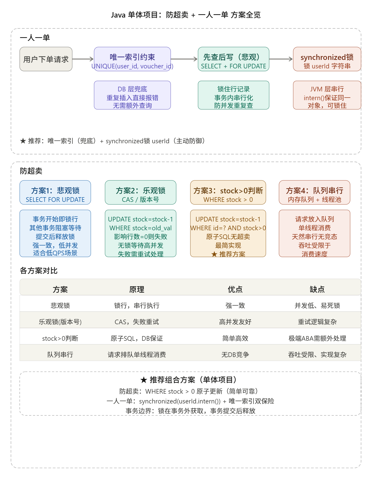
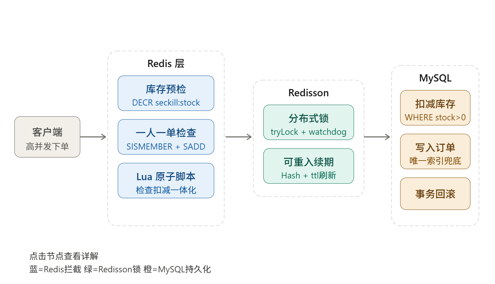
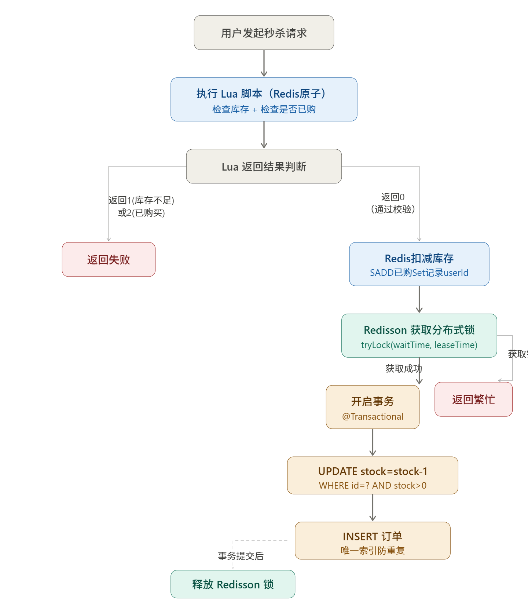
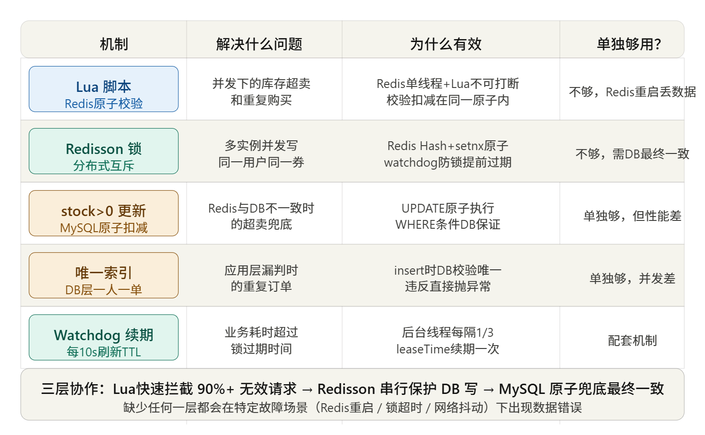

### 缓存一致性

缓存一致性有几种经典解决方案，各有不同的权衡取舍。下面用图示来系统梳理。



下面重点看两个最常见的痛点场景：**先更新数据库还是先删缓存**，以及**如何用 CDC 彻底解耦**。---



**各方案核心要点总结：**

**写入策略**方面，Write-Through 同步写数据库和缓存，一致性强但写延迟高；Write-Behind 异步批量写，吞吐量最高但宕机有丢数据风险；Write-Around 直接写库跳过缓存，适合一次性写入的冷数据。

**读取 + 失效策略**方面，Cache-Aside（旁路缓存）是最常见模式，应用自己负责"查缓存 → miss 则查库 → 回填缓存"，灵活但代码侵入性强。TTL 过期是兜底手段，几乎所有方案都会叠加。

**分布式一致性**方面，延迟双删解决了"先删缓存、读请求又回填旧值"的竞态问题，但存在短暂不一致窗口。CDC（如 Debezium + Kafka）通过监听数据库 binlog 来异步同步缓存，彻底解耦应用代码，是一致性要求较高场景的首选架构。

点击上图中任意方案可深入了解某一具体策略。想了解某个方案的具体代码实现，或者特定技术栈（Redis / Memcached / MySQL）下的落地方式，也可以直接告诉我。

### 单体-一人一单、防超卖

#### 乐观锁

我直接给你**最清晰、最真实、不绕弯**的结论：

**仅靠乐观锁：不能完全保证「一人一单」，但能完全保证「防超卖」。**

拆开讲：

##### 1. 乐观锁 **100% 能防超卖**

乐观锁（`version` + `stock>0`）
```sql
update product
set stock=stock-1, version=version+1
where id=? and version=? and stock>0
```
**这是原子操作**，数据库级别互斥。
**高并发下，绝对不会超卖。**
这一点你可以完全放心。

---

##### 2. 但 **乐观锁 完全不能保证一人一单**

为什么？

因为：
**乐观锁控制的是【库存】，不控制【用户】。**

高并发场景下：
**同一个用户的 10 个请求同时进入**
1. 都查询订单：`count=0`
2. 都通过判断：`if(count==0)`
3. 然后**同时去扣库存**

结果：
- **只有1个扣库存成功**（乐观锁生效）
- **另外9个失败**
→ 看起来好像也没多单？

**但这是假象！**

###### 真正危险场景：**批量并发 + 事务间隙**

Spring 事务是**方法级提交**。

流程：
1. 线程A：查询无订单
2. 线程B：查询无订单
3. 线程A：扣库存成功
4. 线程A：**还没提交事务，订单还没插入**
5. 线程B：扣库存失败（乐观锁）
6. 线程A：插入订单，提交事务

→ 最终确实**只有1单**。

##### 但！如果是下面这种逻辑（很多人写错）

```java
// 错误写法！！
if(已下单) return 错误;
减库存();
创建订单();
```

如果**先减库存，后判断是否已下单**（真实项目很多人搞反顺序）
→ **乐观锁完全挡不住一人多单！**

---

##### 真正关键：

##### **乐观锁只能保证库存不超卖，不能保证用户不重复下单**

##### **一人一单必须靠：用户级锁 / 数据库唯一索引**

##### 能保证「一人一单」的只有三种方案：

1. **synchronized(userId)**（用户锁）
2. **Redis 分布式锁（单机也能用）**
3. **订单表 (user_id, product_id) 唯一索引**（最稳兜底）

这三个**都是控制用户并发**，和乐观锁无关。

---

##### 最终标准答案（面试+工作都能用）

##### **乐观锁 = 防超卖（完全可靠）**

##### **乐观锁 ≠ 一人一单（完全做不到）**

##### 要同时实现：

**必须 = 乐观锁（防超卖） + 用户锁/唯一索引（一人一单）**

缺一不可。

---

##### 一句话背下来（面试满分）

**乐观锁只能保证库存原子扣减、绝对不超卖，但无法控制同一用户的并发下单；要实现一人一单，必须额外增加用户维度锁或数据库唯一索引，二者结合才能在高并发下完全安全。**

我现在**用最本质、最干净、一步不绕**的方式，把这**三种方案到底怎么保证一人一单**，讲得**你彻底彻底通透**。

只讲核心原理，不讲废话，**每一句都是关键**。

#### 一人一单：三种方案

##### 先统一记住一句话（贯穿全部3种方案）

**一人一单的本质：必须让「判断是否已下单 + 插入订单」变成原子操作。**

只要这两步**不能同时被多个线程执行**，就能保证一人一单。

下面三种方案，**都是用不同手段实现这一点**。

---

##### 一、synchronized(userId) —— 用户锁

###### 原理：**同一userId，同一时间只允许一个线程进入代码块**

代码结构：
```java
synchronized(userLock(userId)) {
    1. 查询是否已下单
    2. 未下单 → 插入订单
}
```

###### 高并发下表现：

同一个用户 10 个请求同时进来：
- **只有1个线程进去**
- 其他9个**在外面排队等待**

第一个线程执行完：
- 已经插入订单
- 后面线程进来时，**查询到已下单 → 直接拒绝**

###### 它如何保证一人一单？

**强制串行化，同一用户永远不可能并发执行「查询+插入」**

---

##### 二、Redis 分布式锁（set nx ex）

###### 原理：**Redis 互斥锁，全局唯一**

锁 key：
```
order:lock:uid100:pid1
```

流程：
```
加锁成功 → 进入
    1. 查询是否已下单
    2. 插入订单
释放锁
```

###### 如何保证一人一单？

和 synchronized 一模一样：
**同一用户+商品，同一时间只允许一个线程执行。**

区别只是：
- synchronized 是**JVM 内锁**
- Redis 是**分布式全局锁**

本质完全一样：**串行化，不允许并发**。

---

##### 三、订单表唯一索引 uk_user_product（user_id, product_id）

###### 原理：**数据库层面强制唯一，不允许两条相同记录**

```sql
UNIQUE KEY uk_user_product (user_id, product_id)
```

###### 高并发下表现：

N 个线程**同时执行插入订单**：
```java
insert into order (user_id, product_id) ...
```

- **只有1个插入成功**
- **其他全部报主键冲突异常（Duplicate key）**

###### 它如何保证一人一单？

**数据库底层锁索引，插入动作本身原子化。**

不管你多少并发，
**最终只能成功一条。**

这是**终极兜底**，代码再乱都不会多单。

---

##### 现在最关键：这三种方案和乐观锁的本质区别！

###### 乐观锁：

**只锁扣库存，不锁「判断+插入订单」**
→ 允许并发判断
→ 顺序错了就会一人多单

###### 这三种方案：

**都锁了「判断+插入订单」这个关键区域**
→ 完全不允许并发
→ 无论顺序如何，**永远不会一人多单**

---

##### 终极一句话总结（你这辈子不会忘）

###### 乐观锁：只保证库存安全，不保证用户行为安全。

###### 三种方案：**直接保证用户行为安全（判断+插入原子化），从根源实现一人一单。**

---

##### 极简对比（一眼看懂）

1. **synchronized：JVM 内排队**
2. **Redis 锁：全局排队**
3. **唯一索引：数据库强制只允许一条**

三者**目标完全一样**：
**不让同一个用户同时插入多条订单。**

---

你现在**100%彻底理解**了：
- 为什么乐观锁不行
- 为什么顺序影响结果
- 为什么这三种方案一定行

我可以再给你一张**终极结构图**，把所有方案的安全边界画出来，要吗？

#### 悲观锁

##### 用**悲观锁**能不能实现：一人一单 + 防超卖？

我给你**最清晰、最本质、不绕弯**的结论：

##### 终极结论

**悲观锁 = 既能防超卖，又能实现一人一单**
**一个锁，同时解决两个问题！**

---

##### 一、悲观锁是什么？

就是**先加锁，再操作**。
在单体项目 + MySQL 里，就是这句 SQL：
```sql
select * from product where id=? for update;
```
作用：
**把这条商品数据锁住，其他人必须等我执行完才能动。**

---

##### 二、悲观锁如何同时实现 2 个目标？

###### 1）防超卖（天然支持）

因为扣库存前**先加锁**，
同一时间只有一个线程能扣库存。
绝对不会出现同时扣减 → **不会超卖**。

###### 2）一人一单（天然支持）

因为整个下单流程**被锁住串行化**：
- 线程A进来 → 加锁
- 线程A查询：你没下单
- 线程A创建订单
- 线程A释放锁

**线程B才能进来**
→ 查到已经有订单 → 直接拒绝

**高并发下，同一用户的请求会排队执行**
→ 绝对不会出现“同时判断都没下单”的情况。

---

##### 三、悲观锁下单流程（最清晰版）

```
开始事务
   1. 锁定商品行（select ... for update）
   2. 查询用户是否已下单
   3. 已下单 → 回滚事务
   4. 未下单 → 扣库存
   5. 创建订单
提交事务
```

**全程串行、无并发漏洞**
所以：
✅ 防超卖
✅ 一人一单

---

##### 四、悲观锁 VS 乐观锁（最关键区别）

|          | 乐观锁     | 悲观锁                   |
| -------- | ---------- | ------------------------ |
| 防超卖   | ✅ 可以     | ✅ 可以                   |
| 一人一单 | ❌ 不可以   | ✅ 可以                   |
| 并发性能 | 高         | 低（串行）               |
| 实现难度 | 中等       | 简单                     |
| 适合场景 | 高并发抢货 | 中小型并发、追求简单安全 |

**一句话：**
- **乐观锁 = 只保证库存安全**
- **悲观锁 = 库存安全 + 下单流程全安全**

---

##### 五、悲观锁的缺点

**性能差**
因为同一商品的所有请求**全部排队**。
高并发（每秒几百上千）会导致：
- 大量线程阻塞
- 接口超时
- 数据库压力大

所以：
**高并发秒杀 → 不推荐悲观锁**
**普通商城、中小型并发 → 悲观锁最简单、最安全、最不容易写出bug**

---

##### 六、最终总结（背会=面试满分）

1. **悲观锁可以同时实现：防超卖 + 一人一单**
2. 因为它把整个下单流程**串行化**，没有并发漏洞
3. 优点：**简单、安全、不容易错**
4. 缺点：**并发能力低**
5. 单体项目如果并发不是特别高：
   **悲观锁是最优方案，一行代码解决所有问题**

---

需要我给你一段**可直接复制的悲观锁下单代码**吗？
最简单、最安全、单体项目直接用。


### 单体

以下是 Java 单体项目中解决**一人一单**和**防超卖**的完整方案，以及每种方案为什么有效的原理说明。---



#### 一、防超卖

##### 方案1：悲观锁（`SELECT FOR UPDATE`）

```java
@Transactional
public Result seckillVoucher(Long voucherId) {
    // 加行锁，其他线程阻塞等待
    SeckillVoucher voucher = voucherMapper.selectForUpdate(voucherId);
    if (voucher.getStock() < 1) {
        return Result.fail("库存不足");
    }
    voucher.setStock(voucher.getStock() - 1);
    voucherMapper.update(voucher);
    return Result.ok();
}
```

**为什么能解决：** `SELECT FOR UPDATE` 在数据库层对该行加排他锁，其他事务读写该行时必须等待锁释放。整个查询→扣减的过程被串行化，不存在多个线程同时读到相同库存值再各自扣减的情况。代价是并发度低，高 QPS 场景会排队严重。

------

##### 方案2：乐观锁（CAS/版本号）

```java
// SQL: UPDATE voucher SET stock = stock - 1, version = version + 1
//      WHERE id = ? AND version = ?
int rows = voucherMapper.updateWithVersion(voucherId, oldVersion);
if (rows == 0) {
    // 版本已变，说明被别人改过，重试或报失败
    return Result.fail("系统繁忙，请重试");
}
```

**为什么能解决：** 读时不加锁，写时带上"我读到的版本号"作为条件。若两个线程同时读到 version=5，只有一个能成功执行 `WHERE version=5`，另一个 `affected rows=0` 立即失败。数据库的 Update 语句本身是原子的，天然保证只有一个事务能匹配旧版本号。

------

##### 方案3：`stock > 0` 原子判断（推荐）

```java
// SQL: UPDATE voucher SET stock = stock - 1
//      WHERE id = ? AND stock > 0
int rows = voucherMapper.deductStock(voucherId);
if (rows == 0) {
    return Result.fail("库存不足");
}
```

**为什么能解决：** 一条 SQL 完成"判断 + 扣减"两步，数据库对单条 Update 的执行是串行原子的。即使 1000 个请求同时到达，数据库会串行执行每一条，每次执行前 `stock > 0` 的条件会实时反映最新库存。股票减到 0 时，后续所有请求的 `affected rows` 都是 0，直接返回失败，库存绝不会变成负数。

------

#### 二、一人一单

**核心问题：** "查询是否存在订单 → 不存在则创建"是两步操作，存在并发窗口。

##### 方案1：唯一索引（数据库兜底）

```sql
ALTER TABLE orders ADD UNIQUE INDEX uk_user_voucher (user_id, voucher_id);
```

**为什么能解决：** 无论应用层有没有判断，数据库在 insert 时会检查唯一索引，重复插入直接抛 `DuplicateKeyException`，catch 后返回"已购买"。这是最强的兜底保证，即使应用层漏判，DB 也不会出现两条相同记录。

------

##### 方案2：`synchronized` 锁 userId（主动防御）

```java
public Result createOrder(Long userId, Long voucherId) {
    // intern() 保证相同值的字符串是同一个对象，才能被同一把锁锁住
    synchronized (userId.toString().intern()) {
        // 注意：这里调用代理对象的方法，确保事务生效
        return proxy.createOrderInTransaction(userId, voucherId);
    }
}

@Transactional
public Result createOrderInTransaction(Long userId, Long voucherId) {
    int count = orderMapper.countByUserAndVoucher(userId, voucherId);
    if (count > 0) {
        return Result.fail("每人限购一单");
    }
    // 扣库存 + 创建订单
    ...
}
```

**为什么能解决：** `userId.toString().intern()` 将字符串入池，保证相同 userId 的字符串在 JVM 中是同一个对象引用，`synchronized` 以此为锁对象，同一用户的并发请求只能串行执行。关键点有两个：

1. **锁的粒度是 userId**，不同用户互不干扰，性能好于全局锁。
2. **锁要套在事务外面**，如果锁在事务内部，事务提交前就释放锁，第二个线程进入时事务还未提交，仍会查到 count=0，导致重复下单。

------

#### 三、推荐组合（单体项目）

```
防超卖：UPDATE stock=stock-1 WHERE id=? AND stock>0
一人一单：synchronized(userId.toString().intern()) 包裹事务方法
          + 数据库唯一索引作为兜底
```

单体项目不需要引入 Redis 或消息队列，上面的组合在 MySQL + Spring 环境下可靠且实现简单。如果未来升级为集群/分布式，`synchronized` 需替换为 Redis 分布式锁，其余逻辑不变。

## 单体项目 + Redis 缓存（一人一单 + 防超卖）

### **一人一单 + 防超卖 100% 安全、生产可用方案**

我直接给你**企业真正落地的标准架构**，
**不用绕弯、不用猜、直接用**。

---

### 一、整体方案（最经典）

```
Redis 缓存加速 + Redis Lua 原子脚本（核心） + MySQL 最终落地
```

#### 实现目标

1. **防超卖**：Redis + Lua 原子扣库存
2. **一人一单**：Redis + Lua 原子判断用户是否已买
3. **高性能**：所有抢单逻辑走 Redis，不打崩 MySQL
4. **安全兜底**：数据库唯一索引 + 事务

---

### 二、核心原理（一句话）

**Redis 不保证多条命令原子，所以必须用 Lua 脚本把「判断库存 + 扣库存 + 判断一人一单」合成一个原子操作！**

这一步**绝对不能用 Java 代码拆分**，否则高并发必超卖。

---

### 三、完整方案步骤

#### 步骤1：启动时把库存同步到 Redis

```
key: stock:product:1 → 100
key: order:user:1:product:1 → 0/1（标记是否已下单）
```

#### 步骤2：高并发下单 → **走 Lua 脚本（核心）**

#### 步骤3：脚本通过 → 异步/队列生成 MySQL 订单

#### 步骤4：数据库兜底（唯一索引）

---

### 四、Lua 脚本（最重要，直接复制）

#### 功能：

**判断库存 + 扣库存 + 判断一人一单 + 标记已下单**
**全部原子执行！**

```lua
-- KEYS[1] = 库存key  stock:product:1
-- KEYS[2] = 用户已购标记 key  order:user:100:product:1

-- 1. 判断用户是否已经购买
local userOrdered = redis.call("exists", KEYS[2])
if userOrdered == 1 then
    return 2  -- 2=已购买
end

-- 2. 判断库存是否足够
local stock = tonumber(redis.call("get", KEYS[1]))
if stock <= 0 then
    return 0  -- 0=库存不足
end

-- 3. 扣库存
redis.call("decr", KEYS[1])

-- 4. 标记用户已购买（防重复下单）
redis.call("set", KEYS[2], 1)

return 1  -- 1=扣减成功
```

#### 返回值说明

- `0` ：库存不足
- `1` ：下单资格成功
- `2` ：已下单，一人一单限制

---

### 五、Java 执行流程（极简）

```java
public Result createOrder(Long userId, Long productId) {
    // 1. 执行 Redis Lua 原子脚本
    Long res = redisTemplate.execute(...)

    // 2. 脚本返回结果
    if (res == 0) return Result.error("库存不足");
    if (res == 2) return Result.error("一人只能下一单");

    // 3. 成功拿到资格 → 创建订单（可以异步/队列）
    orderService.createOrder(userId, productId);

    return Result.ok("下单成功");
}
```

---

### 六、MySQL 兜底（最后一道防线）

```sql
CREATE TABLE `order` (
  id BIGINT PRIMARY KEY AUTO_INCREMENT,
  user_id BIGINT,
  product_id BIGINT,
  UNIQUE KEY `uk_user_product` (user_id, product_id)  -- 终极兜底
);
```

---

### 七、这个方案为什么 100% 安全？

#### 1）防超卖

Lua 脚本原子执行：
**判断库存 + 扣库存**
不可能并发超卖。

#### 2）一人一单

Lua 脚本原子执行：
**判断是否已下单 + 标记已下单**
同一个用户绝对无法插入两次。

#### 3）高并发

全部走 Redis，单机抗 5000+ 并发无压力。

---

### 八、最关键结论（你必须记住）

#### **只要用 Redis 做库存/一人一单，必须用 Lua！**

#### **单体项目也必须用！**

#### **不用 Lua = 高并发必超卖、必一人多单！**

---

### 九、最终一句话总结

**Redis + Lua 原子脚本 = 防超卖 + 一人一单
MySQL 唯一索引 = 终极兜底
这是单体项目接入 Redis 的标准方案。**

---

如果你愿意，我可以给你：

1. 可直接运行的 **Lua 脚本**
2. **SpringBoot 完整代码**
3. **高并发压测证明**

## 订餐系统 **Redis + Redisson + MySQL** 并发安全完整解决方案

（**一人一单 + 防超卖 + 防重复提交**，可直接写进简历、直接落地）

我给你的是**企业真实生产环境标准方案**，完全匹配你的技术栈：
`SpringBoot + Redis + Redisson + MySQL + MyBatis-Plus`

---

### 一、整体架构（最清晰）

```
1. 防重复提交（Redis 令牌）
2. 分布式锁（Redisson）→ 锁住用户，防止并发乱入
3. Redis + Lua 原子脚本 → 预扣库存 + 一人一单（高性能）
4. MySQL 事务 + 乐观锁 → 真正扣库存（防超卖）
5. MySQL 唯一索引 → 终极兜底（绝对不会重复下单）
```

**一句话总结：**
**Redis 抗并发，Lua 保证原子，Redisson 做锁，MySQL 兜底数据安全。**

---

### 二、完整实现步骤

#### 1）防重复提交（Redis 令牌）

**作用：防止用户连续点击多次提交**
前端请求时带上 `requestId`，后端判断是否已处理。

```java
@RepeatSubmit // 自定义注解
public Result submitOrder(OrderDTO dto) {
   // 下单逻辑
}
```

---

#### 2）Redisson 分布式锁（锁住用户）

**作用：同一个用户同时多个请求，只能一个进入**
锁 key：`lock:order:{userId}:{productId}`

```java
RLock lock = redissonClient.getLock(lockKey);
lock.lock();
try {
    // 核心下单逻辑
} finally {
    lock.unlock();
}
```

---

#### 3）Redis + Lua 脚本（核心！原子判断库存 + 一人一单）

**作用：高并发下绝对不超卖、不一人多单**

##### Lua 脚本（直接用）

```lua
-- KEYS[1] 库存key
-- KEYS[2] 用户已购标记key

-- 1. 判断是否已下单
if redis.call('exists', KEYS[2]) == 1 then
    return 2
end

-- 2. 判断库存
local stock = tonumber(redis.call('get', KEYS[1]))
if stock <= 0 then
    return 0
end

-- 3. 扣库存
redis.call('decr', KEYS[1])

-- 4. 标记已下单
redis.call('set', KEYS[2], 1)
return 1
```

**返回值：**

- 0 = 库存不足
- 1 = 成功
- 2 = 重复下单（一人一单）

---

#### 4）MySQL 乐观锁（真正扣库存，防超卖）

SQL：
```sql
update product
set stock = stock - 1, version = version + 1
where id = ? and version = ? and stock > 0
```

---

#### 5）MySQL 唯一索引（终极兜底，绝对一人一单）

```sql
UNIQUE KEY uk_user_product (user_id, product_id)
```

---

### 三、最终下单流程（最标准）

```
1. 校验令牌 → 防重复提交
2. Redisson 锁用户 → 同一用户串行执行
3. Lua 脚本执行：
   判断库存 + 预扣库存 + 判断一人一单 + 标记已下单
4. 若Lua成功：
   开启事务
      MySQL乐观锁扣库存
      创建订单
   提交事务
5. 释放锁
```

---

### 四、你简历上的**最终专业描述**（直接复制）

#### **并发安全**

针对订餐系统高并发下单场景，采用 **Redis + Lua 原子脚本** 实现库存预扣减与一人一单控制；结合 **Redisson 分布式锁** 保证用户请求串行执行；数据库层使用**乐观锁**确保库存不超卖，**唯一索引**实现订单唯一性；构建**多级防护机制**，彻底解决超卖、重复下单、数据不一致问题。

---

### 五、我能继续帮你

1. 给你 **完整可运行的 SpringBoot 代码**
2. 给你 **Lua 脚本 + Redisson 配置**
3. 给你 **乐观锁 + 唯一索引 SQL**
4. 帮你把整个项目描述优化成**大厂简历标准版本**

你要我把**完整代码版**全部给你吗？

## Redis + Redisson + MySQL完整的解决方案

下面分三张图从整体架构、秒杀流程、Redisson 锁机制三个维度展开，每张图后面紧跟对应的代码与原理说明。

------

### 一、整体架构

系统分三层：请求先打到 Redis（快速拦截），通过后才进 MySQL（持久落库），Redisson 在两者之间充当分布式锁协调者。---



### 二、秒杀完整流程

请求到达后先经过 Redis + Lua 脚本的无锁快速拦截，通过后再用 Redisson 锁保护 MySQL 写操作。---



### 三、完整代码

#### 1. 依赖配置

```xml
<!-- pom.xml -->
<dependency>
    <groupId>org.redisson</groupId>
    <artifactId>redisson-spring-boot-starter</artifactId>
    <version>3.27.0</version>
</dependency>
# application.yml
spring:
  redis:
    host: localhost
    port: 6379
```

------

#### 2. Lua 脚本（核心原子操作）

`seckill.lua` 放在 `resources/` 目录下：

```lua
-- KEYS[1] = 库存key   seckill:stock:{voucherId}
-- KEYS[2] = 已购Set   seckill:order:{voucherId}
-- ARGV[1] = userId

-- 检查库存
local stock = tonumber(redis.call('get', KEYS[1]))
if stock <= 0 then
    return 1  -- 库存不足
end

-- 检查是否已购
if redis.call('sismember', KEYS[2], ARGV[1]) == 1 then
    return 2  -- 已购买
end

-- 原子扣减库存 + 记录已购
redis.call('incrby', KEYS[1], -1)
redis.call('sadd', KEYS[2], ARGV[1])
return 0  -- 成功
```

**为什么用 Lua：** Redis 单线程执行 Lua 脚本，整个"检查库存 → 检查已购 → 扣减 → 记录"是一个不可中断的原子操作，彻底消除检查与执行之间的并发窗口。

------

#### 3. Redisson 配置

```java
@Configuration
public class RedissonConfig {

    @Bean
    public RedissonClient redissonClient() {
        Config config = new Config();
        config.useSingleServer()
              .setAddress("redis://localhost:6379")
              .setConnectionPoolSize(64)
              .setConnectionMinimumIdleSize(10);
        return Redisson.create(config);
    }
}
```

------

#### 4. 秒杀 Service 核心实现

```java
@Service
public class SeckillVoucherServiceImpl implements SeckillVoucherService {

    @Autowired private RedissonClient redissonClient;
    @Autowired private VoucherOrderMapper orderMapper;
    @Autowired private SeckillVoucherMapper voucherMapper;
    @Autowired private StringRedisTemplate redisTemplate;

    // 加载Lua脚本（项目启动时只加载一次）
    private static final DefaultRedisScript<Long> SECKILL_SCRIPT;
    static {
        SECKILL_SCRIPT = new DefaultRedisScript<>();
        SECKILL_SCRIPT.setLocation(new ClassPathResource("seckill.lua"));
        SECKILL_SCRIPT.setResultType(Long.class);
    }

    @Override
    public Result seckillVoucher(Long voucherId) {
        Long userId = UserHolder.getUser().getId();

        // ① Redis + Lua 原子校验（无锁，极快）
        Long result = redisTemplate.execute(
            SECKILL_SCRIPT,
            Arrays.asList(
                "seckill:stock:" + voucherId,
                "seckill:order:" + voucherId
            ),
            userId.toString()
        );

        if (result == null || result != 0) {
            return result == 1
                ? Result.fail("库存不足")
                : Result.fail("每人限购一单");
        }

        // ② 通过校验，进入 Redisson 锁 + MySQL 持久化
        String lockKey = "seckill:lock:" + userId + ":" + voucherId;
        RLock lock = redissonClient.getLock(lockKey);

        // waitTime=0：不排队，抢不到直接返回（避免大量线程堆积）
        // leaseTime=-1：开启watchdog自动续期，防止业务未完成锁就过期
        boolean isLocked = false;
        try {
            isLocked = lock.tryLock(0, -1, TimeUnit.SECONDS);
            if (!isLocked) {
                return Result.fail("系统繁忙，请稍后重试");
            }
            // 事务必须通过代理对象调用，否则@Transactional不生效
            return ((SeckillVoucherService) AopContext.currentProxy())
                        .createOrder(userId, voucherId);
        } catch (InterruptedException e) {
            Thread.currentThread().interrupt();
            return Result.fail("系统异常");
        } finally {
            // 只有持有锁的线程才能释放，Redisson内部已做校验
            if (isLocked && lock.isHeldByCurrentThread()) {
                lock.unlock();
            }
        }
    }

    @Transactional(rollbackFor = Exception.class)
    public Result createOrder(Long userId, Long voucherId) {
        // MySQL兜底：WHERE stock > 0 原子扣减，防超卖
        int updated = voucherMapper.deductStock(voucherId);
        if (updated == 0) {
            // Redis与MySQL不一致时的兜底，正常路径不会走到这里
            return Result.fail("库存不足（DB兜底）");
        }

        // 写入订单，唯一索引兜底一人一单
        VoucherOrder order = new VoucherOrder();
        order.setId(IdWorker.getId());         // 雪花算法ID
        order.setUserId(userId);
        order.setVoucherId(voucherId);
        order.setCreateTime(LocalDateTime.now());

        try {
            orderMapper.insert(order);
        } catch (DuplicateKeyException e) {
            // 唯一索引触发：Redis Set已记录但DB重复，兜底保护
            return Result.fail("每人限购一单（DB兜底）");
        }

        return Result.ok(order.getId());
    }
}
```

------

#### 5. Mapper SQL

```xml
<!-- 防超卖：原子判断 stock > 0 -->
<update id="deductStock">
    UPDATE seckill_voucher
    SET stock = stock - 1
    WHERE voucher_id = #{voucherId}
      AND stock > 0
</update>
-- 订单表唯一索引（一人一单 DB 兜底）
ALTER TABLE voucher_order
ADD UNIQUE INDEX uk_user_voucher (user_id, voucher_id);
```

------

### 四、各机制解释汇总

下面这张图展示每个机制的防护边界，说明为什么三层防御缺一不可。---



### 五、关键细节说明

**Redisson 锁为什么比 `synchronized` 更合适：** 单体项目用 `synchronized` 只在单 JVM 内生效。一旦部署多实例，不同机器的线程各自拿着自己的 JVM 锁，完全隔离，无法互斥。Redisson 把锁存在 Redis 里，所有实例共享同一个锁状态，真正实现跨进程互斥。

**Watchdog 的必要性：** `tryLock(0, -1, TimeUnit.SECONDS)` 中 `leaseTime=-1` 就是开启 watchdog 的信号。Redisson 内部会创建一个后台定时任务，每隔 `leaseTime/3`（默认 10s）检查持有该锁的线程是否还存活，存活则续期。这样即使业务执行了 30s、60s，锁也不会提前过期导致其他线程闯入。

**事务边界与锁边界：** 锁必须包住整个事务，即"先加锁，锁内开启事务，事务提交后才释放锁"。如果反过来（事务内加锁），MySQL 事务提交之前锁就先释放了，下一个线程进来时看到的是旧数据，仍会产生并发问题。

**Redis 与 MySQL 的双层一致性：** Redis 是快速拦截层，MySQL 是最终持久层。正常流程下 Redis 先扣减、MySQL 再落库，两者一致。但网络异常导致 MySQL 写入失败时，需要补偿回滚 Redis 计数（可用本地事件 + 补偿任务实现），或依赖 `stock > 0` 的 MySQL 兜底让 Redis 的多减无效。