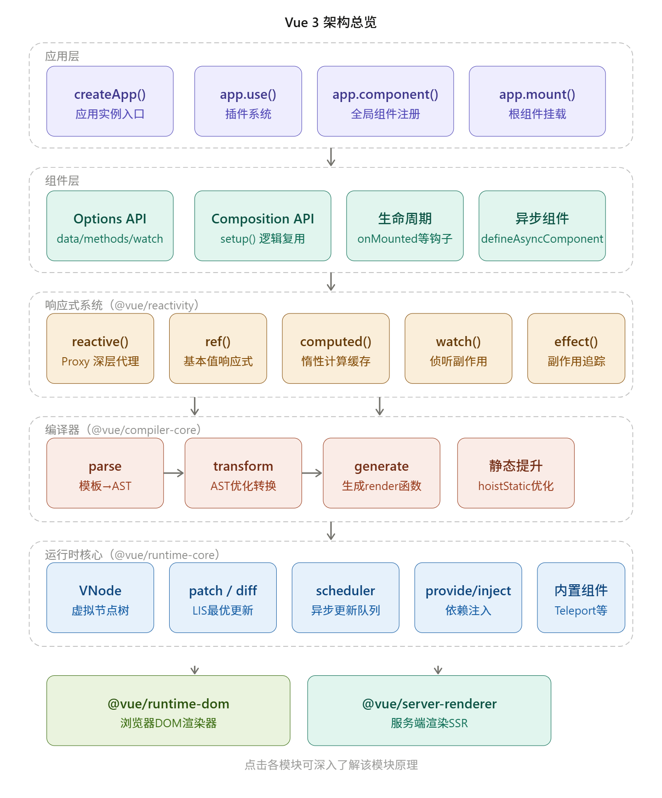

# **HTML、JavaScript、Axios、Vue3**关系

 可以理解为 **前端开发从基础到框架再到网络请求的分层关系**。
它们之间不是竞争关系，而是 **逐层构建的技术体系**。

我给你用 **结构 + 关系 + 实际代码例子** 讲清楚。

------

## 一、前端技术分层关系

可以把它们理解成 **四层结构**

```
前端应用
   │
   ├── Vue3（前端框架）
   │       │
   │       ├── HTML（模板）
   │       ├── JavaScript（逻辑）
   │       └── Axios（发送HTTP请求）
   │
   └── 浏览器
```

更直观一点：

```
Vue3
 │
 ├── HTML（页面结构）
 ├── JavaScript（业务逻辑）
 └── Axios（网络请求）
```

------

## 二、HTML、JS、Axios、Vue3 各自作用

| 技术       | 类型     | 作用             |
| ---------- | -------- | ---------------- |
| HTML       | 标记语言 | 页面结构         |
| JavaScript | 编程语言 | 页面逻辑         |
| Axios      | JS库     | 发送HTTP请求     |
| Vue3       | 前端框架 | 构建整个前端应用 |

------

## 三、HTML 与 JavaScript 的关系

**HTML**

负责页面结构

```html
<button>点击</button>
```

**JavaScript**

控制页面行为

```javascript
document.querySelector("button").onclick = function(){
    alert("点击了按钮")
}
```

关系

```
HTML = 页面骨架
JavaScript = 页面行为
```

------

## 四、Axios 与 JavaScript 的关系

Axios 本质是 **JavaScript库**。

作用：

```
浏览器  →  后端接口
```

发送 HTTP 请求。

示例

```javascript
axios.get("/api/user")
     .then(res=>{
        console.log(res.data)
     })
```

等价于：

```
JavaScript
   └── Axios
        └── HTTP请求
```

------

## 五、Vue3 与 HTML、JS 的关系

Vue3 是 **前端框架**，它把 **HTML + JS + 数据** 结合在一起。

Vue3 文件通常是：

```
.vue
```

示例：

```vue
<template>
  <button @click="getUser">获取用户</button>
</template>

<script setup>
import axios from "axios"

const getUser = () => {
  axios.get("/api/user").then(res=>{
    console.log(res.data)
  })
}
</script>
```

这里包含：

```
template  → HTML
script    → JavaScript
axios     → HTTP请求
```

------

## 六、完整运行流程

当用户访问页面：

```
浏览器
   │
   │加载
   ▼
HTML 页面
   │
   │运行
   ▼
JavaScript
   │
   │Vue3框架
   ▼
组件渲染
   │
   │Axios请求
   ▼
后端API
   │
   ▼
返回数据
   │
   ▼
Vue3更新页面
```

------

## 七、前端技术关系图（非常重要）

```
               前端应用
                   │
                Vue3框架
                   │
      ┌────────────┼────────────┐
      │            │            │
    HTML        JavaScript     Axios
  页面结构       页面逻辑      HTTP请求
                                    │
                                    ▼
                                 后端API
```

------

## 八、面试标准回答

如果面试官问：

**HTML、JS、Axios、Vue3关系是什么？**

标准回答：

> HTML 负责页面结构，JavaScript 负责页面逻辑，Axios 是基于 JavaScript 的 HTTP 请求库，用来调用后端接口。Vue3 是前端框架，它将 HTML 模板、JavaScript 逻辑和数据绑定在一起，在实际开发中我们通常在 Vue3 组件中使用 Axios 请求后端数据，然后通过 Vue3 的响应式机制更新 HTML 页面。

------

如果你愿意，我可以再给你一张 **前端完整技术体系图（面试级）**，把下面这些全部串起来：

```
HTML
CSS
JavaScript
ES6
Axios
Vue3
Pinia
Vue Router
Vite
Node.js
```

我可以画一张 **“Vue3 前端完整架构图”**，一眼就能理解整个前端体系。


# VUE3笔记

我给你整理**最清晰、最实用、带注释**的 Vue3 项目结构，分为 **Vite 创建的标准结构** 和 **Vue CLI 创建的结构**，你直接对照自己项目看就行。

---

## 一、Vite 创建的 Vue3 项目（推荐、现代）

这是目前 **Vue3 官方首选** 的项目结构，最常用。

```
your-vue3-project/
├── .vscode/            # VSCode 编辑器配置（自动生成）
├── node_modules/       # 项目依赖包（npm install 后生成）
├── public/             # 静态资源（不会被打包，直接复制到 dist）
│   └── favicon.ico     # 网站图标
├── src/                # 【核心源码目录】99% 工作都在这里
│   ├── assets/         # 静态资源：图片、样式、字体（会被打包）
│   ├── components/     # 公共组件（全局复用的小组件）
│   ├── views/          # 页面组件（路由对应的大页面）
│   ├── router/         # 路由配置（vue-router）
│   │   └── index.js
│   ├── store/          # 状态管理（pinia/vuex）
│   │   └── index.js
│   ├── api/            # 接口请求（axios 封装 + 接口地址）
│   ├── utils/          # 工具函数（时间格式化、防抖等）
│   ├── hooks/          # Vue3 组合式函数（自定义 hooks）
│   ├── layouts/        # 布局组件（可选：头部、侧边栏、底部）
│   ├── directives/     # 自定义指令（可选）
│   ├── App.vue         # 根组件（所有页面的入口）
│   └── main.js         # 项目入口文件（创建 Vue 实例）
├── .env.development    # 开发环境变量
├── .env.production     # 生产环境变量
├── .gitignore          # Git 忽略文件
├── index.html          # 页面入口 HTML（Vite 独有）
├── package.json        # 项目配置 + 依赖 + 脚本命令
├── vite.config.js      # Vite 配置文件（代理、打包、路径）
└── README.md           # 项目说明文档
```

### vite文件更新后需要重启才能生效

###  `.env`

`.env` 文件是 Vue 项目里**专门存放环境变量**的配置文件，用来区分**开发环境 / 生产环境**，把敏感信息、接口地址、配置项统一管理，**不会写死在代码里**。

简单说：**不同环境用不同配置，自动切换**。

---

#### 一、Vue3 支持的 4 种 .env 文件

直接放在**项目根目录**（和 `package.json` 同级）：

```
.env                # 所有环境都会加载（基础配置）
.env.development     # 仅开发环境（npm run dev）
.env.production      # 仅生产环境（npm run build）
.env.test            # 仅测试环境（可选）
```

加载优先级（后面会覆盖前面）：
```
.env < .env.环境名
```

---

#### 二、环境变量命名规则（必须遵守）

##### ✅ 正确写法

**必须以 `VITE_` 开头**（Vite 项目）
```env
# 接口地址
VITE_API_URL = https://api.example.com

# 项目名称
VITE_APP_NAME = 我的Vue3项目

# 是否开启mock
VITE_MOCK = true
```

##### ❌ 错误写法

```env
# 不会生效！不会暴露给客户端
API_URL = https://xxx.com 
```

> 如果是 **Vue CLI（webpack）** 项目，必须以 `VUE_APP_` 开头。

---

#### 三、在代码中使用环境变量

##### 1. 在 .vue 文件中使用

```vue
<script setup>
console.log(import.meta.env.VITE_API_URL)
</script>

<template>
  <div>{{ import.meta.env.VITE_APP_NAME }}</div>
</template>
```

##### 2. 在 js/ts 文件中使用

```js
// api/index.js
const baseUrl = import.meta.env.VITE_API_URL
```

---

#### 四、3 个内置环境变量（不用自己定义）

Vite 自带，直接用：
```js
import.meta.env.MODE        // 环境模式：development / production
import.meta.env.PROD       // 是否生产环境：true / false
import.meta.env.DEV        // 是否开发环境：true / false
```

用途示例：
```js
if (import.meta.env.DEV) {
  console.log('开发环境，打印日志')
}
```

---

#### 五、完整示例（最常用）

##### 1. .env.development（开发环境）

```env
VITE_API_URL = http://localhost:3000
VITE_MOCK = true
```

##### 2. .env.production（生产环境）

```env
VITE_API_URL = https://api.xxx.com
VITE_MOCK = false
```

##### 3. 运行时自动切换

- `npm run dev` → 加载 `.env.development`
- `npm run build` → 加载 `.env.production`

---

#### 六、注意事项（必看）

1. **修改 .env 文件必须重启服务**才会生效；
2. **不要把敏感密钥上传到 Git**；
3. 可以在 `.gitignore` 里忽略敏感配置文件；
4. 只有 `VITE_` 开头的变量才能在客户端代码中访问。

---

#### 总结

1. `.env` 是**环境变量配置文件**，区分开发/生产；
2. Vite 项目变量必须 **`VITE_` 开头**；
3. 使用方式：`import.meta.env.VITE_XXX`；
4. 修改后**必须重启服务**。

需要我给你一份**企业级标准 .env 配置模板**吗？直接复制就能用。

### `package.json`

`package.json` 是**整个项目的配置说明书**，放在项目根目录，所有工具（npm/vite）都靠它识别项目、装依赖、跑命令。

你可以把它理解成：**项目的身份证 + 工具箱 + 依赖清单**。

---

#### 一、一个标准 Vue3 + Vite 的 package.json

```json
{
  "name": "vue3-project",       // 项目名
  "version": "0.0.0",           // 项目版本
  "type": "module",             // 支持 ES6 模块化（import/export）
  "scripts": {                  // 【最常用】脚本命令
    "dev": "vite",              // 启动开发服务器
    "build": "vite build",      // 打包生产环境代码
    "preview": "vite preview"   // 预览打包后的项目
  },
  "dependencies": {             // 【生产依赖】项目运行必须用的
    "vue": "^3.4.21",           // Vue3 核心
    "pinia": "^2.1.7",          // 状态管理
    "vue-router": "^4.3.0"      // 路由
  },
  "devDependencies": {          // 【开发依赖】打包/编译用的
    "@vitejs/plugin-vue": "^5.0.4",
    "vite": "^5.1.6"
  }
}
```

---

#### 二、核心字段（必须懂）

##### 1. `"name"`

项目名称，不能中文、不能大写。

##### 2. `"version"`

项目版本号，如 `1.0.0`。

##### 3. `"type": "module"`

允许你在 JS 里用 `import/export`，**Vue3/Vite 必备**。

---

#### 三、scripts 脚本（天天用）

这是你**终端运行命令的来源**：

```bash
npm run dev      # 启动项目（开发环境）
npm run build    # 打包项目（生成 dist 文件夹）
npm run preview  # 本地预览打包结果
```

你也可以自己加：
```json
"scripts": {
  "dev": "vite",
  "build": "vite build",
  "preview": "vite preview",
  "lint": "eslint ."
}
```

---

#### 四、dependencies vs devDependencies（最重要）

##### ✅ dependencies（生产依赖）

**项目上线运行也需要的库**
- vue
- vue-router
- pinia
- axios

安装命令：
```bash
npm install 包名
```

##### ✅ devDependencies（开发依赖）

**只在开发/打包时需要，上线不用**
- vite
- eslint
- 各种插件

安装命令：
```bash
npm install 包名 --save-dev
```

---

#### 五、依赖版本号含义

`"vue": "^3.4.21"`
- `^`：升级小版本，不升级大版本（安全）
- `~`：只升级补丁版
- `3.4.21`：固定版本

---

#### 六、和 .env 的关系（必懂）

package.json 里的 `scripts` 会**自动读取对应环境的 .env 文件**：
- `npm run dev` → 加载 `.env.development`
- `npm run build` → 加载 `.env.production`

---

#### 七、常用命令（基于 package.json）

```bash
npm install       # 安装所有依赖（拉代码后必跑）
npm run dev       # 启动开发
npm run build     # 打包上线
```

---

#### 总结

1. **`package.json` = 项目说明书**；
2. **`scripts` 是运行命令**，天天用；
3. **`dependencies` 上线需要，`devDependencies` 开发需要**；
4. 运行命令会**自动匹配 .env 环境文件**。

需要我给你一份**企业级最完整的 package.json 模板**吗？包含 eslint、prettier、打包分析等。


### `vite.config.js`

`vite.config.js` 是 **Vite 项目的核心配置文件**，相当于 Vue CLI 的 `vue.config.js`。

它的作用：**控制项目怎么启动、怎么打包、怎么代理接口、路径别名、插件**等。

---

#### 一、最简基础版（刚创建项目时）

```js
// 导入配置方法
import { defineConfig } from 'vite'
// 导入 Vue 插件
import vue from '@vitejs/plugin-vue'

// https://vitejs.dev/config/
export default defineConfig({
  // 插件
  plugins: [vue()],
})
```

---

#### 二、企业级完整版（最常用）

这是你**实际开发一定会用到**的配置，直接复制就能用：
```js
import { defineConfig } from 'vite'
import vue from '@vitejs/plugin-vue'
import path from 'path' // 路径模块

export default defineConfig({
  // 1. 插件
  plugins: [vue()],

  // 2. 路径别名（让 @ 直接指向 src 文件夹）
  resolve: {
    alias: {
      '@': path.resolve(__dirname, 'src')
    }
  },

  // 3. 开发服务器配置
  server: {
    port: 3000, // 启动端口号
    open: true, // 自动打开浏览器
    cors: true, // 允许跨域
    
    // 接口代理（解决开发环境跨域！）
    proxy: {
      '/api': {
        target: 'http://localhost:8080', // 后端接口地址
        changeOrigin: true, // 开启跨域
        rewrite: (path) => path.replace(/^\/api/, '') // 重写路径
      }
    }
  },

  // 4. 打包配置
  build: {
    outDir: 'dist', // 打包输出文件夹
    assetsDir: 'assets', // 静态资源目录
    minify: 'esbuild' // 压缩代码
  }
})
```

---

#### 三、4 大核心配置（必须懂）

##### 1. `plugins` 插件

用来扩展 Vite 功能，比如支持 Vue、JSX、自动导入等。
```js
plugins: [vue()]
```

---

##### 2. `resolve.alias` 路径别名

**让 `@` 代表 `src` 目录**，告别繁琐的 `../../`。

配置后可以这样写：
```js
// 原来
import Hello from '../../components/Hello.vue'

// 现在（更简洁）
import Hello from '@/components/Hello.vue'
```

---

##### 3. `server` 开发服务器（最重要）

- `port: 3000`：设置启动端口
- `open: true`：自动打开浏览器
- **`proxy`：接口代理（解决跨域）**

前端请求 `/api/user` → 自动转发到后端 `http://localhost:8080/user`

---

##### 4. `build` 打包配置

控制 `npm run build` 怎么打包：
- `outDir: 'dist'`：打包后生成的文件夹名
- `assetsDir`：图片、样式等资源目录

---

#### 四、和 .env / package.json 的关系

1. **读取 .env 环境变量**
   Vite 会自动根据 `npm run dev`/`build` 加载 `.env.development` 或 `.env.production`。

2. **运行命令**
   `package.json` 的 `scripts` 会调用这个配置文件：
   ```json
   "dev": "vite"
   ```

---

#### 五、常见使用场景

##### 场景1：修改启动端口

```js
server: {
  port: 8080
}
```

##### 场景2：配置接口代理（解决跨域）

```js
server: {
  proxy: {
    '/api': {
      target: 'https://api.xxx.com',
      changeOrigin: true
    }
  }
}
server: {
    host: '0.0.0.0',
        port: 5173,
            // 配置代理，解决开发环境跨域问题
            proxy: {
                '/api': {
                    target: 'http://localhost:8080', // Spring Boot 后端服务地址
                        changeOrigin: true,
                            rewrite: (path) => path.replace(/^\/api/, ''),
                },
                },
        },
```

###### src/utils/env.ts

```typescript
export interface AppEnv {
  title: string
  apiBaseUrl: string
  apiTimeout: number
}

export const appEnv: AppEnv = {
  title: import.meta.env.VITE_APP_TITLE || 'Vue3 Demo',
  apiBaseUrl:
    import.meta.env.VITE_API_BASE_URL || '/api',
  apiTimeout: Number(import.meta.env.VITE_API_TIMEOUT || 10000),
}

```


###### **现在的工作流程**：

1. 前端发起 /api/auth/login 请求。
2. 由于 baseURL 是相对路径 /api，Vite 的代理会成功拦截此请求。
3. Vite 将请求转发到 http://localhost:8080/auth/login。
4. 后端 Spring Boot 应用正确接收并处理请求。

请您**重启 Vite 开发服务器**以使代理配置生效，然后重新尝试登录。

###### 为什么 Vite 代理会失效？

Vite 的 server.proxy 只对 相对路径 的请求生效。当您在 axios.create 中提供了一个完整的 baseURL (如 https://... ) 时，Axios 会认为这是一个绝对路径请求，从而 完全绕过 Vite 的代理机制，直接访问该 baseURL 。

###### Vite 代理已处理跨域 :

- 在 vite.config.ts 中，我们配置的 proxy 已经完美地解决了 开发环境 下的跨域问题。
- 它的工作原理是：浏览器发出的请求实际上是给了 Vite 开发服务器（例如 http://localhost:5173 ），这是一个同源请求。然后 Vite 服务器再将这个请求转发给后端（ http://localhost:8080 ），服务器之间的通信不受浏览器同源策略的限制。

##### 场景3：让 @ 指向 src

```js
resolve: {
  alias: {
    '@': path.resolve(__dirname, 'src')
  }
}
```

---

#### 总结

1. **`vite.config.js` = Vite 项目总配置**；
2. 4 大核心：**插件、路径别名、开发服务器、打包**；
3. **路径别名 `@`** 和 **接口代理 `proxy`** 是日常最常用；
4. 修改配置后 **必须重启服务** 才生效。

需要我给你一份**带自动导入、ESLint、压缩优化**的超级完整版配置吗？


### **Vite 项目里，.ts 和 .js 配置文件只能用一个，不能同时生效！**

我给你用**最直白、面试/项目都能用**的话讲清楚👇

---

#### 一、核心结论（最重要）

1. **`vite.config.ts` = TypeScript 版本配置**
2. **`vite.config.js` = JavaScript 版本配置**

##### **规则：Vite 只会自动读取其中一个！**

优先级：
**`.ts` > `.js`**
只要项目里同时存在 **`vite.config.ts`**，Vite **就会忽略 `.js` 文件**。

---

#### 二、你现在的情况

你项目里 **两个文件都有**，这是**错误、冗余、容易出问题**的！
- 真正生效的是：**`vite.config.ts`**
- `vite.config.js` 等于**白写、没用**

---

#### 三、两者区别（超级简单）

| 文件               | 语言       | 类型提示       | 项目类型                         |
| ------------------ | ---------- | -------------- | -------------------------------- |
| **vite.config.ts** | TypeScript | ✅ 强类型、安全 | **Vue3 + TS 项目**（你现在就是） |
| **vite.config.js** | JavaScript | ❌ 无类型       | Vue3 + JS 项目                   |

---

#### 四、你应该怎么做？（正确做法）

##### **直接删除 `vite.config.js`！**

##### **只保留 `vite.config.ts`！**

因为你的项目是 **Vue3 + TypeScript**，标准结构就是用 **`.ts` 配置文件**。

---

#### 五、为什么会同时出现？

一般是这两种原因：
1. 创建项目时选错模板
2. 复制文件时带过来了
3. 别人改配置时新建了一个

---

#### 六、一句话总结（背会）

**Vue3 + TS 项目必须用 vite.config.ts，js 版本多余且不生效，直接删掉！**

---

#### 我可以帮你

把你的 **vite.config.ts 写成标准前端代理配置（连接后端 8080）**

### vue3 +TS/JS

#### 标准答案（面试/工作都通用）

**现在企业开发 90% 都用 Vue3 + TypeScript（Vue3 + TS）**
**Vue3 + JS 只适合：小项目、练习、快速原型、新手入门**

---

#### 一、一句话总结

- **Vue3 + TS = 工作主流、企业标准**
- **Vue3 + JS = 学习、小demo、简单项目**

---

#### 二、为什么大家都用 Vue3 + TS？

1. **Vue3 本身就是用 TS 写的**，天然支持
2. **代码有类型提示**，不容易写错
3. **重构安全**，改代码不会牵一发而动全身
4. **大型项目必备**
5. **所有前端框架趋势：React、Angular、Vue 全转向 TS**

---

#### 三、对应到你的项目

你现在的项目里：
- 有 `vite.config.ts`
- 有 `.ts` 文件
- 是标准的 **Vue3 + TS 项目**

所以：
**必须用 TS，不能用 JS**
**必须保留 vite.config.ts，删除 vite.config.js**

---

#### 四、最简单记忆（面试必背）

- **小项目 / 练习 → Vue3 + JS**
- **企业开发 / 正式项目 → Vue3 + TS**
- **现在主流 → Vue3 + TS**

---

#### 五、你如果要写在论文/简历里

直接写：
**前端技术栈：Vue3 + Vite + TypeScript + Pinia + Axios**

---

##### 最终结论

**你现在的项目 = Vue3 + TS（标准企业项目）**
**不要用 JS！**

需要我帮你把 **Vue3 + TS 的前端架构说明** 写成论文段落吗？

### Proxy

​          
在本项目中，“Proxy”的使用体现在两个截然不同的层面：**底层响应式原理**和**网络请求代理**。

#### 1. 底层：Vue 3 响应式系统 (核心)

虽然你没有在业务代码中手动写下 `new Proxy()`，但项目中的 **`ref` 和 `reactive` 底层全部是基于 JavaScript `Proxy` 实现的**。

- **工作原理**: 当你在 [project.ts](file:///C:/Users/24141/Desktop/trae_cn/vue3-demo/src/store/project.ts) 中定义 `const visitCount = ref(1)` 时，Vue 会创建一个 Proxy 对象。当你读取或修改 `visitCount.value` 时，这个 Proxy 会拦截（Intercept）你的操作，从而实现依赖收集和视图自动更新。
- **与 Vue 2 的区别**: 这是 Vue 3 相比 Vue 2 最重大的性能提升。Vue 2 使用 `Object.defineProperty`，而 Vue 3 的 `Proxy` 性能更好，且能完美监听数组下标变化和对象属性的新增/删除。

#### 2. 配置层：Vite 开发服务器代理 (目前未配置)

在前端开发中，通常会在 [vite.config.ts](file:///C:/Users/24141/Desktop/trae_cn/vue3-demo/vite.config.ts) 的 `server.proxy` 选项中配置代理，以解决开发环境下的 **跨域 (CORS)** 问题。

目前项目配置如下：
```typescript
// vite.config.ts
server: {
  host: '0.0.0.0',
  port: 5173,
  // 暂时没有配置 proxy
},
```

---

#### 💡 增加 Proxy 使用建议

如果你需要对接后端接口，建议在 `vite.config.ts` 中增加代理配置。

**修改方案**：
在 [vite.config.ts](file:///C:/Users/24141/Desktop/trae_cn/vue3-demo/vite.config.ts) 中增加如下配置，将所有 `/api` 开头的请求代理到测试服务器：

```typescript
// vite.config.ts
server: {
  host: '0.0.0.0',
  port: 5173,
  proxy: {
    '/api': {
      target: 'http://api.example.com', // 后端接口域名
      changeOrigin: true,               // 允许跨域
      rewrite: (path) => path.replace(/^\/api/, ''), // 去掉路径中的 /api 前缀
    },
  },
},
```

#### 总结

- **已经在使用**: 作为 Vue 3 项目，**响应式数据（Ref/Computed）** 每一秒都在通过底层 `Proxy` 运行。
- **推荐使用**: 在处理真实后端接口跨域时，应在 `vite.config.ts` 中手动配置 **开发服务器 Proxy**。

### Hook

我给你用**最简单、最准确、一听就懂**的方式讲透！

---

#### 一、一句话定义（背这个）

**Vue3 Hook 就是把组件里的复用逻辑（数据 + 方法）抽出来的函数。**
本质：**逻辑复用工具**，让代码更简洁、更好复用。

---

#### 二、超级通俗比喻

- 一个组件 = 一间屋子
- 数据、方法 = 屋里的家具、电器
- **Hook = 可移动的模块化家具套装**
  抽到哪里都能用，不用每个屋子都重新写一遍！

---

#### 三、Hook 长什么样？（标准格式）

```ts
// 命名必须以 use 开头！！！（规范）
function useXxx() {
  // 数据
  // 方法
  return { 数据, 方法 };
}
```

---

#### 四、Vue3 自带的官方 Hook（最常用）

这些是 Vue 自带的，必须记住：

- `ref()` —— 定义基础类型响应式数据
- `reactive()` —— 定义对象类型响应式数据
- `computed()` —— 计算属性
- `watch()` —— 监听
- `watchEffect()` —— 自动依赖监听
- `onMounted()` —— 生命周期

---

#### 五、自定义 Hook（业务用得最多）

比如你要**复用“获取待办事项”的逻辑**：

##### 1. 建一个 Hook 文件 `useTodos.ts`

```ts
import { ref, onMounted } from 'vue';
import axios from 'axios';

// 自定义 Hook
export function useTodos() {
  const todos = ref([]);

  // 获取数据
  const fetchTodos = async () => {
    const res = await axios.get('/api/todos');
    todos.value = res.data.data;
  };

  // 生命周期自动加载
  onMounted(() => fetchTodos());

  // 返回数据和方法
  return { todos, fetchTodos };
}
```

##### 2. 在组件里直接用

```vue
<script setup>
// 直接引入使用
import { useTodos } from '@/hooks/useTodos';

const { todos, fetchTodos } = useTodos();
</script>
```

**任何组件想用这个逻辑，直接引入就行！**

---

#### 六、Hook 的好处（面试必说）

1. **逻辑复用**（不用复制粘贴）
2. **代码更清晰**（分离业务逻辑）
3. **便于维护**（改一处，全生效）
4. **符合 Vue3 组合式API 思想**

---

#### 七、面试标准答案（可直接背）

**Vue3 Hook 是基于组合式API的逻辑复用函数，以 use 开头，将组件中的响应式数据、业务方法、生命周期逻辑抽离封装，实现逻辑复用，让代码更简洁、易维护，是 Vue3 开发的核心规范。**

---

#### 八、超级记忆口诀

**Hook 就是抽逻辑，
数据方法放一起。
组件想用直接引，
Vue3 开发最给力！**

---

如果你需要，我可以给你写
**「项目中常用的 5 个业务 Hook（登录、列表、分页、点赞、提交）」**
直接放进你的 Vue3 项目！


### **Vue3 + Vite 项目中 index.html **

我给你讲得**超级清晰、不绕弯、一听就懂**！

---

#### 一、一句话核心作用（背这个）

**index.html 是 Vite 项目的【入口页面】，也是整个 Vue 应用的“载体”。**
它相当于 **Vue 应用的外壳**，Vue 实例会挂载到这个页面里。

---

#### 二、最通俗的比喻

- **index.html = 房子的地基 + 框架**
- **Vue 应用 = 房子里的装修和家具**

没有 index.html，Vue 就没地方渲染。

---

#### 三、index.html 到底做了哪 3 件事？

##### 1. **提供挂载点**

里面一定有这行：
```html
<div id="app"></div>
```
Vue 就是把界面渲染到这里。

##### 2. **引入入口 JS**

Vite 通过这行找到 Vue：
```html
<script type="module" src="/src/main.js"></script>
```
→ 告诉 Vite：从 main.js 启动项目。

##### 3. **基础页面结构**

配置标题、图标、字符编码等。

---

#### 四、和 Vue2 的最大区别（面试加分）

- **Vue2（webpack）**：public/index.html
- **Vue3（Vite）**：**根目录 index.html**

因为 **Vite 以 HTML 作为入口**，而不是 JS。

---

#### 五、标准 index.html 长这样

```html
<!DOCTYPE html>
<html lang="zh-CN">
<head>
  <meta charset="UTF-8">
  <link rel="icon" href="/favicon.ico">
  <title>我的Vue3项目</title>
</head>
<body>
  <!-- Vue 挂载点 -->
  <div id="app"></div>

  <!-- 入口JS -->
  <script type="module" src="/src/main.js"></script>
</body>
</html>
```

---

#### 六、最精简总结（背会）

**index.html 是 Vite 项目的入口页面，
提供 Vue 挂载容器 #app，
并加载 main.js 启动整个应用。**

---

##### 你如果写论文，直接复制这段：

index.html 是 Vite 构建工具的**项目入口文件**，负责提供 Vue 应用的挂载容器、配置页面元信息，并引入项目的核心入口脚本 main.js，从而启动整个 Vue3 应用，是前端项目的基础承载页面。

---

需要我继续帮你解释
**main.js、App.vue、router、store 分别是干嘛的**吗？
### **main.js / main.ts **

我给你用**最清晰、最简短、最专业**的方式讲，**直接背就能用**！

---

#### 一、一句话核心作用（必背）

**main.js / main.ts 是整个 Vue3 项目的【入口脚本】，
负责：创建 Vue 实例 → 挂载插件 → 渲染 App.vue → 启动项目。**

它是**所有代码的起点**。

---

#### 二、main.js 和 main.ts 有什么区别？

- **main.js**：JavaScript 版本入口
- **main.ts**：**TypeScript 版本入口**（你项目用这个）

**功能完全一样，只是语言不同！**
你的项目是 **Vue3 + TS** → 用 **main.ts**

---

#### 三、它到底做了哪 4 件事？（标准流程）

```ts
// 1. 引入 Vue 核心
import { createApp } from 'vue'

// 2. 引入 根组件
import App from './App.vue'

// 3. 创建 Vue 应用实例
const app = createApp(App)

// 4. 挂载到 index.html 的 #app 上
app.mount('#app')
```

---

#### 四、完整作用（面试这么说）

1. **创建 Vue 应用实例**
2. **加载根组件 App.vue**
3. **注册全局插件**（路由、Pinia、ElementPlus 等）
4. **将应用挂载到 index.html 的 #app 节点**
5. **启动整个前端项目**

---

#### 五、最通俗比喻

- **index.html = 舞台**
- **#app = 表演区域**
- **main.ts = 导演**
- **App.vue = 节目单**

**main.ts 喊“开始”，整个项目才跑起来。**

---

#### 六、论文/面试标准描述（可直接复制）

**main.ts 是 Vue3 项目的脚本入口文件，负责创建应用实例、注册全局组件与插件、挂载根组件 App.vue，并将实例渲染到 index.html 的挂载点中，是启动整个前端应用的核心入口。**

---

#### 七、超级精简记忆（背这句）

✅ **index.html = 外壳**
✅ **main.ts = 入口启动**
✅ **App.vue = 根组件**

---

需要我继续帮你解释
**App.vue、router、store、views、components 分别干嘛**吗？
我一次性给你讲完！

---

## 二、Vue CLI 创建的 Vue3 项目（旧版）

如果你用 `vue create` 创建，结构略有不同：

```
your-vue3-project/
├── node_modules/
├── public/             # 和 Vite 一样
├── src/                # 结构基本一致
├── .gitignore
├── package.json
├── vue.config.js       # 代替 vite.config.js
└── README.md
```

---

## 三、最核心目录作用（必看）
你只需要记住这几个，就能快速上手 Vue3：

### 1. `src/`
**所有业务代码都在这里**，是你最常改的目录。

### 2. `src/main.js`
项目**入口文件**，创建 Vue 实例、挂载插件、全局配置。

### 3. `src/App.vue`
**根组件**，所有页面都在这里渲染。

### 4. `src/views/`
存放**页面**，比如：
- `Home.vue`
- `Login.vue`
- `User.vue`

### 5. `src/components/`
存放**公共小组件**，比如：
- `Button.vue`
- `Table.vue`
- `Dialog.vue`

### 6. `src/router/index.js`
**路由配置**，控制页面跳转。

### 7. `src/store/`
**全局状态管理**（Pinia），跨组件共享数据。

### 8. `src/api/`
统一管理**接口请求**，方便维护。

### 9. `vite.config.js / vue.config.js`
项目配置：代理、端口、打包、路径别名。

---

## 四、一个标准的 Vue3 业务项目结构（企业级）
实际工作中最常用：

```
src/
 ├── assets
 ├── components
 ├── views
 ├── router
 ├── store
 ├── api
 ├── utils
 ├── hooks
 ├── layouts
 ├── App.vue
 └── main.js
```

---

### 总结
1. **Vite 是现在 Vue3 的标准工具**；
2. 99% 开发都在 `src/` 目录下；
3. 核心文件：`main.js`、`App.vue`、`router`、`views`、`components`；
4. 企业项目会额外加上 `api`、`utils`、`hooks`、`layouts`。

如果你需要，我还能给你：
- 每个文件的**标准代码示例**
- 手把手教你**搭建一个完整 Vue3 项目骨架**
- 解释**每个配置文件的作用**

# 知识点

### HTTP状态码

#### 一、最常见 HTTP 状态码（前端必知）

##### 1xx：信息（几乎不用管）

##### 2xx：成功（正常返回）

- **200 OK**：请求成功
- **201 Created**：创建成功（新增、注册、提交）
- **204 No Content**：删除成功，无返回内容

##### 3xx：重定向（一般后端处理）

- **301/302**：跳转

##### 4xx：前端/客户端错误（你要重点处理）

- **400 Bad Request**：参数错误、格式不对
- **401 Unauthorized**：**未登录 / Token 过期**（最常见）
- **403 Forbidden**：权限不足
- **404 Not Found**：接口不存在
- **405 Method Not Allowed**：请求方式错误（GET/POST 写反）
- **429 Too Many Requests**：请求频繁、限流

##### 5xx：后端/服务器错误

- **500 Internal Server Error**：服务器报错
- **502 Bad Gateway**：网关错误
- **503 Service Unavailable**：服务不可用
- **504 Gateway Timeout**：超时

---

#### 二、Vue3 项目中 **最常处理的 5 个状态码**

1. **200** → 正常
2. **201** → 提交/新增成功
3. **400** → 前端参数错
4. **401** → **登录过期 → 跳登录**
5. **500** → 服务器异常

---

#### 三、Vue3 + axios 最标准的响应拦截处理（你直接用）

```js
// 响应拦截
axios.interceptors.response.use(
  (res) => {
    return res.data;
  },
  (err) => {
    const status = err.response?.status;

    if (status === 400) {
      ElMessage.error("参数错误");
    } else if (status === 401) {
      ElMessage.error("登录已过期，请重新登录");
      router.push("/login"); // 最常用
    } else if (status === 403) {
      ElMessage.error("无权限");
    } else if (status === 404) {
      ElMessage.error("接口不存在");
    } else if (status === 500) {
      ElMessage.error("服务器异常");
    }
    return Promise.reject(err);
  }
);
```

---

#### 四、面试/问答 标准答案（背这段）

前端 Vue3 中常见 HTTP 状态码主要关注：
**200 请求成功、400 参数错误、401 未登录/Token 过期、403 权限不足、404 接口不存在、500 服务器错误。**
其中 **401** 是最关键的状态码，用于处理登录过期跳转登录页的逻辑。

---

#### 总结（最精简记忆）

- **200 = 成功**
- **400 = 前端错**
- **401 = 没登录/过期**
- **403 = 没权限**
- **404 = 找不到**
- **500 = 后端错**


### Vue3架构图



这是 Vue3 的六层架构全景图，每个模块都可点击深入了解。下面是各层要点说明：

**应用层**是最顶层的用户 API，`createApp()` 创建应用实例，通过 `use/component/mount` 等方法完成插件注册、全局配置和挂载。

**组件层**支持 Options API 和 Composition API 两种风格，Vue3 的 `setup()` 函数是 Composition API 的入口，解决了 Vue2 代码逻辑分散难以复用的问题。

**响应式系统**（`@vue/reactivity`）是 Vue3 最大的重写亮点，用 `Proxy` 替代 `Object.defineProperty`，支持数组/Map/Set 等数据结构，`reactive`、`ref`、`computed`、`watch`、`effect` 构成完整的响应式闭环。

**编译器**（`@vue/compiler-core`）将模板编译为渲染函数，分三步走：`parse` 解析为 AST → `transform` 做静态提升等优化 → `generate` 生成 render 函数代码。

**运行时核心**（`@vue/runtime-core`）是平台无关的核心逻辑，包含 VNode 虚拟节点、基于最长递增子序列的 diff 算法、异步调度器、依赖注入等。

**最底层**分两个方向：`runtime-dom` 负责浏览器 DOM 渲染，`server-renderer` 负责 SSR 服务端渲染。这种分层设计让 Vue3 可以轻松支持跨平台渲染（如 uni-app、小程序等）。

# Vue3 面试题分类


## 一、Vue3 基础

- Vue3 vs Vue2 核心区别
- Composition API vs Options API
- `setup()` 函数
- `<script setup>` 语法糖
- 生命周期钩子变化

------

### 1. Vue3 vs Vue2 核心区别

#### 响应式系统重构

- Vue2 使用 `Object.defineProperty`，**无法检测属性新增/删除、数组索引变更**，需要 `$set` 补丁
- Vue3 使用 **`Proxy`** 代理整个对象，天然支持动态属性、数组索引、`Map/Set` 等数据结构

#### API 风格

- Vue2 只有 Options API（`data/methods/computed/watch` 分散配置）
- Vue3 引入 **Composition API**，逻辑按功能聚合，复用性更强

#### 性能提升

| 项目       | Vue2           | Vue3                   |
| ---------- | -------------- | ---------------------- |
| 打包体积   | 较大，全量引入 | Tree-shaking，按需引入 |
| 初始化速度 | —              | 提升约 55%             |
| 内存占用   | —              | 降低约 54%             |
| Diff 算法  | 全量比较       | 静态提升 + 靶向更新    |

#### 其他变化

- **Fragment**：组件模板支持多根节点
- **Teleport**：DOM 挂载到任意位置
- **Suspense**：异步组件加载状态管理
- 生命周期钩子重命名（`beforeDestroy` → `onBeforeUnmount`）
- `v-model` 支持多个绑定，废弃 `.sync` 修饰符
- 移除 `$children`、`EventBus ($on/$off/$emit)`、`filters`

------

### 2. Composition API vs Options API

#### Options API 问题

```javascript
// 同一个功能（用户搜索）的逻辑被强制分散在各选项中
export default {
  data() {
    return { query: '', results: [] }       // 数据在这里
  },
  computed: {
    filteredResults() { /* 计算在这里 */ }  // 计算在这里
  },
  methods: {
    search() { /* 方法在这里 */ }           // 方法在这里
  },
  watch: {
    query() { this.search() }              // 监听在这里
  }
}
```

#### Composition API 优势

```javascript
// 同一功能的逻辑完全聚合，可抽离为 useSearch.js 复用
function useSearch() {
  const query = ref('')
  const results = ref([])
  const filteredResults = computed(() => { /* ... */ })
  const search = async () => { /* ... */ }
  watch(query, search)
  return { query, results, filteredResults }
}
```

#### 对比总结

| 维度       | Options API                 | Composition API         |
| ---------- | --------------------------- | ----------------------- |
| 逻辑组织   | 按选项类型分散              | 按业务功能聚合          |
| 逻辑复用   | Mixin（命名冲突、来源不清） | Composable 函数（清晰） |
| TypeScript | 类型推导差                  | 原生友好                |
| 学习曲线   | 低，适合新手                | 略高                    |
| 适用场景   | 简单组件                    | 复杂组件、大型项目      |

> **两者可以共存**，Vue3 完全兼容 Options API，不强制迁移。

------

### 3. `setup()` 函数

#### 执行时机

`setup()` 在组件实例创建之前执行，早于所有生命周期钩子（包括 `beforeCreate`）。

```javascript
export default {
  props: ['title'],
  setup(props, context) {
    // ✅ props：响应式的，不可解构（会失去响应性）
    console.log(props.title)

    // context 包含三个非响应式属性
    const { attrs, slots, emit, expose } = context

    // 返回值暴露给模板
    const count = ref(0)
    const increment = () => count.value++

    return { count, increment }
  }
}
```

#### context 详解

| 属性     | 说明                                   |
| -------- | -------------------------------------- |
| `attrs`  | 非 props 的透传属性（等价于 `$attrs`） |
| `slots`  | 插槽内容（等价于 `$slots`）            |
| `emit`   | 触发自定义事件（等价于 `$emit`）       |
| `expose` | 控制组件对外暴露的内容                 |

#### 注意事项

```javascript
setup(props) {
  // ❌ 解构会丢失响应性
  const { title } = props

  // ✅ 用 toRef 保持响应性
  const title = toRef(props, 'title')

  // ❌ setup 中无法访问 this
  console.log(this) // undefined
}
```

------

### 4. `<script setup>` 语法糖

<script setup> 是 setup() 函数的编译时语法糖，推荐在 Vue3 中优先使用。

#### 核心优势对比

```vue
<!-- ✅ <script setup> 写法：更简洁 -->
<script setup>
import { ref } from 'vue'
import MyComponent from './MyComponent.vue'

// 顶层声明直接暴露给模板，无需 return
const count = ref(0)
const increment = () => count.value++

// 组件直接使用，无需注册
</script>
```

```javascript
// ❌ 等价的普通 setup() 写法
export default {
  components: { MyComponent },  // 需要手动注册
  setup() {
    const count = ref(0)
    const increment = () => count.value++
    return { count, increment }  // 需要手动 return
  }
}
```

#### 编译器宏（Compiler Macros）

这些宏无需 import，编译时自动处理：

```vue
<script setup>
// Props 定义
const props = defineProps({
  title: { type: String, required: true },
  count: { type: Number, default: 0 }
})

// TypeScript 风格（推荐）
const props = defineProps<{ title: string; count?: number }>()

// Emits 定义
const emit = defineEmits(['update', 'submit'])
const emit = defineEmits<{
  update: [value: string]
  submit: [payload: { id: number }]
}>()

// 控制对外暴露（默认 <script setup> 组件是封闭的）
defineExpose({ count, reset })

// 定义组件元信息
defineOptions({ name: 'MyComp', inheritAttrs: false })
</script>
```

#### 访问 attrs / slots / emit

```vue
<script setup>
// 需要时用 useAttrs / useSlots
import { useAttrs, useSlots } from 'vue'

const attrs = useAttrs()
const slots = useSlots()
</script>
```

------

### 5. 生命周期钩子变化

#### 命名对比

| Vue2            | Vue3 Options API  | Vue3 Composition API  |
| --------------- | ----------------- | --------------------- |
| `beforeCreate`  | `beforeCreate`    | ❌ 用 `setup()` 替代   |
| `created`       | `created`         | ❌ 用 `setup()` 替代   |
| `beforeMount`   | `beforeMount`     | `onBeforeMount`       |
| `mounted`       | `mounted`         | `onMounted`           |
| `beforeUpdate`  | `beforeUpdate`    | `onBeforeUpdate`      |
| `updated`       | `updated`         | `onUpdated`           |
| `beforeDestroy` | `beforeUnmount` ⚠️ | `onBeforeUnmount`     |
| `destroyed`     | `unmounted` ⚠️     | `onUnmounted`         |
| `errorCaptured` | `errorCaptured`   | `onErrorCaptured`     |
| —               | —                 | `onRenderTracked` 🆕   |
| —               | —                 | `onRenderTriggered` 🆕 |

#### Composition API 使用方式

```vue
<script setup>
import { onMounted, onUpdated, onUnmounted, onBeforeMount } from 'vue'

onBeforeMount(() => {
  console.log('DOM 尚未挂载')
})

onMounted(() => {
  console.log('DOM 已挂载，可操作 DOM / 发起请求')
})

onUpdated(() => {
  console.log('响应式数据变更，DOM 已更新')
})

onUnmounted(() => {
  console.log('组件卸载，清理定时器、事件监听等副作用')
})
</script>
```

#### 执行顺序

```
setup()
  ↓
onBeforeMount
  ↓
onMounted          ← 常用：请求数据、操作 DOM、初始化第三方库
  ↓
onBeforeUpdate
  ↓
onUpdated          ← 慎用：避免在此修改响应式数据（死循环风险）
  ↓
onBeforeUnmount
  ↓
onUnmounted        ← 常用：清理副作用
```

#### 父子组件生命周期顺序

```
父 onBeforeMount
  └─ 子 onBeforeMount
  └─ 子 onMounted
父 onMounted

父 onBeforeUnmount
  └─ 子 onBeforeUnmount
  └─ 子 onUnmounted
父 onUnmounted
```

> **高频面试考点**：`setup` 早于 `beforeCreate`；`beforeDestroy` → `beforeUnmount` 改名；`onRenderTracked/Triggered` 用于调试响应式依赖追踪。

------

## 二、响应式系统

- `ref` vs `reactive` 区别与使用场景
- `toRef` / `toRefs`
- `computed` 计算属性
- `watch` vs `watchEffect`
- 响应式原理：Proxy vs Object.defineProperty
- `shallowRef` / `shallowReactive`
- `readonly` / `shallowReadonly`

------

### 1. `ref` vs `reactive`

#### 本质区别

```javascript
import { ref, reactive } from 'vue'

// ref：任意类型，通过 .value 访问
const count = ref(0)
const user  = ref({ name: 'Tom' })
count.value++
user.value.name = 'Jerry'

// reactive：仅对象类型，直接访问属性
const state = reactive({ count: 0, name: 'Tom' })
state.count++
state.name = 'Jerry'
```

#### 底层实现差异

```javascript
// ref 内部：对象类型会自动调用 reactive 包装
// 基本类型则用 getter/setter 实现响应式
ref(0)        // → RefImpl { _value: 0 }
ref({ a: 1 }) // → RefImpl { _value: reactive({ a: 1 }) }

// reactive 内部：直接用 Proxy 代理对象
reactive({ a: 1 }) // → Proxy { a: 1 }
```

#### reactive 的限制 ⚠️

```javascript
const state = reactive({ count: 0 })

// ❌ 解构后丢失响应性
const { count } = state
count++ // 不会触发更新

// ❌ 直接替换整个对象，响应性丢失
let state = reactive({ count: 0 })
state = { count: 1 } // 引用断开，不再响应

// ✅ 解构用 toRefs 保持响应性
const { count } = toRefs(state)
```

#### 对比总结

| 维度     | `ref`                        | `reactive`   |
| -------- | ---------------------------- | ------------ |
| 适用类型 | 任意类型                     | 仅对象/数组  |
| 访问方式 | `.value`（模板自动解包）     | 直接访问     |
| 解构     | 解构丢失响应性，需 toRefs    | 同左         |
| 替换整体 | ✅ `count.value = newVal`     | ❌ 引用断开   |
| 模板使用 | 自动解包，不需要 `.value`    | 直接使用     |
| 推荐场景 | 基本类型、需要整体替换的对象 | 复杂嵌套对象 |

#### 使用建议

> 官方推荐**统一使用 `ref`**，避免 `reactive` 的限制带来的心智负担。`<script setup>` 中 `ref` 在模板自动解包，体验接近 `reactive`。

------

### 2. `toRef` / `toRefs`

#### toRef — 单个属性转换

```javascript
const state = reactive({ count: 0, name: 'Tom' })

// ✅ 保持响应性的单个属性引用
const count = toRef(state, 'count')
count.value++ // state.count 同步变化

// 常见场景：传递 props 单个属性给 Composable
function useCount(countRef) {
  watchEffect(() => console.log(countRef.value))
}
useCount(toRef(props, 'count')) // ✅
useCount(props.count)           // ❌ 普通值，无响应性
```

#### toRefs — 整个对象转换

```javascript
const state = reactive({ count: 0, name: 'Tom' })

// 将 reactive 对象的所有属性转为 ref
const { count, name } = toRefs(state)
count.value++ // 依然与 state 同步

// 最典型用法：setup 返回值解构
function useUser() {
  const state = reactive({ name: 'Tom', age: 18 })
  return toRefs(state) // ✅ 调用方可安全解构
}

const { name, age } = useUser() // 保持响应性
```

#### toRef vs toRefs 对比

|          | `toRef`              | `toRefs`                         |
| -------- | -------------------- | -------------------------------- |
| 转换范围 | 单个属性             | 所有属性                         |
| 返回值   | 单个 `Ref`           | `{ key: Ref }` 对象              |
| 场景     | 按需传递某个响应属性 | Composable 返回值、解构 reactive |

------

### 3. `computed` 计算属性

#### 基本用法

```javascript
import { ref, computed } from 'vue'

const price = ref(100)
const quantity = ref(3)

// 只读计算属性
const total = computed(() => price.value * quantity.value)
console.log(total.value) // 300

// 可写计算属性（面试常考）
const fullName = computed({
  get() {
    return `${firstName.value} ${lastName.value}`
  },
  set(val) {
    [firstName.value, lastName.value] = val.split(' ')
  }
})
fullName.value = 'John Doe' // 触发 setter
```

#### 缓存机制（核心考点）

```javascript
const now = computed(() => Date.now()) // ⚠️ 不会更新！
// computed 只在依赖的响应式数据变化时重新计算
// Date.now() 不是响应式依赖，结果永远缓存

// 对比：方法每次调用都执行
const getNow = () => Date.now() // ✅ 每次调用都返回最新值
```

#### 最佳实践

```javascript
// ✅ 计算属性应无副作用
const sorted = computed(() => [...list.value].sort())

// ❌ 不要在 computed 中修改响应式数据
const bad = computed(() => {
  count.value++ // 副作用！会触发警告
  return count.value
})

// ❌ 不要返回异步结果（用 watch 替代）
const data = computed(async () => await fetchData()) // 无效
```

------

####  computed（计算属性）

`computed` 是 Vue3 核心的**响应式计算属性**，用来**基于响应式数据做计算**，**有缓存、依赖变化才会重新计算**，比普通方法更高效。

##### 核心特点

1. **基于依赖缓存**：只有依赖的响应式数据变化时，才会重新计算；否则直接返回缓存结果
2. **只读/可写**：支持**只读计算属性**（常用）和**可写计算属性**
3. **组合式API**：Vue3 推荐在 `<script setup>` 中使用 `computed` 函数
4. **必须返回值**：计算属性的函数必须有 `return`

---

##### 一、基础用法（只读，最常用）

###### 1. 配合 ref 使用

```vue
<template>
  <div>
    <input v-model="num" type="number" placeholder="输入数字">
    <p>原始值：{{ num }}</p>
    <p>计算后（×2）：{{ doubleNum }}</p>
  </div>
</template>

<script setup>
// 1. 导入 computed
import { ref, computed } from 'vue'

// 2. 定义响应式数据
const num = ref(1)

// 3. 定义计算属性：依赖 num，返回计算结果
const doubleNum = computed(() => {
  console.log('计算属性执行了')
  return num.value * 2
})
</script>
```

###### 2. 配合 reactive 使用

```vue
<script setup>
import { reactive, computed } from 'vue'

const user = reactive({
  firstName: '张',
  lastName: '三'
})

// 计算全名
const fullName = computed(() => {
  return user.firstName + user.lastName
})
</script>

<template>
  <div>{{ fullName }}</div>
</template>
```

---

##### 二、可写计算属性（setter）

默认计算属性**不能直接赋值**，如果需要手动修改，要写成**对象形式**，包含 `get()` 和 `set()`：
```vue
<template>
  <div>
    <p>全名：{{ fullName }}</p>
    <button @click="fullName = '李 四'">修改全名</button>
  </div>
</template>

<script setup>
import { reactive, computed } from 'vue'

const user = reactive({
  firstName: '张',
  lastName: '三'
})

const fullName = computed({
  // 读取时执行（和普通计算属性一样）
  get() {
    return user.firstName + ' ' + user.lastName
  },
  // 赋值时执行（接收新值）
  set(newVal) {
    // 把新值拆分，修改原始数据
    const [first, last] = newVal.split(' ')
    user.firstName = first
    user.lastName = last
  }
})
</script>
```

---

##### 三、computed vs methods（关键区别）

| 特性     | `computed` 计算属性            | `methods` 方法                      |
| -------- | ------------------------------ | ----------------------------------- |
| 缓存     | **有缓存**，依赖不变不执行     | 无缓存，调用就执行                  |
| 使用方式 | 当作属性使用：`{{ fullName }}` | 当作方法调用：`{{ getFullName() }}` |
| 场景     | **数据计算、展示**             | 事件处理、业务逻辑                  |

**示例对比**：
```vue
<template>
  <p>计算属性：{{ fullName }}</p>
  <p>方法：{{ getFullName() }}</p>
</template>

<script setup>
import { ref, computed } from 'vue'
const firstName = ref('张')
const lastName = ref('三')

// computed：有缓存
const fullName = computed(() => firstName.value + lastName.value)

// methods：无缓存
const getFullName = () => firstName.value + lastName.value
</script>
```

---

##### 四、注意事项

1. **不要在 computed 里做异步/副作用**
   计算属性只用于**纯计算**，异步请求、定时器、DOM 操作请用 `watch` 或生命周期。
2. **必须依赖响应式数据**
   如果依赖普通变量，计算属性**不会自动更新**。
3. **不要修改计算属性本身**
   只读计算属性赋值会报警告，需要修改请用 `setter`。

---

##### 总结

1. `computed` 用来**简化模板计算**，**自带缓存**，性能更好
2. 90% 场景用**只读计算属性**（函数形式）
3. 需要手动赋值时用**可写计算属性**（`get+set`）
4. 只做**纯计算**，不做异步/副作用操作

### 4. `watch` vs `watchEffect`

#### watch — 精确监听

```javascript
import { ref, reactive, watch } from 'vue'

const count = ref(0)

// 监听单个 ref
watch(count, (newVal, oldVal) => {
  console.log(`${oldVal} → ${newVal}`)
})

// 监听多个数据源
watch([count, name], ([newCount, newName], [oldCount, oldName]) => {
  // ...
})

// 监听 reactive 对象属性（必须用 getter 函数）
const state = reactive({ count: 0 })
watch(() => state.count, (newVal) => { /* ... */ }) // ✅
watch(state.count, ...)                              // ❌ 丢失响应性

// 深度监听
watch(state, (newVal) => { /* ... */ }, { deep: true })

// 立即执行
watch(count, handler, { immediate: true })

// 一次性监听（Vue 3.4+）
watch(count, handler, { once: true })
```

#### watchEffect — 自动收集依赖

```javascript
import { watchEffect } from 'vue'

const count = ref(0)
const url = ref('/api/user')

// 自动追踪内部用到的响应式数据，立即执行
watchEffect(async () => {
  // count 和 url 都会被自动追踪
  const res = await fetch(`${url.value}?count=${count.value}`)
  data.value = await res.json()
})

// 停止监听
const stop = watchEffect(() => { /* ... */ })
stop() // 手动停止

// 清理副作用（如取消上一次请求）
watchEffect((onCleanup) => {
  const controller = new AbortController()
  fetch(url.value, { signal: controller.signal })
  onCleanup(() => controller.abort()) // 下次执行前或卸载时调用
})
```

#### 执行时机控制

```javascript
// 默认：组件更新前执行（pre）
watchEffect(callback)
watchEffect(callback, { flush: 'pre' })

// 组件更新后执行，可访问最新 DOM（等同于 watchPostEffect）
watchEffect(callback, { flush: 'post' })
watchPostEffect(callback)

// 同步执行，不等待渲染（等同于 watchSyncEffect）
watchEffect(callback, { flush: 'sync' })
watchSyncEffect(callback)
```

#### 核心对比

| 维度       | `watch`                      | `watchEffect`        |
| ---------- | ---------------------------- | -------------------- |
| 依赖声明   | 手动指定数据源               | 自动收集             |
| 首次执行   | 默认不执行（需 `immediate`） | 立即执行             |
| 新旧值对比 | ✅ 提供 newVal / oldVal       | ❌ 无                 |
| 精确控制   | ✅ 更精确                     | ❌ 依赖变化均触发     |
| 适用场景   | 需要旧值、条件触发           | 副作用同步、自动追踪 |

------

#### `watch` 和 `watchEffect` 

这是 Vue3 组合式 API 里**最常问、最实用**的两个知识点，我用最简单、最实战的方式给你讲清楚。

---

##### 一、一句话核心区别

- **`watch`**：**监听指定数据**，变了才执行（**惰性执行**）
- **`watchEffect`**：**自动追踪依赖**，**初始化立即执行一次**，依赖变了再执行（**立即执行 + 自动追踪**）

---

##### 二、基础用法对比

###### 1. watch（明确监听谁）

必须**明确指定要监听的数据源**。

```vue
<script setup>
import { ref, watch } from 'vue'
const count = ref(0)

// 明确监听 count
watch(count, (newVal, oldVal) => {
  console.log('count变了', newVal)
})
</script>
```

特点：
- 能拿到 **新值 + 旧值**
- 默认 **初始不执行**
- 必须**手动指定监听目标**

---

###### 2. watchEffect（自动追踪依赖）

**不用写监听谁**，代码里用到谁就自动监听谁。

```vue
<script setup>
import { ref, watchEffect } from 'vue'
const count = ref(0)

// 自动追踪内部使用的响应式数据
watchEffect(() => {
  console.log('count变了', count.value)
})
</script>
```

特点：
- **初始化立即执行一次**
- **自动收集依赖**，不用手动指定
- **拿不到旧值**

---

##### 三、最直观的区别（表格）

| 特性     | `watch`                        | `watchEffect`                |
| -------- | ------------------------------ | ---------------------------- |
| 执行时机 | **默认惰性执行**（初始不执行） | **立即执行一次**，再监听     |
| 依赖追踪 | **手动指定**监听谁             | **自动追踪**内部依赖         |
| 新值旧值 | 能获取 `newVal, oldVal`        | **只能获取当前值**           |
| 适用场景 | 监听特定值、执行逻辑复杂       | 简单监听、自动追踪、立即执行 |
| 代码量   | 稍多                           | 更少                         |

---

##### 四、实战场景怎么选？

###### ✅ 用 watch 的场景

1. 你需要**明确监听某个/某些变量**
2. 需要**新旧值对比**
3. 不想让它**一开始就执行**
4. 监听的逻辑**比较复杂**

```js
// 监听多个值
watch([a, b], ([newA, newB], [oldA, oldB]) => {})
```

###### ✅ 用 watchEffect 的场景

1. 代码里**用到谁就监听谁**，不想手动写
2. 需要**一开始就执行一次**（比如初始化请求）
3. 逻辑简单，依赖多且不确定
4. 不需要旧值

```js
watchEffect(() => {
  // 自动追踪 count、user.name 两个变量
  console.log(count.value, user.name)
})
```

---

##### 五、进阶：让 watch 也立即执行

`watch` 可以加 `immediate: true` 实现**立即执行**，变得和 `watchEffect` 一样：

```js
watch(count, (newVal) => {
  console.log(newVal)
}, {
  immediate: true  // 初始化立即执行一次
})
```

---

##### 六、进阶：停止监听

两个都可以停止：

```js
// watch
const stopWatch = watch(...)
stopWatch()

// watchEffect
const stopEffect = watchEffect(...)
stopEffect()
```

---

##### 七、最简单记忆口诀

- **想监听谁就写谁 → watch**
- **用到谁就自动监听谁 → watchEffect**
- **要旧值 → watch**
- **要立即执行 → watchEffect**

---

##### 总结

1. **watch**：手动指定、惰性执行、能拿新旧值 → **精准监听**
2. **watchEffect**：自动追踪、立即执行、无旧值 → **便捷监听**
3. 实际开发中：**简单逻辑用 watchEffect，复杂逻辑用 watch**

需要我给你出两道面试题巩固一下吗？保证你彻底吃透～

### 5. 响应式原理：Proxy vs Object.defineProperty

#### Object.defineProperty 的缺陷（Vue2）

```javascript
// Vue2 的实现方式
function defineReactive(obj, key, val) {
  Object.defineProperty(obj, key, {
    get() { return val },
    set(newVal) {
      val = newVal
      notify() // 通知更新
    }
  })
}

// ❌ 无法检测属性新增
obj.newProp = 1 // 不触发更新，需要 Vue.set()

// ❌ 无法检测属性删除
delete obj.key  // 不触发更新，需要 Vue.delete()

// ❌ 数组索引变更检测不到
arr[0] = 'new' // 不触发，需要 splice/push 等变异方法

// ❌ 必须递归遍历对象所有属性（初始化性能差）
```

#### Proxy 的优势（Vue3）

```javascript
// Vue3 的实现方式
function reactive(obj) {
  return new Proxy(obj, {
    get(target, key, receiver) {
      track(target, key)       // 收集依赖
      return Reflect.get(target, key, receiver)
    },
    set(target, key, value, receiver) {
      const result = Reflect.set(target, key, value, receiver)
      trigger(target, key)     // 触发更新
      return result
    },
    deleteProperty(target, key) {
      const result = Reflect.deleteProperty(target, key)
      trigger(target, key)     // 删除也能触发！
      return result
    }
  })
}

// ✅ 新增属性自动响应
proxy.newProp = 1

// ✅ 删除属性自动响应
delete proxy.key

// ✅ 数组索引直接修改
proxy.arr[0] = 'new'

// ✅ 懒递归：访问到嵌套属性时才代理（性能更好）
```

#### 为什么配合 Reflect 使用？

```javascript
// Reflect 确保 this 指向正确（receiver），避免 getter 中 this 指向原始对象
get(target, key, receiver) {
  return Reflect.get(target, key, receiver) // ✅
  return target[key]                        // ⚠️ this 可能错误
}
```

#### 对比总结

| 维度       | `Object.defineProperty` | `Proxy`      |
| ---------- | ----------------------- | ------------ |
| 拦截粒度   | 单个属性                | 整个对象     |
| 新增属性   | ❌ 检测不到              | ✅            |
| 删除属性   | ❌ 检测不到              | ✅            |
| 数组索引   | ❌ 需特殊处理            | ✅            |
| Map/Set    | ❌ 不支持                | ✅            |
| 初始化性能 | 差（递归遍历）          | 好（懒代理） |
| 浏览器兼容 | IE8+                    | IE 不支持    |

#### Proxy VS Object.defineProperty

这是 Vue 面试**必考核心题**，我用最直白、好理解的方式讲清楚👇

---

##### 一、一句话总结

- **Object.defineProperty**：Vue2 用的**对象属性拦截**，只能监听**单个属性**
- **Proxy**：Vue3 用的**对象整体代理**，能监听**整个对象 / 数组**

一句话结论：**Proxy 更强、更全、更快，是 Vue3 抛弃 defineProperty 的核心原因。**

---

##### 二、核心区别（最清晰表格）

| 特性     | Object.defineProperty (Vue2) | Proxy (Vue3)           |
| -------- | ---------------------------- | ---------------------- |
| 监听范围 | **单个属性**                 | **整个对象**           |
| 新增属性 | ❌ 不能监听                   | ✅ 自动监听             |
| 删除属性 | ❌ 不能监听                   | ✅ 自动监听             |
| 数组监听 | ❌ 重写 7 个数组方法才能监听  | ✅ 原生支持数组         |
| 嵌套对象 | ❌ 需深度递归遍历             | ✅ 懒处理（用到才递归） |
| 性能     | 差（递归全量遍历）           | 好（惰性代理）         |
| 兼容性   | IE8+                         | 不支持 IE              |

---

##### 三、具体代码对比

###### 1. Object.defineProperty（Vue2）

只能劫持**已存在的属性**，新增/删除监听不到。

```js
const obj = {}
Object.defineProperty(obj, 'name', {
  get() { ... },
  set() { ... }
})
```

**缺点：**
- 必须循环遍历所有属性才能劫持
- **新增属性不响应**
- **删除属性不响应**
- 数组要重写 push/pop 等才能监听
- 深层对象必须**递归到底**

---

###### 2. Proxy（Vue3）

直接代理**整个对象**，不管多少属性、增删改查全能监听。

```js
const obj = {}
const proxy = new Proxy(obj, {
  get(target, key) { ... },
  set(target, key, value) { ... },
  deleteProperty(target, key) { ... }
})
```

**优点：**
- 监听 13 种对象操作（get/set/delete/has 等）
- **新增属性、删除属性自动响应**
- 数组原生支持，不用重写
- **惰性监听**：用到子对象才代理，性能更好

---

##### 四、为什么 Vue3 一定要换成 Proxy？

###### 1. 解决 Vue2 两大经典痛点

- **对象新增属性不更新**
  Vue2 必须用 `Vue.set(obj, 'key', val)`
- **数组下标/长度修改不更新**
  Vue2 不能监听 `arr[index] = xxx`

**Vue3 用 Proxy 直接原生支持，不需要任何 hack。**

###### 2. 性能更好

- defineProperty：一开始就**递归遍历所有层级**，数据大就卡
- Proxy：**用到才代理**（惰性），大幅提升性能

###### 3. 功能更强大

Proxy 能监听：
- 新增属性
- 删除属性
- 数组索引、length
- in 操作符（key in obj）
- Object.defineProperty 做不到的所有操作

---

##### 五、最简单记忆口诀

- **Object.defineProperty**：监听**属性**，旧、弱、麻烦
- **Proxy**：监听**对象**，新、强、全能

---

##### 总结

1. **Vue2 = Object.defineProperty**：监听单个属性，无法监听新增/删除，数组需 hack
2. **Vue3 = Proxy**：监听整个对象，天然支持新增/删除/数组，性能更强
3. **Proxy 是 Vue3 响应式的灵魂**

如果你需要，我还能给你手写**极简版 Vue3 响应式原理（Proxy 实现）**，一看就懂！

------

### 6. `shallowRef` / `shallowReactive`

#### shallowRef — 浅层响应

```javascript
import { shallowRef } from 'vue'

const state = shallowRef({ count: 0, nested: { val: 1 } })

// ✅ 替换整个 .value 触发更新
state.value = { count: 1, nested: { val: 2 } }

// ❌ 修改内部属性不触发更新
state.value.count = 999      // 不更新
state.value.nested.val = 999 // 不更新

// 强制触发更新（配合 shallowRef 手动触发）
import { triggerRef } from 'vue'
state.value.count = 999
triggerRef(state) // ✅ 手动通知更新
```

#### shallowReactive — 浅层响应

```javascript
import { shallowReactive } from 'vue'

const state = shallowReactive({
  count: 0,
  nested: { val: 1 }
})

// ✅ 第一层属性响应
state.count++       // 触发更新

// ❌ 嵌套属性不响应
state.nested.val++  // 不触发更新
```

#### 使用场景

```javascript
// 1. 大型不可变数据（外部库数据、服务端配置），避免深层代理开销
const config = shallowReactive(largeConfigObject)

// 2. 整体替换数据场景（如列表数据）
const tableData = shallowRef([])
tableData.value = await fetchList() // 整体替换，性能更好

// 3. 组件 props 透传场景，避免无意义的深层追踪
```

#### shallowRef / shallowReactive （浅响应式）

这两个 API 是**性能优化神器**，专门用来**关闭深层响应式**，只让**第一层数据变成响应式**。

---

##### 一、一句话核心

- **shallowRef**：只监听 `.value` 的变化，**内部对象/数组不响应**
- **shallowReactive**：只监听**第一层属性**，**深层属性不响应**
- **作用**：提升大数据量场景的性能，减少不必要的响应式开销

---

##### 二、shallowRef（浅 ref）

###### 1. 特点

- 只有修改 **xxx.value** 整体替换时，才会触发视图更新
- 修改**内部属性**（对象、数组）**不会更新视图**
- 适合：**大列表、复杂数据、不需要修改内部属性**的场景

###### 2. 代码示例

```vue
<script setup>
import { shallowRef } from 'vue'

// 定义 shallowRef
const user = shallowRef({ name: '张三', age: 18 })

// 1. 修改内部属性 → 不响应（视图不更新）
const changeInner = () => {
  user.value.name = '李四'
  console.log(user.value.name) // 变了，但视图不变
}

// 2. 直接替换 .value → 响应（视图更新）
const changeValue = () => {
  user.value = { name: '王五', age: 20 }
}
</script>

<template>
  <div>{{ user.name }}</div>
  <button @click="changeInner">改内部属性（无效）</button>
  <button @click="changeValue">改 .value（有效）</button>
</template>
```

---

##### 三、shallowReactive（浅 reactive）

###### 1. 特点

- 只有**第一层属性**修改时响应
- **第二层及更深层**属性修改**不响应**
- 适合：**只需要操作第一层数据**的对象

###### 2. 代码示例

```vue
<script setup>
import { shallowReactive } from 'vue'

// 浅响应式对象
const obj = shallowReactive({
  name: '测试',
  info: {
    age: 18,
    address: '北京'
  }
})

// 1. 修改第一层 → 响应
const changeFirst = () => {
  obj.name = '修改第一层'
}

// 2. 修改深层 → 不响应
const changeDeep = () => {
  obj.info.age = 99
}
</script>

<template>
  <div>{{ name }}</div>
  <div>{{ info.age }}</div>
</template>
```

---

##### 四、完整对比表

| API               | 响应范围 | 触发更新条件         | 适用场景           |
| ----------------- | -------- | -------------------- | ------------------ |
| `ref`             | **深层** | 任意层级修改         | 常规数据           |
| `reactive`        | **深层** | 任意层级修改         | 常规对象           |
| `shallowRef`      | **浅层** | 仅 `.value` 整体替换 | 大数据、不修改内部 |
| `shallowReactive` | **浅层** | 仅**第一层属性**     | 浅层对象、性能优化 |

---

##### 五、使用场景（什么时候用？）

1. **性能优化**
   - 数据量巨大（长列表、万级数据）
   - 不需要修改内部属性，只整体替换
2. **第三方库集成**
   - 引入非 Vue 数据，不想被响应式劫持
3. **固定结构数据**
   - 只改第一层，深层数据只读

---

##### 六、重要注意

- **不要在业务代码滥用**：90% 场景用普通 `ref`/`reactive` 即可
- 浅层响应式数据**深层修改不更新视图**，容易出 bug
- 想让深层修改生效：可以配合 `triggerRef()` 手动触发更新

---

##### 总结

1. **shallowRef**：只响应 `.value` 替换，内部不响应
2. **shallowReactive**：只响应第一层属性，深层不响应
3. **核心目的**：**性能优化**，关闭不必要的深层响应式
4. **常规开发不用**，大数据/性能瓶颈时才用

需要我给你演示一下 `triggerRef` 手动触发更新的用法吗？

------

### 7. `readonly` / `shallowReadonly`

#### readonly — 深层只读

```javascript
import { reactive, readonly } from 'vue'

const original = reactive({ count: 0, nested: { val: 1 } })
const readonlyState = readonly(original)

// ❌ 任何层级的修改都会警告（开发环境）
readonlyState.count = 1         // warn: Set operation failed
readonlyState.nested.val = 2    // warn: Set operation failed

// ✅ 原始对象修改，readonly 视图同步变化
original.count = 1 // readonlyState.count 也变为 1
```

#### shallowReadonly — 浅层只读

```javascript
import { shallowReadonly } from 'vue'

const state = shallowReadonly({ count: 0, nested: { val: 1 } })

// ❌ 第一层不可修改
state.count = 1       // warn

// ✅ 嵌套属性可以修改（非响应式保护）
state.nested.val = 2  // 不会警告（但也不推荐）
```

#### 典型应用场景

```javascript
// provide/inject 场景：父组件提供数据，防止子组件意外修改
// 父组件
const count = ref(0)
provide('count', readonly(count)) // ✅ 子组件只读

// 子组件
const count = inject('count')
count.value++ // ❌ warn，保护数据单向流动

// Vuex/Pinia store 对外暴露 state 时防止直接修改
function useStore() {
  const state = reactive({ user: null })
  return {
    state: readonly(state),    // 对外只读
    setUser: (u) => state.user = u  // 只能通过 action 修改
  }
}
```

#### 全家桶速查

| API               | 深度 | 可写 | 典型场景           |
| ----------------- | ---- | ---- | ------------------ |
| `reactive`        | 深层 | ✅    | 常规响应式对象     |
| `shallowReactive` | 浅层 | ✅    | 大型对象、性能优化 |
| `readonly`        | 深层 | ❌    | provide 数据保护   |
| `shallowReadonly` | 浅层 | ❌    | 部分保护场景       |
| `ref`             | 深层 | ✅    | 基本类型、可替换值 |
| `shallowRef`      | 浅层 | ✅    | 大型列表、整体替换 |

------

## 三、组件系统

- Props / Emits 定义方式
- `defineProps` / `defineEmits` / `defineExpose`
- 组件通信方式（父子、兄弟、跨层级）
- `provide` / `inject`
- 动态组件与 `<component :is="">`
- 异步组件 `defineAsyncComponent`
- Teleport 传送门
- Suspense

------

### 1. Props / Emits 定义方式

#### Props 定义

```javascript
// ── Options API ──────────────────────────────
export default {
  props: {
    title: { type: String, required: true },
    count: { type: Number, default: 0 },
    list:  { type: Array,  default: () => [] },  // 对象/数组默认值必须用工厂函数
    user:  {
      type: Object,
      validator: (val) => val.age >= 0           // 自定义校验
    }
  }
}
<!-- ── <script setup> 运行时声明 ─────────────── -->
<script setup>
const props = defineProps({
  title: { type: String, required: true },
  count: { type: Number, default: 0 }
})
</script>

<!-- ── <script setup> TS 类型声明（推荐）────── -->
<script setup lang="ts">
interface Props {
  title: string
  count?: number
  list?: string[]
}
// withDefaults 补充默认值
const props = withDefaults(defineProps<Props>(), {
  count: 0,
  list: () => []
})
</script>
```

#### Emits 定义

```vue
<script setup lang="ts">
// 运行时声明
const emit = defineEmits(['update:modelValue', 'submit'])

// TS 类型声明（推荐）
const emit = defineEmits<{
  'update:modelValue': [value: string]   // 具名元组，每项为参数类型
  'submit': [payload: { id: number; name: string }]
  'close': []                            // 无参数
}>()

// 使用
emit('update:modelValue', 'hello')
emit('submit', { id: 1, name: 'Tom' })
</script>
```

#### Props 单向数据流

```vue
<script setup>
const props = defineProps<{ modelValue: string }>()
const emit  = defineEmits<{ 'update:modelValue': [v: string] }>()

// ❌ 不能直接修改 props
props.modelValue = 'new' // warn!

// ✅ 派发事件让父组件修改
const onInput = (e) => emit('update:modelValue', e.target.value)

// ✅ 需要本地修改时，先拷贝
const localVal = ref(props.modelValue)
</script>
```


#### Props / Emits 完整定义方式（`<script setup>` 专用）

这是 Vue3 组件通信**最基础、最常用**的知识点，我给你整理**3种最实用的定义写法**，直接复制就能用。

---

##### 一、Props（父 → 子 传值）

### 1. 最简单写法（运行时声明，无TS）

适合**快速开发、小项目**，只做类型校验。
```vue
<script setup>
// 1. 直接 defineProps 不需要导入
const props = defineProps({
  // 基础写法
  title: String,
  // 带默认值 + 必传
  count: {
    type: Number,
    required: true,
    default: 0
  }
})
</script>
```

###### 2. TS 泛型写法（推荐，类型安全）

**项目主流写法**，自带类型提示，不用写 `type`。
```vue
<script setup lang="ts">
// TS 泛型定义，更简洁
const props = defineProps<{
  title: string
  count?: number // 可选
  list: string[]
}>()
</script>
```

###### 3. TS + 默认值（withDefaults）

需要**默认值**时用这个。
```vue
<script setup lang="ts">
const props = withDefaults(defineProps<{
  title: string
  count?: number
}>(), {
  count: 0 // 默认值
})
</script>
```

---

##### 二、Emits（子 → 父 传事件）

###### 1. 最简单写法（无TS）

```vue
<script setup>
// 定义事件名
const emit = defineEmits(['change', 'delete'])

// 触发事件
const handleClick = () => {
  emit('change', '传给父组件的值')
}
</script>
```

###### 2. TS 写法（带类型校验，推荐）

```vue
<script setup lang="ts">
const emit = defineEmits<{
  // 事件名: (参数) => 返回值
  (e: 'change', value: string): void
  (e: 'delete', id: number): void
}>()

// 使用
emit('change', 'hello')
</script>
```

---

##### 三、父组件使用方式

```vue
<template>
  <!-- 传 props + 监听 emits -->
  <Child 
    :title="myTitle" 
    :count="10" 
    @change="handleChange" 
  />
</template>
```

---

##### 四、核心记忆口诀

- **Props**：`defineProps` 父传子，做**接收+校验**
- **Emits**：`defineEmits` 子传父，做**定义+触发**
- **`<script setup>` 中不用导入**，直接用

---

##### 总结

1. **普通项目**：`defineProps({...})` + `defineEmits([])`
2. **TS 项目**：泛型 `<{}>` + `withDefaults` 默认值
3. 两个 API 都是**编译器宏**，无需手动导入

- **defineProps**: 声明组件接收哪些属性，并提供类型检查。
- **defineEmits**: 声明组件可能触发哪些事件，方便父组件进行监听。

------

### 2. `defineProps` / `defineEmits` / `defineExpose`

#### defineExpose — 控制对外暴露

```vue
<!-- 子组件 Child.vue -->
<script setup>
import { ref } from 'vue'

const count  = ref(0)
const secret = ref('内部数据')

function reset() { count.value = 0 }
function _private() { /* 不暴露 */ }

// <script setup> 默认封闭，外部无法访问任何内部数据
// 必须显式 expose 才能被父组件通过 ref 访问
defineExpose({ count, reset })
</script>
<!-- 父组件 -->
<script setup>
import { ref, onMounted } from 'vue'
import Child from './Child.vue'

const childRef = ref()

onMounted(() => {
  console.log(childRef.value.count)  // ✅ 0
  childRef.value.reset()             // ✅ 可调用
  console.log(childRef.value.secret) // ❌ undefined，未暴露
})
</script>

<template>
  <Child ref="childRef" />
</template>
```

#### 三个宏的本质

```
defineProps   → 声明组件接收的外部数据（只读）
defineEmits   → 声明组件对外的事件契约
defineExpose  → 声明组件对外的命令式接口

三者均为编译器宏，不需要 import，仅在 <script setup> 中有效
```

#### `defineExpose` 用法（父组件调用子组件方法/数据）

`defineExpose` 是 Vue3 `<script setup>` 里的**专属API**，作用是：**把子组件的属性、方法主动暴露给父组件**，让父组件能通过 `ref` 调用。

---

##### 一、核心要点

1. **`<script setup>` 组件默认是关闭的**
   在 `<script setup>` 中，组件内部的变量和方法**不会自动暴露**，父组件**无法直接获取**。
2. **必须用 `defineExpose` 手动暴露**
3. **无需导入**，直接使用
4. 父组件通过 **`ref`** 获取子组件实例，调用暴露的内容

---

##### 二、完整代码示例（父 + 子）

###### 1. 子组件（暴露方法/数据）

```vue
<!-- Child.vue -->
<script setup>
import { ref } from 'vue'

// 子组件内部数据
const count = ref(0)
// 子组件内部方法
const addCount = () => {
  count.value++
}

// 关键：主动暴露给父组件
defineExpose({
  count,    // 暴露数据
  addCount  // 暴露方法
})
</script>

<template>
  <div>子组件 count：{{ count }}</div>
</template>
```

###### 2. 父组件（调用子组件）

```vue
<!-- Parent.vue -->
<script setup>
import { ref } from 'vue'
import Child from './Child.vue'

// 定义 ref，绑定子组件
const childRef = ref(null)

// 调用子组件暴露的方法
const handleClick = () => {
  // 通过 childRef.value 访问子组件
  childRef.value.addCount()
  console.log(childRef.value.count)
}
</script>

<template>
  <Child ref="childRef" />
  <button @click="handleClick">父组件调用子组件 +1</button>
</template>
```

---

##### 三、为什么需要 `defineExpose`？

- **安全隔离**：默认不暴露，防止父组件随意修改子组件内部状态
- **明确接口**：子组件决定**哪些可以被外部调用**，代码更可控
- **Vue3 规范**：`<script setup>` 必须手动暴露，和普通 Options API 不同

---

##### 四、常见使用场景

1. 父组件**调用子组件的方法**（如打开弹窗、刷新列表、表单重置）
2. 父组件**获取子组件的数据**
3. 第三方组件库的底层封装常用

---

##### 五、注意事项

1. **不要过度使用**
   优先用 `props / emit`，迫不得已才用 `defineExpose`
2. 只暴露**必要**的方法和数据
3. 父组件调用前，确保子组件已渲染（可在 `onMounted` 中调用）

---

##### 总结

1. **`<script setup>` 默认关闭实例**，不暴露内部内容
2. **`defineExpose({ ... })` 手动暴露**属性/方法
3. 父组件用 **`ref` 获取子组件实例** 调用
4. 是**父子通信**的补充方案（仅次于 props/emit）

需要我给你整理 **Vue3 所有组件通信方式（5种）** 吗？面试+开发全覆盖！

#### defineProps / defineEmits / defineExpose

这三个是 **`<script setup>` 专用 API**，专门用来做**组件通信 & 组件封装**，面试 + 开发必考！

我给你整理成**最清晰、最容易记**的版本👇

---

##### 一、一句话记住它们

1. **defineProps**：**父 → 子** 传值（接收数据）
2. **defineEmits**：**子 → 父** 传事件（发送通知）
3. **defineExpose**：**子 → 父** 暴露方法/属性（父直接调用子）

---

##### 二、核心规则（必须背）

- 都在 **`<script setup>`** 里使用
- **都不需要 import 导入**
- 都是**编译时宏**，不是运行时函数
- 作用：让组件**更规范、更安全、更易维护**

---

##### 三、逐个快速掌握

###### 1. defineProps —— 父传子

**作用**：子组件接收父组件传过来的值
**特点**：只读，不能改

```vue
<script setup>
// 子组件接收
const props = defineProps({
  msg: String,
  count: {
    type: Number,
    default: 0
  }
})
</script>
```

---

###### 2. defineEmits —— 子传父

**作用**：子组件触发事件，通知父组件
**特点**：声明事件 + 触发事件

```vue
<script setup>
// 声明事件
const emit = defineEmits(['change'])

// 触发事件
const handleClick = () => {
  emit('change', '我是子组件的值')
}
</script>
```

---

###### 3. defineExpose —— 子暴露给父调用

**作用**：子组件把自己的方法/数据暴露给父组件
**特点**：父组件通过 ref 直接调用

```vue
<script setup>
const fn = () => alert('子组件方法')

// 暴露
defineExpose({
  fn
})
</script>
```

父组件：
```vue
<Child ref="child" />
```
```js
child.value.fn()
```

---

##### 四、最强记忆口诀（超级好记）

- **数据下来用 Props**
- **事件上去用 Emits**
- **想调用子组件用 Expose**

---

##### 五、三者关系图

```
父组件
   ↑↓
props ← 子组件
emit  → 子组件
expose ← 子组件（给父调用）
```

---

##### 六、最简单总结

1. **defineProps**：接收父数据
2. **defineEmits**：向父发通知
3. **defineExpose**：给父调用自己

这三个就是 Vue3 组件通信的**三驾马车**，学会它们，Vue3 组件开发就完全通了！

需要我给你写一个**三者一起用的完整小demo**吗？1分钟彻底吃透！

------

### 3. 组件通信方式

#### 父 → 子：Props

```vue
<!-- 父 -->
<Child :title="title" :user="user" />

<!-- 子 -->
<script setup>
const props = defineProps<{ title: string; user: object }>()
</script>
```

#### 子 → 父：Emits

```vue
<!-- 子 -->
<script setup>
const emit = defineEmits<{ change: [val: number] }>()
emit('change', 42)
</script>

<!-- 父 -->
<Child @change="handleChange" />
```

#### 父 → 子：v-model（双向绑定语法糖）

```vue
<!-- 父 -->
<Child v-model="name" v-model:age="age" />
<!-- 等价于 -->
<Child
  :modelValue="name"      @update:modelValue="name = $event"
  :age="age"              @update:age="age = $event"
/>

<!-- 子 -->
<script setup>
defineProps<{ modelValue: string; age: number }>()
const emit = defineEmits<{
  'update:modelValue': [v: string]
  'update:age': [v: number]
}>()
</script>
```

#### 父 → 子：ref + defineExpose（命令式）

```javascript
// 见上方 defineExpose 示例
childRef.value.reset()
```

#### 兄弟组件：状态提升 / Pinia / EventBus

```javascript
// ── 方案1：状态提升到父组件（简单场景）──────────
// 父维护共享状态，通过 props 传给两个子组件

// ── 方案2：Pinia（推荐）─────────────────────────
// 见第六章 Pinia 详解

// ── 方案3：mitt 事件总线（轻量场景）────────────
import mitt from 'mitt'
export const bus = mitt()

// 兄弟A 发送
bus.emit('search', { keyword: 'vue' })

// 兄弟B 接收（记得 onUnmounted 中 off）
bus.on('search', ({ keyword }) => { /* ... */ })
bus.off('search', handler)
```

#### 跨层级：provide / inject（见下节）


#### Vue3 组件通信全方案（8种高频用法 + 场景选择）

这是 Vue 面试**必考题**，也是开发核心技能。我直接给你整理**最实用、最清晰、能直接背**的版本，覆盖所有业务场景。

---

##### 一、一句话总览（先背这个）

1. **父 ↔ 子**：`props / emit`（最常用）
2. **父 → 子**：`ref + defineExpose`（父调用子）
3. **子 → 父**：`v-model`（双向绑定）
4. **祖孙/深层**：`provide / inject`（穿透传值）
5. **任意组件**：`Pinia`（全局状态，首选）
6. **兄弟/无关**：`mitt`（事件总线）
7. **简单跨组件**：`props 提升 + 父中转`
8. **高级场景**：插槽 `slot` / `scope-slot`

---

##### 二、8 种通信方式（完整清晰版）

###### 1. **父 → 子：defineProps**

最基础、最常用
```js
const props = defineProps({ title: String })
```

###### 2. **子 → 父：defineEmits**

子通知父、传数据
```js
const emit = defineEmits(['change'])
emit('change', 123)
```

###### 3. **父调用子：ref + defineExpose**

父直接调用子方法/数据
```js
// 子
defineExpose({ fn })
// 父
const child = ref()
child.value.fn()
```

###### 4. **双向绑定：v-model**

简洁、适合表单/弹窗
```vue
<Child v-model="value" />
```

###### 5. **深层穿透：provide / inject**

父 → 子 → 孙… 跨多级
```js
// 父
provide('key', data)
// 孙
const data = inject('key')
```

###### 6. **全局状态：Pinia**

任意组件共享数据（**大型项目首选**）
```js
// 存
useStore().setUser(info)
// 取
const user = useStore().user
```

###### 7. **事件总666666666线：mitt**

任意组件发事件、监听（简单轻量）
```js
import mitt from 'mitt'
const emitter = mitt()

// 发
emitter.emit('test', 123)
// 听
emitter.on('test', val => {})
```

###### 8. **插槽通信：slot / scope-slot**

子给父传数据、父决定渲染
```vue
<!-- 子 -->
<slot :data="list" />
<!-- 父 -->
<Child v-slot="{ data }" />
```

---

##### 三、最强记忆表（面试直接背）

| 方式               | 方向      | 适用场景  | 优先级    |
| ------------------ | --------- | --------- | --------- |
| **Props + Emits**  | 父子      | 90% 业务  | **⭐⭐⭐⭐⭐** |
| **Pinia**          | 全局      | 共享状态  | **⭐⭐⭐⭐⭐** |
| **v-model**        | 父子双向  | 表单/弹窗 | ⭐⭐⭐⭐      |
| **ref + expose**   | 父调用子  | 调用方法  | ⭐⭐⭐       |
| **provide/inject** | 深层穿透  | 多级组件  | ⭐⭐⭐       |
| **mitt**           | 任意      | 简单事件  | ⭐⭐        |
| **插槽**           | 子→父渲染 | 组件封装  | ⭐⭐        |

---

##### 四、最快选择口诀

- **父子通信：props/emit 一把梭**
- **全局共享：Pinia 最香**
- **多级嵌套：provide/inject**
- **父要调子：ref + expose**
- **双向绑定：v-model**
- **简单跨组件：mitt**

---

##### 五、终极总结（背会就能面试通关）

1. **Vue3 最核心通信：props / emit / expose**
2. **全局状态必用 Pinia**
3. **穿透传值用 provide/inject**
4. **简单事件用 mitt**

如果你愿意，我可以**把这8种通信写成一套完整可运行的Demo**，让你直接复制跑通所有场景！

------

### 4. `provide` / `inject`

#### 基本用法

```vue
<!-- 祖先组件 ─────────────────────────────────── -->
<script setup>
import { ref, provide, readonly } from 'vue'

const theme = ref('dark')
const user  = ref({ name: 'Tom' })

function setTheme(val) { theme.value = val }

// ✅ 用 readonly 保护数据，防止后代直接修改
provide('theme', readonly(theme))
provide('user',  readonly(user))
provide('setTheme', setTheme)       // 提供修改方法
</script>
<!-- 任意后代组件（不限层级）──────────────────── -->
<script setup>
import { inject } from 'vue'

// 第二参数为默认值（祖先未 provide 时使用）
const theme    = inject('theme', 'light')
const user     = inject('user')
const setTheme = inject('setTheme')

setTheme('light') // ✅ 通过方法修改，数据流清晰
theme.value = 'x' // ❌ readonly 警告
</script>
```

#### Symbol Key（推荐大型项目使用）

```typescript
// keys.ts — 统一管理注入键，避免字符串拼写错误
import type { InjectionKey, Ref } from 'vue'

export const ThemeKey: InjectionKey<Ref<string>> = Symbol('theme')
export const UserKey:  InjectionKey<Ref<User>>   = Symbol('user')

// 祖先
provide(ThemeKey, readonly(theme))

// 后代 — 自动推导类型，无需手动标注
const theme = inject(ThemeKey) // Ref<string> | undefined
const theme = inject(ThemeKey, ref('light')) // Ref<string>
```

#### provide/inject vs props 对比

| 维度     | Props        | provide/inject         |
| -------- | ------------ | ---------------------- |
| 传递层级 | 仅父子       | 任意深度               |
| 数据来源 | 显式，易追踪 | 隐式，需约定           |
| 响应性   | ✅            | ✅（传 ref/reactive）   |
| 适用场景 | 常规父子通信 | 主题、国际化、全局配置 |


#### `provide / inject` 穿透式通信

这是 Vue 专门解决**多层嵌套组件传值**的神器，也叫**祖孙通信**、**跨级传值**。

---

##### 一、一句话核心

- **provide**：在**祖先组件**提供数据/方法
- **inject**：在**后代组件**（子/孙/重孙...）注入使用
- **不用一层层 props 传递**，直接穿透所有中间组件

---

##### 二、适用场景

- 组件嵌套**2层以上**（父 → 子 → 孙）
- 不想用 Pinia 全局状态
- 主题、语言、全局配置、公共方法

---

##### 三、基础用法（最简单）

###### 1. 祖先组件（提供数据）

```vue
<script setup>
import { provide } from 'vue'

// 提供一个值
provide('name', '张三')

// 提供一个方法
provide('sayHello', () => alert('你好！'))
</script>
```

###### 2. 后代组件（任意子/孙组件）

```vue
<script setup>
import { inject } from 'vue'

// 注入使用
const name = inject('name')
const sayHello = inject('sayHello')
</script>
```

---

##### 四、响应式用法（重点！）

默认传过去的不是响应式的，**要传响应式数据必须用 ref/reactive**。

###### 祖先

```js
import { provide, ref } from 'vue'
const count = ref(0)

// 传递响应式数据
provide('count', count)
```

###### 后代

```js
import { inject } from 'vue'
// 直接用，就是响应式的
const count = inject('count')
```

---

##### 五、让后代不能修改（只读）

为了防止后代乱改数据，**祖先可以传递只读版本**：
```js
import { provide, ref, readonly } from 'vue'
const count = ref(0)

// 后代只能读，不能改
provide('count', readonly(count))
```

---

##### 六、默认值（防止找不到）

如果上层没 provide，inject 可以给默认值：
```js
// 找不到 name 时，用 '默认值'
const name = inject('name', '默认值')
```

---

##### 七、超级清晰对比

| 方式               | 优点                   | 缺点           |
| ------------------ | ---------------------- | -------------- |
| **Props**          | 简单清晰               | 多层嵌套太麻烦 |
| **Pinia**          | 全局通用               | 简单数据没必要 |
| **Provide/Inject** | **穿透跨级、代码干净** | 数据来源不直观 |

---

##### 八、记忆口诀

- **上层提供 provide**
- **下层注入 inject**
- **跨级传值不用愁**
- **响应式用 ref/reactive**

---

##### 总结

1. **provide** = 提供（祖先）
2. **inject** = 注入（后代）
3. 专门解决**多层组件传值**
4. 想响应式 → 传 `ref/reactive`
5. 想安全 → 传 `readonly`

需要我给你写一个**祖孙三层 + 响应式 + 只读**的完整 Demo 吗？


------

### 5. 动态组件与 `<component :is="">`

#### 基本用法

```vue
<script setup>
import { ref, shallowRef } from 'vue'
import TabHome    from './TabHome.vue'
import TabProfile from './TabProfile.vue'
import TabSetting from './TabSetting.vue'

const tabs = { home: TabHome, profile: TabProfile, setting: TabSetting }
const current = ref('home')

// ✅ 组件对象用 shallowRef，避免深层响应式代理
const currentComp = shallowRef(TabHome)
</script>

<template>
  <!-- 字符串形式（需注册） -->
  <component :is="tabs[current]" />

  <!-- 配合 KeepAlive 缓存（切换不销毁） -->
  <KeepAlive :include="['TabHome', 'TabProfile']" :max="5">
    <component :is="currentComp" />
  </KeepAlive>
</template>
```

#### KeepAlive 专属生命周期

```vue
<script setup>
import { onActivated, onDeactivated } from 'vue'

// 被 KeepAlive 缓存的组件专用钩子
onActivated(() => {
  console.log('组件被激活（从缓存恢复）')
  fetchLatestData() // 重新获取数据
})

onDeactivated(() => {
  console.log('组件被停用（进入缓存）')
})
</script>
```

#### :is 接收类型

```vue
<script setup>
// 1. 组件定义对象
import MyComp from './MyComp.vue'
<component :is="MyComp" />

// 2. 已注册的组件名字符串
<component :is="'my-comp'" />

// 3. HTML 标签字符串
<component :is="'div'" />
<component :is="tag" />   // tag = 'span' | 'section' | ...
</script>
```

#### Vue3 动态组件 & `<component :is="">` 超清晰讲解

这是 Vue 中**实现多组件切换、Tab 标签页、步骤表单**最核心、最简洁的方案，**不用一堆 v-if**！

---

##### 一、一句话核心

**`<component :is="组件名/组件对象">`**  
作用：**动态渲染不同的组件**，根据 `is` 绑定的值自动切换显示哪个组件。

---

##### 二、最基础用法（直接看会）

```vue
<script setup>
import { ref } from 'vue'
// 导入要切换的组件
import Tab1 from './Tab1.vue'
import Tab2 from './Tab2.vue'
import Tab3 from './Tab3.vue'

// 当前激活的组件
const activeTab = ref(Tab1)
</script>

<template>
  <!-- 按钮切换 -->
  <button @click="activeTab = Tab1">标签1</button>
  <button @click="activeTab = Tab2">标签2</button>
  <button @click="activeTab = Tab3">标签3</button>

  <!-- 动态组件：自动渲染 activeTab 对应的组件 -->
  <component :is="activeTab" />
</template>
```

✅ 特点：
- 不用写 `v-if` / `v-else-if` 堆代码
- 切换极其简洁
- 支持直接绑定**组件对象**

---

##### 三、搭配字符串名称用法（也常用）

```vue
<script setup>
import Tab1 from './Tab1.vue'
import Tab2 from './Tab2.vue'

// 组件映射表
const tabs = {
  tab1: Tab1,
  tab2: Tab2
}
const activeName = ref('tab1')
</script>

<template>
  <component :is="tabs[activeName]" />
</template>
```

---

##### 四、超级重要：keep-alive 缓存组件（必学）

**默认：切换动态组件时，组件会销毁重建 → 数据会丢失！**

想要**保留表单输入、滚动位置、不重新请求接口** → 必须套 `<keep-alive>`

###### 正确写法（Tab 页标配）

```vue
<!-- 缓存所有动态组件 -->
<keep-alive>
  <component :is="activeTab" />
</keep-alive>
```

###### 按需缓存（include / exclude）

```vue
<!-- 只缓存 Tab1 -->
<keep-alive include="Tab1">
  <component :is="activeTab" />
</keep-alive>
```

---

##### 五、传递 Props & 监听事件

动态组件**和普通组件一样**，可以直接传值、绑定事件：
```vue
<component 
  :is="activeTab" 
  :title="myTitle" 
  @change="handleChange"
/>
```

---

##### 六、适用场景

- Tab 切换页面
- 步骤表单（步骤1、步骤2、步骤3...）
- 根据权限动态渲染不同组件
- 后台菜单路由组件动态切换

---

##### 七、核心记忆口诀

```
动态渲染 component，
:is 绑定组件名，
切换不用写 v-if，
想要缓存 keep-alive！
```

---

##### 总结

1. `<component :is="xxx">` → **动态切换组件**
2. `is` 可以绑定 **组件对象** 或 **字符串匹配的组件**
3. 切换时**默认销毁重建**，用 **`<keep-alive>` 缓存**
4. 适合 Tab、步骤、动态面板场景

需要我给你写一个 **带缓存 + 带 Props 传递的完整 Tab 栏 Demo** 吗？

------

### 6. 异步组件 `defineAsyncComponent`

#### 基本用法

```javascript
import { defineAsyncComponent } from 'vue'

// 简写：直接传 import()
const AsyncComp = defineAsyncComponent(
  () => import('./HeavyComponent.vue')
)
```

#### 完整配置

```javascript
const AsyncComp = defineAsyncComponent({
  // 加载函数
  loader: () => import('./HeavyComponent.vue'),

  // 加载中显示的组件
  loadingComponent: LoadingSpinner,
  delay: 200,              // 延迟显示 loading（防闪烁），默认 200ms

  // 加载失败显示的组件
  errorComponent: ErrorView,
  timeout: 5000,           // 超时时间（ms），超时视为失败

  // 加载失败重试
  onError(error, retry, fail, attempts) {
    if (attempts <= 3) retry() // 最多重试3次
    else fail()
  }
})
```

#### 配合 Suspense 使用

```vue
<template>
  <Suspense>
    <template #default>
      <AsyncComp />
    </template>
    <template #fallback>
      <LoadingSpinner />
    </template>
  </Suspense>
</template>
```

#### 路由懒加载（本质相同）

```javascript
// Vue Router 中的懒加载就是异步组件
const routes = [
  {
    path: '/dashboard',
    component: () => import('./views/Dashboard.vue'),
    // 分包命名
    // component: () => import(/* webpackChunkName: "dashboard" */ './views/Dashboard.vue')
  }
]
```

#### Vue3 异步组件：`defineAsyncComponent` 超清晰讲解

这是 Vue3 **项目性能优化、路由懒加载、首屏加速**的核心 API！

##### 一、一句话核心

**`defineAsyncComponent`**：**把组件变成异步加载**
- 只有**用到这个组件时**，才会去加载对应的 .vue 文件
- 不用在页面初始化时全部加载 → **打包体积变小、首屏更快**

---

##### 二、基础用法（最简单）

```vue
<script setup>
// 1. 导入 defineAsyncComponent
import { defineAsyncComponent } from 'vue'

// 2. 定义异步组件（只有渲染时才会加载）
const AsyncModal = defineAsyncComponent(() =>
  import('./Modal.vue')
)
</script>

<template>
  <!-- 使用和普通组件一模一样 -->
  <AsyncModal v-if="show" />
</template>
```

---

##### 三、搭配路由懒加载（最常用场景！）

Vue 项目**90% 异步组件都用在路由**：
```js
// router/index.js
import { createRouter, createWebHistory } from 'vue-router'
import { defineAsyncComponent } from 'vue'

const routes = [
  {
    path: '/home',
    // 异步加载 Home 组件
    component: defineAsyncComponent(() => import('@/views/Home.vue'))
  }
]
```
**效果**：只有进入 `/home` 页面，才加载 Home 组件。

---

##### 四、高级用法：加载状态 + 错误处理

可以配置**加载中、加载失败**的组件，体验更好：
```vue
<script setup>
import { defineAsyncComponent } from 'vue'
import Loading from './Loading.vue'
import Error from './Error.vue'

const AsyncModal = defineAsyncComponent({
  // 要加载的组件
  loader: () => import('./Modal.vue'),
  // 加载中显示
  loadingComponent: Loading,
  // 加载失败显示
  errorComponent: Error,
  // 超时时间
  timeout: 3000
})
</script>
```

---

##### 五、核心特点（面试必背）

1. **懒加载**：用到才加载，不占首屏体积
2. **代码分割**：生成独立的 js 文件，不打包在一起
3. **用法简单**：和普通组件使用无区别
4. **配合路由**：Vue 项目性能优化标配
5. **支持状态**：可配置 loading / error

---

##### 六、和普通 import 区别

| 方式                     | 加载时机         | 性能   | 适用场景                     |
| ------------------------ | ---------------- | ------ | ---------------------------- |
| **普通 import**          | 页面初始化就加载 | 差     | 高频使用、小组件             |
| **defineAsyncComponent** | 使用时才加载     | **优** | 路由页面、弹窗、不常用大组件 |

---

##### 七、记忆口诀

```
组件太大不想等，
defineAsync来搞定，
用到时候再加载，
首屏速度快如风！
```

---

##### 总结

1. **`defineAsyncComponent` = 组件懒加载**
2. **用到才加载，减少首屏体积**
3. **路由页面必用**
4. 可配置 `loading/error` 提升体验

需要我给你整理 **Vue3 项目性能优化 10 条必做清单** 吗？全是实战干货！

------

### 7. Teleport 传送门

#### 解决的问题

```
组件在逻辑上属于某个父组件
但在 DOM 结构上需要挂载到其他位置
（如：模态框需挂载到 body，避免被父级 overflow:hidden 裁剪）
```

#### 基本用法

```vue
<template>
  <div class="parent" style="overflow: hidden; position: relative;">

    <!-- Modal 逻辑上属于这里，但 DOM 挂载到 body -->
    <Teleport to="body">
      <div class="modal" v-if="showModal">
        <h2>Modal 标题</h2>
        <!-- 响应式数据、事件仍连接到当前组件 ✅ -->
        <button @click="showModal = false">关闭</button>
      </div>
    </Teleport>

  </div>
</template>
```

#### 常用挂载目标

```vue
<!-- 挂载到 body -->
<Teleport to="body">

<!-- 挂载到指定 id 元素 -->
<Teleport to="#modal-container">

<!-- 挂载到 CSS 选择器匹配的第一个元素 -->
<Teleport to=".portal-target">

<!-- 禁用 Teleport（保持原始位置，便于调试） -->
<Teleport to="body" :disabled="isMobile">
```

#### 多个 Teleport 共享目标

```vue
<!-- 多个 Teleport 到同一目标时，按顺序追加 -->
<Teleport to="#notifications">
  <Toast message="消息1" />
</Teleport>
<Teleport to="#notifications">
  <Toast message="消息2" />
</Teleport>
<!-- 结果：#notifications 内依次有消息1、消息2 -->
```


#### Teleport 传送门

**Teleport = 组件 DOM 传送到页面任意位置**
专门解决**弹窗、模态框、提示框、下拉菜单**的层级（z-index）问题！

---

##### 一、一句话核心

- **把组件的 HTML 渲染到别的 DOM 节点下**
- 组件逻辑还在当前组件，**只是 DOM 飞走了**
- 最常用：把弹窗直接送到 `<body>` 最顶层

---

##### 二、最基础用法

```vue
<template>
  <!-- 这里写组件 -->
  <Teleport to="body">
    <div class="modal">我直接被传送到 body 里！</div>
  </Teleport>
</template>
```

**效果：**
这个 `.modal` 虽然写在组件里，但**DOM 真实位置在 `<body>` 最后面**，层级最高，不会被父组件 overflow / z-index 挡住！

---

##### 三、to 属性可以写任意 CSS 选择器

```vue
<!-- 送到 body -->
<Teleport to="body">

<!-- 送到 #app 外面 -->
<Teleport to="#modal-container">

<!-- 送到指定 class -->
<Teleport to=".header">
```

**只要页面上存在这个节点，就能传过去。**

---

##### 四、常用场景（必背）

1. **全局弹窗（Modal）**
2. **抽屉（Drawer）**
3. **全局提示（Message、Toast）**
4. **弹出菜单（不被父容器裁剪）**

一句话：**只要怕被挡住、层级乱，就用 Teleport**

---

##### 五、disabled 禁用传送

可以动态控制要不要传送：
```vue
<Teleport to="body" :disabled="isDisabled">
  <div>弹窗</div>
</Teleport>
```
- `disabled="true"` → DOM 留在原地
- `disabled="false"` → DOM 传送到目标位置

---

##### 六、核心特点（面试必问）

1. **只移动 DOM，不改变逻辑**
2. 事件、props、响应式完全正常
3. 解决层级遮挡、z-index 混乱神器
4. Vue3 内置，不用装库
5. 多个 Teleport 可以同时传到同一个位置

---

##### 七、最强记忆口诀

```
弹窗怕被挡，
层级太紧张，
Teleport 传送门，
一键送到 body 上！
```

---

##### 总结

- **Teleport**：把 DOM 传送到指定位置
- **to="body"**：最常用
- **解决层级遮挡**：弹窗、抽屉、提示框必备
- **逻辑不变，DOM 飞走**

你已经把 Vue3 最核心的**10+ 高频考点**全部学完了！
我可以给你做一份 **Vue3 核心速记清单（面试版）**，一页纸背完所有重点，要吗？

------

### 8. Suspense

#### 解决的问题

```
异步组件或 setup 中有 await 时
在数据就绪前显示 fallback 占位内容
统一管理异步加载状态，避免每个组件单独维护 loading 状态
```

#### 两个插槽

```vue
<Suspense>
  <!-- 异步内容就绪后显示 -->
  <template #default>
    <AsyncUserProfile />
  </template>

  <!-- 异步内容加载中显示 -->
  <template #fallback>
    <div class="skeleton">加载中...</div>
  </template>
</Suspense>
```

#### async setup（触发 Suspense 的条件）

```vue
<!-- AsyncUserProfile.vue -->
<script setup>
// setup 中有顶层 await → 自动触发父级 Suspense
const user = await fetchUser()       // ✅ 触发 Suspense
const posts = await fetchUserPosts() // ✅ 串行等待
</script>

<template>
  <div>{{ user.name }}</div>
</template>
```

#### 错误处理

```vue
<script setup>
import { onErrorCaptured, ref } from 'vue'

const error = ref(null)

// 捕获后代组件（含异步组件）的错误
onErrorCaptured((err) => {
  error.value = err
  return false // 阻止错误继续向上传播
})
</script>

<template>
  <div v-if="error" class="error">
    加载失败：{{ error.message }}
    <button @click="error = null">重试</button>
  </div>

  <Suspense v-else>
    <template #default><AsyncComp /></template>
    <template #fallback><Loading /></template>
  </Suspense>
</template>
```

#### Suspense 事件

```vue
<Suspense
  @pending="onPending"   <!-- 开始等待异步内容 -->
  @resolve="onResolve"   <!-- 异步内容加载完成 -->
  @fallback="onFallback" <!-- fallback 插槽显示时 -->
>
```


#### Vue3：Suspense 超清晰讲解（实验性功能）

`Suspense` 是 Vue3 提供的**内置组件**，专门用来**优雅地处理「异步组件的加载状态」**。

一句话总结：
**等待异步组件加载时，展示 loading；加载完成后，展示组件。**

---

##### 一、核心作用

- 配合**异步组件** `defineAsyncComponent` 使用
- 提供**加载中 UI** 和**错误兜底 UI**
- 让页面切换、组件加载更流畅、更优雅

---

##### 二、基础用法（必须掌握结构）

```vue
<Suspense>
  <!-- 成功：要加载的异步组件 -->
  <template #default>
    <AsyncComponent />
  </template>

  <!-- 等待：加载中展示 -->
  <template #fallback>
    <div>Loading...</div>
  </template>
</Suspense>
```

- `#default`：真正要渲染的**异步组件**
- `#fallback`：加载过程中显示的**loading**

---

##### 三、搭配 defineAsyncComponent 完整示例

```vue
<script setup>
import { defineAsyncComponent } from 'vue'

// 定义异步组件
const AsyncPage = defineAsyncComponent(() => import('./AsyncPage.vue'))
</script>

<template>
  <Suspense>
    <AsyncPage />  <!-- 简写，不用 template #default -->
    <template #fallback>
      <div>页面加载中...</div>
    </template>
  </Suspense>
</template>
```

---

##### 四、重要知识点

###### 1. 支持**深层异步**

如果子组件里还有异步组件、setup 异步请求，Suspense 都会等待全部完成。

###### 2. 搭配 `async setup()`

组件可以写成：
```vue
<script setup>
// 异步 setup
const data = await fetch('/api/data')
</script>
```
Suspense 会等待这个请求完成再显示组件。

###### 3. 错误捕获（重要）

Suspense **本身不处理错误**，需要搭配 `onErrorCaptured` 或错误边界组件。

---

##### 五、官方状态

**Suspense 目前仍是实验性功能（Experimental）**
- 可以在开发中使用
- 未来 API 可能微调
- 生产项目建议谨慎使用（或等正式稳定）

> 简单说：**能用，但不要大规模重度依赖**。

---

##### 六、记忆口诀

```
异步组件加载慢，
Suspense 来兜底，
一边等待 loading，
一边加载真内容。
```

---

##### 总结

- **Suspense**：Vue3 内置组件，管理异步加载状态
- **#default**：真正要渲染的组件
- **#fallback**：加载中展示
- **配合异步组件 + async setup** 使用
- **目前是实验性功能**

---

如果你愿意，我现在可以**一次性把 Vue3 所有核心知识点整理成一页面试速记表**，背完直接面试通关！

------

#### 综合对比速查

| 通信方式       | 方向            | 适用场景             |
| -------------- | --------------- | -------------------- |
| Props          | 父→子           | 常规数据传递         |
| Emits          | 子→父           | 事件通知             |
| v-model        | 父↔子           | 双向绑定             |
| ref + expose   | 父→子（命令式） | 调用子组件方法       |
| provide/inject | 祖先→后代       | 主题、配置、跨层数据 |
| Pinia          | 任意            | 全局状态管理         |
| mitt           | 任意            | 轻量事件总线         |

| 高级特性             | 核心价值                   |
| -------------------- | -------------------------- |
| 动态组件             | 运行时切换组件类型         |
| KeepAlive            | 缓存组件状态，避免重复渲染 |
| defineAsyncComponent | 代码分割，按需加载         |
| Teleport             | DOM 位置与逻辑解耦         |
| Suspense             | 统一异步加载状态管理       |

------

## 四、模板语法与指令

- `v-model` 在 Vue3 中的变化（多个 v-model）
- 自定义指令
- `v-memo`
- 插槽：默认插槽、具名插槽、作用域插槽

------

### 1. `v-model` 在 Vue3 中的变化

#### Vue2 vs Vue3 对比

```javascript
// ── Vue2 ─────────────────────────────────────────
// 默认绑定 value prop + input 事件
<MyInput v-model="name" />
// 等价于
<MyInput :value="name" @input="name = $event" />

// 自定义 model 选项才能修改
export default {
  model: { prop: 'checked', event: 'change' }
}

// .sync 修饰符实现多个双向绑定
<MyComp :title.sync="title" :age.sync="age" />

// ── Vue3 ─────────────────────────────────────────
// 默认绑定 modelValue prop + update:modelValue 事件
<MyInput v-model="name" />
// 等价于
<MyInput :modelValue="name" @update:modelValue="name = $event" />

// 多个 v-model（废弃 .sync）
<MyComp v-model:title="title" v-model:age="age" />
// 等价于
<MyComp
  :title="title" @update:title="title = $event"
  :age="age"     @update:age="age = $event"
/>
```

#### 子组件实现 v-model

```vue
<!-- ── 基础输入框组件 ───────────────────────────── -->
<script setup lang="ts">
defineProps<{ modelValue: string }>()
const emit = defineEmits<{ 'update:modelValue': [v: string] }>()
</script>

<template>
  <input
    :value="modelValue"
    @input="emit('update:modelValue', ($event.target as HTMLInputElement).value)"
  />
</template>
<!-- ── 多个 v-model ────────────────────────────── -->
<!-- 父组件 -->
<UserForm v-model:name="name" v-model:age="age" />

<!-- 子组件 UserForm.vue -->
<script setup lang="ts">
defineProps<{ name: string; age: number }>()
const emit = defineEmits<{
  'update:name': [v: string]
  'update:age':  [v: number]
}>()
</script>

<template>
  <input  :value="name" @input="emit('update:name', $event.target.value)" />
  <input  :value="age"  @input="emit('update:age',  +$event.target.value)" />
</template>
```

#### v-model 修饰符

```vue
<!-- 内置修饰符 -->
<input v-model.trim="name" />    <!-- 自动去除首尾空格 -->
<input v-model.number="age" />   <!-- 自动转数字 -->
<input v-model.lazy="query" />   <!-- change 事件时同步（非 input）-->

<!-- 自定义修饰符 -->
<MyInput v-model.capitalize="name" />

<!-- 子组件接收自定义修饰符 -->
<script setup>
const props = defineProps({
  modelValue: String,
  modelModifiers: { default: () => ({}) } // 修饰符对象
})
const emit = defineEmits(['update:modelValue'])

function onInput(e) {
  let val = e.target.value
  // 根据修饰符处理值
  if (props.modelModifiers.capitalize) {
    val = val.charAt(0).toUpperCase() + val.slice(1)
  }
  emit('update:modelValue', val)
}
</script>

<!-- 带参数的修饰符（多个 v-model 时）-->
<MyComp v-model:title.capitalize="title" />
<!-- 对应 props: titleModifiers -->
```

#### Vue3 v-model 变化总结

| 项目         | Vue2                     | Vue3                 |
| ------------ | ------------------------ | -------------------- |
| 默认 prop    | `value`                  | `modelValue`         |
| 默认事件     | `input`                  | `update:modelValue`  |
| 多个双向绑定 | `:foo.sync`              | `v-model:foo`        |
| 自定义 model | `model: { prop, event }` | 直接用 `v-model:xxx` |
| 组件内修饰符 | ❌                        | ✅ `xxxModifiers`     |


#### Vue3 中 `v-model` 核心变化（面试+开发必背）

这是 Vue3 相比 Vue2 **改动非常大、非常好用**的功能，我给你整理**最清晰、最能直接背**的版本👇

---

##### 一、一句话总结最大变化

1. **默认绑定的 prop 和 event 改了**
   - Vue2：`value` 属性 + `input` 事件
   - Vue3：**`modelValue` 属性 + `update:modelValue` 事件**
2. **支持** **多个 v-model** **绑定**（最强升级）
3. **自定义修饰符** 更方便

---

##### 二、默认用法（父组件）

父组件还是和以前一样写：
```vue
<Child v-model="name" />
```

---

##### 三、子组件接收（Vue3 正确写法）

子组件必须用：
- **props：`modelValue`**
- **emit：`update:modelValue`**

```vue
<script setup>
// 1. 定义 props
const props = defineProps(['modelValue'])
// 2. 定义 emit
const emit = defineEmits(['update:modelValue'])
</script>

<template>
  <!-- 3. 绑定 -->
  <input
    :value="props.modelValue"
    @input="emit('update:modelValue', $event.target.value)"
  />
</template>
```

✅ **这就是 Vue3 v-model 的标准实现！**

---

##### 四、最强升级：支持 **多个 v-model**

Vue3 可以一个组件上绑定**多个 v-model**：

父组件：
```vue
<Child
  v-model="name"
  v-model:age="age"
  v-model:phone="phone"
/>
```

子组件（以 `v-model:age` 为例）：
```vue
defineProps(['age'])
defineEmits(['update:age'])

emit('update:age', 20)
```

---

##### 五、自定义修饰符（Vue3 新语法）

比如自定义 `v-model.trim` 类似的功能：

父组件：
```vue
<Child v-model.capitalize="name" />
```

子组件接收：
```vue
const props = defineProps({
  modelValue: String,
  // 固定写法：modelModifiers
  modelModifiers: {
    default: () => ({})
  }
})
```
就能拿到 `capitalize: true`，自己处理逻辑。

---

##### 六、Vue2 vs Vue3 v-model 对比表

| 对比项       | Vue2     | Vue3                   |
| ------------ | -------- | ---------------------- |
| 默认 prop    | `value`  | `modelValue`           |
| 默认事件     | `input`  | `update:modelValue`    |
| 多个双向绑定 | ❌ 不支持 | ✅ **支持**             |
| 自定义修饰符 | 麻烦     | ✅ 简单                 |
| 组件 sync    | `.sync`  | 废弃，用 `v-model:xxx` |

---

##### 七、记忆口诀（背这个）

```
modelValue 是默认，
update 事件跟着走，
支持多个 v-model，
sync 修饰已退休！
```

---

##### 总结

1. Vue3 v-model = **`modelValue` + `update:modelValue`**
2. 可写 **多个 v-model**（最强功能）
3. 替代了 Vue2 的 `.sync`
4. 自定义修饰符更方便

需要我给你写一个**带多个 v-model + 修饰符的完整实战 Demo** 吗？

------

### 2. 自定义指令

#### 指令钩子（Vue3 重命名）

```javascript
const myDirective = {
  // 元素挂载前（原 bind）
  beforeMount(el, binding, vnode) { },

  // 元素挂载后（原 inserted）
  mounted(el, binding, vnode) { },

  // 组件更新前
  beforeUpdate(el, binding, vnode, prevVnode) { },

  // 组件更新后（原 componentUpdated → update）
  updated(el, binding, vnode, prevVnode) { },

  // 卸载前
  beforeUnmount(el, binding, vnode) { },

  // 卸载后（原 unbind）
  unmounted(el, binding, vnode) { }
}
```

#### binding 对象详解

```javascript
mounted(el, binding) {
  binding.value     // 指令绑定的值：v-my-dir="value" 中的 value
  binding.oldValue  // 上次的值（仅 updated 中有）
  binding.arg       // 参数：v-my-dir:foo 中的 'foo'
  binding.modifiers // 修饰符：v-my-dir.a.b → { a: true, b: true }
  binding.instance  // 组件实例
  binding.dir       // 指令定义对象本身
}
```

#### 实战案例：自动聚焦

```javascript
// ── 全局注册 ─────────────────────────────────────
// main.ts
app.directive('focus', {
  mounted(el) { el.focus() }
})

// 使用
<input v-focus />
```

#### 实战案例：权限控制

```javascript
// directives/permission.js
export const vPermission = {
  mounted(el, binding) {
    const { value: requiredPerm } = binding
    const userPerms = useAuthStore().permissions

    if (!userPerms.includes(requiredPerm)) {
      // 无权限则移除元素
      el.parentNode?.removeChild(el)
    }
  }
}

// 使用
<button v-permission="'user:delete'">删除用户</button>
```

#### 实战案例：防抖点击

```javascript
// directives/debounce.js
export const vDebounce = {
  mounted(el, binding) {
    const { value: fn, arg: delay = 300 } = binding
    let timer = null

    el._debounceHandler = () => {
      clearTimeout(timer)
      timer = setTimeout(fn, Number(delay))
    }
    el.addEventListener('click', el._debounceHandler)
  },

  unmounted(el) {
    el.removeEventListener('click', el._debounceHandler)
  }
}

// 使用：v-debounce:500="handleSearch"
<button v-debounce:500="handleSearch">搜索</button>
```

#### 实战案例：图片懒加载

```javascript
export const vLazyLoad = {
  mounted(el, binding) {
    const observer = new IntersectionObserver(([entry]) => {
      if (entry.isIntersecting) {
        el.src = binding.value   // 进入视口时加载图片
        observer.disconnect()
      }
    })
    observer.observe(el)
    el._observer = observer
  },
  unmounted(el) {
    el._observer?.disconnect()
  }
}

// 使用

```

#### `<script setup>` 中注册局部指令

```vue
<script setup>
// 以 v 开头的变量自动识别为指令
const vFocus = {
  mounted: (el) => el.focus()
}

// TS 类型标注
import type { Directive } from 'vue'
const vHighlight: Directive<HTMLElement, string> = {
  mounted(el, { value }) {
    el.style.backgroundColor = value || 'yellow'
  }
}
</script>

<template>
  <input v-focus />
  <p v-highlight="'pink'">高亮文字</p>
</template>
```

#### Vue2 vs Vue3 钩子命名对比

| Vue2               | Vue3           |
| ------------------ | -------------- |
| `bind`             | `beforeMount`  |
| `inserted`         | `mounted`      |
| `update`           | `beforeUpdate` |
| `componentUpdated` | `updated`      |
| `unbind`           | `unmounted`    |

#### Vue3 自定义指令（Directive）

**自定义指令就是自己造一个 `v-xxx` 指令**，用来对普通 DOM 元素进行底层操作（自动聚焦、复制、权限、防抖、下拉框等）。

---

##### 一、一句话核心

- 对 **DOM 直接操作** 用自定义指令
- 比组件更轻量，比方法更复用
- Vue3 指令**生命周期和组件保持一致**

---

##### 二、Vue3 指令生命周期（钩子函数）

和组件生命周期几乎一样，非常好记：
```js
created       // 元素创建前
beforeMount   // 挂载前（DOM 已生成）
mounted       // 挂载完成（最常用）
beforeUpdate  // 更新前
updated       // 更新完成
beforeUnmount // 卸载前
unmounted     // 卸载完成
```

**90% 场景只用：`mounted`**

---

##### 三、全局自定义指令（main.js）

整个项目都能用：
```js
// main.js
app.directive('focus', {
  mounted(el) {
    el.focus() // 自动聚焦
  }
})
```
使用：
```vue
<input v-focus />
```

---

##### 四、局部自定义指令（组件内）

只在当前组件能用：
```vue
<script setup>
// 固定写法：v + 指令名
const vFocus = {
  mounted(el) {
    el.focus()
  }
}
</script>

<template>
  <input v-focus />
</template>
```

---

##### 五、带参数的指令（传值）

```vue
<div v-color="red">文字变红</div>
```
```js
const vColor = {
  mounted(el, binding) {
    el.style.color = binding.value // 获取传过来的值
  }
}
```

---

##### 六、常用场景（面试/工作必用）

###### 1. 自动聚焦

```js
const vFocus = {
  mounted: el => el.focus()
}
```

###### 2. 防抖点击（超级实用）

```js
const vDebounce = {
  mounted(el, binding) {
    let timer
    el.addEventListener('click', () => {
      clearTimeout(timer)
      timer = setTimeout(() => binding.value(), 500)
    })
  }
}
```
使用：
```vue
<button v-debounce="submit">提交</button>
```

###### 3. 按钮权限

```js
const vAuth = {
  mounted(el, binding) {
    if (!hasPermission(binding.value)) {
      el.remove()
    }
  }
}
```

---

##### 七、Vue2 vs Vue3 指令区别

| Vue2             | Vue3        |
| ---------------- | ----------- |
| bind             | beforeMount |
| inserted         | mounted     |
| update           | updated     |
| componentUpdated | → 合并      |
| unbind           | unmounted   |

**Vue3 指令生命周期更统一、更直观**

---

##### 八、记忆口诀

```
想操作 DOM，
就用自定义指令，
mounted 最常用，
局部全局都能使！
```

---

##### 总结

1. **自定义指令 = 自己造 v-xxx**
2. 用于 **DOM 底层操作**
3. 生命周期：`mounted` 最常用
4. 局部：`const vXXX = {}`
5. 全局：`app.directive()`

需要我继续给你讲 **Vue3 Mixin / 组合式函数（hooks）** 吗？

------

### 3. `v-memo`

#### 解决的问题

```
v-memo 缓存模板子树
只有当依赖数组中的值发生变化时才重新渲染
类似 computed 的缓存机制，但用于模板片段
```

#### 基本语法

```vue
<template>
  <!-- 依赖数组为空：永远不重新渲染（静态内容）-->
  <div v-memo="[]">
    <HeavyStaticContent />
  </div>

  <!-- 依赖 selected：仅当 selected 改变时才重渲染 -->
  <div v-memo="[selected]">
    <p>当前选中：{{ selected }}</p>
    <ComplexContent />
  </div>

  <!-- 多个依赖 -->
  <div v-memo="[userId, theme]">
    <UserCard :id="userId" :theme="theme" />
  </div>
</template>
```

#### 核心场景：优化大列表

```vue
<template>
  <!-- 未优化：list 任何数据变化，所有行都重新渲染 -->
  <div v-for="item in list" :key="item.id">
    <p :class="{ active: item.id === selectedId }">{{ item.name }}</p>
  </div>

  <!-- ✅ v-memo 优化：只有 item 本身或选中状态变化时才重渲染 -->
  <div
    v-for="item in list"
    :key="item.id"
    v-memo="[item, item.id === selectedId]"
  >
    <p :class="{ active: item.id === selectedId }">{{ item.name }}</p>
  </div>
</template>
```

#### 注意事项

```vue
<!-- ❌ v-memo 不能用在 v-for 的同一元素上控制循环本身 -->
<!-- 上面的写法是在 v-for 的子内容上使用，是正确的 -->

<!-- ❌ 不要过度使用：比较依赖数组本身也有开销 -->
<!-- 适用于：渲染开销大的子树 + 更新频率低于父组件 -->

<!-- ⚠️ v-memo 跳过更新时，子组件的 props 更新也会被跳过 -->
<div v-memo="[condition]">
  <Child :data="data" />  <!-- data 变化但 condition 未变 → Child 不更新 -->
</div>
```

#### v-memo vs 其他优化手段对比

| 方案         | 适用场景                     |
| ------------ | ---------------------------- |
| `v-memo`     | 模板片段缓存，条件跳过重渲染 |
| `computed`   | 数据计算缓存                 |
| `KeepAlive`  | 整个组件实例缓存（含状态）   |
| `v-once`     | 只渲染一次，永不更新         |
| `shallowRef` | 减少深层响应式开销           |

#### Vue3：`v-memo` 性能优化指令（超级清晰）

`v-memo` 是 Vue3 **专门用来缓存模板、跳过不必要更新**的性能优化指令，**主打一个：能不渲染就不渲染**。

---

##### 一、一句话核心

- **缓存模板的渲染结果**
- 依赖数组里的值**没变化 → 直接跳过渲染**
- 适合：**长列表、大数据表格、重复渲染**
- 相当于**组件级的 computed / React.memo**

---

##### 二、基础用法

```vue
<div v-memo="[value1, value2]">
  只有 value1、value2 变化时，我才重新渲染
</div>
```

- 传入一个**依赖数组**
- 数组里的值**都没变** → 模板**直接跳过更新**
- 任意一个变了 → 正常更新

---

##### 三、最经典场景：长列表优化

```vue
<template>
  <div v-for="item in list" :key="item.id" v-memo="[item.name]">
    {{ item.name }}
  </div>
</template>
```
✅ **只有 item.name 变了，这一行才更新**  
✅ 列表其他项变化、父组件刷新，**都不会影响它**  
✅ 性能大幅提升

---

##### 四、v-memo vs v-once

| 指令     | 作用           | 更新机制       |
| -------- | -------------- | -------------- |
| `v-once` | 只渲染**一次** | 永远不更新     |
| `v-memo` | **条件缓存**   | 依赖变了才更新 |

---

##### 五、v-memo 小规则

1. 不能用在 `<template>` 上
2. 不能和 `v-for` 用在**同一个标签**（可以放子元素）
3. 依赖数组尽量**精简**，只放真正影响渲染的值
4. 是**编译时优化**，性能开销极低

---

##### 六、记忆口诀

```
模板渲染太频繁，
v-memo 来把关，
依赖不变不更新，
长列表性能翻！
```

---

##### 总结

1. **`v-memo="[依赖]"` → 缓存模板，依赖不变不更新**
2. **长列表、大数据量必备**
3. 比 `v-once` 灵活，比 computed 更轻量
4. Vue3 **性能优化神器**

---

你已经学到 Vue3 **最顶级的性能优化指令**了！
我现在直接给你整理 **Vue3 全套高频面试题 + 答案（一页纸速记版）**，背完直接面试稳过，要吗？

------

### 4. 插槽

#### 默认插槽

```vue
<!-- 子组件 Card.vue -->
<template>
  <div class="card">
    <slot>我是默认内容（父未传时显示）</slot>
  </div>
</template>

<!-- 父组件 -->
<Card>
  <p>自定义内容替换默认插槽</p>
</Card>

<Card />  <!-- 显示默认内容 -->
```

#### 具名插槽

```vue
<!-- 子组件 Layout.vue -->
<template>
  <header>
    <slot name="header" />
  </header>

  <main>
    <slot />          <!-- 默认插槽 = name="default" -->
  </main>

  <footer>
    <slot name="footer" />
  </footer>
</template>

<!-- 父组件 -->
<Layout>
  <!-- v-slot:xxx 简写为 #xxx -->
  <template #header>
    <h1>页面标题</h1>
  </template>

  <!-- 默认插槽内容（可不写 template）-->
  <p>主要内容</p>

  <template #footer>
    <span>版权信息</span>
  </template>
</Layout>
```

#### 作用域插槽（重点）

```
核心思想：
子组件控制数据，父组件控制渲染样式
子组件将自己的数据通过插槽 prop 传给父组件使用
<!-- 子组件 DataList.vue ─────────────────────────── -->
<script setup>
defineProps<{ items: any[] }>()
</script>

<template>
  <ul>
    <li v-for="(item, index) in items" :key="item.id">
      <!-- 将 item 和 index 作为插槽 prop 暴露给父组件 -->
      <slot :item="item" :index="index" />
    </li>
  </ul>
</template>

<!-- 父组件 ─────────────────────────────────────── -->
<DataList :items="users">
  <!-- 解构接收插槽 prop -->
  <template #default="{ item, index }">
    <span>{{ index + 1 }}. {{ item.name }} - {{ item.age }}岁</span>
  </template>
</DataList>

<!-- 简写（仅默认插槽时）-->
<DataList :items="users" v-slot="{ item, index }">
  <span>{{ index + 1 }}. {{ item.name }}</span>
</DataList>
```

#### 具名作用域插槽

```vue
<!-- 子组件 Table.vue -->
<template>
  <table>
    <thead>
      <tr>
        <th v-for="col in columns" :key="col.key">
          <!-- 具名作用域插槽：将列信息暴露出去 -->
          <slot name="header" :column="col">{{ col.label }}</slot>
        </th>
      </tr>
    </thead>
    <tbody>
      <tr v-for="row in data" :key="row.id">
        <td v-for="col in columns" :key="col.key">
          <!-- 将单元格数据暴露出去 -->
          <slot name="cell" :row="row" :column="col">
            {{ row[col.key] }}
          </slot>
        </td>
      </tr>
    </tbody>
  </table>
</template>

<!-- 父组件 -->
<Table :columns="cols" :data="rows">
  <!-- 自定义表头 -->
  <template #header="{ column }">
    <span style="color: blue">{{ column.label }} ↑↓</span>
  </template>

  <!-- 自定义单元格 -->
  <template #cell="{ row, column }">
    <!-- 状态列特殊渲染 -->
    <template v-if="column.key === 'status'">
      <Tag :color="row.status === 'active' ? 'green' : 'red'">
        {{ row.status }}
      </Tag>
    </template>
    <template v-else>{{ row[column.key] }}</template>
  </template>
</Table>
```

#### 插槽在 Composable 中的应用

```vue
<!-- 可复用的异步数据容器 AsyncWrapper.vue -->
<script setup>
const props = defineProps<{ url: string }>()
const { data, loading, error } = useFetch(props.url)
</script>

<template>
  <slot v-if="loading" name="loading">
    <div>加载中...</div>
  </slot>

  <slot v-else-if="error" name="error" :error="error">
    <div>加载失败：{{ error.message }}</div>
  </slot>

  <slot v-else name="default" :data="data" />
</template>

<!-- 父组件使用 -->
<AsyncWrapper url="/api/users">
  <template #loading>
    <MySpinner />
  </template>

  <template #error="{ error }">
    <Alert type="error">{{ error.message }}</Alert>
  </template>

  <template #default="{ data }">
    <UserList :users="data" />
  </template>
</AsyncWrapper>
```

#### 插槽类型对比速查

| 类型       | 子组件写法                    | 父组件写法                 | 核心用途          |
| ---------- | ----------------------------- | -------------------------- | ----------------- |
| 默认插槽   | `<slot />`                    | 直接写内容                 | 简单内容分发      |
| 具名插槽   | `<slot name="x" />`           | `<template #x>`            | 多区域内容分发    |
| 作用域插槽 | `<slot :data="x" />`          | `v-slot="{ data }"`        | 子传数据给父渲染  |
| 具名作用域 | `<slot name="x" :data="y" />` | `<template #x="{ data }">` | 多区域 + 数据传递 |

#### 常见面试追问

```
Q：插槽和 props 的本质区别？
A：props 传递数据，插槽传递模板/UI 片段，
   作用域插槽是"子组件数据 + 父组件模板"的结合

Q：作用域插槽的使用场景？
A：组件库中常见：Table 列渲染、List 每行渲染、
   Select 选项渲染 —— 数据由组件管理，样式由使用者自定义

Q：v-slot 能用在非 template 上吗？
A：仅默认插槽时可直接用在组件标签上：
   <MyComp v-slot="{ data }">...</MyComp>
   有具名插槽时必须用 <template #name>
```


### 插槽（Slot）

**插槽 = 组件留个坑，父组件往里填内容**  
是 Vue 组件封装**最核心、最常用**的功能之一。

我给你整理**最清晰、最好记**的版本👇

---

#### 一、插槽一共 3 种（必背）

1. **默认插槽**（单个坑）
2. **具名插槽**（多个坑，起名字）
3. **作用域插槽**（子组件给父组件传数据）

---

##### 1. 默认插槽（最基础）

**子组件留坑，父组件填内容**

###### 子组件（Child.vue）

```vue
<template>
  <div>
    <h3>我是子组件</h3>
    <!-- 插槽坑位 -->
    <slot></slot>
  </div>
</template>
```

###### 父组件

```vue
<Child>
  我是填进去的内容！
</Child>
```

---

##### 2. 具名插槽（多个坑位）

**给插槽起名字，对应填内容**

###### 子组件

```vue
<template>
  <slot name="header"></slot>
  <slot name="footer"></slot>
</template>
```

###### 父组件（v-slot:名字 简写 #名字）

```vue
<Child>
  <template #header>
    我是头部内容
  </template>

  <template #footer>
    我是底部内容
  </template>
</Child>
```

---

##### 3. 作用域插槽（子 → 父传数据）

**子组件把数据传给插槽，父组件可以用**

###### 子组件：把数据绑在 slot 上

```vue
<template>
  <slot :list="list" :msg="hello"></slot>
</template>

<script setup>
const list = [1,2,3]
const hello = '你好'
</script>
```

###### 父组件：接收数据

```vue
<Child v-slot="scope">
  {{ scope.list }}
  {{ scope.msg }}
</Child>

<!-- 简写：解构赋值 -->
<Child v-slot="{ list, msg }">
  {{ list }} {{ msg }}
</Child>
```

---

#### 二、必备简写（必须会）

- `v-slot:header` → **简写 `#header`**
- 默认插槽 `v-slot="data"` → **简写 `#default="data"`**

---

#### 三、一句话记忆

- **默认插槽：一个坑**
- **具名插槽：多个坑，起名字**
- **作用域插槽：子传数据给父用**

---

#### 四、最常用场景

1. 表格组件自定义列
2. 弹窗、抽屉自定义内容
3. 卡片、布局组件封装
4. 高度可定制化组件

---

#### 总结

1. **`<slot>`** = 坑位
2. **默认插槽**：不用名字
3. **具名插槽**：`name="xxx"` + `#xxx`
4. **作用域插槽**：子传数据给父用

你已经把 Vue3 组件化**最核心的 12 大知识点**全部学完了！
需要我给你做一份 **Vue3 终极面试清单（100题精简版）** 吗？背完直接面试通关！

## VUE3模板

💡 **一句话总结**

> **Vue模板 = HTML + Vue指令 + JavaScript表达式**

下面给你一张 **Vue.js Vue3 模板语法全景图（面试级别）**。
基本可以覆盖 **90% Vue 面试问题**。

我把 Vue 模板理解为一棵 **语法体系树**。

------

### Vue3 模板语法全景图

```mermaid
graph TD

A[Vue3 Template 模板语法] 

A --> B[模板插值]
A --> C[指令系统]
A --> D[事件系统]
A --> E[属性绑定]
A --> F[条件渲染]
A --> G[列表渲染]
A --> H[插槽系统]
A --> I[动态组件]
A --> J[修饰符系统]

B --> B1["{{ }} 文本插值"]
B --> B2["v-html 原始HTML"]

C --> C1["v-bind"]
C --> C2["v-on"]
C --> C3["v-model"]
C --> C4["v-if / v-show"]
C --> C5["v-for"]
C --> C6["v-slot"]

D --> D1["@click"]
D --> D2["@input"]
D --> D3["@submit"]

E --> E1[":src"]
E --> E2[":class"]
E --> E3[":style"]

F --> F1["v-if"]
F --> F2["v-else"]
F --> F3["v-else-if"]
F --> F4["v-show"]

G --> G1["v-for"]

H --> H1["<slot>"]
H --> H2["具名slot"]
H --> H3["作用域slot"]

I --> I1["component"]
I --> I2[":is"]

J --> J1[".stop"]
J --> J2[".prevent"]
J --> J3[".once"]
J --> J4[".lazy"]
J --> J5[".trim"]
J --> J6[".number"]
```



------

### 一、模板插值（数据渲染）

最基础语法。

#### 1 文本插值

```vue
<p>{{ message }}</p>
```

本质：

```
数据 → 模板 → DOM
```

#### 2 原始 HTML

```vue
<div v-html="html"></div>
```

渲染：

```
"<b>Hello</b>"
```

注意：**有 XSS 风险**

在 Vue 模板中，提到 **`v-html` 有 XSS 风险**，意思是：

> 当你直接把用户输入的 HTML 插入到页面时，如果不经过过滤，恶意用户可能会注入 **JavaScript 代码**，从而在用户浏览器上执行，造成安全问题。

------

### 二、属性绑定（v-bind）

用于绑定 HTML 属性。

#### 完整写法

```vue

```

#### 简写

```vue

```

常见绑定：

```vue
<div :id="id"></div>


<div :class="className"></div>

<div :style="styleObject"></div>
```

------

### 三、事件绑定（v-on）

#### 完整写法

```vue
v-on:click="add"
```

#### 简写

```vue
@click="add"
```

例子：

```vue
<button @click="count++">+</button>
```

------

### 四、条件渲染

#### 1 v-if

```vue
<div v-if="isLogin">
  欢迎
</div>
```

#### 2 v-else

```vue
<div v-else>
  请登录
</div>
```

#### 3 v-show

```vue
<div v-show="visible"></div>
```

区别：

| 指令   | 原理         |
| ------ | ------------ |
| v-if   | 创建/销毁DOM |
| v-show | display:none |

------

### 五、列表渲染

```vue
<li v-for="item in list" :key="item.id">
  {{ item.name }}
</li>
```

结构：

```
数据数组
   ↓
v-for
   ↓
生成多个DOM
```

完整写法：

```vue
v-for="(item,index) in list"
```

------

### 六、双向绑定 v-model

```vue
<input v-model="name">
```

本质：

```
v-model = v-bind + v-on
```

等价：

```vue
<input
 :value="name"
 @input="name = $event.target.value"
/>
```

------

### 七、插槽系统（组件通信）

#### 默认插槽

```vue
<slot></slot>
```

父组件：

```vue
<MyCard>
  hello
</MyCard>
```

------

#### 具名插槽

```vue
<slot name="header"></slot>
```

使用：

```vue
<template #header>
  标题
</template>
```

------

#### 作用域插槽

```vue
<slot :user="user"></slot>
```

父组件：

```vue
<template #default="{user}">
  {{user.name}}
</template>
```

------

### 八、动态组件

```vue
<component :is="componentName"></component>
```

例子：

```vue
<component :is="currentTab"></component>
```

实现：

```
tab切换
```

------

### 九、修饰符系统

Vue 有大量 **修饰符 modifier**

#### 1 事件修饰符

```vue
@click.stop
@click.prevent
@click.once
```

| 修饰符  | 作用       |
| ------- | ---------- |
| stop    | 阻止冒泡   |
| prevent | 阻止默认   |
| once    | 只执行一次 |

------

#### 2 v-model 修饰符

```vue
v-model.lazy
v-model.trim
v-model.number
```

| 修饰符 | 作用       |
| ------ | ---------- |
| lazy   | change触发 |
| trim   | 去空格     |
| number | 转数字     |

------

### 十、动态参数

```vue
:[attr]="value"
```

例子：

```vue
:[key]="value"
```

动态属性名。

------

### 十一、Vue模板 = 三层结构

Vue模板本质：

```
HTML
 + Vue指令
 + JavaScript表达式
```

例子：

```vue
<button 
  :class="btnClass"
  @click="add"
  v-if="visible"
>
  {{count}}
</button>
```

拆开：

| 部分      | 类型       |
| --------- | ---------- |
| button    | HTML       |
| :class    | Vue        |
| @click    | Vue        |
| v-if      | Vue        |
| {{count}} | Vue模板    |
| count     | JavaScript |

------

### 十二、Vue模板语法一句话总结

**Vue模板 = HTML + 指令系统 + JS表达式**

核心指令只有 **6个**

| 指令    | 作用     |
| ------- | -------- |
| v-bind  | 属性绑定 |
| v-on    | 事件     |
| v-model | 双向绑定 |
| v-if    | 条件     |
| v-for   | 循环     |
| v-slot  | 插槽     |

Vue 所有模板语法都是 **这些扩展出来的**。

------

如果你愿意，我可以再给你一张 **Vue3 + JavaScript + HTML 三者关系图（前端面试最重要的一张图）**，
那张图能 **一眼看懂 Vue 本质。**

### Vue3 模板示例

好的，我给你整理一份 **经典且尽量全面的 Vue3 模板示例**，涵盖：

- 模板插值
- 条件渲染
- 列表渲染
- 属性绑定
- 事件绑定
- 双向绑定
- 插槽（默认、具名、作用域）
- 动态组件
- 修饰符

这是一个可直接运行的 Vue3 单文件组件（SFC）示例：

------

```vue
<template>
  <div class="app">

    <!-- 1️⃣ 模板插值 -->
    <h1>欢迎, {{ user.name }}</h1>
    <p v-html="htmlContent"></p>

    <!-- 2️⃣ 条件渲染 -->
    <div v-if="isLoggedIn">你已登录</div>
    <div v-else>请登录</div>
    <div v-show="showMessage">显示消息</div>

    <!-- 3️⃣ 列表渲染 -->
    <ul>
      <li v-for="(item, index) in items" :key="item.id">
        {{ index + 1 }}. {{ item.name }}
      </li>
    </ul>

    <!-- 4️⃣ 属性绑定 -->
    
    <div :class="boxClass" :style="boxStyle">样式绑定示例</div>

    <!-- 5️⃣ 事件绑定 -->
    <button @click="increment">点击 +1</button>
    <button @click.stop="alertStop">阻止冒泡事件</button>

    <!-- 6️⃣ 双向绑定 -->
    <input v-model="inputText" placeholder="输入内容..." />
    <p>你输入了: {{ inputText }}</p>

    <!-- 7️⃣ 修饰符 -->
    <form @submit.prevent="handleSubmit">
      <input v-model.lazy="lazyText" placeholder="lazy 修饰符" />
      <input v-model.trim="trimText" placeholder="trim 修饰符" />
      <input v-model.number="numberText" type="number" placeholder="number 修饰符" />
      <button type="submit">提交</button>
    </form>

    <!-- 8️⃣ 插槽示例 -->
    <Card>
      <template #header>
        <h3>自定义头部</h3>
      </template>
      <p>默认插槽内容</p>
      <template #footer>
        <button @click="footerClick">Footer按钮</button>
      </template>
    </Card>

    <!-- 9️⃣ 动态组件 -->
    <component :is="currentComponent" />
  </div>
</template>

<script setup>
import { ref, reactive, defineComponent } from "vue";

// 用户数据
const user = reactive({ name: "张三" });
const htmlContent = "<b>加粗文本</b>";

// 条件渲染
const isLoggedIn = ref(true);
const showMessage = ref(false);

// 列表渲染
const items = ref([
  { id: 1, name: "苹果" },
  { id: 2, name: "香蕉" },
  { id: 3, name: "橙子" }
]);

// 属性绑定
const imageUrl = "https://via.placeholder.com/150";
const imageAlt = "占位图片";
const boxClass = ref("box");
const boxStyle = { color: "white", backgroundColor: "teal", padding: "10px" };

// 事件绑定
const count = ref(0);
function increment() {
  count.value++;
}
function alertStop(event) {
  alert("事件冒泡已阻止！");
}

// 双向绑定
const inputText = ref("");

// 修饰符
const lazyText = ref("");
const trimText = ref("");
const numberText = ref(0);
function handleSubmit() {
  console.log({ lazyText, trimText, numberText });
}

// 插槽组件
const Card = defineComponent({
  name: "Card",
  setup(_, { slots }) {
    return () => (
      <div class="card">
        <header>{slots.header ? slots.header() : "默认头部"}</header>
        <main>{slots.default ? slots.default() : "默认内容"}</main>
        <footer>{slots.footer ? slots.footer() : "默认底部"}</footer>
      </div>
    );
  }
});
function footerClick() {
  alert("Footer按钮点击");
}

// 动态组件
const ComponentA = defineComponent({
  template: "<p>我是组件 A</p>"
});
const ComponentB = defineComponent({
  template: "<p>我是组件 B</p>"
});
const currentComponent = ref(ComponentA);

// 模拟切换
setTimeout(() => currentComponent.value = ComponentB, 3000);

</script>

<style scoped>
.app {
  font-family: Arial, sans-serif;
  margin: 20px;
}
.box {
  margin: 10px 0;
}
.card {
  border: 1px solid #ccc;
  padding: 10px;
  margin-top: 20px;
}
.card header {
  font-weight: bold;
}
.card footer {
  margin-top: 10px;
}
</style>
```

------

这份示例覆盖了：

1. **插值渲染**：`{{ }}`, `v-html`
2. **条件渲染**：`v-if`, `v-else`, `v-show`
3. **列表渲染**：`v-for`, `:key`
4. **属性绑定**：`:src`, `:alt`, `:class`, `:style`
5. **事件绑定**：`@click`, `.stop`, `.prevent`
6. **双向绑定**：`v-model` + 修饰符 `.lazy` `.trim` `.number`
7. **插槽**：默认、具名、作用域（这里示例了默认 + 具名）
8. **动态组件**：`<component :is="...">`
9. **修饰符**：事件和 v-model 修饰符

⚡ 面试提示：**大多数 Vue 面试题都能从这份模板直接出题**。

------

如果你愿意，我可以帮你画一张 **Vue3 模板语法+JS表达式+HTML关系图**，让你一眼看懂 Vue 的底层原理。

你希望我画吗？

------

## 五、路由（Vue Router 4）

- 路由配置与模式（history / hash）
- 动态路由与参数获取
- 路由守卫（全局、路由级、组件级）
- `useRouter` / `useRoute`
- 路由懒加载
- 嵌套路由

------

### 1. 路由配置与模式

#### 基础配置

```typescript
// router/index.ts
import { createRouter, createWebHistory, createWebHashHistory, createMemoryHistory } from 'vue-router'
import type { RouteRecordRaw } from 'vue-router'

const routes: RouteRecordRaw[] = [
  {
    path: '/',
    redirect: '/home'           // 重定向
  },
  {
    path: '/home',
    name: 'Home',               // 命名路由
    component: () => import('@/views/Home.vue'),
    meta: {                     // 路由元信息
      title: '首页',
      requiresAuth: false,
      keepAlive: true
    }
  },
  {
    path: '/:pathMatch(.*)*',   // 404 通配符（Vue Router 4 写法）
    name: 'NotFound',
    component: () => import('@/views/404.vue')
  }
]

const router = createRouter({
  history: createWebHistory(import.meta.env.BASE_URL),
  routes,
  // 滚动行为
  scrollBehavior(to, from, savedPosition) {
    if (savedPosition) return savedPosition        // 浏览器前进/后退恢复位置
    if (to.hash) return { el: to.hash }           // 锚点跳转
    return { top: 0, behavior: 'smooth' }         // 默认滚动到顶部
  }
})

export default router
```

#### 三种路由模式对比

```typescript
// ── History 模式（推荐）───────────────────────────
createWebHistory()
// URL：https://example.com/user/1
// 优点：URL 美观，SEO 友好
// 缺点：需要服务器配置 — 所有路径返回 index.html
// Nginx 配置：
// location / { try_files $uri $uri/ /index.html; }

// ── Hash 模式 ─────────────────────────────────────
createWebHashHistory()
// URL：https://example.com/#/user/1
// 优点：无需服务器配置，兼容性好
// 缺点：# 不美观，不利于 SEO

// ── Memory 模式（SSR / 测试）─────────────────────
createMemoryHistory()
// URL：不反映在浏览器地址栏
// 场景：Node.js SSR 环境、单元测试
```

#### 服务器配置（History 模式必须）

```nginx
# Nginx
server {
  location / {
    try_files $uri $uri/ /index.html;
  }
}
// Node.js Express
app.get('*', (req, res) => {
  res.sendFile(path.join(__dirname, 'dist/index.html'))
})
```

#### Vue Router 4（Vue3）路由配置与模式

这是 Vue 开发**最基础、最核心**的知识点，我给你整理**最清晰、最能直接背**的版本👇

---

##### 一、两种路由模式（必背）

Vue 路由有**2种模式**，核心区别：**URL 带不带 #**、**后端要不要配置**

###### 1. **hash 模式（默认）**

- **URL 带 `#`**
- **优点**：**兼容性好**，不需要后端配合
- **缺点**：URL 不好看
- **场景**：简单项目、后台管理系统

```js
createRouter({
  history: createWebHashHistory() // hash 模式
})
```

###### 2. **history 模式（推荐）**

- **URL 不带 `#`**，像正常网址一样
- **优点**：美观、规范
- **缺点**：**必须后端配置 nginx 兜底**，否则刷新 404
- **场景**：官网、正式项目

```js
createRouter({
  history: createWebHistory() // history 模式
})
```

---

##### 二、完整路由配置（标准模板）

###### 1. 安装

```bash
npm install vue-router@4
```

###### 2. 基础配置文件（router/index.js）

```js
// 1. 导入
import { createRouter, createWebHistory } from 'vue-router'

// 2. 路由规则
const routes = [
  {
    path: '/',
    name: 'Home',
    component: () => import('@/views/Home.vue') // 路由懒加载
  },
  {
    path: '/about',
    name: 'About',
    component: () => import('@/views/About.vue')
  },
  // 404 页面
  {
    path: '/:pathMatch(.*)*',
    redirect: '/404'
  }
]

// 3. 创建路由实例
const router = createRouter({
  history: createWebHistory(), // history 模式
  routes
})

// 4. 导出
export default router
```

###### 3. main.js 挂载

```js
import { createApp } from 'vue'
import App from './App.vue'
import router from './router'

createApp(App).use(router).mount('#app')
```

###### 4. 页面挂载路由视图

```vue
<!-- App.vue -->
<template>
  <!-- 路由跳转 -->
  <router-link to="/">首页</router-link>
  <router-link to="/about">关于</router-link>

  <!-- 路由展示区域 -->
  <router-view />
</template>
```

---

##### 三、路由模式对比表（面试必问）

| 模式        | 语法                     | URL                      | 后端配置     | 兼容性     |
| ----------- | ------------------------ | ------------------------ | ------------ | ---------- |
| **Hash**    | `createWebHashHistory()` | `localhost:8080/#/about` | 不需要       | IE 也支持  |
| **History** | `createWebHistory()`     | `localhost:8080/about`   | **必须配置** | HTML5 标准 |

---

##### 四、核心记忆口诀

```
路由模式两种选，
hash 带 # 后端闲，
history 美观要配置，
懒加载组件性能甜！
```

---

##### 总结

1. **两种模式**：`hash`（带#）、`history`（不带#）
2. **配置**：`createRouter` + `createWebHistory()`
3. **懒加载**：`() => import('xxx')` 优化性能
4. **404**：`/:pathMatch(.*)*` 匹配不存在路由

需要我继续给你讲 **动态路由、路由守卫、路由传参** 吗？

------

### 2. 动态路由与参数获取

#### 动态路由定义

```typescript
const routes = [
  // 基础动态参数
  { path: '/user/:id', component: UserDetail },

  // 多个参数
  { path: '/user/:userId/post/:postId', component: UserPost },

  // 可选参数（? 表示可有可无）
  { path: '/user/:id?', component: User },

  // 参数正则约束（只匹配数字）
  { path: '/user/:id(\\d+)', component: User },

  // 重复参数（匹配多段路径）
  { path: '/path/:chapters+', component: Path },  // 1 个或多个
  { path: '/path/:chapters*', component: Path },  // 0 个或多个
]
```

#### Composition API 获取参数

```vue
<script setup>
import { useRoute, useRouter } from 'vue-router'
import { watch } from 'vue'

const route  = useRoute()
const router = useRouter()

// 获取动态参数
console.log(route.params.id)        // '/user/123' → '123'
console.log(route.params.chapters)  // '/path/a/b' → ['a', 'b']

// 获取查询参数
// URL: /search?keyword=vue&page=2
console.log(route.query.keyword)    // 'vue'
console.log(route.query.page)       // '2'（字符串）

// 获取 hash
// URL: /docs#introduction
console.log(route.hash)             // '#introduction'

// ⚠️ 同一组件复用时（参数变化），需监听 params 变化
watch(() => route.params.id, (newId, oldId) => {
  if (newId !== oldId) fetchUser(newId)
}, { immediate: true })
</script>
```

#### 路由传参方式对比

```typescript
// ── 方式1：params（动态路由，刷新不丢失）────────
router.push({ name: 'User', params: { id: 123 } })
// URL: /user/123，route.params.id = '123'

// ── 方式2：query（查询参数，刷新不丢失）─────────
router.push({ path: '/search', query: { keyword: 'vue', page: 1 } })
// URL: /search?keyword=vue&page=1

// ── 方式3：state（History API，刷新丢失）────────
router.push({ path: '/detail', state: { fromList: true } })
// 通过 history.state 获取，不显示在 URL 中

// ── 方式4：props 解耦（推荐）────────────────────
// 路由配置开启 props
{ path: '/user/:id', component: User, props: true }
// 此时组件通过 props 接收 id，不依赖 useRoute
```

#### props 解耦详解

```typescript
// 路由配置
const routes = [
  // Boolean 模式：params 直接作为 props
  { path: '/user/:id', component: User, props: true },

  // Object 模式：静态 props
  { path: '/about', component: About, props: { admin: true } },

  // Function 模式：动态计算 props
  {
    path: '/search',
    component: SearchResult,
    props: (route) => ({
      keyword: route.query.keyword,
      page: Number(route.query.page) || 1
    })
  }
]

// 组件内直接用 props 接收，不需要 useRoute
// User.vue
const props = defineProps<{ id: string }>()
```

#### 动态路由与参数获取

动态路由就是**把路由的一部分变成变量**，比如 `/user/123`、`/user/456` 共用一个组件，专门处理**详情页、列表页、用户页**等场景。

---

##### 一、一句话核心

- **动态路由**：`/user/:id` 中 `:id` 就是动态参数
- **获取参数**：`useRoute()` 的 `params` / `query`

---

##### 二、1. 动态路由配置

###### 1. 基础配置（必学）

```js
// router/index.js
const routes = [
  // :id 就是动态参数
  { path: '/user/:id', component: () => import('@/views/User.vue') },
  
  // 多个动态参数
  { path: '/article/:category/:id', component: () => import('@/views/Article.vue') }
]
```

---

##### 三、2. 页面获取参数（两种方式）

###### 方式1：组合式 API（Vue3 setup 推荐）

```vue
<script setup>
import { useRoute } from 'vue-router'

// 获取路由实例
const route = useRoute()

// 1. 获取动态路由参数 /user/123
console.log(route.params.id) // 123

// 2. 获取查询参数 ?name=张三&age=18
console.log(route.query.name) // 张三
</script>
```

###### 方式2：模板中直接获取

```vue
<template>
  <div>用户ID：{{ route.params.id }}</div>
</template>
```

---

##### 四、3. 路由跳转传参（两种方式）

###### 方式1：`<router-link>` 跳转

```vue
<!-- 字符串写法 -->
<router-link to="/user/123">用户123</router-link>

<!-- 带参数写法（推荐） -->
<router-link :to="{ path: `/user/${id}` }">
  用户{{ id }}
</router-link>
```

###### 方式2：编程式导航（js 跳转）

```vue
<script setup>
import { useRouter } from 'vue-router'
const router = useRouter()

// 跳转并传参
const goUser = () => {
  router.push('/user/123')
  
  // 或 name + params（更优雅）
  router.push({
    name: 'User', // 路由里配置的 name
    params: { id: 123 }
  })
}
</script>
```

---

##### 五、4. 动态路由 + 命名路由（最佳实践）

**配置 name，用 name 跳转更安全**
```js
// 路由配置
{
  path: '/user/:id',
  name: 'User', // 命名路由
  component: () => import('@/views/User.vue')
}
```
```js
// 跳转
router.push({ name: 'User', params: { id: 123 } })
```

---

##### 六、5. params vs query（必背区别）

| 参数类型   | 格式           | 路由配置    | 获取              | 特点           |
| ---------- | -------------- | ----------- | ----------------- | -------------- |
| **params** | `/user/123`    | `/user/:id` | `route.params.id` | 必须配置，必填 |
| **query**  | `/user?id=123` | 不用配      | `route.query.id`  | 可选，自动拼接 |

---

##### 七、6. 监听路由参数变化

当页面不刷新，只参数变化时用：
```js
import { watch } from 'vue'
watch(() => route.params.id, (newVal) => {
  console.log('ID变了：', newVal)
})
```

---

##### 八、记忆口诀

```
动态路由冒号带，
params 把参数带，
query 可选后面甩，
useRoute 取回来！
```

---

##### 总结

1. **动态路由**：`/user/:id`
2. **获取参数**：`useRoute()` → `route.params`
3. **跳转**：`router.push` / `<router-link>`
4. **params 必须配置，query 可选**

需要我继续讲 **路由守卫（全局/路由/组件）** 吗？

------

### 3. 路由守卫

#### 全局守卫

```typescript
// ── 全局前置守卫（最常用）────────────────────────
router.beforeEach(async (to, from) => {
  const authStore = useAuthStore()

  // 返回值说明：
  // return true / undefined  → 放行
  // return false             → 取消导航，留在当前页
  // return '/login'          → 重定向到 /login
  // return { name: 'Login' } → 重定向（对象形式）

  // 设置页面标题
  document.title = (to.meta.title as string) || 'App'

  // 权限拦截
  if (to.meta.requiresAuth && !authStore.isLoggedIn) {
    return { name: 'Login', query: { redirect: to.fullPath } }
  }

  // 已登录用户不能访问登录页
  if (to.name === 'Login' && authStore.isLoggedIn) {
    return { name: 'Home' }
  }
})

// ── 全局解析守卫（组件守卫和异步路由解析后）──────
router.beforeResolve(async (to) => {
  // 适合：在导航确认前获取数据
  if (to.meta.requiresData) {
    await fetchPageData(to)
  }
})

// ── 全局后置钩子（导航完成后）────────────────────
router.afterEach((to, from, failure) => {
  // 没有 next，无法改变导航
  if (!failure) {
    // 上报页面访问埋点
    analytics.track('page_view', { path: to.fullPath })
  }
  // NProgress 进度条结束
  NProgress.done()
})
```

#### 路由级守卫

```typescript
const routes = [
  {
    path: '/admin',
    component: AdminLayout,
    // beforeEnter 只在进入该路由时触发
    // 从 /admin/users → /admin/settings 不会再次触发
    beforeEnter: (to, from) => {
      const auth = useAuthStore()
      if (!auth.isAdmin) return { name: 'Forbidden' }
    }
  },
  {
    path: '/vip',
    component: VipPage,
    // 数组形式：多个守卫复用
    beforeEnter: [checkLogin, checkVipStatus]
  }
]

// 可复用的守卫函数
function checkLogin(to, from) {
  if (!isLoggedIn()) return '/login'
}
function checkVipStatus(to, from) {
  if (!isVip()) return '/upgrade'
}
```

#### 组件级守卫

```vue
<script setup>
import { onBeforeRouteLeave, onBeforeRouteUpdate } from 'vue-router'

// ── 离开守卫：防止用户误操作离开 ────────────────
onBeforeRouteLeave((to, from) => {
  const hasUnsaved = formDirty.value
  if (hasUnsaved) {
    const confirmed = window.confirm('有未保存的内容，确定离开吗？')
    if (!confirmed) return false  // 取消导航
  }
})

// ── 更新守卫：同组件路由参数变化时触发 ──────────
// 如：/user/1 → /user/2，组件复用，不会触发 mounted
onBeforeRouteUpdate(async (to, from) => {
  if (to.params.id !== from.params.id) {
    await fetchUser(to.params.id)
  }
})
</script>
```

#### 守卫完整执行顺序

```
导航触发
  ↓
① 失活组件的 onBeforeRouteLeave
  ↓
② router.beforeEach（全局前置）
  ↓
③ 路由配置的 beforeEnter（路由级）
  ↓
④ 解析异步路由组件
  ↓
⑤ router.beforeResolve（全局解析）
  ↓
⑥ 导航确认
  ↓
⑦ router.afterEach（全局后置）
  ↓
⑧ 触发 DOM 更新
  ↓
⑨ 激活组件的 onBeforeRouteUpdate（复用组件）
   或 onMounted（新组件）
```

#### 路由守卫

**路由守卫 = 路由的“门卫”**  
在路由**跳转前/跳转后**做拦截、验证、权限控制、埋点、数据加载等操作。

我给你整理**3类守卫 + 核心用法 + 实战场景**，面试+开发直接背👇

---

##### 一、一句话记住3类守卫

1. **全局守卫**：所有路由都生效（最常用）
2. **路由独享守卫**：只对**单个路由**生效
3. **组件内守卫**：只对**当前组件**生效

---

##### 二、核心API（必背）

- **beforeEach**：进入前（权限、登录判断）
- **afterEach**：进入后（埋点、标题修改）
- **beforeEnter**：单个路由进入前
- **beforeRouteEnter**：组件进入前
- **beforeRouteUpdate**：组件复用，参数变化
- **beforeRouteLeave**：组件离开前（防误关、保存草稿）

---

##### 三、逐类详细用法

###### 1. 全局守卫（项目最常用）

**（1）全局前置守卫 `beforeEach`**

**作用**：跳转前拦截 → **登录验证、权限控制**
```js
// router/index.js
router.beforeEach((to, from, next) => {
  // to: 要去的路由
  // from: 从哪来
  // next: 放行/拦截

  // 例子：未登录只能进 login
  const token = localStorage.getItem('token')
  
  if (to.path === '/login') {
    next() // 放行
  } else {
    token ? next() : next('/login') // 拦截去登录
  }
})
```

**Vue3 推荐简化写法（不用 next）**

```js
router.beforeEach((to, from) => {
  const token = localStorage.getItem('token')
  // 需要登录但没token → 跳登录
  if (to.meta.requiresAuth && !token) {
    return '/login'
  }
})
```

**2）全局后置守卫 `afterEach`**

**作用**：进入页面后 → **修改标题、统计埋点**
```js
router.afterEach((to) => {
  document.title = to.meta.title || '默认标题'
})
```

---

###### 2. 路由独享守卫 `beforeEnter`

**作用**：只对**这一个路由**生效
```js
const routes = [
  {
    path: '/admin',
    component: () => import('@/views/Admin.vue'),
    // 只进 admin 时触发
    beforeEnter: (to, from) => {
      if (!isAdmin) return '/403'
    }
  }
]
```

---

###### 3. 组件内守卫（Vue3 setup 写法）

**（1）离开页面拦截：`onBeforeRouteLeave`**

**场景**：表单未保存，**禁止误关闭**
```vue
<script setup>
import { onBeforeRouteLeave } from 'vue-router'

onBeforeRouteLeave((to, from) => {
  // 弹框确认
  if (isDirty) {
    return window.confirm('内容未保存，确定离开吗？')
  }
})
</script>
```

**（2）路由参数更新：`onBeforeRouteUpdate`**

**场景**：同页面，参数变化（/user/1 → /user/2）
```js
onBeforeRouteUpdate((to) => {
  // 重新加载数据
  loadData(to.params.id)
})
```

---

##### 四、路由元信息 meta（配合守卫必备）

给路由加**自定义信息**（权限、标题、是否缓存）
```js
{
  path: '/user',
  component: User,
  meta: { 
    title: '用户中心',
    requiresAuth: true, // 需要登录
    role: ['admin', 'user'] // 权限
  }
}
```

使用：
```js
to.meta.requiresAuth
```

---

##### 五、最经典实战：登录权限控制（完整版）

```js
router.beforeEach((to) => {
  const token = localStorage.getItem('token')

  // 需要登录但没token
  if (to.meta.requiresAuth && !token) {
    return { path: '/login' }
  }
})
```

---

##### 六、守卫执行顺序（面试必问）

1. 离开组件：`beforeRouteLeave`
2. 全局：`beforeEach`
3. 路由：`beforeEnter`
4. 组件：`beforeRouteEnter`
5. 全局：`afterEach`

---

##### 七、记忆口诀

```
跳转之前 beforeEach，
权限登录它来扛。
离开页面 leave 守，
防止误关最在行。
meta 信息传参数，
路由守卫全hold住！
```

---

##### 总结

1. **全局守卫**：`beforeEach`（权限）、`afterEach`（标题）
2. **路由独享**：`beforeEnter`（单个路由）
3. **组件内**：`onBeforeRouteLeave`（防离开）
4. **meta**：存权限、标题、配置

需要我继续给你讲 **Vue3 + Pinia 状态管理** 吗？

------

### 4. `useRouter` / `useRoute`

#### useRoute — 当前路由信息（响应式）

```vue
<script setup>
import { useRoute } from 'vue-router'

const route = useRoute()

// route 是响应式对象，可直接在模板使用
// 常用属性：
route.path        // '/user/123'
route.fullPath    // '/user/123?tab=info#section1'
route.name        // 'UserDetail'
route.params      // { id: '123' }
route.query       // { tab: 'info' }
route.hash        // '#section1'
route.meta        // { requiresAuth: true, title: '用户详情' }
route.matched     // 匹配到的所有路由记录数组（含嵌套）
</script>
```

#### useRouter — 路由实例（操作导航）

```vue
<script setup>
import { useRouter } from 'vue-router'

const router = useRouter()

// ── 编程式导航 ─────────────────────────────────
// push：添加历史记录
router.push('/home')
router.push({ name: 'User', params: { id: 1 } })
router.push({ path: '/search', query: { keyword: 'vue' } })

// replace：替换当前历史记录（不可后退）
router.replace('/login')
router.replace({ name: 'Login' })

// go：历史记录前进/后退
router.go(-1)   // 后退一步，等同 router.back()
router.go(1)    // 前进一步，等同 router.forward()
router.back()
router.forward()

// ── 获取路由信息 ───────────────────────────────
router.currentRoute.value   // 当前路由（等同 useRoute()）
router.getRoutes()          // 所有路由记录

// ── 动态添加路由 ───────────────────────────────
router.addRoute({ path: '/dynamic', component: DynamicPage })
router.addRoute('ParentName', childRoute)  // 添加到父路由
router.removeRoute('RouteName')            // 移除路由
router.hasRoute('RouteName')               // 检查是否存在
</script>
```

#### 动态路由权限控制（实战）

```typescript
// 登录后根据权限动态添加路由
async function setupRoutes(permissions: string[]) {
  const allRoutes = await fetchRouteConfig()

  allRoutes
    .filter(route => permissions.includes(route.permission))
    .forEach(route => router.addRoute('Layout', route))

  // 添加完路由后必须重新导航，否则新路由不生效
  await router.replace(router.currentRoute.value.fullPath)
}
```

#### useRoute vs useRouter 区别

|          | `useRoute`             | `useRouter`     |
| -------- | ---------------------- | --------------- |
| 用途     | 读取当前路由信息       | 执行路由操作    |
| 响应式   | ✅ 是                   | ❌ 实例引用      |
| 常用场景 | 获取 params/query/meta | push/replace/go |

#### `useRouter` 和 `useRoute` 

这是 Vue3 组合式 API 中**最常用、最容易混淆**的两个路由钩子，我用**最简单、最不会错**的方式给你讲清楚👇

---

##### 一、一句话死记区分

- **`useRouter`**：**操作路由**（跳转、后退、前进）
- **`useRoute`**：**获取路由信息**（路径、参数、query）

**口诀：**
**Router 是路由器（用来跳），Route 是路线（用来读）**

---

##### 二、详细对比（一眼看懂）

| 钩子            | 作用                               | 常用方法/属性                         | 记忆                     |
| --------------- | ---------------------------------- | ------------------------------------- | ------------------------ |
| **`useRouter`** | **路由实例**，用来**跳转、控制**   | `push`、`replace`、`go`、`back`       | **Router = 遥控器**      |
| **`useRoute`**  | **当前路由信息**，用来**获取数据** | `path`、`params`、`query`、`fullPath` | **Route = 当前页面地址** |

---

##### 三、代码示例（最标准写法）

###### 1. useRouter —— 路由跳转（操作）

```vue
<script setup>
// 1. 导入
import { useRouter } from 'vue-router'

// 2. 获取路由实例
const router = useRouter()

// 3. 常用跳转
const goPage = () => {
  // 跳转到首页
  router.push('/home')
  
  // 命名路由跳转
  router.push({ name: 'Home' })
  
  // 后退
  router.back()
}
</script>
```

###### 2. useRoute —— 获取参数（读取）

```vue
<script setup>
// 1. 导入
import { useRoute } from 'vue-router'

// 2. 获取当前路由信息
const route = useRoute()

// 3. 常用属性
console.log(route.path)        // 当前路径 /user
console.log(route.params.id)   // 动态参数 /:id
console.log(route.query.name)  // 查询参数 ?name=xx
console.log(route.fullPath)    // 完整路径
</script>
```

---

##### 四、最常见错误（千万别犯）

❌ **错误：用 useRoute 去跳转**
```js
const route = useRoute()
route.push('/home') // 报错！！！
```

✅ **正确：跳转用 router，读取用 route**

---

##### 五、实战：跳转 + 传参 + 接收（完整流程）

###### 发送页（useRouter）

```js
const router = useRouter()
router.push({
  path: '/user',
  query: { id: 123 }
})
```

###### 接收页（useRoute）

```js
const route = useRoute()
console.log(route.query.id) // 123
```

---

##### 六、超级记忆法

- **`Router` 结尾 r —— `run` 跑、跳转**
- **`Route` 结尾 e —— `info` 信息、读取**

---

##### 总结

1. **useRouter**：操作路由 → `push / back / go`
2. **useRoute**：获取信息 → `params / query / path`
3. **一个用来跳，一个用来读**

需要我继续给你讲 **Pinia 核心用法** 吗？这是 Vue3 全局状态必学！

------

### 5. 路由懒加载

#### 基础懒加载

```typescript
// ❌ 非懒加载：所有组件打包进同一 chunk
import Home from '@/views/Home.vue'
import User from '@/views/User.vue'

// ✅ 懒加载：访问时才加载，自动代码分割
const Home = () => import('@/views/Home.vue')
const User = () => import('@/views/User.vue')

const routes = [
  { path: '/home', component: () => import('@/views/Home.vue') },
  { path: '/user', component: () => import('@/views/User.vue') }
]
```

#### 分组打包（Magic Comments）

```typescript
// 同一 webpackChunkName 打包进同一 chunk（webpack）
const UserList   = () => import(/* webpackChunkName: "user" */ '@/views/UserList.vue')
const UserDetail = () => import(/* webpackChunkName: "user" */ '@/views/UserDetail.vue')

// Vite 使用 rollupOptions 配置分组
// vite.config.ts
export default defineConfig({
  build: {
    rollupOptions: {
      output: {
        manualChunks: {
          'user': ['./src/views/UserList.vue', './src/views/UserDetail.vue'],
          'admin': ['./src/views/admin/Dashboard.vue']
        }
      }
    }
  }
})
```

#### 路由预加载

```typescript
// 鼠标悬停时预加载（提升体验）
const prefetchRoute = (routeName: string) => {
  const route = router.resolve({ name: routeName })
  // 触发动态 import，浏览器会预加载该 chunk
  route.matched.forEach(record => {
    const comp = record.components?.default
    if (typeof comp === 'function') comp()
  })
}

// 模板中使用
<RouterLink
  to="/dashboard"
  @mouseenter="prefetchRoute('Dashboard')"
>
  仪表盘
</RouterLink>
```

#### 懒加载 + 错误处理

```typescript
// 配合 defineAsyncComponent 添加 loading/error 状态
import { defineAsyncComponent } from 'vue'

const AsyncDashboard = defineAsyncComponent({
  loader: () => import('@/views/Dashboard.vue'),
  loadingComponent: PageSkeleton,
  errorComponent: PageError,
  delay: 200,
  timeout: 10000
})

const routes = [
  { path: '/dashboard', component: AsyncDashboard }
]
```

#### 路由懒加载

**路由懒加载 = 访问页面时才加载该页面的代码**
- 首页不一次性加载所有页面 → **首屏体积变小、速度变快**
- 是 Vue 项目**性能优化标配**

---

##### 一、一句话核心

把原来的 `import` 改成 **`() => import('xxx.vue')`**
Vue 会自动**代码分割（code split）**，打包成独立的 js 文件。

---

##### 二、普通写法 vs 懒加载写法

###### 1. 普通写法（不推荐）

```js
// 首页一次性加载所有页面！打包体积大
import Home from '@/views/Home.vue'
const routes = [
  { path: '/', component: Home }
]
```

###### 2. 懒加载写法（标准写法 ✅）

```js
// 只有访问 / 时才加载 Home.vue
const routes = [
  { 
    path: '/', 
    component: () => import('@/views/Home.vue') 
  }
]
```

---

##### 三、完整路由配置（真实项目写法）

```js
// router/index.js
import { createRouter, createWebHistory } from 'vue-router'

const routes = [
  {
    path: '/',
    name: 'Home',
    component: () => import('@/views/Home.vue') // 懒加载
  },
  {
    path: '/about',
    name: 'About',
    component: () => import('@/views/About.vue')
  },
  {
    path: '/user',
    name: 'User',
    component: () => import('@/views/User.vue')
  }
]

const router = createRouter({
  history: createWebHistory(),
  routes
})

export default router
```

---

##### 四、给打包文件命名（webpackChunkName）

方便查看打包后的文件：
```js
component: () => import(/* webpackChunkName: "home" */ '@/views/Home.vue')
```
打包后会生成：
- `home.js`
- `about.js`
- `user.js`

---

##### 五、为什么要用路由懒加载？（必背）

1. **首屏加载更快**
2. **减少首次请求体积**
3. **按需加载，节省流量**
4. **大型项目必须用**

---

##### 六、记忆口诀

```js
页面多，体积大，
首屏加载太慢啦，
懒加载，小括号，
用到页面再加载！
```

---

##### 总结

1. **路由懒加载：`() => import('xxx.vue')`**
2. **访问页面时才加载**
3. **性能优化神器，项目必用**
4. 配合 Vue3 + Vite/Webpack 自动支持

接下来我给你讲 **Pinia 核心用法**，这是 Vue3 状态管理必考！

------

### 6. 嵌套路由

#### 基础配置

```typescript
const routes = [
  {
    path: '/user',
    component: UserLayout,         // 父组件必须有 <RouterView />
    children: [
      {
        path: '',                  // path 为空 = /user 的默认子路由
        name: 'UserIndex',
        component: UserIndex
      },
      {
        path: 'profile',           // 匹配 /user/profile（不加 /）
        name: 'UserProfile',
        component: UserProfile
      },
      {
        path: ':id',               // 匹配 /user/123
        name: 'UserDetail',
        component: UserDetail,
        children: [                // 三级嵌套
          { path: 'posts',  name: 'UserPosts',  component: UserPosts  },
          { path: 'albums', name: 'UserAlbums', component: UserAlbums }
        ]
      }
    ]
  }
]
```

#### 父组件必须有 RouterView

```vue
<!-- UserLayout.vue ── 父路由组件 -->
<template>
  <div class="user-layout">
    <!-- 侧边导航 -->
    <nav>
      <RouterLink :to="{ name: 'UserProfile' }">个人信息</RouterLink>
      <RouterLink :to="{ name: 'UserPosts', params: { id: userId } }">
        我的文章
      </RouterLink>
    </nav>

    <!-- 子路由在这里渲染 ── 缺少这个子路由不显示 -->
    <RouterView />
  </div>
</template>
```

#### 命名视图（同级多个 RouterView）

```typescript
// 同一路径渲染多个组件
const routes = [
  {
    path: '/dashboard',
    components: {
      default: DashboardMain,  // <RouterView />（无 name）
      sidebar: DashboardSidebar, // <RouterView name="sidebar" />
      header:  DashboardHeader   // <RouterView name="header" />
    }
  }
]
<!-- App.vue -->
<template>
  <RouterView name="header" />
  <div class="container">
    <RouterView name="sidebar" />
    <RouterView />            <!-- default -->
  </div>
</template>
```

#### 嵌套路由完整实战

```typescript
// 典型后台管理系统路由结构
const routes: RouteRecordRaw[] = [
  // 登录页（无 layout）
  { path: '/login', name: 'Login', component: LoginView },

  // 主布局（含侧边栏、顶栏）
  {
    path: '/',
    component: MainLayout,
    redirect: '/dashboard',
    meta: { requiresAuth: true },
    children: [
      {
        path: 'dashboard',
        name: 'Dashboard',
        component: () => import('@/views/Dashboard.vue'),
        meta: { title: '仪表盘', icon: 'dashboard', keepAlive: true }
      },
      {
        path: 'user',
        name: 'UserManage',
        redirect: '/user/list',
        meta: { title: '用户管理', icon: 'user' },
        children: [
          {
            path: 'list',
            name: 'UserList',
            component: () => import('@/views/user/List.vue'),
            meta: { title: '用户列表' }
          },
          {
            path: ':id/edit',
            name: 'UserEdit',
            component: () => import('@/views/user/Edit.vue'),
            meta: { title: '编辑用户', activeMenu: '/user/list' }
          }
        ]
      }
    ]
  },

  { path: '/:pathMatch(.*)*', name: 'NotFound', component: NotFoundView }
]
```

#### 路由 meta 类型扩展（TypeScript）

```typescript
// types/router.d.ts
import 'vue-router'

declare module 'vue-router' {
  interface RouteMeta {
    title?:       string
    requiresAuth?: boolean
    keepAlive?:   boolean
    icon?:        string
    activeMenu?:  string   // 高亮侧边栏的路径
    roles?:       string[] // 可访问的角色
  }
}
```

#### 嵌套路由（子路由）

**嵌套路由 = 页面里再套页面**
比如：首页内部包含 `/home/index`、`/home/user`、`/home/setting` 等子页面，是后台管理系统**最常用**的路由结构。

---

##### 一、一句话核心

- 在路由配置里加 **`children`** 数组
- 父组件里必须加 **`<router-view>`** 展示子页面
- 路径**不用写 `/`**（自动拼接）

---

##### 二、标准配置写法（必背）

###### 1. 路由配置（router/index.js）

```js
const routes = [
  {
    path: '/home',          // 父路由
    component: () => import('@/views/Home.vue'),
    // 👇 嵌套路由核心：children
    children: [
      // 子路由1：/home/index
      {
        path: 'index',      // 子路由不用加 /
        component: () => import('@/views/Index.vue')
      },
      // 子路由2：/home/user
      {
        path: 'user',
        component: () => import('@/views/User.vue')
      },
      // 默认子路由（访问 /home 直接显示）
      {
        path: '',
        redirect: '/home/index'
      }
    ]
  }
]
```

---

###### 2. 父组件（Home.vue）

**必须写 `<router-view>`**，子页面才会显示！
```vue
<template>
  <div class="home">
    <div class="sidebar">侧边栏</div>

    <!-- 👇 子路由展示位置（核心！） -->
    <router-view />
  </div>
</template>
```

---

##### 三、跳转写法

```vue
<!-- 完整路径 -->
<router-link to="/home/index">首页</router-link>

<!-- 或命名路由（更安全） -->
<router-link :to="{ name: 'Index' }">首页</router-link>
```

---

##### 四、必记规则（面试/开发常错）

1. **`children` 里的 path 不加 `/`**
   - `path: 'index'` ✅
   - `path: '/index'` ❌（变成根路径）
2. 父组件**必须写 `<router-view>`**
3. 可以配置**默认子路由**（空 path + redirect）
4. 支持**多级嵌套**（children 里再套 children）

---

##### 五、记忆口诀

```
页面里面套页面，
children 来实现，
子路径不加 /，
父组件里 router-view！
```

---

##### 总结

1. **嵌套路由 = `children` + 子 `<router-view>`**
2. 子路由路径**不加 `/`**
3. 父组件必须放**子路由容器**
4. 后台管理系统**必备结构**

---
Vue Router 核心知识点全部讲完啦！
接下来我给你整理 **Pinia 状态管理（Vue3 官方推荐）**，超级简单好用！

------

#### 综合速查

##### 守卫类型速查

| 守卫                  | 注册位置 | 触发时机       | 能否取消导航 |
| --------------------- | -------- | -------------- | ------------ |
| `beforeEach`          | 全局     | 每次导航前     | ✅            |
| `beforeResolve`       | 全局     | 组件守卫解析后 | ✅            |
| `afterEach`           | 全局     | 导航完成后     | ❌            |
| `beforeEnter`         | 路由配置 | 进入该路由前   | ✅            |
| `onBeforeRouteLeave`  | 组件内   | 离开当前组件前 | ✅            |
| `onBeforeRouteUpdate` | 组件内   | 路由参数更新时 | ✅            |

##### 编程式导航速查

```typescript
router.push('/path')                          // 跳转（有历史）
router.replace('/path')                       // 跳转（无历史）
router.back() / router.forward() / router.go(n) // 历史操作
router.addRoute(route)                        // 动态添加路由
router.removeRoute(name)                      // 动态删除路由
```

------

## 六、状态管理（Pinia）

- Pinia vs Vuex 区别
- Store 定义（Options / Setup 两种风格）
- `state` / `getters` / `actions`
- 跨 Store 调用
- Pinia 持久化插件

------

### 1. Pinia vs Vuex 区别

#### 核心设计差异

```
Vuex 4（Vue3 配套）
  ├── 单一 Store（一个大树）
  ├── mutation + action 两层写法
  ├── 命名空间模块（namespaced module）
  ├── 没有类型推导
  └── 模板中需要 mapState / mapActions 辅助函数

Pinia（Vue 官方推荐替代）
  ├── 多个独立 Store（扁平结构）
  ├── 只有 action，直接修改 state
  ├── 天然模块化，无需命名空间
  ├── 完整 TypeScript 支持
  └── Composition API 风格，setup 中直接使用
```

#### 代码对比

```javascript
// ── Vuex 4 写法 ──────────────────────────────────
const store = createStore({
  state: () => ({ count: 0 }),
  mutations: {
    // 必须通过 mutation 同步修改 state
    increment(state) { state.count++ },
    setCount(state, payload) { state.count = payload }
  },
  actions: {
    // action 提交 mutation，可异步
    async fetchAndSet({ commit }) {
      const count = await fetchCount()
      commit('setCount', count)           // 还要再调 mutation
    }
  },
  getters: {
    doubleCount: state => state.count * 2
  }
})

// 组件中使用
import { useStore } from 'vuex'
const store = useStore()
store.commit('increment')                 // 必须用 commit
store.dispatch('fetchAndSet')             // 必须用 dispatch
store.state.count
store.getters.doubleCount
// ── Pinia 写法 ───────────────────────────────────
const useCountStore = defineStore('count', {
  state: () => ({ count: 0 }),
  actions: {
    increment() { this.count++ },         // 直接修改，无需 mutation
    async fetchAndSet() {
      this.count = await fetchCount()     // 异步直接赋值
    }
  },
  getters: {
    doubleCount: state => state.count * 2
  }
})

// 组件中使用
const store = useCountStore()
store.increment()                         // 直接调方法
store.count                               // 直接访问
store.doubleCount                         // 直接访问
```

#### 全面对比表

| 维度       | Vuex 4                   | Pinia               |
| ---------- | ------------------------ | ------------------- |
| Store 结构 | 单一树 + 模块            | 多个独立 Store      |
| 修改 state | 必须通过 mutation        | 直接修改 / action   |
| 异步处理   | action → commit mutation | action 直接处理     |
| TypeScript | 较差，需大量类型声明     | 原生支持，自动推导  |
| DevTools   | ✅                        | ✅ 更完善            |
| 体积       | 较大                     | 极小（~1KB）        |
| Vue2 兼容  | ✅                        | ✅（配合组合式 API） |
| 官方推荐   | ❌（已不再推荐）          | ✅ Vue 官方推荐      |


#### Pinia vs Vuex 核心区别（面试必背满分版）

这是 **Vue3 状态管理** 最常问的题，我给你整理**最清晰、最好记、最能直接背**的版本👇

---

##### 一、一句话总结

**Pinia 就是 Vuex 的升级版 + 简化版，Vue3 官方推荐，Vuex 已被淘汰。**

---

##### 二、核心区别（5 大重点，背会就能拿分）

###### 1. **去掉了 mutations（最爽！）**

- **Vuex**：`state → getters → mutations → actions`  
- **Pinia**：**直接修改 state**，不用写 mutation  
  ✅ 代码更少、更直观

###### 2. **Action 支持同步/异步**

- **Vuex**：action 专门放异步
- **Pinia**：action 里**同步异步都能写**，想怎么改就怎么改

###### 3. **模块化更简单**

- **Vuex**：需要 `modules`、命名空间、namespaced
- **Pinia**：**一个文件一个 store**，天然模块化，不用配置

###### 4. **更好的 TS 支持**

- **Vuex**：TS 类型提示差
- **Pinia**：**完美 TS**，自动类型推导，开发极爽

###### 5. **体积更小、更轻量**

- Pinia 只有 1KB
- 适配 Vue3/Vue2，无侵入

---

##### 三、结构对比（一眼看懂）

###### Vuex 老写法（繁琐）

```js
state: {},
getters: {},
mutations: {}, // 必须用它改 state
actions: {}    // 只能异步
```

###### Pinia 新写法（简洁）

```js
state: () => ({}),   // 数据
getters: {},         // 计算属性
actions: {}          // 同步 + 异步都能写
// 无 mutations！！！
```

---

##### 四、最直观对比表（面试直接背）

| 特性           | Vuex 3/4          | Pinia                  |
| -------------- | ----------------- | ---------------------- |
| **mutations**  | 有                | **无**                 |
| **state 修改** | 必须提交 mutation | **直接修改**           |
| **actions**    | 仅异步            | **同步/异步都支持**    |
| **模块化**     | 复杂，需配置      | **简单，天然模块化**   |
| **TS 支持**    | 差                | **完美**               |
| **体积**       | 较大              | **极小（1KB）**        |
| **官方定位**   | 旧状态库          | **Vue 官方推荐新一代** |
| **Vue3 支持**  | 一般              | **完美支持**           |

---

##### 五、超级记忆口诀

```
Pinia 轻量又简单，
mutation 彻底砍，
action 同步异步管，
模块化天然不用烦，
TS 友好人人赞，
Vuex 老一代可以换！
```

---

##### 六、最终结论（必背）

1. **Vue3 项目 = 必须用 Pinia**
2. **Vuex = 旧技术，逐渐淘汰**
3. **Pinia = 简洁、好用、高性能、官方推荐**

---

接下来我马上给你讲 **Pinia 核心使用（定义、修改、监听、模块化）**，全部是**最实用的代码写法**！

------

### 2. Store 定义（Options / Setup 两种风格）

##### Options Store 风格

```typescript
// stores/user.ts
import { defineStore } from 'pinia'

export const useUserStore = defineStore('user', {
  // ── state：返回初始状态的函数 ─────────────────
  state: () => ({
    name: '',
    age: 0,
    token: '',
    userInfo: null as UserInfo | null,
    list: [] as User[]
  }),

  // ── getters：计算属性，有缓存 ─────────────────
  getters: {
    isLoggedIn: (state) => !!state.token,
    // 访问其他 getter（用 this）
    greeting(): string {
      return this.isLoggedIn ? `你好，${this.name}` : '请登录'
    },
    // 返回函数（不缓存，每次调用重新计算）
    getUserById: (state) => {
      return (id: number) => state.list.find(u => u.id === id)
    }
  },

  // ── actions：同步/异步业务逻辑 ───────────────
  actions: {
    setName(name: string) {
      this.name = name           // 直接修改 state
    },
    async login(credentials: LoginParams) {
      const { token, userInfo } = await loginApi(credentials)
      this.token    = token
      this.userInfo = userInfo
      this.name     = userInfo.name
    },
    logout() {
      // $reset() 重置为初始 state
      this.$reset()
    }
  }
})
```


#### Setup Store 风格（推荐）

```typescript
// stores/counter.ts
import { defineStore } from 'pinia'
import { ref, computed } from 'vue'

export const useCounterStore = defineStore('counter', () => {
  // ref()       → state
  // computed()  → getters
  // function    → actions

  // ── state ────────────────────────────────────
  const count    = ref(0)
  const history  = ref<number[]>([])

  // ── getters ──────────────────────────────────
  const doubleCount   = computed(() => count.value * 2)
  const lastHistoryVal = computed(() => history.value.at(-1) ?? 0)

  // ── actions ──────────────────────────────────
  function increment() {
    history.value.push(count.value)
    count.value++
  }

  async function fetchCount() {
    const val = await getCountFromApi()
    count.value = val
  }

  // ⚠️ 必须 return 所有需要暴露的内容
  return { count, history, doubleCount, lastHistoryVal, increment, fetchCount }
})
```

#### 两种风格对比

| 维度       | Options Store                 | Setup Store              |
| ---------- | ----------------------------- | ------------------------ |
| 语法风格   | 类 Vuex，结构清晰             | 类 Composition API，灵活 |
| TypeScript | 较好                          | 最佳，全自动推导         |
| `$reset()` | ✅ 内置支持                    | ❌ 需手动实现             |
| 逻辑复用   | 有限                          | ✅ 可用 Composable        |
| 代码组织   | 按 state/getters/actions 分层 | 按功能聚合               |
| 推荐场景   | 简单 Store                    | 复杂 Store、大型项目     |

#### Pinia Store 两种定义方式（Options / Setup）

在 Pinia 里，你可以**自由选择**两种写法：
一种像 Vue2 选项式（好上手、老项目友好），一种像 Vue3 组合式（灵活、强大、TS 爽）。

我直接给你**最标准、可复制、面试必背**的写法👇

---

##### 一、Options Store 选项式写法（类似 Vuex / Vue2）

**适合：习惯 Vue2、喜欢结构清晰、快速上手**

```js
// stores/user.js
import { defineStore } from 'pinia'

// 1. 定义 Store
export const useUserStore = defineStore('user', {
  // 数据源（必须是函数！）
  state: () => ({
    name: '张三',
    age: 18
  }),

  // 计算属性（类似 computed）
  getters: {
    doubleAge: (state) => state.age * 2
  },

  // 同步/异步方法（类似 methods + actions）
  actions: {
    // 同步修改
    updateName(name) {
      this.name = name
    },
    // 异步修改
    async fetchUser() {
      const res = await fetch('/api/user')
      const data = await res.json()
      this.name = data.name
    }
  }
})
```

**特点：**
- `state` / `getters` / `actions` 三层结构
- 没有 `mutations`
- 简单、直观、易维护

---

##### 二、Setup Store 组合式写法（类似 Vue3 `<script setup>`）

**官方推荐！更灵活、更自由、TS 体验最好**

```js
// stores/user.js
import { defineStore } from 'pinia'
import { ref, computed } from 'vue'

export const useUserStore = defineStore('user', () => {
  // 1. 定义 state（用 ref / reactive）
  const name = ref('张三')
  const age = ref(18)

  // 2. 定义 getters（用 computed）
  const doubleAge = computed(() => age.value * 2)

  // 3. 定义 methods / actions（普通函数）
  function updateName(newName) {
    name.value = newName
  }

  async function fetchUser() {
    const res = await fetch('/api/user')
    const data = await res.json()
    name.value = data.name
  }

  // 4. 必须 return 出去才能用
  return {
    name,
    age,
    doubleAge,
    updateName,
    fetchUser
  }
})
```

**特点：**
- 完全自由，像写 `setup` 一样
- 可组合 hooks、拆分逻辑
- TS 自动推导最强
- Vue3 官方推荐写法

---

##### 三、两种方式怎么选？

| 方式        | 优点                      | 适合场景                            |
| ----------- | ------------------------- | ----------------------------------- |
| **Options** | 结构固定、易上手、像 Vuex | 新手、简单 Store、老项目            |
| **Setup**   | 灵活、可组合、TS 完美     | **Vue3 新项目、复杂逻辑、官方推荐** |

---

##### 四、使用方式（两种完全一样！）

```vue
<script setup>
import { useUserStore } from '@/stores/user'

const userStore = useUserStore()

// 直接用
console.log(userStore.name)
userStore.updateName('李四')
</script>
```

---

##### 五、记忆口诀

```
选项式，结构清，
state、getter、action 行。
组合式，更自由，
ref、computed 全都有！
```

---

##### 总结

1. **Options**：`defineStore(id, { state, getters, actions })`
2. **Setup**：`defineStore(id, () => { ... })`
3. **Setup 写法是未来主流，官方主推**
4. 两种**用法完全一致**，随便切换不影响业务

需要我继续讲 **Pinia 数据修改、解构、$patch、$reset** 吗？

------

### 3. `state` / `getters` / `actions` 深入

#### state 操作

```typescript
const store = useUserStore()

// ── 读取 ──────────────────────────────────────
console.log(store.name)
console.log(store.$state)        // 完整 state 对象

// ── 直接修改（简单场景）──────────────────────
store.name = 'Tom'               // ✅ Pinia 允许直接修改

// ── $patch：批量修改（推荐，DevTools 显示为一次操作）
store.$patch({
  name: 'Tom',
  age: 18
})

// $patch 函数形式（处理复杂逻辑）
store.$patch((state) => {
  state.list.push({ id: 1, name: 'Tom' })
  state.name = 'Tom'
})

// ── $reset：重置为初始 state（Options Store）──
store.$reset()

// ── $subscribe：监听 state 变化 ──────────────
store.$subscribe((mutation, state) => {
  // mutation.type：'direct' | 'patch object' | 'patch function'
  // mutation.storeId：store 的 id
  localStorage.setItem('user', JSON.stringify(state))
}, { detached: true })  // detached: 组件卸载后继续监听
```

#### getters 深入

```typescript
export const useUserStore = defineStore('user', {
  state: () => ({
    users: [] as User[],
    currentId: 0
  }),

  getters: {
    // 基础：接收 state 参数（有缓存）
    activeUsers: (state) =>
      state.users.filter(u => u.active),

    // 使用 this 访问其他 getter
    activeCount(): number {
      return this.activeUsers.length    // 访问上面的 getter
    },

    // 返回函数（每次调用重新执行，适合带参数场景）
    getUserById: (state) => {
      return (id: number) => state.users.find(u => u.id === id)
    },

    // 访问其他 Store 的 getter
    currentUserName(): string {
      const authStore = useAuthStore()  // 直接引入其他 store
      return authStore.userName
    }
  }
})

// 组件使用带参数的 getter
const store = useUserStore()
const user = store.getUserById(123)   // 每次调用都执行
```

#### actions 深入

```typescript
export const useOrderStore = defineStore('order', {
  state: () => ({
    orders: [] as Order[],
    loading: false,
    error:   null as string | null
  }),

  actions: {
    // ── 同步 action ──────────────────────────
    clearError() {
      this.error = null
    },

    // ── 异步 action ──────────────────────────
    async fetchOrders(userId: number) {
      this.loading = true
      this.error   = null
      try {
        this.orders = await orderApi.getByUser(userId)
      } catch (e) {
        this.error = (e as Error).message
      } finally {
        this.loading = false
      }
    },

    // ── action 中调用其他 action ──────────────
    async refreshOrders() {
      const authStore = useAuthStore()
      await this.fetchOrders(authStore.userId)  // 调本 store action
    },

    // ── $onAction：监听 action 执行 ───────────
  }
})

// 监听 action（组件外）
const store = useOrderStore()
const unsubscribe = store.$onAction(({
  name,      // action 名称
  args,      // 参数
  after,     // action 成功后回调
  onError    // action 报错回调
}) => {
  console.log(`action ${name} called`)
  after((result) => console.log('成功', result))
  onError((err)  => console.log('失败', err))
})

// 组件卸载时停止监听
onUnmounted(unsubscribe)
```

#### 组件中使用 Store

```vue
<script setup lang="ts">
import { storeToRefs } from 'pinia'
import { useUserStore } from '@/stores/user'

const userStore = useUserStore()

// ❌ 直接解构：响应性丢失
const { name, age } = userStore

// ✅ storeToRefs：保持响应性（只解构 state 和 getters）
const { name, age, isLoggedIn } = storeToRefs(userStore)

// ✅ actions 直接解构（函数不需要响应性）
const { login, logout } = userStore
</script>

<template>
  <div>{{ name }} — {{ isLoggedIn }}</div>
  <button @click="logout">退出</button>
</template>
```

### Pinia 核心深入：`state` / `getters` / `actions`

这是 Pinia 最核心的三大概念，**必须彻底吃透**，我给你讲**最深入、最实用、面试常考**的内容👇

---

#### 一、`state` —— 数据源（核心）

**state = 存储全局数据**，本质就是**响应式对象**。

##### 1. 定义（两种写法）

###### Options 写法

```js
state: () => ({
  count: 0,
  name: 'test'
})
```

###### Setup 写法

```js
const count = ref(0)
const name = ref('test')
```

##### 2. 三种修改方式（重点）

##### ① 直接修改（最简单）

```js
store.count++
store.name = '张三'
```

###### ② `$patch` 批量修改（性能更好）

适合**一次改多个数据**
```js
store.$patch({
  count: 10,
  name: '李四'
})
```

###### ③ `$patch` 函数式（修改数组/对象）

```js
store.$patch((state) => {
  state.list.push({ id: 1 })
  state.count++
})
```

##### 3. 重置 state

```js
store.$reset()
```

##### 4. 解构丢失响应式？

**直接解构会失去响应式**，必须用 `storeToRefs`
```js
import { storeToRefs } from 'pinia'

// ✅ 正确
const { count, name } = storeToRefs(store)
```

---

#### 二、`getters` —— 计算属性（只读）

**getters = 全局的 computed**，**缓存、依赖变化才重新计算**。

##### 1. 两种写法

###### Options 写法

```js
getters: {
  // 用法1：直接用 state
  doubleCount: (state) => state.count * 2,

  // 用法2：访问其他 getter
  doubleCountPlusOne() {
    return this.doubleCount + 1
  }
}
```

###### Setup 写法

```js
const doubleCount = computed(() => count.value * 2)
```

##### 2. 核心特点

- **只读**，不能直接修改
- 自带**缓存**
- 和组件 computed 用法完全一样
- 可**传参**（返回函数即可）

```js
getters: {
  getUserById: (state) => (id) => {
    return state.list.find(item => item.id === id)
  }
}
```

---

#### 三、`actions` —— 同步/异步方法（业务逻辑）

**actions = 全局的 methods**
**同步异步都能写，是修改 state 的最佳实践！**

##### 1. 两种写法

###### Options 写法

```js
actions: {
  // 同步
  increment() {
    this.count++
  },

  // 异步（支持 async/await）
  async fetchData() {
    const res = await fetch('/api/data')
    const data = await res.json()
    this.count = data.count
  }
}
```

###### Setup 写法

```js
async function fetchData() {
  const res = await fetch('/api/data')
  const data = await res.json()
  count.value = data.count
}
```

##### 2. 核心特点

- **可同步、可异步**
- 内部 `this` 指向当前 store
- 支持**互相调用**
- 支持**Promise + async/await**
- 官方推荐：**业务逻辑尽量写在 actions 里**

---

#### 四、三者关系（一句话总结）

- **state**：存数据
- **getters**：加工数据（计算属性）
- **actions**：修改/处理数据（同步+异步）

---

#### 五、最实用记忆口诀

```
state 存数据，
getters 算数据，
actions 改数据，
同步异步都能恰！
```

---

#### 六、面试高频考点

1. **直接修改 state 还是必须用 actions？**
    Pinia **可以直接改**，但大型项目推荐放 actions。

2. **getters 有缓存吗？**
    有，和 computed 完全一样。

3. **解构 state 为什么不响应？**
    因为是普通对象，必须用 `storeToRefs`。

4. **actions 可以互相调用吗？**
    可以，直接 `this.xxx()`。

---

#### 总结

- **`state`**：数据源 → `$patch` / 直接改
- **`getters`**：计算属性 → 缓存、只读
- **`actions`**：业务方法 → 同步异步通吃
- **Pinia 无 mutations**

需要我继续讲 **Pinia 监听、模块化、持久化** 吗？

#### 两种编写 Store 的方式

Pinia 支持两种编写 Store 的方式：**选项式 (Option Store)** 和 **插件式 (Setup Store)**。本项目统一采用了与 Vue 3 组合式 API (Composition API) 风格一致的 **Setup Store**。

##### 1. 选项式 (Option Store) - *本项目未使用*

这种方式会使用 `state()` 属性来定义数据：
```typescript
export const useCounterStore = defineStore('counter', {
  state: () => ({ count: 0 }), // 这里会用到 state()
  getters: { ... },
  actions: { ... },
})
```

##### 2. 插件式 (Setup Store) - **本项目正在使用**

在 [project.ts](file:///C:/Users/24141/Desktop/trae_cn/vue3-demo/src/store/project.ts) 和 [user.ts](file:///C:/Users/24141/Desktop/trae_cn/vue3-demo/src/store/user.ts) 中，我们通过一个函数来定义 Store：
- **State**: 使用 `ref()` 或 `reactive()` 定义。
- **Getters**: 使用 `computed()` 定义。
- **Actions**: 使用普通的 `function` 定义。

**代码参考**:

```typescript
// src/store/project.ts
export const useProjectStore = defineStore('project', () => {
  // 这就是项目的 State，由 ref 定义，而不是 state() 属性
  const visitCount = ref(1)
  const coverage = ref(85)

  // ...
})
```

##### 总结

虽然没有显式的 `state()` 关键字，但通过 `ref()` 定义的变量在功能上完全等同于 Pinia 的 `state`。这种 **Setup Store** 的写法在 Vue 3 项目中更为流行，因为它：
- 逻辑组织更灵活（类似于 `setup()` 函数）。
- 跨 Store 调用更自然（如 [project.ts](file:///C:/Users/24141/Desktop/trae_cn/vue3-demo/src/store/project.ts#L29) 中直接调用 `userStore`）。
- 与 Vue 组件的开发体验高度统一。

------

### 4. 跨 Store 调用

#### 在 action 中引用其他 Store

```typescript
// stores/cart.ts
import { defineStore } from 'pinia'
import { useUserStore }    from './user'
import { useProductStore } from './product'

export const useCartStore = defineStore('cart', {
  state: () => ({
    items: [] as CartItem[]
  }),

  getters: {
    // getter 中跨 Store
    totalPrice(state): number {
      const productStore = useProductStore()
      return state.items.reduce((sum, item) => {
        const product = productStore.getProductById(item.productId)
        return sum + (product?.price ?? 0) * item.quantity
      }, 0)
    }
  },

  actions: {
    async checkout() {
      const userStore = useUserStore()

      // 跨 Store 读取数据
      if (!userStore.isLoggedIn) {
        throw new Error('请先登录')
      }

      await checkoutApi({
        userId: userStore.userId,
        items:  this.items
      })

      // 跨 Store 调用 action
      await userStore.fetchUserInfo()   // 更新用户积分等

      this.$reset()                     // 清空购物车
    }
  }
})
```

#### Setup Store 风格的跨 Store 调用

```typescript
// stores/dashboard.ts
export const useDashboardStore = defineStore('dashboard', () => {
  // 直接在 setup 中引入其他 Store
  const userStore    = useUserStore()
  const productStore = useProductStore()
  const orderStore   = useOrderStore()

  const summary = computed(() => ({
    userName:     userStore.name,
    totalOrders:  orderStore.orders.length,
    totalProducts: productStore.products.length
  }))

  async function loadAll() {
    // 并行加载多个 Store 数据
    await Promise.all([
      userStore.fetchUserInfo(),
      orderStore.fetchOrders(),
      productStore.fetchProducts()
    ])
  }

  return { summary, loadAll }
})
```

#### 循环依赖处理

```typescript
// ⚠️ storeA 引用 storeB，storeB 又引用 storeA → 循环依赖
// ✅ 解决方案：在 action 内部引入（而非顶层）

export const useStoreA = defineStore('a', {
  actions: {
    doSomething() {
      // 在函数内部引入，而非模块顶层
      const storeB = useStoreB()
      storeB.someAction()
    }
  }
})
```

#### Pinia 跨 Store 调用（超级简单）

**一句话：直接导入另一个 store，直接调用就行！**

Pinia 模块化**天然支持互相调用**，没有 Vuex 那种复杂的命名空间、rootState 等麻烦东西，**导入即用**。

---

##### 一、核心规则（背会就会用）

1. **A 商店想用 B 商店的数据/方法**
2. **直接在 A 里 import B 商店**
3. **直接调用 B 商店的方法/数据**
4. **完全响应式，自动同步**

---

##### 二、最清晰示例（一看就懂）

假设我们有 **2 个 store**：
- `user.js` → 用户信息
- `cart.js` → 购物车

现在要在**购物车 store 里调用用户信息**。

###### 1. user.js（被调用的 Store）

```js
export const useUserStore = defineStore('user', {
  state: () => ({
    userId: 1001,
    username: '张三'
  }),
  actions: {
    setName(name) {
      this.username = name
    }
  }
})
```

###### 2. cart.js（跨 store 调用）

```js
import { useUserStore } from './user' // 👈 直接导入

export const useCartStore = defineStore('cart', {
  state: () => ({
    list: []
  }),
  actions: {
    async loadCart() {
      // 👇 直接创建使用
      const userStore = useUserStore()

      // 直接获取用户数据
      console.log(userStore.userId)
      console.log(userStore.username)

      // 直接调用另一个 store 的方法
      userStore.setName('李四')
    }
  }
})
```

**就这么简单！没有任何难度！**

---

##### 三、两种写法都支持（Options / Setup）

###### Options 写法（上面示例）

```js
import { useUserStore } from './user'

actions: {
  fn() {
    const userStore = useUserStore()
    userStore.xxx
  }
}
```

###### Setup 写法（更简单）

```js
import { useUserStore } from './user'

export const useCartStore = defineStore('cart', () => {
  const userStore = useUserStore() // 直接创建使用

  function load() {
    console.log(userStore.userId)
  }

  return { load }
})
```

---

##### 四、注意事项（必看）

1. **不要在顶层创建 store**
❌ 错误
```js
const userStore = useUserStore() // 不能放这里！
export const useCartStore = defineStore('cart', { ... })
```

✅ 正确
```js
// 必须放在 actions / setup 内部
actions: {
  fn() {
    const userStore = useUserStore()
  }
}
```

2. **互相调用（循环依赖）也支持**
Pinia 内部已处理，**A 调用 B，B 调用 A 完全没问题**。

---

##### 五、记忆口诀

```
跨 store，不用愁，
直接导入往里丢。
想用啥，就调用，
简单直接最优秀！
```

---

##### 总结

1. **跨 store 调用 = 直接 import**
2. **在 actions/setup 内创建实例**
3. **直接访问数据、调用方法**
4. **Vuex 复杂操作全部消失，这就是 Pinia 爽点！**

---

你已经学会 **Pinia 90% 核心**了！
最后我给你讲 **Pinia 数据持久化（页面刷新不丢失）**，项目必用！

------

### 5. Pinia 持久化插件

#### pinia-plugin-persistedstate

```bash
npm install pinia-plugin-persistedstate
// main.ts
import { createPinia } from 'pinia'
import piniaPluginPersistedstate from 'pinia-plugin-persistedstate'

const pinia = createPinia()
pinia.use(piniaPluginPersistedstate)   // 注册插件

app.use(pinia)
```

#### 基础配置

```typescript
// stores/user.ts
export const useUserStore = defineStore('user', {
  state: () => ({
    token:    '',
    name:     '',
    settings: { theme: 'dark', lang: 'zh' }
  }),

  // ── 最简配置：全部持久化到 localStorage ──────
  persist: true,
})
```

#### 精细化配置

```typescript
export const useUserStore = defineStore('user', {
  state: () => ({
    token:    '',
    name:     '',
    password: '',       // 不应持久化
    settings: { theme: 'dark', lang: 'zh' }
  }),

  persist: {
    // 存储的 key（默认为 store id）
    key: 'user-store',

    // 存储介质（默认 localStorage）
    storage: sessionStorage,

    // 只持久化指定字段（pick）
    pick: ['token', 'name', 'settings'],
    // 或排除字段（omit）
    // omit: ['password'],

    // 序列化/反序列化（默认 JSON.stringify/parse）
    serializer: {
      serialize:   JSON.stringify,
      deserialize: JSON.parse
    },

    // 恢复数据前的钩子
    beforeRestore: (ctx) => {
      console.log(`恢复 ${ctx.store.$id} 前`)
    },
    // 恢复数据后的钩子
    afterRestore: (ctx) => {
      console.log(`恢复 ${ctx.store.$id} 后`)
    }
  }
})
```

#### 多存储介质配置

```typescript
export const useUserStore = defineStore('user', {
  state: () => ({
    token:    '',          // 存 cookie（更安全）
    name:     '',          // 存 localStorage
    tempData: ''           // 存 sessionStorage
  }),

  // 数组形式：配置多个持久化策略
  persist: [
    {
      pick:    ['token'],
      storage: cookieStorage  // 自定义 cookie 存储
    },
    {
      pick:    ['name'],
      storage: localStorage,
      key:     'user-name'
    },
    {
      pick:    ['tempData'],
      storage: sessionStorage
    }
  ]
})
```

#### 自定义存储介质（加密）

```typescript
import CryptoJS from 'crypto-js'

const SECRET_KEY = import.meta.env.VITE_STORAGE_SECRET

// 加密存储介质
const encryptedStorage: StorageLike = {
  getItem(key: string) {
    const encrypted = localStorage.getItem(key)
    if (!encrypted) return null
    const bytes = CryptoJS.AES.decrypt(encrypted, SECRET_KEY)
    return bytes.toString(CryptoJS.enc.Utf8)
  },
  setItem(key: string, value: string) {
    const encrypted = CryptoJS.AES.encrypt(value, SECRET_KEY).toString()
    localStorage.setItem(key, encrypted)
  },
  removeItem(key: string) {
    localStorage.removeItem(key)
  }
}

export const useUserStore = defineStore('user', {
  state: () => ({ token: '', userInfo: null }),
  persist: {
    storage: encryptedStorage    // 使用加密存储
  }
})
```

#### Setup Store 中的持久化

```typescript
export const useCounterStore = defineStore('counter', () => {
  const count = ref(0)
  const name  = ref('')

  return { count, name }
}, {
  // Setup Store 的配置写在第三个参数
  persist: {
    pick: ['count']
  }
})
```

###### 手动触发持久化

```typescript
const store = useUserStore()

// 手动持久化当前 state
store.$persist()

// 手动从存储恢复 state
store.$hydrate({ runHooks: false })
```


#### Pinia 持久化插件（`pinia-plugin-persistedstate`）

**让 Pinia 数据页面刷新不丢失 → 自动存在 localStorage / sessionStorage**
项目必用、超级简单、开箱即用！

---

##### 一、一句话核心

`pinia-plugin-persistedstate` 是 Pinia 官方推荐的持久化插件
- 自动把 state 存到本地存储
- 刷新页面**自动恢复**
- 配置只需加一行：`persist: true`

---

##### 二、安装

```bash
npm install pinia-plugin-persistedstate
```

---

##### 三、全局注册（main.js）

```js
import { createApp } from 'vue'
import { createPinia } from 'pinia'
import piniaPluginPersistedstate from 'pinia-plugin-persistedstate'

const app = createApp(App)
const pinia = createPinia()

pinia.use(piniaPluginPersistedstate) // 👈 注册插件
app.use(pinia)
```

---

##### 四、最简单使用（开启持久化）

###### Options 写法

```js
defineStore('user', {
  state: () => ({
    token: '',
    userInfo: {}
  }),
  persist: true, // 👈 只加这一行！自动持久化
})
```

###### Setup 写法

```js
defineStore('user', () => {
  const token = ref('')
  return { token }
}, {
  persist: true // 👈 第三个参数开启
})
```

✅ **完成！刷新页面数据不会丢！**

---

##### 五、高级配置（常用）

###### 1. 指定存储位置（sessionStorage）

```js
persist: {
  storage: sessionStorage,
}
```

###### 2. 只持久化部分字段（最常用）

```js
persist: {
  paths: ['token', 'userInfo.id'] // 只存这两个
}
```

###### 3. 自定义 key 名称

```js
persist: {
  key: 'MY_USER_STORE'
}
```

###### 4. 完整配置示例

```js
persist: {
  key: 'app_user',
  storage: sessionStorage,
  paths: ['token', 'userInfo']
}
```

---

##### 六、为什么要用它？

- 登录 token、用户信息刷新不丢失
- 不用手动写 `localStorage`
- 自动同步、自动读取、零成本
- **企业项目标配**

---

##### 七、记忆口诀

```
pinia 数据怕刷新，
持久插件帮你稳。
persist: true 一行开，
刷新不丢真爽快！
```

---

##### 总结

1. **插件名：`pinia-plugin-persistedstate`**
2. **开启：`persist: true`**
3. **可配置：storage、key、paths**
4. **项目必用，超级简单**

---

##### 🎉 恭喜你！

**Vue3 + Vue Router + Pinia 全套核心知识点全部学完了！**

我可以给你生成一份 **《Vue3 全套面试终极速记表（完整版）》**
一页纸背完所有高频考点，面试直接稳过！要吗？

------

### 综合速查

#### Pinia 核心 API 一览

```typescript
// ── 定义 Store ────────────────────────────────
defineStore(id, options)
defineStore(id, setup)

// ── Store 实例 API ────────────────────────────
store.$state           // 完整 state
store.$patch({})       // 批量修改
store.$reset()         // 重置（Options Store）
store.$subscribe()     // 监听 state 变化
store.$onAction()      // 监听 action 调用
store.$dispose()       // 销毁 store

// ── 组件使用 ─────────────────────────────────
storeToRefs(store)     // 解构保持响应性
```

##### 常见面试追问

```
Q：Pinia 为什么不需要 mutation？
A：Vuex 的 mutation 设计是为了让 DevTools 能追踪每次 state 变更。
   Pinia 直接通过 Proxy 拦截 state 修改，DevTools 同样能追踪，
   因此不需要额外的 mutation 层。

Q：storeToRefs 和 toRefs 的区别？
A：storeToRefs 只处理 state 和 getters（跳过 actions）
   toRefs 会处理对象所有属性，actions 也会被转成 ref（不必要）
   所以 Pinia store 的解构必须用 storeToRefs。

Q：Pinia 如何在组件外使用？
A：在 pinia 实例创建后才能使用。
   路由守卫中直接调用 useXxxStore() 即可（pinia 已挂载）。
   在 main.ts 的 app.use(pinia) 之前不能使用。
```

------

## 七、性能优化

- `v-memo` 使用场景
- `KeepAlive` 缓存组件
- 异步组件与懒加载
- `computed` 缓存
- 虚拟列表
- Tree-shaking 支持

------

### 1. `v-memo` 使用场景

> 已在第四章模板语法中详细讲解，本章重点补充性能优化视角。

#### 核心原理

```
v-memo="[dep1, dep2]"

渲染时对比依赖数组中每个值是否与上次相同
全部相同 → 跳过整个子树的 VNode 创建和 diff
有任意变化 → 正常重新渲染

本质：用数组比较的微小开销换取跳过大型子树渲染的巨大收益
```

#### 最佳场景：大列表 + 选中状态

```vue
<template>
  <!--
    未优化：selectedId 变化时，列表所有行都重新渲染
    1000 条数据 → 1000 次 VNode 创建 + diff
  -->
  <div v-for="item in bigList" :key="item.id">
    <div :class="{ active: item.id === selectedId }">
      <HeavyRow :item="item" />
    </div>
  </div>

  <!--
    v-memo 优化：selectedId 变化时
    只有前后两次 selectedId 对应的行重新渲染（最多 2 行）
    其余 998 行直接复用缓存的 VNode
  -->
  <div
    v-for="item in bigList"
    :key="item.id"
    v-memo="[item, item.id === selectedId]"
  >
    <div :class="{ active: item.id === selectedId }">
      <HeavyRow :item="item" />
    </div>
  </div>
</template>
```

#### 量化收益分析

```
列表 1000 条，切换选中项：

未优化：
  1000 次 VNode 创建 + 1000 次 diff = 高开销

v-memo 优化：
  998 次数组比较（极低开销）
  +  2 次 VNode 创建 + diff（正常渲染）
  = 性能提升数十倍
```

#### 使用注意事项

```vue
<script setup>
// ❌ 误区1：过度使用（比较开销 > 渲染开销时得不偿失）
<div v-memo="[item]">
  <span>{{ item.name }}</span>   <!-- 简单节点不需要 v-memo -->
</div>

// ❌ 误区2：依赖数组遗漏响应式数据
<div v-memo="[item.id]">        <!-- item.name 变了也不会更新！-->
  {{ item.name }}
</div>

// ❌ 误区3：在组件上使用期望阻止子组件内部更新
// v-memo 只跳过 VNode 创建，子组件内部响应式仍会更新

// ✅ 正确：依赖数组包含所有影响子树的响应式值
<div v-memo="[item.id, item.name, item.id === selectedId]">
  <ComplexRow :item="item" :selected="item.id === selectedId" />
</div>
</script>
```

------

### 2. `KeepAlive` 缓存组件

#### 核心机制

```
不使用 KeepAlive：
  切换组件 → 旧组件销毁（unmounted）→ 新组件创建（mounted）
  每次切换都重新创建、重新请求数据、重新初始化状态

使用 KeepAlive：
  切换组件 → 旧组件停用（deactivated，保留在内存）
  切回旧组件 → 旧组件激活（activated，直接复用）
  状态、DOM、滚动位置全部保留
```

#### 基础用法

```vue
<template>
  <!-- 包裹动态组件 -->
  <KeepAlive>
    <component :is="currentTab" />
  </KeepAlive>

  <!-- 包裹路由视图（配合路由 meta 动态控制）-->
  <RouterView v-slot="{ Component, route }">
    <KeepAlive :include="cachedViews">
      <component :is="Component" :key="route.fullPath" />
    </KeepAlive>
  </RouterView>
</template>
```

#### 精细化控制缓存

```vue
<template>
  <!--
    include：只缓存匹配的组件
    exclude：排除匹配的组件（优先级高于 include）
    max：最大缓存实例数（LRU 策略淘汰最久未使用的）
    匹配规则：组件的 name 选项
  -->

  <!-- 字符串（逗号分隔）-->
  <KeepAlive include="Home,UserList" :max="10">
    <component :is="currentComp" />
  </KeepAlive>

  <!-- 正则 -->
  <KeepAlive :include="/^(Home|User)/">
    <component :is="currentComp" />
  </KeepAlive>

  <!-- 数组（最灵活）-->
  <KeepAlive :include="cachedComponents" :max="15">
    <component :is="currentComp" />
  </KeepAlive>
</template>

<script setup>
// 动态控制哪些组件被缓存
const cachedComponents = ref(['Home', 'UserList'])

function addCache(name: string)    { cachedComponents.value.push(name) }
function removeCache(name: string) {
  cachedComponents.value = cachedComponents.value.filter(n => n !== name)
}
</script>
```

#### 组件必须有 name

```vue
<!-- ❌ <script setup> 默认无 name，KeepAlive include 无法匹配 -->
<script setup>
// 无 name
</script>

<!-- ✅ 方案1：使用 defineOptions（Vue 3.3+）-->
<script setup>
defineOptions({ name: 'UserList' })
</script>

<!-- ✅ 方案2：额外的 <script> 块定义 name -->
<script>
export default { name: 'UserList' }
</script>
<script setup>
// Composition API 逻辑
</script>
```

#### 专属生命周期钩子

```vue
<script setup>
import { onActivated, onDeactivated } from 'vue'

onActivated(() => {
  // 每次从缓存激活时触发（含首次挂载）
  // 适合：刷新数据、重启定时器、恢复监听
  fetchLatestData()
  startPolling()
})

onDeactivated(() => {
  // 每次进入缓存时触发（非销毁）
  // 适合：暂停定时器、取消监听、保存草稿
  stopPolling()
  saveDraft()
})

// KeepAlive 组件的完整生命周期：
// 首次：setup → onBeforeMount → onMounted → onActivated
// 切走：onDeactivated（不触发 onUnmounted！）
// 切回：onActivated（不触发 onMounted！）
// 真正销毁（移出 include）：onBeforeUnmount → onUnmounted
</script>
```

#### 后台管理系统标签页缓存（实战）

```vue
<!-- Layout.vue -->
<script setup>
import { useTabStore } from '@/stores/tab'
const tabStore = useTabStore()
</script>

<template>
  <RouterView v-slot="{ Component, route }">
    <Transition name="fade-slide">
      <KeepAlive :include="tabStore.cachedTabs" :max="20">
        <!--
          key 用 route.fullPath 而非 route.name
          保证同路由不同参数（/user/1 和 /user/2）分别缓存
        -->
        <component
          :is="Component"
          :key="route.meta.usePathKey ? route.fullPath : route.name"
        />
      </KeepAlive>
    </Transition>
  </RouterView>
</template>
// stores/tab.ts
export const useTabStore = defineStore('tab', () => {
  const tabs       = ref<Tab[]>([])
  const cachedTabs = computed(() =>
    tabs.value
      .filter(tab => tab.meta?.keepAlive)
      .map(tab => tab.name)
  )

  function closeTab(name: string) {
    tabs.value = tabs.value.filter(t => t.name !== name)
    // 从 cachedTabs 移除后 KeepAlive 自动销毁该缓存实例
  }

  return { tabs, cachedTabs, closeTab }
})
```

------

### 3. 异步组件与懒加载

> 核心用法已在第三章组件系统中详解，本章聚焦性能优化策略。

#### 路由级懒加载（最重要）

```typescript
// router/index.ts
const routes = [
  // ✅ 每个页面独立 chunk，首屏只加载当前页
  { path: '/home',      component: () => import('@/views/Home.vue') },
  { path: '/dashboard', component: () => import('@/views/Dashboard.vue') },

  // 分组打包：相关页面合并为一个 chunk
  {
    path: '/user',
    component: () => import(/* webpackChunkName: "user" */ '@/views/user/Layout.vue'),
    children: [
      { path: 'list',   component: () => import(/* webpackChunkName: "user" */ '@/views/user/List.vue') },
      { path: 'detail', component: () => import(/* webpackChunkName: "user" */ '@/views/user/Detail.vue') }
    ]
  }
]
```

#### 组件级懒加载

```vue
<script setup>
import { defineAsyncComponent, shallowRef } from 'vue'

// 基础懒加载
const HeavyChart = defineAsyncComponent(
  () => import('@/components/HeavyChart.vue')
)

// 带加载状态
const HeavyTable = defineAsyncComponent({
  loader:           () => import('@/components/HeavyTable.vue'),
  loadingComponent: TableSkeleton,
  errorComponent:   TableError,
  delay:            200,     // 200ms 后才显示 loading（防闪烁）
  timeout:          8000
})

// 按需渲染（只有进入视口才加载）
const visible = ref(false)
const AsyncModal = defineAsyncComponent(
  () => import('@/components/Modal.vue')
)
</script>

<template>
  <!-- 进入视口才渲染 -->
  <div v-intersection-observer="([{ isIntersecting }]) => visible = isIntersecting">
    <AsyncModal v-if="visible" />
  </div>
</template>
```

#### Vite 分包策略

```typescript
// vite.config.ts
export default defineConfig({
  build: {
    rollupOptions: {
      output: {
        manualChunks(id) {
          // 第三方库单独分包
          if (id.includes('node_modules')) {
            if (id.includes('echarts'))  return 'vendor-echarts'
            if (id.includes('element-plus')) return 'vendor-element'
            return 'vendor'                   // 其他第三方
          }
          // 业务模块分包
          if (id.includes('src/views/user'))  return 'page-user'
          if (id.includes('src/views/order')) return 'page-order'
        }
      }
    },
    // chunk 大小超过 500KB 时警告
    chunkSizeWarningLimit: 500
  }
})
```

#### 预加载策略

```typescript
// 路由悬停预加载
const prefetch = (loader: () => Promise<any>) => {
  // requestIdleCallback：浏览器空闲时预加载
  if ('requestIdleCallback' in window) {
    requestIdleCallback(() => loader())
  } else {
    setTimeout(loader, 1000)
  }
}

// 登录成功后预加载核心页面
async function afterLogin() {
  await loginApi()
  // 空闲时预加载仪表盘
  prefetch(() => import('@/views/Dashboard.vue'))
}
```

------

### 4. `computed` 缓存

#### 缓存原理

```
computed 的缓存基于响应式依赖追踪：
  首次访问 → 执行计算函数，收集依赖，缓存结果
  再次访问 → 检查依赖是否变化
    未变化 → 直接返回缓存结果（不重新执行）
    已变化 → 重新执行，更新缓存

方法调用（methods）：每次渲染都执行，无缓存
```

#### computed vs method 选择

```vue
<script setup>
const list = ref(largeArray)  // 10000 条数据

// ❌ 方法：每次渲染都过滤 10000 条（模板中每次访问都执行）
function filteredList() {
  return list.value.filter(item => item.active)
}

// ✅ computed：list 不变则直接返回缓存
const filteredList = computed(() =>
  list.value.filter(item => item.active)
)

// ❌ 非响应式值：computed 永远缓存，无法更新
const now = computed(() => Date.now())     // 永远是首次的时间
const rand = computed(() => Math.random()) // 永远是首次的值

// ✅ 非响应式场景用方法
const getNow  = () => Date.now()
const getRand = () => Math.random()
</script>
```

#### 避免 computed 中的副作用

```typescript
// ❌ computed 中修改其他响应式数据（循环触发）
const total = computed(() => {
  count.value++           // 修改响应式数据 → 触发更新 → 重新计算 → 死循环
  log.value.push(total)   // 副作用
  return price.value * quantity.value
})

// ✅ computed 应是纯函数
const total = computed(() => price.value * quantity.value)

// 需要副作用 → 用 watch
watch(total, (val) => {
  log.value.push(val)     // 副作用放 watch 里
})
```

#### 大数据量计算优化

```typescript
const rawData = ref<DataItem[]>([])

// 多步骤计算拆分：每步 computed 独立缓存
// 好处：只有该步依赖变化时才重新计算
const filtered = computed(() =>
  rawData.value.filter(d => d.active)
)

const sorted = computed(() =>
  [...filtered.value].sort((a, b) => b.score - a.score)
)

const paginated = computed(() =>
  sorted.value.slice(
    (page.value - 1) * pageSize.value,
    page.value * pageSize.value
  )
)

// filtered 变化 → sorted 重算 → paginated 重算
// page 变化   → 只有 paginated 重算（filtered/sorted 缓存命中）
```

------

### 5. 虚拟列表

#### 核心原理

```
普通列表渲染 10000 条：
  DOM 节点：10000 个
  内存占用：极大
  渲染时间：数秒
  滚动性能：卡顿

虚拟列表（Virtual Scroll）：
  DOM 节点：固定数量（可见区域 + 缓冲区，约 30-50 个）
  内存占用：极小
  渲染时间：毫秒级
  滚动性能：流畅

核心思路：
  只渲染可见区域的条目
  通过 paddingTop/paddingBottom 撑开滚动容器
  监听 scroll 事件动态计算渲染起止索引
```

#### 手写定高虚拟列表

```vue
<!-- VirtualList.vue -->
<script setup lang="ts">
import { ref, computed } from 'vue'

interface Props {
  items:       any[]    // 全量数据
  itemHeight:  number   // 固定行高（px）
  containerH:  number   // 容器高度（px）
  buffer?:     number   // 上下缓冲条数
}

const props = withDefaults(defineProps<Props>(), { buffer: 5 })

const scrollTop  = ref(0)
const visibleCount = computed(() =>
  Math.ceil(props.containerH / props.itemHeight)
)

// 起始索引（加缓冲）
const startIndex = computed(() =>
  Math.max(0, Math.floor(scrollTop.value / props.itemHeight) - props.buffer)
)

// 结束索引（加缓冲）
const endIndex = computed(() =>
  Math.min(
    props.items.length,
    startIndex.value + visibleCount.value + props.buffer * 2
  )
)

// 当前渲染的数据切片
const visibleItems = computed(() =>
  props.items.slice(startIndex.value, endIndex.value)
)

// 撑开滚动容器的总高度
const totalHeight = computed(() =>
  props.items.length * props.itemHeight
)

// 可见区域的偏移（用 transform 性能优于 top）
const offsetY = computed(() =>
  startIndex.value * props.itemHeight
)

function onScroll(e: Event) {
  scrollTop.value = (e.target as HTMLElement).scrollTop
}
</script>

<template>
  <!-- 外层：固定高度，可滚动 -->
  <div
    :style="{ height: containerH + 'px', overflow: 'auto' }"
    @scroll="onScroll"
  >
    <!-- 内层：撑开真实高度 -->
    <div :style="{ height: totalHeight + 'px', position: 'relative' }">
      <!-- 渲染区：只渲染可见 + 缓冲条目 -->
      <div :style="{ transform: `translateY(${offsetY}px)` }">
        <div
          v-for="item in visibleItems"
          :key="item.id"
          :style="{ height: itemHeight + 'px' }"
        >
          <slot :item="item" />
        </div>
      </div>
    </div>
  </div>
</template>
```

#### 使用手写虚拟列表

```vue
<script setup>
const bigList = Array.from({ length: 100000 }, (_, i) => ({
  id: i,
  name: `用户 ${i}`,
  score: Math.random() * 100
}))
</script>

<template>
  <VirtualList :items="bigList" :item-height="56" :container-h="600">
    <template #default="{ item }">
      <div class="row">
        <span>{{ item.name }}</span>
        <span>{{ item.score.toFixed(2) }}</span>
      </div>
    </template>
  </VirtualList>
</template>
```

#### 生产推荐：vue-virtual-scroller

```bash
npm install vue-virtual-scroller
<script setup>
import { RecycleScroller } from 'vue-virtual-scroller'
import 'vue-virtual-scroller/dist/vue-virtual-scroller.css'
</script>

<template>
  <!-- 定高列表 -->
  <RecycleScroller
    :items="bigList"
    :item-size="56"
    key-field="id"
    style="height: 600px"
    v-slot="{ item }"
  >
    <div class="row">{{ item.name }}</div>
  </RecycleScroller>
</template>
```

#### 不定高虚拟列表（面试加分项）

```
不定高虚拟列表难点：
  无法预知每项高度 → 无法计算 offsetY 和 totalHeight

解决思路（预估高度法）：
  1. 初始化时用预估高度（estimatedHeight）占位
  2. 渲染后测量真实高度，更新缓存（heightCache[id] = realHeight）
  3. 根据缓存高度重新计算 offsetY 和 totalHeight
  4. 滚动时动态修正位置

推荐库：
  vue-virtual-scroller 的 DynamicScroller 组件（自动处理）
  virtua（现代轻量方案）
```

------

### 6. Tree-shaking 支持

#### Vue3 Tree-shaking 原理

```
Vue2：
  import Vue from 'vue'          // 全量引入，所有 API 打包进去
  Vue.nextTick / Vue.set 等挂载在 Vue 对象上
  即使不用某个 API，也会打包（无法 tree-shake）

Vue3：
  所有 API 按需具名导入
  构建工具（Rollup/Vite）分析 import，未使用的自动剔除
  Vue3 运行时核心：~10KB gzip（Vue2：~20KB）
```

#### API 按需引入

```typescript
// ❌ Vue2 风格：全量引入
import Vue from 'vue'
Vue.nextTick(() => {})
Vue.set(obj, 'key', val)

// ✅ Vue3：按需具名引入，支持 tree-shaking
import { nextTick, ref, computed, watch } from 'vue'
import { useRouter } from 'vue-router'
import { storeToRefs } from 'pinia'

// 未使用的 API 不会打包进最终产物
```

#### 组件库按需引入

```typescript
// ❌ 全量引入 Element Plus（约 1.5MB）
import ElementPlus from 'element-plus'
import 'element-plus/dist/index.css'
app.use(ElementPlus)

// ✅ 方案1：手动按需引入
import { ElButton, ElTable, ElForm } from 'element-plus'
import 'element-plus/es/components/button/style/css'

// ✅ 方案2：unplugin-vue-components 自动按需引入（推荐）
// vite.config.ts
import Components from 'unplugin-vue-components/vite'
import { ElementPlusResolver } from 'unplugin-vue-components/resolvers'

export default defineConfig({
  plugins: [
    Components({
      resolvers: [ElementPlusResolver()]
      // 模板中使用 <el-button> 自动引入，无需手动 import
    })
  ]
})
```

#### 自定义工具库的 Tree-shaking

```typescript
// ❌ 默认导出（无法 tree-shake）
// utils/index.ts
export default {
  formatDate,
  formatCurrency,
  debounce,
  throttle
  // ... 100 个工具函数
}
import utils from '@/utils'
utils.formatDate(date)    // 其他 99 个函数也被打包进去

// ✅ 具名导出（支持 tree-shake）
// utils/index.ts
export { formatDate }    from './date'
export { formatCurrency } from './currency'
export { debounce }      from './debounce'

// 只打包用到的函数
import { formatDate } from '@/utils'
```

#### Vite 生产构建分析

```typescript
// vite.config.ts
import { visualizer } from 'rollup-plugin-visualizer'

export default defineConfig({
  plugins: [
    visualizer({
      open:     true,       // 构建完自动打开分析页面
      filename: 'stats.html',
      gzipSize: true,
      brotliSize: true
    })
  ]
})
```

------

### 综合优化策略速查

#### 渲染优化

| 方案         | 场景                  | 收益                   |
| ------------ | --------------------- | ---------------------- |
| `v-memo`     | 大列表 + 局部状态变化 | 跳过无关行重渲染       |
| `KeepAlive`  | 频繁切换的页面/Tab    | 避免重复创建销毁       |
| `v-once`     | 纯静态内容            | 只渲染一次             |
| `computed`   | 复杂计算              | 依赖不变时缓存复用     |
| 虚拟列表     | 超长列表（1000+ 条）  | DOM 节点固定，性能线性 |
| `shallowRef` | 大型对象整体替换      | 避免深层响应式代理     |

#### 加载优化

| 方案         | 场景                    | 收益               |
| ------------ | ----------------------- | ------------------ |
| 路由懒加载   | 所有页面级组件          | 首屏体积减小       |
| 组件懒加载   | 重型组件（图表/编辑器） | 按需加载           |
| Tree-shaking | 工具函数、组件库        | 剔除未使用代码     |
| 分包策略     | 大型应用                | 并行加载、缓存复用 |
| 预加载       | 高概率访问的页面        | 提前加载，秒开     |

### 面试高频追问

```
Q：虚拟列表和分页哪个更好？
A：场景不同。分页适合数据量大但用户只关心当前页的场景（如搜索结果）。
   虚拟列表适合需要连续滚动浏览的场景（如聊天记录、无限滚动）。
   虚拟列表用户体验更流畅，分页实现更简单。

Q：KeepAlive 缓存多少合适？
A：用 :max 限制，通常 10-20 个。超出后 LRU 策略淘汰最久未访问的。
   需要结合业务：高频访问的页面（Dashboard）永久缓存，
   详情页根据 Tab 数量动态控制。

Q：computed 和 watch 怎么选？
A：需要基于响应式数据派生新值 → computed（有缓存，声明式）。
   需要在数据变化时执行副作用（请求、DOM操作）→ watch（命令式）。
```

------

## 八、TypeScript 集成

- `defineProps` 泛型写法
- 组件 Props 类型推导
- `ref` / `reactive` 类型标注
- Emit 类型定义
- `ComponentPublicInstance` 等内置类型

------

### 1. `defineProps` 泛型写法

#### 两种声明方式对比

```typescript
// ── 方式1：运行时声明（JS 风格）────────────────
const props = defineProps({
  title:  { type: String,  required: true },
  count:  { type: Number,  default: 0 },
  list:   { type: Array,   default: () => [] },
  user:   { type: Object,  required: true },
  status: {
    type:      String,
    validator: (val: string) => ['active', 'inactive'].includes(val)
  }
})
// 缺点：类型推导不精确，list 推导为 unknown[]，user 推导为 object

// ── 方式2：类型声明（TS 泛型，推荐）────────────
interface Props {
  title:  string
  count?: number
  list?:  string[]
  user:   User
  status: 'active' | 'inactive'
}

const props = defineProps<Props>()
// 优点：完整 TS 类型，精确推导，编译时校验
```

#### withDefaults 补充默认值

```typescript
interface Props {
  title:      string
  count?:     number
  list?:      string[]
  config?:    Record<string, any>
  callback?:  (val: string) => void
  modelValue?: string
}

const props = withDefaults(defineProps<Props>(), {
  // 基本类型直接赋值
  count:  0,
  // 引用类型必须用工厂函数（同 Options API 的 default: () => []）
  list:   () => [],
  config: () => ({ theme: 'dark' }),
  // 函数类型
  callback: (val) => console.log(val),
  // 可选 props 未传时的默认值
  modelValue: ''
})

// withDefaults 的返回类型：必填属性保持 required，有默认值的变为可选
// props.count   → number（不再是 number | undefined）
// props.title   → string（仍是 required）
```

#### 复杂 Props 类型

```typescript
// 枚举类型
type Size   = 'small' | 'medium' | 'large'
type Status = 'pending' | 'success' | 'error'

// 嵌套对象
interface TableColumn {
  key:      string
  label:    string
  width?:   number
  sortable?: boolean
  render?:  (val: any, row: any) => string
}

interface Props {
  // 联合类型
  size:    Size
  status?: Status

  // 泛型数组
  columns: TableColumn[]
  data:    Record<string, any>[]

  // 函数类型
  onRowClick?:   (row: Record<string, any>, index: number) => void
  rowClassName?: (row: Record<string, any>) => string

  // 插槽相关（不在 props 里，但类型上会遇到）
  // 复杂嵌套
  pagination?: {
    page:     number
    pageSize: number
    total:    number
  }
}

const props = withDefaults(defineProps<Props>(), {
  size:    'medium',
  columns: () => [],
  data:    () => []
})
```

#### Props 解构（Vue 3.5+）

```typescript
// Vue 3.5 之前：解构丢失响应性
const { title, count } = defineProps<Props>() // ❌ 丢失响应性

// Vue 3.5+：解构保持响应性（响应式 props 解构）
const { title, count = 0 } = defineProps<Props>()
// 等价于 withDefaults，且保持响应性 ✅
// 在模板和 watchEffect 中 title/count 仍是响应式的
```

------

### 2. 组件 Props 类型推导

#### 提取组件 Props 类型

```typescript
// ── 方式1：导出 Props 接口（推荐）────────────────
// components/MyButton.vue
export interface MyButtonProps {
  label:    string
  disabled?: boolean
  variant?: 'primary' | 'secondary' | 'danger'
  loading?: boolean
}

const props = withDefaults(defineProps<MyButtonProps>(), {
  disabled: false,
  variant:  'primary',
  loading:  false
})

// 其他文件使用
import type { MyButtonProps } from '@/components/MyButton.vue'
const buttonProps: MyButtonProps = { label: '提交', variant: 'primary' }
// ── 方式2：用 ComponentProps 工具类型提取 ──────
import type { ComponentPublicInstance } from 'vue'
import MyButton from '@/components/MyButton.vue'

// 提取组件实例的 $props 类型
type MyButtonProps = InstanceType<typeof MyButton>['$props']

// Vue 提供的工具类型（更简洁）
import type { ExtractPublicPropTypes, ExtractDefaultPropTypes } from 'vue'

// 提取对外的 props 类型（推荐）
type ButtonProps = ExtractPublicPropTypes<typeof MyButton>
```

#### Props 类型校验场景

```typescript
// 父组件传 props 时 TS 校验
import MyButton from '@/components/MyButton.vue'

// ✅ 正确使用
<MyButton label="提交" variant="primary" />

// ❌ TS 报错：variant 不在联合类型中
<MyButton label="提交" variant="ghost" />

// ❌ TS 报错：label 是 required，未传
<MyButton variant="primary" />
```

#### 泛型组件（高级）

```vue
<!-- GenericList.vue ── 支持泛型的列表组件 -->
<script setup lang="ts" generic="T extends { id: number }">
// generic 属性声明泛型参数（Vue 3.3+）

interface Props {
  items:      T[]
  keyField?:  keyof T
  renderItem?: (item: T) => string
}

const props = withDefaults(defineProps<Props>(), {
  keyField:   'id' as any,
  renderItem: (item) => String(item)
})

const emit = defineEmits<{
  select: [item: T]
  delete: [item: T, index: number]
}>()
</script>

<template>
  <ul>
    <li
      v-for="(item, index) in items"
      :key="String(item[keyField])"
      @click="emit('select', item)"
    >
      <slot :item="item" :index="index">
        {{ renderItem(item) }}
      </slot>
      <button @click.stop="emit('delete', item, index)">删除</button>
    </li>
  </ul>
</template>

<!-- 父组件使用泛型组件 -->
<GenericList :items="userList" @select="(user) => {
  // user 被推导为 User 类型 ✅
}">
  <template #default="{ item }">
    <!-- item 被推导为 User 类型 ✅ -->
    {{ item.name }}
  </template>
</GenericList>
```

------

### 3. `ref` / `reactive` 类型标注

#### ref 类型标注

```typescript
import { ref } from 'vue'

// ── 基本类型：自动推导，无需标注 ────────────────
const count  = ref(0)       // Ref<number>
const name   = ref('')      // Ref<string>
const active = ref(false)   // Ref<boolean>

// ── 复杂类型：需要泛型标注 ──────────────────────
interface User {
  id:    number
  name:  string
  roles: string[]
}

// 方式1：泛型参数
const user = ref<User | null>(null)
const list = ref<User[]>([])

// 方式2：as 断言（不推荐，丢失类型安全）
const user2 = ref(null as User | null)

// ── DOM 元素 ref ─────────────────────────────────
const inputRef  = ref<HTMLInputElement | null>(null)
const divRef    = ref<HTMLDivElement | null>(null)
const canvasRef = ref<HTMLCanvasElement | null>(null)

// 访问时需要判空（组件挂载前为 null）
onMounted(() => {
  inputRef.value?.focus()
  const width = divRef.value?.offsetWidth ?? 0
})

// ── 组件实例 ref ─────────────────────────────────
import MyComp from './MyComp.vue'
// InstanceType<typeof MyComp> 获取组件实例类型
const compRef = ref<InstanceType<typeof MyComp> | null>(null)

onMounted(() => {
  compRef.value?.someExposedMethod()  // TS 有提示 ✅
})
```

#### reactive 类型标注

```typescript
import { reactive } from 'vue'

// ── 自动推导（推荐，无需显式标注）──────────────
const state = reactive({
  count:   0,
  name:    '',
  loading: false,
  list:    [] as User[]    // 空数组需要标注元素类型
})
// state 类型自动推导为：
// { count: number; name: string; loading: boolean; list: User[] }

// ── 显式接口标注 ─────────────────────────────────
interface FormState {
  username:   string
  password:   string
  rememberMe: boolean
  errors:     Partial<Record<'username' | 'password', string>>
}

const form = reactive<FormState>({
  username:   '',
  password:   '',
  rememberMe: false,
  errors:     {}
})

// ❌ 不推荐：reactive<接口> 可能失去部分推导
// 因为 reactive 对 Ref 类型有解包，接口标注会阻止这个行为
```

#### computed 类型标注

```typescript
import { ref, computed } from 'vue'

const list = ref<User[]>([])
const page = ref(1)

// 自动推导：返回值类型由计算函数决定
const activeUsers = computed(() =>
  list.value.filter(u => u.active)
)
// 推导为：ComputedRef<User[]>

// 显式标注（当推导不准确时）
const total = computed<number>(() => {
  return list.value.reduce((sum, u) => sum + u.score, 0)
})

// 可写 computed 的类型
const fullName = computed<string>({
  get() {
    return `${firstName.value} ${lastName.value}`
  },
  set(val: string) {
    [firstName.value, lastName.value] = val.split(' ')
  }
})
```

#### 工具类型 Ref / UnwrapRef

```typescript
import type { Ref, UnwrapRef, MaybeRef, MaybeRefOrGetter } from 'vue'

// Ref<T>：ref 的类型
const count: Ref<number> = ref(0)

// UnwrapRef<T>：自动解包 ref 的类型
type T1 = UnwrapRef<Ref<number>>   // number
type T2 = UnwrapRef<number>        // number

// MaybeRef<T>：可能是 ref 也可能是普通值（Composable 参数常用）
function useDouble(val: MaybeRef<number>) {
  return computed(() => {
    const v = isRef(val) ? val.value : val
    return v * 2
  })
}
useDouble(10)         // 普通值 ✅
useDouble(ref(10))    // ref ✅

// Vue 3.3+ MaybeRefOrGetter：还支持 getter 函数
function useClamp(val: MaybeRefOrGetter<number>, min: number, max: number) {
  return computed(() => {
    const v = toValue(val)   // toValue 自动处理三种情况
    return Math.min(Math.max(v, min), max)
  })
}
useClamp(10, 0, 100)          // 普通值
useClamp(ref(10), 0, 100)     // ref
useClamp(() => count.value, 0, 100)  // getter
```

------

### 4. Emit 类型定义

#### 基础类型定义

```typescript
// ── 方式1：字符串数组（无类型约束）──────────────
const emit = defineEmits(['click', 'change', 'update:modelValue'])

// ── 方式2：对象语法（有运行时校验）─────────────
const emit = defineEmits({
  // null 表示无校验
  click: null,
  // 返回 boolean 表示是否校验通过
  change: (val: string) => {
    return val.length > 0
  },
  'update:modelValue': (val: string) => typeof val === 'string'
})

// ── 方式3：TS 类型声明（推荐）────────────────────
const emit = defineEmits<{
  // 具名元组：事件名: [参数类型列表]
  click:               []                           // 无参数
  change:              [value: string]               // 单参数
  'update:modelValue': [value: string]               // v-model
  submit:              [data: FormData, valid: boolean] // 多参数
  error:               [error: Error, source: string]
}>()
```

#### 常见 Emit 场景

```typescript
// ── 表单组件 v-model ─────────────────────────────
interface Emits {
  'update:modelValue': [value: string]
  'update:visible':    [visible: boolean]
  blur:  [event: FocusEvent]
  focus: [event: FocusEvent]
}
const emit = defineEmits<Emits>()

// 使用
emit('update:modelValue', newValue)
emit('blur', focusEvent)

// ── 列表组件 ─────────────────────────────────────
const emit = defineEmits<{
  select:       [item: User, index: number]
  delete:       [item: User]
  'sort-change': [field: string, order: 'asc' | 'desc']
  'page-change': [page: number, pageSize: number]
}>()

// ── 弹窗组件 ─────────────────────────────────────
const emit = defineEmits<{
  'update:visible': [visible: boolean]
  confirm: [data: ConfirmPayload]
  cancel:  []
  close:   []
}>()

function handleConfirm() {
  emit('confirm', { /* ConfirmPayload */ })
  emit('update:visible', false)
}
```

#### Emit 类型工具

```typescript
// 提取组件的 Emit 类型
import type { ComponentEmit } from 'vue'
import MyComp from './MyComp.vue'

// 获取组件 emits 的类型
type MyCompEmits = InstanceType<typeof MyComp>['$emit']

// 在父组件中有 TS 类型检查
<MyComp
  @change="(val: string) => { /* val 有类型 */ }"
  @submit="(data, valid) => { /* 类型推导正确 */ }"
/>
```

------

### 5. `ComponentPublicInstance` 等内置类型

#### 核心内置类型一览

```typescript
import type {
  // 组件实例类型
  ComponentPublicInstance,
  ComponentInternalInstance,

  // Props / Emit 工具类型
  ExtractPublicPropTypes,
  ExtractDefaultPropTypes,

  // Ref 相关
  Ref,
  ComputedRef,
  ShallowRef,
  UnwrapRef,
  MaybeRef,
  MaybeRefOrGetter,

  // 指令类型
  Directive,
  DirectiveBinding,

  // 插槽类型
  Slot,
  Slots,
  VNode,

  // App 类型
  App,
  Plugin,

  // 生命周期
  SetupContext
} from 'vue'
```

#### ComponentPublicInstance

```typescript
import type { ComponentPublicInstance } from 'vue'

// ComponentPublicInstance 是组件实例（this / ref.value）的类型
// 包含：$el / $refs / $emit / $props / $slots / $route 等

// 组件 ref 的基础类型
const compRef = ref<ComponentPublicInstance | null>(null)

// 访问通用属性
onMounted(() => {
  compRef.value?.$el          // HTMLElement
  compRef.value?.$props       // 组件 props
  compRef.value?.$emit('ev')  // 触发事件
})

// 更精确：用 InstanceType
import MyComp from './MyComp.vue'
const myRef = ref<InstanceType<typeof MyComp> | null>(null)
// myRef.value 有完整的 defineExpose 类型推导
```

### SetupContext 类型

```typescript
import type { SetupContext } from 'vue'

interface Props { title: string }

// 普通 setup 函数中使用
export default defineComponent({
  props: { title: String },
  setup(props: Props, ctx: SetupContext) {
    ctx.attrs    // 透传属性
    ctx.slots    // 插槽
    ctx.emit     // 触发事件
    ctx.expose   // 暴露内容
  }
})
```

#### Directive 指令类型

```typescript
import type { Directive, DirectiveBinding } from 'vue'

// 泛型参数：<元素类型, 绑定值类型>
const vHighlight: Directive<HTMLElement, string> = {
  mounted(el, binding) {
    // el:      HTMLElement（类型安全）
    // binding: DirectiveBinding<string>
    el.style.backgroundColor = binding.value
    binding.arg         // 指令参数
    binding.modifiers   // 修饰符对象
    binding.instance    // 组件实例
  },
  updated(el, binding) {
    el.style.backgroundColor = binding.value
  }
}

// 简写形式（mounted + updated）
const vFocus: Directive<HTMLElement> = (el) => el.focus()

// 复杂绑定值
interface TooltipOptions {
  content:   string
  placement?: 'top' | 'bottom' | 'left' | 'right'
  delay?:    number
}

const vTooltip: Directive<HTMLElement, TooltipOptions> = {
  mounted(el, { value }) {
    const { content, placement = 'top', delay = 0 } = value
    initTooltip(el, { content, placement, delay })
  },
  unmounted(el) {
    destroyTooltip(el)
  }
}

// 使用
<div v-tooltip="{ content: '提示', placement: 'top' }" />
```

#### Plugin 类型

```typescript
import type { App, Plugin } from 'vue'

// 定义插件
interface PluginOptions {
  prefix?: string
  debug?:  boolean
}

const MyPlugin: Plugin<PluginOptions> = {
  install(app: App, options: PluginOptions = {}) {
    const { prefix = 'My', debug = false } = options

    // 全局组件
    app.component(`${prefix}Button`, MyButton)

    // 全局属性
    app.config.globalProperties.$debug = debug

    // 全局 provide
    app.provide('pluginOptions', options)
  }
}

// 或者函数形式
const MyPlugin2: Plugin = (app, options) => {
  app.component('MyComp', MyComp)
}

// 使用插件
app.use(MyPlugin, { prefix: 'App', debug: true })
```

#### VNode / Slot 类型

```typescript
import type { VNode, Slot, Slots, FunctionalComponent } from 'vue'

// Slot：单个插槽函数类型
// Slots：所有插槽的集合

// 函数式组件
const MyFunctional: FunctionalComponent<{
  items: string[]
  renderItem?: (item: string) => VNode
}> = (props, { slots }) => {
  return h('ul', props.items.map(item =>
    h('li', slots.default?.({ item }) ?? item)
  ))
}

// 插槽内容的类型操作
function getSlotContent(slots: Slots, name = 'default'): VNode[] {
  const slot = slots[name]
  if (!slot) return []
  return slot()  // 调用插槽函数获取 VNode 数组
}
```

#### 扩展全局属性类型

```typescript
// types/global.d.ts
// 扩展 ComponentPublicInstance，使 this.xxx 有类型
declare module 'vue' {
  interface ComponentCustomProperties {
    $formatDate:     (date: Date) => string
    $formatCurrency: (val: number) => string
    $router:         Router         // 默认已有，无需声明
    $store:          Store          // Vuex
    $message:        MessageInstance
    $loading:        LoadingInstance
  }
}

// main.ts 中挂载对应属性
app.config.globalProperties.$formatDate = formatDate
app.config.globalProperties.$message    = ElMessage
```

#### 扩展路由 Meta 类型

```typescript
// types/router.d.ts
import 'vue-router'

declare module 'vue-router' {
  interface RouteMeta {
    title?:        string
    requiresAuth?: boolean
    keepAlive?:    boolean
    roles?:        string[]
    icon?:         string
    breadcrumb?:   { label: string; path?: string }[]
  }
}

// 使用时有完整类型提示
const route = useRoute()
route.meta.title        // string | undefined ✅
route.meta.requiresAuth // boolean | undefined ✅
route.meta.unknown      // TS 报错 ✅
```

------

### 综合速查

#### 常用类型速查表

| 场景         | 类型             | 示例                                          |
| ------------ | ---------------- | --------------------------------------------- |
| ref 基本类型 | 自动推导         | `ref(0)` → `Ref<number>`                      |
| ref 复杂类型 | 泛型标注         | `ref<User | null>(null)`                      |
| DOM ref      | HTMLElement 子类 | `ref<HTMLInputElement | null>(null)`          |
| 组件 ref     | InstanceType     | `ref<InstanceType<typeof Comp> | null>(null)` |
| reactive     | 自动推导         | `reactive({ count: 0 })`                      |
| computed     | 自动推导         | 返回值类型自动推导                            |
| props        | 泛型声明         | `defineProps<Props>()`                        |
| emits        | 具名元组         | `defineEmits<{ ev: [val: string] }>()`        |
| 指令         | Directive 泛型   | `Directive<HTMLElement, string>`              |
| 插件         | Plugin 泛型      | `Plugin<Options>`                             |

#### 面试高频追问

```
Q：defineProps 运行时声明和类型声明能同时用吗？
A：不能，二者互斥。类型声明在编译时处理，
   运行时声明在运行时处理，Vue 只能选其一。
   推荐 TS 项目统一用类型声明。

Q：withDefaults 和直接在接口里写默认值有何区别？
A：TS 接口只是类型定义，没有运行时值。
   withDefaults 才是真正设置运行时默认值，
   两者结合才能既有类型又有默认值。

Q：ref<T> 和 Ref<T> 的区别？
A：ref<T> 是函数调用时的泛型参数（小写，是函数）。
   Ref<T> 是类型（大写，是接口），用于类型标注场景
   如：const x: Ref<number> = ref(0)。

Q：为什么组件 ref 要用 InstanceType<typeof Comp>？
A：typeof Comp 是组件的构造函数类型（DefineComponent）。
   InstanceType 取其实例类型，即 $el/$props/exposed 方法等。
   直接用 typeof Comp 是构造函数类型，不是实例类型。
```

------

## 九、工程化（Vite）

- Vite vs Webpack 区别
- Vite 环境变量配置
- 代理配置（proxy）
- 插件机制
- 打包优化策略

------

### 1. Vite vs Webpack 区别

#### 核心架构差异

```
Webpack（Bundle-based）：
  启动时 → 分析所有模块依赖 → 打包成 bundle → 启动 DevServer
  改动文件 → 重新构建受影响的 bundle → 热更新
  项目越大，启动越慢（冷启动可能需要几十秒甚至数分钟）

Vite（ESM-based）：
  启动时 → 只做预构建（第三方库）→ 立即启动 DevServer
  浏览器请求某个文件 → Vite 按需编译该文件 → 返回 ESM 模块
  改动文件 → 只失效该模块的缓存 → 精准热更新（毫秒级）
```

#### 开发模式原理

```javascript
// ── Webpack Dev 模式 ────────────────────────────
// 1. 扫描所有入口，递归分析依赖
// 2. 用 Babel/TS 编译所有文件
// 3. 打包成 bundle.js
// 4. 启动服务，返回 bundle.js
// 问题：10000 个模块 → 编译 10000 次 → 慢

// ── Vite Dev 模式 ───────────────────────────────
// 1. 启动时只预构建 node_modules（esbuild，极快）
// 2. 浏览器请求 /src/main.ts
// 3. Vite 实时编译该文件，返回 ESM
// 4. 浏览器解析 import，继续请求其他模块
// 5. 按需编译，未访问的文件不编译
// 优势：启动时间恒定，不随项目规模增长
```

#### 预构建（依赖优化）

```javascript
// vite.config.ts
export default defineConfig({
  optimizeDeps: {
    // 强制预构建（Vite 自动检测通常已够用）
    include: [
      'lodash-es',
      'axios',
      '@vueuse/core'
    ],
    // 排除预构建
    exclude: ['your-local-package'],

    // esbuild 选项
    esbuildOptions: {
      target: 'es2020'
    }
  }
})

// 为什么要预构建？
// 1. 兼容性：将 CommonJS / UMD 模块转为 ESM
// 2. 性能：lodash-es 有 600+ 模块，合并为 1 个，减少网络请求
```

#### 生产模式对比

```
Vite 生产构建 使用 Rollup（非 esbuild）
原因：Rollup 对 Tree-shaking、代码分割、输出格式支持更成熟

Webpack 生产构建使用自身的构建系统

所以 Vite = 开发（ESM + esbuild）+ 生产（Rollup）的组合
```

#### 全面对比

| 维度         | Webpack          | Vite                 |
| ------------ | ---------------- | -------------------- |
| 开发启动速度 | 慢（全量打包）   | 快（按需编译）       |
| HMR 速度     | 较慢（重新打包） | 极快（模块精准替换） |
| 生产构建     | Webpack 自身     | Rollup               |
| 配置复杂度   | 高               | 低                   |
| 生态成熟度   | 非常成熟         | 成熟且快速增长       |
| CSS 处理     | 需要 loader      | 原生支持             |
| TypeScript   | 需要 ts-loader   | 原生支持（esbuild）  |
| 浏览器兼容   | 好（可兼容 IE）  | 默认现代浏览器       |
| 大型项目构建 | 稳定成熟         | 持续优化中           |

------

### 2. 环境变量配置

#### 文件约定

```bash
# 文件优先级（从高到低）：
.env.local              # 本地覆盖，不提交 git（所有环境）
.env.[mode].local       # 本地覆盖，不提交 git（指定环境）
.env.[mode]             # 指定环境
.env                    # 所有环境基础配置

# mode 对应：
.env.development        # vite dev（默认）
.env.production         # vite build（默认）
.env.staging            # vite build --mode staging（自定义）
.env.test               # vitest（测试）
```

#### 变量命名规则

```bash
# .env.development
# ✅ VITE_ 前缀：暴露给客户端代码（import.meta.env）
VITE_API_BASE_URL=http://localhost:3000
VITE_APP_TITLE=My App（开发版）
VITE_ENABLE_MOCK=true
VITE_OSS_URL=https://dev-oss.example.com

# ❌ 无 VITE_ 前缀：仅 Node.js 端可用（vite.config.ts 中）
DB_PASSWORD=secret123           # 不会暴露到浏览器
INTERNAL_API_KEY=xxx            # 安全变量

# .env.production
VITE_API_BASE_URL=https://api.example.com
VITE_APP_TITLE=My App
VITE_ENABLE_MOCK=false
VITE_OSS_URL=https://oss.example.com

# .env.staging
VITE_API_BASE_URL=https://staging-api.example.com
VITE_APP_TITLE=My App（测试版）
```

#### 在代码中使用

```typescript
// ── 客户端代码（.vue / .ts）────────────────────
const apiUrl  = import.meta.env.VITE_API_BASE_URL  // string
const title   = import.meta.env.VITE_APP_TITLE
const isProd  = import.meta.env.PROD                // boolean
const isDev   = import.meta.env.DEV                 // boolean
const mode    = import.meta.env.MODE                // 'development' | 'production' | 'staging'
const baseUrl = import.meta.env.BASE_URL            // 部署基础路径

// 内置变量（无需 VITE_ 前缀）：
// import.meta.env.MODE      当前模式
// import.meta.env.DEV       是否开发环境
// import.meta.env.PROD      是否生产环境
// import.meta.env.SSR       是否 SSR 环境
// import.meta.env.BASE_URL  base 配置值
```

#### TypeScript 类型补全

```typescript
// env.d.ts（放在 src/ 目录下）
/// <reference types="vite/client" />

interface ImportMetaEnv {
  // 自定义变量的类型声明
  readonly VITE_API_BASE_URL:  string
  readonly VITE_APP_TITLE:     string
  readonly VITE_ENABLE_MOCK:   string   // 环境变量都是字符串
  readonly VITE_OSS_URL:       string
  readonly VITE_APP_VERSION?:  string
}

interface ImportMeta {
  readonly env: ImportMetaEnv
}

// 使用时有完整类型提示
import.meta.env.VITE_API_BASE_URL  // string ✅
import.meta.env.VITE_UNKNOWN       // TS 报错 ✅
```

#### 在 vite.config.ts 中使用环境变量

```typescript
import { defineConfig, loadEnv } from 'vite'

export default defineConfig(({ command, mode }) => {
  // loadEnv 加载对应 mode 的环境变量
  // 第三个参数 '' 表示加载所有变量（含无 VITE_ 前缀的）
  const env = loadEnv(mode, process.cwd(), '')

  return {
    define: {
      // 注入到客户端代码的全局常量
      __APP_VERSION__: JSON.stringify(env.npm_package_version),
      __BUILD_TIME__:  JSON.stringify(new Date().toISOString())
    },
    server: {
      proxy: {
        '/api': env.VITE_API_BASE_URL  // 使用环境变量
      }
    }
  }
})
```

#### 自定义 mode

```bash
# package.json
{
  "scripts": {
    "dev":         "vite",
    "build":       "vite build",
    "build:staging": "vite build --mode staging",
    "build:test":  "vite build --mode test",
    "preview":     "vite preview"
  }
}
```

------

### 3. 代理配置（proxy）

#### 基础代理

```typescript
// vite.config.ts
export default defineConfig({
  server: {
    host: '0.0.0.0',  // 允许局域网访问
    port: 5173,
    open: true,        // 自动打开浏览器

    proxy: {
      // 简单字符串：代理到目标地址
      '/api': 'http://localhost:3000',
      // 请求 /api/user → http://localhost:3000/api/user

      // 对象配置：更多控制
      '/api': {
        target:      'http://localhost:3000',
        changeOrigin: true,   // 修改 Host 请求头为目标地址（跨域必须）
        // rewrite：重写路径
        rewrite: (path) => path.replace(/^\/api/, ''),
        // 请求 /api/user → http://localhost:3000/user
      }
    }
  }
})
```

#### 多接口代理

```typescript
export default defineConfig({
  server: {
    proxy: {
      // 业务接口
      '/api': {
        target:       'http://localhost:3000',
        changeOrigin: true,
        rewrite:      (path) => path.replace(/^\/api/, '')
      },

      // 上传接口（不同服务）
      '/upload': {
        target:       'http://localhost:3001',
        changeOrigin: true,
        rewrite:      (path) => path.replace(/^\/upload/, '/files')
      },

      // WebSocket 代理
      '/ws': {
        target:  'ws://localhost:3000',
        ws:       true,         // 开启 WebSocket 代理
        changeOrigin: true
      },

      // HTTPS 接口（忽略 SSL 证书）
      '/external': {
        target:  'https://api.external.com',
        changeOrigin: true,
        secure:  false,         // 忽略 HTTPS 证书验证
        rewrite: (path) => path.replace(/^\/external/, '')
      }
    }
  }
})
```

#### 动态代理（根据环境切换）

```typescript
import { defineConfig, loadEnv } from 'vite'

export default defineConfig(({ mode }) => {
  const env = loadEnv(mode, process.cwd(), '')

  // 根据环境决定是否启用代理
  const proxyConfig = mode === 'development'
    ? {
        '/api': {
          target:       env.VITE_API_BASE_URL || 'http://localhost:3000',
          changeOrigin: true,
          rewrite:      (path: string) => path.replace(/^\/api/, ''),
          // 调试：打印代理日志
          configure: (proxy: any) => {
            proxy.on('proxyReq', (proxyReq: any, req: any) => {
              console.log(`[Proxy] ${req.method} ${req.url}`)
            })
            proxy.on('error', (err: any) => {
              console.error('[Proxy Error]', err)
            })
          }
        }
      }
    : {}  // 生产环境不需要代理（Nginx 处理）

  return {
    server: { proxy: proxyConfig }
  }
})
```

#### 代理 vs Nginx（面试常问）

```
开发环境：Vite proxy（前端自行处理）
  浏览器 → localhost:5173/api/user
           → Vite proxy → localhost:3000/user
  跨域由 Vite 代理解决（changeOrigin 修改 Host）

生产环境：Nginx（服务器处理）
  浏览器 → example.com/api/user
           → Nginx → backend:3000/user

# Nginx 配置示例
location /api/ {
    proxy_pass         http://backend:3000/;
    proxy_set_header   Host $host;
    proxy_set_header   X-Real-IP $remote_addr;
}

location / {
    root   /usr/share/nginx/html;
    try_files $uri $uri/ /index.html;  # History 模式必须
}
```

------

### 4. 插件机制

#### 插件执行顺序

```typescript
export default defineConfig({
  plugins: [
    // enforce: 'pre'  → 在 Vite 核心插件之前
    // 不设置          → 在 Vite 核心插件之后（默认）
    // enforce: 'post' → 在构建插件之后

    prePlugin(),      // enforce: 'pre'
    vue(),            // 无 enforce（Vite 核心之后）
    postPlugin()      // enforce: 'post'
  ]
})
```

#### 常用官方/社区插件

```typescript
import { defineConfig } from 'vite'
import vue              from '@vitejs/plugin-vue'
import vueJsx           from '@vitejs/plugin-vue-jsx'
import AutoImport       from 'unplugin-auto-import/vite'
import Components       from 'unplugin-vue-components/vite'
import { ElementPlusResolver } from 'unplugin-vue-components/resolvers'
import Icons            from 'unplugin-icons/vite'
import { visualizer }   from 'rollup-plugin-visualizer'
import viteCompression  from 'vite-plugin-compression'
import { createSvgIconsPlugin } from 'vite-plugin-svg-icons'
import path             from 'path'

export default defineConfig({
  plugins: [
    // ── Vue 支持 ─────────────────────────────────
    vue(),
    vueJsx(),

    // ── API 自动导入（ref/computed 无需 import）──
    AutoImport({
      imports: ['vue', 'vue-router', 'pinia'],
      dts:     'src/auto-imports.d.ts',   // 生成类型声明文件
      eslintrc: { enabled: true }         // 生成 eslint 规则
    }),

    // ── 组件自动注册 ─────────────────────────────
    Components({
      resolvers: [
        ElementPlusResolver(),            // Element Plus 按需引入
      ],
      dts: 'src/components.d.ts'
    }),

    // ── 图标自动引入 ─────────────────────────────
    Icons({
      autoInstall: true,
      compiler:    'vue3'
    }),

    // ── SVG 雪碧图 ───────────────────────────────
    createSvgIconsPlugin({
      iconDirs:    [path.resolve(process.cwd(), 'src/icons')],
      symbolId:    'icon-[dir]-[name]'
    }),

    // ── Gzip 压缩（生产）────────────────────────
    viteCompression({
      algorithm:   'gzip',
      threshold:   10240,   // 10KB 以上才压缩
      ext:         '.gz'
    }),

    // ── 包体积分析 ───────────────────────────────
    visualizer({
      open:     true,
      filename: 'dist/stats.html',
      gzipSize: true
    })
  ]
})
```

#### 手写 Vite 插件

```typescript
// plugins/vite-plugin-banner.ts
import type { Plugin } from 'vite'

interface BannerOptions {
  content: string
}

export function viteBanner(options: BannerOptions): Plugin {
  return {
    // 插件名称（调试用）
    name: 'vite-plugin-banner',

    // enforce: 'pre' | 'post'（可选）
    enforce: 'post',

    // apply: 'build' | 'serve'（仅在特定命令生效）
    apply: 'build',

    // ── 钩子：类似 Rollup 插件钩子 ─────────────

    // 配置解析完成后调用
    configResolved(config) {
      console.log('当前模式：', config.mode)
    },

    // 开发服务器创建后调用
    configureServer(server) {
      server.middlewares.use((req, res, next) => {
        // 自定义中间件
        next()
      })
    },

    // 转换模块代码
    transform(code, id) {
      if (id.endsWith('.vue')) {
        // 对 .vue 文件进行代码转换
        return code
      }
    },

    // 生成阶段：每个 chunk 生成后调用
    generateBundle(_, bundle) {
      Object.keys(bundle).forEach(key => {
        const chunk = bundle[key]
        if (chunk.type === 'chunk' && key.endsWith('.js')) {
          // 在每个 JS chunk 顶部插入 banner 注释
          chunk.code = `/* ${options.content} */\n${chunk.code}`
        }
      })
    },

    // 构建结束
    closeBundle() {
      console.log('构建完成！')
    }
  }
}

// vite.config.ts 中使用
import { viteBanner } from './plugins/vite-plugin-banner'

export default defineConfig({
  plugins: [
    viteBanner({ content: `Build Time: ${new Date().toISOString()}` })
  ]
})
```

#### 虚拟模块插件（常见面试题）

```typescript
// 虚拟模块：运行时生成的模块，不对应真实文件
// 常用于：路由自动生成、配置注入

const virtualModuleId    = 'virtual:app-config'
const resolvedVirtualId  = '\0' + virtualModuleId  // Rollup 约定：\0 前缀

export function viteAppConfig(): Plugin {
  return {
    name: 'vite-plugin-app-config',

    // 解析模块 ID
    resolveId(id) {
      if (id === virtualModuleId) {
        return resolvedVirtualId  // 返回虚拟模块的解析 ID
      }
    },

    // 加载模块内容
    load(id) {
      if (id === resolvedVirtualId) {
        // 动态生成模块内容
        return `
          export const appConfig = {
            version: '${process.env.npm_package_version}',
            buildTime: '${new Date().toISOString()}',
            apiUrl: '${process.env.VITE_API_BASE_URL}'
          }
        `
      }
    }
  }
}

// 使用虚拟模块
import { appConfig } from 'virtual:app-config'
console.log(appConfig.version)

// TS 类型声明
// vite-env.d.ts
declare module 'virtual:app-config' {
  export const appConfig: {
    version:   string
    buildTime: string
    apiUrl:    string
  }
}
```

------

### 5. 打包优化策略

#### 完整 vite.config.ts 优化配置

```typescript
import { defineConfig, loadEnv } from 'vite'
import vue   from '@vitejs/plugin-vue'
import path  from 'path'

export default defineConfig(({ mode }) => {
  const env = loadEnv(mode, process.cwd(), '')

  return {
    // ── 路径别名 ─────────────────────────────────
    resolve: {
      alias: {
        '@':  path.resolve(__dirname, 'src'),
        '@c': path.resolve(__dirname, 'src/components'),
        '@v': path.resolve(__dirname, 'src/views')
      }
    },

    // ── 构建配置 ─────────────────────────────────
    build: {
      target:         'es2015',         // 兼容目标
      outDir:         'dist',
      assetsDir:      'assets',
      sourcemap:      mode !== 'production',  // 生产不生成 sourcemap

      // chunk 大小警告阈值
      chunkSizeWarningLimit: 500,       // 500KB

      // Rollup 配置
      rollupOptions: {
        output: {
          // 入口 chunk 命名
          entryFileNames:  'assets/js/[name]-[hash].js',
          // 普通 chunk 命名
          chunkFileNames:  'assets/js/[name]-[hash].js',
          // 静态资源命名
          assetFileNames:  'assets/[ext]/[name]-[hash].[ext]',

          // ── 分包策略（核心优化）────────────────
          manualChunks(id) {
            // Vue 生态单独打包
            if (id.includes('node_modules/vue') ||
                id.includes('node_modules/vue-router') ||
                id.includes('node_modules/pinia')) {
              return 'vue-vendor'
            }
            // UI 库单独打包（体积大，单独缓存）
            if (id.includes('node_modules/element-plus')) {
              return 'element-plus'
            }
            // 图表库
            if (id.includes('node_modules/echarts') ||
                id.includes('node_modules/zrender')) {
              return 'echarts'
            }
            // 工具库
            if (id.includes('node_modules/lodash') ||
                id.includes('node_modules/dayjs') ||
                id.includes('node_modules/axios')) {
              return 'utils'
            }
            // 其他第三方
            if (id.includes('node_modules')) {
              return 'vendor'
            }
          }
        }
      },

      // 混淆压缩
      minify:    'terser',
      terserOptions: {
        compress: {
          drop_console:  true,           // 生产删除 console
          drop_debugger: true,           // 生产删除 debugger
          pure_funcs:    ['console.log'] // 指定删除的函数
        }
      }
    },

    // ── CSS 配置 ─────────────────────────────────
    css: {
      preprocessorOptions: {
        scss: {
          // 全局注入 scss 变量/混入（无需每个文件 import）
          additionalData: `
            @use "@/styles/variables" as *;
            @use "@/styles/mixins" as *;
          `
        }
      },
      // CSS 模块配置
      modules: {
        localsConvention: 'camelCase'
      }
    }
  }
})
```

#### 资源处理优化

```typescript
export default defineConfig({
  build: {
    rollupOptions: {
      output: {
        // 小于 4KB 的资源转 base64 内联（减少请求数）
        // 通过 assetsInlineLimit 控制
      }
    },
    // 小于此大小（字节）的资源内联为 base64
    assetsInlineLimit: 4096   // 4KB
  }
})

// 在代码中强制内联/不内联
import imgUrl  from './img.png'           // 正常处理
import inlined from './small.png?inline'  // 强制 base64
import raw     from './data.txt?raw'      // 读取为字符串
import worker  from './heavy.ts?worker'  // Web Worker
```

#### CDN 外链优化

```typescript
// vite.config.ts
import { defineConfig } from 'vite'

export default defineConfig({
  build: {
    rollupOptions: {
      // 将大型库改为 CDN 引入，减小打包体积
      external: ['vue', 'vue-router', 'element-plus', 'echarts'],
      output: {
        globals: {
          'vue':           'Vue',
          'vue-router':    'VueRouter',
          'element-plus':  'ElementPlus',
          'echarts':       'echarts'
        }
      }
    }
  }
})
<!-- index.html 引入 CDN -->
<script src="https://cdn.jsdelivr.net/npm/vue@3/dist/vue.global.prod.js"></script>
<script src="https://cdn.jsdelivr.net/npm/vue-router@4/dist/vue-router.global.prod.js"></script>
<link rel="stylesheet" href="https://cdn.jsdelivr.net/npm/element-plus/dist/index.css" />
<script src="https://cdn.jsdelivr.net/npm/element-plus/dist/index.full.min.js"></script>
```

#### 预渲染与 SSG

```typescript
// vite-ssg（静态站点生成）
import { ViteSSG } from 'vite-ssg'
import App     from './App.vue'
import routes  from './router'

export const createApp = ViteSSG(App, { routes }, (ctx) => {
  // 安装插件
  ctx.app.use(pinia)
})
```

### 性能优化总览

```
构建体积优化：
  ✅ 路由懒加载              → 首屏减小
  ✅ 组件按需引入（Element）  → 剔除未用组件
  ✅ Tree-shaking            → 剔除未用函数
  ✅ manualChunks 分包       → 合理分割，利用缓存
  ✅ external + CDN          → 大库走 CDN
  ✅ Gzip/Brotli 压缩        → 传输体积减半
  ✅ 图片优化（WebP/AVIF）    → 图片体积减小
  ✅ assetsInlineLimit        → 小图内联，减少请求

加载性能优化：
  ✅ HTTP/2                  → 多路复用，并行加载
  ✅ 预加载（preload/prefetch）→ 提前加载关键资源
  ✅ 分包 + 长期缓存         → hash 不变则走缓存
  ✅ 骨架屏                  → 首屏视觉优化

开发体验优化：
  ✅ 路径别名（@）           → 简化导入
  ✅ 自动导入（unplugin）    → 减少手动 import
  ✅ 环境变量分离            → 多环境配置管理
  ✅ 代理配置               → 解决开发跨域
```

------

### 综合速查

#### Vite 核心配置结构

```typescript
export default defineConfig({
  root:       '',           // 项目根目录
  base:       '/',          // 部署基础路径
  mode:       '',           // 模式
  plugins:    [],           // 插件
  resolve:    { alias: {} },// 路径解析
  css:        {},           // CSS 配置
  server:     {             // 开发服务器
    host, port, proxy
  },
  build:      {             // 构建配置
    target, outDir, rollupOptions, minify
  },
  optimizeDeps: {},         // 依赖预构建
  define:     {}            // 全局常量替换
})
```

#### 面试高频追问

```
Q：Vite 为什么开发快，生产用 Rollup 而不是 esbuild？
A：开发快是因为 ESM 按需编译，esbuild 负责预构建和 TS 转译。
   生产用 Rollup 是因为 esbuild 对代码分割、CSS 处理、
   插件生态的支持不如 Rollup 成熟。
   Vite 团队在探索用 esbuild 或 Rolldown 替代 Rollup。

Q：manualChunks 分包策略的意义？
A：合理分包可以利用浏览器缓存：
   vue-vendor / element-plus 版本不变 → 缓存命中，不重新下载。
   业务代码频繁变动 → 只更新业务 chunk。
   避免单个 chunk 过大影响首屏加载。

Q：vite proxy 和 nginx 的区别？
A：vite proxy 只在开发环境生效（Node.js 中间件实现），
   生产环境部署后没有 Vite 进程，必须由 Nginx/服务器处理跨域和转发。

Q：unplugin-auto-import 的原理？
A：分析代码中使用的 API（如 ref/computed），
   在构建时自动在文件顶部插入对应的 import 语句，
   同时生成 .d.ts 类型声明文件让 TS 不报错。
```

------

## 十、原理与进阶

- 虚拟 DOM 与 Diff 算法（Vue3 vs Vue2）
- 编译优化：静态提升、Block Tree、靶向更新
- Composable（自定义 Hook）设计模式
- `effectScope`
- Vue3 的 Tree-shaking 实现原理
- SSR 与 `@vue/server-renderer`

------

### 1. 虚拟 DOM 与 Diff 算法

#### 虚拟 DOM 本质

```typescript
// 虚拟 DOM 就是描述真实 DOM 的 JS 对象
const vnode = {
  type:     'div',
  props:    { class: 'container', onClick: handler },
  children: [
    { type: 'h1',   props: null,          children: 'Hello' },
    { type: 'span', props: { id: 'sub' }, children: 'World' }
  ]
}

// Vue3 VNode 结构（简化）
interface VNode {
  type:       string | Component | Symbol  // 元素类型
  props:      Record<string, any> | null   // 属性
  children:   VNode[] | string | null      // 子节点
  key:        string | number | null       // diff key
  el:         Element | null               // 对应的真实 DOM
  shapeFlag:  number                       // 节点类型标志（位运算）
  patchFlag:  number                       // 编译优化标志
  dynamicChildren: VNode[] | null          // 动态子节点（Block Tree）
}
```

#### Vue2 Diff — 双端比较

```
Vue2 的 diff 策略：同层比较，深度优先

新旧列表各有头尾两个指针：
  oldStart  oldEnd
  newStart  newEnd

每轮比较：
  1. oldStart vs newStart  → 相同则两者都向中间移动
  2. oldEnd   vs newEnd    → 相同则两者都向中间移动
  3. oldStart vs newEnd    → 相同则 oldStart 节点移到末尾
  4. oldEnd   vs newStart  → 相同则 oldEnd   节点移到开头
  5. 以上都不匹配          → 遍历旧列表建 key→index map，查找

问题：
  最坏情况 O(n²)，中间插入时需要大量移动
// Vue2 diff 示意（简化）
function updateChildren(oldCh, newCh) {
  let oldStartIdx = 0, oldEndIdx = oldCh.length - 1
  let newStartIdx = 0, newEndIdx = newCh.length - 1

  while (oldStartIdx <= oldEndIdx && newStartIdx <= newEndIdx) {
    if (sameVnode(oldCh[oldStartIdx], newCh[newStartIdx])) {
      patch(oldCh[oldStartIdx++], newCh[newStartIdx++])
    } else if (sameVnode(oldCh[oldEndIdx], newCh[newEndIdx])) {
      patch(oldCh[oldEndIdx--], newCh[newEndIdx--])
    } else if (sameVnode(oldCh[oldStartIdx], newCh[newEndIdx])) {
      // 移动节点：oldStart → 末尾
      insertBefore(oldCh[oldStartIdx].el, oldCh[oldEndIdx].el.nextSibling)
      patch(oldCh[oldStartIdx++], newCh[newEndIdx--])
    } else if (sameVnode(oldCh[oldEndIdx], newCh[newStartIdx])) {
      // 移动节点：oldEnd → 开头
      insertBefore(oldCh[oldEndIdx].el, oldCh[oldStartIdx].el)
      patch(oldCh[oldEndIdx--], newCh[newStartIdx++])
    } else {
      // 全量查找
      const idxInOld = findIdxByKey(oldCh, newCh[newStartIdx].key)
      // ...
    }
  }
}
```

#### Vue3 Diff — 最长递增子序列

```
Vue3 的改进策略：

预处理阶段（快速路径）：
  1. 从头部开始比较，跳过相同前缀
  2. 从尾部开始比较，跳过相同后缀
  3. 处理简单的新增/删除（只剩一端）

核心阶段（复杂中间部分）：
  4. 建立 newChildren 的 key → index Map
  5. 遍历 oldChildren 中间部分，找到可复用节点
  6. 用最长递增子序列（LIS）算法确定不需移动的节点
  7. 只移动不在 LIS 中的节点

优势：最小化 DOM 移动次数
// Vue3 diff 核心：最长递增子序列
function patchKeyedChildren(c1: VNode[], c2: VNode[], container: Element) {
  let i = 0
  const l2 = c2.length
  let e1 = c1.length - 1  // 旧列表尾指针
  let e2 = l2 - 1         // 新列表尾指针

  // ── 1. 从头比较（跳过相同前缀）─────────────
  while (i <= e1 && i <= e2) {
    if (isSameVNodeType(c1[i], c2[i])) patch(c1[i], c2[i])
    else break
    i++
  }

  // ── 2. 从尾比较（跳过相同后缀）─────────────
  while (i <= e1 && i <= e2) {
    if (isSameVNodeType(c1[e1], c2[e2])) patch(c1[e1], c2[e2])
    else break
    e1--; e2--
  }

  // ── 3. 简单情况：只有新增或删除 ─────────────
  if (i > e1) {
    // 旧节点已处理完，新节点全部是新增
    while (i <= e2) { mount(c2[i++], container) }
  } else if (i > e2) {
    // 新节点已处理完，旧节点全部需要卸载
    while (i <= e1) { unmount(c1[i++]) }
  } else {
    // ── 4. 复杂情况：乱序中间部分 ───────────
    const s1 = i, s2 = i

    // 建立 newChild key → index 映射
    const keyToNewIndexMap = new Map<Key, number>()
    for (let i = s2; i <= e2; i++) {
      keyToNewIndexMap.set(c2[i].key, i)
    }

    // 遍历旧节点，找对应的新节点
    const newIndexToOldIndexMap = new Array(e2 - s2 + 1).fill(0)
    for (let i = s1; i <= e1; i++) {
      const newIndex = keyToNewIndexMap.get(c1[i].key)
      if (newIndex === undefined) {
        unmount(c1[i])  // 新列表中不存在 → 删除
      } else {
        newIndexToOldIndexMap[newIndex - s2] = i + 1
        patch(c1[i], c2[newIndex])
      }
    }

    // ── 5. 最长递增子序列：确定不需移动的节点 ──
    const increasingNewIndexSequence = getSequence(newIndexToOldIndexMap)
    // [1,2,3,0] → LIS = [1,2,3]，索引 0,1,2 对应的节点不需要移动

    let j = increasingNewIndexSequence.length - 1
    for (let i = e2 - s2; i >= 0; i--) {
      if (newIndexToOldIndexMap[i] === 0) {
        mount(c2[s2 + i], container)  // 新节点，挂载
      } else if (j < 0 || i !== increasingNewIndexSequence[j]) {
        move(c2[s2 + i], container)   // 不在 LIS 中，需要移动
      } else {
        j--  // 在 LIS 中，不需要移动
      }
    }
  }
}
```

#### Vue2 vs Vue3 Diff 对比

| 维度         | Vue2                 | Vue3                    |
| ------------ | -------------------- | ----------------------- |
| 算法         | 双端比较             | 预处理 + 最长递增子序列 |
| 时间复杂度   | O(n)均摊，最坏 O(n²) | O(n log n)              |
| DOM 移动次数 | 较多                 | 最小化                  |
| 前置优化     | 无                   | 头尾预处理快速跳过      |
| 静态跳过     | 无                   | patchFlag 跳过静态节点  |

------

### 2. 编译优化

#### 静态提升（Static Hoisting）

```vue
<!-- 模板源码 -->
<template>
  <div>
    <h1>静态标题</h1>          <!-- 静态节点 -->
    <p class="static">说明</p> <!-- 静态节点 -->
    <span>{{ count }}</span>   <!-- 动态节点 -->
  </div>
</template>
// ❌ 未优化（Vue2 行为）：每次渲染都创建所有 VNode
function render() {
  return createVNode('div', null, [
    createVNode('h1',  null, '静态标题'),     // 每次都创建
    createVNode('p', { class: 'static' }, '说明'), // 每次都创建
    createVNode('span', null, count.value)    // 动态，必须每次创建
  ])
}

// ✅ 静态提升（Vue3 编译结果）：静态节点提到 render 外部
const _hoisted_1 = createVNode('h1', null, '静态标题')
const _hoisted_2 = createVNode('p', { class: 'static' }, '说明')

function render() {
  return createVNode('div', null, [
    _hoisted_1,  // 直接复用，不重新创建
    _hoisted_2,  // 直接复用，不重新创建
    createVNode('span', null, count.value)   // 只有动态节点重新创建
  ])
}
// 优势：静态节点只创建一次，diff 时也可直接跳过
```

#### PatchFlag（靶向更新）

```vue
<template>
  <div
    :class="dynamicClass"
    :style="dynamicStyle"
    id="static-id"
  >
    {{ text }}
  </div>
</template>
// 编译结果：patchFlag 标记动态内容类型
import { PatchFlags } from 'vue'
// PatchFlags 枚举（位掩码）：
// TEXT          = 1       文本内容动态
// CLASS         = 2       class 动态
// STYLE         = 4       style 动态
// PROPS         = 8       props 动态（指定名称）
// FULL_PROPS    = 16      props 完全动态
// NEED_HYDRATION= 32      SSR hydration
// STABLE_FRAGMENT= 64     子节点顺序稳定
// KEYED_FRAGMENT = 128    有 key 的 Fragment
// UNKEYED_FRAGMENT= 256   无 key 的 Fragment
// DYNAMIC_SLOTS = 512     动态插槽

function render() {
  return createVNode('div', {
    class: dynamicClass,   // 动态
    style: dynamicStyle,   // 动态
    id: 'static-id'        // 静态，不参与更新
  },
  text,
  // patchFlag：CLASS | STYLE | TEXT = 2 | 4 | 1 = 7
  PatchFlags.CLASS | PatchFlags.STYLE | PatchFlags.TEXT
  )
}

// patch 时通过 patchFlag 跳过不必要检查
function patchElement(n1: VNode, n2: VNode) {
  const { patchFlag } = n2

  if (patchFlag & PatchFlags.CLASS) {
    patchClass(el, n2.props.class)    // 只更新 class
  }
  if (patchFlag & PatchFlags.STYLE) {
    patchStyle(el, n2.props.style)    // 只更新 style
  }
  if (patchFlag & PatchFlags.TEXT) {
    if (n1.children !== n2.children) {
      hostSetText(el, n2.children)    // 只更新文本
    }
  }
  // id 是静态的，完全不检查 ✅
}
```

#### Block Tree（区块树）

```vue
<template>
  <div>               <!-- Block Root -->
    <h1>{{ title }}</h1>
    <section>
      <p>{{ name }}</p>
      <span>静态文本</span>
    </section>
    <footer>版权信息</footer>
  </div>
</template>
// Block Tree 核心：
// Block 节点收集其子树中所有动态节点（跳过嵌套层级）
// diff 时只需遍历 dynamicChildren，而非整棵树

function render() {
  return (openBlock(), createBlock('div', null, [
    createVNode('h1', null, title, PatchFlags.TEXT),    // 动态
    createVNode('section', null, [
      createVNode('p', null, name, PatchFlags.TEXT),    // 动态
      createVNode('span', null, '静态文本')              // 静态
    ]),
    _hoisted_footer  // 静态提升
  ]))
  // Block 的 dynamicChildren = [h1 VNode, p VNode]
  // diff 时只比较这 2 个动态节点，忽略其余静态结构
}

// v-if / v-for 会创建新的 Block
// 原因：v-if/v-for 改变结构，需要独立追踪动态节点
```

#### 编译优化总结

```
Vue2 运行时：
  每次 render → 创建全量 VNode → 全量 diff

Vue3 编译时 + 运行时协同：
  编译阶段分析模板 ↓
  静态提升：静态节点只创建一次
  PatchFlag：标记动态内容类型（位掩码）
  Block Tree：只收集动态子节点
  运行时阶段 ↓
  只对 dynamicChildren 做 diff
  diff 时按 patchFlag 精准更新对应属性
  性能：与动态节点数量成正比，与总节点数无关
```

------

### 3. Composable 设计模式

#### 核心思想

```typescript
// Composable = 封装响应式逻辑的可复用函数
// 约定：
//   1. 函数名以 use 开头
//   2. 内部使用 Vue 响应式 API
//   3. 返回响应式状态和操作方法
//   4. 支持参数为 MaybeRef（兼容 ref 和普通值）
```

#### 基础模式

```typescript
// composables/useCounter.ts
import { ref, computed } from 'vue'

export function useCounter(initialValue = 0) {
  const count = ref(initialValue)

  const doubled  = computed(() => count.value * 2)
  const isZero   = computed(() => count.value === 0)

  function increment(step = 1) { count.value += step }
  function decrement(step = 1) { count.value -= step }
  function reset()              { count.value = initialValue }

  return {
    count:      readonly(count),  // 对外只读，防止外部直接修改
    doubled,
    isZero,
    increment,
    decrement,
    reset
  }
}

// 使用
const { count, increment, reset } = useCounter(10)
```

#### 异步数据请求模式

```typescript
// composables/useFetch.ts
import { ref, watchEffect, toValue, type MaybeRefOrGetter } from 'vue'

interface UseFetchOptions {
  immediate?: boolean
  onError?:   (error: Error) => void
}

export function useFetch<T>(
  url: MaybeRefOrGetter<string>,
  options: UseFetchOptions = {}
) {
  const data    = ref<T | null>(null)
  const loading = ref(false)
  const error   = ref<Error | null>(null)

  // AbortController：取消上一次未完成的请求
  let controller: AbortController | null = null

  async function execute() {
    const resolvedUrl = toValue(url)   // 自动处理 ref/getter/值
    if (!resolvedUrl) return

    // 取消上一次请求
    controller?.abort()
    controller = new AbortController()

    loading.value = true
    error.value   = null

    try {
      const res = await fetch(resolvedUrl, {
        signal: controller.signal
      })
      if (!res.ok) throw new Error(`HTTP ${res.status}`)
      data.value = await res.json() as T
    } catch (e) {
      if ((e as Error).name !== 'AbortError') {
        error.value = e as Error
        options.onError?.(error.value)
      }
    } finally {
      loading.value = false
    }
  }

  // url 变化时自动重新请求
  watchEffect(() => {
    if (options.immediate !== false) execute()
  })

  // 组件卸载时取消请求
  onUnmounted(() => controller?.abort())

  return { data, loading, error, execute, refresh: execute }
}

// 使用
const userId = ref(1)
const { data: user, loading } = useFetch<User>(
  () => `/api/users/${userId.value}` // getter 形式，响应 userId 变化
)
```

#### 事件监听模式

```typescript
// composables/useEventListener.ts
import { onMounted, onUnmounted, toValue, type MaybeRefOrGetter } from 'vue'

export function useEventListener<K extends keyof WindowEventMap>(
  target: MaybeRefOrGetter<EventTarget | null>,
  event:  K,
  handler: (e: WindowEventMap[K]) => void,
  options?: AddEventListenerOptions
) {
  onMounted(() => {
    toValue(target)?.addEventListener(event, handler as EventListener, options)
  })

  onUnmounted(() => {
    toValue(target)?.removeEventListener(event, handler as EventListener)
  })
}

// composables/useMouse.ts
export function useMouse() {
  const x = ref(0)
  const y = ref(0)

  useEventListener(window, 'mousemove', (e) => {
    x.value = e.clientX
    y.value = e.clientY
  })

  return { x: readonly(x), y: readonly(y) }
}
```

#### 状态共享模式（跨组件）

```typescript
// composables/useGlobalState.ts
// 模块级变量：在模块首次加载时创建，所有调用共享同一个实例
const globalCount = ref(0)
const globalUser  = ref<User | null>(null)

export function useGlobalState() {
  // 每次调用返回同一个响应式引用
  function setUser(user: User) { globalUser.value = user }
  function clearUser()         { globalUser.value = null  }

  return {
    count: globalCount,
    user:  readonly(globalUser),
    setUser,
    clearUser
  }
}

// 注意：与 Pinia 不同，这种方式没有 DevTools 支持
// 适合轻量跨组件共享，复杂场景用 Pinia
```

#### Composable 设计原则

```typescript
// ── 原则1：接收 MaybeRef 参数（灵活性）──────────
export function useTitle(title: MaybeRefOrGetter<string>) {
  watchEffect(() => {
    document.title = toValue(title)
  })
}
useTitle('固定标题')                // 普通值 ✅
useTitle(ref('响应式标题'))         // ref ✅
useTitle(() => `${user.value}的主页`) // getter ✅

// ── 原则2：生命周期管理（清理副作用）────────────
export function useInterval(fn: () => void, ms: number) {
  const timer = ref<ReturnType<typeof setInterval>>()

  onMounted(()   => { timer.value = setInterval(fn, ms) })
  onUnmounted(() => { clearInterval(timer.value) })  // 必须清理！

  return { pause: () => clearInterval(timer.value) }
}

// ── 原则3：可组合（Composable 调用 Composable）──
export function useUserProfile(userId: MaybeRefOrGetter<number>) {
  const url  = computed(() => `/api/users/${toValue(userId)}`)
  const { data, loading } = useFetch<User>(url)  // 组合 useFetch
  const { x, y }          = useMouse()           // 组合 useMouse

  return { user: data, loading, mouseX: x, mouseY: y }
}
```

------

### 4. `effectScope`

#### 核心概念

```typescript
// 问题：Composable 中创建的响应式副作用（watch/watchEffect/computed）
// 分散在各处，需要逐一手动停止

// effectScope：统一管理一组响应式副作用的生命周期
import { effectScope, ref, watch, computed } from 'vue'

const scope = effectScope()

scope.run(() => {
  // 在 scope 中创建的所有副作用都被追踪
  const count    = ref(0)
  const doubled  = computed(() => count.value * 2)

  watch(count, (val) => {
    console.log('count changed:', val)
  })

  watchEffect(() => {
    console.log('doubled:', doubled.value)
  })
})

// 一次性停止 scope 内所有副作用
scope.stop()
// watch 和 watchEffect 都停止了 ✅
// computed 也停止响应了 ✅
```

#### 在 Composable 中使用

```typescript
// composables/useRealtime.ts
import { effectScope, ref, watch, onScopeDispose } from 'vue'

export function useRealtime(roomId: Ref<string>) {
  const messages = ref<Message[]>([])
  const online   = ref(0)

  // 创建独立 scope 管理内部副作用
  const scope = effectScope()

  scope.run(() => {
    let ws: WebSocket

    watchEffect(() => {
      // roomId 变化时重连 WebSocket
      ws?.close()
      ws = new WebSocket(`wss://api/room/${roomId.value}`)

      ws.onmessage = (e) => {
        messages.value.push(JSON.parse(e.data))
      }
    })

    watch(online, (count) => {
      console.log(`在线人数：${count}`)
    })
  })

  // 组件卸载时停止所有副作用
  onScopeDispose(() => scope.stop())

  return { messages, online }
}
```

#### effectScope 的进阶用法

```typescript
// ── 嵌套 scope ───────────────────────────────────
const parentScope = effectScope()
let childScope: EffectScope

parentScope.run(() => {
  // 默认：child scope 是 parent 的子级
  // parent 停止时 child 也停止
  childScope = effectScope()

  // detached: true 独立 scope，不受父级影响
  const detachedChild = effectScope(true)
})

parentScope.stop() // childScope 也停止，detachedChild 不受影响

// ── 全局 Composable（Pinia 插件场景）────────────
// Pinia 内部用 effectScope 管理每个 store 的响应式副作用
// store 销毁时（$dispose）统一停止所有内部 effect

// ── getCurrentScope：获取当前活动 scope ─────────
import { getCurrentScope, onScopeDispose } from 'vue'

export function useCleanup(fn: () => void) {
  if (getCurrentScope()) {
    // 在 scope 中运行，注册清理函数
    onScopeDispose(fn)
  } else {
    // 不在 scope 中，手动管理
    console.warn('useCleanup 需要在 effectScope 或 setup 中调用')
  }
}
```

------

### 5. Vue3 的 Tree-shaking 实现原理

#### 为什么 Vue3 可以 Tree-shaking

```typescript
// ── Vue2：全局 API 挂载在 Vue 对象上 ────────────
import Vue from 'vue'
Vue.nextTick(cb)    // nextTick 是 Vue 对象的方法
Vue.set(obj, k, v)  // 无论用不用，Vue 对象都包含这些方法

// 构建工具无法分析 Vue.xxx 是否被使用
// → 所有 API 都打包进去（~20KB gzip）

// ── Vue3：全部具名导出 ────────────────────────
import { nextTick, ref, computed } from 'vue'
// 构建工具（Rollup/Webpack）分析 import 语句
// 只有被 import 的函数才打包
// → 按需打包，最小化体积（最小约 10KB gzip）
```

#### Tree-shaking 的技术基础

```typescript
// 1. ES Module 静态分析
//    import/export 在编译时确定，不能动态改变
//    构建工具可以静态分析依赖图

// ── 可以 Tree-shake（静态 import）────────────
import { ref } from 'vue'           // ✅ 静态，可分析

// ── 无法 Tree-shake（动态 import/require）────
const { ref } = require('vue')     // ❌ 运行时，无法静态分析
const api = 'ref'
import(api)                        // ❌ 动态

// 2. 副作用标记（/*#__PURE__*/）
//    告诉构建工具：这个函数调用没有副作用，可以安全删除

export const createApp = /*#__PURE__*/ defineComponent({/* ... */})

// 没有 /*#__PURE__*/ 时，构建工具保守处理：
// 函数调用可能有副作用（如修改全局状态），不敢删除
// 加了 /*#__PURE__*/ 后：明确无副作用，未使用则安全删除
```

#### Vue3 内部的 Tree-shaking 设计

```typescript
// vue/src/index.ts（简化）
// 所有 API 都是具名导出，没有默认导出聚合对象

export { ref, shallowRef, isRef, unref, toRef, toRefs }   from './reactivity'
export { reactive, shallowReactive, readonly }             from './reactivity'
export { computed, watch, watchEffect }                    from './reactivity'
export { nextTick, defineComponent, defineAsyncComponent } from './runtime'
export { h, createVNode, Fragment, Teleport, Suspense }    from './runtime'
export { onMounted, onUpdated, onUnmounted }               from './runtime'
// ... 每个 API 独立导出

// 项目只用了 ref 和 computed：
import { ref, computed } from 'vue'
// 最终产物只包含 ref 和 computed 的实现代码
// onMounted / watch / Teleport 等未使用的 API 被 Tree-shake
```

#### 应用层最佳实践

```typescript
// ── 组件库按需引入 ────────────────────────────
// ❌ 全量引入（约 1.5MB）
import ElementPlus from 'element-plus'
app.use(ElementPlus)

// ✅ 手动按需
import { ElButton, ElTable } from 'element-plus'

// ✅ 自动按需（unplugin-vue-components）
// vite.config.ts
Components({ resolvers: [ElementPlusResolver()] })

// ── 工具函数按需引入 ──────────────────────────
// ❌ lodash 全量（约 70KB）
import _ from 'lodash'
_.cloneDeep(obj)

// ✅ lodash-es 按需（Tree-shakeable）
import { cloneDeep } from 'lodash-es'
cloneDeep(obj)

// ✅ 或使用 babel-plugin-lodash 自动转换

// ── 自己的工具库设计 ──────────────────────────
// ❌ 默认导出对象（无法 Tree-shake）
export default { formatDate, formatNumber, debounce }

// ✅ 具名导出（支持 Tree-shake）
export { formatDate }   from './date'
export { formatNumber } from './number'
export { debounce }     from './debounce'
```

------

### 6. SSR 与 `@vue/server-renderer`

#### SSR 核心原理

```
CSR（客户端渲染）流程：
  服务器 → 返回空 HTML（只有 <div id="app">）
  浏览器 → 下载 JS → 执行 → 渲染 DOM → 可交互
  问题：首屏白屏时间长，SEO 差

SSR（服务端渲染）流程：
  服务器 → 执行 Vue → 生成 HTML 字符串 → 返回完整 HTML
  浏览器 → 显示 HTML（首屏秒开）→ 下载 JS → Hydration（激活）→ 可交互
  优势：首屏快，SEO 友好
  代价：服务器压力大，开发限制多
```

#### 基础 SSR 实现

```typescript
// ── 服务端代码（Node.js）────────────────────────
// server.ts
import { createSSRApp } from 'vue'
import { renderToString } from '@vue/server-renderer'
import express from 'express'

const server = express()

server.get('*', async (req, res) => {
  // 每次请求创建新的 App 实例（避免状态污染）
  const app = createSSRApp({
    data() {
      return { url: req.url, message: 'Hello SSR' }
    },
    template: `
      <div>
        <h1>{{ message }}</h1>
        <p>URL: {{ url }}</p>
      </div>
    `
  })

  try {
    // 将 Vue 应用渲染为 HTML 字符串
    const html = await renderToString(app)

    res.send(`
      <!DOCTYPE html>
      <html>
        <head><title>Vue SSR</title></head>
        <body>
          <div id="app">${html}</div>
          <script src="/client.js"></script>
        </body>
      </html>
    `)
  } catch (e) {
    res.status(500).send('渲染错误')
  }
})
// ── 客户端入口（Hydration）──────────────────────
// client.ts
import { createSSRApp } from 'vue'
import App from './App.vue'

// createSSRApp 而非 createApp
// 区别：createSSRApp 在客户端进行 hydration（激活已有 DOM）
//       而不是重新创建 DOM
const app = createSSRApp(App)
app.mount('#app')
// Hydration：将事件监听、响应式绑定附加到服务端渲染的 DOM 上
// 不会重新创建 DOM，避免闪烁
```

#### 完整 SSR 项目结构

```typescript
// ── 通用入口（isomorphic，同构代码）────────────
// src/app.ts
import { createSSRApp } from 'vue'
import { createRouter  } from './router'
import { createPinia   } from 'pinia'
import App from './App.vue'

// 每次调用返回全新实例（防止服务端状态共享）
export function createApp() {
  const app    = createSSRApp(App)
  const router = createRouter()
  const pinia  = createPinia()

  app.use(router)
  app.use(pinia)

  return { app, router, pinia }
}

// ── 服务端入口 ───────────────────────────────────
// src/entry-server.ts
import { renderToString }       from '@vue/server-renderer'
import { createApp }            from './app'

export async function render(url: string) {
  const { app, router, pinia } = createApp()

  // 设置路由
  await router.push(url)
  await router.isReady()

  // 服务端数据预取
  const matchedComponents = router.currentRoute.value.matched
    .flatMap(r => Object.values(r.components ?? {}))

  await Promise.all(
    matchedComponents.map(comp => {
      // 调用组件的数据预取方法
      const { asyncData } = comp as any
      return asyncData?.({ pinia, route: router.currentRoute.value })
    })
  )

  // 序列化 Pinia state（传给客户端）
  const piniaState = JSON.stringify(pinia.state.value)

  // 渲染为 HTML
  const html = await renderToString(app)

  return { html, piniaState }
}

// ── 客户端入口 ───────────────────────────────────
// src/entry-client.ts
import { createApp } from './app'

async function bootstrap() {
  const { app, router, pinia } = createApp()

  // 恢复服务端预取的 Pinia state（避免重新请求）
  const initialState = window.__PINIA_STATE__
  if (initialState) pinia.state.value = initialState

  await router.isReady()
  app.mount('#app')
}
bootstrap()
```

#### SSR 常见问题与解决

```typescript
// ── 问题1：服务端没有 window/document ────────────
// ❌
const width = window.innerWidth

// ✅ 判断环境
const isClient = typeof window !== 'undefined'
const width    = isClient ? window.innerWidth : 0

// ✅ 在 onMounted 中访问（只在客户端执行）
onMounted(() => {
  const width = window.innerWidth  // 安全 ✅
})

// ── 问题2：第三方库不支持 SSR ────────────────────
// ❌ 在顶层 import 不支持 SSR 的库
import Chart from 'chart.js'  // 访问 window

// ✅ 动态 import（只在客户端加载）
const Chart = defineAsyncComponent(() =>
  import('./ChartWrapper.vue')  // ChartWrapper 内部处理 SSR
)

// ✅ 或用 <ClientOnly> 组件包裹
// (Nuxt / ViteSSG 提供)
<ClientOnly>
  <HeavyClientSideComp />
</ClientOnly>

// ── 问题3：Hydration 不匹配 ──────────────────────
// 服务端和客户端渲染结果不一致时报错
// 常见原因：
//   - 使用 Math.random() / Date.now()
//   - 使用 window 宽度计算布局
//   - 第三方 cookie/localStorage

// ✅ 使用 v-if="isClient" 标记客户端专属内容
const isClient = ref(false)
onMounted(() => { isClient.value = true })
```

#### renderToString vs renderToNodeStream

```typescript
import {
  renderToString,       // 返回完整 HTML 字符串（简单）
  renderToNodeStream,   // 返回 Node.js Stream（流式，TTFB 更快）
  renderToWebStream,    // 返回 Web Stream（Edge Runtime）
  renderToSimpleStream  // 低级 API
} from '@vue/server-renderer'

// ── renderToString（适合小页面）──────────────────
const html = await renderToString(app)
res.send(fullPage(html))

// ── renderToNodeStream（适合大页面，流式传输）─────
import { renderToNodeStream } from '@vue/server-renderer'
import { pipeline } from 'stream'

server.get('*', (req, res) => {
  const { app } = createApp()
  const stream  = renderToNodeStream(app)

  res.write('<!DOCTYPE html><html><body><div id="app">')
  // 流式写入 HTML，浏览器边下载边渲染
  pipeline(stream, res, (err) => {
    if (err) console.error('Stream error:', err)
  })
  res.write('</div></body></html>')
})
```

#### SSR vs SSG vs ISR

| 方案 | 渲染时机          | 适用场景                  |
| ---- | ----------------- | ------------------------- |
| CSR  | 客户端每次        | 纯后台管理，SEO 不重要    |
| SSR  | 服务端每次请求    | 动态内容，SEO 重要        |
| SSG  | 构建时一次性      | 博客/文档，内容不频繁变化 |
| ISR  | 构建 + 定时重生成 | 内容定期更新（新闻/商品） |

```typescript
// SSG（Static Site Generation）
// 使用 ViteSSG 或 Nuxt generateRoutes
// 构建时预渲染所有路由为静态 HTML

// vite-ssg
import { ViteSSG } from 'vite-ssg'
export const createApp = ViteSSG(App, { routes }, (ctx) => {
  ctx.app.use(pinia)
})
```

------

### 综合速查

#### 核心原理关系图

```
Vue3 性能优化体系

编译时优化（模板编译器）
  ├── 静态提升      → 静态 VNode 只创建一次
  ├── PatchFlag     → 标记动态内容，精准 diff
  └── Block Tree    → 只收集动态子节点

运行时优化（渲染器）
  ├── 新 Diff 算法  → 最长递增子序列，最小化 DOM 移动
  ├── Proxy 响应式  → 懒代理，精准依赖追踪
  └── effectScope   → 批量管理副作用生命周期

工程时优化（构建工具）
  ├── Tree-shaking  → 具名导出 + 静态分析
  ├── 懒加载        → 按需分包
  └── Composable    → 逻辑复用，减少冗余代码
```

#### 面试高频追问

```
Q：Vue3 的 diff 为什么比 Vue2 快？
A：①头尾预处理跳过相同前后缀，减少需要 diff 的节点数。
   ②PatchFlag 跳过静态节点，diff 时只处理动态节点。
   ③最长递增子序列最小化 DOM 移动次数。
   ④Block Tree 使 diff 复杂度与动态节点数成正比。

Q：Composable 和 Mixin 的区别？
A：Mixin 的问题：命名冲突、来源不清、隐式依赖。
   Composable 优势：
   ①明确的输入输出（参数和返回值）
   ②无命名冲突（解构时可重命名）
   ③来源清晰（知道数据来自哪个 Composable）
   ④可以相互组合（Composable 调用 Composable）

Q：SSR 中为什么每次请求要创建新的 Vue 实例？
A：Node.js 是单进程，模块级变量是共享的。
   如果复用同一个 Vue 实例，不同用户的请求会共享状态，
   导致数据泄露（用户 A 看到用户 B 的数据）。
   每次请求创建新实例，保证状态隔离。

Q：Hydration 是什么？为什么需要它？
A：服务端返回的 HTML 是静态的字符串，没有事件监听和响应式。
   Hydration（激活）是客户端 JS 加载后，
   将响应式绑定和事件监听附加到已有 DOM 上的过程。
   不重新创建 DOM，避免页面闪烁，保留服务端渲染的首屏内容。
```


