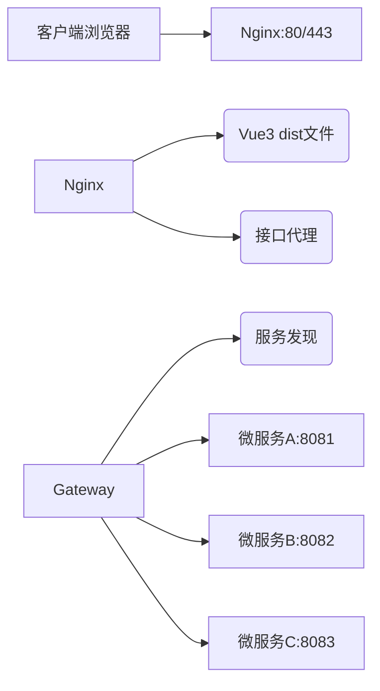

## Nginx

Nginx（发音“Engine X”）是一款**高性能、轻量级、开源**的Web服务器与反向代理软件，以**事件驱动、异步非阻塞**架构著称，能高效处理百万级并发连接，广泛用于Web服务、反向代理、负载均衡、API网关、缓存加速等场景。

---

### 一、基本信息

- **作者**：俄罗斯开发者 Igor Sysoev
- **首次发布**：2004年10月4日
- **开源协议**：2-clause BSD License（可商用、可修改、可分发）
- **版本分类**：
  - **稳定版**：偶数版本号（如1.24.x、1.26.x），生产环境首选
  - **开发版**：奇数版本号（如1.25.x、1.27.x），含新特性，仅用于测试
- **现状**：2019年被F5收购，社区版持续迭代，企业版提供商业支持

---

### 二、核心架构（Master-Worker）
Nginx采用**主进程+多工作进程**模型，是其高性能的关键：
1. **Master进程（主进程）**
   - 读取并验证配置文件
   - 管理Worker进程（启动、终止、重启）
   - 处理信号（如`reload`、`stop`）
   - 不处理实际网络请求，仅做调度
2. **Worker进程（工作进程）**
   - 数量通常等于CPU核心数（`worker_processes auto`）
   - 以非特权用户运行，处理所有客户端连接、请求与响应
   - 共享监听套接字，通过**epoll/kqueue**等高效事件模型实现异步非阻塞
   - 无锁设计，进程间通信开销极低
3. **核心优势**
   - 高并发：单Worker可处理数万连接，整体支持**百万级并发**
   - 低内存：连接数增长时内存占用线性增长，无显著飙升
   - 高可靠：Worker异常退出时Master自动重启，不影响服务
   - 热部署：`nginx -s reload`平滑重载配置，**不中断客户端连接**

---

### 三、核心功能详解
#### 1. Web服务器（静态资源服务）
- 直接托管HTML、CSS、JS、图片、视频等静态文件
- 支持**Gzip/Brotli压缩**、**Range请求**（断点续传）、**索引目录**
- 性能远超Apache：单服务器可稳定支撑**数万QPS**的静态请求

#### 2. 反向代理（最核心用途）
- 作为**流量入口**，接收客户端请求，转发至后端应用服务器（Tomcat、Spring Boot、Node.js等）
- 隐藏后端真实IP，提升安全性
- 支持**URL重写**、请求头修改（`X-Real-IP`/`X-Forwarded-For`）、响应过滤

#### 3. 负载均衡
- 将请求分发至多台后端服务器，实现**水平扩展**与**高可用**
- 支持多种策略：
  - **轮询（Round Robin）**：默认，依次分发
  - **加权轮询（Weighted）**：按权重分配（如`weight=3`）
  - **IP哈希（IP Hash）**：同一IP始终路由到同一后端（会话保持）
  - **最少连接（Least Connections）**：分发至连接数最少的服务器
  - **最小响应时间（Fair）**：需第三方模块
- 内置**健康检查**：自动剔除故障节点，恢复后自动加入

#### 4. HTTP缓存（加速与减压）
- 缓存后端响应，减少重复请求对后端的压力
- 支持**代理缓存（Proxy Cache）**、**FastCGI缓存**、**微缓存（Microcaching）**
- 可配置缓存有效期、缓存键、缓存清理策略

#### 5. SSL/TLS终端（HTTPS）
- 集中处理HTTPS加密/解密，**解放后端服务器**
- 支持HTTP/2、HTTP/3（QUIC）、TLS 1.3
- 配置示例：
  ```nginx
  server {
      listen 443 ssl http2;
      server_name example.com;
      ssl_certificate /path/cert.pem;
      ssl_certificate_key /path/key.pem;
      # 安全配置
      ssl_protocols TLSv1.2 TLSv1.3;
      ssl_ciphers ECDHE-ECDSA-AES128-GCM-SHA256:...;
  }
  ```

#### 6. 限流与访问控制
- **连接限制**（`limit_conn`）：限制单IP并发连接数
- **请求限制**（`limit_req`）：限制单IP每秒请求数（防爬虫/CC攻击）
- **IP黑白名单**、**Basic Auth**、**JWT鉴权**（`auth_request`）

#### 7. 动静分离
- 静态请求（图片、CSS）由Nginx直接处理
- 动态请求（API、页面渲染）转发至后端应用
- 大幅提升整体性能，降低后端负载

#### 8. TCP/UDP代理（四层代理）
- 代理MySQL、Redis、DNS、游戏服务器等非HTTP服务
- 实现四层负载均衡与高可用

#### 9. 邮件代理
- 支持SMTP、POP3、IMAP代理，提供SSL/TLS加密与认证

---

### 四、核心优势
1. **极致性能**：事件驱动+异步非阻塞，单机可支撑**百万并发连接**
2. **低资源消耗**：内存/CPU占用远低于传统服务器（如Apache）
3. **高稳定性**：长时间运行无内存泄漏，抗高负载能力强
4. **模块化设计**：核心精简，功能通过模块扩展（官方+第三方）
5. **配置灵活**：语法简洁，支持热重载，无需重启服务
6. **跨平台**：Linux、macOS、Windows、FreeBSD等
7. **生态完善**：海量第三方模块（Lua、OpenResty、PageSpeed等）

---

### 五、典型应用场景
1. **静态网站/CDN节点**：托管博客、官网、文档、图片库
2. **反向代理网关**：统一入口，隐藏后端，实现灰度发布
3. **负载均衡集群**：电商、社交、金融等高并发业务
4. **微服务API网关**：路由、鉴权、限流、监控、熔断
5. **动静分离架构**：Nginx处理静态，后端处理动态
6. **SSL终端**：统一HTTPS，降低后端复杂度
7. **四层代理**：数据库、缓存、消息队列的负载均衡

---

### 六、与Apache对比（核心差异）
| 特性           | Nginx                        | Apache                 |
| :------------- | :--------------------------- | :--------------------- |
| **架构**       | 事件驱动、异步非阻塞         | 进程/线程池、同步阻塞  |
| **并发能力**   | 极高（百万级）               | 中等（数千级）         |
| **内存占用**   | 极低                         | 较高                   |
| **静态性能**   | 极优                         | 良好                   |
| **动态支持**   | 依赖反向代理                 | 原生支持（mod_php等）  |
| **配置复杂度** | 低                           | 中高                   |
| **热重载**     | 支持（`reload`）             | 部分支持               |
| **适用场景**   | 高并发、静态、代理、负载均衡 | 传统动态站点、复杂配置 |

---

### 七、常用命令
```bash
# 启动
nginx
# 停止
nginx -s stop
# 优雅停止（等待请求完成）
nginx -s quit
# 重载配置（平滑）
nginx -s reload
# 测试配置文件语法
nginx -t
# 查看版本与编译信息
nginx -V
```

---

### 八、总结
Nginx是现代Web架构的**基石组件**，凭借**高性能、轻量、多功能**的特性，成为全球最流行的Web服务器之一。它不仅是Web服务器，更是**流量调度中心、安全网关、性能加速器**，广泛应用于从中小企业到互联网巨头的各类场景。

## **Nginx基础配置模板**

需要我给你一份可直接部署的**Nginx基础配置模板**（含静态服务、反向代理、负载均衡、HTTPS与限流）吗？

以下是一份**生产级、可直接部署**的Nginx基础配置模板，整合了静态服务、反向代理、负载均衡、HTTPS、限流等核心功能，并添加了详细注释，你可根据实际业务场景调整参数。

> **前置条件**：
> 1. 已安装Nginx（推荐稳定版，如1.24.x）
> 2. 已准备好HTTPS证书（`.pem`公钥 + `.key`私钥），推荐从Let's Encrypt免费获取
> 3. 配置文件路径：Linux默认`/etc/nginx/nginx.conf`，子配置建议放在`/etc/nginx/conf.d/`目录

---

### 完整配置模板（nginx.conf）
```nginx
# ===================== 全局配置 =====================
user nginx;  # 运行用户（需提前创建，避免root权限）
worker_processes auto;  # 工作进程数，auto=CPU核心数（最优）
error_log /var/log/nginx/error.log warn;  # 错误日志路径+级别
pid /var/run/nginx.pid;  # 进程PID文件

# 事件驱动配置（高性能核心）
events {
    worker_connections 10240;  # 单Worker最大并发连接数（根据服务器配置调整）
    use epoll;  # 事件模型（Linux推荐epoll，FreeBSD用kqueue）
    multi_accept on;  # 一次性接收所有新连接，提升效率
}

# ===================== HTTP层全局配置 =====================
http {
    include       /etc/nginx/mime.types;  # 媒体类型映射（如html、jpg）
    default_type  application/octet-stream;  # 默认未知类型

    # 日志格式（记录关键信息，便于排查问题）
    log_format  main  '$remote_addr - $remote_user [$time_local] "$request" '
                      '$status $body_bytes_sent "$http_referer" '
                      '"$http_user_agent" "$http_x_forwarded_for" "$request_time"';
    access_log  /var/log/nginx/access.log  main;  # 访问日志路径

    # 性能优化核心参数
    sendfile        on;  # 开启零拷贝，提升静态文件传输效率
    tcp_nopush      on;  # 合并TCP包发送，减少网络开销
    tcp_nodelay     on;  # 低延迟传输（针对长连接）
    keepalive_timeout  65;  # 长连接超时时间（秒）
    keepalive_requests 100;  # 单长连接最大请求数
    client_header_timeout 10s;  # 客户端请求头读取超时
    client_body_timeout 10s;  # 客户端请求体读取超时
    send_timeout 10s;  # 响应发送超时

    # Gzip压缩（减小传输体积，提升加载速度）
    gzip on;
    gzip_vary on;  # 告诉浏览器启用了压缩
    gzip_min_length 1k;  # 仅压缩大于1KB的文件
    gzip_types text/plain text/css application/json application/javascript text/xml application/xml application/xml+rss text/javascript;
    gzip_comp_level 6;  # 压缩级别（1-9，6平衡性能/压缩比）

    # ===================== 限流配置（防CC/爬虫） =====================
    # 1. 请求限流：单IP每秒最多20个请求，缓冲区100个（超出则返回503）
    limit_req_zone $binary_remote_addr zone=req_limit:10m rate=20r/s;
    # 2. 连接限流：单IP最多100个并发连接
    limit_conn_zone $binary_remote_addr zone=conn_limit:10m;

    # ===================== 负载均衡后端集群 =====================
    upstream backend_cluster {
        # 后端服务器列表（替换为你的实际地址）
        server 192.168.1.100:8080 weight=3;  # 权重3，优先分发
        server 192.168.1.101:8080 weight=2;
        server 192.168.1.102:8080 backup;  # 备用节点（主节点故障时启用）

        # 负载均衡策略（选其一，默认轮询）
        # ip_hash;  # 会话保持（同一IP固定路由到同一后端）
        # least_conn;  # 最少连接数优先

        # 健康检查（默认内置，失败自动剔除）
        keepalive 32;  # 与后端的长连接数
        max_fails 3;  # 失败3次标记为不可用
        fail_timeout 30s;  # 失败后30秒重试
    }

    # ===================== HTTP跳转HTTPS（强制加密） =====================
    server {
        listen 80;
        server_name example.com www.example.com;  # 替换为你的域名
        # 所有HTTP请求跳转到HTTPS
        return 301 https://$host$request_uri;
        # 可选：禁止爬虫抓取HTTP站点（非必需）
        add_header X-Robots-Tag "noindex, nofollow";
    }

    # ===================== HTTPS主配置（核心） =====================
    server {
        listen 443 ssl http2;  # 启用HTTPS + HTTP/2（提升并发）
        listen [::]:443 ssl http2;  # IPv6支持
        server_name example.com www.example.com;  # 替换为你的域名

        # ===================== HTTPS证书配置 =====================
        ssl_certificate /etc/nginx/ssl/example.com.pem;  # 替换为证书路径
        ssl_certificate_key /etc/nginx/ssl/example.com.key;  # 替换为私钥路径

        # HTTPS安全优化（符合现代安全标准）
        ssl_protocols TLSv1.2 TLSv1.3;  # 禁用低版本TLS（如TLSv1.0/1.1）
        ssl_prefer_server_ciphers on;  # 优先使用服务器加密套件
        ssl_ciphers ECDHE-ECDSA-AES128-GCM-SHA256:ECDHE-RSA-AES128-GCM-SHA256:ECDHE-ECDSA-AES256-GCM-SHA384:ECDHE-RSA-AES256-GCM-SHA384;
        ssl_session_cache shared:SSL:10m;  # SSL会话缓存（提升握手速度）
        ssl_session_timeout 10m;  # 会话超时
        ssl_stapling on;  # OCSP Stapling（减少证书验证耗时）
        ssl_stapling_verify on;
        resolver 8.8.8.8 8.8.4.4 valid=300s;  # DNS解析器（Google DNS）

        # 安全响应头（防XSS/点击劫持等）
        add_header Strict-Transport-Security "max-age=31536000; includeSubDomains" always;  # HSTS强制HTTPS
        add_header X-Frame-Options DENY;  # 禁止嵌入iframe
        add_header X-Content-Type-Options nosniff;  # 禁止MIME类型嗅探
        add_header X-XSS-Protection "1; mode=block";

        # ===================== 限流生效 =====================
        limit_req zone=req_limit burst=10 nodelay;  # burst=缓冲区，nodelay=不延迟处理
        limit_conn conn_limit 100;  # 单IP最大并发连接数

        # ===================== 静态资源服务 =====================
        # 静态文件根目录（替换为你的实际路径，如/var/www/html）
        root /data/www/example.com;
        index index.html index.htm;

        # 静态资源缓存策略（浏览器缓存，减少重复请求）
        location ~* \.(jpg|jpeg|png|gif|ico|css|js)$ {
            expires 30d;  # 缓存30天
            add_header Cache-Control "public, max-age=2592000";
            access_log off;  # 静态资源不记录访问日志（减少IO）
        }

        # ===================== 反向代理 + 负载均衡 =====================
        # 匹配/api开头的请求，转发到后端集群
        location /api/ {
            proxy_pass http://backend_cluster/;  # 转发到上游集群（末尾/要匹配）
            proxy_set_header Host $host;  # 传递真实域名
            proxy_set_header X-Real-IP $remote_addr;  # 传递真实客户端IP
            proxy_set_header X-Forwarded-For $proxy_add_x_forwarded_for;  # 透传IP链
            proxy_set_header X-Forwarded-Proto $scheme;  # 传递协议（http/https）

            # 反向代理超时配置
            proxy_connect_timeout 5s;  # 连接后端超时
            proxy_send_timeout 10s;  # 发送请求超时
            proxy_read_timeout 10s;  # 读取响应超时
            proxy_buffering on;  # 开启缓冲区（提升性能）
            proxy_buffer_size 4k;
            proxy_buffers 4 32k;
        }

        # ===================== 兜底配置 =====================
        # 404/500错误页面（替换为你的实际页面路径）
        error_page 404 /404.html;
        error_page 500 502 503 504 /50x.html;
        location = /50x.html {
            root /data/www/example.com;
        }

        # 禁止访问隐藏文件（如.git/.env）
        location ~ /\.(?!well-known).* {
            deny all;
        }
    }
}
```

---

### 配置使用说明
#### 1. 关键参数替换（必做）
| 配置项                     | 替换为你的实际内容                           |
| -------------------------- | -------------------------------------------- |
| `server_name`              | 你的域名（如`yourdomain.com`）               |
| `ssl_certificate`          | HTTPS证书路径（如`/etc/nginx/ssl/your.pem`） |
| `ssl_certificate_key`      | HTTPS私钥路径（如`/etc/nginx/ssl/your.key`） |
| `root`                     | 静态文件根目录（如`/var/www/your-site`）     |
| `upstream backend_cluster` | 后端服务器IP+端口（如`192.168.1.10:8080`）   |

#### 2. 验证与重载配置
```bash
# 1. 测试配置语法（关键！避免配置错误导致Nginx启动失败）
nginx -t

# 2. 平滑重载配置（不中断现有连接）
nginx -s reload
```

#### 3. 目录与权限配置
```bash
# 创建静态文件目录（示例）
mkdir -p /data/www/example.com
# 设置权限（避免Nginx无读写权限）
chown -R nginx:nginx /data/www/example.com
chmod -R 755 /data/www/example.com

# 创建证书目录
mkdir -p /etc/nginx/ssl
chmod 700 /etc/nginx/ssl  # 证书目录严格权限（仅root可访问）
```

#### 4. 可选优化
- 如果服务器内存较大（≥8G），可将`worker_connections`调至`20480`或更高；
- 若后端是Java/Python应用，可增加`proxy_buffers`大小（如`proxy_buffers 8 64k`）；
- 如需开启HTTP/3（QUIC），需编译Nginx时添加`--with-quic --with-http_v3_module`。

---

### 总结
1. 该模板整合了Nginx核心功能：**静态服务（缓存优化）+ 反向代理/负载均衡（高可用）+ HTTPS（安全）+ 限流（防攻击）**，满足绝大多数中小项目的生产需求；
2. 核心优化点：事件驱动模型、Gzip压缩、长连接、HTTPS安全配置、IP透传，兼顾性能与安全性；
3. 使用前需替换域名、证书路径、后端地址等关键参数，且务必通过`nginx -t`验证配置语法，避免服务异常。

如果需要针对特定场景（如微服务API网关、静态CDN、数据库四层代理）调整配置，我可以补充对应的优化版本。

## SpringBoot + Vue3 前后端分离部署到 Nginx 完整步骤

本文将从**环境准备**→**前端打包**→**后端打包**→**Nginx 配置**→**服务启动/验证**，给出端到端的部署流程，适配 Linux 服务器（CentOS/Debian 通用），步骤清晰可落地。

### 前置条件

1. 服务器已安装：
   - JDK 8+/11+（SpringBoot 运行依赖，推荐 11）
   - Nginx（参考前文配置，推荐稳定版 1.24+）
   - Maven/Gradle（可选，本地打包后上传服务器更高效）
2. 服务器开放端口：
   - 80/443（Nginx 访问）
   - 后端端口（如 8080，仅需 Nginx 内部访问，建议不对外暴露）
3. 本地已完成：
   - Vue3 项目可正常运行、打包
   - SpringBoot 项目可正常运行、接口无跨域问题（已配置 CORS）

---

### 一、前端（Vue3）打包

#### 1. 调整前端配置

修改 Vue 项目的**环境配置文件**（根据你的环境选择 `.env.production` 或 `vite.config.js`），核心是配置后端接口的**代理前缀/基础路径**：
##### 方式1：Vite 项目（vue3 + vite）

修改 `vite.config.js`：
```javascript
import { defineConfig } from 'vite'
import vue from '@vitejs/plugin-vue'
import path from 'path'

export default defineConfig({
  plugins: [vue()],
  // 开发环境代理（本地调试用）
  server: {
    proxy: {
      '/api': {
        target: 'http://localhost:8080', // 后端本地地址
        changeOrigin: true,
        rewrite: (path) => path.replace(/^\/api/, '')
      }
    }
  },
  // 生产打包配置
  build: {
    outDir: 'dist', // 打包输出目录（默认dist）
    assetsDir: 'static', // 静态资源目录
    minify: 'terser' // 压缩
  },
  // 生产环境接口基础路径（打包后请求 Nginx 的 /api 前缀）
  define: {
    'import.meta.env.VITE_API_BASE_URL': '"http://你的域名/api"'
  }
})
```

##### 方式2：Vue CLI 项目（vue3 + webpack）

修改 `vue.config.js`：
```javascript
module.exports = {
  publicPath: '/', // 打包后静态资源的基础路径（根路径即可）
  outputDir: 'dist',
  devServer: {
    proxy: {
      '/api': {
        target: 'http://localhost:8080',
        changeOrigin: true,
        pathRewrite: { '^/api': '' }
      }
    }
  }
}
```

#### 2. 打包前端项目

本地执行打包命令，生成静态文件：
```bash
# Vite 项目
npm run build

# Vue CLI 项目
npm run build:prod
```
打包完成后，项目根目录会生成 `dist` 文件夹，里面是所有前端静态文件（HTML/CSS/JS/图片等）。

#### 3. 上传前端文件到服务器

将 `dist` 文件夹上传到服务器的指定目录，例如：
```bash
# 服务器创建前端目录（自定义，建议统一管理）
mkdir -p /data/web/vue-app

# 本地通过 scp 上传（替换为你的服务器IP/用户名）
scp -r dist/* root@你的服务器IP:/data/web/vue-app/
```

---

### 二、后端（SpringBoot）打包与部署

#### 1. 调整后端配置

##### （1）解决跨域问题

SpringBoot 后端需配置 CORS，允许前端域名访问（核心，否则 Nginx 代理后仍会跨域）：
```java
import org.springframework.context.annotation.Bean;
import org.springframework.context.annotation.Configuration;
import org.springframework.web.cors.CorsConfiguration;
import org.springframework.web.cors.UrlBasedCorsConfigurationSource;
import org.springframework.web.filter.CorsFilter;

@Configuration
public class CorsConfig {
    @Bean
    public CorsFilter corsFilter() {
        CorsConfiguration config = new CorsConfiguration();
        // 允许的源（生产环境建议指定具体域名，如 https://你的域名）
        config.addAllowedOriginPattern("*");
        config.setAllowCredentials(true); // 允许携带Cookie
        config.addAllowedMethod("*"); // 允许所有请求方法（GET/POST等）
        config.addAllowedHeader("*"); // 允许所有请求头
        config.setMaxAge(3600L); // 预检请求缓存时间

        UrlBasedCorsConfigurationSource source = new UrlBasedCorsConfigurationSource();
        source.registerCorsConfiguration("/**", config); // 所有接口生效
        return new CorsFilter(source);
    }
}
```

##### （2）调整端口/上下文路径（可选）

修改 `application.yml` 或 `application.properties`：
```yaml
server:
  port: 8080 # 后端端口（默认8080，可自定义）
  servlet:
    context-path: / # 上下文路径（建议为空，避免Nginx代理时路径混乱）
spring:
  profiles:
    active: prod # 激活生产环境配置
```

#### 2. 打包 SpringBoot 项目

本地执行打包命令（确保代码已提交，无编译错误）：
```bash
# Maven 项目
mvn clean package -DskipTests

# Gradle 项目
gradle clean build -x test
```
打包完成后，`target`（Maven）/`build/libs`（Gradle）目录会生成 `xxx.jar` 文件（如 `demo-0.0.1-SNAPSHOT.jar`）。

#### 3. 上传并启动后端服务

##### （1）上传 jar 包到服务器

```bash
# 服务器创建后端目录
mkdir -p /data/server/springboot-app

# 本地上传 jar 包（替换文件名和服务器地址）
scp target/demo-0.0.1-SNAPSHOT.jar root@你的服务器IP:/data/server/springboot-app/
```

##### （2）启动后端服务（后台运行，避免终端关闭后停止）

```bash
# 进入后端目录
cd /data/server/springboot-app

# 启动命令（nohup + & 实现后台运行，输出日志到 app.log）
nohup java -jar demo-0.0.1-SNAPSHOT.jar > app.log 2>&1 &

# 验证是否启动成功（查看端口是否被占用）
netstat -tlnp | grep 8080
# 输出类似 tcp6       0      0 :::8080                 :::*                    LISTEN      12345/java 即成功
```

##### （可选）配置后端服务自启动（systemd）

为避免服务器重启后后端服务停止，配置 systemd 服务：
```bash
# 创建服务文件
vim /etc/systemd/system/springboot-app.service
```
写入以下内容（替换 jar 包路径、JDK路径）：
```ini
[Unit]
Description=SpringBoot App
After=network.target

[Service]
Type=simple
User=root
WorkingDirectory=/data/server/springboot-app
ExecStart=/usr/bin/java -jar demo-0.0.1-SNAPSHOT.jar
Restart=on-failure # 失败自动重启
RestartSec=5s

[Install]
WantedBy=multi-user.target
```
启动并设置自启：
```bash
# 重新加载 systemd
systemctl daemon-reload

# 启动服务
systemctl start springboot-app

# 设置开机自启
systemctl enable springboot-app

# 查看服务状态
systemctl status springboot-app
```

---

#### 三、Nginx 配置（核心）

##### 1. 编辑 Nginx 配置文件

```bash
# 编辑 Nginx 主配置或子配置（推荐子配置，便于管理）
vim /etc/nginx/conf.d/vue-springboot.conf
```
写入以下配置（替换注释中的自定义内容）：
```nginx
# 全局限流（可选，防攻击）
limit_req_zone $binary_remote_addr zone=req_limit:10m rate=20r/s;
limit_conn_zone $binary_remote_addr zone=conn_limit:10m;

server {
    listen 80;
    # 替换为你的域名（无域名则填服务器IP）
    server_name your-domain.com;

    # 强制跳转 HTTPS（可选，有证书时启用）
    # return 301 https://$host$request_uri;

    # 前端静态资源配置
    location / {
        # 替换为前端文件的实际路径
        root /data/web/vue-app;
        index index.html index.htm;
        # 解决Vue路由刷新404问题（history模式必备）
        try_files $uri $uri/ /index.html;
        
        # 限流（可选）
        limit_req zone=req_limit burst=10 nodelay;
        limit_conn conn_limit 100;
    }

    # 后端接口代理（核心：将 /api 前缀转发到后端）
    location /api/ {
        # 替换为后端实际地址（IP+端口）
        proxy_pass http://127.0.0.1:8080/;
        # 透传真实IP和请求头（后端可获取客户端真实IP）
        proxy_set_header Host $host;
        proxy_set_header X-Real-IP $remote_addr;
        proxy_set_header X-Forwarded-For $proxy_add_x_forwarded_for;
        proxy_set_header X-Forwarded-Proto $scheme;
        
        # 代理超时配置
        proxy_connect_timeout 5s;
        proxy_send_timeout 10s;
        proxy_read_timeout 30s;
    }

    # 静态资源缓存（优化加载速度）
    location ~* \.(jpg|jpeg|png|gif|ico|css|js)$ {
        root /data/web/vue-app;
        expires 30d;
        add_header Cache-Control "public, max-age=2592000";
        access_log off;
    }
}

# HTTPS 配置（可选，有证书时添加）
# server {
#     listen 443 ssl http2;
#     server_name your-domain.com;
#
#     # 替换为你的证书路径
#     ssl_certificate /etc/nginx/ssl/your-domain.pem;
#     ssl_certificate_key /etc/nginx/ssl/your-domain.key;
#
#     # HTTPS 安全配置
#     ssl_protocols TLSv1.2 TLSv1.3;
#     ssl_ciphers ECDHE-ECDSA-AES128-GCM-SHA256:ECDHE-RSA-AES128-GCM-SHA256;
#     ssl_session_cache shared:SSL:10m;
#
#     # 前端配置（同HTTP）
#     location / {
#         root /data/web/vue-app;
#         index index.html index.htm;
#         try_files $uri $uri/ /index.html;
#     }
#
#     # 后端接口代理（同HTTP）
#     location /api/ {
#         proxy_pass http://127.0.0.1:8080/;
#         proxy_set_header Host $host;
#         proxy_set_header X-Real-IP $remote_addr;
#         proxy_set_header X-Forwarded-For $proxy_add_x_forwarded_for;
#         proxy_set_header X-Forwarded-Proto $scheme;
#     }
# }
```

##### 2. 关键配置说明

| 配置项                              | 作用                                                         |
| ----------------------------------- | ------------------------------------------------------------ |
| `try_files $uri $uri/ /index.html`  | 解决 Vue Router history 模式下刷新页面 404 问题              |
| `proxy_pass http://127.0.0.1:8080/` | 将 `/api` 前缀的请求转发到后端 8080 端口，末尾 `/` 需与后端上下文路径匹配 |
| `X-Real-IP/X-Forwarded-For`         | 后端可通过 `request.getRemoteAddr()` 获取客户端真实IP（而非Nginx IP） |

##### 3. 验证并重启 Nginx

```bash
# 验证配置语法（关键！避免配置错误导致Nginx启动失败）
nginx -t

# 平滑重启 Nginx（不中断现有连接）
nginx -s reload
```

---

#### 四、验证部署结果

##### 1. 访问前端页面

浏览器访问：`http://你的域名/`（或 `http://服务器IP/`），能正常显示 Vue 页面即前端部署成功。

##### 2. 验证接口调用

在前端页面操作（如登录、查询数据），检查：
- 浏览器 F12 → Network → 接口请求地址为 `http://你的域名/api/xxx`
- 接口返回 200 状态码，数据正常展示
- 后端日志（`/data/server/springboot-app/app.log`）能看到请求记录

##### 3. 常见问题排查

| 问题现象         | 排查方向                                                     |
| ---------------- | ------------------------------------------------------------ |
| 前端页面404      | 检查 Nginx 的 `root` 路径是否正确，前端文件是否上传完整      |
| 接口请求404      | 检查 `proxy_pass` 地址是否正确，后端服务是否启动，接口路径是否匹配 |
| 跨域报错（CORS） | 检查后端 CORS 配置是否生效，Nginx 代理头是否正确传递         |
| 前端页面空白     | 检查前端打包是否有错误，Nginx 静态资源缓存配置是否影响，浏览器控制台报错 |

---

#### 总结

1. **前端核心**：打包静态文件上传服务器，Nginx 配置 `root` 指向静态目录，通过 `try_files` 解决路由刷新404问题；
2. **后端核心**：打包 jar 包后台启动（建议配置 systemd 自启），确保端口不对外暴露，仅通过 Nginx 代理访问；
3. **Nginx 核心**：通过 `/api` 前缀区分前端静态请求和后端接口请求，代理转发时透传真实IP和请求头，兼顾安全性和可用性。

如果需要优化（如开启 HTTPS、配置负载均衡、后端多实例部署），可以告诉我，我会补充对应的配置和步骤。

## SpringCloud + Vue3 前后端分离部署到 Nginx 完整步骤

SpringCloud 相比单节点 SpringBoot，核心差异是**多微服务实例** + **注册中心/网关**（如 Nacos/Gateway），部署核心思路是：**Nginx 作为前端静态服务器 + 统一流量入口，转发所有接口请求到 SpringCloud 网关，再由网关路由到各微服务**。

本文基于主流架构（Vue3 + Vite/VueCLI + SpringCloud Alibaba（Nacos + Gateway）+ Nginx），给出从环境准备到验证的全流程，适配 Linux 服务器（CentOS/Debian 通用）。

### 前置条件

1. 服务器环境：
   - JDK 8+/11+（SpringCloud 运行依赖）
   - Nginx（稳定版 1.24+）
   - Nacos（注册中心/配置中心，需提前部署并启动）
   - 开放端口：80/443（Nginx）、网关端口（如 9000）、Nacos 端口（8848，仅内网访问）
2. 本地准备：
   - Vue3 项目可正常打包，接口请求已配置网关前缀
   - SpringCloud 项目：网关（Gateway）、各微服务、Nacos 配置均调试完成
   - 所有微服务已配置注册到 Nacos，网关路由规则正确

---

### 一、核心架构说明

先明确部署架构，避免步骤混乱：

核心原则：
- 所有前端请求 → Nginx → 静态资源直接返回，接口请求转发到网关；
- 网关作为微服务统一入口，负责路由、鉴权、负载均衡；
- 微服务仅内网访问，不对外暴露端口。

---

### 二、前端（Vue3）打包与部署

#### 1. 调整前端接口配置

修改 Vue 项目的环境配置，将接口请求前缀指向 Nginx + 网关路径（核心：所有接口统一走网关）。

##### 方式1：Vite 项目（vue3 + vite）

修改 `vite.config.js`：
```javascript
import { defineConfig } from 'vite'
import vue from '@vitejs/plugin-vue'

export default defineConfig({
  plugins: [vue()],
  // 开发环境代理（本地调试，转发到网关）
  server: {
    proxy: {
      '/api': {
        target: 'http://localhost:9000', // 本地网关地址
        changeOrigin: true,
        rewrite: (path) => path.replace(/^\/api/, '') // 去掉/api前缀（可选，按网关规则）
      }
    }
  },
  // 生产打包配置
  build: {
    outDir: 'dist',
    assetsDir: 'static',
    minify: 'terser'
  },
  // 生产环境接口基础路径（指向Nginx域名+网关前缀）
  define: {
    'import.meta.env.VITE_API_BASE_URL': '"http://你的域名/api"'
  }
})
```

##### 方式2：Vue CLI 项目（vue3 + webpack）

修改 `vue.config.js`：
```javascript
module.exports = {
  publicPath: '/', // 静态资源根路径
  outputDir: 'dist',
  devServer: {
    proxy: {
      '/api': {
        target: 'http://localhost:9000', // 本地网关地址
        changeOrigin: true,
        pathRewrite: { '^/api': '' }
      }
    }
  }
}
```

#### 2. 打包前端项目

本地执行打包命令，生成静态文件：
```bash
# Vite 项目
npm run build

# Vue CLI 项目
npm run build:prod
```
打包完成后生成 `dist` 文件夹，包含所有前端静态资源。

#### 3. 上传前端文件到服务器

```bash
# 服务器创建前端目录（自定义，建议统一管理）
mkdir -p /data/web/vue-cloud-app

# 本地通过 scp 上传 dist 文件夹内容（替换服务器IP）
scp -r dist/* root@你的服务器IP:/data/web/vue-cloud-app/

# 权限配置（避免Nginx无访问权限）
chown -R nginx:nginx /data/web/vue-cloud-app
chmod -R 755 /data/web/vue-cloud-app
```

---

### 三、SpringCloud 微服务部署

#### 1. 调整微服务配置（核心）

##### （1）统一配置 Nacos 地址（生产环境）

所有微服务（网关、业务微服务）的 `application.yml`/`bootstrap.yml` 中，修改 Nacos 配置为服务器地址：
```yaml
spring:
  cloud:
    nacos:
      discovery:
        server-addr: 服务器内网IP:8848 # 用内网IP，避免外网暴露
        namespace: prod # 生产环境命名空间（建议创建）
      config:
        server-addr: 服务器内网IP:8848
        namespace: prod
        file-extension: yml
  profiles:
    active: prod # 激活生产环境
```

##### （2）网关（Gateway）配置

修改网关的 `application.yml`，确保路由规则正确，且网关端口统一（如 9000）：
```yaml
server:
  port: 9000 # 网关端口（仅内网访问）
spring:
  cloud:
    gateway:
      routes:
        # 微服务A路由
        - id: service-a
          uri: lb://service-a # 负载均衡指向注册中心的微服务名
          predicates:
            - Path=/service-a/** # 路由路径（前端请求/api/service-a/** 转发到这里）
          filters:
            - StripPrefix=1 # 去掉/api前缀（根据实际情况调整）
        # 微服务B路由
        - id: service-b
          uri: lb://service-b
          predicates:
            - Path=/service-b/**
          filters:
            - StripPrefix=1
      globalcors: # 全局跨域（关键，避免前端跨域）
        cors-configurations:
          '[/**]':
            allowedOrigins: "*" # 生产环境建议指定域名
            allowedMethods: "*"
            allowedHeaders: "*"
            allowCredentials: true
```

##### （3）微服务端口与访问控制

所有业务微服务（如 service-a、service-b）：
- 端口仅内网访问（如 8081、8082），服务器防火墙禁止外网访问这些端口；
- 确保微服务能正常注册到 Nacos（启动后在 Nacos 控制台能看到服务列表）。

#### 2. 打包所有微服务

本地对每个微服务执行打包命令（Maven 为例）：
```bash
# 进入网关项目目录
cd gateway-service
mvn clean package -DskipTests

# 进入微服务A目录
cd ../service-a
mvn clean package -DskipTests

# 同理打包其他微服务（service-b、service-c...）
```
每个微服务打包后生成 `target/xxx.jar` 文件。

#### 3. 上传并启动微服务

##### （1）服务器创建微服务目录

```bash
# 网关目录
mkdir -p /data/server/cloud/gateway
# 微服务A目录
mkdir -p /data/server/cloud/service-a
# 微服务B目录
mkdir -p /data/server/cloud/service-b
# （按需创建其他微服务目录）
```

##### （2）上传 jar 包到对应目录

```bash
# 上传网关jar包（替换文件名和服务器IP）
scp gateway-service/target/gateway-0.0.1-SNAPSHOT.jar root@服务器IP:/data/server/cloud/gateway/

# 上传微服务A jar包
scp service-a/target/service-a-0.0.1-SNAPSHOT.jar root@服务器IP:/data/server/cloud/service-a/

# 同理上传其他微服务jar包
```

##### （3）启动微服务（后台运行）

**先启动 Nacos**（确保注册中心可用）：
```bash
# 进入Nacos安装目录
cd /data/nacos/bin
# 启动Nacos（单机模式）
./startup.sh -m standalone
```

**启动网关和微服务**：
```bash
# 启动网关
cd /data/server/cloud/gateway
nohup java -jar gateway-0.0.1-SNAPSHOT.jar > gateway.log 2>&1 &

# 启动微服务A
cd /data/server/cloud/service-a
nohup java -jar service-a-0.0.1-SNAPSHOT.jar > service-a.log 2>&1 &

# 启动微服务B
cd /data/server/cloud/service-b
nohup java -jar service-b-0.0.1-SNAPSHOT.jar > service-b.log 2>&1 &

# 验证启动状态（查看端口是否占用）
netstat -tlnp | grep -E "9000|8081|8082"
```

##### （4）配置微服务自启动（systemd，可选但推荐）

以网关为例，创建 systemd 服务文件：
```bash
vim /etc/systemd/system/gateway.service
```
写入内容：
```ini
[Unit]
Description=SpringCloud Gateway
After=network.target nacos.service # 依赖Nacos启动

[Service]
Type=simple
User=root
WorkingDirectory=/data/server/cloud/gateway
ExecStart=/usr/bin/java -jar gateway-0.0.1-SNAPSHOT.jar
Restart=on-failure # 失败自动重启
RestartSec=5s

[Install]
WantedBy=multi-user.target
```
同理为每个微服务创建 service 文件，然后启动并设置自启：
```bash
# 重新加载systemd
systemctl daemon-reload

# 启动网关并设置自启
systemctl start gateway
systemctl enable gateway

# 启动微服务A并设置自启
systemctl start service-a
systemctl enable service-a

# 查看状态
systemctl status gateway
```

---

### 四、Nginx 配置（核心）

#### 1. 编辑 Nginx 配置文件

```bash
# 创建专属配置文件（避免修改主配置）
vim /etc/nginx/conf.d/vue-cloud.conf
```
写入以下配置（替换注释中的自定义内容）：
```nginx
# 全局限流（可选，防CC攻击）
limit_req_zone $binary_remote_addr zone=req_limit:10m rate=20r/s;
limit_conn_zone $binary_remote_addr zone=conn_limit:10m;

server {
    listen 80;
    # 替换为你的域名（无域名则填服务器IP）
    server_name your-domain.com;

    # ========== 前端静态资源配置 ==========
    location / {
        # 前端文件目录（替换为实际路径）
        root /data/web/vue-cloud-app;
        index index.html index.htm;
        # 解决Vue Router history模式刷新404
        try_files $uri $uri/ /index.html;
        
        # 限流（可选）
        limit_req zone=req_limit burst=10 nodelay;
        limit_conn conn_limit 100;
        
        # 静态资源缓存（优化加载速度）
        expires 1d;
        add_header Cache-Control "public";
    }

    # ========== 接口代理到SpringCloud网关 ==========
    location /api/ {
        # 转发到网关地址（内网IP+网关端口）
        proxy_pass http://127.0.0.1:9000/;
        
        # 透传客户端真实IP和请求头（网关/微服务可获取真实IP）
        proxy_set_header Host $host;
        proxy_set_header X-Real-IP $remote_addr;
        proxy_set_header X-Forwarded-For $proxy_add_x_forwarded_for;
        proxy_set_header X-Forwarded-Proto $scheme;
        
        # 代理超时配置（适配微服务响应时间）
        proxy_connect_timeout 10s;
        proxy_send_timeout 30s;
        proxy_read_timeout 30s;
        
        # 开启缓冲区（提升性能）
        proxy_buffering on;
        proxy_buffer_size 4k;
        proxy_buffers 4 32k;
    }

    # ========== 静态资源优化 ==========
    location ~* \.(jpg|jpeg|png|gif|ico|css|js|woff|woff2|svg)$ {
        root /data/web/vue-cloud-app;
        expires 30d; # 缓存30天
        access_log off; # 不记录静态资源日志
    }

    # ========== 禁止访问敏感文件 ==========
    location ~ /\.(git|env|yml)$ {
        deny all;
    }
}

# ========== HTTPS配置（可选，生产环境推荐） ==========
# server {
#     listen 443 ssl http2;
#     server_name your-domain.com;
#
#     # 证书路径（替换为实际路径）
#     ssl_certificate /etc/nginx/ssl/your-domain.pem;
#     ssl_certificate_key /etc/nginx/ssl/your-domain.key;
#
#     # HTTPS安全配置
#     ssl_protocols TLSv1.2 TLSv1.3;
#     ssl_ciphers ECDHE-ECDSA-AES128-GCM-SHA256:ECDHE-RSA-AES128-GCM-SHA256;
#     ssl_session_cache shared:SSL:10m;
#     ssl_session_timeout 10m;
#
#     # 前端配置（同HTTP）
#     location / {
#         root /data/web/vue-cloud-app;
#         index index.html index.htm;
#         try_files $uri $uri/ /index.html;
#     }
#
#     # 接口代理（同HTTP）
#     location /api/ {
#         proxy_pass http://127.0.0.1:9000/;
#         proxy_set_header Host $host;
#         proxy_set_header X-Real-IP $remote_addr;
#         proxy_set_header X-Forwarded-For $proxy_add_x_forwarded_for;
#         proxy_set_header X-Forwarded-Proto $scheme;
#     }
# }
```

#### 2. 关键配置说明

| 配置项                              | 作用                                                      |
| ----------------------------------- | --------------------------------------------------------- |
| `try_files $uri $uri/ /index.html`  | 解决 Vue Router history 模式刷新404                       |
| `proxy_pass http://127.0.0.1:9000/` | 所有 `/api` 前缀的请求转发到网关，网关再路由到微服务      |
| `X-Real-IP/X-Forwarded-For`         | 微服务中可通过 `request.getRemoteAddr()` 获取客户端真实IP |
| `proxy_read_timeout 30s`            | 适配微服务跨服务调用的响应时间（避免超时）                |

#### 3. 验证并重启 Nginx

```bash
# 验证配置语法（关键！避免配置错误）
nginx -t

# 平滑重启 Nginx（不中断现有连接）
nginx -s reload
```

---

### 五、部署验证与问题排查

#### 1. 基础验证步骤

##### （1）验证 Nacos 服务注册

访问 Nacos 控制台（`http://服务器IP:8848/nacos`），在「服务管理」→「服务列表」中能看到：
- 网关服务（如 `gateway`）
- 所有业务微服务（如 `service-a`、`service-b`）
→ 状态为「健康」则注册成功。

##### （2）验证前端访问

浏览器访问 `http://你的域名/`，能正常显示 Vue 页面 → 前端部署成功。

##### （3）验证接口调用

在前端页面操作（如登录、查询数据），检查：
- 浏览器 F12 → Network → 接口请求地址为 `http://你的域名/api/xxx`；
- 接口返回 200 状态码，数据正常展示；
- 网关日志（`/data/server/cloud/gateway/gateway.log`）能看到路由记录；
- 微服务日志（如 `service-a.log`）能看到请求处理记录。

#### 2. 常见问题排查

| 问题现象               | 排查方向                                                     |
| ---------------------- | ------------------------------------------------------------ |
| 前端页面404            | 1. Nginx 的 `root` 路径是否正确；2. 前端文件是否上传完整；3. Nginx 配置是否重载 |
| 接口请求404            | 1. 网关是否启动并注册到 Nacos；2. 网关路由规则是否匹配前端请求路径；3. 微服务是否注册到 Nacos |
| 接口请求504            | 1. 网关是否宕机；2. `proxy_read_timeout` 时间是否过短；3. 微服务响应超时 |
| 跨域报错               | 1. 网关是否配置全局 CORS；2. Nginx 代理头是否正确传递；3. 前端请求是否带 `withCredentials` |
| 微服务无法注册到 Nacos | 1. Nacos 地址是否配置正确；2. 服务器防火墙是否放行 8848 端口；3. 微服务命名空间是否匹配 |

---

### 六、进阶优化（生产环境推荐）

#### 1. 微服务多实例部署（负载均衡）

为单个微服务启动多个实例（如 service-a 启动 8081、8082 两个端口），Nacos 会自动识别，网关通过 `lb://service-a` 实现负载均衡：
```bash
# 启动 service-a 第二个实例（8082端口）
cd /data/server/cloud/service-a
nohup java -jar service-a-0.0.1-SNAPSHOT.jar --server.port=8082 > service-a-8082.log 2>&1 &
```

#### 2. 开启 Nginx 缓存与压缩

在 Nginx 配置的 `http` 块中添加：
```nginx
# Gzip压缩（减小传输体积）
gzip on;
gzip_vary on;
gzip_min_length 1k;
gzip_types text/plain text/css application/json application/javascript;

# 代理缓存（减轻网关压力）
proxy_cache_path /var/cache/nginx levels=1:2 keys_zone=api_cache:10m max_size=10g inactive=60m use_temp_path=off;
```
在 `/api/` 位置块中添加：
```nginx
proxy_cache api_cache;
proxy_cache_valid 200 304 10m; # 200/304响应缓存10分钟
proxy_cache_key $host$request_uri$cookie_user;
```

#### 3. 日志收集

将网关、所有微服务的日志目录挂载到 ELK 或 Loki，便于问题排查。

---

### 总结

1. **核心流程**：前端打包上传 → 微服务打包并注册到 Nacos → 网关作为微服务入口 → Nginx 代理前端静态资源和接口请求到网关；
2. **关键配置**：Nginx 的 `/api` 路径代理到网关，网关通过 Nacos 实现服务发现和路由，微服务仅内网访问；
3. **核心原则**：所有外网流量仅通过 Nginx 和网关进入，微服务不直接暴露，保障安全性；多实例部署通过 Nacos + 网关实现负载均衡，提升可用性。

如果需要针对特定场景（如 HTTPS 配置、微服务灰度发布、Nginx 负载均衡网关）补充步骤，可随时说明。