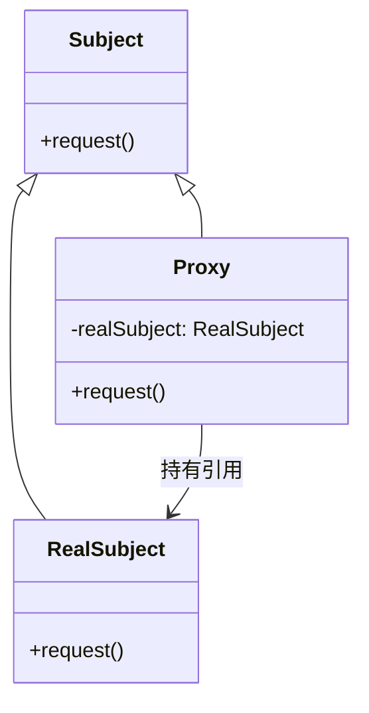
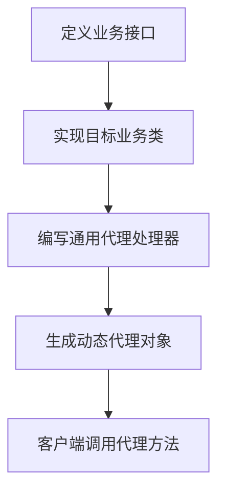
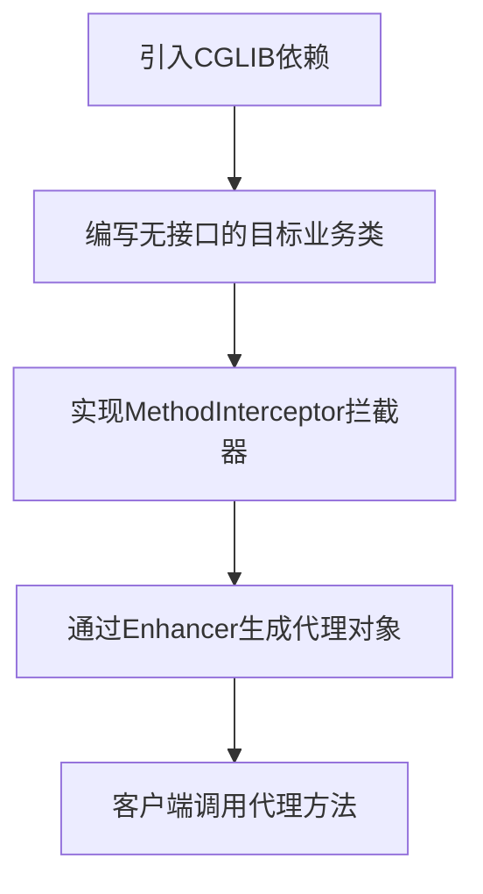

## 真实项目

### Facade + Strategy

**非常常见，而且是「教科书级别的优雅组合」**。
在实际项目（尤其是 Spring 后端、微服务、业务层）里，**Facade + Strategy 几乎是标配组合**，用途非常明确、落地极多。

我用最直白、面试能直接说出口的话给你总结：

---

#### 一、为什么它们天生适合一起用？

##### 1. **门面模式（Facade）**

- 作用：**对外简化接口，对内封装复杂子系统**
- 定位：**统一入口、调度者、外观壳**

##### 2. **策略模式（Strategy）**

- 作用：**同一行为，不同实现，可动态替换**
- 定位：**可插拔算法/业务规则**

##### 组合后的效果：

> **Facade 负责“统一入口 + 调度”**
> **Strategy 负责“内部多变逻辑的解耦与替换”**

一句话：
**门面藏复杂度，策略藏变化点。**

---

#### 二、最典型的真实业务场景（Java 后端高频）

这些你在项目里**一定见过或写过**：

##### 1. **支付服务（最经典）**

```
PayFacade（门面）
   ↓ 统一入口：pay(String type, Order order)
      内部根据支付类型选择策略
         AlipayStrategy
         WechatPayStrategy
         UnionPayStrategy
```

##### 2. **文件上传服务**

```
FileUploadFacade
   upload(file, channel)
      策略：AliyunOssStrategy、MinioStrategy、LocalStrategy
```

##### 3. **消息推送服务**

```
PushFacade
   push(userId, content, channel)
      策略：SmsStrategy、WechatStrategy、AppPushStrategy
```

##### 4. **订单优惠计算**

```
DiscountFacade
   calculate(Order, userId)
      策略：VipDiscount、FirstOrderDiscount、CouponDiscount
```

##### 5. **风控/审核规则**

```
RiskCheckFacade
   checkOrder(order)
      策略：AntiFraudStrategy、AgeLimitStrategy、BlacklistStrategy
```

---

#### 三、组合结构（一眼看懂）

```
客户端 → 【Facade 门面】
              ↓（根据参数选择）
         策略A  策略B  策略C ...
```

- 客户端**只认 Facade**，不知道策略存在
- Facade 负责**选择、初始化、调用策略**
- 策略负责**具体实现，互相独立，可扩展**

---

#### 四、这种组合的核心好处（面试必背）

1. **对外简单**：客户端只调用一个门面方法
2. **对内解耦**：多变逻辑全部抽成策略，符合开闭原则
3. **易扩展**：加新策略不改动门面和客户端
4. **易维护**：复杂流程被拆成小块，职责清晰
5. **符合 Spring 风格**：@Autowired 注入所有策略，Facade 做分发

---

#### 五、一句话总结（最精炼）

**Facade + Strategy 是业务系统中极其常见、极其标准的“统一入口 + 可插拔实现”架构，几乎是中大型项目的标配。**

---

如果你需要，我可以**立刻给你写一段可直接运行的 Java 代码示例**（Spring 风格，带 @Service、策略注入、门面分发），你拿去面试或项目都能用。

### 设计模式组合

当然有！**设计模式几乎从不单独出现**，真实项目里全是**组合拳**。
我给你整理 **最常用、面试最爱问、项目里必写** 的 **8组经典设计模式组合**，全是实战高频款，一眼看懂、直接能用。

---

#### 一、最经典、最常用的 8 组设计模式组合

##### 1. **工厂模式 + 策略模式**（最最最常用）

**用途**：根据类型动态创建不同策略，完全解耦。
**场景**：支付、优惠、推送、文件存储、审核规则。
**一句话**：
**工厂负责“创建”，策略负责“执行”。**

```
客户端 → 工厂（根据类型获取策略）→ 策略（执行逻辑）
```

---

##### 2. **单例模式 + 工厂模式**（Spring 底层标配）

**用途**：保证全局唯一实例 + 统一创建对象。
**场景**：工具类、配置类、连接池、服务类。
**一句话**：
**工厂创建，单例管理，全局唯一。**

---

##### 3. **门面模式 + 策略模式**（你刚问的，业务层王者）

**用途**：统一入口 + 内部多变逻辑可插拔。
**场景**：订单、支付、退款、物流、审批流。
**一句话**：
**门面简化调用，策略封装变化。**

---

##### 4. **观察者模式 + 命令模式**（事件驱动架构）

**用途**：事件发布 + 任务异步执行。
**场景**：消息通知、日志、订单创建后异步处理。
**一句话**：
**观察者监听事件，命令模式封装动作。**

---

##### 5. **模板方法模式 + 策略模式**（流程固定 + 步骤可变）

**用途**：固定大流程，可变小步骤。
**场景**：审批流、支付流程、报表生成。
**一句话**：
**模板定骨架，策略填细节。**

---

##### 6. **装饰器模式 + 策略模式**（动态增强 + 可替换逻辑）

**用途**：给策略加缓存、日志、限流、监控。
**场景**：支付加日志、文件上传加重试、API加监控。
**一句话**：
**策略做核心逻辑，装饰器做增强。**

---

##### 7. **建造者模式 + 工厂模式**（复杂对象创建）

**用途**：统一创建 + 精细组装复杂对象。
**场景**：DTO、请求参数、订单对象、配置对象。
**一句话**：
**工厂负责获取，建造者负责拼装。**

---

##### 8. **责任链模式 + 策略模式**（多规则过滤 + 动态规则）

**用途**：多条件校验、风控、审核、权限判断。
**场景**：订单风控、内容审核、权限拦截。
**一句话**：
**责任链按顺序过滤，策略实现不同规则。**

---

#### 二、最最最实用的 3 组（你必须记住）

##### 🔥 第一名：**工厂 + 策略**

所有“根据类型选不同实现”的场景都用它。

##### 🔥 第二名：**门面 + 策略**

所有“对外简单、对内复杂”的业务都用它。

##### 🔥 第三名：**模板方法 + 策略**

所有“固定流程、可变细节”的场景都用它。

---

#### 三、一句话总结（面试直接背）

**设计模式从来不是孤立的，真实项目全是组合使用：
工厂负责创建，策略负责逻辑，门面负责入口，模板负责流程，装饰器负责增强。**

---

如果你愿意，我可以**给你写一套完整的 Java 实战代码**，把 **门面+策略+工厂** 三合一写出来，你直接复制到项目里就能跑！

### 适配器模式

适配器模式（Adapter Pattern）在 Spring Boot 中虽然不像策略模式、工厂模式那样显式命名，但它**广泛存在于框架底层和项目实践中**，核心思想是：

> **将不兼容的接口转换为客户端期望的接口，使原本因接口不匹配而无法协作的类可以一起工作。**

下面从 **Spring Boot 框架自身** 和 **业务开发实践** 两个维度，结合真实代码场景，详细说明适配器模式的实际使用。

------

#### 🔹 一、Spring Boot 框架中的适配器模式（你每天都在用！）

##### ✅ 1. `HandlerAdapter` —— Spring MVC 的核心适配器

###### 场景：

Spring MVC 支持多种 Controller 写法：

- `@Controller` + `@RequestMapping`
- 实现 `Controller` 接口
- 返回 `ModelAndView` 的方法
- 使用 `@RestController` 返回 JSON

###### 问题：

DispatcherServlet 如何统一调用这些**接口完全不同的处理器**？

###### 解决方案：**`HandlerAdapter` 适配器体系**

```java
// 核心接口：适配器统一入口
public interface HandlerAdapter {
    boolean supports(Object handler); // 判断能否处理该 handler
    ModelAndView handle(HttpServletRequest req, HttpServletResponse resp, Object handler);
}

// 具体适配器实现
public class RequestMappingHandlerAdapter implements HandlerAdapter {
    // 适配 @RequestMapping 注解的方法
}

public class SimpleControllerHandlerAdapter implements HandlerAdapter {
    // 适配实现了 Controller 接口的类
}
```

###### 工作流程：

1. DispatcherServlet 找到处理器（如一个带 `@RequestMapping` 的方法）
2. 遍历所有 `HandlerAdapter`，调用 `supports()` 找到匹配的适配器
3. 调用 `handle()`，由适配器**将通用请求转换为具体方法调用**

> ✅ **这就是典型的对象适配器模式**：通过组合不同 Adapter，让 DispatcherServlet 无需关心 Controller 的具体形式。

------

###### ✅ 2. Spring AOP 中的 `AdvisorAdapter`

###### 场景：

Spring AOP 支持多种通知类型：

- `MethodBeforeAdvice`
- `AfterReturningAdvice`
- `ThrowsAdvice`

###### 问题：

如何将这些**不同接口的通知**统一织入到代理逻辑中？

###### 解决方案：`AdvisorAdapter` 适配器

```java
public interface AdvisorAdapter {
    boolean supportsAdvice(Advice advice);
    AdviceInterceptor getInterceptor(Advisor advisor);
}
```

每个通知类型都有对应的 Adapter（如 `BeforeAdviceAdapter`），将原始 Advice **适配为统一的 `MethodInterceptor`**，供代理链调用。

> ✅ 这使得 Spring AOP 能无缝集成各种通知，而代理逻辑保持不变。

------

#### 🔹 二、业务开发中的适配器模式（推荐实践）

##### ✅ 场景：多文件存储服务（MinIO / 阿里云 OSS / 本地磁盘）

这是你在项目中已经实现的经典案例！

###### 1. 定义统一接口（目标接口）

```java
// 客户端期望的接口
public interface StorageAdapter {
    void upload(String bucket, String fileName, InputStream inputStream);
    List<FileInfo> listFiles(String bucket);
    void delete(String bucket, String fileName);
}
```

###### 2. 第三方 SDK（不兼容的接口）

- MinIO SDK：`MinioClient.putObject(...)`
- 阿里云 OSS SDK：`OSS.putObject(...)`
- 本地文件：`FileOutputStream.write(...)`

###### 3. 编写适配器（关键！）

```java
// MinIO 适配器
@Component
public class MinioStorageAdapter implements StorageAdapter {
    @Resource
    private MinioClient minioClient; // 第三方客户端

    @Override
    public void upload(String bucket, String fileName, InputStream inputStream) {
        // 将 StorageAdapter.upload() 转换为 minioClient.putObject()
        minioClient.putObject(PutObjectArgs.builder()
            .bucket(bucket)
            .object(fileName)
            .stream(inputStream, -1, 10485760)
            .build());
    }
}

// 阿里云 OSS 适配器
@Component
public class AliyunOssAdapter implements StorageAdapter {
    @Resource
    private OSS ossClient;

    @Override
    public void upload(String bucket, String fileName, InputStream inputStream) {
        // 适配为 ossClient.putObject()
        ossClient.putObject(bucket, fileName, inputStream);
    }
}
```

###### 4. 动态选择适配器（配合工厂/配置）

```java
@Configuration
public class StorageConfig {
    @Value("${storage.type}")
    private String storageType;

    @Bean
    public StorageAdapter storageAdapter() {
        if ("minio".equals(storageType)) return new MinioStorageAdapter();
        if ("aliyun".equals(storageType)) return new AliyunOssAdapter();
        throw new IllegalArgumentException("Unsupported storage type");
    }
}
```

###### 5. 业务代码（只依赖统一接口）

```java
@Service
public class FileService {
    @Resource
    private StorageAdapter storageAdapter; // 无需关心具体实现！

    public void saveFile(MultipartFile file) {
        storageAdapter.upload("my-bucket", file.getOriginalFilename(), file.getInputStream());
    }
}
```

> ✅ **这就是标准的适配器模式**：  
>
> - **Target**: `StorageAdapter`  
> - **Adaptee**: `MinioClient`, `OSS`  
> - **Adapter**: `MinioStorageAdapter`, `AliyunOssAdapter`

------

##### ✅ 其他业务场景

| 场景         | 适配目标                             | 适配器作用                                  |
| ------------ | ------------------------------------ | ------------------------------------------- |
| 多支付渠道   | 统一 `PayService.pay(order)`         | 适配微信支付 SDK、支付宝 SDK、银联 SDK      |
| 多消息推送   | 统一 `NotificationService.send(msg)` | 适配短信、邮件、企业微信、钉钉 API          |
| 多数据库方言 | 统一 SQL 生成                        | MyBatis 的 `Dialect` 适配不同数据库分页语法 |

------

#### 🔹 三、适配器模式 vs 策略模式？区别在哪？

| 特性           | 适配器模式                                       | 策略模式                        |
| -------------- | ------------------------------------------------ | ------------------------------- |
| **目的**       | **解决接口不兼容**                               | **封装可互换的算法**            |
| **关注点**     | 接口转换                                         | 行为选择                        |
| **客户端感知** | 客户端不知道被适配的对象存在                     | 客户端知道有多个策略可选        |
| **典型结构**   | `Adapter implements Target { Adaptee adaptee; }` | `StrategyA implements Strategy` |

> 💡 在你的存储案例中：
>
> - 如果是为了**让 MinIO SDK 符合项目接口** → **适配器模式**
> - 如果是为了**在 MinIO 和阿里云之间切换** → **策略模式**
>
> **实际上，两者常结合使用**：适配器实现策略接口！

------

#### ✅ 总结：何时使用适配器模式？

当你遇到以下情况时，考虑适配器模式：

1. **需要集成第三方库**，但其 API 与你的系统不匹配；
2. **要统一多个相似但接口不同的服务**（如多家支付、存储、短信服务商）；
3. **重构旧系统**，希望新代码通过适配器调用老接口，避免大规模修改。

> 🚀 **Spring Boot 中的最佳实践**：
> **定义清晰的业务接口（Target）→ 为每个外部服务编写适配器（Adapter）→ 通过配置/工厂注入**。
> 这样，你的核心业务代码将**完全解耦于第三方实现**，未来替换或扩展轻而易举！

### 策略模式 + 工厂模式

当然可以！下面是对 **策略模式 + 工厂模式在 Spring Boot 中结合使用** 的清晰、可复用的总结，便于你今后快速搭建类似架构（如处理不同类型的消息、订单、支付方式等）。

------

#### ✅ 一、核心目标

> **根据输入类型动态选择并执行对应的业务逻辑，且新增类型时无需修改主流程代码。**

------

#### ✅ 二、整体结构（5个核心组件）

| 组件              | 作用                         | 关键注解/接口                     | 示例                          |
| ----------------- | ---------------------------- | --------------------------------- | ----------------------------- |
| **1. 策略接口**   | 定义统一行为契约             | `interface`                       | `WxChatMsgHandler`            |
| **2. 具体策略类** | 实现不同业务逻辑             | `@Component`                      | `TextHandler`, `ImageHandler` |
| **3. 类型标识**   | 枚举或常量，标识策略种类     | `enum` / `static final String`    | `MsgTypeEnum.TEXT`            |
| **4. 策略工厂**   | 自动收集策略 + 提供查找服务  | `@Component` + `InitializingBean` | `MsgHandlerFactory`           |
| **5. 调度入口**   | 接收请求 → 查工厂 → 执行策略 | Controller / Service              | `CallBackController`          |

------

#### ✅ 三、代码模板（可直接套用）

##### 1. 策略接口

```java
public interface MyStrategy {
    String getType(); // 返回类型标识（如 "text", "image"）
    void execute(Map<String, Object> context); // 执行业务
}
```

##### 2. 具体策略实现（每个策略一个类）

```java
@Component
public class TextStrategy implements MyStrategy {
    @Override
    public String getType() {
        return "text";
    }
    
    @Override
    public void execute(Map<String, Object> context) {
        // 处理文本逻辑
    }
}

@Component
public class ImageStrategy implements MyStrategy {
    @Override
    public String getType() {
        return "image";
    }
    
    @Override
    public void execute(Map<String, Object> context) {
        // 处理图片逻辑
    }
}
```

##### 3. 策略工厂（自动注册 + 快速查找）

```java
@Component
public class StrategyFactory implements InitializingBean {

    @Resource
    private List<MyStrategy> strategyList; // Spring 自动注入所有实现

    private Map<String, MyStrategy> strategyMap = new HashMap<>();

    @Override
    public void afterPropertiesSet() {
        for (MyStrategy strategy : strategyList) {
            strategyMap.put(strategy.getType(), strategy);
        }
    }

    public MyStrategy getStrategy(String type) {
        return strategyMap.get(type);
    }
}
```

##### 4. 调度入口（使用策略）

```java
@Service
public class MessageService {

    @Resource
    private StrategyFactory strategyFactory;

    public void handleMessage(String msgType, Map<String, Object> data) {
        MyStrategy strategy = strategyFactory.getStrategy(msgType);
        if (strategy == null) {
            throw new IllegalArgumentException("不支持的消息类型: " + msgType);
        }
        strategy.execute(data); // ← 真正执行业务的地方
    }
}
```

------

#### ✅ 四、关键优势

| 优势           | 说明                                                  |
| -------------- | ----------------------------------------------------- |
| **开闭原则**   | 新增策略只需写新类 + `@Component`，**零修改**现有代码 |
| **自动注册**   | 利用 Spring 的 `List<Interface>` 自动注入所有实现     |
| **高性能查找** | `Map` 存储，O(1) 时间复杂度获取策略                   |
| **解耦清晰**   | 主流程不依赖具体实现，只依赖接口                      |
| **易于测试**   | 每个策略可独立单元测试                                |

------

#### ✅ 五、使用场景（不限于微信）

- 支付方式处理（微信支付、支付宝、银联）
- 订单状态流转（待支付、已发货、已完成）
- 消息通知渠道（短信、邮件、站内信）
- 文件解析器（PDF、Excel、Word）
- API 版本路由（v1、v2）

------

#### ✅ 六、注意事项

1. **策略类必须加 `@Component`**（或其他 Spring Bean 注解），否则不会被注入。
2. **`getType()` 返回值必须唯一**，避免覆盖。
3. **工厂应在 `afterPropertiesSet()` 中初始化**，确保所有 Bean 已加载完成。
4. **调度入口需做空值校验**，防止非法类型导致 NPE。
5. 若策略有状态或需配置，可通过构造函数或 `@Value` 注入。

------

#### ✅ 七、一句话记忆口诀

> **“接口定契约，实现各司其职；工厂自动收，调度按需取。”**

------

下次当你需要 **根据类型动态执行不同逻辑** 时，直接套用这个模板，5 分钟就能搭出一个高扩展性、易维护的策略系统！

## 实际项目示例

在实际项目开发中，设计模式是解决共性问题的成熟方案，能提高代码的可复用性、可维护性和扩展性。以下是开发中最常使用的设计模式及其典型应用场景：


### 一、创建型模式（对象创建）
#### 1. 单例模式（Singleton）
- **核心**：确保一个类只有唯一实例，并提供全局访问点。
- **场景**：全局配置、工具类、线程池、日志对象等（避免重复创建资源消耗大的对象）。
- **示例**：  
  Spring 容器中的 `Bean` 默认是单例模式（`@Scope("singleton")`），确保一个 `Service` 或 `Controller` 全局只有一个实例，减少资源占用。
  ```java
  // 线程安全的单例（双重检查锁）
  public class Logger {
      private static volatile Logger instance;
      private Logger() {} // 私有构造，禁止外部实例化
      public static Logger getInstance() {
          if (instance == null) {
              synchronized (Logger.class) {
                  if (instance == null) {
                      instance = new Logger();
                  }
              }
          }
          return instance;
      }
  }
  ```


#### 2. 工厂模式（Factory）
- **核心**：封装对象创建逻辑，通过工厂类统一创建对象，隐藏创建细节。
- **场景**：对象创建复杂（多参数、多步骤）、需要根据条件创建不同子类实例时。
- **示例**：  
  Spring 中的 `BeanFactory` 是典型工厂模式，通过 `getBean()` 方法创建并返回各种 `Bean`，开发者无需关心 `Bean` 的实例化过程。
  ```java
  // 简单工厂：根据类型创建不同支付方式
  public class PaymentFactory {
      public static Payment createPayment(String type) {
          if ("alipay".equals(type)) {
              return new Alipay();
          } else if ("wechat".equals(type)) {
              return new WechatPay();
          }
          throw new IllegalArgumentException("不支持的支付方式");
      }
  }
  ```


#### 3. 建造者模式（Builder）
- **核心**：分步构建复杂对象，允许灵活组合不同属性，避免“ telescoping constructor ”（多参数构造器）问题。
- **场景**：对象属性多且可选（如 POJO、配置类、DTO）。
- **示例**：  
  Lombok 的 `@Builder` 注解自动生成建造者模式代码，简化复杂对象创建：
  ```java
  @Builder
  public class User {
      private Long id;
      private String name;
      private Integer age;
  }

  // 使用建造者创建对象
  User user = User.builder()
      .id(1L)
      .name("张三")
      .age(18)
      .build();
  ```


### 二、结构型模式（对象组合）
#### 1. 代理模式（Proxy）
- **核心**：为目标对象创建代理对象，在不修改目标对象的前提下增强其功能（如日志、权限、缓存）。
- **场景**：AOP（面向切面编程）、远程调用（RPC）、延迟加载。
- **示例**：  
  Spring AOP 基于动态代理实现（JDK 动态代理或 CGLIB），例如在 `@Transactional` 注解中，代理对象会自动添加事务的开启、提交、回滚逻辑：
  ```java
  // 代理模式增强：给方法添加日志
  public class LogProxy implements UserService {
      private final UserService target; // 目标对象
      public LogProxy(UserService target) { this.target = target; }
      @Override
      public void save() {
          System.out.println("方法执行前：记录日志");
          target.save(); // 调用目标方法
          System.out.println("方法执行后：记录日志");
      }
  }
  ```


#### 2. 装饰器模式（Decorator）
- **核心**：动态给对象添加额外功能，比继承更灵活（可组合多个功能）。
- **场景**：IO 流、缓存增强、功能动态扩展。
- **示例**：  
  Java IO 中的 `BufferedInputStream` 是 `InputStream` 的装饰器，通过缓冲功能增强输入流的读取性能：
  ```java
  // 装饰器模式：给文件输入流添加缓冲功能
  InputStream is = new FileInputStream("file.txt");
  InputStream bufferedIs = new BufferedInputStream(is); // 装饰器包装
  ```


#### 3. 适配器模式（Adapter）
- **核心**：将一个类的接口转换为另一个接口，使原本不兼容的类可以一起工作。
- **场景**：集成第三方组件（接口不匹配）、旧系统改造。
- **示例**：  
  Spring MVC 中的 `HandlerAdapter` 是适配器模式，不同类型的 `Controller`（如 `@Controller`、`HttpRequestHandler`）有不同的处理方法，`HandlerAdapter` 统一适配为 `handle()` 方法，让 `DispatcherServlet` 无需关心具体类型。


### 三、行为型模式（对象交互）
#### 1. 观察者模式（Observer）
- **核心**：定义对象间的“一对多”依赖，当一个对象状态变化时，所有依赖它的对象会自动收到通知并更新。
- **场景**：事件监听、消息通知、状态同步。
- **示例**：  
  Spring 的 `ApplicationEvent` 和 `ApplicationListener` 实现了观察者模式，例如：
  ```java
  // 自定义事件
  public class UserRegisteredEvent extends ApplicationEvent {
      public UserRegisteredEvent(User user) { super(user); }
  }

  // 监听事件
  @Component
  public class UserRegisteredListener implements ApplicationListener<UserRegisteredEvent> {
      @Override
      public void onApplicationEvent(UserRegisteredEvent event) {
          User user = (User) event.getSource();
          System.out.println("用户注册成功：" + user.getName() + "，发送欢迎邮件");
      }
  }

  // 发布事件
  @Service
  public class UserService {
      @Autowired private ApplicationContext context;
      public void register(User user) {
          // 注册逻辑...
          context.publishEvent(new UserRegisteredEvent(user)); // 发布事件
      }
  }
  ```


#### 2. 策略模式（Strategy）
- **核心**：定义一系列算法，封装每个算法，并使它们可互换（根据场景动态选择算法）。
- **场景**：支付方式选择、排序算法切换、折扣计算。
- **示例**：  
  电商系统的折扣策略：
  ```java
  // 策略接口
  public interface DiscountStrategy {
      BigDecimal calculate(BigDecimal price);
  }

  // 具体策略：会员折扣
  public class MemberDiscount implements DiscountStrategy {
      @Override
      public BigDecimal calculate(BigDecimal price) { return price.multiply(new BigDecimal("0.8")); }
  }

  // 具体策略：促销折扣
  public class PromotionDiscount implements DiscountStrategy {
      @Override
      public BigDecimal calculate(BigDecimal price) { return price.multiply(new BigDecimal("0.7")); }
  }

  // 使用策略
  public class OrderService {
      public BigDecimal calculatePrice(BigDecimal price, DiscountStrategy strategy) {
          return strategy.calculate(price); // 动态选择算法
      }
  }
  ```


#### 3. 模板方法模式（Template Method）
- **核心**：定义算法骨架，将可变步骤延迟到子类实现，确保算法结构稳定。
- **场景**：流程固定但细节可变的场景（如接口调用、数据导出）。
- **示例**：  
  Spring 中的 `JdbcTemplate`，定义了数据库操作的模板（连接获取、释放），将 SQL 执行和结果映射交给用户实现：
  ```java
  // 模板方法：定义流程骨架
  public abstract class AbstractExport {
      // 模板方法（final 禁止重写）
      public final void export() {
          prepareData(); // 固定步骤1：准备数据
          doExport();    // 可变步骤：子类实现具体导出逻辑
          finish();      // 固定步骤2：收尾
      }
      private void prepareData() { System.out.println("准备数据"); }
      protected abstract void doExport(); // 抽象方法：子类实现
      private void finish() { System.out.println("导出完成"); }
  }

  // 子类实现具体导出
  public class CsvExport extends AbstractExport {
      @Override
      protected void doExport() { System.out.println("导出为CSV文件"); }
  }
  ```


### 四、总结：高频模式与场景
| 模式类型   | 高频模式         | 典型应用场景                          |
|------------|------------------|---------------------------------------|
| 创建型     | 单例、工厂、建造者 | Spring Bean、对象创建、复杂DTO构建    |
| 结构型     | 代理、适配器     | AOP、第三方接口集成、IO流             |
| 行为型     | 观察者、策略、模板方法 | 事件通知、算法切换、固定流程模板      |

实际开发中，设计模式往往**组合使用**（如 Spring 中工厂模式 + 单例模式 + 代理模式），核心是根据问题场景选择合适的模式，而非为了用模式而用模式。理解模式的“设计意图”比死记结构更重要。

## 实际项目示例2

Java 设计模式在实际项目开发中被广泛使用，用于解决常见的软件设计问题、提升代码的可维护性、可扩展性和复用性。下面列举几个常用设计模式，并结合实际项目中的使用场景给出示例：

---

### 1. **单例模式（Singleton）**

单例模式（Singleton Pattern）在实际 Java 项目开发中用途非常广泛，其核心目标是**确保一个类在整个应用生命周期中只有一个实例，并提供全局访问点**。这种特性使其特别适用于那些需要**全局唯一、共享状态、资源复用或避免重复初始化**的场景。

#### 场景：

用于确保一个类只有一个实例，并提供全局访问点。常用于数据库连接池、日志记录器、配置管理器等。

#### 示例：配置管理器

```java
public class ConfigManager {
    private static volatile ConfigManager instance;

    private ConfigManager() {}

    public static ConfigManager getInstance() {
        if (instance == null) {
            synchronized (ConfigManager.class) {
                if (instance == null) {
                    instance = new ConfigManager();
                }
            }
        }
        return instance;
    }

    public String getProperty(String key) {
        // 从配置文件读取
        return System.getProperty(key);
    }
}
```

#### 实际项目用途：

Spring 中的 Bean 默认就是单例（Singleton Scope）。

---

### 2. **工厂模式（Factory）**

#### 场景：

将对象的创建逻辑封装起来，客户端无需关心具体实现类。

#### 示例：支付方式工厂

```java
// 产品接口
interface Payment {
    void pay(double amount);
}

// 具体产品
class Alipay implements Payment {
    public void pay(double amount) {
        System.out.println("使用支付宝支付：" + amount);
    }
}

class WechatPay implements Payment {
    public void pay(double amount) {
        System.out.println("使用微信支付：" + amount);
    }
}

// 工厂类
class PaymentFactory {
    public static Payment create(String type) {
        switch (type.toLowerCase()) {
            case "alipay": return new Alipay();
            case "wechat": return new WechatPay();
            default: throw new IllegalArgumentException("不支持的支付方式");
        }
    }
}
```

#### 实际项目用途：

Spring 的 BeanFactory、MyBatis 的 SqlSessionFactory 都是工厂模式的体现。


工厂模式（Factory Pattern）是 Java 中最常用、最基础的创建型设计模式之一，其核心思想是**将对象的创建过程封装起来，使客户端代码不依赖于具体类，只依赖于抽象接口**，从而提升系统的**可扩展性、可维护性和解耦性**。

---

#### 一、工厂模式的三种常见形式

| 类型 | 特点 | 适用场景 |
|------|------|----------|
| **简单工厂（Simple Factory）** | 一个工厂类根据参数创建不同产品 | 产品种类较少、不经常变化 |
| **工厂方法（Factory Method）** | 每个具体工厂负责创建一个具体产品 | 产品结构稳定，但需要扩展新产品 |
| **抽象工厂（Abstract Factory）** | 创建一组相关或依赖的对象族 | 多个产品族（如不同主题的 UI 组件） |

---

#### 二、实际项目中的使用示例

##### 1. **简单工厂：支付方式选择（电商系统）**

###### 场景：

用户下单时选择支付方式（支付宝、微信、银联），系统根据选择创建对应的支付处理器。

```java
// 产品接口
public interface Payment {
    void pay(BigDecimal amount);
}

// 具体产品
public class Alipay implements Payment {
    public void pay(BigDecimal amount) {
        System.out.println("支付宝支付：" + amount);
    }
}

public class WechatPay implements Payment {
    public void pay(BigDecimal amount) {
        System.out.println("微信支付：" + amount);
    }
}

// 简单工厂
public class PaymentFactory {
    public static Payment create(String type) {
        switch (type.toLowerCase()) {
            case "alipay": return new Alipay();
            case "wechat": return new WechatPay();
            default: throw new IllegalArgumentException("不支持的支付方式: " + type);
        }
    }
}

// 客户端使用
public class OrderService {
    public void checkout(String payType, BigDecimal amount) {
        Payment payment = PaymentFactory.create(payType);
        payment.pay(amount);
    }
}
```

✅ **优点**：客户端无需知道具体实现类，新增支付方式只需修改工厂（违反开闭原则）。

⚠️ **缺点**：每新增一种支付方式都要修改工厂类（不符合“对扩展开放，对修改关闭”）。

---

##### 2. **工厂方法：日志记录器（不同环境使用不同日志实现）**

###### 场景：

开发环境用控制台日志，生产环境用文件日志。

```java
// 产品接口
public interface Logger {
    void log(String message);
}

// 具体产品
public class ConsoleLogger implements Logger {
    public void log(String message) {
        System.out.println("[CONSOLE] " + message);
    }
}

public class FileLogger implements Logger {
    public void log(String message) {
        // 写入文件
        System.out.println("[FILE] " + message);
    }
}

// 抽象工厂
public abstract class LoggerFactory {
    public abstract Logger createLogger();
}

// 具体工厂
public class ConsoleLoggerFactory extends LoggerFactory {
    public Logger createLogger() {
        return new ConsoleLogger();
    }
}

public class FileLoggerFactory extends LoggerFactory {
    public Logger createLogger() {
        return new FileLogger();
    }
}

// 客户端
public class App {
    public static void main(String[] args) {
        LoggerFactory factory = getFactoryByEnv();
        Logger logger = factory.createLogger();
        logger.log("系统启动");
    }

    private static LoggerFactory getFactoryByEnv() {
        String env = System.getProperty("env", "dev");
        return "prod".equals(env) ? new FileLoggerFactory() : new ConsoleLoggerFactory();
    }
}
```

✅ **优点**：
- 符合开闭原则：新增日志类型只需新增工厂类，无需修改现有代码。
- 解耦客户端与具体实现。

---

##### 3. **抽象工厂：跨平台 UI 组件（如 Windows vs Mac 风格）**

###### 场景：

一个图形界面应用需要在不同操作系统下显示不同风格的按钮和文本框。

```java
// 抽象产品 A
interface Button {
    void render();
}

// 抽象产品 B
interface TextField {
    void input();
}

// 具体产品族：Windows
class WinButton implements Button {
    public void render() { System.out.println("Windows 按钮"); }
}
class WinTextField implements TextField {
    public void input() { System.out.println("Windows 文本框"); }
}

// 具体产品族：Mac
class MacButton implements Button {
    public void render() { System.out.println("Mac 按钮"); }
}
class MacTextField implements TextField {
    public void input() { System.out.println("Mac 文本框"); }
}

// 抽象工厂
interface GUIFactory {
    Button createButton();
    TextField createTextField();
}

// 具体工厂
class WinFactory implements GUIFactory {
    public Button createButton() { return new WinButton(); }
    public TextField createTextField() { return new WinTextField(); }
}

class MacFactory implements GUIFactory {
    public Button createButton() { return new MacButton(); }
    public TextField createTextField() { return new MacTextField(); }
}

// 客户端
public class Application {
    private Button button;
    private TextField textField;

    public Application(GUIFactory factory) {
        this.button = factory.createButton();
        this.textField = factory.createTextField();
    }

    public void render() {
        button.render();
        textField.input();
    }
}
```

✅ **适用场景**：需要创建**一组相关或相互依赖的对象**，且这些对象属于同一“产品族”。

---

#### 三、工厂模式在主流框架中的体现

| 框架/技术 | 工厂模式应用 |
|----------|--------------|
| **Spring** | `BeanFactory`、`ApplicationContext` 是典型的工厂，根据 Bean 名称或类型返回对象实例。 |
| **MyBatis** | `SqlSessionFactory` 用于创建 `SqlSession`，是工厂方法模式的体现。 |
| **JDBC** | `DriverManager.getConnection()` 是简单工厂（根据 URL 返回不同数据库连接）。 |
| **日志框架** | SLF4J 的 `LoggerFactory.getLogger()` 封装了底层日志实现（Logback/Log4j）的创建。 |

---

#### 四、如何选择工厂模式？

| 需求 | 推荐模式 |
|------|----------|
| 产品种类少，变化不频繁 | 简单工厂（配合配置或反射可缓解修改问题） |
| 需要扩展新产品，但产品结构单一 | 工厂方法 |
| 需要创建多个相关联的产品（如主题、平台） | 抽象工厂 |
| 高度解耦、依赖注入 | 使用 Spring 等 IoC 容器（本质是工厂 + 反射 + 配置） |

---

#### 五、最佳实践建议

1. **优先使用接口编程**：工厂返回的应是接口或抽象类，而非具体类。
2. **结合配置文件或注解**：避免硬编码 `switch-case`，可用 `Map<String, Class>` + 反射动态创建。
3. **避免过度设计**：如果只有两三个产品，简单工厂 + 配置足够。
4. **与 Spring 集成**：在 Spring 项目中，通常用 `@Component` + `@Qualifier` 或 `FactoryBean` 替代手动工厂。

---

#### 六、扩展：用 Spring 实现工厂模式（更优雅）

```java
@Component
@Qualifier("alipay")
public class Alipay implements Payment { ... }

@Component
@Qualifier("wechat")
public class WechatPay implements Payment { ... }

@Service
public class OrderService {
    @Autowired
    private Map<String, Payment> paymentMap; // Spring 自动注入所有 Payment 实现

    public void pay(String type, BigDecimal amount) {
        Payment payment = paymentMap.get(type + "Payment");
        if (payment == null) throw new IllegalArgumentException("不支持");
        payment.pay(amount);
    }
}
```

> 这种方式无需手动维护工厂类，由 Spring 容器自动管理，更符合现代开发习惯。

---

工厂模式的核心目标是**将对象的创建逻辑与使用逻辑分离**，从而实现**解耦、可扩展、易维护**的代码结构。下面从**实现逻辑、关键步骤、代码结构、常见变体**四个方面详细说明工厂模式的实现逻辑，并结合实际开发建议。

---

#### 一、工厂模式的实现逻辑总览

```text
客户端
   │
   ▼
调用工厂方法（传入类型/参数）
   │
   ▼
工厂类根据参数决定创建哪个具体产品
   │
   ▼
返回产品接口（或抽象类）的实例
   │
   ▼
客户端通过接口调用方法，不关心具体实现
```

> ✅ **核心思想**：**面向接口编程，而不是面向实现编程**。

---

#### 二、三种工厂模式的实现逻辑详解

##### 1. 简单工厂（Simple Factory）—— 静态工厂

###### 实现逻辑：

- 一个**具体的工厂类**，提供**静态方法**，根据传入的参数（如字符串、枚举）返回不同的产品实例。
- 所有产品实现同一个接口或继承同一个父类。

###### 代码结构：

```java
// 1. 产品接口
interface Product {
    void operate();
}

// 2. 具体产品
class ProductA implements Product { ... }
class ProductB implements Product { ... }

// 3. 简单工厂（核心）
class SimpleFactory {
    public static Product create(String type) {
        switch (type) {
            case "A": return new ProductA();
            case "B": return new ProductB();
            default: throw new IllegalArgumentException("Unknown type");
        }
    }
}

// 4. 客户端
Product p = SimpleFactory.create("A");
p.operate();
```

##### 优点：

- 使用简单，客户端无需知道具体类名。
- 集中管理对象创建。

###### 缺点：

- **违反开闭原则**：新增产品必须修改工厂类。
- 工厂类职责过重，可能变得臃肿。

> ✅ 适用：产品类型少、不频繁变更的场景（如日志级别、消息类型）。

---

##### 2. 工厂方法模式（Factory Method）—— 每个产品一个工厂

###### 实现逻辑：

- 定义一个**抽象工厂接口**，声明创建产品的方法。
- 每个具体产品对应一个**具体工厂类**，实现该方法。
- 客户端通过具体工厂创建对象。

###### 代码结构：

```java
// 1. 产品接口
interface Product { void operate(); }

// 2. 具体产品
class ProductA implements Product { ... }
class ProductB implements Product { ... }

// 3. 抽象工厂
abstract class ProductFactory {
    public abstract Product createProduct();
}

// 4. 具体工厂
class ProductAFactory extends ProductFactory {
    public Product createProduct() {
        return new ProductA();
    }
}

class ProductBFactory extends ProductFactory {
    public Product createProduct() {
        return new ProductB();
    }
}

// 5. 客户端
ProductFactory factory = new ProductAFactory();
Product p = factory.createProduct();
p.operate();
```

###### 优点：

- **符合开闭原则**：新增产品只需新增工厂类，无需修改现有代码。
- 职责清晰，每个工厂只负责一个产品。

###### 缺点：

- 类数量膨胀（每新增一个产品，就要新增一个工厂类）。
- 客户端需要知道具体工厂类。

> ✅ 适用：产品结构稳定，但需要灵活扩展新产品的系统（如插件系统、多数据库支持）。

---

##### 3. 抽象工厂模式（Abstract Factory）—— 创建产品族

###### 实现逻辑：

- 用于创建**一组相关或相互依赖的对象**（称为“产品族”）。
- 工厂接口定义多个创建方法，每个方法对应一个产品类型。
- 具体工厂实现整个产品族的创建。

###### 场景示例：跨平台 UI（Windows vs Mac）

```java
// 产品族 A：按钮
interface Button { void render(); }
class WinButton implements Button { ... }
class MacButton implements Button { ... }

// 产品族 B：文本框
interface TextField { void input(); }
class WinTextField implements TextField { ... }
class MacTextField implements TextField { ... }

// 抽象工厂
interface GUIFactory {
    Button createButton();
    TextField createTextField();
}

// 具体工厂：Windows 风格
class WinFactory implements GUIFactory {
    public Button createButton() { return new WinButton(); }
    public TextField createTextField() { return new WinTextField(); }
}

// 具体工厂：Mac 风格
class MacFactory implements GUIFactory {
    public Button createButton() { return new MacButton(); }
    public TextField createTextField() { return new MacTextField(); }
}

// 客户端
GUIFactory factory = new WinFactory();
Button btn = factory.createButton();
TextField tf = factory.createTextField();
btn.render();
tf.input();
```

###### 优点：

- 保证产品族的一致性（不会混用 Win 按钮 + Mac 文本框）。
- 易于切换整个产品族。

###### 缺点：

- 扩展新产品类型困难（需修改所有工厂接口和实现）。

> ✅ 适用：需要创建多个相关对象，且这些对象属于同一主题/平台/版本。

---

#### 三、工厂模式在实际项目中的增强实现

###### 1. **结合反射 + 配置文件（避免硬编码）**

```java
// 配置文件：factory.properties
# payment.alipay=com.example.Alipay
# payment.wechat=com.example.WechatPay

public class PaymentFactory {
    private static final Map<String, Class<? extends Payment>> registry = new HashMap<>();

    static {
        // 读取配置文件，注册类
        Properties props = loadProperties("factory.properties");
        props.forEach((k, v) -> {
            try {
                Class<? extends Payment> clazz = (Class<? extends Payment>) Class.forName((String) v);
                registry.put((String) k, clazz);
            } catch (ClassNotFoundException e) {
                throw new RuntimeException(e);
            }
        });
    }

    public static Payment create(String type) {
        Class<? extends Payment> clazz = registry.get("payment." + type);
        if (clazz == null) throw new IllegalArgumentException("Unknown type");
        try {
            return clazz.getDeclaredConstructor().newInstance();
        } catch (Exception e) {
            throw new RuntimeException("创建失败", e);
        }
    }
}
```

> ✅ 优点：新增产品只需改配置，无需改代码。

---

###### 2. **结合 Spring 容器（推荐现代项目使用）**

```java
// 策略 + 工厂 + Spring 自动注入
@Component
@Qualifier("alipay")
public class Alipay implements Payment { ... }

@Service
public class PaymentService {
    // Spring 自动将所有 Payment 实现注入 Map，key 为 bean 名称
    private final Map<String, Payment> paymentMap;

    public PaymentService(Map<String, Payment> paymentMap) {
        this.paymentMap = paymentMap;
    }

    public void pay(String type, BigDecimal amount) {
        Payment payment = paymentMap.get(type + "Payment");
        payment.pay(amount);
    }
}
```

> ✅ 优势：无需手动管理工厂，由 Spring 容器负责创建和注入，天然支持单例、AOP、事务等。

---

#### 四、如何选择工厂模式？

| 需求                                 | 推荐模式                                       |
| ------------------------------------ | ---------------------------------------------- |
| 产品少，不常变                       | 简单工厂（+ 配置/反射）                        |
| 需要扩展新产品                       | 工厂方法                                       |
| 需要创建多个相关对象（如主题、平台） | 抽象工厂                                       |
| 使用 Spring 框架                     | 用 `@Component` + `Map` 自动装配，替代手动工厂 |

---

#### 五、总结：工厂模式实现逻辑的关键点

1. **抽象是基础**：产品必须有统一接口或父类。
2. **创建与使用分离**：客户端只依赖抽象，不依赖具体类。
3. **避免硬编码**：用配置、枚举、反射或容器管理类映射。
4. **权衡扩展性与复杂度**：不要为了模式而模式，简单场景用简单工厂即可。

---

如果你正在开发一个具体功能（如消息推送、文件导出、第三方登录等），我可以为你设计一套**贴合业务的工厂模式实现方案**。是否需要？

---

### 3. **策略模式（Strategy）**

#### 场景：

定义一系列算法，把它们封装起来，并且使它们可以互相替换。适用于业务规则经常变化的场景。

#### 示例：运费计算策略

```java
interface ShippingStrategy {
    double calculate(double weight);
}

class StandardShipping implements ShippingStrategy {
    public double calculate(double weight) {
        return weight * 2;
    }
}

class ExpressShipping implements ShippingStrategy {
    public double calculate(double weight) {
        return weight * 5;
    }
}

class Order {
    private ShippingStrategy strategy;

    public void setShippingStrategy(ShippingStrategy strategy) {
        this.strategy = strategy;
    }

    public double calculateShipping(double weight) {
        return strategy.calculate(weight);
    }
}
```

#### 实际项目用途：

电商系统中的折扣策略、支付方式、物流计算等。

策略模式（Strategy Pattern）是行为型设计模式中非常实用的一种，其核心思想是：**定义一系列算法（策略），将每个算法封装起来，并使它们可以互换。策略模式让算法的变化独立于使用它的客户端**。

在实际项目中，策略模式广泛用于**业务规则多变、需要动态切换处理逻辑**的场景，避免大量 `if-else` 或 `switch-case`，提升代码的可读性、可维护性和可扩展性。

---

#### 一、策略模式的核心组成

| 角色 | 说明 |
|------|------|
| **Context（上下文）** | 持有策略引用，对外提供统一接口，屏蔽策略切换细节 |
| **Strategy（策略接口）** | 定义所有支持算法的公共接口 |
| **ConcreteStrategy（具体策略）** | 实现策略接口的具体算法类 |

---

#### 二、经典示例：促销折扣计算（电商系统）

##### 场景：

商品支持多种促销方式：满减、打折、无优惠。用户下单时根据活动类型动态选择计算方式。

##### 1. 定义策略接口

```java
public interface DiscountStrategy {
    BigDecimal applyDiscount(BigDecimal originalPrice);
}
```

##### 2. 实现具体策略

```java
// 无优惠
public class NoDiscount implements DiscountStrategy {
    @Override
    public BigDecimal applyDiscount(BigDecimal originalPrice) {
        return originalPrice;
    }
}

// 打折（如 9 折）
public class PercentageDiscount implements DiscountStrategy {
    private final double rate; // 0.9 表示 9 折

    public PercentageDiscount(double rate) {
        this.rate = rate;
    }

    @Override
    public BigDecimal applyDiscount(BigDecimal originalPrice) {
        return originalPrice.multiply(BigDecimal.valueOf(rate));
    }
}

// 满减（如满 100 减 20）
public class FullReductionDiscount implements DiscountStrategy {
    private final BigDecimal threshold;
    private final BigDecimal reduction;

    public FullReductionDiscount(BigDecimal threshold, BigDecimal reduction) {
        this.threshold = threshold;
        this.reduction = reduction;
    }

    @Override
    public BigDecimal applyDiscount(BigDecimal originalPrice) {
        if (originalPrice.compareTo(threshold) >= 0) {
            return originalPrice.subtract(reduction);
        }
        return originalPrice;
    }
}
```

##### 3. 上下文类（封装策略选择）

```java
public class OrderService {
    private DiscountStrategy strategy;

    // 方式1：通过 setter 动态切换
    public void setDiscountStrategy(DiscountStrategy strategy) {
        this.strategy = strategy;
    }

    // 方式2：通过工厂或 Map 自动选择（推荐）
    private static final Map<String, DiscountStrategy> STRATEGY_MAP = new HashMap<>();
    static {
        STRATEGY_MAP.put("NO_DISCOUNT", new NoDiscount());
        STRATEGY_MAP.put("PERCENT_90", new PercentageDiscount(0.9));
        STRATEGY_MAP.put("FULL_100_MINUS_20", new FullReductionDiscount(BigDecimal.valueOf(100), BigDecimal.valueOf(20)));
    }

    public BigDecimal calculatePrice(String discountType, BigDecimal originalPrice) {
        DiscountStrategy strategy = STRATEGY_MAP.get(discountType);
        if (strategy == null) {
            throw new IllegalArgumentException("不支持的优惠类型: " + discountType);
        }
        return strategy.applyDiscount(originalPrice);
    }
}
```

##### 4. 客户端使用

```java
public class Main {
    public static void main(String[] args) {
        OrderService orderService = new OrderService();
        BigDecimal price = orderService.calculatePrice("PERCENT_90", BigDecimal.valueOf(200));
        System.out.println("最终价格: " + price); // 输出 180.0
    }
}
```

✅ **优势**：
- 新增促销方式只需新增一个策略类，无需修改 `OrderService`（符合开闭原则）。
- 避免了 `if-else` 堆叠，逻辑清晰。

---

#### 三、实际项目中的典型应用场景

##### 1. **支付方式处理**

- 策略：支付宝、微信、银联、数字货币
- 上下文：`PaymentService`
- 切换依据：用户选择的支付渠道

##### 2. **物流运费计算**

- 策略：标准快递、顺丰特快、海外专线
- 计算规则不同（重量、距离、区域）

##### 3. **文件解析器**

- 策略：Excel 解析、CSV 解析、JSON 解析
- 根据文件后缀 `.xlsx` / `.csv` 动态选择解析器

```java
FileParser parser = parserMap.get(fileExtension);
List<Data> data = parser.parse(inputStream);
```

##### 4. **风控规则引擎**

- 策略：身份证校验、手机号校验、黑名单校验
- 可组合多个策略（结合责任链模式）

##### 5. **排序算法切换**

- 策略：快速排序、归并排序、堆排序
- 根据数据规模或类型动态选择

---

#### 四、策略模式 + Spring 的优雅实现

在 Spring 项目中，可以利用 **依赖注入 + Map 自动装配** 实现策略的自动注册和查找。

##### 1. 定义策略接口并标注为组件

```java
public interface FileParser {
    List<String> parse(InputStream is);
    String supportType(); // 返回支持的文件类型，如 "xlsx"
}
```

##### 2. 具体策略实现

```java
@Component
public class ExcelParser implements FileParser {
    @Override
    public List<String> parse(InputStream is) { /* 解析 Excel */ }
    @Override
    public String supportType() { return "xlsx"; }
}

@Component
public class CsvParser implements FileParser {
    @Override
    public List<String> parse(InputStream is) { /* 解析 CSV */ }
    @Override
    public String supportType() { return "csv"; }
}
```

##### 3. 上下文自动注入所有策略

```java
@Service
public class FileParseService {
    private final Map<String, FileParser> parserMap = new HashMap<>();

    // Spring 自动注入所有 FileParser 实现
    public FileParseService(List<FileParser> parsers) {
        parsers.forEach(p -> parserMap.put(p.supportType(), p));
    }

    public List<String> parseFile(String fileType, InputStream is) {
        FileParser parser = parserMap.get(fileType);
        if (parser == null) throw new UnsupportedOperationException("不支持的文件类型: " + fileType);
        return parser.parse(is);
    }
}
```

✅ **优势**：
- 新增解析器只需加 `@Component`，无需修改服务类。
- 完全解耦，符合 Spring 的设计哲学。

---

#### 五、策略模式 vs 状态模式 vs 命令模式

| 模式 | 目的 | 是否可切换 | 典型场景 |
|------|------|-----------|--------|
| **策略模式** | 封装可互换的算法 | ✅ 客户端主动切换 | 折扣、支付、解析 |
| **状态模式** | 对象行为随状态改变 | ✅ 对象内部自动切换 | 订单状态（待支付→已支付→已发货） |
| **命令模式** | 将请求封装为对象 | ❌ 通常不互换 | 撤销/重做、任务队列 |

> 策略模式强调“**做什么**”，状态模式强调“**处于什么状态就做什么**”。

---

#### 六、使用策略模式的注意事项

1. **避免策略膨胀**：如果策略类过多（>10），考虑结合配置中心或规则引擎。
2. **策略是否需要状态**：无状态策略可共享（单例），有状态策略需每次新建。
3. **与工厂模式结合**：可用工厂来创建策略实例（尤其带参数的策略）。
4. **命名清晰**：策略类名应体现其业务含义，如 `WeekendShippingStrategy`。

---

#### 总结

✅ **策略模式适用条件**：
- 存在多个相似但不同的业务规则
- 需要在运行时动态选择算法
- 希望消除复杂的条件分支语句

🔧 **一句话口诀**：  
> “**把变化的逻辑抽出来，封装成策略，让上下文只管用，不管怎么算。**”

---

策略模式（Strategy Pattern）的实现逻辑核心在于：**将可变的算法或行为抽象为独立的策略类，通过组合而非继承的方式，使上下文（Context）能在运行时动态切换这些策略**。这种设计让系统在面对业务规则频繁变化时，依然保持高内聚、低耦合、易扩展。

下面从**核心思想、实现步骤、代码结构、关键技巧、与 Spring 集成**等方面，系统讲解策略模式的实现逻辑。

---

#### 一、策略模式的核心实现逻辑

```text
         ┌──────────────┐
         │   Context    │ ←── 客户端调用
         └──────┬───────┘
                │ 持有 Strategy 引用
                ▼
        ┌───────────────┐
        │  Strategy     │ ←── 接口：定义算法骨架
        └───────┬───────┘
                │
     ┌──────────┴──────────┐
     ▼                     ▼
ConcreteStrategyA   ConcreteStrategyB  ←── 具体算法实现
```

##### 实现逻辑流程：

1. **定义策略接口**：声明所有支持算法的公共方法。
2. **实现多个具体策略类**：每个类封装一种具体算法。
3. **上下文类持有策略引用**：通过 setter、构造函数或工厂注入策略。
4. **客户端选择策略并执行**：根据业务条件动态切换策略，调用统一接口。

> ✅ 关键：**算法可插拔，上下文无感知**。

---

#### 二、策略模式的标准实现步骤（代码结构）

##### 步骤 1：定义策略接口

```java
public interface Strategy {
    void execute();
}
```

##### 步骤 2：实现具体策略

```java
public class StrategyA implements Strategy {
    @Override
    public void execute() {
        System.out.println("执行策略 A");
    }
}

public class StrategyB implements Strategy {
    @Override
    public void execute() {
        System.out.println("执行策略 B");
    }
}
```

##### 步骤 3：定义上下文类（持有策略）

```java
public class Context {
    private Strategy strategy;

    // 方式1：通过构造函数注入
    public Context(Strategy strategy) {
        this.strategy = strategy;
    }

    // 方式2：通过 setter 动态切换
    public void setStrategy(Strategy strategy) {
        this.strategy = strategy;
    }

    // 对外提供统一执行入口
    public void doAction() {
        strategy.execute();
    }
}
```

##### 步骤 4：客户端使用

```java
public class Client {
    public static void main(String[] args) {
        Context context = new Context(new StrategyA());
        context.doAction(); // 输出：执行策略 A

        context.setStrategy(new StrategyB());
        context.doAction(); // 输出：执行策略 B
    }
}
```

---

#### 三、实际项目中的增强实现逻辑

##### 场景：根据用户等级计算折扣（VIP / 普通 / 黑名单）

##### 1. 策略接口 + 上下文

```java
public interface DiscountStrategy {
    BigDecimal calculate(BigDecimal price);
}

public class OrderContext {
    private DiscountStrategy strategy;

    public void setStrategy(DiscountStrategy strategy) {
        this.strategy = strategy;
    }

    public BigDecimal applyDiscount(BigDecimal price) {
        return strategy.calculate(price);
    }
}
```

##### 2. 具体策略（带参数）

```java
public class VipDiscount implements DiscountStrategy {
    private final double rate = 0.8; // 8 折
    @Override
    public BigDecimal calculate(BigDecimal price) {
        return price.multiply(BigDecimal.valueOf(rate));
    }
}

public class BlacklistDiscount implements DiscountStrategy {
    @Override
    public BigDecimal calculate(BigDecimal price) {
        throw new RuntimeException("黑名单用户禁止下单");
    }
}
```

##### 3. 策略选择器（避免 if-else）

```java
public class DiscountStrategyFactory {
    private static final Map<String, DiscountStrategy> STRATEGIES = new HashMap<>();

    static {
        STRATEGIES.put("VIP", new VipDiscount());
        STRATEGIES.put("NORMAL", new NormalDiscount());
        STRATEGIES.put("BLACKLIST", new BlacklistDiscount());
    }

    public static DiscountStrategy getStrategy(String userType) {
        return STRATEGIES.get(userType);
    }
}
```

##### 4. 客户端调用

```java
String userType = getUserType(); // 从 DB 或 Token 获取
DiscountStrategy strategy = DiscountStrategyFactory.getStrategy(userType);
OrderContext context = new OrderContext();
context.setStrategy(strategy);
BigDecimal finalPrice = context.applyDiscount(originalPrice);
```

> ✅ 优势：新增用户类型只需加一个策略类 + 注册到 Map，**无需修改上下文和工厂**。

---

#### 四、策略模式的关键实现技巧

##### 1. **策略注册机制（避免硬编码）**

- 使用 `Map<String, Strategy>` 存储策略，key 为业务标识（如 "alipay"、"wechat"）。
- 可通过静态代码块、Spring 注入、配置中心等方式初始化。

##### 2. **策略是否需要状态？**

- **无状态策略**（如折扣计算）：可设计为单例，复用实例。
- **有状态策略**（如带用户 ID 的风控策略）：每次需新建实例。

##### 3. **与工厂模式结合**

- 工厂负责创建策略实例（尤其带参数的策略）。
- 策略模式负责执行算法。

```java
Strategy strategy = StrategyFactory.create(type, params);
context.setStrategy(strategy);
```

#### 4. **异常处理统一化**

- 所有策略抛出统一业务异常（如 `StrategyExecutionException`），便于上层捕获。

---

#### 五、策略模式 + Spring 的最佳实践（推荐）

在 Spring 项目中，利用 **依赖注入 + Map 自动装配**，实现“零工厂代码”的策略管理。

##### 1. 定义策略接口并标注为组件

```java
public interface NotificationStrategy {
    void send(String message, String target);
    String getChannel(); // 返回渠道标识，如 "sms", "email"
}
```

##### 2. 实现具体策略（Spring 管理）

```java
@Component
public class SmsNotification implements NotificationStrategy {
    @Override
    public void send(String message, String phone) {
        System.out.println("短信发送给 " + phone + ": " + message);
    }
    @Override
    public String getChannel() { return "sms"; }
}

@Component
public class EmailNotification implements NotificationStrategy {
    @Override
    public void send(String message, String email) {
        System.out.println("邮件发送给 " + email + ": " + message);
    }
    @Override
    public String getChannel() { return "email"; }
}
```

##### 3. 上下文自动注入所有策略

```java
@Service
public class NotificationService {
    private final Map<String, NotificationStrategy> strategyMap;

    // Spring 自动将所有 NotificationStrategy 实现注入 Map
    // key 为 bean 名称（默认类名首字母小写）
    public NotificationService(List<NotificationStrategy> strategies) {
        this.strategyMap = strategies.stream()
            .collect(Collectors.toMap(NotificationStrategy::getChannel, Function.identity()));
    }

    public void notify(String channel, String message, String target) {
        NotificationStrategy strategy = strategyMap.get(channel);
        if (strategy == null) {
            throw new IllegalArgumentException("不支持的通知渠道: " + channel);
        }
        strategy.send(message, target);
    }
}
```

##### 4. 客户端调用

```java
notificationService.notify("sms", "验证码1234", "138****1234");
```

> ✅ 优势：
- 新增通知渠道只需加一个 `@Component` 类。
- 无需维护工厂类、Map 初始化逻辑。
- 支持 Spring 生命周期（如注入其他 Bean、事务、AOP）。

---

#### 六、策略模式 vs 其他模式

| 模式                 | 区别                                                   |
| -------------------- | ------------------------------------------------------ |
| **策略 vs 状态模式** | 策略由客户端主动切换；状态由对象内部根据状态自动切换。 |
| **策略 vs 命令模式** | 策略封装算法；命令封装请求（常用于队列、撤销）。       |
| **策略 vs 模板方法** | 策略用组合实现算法切换；模板方法用继承固定流程。       |

---

#### 七、使用策略模式的典型场景

✅ 适合使用策略模式的场景：
- 支付方式（支付宝、微信、银联）
- 折扣/促销规则
- 文件解析（Excel、CSV、JSON）
- 日志输出格式（JSON、文本、XML）
- 路由策略（灰度发布、A/B 测试）
- 风控规则（身份证校验、IP 限制）

❌ 不适合：
- 算法非常简单，只有 1~2 种，用 `if-else` 更清晰。
- 策略之间差异极大，无法抽象统一接口。

---

#### 总结：策略模式实现逻辑口诀

> **“一个接口多种实现，上下文持引用，客户端来切换，Map 注册免 if-else。”**

通过策略模式，你可以：
- 消除大量 `if-else` / `switch`
- 让新增规则“开闭原则”落地
- 提升代码可读性与可测试性（每个策略可单独单元测试）

---

如果你有具体业务场景（如订单状态处理、多渠道消息推送、动态计费等），我可以为你定制一套完整的策略模式实现方案（含 Spring 集成、异常处理、参数传递等）。是否需要？


---

### 4. **观察者模式（Observer）**

#### 场景：

当一个对象状态改变时，所有依赖它的对象都会收到通知并自动更新。

#### 示例：用户注册后发送通知

```java
import java.util.*;

interface Observer {
    void update(String message);
}

class EmailService implements Observer {
    public void update(String message) {
        System.out.println("发送邮件：" + message);
    }
}

class SMSService implements Observer {
    public void update(String message) {
        System.out.println("发送短信：" + message);
    }
}

class UserService {
    private List<Observer> observers = new ArrayList<>();

    public void addObserver(Observer o) {
        observers.add(o);
    }

    public void register(String username) {
        System.out.println("用户 " + username + " 注册成功");
        notifyObservers("欢迎新用户：" + username);
    }

    private void notifyObservers(String msg) {
        observers.forEach(o -> o.update(msg));
    }
}
```

#### 实际项目用途：

事件驱动系统、消息通知、GUI 事件监听（如 Java Swing）、Spring 的 ApplicationEvent。

---

### 5. **装饰器模式（Decorator）**

#### 场景：

动态地给对象添加额外职责，比继承更灵活。

#### 示例：咖啡订单加料

```java
interface Coffee {
    String getDescription();
    double cost();
}

class SimpleCoffee implements Coffee {
    public String getDescription() { return "普通咖啡"; }
    public double cost() { return 10.0; }
}

abstract class CoffeeDecorator implements Coffee {
    protected Coffee coffee;
    public CoffeeDecorator(Coffee coffee) {
        this.coffee = coffee;
    }
}

class MilkDecorator extends CoffeeDecorator {
    public MilkDecorator(Coffee coffee) { super(coffee); }
    public String getDescription() { return coffee.getDescription() + " + 牛奶"; }
    public double cost() { return coffee.cost() + 3.0; }
}
```

#### 实际项目用途：

Java I/O 流（如 `BufferedInputStream` 包装 `FileInputStream`）就是经典装饰器模式。

---

### 6. **模板方法模式（Template Method）**

#### 场景：

定义一个算法骨架，允许子类在不改变算法结构的情况下重写某些步骤。

#### 示例：数据处理流程

```java
abstract class DataProcessor {
    // 模板方法
    public final void process() {
        loadData();
        processData();
        saveData();
    }

    protected abstract void loadData();
    protected abstract void processData();
    protected abstract void saveData();
}

class CSVDataProcessor extends DataProcessor {
    protected void loadData() { System.out.println("加载 CSV 文件"); }
    protected void processData() { System.out.println("解析 CSV 数据"); }
    protected void saveData() { System.out.println("保存到数据库"); }
}
```

#### 实际项目用途：

Spring JdbcTemplate、HibernateTemplate 等框架大量使用此模式。

---

### 总结

| 设计模式       | 典型应用场景                     | 框架/库中的体现                |
|----------------|----------------------------------|-------------------------------|
| 单例           | 配置管理、日志、连接池           | Spring Bean（默认单例）       |
| 工厂           | 对象创建解耦                     | Spring BeanFactory            |
| 策略           | 算法切换（支付、折扣、路由）     | 支付系统、风控引擎            |
| 观察者         | 事件通知、消息广播               | Spring Event、GUI 事件        |
| 装饰器         | 动态增强功能                     | Java I/O 流                   |
| 模板方法       | 固定流程 + 可变步骤              | Spring JdbcTemplate           |


## **一、创建型模式（Creational Patterns）**

### 1. 单例模式（Singleton）

1. 请说明单例模式的特点和使用场景。
2. Java 中实现线程安全单例有哪些方式？请列举。
3. 双重检查锁（Double-Check Locking）实现单例有什么问题？
4. 枚举实现单例有什么优势？
5. 单例模式在反序列化时如何保持唯一实例？


#### **问题 1：请说明单例模式的特点和使用场景。**

**答题要点：**

- **特点**：
  1. 一个类只有一个实例。
  2. 提供全局访问点。
  3. 构造方法私有化，控制实例化。
- **使用场景**：
  - 配置管理（如 `ConfigManager`）
  - 日志管理（如 `Logger`）
  - 数据库连接池
  - 缓存管理
  - 线程池等资源共享场景

------

#### **问题 2：Java 中实现线程安全单例有哪些方式？请列举。**

**答题要点：**

1. **饿汉式**（类加载时创建实例，线程安全，但可能资源浪费）
2. **懒汉式（同步方法）**
3. **双重检查锁（Double-Check Locking）**
4. **静态内部类方式**（JVM 保证类加载线程安全）
5. **枚举方式**（线程安全，防反序列化、反射攻击）

------

#### **问题 3：双重检查锁（Double-Check Locking）实现单例有什么问题？**

**答题要点：**

- 在 Java 1.4 及以前版本可能存在**指令重排导致实例未完全初始化就被引用**的问题。
- 需要加 **`volatile`** 修饰实例变量，防止指令重排。
- 正确写法示例：

```java
private static volatile Singleton instance;
public static Singleton getInstance() {
    if (instance == null) {
        synchronized(Singleton.class) {
            if (instance == null) {
                instance = new Singleton();
            }
        }
    }
    return instance;
}
```

------

#### **问题 4：枚举实现单例有什么优势？**

**答题要点：**

1. 天然的线程安全。
2. 防止反序列化破坏单例（JVM 保证枚举反序列化仍为单例）。
3. 防止通过反射创建新实例。
4. 语法简洁，推荐在 Java 中实现单例。

```java
public enum SingletonEnum {
    INSTANCE;
    public void doSomething() { }
}
```

------

#### **问题 5：单例模式在反序列化时如何保持唯一实例？**

**答题要点：**

- 实现 **`readResolve()`** 方法，返回已有实例，而不是创建新实例。

```java
private Object readResolve() {
    return getInstance();
}
```

- 枚举单例方式天然支持这一点，无需额外处理。

------

#### 代码示例

单例模式的核心是**保证一个类在整个应用生命周期中只有一个实例**，并提供全局唯一的访问入口。Java 中常见的单例实现方式有 5 种，覆盖“懒加载/饿汉式、线程安全、性能优化”等不同场景，下面按“常用程度+易理解性”排序，给出可直接运行的代码示例。

---

##### 一、饿汉式（最简单，线程安全）

###### 核心特点

- **饿汉式**：类加载时就创建实例（“饿”意味着主动提前初始化）；
- 线程安全（JVM 类加载机制保证只会初始化一次）；
- 缺点：无法懒加载（即使没用到实例，也会创建，浪费内存）；
- 适用场景：单例对象占用内存小、启动时就需要使用的场景（如配置管理器）。

###### 完整代码

```java
public class HungrySingleton {
    // 1. 私有静态常量：类加载时直接初始化实例（JVM 保证线程安全）
    private static final HungrySingleton INSTANCE = new HungrySingleton();

    // 2. 私有构造器：禁止外部通过 new 创建实例
    private HungrySingleton() {
        // 防反射破坏单例（可选，增强安全性）
        if (INSTANCE != null) {
            throw new RuntimeException("禁止通过反射创建单例实例");
        }
    }

    // 3. 公共静态方法：提供全局访问入口
    public static HungrySingleton getInstance() {
        return INSTANCE;
    }

    // 测试方法：验证唯一性
    public void doSomething() {
        System.out.println("饿汉式单例执行方法，实例哈希值：" + this.hashCode());
    }

    // 主方法测试
    public static void main(String[] args) {
        // 获取两个实例
        HungrySingleton instance1 = HungrySingleton.getInstance();
        HungrySingleton instance2 = HungrySingleton.getInstance();

        // 验证是否为同一个实例（哈希值相同）
        System.out.println("instance1 == instance2：" + (instance1 == instance2)); // true
        instance1.doSomething();
        instance2.doSomething();
    }
}
```

###### 运行结果

```
instance1 == instance2：true
饿汉式单例执行方法，实例哈希值：1836019240
饿汉式单例执行方法，实例哈希值：1836019240
```

---

##### 二、懒汉式（双重检查锁，推荐生产使用）

###### 核心特点

- **懒汉式**：第一次调用 `getInstance()` 时才创建实例（“懒”意味着延迟初始化）；
- 双重检查锁（DCL）：兼顾**线程安全**和**高性能**（仅第一次创建时加锁）；
- `volatile` 关键字：防止 JVM 指令重排导致的“半初始化对象”问题；
- 适用场景：单例对象占用内存大、不一定马上使用的场景（如连接池、日志对象）。
- **漏洞场景：**
  1. 先通过**反射**创建实例 → 此时 `instance == null`
  2. 再通过 `getInstance()`获取结果：依然会出现两个实例

###### 完整代码

```java
public class LazySingletonDCL {
    // 1. 私有静态变量：volatile 防止指令重排，初始为 null（懒加载）
    private static volatile LazySingletonDCL INSTANCE;

    // 2. 私有构造器：禁止外部 new
    private LazySingletonDCL() {
        if (INSTANCE != null) {
            throw new RuntimeException("禁止通过反射创建单例实例");
        }
    }

    // 3. 双重检查锁：第一次调用时创建实例
    public static LazySingletonDCL getInstance() {
        // 第一次检查：未创建时才加锁（避免每次调用都加锁，提升性能）
        if (INSTANCE == null) {
            // 加锁：保证多线程下只有一个线程能进入
            synchronized (LazySingletonDCL.class) {
                // 第二次检查：防止多个线程等待锁后重复创建
                if (INSTANCE == null) {
                    INSTANCE = new LazySingletonDCL();
                }
            }
        }
        return INSTANCE;
    }

    // 测试方法
    public void doSomething() {
        System.out.println("双重检查锁单例执行方法，实例哈希值：" + this.hashCode());
    }

    // 多线程测试（验证线程安全）
    public static void main(String[] args) {
        // 开启 10 个线程获取实例
        for (int i = 0; i < 10; i++) {
            new Thread(() -> {
                LazySingletonDCL instance = LazySingletonDCL.getInstance();
                instance.doSomething();
            }).start();
        }
    }
}
```

###### 运行结果（关键：所有线程的哈希值相同）

```
双重检查锁单例执行方法，实例哈希值：1540480002
双重检查锁单例执行方法，实例哈希值：1540480002
双重检查锁单例执行方法，实例哈希值：1540480002
...（后续所有线程输出相同哈希值）
```

---

##### 三、静态内部类（优雅的懒加载）

###### 核心特点

- 利用 JVM 静态内部类的加载机制实现**懒加载+线程安全**；
- 比双重检查锁更简洁，无 `volatile` 和锁的编写风险；
- 核心原理：静态内部类 `SingletonHolder` 只有在 `getInstance()` 调用时才会加载，JVM 保证加载时线程安全。

###### 完整代码

```java
public class StaticInnerClassSingleton {
    // 1. 私有构造器
    private StaticInnerClassSingleton() {
        if (SingletonHolder.INSTANCE != null) {
            throw new RuntimeException("禁止通过反射创建单例实例");
        }
    }

    // 2. 静态内部类：延迟加载实例
    private static class SingletonHolder {
        private static final StaticInnerClassSingleton INSTANCE = new StaticInnerClassSingleton();
    }

    // 3. 公共方法：获取实例
    public static StaticInnerClassSingleton getInstance() {
        return SingletonHolder.INSTANCE;
    }

    // 测试方法
    public void doSomething() {
        System.out.println("静态内部类单例执行方法，实例哈希值：" + this.hashCode());
    }

    // 测试
    public static void main(String[] args) {
        StaticInnerClassSingleton instance1 = StaticInnerClassSingleton.getInstance();
        StaticInnerClassSingleton instance2 = StaticInnerClassSingleton.getInstance();

        System.out.println("instance1 == instance2：" + (instance1 == instance2)); // true
        instance1.doSomething();
    }
}
```

---

##### 四、枚举单例（最安全，防反射/序列化破坏）

###### 核心特点

- 利用 Java 枚举的天然特性实现单例（JVM 保证枚举实例唯一，且无法被反射/序列化破坏）；
- 代码极简，是《Effective Java》推荐的最佳单例实现；
- 缺点：无法懒加载（枚举类加载时就创建实例）。

###### 完整代码

```java
public enum EnumSingleton {
    // 1. 唯一枚举实例（全局唯一）
    INSTANCE;

    // 业务方法
    public void doSomething() {
        System.out.println("枚举单例执行方法，实例哈希值：" + this.hashCode());
    }

    // 测试
    public static void main(String[] args) {
        EnumSingleton instance1 = EnumSingleton.INSTANCE;
        EnumSingleton instance2 = EnumSingleton.INSTANCE;

        System.out.println("instance1 == instance2：" + (instance1 == instance2)); // true
        instance1.doSomething();

        // 验证防序列化破坏（枚举序列化不会创建新实例）
        try {
            // 序列化
            java.io.ObjectOutputStream oos = new java.io.ObjectOutputStream(
                    new java.io.FileOutputStream("singleton.txt"));
            oos.writeObject(instance1);
            oos.close();

            // 反序列化
            java.io.ObjectInputStream ois = new java.io.ObjectInputStream(
                    new java.io.FileInputStream("singleton.txt"));
            EnumSingleton instance3 = (EnumSingleton) ois.readObject();
            ois.close();

            System.out.println("instance1 == instance3：" + (instance1 == instance3)); // true
        } catch (Exception e) {
            e.printStackTrace();
        }
    }
}
```

---

##### 五、单例模式的核心注意事项

1. **私有构造器**：必须私有化，防止外部通过 `new` 创建实例；
2. **防反射破坏**：在构造器中检查实例是否已存在，存在则抛异常（枚举单例无需此操作）；
3. **防序列化破坏**：非枚举单例需重写 `readResolve()` 方法（返回已有实例），枚举单例天然防破坏；
4. **线程安全**：除了“无锁懒汉式”（不推荐），上述示例均保证线程安全。

---

##### 总结

1. **快速选型**：
   - 简单场景（无懒加载需求）：饿汉式 / 枚举单例；
   - 懒加载 + 高性能：双重检查锁 / 静态内部类；
   - 高安全性（防反射/序列化）：枚举单例；
2. **核心原则**：单例模式的核心是“私有构造器 + 全局唯一访问入口 + 实例唯一”；
3. **性能对比**：饿汉式/枚举单例启动快、运行时无锁；懒汉式（DCL）/静态内部类启动慢、运行时性能接近前者。

### 2. 工厂方法模式（Factory Method）

1. 工厂方法模式的核心思想是什么？
2. 抽象工厂模式与工厂方法模式有什么区别？
3. 什么时候应该使用工厂方法而不是直接 new？
4. 工厂方法模式如何扩展新产品类？
5. 写一个简单工厂方法的示例代码。


#### **问题 1：工厂方法模式的核心思想是什么？**

**答题要点：**

- **定义**：定义一个用于创建对象的接口，让子类决定实例化哪一个类。
- **核心思想**：将对象的**创建与使用分离**，客户端不直接使用 `new` 创建对象，而是通过工厂接口获取实例。
- **优点**：
  1. 客户端与具体实现类解耦。
  2. 增加新的产品类时不修改客户端代码。
  3. 遵循开闭原则。

------

#### **问题 2：抽象工厂模式与工厂方法模式有什么区别？**

**答题要点：**

| 特性     | 工厂方法模式             | 抽象工厂模式                     |
| -------- | ------------------------ | -------------------------------- |
| 创建对象 | 一个产品等级             | 多个产品等级（产品族）           |
| 工厂数量 | 每个产品有一个具体工厂   | 一个抽象工厂提供多个产品创建方法 |
| 复杂度   | 低                       | 高                               |
| 应用场景 | 产品种类单一，但可能扩展 | 需要同时创建相关联的一组产品     |

------

#### **问题 3：什么时候应该使用工厂方法而不是直接 new？**

**答题要点：**

- 当客户端不希望依赖具体类，追求解耦时。
- 当对象创建过程复杂或需要额外配置时。
- 当系统有可能频繁增加新产品类时。
- 当需要对产品对象进行统一管理或控制时（如缓存、复用）。

------

#### **问题 4：工厂方法模式如何扩展新产品类？**

**答题要点：**

- 添加新的具体产品类。
- 创建对应的具体工厂类，实现工厂接口。
- 客户端通过工厂接口获取新产品对象，无需修改原有客户端代码。
- 符合开闭原则（对扩展开放，对修改封闭）。

------

#### **问题 5：写一个简单工厂方法的示例代码**

```java
// 产品接口
interface Product {
    void use();
}

// 具体产品A
class ConcreteProductA implements Product {
    public void use() {
        System.out.println("使用产品A");
    }
}

// 具体产品B
class ConcreteProductB implements Product {
    public void use() {
        System.out.println("使用产品B");
    }
}

// 工厂接口
interface Factory {
    Product createProduct();
}

// 具体工厂A
class FactoryA implements Factory {
    public Product createProduct() {
        return new ConcreteProductA();
    }
}

// 具体工厂B
class FactoryB implements Factory {
    public Product createProduct() {
        return new ConcreteProductB();
    }
}

// 客户端使用
public class Client {
    public static void main(String[] args) {
        Factory factoryA = new FactoryA();
        Product productA = factoryA.createProduct();
        productA.use();

        Factory factoryB = new FactoryB();
        Product productB = factoryB.createProduct();
        productB.use();
    }
}
```

**说明**：

- 客户端只依赖 `Factory` 和 `Product` 接口，无需关心具体实现。
- 增加新产品，只需添加新产品类和对应工厂，无需修改客户端代码。

------

我可以继续帮你把**抽象工厂模式、建造者模式和原型模式**也整理成同样的**面试题 + 答案要点 + 示例代码**，做成完整创建型模式复习资料。

你希望我直接整理吗？

### 3. 抽象工厂模式（Abstract Factory）

1. 抽象工厂模式解决了什么问题？
2. 如何在不修改客户端的情况下增加新系列产品？
3. 抽象工厂模式与依赖倒置原则的关系是什么？
4. 说说 Spring BeanFactory 或 ApplicationContext 的抽象工厂体现。
5. 抽象工厂模式与建造者模式的区别是什么？


#### **问题 1：抽象工厂模式解决了什么问题？**

**答题要点：**

- **问题**：当系统需要创建一系列相关或依赖的对象时，如果使用简单工厂或工厂方法，客户端可能需要手动组合不同产品，增加耦合。
- **解决方案**：提供一个接口，用于创建相关产品族的多个产品，保证客户端得到的一组产品是兼容的。
- **优点**：
  1. 将客户端与具体产品族解耦。
  2. 保证产品族的一致性。
  3. 遵循开闭原则，可扩展产品族。

------

#### **问题 2：如何在不修改客户端的情况下增加新系列产品？**

**答题要点：**

- 增加一个新的具体工厂类，实现抽象工厂接口。
- 增加新的具体产品类，实现相应的抽象产品接口。
- 客户端只依赖抽象工厂和抽象产品接口，无需修改客户端代码。

------

#### **问题 3：抽象工厂模式与依赖倒置原则的关系是什么？**

**答题要点：**

- **依赖倒置原则**：高层模块不依赖低层模块，二者都依赖抽象；抽象不依赖实现，实现依赖抽象。
- **体现**：
  - 客户端（高层模块）依赖抽象工厂接口（抽象）。
  - 具体工厂和产品（低层模块）实现抽象接口。
  - 客户端无需依赖具体实现类，实现解耦。

------

#### **问题 4：说说 Spring BeanFactory 或 ApplicationContext 的抽象工厂体现。**

**答题要点：**

- Spring 的 `BeanFactory` 和 `ApplicationContext` 可以看作**抽象工厂**：
  1. 通过配置（XML/注解/JavaConfig）创建 Bean。
  2. 客户端通过接口获取 Bean，无需关心具体实现。
  3. 支持不同 Bean 类型、不同配置组合，类似产品族的抽象工厂。

------

#### **问题 5：抽象工厂模式与建造者模式的区别是什么？**

**答题要点：**

| 特性   | 抽象工厂模式                               | 建造者模式                     |
| ------ | ------------------------------------------ | ------------------------------ |
| 目的   | 创建一系列相关产品                         | 构建复杂对象（产品）           |
| 关注点 | 产品族一致性                               | 复杂产品的组成和步骤           |
| 客户端 | 直接使用工厂接口创建产品                   | 使用导演类（Director）构建产品 |
| 扩展   | 增加产品族                                 | 增加产品构建方式               |
| 示例   | GUI 工厂：Windows/Mac 工厂生成按钮、文本框 | 制作汉堡：不同配料构建同一产品 |

------

#### **示例代码：抽象工厂模式**

```java
// 抽象产品A
interface Button {
    void click();
}

// 抽象产品B
interface TextField {
    void display();
}

// 具体产品A1
class WinButton implements Button {
    public void click() { System.out.println("Windows按钮点击"); }
}

// 具体产品B1
class WinTextField implements TextField {
    public void display() { System.out.println("Windows文本框显示"); }
}

// 具体产品A2
class MacButton implements Button {
    public void click() { System.out.println("Mac按钮点击"); }
}

// 具体产品B2
class MacTextField implements TextField {
    public void display() { System.out.println("Mac文本框显示"); }
}

// 抽象工厂
interface GUIFactory {
    Button createButton();
    TextField createTextField();
}

// 具体工厂1
class WinFactory implements GUIFactory {
    public Button createButton() { return new WinButton(); }
    public TextField createTextField() { return new WinTextField(); }
}

// 具体工厂2
class MacFactory implements GUIFactory {
    public Button createButton() { return new MacButton(); }
    public TextField createTextField() { return new MacTextField(); }
}

// 客户端
public class Client {
    public static void main(String[] args) {
        GUIFactory factory = new WinFactory();
        Button btn = factory.createButton();
        TextField tf = factory.createTextField();
        btn.click();
        tf.display();

        factory = new MacFactory();
        btn = factory.createButton();
        tf = factory.createTextField();
        btn.click();
        tf.display();
    }
}
```

**说明**：

- 客户端只依赖 `GUIFactory`、`Button`、`TextField` 接口。
- 增加新平台（Linux 工厂）只需新增工厂类和产品类，无需修改客户端。

------

如果你需要，我可以把**建造者模式和原型模式**也整理成同样格式（面试题 + 答案要点 + 示例代码），做成完整**创建型模式复习资料**。

你希望我继续整理吗？


### 4. 建造者模式（Builder）

1. 建造者模式适合解决什么问题？
2. 建造者模式和工厂模式的区别？
3. Java 中 StringBuilder 的实现体现了哪种设计模式？
4. 什么时候需要使用建造者模式？
5. 写一个链式调用的建造者示例。


#### **问题 1：建造者模式适合解决什么问题？**

**答题要点：**

- **问题**：当一个对象包含多个部分，构建过程复杂，且需要不同组合或顺序时。
- **解决方案**：将对象的**构建过程**抽象出来，由不同的建造者负责各个部分的构建，最后统一生成复杂对象。
- **适用场景**：
  1. 构建复杂对象且部件组合复杂。
  2. 构建过程独立于表示，支持不同表示。
  3. 对象内部属性较多，需要分步骤创建。

------

#### **问题 2：建造者模式和工厂模式的区别？**

| 特性       | 建造者模式                   | 工厂模式                     |
| ---------- | ---------------------------- | ---------------------------- |
| 目的       | 构建复杂对象                 | 创建对象                     |
| 关注点     | **构建过程**                 | **产品类型**                 |
| 对象生成   | 通过多个步骤组装             | 单步创建或简单初始化         |
| 产品可变性 | 产品内部属性可不同           | 关注产品种类，不关注复杂过程 |
| 使用场景   | 复杂对象、多个部件、可定制化 | 需要封装对象创建逻辑         |

------

#### **问题 3：Java 中 StringBuilder 的实现体现了哪种设计模式？**

**答题要点：**

- **体现建造者模式**：
  - StringBuilder 允许通过链式调用构建最终字符串对象。
  - 每个 append() 方法构建字符串的一部分，最后调用 `toString()` 获取完整对象。
  - 分离了**字符串构建过程**和**最终表示**。

------

#### **问题 4：什么时候需要使用建造者模式？**

**答题要点：**

- 当对象包含多个组成部分或属性。
- 构造过程复杂，需要分步骤完成。
- 对象需要不同的表示（如不同风格的产品）。
- 需要通过链式调用或灵活组合部件。

------

#### **问题 5：写一个链式调用的建造者示例**

```java
// 产品类
class Computer {
    private String CPU;
    private String RAM;
    private String storage;
    private boolean graphicsCard;

    public void setCPU(String CPU) { this.CPU = CPU; }
    public void setRAM(String RAM) { this.RAM = RAM; }
    public void setStorage(String storage) { this.storage = storage; }
    public void setGraphicsCard(boolean graphicsCard) { this.graphicsCard = graphicsCard; }

    @Override
    public String toString() {
        return "Computer [CPU=" + CPU + ", RAM=" + RAM + ", storage=" + storage + ", graphicsCard=" + graphicsCard + "]";
    }
}

// 建造者类
class ComputerBuilder {
    private Computer computer = new Computer();

    public ComputerBuilder buildCPU(String CPU) {
        computer.setCPU(CPU);
        return this;
    }

    public ComputerBuilder buildRAM(String RAM) {
        computer.setRAM(RAM);
        return this;
    }

    public ComputerBuilder buildStorage(String storage) {
        computer.setStorage(storage);
        return this;
    }

    public ComputerBuilder buildGraphicsCard(boolean hasCard) {
        computer.setGraphicsCard(hasCard);
        return this;
    }

    public Computer build() {
        return computer;
    }
}

// 客户端
public class Client {
    public static void main(String[] args) {
        Computer computer = new ComputerBuilder()
                .buildCPU("Intel i9")
                .buildRAM("32GB")
                .buildStorage("1TB SSD")
                .buildGraphicsCard(true)
                .build();

        System.out.println(computer);
    }
}
```

**说明**：

- 链式调用让客户端代码简洁明了。
- 每个步骤可以灵活组合，最终生成复杂对象。
- 符合**建造者模式“分步构建、独立表示”的特点**。

------

我可以继续帮你把**原型模式（Prototype）\**也整理成同样格式（面试题 + 答案要点 + 示例代码），完成完整\**创建型模式复习资料**。

你希望我继续整理吗？

### 5. 原型模式（Prototype）

1. 原型模式的核心思想是什么？
2. 深拷贝和浅拷贝在原型模式中如何实现？
3. Java 中 Cloneable 接口有什么注意点？
4. 原型模式如何减少对象创建成本？
5. 原型模式在实际项目中有哪些应用？


#### **问题 1：原型模式的核心思想是什么？**

**答题要点：**

- **定义**：通过**复制已有对象**来创建新对象，而不是通过 `new` 创建。
- **核心思想**：让对象能克隆自己，从而减少依赖构造函数创建，提高对象创建灵活性。
- **优点**：
  1. 提高对象创建效率，尤其是复杂对象。
  2. 避免类层次过多导致工厂类复杂。
  3. 可以动态配置或修改对象属性后生成新对象。

------

#### **问题 2：深拷贝和浅拷贝在原型模式中如何实现？**

**答题要点：**

- **浅拷贝**：复制对象时，只复制对象的引用，引用指向原来的对象。
  - 使用 `Object.clone()` 默认是浅拷贝。
  - 优点：快速、节省内存；缺点：修改引用对象会影响原对象。
- **深拷贝**：复制对象及其所有引用的对象，形成完全独立的新对象。
  - 实现方式：
    1. 手动实现 `clone()`，递归克隆引用对象。
    2. 使用序列化/反序列化方式生成对象。

------

#### **问题 3：Java 中 Cloneable 接口有什么注意点？**

**答题要点：**

- **注意点**：
  1. `Cloneable` 是标记接口，必须重写 `Object.clone()` 否则会抛 `CloneNotSupportedException`。
  2. 默认实现是**浅拷贝**，需要手动实现深拷贝。
  3. `clone()` 方法访问权限通常改为 `public`。
  4. 克隆对象需要处理 `final` 字段时需注意。

------

#### **问题 4：原型模式如何减少对象创建成本？**

**答题要点：**

- 对象创建开销大时，通过**克隆现有对象**代替重新 `new`。
- 避免重复初始化复杂对象（如数据库连接、图形对象、配置对象等）。
- 支持动态生成多种对象而无需修改类。

------

#### **问题 5：原型模式在实际项目中有哪些应用？**

**答题要点：**

1. 对象重复创建成本高时，例如：
   - 图形界面控件、复杂文档、图像处理对象。
2. 对象属性复杂且变化多：
   - 游戏中的怪物、NPC 原型克隆。
3. 缓存系统：
   - 通过克隆原型对象快速生成数据对象。
4. 配置对象：
   - 系统配置或模板对象克隆以生成定制对象。

------

#### **示例代码：浅拷贝与深拷贝**

```java
import java.io.*;

// 产品类
class Prototype implements Cloneable, Serializable {
    String name;
    int[] numbers;

    public Prototype(String name, int[] numbers) {
        this.name = name;
        this.numbers = numbers;
    }

    // 浅拷贝
    public Prototype shallowClone() throws CloneNotSupportedException {
        return (Prototype) this.clone();
    }

    // 深拷贝
    public Prototype deepClone() throws IOException, ClassNotFoundException {
        ByteArrayOutputStream bos = new ByteArrayOutputStream();
        ObjectOutputStream oos = new ObjectOutputStream(bos);
        oos.writeObject(this);
        ByteArrayInputStream bis = new ByteArrayInputStream(bos.toByteArray());
        ObjectInputStream ois = new ObjectInputStream(bis);
        return (Prototype) ois.readObject();
    }

    @Override
    public String toString() {
        return "Prototype{name='" + name + "', numbers=" + java.util.Arrays.toString(numbers) + "}";
    }
}

// 客户端
public class Client {
    public static void main(String[] args) throws Exception {
        Prototype original = new Prototype("原型", new int[]{1,2,3});

        // 浅拷贝
        Prototype shallow = original.shallowClone();
        shallow.numbers[0] = 9;  // 会影响原对象
        System.out.println("原对象: " + original);
        System.out.println("浅拷贝: " + shallow);

        // 深拷贝
        Prototype deep = original.deepClone();
        deep.numbers[0] = 5;  // 不影响原对象
        System.out.println("深拷贝: " + deep);
    }
}
```

**说明**：

- 浅拷贝复制引用，修改引用对象会影响原对象。
- 深拷贝生成独立对象，修改不会影响原对象。
- 原型模式适合**对象创建开销大或复杂对象的快速生成**。

------

#### 原型模式（Prototype）完整代码示例

原型模式的核心是**通过克隆已有对象创建新对象**，避免重复执行复杂的初始化逻辑（比如对象属性多、创建时需查库/调接口）。Java 中实现原型模式主要依赖 `Cloneable` 接口和 `clone()` 方法，分为**浅克隆**和**深克隆**两种核心场景，下面分别给出可直接运行的示例。

---

##### 一、基础场景：浅克隆（最常用）

浅克隆的特点：
- 基本数据类型（int、String 等）会复制值；
- 引用数据类型（如自定义对象、集合）仅复制引用（新旧对象共享同一个引用对象）；
- 实现简单，适合无嵌套引用类型的对象。

###### 1. 完整代码

```java
// 实现 Cloneable 接口标记可克隆，重写 clone() 方法
public class User implements Cloneable {
    // 基本数据类型/不可变类型
    private String name;
    private int age;
    // 引用数据类型（浅克隆时共享此对象）
    private Address address;

    // 构造器：模拟复杂初始化（比如实际开发中可能查数据库赋值）
    public User(String name, int age, Address address) {
        this.name = name;
        this.age = age;
        this.address = address;
        System.out.println("User 构造器执行（模拟复杂初始化）");
    }

    // 重写 clone() 方法，实现浅克隆
    @Override
    protected User clone() throws CloneNotSupportedException {
        // 调用 Object 类的 native clone 方法（底层直接复制内存，比 new 快）
        return (User) super.clone();
    }

    // getter/setter 方便测试
    public String getName() { return name; }
    public void setName(String name) { this.name = name; }
    public int getAge() { return age; }
    public void setAge(int age) { this.age = age; }
    public Address getAddress() { return address; }
    public void setAddress(Address address) { this.address = address; }

    // 内部类：地址（引用数据类型）
    public static class Address {
        private String city;
        private String street;

        public Address(String city, String street) {
            this.city = city;
            this.street = street;
        }

        public String getCity() { return city; }
        public void setCity(String city) { this.city = city; }
        public String getStreet() { return street; }
        public void setStreet(String street) { this.street = street; }

        @Override
        public String toString() {
            return "Address{city='" + city + "', street='" + street + "'}";
        }
    }

    @Override
    public String toString() {
        return "User{name='" + name + "', age=" + age + ", address=" + address + "}";
    }

    // 测试方法
    public static void main(String[] args) throws CloneNotSupportedException {
        // 1. 创建原始对象（执行构造器，模拟复杂初始化）
        Address address = new Address("杭州", "西湖路100号");
        User user1 = new User("张三", 25, address);
        System.out.println("原始对象：" + user1);

        // 2. 克隆对象（不执行构造器，直接复制内存）
        User user2 = user1.clone();
        System.out.println("克隆对象：" + user2);

        // 3. 验证浅克隆特性
        // 3.1 基本类型：修改克隆对象的基本类型，不影响原始对象
        user2.setName("李四");
        user2.setAge(30);
        System.out.println("\n修改克隆对象基本类型后：");
        System.out.println("原始对象：" + user1); // name 仍为张三，age 仍为25
        System.out.println("克隆对象：" + user2); // name 变为李四，age 变为30

        // 3.2 引用类型：修改克隆对象的引用属性，原始对象也会变（共享引用）
        user2.getAddress().setCity("上海");
        System.out.println("\n修改克隆对象引用类型后：");
        System.out.println("原始对象地址：" + user1.getAddress()); // city 变为上海
        System.out.println("克隆对象地址：" + user2.getAddress()); // city 变为上海
    }
}
```

###### 2. 运行结果

```
User 构造器执行（模拟复杂初始化）
原始对象：User{name='张三', age=25, address=Address{city='杭州', street='西湖路100号'}}
克隆对象：User{name='张三', age=25, address=Address{city='杭州', street='西湖路100号'}}

修改克隆对象基本类型后：
原始对象：User{name='张三', age=25, address=Address{city='杭州', street='西湖路100号'}}
克隆对象：User{name='李四', age=30, address=Address{city='杭州', street='西湖路100号'}}

修改克隆对象引用类型后：
原始对象地址：Address{city='上海', street='西湖路100号'}
克隆对象地址：Address{city='上海', street='西湖路100号'}
```

###### 3. 关键说明

- `Cloneable` 是**标记接口**（无任何方法），仅告诉 JVM “该类允许克隆”，若不实现此接口直接调用 `clone()` 会抛出 `CloneNotSupportedException`；
- `super.clone()` 是 Object 类的 native 方法（底层C++实现），直接复制内存块，比 `new` + 手动赋值快得多；
- 浅克隆的核心问题：引用类型共享，修改克隆对象的引用属性会影响原始对象。

---

##### 二、进阶场景：深克隆（解决引用类型共享问题）

深克隆的特点：
- 所有数据类型（包括引用类型）都完全复制，新旧对象互不影响；
- 实现方式：① 手动克隆引用对象 ② 序列化（推荐，支持多层嵌套）。

###### 1. 方式1：手动克隆引用对象（适合少量嵌套）

```java
public class UserDeepClone implements Cloneable {
    private String name;
    private int age;
    private Address address;

    public UserDeepClone(String name, int age, Address address) {
        this.name = name;
        this.age = age;
        this.address = address;
        System.out.println("UserDeepClone 构造器执行");
    }

    // 重写 clone()，手动克隆引用对象实现深克隆
    @Override
    protected UserDeepClone clone() throws CloneNotSupportedException {
        // 1. 先浅克隆当前对象
        UserDeepClone cloneUser = (UserDeepClone) super.clone();
        // 2. 手动克隆引用类型（Address 也需实现 Cloneable）
        cloneUser.address = this.address.clone();
        return cloneUser;
    }

    // 地址类也实现 Cloneable
    public static class Address implements Cloneable {
        private String city;
        private String street;

        public Address(String city, String street) {
            this.city = city;
            this.street = street;
        }

        @Override
        protected Address clone() throws CloneNotSupportedException {
            return (Address) super.clone();
        }

        // getter/setter + toString 省略（同浅克隆示例）
    }

    // getter/setter + toString 省略

    // 测试
    public static void main(String[] args) throws CloneNotSupportedException {
        Address address = new Address("北京", "长安街");
        UserDeepClone user1 = new UserDeepClone("王五", 35, address);
        UserDeepClone user2 = user1.clone();

        // 修改克隆对象的引用属性
        user2.getAddress().setCity("广州");
        System.out.println("原始对象地址：" + user1.getAddress()); // 仍为北京
        System.out.println("克隆对象地址：" + user2.getAddress()); // 变为广州
    }
}
```

###### 2. 方式2：序列化实现深克隆（推荐，支持多层嵌套）

当对象有多层嵌套引用（比如 User → Address → Phone → ...），手动克隆会非常繁琐，此时用序列化（将对象转成字节流再还原）实现深克隆更高效。

```java
import java.io.*;

public class UserSerializableClone implements Serializable {
    private static final long serialVersionUID = 1L; // 序列化版本号

    private String name;
    private int age;
    private Address address; // 引用类型也需实现 Serializable

    // 构造器 + getter/setter 省略

    // 深克隆方法：通过序列化实现
    public UserSerializableClone deepClone() throws IOException, ClassNotFoundException {
        // 1. 将对象写入字节流
        ByteArrayOutputStream bos = new ByteArrayOutputStream();
        ObjectOutputStream oos = new ObjectOutputStream(bos);
        oos.writeObject(this);

        // 2. 从字节流读取新对象（完全复制，无引用共享）
        ByteArrayInputStream bis = new ByteArrayInputStream(bos.toByteArray());
        ObjectInputStream ois = new ObjectInputStream(bis);
        return (UserSerializableClone) ois.readObject();
    }

    // 地址类实现 Serializable
    public static class Address implements Serializable {
        private static final long serialVersionUID = 1L;
        private String city;
        private String street;
        // 构造器 + getter/setter + toString 省略
    }

    // 测试
    public static void main(String[] args) throws Exception {
        Address address = new Address("深圳", "科技园");
        UserSerializableClone user1 = new UserSerializableClone("赵六", 40, address);
        UserSerializableClone user2 = user1.deepClone();

        // 修改克隆对象的引用属性，原始对象不受影响
        user2.getAddress().setCity("成都");
        System.out.println("原始对象地址：" + user1.getAddress()); // 深圳
        System.out.println("克隆对象地址：" + user2.getAddress()); // 成都
    }
}
```

---

##### 三、原型模式的适用场景

1. **对象初始化成本高**：比如创建对象需要查询数据库、调用远程接口、解析大文件，克隆比重新创建更高效；
2. **需要批量创建相似对象**：比如生成100个“基础信息相同，仅个别字段不同”的用户对象；
3. **避免构造器参数臃肿**：替代多层重载构造器，克隆后通过 setter 修改少量属性。

---

##### 总结

1. **浅克隆**：实现简单（`Cloneable` + 重写 `clone()`），适合无嵌套引用类型的对象，引用类型会共享；
2. **深克隆**：解决引用共享问题，推荐用**序列化**实现（适配多层嵌套），或手动克隆引用对象（适配简单嵌套）；
3. **核心优势**：克隆跳过构造器，直接复制内存，比 `new` 关键字创建对象更高效（尤其初始化逻辑复杂时）。

------

##  **二、结构型模式（Structural Patterns）**

✅ **总结答题要点**

- 面试常关注**模式的核心思想、角色、应用场景、优缺点**。
- 能写简单的**Java 示例**或画**类图**加分。
- 对结构型模式，重点在**类和对象的组合、复用与解耦策略**。

### **1. 适配器模式（Adapter Pattern）**

1. 适配器模式的核心思想是什么？
2. 类适配器和对象适配器有什么区别？
3. 在什么场景下会使用适配器模式？
4. Java 标准库中有哪些类体现了适配器模式？
5. 写一个对象适配器的 Java 示例。
6. 适配器模式如何提高系统的灵活性？
7. 适配器模式与装饰器模式有什么区别？


#### **问题 1：适配器模式的核心思想是什么？**

**答题要点：**

- **定义**：将一个类的接口转换为客户端期望的另一个接口，使原本不兼容的类可以协同工作。
- **核心思想**：**接口转换**，让已有功能可以在不同接口下复用。
- **优点**：
  1. 解耦客户端和服务端实现。
  2. 提高代码复用性。

------

#### **问题 2：类适配器和对象适配器有什么区别？**

| 特性     | 类适配器       | 对象适配器             |
| -------- | -------------- | ---------------------- |
| 实现方式 | 继承           | 组合（持有实例）       |
| 灵活性   | 较低           | 较高，可适配多个对象   |
| 修改父类 | 需要继承适配类 | 不需要继承，可直接组合 |

------

#### **问题 3：在什么场景下会使用适配器模式？**

**答题要点：**

- 当系统中已有类接口与目标接口不一致时。
- 需要复用现有类而不修改其代码。
- 在不同系统或模块之间进行集成。

------

#### **问题 4：Java 标准库中有哪些类体现了适配器模式？**

**答题要点：**

- `java.util.Arrays#asList()`：数组转换成 `List`。
- `java.io.InputStreamReader`：将字节流适配为字符流。
- `java.util.Collections#enumeration()` 和 `Collections#list()`：集合接口适配。
- `java.util.Iterator` 与 `Enumeration` 的适配。

------

#### **问题 5：写一个对象适配器的 Java 示例**

```java
// 目标接口
interface Target {
    void request();
}

// 现有类（被适配者）
class Adaptee {
    public void specificRequest() {
        System.out.println("被适配者的方法被调用");
    }
}

// 对象适配器
class Adapter implements Target {
    private Adaptee adaptee;

    public Adapter(Adaptee adaptee) {
        this.adaptee = adaptee;
    }

    @Override
    public void request() {
        // 调用被适配者的方法
        adaptee.specificRequest();
    }
}

// 客户端
public class Client {
    public static void main(String[] args) {
        Adaptee adaptee = new Adaptee();
        Target target = new Adapter(adaptee);
        target.request();  // 输出: 被适配者的方法被调用
    }
}
```

------

#### **问题 6：适配器模式如何提高系统的灵活性？**

**答题要点：**

- 客户端无需修改即可使用新的类。
- 支持系统中已有接口和新接口的统一使用。
- 可以动态切换适配器，提高可扩展性。

------

#### **问题 7：适配器模式与装饰器模式有什么区别？**

| 特性     | 适配器模式                               | 装饰器模式                     |
| -------- | ---------------------------------------- | ------------------------------ |
| 目的     | 改变接口，使不兼容的类协作               | 动态增强对象功能               |
| 对象关系 | 客户端调用目标接口，适配器委托给被适配者 | 装饰者和被装饰对象实现相同接口 |
| 关注点   | **接口兼容**                             | **功能增强**                   |

#### 问题8：类适配器和对象适配器

在 Java 设计模式中，**适配器模式（Adapter Pattern）** 有两种常见实现方式：

- **类适配器（Class Adapter）**
- **对象适配器（Object Adapter）**

它们的核心区别在于**适配器与被适配者（Adaptee）之间的耦合方式**：

------

##### 1. **类适配器（Class Adapter）**

- **实现方式**：通过**继承**被适配的类（Adaptee）。

- 特点

  ：

  - 适配器类 **继承 Adaptee**，同时 **实现目标接口（Target）**。
  - 因为 Java 不支持多重继承，所以只能适配一个具体的类。
  - 耦合度高，但效率略高（直接继承方法）。

- **代码结构示例**：

```java
// 被适配的类
class Adaptee {
    public void specificRequest() {
        System.out.println("Adaptee's specific request");
    }
}

// 目标接口
interface Target {
    void request();
}

// 类适配器：继承 Adaptee，实现 Target
class ClassAdapter extends Adaptee implements Target {
    @Override
    public void request() {
        // 调用继承来的方法
        specificRequest();
    }
}
```

> ✅ 判断依据：**适配器类使用 `extends` 继承了 Adaptee。**

------

##### 2. **对象适配器（Object Adapter）**

- **实现方式**：通过**组合/聚合**的方式持有 Adaptee 的实例。

- 特点

  ：

  - 适配器类 **持有 Adaptee 的引用**（通常通过构造函数传入）。
  - 可以适配多个 Adaptee（包括其子类），更灵活。
  - 符合“组合优于继承”的设计原则。

- **代码结构示例**：

```java
// Adaptee 和 Target 同上

// 对象适配器：组合 Adaptee
class ObjectAdapter implements Target {
    private Adaptee adaptee;

    public ObjectAdapter(Adaptee adaptee) {
        this.adaptee = adaptee;
    }

    @Override
    public void request() {
        adaptee.specificRequest();
    }
}
```

> ✅ 判断依据：**适配器类内部包含一个 Adaptee 类型的成员变量，并通过该引用调用其方法。**

------

##### 总结：如何判断？

| 判断点            | 类适配器              | 对象适配器                    |
| ----------------- | --------------------- | ----------------------------- |
| 与 Adaptee 的关系 | **继承**（`extends`） | **组合**（持有引用）          |
| Java 中是否常用   | 较少（因单继承限制）  | 更常用、推荐                  |
| 灵活性            | 低（只能适配一个类）  | 高（可适配任意 Adaptee 实例） |

> 💡 **实用建议**：在 Java 中，由于不支持多继承，**对象适配器是更主流和推荐的做法**。

------

### **2. 桥接模式（Bridge Pattern）**

1. 桥接模式的核心思想是什么？
2. 桥接模式解决了什么问题？
3. 桥接模式和适配器模式的区别是什么？
4. 举例说明如何将抽象和实现分离。
5. JDBC Driver 管理体现了桥接模式吗？
6. 桥接模式如何增加系统的可扩展性？
7. 桥接模式在 UI 框架中有哪些应用？


#### **问题 1：桥接模式的核心思想是什么？**

**答题要点：**

- **定义**：将抽象部分与实现部分分离，使它们可以独立变化。
- **核心思想**：**抽象与实现分离**，通过组合关系而非继承关系连接。
- **优点**：
  1. 分离抽象与实现，提高扩展性。
  2. 减少子类数量，避免类爆炸。
  3. 提高系统灵活性，便于独立修改。

------

#### **问题 2：桥接模式解决了什么问题？**

**答题要点：**

- 当存在多个维度变化时（如抽象和实现都有多种变化），直接继承会产生大量子类（类爆炸问题）。
- 桥接模式通过接口组合，将抽象和实现分离，减少类数量。
- 便于在运行时切换具体实现。

------

#### **问题 3：桥接模式和适配器模式的区别是什么？**

| 特性     | 桥接模式                       | 适配器模式                       |
| -------- | ------------------------------ | -------------------------------- |
| 目的     | 分离抽象和实现，使两者独立变化 | 将不兼容的接口转换为目标接口     |
| 对象关系 | 抽象通过组合实现接口           | 适配器将被适配者接口转为目标接口 |
| 使用时机 | 设计阶段就确定抽象和实现       | 系统已有不兼容接口，需要复用     |

------

#### **问题 4：举例说明如何将抽象和实现分离。**

```java
// 实现部分接口
interface Implementor {
    void operationImpl();
}

// 具体实现1
class ConcreteImplementorA implements Implementor {
    public void operationImpl() {
        System.out.println("具体实现A执行");
    }
}

// 具体实现2
class ConcreteImplementorB implements Implementor {
    public void operationImpl() {
        System.out.println("具体实现B执行");
    }
}

// 抽象部分
abstract class Abstraction {
    protected Implementor implementor;

    protected Abstraction(Implementor implementor) {
        this.implementor = implementor;
    }

    abstract void operation();
}

// 扩展抽象
class RefinedAbstraction extends Abstraction {
    public RefinedAbstraction(Implementor implementor) {
        super(implementor);
    }

    public void operation() {
        System.out.print("抽象部分调用 -> ");
        implementor.operationImpl();
    }
}

// 客户端
public class Client {
    public static void main(String[] args) {
        Implementor impA = new ConcreteImplementorA();
        Abstraction abs1 = new RefinedAbstraction(impA);
        abs1.operation();

        Implementor impB = new ConcreteImplementorB();
        Abstraction abs2 = new RefinedAbstraction(impB);
        abs2.operation();
    }
}
```

**输出示例**：

```
抽象部分调用 -> 具体实现A执行
抽象部分调用 -> 具体实现B执行
```

------

#### **问题 5：JDBC Driver 管理体现了桥接模式吗？**

**答题要点：**

- 是的，JDBC 的 `Connection`、`Statement` 等抽象部分与不同数据库厂商的驱动实现（如 MySQL、Oracle）分离。
- `DriverManager` 充当桥接，实现客户端调用与具体驱动实现的解耦。

------

#### **问题 6：桥接模式如何增加系统的可扩展性？**

**答题要点：**

- 抽象和实现独立扩展：
  1. 增加新的抽象类或子类无需修改实现部分。
  2. 增加新的实现类无需修改抽象部分。
- 减少子类数量，降低类爆炸风险。
- 可以在运行时组合不同实现。

------

#### **问题 7：桥接模式在 UI 框架中有哪些应用？**

**答题要点：**

- UI 控件（Button、TextBox）抽象接口与具体平台实现（Windows、Linux、Mac）分离。
- Swing/AWT 或跨平台 UI 框架中，渲染引擎与控件逻辑分离就是桥接模式体现。
- 可以实现同一控件在不同平台上的不同渲染。

------

### **3. 装饰器模式（Decorator Pattern）**

1. 装饰器模式的核心思想是什么？
2. 装饰器模式和代理模式有什么区别？
3. Java IO 类库中哪些类体现了装饰器模式？
4. 装饰器模式如何实现动态扩展功能？
5. 写一个咖啡饮料装饰器示例。
6. 装饰器模式的优缺点分别是什么？
7. 装饰器模式能否替代继承？为什么？


#### **问题 1：装饰器模式的核心思想是什么？**

**答题要点：**

- **定义**：在不改变原有对象的情况下，动态地给对象添加新功能。
- **核心思想**：通过**组合**原对象和新功能，而不是继承。
- **优点**：
  1. 动态扩展对象功能。
  2. 避免子类爆炸问题。
  3. 遵循开闭原则（对扩展开放，对修改封闭）。

------

#### **问题 2：装饰器模式和代理模式有什么区别？**

| 特性     | 装饰器模式                     | 代理模式                               |
| -------- | ------------------------------ | -------------------------------------- |
| 目的     | 动态扩展对象功能               | 控制对象访问（如权限、延迟、远程调用） |
| 对象关系 | 装饰器和被装饰对象实现相同接口 | 代理和真实对象实现相同接口             |
| 使用场景 | 添加行为/功能                  | 控制访问、延迟加载、远程调用           |

------

#### **问题 3：Java IO 类库中哪些类体现了装饰器模式？**

**答题要点：**

- `InputStream` / `OutputStream` 抽象类为核心接口。
- 具体流：`FileInputStream` / `FileOutputStream` 是被装饰对象。
- 装饰器流：`BufferedInputStream` / `DataInputStream` / `PushbackInputStream` 等。
- 特点：可以组合多个装饰器流，动态增加功能。

------

#### **问题 4：装饰器模式如何实现动态扩展功能？**

**答题要点：**

- 装饰器类**持有被装饰对象的引用**，实现相同接口。
- 调用被装饰对象的原方法，并在前后增加新的功能。
- 可动态组合多个装饰器，实现灵活功能叠加。

------

#### **问题 5：写一个咖啡饮料装饰器示例**

```java
// 抽象组件
interface Coffee {
    double cost();
    String description();
}

// 具体组件
class SimpleCoffee implements Coffee {
    public double cost() { return 5.0; }
    public String description() { return "普通咖啡"; }
}

// 抽象装饰器
abstract class CoffeeDecorator implements Coffee {
    protected Coffee coffee;
    public CoffeeDecorator(Coffee coffee) {
        this.coffee = coffee;
    }
}

// 具体装饰器1：牛奶
class MilkDecorator extends CoffeeDecorator {
    public MilkDecorator(Coffee coffee) { super(coffee); }
    public double cost() { return coffee.cost() + 2.0; }
    public String description() { return coffee.description() + " + 牛奶"; }
}

// 具体装饰器2：巧克力
class ChocolateDecorator extends CoffeeDecorator {
    public ChocolateDecorator(Coffee coffee) { super(coffee); }
    public double cost() { return coffee.cost() + 3.0; }
    public String description() { return coffee.description() + " + 巧克力"; }
}

// 客户端
public class Client {
    public static void main(String[] args) {
        Coffee coffee = new SimpleCoffee();
        coffee = new MilkDecorator(coffee);
        coffee = new ChocolateDecorator(coffee);

        System.out.println(coffee.description() + " ￥" + coffee.cost());
    }
}
```

**输出示例**：

```
普通咖啡 + 牛奶 + 巧克力 ￥10.0
```

------

#### **问题 6：装饰器模式的优缺点分别是什么？**

**优点**：

1. 动态扩展对象功能，无需修改原类。
2. 避免类爆炸问题（相比继承体系）。
3. 灵活，可组合多个装饰器。

**缺点**：

1. 多层装饰器嵌套，复杂性增加，调试困难。
2. 可能产生过多小类，管理成本增加。

------

#### **问题 7：装饰器模式能否替代继承？为什么？**

**答题要点：**

- **不能完全替代继承**，但在很多场景下可以替代继承扩展功能。
- 原因：
  - 继承在编译时固定功能，装饰器可在运行时动态扩展。
  - 装饰器更灵活，避免类爆炸，但继承仍可用于共享通用行为。


------

### **4. 代理模式（Proxy Pattern）**

1. 代理模式的核心思想是什么？
2. 静态代理和动态代理的区别？
3. Java 中 JDK Proxy 和 CGLib Proxy 的原理是什么？
4. 代理模式有哪些常见应用场景？
5. 保护代理和远程代理有什么区别？
6. 写一个动态代理的 Java 示例。
7. 代理模式与装饰器模式在结构上有什么差异？


#### **问题 1：代理模式的核心思想是什么？**

**答题要点：**

- **定义**：为其他对象提供一种代理以控制对这个对象的访问。
- **核心思想**：通过代理对象替代真实对象，增强或控制对象行为。
- **优点**：
  1. 控制对象访问（安全、权限）。
  2. 延迟加载或懒加载。
  3. 可在不修改真实对象的情况下扩展功能。

------

#### **问题 2：静态代理和动态代理的区别？**

| 特性     | 静态代理           | 动态代理           |
| -------- | ------------------ | ------------------ |
| 编写方式 | 编写代理类实现接口 | 运行时生成代理类   |
| 代码量   | 多，需要手动写     | 少，自动生成       |
| 灵活性   | 较低               | 高，可代理任意接口 |
| 依赖     | 编译时固定         | 运行时动态绑定     |

------

#### **问题 3：Java 中 JDK Proxy 和 CGLib Proxy 的原理是什么？**

**答题要点：**

- **JDK Proxy**：
  - 基于接口实现代理。
  - 通过 `InvocationHandler` 在运行时生成实现接口的代理类。
- **CGLib Proxy**：
  - 基于继承生成代理类，代理目标类（非接口）。
  - 通过字节码增强（ASM）生成子类，重写方法。

------

#### **问题 4：代理模式有哪些常见应用场景？**

**答题要点：**

1. **远程代理**：如 RMI 远程方法调用，代理远程对象。
2. **虚拟代理**：延迟加载大对象，如图片加载。
3. **安全代理**：控制访问权限，如用户权限检查。
4. **智能引用代理**：计数引用、缓存、日志等功能。
5. **AOP**：Spring 的事务、日志、权限管理实现。

------

#### **问题 5：保护代理和远程代理有什么区别？**

| 特性     | 保护代理         | 远程代理                       |
| -------- | ---------------- | ------------------------------ |
| 目的     | 控制对象访问权限 | 访问远程对象，隐藏网络通信细节 |
| 功能     | 权限检查         | 网络请求封装、延迟加载         |
| 典型场景 | 用户权限管理     | RMI、WebService                |

------

#### **问题 6：写一个动态代理的 Java 示例**

```java
import java.lang.reflect.*;

// 接口
interface Service {
    void execute();
}

// 真实对象
class RealService implements Service {
    public void execute() {
        System.out.println("真实服务执行");
    }
}

// 动态代理处理器
class ServiceProxy implements InvocationHandler {
    private Object target;

    public ServiceProxy(Object target) {
        this.target = target;
    }

    public Object invoke(Object proxy, Method method, Object[] args) throws Throwable {
        System.out.println("代理前处理");
        Object result = method.invoke(target, args);
        System.out.println("代理后处理");
        return result;
    }
}

// 客户端
public class Client {
    public static void main(String[] args) {
        Service realService = new RealService();
        Service proxyService = (Service) Proxy.newProxyInstance(
                realService.getClass().getClassLoader(),
                realService.getClass().getInterfaces(),
                new ServiceProxy(realService)
        );
        proxyService.execute();
    }
}
```

**输出示例**：

```
代理前处理
真实服务执行
代理后处理
```

------

#### **问题 7：代理模式与装饰器模式在结构上有什么差异？**

| 特性       | 代理模式                       | 装饰器模式                     |
| ---------- | ------------------------------ | ------------------------------ |
| 目的       | 控制或增强对象访问             | 动态扩展对象功能               |
| 关系       | 代理对象通常只负责方法调用控制 | 装饰器对象可以叠加多种功能     |
| 使用方式   | 保护、延迟、远程               | 功能增强、附加行为             |
| 客户端感知 | 客户端通常只需访问接口即可     | 客户端感知装饰器顺序及组合效果 |

------

### 代理模式（Proxy Pattern）

代理模式是 Java 中最常用的**结构型设计模式**之一，核心思想是：**为目标对象提供一个代理对象，由代理对象控制对目标对象的访问**。代理对象作为“中介”，可以在调用目标对象方法的前后添加额外逻辑（如权限校验、日志记录、缓存、延迟加载等），同时不修改目标对象的代码，符合“开闭原则”。

---

#### 一、核心概念与角色

代理模式包含 4 个核心角色，用通俗的比喻理解：
- **目标对象（Real Subject）**：真正执行业务逻辑的对象（比如“商家”）；
- **代理对象（Proxy）**：代替目标对象被访问，控制对目标对象的调用（比如“代购”）；
- **抽象主题（Subject）**：目标对象和代理对象共同实现的接口/抽象类（定义“交易”规则）；
- **客户端（Client）**：只和代理对象交互，不直接访问目标对象（比如“买家”）。

##### 角色关系图



---

#### 二、代理模式的分类

根据代理对象的创建时机和实现方式，分为两大类：

##### 1. 静态代理（手动编写代理类）

- **特点**：代理类在编译期就确定，手动编写代理类代码，一对一绑定目标对象；
- **优点**：简单直观，无额外依赖；
- **缺点**：代码冗余（每一个目标类都要写对应的代理类），扩展性差。

##### 静态代理完整示例（日志记录场景）

###### 步骤1：定义抽象主题（接口）

```java
// 订单业务接口（抽象主题）
public interface OrderService {
    // 创建订单
    void createOrder(String userId, double amount);
    // 取消订单
    void cancelOrder(String orderId);
}
```

###### 步骤2：实现目标对象（真实业务类）

```java
// 订单业务实现类（目标对象）
public class OrderServiceImpl implements OrderService {
    @Override
    public void createOrder(String userId, double amount) {
        // 核心业务逻辑：模拟创建订单
        System.out.println("【核心逻辑】用户 " + userId + " 创建订单，金额：" + amount + " 元");
    }

    @Override
    public void cancelOrder(String orderId) {
        // 核心业务逻辑：模拟取消订单
        System.out.println("【核心逻辑】取消订单，订单号：" + orderId);
    }
}
```

###### 步骤3：编写代理类（控制访问 + 扩展逻辑）

```java
// 订单业务代理类（代理对象）
public class OrderServiceProxy implements OrderService {
    // 持有目标对象的引用
    private final OrderService target;

    // 通过构造器注入目标对象
    public OrderServiceProxy(OrderService target) {
        this.target = target;
    }

    // 代理方法：创建订单（添加日志 + 权限校验）
    @Override
    public void createOrder(String userId, double amount) {
        // 前置增强：调用目标方法前的逻辑
        System.out.println("【代理逻辑】日志记录：用户 " + userId + " 发起创建订单请求");
        if (!"admin".equals(userId) && amount > 10000) {
            System.out.println("【代理逻辑】权限校验失败：非管理员用户不能创建超1万元的订单");
            return; // 拒绝访问目标方法
        }

        // 调用目标对象的核心方法
        target.createOrder(userId, amount);

        // 后置增强：调用目标方法后的逻辑
        System.out.println("【代理逻辑】日志记录：用户 " + userId + " 订单创建完成");
    }

    // 代理方法：取消订单（仅添加日志）
    @Override
    public void cancelOrder(String orderId) {
        // 前置增强
        System.out.println("【代理逻辑】日志记录：发起取消订单请求，订单号：" + orderId);
        // 调用核心方法
        target.cancelOrder(orderId);
        // 后置增强
        System.out.println("【代理逻辑】日志记录：订单 " + orderId + " 取消完成");
    }
}
```

###### 步骤4：客户端调用（仅交互代理对象）

```java
// 客户端测试
public class ProxyTest {
    public static void main(String[] args) {
        // 1. 创建目标对象
        OrderService target = new OrderServiceImpl();
        // 2. 创建代理对象（绑定目标对象）
        OrderService proxy = new OrderServiceProxy(target);

        // 3. 调用代理方法（不直接调用目标对象）
        System.out.println("===== 测试1：管理员创建大额订单 =====");
        proxy.createOrder("admin", 20000); // 权限校验通过，执行核心逻辑

        System.out.println("\n===== 测试2：普通用户创建大额订单 =====");
        proxy.createOrder("user001", 15000); // 权限校验失败，拒绝执行

        System.out.println("\n===== 测试3：取消订单 =====");
        proxy.cancelOrder("ORDER_123456"); // 正常执行，添加日志
    }
}
```

###### 运行结果

```
===== 测试1：管理员创建大额订单 =====
【代理逻辑】日志记录：用户 admin 发起创建订单请求
【核心逻辑】用户 admin 创建订单，金额：20000.0 元
【代理逻辑】日志记录：用户 admin 订单创建完成

===== 测试2：普通用户创建大额订单 =====
【代理逻辑】日志记录：用户 user001 发起创建订单请求
【代理逻辑】权限校验失败：非管理员用户不能创建超1万元的订单

===== 测试3：取消订单 =====
【代理逻辑】日志记录：发起取消订单请求，订单号：ORDER_123456
【核心逻辑】取消订单，订单号：ORDER_123456
【代理逻辑】日志记录：订单 ORDER_123456 取消完成
```

##### 2. 动态代理（运行时生成代理类）

- **特点**：代理类在运行时由 JVM 动态生成，无需手动编写代理类，一对多适配任意目标类；
- **核心实现**：Java 原生 `JDK 动态代理`（基于接口）、`CGLIB 动态代理`（基于继承）；
- **优点**：代码无冗余，扩展性极强（比如 Spring AOP 底层就是动态代理）；
- **缺点**：比静态代理稍复杂，依赖反射/字节码生成。

###### 2.1 JDK 动态代理（基于接口）

JDK 动态代理的核心是 `java.lang.reflect.Proxy` 和 `InvocationHandler` 接口：
- `InvocationHandler`：定义代理逻辑（前置/后置增强）；
- `Proxy.newProxyInstance()`：运行时生成代理类实例。

###### 完整示例（通用日志代理）

```java
import java.lang.reflect.InvocationHandler;
import java.lang.reflect.Method;
import java.lang.reflect.Proxy;

// 通用动态代理处理器（适配任意接口的目标对象）
public class LogInvocationHandler implements InvocationHandler {
    // 目标对象（任意类型，用 Object 接收）
    private final Object target;

    public LogInvocationHandler(Object target) {
        this.target = target;
    }

    // 核心方法：代理逻辑的入口
    @Override
    public Object invoke(Object proxy, Method method, Object[] args) throws Throwable {
        // 前置增强：记录方法调用日志
        System.out.println("【动态代理】调用方法：" + method.getName());
        System.out.println("【动态代理】方法参数：" + (args == null ? "无" : String.join(", ", args.toString())));

        // 调用目标对象的核心方法（反射执行）
        Object result = method.invoke(target, args);

        // 后置增强：记录方法返回值
        System.out.println("【动态代理】方法返回值：" + result);

        return result;
    }

    // 生成代理对象的工具方法
    public static Object createProxy(Object target) {
        return Proxy.newProxyInstance(
                target.getClass().getClassLoader(), // 目标类的类加载器
                target.getClass().getInterfaces(),  // 目标类实现的接口（JDK 动态代理必须有接口）
                new LogInvocationHandler(target)    // 代理逻辑处理器
        );
    }
}

// 客户端测试
public class DynamicProxyTest {
    public static void main(String[] args) {
        // 1. 创建目标对象
        OrderService target = new OrderServiceImpl();

        // 2. 动态生成代理对象
        OrderService proxy = (OrderService) LogInvocationHandler.createProxy(target);

        // 3. 调用代理方法（和静态代理调用方式完全一致）
        proxy.createOrder("admin", 5000);
        System.out.println("---");
        proxy.cancelOrder("ORDER_789");
    }
}
```

###### 运行结果

```
【动态代理】调用方法：createOrder
【动态代理】方法参数：admin, 5000.0
【核心逻辑】用户 admin 创建订单，金额：5000.0 元
【动态代理】方法返回值：null
---
【动态代理】调用方法：cancelOrder
【动态代理】方法参数：ORDER_789
【核心逻辑】取消订单，订单号：ORDER_789
【动态代理】方法返回值：null
```

###### 2.2 CGLIB 动态代理（基于继承）

JDK 动态代理要求目标类必须实现接口，而 CGLIB 无需接口（通过继承目标类生成代理子类），需引入依赖：
```xml
<!-- Maven 依赖 -->
<dependency>
    <groupId>cglib</groupId>
    <artifactId>cglib</artifactId>
    <version>3.3.0</version>
</dependency>
```

###### 完整示例

```java
import net.sf.cglib.proxy.Enhancer;
import net.sf.cglib.proxy.MethodInterceptor;
import net.sf.cglib.proxy.MethodProxy;
import java.lang.reflect.Method;

// 无接口的目标类（CGLIB 可代理）
public class UserService {
    public void updateUser(String userId, String name) {
        System.out.println("【核心逻辑】更新用户 " + userId + " 的姓名为：" + name);
    }
}

// CGLIB 代理拦截器
public class CglibLogInterceptor implements MethodInterceptor {
    // 目标对象
    private final Object target;

    public CglibLogInterceptor(Object target) {
        this.target = target;
    }

    // 生成代理对象
    public Object createProxy() {
        Enhancer enhancer = new Enhancer();
        enhancer.setSuperclass(target.getClass()); // 设置父类（目标类）
        enhancer.setCallback(this); // 设置拦截器
        return enhancer.create(); // 生成代理子类实例
    }

    // 拦截方法调用（类似 InvocationHandler.invoke）
    @Override
    public Object intercept(Object obj, Method method, Object[] args, MethodProxy proxy) throws Throwable {
        // 前置增强
        System.out.println("【CGLIB 代理】调用方法：" + method.getName());
        // 调用目标方法
        Object result = proxy.invokeSuper(obj, args);
        // 后置增强
        System.out.println("【CGLIB 代理】方法执行完成");
        return result;
    }
}

// 测试
public class CglibProxyTest {
    public static void main(String[] args) {
        // 1. 目标对象（无接口）
        UserService target = new UserService();
        // 2. 生成 CGLIB 代理对象
        CglibLogInterceptor interceptor = new CglibLogInterceptor(target);
        UserService proxy = (UserService) interceptor.createProxy();
        // 3. 调用代理方法
        proxy.updateUser("U1001", "李四");
    }
}
```

###### 运行结果

```
【CGLIB 代理】调用方法：updateUser
【核心逻辑】更新用户 U1001 的姓名为：李四
【CGLIB 代理】方法执行完成
```

#### JDK 动态代理（基于接口）

JDK 动态代理的核心是**通过反射在运行时动态生成代理类**，无需手动编写代理类代码，能适配所有实现了接口的目标类。以下是清晰、可落地的分步实现指南：

---

##### 整体实现流程



##### 步骤1：定义目标对象的业务接口（必须）

JDK 动态代理**强制要求目标类实现接口**，接口用于统一目标对象和代理对象的方法签名。
- 只声明核心业务方法，不包含具体实现；
- 接口名称和方法名需贴合业务场景（如订单、用户相关）。

```java
// 示例：订单业务接口（抽象主题）
public interface OrderService {
    // 核心业务方法1：创建订单
    void createOrder(String userId, double amount);
    // 核心业务方法2：取消订单
    void cancelOrder(String orderId);
}
```

##### 步骤2：实现接口，编写目标业务类（核心逻辑）

这是真正执行业务逻辑的类，需实现步骤1定义的接口，只关注核心业务，不掺杂日志、权限等非核心逻辑。

```java
// 示例：订单业务实现类（目标对象）
public class OrderServiceImpl implements OrderService {
    @Override
    public void createOrder(String userId, double amount) {
        // 仅实现核心业务逻辑
        System.out.println("【核心逻辑】用户 " + userId + " 创建订单，金额：" + amount + " 元");
    }

    @Override
    public void cancelOrder(String orderId) {
        System.out.println("【核心逻辑】取消订单，订单号：" + orderId);
    }
}
```

##### 步骤3：编写通用代理处理器（核心：InvocationHandler 实现类）

这是 JDK 动态代理的核心，用于定义**代理逻辑（前置/后置增强）**，适配所有实现了接口的目标类。
###### 子步骤3.1：实现 InvocationHandler 接口

该接口只有一个核心方法 `invoke()`，所有代理方法的调用都会转发到这个方法。
###### 子步骤3.2：持有目标对象引用

用 `Object` 类型接收目标对象，保证处理器的通用性（可适配任意接口的目标类）。
###### 子步骤3.3：重写 invoke() 方法

`invoke()` 方法包含 3 个关键参数：

- `proxy`：动态生成的代理对象本身（一般不用）；
- `method`：当前被调用的目标方法（如 `createOrder`）；
- `args`：当前方法的入参（如 `userId`、`amount`）。
在 `invoke()` 中实现：
1. 前置增强：调用目标方法前的逻辑（如日志、权限校验）；
2. 反射调用目标方法：通过 `method.invoke(target, args)` 执行核心逻辑；
3. 后置增强：调用目标方法后的逻辑（如日志、结果处理）。
###### 子步骤3.4：封装代理对象生成方法（可选，简化调用）

用 `Proxy.newProxyInstance()` 生成代理对象，该方法需要 3 个参数：
- 目标类的类加载器：`target.getClass().getClassLoader()`；
- 目标类实现的接口：`target.getClass().getInterfaces()`（JDK 代理的核心依赖）；
- 当前的 InvocationHandler 实例：`new LogInvocationHandler(target)`。

```java
import java.lang.reflect.InvocationHandler;
import java.lang.reflect.Method;
import java.lang.reflect.Proxy;

// 通用动态代理处理器（适配任意接口的目标对象）
public class LogInvocationHandler implements InvocationHandler {
    // 1. 持有目标对象引用（通用型，Object 接收任意目标类）
    private final Object target;

    // 2. 构造器注入目标对象
    public LogInvocationHandler(Object target) {
        this.target = target;
    }

    // 3. 重写 invoke 方法：代理逻辑的入口
    @Override
    public Object invoke(Object proxy, Method method, Object[] args) throws Throwable {
        // 3.1 前置增强：记录方法调用日志
        System.out.println("【动态代理】调用方法：" + method.getName());
        // 处理参数为空的情况，避免空指针
        String argsStr = args == null ? "无" : String.join(", ", 
            java.util.Arrays.stream(args).map(Object::toString).toArray(String[]::new)
        );
        System.out.println("【动态代理】方法参数：" + argsStr);

        // 3.2 反射调用目标对象的核心方法
        Object result = method.invoke(target, args);

        // 3.3 后置增强：记录方法返回值
        System.out.println("【动态代理】方法返回值：" + result);

        // 返回目标方法的执行结果
        return result;
    }

    // 4. 封装生成代理对象的工具方法（简化客户端调用）
    public static Object createProxy(Object target) {
        return Proxy.newProxyInstance(
                target.getClass().getClassLoader(), // 目标类的类加载器
                target.getClass().getInterfaces(),  // 目标类实现的接口（必须）
                new LogInvocationHandler(target)    // 代理逻辑处理器
        );
    }
}
```

##### 步骤4：客户端调用（使用动态代理对象）

客户端只需和代理对象交互，无需感知目标对象，调用方式和静态代理完全一致。
###### 子步骤4.1：创建目标对象实例；

###### 子步骤4.2：通过工具方法生成代理对象（强转为目标接口类型）；

###### 子步骤4.3：调用代理对象的方法（自动触发 InvocationHandler 的 invoke() 逻辑）。

```java
// 客户端测试类
public class DynamicProxyTest {
    public static void main(String[] args) {
        // 1. 创建目标对象实例
        OrderService target = new OrderServiceImpl();

        // 2. 动态生成代理对象（强转为接口类型）
        OrderService proxy = (OrderService) LogInvocationHandler.createProxy(target);

        // 3. 调用代理方法（自动执行 invoke() 中的代理逻辑 + 目标方法）
        proxy.createOrder("admin", 5000);
        System.out.println("---");
        proxy.cancelOrder("ORDER_789");
    }
}
```

##### 步骤5：运行验证结果

执行客户端代码，输出如下（代理逻辑 + 核心逻辑完整执行）：
```
【动态代理】调用方法：createOrder
【动态代理】方法参数：admin, 5000.0
【核心逻辑】用户 admin 创建订单，金额：5000.0 元
【动态代理】方法返回值：null
---
【动态代理】调用方法：cancelOrder
【动态代理】方法参数：ORDER_789
【核心逻辑】取消订单，订单号：ORDER_789
【动态代理】方法返回值：null
```

---

##### 关键补充说明

1. **通用性**：该处理器可适配任意实现了接口的目标类（如 UserService、ProductService），只需将目标对象传入 `createProxy()` 即可，无需修改处理器代码；
2. **接口依赖**：JDK 动态代理必须依赖接口，若目标类无接口，需改用 CGLIB 动态代理；
3. **异常处理**：可在 `invoke()` 中添加 try-catch 捕获目标方法的异常，实现全局异常处理；
4. **性能**：因使用反射，性能略低于静态代理，但在大部分业务场景下可忽略，且可通过缓存 Method 对象优化。

---

##### 总结

JDK 动态代理的核心实现步骤可简化为：
1. **定义接口**：统一目标类和代理类的方法规范；
2. **实现目标类**：编写核心业务逻辑；
3. **编写 InvocationHandler**：定义通用代理逻辑（前置/后置增强）；
4. **生成代理对象**：通过 `Proxy.newProxyInstance()` 动态创建；
5. **客户端调用**：通过代理对象执行方法，自动触发代理逻辑 + 核心逻辑。

该方式的最大优势是**无代码冗余**，一个处理器可适配所有接口类，是 Spring AOP 等框架的核心实现方式。


#### CGLIB 动态代理（基于继承）

CGLIB 动态代理的核心是**通过字节码生成技术，在运行时继承目标类生成代理子类**，无需目标类实现接口，弥补了 JDK 动态代理的接口依赖限制。以下是清晰、可落地的分步实现指南：

---

##### 整体实现流程



---


##### 步骤1：引入 CGLIB 依赖（必选）

CGLIB 不是 JDK 原生类库，需手动引入 Maven/Gradle 依赖，保证能使用 `Enhancer`、`MethodInterceptor` 等核心类。

###### Maven 依赖配置

```xml
<dependency>
    <groupId>cglib</groupId>
    <artifactId>cglib</artifactId>
    <version>3.3.0</version> <!-- 推荐使用稳定版本 -->
</dependency>
```

###### Gradle 依赖配置

```groovy
implementation 'cglib:cglib:3.3.0'
```

##### 步骤2：编写目标业务类（无需实现接口）

CGLIB 基于继承实现代理，目标类可以是普通类（无接口），只需编写核心业务逻辑，无需关注代理相关代码。

```java
// 示例：无接口的目标业务类（CGLIB 直接代理该类）
public class UserService {
    // 核心业务方法：更新用户姓名
    public void updateUser(String userId, String name) {
        // 仅实现核心业务逻辑，无任何代理相关代码
        System.out.println("【核心逻辑】更新用户 " + userId + " 的姓名为：" + name);
    }

    // 可扩展更多业务方法（如删除用户、查询用户）
    public void deleteUser(String userId) {
        System.out.println("【核心逻辑】删除用户 " + userId);
    }
}
```

##### 步骤3：实现 MethodInterceptor 拦截器（核心）

这是 CGLIB 动态代理的核心，用于定义**代理逻辑（前置/后置增强）**，所有代理方法的调用都会被该拦截器捕获。
###### 子步骤3.1：实现 MethodInterceptor 接口

该接口只有一个核心方法 `intercept()`，替代 JDK 动态代理的 `InvocationHandler.invoke()`，负责处理代理逻辑。
###### 子步骤3.2：持有目标对象引用

用 `Object` 类型接收目标对象，保证拦截器的通用性（可适配任意普通类）。
###### 子步骤3.3：封装代理对象生成方法（createProxy）

通过 `Enhancer`（CGLIB 核心类）生成代理子类，关键配置：
- `setSuperclass()`：指定代理类的父类（即目标类，CGLIB 继承该类生成子类）；
- `setCallback()`：绑定当前拦截器（代理方法调用时触发 `intercept()`）；
- `create()`：生成并返回代理子类实例。
###### 子步骤3.4：重写 intercept() 方法

`intercept()` 包含 4 个关键参数：
- `obj`：CGLIB 生成的代理子类实例（不是原始目标对象）；
- `method`：当前被调用的目标方法（如 `updateUser`）；
- `args`：当前方法的入参（如 `userId`、`name`）；
- `proxy`：方法代理对象，用于调用父类（目标类）的原始方法。
在 `intercept()` 中实现：
1. 前置增强：调用目标方法前的逻辑（如日志、权限校验）；
2. 调用目标方法：通过 `proxy.invokeSuper(obj, args)` 执行父类（目标类）的核心逻辑；
3. 后置增强：调用目标方法后的逻辑（如日志、结果处理）。

```java
import net.sf.cglib.proxy.Enhancer;
import net.sf.cglib.proxy.MethodInterceptor;
import net.sf.cglib.proxy.MethodProxy;
import java.lang.reflect.Method;

// CGLIB 代理拦截器（通用型，适配任意普通类）
public class CglibLogInterceptor implements MethodInterceptor {
    // 1. 持有目标对象引用（通用型，Object 接收任意目标类）
    private final Object target;

    // 2. 构造器注入目标对象
    public CglibLogInterceptor(Object target) {
        this.target = target;
    }

    // 3. 封装生成代理对象的方法（简化客户端调用）
    public Object createProxy() {
        // Enhancer：CGLIB 核心类，用于生成代理子类
        Enhancer enhancer = new Enhancer();
        // 设置代理类的父类（目标类）
        enhancer.setSuperclass(target.getClass());
        // 设置回调拦截器（当前类）
        enhancer.setCallback(this);
        // 生成并返回代理子类实例
        return enhancer.create();
    }

    // 4. 重写 intercept 方法：代理逻辑的入口
    @Override
    public Object intercept(Object obj, Method method, Object[] args, MethodProxy proxy) throws Throwable {
        // 4.1 前置增强：记录方法调用日志
        System.out.println("【CGLIB 代理】调用方法：" + method.getName());
        // 处理参数为空的情况，避免空指针
        String argsStr = args == null ? "无" : String.join(", ", 
            java.util.Arrays.stream(args).map(Object::toString).toArray(String[]::new)
        );
        System.out.println("【CGLIB 代理】方法参数：" + argsStr);

        // 4.2 调用目标类的核心方法（通过 MethodProxy 调用父类方法）
        Object result = proxy.invokeSuper(obj, args);

        // 4.3 后置增强：记录方法执行完成
        System.out.println("【CGLIB 代理】方法 " + method.getName() + " 执行完成");

        // 返回目标方法的执行结果
        return result;
    }
}
```

##### 步骤4：客户端调用（使用 CGLIB 代理对象）

客户端只需通过拦截器生成代理对象，调用代理对象的方法即可自动触发代理逻辑 + 核心业务逻辑。

```java
// 客户端测试类
public class CglibProxyTest {
    public static void main(String[] args) {
        // 1. 创建目标对象实例（无接口的普通类）
        UserService target = new UserService();

        // 2. 创建 CGLIB 拦截器并生成代理对象
        CglibLogInterceptor interceptor = new CglibLogInterceptor(target);
        UserService proxy = (UserService) interceptor.createProxy();

        // 3. 调用代理对象的方法（自动触发 intercept() 中的代理逻辑）
        System.out.println("===== 测试更新用户 =====");
        proxy.updateUser("U1001", "李四");

        System.out.println("\n===== 测试删除用户 =====");
        proxy.deleteUser("U1002");
    }
}
```

##### 步骤5：运行验证结果

执行客户端代码，输出如下（代理逻辑 + 核心逻辑完整执行）：
```
===== 测试更新用户 =====
【CGLIB 代理】调用方法：updateUser
【CGLIB 代理】方法参数：U1001, 李四
【核心逻辑】更新用户 U1001 的姓名为：李四
【CGLIB 代理】方法 updateUser 执行完成

===== 测试删除用户 =====
【CGLIB 代理】调用方法：deleteUser
【CGLIB 代理】方法参数：U1002
【核心逻辑】删除用户 U1002
【CGLIB 代理】方法 deleteUser 执行完成
```

---

##### 关键补充说明

1. **继承限制**：
   - CGLIB 无法代理 `final` 类（因为 `final` 类不能被继承）；
   - 无法代理 `final` 方法（`final` 方法不能被重写，拦截器无法捕获）。
2. **通用性**：该拦截器可适配任意普通类（如 OrderService、ProductService），只需将目标对象传入 `createProxy()` 即可。
3. **性能**：CGLIB 基于字节码生成，首次生成代理类时略慢，但运行时性能优于 JDK 动态代理（无需反射）。
4. **Spring 集成**：Spring AOP 中，若目标类无接口，会自动使用 CGLIB 代理；若有接口，默认使用 JDK 动态代理。

---

##### 总结

CGLIB 动态代理的核心实现步骤可简化为：
1. **引入依赖**：添加 CGLIB 库，获取核心类；
2. **编写目标类**：普通类（无接口），仅包含核心业务逻辑；
3. **实现拦截器**：通过 `MethodInterceptor` 定义通用代理逻辑；
4. **生成代理对象**：通过 `Enhancer` 继承目标类生成代理子类；
5. **客户端调用**：通过代理对象执行方法，自动触发代理逻辑 + 核心逻辑。

该方式的最大优势是**无需接口**，适配所有普通类，是 JDK 动态代理的重要补充，也是 Spring、MyBatis 等框架的常用代理方式。

---

#### 三、代理模式的典型应用场景

1. **权限控制**：代理对象校验用户权限，无权限则拒绝调用目标方法；
2. **日志记录**：记录方法调用的时间、参数、返回值，无需修改业务代码；
3. **缓存优化**：代理对象先查缓存，缓存命中则直接返回，未命中再调用目标方法；
4. **延迟加载**：目标对象初始化成本高（如数据库连接池），代理对象在首次调用时才创建目标对象；
5. **远程调用（RPC）**：比如 Dubbo 的服务代理，代理对象封装网络通信逻辑，客户端调用代理方法就像调用本地方法；
6. **Spring AOP**：底层基于 JDK/CGLIB 动态代理，实现“切面编程”（如事务管理、全局异常处理）。

---

#### 四、静态代理 vs 动态代理

| 维度       | 静态代理                       | 动态代理                     |
| ---------- | ------------------------------ | ---------------------------- |
| 代理类创建 | 编译期手动编写                 | 运行时动态生成               |
| 代码冗余   | 高（一个目标类对应一个代理类） | 低（一个处理器适配所有类）   |
| 接口依赖   | 可选（可代理普通类）           | JDK 代理需接口，CGLIB 无需   |
| 性能       | 稍高（无反射开销）             | 稍低（反射/字节码生成开销）  |
| 扩展性     | 差（新增目标类需新增代理类）   | 极强（无需修改代理逻辑）     |
| 适用场景   | 简单场景、固定目标类           | 复杂场景、多目标类（如框架） |

---

#### 总结

1. **核心本质**：代理模式是“控制访问 + 扩展逻辑”，代理对象作为中介，不修改目标对象代码即可增强功能；
2. **选型建议**：
   - 简单场景、少量目标类：用静态代理；
   - 复杂场景、多目标类：用动态代理（JDK 代理适配有接口的类，CGLIB 适配无接口的类）；
3. **核心价值**：符合“开闭原则”（扩展功能不修改原有代码），解耦“核心业务”和“非核心业务”（如日志、权限）。

------

### **5. 外观模式（Facade Pattern）**

1. 外观模式的核心思想是什么？
2. 外观模式与适配器模式的区别？
3. 外观模式适用的场景举例。
4. Spring 的 JdbcTemplate 是哪种模式的体现？
5. 外观模式如何降低系统耦合度？
6. 写一个家用电器控制外观示例。
7. 外观模式如何隐藏子系统的复杂性？


#### **问题 1：外观模式的核心思想是什么？**

**答题要点：**

- **定义**：为子系统提供一个统一的高层接口，使子系统更易使用。
- **核心思想**：**封装复杂子系统，通过一个简单接口提供统一访问**。
- **优点**：
  1. 降低客户端与子系统的耦合度。
  2. 提高子系统的使用便利性。
  3. 支持分层设计，隐藏子系统内部实现。

------

#### **问题 2：外观模式与适配器模式的区别？**

| 特性     | 外观模式                   | 适配器模式                             |
| -------- | -------------------------- | -------------------------------------- |
| 目的     | 简化接口，降低客户端复杂性 | 将接口转换为目标接口，使不兼容接口协作 |
| 对象关系 | 封装整个子系统接口         | 只适配一个或几个类的接口               |
| 使用场景 | 提供统一调用入口           | 复用已有接口或类                       |

------

#### **问题 3：外观模式适用的场景举例**

**答题要点：**

1. **复杂子系统**，客户端调用多步骤操作困难。
2. **分层系统**，提供统一接口给上层调用。
3. **模块解耦**，屏蔽内部实现变化。

------

#### **问题 4：Spring 的 JdbcTemplate 是哪种模式的体现？**

**答题要点：**

- **外观模式体现**：
  - 封装 JDBC 复杂操作（连接管理、SQL 执行、异常处理、事务管理）。
  - 提供统一接口给开发者，简化数据库操作。

------

#### **问题 5：外观模式如何降低系统耦合度？**

**答题要点：**

- 客户端仅依赖外观类接口，无需知道子系统内部复杂类。
- 子系统内部修改，不影响外观接口及客户端。
- 避免客户端直接与多个子系统类耦合。

------

#### **问题 6：写一个家用电器控制外观示例**

```java
// 子系统类
class TV {
    void on() { System.out.println("电视打开"); }
    void off() { System.out.println("电视关闭"); }
}

class SoundSystem {
    void on() { System.out.println("音响打开"); }
    void off() { System.out.println("音响关闭"); }
}

class AirConditioner {
    void on() { System.out.println("空调打开"); }
    void off() { System.out.println("空调关闭"); }
}

// 外观类
class HomeFacade {
    private TV tv;
    private SoundSystem sound;
    private AirConditioner ac;

    public HomeFacade() {
        tv = new TV();
        sound = new SoundSystem();
        ac = new AirConditioner();
    }

    void watchMovie() {
        tv.on();
        sound.on();
        ac.on();
        System.out.println("开始看电影");
    }

    void endMovie() {
        tv.off();
        sound.off();
        ac.off();
        System.out.println("结束看电影");
    }
}

// 客户端
public class Client {
    public static void main(String[] args) {
        HomeFacade facade = new HomeFacade();
        facade.watchMovie();
        facade.endMovie();
    }
}
```

**输出示例**：

```
电视打开
音响打开
空调打开
开始看电影
电视关闭
音响关闭
空调关闭
结束看电影
```

------

#### **问题 7：外观模式如何隐藏子系统的复杂性？**

**答题要点：**

- 客户端只需调用外观方法，如 `watchMovie()`、`endMovie()`，无需了解内部子系统步骤。
- 外观封装了多个对象和方法的组合调用，统一接口简化使用。
- 支持系统扩展或修改而不影响客户端。

------

我可以继续帮你整理**组合模式、享元模式**，完成剩余结构型模式的面试题 + Java 示例，形成完整复习资料。

你希望我继续整理吗？

------

### **6. 组合模式（Composite Pattern）**

1. 组合模式的核心思想是什么？
2. 组合模式的组成部分（Component、Leaf、Composite）各是什么作用？
3. 在什么场景下使用组合模式？
4. Java 中的 File/Directory 类体现了组合模式吗？
5. 写一个组织结构树的组合模式示例。
6. 组合模式和装饰器模式有什么区别？
7. 组合模式如何实现对对象和对象集合的统一处理？


#### **问题 1：组合模式的核心思想是什么？**

**答题要点：**

- **定义**：将对象组合成树形结构表示“整体-部分”层次，使客户端可以**统一对待单个对象和组合对象**。
- **核心思想**：**树形结构 + 统一接口**。
- **优点**：
  1. 简化客户端操作，不必区分叶子对象和组合对象。
  2. 支持递归组合，灵活扩展。
  3. 易于增加新的叶子或组合对象。

------

#### **问题 2：组合模式的组成部分（Component、Leaf、Composite）各是什么作用？**

| 角色                  | 作用                                                         |
| --------------------- | ------------------------------------------------------------ |
| Component（抽象构件） | 定义统一接口，声明叶子和组合对象共有方法                     |
| Leaf（叶子构件）      | 树叶节点，实现 Component 接口，不含子对象                    |
| Composite（树枝构件） | 包含子对象（Leaf 或 Composite），实现统一接口，并委托子对象操作 |

------

#### **问题 3：在什么场景下使用组合模式？**

**答题要点：**

- 对象具有“整体-部分”层次结构。
- 客户端希望统一处理叶子和组合对象。
- 系统需要灵活增加新对象或组合结构。
- 例如：文件系统、组织架构、图形界面控件树。

------

#### **问题 4：Java 中的 File/Directory 类体现了组合模式吗？**

**答题要点：**

- 是的，`java.io.File` 对象既可以表示文件，也可以表示目录（包含子文件和子目录）。
- 客户端调用统一方法（如 `listFiles()`、`delete()`），无需区分文件和目录类型。

------

#### **问题 5：写一个组织结构树的组合模式示例**

```java
import java.util.ArrayList;
import java.util.List;

// 抽象组件
abstract class Employee {
    protected String name;
    public Employee(String name) { this.name = name; }
    public abstract void showDetails();
}

// 叶子节点
class Developer extends Employee {
    public Developer(String name) { super(name); }
    public void showDetails() {
        System.out.println("开发人员: " + name);
    }
}

// 树枝节点
class Manager extends Employee {
    private List<Employee> subordinates = new ArrayList<>();
    public Manager(String name) { super(name); }

    public void add(Employee e) { subordinates.add(e); }
    public void remove(Employee e) { subordinates.remove(e); }

    public void showDetails() {
        System.out.println("经理: " + name);
        for (Employee e : subordinates) {
            e.showDetails();
        }
    }
}

// 客户端
public class Client {
    public static void main(String[] args) {
        Employee dev1 = new Developer("张三");
        Employee dev2 = new Developer("李四");

        Manager manager = new Manager("王经理");
        manager.add(dev1);
        manager.add(dev2);

        Manager generalManager = new Manager("总经理");
        generalManager.add(manager);

        generalManager.showDetails();
    }
}
```

**输出示例**：

```
总经理: 总经理
经理: 王经理
开发人员: 张三
开发人员: 李四
```

------

#### **问题 6：组合模式和装饰器模式有什么区别？**

| 特性       | 组合模式                    | 装饰器模式                 |
| ---------- | --------------------------- | -------------------------- |
| 目的       | 表示整体-部分层次，统一处理 | 动态增加对象功能           |
| 对象关系   | 树形结构，递归组合          | 包含同一接口对象，叠加功能 |
| 客户端感知 | 客户端不区分叶子和组合对象  | 客户端需意识装饰器叠加顺序 |

------

#### **问题 7：组合模式如何实现对对象和对象集合的统一处理？**

**答题要点：**

- 通过抽象组件接口（Component）定义统一方法。
- 叶子对象直接实现接口，组合对象实现接口并委托子对象操作。
- 客户端只调用接口方法，无需区分叶子还是组合对象，实现统一处理。


------

### **7. 享元模式（Flyweight Pattern）**

1. 享元模式的核心思想是什么？
2. 内部状态和外部状态分别指什么？
3. 享元模式如何减少对象数量，提高系统性能？
4. Java 中的 String 常量池体现了享元模式吗？
5. 写一个享元模式的字符对象共享示例。
6. 享元模式的优缺点分别是什么？
7. 在高并发场景下如何安全使用享元对象？
8. 享元模式和单例模式有什么联系和区别？


#### **问题 1：享元模式的核心思想是什么？**

**答题要点：**

- **定义**：通过共享对象，减少内存开销，提高性能。
- **核心思想**：将**可共享部分（内部状态）提取出来**，不同对象之间共享相同状态。
- **优点**：
  1. 降低系统内存消耗。
  2. 提高对象创建效率。
  3. 适合大量相似对象的场景。

------

#### **问题 2：内部状态和外部状态分别指什么？**

| 类型                        | 说明                                       |
| --------------------------- | ------------------------------------------ |
| 内部状态（Intrinsic State） | 可以共享，存储在享元对象内部，不随环境改变 |
| 外部状态（Extrinsic State） | 随环境变化，不共享，由客户端传入使用时设置 |

------

#### **问题 3：享元模式如何减少对象数量，提高系统性能？**

**答题要点：**

- 通过工厂维护享元池（缓存），重复使用已有对象而非重复创建。
- 将相同内部状态的对象复用，避免内存重复开销。
- 适合处理**大量细粒度对象**（如字符、棋子、图形元素）。

------

#### **问题 4：Java 中的 String 常量池体现了享元模式吗？**

**答题要点：**

- 是的，`String` 字面量在常量池中共享相同对象。
- 相同内容的字符串不会重复创建对象，节省内存。
- 调用 `new String()` 会创建新对象，不属于享元池共享。

------

#### **问题 5：写一个享元模式的字符对象共享示例**

```java
import java.util.HashMap;
import java.util.Map;

// 抽象享元
interface Flyweight {
    void operation(String extrinsicState);
}

// 具体享元
class ConcreteFlyweight implements Flyweight {
    private char intrinsicState; // 内部状态

    public ConcreteFlyweight(char intrinsicState) {
        this.intrinsicState = intrinsicState;
    }

    public void operation(String extrinsicState) { // 外部状态
        System.out.println("共享字符: " + intrinsicState + ", 使用环境: " + extrinsicState);
    }
}

// 享元工厂
class FlyweightFactory {
    private Map<Character, Flyweight> pool = new HashMap<>();

    public Flyweight getFlyweight(char key) {
        if (!pool.containsKey(key)) {
            pool.put(key, new ConcreteFlyweight(key));
        }
        return pool.get(key);
    }
}

// 客户端
public class Client {
    public static void main(String[] args) {
        FlyweightFactory factory = new FlyweightFactory();

        Flyweight f1 = factory.getFlyweight('A');
        Flyweight f2 = factory.getFlyweight('B');
        Flyweight f3 = factory.getFlyweight('A'); // 复用 f1

        f1.operation("位置1");
        f2.operation("位置2");
        f3.operation("位置3");
    }
}
```

**输出示例**：

```
共享字符: A, 使用环境: 位置1
共享字符: B, 使用环境: 位置2
共享字符: A, 使用环境: 位置3
```

------

#### **问题 6：享元模式的优缺点分别是什么？**

**优点**：

1. 节省内存，提高性能。
2. 适合大量相似对象场景。
3. 可以与工厂模式结合，实现对象复用。

**缺点**：

1. 维护享元池增加复杂性。
2. 外部状态依赖客户端传入，增加使用复杂性。
3. 不适合状态差异大、对象复杂的场景。

------

#### **问题 7：在高并发场景下如何安全使用享元对象？**

**答题要点：**

- 内部状态必须**不可变**，确保共享对象线程安全。
- 外部状态由客户端传入，不存储在共享对象中。
- 工厂访问享元池时需要线程安全（如使用 `ConcurrentHashMap` 或同步控制）。

------

#### **问题 8：享元模式和单例模式有什么联系和区别？**

| 特性     | 享元模式                       | 单例模式                   |
| -------- | ------------------------------ | -------------------------- |
| 目的     | 对大量相似对象共享，节省内存   | 确保一个类只有一个实例     |
| 对象数量 | 可以有多个共享对象             | 全局只有一个实例           |
| 应用场景 | 字符、图形元素、棋子等大量对象 | 配置管理、线程池、缓存管理 |


------

## **三、行为型设计模式（Behavioral pattern）**

✅ **答题要点提示**

- 每个模式回答可以涵盖：**定义、角色、实现方式、Java 示例、优缺点、应用场景**。
- 行为型模式重点在**对象间职责分配、算法/操作封装、解耦和可扩展性**。
- 面试时结合**项目经验或类比实际系统**能加分。

### **1. 观察者模式（Observer）**

1. 观察者模式的核心思想是什么？
2. Java 中有哪些类库实现了观察者模式？
3. Observable 和 Observer 类在 JDK 中有哪些缺陷？
4. Spring 事件发布机制体现了哪种设计模式？
5. 观察者模式的优缺点分别是什么？
6. 写一个简单的天气预报观察者示例。
7. 观察者模式与发布订阅模式有什么区别？
8. 如何避免观察者通知顺序导致问题？
9. 如何实现多级观察者链？
10. 高并发下如何保证观察者模式线程安全？


#### **问题 1：观察者模式的核心思想是什么？**

**答题要点：**

- **定义**：定义对象间的一对多依赖关系，当一个对象状态改变时，所有依赖者（观察者）都会收到通知并自动更新。
- **核心思想**：**解耦目标对象与观察者对象**，目标对象无需知道观察者的具体实现。
- **优点**：
  1. 降低耦合度，遵循开闭原则。
  2. 支持动态添加或删除观察者。
  3. 易于维护和扩展。

------

#### **问题 2：Java 中有哪些类库实现了观察者模式？**

**答题要点：**

- `java.util.Observable` 和 `java.util.Observer`（JDK 内置，但已经废弃）。
- **EventListener / EventObject**（Swing 事件机制）。
- **Spring ApplicationEvent / ApplicationListener**。

------

#### **问题 3：Observable 和 Observer 类在 JDK 中有哪些缺陷？**

**答题要点：**

1. `Observable` 是类而非接口，无法自由继承其他类。
2. `setChanged()` 方法为保护方法，灵活性差。
3. `Observer` 接口方法为单一 `update()`，缺乏类型安全。
4. 不支持泛型，不方便指定事件类型。

------

#### **问题 4：Spring 事件发布机制体现了哪种设计模式？**

**答题要点：**

- **观察者模式**：
  - `ApplicationEventPublisher` 充当目标对象（Subject），
  - `ApplicationListener` 充当观察者（Observer），
  - 发布事件时自动通知所有监听器。

------

#### **问题 5：观察者模式的优缺点分别是什么？**

**优点**：

1. 降低耦合度，符合开闭原则。
2. 可动态添加或移除观察者。
3. 支持一对多依赖关系。

**缺点**：

1. 观察者过多时，通知效率低。
2. 观察者执行顺序不可控，可能影响结果。
3. 高并发场景需保证线程安全，增加复杂性。

------

#### **问题 6：写一个简单的天气预报观察者示例**

```java
import java.util.ArrayList;
import java.util.List;

// 抽象主题
interface Subject {
    void attach(Observer o);
    void detach(Observer o);
    void notifyObservers();
}

// 抽象观察者
interface Observer {
    void update(String weather);
}

// 具体主题
class WeatherData implements Subject {
    private List<Observer> observers = new ArrayList<>();
    private String weather;

    public void setWeather(String weather) {
        this.weather = weather;
        notifyObservers();
    }

    public void attach(Observer o) { observers.add(o); }
    public void detach(Observer o) { observers.remove(o); }
    public void notifyObservers() {
        for (Observer o : observers) {
            o.update(weather);
        }
    }
}

// 具体观察者1
class PhoneDisplay implements Observer {
    public void update(String weather) {
        System.out.println("手机显示天气: " + weather);
    }
}

// 具体观察者2
class WebDisplay implements Observer {
    public void update(String weather) {
        System.out.println("网页显示天气: " + weather);
    }
}

// 客户端
public class Client {
    public static void main(String[] args) {
        WeatherData weatherData = new WeatherData();
        Observer phone = new PhoneDisplay();
        Observer web = new WebDisplay();

        weatherData.attach(phone);
        weatherData.attach(web);

        weatherData.setWeather("晴天");
        weatherData.setWeather("雨天");
    }
}
```

**输出示例**：

```
手机显示天气: 晴天
网页显示天气: 晴天
手机显示天气: 雨天
网页显示天气: 雨天
```

------

#### **问题 7：观察者模式与发布订阅模式有什么区别？**

**答题要点：**

- 观察者模式：**一对多依赖**，观察者直接注册到目标对象。
- 发布订阅模式：**消息队列/事件总线**中介者解耦，发布者和订阅者互不知晓。
- 发布订阅模式更灵活，适合跨模块、跨系统通信。

------

#### **问题 8：如何避免观察者通知顺序导致问题？**

**答题要点：**

- 使用**有序集合**（如 `LinkedHashSet`）保证通知顺序。
- 或者设计无顺序依赖的观察者逻辑。
- 对重要任务可指定优先级通知。

------

#### **问题 9：如何实现多级观察者链？**

**答题要点：**

- 观察者自身也可以充当主题，通知其下游观察者。
- 形成树形或链式结构，实现**递归通知**。

------

#### **问题 10：高并发下如何保证观察者模式线程安全？**

**答题要点：**

- 使用**线程安全集合**（如 `CopyOnWriteArrayList`）管理观察者。
- 通知操作加锁或使用并发安全机制。
- 确保观察者 update 方法线程安全，避免共享状态冲突。


------

### **2. 策略模式（Strategy）**

1. 策略模式的核心思想是什么？
2. 策略模式与状态模式有什么联系和区别？
3. Java 中的 Comparator 接口体现了哪种模式？
4. 策略模式如何减少 if/else 的使用？
5. 写一个支付方式策略模式示例。
6. 如何在运行时动态切换策略？
7. 策略模式是否可以和工厂模式结合？举例说明。
8. 策略模式的优点和缺点是什么？
9. Spring Security 的权限策略体现了策略模式吗？
10. 如何在策略模式中增加新的策略而不修改原有代码？


#### **问题 1：策略模式的核心思想是什么？**

**答题要点：**

- **定义**：定义一系列算法，将每个算法封装起来，使它们可以互相替换，算法的变化独立于使用算法的客户端。
- **核心思想**：**将行为封装为独立的策略类**，通过接口解耦算法和使用者。
- **优点**：
  1. 避免大量条件判断（if/else 或 switch）。
  2. 支持算法的动态替换。
  3. 遵循开闭原则，增加新策略无需修改客户端。

------

#### **问题 2：策略模式与状态模式有什么联系和区别？**

| 特性     | 策略模式                 | 状态模式                               |
| -------- | ------------------------ | -------------------------------------- |
| 目的     | 封装一系列算法，动态切换 | 封装对象状态行为，状态切换改变对象行为 |
| 对象关系 | 策略对象独立于上下文     | 状态对象依赖上下文状态                 |
| 关注点   | 算法变化                 | 状态变化                               |

------

#### **问题 3：Java 中的 Comparator 接口体现了哪种模式？**

**答题要点：**

- **策略模式**：
  - `Comparator` 封装了排序算法。
  - 可以传入不同的 `Comparator` 对象动态改变排序行为。

------

#### **问题 4：策略模式如何减少 if/else 的使用？**

**答题要点：**

- 将条件分支中的算法逻辑封装为不同策略类。
- 客户端通过接口调用策略方法，无需使用条件判断选择算法。

------

#### **问题 5：写一个支付方式策略模式示例**

```java
// 策略接口
interface PaymentStrategy {
    void pay(double amount);
}

// 具体策略1：支付宝
class AliPay implements PaymentStrategy {
    public void pay(double amount) {
        System.out.println("使用支付宝支付: " + amount + " 元");
    }
}

// 具体策略2：微信支付
class WeChatPay implements PaymentStrategy {
    public void pay(double amount) {
        System.out.println("使用微信支付: " + amount + " 元");
    }
}

// 上下文
class PaymentContext {
    private PaymentStrategy strategy;

    public PaymentContext(PaymentStrategy strategy) {
        this.strategy = strategy;
    }

    public void setStrategy(PaymentStrategy strategy) {
        this.strategy = strategy;
    }

    public void pay(double amount) {
        strategy.pay(amount);
    }
}

// 客户端
public class Client {
    public static void main(String[] args) {
        PaymentContext context = new PaymentContext(new AliPay());
        context.pay(100.0);

        context.setStrategy(new WeChatPay());
        context.pay(200.0);
    }
}
```

**输出示例**：

```
使用支付宝支付: 100.0 元
使用微信支付: 200.0 元
```

------

#### **问题 6：如何在运行时动态切换策略？**

**答题要点：**

- 上下文类提供 `setStrategy()` 方法。
- 客户端可在运行时根据条件或配置调用不同策略对象，实现动态切换。

------

#### **问题 7：策略模式是否可以和工厂模式结合？举例说明。**

**答题要点：**

- 可以结合工厂模式动态生成策略对象。
- 例子：支付策略工厂，根据支付类型返回不同的策略对象，客户端无需直接创建策略实例。

```java
class PaymentFactory {
    public static PaymentStrategy getStrategy(String type) {
        return switch (type) {
            case "AliPay" -> new AliPay();
            case "WeChatPay" -> new WeChatPay();
            default -> throw new IllegalArgumentException("未知支付方式");
        };
    }
}
```

------

#### **问题 8：策略模式的优点和缺点是什么？**

**优点**：

1. 避免条件语句，封装变化。
2. 支持算法动态切换。
3. 遵循开闭原则，易扩展。

**缺点**：

1. 客户端需要了解不同策略，增加类数量。
2. 过多策略类可能导致系统复杂。

------

#### **问题 9：Spring Security 的权限策略体现了策略模式吗？**

**答题要点：**

- 是的，例如 `AccessDecisionManager` 和不同的 `AccessDecisionVoter` 就是策略模式的体现。
- 不同策略（投票器）封装权限判断算法，上下文（安全框架）调用策略执行。

------

#### **问题 10：如何在策略模式中增加新的策略而不修改原有代码？**

**答题要点：**

- 通过**增加新的策略类实现策略接口**。
- 客户端或工厂通过接口引用新策略，无需修改原有策略类或上下文类。
- 符合开闭原则（对扩展开放，对修改封闭）。


1. 模板方法模式的核心思想是什么？
2. 抽象类和模板方法的关系？
3. 钩子方法（hook method）在模板方法中有什么作用？
4. Spring JdbcTemplate 的模板方法体现在哪？
5. 写一个咖啡/茶泡制流程的模板方法示例。
6. 模板方法模式与策略模式的区别？
7. 模板方法模式如何实现代码复用？
8. 模板方法模式能否动态修改算法流程？
9. 模板方法模式适合哪些场景？
10. 模板方法模式在 JDK 中的其他应用举例？

好的，我们把**模板方法模式（Template Method Pattern）\**的面试题整理成\**答题要点 + Java 示例**，便于复习和面试作答。

------

### **3. 模板方法模式（Template Method Pattern）**

#### **问题 1：模板方法模式的核心思想是什么？**

**答题要点：**

- **定义**：在抽象类中定义一个算法骨架，而将某些步骤延迟到子类实现，使得子类可以在不改变算法结构的情况下重新定义算法的某些步骤。
- **核心思想**：**固定流程 + 可变步骤由子类实现**。
- **优点**：
  1. 提高代码复用性。
  2. 保持算法结构稳定，同时允许灵活扩展。
  3. 避免子类重复实现公共逻辑。

------

#### **问题 2：抽象类和模板方法的关系？**

**答题要点：**

- **抽象类**定义模板方法及部分实现。
- **模板方法**定义算法骨架，调用抽象或具体方法。
- **子类**实现抽象方法或覆盖可选步骤，决定算法的具体细节。

------

#### **问题 3：钩子方法（hook method）在模板方法中有什么作用？**

**答题要点：**

- 钩子方法是**空实现或默认实现的方法**，子类可选择性覆盖。
- 用于提供算法中可选的扩展点，允许子类影响算法执行而不改变模板方法结构。

------

#### **问题 4：Spring JdbcTemplate 的模板方法体现在哪？**

**答题要点：**

- JdbcTemplate 定义了**数据库操作的固定流程**：
  1. 获取连接
  2. 执行 SQL
  3. 处理异常
  4. 关闭资源
- 用户只需提供**回调函数**（RowMapper、PreparedStatementSetter）实现特定操作步骤。
- 避免重复编码，体现模板方法模式。

------

#### **问题 5：写一个咖啡/茶泡制流程的模板方法示例**

```java
// 抽象模板类
abstract class CaffeineBeverage {
    // 模板方法
    final void prepareRecipe() {
        boilWater();
        brew();
        pourInCup();
        addCondiments();
    }

    abstract void brew();
    abstract void addCondiments();

    void boilWater() { System.out.println("烧开水"); }
    void pourInCup() { System.out.println("倒入杯中"); }
}

// 具体子类1：咖啡
class Coffee extends CaffeineBeverage {
    void brew() { System.out.println("用热水冲泡咖啡"); }
    void addCondiments() { System.out.println("加入糖和牛奶"); }
}

// 具体子类2：茶
class Tea extends CaffeineBeverage {
    void brew() { System.out.println("用热水浸泡茶叶"); }
    void addCondiments() { System.out.println("加入柠檬"); }
}

// 客户端
public class Client {
    public static void main(String[] args) {
        CaffeineBeverage coffee = new Coffee();
        coffee.prepareRecipe();

        System.out.println();

        CaffeineBeverage tea = new Tea();
        tea.prepareRecipe();
    }
}
```

**输出示例**：

```
烧开水
用热水冲泡咖啡
倒入杯中
加入糖和牛奶

烧开水
用热水浸泡茶叶
倒入杯中
加入柠檬
```

------

#### **问题 6：模板方法模式与策略模式的区别？**

| 特性     | 模板方法模式                   | 策略模式           |
| -------- | ------------------------------ | ------------------ |
| 结构     | 抽象类 + 子类                  | 接口 + 具体策略类  |
| 关注点   | **算法骨架固定**，部分步骤可变 | **算法完全可替换** |
| 扩展方式 | 继承                           | 组合/依赖注入      |

------

#### **问题 7：模板方法模式如何实现代码复用？**

**答题要点：**

- 公共步骤放在抽象模板类中实现。
- 子类只实现特定步骤，避免重复代码。

------

#### **问题 8：模板方法模式能否动态修改算法流程？**

**答题要点：**

- 模板方法模式算法骨架是固定的，**不可动态修改骨架顺序**。
- 可通过钩子方法控制可选步骤。
- 如果需要完全动态，可结合策略模式或组合模式实现。

------

#### **问题 9：模板方法模式适合哪些场景？**

**答题要点：**

1. 多个子类存在相同算法步骤，但某些步骤不同。
2. 希望通过继承复用公共逻辑，保持算法结构稳定。
3. 系统中有固定流程，可提供可扩展步骤给子类实现。

------

#### **问题 10：模板方法模式在 JDK 中的其他应用举例？**

**答题要点：**

- `java.io.InputStream` / `OutputStream` 的读取和关闭流程。
- `java.util.AbstractList` / `AbstractMap` 提供集合操作骨架。
- `Spring JdbcTemplate`、`RestTemplate` 等框架操作封装。


------

### **4. 责任链模式（Chain of Responsibility）**

1. 责任链模式的核心思想是什么？
2. 如何实现动态责任链？
3. Java 中 Servlet Filter 链体现了哪种模式？
4. 写一个审批流程责任链示例。
5. 责任链模式与策略模式的区别？
6. 责任链模式的优点和缺点？
7. 如何在责任链中中断请求处理？
8. 如何实现多条责任链并行处理？
9. 责任链模式与观察者模式的异同？
10. 高并发下如何保证责任链线程安全？

#### **问题 1：责任链模式的核心思想是什么？**

**答题要点：**

- **定义**：通过将请求沿着处理对象链传递，直到有对象处理请求。
- **核心思想**：**将请求发送者和处理者解耦**，多个处理者形成链式结构。
- **优点**：
  1. 降低耦合度，客户端无需知道处理者具体实现。
  2. 可动态改变链内处理对象顺序。
  3. 支持多级处理，易扩展。

------

#### **问题 2：如何实现动态责任链？**

**答题要点：**

- 使用**链式对象结构**，每个处理器保存下一个处理器引用。
- 通过构建链时动态添加或删除处理器。
- 客户端无需修改，只需调用链头处理请求。

------

#### **问题 3：Java 中 Servlet Filter 链体现了哪种模式？**

**答题要点：**

- **责任链模式**：
  - 每个 `Filter` 可以处理请求或调用下一个 Filter。
  - 请求沿 Filter 链传递，形成动态责任链。

------

#### **问题 4：写一个审批流程责任链示例**

```java
// 抽象处理者
abstract class Approver {
    protected Approver next;
    public void setNext(Approver next) { this.next = next; }
    public abstract void handleRequest(int amount);
}

// 具体处理者1：部门经理
class Manager extends Approver {
    public void handleRequest(int amount) {
        if (amount <= 1000) {
            System.out.println("部门经理批准报销: " + amount);
        } else if (next != null) {
            next.handleRequest(amount);
        }
    }
}

// 具体处理者2：总经理
class GeneralManager extends Approver {
    public void handleRequest(int amount) {
        if (amount <= 5000) {
            System.out.println("总经理批准报销: " + amount);
        } else {
            System.out.println("报销金额过大，需要董事会审批: " + amount);
        }
    }
}

// 客户端
public class Client {
    public static void main(String[] args) {
        Approver manager = new Manager();
        Approver general = new GeneralManager();
        manager.setNext(general);

        manager.handleRequest(800);
        manager.handleRequest(3000);
        manager.handleRequest(10000);
    }
}
```

**输出示例**：

```
部门经理批准报销: 800
总经理批准报销: 3000
报销金额过大，需要董事会审批: 10000
```

------

#### **问题 5：责任链模式与策略模式的区别？**

| 特性     | 责任链模式                 | 策略模式           |
| -------- | -------------------------- | ------------------ |
| 处理方式 | 多个处理者顺序尝试处理请求 | 一个策略处理请求   |
| 动态性   | 可沿链传递请求             | 算法一次性选择     |
| 耦合度   | 请求发送者与处理者解耦     | 客户端依赖策略接口 |

------

#### **问题 6：责任链模式的优点和缺点？**

**优点**：

1. 降低耦合度，易于扩展。
2. 请求和处理分离，可动态修改处理顺序。
3. 支持多级处理，灵活。

**缺点**：

1. 责任链过长可能影响性能。
2. 请求可能无人处理，需处理默认情况。
3. 调试链中处理逻辑较复杂。

------

#### **问题 7：如何在责任链中中断请求处理？**

**答题要点：**

- 在某个处理器处理完成后**不调用下一个处理器**，即中断链。
- 可以通过判断条件或返回值控制是否继续调用 `next.handleRequest()`。

------

#### **问题 8：如何实现多条责任链并行处理？**

**答题要点：**

- 每条责任链可以独立处理同一个请求。
- 可使用**多线程并行执行链头的 handleRequest 方法**。
- 注意共享资源访问需加锁或线程安全设计。

------

#### **问题 9：责任链模式与观察者模式的异同？**

| 特性 | 责任链模式                   | 观察者模式                               |
| ---- | ---------------------------- | ---------------------------------------- |
| 结构 | 链式传递                     | 一对多依赖                               |
| 控制 | 请求沿链传递，可能被中断     | 所有观察者都接收通知                     |
| 耦合 | 请求发送者无需知道具体处理者 | 观察者注册到目标对象，解耦但同时通知所有 |

------

#### **问题 10：高并发下如何保证责任链线程安全？**

**答题要点：**

- 链中的处理器对象应**不可变或线程安全**。
- 链结构构建完成后尽量不修改，或使用线程安全集合管理。
- 对请求中共享资源操作加锁或使用原子操作。


------

### **5. 命令模式（Command）**

1. 命令模式的核心思想是什么？
2. Java 中 Runnable/Callable 接口体现了哪种模式？
3. 写一个遥控器控制家电的命令模式示例。
4. 命令模式如何实现请求的队列化和撤销？
5. 命令模式与策略模式的区别？
6. 命令模式与责任链模式结合场景？
7. 命令模式在事务管理中的应用？
8. 写一个宏命令实现多条命令批量执行示例。
9. 命令模式如何实现撤销/重做功能？
10. 命令模式在消息队列中有哪些应用场景？


#### **问题 1：命令模式的核心思想是什么？**

**答题要点：**

- **定义**：将请求封装为对象，从而让你使用不同的请求、队列化请求或记录请求日志，以及支持可撤销操作。
- **核心思想**：**将请求调用者和执行者解耦**，请求本身成为对象。
- **优点**：
  1. 降低调用者与执行者耦合。
  2. 支持请求排队、日志、撤销/重做。
  3. 易于扩展新命令。

------

#### **问题 2：Java 中 Runnable/Callable 接口体现了哪种模式？**

**答题要点：**

- **命令模式**：
  - `Runnable`/`Callable` 封装了任务请求。
  - 执行者（线程池、Thread）调用任务对象的 `run()` 或 `call()` 方法执行。

------

#### **问题 3：写一个遥控器控制家电的命令模式示例**

```java
// 命令接口
interface Command {
    void execute();
}

// 具体命令1：打开电视
class TVOnCommand implements Command {
    private TV tv;
    public TVOnCommand(TV tv) { this.tv = tv; }
    public void execute() { tv.on(); }
}

// 具体命令2：关闭电视
class TVOffCommand implements Command {
    private TV tv;
    public TVOffCommand(TV tv) { this.tv = tv; }
    public void execute() { tv.off(); }
}

// 接收者
class TV {
    public void on() { System.out.println("电视打开"); }
    public void off() { System.out.println("电视关闭"); }
}

// 调用者（遥控器）
class RemoteControl {
    private Command slot;
    public void setCommand(Command command) { slot = command; }
    public void pressButton() { slot.execute(); }
}

// 客户端
public class Client {
    public static void main(String[] args) {
        TV tv = new TV();
        Command tvOn = new TVOnCommand(tv);
        Command tvOff = new TVOffCommand(tv);

        RemoteControl remote = new RemoteControl();
        remote.setCommand(tvOn);
        remote.pressButton();

        remote.setCommand(tvOff);
        remote.pressButton();
    }
}
```

**输出示例**：

```
电视打开
电视关闭
```

------

#### **问题 4：命令模式如何实现请求的队列化和撤销？**

**答题要点：**

- **队列化**：将命令对象放入队列或集合中，由调度器顺序执行。
- **撤销**：命令对象维护执行前状态，提供 `undo()` 方法恢复状态。
- **重做**：再次调用 `execute()` 执行。

------

#### **问题 5：命令模式与策略模式的区别？**

| 特性   | 命令模式                       | 策略模式           |
| ------ | ------------------------------ | ------------------ |
| 目的   | 封装请求，实现解耦、排队、撤销 | 封装算法，实现互换 |
| 调用者 | 调用者发起请求                 | 上下文选择策略     |
| 操作   | 封装“动作/请求”                | 封装“算法/行为”    |

------

#### **问题 6：命令模式与责任链模式结合场景？**

**答题要点：**

- 将多个命令对象组成责任链，每个命令可选择处理或传递下一个命令。
- 应用场景：审批流程命令、事件处理链。

------

#### **问题 7：命令模式在事务管理中的应用？**

**答题要点：**

- 每条数据库操作封装为命令对象。
- 支持**批量提交、回滚、日志记录**。
- 类似 `Spring TransactionTemplate` 或编程式事务。

------

#### **问题 8：写一个宏命令实现多条命令批量执行示例**

```java
// 宏命令
class MacroCommand implements Command {
    private Command[] commands;
    public MacroCommand(Command[] commands) { this.commands = commands; }
    public void execute() {
        for (Command c : commands) {
            c.execute();
        }
    }
}

// 客户端
public class ClientMacro {
    public static void main(String[] args) {
        TV tv = new TV();
        Command tvOn = new TVOnCommand(tv);
        Command tvOff = new TVOffCommand(tv);

        Command[] cmds = {tvOn, tvOff, tvOn};
        MacroCommand macro = new MacroCommand(cmds);
        macro.execute();
    }
}
```

**输出示例**：

```
电视打开
电视关闭
电视打开
```

------

#### **问题 9：命令模式如何实现撤销/重做功能？**

**答题要点：**

- 命令对象保存执行前状态。
- `undo()` 方法恢复状态。
- 命令历史可存储在栈中实现多次撤销/重做。

------

#### **问题 10：命令模式在消息队列中有哪些应用场景？**

**答题要点：**

- 每条消息封装为命令对象，发送到队列。
- 消费者顺序执行命令，实现异步处理。
- 支持失败重试、事务补偿、批量执行。


------

### **6. 状态模式（State）**

1. 状态模式的核心思想是什么？
2. 状态模式解决了什么问题？
3. 状态模式与策略模式有什么区别？
4. 写一个订单状态管理状态模式示例。
5. Java 中 State Machine 框架的应用案例有哪些？
6. 状态模式如何实现状态切换和行为封装？
7. 状态模式的优缺点是什么？
8. 如何在状态模式中增加新状态而不修改原有代码？
9. 状态模式与责任链模式有联系吗？
10. 高并发下如何保证状态切换线程安全？


#### **问题 1：状态模式的核心思想是什么？**

**答题要点：**

- **定义**：允许对象在内部状态改变时改变其行为，对象看起来像修改了类。
- **核心思想**：**将状态封装为独立对象，每种状态定义特定行为**，通过状态对象切换改变上下文行为。
- **优点**：
  1. 避免大量条件语句（if/else 或 switch）。
  2. 将状态行为局部化，便于扩展和维护。
  3. 提高可读性和可复用性。

------

#### **问题 2：状态模式解决了什么问题？**

**答题要点：**

- 对象行为随状态变化而变化。
- 避免在对象中硬编码状态判断逻辑（if/else 分支膨胀）。
- 支持状态和行为独立扩展。

------

#### **问题 3：状态模式与策略模式有什么区别？**

| 特性     | 状态模式                               | 策略模式                               |
| -------- | -------------------------------------- | -------------------------------------- |
| 意图     | 对象行为随状态改变                     | 封装算法，行为互换                     |
| 关注点   | 状态驱动对象行为                       | 算法互换                               |
| 对象关系 | 状态对象持有上下文引用，可切换自身状态 | 上下文依赖策略接口，策略互不依赖上下文 |

------

#### **问题 4：写一个订单状态管理状态模式示例**

```java
// 状态接口
interface OrderState {
    void handle(OrderContext context);
}

// 具体状态1：待支付
class PendingState implements OrderState {
    public void handle(OrderContext context) {
        System.out.println("订单待支付");
        context.setState(new PaidState());
    }
}

// 具体状态2：已支付
class PaidState implements OrderState {
    public void handle(OrderContext context) {
        System.out.println("订单已支付");
        context.setState(new ShippedState());
    }
}

// 具体状态3：已发货
class ShippedState implements OrderState {
    public void handle(OrderContext context) {
        System.out.println("订单已发货");
        context.setState(new CompletedState());
    }
}

// 具体状态4：已完成
class CompletedState implements OrderState {
    public void handle(OrderContext context) {
        System.out.println("订单已完成");
    }
}

// 上下文
class OrderContext {
    private OrderState state;
    public OrderContext() { state = new PendingState(); }
    public void setState(OrderState state) { this.state = state; }
    public void nextState() { state.handle(this); }
}

// 客户端
public class Client {
    public static void main(String[] args) {
        OrderContext order = new OrderContext();
        order.nextState(); // 待支付 -> 已支付
        order.nextState(); // 已支付 -> 已发货
        order.nextState(); // 已发货 -> 已完成
        order.nextState(); // 已完成
    }
}
```

**输出示例**：

```
订单待支付
订单已支付
订单已发货
订单已完成
订单已完成
```

------

#### **问题 5：Java 中 State Machine 框架的应用案例有哪些？**

**答题要点：**

- **Spring State Machine**：用于工作流、订单状态管理。
- **Apache Commons SCXML**：基于状态机的流程管理。
- **Activiti / Flowable / Camunda**：流程和业务状态管理框架。

------

#### **问题 6：状态模式如何实现状态切换和行为封装？**

**答题要点：**

- 每个状态实现相同的状态接口，封装对应行为。
- 状态对象通过上下文（Context）切换自身状态，实现行为变化。

------

#### **问题 7：状态模式的优缺点是什么？**

**优点**：

1. 避免大量条件判断，提高可维护性。
2. 将状态和行为局部化，支持状态扩展。
3. 增加新的状态对现有类影响小。

**缺点**：

1. 状态类数量增加，系统复杂度上升。
2. 状态切换逻辑可能较复杂，需要维护状态转换关系。

------

#### **问题 8：如何在状态模式中增加新状态而不修改原有代码？**

**答题要点：**

- 新增状态类实现 `OrderState` 接口。
- 在必要的状态切换点，将上下文设置为新状态即可。
- 保持开闭原则，对原有状态类无需修改。

------

#### **问题 9：状态模式与责任链模式有联系吗？**

**答题要点：**

- 联系：责任链和状态模式都可用来**处理请求流程**。
- 区别：
  - 责任链：多个对象顺序尝试处理请求，请求可能被中断。
  - 状态模式：上下文行为随状态变化而自动切换，状态变化通常是对象自身逻辑。

------

#### **问题 10：高并发下如何保证状态切换线程安全？**

**答题要点：**

- 上下文状态切换操作使用 **同步锁或原子操作**。
- 状态对象尽量设计为**不可变对象**或线程安全。
- 避免状态共享导致竞争条件，可为每个线程使用独立上下文。

------

### **7. 迭代器模式（Iterator）**

1. 迭代器模式的核心思想是什么？
2. Java 中 Iterator/Iterable 接口体现了迭代器模式吗？
3. 写一个自定义集合迭代器示例。
4. 迭代器模式与访问者模式有什么区别？
5. 迭代器模式如何解耦集合遍历和集合本身？
6. 迭代器模式的优缺点是什么？
7. 如何实现双向迭代器？
8. 如何实现并发安全迭代器？
9. Java 中的 Enumeration 与 Iterator 有何不同？
10. 迭代器模式适合哪些场景？


#### **问题 1：迭代器模式的核心思想是什么？**

**答题要点：**

- **定义**：提供一种方法顺序访问一个集合对象中的各个元素，而又不暴露该对象的内部表示。
- **核心思想**：**将集合的遍历行为封装到迭代器对象中**，客户端通过迭代器访问集合元素，而不直接依赖集合内部结构。
- **优点**：
  1. 解耦集合对象和遍历逻辑。
  2. 可以提供多种遍历方式。
  3. 支持统一接口访问不同类型的集合。

------

#### **问题 2：Java 中 Iterator/Iterable 接口体现了迭代器模式吗？**

**答题要点：**

- `Iterable` 提供 `iterator()` 方法返回 `Iterator` 对象。
- `Iterator` 提供 `hasNext()` 和 `next()` 方法遍历集合。
- 完全符合迭代器模式思想，将遍历行为独立于集合对象。

------

#### **问题 3：写一个自定义集合迭代器示例**

```java
// 自定义集合
class MyCollection {
    private String[] items;
    private int size = 0;

    public MyCollection(int capacity) { items = new String[capacity]; }
    public void add(String item) { items[size++] = item; }

    public Iterator iterator() { return new MyIterator(); }

    // 内部迭代器类
    private class MyIterator implements Iterator<String> {
        private int index = 0;

        public boolean hasNext() { return index < size; }
        public String next() { return items[index++]; }
    }
}

// 客户端
public class Client {
    public static void main(String[] args) {
        MyCollection collection = new MyCollection(5);
        collection.add("A");
        collection.add("B");
        collection.add("C");

        Iterator<String> iterator = collection.iterator();
        while (iterator.hasNext()) {
            System.out.println(iterator.next());
        }
    }
}
```

**输出示例**：

```
A
B
C
```

------

#### **问题 4：迭代器模式与访问者模式有什么区别？**

| 特性     | 迭代器模式       | 访问者模式           |
| -------- | ---------------- | -------------------- |
| 目的     | 提供统一遍历方式 | 在元素结构上执行操作 |
| 行为封装 | 遍历行为封装     | 操作封装             |
| 关注点   | 遍历顺序         | 对元素执行功能       |

------

#### **问题 5：迭代器模式如何解耦集合遍历和集合本身？**

**答题要点：**

- 集合只负责存储和管理元素。
- 遍历逻辑由迭代器对象完成。
- 客户端通过迭代器接口访问集合，无需知道内部存储结构。

------

#### **问题 6：迭代器模式的优缺点是什么？**

**优点**：

1. 遍历行为独立于集合对象。
2. 支持多种遍历方式，可扩展。
3. 可以隐藏集合内部实现细节。

**缺点**：

1. 增加迭代器类的数量，系统类增多。
2. 对于简单集合可能增加额外开销。

------

#### **问题 7：如何实现双向迭代器？**

**答题要点：**

- 迭代器提供 `previous()` 方法返回前一个元素。
- 维护索引指针，可向前或向后遍历。
- Java 中 `ListIterator` 就是双向迭代器。

------

#### **问题 8：如何实现并发安全迭代器？**

**答题要点：**

- 使用**Copy-on-Write 集合**（如 `CopyOnWriteArrayList`）或**同步锁**保护遍历。
- 防止在迭代过程中集合被修改导致 `ConcurrentModificationException`。

------

#### **问题 9：Java 中的 Enumeration 与 Iterator 有何不同？**

| 特性     | Enumeration                          | Iterator                          |
| -------- | ------------------------------------ | --------------------------------- |
| 方法     | `hasMoreElements()`、`nextElement()` | `hasNext()`、`next()`、`remove()` |
| 支持删除 | 否                                   | 支持 `remove()`                   |
| 接口     | 旧版本（JDK 1.0）                    | 新版本（JDK 1.2+）                |
| 并发安全 | 否                                   | 同样需外部同步或使用并发集合      |

------

#### **问题 10：迭代器模式适合哪些场景？**

**答题要点：**

1. 需要统一遍历不同集合对象。
2. 需要隐藏集合内部实现细节。
3. 需要提供多种遍历方式（正向、反向、条件过滤）。
4. 集合对象复杂，客户端不希望直接操作内部结构。

------

### **8. 访问者模式（Visitor）**

1. 访问者模式的核心思想是什么？
2. 访问者模式的优点和缺点是什么？
3. 写一个员工工资统计访问者示例。
4. 访问者模式如何实现操作与对象结构分离？
5. 访问者模式适合哪些应用场景？
6. 访问者模式如何应对对象结构的扩展？
7. 访问者模式如何应对操作的扩展？
8. 访问者模式与迭代器模式有何联系？
9. 访问者模式如何结合复合结构使用？
10. 在编译器设计中，访问者模式如何应用？


#### **问题 1：访问者模式的核心思想是什么？**

**答题要点：**

- **定义**：将作用于对象结构的操作封装到独立的访问者对象中，使得可以在不修改对象结构的前提下增加新的操作。
- **核心思想**：**将操作和对象结构分离**，对对象结构中的每个元素定义访问接口，访问者实现具体操作。
- 避免对象类频繁变更，而操作逻辑可以独立扩展。

------

#### **问题 2：访问者模式的优点和缺点是什么？**

**优点**：

1. 将操作封装在访问者中，实现对象结构与操作分离。
2. 增加新的操作时无需修改对象结构，符合开闭原则。
3. 可以在一个对象结构上执行多种不同操作。

**缺点**：

1. 增加新的元素类时，需要修改访问者接口及实现类，扩展不灵活。
2. 对象结构复杂时，实现访问者模式会增加系统复杂度。
3. 可能破坏封装性，因为访问者需要访问元素的内部状态。

------

#### **问题 3：写一个员工工资统计访问者示例**

```java
// 元素接口
interface Employee {
    void accept(Visitor visitor);
    String getName();
    double getSalary();
}

// 具体元素1：普通员工
class Developer implements Employee {
    private String name;
    private double salary;
    public Developer(String name, double salary) { this.name = name; this.salary = salary; }
    public void accept(Visitor visitor) { visitor.visit(this); }
    public String getName() { return name; }
    public double getSalary() { return salary; }
}

// 具体元素2：经理
class Manager implements Employee {
    private String name;
    private double salary;
    public Manager(String name, double salary) { this.name = name; this.salary = salary; }
    public void accept(Visitor visitor) { visitor.visit(this); }
    public String getName() { return name; }
    public double getSalary() { return salary; }
}

// 访问者接口
interface Visitor {
    void visit(Developer developer);
    void visit(Manager manager);
}

// 具体访问者：工资统计
class SalaryVisitor implements Visitor {
    private double totalSalary = 0;
    public void visit(Developer developer) { totalSalary += developer.getSalary(); }
    public void visit(Manager manager) { totalSalary += manager.getSalary(); }
    public double getTotalSalary() { return totalSalary; }
}

// 客户端
public class Client {
    public static void main(String[] args) {
        Employee[] employees = {
            new Developer("Alice", 5000),
            new Developer("Bob", 6000),
            new Manager("Charlie", 8000)
        };
        SalaryVisitor salaryVisitor = new SalaryVisitor();
        for (Employee e : employees) e.accept(salaryVisitor);
        System.out.println("总工资: " + salaryVisitor.getTotalSalary());
    }
}
```

**输出示例**：

```
总工资: 19000.0
```

------

#### **问题 4：访问者模式如何实现操作与对象结构分离？**

**答题要点：**

- 对象结构提供 `accept(Visitor)` 方法。
- 所有操作逻辑在访问者类中实现。
- 对象结构不需要知道操作细节，只负责接受访问者。

------

#### **问题 5：访问者模式适合哪些应用场景？**

**答题要点：**

1. 对象结构稳定，但操作经常变化。
2. 需要对对象结构中的对象执行不同操作。
3. 系统中需要集中管理各类操作，便于统一维护。

------

#### **问题 6：访问者模式如何应对对象结构的扩展？**

**答题要点：**

- 扩展新元素类时，需要修改访问者接口及实现类。
- 可通过默认方法或抽象访问者类降低修改成本。
- Java 8+ 可使用默认方法减少破坏性修改。

------

#### **问题 7：访问者模式如何应对操作的扩展？**

**答题要点：**

- 新增访问者类即可实现新操作，无需修改对象结构。
- 对象结构对新访问者是透明的，只需实现 `accept()` 方法即可。

------

#### **问题 8：访问者模式与迭代器模式有何联系？**

**答题要点：**

- 联系：访问者通常需要**遍历对象结构**，迭代器模式提供遍历方法。
- 区别：迭代器关注遍历行为，访问者关注操作执行。
- 常见组合：在复合对象结构上，迭代器用于遍历元素，访问者执行具体操作。

------

#### **问题 9：访问者模式如何结合复合结构使用？**

**答题要点：**

- 复合对象结构（Composite）中，组合节点和叶子节点都实现 `accept(Visitor)`。
- 访问者在访问组合节点时，可递归访问子节点，实现统一操作。

------

#### **问题 10：在编译器设计中，访问者模式如何应用？**

**答题要点：**

- 抽象语法树（AST）节点实现 `accept()`。
- 访问者实现不同编译阶段操作，如：
  1. 语义检查
  2. 代码生成
  3. 优化分析
- 避免在 AST 类中写大量操作逻辑，增强可维护性。

------

我可以继续帮你整理**解释器模式（Interpreter Pattern）**，这样就完成了**行为型模式 10 大模式的完整面试题 + Java 示例复习资料**。

你希望我整理解释器模式吗？

------

### **9. 备忘录模式（Memento）**

1. 备忘录模式的核心思想是什么？
2. 写一个文本编辑器撤销功能示例。
3. 备忘录模式如何保护对象封装性？
4. 备忘录模式的优缺点是什么？
5. 备忘录模式与状态模式有何联系？
6. 如何优化备忘录模式中的内存占用？
7. 备忘录模式适合哪些应用场景？
8. 备忘录模式如何实现多步撤销？
9. 备忘录模式与命令模式结合的场景？
10. Java 中 Stack + 备忘录模式实现撤销操作示例？


#### **问题 1：备忘录模式的核心思想是什么？**

**答题要点：**

- **定义**：在不破坏封装性的前提下，捕获对象内部状态并在需要时恢复。
- **角色**：
  1. **发起人（Originator）**：拥有内部状态，可创建备忘录。
  2. **备忘录（Memento）**：保存发起人状态，不被外部修改。
  3. **管理者（Caretaker）**：保存备忘录，并在需要时恢复。
- **核心思想**：**封装状态，提供恢复功能，同时保护封装性。

------

#### **问题 2：写一个文本编辑器撤销功能示例**

```java
// 发起人
class TextEditor {
    private String content = "";
    public void setContent(String content) { this.content = content; }
    public String getContent() { return content; }
    public EditorMemento save() { return new EditorMemento(content); }
    public void restore(EditorMemento memento) { this.content = memento.getContent(); }
}

// 备忘录
class EditorMemento {
    private final String content;
    public EditorMemento(String content) { this.content = content; }
    public String getContent() { return content; }
}

// 管理者
class Caretaker {
    private final Stack<EditorMemento> history = new Stack<>();
    public void save(TextEditor editor) { history.push(editor.save()); }
    public void undo(TextEditor editor) {
        if (!history.isEmpty()) editor.restore(history.pop());
    }
}

// 客户端
public class Client {
    public static void main(String[] args) {
        TextEditor editor = new TextEditor();
        Caretaker caretaker = new Caretaker();

        editor.setContent("Version 1");
        caretaker.save(editor);

        editor.setContent("Version 2");
        caretaker.save(editor);

        editor.setContent("Version 3");
        System.out.println(editor.getContent()); // Version 3

        caretaker.undo(editor);
        System.out.println(editor.getContent()); // Version 2

        caretaker.undo(editor);
        System.out.println(editor.getContent()); // Version 1
    }
}
```

------

#### **问题 3：备忘录模式如何保护对象封装性？**

**答题要点：**

- 备忘录只暴露**必要的接口**，外部无法修改对象状态。
- 管理者只保存备忘录引用，不直接访问内部状态。
- 发起人负责创建和恢复状态，保持封装性。

------

#### **问题 4：备忘录模式的优缺点是什么？**

**优点**：

1. 保存对象状态，实现撤销/回滚功能。
2. 封装性好，外部不访问内部细节。
3. 简化对象恢复流程。

**缺点**：

1. 对象状态大时，占用大量内存。
2. 频繁创建备忘录可能增加性能开销。
3. 状态变化复杂时管理成本高。

------

#### **问题 5：备忘录模式与状态模式有何联系？**

**答题要点：**

- 状态模式管理对象行为随状态变化。
- 备忘录模式记录对象状态以便恢复。
- 可结合使用：状态模式改变状态，备忘录模式保存状态历史，实现撤销。

------

#### **问题 6：如何优化备忘录模式中的内存占用？**

**答题要点：**

1. **只保存差异**（增量备份）而非完整状态。
2. 压缩或序列化状态数据。
3. 限制备忘录数量（如循环队列或固定栈深度）。

------

#### **问题 7：备忘录模式适合哪些应用场景？**

**答题要点：**

1. 编辑器的撤销/重做功能。
2. 游戏存档。
3. 表单状态回滚。
4. 数据库事务回滚或缓存恢复。

------

#### **问题 8：备忘录模式如何实现多步撤销？**

**答题要点：**

- 使用栈（Stack）存储多个备忘录。
- 调用撤销操作时，弹出栈顶备忘录恢复状态。
- 可结合循环队列实现固定历史长度。

------

#### **问题 9：备忘录模式与命令模式结合的场景？**

**答题要点：**

- 命令模式封装操作请求。
- 备忘录模式保存操作前状态，实现命令的**撤销/重做**功能。
- 常见于文本编辑器、图形操作等。

------

#### **问题 10：Java 中 Stack + 备忘录模式实现撤销操作示例**

> 已在问题 2 的示例中体现，通过 `Stack<EditorMemento>` 保存历史，实现多步撤销。


------

### **10. 解释器模式（Interpreter）**

1. 解释器模式的核心思想是什么？
2. 写一个简单的数学表达式解释器示例。
3. 解释器模式适合解决什么类型问题？
4. 解释器模式的优缺点是什么？
5. 解释器模式与策略模式的区别？
6. Java 中正则表达式是否体现了解释器模式？
7. 解释器模式如何处理复杂语法？
8. 解释器模式适合构建 DSL（领域专用语言）吗？
9. 解释器模式如何结合组合模式使用？
10. 面试中如何用 UML 展示解释器模式结构？


#### **问题 1：解释器模式的核心思想是什么？**

**答题要点：**

- **定义**：为语言创建解释器，定义语法规则和解释方法，将语法表示为类结构，实现对句子或表达式的解释。
- **核心思想**：**将语言的文法规则封装为类，通过组合和递归实现解释功能**。
- 适合固定文法和重复解释场景。

------

#### **问题 2：写一个简单的数学表达式解释器示例**

```java
// 抽象表达式
interface Expression {
    int interpret();
}

// 终结符表达式：数字
class NumberExpression implements Expression {
    private int number;
    public NumberExpression(int number) { this.number = number; }
    public int interpret() { return number; }
}

// 非终结符表达式：加法
class AddExpression implements Expression {
    private Expression left, right;
    public AddExpression(Expression left, Expression right) {
        this.left = left; this.right = right;
    }
    public int interpret() { return left.interpret() + right.interpret(); }
}

// 客户端
public class Client {
    public static void main(String[] args) {
        Expression expr = new AddExpression(new NumberExpression(5), new NumberExpression(3));
        System.out.println("5 + 3 = " + expr.interpret());
    }
}
```

**输出示例**：

```
5 + 3 = 8
```

------

#### **问题 3：解释器模式适合解决什么类型问题？**

**答题要点：**

1. 固定文法的语言解释。
2. 简单的公式、表达式计算。
3. 配置文件解析或简单 DSL 解释。
4. 规则驱动决策系统。

------

#### **问题 4：解释器模式的优缺点是什么？**

**优点**：

1. 易于扩展新语法。
2. 文法规则封装清晰，符合开闭原则。
3. 可以通过组合和递归处理复杂语法。

**缺点**：

1. 对复杂文法会导致类数量爆炸。
2. 文法修改可能涉及大量类。
3. 适合小型语言和简单表达式，不适合复杂语言。

------

#### **问题 5：解释器模式与策略模式的区别？**

| 特性     | 解释器模式                 | 策略模式           |
| -------- | -------------------------- | ------------------ |
| 意图     | 对语言文法或表达式进行解释 | 封装算法，实现互换 |
| 对象结构 | 抽象语法树（AST）          | 上下文依赖策略接口 |
| 关注点   | 文法规则和递归解释         | 算法行为互换       |

------

#### **问题 6：Java 中正则表达式是否体现了解释器模式？**

**答题要点：**

- 是的。
- 正则表达式将文法规则封装为对象，通过解释器解析字符串匹配。
- `Pattern` 类相当于非终结符表达式，`Matcher` 相当于解释器执行器。

------

#### **问题 7：解释器模式如何处理复杂语法？**

**答题要点：**

- 将文法拆分为终结符表达式和非终结符表达式。
- 通过组合模式构建抽象语法树（AST）。
- 使用递归调用解释方法，实现嵌套和复杂表达式解释。

------

#### **问题 8：解释器模式适合构建 DSL（领域专用语言）吗？**

**答题要点：**

- 非常适合用于**小型 DSL**。
- 将 DSL 文法规则抽象为类，提供 `interpret()` 方法执行操作。
- 优点：易扩展、清晰封装、可组合。

------

#### **问题 9：解释器模式如何结合组合模式使用？**

**答题要点：**

- 组合模式用于表示文法树的节点关系（AST）。
- 终结符节点：叶子节点（NumberExpression）。
- 非终结符节点：组合节点（AddExpression、MultiplyExpression）。
- 解释器递归遍历组合结构，实现复杂语法解释。

------

#### **问题 10：面试中如何用 UML 展示解释器模式结构？**

**答题要点：**

- **类图结构**：
  - `AbstractExpression`：抽象表达式接口，定义 `interpret()` 方法。
  - `TerminalExpression`：终结符表达式，表示叶子节点。
  - `NonTerminalExpression`：非终结符表达式，表示组合节点。
  - `Context`（可选）：存储解释所需信息。
  - `Client`：构建 AST 并调用 `interpret()`。
- **关系**：
  - `NonTerminalExpression` 聚合/组合多个 `Expression`。
  - `Client` 使用 `Expression` 接口执行解释。