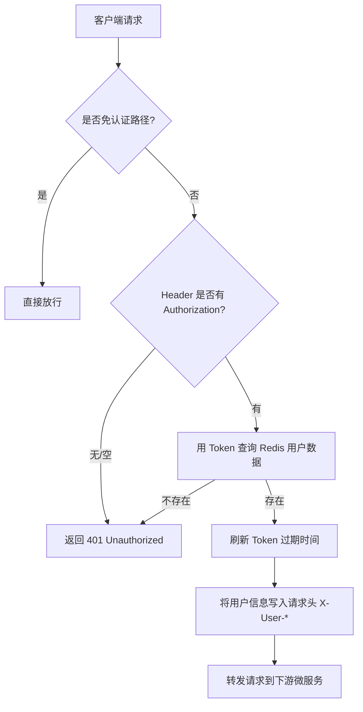
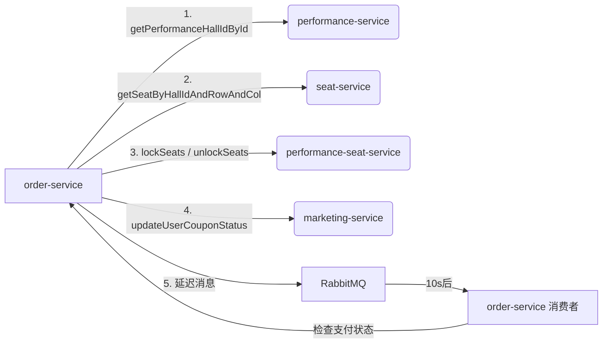
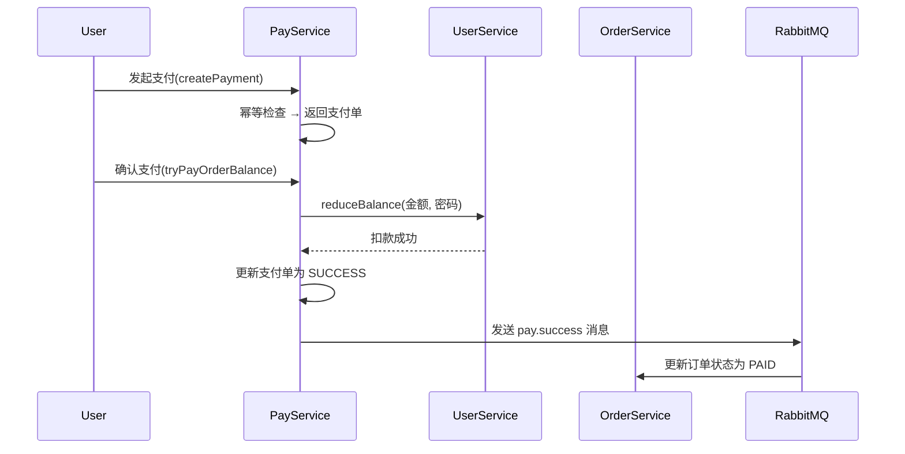

# 剧院票务系统

用户可浏览演出、选择场次、选择座位等

提供场馆管理、座位配置、演出排期、票价策略、营销工具等支持优惠卷、秒杀等活动。

## user-service

### 文件上传与下载

这个 `FileUploadService` 是一个典型的 **本地文件上传服务** 的实现，适用于 Spring Boot（或 Spring MVC）项目。在面试中描述它时，建议从 **设计思路、核心功能、关键代码逻辑、潜在问题及优化方向** 几个维度展开，体现出你对文件上传机制的理解和工程思维。

------

#### 一、整体设计思路（宏观）

> “这是一个通用的本地文件上传服务，支持按模块分类存储（如头像、博客图片等），使用 UUID 避免文件名冲突，并返回相对路径供后续拼接访问 URL。”

- **目的**：解耦业务逻辑与文件存储细节，提供可复用的上传/删除/URL 生成能力。
- **存储方式**：文件保存在服务器本地磁盘（`D:/uploads/`），非云存储。
- **模块化**：通过 `module` 参数隔离不同业务的文件目录，便于管理。

------

#### 二、核心方法解析（技术细节）

##### 1. `uploadFile(String module, MultipartFile file)`

- 校验：
  - 检查文件是否为空；
  - 检查原始文件名是否包含扩展名（防止无后缀或非法文件）。
- 重命名：
  - 使用 `UUID.randomUUID()` 生成唯一文件名，避免覆盖和中文/特殊字符问题；
  - 保留原始扩展名（如 `.jpg`, `.png`）。
- 目录创建：
  - 自动创建模块子目录（如 `D:/uploads/avatar/`）；
  - 使用 `mkdirs()` 确保多级目录存在。
- 写入磁盘：
  - 调用 `file.transferTo(dest)` 将临时文件写入目标位置。
- 返回值：
  - 返回**相对路径**（如 `"avatar/abc123.jpg"`），不暴露服务器绝对路径，更安全且便于前端拼接。

> ✅ **亮点**：避免了文件名冲突、路径遍历攻击（因未直接使用用户输入的文件名）、自动建目录。

##### 2. `getFileUrl(String relativePath, HttpServletRequest request)`

- 拼接完整 URL，用于前端访问（如 ``）。
- 注意：硬编码了端口为 `8080`（实际项目中应配置化或动态获取）。

##### 3. `deleteFile(String relativePath)`

- 根据相对路径删除本地文件；
- 做了存在性校验，避免误删或异常。

------

#### 三、面试回答模板（简洁专业版）

> “我实现了一个通用的本地文件上传服务。它接收模块名和 MultipartFile，首先校验文件有效性，然后用 UUID 重命名以避免冲突，按模块创建子目录并保存到本地磁盘（如 D:/uploads/avatar/）。返回的是相对路径，配合 getFileUrl 方法可生成完整的访问 URL。同时提供了 deleteFile 方法用于清理。这种设计解耦了业务与存储逻辑，支持多模块复用。”

------

#### 四、潜在问题 & 优化建议（体现深度）

| 问题               | 说明                                                     | 优化方向                                               |
| ------------------ | -------------------------------------------------------- | ------------------------------------------------------ |
| **硬编码路径**     | `BASE_DIR = "D:/uploads/"` 不利于跨平台/部署             | 改为配置项（`@Value("${file.upload.dir}")`）           |
| **端口写死**       | `getFileUrl` 中写死 8080                                 | 使用 `request.getServerPort()` 或配置反向代理后的 host |
| **无文件类型校验** | 可能上传 .exe/.jsp 等危险文件                            | 增加白名单校验（MIME 类型 + 文件头 magic number）      |
| **无大小限制**     | 默认依赖 Spring 的 `max-file-size`，但服务层未做二次校验 | 显式检查 `file.getSize()`                              |
| **本地存储瓶颈**   | 不适合分布式部署、无法水平扩展                           | 改用 OSS（阿里云 OSS、MinIO、AWS S3）                  |
| **无异常处理细化** | 所有异常抛出 IOException                                 | 可自定义业务异常（如 `FileUploadException`）           |

> 💡 **加分项**：提到“生产环境通常不会用本地存储，而是对接对象存储服务，并通过 CDN 加速访问”。

------

#### 五、延伸思考（高阶）

- 如何防止恶意用户上传超大文件耗尽磁盘？→ 限制单文件大小 + 总配额。
- 如何保证上传文件不被 Web 直接执行？→ 存储目录不在 Web 根路径下，或通过 Controller 控制访问权限。
- 如何支持断点续传/分片上传？→ 需要前端配合 + 后端记录分片状态（如使用 `spring-content` 或自研）。

------

#### 总结

在面试中，不要只讲“我写了 uploadFile 方法”，而要突出：

- **为什么这样设计**（安全、复用、可维护）；
- **考虑了哪些边界情况**（空文件、非法名、目录不存在）；
- **知道它的局限性及如何改进**（本地 vs 云存储、安全加固）。

这样就能从“会写代码”升级到“有工程思维”。


## marketing-service

### service

#### `CouponOrderServiceImpl` 

这段 `CouponOrderServiceImpl` 代码是 **基于 RabbitMQ + Redis + 分布式锁实现的高并发秒杀优惠券下单服务**，其核心目标是在分布式环境下：

> **安全、可靠、高性能地处理大量用户同时抢购限量优惠券的请求，防止超卖、重复下单，并保证最终一致性。**

------

##### 一、整体架构设计思想

该实现采用 **“异步削峰 + 原子校验 + 消息队列 + 分布式事务保障”** 的组合策略：

| 阶段            | 技术手段                       | 目的                                   |
| --------------- | ------------------------------ | -------------------------------------- |
| **1. 请求入口** | Lua 脚本（Redis）              | 原子性校验：库存 + 一人一单            |
| **2. 流量削峰** | RabbitMQ 异步队列              | 将瞬时高并发请求排队，避免数据库被打垮 |
| **3. 幂等落库** | Redisson 分布式锁 + 数据库事务 | 保证同一用户不会重复创建订单           |
| **4. 可靠投递** | 手动 ACK + 死信队列            | 确保消息不丢失、失败可追踪             |

------

##### 二、关键功能详解

###### ✅ 1. **秒杀入口：`seckillCoupon(Long couponId)`**

- **生成全局唯一订单 ID**
  使用 `RedisIdWorker`（基于 Redis 的雪花算法变种），避免数据库自增瓶颈。

- **前置校验：是否存在该秒杀券**
  调用 `seckillCouponService.getSeckillCouponByCouponId()`，避免无效请求进入核心逻辑。

- **Lua 脚本原子操作（核心！）**
  执行 `seckill_rabbitmq.lua`，一次性完成：

  - 库存是否 > 0？
  - 用户是否已抢过？（一人一单）
  - 若通过，将订单 ID 写入 Redis（如 `seckill:order:{userId}:{couponId}`）作为标记。

  ```lua
  -- 示例伪逻辑（实际在 lua/seckill_rabbitmq.lua 中）
  if redis.call('GET', 'stock:'..ARGV[1]) <= 0 then
      return 1  -- 库存不足
  end
  if redis.call('EXISTS', 'order:'..ARGV[2]..':'..ARGV[1]) == 1 then
      return 2  -- 已下单
  end
  redis.call('DECR', 'stock:'..ARGV[1])
  redis.call('SET', 'order:'..ARGV[2]..':'..ARGV[1], ARGV[3], 'EX', 3600)
  return 0
  ```

- **发送消息到 RabbitMQ**
  将 `CouponOrder` 对象序列化后发往 `seckill.order.queue`，开启持久化（`deliveryMode=2`），确保消息不丢。

- **获取 AOP 代理对象**
  为后续调用带 `@Transactional` 的方法做准备（解决 Spring 自调用事务失效问题）。

------

###### ✅ 2. **消息消费：`handleSeckillOrder(...)`**

- **监听 RabbitMQ 队列**
  使用 `@RabbitListener(queues = SECKILL_ORDER_QUEUE, concurrency = "3-5")` 开启 3~5 个消费者线程并发处理。
- **手动 ACK 机制**  
  - 成功 → `basicAck()` 确认消息；
  - 失败 → `basicNack(..., false)` 拒绝并**不重回队列**，而是路由到死信队列（DLQ），便于人工排查。

------

###### ✅ 3. **幂等落库：`handleCouponOrder(...)` + `createCouponOrderTransactional(...)`**

- **加分布式锁（Redisson）**
  锁 key：`lock:coupon:order:{userId}`，防止同一用户因消息重试或并发导致重复下单。

- **事务方法 `createCouponOrderTransactional`**
  在数据库层面做**二次校验与落库**：

  1. **幂等校验**：检查订单 ID 是否已存在（防消息重复消费）；

  2. **一人一单**：查询数据库是否已有相同用户+优惠券的订单；

  3. 扣减库存（乐观锁）

     ：

     ```java
     seckillCouponService.update()
         .setSql("stock = stock - 1")
         .eq("coupon_id", couponId)
         .gt("stock", 0)  // 关键：只有 stock > 0 才更新
         .update();
     ```

     > ⚠️ 注意：这里依赖数据库 `stock > 0` 条件，即使 Redis 库存被超卖，DB 也能兜底。

  4. **保存订单 & 发放优惠券**：写入 `coupon_order` 表，并调用 `userCouponService.addUserCoupon()`。

------

##### 三、为什么需要这么多层校验？

| 层级                        | 校验内容                           | 作用                               |
| --------------------------- | ---------------------------------- | ---------------------------------- |
| **1. Lua 脚本（Redis）**    | 库存 + 一人一单                    | 高性能拦截 99% 无效请求，保护下游  |
| **2. 分布式锁（Redisson）** | 同一用户串行化                     | 防止消息重复消费或并发导致重复下单 |
| **3. 数据库事务**           | 订单幂等 + 一人一单 + 乐观锁扣库存 | 最终一致性兜底，确保数据准确       |

> 💡 **设计哲学**：
> “**快路径用缓存拦截，慢路径用数据库兜底**”，兼顾性能与正确性。

------

##### 四、潜在风险与优化建议

| 风险                                       | 建议                                             |
| ------------------------------------------ | ------------------------------------------------ |
| **Lua 脚本未校验优惠券状态（如是否过期）** | 在 Lua 或前置校验中加入时间判断                  |
| **RabbitMQ 消息积压**                      | 监控队列长度，动态扩容消费者；或引入延迟队列削峰 |
| **Redis 宕机导致秒杀失败**                 | 降级方案：切换到本地缓存 + 限流，或直接拒绝请求  |
| **未处理优惠券类型（全场/指定商品）**      | 在 `addUserCoupon` 中补充业务规则校验            |
| **日志打印完整对象可能泄露隐私**           | 生产环境避免 `log.info("订单: {}", couponOrder)` |

------

##### 五、配套基础设施要求

1. **Redis**  
   - 存储库存（`stock:{couponId}`）
   - 存储下单标记（`order:{userId}:{couponId}`）
   - 分布式锁（`lock:coupon:order:{userId}`）
2. **RabbitMQ**  
   - Exchange: `seckill.exchange`（Direct 类型）
   - Queue: `seckill.order.queue`（绑定 routing key）
   - DLQ: `seckill.order.dlq`（处理失败消息）
3. **数据库**  
   - `seckill_coupon` 表含 `stock` 字段（需支持乐观锁更新）
   - `coupon_order` 表主键为雪花 ID

------

##### 六、面试如何回答？

> “这是一个基于‘Redis + RabbitMQ’的分布式秒杀系统实现。用户请求首先通过 Lua 脚本在 Redis 中原子校验库存和一人一单，通过后生成订单 ID 并发送到 RabbitMQ 异步队列。消费者监听队列，使用 Redisson 分布式锁保证同一用户串行处理，再在数据库事务中做幂等校验、扣减库存（乐观锁）和保存订单。整个流程通过多层防护防止超卖和重复下单，同时利用消息队列削峰填谷，保障系统在高并发下的稳定性。”

------

##### ✅ 总结

`CouponOrderServiceImpl` 是一个 **工业级高并发秒杀场景的典型解决方案**，体现了：

- **高性能**：Redis + Lua 拦截无效流量；
- **高可靠**：RabbitMQ 持久化 + 手动 ACK；
- **强一致**：数据库乐观锁 + 事务兜底；
- **可扩展**：消息队列天然支持水平扩容消费者。

只要配套的 Lua 脚本、RabbitMQ 配置、Redis 结构设计合理，即可支撑万级 QPS 的秒杀活动。

## tt-gateway

### 配置类

#### AuthProperties

这段 `AuthProperties` 代码的作用是：**从 Spring Boot 的配置文件（如 `application.yml`）中自动读取以 `xi.auth` 为前缀的配置项，并将其绑定到 Java 对象中，用于后续在网关（Gateway）中实现自定义的认证/鉴权逻辑。**

------

##### 一、核心功能总结

> **将配置文件中的路径白名单（`includePaths`）和黑名单（`excludePaths`）加载为 Java 列表，供网关拦截器判断哪些请求需要认证、哪些可以跳过。**

这是典型的 **“配置驱动权限控制”** 设计。

------

##### 二、关键注解解析

###### 1. `@Component`

- 将该类注册为 Spring 容器中的一个 Bean；
- **必要条件**：只有被 Spring 管理的 Bean，`@ConfigurationProperties` 才能生效（否则配置无法注入）。

###### 2. `@ConfigurationProperties(prefix = "xi.auth")`

- 告诉 Spring：**从配置文件中读取所有以 `xi.auth` 开头的属性，并映射到该类的字段上**；
- 要求字段名与配置 key **严格匹配（驼峰转连字符）**。

###### 3. `@Data`（Lombok）

- 自动生成 getter/setter/toString 等方法，简化代码。

------

##### 三、配套的配置文件示例（`application.yml`）

```yaml
xi:
  auth:
    include-paths:        # 需要认证的路径（可选）
      - /api/user/**
      - /api/order/**
    exclude-paths:        # 免认证路径（通常用于登录、静态资源等）
      - /api/auth/login
      - /api/captcha
      - /error
      - /actuator/health
```

> 🔍 注意：  
>
> - Java 字段 `includePaths` 对应 YAML 中的 `include-paths`（Spring 自动处理驼峰 ↔ 连字符转换）；
> - 列表类型直接用 `-` 表示。

------

##### 四、典型使用场景（在网关中）

在网关的全局过滤器（如 `AuthGlobalFilter`）中注入 `AuthProperties`，实现动态权限控制：

```java
@Component
public class AuthGlobalFilter implements GlobalFilter {

    @Autowired
    private AuthProperties authProperties;

    @Override
    public Mono<Void> filter(ServerWebExchange exchange, GatewayFilterChain chain) {
        String path = exchange.getRequest().getURI().getPath();

        // 1. 如果在 excludePaths 中，直接放行
        if (authProperties.getExcludePaths().stream().anyMatch(pattern -> 
                PathMatcher.match(pattern, path))) {
            return chain.filter(exchange);
        }

        // 2. 如果在 includePaths 中（或未配置 include，则默认所有都要认证）
        //    则校验 Token
        // ... 校验逻辑

        return chain.filter(exchange);
    }
}
```

------

##### 五、设计优势

| 优势             | 说明                                             |
| ---------------- | ------------------------------------------------ |
| ✅ **配置灵活**   | 无需改代码，通过配置文件即可调整鉴权规则         |
| ✅ **职责分离**   | 认证逻辑与路径规则解耦                           |
| ✅ **支持通配符** | 可配合 `AntPathMatcher` 实现 `/api/user/**` 匹配 |
| ✅ **环境差异化** | 不同环境（dev/test/prod）可配置不同路径          |

------

##### 六、注意事项 & 改进建议

###### ⚠️ 1. **命名一致性**

- 当前 prefix 是 

  ```
  xi.auth
  ```

  ，但类名是 

  ```
  AuthProperties
  ```

  ，建议统一为：

  ```java
  @ConfigurationProperties(prefix = "theatre.auth") // 更符合项目名
  ```

###### ⚠️ 2. **字段初始化（避免空指针）**

- 如果配置文件未定义 `exclude-paths`，`excludePaths` 会是 `null`，调用 `.stream()` 会 NPE。

- 建议初始化为空列表

  ：

  ```java
  private List<String> includePaths = new ArrayList<>();
  private List<String> excludePaths = Arrays.asList("/error", "/actuator/**");
  ```

###### ⚠️ 3. **启用 ConfigurationProperties（Spring Boot 2.2+）**

- 需确保主启动类有 

  ```
  @EnableConfigurationProperties
  ```

  ，或依赖 

  ```
  spring-boot-configuration-processor
  ```

  （推荐）：

  ```xml
  <dependency>
      <groupId>org.springframework.boot</groupId>
      <artifactId>spring-boot-configuration-processor</artifactId>
      <optional>true</optional>
  </dependency>
  ```

###### ⚠️ 4. **路径匹配性能**

- 如果路径很多，建议预编译为 `PathPattern`（Spring WebFlux）或使用缓存。

------

##### 七、面试如何回答？

> “这是一个配置属性类，用于从 application.yml 中读取 xi.auth 开头的 include-paths 和 exclude-paths 配置。网关可以根据这些路径动态决定哪些请求需要登录认证，哪些可以匿名访问。它通过 @ConfigurationProperties 实现配置绑定，配合 @Component 注册为 Spring Bean，使得权限规则可外部化、无需硬编码。”

------

##### ✅ 总结

`AuthProperties` 是 **网关认证模块的配置中枢**，体现了：

- **配置即代码**（Infrastructure as Code）；
- **动态权限控制**；
- **高可维护性**（运维可直接改配置，无需开发介入）。

它是构建安全、灵活 API 网关的重要组成部分。


#### `GatewayWebConfig`

这段 `GatewayWebConfig` 代码的作用是：**在 Spring Cloud Gateway（基于 WebFlux）中，统一配置跨域资源共享（CORS）策略和静态资源访问路径，以支持前端开发调试和文件资源的直接访问。**

------

##### 一、核心功能分解

###### ✅ 1. **配置 CORS（跨域请求）**

```java
@Override
public void addCorsMappings(CorsRegistry registry) {
    registry.addMapping("/**")
            .allowedOriginPatterns("http://localhost:5173", "http://localhost:8080")
            .allowedMethods("GET", "POST", "PUT", "DELETE", "OPTIONS")
            .allowedHeaders("*")
            .allowCredentials(true);
}
```

**作用**：
解决浏览器因**同源策略**导致的跨域问题，允许指定的前端域名（如 Vue/Vite 开发服务器）向网关发起 AJAX 请求。

- `addMapping("/**")`：对所有路径生效；

- ```
  allowedOriginPatterns(...)
  ```

  ：

  - 允许 `http://localhost:5173`（Vite/Vue 默认端口）；
  - 允许 `http://localhost:8080`（传统 Web 项目或测试页面）；
  - 使用 `allowedOriginPatterns` 而非 `allowedOrigins` 是因为后者不支持通配符且在 Spring 5.3+ 中对 `*` + `allowCredentials(true)` 有严格限制；

- `allowCredentials(true)`：允许前端携带 Cookie（如认证 Token），**但此时不能设置 `allowedOrigins("\*")`**，必须明确指定域名。

> 🔒 安全提示：生产环境应替换为真实前端域名（如 `https://www.theatre.com`），避免开放过多来源。

------

###### ✅ 2. **配置静态资源映射**

```java
@Override
public void addResourceHandlers(ResourceHandlerRegistry registry) {
    registry.addResourceHandler("/avatar/**")
            .addResourceLocations("file:D:/uploads/avatar/");

    registry.addResourceHandler("/poster/**")
            .addResourceLocations("file:D:/uploads/poster/");
}
```

**作用**：
让网关可以直接对外提供本地磁盘上的静态文件（如用户头像、电影海报），无需经过后端服务转发。

- 访问 `http://gateway:port/avatar/123.jpg` → 实际返回 `D:/uploads/avatar/123.jpg`；
- 访问 `http://gateway:port/poster/movie001.png` → 返回 `D:/uploads/poster/movie001.png`；
- 优势：
  - 减轻业务服务压力；
  - 提升文件访问性能（网关直出）；
  - 统一入口，便于 CDN 或权限控制（后续可加拦截器）。

> 💡 注意：路径末尾的 `/` 很重要，表示这是一个目录。

------

##### 二、为什么在 Gateway 中配置？

Spring Cloud Gateway 是整个系统的**流量入口**，在此处统一处理：

- **跨域**：避免每个微服务重复配置；
- **静态资源**：集中管理文件访问，后端服务只需关注 API。

------

##### 三、潜在问题与优化建议

| 问题                       | 建议                                                         |
| -------------------------- | ------------------------------------------------------------ |
| **硬编码 Windows 路径**    | 改为配置化： `@Value("${file.upload.avatar-dir}") String avatarDir;` 支持 Linux (`file:/data/uploads/avatar/`) |
| **未设置缓存头**           | 静态资源应加缓存，减少请求： `.setCachePeriod(3600)`         |
| **生产环境 CORS 过于宽松** | 限制为真实域名，禁用 `*` 和 `localhost`                      |
| **文件路径安全性**         | 防止路径穿越（如 `../etc/passwd`），需校验文件名合法性       |

✅ **改进示例（配置化 + 缓存）**：

```java
@Value("${file.avatar.location:file:/app/uploads/avatar/}")
private String avatarLocation;

@Value("${file.poster.location:file:/app/uploads/poster/}")
private String posterLocation;

@Override
public void addResourceHandlers(ResourceHandlerRegistry registry) {
    registry.addResourceHandler("/avatar/**")
            .addResourceLocations(avatarLocation)
            .setCachePeriod(3600); // 缓存1小时

    registry.addResourceHandler("/poster/**")
            .addResourceLocations(posterLocation)
            .setCachePeriod(3600);
}
```

对应 `application.yml`：

```yaml
file:
  avatar:
    location: file:/data/theatre/avatar/
  poster:
    location: file:/data/theatre/poster/
```

------

##### 四、面试如何回答？

> “这个配置类在 Spring Cloud Gateway 中做了两件事：一是配置 CORS，允许本地开发的前端（如 5173 端口）跨域访问 API，并支持携带 Cookie；二是将 /avatar 和 /poster 路径映射到服务器本地磁盘目录，实现静态文件直出。这样既方便了前后端联调，又提升了文件访问效率，同时保持了系统入口的统一性。”

------

##### ✅ 总结

`GatewayWebConfig` 是 **网关层基础设施的关键配置**，体现了：

- **开发者友好**（解决跨域，加速联调）；
- **性能优化**（静态资源直出）；
- **架构清晰**（统一入口，职责分离）。

只需稍作配置化改造，即可安全用于生产环境。

### 过滤器

#### `AuthGlobalFilter` 

这段 `AuthGlobalFilter` 代码是 **Spring Cloud Gateway 中的全局认证过滤器（GlobalFilter）**，其核心作用是：

> **在请求进入微服务之前，统一进行用户身份认证：验证 Token、从 Redis 获取用户信息、刷新 Token 有效期，并将用户上下文透传给下游服务。**

它是整个系统安全访问控制的第一道防线。

------

##### 一、整体流程图解



------

##### 二、关键功能详解

###### ✅ 1. **免认证路径放行（白名单机制）**

```java
private boolean isExcludePath(String path) {
    for (String pattern : authProperties.getExcludePaths()) {
        if (antPathMatcher.match(pattern, path)) return true;
    }
    return false;
}
```

- 读取 `AuthProperties` 中配置的 `excludePaths`（如 `/api/auth/login`, `/error`）；
- 使用 `AntPathMatcher` 支持通配符（如 `/api/captcha/**`）；
- 匹配成功则跳过认证，直接放行。

> 📌 示例：登录接口、验证码、健康检查等无需登录。

------

###### ✅ 2. **Token 验证与用户信息获取**

```java
String token = exchange.getRequest().getHeaders().getFirst("Authorization");
Map<Object, Object> userMap = stringRedisTemplate.opsForHash().entries(LOGIN_USER_KEY + token);
```

- 从请求头 `Authorization` 中提取 Token；
- 拼接 Redis Key：`login:token:{token}`（假设 `LOGIN_USER_KEY = "login:token:"`）；
- 以 **Hash 结构** 存储用户信息（字段如 `id`, `nickname`, `phone` 等）；
- 若 Redis 中无数据 → 认为 Token 无效或已过期 → 返回 401。

> 💡 优势：Hash 结构节省内存，且支持部分字段更新。

------

###### ✅ 3. **自动刷新 Token 有效期（滑动过期）**

```java
stringRedisTemplate.expire(LOGIN_USER_KEY + token, LOGIN_USER_TTL, TimeUnit.SECONDS);
```

- 每次有效请求都会重置 Token 的过期时间（如 30 分钟）；
- 实现“**只要用户在活跃，就不过期**”的体验；
- 避免用户操作中途突然掉线。

------

###### ✅ 4. **用户上下文透传（关键！）**

```java
ServerHttpRequest request = exchange.getRequest().mutate()
    .header("X-User-Id", user.getId().toString())
    .header("X-User-NickName", user.getNickname())
    // ... 其他字段
    .build();
exchange = exchange.mutate().request(request).build();
```

- 将用户信息注入新的请求头（`X-User-*`）；
- 下游微服务（如订单、用户服务）可通过 `LoginInterceptor` 自动解析这些头，存入 `ThreadLocal`；
- **实现“一次认证，全链路通行”**，避免每个服务重复查 Redis。

> 🔗 与你之前写的 `LoginInterceptor` 完美配合！

------

###### ✅ 5. **异常处理与日志**

- 所有异常（如 Redis 连接失败、反序列化错误）统一返回 401；
- 详细日志便于排查问题（开发环境可保留，生产建议分级）；
- 使用 `BeanUtil.fillBeanWithMap`（Hutool）简化 Map → POJO 转换。

------

##### 三、设计亮点

| 特性             | 说明                                           |
| ---------------- | ---------------------------------------------- |
| ✅ **无状态认证** | 依赖 Redis 存储会话，网关本身不保存状态        |
| ✅ **高性能**     | Redis 查询 + 响应式编程（Reactor），适合高并发 |
| ✅ **解耦业务**   | 下游服务无需关心认证逻辑                       |
| ✅ **安全可靠**   | Token 无效/缺失立即拦截，防止越权访问          |
| ✅ **体验友好**   | 滑动过期避免频繁登录                           |

------

##### 四、潜在风险与优化建议

| 风险                  | 建议                                                         |
| --------------------- | ------------------------------------------------------------ |
| **Redis 单点故障**    | 配置 Redis 集群 + 降级策略（如本地缓存）                     |
| **Token 被盗用**      | 建议绑定 IP 或设备指纹（增强安全性）                         |
| **敏感信息透传**      | 邮箱、手机号等是否必要？可只传 `userId`，下游按需查询        |
| **日志泄露隐私**      | 生产环境避免打印完整用户对象（`log.debug("User: {}", user)`） |
| **未校验 Token 格式** | 可增加前缀校验（如 `Bearer xxx`）                            |

✅ **增强示例（只传必要字段）**：

```java
.header("X-User-Id", user.getId().toString())
// 移除 phone/email，除非下游强依赖
```

------

##### 五、与项目其他组件的协作

| 组件                       | 协作方式                                         |
| -------------------------- | ------------------------------------------------ |
| `AuthProperties`           | 提供免认证路径配置                               |
| `Redis`                    | 存储用户会话（Hash 结构）                        |
| `LoginInterceptor`（下游） | 解析 `X-User-*` 头，存入 `UserHolder`            |
| `UserHolder`               | 业务代码通过 `UserHolder.getUser()` 获取当前用户 |

------

##### 六、面试如何回答？

> “这是一个基于 Spring Cloud Gateway 的全局认证过滤器。它首先检查请求路径是否在免认证白名单中；如果不是，则从 Header 中提取 Token，查询 Redis 获取用户信息。如果 Token 有效，就刷新其过期时间，并将用户 ID、昵称等信息以自定义请求头（如 X-User-Id）的形式注入到请求中，传递给下游微服务。这样，所有后端服务都能透明地获取当前用户上下文，而无需重复认证逻辑。同时，它还实现了 Token 的滑动过期机制，提升用户体验。”

------

##### ✅ 总结

`AuthGlobalFilter` 是 **分布式系统认证体系的核心枢纽**，实现了：

- **统一入口认证**；
- **会话管理（Redis + 滑动过期）**；
- **上下文透传**；
- **安全拦截**。

配合网关 CORS、静态资源、下游拦截器，构成了完整的前后端分离 + 微服务安全架构。


### Router

#### `DynamicRouteLoader` 

这段 `DynamicRouteLoader` 代码的作用是：

> **实现 Spring Cloud Gateway 路由规则的动态加载与热更新：从 Nacos 配置中心实时监听 `gateway-routes.json` 文件的变化，自动将最新的路由配置应用到网关，无需重启服务。**

这是**微服务网关动态路由管理的核心组件**，极大提升了系统运维灵活性和可用性。

------

##### 一、核心功能总结

| 功能                      | 说明                                              |
| ------------------------- | ------------------------------------------------- |
| ✅ **首次启动加载路由**    | 应用启动时从 Nacos 拉取初始路由配置               |
| ✅ **监听 Nacos 配置变更** | 当 `gateway-routes.json` 内容被修改，自动触发更新 |
| ✅ **动态增删路由规则**    | 删除旧路由 → 添加新路由，实现无缝切换             |
| ✅ **避免重复/残留路由**   | 通过 `Set<String> routeIds` 跟踪已加载的路由 ID   |

------

##### 二、关键流程解析

###### 1. **初始化监听器（`@PostConstruct`）**

```java
@PostConstruct
public void initRouteConfigListener() throws NacosException {
    // 1. 注册监听器 + 首次拉取配置
    String configInfo = nacosConfigManager.getConfigService()
        .getConfigAndSignListener(dataId, group, 5000, new Listener() { ... });
    
    // 2. 立即处理首次拉取的配置
    updateConfigInfo(configInfo);
}
```

- 使用 `getConfigAndSignListener()` **一次性获取配置并注册监听器**；
- 启动时立即加载一次路由，避免“冷启动无路由”问题。

###### 2. **配置变更回调（`receiveConfigInfo`）**

```java
@Override
public void receiveConfigInfo(String configInfo) {
    updateConfigInfo(configInfo); // 配置变更时自动更新
}
```

- 当 Nacos 中 `gateway-routes.json` 被修改（如运维人员调整路由），Nacos 推送新内容；
- 网关自动调用 `updateConfigInfo` 重新加载。

###### 3. **动态更新路由（`updateConfigInfo`）**

```java
// 1. 反序列化 JSON → List<RouteDefinition>
List<RouteDefinition> routeDefinitions = JSONUtil.toList(configInfo, RouteDefinition.class);

// 2. 删除所有旧路由
for (String routeId : routeIds) {
    writer.delete(Mono.just(routeId)).subscribe();
}
routeIds.clear();

// 3. 添加新路由
routeDefinitions.forEach(route -> {
    writer.save(Mono.just(route)).subscribe();
    routeIds.add(route.getId());
});
```

- **先删后增**：确保路由状态与配置完全一致；
- 使用 `RouteDefinitionWriter`（Spring Cloud Gateway 提供的标准接口）操作路由；
- 记录 `routeIds` 用于下次清理。

------

##### 三、配套的 Nacos 配置示例（`gateway-routes.json`）

在 Nacos 控制台创建配置：

- **Data ID**: `gateway-routes.json`
- **Group**: `DEFAULT_GROUP`
- **配置内容（JSON 格式）**:

```json
[
  {
    "id": "user-service",
    "uri": "lb://user-service",
    "predicates": [
      { "name": "Path", "args": { "pattern": "/api/user/**" } }
    ],
    "filters": []
  },
  {
    "id": "order-service",
    "uri": "lb://order-service",
    "predicates": [
      { "name": "Path", "args": { "pattern": "/api/order/**" } }
    ]
  }
]
```

> ✅ 支持 predicates（路径匹配）、filters（过滤器）、uri（服务地址）等完整路由定义。

------

##### 四、为什么需要动态路由？

| 传统方式（静态配置）         | 动态路由（本方案）           |
| ---------------------------- | ---------------------------- |
| 路由写死在 `application.yml` | 路由集中管理在 Nacos         |
| 修改路由需重启网关           | **秒级生效，零停机**         |
| 多环境配置冗余               | 一套逻辑，多环境差异化配置   |
| 运维介入困难                 | 运维/开发可直接在 Nacos 修改 |

> 💡 特别适合：频繁上下线服务、灰度发布、A/B 测试等场景。

------

##### 五、注意事项与优化建议

###### ⚠️ 1. **当前类未注册为 Spring Bean**

```java
//@Component  // 被注释掉了！
```

- **问题**：`@PostConstruct` 不会执行，监听器无法启动！
- **修复**：取消注释 `@Component`，或改用 `@Configuration` + `@Bean` 方式注入。

###### ⚠️ 2. **异常处理缺失**

- `JSONUtil.toList` 若解析失败会抛异常，但未捕获；

- 建议

  ：

  ```java
  try {
      List<RouteDefinition> routes = JSONUtil.toList(configInfo, RouteDefinition.class);
  } catch (Exception e) {
      log.error("Failed to parse route config", e);
      return; // 跳过本次更新
  }
  ```

#### ⚠️ 3. **删除/添加路由是异步的**

- `writer.delete().subscribe()` 是非阻塞的，若删除未完成就添加，可能导致短暂 404；
- **优化**：使用 `Flux.concat()` 保证顺序执行（生产环境建议）。

#### ⚠️ 4. **未做配置合法性校验**

- 错误的路由配置可能导致网关不可用；
- **建议**：增加 schema 校验或预加载测试。

#### ✅ 5. **日志级别合理**

- 使用 `info/debug/warn` 分级，便于排查问题。

------

##### 六、与项目架构的整合价值

- **解耦路由配置与代码**：开发专注业务，运维管理流量；
- **支持蓝绿发布**：临时切流到新版本服务；
- **快速故障隔离**：下线异常服务路由；
- **统一入口治理**：所有微服务路由集中管控。

------

##### 七、面试如何回答？

> “这是一个基于 Nacos 的 Spring Cloud Gateway 动态路由加载器。它在应用启动时从 Nacos 拉取 gateway-routes.json 配置，并注册监听器。当配置变更时，自动反序列化为 RouteDefinition 列表，先删除旧路由，再添加新路由，实现无需重启的路由热更新。这使得我们可以灵活调整服务路由策略，比如灰度发布或紧急下线故障服务，极大提升了系统的可运维性和稳定性。”

------

##### ✅ 总结

`DynamicRouteLoader` 是 **现代化网关不可或缺的动态治理能力体现**，结合 Nacos 实现了：

- **配置中心化**
- **路由动态化**
- **运维自助化**

只需取消 `@Component` 注释，即可成为你项目中的“流量指挥官”。

## tt-api

###  `DefaultFeignConfig` 类

这个 `DefaultFeignConfig` 类是 **Spring Cloud OpenFeign 的配置类**，主要用于在微服务之间通过 Feign 客户端发起 HTTP 调用时，**自动传递当前用户上下文信息**（如用户 ID、昵称、手机号等）到目标服务。

------

#### 一、核心作用总结

> **实现“用户身份透传”**：当一个微服务 A 调用微服务 B 时，B 也能知道当前操作的是哪个用户，而无需手动在每次调用中显式传参。

这是微服务架构中常见的 **上下文传递（Context Propagation）** 需求。

------

#### 二、关键组件解析

##### 1. `RequestInterceptor`（请求拦截器）

- Feign 提供的扩展点，在每次发出 HTTP 请求前执行。

- 这里重写了 

  ```
  apply(RequestTemplate template)
  ```

   方法：

  - 从 `UserHolder.getUser()` 获取当前线程绑定的用户信息（通常由登录拦截器或网关写入）；
  - 如果用户存在，就把关键字段（ID、昵称、头像、手机号、邮箱）作为 **HTTP 请求头** 添加进去；
  - 目标服务可以通过 `@RequestHeader("X-User-Id")` 等方式直接获取这些信息。

✅ **好处**：

- 业务代码无需关心“如何传用户信息”，解耦；
- 所有 Feign 调用自动携带用户上下文，避免遗漏；
- 统一规范，所有微服务约定使用 `X-User-*` 前缀的 header。

##### 2. `Logger.Level.FULL`

- 开启 Feign 的 **详细日志**（包括请求头、请求体、响应等）；
- 便于开发/测试阶段调试微服务调用；
- ⚠️ 注意：生产环境应关闭或设为 `BASIC`，避免敏感信息泄露和性能开销。

------

#### 三、依赖的前提条件

要让这个配置生效，还需满足以下条件：

1. **`UserHolder` 是基于 ThreadLocal 的工具类**
   示例：

   ```java
   public class UserHolder {
       private static final ThreadLocal<UserInfo> USER_THREAD_LOCAL = new ThreadLocal<>();
       
       public static void setUser(UserInfo user) { USER_THREAD_LOCAL.set(user); }
       public static UserInfo getUser() { return USER_THREAD_LOCAL.get(); }
       public static void remove() { USER_THREAD_LOCAL.remove(); }
   }
   ```

   - 通常在 **认证拦截器**（如 JWT 解析后）或 **网关** 中将用户信息存入 `UserHolder`；
   - Feign 调用发生在同一个线程中，才能正确读取。

2. **该配置类需被 Spring 扫描到并启用**

   - 方式一：在启动类上加 `@EnableFeignClients(defaultConfiguration = DefaultFeignConfig.class)`
   - 方式二：在某个 Feign Client 上指定 `configuration = DefaultFeignConfig.class`
   - 方式三：如果该类在主包路径下且被 `@ComponentScan` 覆盖，加上 `@Configuration` 注解更稳妥（当前代码缺少！）

> 🔔 **注意**：你提供的代码中 **缺少 `@Configuration` 注解**！
> 如果没有它，`@Bean` 方法不会被 Spring 容器识别，拦截器和日志配置将**不生效**。

✅ 正确写法应为：

```java
@Configuration // 👈 必须加上！
public class DefaultFeignConfig {
    // ...
}
```

------

#### 四、面试如何描述？

> “这是一个 Feign 的全局配置类，主要做了两件事：
> 第一，通过 `RequestInterceptor` 在微服务调用前，自动把当前用户的 ID、昵称等信息注入到请求头中，实现用户上下文的透传；
> 第二，开启了 Feign 的 FULL 日志级别，方便调试。
> 它依赖于 `UserHolder` 这个基于 ThreadLocal 的用户上下文存储工具，通常在认证阶段填充数据。需要注意的是，这个类必须加上 `@Configuration` 注解才能被 Spring 加载。”

------

#### 五、潜在风险与优化建议

| 问题                               | 建议                                                         |
| ---------------------------------- | ------------------------------------------------------------ |
| 敏感信息（如手机号、邮箱）明文传输 | 只传递必要字段（如仅 `X-User-Id`），其他信息由目标服务根据 ID 查询 |
| ThreadLocal 内存泄漏               | 确保在请求结束时调用 `UserHolder.remove()`（可用 `HandlerInterceptor` 或 `Filter` 清理） |
| 缺少 `@Configuration`              | 补上注解，否则配置无效                                       |
| 日志泄露敏感头信息                 | 生产环境关闭 FULL 日志，或自定义 Logger 过滤敏感 header      |

------

#### 总结

这个类是微服务间 **安全、透明传递用户身份** 的关键组件，体现了“关注点分离”和“自动化上下文传播”的设计思想，是分布式系统开发中的常见实践。

### `@EnableFeignClients`注解

`@EnableFeignClients` 是 Spring Cloud OpenFeign 提供的核心注解，用于**启用 Feign 客户端功能**，并配置其扫描和行为规则。

在你提供的 `MarketingApplication` 类中：

```java
@EnableFeignClients(
    basePackages = "com.theatre.api.client",
    defaultConfiguration = DefaultFeignConfig.class
)
```

它的作用可以从两个层面理解：

------

#### 一、核心作用：启用 Feign 并自动创建远程调用代理

- **开启 Feign 支持**：告诉 Spring Boot 应用：“我要使用 Feign 来调用其他微服务”。

- 自动扫描 Feign Client 接口

  ：Spring 会在指定包路径下查找所有用 

  ```
  @FeignClient
  ```

   注解标记的接口，并为它们

  动态生成实现类（代理对象）

  ，注入到 Spring 容器中。

  - 例如：

    ```java
    @FeignClient(name = "user-service")
    public interface UserClient {
        @GetMapping("/user/{id}")
        UserInfo getUser(@PathVariable("id") Long id);
    }
    ```

    在 

    ```
    MarketingApplication
    ```

     启动后，你可以直接 

    ```
    @Autowired UserClient userClient
    ```

    ，调用方法就像调本地方法一样，底层自动完成 HTTP 请求。

------

#### 二、参数详解

##### 1. `basePackages = "com.theatre.api.client"`

- **指定 Feign Client 接口所在的包路径**。
- Spring 只会扫描这个包及其子包下的 `@FeignClient` 接口。
- 避免全量扫描，提升启动速度，也更清晰可控。
- 如果不指定，默认只扫描主启动类所在包及子包。

✅ 建议：显式指定，结构更清晰。

##### 2. `defaultConfiguration = DefaultFeignConfig.class`

- **为所有 Feign Client 设置默认配置类**。

- 这里的 

  ```
  DefaultFeignConfig
  ```

   就是你前面提到的那个类，里面定义了：

  - 全局请求拦截器（传递用户上下文）
  - Feign 日志级别（FULL）

> ⚠️ 注意：这个配置是“默认”的，每个 `@FeignClient` 也可以通过自己的 `configuration` 属性覆盖它。

------

#### 三、典型使用场景（结合你的项目）

你的 `marketing` 服务需要调用其他微服务（比如用户服务、订单服务等）：

1. 在 `com.theatre.api.client` 包下定义 Feign 接口（如 `UserClient`）；
2. 启动类通过 `@EnableFeignClients` 扫描这些接口；
3. 调用时自动注入代理对象；
4. 每次调用都会经过 `DefaultFeignConfig` 中的 `RequestInterceptor`，**自动带上当前用户信息**（如 `X-User-Id`）；
5. 目标服务（如 user-service）就能识别是谁在操作，无需手动传参。

------

#### 四、常见误区提醒

| 误区                                                | 正确理解                                                     |
| --------------------------------------------------- | ------------------------------------------------------------ |
| 加了 `@EnableFeignClients` 就能直接用 Feign         | 还需引入 `spring-cloud-starter-openfeign` 依赖               |
| `defaultConfiguration` 会覆盖所有配置               | 它只是“默认”，单个 FeignClient 可单独配置                    |
| 不指定 `basePackages` 也能扫到其他模块的 Feign 接口 | 如果 Feign 接口在别的 Maven 模块，必须确保该模块被依赖，且包路径被扫描到 |

------

#### 五、面试如何简洁回答？

> “`@EnableFeignClients` 是用来启用 Feign 远程调用功能的。在这里，它指定了要扫描 `com.theatre.api.client` 包下的 Feign 接口，并应用 `DefaultFeignConfig` 作为全局默认配置——比如自动在请求头中传递用户身份信息，实现微服务间的上下文透传。”

------

#### 补充：依赖要求

确保 `pom.xml` 或 `build.gradle` 中包含：

```xml
<dependency>
    <groupId>org.springframework.cloud</groupId>
    <artifactId>spring-cloud-starter-openfeign</artifactId>
</dependency>
```

否则 `@EnableFeignClients` 无效。

------

✅ 总结：
`@EnableFeignClients` 是连接微服务的“桥梁开关”，配合 `basePackages` 和 `defaultConfiguration`，实现了**自动化、安全、可配置的远程调用能力**。

## tt-common

### 配置类

#### RedissonConfig

这段 `RedissonConfig` 代码的作用是：**配置并创建一个 Redisson 客户端（`RedissonClient`）的 Spring Bean，用于在项目中使用 Redisson 提供的高级 Redis 功能，如分布式锁、分布式集合、延迟队列等。**

------

##### 一、核心作用总结

> **将 Redisson 集成到 Spring Boot 项目中，并通过 `@Bean` 将客户端实例交由 Spring 容器管理，便于在业务代码中直接注入使用。**

------

##### 二、关键代码解析

###### 1. `@Configuration`

- 声明这是一个 Spring 配置类，相当于传统的 XML 配置文件；
- 其中的 `@Bean` 方法会被 Spring 容器识别并注册为 Bean。

###### 2. `redissonClient()` 方法

```java
@Bean
public RedissonClient redissonClient() {
    Config config = new Config();
    config.useSingleServer()
          .setAddress("redis://192.168.137.128:6379")
          .setPassword("123321");
    return Redisson.create(config);
}
```

- **`Config`**：Redisson 的配置对象；

- `useSingleServer()`

  ：指定使用 

  单机 Redis 模式

  （适用于开发或简单部署）；

  - 生产环境可能用 `useClusterServers()`（集群）或 `useSentinelServers()`（哨兵）；

- `setAddress("redis://...")`

  ：

  - 必须以 `redis://`（非加密）或 `rediss://`（SSL 加密）开头；
  - 地址为 Redis 服务器的 IP 和端口；

- **`setPassword("123321")`**：设置 Redis 认证密码（若未设密码可省略）；

- **`Redisson.create(config)`**：根据配置创建线程安全的 `RedissonClient` 实例。

------

##### 三、为什么需要 Redisson？

Spring Data Redis 虽然能操作 Redis，但 **不支持高级功能**，例如：

| 功能                         | Spring Data Redis | Redisson                                     |
| ---------------------------- | ----------------- | -------------------------------------------- |
| 分布式锁（可重入、自动续期） | ❌ 需手动实现      | ✅ `RLock lock = redisson.getLock("myLock");` |
| 分布式集合（Set/Map/List）   | ❌ 仅基础操作      | ✅ 线程安全的分布式对象                       |
| 延迟队列、消息队列           | ❌                 | ✅ 内置支持                                   |
| 原子计数器、信号量           | ❌                 | ✅ `RAtomicLong`, `RSemaphore`                |

👉 **Redisson 是 Redis 的“高级客户端”，极大简化了分布式场景下的并发控制。**

------

##### 四、典型使用场景（在你的项目中）

1. **防止重复下单**

   ```java
   @Autowired
   private RedissonClient redissonClient;
   
   public void createOrder(Long userId) {
       RLock lock = redissonClient.getLock("order_lock:" + userId);
       try {
           if (lock.tryLock(1, 10, TimeUnit.SECONDS)) {
               // 执行下单逻辑
           }
       } finally {
           lock.unlock();
       }
   }
   ```

2. **限流（基于信号量）**

   ```java
   RSemaphore semaphore = redissonClient.getSemaphore("api_limit");
   semaphore.tryAcquire(); // 控制并发访问数
   ```

3. **缓存预热/延迟任务**

   - 使用 `RDelayedQueue` 实现订单超时取消等。

------

##### 五、注意事项 & 最佳实践

| 问题                        | 建议                                                         |
| --------------------------- | ------------------------------------------------------------ |
| **硬编码 Redis 地址和密码** | 应改为从 `application.yml` 读取： `@Value("${redisson.address}") String address` |
| **仅支持单机模式**          | 生产环境应根据部署架构选择集群/哨兵模式                      |
| **缺少连接池、超时等配置**  | 可补充 `setConnectionPoolSize`, `setTimeout` 等参数          |
| **未处理异常**              | 若 Redis 不可用，应用启动会失败（可加 `@ConditionalOnProperty` 控制是否启用） |

✅ **推荐改进写法（配置化）**：

```java
@Value("${redisson.address}")
private String redisAddress;

@Value("${redisson.password}")
private String redisPassword;

@Bean
public RedissonClient redissonClient() {
    Config config = new Config();
    config.useSingleServer()
          .setAddress(redisAddress)
          .setPassword(redisPassword)
          .setTimeout(3000)
          .setConnectionPoolSize(10);
    return Redisson.create(config);
}
```

对应 `application.yml`：

```yaml
redisson:
  address: redis://192.168.137.128:6379
  password: 123321
```

------

##### 六、面试如何回答？

> “这个配置类用于集成 Redisson 客户端。它通过 `@Bean` 创建了一个 `RedissonClient` 实例，连接到指定的 Redis 服务器。这样我们就能在业务中方便地使用 Redisson 提供的分布式锁、信号量等高级功能，解决高并发场景下的线程安全问题。不过目前地址和密码是硬编码的，建议改成配置文件方式，提升灵活性和安全性。”

------

##### ✅ 总结

`RedissonConfig` 是 **Redis 高级功能落地的关键桥梁**，让开发者能以“面向对象”的方式操作 Redis，大幅提升分布式系统的开发效率和可靠性。

#### MvcConfig

这段 `MvcConfig` 代码的作用是：**通过实现 `WebMvcConfigurer` 接口，向 Spring MVC 的拦截器链中注册一个自定义的登录拦截器（`LoginInterceptor`），用于在每次请求时自动解析并存储当前用户信息到线程上下文（如 `UserHolder`）中。**

------

##### 一、核心功能解析

###### ✅ 1. **注册登录拦截器**

```java
registry.addInterceptor(new LoginInterceptor()).order(1);
```

- 将 `LoginInterceptor` 实例加入 Spring MVC 的拦截器链；

- ```
  .order(1)
  ```

   表示该拦截器的执行优先级（数字越小越先执行）；

  - 虽然注释说“确保在其他拦截器后执行”，但 **`.order(1)` 实际上是较早执行**（默认拦截器 order 是 `Ordered.LOWEST_PRECEDENCE`，即 Integer.MAX_VALUE）；
  - 如果确实希望它“靠后执行”，应使用较大的数字（如 `.order(100)`）——这里注释可能有误。

> 💡 拦截器典型用途：在 Controller 方法执行前，从 Token（如 JWT）或 Cookie 中解析用户身份，并存入 `ThreadLocal`（如 `UserHolder`），供后续业务逻辑使用。

###### ✅ 2. **依赖 Redis（但未在拦截器注册中直接使用）**

```java
@Resource
private StringRedisTemplate stringRedisTemplate;
```

- 虽然注入了 `StringRedisTemplate`，但在 `addInterceptors` 方法中**并未使用它**；
- 很可能是在 `LoginInterceptor` 内部使用 Redis 验证 Token 或查询用户信息（例如：从 Redis 中读取 `token -> userId` 映射）；
- 因此，这里注入是为了将来扩展（比如在拦截器中 `@Autowired` 不方便时，可通过构造函数或 setter 注入，但当前写法略显冗余）。

> 🔍 建议：如果 `LoginInterceptor` 需要 Redis，应在拦截器内部通过 `@Autowired` 注入，而不是在 `MvcConfig` 中注入却不用。

------

##### 二、为什么需要这个配置？

在微服务或单体应用中，通常需要：

1. 用户登录后获得 Token；
2. 后续请求携带 Token；
3. 服务端在处理请求前，**自动识别当前用户是谁**；
4. 业务代码无需手动解析 Token，直接通过 `UserHolder.getUser()` 获取用户信息。

👉 **`LoginInterceptor` + `MvcConfig` 正是实现这一流程的关键环节。**

------

##### 三、典型 `LoginInterceptor` 工作流程（推测）

```java
public class LoginInterceptor implements HandlerInterceptor {
    @Autowired
    private StringRedisTemplate stringRedisTemplate;

    @Override
    public boolean preHandle(HttpServletRequest request, HttpServletResponse response, Object handler) {
        // 1. 从请求头获取 Token
        String token = request.getHeader("Authorization");
        
        // 2. 查询 Redis 获取用户 ID
        String userId = stringRedisTemplate.opsForValue().get("token:" + token);
        
        if (userId != null) {
            // 3. 查询完整用户信息（可能缓存或调用 user-service）
            UserInfo user = ...;
            
            // 4. 存入 ThreadLocal
            UserHolder.setUser(user);
        }
        
        return true; // 继续执行 Controller
    }

    @Override
    public void afterCompletion(HttpServletRequest request, HttpServletResponse response, Object handler, Exception ex) {
        // 请求结束，清理 ThreadLocal 防止内存泄漏
        UserHolder.remove();
    }
}
```

而 `MvcConfig` 的作用就是**让这个拦截器生效**。

------

##### 四、注意事项 & 改进建议

| 问题                                  | 建议                                                         |
| ------------------------------------- | ------------------------------------------------------------ |
| 注入了 `stringRedisTemplate` 但未使用 | 删除无用注入，或明确说明用途                                 |
| `.order(1)` 与注释矛盾                | 若需“靠后执行”，改为 `.order(100)`；若需“优先执行”（如鉴权），则保留 `.order(1)` 并修正注释 |
| 未配置跨域（`addCorsMappings`）       | 如果是前后端分离项目，通常还需在此配置 CORS                  |
| 未排除静态资源路径                    | 拦截器应排除 `/login`, `/static/**` 等路径，避免未登录无法访问静态文件（但注释说“不再做路径排除”，可能是由网关统一处理） |

------

##### 五、面试如何简洁回答？

> “这个配置类实现了 `WebMvcConfigurer`，主要作用是注册一个登录拦截器。该拦截器会在每个请求到达 Controller 之前，从 Token 中解析出当前用户信息，并存入线程上下文（如 `UserHolder`），使得后续业务代码可以透明地获取用户身份。虽然这里注入了 Redis 模板，但实际使用是在拦截器内部，用于验证 Token 或查询用户数据。”

------

##### ✅ 总结

`MvcConfig` 是 Spring MVC 的**扩展配置入口**，此处专注于：

- **用户身份自动注入**（通过拦截器）；
- **为业务层提供无感的用户上下文**；
- 是实现“无状态认证 + 上下文透传”的关键一环。


#### MQConfig

这段 `MqConfig` 代码的作用是：**为 Spring Boot 项目中的 RabbitMQ 消息队列配置全局的 JSON 消息转换器（`MessageConverter`），使得发送和接收的消息能自动在 Java 对象与 JSON 格式之间进行序列化/反序列化。**

------

##### 一、核心作用总结

> **让 RabbitMQ 的消息体以 JSON 格式传输，并自动映射到 Java 对象，避免手动处理字节或字符串。**

------

##### 二、关键代码解析

###### 1. `@Configuration`

- 声明这是一个 Spring 配置类。

###### 2. `@ConditionalOnClass(RabbitTemplate.class)`

- **条件装配**：只有当 classpath 中存在 `RabbitTemplate`（即引入了 Spring AMQP / RabbitMQ 依赖）时，才加载这个配置；
- 避免在未使用 RabbitMQ 的模块中报错或浪费资源。

###### 3. `messageConverter()` Bean

```java
@Bean
public MessageConverter messageConverter() {
    Jackson2JsonMessageConverter converter = new Jackson2JsonMessageConverter();
    // converter.setCreateMessageIds(true); // 被注释掉
    return converter;
}
```

- **`Jackson2JsonMessageConverter`**：
  - 使用 Jackson 库将 Java 对象 ↔ JSON 字符串；
  - 消息体（body）会以 `application/json` 类型存储；
  - 支持泛型、复杂对象（如 `OrderDTO`、`User` 等 POJO）。
- **`setCreateMessageIds(true)`（被注释）**：
  - 若启用，会为每条消息自动生成唯一 ID（通过 `MessageProperties.setMessageId()`）；
  - 可用于**幂等性控制**（消费者根据 messageId 判断是否已处理过该消息）；
  - 当前未启用，但保留了扩展可能性。

------

##### 三、实际效果示例

###### 发送消息（生产者）

```java
@Autowired
private RabbitTemplate rabbitTemplate;

public void sendOrder(OrderDTO order) {
    // 直接发送 Java 对象
    rabbitTemplate.convertAndSend("order.exchange", "order.create", order);
}
```

→ 自动转为 JSON：

```json
{
  "id": 123,
  "userId": 456,
  "createTime": "2025-09-20 10:00:00"
}
```

###### 接收消息（消费者）

```java
@RabbitListener(queues = "order.queue")
public void handleOrder(OrderDTO order) {
    // order 已自动反序列化为 Java 对象
    System.out.println(order.getUserId());
}
```

✅ **无需手动 `new String(message.getBody())` 或 `objectMapper.readValue()`！**

------

##### 四、为什么需要这个配置？

| 默认行为                                       | 配置后行为                                                |
| ---------------------------------------------- | --------------------------------------------------------- |
| 使用 `SimpleMessageConverter`                  | 使用 `Jackson2JsonMessageConverter`                       |
| 只支持 `String`、`byte[]`、`Serializable` 对象 | 支持任意 POJO（只要 Jackson 能序列化）                    |
| 传输二进制或简单字符串                         | 传输结构化 JSON，可读性强                                 |
| 跨语言兼容性差                                 | JSON 是通用格式，便于与其他系统（如 Node.js、Python）交互 |

------

##### 五、注意事项 & 最佳实践

###### ✅ 1. **确保生产者和消费者使用相同的对象结构**

- 如果 `OrderDTO` 字段不一致，反序列化会失败；
- 建议将 DTO 定义在公共模块（如 `common-api`）。

###### ✅ 2. **配合 Jackson 全局配置**

- 你之前定义的 `JacksonConfig`（统一时间格式）**会影响此处的序列化**；
- 因为 `Jackson2JsonMessageConverter` 默认使用 Spring 容器中的 `ObjectMapper`；
- 所以 `LocalDateTime` 会自动按 `"yyyy-MM-dd HH:mm:ss"` 格式输出。

###### ✅ 3. **关于 messageId 的建议**

- 如果业务需要

  消息幂等

  （防止重复消费），建议取消注释：

  ```java
  jackson2JsonMessageConverter.setCreateMessageIds(true);
  ```

- 消费者可通过 `@Header("messageId") String messageId` 获取 ID，并结合 Redis 去重。

###### ✅ 4. **异常处理**

- 反序列化失败时，消息会进入 **死信队列（DLQ）**（如果配置了）；
- 建议监控 DLQ 并告警。

------

##### 六、面试如何回答？

> “这个配置类为 RabbitMQ 设置了基于 Jackson 的 JSON 消息转换器。它让生产者可以直接发送 Java 对象，消费者直接接收 Java 对象，底层自动完成 JSON 序列化和反序列化。同时，它只在项目引入 RabbitMQ 依赖时生效，避免冗余加载。如果需要实现消息幂等，还可以开启自动生成 messageId 的功能。”

------

##### ✅ 总结

`MqConfig` 是 **RabbitMQ 与业务对象无缝集成的关键配置**，极大简化了消息的发送与消费逻辑，提升了开发效率和系统可维护性。配合你项目中已有的 `JacksonConfig`，还能保证时间格式等全局一致性。

#### JacksonConfig

这段 `JacksonConfig` 代码的作用是：**全局统一配置 Jackson 的日期时间（特别是 `LocalDateTime`）的序列化与反序列化格式**，确保在 Spring Boot 项目中，前后端交互时的时间字段始终以 `"yyyy-MM-dd HH:mm:ss"` 字符串格式传输，而不是默认的时间戳或其他格式。

------

##### 一、核心目标

> **解决 Java 8+ 的 `LocalDateTime` 在 JSON 中默认被序列化为时间戳（如 `1712345678901`）的问题，改为人类可读的字符串格式。**

例如：

- ✅ 期望输出：`"createTime": "2025-04-24 15:30:45"`
- ❌ 默认行为（未配置）：`"createTime": 1713942645000`

------

##### 二、关键代码解析

###### 1. 定义标准格式

```java
public static final String DATETIME_FORMAT = "yyyy-MM-dd HH:mm:ss";
```

- 全局统一的时间格式，便于维护和前后端约定。

###### 2. 自定义 `ObjectMapper` Bean

```java
@Bean
public ObjectMapper jacksonObjectMapper() {
    ObjectMapper mapper = new ObjectMapper();
```

- Spring Boot 默认会使用自动配置的 `ObjectMapper`，但这里**显式提供一个自定义的 Bean**，会覆盖默认配置（前提是没被其他配置干扰）。

###### 3. 注册 `JavaTimeModule`

```java
JavaTimeModule javaTimeModule = new JavaTimeModule();
mapper.registerModule(javaTimeModule);
```

- `JavaTimeModule` 是 Jackson 对 Java 8 时间 API（如 `LocalDateTime`, `LocalDate` 等）的支持模块。
- **必须注册**，否则 Jackson 无法正确处理这些类型。

###### 4. 配置 `LocalDateTime` 的序列化/反序列化

```java
javaTimeModule.addSerializer(LocalDateTime.class, 
    new LocalDateTimeSerializer(DateTimeFormatter.ofPattern(DATETIME_FORMAT)));

javaTimeModule.addDeserializer(LocalDateTime.class, 
    new LocalDateTimeDeserializer(DateTimeFormatter.ofPattern(DATETIME_FORMAT)));
```

- **序列化（Java → JSON）**：将 `LocalDateTime` 对象转为 `"2025-04-24 15:30:45"` 字符串；
- **反序列化（JSON → Java）**：将 `"2025-04-24 15:30:45"` 字符串解析为 `LocalDateTime` 对象。

###### 5. 禁用时间戳格式

```java
mapper.disable(SerializationFeature.WRITE_DATES_AS_TIMESTAMPS);
```

- 即使有其他日期类型（如 `Date`），也**不输出时间戳**，保持一致性。

------

##### 三、实际效果示例

假设有一个 DTO：

```java
public class OrderDTO {
    private LocalDateTime createTime;
    // getter/setter
}
```

###### 响应 JSON（Controller 返回）

```json
{
  "createTime": "2025-04-24 15:30:45"
}
```

###### 请求 JSON（前端传参）

```json
{
  "createTime": "2025-04-24 15:30:45"
}
```

→ 能被自动绑定到 `LocalDateTime createTime` 字段。

------

##### 四、为什么需要这个配置？

| 场景                   | 问题                         | 解决方案       |
| ---------------------- | ---------------------------- | -------------- |
| 前端希望看到可读时间   | 默认输出时间戳，难调试       | 改为字符串格式 |
| 前端传字符串时间       | 后端无法解析 `LocalDateTime` | 配置反序列化器 |
| 多个服务时间格式不一致 | 接口文档混乱，联调困难       | 全局统一格式   |

------

##### 五、注意事项 & 最佳实践

1. **该配置仅影响当前服务的 HTTP 输入/输出**  

   - 适用于 `@RestController` 的请求体（`@RequestBody`）和响应体（`@ResponseBody`）。
   - 不影响 Feign 调用（Feign 使用自己的 `ObjectMapper`，除非共享配置）。

2. **确保没有其他 `ObjectMapper` Bean 冲突**  

   - 如果项目中有多个 `ObjectMapper` Bean，Spring 可能不会使用这个。
   - 更稳妥的方式是通过 `application.yml` 配置（见下文替代方案）。

3. **替代方案：使用配置文件（推荐用于简单场景）**

   ```yaml
   spring:
     jackson:
       date-format: yyyy-MM-dd HH:mm:ss
       time-zone: GMT+8
       serialization:
         write-dates-as-timestamps: false
   ```

   > ⚠️ 但注意：`spring.jackson.date-format` **只对 `java.util.Date` 有效**，对 `LocalDateTime` 无效！
   > 所以对于 Java 8 时间类型，**仍需代码配置 `JavaTimeModule`**。

4. **线程安全**  

   - `ObjectMapper` 是线程安全的，可以作为单例 Bean。

------

##### 六、面试如何回答？

> “这个配置类通过自定义 `ObjectMapper`，注册了 `JavaTimeModule`，并为 `LocalDateTime` 指定了统一的序列化和反序列化格式（'yyyy-MM-dd HH:mm:ss'），同时禁用了时间戳输出。这样保证了前后端在处理时间字段时格式一致，避免了解析错误和显示问题，提升了接口的可读性和稳定性。”

------

✅ 总结：
这是一个**标准化时间格式**的关键配置，尤其在使用 Java 8+ 时间 API 的现代 Spring Boot 项目中几乎是**必备项**。


### Utils

#### `RedisIdWorker` 

这段 `RedisIdWorker` 代码的作用是：**基于 Redis 实现一个高并发、全局唯一的分布式 ID 生成器（类似 Twitter 的 Snowflake 算法思想），但使用 Redis 的原子自增特性来保证序列号唯一性，避免时钟回拨等问题。**

------

##### 一、核心目标

> 在分布式系统中，为不同业务（如订单、用户、优惠券）生成 **全局唯一、趋势递增、可读性强** 的 ID，且不依赖数据库自增或雪花算法的机器 ID 配置。

------

##### 二、ID 结构解析

生成的 ID 是一个 **64 位 long 型整数**，结构如下：

```
| 32 位时间戳（秒级） | 32 位序列号 |
```

- **高 32 位**：从指定起始时间（2022-01-01 00:00:00 UTC）开始的秒数；
- **低 32 位**：当天在该业务前缀下的自增序号（由 Redis `INCR` 保证原子性）。

✅ 示例：

```java
long id = redisIdWorker.nextId("order");
// 可能生成：583920483920483920 （实际值取决于时间和当日序号）
```

------

##### 三、关键逻辑详解

###### 1. **起始时间戳（BEGIN_TIMESTAMP）**

```java
private static final long BEGIN_TIMESTAMP = 1640995200L; // 2022-01-01 00:00:00 UTC
```

- 使用 `LocalDateTime.of(2022, 1, 1, 0, 0).toEpochSecond(ZoneOffset.UTC)` 计算得出；
- 相比标准 Unix 时间戳，节省了高位空间，延长可用年限。

###### 2. **时间戳计算**

```java
long nowSecond = LocalDateTime.now().toEpochSecond(ZoneOffset.UTC);
long timestamp = nowSecond - BEGIN_TIMESTAMP;
```

- 得到“自 2022-01-01 起经过的秒数”，作为 ID 的高位部分。

###### 3. **序列号生成（核心！）**

```java
String date = LocalDateTime.now().format(DateTimeFormatter.ofPattern("yyyy:MM:dd"));
long count = stringRedisTemplate.opsForValue().increment("icr:" + keyPrefix + ":" + date);
```

- **Key 设计**：`icr:order:2025:08:03`（每天重置）；
- **Redis 原子操作**：`INCR` 保证同一业务、同一天内的序列号严格递增且唯一；
- **每日重置**：自然日切换后，序列号从 1 开始，避免溢出（32 位最大约 42 亿，一天内几乎不可能用完）。

###### 4. **ID 拼接**

```java
return timestamp << COUNT_BITS | count;
```

- `timestamp << 32`：将时间戳左移 32 位，占据高 32 位；
- `| count`：将序列号填入低 32 位；
- 最终得到一个 64 位唯一 ID。

------

##### 四、优点 vs 缺点

| 优点                                         | 缺点                                                         |
| -------------------------------------------- | ------------------------------------------------------------ |
| ✅ **全局唯一**：Redis 保证序列号原子性       | ❌ **依赖 Redis**：Redis 故障则无法生成 ID                    |
| ✅ **趋势递增**：适合 MySQL InnoDB 聚簇索引   | ❌ **QPS 受限于 Redis 单 key 性能**（单 key INCR 约 10w+/s）  |
| ✅ **无时钟回拨问题**：不像雪花算法怕时间倒退 | ❌ **ID 可解析**：可通过 ID 反推出生成时间（若需保密则不合适） |
| ✅ **按天重置**：序列号不会无限增长           | ❌ **跨天边界需测试**：确保 23:59:59 → 00:00:00 切换正确      |

> 💡 **适用场景**：中小规模系统、对 ID 可读性有要求、不想管理雪花算法机器 ID 的场景。

------

##### 五、潜在问题与改进建议

###### 1. **线程安全？**

- `LocalDateTime.now()` 是线程安全的；
- Redis `INCR` 是原子操作；
- ✅ **整体线程安全**，可放心在多线程/高并发下使用。

###### 2. **Redis Key 过期？**

- 当前代码**未设置过期时间**，会导致历史日期的 key 永久留存。

- 建议

  ：为 key 设置 TTL（如 7 天）：

  ```java
  String key = "icr:" + keyPrefix + ":" + date;
  long count = stringRedisTemplate.opsForValue().increment(key);
  if (count == 1) {
      // 第一次创建，设置7天过期
      stringRedisTemplate.expire(key, 7, TimeUnit.DAYS);
  }
  ```

###### 3. **注解使用错误**

```java
@Configuration  // ❌ 错误！这不是配置类
public class RedisIdWorker { ... }
```

- `@Configuration` 应用于提供 `@Bean` 的类；
- 此类是一个**工具服务类**，应使用 `@Component` 或 `@Service`。

✅ **修正**：

```java
@Component  // 或 @Service
public class RedisIdWorker {
    public RedisIdWorker(StringRedisTemplate stringRedisTemplate) {
        this.stringRedisTemplate = stringRedisTemplate;
    }
}
```

##### 4. **ID 长度与溢出**

- 32 位序列号最大值：2³² - 1 ≈ **42 亿/天**，远超一般业务需求；
- 时间戳部分：从 2022 年起，32 位可支撑约 **136 年**（到 2158 年）；
- ✅ **短期内无溢出风险**。

------

##### 六、面试如何回答？

> “这是一个基于 Redis 的分布式 ID 生成器。它将 ID 分为两部分：高位是自 2022 年起的秒级时间戳，低位是当天在该业务下的 Redis 自增序列号。通过 Redis 的 INCR 命令保证序列号唯一性和原子性，避免了雪花算法的时钟回拨问题，同时生成的 ID 趋势递增，适合数据库主键。不过它依赖 Redis 的可用性，且需要为 Redis key 设置过期时间避免内存泄漏。”

------

##### ✅ 总结

`RedisIdWorker` 是一种**简单、可靠、易维护**的分布式 ID 方案，特别适合：

- 不想引入 ZooKeeper / Snowflake 机器 ID 管理；
- 已有 Redis 且 QPS 不极端高（< 10万/s）；
- 希望 ID 包含时间信息、便于排查问题。

只需修正注解（`@Component`）并增加 key 过期策略，即可用于生产环境。

### Interceptor

#### `LoginInterceptor` 

这段 `LoginInterceptor` 代码的作用是：**在 Spring MVC 请求处理流程中，自动从 HTTP 请求头中提取用户身份信息，并将其存储到当前线程的上下文（ThreadLocal）中，供后续业务逻辑透明使用；请求结束后自动清理，防止内存泄漏。**

------

##### 一、核心功能总结

> **实现“无感用户上下文注入”**：
> 当微服务 A 调用微服务 B（通过 Feign），B 服务无需手动解析 Token，而是直接从拦截器填充的 `UserHolder` 中获取当前操作用户的信息。

这是典型的 **微服务间用户身份透传 + 线程上下文管理** 实践。

------

##### 二、关键流程解析

###### ✅ 1. `preHandle`：请求前处理（提取并存储用户信息）

```java
String userId = request.getHeader("X-User-Id");
// ... 其他字段
if (StringUtils.hasText(userId)) {
    UserInfo userInfo = new UserInfo();
    userInfo.setId(Long.valueOf(userId));
    // 设置昵称、头像等
    UserHolder.saveUser(userInfo); // 存入 ThreadLocal
}
```

- **数据来源**：请求头中的 `X-User-*` 字段（通常由上游服务或网关在认证后注入）；
- **触发条件**：只要存在 `X-User-Id`，就认为是已认证用户；
- **存储位置**：`UserHolder`（基于 `ThreadLocal` 的工具类），确保**同一线程内全局可访问**；
- **放行逻辑**：始终返回 `true`，**不进行权限校验**（仅负责“传递”身份，不负责“鉴权”）。

> 📌 注意：该拦截器**假设上游已做认证**，自身只做信息透传，适合内部服务调用场景。

###### ✅ 2. `afterCompletion`：请求完成后清理

```java
UserHolder.removeUser();
```

- **目的**：清除 `ThreadLocal` 中的数据，避免在使用线程池（如 Tomcat 线程复用）时发生**内存泄漏**或**用户信息串扰**；
- **时机**：无论请求成功或异常，都会执行（Spring MVC 保证）。

------

##### 三、典型协作架构（结合你之前的代码）

1. **用户登录** → 网关生成 Token 并缓存用户信息到 Redis；
2. **前端请求** → 携带 Token 到网关；
3. 网关：
   - 验证 Token；
   - 查询用户信息；
   - 将 `X-User-Id`, `X-User-NickName` 等写入请求头；
   - 转发请求到下游服务（如 `marketing-service`）；
4. 下游服务（本代码所在服务）：
   - `LoginInterceptor` 自动解析请求头；
   - 存入 `UserHolder`；
   - Controller/Service 直接调用 `UserHolder.getUser()` 获取用户；
5. **请求结束** → 自动清理 `ThreadLocal`。

------

##### 四、设计优点

| 优势                     | 说明                                                         |
| ------------------------ | ------------------------------------------------------------ |
| ✅ **解耦业务与认证逻辑** | 业务代码无需关心“用户从哪来”，只需 `UserHolder.getUser()`    |
| ✅ **支持微服务透传**     | 与 Feign 拦截器（`DefaultFeignConfig`）配合，实现跨服务用户上下文传递 |
| ✅ **线程安全**           | `ThreadLocal` 天然隔离线程，适合 Web 容器环境                |
| ✅ **自动清理**           | 避免内存泄漏，符合最佳实践                                   |

------

##### 五、潜在风险与改进建议

| 问题                        | 建议                                                         |
| --------------------------- | ------------------------------------------------------------ |
| **信任所有 `X-User-\*` 头** | 内部服务间调用安全，但若暴露给公网，需验证签名或 Token（当前设计假设在可信内网） |
| **未校验字段合法性**        | 如 `userId` 非数字会导致 `NumberFormatException`             |
| **敏感信息明文传输**        | 手机号、邮箱等可能泄露                                       |
| **缺少日志追踪**            | 无法快速定位用户操作                                         |

✅ **增强版示例（增加健壮性）**：

```java
if (StringUtils.hasText(userId)) {
    try {
        UserInfo userInfo = UserInfo.builder()
            .id(Long.parseLong(userId))
            .nickname(nickName)
            .avatarUrl(avatarUrl)
            .phone(phone)
            .email(email)
            .build();
        UserHolder.saveUser(userInfo);
        log.debug("Loaded user context: id={}", userId);
    } catch (NumberFormatException e) {
        log.warn("Invalid user id in header: {}", userId);
        // 可选择忽略或抛出异常
    }
}
```

------

##### 六、面试如何回答？

> “这是一个登录拦截器，用于在请求进入 Controller 之前，从 HTTP 请求头（如 X-User-Id）中提取用户信息，并存入 ThreadLocal。这样业务代码就能通过 UserHolder 透明地获取当前用户，而无需重复解析。它和 Feign 的请求拦截器配合，实现了微服务间的用户上下文透传。同时在请求结束后自动清理 ThreadLocal，防止内存泄漏。”

------

##### ✅ 总结

`LoginInterceptor` 是**分布式系统中用户身份上下文管理的关键组件**，体现了：

- **关注点分离**（认证 vs 业务）；
- **自动化上下文传播**；
- **资源安全释放**（ThreadLocal 清理）。

它是构建安全、可维护微服务架构的基础模块之一。

#### ThreadLocal

在多线程环境中使用 `ThreadLocal` **本身是安全的**，但**如果使用不当，确实会引发严重问题**。关键在于：**`ThreadLocal` 的设计初衷是“线程隔离”，而非“跨线程共享”**。一旦涉及线程池、异步任务、父子线程传递等场景，就容易出问题。

------

##### 一、`ThreadLocal` 的正确使用场景（安全）

✅ **每个请求由独立线程处理（如传统 Servlet 容器）**  

- Tomcat 等 Web 容器为每个 HTTP 请求分配一个线程；
- 在该线程内：
  - 拦截器存入用户信息 → Service 使用 → 请求结束清理；
- **线程不复用、不跨线程** → 安全。

```java
// 示例：Web 请求中
UserHolder.setUser(user); // 存入当前线程
userService.doSomething(); // 同一线程内可获取
UserHolder.remove();      // 请求结束清理
```

------

##### 二、常见问题场景（危险！）

###### ❌ 1. **线程池中未清理 `ThreadLocal` → 内存泄漏 + 数据污染**

**问题**：
线程池中的线程会被复用。若前一个任务设置了 `ThreadLocal` 但未清理，下一个任务可能读到“上一个用户的脏数据”。

```java
ExecutorService executor = Executors.newFixedThreadPool(2);

// 任务1：用户A
executor.submit(() -> {
    UserHolder.setUser(new UserInfo("A"));
    // 忘记 remove()
});

// 任务2：用户B（可能读到用户A的数据！）
executor.submit(() -> {
    UserInfo user = UserHolder.getUser(); // 可能是 "A"！
});
```

**后果**：

- **安全漏洞**：用户 B 看到用户 A 的数据；
- **内存泄漏**：`ThreadLocal` 的 `Entry` 强引用 `value`，而 `key` 是弱引用。若不 `remove()`，即使 `ThreadLocal` 对象被回收，`value` 仍无法释放（直到线程结束）。

> 🔍 注：虽然 `Thread` 结束时会清理，但**线程池中的线程长期存活**，导致内存持续占用。

------

###### ❌ 2. **异步任务中无法继承父线程的 `ThreadLocal`**

**问题**：
子线程无法自动获取父线程的 `ThreadLocal` 值。

```java
UserHolder.setUser(new UserInfo("Parent"));

new Thread(() -> {
    System.out.println(UserHolder.getUser()); // null！
}).start();
```

**后果**：
异步逻辑中丢失上下文（如日志 traceId、用户身份），导致业务异常或排查困难。

------

###### ❌ 3. **使用 `InheritableThreadLocal` 仍有局限**

`InheritableThreadLocal` 可在**创建子线程时**复制父线程的值，但：

- **仅初始化时复制一次**，父线程后续修改子线程不可见；
- **不适用于线程池**（线程在池中预先创建，早于任务提交）。

```java
InheritableThreadLocal<String> tl = new InheritableThreadLocal<>();
tl.set("parent");

// 直接 new Thread：可以继承
new Thread(() -> System.out.println(tl.get())).start(); // 输出 "parent"

// 线程池：无法继承！
executor.submit(() -> System.out.println(tl.get())); // null
```

------

##### 三、解决方案与最佳实践

###### ✅ 1. **必须手动清理 `ThreadLocal`**

在任务结束时调用 `remove()`，尤其在线程池场景：

```java
executor.submit(() -> {
    try {
        UserHolder.setUser(user);
        // 业务逻辑
    } finally {
        UserHolder.remove(); // 关键！
    }
});
```

> 📌 **建议**：封装工具类，提供 `withUser(UserInfo, Runnable)` 方法自动管理生命周期。

###### ✅ 2. **使用 `TransmittableThreadLocal`（阿里开源）**

解决线程池中的上下文传递问题：

```xml
<!-- Maven -->
<dependency>
    <groupId>com.alibaba</groupId>
    <artifactId>transmittable-thread-local</artifactId>
    <version>2.14.3</version>
</dependency>
// 替换 ThreadLocal
private static final TransmittableThreadLocal<UserInfo> USER_HOLDER = new TransmittableThreadLocal<>();

// 修饰线程池（关键！）
ExecutorService executor = TtlExecutors.getTtlExecutorService(Executors.newFixedThreadPool(2));

// 使用方式不变
USER_HOLDER.set(user);
executor.submit(() -> {
    System.out.println(USER_HOLDER.get()); // 正确传递！
});
```

###### ✅ 3. **避免在异步场景依赖 `ThreadLocal`**

- 将上下文作为参数显式传递：

  ```java
  executor.submit(() -> doAsyncWork(currentUser));
  ```

- 或使用 **Reactor Context（Project Reactor）**、**MDC（日志）** 等框架级方案。

###### ✅ 4. **Web 场景确保拦截器清理**

你的 `LoginInterceptor` 已正确实现：

```java
@Override
public void afterCompletion(...) {
    UserHolder.removeUser(); // ✅ 正确！
}
```

这保证了即使 Controller 抛异常，也能清理。

------

##### 四、总结：何时安全？何时危险？

| 场景                                  | 是否安全 | 建议                                  |
| ------------------------------------- | -------- | ------------------------------------- |
| **单线程 / 每请求一线程（Tomcat）**   | ✅ 安全   | 配合 `afterCompletion` 清理           |
| **线程池（未清理）**                  | ❌ 危险   | 必须 `try-finally` + `remove()`       |
| **线程池（使用 TTL）**                | ✅ 安全   | 推荐 `TransmittableThreadLocal`       |
| **直接 new Thread**                   | ⚠️ 不传递 | 显式传参或用 `InheritableThreadLocal` |
| **CompletableFuture / Stream 并行流** | ❌ 不传递 | 避免依赖，改用参数传递                |

------

##### 五、一句话回答面试官

> “`ThreadLocal` 在单线程或每请求一线程的 Web 场景中是安全的，但如果用于线程池或异步任务，必须手动清理以防内存泄漏和数据污染；对于跨线程传递，应使用 `TransmittableThreadLocal` 或显式传参。”

------

✅ **核心原则**：
**`ThreadLocal` 是线程私有的“口袋”，用完必须清空，且不能指望别人（其他线程）能从你口袋里拿东西。**

## order-service

### service

#### `OrderServiceImpl` 

这段 `OrderServiceImpl` 代码是 **剧院票务系统中“订单服务”的核心实现类**，主要负责：

> **创建演出订单（含多个座位项）、管理订单状态、关联优惠券、远程调用其他微服务完成座位锁定，并通过 RabbitMQ 延迟消息实现未支付订单自动取消。**

它体现了典型的 **分布式微服务架构下的订单创建流程**，涉及多个服务协作、事务管理、异步消息和状态一致性保障。

------

##### 一、核心功能概览

| 功能                       | 描述                                                      |
| -------------------------- | --------------------------------------------------------- |
| ✅ **创建普通订单**         | `createOrder()`：仅保存主订单（简化版）                   |
| ✅ **创建带座位的完整订单** | `createOrderWithItems()`：含多座位、锁座、优惠券绑定      |
| ✅ **查询用户订单列表**     | `getOrdersByUserId()`                                     |
| ✅ **查询订单详情**         | `getOrderById()`                                          |
| ✅ **更新订单状态**         | `updateOrderStatus()` / `markOrderPaySuccess()`           |
| ⏳ **延迟检测未支付订单**   | 通过 RabbitMQ 发送 10 秒延迟消息（用于后续自动取消）      |
| 🔒 **分布式事务控制**       | 使用 Seata 的 `@GlobalTransactional` 保证跨服务数据一致性 |

------

##### 二、重点方法解析：`createOrderWithItems`

这是整个类最复杂的业务逻辑，流程如下：

###### 1. **参数校验**

```java
if (createOrderDTO.getItems().isEmpty()) return error;
```

确保至少有一个座位项。

###### 2. **生成全局唯一订单 ID**

```java
Long orderId = redisIdWorker.nextId(ORDER);
```

使用 Redis 实现的雪花算法变种，避免数据库自增瓶颈。

###### 3. **保存订单主表（Order）**

- 设置用户 ID、优惠券 ID、总金额、状态为 `PENDING_PAYMENT`（待支付）。

###### 4. **遍历每个座位项（OrderItem），逐个处理**

对每个 `OrderItemDTO` 执行以下操作：

a. **远程调用获取演出厅 ID**

```java
Long hallId = performanceClient.getPerformanceHallIdById(performanceId);
```

→ 调用 `performance-service` 获取演出所属场馆。

b. **根据行列号查座位 ID**

```java
Seat seat = seatClient.getSeatByHallIdAndRowAndCol(hallId, row, col);
```

→ 调用 `seat-service` 将“行/列”转换为具体 `seatId`。

c. **保存订单子项（OrderItem）**

包含：`orderId`, `performanceId`, `seatId`, 观众姓名/身份证等。

 d. **锁定座位（关键！）**

```java
performanceSeatClient.lockSeats(seatPositionDTO);
```

→ 调用 `performance-seat-service` 将该座位标记为“已锁定”，防止被他人抢购。

> 💡 这是防止超卖的核心步骤：**先锁座，再下单**。

e. **更新优惠券状态（若使用）**

```java
userCouponClient.updateUserCouponStatus(couponId, OCCUPIED);
```

→ 将用户持有的优惠券状态从 “可用” 改为 “占用中”，避免重复使用。

> ⚠️ 注释提到：**未更新 `used_at` 和 `order_id` 字段**，属于简化处理，生产环境需补全。

###### 5. **发送延迟消息（用于自动取消）**

```java
rabbitTemplate.convertAndSend(
    DELAY_EXCHANGE_NAME,
    DELAY_ORDER_KEY,
    orderId,
    message -> {
        message.getMessageProperties().setDelay(10000); // 10秒后检查
        return message;
    }
);
```

- 后续由另一个消费者监听该延迟队列；
- 若订单仍为 `PENDING_PAYMENT`，则自动取消并释放座位。

> 🕒 当前设为 10 秒，实际生产应为 **15~30 分钟**。

###### 6. **事务保障：`@GlobalTransactional`**

- 使用 **Seata 分布式事务框架**；
- 若任一远程调用失败（如锁座失败、优惠券更新失败），**整个订单创建回滚**；
- 保证：**订单、座位状态、优惠券状态三者最终一致**。

------

##### 三、其他辅助方法

| 方法                  | 作用                                                |
| --------------------- | --------------------------------------------------- |
| `getOrdersByUserId`   | 查询用户所有订单（按时间倒序）                      |
| `getOrderById`        | 查询单个订单详情                                    |
| `updateOrderStatus`   | 通用状态更新（如取消、支付成功）                    |
| `markOrderPaySuccess` | 快捷方法：将订单标记为“已支付”                      |
| `cancelOrder`         | **当前为空实现！** 需补充释放座位、恢复优惠券等逻辑 |

> ❗ **严重问题**：`cancelOrder()` 方法目前只是返回 `success(true)`，**没有实际取消逻辑**！
> 正确做法应：
>
> 1. 检查订单状态是否可取消；
> 2. 调用 `performanceSeatClient.unlockSeats(...)` 释放座位；
> 3. 若使用了优惠券，将其状态改回 “可用”；
> 4. 更新订单状态为 `CANCELLED`。

------

##### 四、微服务依赖关系图



------

##### 五、潜在问题与优化建议

| 问题                                 | 建议                                                         |
| ------------------------------------ | ------------------------------------------------------------ |
| **`cancelOrder` 未实现**             | 补充释放座位、回滚优惠券、更新状态逻辑                       |
| **优惠券字段更新不完整**             | 在 `userCouponClient` 中同时更新 `order_id` 和 `used_at`     |
| **延迟时间太短（10秒）**             | 改为 15~30 分钟（如 `30 * 60 * 1000`）                       |
| **未处理锁座失败后的回滚**           | Seata 能回滚本地 DB，但**远程服务需支持补偿接口**（如 `unlockSeats`） |
| **循环内多次远程调用性能差**         | 可考虑批量查询座位、批量锁座（需下游支持）                   |
| **未校验身份证/姓名格式**            | 增加基础参数校验                                             |
| **未处理演出是否可售（时间、状态）** | 在创建前调用 `performanceClient` 校验演出有效性              |

------

##### 六、为什么用 `@GlobalTransactional` 而不是 `@Transactional`？

- `@Transactional` 只能管理**本地数据库事务**；
- 本场景涉及：
  - 本地：写 `order`、`order_item` 表；
  - 远程：调用 `performance-seat-service` 锁座、`marketing-service` 更新优惠券；
- **Seata 的 `@GlobalTransactional`** 能协调多个微服务的事务，实现 **AT 模式自动回滚**（需各服务接入 Seata）。

> ✅ 这是分布式系统保证数据一致性的标准做法。

------

##### 七、总结：这个类的作用

> **`OrderServiceImpl` 是剧院票务系统的“订单中枢”，负责在高并发场景下安全地创建包含多个座位的演出订单。它通过 Seata 分布式事务协调多个微服务（演出、座位、优惠券），确保“锁座 → 下单 → 占用优惠券”这一链路的原子性，并借助 RabbitMQ 延迟消息实现未支付订单的自动清理，是典型电商/票务系统订单模块的工业级实现。**

只要配套的 Seat、Performance、Marketing 等服务支持幂等和补偿操作，该设计就能在分布式环境下稳定运行。

## pay-service

### service

#### `PaymentServiceImpl` 

这段 `PaymentServiceImpl` 代码是 **剧院票务系统中“支付服务”的核心实现类**，主要职责是：

> **管理支付单的全生命周期（创建、查询、状态更新），支持多种支付方式（余额、微信、支付宝等），并通过幂等性设计和消息通知机制，确保支付过程的可靠性与一致性。**

------

##### 一、核心功能概览

| 功能                     | 方法                                                   | 说明                                 |
| ------------------------ | ------------------------------------------------------ | ------------------------------------ |
| ✅ **支付单查询**         | `getPaymentsByOrderId`, `getPaymentByTransactionNo` 等 | 按订单ID、渠道、交易号等维度查询     |
| ✅ **支付单创建（幂等）** | `createPayment` + `checkIdempotent`                    | 防止重复创建支付单                   |
| ✅ **支付状态更新**       | `markPaymentSuccess`, `markPaymentFailed`              | 标记支付成功/失败                    |
| 💰 **余额支付处理**       | `tryPayOrderBalance`                                   | 扣减用户余额并通知订单服务           |
| 📦 **异步通知订单服务**   | `rabbitTemplate.convertAndSend(...)`                   | 支付成功后发送消息                   |
| ⏳ **支付超时控制**       | `payOverTime = now + 120分钟`                          | 自动关闭未支付订单（需配合定时任务） |

> ❗ 微信/支付宝支付方法（`tryPayOrderWeChat` / `Alipay`）目前为空，需后续集成第三方 SDK。

------

##### 二、关键设计亮点

###### ✅ 1. **幂等性支付单创建（核心！）**

通过 `checkIdempotent(PaymentDTO)` 实现强幂等，避免因网络重试导致重复扣款：

```java
private Payment checkIdempotent(PaymentDTO paymentDTO) {
    // 1. 查是否存在该订单的支付单
    Payment oldOrder = queryByBizOrderNo(paymentDTO.getOrderId());
    
    if (oldOrder == null) {
        // 首次支付：创建新支付单
        return saveNewPayment(paymentDTO);
    }
    
    // 2. 已支付成功 → 抛异常（前端应跳转成功页）
    if (SUCCESS.equals(oldOrder.getStatus())) throw new BizIllegalException("已支付");
    
    // 3. 已失败 → 抛异常（需重新下单）
    if (FAILED.equals(oldOrder.getStatus())) throw new BizIllegalException("支付失败");
    
    // 4. 渠道不一致 → 更新支付单（如从微信切换到支付宝）
    if (oldOrder.getChannel() != paymentDTO.getChannel()) {
        updatePaymentWithNewChannel(oldOrder, paymentDTO);
    }
    
    // 5. 同渠道未支付 → 直接复用旧支付单（如扫码页刷新）
    return oldOrder;
}
```

> ✅ **好处**：用户多次点击“支付”按钮不会产生多个支付单，保障资金安全。

------

###### ✅ 2. **余额支付流程（`tryPayOrderBalance`）**

模拟“使用账户余额支付”的完整链路：

```java
public void tryPayOrderBalance(PaymentFromDTO dto) {
    // 1. 校验支付单状态（必须是 PENDING）
    // 2. 远程调用 user-service 扣减余额（带支付密码校验）
    userClient.reduceBalance(amount, password);
    
    // 3. 更新支付单为 SUCCESS（带乐观锁）
    markPayOrderSuccess(paymentId, time);
    
    // 4. 发送 RabbitMQ 消息通知 order-service
    rabbitTemplate.convertAndSend("pay.direct", "pay.success", orderId);
}
```

> 🔒 **关键点**：
>
> - 使用 `markPayOrderSuccess()` 中的 `.in(Payment::getStatus, PayStatus.PENDING)` 实现**乐观锁**，防止并发重复支付；
> - 通过 MQ 解耦：支付成功后异步通知订单服务更新状态（而非直接调用 `orderClient`，避免循环依赖或事务过长）。

------

###### ✅ 3. **支付状态机管理**

定义清晰的状态流转：

```java
enum PayStatus {
    PENDING,    // 待支付
    SUCCESS,    // 支付成功
    FAILED      // 支付失败
}
```

- 创建时默认 `PENDING`；
- 成功/失败后不可逆；
- 通过数据库字段约束 + 业务逻辑双重保障状态一致性。

------

###### ✅ 4. **支付超时机制（隐式）**

在 `buildPayOrder()` 中设置：

```java
payment.setPayOverTime(LocalDateTime.now().plusMinutes(120L)); // 2小时后过期
```

> ⏳ **配套需求**：需有一个**定时任务**扫描 `pay_over_time < now AND status = PENDING` 的支付单，自动关闭并释放库存。

------

##### 三、潜在问题与优化建议

| 问题                                 | 建议                                                         |
| ------------------------------------ | ------------------------------------------------------------ |
| **`userId` 写死为 1L**               | `// TODO: UserHolder.getUser().getId()` → 必须修复！否则所有支付归属用户1 |
| **微信/支付宝支付未实现**            | 需集成官方 SDK，生成预支付交易单（如微信统一下单 API）       |
| **未处理支付回调验签**               | 第三方支付需验证回调签名，防止伪造请求                       |
| **MQ 消息无重试/死信机制**           | 若 `order-service` 暂不可用，应配置 DLQ 保证最终一致性       |
| **未记录支付流水号（out_trade_no）** | 应补充 `outTradeNo` 字段用于对账                             |
| **余额扣减无回滚机制**               | 若后续步骤失败，需调用 `userClient.refundBalance()` 补偿     |

------

##### 四、与其他服务的协作关系



------

##### 五、为什么用 RabbitMQ 而不是直接调用 OrderClient？

- **解耦**：支付服务不应强依赖订单服务的可用性；
- **可靠性**：MQ 持久化 + 手动 ACK 可保证消息不丢失；
- **扩展性**：未来可增加“发券服务”、“积分服务”等监听同一事件。

> 💡 这是微服务架构中典型的 **“事件驱动”设计模式**。

------

##### 六、总结：这个类的作用

> **`PaymentServiceImpl` 是一个具备高可靠性和幂等性的支付中枢服务。它通过“先查后写”策略防止重复支付，利用乐观锁保障状态更新安全，并借助 RabbitMQ 实现支付结果的异步通知。虽然当前仅实现了余额支付，但其架构设计已为微信、支付宝等第三方支付预留了扩展空间，是典型金融级支付模块的轻量级实现。**

只要补全以下内容，即可投入生产：

1. 修复 `userId` 获取逻辑；
2. 实现微信/支付宝支付对接；
3. 增加支付回调验签与对账字段；
4. 配套开发支付超时关闭定时任务。


## venue-show-core-service

## BootStrap.yml & Application.yml

在 Spring Boot（尤其是结合 Spring Cloud）项目中，`bootstrap.yaml`、`application.yaml` 以及 `application-{profile}.yaml`（如 `application-local.yaml`、`application-dev.yaml`）是不同层级的配置文件，它们**加载顺序、作用范围和使用场景各不相同**。下面详细解释它们的区别与协作关系。

------

### 一、加载顺序（非常重要！）

Spring Boot 应用启动时，配置文件的加载顺序如下：

```
1. bootstrap.yaml / bootstrap.yml
2. application.yaml / application.yml
3. application-{profile}.yaml （如 application-dev.yaml）
```

> ✅ **优先级：`bootstrap` < `application` < `application-{profile}`**
> 后加载的配置会**覆盖**先加载的同名属性。

------

### 二、各自的作用与使用场景

#### 1. `bootstrap.yaml` —— **引导配置（最高优先级上下文）**

- **加载时机**：在 Spring 应用上下文（ApplicationContext）创建**之前**加载；
- **用途**：用于配置**应用启动初期就需要的信息**，特别是与**配置中心、加密、服务注册发现**相关的设置；
- 典型场景：
  - 连接 Nacos / Apollo / Config Server 的地址；
  - 设置 `spring.application.name`（用于从配置中心拉取对应配置）；
  - 配置 Vault 加密密钥；
  - 指定激活的 profile（如 `spring.profiles.active=dev`）。

✅ **示例（`bootstrap.yaml`）**：

```yaml
spring:
  application:
    name: theatre-gateway          # 服务名，用于从 Nacos 拉取配置
  cloud:
    nacos:
      config:
        server-addr: 127.0.0.1:8848
        file-extension: yaml
        group: DEFAULT_GROUP
      discovery:
        server-addr: 127.0.0.1:8848
  profiles:
    active: dev                    # 激活 dev 环境
```

> ⚠️ 注意：  
>
> - 从 **Spring Cloud 2020.0.0（即 Spring Boot 2.4+）开始，默认不再自动加载 `bootstrap.yaml`**；  
>
> - 若仍需使用，必须显式引入依赖：
>
>   ```xml
>   <dependency>
>       <groupId>org.springframework.cloud</groupId>
>       <artifactId>spring-cloud-starter-bootstrap</artifactId>
>   </dependency>
>   ```

------

#### 2. `application.yaml` —— **主应用配置（通用配置）**

- **加载时机**：在 `bootstrap` 之后，应用上下文初始化阶段；
- **用途**：存放**所有环境共用的基础配置**；
- 内容示例：
  - 数据库连接池默认参数；
  - 日志级别；
  - Web 端口（可被 profile 覆盖）；
  - 第三方 SDK 的通用开关。

✅ **示例（`application.yaml`）**：

```yaml
server:
  port: 8080

logging:
  level:
    com.theatre: debug

mybatis:
  type-aliases-package: com.theatre.**.domain
```

------

#### 3. `application-{profile}.yaml` —— **环境专属配置**

- **命名规则**：`application-{环境名}.yaml`，如：

  - `application-local.yaml` → 本地开发
  - `application-dev.yaml` → 开发环境
  - `application-test.yaml` → 测试环境
  - `application-prod.yaml` → 生产环境

- **激活方式**：

  - 在 

    ```
    bootstrap.yaml
    ```

     或 

    ```
    application.yaml
    ```

     中设置：

    ```yaml
    spring:
      profiles:
        active: dev
    ```

  - 或通过命令行：`--spring.profiles.active=prod`

- **用途**：覆盖通用配置，提供**环境差异化设置**。

✅ **示例（`application-dev.yaml`）**：

```yaml
spring:
  datasource:
    url: jdbc:mysql://dev-db:3306/theatre_dev
    username: dev_user
    password: dev_pass

logging:
  level:
    org.springframework: info
```

✅ **示例（`application-prod.yaml`）**：

```yaml
server:
  port: 80

spring:
  datasource:
    url: jdbc:mysql://prod-db-cluster:3306/theatre_prod
    username: prod_user
    password: ${DB_PASSWORD}  # 通常从环境变量或 K8s Secret 注入

management:
  endpoints:
    web:
      exposure:
        include: health,info,metrics
```

------

### 三、配置覆盖关系示例

假设以下配置：

**`bootstrap.yaml`**

```yaml
spring:
  application:
    name: demo
  profiles:
    active: dev
```

**`application.yaml`**

```yaml
app:
  name: MyApp
  version: 1.0
server:
  port: 8080
```

**`application-dev.yaml`**

```yaml
app:
  version: 1.0-SNAPSHOT
server:
  port: 9090
```

最终生效的配置为：

```yaml
app:
  name: MyApp           # 来自 application.yaml（未被覆盖）
  version: 1.0-SNAPSHOT # 被 dev 覆盖
server:
  port: 9090            # 被 dev 覆盖
```

------

### 四、何时使用哪种配置文件？

| 配置类型                 | 使用场景                                                     |
| ------------------------ | ------------------------------------------------------------ |
| `bootstrap.yaml`         | 需要在应用启动**最早期**加载的配置： • 配置中心地址 • 服务注册发现 • 加密/解密密钥 • 激活 profile |
| `application.yaml`       | 所有环境**通用**的配置： • 日志格式 • 公共 Bean 配置 • 默认端口（可被覆盖） |
| `application-{env}.yaml` | **环境特有**配置： • 数据库地址 • 第三方 API 密钥 • 开关标志（如是否开启缓存） |

------

### 五、最佳实践建议

1. **不要把数据库密码写死在 `application-prod.yaml`**
   → 改用环境变量、K8s Secret 或 Vault。

2. **本地开发用 `application-local.yaml`**
   → 可包含本地调试配置（如 H2 数据库、mock 服务），并加入 `.gitignore`。

3. **`bootstrap.yaml` 尽量精简**
   → 只保留连接配置中心和服务发现所必需的配置。

4. **统一命名规范**  

   - 环境名：`local` / `dev` / `test` / `staging` / `prod`
   - 避免使用 `development`、`production` 等长名称。

5. **生产环境禁用敏感端点**  

   ```yaml
   # application-prod.yaml
   management:
     endpoints:
       web:
         exposure:
           include: health,info  # 不暴露 env、beans 等
   ```

------

### 六、常见误区

❌ **误区1**：`bootstrap.yaml` 是 `application.yaml` 的“父配置”
→ 实际上它们是**两个独立的上下文**，`bootstrap` 用于引导，`application` 用于业务。

❌ **误区2**：所有配置都能放 `bootstrap.yaml`
→ 错！只有 Spring Cloud 相关的早期配置才需要放这里，普通业务配置应放在 `application.yaml`。

❌ **误区3**：`application-local.yaml` 会被自动加载
→ 不会！必须通过 `spring.profiles.active=local` 显式激活。

------

### ✅ 总结

| 文件                         | 加载时机               | 主要用途                         | 是否必需                 |
| ---------------------------- | ---------------------- | -------------------------------- | ------------------------ |
| `bootstrap.yaml`             | 最早（Context 创建前） | 配置中心、服务发现、激活 profile | **微服务架构下推荐使用** |
| `application.yaml`           | Context 初始化时       | 通用业务配置                     | ✅ 必需                   |
| `application-{profile}.yaml` | 最后（覆盖通用配置）   | 环境差异化配置                   | 按需使用                 |

> 💡 **一句话记住**：
> **`bootstrap` 告诉应用“去哪里找配置”，`application` 告诉应用“怎么运行”，`application-{env}` 告诉应用“在哪个环境怎么运行”。**

合理使用这三类配置文件，能让你的项目具备良好的**可维护性、安全性和环境隔离能力**。

## 异常处理

在**剧院票务系统**这类高并发、强一致性要求的分布式系统中，**异常处理**不仅是程序健壮性的保障，更是用户体验、资金安全和业务连续性的关键环节。以下是针对该场景的系统性异常处理策略：

------

### 一、异常分类与应对原则

| 异常类型                        | 特征                                 | 处理原则                        |
| ------------------------------- | ------------------------------------ | ------------------------------- |
| **业务异常（BizException）**    | 用户操作错误（如重复下单、库存不足） | 友好提示，不记录 error 日志     |
| **系统异常（SystemException）** | 代码 bug、空指针、数据库连接失败等   | 记录 error 日志，告警，兜底返回 |
| **远程调用异常**                | Feign/RPC 超时、服务不可用           | 熔断降级 + 重试 + 用户提示      |
| **分布式事务异常**              | Seata 回滚失败、TCC 补偿失败         | 人工介入 + 对账补偿             |
| **幂等性冲突**                  | 重复请求导致状态不一致               | 拦截并返回已有结果              |

> ✅ **核心原则**：  
>
> - **业务异常可预期，系统异常需兜底**  
> - **绝不暴露技术细节给用户**（如“NullPointerException”）  
> - **关键链路（支付、锁座）必须可追溯、可补偿**

------

### 二、典型模块异常处理实践

#### 1. **秒杀/下单模块（CouponOrder / Order）**

##### 常见异常：

- 库存不足
- 用户已抢购（一人一单）
- Redis/Lua 脚本执行失败
- RabbitMQ 消息发送失败
- 分布式锁获取超时

##### 处理方式：

```java
// 示例：秒杀入口异常封装
public ResultVO<Void> seckillCoupon(Long couponId) {
    try {
        // ...业务逻辑
    } catch (BizIllegalException e) {
        log.warn("业务异常：{}", e.getMessage());
        return ResultVO.error(e.getMessage()); // 返回友好提示
    } catch (Exception e) {
        log.error("系统异常，couponId={}", couponId, e);
        return ResultVO.error("系统繁忙，请稍后再试"); // 统一兜底
    }
}
```

##### 关键点：

- **Lua 脚本返回码明确**（0=成功，1=库存不足，2=重复下单）
- **RabbitMQ 发送失败需告警**，但不应阻塞用户响应（可异步重试）
- **分布式锁失败直接拒绝**，避免雪崩

------

#### 2. **支付模块（Payment）**

##### 常见异常：

- 余额不足
- 支付密码错误
- 第三方支付回调验签失败
- 支付单状态冲突（如已支付再次支付）
- MQ 消息发送失败

##### 处理方式：

```java
public void tryPayOrderBalance(PaymentFromDTO dto) {
    try {
        userClient.reduceBalance(...); // 远程调用
    } catch (FeignException e) {
        if (e.status() == 400) {
            throw new BizIllegalException("余额不足或密码错误");
        }
        throw new RuntimeException("账户服务异常", e);
    }

    // MQ 发送失败：记录日志 + 后台补偿任务
    try {
        rabbitTemplate.convertAndSend(...);
    } catch (AmqpException e) {
        log.error("支付成功消息发送失败，orderId={}", orderId, e);
        // 可写入本地表，由定时任务重发
    }
}
```

##### 关键点：

- **支付操作必须幂等**（通过支付单状态机控制）
- **第三方回调必须验签**，防止伪造支付成功通知
- **MQ 失败不能影响主流程**，但需有补偿机制

------

#### 3. **远程调用（Feign Client）**

##### 配置熔断降级：

```yaml
# application.yml
feign:
  circuitbreaker:
    enabled: true
  client:
    config:
      default:
        connectTimeout: 2000
        readTimeout: 5000

resilience4j:
  circuitbreaker:
    instances:
      orderService:
        failureRateThreshold: 50
        waitDurationInOpenState: 10s
```

##### 自定义 fallback：

```java
@FeignClient(name = "order-service", fallback = OrderClientFallback.class)
public interface OrderClient {
    @PutMapping("/orders/{id}/pay")
    ResultVO<Boolean> markOrderPaySuccess(@PathVariable("id") Long orderId);
}

@Component
public class OrderClientFallback implements OrderClient {
    @Override
    public ResultVO<Boolean> markOrderPaySuccess(Long orderId) {
        log.warn("订单服务不可用，orderId={}", orderId);
        // 可写入延迟队列，后续重试
        return ResultVO.error("订单更新延迟，请稍后查看");
    }
}
```

------

### 三、全局异常处理器（统一出口）

```java
@RestControllerAdvice
@Slf4j
public class GlobalExceptionHandler {

    // 业务异常 → 返回 200 + code!=200
    @ExceptionHandler(BizIllegalException.class)
    public ResultVO<?> handleBizException(BizIllegalException e) {
        return ResultVO.error(e.getMessage());
    }

    // 参数校验异常（如 @Valid）
    @ExceptionHandler(MethodArgumentNotValidException.class)
    public ResultVO<?> handleValidationException(MethodArgumentNotValidException e) {
        String msg = e.getBindingResult().getFieldError().getDefaultMessage();
        return ResultVO.error("参数错误：" + msg);
    }

    // 系统异常 → 返回 500 或统一友好提示
    @ExceptionHandler(Exception.class)
    public ResultVO<?> handleSystemException(Exception e) {
        log.error("系统异常", e);
        return ResultVO.error("服务开小差了，请稍后再试~");
    }

    // Feign 远程异常
    @ExceptionHandler(FeignException.class)
    public ResultVO<?> handleFeignException(FeignException e) {
        log.error("远程调用失败", e);
        return ResultVO.error("依赖服务暂时不可用");
    }
}
```

> ✅ **优势**：前端只需判断 `result.code == 200`，无需处理 HTTP 状态码。

------

### 四、关键异常监控与告警

| 场景                   | 监控指标                          | 告警方式                  |
| ---------------------- | --------------------------------- | ------------------------- |
| 秒杀失败率突增         | Lua 返回 1 的 QPS                 | 企业微信/钉钉             |
| 支付成功率下降         | 支付成功 / 创建支付单 < 95%       | 短信 + 邮件               |
| MQ 消息堆积            | RabbitMQ queue length > 1000      | Prometheus + AlertManager |
| 分布式事务回滚         | Seata rollback count > 0          | 日志平台关键词告警        |
| 用户频繁触发“重复下单” | 同一用户 1min 内多次 seckill 请求 | 安全日志审计              |

------

### 五、特殊场景处理建议

#### 1. **订单创建成功但支付消息丢失**

- **方案**：支付成功后，同时写入本地“待通知订单表”，由定时任务扫描补发。

#### 2. **座位锁定成功但订单创建失败（Seata 回滚失败）**

- **方案**：在 `performance-seat-service` 中提供 **TTL 自动释放**（如 Redis Key 过期），或后台对账任务主动解锁。

#### 3. **用户重复点击“支付”按钮**

- **方案**：前端防重 + 后端幂等（支付单唯一索引 + 状态机校验）。

------

### 六、总结：剧院票务系统异常处理要点

| 层级         | 策略                                    |
| ------------ | --------------------------------------- |
| **前端**     | 按钮防重、加载态、友好提示文案          |
| **网关**     | 限流（Sentinel）、认证异常拦截          |
| **业务层**   | 自定义业务异常、幂等设计、状态机校验    |
| **远程调用** | 超时控制、熔断降级、fallback 补偿       |
| **数据层**   | 乐观锁、唯一索引、事务回滚              |
| **消息层**   | 持久化、手动 ACK、死信队列              |
| **运维层**   | 日志追踪（TraceID）、指标监控、自动告警 |

> 💡 **终极目标**：
> **让用户感知不到系统异常，让运维能快速定位问题，让资金和库存永远准确。**

通过以上分层、分类、可追溯的异常处理体系，剧院票务系统才能在高并发秒杀、复杂支付场景下稳定运行。

## Seata服务

## ES服务

## Sentinel服务


## Redis服务

## RabbitMQ服务

## 设计模式

### 单例模式

单例模式（Singleton Pattern）是一种**创建型设计模式**，其核心目标是：**确保一个类在整个应用程序生命周期中只有一个实例，并提供一个全局访问点**。

在 Java 中，单例模式主要有两种经典实现方式：**饿汉式（Eager Initialization）** 和 **懒汉式（Lazy Initialization）**。下面分别介绍它们的原理、代码实现、优缺点及适用场景。

------

#### 一、饿汉式（Eager Singleton）

##### ✅ 原理：

- **类加载时就创建实例**，不管是否会被使用。
- 利用 JVM 类加载机制保证线程安全。

##### 🔧 代码实现：

```java
public class EagerSingleton {
    // 在类加载时就初始化实例（static + final）
    private static final EagerSingleton INSTANCE = new EagerSingleton();

    // 私有构造方法，防止外部 new
    private EagerSingleton() {}

    // 提供全局访问点
    public static EagerSingleton getInstance() {
        return INSTANCE;
    }
}
```

##### ✅ 优点：

- **线程安全**：JVM 保证类加载过程是线程安全的；
- 实现简单，调用 `getInstance()` 无锁，性能高。

##### ❌ 缺点：

- **可能浪费资源**：如果该实例一直未被使用，也会被创建（“饿”着也要先吃）；
- 不支持延迟加载（Lazy Loading）。

##### 📌 适用场景：

- 实例占用资源少；
- 确定一定会被使用（如工具类、配置管理器）。

------

#### 二、懒汉式（Lazy Singleton）

##### ✅ 原理：

- **第一次调用 `getInstance()` 时才创建实例**，实现延迟加载。

##### ⚠️ 初版（线程不安全）：

```java
public class LazySingleton {
    private static LazySingleton instance;

    private LazySingleton() {}

    public static LazySingleton getInstance() {
        if (instance == null) {
            instance = new LazySingleton(); // 多线程下可能创建多个实例！
        }
        return instance;
    }
}
```

> ❌ **问题**：多线程环境下不安全！

------

##### ✅ 改进版 1：同步方法（线程安全但性能差）

```java
public class LazySingleton {
    private static LazySingleton instance;

    private LazySingleton() {}

    // 整个方法加 synchronized
    public static synchronized LazySingleton getInstance() {
        if (instance == null) {
            instance = new LazySingleton();
        }
        return instance;
    }
}
```

> ✅ 线程安全
> ❌ 每次调用都要加锁，性能低

------

##### ✅ 改进版 2：双重检查锁定（Double-Checked Locking, DCL）

这是**推荐的懒汉式写法**：

```java
public class LazySingleton {
    // 1.volatile 防止指令重排序
    private static volatile LazySingleton instance;

    //  2.私有构造方法，防止反射破坏
    private LazySingleton() {}
	
    // 3.双重检查锁，第一次检查无需加锁，第二次检查使用类锁加锁
    public static LazySingleton getInstance() {
        if (instance == null) { // 第一次检查
            synchronized (LazySingleton.class) {
                if (instance == null) { // 第二次检查
                    instance = new LazySingleton();
                }
            }
        }
        return instance;
    }
}
```

##### 🔑 关键点：

- **`volatile`**：禁止 JVM 指令重排序（避免其他线程拿到未完全初始化的对象）；
- **双重检查**：减少不必要的同步开销；
- **仅在首次创建时加锁**，后续直接返回，性能高。

> ✅ 线程安全 + 延迟加载 + 高性能

------

#### 三、更优雅的实现方式（推荐）

##### 1. **静态内部类（Holder Class）** —— 推荐！

利用 JVM 类加载机制实现延迟加载和线程安全：

```java
public class Singleton {
    private Singleton() {}

    // 静态内部类，只有在调用 getInstance() 时才会加载
    private static class Holder {
        static final Singleton INSTANCE = new Singleton();
    }

    public static Singleton getInstance() {
        return Holder.INSTANCE;
    }
}
```

✅ 优点：

- 线程安全（JVM 保证）；
- 延迟加载；
- 代码简洁，无锁，性能高；
- 避免了 DCL 的复杂性。

> 🌟 **这是最推荐的单例写法！**

------

##### 2. **枚举单例（Enum Singleton）** —— 最安全！

```java
public enum EnumSingleton {
    INSTANCE;

    public void doSomething() {
        // 业务方法
    }
}
```

✅ 优点：

- 天然线程安全；
- 防止反射攻击（普通单例可通过反射破坏私有构造）；
- 防止反序列化创建新实例；
- 写法极简。

> 💡 《Effective Java》作者 Joshua Bloch 强烈推荐此方式。

------

#### 四、对比总结

| 实现方式      | 线程安全 | 延迟加载 | 防反射 | 防反序列化 | 推荐度 |
| ------------- | -------- | -------- | ------ | ---------- | ------ |
| 饿汉式        | ✅        | ❌        | ❌      | ❌          | ⭐⭐     |
| 懒汉式（DCL） | ✅        | ✅        | ❌      | ❌          | ⭐⭐⭐    |
| 静态内部类    | ✅        | ✅        | ❌      | ❌          | ⭐⭐⭐⭐   |
| 枚举          | ✅        | ✅*       | ✅      | ✅          | ⭐⭐⭐⭐⭐  |

> *注：枚举在第一次引用时加载，也算延迟加载。

------

#### 五、注意事项

1. **防止反射破坏**：

   ```java
   private Singleton() {
       if (INSTANCE != null) {
           throw new RuntimeException("禁止反射创建单例！");
       }
   }
   ```

   （但枚举天然免疫）

2. **防止反序列化破坏**： 实现 `readResolve()` 方法：

   ```java
   private Object readResolve() {
       return INSTANCE;
   }
   ```

3. **不要滥用单例**：

   - 单例本质是**全局状态**，会增加耦合，不利于测试和并行；
   - 优先考虑依赖注入（如 Spring Bean 默认单例）。

------

#### 六、总结

- **日常开发推荐**：**静态内部类**（简洁、安全、高效）；
- **高安全场景推荐**：**枚举单例**（防攻击最强）；
- **避免使用**：非同步懒汉式、过度同步的懒汉式；
- **饿汉式**适用于确定会使用的轻量级对象。

> 设计模式不是炫技，而是为了解决实际问题。选择合适的单例实现，才能在保证安全的同时兼顾性能与可维护性。

### 策略模式

策略模式（Strategy Pattern）是一种**行为型设计模式**，它定义了一系列**可互换的算法或行为**，并将它们封装在独立的类中，使得它们可以**相互替换而不影响客户端代码**。

> 🎯 **核心思想**：
> **“将变化的部分封装起来，与不变的部分分离”**，实现“**开闭原则**”（对扩展开放，对修改关闭）。

------

#### 一、为什么需要策略模式？

##### ❌ 传统写法的问题（以支付方式为例）：

```java
public class OrderService {
    public void pay(String payType, BigDecimal amount) {
        if ("ALIPAY".equals(payType)) {
            // 支付宝逻辑
        } else if ("WECHAT".equals(payType)) {
            // 微信支付逻辑
        } else if ("BALANCE".equals(payType)) {
            // 余额支付逻辑
        } else {
            throw new IllegalArgumentException("不支持的支付方式");
        }
    }
}
```

**问题**：

- 违反 **开闭原则**：新增支付方式需修改原代码；
- 方法臃肿，难以维护；
- 无法复用支付逻辑；
- 单元测试困难。

------

#### 二、策略模式结构

##### 角色组成：

| 角色                               | 说明                                           |
| ---------------------------------- | ---------------------------------------------- |
| **Strategy（策略接口）**           | 定义所有支持算法的公共接口                     |
| **ConcreteStrategy（具体策略类）** | 实现 Strategy 接口的具体算法                   |
| **Context（上下文）**              | 持有 Strategy 引用，屏蔽客户端与具体策略的耦合 |

##### UML 简图：

```
          ┌──────────────┐
          │   Context    │
          └──────┬───────┘
                 │ uses
          ┌──────▼───────┐
          │  Strategy    │<──────────┐
          └──────┬───────┘           │
   ┌─────────────┼──────────────┐    │
   │             │              │    │
┌──▼───┐     ┌───▼───┐     ┌───▼───┐
│ConA  │     │ConB   │     │ConC   │
└──────┘     └───────┘     └───────┘
```

------

#### 三、代码实现（以支付为例）

##### 1. 定义策略接口

```java
public interface PaymentStrategy {
    /**
     * 执行支付
     * @param amount 支付金额
     * @return 是否成功
     */
    boolean pay(BigDecimal amount);
}
```

##### 2. 实现具体策略

```java
// 支付宝支付
@Component
public class AlipayStrategy implements PaymentStrategy {
    @Override
    public boolean pay(BigDecimal amount) {
        System.out.println("使用支付宝支付：" + amount + " 元");
        return true;
    }
}

// 微信支付
@Component
public class WechatPayStrategy implements PaymentStrategy {
    @Override
    public boolean pay(BigDecimal amount) {
        System.out.println("使用微信支付：" + amount + " 元");
        return true;
    }
}

// 余额支付
@Component
public class BalancePayStrategy implements PaymentStrategy {
    @Override
    public boolean pay(BigDecimal amount) {
        System.out.println("使用账户余额支付：" + amount + " 元");
        return true;
    }
}
```

##### 3. 上下文（Context）

```java
@Service
public class PaymentContext {

    // 方式1：手动注入所有策略（适用于策略少）
    // private final Map<String, PaymentStrategy> strategyMap;

    // 方式2：通过 Spring 自动收集所有实现类（推荐！）
    private final Map<String, PaymentStrategy> strategyMap = new ConcurrentHashMap<>();

    // 利用 Spring 的依赖注入，自动收集所有 PaymentStrategy 的 Bean
    public PaymentContext(List<PaymentStrategy> strategies) {
        strategies.forEach(strategy -> {
            // 可通过注解或类名生成 key，例如：
            String key = strategy.getClass().getSimpleName().replace("Strategy", "").toLowerCase();
            strategyMap.put(key, strategy);
        });
    }

    public boolean execute(String payType, BigDecimal amount) {
        PaymentStrategy strategy = strategyMap.get(payType.toLowerCase());
        if (strategy == null) {
            throw new IllegalArgumentException("不支持的支付方式: " + payType);
        }
        return strategy.pay(amount);
    }
}
```

##### 4. 客户端调用

```java
@RestController
public class OrderController {

    @Autowired
    private PaymentContext paymentContext;

    @PostMapping("/pay")
    public String pay(@RequestParam String payType, @RequestParam BigDecimal amount) {
        boolean success = paymentContext.execute(payType, amount);
        return success ? "支付成功" : "支付失败";
    }
}
```

------

#### 四、策略模式的优势

| 优势               | 说明                               |
| ------------------ | ---------------------------------- |
| ✅ **开闭原则**     | 新增策略无需修改上下文和客户端代码 |
| ✅ **消除条件语句** | 避免大量 `if-else` 或 `switch`     |
| ✅ **算法复用**     | 同一策略可在多处使用               |
| ✅ **易于测试**     | 每个策略可独立单元测试             |
| ✅ **职责清晰**     | 每个类只负责一种算法               |

------

#### 五、常见应用场景

| 场景         | 策略示例                               |
| ------------ | -------------------------------------- |
| **支付方式** | 支付宝、微信、银联、余额               |
| **折扣计算** | 满减、打折、会员价、优惠券             |
| **排序算法** | 快排、归并、堆排序（根据数据规模选择） |
| **文件解析** | JSON、XML、YAML 解析器                 |
| **路由策略** | 负载均衡（轮询、随机、权重）           |
| **验证规则** | 手机号、邮箱、身份证格式校验           |

------

#### 六、进阶技巧：结合注解自动注册策略

避免硬编码 key，使用自定义注解：

```java
@Target(ElementType.TYPE)
@Retention(RetentionPolicy.RUNTIME)
public @interface PayType {
    String value();
}

@PayType("alipay")
public class AlipayStrategy implements PaymentStrategy { ... }

@PayType("wechat")
public class WechatPayStrategy implements PaymentStrategy { ... }
```

在 `PaymentContext` 中读取注解：

```java
public PaymentContext(List<PaymentStrategy> strategies) {
    strategies.forEach(strategy -> {
        PayType annotation = strategy.getClass().getAnnotation(PayType.class);
        if (annotation != null) {
            strategyMap.put(annotation.value(), strategy);
        }
    });
}
```

调用时：

```java
paymentContext.execute("alipay", amount); // 更直观
```

------

#### 七、策略模式 vs 状态模式

| 对比项       | 策略模式         | 状态模式                             |
| ------------ | ---------------- | ------------------------------------ |
| **目的**     | 封装可替换的算法 | 封装对象的状态行为                   |
| **切换时机** | 由客户端主动指定 | 由上下文内部状态自动切换             |
| **策略关系** | 平等、互斥       | 状态之间可转换                       |
| **例子**     | 支付方式选择     | 订单状态（待支付 → 已支付 → 已发货） |

> 💡 简单说：**策略是“你选我”，状态是“我自己变”**。

------

#### 八、注意事项

1. **策略数量不宜过多**：如果策略类爆炸式增长，考虑是否过度设计；
2. **客户端需知道有哪些策略**：可通过枚举或配置暴露可用策略；
3. **避免策略持有上下文引用**：防止循环依赖；
4. **Spring 中天然支持**：利用 `@Component` + `List<Strategy>` 自动注入，非常优雅。

------

#### 总结

> **策略模式 = 把 if-else 拆成类 + 用 Map 动态调用**

它让你的代码：

- 更**灵活**（轻松切换算法）
- 更**干净**（无冗长条件判断）
- 更**可维护**（新增功能不改旧代码）

在现代 Java 开发中，**结合 Spring 的依赖注入机制，策略模式几乎成为处理“多分支业务逻辑”的标准解法**。掌握它，是写出高质量、可扩展代码的重要一步。

### 简单工厂、抽象工厂、工厂方法

在面向对象设计中，**工厂模式**是一类用于**创建对象**的创建型设计模式。它们的核心目标是：**将对象的创建与使用解耦**，提高代码的灵活性和可维护性。

常见的三种工厂模式包括：

- **简单工厂（Simple Factory）**
- **工厂方法（Factory Method）**
- **抽象工厂（Abstract Factory）**

下面从**定义、结构、代码示例、优缺点、适用场景**五个维度进行系统对比。

------

#### 一、简单工厂（Simple Factory）

> ⚠️ 注意：**简单工厂不是 GoF 23 种设计模式之一**，但它是最基础、最常用的工厂思想。

##### ✅ 核心思想：

- 用一个**静态工厂方法**根据参数决定创建哪个具体产品。
- 客户端不关心对象如何创建，只调用工厂即可。

##### 📦 结构：

```
         ┌──────────────┐
         │ SimpleFactory│
         └──────┬───────┘
                │ create(type)
        ┌───────▼───────┐
        │   Product     │<──────────┐
        └───────┬───────┘           │
    ┌───────────┼────────────┐      │
    ▼           ▼            ▼      │
ConcreteA   ConcreteB   ConcreteC ←──┘
```

##### 💻 代码示例（以图形绘制为例）：

```java
// 产品接口
interface Shape {
    void draw();
}

// 具体产品
class Circle implements Shape {
    public void draw() { System.out.println("画一个圆"); }
}
class Rectangle implements Shape {
    public void draw() { System.out.println("画一个矩形"); }
}

// 简单工厂
class ShapeFactory {
    public static Shape create(String type) {
        switch (type.toLowerCase()) {
            case "circle": return new Circle();
            case "rectangle": return new Rectangle();
            default: throw new IllegalArgumentException("未知图形: " + type);
        }
    }
}

// 客户端
public class Client {
    public static void main(String[] args) {
        Shape shape = ShapeFactory.create("circle");
        shape.draw(); // 画一个圆
    }
}
```

##### ✅ 优点：

- 使用简单，客户端无需知道具体类名；
- 封装了对象创建逻辑。

##### ❌ 缺点：

- **违反开闭原则**：新增产品需修改工厂类（`switch` 要加 `case`）；
- 工厂类职责过重，可能变得庞大。

##### 📌 适用场景：

- 产品种类较少且稳定；
- 不需要严格遵循设计模式规范的内部工具类。

------

#### 二、工厂方法（Factory Method）

> ✅ **GoF 23 种标准设计模式之一**

##### ✅ 核心思想：

- 定义一个**创建对象的接口**，但让**子类决定实例化哪个类**。
- 将对象创建延迟到子类。

##### 📦 结构：

```
       ┌──────────────┐          ┌──────────────┐
       │ Creator      │<─────────│ Product      │
       └──────┬───────┘          └──────┬───────┘
              │ factoryMethod()         │
       ┌──────▼───────┐         ┌──────▼───────┐
       │ Concrete     │         │ Concrete     │
       │ CreatorA     │         │ ProductA     │
       └──────────────┘         └──────────────┘

       ┌──────▼───────┐         ┌──────▼───────┐
       │ Concrete     │         │ Concrete     │
       │ CreatorB     │         │ ProductB     │
       └──────────────┘         └──────────────┘
```

##### 💻 代码示例：

```java
// 抽象产品
abstract class Button {
    abstract void render();
    abstract void onClick();
}

// 具体产品
class WindowsButton extends Button {
    void render() { System.out.println("Windows 按钮"); }
    void onClick() { System.out.println("Windows 点击"); }
}
class MacButton extends Button {
    void render() { System.out.println("Mac 按钮"); }
    void onClick() { System.out.println("Mac 点击"); }
}

// 抽象工厂（Creator）
abstract class Dialog {
    abstract Button createButton(); // 工厂方法

    void renderWindow() {
        Button button = createButton();
        button.render();
        button.onClick();
    }
}

// 具体工厂
class WindowsDialog extends Dialog {
    Button createButton() {
        return new WindowsButton();
    }
}
class MacDialog extends Dialog {
    Button createButton() {
        return new MacButton();
    }
}

// 客户端
public class Client {
    public static void main(String[] args) {
        Dialog dialog = new WindowsDialog(); // 或 new MacDialog()
        dialog.renderWindow();
    }
}
```

##### ✅ 优点：

- **符合开闭原则**：新增产品只需新增具体工厂和产品，无需修改现有代码；
- 客户端与具体产品解耦。

##### ❌ 缺点：

- 类数量增加（每种产品需配一个工厂）；
- 客户端需知道具体工厂类（或通过配置/反射创建）。

##### 📌 适用场景：

- 产品结构单一，但有多个变体（如不同操作系统 UI 组件）；
- 需要将对象创建逻辑交给子类控制。

------

#### 三、抽象工厂（Abstract Factory）

> ✅ **GoF 23 种标准设计模式之一**

##### ✅ 核心思想：

- 提供一个**创建一系列相关或依赖对象的接口**，而无需指定它们具体的类。
- **强调“产品族”**（一组配套的产品）。

##### 📦 结构：

```
            ┌──────────────────┐
            │ AbstractFactory  │
            └────────┬─────────┘
       ┌─────────────┼──────────────┐
       ▼             ▼              ▼
createProductA() createProductB() ...

┌─────────────┐   ┌─────────────┐
│ Concrete    │   │ Concrete    │
│ Factory1    │   │ Factory2    │
└──────┬──────┘   └──────┬──────┘
       │                 │
  ┌────▼────┐       ┌───▼────┐
  │ A1, B1  │       │ A2, B2 │  ← 产品族
  └─────────┘       └────────┘
```

##### 💻 代码示例（跨平台 UI 套件）：

```java
// 抽象产品 A
interface Button {
    void paint();
}
// 抽象产品 B
interface Checkbox {
    void check();
}

// 具体产品族 1：Windows
class WinButton implements Button {
    public void paint() { System.out.println("Windows 按钮"); }
}
class WinCheckbox implements Checkbox {
    public void check() { System.out.println("Windows 复选框"); }
}

// 具体产品族 2：Mac
class MacButton implements Button {
    public void paint() { System.out.println("Mac 按钮"); }
}
class MacCheckbox implements Checkbox {
    public void check() { System.out.println("Mac 复选框"); }
}

// 抽象工厂
interface GUIFactory {
    Button createButton();
    Checkbox createCheckbox();
}

// 具体工厂 1
class WinFactory implements GUIFactory {
    public Button createButton() { return new WinButton(); }
    public Checkbox createCheckbox() { return new WinCheckbox(); }
}

// 具体工厂 2
class MacFactory implements GUIFactory {
    public Button createButton() { return new MacButton(); }
    public Checkbox createCheckbox() { return new MacCheckbox(); }
}

// 客户端（使用产品族）
class Application {
    private Button button;
    private Checkbox checkbox;

    public Application(GUIFactory factory) {
        this.button = factory.createButton();
        this.checkbox = factory.createCheckbox();
    }

    public void paint() {
        button.paint();
        checkbox.check();
    }
}

// 启动器
public class Client {
    public static void main(String[] args) {
        GUIFactory factory = new WinFactory(); // 或 MacFactory
        Application app = new Application(factory);
        app.paint();
    }
}
```

##### ✅ 优点：

- **确保产品族的一致性**（不会混用 Win 按钮 + Mac 复选框）；
- 易于切换整个产品族；
- 符合开闭原则（新增产品族只需新增工厂）。

##### ❌ 缺点：

- 新增产品（非产品族）困难：需修改所有工厂接口和实现；
- 系统复杂度高。

##### 📌 适用场景：

- 系统需要**独立于产品的创建、组合和表示**；
- 产品有多于一个的**变体系列**（如主题皮肤、数据库方言）；
- 需要保证一组对象协同工作（如 ORM 中的 Connection + Statement + ResultSet）。

------

#### 四、三者对比总结

| 特性              | 简单工厂               | 工厂方法       | 抽象工厂                      |
| ----------------- | ---------------------- | -------------- | ----------------------------- |
| **是否 GoF 模式** | ❌ 否                   | ✅ 是           | ✅ 是                          |
| **创建对象数量**  | 单个产品               | 单个产品       | **产品族**（多个相关产品）    |
| **扩展性**        | 差（改工厂）           | 好（加子类）   | 好（加产品族），但加新产品难  |
| **类数量**        | 少                     | 中等           | 多                            |
| **核心目的**      | 封装创建逻辑           | 延迟创建到子类 | 创建配套产品族                |
| **典型应用**      | 日志记录器、解析器选择 | 跨平台组件     | UI 套件、数据库驱动、游戏皮肤 |

------

#### 五、如何选择？

- **只有几种固定类型，且不常变？** → 用 **简单工厂**（快速实现）。
- **需要支持多种“单个产品”的扩展？** → 用 **工厂方法**。
- **需要创建一组**（配套） → 用 **抽象工厂**。

> 💡 **现代开发建议**：
> 在 Spring 等 IoC 容器中，很多工厂模式已被 **依赖注入（DI）** 替代。例如：
>
> ```java
> @Component
> @Qualifier("wechat")
> public class WechatPay implements Payment { ... }
> 
> @Service
> public class OrderService {
>     @Autowired
>     @Qualifier("wechat")
>     private Payment payment; // 容器自动注入，无需工厂
> }
> ```
>
> 但在框架底层、插件系统、跨平台库中，工厂模式依然不可替代。

------

#### 总结

| 模式         | 关键词                   |
| ------------ | ------------------------ |
| **简单工厂** | “一个工厂，多种产品”     |
| **工厂方法** | “每个产品，一个工厂子类” |
| **抽象工厂** | “一套产品，一个工厂”     |

掌握这三种工厂模式，能让你在面对**对象创建复杂性**时，游刃有余地设计出高内聚、低耦合的系统架构。

### 模板方法

**模板方法模式**（Template Method Pattern）是一种行为设计模式，它定义了一个操作中的算法骨架，而将一些步骤延迟到子类中实现。模板方法使得子类可以在不改变算法结构的情况下，重新定义算法中的某些步骤。

#### 核心思想

模板方法模式的核心在于“模板”二字，即预先定义好一个流程或算法的框架，但允许具体的实现细节在子类中定义。这种模式特别适用于以下场景：

- 子类可以自由地实现抽象方法而不必修改父类提供的逻辑框架。
- 多个子类共享相同的算法结构，但各步骤的具体实现可能有所不同。

#### 模式的组成

1. **抽象类（Abstract Class）**：负责定义一组算法的框架或模板。这个类通常包含至少一个抽象方法，这些方法必须由子类来实现。
2. **具体类（Concrete Class）**：实现抽象类中定义的抽象方法。每个具体类提供不同的实现方式，但是都遵循抽象类中定义的算法框架。

#### 示例代码

这里给出一个简单的例子，展示如何使用模板方法模式来构建一个咖啡和茶的冲泡过程。

```java
// 抽象类，定义了模板方法以及需要子类实现的操作
abstract class CaffeineBeverage {
    // 模板方法，定义了算法的框架
    final void prepareRecipe() {
        boilWater();
        brew();
        pourInCup();
        addCondiments();
    }

    void boilWater() {
        System.out.println("把水煮沸");
    }

    abstract void brew(); // 需要子类实现的方法

    void pourInCup() {
        System.out.println("倒入杯中");
    }

    abstract void addCondiments(); // 需要子类实现的方法
}

// 具体类，实现了brew和addCondiments方法
class Coffee extends CaffeineBeverage {
    @Override
    void brew() {
        System.out.println("用热水冲泡咖啡");
    }

    @Override
    void addCondiments() {
        System.out.println("加入糖和牛奶");
    }
}

// 另一个具体类
class Tea extends CaffeineBeverage {
    @Override
    void brew() {
        System.out.println("用热水浸泡茶叶");
    }

    @Override
    void addCondiments() {
        System.out.println("加入柠檬");
    }
}

// 客户端代码
public class BeverageTestDrive {
    public static void main(String[] args) {
        CaffeineBeverage tea = new Tea();
        tea.prepareRecipe();

        CaffeineBeverage coffee = new Coffee();
        coffee.prepareRecipe();
    }
}
```

#### 优点

- 提供了一种代码复用的有效方式，通过让子类重写方法而不是整个算法。
- 将公共行为移动到超类中，从而避免代码重复。
- 有助于确保所有子类遵循一致的算法框架。

#### 缺点

- 因为模板方法依赖于抽象类，这可能会导致系统对它们有较强的依赖性，增加了系统的复杂度。
- 如果模板方法中的步骤顺序发生变更，所有的子类都需要进行相应的调整。

模板方法模式是一个非常有用的模式，尤其是在你需要定义一个基本算法框架，并希望子类能够自定义部分行为时。它可以有效地促进代码复用，同时保持灵活性。

## 其他

### `CommandLineRunner`接口

`CommandLineRunner`（常被简称为 **LineRunner**，但正确名称是 `CommandLineRunner`）是 Spring Boot 提供的一个**接口**，用于在 Spring Boot 应用**启动完成后执行一些初始化或一次性任务**。

> ✅ 它属于 Spring Boot 的 **启动回调机制**之一，常用于数据初始化、缓存预热、定时任务注册、系统检查等场景。

------

#### 一、基本用法

##### 1. 实现 `CommandLineRunner` 接口

```java
import org.springframework.boot.CommandLineRunner;
import org.springframework.stereotype.Component;

@Component
public class MyStartupRunner implements CommandLineRunner {

    @Override
    public void run(String... args) throws Exception {
        System.out.println("Spring Boot 应用已启动！");
        // 可执行数据库初始化、加载配置、打印 banner 等操作
        for (String arg : args) {
            System.out.println("启动参数: " + arg);
        }
    }
}
```

- `@Component`：确保该类被 Spring 容器扫描并注册为 Bean。
- `run(String... args)`：Spring Boot 启动完成后自动调用，`args` 是传入的命令行参数（如 `--server.port=8081`）。

------

#### 二、多个 `CommandLineRunner` 的执行顺序

如果定义了多个 `CommandLineRunner`，可以通过实现 `Ordered` 接口或使用 `@Order` 注解控制执行顺序：

##### 方式 1：使用 `@Order`

```java
@Component
@Order(1)
public class FirstRunner implements CommandLineRunner {
    @Override
    public void run(String... args) {
        System.out.println("第一个执行");
    }
}

@Component
@Order(2)
public class SecondRunner implements CommandLineRunner {
    @Override
    public void run(String... args) {
        System.out.println("第二个执行");
    }
}
```

##### 方式 2：实现 `Ordered` 接口

```java
@Component
public class ThirdRunner implements CommandLineRunner, Ordered {
    @Override
    public void run(String... args) {
        System.out.println("第三个执行");
    }

    @Override
    public int getOrder() {
        return 3;
    }
}
```

> 📌 数值越小，优先级越高（`@Order(1)` 比 `@Order(2)` 先执行）。

------

#### 三、与 `ApplicationRunner` 的区别

Spring Boot 还提供了另一个类似接口：`ApplicationRunner`。

| 特性     | `CommandLineRunner`        | `ApplicationRunner`                                          |
| -------- | -------------------------- | ------------------------------------------------------------ |
| 方法签名 | `void run(String... args)` | `void run(ApplicationArguments args)`                        |
| 参数类型 | 原始字符串数组             | 封装后的 `ApplicationArguments` 对象                         |
| 优势     | 简单直接                   | 支持解析 `--name=value` 格式的参数，区分 option 和 non-option |

##### `ApplicationRunner` 示例：

```java
@Component
public class MyAppRunner implements ApplicationRunner {
    @Override
    public void run(ApplicationArguments args) throws Exception {
        // 获取非选项参数（如 java -jar app.jar file1 file2）
        List<String> nonOptionArgs = args.getNonOptionArgs();

        // 获取选项参数（如 --debug --port=8080）
        Set<String> optionNames = args.getOptionNames();
        boolean hasDebug = args.containsOption("debug");
        String port = args.getOptionValues("port").get(0);

        System.out.println("Non-option args: " + nonOptionArgs);
        System.out.println("Port: " + port);
    }
}
```

> ✅ **建议**：
> 如果需要解析结构化命令行参数（如 `--env=prod`），优先使用 `ApplicationRunner`；否则两者均可。

------

#### 四、典型应用场景

1. **数据初始化**

   ```java
   @Component
   public class DataInitializer implements CommandLineRunner {
       @Autowired
       private UserRepository userRepository;
   
       @Override
       public void run(String... args) {
           if (userRepository.count() == 0) {
               userRepository.save(new User("admin", "admin@example.com"));
           }
       }
   }
   ```

2. **缓存预热**

   ```java
   @Component
   public class CacheWarmer implements CommandLineRunner {
       @Autowired
       private RedisTemplate redisTemplate;
   
       @Override
       public void run(String... args) {
           redisTemplate.opsForValue().set("system:version", "v1.2.0");
       }
   }
   ```

3. **系统健康检查**

   ```java
   @Component
   public class HealthCheckRunner implements CommandLineRunner {
       @Override
       public void run(String... args) {
           // 检查数据库连接、外部服务可用性等
           System.out.println("✅ 系统自检通过");
       }
   }
   ```

4. **打印启动信息 / Banner**

   ```java
   @Component
   public class StartupBanner implements CommandLineRunner {
       @Override
       public void run(String... args) {
           System.out.println("""
               ===================================
               🚀 应用已成功启动！
               访问地址: http://localhost:8080
               ===================================
               """);
       }
   }
   ```

------

#### 五、注意事项

1. **不要执行耗时过长的任务**
   `CommandLineRunner` 会阻塞 Spring Boot 的启动流程，影响应用就绪时间。若需异步执行，可结合 `@Async`：

   ```java
   @Component
   public class AsyncRunner implements CommandLineRunner {
       @Autowired
       private TaskService taskService;
   
       @Override
       public void run(String... args) {
           taskService.doAsyncWork(); // 内部使用 @Async
       }
   }
   ```

2. **异常处理**
   如果 `run()` 方法抛出异常，Spring Boot 启动会失败。建议捕获异常并记录日志：

   ```java
   @Override
   public void run(String... args) {
       try {
           // 初始化逻辑
       } catch (Exception e) {
           log.error("启动初始化失败", e);
           // 可选择是否让应用退出
       }
   }
   ```

3. **测试时禁用**
   在单元测试中，可通过 `@TestConfiguration` 或 Profile 控制是否启用：

   ```java
   @Component
   @Profile("!test") // 测试环境不执行
   public class ProdOnlyRunner implements CommandLineRunner { ... }
   ```

------

#### 六、总结

| 特点         | 说明                                    |
| ------------ | --------------------------------------- |
| **触发时机** | Spring Boot 应用上下文完全加载后        |
| **用途**     | 执行一次性初始化任务                    |
| **参数支持** | 支持命令行参数（`--xxx=yyy`）           |
| **执行顺序** | 可通过 `@Order` 或 `Ordered` 控制       |
| **替代方案** | `ApplicationRunner`（更强大的参数解析） |
| **慎用场景** | 耗时任务、高风险操作（建议异步或降级）  |

> 💡 **最佳实践**：
> 将 `CommandLineRunner` 用于**轻量级、非关键路径的启动任务**，关键业务逻辑应放在服务层，并通过健康检查暴露状态。

通过合理使用 `CommandLineRunner`，你可以让 Spring Boot 应用在启动时“聪明地做点事”，提升系统健壮性和用户体验。

### PostConstruct注解

`@PostConstruct` 是 Java EE（现 Jakarta EE）提供的一种**生命周期回调注解**，在 Spring 等主流框架中也被广泛支持。它用于标记一个**非静态的 void 方法**，该方法会在**依赖注入完成后、对象正式投入使用前自动执行**。

> ✅ 核心作用：**在 Bean 初始化完成后执行自定义的初始化逻辑**。

------

#### 一、基本用法

```java
import javax.annotation.PostConstruct;
import org.springframework.stereotype.Component;

@Component
public class MyService {

    // 模拟依赖注入
    private String configValue = "default";

    @PostConstruct
    public void init() {
        System.out.println("Bean 初始化完成，开始执行自定义初始化逻辑...");
        // 可执行：加载缓存、建立连接、校验配置、启动后台线程等
        this.configValue = "initialized";
    }

    public String getConfigValue() {
        return configValue;
    }
}
```

##### 执行时机（Spring Bean 生命周期中）：

1. 实例化（new 对象）
2. 设置属性（依赖注入，如 `@Autowired`、`@Value`）
3. **调用 `@PostConstruct` 标记的方法**
4. 调用 `InitializingBean.afterPropertiesSet()`（如果实现）
5. 调用 `init-method`（XML 或 `@Bean(initMethod = "...")`）
6. Bean 就绪，可被使用

> 🔁 **注意**：`@PostConstruct` 只执行一次，且早于 `CommandLineRunner`。

------

#### 二、典型应用场景

##### 1. **资源初始化**

```java
@PostConstruct
public void initPool() {
    this.connectionPool = new ConnectionPool(dbUrl, username, password);
    this.connectionPool.init();
}
```

##### 2. **缓存预热**

```java
@Autowired
private RedisTemplate redisTemplate;

@PostConstruct
public void loadCache() {
    List<User> users = userMapper.selectAll();
    users.forEach(user -> 
        redisTemplate.opsForHash().put("users", user.getId(), user)
    );
}
```

##### 3. **配置校验**

```java
@Value("${app.max-retry}")
private int maxRetry;

@PostConstruct
public void validateConfig() {
    if (maxRetry <= 0 || maxRetry > 10) {
        throw new IllegalStateException("maxRetry 必须在 1~10 之间");
    }
}
```

##### 4. **启动后台任务（谨慎使用）**

```java
@PostConstruct
public void startMonitorThread() {
    Thread monitor = new Thread(() -> {
        while (!Thread.currentThread().isInterrupted()) {
            // 监控逻辑
        }
    });
    monitor.setDaemon(true); // 设为守护线程，避免阻塞 JVM 退出
    monitor.start();
}
```

------

#### 三、与其他初始化方式对比

| 方式                            | 触发时机                 | 优点                             | 缺点                                  |
| ------------------------------- | ------------------------ | -------------------------------- | ------------------------------------- |
| **`@PostConstruct`**            | 依赖注入后               | 标准注解、代码内聚、无需接口侵入 | 不能接收参数                          |
| **实现 `InitializingBean`**     | 在 `@PostConstruct` 之后 | 类型安全                         | 需要实现接口，耦合 Spring             |
| **`@Bean(initMethod = "...")`** | 最后执行                 | 配置与逻辑分离                   | 方法必须是 public，且需在配置类中指定 |
| **构造函数**                    | 最早（但此时依赖未注入） | 简单直接                         | 无法使用已注入的依赖                  |

> ✅ **推荐优先级**：
> **`@PostConstruct` > `InitializingBean` > `init-method`**

------

#### 四、注意事项 & 常见问题

##### 1. **方法签名要求**

- 必须是 **`void`**
- 不能是 **`static`**
- 不能有 **参数**
- 可以是 **private / protected / public**

✅ 正确：

```java
@PostConstruct
private void setup() { ... }
```

❌ 错误：

```java
@PostConstruct
public String init() { ... } // 有返回值 ❌

@PostConstruct
public void init(String param) { ... } // 有参数 ❌

@PostConstruct
public static void init() { ... } // static ❌
```

------

##### 2. **异常处理**

- 如果 `@PostConstruct` 方法抛出异常，**Bean 创建会失败**，Spring 容器启动可能中断。
- 建议捕获异常并记录日志，或根据业务决定是否允许降级：

```java
@PostConstruct
public void safeInit() {
    try {
        // 可能失败的操作
    } catch (Exception e) {
        log.warn("初始化部分失败，系统降级运行", e);
        // 不抛出异常，让 Bean 继续创建
    }
}
```

------

##### 3. **与 `@PreDestroy` 配对使用**

- `@PostConstruct`：初始化
- `@PreDestroy`：销毁前清理资源（如关闭连接池）

```java
@PreDestroy
public void cleanup() {
    if (connectionPool != null) {
        connectionPool.close();
    }
}
```

> ⚠️ 注意：`@PreDestroy` 在 Spring 中只有通过容器正常关闭（如 `ApplicationContext.close()`）时才会触发，**kill -9 不会触发**。

------

##### 4. **在 Spring Boot 中的依赖**

- Java 8 及以下：需引入 

  ```
  javax.annotation:javax.annotation-api
  ```

  ```xml
  <dependency>
      <groupId>javax.annotation</groupId>
      <artifactId>javax.annotation-api</artifactId>
      <version>1.3.2</version>
  </dependency>
  ```

- Java 11+ / Jakarta EE：使用 

  ```
  jakarta.annotation:jakarta.annotation-api
  ```

  ```xml
  <dependency>
      <groupId>jakarta.annotation</groupId>
      <artifactId>jakarta.annotation-api</artifactId>
      <version>2.1.1</version>
  </dependency>
  ```

> 💡 Spring Boot 2.5+ 默认不包含 `javax.annotation`，需手动添加依赖。

------

#### 五、执行顺序示例（完整生命周期）

```java
@Component
public class LifecycleDemo implements InitializingBean {

    public LifecycleDemo() {
        System.out.println("1. 构造方法执行");
    }

    @PostConstruct
    public void postConstruct() {
        System.out.println("2. @PostConstruct 执行");
    }

    @Override
    public void afterPropertiesSet() throws Exception {
        System.out.println("3. InitializingBean.afterPropertiesSet() 执行");
    }

    @PreDestroy
    public void preDestroy() {
        System.out.println("4. @PreDestroy 执行（应用关闭时）");
    }
}
```

输出：

```
1. 构造方法执行
2. @PostConstruct 执行
3. InitializingBean.afterPropertiesSet() 执行
```

------

#### 六、总结

| 特性         | 说明                                        |
| ------------ | ------------------------------------------- |
| **作用**     | 在依赖注入完成后执行初始化逻辑              |
| **标准**     | Jakarta EE / Java EE 标准注解，Spring 兼容  |
| **执行时机** | 早于 `CommandLineRunner`，晚于 `@Autowired` |
| **适用场景** | 缓存预热、资源初始化、配置校验              |
| **优势**     | 无侵入、代码清晰、自动回调                  |
| **替代方案** | `InitializingBean`、`init-method`           |

> ✅ **最佳实践**：
> 优先使用 `@PostConstruct` 进行 Bean 初始化，保持代码简洁且符合标准。对于需要清理资源的场景，配合 `@PreDestroy` 使用。

通过合理使用 `@PostConstruct`，你可以确保对象在“完全准备好”后再投入使用，提升系统的健壮性和可维护性。


# 餐厅订餐系统

提供订餐、支付以及订单管理等功能，同时提供菜品管理、订单审核、库存管理等功能。

# 第二次实习项目

## 订餐系统

### 项目名称

餐饮SaaS订餐系统

### 项目描述

- 开发了一套面向餐饮企业的全链路数字化订餐系统，包含管理端（Web后台）与用户端（微信小程序），实现了从线上点餐、订单支付到后台管理、数据统计的业务闭环，旨在提升餐厅运营效率与顾客用餐体验。

### 技术亮点

- **性能优化**：集成Redis缓存高频访问数据，降低数据库压力，接口响应速度显著提升；结合SpringCache简化开发。
- **实时通信**：引入WebSocket协议，实现管理端实时接收订单及催单提醒，替代轮询机制，提升交互及时性与系统性能。
- **安全控制**：采用JWT进行无状态鉴权，结合ThreadLocal优化用户信息传递；使用MD5对敏感数据进行加密存储。
- **自动化处理**：利用SpringTask实现定时任务，自动处理超时订单，保证业务数据状态准确。
- **工程实践**：基于SpringBoot快速构建后端服务，使用Nginx做反向代理，集成Swagger生成接口文档，ApachePOI导出数据，ECharts展示营业数据。


### 登录

在苍穹外卖项目中，登录功能的实现采用了 **JWT (JSON Web Token)** 作为核心的身份认证机制。

这套方案主要通过“生成令牌”和“拦截器校验”两个步骤来完成。虽然你提供的代码片段主要集中在**校验（拦截器）**部分，但结合通用的开发逻辑，我可以为你详细拆解这套登录实现方式的介绍话术。

你可以按照以下结构来介绍这套系统的登录实现：

#### 1. 核心认证机制：无状态的 JWT

首先，要说明系统采用的是 **JWT (JSON Web Token)** 方案。

- **原理**：登录成功后，服务器不存储用户信息，而是生成一个加密的 Token 字符串返回给客户端。
- **优势**：由于服务器不需要存储 Session，非常适合分布式系统和前后端分离架构，减轻了服务器的存储压力。

#### 2. 双端独立认证体系（管理员 vs 用户）

苍穹外卖系统区分了“后台管理端”和“微信小程序端”，因此采用了**两套独立的 JWT 配置**。这是该系统登录设计的一个重要特点。

| 维度              | 后台管理端 (Admin)         | 微信小程序端 (User)       |
| ----------------- | -------------------------- | ------------------------- |
| **Token 名称**    | `admin-token` (通常)       | `user-token` (通常)       |
| **密钥 (Secret)** | `admin-secret-key`         | `user-secret-key`         |
| **存储 ID Key**   | `EMP_ID` (员工 ID)         | `USER_ID` (用户 ID)       |
| **拦截器类**      | `JwtTokenAdminInterceptor` | `JwtTokenUserInterceptor` |

#### 3. 具体实现流程详解

介绍时可以分两步走：**登录时的生成**（虽然代码未展示，但逻辑需提及）和**后续请求的校验**（基于你提供的代码）。

##### 第一步：登录生成 Token (Login)

当用户或员工提交账号密码后：

1. **验证**：系统验证用户名和密码是否正确。

2. 生成

   ：验证通过后，根据不同的端（Admin/User）使用对应的密钥和过期时间，生成 Token。

   - *Admin 逻辑*：使用 `JwtProperties.getAdminSecretKey()` 生成。
   - *User 逻辑*：使用 `JwtProperties.getUserSecretKey()` 生成。

3. **返回**：将生成的 Token 返回给前端，前端存储并在后续请求中携带。

##### 第二步：拦截器自动校验 (Interceptor) —— 基于文档代码

这是你上传代码的核心部分，系统通过拦截器实现自动化的权限控制：

1. 识别请求：
   - 拦截器（如 `JwtTokenAdminInterceptor`）会先判断请求是否指向 Controller 方法。如果不是（如静态资源），直接放行。
2. 提取 Token：
   - 从 HTTP 请求头（Header）中根据配置的名称（`adminTokenName` 或 `userTokenName`）提取 Token 字符串。
3. 解析与校验：
   - 利用工具类（`JwtUtil`）和对应的密钥（SecretKey）尝试解析 Token。
   - **校验内容**：Token 是否被篡改？是否过期？
4. 上下文存储：
   - **关键点**：解析成功后，从 Token 中提取 ID（`EMP_ID` 或 `USER_ID`）。
   - **ThreadLocal**：代码中使用了 `BaseContext.setCurrentId(userId)`。这是利用了 ThreadLocal 技术，将当前登录人的 ID 存入当前线程。
   - **作用**：这样在后续的业务层（Service）或数据访问层（Mapper）中，无需传递参数，直接通过 `BaseContext.getCurrentId()` 就能获取当前操作人的 ID，方便记录操作日志或数据归属。

#### 4. 总结介绍话术（可直接使用）

如果你需要向他人介绍这套代码，可以这样说：

> “苍穹外卖的登录功能基于 **JWT 无状态认证**实现。为了区分后台管理员和微信小程序用户，系统设计了两套独立的 Token 机制。
>
> 1. **登录时**：系统根据账号类型生成不同的 Token，并返回给前端。
> 2. **请求时**：通过 `JwtTokenAdminInterceptor` 和 `JwtTokenUserInterceptor` 两个拦截器进行校验。
> 3. **原理上**：拦截器会从请求头提取 Token，利用配置文件中的密钥进行解析。如果 Token 有效，它会利用 `BaseContext` 将当前登录人的 ID 存入线程变量中。
>
> 这种设计不仅保证了接口的安全性，还通过 ThreadLocal 技术让后续业务逻辑能方便地获取当前登录人信息，实现了高内聚、低耦合的架构设计。”

#### token的加密和解析

这份 `JwtUtil.java` 代码是苍穹外卖项目中 **JWT（JSON Web Token）的核心工具类**。

简单来说，它的作用就是为系统提供**“生成通行证”**和**“验证通行证”**的底层功能。它是实现无状态身份认证（即登录验证）的基石。

结合你之前关于“登录实现方式”的提问，这个类在系统中扮演着**“制证中心”**和**“验票机”**的角色。

以下是该代码的具体作用拆解：

##### 1. 核心功能：一“生”一“解”

这个类主要包含两个静态方法，分别负责 Token 的生成和解析：

###### **功能一：生成 Token (createJWT)**

- **作用**：当用户/管理员登录成功后，调用此方法，根据传入的信息（如ID、用户名）和过期时间，生成一个唯一的加密字符串（Token）。

- 关键逻辑

  ：

  - **算法**：使用 `HS256` 算法进行加密。
  - **签名密钥**：使用传入的 `secretKey`（密钥）进行签名，防止 Token 被篡改。
  - **有效期**：根据 `ttlMillis`（生存时间）设置 Token 的过期时间。

###### **功能二：解析 Token (parseJWT)**

- **作用**：当客户端在后续请求中携带 Token 时，调用此方法验证 Token 的合法性，并从中提取出原始信息（如用户ID）。

- 关键逻辑

  ：

  - **校验签名**：使用服务端保存的 `secretKey` 验证 Token 是否被伪造或篡改。
  - **检查过期**：自动判断 Token 是否已过期。
  - **提取数据**：如果验证通过，返回包含用户信息的 `Claims` 对象。

##### 2. 代码细节分析

| 代码要素        | 说明     | 安全/设计考量                                                |
| --------------- | -------- | ------------------------------------------------------------ |
| **`secretKey`** | 签名密钥 | **极其重要**。代码注释中特别强调“一定要保留好在服务端，不能暴露”，这是保证 Token 安全的核心。 |
| **`ttlMillis`** | 过期时间 | 代码中存在一个潜在的**逻辑细节**：`expMillis` 的计算公式为 `System.currentTimeMillis() + ttlMillis * 1000000`。这意味着传入的 `ttlMillis` 单位可能被放大了（通常应乘以 1000 转为毫秒，这里乘以了 1000000，可能是一个笔误或特殊设计，需结合调用处确认）。 |
| **`Claims`**    | 载荷     | 用于存放自定义信息（如 `id`, `name`）。代码注释提到“如果有私有声明，一定要先设置”，这是为了避免覆盖标准声明（如过期时间）。 |

##### 3. 在苍穹外卖架构中的位置

结合之前的对话，这个工具类在系统中的协作关系如下：

1. **Controller 层**：接收登录请求，验证账号密码。
2. **(逻辑层)**：调用 `JwtUtil.createJWT(...)`，传入 `admin-secret-key` 或 `user-secret-key` 以及用户ID，生成 Token。
3. **Interceptor 层**：在拦截器中（如你之前提到的 `JwtTokenAdminInterceptor`），调用 `JwtUtil.parseJWT(...)` 来验证请求头中的 Token 是否合法。
4. **ThreadLocal**：验证通过后，从解析出的 `Claims` 中获取 ID，存入 `BaseContext`。

##### 总结

这段代码是苍穹外卖**登录与鉴权体系的“心脏”**。它不直接处理业务逻辑（如验证密码），而是提供了底层的加密解密能力，确保了系统能够安全地在无状态的 HTTP 协议下识别用户身份。

### 缓存

这 5 个文件共同构成了苍穹外卖项目中 **菜品（Dish）** 和 **套餐（Setmeal）** 的核心业务逻辑，涵盖了**后台管理（增删改查 + 缓存处理）**和**用户端浏览（缓存查询）**两大模块。

它们的核心作用是实现数据的管理，并通过 **Redis 缓存**和 **Spring Cache** 技术来提升系统的查询性能，解决“缓存一致性”问题。

以下是这 5 个文件的详细功能拆解：

#### 1. 配置类：Redis 的基础设置

**文件：`RedisConfiguration.java`**

- **核心功能**：这是 Redis 的配置类。
- 具体作用：
  - 创建 `RedisTemplate` Bean，方便在代码中操作 Redis。
  - **序列化设置**：将 Key 设置为 `String` 序列化（存入 Redis 是明文，如 `dish_1`），避免了默认 JDK 序列化产生的乱码问题，方便运维查看。

#### 2. 后台管理模块 (Admin)：数据维护与缓存同步

这一部分包含 `DishController` 和 `SetmealController`，主要供管理员使用，负责数据的 CRUD（增删改查）以及**最关键的缓存维护**。

##### **A. 菜品管理 (`DishController.java` - admin 包)**

- **功能**：处理菜品的新增、修改、删除、分页查询及启停售。

- 缓存一致性策略（重点）

  ：

  - **新增/修改**：在更新数据库后，会根据菜品的 `categoryId`，主动删除 Redis 中对应的缓存键（如 `dish_1`）。这样下次用户查询时会强制从数据库读取新数据并重建缓存。
  - **删除/启停**：在执行删除或更改状态的操作后，会调用 `clearRedis("dish_*")` 方法，**模糊匹配并删除**所有以 `dish_` 开头的缓存数据，确保用户端不会看到已删除或停售的菜品。

##### **B. 套餐管理 (`SetmealController.java` - admin 包)**

- **功能**：处理套餐的新增、修改、删除、分页查询及启停售。

- 缓存一致性策略

  ：

  - **注解驱动**：该类大量使用了 Spring Cache 的 `@CacheEvict` 注解。
  - **精准清除**：例如在新增套餐时，使用 `@CacheEvict(cacheNames = "setmealCache", key = "#setmealDTO.categoryId")`，精准删除对应分类下的缓存。
  - **全量清除**：在删除或修改套餐时，使用 `allEntries = true`，清除该缓存区域下的所有数据，保证数据一致性。

#### 3. 用户端模块 (User)：高频查询与缓存读取

这一部分包含 `DishController` 和 `SetmealController`，主要供小程序用户使用，侧重于**快速读取**数据。

##### **A. 菜品浏览 (`DishController.java` - user 包)**

- **功能**：根据分类 ID 查询起售中的菜品列表。

- 缓存读取逻辑（重点）

  ：

  - **手动查询**：代码中显式地使用 `redisTemplate.opsForValue().get(key)` 查询缓存。
  - **流程**：先查 Redis -> 命中则直接返回 -> 未命中则查数据库 -> 写入 Redis -> 返回数据。
  - **目的**：直接响应用户请求，避免高并发下频繁访问数据库。

##### **B. 套餐浏览 (`SetmealController.java` - user 包)**

- **功能**：根据分类 ID 查询起售中的套餐列表；查询套餐包含的具体菜品。

- 缓存读取逻辑

  ：

  - **注解驱动**：使用了 `@Cacheable(cacheNames = "setmealCache", key = "#categoryId")` 注解。
  - **自动缓存**：Spring AOP 会自动拦截该方法。第一次调用时执行方法体（查数据库）并将结果存入 Redis；后续调用直接从 Redis 返回数据，无需编写额外的 Redis 操作代码。

#### 总结：各文件角色一览表

| 模块     | 文件名               | 包路径 | 核心职责                                       | 缓存处理方式               |
| -------- | -------------------- | ------ | ---------------------------------------------- | -------------------------- |
| **配置** | `RedisConfiguration` | config | 初始化 RedisTemplate，设置 Key 序列化为 String | 基础环境搭建               |
| **管理** | `DishController`     | admin  | 菜品的增删改查                                 | **手动删除** (Delete)      |
| **管理** | `SetmealController`  | admin  | 套餐的增删改查                                 | **注解清除** (@CacheEvict) |
| **用户** | `DishController`     | user   | 根据分类查询菜品                               | **手动读取** (Get/If Null) |
| **用户** | `SetmealController`  | user   | 根据分类查询套餐                               | **注解缓存** (@Cacheable)  |

**一句话总结**： 这组代码实现了**“管理员改数据时清理缓存，用户查数据时读取缓存”**的完整闭环。通过混合使用**手动 Redis 操作**和**Spring Cache 注解**，既保证了数据的实时性，又提升了系统的并发处理能力。

#### 数据预热方法1

针对苍穹外卖项目，结合你提供的代码结构，**数据预热（Data Preheating）\**的核心逻辑应该放在\**项目启动时**。

数据预热的目标是：在系统刚启动、流量较低时，主动将数据库中“起售（ENABLE）”的商品数据加载到 Redis 中，避免系统启动后第一个用户请求触发缓存击穿（缓存穿透）。

结合你的代码，建议从以下三个方面进行修改：

##### 1. 核心策略：利用 `@PostConstruct` 或 `CommandLineRunner`

我们需要编写一个组件，在 Spring 容器初始化完成后，自动执行“查询数据库 -> 写入 Redis”的逻辑。

###### 修改方案 A：创建专门的预热组件（推荐，解耦更好）

新建一个类 `DataWarmUp.java`：

```java
package com.sky.task;

import com.sky.entity.Dish;
import com.sky.mapper.DishMapper;
import com.sky.mapper.SetmealMapper; // 需要你确保存在对应的 Mapper
import com.sky.service.DishService;
import lombok.extern.slf4j.Slf4j;
import org.springframework.beans.factory.annotation.Autowired;
import org.springframework.data.redis.core.RedisTemplate;
import org.springframework.stereotype.Component;

import javax.annotation.PostConstruct;
import java.util.List;
import java.util.concurrent.CompletableFuture;

@Component // 将该类交给 Spring 管理
@Slf4j
public class DataWarmUp {

    @Autowired
    private RedisTemplate redisTemplate;

    @Autowired
    private DishMapper dishMapper; // 直接用 Mapper 效率更高，避免 Service 层复杂的逻辑

    @Autowired
    private SetmealMapper setmealMapper; // 假设存在

    /**
     * 项目启动完成后自动执行该方法
     */
    @PostConstruct
    public void warmUp() {
        log.info("开始执行数据预热...");

        // 使用异步线程，避免阻塞项目启动
        CompletableFuture.runAsync(() -> {
            // 1. 预热菜品数据
            warmUpDish();
            // 2. 预热套餐数据
            warmUpSetmeal();
        });

        log.info("数据预热任务已提交（异步执行）");
    }

    /**
     * 预热菜品数据
     * 对应 User 端的 DishController 逻辑
     */
    private void warmUpDish() {
        log.info("开始预热菜品数据...");
        
        // 1. 查询所有分类ID（或者直接查所有起售菜品）
        // 这里简化处理：查询所有状态为起售的菜品，并按分类分组
        // 注意：实际生产中如果数据量大，需要分页查询，防止内存溢出
        
        Dish dish = new Dish();
        dish.setStatus(StatusConstant.ENABLE); // 只预热起售的
        
        List<Dish> dishList = dishMapper.list(dish); // 假设 mapper 有这个方法
        
        if (dishList == null || dishList.isEmpty()) {
            log.info("未查询到起售的菜品数据");
            return;
        }

        // 2. 按 categoryId 分组并写入 Redis
        // 注意：这里需要将 Dish 转换为 DishVO（如果 Controller 返回的是 VO）
        // 为了简化，假设直接存 List<Dish> 或者你有转换逻辑
        
        // 伪代码逻辑：
        // Map<Long, List<DishVO>> groupedByCategoryId = dishList.stream()... 
        
        // 3. 写入缓存
        // groupedByCategoryId.forEach((categoryId, dishes) -> {
        //     String key = "dish_" + categoryId;
        //     redisTemplate.opsForValue().set(key, dishes);
        // });
        
        log.info("菜品数据预热完成，共加载 {} 条数据", dishList.size());
    }

    /**
     * 预热套餐数据
     * 对应 User 端的 SetmealController 逻辑
     */
    private void warmUpSetmeal() {
        log.info("开始预热套餐数据...");
        
        // 1. 查询所有起售的套餐
        Setmeal setmeal = new Setmeal();
        setmeal.setStatus(StatusConstant.ENABLE);
        
        List<Setmeal> setmealList = setmealMapper.list(setmeal);
        
        if (setmealList == null || setmealList.isEmpty()) {
            log.info("未查询到起售的套餐数据");
            return;
        }

        // 2. Spring Cache 的预热逻辑比较特殊
        // 因为 @Cacheable 默认是 Key-Value 形式，Key 通常是 categoryId
        // 我们需要模拟 Controller 的逻辑：Key = categoryId, Value = List<Setmeal>
        
        // 伪代码：
        // Map<Long, List<Setmeal>> grouped = setmealList.stream()...
        // grouped.forEach((categoryId, list) -> {
        //     // 手动构造 Key。注意：这里的 Key 生成规则必须和 @Cacheable 的规则一致
        //     // 如果 @Cacheable 没有指定 keyGenerator，默认是 SimpleKeyGenerator
        //     // 对于单个参数方法，key 就是参数值本身
        //     String key = "setmealCache::" + categoryId; // 注意：Spring Cache 默认有 cacheNames 前缀
        //     redisTemplate.opsForValue().set(key, list);
        // });
        
        log.info("套餐数据预热完成，共加载 {} 条数据", setmealList.size());
    }
}
```

------

##### 2. 针对你代码的细节调整

根据你上传的 `DishController` 和 `SetmealController`，修改时需要注意以下细节：

###### A. 菜品模块 (`DishController` - user 包)

- **现状**：代码中使用的是手动 Redis 操作，Key 的格式是 `dish_` + `categoryId`。
- **预热要求**：在 `DataWarmUp` 中，你需要查询数据库，将数据按 `categoryId` 分组，然后手动拼接 Key (`"dish_" + categoryId`) 写入 Redis。

###### B. 套餐模块 (`SetmealController` - user 包)

- **现状**：代码中使用的是 `@Cacheable(cacheNames = "setmealCache", key = "#categoryId")`。

- **难点**：Spring Cache 自动生成的 Key 格式通常是 `cacheName::key`（例如 `setmealCache::1`）。

- 预热要求

  ：

  1. 你需要知道 Spring Cache 序列化 Key 的规则（默认是 JDK 序列化，可能会乱码；建议配置为 String 序列化）。
  2. 或者，在预热代码中，手动构造符合 Spring Cache 规则的 Key，将数据 `set` 进去。
  3. **建议**：如果你觉得处理 Spring Cache 的 Key 规则太复杂，可以在预热时直接忽略它，或者修改 `SetmealController`，像 Dish 一样改用手动 Redis 操作，这样预热逻辑更统一。

##### 3. 优化建议（生产环境）

1. **异步执行**：如代码所示，使用 `CompletableFuture.runAsync` 或者 `@Async` 注解，确保预热过程不会阻塞 Spring Boot 的启动流程。如果数据量很大，启动会很慢。
2. **分页加载**：如果菜品或套餐数据量极大（例如超过 1 万条），不要一次性查询 `List`，否则可能导致 JVM 内存溢出（OOM）。应该使用分页查询（Page），一页一页地加载进缓存。
3. **日志监控**：务必添加详细的日志（如代码中的 `log.info`），以便观察预热是否成功执行，以及耗时情况。
4. **Redis 序列化一致性**：确保 `DataWarmUp` 中写入 Redis 的序列化方式（JSON 还是 JDK），与 Controller 中读取的序列化方式一致，否则读取时会报错。

#### 数据预热方法2

在 Spring Boot 中，`@PostConstruct` 和 `CommandLineRunner` 都可以实现数据预热，但它们的**执行时机**和**运行环境**有本质区别：

- **`@PostConstruct`**：在 Bean 的生命周期内执行（对象创建后，依赖注入完成时）。此时 Spring 容器可能还未完全启动完毕。
- **`CommandLineRunner`**：在 Spring 容器**完全启动后**（`ApplicationContext` 刷新完成后）执行。它属于 ApplicationRunner 的一种，通常用于在应用就绪后执行特定逻辑。

如果使用 `CommandLineRunner` 实现数据预热，代码结构会有所不同。以下是具体的实现方式：

##### 1. 实现方式：实现 `CommandLineRunner` 接口

你需要创建一个组件，实现 `CommandLineRunner` 接口，并重写 `run` 方法。

###### 代码实现

```java
package com.sky.task;

import com.sky.constant.StatusConstant;
import com.sky.entity.Dish;
import com.sky.entity.Setmeal;
import com.sky.mapper.DishMapper;
import com.sky.mapper.SetmealMapper;
import com.sky.service.DishService;
import lombok.extern.slf4j.Slf4j;
import org.springframework.beans.factory.annotation.Autowired;
import org.springframework.boot.CommandLineRunner;
import org.springframework.data.redis.core.RedisTemplate;
import org.springframework.stereotype.Component;

import java.util.List;
import java.util.concurrent.CompletableFuture;

/**
 * 使用 CommandLineRunner 实现数据预热
 * 优点：保证在 Spring 容器完全启动后执行
 */
@Component
@Slf4j
public class CacheDataWarmUpTask implements CommandLineRunner {

    @Autowired
    private RedisTemplate<String, Object> redisTemplate;

    @Autowired
    private DishMapper dishMapper;

    @Autowired
    private SetmealMapper setmealMapper;

    @Autowired
    private DishService dishService; // 如果需要复杂的 VO 转换逻辑，可以注入 Service

    /**
     * 容器启动后自动执行此方法
     * @param args 启动参数
     * @throws Exception
     */
    @Override
    public void run(String... args) throws Exception {
        log.info("Spring 容器已启动完毕，开始执行数据预热任务...");

        // 异步执行预热，防止阻塞主线程导致应用启动变慢
        CompletableFuture.runAsync(() -> {
            try {
                warmUpDish();
                warmUpSetmeal();
            } catch (Exception e) {
                log.error("数据预热过程中发生异常", e);
            }
        });

        log.info("数据预热任务已提交（异步执行）");
    }

    private void warmUpDish() {
        log.info("开始预热菜品数据...");
        
        // 1. 查询所有起售菜品
        Dish dish = new Dish();
        dish.setStatus(StatusConstant.ENABLE);
        List<Dish> dishList = dishMapper.list(dish);

        if (dishList == null || dishList.isEmpty()) {
            log.info("未查询到起售的菜品数据");
            return;
        }

        // 2. 按分类ID分组并写入Redis
        // 注意：这里需要模拟 User 端 DishController 的逻辑
        // 假设 DishController 中是按 categoryId 存储的
        dishList.forEach(d -> {
            String key = "dish_" + d.getCategoryId();
            // 这里可能需要查询对应的 DishVO 列表，或者直接存 List<Dish>
            // 为了匹配 Controller 逻辑，建议查询 VO
            // List<DishVO> vos = dishService.getDishListByCategoryId(d.getCategoryId());
            // redisTemplate.opsForValue().set(key, vos);
        });

        log.info("菜品数据预热完成，共加载 {} 条", dishList.size());
    }

    private void warmUpSetmeal() {
        log.info("开始预热套餐数据...");
        
        Setmeal setmeal = new Setmeal();
        setmeal.setStatus(StatusConstant.ENABLE);
        List<Setmeal> setmealList = setmealMapper.list(setmeal);

        if (setmealList == null || setmealList.isEmpty()) {
            log.info("未查询到起售的套餐数据");
            return;
        }

        // 3. 预热套餐 (注意处理 @Cacheable 的 Key 生成策略)
        // setmealList.forEach(...)

        log.info("套餐数据预热完成");
    }
}
```

##### 2. 两种方式的深度对比与选择建议

虽然两种方式都能实现功能，但在实际生产环境中，选择哪种方式取决于你的具体需求：

| 特性           | `@PostConstruct` (当前方案)                  | `CommandLineRunner` (建议方案)                   |
| -------------- | -------------------------------------------- | ------------------------------------------------ |
| **执行时机**   | Bean 初始化时（容器刷新过程中）              | 容器完全刷新后 (`ApplicationReadyEvent`)         |
| **依赖可用性** | 所有依赖已注入，但部分监听器或事件可能未就绪 | **所有 Bean 和环境均完全就绪**                   |
| **阻塞启动**   | 如果逻辑耗时，会阻塞 Bean 创建，导致启动慢   | 同样会阻塞，但通常配合异步使用                   |
| **适用场景**   | 简单的 Bean 内部初始化                       | **应用级别的初始化任务（如缓存预热、数据校验）** |

###### 为什么推荐使用 `CommandLineRunner` 进行数据预热？

1. **环境完全就绪**： 数据预热通常需要访问数据库（Mapper）和 Redis。使用 `CommandLineRunner` 能确保 Spring 的事务管理、数据源、Redis 连接池等基础设施已经 100% 初始化完成，避免因组件未加载完成导致的 `NullPointerException` 或连接失败。
2. **符合“启动后任务”的语义**： 数据预热不是某个 Bean 的初始化逻辑，而是整个应用启动后的“初始化任务”。`CommandLineRunner` 的语义更符合“应用跑起来后我要做点事”。
3. **多任务编排**： 如果你有多个预热任务（如先预热字典，再预热菜品），`CommandLineRunner` 支持通过 `@Order` 注解或实现 `Ordered` 接口来控制执行顺序。

##### 3. 最终优化建议

结合你的项目，建议采用 **`CommandLineRunner` + 异步执行** 的组合：

1. **保留 `CommandLineRunner`**：确保在容器完全启动后执行。
2. **内部使用 `CompletableFuture`**：虽然在 `run` 方法里，但不要同步加载几十万条数据，否则用户看到的“Started Application in 10 seconds”其实是假象（后台还在默默加载数据）。使用异步可以实现“应用秒级启动，后台默默加载”。

**修改后的 Runner 核心逻辑：**

```java
@Override
public void run(String... args) throws Exception {
    log.info("应用启动完成，提交异步预热任务");
    CompletableFuture.runAsync(this::warmUpDish) // 假设 warmUpDish 是具体方法
                     .exceptionally(throwable -> {
                         log.error("预热失败", throwable);
                         return null;
                     });
}
```

### 实时通信

这三个文件共同构成了苍穹外卖项目中**实时通信（WebSocket）\**与\**订单业务处理**的核心模块。

简单来说，它们的作用是：**当用户下单或催单时，后端通过 WebSocket 实时推送消息给管理端（商家），实现“来单提醒”和“催单提醒”的功能。**

以下是这三个文件的具体功能拆解：

#### 1. 核心服务端：WebSocket 的实现与管理

**文件：`WebSocketServer.java`**

- **核心角色**：这是 WebSocket 的**服务端点（Endpoint）**，相当于一个“广播电台”。
- 具体功能：
  - **建立连接 (`@OnOpen`)**：当管理端（商家页面）打开并尝试连接 WebSocket 时，将该连接的会话（Session）保存在一个静态 Map 集合 (`sessionMap`) 中。**这是实现群发的基础**。
  - **断开连接 (`@OnClose`)**：当商家关闭页面时，清理对应的 Session，防止内存泄漏。
  - **消息处理 (`@OnMessage`)**：虽然目前代码中只是打印日志，但这是接收客户端消息的入口。
  - **发送消息 (`sendToAllClient`)**：这是最关键的**群发方法**。它遍历所有保存的 Session，将消息发送给每一个连接的客户端（即所有在线的商家页面）。

#### 2. 基础设施：WebSocket 的 Bean 注册

**文件：`WebSocketConfiguration.java`**

- **核心角色**：这是 Spring 的配置类，相当于“安装天线的工人”。
- 具体功能：
  - **注册 Bean**：它注入了 `ServerEndpointExporter` 这个 Bean。
  - **为什么需要它**：在 Spring Boot 项目中，如果直接使用 `@ServerEndpoint` 注解（如 `WebSocketServer` 中使用的），必须要有这个 Bean 来扫描并注册这些端点，否则 WebSocket 无法正常工作，会报 404 错误。

#### 3. 业务触发器：订单状态变更与消息推送

**文件：`OrderServiceImpl.java`**

- **核心角色**：这是订单业务的实现类，相当于“广播节目的策划人”。它**依赖** `WebSocketServer` 来发送消息。

- 具体功能（与 WebSocket 相关的部分）

  ：

  - **自动注入**：通过 `@Autowired` 注入了 `WebSocketServer`，从而获得了调用 `sendToAllClient` 的能力。

  - 下单通知 (`paySuccess` 方法)

    ：

    - 当用户支付成功（模拟支付）时，除了修改订单状态为“待接单”，还会构造一条包含 `type=1`（来单通知）的消息。
    - 调用 `webSocketServer.sendToAllClient(msg)` 推送给商家。

  - 用户催单 (`reminder` 方法)

    ：

    - 当用户点击“催单”按钮时，查询订单信息，构造一条包含 `type=2`（用户催单）的消息。
    - 同样调用 `webSocketServer.sendToAllClient(msg)` 推送给商家。

#### 总结：它们是如何协作的？

这三部分代码形成了一个完整的**“触发-传输-接收”**链条：

1. **触发**：用户在小程序端下单或催单。
2. **处理**：`OrderServiceImpl` 处理业务逻辑（修改数据库），并调用 `WebSocketServer` 的发送方法。
3. **传输**：`WebSocketServer` 将消息通过已经建立好的连接发送出去。
4. **接收**：商家管理端的浏览器（前端）接收到消息，弹出提示框。

**一句话概括**： `WebSocketConfiguration` 让 WebSocket 功能生效，`WebSocketServer` 负责维护连接和发送消息，而 `OrderServiceImpl` 负责在特定的业务节点（支付、催单）触发消息的发送。

#### `WebSocketServer代码中的Session

在这个 `WebSocketServer.java` 文件中，`Session` 是 Java WebSocket API 中的一个核心接口（`javax.websocket.Session`）。

结合你的代码，它的具体作用和含义如下：

##### 1. 核心定义：它是“一次连接会话”

`Session` 代表了**服务器与某一个特定客户端（例如：某个商家的浏览器页面）之间建立的一次 WebSocket 连接会话**。

你可以把它理解为：**每个商家登录管理端时，服务器都会为他创建一个专属的“通信通道”或“对讲机”。**

##### 2. 在代码中的具体作用

在你的代码中，`Session` 扮演了两个关键角色：

###### A. 作为“通信工具” (发送消息)

在 `sendToAllClient` 方法中，`Session` 是发送消息的载体。

- 代码逻辑

  ：

  ```java
  session.getBasicRemote().sendText(message);
  ```

- **解释**：通过 `Session` 对象，服务器才能调用 `sendText` 方法，将消息（如“新订单来了”）推送到**特定的**那个客户端。

###### B. 作为“连接对象” (存储连接)

在 `WebSocketServer` 类的顶部，你定义了一个静态 Map 来存储所有连接：

```java
private static Map<String, Session> sessionMap = new HashMap();
```

- **Key (`String`)**：是 `@PathParam("sid") String sid`。在代码中，`sid` 通常代表商家 ID 或会话 ID（例如 "admin1001"）。
- **Value (`Session`)**：就是这个 `Session` 对象。
- **作用**：服务器需要通过 `sessionMap` 把所有在线的客户端连接（Session）存起来。如果不存起来，当有新订单时，服务器就不知道该把消息发给谁。

##### 3. 形象比喻

为了让你更直观地理解，我们可以用**“快递系统”**来做比喻：

- **`WebSocketServer` (这个类)**：相当于**快递公司的总部**。
- **`Session` (这个对象)**：相当于**每个客户的“收货地址和联系方式”**。
- **`sessionMap` (这个 Map)**：相当于**总部的“客户通讯录”**，里面记录了所有客户的地址。
- **`sendToAllClient` (方法)**：相当于**总部要群发快递**。总部必须先查“通讯录”（`sessionMap`），拿到每一个客户的“地址”（`Session`），才能把包裹（消息）送出去。

##### 4. 总结

在这个文件中，`Session` 的核心职责是：

1. **标识身份**：代表了一个唯一的在线客户端。
2. **维持通道**：保持服务器与该客户端之间的长连接通道畅通。
3. **传输数据**：作为服务器向该特定客户端发送消息（推送订单提醒）的唯一途径。


### 定时任务

这个文件 `OrderTask.java` 是一个**定时任务类**。

简单来说，它的作用是充当系统的“自动管家”，不需要人工干预，**每隔一段时间自动检查数据库，并自动处理两类特殊的异常订单**。

它主要包含两个核心功能：

#### 1. 每分钟检查并取消“超时未支付”订单

- **触发频率**：每分钟执行一次（由 `@Scheduled(cron = "0 * * * * ? ")` 控制）。

- 具体逻辑

  ：

  1. **查找**：扫描数据库，找出所有状态为**“待支付”** (`PENDING_PAYMENT`) 且**下单时间超过 15 分钟**的订单。
  2. **处理**：如果找到这样的订单，系统会自动将其状态改为**“已取消”** (`CANCELLED`)，并标记原因为“订单超时，自动取消”，同时记录取消时间。

- **业务意义**：防止用户下单不付款，长时间占用库存。通常电商或外卖系统中，未付款订单会在 15-30 分钟后自动释放。

#### 2. 每天凌晨一点强制完成“长时间派送中”订单

- **触发频率**：每天凌晨 1 点执行一次（由 `@Scheduled(cron = "0 0 1 * * ? ")` 控制）。

- 具体逻辑

  ：

  1. **查找**：扫描数据库，找出所有状态为**“派送中”** (`DELIVERY_IN_PROGRESS`) 且**下单时间超过 60 分钟**的订单。
  2. **处理**：如果找到这样的订单，系统会自动将其状态改为**“已完成”** (`COMPLETED`)，并记录完成时间。

- 业务意义

  ：

  - 这是一个**兜底机制**（Fail-safe）。正常流程应该是骑手送达后点击“完成”，订单才会结束。
  - 如果骑手忘记点击完成，或者系统异常，订单一直卡在“派送中”，这会导致统计报表（如营业额、订单量）不准确。
  - 该逻辑假设“超过 1 小时未完成的派送单，默认为已送达”，强制结单以保证数据统计的完整性。

------

#### 代码逻辑结构表

| 功能模块         | 方法名                  | 触发时间 (Cron) | 查询条件 (状态 + 时间)                 | 执行动作           |
| ---------------- | ----------------------- | --------------- | -------------------------------------- | ------------------ |
| **超时订单处理** | `processTimeoutOrders`  | 每分钟一次      | 待支付   且 下单时间 < 当前时间-15分钟 | 更新为“已取消”状态 |
| **派送订单处理** | `processDeliveryOrders` | 每天凌晨 1 点   | 派送中   且 下单时间 < 当前时间-60分钟 | 更新为“已完成”状态 |

#### 总结

这段代码通过 Spring 的定时任务功能，实现了**订单状态的自动化流转**，解决了“死锁”订单问题，保证了库存的及时释放和业务数据的准确性。

### 优惠卷抢购单体项目（新增）


### 优惠卷抢购分布式项目（新增）


# 面试问题

## 第一阶段面试（2025.11-2026.03）

### 面试1

##### 1.介绍一下单例模式（饿汉式和懒汉式）

##### 2.介绍一下mysql中的bigDecimal和decimal

##### 3.介绍一下mysql中多表级联，如何从底层表节点查询到顶层表节点的信息。

##### 4.常用的线程同步工具有哪些？

#### 1. 单例模式（饿汉式和懒汉式）

单例模式是一种创建型设计模式，核心目标是**保证一个类在程序中只有一个实例**，并提供全局访问点。根据实例初始化时机，分为饿汉式和懒汉式：

| 类型          | 初始化时机 | 线程安全 | 核心实现（经典写法）                          |
| ------------- | ---------- | -------- | --------------------------------------------- |
| 饿汉式        | 类加载时   | 天生安全 | 静态常量直接初始化，JVM类加载机制保证线程安全 |
| 懒汉式（DCL） | 首次调用时 | 手动保证 | 双重检查锁（volatile + synchronized）         |
| 静态内部类    | 首次调用时 | 天生安全 | 利用内部类懒加载特性，兼顾性能与线程安全      |

#### （2）关键代码示例

##### （1）饿汉式（立即加载）

- **核心特点**：类加载时就完成实例初始化，天生线程安全，但可能造成内存浪费（即使实例未被使用）。
- **代码实现**：
```java
public class HungrySingleton {
    // 1. 私有静态实例（类加载时初始化，JVM保证线程安全），
    // final从语法层面杜绝 “实例被篡改” 的可能，符合单例模式 “唯一实例” 的核心约束。
    private static final HungrySingleton INSTANCE = new HungrySingleton();
    
    // 2. 私有构造方法，禁止外部new
    private HungrySingleton() {}
    
    // 3. 公共静态方法，返回唯一实例
    public static HungrySingleton getInstance() {
        return INSTANCE;
    }
}
```

##### （2）懒汉式（延迟加载）

- **核心特点**：首次调用`getInstance()`时才初始化实例，节省内存，但需手动保证线程安全。
- **常见实现（线程安全版）**：
```java
public class LazySingleton {
    // 1. 私有静态实例（volatile防止指令重排）
    // 懒汉式的实例变量不能加 final（因为懒汉式是延迟初始化，final 变量必须在声明时 / 构造方法中初始化，无法延迟赋值）
    private static volatile LazySingleton INSTANCE;
    
    // 2. 私有构造方法
    private LazySingleton() {}
    
    // 3. 双重检查锁（DCL），保证线程安全+高性能
    public static LazySingleton getInstance() {
        if (INSTANCE == null) { // 第一层检查：避免每次加锁，提升性能
            synchronized (LazySingleton.class) { // 加锁保证线程安全
                if (INSTANCE == null) { // 第二层检查：防止多线程同时进入第一层后重复创建
                    INSTANCE = new LazySingleton();
                }
            }
        }
        return INSTANCE;
    }
}
```
- **补充**：懒汉式还有“静态内部类”实现（更优雅的延迟加载），本质也是懒汉式：
- Java 虚拟机（JVM）对类的加载遵循 “**按需加载**”（懒加载）原则：
  - 外部类的加载 ≠ 内部类的加载；
  - 静态内部类的加载**独立于外部类**，只有当程序**首次主动使用**该静态内部类时（如访问其静态成员、调用其方法），JVM 才会加载这个静态内部类。
```java
public class StaticInnerClassSingleton {
    // 私有构造方法
    private StaticInnerClassSingleton() {}
    
    // 静态内部类，类加载时不会初始化，只有调用getInstance时才加载
    private static class SingletonHolder {
        private static final StaticInnerClassSingleton INSTANCE = new StaticInnerClassSingleton();
    }
    
    public static StaticInnerClassSingleton getInstance() {
        return SingletonHolder.INSTANCE;
    }
}
```

#### 2. MySQL中的BigDecimal（Java）和DECIMAL（MySQL）

##### （1）核心概念

- **MySQL的DECIMAL**：是数据库中的数值类型，专门用于存储高精度小数（如金额、汇率），避免浮点数（FLOAT/DOUBLE）的精度丢失问题。
  - 语法：`DECIMAL(M, D)`，其中`M`是总位数（精度，1~65），`D`是小数位数（标度，0~30，且D≤M）。例如`DECIMAL(10,2)`表示最多10位数字，其中2位小数，取值范围`-99999999.99 ~ 99999999.99`。
  - 底层存储：以字符串形式存储，而非二进制浮点数，因此精度完全准确。

- **Java的BigDecimal**：是Java中用于处理高精度小数的类，通常与MySQL的DECIMAL类型对应（JDBC查询DECIMAL字段时，返回值类型为BigDecimal）。
  - 解决问题：float/double的二进制存储会导致精度丢失（如`0.1 + 0.2 ≠ 0.3`），BigDecimal基于十进制运算，可精准计算。

##### （2）关联与使用

- MySQL中定义金额字段：`price DECIMAL(10,2) NOT NULL`；
- Java中接收并计算：
```java
// 从ResultSet获取DECIMAL字段
BigDecimal price = resultSet.getBigDecimal("price");
// 精准加法运算
BigDecimal total = price.add(new BigDecimal("10.50"));
```

#### 3. MySQL多表级联：从底层节点查询顶层节点（树形结构）

多表级联中“底层节点查顶层节点”，本质是**树形结构的向上递归查询**（如部门表：子部门→父部门→顶级部门；分类表：子分类→父分类→顶级分类）。常见实现方式有2种：

##### （1）递归CTE（MySQL 8.0+ 推荐）

CTE（公共表表达式）的`WITH RECURSIVE`语法可实现递归查询，适用于MySQL 8.0及以上版本（最简洁高效）。

**示例场景**：部门表`dept`，字段`id`（部门ID）、`name`（部门名）、`parent_id`（父部门ID，顶级部门parent_id=0）。
需求：根据底层部门ID（如id=3），查询其所有上级，直到顶级部门。

```sql
WITH RECURSIVE dept_tree AS (
    -- 初始层：查询目标底层部门
    SELECT id, name, parent_id 
    FROM dept 
    WHERE id = 3
    UNION ALL
    -- 递归层：查询当前层的父部门，直到parent_id=0
    SELECT d.id, d.name, d.parent_id 
    FROM dept d
    JOIN dept_tree dt ON d.id = dt.parent_id
    WHERE d.parent_id <> 0
)
-- 取顶层节点（parent_id=0的记录）
SELECT * FROM dept_tree WHERE parent_id = 0;
```

##### （2）自定义函数（兼容MySQL 5.x）

MySQL 5.x不支持CTE，可通过自定义函数递归查询：
```sql
-- 创建函数：根据部门ID查询顶级部门ID
DELIMITER //
CREATE FUNCTION get_top_dept_id(dept_id INT) RETURNS INT
BEGIN
    DECLARE p_id INT;
    -- 获取当前部门的父ID
    SELECT parent_id INTO p_id FROM dept WHERE id = dept_id;
    -- 递归终止条件：父ID=0（顶级），返回当前ID；否则继续查父ID
    IF p_id = 0 THEN
        RETURN dept_id;
    ELSE
        RETURN get_top_dept_id(p_id);
    END IF;
END //
DELIMITER ;

-- 使用函数查询顶层部门信息
SELECT * FROM dept WHERE id = get_top_dept_id(3);
```

##### （3）核心逻辑

- 递归的终止条件：顶层节点的`parent_id`为0（或NULL）；
- 递归过程：从底层节点开始，逐层向上关联`parent_id = 上层id`，直到终止条件。

#### 4. Java常用的线程同步工具

线程同步工具的核心目标是**解决多线程间的竞争、协作问题**，常用工具如下（按使用场景分类）：

| 工具类                                    | 核心作用                                                     | 典型场景                     |
| ----------------------------------------- | ------------------------------------------------------------ | ---------------------------- |
| `synchronized`                            | 关键字，实现方法/代码块的互斥锁（可重入），JVM层面的同步     | 简单的资源互斥（如计数器）   |
| `Lock`接口（ReentrantLock）               | 手动锁（可重入），比synchronized灵活（支持公平锁、可中断、超时获取） | 复杂同步场景（如超时等待锁） |
| `CountDownLatch`                          | 让一组线程等待另一组线程执行完成后再继续（倒计时计数器，不可重置） | 任务拆分：等待所有子任务完成 |
| `CyclicBarrier`                           | 让一组线程互相等待，直到所有线程到达“屏障点”后一起执行（可循环使用） | 多线程协同计算（如分块求和） |
| `Semaphore`                               | 信号量，控制同时访问某个资源的线程数（支持公平/非公平）      | 限流（如连接池、并发数控制） |
| `Exchanger`                               | 让两个线程在指定点交换数据                                   | 数据交换（如生产者-消费者）  |
| `ReadWriteLock`（ReentrantReadWriteLock） | 读写锁：读共享、写互斥，提升读多写少场景的性能               | 缓存、配置读取               |
| `Condition`                               | 配合Lock使用，实现线程的等待/唤醒（替代wait()/notify()），支持多条件队列 | 精准唤醒指定线程             |

##### 示例：CountDownLatch使用

```java
public class CountDownLatchDemo {
    public static void main(String[] args) throws InterruptedException {
        // 定义计数器，子任务数=3
        CountDownLatch latch = new CountDownLatch(3);
        
        for (int i = 0; i < 3; i++) {
            new Thread(() -> {
                System.out.println(Thread.currentThread().getName() + " 执行子任务");
                latch.countDown(); // 计数器-1
            }).start();
        }
        
        latch.await(); // 主线程等待所有子任务完成
        System.out.println("所有子任务完成，主线程继续执行");
    }
}
```

---

#### 总结

1. **单例模式**：饿汉式类加载时初始化（线程安全但可能浪费内存），懒汉式延迟初始化（需DCL/静态内部类保证线程安全）；
2. **高精度数值**：MySQL的DECIMAL以字符串存储保证精度，Java用BigDecimal对接，避免浮点数精度丢失；
3. **树形递归查询**：MySQL 8.0+用CTE递归（WITH RECURSIVE），5.x用自定义函数，核心是逐层向上关联父ID直到顶层；
4. **线程同步工具**：synchronized/Lock解决互斥，CountDownLatch/CyclicBarrier解决协作，Semaphore解决限流，ReadWriteLock优化读多写少场景。

### 面试2

##### 1.介绍你一下你的两个项目

##### 2.介绍你下java8新特性Lambda表达式

Lambda 表达式是一种**匿名函数**（没有名称的方法），可以作为参数传递、赋值给变量，或直接执行。

Lambda时Java8引入的核心特性，用于简化匿名内部类的写法，使代码更简洁、可读性更强，尤其适用于函数式编程场景，

基本语法: `(参数) -> { 表达式或语句}`

Lambda表达式需配合函数式接口（仅含一个抽象方法的接口，如`Runnable`,`Compartor`,`Predicate`等）使用，广泛用于集合的`Stream `API操作（如filter,map,foreach）

##### 3.介绍你一下你在项目中使用了哪些中间件

##### 4.介绍一下docker中镜像和容器的区别

镜像（Image）是一个只读的模板，包含运行应用程序所需的所有文件、依赖和配置，用于创建容器。

容器（Container）是镜像的运行实例，在镜像基础上增加一个可写层（Writeable Layer），用于运行时的数据修改。

状态：镜像是静态不可变的；容器是动态可启动/停止/删除的

存储：多个容器可共享一个镜像，各自拥有独立的可写层

生命周期：镜像长期存在，容器随应用层启动、停止而创建、销毁

类比：镜像如同类，容器如同对象实例

**镜像是“打包好的软件”，容器是“正在运行的软件”**。

##### 5.介绍一下你如何了解并学习最新的技术，通过什么途径？

我主要通过以下几种方式持续跟踪和学习新技术：

1. **官方文档与技术博客**：优先阅读官方文档（如 Spring、Docker、Vue官网），确保理解准确；同时关注高质量技术博客（如掘金、InfoQ、Medium）获取实战经验。
2. **开发者社区与论坛**：积极参与 GitHub、Stack Overflow、Reddit 和国内的 V2EX、知乎技术板块，了解行业趋势和常见问题解决方案。
3. **在线课程与视频**：利用 Coursera、Bilibili、慕课网等平台系统学习新框架或语言（如最近学习了云原生相关课程）。
4. **动手实践**：学到新知识后，我会通过**小项目或 Demo 验证**（例如用 Spring Boot + Docker 搭建一个微服务原型），加深理解。

##### 6.介绍一下你未来的职业规划

我目前是计算机相关专业的研二学生，预计 2026 年夏季毕业，主攻后端开发方向，技术栈以 **Java 生态**为核心。结合我的学习和实习经历，我对未来的职业发展有如下规划：

**短期目标（毕业后 1–2 年）**：
 希望加入一家重视工程质量和技术创新的团队，担任 **Java 后端开发工程师**。在此阶段，我将聚焦于：

- 深入掌握 **Spring Boot / Spring Cloud** 微服务架构；
- 提升 **高并发、分布式系统** 的实战能力（如缓存、消息队列、数据库分库分表）；
- 熟悉 DevOps 流程（如 CI/CD、Docker、Kubernetes），做到“写得出、测得准、跑得稳”。

**中期目标（2–4 年）**：
 在扎实编码和系统设计能力的基础上，逐步向 **复杂业务系统的架构设计** 或 **中间件/平台能力建设** 方向深入。例如参与服务治理、稳定性保障、性能优化等关键模块，成长为能独立负责核心系统的 **技术骨干**。

**长期愿景**：
 我希望成为一位 **“深度+广度”兼备的 Java 技术专家**——既能深入 JVM、并发、网络等底层原理，又能从全局视角设计高可用、可扩展的系统。同时，我也关注 **AI 与 Java 工程的结合**（如智能运维、代码生成），保持技术前瞻性。

贵公司在 [例如：电商中台 / 金融级系统 / 云原生 Java 平台] 领域的技术积累非常吸引我，我相信在这里能快速成长，并为团队贡献扎实的工程能力和持续学习的热情。

### 笔试3

#### 选择题

##### 1.unicode几个字节编码

在 Java 中，**字符串（`String`）内部使用的是 Unicode 编码**，具体来说：

> ✅ **Java 的 `char` 类型和 `String` 内部存储采用 UTF-16 编码，每个 `char` 占 2 个字节（16 位）**。

但要注意：**这仅指 JVM 内存中的表示方式**。当数据**写入文件、网络传输或与外部系统交互时**，必须显式指定编码（如 UTF-8、GBK 等），否则可能乱码。

------

###### 一、Java 中的编码分两个层面

| 场景                               | 编码方式                       | 字节数说明                                                   |
| ---------------------------------- | ------------------------------ | ------------------------------------------------------------ |
| **1. JVM 内存中（`String` 对象）** | **UTF-16**                     | - 每个 `char` 固定 **2 字节** - 基本平面字符（如常用汉字、英文）用 1 个 `char`（2 字节） - 补充平面字符（如 emoji 😊）用 **2 个 `char`（4 字节，代理对）** |
| **2. 外部存储/传输（文件、网络）** | **需显式指定**（默认依赖平台） | - 若用 `getBytes()` 不指定编码，会使用 **JVM 默认编码**（如 Windows 是 GBK，Linux/macOS 通常是 UTF-8） - 推荐始终指定编码，如 `str.getBytes(StandardCharsets.UTF_8)` |

------

###### 二、关键细节说明

1. **`char` 是 2 字节（16 位）**

```java
char c = 'A';
System.out.println(Character.BYTES); // 输出 2
```

2. **`String.length()` 返回的是 `char` 个数，不是字节数！**

```java
String s1 = "A";      // length() = 1
String s2 = "中";     // length() = 1（UTF-16 中占 2 字节，但 1 个 char）
String s3 = "😊";     // length() = 2（emoji 需代理对，2 个 char）

// 获取实际字节数（需指定编码！）
s2.getBytes(StandardCharsets.UTF_8).length;   // 3 字节
s2.getBytes(StandardCharsets.UTF_16).length;  // 4 字节（含 BOM）
```

3. **默认编码陷阱**

```java
// 危险！依赖系统默认编码
byte[] bytes = "中文".getBytes(); 

// 安全做法：显式指定 UTF-8
byte[] bytes = "中文".getBytes(StandardCharsets.UTF_8);
```

------

###### 三、常见问题解答

**Q：Java 中一个汉字占几个字节？**

- **内存中（String）**：**2 字节**（因为 UTF-16，且常用汉字在基本平面）
- **转为 UTF-8 字节数组**：**3 字节**
- **转为 GBK 字节数组**：**2 字节**

**Q：为什么 `"😊".length()` 是 2？**

- 因为 😊 的 Unicode 码点是 U+1F60A（> U+FFFF），在 UTF-16 中需要用 **两个 16 位 char（高代理 + 低代理）** 表示，所以 `length()` 返回 2。

> ✅ 正确计算“字符个数”应使用：
>
> ```java
> String s = "😊";
> System.out.println(s.codePointCount(0, s.length())); // 输出 1
> ```

------

###### 四、总结（笔试/面试标准答案）

> Java 的 `String` 在内存中使用 **UTF-16 编码**，每个 `char` 占 **2 个字节**。  
>
> - 常用字符（包括英文、汉字）在 UTF-16 中通常占用 **2 字节**；  
> - 补充平面字符（如 emoji）占用 **4 字节（两个 char）**。
>
> 但当字符串转换为字节数组（如写文件、网络传输）时，**必须显式指定编码**（如 UTF-8），否则会使用平台默认编码，可能导致乱码。
> **推荐始终使用 `StandardCharsets.UTF_8` 等标准编码。**

------

###### 💡 高分关键词：

- “UTF-16 内部编码”
- “`char` 2 字节”
- “代理对（surrogate pair）”
- “`getBytes()` 需指定编码”
- “`codePointCount()` 计算真实字符数”

这个回答既准确又覆盖了工程实践中的关键点，适合技术面试或笔试！

##### Unicode 是字符集标准

Unicode **本身不是一种编码方式**，而是一个**字符集标准**（规定了每个字符对应的编号，即“码点”）。
真正决定“几个字节”的，是 Unicode 的**具体编码方案**，如 **UTF-8、UTF-16、UTF-32**。

因此，准确回答是：

------

###### ✅ 正确答案（笔试/面试推荐）：

> **Unicode 是字符集，不直接规定字节数；其编码实现方式不同，占用字节数也不同：**
>
> - **UTF-8**：可变长，**1~4 字节**  
>   - ASCII 字符（U+0000~U+007F）：**1 字节**  
>   - 拉丁文、希腊文等（U+0080~U+07FF）：**2 字节**  
>   - 常用汉字（U+0800~U+FFFF）：**3 字节**  
>   - 表情符号、生僻字（U+10000 以上）：**4 字节**
> - **UTF-16**：可变长，**2 或 4 字节**  
>   - 基本多文种平面（BMP, U+0000~U+FFFF）：**2 字节**（包括绝大多数汉字）  
>   - 辅助平面（如 emoji）：**4 字节**（使用代理对 surrogate pair）
> - **UTF-32**：固定长度，**始终 4 字节**

> 📌 **常见误解纠正**：
> “Unicode 是 2 字节” —— 这是早期 Windows 对 UTF-16 的简化说法，**不准确**。
> 实际中，**UTF-8 是互联网最主流的编码**（如网页、JSON、Linux 系统默认）。

------

###### ✅ 示例（常用字符的字节数）

| 字符 | Unicode 码点 | UTF-8 | UTF-16 | UTF-32 |
| ---- | ------------ | ----- | ------ | ------ |
| `A`  | U+0041       | 1 B   | 2 B    | 4 B    |
| `中` | U+4E2D       | 3 B   | 2 B    | 4 B    |
| `😊`  | U+1F60A      | 4 B   | 4 B    | 4 B    |

------

###### 💡 高分关键词（阅卷人关注）：

- “Unicode 是字符集，不是编码”
- “UTF-8 可变长（1–4 字节）”
- “UTF-16 使用代理对处理 emoji”
- “互联网主要用 UTF-8”

------

###### ❌ 常见错误回答（避免！）：

- “Unicode 占 2 个字节” → ❌（过时且不全面）
- “所有汉字在 Unicode 中都是 2 字节” → ❌（UTF-8 中是 3 字节！）
- 混淆“字符集”和“编码”

------

###### ✅ 总结口诀：

> **Unicode 定编号，编码才定字节；
> UTF-8 最灵活，1 到 4 字节；
> 汉字三字节（UTF-8），两字节（UTF-16）；
> 别再说“Unicode 是两字节”！**

这个回答既准确又体现对字符编码体系的理解，适合笔试或面试！

##### 2.`&&`和`||`以及`>`三者的优先级问题

##### 3.使用static声明变量但是未初始化直接输出问题

##### 4.String的比较以及char[]字符数组的比较

##### 5.StringBuffer的考察

##### 6.java中9%4和9%4.0的区别

在 Java 中，`9 % 4` 和 `9 % 4.0` 虽然看起来相似，但**类型不同、运算规则不同、结果类型也不同**。这是考察 **Java 运算符与类型系统** 的经典问题。

------

###### ✅ 一、核心区别总结

| 表达式    | 运算类型     | 操作数类型                    | 结果类型 | 结果值 |
| --------- | ------------ | ----------------------------- | -------- | ------ |
| `9 % 4`   | **整数取模** | `int % int`                   | `int`    | `1`    |
| `9 % 4.0` | **浮点取模** | `double % double`（自动提升） | `double` | `1.0`  |

------

###### ✅ 二、详细解释

**1. `9 % 4`**

- `9` 和 `4` 都是 **整数字面量（int 类型）**
- `%` 是 **整数取模运算符**
- 计算：9 除以 4，商 2，余数 **1**
- **结果是 `int` 类型**，值为 `1`

```java
int result = 9 % 4; // 合法，result = 1
```

------

**2. `9 % 4.0`**

- `9` 是 `int`，`4.0` 是 `double`

- Java 会进行 二元运算符的类型提升（Binary Numeric Promotion）：

  - `int` 被自动提升为 `double`
  - 实际计算：`9.0 % 4.0`

- 浮点数也可以取模！规则是：  

  > `a % b = a - (b * floor(a / b))`

- 计算：`9.0 / 4.0 = 2.25` → `floor(2.25) = 2.0` → `9.0 - (4.0 * 2.0) = 1.0`

- **结果是 `double` 类型**，值为 `1.0`

```java
double result = 9 % 4.0; // 合法，result = 1.0
// 等价于 9.0 % 4.0
```

> 🔍 注意：`9 % 4.0` 在编译时会被自动转换为 `9.0 % 4.0`，这是 Java 语言规范（JLS）规定的。

------

###### ✅ 三、验证代码

```java
public class ModExample {
    public static void main(String[] args) {
        System.out.println(9 % 4);     // 输出: 1
        System.out.println(9 % 4.0);   // 输出: 1.0

        // 类型检查
        Object o1 = 9 % 4;     // 实际是 Integer
        Object o2 = 9 % 4.0;   // 实际是 Double
        System.out.println(o1.getClass()); // class java.lang.Integer
        System.out.println(o2.getClass()); // class java.lang.Double
    }
}
```

输出：

```
1
1.0
class java.lang.Integer
class java.lang.Double
```

------

###### ⚠️ 四、常见误区

| 误区                 | 正确理解                                                     |
| -------------------- | ------------------------------------------------------------ |
| “浮点数不能取模”     | ❌ Java 支持 `float` 和 `double` 取模（C/C++ 也支持）         |
| “9 % 4.0 会编译报错” | ❌ 不会，Java 自动类型提升                                    |
| “结果都是 1”         | ❌ 值相等，但**类型不同**（`int` vs `double`），在强类型场景（如方法重载）会有影响 |

------

###### ✅ 五、延伸：方法重载中的影响

```java
void print(int x) { System.out.println("int: " + x); }
void print(double x) { System.out.println("double: " + x); }

// 调用
print(9 % 4);     // 调用 print(int)
print(9 % 4.0);   // 调用 print(double)
```

→ **结果类型决定了方法分派！**

------

###### ✅ 总结

> - `9 % 4`：**整数运算**，结果是 **`int` 类型的 `1`**  
> - `9 % 4.0`：**浮点运算**（因类型提升），结果是 **`double` 类型的 `1.0`**  
> - **值相等，但类型不同**，在需要区分类型的上下文中（如泛型、重载、反射）会产生不同行为。

这是 Java **强类型 + 自动类型提升** 特性的典型体现，也是面试中考察基础细节的好题！

#### 简答题

##### 1.equals与==的区别

`==`是java中的比较运算符，用于比较两个变量的值是否相等：

对于基本数据类型，比较的是实际数值

对于引用类型，比较的是对象在内存中的地址（即是否指向同一个对象）

equals()是Object类中的一个方法，默认行为与`==`相同（比较地址），但可以被重写以实现逻辑上的内容比较。

因此，比较对象内容应使用equals()，比较基本数据类型或判断是否为同一个对象才用`==`

##### 2.抽象类和接口的区别

继承方式：抽象类支持单继承（extends），接口实现多实现（implements）

成员特性：抽象类可包含普通方法、构造器、成员变量（任意访问权限）；接口只能包含`public static final` 常量和`public abstract `方法（java8+可加`default`/`static` 方法）

设计目的：抽象类强调”是什么“（is-a 关系，用于代码复用）；接口强调 “能做什么”（can-do 关系，定义行为契约）

一般优先使用接口，仅当需要共享代码或状态时才用抽象类。

##### 3.方法重写与方法重载的区别

方法重写（OverRide）发生在子类与父类之间，要求方法名、参数列表和返回类型（或协变返回）完全相同，用于实现运行时多态，子类提供特有实现。

方法重载（Ovcerload）发生在同一个类中，要求方法名相同但参数列表不同（类型、个数或顺序不同），与返回类型无关，属于编译时多态，用于提供多种调用方式。

重写受访问权限和异常限制（不能更严格），重载则无此限制。


##### 4.Cookie和Session的区别

Cookie是存储在客户端（浏览器）的小型文本数据，由服务器通过`Set-Cookie` 的响应头设置，后续请求自动携带；Session是存储在服务端的会话对象，用于保存用户状态，客户端仅通过Cookie或URL传递Session ID（如JSESSIONID）。

存储位置：Cookie在客户端，Session在服务端

安全性：Cookie容易被窃取或篡改，安全性低；Session数据在服务端，更安全

生命周期：Cookie可持久化（设置过期时间），Session通过随会话超时（如30分钟无活动）而销毁

用途：Cookie适合存非敏感信息（如主题偏好等），Session适合存敏感数据（如登陆状态）。


##### 5.@Conponent、@Repository、@Service、@Controller的区别

`@Component` ：通用组件，适用于任何Spring管理的类

`@Repository` ：标注数据访问层（DAO），持久层注解，可自动转换数据库异常

- `@Repository` 是 **Spring 的通用持久层注解**，用于注册 DAO Bean 并启用异常转换，适用于 JDBC、JPA 等；
- `@Mapper` 是 **MyBatis 的专用注解**，用于标识 Mapper 接口，需配合 `@MapperScan` 使用；

`@Service` ：标注业务逻辑层，便于事务管理和AOP切入

`@Controller`：标注表现层（Web控制器），配合`@RequestMapping` 处理HTTP请求。


##### 6.SQL中 `#` 和 `$` 的 区别

`#{}` :使用PreparedStatement预编译，参数会被自动转义并加引号，可防止SQL注入，适用于绝大多数场景（如WHERE条件、INSERT条件）

`${}` :进行字符串直接替换，不加引号，不转义，存在SQL注入风险，仅用于动态表名、列名、排序字段等无法预编译的场景。

应优先使用`#{}`，慎用`${}`并做好输入校验。


#### 代码题

##### 1.实现单例模式


##### 2.利用反射调用String类的toUpperCase()方法使小写字母变为大写字母

1. 获取String类的Class对象
2. 获取对应方法
3. 使用反射（invoke方法）调用对应方法
4. 将结果强制转换为String类型
5. 输出结果


###### 一、核心思路分析

要通过反射调用`String`类的`toUpperCase()`方法，需严格遵循反射的核心步骤：
1. **获取Class对象**：`String`类的Class对象可通过`String.class`直接获取（最简洁）；
2. **获取目标方法**：`toUpperCase()`有两个重载版本，我们需要无参的`public String toUpperCase()`，需指定方法名+空参数类型数组；
3. **调用方法**：通过`Method.invoke()`执行方法，第一个参数是调用该方法的`String`实例，后续参数为方法入参（无参则传`null`）；
4. **结果处理**：`invoke()`返回`Object`类型，强制转换为`String`即可。

###### 二、完整代码实现（含详细注释）

```java
import java.lang.reflect.Method;

public class ReflectCallStringMethod {
    public static void main(String[] args) {
        // 待转换的小写字符串
        String originalStr = "hello world";
        
        try {
            // 1. 获取String类的Class对象（三种方式任选其一，这里选最简洁的）
            Class<?> stringClass = String.class;
            // 补充：也可以用 originalStr.getClass() 或 Class.forName("java.lang.String")
            
            // 2. 获取无参的toUpperCase()方法
            // 参数1：方法名；参数2：方法的参数类型数组（无参则传空数组）
            Method toUpperCaseMethod = stringClass.getMethod("toUpperCase", new Class[]{});
            // 简化写法：stringClass.getMethod("toUpperCase");
            
            // 3. 调用invoke方法执行toUpperCase()
            // 参数1：调用方法的实例（即要转换的字符串）；参数2：方法入参（无参传null）
            Object resultObj = toUpperCaseMethod.invoke(originalStr, null);
            
            // 4. 将结果强制转换为String类型
            String upperStr = (String) resultObj;
            
            // 5. 输出结果
            System.out.println("原始字符串：" + originalStr);
            System.out.println("转换后字符串：" + upperStr);
            
        } catch (Exception e) {
            // 捕获反射相关异常（NoSuchMethodException、IllegalAccessException、InvocationTargetException）
            e.printStackTrace();
        }
    }
}
```

###### 三、代码运行结果

```
原始字符串：hello world
转换后字符串：HELLO WORLD
```

###### 四、关键细节解释

1. **获取Class对象的三种方式**：
   - `String.class`：直接通过类名获取，编译期确定，效率最高；
   - `originalStr.getClass()`：通过实例获取，适用于已有对象的场景；
   - `Class.forName("java.lang.String")`：通过全类名获取，适用于动态加载类的场景（需处理`ClassNotFoundException`）。

2. **获取方法的注意点**：
   - `getMethod()`：获取**公共（public）** 方法，`toUpperCase()`是public方法，因此用这个；
   - 若方法有参数（如`toUpperCase(Locale)`），需传入对应参数类型，例如：
     ```java
     // 获取带Locale参数的toUpperCase方法
     Method toUpperCaseWithLocale = stringClass.getMethod("toUpperCase", java.util.Locale.class);
     // 调用时需传入Locale参数
     Object result = toUpperCaseWithLocale.invoke(originalStr, java.util.Locale.US);
     ```

3. **异常处理**：
   - 反射涉及的异常均为检查型异常，必须捕获/抛出：
     - `NoSuchMethodException`：方法名错误或参数类型不匹配；
     - `IllegalAccessException`：方法不可访问（如private方法）；
     - `InvocationTargetException`：方法本身执行时抛出异常（`toUpperCase()`无此情况）。

###### 五、拓展：调用带参数的toUpperCase(Locale)方法

若需指定地区（避免不同语言的大小写转换差异），可调用带`Locale`参数的重载方法：
```java
import java.lang.reflect.Method;
import java.util.Locale;

public class ReflectCallStringMethodWithParam {
    public static void main(String[] args) {
        String originalStr = "hello world";
        
        try {
            Class<?> stringClass = String.class;
            // 获取带Locale参数的toUpperCase方法
            Method toUpperCaseMethod = stringClass.getMethod("toUpperCase", Locale.class);
            // 调用方法，传入Locale.ENGLISH参数
            Object resultObj = toUpperCaseMethod.invoke(originalStr, Locale.ENGLISH);
            String upperStr = (String) resultObj;
            
            System.out.println("带Locale转换后：" + upperStr); // 输出 HELLO WORLD
        } catch (Exception e) {
            e.printStackTrace();
        }
    }
}
```

###### 总结

1. 反射调用`String.toUpperCase()`的核心步骤：获取Class对象 → 获取Method对象 → invoke执行 → 结果强转；
2. `getMethod()`需匹配方法名和参数类型，无参方法传空数组/直接省略；
3. `invoke()`第一个参数是方法调用的实例，入参需与方法参数匹配（无参传`null`）；
4. 反射需处理检查型异常，实际开发中建议细分异常类型而非直接捕获`Exception`。

##### 3.冒泡排序


##### 4.字符串颠倒

字符串颠倒是Java面试中非常基础且高频的考点，我会为你提供**4种不同实现方式**（覆盖从基础到高效的写法），并解释每种方式的核心逻辑、优缺点，方便你根据场景选择。

输入一个字符串（如 `"hello world"`），输出颠倒后的字符串（`"dlrow olleh"`）。

###### 方式1：利用StringBuilder/StringBuffer的reverse()（推荐，简洁高效）

`StringBuilder` 是可变字符串类，其 `reverse()` 方法是JDK内置的高效实现，**开发中首选**。

```java
public class StringReverse {
    // 方式1：StringBuilder.reverse()（最优解）
    public static String reverseByStringBuilder(String str) {
        // 空值校验（避免空指针）
        if (str == null || str.isEmpty()) {
            return str;
        }
        // StringBuilder线程不安全，效率高；StringBuffer线程安全，效率稍低
        return new StringBuilder(str).reverse().toString();
    }

    public static void main(String[] args) {
        String original = "hello world";
        String reversed = reverseByStringBuilder(original);
        System.out.println("原始字符串：" + original);
        System.out.println("颠倒后：" + reversed); // 输出 dlrow olleh
    }
}
```

**优点**

- 代码极简，一行搞定；
- 底层基于字符数组操作，时间复杂度 $O(n)$，效率极高；
- 自动处理空字符串/空指针（加校验后）。

**缺点**

- 若面试要求“手动实现反转逻辑”，此方法不适用（需用方式2/3）。

---

###### 方式2：手动遍历字符数组（面试手写首选）

手动操作字符数组，从两端向中间交换字符，体现对字符串底层的理解，**面试手写推荐**。

```java
public class StringReverse {
    // 方式2：手动遍历字符数组（面试手写）
    public static String reverseByCharArray(String str) {
        // 空值校验
        if (str == null || str.isEmpty()) {
            return str;
        }
        // 将字符串转为字符数组（String是不可变的，需转数组操作）
        char[] charArray = str.toCharArray();
        int left = 0; // 左指针
        int right = charArray.length - 1; // 右指针
        
        // 双指针交换字符
        while (left < right) {
            // 交换左右指针的字符
            char temp = charArray[left];
            charArray[left] = charArray[right];
            charArray[right] = temp;
            // 指针移动
            left++;
            right--;
        }
        // 字符数组转回字符串
        return new String(charArray);
    }

    public static void main(String[] args) {
        String original = "hello world";
        String reversed = reverseByCharArray(original);
        System.out.println("手动数组反转：" + reversed); // 输出 dlrow olleh
    }
}
```

**核心逻辑**

- 双指针法：左指针从0开始，右指针从末尾开始，交换两个指针的字符后，左指针右移、右指针左移，直到指针相遇。
- 时间复杂度 $O(n)$，空间复杂度 $O(n)$（字符数组占用空间）。

 **优点**

- 体现算法思维，符合面试“手动实现”的要求；
- 效率接近JDK内置实现。

---

###### 方式3：递归实现（理解递归逻辑，面试拓展）

通过递归逐次截取字符，拼接反转结果，适合理解递归思想。

```java
public class StringReverse {
    // 方式3：递归实现
    public static String reverseByRecursion(String str) {
        // 递归终止条件：空字符串或单个字符，直接返回
        if (str == null || str.length() <= 1) {
            return str;
        }
        // 递归逻辑：截取第一个字符，拼接到剩余字符串反转结果的末尾
        // 例如 "abc" → reverse("bc") + "a" → ("c"+"b") + "a" = "cba"
        return reverseByRecursion(str.substring(1)) + str.charAt(0);
    }

    public static void main(String[] args) {
        String original = "hello";
        String reversed = reverseByRecursion(original);
        System.out.println("递归反转：" + reversed); // 输出 olleh
    }
}
```

 优点

- 代码简洁，体现递归思维；

**缺点**

- 递归深度等于字符串长度，若字符串过长（如10万字符），会抛出 `StackOverflowError`；
- 时间/空间复杂度较高（$O(n^2)$，因为`substring`会创建新字符串）。

---

###### 方式4：利用Collections.reverse()（间接实现，了解即可）

将字符串转为字符列表，通过集合工具类反转，适合理解“集合与字符串的转换”。

```java
import java.util.ArrayList;
import java.util.Collections;
import java.util.List;

public class StringReverse {
    // 方式4：Collections.reverse()
    public static String reverseByCollections(String str) {
        if (str == null || str.isEmpty()) {
            return str;
        }
        // 将字符串转为字符列表
        List<Character> charList = new ArrayList<>();
        for (char c : str.toCharArray()) {
            charList.add(c);
        }
        // 集合反转
        Collections.reverse(charList);
        // 拼接回字符串
        StringBuilder sb = new StringBuilder();
        for (char c : charList) {
            sb.append(c);
        }
        return sb.toString();
    }

    public static void main(String[] args) {
        String original = "java";
        String reversed = reverseByCollections(original);
        System.out.println("集合反转：" + reversed); // 输出 avaj
    }
}
```

优点

- 利用JDK集合工具类，无需手动写交换逻辑；

缺点

- 步骤繁琐，效率低于方式1/2，仅作了解。

---

###### 关键注意点（面试必提）

1. **空值/空字符串校验**：所有方法都需先判断 `str == null || str.isEmpty()`，避免空指针或无效操作；
2. **String的不可变性**：String本身不可变，因此反转必须通过字符数组、StringBuilder等中间载体；
3. **性能对比**：
   - 最优：方式1（StringBuilder.reverse()）> 方式2（手动数组）> 方式4（集合）> 方式3（递归）；
   - 面试手写：优先方式2（体现底层理解），日常开发：优先方式1（简洁高效）。

###### 总结

1. 日常开发首选 `StringBuilder.reverse()`，极简且高效；
2. 面试手写推荐**双指针遍历字符数组**，体现算法能力；
3. 递归方式适合理解递归思想，但需注意栈溢出风险；
4. 所有实现都必须先做**空值/空字符串校验**，这是代码健壮性的关键。

### 面试4

#### **1.自我介绍与背景确认**

#### **2.技术问题讨论**

##### 1.分布式事务（TTC机制）

- 三阶段：预留资源（Try）、执行（Confirm）、回滚（Cancel）。
- 在订单创建中的应用：Try阶段锁定库存，Confirm阶段扣除库存，失败则Cancel回滚。

你的问题提到“分布式事务（TTC机制）在订单阶段”，这里可能存在一个常见的术语混淆：

> **正确的术语是：TCC（Try-Confirm-Cancel），不是 TTC。**

下面我将围绕 **TCC 分布式事务模型**，结合 **订单场景**（如电商下单）进行详细说明。

------

###### 1. 什么是 TCC？

TCC 是一种**补偿型分布式事务模型**，通过业务层面的三阶段操作来保证跨服务的一致性：

| 阶段        | 作用                                                         |
| ----------- | ------------------------------------------------------------ |
| **Try**     | 尝试执行业务，**预留资源**（如冻结库存、预扣金额），不真正提交。 |
| **Confirm** | 确认执行，**真正提交操作**（如扣减库存、完成支付），要求幂等。 |
| **Cancel**  | 取消执行，**释放预留资源**（如解冻库存、退款），也要求幂等。 |

> ✅ TCC 的核心思想：**把分布式事务拆解为可逆的业务操作**，由业务代码实现补偿逻辑。

------

###### 2. TCC 在订单场景中的应用（以电商下单为例）

假设一个下单流程涉及三个服务：

- **订单服务**（创建订单）
- **库存服务**（扣减商品库存）
- **账户服务**（扣减用户余额）

**步骤 1：Try 阶段（资源预留）**

- 订单服务：创建订单，状态为“**待确认**”。
- 库存服务：**冻结**对应商品库存（如商品 A 冻结 1 件）。
- 账户服务：**预扣**用户账户余额（如冻结 100 元）。

> ⚠️ 此阶段不真正扣减，只是“占位”，防止其他请求占用资源。

**步骤 2：Confirm 阶段（提交事务）**

如果所有 Try 操作成功，则：

- 订单服务：更新订单状态为“**已支付**”。
- 库存服务：**真正扣减**已冻结的库存。
- 账户服务：**真正扣除**已冻结的金额。

> ✅ Confirm 必须**幂等**（重复调用结果一致），因为网络可能超时需重试。

**步骤 3：Cancel 阶段（回滚事务）**

如果任一 Try 失败（如库存不足），则：

- 订单服务：取消订单（或标记为“已取消”）。
- 库存服务：**释放**冻结的库存。
- 账户服务：**解冻**预扣的金额。

> ✅ Cancel 也必须**幂等**，确保多次回滚不会出错。

------

###### 3. TCC 的优缺点

✅ 优点：

- **高性能**：无长时间资源锁定（相比 2PC）；
- **灵活性强**：由业务控制补偿逻辑，适配复杂场景；
- **最终一致性**：能保证跨服务数据最终一致。

 ❌ 缺点：

- **开发成本高**：每个服务需实现 Try/Confirm/Cancel 三套逻辑；
- **幂等性要求严格**：Confirm/Cancel 必须支持重复执行；
- **空回滚 & 悬挂问题**：需额外处理异常情况（如 Try 未执行就收到 Cancel）。

------

###### 4. 实际框架支持

- **Seata**（阿里开源）：提供 TCC 模式支持，开发者只需实现 TCC 接口。
- **ByteTCC**、**Hmily** 等：其他 Java 生态的 TCC 框架。

------

###### 总结

> 在订单系统中，**TCC 通过“先预留、再确认/回滚”的方式，避免了分布式环境下直接扣减资源导致的数据不一致**。
> 它是一种**业务侵入性强但性能高**的分布式事务解决方案，适用于对一致性要求高、且能承担开发成本的场景（如金融、电商）。

如果你实际想问的是其他机制（如 Saga、2PC），也可以进一步说明！


##### 2.缓存预热阶段宕机

在 **Cache-Aside（缓存旁路）模式** 中，**缓存预热（Cache Warm-up）阶段如果发生宕机**，可能会引发一系列问题，核心在于：**缓存未完全加载，系统就暴露在高并发读请求下，导致大量请求穿透到数据库，可能压垮后端存储**。

下面我们详细分析这个问题：

------

###### 一、什么是缓存预热？

缓存预热是指在系统启动或服务上线前，**主动将热点数据从数据库加载到缓存中**，避免服务刚启动时大量请求因缓存未命中（Cache Miss）而直接打到数据库。

例如：

```java
// 伪代码：启动时预热缓存
for (String key : hotKeys) {
    Object data = db.query(key);
    cache.put(key, data);
}
```

------

###### 二、预热阶段宕机可能带来的问题

1. **缓存未完全加载 → 缓存命中率极低**

- 如果预热过程只完成了一部分（比如只加载了 30% 的热点数据），服务就因宕机重启或被流量接入；
- 此时大量请求访问未预热的 key，全部 **Cache Miss**，直接穿透到数据库。

2. **缓存击穿（Cache Breakdown）风险加剧**

- 若某些热点 key 恰好未被预热，而又有高并发请求同时访问该 key；
- 多个线程同时发现缓存为空，**并发查询数据库**，造成瞬时 DB 压力激增。

3. **雪崩效应（Cache Avalanche）潜在风险**

- 如果预热失败导致大量 key 同时失效或缺失；
- 当这些 key 的 TTL 相近，未来可能在同一时间过期，再次引发集体穿透。

4. **服务恢复后“冷启动”冲击**

- 宕机后服务重启，若没有重试预热机制，系统将以“冷缓存”状态对外提供服务；
- 用户体验下降（响应变慢），数据库负载飙升，甚至引发连锁故障。

------

###### 三、如何缓解预热阶段宕机带来的问题？

✅ 1. **确保预热完成后再接收流量**

- 在服务启动流程中，**将预热作为健康检查（Health Check）的前提**；

- Kubernetes 或网关层可配置：只有 

  ```
  /health
  ```

   返回 OK（即预热完成），才将 Pod 加入负载均衡。

  ```yaml
  # Kubernetes readinessProbe 示例
  readinessProbe:
    exec:
      command: ["/bin/check-warmup.sh"]  # 检查预热是否完成
    initialDelaySeconds: 10
    periodSeconds: 5
  ```

✅ 2. **预热过程支持断点续传 / 幂等重试**

- 记录已预热的 key 范围或进度（如 Redis 中存 `warmup:progress=10000/50000`）；
- 服务重启后可从中断处继续，避免重复加载或遗漏。

✅ 3. **结合本地缓存 + 分布式缓存双层防护**

- 即使分布式缓存未命中，可先用 Caffeine 等本地缓存做二级缓冲；
- 减少对数据库的直接冲击。

 ✅ 4. **降级与限流兜底**

- 在缓存未就绪时，启用限流（如 Sentinel）或返回默认值/兜底数据；
- 避免数据库被突发流量打垮。

✅ 5. **异步预热 + 渐进放量**

- 不阻塞主服务启动，后台异步预热；
- 同时通过灰度发布、流量调度（如只放 10% 流量）逐步验证缓存状态。

------

###### 四、总结

> **在 Cache-Aside 模式中，缓存预热阶段宕机的最大风险是：缓存“半热”状态下暴露于生产流量，导致缓存穿透、数据库过载，甚至服务雪崩。**

**关键应对原则**：

- **预热未完成，不对外提供服务**（通过健康检查控制）；
- **预热过程可恢复、可监控**；
- **即使预热失败，也要有缓存穿透防护机制**（如互斥锁、布隆过滤器、限流）。

通过以上措施，可以显著提升系统在启动或故障恢复阶段的稳定性。


##### 3.智能搜索优化

在 Elasticsearch（ES）中实现“**根据热度值排序**”是智能搜索优化的常见需求，例如：在商品搜索、文章检索等场景中，希望**相关性高的结果再按点击量、销量、浏览数（即“热度”）进行加权排序**。

下面从 **建模设计 → 查询实现 → 高级优化** 三个层面详细说明如何实现。

------

###### 一、前提：数据模型中需包含热度字段

假设你的文档结构如下（以商品为例）：

```json
{
  "id": "1001",
  "title": "无线蓝牙耳机",
  "description": "高保真音质，降噪...",
  "hot_score": 9850,     // ← 热度值（如点击量、销量等）
  "price": 299
}
```

> ✅ `hot_score` 字段应为 `long` 或 `integer` 类型，并在 mapping 中明确定义：

```json
PUT /products
{
  "mappings": {
    "properties": {
      "title": { "type": "text" },
      "hot_score": { "type": "long" }
    }
  }
}
```

------

###### 二、基础方案：直接按热度排序

如果**只按热度排序**（不考虑文本相关性）：

```json
GET /products/_search
{
  "query": {
    "match_all": {}
  },
  "sort": [
    { "hot_score": { "order": "desc" } }
  ]
}
```

> ⚠️ 但这样会**完全忽略关键词匹配度**，不适合搜索场景。

------

###### 三、推荐方案：**结合相关性 + 热度（函数评分）**

使用 **`function_score` 查询**，将 **文本相关性（_score）** 与 **热度值** 融合。

**示例：关键词匹配 + 热度加权**

```json
GET /products/_search
{
  "query": {
    "function_score": {
      "query": {
        "multi_match": {
          "query": "蓝牙耳机",
          "fields": ["title^2", "description"]
        }
      },
      "functions": [
        {
          "field_value_factor": {
            "field": "hot_score",
            "modifier": "log1p",     // 对热度取 log(1+x)，避免大值主导
            "factor": 0.5,           // 热度权重系数
            "missing": 1             // 若无 hot_score，默认为1
          }
        }
      ],
      "score_mode": "multiply",     // 将相关性得分与热度因子相乘
      "boost_mode": "multiply"
    }
  }
}
```

**关键参数说明：**

| 参数                       | 作用                                                         |
| -------------------------- | ------------------------------------------------------------ |
| `field_value_factor.field` | 指定热度字段（如 `hot_score`）                               |
| `modifier`                 | 对热度值做平滑处理： • `none`（默认） • `log`, `log1p`（推荐，抑制长尾） • `sqrt`, `ln` |
| `factor`                   | 调节热度影响力（越大越偏向热度）                             |
| `score_mode`               | 函数分如何聚合（通常用 `multiply`）                          |
| `boost_mode`               | 最终得分 = `_score` × 函数分                                 |

------

###### 四、高级优化技巧

1. **动态热度衰减（时间衰减）**

热度可能随时间衰减（如新闻），可结合 `gauss` 或 `exp` 函数：

```json
{
  "function_score": {
    "query": { ... },
    "functions": [
      {
        "field_value_factor": { "field": "hot_score", "modifier": "log1p" }
      },
      {
        "gauss": {
          "publish_time": {           // 发布时间字段
            "origin": "now",
            "scale": "7d",
            "offset": "1d",
            "decay": 0.5
          }
        }
      }
    ],
    "boost_mode": "multiply"
  }
}
```

> 越新的内容得分越高，避免老热点长期霸榜。

2. **个性化热度（用户画像融合）**

- 可在应用层计算“个性化热度”（如用户所在地区销量）；
- 写入 ES 时预计算 `personal_hot_score` 字段，查询时直接使用。

3. **避免冷启动问题**

- 新商品 `hot_score=0` 会被排到最后；
- 解决方案：使用 `log1p(hot_score + α)`，或设置最小热度底值。

4. **性能优化**

- `hot_score` 字段设置为 `doc_values: true`（默认已开启），支持高效排序；
- 避免在 `script_score` 中实时计算复杂热度（性能差）。

------

###### 五、替代方案：多字段排序（次要）

如果业务允许“先按相关性，再按热度”：

```json
"sort": [
  { "_score": { "order": "desc" } },
  { "hot_score": { "ordet": "desc" } }
]
```

> 但这种方式**无法让高热度低相关结果上浮**，灵活性不如 `function_score`。

------

###### 总结

| 方案                                    | 适用场景         | 优点             | 缺点             |
| --------------------------------------- | ---------------- | ---------------- | ---------------- |
| 直接按 `hot_score` 排序                 | 热榜、排行榜     | 简单             | 忽略搜索词相关性 |
| `function_score` + `field_value_factor` | 智能搜索（推荐） | 平衡相关性与热度 | 需调参           |
| 加入时间衰减                            | 新闻、资讯类     | 防止老内容霸榜   | 模型更复杂       |

✅ **最佳实践**：  

> 使用 `function_score` 将文本相关性与热度融合，通过 `log1p` 平滑热度值，并配合时间衰减，实现“既相关又热门”的智能排序。

如需进一步个性化（如用户偏好），可在应用层预计算复合热度分写入 ES。


#### **3.技术选型调研（MongoDB vs MySQL）**

这是一个非常典型的场景问题。下面我将从**评论系统的特点出发**，结合你“不熟悉 MongoDB”的背景，**客观对比 MongoDB 与 MySQL 在存储评论数据时的优劣**，并给出明确建议。

------

###### 一、评论系统的典型特点

1. **写多读多**：用户频繁发表、查看评论；
2. 数据结构灵活：
   - 支持嵌套回复（如“楼中楼”）；
   - 可能包含富文本、表情、图片链接；
   - 未来可能扩展“点赞”、“@用户”、“审核状态”等字段；
3. 查询模式复杂：
   - 按文章/商品 ID 查询评论列表；
   - 分页加载（尤其深度分页）；
   - 按时间排序（最新/最热）；
   - 可能需要按用户、状态过滤；
4. **高并发 & 扩展性要求**：热门内容可能引发大量请求。

------

###### 二、MySQL vs MongoDB 对比（聚焦评论场景）

| 维度            | **MySQL（关系型）**                                          | **MongoDB（文档型）**                                        |
| --------------- | ------------------------------------------------------------ | ------------------------------------------------------------ |
| **数据模型**    | 表结构固定，需提前设计好字段； 嵌套回复需用“自引用”（parent_id）或“路径枚举”实现。 | 天然支持嵌套文档（如 replies 数组）， 结构灵活，新增字段无需改表。 |
| **写入性能**    | 高并发写入时，索引维护和事务开销较大； 但 InnoDB 优化成熟。  | 写入性能通常更高（尤其批量插入）； 无强事务（默认），适合日志型数据。 |
| **读取 & 分页** | `LIMIT offset, size` 在深度分页时性能差（如第 10000 页）； 但可通过“游标分页”（基于 ID 或时间）优化。 | 同样存在深度分页问题； 但聚合管道（Aggregation）更灵活，支持复杂嵌套查询。 |
| **扩展性**      | 垂直扩展为主，水平分库分表较复杂（需中间件如 ShardingSphere）。 | 原生支持水平分片（Sharding）， 自动负载均衡，扩展更简单。    |
| **事务支持**    | 支持 ACID 事务（MySQL 5.7+）， 适合强一致性场景（如评论+积分联动）。 | 4.0+ 支持多文档事务，但性能损耗大， 一般用于关键操作，评论场景通常不用。 |
| **学习成本**    | 你已熟悉 SQL，上手快，工具链成熟（Navicat、MyBatis 等）。    | 需学习 BSON、聚合管道、索引策略等新概念； 调试和优化不如 SQL 直观。 |
| **运维 & 生态** | 监控、备份、高可用方案成熟（主从、MHA、InnoDB Cluster）。    | 运维相对复杂，需理解副本集、分片集群； 云服务（如 Atlas）可降低门槛。 |

------

###### 三、针对“不熟悉 MongoDB”的现实考量

- **开发效率**：用 MySQL 可快速实现 MVP，避免学习曲线拖慢进度；
- **团队协作**：如果团队都熟悉 SQL，引入 MongoDB 会增加沟通和维护成本；
- **风险控制**：评论虽非核心交易数据，但若因不熟悉导致性能问题（如未建索引、错误分页），仍会影响用户体验。

------

###### 四、结论与建议 ✅

> **对于大多数中小型项目，尤其是你不熟悉 MongoDB 的情况下，推荐使用 MySQL 存储评论数据。**

**推荐理由：**

1. **足够用**：通过合理设计（如 `parent_id` + `path` 字段），MySQL 完全能支持嵌套评论；

2. **易维护**：SQL 查询直观，分页、排序、过滤逻辑清晰；

3. **生态成熟**：ORM（如 MyBatis、JPA）、缓存（Redis）、分页插件（PageHelper）都完善；

4. 可扩展

   ：即使未来量大，也可通过：

   - 读写分离
   - 冷热分离（老评论归档）
   - 分库分表（按文章 ID 哈希） 来应对。

**什么情况下才考虑 MongoDB？**

- 评论结构极度动态（每天新增不同类型字段）；
- 需要原生嵌套文档且深度不确定（如无限级回复）；
- 团队已有 MongoDB 经验，且有高并发写入需求（如每秒万级评论）。

------

###### 五、MySQL 评论表示例（含嵌套支持）

```sql
CREATE TABLE comments (
  id BIGINT PRIMARY KEY AUTO_INCREMENT,
  article_id BIGINT NOT NULL,        -- 所属文章/商品
  user_id BIGINT NOT NULL,
  content TEXT NOT NULL,
  parent_id BIGINT DEFAULT 0,        -- 0 表示一级评论，否则为父评论 ID
  path VARCHAR(255) DEFAULT '',      -- 如 "1001/1005/1008"，便于查子树
  like_count INT DEFAULT 0,
  status TINYINT DEFAULT 1,          -- 1:正常, 0:删除, 2:审核中
  created_at DATETIME DEFAULT CURRENT_TIMESTAMP,
  
  INDEX idx_article (article_id, created_at),
  INDEX idx_path (path(191))         -- 注意前缀索引长度
);
```

> 查询某文章的评论（按时间倒序）：
>
> ```sql
> SELECT * FROM comments 
> WHERE article_id = 123 AND status = 1
> ORDER BY created_at DESC
> LIMIT 20;
> ```

------

✅ **总结**：
**不要为了“用 NoSQL”而用 NoSQL**。评论系统用 MySQL 完全可行，且在你当前技术栈下更安全、高效。待业务规模扩大或遇到明确瓶颈时，再评估是否迁移。

#### Java面试中解释MongoDB和MySQL

在Java面试中解释MongoDB和MySQL，核心是**先讲清两者的本质定位，再对比核心差异，最后说明适用场景**，既要体现技术理解，也要结合Java开发的实际应用。以下是结构化、易理解的回答思路，兼顾新手友好和面试专业性：

##### 一、核心定位（先给基础定义）

- **MySQL**：关系型数据库（RDBMS），基于“表-行-列”的结构化存储，遵循ACID原则（原子性、一致性、隔离性、持久性），依赖SQL语言进行操作，是Java后端开发中最常用的关系型数据库之一。
- **MongoDB**：文档型NoSQL数据库，以“文档”（BSON格式，类似JSON）为基本存储单元，无固定表结构，不强制遵循ACID（仅单文档操作保证ACID），更强调灵活性和高性能。

##### 二、核心差异（结合Java开发场景对比）

| 维度     | MySQL（关系型）                                            | MongoDB（NoSQL）                                             |
| -------- | ---------------------------------------------------------- | ------------------------------------------------------------ |
| 数据结构 | 强结构化，需预先定义表结构（字段、类型、约束）             | 弱结构化，文档格式灵活，同集合可存不同结构文档               |
| 数据关联 | 依赖外键实现表间关联，支持多表JOIN                         | 无外键，通过嵌入式文档/引用实现关联，不支持JOIN              |
| 事务支持 | 支持多表/多行的完整ACID事务                                | 仅单文档事务（4.0+支持多文档事务，但性能弱）                 |
| 查询语言 | 标准SQL（复杂查询、聚合、分组能力强）                      | 自定义查询语法（类似JSON，聚合用Pipeline）                   |
| 扩展性   | 垂直扩展为主（升级硬件），水平扩展复杂                     | 天然支持水平扩展（分片集群），易扩容                         |
| Java集成 | 常用MyBatis/MyBatis-Plus/JPA操作，需实体类与表结构严格映射 | 常用MongoTemplate/MongoRepository，实体类可灵活映射（字段缺失/新增不报错） |

##### 三、适用场景（结合Java项目实际）

###### 1. MySQL适用场景（Java开发主流场景）

- 业务数据强结构化、需严格约束：比如电商订单、用户账户、金融交易（必须保证数据一致性和事务）；
- 需复杂关联查询：比如订单关联用户、商品、支付记录（多表JOIN更高效）；
- 数据量中等、读写比例均衡：比如后台管理系统、传统业务系统。

###### 2. MongoDB适用场景

- 数据结构不固定/频繁变化：比如社交平台的用户动态（可能包含文字、图片、视频链接等不同字段）；
- 海量数据高并发读写：比如日志存储、物联网设备数据（可分片扩容，写入性能优）；
- 快速开发迭代：比如原型开发、移动端后端（无需频繁修改表结构，实体类灵活适配）；
- 非核心业务数据：比如缓存兜底、临时数据存储（牺牲部分一致性换性能）。

##### 四、Java开发中的实际选择（面试加分项）

在Java项目中，通常不会“二选一”，而是**混合使用**：
- 核心业务（订单、用户）用MySQL保证数据一致性；
- 非核心/非结构化数据（日志、用户画像）用MongoDB提升灵活性和性能；
- 举例：电商项目中，用户基本信息存在MySQL，用户的浏览记录、收藏列表存在MongoDB。

##### 总结

1. **本质差异**：MySQL是结构化、强事务的关系型数据库，MongoDB是无固定结构、高灵活的文档型NoSQL；
2. **核心取舍**：MySQL胜在数据一致性和复杂查询，MongoDB胜在灵活性、高性能和易扩容；
3. **Java应用**：实际开发中常混合使用，核心业务用MySQL，非结构化/海量数据用MongoDB。

#### **4.非技术沟通（超卖问题解释）**

当然可以！向非技术人员（比如产品经理、运营、老板或客户）解释“超卖”问题时，关键是要**用生活化的类比、避免技术术语、聚焦业务影响和解决方案的价值**。

下面是一个清晰、易懂的讲解方式：

------

###### 🗣️ 向非技术人员解释“如何防止超卖”

> **“超卖”就是：东西明明只有 100 件，结果卖出去了 105 件——多卖了 5 件。**

这就像你开了一家奶茶店，今天只准备了 **100 杯原料**，但收银系统出了问题，让 105 个顾客都成功下单付款了。
结果呢？  

- 5 个顾客白付了钱却拿不到奶茶；  
- 你要么退款（亏钱+丢口碑），要么紧急补货（可能来不及）；  
- 无论哪种，都是**用户体验差 + 公司损失**。

------

###### 🔍 为什么会发生超卖？

在高并发场景下（比如秒杀、抢购），**多个用户几乎同时点击“购买”**，系统如果没做好协调，就可能出现：

> “大家都以为还有库存，于是都扣了库存，结果扣成了负数。”

就像 10 个人同时去抢最后 1 张演唱会门票，如果检票口没有“一人一票”的严格控制，可能 3 个人都以为自己抢到了。

------

###### ✅ 我们是怎么防止超卖的？（用简单语言说清楚）

我们通过 **“先锁住库存，再确认购买”** 的机制，确保**同一时间只有一个用户能操作库存**。
可以理解为：

> **“谁先拿到‘库存钥匙’，谁才能买；其他人得排队等。”**

具体做法（不用讲技术细节，只说效果）：

1. 用户点“购买”时，系统会**立刻检查还有没有货**；
2. 如果有，就**先把这部分库存“冻结”起来**（别人暂时看不到）；
3. 只有支付成功后，才真正扣掉库存；
4. 如果用户没付款（比如 10 分钟内未支付），系统会**自动释放冻结的库存**，让别人能买。

这样，**库存永远不会被多扣**，也就不会超卖。

------

###### 💡 额外保障（体现专业性）

- 我们还会在数据库层面加“安全锁”，即使系统压力再大，也不会出错；
- 所有操作都有日志记录，万一异常也能快速排查；
- 上线前会做压力测试，模拟万人抢购，确保不超卖。

------

###### ✅ 总结一句话：

> **“我们通过‘先占后买、一人一单’的机制，确保卖多少、有多少，绝不让顾客付了钱却收不到货。”**

这样既保护了用户体验，也避免了公司因超卖带来的退款、投诉和品牌损失。

------

这种解释方式：

- ✅ 用**奶茶/门票**类比，贴近生活；
- ✅ 不提“数据库”“事务”“Redis”等术语；
- ✅ 强调**业务价值**（保体验、防损失）；
- ✅ 传递出**系统是可靠、有保障的**。

非常适合在跨部门会议、需求评审或向客户说明时使用。

#### **5.岗位与公司业务说明**

- 公司主营安防与物联网，提供定制化解决方案。
- 实习生岗位偏技术调研（如数据库选型、K8S应用），开发任务较少。

#### **6.其他信息**

- 席二伟为河南人，可接受杭州实习（需解决租房）。
- 面试结果次日通知。

### 其他

1.解释一下stream

### 面试最后问对方公司

0.面试过后多久出结果

1.薪资待遇以及具体工作时间（每天工作时间、每周工作时间，加班情况）

2.公司主要从事什么业务，我如果进入公司要从事什么业务

3.（可选）公司的正式软件开发岗位的员工薪资是多少？


### 实习报到

1.确认薪资以及发放时间

2.再次确认具体的工作时间(早上几点上班，晚上几点下班)

3.确认实习时间小于6个月是否有问题

