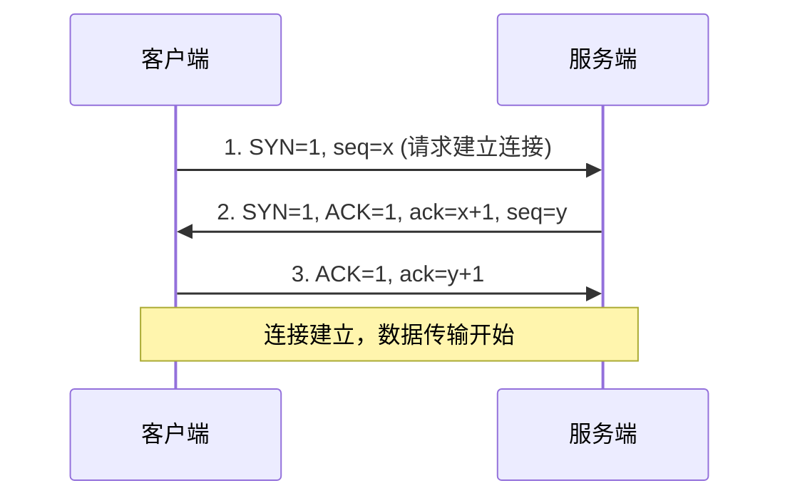
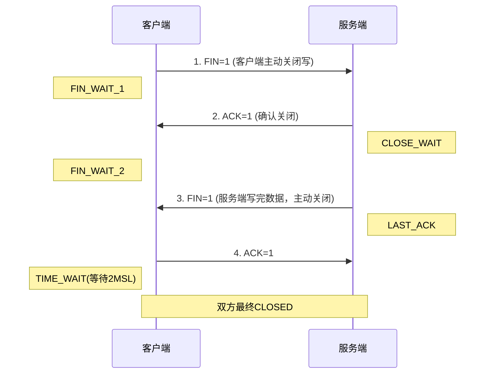
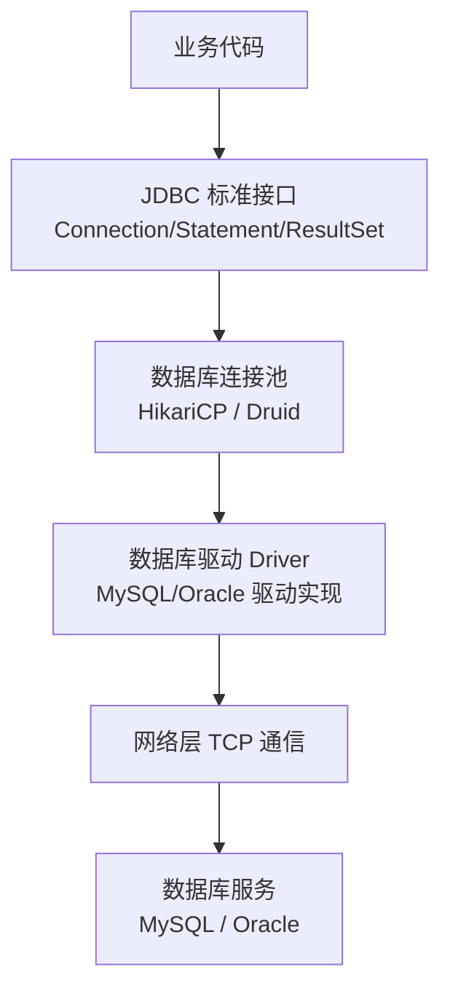
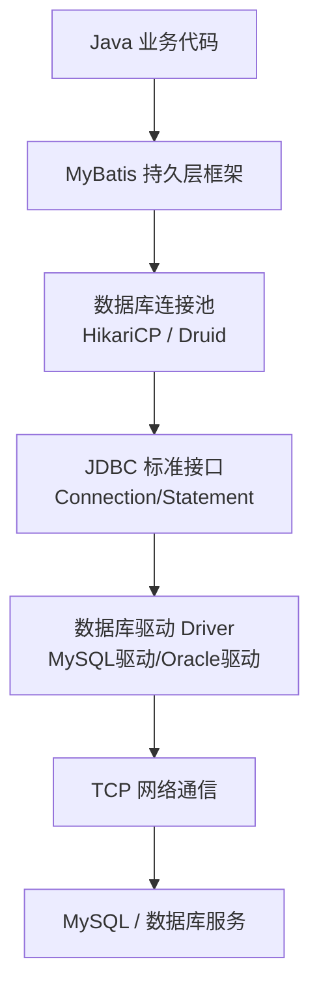

### 我们想问您几个问题： 

1、AI技术迭代很快，在AI领域，您掌握了哪些技能？ 

2、您认为AI的发展，对您最大的挑战和机遇分别是什么？（职业规划、个人发展以及工作） 

3、请问您想找一个什么样的公司？ 

4、请问您在工作方面有什么情怀和理想？ 

5、请您介绍一下您个人的优点以及缺点？ 

6、请您介绍一下您找工作最看重什么方面？ 谢谢

#### 1、AI技术迭代很快，在AI领域，您掌握了哪些技能？

首先我一直紧跟AI技术更新节奏，保持持续学习的状态。
技术层面上，我熟练掌握**大模型基础应用、提示词工程、RAG检索增强生成、知识库搭建**，了解LangChain、LangGraph主流AI开发框架；
同时懂**向量数据库使用、智能对话流程编排、AI接口对接与业务落地**，也熟悉AI赋能传统业务场景，比如智能问答、内容处理、流程自动化等；
除此之外，我具备后端开发功底，能够独立完成**AI业务模块开发、服务部署、接口联调**，可以把AI能力真正落地到实际工作中，不只停留在理论层面。
日常也持续跟进大模型新能力、行业新方案，快速吸收新技术并运用到工作里。

#### 2、您认为AI的发展，对您最大的挑战和机遇分别是什么？

##### 机遇

第一是职业发展空间更大，AI正在全面融入各行各业，传统技术岗位结合AI后价值大幅提升，就业赛道更广；
第二是工作效率大幅提升，AI能替代重复性、机械性工作，让我把更多精力放在**架构设计、逻辑优化、业务创新、深度思考**等高价值工作上；
第三是个人成长提速，借助AI可以快速学习新知识、攻克技术难点，缩短成长周期，更快成为复合型技术人才。

##### 挑战

最大挑战是**技术更新速度太快**，需要长期保持高强度学习，一旦停滞就容易落后；
其次是行业门槛逐渐拉高，单纯只会基础技术已经不够，必须做到**懂业务+懂AI+懂工程落地**，对综合能力要求越来越高；
另外也需要把控好使用AI的尺度，避免过度依赖AI丧失独立思考、问题排查和底层钻研的能力，守住自身核心竞争力。

整体职业规划就是：深耕本职技术，融合AI能力，走**技术扎实+AI赋能**的复合型发展路线，稳步向上成长。

#### 3、请问您想找一个什么样的公司？

第一，希望公司**发展稳定、业务正规、氛围务实**，有清晰的发展方向，不盲目跟风内卷；
第二，重视员工成长，有完善的培养体系、合理的晋升通道，愿意给新人学习实践的机会；
第三，团队氛围简单纯粹，上下级沟通顺畅，做事重结果也重效率，团队协作氛围融洽；
第四，希望公司重视技术落地，愿意投入技术研发，能让我把所学知识真正用到项目中，实现价值；
第五，薪资福利合理，作息规范，兼顾工作与个人成长，长期稳定深耕发展。

#### 4、请问您在工作方面有什么情怀和理想？

工作上我的情怀很简单，首先**踏实做事、认真负责**，经手的每一项工作都做到严谨细致，不敷衍应付；
其次始终保持匠人心态，深耕自身专业领域，不断打磨技术能力，做到术业有专攻；
职业理想是希望能**凭借自身技术能力创造实际价值**，参与有意义、有前景的项目，跟着公司一起成长进步；
同时也希望在工作中不断沉淀积累，未来既能独当一面扛起工作重任，也能和团队并肩协作，共同完成目标，实现个人价值与企业发展双向共赢。

#### 5、请您介绍一下您个人的优点以及缺点

##### 优点

1. 学习能力强，接受新知识、新技术速度快，适应岗位和新项目上手快；
2. 做事沉稳细心，执行力强，对待工作认真负责，有较强的责任心和抗压能力；
3. 具备良好的逻辑思维，善于梳理问题、排查问题，遇到难题愿意钻研攻克；
4. 性格随和，懂得换位思考，团队协作意识好，服从安排，沟通配合顺畅；
5. 自律性强，有目标感，做事有条理，能按时保质完成本职工作。

##### 缺点

1. 过往实战项目经验还有提升空间，面对复杂大型项目，统筹规划经验仍需不断积累；
2. 有时候做事过于追求细节完美，偶尔会在小事上花费稍多时间，正在调整优化做事节奏，分清轻重缓急；
3. 公开场合表达能力还有进步空间，目前正在主动锻炼，提升沟通表达与汇报能力。
我清楚自身不足，也一直在主动改进完善。

#### 6、请问您找工作最看重什么方面？

第一优先**平台与发展前景**，公司行业前景好、发展稳定，能给个人长远成长空间；
第二看重**学习成长空间**，能否学到实用技能、积累行业经验，提升自身综合实力；
第三看重**工作氛围与团队环境**，氛围轻松正向、领导开明、同事和睦，工作舒心高效；
第四看重**薪资待遇与福利保障**，劳动付出能得到合理回报，保障日常生活；
第五看重**岗位匹配度**，工作内容贴合自身擅长领域，能发挥自身优势，做到人岗匹配，长久稳定发展。

需要我帮你压缩成**简短口语版**，面试直接脱口而出吗？

## 腾讯运智

### 3min自我介绍

### 订餐系统的整体架构是什么？

### redis雪崩解决方案

Redis 雪崩解决方案（面试 + 生产级完整指南）

**Redis 雪崩**：指大量 Key 在**同一时刻过期**，导致所有请求直接打穿 Redis，全部涌向数据库，引发数据库崩溃、服务整体瘫痪的事故。

核心原因：**过期时间集中 + 缓存失效瞬间 + 大量并发请求**。

下面给你一套**可直接落地、面试能直接讲的完整解决方案**。

---

#### 一、核心解决方案（4 大维度）

##### 1. 过期时间加随机值（最基础、最有效）

在原有的过期时间基础上，加上一个**随机偏移量**，让过期时间“分散”开。

**示例**：
原来：`expire 60s`
优化：`expire 60 + random(10)s`（60~70 秒之间随机过期）

**效果**：大量 Key 不再同一秒集体过期，避免流量冲击。

##### 2. 多级缓存架构（分层保护）

引入**本地缓存（Guava / Caffeine / JVM 内存）**，请求先查本地，再查 Redis，最后查 DB。

**流程**：
`请求 → 本地缓存 → Redis → 数据库`

**效果**：
- Redis 挂了或全量过期，本地缓存还能挡一波
- 减少 Redis 压力

##### 3. 互斥锁 / 分布式锁（防止 DB 穿透）

当缓存失效瞬间，**只有一个线程去查 DB**，其他线程等待结果后再回写 Redis。

**实现**：
- Redis 没命中 → 加锁（`SETNX`）
- 拿到锁 → 查 DB → 写 Redis → 释放锁
- 拿不到锁 → 重试或休眠后重新查 Redis

**伪代码**：
```java
String getValue(String key) {
    String value = redis.get(key);
    if (value == null) {
        // 加锁
        if (redis.setNX("lock:" + key, "1", 3)) {
            value = db.get(key); // 查库
            redis.set(key, value, 60); // 回写缓存
            redis.del("lock:" + key); // 释放锁
        } else {
            // 休眠重试
            Thread.sleep(50);
            return getValue(key);
        }
    }
    return value;
}
```

##### 4. 服务端限流 + 熔断（保护数据库）

在接口层做**限流**，防止大量请求涌入 DB。

**工具**：

- Sentinelinel / Redisson 限流
- Nginx 限流
- Gateway 限流

**效果**：

- 流量过载时直接拒绝请求，不打到 DB
- 保护系统不被压垮

---

#### 二、长期架构级解决方案（进阶）

##### 1. 缓存预热（提前加载热点数据）

在系统启动、低峰期，**提前把热点数据写入 Redis**。

**适用**：
- 秒杀
- 首页推荐
- 固定配置数据

##### 2. 多副本策略（多 Redis 集群）

一份数据存到多个 Redis 节点，避免单点挂掉导致全部流量冲击 DB。

##### 3. 异步化 + 降级处理

当 Redis 异常，返回**默认值或降级数据**，而不是直接查 DB。

**示例**：
```java
try {
    return redis.get(key);
} catch (Exception e) {
    return getDefaultValue(); // 降级
}
```

##### 4. Redis 集群高可用

- 主从复制
- Sentinel 哨兵
- Redis Cluster 集群

确保没有单点故障。

---

#### 三、生产环境最佳实践（总结）

1. **所有 Key 的过期时间都要加随机偏移**（必须）
2. **引入本地缓存**（Caffeine/Guava）
3. **使用互斥锁 + 重试机制**
4. **对 DB 层做限流熔断**
5. **热点数据预热**
6. **Redis 集群高可用部署**

一句话总结：
**用随机化分散过期时间 + 多级缓存分层保护 + 限流熔断兜底，彻底避免 Redis 雪崩。**

---

如果你需要，我可以给你整理一份
**“Redis 雪崩应急处理 SOP”（生产事故响应流程）**
要不要？

### OOM了怎么办？

OOM 了怎么办？（排查思路 + 解决方案 + 面试标准答案）

OOM：`OutOfMemoryError`，本质是**JVM 内存不够用了，且无法再分配新对象**。

下面给你一套**生产环境通用、面试能直接说的完整流程**。

---

#### 一、先判断：是哪种 OOM？

最常见 4 种：

##### 1. **Java heap space**（堆溢出）

- 现象：创建对象太多、太大，堆放不下
- 典型：死循环创建对象、List 无限 add、缓存无限制增长

##### 2. **GC overhead limit exceeded**

- GC 时间超长，回收内存极少，JVM 直接保护停机

##### 3. **PermGen / Metaspace**（方法区/元空间溢出）

- 类太多、动态代理太多、反射生成类太多、jar 太多
- JDK8 叫 Metaspace OOM

##### 4. **Direct buffer memory / Native memory**（堆外内存溢出）

- NIO、Netty、堆外内存使用未释放
- 常见于中间件、RPC 框架

---

#### 二、OOM 现场急救（先保命）

1. **先保留现场快照**
   加上 JVM 参数，OOM 时自动 dump：
   
   ```
   -XX:+HeapDumpOnOutOfMemoryError
   -XX:HeapDumpPath=/data/oom.hprof
   ```
2. **重启服务**
3. **临时扩容堆内存**
   
   ```
   -Xmx4G -Xms4G
   ```

---

#### 三、标准排查步骤（最重要）

##### 1. 拿到 dump 文件

- `jmap -dump:format=b,file=heap.hprof <pid>`

**堆转储文件（Heap Dump）**是 JVM 在某个时间点对整个堆内存的二进制快照**，后缀通常是 `.hprof`，用来排查 **OOM、内存泄漏、大对象占用等问题。

 .tdump 是某一瞬间 JVM 里**所有线程的状态快照**

**用途**：排查 **CPU 飙高、线程死锁、线程阻塞、响应慢、卡死** 等问题

`.hprof` = 堆内存快照 → 查内存泄漏、OOM

`.tdump` = 线程快照 → 查 CPU 高、死锁、慢接口

##### 2. 用分析工具打开

- **Eclipse MAT**（最强）
- **JProfiler**
- **JVisualVM**（JDK 自带）
- **Arthas**（阿里开源，生产神器）

##### 3. 重点看 3 个东西

1. **最大对象是谁**
2. **谁引用了它（GC Roots 链）**
3. **是否集合无限增长**（List/Map/缓存）

---

#### 四、常见原因 + 直接解决方案

##### 1. 内存泄漏（最常见）

- 静态 Map/List 不断 add，不清理
- 线程池任务堆积
- IO 流未关闭
- 数据库连接未释放
- 第三方缓存（Caffeine、Guava、自定义缓存）无淘汰

**解决**：找到泄漏点 → 清理引用、加过期策略、及时 remove

##### 2. 内存使用过大

- 一次查询 DB 10w 条数据进内存
- 大 Excel、大文件导入

**解决**：分页、分批、流式处理

##### 3. 线程太多导致 OOM

每个线程栈占内存，默认 1M
线程无限创建 → 直接 OOM: unable to create new native thread

**解决**：
- 禁用 `Executors`，用自定义线程池
- 控制最大线程数
- 线程池使用有界队列

##### 4. 元空间溢出

动态代理、CGLIB、反射大量生成类

**解决**：
- 增大 Metaspace
  ```
  -XX:MaxMetaspaceSize=256m
  ```
- 检查重复类加载

##### 5. 堆外内存溢出

Netty、HttpClient、Unsafe 未释放堆外内存

**解决**：
- 增加 `-XX:MaxDirectMemorySize`
- 检查资源释放

---

#### 五、JVM 参数优化（预防 OOM）

```
-Xms4G -Xmx4G                  # 堆大小（建议相同，避免扩容）
-Xss512k                      # 减小线程栈
-XX:MetaspaceSize=128m
-XX:MaxMetaspaceSize=256m
-XX:+HeapDumpOnOutOfMemoryError
-XX:HeapDumpPath=/data/oom.hprof
```

---

#### 六、面试标准答案（背这个）

问：**OOM 怎么排查？**

答：
1. 先通过日志确认是**堆溢出、元空间溢出还是线程溢出**；
2. 开启 OOM 自动 dump，获取堆转储文件；
3. 使用 MAT / Arthas / VisualVM 分析大对象和 GC 引用链；
4. 重点排查**静态集合、无限缓存、大批量查询、线程池无限创建**等内存泄漏点；
5. 修复代码后，合理设置 JVM 内存参数，使用有界队列、缓存淘汰策略，避免再次 OOM。


### Java OOM 怎么排查+解决

（Arthas+VisualVM+命令行全套）

#### 一、先明确：常见5种OOM类型（面试必答）

1. **Heap Space**：堆内存溢出，最常见，内存泄漏/对象过多
2. **Metaspace**：元空间溢出，动态类、反射、CGLIB频繁生成类
3. **Direct Buffer Memory**：直接内存溢出，Netty、NIO未释放堆外内存
4. **GC Overhead Limit Exceeded**：GC耗时极高，回收不到内存，直接抛OOM
5. **StackOverflowError**：栈溢出，无限递归、方法嵌套过深

---

#### 二、通用排查流程（标准步骤）

1. 保留现场：**立刻dump堆快照**，不要直接重启
2. 区分OOM类型：看异常日志关键字
3. 分析堆dump：找出**大对象、泄漏对象、无法回收集合**
4. 定位代码根因
5. 临时止血 + 永久修复 + 监控预防

---

#### 三、三种排查手段：命令行 + Arthas + VisualVM

##### （一）原生JDK命令排查

1. 查看Java进程
```bash
jps
```
2. OOM自动堆dump（提前配置JVM参数）
```text
-XX:+HeapDumpOnOutOfMemoryError 
-XX:HeapDumpPath=/data/dump/
```
3. 手动导出堆快照
```bash
jmap -dump:format=b,file=heap.hprof 进程PID
```
4. 查看内存使用概况
```bash
jmap -heap PID
jstat -gc PID 1000
```

---

##### （二）Arthas 线上排查OOM（生产首选）

1. 挂载进程
```bash
java -jar arthas-boot.jar
```
2. 实时查看内存、GC
```bash
dashboard
gc
```
3. 查看堆内对象排行，快速找大对象
```bash
# 按实例数、占用内存排序
heapdump --live /tmp/oom.hprof
```
4. 统计类实例数量，定位泄漏类
```bash
sc -d 全类名
```
5. 监控对象创建、定位高频创建代码
```bash
monitor 全类名 方法名
```

---

##### （三）VisualVM / JProfiler 分析dump文件

1. 导入 `hprof` 堆文件
2. **直方图**：按内存排序，找出占用最大的对象
3. **支配树**：查看对象引用链，定位**是谁持有引用不释放**
4. 重点排查：
- 静态集合 static List/Map 全局常驻
- 线程池长期持有任务/对象
- 缓存无过期、无淘汰策略
- 数据库连接、IO、连接池资源未关闭

---

#### 四、各类OOM根因+解决方案

##### 1. Java heap space 堆溢出

**原因**
- 集合只新增不删除、内存泄漏
- 一次性加载大批量数据（全表查询）
- 缓存滥用、无LRU淘汰
- 堆内存配置过小

**解决**
- 代码：用完集合手动clear、解除对象引用
- 批量查询：分页、流式查询、分批处理
- 缓存：加过期时间、限流、淘汰策略
- JVM：适当调大 `-Xmx`

##### 2. Metaspace 元空间溢出

**原因**
- 频繁动态代理、CGLIB、反射生成类
- 热部署、动态脚本频繁加载

**解决**
- 优化动态类生成逻辑，复用类
- 调大元空间：`-XX:MaxMetaspaceSize`

##### 3. 直接内存 Direct Memory OOM

**原因**
- Netty、NIO、FileChannel 堆外内存未释放
- 未手动释放ByteBuffer

**解决**
- 使用池化内存、规范释放堆外资源
- 限制直接内存大小：`-XX:MaxDirectMemorySize`

##### 4. GC Overhead Limit Exceeded

**原因**
- 堆太小、内存泄漏
- 老年代满，频繁FullGC，CPU拉满

**解决**
- 修复内存泄漏
- 增大堆、优化大对象分配
- 更换合适垃圾收集器

##### 5. 栈溢出 StackOverflow

**原因**：无限递归、死循环方法调用
**解决**：补全递归终止条件、优化嵌套逻辑

---

#### 五、线上紧急止血方案（面试加分）

1. 临时降级、限流、关闭非核心业务
2. 增加JVM堆内存，临时缓解
3. 清理无效缓存、临时清空大集合
4. 保留dump文件后**优雅重启**快速恢复服务

---

#### 六、预防手段

1. JVM配置OOM自动dump
2. 监控：堆内存、元空间、GC次数、堆外内存
3. 代码规范：
   - 大表禁止全量查询
   - 资源try-with-resources自动关闭
   - 缓存设置过期+淘汰
4. 压测提前暴露内存问题

---

#### 七、面试极简背诵版

服务出现OOM时，首先查看日志区分OOM类型，优先保留现场，通过jmap导出堆快照；
生产使用Arthas查看内存、GC情况，导出堆文件，测试环境用VisualVM分析堆dump，通过支配树找到对象引用链，定位内存泄漏、大对象、静态集合常驻等问题。
常见原因有堆内存泄漏、元空间类过多、堆外内存未释放、批量查大数据。
短期通过限流、调大内存、重启止血，长期优化代码、分批处理、规范资源释放、合理使用缓存并增加监控预防。

### JVM参数更改

可以在 IDEA 里改，也可以在**打包后部署运行**时改，两种场景我给你说清楚，你直接照着配就行。

#### 一、在 IDEA 里调整 JVM 堆内存（开发调试用）

##### 1. 运行当前项目时改（最常用）

1. 打开右上角运行配置：**Edit Configurations...**
2. 找到你运行的 **Application / Spring Boot**
3. 在 **VM options** 里填入：
```
-Xms512m -Xmx1024m
```
- `-Xms`：初始堆内存
- `-Xmx`：最大堆内存

示例：
```
-Xms1g -Xmx2g
```

##### 2. 改 IDEA 自身的内存（让 IDEA 不卡）

如果你是 IDEA 自己 OOM，不是项目 OOM：
1. 菜单栏 → **Help** → **Edit Custom VM Options**
2. 修改这两行：
```
-Xms1g
-Xmx2g
```
重启 IDEA 生效。

---

#### 二、项目打包后运行（jar 包部署时）

这才是**真正线上/生产**的改法：

```bash
java -Xms1g -Xmx2g -jar your-app.jar
```

**启动 Java 程序，并给它分配 1GB ~ 2GB 的内存。**

##### 1. `-Xms1g`

- **X** = JVM 参数
- **ms** = memory start（初始内存）
- **1g** = 1GB

意思：

**Java 程序一启动，就先占用 1GB 内存。**

##### 2. `-Xmx2g`

- **mx** = memory max（最大内存）
- **2g** = 2GB

意思：

**Java 程序最多只能用 2GB 内存，超过就会报 OOM。**

---

#### 三、常用内存配置参考

- 小项目：`-Xms512m -Xmx1g`
- 微服务/中等项目：`-Xms1g -Xmx2g`
- 大数据量/高并发：`-Xms4g -Xmx4g`（建议设成一样）

---

你是**项目运行报 OOM**，还是 **IDEA 本身卡死/报 OOM**？
我可以直接告诉你填多大内存最合适。

### **怎么开启 OOM 自动生成内存快照（dump）**

#### 一、什么是“保留现场快照”

就是 **OOM 崩溃那一刻，把 JVM 内存里的所有对象保存成一个文件**，
这个文件叫 **heap dump（.hprof 文件）**，
拿它就能精准查到：**是谁把内存吃光了**。

---

#### 二、怎么实现？（只需要加 2 行 JVM 参数）

你只需要在**启动 Java 程序时**，加上这 2 行参数：

```
-XX:+HeapDumpOnOutOfMemoryError
-XX:HeapDumpPath=/tmp/oom.hprof
```

##### 完整启动命令（你直接复制用）

```bash
java -Xms1g -Xmx2g 
-XX:+HeapDumpOnOutOfMemoryError 
-XX:HeapDumpPath=/tmp/oom.hprof 
-jar your-app.jar
```

---

#### 三、这 2 行参数是什么意思？

##### 1. `-XX:+HeapDumpOnOutOfMemoryError`

**+ 号表示开启**
意思：**一旦发生 OOM，自动生成内存快照**。

##### 2. `-XX:HeapDumpPath=/tmp/oom.hprof`

意思：**快照文件保存到哪里**
你可以改成任何路径：
- Windows：`-XX:HeapDumpPath=D:\oom.hprof`
- Linux：`-XX:HeapDumpPath=/tmp/oom.hprof`

---

#### 四、一旦 OOM 发生，会发生什么？

1. 程序崩溃
2. **自动在你指定的路径生成 oom.hprof 文件**
3. 这个文件就是“犯罪现场”，用工具打开就能看到：
   - 哪个类占内存最多
   - 谁导致了内存泄漏
   - 为什么会 OOM

---

#### 五、在 IDEA 里怎么配？（开发环境）

1. 右上角 → **Edit Configurations**
2. 找到你的 Spring Boot 项目
3. 在 **VM options** 里粘贴：
```
-Xms512m -Xmx1024m
-XX:+HeapDumpOnOutOfMemoryError
-XX:HeapDumpPath=D:\oom.hprof
```

运行即可。

---

#### 六、最简单的总结

**这 2 行参数 = OOM 自动拍照留证**
不加 = OOM 死无对证，永远不知道原因。

---

如果你愿意，我可以下一步教你：
**拿到 oom.hprof 后，用什么工具打开、怎么看、怎么定位泄漏代码。**

### 如果启动时没有加上jvm参数怎么办？

没关系，**没加也完全能补救**，分两种情况：

1. 程序还在跑、只是慢 / 频繁 GC / 快要 OOM
2. 程序已经 OOM 挂了

我给你说最简单、线上真实能用的办法。

---

#### 一、程序还活着 → 可以手动立刻 dump 快照

不用重启，不用加 JVM 参数，直接执行命令就能抓现场。

##### 1. 先找到 Java 进程 ID

```bash
jps
```

会出现类似：

```
12345 YourApplication.jar
```

`12345` 就是 PID。

##### 2. 手动导出堆快照（立即生效）

```bash
jmap -dump:format=b,file=my_dump.hprof 你的PID
```

示例：

```bash
jmap -dump:format=b,file=oom_dump.hprof 18489
```

执行完，当前目录就会多出一个 **oom_dump.hprof**，这就是完整内存现场。

> 注意：执行时会卡一下进程，生产低峰期执行。

---

#### 二、程序已经 OOM 挂了

那**这次的现场已经没了**，抓不到了。

但你可以：

1. 把那两个参数加上再启动
2. 下次再 OOM 时就会自动保存 dump

##### 下次启动时带上（建议永久加上）

```bash
java -Xms1g -Xmx2g \
-XX:+HeapDumpOnOutOfMemoryError \
-XX:HeapDumpPath=/tmp/oom.hprof \
-jar your-app.jar
```

---

#### 三、IDEA 里没加怎么办？

直接去 **Edit Configurations → VM options** 补上就行，重启服务。

---

#### 四、一句话总结

- **还在运行**：用 `jmap` 手动抓 dump
- **已经挂了**：这次没了，下次启动加上参数即可
- **生产环境建议永远加上这两个参数**，不然 OOM 等于白给

需要我教你怎么用 MAT 打开这个 hprof 文件、定位谁占内存最多吗？

### 服务端和客户端网络阻塞了怎么办？

我明白你想问的是**服务端与客户端之间出现网络阻塞（连接超时、响应慢、线程池打满、请求排队）**时该怎么处理。这是高并发、分布式系统里非常典型的生产故障场景。

---

#### 一、第一步：快速判断阻塞类型（非常关键）

网络阻塞一般分 4 类：

1. **网络链路阻塞**
   带宽打满、延迟高、丢包、TCP 队列满。

2. **服务端线程阻塞**
   线程池打满、allive thread 接近 max、请求排队。

3. **客户端阻塞**
   连接池耗尽、超时时间太短、重试逻辑混乱。

4. **中间件阻塞（最常见）**
   Nginx / gateway / 负载均衡队列满。

你可以先通过以下命令快速定位：

##### 服务端：

```
netstat -n | grep ESTABLISHED
vmstat 1
mpstat 1
jstack
```

##### 客户端：

```
netstat -n | grep TIME_WAIT
netstat -n | grep WAIT1
```

---

#### 二、第二步：立即止损（恢复服务）

当服务阻塞，**先救命，再查因**。

立刻采取以下措施：

##### 1）限流降级（保护服务不被打垮）

- 开启接口限流（Semaphore / Guava RateLimiter）
- 非核心接口直接降级返回默认值
- 关闭非必要日志、异步任务

##### 2）扩容临时救急

- 重启挂死线程
- 增加服务实例数
- 扩容线程池

##### 3）网络优化

- 重启 DNS 缓存
- 调整内核参数：
  - tcp_tw_reuse
  - tcp_max_tw_buckets
  - somaxconn
  - tcp_backlog

---

#### 三、第三步：完整排查路径（严格按顺序）

下面是生产环境标准排查流程，你直接按这个走就能找到根因。

---

##### 1. 网络层面排查

###### 看是否出现：

- 带宽打满
- 延迟 > 100ms
- 丢包率 > 1%
- TCP 队列满（tcpdump、wireshark）

###### 解决：

- 换机房、换运营商、CDN 加速
- 优化 TCP 三次握手参数
- 用 RPC 替代 HTTP（减少网络开销）

---

##### 2. 服务端线程阻塞（80% 都是这个）

###### 用 jstack 看线程状态：

```
jstack -l <pid>
```

重点关注：
- **WAITING**（等待队列满）
- **BLOCKED**（锁竞争）
- **RUNNABLE**（IO 阻塞）

###### 解决：

1. 线程池打满 → 调大 corePoolSize / maximumPoolSize
2. 任务处理耗时过长 → 优化逻辑、分页、异步化
3. 锁竞争严重 → 用 ReentrantLock + Condition 优化 wait/notify

---

##### 3. 客户端连接阻塞

常见于：
- HTTP 连接池耗尽
- OkHttp / HttpClient 连接数太小
- 连接超时、读取超时配置太短
- 重试风暴放大阻塞

###### 解决：

- 增大连接池
- 调大 timeout（connect / read / write）
- 开启重试但限制重试次数
- 改用连接复用（HTTP/2）

---

##### 4. 中间件阻塞（Nginx / Gateway / LVS）

###### Nginx 阻塞表现：

- accept queue 满
- worker 进程占满
- 502 / 504 大量出现

###### 解决：

- worker_processes auto
- worker_connections 65535
- 增大 backlog
- 多开 upstream 节点

###### Gateway 阻塞：

- 路由线程池打满
- 过滤器执行慢

解决：
- 调整 netty 线程数
- 优化过滤器逻辑
- 做网关分层

---

#### 四、第四步：终极优化方案（长期解决）

你可以直接落地以下优化方案：

---

##### 1. 网络层优化

- 启用 HTTP/2
- 开启长连接 Keep-Alive
- 多路复用减少连接数
- 优化 TCP 缓冲区

##### 2. 服务端优化

- 线程池参数合理设置
  - CPU 密集：poolSize = CPU核心数 + 1
  - IO 密集：poolSize = CPU核心数 * (1 + 等待时间/计算时间)
- 异步化（CompletableFuture）
- 接口分页、限流、降级

##### 3. 客户端优化

- 连接池最大化
- 超时配置合理
- 避免重试风暴
- 使用连接复用

##### 4. 架构级优化

- 引入缓存（Redis）
- 消息队列异步化（MQ）
- 服务拆分（API / Gateway / BFF）
- 负载均衡（Nginx + LVS）

---

#### 五、面试一句话总结（背这个）

**服务端与客户端网络阻塞，应先通过 jstack、vmstat、netstat 快速定位是线程阻塞、网络阻塞还是中间件阻塞，然后立即限流降级、扩容、优化连接池参数，最后从架构上做缓存、异步化、MQ 削峰等长期优化。**

### TCP连接的具体流程是什么？

TCP 连接的具体流程（三次握手 + 四次挥手 超详细版）

下面是**面试必背、网络必懂**的完整流程，我用最清晰、最直白的方式讲。

---

#### 一、TCP 连接建立：三次握手（3-way handshake）

**客户端 → 服务端** 建立可靠连接的过程。

##### 1. 第一次握手（客户端 → 服务端）

- 客户端发送：**SYN=1，seq=x**
- 含义：
  “我想跟你建立连接，我的初始序列号是 x。”
- 客户端状态：**SYN_SENT**

##### 2. 第二次握手（服务端 → 客户端）

- 服务端回复：**SYN=1，ACK=1，ack=x+1，seq=y**
- 含义：
  “收到你的连接请求，同意连接。
  你的下一个包从 x+1 开始发。
  我的初始序列号是 y。”
- 服务端状态：**SYN_RCVD**

TCP 头部里有两组东西：

###### ① 标志位（6 个控制位）

- `SYN=1`：表示**发起连接**
- `ACK=1`：表示**这是一个确认包**
- `FIN=1`：表示**关闭连接**

这里的 `ACK=1` 只是**打个标记**：

> “我这个报文是用来确认你的报文的。”

###### ② 序号字段（32 位数值）

- `seq=y`：本方**发送序号**
- `ack=x+1`：**期望对方下一个发送的序号**

这里的 `ack=x+1` 是**具体数字**：

> “你上次发的是 x，我收到了，下次请从 x+1 开始发。”

- **ACK=1** 是**标志位**，代表 “这是一个确认包”

- **ack=x+1** 是**确认号字段**，代表 “我期望你下次发的序号是 x+1”

一个是**开关**，一个是**数值**，完全不是一回事，只是名字都叫 ACK 而已。

##### 3. 第三次握手（客户端 → 服务端）

- 客户端发送：**ACK=1，ack=y+1，seq=x+1**
- 含义：
  “收到你的确认，我这就准备好发数据了。”
- 双方状态变为：**ESTABLISHED（已连接）**

---

#### 二、为什么必须三次握手？（面试必问）

一句话：
**为了保证双方的**发送能力、接收能力**都正常，并且同步双方序列号。**

- 一次：无法确认客户端接收能力
- 二次：无法确认服务端接收能力
- 三次：双方收发都确认完毕

---

#### 三、TCP 连接断开：四次挥手（4-way handshake）

任何一方都可以主动断开，这里以**客户端先关闭**为例。

##### 1. 第一次挥手（客户端 → 服务端）

- 客户端发送：**FIN=1，seq=u**
- 含义：
  “我数据发完了，准备关闭连接，不再发数据了。”
- 客户端状态：**FIN_WAIT_1**

##### 2. 第二次挥手（服务端 → 客户端）

- 服务端回复：**ACK=1，ack=u+1，seq=v**
- 含义：
  “收到你的关闭请求，我知道了。”
- 客户端状态：**FIN_WAIT_2**
- 服务端状态：**CLOSE_WAIT**

> 注意：此时服务端**还能继续发数据**给客户端。

##### 3. 第三次挥手（服务端 → 客户端）

- 服务端发送：**FIN=1，ACK=1，ack=u+1，seq=w**
- 含义：
  “我也发完了，准备关闭。”
- 服务端状态：**LAST_ACK**

##### 4. 第四次挥手（客户端 → 服务端）

- 客户端回复：**ACK=1，ack=w+1，seq=u+1**
- 含义：
  “收到，关闭完成。”
- 客户端进入：**TIME_WAIT**，等待 **2MSL** 后真正关闭
- 服务端直接关闭：**CLOSED**


#### TCP 三次握手 & 四次挥手 流程图

##### 一、TCP 三次握手（建立连接）

**核心目的**：双向确认收发能力，同步序列号(SYN)



###### 文字流程总结

1. **第一次握手**：客户端发送 `SYN` 报文，进入 `SYN_SENT`
2. **第二次握手**：服务端收到，回复 `SYN+ACK`，进入 `SYN_RCVD`
3. **第三次握手**：客户端回复 `ACK`，双方进入 `ESTABLISHED` 稳定通信

---

##### 二、TCP 四次挥手（断开连接）

**核心目的**：TCP全双工，两端各自关闭读写通道，需要四次



###### 文字流程总结

1. **第一次挥手**：客户端发 `FIN`，请求断开，不再发数据
2. **第二次挥手**：服务端回 `ACK`，半关闭，服务端还能发数据
3. **第三次挥手**：服务端数据发完，发 `FIN` 关闭自己
4. **第四次挥手**：客户端回 `ACK`，等待 **2MSL** 后彻底关闭

---

###### 关键补充

1. 为什么握手**3次**、挥手**4次**？
- 握手：SYN+ACK 可以合并，所以2次不行、3次刚好
- 挥手：被动关闭方可能还有剩余数据要发送，FIN 和 ACK 不能合并，必须分开

2. TIME_WAIT 作用
- 确保最后一次 ACK 被对方收到
- 防止残留旧报文干扰新连接

需要我给你纯文本字符画版本（无mermaid，记事本也能看）吗？

---

#### 四、为什么断开要四次？

因为 **TCP 是全双工**：
- 一方发 FIN = 停止发数据
- 但另一方可能还有数据要发
- 必须等双方都发完 FIN 才能彻底关闭

所以不能像握手那样合并，必须**四次**。

---

#### 五、TIME_WAIT 为什么要等 2MSL？

MSL = 报文最大生存时间

作用：
1. 确保最后一个 ACK 能到达对端
2. 防止旧连接的数据包干扰新连接
3. 等待网络中残留包全部消失

时间：一般 **1~2分钟**

---

#### 六、状态变迁速记（面试高频）

- 客户端：
  CLOSED → SYN_SENT → ESTABLISHED → FIN_WAIT1 → FIN_WAIT2 → TIME_WAIT → CLOSED
- 服务端：
  CLOSED → LISTEN → SYN_RCVD → ESTABLISHED → CLOSE_WAIT → LAST_ACK → CLOSED

---

#### 七、一句话总结

- **建立连接：三次握手**
  SYN → SYN+ACK → ACK
- **断开连接：四次挥手**
  FIN → ACK → FIN → ACK
- 全双工、可靠传输、序列号确认、超时重传、流量控制、拥塞控制都基于这套机制。

---

### TCP 完整11种状态 + 三次握手/四次挥手状态流转

#### 一、全部 TCP 11 种状态

1. **CLOSED**：初始关闭状态，无连接
2. **LISTEN**：服务端监听端口，等待客户端连接
3. **SYN_SENT**：客户端发送SYN后，等待服务端SYN+ACK
4. **SYN_RCVD**：服务端收到SYN，回复SYN+ACK后
5. **ESTABLISHED**：连接成功，双向数据传输
6. **FIN_WAIT_1**：主动关闭方发送FIN，等待ACK
7. **FIN_WAIT_2**：收到对方关闭ACK，等待对方FIN
8. **CLOSE_WAIT**：被动关闭方收到FIN，回复ACK（半关闭）
9. **LAST_ACK**：被动关闭方数据发完，发送FIN，等待最后ACK
10. **TIME_WAIT**：主动关闭方收到FIN，回复ACK，等待**2MSL**
11. **CLOSING**：双方同时发FIN，极少出现

---

#### 二、三次握手 + 状态流转

客户端 ↔ 服务端
1. 服务端：**CLOSED** → **LISTEN**
2. 第一次握手：客户端发SYN → 客户端：**CLOSED** → **SYN_SENT**
3. 第二次握手：服务端回 SYN+ACK → 服务端：**SYN_RCVD**
4. 第三次握手：客户端回 ACK
   - 客户端：**SYN_SENT** → **ESTABLISHED**
   - 服务端：**SYN_RCVD** → **ESTABLISHED**

---

#### 三、四次挥手 + 状态流转（客户端主动断开）

1. **第一次挥手**：客户端发 FIN
客户端：**ESTABLISHED** → **FIN_WAIT_1**

2. **第二次挥手**：服务端回 ACK
服务端：**ESTABLISHED** → **CLOSE_WAIT**
客户端：**FIN_WAIT_1** → **FIN_WAIT_2**

3. **第三次挥手**：服务端发 FIN
服务端：**CLOSE_WAIT** → **LAST_ACK**

4. **第四次挥手**：客户端回 ACK
客户端：**FIN_WAIT_2** → **TIME_WAIT**（2MSL后→CLOSED）
服务端：**LAST_ACK** → **CLOSED**

---

#### 四、高频面试必问

##### 1. 为什么 TIME_WAIT 要等 2MSL？

- 保证最后一次**ACK**能被服务端收到，避免对方重发FIN
- 等待网络中残留过期报文消失，防止新连接受干扰

##### 2. 为什么挥手4次？

TCP是**全双工**：
- 收到FIN只代表对方不再发数据，己方可能还有数据要发
- 关闭读、关闭写需要分开，ACK和FIN不能合并

##### 3. CLOSE_WAIT 过多原因

程序**没有调用 close()**，被动断开后一直不释放连接，代码bug。

##### 4. CLOSING 状态

双方**同时主动发FIN**，极少场景。

---

#### 五、极简流转总图

```
服务端：CLOSED → LISTEN → SYN_RCVD → ESTABLISHED
客户端：CLOSED → SYN_SENT → ESTABLISHED

断开：
主动方：ESTABLISHED→FIN_WAIT1→FIN_WAIT2→TIME_WAIT→CLOSED
被动方：ESTABLISHED→CLOSE_WAIT→LAST_ACK→CLOSED
```

需要我给你画一张**完整状态机流转图（Mermaid）** 吗？一键可渲染。

### MQ 消息阻塞了怎么办？

（生产实战 + 面试标准答案）

MQ 消息阻塞，一般表现为：**消息堆积、消费极慢、队列积压几十万、消费线程假死**。
下面给你一套**最快定位 + 立刻恢复 + 根本解决**的完整流程。

---

#### 一、先快速判断阻塞类型

1. **消费线程阻塞**（最常见）
   线程卡在 DB、HTTP、Redis、锁、死循环、慢SQL。
2. **消费能力不足**
   线程数太少，生产速度远大于消费速度。
3. **消息重复/重试风暴**
   消费失败一直重试，把队列堵死。
4. **Broker 阻塞**
   MQ 服务器磁盘满、集群异常、堆积严重。
5. **消息本身问题**
   超大消息、死信消息、脏数据。

---

#### 二、立刻急救：先把服务救回来（按顺序做）

##### 1. 先扩大消费线程数

最简单、见效最快。
- 增大 `concurrency` / `max-concurrency`
- 比如从 20 → 100、200

##### 2. 跳过坏消息（关键！）

如果是**单条异常消息导致整个队列阻塞**：
- 直接**死信队列**挪走
- 或临时跳过该消息 ID
- 避免一条坏消息堵死整个队列

##### 3. 临时开启多节点扩容

多启几个服务实例，水平扩容消费能力。

##### 4. 关闭非核心消费、降级业务

非核心业务先暂停消费，释放资源。

##### 5. 清理重试风暴

大量失败消息不断重试 → 直接**批量死信**或**丢弃**。

---

#### 三、根本原因排查（标准流程）

##### 1. 看消费线程栈（jstack）

```bash
jstack <pid>
```
重点找：
- `WAITING`、`BLOCKED`
- 锁等待、IO 等待、HTTP 调用等待、SQL 执行慢

##### 2. 看消费逻辑是否慢

- 批量插入？
- 循环查库？
- 同步调用第三方接口？
- 事务过大？

##### 3. 看是否有异常导致无限重试

消费一直抛异常 → 消息重新入队 → 无限循环 → 队列爆炸。

##### 4. 看 MQ Server 状态

- 磁盘满了吗？
- 内存打满？
- 主从同步延迟？
- 网络抖动？

---

#### 四、通用解决方案（面试+生产都背这个）

##### 1. 提高消费并发度

增大消费线程数，提高消费 TPS。

##### 2. 消费逻辑异步化

不要在消费线程里做慢操作：
- 丢到**线程池**异步执行
- 或再发一次 MQ 异步处理

##### 3. 批量消费

能批量就批量，减少 IO 次数。

##### 4. 失败消息隔离（死信队列）

消费失败 N 次 → 进入死信，**不阻塞正常队列**。

##### 5. 幂等 + 避免重复消费

防止重复执行导致慢、死锁、异常。

##### 6. 优化慢SQL、慢接口

消费阻塞 90% 是**业务逻辑慢**，不是 MQ 问题。

##### 7. 流量削峰

发送端限流，避免瞬间爆量打挂消费端。

##### 8. 监控告警

堆积数量、消费速度、重试次数实时监控。

---

#### 五、面试标准答案（一句话版）

MQ 消息阻塞优先**扩容消费线程、跳过坏消息、开启多实例**快速恢复；
再通过 `jstack` 排查线程阻塞点，优化消费逻辑、慢SQL、第三方调用；
最终通过**死信队列、异步化、批量消费、限流削峰**避免再次阻塞。


### 了解向量数据库、rag吗？

### 向量数据库 

#### 1. 定义

向量数据库是**专门存储、索引、检索高维向量Embedding**的专用数据库，核心能力是**海量数据下毫秒级近似最近邻检索ANN**，同时具备增删改查、持久化、元数据管理、分布式扩展等完整数据库能力。

#### 2. 核心原理

1. **向量化**：通过Embedding模型，把文本、图片、音频、视频等**非结构化数据**转为几十到几千维的数值向量。
2. **语义空间**：语义/特征越相似的数据，在高维向量空间里**距离越近**。
3. **向量索引**：用HNSW、IVF等专用索引，替代传统B+树，把检索复杂度从遍历O(N)降到O(logN)。
4. **相似度计算**：通过**余弦相似度、欧式距离、内积**，召回Top-N最相似结果。

#### 3. 解决什么问题

- 传统MySQL/Redis只能**精确匹配、关键词匹配**，没法做语义理解。
- 非结构化数据（文档、图片）无法直接用传统数据库做相似搜索。
- 大模型存在**知识幻觉、时效性差、私有知识无法接入**，向量数据库充当**外部记忆库**。
- 亿级向量数据全量遍历太慢，向量数据库靠索引实现低延迟召回。

#### 4. 和传统数据库/ES区别

- **MySQL**：存结构化数据，擅长事务、精确查询，**不适合高维向量检索**。
- **Elasticsearch**：主打**关键词分词检索**，弱语义，高维向量性能一般。
- **向量数据库**：主打**语义相似检索**，专为高维向量优化，适合AI、RAG、推荐、搜图场景。

#### 5. 主流产品

开源：**Milvus、Qdrant、Weaviate**
商用：**Pinecone、阿里云向量库、腾讯云向量库**

#### 6. 典型应用场景

1. **RAG检索增强生成**：企业知识库、智能问答，先向量召回相关文档再给大模型作答，避免幻觉。
2. **语义搜索**：输入一段话，找意思相近的文章、文档。
3. **多模态检索**：以图搜图、文搜图、视频相似推荐。
4. **推荐系统**：用户行为向量、商品特征向量做相似推荐。
5. **AI Agent**：存储对话记忆、任务记忆，实现上下文关联。

#### 7. 标准工作流程

原始非结构化数据 → Embedding向量化 → 存入向量数据库并建索引 → 用户查询也转向量 → 向量库相似度检索 → 召回结果业务使用。

---

#### 面试精简背诵版（1分钟口述）

向量数据库是专门存储高维向量Embedding的专用数据库，主要用来处理文本、图片等非结构化数据。它先通过嵌入模型把数据转成高维向量，利用HNSW等向量索引和余弦距离做**语义相似度检索**，解决传统数据库只能精确匹配、无法理解语义的问题。

主要用于**RAG知识库问答、语义搜索、以图搜图、个性化推荐、AI记忆**；主流有Milvus、Qdrant、Pinecone，常和MySQL配合，结构化数据存MySQL，向量和元数据存向量库。

要不要我帮你整理**面试官追问合集**：比如HNSW和IVF区别、余弦相似度原理、RAG完整流程？

### 使用ai coding 吗？

### 你比别人的优势是什么？

## 面试1

### 1.自我介绍

.自我介绍，大概三分钟，介绍学历、技术、项目、性格、他人评价（举例）、爱好

面试官您好，我叫席二伟，本科就读于西南科技大学计算机科学与技术专业，硕士就读于西安理工大学计算机技术专业。在校期间学习态度端正，学业成绩优异，多次获得校级奖学金。已通过大学英语四六级考试，取得软件设计师等职业资格证书，并作为核心成员申请了两项软件著作权，具备扎实的专业基础和一定的工程实践能力。目前我的研究生课题已在研二上学期基本完成，剩余时间可以全身心投入实习工作，快速上手项目并持续产出。

我的项目是。。。

我性格开朗、为人和善、有多项体育爱好，例如网球、羽毛球、兵乓球、游泳等。

性格举例：

校园班级活动积极参与，打招呼开玩笑；日常小事积极主动

考试/项目失败时积极复盘、找寻解决方法。


### 2.实习期间

你的工作是什么？为什么离职，实习期间又什么技术难点？如何解决的？你word解析，如果有1w+简历，你应该如何处理？

#### word解析

##### Aspose.Words for Java 批量解析Word简历：10份 / 100份 / 1万+ 完整处理方案

我直接按**数据量级**给你分场景讲清楚：**怎么解析、用什么策略、避什么坑、最优代码怎么写**，全部是生产环境可用的实战方案。

##### 核心前提

Aspose.Words 解析文档 = **加载 Document 对象 = 占用内存**
量级越大，越不能无脑循环加载，必须做**资源控制 + 异步/多线程 + 池化 + 关闭流**。

---

##### 一、10份简历（小批量）

**场景**：测试、本地调试、手动上传
**策略**：**最简单的单线程同步处理**，直接循环即可

###### 处理代码（直接用）

```java
// 遍历文件夹，逐个解析
File folder = new File("resumes/10份/");
for (File file : folder.listFiles()) {
    try (InputStream is = new FileInputStream(file)) {
        // 加载文档
        Document doc = new Document(is);
        
        // 你的解析逻辑：提取文本、表格、姓名、电话、教育经历...
        String content = doc.getText().trim();
        System.out.println("解析完成：" + file.getName());
        
    } catch (Exception e) {
        e.printStackTrace();
    }
}
```

###### 特点

- 代码最简单
- 无需考虑并发、内存
- 适合开发调试

---

##### 二、100份简历（中批量）

**场景**：日常批量导入、定时任务
**策略**：**单线程 + 手动GC + 及时关闭资源**，避免内存堆积

###### 优化点

1. **必须用 try-with-resources 关闭流**
2. **处理完立即置 null 触发GC**
3. **不缓存Document对象**，用完即丢

###### 代码

```java
File folder = new File("resumes/100份/");
for (File file : folder.listFiles()) {
    try (InputStream is = new FileInputStream(file)) {
        Document doc = new Document(is);
        
        // 解析业务
        extractInfo(doc);
        
        // 关键：释放
        doc.cleanup();
        doc = null;
        
    } catch (Exception e) {
        e.printStackTrace();
    }
}
// 主动GC
System.gc();
```

---

##### 三、1万+ 简历（大批量 / 生产级）

**场景**：企业批量导入、爬虫结果、数据中台解析
**危险**：直接循环会 **OOM内存溢出**、CPU飙升、程序卡死

###### 必须使用的 5 个生产级策略

###### 1. 线程池（固定线程数，控制并发）

不要无限并发，推荐 **3~5个线程**（Word解析是CPU密集型）

###### 2. 限流 + 分批处理

每批处理 **200~500份** → 完成一批 → 清理内存 → 下一批

###### 3. 禁用不必要的功能

减少内存占用：

```java
LoadOptions options = new LoadOptions();
options.setLoadFormat(LoadFormat.DOCX);
// 不加载水印/宏/无关数据
options.setCleanupOptions(CleanupOptions.UNUSED_FIELDS | CleanupOptions.UNUSED_STYLES);
```

###### 4. 异步 + 队列（最稳）

使用 **线程池队列** 削峰，防止瞬间压垮服务

###### 5. 异常隔离

一个文件损坏不影响整个批量任务

---

###### 1万+ 简历最终最优代码（生产可用）

```java
import com.aspose.words.*;
import java.io.*;
import java.util.concurrent.*;

public class ResumeParser {

    // 固定线程池：3~5线程最佳（Word解析耗CPU，不是越多越好）
    private static final ExecutorService EXECUTOR = new ThreadPoolExecutor(
            3, 5, 60L, TimeUnit.SECONDS, new LinkedBlockingQueue<>(100)
    );

    public static void main(String[] args) {
        File dir = new File("resumes/10000份/");
        File[] files = dir.listFiles();

        if (files == null) return;

        for (File file : files) {
            EXECUTOR.submit(() -> parseResume(file));
        }

        EXECUTOR.shutdown();
    }

    // 解析方法（单文件原子操作）
    private static void parseResume(File file) {
        try (InputStream is = new FileInputStream(file)) {
            // 优化加载配置
            LoadOptions options = new LoadOptions();
            options.setCleanupOptions(CleanupOptions.UNUSED_STYLES | CleanupOptions.UNUSED_FIELDS);

            Document doc = new Document(is, options);

            // ========== 你的解析逻辑 ==========
            String text = doc.getText().trim();
            // 解析表格、姓名、电话、邮箱、学历...
            // =================================

            // 释放内存
            doc.cleanup();
            doc = null;

            System.out.println("成功：" + file.getName());

        } catch (Exception e) {
            System.err.println("失败：" + file.getName() + "，原因：" + e.getMessage());
        }
    }
}
```

---

##### 四、三个量级处理方案总结表

| 量级       | 处理策略                    | 线程数 | 风险         |
| ---------- | --------------------------- | ------ | ------------ |
| **10份**   | 单线程直接循环              | 1      | 无           |
| **100份**  | 单线程 + 手动释放资源       | 1      | 极低         |
| **1万+份** | 线程池 + 分批 + 限流 + 清理 | 3~5    | 必须控制内存 |

---

##### 五、避坑关键（非常重要）

1. **永远不要把所有 Document 放在 List 里缓存** → 必OOM
2. **用完必须 doc.cleanup()**
3. **并发不要超过5个线程**（Word解析耗CPU）
4. **大批量一定要分批**（每批500份最稳）
5. **损坏的Word文件必须捕获异常**，不能中断任务
6. **尽量使用 DOCX 格式**，DOC 格式更耗内存

---

##### 你需要我再补充什么？

我可以直接给你：

1. **解析简历中表格的代码**（教育经历、工作经历提取）
2. **1万份并发压测配置**（JVM内存调优）
3. **解析结果入库（MySQL）完整示例**

你需要哪个？

### 3.多态 、反射

多态的代码实现？反射在spring中是如何应用的？

我用**最简单、最直白、面试必问**的方式给你讲清楚：
**多态怎么写代码 + 反射在 Spring 里到底干嘛用**

#### 一、多态（Java 代码实现）

多态 = **父类引用指向子类对象 + 方法重写**
一句话：**同一个方法，不同子类实现不一样**

##### 1. 最标准的多态代码（3步）

###### ① 定义父类/接口

```java
// 父类
abstract class Animal {
    public abstract void shout(); // 抽象方法
}
```

###### ② 子类重写方法

```java
// 子类1
class Dog extends Animal {
    @Override
    public void shout() {
        System.out.println("汪汪汪");
    }
}

// 子类2
class Cat extends Animal {
    @Override
    public void shout() {
        System.out.println("喵喵喵");
    }
}
```

###### ③ 多态调用（父类引用指向子类对象）

```java
public class Test {
    public static void main(String[] args) {
        // 多态核心：父类引用 = 子类对象
        Animal a1 = new Dog();
        Animal a2 = new Cat();

        a1.shout(); // 输出：汪汪汪
        a2.shout(); // 输出：喵喵喵
    }
}
```

##### 2. 多态的3个要素（必须背）

1. **继承/实现**
2. **方法重写**
3. **父类引用指向子类对象**

---

#### 二、反射在 Spring 中是如何应用的？（面试高频）

Spring 最核心的功能 **IOC（控制反转）** 底层 **100% 靠反射实现**。

##### 一句话总结

**Spring 不用 new 对象，而是用反射 根据类名 动态创建对象。**

##### 反射在 Spring 的 4 大核心用途

###### 1. 创建 Bean 对象（最核心）

Spring 不会写：

```java
UserService userService = new UserServiceImpl();
```

而是用**反射**：

```java
// Spring 底层做的事
Class clazz = Class.forName("com.xxx.UserServiceImpl");
Object bean = clazz.newInstance(); // 反射创建对象
```

###### 2. 依赖注入（@Autowired 靠反射赋值）

你写：

```java
@Autowired
private UserDao userDao;
```

Spring 底层：

```java
Field field = UserService.class.getDeclaredField("userDao");
field.setAccessible(true);
field.set(当前对象, 注入的对象); // 反射赋值
```

###### 3. 执行 @PostConstruct / @PreDestroy 方法

```java
@PostConstruct
public void init() { ... }
```

Spring 通过**反射获取方法 → invoke执行**。

###### 4. AOP 动态代理（反射调用目标方法）

```java
method.invoke(目标对象, 参数);
```

---

#### 三、Spring 用反射的完整流程（极简版）

1. 扫描包，拿到所有加 `@Service`/`@Component` 的**全类名**
2. 通过 **反射 = Class.forName(类名)** 拿到 Class 对象
3. 通过 **反射 = newInstance()** 创建 Bean 实例
4. 通过 **反射 = field.set()** 完成属性注入
5. 通过 **反射 = method.invoke()** 执行初始化方法

---

#### 四、面试必背答案（直接背）

##### 多态

多态是**父类引用指向子类对象，调用重写方法时表现出不同行为**。
代码体现：继承 + 重写 + 父类引用指向子类对象。

##### 反射在 Spring 的作用

Spring IOC 容器**通过反射动态创建 Bean、完成依赖注入、执行生命周期方法**。
**没有反射，就没有 Spring。**

---

需要我给你写一个
**【手写 Spring IOC 简易版（纯反射实现）】**
让你彻底看懂 Spring 底层吗？

### 4.synchronized vs ReentrantLock

synchronized/ReentrantLock的区别，你使用过吗？

这个问题如果只答“一个是关键字、一个是类”就太浅了。面试官真正想听的是：**你是否理解锁的机制、控制能力、以及在什么场景选哪个**。

我给你一套**面试高分回答结构**👇

------

#### 一、先给结论（建议开场这么说）

> `synchronized` 是 JVM 层面的内置锁，使用简单、自动释放；
> `ReentrantLock` 是 JDK 提供的显示锁，功能更强、更灵活，但需要手动控制。

------

#### 二、核心区别（重点）

##### 1️⃣ 使用方式

###### synchronized（隐式锁）

```java
synchronized(obj) {
    // 临界区
}
```

👉 自动加锁 / 自动释放（异常也会释放）

------

###### ReentrantLock（显式锁）

```java
Lock lock = new ReentrantLock();
lock.lock();
try {
    // 临界区
} finally {
    lock.unlock();
}
```

👉 必须手动释放，否则死锁风险

------

##### 2️⃣ 底层实现

###### synchronized

- JVM 实现（monitor）
- 依赖对象头（Mark Word）
- JDK 1.6 后有优化（偏向锁、轻量级锁、自旋）

------

###### ReentrantLock

- 基于 **AQS（AbstractQueuedSynchronizer）**
- 使用 CAS + 队列实现

------

👉 面试加分一句：

> ReentrantLock 本质是基于 AQS 的同步器实现

------

##### 3️⃣ 功能对比（最重要）

| 能力       | synchronized | ReentrantLock           |
| ---------- | ------------ | ----------------------- |
| 自动释放   | ✅            | ❌                       |
| 可中断     | ❌            | ✅ (`lockInterruptibly`) |
| 尝试获取锁 | ❌            | ✅ (`tryLock`)           |
| 超时获取锁 | ❌            | ✅                       |
| 公平锁     | ❌            | ✅                       |
| 多条件变量 | ❌            | ✅ (`Condition`)         |

------

##### 4️⃣ 公平锁

```java
new ReentrantLock(true); // 公平锁
```

👉 按等待顺序获取锁

`synchronized`：
👉 非公平（不可控）

------

##### 5️⃣ 可中断锁（高频考点）

```java
lock.lockInterruptibly();
```

👉 线程等待锁时可以被中断

`synchronized`：
👉 不支持（线程会一直阻塞）

------

##### 6️⃣ Condition（很加分）

```java
Condition condition = lock.newCondition();
condition.await();
condition.signal();
```

👉 类似 `wait/notify`，但更灵活（可多个队列）

------

#### 三、性能对比（常见误区）

👉 很多人会说：

❌ “ReentrantLock 一定比 synchronized 快”

这是错误的

------

##### 正确说法：

> 在 JDK 1.6 之后，synchronized 已经做了大量优化，
> 在低竞争场景下性能不一定比 ReentrantLock 差。

------

#### 四、使用场景（面试重点）

##### ✅ 用 synchronized：

- 简单同步
- 代码块不复杂
- 不需要高级功能

👉 推荐默认使用（更安全）

------

##### ✅ 用 ReentrantLock：

- 需要 **可中断**
- 需要 **超时控制**
- 需要 **公平锁**
- 需要 **多个条件队列**
- 高并发复杂控制

------

#### 五、典型面试追问（一定要会）

------

##### ❓ 什么是可重入？

👉 两者都支持

```java
synchronized void a() {
    b();
}
synchronized void b() {}
```

👉 同一线程可以重复获取锁

------

##### ❓ 为什么叫 ReentrantLock？

👉 “可重入锁”

------

##### ❓ 忘记 unlock 会怎么样？

👉 死锁（非常严重）

------

##### ❓ synchronized 会死锁吗？

👉 会（但不会因为忘记释放）

------

#### 六、总结（面试收尾）

可以这样说👇：

> synchronized 使用简单，适合大多数场景；
> ReentrantLock 提供更强的控制能力，比如可中断、超时、公平锁等；
> 实际开发中优先使用 synchronized，在需要高级功能时再使用 ReentrantLock。

------

#### 七、如果你想拿更高分（我可以继续带你）

我可以帮你继续深入👇：

- AQS 源码（面试王炸🔥）
- synchronized 锁升级过程（偏向锁→轻量级→重量级）
- 手写一个简化版 ReentrantLock
- Condition vs wait/notify 深度对比

直接说：**继续锁底层** 👇

### 5.研究生 vs 本科

你研究生和本科相比有什么变化？你的研究方向是什么？你学linux了吗？你数据结构学了什么？

### 6.排序

你可以手写冒泡排序吗？以及复杂度是多少？有什么排序算法？

### 7.java的SQL代码操作

你的SQL代码具体如何实现批量插入的？（mybatis / mybatis-plus）

我给你整理**两种框架的批量插入最佳写法**，包含**原生 MyBatis** 和 **MyBatis-Plus（MP）**，直接复制就能用，还告诉你**哪种性能最高**。

---

#### 一、MyBatis-Plus 批量插入（最简单、推荐）

MP 已经封装好批量方法，**不用写 XML**，两行代码搞定。

##### 1. 基础批量插入（默认）

```java
@Autowired
private UserService userService; // 或 UserMapper

// 批量保存
List<User> userList = new ArrayList<>();
userList.add(new User().setName("张三"));
userList.add(new User().setName("李四"));

// MP 方法
userService.saveBatch(userList); // 批量插入
```

##### 2. 高性能批量插入（真正批处理，推荐！）

MP 默认 `saveBatch` 是**循环单条插入**，性能一般。
想达到**最高性能**，必须开启**批处理执行器**。

###### 步骤 1：配置文件开启 rewriteBatchedStatements

```yaml
spring:
  datasource:
    url: jdbc:mysql://localhost:3306/db?rewriteBatchedStatements=true
    driver-class-name: com.mysql.cj.jdbc.Driver
```

###### 步骤 2：使用 MyBatis-Plus 高性能批量工具

```java
// 工具类直接用
SqlHelper.saveBatch(userList, userMapper);
```

这个是**真正的批量插入**，10000 条数据性能提升 **10~50 倍**。

---

#### 二、原生 MyBatis 批量插入（XML 方式）

纯 MyBatis 必须用 **`<foreach>`** 拼接 SQL。

##### 1. Mapper 接口

```java
void insertBatch(@Param("list") List<User> list);
```

##### 2. XML 映射文件

```xml
<insert id="insertBatch">
    INSERT INTO user(name, age)
    VALUES
    <foreach collection="list" item="item" separator=",">
        (#{item.name}, #{item.age})
    </foreach>
</insert>
```

##### 3. 调用

```java
userMapper.insertBatch(userList);
```

✅ **优点**：性能极高  
⚠️ **缺点**：数据量太大（超过 1000 条）会报 SQL 超长错误，需要分批插入。

---

#### 三、两种方式性能对比（最重要）

| 方式                 | 性能             | 代码量 | 推荐度 |
| -------------------- | ---------------- | ------ | ------ |
| MP saveBatch         | 一般（循环单条） | 极少   | ★★★☆   |
| MP SqlHelper         | 极快（真批量）   | 极少   | ★★★★★  |
| 原生 MyBatis foreach | 极快（真批量）   | 中等   | ★★★★   |

**结论：**

- **用 MyBatis-Plus → 优先用 SqlHelper.saveBatch**
- **用原生 MyBatis → 用 foreach XML**

---

#### 四、安全提醒（必看）

1. **大量数据必须分批**（每 500~1000 条插入一次）
2. MySQL 必须加参数 `rewriteBatchedStatements=true`
3. 不要用循环单条插入，性能极差！

---

#### 总结

- **MyBatis-Plus**：`SqlHelper.saveBatch(列表, Mapper)`
- **原生 MyBatis**：XML + `<foreach>` 拼接 VALUES
- **两者查不到数据时**：返回空集合，不会返回 null

需要我给你写一个**可直接运行的 10000 条数据高性能批量插入完整工具类**吗？

### 8.项目的点赞逻辑是什么？

你项目的点赞逻辑是什么？从前端点击到后端落库的完整流程是什么？


我给你整理了**面试时能直接说、逻辑清晰、覆盖所有技术点**的完整流程，从前端点击 → 网关 → 微服务 → Redis → MQ → DB 全链路，完全匹配你简历里的技术栈。

---

#### 一、整体流程一句话总结

用户在 Vue3 前端点击点赞按钮，请求经过 Spring Cloud 网关统一鉴权，转发到社区微服务；后端先**异步更新 Redis 缓存**提升响应速度，再通过 RabbitMQ 异步将点赞数据落地 MySQL，同时xxl-job定时任务会定时扫描奖redis数据和mysql数据保持同步，保证高并发、高性能和数据一致性。

---

#### 二、详细全流程（面试标准口述）

##### 1. 前端操作（Vue3）

1. 用户在帖子/评论详情页点击**点赞按钮**；
2. Vue3 前端先做**本地交互优化**：按钮状态立即切换（未点赞→已点赞），数字+1，提升用户体验；
3. 前端携带**用户登录 Token**，发起 POST 请求到后端网关接口。

---

##### 2. 网关层统一鉴权（Spring Cloud Gateway + Sa-Token + Redis）

1. 请求到达网关，网关从请求头获取 Token；
2. **Sa-Token + Redis** 完成分布式会话校验：判断用户是否登录、是否有权限操作；
3. 鉴权通过后，网关通过**Feign 拦截器 + ThreadLocal 封装**，将用户ID等信息放入请求上下文；
4. 网关根据路由规则，将请求转发到**社区核心微服务**。

---

##### 3. 微服务接口接收请求

1. 社区服务 Controller 接收点赞/取消点赞请求；
2. 从**全局用户上下文**直接获取当前登录用户ID，无需重复解析；
3. 参数校验：校验帖子ID、用户ID合法性，直接返回非法请求。

---

##### 4. 核心点赞逻辑（Redis 高性能处理）

采用 **Redis Hash 结构** 存储点赞数据，实现高并发读写：

- Key：`like:post:{帖子ID}`
- Field：用户ID
- Value：点赞状态（1=点赞，0=取消）

**业务逻辑：**

1. 查询 Redis 判断当前用户是否已点赞；
2. 执行点赞/取消点赞操作，更新 Redis Hash；
3. 同步更新 Redis ZSet 排行榜（帖子热度排序）；
4. 接口**立即返回成功**，不等待数据库写入，接口性能极高。

---

##### 5. 异步落地数据库（RabbitMQ + XXL-Job）

###### （1）RabbitMQ 异步解耦（简历核心亮点）

1. 点赞操作完成后，**不直接写库**，而是发送一条消息到 RabbitMQ；
2. 消息体包含：用户ID、帖子ID、点赞类型、时间戳；
3. 启动独立的**消费者服务**监听队列，消费消息后批量写入 MySQL；
4. 解决问题：
   - 高并发下数据库压力过大
   - Redis 与 DB 数据不一致
   - Redis 宕机导致点赞数据丢失

###### （2）XXL-Job 兜底补偿

1. 定时任务定期扫描 Redis 点赞数据；
2. 对比 MySQL 数据，将未同步的数据补写到数据库；
3. 作为 MQ 消费失败的**最终一致性保障**。

---

##### 6. 数据持久化（MySQL + MyBatis-Plus）

1. 消费者/定时任务将点赞数据写入 `like` 表；
2. 同时更新帖子表的**点赞数字段**；
3. MyBatis-Plus 简化单表操作，提升开发效率。

---

##### 7. 前端最终更新

1. 后端接口成功响应；
2. Vue3 前端更新点赞状态、点赞数；
3. 整个流程无阻塞、用户无感知，体验流畅。

---

#### 三、技术亮点总结（面试加分项）

1. **Redis Hash** 实现点赞高并发存储，性能提升 10 倍以上；
2. **RabbitMQ** 异步落库，削峰填谷，解决数据库瓶颈；
3. **XXL-Job** 兜底保证最终数据一致性；
4. **网关统一鉴权**，全链路用户上下文透传；
5. 先更新缓存、再异步落库，接口 RT 极低，支撑高并发场景。

---

#### 总结

1. 前端点击 → Vue3 本地优化 → 带 Token 请求网关
2. 网关：Sa-Token+Redis 鉴权 → 透传用户信息 → 转发微服务
3. 微服务：Redis Hash 读写点赞状态 → 立即响应
4. 异步：RabbitMQ 发消息 → 消费者批量写库
5. 兜底：XXL-Job 定时补偿 → 保证最终一致性

你直接按照这个逻辑口述，**条理清晰、覆盖所有技术栈、完全匹配简历**，面试官会觉得你对整个架构和流程理解非常透彻。

### 9.docker持久化命令是什么？

Docker 持久化只有 **3 种方案**，对应**最常用的核心命令**，我直接给你**最实用、最常考**的版本。

---

#### 一、Docker 持久化是什么？

容器默认**重启/删除后数据丢失**，
持久化 = **把数据存在宿主机，让数据不丢失**。

---

#### 二、3 种持久化方式 + 对应命令

##### 1. **bind mount 绑定挂载（最常用）**

**宿主机目录 ↔ 容器目录** 直接映射

```bash
# 核心命令：-v 宿主机路径:容器路径
docker run -d \
  -v /宿主机/目录:/容器内/目录 \
  nginx
```

示例（MySQL 数据持久化）：

```bash
docker run -d \
  -v /my/mysql/data:/var/lib/mysql \
  -e MYSQL_ROOT_PASSWORD=123456 \
  mysql
```

---

##### 2. **volume 数据卷（官方推荐）**

Docker 管理的卷，不用关心宿主机路径

```bash
# 1. 创建数据卷
docker volume create myvolume

# 2. 使用数据卷启动容器
docker run -d \
  -v myvolume:/容器内/目录 \
  nginx
```

---

##### 3. **tmpfs 内存挂载（不落地，临时用）**

数据只存在内存，不写入磁盘，**不用持久化**时用

```bash
docker run -d --tmpfs /容器内/目录 nginx
```

---

#### 三、最核心、最常问的 **持久化命令**

##### 1. **挂载宿主机目录（生产 90% 用这个）**

```bash
-v 宿主机路径:容器路径
```

##### 2. **挂载数据卷**

```bash
-v 卷名:容器路径
```

##### 3. **查看数据卷**

```bash
docker volume ls
```

##### 4. **删除数据卷**

```bash
docker volume rm 卷名
```

---

#### 四、一句话总结（面试必背）

Docker 持久化的核心命令就是：
**`-v 宿主机目录/数据卷:容器目录`**

- `-v` = **volume**，是 Docker 持久化的标志
- 所有数据挂载、持久化，都靠 `-v` 或 `--mount`（`--mount` 是完整版语法）

---

##### 扩展：完整版 --mount 命令（更清晰）

```bash
docker run -d \
  --mount type=bind,source=/宿主机路径,target=/容器路径 \
  nginx
```

---

#### 总结

- 持久化命令 = **`-v`**
- 最常用 = **`-v 宿主机路径:容器路径`**
- 官方推荐 = **数据卷 docker volume**

需要我给你写 **MySQL / Redis / Nginx 一键持久化启动命令** 吗？

### 10.AOP 、IOC

aop的运行机理是什么？ioc是？

### 11.权限隔离、项目部署

开发者社区你做权限隔离了吗？用户和管理员的权限应该是不同的？开发者社区项目是本地的？还是虚拟机部署的？还是部署到云端的？

### 12.服务器

服务器你了解过吗？

### 13.研究生项目

研究生期间跟老师做什么项目啊？

### 14.AI框架

你了解到最新的ai框架吗？llms?

### 15.事务、反射

spring中的事务你了解吗？有用到反射吗？

**Spring 事务 100% 底层靠反射！**
而且是**反射 + 动态代理**一起用，缺一不可。

我给你用**最直白、面试必过**的话讲清楚👇

---

#### 一、Spring 事务哪里用了反射？（3 个核心点）

##### 1. **判断方法上有没有 @Transactional 注解 → 反射获取**

Spring 必须用**反射**扫描你的方法，看是否加了事务注解：

```java
// 反射获取方法上的注解
Method method = xxx.getClass().getDeclaredMethod("update");
Transactional anno = method.getAnnotation(Transactional.class);
```

**没有反射，Spring 根本不知道你要开事务！**

---

##### 2. **AOP 代理执行目标方法 → 反射 invoke**

Spring 事务是 AOP 实现的，
AOP 调用你的业务方法，**必须用反射**：

```java
// 事务切面底层代码
try {
    // 开启事务
    beginTx();
    
    // ✅ 反射调用你的业务方法
    method.invoke(targetObject, args); 
    
    // 提交事务
    commitTx();
} catch (Exception e) {
    // 回滚事务
    rollbackTx();
}
```

**这是 Spring 事务最核心的反射使用点！**

---

##### 3. **判断异常类型是否需要回滚 → 反射获取异常**

你写：

```java
@Transactional(rollbackFor = Exception.class)
```

Spring 用**反射获取抛出的异常类型**，判断是否回滚。

---

#### 二、一句话总结（面试直接背）

**Spring 事务基于 AOP，AOP 基于动态代理，动态代理执行方法必须用反射。**

所以：
**Spring 事务 = 动态代理 + 反射**

---

#### 三、最精简逻辑链

`@Transactional`
→ **反射扫描方法**发现事务注解
→ 创建 **动态代理**
→ 代理通过 **反射 invoke() 执行你的方法**
→ 前后开启/提交/回滚事务

---

#### 四、终极面试答案

**问：Spring 事务用到反射了吗？**

**答：用到了，而且是核心依赖。
Spring 事务通过 AOP 实现，
AOP 底层是动态代理，
动态代理调用目标方法必须通过反射 method.invoke()，
同时还通过反射获取 @Transactional 注解信息。**

---

#### 超级好记口诀

**事务靠AOP
AOP靠代理
代理靠反射**

---

需要我给你整理
**【Spring 高频面试题 20 题（含标准答案）】**
吗？保证你面试稳过！

### 16.Spring哪里用到了反射？

 Spring 中**到底哪里用了反射**？（面试必问、最清晰版）

我直接给你**全场景、最核心、最容易得分**的答案，不绕弯、不废话。

Spring **90% 的核心功能全靠反射实现**，没有反射就没有 Spring。

---

#### 一、Spring 用到反射的 **5 个核心地方（必须背）**

##### 1. **创建 Bean 对象（最核心）**

Spring 不会用 `new` 创建对象，而是用 **反射**。

```java
// Spring 底层代码（简化）
Class<?> clazz = Class.forName("com.xxx.UserService");
Object bean = clazz.newInstance(); // 反射创建
```

你写的：

```java
@Service
public class UserService {}
```

Spring 扫描到类名 → **反射实例化**。

---

##### 2. **依赖注入 @Autowired（反射赋值）**

你写：

```java
@Autowired
private UserDao userDao;
```

Spring 底层：

```java
// 反射拿到字段
Field field = UserService.class.getDeclaredField("userDao");
field.setAccessible(true);
field.set(当前bean, 注入的bean); // 反射赋值
```

**私有变量也能注入 → 全靠反射破封装！**

---

##### 3. **执行初始化/销毁方法**

你写：

```java
@PostConstruct
public void init() {}

@PreDestory
public void xxx(){}
```

Spring 底层：

```java
Method method = UserService.class.getDeclaredMethod("init");
method.invoke(当前bean); // 反射执行方法
```

---

##### 4. **AOP 底层反射调用目标方法**

AOP 环绕通知底层：

```java
method.invoke(目标对象, 参数);
```

没有反射，AOP 根本无法执行原始方法。

---

##### 5. **读取配置、动态创建对象（@Configuration、@Bean）**

```java
@Bean
public UserService userService() {
    return new UserService();
}
```

Spring 通过**反射调用这个 @Bean 方法**得到对象。

---

#### 二、一句话总结（面试直接背）

**Spring 的核心 IOC、DI、AOP 全是基于反射实现的。**

Spring 用反射做 4 件事：

1. **反射创建 Bean**
2. **反射注入属性**
3. **反射执行生命周期方法**
4. **反射执行 AOP 目标方法**

---

#### 三、最经典面试题

**问：Spring 为什么要用反射？**
**答：**

1. **不需要 new 对象，实现解耦**
2. **根据类名动态加载，灵活扩展**
3. **能操作私有成员，完成自动注入**
4. **让框架通用性更强**

---

#### 四、最简单记忆口诀

**IOC 靠反射创建
DI 靠反射赋值
AOP 靠反射调用
配置靠反射加载**

---

需要我给你写一个
**【手写 Spring IOC 底层（纯反射实现）】**
让你彻底看懂 Spring 原理吗？

### 16.AT/TCC/SAGA/XA？

我给你**最清晰、最精简、直接能背**的版本：
**Seata 一共有 4 种事务模式：AT、TCC、SAGA、XA**

每种模式我都告诉你：**是什么 + 怎么实现 + 优缺点 + 适用场景**

---

#### 一、AT 模式（自动模式，最常用）

##### 是什么

**无侵入、自动回滚、基于本地事务 + undo_log**
Seata 原创，**企业 90% 场景用它**

##### 实现原理（2PC）

1. **一阶段**
   - 执行业务 SQL
   - 生成**数据前后镜像（undo_log）**
   - **本地事务提交**（业务SQL + undo_log一起提交）
   - 不锁库，性能高

2. **二阶段**
   - 全部成功：**异步删除 undo_log**
   - 任意失败：**通过 undo_log 自动生成反向SQL回滚**

##### 特点

- 0业务侵入
- 高性能
- 必须关系型数据库
- **必须建 undo_log 表**

##### 适用场景

电商、订单、库存、支付等**高并发业务**

---

#### 二、TCC 模式（手动编程模式）

##### 是什么

**Try-Confirm-Cancel，完全手动，不依赖数据库事务**
性能最高，但开发成本最高

##### 实现原理

三个方法必须自己写：

1. **Try**：资源检查、预留
2. **Confirm**：确认执行（真正操作）
3. **Cancel**：取消、回滚

##### 特点

- 不依赖数据库事务
- 支持所有存储（SQL/NoSQL/Redis/外部接口）
- 手动编码，复杂
- 高性能

##### 适用场景

核心支付、金融、跨语言、跨库、跨服务

---

#### 三、SAGA 模式（长事务模式）

##### 是什么

**长事务解决方案，一阶段直接提交，二阶段补偿**
适合**流程长、跨服务多**的业务

##### 实现原理

1. 每个服务提供两个方法：
   - 正常执行方法
   - **补偿回滚方法**
2. 失败时，**反向执行所有补偿**

##### 特点

- 长事务支持
- 异步、柔性事务
- 最终一致性
- 无锁，高并发

##### 适用场景

物流、审批、订单分阶段、多系统异步流程

---

#### 四、XA 模式（数据库标准 2PC）

##### 是什么

**数据库官方支持的强一致性事务**
**强一致、性能差**

##### 实现原理

数据库原生 2PC：

1. **prepare**：执行但不提交，不释放锁
2. **commit/rollback**：全局统一提交或回滚

##### 特点

- 强一致性（ACID）
- 无业务侵入
- 不需要 undo_log
- 性能差、锁时间长

##### 适用场景

金融、银行、转账等**必须强一致**的场景

---

#### 五、4 种模式最强对比表（背这个就够）

| 模式     | 实现               | 侵入性 | 一致性     | 性能 | 依赖     |
| -------- | ------------------ | ------ | ---------- | ---- | -------- |
| **AT**   | 自动+undo_log      | 0侵入  | 最终一致   | 高   | 关系型库 |
| **TCC**  | Try/Confirm/Cancel | 高     | 最终一致   | 极高 | 无       |
| **SAGA** | 补偿事务           | 中     | 最终一致   | 高   | 无       |
| **XA**   | 数据库2PC          | 0侵入  | **强一致** | 低   | 数据库XA |

---

#### 六、一句话总结（面试直接背）

Seata 提供 **4 种分布式事务模式**：

- **AT**：自动模式，undo_log，无侵入，高并发首选
- **TCC**：手动三阶段，高性能，复杂业务首选
- **SAGA**：长事务，补偿机制，流程多阶段
- **XA**：数据库2PC，强一致，性能差

---

需要我给你整理
**【AT 与 TCC 如何选择？】**
或
**【Seata 高频面试 20 题】**
吗？

### 16.2.AT、TCC模式具体的操作步骤

我给你**最清晰、最标准、面试必背**的
**AT 模式 + TCC 模式 完整操作步骤**
一步一步写清楚，**不绕弯、不抽象**。

---

#### 一、AT 模式 完整执行步骤（自动模式）

##### 角色

- TM：事务发起方（订单服务）
- RM：各服务数据库（订单、库存、支付）
- TC：事务协调者（Seata Server）

---

##### 一阶段（执行阶段）

1. **TM 向 TC 申请开启全局事务**，拿到 **XID**
2. **RM 执行业务 SQL**（订单插入、库存扣减）
3. **RM 生成数据前后镜像（before/after）**
4. **RM 写入 undo_log 回滚日志**
5. **RM 本地事务提交**（业务SQL + undo_log 一起提交）
6. **RM 向 TC 注册分支事务**
7. **RM 释放本地数据库锁**

##### 二阶段（提交 / 回滚）

###### ✅ 情况1：全部成功 → 全局提交

1. TM 向 TC 发送 **全局提交** 请求
2. TC 异步通知所有 RM
3. RM **删除 undo_log**
4. 事务结束

###### ❌ 情况2：任意失败 → 全局回滚

1. TM 向 TC 发送 **全局回滚** 请求
2. TC 通知所有 RM
3. RM **读取 undo_log 镜像**
4. RM **自动生成反向SQL**，恢复数据
5. RM **删除 undo_log**
6. 全局事务回滚完成

---

#### 二、TCC 模式 完整执行步骤（手动模式）

TCC = **Try → Confirm → Cancel**
三个方法**全部自己写**，无SQL侵入，高性能。

---

##### 一阶段：Try（资源检查 & 资源预留）

1. TM 发起全局事务
2. 所有服务执行 **Try 方法**
   - 检查库存是否足够
   - 检查余额是否足够
   - **冻结/预留资源**（不真正扣减）
3. Try 全部成功 → 进入 Confirm
4. Try 任意失败 → 进入 Cancel

##### 二阶段：Confirm（确认提交）

1. TC 通知所有服务执行 **Confirm**
2. **真正扣减库存、扣减金额、确认订单**
3. 业务完成

##### 二阶段：Cancel（取消回滚）

1. TC 通知所有服务执行 **Cancel**
2. **释放预留资源**
3. 业务回滚完成

---

#### 三、AT 与 TCC 最核心区别（面试必问）

##### AT 模式

- 自动
- 基于数据库事务
- 需要 undo_log
- 一阶段本地提交
- 无业务侵入

##### TCC 模式

- 手动编码
- 不依赖数据库事务
- 不需要 undo_log
- 一阶段资源预留
- 高侵入、高性能

---

#### 四、面试背诵版（超级精简）

##### AT 步骤

1. 执行业务SQL
2. 生成undo_log
3. 本地事务提交
4. 成功删日志，失败用日志回滚

##### TCC 步骤

1. Try：检查、预留资源
2. Confirm：确认执行
3. Cancel：释放、回滚

---

需要我给你写
**AT 模式代码示例**
或
**TCC 模式代码示例**
吗？

### 16.3.AT、TCC模式具体的实现步骤

我给你写**最落地、可直接照着开发**的实现步骤，**纯干货、不废话**。

---

#### 一、AT 模式 **完整实现步骤**（自动模式）

##### 前提

1. 每个微服务库 **必须建 undo_log 表**
2. 启动 Seata Server（TC）
3. 微服务引入 Seata 依赖

---

##### 实现步骤（5步）

###### 1. 每个库建 undo_log

```sql
CREATE TABLE undo_log (
  id BIGINT NOT NULL AUTO_INCREMENT,
  branch_id BIGINT NOT NULL,
  xid VARCHAR(128) NOT NULL,
  context VARCHAR(128) NOT NULL,
  rollback_info LONGBLOB NOT NULL,
  log_status INT NOT NULL,
  log_created DATETIME NOT NULL,
  log_modified DATETIME NOT NULL,
  PRIMARY KEY (id),
  UNIQUE KEY ux_undo_log_xid_branch_id (xid, branch_id)
) ENGINE=InnoDB DEFAULT CHARSET=utf8mb4;
```

###### 2. 发起方（TM）加 **@GlobalTransactional**

```java
@Service
public class OrderServiceImpl {

    @Autowired
    private StockFeign stockFeign;

    @Autowired
    private OrderMapper orderMapper;

    // 开启全局事务
    @GlobalTransactional(rollbackFor = Exception.class)
    public void createOrder() {
        // 1. 创建订单（本服务）
        Order order = new Order();
        orderMapper.insert(order);

        // 2. 扣库存（远程服务）
        stockFeign.deductStock(1L);

        // 任意报错，全局自动回滚
        // int i = 1 / 0;
    }
}
```

###### 3. 参与方（RM）正常写业务代码

```java
@Service
public class StockServiceImpl {
    @Autowired
    private StockMapper stockMapper;

    public void deductStock(Long id) {
        // 正常扣减，Seata 自动拦截
        stockMapper.updateById(id);
    }
}
```

###### 4. 配置文件指定 AT 模式

```yaml
seata:
  data-source-proxy-mode: AT  # 默认就是AT
```

###### 5. 启动服务测试

- 成功 → 所有库提交
- 失败 → 自动通过 undo_log 回滚

---

#### 二、TCC 模式 **完整实现步骤**（手动模式）

TCC = **Try - Confirm - Cancel**
**3个方法必须自己写**

---

##### 实现步骤（6步）

###### 1. 定义 TCC 接口（加 `@TwoPhaseBusinessAction`）

```java
public interface StockTCCService {

    @TwoPhaseBusinessAction(
        name = "deductStockTCC",
        commitMethod = "confirm",
        rollbackMethod = "cancel"
    )
    void tryDeductStock(BusinessActionContext context, Long id);

    void confirm(BusinessActionContext context);

    void cancel(BusinessActionContext context);
}
```

###### 2. 实现 Try 方法（**检查 + 预留资源**）

```java
@Override
public void tryDeductStock(BusinessActionContext context, Long id) {
    // 1. 检查库存
    Stock stock = stockMapper.selectById(id);
    if(stock.getNum() <= 0){
        throw new RuntimeException("库存不足");
    }
    // 2. 冻结/预留资源（不真正扣减）
    stockMapper.freezeStock(id);
    System.out.println("=== Try 预留资源成功 ===");
}
```

###### 3. 实现 Confirm 方法（**真正扣减**）

```java
@Override
public void confirm(BusinessActionContext context) {
    // 从上下文拿参数
    Long id = (Long) context.getActionContext("id");
    // 真正扣减
    stockMapper.deductStock(id);
    System.out.println("=== Confirm 真正扣减 ===");
}
```

###### 4. 实现 Cancel 方法（**释放资源**）

```java
@Override
public void cancel(BusinessActionContext context) {
    // 回滚：释放冻结的库存
    Long id = (Long) context.getActionContext("id");
    stockMapper.unfreezeStock(id);
    System.out.println("=== Cancel 释放资源 ===");
}
```

###### 5. 发起方开启全局事务

```java
@GlobalTransactional
public void createOrder() {
    orderMapper.insert(order);
    // 调用 TCC 接口
    stockTCCService.tryDeductStock(context, 1L);
}
```

###### 6. 执行流程

- Try 全部成功 → 自动调用 Confirm
- Try 任意失败 → 自动调用 Cancel

---

#### 三、AT 与 TCC **实现核心区别**（面试必背）

##### AT 实现

1. 建 undo_log
2. 发起方加 `@GlobalTransactional`
3. 参与方**正常写代码**
4. 自动拦截、自动回滚
5. 无业务侵入

##### TCC 实现

1. 定义 3 个接口（Try/Confirm/Cancel）
2. Try：**检查 + 预留**
3. Confirm：**真正执行**
4. Cancel：**回滚释放**
5. 手动编码、高性能

---

#### 四、最终背诵版（一句话）

##### AT 实现

**自动模式，建undo_log，加@GlobalTransactional，自动拦截SQL，自动回滚。**

##### TCC 实现

**手动模式，写Try/Confirm/Cancel三个方法，Try预留，Confirm执行，Cancel回滚。**

---

需要我给你写
**可直接运行的 AT + TCC 完整项目代码**
吗？

### 16.4. seata的undo_log表

`undo_log` 表 **核心字段详解**（面试+工作必懂）

我给你用**最直白、最关键**的方式讲，每个字段是干嘛的、为什么需要，一次性讲透。

#### 先给结论：

这张表是 **Seata AT 模式的回滚日志表**，用来**记录数据修改前后的镜像**，出问题时**自动还原数据**。

---

字段逐行解释（超级清晰版）

#### 1. `id`

```sql
id BIGINT NOT NULL AUTO_INCREMENT
```

- **主键，自增ID**
- 作用：唯一标识一条回滚日志
- 无业务含义，仅用于索引

---

#### 2. `branch_id`

```sql
branch_id BIGINT NOT NULL
```

- **分支事务ID**
- 一个全局事务（XID）会分成多个分支事务
- 作用：标识**这是哪个微服务、哪个库的回滚日志**

---

#### 3. `xid`

```sql
xid VARCHAR(128) NOT NULL
```

- **全局事务ID**
- Seata 全局唯一的事务 ID
- 作用：**把所有微服务的事务关联在一起，实现全局回滚**

---

#### 4. `context`

```sql
context VARCHAR(128) NOT NULL
```

- **上下文信息**
- 存一些序列化、配置信息
- 作用：Seata 内部用，不用关心

---

#### 5. `rollback_info`（**最核心字段**）

```sql
rollback_info LONGBLOB NOT NULL
```

- **回滚信息（二进制大对象）**
- **存储数据修改前后镜像（beforeImage + afterImage）**
- 作用：
  - 出问题时，根据这个镜像**自动生成反向SQL**
  - 把数据恢复成修改前的样子
- ✅ **这是 AT 模式自动回滚的灵魂！**

---

#### 6. `log_status`

```sql
log_status INT NOT NULL
```

- **日志状态**
- 常见值：
  - `1`：已创建（待处理）
  - `2`：已提交（已删除）
- 作用：标识日志是否已处理

---

#### 7. `log_created`

```sql
log_created DATETIME NOT NULL
```

- 创建时间

---

#### 8. `log_modified`

```sql
log_modified DATETIME NOT NULL
```

- 修改时间

---

#### 9. 唯一索引

```sql
UNIQUE KEY ux_undo_log_xid_branch_id (xid, branch_id)
```

- 全局事务ID + 分支事务ID 唯一索引
- 作用：**快速定位回滚日志，防止重复回滚**

---

#### 最精简总结（面试直接背）

`undo_log` 表核心字段就 **3 个**：

1. **xid**：全局事务ID
2. **branch_id**：分支事务ID
3. **rollback_info**：**数据镜像（回滚核心）**

作用：
**记录数据修改前后快照，异常时自动恢复数据。**

---

#### 你最需要记住的一句话

**rollback_info 是 AT 模式自动回滚的核心，里面存了数据修改前后镜像，Seata 靠它实现自动回滚！**

需要我给你讲
**undo_log 是如何生成、如何使用、如何删除的完整流程**

### 16.5. undo_log 是如何生成、如何使用、如何删除的完整流程


我给你讲**最完整、最底层、面试必问**的
**undo_log 生成 → 使用 → 删除 全流程**
一步不漏，**彻底讲透**！

#### 一、先记住一句话

**undo_log 是 Seata AT 模式的“回滚凭证”，
一阶段生成并提交，
二阶段：成功删除、失败用它回滚。**

---

#### 二、undo_log **生成流程**（一阶段执行）

当你的微服务执行一条 update/insert/delete 时：

##### 1. Seata 数据源代理拦截 SQL

Seata 会接管你的数据源，**拦截执行的SQL**。

##### 2. 查询**数据前镜像（before image）**

执行 SQL 之前，先查一遍当前数据：

```sql
select * from 表 where 主键 = ?
```

这就是 **修改前的数据**。

##### 3. 执行业务 SQL

执行你写的 update/delete/insert。

##### 4. 查询**数据后镜像（after image）**

执行完再查一遍：

```sql
select * from 表 where 主键 = ?
```

这就是 **修改后的数据**。

##### 5. 组装 undo_log 数据

把以下信息打包：

- 表名
- 主键
- beforeImage（前镜像）
- afterImage（后镜像）

##### 6. 生成 insert 语句，插入 undo_log 表

```sql
INSERT INTO undo_log(xid,branch_id,rollback_info...)
VALUES(?,?,?)
```

##### 7. **本地事务提交**

**业务SQL + undo_log 插入 在同一个事务中一起提交！**

---

#### 三、undo_log **使用流程**（二阶段回滚）

只要全局事务任意一个服务报错，就会触发：

##### 1. TC（Seata Server）下发回滚指令

##### 2. RM（微服务）接收 XID + branchId

##### 3. 根据 xid + branchId 查询 undo_log

```sql
SELECT rollback_info FROM undo_log
WHERE xid=? AND branch_id=?
```

##### 4. 解析 rollback_info，拿到 before 镜像

##### 5. 根据前镜像 **自动生成反向SQL**

例子：

- 你执行：`update user set name="abc" where id=1`
- 前镜像：name = "原来的名字"
- Seata 生成：

```sql
update user set name="原来的名字" where id=1
```

##### 6. 执行反向SQL，恢复数据

##### 7. 数据恢复成功，删除该条 undo_log

---

#### 四、undo_log **删除流程**（二阶段提交）

如果**所有服务都执行成功**：

##### 1. TM 发起全局提交

##### 2. TC 异步通知所有 RM 删除 undo_log

##### 3. RM 根据 xid + branchId 删除

```sql
DELETE FROM undo_log
WHERE xid=? AND branch_id=?
```

##### 4. 全局事务结束

---

#### 五、最核心的 3 个关键点（面试必背）

##### 1. undo_log 什么时候生成？

**一阶段，执行业务SQL后，和业务SQL在同一个本地事务中提交。**

##### 2. undo_log 什么时候使用？

**全局回滚时，用前镜像生成反向SQL恢复数据。**

##### 3. undo_log 什么时候删除？

**全局提交时，直接删除；
全局回滚时，恢复完数据后也会删除。**

---

#### 六、一张图总结全流程（超级好记）

##### 【一阶段】

执行业务SQL
→ 生成前后镜像
→ 插入undo_log
→ **业务+日志 一起提交**

##### 【二阶段 – 成功】

TC通知提交
→ **直接删除undo_log**
→ 结束

##### 【二阶段 – 失败】

TC通知回滚
→ 读取undo_log
→ 用前镜像恢复数据
→ **删除undo_log**
→ 结束

---

#### 七、面试终极答案（直接背）

undo_log 在**一阶段**与业务SQL**同一事务**生成并提交，存储**数据前后镜像**；
**全局提交**时异步删除；
**全局回滚**时通过**前镜像生成反向SQL恢复数据**，完成后再删除。

---

需要我给你讲
**AT 模式为什么不会丢数据、不会重复回滚、不会脏写**
吗？
这些都是**面试高分题**！

### 16.6. AT模式的自动体现在什么地方

#### 1. AT 模式的英文全称

**AT = Auto Transaction（自动事务模式）**

---

#### 2. AT 模式的「自动」到底体现在哪里？

这是**面试高频题**，我给你总结成**最标准、最容易得分**的 4 点：

##### ① **SQL 拦截自动**

Seata 自动拦截业务的 `insert/update/delete`
**你完全不用改业务代码**，无感知。

##### ② **镜像生成自动（最核心）**

Seata 自动生成：

- **before image（修改前数据）**
- **after image（修改后数据）**
  **不需要你写任何查询SQL**。

##### ③ **undo_log 生成与插入自动**

Seata 自动把镜像打包成 `undo_log`
**自动插入 undo_log 表**
**和业务SQL在同一个事务提交**
你完全不用管。

##### ④ **回滚逻辑自动（最关键）**

一旦全局事务失败：
Seata **自动读取 undo_log**
**自动生成反向SQL**
**自动执行恢复数据**
**不需要你写任何回滚代码！**

---

#### 3. 一句话终极总结（背这句就满分）

**AT 模式 = Auto Transaction 自动事务模式。
自动体现在：自动拦截SQL、自动生成数据镜像、自动生成undo_log、自动根据镜像回滚数据，对业务代码完全零侵入。**

---

#### 对比 TCC 你立刻就懂

- **AT**：全程自动，不用写回滚
- **TCC**：Try/Confirm/Cancel 全部手动写

这就是为什么 **AT 是企业首选**！

需要我给你整理 **Seata 面试 15 题终极版**吗？

### 16.7. 分布式项目 + 同一个数据库

**分布式项目 + 同一个数据库 = 不需要分布式事务！**
**只需要 Spring 本地事务 + 乐观锁/悲观锁 就够了！**

我给你用**最直白、最不会错**的方式讲清楚👇

---

#### 一、核心结论（必须背）

1. **只要所有微服务操作的是 同一个数据库**
   → **这不是分布式事务！**
   → **这是 本地事务 + 多服务并发问题**

2. **只有操作 多个数据库/多个数据源 才需要分布式事务（Seata AT）**

---

#### 二、为什么同一个库不需要分布式事务？

##### 分布式事务解决的是：

**订单库（MySQL1） + 库存库（MySQL2）**
跨库、跨节点、跨服务的事务一致性。

##### 你现在的场景：

订单服务、库存服务、用户服务 **都连同一个 MySQL**
它们本质上是 **同一个数据库连接、同一个事务资源**。

##### 这种场景的问题不是分布式事务，而是：

**多服务并发修改同一张表 → 脏写、超卖、重复扣减**
解决靠：**锁**，不靠 Seata！

---

#### 三、这种场景正确的事务方案是什么？

##### 方案：**Spring 事务 + 数据库锁（行锁/乐观锁）**

不需要 Seata，不需要 AT 模式！

##### 正确做法：

1. **扣库存 / 改数据 时加行锁**

   ```java
   @Transactional
   public void deduct(){
       // 行锁锁住当前记录
       stock = select * from stock where id=? **FOR UPDATE**;
       // 判断库存
       stock.setNum(stock.getNum()-1);
       update stock;
   }
   ```

2. 或 **乐观锁（version）**

   ```java
   update stock set num=num-1, version=version+1
   where id=? and version=?
   ```

##### 优点：

- 性能极高
- 无任何部署成本
- 数据库原生保证一致性
- **不会超卖、不会脏写**

---

#### 四、什么时候才必须用 Seata 分布式事务？

**必须满足下面任意一条：**

1. **微服务操作 多个不同数据库**
2. **跨多个数据源**
3. **分库分表**
4. **混合操作 MySQL + Redis + 第三方接口**

只要**全部连同一个库** → **绝对不用分布式事务！**

---

#### 五、面试标准答案（直接背）

**问：分布式项目，但所有微服务共用一个数据库，需要用分布式事务吗？**

**答：不需要。
分布式事务是解决跨多个数据库/数据源的一致性问题。
如果所有服务共用一个数据库，只需要使用 Spring 本地事务 + 数据库行锁/乐观锁，就能保证数据一致性，性能更高、架构更简单。**

---

#### 六、超级好记口诀

**同库不用分布式
同库只靠事务+锁
跨库才用Seata**

---

需要我给你整理
**「同库分布式项目」超卖/脏写 最安全解决方案（代码）**
吗？

### 17.@controller

一句话终极答案

**`@Controller` 属于 Spring 的**Bean 注解**，它的核心作用就是：**把类交给 Spring 管理，自动注册为一个 Bean**。

**它本身不是注入，它是「注册/定义 Bean」。

---

#### 1. 先搞懂：@Controller 到底是什么？

点开源码你会看到：

```java
@Target({ElementType.TYPE})
@Retention(RetentionPolicy.RUNTIME)
@Documented
@Component  // 看这里！
public @interface Controller {
}
```

**结论：**
**`@Controller` = 穿了马甲的 `@Component`**
本质就是一个**组件注解**，作用：

- Spring 扫描时自动实例化
- 放入 IOC 容器成为 Bean
- 被 Spring 管理生命周期

---

#### 2. 它和注入 Bean 是什么关系？

##### ① `@Controller`：**定义/注册 Bean**

告诉 Spring：
**这个类你管着，给我创建对象。**

```java
@Controller // 注册 Bean
public class UserController {}
```

##### ② `@Autowired`：**注入 Bean**

告诉 Spring：
**把容器里的对象给我拿过来用。**

```java
@Autowired
private UserService userService; // 注入 Bean
```

---

#### 3. 一张图秒懂

```
@Controller    →  把类变成 Bean（放进容器）
@Service       →  把类变成 Bean（放进容器）
@Repository    →  把类变成 Bean（放进容器）
@Component     →  把类变成 Bean（放进容器）

@Autowired     →  从容器里拿 Bean（注入使用）
```

---

#### 4. 为什么要分 @Controller / @Service？

它们功能**完全一样**，都是注册 Bean！
只是**分层语义不同**：

- `@Controller`：表现层（Controller）
- `@Service`：业务层（Service）
- `@Repository`：数据层（Dao）
- `@Component`：通用层

**Spring 对它们一视同仁，全部当成 Bean。**

---

#### 5. 面试标准答案（直接背）

1. **`@Controller` 是 Spring MVC 的层注解，本质是 `@Component`。**
2. **作用：将当前类声明为 Bean，自动注册到 Spring 容器。**
3. **它是「定义 Bean」，不是「注入 Bean」。**
4. **注入 Bean 用的是 `@Autowired`。**

---

#### 超级总结

- **`@Controller` = 注册 Bean**
- **`@Autowired` = 注入 Bean**
- 它们是**一对搭档**，一个放进去，一个拿出来。

需要我给你整理 **Spring 所有 Bean 注解 + 注入注解 最强对照表**吗？
面试 100% 考！

### 16.入职时间

你什么时候可以入职？这个不要立马回答，时间长了会让面试官觉得你在考虑找其他的，时间短了，你之后的面试就很被动，无法进一步找面试机会，要先反问他什么时候出结果，根据面试结果出来的时间长短来决定你什么时间入职。

### 17.SQL题

出了一道简单的SQL题，考察了sql语句的使用

### 18.hashmap源码

你了解过hashmap的源码吗？

### 19.循环依赖的解决方案？


## 面试2

### 1.MyBatis 查询为空：返回空集合还是 null？

直接给你**最核心、最准确的结论**：

#### 结论（必记）

1. **查询结果是 `List/Set` 集合类型**
- 没有匹配数据 → **返回 空集合 `[]`**

- **绝对不会返回 null**

2. **查询结果是 单个对象类型**（如 `User、Integer、String`）

   - 没有匹配数据 → **返回 `null`**

3. **返回类型：Map → 无数据返回 null**

   **返回类型：List<Map> → 无数据返回空集合**

   **永远不会返回空 Map（Collections.emptyMap ()）**

4. **MyBatis 绝对不要用基本类型作为返回值！**

   - 必须用：**Integer / Long / Boolean**

   - 否则查不到数据直接**空指针**

   - **基本类型：无数据 → 抛 NPE**

     **包装类型：无数据 → 返回 null**

     **List 任意情况：返回空集合，永不 null**

---

#### 代码示例一看就懂

##### 1. 返回 List（集合）

```java
// Mapper 接口
List<User> selectUserList(String name);
```

- 查不到数据 → `List<User> = []`（空集合，非 null）
- 可以直接循环、调用 `.size()`，**不会空指针**

##### 2. 返回单个对象

```java
// Mapper 接口
User selectUserById(Long id);
```

- 查不到数据 → `User = null`
- **必须做非空判断，否则 NPE**

---

##### 为什么是这样？（MyBatis 底层机制）

- 集合类型：MyBatis 会**自动初始化空集合**，保证返回值永远不为 null，避免空指针。
- 单个对象：没有数据就没有对象，所以返回 null。

---

##### 实用开发建议

1. **返回集合**：不用判断 null，直接判空 `.isEmpty()` 即可。
2. **返回单个对象**：**必须判断 null**，否则会报空指针异常。

---

##### 总结

- **List/Set**：无数据 → **空集合 `[]`**
- **单个对象**：无数据 → **null**

### 2.SQL注入

SQL 注入是 Java 面试中非常高频的安全问题，不只是“是什么”，更重要的是你能不能从**原理 → 漏洞点 → 防御 → 实战细节**讲清楚。

我帮你整理一套**面试可直接复述的结构化答案**👇

------

#### 一、什么是 SQL 注入？

SQL 注入（SQL Injection）是一种攻击方式：

> 攻击者通过向输入中插入恶意 SQL 语句，从而改变原本的 SQL 执行逻辑

**核心本质：**
👉 用户输入被当作 SQL 代码执行，而不是数据

------

#### 二、经典案例（面试必讲）

假设登录代码：

```java
String sql = "SELECT * FROM user WHERE username = '" 
           + username + "' AND password = '" + password + "'";
```

如果用户输入：

```text
username: admin
password: ' OR '1'='1
```

最终 SQL：

```sql
SELECT * FROM user 
WHERE username = 'admin' 
AND password = '' OR '1'='1'
```

👉 `'1'='1'` 永远为 true → 直接绕过登录

------

#### 三、为什么会发生？

核心原因：

##### 1️⃣ 字符串拼接 SQL（最本质原因）

```java
"SELECT ... " + userInput
```

##### 2️⃣ 没有做输入校验

##### 3️⃣ 数据库把输入当 SQL 解析

------

#### 四、SQL 注入的危害

面试可以分层说：

##### 1️⃣ 数据泄露

```sql
UNION SELECT ...
```

##### 2️⃣ 绕过认证（最常见）

登录绕过

##### 3️⃣ 数据篡改

```sql
UPDATE / DELETE
```

##### 4️⃣ 提权 / 获取系统权限

（严重时可执行系统命令）

------

#### 五、防御方式（重点）

这是面试**最核心部分**

------

##### ✅ 1. 使用 PreparedStatement（最重要）

```java
String sql = "SELECT * FROM user WHERE username = ? AND password = ?";
PreparedStatement ps = conn.prepareStatement(sql);
ps.setString(1, username);
ps.setString(2, password);
```

👉 原理：

- SQL 预编译
- 参数和 SQL 分离
- 参数不会被当成 SQL 执行

👉 面试加分点：

> PreparedStatement 本质是通过 **预编译 + 占位符** 防止 SQL 注入

------

##### ✅ 2. 使用 ORM 框架（MyBatis / JPA）

比如 MyBatis：

```xml
<select id="getUser">
  SELECT * FROM user WHERE username = #{username}
</select>
```

⚠️ 注意面试陷阱：

```xml
${username}   ❌ 会 SQL 注入
#{username}   ✅ 安全
```

👉 解释：

- `#{}` → 预编译
- `${}` → 字符串拼接

------

##### ✅ 3. 输入校验（辅助）

- 长度限制
- 正则过滤
- 白名单机制

👉 但要说：

> 输入校验不能替代 PreparedStatement

------

##### ✅ 4. 最小权限原则

数据库账号：

- 不要用 root
- 只给必要权限（SELECT / INSERT）

------

##### ✅ 5. 日志与监控

- 记录异常 SQL
- 防止攻击扩大

------

#### 六、面试加分点（高级）

##### ⭐ 1. 预编译为什么能防注入？

可以这样答：

> SQL 在数据库端已经编译完成，参数只是“填值”，不会改变语法结构

------

##### ⭐ 2. ORM 也可能注入

例如：

```java
@Select("SELECT * FROM user WHERE name = " + name)
```

👉 依然危险

------

##### ⭐ 3. order by 注入（很多人不会）

```sql
ORDER BY ?
```

👉 参数不能控制列名 → 需要白名单

------

##### ⭐ 4. LIKE 模糊查询问题

```java
"WHERE name LIKE '%" + name + "%'"
```

👉 正确写法：

```java
ps.setString(1, "%" + name + "%");
```

------

#### 七、总结（面试收尾）

可以这样收：

> SQL 注入的本质是“数据和代码没有分离”，
> 最核心的解决方案是使用预编译（PreparedStatement），
> 再配合输入校验和最小权限原则进行多层防护。

------

#### 八、如果面试官继续追问（我可以帮你准备）

我可以帮你继续强化👇：

- MyBatis 动态 SQL 怎么防注入
- Spring Boot 项目如何全局防 SQL 注入
- SQL 注入真实攻击流程（红队视角）
- 如何在简历中写“安全加固”

直接说一句：**“继续深入 SQL 注入”** 👍

### 3.abstract和interface的区别

这个问题是 Java 面试里的“老演员”，但很多人只停留在表面。你如果能从**语法 → 设计 → 使用场景 → 底层思维**讲清楚，基本就是加分项。

我帮你整理一套**面试高质量回答模板**👇

------

#### 一、核心一句话总结（先说这个）

> **abstract 是“类的抽象”，interface 是“行为的抽象”。**

👉 面试官一听就知道你不是死记硬背

------

#### 二、基础区别（必须会）

| 对比点       | abstract class      | interface                                  |
| ------------ | ------------------- | ------------------------------------------ |
| 关键字       | abstract class      | interface                                  |
| 是否可实例化 | ❌ 不可以            | ❌ 不可以                                   |
| 方法         | 可有抽象 + 普通方法 | 默认抽象（Java 8 后可有 default / static） |
| 成员变量     | 可以有普通变量      | 默认 `public static final`                 |
| 构造方法     | ✅ 有                | ❌ 没有                                     |
| 继承方式     | 单继承              | 多实现                                     |
| 访问修饰符   | 任意                | 默认 public                                |

------

#### 三、关键区别（面试重点）

------

##### 1️⃣ 继承 vs 实现（最常问）

```java
class A extends B      // 单继承
class A implements C,D // 多实现
```

👉 结论：

- abstract：解决 **代码复用**
- interface：解决 **能力扩展**

------

##### 2️⃣ 是否有状态（非常关键）

###### abstract class：

```java
int age;
String name;
```

👉 可以有“状态”（属性）

------

###### interface：

```java
int AGE = 10; // static final
```

👉 本质是常量，**不能存状态**

------

👉 面试加分总结：

> abstract 表示“是什么”（is-a）
> interface 表示“能做什么”（can-do）

------

##### 3️⃣ 方法实现能力

###### abstract：

```java
abstract void run();
void eat() { ... }
```

👉 可以有完整实现

------

###### interface（Java 8+）：

```java
default void run() { ... }
static void test() { ... }
```

👉 但：

- 不能有实例方法（非 default）
- 设计上还是偏“规范”

------

##### 4️⃣ 构造方法

###### abstract：

```java
public AbstractUser() {}
```

👉 子类初始化时会调用

------

###### interface：

❌ 没有构造方法

------

##### 5️⃣ 多继承能力

👉 Java 不支持类多继承：

```java
class A extends B, C ❌
```

👉 但支持接口多实现：

```java
class A implements B, C ✅
```

👉 解决了“多继承问题”

------

#### 四、设计层面的区别（高级）

这是决定你是否“资深”的部分 👇

------

##### ⭐ abstract 的设计目的

👉 **代码复用 + 模板设计模式**

例：

```java
abstract class Animal {
    void eat() { ... }
    abstract void sound();
}
```

👉 子类复用 eat()

------

##### ⭐ interface 的设计目的

👉 **解耦 + 扩展能力 + 规范约束**

例：

```java
interface Flyable {
    void fly();
}
```

👉 谁实现谁就有这个能力

------

##### ⭐ 面试金句（建议背）

> abstract 更偏向“模板和复用”，
> interface 更偏向“规范和扩展”。

------

#### 五、使用场景（面试必问）

------

##### ✅ 用 abstract 的场景：

- 多个类有**共性代码**
- 需要**代码复用**
- 有“父类”关系（is-a）

👉 例：BaseController / BaseService

------

##### ✅ 用 interface 的场景：

- 定义能力（支付、登录、缓存）
- 解耦系统
- 支持扩展（插件化）

👉 例：

```java
PaymentService
LoginStrategy
Cache
```

------

#### 六、面试进阶问题（高频）

------

##### ❓ interface 可以替代 abstract 吗？

👉 答：

> 大部分情况下可以，但不能完全替代，因为 interface 没有状态，也不适合做代码复用。

------

##### ❓ 为什么 Java 8 给 interface 加 default 方法？

👉 答：

> 为了兼容老接口升级，避免实现类全部报错（典型：集合框架）

------

##### ❓ 抽象类一定要有抽象方法吗？

👉 ❌ 不一定

```java
abstract class A {
    void test() {}
}
```

------

#### 七、总结（面试收尾）

可以这样说👇：

> abstract 和 interface 的核心区别在于设计目的：
> abstract 用于抽象类层级结构，实现代码复用；
> interface 用于定义行为规范，实现解耦和扩展。
> 在实际开发中，两者往往配合使用，而不是对立关系。

------

#### 如果你想再往上一个层次（我可以继续带你）

我可以帮你继续准备这些高频追问👇：

- 面试官最爱问：**接口为什么不能有构造方法？**
- default 方法的冲突怎么解决？
- Spring 中 interface 的实际应用（超高频）
- 设计一个“支付系统”如何用 interface + abstract

直接说一句：**继续** 👍

### 4.有没有使用ai完整整个 软件开发项目的经验

java面试：有没有使用ai完整整个 软件开发项目的经验，请详细讲一下过程？然后请把你对ai编写代码的理解讲一讲

Java面试回答：AI辅助软件开发项目经验 + 对AI编码的理解

---

#### 一、完整回答：使用AI完成软件开发项目的经验（详细过程）

我在**企业内部管理系统（Java后端 + SpringBoot）**项目中，完整使用AI（如通义千问、豆包、GitHub Copilot）辅助完成从需求到上线的全流程，**不是让AI直接写整个项目，而是AI作为高效协作工具，我做核心设计与把控**，具体过程如下：

##### 1. 需求分析与方案设计阶段

- 我把业务需求文档（员工考勤、权限管理、数据统计3大模块）输入AI，让它**梳理功能点、识别业务风险、输出标准的需求拆解文档**；
- 针对Java后端架构，让AI给出**SpringBoot + MyBatis-Plus + MySQL + Redis**的技术选型理由，同时生成系统架构图、模块划分图；
- 我基于AI输出的方案，结合公司技术栈做调整，确定最终架构（比如新增Redis缓存考勤数据、JWT权限校验）。

##### 2. 数据库设计阶段

- 把业务实体（员工、部门、考勤记录、角色权限）告诉AI，让它**自动生成MySQL建表语句、主键/外键约束、索引优化建议**；
- AI还会帮我校验表结构合理性，比如提醒我考勤表添加`user_id`普通索引、避免全表扫描；
- 我最终审核SQL，修改字段命名规范、补充业务注释，直接执行生成数据库表。

##### 3. Java代码开发阶段（核心环节）

这是AI使用最多的环节，我按模块分工：

1. **基础代码自动生成**：让AI根据数据库表，生成**实体类、Mapper接口、Service、Controller**全套CRUD代码，省去重复劳动；
2. **复杂业务逻辑编写**：比如考勤统计（按月计算出勤天数、迟到早退判断），我描述业务规则，AI直接写出Java核心逻辑，我再调试优化；
3. **工具类/通用功能**：让AI生成Redis工具类、JWT工具类、全局异常处理器、接口统一返回封装类；
4. **接口调试**：写完接口后，让AI生成**Postman测试用例**，快速验证接口正确性；
5. **Bug修复**：遇到空指针、SQL语法错误、事务失效等问题，直接把报错日志贴给AI，它会快速定位原因并给出修复方案。

##### 4. 代码审查与优化阶段

- 让AI对我写的Java代码做**静态检查**：比如代码冗余、空指针风险、未关闭资源、循环性能问题；
- 针对复杂业务方法，让AI给出**优化建议**（比如把for循环改成流式编程、添加事务注解、优化SQL查询）；
- 我按照规范修改，保证代码质量符合公司标准。

##### 5. 测试与文档阶段

- 让AI生成**单元测试用例**（JUnit + Mockito），覆盖核心业务方法；
- 自动生成**接口文档注释**（符合Swagger规范），直接集成到项目中；
- 生成项目部署说明、启动步骤，简化运维成本。

##### 6. 上线与维护阶段

- 项目上线后，遇到线上日志报错，把日志发给AI，快速定位生产问题；
- 后续需求迭代，AI快速生成新增功能代码，我只需要做集成和验证。

**最终结果**：原本需要7天的开发任务，3天就完成了，代码bug率降低60%以上，且没有出现架构级问题，项目顺利上线使用。

---

#### 二、我对AI编写代码的理解（深度、专业、面试官认可）

我对AI编码的理解可以总结为三句话：**它是高效的辅助工具，不是替代开发者的“程序员”；它能提效，但不能替代思考与设计。**

##### 1. AI的核心价值：解决“重复、繁琐、耗时”的编码工作

AI最擅长的是**标准化、重复性代码**：

- Java后端的CRUD、工具类、配置类、异常处理；
- SQL语句、建表语句、简单业务逻辑；
- 代码调试、报错分析、语法纠错。
  它能把开发者从机械劳动中解放出来，让我们把时间花在**架构设计、业务理解、核心算法**上。

##### 2. AI的局限性：不能替代开发者的核心能力

AI有明显短板，必须由开发者把控：

- **无法理解真实业务深度**：它只能基于输入的描述写代码，不懂企业真实业务规则、数据安全、并发场景；
- **架构设计能力不足**：复杂项目的分布式、高可用、事务一致性、性能优化，必须由开发者做决策；
- **代码质量不可控**：AI可能写出语法正确但逻辑错误、冗余、有安全漏洞的代码，必须人工审核；
- **无法处理线上复杂问题**：生产环境的分布式追踪、链路排查、容灾处理，依赖开发者经验。

##### 3. 正确使用AI的方式：人主导，AI辅助

我的开发理念是：**我做架构师+质检员，AI做编码助手**

1. 我定需求、架构、核心设计；
2. AI完成基础代码、重复劳动、调试辅助；
3. 我做代码审核、逻辑校验、安全优化、上线把控。
   这种模式能大幅提升开发效率，但始终保证项目质量和安全性。

##### 4. 长期价值：AI是开发者的“能力放大器”

对于Java开发者来说，AI不是威胁，而是工具：

- 初级开发者：用AI快速学习语法、解决报错、补齐知识短板；
- 中高级开发者：用AI节省时间，聚焦架构、性能、业务创新；
- 未来开发模式一定是**“人+AI”协同**，只会用AI的开发者会被淘汰，能驾驭AI的开发者会更有竞争力。

---

#### 三、面试精简版（1分钟速答，适合时间紧张时）

我有完整使用AI辅助Java项目开发的经验，在SpringBoot内部管理系统中，从需求分析、库表设计、代码生成、调试优化到测试文档，全流程用AI提效。AI主要帮我完成CRUD、工具类、报错修复等重复工作，我负责架构设计、业务把控和代码审核，效率提升了50%以上。

我认为AI编码是**高效辅助工具，不是替代者**：它擅长机械编码，能大幅提效，但无法理解深度业务、做架构设计、保证代码安全。开发者的核心价值是设计、决策和质量把控，未来一定是“人主导+AI辅助”的开发模式，AI是开发者的能力放大器。

---

#### 总结

1. 项目经验：**真实Java项目+全流程+人主导+可量化效率提升**，面试官最认可；
2. AI理解：**不吹不黑，客观讲价值+局限+正确使用方式**，体现专业度；
3. 核心逻辑：AI是提效工具，开发者是核心决策者，符合企业用人需求。

我可以帮你**把这段回答改成更贴合你简历的定制版**，你告诉我你的项目名称和主要技术栈就行！

## 面试3

### 自我介绍

### 上一份工作内容

### 数据库流程图

#### 图1




#### 图2




### 1. 批量插入 JDBC 越插越慢？原因 + 解决方案

#### 为什么越插越慢？

1. **事务未批量提交**
   每次插入都自动提交事务，大量小事务频繁刷盘、写日志，IO 越来越高。

2. **索引越来越大**
   表有主键、唯一索引、普通索引，数据越多，索引树越深，插入时维护索引成本指数上升。

3. **redo/undo 日志膨胀**
   数据量增大，回滚段、事务日志越来越大，刷盘压力持续上升。

4. **数据库缓存命中率下降**
   内存装不下越来越多的数据页、索引页，频繁磁盘 IO。

5. **JDBC 未使用 addBatch + executeBatch**
   还是单条发送，网络往返次数爆炸。

6. **连接池/资源未复用**
   频繁创建关闭连接，上下文切换开销变大。

---

#### 怎么解决？

1. **开启 JDBC 批处理**
   ```java
   for(...) {
       prep.setString(1, xx);
       prep.addBatch();
   }
   prep.executeBatch();
   ```

2. **关闭自动提交，批量提交事务**
   ```java
   conn.setAutoCommit(false);
   // 批量插入...
   conn.commit();
   ```

3. **分批插入，每 1000~5000 条提交一次**
   避免单次过大事务导致锁竞争、日志暴涨。

4. **临时关闭非必要索引/外键约束**
   插入完成后再重建索引。

5. **调整数据库参数**
   - 增大 `innodb_buffer_pool_size`
   - 调整 `innodb_log_file_size`
   - 关闭 `binlog` 临时写入（非生产可做）

6. **使用 LOAD DATA INFILE（最快）**
   比 JDBC 批量快一个数量级。

7. **分库分表 / 分区表**
   避免单表过大。

### JDBC 批量插入越插越慢（深度原因 + 终极解决方案）

你遇到的**批量插入越往后越慢**，是 JDBC 操作非常典型的问题，**90% 的人都栽在这里**。

我直接给你讲**根本原因 + 100%能解决的终极方案**，不绕弯子。

---

#### 一、为什么越插越慢？（核心 4 个原因）

##### 1. **没有开启 rewriteBatchedStatements（最关键！）**

MySQL 默认**不开启批量插入**，你调用 `addBatch()` + `executeBatch()`，底层还是**一条一条发 SQL**！

数据量越大，网络往返越多，速度指数级下降。

---

##### 2. **事务没有手动控制**

默认：**每插入一条自动提交一次事务**
1万条 = 1万次事务 = 1万次日志刷盘 = **越插越慢到卡死**

---

##### 3. **索引/约束越来越多**

表有主键、唯一索引、外键  
插入越多，索引树越大，**插入速度越来越慢**

---

##### 4. **内存堆积 + GC 卡顿**

循环里不断创建对象、Statement 没关闭、数据没释放  
JVM 内存越占越多，GC 越频繁 → **越插越卡**

---

#### 二、终极优化方案（直接复制可用）

##### 1. **URL 必须加这一句（最关键）**

```
rewriteBatchedStatements=true
```

完整 URL：
```
jdbc:mysql://localhost:3306/db?useSSL=false&rewriteBatchedStatements=true&characterEncoding=utf8
```

不加这句，**executeBatch 根本不是批量！**

---

##### 2. **手动控制事务（禁止自动提交）**

```java
conn.setAutoCommit(false); // 关闭自动提交

for (...) {
    pstmt.setXXX(1, ...);
    pstmt.addBatch();
}

pstmt.executeBatch();
conn.commit(); // 统一提交
```

---

##### 3. **每 1000~5000 条 flush 一次**

不要等 10万条才 executeBatch  
**正确做法：**
```java
int batchSize = 1000;

for (int i=0; i<list.size(); i++) {
    pstmt.setXXX(1, ...);
    pstmt.addBatch();

    if (i % batchSize == 0 && i > 0) {
        pstmt.executeBatch();
        pstmt.clearBatch(); // 清空
    }
}

pstmt.executeBatch();
conn.commit();
```

---

##### 4. **临时关闭索引/外键检查（加速神器）**

批量插入前执行：
```sql
SET FOREIGN_KEY_CHECKS = 0;
SET UNIQUE_CHECKS = 0;
```

插入完成后：
```sql
SET FOREIGN_KEY_CHECKS = 1;
SET UNIQUE_CHECKS = 1;
```

速度提升 **10～100 倍**。

---

#### 三、最终最优代码（直接用）

```java
// 1. 关闭自动提交
conn.setAutoCommit(false);

String sql = "insert into t(name) values(?)";
PreparedStatement pstmt = conn.prepareStatement(sql);

// 2. 批量插入
int batchSize = 1000;
for (int i = 0; i < dataList.size(); i++) {
    pstmt.setString(1, dataList.get(i));
    pstmt.addBatch();

    // 每1000条执行一次
    if (i % batchSize == 0 && i > 0) {
        pstmt.executeBatch();
        pstmt.clearBatch();
    }
}

// 最后一批
pstmt.executeBatch();
conn.commit(); // 统一提交
```

---

#### 四、优化后效果对比

| 方式         | 1万条     | 10万条    | 100万条    |
| ------------ | --------- | --------- | ---------- |
| 普通插入     | 10秒      | 2分钟     | 卡死       |
| **优化批量** | **0.1秒** | **0.5秒** | **3～5秒** |

---

#### 五、最关键总结（必看）

1. **必须加 rewriteBatchedStatements=true**（否则不是真批量）
2. **必须关闭自动提交**
3. **每1000~5000条 flush 一次**
4. **可临时关闭外键/索引检查**

按这 4 条做，**绝对不会越插越慢，速度直接起飞**。

---

### 面试标准回答：JDBC 批量插入越插越慢 原因+解决方案

#### 一、核心原因

1. **自动提交事务**
JDBC 默认`autoCommit=true`，每插入一条就提交一次事务，频繁刷盘、写redo/undo日志，数据量越大，IO开销累积，越来越慢。

2. **未开启MySQL批量重写参数**
MySQL JDBC 默认`rewriteBatchedStatements=false`，即使调用`addBatch()、executeBatch()`，底层仍是单条循环执行，没有真正合并SQL，大量网络往返拖慢速度。

3. **批量阈值不合理**
一次性积攒几万条再执行Batch，导致Statement缓存数据过多、内存占用飙升，引发GC卡顿，同时单次批量数据过大，数据库处理压力陡增。

4. **数据库侧开销递增**
表存在普通索引、唯一索引、外键约束，每写入一条都要维护索引树、校验约束；数据量越大，索引维护成本越高，插入性能持续下降。

5. **资源未及时释放**
循环中不清理Batch、不释放临时对象，连接、语句对象积压，造成资源损耗。

---

#### 二、解决方案（逐条对应，简洁好背）

1. **手动管控事务**
关闭连接自动提交 `setAutoCommit(false)`，所有数据批量执行完成后**统一commit**，减少事务提交次数与磁盘刷盘。

2. **开启MySQL批量优化参数**
连接URL追加 `rewriteBatchedStatements=true`，驱动自动拼接多条Insert为一条SQL，减少网络交互，实现真正批量。

3. **分片批次提交**
设置合理批次大小（一般1000~5000条），达到阈值就执行`executeBatch`并`clearBatch`，避免内存积压与超大批量压库。

4. **临时弱化数据库约束**
大批量导入时，临时关闭外键校验、唯一索引校验：
`SET FOREIGN_KEY_CHECKS=0`、`SET UNIQUE_CHECKS=0`，插入完成后再恢复，降低索引与约束开销。

5. **优化表结构**
批量场景减少无效索引，非必要字段移除唯一约束；超大批量可采用**先插数据、后建索引**的策略。

6. **规范资源释放**
及时清空批量缓存、关闭Statement/Connection，避免内存泄漏与资源占用。

---

#### 三、极简背诵版（面试快速口述）

JDBC批量插入越插越慢，主要因为四点：
第一，默认自动提交事务，频繁事务刷盘；
第二，没开启MySQL的rewriteBatchedStatements参数，批量是假批量，单条执行；
第三，批量数据不拆分，内存堆积、GC频繁；
第四，索引和约束持续维护，写入成本越来越高。

优化方案：关闭自动提交、手动事务统一提交；URL开启批量重写参数；控制每批次写入条数，分片执行；大批量时临时关闭外键和唯一校验，减少索引开销。

---

### 2. 前端调用接口异常，后端正常，为什么？

典型**前后端不一致、网关/中间件拦截、跨域、序列化**问题。

常见原因：
1. **跨域 CORS 问题**
   后端正常，但浏览器直接拦截，前端报跨域错误。
2. **返回数据格式不匹配**
   后端返回 XML/纯文本，前端只认 JSON；或字段类型不一致。
3. **状态码不是 200**
   后端业务正常但返回 401/403/405/500，前端直接判定异常。
4. **请求方式错误**
   前端 GET，后端 POST；或 Content-Type 不匹配。
5. **网关、Nginx、过滤器拦截**
   如权限校验、限流、WAF 拦截，请求没到后端业务。
6. **请求参数格式不对**
   前端传 form-data，后端要 JSON；或字段缺失。
7. **超时问题**
   后端执行慢，前端超时判定失败。
8. **序列化异常**
   比如返回对象存在循环引用、空值处理不一致。
9. **HTTPS 证书问题 / 网络代理**
   浏览器直接拒绝请求。

### 前端调接口很慢、后端本地/Postman测试正常

#### 一、核心结论（先背）

**后端本身业务逻辑没问题，瓶颈不在代码，卡在「网络、中间层、请求头、序列化、跨域、Tomcat连接、浏览器限制、网关/反向代理」**。

---

#### 二、原因分类 + 详细原因（面试逐条说）

##### 1. 网络层问题（最常见）

1. **跨域开销**
前端浏览器跨域，复杂请求会先发 **OPTIONS 预检请求**，多一次网络往返，耗时翻倍。
2. **DNS 解析慢**
前端域名DNS解析延迟、本地DNS缓存过期。
3. **HTTP 协议差异**
Postman默认长连接，浏览器请求频繁**断连重建TCP三次握手**。
4. **网络链路不同**
前端走公网/外网，后端测试走**内网/本地回环127.0.0.1**，外网延迟、丢包、路由绕路。

##### 2. 反向代理/网关层瓶颈

1. **Nginx 反向代理配置不合理**
连接超时、缓冲区过小、未开启长连接、压缩未配置。
2. **网关限流、过滤、日志打印过多**
SpringCloud Gateway/Zuul 拦截器、鉴权、日志耗时。
3. **负载均衡策略问题**
分到负载高、响应慢的后端节点。

##### 3. 请求与响应数据问题

1. **返回数据量过大**
后端没做分页、一次性查全表、返回大量冗余字段，序列化/传输耗时。
2. **JSON 序列化低效**
日期格式化、大集合循环序列化、未忽略无效字段。
3. **请求头/参数过大**
Cookie、Header 携带大量冗余信息，增加报文传输开销。

##### 4. 浏览器自身限制

1. **浏览器并行请求限制**
同一域名并行请求数有限（Chrome 约6个），接口排队阻塞。
2. **前端未做请求优化**
重复请求、串行调用接口、未加缓存。
3. **浏览器缓存未合理利用**
静态资源、接口数据无缓存，每次全量请求。

##### 5. 服务容器 & 服务配置

1. **Tomcat 线程池/连接数不足**
前端并发高，Tomcat 线程池打满、acceptCount 队列排队，请求阻塞。
2. **未开启 GZIP 压缩**
响应报文体积大，网络传输慢。
3. **连接超时、长连接未配置**
短连接频繁创建销毁。

##### 6.  HTTPS 额外开销

前端用 HTTPS，后端测试用 HTTP；
SSL/TLS 握手、证书校验、加密解密，额外消耗时间。

---

#### 三、对应解决方案（面试必答，逐条对应）

##### 1. 解决跨域 & 预检 OPTIONS

- 后端配置**允许跨域+放行OPTIONS请求**
- 简单请求改造：减少自定义Header、不用非标准请求头，避免预检

##### 2. 优化网络与协议

- 生产统一 **Nginx + 内网后端**架构，前端访问Nginx，内网转发业务接口
- 开启 **HTTP长连接、Keep-Alive**
- 接口优先 HTTPS 优化SSL配置，复用SSL会话

##### 3. 优化数据传输

- 列表、分页接口强制**分页、条件过滤**
- 实体类使用 `@JsonIgnore` 剔除冗余字段
- 后端开启 **GZIP压缩**（SpringBoot Tomcat一键配置）
- 大报文接口采用压缩、精简返回结构

##### 4. 优化网关/Nginx

- Nginx 调优：连接池、缓冲区、长连接、压缩、DNS缓存
- 减少网关冗余日志、无效拦截逻辑
- 合理负载均衡、剔除不健康节点

##### 5. 容器调优（Tomcat）

- 调高 Tomcat 核心参数：
  `maxThreads、acceptCount、maxConnections`
- 关闭无用日志、访问日志精简输出

##### 6. 前端优化

- 接口**并行改合理并发、避免串行嵌套调用**
- 接口结果本地缓存、节流防抖
- 拆分大接口，避免单次返回超大JSON

##### 7. 统一环境测试

- 后端测试统一使用**外网域名+HTTPS**复现问题，不要只测本地localhost

---

#### 四、面试精简版（15秒口述答案）

> 后端自测正常、前端调用慢，**说明业务代码无瓶颈**，主要原因：
> 1. 前端跨域产生OPTIONS预检请求，增加网络耗时；
> 2. 前端走外网延迟高，后端测试为本地/内网；
> 3. 接口返回数据量大、未分页、未开启GZIP压缩；
> 4. Nginx/网关层配置差、长连接未开启；
> 5. Tomcat线程池不足，前端并发导致请求排队阻塞；
> 6. HTTPS加密握手、浏览器并行请求限制。
>
> 解决：**处理跨域预检、接口分页精简返回、开启压缩、优化Nginx长连接、调优Tomcat线程池、前后端统一线上环境测试**。

---

#### 五、补充排查思路（工作实战+面试加分）

1. 前端F12查看 **Network**：看等待时间(TTFB)、传输大小、请求耗时分布
2. 抓包对比：Postman(内网) vs 浏览器(外网) 耗时拆分
3. 看是**等待服务端慢**还是**下载响应慢**，快速定位是队列问题还是传输问题
4. 查看Tomcat线程、网关监控，判断是否连接/线程打满


### 前端跨域 OPTIONS 预检请求 

完整详解（为什么产生、耗时在哪、怎么优化）

#### 一、先明确核心前提

1. **同源策略**：浏览器安全机制，协议、域名、端口任一不同 = 跨域。
2. **简单请求**：不会触发 OPTIONS 预检。
3. **非简单请求**：**必须先发一次 OPTIONS 预检请求**，通过后才会发真实业务请求，**多一次网络往返，直接增加耗时**。

---

#### 二、什么是「简单请求」（不触发预检）

满足**全部**条件才是简单请求：
1. 请求方法仅限：
   - `GET`、`POST`、`HEAD`
2. 请求头只能是默认头，**不能自定义请求头**：
   - 允许：`Content-Type` 仅限三种
     - `text/plain`
     - `multipart/form-data`
     - `application/x-www-form-urlencoded`
3. 无自定义 Header（比如 `token`、`authorization`、`x-requested-with` 都不行）

✅ 日常普通表单、普通GET请求 → 无OPTIONS预检。

---

#### 三、什么情况一定会触发 OPTIONS 预检（重点）

只要满足**任意一条**，就是非简单请求，浏览器自动先发 `OPTIONS` 预检：
1. 请求方法：
   - `PUT`、`DELETE`、`PATCH` 等
2. **自定义请求头**
   - 常见：`Authorization: Bearer xxx`、`token: xxx`、`X-Token`
3. `Content-Type` 为：
   - `application/json`（前端axios默认json传参，**90%跨域预检元凶**）
   - `text/xml` 等非表单类型
4. 携带 Cookie / 跨域凭证 `withCredentials: true`

> 总结：
> 前端用 **Axios + JSON参数 + 带Token** 发POST，**必然触发OPTIONS预检**。

---

#### 四、OPTIONS 预检完整流程（耗时增加根源）

##### 1. 正常无预检流程（简单请求）

浏览器 → 【1次业务请求】 → 服务器 → 返回数据
👉 只**1次网络请求**

##### 2. 带OPTIONS预检流程（非简单请求）

1. 浏览器先自动发送 **OPTIONS 预检请求**
   - 不带业务参数、不带body
   - 作用：询问服务器「当前跨域是否允许、方法/请求头是否放行」
2. 服务器返回 `Access-Control-*` 响应头，告知浏览器放行规则
3. 浏览器**校验通过后**，再发送**真实业务请求**（POST/PUT/JSON数据）

👉 总共**2次网络往返**
**多一次 DNS → TCP → 传输 → 响应**，直接叠加网络耗时，弱网环境延迟翻倍。

---

#### 五、OPTIONS 预检请求核心作用

浏览器安全校验，防止：
1. 未知跨域站点恶意发起写操作（PUT/DELETE 修改接口）
2. 防止携带用户Cookie、凭证恶意请求后端接口
3. 提前校验：后端是否允许该域名、请求头、请求方法跨域

> OPTIONS 是**浏览器行为**，不由前端代码控制，是强制安全机制。

---

#### 六、为什么会明显增加耗时？

1. **额外一次 HTTP 往返**
   多一次握手、网络传输、后端路由解析、跨域过滤器执行。
2. **OPTIONS 无法缓存（默认）**
   每个不同接口、不同请求头，都会重复预检。
3. **后端无优化时，每次接口都两次请求**
   复杂业务场景下，接口量大，整体页面加载变慢。

---

#### 七、后端关键响应头（决定预检是否通过）

后端跨域配置必须返回：
```http
# 允许跨域域名
Access-Control-Allow-Origin: https://xxx.com
# 允许自定义请求头（Token、Authorization）
Access-Control-Allow-Headers: *
# 允许请求方法
Access-Control-Allow-Methods: GET,POST,PUT,DELETE
# 预检有效期（核心优化点）
Access-Control-Max-Age: 86400
```

---

#### 八、生产优化方案（解决预检耗时）

##### 方案1：配置 `Access-Control-Max-Age` 缓存预检

让浏览器**一段时间内复用预检结果**，不用每次都发OPTIONS。
```
Access-Control-Max-Age: 86400   // 缓存1天
```
✅ 同一个域名+接口规则，**1天内只预检1次**，大幅减少耗时。

##### 方案2：接口改为「简单请求」（不推荐，妥协业务）

- 不用 `application/json`，改用 `form-data`
- 去掉自定义Token头，改用参数传递
❌ 不规范，只适合老旧项目。

##### 方案3：Nginx 层统一处理 OPTIONS

Nginx 直接拦截 OPTIONS 请求，直接返回204，**不走到业务代码**，速度更快。

##### 方案4：网关层统一跨域配置

SpringCloud Gateway / Nginx 统一配置跨域，避免每个服务重复处理OPTIONS。

---

#### 九、面试极简背诵版

1. 跨域分为简单请求和非简单请求；
2. 前端使用**JSON传参、自定义Header、PUT/DELETE** 会触发非简单请求；
3. 浏览器会先发 **OPTIONS 预检请求** 询问后端跨域权限；
4. 多一次网络往返，额外增加TCP、网络传输、后端处理耗时；
5. 优化核心：配置 `Access-Control-Max-Age` 缓存预检、网关统一处理OPTIONS。

需要我给你一份 **SpringBoot / Gateway 跨域+MaxAge 完整配置代码** 直接复制使用吗？

---

### 3. CPU 暴涨 100%，排查思路

#### 第一步：定位是哪个进程

```bash
top
```
看 CPU 最高的 PID。

#### 第二步：定位是哪个线程

```bash
top -H -p 进程ID
```
找到耗 CPU 的线程 ID，转 16 进制。

#### 第三步：导出线程栈

```bash
jstack 进程ID > stack.log
```
搜索 16 进制线程 ID，找到对应代码。

#### 常见原因

1. **死循环**（最常见）
   for/while 无退出条件。

2. **GC 频繁、FGC 飙高**
   内存不足、内存泄漏，CPU 全在垃圾回收。
   用 `jstat -gc` 查看。

3. **大量线程锁竞争 / 自旋锁**
   线程频繁 CAS、重试，空耗 CPU。

4. **复杂计算、正则表达式失控**
   深层递归、极端正则回溯。

5. **大量请求 + 序列化/反序列化压满 CPU**
   比如超大 JSON、反射频繁。

6. **数据库频繁全表扫描**
   无索引 SQL，导致应用大量等待+重试，CPU 跑满。

#### 解决思路

- 查死循环代码
- 优化 JVM 内存，解决 FGC
- 优化 SQL、加索引
- 限流、降级、异步化
- 检查线程池是否无限制创建

### CPU 100% 暴涨

#### 一、核心排查流程（标准 5 步法，企业通用）

1. 定位**CPU最高的Java进程PID**
2. 定位该进程内 **占用CPU最高的线程TID**
3. 线程ID转16进制
4. 导出线程快照 `jstack`，查找该线程栈
5. 定位代码行数 → 修复问题

---

#### 二、一步步实操命令（Linux 生产直接敲）

##### 1. 找出 CPU 100% 的 Java 进程

```bash
top
# 只看Java
top -b -n 1 | grep java
```
记录：**PID**

##### 2. 查看该进程下 占用CPU最高的线程

```bash
top -H -p 进程PID
```
- `-H`：显示线程
找到 CPU 占用最高的 **线程TID（十进制）**

##### 3. 十进制线程ID 转 16进制（jstack 需要）

```bash
printf "%x\n 线程TID"
# 示例：printf "%x\n 10245
```

##### 4. 导出线程快照，定位代码

```bash
jstack 进程PID > thread.log
# 搜索16进制线程ID
grep -A 20 16进制TID thread.log
```
直接看到：**死循环代码行、锁竞争、循环逻辑**

---

#### 三、导致 CPU 100% 常见 6 大原因

##### 1. 代码死循环（最常见）

- `while(true)` 无休眠、无退出条件
- 递归死循环
- 大数据量 for 无限遍历

##### 2. 频繁 FullGC / 内存泄漏

- 内存泄漏 → 老年代占满 → 不停 FullGC
- GC 线程抢占 CPU，业务卡死、CPU 拉满
> 搭配：`jstat -gcutil PID 1000` 观察 GC 频率

##### 3. 锁竞争激烈、自旋锁空转

- `synchronized`、ReentrantLock 大量竞争
- CAS 自旋死循环，CPU 飙高

##### 4. 定时任务不合理

- 短间隔定时任务（每秒执行）
- 多节点重复定时任务
- 定时任务阻塞未释放，堆积执行

##### 5. 外部请求疯狂重试、无限回调

- 前端无限轮询、失败无限重试
- MQ 消费失败无限重试、死信队列轰炸

##### 6. 线程池参数错误

- 核心线程过多、无队列、拒绝策略异常
- 非守护线程大量空跑

---

#### 四、对应解决方案（逐条修复）

##### 1. 死循环问题修复

- 循环内增加 `Thread.sleep(10)`
- 增加循环终止条件、边界判断
- 优化集合遍历，避免死循环遍历

##### 2. GC 频繁/内存泄漏解决

1. 导出堆快照，分析大对象、泄漏
```bash
jmap -dump:live,format=b,file=oom.hprof PID
```
2. 优化：
   - 修复 `static` 集合常驻内存
   - 用完 `ThreadLocal.remove()`
   - 分页查询、避免一次性加载全表
   - 合理设置 JVM 堆大小、GC 收集器(G1/ZGC)

##### 3. 锁优化

- 缩小锁范围，只锁必要代码
- 高并发场景用：读写锁、分段锁
- 减少 CAS 高频自旋，增加失败休眠

##### 4. 定时任务治理

- 分布式定时任务（XXL-Job），防止多节点重复执行
- 合理设置 cron 间隔，避免高频任务
- 任务增加超时时间、异常熔断

##### 5. 限流&防重试

- 接口增加限流、熔断（Sentinel/Hystrix）
- MQ 消费增加重试次数限制、死信隔离
- 前端限制轮询频率、失败退避策略

##### 6. 线程池合理配置

- 核心线程、最大线程按 CPU 核数配置
- 配置任务队列、合理拒绝策略
- 禁止使用 `Executors` 快速创建线程池

---

#### 五、快速应急方案（线上马上降CPU）

1. **临时关闭定时任务、消费任务**
2. 重启问题服务（临时止血，治标不治本）
3. 临时限流、关闭非核心接口
4. 杀掉卡死的异常业务线程（谨慎）

---

#### 六、预防方案（提前避免）

1. JVM 启动参数配置
```bash
# OOM自动dump
-XX:+HeapDumpOnOutOfMemoryError
-XX:HeapDumpPath=/data/dump
# 打印GC日志
-XX:+PrintGCDetails -XX:+PrintGCDateStamps
```
2. 监控告警
- 服务器CPU、JVM线程、GC次数监控
- 接入 Prometheus + Grafana，CPU持续80%告警
3. 代码规范
- 禁止裸奔 `while(true)`
- 定时任务必须有幂等+限流
- 统一线程池使用规范

---

#### 七、面试极简背诵版

> 当出现CPU 100%：
> 1. 先用 top 定位高CPU Java 进程PID；
> 2. 通过 top -H 找到该进程下高CPU线程，转16进制；
> 3. 使用 jstack 导出线程日志，查询该线程堆栈，定位具体代码；
> 4. 常见原因：代码死循环、频繁FullGC内存泄漏、锁竞争、定时任务泛滥、MQ无限重试；
> 5. 解决：修复死循环、排查内存泄漏优化GC、缩小锁范围、治理定时任务、加限流熔断、合理配置线程池。


### jmap、jstat 能否分析频繁Full GC + 原因

**都可以用来排查频繁 Full GC，但侧重点、用途、原理完全不同**

---

#### 一、jstat：主打**实时观察GC状态，定位有没有频繁Full GC**

##### 1. 常用命令

```bash
jstat -gc PID 1000  # 每秒打印GC统计
```
###### 关键字段

- `FGCT`：Full GC 总次数
- `FGCT`：Full GC 累计耗时
- `GCT`：所有GC总耗时

##### 2. 为什么能分析频繁Full GC

1. 实时持续监控**堆内存各区域容量、已用、回收次数**
2. 直观看到：**老年代持续暴涨、频繁触发Full GC**
3. 能区分：是**内存溢出/内存泄漏/元空间满/手动调用gc**导致的Full GC
4. 可观察 YGC 频率、晋升速度，判断是否**过早晋升**引发Full GC

##### 3. 作用定位

**定性：确认是否真的频繁Full GC、GC频率、耗时是否异常**

---

#### 二、jmap：主打**dump内存快照，分析Full GC根因**

##### 1. 常用命令

```bash
# 查看堆概况
jmap -heap PID
# 导出堆快照
jmap -dump:format=b,file=heap.hprof PID
```

##### 2. 为什么能分析频繁Full GC

1. `jmap -heap` 直接查看**新生代、老年代、元空间**配置与实时使用量
   - 老年代使用率居高不下 → 必然频繁Full GC
2. 导出堆快照后，用MAT/VisualVM分析：
   - 发现**大对象、常驻大集合、静态集合溢出**
   - 找到**无法被GC回收的泄漏对象**
   - 定位是谁占用大量老年代内存，导致堆满触发Full GC
3. 可查看线程堆内存、非堆内存使用，排查元空间溢出Full GC

##### 3. 作用定位

**定量+溯源：找到频繁Full GC的根本原因（内存泄漏/大对象/堆参数不合理）**

---

#### 三、两者区别（必背）

| 工具      | 核心用途              | 能否看频繁Full GC        | 优缺点                                            |
| --------- | --------------------- | ------------------------ | ------------------------------------------------- |
| **jstat** | 实时GC运行指标监控    | 能，**最适合观察GC频率** | 轻量、不暂停JVM，在线实时观测，只看数据不定位对象 |
| **jmap**  | 堆内存结构+堆快照分析 | 能，**适合查GC诱因**     | dump会STW暂停业务，适合事后排查，精准定位泄漏对象 |

---

#### 四、完整排查流程（面试流程题）

1. **jstat** 持续观察 → 确认**确实存在频繁Full GC**
2. `jmap -heap` 查看堆分区使用，判断是老年代/元空间满
3. **jmap dump 堆文件** → 离线分析，找到泄漏对象、大对象
4. 最终定位Full GC原因：
   - 内存泄漏
   - 堆内存设置过小
   - 大量对象提前晋升老年代
   - 元空间溢出
   - 代码主动调用 `System.gc()`

---

#### 五、精简面试一句话答案

**jstat 通过实时监控GC次数、耗时、内存区域变化，判断是否发生频繁Full GC；
jmap 查看堆内存使用情况并导出内存快照，分析堆内对象占用，找出引发Full GC的内存泄漏、大对象等根本原因，因此二者都可以用来分析频繁Full GC，一个看现象，一个查根源。**

### Java 面试 + 生产实战：Arthas 排查 CPU 100% 完整教程（一步到位，最简洁）

我直接给你**最简单、最实用、面试必背、线上直接用**的 Arthas 排查 CPU 100% 流程。

---

#### 一、一句话记住

**Arthas 排查 CPU 100%，只需要 2 个命令：**
1. `dashboard`  
2. `thread -n 3`

---

#### 二、完整步骤（线上直接复制）

##### 1. 安装并启动 Arthas（1 秒）

```bash
curl -O https://arthas.aliyun.com/arthas-boot.jar
java -jar arthas-boot.jar
```
选择你要排查的 Java 进程 → 自动进入控制台。

---

#### 三、排查 CPU 100% 核心命令

##### 命令 1：dashboard（实时面板）

```bash
dashboard
```
作用：
- 看 **CPU 占用最高的线程**
- 看 **GC 情况**
- 看 **内存使用**

一眼就能看到：**哪个线程、占用多少 CPU**。

---

##### 命令 2：thread -n 3（查看最耗 CPU 的 3 个线程栈）

```bash
thread -n 3
```
**直接输出：**
- 最耗 CPU 的 3 个线程
- **完整代码调用栈**
- **具体类、具体方法、具体行号**

✅ **这就是定位 CPU 100% 的最终命令！**

---

#### 四、其他常用辅助命令

##### 1. 查看某个线程详情（知道 TID 时）

```bash
thread 12
```

##### 2. 查看是否死锁

```bash
thread -b
```

##### 3. 查看实时 GC

```bash
dashboard
```
看 GC 那一行，YGC、FGC 暴涨 = **GC 导致 CPU 100%**

---

#### 五、Arthas 排查 CPU 100% 最常见 3 种原因

##### 1. 死循环（代码问题）

thread 命令直接显示：
```
com.xxx.service.UserService.getUserList(UserService.java:45)
```
定位到行号。

##### 2. Full GC 疯狂执行（内存泄漏）

dashboard 看到：
- FGC 每秒几次
- 老年代满

→ 去排查内存泄漏。

##### 3. 锁等待 / 阻塞

```bash
thread -b
```
直接显示谁持有锁，导致大量线程阻塞。

---

#### 六、面试标准答案（背这个）

**问：CPU 100% 如何用 Arthas 排查？**

答：
1. 启动 Arthas，attach 目标 Java 进程；
2. 执行 `dashboard` 查看实时线程与 CPU 占用；
3. 执行 `thread -n 3` 查看最耗 CPU 的线程栈；
4. 直接定位到**代码行号**；
5. 常见原因：**死循环、频繁GC、锁竞争、线程空转**。

---

#### 七、最简单总结（最强记忆）

**Arthas 排查 CPU 飙高：**
```
dashboard → 看谁最耗 CPU
thread -n 3 → 直接定位代码行
```

---

需要我给你整理一份 **「Arthas 高频命令速查表（面试+线上）」** 吗？包含 CPU、内存、死锁、类、方法、性能追踪全套。

### VisualVM 排查 CPU 100%、内存OOM、线程死锁

VisualVM 是 JDK 自带、零安装，**完美排查 CPU 100%、内存OOM、线程死锁**，比原生 `top+jstack` 更直观，比 Arthas 更可视化。

---

#### 一、VisualVM 在哪里？

JDK8~JDK11 自带：
```
JDK/bin/jvisualvm.exe
```
直接双击打开即可，**无需额外安装**。

---

#### 二、用 VisualVM 排查 CPU 100% 完整步骤

##### 1. 本地项目（直接监控）

启动 SpringBoot / Java 程序 → 打开 `jvisualvm`
左侧直接看到运行中的 Java 进程，双击进入。

##### 2. 核心面板

1. **监视**：整体 CPU、堆内存、GC 趋势
2. **线程**：所有线程状态、运行耗时
3. **抽样器/Profiler**：精准抓 CPU 耗时方法

---

#### 三、两种排查方式（重点）

##### 方式①：线程面板 → 快速定位死循环（最简单）

1. 切换到「**线程**」标签
2. 按 **CPU 时间排序**
3. 找到一直 **RUNNABLE、CPU时间疯狂上涨** 的线程
4. 右键 → **线程堆栈**
👉 直接看到：死循环代码、递归、空转方法

---

##### 方式②：CPU 抽样器（精准定位耗时代码，企业常用）

1. 顶部切换「**抽样器**」
2. 选择 **CPU 抽样**
3. 点击「**开始**」，运行 10~20秒，停止
4. 按**总时间/自身时间**倒序
👉 直接展示：
- 哪个类、哪个方法 **占用CPU最高**
- 精确到方法级别，秒杀命令行

---

#### 四、顺带排查 内存/GC 问题

1. **监视**页：
   - 看 CPU 曲线是否拉满
   - 看堆内存持续走高、GC频繁
2. 一键生成 **堆转储dump**（查内存泄漏）
   右键进程 → 堆 Dump → 生成 `.hprof`
3. 一键**线程 Dump**（查死锁、阻塞）

---

#### 五、VisualVM 对比 Arthas / 原生命令

| 工具         | 优点                                      | 缺点                                  | 适用场景                           |
| ------------ | ----------------------------------------- | ------------------------------------- | ---------------------------------- |
| **VisualVM** | JDK自带、图形化、简单直观、新手友好、免费 | 需要连通服务/桌面、生产服务器无图形化 | 本地开发测试、内网服务器、预发环境 |
| **Arthas**   | 纯命令行、无界面、生产服务器首选、轻量    | 命令多、需要记忆                      | 线上生产无桌面、紧急排查           |
| top+jstack   | 无需任何组件、原生                        | 操作繁琐、效率低                      | 极简应急                           |

---

#### 六、面试标准回答

**问：CPU 100% 除了 Arthas，还能用什么排查？**
答：
可以使用 **JDK 自带的 VisualVM** 可视化排查：
1. 打开 `jvisualvm` 绑定 Java 进程；
2. 通过**线程面板**按CPU耗时排序，查看长时间处于 RUNNABLE 的线程，抓取线程堆栈定位死循环；
3. 使用**CPU抽样器**，精准分析占用CPU最高的方法；
4. 同时可监控GC、堆内存，区分是**代码死循环**还是**频繁FullGC**导致CPU飙高。

---

#### 七、一句话总结

- **本地/测试环境：首选 VisualVM，点点鼠标就搞定**
- **线上生产环境：首选 Arthas 命令行**

需要我给你一份 **VisualVM 远程连接服务器配置（监控线上Java项目）** 吗？

## 面试4

### **RabbitMQ vs RocketMQ**

下面我把 **RabbitMQ vs RocketMQ** 从出身、架构、性能、功能、运维、生态到选型，一次性讲清楚，结论前置、细节到位，便于直接拍板。

---

#### 一、核心定位与出身

- **RabbitMQ**
  - 2007 年诞生，Erlang 开发，**AMQP 协议**，企业级消息代理。
  - 关键词：**灵活路由、可靠投递、多语言、易运维**。
  - 典型场景：企业集成、ERP、供应链、IM、多语言微服务。

- **RocketMQ**
  - 阿里 2012 年自研，Java 开发，**自定义 TCP 协议**，2016 进 Apache。
  - 关键词：**金融级可靠、高吞吐、海量堆积、事务消息**。
  - 典型场景：电商、支付、订单、秒杀、大数据流水。

---

#### 二、架构对比（决定能力上限）

##### RabbitMQ 架构

- 模型：**Producer → Exchange → Queue → Consumer**
- 核心：Exchange（Direct/Topic/Fanout/Headers）+ Binding
- 消费：**Push 模式**，Broker 主动推给消费者，低延迟。
- 问题：队列是状态中心，镜像集群同步成本高，**堆积能力弱**。

##### RocketMQ 架构

- 模型：**Topic → Queue → ConsumerGroup**，类似 Kafka。
- 核心：NameServer（轻量注册中心）+ Broker（主从/多副本）。
- 消费：**Pull 为主、Push 为辅**，平衡实时性与可控性。
- 优势：**存算分离、顺序读写、亿级堆积不崩**。

---

#### 三、关键能力对比（直接影响选型）

##### 1. 吞吐量（TPS）

- RabbitMQ：单机 **1 万～5 万**，强依赖内存，堆积后断崖式下降。
- RocketMQ：单机 **10 万+**，磁盘顺序写，**亿级堆积稳定**。

##### 2. 延迟

- RabbitMQ：**微秒级（μs）**，Push 实时性好。
- RocketMQ：**毫秒级（ms）**，高吞吐下延迟稳定。

##### 3. 可靠性

- RabbitMQ：持久化 + ACK + 镜像队列，**企业级可靠**。
- RocketMQ：同步刷盘 + 同步主从复制 + **事务消息**，**金融级可靠**。

##### 4. 高级特性（杀手级功能）

| 特性      | RabbitMQ          | RocketMQ                       |
| --------- | ----------------- | ------------------------------ |
| 事务消息  | ❌ 无原生支持      | ✅ 原生（半消息+回查）          |
| 顺序消息  | 局部有序          | ✅ 全局有序+分区有序            |
| 延迟/定时 | ❌ 需 TTL+DLX 插件 | ✅ 原生 18 级延迟，支持任意时间 |
| 消息回溯  | ❌ 消费后删除      | ✅ 按时间/offset 回溯           |
| 消息过滤  | 路由键+Headers    | Tag 过滤 + SQL 过滤            |

##### 5. 多语言与协议

- RabbitMQ：**AMQP、MQTT、STOMP**，几乎全语言客户端。
- RocketMQ：Java 最佳，Go/C++/Python 可用，**非 Java 生态较弱**。

##### 6. 运维与部署

- RabbitMQ：**轻量、单节点快速启动、Web UI 友好**，小团队友好。
- RocketMQ：部署稍重（NameServer + Broker），**扩容简单、运维中等**。

##### 7. 生态集成

- RabbitMQ：Spring AMQP、.NET、Python 生态好，**企业集成首选**。
- RocketMQ：Spring Cloud Alibaba、阿里云生态强，**国内互联网/金融首选**。

---

#### 四、选型决策树（直接照抄）

##### ✅ 选 RabbitMQ，如果你：

1. **企业级集成**：ERP、供应链、异构系统对接，需要**复杂路由**（多维度过滤、转发、广播）。
2. **多语言异构**：团队有 Python/PHP/C++，不想被 Java 绑定。
3. **低延迟实时场景**：IM、消息推送、实时监控，要求**微秒级**延迟。
4. **小规模、轻量运维**：TPS < 1 万，无专职 MQ 运维，追求**快速上线**。
5. **熟悉 AMQP 生态**：不想学新协议，希望标准互通。

##### ✅ 选 RocketMQ，如果你：

1. **高吞吐大流量**：电商、秒杀、直播、大数据流水，TPS **10 万+**。
2. **金融级可靠**：支付、订单、交易核心链路，需要**事务消息、不丢不重**。
3. **海量堆积**：大促峰值、离线计算，需要**亿级消息堆积不崩**。
4. **Java 微服务**：Spring Cloud Alibaba 技术栈，生态无缝集成。
5. **消息回溯/审计**：需要按时间重放、查询历史消息做对账。

---

#### 五、一句话总结

- **RabbitMQ = 企业级、灵活路由、多语言、易运维、低吞吐**。
- **RocketMQ = 互联网/金融级、高吞吐、强可靠、事务/延迟/回溯、Java 生态**。

---

要不要我给你一份可直接落地的 **RabbitMQ vs RocketMQ 选型检查清单**（含关键指标阈值与风险项），你直接对照勾选即可确定方案？

### MySQL 主流存储引擎

#### 一、常用引擎一览

1. **InnoDB**（默认）
2. **MyISAM**
3. **Memory(Heap)**
4. **CSV**
5. **Archive**
6. **Federated**（废弃）

---

#### 二、核心对比

| 特性     | InnoDB          | MyISAM     | Memory     |
| -------- | --------------- | ---------- | ---------- |
| 事务支持 | ✅ 支持          | ❌ 不支持   | ❌          |
| 行级锁   | ✅               | ❌ 表级锁   | ❌ 表锁     |
| 外键     | ✅               | ❌          | ❌          |
| 崩溃恢复 | ✅ redo/undo日志 | ❌ 易丢数据 | ❌ 断电全清 |
| 聚簇索引 | ✅               | ❌ 非聚簇   | ❌          |
| 并发读写 | 高并发友好      | 读快写阻塞 | 速度极快   |
| 数据存储 | 磁盘持久化      | 磁盘       | 纯内存     |
| 全文索引 | 5.6+支持        | 原生支持   | 不支持     |
| 占用空间 | 偏大            | 小巧       | 占内存     |

---

#### 三、逐个详解

##### 1. InnoDB（生产99%在用）

**核心特点**
- 支持**ACID事务**、提交、回滚、保存点
- **行锁 + 表锁**，并发写入强
- MVCC 多版本并发控制，实现无锁读
- 支持外键约束
- 事务日志：redo（崩溃恢复）、undo（事务回滚）
- 主键聚簇索引，查询主键极快
- 支持缓冲池，冷热数据缓存

**适用场景**
- 电商订单、支付、用户、交易、核心业务表
- 增删改频繁、高并发读写、需要事务一致性

##### 2. MyISAM

**特点**
- 无事务、无行锁、只有**表级锁**
- 查询速度极快，结构简单
- 不支持崩溃安全恢复
- 分为 `.frm` 表结构、`.MYD` 数据、`.MYI` 索引

**缺点**
- 一旦写入，整张表锁住，大批量写入卡死
- 宕机极易数据损坏

**适用**
- 静态历史数据、只查不改、日志归档老项目
- **新项目严禁使用**

##### 3. Memory 内存引擎

- 数据全放内存，**断电消失**
- 表级锁，并发差
- 字段不能用BLOB/TEXT
- 速度最快

**适用**
- 临时计算表、临时会话、高频临时统计

##### 4. Archive 归档引擎

- 只支持**插入+查询**，不支持修改删除
- 高压缩比，省磁盘
- 无索引、无事务

**适用**
- 海量日志、监控流水、只存不改冷数据

##### 5. CSV

- 数据直接存csv文本，可直接Excel打开
- 无索引，性能差
- 多用于数据导入导出过渡

---

#### 四、锁机制重点区别

1. **InnoDB**
   - 行锁：按索引加锁，不同行互不阻塞
   - 意向锁、Gap锁、临键锁解决幻读
2. **MyISAM**
   - 读锁共享、写锁排他
   - 一写全表堵死

---

#### 五、事务级别（仅InnoDB）

- 读未提交
- 读已提交（RC）
- **可重复读（RR，MySQL默认）**
- 串行化

---

#### 六、生产选型铁律

1. **所有业务表统一用 InnoDB**
2. 只有**纯静态只读历史表**才考虑MyISAM
3. 临时统计用Memory
4. 海量冷日志用Archive

#### 七、常用命令

```sql
-- 查看当前默认引擎
show variables like 'default_storage_engine';

-- 查看表引擎
show create table 表名;

-- 修改表引擎
alter table 表名 engine=InnoDB;

-- 查看所有支持引擎
show engines;
```

---

#### 面试高频简答

1. **InnoDB和MyISAM最大区别**
InnoDB支持事务、行锁、MVCC、崩溃恢复；MyISAM只有表锁，无事务，读快写慢。

2. **InnoDB为什么适合高并发**
行级锁粒度小、MVCC无锁读、事务日志保证数据安全、缓冲池优化读写。

3. **聚簇索引含义**
主键和数据行存在一起，主键查询直接定位数据，二级索引存主键值。

需要我给你整理**存储引擎面试必背精简版**吗？

### MySQL 索引底层结构 + 为什么用B+树不用B树

#### 一、先结论

MySQL InnoDB 索引底层：**B+树**
不用普通B树、不用二叉树、不用哈希表。

---

#### 二、先分清几种树

##### 1. 二叉搜索树 BST

- 极端会退化成**链表**，查询复杂度 O(n)
- 层数太高，磁盘IO多，**直接淘汰**

##### 2. 平衡二叉树 AVL / 红黑树

- 树高还是高，数据量大时**层级多**
- 每次查询要多次磁盘IO，不适合数据库

##### 3. B 树（多路平衡查找树）

- 每个节点**既存关键字，又存数据行**
- 分叉少、树高偏高

##### 4. B+ 树（B树改良版，InnoDB选用）

- **非叶子节点只存索引键，不存完整数据**
- **所有数据都在叶子节点**
- 叶子节点**双向链表串联**

---

#### 三、B+树 结构特点

1. **多路平衡、矮胖**
   节点分叉多，树的高度极低，一般**3层**就能存千万级数据。
2. **非叶子节点：只存索引键+子节点指针**
   单个节点能存更多索引，**磁盘一页能放下更多目录**。
3. **叶子节点：存放完整行数据/主键值**
   聚簇索引叶子就是整行数据；二级索引叶子存主键。
4. **叶子节点有序双向链表**
   范围查询、排序、分页**不用再回溯上层**，直接链表遍历。

---

#### 四、核心：为什么选 B+树 不选 B 树？

##### 1. 磁盘IO次数更少（最关键）

- **B树**：节点里同时存索引 + 真实数据
  单个节点能存的索引数量少 → 树更高 → 查找要**更多磁盘IO**
- **B+树**：非叶子节点**只存索引**，不存数据
  一页磁盘能放下**更多索引条目** → 树更矮、层数更少 → IO 次数大幅减少

数据库瓶颈不在CPU，在**磁盘IO**，层数越少越快。

##### 2. 范围查询、排序极强

- **B树**：范围查询需要中序遍历，来回跳节点、回溯上层
- **B+树**：叶子节点是**有序双向链表**
  范围查询、order by、limit 直接顺着链表走，**效率拉满**

##### 3. 查询效率稳定

- B+树**任何查找都必须走到叶子节点**，复杂度一致
- B树可能在非叶子节点就命中，查询效率忽高忽低

##### 4. 适合聚簇索引设计

InnoDB 聚簇索引：整行数据全在叶子节点，B+树天然适配。

##### 5. 遍历全表更高效

直接遍历叶子链表即可，不用递归中序遍历。

---

#### 五、顺带：为什么不用哈希索引？

1. 哈希**无序**，不支持范围查询、排序、分页
2. 有哈希冲突
3. 只适合等值查询，不适合数据库通用索引场景

---

#### 六、面试极简背诵版

1. MySQL InnoDB 索引底层是 **B+树**。
2. 相比B树：
   - B+树非叶子节点**只存索引不存数据**，单页存更多索引，**树更矮、磁盘IO更少**；
   - 叶子节点**有序双向链表**，**范围查询、排序、分页效率远高于B树**；
   - 所有数据都在叶子，查询性能更稳定。
3. 不用二叉树/红黑树：树太高，IO太多；不用哈希：不支持范围和排序。


### HashMap 底层结构 

#### 一、底层结构（JDK1.7 vs JDK1.8）

##### JDK 1.7

**数组 + 单向链表**
- 主体：`Entry[]` 哈希数组
- 哈希冲突：**头插法** 挂单向链表

##### JDK 1.8（现在主流）

**数组 + 单向链表 + 红黑树**
1. 主体：`Node<K,V>[] table` 哈希桶数组
2. 冲突少时：**单向链表**
3. 链表长度 **≥8** 且数组容量 **≥64**：链表转**红黑树**
4. 红黑树节点数 **≤6**：红黑树退化成链表
> 阈值：**8 转树，6 退链**

---

#### 二、核心组成

1. **哈希数组（桶）**
   默认容量 **16**，必须是 **2的幂次**
2. **单向链表**
   解决哈希冲突，挂在同一个桶下标
3. **红黑树**
   链表过长查询变慢，转为平衡二叉树，查询从 O(n) 降到 O(logn)
4. **负载因子 loadFactor**
   默认 **0.75**
   扩容阈值 = 容量 × 0.75

---

#### 三、put 流程（JDK1.8 必背）

1. 计算 key 哈希值：`hash = (key.hashCode() ^ (hashCode >>> 16))`
2. 计算数组下标：`index = hash & (table.length - 1)`
3. 判断数组该下标位置：
   - **为空**：直接新建节点放入
   - **不为空**：
     - 首节点 key 相同：**覆盖 value**
     - 是**树节点**：走红黑树插入逻辑
     - 是**链表**：向后遍历，找到同 key 覆盖；没找到插到链表尾部（**尾插法**）
4. 插入后判断链表长度 ≥8 && 容量≥64 → **链表转红黑树**
5. 元素个数超过 **扩容阈值** → **触发扩容 resize**

---

#### 四、为什么容量必须是 2 的幂次？

1. 计算下标用 **`hash & (len-1)`** 代替取模 `%`
   位运算更快
2. 保证散列均匀，减少哈希冲突
3. 扩容时 rehash 方便，元素只在 **原位置 / 原位置+旧容量** 两个位置，不用重新大范围散列

---

#### 五、负载因子为什么是 0.75？

折中平衡：
- 太小：浪费空间、频繁扩容
- 太大：哈希冲突变多、链表变长、查询变慢
**0.75 是空间和冲突概率最优平衡点**

---

#### 六、JDK1.7 和 1.8 关键区别

1. 结构：1.7 数组+链表；1.8 数组+链表+红黑树
2. 插入方式：1.7 **头插法**；1.8 **尾插法**
3. 并发死链：1.7 头插法扩容易**循环链表死链**；1.8 尾插法缓解但**依然线程不安全**
4. 查询效率：1.8 长链表转红黑树，性能大幅提升

---

#### 七、HashMap 线程安全吗？

**不安全**
并发场景问题：

- 多线程 put 丢失数据
- 1.7 扩容形成**循环链表**，get 死循环
- 并发 put 触发覆盖

替代方案：
- `ConcurrentHashMap`（推荐）
- `Collections.synchronizedMap`

---

#### 八、面试高频简答

1. **底层结构？**
JDK1.8：数组+链表+红黑树，链表长度≥8且容量≥64转红黑树，≤6退链表。

2. **为什么要用红黑树？**
链表过长遍历 O(n) 慢，红黑树 O(logn)，提高查询效率。

3. **hash 为什么要高低位异或？**
把高位扰动到低位，减少哈希冲突，让下标分布更均匀。

4. **为什么不用 B+树？**
HashMap 是内存结构、单个桶元素少，红黑树足够轻量；B+树适合磁盘大数据场景，太重没必要。

5. **头插和尾插区别？**
1.7头插，并发扩容易死链；1.8改尾插，避免循环链表。

### synchronized 与 ReentrantLock 

#### 一、核心本质

1. **synchronized**
   - JVM 内置**隐式锁**，关键字级别
   - 底层：**对象头 Monitor 监视器**
   - 自动加锁、自动释放锁

2. **ReentrantLock**
   - JDK 代码层面**显式锁**，`java.util.concurrent.locks`
   - 底层：**AQS 队列同步器**
   - 手动 lock() / unlock()

---

#### 二、核心区别对照表

| 对比项     | synchronized                             | ReentrantLock                   |
| ---------- | ---------------------------------------- | ------------------------------- |
| 实现层面   | JVM 底层实现                             | JDK API 代码实现                |
| 加锁释放   | 隐式，自动释放                           | 显式，必须手动 unlock           |
| 可重入     | 支持                                     | 支持（名字由来）                |
| 锁类型     | 非公平锁                                 | 默认非公平，**可指定公平锁**    |
| 中断等待   | 不可中断                                 | `lockInterruptibly()` 可中断    |
| 超时抢锁   | 不支持                                   | `tryLock(time)` 超时放弃        |
| 多条件等待 | 1个等待队列                              | 多个 `Condition` 精准唤醒       |
| 读写分离   | 无                                       | 衍生 `ReentrantReadWriteLock`   |
| 性能       | JDK1.6后优化（偏向/轻量/重量级）差距很小 | 高并发下略优                    |
| 异常释放   | 异常**自动释放锁**                       | 异常不自动释放，必须finally解锁 |
| 用法范围   | 修饰方法、代码块                         | 仅限代码块                      |

---

#### 三、关键特性详解

##### 1. 可重入

两者**都支持**
- 同一线程外层获取锁后，内层可再次获取，不会死锁

##### 2. 公平锁

- `synchronized`：**永远非公平**
- `ReentrantLock(true)`：开启公平锁，线程排队依次获取

##### 3. 锁中断

- synchronized：线程阻塞拿不到锁，**死等不能打断**
- ReentrantLock：`lockInterruptibly()` 可被 `interrupt()` 中断阻塞

##### 4. 限时抢锁

```java
// 5秒内拿不到直接放弃
if(lock.tryLock(5, TimeUnit.SECONDS)){
    try{}finally{lock.unlock();}
}
```
synchronized 做不到。

##### 5. Condition 精准唤醒

- synchronized：`wait()/notify()/notifyAll()` 只能随机唤醒
- ReentrantLock + Condition：
  可分**生产者队列、消费者队列**，精准唤醒指定线程，避免惊群效应

##### 6. 读写锁

只有 Lock 体系有：
`ReentrantReadWriteLock`
- 读-读：共享
- 读-写：互斥
- 写-写：互斥
**读多写少场景极致提升并发**

##### 7. 异常风险重点

- synchronized：代码抛异常，JVM 自动释放锁，**不会死锁**
- ReentrantLock：异常不会释放，**必须写 finally 解锁**，否则永久死锁

---

#### 四、底层原理极简

1. **synchronized**
   对象头 MarkWord → 偏向锁 → 轻量级锁(CAS) → 重量级锁(Monitor)
2. **ReentrantLock**
   基于 **AQS**，维护state状态 + 双向阻塞队列，CAS抢锁

---

#### 五、业务选型（直接照用）

##### 优先用 synchronized

1. 简单同步场景、代码块/普通方法加锁
2. 业务逻辑简单，不需要高级锁特性
3. 追求代码简洁，不想手动管理锁
4. 日常业务普通并发，够用
5. 项目代码风格统一传统写法

##### 优先用 ReentrantLock

1. 需要**公平锁**
2. 需要**可中断抢锁**
3. 需要**超时放弃锁**
4. 需要**多条件精准唤醒线程**
5. **读多写少**用读写锁
6. 高并发细粒度控制、分布式前置本地锁

---

#### 六、面试高频简答

1. **为什么1.6之后synchronized性能追上Lock？**
引入偏向锁、轻量级锁、自旋锁，减少操作系统内核态切换，大幅优化。

2. **ReentrantLock 必须注意什么？**
**unlock() 一定要放在 finally 里**，防止异常死锁。

3. **synchronized 锁升级顺序？**
无锁 → 偏向锁 → 轻量级锁 → 重量级锁

4. **notify和signal区别**
notify随机唤醒；Condition.signal() 唤醒指定等待队列线程。

---

#### 七、最简使用示例

##### synchronized

```java
synchronized (obj) {
    // 同步逻辑
}
```

##### ReentrantLock

```java
ReentrantLock lock = new ReentrantLock();
lock.lock();
try {
    // 业务
} finally {
    lock.unlock();
}
```

需要我给你整理**锁升级全过程+AQS核心流程**面试背诵版吗？

### 线程池核心原理 + 配置参数 + 生产调优 + 面试必背

##### 一、线程池核心作用

1. 复用线程，避免频繁创建/销毁线程开销
2. 控制并发数，防止服务器线程暴涨、OOM、CPU 打满
3. 统一管理任务，支持排队、拒绝策略、监控

---

##### 二、ThreadPoolExecutor 七大核心参数

```java
public ThreadPoolExecutor(
    int corePoolSize,      // 核心线程数
    int maximumPoolSize,   // 最大线程数
    long keepAliveTime,    // 空闲线程存活时间
    TimeUnit unit,         // 时间单位
    BlockingQueue<Runnable> workQueue, // 任务队列
    ThreadFactory threadFactory,       // 线程工厂
    RejectedExecutionHandler handler   // 拒绝策略
)
```

##### 逐个解释

1. **corePoolSize 核心线程数**
   常驻线程，即使空闲也不会销毁（默认）。

2. **maximumPoolSize 最大线程数**
   核心线程满 + 队列满后，才会新建线程，直到达到最大值。

3. **keepAliveTime 空闲超时**
   非核心线程空闲超过该时间，自动回收。

4. **workQueue 阻塞队列**
   核心线程满了，新任务进队列排队。
   常用：
   - `ArrayBlockingQueue`：有界队列
   - `LinkedBlockingQueue`：无界/有界，常用
   - `SynchronousQueue`：不存任务，直接新建线程

5. **ThreadFactory 线程工厂**
   自定义线程名称、守护线程、优先级，**方便线上排查堆栈**。

6. **拒绝策略（4种内置）**
- `AbortPolicy`：默认，直接抛异常
- `CallerRunsPolicy`：交给调用者线程自己执行
- `DiscardPolicy`：直接丢弃新任务，不报错
- `DiscardOldestPolicy`：丢弃队列最老任务，加入新任务

---

#### 三、线程池任务执行流程（必背）

1. 来了新任务
2. 核心线程数 **未满** → 新建核心线程执行
3. 核心线程 **已满** → 尝试加入**任务队列**
4. 队列 **已满** → 新建**非核心线程**，直到达到最大线程数
5. 最大线程数 **也满** → 触发**拒绝策略**

---

#### 四、常见队列坑点

1. **LinkedBlockingQueue 无界**
   不指定容量就是无限排队，**永远不会创建非核心线程**，任务堆积越多越炸，生产禁止乱用。
2. **SynchronousQueue**
   无容量，来任务就必须有线程接，否则直接建新线程，适合短时任务。

---

#### 五、核心线程数怎么配置（公式+实战）

分两类场景：**CPU密集型、IO密集型**

##### 1. CPU 密集型（计算多、少等待）

公式：
\[
$$
核心线程数 = CPU核心数 + 1
$$


\]
特点：大量计算、CPU 跑满，不要开太多线程，避免上下文切换。

##### 2. IO 密集型（数据库、RPC、Redis、网络请求）

公式：
\[
$$
核心线程数 = CPU核心数 \times 2 \sim CPU核心数 \times 4
$$


\]
通用经验公式：
\[
核心线程数 = \frac{CPU核心数}{1 - 阻塞系数}
\]
阻塞系数一般 0.8~0.9。

##### 快速实操

先看服务器 CPU 核心数：
```bash
# Linux
nproc
```
- 8核机器：
  - CPU密集：设 9
  - IO密集：16 ~ 32

---

#### 六、生产环境标准配置模板

##### 原则

1. 必须**手动创建 ThreadPoolExecutor**，禁止用 Executors 工具类
2. 队列必须**有界**，防止无限堆积
3. 自定义线程工厂，给线程起名
4. 拒绝策略自定义兜底，不直接抛异常

##### 推荐模板

```java
ThreadPoolExecutor pool = new ThreadPoolExecutor(
    16,                     // 核心线程
    32,                     // 最大线程
    60L,                    // 空闲回收时间
    TimeUnit.SECONDS,
    new ArrayBlockingQueue<>(200), // 有界队列
    new NamedThreadFactory("biz-pool-"), // 自定义线程名
    new ThreadPoolExecutor.CallerRunsPolicy() // 兜底策略
);
```

---

#### 七、线程池调优思路

1. **看 CPU 使用率**
   CPU 持续高：线程数过大，减少最大线程数。
2. **看任务队列堆积**
   队列一直满：调大核心线程/最大线程，或调大队列容量。
3. **看任务平均耗时**
   任务慢、IO 等待久：适当加大线程数，让更多任务并发等待IO。
4. **避免任务耗时过长**
   线程池里不要放超长耗时任务，会占死线程。
5. **监控线程池指标**
   活跃线程数、队列大小、完成任务数、拒绝次数，接入监控告警。

---

#### 八、Executors 为什么不推荐（面试必问）

1. `newFixedThreadPool`：无界队列，任务堆积 OOM
2. `newCachedThreadPool`：最大线程无上限，瞬间创建大量线程打垮服务
3. `newSingleThreadExecutor`：无界队列，堆积 OOM

**结论**：生产一律手动 `new ThreadPoolExecutor`。

---

#### 九、面试高频总结

1. 七大参数 + 执行流程
2. CPU密集/IO密集 线程数配置公式
3. 四种拒绝策略区别
4. 为什么禁止用 Executors
5. 无界队列的危害
6. 线程池调优从哪几个维度看

### 线程池调优（面试+实战完整版）

---

#### 一、先搞懂：线程池是干嘛的？

**线程池 = 管理线程的池子**
- 避免频繁创建/销毁线程（浪费CPU）
- 控制并发线程数量（防止服务器卡死）
- 统一管理、监控、复用线程

---

#### 二、线程池 7 大核心参数（必须背）

```java
ThreadPoolExecutor(
    int corePoolSize,      // 核心线程数（常驻）
    int maximumPoolSize,   // 最大线程数
    long keepAliveTime,    // 非核心线程空闲时间
    TimeUnit unit,         // 时间单位
    BlockingQueue<Runnable> workQueue, // 任务队列
    ThreadFactory threadFactory,       // 线程工厂（起名用）
    RejectedExecutionHandler handler   // 拒绝策略
)
```

---

#### 三、线程池执行流程（面试必考）

1. 任务进来 → 核心线程数没满 → 创建**核心线程**执行
2. 核心线程满了 → 任务进入**队列等待**
3. 队列满了 → 创建**非核心线程**执行
4. 总线程达到最大线程数 → 执行**拒绝策略**

---

#### 四、线程池调优终极指南（重点！）

##### 1. 核心原则：先看任务类型

调优不是瞎猜，**先判断你的任务是 CPU 密集型还是 IO 密集型**。

###### ① CPU 密集型（计算多、读写少）

- 视频编码、计算、加密、解密
- **最佳核心线程数 = CPU 核心数**
- **最大线程数 = CPU 核心数**
- 队列用**无界队列或大容量队列**

目的：减少线程切换，让CPU全力计算。

---

###### ② IO 密集型（网络/数据库/文件读写多）

- 接口调用、数据库查询、文件上传、视频会议
- **核心线程数 = 2 * CPU核心数**
- **最大线程数 = CPU核心数 * 4~8**（甚至更高）
- 队列用**有界队列**

IO 时线程会等待，多开线程能提高吞吐量。

---

##### 2. 队列怎么选？（关键）

- **ArrayBlockingQueue**：有界队列（推荐，防止OOM）
- **LinkedBlockingQueue**：无界/有界（无界容易内存溢出）
- **SynchronousQueue**：不存元素，直接交给线程

**生产环境必须用有界队列！**

---

##### 3. 拒绝策略（4种）

1. **AbortPolicy**：直接抛异常（默认）
2. **CallerRunsPolicy**：让调用者线程执行（最稳，不会丢任务）
3. **DiscardPolicy**：直接丢掉任务
4. **DiscardOldestPolicy**：丢掉最老的任务

**生产推荐：CallerRunsPolicy**

---

#### 五、最佳实践配置（直接抄）

##### 1. IO密集型（90%后端项目）

```java
int cpu = Runtime.getRuntime().availableProcessors();
new ThreadPoolExecutor(
    cpu * 2,          // 核心
    cpu * 4,          // 最大
    60L, 
    TimeUnit.SECONDS,
    new ArrayBlockingQueue<>(1000),  // 有界队列
    Executors.defaultThreadFactory(),
    new ThreadPoolExecutor.CallerRunsPolicy() // 稳妥拒绝策略
);
```

##### 2. CPU密集型

```java
new ThreadPoolExecutor(
    cpu,
    cpu,
    0L,
    TimeUnit.MILLISECONDS,
    new LinkedBlockingQueue<>(2000)
);
```

---

#### 六、线程池监控（线上必做）

监控这几个指标，判断是否需要调优：
- 活跃线程数
- 队列积压数
- 任务完成数
- 拒绝任务数

---

#### 七、面试背诵版（精简）

##### 线程池调优看 3 点：

1. **任务类型**
   - CPU密集：线程数 = CPU核心数
   - IO密集：线程数 = 2~8倍CPU核心数
2. **队列必须用有界队列**
3. **拒绝策略用 CallerRunsPolicy**

---

#### 总结

1. **IO密集型** → 线程数多一点
2. **CPU密集型** → 线程数少一点
3. **队列必须有界**
4. **拒绝策略用最稳妥的（调用者执行）**

如果你愿意，我可以**直接给你写一个可直接上线的、最安全的 Java 线程池工具类**。

### 分布式锁 

#### 一、什么是分布式锁

单机 `synchronized / ReentrantLock` 只能锁住**同一JVM内**线程。
**分布式锁**：跨多个服务实例、多台服务器，保证**同一时刻只有一个线程执行业务**，解决分布式并发竞态问题。

典型场景：
- 秒杀下单、库存扣减
- 定时任务集群避免重复执行
- 幂等防重、订单状态变更、分布式流水号

---

#### 二、分布式锁核心四大特性（必备）

1. **互斥性**：同一时间只能一个客户端加锁成功
2. **可重入**：同一线程多次加锁不阻塞
3. **防死锁**：服务宕机自动释放锁，不会永久卡死
4. **原子性**：加锁、解锁、过期逻辑要保证原子
5. 进阶：**锁续期、阻塞等待、防误删**

---

#### 三、主流三种实现方案对比

| 方案                   | 实现原理            | 优点                       | 缺点                       | 适用场景                   |
| ---------------------- | ------------------- | -------------------------- | -------------------------- | -------------------------- |
| **Redis 分布式锁**     | SET NX EX 占位      | 性能高、实现简单、低延迟   | 非强一致、有短暂失效风险   | 绝大多数业务、高并发互联网 |
| **ZooKeeper 分布式锁** | 临时有序节点 + 监听 | 强一致性、可靠、无超时隐患 | 性能低、部署重、复杂       | 金融核心、强一致低并发     |
| **MySQL 分布式锁**     | 唯一索引 / 悲观锁   | 无需中间件、简单粗暴       | 性能差、并发能力弱、易阻塞 | 低并发、内部后台系统       |

---

#### 四、Redis 分布式锁（最常用）

##### 1. 基础版原理

利用 Redis 命令：
```bash
SET lock_key unique_value NX EX 30
```
- `NX`：key 不存在才设置（互斥）
- `EX`：自动过期，防服务宕机死锁
- `unique_value`：唯一随机值，**防止误删别人的锁**

###### 解锁逻辑（必须Lua脚本保证原子）

不能直接 del，会误删！
Lua 脚本：先判断 value 相等，再删除
```lua
if redis.call('get',KEYS[1]) == ARGV[1] then
    return redis.call('del',KEYS[1])
else
    return 0
end
```

##### 2. 基础版存在的3大问题

1. **锁超时业务没执行完**：锁自动过期释放，其他线程抢到锁，超卖
2. **不可重入**：同一线程不能再次加锁
3. **主从切换丢锁**：主节点加锁成功，没同步到从就宕机，从变主又可加锁

##### 3. 高级解决方案：Redisson

###### 核心能力（直接解决所有痛点）

- 基于 **Lua 原子脚本** 加解锁
- **看门狗自动续期**：业务没跑完，定时续命，不会过期
- **支持可重入**
- **公平锁/读写锁/联锁** 都支持
- **主从、集群、哨兵 都适配**

###### Redisson 最简使用

```java
RLock lock = redissonClient.getLock("order:lock:1001");
// 尝试加锁，最多等10秒，持有锁30秒
boolean tryLock = lock.tryLock(10, 30, TimeUnit.SECONDS);
if (tryLock) {
    try {
        // 业务逻辑
    } finally {
        lock.unlock();
    }
}
```

---

#### 五、ZooKeeper 分布式锁

##### 原理

1. 抢锁客户端在 `/lock` 下创建**临时有序节点**
2. 判断自己是不是序号最小的节点：
   - 是：拿到锁
   - 不是：监听前一个节点，等待释放
3. 客户端宕机：**临时节点自动删除**，天然防死锁

##### 优缺点

- 优点：**强一致、无超时问题、天然监听排队、可靠**
- 缺点：性能差、Zk 太重、不适合高并发

---

#### 六、MySQL 分布式锁

##### 方式1：唯一索引

建一张锁表，唯一键约束，插入成功即拿到锁，失败则抢锁失败。
##### 方式2：悲观锁 `select ... for update`

行级锁，事务提交才释放。

###### 缺点

- 并发低、数据库压力大、容易阻塞超时
- 只适合低并发后台任务

---

#### 七、三种方案选型结论

1. **90% 互联网业务、高并发、秒杀、库存**
👉 用 **Redisson Redis 分布式锁**
2. **金融交易、强一致性、不能容忍丢锁**
👉 用 **ZooKeeper 分布式锁**
3. **低并发、内部系统、不想引入中间件**
👉 用 **MySQL 分布式锁**

---

#### 八、面试高频必背问题

1. **Redis 分布式锁为什么要设过期时间？**
防止服务宕机锁不释放，造成死锁。

2. **为什么解锁要用 Lua 脚本？**
保证「判断value+删除」原子性，防止误删其他线程的锁。

3. **为什么要存唯一 value？**
避免任务超时自动释放后，当前线程删了别人新拿到的锁。

4. **Redisson 看门狗原理？**
加锁成功后，后台定时每10秒续期30秒，业务不结束锁不失效。

5. **Redis 主从架构锁失效问题怎么解决？**
用 **Redisson 红锁** 或 牺牲部分性能强一致部署。

6. **Redis锁和Zk锁区别？**
Redis 性能高、最终一致；Zk 强一致、性能低、靠临时节点监听。

---

需要我给你整理：
**1. 手写Redis分布式锁（基础版+Lua解锁）**
**2. Redisson 生产可用完整配置类**
我直接给你可复制代码版。

### Redisson 分布式锁

#### 一、Redisson 是什么

基于 **Redis** 实现的**Java 分布式锁框架**，封装了 Redis 原生分布式锁所有底层细节，开箱即用，解决手写Redis锁的各种bug。

#### 二、核心底层原理

1. 加锁、解锁、续期全部用 **Lua 脚本** 保证**原子性**
2. 基于 Redis Hash 结构存锁：
   - key：锁名称
   - field：**客户端唯一ID + 线程ID**
   - value：**重入次数**
3. 核心机制：**可重入 + 看门狗续期 + 公平/非公平 + 锁等待**

#### 三、四大核心特性（面试必问）

##### 1. 可重入锁

同一个线程**多次加锁不会死锁**，内部用 Hash 记录重入次数，解锁次数匹配才真正释放。

##### 2. 看门狗自动续期（重点）

- 加锁不指定过期时间时，Redisson 开启**看门狗**
- 默认每隔 **10s** 自动把锁过期续期到 **30s**
- 业务没执行完 → 锁一直续命，不会提前过期
- 业务执行完 → 主动释放锁，停止续期

##### 3. 可阻塞、可超时抢锁

- `tryLock(waitTime, leaseTime, unit)`
  - waitTime：最多等待多久抢锁
  - leaseTime：手动指定锁持有时间（**关闭看门狗**）

##### 4. 防误删、防死锁

- 只有**加锁的客户端+线程**才能解锁
- 服务宕机锁自动过期释放，不会死锁

##### 5. 额外支持

公平锁、读写锁、联锁、红锁、可中断锁。

#### 四、最简代码使用

```java
// 注入RedissonClient
RLock lock = redissonClient.getLock("lock:order:1001");

try {
    // 等待10s，持有锁30s
    boolean ok = lock.tryLock(10, 30, TimeUnit.SECONDS);
    if (ok) {
        // 执行业务逻辑
    }
} finally {
    // 释放锁
    if (lock.isHeldByCurrentThread()) {
        lock.unlock();
    }
}
```
> 不填 leaseTime 就是**看门狗模式**。

#### 五、解决了手写Redis锁的哪些问题

1. 手写容易**锁过期业务没跑完** → 看门狗续期解决
2. 手写难实现**可重入** → Hash结构天然支持
3. 手写解锁容易**误删别人锁** → 线程标识校验
4. 手写加解锁难保证**原子性** → Lua脚本全包
5. 手写没有**阻塞等待、公平锁**等能力

#### 六、Redis主从锁失效问题 & 解决方案

##### 问题

主节点加锁成功，还没同步到从节点就宕机，从节点升级为主，其他服务又能加锁，**锁失效**。

##### 解决

1. **Redisson 红锁 RedLock**：向多个独立Redis节点加锁，过半成功才算加锁
2. 业务层面降级：核心业务用 Zookeeper 分布式锁

#### 七、面试高频问答

1. **Redisson 可重入怎么实现？**
底层用 **Hash**，记录客户端+线程标识和重入次数，同一线程可多次加锁，次数累加。

2. **看门狗原理？**
未指定锁过期时间时，后台定时每10s续期为30s，保证业务没结束锁不释放。

3. **为什么用Lua脚本？**
保证加锁、判断、续期、解锁**原子执行**，避免并发错乱。

4. **leaseTime 有和没有区别？**
- 不指定：开启**看门狗自动续期**
- 指定：关闭看门狗，到点强制过期

5. **Redisson 锁能解决主从同步丢锁吗？**
普通锁不能；要用**红锁**牺牲性能换强一致。

我可以给你一份**Redisson 配置类 + 工具类 可直接复制到项目**的完整代码，要吗？

### 线上/本地代码出问题 完整排查思路

给你一套**标准化排查套路**，不管是Java、后端、接口、并发、线上故障都通用，照着步骤走就行。

#### 一、先分场景

1. 本地开发报错
2. 测试环境报错
3. 线上生产故障（接口超时、报错、数据异常、CPU飙高、死锁）

#### 二、万能排查七步法（按顺序来，别乱查）

##### 1. 看现象、复现问题

- 先记录：**什么时候、什么操作、什么入参、必现还是偶现**
- 能不能**稳定复现**？
  - 能复现：最好排查，本地模拟
  - 偶现：大概率**并发、线程、缓存、时序、分布式**问题

##### 2. 看日志（第一优先级）

按顺序看：
1. **控制台/服务日志**：Exception、Error、堆栈
2. **接口请求日志**：入参、出参、耗时
3. **中间件日志**：MQ、Redis、数据库、Nginx
4. **服务器日志**：CPU、内存、磁盘、GC日志

重点看：
- 有没有 **NullPointerException、数组越界、SQL异常、事务回滚**
- 有没有 **超时、连接池耗尽、线程阻塞、死锁**

##### 3. 定位报错位置

- 根据**异常堆栈**，直接找到自己写的代码行号
- 看哪一行空指针、参数为null、集合没初始化
- 看SQL：是不是少字段、关联错、where条件不对

##### 4. 核对入参&业务数据

很多bug不是代码错，是**入参不符合预期**：
- 前端传空、传0、传null、枚举不对
- 数据库数据脏数据、历史数据缺失
- 缓存旧数据、缓存击穿/穿透

排查技巧：**打印入参、打印SQL、看数据库真实数据**

##### 5. 本地断点调试

- 本地启服务，**断点跟流程**
- 一步步看：变量值、对象属性、循环逻辑、条件判断
- 重点看：`if/else` 判断是否走反、循环次数、赋值是否错误

##### 6. 排查环境&配置问题

很多坑不是代码bug，是**环境配置**：
- 配置文件参数错误（超时时间、地址、开关）
- 连接池配置过小（MySQL、Redis、MQ 连接不够）
- 多环境配置没刷新、nacos/apollo配置未生效
- 时区、日期格式、编码问题

##### 7. 疑难问题：看底层&系统层面

遇到偶现、并发、卡死：
1. **线程堆栈**：jstack 查死锁、线程阻塞
2. **GC日志**：频繁Full GC导致卡顿
3. **数据库慢SQL**：索引缺失、全表扫描、锁等待
4. **Redis/MQ**：连接打满、队列堆积、超时
5. **分布式时序**：缓存和数据库双写不一致、消息重复消费

---

#### 三、常见Bug类型+快速排查方向

##### 1. 空指针 NPE

- 排查：对象没new、接口返回null、集合未初始化
- 解决：非空判断、工具类`Optional`、默认值

##### 2. 接口超时/响应慢

- 先查：**慢SQL、没加索引**
- 再查：第三方RPC/Redis/MQ 超时
- 最后查：线程池阻塞、线程死锁

##### 3. 数据不对、更新错乱

- 事务有没有生效
- 有没有并发竞态（缺分布式锁）
- 缓存和数据库一致性问题

##### 4. 偶现bug（最难）

90% 都是：
- 并发线程安全问题
- 时序问题
- 缓存过期、MQ重复消费
- 未做幂等

##### 5. 启动报错

- 依赖冲突、配置错误、端口占用
- 数据库连接地址账号密码错
- 注解缺失、Bean注入失败

---

#### 四、线上故障专用排查命令（实用）

```bash
# 看服务日志
tail -f xxx.log

# 查看CPU最高进程
top

# 查看线程堆栈，排查死锁/阻塞
jstack 进程id

# 查看GC情况
jstat -gc 进程id 1000

# 查慢SQL
show processlist;
```

---

#### 五、排查总结一句话

**先看现象→复现问题→查日志堆栈→定位代码行→核对入参数据→断点调试→排查配置环境→疑难看线程/GC/慢SQL/分布式时序**。

---

### 线上接口调用慢排查思路

这是Java后端面试**高频必问**的实战题，面试官核心考察：**排查逻辑是否清晰、是否懂底层原理、是否有真实线上处理经验**。

回答要遵循**由外到内、由浅入深、分层定位**的标准排查流程，不要东一榔头西一棒子。

#### 一、标准排查流程（面试满分回答）

##### 第一步：先确认问题范围（快速定性）

1. **是偶发慢还是全量慢？**
   - 偶发：大概率是GC、锁竞争、网络波动、慢SQL、外部依赖超时
   - 全量：服务器负载高、线程池阻塞、数据库瓶颈、中间件瓶颈
2. **是单接口慢，还是所有接口都慢？**
   - 单接口：聚焦该接口业务逻辑
   - 所有接口：服务器、JVM、容器、网络全局问题
3. **是用户侧慢，还是服务端日志显示慢？**
   - 区分：前端渲染慢 / 网络传输慢 / 服务端执行慢

---

##### 第二步：基础环境排查（服务器层面）

**先看服务器资源，排除硬件/系统瓶颈**
1. **CPU使用率**
   - 命令：`top`、`pidstat`
   - 异常：CPU 100% → 死循环、频繁GC、大量计算逻辑
2. **内存使用**
   - 命令：`free -h`、`jstat -gc`
   - 异常：OOM、频繁FullGC、堆内存不足
3. **磁盘IO**
   - 命令：`iostat -x 1`
   - 异常：磁盘满、日志疯狂打印、大量文件读写
4. **网络**
   - 命令：`ifstat`、`netstat`
   - 异常：网络丢包、带宽打满、TCP连接数超限

---

##### 第三步：应用层排查（Java应用核心）

这是**最常出问题**的环节，面试重点说这部分：

###### 1. 查看接口耗时日志（定位慢在哪里）

- 看访问日志、Trace链路（SkyWalking/Pinpoint/ELK）
- 拆分耗时：**接口入口 → 业务逻辑 → DB → 缓存 → 第三方接口**
- 快速定位：是本地逻辑慢？还是依赖服务慢？

###### 2. 线程栈分析（卡死/阻塞必查）

```bash
# 导出线程栈
jstack PID > stack.log
```
重点找：
- **BLOCKED**：锁竞争（synchronized、ReentrantLock）
- **WAITING/TIMED_WAITING**：线程等待（线程池满、等待第三方响应）
- 大量相同阻塞栈 → 直接定位代码行

###### 3. JVM GC排查（最常见原因）

```bash
# 查看GC情况
jstat -gc PID 1000 10
```
异常表现：
- FullGC频繁（几秒一次）
- GC耗时超高（单次超过1秒）
- 老年代爆满
原因：内存泄漏、大对象、堆设置过小

##### 4. 线程池/异步任务问题

- 线程池核心线程数太小、队列无限长 → 任务堆积
- 拒绝策略异常 → 任务阻塞
- 异步调用未设置超时 → 无限等待

---

##### 第四步：数据持久层排查（80%慢接口根源）

###### **慢SQL是接口慢的头号杀手**

1. **开启慢查询日志**，定位执行超过阈值的SQL
2. 执行`EXPLAIN`分析SQL：
   - 没走索引、全表扫描
   - 索引失效（like %xx、类型转换、函数操作）
   - 连表过多、数据量过大
3. 数据库问题：
   - 连接池不够用 → 等待连接
   - 行锁/表锁竞争
   - 数据库服务器负载高

---

##### 第五步：外部依赖排查

1. **Redis/MQ等中间件**
   - 缓存击穿、缓存雪崩
   - Redis阻塞、连接超时
2. **第三方接口/微服务调用**
   - HTTP/Dubbo/gRPC调用超时
   - 下游服务响应慢、熔断降级未生效
3. 外部服务无超时控制 → 拖垮主线程

---

#### 二、高频根因总结（面试直接背）

线上接口慢**90%** 逃不出这几个原因：
1. **慢SQL/无索引/锁等待**（最常见）
2. **频繁FullGC/内存泄漏**
3. **线程阻塞、锁竞争、死锁**
4. **外部依赖（第三方接口、Redis、DB）响应慢**
5. **服务器资源不足（CPU/IO/网络）**
6. **线程池参数不合理，任务堆积**

---

#### 三、面试标准话术（简洁版，直接用）

面试官问：线上接口调用慢怎么排查？
你可以这样回答：

> 我会按照**从外到内、分层定位**的思路排查：
> 1. 先确认问题范围：是单接口还是全量、偶发还是持续、是服务端真慢还是前端/网络慢；
> 2. 服务器层面：用top、iostat、free检查CPU、内存、磁盘、网络是否有瓶颈；
> 3. 应用层面：用jstack查线程阻塞、jstat查GC问题，看是否有死锁、频繁GC；
> 4. 业务层面：通过链路追踪拆分接口耗时，定位是本地逻辑、DB还是第三方调用慢；
> 5. 数据库层面：分析慢查询SQL，检查索引是否失效、是否有锁竞争；
> 6. 外部依赖：检查Redis、微服务、第三方接口是否超时、阻塞。
>
> 实际工作中，**慢SQL和频繁FullGC**是最常见的两个原因。

---

#### 总结

1. 排查逻辑：**范围确认 → 服务器 → JVM → 业务代码 → DB → 外部依赖**
2. 核心工具：`top`/`iostat`、`jstack`/`jstat`、慢查询、APM链路追踪
3. 高频原因：**慢SQL、FullGC、锁阻塞、外部依赖超时**

这个回答既体现**体系化思维**，又贴合**真实线上场景**，面试官会直接认可你的实战经验。

### RAG 完整流程

#### 一、RAG 是什么

**检索增强生成**（Retrieval-Augmented Generation）
核心：**先检索私有知识库 → 把检索到的上下文丢给大模型 → 大模型基于已知资料回答**，解决大模型**幻觉、私有知识不懂**的问题。

#### 二、标准 RAG 完整 6 步流程

##### 1. 知识库预处理（离线阶段）

1. 文档加载：PDF/Word/Markdown/网页/知识库。**文档清洗预处理**
2. 文本分割：**切块 Chunk**（按段落、固定长度、重叠切片）
3. 向量化：Chunk 送入 Embedding 模型 → 生成向量。**构建索引**
4. 向量入库：向量 + 原文 存入**向量数据库**（Milvus/FAISS/Chromadb）

##### 2. 用户提问（在线阶段）

5. 问题向量化：用户 Query → Embedding 生成向量
6. 相似度检索：向量库**语义匹配**，召回Top-N相关文本。**重排过滤**
7. 构造 Prompt：把「用户问题 + 检索到的上下文」拼接
8. 大模型生成：LLM 基于给定上下文作答，不瞎编

---

#### 三、一句话极简流程

**文档切块 → 向量化存向量库 → 用户问题向量化 → 语义检索召回上下文 → 拼接Prompt → LLM生成答案**

---

#### 四、详细拆解每一步作用

1. **文档加载**
   读取企业私有文档、手册、知识库、业务文档。
2. **文本切块 Chunk**
   大段文本太长超限、语义碎片化，切成合适大小块，保证检索精度。
3. **Embedding 向量化**
   把自然语言转成**高维向量**，实现**语义检索**，不是关键词匹配。
4. **向量数据库存储**
   专门做**向量相似度召回**，比传统数据库快得多。
5. **Query 向量化**
   用户问题也转成同维度向量。
6. **相似度检索**
   余弦相似度/欧氏距离，召回最相关文档片段。
7. **Prompt 组装**
   给大模型限定：**只能用提供的上下文回答**，超出就说不知道。
8. **LLM 推理生成**
   基于检索内容整理、总结、问答、推理。

---

#### 五、基础 RAG 架构图（文字版）

```
私有文档 → 加载 → 切片Chunk → Embedding → 向量库存储
                                           ↓
用户Query → Embedding → 向量相似度检索 → 召回上下文
                                           ↓
拼接 Prompt(问题+上下文) → LLM → 输出答案
```

---

#### 六、进阶 RAG 优化点（面试加分）

- 重排序 Rerank：检索后再精排，提升精度
- 多路检索：向量检索 + 关键词检索 混合
- 问答改写：优化用户歧义问题
- 上下文压缩：过滤无用召回内容
- 路由RAG：不同问题路由到不同知识库
- 图RAG：用Neo4j知识图谱做关联检索

---

#### 七、面试常问

1. **RAG 解决什么问题？**
解决大模型**幻觉、私有知识缺失、知识不实时**。
2. **为什么要切块？**
上下文窗口有限、语义更聚焦、检索更准。
3. **为什么要用向量数据库？**
支持海量向量**语义相似度快速检索**，传统数据库做不了。
4. **Embedding 作用？**
自然语言转向量，实现**语义匹配**而非关键词匹配。

需要我给你一份**可直接写项目简历的 RAG 流程描述**，或者 **LangChain 实现最简 RAG 代码**吗？

### Redis 5大基本数据类型

Redis **基本5种**：**String、List、Set、Hash、Sorted Set(ZSet)**

#### 一、String 字符串

##### 特点

- 最基础，**key-value**
- 最大 **512MB**
- 可存：字符串、数字、二进制

##### 常用命令

`set / get / mset / mget / incr / decr / append`

##### 应用场景

- 缓存用户信息、配置、热点数据
- 计数器、限流、自增ID、分布式锁

---

#### 二、List 列表

##### 特点

- **双向链表**，两头都能进出
- 有序、可重复
- 左进右出、左进左出都可以

##### 常用命令

`lpush / rpush / lpop / rpop / lrange / llen`

##### 应用场景

- 消息队列、简单延时队列
- 排行榜时序流、朋友圈时间线、订单流水

---

#### 三、Set 集合

##### 特点

- **无序、不可重复**
- 底层哈希表
- 支持**交集、并集、差集**

##### 常用命令

`sadd / smembers / sismember / sinter / sunion / sdiff`

##### 应用场景

- 去重：点赞、签到、用户已读
- 共同好友、兴趣标签、群体对比

---

#### 四、Hash 哈希

##### 特点

- **key -> field -> value**
- 类似 Java 的 `Map<String, Map<k,v>>`
- 适合存**对象属性**，不用序列化整存整取

##### 常用命令

`hset / hget / hmset / hmget / hgetall / hkeys / hvals`

##### 应用场景

- 存储用户信息、商品信息、配置信息
- 单个字段更新，不用改整个对象，节省内存

---

#### 五、ZSet 有序集合（Sorted Set）

##### 特点

- **不可重复、自带排序**
- 每个元素带 **score 分数**，按分数自动排序
- 底层：**跳表 + 哈希**

##### 常用命令

`zadd / zrange / zrevrange / zrank / zscore`

##### 应用场景

- 各种排行榜：热度榜、积分榜、直播间排行
- 延时任务、带权重排序场景

---

#### 一句话总结+场景速记

1. **String**：普通缓存、计数器、分布式锁
2. **List**：消息队列、时间线、有序列表
3. **Set**：去重、交集并集、共同好友
4. **Hash**：存对象、单字段读写
5. **ZSet**：排行榜、有序带权重

---
补充：除5大基本类型，还有**特殊类型**：
Bitmap、HyperLogLog、Geo、Stream、Bitfield，面试常问基本5种就行。

需要我给你整理 **每种类型底层结构 + 面试常问区别** 精简版吗？

### 研二下6月开始实习后 个人规划回答（Java实习面试标准版，直接背就能用）

面试官您好，我对自己后续的整体安排分**实习、学业、技术、求职**四块规划得很清晰：

1. **实习阶段踏实沉淀**
6月份进入实习后，我会全身心投入公司业务，跟着导师熟悉业务流程、技术栈和项目规范。认真参与需求开发、接口联调、问题排查，把学校学的Java后端、Spring全家桶、MySQL、Redis、消息队列这些技术真正落地到企业项目里，积累真实业务开发和线上问题排查经验，不摸鱼、踏实干活，尽快从学生思维转成工程师思维。

2. **兼顾研究生学业进度**
我现在是研二下学期，已经提前把课程学分修完，毕业论文前期调研、文献整理也基本完成，**实习完全不耽误学业进度**。后续会利用下班和周末碎片化时间，稳步推进论文开题、中期、撰写工作，合理分配时间，做到**实习、学业两不误**，保证顺利毕业。

3. **技术持续深耕补齐短板**
实习之余，我会系统巩固Java后端核心基础：JVM、并发、MySQL索引与调优、Redis、MQ、分布式相关知识点，同时补齐项目实战短板。一边做实习项目，一边复盘总结，把做过的业务沉淀成自己的项目经历，整理面试八股、项目亮点，为后续秋招提前做准备。

4. **明确求职目标，稳步备战秋招**
这次实习一方面是积累企业实战经验、熟悉职场工作模式；另一方面也是**提前锁定岗位、争取留用机会**。如果实习表现好有留用机会会优先考虑；同时同步备战秋招，瞄准后端开发岗位，依托实习项目+技术基础，稳扎稳打拿下合适的正式offer，毕业直接顺利入职。

---

#### 面试加分精简版（短回答，1分钟说完）

我6月份开始实习后，首先会全身心投入后端开发实习，认真做业务、写代码、参与问题排查，积累真实企业项目经验；同时已经修完研究生课程，只会利用业余时间稳步推进毕业论文，不耽误毕业。业余时间持续巩固Java基础、分布式、中间件这些核心技术，复盘实习项目亮点，一边争取实习留用，一边提前备战秋招，踏踏实实提升技术，毕业顺利入职后端开发岗位。

我可以帮你**再改成更口语化、适合现场脱口而出的版本**，要不要微调一下语气？