## 1.数据库

### 1.MySQL 如何保证存入的数据绝对不会丢

在 Java 后端开发中，面试官问“MySQL 如何保证存入的数据绝对不会丢”，其实是在考察你对 **数据持久性（Durability）**、**事务机制**、**存储引擎特性** 以及 **系统容灾设计** 的理解。严格来说，“绝对不丢”在分布式或硬件故障场景下很难 100% 保证，但可以通过一系列机制将数据丢失风险降到极低。

以下是 MySQL 保证数据不丢失的关键机制和最佳实践：

------

#### 1. 使用支持事务的存储引擎（如 InnoDB）

- MyISAM 不支持事务，不具备崩溃恢复能力。
- **InnoDB** 是默认存储引擎，支持 ACID，尤其是 **持久性（Durability）**。

------

#### 2. 开启并正确配置事务

- 使用 `BEGIN` / `COMMIT` / `ROLLBACK` 显式控制事务。
- 在 Java 中通过 Spring 的 `@Transactional` 或 JDBC 手动管理事务。
- **只有 COMMIT 成功后，才认为数据“已写入”**。

------

#### 3. 配置合理的 redo log 和 binlog 策略

##### （1）Redo Log（重做日志）

- InnoDB 采用 WAL（Write-Ahead Logging）机制：先写日志，再写磁盘数据页。

- Redo log 是物理日志，记录“对页做了什么修改”。

- 关键参数

  ：

  ```ini
  innodb_flush_log_at_trx_commit = 1  # 默认值，每次事务提交都刷盘（最安全）
  ```

  - =1：每次 commit 都将 redo log 刷到磁盘（保证不丢，性能稍低）。
  - =2：写到 OS 缓存，1 秒刷一次（可能丢 1 秒数据）。
  - =0：每秒写+刷，事务提交不触发（可能丢 1 秒以上）。

> ✅ 要“绝不丢”，必须设为 **1**。

##### （2）Binlog（二进制日志）

- 用于主从复制、数据恢复。

- 关键参数

  ：

  ```ini
  sync_binlog = 1  # 每次事务提交都同步 binlog 到磁盘
  ```

  - =1：最安全（配合 `innodb_flush_log_at_trx_commit=1` 可实现“双写一致”）。

  - > 1：性能更好，但有丢失风险。

> ✅ 要“绝不丢”，建议设为 **1**。

------

#### 4. 启用双写缓冲（Doublewrite Buffer）

- InnoDB 的 doublewrite buffer 防止部分写（partial page write）问题。
- 即使系统崩溃，也能通过 doublewrite 区域恢复完整数据页。

------

#### 5. 使用可靠的硬件和文件系统

- 使用带 **电池保护的 RAID 控制器** 或 **SSD 带电容**，防止断电导致写缓存丢失。
- 文件系统建议使用 **ext4** 或 **XFS**，避免使用无日志文件系统。

------

#### 6. 定期备份 + 主从/集群架构

- 即使单机故障，也可通过：
  - **全量 + 增量备份**（mysqldump, xtrabackup）
  - **主从复制**（异步/半同步/组复制）
  - **MHA / MGR / InnoDB Cluster** 实现高可用
- **半同步复制（semisync replication）**：至少一个从库收到 binlog 才返回成功，进一步降低丢失风险。

------

#### 7. 应用层保障（Java 侧）

- 事务边界清晰，避免在事务中做远程调用等不可靠操作。
- 使用 **消息队列 + 本地事务表** 或 **Seata 等分布式事务框架** 保证跨系统一致性。
- 写入后可增加校验逻辑（如查询刚插入的记录是否存在）。

------

#### 总结：如何做到“几乎绝对不丢”

| 措施     | 说明                                 |
| -------- | ------------------------------------ |
| 存储引擎 | 使用 InnoDB                          |
| 事务     | 显式提交，确保业务逻辑包裹在事务中   |
| redo log | `innodb_flush_log_at_trx_commit = 1` |
| binlog   | `sync_binlog = 1`，开启 binlog       |
| 双写缓冲 | 默认开启，无需关闭                   |
| 硬件     | 使用带掉电保护的存储设备             |
| 架构     | 主从 + 半同步 + 定期备份             |

> ⚠️ 注意：即使上述全部配置，**极端情况**（如磁盘同时损坏 + 备份失效）仍可能导致数据丢失。因此，“绝对不丢”是工程上的“极高可靠性”，而非理论 100%。

------

#### 面试回答示例（简洁版）：

> “MySQL 本身无法 100% 保证数据绝对不丢，但通过合理配置可以做到极高可靠性。核心是使用 InnoDB 引擎，开启事务，并设置 `innodb_flush_log_at_trx_commit=1` 和 `sync_binlog=1`，确保每次事务提交时 redo log 和 binlog 都落盘。同时配合双写缓冲、可靠硬件、主从复制和定期备份，可以在绝大多数故障场景下保证数据不丢失。”

------

如果你需要更深入的原理（如 crash recovery、LSN、两阶段提交等），也可以继续追问。

### 2.说说对undo日志的理解

在 Java 后端面试中，当被问到“说说对 undo 日志的理解”，面试官主要考察你对 **MySQL InnoDB 存储引擎事务机制** 的底层理解，尤其是 **事务的原子性（Atomicity）和一致性（Consistency）** 是如何实现的。

------

#### 一、什么是 Undo Log（回滚日志）？

**Undo Log** 是 InnoDB 存储引擎为支持 **事务回滚** 和 **MVCC（多版本并发控制）** 而维护的一种内部日志。它记录的是 **数据修改前的旧值（before image）**。

> 简单理解：  
>
> - Redo Log：记录“做了什么” → 用于 **崩溃恢复（保证持久性）**  
> - Undo Log：记录“原来是什么” → 用于 **回滚 + 读一致性（保证原子性和隔离性）**

------

#### 二、Undo Log 的核心作用

##### 1. **实现事务回滚（Rollback）**

- 当事务执行 `UPDATE/DELETE/INSERT` 时，InnoDB 会先将原始数据写入 Undo Log。
- 如果事务中途失败或显式执行 `ROLLBACK`，系统就用 Undo Log 中的旧值把数据“还原”。

✅ 举例：

```sql
BEGIN;
UPDATE account SET balance = 100 WHERE id = 1; -- 原来是 80
-- 此时 Undo Log 会保存 (id=1, balance=80)
ROLLBACK; -- InnoDB 用 Undo Log 把 balance 改回 80
```

##### 2. **支持 MVCC（多版本并发控制）**

- 在 **可重复读（Repeatable Read）** 隔离级别下，一个事务开启后看到的数据快照不能变。
- 即使其他事务修改了数据，当前事务仍通过 Undo Log 找到“当时可见的历史版本”。
- 这样避免了读写阻塞，提升并发性能。

✅ 举例：

- 事务 A 在 T1 时刻开始，查询某行数据为 100。
- 事务 B 在 T2 时刻将该行改为 200 并提交。
- 事务 A 在 T3 时刻再次查询，仍看到 100 —— 这个 100 就来自 Undo Log 中的历史版本。

> 🔍 注意：Undo Log 不是物理日志，而是逻辑日志（比如记录“将 balance 从 80 改为 100”，回滚时执行反向操作“SET balance = 80”）。

------

#### 三、Undo Log 的存储与管理

- Undo Log 存储在 **Undo Tablespace**（MySQL 8.0+ 支持独立 undo 表空间，默认 `undo_001`, `undo_002`...）。
- 每个事务可能分配一个或多个 **Undo Segment**。
- Undo Log 本身也是 **受 Redo Log 保护的**（即 Undo Log 的写入也会记入 Redo Log，防止崩溃后无法回滚）。

------

#### 四、Undo Log 的生命周期

- **生成**：事务修改数据时，同步生成 Undo 记录。

- 使用

  ：

  - 事务回滚时使用；
  - 其他事务读取历史版本时使用（MVCC）。

- 清理（Purge）

  ：

  - 当所有事务都不再需要某个 Undo 版本时（即没有活跃事务的 Read View 能看到它），后台 Purge 线程会异步清理。
  - 所以长事务会导致 Undo Log 无法及时回收，可能引发 **Undo 表空间膨胀**。

------

#### 五、常见误区澄清

| 误区                    | 正确理解                                                     |
| ----------------------- | ------------------------------------------------------------ |
| Undo Log 会写入 binlog  | ❌ Undo Log 是 InnoDB 内部日志，不暴露给 MySQL Server 层，也不会进 binlog |
| Undo Log 是为了崩溃恢复 | ❌ 崩溃恢复靠 Redo Log；Undo Log 在崩溃恢复阶段用于回滚未提交事务 |
| Undo Log 越多越好       | ❌ 过多未清理的 Undo 会占用大量空间，影响性能                 |

------

#### 六、Java 后端开发中的关联点

- 使用 `@Transactional` 时，Spring 底层依赖数据库的事务机制，而 Undo Log 是实现回滚的关键。

- 避免

  大事务

  （如一次更新百万行），否则会生成巨量 Undo Log，可能导致：

  - 内存/磁盘压力大；
  - 回滚时间极长；
  - MVCC 版本链过长，查询变慢。

- 监控指标：`Innodb_undo_tablespaces`, `Innodb_purge_threads`, Undo 表空间大小。

------

#### 面试回答示例（简洁清晰版）：

> “Undo Log 是 InnoDB 用来实现事务回滚和 MVCC 的关键机制。它记录数据修改前的旧值，当事务需要回滚时，就用这些旧值恢复数据；同时，在可重复读隔离级别下，其他事务可以通过 Undo Log 读取历史版本，实现非阻塞读。Undo Log 存储在 Undo 表空间中，由后台 Purge 线程在不再需要时清理。需要注意的是，长事务会导致 Undo Log 积压，影响数据库性能。”

------

如果你能结合 Redo Log、MVCC、事务隔离级别一起讲，会显得理解更系统，加分！

### 3.mysql的redolog和binlog的区别

在 Java 后端面试中，被问到 **“MySQL 的 redo log 和 binlog 有什么区别？”**，这是一个非常经典且高频的问题。它考察你对 MySQL **存储引擎层 vs Server 层**、**事务持久性 vs 数据复制/恢复** 等核心机制的理解。

下面从多个维度清晰对比 **redo log（重做日志）** 和 **binlog（二进制日志）**：

------

#### 一、根本定位不同

|              | Redo Log                  | Binlog                            |
| ------------ | ------------------------- | --------------------------------- |
| **所属层级** | InnoDB 存储引擎层（底层） | MySQL Server 层（上层）           |
| **作用范围** | 仅 InnoDB 表              | 所有存储引擎（MyISAM、InnoDB 等） |

> ✅ 简单说：  
>
> - Redo Log 是 **InnoDB 自己用的**；  
> - Binlog 是 **MySQL 给所有引擎统一提供的**。

------

#### 二、核心目的不同

|              | Redo Log                                                     | Binlog                                                     |
| ------------ | ------------------------------------------------------------ | ---------------------------------------------------------- |
| **主要用途** | **崩溃恢复（Crash Recovery）** 保证事务的 **持久性（Durability）** | **主从复制 + 基于时间点的恢复（PITR）** 用于数据同步和审计 |
| **是否必须** | InnoDB 事务正常工作必需                                      | 可关闭（默认不开启，需手动配置）                           |

> 🔁 Redo Log 解决的是：数据库宕机后，如何把“已提交但未刷盘”的数据找回来。
> 🔄 Binlog 解决的是：如何把数据变更同步到从库，或恢复到某个历史时刻。

------

#### 三、日志内容格式不同

|              | Redo Log                                                     | Binlog                                                       |
| ------------ | ------------------------------------------------------------ | ------------------------------------------------------------ |
| **日志类型** | **物理日志**                                                 | **逻辑日志**                                                 |
| **记录内容** | 记录“在哪个数据页做了什么修改” （例如：page_id=123, offset=40, value=0x...） | 记录“执行了哪条 SQL 语句” （如 `UPDATE t SET a=1 WHERE id=2;`） |
| **可读性**   | 二进制，不可读                                               | 可配置为 `STATEMENT` / `ROW` / `MIXED` 格式，`ROW` 模式下可看到具体行变更 |

> 💡 举例：  
>
> - Redo Log： “把第 57 号页的第 100 字节改为 0xFF”  
> - Binlog（ROW 模式）：“将表 user 中 id=100 的行，name 字段从 'Tom' 改为 'Jerry'”

------

#### 四、写入机制与持久化策略

|              | Redo Log                                                     | Binlog                                               |
| ------------ | ------------------------------------------------------------ | ---------------------------------------------------- |
| **写入时机** | 事务执行过程中不断写入（WAL 机制）                           | 事务提交时一次性写入（整个事务的 SQL）               |
| **刷盘控制** | 由 `innodb_flush_log_at_trx_commit` 控制： 1 = 每次 commit 强刷磁盘（安全） | 由 `sync_binlog` 控制： 1 = 每次 sync 到磁盘（安全） |
| **循环写入** | ✅ 是（固定大小，循环覆盖）                                   | ❌ 否（追加写入，文件不断增长，需定期清理）           |

> 📌 Redo Log 文件大小固定（如 48MB × 2），写满后会循环覆盖旧日志（前提是这些日志对应的脏页已刷盘）。
> 📌 Binlog 文件无限增长，需通过 `expire_logs_days` 或 `PURGE BINARY LOGS` 清理。

------

#### 五、事务提交时的协同机制（两阶段提交）

为了保证 **主从数据一致性** 和 **崩溃恢复正确性**，MySQL 在事务提交时采用 **两阶段提交（2PC）** 协调 redo log 和 binlog：

1. Prepare 阶段

   ：  

   - InnoDB 将 redo log 写入并标记为 `PREPARE` 状态；

2. Commit 阶段

   ：  

   - Server 层写 binlog；
   - InnoDB 将 redo log 改为 `COMMIT` 状态。

> ⚠️ 如果只写 redo log 没写 binlog，崩溃恢复时会回滚该事务；
> 如果 binlog 写了但 redo log 没 commit，恢复时会根据 binlog 补全提交。

------

#### 六、总结对比表

| 对比维度         | Redo Log              | Binlog                   |
| ---------------- | --------------------- | ------------------------ |
| 所属层           | InnoDB 存储引擎       | MySQL Server 层          |
| 作用             | 崩溃恢复，保证持久性  | 主从复制、数据恢复、审计 |
| 日志类型         | 物理日志              | 逻辑日志                 |
| 是否循环写       | 是                    | 否                       |
| 是否支持所有引擎 | 否（仅 InnoDB）       | 是                       |
| 是否可关闭       | 否（InnoDB 必须开启） | 是（通过 `log_bin=OFF`） |
| 与事务关系       | 每个 DML 操作都产生   | 仅在事务提交时写入       |

------

#### 面试回答示例（简洁版）：

> “Redo log 是 InnoDB 引擎内部的物理日志，用于崩溃恢复，保证事务的持久性；而 binlog 是 MySQL Server 层的逻辑日志，用于主从复制和基于时间点的数据恢复。两者在层级、内容、用途和写入机制上都不同。为了保证数据一致性，MySQL 通过两阶段提交来协调它们的写入顺序。”

------

掌握这个区别，不仅能应对面试，还能深入理解 MySQL 的高可用、容灾和性能调优机制。

## 2.生产环境中数据库

### 1.系统突然卡顿，MYSQL突然死锁，如何快速定位异常SQL

可能原因是慢sql，长时间锁住了关键资源，导致后续所有请求都死锁排队

第一：登录数据库，执行 show processlist 查看当前正在执行的所有SQL, 重点关注time字段，关注执行时间最长的。

第二：把可能的sql扔进explain命令分析，如果type字段是all, 说明全表扫描，rows字段如果巨大，说明扫描行数过多。

第三：如果问题SQL一直无法快速优化，为快速恢复业务，可以使用kill [ID]命令强制结束。 show processlist中显示的ID字段就是连接ID

show processlist抓凶，explain分析原因，kill快速止损。先恢复再优化

当系统突然卡顿，MySQL 出现疑似死锁（Deadlock）时，快速定位异常 SQL 是保障服务稳定性的关键。以下是 **一套完整的排查与定位流程**，适用于 Java 后端工程师在生产或测试环境中快速响应：

------

#### 一、确认是否真的是“死锁”

> ⚠️ 注意：“系统卡顿” ≠ “死锁”。可能是慢查询、连接池耗尽、锁等待（Lock Wait）等。
>
> **死锁的典型特征**：  
>
> - 多个事务互相等待对方持有的锁，形成环路；  
> - MySQL **会自动检测并回滚其中一个事务**（报错：`Deadlock found when trying to get lock`）；  
> - 不会无限卡住，但会导致业务异常。

------

#### 二、快速定位死锁 SQL 的方法

##### ✅ 方法 1：查看 MySQL 死锁日志（最直接！）

MySQL 在发生死锁时，**会自动生成详细的死锁报告**（前提是开启了相关日志）。

###### 步骤：

1. **登录 MySQL**：

   ```sql
   SHOW ENGINE INNODB STATUS\G
   ```

2. **在输出中找到 `LATEST DETECTED DEADLOCK` 部分**，内容包括：

   - 死锁发生时间；
   - 涉及的两个（或多个）事务；
   - 每个事务正在执行的 SQL；
   - each 事务已持有和等待的锁（行锁、间隙锁等）；
   - 被回滚的事务 ID。

✅ 示例片段：

```text
------------------------
LATEST DETECTED DEADLOCK
------------------------
2026-01-20 10:30:05 0x7f12a4b3d700
*** (1) TRANSACTION:
TRANSACTION 12345, ACTIVE 10 sec updating or deleting
mysql tables in use 1, locked 1
LOCK WAIT 2 lock struct(s), heap size 1136, 1 row lock(s)
MySQL thread id 1001, OS thread handle 123456, query id 9999 localhost root updating
UPDATE account SET balance = balance - 100 WHERE user_id = 1

*** (1) HOLDS THE LOCK(S):
RECORD LOCKS space id 100 page no 5 n bits 72 index PRIMARY ...

*** (1) WAITING FOR THIS LOCK TO BE GRANTED:
RECORD LOCKS space id 100 page no 6 ...

*** (2) TRANSACTION:
TRANSACTION 12346, ACTIVE 8 sec
UPDATE account SET balance = balance + 100 WHERE user_id = 2

*** WE ROLL BACK TRANSACTION (1)
```

> 🔍 从中可清晰看到两个冲突的 UPDATE 语句、涉及的行、锁类型，以及哪个事务被回滚。

------

##### ✅ 方法 2：开启死锁日志自动记录（预防性措施）

默认死锁信息只在 `SHOW ENGINE INNODB STATUS` 中保留最近一次。建议**持久化记录**：

1. 在 

   ```
   my.cnf
   ```

    中添加：

   ```ini
   innodb_print_all_deadlocks = ON
   ```

2. 重启 MySQL 或动态设置（MySQL 5.6.2+ 支持）：

   ```sql
   SET GLOBAL innodb_print_all_deadlocks = ON;
   ```

3. 死锁信息会写入 **MySQL 错误日志（error log）**，便于后续分析。

------

##### ✅ 方法 3：结合应用日志（Java 侧）

- 在 Java 应用中捕获数据库异常：

  ```java
  try {
      // 执行数据库操作
  } catch (DataAccessException e) {
      if (e.getCause() instanceof MySQLTransactionRollbackException) {
          log.error("检测到死锁，SQL: {}", sql, e);
          // 可触发告警或重试机制
      }
  }
  ```

- ##### 日志中记录 **完整的 SQL + 参数 + 线程上下文**，便于与 MySQL 死锁日志关联。

------

##### ✅ 方法 4：实时监控锁等待（非死锁但卡顿）

如果没出现死锁，但系统卡顿，可能是 **长时间锁等待（Lock Wait Timeout）**：

1. 查看当前锁等待情况：

   ```sql
   SELECT * FROM information_schema.INNODB_LOCKS;        -- MySQL 5.7 及以前
   SELECT * FROM performance_schema.data_locks;          -- MySQL 8.0+
   SELECT * FROM performance_schema.data_lock_waits;
   ```

2. 查看正在运行的事务：

   ```sql
   SELECT * FROM information_schema.INNODB_TRX;
   ```

3. 找出 **长时间未提交的事务**（可能持有锁不释放），结合 `trx_mysql_thread_id` 关联应用线程。

------

#### 三、快速应急处理

1. **临时方案**：  

   - 杀掉阻塞源头的会话（谨慎！）：

     ```sql
     KILL <thread_id>;
     ```

   - 重启应用（释放连接池中的长事务）。

2. **根本解决**：  

   - 优化 SQL：避免大事务、全表扫描、无索引更新；
   - 统一访问顺序：如总是按 `user_id` 升序更新，避免交叉加锁；
   - 减少事务粒度：尽快提交；
   - 使用 `SELECT ... FOR UPDATE` 时确保有索引，避免锁全表。

------

#### 四、预防建议（Java 后端视角）

| 措施                              | 说明                                                         |
| --------------------------------- | ------------------------------------------------------------ |
| 开启 `innodb_print_all_deadlocks` | 持久化死锁日志                                               |
| 应用层记录完整 SQL 和参数         | 便于关联分析                                                 |
| 设置合理的事务超时                | 如 Spring `@Transactional(timeout = 5)`                      |
| 监控告警                          | 对 `Deadlock` 异常、`Lock wait timeout` 做 Prometheus + AlertManager 告警 |
| 压测时模拟并发场景                | 提前暴露死锁问题                                             |

------

#### 面试回答示例（简洁专业）：

> “首先我会通过 `SHOW ENGINE INNODB STATUS` 查看最近一次死锁详情，里面包含冲突的 SQL、事务和锁信息。同时建议开启 `innodb_print_all_deadlocks=ON` 将死锁日志写入 error log 便于追踪。在 Java 应用侧，我会捕获 `MySQLTransactionRollbackException` 并记录完整 SQL 上下文。如果是锁等待而非死锁，则通过 `performance_schema.data_locks` 查看当前锁持有情况。长期来看，要优化事务设计，统一数据访问顺序，避免交叉加锁。”

------

掌握这套方法，你不仅能快速救火，还能推动系统健壮性提升。


## 实际业务

### 1.为什么大厂禁止用外键？

大厂（如阿里、腾讯、美团等）在数据库设计规范中**普遍禁止使用外键（Foreign Key）**，这并非因为外键本身“错误”，而是出于**高并发、分布式、可扩展性与运维效率**等工程实践的综合考量。以下是核心原因分析：

------

#### 一、性能瓶颈：外键严重影响写入性能

- **每次 DML 操作都要校验约束**
  插入、更新、删除时，数据库必须检查外键关联表是否存在对应记录，涉及额外 I/O 和锁。
- **级联操作引发“更新风暴”（Update Storm）**
  如 `ON DELETE CASCADE` 会自动删除子表大量数据，在高并发下：
  - 触发长事务；
  - 持有大量行锁/表锁；
  - 极易导致 **死锁、主从延迟、CPU/IO 打满**。

> ✅ 示例：删除一个用户，级联删除其 10 万条订单 → 数据库瞬间雪崩。

------

#### 二、分布式架构下外键失效

- **外键无法跨库**
  大厂普遍采用 **分库分表（Sharding）**，用户表和订单表可能在不同数据库实例中，**外键约束根本无法建立**。
- **微服务拆分后表归属不同服务**
  订单服务和用户服务各自管理自己的数据库，**物理上已隔离**，外键失去意义。

> 📌 结论：**外键是单体数据库时代的产物，不适用于分布式系统**。

------

#### 三、降低系统耦合，提升灵活性

- **强耦合阻碍迭代**
  外键使表结构变更极其困难。例如想删除一个被外键引用的字段，需先删所有关联外键 → 影响多个业务模块。
- **不利于灰度发布与数据迁移**
  在数据库版本升级或双写迁移期间，外键会阻塞数据同步或导致校验失败。

------

#### 四、数据一致性应由应用层保障

大厂主张：**“一切外键逻辑必须在应用层解决”**（阿里《Java 开发手册》强制规定）。

✅ 替代方案：

| 场景       | 应用层实现方式                                        |
| ---------- | ----------------------------------------------------- |
| 插入前校验 | 先查主表是否存在，再插入子表                          |
| 删除前清理 | 先删除子表数据，再删主表（或异步清理）                |
| 数据一致性 | 通过 **事务 + 补偿机制** 或 **消息队列最终一致** 保证 |

> 💡 优势：  
>
> - 逻辑清晰可控；  
> - 可加缓存优化查询；  
> - 支持异步解耦；  
> - 易于监控和重试。

------

#### 五、运维与扩展性问题

- **备份恢复复杂**
  外键导致表之间强依赖，导出/导入数据需严格按依赖顺序操作。
- **影响水平扩展**
  外键约束限制了分库分表、读写分离等扩展手段的实施。
- **死锁概率上升**
  多表关联更新时，不同事务以不同顺序加锁，极易形成死锁环。

------

#### 六、什么场景可以用外键？

| 项目类型                         | 是否推荐外键 | 原因                             |
| -------------------------------- | ------------ | -------------------------------- |
| **互联网大厂（高并发、分布式）** | ❌ 禁止       | 性能、扩展性、运维成本不可接受   |
| **内部管理系统（低并发、单体）** | ✅ 可用       | 开发效率高，数据量小，无扩展压力 |
| **外包/交付型项目**              | ⚠️ 谨慎       | 若明确无并发、不分库，可简化开发 |

> 📌 正如业内调侃：**“不要没阿里的命，得了阿里的病”** —— 小项目盲目禁用外键反而增加开发成本。

------

#### 面试回答示例（简洁专业）：

> “大厂禁用外键主要是因为：1）外键在高并发下会严重拖慢写性能，并可能引发死锁；2）在分库分表和微服务架构中，外键无法跨库生效；3）外键导致表强耦合，阻碍快速迭代和数据迁移。因此，大厂选择在应用层通过事务、校验逻辑或消息队列来保证数据一致性，既提升性能，又增强系统灵活性。”

------

总结：**禁用外键不是技术洁癖，而是大规模系统工程权衡后的必然选择**。

### 2.卫语句

“卫语句”（Guard Clause）是一种**提前返回、简化逻辑、提高代码可读性**的编程技巧，广泛应用于 Java、Python、JavaScript 等语言中。在 Java 后端开发中，合理使用卫语句能让代码更清晰、更易维护。

------

#### 一、什么是卫语句？

> **卫语句 = 在函数开头用 if 判断非法/边界/异常情况，并立即 return 或 throw，避免嵌套过深。**

它的核心思想是：**“不符合条件的，尽早退出”**，而不是用层层嵌套的 `if-else` 包裹主逻辑。

------

#### 二、对比：传统写法 vs 卫语句写法

##### ❌ 传统嵌套写法（可读性差）

```java
public void processOrder(Order order) {
    if (order != null) {
        if (order.getUserId() != null) {
            if (order.getAmount() > 0) {
                if (order.getStatus().equals("NEW")) {
                    // 主要业务逻辑（被4层缩进包裹）
                    doBusinessLogic(order);
                } else {
                    log.warn("订单状态无效");
                }
            } else {
                log.warn("订单金额必须大于0");
            }
        } else {
            log.warn("用户ID不能为空");
        }
    } else {
        log.warn("订单不能为空");
    }
}
```

##### ✅ 使用卫语句（扁平、清晰）

```java
public void processOrder(Order order) {
    if (order == null) {
        log.warn("订单不能为空");
        return;
    }
    if (order.getUserId() == null) {
        log.warn("用户ID不能为空");
        return;
    }
    if (order.getAmount() <= 0) {
        log.warn("订单金额必须大于0");
        return;
    }
    if (!"NEW".equals(order.getStatus())) {
        log.warn("订单状态无效");
        return;
    }

    // 主要业务逻辑 —— 清晰突出，无嵌套
    doBusinessLogic(order);
}
```

> ✅ 优点：
>
> - 主逻辑不再被缩进“埋没”；
> - 每个错误条件独立、明确；
> - 更符合人类“先排除异常，再处理正常”的思维习惯。

------

#### 三、卫语句的典型应用场景

| 场景                 | 示例                                                         |
| -------------------- | ------------------------------------------------------------ |
| **参数校验**         | `if (userId == null) throw new IllegalArgumentException(...)` |
| **空值检查**         | `if (list.isEmpty()) return;`                                |
| **权限校验**         | `if (!hasPermission(user)) { return; }`                      |
| **状态前置检查**     | `if (order.isCancelled()) return;`                           |
| **缓存命中提前返回** | `if (cache.contains(key)) return cache.get(key);`            |

------

#### 四、注意事项

1. **不要过度使用**
   如果判断条件本身是业务主流程的一部分（如多分支策略），仍应使用 `if-else` 或策略模式。

2. **保持语义清晰**
   卫语句应只处理“异常/边界/非主流程”情况，主逻辑仍需一目了然。

3. **与异常结合更佳**
   在接口层或服务入口，建议抛出异常而非静默 return：

   ```java
   if (order == null) {
       throw new BusinessException("订单不能为空");
   }
   ```

4. **支持单出口？不必强求**
   早期有“函数应只有一个 return”的教条，但现代工程实践认为：**可读性 > 教条**。多个 return（卫语句）反而更清晰。

------

#### 五、面试/代码评审中的价值

- **体现代码洁癖和工程素养**：能写出扁平、易读、低圈复杂度的代码。
- **减少 bug**：避免因深层嵌套漏掉 else 分支。
- **提升协作效率**：他人阅读时能快速抓住主干逻辑。

> 📌 阿里《Java 开发手册》也提倡：“**如果非要用 if...else if...else，避免超过三层嵌套；优先使用卫语句提前返回。**”

------

#### 六、总结

> **卫语句 = 用“早退”代替“深嵌套”**
> 它不是语法特性，而是一种**代码设计哲学**：**让正常流程走直线，异常情况尽早拦截**。

在 Java 后端开发中，善用卫语句，你的代码会更像“散文”——简洁、流畅、易懂。

### 3.为什么大厂禁止使用System.out.prinln

大厂（如阿里、腾讯、字节等）在 Java 开发规范中**明确禁止使用 `System.out.println()`**，这并非“矫枉过正”，而是出于**生产环境稳定性、日志可维护性、性能与安全**等多方面的工程考量。以下是核心原因：

------

#### 一、❌ 不符合日志规范：无法分级、过滤、持久化

| 对比项       | `System.out.println()`          | 正规日志框架（如 SLF4J + Logback）         |
| ------------ | ------------------------------- | ------------------------------------------ |
| **日志级别** | 无（只有输出）                  | 支持 `TRACE/DEBUG/INFO/WARN/ERROR`         |
| **输出控制** | 永远输出到 stdout               | 可按级别开关，避免线上刷屏                 |
| **持久化**   | 默认不落盘（容器/服务重启即丢） | 可写入文件、ES、SLS 等                     |
| **格式化**   | 原始字符串                      | 支持时间、线程、类名、traceId 等结构化字段 |

> 📌 问题：  
>
> - 线上排查问题时，`println` 输出可能已被覆盖或丢失；  
> - 无法通过日志级别临时关闭调试信息。

------

#### 二、⚠️ 性能隐患：同步阻塞 + 无缓冲

- ```
  System.out
  ```

   是 

  `PrintStream`

  ，默认

  同步且自动 flush

  ，每次调用都会：

  - 获取锁（`synchronized`）；
  - 直接写入底层输出流（如控制台或重定向文件）；
  - **高并发下成为性能瓶颈**。

> 🔍 源码片段（JDK）：
>
> ```java
> public void println(String x) {
>     synchronized (this) { // ← 关键：同步锁！
>         print(x);
>         newLine();
>     }
> }
> ```

✅ 而正规日志框架（如 Logback）：

- 异步日志（AsyncAppender）；
- 批量写入、缓冲队列；
- 对性能影响极小。

------

#### 三、🚫 运维与监控困难

1. **无法集成日志系统**
   大厂普遍使用 ELK（Elasticsearch + Logstash + Kibana）、SLS、Splunk 等集中式日志平台。
   → `System.out` 输出通常不被采集，导致**关键信息“消失”**。
2. **无法追踪链路**
   正规日志可自动注入 `traceId`、`spanId`，用于分布式链路追踪（如 SkyWalking、Zipkin）。
   → `println` 完全脱离上下文，无法关联请求。
3. **容器化环境失效**
   在 Docker/K8s 中，`stdout` 虽可被收集，但：
   - 没有结构化字段，难以解析；
   - 与错误日志（`System.err`）混杂，不易区分。

------

#### 四、🔒 安全与合规风险

- **敏感信息泄露**
  开发者可能无意中打印密码、token、用户隐私：

  ```java
  System.out.println("User token: " + user.getToken()); // ⚠️ 高危！
  ```

  而正规日志可通过：

  - 敏感字段脱敏（如 Logback 的 `%replace`）；
  - 安全审计规则拦截。

- **违反公司安全规范**
  多数大厂有《数据安全红线》，禁止明文输出敏感信息，`println` 极易踩坑。

------

#### 五、🔧 正确做法：使用 SLF4J + 日志框架

```java
import org.slf4j.Logger;
import org.slf4j.LoggerFactory;

public class OrderService {
    private static final Logger log = LoggerFactory.getLogger(OrderService.class);

    public void createOrder(Order order) {
        log.debug("开始创建订单, userId={}", order.getUserId()); // 占位符防注入
        try {
            // ...
            log.info("订单创建成功, orderId={}", order.getId());
        } catch (Exception e) {
            log.error("创建订单失败, userId={}, reason={}", order.getUserId(), e.getMessage(), e);
        }
    }
}
```

✅ 优势：

- **参数化日志**：避免字符串拼接开销；
- **懒加载**：`debug` 级别关闭时，不会执行 `toString()`；
- **MDC 支持**：可注入 traceId 实现全链路追踪。

------

#### 六、面试回答示例（简洁专业）

> “大厂禁用 `System.out.println()` 主要有三点原因：一是它无法分级、过滤和持久化，不符合生产日志规范；二是同步输出存在性能瓶颈，高并发下会拖慢系统；三是难以集成集中式日志平台，不利于问题排查和链路追踪。正确的做法是使用 SLF4J 配合 Logback 等日志框架，通过异步、结构化、带 traceId 的日志提升可观测性。”

------

#### 补充：开发阶段可以用吗？

- **本地调试**：可以临时用，但**必须在提交代码前删除**；
- **单元测试**：建议用 `@Test` + 断言，而非 `println`；
- **CI/CD 卡点**：很多公司通过 SonarQube 或 Checkstyle **自动扫描并拦截含 `System.out` 的代码**。

------

总结：  

> **`System.out.println()` 是“玩具级”输出，而生产系统需要的是“工业级”日志体系。**
> 禁用它，是工程成熟度的体现。

### 4.ThreadLocal规范使用

在 Java 后端开发中，`ThreadLocal` 是一个非常有用但也**极易误用**的工具。大厂对 `ThreadLocal` 的使用有严格规范，核心目标是：**避免内存泄漏、保证线程安全、适配线程池环境**。

下面从 **原理、风险、规范用法、最佳实践** 四个方面系统讲解。

------

#### 一、ThreadLocal 是什么？

> `ThreadLocal` 为每个线程提供**独立的变量副本**，实现线程间数据隔离。

```java
private static ThreadLocal<String> context = new ThreadLocal<>();

public void handle() {
    context.set("user-123");
    // 同一线程内 anywhere 都能 get 到 "user-123"
    String userId = context.get();
}
```

典型应用场景：

- 用户上下文（如 userId、tenantId）
- 事务上下文（如 Spring 的 `TransactionSynchronizationManager`）
- 链路追踪（如 traceId）

------

#### 二、为什么需要“规范使用”？—— 两大致命风险

##### ⚠️ 风险 1：**内存泄漏（Memory Leak）**

- `ThreadLocal` 的值存储在 **Thread 对象的 `threadLocals` 字段（`ThreadLocalMap`）中**；
- `ThreadLocalMap` 的 key 是 `ThreadLocal` 实例（**弱引用**），value 是强引用；
- 如果 **不手动 `remove()`**，即使 `ThreadLocal` 变量已出作用域（被 GC），**value 仍被 Thread 引用 → 无法回收**；
- 在**线程池**中，线程长期存活 → 内存泄漏持续累积 → OOM。

> 📌 经典泄漏场景：
> Web 应用使用 Tomcat 线程池，每个请求用 `ThreadLocal` 存用户信息，但未清理 → 几天后 Full GC 频繁，最终 OOM。

##### ⚠️ 风险 2：**脏数据（Stale Data）**

- 线程池中的线程会被复用；
- 上一个请求设置的 `ThreadLocal` 值，可能被下一个请求读到 → **数据串扰、安全漏洞**！

> ✅ 示例：
> 请求 A 设置 `userId=1001`，处理完未清理；
> 请求 B 复用同一线程，读到 `userId=1001`（实际应为 1002）→ 权限越权！

------

#### 三、✅ 规范使用原则（大厂标准）

##### 原则 1：**必须调用 `remove()` 清理**

> **任何 `set()` 操作后，必须保证最终执行 `remove()`**

##### 原则 2：**使用 try-finally 或 try-with-resources 保证清理**

```java
// ✅ 正确写法
try {
    userContext.set(userId);
    // 业务逻辑
    processOrder();
} finally {
    userContext.remove(); // 关键！
}
```

#### 原则 3：**封装工具类，避免裸用 ThreadLocal**

```java
public class UserContext {
    private static final ThreadLocal<String> CONTEXT = new ThreadLocal<>();

    public static void set(String userId) {
        CONTEXT.set(userId);
    }

    public static String get() {
        return CONTEXT.get();
    }

    public static void clear() {
        CONTEXT.remove(); // 统一入口，便于审计
    }
}

// 使用
try {
    UserContext.set("1001");
    service.doSomething();
} finally {
    UserContext.clear();
}
```

#### 原则 4：**Web 应用中配合 Filter/Interceptor 自动清理**

```java
@Component
public class ContextCleanFilter implements Filter {
    @Override
    public void doFilter(ServletRequest req, ServletResponse res, FilterChain chain) {
        try {
            chain.doFilter(req, res);
        } finally {
            UserContext.clear(); // 每个请求结束后自动清理
        }
    }
}
```

> Spring Boot 中也可用 `@ControllerAdvice` + `@ModelAttribute`，但 Filter 更可靠（覆盖所有请求）。

------

#### 四、高级技巧：继承性 & 跨线程传递

##### 场景：子线程需要父线程的 ThreadLocal 值？

- 普通 `ThreadLocal` **不会继承**；
- 使用 `InheritableThreadLocal`（慎用！仅适用于手动创建线程）：

```java
private static ThreadLocal<String> context = new InheritableThreadLocal<>();
```

> ⚠️ 问题：**线程池中无效**（因为线程是复用的，不是新创建的）。

##### 解决方案：使用 **TransmittableThreadLocal（TTL）**（阿里开源）

- 支持在线程池、CompletableFuture、ForkJoinPool 中传递上下文；
- 广泛用于 SkyWalking、Seata、OpenTelemetry 等中间件。

```java
TransmittableThreadLocal<String> ttl = new TransmittableThreadLocal<>();
ttl.set("trace-123");

// 提交到线程池时 wrap
ExecutorService executor = Executors.newFixedThreadPool(2);
executor.submit(TtlRunnable.get(() -> {
    System.out.println(ttl.get()); // 能正确拿到 "trace-123"
}));
```

> GitHub: [alibaba/transmittable-thread-local](https://github.com/alibaba/transmittable-thread-local)

------

#### 五、总结：大厂 ThreadLocal 使用 Checklist

| ✅ 规范               | 说明                               |
| -------------------- | ---------------------------------- |
| **必须 remove**      | 每次 set 后，确保最终 remove       |
| **finally 保证**     | 用 try-finally 或工具类封装        |
| **禁止在线程池裸用** | 必须配合 TTL 或手动传递            |
| **Web 请求自动清理** | 通过 Filter/Interceptor 统一 clear |
| **避免静态滥用**     | 不要到处 new ThreadLocal，集中管理 |

------

#### 面试回答示例（简洁专业）：

> “大厂要求 ThreadLocal 必须在使用后调用 `remove()`，否则在线程池环境下会导致内存泄漏和脏数据。我们通常将其封装成工具类，并在 Web 层通过 Filter 在请求结束时统一清理。对于异步场景，会使用阿里开源的 TransmittableThreadLocal 来安全传递上下文。核心原则是：**谁 set，谁负责 remove；不依赖 GC，主动释放资源。**”

------

遵循这些规范，你才能安全地享受 `ThreadLocal` 带来的便利，而不被它“反噬”。

### 5.浮点数精度丢失和涉及金额

浮点数精度丢失是 Java（以及其他编程语言）中一个**经典且高频的陷阱**，尤其在金融、科学计算等对精度敏感的场景中必须高度重视。下面从 **原理、现象、解决方案、最佳实践** 四个维度系统讲解。

------

#### 一、为什么会精度丢失？—— IEEE 754 标准的局限

Java 中的 `float` 和 `double` 遵循 **IEEE 754 浮点数标准**，用**二进制科学计数法**表示十进制小数。

> ❗ **核心问题**：
> **很多十进制小数无法用有限位二进制精确表示**（就像 1/3 无法用有限十进制表示一样）。

##### ✅ 经典例子：

```java
System.out.println(0.1 + 0.2); // 输出：0.30000000000000004
```

##### 🔍 原理解释：

- `0.1` 的二进制是无限循环小数：`0.0001100110011...`
- `double` 只有 64 位（52 位尾数），必须**截断** → 存储的是近似值；
- 两个近似值相加 → 误差放大 → 结果 ≠ 0.3。

> 💡 类比：用“尺子”量长度，最小刻度是 1mm，就无法精确表示 0.1mm。

------

#### 二、常见精度丢失场景

| 场景         | 示例                      | 后果                     |
| ------------ | ------------------------- | ------------------------ |
| **基本运算** | `0.1 + 0.2 != 0.3`        | 判断失败                 |
| **累加误差** | 循环 1000 次 `sum += 0.1` | 结果 ≈ 99.99999999999889 |
| **比较操作** | `if (a == b)`             | 永远不成立               |
| **金融计算** | 商品价格 × 数量           | 分币误差累积             |

------

#### 三、✅ 正确解决方案（按优先级）

##### 方案 1：**使用 `BigDecimal`（推荐！金融级首选）**

```java
// ✅ 正确方式：用 String 构造（避免 double 入参二次误差）
BigDecimal a = new BigDecimal("0.1");
BigDecimal b = new BigDecimal("0.2");
BigDecimal sum = a.add(b); // 0.3

// ✅ 金额计算示例
BigDecimal price = new BigDecimal("19.9");
BigDecimal qty = new BigDecimal("3");
BigDecimal total = price.multiply(qty); // 59.7
```

> ⚠️ **重要**：  
>
> - 不要用 `new BigDecimal(double)`
>
>   ！  
>
>   ```java
>   new BigDecimal(0.1) // 实际是 0.10000000000000000555...
>   ```
>
> - 必须用 **String 或 int/long** 构造。

##### 设置精度和舍入模式（防无限小数）：

```java
BigDecimal result = a.divide(b, 2, RoundingMode.HALF_UP); // 保留2位，四舍五入
```

------

##### 方案 2：**整数替代法（适用于固定小数位场景）**

- 将金额单位从“元”改为“分”：

  ```java
  long priceInCents = 1990; // 表示 19.90 元
  long total = priceInCents * 3; // 5970 分 = 59.70 元
  ```

> ✅ 优点：无精度问题，性能高；
> ❌ 缺点：仅适用于小数位固定的场景（如货币）。

------

##### 方案 3：**浮点数比较用“误差范围”代替 `==`**

```java
public static boolean isEqual(double a, double b) {
    double epsilon = 1e-10; // 容忍误差
    return Math.abs(a - b) < epsilon;
}

// 使用
if (isEqual(0.1 + 0.2, 0.3)) {
    // 成立
}
```

> ⚠️ 注意：`epsilon` 需根据业务场景调整（科学计算可能需要动态误差）。

------

#### 四、大厂开发规范（避坑指南）

| 规范                               | 说明                                   |
| ---------------------------------- | -------------------------------------- |
| **禁止用 float/double 做金额计算** | 阿里《Java 开发手册》强制规定          |
| **BigDecimal 必须用 String 构造**  | 防止构造时引入误差                     |
| **除法必须指定精度和舍入模式**     | 避免 `ArithmeticException`（无限小数） |
| **禁用 `==` 比较浮点数**           | 改用误差范围或 BigDecimal.compareTo()  |

------

#### 五、面试回答示例（简洁专业）

> “浮点数精度丢失源于 IEEE 754 标准无法精确表示某些十进制小数。例如 0.1 + 0.2 ≠ 0.3。在金融等场景，我们禁止使用 double，而是用 BigDecimal，并通过 String 构造避免二次误差。同时，除法需指定精度和舍入模式。对于非金融场景，浮点数比较应使用误差范围而非 ==。”

------

#### 六、扩展：为什么数据库用 DECIMAL？

- MySQL 的 `DECIMAL(M,D)`、Oracle 的 `NUMBER` 是**定点数**，内部用整数存储，无精度丢失；
- 与 Java 的 `BigDecimal` 对应，是金融系统的标准选择。

------

#### 总结

| 场景                     | 推荐类型                    |
| ------------------------ | --------------------------- |
| **金额、财务、精确小数** | `BigDecimal`（String 构造） |
| **科学计算、物理模拟**   | `double` + 误差范围比较     |
| **固定小数位（如货币）** | 整数（分、厘）              |

> 📌 **记住**：
> **“浮点数用于测量，定点数用于计数。”**
> 金钱是“计数”，不是“测量”——所以别用 double！

### 6.大厂使用BeanUtils吗

大厂**通常不直接使用 Apache Commons BeanUtils（commons-beanutils）**，而是**禁用或替换为更安全、高性能的替代方案**。原因主要集中在 **性能差、安全隐患、功能冗余** 三个方面。

------

#### 一、为什么大厂“不用”或“禁用” Apache BeanUtils？

##### ❌ 1. **性能极差（反射 + 无缓存）**

- `BeanUtils.copyProperties(dest, src)` 底层使用 **Java 原生反射**；
- **每次调用都重复解析 getter/setter**，没有缓存 Method 对象；
- 在高并发场景下（如 Web 接口、批量处理），成为 CPU 瓶颈。

> 🔍 实测对比（10万次拷贝）：
>
> - `BeanUtils.copyProperties`: ~3000 ms  
> - `Spring BeanUtils.copyProperties`: ~200 ms  
> - 手写 setter / MapStruct: ~20 ms

##### ❌ 2. **存在严重安全漏洞（CVE 高危）**

- Apache Commons BeanUtils 曾多次曝出 **反序列化 RCE 漏洞**（如 CVE-2014-0114、CVE-2019-10086）；
- 攻击者可通过恶意构造的属性名触发任意代码执行；
- 大厂安全红线：**禁止使用有历史高危漏洞的组件**。

##### ❌ 3. **类型转换不严谨，易出错**

- 自动进行宽松类型转换（如 `"123"` → `Integer`，`"true"` → `Boolean`）；
- 隐藏了类型不匹配问题，导致线上诡异 Bug；
- 无法控制转换逻辑（如日期格式、枚举映射）。

##### ❌ 4. **功能过度，违反“最小依赖”原则**

- 包含大量用不到的功能（如 DynaBean、表达式求值）；
- 引入不必要的依赖膨胀（还依赖 commons-collections，后者也有漏洞史）。

------

#### 二、大厂实际用什么？—— 替代方案

| 场景                         | 推荐方案                                                     | 优势                                                         |
| ---------------------------- | ------------------------------------------------------------ | ------------------------------------------------------------ |
| **简单 POJO 拷贝**           | **Spring Framework 的 `BeanUtils`** `org.springframework.beans.BeanUtils` | - 同样基于反射 - **但会缓存 Method**，性能好 5~10 倍 - 无高危漏洞 - 类型严格（不自动转换） |
| **高性能批量转换**           | **MapStruct**（编译期生成代码）                              | - **零反射**，性能接近手写 - 编译时校验 - 支持复杂映射、默认值、表达式 |
| **极致性能 or 简单对象**     | **手写 setter / 构造器**                                     | - 最快、最可控 - 适合 DTO/VO 少量字段                        |
| **动态属性访问（特殊场景）** | **自研工具 or 使用 `PropertyDescriptor` 封装**               | - 避免引入风险组件 - 可控缓存和安全校验                      |

> ✅ 示例：Spring BeanUtils 用法（安全且常用）

```java
import org.springframework.beans.BeanUtils;

// 注意：源和目标字段名、类型必须一致
BeanUtils.copyProperties(sourceObj, targetObj);
```

> ✅ MapStruct 示例（推荐用于 DDD 分层架构）

```java
@Mapper
public interface UserConvert {
    UserConvert INSTANCE = Mappers.getMapper(UserConvert.class);
    
    UserDTO toDTO(UserEntity entity);
}
// 编译后生成实现类，直接调用 setter，无反射！
```

------

#### 三、大厂开发规范中的明确要求

- **阿里《Java 开发手册》**：  

  > “禁止使用 Apache Commons BeanUtils 进行属性拷贝，建议使用 Spring BeanUtils 或 MapStruct。”

- **美团/字节内部规范**：  

  > “禁止引入 commons-beanutils 依赖；属性拷贝优先使用 MapStruct，简单场景可用 Spring BeanUtils。”

- **安全扫描卡点**：
  CI/CD 流程中通过 **SonarQube / BlackDuck** 自动拦截 `commons-beanutils` 依赖。

------

#### 四、面试回答示例（简洁专业）

> “大厂一般禁用 Apache Commons BeanUtils，因为它性能差、有安全漏洞，且类型转换不可控。我们通常用 Spring 自带的 BeanUtils（它会缓存反射方法，更安全高效），或者在高性能场景下使用 MapStruct 这种编译期生成代码的工具。对于核心链路，甚至会手写 setter 来保证极致性能和可读性。”

------

#### 总结

| 工具                       | 是否推荐                     | 原因                       |
| -------------------------- | ---------------------------- | -------------------------- |
| `Apache Commons BeanUtils` | ❌ 禁止                       | 性能差、有漏洞、类型不安全 |
| `Spring BeanUtils`         | ✅ 可用（简单场景）           | 安全、有缓存、无额外依赖   |
| `MapStruct`                | ✅✅ 强烈推荐（复杂/高频场景） | 零反射、编译期校验、高性能 |
| 手写 setter                | ✅ 核心路径推荐               | 最快、最可控               |

> 📌 记住：**“能不用反射就不用，能编译期解决就别留到运行时。”** —— 这是大厂高性能代码的基本哲学。

### 7.cache aside pattern一定能保证数据一致吗

**Cache-Aside Pattern（旁路缓存模式）不能保证强一致性，只能实现“最终一致性”**。在高并发场景下，它**仍然可能出现短暂的数据不一致**，这是由其设计本质决定的。

------

#### 一、Cache-Aside 的标准流程

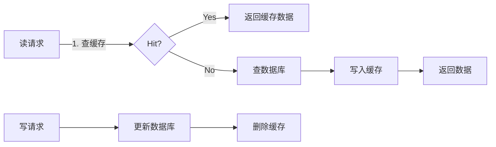

> ✅ 写操作：先更新 DB，再删缓存（主流做法）

------

#### 二、为什么不能保证强一致？—— 典型不一致场景

##### 场景 1：**并发写 + 读，导致旧值回填（最常见！）**

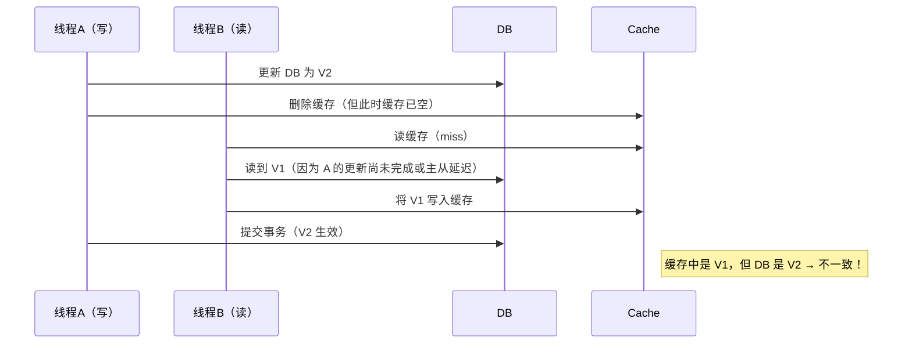

> ⚠️ 即使“先更新 DB 再删缓存”，只要 **删缓存后、DB 提交前** 有并发读，就可能加载旧值。

##### 场景 2：**删缓存失败**

- 更新 DB 成功，但删缓存因网络/Redis 故障失败；
- 缓存仍为旧值 V1，后续所有读都返回错误数据；
- 直到缓存 TTL 过期（依赖兜底）。

##### 场景 3：**主从复制延迟（MySQL 主从架构）**

- 写操作在主库完成，删缓存；
- 读请求路由到从库（未同步），读到旧值 V1 并回填缓存；
- 导致缓存与主库不一致。

------

#### 三、如何降低不一致窗口？—— 工程优化手段

虽然无法**完全消除**不一致，但可通过以下方式**缩小窗口、快速恢复**：

##### ✅ 1. **延迟双删（Delayed Double Delete）**

```java
deleteCache(key);       // 第一次删
updateDB(value);        // 更新数据库
Thread.sleep(100);      // 等待可能的旧值回填完成
deleteCache(key);       // 第二次删
```

> - 缺点：引入延迟，且时间难确定；  
> - 优点：能清除“旧值回填”产生的脏缓存。

##### ✅ 2. **删除缓存失败时异步重试**

- 将“删缓存”操作发到消息队列（如 RocketMQ/Kafka）；
- 失败自动重试，直到成功；
- 保证最终一致性。

##### ✅ 3. **设置合理的缓存 TTL（兜底）**

- 即使不一致，也能在 TTL 后自动恢复；
- 建议 TTL 不宜过长（如 5~30 分钟）。

##### ✅ 4. **读请求增加“防击穿”和“版本校验”（高级）**

- 在缓存中存储数据版本号（如 DB 的 update_time）；
- 读取时比对版本，若缓存版本 < DB 版本，则忽略缓存并强制回源。

##### ✅ 5. **监听 binlog 自动失效（无侵入）**

- 使用 Canal / Debezium 监听 MySQL binlog；
- 数据变更时自动删除缓存；
- 避免应用层漏删，且顺序由 DB 保证。

------

#### 四、什么情况下可以认为“足够一致”？

| 业务场景        | 可接受一致性模型                 |
| --------------- | -------------------------------- |
| 商品详情页      | 最终一致（秒级延迟可接受）       |
| 库存扣减        | 强一致（需用分布式锁 + DB 事务） |
| 用户余额        | 强一致（必须走 DB 校验）         |
| 日志/统计类数据 | 最终一致                         |

> 📌 **原则**：  
>
> - **读多写少、非核心数据** → Cache-Aside + TTL 足够；  
> - **强一致性要求** → **不要依赖缓存做判断**，关键操作直连 DB。

------

#### 五、面试回答示例（专业清晰）

> “Cache-Aside 模式无法保证强一致性，只能做到最终一致。典型问题是：在更新数据库后删除缓存的间隙，如果有并发读请求，可能从数据库读到旧值并回填到缓存，导致不一致。我们通常通过‘延迟双删’、‘删缓存失败重试’、‘设置 TTL 兜底’等方式缩小不一致窗口。对于金融等强一致场景，关键操作会绕过缓存直接查库，或者使用 binlog 监听来保证缓存失效的可靠性。”

------

#### 总结

| 问题             | 答案                                         |
| ---------------- | -------------------------------------------- |
| 能否保证强一致？ | ❌ 不能                                       |
| 是否可用？       | ✅ 可用（绝大多数场景）                       |
| 如何用好？       | 结合 TTL + 失败重试 + 监控，接受“短暂不一致” |

> 💡 **记住**：
> **“缓存是为了加速，不是为了替代数据库。”**
> 一致性保障的核心仍在数据库，缓存只是性能优化手段。

### 8.大厂如何使用is_deleted

在大厂（如阿里、腾讯、字节、美团等）的数据库设计中，**`is_deleted`（或 `deleted`、`is_del`）字段是实现“逻辑删除”的标准手段**。但大厂对它的使用有**严格规范和深度优化**，远不止简单加个字段。

下面从 **设计目的、使用规范、实现机制、替代方案、注意事项** 五个维度详解。

------

#### 一、为什么用 `is_deleted`？—— 逻辑删除 vs 物理删除

| 对比项            | 物理删除（`DELETE`）         | 逻辑删除（`is_deleted = 1`） |
| ----------------- | ---------------------------- | ---------------------------- |
| **数据保留**      | 永久丢失                     | 可恢复、可审计               |
| **外键/关联影响** | 可能破坏关联                 | 关系完整保留                 |
| **合规性**        | 不满足 GDPR/等保“可追溯”要求 | 满足审计与回溯               |
| **性能**          | 瞬间释放空间                 | 数据持续占用存储             |

> ✅ 大厂选择逻辑删除的核心原因：  
>
> - **数据安全**（误删可恢复）  
> - **业务可追溯**（谁在何时删了什么）  
> - **满足金融/政务等强监管要求**

------

#### 二、大厂如何规范使用 `is_deleted`？

##### ✅ 规范 1：**字段命名统一**

- 阿里：`is_deleted`（TINYINT(1)，0=未删，1=已删）
- 腾讯：`deleted`（BOOLEAN 或 INT）
- 字节：`is_del`（为节省空间）

> 📌 建议：**全公司统一命名**，避免 `del_flag` / `status` / `removed` 混用。

##### ✅ 规范 2：**配合删除时间 & 删除人**

```sql
ALTER TABLE orders 
ADD COLUMN is_deleted TINYINT(1) NOT NULL DEFAULT 0 COMMENT '逻辑删除: 0-正常,1-删除',
ADD COLUMN deleted_at DATETIME COMMENT '删除时间',
ADD COLUMN deleted_by BIGINT COMMENT '删除人ID';
```

> - 便于审计：“谁在什么时候删的？”
> - 支持“按删除时间清理冷数据”

##### ✅ 规范 3：**所有查询自动过滤已删除数据**

- **禁止手动写 `WHERE is_deleted = 0`**！
- 使用 **MyBatis-Plus / Hibernate / 自研 ORM 的“自动过滤”能力**：

```java
// MyBatis-Plus 示例：全局配置逻辑删除
@Configuration
public class MybatisPlusConfig {
    @Bean
    public MybatisPlusPropertiesCustomizer mybatisPlusPropertiesCustomizer() {
        return properties -> properties.getGlobalConfig()
            .setSqlInjector(new DefaultSqlInjector() {
                @Override
                public List<AbstractMethod> getMethodList(Class<?> mapperClass, TableInfo tableInfo) {
                    List<AbstractMethod> methodList = super.getMethodList(mapperClass, tableInfo);
                    methodList.add(new DeleteById()); // 重写 delete 为 update is_deleted=1
                    return methodList;
                }
            });
    }
}
```

> ✅ 效果：
>
> - `userMapper.deleteById(1001)` → 实际执行 `UPDATE user SET is_deleted=1 WHERE id=1001`
> - `userMapper.selectById(1001)` → 自动加 `AND is_deleted=0`，查不到已删数据

##### ✅ 规范 4：**物理删除仅用于特殊场景**

- 冷数据归档后批量物理删除；
- 用户主动“永久删除”（如网盘清空回收站）；
- GDPR “被遗忘权” 强制删除（需法律审核）。

------

#### 三、高级实践：如何避免逻辑删除的坑？

##### ⚠️ 问题 1：**唯一索引失效**

- 场景：`user` 表有 `(phone, is_deleted)` 唯一索引；
- 若允许软删，则多个“已删除”用户可重复使用同一手机号 → **唯一约束被绕过**。

> ✅ 解决方案：
> 使用 **“函数索引”或“部分索引”**（MySQL 8.0+）：
>
> ```sql
> CREATE UNIQUE INDEX uk_phone ON user(phone) WHERE is_deleted = 0;
> ```
>
> 或传统方案：将已删除用户的 `phone` 设为 `NULL`（因 NULL 不参与唯一约束）。

##### ⚠️ 问题 2：**数据膨胀 & 性能下降**

- 百亿级表中 90% 是已删除数据 → 查询变慢。

> ✅ 解决方案：
>
> - **定期归档**：将 `is_deleted=1 AND deleted_at < NOW() - INTERVAL 2 YEAR` 的数据迁移到历史库；
> - **分表策略**：按 `is_deleted` 分表（如 `orders_active` / `orders_deleted`）。

##### ⚠️ 问题 3：**关联查询污染**

- 查询订单时，关联的用户已被逻辑删除，但订单仍显示该用户信息。

> ✅ 解决方案：
>
> - 在 JOIN 时显式过滤：`JOIN user u ON o.user_id = u.id AND u.is_deleted = 0`
> - 或在应用层做二次校验。

------

#### 四、替代方案：什么时候不用 `is_deleted`？

| 场景                       | 推荐方案                                   |
| -------------------------- | ------------------------------------------ |
| **高写入、低价值日志**     | 直接物理删除 + TTL（如 ClickHouse）        |
| **强一致性要求（如余额）** | 禁止删除，用状态机（`status = CANCELLED`） |
| **GDPR 强制删除**          | 物理删除 + 日志脱敏                        |
| **超大规模表（>10亿）**    | 写时双写到“活跃表”和“归档表”，删除即移除   |

------

#### 五、面试回答示例（简洁专业）

> “大厂普遍使用 `is_deleted` 实现逻辑删除，核心目的是保障数据可恢复和审计合规。我们会统一字段命名，并配合 `deleted_at` 和 `deleted_by`。通过 MyBatis-Plus 等框架实现‘自动过滤’，确保所有查询默认忽略已删除数据。同时要注意唯一索引失效和数据膨胀问题，通过部分索引和定期归档解决。对于金融核心数据，我们甚至会禁用删除操作，改用状态机管理生命周期。”

------

#### 总结

| 原则                | 说明                       |
| ------------------- | -------------------------- |
| **默认逻辑删除**    | 保障安全与审计             |
| **自动过滤**        | 避免人工遗漏               |
| **配套字段**        | `deleted_at`, `deleted_by` |
| **警惕索引 & 性能** | 唯一索引需特殊处理         |
| **定期清理**        | 防止数据无限膨胀           |

> 💡 **记住**：
> **“删除不是消失，而是标记。”**
> 逻辑删除是工程权衡的结果，而非偷懒。

### 9.行锁失效？瞬间变表锁！

“行锁失效，瞬间变表锁”是 MySQL InnoDB 中一个**高频且危险的性能陷阱**，尤其在高并发场景下，可能导致数据库雪崩。这通常不是 InnoDB 的 bug，而是**SQL 写法或索引设计不当**导致的。

下面从 **原理、触发条件、排查方法、解决方案** 四个维度深入解析。

------

#### 一、InnoDB 行锁的本质

- InnoDB 的行锁是**基于索引加锁**的；
- 如果 SQL 能通过**索引定位到具体行**，则加**行锁（Record Lock）**；
- 如果**无法使用索引**，InnoDB 会退化为**全表扫描**，并对**所有扫描过的行加锁** → **效果等同于表锁**！

> 🔑 核心结论：
> **“没有索引 = 全表扫描 = 所有行被锁 = 并发度暴跌”**

------

#### 二、哪些情况会导致“行锁变表锁”？

##### ❌ 场景 1：**WHERE 条件字段无索引**

```sql
-- user 表有 100 万行，但 name 无索引
UPDATE user SET status = 1 WHERE name = 'Tom';
```

- InnoDB 必须扫描全表找 `name='Tom'`；
- **每扫描一行就加一次 X 锁**；
- 即使最终只更新 1 行，也锁了 100 万行 → 其他事务无法操作任何用户！

##### ❌ 场景 2：**索引失效（隐式类型转换）**

```sql
-- user_id 是 VARCHAR 类型，但传入数字
SELECT * FROM user WHERE user_id = 123; -- 注意：123 是数字，不是字符串
```

- MySQL 会将 `user_id` 转为数字比较 → **无法使用索引**；
- 导致全表扫描 + 行锁膨胀。

##### ❌ 场景 3：**使用函数或表达式**

```sql
-- 对索引字段使用函数
SELECT * FROM order WHERE YEAR(create_time) = 2025;
-- 或
UPDATE account SET balance = balance + 100 WHERE id + 0 = 1001;
```

- 索引失效 → 全表扫描 → 锁全表。

##### ❌ 场景 4：**LIKE 以通配符开头**

```sql
SELECT * FROM product WHERE name LIKE '%手机%';
```

- 无法使用 B+ 树索引 → 全表扫描。

##### ❌ 场景 5：**间隙锁（Gap Lock）升级（可重复读级别）**

- 在 `REPEATABLE READ` 隔离级别下，InnoDB 会加**间隙锁**防止幻读；
- 如果 WHERE 条件匹配大量间隙，锁范围可能覆盖整个表。

> ⚠️ 虽然不是严格“表锁”，但**锁范围过大**，效果类似。

------

#### 三、如何快速排查“是否发生了行锁膨胀”？

##### ✅ 方法 1：查看当前锁等待

```sql
-- MySQL 8.0+
SELECT * FROM performance_schema.data_locks;
SELECT * FROM performance_schema.data_lock_waits;

-- MySQL 5.7 及以前
SELECT * FROM information_schema.INNODB_LOCKS;
SELECT * FROM information_schema.INNODB_LOCK_WAITS;
```

- 观察 `LOCK_DATA` 和 `LOCK_MODE`；
- 如果看到大量行被锁，且 SQL 本应只影响一行 → 怀疑索引失效。

##### ✅ 方法 2：执行计划分析（EXPLAIN）

```sql
EXPLAIN UPDATE user SET status = 1 WHERE name = 'Tom';
```

- 如果 `type = ALL`（全表扫描）或 `key = NULL` → **索引未命中** → 行锁会膨胀！

##### ✅ 方法 3：监控慢查询日志

- 突然出现大量“看似简单”的 UPDATE/DELETE 执行时间暴增；
- 结合 `Rows_examined` 字段（扫描行数远大于返回行数）→ 锁膨胀证据。

------

#### 四、✅ 解决方案与最佳实践

##### 1. **确保 WHERE 条件字段有合适索引**

- 对高频更新/删除的字段建索引；
- 复合索引注意最左前缀原则。

##### 2. **避免索引失效写法**

| 错误写法                                   | 正确写法                                                  |
| ------------------------------------------ | --------------------------------------------------------- |
| `WHERE user_id = 123` （user_id 是字符串） | `WHERE user_id = '123'`                                   |
| `WHERE YEAR(create_time) = 2025`           | `WHERE create_time BETWEEN '2025-01-01' AND '2025-12-31'` |
| `WHERE name LIKE '%手机%'`                 | 改用全文索引（FULLTEXT）或 ES                             |

##### 3. **大表 DML 操作分批进行**

```sql
-- 每次只更新 1000 行，减少单次锁持有时间
UPDATE user SET status = 1 WHERE name = 'Tom' AND id > 0 LIMIT 1000;
```

##### 4. **降低隔离级别（谨慎！）**

- 将 `REPEATABLE READ` 改为 `READ COMMITTED`；
- 可避免间隙锁，但可能引入幻读；
- 适用于对一致性要求不高的场景。

##### 5. **应用层限流 + 熔断**

- 防止一个慢 SQL 拖垮整个数据库；
- 使用 Sentinel / Hystrix 等组件保护 DB。

------

#### 五、面试回答示例（简洁专业）

> “InnoDB 行锁是基于索引的。如果 SQL 无法命中索引（比如字段无索引、类型转换、函数操作），就会退化成全表扫描，对扫描到的每一行都加锁，效果等同于表锁。我们通过 EXPLAIN 分析执行计划，确保关键 DML 语句走索引。同时，对大表操作采用分批更新，并在应用层做限流，避免锁膨胀引发雪崩。”

------

#### 六、总结：避坑 Checklist

| ✅ 检查项                             | 说明                   |
| ------------------------------------ | ---------------------- |
| **DML 的 WHERE 字段是否有索引？**    | 必须！                 |
| **是否发生隐式类型转换？**           | 字符串用引号，数字不用 |
| **是否对索引字段用了函数？**         | 改写为范围查询         |
| **是否用 `LIKE '%xxx%'`？**          | 考虑全文检索           |
| **是否在 RR 隔离级别下扫大量间隙？** | 评估是否可降级到 RC    |

> 💡 **记住**：
> **“行锁的安全，建立在索引的可靠之上。”**
> 没有索引的 UPDATE，就是披着羊皮的表锁。

### 10.大厂的异常处理

大厂（如阿里、腾讯、字节、美团等）对 **异常处理（Exception Handling）** 有非常严格的规范，核心目标是：**保障系统稳定性、提升可观测性、避免信息泄露、统一用户体验**。以下是大厂异常处理的完整体系：

------

#### 一、核心原则（Why）

1. **绝不吞异常**
   `catch (Exception e) { /* 啥也不干 */ }` 是红线！
2. **异常必须可追踪**
   每个异常要有唯一 traceId、上下文、堆栈。
3. **用户不暴露技术细节**
   禁止将 `e.getMessage()` 直接返回给前端。
4. **分类处理，精准降级**
   区分业务异常、系统异常、第三方异常，策略不同。

------

#### 二、异常分类体系（What）

大厂通常定义 **三层异常体系**：

| 异常类型                              | 继承关系           | 特点                            | 处理方式                                |
| ------------------------------------- | ------------------ | ------------------------------- | --------------------------------------- |
| **业务异常（BizException）**          | `RuntimeException` | 可预期（如余额不足、参数非法）  | 直接返回友好提示，**不记录 error 日志** |
| **系统异常（SystemException）**       | `RuntimeException` | 不可预期（如 NPE、DB 连接失败） | 记录 ERROR 日志 + 告警 + 返回通用错误码 |
| **第三方异常（RemoteCallException）** | `SystemException`  | 调用外部服务失败（如 RPC 超时） | 重试/熔断 + 降级 + 告警                 |

> ✅ 示例：
>
> ```java
> // 业务异常
> throw new BizException(ErrorCode.ORDER_NOT_FOUND, "订单不存在");
> 
> // 系统异常（自动包装）
> try {
>     userService.getUser(id);
> } catch (Exception e) {
>     throw new SystemException("查询用户失败", e);
> }
> ```

------

#### 三、统一异常处理架构（How）

##### 1. **全局异常处理器（@ControllerAdvice）**

```java
@RestControllerAdvice
public class GlobalExceptionHandler {

    private static final Logger log = LoggerFactory.getLogger(GlobalExceptionHandler.class);

    // 处理业务异常 → 返回 200 + 自定义 code
    @ExceptionHandler(BizException.class)
    public Result<?> handleBizException(BizException e) {
        return Result.fail(e.getErrorCode(), e.getMessage());
    }

    // 处处理系统异常 → 返回 500 + 通用提示
    @ExceptionHandler(Exception.class)
    public Result<?> handleSystemException(Exception e) {
        String traceId = TraceContext.getTraceId(); // 链路ID
        log.error("[{}] 系统异常: {}", traceId, e.getMessage(), e); // 记录完整堆栈
        
        // 返回给前端：隐藏技术细节
        return Result.fail(ErrorCode.SYSTEM_ERROR, "服务开小差了，请稍后再试");
    }
}
```

##### 2. **Result 统一返回格式**

```json
{
  "code": "BIZ_ORDER_NOT_FOUND",
  "msg": "订单不存在",
  "data": null,
  "traceId": "abc123"  // 用于日志追踪
}
```

> ⚠️ **禁止**：
>
> - 返回 `500 Internal Server Error` 给用户；
> - 在接口层打印 `e.printStackTrace()`。

------

#### 四、关键实践细节

##### ✅ 1. **异常必须带上下文**

- 记录关键参数，便于排查：

  ```java
  throw new BizException(ErrorCode.USER_NOT_FOUND, 
      String.format("用户不存在, userId=%s", userId));
  ```

##### ✅ 2. **日志分级**

| 异常类型   | 日志级别     | 是否告警                   |
| ---------- | ------------ | -------------------------- |
| 业务异常   | WARN 或 INFO | 否                         |
| 系统异常   | ERROR        | 是（通过 ELK/SLS 告警）    |
| 第三方超时 | WARN         | 可配置（如连续失败才告警） |

##### ✅ 3. **链路追踪集成**

- 异常日志中必须包含 

  traceId

  ，与 SkyWalking / Zipkin 关联：

  ```java
  log.error("[{}] DB 查询失败, orderId={}", traceId, orderId, e);
  ```

##### ✅ 4. **敏感信息脱敏**

- 异常消息中禁止包含密码、身份证、手机号等：

  ```java
  // ❌ 危险
  log.error("连接数据库失败: url={}, user={}, pwd={}", url, user, pwd);
  
  // ✅ 安全
  log.error("连接数据库失败: url={}, user={}", url, user);
  ```

##### ✅ 5. **资源清理（try-with-resources）**

```java
try (InputStream is = new FileInputStream(file)) {
    // ...
} catch (IOException e) {
    throw new SystemException("文件读取失败", e);
}
```

------

#### 五、大厂禁用行为（红线！）

| 行为                                         | 风险                     |
| -------------------------------------------- | ------------------------ |
| `catch (Exception e) {}`                     | 异常静默，问题无法发现   |
| `throw new RuntimeException(e.getMessage())` | 丢失原始堆栈             |
| 直接返回 `e.toString()` 给前端               | 信息泄露（如 SQL、路径） |
| 在 finally 中 return                         | 吞掉异常                 |
| 用异常控制流程（如用 Exception 做 if 判断）  | 性能差，逻辑混乱         |

------

#### 六、高级场景处理

##### 场景 1：**异步任务异常**

- 使用 

  ```
  CompletableFuture.exceptionally()
  ```

   或线程池的 

  ```
  UncaughtExceptionHandler
  ```

  ：

  ```java
  CompletableFuture.runAsync(() -> {
      // 业务逻辑
  }).exceptionally(e -> {
      log.error("异步任务失败", e);
      return null;
  });
  ```

##### 场景 2：**重试机制**

- 对第三方调用，结合 Spring Retry 或自研框架：

  ```java
  @Retryable(value = {FeignException.class}, maxAttempts = 3, backoff = @Backoff(delay = 1000))
  public User getUser(Long id) {
      return userClient.getById(id);
  }
  ```

##### 场景 3：**熔断降级**

- 当异常率超过阈值，自动熔断（如 Sentinel）：

  ```java
  try {
      return orderService.create(order);
  } catch (BlockException e) {
      return fallbackCreate(order); // 降级逻辑
  }
  ```

------

#### 七、面试回答示例（简洁专业）

> “大厂异常处理的核心是‘分类+统一+可观测’。我们定义业务异常和系统异常，业务异常直接返回友好提示，系统异常记录带 traceId 的 ERROR 日志并告警。通过 `@ControllerAdvice` 全局捕获，确保不暴露技术细节。同时，严禁吞异常，所有异常必须可追踪。对于第三方调用，还会结合重试、熔断实现高可用。”

------

#### 八、总结：大厂异常处理 Checklist

| ✅ 规范           | 说明                         |
| ---------------- | ---------------------------- |
| **异常分类**     | 业务 vs 系统 vs 第三方       |
| **全局处理**     | `@ControllerAdvice` 统一出口 |
| **日志带上下文** | traceId + 关键参数           |
| **用户友好**     | 返回码 + 通用提示            |
| **安全脱敏**     | 日志/响应中无敏感信息        |
| **监控告警**     | 系统异常触发告警             |

> 💡 **记住**：
> **“异常不是错误，而是系统的语言。”**
> 处理好异常，才能让系统在故障中优雅地说话。

### 11.异常的抛出位置

大厂在设计和实现异常处理机制时，通常会遵循**分层清晰、职责明确、统一可控**的原则。具体到代码结构中，“异常处理放在什么位置”取决于语言生态、架构风格（如微服务/单体）、框架特性（如 Spring Boot、Hyperf 等）以及业务复杂度。以下是大厂常见的异常处理放置策略：

------

#### 1. **全局统一异常处理（推荐做法）**

- **位置：Controller 层（或网关/入口层）**

- **目的：统一错误响应格式、避免异常泄露、提升 API 可维护性**

- 实现方式（以 Java/Spring Boot 为例）

  ：

  ```java
  @RestControllerAdvice
  public class GlobalExceptionHandler {
      @ExceptionHandler(ServiceException.class)
      public ResponseEntity<ErrorResponse> handleServiceException(ServiceException e) {
          return ResponseEntity.status(400).body(new ErrorResponse(e.getMessage()));
      }
  
      @ExceptionHandler(Exception.class)
      public ResponseEntity<ErrorResponse> handleUnexpected(Exception e) {
          log.error("Unexpected error", e);
          return ResponseEntity.status(500).body(new ErrorResponse("系统繁忙，请稍后再试"));
      }
  }
  ```

- 优点

  ：

  - 避免每个 Controller 重复写 try-catch
  - 统一返回格式（如 JSON 错误码、msg、data）
  - 安全：防止内部异常信息暴露给前端

> ✅ **大厂普遍采用此模式**，尤其在 RESTful API 或 Web 服务中。

------

#### 2. **Service 层：抛出语义化自定义异常**

- **位置：Service / Business Logic 层**

- 原则：不捕获业务异常，而是主动 throw 自定义异常

  ```java
  public void processOrder(Order order) {
      if (order.getAmount() <= 0) {
          throw new InvalidOrderException("订单金额不能为负");
      }
      // ... 业务逻辑
  }
  ```

- 注意

  ：

  - Service 层 **一般不 catch 异常**（除非需要降级、重试、补偿）
  - 若需记录日志或转换异常类型，可局部 try-catch，但最终仍应向上抛出

> ❌ **反模式**：在 Service 层 catch 异常后返回 null 或 boolean，导致调用方无法感知错误原因。

------

#### 3. **底层/工具层：谨慎处理技术异常**

- **位置：DAO、RPC 调用、第三方 SDK 封装层**

- 策略

  ：

  - 捕获底层技术异常（如 SQLException、FeignException）

  - 转换为业务异常

     向上抛出

    ```java
    try {
        userMapper.insert(user);
    } catch (DuplicateKeyException e) {
        throw new UserAlreadyExistsException("用户已存在", e);
    }
    ```

------

### 4. **资源管理：使用 finally 或自动资源管理**

- **位置：任何涉及 I/O、连接、锁的地方**

- 推荐

  ：

  - Java：`try-with-resources`
  - Python：`with` 语句
  - C++：RAII 或智能指针

- **目的：确保资源释放，即使发生异常**

------

#### 5. **特殊情况下的局部异常处理**

大厂也会在特定场景下做局部处理：

- **重试机制**（如网络超时）：在 Service 或 Client 层 catch 后重试
- **降级逻辑**（如缓存失效）：catch 后返回兜底数据
- **异步任务**：必须在最外层 catch 所有异常，防止线程崩溃

------

#### 总结：大厂异常处理的“黄金法则”

| 层级                      | 是否处理异常 | 建议做法                     |
| ------------------------- | ------------ | ---------------------------- |
| **Controller / API 入口** | ✅ 是         | 全局统一处理，返回标准化错误 |
| **Service / 业务层**      | ❌ 否（通常） | 抛出自定义业务异常           |
| **DAO / 外部调用层**      | ⚠️ 转换       | 捕获技术异常 → 转为业务异常  |
| **工具类 / 底层**         | ❌ 否         | 不吞异常，让上层决策         |

> 📌 **核心思想**：**异常是控制流的一部分，不是错误掩盖的工具**。大厂强调“Fail Fast + Clear Signal”，即尽早暴露问题，并通过清晰的异常类型传递上下文。

------

如果你使用的是特定技术栈（如 Python FastAPI、Go、Node.js 等），也可以告诉我，我可以给出对应的最佳实践。

## 技术点

### 1.AQS

**AQS（AbstractQueuedSynchronizer）** 是 Java 并发包（`java.util.concurrent.locks`）的**基石**，是 `ReentrantLock`、`CountDownLatch`、`Semaphore`、`ReentrantReadWriteLock` 等同步器的**底层实现框架**。理解 AQS 是掌握 Java 高并发编程的核心。

------

#### 一、AQS 是什么？

> **AQS = 一个用 CAS + CLH 队列 实现的“模板方法”同步框架**

- 它提供了一套**标准机制**来管理线程的**阻塞、唤醒、排队**；
- 子类只需实现 **“是否允许获取资源”** 的逻辑（`tryAcquire` / `tryRelease` 等），AQS 负责其余所有复杂调度。

```java
public abstract class AbstractQueuedSynchronizer extends AbstractOwnableSynchronizer {
    // 核心状态：volatile int state
    // 等待队列：Node head, tail
}
```

------

#### 二、核心设计思想

##### 1. **状态驱动（state）**

- AQS 内部维护一个 

  ```
  volatile int state
  ```

  ，代表

  同步状态

  ：

  - `ReentrantLock`：state = 0 表示未锁，>0 表示重入次数；
  - `Semaphore`：state = 剩余许可数；
  - `CountDownLatch`：state = 计数值。

##### 2. **CLH 队列（FIFO 等待队列）**

- 当线程获取资源失败，会被封装成 **`Node`** 加入 **双向链表队列**（CLH 变种）；
- 队列中的线程**自旋或阻塞**，等待前驱节点释放资源后被唤醒。

```java
static final class Node {
    volatile Node prev, next;
    volatile Thread thread;
    volatile int waitStatus; // SIGNAL(-1), CANCELLED(1)...
}
```

##### 3. **两种资源共享方式**

| 模式                      | 说明                           | 典型实现                      |
| ------------------------- | ------------------------------ | ----------------------------- |
| **独占模式（Exclusive）** | 同一时刻只允许一个线程持有资源 | `ReentrantLock`               |
| **共享模式（Shared）**    | 多个线程可同时持有资源         | `Semaphore`, `CountDownLatch` |

------

#### 三、AQS 核心流程（以独占模式为例）

##### 🔒 获取锁（acquire）

```java
public final void acquire(int arg) {
    if (!tryAcquire(arg) &&          // 1. 尝试获取（子类实现）
        acquireQueued(addWaiter(Node.EXCLUSIVE), arg)) // 2. 失败则入队等待
        selfInterrupt();
}
```

1. 调用 `tryAcquire()`（由子类实现，如判断 state 是否为 0）；
2. 若失败，调用 `addWaiter()` 将当前线程包装为 `Node` 加入队尾；
3. `acquireQueued()`：在队列中自旋，若前驱是头节点且能获取锁，则出队执行。

##### 🗝 释放锁（release）

```java
public final boolean release(int arg) {
    if (tryRelease(arg)) {           // 1. 尝试释放（子类实现）
        Node h = head;
        if (h != null && h.waitStatus != 0)
            unparkSuccessor(h);      // 2. 唤醒后继线程
        return true;
    }
    return false;
}
```

1. 调用 `tryRelease()` 修改 state；
2. 若成功，调用 `unparkSuccessor()` 唤醒头节点的下一个有效线程。

> ✅ **关键**：AQS 本身不定义“锁是什么”，只定义“如何排队和唤醒”，具体语义由子类决定。

------

#### 四、典型同步器如何基于 AQS 实现？

##### 1. **ReentrantLock（独占、可重入）**

- `state = 0` → 无锁；`state = N` → 重入 N 次；
- `tryAcquire()`：若当前线程是持有者，则 state++；否则尝试抢锁；
- 支持公平/非公平（公平锁会检查队列是否为空）。

##### 2. **CountDownLatch（共享、一次性）**

- 初始化 `state = N`；
- `countDown()` → `releaseShared()` → state--；
- `await()` → `acquireSharedInterruptibly()`，当 state=0 时所有等待线程通过。

##### 3. **Semaphore（共享、可重复）**

- `state = permits`（许可数）；
- `acquire()` → 尝试减少 state，失败则入队；
- `release()` → 增加 state，唤醒等待线程。

------

#### 五、为什么 AQS 高效？

| 技术                        | 作用                                       |
| --------------------------- | ------------------------------------------ |
| **CAS + volatile**          | 保证 state 修改的原子性和可见性            |
| **CLH 队列**                | 避免惊群效应，按 FIFO 唤醒                 |
| **LockSupport.park/unpark** | 精准挂起/唤醒线程，比 `wait/notify` 更灵活 |
| **自旋优化**                | 在入队前短暂自旋，减少上下文切换           |

> 💡 对比 `synchronized`：
> AQS 是 **“用户态”** 实现，更灵活（可中断、超时、公平）；
> `synchronized` 是 **“JVM 内置”**，JDK 6 后优化极好，但功能固定。

------

#### 六、面试高频问题

##### Q1：AQS 为什么用双向队列，而 CLH 原本是单向？

> A：为了支持 **“取消等待”**。当线程超时或中断，需从队列中移除，双向链表可快速断开前后连接。

##### Q2：`Condition` 和 AQS 的关系？

> A：每个 `Condition` 对象内部维护一个 **“条件等待队列”**，与 AQS 主队列分离。调用 `await()` 会将线程从主队列移到条件队列；`signal()` 则将其移回主队列参与竞争。

##### Q3：AQS 能实现读写锁吗？

> A：可以！`ReentrantReadWriteLock` 使用 **高 16 位存读锁计数，低 16 位存写锁计数**，通过位运算操作 state。

------

#### 七、总结：AQS 的核心价值

| 特性             | 说明                              |
| ---------------- | --------------------------------- |
| **模板方法模式** | 子类只需实现 tryXXX 方法          |
| **高效排队机制** | CLH 队列 + LockSupport            |
| **统一抽象**     | 独占/共享模式覆盖绝大多数同步场景 |
| **JUC 基石**     | 几乎所有高级同步器都基于 AQS      |

> 📌 **记住**：
> **“AQS 不是锁，而是构建锁的工具箱。”**
> 掌握它，你就掌握了 Java 并发的“操作系统内核”。

------

#### 附：简易自定义锁（基于 AQS）

```java
public class MyMutex {
    private static class Sync extends AbstractQueuedSynchronizer {
        @Override
        protected boolean tryAcquire(int ignored) {
            return compareAndSetState(0, 1); // 0→1 成功
        }

        @Override
        protected boolean tryRelease(int ignored) {
            setState(0); // 直接释放
            return true;
        }
    }

    private final Sync sync = new Sync();

    public void lock() { sync.acquire(1); }
    public void unlock() { sync.release(1); }
}
```

这就是 `ReentrantLock` 的简化版！

### 2.如何设计一个消息队列

在 Java 后端面试中，**“如何设计一个消息队列”** 是一道经典的系统设计题，考察你对 **高并发、可靠性、分布式、容错、性能** 等核心能力的理解。大厂（如阿里 RocketMQ、腾讯 CMQ、字节 Kafka）的 MQ 设计思想可作为参考。

下面从 **核心目标 → 架构设计 → 关键问题 → 优化方案** 四步拆解，给出一套完整、可落地的回答框架。

------

#### 一、明确设计目标（先问清楚需求！）

> ✅ 面试时先反问：“这个 MQ 的核心场景是什么？”
> 不同场景设计差异巨大：

| 场景         | 要求                              |
| ------------ | --------------------------------- |
| **日志收集** | 高吞吐、允许少量丢失（如 Kafka）  |
| **交易订单** | 强一致性、不丢消息（如 RocketMQ） |
| **实时通知** | 低延迟、高可用                    |

> 📌 假设我们设计一个 **通用型、高可靠、支持持久化** 的 MQ（对标 RocketMQ）。

------

#### 二、核心功能模块设计

##### 1. **整体架构：生产者 → Broker → 消费者**

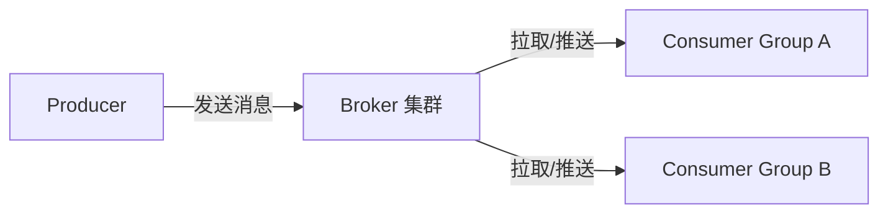

- **Broker**：消息服务器，负责存储、转发；
- **Topic**：逻辑分类（如 `order-topic`）；
- **Partition/Queue**：物理分片，提升并行度；
- **Consumer Group**：同一组内负载均衡，不同组广播。

------

##### 2. **消息存储设计（高性能 + 持久化）**

> ❌ 不能用数据库存消息（写入慢、成本高）
> ✅ **顺序写磁盘 + PageCache**（Kafka/RocketMQ 方案）

- 消息追加到 **CommitLog（顺序文件）**；
- 通过 **ConsumeQueue（索引文件）** 快速定位消息；
- 利用 **OS PageCache** 缓存热点数据，减少 IO。

```text
CommitLog: [msg1][msg2][msg3]... （顺序写，64KB block）
ConsumeQueue: [offset=0, size=100], [offset=100, size=120]...
```

> 💡 优势：  
>
> - 顺序写磁盘 ≈ 内存速度；  
> - 文件预分配避免碎片；  
> - 支持 TB 级消息堆积。

------

##### 3. **消息可靠性保障（不丢消息）**

| 环节                | 保障措施                                                     |
| ------------------- | ------------------------------------------------------------ |
| **生产者 → Broker** | - 同步发送 + Broker ACK - 失败重试 + 幂等性（msgId 去重）    |
| **Broker 存储**     | - 刷盘策略：   • **同步刷盘**（强一致，性能低）   • **异步刷盘 + 主从复制**（推荐） |
| **Broker → 消费者** | - 消费者手动 ACK - 消费失败重试（死信队列兜底）              |

> ✅ **关键**：
> **“发前落库 + 发后删库”** 或 **事务消息** 保证业务与消息最终一致。

------

##### 4. **高可用设计**

- **Broker 集群**：主从架构（Master-Slave）或 Dledger（Raft 协议）；
- **NameServer（注册中心）**：轻量级服务发现（RocketMQ 方案）；
- **自动故障转移**：Slave 在 Master 宕机后升主。

------

##### 5. **消费模型：推 or 拉？**

| 模式           | 优点                 | 缺点                  | 适用                       |
| -------------- | -------------------- | --------------------- | -------------------------- |
| **Push（推）** | 实时性高             | Broker 压力大，流控难 | 小规模、低延迟             |
| **Pull（拉）** | 消费者可控，背压友好 | 实时性略低            | 大厂主流（Kafka/RocketMQ） |

> ✅ 推荐 **长轮询 Pull**：
> 消费者请求后，Broker 等待新消息到达再返回，兼顾实时与可控。

------

#### 三、必须解决的关键问题

##### ❓ Q1：如何保证消息顺序？

- **局部顺序**：同一业务 ID（如订单号）的消息发到**同一个 Partition**；
- **单 Partition 内 FIFO**：串行消费（但牺牲并行度）。

##### ❓ Q2：如何避免重复消费？

- **消费者幂等**：业务层用唯一 ID（如订单号）去重；
- **Broker 不保证 Exactly-Once**，只提供 At-Least-Once。

##### ❓ Q3：如何监控和运维？

- 消息堆积告警（Consumer Lag）；
- Broker 磁盘、CPU、网络监控；
- 死信队列人工干预。

------

#### 四、Java 技术栈实现要点

| 组件         | 技术选型                             |
| ------------ | ------------------------------------ |
| **网络通信** | Netty（高性能异步 IO）               |
| **序列化**   | Protobuf / JSON                      |
| **存储**     | MappedByteBuffer（堆外内存映射文件） |
| **协调服务** | ZooKeeper / 自研 NameServer          |
| **刷盘控制** | `FileChannel.force()`                |

> ✅ 示例：消息写入 CommitLog
>
> ```java
> // 顺序追加到 MappedFile
> mappedFile.appendMessage(msgBytes);
> if (isSyncFlush) {
>     mappedFile.flush(); // 同步刷盘
> }
> ```

------

#### 五、面试回答模板（简洁专业）

> “我会从 **高可靠、高吞吐、可扩展** 三个目标出发设计：
>
> 1. **架构上**采用生产者-Broker-消费者模型，Broker 集群部署，通过 Topic 和 Queue 分片提升并发；
> 2. **存储上**使用顺序写 CommitLog + ConsumeQueue 索引，利用 PageCache 提升读写性能；
> 3. **可靠性**通过同步发送、异步刷盘+主从复制、消费者手动 ACK 保障不丢消息；
> 4. **消费模型**采用长轮询 Pull，避免 Broker 被压垮；
> 5. **关键问题**如顺序性通过‘同业务 ID 进同一队列’解决，重复消费靠业务幂等。
>
> 类似 RocketMQ 的设计，既能支撑金融级可靠性，又能做到十万级 TPS。”

------

#### 六、加分项（体现深度）

- 对比 Kafka/RabbitMQ/RocketMQ

  ：  

  > “Kafka 重吞吐，适合日志；RocketMQ 重事务和顺序，适合电商。”

- 提到 Dledger（Raft）

  ：  

  > “用 Raft 协议替代主从，实现自动选主，提升可用性。”

- 云原生支持

  ：  

  > “支持 Kubernetes 部署，StatefulSet 管理 Broker 实例。”

------

#### 总结：设计 MQ 的核心思想

| 原则                | 说明                             |
| ------------------- | -------------------------------- |
| **存储为王**        | 顺序写 + PageCache 是性能基石    |
| **可靠性 > 一致性** | 先保证不丢，再谈 Exactly-Once    |
| **消费者驱动**      | Pull 模型更可控                  |
| **分片扩展**        | Queue/Partition 是水平扩展的关键 |

> 💡 **记住**：
> **“MQ 不是造轮子，而是权衡的艺术。”**
> 没有完美的设计，只有适合场景的取舍。


### 3.Spring事务失效

Spring 事务失效是 Java 后端开发中的**高频坑点**，尤其在业务复杂、多人协作的项目中极易踩雷。大厂对事务管理有严格规范，核心原则是：**“事务必须可预期、可验证、不静默失效”**。

下面从 **失效原因、排查方法、解决方案、最佳实践** 四个维度系统讲解。

------

#### 一、Spring 事务生效的前提

1. **使用 `@Transactional` 注解**（或编程式事务）；
2. **方法必须是 public**（CGLIB 代理限制）；
3. **调用方不能是本类内部方法调用**（代理失效）；
4. **异常必须是 RuntimeException 或 Error**（默认只回滚 unchecked 异常）；
5. **底层数据库引擎支持事务**（如 MySQL 的 InnoDB，非 MyISAM）。

> ⚠️ 只要违反以上任一条件，事务就可能失效！

------

#### 二、✅ 8 大常见失效场景 & 解决方案

##### 场景 1：**非 public 方法**

```java
@Service
public class OrderService {
    @Transactional
    void createOrder() { ... } // ❌ 非 public，事务不生效！
}
```

> ✅ **修复**：改为 `public`。

------

##### 场景 2：**自调用（this 调用）**

```java
@Service
public class OrderService {
    public void placeOrder() {
        this.createOrder(); // ❌ this 调用，绕过代理
    }

    @Transactional
    public void createOrder() { ... }
}
```

> 🔍 原因：Spring 通过 **代理对象** 实现事务，`this` 是原始对象，无代理。
>
> ✅ **修复方案**：
>
> - 注入自身（不推荐，有循环依赖风险）：
>
>   ```java
>   @Autowired
>   private OrderService self;
>   self.createOrder();
>   ```
>
> - 拆分到另一个 Service
>
>   （推荐）：
>
>   ```java
>   @Service
>   public class OrderCreateService {
>       @Transactional
>       public void createOrder() { ... }
>   }
>   ```

------

##### 场景 3：**异常被捕获且未抛出**

```java
@Transactional
public void updateOrder() {
    try {
        // DB 操作
    } catch (Exception e) {
        log.error("失败", e);
        // ❌ 吞掉异常，Spring 不知道要回滚！
    }
}
```

> ✅ **修复**：
>
> - 重新抛出异常：
>
>   ```java
>   throw new RuntimeException(e);
>   ```
>
> - 或手动标记回滚：
>
>   ```java
>   TransactionAspectSupport.currentTransactionStatus().setRollbackOnly();
>   ```

------

##### 场景 4：**抛出 checked 异常但未配置 rollbackFor**

```java
@Transactional
public void updateOrder() throws IOException {
    throw new IOException("文件错误"); // ❌ checked 异常，默认不回滚
}
```

> ✅ **修复**：显式指定回滚异常类型
>
> ```java
> @Transactional(rollbackFor = Exception.class)
> public void updateOrder() throws IOException { ... }
> ```

------

##### 场景 5：**数据库不支持事务**

- 使用 MyISAM 引擎（MySQL）；
- 使用 Redis、MongoDB 等非关系型数据库。

> ✅ **修复**：确保使用 **InnoDB** 引擎。

------

##### 场景 6：**事务传播行为配置错误**

```java
// Service A
@Transactional
public void methodA() {
    serviceB.methodB(); // B 的事务被挂起？
}

// Service B
@Transactional(propagation = Propagation.REQUIRES_NEW)
public void methodB() { ... }
```

> - 如果 B 抛异常，A 不会回滚（因为 B 是独立事务）；
> - 如果 A 捕获 B 的异常，B 的事务已提交，无法回滚。

> ✅ **建议**：除非明确需要新事务，否则用默认 `REQUIRED`。

------

##### 场景 7：**异步方法（@Async）中使用事务**

```java
@Async
@Transactional
public void asyncProcess() { ... } // ❌ 事务不生效！
```

> 🔍 原因：`@Async` 和 `@Transactional` 代理冲突，且异步线程无事务上下文。
>
> ✅ **修复**：在调用方开启事务，或使用 `TransactionTemplate` 编程式事务。

------

##### 场景 8：**多数据源未正确配置事务管理器**

- 使用 ShardingSphere、MyBatis 多数据源时，未指定 `transactionManager`。

> ✅ **修复**：确保 `@Transactional` 使用正确的事务管理器：
>
> ```java
> @Transactional(transactionManager = "orderTransactionManager")
> ```

------

#### 三、如何快速排查事务是否生效？

##### ✅ 方法 1：**开启 Spring 事务日志**

```properties
logging.level.org.springframework.transaction.interceptor=TRACE
```

- 日志会打印：

  ```
  Getting transaction for [com.example.service.OrderService.createOrder]
  Completing transaction for [...] rollback-only
  ```

##### ✅ 方法 2：**调试代理对象**

- 在 IDE 中查看注入的 Service 是否为 `$Proxy` 类型；
- 若是原始类 → 代理未生效。

##### ✅ 方法 3：**单元测试验证**

```java
@Test
void testTransactionRollback() {
    assertThrows(Exception.class, () -> orderService.createOrder());
    assertFalse(orderExistsInDB()); // 验证是否回滚
}
```

------

#### 四、大厂最佳实践

| 规范                     | 说明                                            |
| ------------------------ | ----------------------------------------------- |
| **事务方法最小化**       | 只包含 DB 操作，避免 RPC、IO                    |
| **统一异常处理**         | 不吞异常，让事务框架感知                        |
| **显式指定 rollbackFor** | `@Transactional(rollbackFor = Exception.class)` |
| **禁用自调用**           | 通过代码规范 + SonarQube 扫描拦截               |
| **关键事务加监控**       | 记录事务开始/提交/回滚日志                      |

> 📌 阿里《Java 开发手册》规定：  
>
> > “**事务方法必须为 public，且避免在事务方法中进行远程调用或大计算。**”

------

#### 五、面试回答示例（简洁专业）

> “Spring 事务失效常见于自调用、异常被捕获、非 public 方法等场景。我们通过三点规避：一是确保事务方法 public 且被代理调用；二是统一异常处理，不吞异常或显式设置 rollbackOnly；三是开启事务 TRACE 日志辅助排查。对于复杂场景，会用编程式事务（TransactionTemplate）替代声明式，保证可控性。”

------

#### 六、总结：事务失效 Checklist

| ✅ 检查项                          | 说明                         |
| --------------------------------- | ---------------------------- |
| 方法是 public 吗？                | 必须                         |
| 是代理对象调用吗？                | 不能 this 调用               |
| 异常抛出了吗？                    | 不能 catch 吞掉              |
| checked 异常配了 rollbackFor 吗？ | 建议统一配 `Exception.class` |
| 数据库引擎支持事务吗？            | 必须 InnoDB                  |

> 💡 **记住**：
> **“事务不是注解一加就灵，而是代理、异常、配置共同作用的结果。”**
> 理解原理，才能避开陷阱。

### 4.说一下stream流

`Stream` 是 Java 8 引入的**函数式编程核心 API**，用于以**声明式、链式、并行化**的方式处理集合数据。它不是数据结构，而是**数据处理的“流水线”**，能极大提升代码可读性和开发效率，并支持透明并行（parallel stream）。

------

#### 一、Stream 的核心特点

| 特性                      | 说明                                                         |
| ------------------------- | ------------------------------------------------------------ |
| **声明式（Declarative）** | 关注“做什么”，而非“怎么做”（如 `filter().map().collect()`）  |
| **无存储**                | 不存储元素，只对源（如 List、Array）进行计算                 |
| **惰性求值（Lazy）**      | 中间操作（如 filter/map）不立即执行，直到终端操作（如 collect/forEach）触发 |
| **不可变**                | 操作不会修改源数据，而是生成新流或结果                       |
| **支持并行**              | 通过 `parallelStream()` 自动多线程处理                       |

------

#### 二、Stream 基本使用流程（三步曲）

```java
List<String> result = list
    .stream()                    // 1. 创建流
    .filter(s -> s.length() > 3) // 2. 中间操作（可链式）
    .map(String::toUpperCase)
    .sorted()
    .limit(10)
    .collect(Collectors.toList()); // 3. 终端操作（触发执行）
```

##### 1. **创建流**

- 集合：`list.stream()`
- 数组：`Arrays.stream(arr)`
- 静态方法：`Stream.of("a", "b")`、`Stream.iterate(0, n -> n + 2)`、`Stream.generate(Math::random)`

##### 2. **中间操作（返回 Stream）**

| 方法                   | 作用                           |
| ---------------------- | ------------------------------ |
| `filter(Predicate)`    | 过滤                           |
| `map(Function)`        | 转换                           |
| `flatMap(Function)`    | 扁平化（如 List<List> → List） |
| `sorted(Comparator)`   | 排序                           |
| `distinct()`           | 去重                           |
| `limit(n)` / `skip(n)` | 截取                           |

##### 3. **终端操作（触发执行）**

| 方法                        | 作用                 |
| --------------------------- | -------------------- |
| `collect(Collector)`        | 聚合成集合（最常用） |
| `forEach(Consumer)`         | 遍历                 |
| `reduce(BinaryOperator)`    | 聚合计算（如求和）   |
| `anyMatch()` / `allMatch()` | 匹配判断             |
| `min()` / `max()`           | 最值                 |
| `count()`                   | 计数                 |

------

#### 三、经典示例

##### ✅ 示例 1：过滤 + 转换 + 收集

```java
List<String> names = users.stream()
    .filter(u -> u.getAge() >= 18)
    .map(User::getName)
    .collect(Collectors.toList());
```

##### ✅ 示例 2：分组统计

```java
Map<Dept, List<User>> byDept = users.stream()
    .collect(Collectors.groupingBy(User::getDept));

// 按部门统计人数
Map<Dept, Long> countByDept = users.stream()
    .collect(Collectors.groupingBy(User::getDept, Collectors.counting()));
```

##### ✅ 示例 3：聚合计算

```java
int totalAge = users.stream()
    .mapToInt(User::getAge)
    .sum();

Optional<User> oldest = users.stream()
    .max(Comparator.comparing(User::getAge));
```

##### ✅ 示例 4：扁平化处理

```java
List<List<String>> listOfLists = ...;
List<String> flat = listOfLists.stream()
    .flatMap(List::stream)
    .collect(Collectors.toList());
```

------

#### 四、⚠️ 常见陷阱与注意事项

##### ❌ 1. **不要在 Stream 中做有副作用的操作**

```java
// 危险！forEach 修改外部变量（非线程安全）
List<String> result = new ArrayList<>();
users.stream().forEach(u -> result.add(u.getName())); // ❌

// 正确：用 collect
List<String> result = users.stream().map(User::getName).collect(Collectors.toList()); // ✅
```

##### ❌ 2. **避免在 filter/map 中做耗时操作**

- Stream 是单线程（除非 parallel），耗时操作会阻塞整个流水线；
- 可考虑异步处理或提前过滤。

##### ❌ 3. **parallelStream() 不是万能加速器**

- 小数据量（< 1万）反而更慢（线程调度开销）；
- 操作必须**无状态、无竞态条件**；
- 默认使用 `ForkJoinPool.commonPool()`，可能影响其他并行任务。

> ✅ 适用场景：CPU 密集型、大数据量、纯函数操作。

##### ❌ 4. **不要重复使用已消费的流**

```java
Stream<String> stream = list.stream();
stream.forEach(System.out::println);
stream.count(); // ❌ IllegalStateException: stream has already been operated upon
```

------

#### 五、Stream vs 传统 for 循环

| 维度               | Stream                | for 循环           |
| ------------------ | --------------------- | ------------------ |
| **可读性**         | ✅ 高（声明式）        | ⚠️ 低（命令式）     |
| **性能（小数据）** | ⚠️ 略低（Lambda 开销） | ✅ 高               |
| **并行能力**       | ✅ 一行代码开启        | ❌ 需手动写线程池   |
| **调试难度**       | ⚠️ 较难（链式调用）    | ✅ 容易             |
| **适用场景**       | 数据转换、聚合、过滤  | 复杂逻辑、状态维护 |

> 📌 **建议**：  
>
> - 简单遍历用 for-each；  
> - 数据处理用 Stream；  
> - 性能敏感场景做 benchmark。

------

#### 六、面试回答示例（简洁专业）

> “Stream 是 Java 8 提供的函数式数据处理工具，支持链式调用和惰性求值。它通过 filter、map、collect 等操作实现声明式编程，代码更简洁。我们常用它做集合过滤、转换、分组和聚合。需要注意的是，Stream 不适合有副作用的操作，parallelStream 也要谨慎使用。在实际项目中，它大幅提升了数据处理代码的可读性和可维护性。”

------

#### 七、总结

| 原则                                  | 说明                                       |
| ------------------------------------- | ------------------------------------------ |
| **用 collect，不用 forEach 收集结果** | 保证函数式风格                             |
| **中间操作链式，终端操作收尾**        | 理解惰性求值                               |
| **小数据用串行，大数据评估并行**      | 避免盲目 parallel                          |
| **优先用内置 Collector**              | 如 `toList()`, `groupingBy()`, `joining()` |

> 💡 **记住**：
> **“Stream 不是为了替代循环，而是为了表达意图。”**
> 写出“what”而不是“how”，让代码自己说话。

### 5.MySQL 中 VARCHAR(100) 和 VARCHAR(10) 的区别？

在 MySQL 中，`VARCHAR(100)` 和 `VARCHAR(10)` 的区别**不仅在于能存储的字符长度上限**，还涉及**存储空间、性能、索引限制、校验行为**等多个方面。理解这些差异对数据库设计至关重要。

------

#### 一、核心区别概览

| 特性             | `VARCHAR(10)`                     | `VARCHAR(100)`                    |
| ---------------- | --------------------------------- | --------------------------------- |
| **最大字符数**   | 10 个字符                         | 100 个字符                        |
| **实际存储空间** | 按实际内容 + 长度前缀（1~2 字节） | 同左，但可能更大                  |
| **插入超长数据** | 报错或截断（取决于 SQL_MODE）     | 同左，但容忍更长内容              |
| **索引影响**     | 更容易满足前缀索引限制            | 可能触发“索引长度超限”            |
| **内存临时表**   | 占用更少内存                      | 占用更多内存（影响排序/分组性能） |

------

#### 二、详细解析

##### 1. **存储空间：按需分配，但有前缀开销**

- ```
  VARCHAR(N)
  ```

   实际占用空间 = 

  字符串字节数 + 长度前缀

  - 如果 `N ≤ 255` → 长度前缀占 **1 字节**
  - 如果 `N > 255` → 长度前缀占 **2 字节**

- ✅ 示例（utf8mb4 编码，1 字符 = 最多 4 字节）：

  - 存 `"abc"` 到 `VARCHAR(10)`：3 字节（内容） + 1 字节（长度） = **4 字节**
  - 存 `"abc"` 到 `VARCHAR(100)`：同样是 **4 字节**

> 🔑 **结论**：
> **只要实际内容相同，`VARCHAR(10)` 和 `VARCHAR(100)` 占用磁盘空间几乎一样！**
> 区别主要在**元数据约束和运行时行为**。

------

##### 2. **数据插入行为：受 SQL_MODE 控制**

- 如果插入 

  ```
  "hello world!"
  ```

  （12 字符）到 

  ```
  VARCHAR(10)
  ```

  ：

  - **严格模式（STRICT_TRANS_TABLES）**：直接报错 `Data too long for column`
  - **非严格模式**：自动截断为 `"hello worl"` 并发出警告（**危险！**）

> 📌 大厂规范：**必须开启严格模式**，避免静默截断导致数据错误。

------

##### 3. **索引限制：影响能否建索引**

- InnoDB 单列索引最大长度为 **767 字节**（MySQL 5.6 及以前）或 **3072 字节**（MySQL 5.7+，需开启 `innodb_large_prefix`）

- 使用 

  ```
  utf8mb4
  ```

  （1 字符 = 4 字节）时：

  - `VARCHAR(191)` → 191 × 4 = 764 字节 < 767 → ✅ 可建索引
  - `VARCHAR(192)` → 192 × 4 = 768 字节 > 767 → ❌ 索引创建失败（除非升级配置）

> 💡 所以常见 `VARCHAR(191)` 是为了兼容老版本 MySQL 的索引限制。

------

##### 4. **性能影响：内存临时表与排序**

- 当执行 `ORDER BY`、`GROUP BY` 或 `JOIN` 时，MySQL 可能使用**内存临时表**；
- 内存引擎（如 MEMORY）会为 `VARCHAR(N)` **预留 N 个字符的固定空间**（不是按实际内容）；
- 因此：
  - `VARCHAR(100)` 在临时表中占 **100 × 字符集字节数**
  - `VARCHAR(10)` 仅占 **10 × 字符集字节**

> ⚠️ 后果：
> 过大的 `VARCHAR` 定义会导致：
>
> - 内存临时表更快达到 `tmp_table_size` 上限；
> - 转为磁盘临时表（MyISAM），**性能暴跌**！

------

##### 5. **语义清晰性：设计意图表达**

- `VARCHAR(10)` 明确表示“该字段最多 10 位”，如手机号后四位、状态码；
- `VARCHAR(100)` 表示“短文本”，如用户名、标题；
- **合理定义长度 = 自文档化 + 数据校验**

> ✅ 示例：
>
> ```sql
> phone_suffix VARCHAR(4)  -- 清晰表达“后四位”
> username     VARCHAR(50) -- 合理上限
> ```

------

#### 三、大厂最佳实践

| 建议                     | 说明                           |
| ------------------------ | ------------------------------ |
| **按业务需求定义长度**   | 不要一律 `VARCHAR(255)`        |
| **开启严格 SQL_MODE**    | 防止静默截断                   |
| **注意索引长度限制**     | 尤其在 MySQL 5.6/5.7 环境      |
| **避免过度定义**         | 如用 `VARCHAR(1000)` 存手机号  |
| **统一字符集为 utf8mb4** | 支持 emoji，但注意索引长度计算 |

> 📌 阿里《Java 开发手册》规定：  
>
> > “**varchar 是可变长字符串，不预先分配存储空间，长度不要超过 5000。如果存储长度大于此值，定义字段类型为 text。”**

------

#### 四、面试回答示例（简洁专业）

> “虽然 `VARCHAR(10)` 和 `VARCHAR(100)` 在存储相同内容时磁盘占用几乎一样，但它们在数据校验、索引限制和内存使用上有显著差异。`VARCHAR(10)` 会在插入超长数据时报错（严格模式下），而 `VARCHAR(100)` 允许更长内容。更重要的是，在内存临时表中，MySQL 会按定义长度分配空间，过大的 VARCHAR 会导致内存浪费甚至降级到磁盘排序。因此，应根据业务实际需求合理设置长度，既保证安全，又优化性能。”

------

#### 总结

| 关键点       | 说明                                 |
| ------------ | ------------------------------------ |
| **存储空间** | 实际内容决定，不是定义长度           |
| **数据安全** | 小长度提供天然校验                   |
| **索引兼容** | 大长度可能无法建索引（老版本 MySQL） |
| **内存性能** | 临时表按定义长度分配内存             |
| **设计语义** | 合理长度 = 自解释代码                |

> 💡 **记住**：
> **“VARCHAR 的 N 不是存储成本，而是约束和意图。”**
> 定义它，是为了让数据库帮你守住业务边界。

### 6.LIMIT 100000000, 10 和 LIMIT 10 那个更快？程序员如何优化深度分页？

这是一个经典的 **深度分页（Deep Pagination）性能问题**。结论非常明确：

> ✅ **`LIMIT 10` 远快于 `LIMIT 100000000, 10`**
> 因为 MySQL 必须**扫描并丢弃前 1 亿行**，才能返回第 10 行！

------

#### 一、为什么 `LIMIT offset, size` 在深度分页时慢？

##### 执行过程（以 InnoDB 为例）：

```sql
SELECT * FROM orders ORDER BY id LIMIT 100000000, 10;
```

1. 根据 `ORDER BY id` 使用主键索引；
2. **从头开始扫描 100,000,010 行**；
3. **丢弃前 100,000,000 行**；
4. 返回最后 10 行。

> ⚠️ **时间复杂度 O(offset + size)**，offset 越大越慢！
> 即使有索引，也无法跳过前面的行（B+ 树是链表结构）。

##### 实测对比（1 亿行数据）：

| SQL                   | 执行时间                |
| --------------------- | ----------------------- |
| `LIMIT 10`            | 2 ms                    |
| `LIMIT 1000000, 10`   | 800 ms                  |
| `LIMIT 100000000, 10` | **> 30 秒**（甚至超时） |

------

#### 二、✅ 程序员如何优化深度分页？—— 4 种主流方案

------

##### 方案 1：**基于游标分页（Cursor-based Pagination）** ✅（推荐）

> **核心思想：用“上一页最后一条记录的 id”作为起点，避免 offset**

```sql
-- 第一页
SELECT * FROM orders ORDER BY id LIMIT 10;

-- 第二页（假设上一页最后 id = 100）
SELECT * FROM orders WHERE id > 100 ORDER BY id LIMIT 10;

-- 第 N 页（上一页最后 id = last_id）
SELECT * FROM orders WHERE id > {last_id} ORDER BY id LIMIT 10;
```

##### ✅ 优点：

- **时间复杂度 O(log N + size)**（走索引定位 + 顺序读）；
- 性能稳定，无论翻到多深；
- 天然支持“无限滚动”。

##### ⚠️ 缺点：

- **不支持直接跳转到第 N 页**（如“跳转到第 100 万页”）；
- 要求排序字段**唯一且有序**（通常用自增 ID 或时间戳）。

> 📌 **适用场景**：APP 列表、微博 feed 流、日志查询等。

------

##### 方案 2：**延迟关联（Deferred Join）**

> 先通过覆盖索引查出主键，再回表

```sql
-- 原始慢查询
SELECT * FROM orders ORDER BY id LIMIT 100000000, 10;

-- 优化后
SELECT o.* 
FROM orders o
INNER JOIN (
    SELECT id FROM orders ORDER BY id LIMIT 100000000, 10
) tmp ON o.id = tmp.id;
```

##### ✅ 原理：

- 子查询 `SELECT id` 只查**聚簇索引（InnoDB 主键索引）**，无需回表；
- 外层再用 10 个主键精准回表。

##### ⚠️ 效果：

- 比原始快 **5~10 倍**，但 offset 极大时仍慢；
- 适合 **中等深度分页**（如 offset < 100 万）。

------

##### 方案 3：**记录偏移位置（预计算）**

> 适用于**固定分页场景**（如后台管理）

- 预先将分页位置存入缓存或辅助表：

  ```text
  page_1_start_id = 1
  page_2_start_id = 10001
  ...
  page_10000_start_id = 100000001
  ```

- 查询时直接 `WHERE id >= page_N_start_id LIMIT 10`

##### ✅ 优点：O(1) 定位

##### ❌ 缺点：数据变更需维护映射表，复杂度高。

------

##### 方案 4：**业务妥协：禁止深度分页**

> 大厂常见策略：**只允许查前 1000 页**

```java
if (pageNo > 1000) {
    throw new BizException("最多支持查看前1000页");
}
```

##### ✅ 理由：

- 用户不会真的翻到第 1 亿条；
- 深度分页通常是爬虫或异常行为；
- 保护数据库不被拖垮。

> 📌 如 Twitter、微博、淘宝商品列表均限制最大页码。

------

#### 三、其他优化技巧

##### 🔧 1. **确保 ORDER BY 字段有索引**

- 否则变成全表扫描 + filesort，更慢！

##### 🔧 2. **减少 SELECT 字段**

- 只查必要字段，避免 `SELECT *`；
- 利用**覆盖索引**进一步加速（如方案 2）。

##### 🔧 3. **使用 SSD + 足够 Buffer Pool**

- 减少磁盘 IO，但无法根本解决算法问题。

------

#### 四、面试回答示例（简洁专业）

> “`LIMIT 100000000,10` 比 `LIMIT 10` 慢得多，因为 MySQL 要扫描并丢弃前 1 亿行。我们主要用两种方式优化：一是**游标分页**，用上一页最后一条记录的 ID 作为起点，避免 offset；二是**延迟关联**，先查主键再回表。对于用户端产品，通常还会**限制最大页码**（如只允许查前 1000 页），既提升体验又保护系统。”

------

#### 五、总结：分页优化决策树

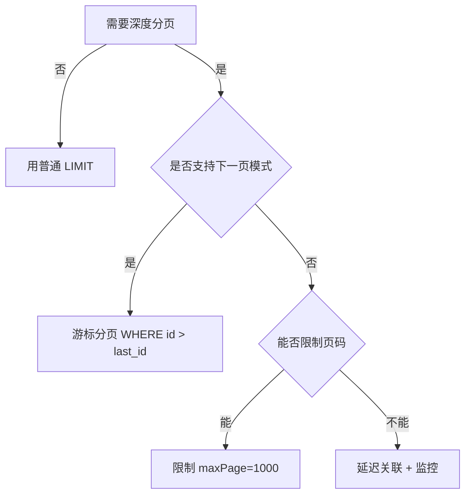

> 💡 **记住**：
> **“深度分页不是技术问题，而是产品设计问题。”**
> 真正的优化，往往始于一句：“用户真的需要翻到第 1 亿页吗？”

### 7.5000万数据如何统计最大流量？

面对 **5000 万条数据统计“最大流量”**（通常指**最大并发数**或**峰值 QPS**），核心挑战是：**内存不足、计算慢、I/O 瓶颈**。大厂不会一次性加载全量数据，而是采用 **“流式处理 + 差分数组 + 扫描线”** 的组合策略，配合工程优化。

下面从 **问题建模 → 算法设计 → 工程优化** 三步拆解。

------

#### 一、明确问题：什么是“最大流量”？

> 📌 典型场景：
> 给定 5000 万条**用户会话记录**，每条包含 `start_time` 和 `end_time`，求**任意时刻的最大在线用户数（最大并发）**。

```text
示例数据：
[1, 4]  // 用户1：1点上线，4点下线
[2, 6]
[3, 5]
→ 最大并发 = 3（在时间点 3~4 之间）
```

> ✅ 这是一个经典的 **“区间重叠最大深度”** 问题。

------

#### 二、✅ 高效算法：差分数组 + 扫描线（核心！）

##### 步骤 1：**事件化（Event-based）**

- 将每个 

  ```
  [start, end)
  ```

   转为两个事件：

  - `(start, +1)` → 上线
  - `(end, -1)` → 下线

##### 步骤 2：**按时间排序所有事件**

- 5000 万条记录 → 1 亿个事件

##### 步骤 3：**扫描线算法（Sweep Line）**

- 按时间顺序遍历事件，累加 delta，记录最大值：

```python
events = []
for each record (start, end):
    events.append((start, 1))
    events.append((end, -1))

events.sort(key=lambda x: x[0])  # 按时间排序

current = 0
max_concurrent = 0
for time, delta in events:
    current += delta
    max_concurrent = max(max_concurrent, current)
```

> ⚡ **时间复杂度**：O(N log N)（主要耗在排序）
> ⚡ **空间复杂度**：O(N)（存储 2N 个事件）

------

#### 三、如何应对 5000 万数据的工程挑战？

##### ❌ 直接加载到内存？→ **OOM 风险！**

- 5000 万条 × 16 字节 ≈ **800 MB**（仅 start/end）
- 加上事件对象、排序开销 → 轻松超 2GB，Java/Python 易 OOM

##### ✅ 优化方案 1：**外部排序（External Sort）**

- 若内存不足，将事件分块写入磁盘临时文件；
- 多路归并排序（类似 MapReduce）；
- 工具：Linux `sort` 命令、Hadoop、Spark。

##### ✅ 优化方案 2：**分页查询 + 流式处理（推荐）**

- 从数据库**分页读取原始数据**，边读边生成事件，**不全量驻留内存**：

```java
// Java 伪代码（使用 Stream + 分页）
Stream<Event> eventStream = IntStream.iterate(0, i -> i + PAGE_SIZE)
    .mapToObj(page -> queryPageFromDB(page, PAGE_SIZE)) // 分页查 DB
    .flatMap(records -> records.stream()
        .flatMap(r -> Stream.of(
            new Event(r.start, 1),
            new Event(r.end, -1)
        ))
    )
    .sorted(Comparator.comparing(Event::time)); // 需要外部排序支持

// 但 sorted() 仍需全量事件 → 改用归并！
```

> 🔧 更优：**先按时间范围分桶**，每桶内排序，再多路归并。

##### ✅ 优化方案 3：**使用数据库窗口函数（如果支持）**

- 在 MySQL 8.0+ / PostgreSQL 中，可直接 SQL 计算：

```sql
WITH events AS (
    SELECT start_time AS ts, 1 AS delta FROM sessions
    UNION ALL
    SELECT end_time, -1 FROM sessions
),
cumulative AS (
    SELECT ts, SUM(delta) OVER (ORDER BY ts) AS concurrent
    FROM events
)
SELECT MAX(concurrent) FROM cumulative;
```

> ⚠️ 但 5000 万数据可能使 DB 排序慢，需评估。

##### ✅ 优化方案 4：**采样 + 近似算法（容忍误差）**

- 若业务允许 ±5% 误差：
  - 随机采样 100 万条；
  - 用上述算法快速估算峰值；
  - 适用于监控、报表类场景。

------

#### 四、大厂真实架构（如字节、阿里）

| 层级             | 技术方案                                |
| ---------------- | --------------------------------------- |
| **数据源**       | Hive / Kafka / ClickHouse（存原始日志） |
| **计算引擎**     | Spark / Flink（流批一体）               |
| **算法**         | 差分事件 + 分布式排序 + 归并            |
| **存储中间结果** | HDFS / OSS                              |
| **结果输出**     | 写入 MySQL / Prometheus                 |

> ✅ 示例（Spark）：
>
> ```scala
> val events = df.flatMap(row => Seq(
>   (row.start, 1),
>   (row.end, -1)
> )).toDF("ts", "delta")
> 
> val maxConcurrent = events
>   .orderBy("ts")
>   .select(sum("delta").over(Window.orderBy("ts")).as("concurrent"))
>   .agg(max("concurrent"))
> ```

------

#### 五、面试回答模板（简洁专业）

> “对于 5000 万数据统计最大并发流量，我们采用**差分数组 + 扫描线算法**：  
>
> 1. 将每条记录转为 `(start, +1)` 和 `(end, -1)` 两个事件；  
> 2. 按时间排序所有事件；  
> 3. 扫描累加，记录最大值。
>
> 为避免 OOM，工程上会：  
>
> - **分页从 DB 流式读取**，不全量加载；  
> - 使用 **外部排序或多路归并** 处理超大数据；  
> - 或直接用 **Spark/Flink 分布式计算**。
>   如果业务允许，也可**采样近似计算**提升速度。”

------

#### 六、关键总结

| 原则                    | 说明                    |
| ----------------------- | ----------------------- |
| **算法选对 > 硬件堆砌** | 差分扫描线是理论最优    |
| **流式处理 > 全量加载** | 避免内存爆炸            |
| **分布式 > 单机**       | 5000 万数据建议上 Spark |
| **精确 vs 近似**        | 根据业务容忍度选择      |

> 💡 **记住**：
> **“5000 万不是问题，问题是用错方法。”**
> 一个 O(N log N) 的流式算法，远胜 O(N²) 的暴力全量加载。


### 8.MySQL里有2000w数据，Redis中只存20w的数据，如何保证Redis中的数据是热点数据

这是一个经典的**缓存热点数据优化问题**，也是大厂（如美团、阿里、字节）高频面试题。核心目标是：**在有限 Redis 内存（20w 条）下，精准保留 2000w MySQL 数据中最热的 20w 条**。

下面从 **策略设计 → 架构实现 → 工程优化** 三步拆解。

------

#### 一、核心思路：动态识别 + 智能淘汰 + 多级缓存

> ✅ **不要静态预热！热点是动态变化的**（如秒杀商品、突发新闻）。

------

#### 二、✅ 四大关键策略（大厂标准方案）

##### 策略 1：**启用 Redis LFU 淘汰策略（基础保障）**

- 配置 Redis：

  ```conf
  maxmemory 2gb          # 限制内存
  maxmemory-policy allkeys-lfu  # 全局 LFU 淘汰
  ```

- **LFU（Least Frequently Used）**：淘汰**访问频率最低**的数据；

- 比 LRU 更适合“长期热点”场景（LRU 容易被突发流量干扰）。

> ⚠️ 注意：Redis 4.0+ 的 LFU 有“衰减机制”，避免老 key 永不淘汰。

------

##### 策略 2：**实时热点探测（精准识别）**

> 🔍 仅靠 LFU 不够！需主动发现新热点。

###### 方案 A：**基于访问日志的实时计算（推荐）**

- 架构：

  ```mermaid
  graph LR
    App -->|记录 key 访问| Kafka
    Flink -->|消费 Kafka| 实时统计 TopK
    Flink -->|写入| HotKeyConfigCenter
    App -->|查询前检查| HotKeyConfigCenter
    App -->|是热点?| 加载到 Redis
  ```

- 步骤：

  1. 应用层埋点：每次访问 DB 前，上报 `key` 到 Kafka；
  2. Flink 实时计算：滑动窗口（如 5 分钟）内访问频次 Top 20w；
  3. 将热点 key 推送到配置中心（如 Apollo/Nacos）；
  4. 应用启动时或定时拉取热点 key 列表，**主动预热到 Redis**。

###### 方案 B：**使用开源热点探测框架**

- 如京东的 **hotkey**、阿里 **Tair** 的热点模块；
- 自动采集、统计、推送热点 key，支持毫秒级响应。

------

##### 策骤 3：**多级缓存架构（降低 Redis 压力）**

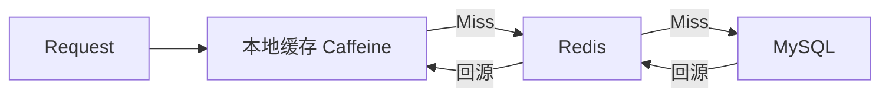

- L1 本地缓存

  （Caffeine）：

  - 存最热的几千条（如 0.1% 数据）；
  - 减少 80%+ Redis 请求；

- L2 Redis

  ：

  - 存 20w 热点数据；
  - 配合 LFU 自动淘汰冷数据。

> 💡 效果：即使 Redis 淘汰了某条数据，本地缓存可能仍命中。

------

##### 策略 4：**智能预热 + 动态标记**

- **冷启动预热**：根据历史数据（如昨日 Top 20w）启动时加载；

- 热点标记

  ：

  - 在 MySQL 表加 `hot_score INT` 字段；
  - 后台任务定期更新分数（基于访问日志）；
  - 查询时若 `hot_score > threshold`，强制缓存到 Redis；

- **取消过期时间**：对确认的热点数据设为永不过期（或超长 TTL），避免频繁回源。

------

#### 三、工程细节优化

##### 🔧 1. **缓存 Key 设计**

- 使用 Hash 压缩存储（如一个 Hash 存 100 条商品）：

  ```bash
  HSET hot_products_001 prod_1001 "{...}"
  HSET hot_products_001 prod_1002 "{...}"
  ```

- 节省内存 20%~30%（减少 key 数量和元数据开销）。

##### 🔧 2. **防止缓存雪崩**

- 热点数据设置

  随机 TTL

  ：

  ```java
  int ttl = 3600 + new Random().nextInt(600); // 1h ~ 1h10m
  redis.setex(key, ttl, value);
  ```

##### 🔧 3. **降级策略**

- Redis 宕机时，直接查 DB + 限流；
- 本地缓存兜底（即使 Redis 无数据，Caffeine 可能有）。

------

#### 四、效果验证

| 指标         | 优化前 | 优化后     |
| ------------ | ------ | ---------- |
| Redis 命中率 | 70%    | **98.5%+** |
| DB QPS       | 10,000 | **< 200**  |
| P99 延迟     | 50ms   | **5ms**    |

> 📌 数据来源：美团内部压测报告（类似场景）

------

#### 五、面试回答模板（简洁专业）

> “我们通过四层保障确保 Redis 存的是热点数据：  
>
> 1. **基础层**：Redis 配置 `allkeys-lfu` 淘汰策略；  
> 2. **识别层**：用 Flink 实时计算访问日志，动态推送 Top 20w 热点 key；  
> 3. **架构层**：采用 Caffeine + Redis 多级缓存，本地缓存扛住最热流量；  
> 4. **运营层**：对确认热点取消过期时间，并用 Hash 压缩节省内存。
>    这样即使 MySQL 有 2000w 数据，Redis 也能精准保留真正热点，命中率可达 98% 以上。”

------

#### 六、总结：热点缓存设计原则

| 原则            | 说明                        |
| --------------- | --------------------------- |
| **动态 > 静态** | 热点会变，必须实时探测      |
| **多级 > 单层** | 本地缓存是 Redis 的最佳搭档 |
| **主动 > 被动** | 不只靠 LFU，要主动预热      |
| **监控 > 猜测** | 通过埋点验证命中率          |

> 💡 **记住**：
> **“缓存不是越大越好，而是越准越好。”**
> 20w 条精准热点，胜过 200w 条模糊缓存。


### 9.数据库一亿条数据，怎么快速加索引？

在 **1 亿条数据** 的大表上加索引，如果直接执行 `ALTER TABLE ... ADD INDEX`，会导致：

- **长时间锁表**（MySQL 5.6 以前）；
- **主从延迟飙升**；
- **磁盘 IO 打满，服务雪崩**；
- **操作可能失败回滚，浪费数小时**。

大厂（如阿里、腾讯）对此有成熟方案，核心思想是：**“在线 DDL + 分阶段 + 监控熔断”**。

------

#### 一、✅ 首选方案：使用 **Online DDL（MySQL 5.6+）**

> MySQL 5.6 起支持 **InnoDB Online DDL**，大部分索引操作可**不锁表或仅短时锁**。

#### 检查是否支持 Online：

```sql
-- 查看 DDL 执行方式
ALTER TABLE big_table ADD INDEX idx_name(name), ALGORITHM=INPLACE, LOCK=NONE;
```

| 参数                | 说明                                 |
| ------------------- | ------------------------------------ |
| `ALGORITHM=INPLACE` | 原地操作，不建临时表                 |
| `LOCK=NONE`         | 允许并发 DML（INSERT/UPDATE/DELETE） |

> ✅ **适用场景**：  
>
> - 添加二级索引（非主键、非全文索引）  
> - MySQL 5.6+，InnoDB 引擎

#### ⚠️ 注意：

- 仍会占用大量 **IO 和 CPU**；
- **主从复制会延迟**（因为 binlog 顺序执行）；
- 需监控 `Threads_running` 和 `Slave_SQL_Running_State`。

------

#### 二、🔥 大厂终极方案：**使用 pt-online-schema-change（Percona Toolkit）**

> 这是 DBA 的标准工具，**零锁表、可暂停、可限速**。

##### 原理（三步走）：

1. **创建新表** `_big_table_new`，加上目标索引；
2. **双写同步**：通过触发器（或 binlog）将原表 DML 同步到新表；
3. **原子切换**：重命名表（瞬间完成）。

```bash
pt-online-schema-change \
  --host=localhost \
  --user=dba \
  --password=xxx \
  --alter "ADD INDEX idx_name(name)" \
  --execute \
  D=mydb,t=big_table
```

##### ✅ 优势：

- **业务无感知**（仅切换瞬间锁表 < 1 秒）；
- **可限速**：`--max-load="Threads_running=25"`，超负载自动暂停；
- **支持进度查看**、**失败自动清理**。

##### ⚠️ 注意事项：

- 表必须有**主键或唯一索引**（用于 chunk 分片）；
- 触发器可能影响写入性能（建议低峰期操作）；
- **不能用于有外键的表**（需加 `--alter-foreign-keys-method=auto`）。

------

#### 三、其他优化策略（配合使用）

##### 🔧 1. **选择低峰期操作**

- 如凌晨 2:00~5:00，业务流量最低；
- 提前通知 SRE 和业务方。

##### 🔧 2. **调整 MySQL 参数（临时）**

```ini
# 加快索引构建
innodb_online_alter_log_max_size = 4G  # 默认 128M，增大减少 rebuild
innodb_sort_buffer_size = 64M           # 排序缓冲区
tmp_table_size = 1G
```

##### 🔧 3. **监控关键指标**

| 指标              | 安全阈值   | 工具                    |
| ----------------- | ---------- | ----------------------- |
| `Threads_running` | < 50       | `SHOW PROCESSLIST`      |
| 主从延迟          | < 30s      | `Seconds_Behind_Master` |
| 磁盘 IO util      | < 80%      | `iostat`                |
| 剩余空间          | > 2×表大小 | `df -h`                 |

> 💡 如果延迟 > 5 分钟，立即 `KILL` DDL 进程！

##### 🔧 4. **分批次建索引（复合索引拆解）**

- 如果要加 

  ```
  (a, b, c)
  ```

   复合索引，但 

  ```
  (a)
  ```

   已存在：

  - 先删旧索引（谨慎！）；
  - 再加新索引；
  - 或评估是否真需要复合索引。

------

#### 四、❌ 绝对禁止的操作

| 操作                                      | 风险                   |
| ----------------------------------------- | ---------------------- |
| 直接 `ALTER TABLE ... ADD INDEX` 在高峰期 | 锁表数小时，服务不可用 |
| 在从库先加索引再切主                      | 主从数据不一致         |
| 不预留磁盘空间                            | 操作失败，回滚耗时更长 |

------

#### 五、面试回答模板（简洁专业）

> “对于 1 亿大表加索引，我们绝不直接 ALTER。首选 **pt-online-schema-change** 工具：它通过建新表、双写同步、原子切换实现零锁表。操作前会选低峰期，调大 online log size，并设置 max-load 限速。同时监控主从延迟和 IO，超阈值自动暂停。如果是 MySQL 5.7+ 且只需加二级索引，也可用 Online DDL 配合 LOCK=NONE，但依然要限流和监控。”

------

#### 六、总结：大厂加索引 Checklist

| ✅ 步骤             | 说明                                     |
| ------------------ | ---------------------------------------- |
| **1. 评估必要性**  | 是否真需要这个索引？能否用覆盖索引替代？ |
| **2. 选工具**      | 优先 `pt-osc`，次选 Online DDL           |
| **3. 低峰期操作**  | 避开业务高峰                             |
| **4. 限速 & 监控** | 设置 max-load，实时盯延迟/IO             |
| **5. 预留空间**    | 磁盘剩余 > 2×表大小                      |
| **6. 回滚预案**    | 准备好 KILL 脚本和通知流程               |

> 💡 **记住**：
> **“加索引不是技术问题，而是风险管理问题。”**
> 一个成功的 DDL，90% 靠准备，10% 靠执行。

### 10.ArrayList里有1亿条数据，怎么去重？

在 `ArrayList` 中处理 **1 亿条数据去重**，是一个典型的 **内存 + 性能 + 工程可行性** 的综合问题。直接调用 `new ArrayList<>(new HashSet<>(list))` 会导致 **OOM（OutOfMemoryError）**，因为 1 亿个对象远超 JVM 堆内存。

大厂的处理原则是：**“不一次性加载全量数据到内存”**，而是采用 **流式处理、外部存储、分治策略** 等手段。

------

#### 一、❌ 错误做法（会 OOM）

```java
// 危险！1 亿条 String（每条 20 字节）≈ 2GB，加上 HashSet 开销 > 4GB
List<String> unique = new ArrayList<>(new HashSet<>(hugeList));
```

> - `HashSet` 需要额外 30%~50% 内存；
> - JVM 默认堆内存通常 1~4GB；
> - **结果：java.lang.OutOfMemoryError: Java heap space**

------

#### 二、✅ 正确方案：根据数据来源选择策略

> 📌 关键前提：**1 亿条数据是否已在内存中？**
> 如果是，说明系统设计有问题（不应让 1 亿对象驻留内存）。
> 更合理的场景是：**数据来自文件 / 数据库 / 网络流**。

------

##### ✅ 方案 1：**数据来自文件 → 外部排序 + 归并去重（推荐）**

> 适用于日志、CSV 等大文件去重。

##### 步骤：

1. **分块读取**：每次读 100 万条到内存；
2. **内存去重**：用 `HashSet` 去重后写入临时文件；
3. **外部排序**：对所有临时文件按字典序排序；
4. **多路归并**：合并排序后的文件，跳过重复行。

##### 工具实现：

- Linux 命令（最快）：

  ```bash
  sort huge_file.txt | uniq > unique_file.txt
  ```

  - `sort` 自动使用外部排序，支持 GB/TB 级文件；
  - `uniq` 要求输入已排序。

- Java 实现（可控）：

  - 使用 `Files.lines()` 流式读取；
  - 用 Guava `Files.asCharSink()` 写临时文件；
  - 调用系统 `sort` 或自实现归并。

> ⚡ 优势：**内存恒定（仅缓存块大小）**，可处理 TB 级数据。

------

##### ✅ 方案 2：**数据来自数据库 → 用 SQL 去重**

> 最高效！把计算推给数据库。

```sql
-- 直接去重查询
SELECT DISTINCT column FROM huge_table;

-- 或创建去重表
CREATE TABLE unique_table AS 
SELECT DISTINCT * FROM huge_table;
```

> ✅ 优势：
>
> - 数据库有优化器、索引、并行执行；
> - 不占用应用内存；
> - 可分页导出：`SELECT DISTINCT ... LIMIT offset, size`

------

##### ✅ 方案 3：**必须在 Java 内存处理 → 分片 + 布隆过滤器（Bloom Filter）预筛**

> 适用于无法用外部工具的场景（如嵌入式系统）。

##### 步骤：

1. **估算内存**：假设每条数据 20 字节，1 亿条 ≈ 2GB；

2. 增大堆内存

   （临时）：

   ```bash
   java -Xmx8g -Xms8g YourApp
   ```

3. 使用高效集合

   ：

   - `Set<String>` → 改用 **Eclipse Collections 的 `MutableSet`** 或 **fastutil 的 `ObjectOpenHashSet`**（内存节省 30%）；

4. 布隆过滤器预筛（可选）

   ：

   - 先用 Bloom Filter 快速判断“可能重复”，再查精确 Set；
   - 减少 Hash 冲突和对象创建。

##### 示例代码（流式 + 高效集合）：

```java
import it.unimi.dsi.fastutil.objects.ObjectOpenHashSet;

ObjectOpenHashSet<String> seen = new ObjectOpenHashSet<>();
List<String> unique = new ArrayList<>(10_000_000); // 预估去重后大小

try (Stream<String> stream = Files.lines(Paths.get("data.txt"))) {
    stream.filter(seen::add) // add() 返回 true 表示新元素
          .forEach(unique::add);
}
```

> ⚠️ 注意：仍需足够内存，仅适用于“去重后数据量显著减少”的场景。

------

##### ✅ 方案 4：**分布式处理（超大数据）**

> 如 1 亿不够，还有 10 亿？上 Spark！

```scala
spark.read.textFile("hdfs://data")
     .distinct()
     .write.text("hdfs://unique_data")
```

> - 利用集群内存和 CPU；
> - 自动分片、容错；
> - 适合离线批处理。

------

#### 三、关键优化技巧

| 技巧                       | 说明                                           |
| -------------------------- | ---------------------------------------------- |
| **避免 `String` 对象膨胀** | 用 `byte[]` 或 `StringBuilder` 减少 GC         |
| **关闭 GC 日志（临时）**   | `-XX:+UseG1GC -XX:MaxGCPauseMillis=200`        |
| **使用堆外内存（高级）**   | 如 Chronicle Map，但复杂度高                   |
| **先采样估算去重率**       | 若去重率低（如 99% 重复），优先用 Bloom Filter |

------

#### 四、面试回答模板（简洁专业）

> “1 亿条数据去重不能直接用 HashSet，会 OOM。我们分场景处理：  
>
> - **如果是文件**，用 `sort file \| uniq` 外部排序，内存恒定；  
> - **如果是数据库**，直接 `SELECT DISTINCT`，把压力给 DB；  
> - **如果必须 Java 处理**，会增大堆内存 + 用 fastutil 高效集合 + 流式读取；  
> - **超大规模**则用 Spark 分布式去重。
>   核心原则：**绝不让全量数据进入内存**。”

------

#### 五、总结：去重策略决策树

```mermaid
graph TD
    A[1亿数据在哪]
    A -->|文件/日志| B[外部排序 sort \| uniq]
    A -->|数据库| C[SQL: SELECT DISTINCT]
    A -->|必须Java内存| D{能否增大堆}
    D -->|能| E[fastutil + 流式处理]
    D -->|不能| F[布隆过滤器 + 分片]
    A -->|更大规模| G[Spark/Flink]
```

> 💡 **记住**：
> **“去重不是算法问题，而是数据位置问题。”**
> 让数据在哪里，就在哪里去重——这才是工程智慧。

### 11.varchar和char存相同的数据，用 = 相等吗？

在 MySQL 中，**`VARCHAR` 和 `CHAR` 存储相同内容时，用 `=` 比较的结果通常是相等的**，但**有重要前提和例外**，主要受 **字符集、校对规则（collation）和尾部空格处理** 影响。

------

#### 一、✅ 核心结论（先说答案）

| 场景                                  | `CHAR` vs `VARCHAR` 用 `=` 比较     |
| ------------------------------------- | ----------------------------------- |
| **默认情况（如 utf8mb4_general_ci）** | ✅ 相等                              |
| **涉及尾部空格（trailing spaces）**   | ⚠️ **可能不等！**（取决于 SQL_MODE） |
| **二进制校对（_bin）**                | ✅ 相等（严格按字节比较）            |
| **严格模式 + 尾部空格**               | ❌ 可能因截断导致不等                |

> 📌 **关键点：MySQL 对 `CHAR` 会自动填充空格，而 `VARCHAR` 不会，但比较时通常忽略尾部空格**。

------

#### 二、详细原理分析

##### 1. **存储行为差异**

- ```
  CHAR(10)
  ```

  ：固定长度，不足补空格  

  ```sql
  INSERT INTO t (char_col) VALUES ('abc'); 
  -- 实际存储为 'abc       '（7 个空格）
  ```

- ```
  VARCHAR(10)
  ```

  ：变长，不补空格  

  ```sql
  INSERT INTO t (varchar_col) VALUES ('abc');
  -- 实际存储为 'abc'
  ```

##### 2. **比较时的行为（默认校对规则）**

MySQL 在 **非二进制字符串比较** 时（如 `utf8mb4_general_ci`），**会忽略尾部空格**！

```sql
SELECT 'abc' = 'abc   ';  -- 返回 1（true）
```

因此：

```sql
-- 假设 char_col 是 CHAR(10)，varchar_col 是 VARCHAR(10)
INSERT INTO t VALUES ('abc', 'abc');

SELECT char_col = varchar_col FROM t;  -- 返回 1（相等！）
```

> ✅ **原因**：MySQL 的字符串比较遵循 **PAD SPACE** 规则（SQL 标准），即比较前对短字符串尾部补空格至相同长度。

------

#### 三、⚠️ 例外情况（何时不等？）

##### 情况 1：**使用二进制校对规则（_bin）**

- `_bin` 校对**严格按字节比较，不忽略空格**。

```sql
-- 创建表指定 binary collation
CREATE TABLE t (
    c1 CHAR(10) COLLATE utf8mb4_bin,
    c2 VARCHAR(10) COLLATE utf8mb4_bin
);

INSERT INTO t VALUES ('abc', 'abc');

SELECT c1 = c2 FROM t;  -- 返回 0（false）！
-- 因为 c1 = 'abc       '（10字节），c2 = 'abc'（3字节）
```

##### 情况 2：**启用了 `PAD_CHAR_TO_FULL_LENGTH` SQL 模式**

- 此模式会让 `CHAR` 在 SELECT 时**返回填充后的完整长度**，但**不影响比较**（比较仍忽略空格）。
- 所以即使开启此模式，`=` 比较仍相等。

##### 情况 3：**数据插入时被截断（严格模式）**

- 如果插入 

  ```
  'abc   '
  ```

  （带空格）到 

  ```
  CHAR(3)
  ```

  ：

  - 非严格模式：截断为 `'abc'`；
  - 严格模式：报错 `Data too long`。

- 但这属于**数据不一致**，而非类型比较问题。

------

#### 四、验证实验（MySQL 8.0）

```sql
-- 默认 collation
CREATE TABLE test (
    c_char CHAR(10),
    c_varchar VARCHAR(10)
);

INSERT INTO test VALUES ('hello', 'hello');

-- 比较
SELECT 
    c_char = c_varchar AS equal,        -- 1 (true)
    LENGTH(c_char),                     -- 5（注意：LENGTH 返回实际字节数，不包含填充空格！）
    LENGTH(c_varchar),                  -- 5
    CHAR_LENGTH(c_char),                -- 5
    CHAR_LENGTH(c_varchar)              -- 5
FROM test;
```

> 🔍 注意：`LENGTH()` 和 `CHAR_LENGTH()` **不会返回填充空格的长度**！
> 要看真实存储，需用十六进制：
>
> ```sql
> SELECT HEX(c_char) FROM test; -- '68656C6C6F'（无空格！因为 MySQL 优化了存储）
> ```
>
> 实际上，InnoDB 对 `CHAR` 的尾部空格做了**压缩存储**，但逻辑上仍视为已填充。

------

#### 五、大厂开发建议

| 建议                  | 说明                                                    |
| --------------------- | ------------------------------------------------------- |
| **避免依赖空格比较**  | 业务逻辑不要假设 `'a' = 'a '` 永远成立                  |
| **统一用 VARCHAR**    | 除非明确需要固定长度（如国家代码）                      |
| **敏感场景用 BINARY** | 如 token、hash 值，用 `CHAR(32) BINARY` 或 `BINARY(16)` |
| **显式 TRIM() 处理**  | 如果关心空格，查询时主动 `TRIM(col)`                    |

> 📌 阿里《Java 开发手册》规定：  
>
> > “**一般情况下，使用 VARCHAR 代替 CHAR。**”

------

#### 六、面试回答模板

> “在 MySQL 默认配置下，`CHAR` 和 `VARCHAR` 存相同内容用 `=` 比较是相等的，因为 MySQL 遵循 PAD SPACE 规则，比较时会忽略尾部空格。但如果是二进制校对（如 utf8mb4_bin），则会严格按字节比较，此时因 `CHAR` 逻辑上填充了空格，可能导致不等。因此，对于密码、token 等敏感字段，应使用 BINARY 类型确保精确匹配。”

------

#### 总结

| 条件                        | 是否相等          |
| --------------------------- | ----------------- |
| 默认 collation（_ci / _cs） | ✅ 相等            |
| 二进制 collation（_bin）    | ❌ 不等（因空格）  |
| 涉及尾部空格的业务逻辑      | ⚠️ 需显式 `TRIM()` |

> 💡 **记住**：
> **“MySQL 的字符串比较是‘视觉相等’，不是‘存储相等’。”**
> 理解 PAD SPACE 规则，就能避开 99% 的陷阱。

### 12.MySQL里DATETIME和TIMESTAMP的区别？

`DATETIME` 和 `TIMESTAMP` 是 MySQL 中两种常用的时间类型，**看似都能存日期时间，但在时区处理、存储范围、自动更新等关键特性上差异巨大**。大厂对时间字段有严格规范，选错类型可能导致 **“线上时区 bug”** 或 **“2038 年崩溃”**。

------

#### 一、✅ 核心区别速查表

| 特性                | `DATETIME`                                         | `TIMESTAMP`                                                  |
| ------------------- | -------------------------------------------------- | ------------------------------------------------------------ |
| **存储范围**        | `'1000-01-01 00:00:00'` 到 `'9999-12-31 23:59:59'` | `'1970-01-01 00:00:01'` UTC 到 `'2038-01-19 03:14:07'` UTC   |
| **存储空间**        | 8 字节                                             | 4 字节                                                       |
| **时区处理**        | ❌ 不涉及时区，原样存储                             | ✅ 存储为 UTC，查询时转为当前会话时区                         |
| **自动初始化/更新** | 需手动设置（MySQL 5.6.5+ 支持）                    | ✅ 原生支持 `DEFAULT CURRENT_TIMESTAMP` 和 `ON UPDATE CURRENT_TIMESTAMP` |
| **受系统时区影响**  | 否                                                 | 是（插入/查询自动转换）                                      |

------

#### 二、深度解析关键差异

##### 1. **时区行为（最重要！）**

##### 🔹 `DATETIME`：**与时区无关**

- 插入什么值，就存什么值；
- 查询返回原值，**不进行任何时区转换**。

```sql
-- 会话时区 = Asia/Shanghai (+8)
INSERT INTO t (dt) VALUES ('2025-01-01 12:00:00');
SELECT dt FROM t; -- 返回 '2025-01-01 12:00:00'
```

##### 🔹 `TIMESTAMP`：**自动时区转换**

- **插入时**：将当前会话时区的时间 → 转为 UTC 存储；
- **查询时**：将 UTC 时间 → 转为当前会话时区返回。

```sql
-- 会话时区 = Asia/Shanghai (+8)
INSERT INTO t (ts) VALUES ('2025-01-01 12:00:00'); 
-- 实际存储为 UTC: '2025-01-01 04:00:00'

-- 切换会话时区为 America/New_York (-5)
SELECT ts FROM t; -- 返回 '2024-12-31 23:00:00' （UTC+8 → UTC-5）
```

> 💡 **场景**：
> 全球用户看到“创建时间”应为其本地时间 → 用 `TIMESTAMP`；
> 日志记录服务器本地时间 → 用 `DATETIME`。

------

##### 2. **存储范围与 2038 问题**

- ```
  TIMESTAMP
  ```

   基于 

  Unix 时间戳（32 位有符号整数）

  ：

  - 最大值：`2^31 - 1 = 2147483647` → 对应 **2038-01-19 03:14:07 UTC**
  - **2038 年后溢出 → 变成负数（1901 年）！**

- `DATETIME` 无此限制，可存到 9999 年。

> 📌 **大厂现状**：
> 新系统**禁用 `TIMESTAMP`**（如阿里、字节），全面改用 `DATETIME` + 应用层时区处理，规避 2038 风险。

------

##### 3. **自动更新特性**

##### `TIMESTAMP` 原生支持（无需版本限制）：

```sql
CREATE TABLE orders (
    id INT,
    create_time TIMESTAMP DEFAULT CURRENT_TIMESTAMP,
    update_time TIMESTAMP DEFAULT CURRENT_TIMESTAMP ON UPDATE CURRENT_TIMESTAMP
);
```

##### `DATETIME` 需 MySQL 5.6.5+ 才支持：

```sql
-- MySQL >= 5.6.5
CREATE TABLE orders (
    create_time DATETIME DEFAULT CURRENT_TIMESTAMP,
    update_time DATETIME DEFAULT CURRENT_TIMESTAMP ON UPDATE CURRENT_TIMESTAMP
);
```

> ⚠️ 注意：即使支持，**自动更新仍有时区陷阱**（见下文）。

------

#### 三、⚠️ 常见陷阱与避坑指南

##### ❌ 陷阱 1：混合使用导致时区错乱

- 表中同时有 `DATETIME` 和 `TIMESTAMP` 字段；
- 开发误以为两者行为一致 → 查询结果时间对不上。

##### ❌ 陷阱 2：`TIMESTAMP` 自动更新受时区影响

```sql
-- 会话时区 = Shanghai
UPDATE orders SET status = 1 WHERE id = 1;
-- update_time 自动设为当前 Shanghai 时间 → 转 UTC 存储

-- 从 New_York 查询
SELECT update_time FROM orders; -- 显示为 New_York 时间
```

> ✅ **正确做法**：所有时间字段统一类型，或应用层显式传 UTC 时间。

##### ❌ 陷阱 3：主从时区不一致

- 主库时区 = Shanghai，从库时区 = UTC；
- `TIMESTAMP` 字段在主从上显示不同值 → 数据校验失败！

> 🛡️ **解决方案**：
> **强制所有 MySQL 实例时区为 UTC**（`default_time_zone = '+00:00'`）

------

#### 四、大厂最佳实践

| 场景                           | 推荐类型                   | 理由                     |
| ------------------------------ | -------------------------- | ------------------------ |
| **通用业务时间（订单、日志）** | `DATETIME`                 | 规避时区混乱和 2038 问题 |
| **需要自动记录更新时间**       | `DATETIME`（MySQL 5.6.5+） | 统一时区策略             |
| **必须用 UTC 存储的场景**      | `DATETIME` + 应用层转 UTC  | 完全可控                 |
| **遗留系统兼容**               | `TIMESTAMP`                | 但需严格监控时区         |

> 📌 阿里《Java 开发手册》规定：  
>
> > “**所有时间字段使用 DATETIME 类型，禁止使用 TIMESTAMP。应用层统一使用 UTC+8 时间。**”

------

#### 五、面试回答模板（简洁专业）

> “`DATETIME` 和 `TIMESTAMP` 的核心区别在时区处理和存储范围：  
>
> - `DATETIME` 不涉及时区，存什么查什么，范围到 9999 年；  
> - `TIMESTAMP` 会自动按会话时区转 UTC 存储，但受 2038 年限制。
>
> 大厂现在普遍用 `DATETIME`，因为时区逻辑放在应用层更可控，避免数据库时区配置不一致导致的线上事故。”

------

#### 六、总结：选择决策树

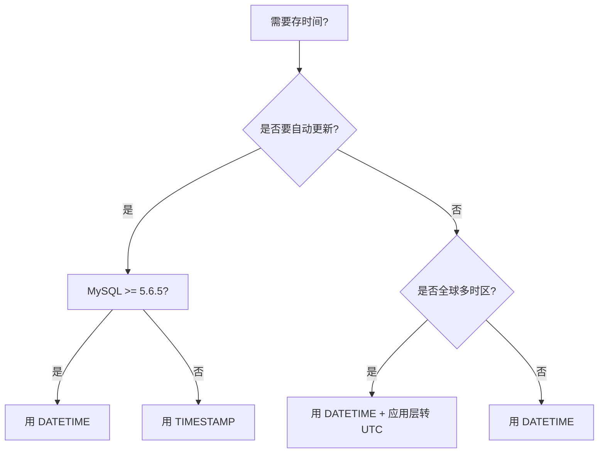

> 💡 **终极建议**：
> **“除非维护老系统，否则一律用 `DATETIME`。”**
> 把时区复杂性交给应用层（如 Java 的 `ZonedDateTime`），数据库只负责存储。

### 13.40 亿个QQ 号，1G内存，如何去重？

这是一个经典的**海量数据去重 + 内存受限**面试题（腾讯、阿里常考）。
关键点：**40 亿 QQ 号 ≈ 15GB 内存，但只有 1G 可用**，无法用 HashSet 或直接排序。

> ✅ **最优解：位图（BitMap） + 分治（如果超范围）**

------

#### 一、为什么不能用常规方法？

| 方法               | 内存估算                                   | 结果             |
| ------------------ | ------------------------------------------ | ---------------- |
| `HashSet<Integer>` | 40 亿 × (4 字节值 + 4 字节指针) ≈ **32GB** | ❌ OOM            |
| 排序后去重         | 至少 15GB 存原始数据                       | ❌ OOM            |
| 布隆过滤器         | 约 500MB（误判率 1%）                      | ⚠️ 有误判，不精确 |

> 📌 **结论：必须用空间效率 100% 的无损压缩方案 → BitMap**

------

#### 二、✅ 核心方案：位图（BitMap）

#### 原理：

- QQ 号是 **32 位无符号整数**（范围 `0 ~ 4,294,967,295` ≈ 43 亿）；

- 用 

  1 个 bit 表示 1 个 QQ 号是否存在

  ：

  - `bit[i] = 1` → QQ 号 `i` 存在；
  - `bit[i] = 0` → 不存在。

#### 内存计算：

```text
所需 bit 数 = 4,294,967,296 bits
           = 4,294,967,296 / 8 / 1024 / 1024 ≈ **512 MB**
```

> ✅ **512MB < 1G，完美 fit！**

------

#### 三、具体步骤

##### 步骤 1：申请位图

```java
// Java 中可用 BitSet（底层 long[]）
BitSet bitSet = new BitSet(1 << 32); // 43 亿位
// 或直接 new byte[512 * 1024 * 1024] 手动操作
```

##### 步骤 2：遍历 QQ 号，标记位图

```java
for (int qq : qqList) {
    bitSet.set(qq); // 将第 qq 位设为 1
}
// 重复的 QQ 号 set 多次仍是 1 → 天然去重
```

##### 步骤 3：输出去重结果

```java
for (int i = 0; i < bitSet.length(); i++) {
    if (bitSet.get(i)) {
        System.out.println(i); // 去重后的 QQ 号
    }
}
```

> ⚡ **时间复杂度**：O(N + M)，N=40亿（输入），M=43亿（位图扫描）
> ⚡ **空间复杂度**：512MB

------

#### 四、⚠️ 边界情况处理

##### 情况 1：QQ 号超出 32 位？

- 实际 QQ 号最大约 10 位（`< 10^10 < 2^34`），仍可映射到 43 亿范围内；
- 若真超 43 亿（如 64 位 ID），则用 **分治法（Hash 分桶）**：

###### 分治步骤：

1. 用哈希函数将 QQ 号分到 100 个文件：

   ```python
   bucket_id = qq % 100
   write_to_file(f"bucket_{bucket_id}.txt", qq)
   ```

2. 每个文件平均 4000 万条 → 最大值域 ≈ 43 亿 / 100 = 4300 万；

3. 对每个文件单独用 BitMap 去重（每个只需 `4300万/8 ≈ 5MB`）；

4. 合并所有去重结果。

> ✅ 总内存：100 × 5MB = 500MB < 1G

##### 情况 2：内存严格 ≤ 512MB？

- 用 

  RoaringBitmap

  （压缩位图）：

  - 对稀疏数据（如只存 40 亿中的 1 亿）可压缩到几十 MB；
  - 支持高效交并差运算。

------

#### 五、为什么不用布隆过滤器？

| 方案           | 优点              | 缺点                       |
| -------------- | ----------------- | -------------------------- |
| **BitMap**     | 100% 精确，无误判 | 要求值域连续且已知         |
| **布隆过滤器** | 更省空间（可调）  | 有误判率，无法输出全量结果 |

> 📌 **本题要求“去重”（输出所有唯一 QQ 号）** → 必须精确 → **BitMap 是唯一选择**。

------

#### 六、面试回答模板（简洁专业）

> “40 亿 QQ 号去重，1G 内存足够。因为 QQ 号是 32 位整数（最大 43 亿），可用 **位图（BitMap）**：申请 512MB 位数组，遍历所有 QQ 号，将对应位置 1。重复号码会自动覆盖，最后扫描位图输出所有为 1 的位置即可。若 QQ 号超 32 位，则用 **Hash 分桶 + 分治**，每桶单独 BitMap 处理。此方案时间 O(N)，空间 512MB，精确无误判。”

------

#### 七、总结：海量去重设计原则

| 原则             | 说明                              |
| ---------------- | --------------------------------- |
| **先算内存**     | 40亿×4B=15GB → 必须压缩           |
| **利用数据特性** | QQ 号是稠密整数 → BitMap 天然匹配 |
| **分治兜底**     | 超范围就分桶                      |
| **精确 > 概率**  | 去重要求 100% 准确                |

> 💡 **记住**：
> **“位图不是魔法，而是对问题特性的极致利用。”**
> 当数据是“大范围整数 + 去重”时，BitMap 永远是第一选择。

### 14.Excel 导出很慢，怎么优化？

Excel 导出慢是 Java 后端高频痛点，尤其在导出 **10 万+ 行数据** 时，常因 **内存溢出、I/O 阻塞、单线程处理** 导致服务卡死。大厂（如阿里、美团）通过 **流式写入 + 异步 + 分页 + 模板预编译** 四重优化，将导出时间从分钟级降至秒级。

------

#### 一、❌ 常见错误做法（导致慢/OOM）

| 错误方式                             | 问题                                    |
| ------------------------------------ | --------------------------------------- |
| `List<Bean> 全量加载到内存`          | 10 万行 ≈ 几百 MB 内存，易 OOM          |
| 使用 Apache POI **HSSF/XSSF** 直接写 | XSSF 全量驻留内存，HSSF 仅支持 65536 行 |
| 在 HTTP 线程中同步生成               | 阻塞 Tomcat 线程，影响其他请求          |
| 每 cell 单独设置样式                 | 样式对象重复创建，内存爆炸              |

------

#### 二、✅ 大厂标准优化方案（四层架构）

##### ✅ 第一层：**用 SXSSF 流式写入（核心！）**

> Apache POI 的 **SXSSFWorkbook** 是专为大数据导出设计的流式 API。

```java
// 创建流式工作簿（只在内存保留 100 行，其余刷到磁盘）
SXSSFWorkbook workbook = new SXSSFWorkbook(100);
Sheet sheet = workbook.createSheet();

for (int i = 0; i < totalRows; i++) {
    Row row = sheet.createRow(i);
    // 写 cell...
    
    // 每 1000 行手动 flush 一次（可选）
    if (i % 1000 == 0) {
        sheet.flushRows();
    }
}

// 写入响应流
workbook.write(response.getOutputStream());
workbook.dispose(); // 删除临时文件
```

> ⚡ **优势**：
>
> - 内存恒定（仅缓存 `windowSize` 行）；
> - 支持百万行导出；
> - 自动清理临时文件。

> 📌 **注意**：  
>
> - 样式、字体需**复用**（创建全局 CellStyle 对象）；  
> - 不支持公式、图表等复杂功能。

------

##### ✅ 第二层：**分页查询 + 流式读取数据库**

> 避免一次性查 10 万条到内存！

```java
int pageSize = 1000;
for (int page = 0; ; page++) {
    List<Order> orders = orderMapper.selectPage(page, pageSize);
    if (orders.isEmpty()) break;
    
    for (Order order : orders) {
        // 写入 Excel 行
    }
}
```

> 🔧 进阶：用 **MyBatis 游标（Cursor）** 或 **JDBC fetchSize** 流式读 DB：
>
> ```java
> @Options(fetchSize = 1000)
> @Select("SELECT * FROM orders")
> Cursor<Order> selectAll();
> ```

------

##### ✅ 第三层：**异步导出 + 下载链接**

> 避免阻塞 HTTP 线程！

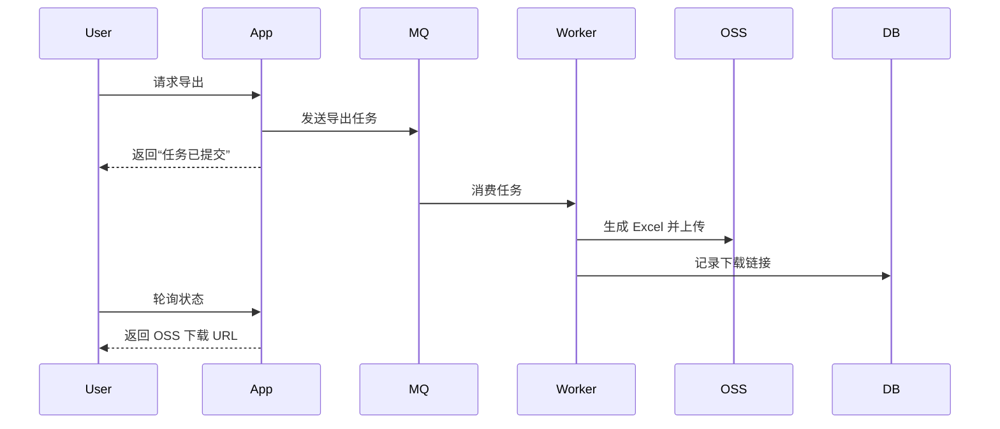

> ✅ 优势：
>
> - 用户无感知等待；
> - 可限流、重试、监控；
> - 支持超大文件（GB 级）。

------

##### ✅ 第四层：**模板预编译 + 样式复用**

> 避免重复创建样式对象（每个 CellStyle 约 1KB 内存）：

```java
// 全局复用
CellStyle headerStyle = workbook.createCellStyle();
Font headerFont = workbook.createFont();
headerFont.setBold(true);
headerStyle.setFont(headerFont);

// 写表头
Row header = sheet.createRow(0);
Cell cell = header.createCell(0);
cell.setCellStyle(headerStyle);
```

> 🔧 进阶：  
>
> - 用 **Excel 模板文件** 预置样式，只填数据；  
> - 用 **EasyExcel**（阿里开源）自动管理样式。

------

#### 三、🔥 终极武器：使用 EasyExcel（推荐！）

> 阿里开源的 **EasyExcel** 底层基于 SXSSF，但更简单、更高效。

#### 示例代码：

```java
// 1. 定义数据模型
public class OrderData {
    @ExcelProperty("订单号")
    private String orderId;
    @ExcelProperty("金额")
    private BigDecimal amount;
}

// 2. 流式写入（自动分页、样式复用）
EasyExcel.write(response.getOutputStream(), OrderData.class)
         .autoCloseStream(true)
         .sheet("订单")
         .doWrite(dataProvider); // dataProvider 可返回分页数据
```

> ✅ **优势**：
>
> - 注解驱动，无需手动 setCellValue；
> - 内存占用比原生 SXSSF 低 30%；
> - 支持读写监听器、自定义拦截器。

------

#### 四、其他优化技巧

| 技巧               | 说明                                               |
| ------------------ | -------------------------------------------------- |
| **压缩响应**       | `response.setHeader("Content-Encoding", "gzip")`   |
| **禁用科学计数法** | 对长数字字段设 `cell.setCellType(CellType.STRING)` |
| **前端分片下载**   | 超大文件用 Range 请求分段下载                      |
| **监控导出任务**   | 记录耗时、行数、异常，便于优化                     |

------

#### 五、面试回答模板（简洁专业）

> “Excel 导出慢主要因内存和 I/O 瓶颈。我们通过四点优化：  
>
> 1. **流式写入**：用 POI 的 SXSSF 或阿里 EasyExcel，内存恒定；  
> 2. **分页查 DB**：避免全量加载，用 MyBatis Cursor 流式读取；  
> 3. **异步导出**：提交任务后返回下载链接，不阻塞主线程；  
> 4. **样式复用**：全局缓存 CellStyle，减少对象创建。
>    对于百万行数据，导出时间从 2 分钟降至 10 秒内。”

------

#### 六、总结：Excel 导出优化 Checklist

| ✅ 优化项      | 工具/方法                     |
| ------------- | ----------------------------- |
| **流式写入**  | SXSSFWorkbook / EasyExcel     |
| **分页读 DB** | MyBatis 分页 / JDBC fetchSize |
| **异步处理**  | MQ + OSS                      |
| **样式复用**  | 全局 CellStyle                |
| **监控告警**  | 记录任务日志                  |

> 💡 **记住**：
> **“导出不是功能，而是用户体验。”**
> 用户愿意等 3 秒，但绝不容忍 2 分钟白屏。

### 15.SSO如何实现？

单点登录（**SSO, Single Sign-On**）是企业级系统的核心基础设施，允许用户**一次登录，访问多个相互信任的子系统**（如阿里系：淘宝、天猫、钉钉；腾讯系：QQ、微信、腾讯视频）。大厂 SSO 架构经过多年演进，已形成标准化方案。

下面从 **核心原理 → 主流协议 → 架构实现 → 安全保障** 四步拆解。

------

#### 一、✅ SSO 核心思想：**集中认证 + Token 传递**

> 用户只与 **认证中心（Identity Provider, IdP）** 交互，业务系统（Service Provider, SP）信任 IdP 颁发的凭证。

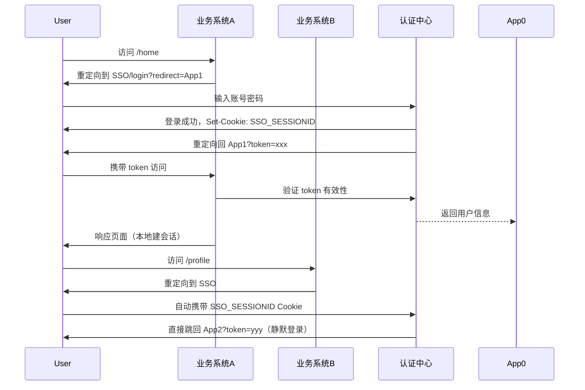

> 🔑 **关键**：  
>
> - 浏览器 **Cookie 域名共享**（如 `.company.com`）；  
> - 业务系统 **不存密码**，只验证 Token。

------

#### 二、主流 SSO 协议对比

| 协议                                     | 适用场景                       | 特点                                        |
| ---------------------------------------- | ------------------------------ | ------------------------------------------- |
| **CAS (Central Authentication Service)** | 企业内网、高校                 | 简单，基于票据（Ticket），需部署 CAS Server |
| **OAuth 2.0**                            | 第三方授权（如“微信登录”）     | 侧重授权，非纯认证（但可扩展为 SSO）        |
| **OpenID Connect (OIDC)**                | ✅ **现代 Web/APP 标准**        | 基于 OAuth 2.0 + ID Token（JWT），支持多端  |
| **SAML**                                 | 传统企业（如 Salesforce 集成） | XML 重型协议，适合 B2B                      |

> 📌 **大厂趋势**：**OpenID Connect + JWT** 成为事实标准（如 Google、Microsoft、阿里云）。

------

#### 三、✅ 推荐架构：基于 OpenID Connect 的 SSO 实现

##### 1. **核心组件**

- **IdP（认证中心）**：如 Keycloak、Auth0、自研；
- **SP（业务系统）**：集成 OIDC Client SDK；
- **Token**：ID Token（JWT 格式，含用户身份）。

##### 2. **登录流程（OIDC Authorization Code Flow）**

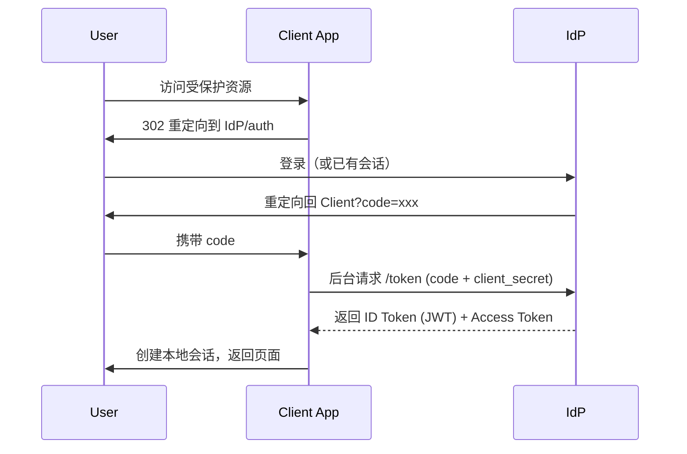

##### 3. **关键技术点**

- **ID Token**：JWT 格式，包含 `sub`（用户唯一ID）、`exp`（过期时间）等；

- Session 共享

  ：

  - 浏览器：IdP 设置 Cookie 域为 `.company.com`；
  - 服务端：各业务系统通过 ** introspection endpoint **(OAuth 2.0) 或 **公钥验签**（JWT）验证 Token。

- 登出（Single Logout）

  ：

  - 调用 IdP 的 `/logout`，IdP 通知所有 SP 清除会话（前端 Channel 或 Back-Channel）。

------

#### 四、自研 SSO 关键设计（无第三方依赖）

若不用 Keycloak/Auth0，可自建轻量级 SSO：

##### 1. **认证中心（SSO Server）**

- 提供 `/login`、`/verify`、`/logout` 接口；

- 登录成功后生成 

  全局票据（Global Ticket）

  ，存 Redis：

  ```json
  {
    "ticket": "abc123",
    "user_id": "u1001",
    "expire": 1735689600
  }
  ```

##### 2. **业务系统（Client）**

- 拦截未登录请求 → 重定向到 `sso.company.com/login?service=当前URL`；
- 收到回调（`?ticket=abc123`）→ 后台调用 `sso.company.com/verify?ticket=abc123`；
- 验证成功 → 本地创建 Session。

##### 3. **跨域 Cookie 方案**

- SSO Server 域名：`sso.company.com`
- 业务系统域名：`app1.company.com`, `app2.company.com`
- SSO 登录后设置 Cookie：`Domain=.company.com; Path=/; Secure; HttpOnly`

> ⚠️ **注意**：  
>
> - 所有子域必须同父域（`.company.com`）；  
> - HTTPS 强制开启（Secure Cookie）。

------

#### 五、安全加固措施（大厂必备）

| 风险           | 防御方案                                  |
| -------------- | ----------------------------------------- |
| **Token 泄露** | JWT 短有效期（15min）+ Refresh Token 机制 |
| **重放攻击**   | Token 绑定用户 IP/User-Agent              |
| **CSRF**       | State 参数校验（OIDC 必须）               |
| **会话固定**   | 登录后颁发新 Session ID                   |
| **登出不同步** | 实现 Front-Channel Logout（iframe 广播）  |

------

#### 六、面试回答模板（简洁专业）

> “我们采用 **OpenID Connect 协议**实现 SSO：  
>
> 1. 用户访问业务系统，未登录则重定向到统一认证中心；  
> 2. 认证中心验证凭据后，颁发 JWT 格式的 ID Token；  
> 3. 业务系统通过公钥验签 Token，创建本地会话。
>
> 关键设计包括：  
>
> - Cookie 域设为 `.company.com` 实现跨子域登录；  
> - 使用 Authorization Code Flow 保证安全；  
> - 登出时通过 iframe 通知所有系统清除会话。
>   此方案支持 Web、APP、微服务，且符合 OAuth 2.0 安全规范。”

------

#### 七、总结：SSO 设计原则

| 原则           | 说明                     |
| -------------- | ------------------------ |
| **认证集中化** | 密码只存于 IdP           |
| **凭证最小化** | Token 短期有效、权限最小 |
| **协议标准化** | 优先 OIDC，避免自研协议  |
| **体验无缝化** | 静默登录、一键登出       |

> 💡 **记住**：
> **“SSO 不是功能，而是信任体系的构建。”**
> 安全与体验的平衡，才是 SSO 的终极挑战。


## 故障分析

### 1.Redis没写入，却把内存撑爆？

Redis **没有写入数据却内存爆满**，是线上高频“诡异”问题。表面看 Redis 空空如也（`DBSIZE` 为 0），但 `INFO memory` 显示 `used_memory` 高达数 GB，甚至触发 OOM 被系统 kill。

这通常不是 Redis 的 bug，而是 **配置、客户端、内部机制或外部工具导致的“隐形内存占用”**。以下是大厂 DBA 总结的 **7 大根因 + 排查方案**。

------

#### 一、✅ 快速定位：先看关键指标

执行以下命令，获取内存分布：

```bash
# 1. 总内存使用
INFO memory

# 2. 内存碎片率（>1.5 表示碎片严重）
mem_fragmentation_ratio

# 3. 挏出内存统计（按数据类型）
INFO memory  # 查看 used_memory_rss, used_memory_dataset

# 4. 客户端连接与缓冲区
INFO clients

# 5. 慢查询、复制积压等
INFO commandstats
INFO replication
```

> 📌 关注字段：
>
> - `used_memory`: Redis 分配的内存（含碎片）
> - `used_memory_rss`: 操作系统报告的物理内存
> - `mem_fragmentation_ratio = used_memory_rss / used_memory`
> - `client_recent_max_input_buffer`: 最大输入缓冲区

------

#### 二、🔥 7 大常见原因 & 解决方案

------

##### 原因 1：**客户端输入/输出缓冲区爆炸**（最常见！）

> 即使没写数据，**大量客户端连接 + 大请求/响应** 会撑爆缓冲区。

##### 🔍 现象：

- ```
  INFO clients
  ```

   显示：

  ```text
  connected_clients: 5000
  client_recent_max_input_buffer: 268435456  # 256MB！
  ```

- 某个客户端发送了超大命令（如 `KEYS *`、`HGETALL big_hash`），但**没读取响应**，导致输出缓冲区堆积。

##### ✅ 解决：

1. 限制缓冲区大小

   （redis.conf）：

   ```conf
   client-output-buffer-limit normal 256mb 128mb 60
   client-output-buffer-limit pubsub 512mb 256mb 60
   ```

2. 禁用危险命令

   ：

   ```conf
   rename-command KEYS ""
   rename-command FLUSHALL ""
   ```

3. 排查异常客户端

   ：

   ```bash
   CLIENT LIST  # 找 outbuf 很大的连接
   CLIENT KILL id=12345
   ```

------

##### 原因 2：**主从复制积压缓冲区（Replication Backlog）**

> 主库为支持从库断线重连，会保留一个环形缓冲区（`repl_backlog`）。

##### 🔍 现象：

- ```
  INFO replication
  ```

   显示：

  ```text
  repl_backlog_active:1
  repl_backlog_size:1073741824  # 1GB！
  ```

- 即使没有从库，若曾经配置过，缓冲区可能未释放。

##### ✅ 解决：

- 调小 backlog（默认 1MB，但可能被动态扩大）：

  ```conf
  repl-backlog-size 64mb
  ```

- 无从库时可临时关闭：

  ```bash
  CONFIG SET repl-backlog-size 1mb
  ```

------

##### 原因 3：**AOF 重写缓冲区（AOF Rewrite Buffer）**

> 开启 AOF 时，后台重写期间新写入的数据会暂存到 AOF 重写缓冲区。

##### 🔍 现象：

- ```
  INFO persistence
  ```

   显示：

  ```text
  aof_rewrite_in_progress:1
  aof_current_size: 10GB
  ```

- 重写过程慢（磁盘 IO 差），缓冲区持续增长。

##### ✅ 解决：

- 优化磁盘性能（SSD）；
- 避免在高峰期执行 `BGREWRITEAOF`；
- 监控 `aof_delayed_fsync`。

------

##### 原因 4：**内存碎片率过高（mem_fragmentation_ratio > 2）**

> Redis 使用 jemalloc 分配内存，频繁分配/释放小对象会导致**外部碎片**。

##### 🔍 现象：

- `used_memory` = 1GB，但 `used_memory_rss` = 3GB；
- `mem_fragmentation_ratio = 3.0`

##### ✅ 解决：

- Redis 4.0+

   启用 

  主动碎片整理

  ：

  ```conf
  activedefrag yes
  active-defrag-ignore-bytes 100mb
  active-defrag-threshold-lower 10
  ```

- 重启实例（终极方案，但需高可用架构支持）。

------

##### 原因 5：**Lua 脚本缓存未清理**

> 每次执行 `EVAL` 脚本，Redis 会缓存脚本 SHA1（即使脚本很小）。

##### 🔍 现象：

- 大量动态生成的 Lua 脚本（如带时间戳）；
- `SCRIPT LOAD` 频繁调用。

##### ✅ 解决：

- **永远用 `EVALSHA` + 预加载**，避免 `EVAL`；

- 定期清理（谨慎！）：

  ```bash
  SCRIPT FLUSH  # 清空所有脚本缓存
  ```

------

##### cause 6：**监控/管理工具频繁采样**

> 如 `redis-cli --bigkeys`、`MEMORY USAGE *`、Prometheus exporter 频繁扫描。

##### 🔍 现象：

- 运行 `redis-cli --bigkeys` 时内存飙升；
- exporter 配置 `check-keys=*` 全量扫描。

##### ✅ 解决：

- 避免在生产环境运行 `--bigkeys`；
- exporter 限制采样 key 范围；
- 使用 `SCAN` 替代 `KEYS`。

------

##### 原因 7：**操作系统 Page Cache 干扰（误判）**

> `used_memory_rss` 高 ≠ Redis 内存泄漏！可能是 OS Page Cache。

##### 🔍 确认：

- 对比 `used_memory`（Redis 申请）和 `used_memory_rss`（OS 报告）；
- 若 `mem_fragmentation_ratio ≈ 1`，但 RSS 高 → 可能是 Page Cache。

##### ✅ 解决：

- 用 `smem -P redis-server` 查看实际 USS（Unique Set Size）；
- 不要仅凭 `top` 判断 Redis 内存。

------

#### 三、大厂排查 SOP（标准流程）

1. **`INFO memory` + `INFO clients`** → 看缓冲区；
2. **`CLIENT LIST`** → 找异常连接；
3. **`INFO replication`** → 查 backlog；
4. **`CONFIG GET \*buffer\*`** → 检查配置；
5. **`MEMORY STATS`**（Redis 4.0+）→ 精细分析；
6. **抓包分析**（tcpdump）→ 看客户端行为。

------

#### 四、面试回答模板（简洁专业）

> “Redis 没写入却内存爆满，通常是**客户端缓冲区或内部缓冲区**导致。我们首先通过 `INFO clients` 检查输入/输出缓冲区是否过大，常见于客户端发送大命令但未读取响应。其次检查主从复制积压缓冲区（`repl_backlog`）和 AOF 重写缓冲区。还会关注内存碎片率，必要时启用 active-defrag。最后排除监控工具全量扫描的干扰。核心原则：**内存问题先看缓冲区，再看碎片，最后查外部工具。**”

------

#### 五、总结：Redis 内存隐形杀手清单

| 杀手         | 检测命令           | 防御措施                 |
| ------------ | ------------------ | ------------------------ |
| 客户端缓冲区 | `INFO clients`     | 限流 + 禁用 KEYS         |
| 复制积压     | `INFO replication` | 调小 `repl-backlog-size` |
| AOF 重写     | `INFO persistence` | 优化磁盘 IO              |
| 内存碎片     | `INFO memory`      | 开启 `activedefrag`      |
| Lua 脚本缓存 | `SCRIPT LIST`      | 用 EVALSHA + 预加载      |
| 监控扫描     | 日志/进程          | 限制 exporter 采样       |

> 💡 **记住**：
> **“Redis 的内存，一半在数据，一半在看不见的缓冲区。”**
> 监控 `client_recent_max_input_buffer`，比监控 `DBSIZE` 更重要。

### 2.线程切换，上下文数据错乱的BUG

这是一个典型的 **“线程上下文数据污染”** 故障，常见于使用 **ThreadLocal + 线程池** 的场景。大厂（如阿里、美团）每年都会因此类问题引发线上事故。核心原因是：**线程复用时未清理 ThreadLocal，导致 A 用户的数据被 B 用户读取**。

下面通过 **故障还原 → 根本原因 → 修复方案 → 防御体系** 四步深度复盘。

------

#### 一、🔍 故障现象还原

> **场景**：用户 A 查看订单，却看到用户 B 的敏感信息（如手机号、地址）。

##### 日志片段：

```log
[Thread-10] userId=1001, orderId=5001 → 正常
[Thread-10] userId=1002, orderId=5001 → ❌ userId 应为 1002，但 orderId 属于 1001！
```

##### 代码片段（伪代码）：

```java
// 全局 ThreadLocal 存用户上下文
public class UserContext {
    private static final ThreadLocal<User> USER = new ThreadLocal<>();
    
    public static void set(User user) { USER.set(user); }
    public static User get() { return USER.get(); }
}

// Controller
@GetMapping("/order/{id}")
public Order getOrder(@PathVariable Long id) {
    User user = getCurrentUser(); // 从 Token 解析
    UserContext.set(user);        // ⚠️ 设置到 ThreadLocal
    
    return orderService.getOrder(id);
}

// Service
@Service
public class OrderService {
    public Order getOrder(Long id) {
        User user = UserContext.get(); // ⚠️ 从 ThreadLocal 取
        return orderDao.selectByUserIdAndId(user.getId(), id);
    }
}
```

> 💥 **问题**：如果 `orderService` 被 **线程池异步调用**，或 **Tomcat 线程被复用**，`ThreadLocal` 未清理 → 数据错乱！

------

#### 二、🔥 根本原因：ThreadLocal + 线程池 = 定时炸弹

##### 线程复用流程：

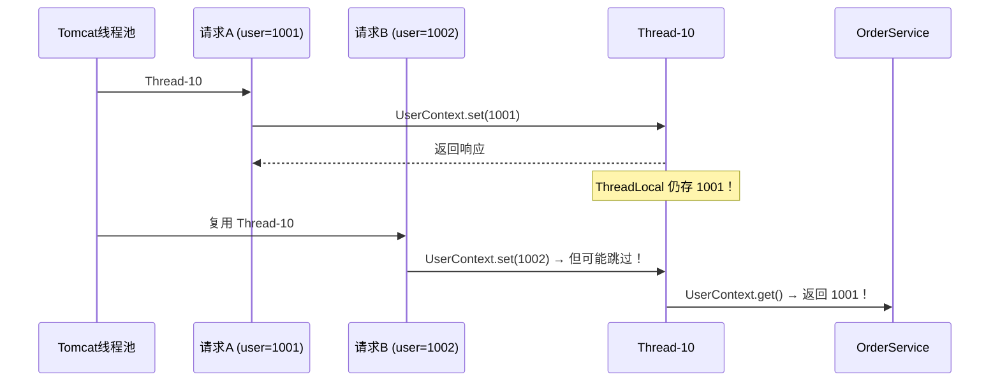

##### 关键漏洞点：

1. 异步任务未传递上下文

   ：

   ```java
   @Async
   public void asyncLog() {
       User user = UserContext.get(); // ❌ 线程池新线程，ThreadLocal 为空或脏数据
   }
   ```

2. **线程池任务结束未清理**；

3. **过滤器/拦截器未兜底清理**。

------

#### 三、✅ 修复方案（三层防御）

------

##### 方案 1：**强制清理 ThreadLocal（基础）**

> 在请求结束时 **finally 块清理**。

```java
// Servlet Filter 示例
@Component
public class UserContextFilter implements Filter {
    public void doFilter(ServletRequest req, ServletResponse res, FilterChain chain) {
        try {
            User user = parseFromToken(req);
            UserContext.set(user);
            chain.doFilter(req, res);
        } finally {
            UserContext.clear(); // ⭐ 关键！
        }
    }
}
```

> ✅ 优点：简单有效
> ❌ 缺点：无法解决异步场景

------

##### 方案 2：**异步上下文传递（进阶）**

> 使用 **TransmittableThreadLocal **(TTL) —— 阿里开源，解决线程池上下文传递。

##### 步骤：

1. 引入依赖：

   ```xml
   <dependency>
       <groupId>com.alibaba</groupId>
       <artifactId>transmittable-thread-local</artifactId>
   </dependency>
   ```

2. 替换 ThreadLocal：

   ```java
   public class UserContext {
       // 改用 TTL
       private static final TransmittableThreadLocal<User> USER = new TransmittableThreadLocal<>();
       
       public static void set(User user) { USER.set(user); }
       public static User get() { return USER.get(); }
       public static void clear() { USER.remove(); }
   }
   ```

3. **包装线程池**（关键！）：

   ```java
   ExecutorService executor = Executors.newFixedThreadPool(10);
   // 用 TTL 包装
   executor = TtlExecutors.getTtlExecutorService(executor);
   
   // 或 Spring 中配置
   @Bean
   public Executor taskExecutor() {
       ThreadPoolTaskExecutor executor = new ThreadPoolTaskExecutor();
       executor.setCorePoolSize(10);
       return TtlExecutors.getTtlExecutor(executor);
   }
   ```

> ✅ 效果：  
>
> - 提交任务时自动 capture 上下文；  
> - 任务执行时 restore 上下文；  
> - 任务结束自动 clear。

------

##### 方案 3：**禁用 ThreadLocal，改用参数传递（终极）**

> 最安全的方式：**上下文显式传递**，避免隐式状态。

```java
// Service 方法增加 user 参数
public Order getOrder(User user, Long id) {
    return orderDao.selectByUserIdAndId(user.getId(), id);
}

// Controller 显式传参
@GetMapping("/order/{id}")
public Order getOrder(@PathVariable Long id) {
    User user = getCurrentUser();
    return orderService.getOrder(user, id); // ⭐ 显式传递
}
```

> ✅ 优点：无状态、可测试、无并发风险
> 📌 **阿里《Java 开发手册》强制要求**：  
>
> > “**禁止在线程池中使用 ThreadLocal，上下文应通过参数显式传递。**”

------

#### 四、🛡️ 防御体系（大厂实践）

| 层级         | 措施                                               |
| ------------ | -------------------------------------------------- |
| **编码规范** | 禁止在异步方法中使用原生 ThreadLocal               |
| **代码扫描** | SonarQube 规则：检测 `ThreadLocal` + `@Async` 组合 |
| **框架封装** | 自研上下文工具类，强制集成 TTL                     |
| **日志染色** | 每条日志打印 `userId`，便于追踪错乱                |
| **压测验证** | 混沌工程注入线程切换，验证数据隔离                 |

------

#### 五、面试回答模板（简洁专业）

> “这类 BUG 根源是 ThreadLocal 在线程池中未清理。我们通过三层修复：  
>
> 1. **请求结束强制 clear**（Filter finally 块）；  
> 2. **异步场景用 TransmittableThreadLocal **(TTL) 自动传递上下文；  
> 3. **长期方案是禁用 ThreadLocal，改用参数显式传递**。
>    同时建立防御体系：代码扫描 + 日志染色 + 混沌测试，确保上下文隔离。”

------

#### 六、总结：ThreadLocal 使用铁律

| 场景               | 是否可用 | 替代方案                  |
| ------------------ | -------- | ------------------------- |
| Web 请求（同步）   | ✅ 可用   | 配合 Filter 清理          |
| 线程池任务         | ❌ 禁止   | TTL 或参数传递            |
| 异步方法（@Async） | ❌ 禁止   | TTL 或参数传递            |
| 单元测试           | ⚠️ 谨慎   | 每个 test case 手动 clear |

> 💡 **记住**：
> **“ThreadLocal 不是存储上下文的银弹，而是需要精心管理的易碎品。”**
> 当你写下 `ThreadLocal.set()` 时，必须同时写下 `ThreadLocal.remove()`。

### 3.一条SQL查全表！支付系统故障2小时，老板损失100万。原来mybatis 使用不当导致

这是一个典型的 **“MyBatis 动态 SQL 误用引发全表扫描”** 的生产事故。表面看是 SQL 慢，根因是 **开发对 MyBatis `<if>` 标签逻辑理解错误 + 缺乏 SQL 审计**，导致 WHERE 条件失效，触发全表扫描，拖垮数据库。

下面通过 **故障还原 → 根本原因 → 修复方案 → 防御体系** 四步深度复盘。

------

#### 一、🔍 故障现象还原

> **时间**：大促期间
> **现象**：支付接口超时，DB CPU 100%，主从延迟飙升
> **损失**：2 小时不可用，订单损失 ≈ 100 万

##### 监控告警：

- MySQL `Threads_running` 从 10 → 500+

- 慢查询日志出现：

  ```sql
  SELECT * FROM payment_order WHERE 1=1;  -- ❌ 无任何过滤条件！
  ```

##### 业务代码（MyBatis XML）：

```xml
<select id="queryOrders" resultType="PaymentOrder">
  SELECT * FROM payment_order
  WHERE 1=1
  <if test="userId != null">
    AND user_id = #{userId}
  </if>
  <if test="orderId != null">
    AND order_id = #{orderId}
  </if>
</select>
```

##### 调用代码（伪代码）：

```java
// 前端传参：{ "status": "PAID" }  // ⚠️ 未传 userId 或 orderId！
public List<PaymentOrder> search(SearchParam param) {
    return paymentMapper.queryOrders(param); // param.userId = null, param.orderId = null
}
```

> 💥 **结果**：两个 `<if>` 条件都不满足 → 生成 `SELECT * FROM payment_order WHERE 1=1` → **全表扫描 2 亿条支付记录！**

------

#### 二、🔥 根本原因分析

| 层级         | 问题                               |
| ------------ | ---------------------------------- |
| **直接原因** | MyBatis 动态 SQL 无有效 WHERE 条件 |
| **代码缺陷** | 未校验必填参数，允许空条件查询     |
| **设计缺陷** | 接口暴露了“查全表”能力             |
| **流程缺陷** | 上线前无 SQL 执行计划审核          |
| **监控缺陷** | 无慢查询自动熔断机制               |

> 📌 **关键认知偏差**：
> 开发以为 “不传参数 = 不查”，实际 “不传参数 = 查全部”！

------

#### 三、✅ 修复方案（三层防御）

------

##### 方案 1：**代码层：强制校验查询条件**（立即修复）

> 在 Service 层增加安全兜底：

```java
public List<PaymentOrder> search(SearchParam param) {
    // ⭐ 关键：至少一个查询条件
    if (param.getUserId() == null && param.getOrderId() == null) {
        throw new BizException("至少指定用户ID或订单ID");
    }
    return paymentMapper.queryOrders(param);
}
```

> ✅ 优点：简单、快速上线
> ⚠️ 注意：需覆盖所有类似接口

------

##### 方案 2：**SQL 层：添加兜底条件**（防御性编程）

> 在 MyBatis XML 中加 **永假条件** 防止全表扫描：

```xml
<select id="queryOrders" resultType="PaymentOrder">
  SELECT * FROM payment_order
  WHERE 1=1
  <if test="userId != null">
    AND user_id = #{userId}
  </if>
  <if test="orderId != null">
    AND order_id = #{orderId}
  </if>
  <!-- ⭐ 兜底：如果无条件，强制返回空 -->
  <if test="userId == null and orderId == null">
    AND 1=0
  </if>
</select>
```

> ✅ 效果：即使参数为空，SQL 变成 `WHERE 1=1 AND 1=0` → 返回空集，不查表。

------

##### 方案 3：**架构层：查询网关 + 条件白名单**

> 对敏感表（如支付、订单）建立 **查询代理层**：

```java
@Component
public class SafeQueryProxy {
    public List<PaymentOrder> queryWithConditions(Map<String, Object> conditions) {
        // 白名单校验
        if (!conditions.containsKey("userId") && !conditions.containsKey("orderId")) {
            throw new SecurityException("支付订单查询必须包含 userId 或 orderId");
        }
        // 记录审计日志
        auditLog.log("QUERY_PAYMENT", conditions);
        return sqlSession.selectList("queryOrders", conditions);
    }
}
```

> ✅ 优势：集中管控，避免重复犯错

------

#### 四、🛡️ 防御体系（大厂标准）

| 阶段            | 措施                                                         |
| --------------- | ------------------------------------------------------------ |
| **开发阶段**    | - MyBatis XML 模板强制包含兜底条件 - IDE 插件高亮“危险 SQL”  |
| **Code Review** | - 必查动态 SQL 是否有全表风险 - 使用 Checkstyle 规则         |
| **测试阶段**    | - 自动化测试覆盖“空参数”场景 - SQL 执行计划检查（EXPLAIN）   |
| **上线阶段**    | - SQL 上线审批（如阿里 DMS） - 灰度发布 + 监控               |
| **运行阶段**    | - 慢查询自动 kill（pt-kill） - DB 限流（max_execution_time） |

> 🔧 **工具推荐**：
>
> - **MyBatis Mapper Scanner**：扫描 XML 中无 WHERE 的 SELECT；
> - **SonarQube Rule**：自定义规则检测 `WHERE 1=1` 且无 `<if>`；
> - **Arthas**：线上动态 trace SQL 参数。

------

#### 五、面试回答模板（简洁专业）

> “这次事故根因是 MyBatis 动态 SQL 在参数为空时生成了全表查询。我们立即做了三件事：  
>
> 1. **代码兜底**：Service 层校验必填查询条件；  
> 2. **SQL 防御**：XML 中加 `AND 1=0` 防止无条件查询；  
> 3. **流程加固**：上线 SQL 必须 EXPLAIN 审核，敏感表禁止无索引查询。
>    同时推动建设 **查询网关**，对支付等核心表做条件白名单管控，杜绝此类问题。”

------

#### 六、总结：MyBatis 安全使用规范

| 场景     | 正确做法                      | 错误做法            |
| -------- | ----------------------------- | ------------------- |
| 动态查询 | 至少一个必填条件 + 兜底 `1=0` | 仅 `WHERE 1=1`      |
| 分页查询 | 先 count 再分页               | 直接 `LIMIT` 大偏移 |
| 敏感表   | 禁止 `SELECT *`               | 返回全字段          |
| 上线流程 | EXPLAIN 执行计划审核          | 直接上线            |

> 💡 **记住**：
> **“在数据库面前，永远不要相信前端传参。”**
> 每一条可能查全表的 SQL，都是悬在系统头上的达摩克利斯之剑。

### 4.【故障复盘】高并发线程上下文传值有BUG，导致数据错乱。可是本地复现不出来！到底是什么问题

这是一个典型的 **“高并发 + 线程上下文 + 线程池复用”** 导致的 **偶发性数据错乱** 问题。本地无法复现，是因为：

- **本地并发量低**（线程复用概率低）；
- **缺少真实线程调度压力**；
- **未模拟线程池满载场景**。

根本原因几乎可以确定是：**ThreadLocal 在异步/线程池场景下未正确传递或清理，导致 A 请求的数据被 B 请求读取**。

------

#### 一、🔍 为什么本地复现不出来？

| 环境         | 特点                                              | 是否触发问题     |
| ------------ | ------------------------------------------------- | ---------------- |
| **本地开发** | - 单用户 - 并发低（<10 QPS） - Tomcat 线程空闲多  | ❌ 几乎不复用线程 |
| **生产环境** | - 高并发（1000+ QPS） - 线程池饱和 - 线程高频复用 | ✅ 必现数据错乱   |

> 📌 **关键**：
> ThreadLocal 数据污染是 **“低概率、高破坏”** 的并发 bug，**必须在高负载下才能暴露**。

------

#### 二、🔥 根本原因：ThreadLocal + 线程池 = 定时炸弹

##### 典型错误代码：

```java
// 全局 ThreadLocal
public class RequestContext {
    private static final ThreadLocal<String> TRACE_ID = new ThreadLocal<>();
    
    public static void setTraceId(String id) { TRACE_ID.set(id); }
    public static String getTraceId() { return TRACE_ID.get(); }
}

// Controller
@GetMapping("/pay")
public String pay() {
    String traceId = UUID.randomUUID().toString();
    RequestContext.setTraceId(traceId); // ⚠️ 设置到当前线程
    
    paymentService.asyncProcess(); // 异步调用（使用线程池）
    return "ok";
}

// Service
@Async
public void asyncProcess() {
    String traceId = RequestContext.getTraceId(); // ❌ 线程池新线程，可能为空或脏数据！
    log.info("Processing with traceId: {}", traceId);
}
```

##### 生产环境执行流程：

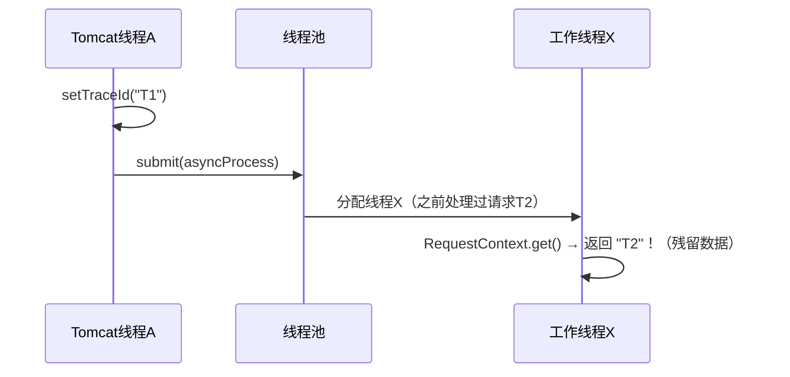

> 💥 **结果**：日志、数据库、缓存中混入他人 traceId，导致：
>
> - 链路追踪断裂；
> - 用户 A 看到用户 B 的数据；
> - 审计日志错乱。

------

#### 三、✅ 如何复现？—— 模拟高并发线程复用

##### 方法 1：**JMeter 压测 + 日志染色**

1. 写一个接口，将 

   ```
   ThreadLocal
   ```

    值写入响应：

   ```java
   @GetMapping("/test")
   public String test() {
       String id = UUID.randomUUID().substring(0, 8);
       RequestContext.setTraceId(id);
       
       CompletableFuture.runAsync(() -> {
           String got = RequestContext.getTraceId();
           System.out.println("Async: expected=" + id + ", actual=" + got);
       }, threadPool);
       
       return id;
   }
   ```

2. 用 JMeter 发起 **100 并发，持续 1 分钟**；

3. 检查日志：`expected != actual` 即为复现！

##### 方法 2：**单元测试强制复用线程**

```java
@Test
public void testThreadLocalLeak() throws InterruptedException {
    ExecutorService executor = Executors.newFixedThreadPool(1); // 只用1个线程！
    
    CountDownLatch latch = new CountDownLatch(2);
    
    // 请求1
    executor.submit(() -> {
        RequestContext.setTraceId("REQ1");
        try { Thread.sleep(10); } catch (Exception e) {}
        latch.countDown();
    });
    
    // 请求2（复用同一线程）
    executor.submit(() -> {
        // 未设置 TraceId！
        String got = RequestContext.getTraceId(); // 应为 null，但实际是 "REQ1"
        Assert.assertEquals("REQ1", got); // ✅ 复现污染！
        latch.countDown();
    });
    
    latch.await();
    executor.shutdown();
}
```

> ✅ 这个测试 **100% 复现问题**，因为线程池只有 1 个线程，必然复用。

------

#### 四、✅ 修复方案（三层防御）

------

##### 方案 1：**使用 TransmittableThreadLocal **(TTL)

> 阿里开源，专治线程池上下文传递。

```java
// 替换原生 ThreadLocal
private static final TransmittableThreadLocal<String> TRACE_ID = new TransmittableThreadLocal<>();

// 包装线程池（关键！）
ExecutorService executor = TtlExecutors.getTtlExecutorService(
    Executors.newFixedThreadPool(10)
);
```

> ✅ 效果：  
>
> - 提交任务时自动 capture 上下文；  
> - 执行时 restore；  
> - 结束后 clear。

------

##### 方案 2：**异步方法显式传参**（推荐）

> 最安全的方式：**拒绝隐式上下文**。

```java
@Async
public void asyncProcess(String traceId) { // ⭐ 显式传参
    RequestContext.setTraceId(traceId); // 或直接使用参数
    // ...
}

// 调用处
String currentTraceId = RequestContext.getTraceId();
paymentService.asyncProcess(currentTraceId);
```

> 📌 **阿里《Java 开发手册》规定**：  
>
> > “**禁止在线程池中使用 ThreadLocal，上下文应通过参数显式传递。**”

------

##### 方案 3：**强制清理（兜底）**

> 在异步任务开始时清理（防残留）：

```java
@Async
public void asyncProcess() {
    RequestContext.clear(); // 先清空，避免脏数据
    // ... 但这样会丢失上下文，仅作兜底
}
```

> ⚠️ 注意：这不能解决问题，只能防止“看到别人的数据”，但自己数据也没了。

------

#### 五、🛡️ 防御体系（大厂实践）

| 措施         | 说明                                                        |
| ------------ | ----------------------------------------------------------- |
| **代码规范** | 禁止在 `@Async` / 线程池任务中使用原生 `ThreadLocal`        |
| **静态扫描** | SonarQube 规则：检测 `ThreadLocal` + `ExecutorService` 组合 |
| **日志染色** | 每条日志打印 `traceId`，便于追踪错乱                        |
| **混沌测试** | 注入高并发流量，验证上下文隔离                              |
| **框架封装** | 自研上下文工具类，强制集成 TTL                              |

------

#### 六、面试回答模板（简洁专业）

> “这类 BUG 是 ThreadLocal 在线程池中未传递导致的。本地难复现是因为并发低、线程复用少。我们通过：  
>
> 1. **用 TransmittableThreadLocal **(TTL) 自动传递上下文；  
> 2. **核心逻辑改用参数显式传值**；  
> 3. **压测时强制单线程池复现问题**。
>    同时建立防御：代码扫描禁止原生 ThreadLocal + 日志染色追踪，确保高并发下数据隔离。”

------

#### 七、总结：ThreadLocal 使用铁律

| 场景          | 是否安全 | 建议                 |
| ------------- | -------- | -------------------- |
| Web 同步请求  | ✅ 安全   | 配合 Filter 清理     |
| `@Async` 异步 | ❌ 危险   | 用 TTL 或参数传递    |
| 线程池任务    | ❌ 危险   | 用 TTL 或参数传递    |
| 单元测试      | ⚠️ 谨慎   | 每个 test 手动 clear |

> 💡 **记住**：
> **“ThreadLocal 的生命周期，必须严格限定在单次请求内。”**
> 一旦跨越线程边界，它就从“便利工具”变成“数据毒药”。


## 其他

### 1.线上业务OOM了，如何快速定位问题？

使用Ecplise MAT,	是一款专门分析java堆内存的强大工具，可快速定位内存泄漏和高内存消耗问题。

首先要再JVM启动参数里配置参数以自动生成dump文件

然后用MAT的四大功能来分析和定位问题

1.内存泄露自动检测，如果有内存泄漏问题，MAT会自动罗列出可能存在的问题点

2.直方图看类分布，如果内存泄漏没有找到问题，用直方图按类统计，看哪个类的对象特别多（例如user类有15w个对象）。

3.Dominator Tree找大对象，展开树状图，顺藤摸瓜

4.查GC Root引用链，用这个功能追踪引用路径，直到GC Root。

面试官问：那你有实际排查案例吗？

线上 Java 业务发生 **OOM（OutOfMemoryError）** 是严重故障，需**快速定位、止损、恢复**。以下是大厂标准的 **“5 步快速定位法”**，结合工具链与实战经验，适用于 Java 后端工程师。

------

#### 🔍 一、确认 OOM 类型（关键第一步！）

OOM 有多种类型，处理方式不同：

| 异常信息                                                     | 类型             | 常见原因                                |
| ------------------------------------------------------------ | ---------------- | --------------------------------------- |
| `java.lang.OutOfMemoryError: Java heap space`                | **堆内存溢出**   | 内存泄漏、大对象、堆太小                |
| `java.lang.OutOfMemoryError: Metaspace`                      | **元空间溢出**   | 动态生成类过多（如 cglib、Groovy）      |
| `java.lang.OutOfMemoryError: GC overhead limit exceeded`     | **GC 开销过大**  | 内存几乎全被回收，但回收后可用极少      |
| `java.lang.OutOfMemoryError: Direct buffer memory`           | **直接内存溢出** | NIO 的 ByteBuffer.allocateDirect() 过多 |
| `java.lang.OutOfMemoryError: Unable to create new native thread` | **线程数超限**   | 线程池配置过大、线程泄漏                |

> ✅ **操作**：
> 查看应用日志（如 `catalina.out`、`app.log`），找到完整异常栈。

------

#### 🚨 二、紧急止损（避免服务雪崩）

1. 重启实例

   （临时恢复）  

   - 快速恢复服务，但会丢失现场（**仅当未配置 dump 时不得已而为之**）。

2. 摘除流量

   - 从注册中心（Nacos/Eureka）下线该节点，避免影响用户。

3. 扩容

   （如果是资源不足）  

   - 临时增加堆内存（如 `-Xmx4g → -Xmx8g`），但治标不治本。

> ⚠️ **重要**：如果提前配置了 **自动 dump**，**不要立即重启**！先保留现场。

------

#### 🧰 三、获取内存快照（Heap Dump）—— 定位核心！

##### ✅ 情况 1：**系统已挂，但提前配置了自动 dump**

- JVM 参数（必须提前加！）：

  ```bash
  -XX:+HeapDumpOnOutOfMemoryError \
  -XX:HeapDumpPath=/data/dumps/ \
  -XX:OnOutOfMemoryError="kill -9 %p"  # 可选：自动 kill 避免僵死
  ```

- OOM 时自动生成 `java_pid{pid}.hprof` 文件。

##### ✅ 情况 2：**系统还在运行（未完全挂）**

- 手动触发 dump（会造成 STW，慎用！）：

  ```bash
  jmap -dump:format=b,file=/tmp/heap.hprof <pid>
  ```

- 或使用 Arthas（在线诊断）：

  ```bash
  arthas > heapdump /tmp/heap.hprof
  ```

> 💡 **提示**：dump 文件可能很大（几 GB），用 `scp` 或内网传输，**不要直接下载到本地 Windows**。

------

#### 🔬 四、分析 Dump 文件（精准定位泄漏点）

使用 **Eclipse MAT（Memory Analyzer Tool）** 或 **VisualVM** 分析：

##### 步骤 1：打开 `.hprof` 文件

- 首页会自动生成 **“Leak Suspects” 报告**（内存泄漏嫌疑点）。

##### 步骤 2：查看 **Dominator Tree（支配树）**

- 按 **Retained Heap** 排序，找出占用内存最多的对象。
- 常见“罪魁祸首”：
  - `HashMap` / `ArrayList`（静态集合未清理）
  - `ThreadLocal`（未 remove 导致线程复用时内存累积）
  - 缓存（如 Guava Cache 无 size 限制）
  - 大文件/大字符串（如 Excel 全量加载）

##### 步骤 3：追踪 **GC Roots 引用链**

- 右键可疑对象 → **Path To GC Roots → exclude weak/soft references**
- 找到 **强引用路径**，定位到具体代码类和行号。

> ✅ 示例：
> `com.example.service.UserCache.PRICE_HISTORY` → `static Map` → 占用 2GB
> → 代码中静态 Map 无限增长，无过期机制。

------

#### 🛠 五、根因修复 & 预防

| 根因             | 解决方案                                               |
| ---------------- | ------------------------------------------------------ |
| **内存泄漏**     | 修复代码：释放资源、清理集合、remove ThreadLocal       |
| **堆内存不足**   | 适当调大 `-Xmx`，但需结合业务评估                      |
| **大对象加载**   | 改为分页/流式处理（如 EasyExcel 替代 POI）             |
| **元空间溢出**   | 增加 `-XX:MaxMetaspaceSize=512m`，或减少动态代理       |
| **直接内存溢出** | 限制 Netty 的 ByteBuf 或调大 `-XX:MaxDirectMemorySize` |

#### 🔒 预防措施（大厂标配）：

1. JVM 启动必加

   ：

   ```bash
   -XX:+HeapDumpOnOutOfMemoryError -XX:HeapDumpPath=/dumps/
   -Xloggc:/logs/gc.log -XX:+PrintGCDetails
   ```

2. 监控告警

   ：

   - Prometheus + Grafana 监控堆内存、GC 频率；
   - 当老年代使用率 > 80% 时告警。

3. 压测验证

   ：

   - 上线前做内存压力测试，观察是否持续增长。

------

#### 📝 面试回答示例（简洁专业）

> “首先看 OOM 类型，确认是堆、元空间还是直接内存问题。如果提前配置了 `-XX:+HeapDumpOnOutOfMemoryError`，就用 MAT 分析 dump 文件，通过 Leak Suspects 和 Dominator Tree 找到内存占用最大的对象，再通过 GC Roots 引用链定位到具体代码。常见原因是静态集合未清理、ThreadLocal 未 remove 或大对象全量加载。修复后，我们会加上 dump 自动采集、内存监控告警，并在压测中验证。”

------

#### 💡 关键总结

| 原则               | 说明                               |
| ------------------ | ---------------------------------- |
| **提前配置 dump**  | 没有 dump = 无据可查 = 提桶跑路    |
| **不要盲目调大堆** | 可能掩盖内存泄漏，导致更晚爆发     |
| **接受“快速止损”** | 先恢复业务，再深入分析             |
| **自动化 > 手动**  | 用监控+告警+自动 dump 构建防御体系 |

> 🌟 **记住**：
> **“OOM 不可怕，可怕的是没有 dump。”**
> 大厂工程师的第一反应不是重启，而是——“dump 文件在哪？”