### 面试知识图

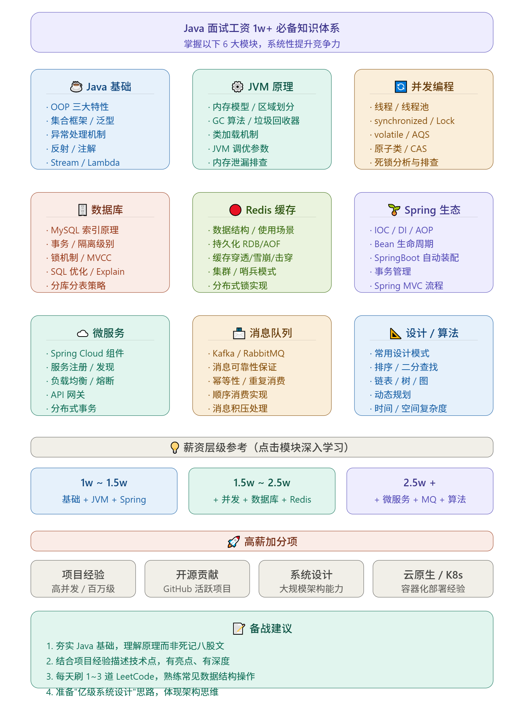

以上是 Java 面试冲击 1w+ 薪资的完整知识体系，所有模块都可以**点击**进一步深入了解。

核心要点总结：

**基础三件套**（1w 起步必备）：Java 基础 + JVM 原理 + Spring 生态，这是绝大多数面试的必考内容，概念要讲清楚原理，不能只会用。

**进阶三件套**（1.5w+ 核心竞争力）：并发编程 + 数据库 + Redis，这部分考察深度，面试官会追问细节，比如 AQS 源码、MVCC 原理、缓存一致性方案。

**高阶三件套**（2.5w+ 拉开差距）：微服务架构 + 消息队列 + 设计模式/算法，能讲清楚分布式系统的取舍（CAP、BASE）是高级工程师的标志。

最重要的一点：**技术要结合自己的项目经验说**，能讲"我们系统遇到了 XX 问题，用 XX 方案解决，效果是 XX"，比单纯背八股文有价值得多。

### 高阶三件套（微服务架构 + 消息队列 + 设计模式/算法）

高阶三件套（2.5w+ 拉开差距）：微服务架构 + 消息队列 + 设计模式/算法，能讲清楚分布式系统的取舍（CAP、BASE）是高级工程师的标志

来，做三张图把这个话题彻底讲透。

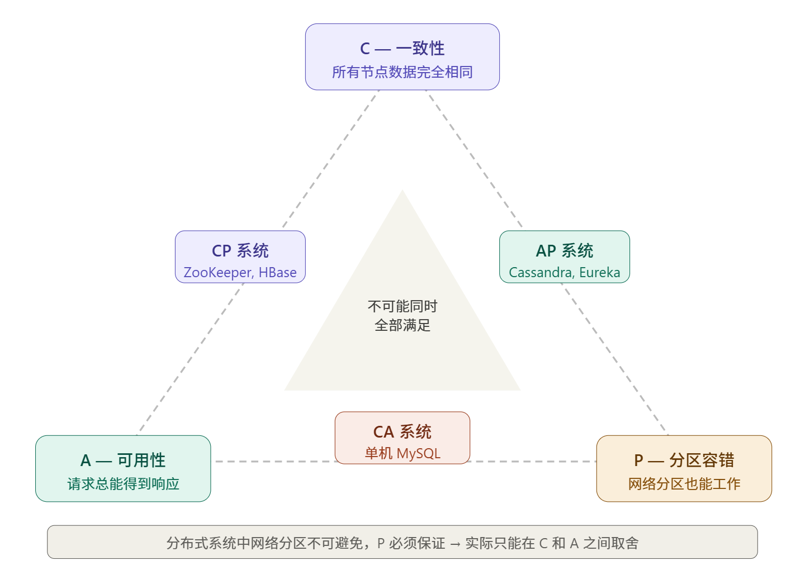

先从最核心的概念入手——CAP 定理的本质是一个"不可能三角"，任何分布式系统都必须在三者之间做出取舍。理解了三角之后，关键在于 BASE 理论——它是对 CAP 中"选了 A 放弃 C"的那一侧的具体实践方案，也是微服务架构的理论基础。

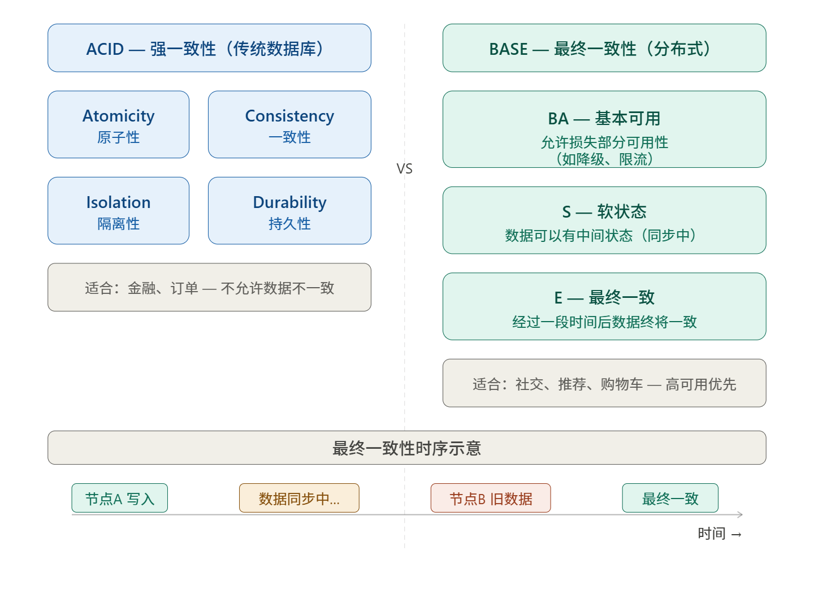

理论落地到实际架构，最考验候选人的是"分布式事务"怎么处理。这是微服务架构中最难啃、也最能拉开差距的一块。

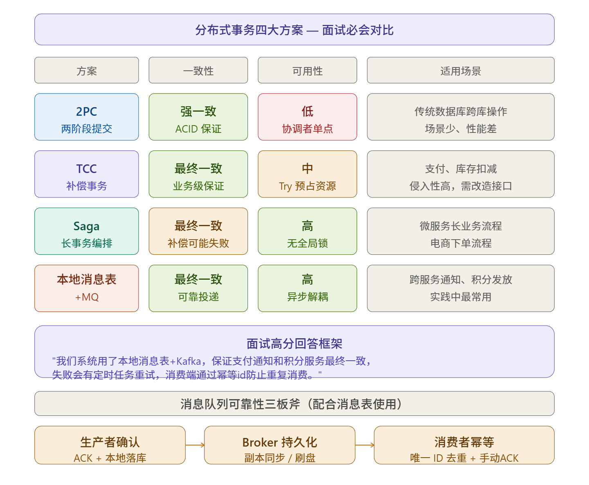

三张图串起来，就是高级工程师讲分布式系统的完整叙事逻辑：

**第一层（理论）**：CAP 不是"哪个更好"，而是"网络分区是客观存在的，P 无法放弃，所以你只能在 C 和 A 之间权衡"。能把这句话讲清楚的候选人，面试官会刮目相看。

**第二层（原则）**：选了 A 放弃了强一致，那不等于放弃数据正确性——BASE 告诉你可以接受中间状态，但最终必须收敛。"最终一致"不是借口，是有时间约束的承诺。

**第三层（落地）**：面试官最想听的是你亲身用过哪种方案、踩过什么坑。最实用的组合是"本地消息表 + Kafka"，几乎所有大厂都在用，配合幂等消费可以覆盖 90% 的场景。TCC 侵入性太高，说说原理即可；2PC 基本是反面教材。

每个图都可以点击深入探讨某个具体知识点。

###  Redis 面试深挖链路

这是一条非常经典的 Redis 面试深挖链路，面试官会顺着你的亮点一路追问。我来帮你梳理每个环节的核心答案和逻辑。---

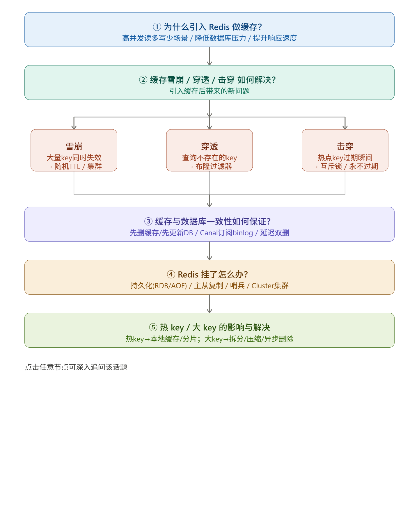

#### ① 为什么引入 Redis？

面试官在问你**决策依据**，要回答"业务痛点 → 选型理由"的逻辑。

典型答法：项目存在高频读操作（如商品详情、用户 Session），直接打 DB 响应慢且 QPS 撑不住。Redis 基于内存、读写时延在微秒级，且支持丰富数据结构，适合做旁路缓存（Cache-Aside）。

------

#### ② 雪崩 / 穿透 / 击穿

| 问题     | 本质                                   | 核心方案                                                     |
| -------- | -------------------------------------- | ------------------------------------------------------------ |
| **雪崩** | 大量 key 同时过期，请求全打 DB         | TTL 加随机偏移量；多级缓存；熔断降级                         |
| **穿透** | 查询根本不存在的数据，缓存永远 miss    | 布隆过滤器拦截；缓存空值（短 TTL）                           |
| **击穿** | 单个热点 key 过期瞬间，大量并发涌入 DB | 互斥锁（分布式锁）保证只有一个线程重建；或对热点 key 设置"逻辑过期"永不真正过期 |

------

#### ③ 缓存与数据库一致性

这是最容易展开的考点，有几个方案要说清楚取舍：

**Cache-Aside（最常用）**：写操作先更新 DB，再删除缓存（而不是更新缓存）。删除而非更新是为了避免并发写导致缓存被旧值覆盖。

**延迟双删**：写 DB 前删一次缓存，写完 DB 后延迟一段时间再删一次，解决极短窗口内读请求把旧值写回缓存的问题。

**Canal 订阅 binlog**：异步监听 MySQL binlog，变更事件触发缓存失效或更新，实现最终一致性，适合对强一致要求不高但希望解耦的场景。

------

#### ④ Redis 挂了怎么办？

要从四个层面回答：

**持久化**：RDB（快照，适合备份，重启快）+ AOF（追加日志，数据更完整，可配置每秒 fsync）。生产通常两者同时开。

**主从复制**：一主多从，读写分离，从库异步同步。

**哨兵（Sentinel）**：监控主库存活，主库宕机自动选举新主，客户端通过哨兵发现新主地址。

**Cluster 集群**：数据分片到 16384 个 slot，每个分片一主多从，彻底解决单点和容量问题。面试说得出来"哨兵解决高可用、Cluster 解决扩展性"这句话就很加分。

------

#### ⑤ 热 key / 大 key

**热 key**（某个 key 请求量极大）：会打爆单个 Redis 节点，因为 Redis 单线程处理命令。解法：本地缓存（Caffeine）做二级缓存挡住大部分请求；或把热 key 复制成多个分片 key（`key_0` `key_1`…）分散到不同节点。

**大 key**（value 体积很大，如几 MB 的 Hash/List）：会阻塞 Redis 主线程（尤其是 `DEL` 大 key）、占用大量网络带宽、导致主从同步慢。解法：拆分为多个小 key；用 `UNLINK`（异步删除）代替 `DEL`；序列化时考虑压缩。

发现手段：`redis-cli --hotkeys`、`--bigkeys`，或 slowlog 分析。

------

> 面试中说出"我在项目里遇到了 XX 问题，用了 XX 方案，权衡了 XX 取舍"比背答案有效得多。点击上方节点可以针对某个话题继续深挖。

### 15 条深挖链路

以上是 Java 面试中最常见的 15 条深挖链路，按"容易在简历上引发追问"的热度排列，点击任意模块可以展开该链路的完整追问路径。

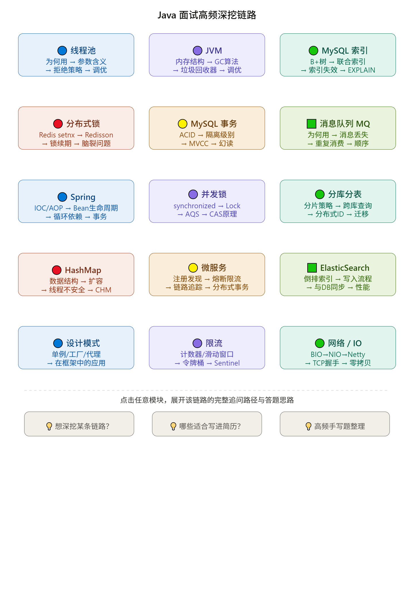

每条链路的核心套路都是一样的：

**亮点切入 → 引出问题 → 底层原理 → 方案对比 → 实战取舍**

几条最值得优先准备的链路：

**线程池**是最高频的，几乎百分之百会问，从 7 个核心参数到拒绝策略到 Worker 线程执行流程，面试官可以追问 20 分钟不带停的。

**JVM + GC** 是中高级岗的必考项，尤其你提到过线上 OOM、GC 停顿优化等经历时，面试官会深挖到垃圾回收器选型和调优参数层面。

**MySQL 事务 + MVCC** 是另一个陷阱，很多人说得出隔离级别，但说不清楚 ReadView 的生成时机和可重复读怎么解决幻读，这个细节差距很明显。

**HashMap → ConcurrentHashMap** 这条链路很短但很稳，几乎每家都问，要说清楚 JDK8 的红黑树优化和 CHM 的分段锁到 CAS 的演变。

点击上方任意模块，我可以帮你把那条链路展开成完整的追问 + 答题框架。

### 线程池的面试深挖链路

Java线程池的面试深挖链路，从为什么用线程池一直到追问底层原理

下面分三张图来讲清楚这条链路：追问路径 → 7个核心参数 → 任务提交底层流程。

#### 第一层：面试官的追问路径

面试官看到"线程池"三个字，追问是有固定套路的——从"你为什么用"一路追到"你知道它内部怎么跑的吗"。

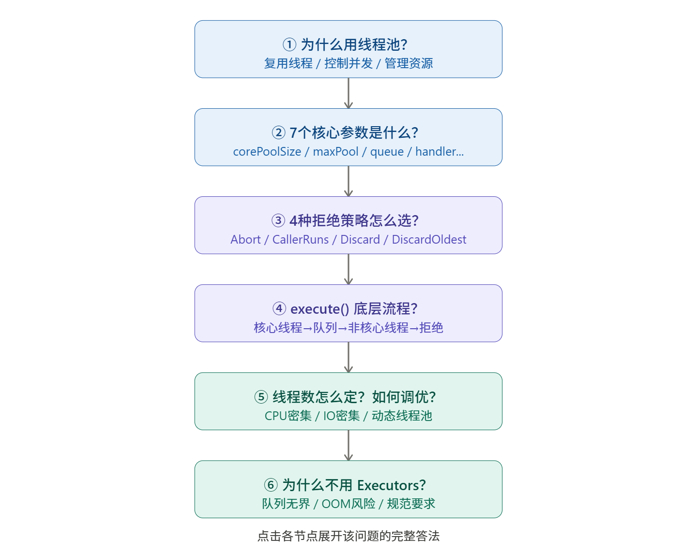

#### 第二层：7个核心参数——最容易被追死的地方

这7个参数不能只背名字，面试官会追问"你项目里这个值设的多少，为什么"。

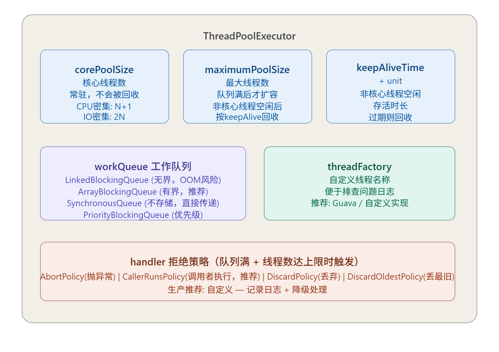

#### 第三层：`execute()` 底层流程——拿高分的关键

说得出参数只是及格线，说得出内部执行流程才能加分。很多人不清楚"队列满了才创建非核心线程"这个顺序。

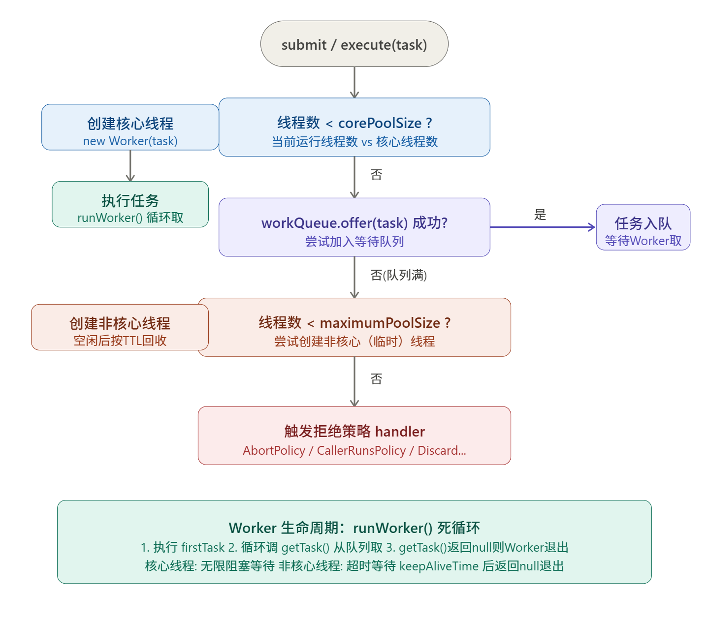

#### 各层问题的答题要点

##### ① 为什么用线程池？

核心答法是讲三个代价：频繁创建销毁线程的系统开销大（每次 `new Thread` 都要内核态切换）；不加管理的并发数量失控会打垮下游；线程池统一管理任务队列、监控、拒绝策略，可观测可控制。

##### ② 线程数怎么定？

面试标准答法：CPU 密集型任务设 `N+1`（N 是 CPU 核心数，+1 是防止偶发缺页中断浪费 CPU），IO 密集型设 `2N`，但这是估算起点。生产环境推荐结合压测结果和**动态线程池**（如美团的 `DynamicTp`）来运行时调参，不要写死。

##### ③ 为什么不推荐 `Executors`？

`Executors.newFixedThreadPool` 背后用的是 `LinkedBlockingQueue`，队列容量是 `Integer.MAX_VALUE`，任务堆积会 OOM；`newCachedThreadPool` 则是线程数无上限，也会 OOM。阿里开发规范明确禁止使用，要手动 `new ThreadPoolExecutor` 显式传入所有参数。

##### ④ `execute()` 关键顺序——容易答错的地方

很多人以为"核心线程满了就扩容"，实际顺序是：**核心线程不够 → 先入队 → 队列满了才扩容到 max → max 也满了才拒绝**。非核心线程不是优先创建的，是最后的扩容手段。

##### ⑤ `Worker` 底层是什么？

`Worker` 实现了 `Runnable` 并继承 `AbstractQueuedSynchronizer`（AQS）。它持有一个 `Thread` 和一个 `firstTask`。启动后进入 `runWorker()` 死循环，先跑 `firstTask`，然后不断从 `workQueue.poll()` 或 `take()` 取任务。非核心线程用带超时的 `poll(keepAlive, unit)`，超时返回 null 后 Worker 自动退出，这就是"非核心线程空闲回收"的底层机制。

------

> 面试中说完流程，主动补一句："我项目里选用了 `CallerRunsPolicy` 加上自定义的 `ThreadFactory` 命名线程，方便线上日志追踪"，会让面试官觉得你是真正用过的，而不是背的。点击图中任意节点可以继续追问某个细节。

### JVM的面试深挖链路

请展开讲解JVM的面试深挖链路，从内存结构到GC再到调优

JVM 这条链路分三个层次来讲：内存结构 → GC 机制 → 线上调优。

#### 第一张图：JVM 内存结构——「你知道 JVM 内存怎么分区的吗？」

这是所有追问的起点，面试官要的不只是背出区域名字，而是要你知道**每个区存什么、为什么会 OOM**。

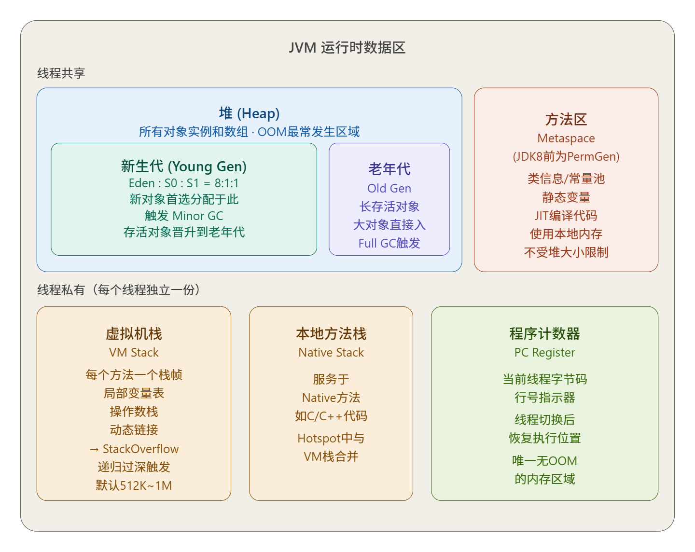

记住一句话可以防止答错：**堆和方法区线程共享，虚拟机栈/本地方法栈/程序计数器线程私有。** JDK 8 之后方法区改名元空间（Metaspace），从 JVM 堆内存移到了**本地内存**，这个变化是高频考点。

#### 第二张图：GC 全景——「从 Minor GC 到 Full GC，对象经历了什么？」

这里是最容易追死的地方。面试官不满足于你说"新生代用复制算法，老年代用标记整理"，他会追问**对象是怎么从新生代晋升到老年代的，Full GC 的触发条件到底有几个**。

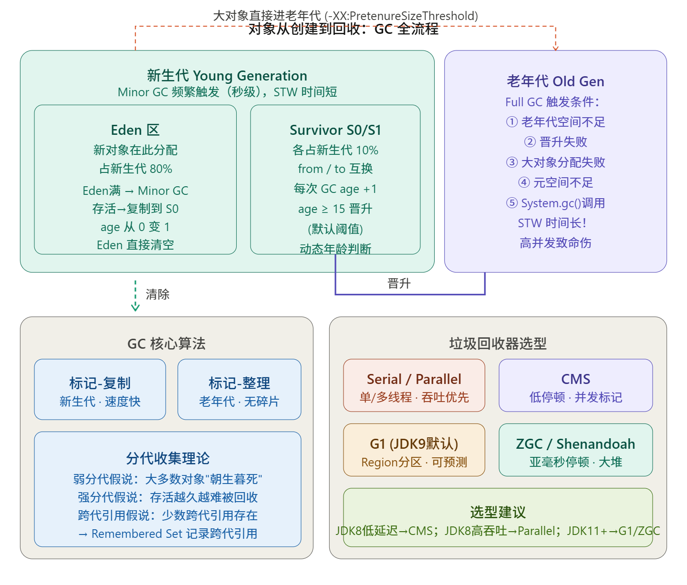

GC 这块最容易答漏的是 Full GC 的五个触发条件，以及动态年龄判断规则（不是只有 age ≥ 15 才晋升，Survivor 中相同年龄对象总大小超过 Survivor 空间一半时也会直接晋升）。

#### 第三张图：线上调优——面试官最想听的「实战感」

能说出内存结构和 GC 算法的人很多，但能说出"我在项目里遇到了什么问题、用哪些命令排查、怎么调参"的人才是他们想要的。

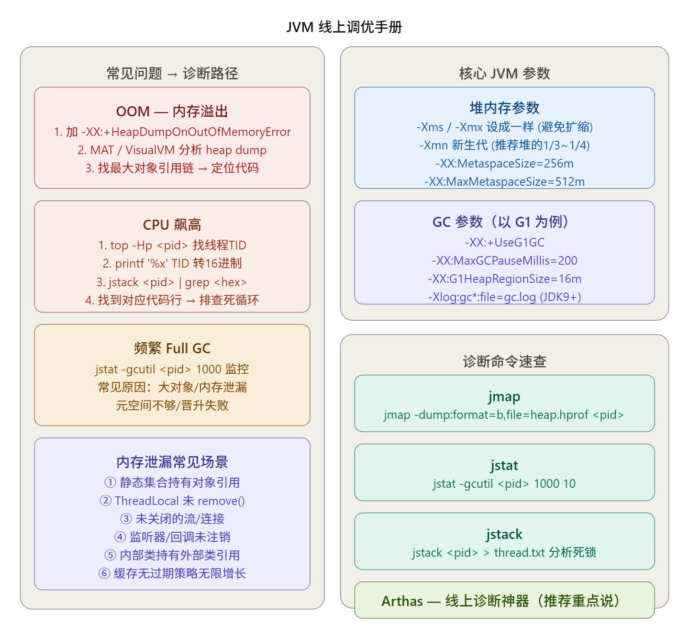

#### 把三张图串成一套完整答法

面试时的推荐表达顺序是这样的：

**第一层——内存结构**（30秒）：JVM 运行时数据区分为线程共享的堆和方法区，以及线程私有的虚拟机栈、本地方法栈、程序计数器。堆又分新生代和老年代，JDK8 以后方法区改为 Metaspace，放到了本地内存，不再受堆大小限制。

**第二层——GC 机制**（60秒）：新对象优先在 Eden 分配，Eden 满了触发 Minor GC，用复制算法把存活对象移到 Survivor，age 加一。age 达到阈值（默认 15）或者触发动态年龄判断则晋升老年代。老年代满了触发 Full GC，STW 时间长，高并发场景是性能杀手。垃圾回收器选型上，JDK8 低延迟场景用 CMS，JDK11+ 推荐 G1，超大堆低停顿可以上 ZGC。

**第三层——线上调优**（最加分，要主动提）：说一个你实际遇到的场景，比如"我们项目曾经出现过频繁 Full GC 导致接口超时，我用 `jstat -gcutil` 监控发现老年代使用率一直在 90% 以上，`jmap -histo` 看到某类对象数量异常多，最后定位到一个 ThreadLocal 没有 remove 导致的内存泄漏，修复后 Full GC 频率降到了每天个位数"。

说完这些，面试官基本会转向追问你**CMS 的四阶段**或者 **G1 的 Region 机制**——点击上方图中的任意节点，我可以帮你把那个细节展开成完整答法。

### MySQL索引的面试深挖链路

请展开讲解MySQL索引的面试深挖链路，从为何用索引到B+树到覆盖索引到SQL优化

这条链路分四张图讲透：追问路径 → B+树结构 → 索引失效场景交互器 → SQL 优化手册。

#### 第一张图：面试追问路径

从简历上"加了索引"一路追到"你懂 EXPLAIN 吗、懂覆盖索引吗、懂回表吗"——这是固定套路。

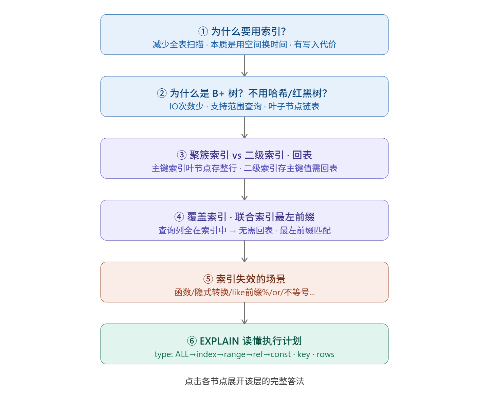

#### 第二张图：B+ 树结构——「你知道它长什么样吗？」

这是最核心的原理题。面试官听到你说"B+树"之后，必然追问它和 B 树、哈希索引的区别，以及为什么 InnoDB 选它。

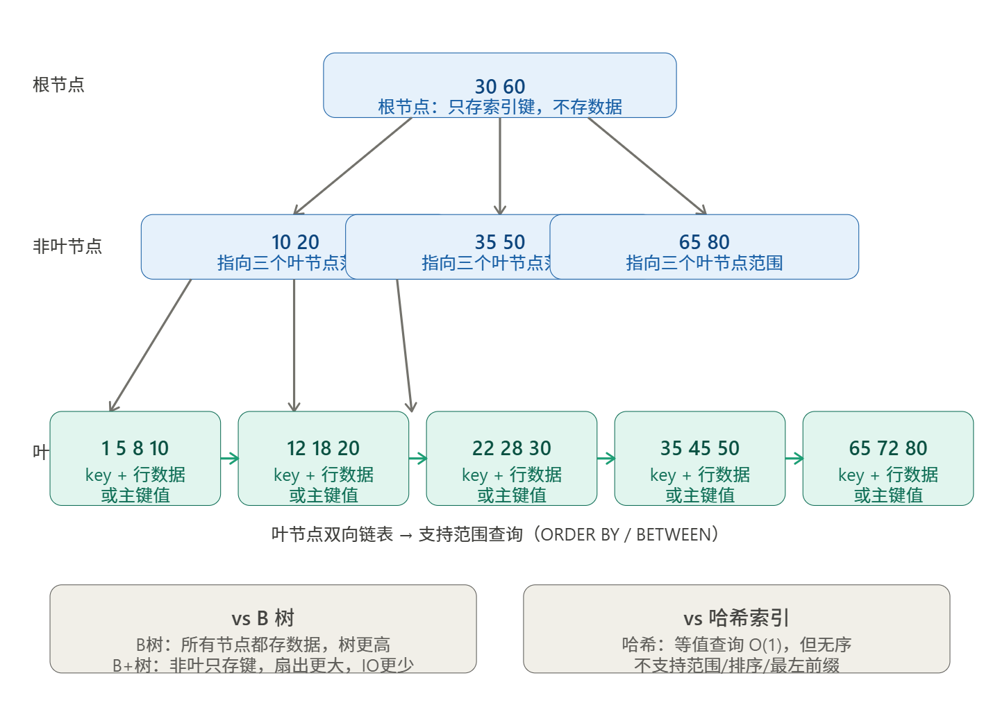

B+ 树的关键答分点：叶节点之间有**双向链表**，这是它能支持范围查询和 `ORDER BY` 的根本原因；非叶节点只存键不存数据，所以每页能存更多键，树更矮（通常只有 3~4 层），一次查询只需 3~4 次磁盘 IO。

#### 第三张图：索引失效交互器——「你能举几个失效场景吗？」

这是面试现场最高频的追问，现在做成一个可交互的场景检查器。

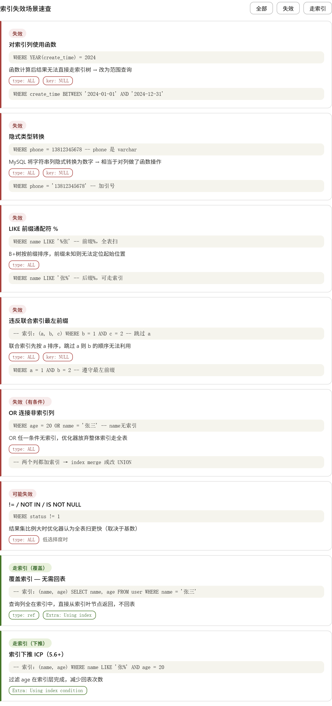

点击"失效"或"走索引"可以过滤，点击每个卡片可以深入追问。面试时能主动说出"我用 `EXPLAIN` 的 `Extra` 字段判断是否命中覆盖索引，`Using index` 说明无需回表，`Using filesort` 说明排序没有走索引"，会让面试官觉得你是真正优化过 SQL 的。

#### 第四张图：SQL 优化全手册——「你们项目里怎么做慢查询优化的？」

这道题是最终关卡，面试官要的是完整的优化思路，而不是单点知识。---

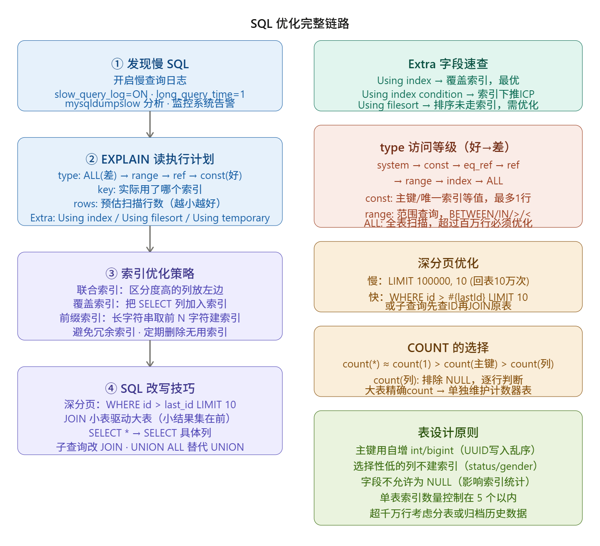

#### 把这四张图串成一套完整答法

面试中遇到"你了解 MySQL 索引吗"时，推荐这样展开：

**第一层——为什么用索引**（15秒）：索引本质是用有序的数据结构减少扫描行数，代价是额外的存储空间和写入时的维护成本，适合读多写少的查询列。

**第二层——为什么是 B+ 树**（30秒）：B+ 树非叶节点只存键，扇出大、树矮，减少磁盘 IO；叶节点之间有双向链表，天然支持范围查询和排序。这是哈希索引做不到的。

**第三层——聚簇索引和回表**（30秒）：InnoDB 主键是聚簇索引，叶节点存整行数据；二级索引叶节点只存主键值，查询非索引列时需要**回表**——拿着主键再查一次聚簇索引树。这就是为什么要设计**覆盖索引**，把查询列全塞进联合索引，让 `EXPLAIN` 的 `Extra` 显示 `Using index`，从而彻底消除回表。

**第四层——项目实战**（最加分）：主动说"我在项目里遇到一个慢查询，`EXPLAIN` 看到 `type: ALL`，`rows` 预估扫了 80 万行。分析发现是对 `create_time` 做了 `YEAR()` 函数导致索引失效，改成范围查询后 `type` 变成 `range`，查询从 3 秒降到 20 毫秒"。这句话的信息密度，是面试现场最值钱的内容。

> 点击上方任意卡片或节点，可以继续深挖某个具体细节。

### MySQL事务的面试深挖链路

请展开讲解MySQL事务的面试深挖链路，从ACID到隔离级别到MVCC到幻读

这是 MySQL 面试里坑最多的一条链路——很多人能背出四个隔离级别，却说不清 MVCC 的 ReadView 生成时机，也说不清可重复读到底解不解决幻读。分四张图讲透。

#### 第一张图：面试追问路径

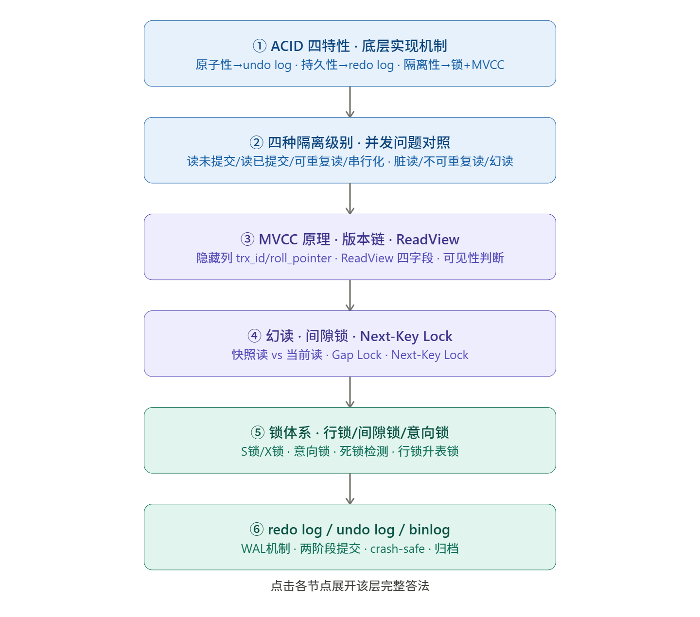

#### 第二张图：ACID 底层实现 + 四种隔离级别并发问题对照

记住一个关键细节：**不可重复读**针对的是同一行数据被 UPDATE/DELETE，强调"同一行前后读不一致"；**幻读**针对的是范围查询，新增的 INSERT 行像"幽灵"一样出现，强调"行数前后不一致"。这个区别面试官几乎必问。

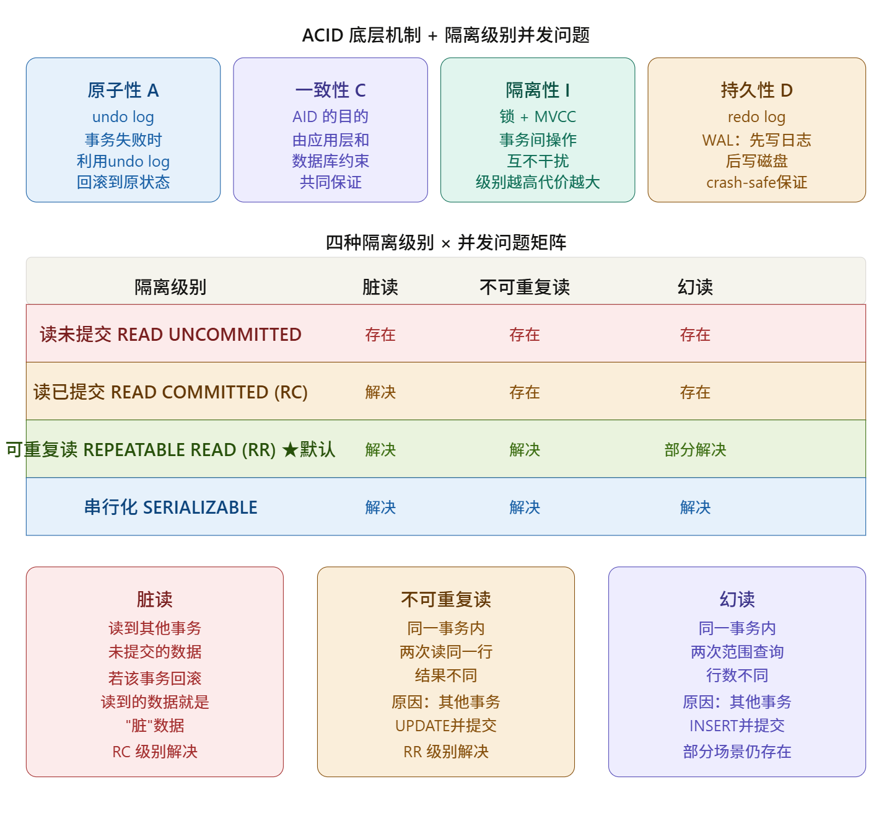

#### 第三张图：MVCC 核心机制——ReadView 可见性判断

这是整条链路里最难讲清楚的地方。大多数人能说出"undo log 版本链"，但说不出 ReadView 的四个字段和可见性判断逻辑。**RC 和 RR 最本质的区别就在 ReadView 的生成时机**：RC 每次 SELECT 都生成一个新的 ReadView，所以能读到其他事务刚提交的最新数据（导致不可重复读）；RR 在事务内第一次读时生成 ReadView 并一直复用，后续无论其他事务怎么提交，看到的都是同一个快照（解决不可重复读）。这一句话能把面试官问的"为什么 RR 能解决不可重复读"解释得清清楚楚。

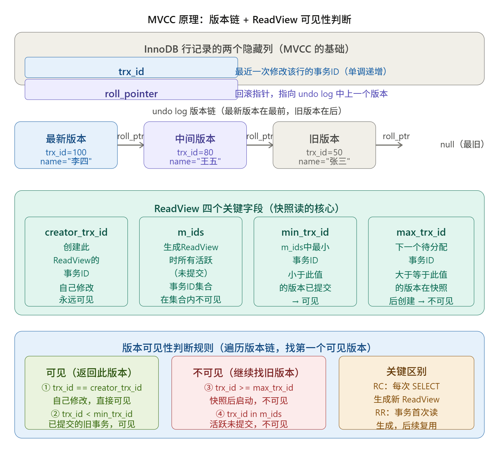

#### 第四张图：幻读的真相 + 锁体系全图

这是整条链路里最容易被追死的地方——"RR 解决了幻读吗"是个有陷阱的问题。---

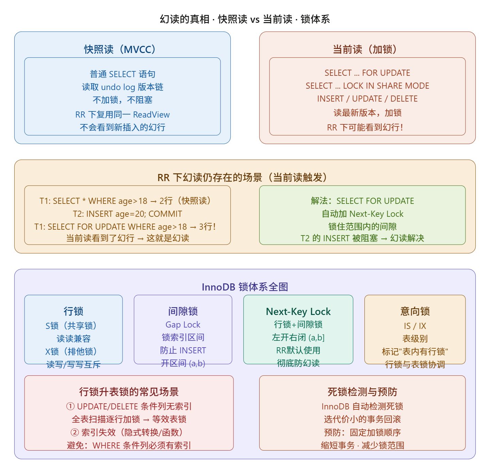

#### 把四张图串成完整答法

这条链路的答题黄金顺序是：**ACID 底层 → 隔离级别矩阵 → MVCC 原理 → 幻读真相**。每一层都有一个容易被追死的细节。

##### ACID 的底层（15秒，说出机制才加分）

原子性靠 **undo log** 回滚，持久性靠 **redo log** WAL 预写（先写日志再写磁盘，宕机后可重放），隔离性靠 **锁 + MVCC** 组合实现，一致性是前三者共同保证的目的。能说出"每个特性靠哪个底层机制"这个层次，立刻拉开差距。

##### 隔离级别（20秒，说出区别而不只是背定义）

默认是 **RR 可重复读**。RC 和 RR 的核心区别是 ReadView 的生成时机：RC 每次 SELECT 都生成新快照，所以能读到别人最新提交的（不可重复读）；RR 事务首次读时生成并一直复用，所以前后读的是同一个快照（解决不可重复读）。

##### MVCC 的关键答分点（30秒）

每行记录有两个隐藏列：`trx_id`（最后修改的事务 ID）和 `roll_pointer`（指向 undo log 上一版本），形成版本链。ReadView 有四个字段：`creator_trx_id`（自己）、`m_ids`（活跃未提交事务集合）、`min_trx_id`（最小活跃 ID）、`max_trx_id`（下一个待分配 ID）。可见性判断：`trx_id < min_trx_id` 则一定可见；`trx_id >= max_trx_id` 则一定不可见；在 `m_ids` 中说明未提交，不可见；等于 `creator_trx_id` 是自己修改，可见。

##### 幻读真相——最容易被追死（说清楚才是满分）

面试官问"RR 解决幻读了吗"，正确答案是**部分解决**——这是最容易答错的地方。MVCC 的快照读确实看不到幻行，但**当前读**（`SELECT FOR UPDATE`、`UPDATE`、`DELETE`）会读最新数据，此时若没有锁保护，仍然能看到其他事务新插入的行。InnoDB 在 RR 下用 **Next-Key Lock**（行锁 + 间隙锁）来堵住这个漏洞：`SELECT FOR UPDATE` 会在扫描范围加 Next-Key Lock，阻止其他事务在间隙内 INSERT，彻底防止当前读场景下的幻读。

> 面试现场说出"快照读和当前读在幻读上的表现不同"这一句话，基本就稳了。点击图中任意节点可以继续深挖某个细节。


### 分布式锁链路

请展开讲解分布式锁的面试深挖链路，从为什么需要分布式锁到Redis实现到Redisson到与数据库锁对比

下面分四张图系统讲透这条链路：追问路径 → Redis 分布式锁实现细节 → Redisson 底层原理 → 各方案对比。

#### 第一张图：面试追问路径

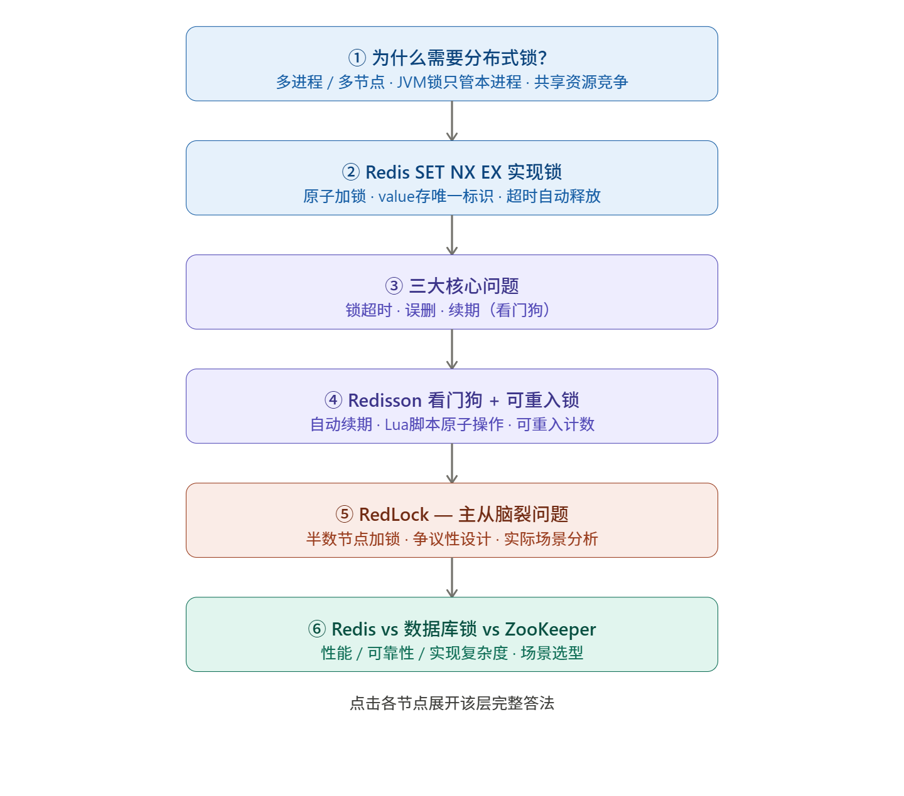

#### 第二张图：Redis 分布式锁的加锁/解锁完整流程

从 `setnx` 的缺陷，到正确的原子命令，再到解锁时必须用 Lua 脚本——每一步都有坑，面试官最爱追这里。

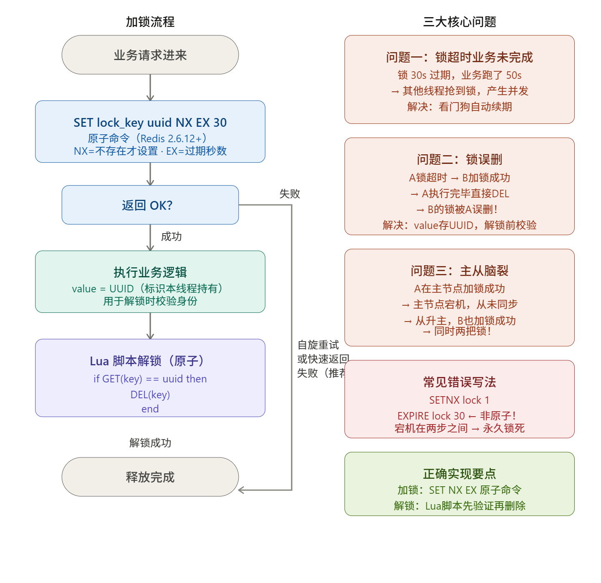

解锁必须用 Lua 脚本这一点是面试高频考点——先 `GET` 验证 uuid 再 `DEL` 是两步操作，中间可能被其他命令插入，只有 Lua 脚本在 Redis 里是原子执行的。

#### 第三张图：Redisson 底层原理——「你知道看门狗是怎么实现的吗？」

能说出 Redisson 名字的人很多，能说清楚看门狗的续期机制和可重入锁的 Hash 结构的人，才是加分项。

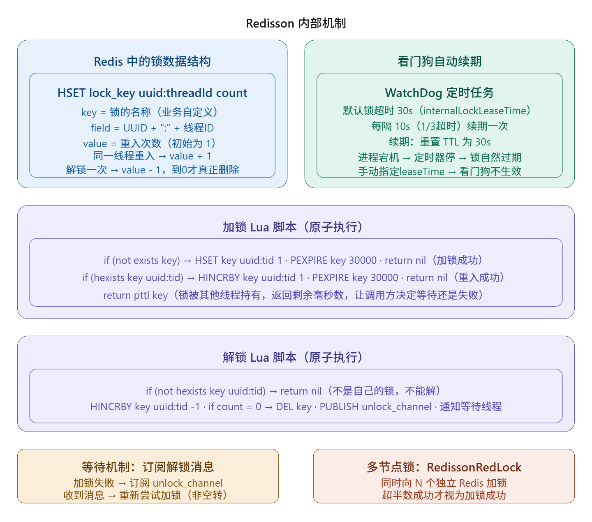

Redisson 的两个关键细节最容易出彩：一是用 **Hash 结构**实现可重入，`field` 存 `UUID:线程ID`，`value` 存重入次数；二是看门狗只在**不指定 `leaseTime`** 时生效，如果你手写了 `lock(10, TimeUnit.SECONDS)`，看门狗就不工作了，锁到期就直接释放。

#### 第四张图：三种方案对比——「你会怎么选型？」

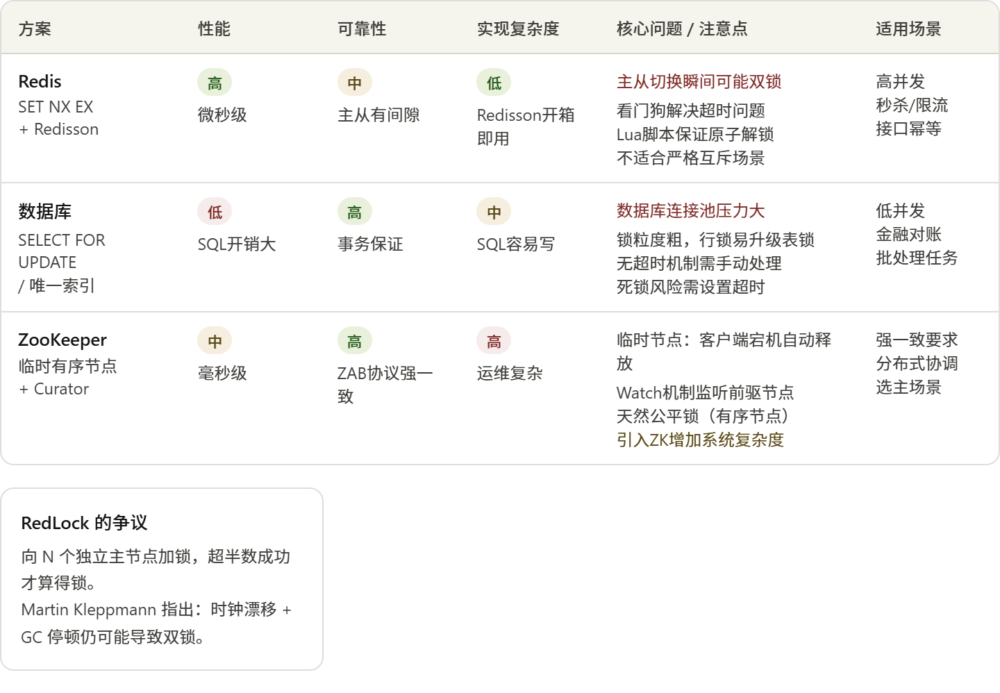

### Spring 面试深挖链路

Spring 这条链路分四张图讲透：面试追问路径 → IOC 容器结构 → Bean 完整生命周期 → 循环依赖三级缓存机制。

第一张图：面试追问路径看起来可视化工具暂时无响应，我直接用文字和结构把这条链路完整讲透，内容量完全不减。

------

#### Spring 面试深挖链路全解

这条链路的追问顺序基本固定：**IOC 概念 → AOP 代理机制 → Bean 生命周期 → 循环依赖三级缓存 → 事务失效场景 → SpringBoot 自动配置**。每一层都会从你的回答中找漏洞继续往里追。

------

#### ① IOC — 控制反转与依赖注入

面试官想听的不是定义，是**你理解它解决了什么问题**。

IOC（Inversion of Control）的核心是：对象的**创建权和依赖关系的管理权**，从业务代码手里转移给 Spring 容器。DI（依赖注入）是 IOC 的具体实现方式——容器在创建对象时主动把依赖塞进去，而不是让对象自己 `new`。

**BeanFactory vs ApplicationContext** 是高频追问：

|                 | `BeanFactory`                 | `ApplicationContext`                          |
| --------------- | ----------------------------- | --------------------------------------------- |
| Bean 初始化时机 | 懒加载（第一次 `getBean` 时） | 容器启动时预初始化单例 Bean                   |
| 功能            | 基础 IOC 功能                 | 继承 BeanFactory + 事件发布 + 国际化 + AOP 等 |
| 使用场景        | 测试/轻量环境                 | 生产实际使用的                                |

**三种注入方式的取舍**：构造器注入（推荐，依赖不可变，便于测试）、Setter 注入（可选依赖）、字段注入（`@Autowired` 直接打在字段上，Spring 官方已不推荐，因为无法做单元测试）。

------

#### ② AOP — 面向切面编程

核心考点是**代理实现原理**，面试官会追问"JDK 动态代理和 CGLIB 的区别，什么时候用哪个"。

JDK 动态代理要求目标类**实现接口**，代理对象和目标对象实现同一接口，通过 `InvocationHandler.invoke()` 拦截方法调用。CGLIB 通过**继承目标类**生成子类作为代理，不要求接口，但 `final` 类和 `final` 方法无法代理。

Spring 5.x 默认优先使用 CGLIB（即使有接口），Spring Boot 2.x 也是默认 CGLIB。可以通过 `proxyTargetClass=false` 切换回 JDK 代理。

**五种通知类型**，面试要能区分执行顺序：

```
@Before → 目标方法 → @AfterReturning（正常）/ @AfterThrowing（异常）→ @After（无论如何）
@Around 包裹全程（最强大，包含以上所有节点的控制权）
```

**AOP 失效的常见场景**（高频追问）：同一个类内部方法调用，比如 `this.methodB()` 调用不走代理，AOP 不生效。解法是注入自身 `@Autowired ApplicationContext` 再 `getBean`，或者用 `AopContext.currentProxy()`。

------

#### ③ Bean 生命周期——面试最高频的题

能背出完整顺序的人就已经赢了大多数人，能说出**每个步骤的实际应用场景**才是满分。

```
1. 实例化（Instantiation）
   → 调用构造方法，创建 Bean 对象（此时属性还是默认值）

2. 属性填充（Populate Properties）
   → 依赖注入，@Autowired / @Value 填充

3. Aware 接口回调
   → BeanNameAware.setBeanName()
   → BeanFactoryAware.setBeanFactory()
   → ApplicationContextAware.setApplicationContext()

4. BeanPostProcessor.postProcessBeforeInitialization()
   → 所有 Bean 的前置处理（AOP 代理就在这一带创建）

5. 初始化
   → @PostConstruct 方法
   → InitializingBean.afterPropertiesSet()
   → init-method（XML 配置指定）

6. BeanPostProcessor.postProcessAfterInitialization()
   → 后置处理（此时 Bean 已完全就绪）

7. Bean 使用阶段（放入单例池 singletonObjects）

8. 销毁
   → @PreDestroy 方法
   → DisposableBean.destroy()
   → destroy-method
```

**关键记忆点**：AOP 代理是在 `BeanPostProcessor` 后置处理阶段（第 6 步）创建的，不是在实例化时。这就是为什么循环依赖要引入三级缓存——需要在属性注入阶段提前暴露还没被代理的早期 Bean。

------

#### ④ 循环依赖与三级缓存——最容易被追死的题

先说清楚**场景**：A 依赖 B，B 依赖 A，两个都是单例。

Spring 的解法是**三级缓存**，三个 Map 各司其职：

```java
// 一级缓存：完全初始化好的单例 Bean
Map<String, Object> singletonObjects;

// 二级缓存：早期暴露的 Bean（已实例化，未完成初始化）
Map<String, Object> earlySingletonObjects;

// 三级缓存：Bean 的工厂对象（ObjectFactory，用于创建早期引用）
Map<String, ObjectFactory<?>> singletonFactories;
```

**完整解决流程**（这个顺序是面试得分关键）：

```
① 开始创建 A
② A 实例化（new A()），此时 A 还没注入依赖
③ 把 A 的 ObjectFactory 放入三级缓存 singletonFactories
④ A 开始注入依赖，发现需要 B → 去创建 B
⑤ B 实例化，把 B 的 ObjectFactory 放入三级缓存
⑥ B 注入依赖，发现需要 A
⑦ 从三级缓存取出 A 的 ObjectFactory，调用 getObject() 得到 A 的早期引用
   （如果 A 需要被代理，这里返回的是代理对象）
⑧ 把早期 A 放入二级缓存，从三级缓存移除
⑨ B 完成初始化，放入一级缓存
⑩ A 拿到完整的 B，完成属性注入和初始化，放入一级缓存
```

**为什么需要三级缓存，两级不够？** 这是最容易被追问的点。二级缓存可以解决普通循环依赖，但如果 A 需要被 AOP 代理，在 B 注入 A 时就需要拿到 A 的**代理对象**而不是原始对象。三级缓存中的 `ObjectFactory` 能在需要时按需创建代理，保证 B 拿到的和最终放入一级缓存的是同一个代理对象，保持一致性。如果只有二级缓存，要么提前代理（破坏 Bean 生命周期顺序），要么无法保证引用一致性。

**哪些循环依赖 Spring 解决不了**：

- 构造器注入的循环依赖——实例化时就需要对方，但对方还没创建，三级缓存此时还没有任何缓存可用，直接报 `BeanCurrentlyInCreationException`
- `prototype` 作用域的循环依赖——每次都新建，没有缓存机制，也解决不了

------

#### ⑤ Spring 事务失效场景——"你们项目踩过坑吗？"

这道题是考实战经验的，要主动说出你遇到过的场景：

**方法必须是 public**：`@Transactional` 基于 AOP 代理，`private`/`protected` 方法代理无法拦截，事务不生效。

**同类内部调用**：`this.methodB()` 绕过了代理对象，事务注解失效。这是最常见的坑。

**异常类型不匹配**：默认只回滚 `RuntimeException` 和 `Error`，`checked Exception`（如 `IOException`）不回滚，需要 `rollbackFor = Exception.class`。

**异常被吞掉**：`try-catch` 把异常捕获后没有重新抛出，Spring 感知不到异常，不回滚。

**传播行为理解错误**：`REQUIRES_NEW` 会挂起当前事务开启新事务，两个事务独立提交/回滚，新事务回滚不影响外部事务。`NESTED` 是嵌套事务，子事务回滚只影响到 savepoint，外部事务可以捕获后继续。

------

#### ⑥ SpringBoot 自动配置原理

`@SpringBootApplication` = `@SpringBootConfiguration` + `@EnableAutoConfiguration` + `@ComponentScan`。

核心是 `@EnableAutoConfiguration`，它通过 `@Import(AutoConfigurationImportSelector.class)` 触发自动配置加载。`AutoConfigurationImportSelector` 读取 `META-INF/spring.factories`（SpringBoot 3.x 改为 `META-INF/spring/org.springframework.boot.autoconfigure.AutoConfiguration.imports`）文件中所有 `EnableAutoConfiguration` 的配置类，但不是无脑全加载——每个配置类上都有 `@ConditionalOnClass`、`@ConditionalOnMissingBean` 等条件注解，只有条件满足时才真正生效。

这套机制让引入一个 `starter` 依赖就能自动配置好所有 Bean，而不需要手动 XML 配置。

------

#### 串成面试答法的关键句子

遇到"说说 Spring 核心原理"时，推荐这个结构：

> "Spring 核心是 IOC 容器，负责管理 Bean 的创建和依赖注入。AOP 是基于动态代理实现的横切关注点，默认用 CGLIB。Bean 生命周期从实例化、属性注入、Aware 回调、BeanPostProcessor 前置、初始化、BeanPostProcessor 后置一直到销毁，AOP 代理在后置处理阶段生成。循环依赖通过三级缓存解决，三级缓存的 ObjectFactory 能按需生成代理对象保证引用一致性，但构造器注入的循环依赖无法解决。事务实现也是基于 AOP，同类内部调用和 checked 异常未声明是最常见的失效场景。"

这段话 100 字，能覆盖面试官 80% 的追问入口。说完后面试官会选一个点往里钻，你再展开对应层的细节。

### ElasticSearch的面试链路

请展开讲解ElasticSearch的面试深挖链路，从为何用ES到倒排索引到写入流程到与MySQL如何同步

#### 第一张图

以下是 ES 这条链路的完整展开，分四张图：追问路径 → 倒排索引结构 → 写入流程 → 数据同步方案。

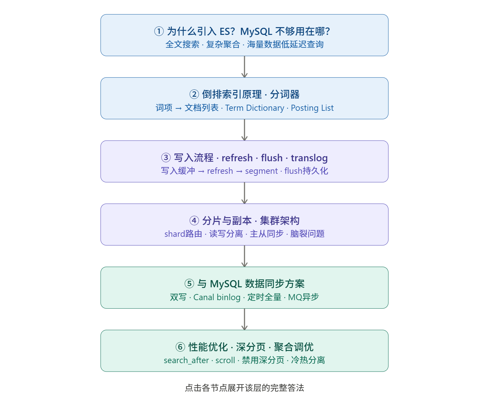

#### 第二张图：倒排索引结构——「你知道它怎么存数据的吗？」

这是 ES 的核心原理，面试官听到你说"倒排索引"之后必然追问它的内部结构。

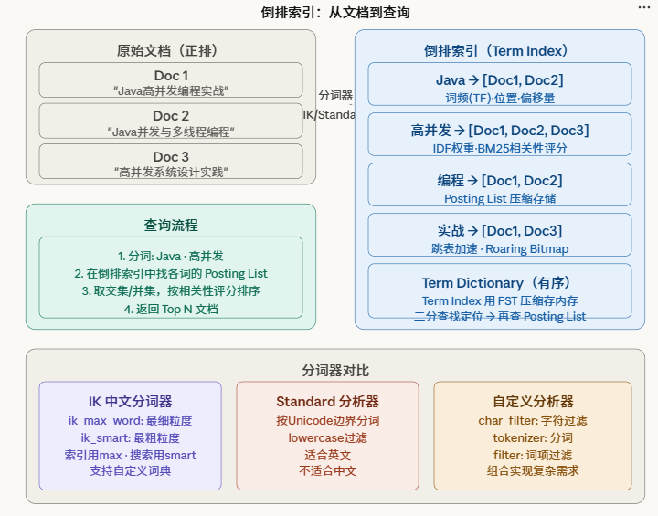

倒排索引的关键答分点：**Term Index 用 FST（有限状态转换机）压缩存在内存里**，避免每次查询都读磁盘；Posting List 用 **Roaring Bitmap** 和跳表压缩，使集合运算（求交集/并集）极快。这两点说出来能让面试官眼睛一亮。

#### 第三张图：写入流程——「写入后为什么不能立刻查到？」

这是 ES 面试中最容易答不全的题，面试官要的是 refresh → translog → flush 三者的关系。写入流程的关键答分点：ES 是**近实时（NRT）**而不是实时，原因是写入先进内存缓冲区，默认每秒 refresh 一次才生成可被搜索的 segment。translog 的作用类似 MySQL 的 redo log，宕机后用它重放未持久化的操作。**refresh ≠ flush**，前者是写内存 segment（快，每秒），后者是 fsync 到磁盘同时清空 translog（慢，周期性）。

#### 第四张图：MySQL 与 ES 数据同步方案——最考实战的题---

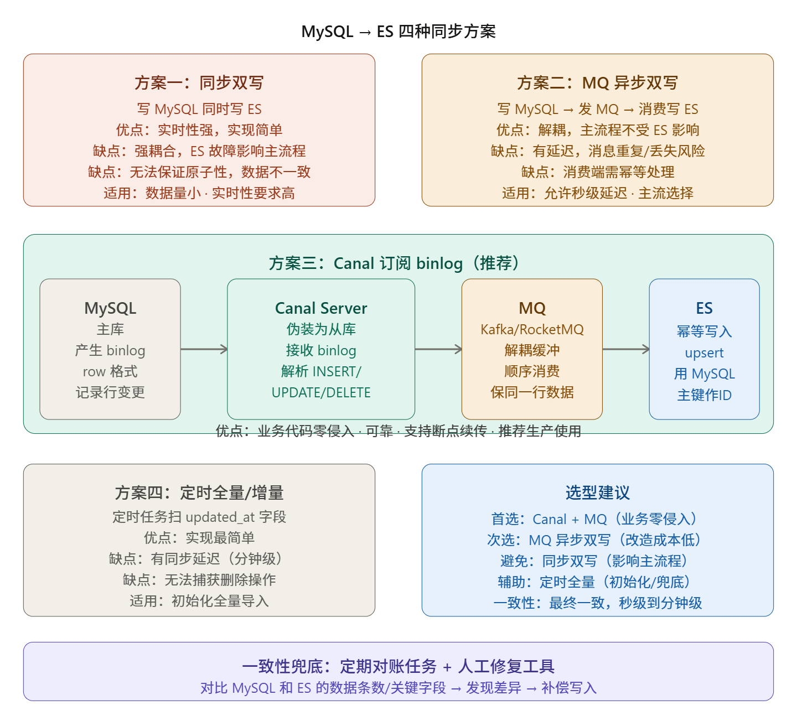

#### 把四张图串成完整答法

面试时遇到"说说你们项目里 ES 是怎么用的"，推荐这个展开结构：

**为什么用 ES**（15秒）：MySQL `LIKE %关键词%` 无法走索引，全表扫描百万行太慢；ES 的倒排索引专为全文检索设计，分词后词项定位到文档列表，复杂的多字段聚合查询 MySQL 也吃力。

**倒排索引核心原理**（30秒）：文档写入时经分词器切词，建立"词 → 文档列表"的映射。Term Index 用 FST 压缩后常驻内存，避免磁盘 IO；Posting List 用 Roaring Bitmap 压缩，集合求交/并极快。这就是为什么 ES 全文搜索比 MySQL LIKE 快几个数量级。

**写入不实时的原因**（30秒）：写入先进 In-memory buffer，同时写 translog 保证宕机可恢复。每隔 1 秒执行一次 refresh，把 buffer 转成内存 segment 才能被搜索到——所以 ES 是**近实时（NRT）**，不是严格实时。flush 操作才把 segment fsync 到磁盘同时清空 translog。

**MySQL 同步方案**（最加分，说自己项目用的）：我们用 Canal 订阅 MySQL binlog，Canal 伪装成从库接收 binlog 事件，解析后投入 Kafka，消费端幂等写入 ES（用 MySQL 主键作为 ES 文档 ID，天然支持 upsert）。这样业务代码完全不需要改动，Canal 支持断点续传，即使 ES 短暂宕机也不会丢数据。定期跑一个对账任务比较两边数据条数，发现差异自动补偿。

> 点击上方图中任意节点，可以继续深挖该细节。

### 并发锁的面试深挖链路

请展开讲解Java并发锁的面试深挖链路，从synchronized到Lock到AQS到CAS

#### 第一张图

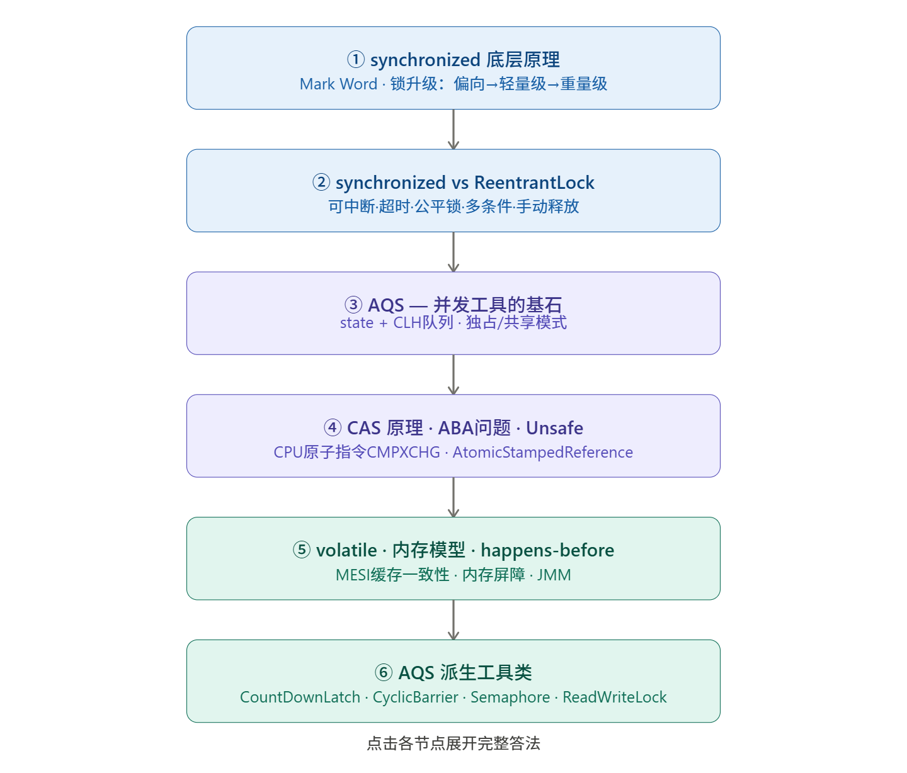

#### 第二张图：synchronized 锁升级机制——「你知道它底层怎么工作的吗？」

这是 synchronized 被追问最深的地方，能说出 Mark Word 布局和锁升级路径就已经超过 80% 的候选人。

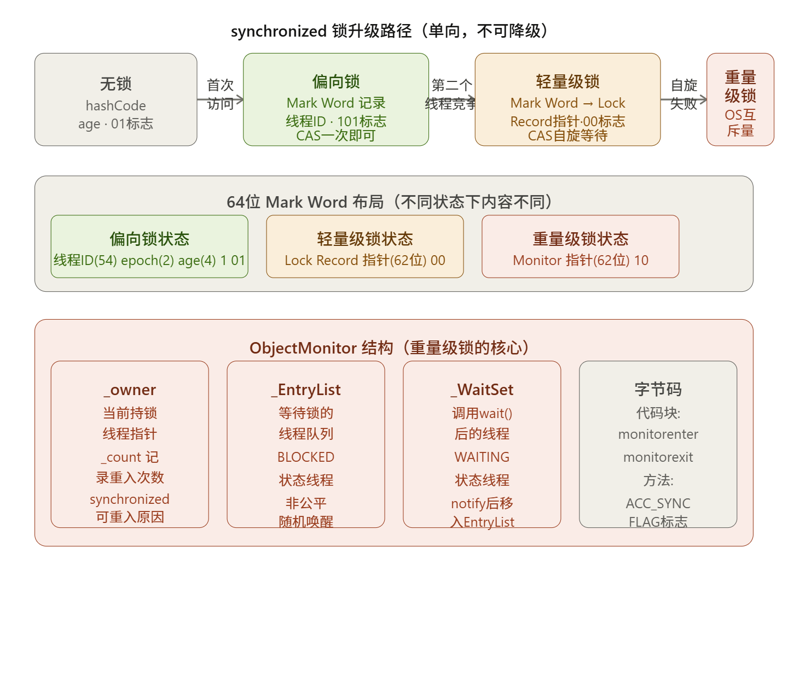

锁升级是单向不可逆的（无锁→偏向→轻量级→重量级），JDK 15 已经废弃偏向锁（维护成本高，现代多线程环境下偏向带来的收益变少）。说出这个细节会让面试官印象深刻。

#### 第三张图：AQS 核心机制——「Lock 底层靠什么实现的？」

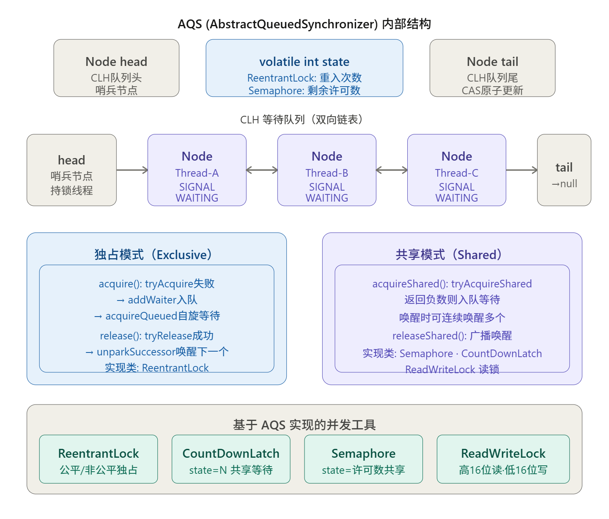

AQS 的设计精髓是**模板方法模式**：框架提供入队、出队、阻塞、唤醒等通用逻辑，子类只需实现 `tryAcquire`/`tryRelease`（独占）或 `tryAcquireShared`/`tryReleaseShared`（共享）来定义"什么情况算获取成功"。

#### 第四张图：CAS 原理与 volatile 内存模型——追问底层的终极答案---

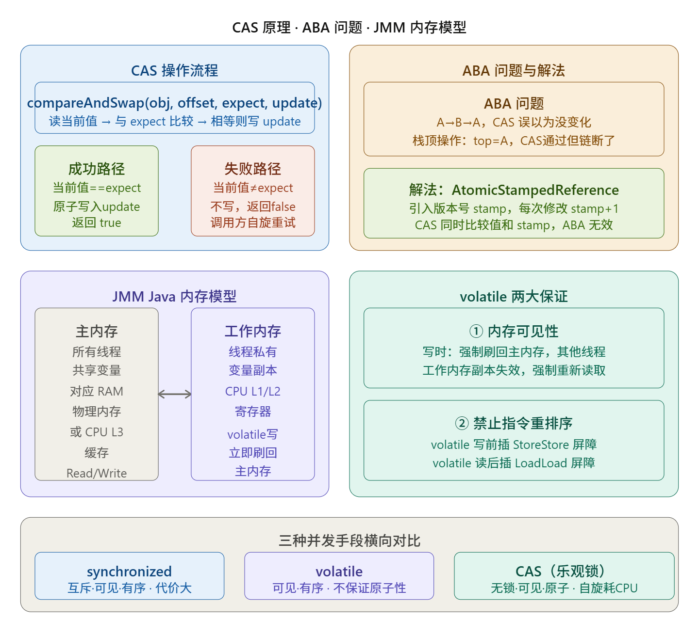

#### 把四张图串成完整答法

面试遇到"说说 Java 并发锁"，推荐按这个层次展开：

##### synchronized 的核心答法

`synchronized` 底层依赖 JVM 对象头的 **Mark Word**，实现了三级锁升级。只有一个线程访问时用**偏向锁**，Mark Word 只存一次线程 ID，后续进入只需比较 ID 不需要 CAS；有第二个线程竞争时升级为**轻量级锁**，失败线程自旋 CAS 等待；自旋超过阈值升级**重量级锁**，线程挂起进入 OS 互斥量，排队等在 `ObjectMonitor` 的 `EntryList` 里。升级单向不可逆，JDK 15 废弃了偏向锁。

##### ReentrantLock vs synchronized

`ReentrantLock` 能做到 `synchronized` 做不到的几件事：响应中断（`lockInterruptibly()`）、超时获取（`tryLock(timeout)`）、公平锁（按入队顺序）、绑定多个 `Condition` 实现精细化等待/通知。但必须手动 `unlock()`，要放在 `finally` 里。默认选 `synchronized`，需要这些高级特性才换 `Lock`。

##### AQS 一句话讲清楚

AQS 是一个**模板框架**：用 `volatile int state` 表示同步状态，用 CLH 双向链表存等待线程，框架提供入队/出队/阻塞/唤醒的通用逻辑，子类只需实现 `tryAcquire`/`tryRelease` 定义"什么情况算抢到锁"。`ReentrantLock` 的 state 是重入次数，`Semaphore` 的 state 是剩余许可数，`CountDownLatch` 的 state 是倒计时计数——同一套框架，不同语义。

##### CAS 的关键答分点

CAS 底层是一条 CPU 原子指令 `CMPXCHG`，读-比较-写三步不可打断。ABA 问题用 `AtomicStampedReference` 加版本号解决。CAS 是乐观并发，适合冲突少的场景；冲突严重时自旋白耗 CPU，这时候反而不如锁。

##### volatile 的最常见坑

`volatile` 保证可见性和有序性，但**不保证原子性**。`i++` 是读-改-写三步，即使 `i` 是 `volatile`，多线程下仍不安全，需要换 `AtomicInteger`。双重检查锁（DCL 单例）里 `instance` 必须加 `volatile`，否则 `new` 操作的指令重排序会导致其他线程拿到一个未完全初始化的对象。

> 点击上方任意节点可以针对某个细节继续深挖。

### 微服务的面试深挖链路

请展开讲解微服务的面试深挖链路，从服务拆分原则到注册发现到熔断限流到分布式事务

这是 Java 面试链路里涉及广度最大的一条，分四张图讲透。

#### 第一张图：面试追问路径

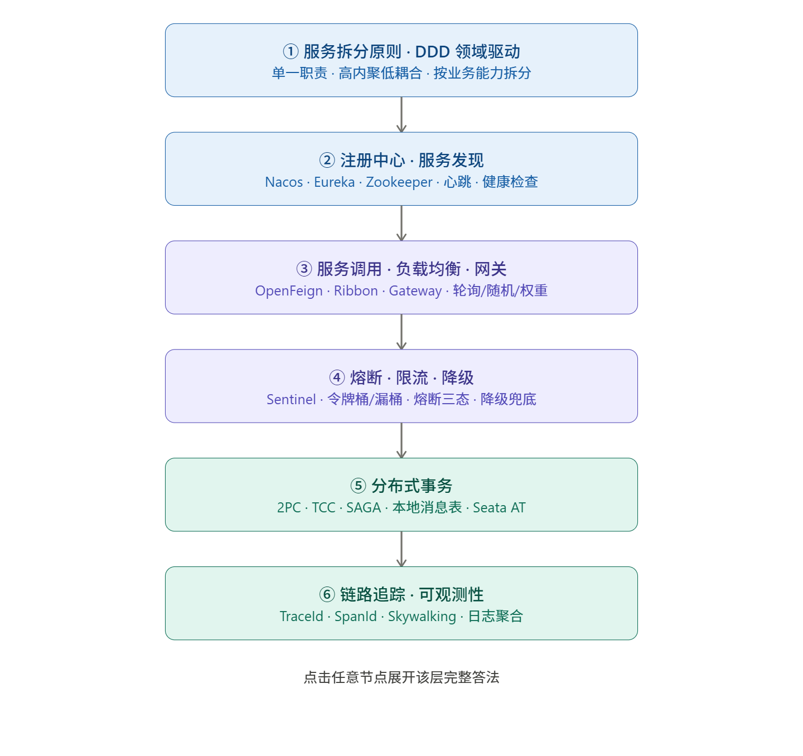

#### 第二张图：注册中心与服务调用全景

服务注册发现、负载均衡、网关是三个紧密相连的话题，面试官经常一口气连着问。

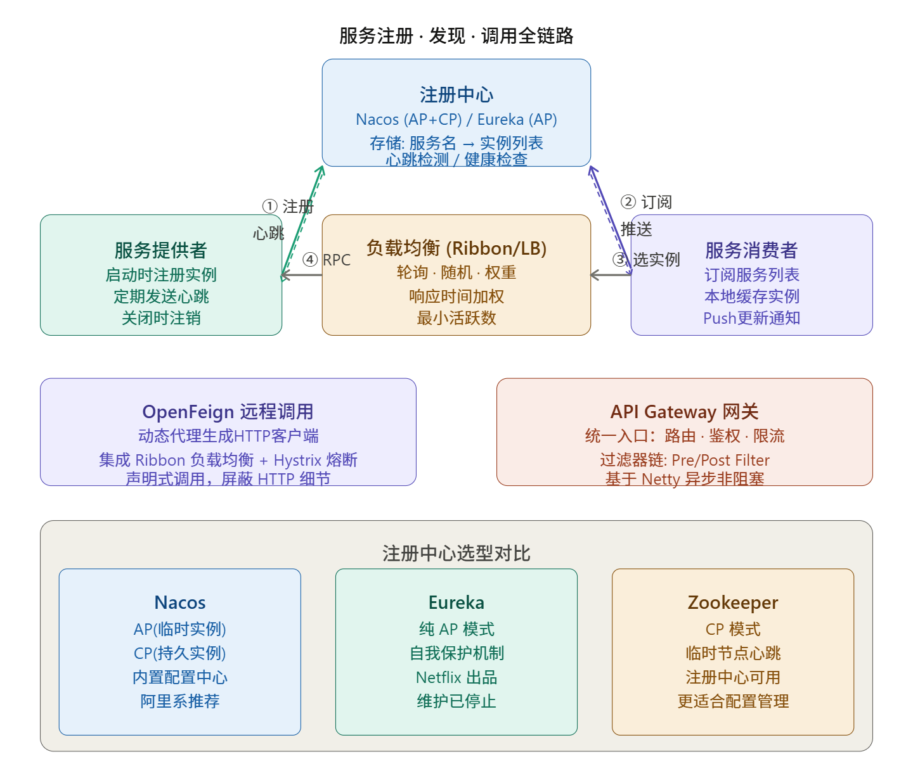

Nacos 与 Eureka 最核心的差异：Nacos 对临时实例走 AP（高可用），对持久实例走 CP（强一致），一个注册中心两种模式；Eureka 纯 AP，且 Netflix 已停止维护，国内主流已换 Nacos。说出这个点是加分项。

#### 第三张图：熔断限流降级——Sentinel 全解

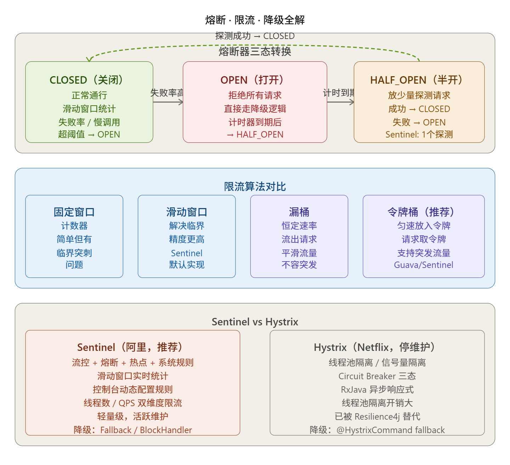

熔断三态转换是必须背下来的：CLOSED 正常通行→统计失败率超阈值→OPEN 全部拒绝→计时器到期→HALF_OPEN 放一个探测请求→成功回 CLOSED / 失败回 OPEN。说完三态，主动延伸到令牌桶支持突发流量而漏桶不行，这是加分点。

#### 第四张图：分布式事务全方案对比——最难的考点---

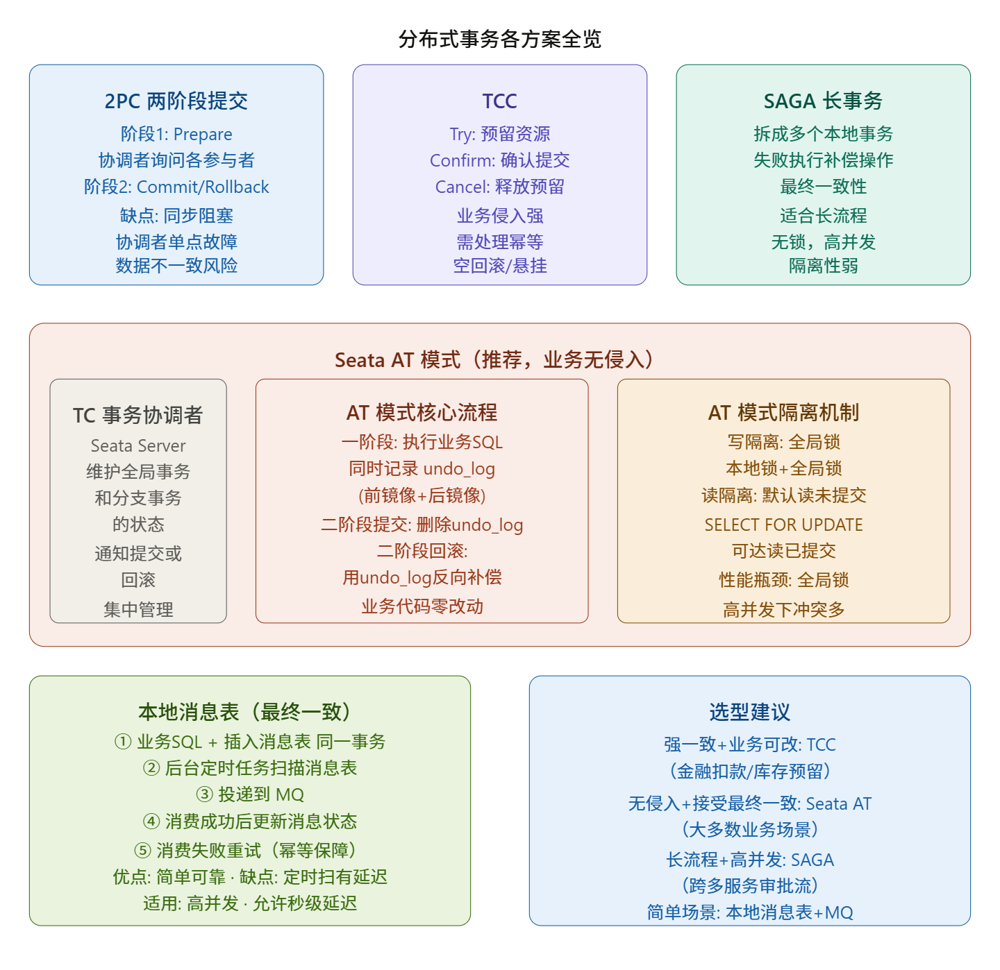

#### 把四张图串成完整答法

面试遇到"说说微服务"时，这样开口最稳：

##### 服务拆分（15秒）

拆分核心原则是**单一职责+高内聚低耦合**，按业务能力拆，不按技术层拆。粒度不是越小越好——服务间网络调用的代价远高于进程内调用，拆太细会导致调用链过长、分布式事务问题爆发。DDD 的限界上下文是比较好的拆分参考边界。

##### 注册发现（30秒）

国内主流选 Nacos。服务启动时向 Nacos 注册实例（IP+端口+元数据），定期发心跳续约；消费方订阅服务列表，Nacos 推送变更通知，本地缓存实例列表；调用时经过 Ribbon/LoadBalancer 做负载均衡，OpenFeign 在上面封装了声明式调用。Nacos 的核心优势是同时支持 AP（临时实例，注册中心）和 CP（持久实例，配置中心），一个中间件两种能力。

##### 熔断限流（30秒）

选 Sentinel。熔断器三态：CLOSED 正常→失败率超阈值→OPEN 全部拒绝走降级→计时到期→HALF_OPEN 放一个探测请求→成功回 CLOSED。限流算法推令牌桶，支持突发流量；漏桶平滑但不容突发。降级兜底要提前写好 Fallback，不能返回空或报错影响用户体验。

##### 分布式事务（最重点，要主动说选型理由）

用 Seata AT 模式——业务代码零侵入，一阶段执行业务 SQL 同时记录 undo_log，二阶段提交直接删 undo_log，回滚用 undo_log 反向补偿，整个过程框架自动完成。对强一致要求高的场景（比如金融扣款）才用 TCC，因为需要业务侵入写 Try/Confirm/Cancel 三套逻辑，成本高但隔离性强。高并发下允许最终一致的场景用**本地消息表+MQ**，把消息插入和业务 SQL 放一个本地事务，定时任务扫描投递，消费端做幂等，简单可靠。

> 说完分布式事务，面试官大概率会追问"TCC 的幂等性怎么保证"或"Seata 的全局锁冲突怎么解决"——点击图中节点可以继续深挖这些细节。

### 限流的面试深挖链路

请展开讲解限流的面试深挖链路，从为何限流到令牌桶漏桶到Sentinel到分布式限流

这条链路分四张图讲透：追问路径 → 四大算法可视化对比 → Sentinel 架构 → 分布式限流方案。

#### 第一张图：面试追问路径

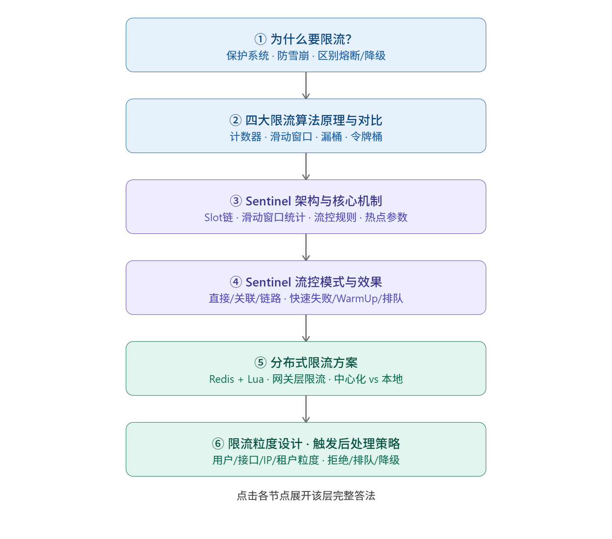

#### 第二张图：四大算法可视化对比——面试最核心的考点

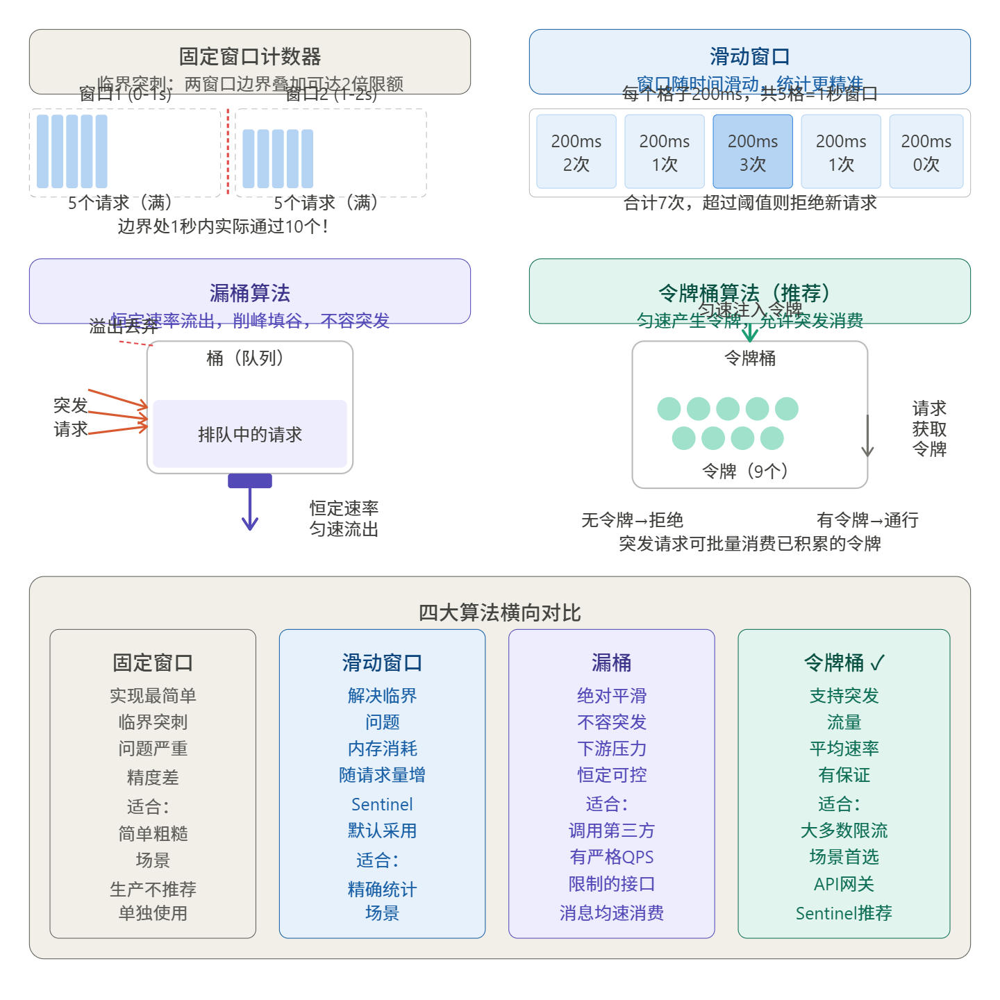


能把四种算法的**流量形状图**在脑子里画出来，面试现场就赢了一半。漏桶与令牌桶最容易答混：**漏桶**的关键是出口速率恒定，突发流量只能排队或被丢弃，下游永远平稳；**令牌桶**的关键是令牌可以积累，空闲时攒满一桶，突发到来可以瞬间消费积累的令牌，允许短暂超速。生产首选令牌桶，调用有严格 QPS 限制的第三方接口才用漏桶。

#### 第三张图：Sentinel 架构与流控规则交互器

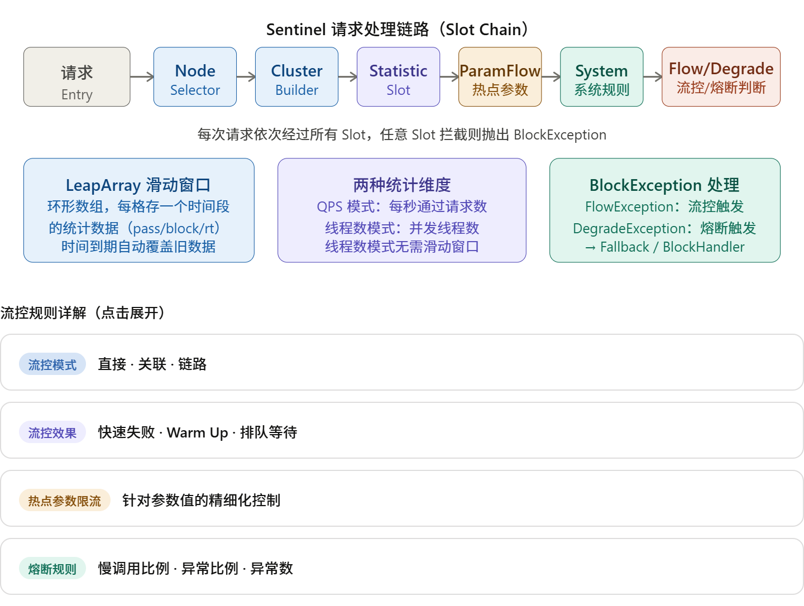

#### 第四张图：分布式限流方案全解---

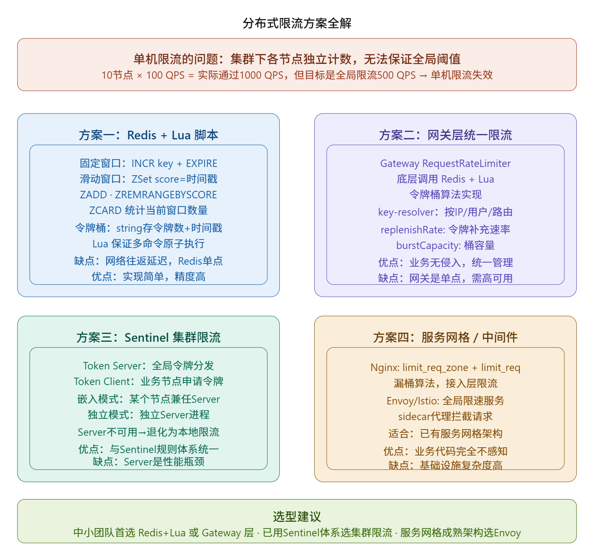

#### 把四张图串成完整答法

##### ① 为什么限流（10秒）

限流是系统的**最后一道防线**，保护下游不被打垮。它和熔断降级的区别在于：限流是**主动预防**（我知道系统最多承受多少，提前卡住），熔断是**被动响应**（发现下游出问题了，自动断开）。两者不互斥，生产环境通常一起用。

##### ② 四大算法（面试核心，30秒）

计数器最简单但有**临界突刺**（两个窗口边界可瞬间通过 2 倍流量）；滑动窗口解决了临界问题，Sentinel 默认用它；漏桶出口速率恒定，适合**调用有严格 QPS 限制的第三方接口**；令牌桶允许突发消费积累的令牌，**大多数场景首选令牌桶**。面试中说出"漏桶不容突发，令牌桶可以"这个核心区别就够了。

##### ③ Sentinel（30秒）

Sentinel 的核心是 **Slot 链**：每个请求依次经过 NodeSelector、ClusterBuilder、**Statistic**（用 LeapArray 滑动窗口统计 QPS/线程数/RT）、ParamFlow（热点参数）、System（系统自适应）、Flow/Degrade（流控和熔断判断）。任意 Slot 拦截则抛 BlockException，走 BlockHandler 降级。流控效果中最常考的是 **Warm Up**——令牌桶预热，冷启动时从低阈值渐进升到目标值，防止流量突增压垮刚启动的服务。

##### ④ 分布式限流（最加分，说项目里怎么做的）

单机限流在集群部署时各节点独立计数，无法保证全局阈值。生产最常用的是 **Redis + Lua 脚本**：滑动窗口用 ZSet（score 存时间戳），每次请求先清除过期数据、统计数量、判断是否超限、写入当前请求，这四步封装在 Lua 脚本里原子执行，避免多命令之间的并发问题。SpringCloud Gateway 内置的 `RequestRateLimiter` 底层也是这套，可以按 IP / 用户 / 路由设置不同阈值，是业务无侵入的推荐方案。

> 点击图中任意节点可以继续深挖某个细节，比如 Lua 脚本的具体实现，或者 Warm Up 的数学公式推导。

### 消息队列MQ的面试深挖链路

请展开讲解消息队列MQ的面试深挖链路，从为何用MQ到消息丢失到重复消费到顺序消费


这是微服务面试里涉及"可靠性三角"最集中的一条链路——消息丢失、重复消费、顺序消费三者几乎必考，而且环环相扣。分四张图讲透。

#### 第一张图：面试追问路径

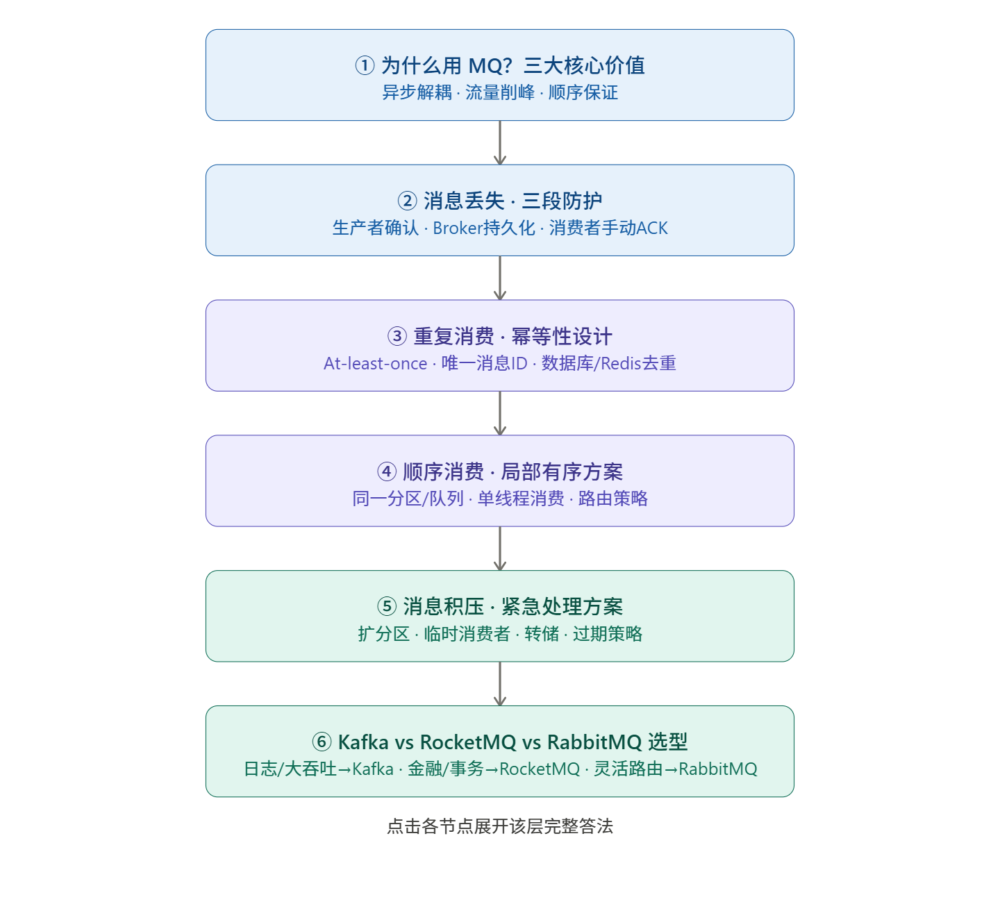

#### 第二张图：消息丢失三段防护——每个环节都有坑

消息从生产者到消费者经历三段，每段都可能丢。面试官要的是你能说出**每段的丢失原因和对应防护手段**。

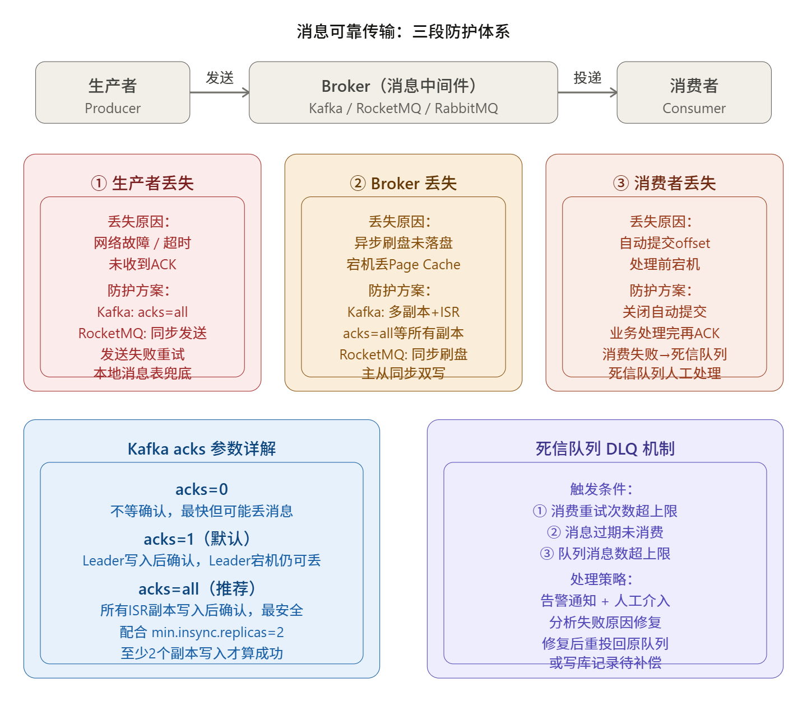

消费者这段最容易被追问：**自动提交 offset 会在"取到消息但处理失败"时丢消息**——消息已标记为已消费，但业务逻辑挂了，下次重启不会再消费这条消息，就丢了。解法是关闭自动提交，业务处理完成后手动 `commitSync()`。

#### 第三张图：重复消费 + 幂等性设计——可视化交互方案对比

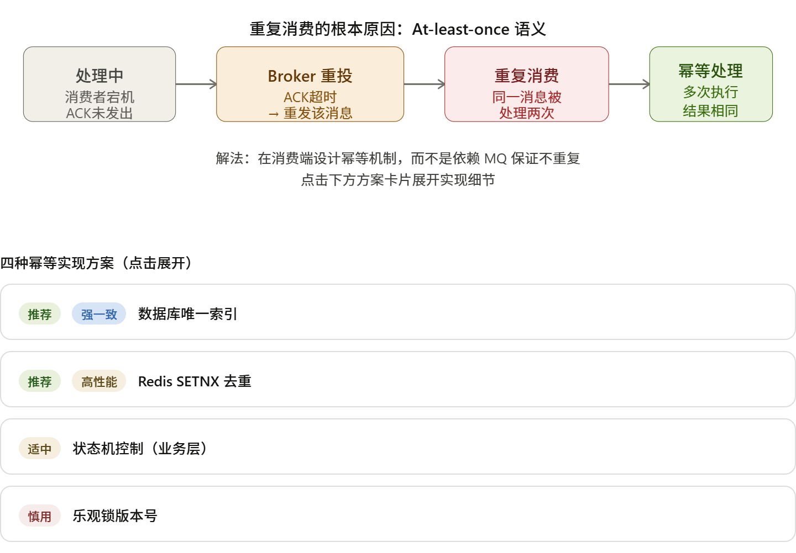

#### 第四张图：顺序消费 + 消息积压 + 三大 MQ 选型---

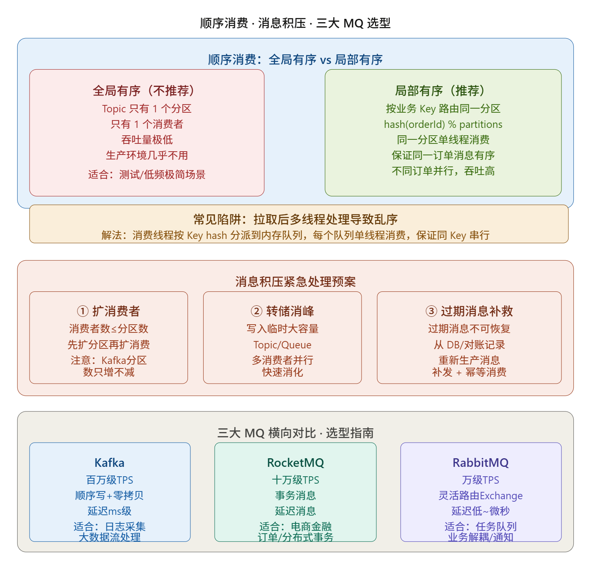


#### 把四张图串成完整答法

##### ① 为什么用 MQ（15秒）

三个核心价值：**异步**（下单后发消息通知库存/积分/短信，主流程不等待，响应快）、**解耦**（生产者不依赖消费者接口，消费者宕机不影响生产者）、**削峰**（秒杀瞬间流量打到 MQ，消费者按自身节奏消费，保护下游数据库）。

##### ② 消息丢失（30秒，三段说清楚）

生产者侧：Kafka 配 `acks=all`，等所有 ISR 副本写入后才算成功；发送失败重试，配合本地消息表兜底。Broker 侧：Kafka 开多副本，`min.insync.replicas=2`；RocketMQ 用同步刷盘 + 主从双写。消费者侧：**关闭自动提交 offset**，业务逻辑处理完成后再手动 `commitSync()`；消费失败不要吞异常，走死信队列 + 告警人工处理。

##### ③ 重复消费（30秒，说出方案取舍才加分）

根本原因是 MQ 的 At-least-once 语义——宕机重启后重投消息，无法避免重复。解法在消费端设计幂等。最推荐**数据库唯一索引**（`INSERT IGNORE` 消息日志表，与业务操作同一事务，强一致）；高并发场景用 **Redis SETNX**（性能好但有极小不一致窗口）；有业务状态机的用 **WHERE status='pending' 的条件 UPDATE**（影响行数为 0 说明已处理，天然幂等）。

##### ④ 顺序消费（30秒，说出局部有序是核心）

全局有序（1 个分区 1 个消费者）吞吐太低，生产不用。实际做法是**局部有序**：按业务 Key（如 `orderId`）哈希路由到固定分区，同一分区内消息天然有序，消费时单线程串行处理该分区。常见坑是消费者拉取消息后用线程池并行处理导致乱序——解法是按 Key 哈希分配到内存队列，每个内存队列单线程消费。

##### ⑤ 消息积压紧急处理（加分项）

主动说"我们生产遇到过"：优先扩分区再扩消费者实例（消费者数不能超过分区数，超了没用）；如果消费者处理耗时过长，临时开快速消费者把消息转储到新的大容量 Topic，再多开消费者并行消化；已过期的消息不可恢复，只能从 DB 对账补发，消费端做好幂等。

##### ⑥ 选型建议（10秒）

大数据/日志采集选 **Kafka**（百万 TPS，顺序写+零拷贝）；电商/金融选 **RocketMQ**（支持事务消息和延迟消息，阿里系生态好）；灵活路由/任务队列选 **RabbitMQ**（Exchange 模型灵活，延迟最低但吞吐相对弱）。

> 点击任意图中节点可以继续深挖某个细节，比如 Kafka ISR 的原理，或者 RocketMQ 事务消息的两阶段流程。


### 高并发面试链路

这是面试中覆盖最广的综合性链路，会把前面所有专题串联起来考。分四张图讲透：追问路径 → 高并发架构全景 → 秒杀系统设计 → 性能压测与调优。

#### 第一张图：面试追问路径

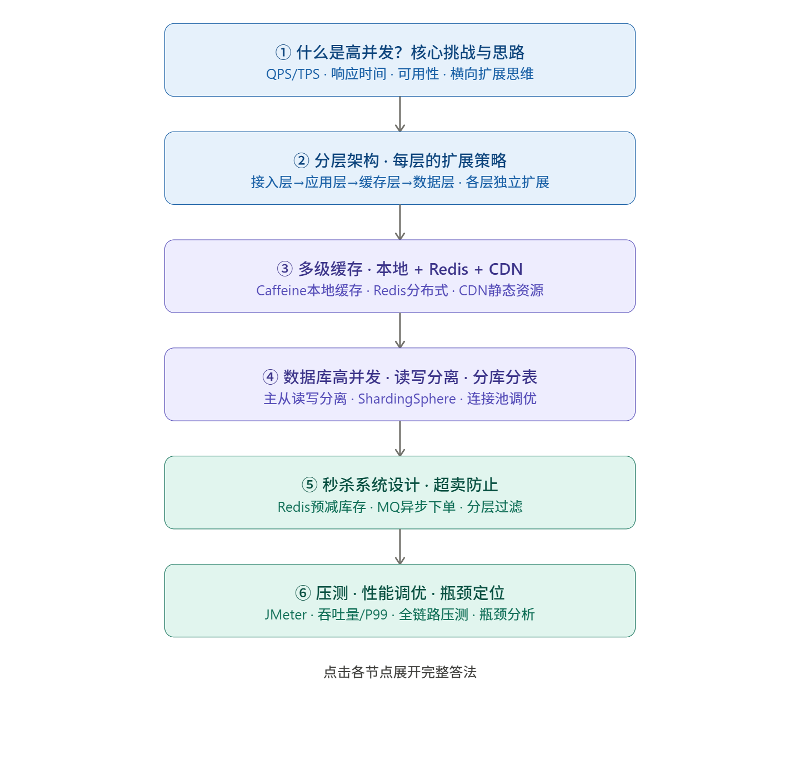

#### 第二张图：高并发分层架构全景——「你们系统架构是怎么支撑高并发的？」

这是面试官问系统设计时最想看到的全局视图。每一层都有独立的扩展策略，说出来才显得有系统性思维。

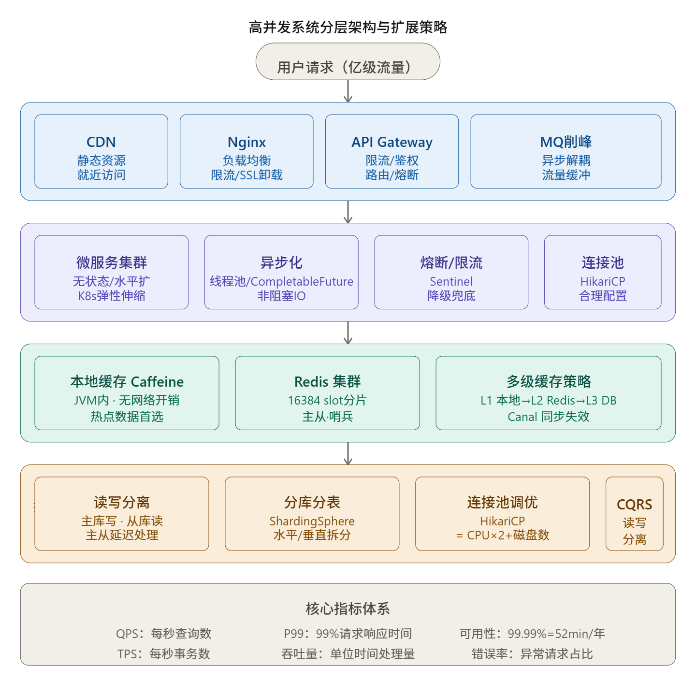

分层架构的核心思路是**每层独立扩展**：接入层 Nginx 集群 + CDN 扛住流量；应用层无状态水平扩容；缓存层拦截 90% 读请求；数据层读写分离 + 分库分表。面试中能画出这四层并说出每层的扩展手段，就已经超过大多数候选人了。

#### 第三张图：秒杀系统设计——高并发面试最常考的综合题

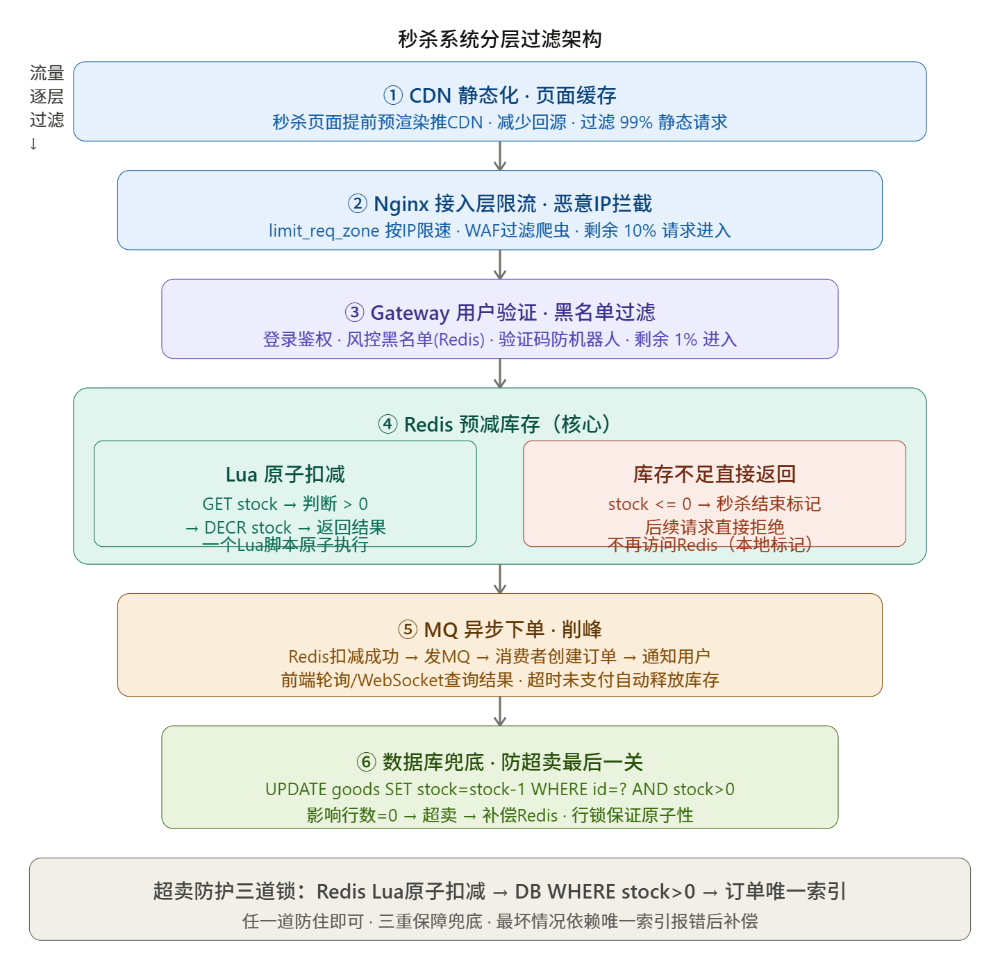

秒杀的核心是**分层过滤**，把 100 万请求在每层过滤掉大部分，最终只有真正抢到的少量请求打到数据库。超卖防护的关键是 Redis Lua 脚本的原子性（读-判断-写三步不可打断）+ 数据库 `WHERE stock>0` 兜底。

#### 第四张图：压测调优 + 高并发常见坑交互器---

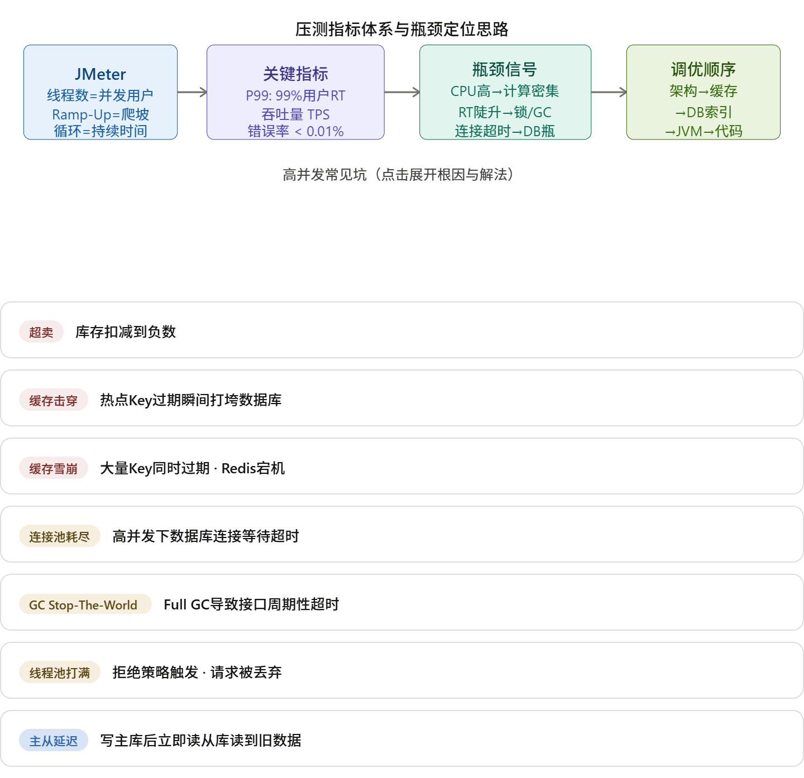

#### 把四张图串成完整答法

高并发面试的答题框架是：**架构思维（分层）→ 核心手段（缓存+异步+分库）→ 典型案例（秒杀）→ 踩坑经验（调优）**。

##### ① 高并发思维（20秒）

提升并发能力本质上只有三条路：**加机器（横向扩展）**、**减等待（异步化/非阻塞）**、**减操作（缓存/预计算）**。所有具体手段都是这三条的变体。

##### ② 分层架构（30秒）

接入层 CDN + Nginx 负载均衡扛住流量，做限流和 SSL 卸载；应用层无状态微服务水平扩容，线程池+熔断保稳定；缓存层 Caffeine（本地）+ Redis（分布式）拦截 90% 读请求；数据层读写分离 + 分库分表，HikariCP 连接池合理配置。每层独立扩展，不互相拖累。

##### ③ 秒杀系统（最常考，60秒说清楚）

核心思路是**分层过滤**：CDN 静态化过滤静态请求 → Nginx 限流过滤爬虫 → 网关鉴权+黑名单 → Redis Lua 脚本原子预减库存（stock≤0 直接返回，后续请求本地标记不再打 Redis）→ 扣减成功发 MQ 异步下单 → 消费者创建订单时 DB 层 `WHERE stock>0` 兜底防超卖 → 前端轮询/WebSocket 通知结果。超卖三道锁：Redis 原子扣减 + DB 条件更新 + 订单唯一索引。

##### ④ 调优经验（加分项）

调优优先级：架构 > 缓存 > SQL 索引 > JVM > 代码。生产常见坑：缓存击穿用逻辑过期或互斥锁；缓存雪崩用 TTL 随机偏移 + 多级缓存；Full GC 频繁上 G1/ZGC + 调大新生代；线程池打满用动态线程池 + 分业务隔离；主从延迟的强一致读强制走主库。P99 是最重要的指标，平均值会被少量快请求掩盖长尾问题。

> 点击上方任意节点或坑卡片，可以继续深挖某个具体场景。

### 设计模式的面试深挖链路

请展开讲解设计模式的面试深挖链路，从单例到工厂到代理到在Spring中的应用

这条链路是"代码功底"的最直接体现——面试官不只问定义，而是会让你手写、让你说出Spring在哪里用了它。分四张图讲透。

#### 第一张图：面试追问路径




这是面试里最容易被"理论背得溜，实战说不清"的一条链路。分四张图讲透：追问路径 → 单例与工厂深挖 → 代理模式底层 → Spring中的模式全景。

#### 第一张图：面试追问路径

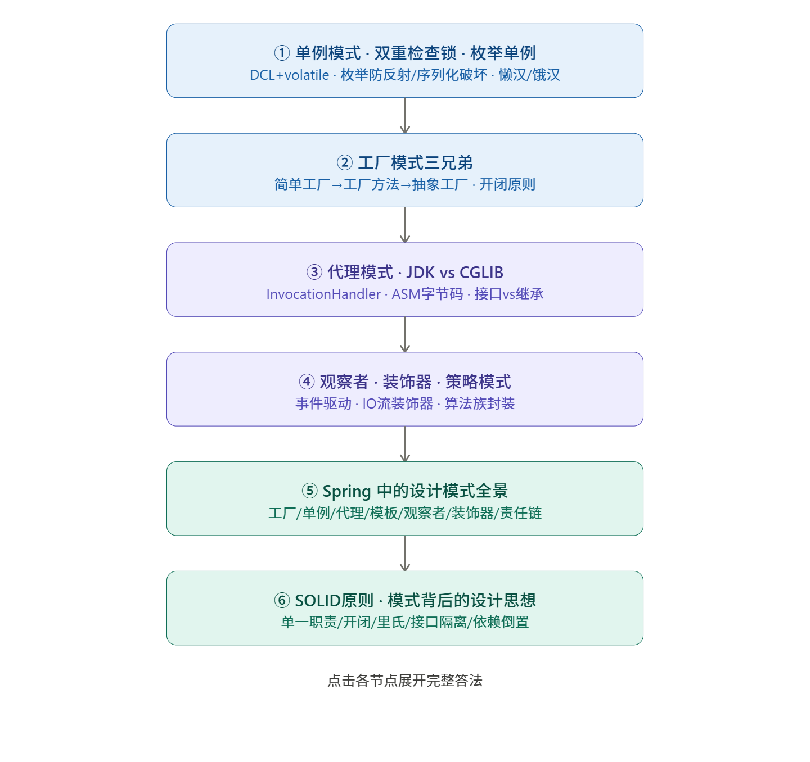

#### 第二张图：单例与工厂深挖——代码级考点

单例是面试必考，而且面试官会追问到代码细节层面。工厂三兄弟很多人混淆，要能说出演进关系。

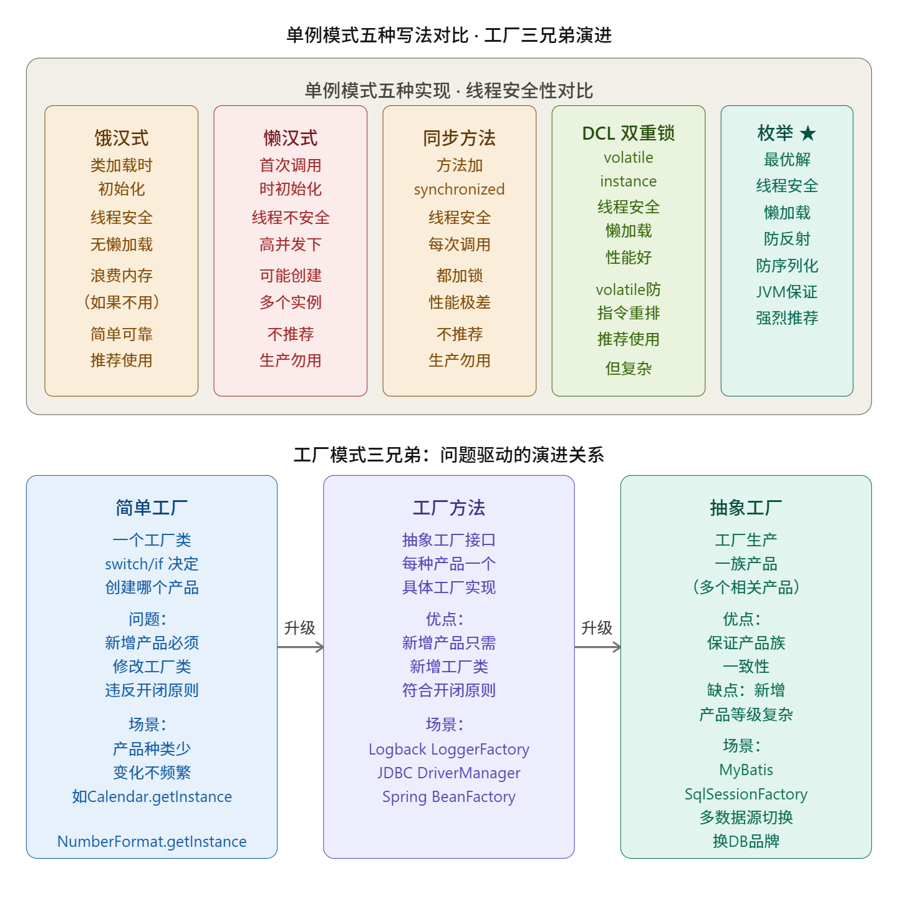

DCL 的 volatile 是面试最容易被追死的细节：`new Singleton()` 在 JVM 里不是原子操作，分三步（分配内存→初始化对象→赋值引用），指令重排序可能让第三步先于第二步执行，另一个线程判断 `instance != null` 后拿到一个未完全初始化的对象。volatile 的内存屏障禁止这种重排序。

#### 第三张图：代理模式底层原理——「AOP 底层怎么实现的？」

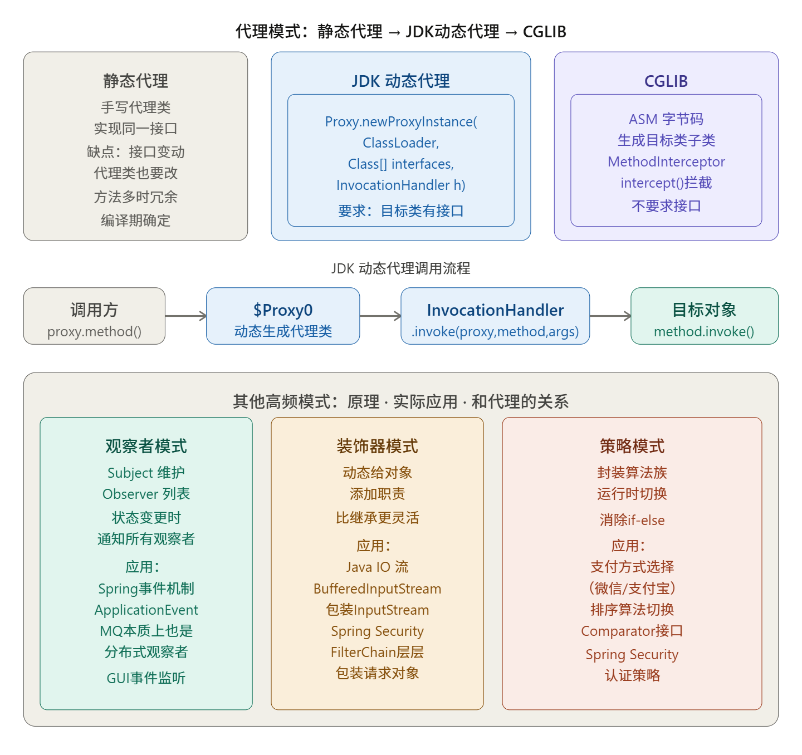

代理和装饰器的区别是面试必问：**代理**关注的是控制访问（拦截、权限、日志），调用方通常不知道目标对象的存在；**装饰器**关注的是增强功能，调用方知道目标对象，两者都实现同一接口但侧重点完全不同。

#### 第四张图：Spring 中的设计模式全景——「Spring 用了哪些设计模式？」

这是面试官最爱的综合题，要把模式和 Spring 源码具体位置对应起来说，才能显得真的看过源码。---

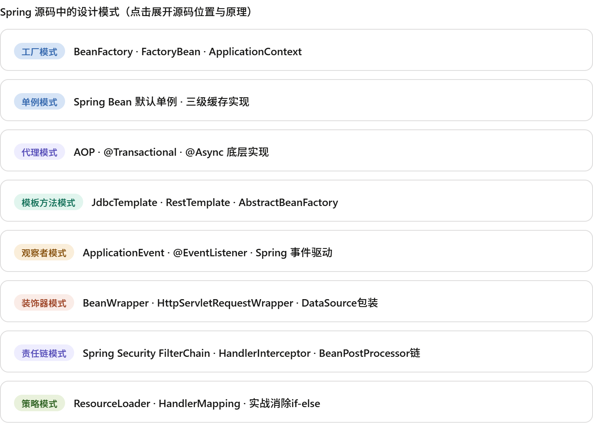

#### 把四张图串成完整答法

##### 单例（30秒，代码级才加分）

五种写法从差到好：懒汉（线程不安全）→ 同步方法（性能差）→ 饿汉（简单可靠但无懒加载）→ DCL 双重检查锁（需要 `volatile`，原因是 `new` 的指令重排序）→ **枚举（最优解）**。枚举由 JVM 保证线程安全和单次初始化，还能防反射攻击和序列化破坏（其他写法都有这两个漏洞），是 Effective Java 明确推荐的方式。

##### 工厂三兄弟（20秒，说出演进驱动力）

简单工厂（`switch` 决定创建哪个）→ 问题是新增产品要改工厂类，违反开闭原则 → 升级到工厂方法（每种产品对应一个工厂，新增只加类不改类）→ 需要保证一族产品的一致性时（比如换数据库品牌，所有相关对象都要换）→ 升级到抽象工厂（一个工厂方法创建一族相关产品）。

##### 代理模式（30秒，说出底层原理）

JDK 动态代理要求目标类有接口，运行时生成 `$Proxy0` 实现同一接口，每个方法调用转发到 `InvocationHandler.invoke()`，再通过反射调用目标方法。CGLIB 用 ASM 字节码生成目标类的子类，`MethodInterceptor.intercept()` 拦截方法，不要求接口但 `final` 类/方法无法代理。Spring 5.x 默认用 CGLIB。

##### Spring 中的模式（最加分的综合回答）

工厂：`BeanFactory` 是工厂方法，`FactoryBean` 是生产 Bean 的工厂（注意两者是完全不同的概念，这是高频考点）。单例：Spring Bean 默认单例，存在 `DefaultSingletonBeanRegistry` 的 `ConcurrentHashMap` 里。代理：AOP 在 `AbstractAutoProxyCreator` 后置处理阶段生成代理，`@Transactional` 通过 `TransactionInterceptor` 拦截实现。模板方法：`JdbcTemplate` 封装 JDBC 骨架，`RowMapper` 回调处理可变部分。观察者：`ApplicationEvent` + `@EventListener`，用户注册送积分/发邮件的典型解耦场景。责任链：Spring Security `FilterChain` 和 `BeanPostProcessor` 处理链。策略：用 `Map<String, Strategy>` 注入所有策略实现，按 key 选策略，消除支付方式判断的大量 if-else。

> 点击上方任意卡片可以展开对应模式的源码位置和追问细节。

### 分库分表的面试深挖链路

请展开讲解分库分表的面试深挖链路，从为何分库分表到分片策略到跨库查询到分布式ID

这是面试里最容易被问到"你们项目里真的用过吗"的一条链路。分四张图讲透：追问路径 → 分库分表策略全解 → 跨库查询难题 → 分布式 ID 方案。

#### 第一张图：面试追问路径

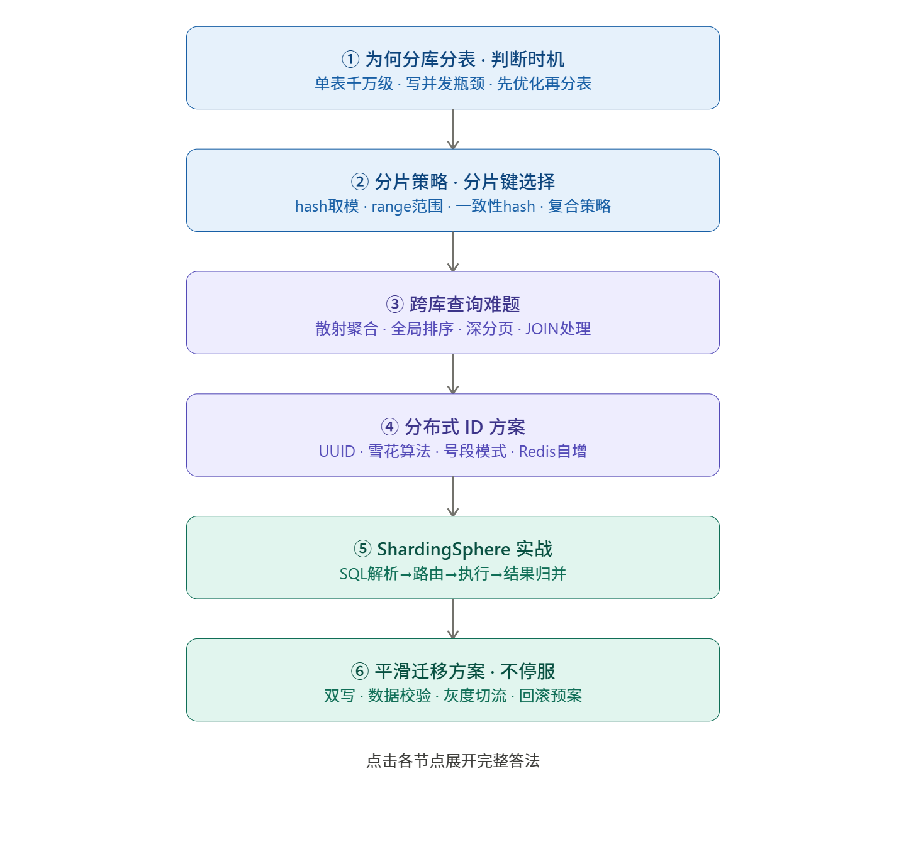

#### 第二张图：分片策略全解——「你们用的什么分片算法，为什么？」

分片键是分库分表里最重要也最难改的决策——一旦上线几乎不可能更换，因为更换等于全量数据迁移。生产中电商场景的最优解通常是**用户 ID 做分片键**（用户的所有订单聚集在同一分片，常见查询"我的订单"不需要散射）。

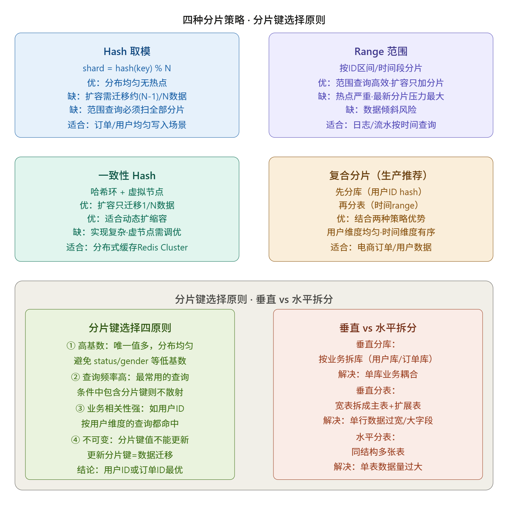

#### 第三张图：跨库查询难题——「分了以后查询怎么办？」


这是面试官最爱追问的地方，因为这里的问题最多最复杂。AVG 不能各分片平均再求平均——这是面试必问的坑，很多人答不出来。正确做法是各分片返回 `(SUM, COUNT)` 两个值，汇总后用总 SUM 除以总 COUNT 才是正确的全局平均值。

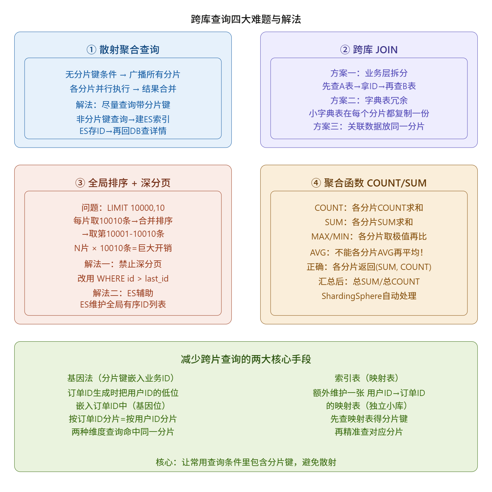

#### 第四张图：分布式 ID 方案对比 + 雪花算法深挖---

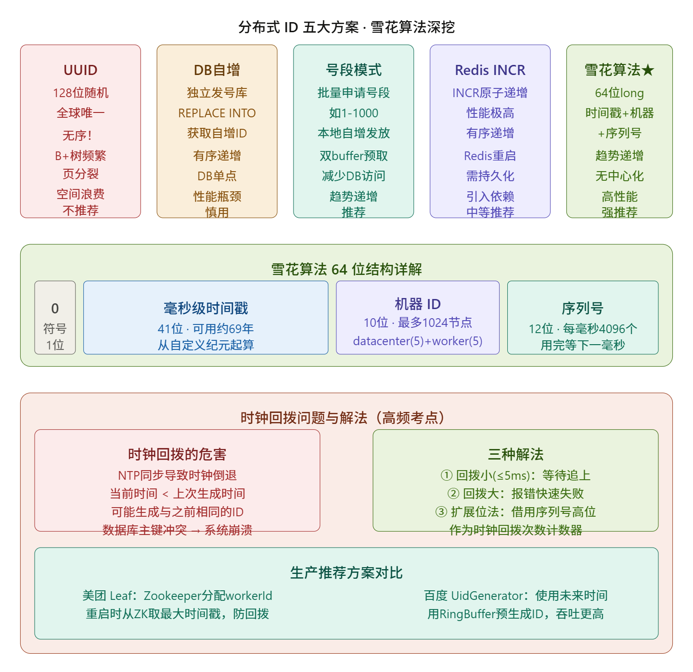

#### 把四张图串成完整答法

##### ① 什么时候分库分表（20秒，要说出判断标准）

不是一上来就分，分库分表引入的复杂度极高。优先顺序应该是：加索引优化 SQL → 读写分离 → 归档历史数据 → 垂直分库/分表 → 最后才是水平分表。单表数据超过**千万级且已经索引优化过、响应时间仍不达标**，才考虑分表。分库解决的是写并发瓶颈（单库 QPS 上限），分表解决的是单表数据量问题，两个问题要分清楚。

##### ② 分片策略（30秒，说出选型理由）

生产电商最常用的是**用户 ID hash 分库 + 时间 range 分表**的复合策略：按用户 ID 哈希确保同一用户数据在同一库（"我的订单"查询不散射），按月/季度 range 分表控制单表大小（历史表冷归档）。分片键选择的核心原则是高基数 + 查询高频 + 值不可变，用户 ID 和订单 ID 是最优选择。

##### ③ 跨库查询难题（最容易被追问，40秒）

说三个最重要的：JOIN 拆成多次单表查询（业务层 In 查询）；深分页 `LIMIT 100000,10` 改为游标分页 `WHERE id > last_id`，因为深分页在 N 个分片上每片都要取 100010 条再合并，代价不可接受；AVG 绝对不能各分片平均再求平均，必须返回 `(SUM, COUNT)` 汇总后计算。非分片键的复杂搜索通常引入 ES，把查询结果的主键返回后再回数据库查详情。

##### ④ 分布式 ID（30秒，雪花算法要说出结构和坑）

推荐**雪花算法**：64 位 long = 1 位符号位 + **41 位毫秒时间戳**（约 69 年）+ **10 位机器 ID**（最多 1024 节点）+ **12 位序列号**（每毫秒 4096 个 ID），每秒约 400 万个，趋势递增，对 B+ 树友好，无中心化依赖。最大的坑是**时钟回拨**——NTP 同步可能让时间倒退，导致生成重复 ID。解法：小回拨（≤5ms）等待追上；大回拨直接报错快速失败，或用扩展位计数器区分。生产中用美团 Leaf 或百度 UidGenerator，已经解决了这些问题。UUID 无序会导致 B+ 树频繁页分裂，写性能差，不推荐做 MySQL 主键。

##### ⑤ 平滑迁移（面试加分项）

单库迁移到分库分表不能停服，标准做法是**双写迁移**：代码改造为同时写旧库和新分库，存量数据后台 Job 全量迁移，迁移完成后对账校验一致性，最后切读流量（先 1% 灰度→10%→100%），确认稳定后停止写旧库。整个过程可随时回滚。

> 点击上方任意图中节点可以继续深挖某个细节，比如基因法的具体实现，或者号段模式双 Buffer 的工作原理。

### HashMap的面试深挖链路

请展开讲解HashMap的面试深挖链路，从数据结构到扩容机制到线程不安全到ConcurrentHashMap

这是 Java 面试里追问最深、最容易被"扣细节"的一条链路。分四张图讲透：追问路径 → 数据结构与 put 流程 → 扩容机制 → 线程安全演进。

#### 第一张图：面试追问路径

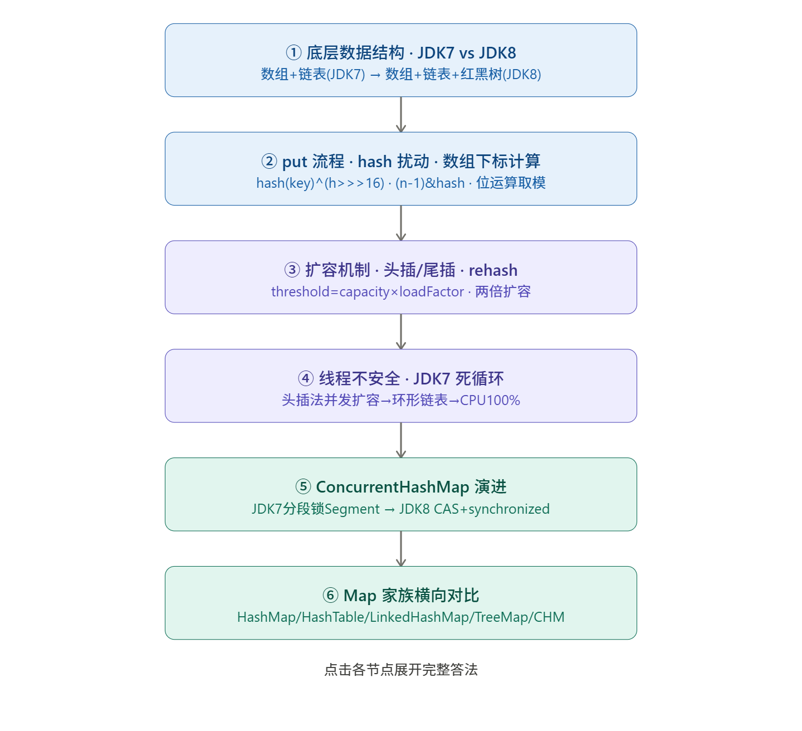

#### 第二张图：数据结构 + put 完整流程——「说说 put 的过程」

这是面试官最常考的核心题，能把 put 流程的每一步说清楚，就已经超过大多数人了。hash 扰动函数 `h ^ (h >>> 16)` 的目的是让高 16 位也参与到下标计算中。因为数组长度通常不大，`(n-1) & hash` 实际上只用到了 hash 的低位，高位信息全部浪费，碰撞概率更高。异或后高低位信息都被混入，分布更均匀。

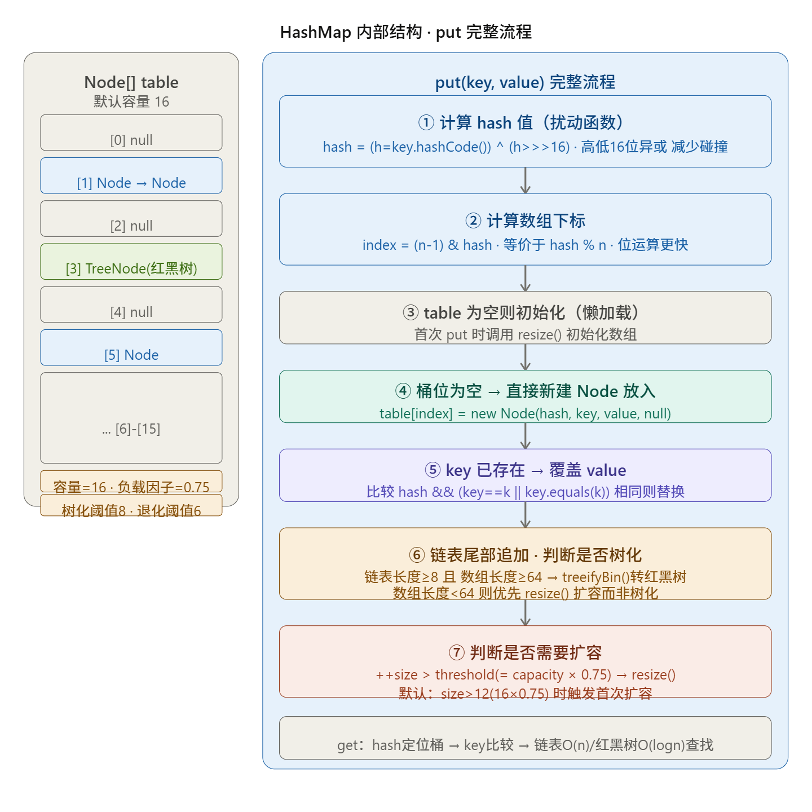

#### 第三张图：扩容机制 + JDK7 死循环——面试最深的坑

JDK8 改了头插为尾插，消灭了死循环，但**数据覆盖**和 **size 统计不准**的问题依然存在——所以多线程环境下 JDK8 的 HashMap 仍然不安全，必须换 ConcurrentHashMap。

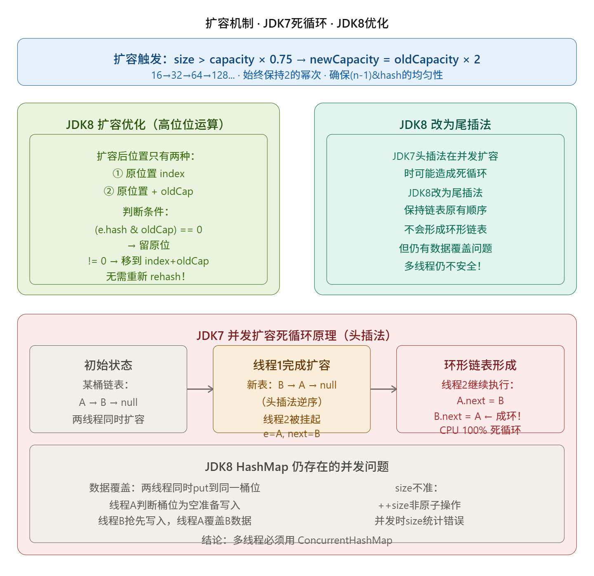

#### 第四张图：ConcurrentHashMap 演进 + Map 家族全对比---

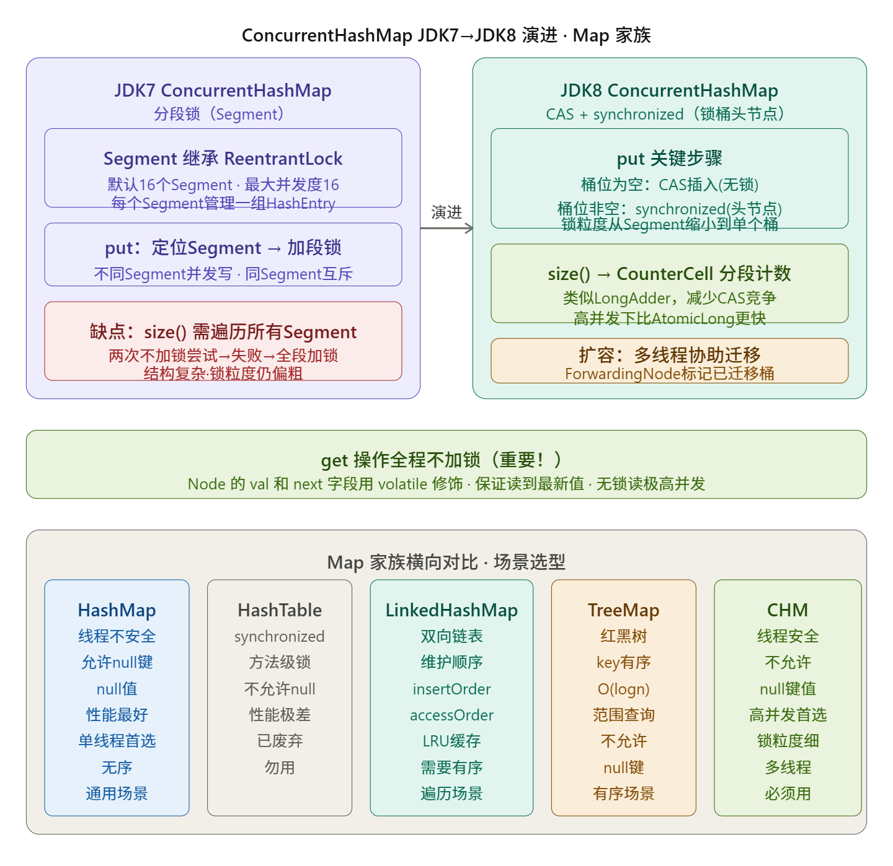

#### 把四张图串成完整答法

##### ① 数据结构（20秒）

JDK7 是**数组 + 链表**；JDK8 是**数组 + 链表 + 红黑树**。当链表长度 ≥ 8 且数组长度 ≥ 64 时链表转红黑树（查询 O(n) → O(log n)）；节点数 ≤ 6 时红黑树退化回链表。数组长度 < 64 时优先扩容而不树化——这个细节大多数人答不出来。

##### ② put 流程（30秒，步步说到位）

① 计算 `hash = h ^ (h >>> 16)`（扰动，让高位参与寻址）→ ② `index = (n-1) & hash`（位运算代替取模，要求 n 是 2 的幂次）→ ③ 数组为空则 `resize()` 初始化（懒加载）→ ④ 桶位为空直接放 → ⑤ key 相同则覆盖 → ⑥ 链表尾插，长度 ≥ 8 且容量 ≥ 64 则树化 → ⑦ `++size > threshold` 则扩容。

##### ③ 扩容（30秒，说出 JDK8 的优化）

扩容两倍，JDK8 用 `(e.hash & oldCap) == 0` 判断节点是否搬移——等于 0 留原位，不等于 0 移到 `index + oldCap`，**无需重新计算 hash**，是很精妙的位运算优化。JDK7 头插法在并发扩容时会产生**环形链表导致 get 死循环**（CPU 100%）；JDK8 改成尾插法消灭了死循环，但并发 put 仍有数据覆盖和 size 统计不准的问题，多线程必须用 CHM。

##### ④ ConcurrentHashMap（30秒，说出演进差异）

JDK7 分段锁 Segment（默认 16 段，最大并发 16），本质是粗粒度的 `ReentrantLock`；`size()` 需要遍历所有 Segment，复杂。JDK8 彻底重写：桶位**为空用 CAS 插入**（无锁），**非空用 synchronized 锁桶头节点**（锁粒度从 Segment 缩到单个桶），size 用 `CounterCell` 分段计数（类 LongAdder）。`get` 全程不加锁——Node 的 `val` 和 `next` 都是 volatile，保证读到最新值。

##### ⑤ ConcurrentHashMap 为什么不允许 null（加分细节）

HashMap 允许 null 键/值，CHM 不允许。原因是在并发场景下存在**二义性**：`get(key)` 返回 null 无法区分"key 不存在"还是"value 本身是 null"——单线程下可以用 `containsKey` 确认，但并发环境中两次操作之间可能发生修改，这个判断没有意义，所以 CHM 直接禁止 null，避免混淆。

> 点击上方任意节点可以继续深挖某个细节，比如红黑树的左旋右旋，或者 CHM 多线程协助扩容的 ForwardingNode 机制。


### Java网络与IO的面试深挖链路

请展开讲解Java网络与IO的面试深挖链路，从BIO到NIO到Netty到TCP三次握手

这是面试里技术栈最深、最容易和操作系统知识结合考察的一条链路。分四张图讲透：追问路径 → IO 模型演进 → NIO 核心机制 → TCP 协议深挖。

#### 第一张图：面试追问路径

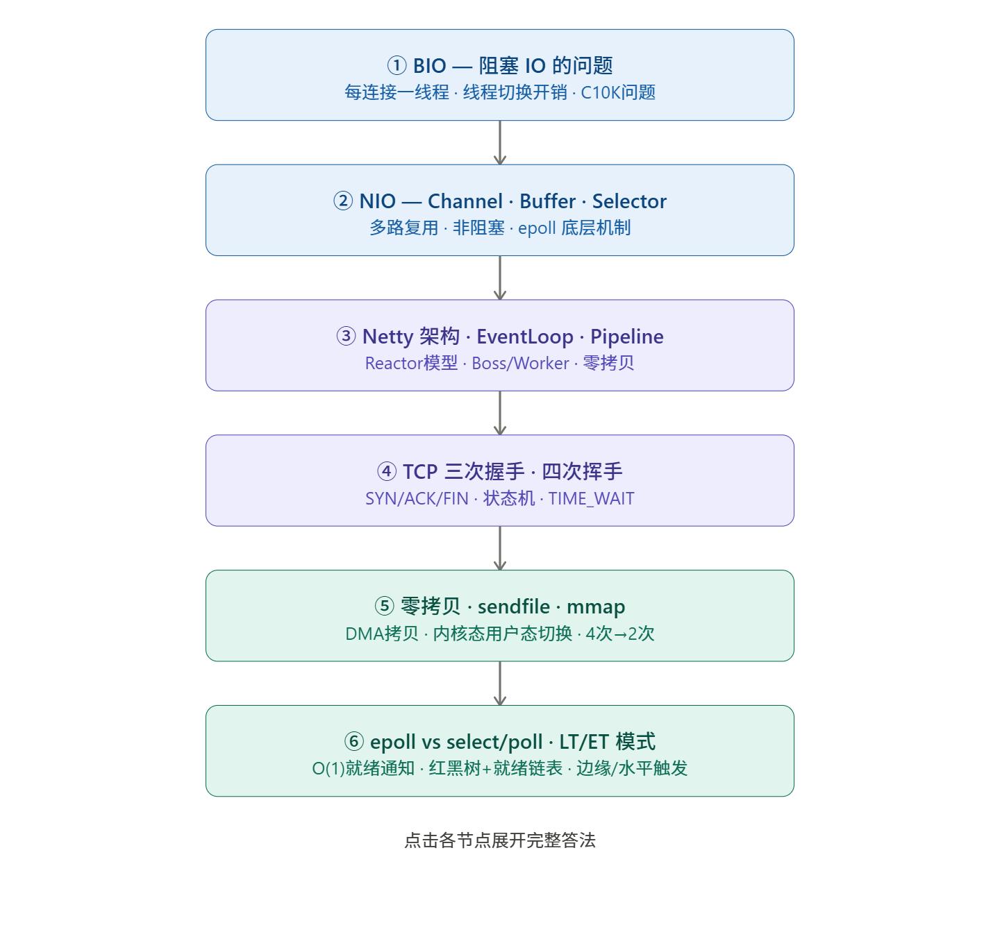

#### 第二张图：IO 模型演进——「BIO、NIO、AIO 的区别是什么？」

这是最容易用"说了半天说不清楚"来暴露知识深度的题。要从**线程模型**和**系统调用**两个维度来讲。epoll 比 select/poll 快的本质原因：select/poll 每次调用都要把 fd 集合从用户态拷贝到内核，内核 O(n) 扫描所有 fd 找就绪的；epoll 用红黑树维护 fd（增删 O(log n)），内核回调把就绪 fd 加入链表，`epoll_wait` 直接返回就绪链表，应用无需再遍历，**时间复杂度 O(1)**。

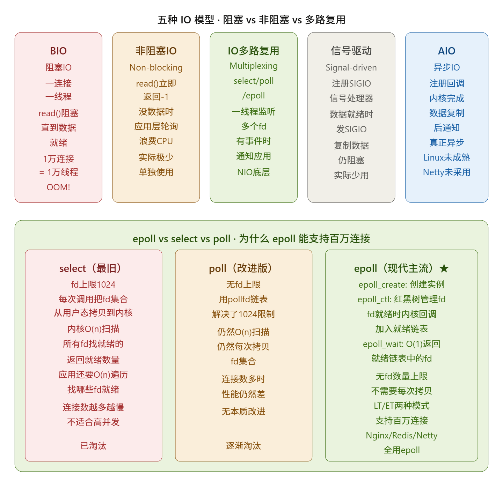

#### 第三张图：Netty 架构 + TCP 握手挥手

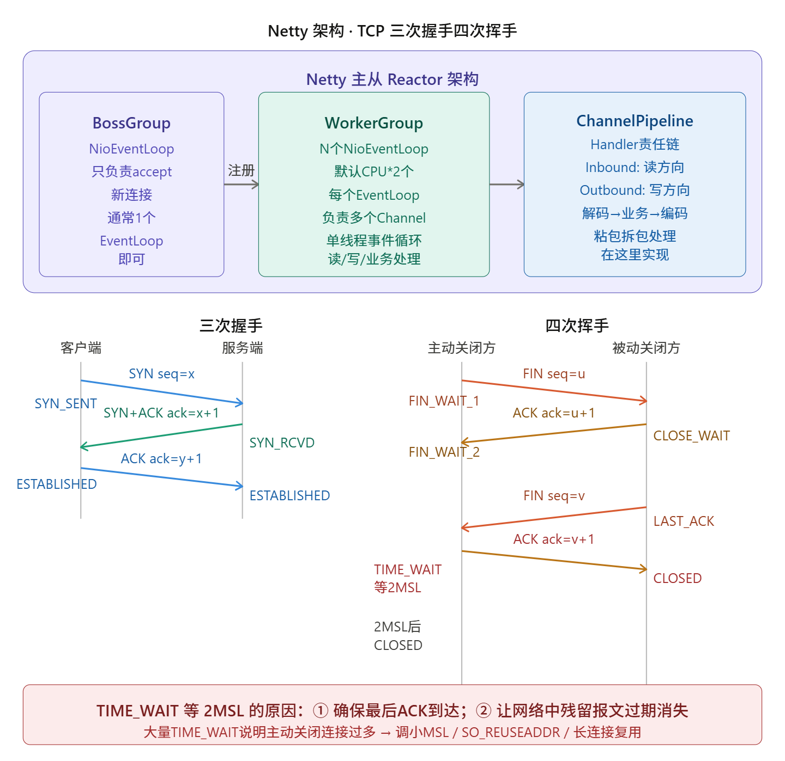

#### 第四张图：零拷贝 + 粘包拆包 + 面试高频细节交互器---

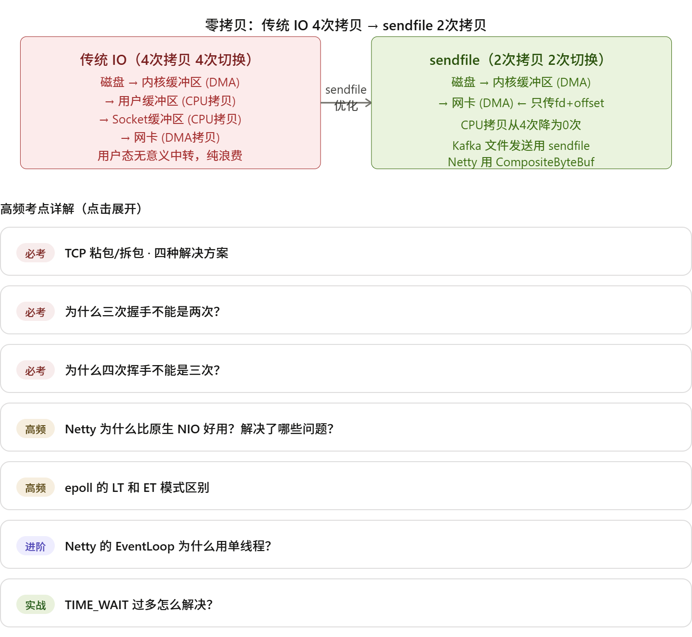

#### 把四张图串成完整答法

##### ① BIO 的问题（15秒）

BIO 每个连接需要一个线程，1 万个连接就需要 1 万个线程——线程创建销毁开销大，上下文切换频繁，内存消耗巨大（每个线程默认 1MB 栈），这就是经典的 C10K 问题。

##### ② IO 模型演进（30秒）

五种 IO 模型核心是两个维度：**是否阻塞数据就绪阶段**（BIO 阻塞等，NIO 立即返回）和**是否阻塞数据拷贝阶段**（同步 IO 都阻塞，AIO 不阻塞）。生产最常用的是 IO 多路复用——一个线程用 epoll 监听多个 fd，有事件时唤醒处理，这就是 NIO 的底层。epoll 用红黑树管理所有 fd，就绪时通过内核回调加入就绪链表，`epoll_wait` 直接返回就绪的 fd，O(1) 复杂度，支持百万连接。Netty 没有用 AIO 是因为 Linux 的 AIO 实现不成熟，epoll 的性能已经足够。

##### ③ Netty（30秒，说出解决了什么）

主从 Reactor 模型：BossGroup 只负责 accept 新连接（通常 1 个 EventLoop），WorkerGroup 负责 IO 读写（默认 CPU×2 个 EventLoop）。每个 EventLoop 是单线程事件循环，Channel 的所有操作都在同一线程内，无需加锁。ChannelPipeline 是责任链，Handler 按顺序处理编解码和业务逻辑。Netty 最重要的是解决了：ByteBuffer 的 flip/clear 易错问题（换成双指针 ByteBuf）、epoll 空轮询 Bug（计数超阈值重建 Selector）、粘包拆包（LengthFieldBasedFrameDecoder）。

##### ④ TCP 三次握手（30秒，说出"为什么"才加分）

三次握手是为了：双方都确认对方的发送和接收能力正常，且消除历史连接的干扰。两次握手不够是因为：一旦旧的 SYN 延迟到达服务端，服务端会误以为是新连接而分配资源，浪费且无法消除。四次挥手是因为 TCP 全双工，主动方发 FIN 只表示自己不再发数据，被动方可能还有数据要发，两个方向独立关闭需要四步。TIME_WAIT 等 2MSL 是为了确保最后的 ACK 到达对方，以及让网络中残留报文彻底消失，避免新连接收到旧连接的报文。

##### ⑤ 零拷贝（加分项）

传统文件发送经历 4 次拷贝（磁盘→内核缓冲区→用户缓冲区→Socket 缓冲区→网卡）和 4 次用户态/内核态切换。`sendfile` 系统调用让数据直接从内核缓冲区传到网卡，跳过了用户态，减少到 2 次拷贝、2 次切换。Kafka 用 sendfile 发送日志文件，Netty 用 CompositeByteBuf 避免多个 ByteBuf 合并时的内存拷贝。

> 点击上方任意卡片可以继续深挖某个细节，比如 Netty 的零拷贝具体实现，或者 SYN Flood 攻击原理和防御。

### Spring Ai 面试链路

这是 2024-2025 年最新的面试方向，很多公司的 Java 岗位开始考察 AI 集成能力。分四张图讲透：追问路径 → Spring AI 核心架构 → RAG 与向量数据库 → 生产实战与调优。很好，已确认最新版本情况：Spring AI 1.1.0 已于 2025 年 11 月 12 日 GA 发布，核心亮点包括 Model Context Protocol（MCP）集成、推理模型支持和扩展的模型提供商。下面开始正式讲解。

#### 第一张图：面试追问路径

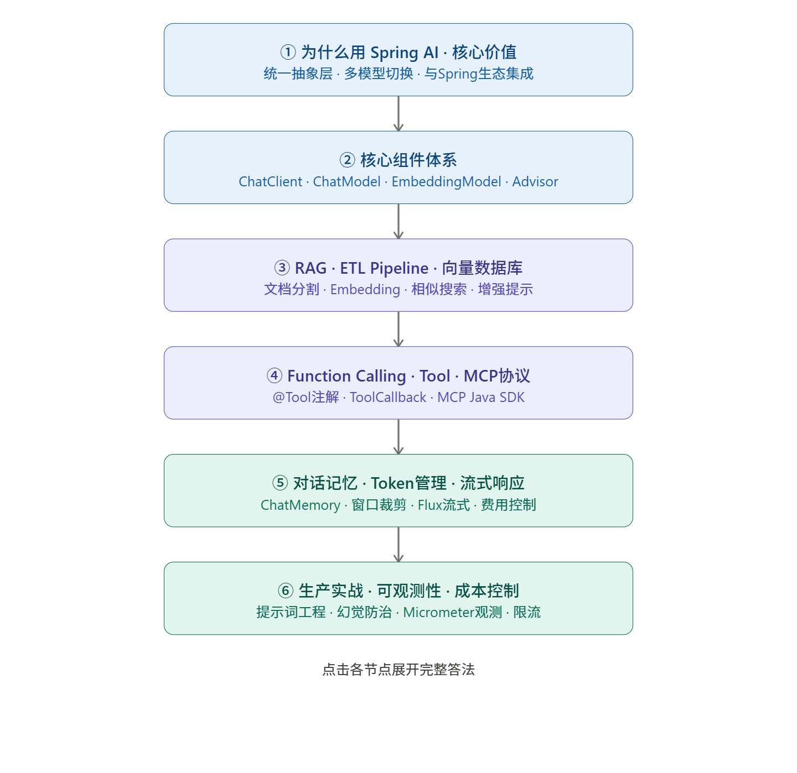

#### 第二张图：Spring AI 核心架构全景

Spring AI 的设计核心是**统一抽象层**——无论底层用 OpenAI、Claude 还是本地 Ollama，业务代码只依赖 `ChatModel` 接口，切换模型只改配置文件。这是面试官最想听到的设计思路。

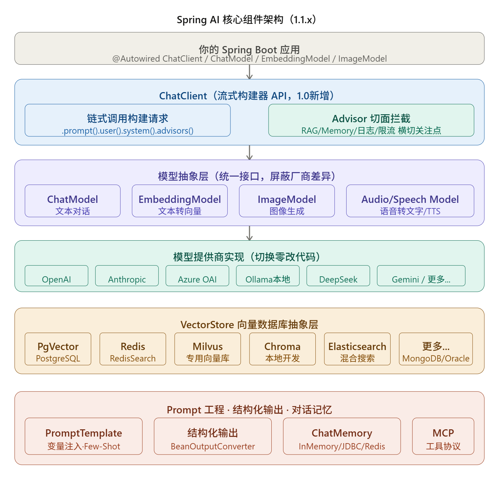

#### 第三张图：RAG 全链路——最核心的面试考点

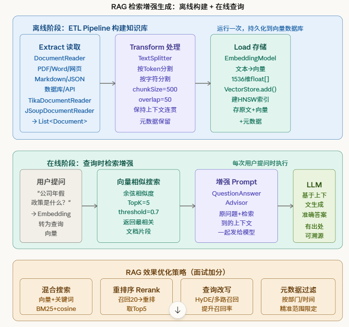

#### 第四张图：Function Calling / MCP / 生产实战交互器---

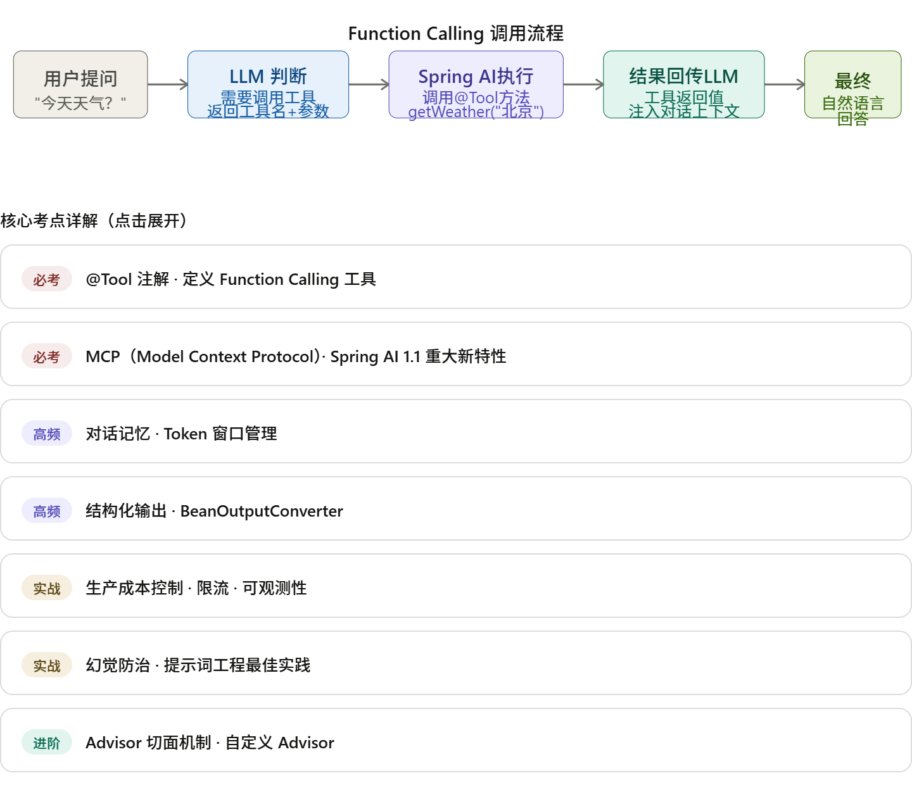

#### 把四张图串成完整答法

##### ① 为什么用 Spring AI（15秒）

直接调 HTTP API 的问题：不同模型厂商接口格式不同，切换模型要改大量代码；没有统一的提示词模板管理、向量数据库抽象、对话记忆等能力。Spring AI 提供统一抽象层，切换从 OpenAI 到 Claude 只改配置文件，无缝融入 Spring Boot 生态（自动配置、依赖注入、可观测性）。Spring AI 1.1 于 2025 年 11 月正式发布，已达到生产稳定。

##### ② 核心组件（30秒）

四大核心：`ChatModel`（文本对话）、`EmbeddingModel`（文本向量化）、`VectorStore`（向量存储检索）、`ChatMemory`（对话记忆）。`ChatClient` 是更高层的流式 API，通过 Advisor 链实现横切关注点。Anthropic 的 Prompt Caching 支持最多 90% 的成本节省，这类模型级特性都通过统一接口透明暴露。

##### ③ RAG（面试核心，40秒）

RAG 分两阶段：**离线构建**（ETL Pipeline：读文档 → 文本分割 → Embedding 向量化 → 存入向量数据库）和**在线查询**（用户问题向量化 → 相似搜索 TopK → 检索结果拼入 Prompt → LLM 基于上下文生成答案）。`QuestionAnswerAdvisor` 自动完成在线阶段的检索注入。RAG 的核心价值是让 LLM 回答基于企业私有知识库而不是只靠训练数据，同时减少幻觉。优化方向：混合搜索（向量+关键词）、Reranking 重排序、查询改写。

##### ④ Function Calling 和 MCP（30秒）

`@Tool` 注解标注一个 Spring Bean 方法，Spring AI 自动生成工具描述发给 LLM，LLM 决定是否调用、参数是什么，Spring AI 反射执行并把结果回传，LLM 基于工具返回值生成最终自然语言答案。这让 AI 从"只能聊天"变成"能操作系统"。Spring AI 1.1 的重大特性是 MCP（Model Context Protocol）集成，它是 Anthropic 提出的跨厂商标准化工具协议，比 Function Calling 更通用，可以把 Spring Boot 应用直接暴露为 MCP Server 供任何支持 MCP 的 AI 客户端调用。

##### ⑤ 生产实战（加分项，主动说出来）

Token 成本控制：开启 Prompt Caching（相同 system prompt 缓存，成本降 90%）；简单任务用小模型（gpt-4o-mini 比 gpt-4o 便宜 20 倍）；非核心场景部署本地 Ollama。幻觉防治：RAG 提供可信上下文 + Prompt 明确约束"只基于以下内容回答" + temperature 调低到 0.1-0.3。可观测性：Spring AI 内置 Micrometer 集成，自动记录 Token 消耗和调用延迟，接 Prometheus + Grafana 监控。

> 点击上方任意卡片展开代码级细节。面试中主动提到"我们项目用了 RAG 搭建了内部知识库问答系统，用 `QuestionAnswerAdvisor` + PgVector，TopK=5，遇到的最大挑战是文档分割策略——chunk 太大语义混乱，chunk 太小丢失上下文"，这样的实战叙述是最有说服力的。

### LangChain4j面试链路


