## Java 高并发服务稳定性问题分类

### 一、线程与并发问题

- 线程安全问题（竞态条件、数据竞争）
- 死锁（Deadlock）
- 活锁（Livelock）
- 线程饥饿（Thread Starvation）
- 上下文切换开销过大
- 线程池配置不当（过大/过小/队列溢出）
- ThreadLocal 内存泄漏

------

#### 1. 线程安全问题（竞态条件、数据竞争）

**本质**：多线程在没有同步保护的情况下并发读写共享资源，导致结果依赖线程执行顺序。

**典型场景**：

- `count++` 看似原子，实际是 read → modify → write 三步，并发时丢失更新
- `if (singleton == null) { singleton = new Singleton(); }` 双重检查未加 `volatile`，指令重排序导致拿到半初始化对象

**解决方案**：

- `synchronized` 加锁保护临界区
- `AtomicInteger`、`AtomicReference` 等无锁原子类
- `volatile` 保证可见性（仅适用于单次写操作场景）
- 不可变对象（`final` + 不提供修改方法）

------

#### 2. 死锁（Deadlock）

**本质**：两个或多个线程互相持有对方需要的锁，永久阻塞。

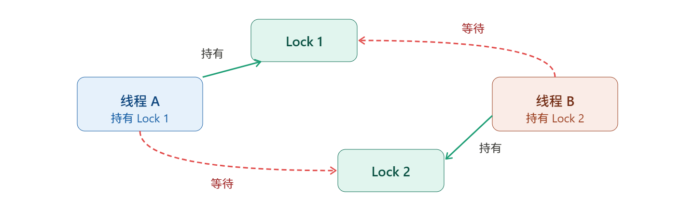

**四个必要条件（打破任意一个即可解除死锁）**：

| 条件       | 描述                     | 破解手段                       |
| ---------- | ------------------------ | ------------------------------ |
| 互斥       | 资源同时只能一个线程使用 | 使用读写锁、无锁结构           |
| 持有并等待 | 持锁同时等待其他锁       | 一次性申请所有锁               |
| 不可剥夺   | 锁不能被强制释放         | `tryLock(timeout)`             |
| 循环等待   | 形成等待环路             | **固定锁的获取顺序**（最常用） |

**检测工具**：`jstack <pid>` 输出线程栈，搜索 `deadlock` 关键字。

------

#### 3. 活锁（Livelock）

**本质**：线程没有阻塞，但不断相互"礼让"，反复重试却始终无法推进，CPU 飙高但无实质工作。

**经典比喻**：两人走廊相遇，双方同时往同一方向侧身，永远让不开。

**解决**：引入随机退避（`Thread.sleep(random)`）或优先级仲裁，打破对称性。

------

#### 4. 线程饥饿（Thread Starvation）

**本质**：低优先级线程因高优先级线程长期占用资源而迟迟得不到执行。

**常见原因**：

- 公平锁未使用，高并发下某些线程反复抢不到锁
- `synchronized` 非公平，JVM 直接唤醒最近挂起的线程
- 线程池中大量耗时任务占满队列，后续任务等待超时

**解决**：`ReentrantLock(true)` 开启公平模式；合理设置线程池的任务超时和优先级。

------

#### 5. 上下文切换开销过大

**本质**：CPU 在线程间切换需保存/恢复寄存器、程序计数器等现场，本身有成本。线程数远超 CPU 核数时，切换开销甚至超过实际计算开销。

**诊断指标**：`vmstat 1` 看 `cs`（context switch）列，或 `perf stat` 查 `context-switches`。

**优化方向**：

- 减少线程数，对齐 CPU 核数（I/O 密集型例外）
- 减少锁竞争（锁分段、无锁数据结构）
- 协程/虚拟线程（JDK 21 `VirtualThread`）大幅降低切换成本

------

#### 6. 线程池配置不当

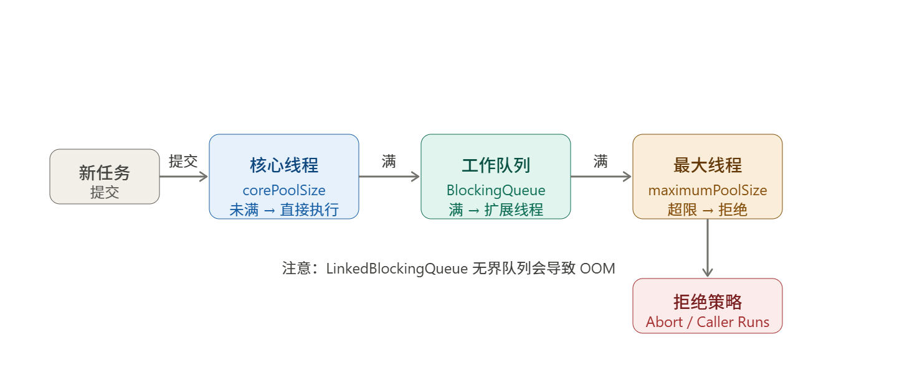

**三大配置陷阱**：

**① 线程数设置错误**

- CPU 密集型：`N_cpu + 1`
- I/O 密集型：`N_cpu × 2`（或根据等待比率公式）
- 线程过多 → 上下文切换剧增；线程过少 → 队列积压，响应慢

**② 队列选型错误**

- `LinkedBlockingQueue`（无界）：队列无限堆积任务 → OOM，且 `maximumPoolSize` 永远不会生效
- `ArrayBlockingQueue`（有界）：正确做法，配合合理的拒绝策略

**③ 拒绝策略选错**

| 策略                  | 行为           | 适用场景           |
| --------------------- | -------------- | ------------------ |
| `AbortPolicy`（默认） | 抛异常         | 需感知过载         |
| `CallerRunsPolicy`    | 调用者线程执行 | 自动限流，不丢任务 |
| `DiscardPolicy`       | 静默丢弃       | 任务可丢失场景     |
| `DiscardOldestPolicy` | 丢弃最旧任务   | 实时性要求高       |

------

#### 7. ThreadLocal 内存泄漏

**本质**：线程池中线程长期复用，若 `ThreadLocal` 使用后不调用 `remove()`，Entry 的弱引用 key 被 GC 回收后变成 `null`，但 value 仍被强引用持有，无法回收，随时间积累造成内存泄漏。

```
Thread → ThreadLocalMap → Entry(key=弱引用→null, value=强引用→大对象)
                                        ↑
                               key 被 GC，但 value 永远无法释放
```

**正确使用姿势**：

```java
try {
    threadLocal.set(value);
    // ... 业务逻辑
} finally {
    threadLocal.remove();  // 必须！尤其在线程池场景
}
```

**额外风险**：线程池线程复用时，上一个请求遗留的 `ThreadLocal` 值会污染下一个请求（数据串联问题），即使没有 OOM 也会引发业务 Bug。

------

**想深入哪个问题的实战案例、排查手段或代码示例？**

### 二、内存问题

- 堆内存溢出（OOM - Heap）
- 元空间溢出（OOM - Metaspace）
- 直接内存溢出（Direct Memory OOM）
- 内存泄漏（Memory Leak）
- GC 频繁 / Full GC 导致 Stop-The-World
- 对象创建速度超过 GC 回收速度

#### 先看全局：JVM 内存结构

理解这六类问题，必须先明白内存出在哪块区域。---

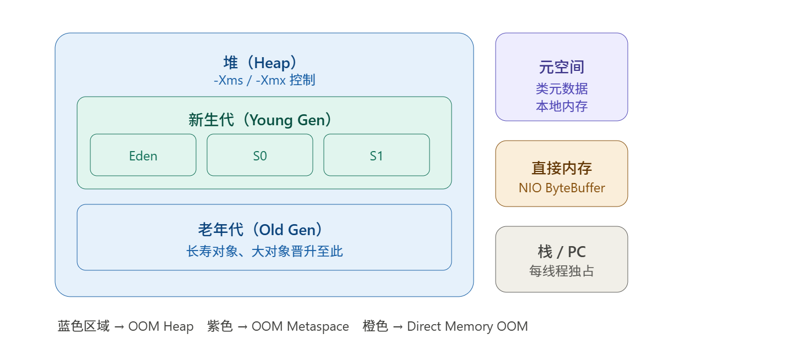

#### 1. 堆内存溢出（OOM - Heap）

**本质**：堆中存活对象持续增长，GC 无法回收足够空间，最终抛出 `java.lang.OutOfMemoryError: Java heap space`。

**常见根因**：

- 超大集合不断累积（List/Map 只进不出）
- 单次请求处理超大数据（把整张表 `select *` load 进内存）
- 缓存无上限增长（本地 HashMap 当缓存，无过期/淘汰机制）
- 内存泄漏的终态（对象积累到堆撑不住）

**排查手段**：

```bash
# 触发 OOM 时自动 dump
-XX:+HeapDumpOnOutOfMemoryError -XX:HeapDumpPath=/tmp/heap.hprof

# 分析工具
jmap -histo:live <pid>     # 快速查存活对象排名
# 或用 Eclipse MAT / JProfiler 打开 .hprof 文件
```

在 MAT 中查 "Leak Suspects"，找 Retained Heap 最大的对象，顺着引用链找到 GC Root。

------

#### 2. 元空间溢出（OOM - Metaspace）

**本质**：元空间存储类的元数据（方法字节码、常量池、字段信息）。动态生成大量类时，元空间耗尽，抛出 `java.lang.OutOfMemoryError: Metaspace`。

**高发场景**：

| 场景                      | 原因                              |
| ------------------------- | --------------------------------- |
| 大量 CGLib / ASM 动态代理 | 每个代理类都是新的 Class          |
| 热部署/频繁 reload        | 旧 ClassLoader 未卸载，类持续累积 |
| Groovy / 动态脚本         | 每次 eval 产生匿名类              |
| JSP 频繁修改              | Tomcat 每次编译新 Class           |

**关键参数**：

```bash
-XX:MetaspaceSize=256m         # 初始元空间大小
-XX:MaxMetaspaceSize=512m      # 限制上限，防止耗尽本地内存
```

**排查**：`jstat -gcmetacapacity <pid>` 观察 `MCMX`（上限）和 `MC`（已用），配合 `-verbose:class` 查看类加载情况。

------

#### 3. 直接内存溢出（Direct Memory OOM）

**本质**：Java NIO 的 `DirectByteBuffer` 分配在堆外（native 内存），不受 `-Xmx` 限制，但受 `-XX:MaxDirectMemorySize` 限制。超出后抛 `OOM: Direct buffer memory`。

**典型场景**：

- 大量 NIO 操作（Netty、文件读写）未释放 `DirectByteBuffer`
- `DirectByteBuffer` 依赖 GC 触发 `Cleaner` 回收，但堆内存充足时 GC 不频繁，导致堆外内存无法及时释放

**关键认知**：堆内存 OK，但进程 RSS 持续增长，且频繁 Full GC 后仍 OOM → 高度怀疑直接内存泄漏。

```bash
-XX:MaxDirectMemorySize=256m   # 显式设置上限
# 监控
java -jar -Dio.netty.leakDetection.level=PARANOID app.jar  # Netty 泄漏检测
```

------

#### 4. 内存泄漏（Memory Leak）

**本质**：对象不再被业务使用，但仍被某个 GC Root 强引用，GC 无法回收，随时间积累最终引发 OOM。

内存泄漏的核心是"引用链没断"——下图展示最典型的几种泄漏路径：

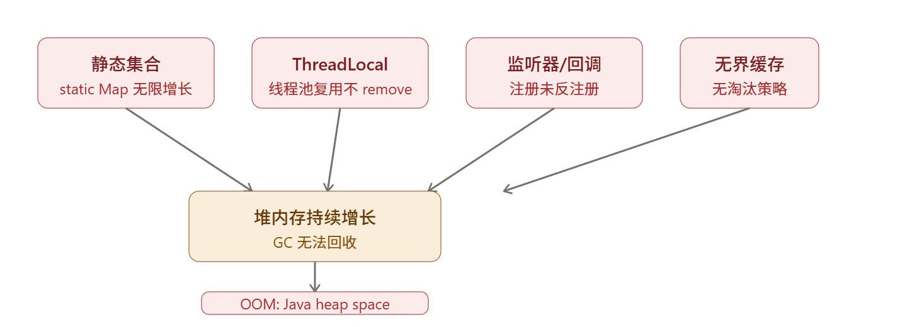

**四大泄漏路径**：

`static` 集合：`private static final Map<K,V> cache = new HashMap<>()` 只 put 不 remove，随请求量线性增长。

`ThreadLocal`：线程池中不调用 `remove()`，详见上节。

监听器/回调：向 EventBus、Spring ApplicationContext 注册 listener 后，对象销毁时未反注册，持有整个对象图。

无界缓存：用 `HashMap` 自己实现缓存，没有 LRU 淘汰或过期机制。改用 `Caffeine`/`Guava Cache` 并设置 `maximumSize` + `expireAfterWrite`。

------

#### 5. GC 频繁 / Full GC 导致 Stop-The-World

这是高并发下最直接的稳定性杀手——Full GC 期间所有业务线程暂停，接口 RT 从毫秒级飙到秒级。

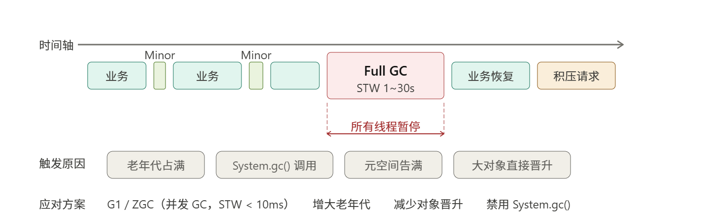

**GC 算法选型**（JDK 17+ 推荐）：

| 算法              | STW 时间     | 适用场景               |
| ----------------- | ------------ | ---------------------- |
| Serial / Parallel | 秒级         | 单核/小堆，已不推荐    |
| CMS               | 百毫秒级     | JDK 14 已废弃          |
| G1                | 可控 < 200ms | 通用，JDK 9+ 默认      |
| ZGC               | < 10ms       | 超低延迟，堆可达 TB 级 |
| Shenandoah        | < 10ms       | RedHat 贡献，类似 ZGC  |

**GC 调优关键指标**：用 `jstat -gcutil <pid> 1000` 实时观察 `YGC`、`FGC`、`FGCT`（Full GC 总耗时）。

------

#### 6. 对象创建速度超过 GC 回收速度

**本质**：Eden 区被新对象填满的速度，快于 Minor GC 能清空的速度，导致：Minor GC 越来越频繁 → 对象提前晋升老年代 → 老年代迅速占满 → 触发 Full GC → 恶性循环。

**典型信号**：

- `jstat` 看到 Eden 利用率快速跑满，YGC 每秒数次以上
- 对象年龄分布中大量年龄 1~2 的对象进入老年代（本应在新生代消亡）
- GC 日志中 `Allocation Failure` 频繁出现

**常见根因与对策**：

```java
// 反例：循环内大量创建对象
for (Request req : requests) {
    String result = new StringBuilder()  // 每次 new
        .append(req.getUserId())
        .append("_")
        .append(req.getTimestamp())
        .toString();
}

// 正例：复用 StringBuilder
StringBuilder sb = new StringBuilder();
for (Request req : requests) {
    sb.setLength(0);  // 清空复用
    sb.append(req.getUserId()).append("_").append(req.getTimestamp());
    String result = sb.toString();
}
```

其他手段：对象池（`Commons Pool2`）复用重量级对象；使用原始类型替代包装类（`int` vs `Integer`）；序列化用 `byte[]` 流式处理而非全量反序列化；适当增大 Eden 区（`-Xmn` 或 `-XX:NewRatio`）降低晋升压力。

------

#### 六类问题速查对照

| 问题         | 报错信息               | 第一排查命令                 | 根治方向          |
| ------------ | ---------------------- | ---------------------------- | ----------------- |
| 堆 OOM       | `Java heap space`      | `jmap -histo:live`           | 找大对象/泄漏根因 |
| 元空间 OOM   | `Metaspace`            | `-verbose:class`             | 控制动态类生成    |
| 直接内存 OOM | `Direct buffer memory` | 进程 RSS 监控                | 限制 + 及时释放   |
| 内存泄漏     | 堆缓慢增长至 OOM       | MAT Leak Suspects            | 断引用链          |
| Full GC STW  | 接口 RT 毛刺           | `jstat -gcutil`              | 换 G1/ZGC         |
| 创建过速     | YGC 频繁/晋升过早      | GC 日志 `Allocation Failure` | 减少临时对象      |

------

想深入哪个方向？比如 G1 调优参数、MAT 实战分析步骤，或某类泄漏的代码修复案例？

### 三、锁与同步问题

- 锁竞争激烈导致吞吐下降
- synchronized 粒度过粗
- 锁升级/膨胀问题
- CAS 自旋空转（ABA 问题）
- 读写锁使用不当
- 分布式锁失效/过期

#### 先看全局：锁的演化体系---

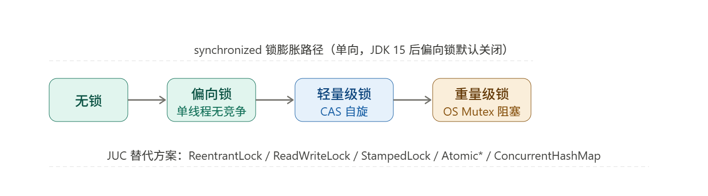

#### 1. 锁竞争激烈导致吞吐下降

**本质**：大量线程争抢同一把锁，同一时刻只有一个线程工作，其余全部阻塞等待，CPU 利用率看起来很高，但有效吞吐极低。

**诊断手段**：

```bash
jstack <pid> | grep -A5 "BLOCKED"     # 看有多少线程处于 BLOCKED 状态
# 或用 arthas
thread -b                             # 直接找阻塞最多的线程
thread -n 10                          # 查 CPU 占用 TOP10 线程
```

**核心解法——三个维度拆锁**：

锁分段（Stripe）：`ConcurrentHashMap` 的经典思路，把一把大锁拆成 N 把小锁，不同数据段用不同锁，互不干扰。

```java
// 手动实现锁分段
private final int SEGMENTS = 16;
private final ReentrantLock[] locks = new ReentrantLock[SEGMENTS];
private Lock getLock(Object key) {
    return locks[Math.abs(key.hashCode() % SEGMENTS)];
}
```

锁消除：JIT 编译器会自动消除只有单线程访问的同步块，但业务代码要避免对局部对象加锁（本身无竞争，锁完全多余）。

减少临界区：把锁外能做的计算移到锁外，缩短持锁时间。

------

#### 2. synchronized 粒度过粗

**本质**：一个方法或代码块用 `synchronized` 保护，但其中只有一小部分真正需要同步，其余纯计算或 I/O 却被迫排队。

**典型反例与修复**：

```java
// 反例：整个方法加锁，耗时 IO 操作也被锁住
public synchronized Result processOrder(Order order) {
    String raw = httpClient.get(url);       // 耗时 IO，锁住浪费
    Order enriched = parse(raw);            // 纯计算，锁住浪费
    cache.put(order.getId(), enriched);     // ← 只有这行需要同步
    return enriched;
}

// 正例：只锁真正共享的操作
public Result processOrder(Order order) {
    String raw = httpClient.get(url);       // 锁外 IO
    Order enriched = parse(raw);            // 锁外计算
    synchronized (cache) {
        cache.put(order.getId(), enriched); // 最小临界区
    }
    return enriched;
}
```

另一个常见误区是在 `this` 上加锁而不是在具体对象上——一个类多个不相关的方法都用 `synchronized`，相互阻塞：

```java
// 反例：两个无关操作共用一把锁（this）
public synchronized void updateUser(User u) { ... }
public synchronized void updateProduct(Product p) { ... }

// 正例：各用各的锁对象
private final Object userLock    = new Object();
private final Object productLock = new Object();
public void updateUser(User u)    { synchronized(userLock)    { ... } }
public void updateProduct(Product p) { synchronized(productLock) { ... } }
```

------

#### 3. 锁升级/膨胀问题

`synchronized` 内部有四个状态，竞争加剧时单向膨胀，膨胀到重量级锁后涉及 OS 线程调度，上下文切换成本剧增。

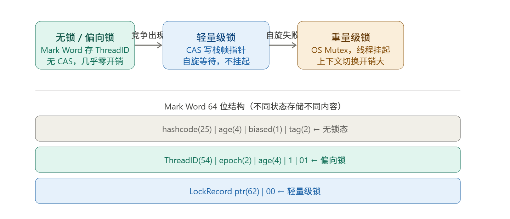

**膨胀的实际影响**：轻量级锁的 CAS 自旋是纯用户态操作，开销约 10ns 级；一旦膨胀到重量级锁，涉及 `pthread_mutex_lock` 系统调用，开销上升到 1μs 级，高并发下差距被放大数十倍。

**规避策略**：

- 高并发场景直接用 `ReentrantLock`，跳过 JVM 锁升级过程
- JDK 15+ 偏向锁默认关闭（`-XX:-UseBiasedLocking`），竞争少的场景反而可开启
- 避免在持锁期间做耗时操作（IO、sleep），防止其他线程自旋超时触发膨胀

------

#### 4. CAS 自旋空转（ABA 问题）

CAS（Compare And Swap）是 `Atomic*` 类和轻量级锁的基础，但有两个核心问题：

**问题一：自旋空转消耗 CPU**

高竞争下 CAS 失败率高，线程不断重试，CPU 空转但没有实际产出。

```java
// AtomicInteger.incrementAndGet() 的内部实现
public final int incrementAndGet() {
    for (;;) {                          // 无限自旋
        int current = get();
        int next = current + 1;
        if (compareAndSet(current, next))  // CAS 失败则继续循环
            return next;
    }
}
```

JDK 8 引入 `LongAdder` 解决此问题：内部维护 Cell 数组分散竞争，写时各自累加到自己的 Cell，读时求和。高并发下吞吐量比 `AtomicLong` 高 10 倍以上。

**问题二：ABA 问题**

值从 A 改成 B 再改回 A，CAS 看到的值没变，以为没人修改过，实际上已经被改了两次。

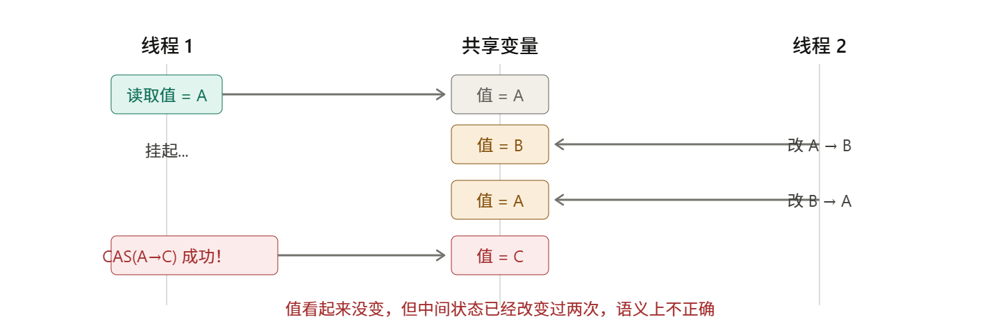

**解决 ABA**：用 `AtomicStampedReference`，每次修改附带版本号，CAS 同时校验版本。

```java
AtomicStampedReference<String> ref = new AtomicStampedReference<>("A", 0);

int[] stampHolder = new int[1];
String value = ref.get(stampHolder);          // 同时拿值和版本号
int stamp = stampHolder[0];

// CAS 时同时校验版本号
boolean success = ref.compareAndSet(value, "C", stamp, stamp + 1);
// 即使值还是 "A"，版本号不同就会失败
```

------

#### 5. 读写锁使用不当

读写锁的核心语义：读-读并发，读-写、写-写互斥。但有几个常见陷阱：

**陷阱一：读多写少场景用了独占锁**

```java
// 反例：读也要排队
private final ReentrantLock lock = new ReentrantLock();
public Data read() { lock.lock(); try { return data; } finally { lock.unlock(); } }

// 正例：读并发，写独占
private final ReadWriteLock rwl = new ReentrantReadWriteLock();
public Data read()       { rwl.readLock().lock();  try { return data; } finally { rwl.readLock().unlock(); } }
public void write(Data d) { rwl.writeLock().lock(); try { data = d;    } finally { rwl.writeLock().unlock(); } }
```

**陷阱二：读锁升级写锁导致死锁**

`ReentrantReadWriteLock` 不支持锁升级（持读锁时直接获取写锁 → 死锁）。但支持锁降级（持写锁时可获取读锁）。

```java
// 死锁！读锁升级写锁
rwl.readLock().lock();
rwl.writeLock().lock();  // 永久阻塞，因读锁未释放

// 正确做法：先释放读锁再获取写锁，或改用 StampedLock
```

**陷阱三：写多读少时读写锁反而更慢**

读写锁内部维护状态更复杂，写-写互斥且不允许写时有读，写频繁时性能不如普通 `ReentrantLock`。

**进阶选择 `StampedLock`**（JDK 8+）：支持乐观读，读操作完全不加锁，最后校验 stamp 是否被写操作改变过，适合读极多写极少的场景。

```java
StampedLock sl = new StampedLock();

// 乐观读：无锁直接读
long stamp = sl.tryOptimisticRead();
double x = this.x;
double y = this.y;
if (!sl.validate(stamp)) {          // 检查读期间是否有写
    stamp = sl.readLock();          // 退化为悲观读锁
    try { x = this.x; y = this.y; } finally { sl.unlockRead(stamp); }
}
```

------

#### 6. 分布式锁失效/过期

分布式锁是单机锁在多节点场景的延伸，但多了网络、时钟、节点崩溃三类新的失效维度。

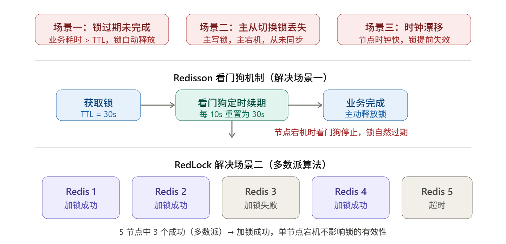

**三大失效场景详解**：

**场景一：锁过期业务未完成** GC STW、网络抖动、业务耗时超预期，导致 TTL 到期锁被释放，但业务还未执行完，另一个节点趁虚而入加锁，形成并发操作。

解法：Redisson 看门狗（WatchDog）—— 持有锁的客户端每 `TTL/3` 时间自动续期，业务结束主动释放；客户端宕机则看门狗停止，锁自然过期，不会永久占用。

**场景二：Redis 主从切换锁丢失** 锁写入 Redis Master，但尚未同步到 Slave 时主节点宕机，Slave 晋升为 Master，锁记录丢失，其他客户端可以重新加锁。

解法：RedLock 算法——向 N 个独立 Redis 节点加锁，超过半数成功（且总耗时 < TTL）才算加锁成功。Martin Kleppmann 和 Redis 作者有过著名的学术争论，实际生产中若对一致性要求极高，考虑基于 Zookeeper 的分布式锁（顺序节点 + Watcher）。

**场景三：释放了别人的锁** 节点 A 加锁后超时，节点 B 加锁成功，节点 A 业务完成后执行 `del key` 把节点 B 的锁给删了。

解法：加锁时 value 存唯一标识（UUID），释放锁时用 Lua 脚本原子校验：

```lua
-- 原子检查 + 删除，防止误删他人锁
if redis.call("get", KEYS[1]) == ARGV[1] then
    return redis.call("del", KEYS[1])
else
    return 0
end
```

------

#### 六类问题速查对照

| 问题                  | 核心危害                     | 诊断手段                   | 首选解法                               |
| --------------------- | ---------------------------- | -------------------------- | -------------------------------------- |
| 锁竞争激烈            | 吞吐骤降，CPU 高但有效产出低 | `thread -b`，看 BLOCKED 数 | 锁分段 / 无锁结构                      |
| synchronized 粒度过粗 | 不相关操作互相阻塞           | 代码 Review                | 最小临界区 / 独立锁对象                |
| 锁膨胀                | 重量级锁上下文切换剧增       | `jstack` 看 monitor        | 直接用 `ReentrantLock`                 |
| CAS 自旋 / ABA        | CPU 空转 / 语义错误          | perf stat 看 cycles        | `LongAdder` / `AtomicStampedReference` |
| 读写锁误用            | 锁升级死锁 / 写多反而更慢    | 代码 Review                | `StampedLock` 乐观读                   |
| 分布式锁失效          | 多节点并发，数据损坏         | 日志 + Redis monitor       | Redisson 看门狗 + Lua 原子释放         |

------

想继续深入哪个方向？比如 Redisson 看门狗源码、`StampedLock` 与 `ReadWriteLock` 性能对比，或分布式锁的 Zookeeper 实现方案？

### 四、连接池与资源池问题

- 数据库连接池耗尽
- HTTP/RPC 连接池耗尽
- Redis 连接池耗尽
- 连接泄漏（未正确释放）
- 连接超时配置不合理

#### 先看全局：连接池的通用模型

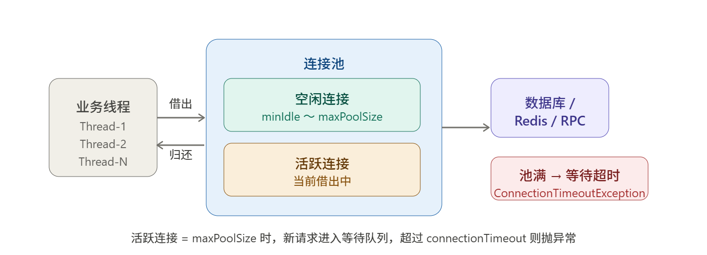

五类问题本质上是同一个模型的不同故障模式——池耗尽是结果，原因只有两种：**连接拿出去没还**（泄漏）或**还的速度跟不上借的速度**（容量/超时设计问题）。

------

#### 1. 数据库连接池耗尽

高并发场景最高频的故障之一，现象是接口大量报 `Unable to acquire JDBC Connection` 或 `Connection is not available, request timed out`。

**根因拆解**：

```
活跃连接数 = maxPoolSize
         ↑
┌────────────────────────────────────┐
│  慢 SQL → 单连接持有时间长           │
│  大事务 → 连接被长时间占用           │
│  连接泄漏 → 归还数 < 借出数          │
│  maxPoolSize 设置过小               │
└────────────────────────────────────┘
```

**HikariCP 核心参数**（当前最主流的 DB 连接池）：

```yaml
spring:
  datasource:
    hikari:
      maximum-pool-size: 20        # 上限，不是越大越好
      minimum-idle: 5              # 最小空闲
      connection-timeout: 3000     # 借连接等待上限（ms），超时抛异常
      idle-timeout: 600000         # 空闲连接存活时长（ms）
      max-lifetime: 1800000        # 连接最大存活时长，必须 < DB 的 wait_timeout
      keepalive-time: 60000        # 定期发心跳，防连接被 DB 侧超时断开
```

**`maximum-pool-size` 怎么算**：HikariCP 官方给出的公式：

```
pool size = Tn × (Cm - 1) + 1
Tn = 线程数峰值，Cm = 单个查询最大并发连接数
```

实际经验：CPU 密集型服务 `= CPU 核数 × 2`；I/O 密集型适当上浮，但通常 20~50 已经足够，盲目设置 200+ 反而因 DB 端连接数打满而崩溃。

**实时诊断**：

```sql
-- 查看 MySQL 当前连接情况
SHOW PROCESSLIST;
SELECT COUNT(*), STATE FROM information_schema.PROCESSLIST GROUP BY STATE;

-- HikariCP 暴露的 JMX 指标
HikariPool.ActiveConnections   -- 当前活跃数
HikariPool.PendingThreads      -- 等待获取连接的线程数（此值 > 0 就要告警）
HikariPool.IdleConnections     -- 空闲数
```

------

#### 2. HTTP/RPC 连接池耗尽

与 DB 连接池逻辑相同，但问题更隐蔽——很多团队配置了 DB 连接池，却忽略了 HTTP Client 的连接池。

**常见错误：每次请求 new 一个 HttpClient**

```java
// 严重反例：每次都创建新 HttpClient，完全不复用连接
public String callService(String url) {
    CloseableHttpClient client = HttpClients.createDefault(); // 每次 new！
    HttpGet request = new HttpGet(url);
    return client.execute(request, ...);
    // client 没有 close，底层连接也不会归还
}
// 正例：单例 HttpClient，配置连接池
@Bean
public CloseableHttpClient httpClient() {
    PoolingHttpClientConnectionManager cm = new PoolingHttpClientConnectionManager();
    cm.setMaxTotal(200);                  // 总连接数上限
    cm.setDefaultMaxPerRoute(50);         // 单个 Host 的连接数上限

    RequestConfig config = RequestConfig.custom()
        .setConnectTimeout(2000)          // 建立连接超时
        .setSocketTimeout(5000)           // 读数据超时
        .setConnectionRequestTimeout(1000)// 从池中借连接超时
        .build();

    return HttpClients.custom()
        .setConnectionManager(cm)
        .setDefaultRequestConfig(config)
        .evictExpiredConnections()        // 定期清理过期连接
        .evictIdleConnections(30, TimeUnit.SECONDS)
        .build();
}
```

**gRPC / Dubbo / Feign** 同理，框架层面都有连接池配置，需要根据下游服务的 QPS 和响应时间来设置 `maxPerRoute` 和超时。

**关键监控指标**：连接池的 `leased`（借出）、`available`（可用）、`pending`（等待）三个数值，`pending > 0` 即需告警。

------

#### 3. Redis 连接池耗尽

Redis 连接池的特殊性在于：Redis 本身是单线程处理命令，连接池的作用是维持多个 TCP 连接以并发发送命令，但如果命令执行慢（大 key、慢命令），同样会导致连接积压。

**Lettuce vs Jedis 连接模型差异**：

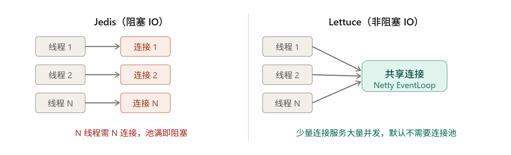

Spring Boot 2.x+ 默认使用 Lettuce，共享连接模式下通常不需要配置大连接池，但若使用了阻塞命令（`BLPOP`、`subscribe` 等），需单独配置连接池：

```yaml
spring:
  redis:
    lettuce:
      pool:
        max-active: 16      # 最大连接数
        max-idle: 8
        min-idle: 2
        max-wait: 1000ms    # 等待超时，-1 表示无限等待（危险！）
    timeout: 2000ms         # 命令执行超时
```

**Jedis 连接池关键参数**：`maxTotal`（总连接上限）、`maxIdle`、`testOnBorrow: true`（借出前校验连接存活，避免拿到死连接）。

**Redis 连接池耗尽的独特原因**：大 key 操作（`HGETALL` 百万字段）、慢命令（`KEYS *`、`SORT`）导致单条命令占用连接时间过长；Cluster 模式下 key 跨 slot 的 pipeline 操作导致连接数激增。

------

#### 4. 连接泄漏（未正确释放）

连接泄漏是最隐蔽的问题——不是立即崩溃，而是连接数缓慢上涨，几小时或几天后池耗尽，而且重启后暂时恢复，下次还会重现。

**泄漏的四种常见姿势**：

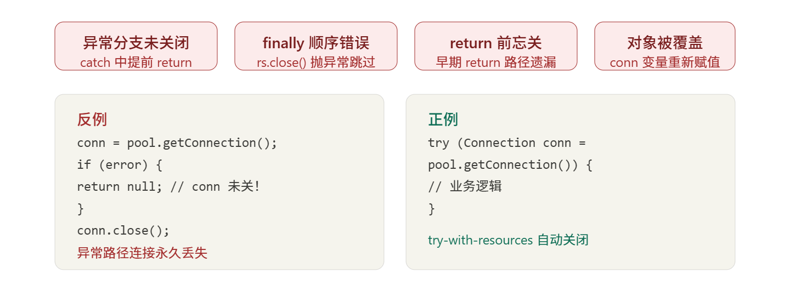

**连接泄漏检测**：

HikariCP 内置泄漏检测，配置后会在连接持有时间超阈值时打印告警日志：

```yaml
hikari:
  leak-detection-threshold: 5000   # 连接持有超过 5s 打印告警栈
```

告警日志示例：

```
WARN  HikariPool - Connection leak detection triggered for conn on thread main,
stack trace follows ...
```

沿着栈跟踪找到借连接却没归还的代码位置，通常一步定位。

**Druid 连接池**内置 `removeAbandoned` 机制（定期回收超时未归还的连接），适合老项目快速止血：

```yaml
druid:
  remove-abandoned: true
  remove-abandoned-timeout: 180   # 超过 180s 未归还视为泄漏，强制回收
  log-abandoned: true             # 打印泄漏位置的调用栈
```

------

#### 5. 连接超时配置不合理

连接池涉及的超时参数众多且容易混淆，配错一个就可能在生产环境出现"莫名卡死"或"频繁重连"。

**超时参数全景**：

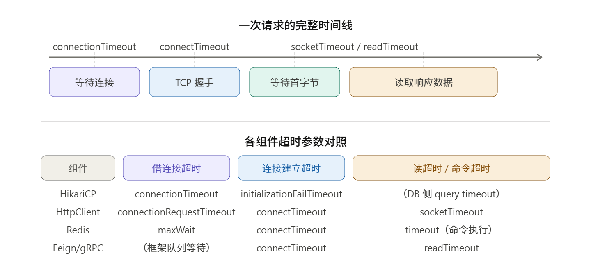

**三类典型配置错误及后果**：

**错误一：`maxWait = -1`（无限等待）**

池满后请求永远阻塞，线程池随之耗尽，服务完全不可用，且没有任何超时异常可供监控告警。必须设置明确的等待超时，快速失败优于无限等待。

**错误二：`socketTimeout` 未设置（默认 0 = 永不超时）**

下游服务假死时，调用方连接永远等待，连接无法归还，迅速耗尽池。所有外部调用的 `socketTimeout` 必须显式配置，建议不超过接口 SLA 的 80%。

**错误三：`max-lifetime` > DB 的 `wait_timeout`**

MySQL 默认 `wait_timeout = 8h`，但部分 DBA 会改小（如 1h）。若 HikariCP 的 `max-lifetime = 1800000`（30min），两者无冲突；若 DB 侧改成 30min 而应用侧未跟进，连接会被 DB 侧单方面断开，下次使用时报 `Communications link failure`。规则：`max-lifetime` 必须比 DB 的 `wait_timeout` 小至少 30s。

------

#### 五类问题速查对照

| 问题            | 现象                                 | 核心诊断                          | 首选解法                                      |
| --------------- | ------------------------------------ | --------------------------------- | --------------------------------------------- |
| DB 连接池耗尽   | `Unable to acquire JDBC Connection`  | `HikariPool.PendingThreads > 0`   | 调整 `maxPoolSize`，找慢 SQL / 大事务         |
| HTTP/RPC 池耗尽 | 调用下游超时堆积                     | `pending connections > 0`         | 单例 Client + 合理 `maxPerRoute`              |
| Redis 池耗尽    | `Could not get a resource from pool` | `redis-cli slowlog get`           | 消除慢命令，Lettuce 用共享连接                |
| 连接泄漏        | 连接数缓慢上涨，重启暂时恢复         | `leak-detection-threshold` 告警栈 | `try-with-resources`，Druid `removeAbandoned` |
| 超时配置不合理  | 下游假死时调用方全部卡死             | 检查 `socketTimeout` 是否为 0     | 所有外部调用强制设置读超时                    |

------

想深入哪个方向？比如 HikariCP 连接池源码（借还连接的核心流程）、Druid 慢 SQL 监控配置，或分布式场景下连接池与服务网格（sidecar）的协作方式？

### 五、缓存问题

- 缓存击穿（热点 key 失效）
- 缓存雪崩（大量 key 同时失效）
- 缓存穿透（查询不存在数据）
- 本地缓存与远程缓存不一致
- 缓存热点倾斜

#### 先看全局：五类问题的本质差异---

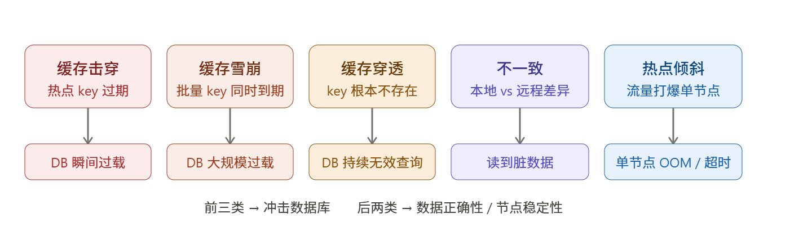

#### 1. 缓存击穿（热点 key 失效）

**本质**：单个热点 key 过期的瞬间，大量并发请求同时 cache miss，全部打到 DB，DB 被瞬间压垮。与雪崩的区别是：只有一个 key，但这个 key 的流量极大。

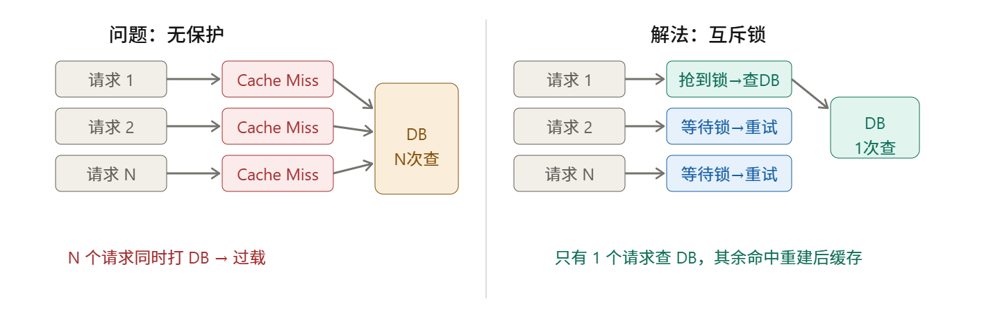

**三种解法，各有取舍**：

解法一：互斥锁（最常用）

```java
public Object getWithMutex(String key) {
    Object val = redis.get(key);
    if (val != null) return val;

    String lockKey = "lock:" + key;
    // setnx 抢锁，10s 防死锁
    if (redis.set(lockKey, "1", "NX", "EX", 10) != null) {
        try {
            val = db.query(key);          // 只有一个线程查 DB
            redis.setex(key, 300, val);
        } finally {
            redis.del(lockKey);           // 释放锁
        }
    } else {
        Thread.sleep(50);                 // 短暂等待后重试
        return getWithMutex(key);         // 递归重试
    }
    return val;
}
```

解法二：逻辑过期（牺牲强一致，换零阻塞）。key 永不设 TTL，value 里附带过期时间戳；读到逻辑过期时，异步线程后台重建缓存，当前请求返回旧数据。适合允许短暂读到旧值的热点场景。

解法三：热点 key 永不过期。对明确的热点（秒杀商品、首页配置），主动管理生命周期，缓存预热时写入并由业务主动刷新，不依赖 TTL 自动失效。

------

#### 2. 缓存雪崩（大量 key 同时失效）

**本质**：大批 key 集中在同一时间段过期（或 Redis 节点宕机），缓存层整体失效，所有请求直接打穿到 DB，DB 在数秒内被压垮。

**两类触发场景**：

```
场景 A：批量写入时设置相同 TTL（最常见）
  时间 0：写入 10000 个 key，均设置 TTL = 3600s
  时间 3600s：10000 个 key 同时失效 → DB 瞬间 10000 QPS

场景 B：Redis 节点宕机
  缓存层完全不可用 → 所有流量透传到 DB
```

**解法矩阵**：

| 策略           | 实现                               | 解决的场景 |
| -------------- | ---------------------------------- | ---------- |
| TTL 加随机抖动 | `TTL = 基础时间 + random(0, 300)`  | 场景 A     |
| 多级缓存兜底   | 本地缓存 + Redis，Redis 宕机走本地 | 场景 B     |
| 熔断降级       | Redis 不可用时直接返回降级数据     | 场景 B     |
| 缓存预热       | 上线前提前批量加载，错峰写入       | 场景 A     |
| Redis 高可用   | 哨兵 / Cluster，节点故障自动切换   | 场景 B     |

TTL 加随机抖动是成本最低的方案，几乎所有批量写缓存的场景都应默认加上：

```java
// 反例：固定 TTL，批量写入时同时过期
keys.forEach(k -> redis.setex(k, 3600, getValue(k)));

// 正例：随机抖动，错峰过期
Random rnd = new Random();
keys.forEach(k -> {
    int ttl = 3600 + rnd.nextInt(300);   // 3600~3900s 随机分布
    redis.setex(k, ttl, getValue(k));
});
```

------

#### 3. 缓存穿透（查询不存在的数据）

**本质**：请求的 key 在缓存和 DB 中都不存在，缓存永远 miss，每次请求都穿透到 DB 做无效查询。恶意爬虫或攻击者可以利用这一点，构造大量不存在的 ID 打垮 DB。

**两种主流解法**：

解法一：空值缓存（简单直接，适合低基数场景）

```java
Object val = redis.get(key);
if (val == null) {
    val = db.query(key);
    if (val == null) {
        redis.setex(key, 60, "NULL");    // 缓存空值，短 TTL 防止脏缓存过久
    } else {
        redis.setex(key, 3600, val);
    }
}
return "NULL".equals(val) ? null : val;
```

缺点：若攻击者每次用不同 ID，空值缓存会爆炸增长，内存浪费。

解法二：布隆过滤器（适合高基数、防攻击场景）

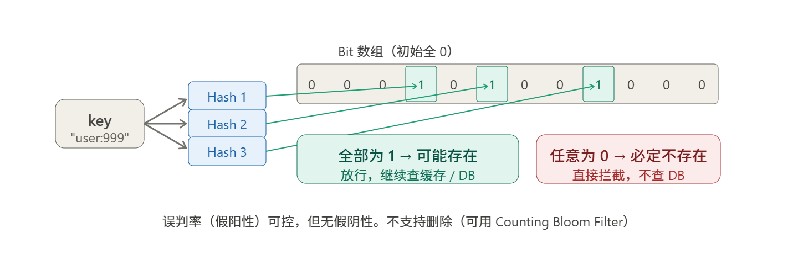

实战中用 Redisson 或 Guava 的布隆过滤器，启动时将全量合法 ID 写入，请求进来先过滤：

```java
RBloomFilter<Long> bloom = redisson.getBloomFilter("user_ids");
bloom.tryInit(10_000_000L, 0.01);    // 1000万数据，1% 误判率

// 查询前先检查
public User getUser(Long id) {
    if (!bloom.contains(id)) return null;   // 拦截，不查 DB
    User user = redis.get("user:" + id);
    if (user == null) {
        user = db.findById(id);
        redis.setex("user:" + id, 3600, user);
    }
    return user;
}
```

------

#### 4. 本地缓存与远程缓存不一致

多级缓存是高并发标配（本地缓存抗读流量，Redis 作为共享层），但带来了一致性挑战：DB 数据更新后，需要同时或有序地使本地缓存和 Redis 缓存失效。

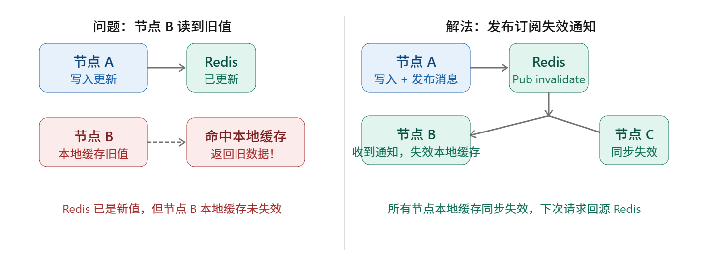

**三种主流方案**：

方案一：Redis Pub/Sub 失效通知（上图方案）。写数据时向 Channel 发布 key 失效消息，所有实例订阅并清除本地缓存对应 key。实现简单，但 Pub/Sub 不保证可靠送达，节点离线期间的消息会丢失。

方案二：设置极短本地 TTL（最简单，牺牲一点一致性）。本地缓存只存 1~5s，过期自动回源 Redis，适合可以接受秒级不一致的场景。Caffeine 配合 `expireAfterWrite(2, SECONDS)` 即可。

方案三：Canal 监听 MySQL Binlog，异步驱动缓存失效。写 DB 后不主动失效缓存，由 Canal 捕获 Binlog 变更事件再触发，彻底解耦写入与缓存管理，但引入了额外中间件和延迟。

**本地缓存工具选型**：生产首选 Caffeine（异步刷新、W-TinyLFU 淘汰算法，命中率远高于 LRU）。

```java
Cache<String, Object> localCache = Caffeine.newBuilder()
    .maximumSize(10_000)
    .expireAfterWrite(5, TimeUnit.SECONDS)
    .recordStats()                          // 开启命中率统计
    .build();
```

------

#### 5. 缓存热点倾斜

**本质**：Redis Cluster 中数据按 slot 分片，但某个 key 访问量极高（如微博热搜、秒杀商品），导致对应 slot 所在节点被单独打爆，其他节点空闲，整体集群无法水平扩展。

**问题的核心矛盾**：Cluster 的分片是按 key hash 决定的，同一个 key 只能落在一个节点，无法通过加节点分散单 key 的压力。

**解法一：key 复制打散（最直接）**

把热点 key 复制成 N 份，写时同步所有副本，读时随机选一个，流量均匀分散到 N 个节点：

```java
int REPLICA = 10;

// 写：更新所有副本
public void set(String key, Object val) {
    for (int i = 0; i < REPLICA; i++) {
        redis.set(key + "#" + i, val);
    }
}

// 读：随机选副本
public Object get(String key) {
    int idx = ThreadLocalRandom.current().nextInt(REPLICA);
    return redis.get(key + "#" + idx);
}
```

**解法二：本地缓存兜底热点**

识别出热点 key 后（访问频次超阈值），在 JVM 本地缓存一份，彻底绕开 Redis 节点，极端热点完全在本地消化：

```java
// 访问计数 + 自动晋升本地缓存
public Object getHotKey(String key) {
    // 先查本地热点缓存
    Object local = hotLocalCache.getIfPresent(key);
    if (local != null) return local;

    Object val = redis.get(key);
    // 访问次数超阈值，晋升为本地热点
    if (counter.incrementAndGet(key) > HOT_THRESHOLD) {
        hotLocalCache.put(key, val);  // 本地缓存极短 TTL
    }
    return val;
}
```

**解法三：Redis 6.0+ 客户端缓存（Server-Assisted Client Caching）**

Redis 服务端追踪客户端缓存的 key，数据变化时主动推送 invalidation 消息，客户端本地缓存保持与 Redis 同步，兼顾性能与一致性，是热点倾斜问题的新一代解法。

------

#### 五类问题速查对照

| 问题             | 触发条件                       | 核心危害        | 首选解法                      |
| ---------------- | ------------------------------ | --------------- | ----------------------------- |
| 缓存击穿         | 单热点 key 过期                | DB 瞬间过载     | 互斥锁重建 / 逻辑过期         |
| 缓存雪崩         | 批量 key 同时过期 / Redis 宕机 | DB 大规模崩溃   | TTL 随机抖动 + 多级兜底       |
| 缓存穿透         | 请求不存在的 key               | DB 持续无效查询 | 布隆过滤器 / 空值缓存         |
| 本地与远程不一致 | 多级缓存更新不同步             | 读到脏数据      | Pub/Sub 失效通知 / 短本地 TTL |
| 热点倾斜         | 单 key 流量过于集中            | Redis 节点打爆  | key 复制打散 / 本地缓存兜底   |

------

想深入哪个方向？比如 Caffeine W-TinyLFU 算法原理、Canal Binlog 同步方案的落地细节，或 Redis 6.0 客户端缓存的配置方式？

### 六、队列与消息问题

- 消息队列积压
- 消费者处理能力不足
- 消息重复消费
- 消息丢失
- 死信队列堆积
- 背压（Backpressure）机制缺失

#### 先看全局：消息在队列中的完整生命周期---

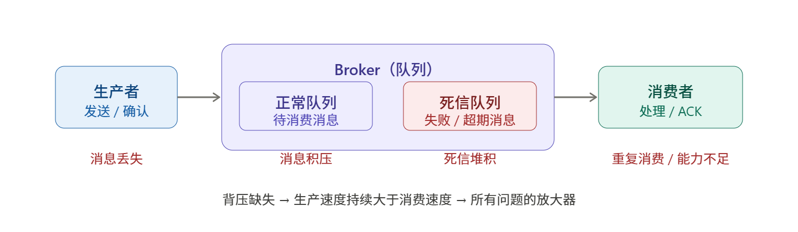

#### 1. 消息队列积压

**本质**：生产速度持续大于消费速度，消息在 Broker 中堆积，轻则延迟升高，重则磁盘打满、Broker 拒绝写入，引发全链路雪崩。

**积压的三条根因链**：

```
① 生产侧突发流量（大促、上游推送）→ 瞬时写入量激增
② 消费侧处理变慢（依赖的 DB/Redis 变慢，GC STW）→ 消费吞吐下降
③ 消费侧扩容不足（消费者数量 < 队列分区数，多余分区空转）
```

**紧急止血三步**：


**预防性设计**：消费者数量与分区数保持 1:1；监控 `consumer-lag`（消费延迟），超阈值自动告警；大促前提前扩容而非被动应急。

------

#### 2. 消费者处理能力不足

**本质**：单个消费者实例的吞吐量成为瓶颈，表现为 `consumer-lag` 持续增长但 CPU 和网络并不高——说明消费者在等待，而不是在忙。

**单实例提升吞吐的三个维度**：

**① 批量消费替代逐条消费**

```java
// 反例：逐条处理，每条都触发一次 DB 写
@KafkaListener(topics = "orders")
public void consume(OrderEvent event) {
    db.insert(event);        // N 条消息 = N 次 DB 写
    consumer.commitSync();
}

// 正例：批量拉取，批量写入
@KafkaListener(topics = "orders", containerFactory = "batchFactory")
public void consumeBatch(List<OrderEvent> events) {
    db.batchInsert(events);  // N 条消息 = 1 次 DB 写
    // 批量提交 offset
}
```

批量大小（`max.poll.records`）需结合消息体大小和下游 DB 的批量写性能来调，通常 100~500 是合理起点。

**② 消费者内部并发处理**

```java
// 消费者拉到消息后，用线程池并行处理
@KafkaListener(topics = "orders")
public void consume(List<OrderEvent> events) {
    List<CompletableFuture<Void>> futures = events.stream()
        .map(e -> CompletableFuture.runAsync(() -> process(e), executor))
        .collect(toList());
    CompletableFuture.allOf(futures.toArray(new CompletableFuture[0])).join();
    // 全部处理完再提交 offset，保证不丢
}
```

注意：并行处理后 offset 提交需要等所有任务完成，否则会有消息丢失或重复问题。

**③ 异步 I/O + 响应式处理**

消费者内部的 DB、Redis、HTTP 调用若全是同步阻塞，线程大部分时间在等 I/O。引入 R2DBC（响应式 DB）或异步 HTTP Client，单线程可处理更多并发 I/O。

------

#### 3. 消息重复消费

**本质**：消息被消费者处理成功，但 ACK 未能正常送达 Broker（网络抖动、消费者宕机），Broker 重新投递，同一条消息被处理两次。这是分布式系统的必然问题，正确姿势是承认会重复，做好幂等。

**重复消费的四条触发路径**：

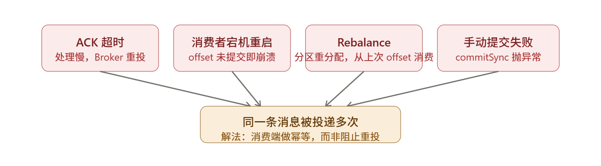

**幂等实现三种方案**：

方案一：唯一键去重（最通用）

```java
// 消息携带全局唯一 messageId
public void consume(OrderEvent event) {
    String key = "consumed:" + event.getMessageId();
    // Redis SET NX，成功则处理，失败说明已处理
    Boolean isFirst = redis.setIfAbsent(key, "1", 24, TimeUnit.HOURS);
    if (!Boolean.TRUE.equals(isFirst)) return;  // 重复，跳过
    db.processOrder(event);
}
```

方案二：DB 唯一索引（强一致）

业务表在 `message_id` 或 `order_id` 上建唯一索引，重复插入直接报 `DuplicateKeyException`，catch 住即可，无需额外 Redis。

方案三：乐观锁版本号（更新场景）

```java
// 更新操作携带版本号，重复更新因版本不匹配自动失败
int rows = db.update(
    "UPDATE orders SET status=?, version=? WHERE id=? AND version=?",
    newStatus, version+1, orderId, version
);
if (rows == 0) return;  // 已被更新，幂等跳过
```

------

#### 4. 消息丢失

消息丢失横跨三个阶段，每个阶段的保障机制不同：

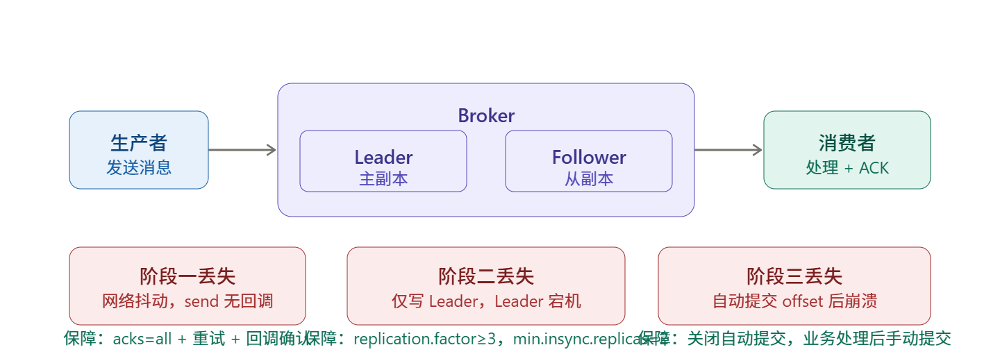

**Kafka 三阶段保障配置清单**：

```properties
# ── 生产者侧 ──
acks=all                        # 等所有 ISR 副本确认，不丢
retries=3                       # 发送失败重试
enable.idempotence=true         # 开启幂等，防重试导致重复
delivery.timeout.ms=120000      # 总超时限制

# ── Broker 侧 ──
replication.factor=3            # 3 副本
min.insync.replicas=2           # 至少 2 个副本同步才允许写入
unclean.leader.election.enable=false  # 禁止落后副本成为 Leader

# ── 消费者侧 ──
enable.auto.commit=false        # 关闭自动提交
# 业务处理完成后手动提交
consumer.commitSync();
```

**事务消息**（RocketMQ / Kafka 事务）：生产者和本地 DB 操作需要原子性时（如扣库存 + 发消息），使用事务消息，通过两阶段提交保证"要么都成功，要么都不发"。

------

#### 5. 死信队列堆积

**本质**：消息多次消费失败后（超过重试次数），Broker 将其移入死信队列（DLQ）。DLQ 是系统的"垃圾桶"，无人处理时持续堆积，既占磁盘又掩盖业务问题。

**消息进入死信的三条路**：

```
① 消费者抛异常 → 重试 N 次仍失败 → 进 DLQ
② 消息超过最大存活时间（TTL）未被消费 → 进 DLQ
③ 队列已满，新消息无法入队 → 进 DLQ
```

**生产级死信处理方案**：

```java
// 1. 死信监控：DLQ 消息数超阈值立即告警
@KafkaListener(topics = "orders.DLT")  // Spring Kafka DLT 命名约定
public void handleDeadLetter(OrderEvent event, @Header Map<String, Object> headers) {
    // 记录原始 topic、失败原因、原始 offset
    String originalTopic = headers.get("kafka_dlt-original-topic").toString();
    String errorMsg = headers.get("kafka_dlt-exception-message").toString();
    log.error("DLQ message: topic={}, error={}, event={}", originalTopic, errorMsg, event);
    alertService.send("DLQ 堆积告警");
}

// 2. 人工介入后，重放死信消息
// 修复消费者 bug 后，将 DLQ 的消息重新发回原 topic
public void replayDeadLetters() {
    consumer.subscribe(List.of("orders.DLT"));
    ConsumerRecords<String, OrderEvent> records = consumer.poll(Duration.ofSeconds(5));
    records.forEach(r -> producer.send(new ProducerRecord<>("orders", r.value())));
}
```

**设计原则**：DLQ 必须有专属监控和告警，不能只是消息的终点站。死信消息是业务异常的信号，每一条都应该被人工审查或自动修复后重放。

------

#### 6. 背压（Backpressure）机制缺失

**本质**：生产者不感知消费者的处理能力，持续高速发送。消费者来不及处理，消息在队列中积压，最终可能导致 Broker OOM、消费者被压垮，触发前面所有问题的多米诺骨牌。

背压的核心思想是：**消费者的处理能力，应该能反馈并约束生产者的发送速度**。

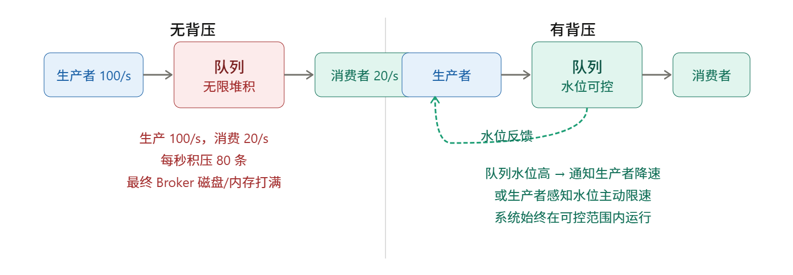

**四种背压实现方式**：

方式一：基于 consumer-lag 的动态限速

```java
// 定时检测消费延迟，超阈值通知生产者降速
@Scheduled(fixedRate = 5000)
public void checkLag() {
    long lag = kafkaMonitor.getConsumerLag("orders", "group-1");
    if (lag > 100_000) {
        rateLimiter.setRate(50);      // 降低生产速率
        log.warn("积压 {} 条，已限速", lag);
    } else if (lag < 10_000) {
        rateLimiter.setRate(200);     // 恢复速率
    }
}
```

方式二：Reactive Streams 原生背压（`Project Reactor / RxJava`）

```java
// Flux 自动传递背压信号，下游处理不过来时自动暂停上游
Flux.fromIterable(messageSource)
    .onBackpressureBuffer(1000,        // 缓冲区上限
        dropped -> log.warn("背压溢出丢弃: {}", dropped),
        BufferOverflowStrategy.DROP_OLDEST)
    .flatMap(msg -> processAsync(msg), 16)  // 最大 16 并发
    .subscribe();
```

方式三：有界队列 + 阻塞生产者

```java
// 用有界 BlockingQueue，队列满时生产者线程自动阻塞
BlockingQueue<Message> queue = new ArrayBlockingQueue<>(1000);

// 生产者：队列满则阻塞，天然背压
queue.put(message);       // 阻塞等待空位
// queue.offer(message, 1, TimeUnit.SECONDS);  // 超时失败

// 消费者
Message msg = queue.take();
process(msg);
```

方式四：MQ 层面的流控（RocketMQ）

RocketMQ 消费者配置 `pullBatchSize` 和 `consumeThreadMax`，并通过流控参数 `pullThresholdForQueue`（单队列缓存消息上限）在消费者侧自动限制拉取速度，内置背压能力。

------

#### 六类问题速查对照

| 问题         | 核心危害                  | 诊断指标                | 首选解法                        |
| ------------ | ------------------------- | ----------------------- | ------------------------------- |
| 消息积压     | Broker 磁盘打满，延迟飙升 | `consumer-lag` 持续增长 | 扩分区 + 扩消费实例             |
| 消费能力不足 | lag 增长但 CPU 不高       | 单实例吞吐 TPS          | 批量消费 + 内部并发             |
| 重复消费     | 业务重复执行，数据错乱    | 业务日志重复 ID         | 幂等设计（Redis NX / 唯一索引） |
| 消息丢失     | 数据永久缺失              | 生产/消费计数不匹配     | `acks=all` + 手动提交 offset    |
| 死信堆积     | 异常被掩盖，磁盘增长      | DLQ 消息数告警          | 监控 + 人工审查 + 重放          |
| 背压缺失     | 系统失控，雪崩放大        | lag 暴涨速度            | 有界队列 / consumer-lag 限速    |

------

想深入哪个方向？比如 Kafka 事务消息的两阶段提交原理、RocketMQ 延迟消息与死信机制的实现细节，或 Project Reactor 背压策略的完整用法？

### 七、限流与熔断问题

- 无限流导致雪崩
- 限流策略不合理（误杀正常请求）
- 熔断器未配置或阈值不合理
- 降级策略缺失或不完善

#### 先看全局：限流、熔断、降级的协作关系---

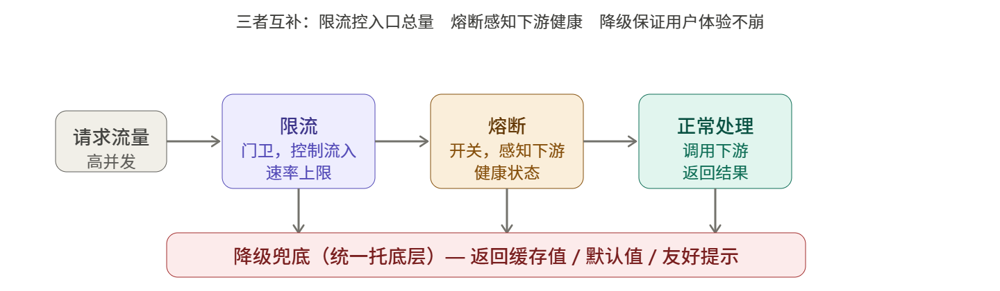

#### 1. 无限流导致雪崩

**本质**：没有任何流量控制，上游流量突增时，请求无限打入服务和下游依赖，线程池耗尽 → 响应变慢 → 请求堆积 → 内存溢出 → 服务崩溃 → 级联扩散到整个调用链。

**雪崩的多米诺过程**：

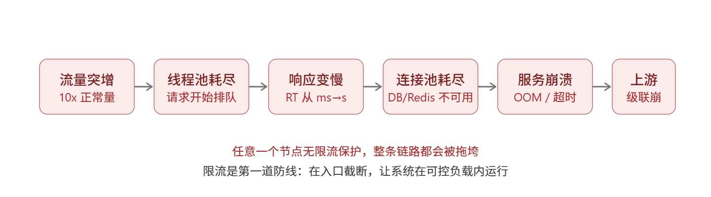

限流是硬性防线，不是可选项。任何对外暴露的接口都应该有限流保护，哪怕阈值设得很宽松。

------

#### 2. 限流策略不合理（误杀正常请求）

四种算法各有适用场景，选错会导致正常流量被误杀，或突发流量完全无法应对。

**四种算法直观对比**：

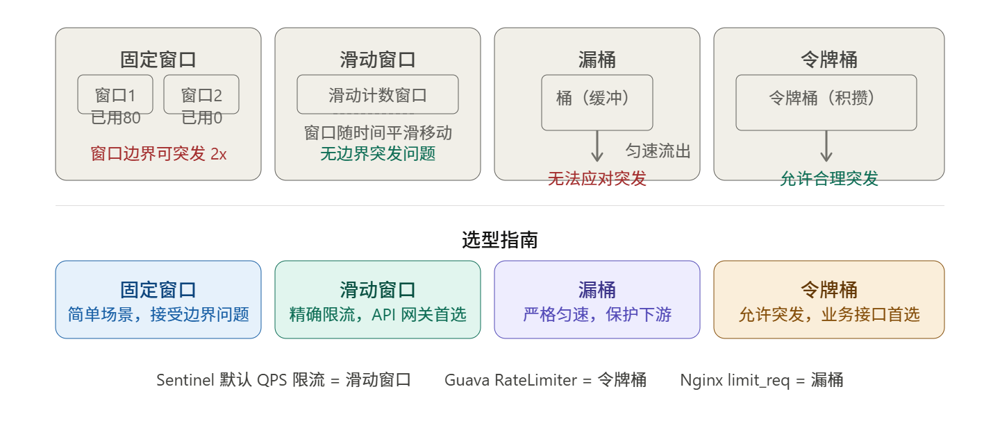

**固定窗口的边界突发问题**（最常见的误杀根因之一）：

```
限流阈值 100 req/s
第 0.9s：已发送 100 个请求，窗口用满
第 1.0s：新窗口开始，计数清零
→ 第 0.9s ~ 1.1s 这 200ms 内实际通过了 200 个请求
  等价于 1000 req/s 的突发，完全击穿限流保护
```

**Sentinel 实战配置**（滑动窗口 + 令牌桶混合）：

```java
// 基于 QPS 的流控规则
FlowRule rule = new FlowRule();
rule.setResource("orderService");
rule.setGrade(RuleConstant.FLOW_GRADE_QPS);
rule.setCount(100);                              // QPS 上限
rule.setControlBehavior(RuleConstant.CONTROL_BEHAVIOR_WARM_UP_RATE_LIMITER);
rule.setWarmUpPeriodSec(10);                     // 预热 10s，防冷启动误杀
rule.setMaxQueueingTimeMs(500);                  // 排队等待最长 500ms
FlowRuleManager.loadRules(List.of(rule));
```

**预热（Warm-Up）为什么重要**：服务刚启动时，JIT 未编译、连接池未建立、本地缓存为空，直接按满负荷放量会瞬间压垮；预热期间逐渐放大限流阈值，让服务"热身"后再承受全量流量。

**限流粒度设计**：

```
全局限流：整个服务的 QPS 上限（防止整体过载）
    ↓
接口限流：单个接口的 QPS 上限（重要接口单独保护）
    ↓
用户/IP 限流：单个用户/IP 的访问频率（防爬虫和恶意调用）
    ↓
集群限流：多实例部署时，限流阈值在集群维度生效（Sentinel 集群模式）
```

------

#### 3. 熔断器未配置或阈值不合理

**熔断器的三态状态机**是理解熔断的核心：

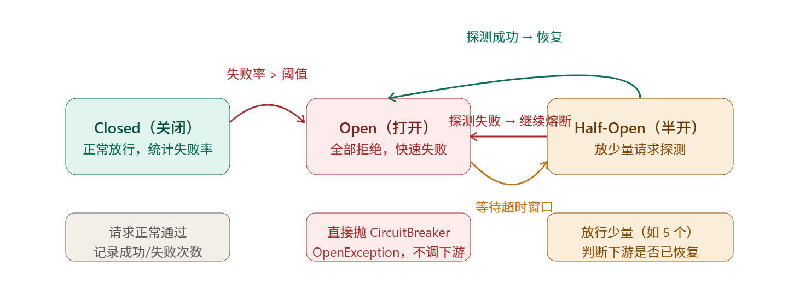

**熔断器的核心价值**：下游服务故障时，不让调用方线程无限阻塞等待超时（阻塞期间线程被占用，大量超时堆积会拖垮调用方自身）。熔断打开后，请求立即返回失败，线程被快速释放，调用方自保。

**Resilience4j 完整配置**（当前 Java 生态最主流）：

```java
CircuitBreakerConfig config = CircuitBreakerConfig.custom()
    // ── 核心阈值 ──
    .failureRateThreshold(50)              // 失败率超 50% 触发熔断
    .slowCallRateThreshold(80)             // 慢调用率超 80% 也触发
    .slowCallDurationThreshold(Duration.ofSeconds(2)) // 慢调用定义：>2s
    // ── 统计窗口 ──
    .slidingWindowType(COUNT_BASED)        // 基于请求数的滑动窗口
    .slidingWindowSize(20)                 // 最近 20 个请求
    .minimumNumberOfCalls(10)             // 至少 10 次调用才开始统计
    // ── 恢复探测 ──
    .waitDurationInOpenState(Duration.ofSeconds(30)) // 熔断后等 30s 进入半开
    .permittedNumberOfCallsInHalfOpenState(5)        // 半开时放 5 个探测请求
    // ── 异常过滤 ──
    .recordExceptions(IOException.class, TimeoutException.class)
    .ignoreExceptions(BusinessException.class)       // 业务异常不计入失败
    .build();
```

**阈值不合理的两类问题**：

`minimumNumberOfCalls` 设置过小：10 次请求里偶发 1 次超时就触发熔断，误杀率极高，应结合实际 QPS 设置，至少保证统计窗口内有足够样本。

`waitDurationInOpenState` 设置过短：熔断 5s 就进半开探测，下游还没恢复又被打垮，导致熔断频繁开关抖动（thrashing）。应结合下游的 SLA 和恢复时间设置，一般 30s～2min。

------

#### 4. 降级策略缺失或不完善

降级是"有损服务"的艺术——核心功能正常，非核心功能主动关闭或简化，保证用户体验不完全崩溃。

**降级的四个层次**：

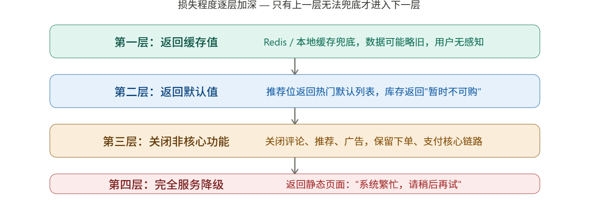

**Sentinel + Resilience4j 降级实现**：

```java
// Sentinel：配置降级规则 + Fallback
@SentinelResource(value = "getProduct",
    fallback = "getProductFallback",
    blockHandler = "getProductBlocked")
public Product getProduct(Long id) {
    return productService.fetchFromDb(id);  // 正常逻辑
}

// 熔断/异常时的降级逻辑
public Product getProductFallback(Long id, Throwable ex) {
    // 第一层：走缓存
    Product cached = localCache.getIfPresent(id);
    if (cached != null) return cached;
    // 第二层：返回默认值
    return Product.defaultProduct(id);
}

// 限流时的降级逻辑（BlockException）
public Product getProductBlocked(Long id, BlockException ex) {
    return Product.builder().message("系统繁忙，请稍后重试").build();
}
```

**Resilience4j 组合使用**（限流 + 熔断 + 降级 三合一）：

```java
// 用 Decorators 链式组合多种保护
Supplier<Product> decorated = Decorators
    .ofSupplier(() -> productService.fetchFromDb(id))
    .withCircuitBreaker(circuitBreaker)      // 熔断保护
    .withRateLimiter(rateLimiter)            // 限流保护
    .withRetry(retry)                        // 重试
    .withFallback(                           // 降级
        List.of(CircuitBreakerOpenException.class,
                RequestNotPermitted.class),
        ex -> Product.defaultProduct(id))
    .decorate();

Product result = Try.ofSupplier(decorated)
    .recover(ex -> Product.builder().message("服务暂不可用").build())
    .get();
```

**降级的常见设计缺陷**：

缺陷一：降级逻辑本身也依赖有问题的服务。比如降级时仍然查 Redis，但 Redis 恰好也是故障点，降级毫无意义。降级链路必须完全独立于主链路。

缺陷二：降级后没有告警，问题被悄悄掩盖。降级被触发时必须打出告警，否则系统表面正常，实际已在异常状态运行数小时。

缺陷三：未区分核心与非核心，一刀切全部降级。正确做法是优先保护核心业务（支付、下单），非核心（推荐、广告、评论）可以接受完全关闭。

```java
// 区分核心与非核心的降级开关（配合配置中心动态调整）
@Value("${feature.recommendation.enabled:true}")
private boolean recommendationEnabled;

public List<Product> getRecommendations(Long userId) {
    if (!recommendationEnabled) return Collections.emptyList(); // 主动降级
    return Try.ofSupplier(() -> recommendService.get(userId))
              .recover(ex -> Collections.emptyList())
              .get();
}
```

------

#### 四类问题速查对照

| 问题                    | 核心危害                 | 诊断信号               | 首选解法                                   |
| ----------------------- | ------------------------ | ---------------------- | ------------------------------------------ |
| 无限流                  | 流量突增级联雪崩         | 线程池耗尽 + RT 暴涨   | Sentinel / 网关层限流，接口全覆盖          |
| 限流策略误杀            | 正常流量被拒绝           | 正常时段 429 错误率高  | 令牌桶替代固定窗口，加预热期               |
| 熔断未配置 / 阈值不合理 | 下游故障拖垮调用方       | 线程大量阻塞等超时     | Resilience4j 三态熔断，合理设 minimumCalls |
| 降级策略缺失            | 部分故障扩散成全站不可用 | 核心接口随非核心一起崩 | 分层降级 + 独立降级链路 + 降级告警         |


### 八、数据库问题

- 慢查询 / 缺少索引
- 数据库连接超时
- 事务锁等待 / 长事务
- 主从同步延迟
- 分库分表热点问题

#### 先看全局：五类问题在数据库架构中的位置---

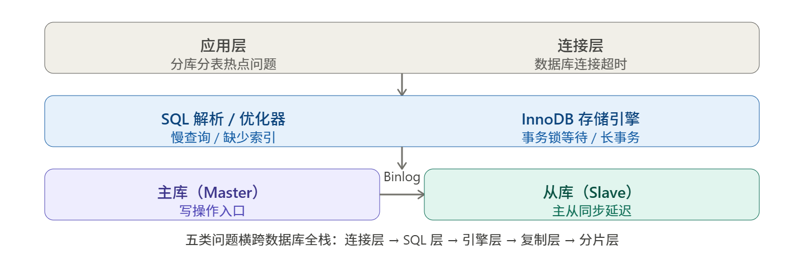

#### 1. 慢查询 / 缺少索引

**本质**：SQL 执行时走全表扫描或低效索引，单次查询耗时从毫秒级升到秒级，高并发下大量慢查询堆积，连接池耗尽，服务雪崩。

**慢查询的完整排查链路**：

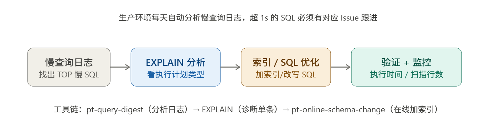

**开启慢查询日志**：

```sql
-- 查看当前配置
SHOW VARIABLES LIKE 'slow_query%';

-- 动态开启（无需重启）
SET GLOBAL slow_query_log = ON;
SET GLOBAL long_query_time = 1;           -- 超过 1s 记录
SET GLOBAL log_queries_not_using_indexes = ON;  -- 未走索引也记录
```

**EXPLAIN 关键字段解读**：

```sql
EXPLAIN SELECT * FROM orders
WHERE user_id = 123 AND status = 'PAID'
ORDER BY created_at DESC LIMIT 10;
```

| 字段    | 危险值            | 含义                         |
| ------- | ----------------- | ---------------------------- |
| `type`  | `ALL`             | 全表扫描，必须优化           |
| `type`  | `index`           | 全索引扫描，仍然慢           |
| `type`  | `ref/range`       | 正常，走索引                 |
| `rows`  | 百万级            | 扫描行数过多                 |
| `Extra` | `Using filesort`  | 排序未走索引，有额外排序开销 |
| `Extra` | `Using temporary` | 用了临时表，GROUP BY 常见    |

**索引设计核心原则**：

```sql
-- 联合索引遵循最左前缀原则
-- 场景：WHERE user_id=? AND status=? ORDER BY created_at DESC
-- 建议索引：(user_id, status, created_at)

ALTER TABLE orders ADD INDEX idx_user_status_time (user_id, status, created_at);

-- 验证：Extra 应该出现 Using index（覆盖索引），rows 应大幅下降
EXPLAIN SELECT id, amount, created_at FROM orders
WHERE user_id = 123 AND status = 'PAID'
ORDER BY created_at DESC LIMIT 10;
```

**六类典型慢查询场景与解法**：

索引列做函数运算导致失效：`WHERE DATE(created_at) = '2024-01-01'` → 改为范围查询 `WHERE created_at BETWEEN '2024-01-01' AND '2024-01-02'`。

隐式类型转换：`user_id` 是 `varchar`，查询传入 `int`，MySQL 自动转换导致索引失效 → 保证传参类型与字段类型一致。

`SELECT *` 带出大量无用字段：消耗网络和内存 → 只 SELECT 业务所需字段，配合覆盖索引彻底避免回表。

`LIMIT` 深分页：`LIMIT 100000, 20` 实际扫描 100020 行再丢掉前 10 万行 → 改用游标分页 `WHERE id > last_id LIMIT 20`。

`JOIN` 驱动表选错：小表驱动大表，被驱动表的关联字段必须有索引 → 用 `STRAIGHT_JOIN` 强制指定驱动顺序或依赖优化器。

`IN` 子查询改 `EXISTS`：数据量大时 `IN` 全部加载到内存 → 改 `JOIN` 或 `EXISTS`，让优化器选择更优计划。

------

#### 2. 数据库连接超时

连接超时有两类完全不同的含义，经常被混淆：

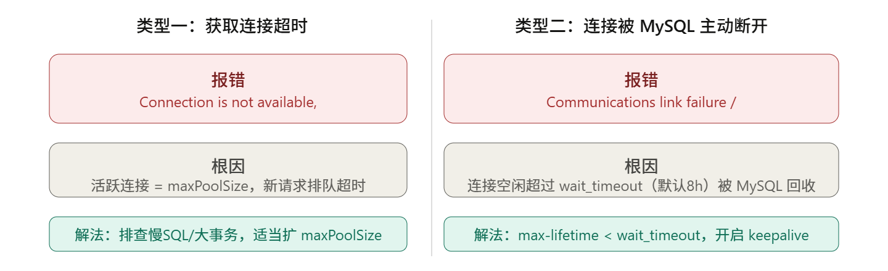

**类型二的黄金配置规则**（防止"幽灵连接"问题）：

```yaml
hikari:
  max-lifetime: 1800000          # 30min，必须 < MySQL wait_timeout（默认28800s=8h）
  keepalive-time: 60000          # 每 60s 发一次心跳 SELECT 1，防连接被回收
  connection-test-query: SELECT 1
  # 若 MySQL wait_timeout 被 DBA 调小到 1800s，则 max-lifetime 必须 < 1800000ms
```

**额外风险：查询超时未设置**。应用层调 DB 若没有 `queryTimeout`，下游 DB 假死时调用方线程永久阻塞，迅速耗尽线程池：

```java
// MyBatis 设置语句级查询超时
@Options(timeout = 5)   // 5s 超时，单位秒
@Select("SELECT * FROM orders WHERE user_id = #{userId}")
List<Order> findByUser(Long userId);

// JDBC 级别
statement.setQueryTimeout(5);

// HikariCP 全局兜底
hikari:
  connection-timeout: 3000       # 等连接最长 3s
  # 注意：这是等连接的超时，不是 SQL 执行超时
```

------

#### 3. 事务锁等待 / 长事务

**本质**：InnoDB 用行锁保证事务隔离，事务未提交时持有的锁不释放，其他事务等锁时间过长（锁等待超时）或互相等锁（死锁），高并发下严重拖慢吞吐。

**InnoDB 锁类型速查**：

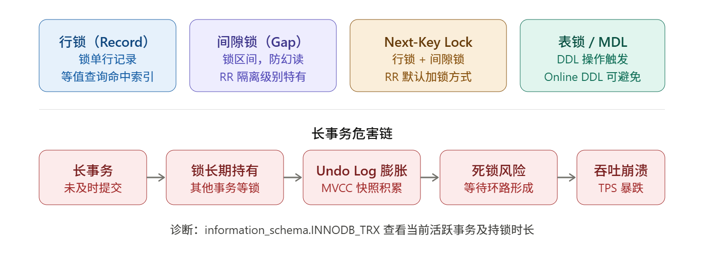

**实时排查锁等待**：

```sql
-- 查看当前活跃事务（重点关注 trx_started 时间早的）
SELECT trx_id, trx_state, trx_started, trx_query,
       TIMESTAMPDIFF(SECOND, trx_started, NOW()) AS duration_sec
FROM information_schema.INNODB_TRX
ORDER BY trx_started;

-- 查看锁等待关系（谁在等谁）
SELECT
    r.trx_id waiting_trx,
    r.trx_query waiting_query,
    b.trx_id blocking_trx,
    b.trx_query blocking_query
FROM information_schema.INNODB_LOCK_WAITS w
JOIN information_schema.INNODB_TRX r ON r.trx_id = w.requesting_trx_id
JOIN information_schema.INNODB_TRX b ON b.trx_id = w.blocking_trx_id;
```

**长事务的四大根因与解法**：

根因一：事务内有网络 I/O（最严重）

```java
// 严重反例：事务内调用 HTTP，持锁等待网络
@Transactional
public void createOrder(Order order) {
    orderRepo.save(order);
    httpClient.notifyWarehouse(order);  // 外部调用可能超时！持锁几秒钟
    inventoryRepo.deduct(order);
}

// 正例：事务内只做 DB 操作，网络调用移到事务外
public void createOrder(Order order) {
    doCreateOrder(order);               // 事务方法，仅操作 DB
    httpClient.notifyWarehouse(order);  // 事务提交后再调用
}

@Transactional
public void doCreateOrder(Order order) {
    orderRepo.save(order);
    inventoryRepo.deduct(order);
}   // 方法结束即提交，锁立即释放
```

根因二：`@Transactional` 粒度过粗。加在 Service 类级别，整个方法都在事务内，但很多读操作不需要事务 → 精确控制事务边界，只在真正需要原子性的代码块上加注解。

根因三：锁升级。先 SELECT 再 UPDATE，中间有业务判断，应改用 `SELECT FOR UPDATE` 一步锁定：

```sql
-- 反例：SELECT 后无锁，UPDATE 前已被其他事务修改
SELECT stock FROM inventory WHERE product_id = 1;
-- ... 业务判断 ...
UPDATE inventory SET stock = stock - 1 WHERE product_id = 1;

-- 正例：SELECT FOR UPDATE 直接加排他锁
SELECT stock FROM inventory WHERE product_id = 1 FOR UPDATE;
-- 在锁保护下安全扣减
UPDATE inventory SET stock = stock - 1 WHERE product_id = 1;
```

根因四：批量操作在一个大事务里。一次更新 10 万行，事务持续数分钟 → 改为分批提交，每批 500 行一个事务。

------

#### 4. 主从同步延迟

**本质**：MySQL 主从基于 Binlog 异步复制，从库回放 Binlog 的速度跟不上主库写入速度，导致从库数据落后于主库。读写分离时从从库读到旧数据，产生业务 bug。

**延迟的来源与放大**：

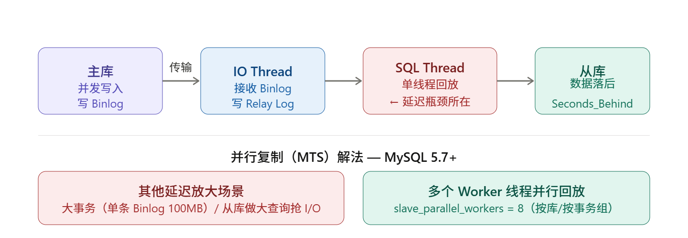

**延迟监控与业务应对**：

```sql
-- 从库执行，Seconds_Behind_Master 即延迟秒数
SHOW SLAVE STATUS\G
-- 关注：Seconds_Behind_Master, Exec_Master_Log_Pos

-- 监控告警：延迟超 10s 立即告警
```

**业务层四种应对策略**：

策略一：写后读走主库（最简单）。刚写入的数据立即读，必须走主库，避免读到旧数据：

```java
// ShardingSphere / MyBatis-Plus 主从路由注解
@DS("master")   // 强制走主库
public Order getOrderAfterCreate(Long orderId) {
    return orderMapper.findById(orderId);
}
```

策略二：读主库兜底。读从库时若数据版本不符合预期（版本号/时间戳比刚写入的旧），自动降级走主库。

策略三：允许最终一致性。非核心读操作（历史订单列表、积分明细），接受秒级延迟，无需特殊处理。

策略四：半同步复制。主库等至少一个从库确认收到 Binlog 后才提交，牺牲少量写性能换取更强一致性保证（适合金融场景）：

```sql
-- 启用半同步复制插件
INSTALL PLUGIN rpl_semi_sync_master SONAME 'semisync_master.so';
SET GLOBAL rpl_semi_sync_master_enabled = 1;
SET GLOBAL rpl_semi_sync_master_timeout = 1000;  -- 超时 1s 降级为异步
```

------

#### 5. 分库分表热点问题

**本质**：分库分表按某个维度分片后，特定分片的数据量或访问量远超其他分片，导致单个分片成为瓶颈，与不分库分表时的单点问题一样，只是问题点从一个变成了少数几个。

**三类热点场景**：

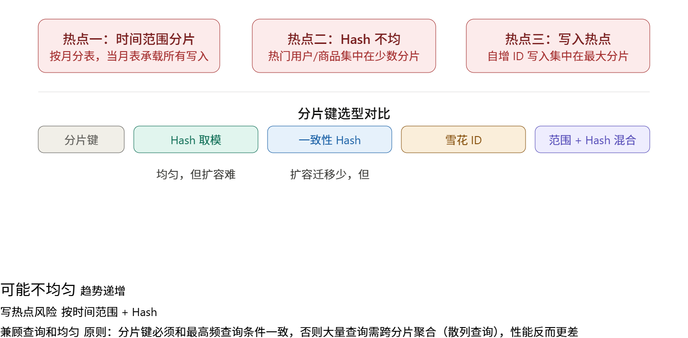

**热点写入的具体应对**：

**雪花 ID 写入热点**（B+树末尾节点频繁分裂）的解法：UUID 打散写入，但 UUID 无序导致大量随机 I/O，通常在雪花 ID 基础上做"时间位置换"（把低位的机器号和序列号挪到高位），让 ID 在空间上更分散。

**秒杀商品单行热点**（单条记录被高并发写）：

```java
// 库存打散方案：1000 件库存拆成 10 条记录，每条 100 件
// 写入时随机选一条扣减，10 个分片并发承接流量
public boolean deductStock(Long productId, int count) {
    int slot = ThreadLocalRandom.current().nextInt(10);  // 随机选分片
    String key = productId + "_" + slot;
    int rows = inventoryMapper.deduct(key, count);
    if (rows == 0) {
        // 该分片库存不足，尝试其他分片（可加重试）
        return tryOtherSlots(productId, count);
    }
    return true;
}
```

**跨分片查询问题**（最容易被忽视）：分库分表后，非分片键的查询（如按 `status` 查所有用户的订单）需要遍历所有分片再聚合，性能极差。解法是建立异构索引（如 ES 或专门的查询库），用空间换查询灵活性。

------

#### 五类问题速查对照

| 问题            | 核心危害              | 第一排查命令                       | 首选解法                                      |
| --------------- | --------------------- | ---------------------------------- | --------------------------------------------- |
| 慢查询 / 无索引 | 连接池耗尽，服务雪崩  | `SHOW PROCESSLIST` + `EXPLAIN`     | 联合索引，游标分页，覆盖索引                  |
| 连接超时        | 请求报错 / 拿到死连接 | 区分获取超时 vs 断线重连           | `max-lifetime` < `wait_timeout`，开 keepalive |
| 事务锁等待      | TPS 暴跌，死锁频发    | `INNODB_TRX` + `INNODB_LOCK_WAITS` | 缩短事务，事务内禁止网络 I/O                  |
| 主从同步延迟    | 读到脏数据，业务 bug  | `SHOW SLAVE STATUS`                | 并行复制，写后读强制走主库                    |
| 分库分表热点    | 单分片成瓶颈          | 各分片 QPS / 数据量对比            | Hash 分片键，库存打散，异构索引               |

------

想深入哪个方向？比如 InnoDB MVCC 与 Undo Log 的实现细节、ShardingSphere 分片策略配置、或 MySQL 半同步复制的完整部署方案？


### 九、网络与 I/O 问题

- I/O 阻塞（BIO 模式下线程阻塞）
- 网络超时未设置或设置不合理
- TCP 连接积压（Backlog 满）
- 半关闭连接未清理
- 大包/粘包问题

#### 先看全局：五类问题在网络栈中的位置---

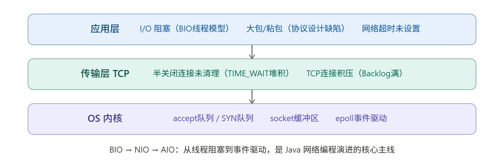

#### 1. I/O 阻塞（BIO 模式下线程阻塞）

**本质**：BIO（Blocking I/O）下每个连接独占一个线程，线程在等待数据时完全阻塞，无法做任何其他事情。高并发时线程数随连接数线性增长，线程上下文切换开销超过实际计算开销，服务崩溃。

**三代 I/O 模型演进**：

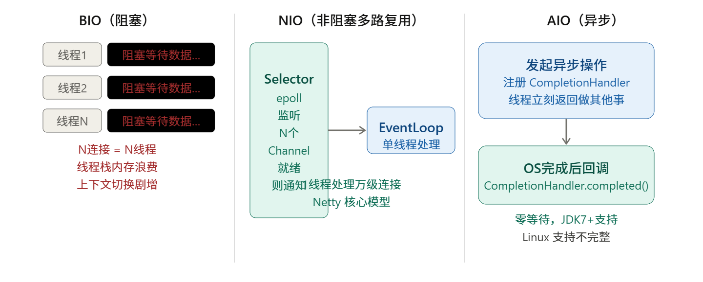

**Netty 的 Reactor 线程模型**（当前 Java 高并发网络的事实标准）：

```java
// 主从 Reactor 模型：Boss 接连接，Worker 处理 I/O
EventLoopGroup bossGroup   = new NioEventLoopGroup(1);      // 接收连接
EventLoopGroup workerGroup = new NioEventLoopGroup(8);      // 处理 I/O 读写

ServerBootstrap b = new ServerBootstrap();
b.group(bossGroup, workerGroup)
 .channel(NioServerSocketChannel.class)
 .option(ChannelOption.SO_BACKLOG, 1024)          // 见第3节
 .childOption(ChannelOption.TCP_NODELAY, true)    // 禁用 Nagle，降低延迟
 .childOption(ChannelOption.SO_KEEPALIVE, true)   // 见第4节
 .childHandler(new ChannelInitializer<SocketChannel>() {
     @Override
     protected void initChannel(SocketChannel ch) {
         ch.pipeline()
           .addLast(new IdleStateHandler(60, 0, 0))  // 心跳检测
           .addLast(new LengthFieldBasedFrameDecoder(...)) // 见第5节
           .addLast(new BusinessHandler());
     }
 });
```

**JDK 21 虚拟线程**（BIO 问题的革命性解法）：用 BIO 的代码写法，底层自动切换到非阻塞实现——虚拟线程阻塞时只是"挂起"到堆上，不占用 OS 线程，可以轻松创建百万级虚拟线程：

```java
// JDK 21：每个连接一个虚拟线程，BIO 写法，NIO 性能
try (var executor = Executors.newVirtualThreadPerTaskExecutor()) {
    executor.submit(() -> {
        // 这里的 InputStream.read() 虽然看起来是阻塞调用
        // 实际上虚拟线程挂起，OS 线程被释放去处理其他虚拟线程
        byte[] data = socket.getInputStream().read();
        process(data);
    });
}
```

------

#### 2. 网络超时未设置或设置不合理

这是生产事故中最高频的"低级错误"——代码看起来正常，但下游一旦假死，调用方线程全部永久阻塞，服务在几分钟内彻底不可用。

**完整超时链路**：

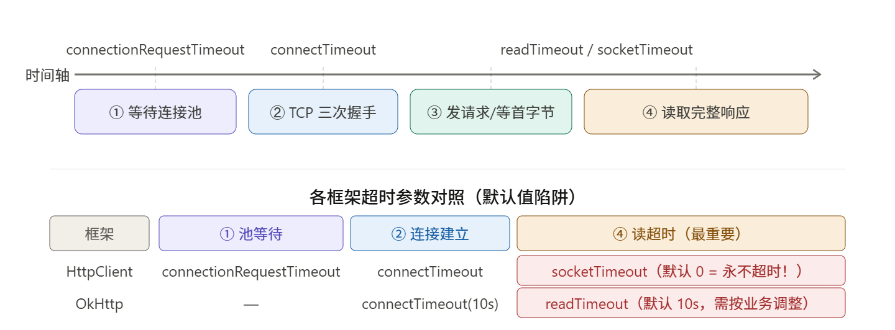

**超时设置的黄金法则**：

```java
// OkHttp 完整超时配置示例
OkHttpClient client = new OkHttpClient.Builder()
    .connectTimeout(2, TimeUnit.SECONDS)    // TCP 握手：2s，局域网内一般 < 100ms
    .writeTimeout(5, TimeUnit.SECONDS)      // 发请求：5s，大文件上传可调大
    .readTimeout(10, TimeUnit.SECONDS)      // 读响应：按接口 SLA 设置，不能为 0
    .callTimeout(15, TimeUnit.SECONDS)      // 整个调用总时长兜底，覆盖所有阶段
    .retryOnConnectionFailure(false)        // 非幂等接口关闭自动重试
    .build();
```

**超时传递问题**（调用链超时累加）：A 调 B 超时 5s，B 调 C 超时 5s，则 A 的整体超时可能达 10s 以上，大量连接堆积。应在链路入口设置总 deadline 并向下游传递剩余时间：

```java
// gRPC 天然支持 Deadline 传递
stub.withDeadlineAfter(3, TimeUnit.SECONDS)
    .callService(request);

// 自定义 HTTP 调用：从 TraceContext 取剩余时间
long remainingMs = deadline - System.currentTimeMillis();
if (remainingMs <= 0) throw new TimeoutException("已超过总截止时间");
client.newCall(request).timeout(remainingMs, TimeUnit.MILLISECONDS);
```

------

#### 3. TCP 连接积压（Backlog 满）

**本质**：TCP 建立连接分两个队列——SYN 队列（半连接）和 Accept 队列（全连接）。高并发时 Accept 队列打满，新连接被内核直接丢弃，客户端看到连接拒绝或超时。

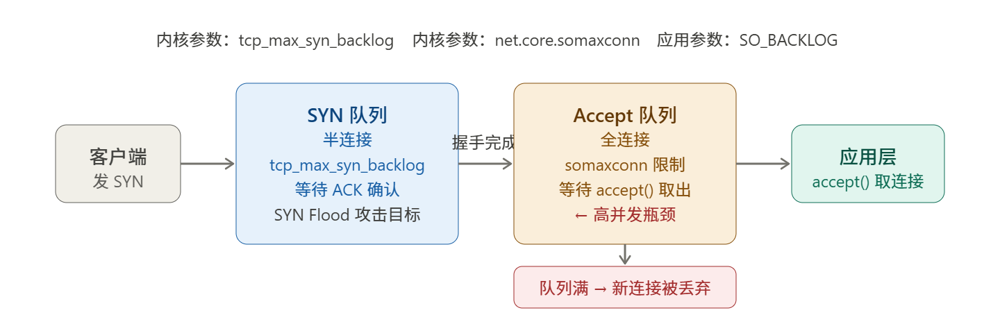

**诊断与调优**：

```bash
# 诊断：查看 Accept 队列溢出次数（非零即告警）
ss -lnt                              # 查看 Recv-Q（当前积压）和 Send-Q（队列上限）
netstat -s | grep "listen overflows" # 累计溢出次数

# 内核参数调优
sysctl -w net.core.somaxconn=65535          # Accept 队列上限
sysctl -w net.ipv4.tcp_max_syn_backlog=65535 # SYN 队列上限
sysctl -w net.ipv4.tcp_syncookies=1          # 开启 SYN Cookie，防 SYN Flood

# 应用层 Netty 配置与内核参数配套
.option(ChannelOption.SO_BACKLOG, 65535)    # 必须 <= somaxconn
```

**三个关键认知**：

- `SO_BACKLOG` 在应用层设置，但实际生效值是 `min(SO_BACKLOG, somaxconn)`，两者都要调
- Accept 队列满时默认行为是丢包，客户端触发重传，重传 3 次后报连接超时
- Netty Boss 线程 `accept()` 够快，Accept 队列积压通常意味着 Worker 线程处理不过来，根因在业务逻辑太慢

------

#### 4. 半关闭连接未清理

**本质**：TCP 四次挥手中，主动关闭方发送 FIN 后进入 `TIME_WAIT` 状态，需等待 `2×MSL`（默认 60s）才能彻底关闭。高并发短连接场景下，TIME_WAIT 连接堆积到数万，本地端口耗尽（端口范围 1024~65535），新连接无法建立。

**TCP 连接状态转换（关闭阶段）**：

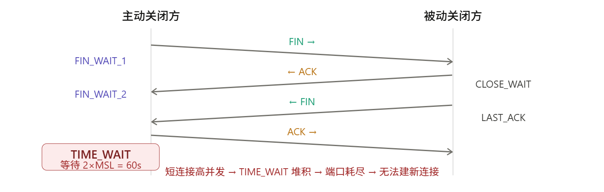

**诊断与应对**：

```bash
# 查看各状态连接数量
ss -ant | awk '{print $1}' | sort | uniq -c | sort -rn
# TIME_WAIT 超过 2 万需关注，超过 5 万需处理

# 内核参数优化
sysctl -w net.ipv4.tcp_tw_reuse=1         # 允许复用 TIME_WAIT 连接（客户端侧有效）
sysctl -w net.ipv4.tcp_fin_timeout=15     # 缩短 FIN_WAIT_2 超时（默认 60s）
sysctl -w net.ipv4.ip_local_port_range="1024 65535"  # 扩大可用端口范围
```

**根治方案——使用长连接（Keep-Alive）**：避免频繁建立/销毁连接是消除 TIME_WAIT 堆积的根本。HTTP 1.1 默认 Keep-Alive，但要确保 HttpClient 配置连接池并复用：

```java
// 错误：每次请求 new HttpClient，每次都建新连接和断开
// 正确：单例 HttpClient + 连接池（见第四节连接池问题）

// Netty 服务端：长连接 + 心跳检测
pipeline.addLast(new IdleStateHandler(0, 0, 30));  // 30s 无读写触发 IDLE 事件
pipeline.addLast(new HeartbeatHandler());           // IDLE 时发心跳或关闭连接
```

**`CLOSE_WAIT` 堆积**（另一类"半关闭"问题）：对端已发 FIN，本端未调 `close()`，连接卡在 `CLOSE_WAIT`。通常是代码 bug：异常分支未关闭 socket，或 NIO 框架中业务线程抛异常后未触发 channel.close()。`ss -ant | grep CLOSE_WAIT` 数量持续增长是明确 bug 信号。

------

#### 5. 大包/粘包问题

**本质**：TCP 是字节流协议，没有消息边界概念。发送方的多条消息可能被合并成一个大包（粘包），或一条消息被拆成多个小包（拆包）。接收方如果按固定大小或一次 `read()` 来解析，就会读到不完整或混合的数据。

**粘包与拆包的四种场景**：

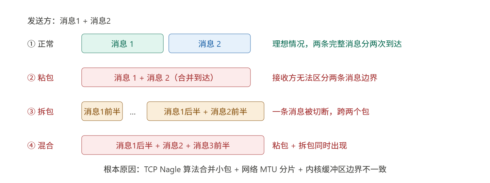

**四种解帧（Frame Decode）方案**：

方案一：固定长度（最简单，适合定长协议）

```java
// Netty 固定长度解码器
pipeline.addLast(new FixedLengthFrameDecoder(64));  // 每条消息固定 64 字节
```

方案二：特殊分隔符（适合文本协议）

```java
// Netty 分隔符解码器
ByteBuf delimiter = Unpooled.copiedBuffer("\r\n".getBytes());
pipeline.addLast(new DelimiterBasedFrameDecoder(8192, delimiter));
// 缺点：消息内容中不能包含分隔符
```

方案三：长度字段头（最通用，推荐）

```
协议格式：[4字节 length][length字节 body]
发送：writeInt(body.length) + write(body)
接收：先读4字节得到长度，再读对应字节数的body
// Netty LengthFieldBasedFrameDecoder — 工业级解法
pipeline.addLast(new LengthFieldBasedFrameDecoder(
    65536,    // 最大帧长度
    0,        // 长度字段偏移量（从第0字节开始）
    4,        // 长度字段本身占4字节
    0,        // 长度字段后的调整量
    4         // 解码时跳过长度字段本身（只保留 body）
));
pipeline.addLast(new LengthFieldPrepender(4));  // 编码时自动加长度头
```

方案四：应用层协议（HTTP/gRPC/WebSocket）

直接使用成熟协议，粘包拆包已在协议层处理，无需手动实现：

```java
// HTTP：Netty 内置完整编解码器
pipeline.addLast(new HttpServerCodec());
pipeline.addLast(new HttpObjectAggregator(65536));  // 聚合完整 HTTP 消息

// gRPC：Length-Prefixed Message Frame，内置处理
// WebSocket：Frame 机制，内置 opcode + payload length
```

------

#### 五类问题速查对照

| 问题         | 核心危害                   | 诊断手段                                       | 首选解法                     |
| ------------ | -------------------------- | ---------------------------------------------- | ---------------------------- |
| I/O 阻塞 BIO | 高并发线程耗尽，OOM        | 线程数随连接数线性增长                         | Netty NIO / JDK21 虚拟线程   |
| 超时未设置   | 下游假死，调用方全部卡死   | 查 socketTimeout 配置是否为 0                  | 所有外部调用强制设置读超时   |
| Backlog 满   | 新连接被内核丢弃           | `ss -lnt` 看 Recv-Q，`netstat -s` 看 overflows | 调大 somaxconn + SO_BACKLOG  |
| 半关闭堆积   | 端口耗尽 / CLOSE_WAIT 泄漏 | `ss -ant | grep TIME_WAIT/CLOSE_WAIT`          | 长连接复用，tcp_tw_reuse     |
| 粘包/拆包    | 消息解析错误，数据污染     | 收到数据解析异常，字段串位                     | LengthFieldBasedFrameDecoder |

------

想深入哪个方向？比如 Netty Pipeline 的完整事件传播机制、JDK 21 虚拟线程与 Reactor 模式的性能对比，或自定义二进制协议的完整设计方案？


### 十、JVM 调优问题

- GC 算法选型不当（Serial/Parallel/CMS/G1/ZGC）
- JVM 参数配置不合理（Xmx/Xms/NewRatio）
- 即时编译（JIT）预热不足
- 类加载器泄漏

#### 先看全局：四类问题在 JVM 架构中的位置---

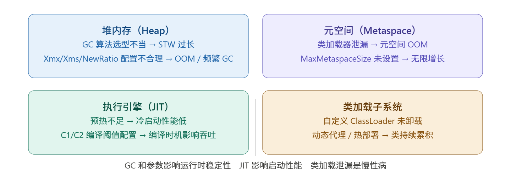

#### 1. GC 算法选型不当

**本质**：不同 GC 算法在吞吐量、停顿时间、堆大小、CPU 开销上各有取舍。选错算法，轻则 STW 过长导致接口超时毛刺，重则频繁 Full GC 拖垮整个服务。

**五代 GC 算法完整演进**：

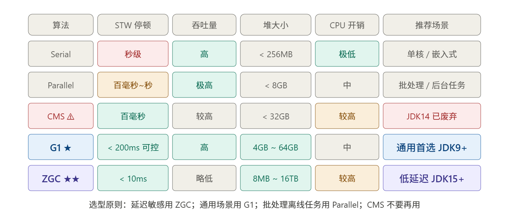

**G1 核心原理**（最需要掌握）：

G1 把堆划分为大小相等的 Region（默认 1~32MB），每次 GC 优先回收"价值最高"（垃圾最多）的 Region，在可控停顿时间内完成尽量多的回收。

```bash
# G1 关键参数
-XX:+UseG1GC
-XX:MaxGCPauseMillis=200          # 目标最大停顿时间（软目标，G1 会尽力达到）
-XX:G1HeapRegionSize=16m          # Region 大小，通常让 JVM 自动计算
-XX:G1NewSizePercent=5            # 新生代最小占比
-XX:G1MaxNewSizePercent=60        # 新生代最大占比
-XX:InitiatingHeapOccupancyPercent=45  # 老年代占堆 45% 时触发并发标记
-XX:G1MixedGCCountTarget=8        # Mixed GC 分几次完成老年代回收
```

**ZGC 的革命性设计**：几乎所有 GC 工作并发进行，STW 只在三个极短暂的阶段（标记开始、标记结束、重定位开始），通过染色指针（Colored Pointer）和读屏障（Load Barrier）实现并发移动对象：

```bash
# ZGC 参数（JDK 15+ 生产可用）
-XX:+UseZGC
-XX:+ZGenerational          # JDK 21+ 开启分代 ZGC，吞吐量进一步提升
-Xmx16g
-XX:SoftMaxHeapSize=12g     # 软上限，GC 会尽量在此以内，留余量给突发
-XX:ZCollectionInterval=5   # 定期主动 GC 间隔（秒），防止长时间无 GC 导致堆突增
```

**G1 常见问题：Mixed GC 不及时导致 Full GC**

```bash
# 症状：GC 日志出现 "to-space exhausted" 或 "Humongous allocation failure"
# 原因：大对象（> Region 的 50%）直接进老年代，G1 来不及回收
# 解法：调小 Region 大小，或增大堆，或调低 InitiatingHeapOccupancyPercent
-XX:G1HeapRegionSize=32m            # 提高 Humongous 对象阈值
-XX:InitiatingHeapOccupancyPercent=35  # 更早触发并发标记
```

------

#### 2. JVM 参数配置不合理

**核心内存参数全景**：

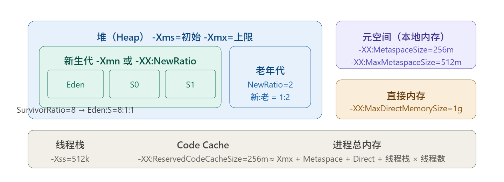

**最重要的五条配置原则**：

**原则一：Xms = Xmx，避免堆动态伸缩**

```bash
# 反例：堆动态伸缩
-Xms512m -Xmx4g   # 堆从 512m 增长到 4g 过程中触发多次 Full GC

# 正例：固定堆大小
-Xms4g -Xmx4g     # 启动即分配全部内存，避免扩容时的 GC 风暂停
```

**原则二：堆大小不超过物理内存的 70%**

进程总内存 = Xmx + Metaspace + Direct Memory + 线程栈 × 线程数 + JVM 内部开销。若 Xmx 设为物理内存的 90%，OS 频繁 swap，反而比 OOM 更慢。

**原则三：容器环境必须显式设置，否则 JVM 读取宿主机内存**

```bash
# Docker 容器：JDK 8u191+ / JDK 10+ 支持容器感知
-XX:+UseContainerSupport                    # 默认开启（JDK 11+）
-XX:MaxRAMPercentage=75.0                   # 使用容器内存的 75%，替代写死 Xmx
# 避免：-Xmx4g（容器只有 2g 内存时直接 OOM）
```

**原则四：NewRatio 与业务对象生命周期匹配**

```bash
# 高并发短生命周期对象多（微服务请求处理）：新生代要大
-XX:NewRatio=1          # 新生代 : 老年代 = 1:1，默认是 1:2

# 长生命周期对象多（缓存、连接池）：老年代要大
-XX:NewRatio=3          # 新生代 : 老年代 = 1:3
```

**原则五：线程栈不要设太大**

```bash
-Xss256k     # 通常足够，默认 512k~1m 偏大
# 1000 线程 × 1m = 1g 线程栈内存，容易被忽略
```

**生产环境推荐基线配置**（8 核 16G 容器，G1）：

```bash
-Xms8g -Xmx8g
-XX:+UseG1GC
-XX:MaxGCPauseMillis=200
-XX:+UseContainerSupport
-XX:MaxRAMPercentage=75.0
-XX:MetaspaceSize=256m
-XX:MaxMetaspaceSize=512m
-XX:MaxDirectMemorySize=1g
-Xss256k
-XX:ReservedCodeCacheSize=256m
-XX:+HeapDumpOnOutOfMemoryError
-XX:HeapDumpPath=/tmp/heap.hprof
-XX:+PrintGCDetails
-XX:+PrintGCDateStamps
-Xloggc:/var/log/gc.log
-XX:+UseGCLogFileRotation
-XX:NumberOfGCLogFiles=10
-XX:GCLogFileSize=100m
```

------

#### 3. 即时编译（JIT）预热不足

**本质**：JVM 启动时所有代码以解释器执行，性能只有编译后的 1/10 甚至更低。JIT 编译器（C1/C2）监控方法调用次数，达到阈值后编译为本地机器码。在预热完成前，服务性能严重低于正常水平——这个窗口期如果直接接收全量流量，请求大量超时。

**JIT 两级编译流水线**：

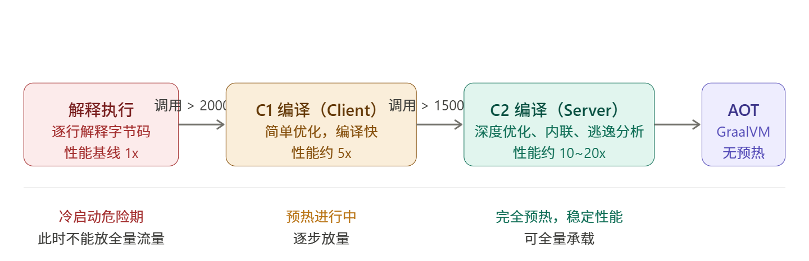

### 十一、分布式系统问题

- 分布式事务一致性（最终一致性 vs 强一致性）
- 服务雪崩效应
- 调用链超时累加
- 注册中心/配置中心不可用
- 脑裂问题

#### 先看全局：五类问题在分布式架构中的位置---


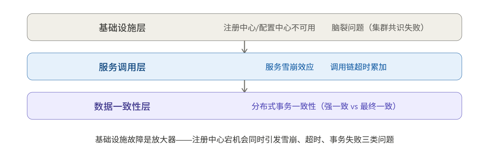

#### 1. 分布式事务一致性

**本质**：单机事务用 ACID 保证原子性，跨服务/跨库操作无法用一把本地锁完成，需要在多个独立节点间协调"要么全成功，要么全回滚"，同时还要面对网络分区和节点故障。

**CAP 定理的工程含义**：

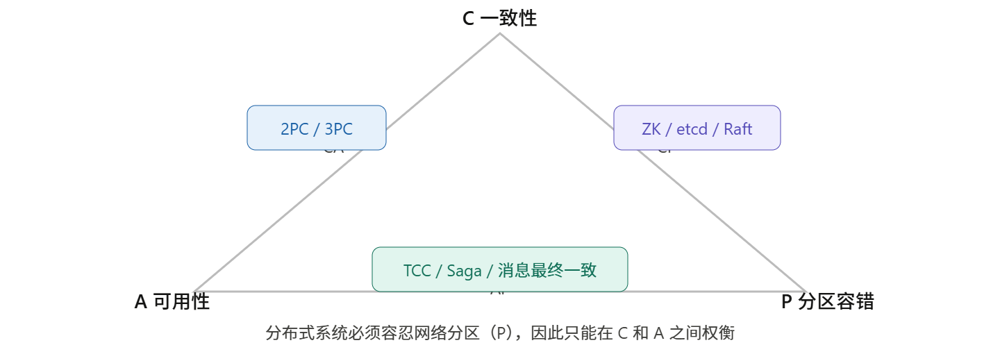

**四种方案深度对比**：

**方案一：2PC（两阶段提交）—— 强一致，高代价**

```
阶段一 Prepare：协调者询问所有参与者"能提交吗？"
阶段二 Commit：所有参与者回 Yes → 全部 Commit，否则全部 Rollback
```

致命缺陷：协调者宕机 → 参与者永久阻塞持锁；网络分区 → 数据不一致（部分提交）。适合同构数据库同厂商（如 MySQL XA），不适合跨服务。

**方案二：TCC（Try-Confirm-Cancel）—— 业务补偿，侵入性强**

```java
// Try：预留资源，不真正扣减
public boolean tryDeductStock(Long productId, int count) {
    // 冻结库存，不减少实际库存
    return inventoryMapper.freeze(productId, count) > 0;
}

// Confirm：真正扣减（Try 成功后调用）
public boolean confirmDeductStock(Long productId, int count) {
    return inventoryMapper.deductFrozen(productId, count) > 0;
}

// Cancel：释放冻结资源（任意 Try 失败后调用）
public boolean cancelDeductStock(Long productId, int count) {
    return inventoryMapper.unfreeze(productId, count) > 0;
}
```

需要处理幂等（Confirm/Cancel 可能被重复调用）和空回滚（Try 未执行但 Cancel 被调用）问题。

**方案三：Saga —— 长事务，最终一致**

将长事务拆成一系列本地事务，每步执行后发消息触发下一步；任何步骤失败，触发反向补偿链：

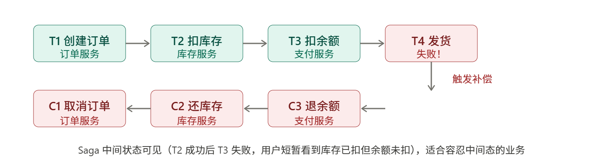

**方案四：基于消息的最终一致性（最轻量，最常用）**

```java
// 下单服务：本地事务 + 发消息原子完成（RocketMQ 事务消息）
@Transactional
public void createOrder(Order order) {
    // 1. 本地事务：写订单 + 写消息表（同一个 DB 事务）
    orderMapper.insert(order);
    messageMapper.insert(new Message("inventory.deduct", order));
}

// 消息轮询器：定时扫描未发送消息，投递到 MQ
@Scheduled(fixedRate = 1000)
public void relay() {
    List<Message> pending = messageMapper.findPending();
    pending.forEach(msg -> {
        mqProducer.send(msg);
        messageMapper.markSent(msg.getId());
    });
}

// 库存服务消费：幂等处理，失败自动重试
@MQListener("inventory.deduct")
public void deductStock(Message msg) {
    if (processedIds.contains(msg.getId())) return;  // 幂等
    inventoryMapper.deduct(msg.getProductId(), msg.getCount());
    processedIds.add(msg.getId());
}
```

**选型决策树**：

```
强一致性需求（金融转账、库存强扣）
    └─ 单库跨表 → 本地事务
    └─ 同构跨库 → XA / Seata AT
    └─ 跨服务   → TCC（侵入性高但一致性强）

最终一致性需求（积分、通知、日志）
    └─ 简单场景 → 消息表 + 消息队列
    └─ 长流程   → Saga（Seata Saga 模式）
```

------

#### 2. 服务雪崩效应

**本质**：微服务调用链中，下游服务响应变慢或不可用，上游服务线程阻塞等待，线程池耗尽后上游也不可用，故障从链路末端逐级向上扩散，最终整个系统崩溃。

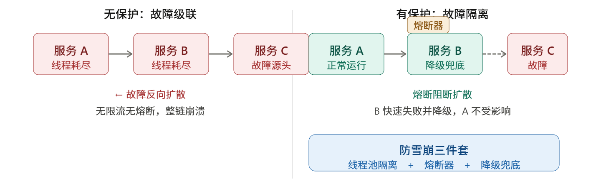

**线程池隔离**是雪崩防护的基础——为每个下游服务分配独立线程池，C 服务故障只会耗尽"调用 C 的线程池"，不影响调用 A、B 的线程池：

```java
// Resilience4j 线程池隔离（Bulkhead）
BulkheadConfig config = BulkheadConfig.custom()
    .maxConcurrentCalls(20)          // 最大并发调用数
    .maxWaitDuration(Duration.ofMillis(100))  // 等待超时
    .build();

Bulkhead bulkhead = Bulkhead.of("serviceC", config);

// 调用 C 服务时通过 Bulkhead 包装
Supplier<Response> supplier = Bulkhead.decorateSupplier(bulkhead,
    () -> serviceCClient.call(request));

Try.ofSupplier(supplier)
   .recover(BulkheadFullException.class, ex -> fallback());
```

**舱壁模式（Bulkhead）** 与熔断器的区别：熔断器感知错误率（服务是否健康），舱壁控制并发量（资源隔离）。两者应同时使用。

------

#### 3. 调用链超时累加

**本质**：A→B→C→D 的调用链，每层都设置了独立超时，总体响应时间是各层超时之和。当 D 响应慢时，C 等待 D 超时，B 等待 C 超时……上游线程被一路阻塞，大量请求堆积。

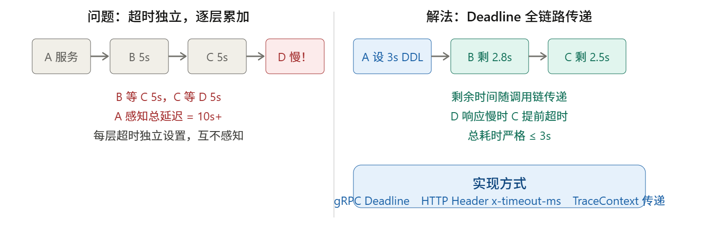

**Deadline 传递实现**：

```java
// 在 TraceContext 中携带截止时间
public class DeadlineContext {
    private static final ThreadLocal<Long> DEADLINE = new ThreadLocal<>();

    public static void set(long deadlineMs) { DEADLINE.set(deadlineMs); }
    public static long get() {
        return DEADLINE.get() != null ? DEADLINE.get() : Long.MAX_VALUE;
    }
    public static long remaining() {
        return Math.max(0, get() - System.currentTimeMillis());
    }
}

// HTTP 调用时传递剩余时间
public Response callDownstream(Request req) {
    long remaining = DeadlineContext.remaining();
    if (remaining <= 50) throw new DeadlineExceededException("已无足够时间");

    return httpClient.newCall(req)
        .header("x-deadline-ms", String.valueOf(System.currentTimeMillis() + remaining))
        .timeout(remaining, TimeUnit.MILLISECONDS)
        .execute();
}

// 下游服务拦截器读取 Deadline
@Component
public class DeadlineInterceptor implements HandlerInterceptor {
    public boolean preHandle(HttpServletRequest req, ...) {
        String deadline = req.getHeader("x-deadline-ms");
        if (deadline != null) DeadlineContext.set(Long.parseLong(deadline));
        return true;
    }
}
```

**重试策略与超时的联动**：重试本身会放大超时累加，必须在剩余 Deadline 内才重试：

```java
// 只在有足够剩余时间时才重试
for (int i = 0; i < maxRetries; i++) {
    if (DeadlineContext.remaining() < minRetryTimeMs) break;  // 剩余时间不足，放弃重试
    try {
        return doCall();
    } catch (RetryableException e) {
        Thread.sleep(backoff(i));
    }
}
```

------

#### 4. 注册中心/配置中心不可用

注册中心和配置中心是微服务的"神经中枢"，故障影响面极广但又常被忽视。

**注册中心故障的三种表现**：

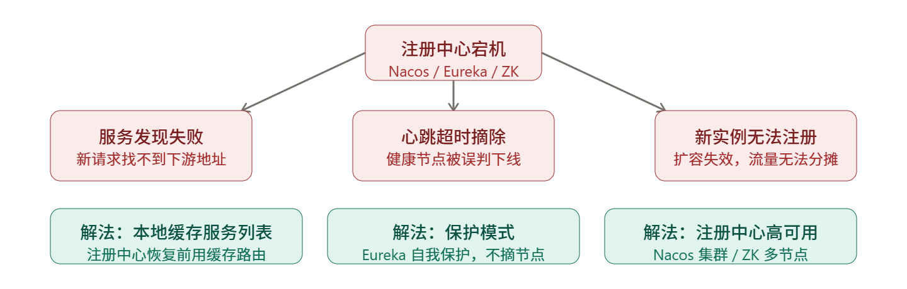

**客户端本地缓存**（最关键的容灾手段）：

```java
// Spring Cloud + Ribbon / LoadBalancer 默认缓存服务列表
# 服务列表刷新间隔（注册中心宕机期间沿用缓存）
ribbon.ServerListRefreshInterval=5000

# Nacos 客户端本地容灾目录（宕机时读磁盘缓存）
nacos.discovery.failover-path=/tmp/nacos/failover
```

**配置中心故障处理**：

```java
// Spring Cloud Config：启动时配置中心宕机，应用拒绝启动（默认行为）
// 改为：允许启动，使用本地默认配置
spring:
  cloud:
    config:
      fail-fast: false          # 配置中心不可用时不阻塞启动
      retry:
        max-attempts: 3         # 最多重试 3 次

// Nacos 配置中心：本地快照（snapshot）兜底
# Nacos 客户端自动将配置写入本地磁盘
# 配置中心宕机时自动读取上次的 snapshot，不影响运行中服务
nacos.config.local-cache-path=/tmp/nacos/config
```

**注册中心选型对比**（AP vs CP）：

| 注册中心  | 一致性模型          | 故障表现                         | 适用场景                   |
| --------- | ------------------- | -------------------------------- | -------------------------- |
| Eureka    | AP（自我保护）      | 宕机不摘节点，可能路由到故障实例 | 容忍短暂脏数据，高可用优先 |
| Nacos     | AP（默认）/ CP 可切 | 集群多数节点存活即可用           | 通用，国内主流             |
| ZooKeeper | CP                  | 选主期间服务发现不可用           | 强一致性要求场景           |
| Consul    | CP                  | 同上                             | 多数据中心场景             |

------

#### 5. 脑裂问题

**本质**：集群因网络分区变成两个或多个互不通信的子集群，每个子集群都认为自己是"合法"的主节点，同时对外提供服务，导致数据不一致和冲突写入。

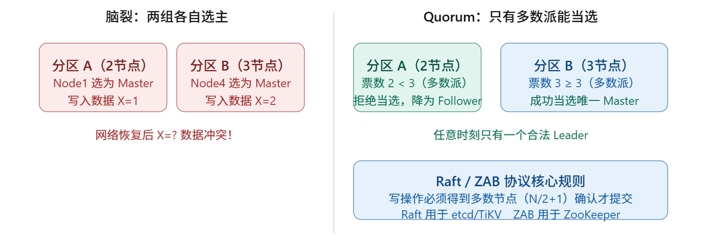

**脑裂的三大发生场景**：

场景一：Redis 哨兵模式误切换。网络抖动导致 Sentinel 认为 Master 宕机，选出新 Master，原 Master 恢复后出现双 Master 同时写入。

```bash
# 缓解：增加哨兵判断次数，减少误判
sentinel down-after-milliseconds mymaster 5000  # 5s 无响应才认为宕机（默认 30s）
sentinel parallel-syncs mymaster 1
# min-slaves-to-write：Master 要求至少 N 个 Slave 同步才接受写入
# 网络分区时，孤立 Master 因无 Slave 而拒绝写入，避免脑裂写入
min-slaves-to-write 1
min-slaves-max-lag 10
```

场景二：Elasticsearch 集群脑裂。早期版本 `discovery.zen.minimum_master_nodes` 设置不当：

```yaml
# ES 7.x+ 已自动处理，旧版本需手动配置
discovery.zen.minimum_master_nodes: 2  # 3节点集群设为 2（N/2+1）
```

场景三：Kubernetes 双活切换过于激进。Node 网络抖动时，Pod 被快速调度到其他节点，原节点恢复后同一 Pod 在两个节点运行。

```yaml
# K8s：配合 Pod Disruption Budget 和 terminationGracePeriodSeconds
# 避免过于激进的驱逐策略
spec:
  terminationGracePeriodSeconds: 60    # 给原 Pod 充分时间退出
```

**脑裂的终极防御**：STONITH（Shoot The Other Node In The Head）——主动隔离机制，确保只有一个节点存活。Pacemaker 等高可用框架支持通过电源控制器远程关机另一节点，彻底避免双写。

------

#### 五类问题速查对照

| 问题           | 核心危害                     | 诊断信号                | 首选解法                               |
| -------------- | ---------------------------- | ----------------------- | -------------------------------------- |
| 分布式事务     | 跨服务数据不一致             | 订单/库存/余额对不上    | 最终一致（消息表）；强一致用 TCC/Seata |
| 服务雪崩       | 单点故障扩散全链路           | 错误率从下游向上蔓延    | 线程池隔离 + 熔断 + 降级               |
| 超时累加       | 上游线程大量阻塞             | 响应时间 = 各层超时之和 | Deadline 全链路传递                    |
| 注册中心不可用 | 服务发现失败，扩容失效       | 服务间调用报连接拒绝    | 客户端本地缓存 + 注册中心集群          |
| 脑裂           | 双 Master 冲突写入，数据损坏 | 集群出现两个 Leader     | Quorum 多数派 + min-slaves-to-write    |

------

想深入哪个方向？比如 Seata AT 模式的 Undo Log 实现原理、Raft 协议选举流程的完整推导，或 Nacos 集群在网络分区下的实际行为验证？

### 十二、业务逻辑层问题

- 幂等性未保证（重复请求）
- 超卖（库存并发扣减）
- 接口设计不合理（大事务/同步转异步缺失）
- 批量操作未分批处理

#### 先看全局：四类问题的本质分类---


#### 1. 幂等性未保证（重复请求）

**本质**：同一个操作被执行多次，与执行一次的最终结果不同。高并发下重复请求的来源极多——用户双击、前端重试、网络超时后客户端重发、MQ 消息重投、Feign 超时重试——任何一个都可能触发重复执行。

**幂等失效的典型场景**：

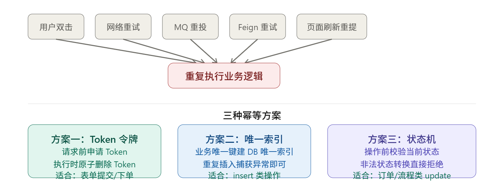

**方案一：Token 令牌（防重令牌）**

```java
// 第一步：页面加载时申请 Token，存入 Redis
public String applyToken(Long userId) {
    String token = UUID.randomUUID().toString();
    redis.set("idempotent:" + userId + ":" + token, "1", 600, TimeUnit.SECONDS);
    return token;  // 返回给前端，放入请求头
}

// 第二步：执行业务时原子删除 Token
public OrderResult createOrder(CreateOrderRequest req) {
    String tokenKey = "idempotent:" + req.getUserId() + ":" + req.getToken();

    // Lua 脚本：原子性判断+删除，防止并发竞争
    String lua = "if redis.call('get',KEYS[1]) then " +
                 "  return redis.call('del',KEYS[1]) " +
                 "else return 0 end";
    Long deleted = redis.execute(lua, List.of(tokenKey));

    if (deleted == 0) throw new RepeatRequestException("请勿重复提交");

    return doCreateOrder(req);  // Token 删除成功才执行业务
}
```

**方案二：唯一索引（最简单，最稳固）**

```sql
-- 业务唯一键建唯一索引（订单号、流水号、消息ID）
ALTER TABLE orders ADD UNIQUE INDEX uk_order_no (order_no);
ALTER TABLE pay_records ADD UNIQUE INDEX uk_msg_id (message_id);
public void processPayment(PayMessage msg) {
    try {
        payRecordMapper.insert(new PayRecord(msg.getMessageId(), msg.getAmount()));
        doCharge(msg);  // 插入成功才执行扣款
    } catch (DuplicateKeyException e) {
        log.info("重复消息，已幂等跳过: {}", msg.getMessageId());
        // 不抛异常，让 MQ 正常 ACK
    }
}
```

**方案三：状态机校验（更新场景的核心）**

```java
// 订单状态：CREATED → PAID → SHIPPED → DONE
// 每个状态转换都有合法的前置状态
public void payOrder(Long orderId) {
    Order order = orderMapper.selectForUpdate(orderId);  // 加锁读

    // 状态机校验：只有 CREATED 状态才能支付
    if (order.getStatus() != OrderStatus.CREATED) {
        log.info("订单 {} 当前状态 {}，跳过重复支付", orderId, order.getStatus());
        return;  // 幂等返回，不报错
    }

    // 原子更新：WHERE status = CREATED（乐观锁思想）
    int rows = orderMapper.updateStatus(orderId, CREATED, PAID);
    if (rows == 0) return;  // 并发情况下被其他线程先执行，幂等跳过

    doPayment(order);
}
```

**幂等设计的黄金原则**：

```
GET 请求天然幂等（只读不写）
DELETE 请求设计为幂等（删除不存在的资源返回 200/204，不报 404）
PUT 请求设计为幂等（全量替换，重复执行结果相同）
POST 请求必须主动设计幂等（创建操作，默认不幂等）
```

------

#### 2. 超卖（库存并发扣减）

**本质**：多个线程同时读到相同库存余量，各自判断"库存充足"并执行扣减，最终库存变为负数。这是最典型的"先读后写"竞态条件。

**超卖的完整演化路径与对应解法**：

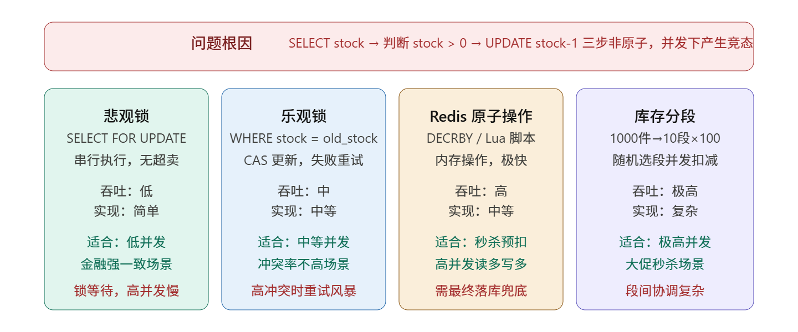

**方案一：悲观锁**

```java
@Transactional
public boolean deductStock(Long productId, int count) {
    // FOR UPDATE 锁定该行，其他事务等待
    Product product = productMapper.selectByIdForUpdate(productId);
    if (product.getStock() < count) return false;  // 库存不足
    productMapper.deductStock(productId, count);
    return true;
}
-- 关键：WHERE 条件必须命中索引，否则退化为表锁
SELECT * FROM inventory WHERE product_id = ? FOR UPDATE;
UPDATE inventory SET stock = stock - ? WHERE product_id = ?;
```

**方案二：乐观锁（带库存检查的 CAS）**

```java
public boolean deductStock(Long productId, int count) {
    for (int retry = 0; retry < 3; retry++) {
        Product p = productMapper.selectById(productId);
        if (p.getStock() < count) return false;

        // WHERE stock >= count 防止库存变负，同时作为乐观锁条件
        int rows = productMapper.casDeduct(productId, p.getStock(), count);
        if (rows > 0) return true;

        // CAS 失败说明被其他事务修改，短暂等待后重试
        LockSupport.parkNanos(TimeUnit.MILLISECONDS.toNanos(10));
    }
    return false;  // 重试耗尽，认为失败
}
UPDATE inventory
SET stock = stock - #{count}
WHERE product_id = #{productId}
  AND stock = #{oldStock}    -- 乐观锁
  AND stock >= #{count}      -- 防止负库存（双重保险）
```

**方案三：Redis Lua 脚本原子预扣（秒杀核心方案）**

```lua
-- 原子判断+扣减，Redis 单线程保证无竞态
local stock = tonumber(redis.call('get', KEYS[1]))
local count = tonumber(ARGV[1])
if stock == nil then return -1 end   -- key 不存在
if stock < count then return -2 end  -- 库存不足
redis.call('decrby', KEYS[1], count)
return stock - count                 -- 返回剩余库存
public boolean preDeductStock(Long productId, int count) {
    String key = "stock:" + productId;
    Long result = redis.execute(deductScript, List.of(key), String.valueOf(count));
    if (result == null || result < 0) return false;

    // 异步落库（Redis 预扣成功后，异步写 DB）
    asyncOrderService.persistOrder(productId, count);
    return true;
}
```

**方案四：库存分段**（极高并发，详见缓存热点倾斜章节）。

**最佳实践——分层防御**：

```
第一层：Redis 预扣（拦截 99% 无效请求，极高性能）
    ↓ 预扣成功
第二层：DB 乐观锁落库（保证数据最终正确）
    ↓ 落库成功
第三层：对账任务（定时校验 Redis 与 DB 库存一致性）
```

------

#### 3. 接口设计不合理

**本质**：接口设计时没有考虑高并发场景，导致单次请求持有资源时间过长（大事务）或调用方被迫同步等待耗时操作（缺少异步化），在高流量下成为性能瓶颈。


**大事务的七宗罪**：

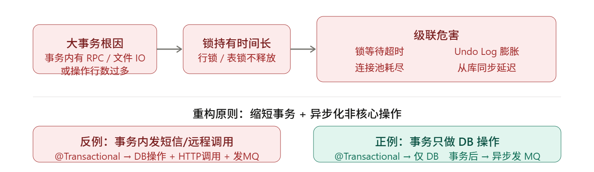

**大事务重构代码示例**：

```java
// ❌ 反例：一个方法承担过多，事务跨越 RPC 和消息发送
@Transactional
public void createOrder(CreateOrderRequest req) {
    orderMapper.insert(order);           // DB 操作
    inventoryMapper.deduct(req);         // DB 操作
    String result = rpcClient.verify(req);   // ← 远程调用，网络耗时，持锁等待！
    emailService.sendConfirm(req);           // ← 邮件服务可能超时，持锁！
    mqProducer.send("order.created", order); // ← MQ 发送，持锁！
}

// ✅ 正例：事务只包含最小必要的 DB 操作
public void createOrder(CreateOrderRequest req) {
    // 1. 事务前：做不需要事务保护的操作
    String verifyResult = rpcClient.verify(req);  // 远程验证移到事务外

    // 2. 最小事务：只包含 DB 写操作
    Order order = doCreateOrderInTx(req);

    // 3. 事务后：异步处理非核心逻辑
    applicationEventPublisher.publishEvent(new OrderCreatedEvent(order));
}

@Transactional
public Order doCreateOrderInTx(CreateOrderRequest req) {
    Order order = orderMapper.insert(buildOrder(req));
    inventoryMapper.deduct(req.getProductId(), req.getCount());
    return order;
    // 方法结束即提交，锁立即释放
}

// 异步监听器处理非核心操作
@EventListener
@Async
public void onOrderCreated(OrderCreatedEvent event) {
    emailService.sendConfirm(event.getOrder());   // 异步发邮件
    mqProducer.send("order.created", event.getOrder()); // 异步发 MQ
}
```

**同步转异步的判断标准**：

```
操作是否是用户等待响应的必要路径？
    ├── 是 → 保持同步（下单核心逻辑、支付验证）
    └── 否 → 转为异步（发邮件、发短信、更新统计、同步搜索引擎）

操作失败是否会影响主流程的正确性？
    ├── 是 → 保持同步，或用分布式事务保证一致性
    └── 否 → 转为异步，允许最终一致
```

**接口设计的其他常见缺陷**：

返回大对象未分页。`SELECT * FROM orders WHERE user_id = ?` 不加 LIMIT，用户历史订单几千条全量返回，序列化为 JSON 几 MB，网络传输和 GC 压力极大。所有列表接口强制分页，单页不超过 100 条。

嵌套循环调用下游服务。循环内逐条查询，`for (order : orders) { rpcClient.getProduct(order.productId); }` 触发 N 次 RPC。改为批量接口 `getProductBatch(ids)`，一次 RPC 获取所有数据。

------

#### 4. 批量操作未分批处理

**本质**：对大数据量（万行乃至百万行）进行一次性 DB 操作或内存加载，导致：单事务持锁时间过长、内存 OOM、SQL 超时、从库延迟剧增。

**三类典型场景与分批方案**：

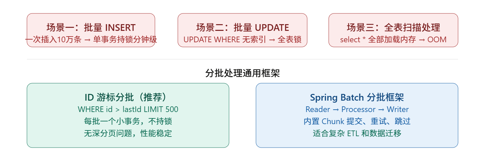

**场景一：批量 INSERT 分批提交**

```java
// ❌ 反例：10万条数据一个事务
@Transactional
public void batchInsert(List<Order> orders) {
    orderMapper.batchInsert(orders);  // 10万条，单事务持锁数分钟
}

// ✅ 正例：分批提交，每批500条一个事务
public void batchInsertSafe(List<Order> orders) {
    int batchSize = 500;
    List<List<Order>> partitions = Lists.partition(orders, batchSize);

    for (List<Order> batch : partitions) {
        batchInsertOneBatch(batch);    // 每个方法调用是独立事务
        TimeUnit.MILLISECONDS.sleep(10); // 批次间短暂休眠，让从库喘息
    }
}

@Transactional(propagation = Propagation.REQUIRES_NEW)  // 新事务，立即提交
public void batchInsertOneBatch(List<Order> batch) {
    orderMapper.batchInsert(batch);
}
```

**场景二：大表全量更新分批游标**

```java
// ❌ 反例：一条 SQL 更新全表
UPDATE orders SET status = 'ARCHIVED' WHERE created_at < '2023-01-01';
// 可能锁住几百万行，导致主从延迟几小时

// ✅ 正例：ID 游标分批更新
public void archiveOldOrders() {
    long lastId = 0;
    int batchSize = 1000;

    while (true) {
        // 每批查出待更新的 ID
        List<Long> ids = orderMapper.findOldOrderIds(lastId, batchSize);
        if (ids.isEmpty()) break;

        orderMapper.archiveByIds(ids);           // 只锁这批行
        lastId = Collections.max(ids);

        log.info("已归档到 id={}", lastId);
        TimeUnit.MILLISECONDS.sleep(50);         // 让从库追上来
    }
}
-- 关键：用 id 游标而非 LIMIT offset（避免深分页）
SELECT id FROM orders
WHERE id > #{lastId} AND created_at < '2023-01-01'
ORDER BY id LIMIT #{batchSize}
```

**场景三：全表数据处理防 OOM**

```java
// ❌ 反例：全量加载到内存
List<User> allUsers = userMapper.selectAll();  // 100万用户，直接 OOM
allUsers.forEach(this::process);

// ✅ 正例一：流式查询（MyBatis Cursor）
@Options(resultSetType = ResultSetType.FORWARD_ONLY, fetchSize = 100)
@Select("SELECT * FROM users WHERE status = 'ACTIVE'")
Cursor<User> streamUsers();

public void processAllUsers() {
    try (Cursor<User> cursor = userMapper.streamUsers()) {
        cursor.forEach(user -> {
            process(user);
            // 每次只在内存中保留一条，GC 可及时回收
        });
    }
}

// ✅ 正例二：Spring Batch Chunk 模式（生产级推荐）
@Bean
public Step archiveStep() {
    return stepBuilderFactory.get("archiveStep")
        .<Order, ArchivedOrder>chunk(500)           // 每 500 条一个 Chunk
        .reader(orderItemReader())                   // 游标读
        .processor(orderItemProcessor())             // 转换逻辑
        .writer(archivedOrderWriter())               // 批量写
        .faultTolerant()
        .retry(DeadlockLoserDataAccessException.class)
        .retryLimit(3)
        .skip(DataIntegrityViolationException.class) // 跳过脏数据
        .skipLimit(100)
        .build();
}
```

**分批处理的通用参数调优**：

```java
// 批次大小选取原则
// 单批 SQL 大小 < 4MB（MySQL max_allowed_packet 默认 4MB）
// 单批耗时 < 1s（控制锁持有时间，让从库追得上）
// 通常 INSERT 批次：500~1000 条
// UPDATE/DELETE 批次：200~500 条（涉及行锁，更保守）

// 批次间隔原则
// 主从延迟 Seconds_Behind_Master > 10s 时，暂停批处理等待从库
// 可监控 Seconds_Behind_Master 动态调整间隔
```

------

#### 四类问题速查对照

| 问题           | 核心危害                        | 诊断信号                 | 首选解法                           |
| -------------- | ------------------------------- | ------------------------ | ---------------------------------- |
| 幂等性未保证   | 重复扣款/重复创建，数据错误     | 相同订单号出现多条记录   | Token 令牌 / 唯一索引 / 状态机校验 |
| 超卖           | 库存为负，业务损失              | inventory.stock < 0      | Redis Lua 预扣 + DB 乐观锁兜底     |
| 接口设计不合理 | 大事务拖垮 DB，同步等待耗时     | 慢事务 + 连接池耗尽      | 最小事务 + 事务后异步处理          |
| 批量未分批     | 单事务 OOM / DB 超时 / 从库延迟 | 单次 SQL 影响行数 > 万行 | ID 游标分批 + 批次间休眠           |

------

### 十二类问题全图总结

至此，Java 高并发服务稳定性十二大类问题全部完成。整体形成三个防护圈：

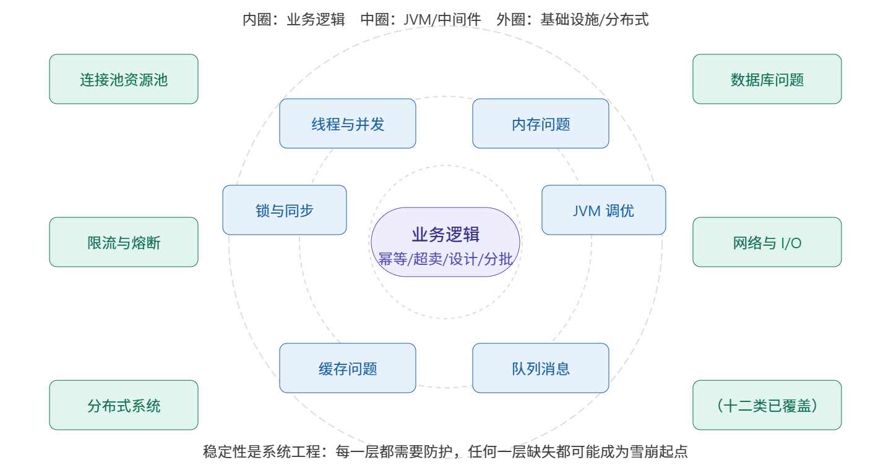

十二类问题全部完成。整体体系从最底层的 JVM/线程，到中间件层的缓存/队列/连接池，到分布式层的一致性/熔断/注册中心，最终到业务逻辑层的幂等/超卖，形成完整的高并发稳定性知识图谱。

想对哪个专题做更深入的展开，或者针对某个具体业务场景做综合方案设计？