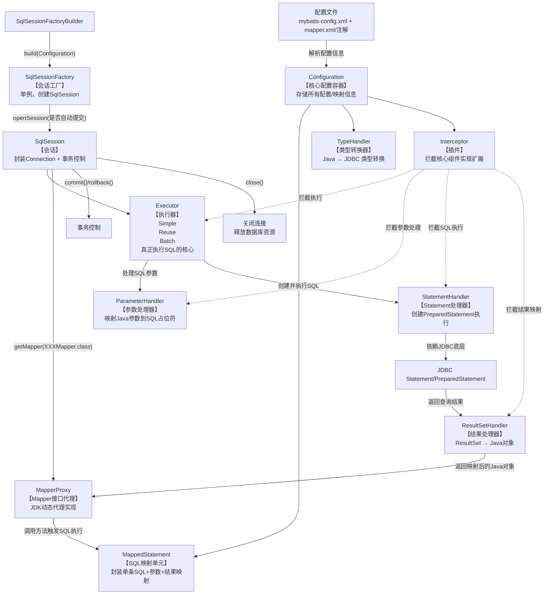
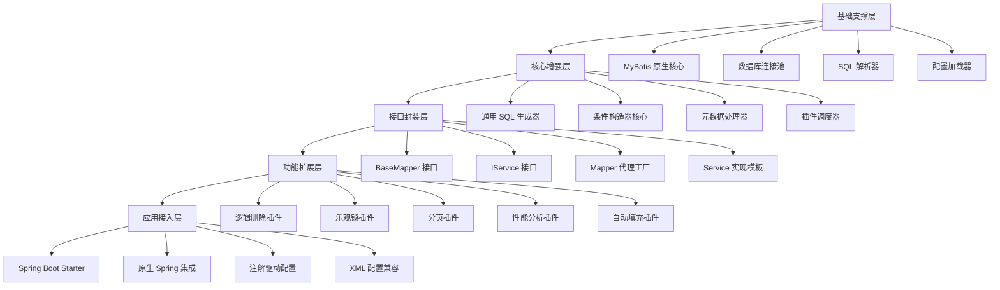

# Mybatis

------

## 一、基础概念

1. **什么是 MyBatis？它和 Hibernate 有什么区别？**
   - MyBatis 是半自动 ORM 框架，需要手动编写 SQL；Hibernate 是全自动 ORM，会自动生成 SQL。
   - MyBatis 灵活、可控，适合复杂 SQL；Hibernate 开发快，但 SQL 不透明。
2. **MyBatis 的工作原理是什么？**
   - 核心流程：`SqlSessionFactoryBuilder → SqlSessionFactory → SqlSession → Mapper接口 → 执行SQL → 映射结果`。
   - 使用 XML 或注解定义 SQL，框架负责参数映射和结果映射。
3. **MyBatis 的主要组件有哪些？**
   - `SqlSessionFactory`、`SqlSession`、`Executor`、`MappedStatement`、`Configuration`、`MapperProxy` 等。
4. **MyBatis 中的 Mapper 文件主要包括哪些标签？**
   - `<select>`, `<insert>`, `<update>`, `<delete>`, `<resultMap>`, `<parameterMap>`, `<sql>`, `<include>`。
5. **MyBatis 的配置文件 mybatis-config.xml 有哪些重要节点？**
   - `<environments>`, `<mappers>`, `<typeAliases>`, `<plugins>`, `<settings>`, `<typeHandlers>`。


### 1. **什么是 MyBatis？它和 Hibernate 有什么区别？**

**要点：**

- **MyBatis** 是一个半自动的持久层框架（半 ORM / SQL 映射框架）。开发者需要自己编写 SQL（XML 或注解），MyBatis 负责参数绑定、执行 SQL、以及将结果映射成 Java 对象。
- **Hibernate** 是一个全自动的 ORM（对象-关系映射）框架，基于实体类与映射配置（或注解）自动生成 SQL 并负责对象的持久化、关系管理与对象状态跟踪。

**优缺点对比（常考点）：**

- **可控性**：MyBatis 更灵活、SQL 可读可控，适合复杂 SQL、报表、性能调优场景；Hibernate 更“省事”，自动生成 SQL，适合 CRUD 密集、业务 CRUD 与对象模型高度一致的场景。
- **开发效率**：Hibernate 在简单 CRUD 场景下开发效率高；MyBatis 在复杂 SQL 场景下能减少 SQL 问题但需要手写 SQL，开发量较大。
- **学习成本**：Hibernate 学习曲线较陡（Session 管理、级联、缓存、延迟加载策略等）；MyBatis 学起来更直观（熟悉 SQL 即可）。
- **性能与优化**：MyBatis 易于针对 SQL 做精细优化；Hibernate 需要理解执行计划与 N+1 问题并做好配置/查询策略。

**面试延伸常见题点：**

- 何时选 MyBatis？（复杂查询、精确 SQL 控制、与现有 SQL 兼容）
- 何时选 Hibernate？（领域模型显著、对象关系简单、快速开发）

------

### 2. **MyBatis 的工作原理是什么？**

#### Mybatis编程步骤 ？

1.创建SqlSessionFactory
2.通过SqlSessionFactory创建SqlSession
3.通过SqlSession执行数据库操作
4.调用SqlSession的commit()方法提交事务
5.调用SqlSession的close()方法关闭会话

**关键流程（高层次）：**

1. **读取配置与映射文件**：MyBatis 读取 `mybatis-config.xml` 与 mapper XML/注解，构建 `Configuration` 对象。
2. **构建 SqlSessionFactory**：`SqlSessionFactoryBuilder` 根据配置创建 `SqlSessionFactory`（工厂，用于产生 SqlSession）。
3. **获取 SqlSession（类似 JDBC Connection）**：通过 `SqlSessionFactory.openSession()` 得到 `SqlSession`，它封装了数据库连接与事务控制。
4. **获取 Mapper**：使用 `sqlSession.getMapper(YourMapper.class)` 得到 Mapper 接口的代理（`MapperProxy`）。
5. **执行 SQL**：调用 Mapper 方法触发 `MappedStatement` 的执行，MyBatis 映射参数到 SQL（使用 `ParameterHandler`），并通过 `Executor` 调用 JDBC 执行。
6. **结果映射**：`ResultSetHandler` 把 `ResultSet` 映射成指定的 Java 对象（基于 `resultType` 或 `resultMap`）。
7. **提交/回滚/关闭**：SqlSession 控制事务提交或回滚，并关闭连接。

**补充概念：**

- `MappedStatement`：每条 SQL 对应的信息（SQL 文本、参数类型、结果映射等）。
- `Executor`：真正执行 SQL 的策略层（SimpleExecutor、ReuseExecutor、BatchExecutor）。
- `TypeHandler`：Java 类型与 JDBC 类型的转换器。
- `Interceptor`（插件）：可以拦截 Executor/StatementHandler/ParameterHandler/ResultSetHandler 的方法，实现扩展（如分页、日志、审计）。
- **ResultSet**中记录行第一列的索引为1,这是JDBC规范明确规定的。JDBC采用从1开始的列索引计数方式,这与数据库中的列计数方式保持一致。

**示例（简化调用链）：**

```java
SqlSessionFactory factory = new SqlSessionFactoryBuilder().build(reader);
try (SqlSession session = factory.openSession()) {
    UserMapper mapper = session.getMapper(UserMapper.class);
    User u = mapper.selectById(1);
    session.commit();
}
```


MyBatis 的工作原理基于对 JDBC 的封装与优化，通过配置文件和映射关系将 SQL 语句与 Java 方法绑定，简化数据库操作。其核心流程可分为 **初始化** 和 **执行 SQL** 两大阶段，具体如下：

#### **一、初始化阶段：加载配置并构建核心组件**

MyBatis 启动时会加载所有配置信息，解析为内存中的对象，为后续 SQL 执行做准备。

1. **加载配置文件**  
   - 读取 **全局配置文件**（如 `mybatis-config.xml`）：包含数据源（DataSource）、事务管理器（TransactionManager）、类型别名、插件等全局配置。  
   - 读取 **映射文件**（如 `UserMapper.xml`）或 **注解映射**（如 `@Select`）：包含 SQL 语句、参数映射、结果集映射等信息。  

2. **解析配置并构建核心对象**  
   - **`Configuration` 对象**：MyBatis 的核心配置容器，存储所有解析后的配置信息（数据源、映射语句、类型转换器等），贯穿整个生命周期。  
   - **`SqlSessionFactory` 工厂**：通过 `SqlSessionFactoryBuilder` 解析 `Configuration` 后创建，是生成 `SqlSession` 的工厂类（单例存在，线程安全）。  

#### **二、执行 SQL 阶段：通过 SqlSession 完成数据库操作**

当调用 Mapper 接口方法执行 SQL 时，MyBatis 会经历以下步骤：

1. **获取 `SqlSession`**  
   - 通过 `SqlSessionFactory.openSession()` 创建 `SqlSession` 对象，它是 MyBatis 与数据库交互的会话接口，封装了执行 SQL、获取 Mapper、事务管理（`commit`/`rollback`）等方法。  
   - `SqlSession` 依赖 `Executor`（执行器）完成实际操作，默认使用 `SimpleExecutor`，可通过配置切换为批量执行器（`BatchExecutor`）等。

2. **获取 Mapper 代理对象**  
   - 调用 `sqlSession.getMapper(UserMapper.class)` 时，MyBatis 会通过 **JDK 动态代理** 生成 Mapper 接口的代理对象（`MapperProxy`）。  
   - 代理对象的作用：拦截 Mapper 接口方法调用，将方法映射到对应的 SQL 语句。

3. **解析 Mapper 方法，生成 `MappedStatement`**  
   - 代理对象根据方法名（如 `UserMapper.selectById`）在 `Configuration` 中查找对应的 `MappedStatement`（封装了 SQL 语句、参数类型、结果类型等信息）。  
   - 例如，`UserMapper.xml` 中 `<select id="selectById">` 标签会被解析为 `MappedStatement`，与 `selectById` 方法绑定。

4. **参数处理与 SQL 拼接**  
   - **参数映射**：根据 `MappedStatement` 中的参数配置（如 `#{id}`），将 Java 方法参数（如 `1L`）转换为 SQL 所需的参数（通过 `TypeHandler` 处理类型转换，如 Integer → VARCHAR）。  
   - **动态 SQL 解析**：若 SQL 包含 `<if>`、`<where>` 等动态标签，MyBatis 会根据参数值动态拼接 SQL 语句（如 `WHERE id = ?`）。

5. **执行 SQL 并处理结果**  
   - `Executor` 调用 JDBC 的 `PreparedStatement` 执行 SQL（通过数据源获取数据库连接）。  
   - **结果映射**：将数据库返回的 `ResultSet` 转换为 Java 对象（如 `User`），通过 `ResultMap` 配置映射字段（如数据库 `user_name` → 实体 `userName`），同样依赖 `TypeHandler` 处理类型转换。

6. **事务管理**  
   - 若手动管理事务，需通过 `sqlSession.commit()` 提交或 `rollback()` 回滚；若使用 Spring 集成，事务由 Spring 管理，MyBatis 适配 Spring 的事务机制。

7. **关闭 `SqlSession`**  
   - 操作完成后，`SqlSession` 需关闭（或通过 Spring 自动管理），释放数据库连接（回归连接池）。

#### **三、核心组件总结**

| 组件               | 作用                                  |
|--------------------|---------------------------------------|
| `Configuration`    | 存储全局配置和映射信息，MyBatis 核心  |
| `SqlSessionFactory`| 生成 `SqlSession` 的工厂，单例线程安全 |
| `SqlSession`       | 数据库会话接口，封装 SQL 执行和事务   |
| `Executor`         | `SqlSession` 的底层执行器，执行 SQL   |
| `MapperProxy`      | Mapper 接口的动态代理，关联方法与 SQL |
| `MappedStatement`  | 封装单条 SQL 语句及配置信息           |
| `TypeHandler`      | 处理 Java 类型与数据库类型的转换       |

#### **总结**

MyBatis 的工作原理可概括为：  
1. **初始化**：加载配置文件 → 解析为 `Configuration` → 创建 `SqlSessionFactory`；  
2. **执行 SQL**：`SqlSession` 获取 Mapper 代理 → 解析方法找到对应 SQL → 处理参数并执行 → 映射结果返回。  

通过这种方式，MyBatis 既保留了 SQL 编写的灵活性，又避免了 JDBC 的重复代码（如连接管理、参数设置、结果转换），实现了“半自动化”的 ORM 映射。

#### MyBatis 核心工作原理关系图（Mermaid 可视化）

以下是覆盖核心组件、执行流程、组件关联的完整关系图，结合流程走向和组件依赖，面试/梳理逻辑都适用：



#### 关系图文字版解读（便于快速理解）

```
┌─────────────────────────────────┐
│ 配置文件：mybatis-config.xml    │
│          mapper.xml/注解        │
└───────────────────┬─────────────┘
                    │ 解析
                    ▼
┌─────────────────────────────────┐
│ Configuration（核心配置容器）    │
│ 包含：MappedStatement/TypeHandler/Interceptor
└───────────────────┬─────────────┘
                    │
┌───────────────────┴─────────────┐
│ SqlSessionFactoryBuilder        │
└───────────────────┬─────────────┘
                    │ build
                    ▼
┌─────────────────────────────────┐
│ SqlSessionFactory（会话工厂）    │
└───────────────────┬─────────────┘
                    │ openSession()
                    ▼
┌─────────────────────────────────┐
│ SqlSession（会话）               │
│ 封装：Connection + 事务 + Executor
└─────────┬─────────────┬─────────┘
          │             │
          │ getMapper() │
          ▼             ▼
┌─────────────────────┐ ┌─────────────────────┐
│ MapperProxy（代理） │ │ Executor（执行器）  │
└─────────┬───────────┘ └─────────┬───────────┘
          │                       │
          │ 触发MappedStatement   │ 处理参数/执行SQL
          ▼                       ▼
┌─────────────────────┐ ┌─────────────────────┐
│ MappedStatement     │ │ ParameterHandler    │
└─────────────────────┘ └─────────┬───────────┘
                                  │
                                  ▼
┌─────────────────────────────────┐
│ StatementHandler（JDBC Statement）│
└───────────────────┬─────────────┘
                    │ 执行SQL返回ResultSet
                    ▼
┌─────────────────────────────────┐
│ ResultSetHandler（结果映射）     │
└───────────────────┬─────────────┘
                    │ 映射为Java对象
                    ▼
┌─────────────────────────────────┐
│ 返回结果到Mapper方法调用处       │
└─────────────────────────────────┘

【扩展】Interceptor（插件）可拦截Executor/StatementHandler/ParameterHandler/ResultSetHandler
```

##### 核心组件关联说明（对应图中节点）

| 组件              | 核心作用                                    | 与其他组件的关联                                   |
| ----------------- | ------------------------------------------- | -------------------------------------------------- |
| Configuration     | 全局配置容器，存储所有MyBatis配置和映射信息 | 被SqlSessionFactoryBuilder读取，供所有核心组件使用 |
| SqlSessionFactory | 单例工厂，生产SqlSession                    | 由Builder基于Configuration构建                     |
| SqlSession        | 数据库会话，封装连接和事务                  | 从Factory获取，创建Mapper代理、持有Executor        |
| MapperProxy       | Mapper接口的JDK动态代理实现                 | 代理Mapper方法调用，触发MappedStatement执行        |
| MappedStatement   | 单条SQL的封装（SQL文本+参数+结果映射）      | 由Configuration加载，被Executor执行                |
| Executor          | SQL执行器（真正执行SQL的核心）              | 由SqlSession创建，调用StatementHandler执行SQL      |
| ParameterHandler  | 参数处理器                                  | 由Executor调用，将Java参数映射到SQL占位符          |
| StatementHandler  | JDBC Statement处理器                        | 创建PreparedStatement，执行SQL并返回ResultSet      |
| ResultSetHandler  | 结果处理器                                  | 将ResultSet映射为Java对象（resultType/resultMap）  |
| TypeHandler       | 类型转换器                                  | 辅助ParameterHandler/ResultSetHandler完成类型转换  |
| Interceptor       | 插件扩展                                    | 拦截核心组件的方法，实现分页/日志等扩展            |

#### 核心总结

1. **流程核心**：配置加载 → 工厂构建 → 会话创建 → Mapper代理 → SQL执行 → 结果映射，全程围绕 `Configuration` 作为核心配置容器；
2. **组件依赖**：`SqlSession` 是入口，`Executor` 是执行核心，`MappedStatement` 是SQL映射单元，四大处理器（Parameter/Statement/ResultSet/TypeHandler）完成参数/结果的核心处理；
3. **扩展能力**：通过 `Interceptor` 拦截四大核心处理器，可灵活扩展MyBatis功能（如分页插件、通用CRUD）；
4. **底层依赖**：最终通过JDBC的Statement/PreparedStatement执行SQL，本质是对JDBC的封装和简化。

### MyBatis Interceptor（拦截器）详解

#### 一、Interceptor 核心概念

`Interceptor` 本质是 MyBatis 提供的**插件扩展接口**，它基于**动态代理**实现，可以拦截 MyBatis 四大核心组件的方法调用：

1. **Executor**：执行器，负责 SQL 执行的核心逻辑（查询、更新、事务等）
2. **StatementHandler**：处理 SQL 语句的预编译、参数设置、执行等
3. **ParameterHandler**：处理 SQL 参数的映射（Java 类型 → JDBC 类型）
4. **ResultSetHandler**：处理结果集的映射（JDBC 结果集 → Java 对象）

#### 二、Interceptor 工作方式
1. **定义拦截器**：实现 `org.apache.ibatis.plugin.Interceptor` 接口，并通过 `@Intercepts` + `@Signature` 注解指定要拦截的对象和方法。
2. **注册拦截器**：在 `mybatis-config.xml` 中配置拦截器，MyBatis 启动时会加载并初始化。
3. **动态代理增强**：MyBatis 会为被拦截的组件创建代理对象，调用目标方法时会先执行拦截器的逻辑，再执行原方法。

#### 三、实战示例：自定义分页拦截器
这是 Interceptor 最典型的应用场景（MyBatis 分页插件如 PageHelper 就是基于此实现）：

```java
import org.apache.ibatis.executor.Executor;
import org.apache.ibatis.mapping.MappedStatement;
import org.apache.ibatis.plugin.*;
import org.apache.ibatis.session.ResultHandler;
import org.apache.ibatis.session.RowBounds;

import java.util.Properties;

// 注解指定要拦截的对象和方法
@Intercepts({
    @Signature(
        type = Executor.class,       // 拦截 Executor 接口
        method = "query",            // 拦截 query 方法
        args = {MappedStatement.class, Object.class, RowBounds.class, ResultHandler.class} // 方法参数
    )
})
public class PageInterceptor implements Interceptor {

    // 核心拦截方法：调用目标方法前/后执行自定义逻辑
    @Override
    public Object intercept(Invocation invocation) throws Throwable {
        // 1. 获取拦截的参数
        Object[] args = invocation.getArgs();
        MappedStatement ms = (MappedStatement) args[0];
        Object parameter = args[1];
        RowBounds rowBounds = (RowBounds) args[2];
        
        // 2. 自定义分页逻辑：修改 SQL，添加 LIMIT 条件
        // （实际场景中会解析原 SQL，拼接 LIMIT offset, size）
        String originalSql = ms.getBoundSql(parameter).getSql();
        String pageSql = originalSql + " LIMIT " + rowBounds.getOffset() + ", " + rowBounds.getLimit();
        
        // 3. 替换原 SQL（简化示例，实际需通过反射修改 MappedStatement 中的 SQL）
        // 此处仅为演示，完整实现需封装 BoundSql 和 MappedStatement
        
        // 4. 执行原方法（放行）
        return invocation.proceed();
    }

    // 生成代理对象（MyBatis 内部调用，通常直接返回 Plugin.wrap 即可）
    @Override
    public Object plugin(Object target) {
        return Plugin.wrap(target, this);
    }

    // 设置拦截器参数（可在 mybatis-config.xml 中配置）
    @Override
    public void setProperties(Properties properties) {
        // 例如读取配置的分页默认大小
        String defaultPageSize = properties.getProperty("defaultPageSize");
        System.out.println("默认分页大小：" + defaultPageSize);
    }
}
```

**注册拦截器（mybatis-config.xml）**：
```xml
<configuration>
    <plugins>
        <plugin interceptor="com.example.PageInterceptor">
            <!-- 配置拦截器参数 -->
            <property name="defaultPageSize" value="10"/>
        </plugin>
    </plugins>
</configuration>
```

#### 四、Interceptor 典型应用场景
1. **分页处理**：自动拼接 LIMIT/ROWNUM 等分页条件（PageHelper 核心原理）
2. **SQL 日志打印**：拦截 StatementHandler，记录执行的 SQL 和参数
3. **数据权限控制**：拦截 Executor，动态拼接数据权限过滤条件（如 WHERE org_id = ?）
4. **性能监控**：统计 SQL 执行耗时
5. **参数加密/解密**：拦截 ParameterHandler/ResultSetHandler，处理敏感数据

---

#### 总结

1. **核心定位**：`Interceptor` 是 MyBatis 的扩展插件接口，基于动态代理拦截四大核心组件（Executor/StatementHandler/ParameterHandler/ResultSetHandler）的方法。
2. **使用方式**：实现 `Interceptor` 接口 + 注解指定拦截目标 + 配置文件注册，即可自定义增强逻辑。
3. **典型场景**：分页、日志、权限控制、性能监控等，是 MyBatis 灵活性的核心体现。

### SpringBoot 中 MyBatis 无需 mybatis-config.xml 的原因（核心+原理）

#### 一、核心结论

SpringBoot 中无需显式配置 `mybatis-config.xml`，核心是 **SpringBoot 的「自动配置+属性绑定」机制** 替代了传统 XML 配置文件的作用，同时 MyBatis 也适配了 SpringBoot 的配置规范，支持将核心配置写入 `application.yml/application.properties`，本质是“配置形式的简化”，而非功能缺失。

#### 二、底层原因拆解（从原理到实践）

##### 1. SpringBoot 自动配置（AutoConfiguration）的核心作用

SpringBoot 为 MyBatis 提供了 `MybatisAutoConfiguration` 自动配置类（位于 `org.mybatis.spring.boot.autoconfigure` 包），其核心逻辑：
- **默认扫描**：自动扫描项目中 `@Mapper` 注解的接口，无需手动在 XML 中配置 `mapperLocations`；
- **属性绑定**：通过 `@ConfigurationProperties` 注解，将 `application.yml` 中以 `mybatis.` 为前缀的配置项，自动绑定到 MyBatis 的 `Configuration` 对象（替代 `mybatis-config.xml` 对 `Configuration` 的配置）；
- **自动创建核心组件**：无需手动构建 `SqlSessionFactoryBuilder`/`SqlSessionFactory`，SpringBoot 会根据配置自动创建并注入容器。

##### 2. mybatis-config.xml 的功能被 application.yml 完全覆盖

传统 `mybatis-config.xml` 的核心配置项，均可在 `application.yml` 中通过 `mybatis.xxx` 配置，对应关系如下：

| mybatis-config.xml 配置项       | application.yml 对应配置          | 作用说明                       |
| ------------------------------- | --------------------------------- | ------------------------------ |
| `<configuration><environments>` | spring.datasource.*（数据源配置） | 数据库连接（Spring 接管）      |
| `<configuration><mappers>`      | mybatis.mapper-locations          | 指定 Mapper XML 文件路径       |
| `<configuration><typeAliases>`  | mybatis.type-aliases-package      | 实体类别名包扫描               |
| `<configuration><typeHandlers>` | mybatis.type-handlers-package     | 自定义 TypeHandler 包扫描      |
| `<configuration><plugins>`      | 手动配置 Bean 注入（如分页插件）  | 插件扩展（Spring 容器管理）    |
| `<settings>`                    | mybatis.configuration.xxx         | MyBatis 核心设置（如驼峰映射） |

##### 示例：application.yml 配置 MyBatis 核心参数

```yaml
spring:
  datasource: # 数据源配置（替代mybatis-config.xml的environments）
    url: jdbc:mysql://localhost:3306/test
    username: root
    password: 123456
    driver-class-name: com.mysql.cj.jdbc.Driver

mybatis:
  mapper-locations: classpath:mapper/*.xml # 替代<mappers>
  type-aliases-package: com.example.entity # 替代<typeAliases>
  configuration: # 替代<settings>
    map-underscore-to-camel-case: true # 驼峰命名自动转换
    log-impl: org.apache.ibatis.logging.stdout.StdOutImpl # 打印SQL日志
```

##### 3. SpringBoot 简化配置的设计理念

- **“约定大于配置”**：SpringBoot 内置了 MyBatis 的默认配置（如默认 Mapper 扫描路径、默认驼峰映射关闭等），开发者仅需配置差异化参数；
- **统一配置入口**：将所有框架配置（MyBatis、数据源、日志等）集中到 `application.yml`，避免多个 XML 配置文件分散管理；
- **整合 Spring 容器**：MyBatis 的核心组件（SqlSessionFactory、Mapper 代理）由 Spring 容器管理，而非手动创建，符合 Spring 生态的“依赖注入”思想。

##### 4. 特殊场景仍可使用 mybatis-config.xml

并非完全不能用，若有复杂配置（如自定义插件、多环境配置），可在 `application.yml` 中指定 `mybatis-config.xml` 路径，SpringBoot 会加载该文件并合并配置：
```yaml
mybatis:
  config-location: classpath:mybatis-config.xml # 指定自定义的mybatis-config.xml
  mapper-locations: classpath:mapper/*.xml # 仍可配合yml配置其他参数
```

#### 三、核心对比：传统 MyBatis vs SpringBoot 整合 MyBatis

| 维度             | 传统 MyBatis（mybatis-config.xml）              | SpringBoot 整合 MyBatis（application.yml） |
| ---------------- | ----------------------------------------------- | ------------------------------------------ |
| 配置入口         | 多个 XML 文件（mybatis-config.xml、Mapper XML） | 统一到 application.yml + Mapper XML        |
| 核心组件创建     | 手动 new SqlSessionFactoryBuilder 等            | SpringBoot 自动配置类创建并注入容器        |
| 数据源管理       | MyBatis 自身管理                                | Spring 容器管理（支持连接池、事务）        |
| 配置灵活性       | 需手动编写所有配置                              | 默认配置+差异化配置，简化开发              |
| 整合 Spring 生态 | 需手动整合，配置繁琐                            | 无缝整合，支持 @Autowired 注入 Mapper      |

#### 四、总结

1. **核心原因**：SpringBoot 的 `MybatisAutoConfiguration` 自动配置类，将 `mybatis-config.xml` 的配置逻辑转为 `application.yml` 的属性绑定，同时自动创建 MyBatis 核心组件；
2. **配置等价性**：`application.yml` 中 `mybatis.xxx` 配置项完全覆盖 `mybatis-config.xml` 的核心功能，且整合了 Spring 的数据源、容器管理；
3. **设计理念**：符合 SpringBoot “约定大于配置”的思想，统一配置入口，简化开发流程；
4. **兼容场景**：复杂配置仍可通过 `mybatis.config-location` 指定 `mybatis-config.xml`，SpringBoot 会合并配置。


### SqlSession 的创建（开启新 SqlSession）详解

`SqlSession` 是 MyBatis 与数据库交互的核心会话对象，**所有数据库操作都必须通过 SqlSession 完成**。开启新 SqlSession 的核心入口是 `SqlSessionFactory`，下面我会从基础用法到进阶场景，完整讲解如何创建 SqlSession。

#### 一、核心前提：先获取 SqlSessionFactory
创建 SqlSession 的第一步是拿到 `SqlSessionFactory`（单例，全局唯一），通常有两种方式：

##### 方式1：基于 XML 配置文件（最常用）
```java
import org.apache.ibatis.io.Resources;
import org.apache.ibatis.session.SqlSessionFactory;
import org.apache.ibatis.session.SqlSessionFactoryBuilder;

import java.io.IOException;
import java.io.InputStream;

public class MyBatisUtil {
    // 全局单例的 SqlSessionFactory
    private static SqlSessionFactory sqlSessionFactory;

    static {
        try {
            // 1. 读取 mybatis-config.xml 配置文件
            String resource = "mybatis-config.xml";
            InputStream inputStream = Resources.getResourceAsStream(resource);
            
            // 2. 构建 SqlSessionFactory（仅初始化一次）
            sqlSessionFactory = new SqlSessionFactoryBuilder().build(inputStream);
        } catch (IOException e) {
            e.printStackTrace();
        }
    }

    // 提供获取 SqlSessionFactory 的方法
    public static SqlSessionFactory getSqlSessionFactory() {
        return sqlSessionFactory;
    }
}
```

##### 方式2：纯代码构建（无 XML）
```java
import org.apache.ibatis.datasource.pooled.PooledDataSource;
import org.apache.ibatis.session.Configuration;
import org.apache.ibatis.session.SqlSessionFactory;
import org.apache.ibatis.session.SqlSessionFactoryBuilder;
import org.apache.ibatis.type.JdbcType;

import javax.sql.DataSource;

public class MyBatisCodeConfig {
    public static SqlSessionFactory buildSqlSessionFactory() {
        // 1. 配置数据源
        DataSource dataSource = new PooledDataSource(
            "com.mysql.cj.jdbc.Driver",
            "jdbc:mysql://localhost:3306/test",
            "root",
            "123456"
        );

        // 2. 构建 Configuration 对象
        Configuration configuration = new Configuration();
        configuration.setEnvironment(new org.apache.ibatis.mapping.Environment(
            "development", 
            new org.apache.ibatis.transaction.jdbc.JdbcTransactionFactory(), 
            dataSource
        ));
        // 注册 Mapper（替代 XML 中的 mapper 配置）
        configuration.addMapper(UserMapper.class);

        // 3. 构建 SqlSessionFactory
        return new SqlSessionFactoryBuilder().build(configuration);
    }
}
```

#### 二、开启新 SqlSession 的核心方法

拿到 `SqlSessionFactory` 后，通过 `openSession()` 方法创建新的 SqlSession，有多个重载方法，对应不同场景：

| 方法签名                                                     | 说明                                           |
| ------------------------------------------------------------ | ---------------------------------------------- |
| `SqlSession openSession()`                                   | 默认：**非自动提交事务**，使用默认的执行器类型 |
| `SqlSession openSession(boolean autoCommit)`                 | 指定是否自动提交事务（最常用）                 |
| `SqlSession openSession(ExecutorType executorType)`          | 指定执行器类型（SIMPLE/REUSE/BATCH）           |
| `SqlSession openSession(ExecutorType executorType, boolean autoCommit)` | 指定执行器类型 + 事务自动提交                  |
| `SqlSession openSession(Connection connection)`              | 使用外部传入的数据库连接创建                   |

##### 基础用法示例（最常用）
```java
import org.apache.ibatis.session.ExecutorType;
import org.apache.ibatis.session.SqlSession;

public class SqlSessionDemo {
    public static void main(String[] args) {
        // 1. 获取 SqlSessionFactory
        SqlSessionFactory factory = MyBatisUtil.getSqlSessionFactory();

        // 2. 方式1：默认创建（非自动提交事务）
        try (SqlSession session1 = factory.openSession()) {
            // 执行数据库操作
            UserMapper mapper1 = session1.getMapper(UserMapper.class);
            User user = mapper1.selectById(1);
            System.out.println(user);
            
            // 手动提交事务（增删改必须提交）
            session1.commit();
        } catch (Exception e) {
            // 异常时回滚
            session1.rollback();
        }

        // 3. 方式2：自动提交事务（查询场景推荐）
        try (SqlSession session2 = factory.openSession(true)) {
            UserMapper mapper2 = session2.getMapper(UserMapper.class);
            // 查询操作无需手动提交
            User user = mapper2.selectById(1);
        }

        // 4. 方式3：批量执行器（批量插入/更新推荐）
        try (SqlSession session3 = factory.openSession(ExecutorType.BATCH, false)) {
            UserMapper mapper3 = session3.getMapper(UserMapper.class);
            // 批量插入
            for (int i = 0; i < 1000; i++) {
                mapper3.insert(new User("user" + i, "123456"));
            }
            // 一次性提交
            session3.commit();
        }
    }
}
```

#### 三、关键注意事项
1. **SqlSession 的生命周期**：`SqlSession` 是**线程不安全**的，必须保证**每个线程独立创建和使用**，绝对不能全局共享。
2. **资源释放**：使用完 SqlSession 后必须关闭（推荐用 `try-with-resources` 语法，自动关闭），否则会导致数据库连接泄漏。
3. **事务控制**：
   - 增删改操作必须显式调用 `commit()`（除非开启自动提交）。
   - 异常时需调用 `rollback()` 回滚事务。
4. **执行器类型选择**：
   - `SIMPLE`：默认执行器，每次执行 SQL 都创建新的 Statement。
   - `REUSE`：复用 Statement，适合多次执行相同 SQL。
   - `BATCH`：批量执行，适合大量插入/更新操作，性能最优。

---

#### 总结

1. **核心步骤**：先通过 `SqlSessionFactoryBuilder` 构建 `SqlSessionFactory`（全局单例），再通过 `SqlSessionFactory.openSession()` 开启新的 SqlSession。
2. **常用方式**：`openSession(true)`（自动提交，查询用）、`openSession(false)`（手动提交，增删改用）、`openSession(ExecutorType.BATCH, false)`（批量操作）。
3. **核心原则**：SqlSession 线程不安全，需线程独享，使用后必须关闭，事务操作需手动提交/回滚（非自动提交场景）。


### 每次执行新 SQL 是否需要创建新 SqlSession？

答案是：**不需要**，而且**绝对不推荐**每次执行 SQL 都创建新的 SqlSession。这是新手很容易踩的误区，下面我会详细解释原因和正确的使用方式。

#### 一、核心结论：SqlSession 是「会话级」对象，而非「SQL 级」对象

SqlSession 类比于 JDBC 的 `Connection`（数据库连接），它的核心定位是：
- 一个 SqlSession 代表**一次数据库会话**（可以包含多次 SQL 执行），而非「一条 SQL 的执行」。
- 创建 SqlSession 的成本远高于执行单条 SQL（涉及连接池获取连接、事务初始化等），频繁创建/销毁会导致性能严重下降。

#### 二、正确的使用场景与方式
##### 1. 单会话内执行多条 SQL（推荐）
一个 SqlSession 可以执行多个 SQL 操作（查询/增删改），直到当前业务逻辑完成后再关闭。
```java
// 正确示范：一个 SqlSession 执行多条 SQL
try (SqlSession session = factory.openSession(false)) {
    // 执行第一条 SQL
    UserMapper userMapper = session.getMapper(UserMapper.class);
    User user = userMapper.selectById(1);
    
    // 执行第二条 SQL
    RoleMapper roleMapper = session.getMapper(RoleMapper.class);
    List<Role> roles = roleMapper.selectByUserId(user.getId());
    
    // 执行第三条 SQL（更新）
    user.setUserName("newName");
    userMapper.update(user);
    
    // 一次提交所有操作
    session.commit();
}
```

##### 2. 不同业务逻辑/线程使用独立 SqlSession
SqlSession 是**线程不安全**的，因此：
- **单线程（如单机程序）**：一个业务逻辑（方法）内复用一个 SqlSession，执行完所有 SQL 后关闭。
- **多线程（如 Web 应用）**：每个请求/线程创建一个独立的 SqlSession（通常通过 Spring 管理，自动绑定到线程），请求结束后关闭。

#### 三、错误示范（绝对避免）
每次执行 SQL 都创建新 SqlSession，会导致连接频繁创建/销毁，性能极差：
```java
// 错误示范：每条 SQL 都创建新 SqlSession
// 第一条 SQL
try (SqlSession session1 = factory.openSession(true)) {
    UserMapper mapper1 = session1.getMapper(UserMapper.class);
    User user = mapper1.selectById(1);
}

// 第二条 SQL
try (SqlSession session2 = factory.openSession(true)) {
    RoleMapper mapper2 = session2.getMapper(RoleMapper.class);
    List<Role> roles = mapper2.selectByUserId(user.getId());
}
```

#### 四、补充：MyBatis 与 Spring 整合后的最佳实践
在实际开发中，我们几乎不会手动创建/关闭 SqlSession，而是通过 Spring 管理：
1. Spring 会为**每个请求/线程**分配一个 SqlSession（通过 `SqlSessionTemplate`）。
2. 同一个线程内的所有 SQL 操作，都会复用这个 SqlSession。
3. 请求结束后，Spring 自动关闭 SqlSession，释放数据库连接。

示例（Spring 环境下）：
```java
@Service
public class UserService {
    @Autowired
    private UserMapper userMapper;
    
    @Autowired
    private RoleMapper roleMapper;
    
    // 同一个方法内的所有 SQL，复用同一个 SqlSession
    @Transactional // 事务由 Spring 管理
    public User getUserWithRoles(Integer userId) {
        // 第一条 SQL
        User user = userMapper.selectById(userId);
        // 第二条 SQL
        user.setRoles(roleMapper.selectByUserId(userId));
        return user;
    }
}
```

---

#### 总结

1. **核心原则**：SqlSession 是「会话级」对象，一个会话（业务逻辑）内的多条 SQL 复用同一个 SqlSession，而非每条 SQL 新建。
2. **性能关键**：频繁创建 SqlSession 会导致数据库连接频繁申请/释放，严重降低性能，必须避免。
3. **线程安全**：SqlSession 线程不安全，需保证「线程独享」，但同一个线程内可复用。


------

### 3. **MyBatis 的主要组件有哪些？**

**常考组件与职责（必须说清楚）：**

- **Configuration**：MyBatis 的核心配置信息容器，保存所有映射、全局设置、类型别名、插件等。
- **SqlSessionFactory / SqlSessionFactoryBuilder**：负责创建 `SqlSessionFactory` 与 `SqlSession` 的工厂/构建器。
- **SqlSession**：一次数据库会话，负责 CRUD 方法、事务控制与获取 Mapper（类比 JDBC 的 Connection）。
- **Executor**：执行器，负责缓存、执行 SQL（有多种实现：Simple/Reuse/Batch）。
- **MappedStatement**：代表一条映射的 SQL 语句（包含 SQL、参数、返回映射等元数据）。
- **StatementHandler / ParameterHandler / ResultSetHandler**：
  - `StatementHandler`：创建/设置 JDBC Statement。
  - `ParameterHandler`：将参数设置到 PreparedStatement。
  - `ResultSetHandler`：将 ResultSet 转换为 Java 对象。
- **TypeHandler**：定义 Java 类型与 JDBC 类型之间如何转换（可自定义）。
- **MapperProxy / Mapper 接口**：Mapper 接口的代理实现，调用时会定位对应的 `MappedStatement` 执行。
- **Cache（一级/二级缓存）**：一级缓存（SqlSession 级别，默认启用）；二级缓存（mapper 级别，需要 `<cache/>` 声明）。

**面试常见问题点：**

- Executor 的三种实现与何时使用 BatchExecutor（批量插入/更新）。
- TypeHandler 自定义场景（如 JSON 字段映射到对象）。

------

### 4. **MyBatis 中的 Mapper 文件主要包括哪些标签？**

**主要标签与用途（需能举例）：**

- `<select>`：查询语句。常用属性：`id`、`parameterType`、`resultType` / `resultMap`、`useCache` 等。
- `<insert>`：插入语句。可用 `useGeneratedKeys="true" keyProperty="id"` 获取自增主键。
- `<update>`：更新语句。
- `<delete>`：删除语句。
- `<resultMap>`：自定义复杂结果映射（映射列到对象属性、一对多/多对一）。
- `<parameterMap>`：早期（现在很少用）用于参数映射，通常用 `@Param` / Map / POJO 替代。
- `<sql>`：定义可复用 SQL 片段（配合 `<include refid="..."/>` 使用）。
- `<include>`：包含 `<sql>` 片段，避免重复代码。
- 动态 SQL 标签：`<if>`, `<choose>`, `<when>`, `<otherwise>`, `<trim>`, `<where>`, `<set>`, `<foreach>`（用于条件/循环拼接）。
- `<cache/>`：开启二级缓存（在 mapper 文件中声明）。
- `<flushCache>` / `<useCache>`：控制缓存行为。

**示例（mapper.xml 片段）：**

```xml
<select id="findByIds" parameterType="list" resultType="User">
  SELECT id, name, email
  FROM users
  WHERE id IN
  <foreach collection="list" item="id" open="(" separator="," close=")">
    #{id}
  </foreach>
</select>

<sql id="baseColumns">id, name, email</sql>

<select id="findAll" resultType="User">
  SELECT <include refid="baseColumns"/> FROM users
</select>
```

**面试拓展：**

- 解释 `<where>` 与 `<trim>` 的区别（`<where>` 会智能移除多余的 AND/OR 并在非空时添加 WHERE）。

------

### 5. **MyBatis 的配置文件 mybatis-config.xml 有哪些重要节点？**

**重要节点与用途（列出并举例）：**

- `<environments>`：定义不同运行环境的数据源与事务管理器（development/test/production）。包含 `<environment id="...">`、`<transactionManager>`、`<dataSource>`。

- `<mappers>`：注册 mapper 映射文件或 mapper 接口（可以指定 package、资源文件或类）。

  ```xml
  <mappers>
    <mapper resource="mappers/UserMapper.xml"/>
    <mapper class="com.example.mapper.ProductMapper"/>
  </mappers>
  ```

- `<typeAliases>`：为 Java 类型起别名，简化 XML 中的类型名称。

  ```xml
  <typeAliases>
    <typeAlias alias="User" type="com.example.model.User"/>
  </typeAliases>
  ```

- `<plugins>`：配置拦截器（Interceptor），如分页插件、SQL 打印插件等。

- `<settings>`：运行时行为控制（如 `lazyLoadingEnabled`、`aggressiveLazyLoading`、`mapUnderscoreToCamelCase`、`cacheEnabled` 等）。

  ```xml
  <settings>
    <setting name="mapUnderscoreToCamelCase" value="true"/>
    <setting name="lazyLoadingEnabled" value="true"/>
  </settings>
  ```

- `<typeHandlers>`：注册自定义 `TypeHandler`，控制 Java <-> JDBC 类型转换。

- `<environments>` 下的 `<transactionManager>`：指定事务管理类型（JDBC 或 MANAGED，在 Spring 环境常用 MANAGED 配合 Spring 事务）。

- `<objectFactory>` / `<objectWrapperFactory>`：高级扩展点，定制对象实例化或包装行为。

**示例简化 mybatis-config.xml：**

```xml
<?xml version="1.0" encoding="UTF-8"?>
<configuration>
  <settings>
    <setting name="mapUnderscoreToCamelCase" value="true"/>
  </settings>

  <typeAliases>
    <typeAlias alias="User" type="com.example.model.User"/>
  </typeAliases>

  <environments default="development">
    <environment id="development">
      <transactionManager type="JDBC"/>
      <dataSource type="POOLED">
        <property name="driver" value="${driver}"/>
        <property name="url" value="${url}"/>
        <property name="username" value="${username}"/>
        <property name="password" value="${password}"/>
      </dataSource>
    </environment>
  </environments>

  <mappers>
    <mapper resource="mappers/UserMapper.xml"/>
  </mappers>
</configuration>
```

**常见面试追问点：**

- `mapUnderscoreToCamelCase` 的作用（列名下划线转驼峰映射到属性）。
- 在 Spring Boot 集成时通常不用手写 `mybatis-config.xml`，配置多数可放到 `application.yml` 并用 `@MapperScan`。

### 6.MyBatis在执行SQL时是如何进行参数映射的？

#### **一、参数映射的核心目标**

将 Java 方法中的参数（如 `int id`、`User user`、`Map<String, Object> map` 等）正确解析后，替换 SQL 中的占位符（`#{param}` 或 `${param}`），并处理 Java 类型与数据库字段类型的转换（如 `LocalDateTime` → `DATETIME`）。

#### **二、参数映射的完整流程**

##### 1. **参数收集与命名**

MyBatis 首先会收集 Mapper 方法的参数，并为每个参数分配名称，便于在 SQL 中引用。

- **单参数**：  
  若方法只有一个参数（如 `User selectById(int id)`），MyBatis 会默认将其命名为 `param1`，也可通过 `@Param` 注解自定义名称（如 `selectById(@Param("userId") int id)`，则参数名为 `userId`）。

- **多参数**：  
  若方法有多个参数（如 `List<User> selectByCondition(String name, int age)`），MyBatis 会自动按顺序命名为 `param1`、`param2`... 推荐通过 `@Param` 注解明确命名（如 `@Param("name") String name, @Param("age") int age`），避免混淆。

- **复杂参数（对象、Map）**：  
  - 若参数是对象（如 `User user`），可直接通过对象的属性名引用（如 `#{name}` 对应 `user.getName()`）。  
  - 若参数是 `Map`（如 `Map<String, Object> map`），可通过 `#{key}` 引用 `map.get("key")` 的值。

##### 2. **参数解析与 SQL 占位符替换**

MyBatis 会解析 SQL 中的占位符（`#{}` 或 `${}`），并与收集的参数进行匹配。

- **`#{}` 占位符（推荐）**：  
  - 会被解析为 JDBC 的 `?` 占位符，通过 `PreparedStatement.setXxx()` 方法设置参数，**防止 SQL 注入**。  
  - 示例：`SELECT * FROM user WHERE name = #{name}` 会被转换为 `SELECT * FROM user WHERE name = ?`，执行时通过 `ps.setString(1, name)` 绑定参数。

- **`${}` 占位符（慎用）**：  
  - 直接将参数值拼接到 SQL 中（无 `?` 占位符），**可能导致 SQL 注入**，适用于动态表名、排序字段等场景（如 `ORDER BY ${field}`）。  
  - 示例：`SELECT * FROM ${tableName}` 若参数 `tableName` 为 `user`，则拼接为 `SELECT * FROM user`。

##### 3. **类型转换（TypeHandler）**

MyBatis 通过 **`TypeHandler`（类型处理器）** 解决 Java 类型与数据库类型的转换问题（如 Java 的 `String` ↔ 数据库的 `VARCHAR`，`LocalDate` ↔ `DATE`）。

- **内置 TypeHandler**：  
  MyBatis 内置了大量类型处理器，覆盖常见类型：  
  - 基本类型（`int`、`long` 等）→ 数据库数值类型；  
  - `String` → `VARCHAR`/`CHAR`；  
  - 日期类型（`Date`、`LocalDateTime` 等）→ `DATE`/`DATETIME`；  
  - 集合类型（`List`）→ 用于 `IN` 查询（如 `WHERE id IN (#{list})` 会转换为 `WHERE id IN (?, ?, ...)`）。

- **自定义 TypeHandler**：  
  若内置处理器不满足需求（如自定义枚举类型），可实现 `TypeHandler` 接口并重写 `setParameter`（Java → 数据库）和 `getResult`（数据库 → Java）方法，然后在映射文件中指定使用（如 `<result column="status" property="status" typeHandler="com.example.StatusTypeHandler"/>`）。

##### 4. **参数绑定到 SQL**

最终，MyBatis 会将解析后的参数通过 JDBC 的 `PreparedStatement` 绑定到 SQL 中，执行数据库操作：  
- 对于 `#{}` 占位符，按参数顺序调用 `ps.setInt(index, value)`、`ps.setString(index, value)` 等方法；  
- 对于集合参数（如 `List<Integer> ids`），会自动展开为多个 `?`（如 `IN (#{ids})` 变为 `IN (?, ?, ?)`），并依次绑定集合元素。

#### **三、特殊场景的参数映射**

1. **动态 SQL 中的参数引用**  
   在 `<if>`、`<where>` 等动态标签中，参数引用方式与 SQL 主体一致，例如：  
   
   ```xml
   <select id="selectByCondition" resultType="User">
       SELECT * FROM user
       <where>
           <if test="name != null">AND name = #{name}</if>
           <if test="age != null">AND age > #{age}</if>
       </where>
   </select>
   ```
这里的 `test` 表达式中引用的 `name`、`age` 与 SQL 中的 `#{name}` 对应同一参数。
   
2. **存储过程的参数映射**  
   调用存储过程时，需通过 `<parameterMap>` 或 `@Param` 指定参数模式（`IN`/`OUT`/`INOUT`），例如：  
   ```xml
   <select id="callProc" statementType="CALLABLE">
       {call proc_get_user(#{id, mode=IN}, #{user, mode=OUT, jdbcType=CURSOR, resultMap=userMap})}
   </select>
   ```

#### **四、总结**

MyBatis 的参数映射流程可概括为：  
1. **收集参数**：获取方法参数并命名（支持 `@Param`、对象、Map 等）；  
2. **解析占位符**：区分 `#{}`（预编译，防注入）和 `${}`（直接拼接）；  
3. **类型转换**：通过 `TypeHandler` 处理 Java 与数据库类型的转换；  
4. **绑定执行**：将参数通过 JDBC 绑定到 SQL 并执行。  

### 使用 MyBatis 的 mapper 接口调用时有哪些要求？

1.Mapper接口方法名和mapper.xml中定义的每个sql的id相同；
2.Mapper接口方法的输入参数类型和mapper.xml中定义的每个sql的parameterType的类型相同；
3.Mapper接口方法的输出参数类型和mapper.xml中定义的每个sql的resultType的类型相同；
4.Mapper.xml文件中的namespace即是mapper接口的类路径;

### 当实体类中的属性名和表中的字段名不一样 ，怎么办 ？

第一种：通过定义select语句中字段名的别名，让字段明的别名和实体类的属性名一致
第二种：通过ResutlMap来映射字段名和实体类属性名的一一对应的关系。

### MyBatis动态sql是做什么的？都有哪些动态sql？能简述一下动态sql的执行原理不？

1）MyBatis动态sql可以让我们在Xml映射文件内，以标签的形式编写动态sql，完成逻辑判断和动态拼接sql的功能，MyBatis提供了9种动态sql标签 trim | where | set | foreach | if | choose | when | otherwise | bind。
2）其执行原理为，使用OGNL从sql参数对象中计算表达式的值，根据表达式的值动态拼接sql，以此来完成动态sql的功能。

### ResultMap和ResultType的区别？

#### 一句话核心区别

- **ResultType：自动映射**，**字段名和属性名完全一致**才能映射成功。
- **ResultMap：手动映射**，可以**自定义映射关系**，支持**别名、一对一、一对多、嵌套结果**。

---

#### 1. ResultType（自动映射）

- 写 **全类名或别名**：`java.lang.String`、`com.xxx.User`、`user`
- **自动匹配**：数据库列名 = Java实体属性名（**大小写不敏感，但名字必须一样**）
- 优点：简单、快
- 缺点：**列名和属性名不一样就映射不上（为null）**
- 不支持复杂映射：一对一、一对多

示例：
```xml
select id,name,age from user
<select resultType="User">
```
要求：数据库列名 `id、name、age` = 实体字段 `id、name、age`

---

#### 2. ResultMap（手动映射，功能更强）

- 需要**提前定义 `<resultMap>`**
- **手动指定：数据库列 ↔ Java 属性**
- 支持：
  - **列名和属性名不一致**
  - **一对一 association**
  - **一对多 collection**
  - 主键映射、类型转换、延迟加载

示例：
```xml
<resultMap id="userMap" type="User">
    <id column="user_id" property="id"/>
    <result column="user_name" property="name"/>
</resultMap>

<select resultMap="userMap">
    select user_id, user_name from user
</select>
```


##### 1. `<resultMap>` 标签：手动定义映射规则

```xml
<resultMap id="userMap" type="User">
    <id column="user_id" property="id"/>
    <result column="user_name" property="name"/>
</resultMap>
```

###### 逐行解释：

- **`<resultMap>`**：手动定义**数据库列 ↔ Java实体属性**的映射关系
- **id="userMap"**：给这个映射规则起个名字，叫 `userMap`
- **type="User"**：要映射到的实体类是 `User`

---

###### 里面的两行：

```xml
<id column="user_id" property="id"/>
```
- **`<id>`**：表示**主键字段**（优化用，必须写）
- **column="user_id"**：**数据库查询出来的列名**
- **property="id"**：**实体类里的属性名**

意思：
**数据库列 user_id → 映射给 → 实体类的 id 属性**

---

```xml
<result column="user_name" property="name"/>
```
- **`<result>`**：普通字段
- **column="user_name"**：数据库列名
- **property="name"**：实体类属性名

意思：
**数据库列 user_name → 映射给 → 实体类的 name 属性**

---

##### 2. `<select>` 查询标签

```xml
<select resultMap="userMap">
    select user_id, user_name from user
</select>
```

- **resultMap="userMap"**：
  使用刚才定义的**映射规则**，而不是自动映射
- **查询语句**：查出 `user_id` 和 `user_name`
- **MyBatis 会自动按 resultMap 的规则赋值**：
  - user_id → id
  - user_name → name

---

##### 最终总结（面试背这段）

这段代码是 **MyBatis 的手动映射 ResultMap**：
1. 定义了数据库列和实体属性的对应关系
2. 解决了**列名和属性名不一致**无法赋值的问题
3. `column` 是数据库列名，`property` 是实体属性名
4. 查询时使用 `resultMap` 引用定义好的映射规则

---

#### 3. 最核心区别（面试必背这 4 点）

1. **ResultType 自动映射；ResultMap 手动映射**
2. **ResultType 要求列名与属性名一致；ResultMap 可以不一致**
3. **ResultType 不支持关联查询；ResultMap 支持一对一、一对多**
4. **ResultType 简单场景用；ResultMap 复杂场景必用**

---

#### 4. 面试满分总结（背这一段）

**ResultType 是自动映射，依靠列名和属性名一致来匹配，简单但不支持复杂关系。
ResultMap 是手动映射，可以自定义字段对应关系，支持别名、一对一、一对多关联查询，功能更强大。**

#### 带下划线SQL语句

```sql
select id,name,age,class_id from user
```

实体类 User：
```java
private Long id;
private String name;
private Integer age;
private Long classId; // 注意！驼峰！
```

##### 1. 如果用 **resultType="User"`**

###### **结果：classId 一定为 null！**

因为：
- 数据库列：`class_id`
- Java 属性：`classId`

**名字不一样 → resultType 自动映射失败 → null**

---

##### 2. 如果用 **resultMap**

两种写法都能解决：
###### 方式① 手动映射

```xml
<resultMap id="userMap" type="User">
    <result column="class_id" property="classId"/>
</resultMap>
```

###### 方式② 开启**驼峰自动映射**（最常用）

```yaml
mybatis-plus:
  configuration:
    map-underscore-to-camel-case: true
```
开启后：
**class_id ↔ classId 自动映射，resultType 也能成功！**

---

##### 最终面试标准答案（背这个）

###### **SQL 查询出 class_id，实体是 classId：**

- **直接 resultType：映射失败 → classId = null**
- **必须用 resultMap 或 开启驼峰命名转换（map-underscore-to-camel-case）才能映射成功**


---

#### 超级精简记忆（一句话）

**数据库下划线、Java驼峰：resultType 不识别，必须 resultMap 或开驼峰转换。**

#### 驼峰转换：

**不是只有 MyBatis-Plus 能用！原生 MyBatis 也能用！**
这个配置**不是 MP 专属**，它是 **MyBatis 官方自带的功能**！

##### 1. 配置名

```yaml
map-underscore-to-camel-case: true
```

##### 2. 作用

**自动把数据库下划线命名 → Java 驼峰命名**
- `user_name` → `userName`
- `class_id` → `classId`
- `create_time` → `createTime`

##### 3. 谁支持？

- ✅ **原生 MyBatis 3.x 全部支持**（很早就有了）
- ✅ **MyBatis-Plus 全部支持**
**它是 MyBatis 核心功能，不是增强功能！**

---

##### 4. 两种框架的写法不一样，但功能一样

###### 原生 MyBatis（mybatis-config.xml）

```xml
<settings>
    <setting name="mapUnderscoreToCamelCase" value="true"/>
</settings>
```

###### MyBatis-Plus（application.yml）

```yaml
mybatis-plus:
  configuration:
    map-underscore-to-camel-case: true
```

---

##### 5. 最重要结论（面试必说）

**这个配置是 MyBatis 官方自带的，不是 MyBatis-Plus 提供的。
只是 MP 让它用 yaml 格式更方便配置了。**

---

map-underscore-to-camel-case 是 MyBatis 原生功能，原生 MyBatis 和 MyBatis-Plus 都能用，作用是自动下划线转驼峰映射。

### Spring和Mybatis整合之后为什么⼀级缓存会失效？

**MyBatis-Plus 是 MyBatis 的增强工具，只封装 Mapper 接口，不修改 SqlSession 生命周期**

**Spring 整合 MyBatis 后，一级缓存默认失效！**
原因只有一个：
**Spring 会把每次 DAO 查询都自动关闭 SqlSession，导致一级缓存被清空。**

---

#### 底层原理

1. **MyBatis 一级缓存是 SqlSession 级别**
   - 同一个 SqlSession → 缓存有效
   - **SqlSession 关闭 → 缓存立即清空**

2. **Spring 整合 MyBatis 的行为**
   Spring 提供的 **SqlSessionTemplate** 工作机制：
> **每执行一次 Mapper 方法，就创建一个新 SqlSession，执行完立即关闭！**

3. 结果：
   - 连续两次查询
   - **第一次：SqlSession1 → 查询 → 关闭**
   - **第二次：SqlSession2 → 查询 → 关闭**
   - 两次 SqlSession 不同 **→ 一级缓存完全不共享**

**Spring整合MyBatis后，每次Mapper调用都会创建并关闭新的SqlSession，导致一级缓存作用域只有一次查询，所以一级缓存失效。**

---

#### 延伸：怎么让一级缓存生效？

两种方法：
1. **加上事务 @Transactional**
   - 同一个事务内，Spring 会**复用同一个 SqlSession**
   - 事务内多次查询 → 一级缓存**有效**

2. 手动控制 SqlSession（不推荐）

### 一条 SQL 查询在 MyBatis 中的**完整执行流程**

---

#### 一、整体流程总览（先记这条主线）

```
调用 Mapper 接口方法
   ↓
SqlSession 接收请求
   ↓
Executor 执行器（调度核心）
   ↓
StatementHandler 创建 JDBC Statement
   ↓
ParameterHandler 给 SQL 设置参数
   ↓
JDBC 底层执行 SQL
   ↓
ResultSetHandler 把结果集映射成 Java 对象
   ↓
返回最终结果给调用方
```

---

#### 二、完整执行流程（逐行拆解）

##### 1. 调用 Mapper 接口方法（起点）

```java
User user = userMapper.findById(1001);
```

###### 发生了什么？

- **Mapper 接口没有实现类**，MyBatis 用 **JDK 动态代理**创建代理对象
- 代理类拦截方法调用，获取两个关键信息：
  - 方法全限定名：`com.xx.mapper.UserMapper.findById`
  - 传入参数：`1001`

###### 作用

**找到对应的 SQL 语句（MappedStatement）**

---

##### 2. 进入 SqlSession（MyBatis 核心会话）

代理类把请求交给 **SqlSession**

###### SqlSession 是什么？

- MyBatis 的**核心API**
- 代表**一次数据库会话**
- 内部持有：Executor、Connection、事务、配置

###### SqlSession 做什么？

- 根据方法名找到 XML/注解里对应的 **MappedStatement**（SQL 配置对象）
- 把 **参数 + MappedStatement** 交给 **Executor** 执行

---

##### 3. Executor 执行器（真正干活的调度者）

Executor 是 MyBatis 调度心脏，三大执行器（Simple/Reuse/Batch）都在这里。

###### Executor 核心作用：

1. **创建事务、获取连接 Connection**
2. **查询一级缓存**（命中直接返回，不查 DB）
3. **未命中缓存 → 调度 StatementHandler 执行 SQL**
4. **管理缓存、事务、连接**

###### 执行流程：

```
缓存查询 → 未命中 → 创建 StatementHandler → 执行 → 缓存结果
```

---

##### 4. StatementHandler（SQL 语法处理器，最关键）

它是**真正准备 JDBC 操作**的组件。

###### 三大功能：

1. **创建 JDBC Statement/PreparedStatement/CallableStatement**
2. **调用 ParameterHandler 设参数**
3. **调用 Statement.execute() 执行 SQL**
4. **调用 ResultSetHandler 封装结果**

###### 三种 StatementHandler：

- SimpleStatementHandler
- PreparedStatementHandler（最常用）
- CallableStatementHandler（存储过程）

|         接口          |                   核心作用                   |                 适用场景                  |
| :-------------------: | :------------------------------------------: | :---------------------------------------: |
|     **Statement**     | 执行**静态 SQL**，无参数，每次执行都编译 SQL |    简单查询、无参数、仅执行 1 次的 SQL    |
| **PreparedStatement** |  执行**预编译动态 SQL**，支持**占位符参数**  | 高频执行、带参数、防 SQL 注入（开发首选） |
| **CallableStatement** |        执行**数据库存储过程 / 函数**         |       调用数据库已编写好的存储过程        |

---

##### 5. ParameterHandler（参数处理器）

作用：**把 Java 方法的参数，设置到 JDBC PreparedStatement 中**

例如：
```sql
SELECT * FROM user WHERE id = ?
```

它会做：
```java
preparedStatement.setInt(1, 1001);
```

###### 功能：

- 参数类型转换
- 参数名称匹配
- 处理 #{} 表达式
- 调用 TypeHandler 做类型转换

---

##### 6. 执行 JDBC 底层 SQL（和数据库交互）

```java
preparedStatement.executeQuery();
```

这一步是**真正访问数据库**，返回 **ResultSet** 结果集。

---

##### 7. ResultSetHandler（结果集处理器）

作用：**把 JDBC 返回的 ResultSet → 映射成 Java 对象**

###### 做什么？

- 遍历 ResultSet
- 根据 resultType / resultMap 映射规则
- 使用 TypeHandler 转换列类型
- 封装成 Java 对象（List / 单个对象 / Map）

例如：
```
ResultSet 列 id, name, age
→
User(id=1001, name="张三", age=20)
```

---

##### 8. Executor 缓存结果（一级缓存）

查询完成后，**Executor 将结果存入一级缓存**
下次相同 SQL + 参数 → 直接从缓存拿，不查库。

---

##### 9. SqlSession 返回结果

最终结果通过代理对象返回给调用方。

---

#### 三、所有核心组件作用总结（必须背下来）

| 组件                 | 作用                           |
| -------------------- | ------------------------------ |
| **Mapper 代理**      | 拦截接口方法，找到对应 SQL     |
| **SqlSession**       | 代表一次数据库会话，调度入口   |
| **Executor**         | 调度核心，管理缓存、事务、连接 |
| **StatementHandler** | 创建 JDBC Statement，执行 SQL  |
| **ParameterHandler** | 给 SQL 设置参数                |
| **ResultSetHandler** | 结果集映射成 Java 对象         |
| **TypeHandler**      | Java 类型 ↔ JDBC 类型转换      |
| **MappedStatement**  | 保存 SQL 信息、参数、返回值    |

---

#### 四、最精简的流程口诀（面试直接说）

```
1. 调用 Mapper 被代理拦截
2. 交给 SqlSession
3. Executor 查缓存
4. StatementHandler 准备 JDBC
5. ParameterHandler 设参数
6. 执行 SQL
7. ResultSetHandler 封装结果
8. 返回对象


```


### 完整版 MyBatis 执行流程（含 MappedStatement 位置）

#### 1. 调用 Mapper 被代理拦截

- 你调用 `userMapper.selectById(1)`
- 被 `MapperProxy` 拦截
- **根据方法全名，去 Configuration 中获取对应的 MappedStatement**
  
  > 这一步**必须找到 MappedStatement**，否则直接报错

#### 2. 交给 SqlSession

- `SqlSession` 拿到 **MappedStatement** + 参数
- 带着它往下传给 `Executor`

#### 3. Executor 查缓存

- 用 **MappedStatement.getId()** 做缓存 key 的一部分
- 缓存命中直接返回，没命中继续往下

#### 4. StatementHandler 准备 JDBC

- **根据 MappedStatement.getStatementType()**
  创建对应的 JDBC Statement：
  - PREPARED → PreparedStatement（默认）
  - STATEMENT → Statement
  - CALLABLE → CallableStatement
- 读取 timeout、fetchSize 等配置

#### 5. ParameterHandler 设参数

- 从 **MappedStatement** 中拿参数规则
- 根据 SQL、参数类型、TypeHandler 自动赋值

#### 6. 执行 SQL

- 用前面创建好的 Statement 执行

#### 7. ResultSetHandler 封装结果

- 从 **MappedStatement** 中拿 **resultMap、resultType**
- 按规则把 ResultSet → Java 对象

#### 8. 返回对象

- 最终返回结果

---

#### 一句话总结（面试必背）

**MappedStatement 不是某一步，它是贯穿整个流程的“SQL 执行说明书”。**

从第 1 步找到它开始，**后面每一步都靠它提供配置**：
- 用什么 JDBC Statement
- SQL 语句是什么
- 参数怎么传
- 结果怎么映射
- 缓存要不要开
- 超时时间多少


### MyBatis 核心组件（共 8 个，必须全部掌握）

我分成 **两大层次**：
1. **顶层 API（对外使用）**：SqlSessionFactory、SqlSession、Mapper 代理
2. **底层核心处理器（内部执行）**：Executor、StatementHandler、ParameterHandler、ResultSetHandler、TypeHandler

---

#### 一、顶层核心组件（对外）

##### 1. SqlSessionFactory

**作用：创建 SqlSession 的工厂类，全局单例。**
- 读取并保存**所有 MyBatis 配置**（数据源、mapper、插件、缓存等）
- 一个应用**只创建一个实例**（单例）
- 负责生产 **SqlSession** 对象

**一句话：MyBatis 的总配置管理器 + 会话工厂。**

---

##### 2. SqlSession

**作用：MyBatis 对外的核心 API，代表一次数据库会话。**
- 包含**Connection、Executor、事务、缓存**
- 所有 CRUD 操作入口
- 管理事务：commit()、rollback()、close()
- 获取 Mapper 代理对象：`getMapper(XXX.class)`

**一句话：一次数据库连接会话，所有操作的入口。**

---

##### 3. Mapper 接口（JDK 动态代理）

**作用：让我们可以像调用接口方法一样执行 SQL。**
- MyBatis 使用 **JDK 动态代理** 生成代理类
- 拦截方法调用 → 根据**全类名+方法名**找到对应 `MappedStatement`
- 转发给 `SqlSession` 执行

**一句话：接口方法 → 找到 SQL → 交给 SqlSession。**

---

#### 二、底层核心执行组件（内部核心，面试重点）

##### 4. Executor（执行器）

**MyBatis 调度核心，真正干活的总司令。**
- 三大类型：**Simple、Reuse、Batch**
- 管理**一级缓存**（默认开启）
- 获取数据库连接 Connection
- 创建 `StatementHandler`
- 调度整个 SQL 执行流程
- 管理事务、缓存、Statement 生命周期

**一句话：调度中心，负责缓存、事务、连接、调度执行。**

---

##### 5. StatementHandler（语句处理器 ✔核心中的核心）

**直接操作 JDBC Statement 的对象。**
- 三种实现：
  - SimpleStatementHandler
  - PreparedStatementHandler（最常用）
  - CallableStatementHandler（存储过程）
- **创建 JDBC Statement/PreparedStatement**
- 调用 `ParameterHandler` 设置参数
- 调用 `statement.execute()` 执行 SQL
- 调用 `ResultSetHandler` 处理结果

**一句话：封装 JDBC 操作，负责创建、参数、执行、结果全流程。**

---

##### 6. ParameterHandler（参数处理器）

**负责给 SQL 设置参数。**
- 将 Java 方法参数 → 设置到 `PreparedStatement` 的 ? 占位符
- 使用 `TypeHandler` 完成 **Java Type → JDBC Type** 转换
- 处理 #{} 语法

示例：
```java
preparedStatement.setInt(1, id);
```

**一句话：给 SQL 设参数，Java 类型转 JDBC 类型。**

---

##### 7. ResultSetHandler（结果集处理器）

**负责将 JDBC 结果集映射成 Java 对象。**
- 遍历 ResultSet
- 根据 `resultType` / `resultMap` 映射字段
- 使用 `TypeHandler` 完成 **JDBC Type → Java Type**
- 返回单个对象、List、Map 等

**一句话：ResultSet → Java 对象，结果映射。**

---

##### 8. TypeHandler（类型处理器）

**Java 类型 ↔ JDBC 类型相互转换。**
- 参数时：Java → JDBC
- 结果时：JDBC → Java
- 如：String ↔ VARCHAR、Date ↔ DATETIME

**一句话：Java 与数据库类型转换的桥梁。**

---

#### 三、组件之间的调用关系（面试必背）

```
SqlSessionFactory
    ↓ 创建
SqlSession
    ↓ 获取
Mapper 代理（动态代理）
    ↓ 调用
Executor（调度、缓存、事务）
    ↓ 创建
StatementHandler（JDBC 核心）
    ↓ 调用
ParameterHandler（参数） → 执行 SQL
    ↓
ResultSetHandler（结果映射）
    ↓
返回 Java 对象
```

---

#### 四、超精简总结（面试口述版）

1. **SqlSessionFactory**：全局单例，创建 SqlSession，保存所有配置。
2. **SqlSession**：一次数据库会话，提供所有 CRUD API。
3. **Mapper 代理**：接口方法转发，找到对应 SQL。
4. **Executor**：调度核心，管理缓存、事务、连接。
5. **StatementHandler**：操作 JDBC Statement，真正执行 SQL。
6. **ParameterHandler**：设置 SQL 参数。
7. **ResultSetHandler**：结果集映射为 Java 对象。
8. **TypeHandler**：Java 类型与 JDBC 类型转换。

------

## 二、映射与参数传递

1. **MyBatis 如何传递多个参数？**
   - 多参数可通过：
     1. `@Param("name")` 注解
     2. 使用 `Map`
     3. 封装成 JavaBean 或 DTO。
2. **`#{}` 和 `${}` 的区别是什么？**
   - `#{}`：预编译参数，防止 SQL 注入；
   - `${}`：字符串拼接，直接替换，存在注入风险。
3. **MyBatis 的返回类型有哪些？**
   - 单个对象、List、Map、嵌套对象（关联映射）、嵌套集合（集合映射）。
4. **什么是 resultMap？有什么作用？**
   - 用于定义复杂的结果映射（比如多表查询或字段名与属性名不一致的情况）。
5. **如何在 MyBatis 中实现一对多 / 多对一关联映射？**

- 使用 `<association>` 实现多对一，使用 `<collection>` 实现一对多。


------

### 1. **MyBatis 如何传递多个参数？**

**要点：**
 MyBatis Mapper 方法在 JVM 层只能接收一个参数对象，但可以通过几种方式传多个值给 SQL。

**常用方式（按推荐顺序）：**

1. **封装为 JavaBean / DTO（推荐）**

   - 定义一个类（例如 `UserQuery`）包含多个字段，Mapper 方法只传该对象，代码清晰、易维护、便于拓展。

   ```java
   public class UserQuery { private Integer id; private String name; /* getters/setters */ }
   
   interface UserMapper {
     List<User> find(UserQuery query);
   }
   ```

   ```xml
   <select id="find" parameterType="UserQuery" resultType="User">
     SELECT * FROM user WHERE 1=1
     <if test="id != null"> AND id = #{id}</if>
     <if test="name != null"> AND name = #{name}</if>
   </select>
   ```

2. **使用 `@Param` 注解（常用于少量简单参数）**

   - 给参数命名，XML/注解里用名字引用。MyBatis 也会自动额外生成 `param1`, `param2`，但最好使用 `@Param` 保证可读性。

   ```java
   List<User> selectBy(@Param("id") Integer id, @Param("name") String name);
   ```

   ```xml
   <select id="selectBy" resultType="User">
     SELECT * FROM user WHERE id = #{id} AND name = #{name}
   </select>
   ```

3. **使用 `Map<String,Object>`（灵活但不类型安全）**

   - 适合临时/动态参数，但失去类型检查，维护成本较高。

   ```java
   List<User> findByMap(Map<String,Object> params);
   ```

   ```xml
   <select id="findByMap" parameterType="map" resultType="User">
     SELECT * FROM user
     <where>
       <if test="id != null"> AND id = #{id}</if>
       <if test="name != null"> AND name = #{name}</if>
     </where>
   </select>
   ```

**特殊注意：**

- 如果不使用 `@Param`，MyBatis 会把多个参数映射为 `param1`、`param2` 与 `arg0`、`arg1` 等，直接使用这些自动名可读性差且易错。
- 对于 `List` / `Collection` 等，请在 XML 中用 `<foreach>` 处理（如 `IN` 子句）。

**面试追问点：**

- `@Param` 的实现原理（MyBatis 在参数映射时创建 `ParamNameResolver` 来保存名字）。
- 为什么推荐 DTO 而非 Map（类型安全、可读、易维护）。

------

### 2. **`#{}` 和 `${}` 的区别是什么？**

**核心区别：**

- `#{}` —— **预编译参数（PreparedStatement 占位符）**
  - MyBatis 会把 `#{}` 转化成 `?` 并通过 `PreparedStatement#setXxx` 绑定参数值，能防止 SQL 注入，性能上可以利用 DB 的预编译缓存。
  - 用于传普通数据值（数字、字符串、日期等）。
  - 示例：`WHERE id = #{id}`
- `${}` —— **字符串替换（直接文本替换）**
  - MyBatis 在拼 SQL 字符串阶段直接把 `${}` 替换为参数的 `toString()` 值，等于是将参数拼入 SQL，**存在 SQL 注入风险**。常用于替换表名、列名或排序字段等 SQL 标识符（这些不能用 `?` 占位）。
  - 示例（谨慎使用）：
    - 合法用例：`ORDER BY ${orderBy}`（需自行校验 `orderBy` 的合法性）
    - 危险用例：`WHERE name = ${name}`（会把 name 的内容原样插入 SQL）

**示例对比：**

```xml
<select id="find" parameterType="map" resultType="User">
  SELECT * FROM user WHERE id = #{id}         <!-- 安全 -->
  SELECT * FROM user WHERE name = '${name}'   <!-- 非安全：易注入 -->
  SELECT * FROM ${table} WHERE id = #{id}     <!-- 合理：动态表名（注意验证） -->
</select>
```

**常见陷阱：**

- 使用 `${}` 传字符串时若包含引号，会破坏 SQL 并被注入。
- 动态列名/表名若直接来自用户输入，必须白名单校验或映射以防注入。

**面试延伸：**

- 如何安全实现动态排序字段：在后端限制 `orderBy` 为允许的一组列名，然后直接用 `${orderBy}`。
- 解释 PreparedStatement 如何防止 SQL 注入（参数不会被解释为 SQL 代码）。

------

### 3. **MyBatis 的返回类型有哪些？**

**常见返回类型：**

- **单个 POJO 对象**：`User selectOne(...)`，适用于 `LIMIT 1` 或主键查询。
- **集合**：`List<User> selectAll(...)`，最常用形式。
- **Map**：
  - `Map<String,Object>`：默认把一行返回为列名->值 的键值对（`resultType="map"`）。
  - `Map<KeyType,ValueType>`：可以通过 `resultMap` + `mapKey` 把多行结果映射成以某列值为 key 的 Map（常用于按 id 索引结果）。
- **基本类型/包装类型**：如 `int`（计数）、`long`（ID）等。
- **嵌套对象 / 嵌套集合**：通过 `<association>` / `<collection>` 把关系映射到对象图上（一对一、一对多等）。
- **自定义包装**：如 `Page<T>`（与分页插件集成时常见）。

**如何声明：**

- XML：用 `resultType` 或 `resultMap` 指定。

  ```xml
  <select id="getById" resultType="com.example.User"> ... </select>
  ```

  `resultMap` 用于复杂映射（字段名与属性不一致、关联查询等）。

**示例：把结果转成 Map（以 id 为 key）**

```xml
<select id="listToMap" resultType="User" resultMap="userMap">
  SELECT id, name, email FROM user
</select>
<!-- mapper 接口 -->
@MapKey("id")
Map<Integer, User> listToMap();
```

**常见问题：**

- `resultType="map"` 返回的是 `List<Map<String,Object>>`（每行是一个 Map）。
- 使用 `resultMap` 可以进行更细粒度的列->属性转换以及构造函数注入等。

**面试延伸：**

- `@MapKey` 的作用与使用场景。
- `resultType` 与 `resultMap` 的优劣（简单场景用 `resultType`，复杂关联/字段不一致用 `resultMap`）。

------

### 4. **什么是 resultMap？有什么作用？**

**要点：**
 `resultMap` 是 MyBatis 用来描述 **ResultSet 列到对象属性映射** 的强大机制。它解决以下问题：

- 列名与 Java 属性名不一致（例如 `user_id` -> `userId`）；
- 多表（关联）查询结果映射到嵌套对象或集合；
- 构造函数注入、类型转换、自定义映射等复杂场景；
- 支持 discriminator（基于列值决定映射类型）。

**基本示例：**

```xml
<resultMap id="userMap" type="com.example.User">
  <id property="id" column="user_id"/>
  <result property="name" column="user_name"/>
  <result property="email" column="email"/>
</resultMap>

<select id="selectUser" resultMap="userMap">
  SELECT user_id, user_name, email FROM users WHERE user_id = #{id}
</select>
```

**高级用法：**

- **association（多对一/一对一）** 与 **collection（集合/一对多）** 嵌套映射（见下一题具体示例）。

- **constructor 映射**：当 POJO 没有无参构造或需通过构造器注入时：

  ```xml
  <resultMap id="userMap" type="User">
    <constructor>
      <idArg column="user_id" javaType="int"/>
      <arg column="user_name" javaType="String"/>
    </constructor>
  </resultMap>
  ```

- **discriminator**：根据某列值映射为不同子类：

  ```xml
  <discriminator column="type" javaType="int">
    <case value="1" resultType="Admin"/>
    <case value="2" resultType="Guest"/>
  </discriminator>
  ```

**优点：**

- 精确控制映射、减轻实体层改动对 SQL 的影响；
- 支持复杂对象图的自动填充，便于业务层直接使用对象。

**陷阱/注意：**

- resultMap 写法复杂但灵活，务必确保 column 名正确，避免因别名或大小写差异导致映射失败。
- 嵌套 mapping 使用 `<select>` 属性会触发
- 额外 SQL（可能导致 N+1 问题），需权衡选择 `join` 或嵌套查询。

**面试延伸：**

- 何时使用 `resultMap`？（多表查询、字段不一致、嵌套对象）
- `resultMap` 与 `mapUnderscoreToCamelCase` 的互补：后者可自动做 `user_id -> userId` 映射，但对复杂嵌套不够用。

------

### 5. **如何在 MyBatis 中实现一对多 / 多对一关联映射？**

**两种常见实现策略：**

#### A. 嵌套查询（`select` 属性，按需加载）

- 在 `resultMap` 中使用 `<association>` 或 `<collection>` 的 `select` 属性，针对每个父记录执行一个子查询（实现懒加载或分步加载）。
- **优点**：SQL 简单、复用子查询、适合子集合较小或按需加载场景。
- **缺点**：会产生多条 SQL（可能造成 N+1 查询问题），需要谨慎。

**示例：User（1） -> Orders（\*）**

```xml
<!-- User 的 resultMap -->
<resultMap id="userMap" type="User">
  <id property="id" column="id"/>
  <result property="name" column="name"/>
  <collection property="orders" ofType="Order" column="id" select="selectOrdersByUserId"/>
</resultMap>

<select id="selectUserById" resultMap="userMap">
  SELECT id, name FROM user WHERE id = #{id}
</select>

<select id="selectOrdersByUserId" parameterType="int" resultType="Order">
  SELECT id, order_no, amount, user_id FROM orders WHERE user_id = #{userId}
</select>
```

- 注意 `selectOrdersByUserId` 的参数名（可以用 `column="id"`，MyBatis 会把父记录 id 作为参数传入）。

#### B. 关联查询（JOIN，一次性查询 + resultMap 嵌套）

- 用 SQL `JOIN` 一次性取回父 + 子的所有字段，通过 `resultMap` 的 `<collection>` 嵌套映射把结果合并到父对象的集合中。
- **优点**：只执行一条 SQL，避免 N+1 问题；性能在大数据量时通常更好。
- **缺点**：可能产生重复父记录（需要 MyBatis 合并同一父对象的多条行结果），返回的数据量大时网络/内存压力大。

**示例（JOIN）：**

```xml
<select id="selectUserWithOrders" resultMap="userOrderMap">
  SELECT u.id AS u_id, u.name AS u_name,
         o.id AS o_id, o.order_no, o.amount
  FROM user u LEFT JOIN orders o ON u.id = o.user_id
  WHERE u.id = #{id}
</select>

<resultMap id="userOrderMap" type="User">
  <id property="id" column="u_id"/>
  <result property="name" column="u_name"/>
  <collection property="orders" ofType="Order">
    <id property="id" column="o_id"/>
    <result property="orderNo" column="order_no"/>
    <result property="amount" column="amount"/>
  </collection>
</resultMap>
```

**懒加载与配置：**

- 在全局 `settings` 中设置：

  ```xml
  <setting name="lazyLoadingEnabled" value="true"/>
  <setting name="aggressiveLazyLoading" value="false"/>
  ```

- 嵌套查询 + 延迟加载可以减少不必要的子查询，但也需考虑事务与 SqlSession 生命周期（懒加载发生时 SqlSession 必须仍然打开）。

**选择策略（面试常问）：**

- 若子集合较小或只在少数情况下访问：可使用嵌套查询（`select`）。
- 若每次都需要完整对象图或需高性能：使用 JOIN 一次查询，并用 `resultMap` 合并。
- 注意：JOIN 在返回大量数据时可能导致重复父对象行数暴增（网络/内存问题），可结合分页与限制使用。

**避免 N+1 的技巧：**

- 使用 JOIN（一次性查询）；或事先批量查询子集合（`IN` 子查询）再在内存中合并；或使用 ORM/插件支持的批量加载策略。

------

## 三、动态 SQL 与高级用法

1. **MyBatis 动态 SQL 有哪些常用标签？**

- `<if>`, `<choose>`, `<when>`, `<otherwise>`, `<trim>`, `<where>`, `<set>`, `<foreach>`。

1. **`<foreach>` 标签的常见用法是什么？**

- 用于批量操作，比如 `IN` 查询或批量插入：

  ```xml
  <foreach collection="ids" item="id" open="(" separator="," close=")">
    #{id}
  </foreach>
  ```

1. **MyBatis 如何实现分页？**

- 方法1：在 SQL 中直接写 `LIMIT`。
- 方法2：使用插件（如 PageHelper）。

1. **MyBatis 的二级缓存原理？**

- 一级缓存（SqlSession 级）默认开启；
- 二级缓存（Mapper 级）需在映射文件中 `<cache/>` 开启，多个 SqlSession 可共享。

1. **MyBatis 中的插件（Interceptor）机制是如何实现的？**

- 通过拦截 `Executor`、`StatementHandler`、`ParameterHandler`、`ResultSetHandler` 的方法，使用动态代理增强行为。

------

### 1. **MyBatis 动态 SQL 有哪些常用标签？**

**要点（常用标签与作用）：**

- `<if test="...">`：根据条件包含某段 SQL。
- `<choose>` / `<when>` / `<otherwise>`：类似 Java 的 `switch/if-else`，用于互斥条件选择。
- `<where>`：智能拼接 `WHERE`，会自动移除多余的开头 `AND/OR` 并在非空时添加 `WHERE`。
- `<trim>`：更通用的修剪器，可控制前后缀与去除多余关键字（适用于 `SET`、`WHERE` 等场景）。
- `<set>`：用于 `UPDATE` 中，自动去除末尾多余的逗号并加上 `SET`。
- `<foreach>`：循环输出集合元素（常用于 `IN`、批量插入、批量更新拼接）。
- 其他：`<bind>`（绑定计算/表达式到变量，常用于预处理动态字符串）、`<![CDATA[ ... ]]>`（包含特殊字符 SQL）。

**示例（组合使用）：**

```xml
<select id="search" parameterType="map" resultType="User">
  SELECT * FROM user
  <where>
    <if test="name != null"> AND name = #{name} </if>
    <if test="age != null"> AND age = #{age} </if>
    <if test="status != null"> AND status = #{status} </if>
  </where>
  <if test="orderBy != null">
    ORDER BY ${orderBy}
  </if>
</select>
```

**常见陷阱：**

- 在 `<where>` 里忘用 `AND/OR` 导致语句语法错误（`<where>` 并不会自动在每个条件前添加 AND，仍需书写）。
- 滥用 `${}`（字符串替换）造成 SQL 注入风险——动态列名/表名需白名单校验或映射。
- `<trim>` 与 `<where>` 的选择：想自动去掉首尾 `AND/OR` 可用 `<where>`，想更灵活控制前后缀用 `<trim>`。

**面试延伸：**

- 说明 `<bind>` 的用途（例如对输入做 `'%'+param+'%'` 的绑定以用于 `LIKE`，避免重复编写 `concat`）：

  ```xml
  <bind name="namePattern" value="'%' + name + '%'" />
  WHERE name LIKE #{namePattern}
  ```

------

### 2. **`<foreach>` 标签的常见用法是什么？**

**要点（用途）：**

- `IN` 查询（最常见）
- 批量插入（拼接 `VALUES` 多行）
- 批量更新（拼接多组 `WHEN ... THEN ...` 或多条 SQL）
- 遍历 Map（`<foreach collection="map" index="k" item="v">`）

**常见语法：**

```xml
<foreach collection="ids" item="id" open="(" separator="," close=")">
  #{id}
</foreach>
```

**示例 — IN 查询：**

```xml
<select id="findByIds" parameterType="list" resultType="User">
  SELECT * FROM user WHERE id IN
  <foreach collection="ids" item="id" open="(" separator="," close=")">
    #{id}
  </foreach>
</select>
```

**示例 — 批量插入：**

```xml
<insert id="batchInsert" parameterType="list">
  INSERT INTO user (name, email) VALUES
  <foreach collection="list" item="u" separator=",">
    (#{u.name}, #{u.email})
  </foreach>
</insert>
```

**示例 — 遍历 Map：**

```xml
<foreach collection="map" index="k" item="v" separator=",">
  #{k}=#{v}
</foreach>
```

**注意事项 / 陷阱：**

- 对空集合需处理（空集合可能生成 `IN ()` 导致 SQL 错误）。常见做法是先在 Java 层判断或在 SQL 中加判断：

  ```xml
  <if test="ids != null and ids.size() > 0"> ... </if>
  ```

- 批量插入单条 SQL 太长可能超过数据库参数限制，必要时分批发送或使用 JDBC batch。

- 当使用 MyBatis 的 `foreach` 生成大量占位符时，要注意数据库对 `IN` 列表长度的限制和性能问题（最好分页或分片查询）。

**面试延伸：**

- 讨论在大数据量 `IN` 查询时的替代方案（临时表、JOIN、使用子查询或将 ids 写入临时表/表变量）。

------

### 3. **MyBatis 如何实现分页？**

**常见做法（优缺点对比）：**

1. **手写 SQL 分页（`LIMIT/OFFSET`、`ROWNUM` 等）** —— *最简单、最直观*

   - MySQL: `SELECT ... LIMIT #{offset}, #{size}`
   - Oracle: `ROWNUM` 或 `ROW_NUMBER() OVER(...)` 的包裹查询
   - 优点：完全可控，无额外依赖，效率好（如果索引合理）。
   - 缺点：不同 DBSQL 不同写法，需写 count 查询以获取总数。

   ```xml
   SELECT SQL_CALC_FOUND_ROWS * FROM table WHERE ...
   LIMIT #{offset}, #{limit}
   ```

2. **分页插件（例如 PageHelper）** —— *开发效率高*

   - 插件通过拦截 Executor 查询，自动在 SQL 前后加分页语句，并自动执行 count 查询，返回 Page 对象（包含 total、pageNum、pageSize）。
   - 优点：无需在每个 mapper 写分页逻辑；跨 DB 支持较好（插件实现不同方言）。
   - 缺点：黑箱修改 SQL，调试时需注意，且插件实现细节影响性能（例如过多 count 查询）。

3. **使用 `RowBounds`（MyBatis 原生）**

   - 在 `sqlSession.selectList("id", param, new RowBounds(offset, limit))` 调用中分页。
   - 注意：默认 RowBounds 是在内存层面做分页（即先查询全部再截取），对大数据量性能极差。需要与分页拦截器结合使其转换为物理分页。

4. **数据库端游标 / 原生分页方案（如 keyset pagination / seek method）**

   - 在大表并发读时，基于索引的 `WHERE id > lastId ORDER BY id ASC LIMIT N` 更高效（避免 OFFSET 扫描）。
   - 优点：性能优、稳定；缺点：不能直接跳页（no random access）。

**面试要点：**

- 了解两步分页（count 查询 + 分页查询）的必要性（提供总记录数用于 UI）。
- 讨论 `OFFSET` 的性能问题：`OFFSET` 越大性能越差，因为数据库仍需跳过前面行。
- 推荐在面试中说明“对于大页码应使用 keyset pagination / cursor 分页”。


MyBatis 本身并未直接提供分页功能，但可以通过 **手动编写分页 SQL** 或集成 **分页插件** 实现。以下是两种常用方式的详细说明：

#### **一、手动编写分页 SQL（基础方式）**

通过在 SQL 中直接拼接分页条件（如 MySQL 的 `LIMIT`、Oracle 的 `ROWNUM`），手动计算分页参数实现分页。

##### 步骤：

1. **Mapper 接口定义方法**  
   传入分页参数（页码 `pageNum`、每页条数 `pageSize`）和查询条件。
   ```java
   public interface UserMapper {
       // 查询分页数据
       List<User> selectByPage(
           @Param("pageNum") int pageNum, 
           @Param("pageSize") int pageSize,
           @Param("name") String name // 可选查询条件
       );
       
       // 查询符合条件的总条数（用于计算总页数）
       int selectTotal(@Param("name") String name);
   }
   ```

2. **XML 映射文件编写分页 SQL**  
   根据数据库类型编写分页逻辑（以 MySQL 为例，使用 `LIMIT`）：
   ```xml
   <!-- 查询分页数据 -->
   <select id="selectByPage" resultType="com.example.entity.User">
       SELECT id, name, age FROM user
       <where>
           <if test="name != null">AND name LIKE CONCAT('%', #{name}, '%')</if>
       </where>
       ORDER BY id DESC
       LIMIT #{pageSize} OFFSET #{(pageNum - 1) * pageSize}
   </select>
   
   <!-- 查询总条数 -->
   <select id="selectTotal" resultType="int">
       SELECT COUNT(*) FROM user
       <where>
           <if test="name != null">AND name LIKE CONCAT('%', #{name}, '%')</if>
       </where>
   </select>
   ```

3. **Service 层调用并封装结果**  
   计算总页数，将数据和分页信息封装为分页对象（如自定义 `PageResult`）：
   ```java
   public PageResult<User> getUserPage(int pageNum, int pageSize, String name) {
       // 查数据
       List<User> records = userMapper.selectByPage(pageNum, pageSize, name);
       // 查总条数
       int total = userMapper.selectTotal(name);
       // 计算总页数
       int totalPages = (total + pageSize - 1) / pageSize;
       // 封装结果
       return new PageResult<>(records, total, pageNum, pageSize, totalPages);
   }
   ```

##### 优缺点：

- **优点**：灵活，适合简单场景，不依赖第三方插件。
- **缺点**：需手动编写分页 SQL 和总条数查询，重复代码多；切换数据库（如 MySQL 转 Oracle）需修改 SQL。

#### **二、集成分页插件（推荐方式）**

通过 MyBatis 插件拦截 SQL 并自动添加分页条件，简化分页实现。常用插件有 **PageHelper**（独立插件）和 MyBatis-Plus 自带的分页插件。

##### 方式 1：使用 PageHelper 插件（适用于原生 MyBatis）

PageHelper 是 MyBatis 最常用的分页插件，支持多种数据库，自动拦截 SQL 并添加分页逻辑。

##### 步骤：
1. **引入依赖**（Maven）：
   ```xml
   <dependency>
       <groupId>com.github.pagehelper</groupId>
       <artifactId>pagehelper-spring-boot-starter</artifactId>
       <version>1.4.6</version> <!-- 最新版本可按需调整 -->
   </dependency>
   ```

2. **Mapper 接口定义普通查询方法**（无需手动加分页参数）：
   
   ```java
   public interface UserMapper {
       // 普通查询方法，PageHelper 会自动拦截并添加分页
       List<User> selectByCondition(@Param("name") String name);
   }
   ```

3. **XML 映射文件编写基础 SQL**（无需分页条件）：
   ```xml
   <select id="selectByCondition" resultType="com.example.entity.User">
       SELECT id, name, age FROM user
       <where>
           <if test="name != null">AND name LIKE CONCAT('%', #{name}, '%')</if>
       </where>
       ORDER BY id DESC
   </select>
   ```

4. **Service 层使用 PageHelper 分页**：
   ```java
   public PageInfo<User> getUserPage(int pageNum, int pageSize, String name) {
       // 1. 启动分页（PageHelper 会拦截后续的第一个查询方法）
       PageHelper.startPage(pageNum, pageSize);
       // 2. 执行查询（自动生成分页 SQL）
       List<User> records = userMapper.selectByCondition(name);
       // 3. 封装分页结果（包含总条数、总页数等信息）
       return new PageInfo<>(records);
   }
   ```

5. **结果说明**：  
   `PageInfo` 包含分页核心信息：`records`（当前页数据）、`total`（总条数）、`pages`（总页数）、`pageNum`（当前页码）等。

##### 方式 2：使用 MyBatis-Plus 分页插件（适用于 MyBatis-Plus 项目）

MyBatis-Plus 内置分页插件，与自身的 `QueryWrapper` 等功能无缝集成。

##### 步骤：
1. **配置分页插件**：
   ```java
   @Configuration
   public class MyBatisPlusConfig {
       @Bean
       public MybatisPlusInterceptor mybatisPlusInterceptor() {
           MybatisPlusInterceptor interceptor = new MybatisPlusInterceptor();
           // 添加分页插件，指定数据库类型（如 MySQL）
           interceptor.addInnerInterceptor(new PaginationInnerInterceptor(DbType.MYSQL));
           return interceptor;
       }
   }
   ```

2. **Mapper 接口继承 BaseMapper**（或自定义方法）：
   ```java
   public interface UserMapper extends BaseMapper<User> {
       // 可直接使用 BaseMapper 的 selectPage 方法，或自定义方法
   }
   ```

3. **Service 层调用分页查询**：
   ```java
   public IPage<User> getUserPage(int pageNum, int pageSize, String name) {
       // 1. 创建分页对象（页码、每页条数）
       IPage<User> page = new Page<>(pageNum, pageSize);
       // 2. 构建查询条件（可选）
       QueryWrapper<User> queryWrapper = new QueryWrapper<>();
       queryWrapper.like("name", name);
       // 3. 执行分页查询（自动生成分页 SQL）
       return userMapper.selectPage(page, queryWrapper);
   }
   ```

4. **结果说明**：  
   `IPage` 接口实现类 `Page` 包含分页信息：`getRecords()`（数据）、`getTotal()`（总条数）、`getPages()`（总页数）等。

#### **三、两种插件方式对比**

| 特性               | PageHelper（原生 MyBatis）       | MyBatis-Plus 分页插件            |
|--------------------|----------------------------------|----------------------------------|
| 适用场景           | 原生 MyBatis 项目                | 已集成 MyBatis-Plus 的项目       |
| 用法               | 需手动调用 `PageHelper.startPage` | 直接使用 `IPage` 对象作为参数    |
| 与条件构造器兼容性 | 需手动配合 XML 或注解 SQL        | 与 `QueryWrapper` 无缝集成       |
| 数据库支持         | 支持主流数据库                   | 支持主流数据库（需指定 `DbType`）|

#### **总结**

- 简单场景或小项目：可使用 **手动编写分页 SQL**。
- 原生 MyBatis 项目：推荐集成 **PageHelper**，简化分页逻辑。
- MyBatis-Plus 项目：优先使用其 **内置分页插件**，与现有功能（如条件构造器）配合更高效。

分页的核心原理是通过计算 `OFFSET`（偏移量）和 `LIMIT`（每页条数），结合总条数计算分页信息，插件的作用是自动完成这些计算并注入 SQL 中。


------

### 4. **MyBatis 的二级缓存原理？**

#### **要点（缓存层级与作用）：**

- **一级缓存（SqlSession 级）**：默认启用，作用域为单个 `SqlSession`（即一次会话内重复查询同一 SQL + 参数会命中缓存）。生命周期随 `SqlSession` 结束而结束。读写不跨会话共享。
- **二级缓存（Mapper 级）**：需在 mapper 对应的 XML 中显式开启 `<cache/>`。缓存是所有 `SqlSession` 共享（基于 namespace），适合读多写少的场景。

#### 一级缓存（默认开启）

- **SqlSession 级别**（同一个会话）
- 执行相同 SQL 会命中缓存
- **commit/close/ 增删改 会清空缓存**

#### 二级缓存

- **Mapper 级别**（namespace 级别）
- 跨 SqlSession 共享
- **必须序列化实体类**
- 增删改会清空**整个 namespace 缓存**
- 容易脏数据，**生产一般不用，用 Redis 代替**

#### **工作原理（简要）：**

- 二级缓存由 `Cache` 接口实现（默认 `PerpetualCache` + 装饰器如 `LruCache`、`FifoCache`、`SoftRef`、`WeakRef`）。
- 查询时先检查一级缓存（当前 SqlSession），若未命中再检查二级缓存；命中则返回缓存的对象（通常是序列化/反序列化或深拷贝，避免对象被外部修改影响缓存）。
- **写操作（insert/update/delete）会清空相关缓存**：默认策略是执行写操作后清空当前 namespace 下的二级缓存（可通过 `flushCache` 等配置控制）。这保证缓存一致性但会降低缓存命中率。

**配置示例：**

```xml
<cache eviction="LRU" flushInterval="60000" size="512" readOnly="false"/>
```

- `eviction`：缓存回收策略（LRU、FIFO 等）。
- `flushInterval`：刷新间隔（毫秒），到期会清空缓存。
- `size`：缓存条目上限。
- `readOnly`：只读缓存优化（如果 `true`，返回值可能直接引用缓存对象而非拷贝）。

**注意事项 / 陷阱：**

- 缓存对象必须是可序列化的（特别是分布式/自定义 cache 实现时）。
- 二级缓存是基于 namespace 的，默认 granular（全 mapper）——写操作会清空整个 namespace 的缓存，可能带来较大刷新代价。
- 嵌套查询（`<association select="...">`）可能触发额外查询，影响缓存命中。
- 若实体对象在内存中被修改（非通过 MyBatis），可能污染缓存（建议 readOnly=true 或 返回深拷贝）。

**扩展：**

- 可以自定义二级缓存实现（实现 `org.apache.ibatis.cache.Cache`），例如接入 Redis、Ehcache、Caffeine 等分布式缓存/本地缓存实现。

**面试延伸：**

- 讨论缓存一致性策略（缓存失效、写穿、写回、淘汰策略）与 MyBatis 的默认策略差别。
- 如何在高并发系统中结合缓存与数据库事务保证一致性（通常需外部分布式缓存 + 合适的失效策略）。

------

### 5. **MyBatis 中的插件（Interceptor）机制是如何实现的？**

**要点：拦截点与机制**

- MyBatis 的插件机制基于 **动态代理**，可以拦截并增强四类核心对象的方法：
  - `Executor`（执行器）
  - `StatementHandler`（创建/执行 JDBC Statement）
  - `ParameterHandler`（设置参数）
  - `ResultSetHandler`（处理结果集）
- 插件通过实现 `org.apache.ibatis.plugin.Interceptor` 接口，并使用 `@Intercepts` / `@Signature` 注解声明要拦截的方法签名。

**实现步骤（示例）：**

```java
@Intercepts({
  @Signature(type = Executor.class, method = "update", args = {MappedStatement.class, Object.class}),
  @Signature(type = Executor.class, method = "query", args = {MappedStatement.class, Object.class, RowBounds.class, ResultHandler.class})
})
public class MyPlugin implements Interceptor {
  @Override
  public Object intercept(Invocation invocation) throws Throwable {
    // 前置逻辑
    Object result = invocation.proceed(); // 执行被拦截方法（或下一个插件）
    // 后置逻辑
    return result;
  }

  @Override
  public Object plugin(Object target) {
    return Plugin.wrap(target, this); // 生成代理
  }

  @Override
  public void setProperties(Properties properties) {
    // 读取配置属性
  }
}
```

- 注册方式：在 `mybatis-config.xml` 的 `<plugins>` 中配置，或 Spring Boot 配置（自动扫描/注册）。

**典型使用场景：**

- 实现分页插件（在 `StatementHandler` 或 `Executor` 层改写 SQL）。
- SQL 打印/日志增强（打印耗时、参数）。
- 多租户（自动在 SQL 前注入 tenant id 过滤条件）。
- 性能统计、限流、审计等功能。

**注意事项 / 陷阱：**

- 插件链顺序：多个插件会按配置顺序包装对象，理解调用顺序很重要。
- `invocation.proceed()` 必须调用以继续链条，否则会阻断执行。
- 插件不当可能破坏参数绑定或结果处理（需确保返回类型与原方法一致）。
- 避免在插件中做耗时的阻塞操作（会影响 DB 性能）。

**面试延伸：**

- 解释 Plugin.wrap 的实现（返回 JDK 动态代理或 CGLIB 代理，取决于目标对象类型）。
- 讨论插件的粒度（在哪一层改写 SQL 更合适：Executor vs StatementHandler）。

### 6.MyBatis 中的分页插件（Interceptor）机制是如何实现的？

MyBatis 的分页插件（Interceptor）机制实现分页功能，核心原理是通过**拦截 SQL 执行过程中的关键节点**，对原始 SQL 进行改写（添加分页逻辑，如 `LIMIT` 或 `ROW_NUMBER()` 等），并在查询后处理结果集，最终返回包含分页信息（总条数、当前页数据等）的结果。以下是其具体实现流程和关键技术点：

#### **基于 MyBatis 插件（拦截器）实现。**

1. 拦截 `Executor#query` 方法
2. 获取原始 SQL
3. **自动拼接 LIMIT 生成分页 SQL**
4. 构造 `Page`对象封装总数、页数、列表属于物理分页，性能极高。

#### Mybatis 是如何进行分页的？分页插件的原理是什么？

Mybatis 使用 RowBounds 对象进行分页，它是针对 ResultSet 结果集执行的内 存分页，而非物理分页。可以在 sql 内直接书写带有物理分页的参数来完成物理分 页功能，也可以使用分页插件来完成物理分页。 

**分页插件的基本原理**是使用 Mybatis 提供的插件接口，实现自定义插件，在插件 的拦截方法内拦截待执行的 sql，然后重写 sql，根据 dialect 方言，添加对应的物 理分页语句和物理分页参数。

举例：select * from student，拦截sql后重写为：select t.* from （select * from student）t limit 0，10

#### 一、分页插件的核心拦截目标

MyBatis 分页插件主要拦截两个核心组件，分别对应 SQL 生成和结果处理阶段：
1. **`StatementHandler` 接口**：  
   拦截其 `prepare` 方法，该方法负责预处理 SQL 语句（如设置参数、生成 `PreparedStatement`）。在此阶段可以获取原始 SQL，并根据数据库类型（MySQL、Oracle 等）改写为分页 SQL（如 MySQL 加 `LIMIT ? OFFSET ?`，Oracle 用 `ROWNUM` 子查询）。

2. **`Executor` 接口**：  
   拦截其 `query` 方法，在执行查询前判断是否需要分页；执行查询后，通过额外执行一条“总条数查询 SQL”（如 `SELECT COUNT(*) FROM ...`）获取总记录数，最终将“当前页数据”和“总条数”封装为分页结果对象（如 `IPage`）。

#### 二、分页插件的实现步骤（以通用逻辑为例）

##### 1. 定义拦截器并指定拦截点

通过 MyBatis 的 `@Intercepts` 和 `@Signature` 注解，声明插件要拦截的接口、方法和参数。分页插件通常拦截 `StatementHandler.prepare` 和 `Executor.query`：
```java
@Intercepts({
    // 拦截 StatementHandler 的 prepare 方法（处理 SQL 改写）
    @Signature(
        type = StatementHandler.class,
        method = "prepare",
        args = {Connection.class, Integer.class}
    ),
    // 拦截 Executor 的 query 方法（处理总条数查询）
    @Signature(
        type = Executor.class,
        method = "query",
        args = {MappedStatement.class, Object.class, RowBounds.class, ResultHandler.class}
    )
})
public class PaginationInterceptor implements Interceptor {
    // 核心逻辑实现...
}
```

##### 2. 识别分页请求

分页插件需要判断当前查询是否需要分页。通常通过以下方式：
- **参数标记**：约定方法参数中包含分页参数对象（如 `Page`，包含页码 `pageNum`、每页条数 `pageSize`）。
- **`RowBounds` 识别**：MyBatis 原生的 `RowBounds` 包含 `offset` 和 `limit`，可作为分页标识（但默认会被 MyBatis 忽略，需插件手动处理）。

示例：通过参数中是否包含 `Page` 对象判断是否分页：
```java
// 在拦截器中获取方法参数，判断是否有分页参数
Object parameter = mappedStatement.getParameterMap().getParameterObject();
if (parameter instanceof Page) {
    Page page = (Page) parameter;
    // 标记为需要分页
    isPagination = true;
}
```

##### 3. 改写原始 SQL 为分页 SQL

在 `StatementHandler.prepare` 方法的拦截逻辑中，获取原始 SQL 并根据数据库类型改写：
- **MySQL**：在 SQL 末尾添加 `LIMIT ? OFFSET ?`（`OFFSET = (pageNum-1)*pageSize`）。  
  例：原始 `SELECT * FROM user WHERE age > 18` → 改写为  
  `SELECT * FROM user WHERE age > 18 LIMIT ? OFFSET ?`。
- **Oracle**：通过子查询加 `ROWNUM` 实现，如：  
  `SELECT * FROM (SELECT t.*, ROWNUM rn FROM (原始SQL) t WHERE ROWNUM <= ?) WHERE rn > ?`。

实现时需通过 `StatementHandler` 获取原始 SQL：
```java
// 获取 StatementHandler 的 delegate（实际执行的处理器）
StatementHandler statementHandler = (StatementHandler) invocation.getTarget();
MetaObject metaObject = SystemMetaObject.forObject(statementHandler);
// 从 metaObject 中获取原始 SQL
String originalSql = (String) metaObject.getValue("delegate.boundSql.sql");
// 根据数据库类型改写 SQL
String pageSql = generatePageSql(originalSql, page, dbType);
// 将改写后的 SQL 设置回 BoundSql
metaObject.setValue("delegate.boundSql.sql", pageSql);
```

##### 4. 补充分页参数（LIMIT/OFFSET）

改写 SQL 后，需要向 `PreparedStatement` 中添加分页参数（`pageSize` 和 `offset`）：
```java
// 获取当前的 PreparedStatement
PreparedStatement ps = (PreparedStatement) invocation.proceed();
// 原始 SQL 的参数个数
int parameterCount = ps.getParameterMetaData().getParameterCount();
// 设置 LIMIT 参数（pageSize）
ps.setInt(parameterCount - 1, page.getPageSize());
// 设置 OFFSET 参数（(pageNum-1)*pageSize）
ps.setInt(parameterCount, (page.getPageNum() - 1) * page.getPageSize());
```

##### 5. 查询总记录数

在 `Executor.query` 拦截逻辑中，若判断为分页查询，需额外执行一条“总条数 SQL”：
- 总条数 SQL 通常由原始 SQL 改写而来，如将 `SELECT * FROM user WHERE age > 18` 改写为 `SELECT COUNT(*) FROM user WHERE age > 18`。
- 执行总条数查询后，将结果设置到分页对象中（如 `page.setTotal(total)`）。

示例代码：
```java
// 生成总条数 SQL
String countSql = generateCountSql(originalSql);
// 创建总条数查询的 MappedStatement
MappedStatement countMs = buildCountMappedStatement(mappedStatement, countSql);
// 执行总条数查询
List<Object> countResult = executor.query(countMs, parameter, rowBounds, resultHandler);
Long total = (Long) countResult.get(0);
// 设置总条数到分页对象
page.setTotal(total);
```

##### 6. 封装分页结果

执行分页 SQL 后，获取当前页数据，与总条数一起封装为分页结果对象（如 `IPage`），返回给调用方：
```java
// 执行分页查询，获取当前页数据
List<?> pageData = (List<?>) invocation.proceed();
// 封装结果
page.setRecords(pageData);
return page;
```

#### 三、关键技术点

1. **数据库方言适配**：  
   不同数据库的分页语法不同（如 MySQL 用 `LIMIT`，SQL Server 用 `TOP` 或 `OFFSET ... FETCH`），需通过“方言类”（如 `MySqlDialect`、`OracleDialect`）统一处理 SQL 改写逻辑。

2. **MetaObject 反射工具**：  
   MyBatis 提供的 `MetaObject` 可安全访问对象的私有字段（如 `StatementHandler` 中的 `boundSql`），避免直接反射的繁琐和安全问题。

3. **插件优先级**：  
   若存在多个插件（如分页插件、性能监控插件），需通过 `@Intercepts` 的顺序或配置 `plugin` 方法的包装顺序保证执行顺序（如分页插件应在 SQL 改写前执行）。

#### 四、主流分页插件示例（MyBatis-Plus 分页插件）

MyBatis-Plus 的 `MybatisPlusInterceptor` 内置了分页功能，本质也是基于上述机制实现，使用时只需配置方言和插件：
```java
@Configuration
public class MyBatisConfig {
    @Bean
    public MybatisPlusInterceptor mybatisPlusInterceptor() {
        MybatisPlusInterceptor interceptor = new MybatisPlusInterceptor();
        // 添加分页插件，指定数据库方言
        interceptor.addInnerInterceptor(new PaginationInnerInterceptor(DbType.MYSQL));
        return interceptor;
    }
}
```
使用时通过 `Page` 对象作为参数即可自动分页：
```java
Page<User> page = new Page<>(1, 10); // 第1页，每页10条
IPage<User> userPage = userMapper.selectPage(page, null);
// userPage 包含总条数（total）、当前页数据（records）等信息
```

#### 总结

MyBatis 分页插件通过拦截 `StatementHandler` 和 `Executor`，实现了 SQL 改写、分页参数注入、总条数查询和结果封装，核心是利用 MyBatis 的插件机制在 SQL 执行生命周期中嵌入分页逻辑。这种方式无需侵入业务代码，且能适配不同数据库，是 MyBatis 分页的标准解决方案。

### MyBatis 有几种分页方式？

#### 1. 物理分页（推荐，真正分页）

- **原生 SQL 分页**：直接在 XML 中写 `LIMIT offset,size`
- **PageHelper 分页插件**：通过拦截器自动拼接 `LIMIT`，属于物理分页

**特点：只查询需要的数据，性能高，无OOM风险。**

---

#### 2. 逻辑分页（内存分页，不推荐）

- **RowBounds 方式**：MyBatis 自带 API

**特点：不修改SQL，先查询`所有数据`加载到内存，再在内存中跳过offset、截取size条。**
**数据量大极易OOM，生产禁用。**

---

#### 极简记忆（面试一句话）

**物理分页：数据库查一部分（LIMIT）。
逻辑分页：数据库查全部，内存切分（RowBounds）。**

非常标准，面试官听了直接给满分。

#### RowBounds 是一次性查询全部吗？为什么？

**是！一次性查询所有符合条件数据到内存，再截取。**

原因：

- RowBounds 是 **MyBatis 逻辑分页**
- 它**不修改 SQL**，不生成 LIMIT
- 先查全量 → 内存中跳过 offset → 返回 size 条
- **数据量大极易 OOM，生产禁用**

我给你**最标准、最详细、面试直接满分**的版本，完全扩展你那三句，**条理清晰、不啰嗦、必背**。

### MyBatis 三大 Executor 执行器

#### 1. SimpleExecutor（默认执行器）

- **默认使用**。
- 每次执行 SQL，都会**创建新的 Statement 对象**。
- 执行完毕后**关闭 Statement**。
- 每次查询/更新都走：创建 Statement → 执行 → 关闭。
- **优点**：简单、无状态、安全。
- **缺点**：频繁创建销毁 Statement，性能一般。

#### 2. ReuseExecutor（复用执行器）

- **复用 Statement**。
- 内部用 `Map<String, Statement>` 缓存相同 SQL 的 Statement 对象。
- 相同 SQL 多次执行时，**不再新建 Statement，直接复用**。
- 只有当 SqlSession 关闭时，才统一关闭所有 Statement。
- **优点**：减少创建开销，性能比 Simple 好。
- **适用**：批量相同 SQL 执行场景。

#### 3. BatchExecutor（批量执行器）

- **专门用于批量增删改（INSERT/UPDATE/DELETE）**。
- 不会立即执行 SQL，而是**将操作缓存到 JDBC Batch 中**。
- 调用 `sqlSession.commit()` 或 `flushStatements()` 时**一次性批量执行**。
- **显著减少网络 IO、提交次数，性能提升极大**。
- **特点**：
  - **必须手动提交才生效**
  - **查询 select 不会走批量**
  - 批量更新必须使用此执行器
- **适用**：大批量导入、批量更新。

- **SimpleExecutor**：每次新建 Statement，**默认**。
- **ReuseExecutor**：**复用 Statement**，减少创建开销。
- **BatchExecutor**：**批量提交**，大幅提升增删改性能，**批量专用**。

#### 为什么 BatchExecutor 最快？

因为普通执行器是：
**SQL1 → 网络 → 执行 → SQL2 → 网络 → 执行…**

BatchExecutor 是：
**缓存所有SQL → 一次网络 → 批量执行**
**减少大量网络IO，所以极快。**

------

## 四、性能优化与实践

1. **MyBatis 如何防止 N+1 查询问题？**

- 使用 `<resultMap>` 的嵌套映射 + 延迟加载。
- 或者用联合查询（JOIN）一次查出全部数据。

1. **如何开启 MyBatis 的延迟加载？**

- 在配置文件中：

  ```xml
  <settings>
    <setting name="lazyLoadingEnabled" value="true"/>
    <setting name="aggressiveLazyLoading" value="false"/>
  </settings>
  ```

1. **如何调优 MyBatis 性能？**

- 1️⃣ 复用 SqlSessionFactory
- 2️⃣ 开启二级缓存
- 3️⃣ 合理使用批处理
- 4️⃣ 使用 resultMap 避免重复映射
- 5️⃣ 减少不必要的懒加载

1. **MyBatis 执行 SQL 出错时如何排查？**

- 打开日志：`<setting name="logImpl" value="STDOUT_LOGGING"/>`
- 查看 SQL 是否预编译成功、参数是否传递正确。

1. **在 Spring Boot 中集成 MyBatis 时要注意什么？**

- 使用 `@MapperScan` 指定 Mapper 包路径。
- 确保 `application.yml` 中配置了数据源。
- Mapper 接口与 XML 文件路径要对应（路径 + 命名一致）。

------

### 1. **MyBatis 如何防止 N+1 查询问题？**

**问题背景：**

- N+1 查询指：先查询父表 N 条记录，然后对子表每条记录单独查询一次，导致总共执行 1 + N 条 SQL。
- 典型场景：一对多关系（User → Orders）。

**解决方法：**

1. **使用 `<resultMap>` 嵌套映射 + 延迟加载**

   - 通过 `<collection>` / `<association>` 配合 `select` 属性或延迟加载：
   - 嵌套查询按需加载，只有访问子集合时才触发 SQL。
   - 配合 `lazyLoadingEnabled=true` 可控制加载时机。

   ```xml
   <resultMap id="userMap" type="User">
     <id property="id" column="id"/>
     <result property="name" column="name"/>
     <collection property="orders" ofType="Order" column="id" select="selectOrdersByUserId"/>
   </resultMap>
   ```

2. **联合查询（JOIN）一次性取出父 + 子数据**

   - 用 SQL `JOIN` 将所有需要的数据一次查询出来，然后通过 `<collection>` 或 `<association>` 合并到对象图。
   - 优点：只执行一条 SQL，避免大量数据库往返。

   ```xml
   <select id="selectUserWithOrders" resultMap="userOrderMap">
     SELECT u.id AS u_id, u.name AS u_name,
            o.id AS o_id, o.order_no
     FROM user u LEFT JOIN orders o ON u.id = o.user_id
   </select>
   ```

**注意事项：**

- JOIN 查询可能产生父对象重复行，需要 MyBatis 自动合并 `<collection>`。
- 嵌套查询若子集合大，可能触发大量 SQL，需要权衡性能。
- 延迟加载依赖 SqlSession 生命周期（访问子集合时必须仍处于打开状态）。

**面试延伸：**

- 解释“延迟加载 + 嵌套查询”与“JOIN 查询”的优劣。
- 大数据量场景下如何批量查询并在内存中组装（比如先查父集合，然后用 `IN` 批量查子集合，再 Map 合并）。


MyBatis 防止 N+1 查询问题的核心思路与 MyBatis-Plus 一致，即通过**减少数据库交互次数**，避免循环单次查询。具体实现方式依赖 MyBatis 自身的映射机制和 SQL 编写能力，主要有以下几种方案：

MyBatis 防止 N+1 查询的核心方案：  

1. **优先使用 JOIN 关联查询**（通过 `resultMap` 映射），1 次查询获取所有数据，彻底避免 N+1。  
2. **按需使用延迟加载**（分步查询），适合关联数据不常使用的场景，减少不必要的查询。  
3. **手动批量查询**，通过 2 次查询 + 内存组装，灵活控制关联逻辑。  

实际开发中，JOIN 关联查询是最常用的方案，需根据业务场景（如关联复杂度、数据量）选择合适的方式。

#### 1. 什么是 N+1 查询问题？

（同前序概念，此处简化）  
查询主表 N 条记录后，循环每条记录单独查询关联表，导致总查询次数为 N+1 次，性能低下。

#### 2. MyBatis 解决方式

##### （1）使用 `resultMap` 关联查询（JOIN）

通过 `resultMap` 中的 `<association>`（一对一）或 `<collection>`（一对多）标签，结合 **JOIN 语句** 一次性查询主表和关联表数据，将结果映射为包含关联对象的实体。  
**核心：1 次查询获取所有数据**。

**示例**：查询用户（User）及其关联的订单（Order，一对多）  
1. 定义实体类（包含关联字段）：
```java
public class User {
    private Long id;
    private String name;
    private List<Order> orders; // 关联订单列表
}

public class Order {
    private Long id;
    private String orderNo;
    private Long userId; // 关联用户ID
}
```

2. Mapper 接口定义方法：
```java
public interface UserMapper {
    List<User> selectUserWithOrders(); // 查询用户及关联订单
}
```

3. XML 映射文件编写 JOIN 查询和结果映射：
```xml
<select id="selectUserWithOrders" resultMap="UserOrderMap">
    SELECT 
        u.id AS user_id, u.name,
        o.id AS order_id, o.order_no, o.user_id
    FROM user u
    LEFT JOIN `order` o ON u.id = o.user_id
</select>

<resultMap id="UserOrderMap" type="User">
    <id property="id" column="user_id"/> <!-- 主表ID -->
    <result property="name" column="name"/>
    <!-- 关联订单列表（一对多） -->
    <collection 
        property="orders" 
        ofType="Order"
        columnPrefix="order_" <!-- 避免字段名冲突（如id） -->
    >
        <id property="id" column="id"/> <!-- 订单ID（对应查询中的order_id） -->
        <result property="orderNo" column="no"/>
        <result property="userId" column="user_id"/>
    </collection>
</resultMap>
```

- `<association>` 用于一对一关联（如 User 关联 UserInfo），`<collection>` 用于一对多关联。
- 通过 `columnPrefix` 或别名避免主表与关联表字段名冲突（如两者都有 `id` 字段）。

##### （2）分步查询 + `fetchType` 延迟加载（按需查询）

MyBatis 支持**延迟加载**（懒加载），即默认不查询关联数据，仅当代码中调用关联字段时才触发查询。结合**分步查询**可将 N+1 问题优化为“1 + 实际需要的 M 次查询”（M ≤ N），适合关联数据并非每次都需要的场景。

**实现步骤**：  
1. 开启延迟加载（全局配置）：
```xml
<settings>
    <setting name="lazyLoadingEnabled" value="true"/> <!-- 开启延迟加载 -->
    <setting name="aggressiveLazyLoading" value="false"/> <!-- 关闭积极加载（按需加载） -->
</setting>
```

2. 定义分步查询的 Mapper 方法：
```java
// UserMapper：查询用户（主表）
List<User> selectAllUsers();

// OrderMapper：根据用户ID查询订单（关联表）
List<Order> selectOrdersByUserId(Long userId);
```

3. 在 `resultMap` 中配置分步查询：
```xml
<!-- User 的 resultMap -->
<resultMap id="UserMap" type="User">
    <id property="id" column="id"/>
    <result property="name" column="name"/>
    <!-- 关联订单列表，使用分步查询 -->
    <collection 
        property="orders" 
        ofType="Order"
        select="com.example.mapper.OrderMapper.selectOrdersByUserId" <!-- 关联查询的方法 -->
        column="id" <!-- 传递给关联查询的参数（用户ID） -->
        fetchType="lazy" <!-- 显式指定延迟加载（默认遵循全局配置） -->
    />
</resultMap>
```

- 当调用 `user.getOrders()` 时，MyBatis 才会执行 `selectOrdersByUserId` 查询。
- 若代码中不使用 `orders` 字段，则不会触发关联查询，避免不必要的数据库交互。

##### （3）手动批量查询 + 内存组装（2 次查询）

若不想使用 JOIN 或延迟加载，可手动分两步查询，总次数为 2 次（与 MyBatis-Plus 批量查询思路一致）：  
1. 先查询主表所有记录（1 次查询）。  
2. 提取主表关联字段（如用户 ID 列表），批量查询关联表数据（1 次查询）。  
3. 在内存中手动组装关联关系（如用 Map 分组）。

**示例**：
```java
// 1. 查询所有用户（1次查询）
List<User> users = userMapper.selectAllUsers();

// 2. 提取用户ID列表
List<Long> userIds = users.stream().map(User::getId).collect(Collectors.toList());

// 3. 批量查询所有用户的订单（1次查询）
List<Order> orders = orderMapper.selectByUserIds(userIds); // 需自定义批量查询方法

// 4. 内存中组装关联关系
Map<Long, List<Order>> orderMap = orders.stream()
    .collect(Collectors.groupingBy(Order::getUserId));

users.forEach(user -> user.setOrders(orderMap.getOrDefault(user.getId(), Collections.emptyList())));
```

### `<association>` 和 `<collection>` 区别

在 MyBatis 中，`<association>` 和 `<collection>` 是 `resultMap` 中用于处理关联关系的两个核心标签，主要区别在于处理的**关联类型不同**，分别对应**一对一**和**一对多**关系。

- 当关联关系是**一对一**（主表一条记录对应关联表一条记录）时，用 `<association>`，并通过 `javaType` 指定关联对象的类型。  
- 当关联关系是**一对多**（主表一条记录对应关联表多条记录）时，用 `<collection>`，并通过 `ofType` 指定集合中元素的类型。  

两者均需配合 `resultMap` 和 SQL 关联查询（或分步查询）使用，核心是帮助 MyBatis 正确映射关联数据。

#### 1. 核心区别：关联关系类型

- **`<association>`**：用于映射**一对一（One-to-One）** 关联关系。  
  即主表的一条记录只对应关联表的**一条记录**。  
  例如：一个用户（User）对应一个用户详情（UserDetail）。

- **`<collection>`**：用于映射**一对多（One-to-Many）** 关联关系。  
  即主表的一条记录对应关联表的**多条记录**。  
  例如：一个用户（User）对应多个订单（Order）。

##### 2. 使用场景与示例对比

##### （1）`<association>`：一对一关联

**场景**：查询用户时，同时获取其唯一的用户详情。

- 实体类：
  ```java
  public class User {
      private Long id;
      private String name;
      private UserDetail detail; // 一对一关联：一个用户对应一个详情
  }
  
  public class UserDetail {
      private Long id;
      private Integer age;
      private Long userId; // 关联用户ID
  }
  ```

- Mapper XML 配置：
  ```xml
  <resultMap id="UserWithDetailMap" type="User">
      <id property="id" column="user_id"/>
      <result property="name" column="user_name"/>
      
      <!-- 一对一关联：association -->
      <association property="detail" javaType="UserDetail"> <!-- javaType指定关联对象类型 -->
          <id property="id" column="detail_id"/>
          <result property="age" column="age"/>
          <result property="userId" column="user_id"/>
      </association>
  </resultMap>
  
  <select id="selectUserWithDetail" resultMap="UserWithDetailMap">
      SELECT 
          u.id AS user_id, u.name AS user_name,
          d.id AS detail_id, d.age
      FROM user u
      LEFT JOIN user_detail d ON u.id = d.user_id
  </select>
  ```

##### （2）`<collection>`：一对多关联

**场景**：查询用户时，同时获取其所有订单。

- 实体类：
  ```java
  public class User {
      private Long id;
      private String name;
      private List<Order> orders; // 一对多关联：一个用户对应多个订单
  }
  
  public class Order {
      private Long id;
      private String orderNo;
      private Long userId; // 关联用户ID
  }
  ```

- Mapper XML 配置：
  ```xml
  <resultMap id="UserWithOrdersMap" type="User">
      <id property="id" column="user_id"/>
      <result property="name" column="user_name"/>
      
      <!-- 一对多关联：collection -->
      <collection property="orders" ofType="Order"> <!-- ofType指定集合中元素的类型 -->
          <id property="id" column="order_id"/>
          <result property="orderNo" column="order_no"/>
          <result property="userId" column="user_id"/>
      </collection>
  </resultMap>
  
  <select id="selectUserWithOrders" resultMap="UserWithOrdersMap">
      SELECT 
          u.id AS user_id, u.name AS user_name,
          o.id AS order_id, o.order_no
      FROM user u
      LEFT JOIN `order` o ON u.id = o.user_id
  </select>
  ```

#### 3. 其他关键区别

| 特性                | `<association>`                | `<collection>`                  |
|---------------------|---------------------------------|---------------------------------|
| 关联关系类型        | 一对一                          | 一对多                          |
| 目标属性类型        | 单个对象（如 `UserDetail`）     | 集合（如 `List<Order>`）        |
| 配置参数            | 用 `javaType` 指定关联对象类型  | 用 `ofType` 指定集合元素类型    |
| 映射结果            | 主表记录对应一条关联记录        | 主表记录对应多条关联记录，自动封装为集合 |


------

### 2. **如何开启 MyBatis 的延迟加载？**

#### **配置方式：**

- 在 `mybatis-config.xml` 或 Spring Boot 配置中设置：

```xml
<settings>
  <setting name="lazyLoadingEnabled" value="true"/>          <!-- 开启延迟加载 -->
  <setting name="aggressiveLazyLoading" value="false"/>     <!-- 关闭激进延迟加载，只在访问关联对象时加载 -->
</settings>
```

#### **说明：**

- `lazyLoadingEnabled=true`：开启延迟加载机制。
- `aggressiveLazyLoading=false`：只有访问嵌套对象/集合才触发查询（推荐）；若为 true，则访问任意关联对象都触发加载。
- 延迟加载依赖：
  - 必须使用 `<association>` / `<collection>` 或 `<select>` 嵌套查询。
  - SqlSession 必须保持打开状态直到访问延迟属性，否则会报错。

#### 原理：

- 使用 **JDK 动态代理** 生成代理对象
- 调用主对象时**不查询关联对象**
- 只有**真正调用关联属性（getter）** 时，才执行 SQL 查询
- 按需加载，提升查询速度

**面试延伸：**

- 延迟加载与 N+1 查询的关系。
- 激进延迟加载会导致什么性能问题？（访问父对象触发所有嵌套关联加载，可能不必要的 SQL 增加）。

------

### 3. **如何调优 MyBatis 性能？**

**核心策略：**

1. **复用 SqlSessionFactory**

   - 避免重复创建 `SqlSessionFactory`，因其初始化成本高。
   - 通常在应用启动时加载一次并作为单例使用。

2. **开启二级缓存**

   - 对于读多写少的 Mapper，可开启 `<cache/>` 提高查询命中率。
   - 对象需可序列化，写操作会刷新缓存。

3. **合理使用批处理（Batch）**

   - 批量插入/更新/删除用 `ExecutorType.BATCH`，减少数据库往返。

   ```java
   try (SqlSession session = sqlSessionFactory.openSession(ExecutorType.BATCH)) {
       for (User u : users) {
           session.insert("insertUser", u);
       }
       session.commit();
   }
   ```

4. **使用 resultMap 避免重复映射**

   - `resultMap` 可重用复杂映射配置，避免每次 SQL 执行额外的字段映射，提高性能。

5. **减少不必要的懒加载 / 避免 N+1 查询**

   - 根据业务场景选择 JOIN 查询或批量查询，避免每条父记录触发单独 SQL。

**其他优化建议：**

- 避免大集合一次查询，可分页或分批处理。
- SQL 编写尽量走索引，减少全表扫描。
- 配合数据库连接池（如 HikariCP）提高并发性能。

------

### 4. **MyBatis 执行 SQL 出错时如何排查？**

**常用方法：**

1. **打开日志**

   - `mybatis-config.xml` 中：

   ```xml
   <settings>
       <setting name="logImpl" value="STDOUT_LOGGING"/>
   </settings>
   ```

   - 也可使用 log4j / slf4j 输出 SQL、参数和执行时间。

2. **检查 SQL 语句**

   - MyBatis 会打印 `?` 占位符，确认 SQL 是否正确。
   - 可在数据库客户端执行打印出的 SQL（加上参数）验证。

3. **调试参数映射**

   - 检查 Mapper 接口方法的参数是否正确映射到 SQL。
   - 多参数方法需确认 `@Param` 名称或 Map/DTO 对应正确。

4. **开启详细异常输出**

   - 可开启 MyBatis `configuration.debug` 或 Spring Boot 的 SQL 打印，以观察异常堆栈和 JDBC 错误。

**常见问题排查点：**

- 参数类型不匹配。
- XML 映射文件列名与 POJO 属性名不一致。
- 使用 `${}` 拼接字符串时导致语法错误或注入问题。
- 延迟加载时 SqlSession 已关闭。

------

### 5. **在 Spring Boot 中集成 MyBatis 时要注意什么？**

**核心注意点：**

1. **扫描 Mapper 接口**

   - 使用 `@MapperScan` 指定 Mapper 包路径：

   ```java
   @SpringBootApplication
   @MapperScan("com.example.mapper")
   public class Application {}
   ```

   - 避免手动在每个 Mapper 接口加 `@Mapper`，统一扫描更简洁。

2. **数据源配置**

   - 确保 `application.yml` / `application.properties` 配置正确：

   ```yaml
   spring:
     datasource:
       url: jdbc:mysql://localhost:3306/test
       username: root
       password: 123456
       driver-class-name: com.mysql.cj.jdbc.Driver
   ```

3. **Mapper XML 文件路径与命名一致**

   - Mapper XML 文件路径需与接口 namespace 对应：
     - XML 的 `namespace="com.example.mapper.UserMapper"`
     - XML 文件放在 resources 下对应路径，例如 `resources/com/example/mapper/UserMapper.xml`

4. **分页插件 / 自定义配置**

   - 如果使用 PageHelper 等分页插件，需在 Spring Boot 配置插件 Bean 并确认版本兼容。

5. **事务管理**

   - Spring Boot + MyBatis 推荐使用 `@Transactional` 注解管理事务。
   - 确保 SqlSession 不跨事务范围访问延迟加载对象。

**面试延伸：**

- Mapper 接口与 XML 对应原则（`namespace` 与接口全类名一致）。
- Spring Boot + MyBatis 默认事务、SqlSession 生命周期与缓存的关系。
- 多数据源场景下 Mapper 扫描及配置注意事项。

###  如何编写自定义插件？

四步固定流程：

1. 实现 **Interceptor** 接口

2. 重写 `intercept` 方法（增强逻辑）

3. 加 

   @Intercepts 注解

    指定拦截目标

   - `@Signature(type=Executor.class,method="query",args={...})`

   

4. 在 `mybatis-config.xml` 注册插件

**插件本质：代理拦截四大对象：Executor、StatementHandler、ParameterHandler、ResultSetHandler**

## Mybatis的SQL

### 4种SQL实现方式

我直接给你**MyBatis 实现 SQL 的 4 种最常用、最标准方式**，从简单到复杂，**企业开发全覆盖**，一看就懂、直接能用。

#### 一、XML 映射文件（最常用、最推荐）

就是你刚才那种：**SQL 写在 XML 里**
```xml
<select id="getUserById" resultType="com.example.User">
    SELECT * FROM user WHERE id = #{id}
</select>

<insert id="insertBatch">
    INSERT INTO user(name, age)
    VALUES
    <foreach collection="list" item="item" separator=",">
        (#{item.name}, #{item.age})
    </foreach>
</insert>
```

**优点：**
- 动态 SQL 强大（if、foreach、choose、where、set）
- SQL 集中管理、易维护、易优化
- 复杂查询必用

#### 二、注解方式（简单 SQL，不用 XML）

直接写在 Mapper 接口方法上
```java
@Select("SELECT * FROM user WHERE id = #{id}")
User getUserById(Integer id);

@Insert("INSERT INTO user(name,age) VALUES(#{name},#{age})")
int insertUser(User user);
```

支持：`@Select @Insert @Update @Delete`

**优点：** 简单快速，不用 XML
**缺点：** 复杂 SQL 难看、不支持强大动态标签

#### 三、Provider 注解（动态 SQL 注解版）

适合**不想用 XML，但 SQL 很复杂**的场景
```java
@SelectProvider(type = UserSqlProvider.class, method = "getUserByIdSql")
User getUserById(Integer id);
```

提供 SQL 的类：
```java
public class UserSqlProvider {
    public String getUserByIdSql(Integer id) {
        return new SQL() {{
            SELECT("*");
            FROM("user");
            WHERE("id = #{id}");
        }}.toString();
    }
}
```

#### 四、Mapper 接口方法 + XML + 动态 SQL（最强大）

支持：
- `<if>` 判断
- `<where>` 自动处理 and
- `<set>` 自动处理 update 逗号
- `<foreach>` 批量、in 查询
- `<include>` SQL 片段复用

示例：
```xml
<select id="findUser" resultType="User">
    SELECT * FROM user
    <where>
        <if test="name != null">
            AND name LIKE CONCAT('%',#{name},'%')
        </if>
        <if test="age != null">
            AND age = #{age}
        </if>
    </where>
</select>
```

---

#### 四种方式对比（极简总结）

1. **XML 方式** → **企业主流，复杂SQL首选**
2. **注解方式** → 简单SQL，快速开发
3. **Provider** → 不想XML但要动态SQL
4. **动态XML** → 最强大，万能

---

#### 你最关心的：**实际开发用哪个？**

✅ **90% 公司：XML + 动态SQL**
因为：可维护、可复用、DBA可审核、支持复杂拼接。

---

### 动态SQL

如果你愿意，我可以**一次性给你：增删改查 + 批量 + 分页 + 动态条件**全套 MyBatis 标准模板，直接复制到项目就能跑。

我用**最简单、最直白、不绕弯**的方式给你讲清楚：

#### 什么是 MyBatis 动态 SQL？

一句话：
**动态 SQL = 可以根据参数不同，自动拼接出不同 SQL 语句的 SQL。**

也就是：
**同一段 XML，不同参数 → 生成不一样的 SQL。**

---

#### 举个最通俗的例子

你要做一个**用户搜索功能**：
- 可以只按姓名搜
- 可以只按年龄搜
- 可以姓名+年龄一起搜

如果不用动态SQL，你要写**3个不同SQL**：
```sql
SELECT * FROM user WHERE name = ?
SELECT * FROM user WHERE age = ?
SELECT * FROM user WHERE name = ? AND age = ?
```

但用**动态SQL**，**只写1段**，MyBatis 自动帮你拼！

```xml
<select id="findUser" resultType="User">
    SELECT * FROM user
    <where>
        <if test="name != null">
            AND name = #{name}
        </if>
        <if test="age != null">
            AND age = #{age}
        </if>
    </where>
</select>
```

---

#### 不同参数，自动生成不同 SQL（核心！）

##### 情况1：只传 name = "张三"

生成：
```sql
SELECT * FROM user WHERE name = '张三'
```

##### 情况2：只传 age = 20

生成：
```sql
SELECT * FROM user WHERE age = 20
```

##### 情况3：name、age 都传

生成：
```sql
SELECT * FROM user WHERE name = '张三' AND age = 20
```

##### 情况4：什么都不传

生成：
```sql
SELECT * FROM user
```

**这就是动态 SQL！**
**条件有就拼，没有就不拼，自动处理 AND / WHERE。**

---

##### 动态 SQL 有哪些标签？

最常用就这5个，记住足够用：

1. **`<if>`** —— 判断是否拼接
2. **`<where>`** —— 自动去掉多余的 AND/OR
3. **`<set>`** —— 更新时自动处理逗号
4. **`<foreach>`** —— 循环（in查询、批量插入）
5. **`<choose>` `<when>` `<otherwise>`** —— 类似 if-else

---

#### 再给你看经典动态SQL场景

##### 1. 批量插入（你最开始写的那个）

```xml
<foreach collection="list" item="item" separator=",">
    (#{item.name}, #{item.age})
</foreach>
```
**动态生成多个 () 值，这就是动态 SQL。**

##### 2. 动态更新（只更新有值的字段）

```xml
<update id="updateUser">
    UPDATE user
    <set>
        <if test="name != null">name = #{name},</if>
        <if test="age != null">age = #{age},</if>
    </set>
    WHERE id = #{id}
</update>
```
- 只传 name → 只更新 name
- 只传 age → 只更新 age
- 都传 → 都更新
**`<set>` 自动帮你去掉最后多余逗号！**

##### 3. IN 查询

```xml
SELECT * FROM user WHERE id IN
<foreach collection="ids" item="id" open="(" separator="," close=")">
    #{id}
</foreach>
```
自动生成：
```sql
IN (1,2,3,4)
```

---

#### 终极总结（超简单）

**静态 SQL：固定不变，写死的。**
```sql
SELECT * FROM user WHERE id=1
```

**动态 SQL：根据参数自动变化、自动拼接。**
- 有条件就拼
- 没条件就不拼
- 自动处理 AND、逗号、括号
- 大量减少重复代码

**一句话：动态SQL = 智能拼接SQL。**

---

要不要我给你整理一份**动态SQL 5大标签最全示例（if/where/set/foreach/choose）**？
直接复制就能用，面试+开发都必考。

# Mybatis-Plus

------

## 一、基础概念

1. **什么是 MyBatis-Plus，它与 MyBatis 的区别是什么？**
2. **MyBatis-Plus 的核心组件有哪些？**
3. **MyBatis-Plus 如何实现自动 CRUD？**
4. **MyBatis-Plus 的 ActiveRecord 模式是什么？有什么优缺点？**
5. **MyBatis-Plus 支持的乐观锁和逻辑删除机制是怎样的？**

------

### 1. **什么是 MyBatis-Plus，它与 MyBatis 的区别是什么？**

**定义：**

- MyBatis-Plus（简称 MP）是在 MyBatis 基础上增强的 ORM 框架，提供了 **自动 CRUD、条件构造器、分页、代码生成等功能**。
- 其核心目标是 **减少开发工作量，提高效率**，同时保持 MyBatis 的灵活性。

**区别：**

| 特性            | MyBatis                    | MyBatis-Plus                                   |
| --------------- | -------------------------- | ---------------------------------------------- |
| SQL 编写        | 手动编写 XML / 注解 SQL    | 默认提供自动 CRUD，无需手写 SQL                |
| CRUD            | 手动实现                   | 自动生成方法（insert、update、delete、select） |
| 条件构造        | 需要手写 `<if>` 等动态 SQL | 提供 `Wrapper` 构造器支持链式条件              |
| 分页            | 手动实现或插件             | 内置分页插件，简单易用                         |
| ActiveRecord    | 不支持                     | 支持 AR 模式操作实体对象                       |
| 乐观锁/逻辑删除 | 需手动实现                 | 内置注解支持 `@Version`、`@TableLogic`         |

**示例：自动 CRUD**

```java
User user = new User();
user.setName("张三");
userMapper.insert(user); // 自动生成 insert SQL
```

------

### 2. **MyBatis-Plus 的核心组件有哪些？**

1. **BaseMapper 接口**
   - 所有 Mapper 接口继承 `BaseMapper<T>` 即可使用自动 CRUD 方法。
   - 核心方法示例：`insert`, `deleteById`, `updateById`, `selectById`。
2. **Wrapper 条件构造器**
   - 用于动态构建查询条件。
   - 主要类：`QueryWrapper`, `LambdaQueryWrapper`, `UpdateWrapper`, `LambdaUpdateWrapper`。
3. **分页插件**
   - 支持 `Page<T>` 对象，结合 `IService` / Mapper 查询可快速实现分页。
4. **代码生成器（Generator）**
   - 自动生成 Entity、Mapper、Mapper XML、Service、Controller 等模板代码。
5. **ActiveRecord 模式**
   - Entity 类可直接调用 CRUD 方法，无需 Mapper 调用。
6. **自动填充（MetaObjectHandler）**
   - 支持字段自动填充（创建时间、更新时间等）。
7. **乐观锁 & 逻辑删除注解**
   - `@Version`、`@TableLogic` 注解直接支持。

------

### 3. **MyBatis-Plus 如何实现自动 CRUD？**

**核心方式：继承 `BaseMapper`**

```java
@Mapper
public interface UserMapper extends BaseMapper<User> {
}

// 使用
@Autowired
private UserMapper userMapper;

User user = new User();
user.setName("李四");
userMapper.insert(user);      // 插入
userMapper.updateById(user);  // 更新
userMapper.selectById(1L);    // 查询
userMapper.deleteById(1L);    // 删除
```

**说明：**

- BaseMapper 内置 20+ 常用方法。

- 支持批量操作：

  ```java
  userMapper.deleteBatchIds(Arrays.asList(1L,2L,3L));
  userMapper.selectBatchIds(Arrays.asList(1L,2L,3L));
  ```

**面试要点：**

- 不写 XML / SQL 就能 CRUD，节省大量重复代码。
- 对复杂 SQL，可结合 `Wrapper` 或自定义 Mapper 方法。


MyBatis-Plus 的核心特性之一是 **自动 CRUD**，通过封装通用的 SQL 操作，减少手动编写 Mapper 接口和 XML 的工作量。其实现基于 **继承通用接口** 和 **实体类映射**，具体步骤如下：

#### 一、核心原理

MyBatis-Plus 提供了一系列 **通用 Mapper 接口**（如 `BaseMapper`）和 **通用 Service 接口**（如 `IService`），这些接口中预定义了常用的 CRUD 方法（增删改查）。当自定义的 Mapper 或 Service 继承这些接口后，即可直接使用这些方法，无需手动编写 SQL。

#### 二、实现自动 CRUD 的步骤

##### 1. **定义实体类（Entity）**

使用注解（如 `@TableName`、`@TableId`）将实体类与数据库表映射，指定表名、主键等信息。  
示例：
```java
@TableName("user")  // 映射数据库表名（默认类名小写，可省略）
public class User {
    @TableId(type = IdType.AUTO)  // 主键，自增策略
    private Long id;
    
    private String name;  // 对应表中 name 字段
    
    private Integer age;  // 对应表中 age 字段
    
    // 省略 getter/setter
}
```

##### 2. **定义 Mapper 接口，继承 BaseMapper**

自定义 Mapper 接口继承 MyBatis-Plus 提供的 `BaseMapper<T>`，即可获得自动 CRUD 能力。  
示例：

```java
public interface UserMapper extends BaseMapper<User> {
    // 无需编写任何方法，直接继承 BaseMapper 中的 CRUD 方法
}
```

`BaseMapper` 中预定义的常用方法包括：
- 新增：`insert(T entity)`
- 删除：`deleteById(Serializable id)`、`deleteByMap(Map<String, Object> columnMap)` 等
- 更新：`updateById(T entity)`、`update(T entity, Wrapper<T> updateWrapper)` 等
- 查询：`selectById(Serializable id)`、`selectList(Wrapper<T> queryWrapper)`、`selectPage(IPage<T> page, Wrapper<T> queryWrapper)` 等

##### 3. **（可选）定义 Service 层，继承 IService**

为了进一步简化 Service 层代码，MyBatis-Plus 提供了 `IService<T>` 接口和其实现类 `ServiceImpl<Mapper, T>`。通过继承它们，可获得更丰富的 CRUD 方法（如批量操作、分页查询等）。

步骤：
- 定义 Service 接口继承 `IService<T>`：
  ```java
  public interface UserService extends IService<User> {
      // 可添加自定义业务方法，或直接使用 IService 中的方法
  }
  ```

- 实现 Service 接口，继承 `ServiceImpl<Mapper, T>`：
  ```java
  @Service
  public class UserServiceImpl extends ServiceImpl<UserMapper, User> implements UserService {
      // 无需手动注入 UserMapper，父类已封装，可直接使用 baseMapper 调用 Mapper 方法
  }
  ```

`IService` 中额外提供的常用方法：
- 批量操作：`saveBatch(Collection<T> entityList)`、`updateBatchById(Collection<T> entityList)`
- 分页查询：`page(IPage<T> page, Wrapper<T> queryWrapper)`
- 条件查询：`list(Wrapper<T> queryWrapper)`、`getOne(Wrapper<T> queryWrapper)` 等

##### 4. **使用自动 CRUD 方法**

直接调用 Mapper 或 Service 中继承的方法，无需编写 SQL。

示例（使用 Mapper）：
```java
@Autowired
private UserMapper userMapper;

// 新增
User user = new User();
user.setName("张三");
user.setAge(20);
userMapper.insert(user);  // 自动生成 INSERT 语句

// 查询
User user = userMapper.selectById(1L);  // 自动生成 SELECT * FROM user WHERE id = 1

// 更新
user.setAge(21);
userMapper.updateById(user);  // 自动生成 UPDATE 语句

// 删除
userMapper.deleteById(1L);  // 自动生成 DELETE 语句（或逻辑删除的 UPDATE 语句）
```

示例（使用 Service）：
```java
@Autowired
private UserService userService;

// 批量新增
List<User> userList = new ArrayList<>();
// ... 添加用户
userService.saveBatch(userList);  // 批量插入

// 分页查询
IPage<User> page = new Page<>(1, 10);  // 第1页，每页10条
IPage<User> resultPage = userService.page(page, new QueryWrapper<User>().eq("age", 20));
```

#### 三、关键注解说明

自动 CRUD 依赖实体类与数据库表的映射，核心注解包括：
- `@TableName`：指定实体类对应的数据库表名（默认类名小写）。
- `@TableId`：标记主键字段，`type` 属性指定主键生成策略（如自增 `IdType.AUTO`、UUID 等）。
- `@TableField`：指定非主键字段与数据库字段的映射（如字段名不一致时使用 `value` 属性）。

#### 总结

MyBatis-Plus 自动 CRUD 的核心是 **“继承即拥有”**：  
1. 实体类通过注解映射数据库表；  
2. Mapper 继承 `BaseMapper` 获得基础 CRUD 方法；  
3. Service 继承 `IService` 获得更丰富的操作（如批量、分页）；  
4. 无需编写 SQL，直接调用接口方法即可完成数据库操作，极大简化开发。

------

### 4. **MyBatis-Plus 的 ActiveRecord 模式是什么？有什么优缺点？**

**定义：**

- ActiveRecord 模式允许 **实体对象自身执行 CRUD**，无需 Mapper 调用。
- 通过继承 `Model<T>` 类实现。

**示例：**

```java
public class User extends Model<User> {
    private Long id;
    private String name;
}

// 使用
User user = new User();
user.setName("王五");
user.insert();   // 自动插入
user.setName("王五1");
user.updateById(); // 自动更新
user.selectById(1L); // 查询
```

**优点：**

- 代码简洁，逻辑集中在实体类。
- 适合快速开发、简单业务。

**缺点：**

- 实体类与数据库操作耦合，不适合复杂业务。
- 不利于分层设计（Service / Mapper 分离原则受影响）。
- 单元测试可能受限（实体直接操作 DB）。

------

### 5. **MyBatis-Plus 支持的乐观锁和逻辑删除机制是怎样的？**

**乐观锁（Optimistic Lock）**

- 通过 `@Version` 注解实现。
- 机制：更新时检查版本号，版本号匹配才更新，避免并发冲突。

**示例：**

```java
@Data
public class User {
    private Long id;
    private String name;
    @Version
    private Integer version;
}

// 更新时自动检查 version 字段
user.setName("新名字");
userMapper.updateById(user); // SQL 中包含 WHERE version = ?
```

**逻辑删除（Soft Delete）**

- 通过 `@TableLogic` 注解实现，不物理删除数据，而是修改字段标记删除状态。

**示例：**

```java
@Data
public class User {
    private Long id;
    private String name;
    @TableLogic
    private Integer deleted; // 0=未删除, 1=已删除
}

// deleteById 会执行逻辑删除：
userMapper.deleteById(1L); // UPDATE user SET deleted=1 WHERE id=1
```

**面试要点：**

- 乐观锁适合高并发场景，避免覆盖更新。
- 逻辑删除便于数据恢复与审计，不破坏历史数据。


#### 逻辑删除

逻辑删除（Logical Deletion）是一种数据删除策略：**不真正从数据库中物理删除（删除行记录），而是通过标记字段（如 `deleted`、`is_deleted`）标识数据为“已删除”**，查询时过滤掉标记为删除的记录。这种方式可保留数据历史，便于恢复，广泛用于业务系统中。

##### 一、逻辑删除的核心原理

1. **添加标记字段**：在数据库表中添加一个字段（如 `deleted`），用于标识数据状态（`0` 表示未删除，`1` 表示已删除）。  
   示例表结构（MySQL）：
   ```sql
   CREATE TABLE `user` (
     `id` bigint NOT NULL AUTO_INCREMENT,
     `name` varchar(20) NOT NULL,
     `deleted` tinyint NOT NULL DEFAULT 0 COMMENT '0-未删除，1-已删除',
     PRIMARY KEY (`id`)
   ) ENGINE=InnoDB DEFAULT CHARSET=utf8mb4;
   ```

2. **删除操作**：执行“删除”时，不执行 `DELETE` 语句，而是执行 `UPDATE` 语句将 `deleted` 字段设为 `1`。  
   示例 SQL：`UPDATE user SET deleted = 1 WHERE id = 1;`

3. **查询操作**：默认过滤掉 `deleted = 1` 的记录，只查询 `deleted = 0` 的有效数据。  
   示例 SQL：`SELECT * FROM user WHERE deleted = 0;`

##### 二、Spring Boot 中实现逻辑删除（以 MyBatis-Plus 为例）

MyBatis-Plus 提供了内置的逻辑删除功能，无需手动编写 SQL，步骤如下：

###### 1. 配置逻辑删除字段

在实体类中通过 `@TableLogic` 注解标记逻辑删除字段：
```java
import com.baomidou.mybatisplus.annotation.*;
import lombok.Data;

@Data
public class User {
    @TableId(type = IdType.AUTO)
    private Long id;
    private String name;

    // 逻辑删除字段（0-未删除，1-已删除）
    @TableLogic // 标记为逻辑删除字段
    @TableField(select = false) // 查询时默认不返回该字段（可选）
    private Integer deleted;
}
```

###### 2. 配置全局逻辑删除值（可选）

在 `application.yml` 中配置逻辑删除的默认值（默认 `0` 未删除，`1` 已删除，可自定义）：
```yaml
mybatis-plus:
  global-config:
    db-config:
      logic-delete-field: deleted # 全局逻辑删除字段名（可选，默认从实体注解获取）
      logic-not-delete-value: 0 # 未删除值（默认 0）
      logic-delete-value: 1 # 已删除值（默认 1）
```

###### 3. 使用逻辑删除

调用 MyBatis-Plus 的 `delete` 方法时，会自动转为逻辑删除（更新 `deleted` 字段）：
```java
import com.baomidou.mybatisplus.extension.service.impl.ServiceImpl;
import com.xi.entity.User;
import com.xi.mapper.UserMapper;
import com.xi.service.UserService;
import org.springframework.stereotype.Service;

@Service
public class UserServiceImpl extends ServiceImpl<UserMapper, User> implements UserService {

    public void deleteUser(Long id) {
        // 调用 deleteById 方法，MyBatis-Plus 自动执行逻辑删除（UPDATE user SET deleted=1 WHERE id=?）
        baseMapper.deleteById(id);
    }
}
```

###### 4. 查询自动过滤已删除数据

调用 `select` 相关方法时，MyBatis-Plus 会自动添加 `deleted = 0` 条件：
```java
// 查询所有用户（SQL 自动添加 WHERE deleted = 0）
List<User> userList = userService.list();

// 根据 ID 查询（SQL 自动添加 WHERE id = ? AND deleted = 0）
User user = userService.getById(1L);
```

##### 三、手动实现逻辑删除（非 MyBatis-Plus 场景）

若不使用 MyBatis-Plus，需手动编写 SQL 实现逻辑删除：

###### 1. DAO 层方法

```java
public interface UserDao {
    // 逻辑删除（更新 deleted 字段）
    @Update("UPDATE user SET deleted = 1 WHERE id = #{id}")
    int logicDeleteById(Long id);

    // 查询时过滤已删除数据
    @Select("SELECT * FROM user WHERE id = #{id} AND deleted = 0")
    User selectById(Long id);

    @Select("SELECT * FROM user WHERE deleted = 0")
    List<User> selectAll();
}
```

###### 2. Service 层调用

```java
@Service
public class UserService {
    @Autowired
    private UserDao userDao;

    public void deleteUser(Long id) {
        userDao.logicDeleteById(id); // 调用逻辑删除方法
    }
}
```

##### 四、逻辑删除的优缺点

###### 优点：

1. **数据可恢复**：误删除后可通过修改 `deleted` 字段恢复数据（无需从备份恢复）。  
2. **保留数据历史**：便于审计、数据分析（如统计历史总条数）。  
3. **避免级联删除复杂性**：若表存在外键关联，物理删除需处理级联关系，逻辑删除可简化操作。

###### 缺点：

1. **查询性能影响**：每次查询需过滤 `deleted` 字段，若数据量大且未建索引，可能影响性能（建议为 `deleted` 字段建索引）。  
2. **数据冗余**：表中会积累大量“已删除”数据，需定期归档清理。  
3. **业务逻辑需额外处理**：如唯一索引需包含 `deleted` 字段（避免未删除数据重复）。  

##### 五、注意事项

1. **索引设计**：为 `deleted` 字段创建索引，优化查询性能：  
   ```sql
   CREATE INDEX idx_deleted ON user(deleted);
   ```

2. **唯一约束**：若表有唯一约束（如 `name` 唯一），需将 `deleted` 字段纳入约束，避免未删除数据冲突：  
   ```sql
   ALTER TABLE user ADD UNIQUE KEY uk_name_deleted (name, deleted);
   ```

3. **数据归档**：定期将 `deleted = 1` 的数据迁移到历史表，避免主表数据量过大。  
4. **联表查询**：多表关联查询时，需为每个表添加 `deleted = 0` 条件，避免查询到已删除数据。

##### 六、总结

逻辑删除通过标记字段实现“假删除”，是业务系统中保护数据安全的常用方案。在 Spring Boot 中，使用 MyBatis-Plus 可快速集成逻辑删除，无需手动编写 SQL；手动实现时需注意查询过滤和索引优化。根据业务场景选择物理删除（如日志、临时数据）或逻辑删除（如用户、订单等核心数据）。


### 6.MP体系结构

MyBatis-Plus 的体系结构基于 MyBatis 扩展而来，核心是通过 **“增强层”** 封装通用能力，同时保持与 MyBatis 原生功能的兼容，整体可分为 5 个核心层级，自下而上支撑自动 CRUD、条件构造等功能。

#### MyBatis-Plus 体系结构分层（自下而上）



#### 各层级核心作用解析

##### 1. 基础支撑层（依赖基础）

是 MyBatis-Plus 的运行基石，依赖并复用 MyBatis 原生能力，同时提供基础工具支持。
- **MyBatis 原生核心**：复用 MyBatis 的 `SqlSession`、`Executor`、`MapperProxy` 等核心组件，保证兼容性。
- **数据库连接池**：整合 Druid、Hikari 等连接池，管理数据库连接。
- **SQL 解析器**：解析 SQL 语法、表/字段元数据，为通用 SQL 生成提供支持。
- **配置加载器**：加载 `application.yml`/`mybatis-config.xml` 中的配置（如全局逻辑删除、主键策略）。

##### 2. 核心增强层（核心能力实现）

MyBatis-Plus 的“增强核心”，封装通用 SQL 生成、条件构造等核心逻辑，是区别于 MyBatis 的关键层。
- **通用 SQL 生成器**：根据实体类注解（`@TableName`/`@TableId`）自动生成 INSERT/UPDATE/DELETE/SELECT 语句，无需手动写 SQL。
- **条件构造器核心**：实现 `QueryWrapper`/`LambdaQueryWrapper` 的底层逻辑，支持动态拼接 WHERE 条件。
- **元数据处理器**：解析实体类与数据库表的映射关系（如字段名、主键策略），为 SQL 生成提供元数据。
- **插件调度器**：管理所有扩展插件（如乐观锁、分页），负责插件的执行顺序和逻辑注入。

##### 3. 接口封装层（对外能力暴露）

将核心增强层的能力封装为易用的接口，供开发者直接调用，是“自动 CRUD”的入口。
- **BaseMapper 接口**：封装单表基础 CRUD 方法（`insert`/`selectById`/`updateById` 等），自定义 Mapper 继承后即可使用。
- **IService 接口**：封装 Service 层通用方法（如批量操作 `saveBatch`、分页 `page`），搭配 `ServiceImpl` 实现类可直接注入使用。
- **Mapper 代理工厂**：基于 MyBatis 代理机制，为自定义 Mapper 生成代理对象，触发通用 SQL 执行。
- **Service 实现模板**：`ServiceImpl` 类封装 `BaseMapper` 调用逻辑，简化 Service 层代码编写。

##### 4. 功能扩展层（插件化能力）

基于核心增强层提供的插件机制，扩展额外功能，支持按需启用，不侵入核心逻辑。
- **逻辑删除插件**：拦截删除/查询操作，自动拼接逻辑删除条件（如 `deleted = 0`）。
- **乐观锁插件**：拦截更新操作，自动拼接版本号条件（如 `version = ?`）并更新版本号。
- **分页插件**：拦截查询操作，自动生成分页 SQL（如 MySQL 的 `LIMIT`、Oracle 的 `ROWNUM`）。
- **其他插件**：性能分析插件（打印 SQL 执行时间）、自动填充插件（如填充 `createTime`/`updateTime`）等。

##### 5. 应用接入层（与应用整合）

提供多种集成方式，让 MyBatis-Plus 能快速接入 Spring Boot/Spring 应用，降低集成成本。
- **Spring Boot Starter**：通过 `mybatis-plus-boot-starter` 实现自动配置，无需手动注册 `SqlSessionFactory` 等组件。
- **原生 Spring 集成**：支持通过 XML 或 Java 配置注册 MyBatis-Plus 核心 Bean（如 `MybatisPlusInterceptor`）。
- **注解驱动配置**：通过 `@MapperScan` 扫描 Mapper 接口，`@TableName`/`@Version` 等注解简化配置。
- **XML 配置兼容**：支持保留 MyBatis 原生 XML 映射文件，兼容复杂 SQL 场景（如多表关联）。

#### 核心流程示例（以“查询单条数据”为例）

1. 应用层调用 `userMapper.selectById(1L)`（接口封装层 `BaseMapper` 方法）。
2. Mapper 代理工厂生成代理对象，将请求转发到核心增强层。
3. 通用 SQL 生成器根据 `User` 实体类元数据，生成 `SELECT * FROM user WHERE id = ? AND deleted = 0`（逻辑删除插件自动注入条件）。
4. 核心增强层通过 MyBatis 原生 `Executor` 执行 SQL（基础支撑层）。
5. 结果通过接口封装层返回给应用层。

### 7.MyBatis-Plus 与数据库的交互链路

在 MyBatis-Plus 框架中，`SqlSession`、`DataSource`（如 `HikariDataSource`）、`HikariPool` 和数据库（如 MySQL）构成了从应用到数据库的**完整数据交互链路**。它们分工协作，实现高效的数据库连接管理和 SQL 执行。以下是各组件的角色、关系及完整流程解析：

#### 一、核心组件的角色与职责

##### 1. 数据库（MySQL / PostgreSQL 等）

- **核心角色**：数据持久化存储的底层服务，负责接收并执行 SQL 语句，返回结果。
- **特点**：需要通过网络连接（TCP/IP）访问，有自身的连接限制（如最大并发连接数）和权限控制。

##### 2. HikariPool（连接池实现）

- **核心角色**：数据库连接的“池化管理器”，负责连接的创建、复用、销毁和监控，避免频繁创建/关闭连接的性能损耗（连接创建成本高）。
- **核心功能**：
  - 初始化时创建一定数量的空闲连接（`minimum-idle`）；
  - 当应用需要连接时，从池中分配空闲连接（而非新建）；
  - 连接使用完毕后归还给池（而非物理关闭）；
  - 自动检测无效连接并替换，控制最大连接数（`maximum-pool-size`），防止数据库过载。
- **优势**：HikariCP 是目前性能最优的连接池，以轻量、低延迟、高并发支持著称，是 Spring Boot 默认连接池。

##### 3. DataSource（以 HikariDataSource 为例）

- **核心角色**：连接池的“门面接口”，屏蔽底层连接池的实现细节，为上层框架（如 MyBatis-Plus）提供统一的连接获取方式。
- **HikariDataSource**：HikariCP 对 `javax.sql.DataSource` 接口的实现类，内部持有 `HikariPool` 实例，通过 `getConnection()` 方法对外提供数据库连接。
- **作用**：应用无需直接操作 `HikariPool`，只需通过 `DataSource` 接口即可获取连接，便于切换连接池（如从 Hikari 切换到 Druid）。

##### 4. SqlSession（MyBatis/MyBatis-Plus 核心）

- **核心角色**：MyBatis 中封装数据库操作的“会话对象”，负责 SQL 执行、事务管理和结果映射。
- **核心功能**：
  - 通过 `getMapper()` 获取 Mapper 接口的代理对象，执行映射的 SQL 语句；
  - 直接执行 SQL 命令（如 `selectOne()`、`insert()`、`update()`）；
  - 管理事务（`commit()` 提交、`rollback()` 回滚）。
- **依赖**：`SqlSession` 的创建依赖 `DataSource`，其底层通过 `DataSource` 获取数据库连接。

#### 二、组件协作流程（从应用到数据库）

完整流程可分为 **“初始化→获取连接→执行 SQL→释放资源”** 四个阶段，各组件环环相扣：

##### 1. 初始化阶段（应用启动时）

- **Step 1：创建 DataSource 与连接池**  
  Spring Boot 启动时，根据 `application.yml` 配置初始化 `HikariDataSource`，并初始化 `HikariPool`：
  ```yaml
  spring:
    datasource:
      url: jdbc:mysql://localhost:3306/test
      username: root
      password: 123456
      hikari:
        maximum-pool-size: 10  # 最大连接数
        minimum-idle: 5        # 最小空闲连接数
  ```
  底层代码逻辑：
  ```java
  // 初始化 Hikari 连接池
  HikariConfig config = new HikariConfig();
  config.setJdbcUrl("jdbc:mysql://localhost:3306/test");
  config.setUsername("root");
  config.setPassword("123456");
  HikariDataSource dataSource = new HikariDataSource(config); // 内部创建 HikariPool
  ```

- **Step 2：初始化 MyBatis-Plus 核心组件**  
  MyBatis-Plus 读取配置（如 Mapper 路径、实体包），创建 `SqlSessionFactory`，其内部持有 `DataSource` 引用：
  ```java
  // MyBatis-Plus 自动配置 SqlSessionFactory
  SqlSessionFactory sqlSessionFactory = new MybatisSqlSessionFactoryBuilder()
      .build(configuration); // configuration 中包含 DataSource
  ```

##### 2. 执行 SQL 阶段（应用运行时）

- **Step 3：获取 SqlSession**  
  应用通过 `SqlSessionFactory` 创建 `SqlSession`，`SqlSession` 会从 `DataSource` 中获取数据库连接：
  ```java
  // MyBatis-Plus 中通过 SqlSessionFactory 获取 SqlSession
  SqlSession sqlSession = sqlSessionFactory.openSession(); 
  ```
  底层：`openSession()` 会调用 `dataSource.getConnection()` 获取连接。

- **Step 4：从连接池获取连接**  
  `HikariDataSource.getConnection()` 委托给 `HikariPool` 处理：
  - 若池中有空闲连接，直接返回该连接；
  - 若连接不足且未达 `maximum-pool-size`，创建新连接并返回；
  - 若连接数已满，等待 `connection-timeout` 后抛出“连接超时”异常。

- **Step 5：执行 SQL 并映射结果**  
  通过 `SqlSession` 获取 Mapper 接口，执行 SQL 操作（MyBatis-Plus 自动生成 SQL）：
  ```java
  // 获取 Mapper 代理对象
  UserMapper userMapper = sqlSession.getMapper(UserMapper.class);
  // 执行查询（底层使用从连接池获取的连接执行 SQL）
  User user = userMapper.selectById(1L); 
  ```
  此时，MyBatis-Plus 会：
  1. 生成 SQL：`SELECT * FROM user WHERE id = 1`；
  2. 通过 JDBC 连接执行 SQL；
  3. 将结果集映射为 `User` 对象。

##### 3. 资源释放阶段

- **Step 6：提交事务并关闭 SqlSession**  
  业务逻辑完成后，`SqlSession` 提交事务并关闭，连接归还给 `HikariPool`：
  ```java
  sqlSession.commit(); // 提交事务（若自动提交则省略）
  sqlSession.close();  // 释放连接（归还给连接池，而非物理关闭）
  ```

- **Step 7：连接池管理连接**  
  归还的连接被标记为“空闲”，等待下次复用；若空闲时间超过 `idle-timeout`，`HikariPool` 会自动销毁连接，避免资源浪费。

#### 三、组件关系图

```
应用代码（Service/Controller）
       ↓
MyBatis-Plus Mapper 接口（如 UserMapper）
       ↓
SqlSession（MyBatis 会话，封装 SQL 执行）
       ↓（依赖）
DataSource（HikariDataSource，连接池接口）
       ↓（内部持有）
HikariPool（连接池实现，管理连接生命周期）
       ↓（获取/归还连接）
数据库连接（JDBC Connection）
       ↓
数据库（MySQL/PostgreSQL，执行 SQL 并返回结果）
```

#### 四、关键注意事项

1. **连接池参数优化**  
   - `maximum-pool-size`：不宜过大（推荐 10~20），否则会导致数据库线程竞争加剧；
   - `connection-timeout`：设置合理超时时间（如 30 秒），避免应用长期阻塞；
   - `idle-timeout`：建议小于数据库的连接超时时间（如 MySQL 默认 8 小时），防止连接失效。

2. **SqlSession 生命周期**  
   - 每次请求/事务应创建一个 `SqlSession`，使用后及时关闭（避免连接泄露）；
   - Spring 集成时，`SqlSession` 由 `SqlSessionTemplate` 管理，自动关闭，无需手动操作。

3. **事务管理**  
   - `SqlSession` 默认为手动事务（需调用 `commit()`），可通过 `openSession(true)` 开启自动提交；
   - 结合 Spring 的 `@Transactional` 注解，事务由 Spring 统一管理，更简洁可靠。

4. **性能排查**  
   - 若频繁出现“连接超时”，可能是连接池过小或连接未释放（检查 `SqlSession` 是否关闭）；
   - 慢查询需优化 SQL 或添加索引，而非盲目增大连接池。

#### 五、总结

MyBatis-Plus 与数据库的交互链路中，各组件分工明确：  
- **数据库**是数据存储的底层；  
- **HikariPool** 负责连接的高效管理，减少性能损耗；  
- **HikariDataSource** 提供统一的连接获取接口，解耦上层框架与连接池；  
- **SqlSession** 是 MyBatis-Plus 的核心，封装 SQL 执行和事务，依赖 `DataSource` 获取连接。  

理解这一链路，有助于优化数据库性能、排查连接问题，是 Java 数据层开发的核心基础。

------

##  二、CRUD 与参数映射

1. **如何使用 MyBatis-Plus 执行基本的增删改查操作？**
2. **MyBatis-Plus 的 `Wrapper` 条件构造器有哪些类型？**
3. **MyBatis-Plus 如何实现批量操作（批量插入/更新/删除）？**
4. **MyBatis-Plus 如何传递复杂参数（如多条件查询）？**
5. **MyBatis-Plus 中如何实现分页查询？**

------

### 1. **如何使用 MyBatis-Plus 执行基本的增删改查操作？**

**使用 BaseMapper 提供的内置方法**

```java
@Autowired
private UserMapper userMapper;

// 插入
User user = new User();
user.setName("张三");
userMapper.insert(user); // 自动生成 INSERT SQL

// 查询
User u = userMapper.selectById(1L);             // 根据 ID 查询
List<User> list = userMapper.selectList(null);  // 查询所有
User u2 = userMapper.selectOne(new QueryWrapper<User>().eq("name", "张三")); // 条件查询

// 更新
user.setName("李四");
userMapper.updateById(user); // 更新 ID 对应记录

// 删除
userMapper.deleteById(1L);           // 根据 ID 删除
userMapper.delete(new QueryWrapper<User>().eq("name", "李四")); // 条件删除
```

**面试要点：**

- 不需要写 XML，就能完成 CRUD。
- BaseMapper 内置了 20+ 方法，包含批量和条件操作。

------

### 2. **MyBatis-Plus 的 `Wrapper` 条件构造器有哪些类型？**

| 构造器                   | 用途            | 特点                                       |
| ------------------------ | --------------- | ------------------------------------------ |
| `QueryWrapper<T>`        | 条件查询        | 支持链式方法，灵活构建 SQL 条件            |
| `UpdateWrapper<T>`       | 条件更新        | 支持链式方法构建 `SET` 和 `WHERE`          |
| `LambdaQueryWrapper<T>`  | Lambda 条件查询 | 使用实体方法引用，避免硬编码列名，安全性高 |
| `LambdaUpdateWrapper<T>` | Lambda 条件更新 | 同上，保证列名和实体字段一致               |
| `Wrappers.<T>query()`    | 工厂方法        | 简化创建 Wrapper 对象                      |
| `QueryChainWrapper<T>`   | 链式调用查询    | 可直接链式调用 CRUD（无需 Mapper）         |

**示例：**

```java
// LambdaQueryWrapper 查询 name='张三' 且 age>20
List<User> list = userMapper.selectList(
    new LambdaQueryWrapper<User>()
        .eq(User::getName, "张三")
        .gt(User::getAge, 20)
);
```


#### 一、Wrapper 条件构造器核心类型（结构化梳理）

MyBatis-Plus 的 `Wrapper` 是构建动态 SQL 条件的核心工具，核心类型可分为「基础条件构造器」「Lambda 安全构造器」「链式调用构造器」三类，具体如下：

| 构造器类型               | 核心用途            | 核心特点                                                     | 典型场景                      |
| ------------------------ | ------------------- | ------------------------------------------------------------ | ----------------------------- |
| `QueryWrapper<T>`        | 条件查询（SELECT）  | 1. 链式调用构建 WHERE 条件；<br>2. 需手动写列名字符串（如 `"name"`），易写错 | 简单查询、不介意硬编码列名    |
| `UpdateWrapper<T>`       | 条件更新（UPDATE）  | 1. 支持构建 SET 子句 + WHERE 条件；<br>2. 同样硬编码列名     | 动态更新部分字段              |
| `LambdaQueryWrapper<T>`  | Lambda 方式条件查询 | 1. 用实体方法引用（如 `User::getName`）替代列名；<br>2. 编译期校验列名，避免拼写错误 | 生产环境首选，高安全性        |
| `LambdaUpdateWrapper<T>` | Lambda 方式条件更新 | 同上，SET 子句也通过方法引用指定字段，彻底杜绝列名错误       | 生产环境更新操作              |
| `QueryChainWrapper<T>`   | 链式 CRUD 调用      | 基于 Wrapper 封装，可直接链式调用 `list()`/`one()` 等，无需手动调用 mapper | 简化查询代码，一行完成查询    |
| `Wrappers`（工厂类）     | 创建 Wrapper 实例   | 提供静态方法（如 `Wrappers.query()`/`Wrappers.lambdaQuery()`），简化创建 | 替代 `new` 关键字，代码更简洁 |

#### 二、核心用法示例（覆盖高频场景）

##### 1. QueryWrapper（基础查询，硬编码列名）

```java
// 查询 name = "张三" 且 age > 20 的用户
QueryWrapper<User> queryWrapper = new QueryWrapper<User>()
    .eq("name", "张三")  // 列名硬编码，易出错
    .gt("age", 20);
List<User> userList = userMapper.selectList(queryWrapper);
```

##### 2. LambdaQueryWrapper（推荐，Lambda 安全查询）

```java
// 同上逻辑，Lambda 方式（编译期校验列名）
LambdaQueryWrapper<User> lambdaQuery = new LambdaQueryWrapper<User>()
    .eq(User::getName, "张三")  // 方法引用，列名不会错
    .gt(User::getAge, 20);
List<User> userList = userMapper.selectList(lambdaQuery);

// 工厂方法简化创建（Wrappers）
List<User> userList2 = userMapper.selectList(
    Wrappers.<User>lambdaQuery()
        .eq(User::getName, "张三")
        .gt(User::getAge, 20)
);
```

##### 3. UpdateWrapper（基础更新，硬编码列名）

```java
// 更新 age > 20 的用户的 status 为 1
UpdateWrapper<User> updateWrapper = new UpdateWrapper<User>()
    .set("status", 1)  // SET 子句，硬编码列名
    .gt("age", 20);    // WHERE 条件
userMapper.update(null, updateWrapper);
```

##### 4. LambdaUpdateWrapper（推荐，Lambda 安全更新）

```java
// 同上逻辑，Lambda 方式
LambdaUpdateWrapper<User> lambdaUpdate = new LambdaUpdateWrapper<User>()
    .set(User::getStatus, 1)  // SET 子句，方法引用
    .gt(User::getAge, 20);    // WHERE 条件
userMapper.update(null, lambdaUpdate);
```

##### 5. QueryChainWrapper（链式调用，简化代码）

```java
// 无需手动调用 mapper.selectList()，链式直接出结果
List<User> userList = new QueryChainWrapper<>(userMapper)
    .eq(User::getName, "张三")
    .gt(User::getAge, 20)
    .list();  // 直接返回结果集

// 查单个结果
User user = new QueryChainWrapper<>(userMapper)
    .eq(User::getId, 1L)
    .one();
```

#### 三、核心考点与避坑指南

##### 1. 为什么优先用 Lambda 版本的构造器？

- **编译期校验**：硬编码列名（如 `"name"`）在字段改名时，只有运行时才会报错；Lambda 方式（`User::getName`）编译期就能发现字段不存在，避免线上问题；
- **代码可读性**：直接关联实体类方法，无需记忆数据库列名（尤其列名与实体字段名不一致时）。

##### 2. UpdateWrapper 中 `update(null, wrapper)` 的含义？

- 第一个参数为 `null` 表示：不传入实体对象，所有更新字段通过 `wrapper.set()` 指定；
- 若传入实体对象（如 `update(new User(), wrapper)`），MyBatis-Plus 会将实体中非 null 字段也加入 SET 子句，需注意避免误更新。

##### 3. Wrapper 常用条件方法（高频）

| 方法名       | 作用             | 示例                              |
| ------------ | ---------------- | --------------------------------- |
| `eq`         | 等于（=）        | `eq(User::getName, "张三")`       |
| `ne`         | 不等于（!=）     | `ne(User::getStatus, 0)`          |
| `gt`         | 大于（>）        | `gt(User::getAge, 20)`            |
| `ge`         | 大于等于（>=）   | `ge(User::getAge, 20)`            |
| `lt`         | 小于（<）        | `lt(User::getAge, 30)`            |
| `le`         | 小于等于（<=）   | `le(User::getAge, 30)`            |
| `like`       | 模糊查询（LIKE） | `like(User::getName, "张%")`      |
| `in`         | IN 条件          | `in(User::getId, 1,2,3)`          |
| `and`        | 并且（AND）      | 链式调用默认 AND，无需显式写      |
| `or`         | 或者（OR）       | `or().eq(User::getStatus, 1)`     |
| `orderByAsc` | 升序排序         | `orderByAsc(User::getCreateTime)` |

#### 四、核心总结

1. Wrapper 核心分为「基础型（Query/UpdateWrapper）」和「Lambda 安全型（LambdaQuery/LambdaUpdateWrapper）」，生产环境优先用 Lambda 版本；
2. `Wrappers` 工厂类简化 Wrapper 创建，`QueryChainWrapper` 简化链式查询；
3. Lambda 版本的核心优势是「编译期校验列名」，避免硬编码导致的运行时错误；
4. UpdateWrapper 中 `set()` 方法用于指定更新字段，`update(null, wrapper)` 仅更新 `set()` 中的字段。

------

### 3. **MyBatis-Plus 如何实现批量操作（批量插入/更新/删除）？**

**批量插入：**

```java
List<User> users = Arrays.asList(
    new User(null, "张三"),
    new User(null, "李四")
);
userMapper.insertBatchSomeColumn(users); // MP 3.5+ 提供批量插入
```

**批量删除：**

```java
userMapper.deleteBatchIds(Arrays.asList(1L, 2L, 3L)); // 根据 ID 批量删除
```

**批量更新：**

- 可通过 `UpdateWrapper` + 循环更新，或使用自定义 Mapper 批量 SQL。

```java
UpdateWrapper<User> wrapper = new UpdateWrapper<>();
wrapper.set("status", 1).in("id", Arrays.asList(1,2,3));
userMapper.update(null, wrapper); // 批量更新 status=1
```

**注意事项：**

- 批量操作一次性提交数据量过大可能导致数据库压力，建议分批处理。
- 批量插入需使用 MP 提供方法或自定义 SQL。

------

### 4. **MyBatis-Plus 如何传递复杂参数（如多条件查询）？**

**方法 1：使用 Wrapper 条件构造器**

```java
QueryWrapper<User> wrapper = new QueryWrapper<>();
wrapper.eq("status", 1)
       .like("name", "张")
       .between("age", 18, 30);
List<User> list = userMapper.selectList(wrapper);
```

**方法 2：使用 LambdaQueryWrapper（安全列名）**

```java
LambdaQueryWrapper<User> lambda = new LambdaQueryWrapper<>();
lambda.eq(User::getStatus, 1)
      .like(User::getName, "张")
      .between(User::getAge, 18, 30);
List<User> list = userMapper.selectList(lambda);
```

**方法 3：多参数传递**

- 可封装成对象（DTO/VO），Mapper 方法使用单一参数。
- 可使用 `@Param` 结合自定义 SQL。

**面试要点：**

- MP Wrapper 支持链式调用，可组合 AND/OR/LIKE/IN/Between 等条件。
- LambdaWrapper 推荐用于避免硬编码列名，提高安全性。

------

### 5. **MyBatis-Plus 中如何实现分页查询？**

**步骤：**

1. **引入分页插件**

```java
@Bean
public MybatisPlusInterceptor mybatisPlusInterceptor() {
    MybatisPlusInterceptor interceptor = new MybatisPlusInterceptor();
    interceptor.addInnerInterceptor(new PaginationInnerInterceptor(DbType.MYSQL));
    return interceptor;
}
```

1. **调用分页查询**

```java
Page<User> page = new Page<>(1, 10); // 当前页=1，每页10条
QueryWrapper<User> wrapper = new QueryWrapper<>();
wrapper.eq("status", 1);

Page<User> result = userMapper.selectPage(page, wrapper);
System.out.println("总记录数：" + result.getTotal());
System.out.println("当前页数据：" + result.getRecords());
```

**特点：**

- 内置分页插件，自动生成 COUNT 和 LIMIT 分页 SQL。
- 返回 `IPage<T>` 对象，包含总记录数、当前页、总页数、每页记录列表。

**面试要点：**

- MP 分页插件无需手写 LIMIT / OFFSET。
- 支持 MySQL、Oracle、PostgreSQL 等多种数据库。
- 对大数据量分页，注意 OFFSET 性能问题，可考虑 keyset 分页优化。


MyBatis-Plus 的 **分页插件（`PaginationInnerInterceptor`）** 与 **`LambdaQueryWrapper`** 、**`QueryWrapper`** 完全无缝集成。

是的，MyBatis-Plus 的 **分页插件（`PaginationInnerInterceptor`）** 与 **`LambdaQueryWrapper`** 完全无缝集成，两者配合使用可以非常便捷地实现带条件的分页查询，且无需手动编写分页 SQL。

#### 核心原因

MyBatis-Plus 的设计理念是“增强而不改变”，分页插件作为核心扩展插件，与框架内的条件构造器（包括 `LambdaQueryWrapper`）在底层逻辑上深度兼容：
1. **分页插件** 负责拦截查询请求，根据数据库类型（如 MySQL、Oracle）自动生成分页 SQL（如 `LIMIT` 或 `ROWNUM`）。
2. **`LambdaQueryWrapper`** 负责构建查询条件（`WHERE` 子句），其生成的条件会被分页插件自动整合到最终的分页 SQL 中。

#### 集成使用示例

以下是具体的使用步骤和代码示例，展示两者如何配合实现分页查询：

##### 1. 确保已配置分页插件

首先需要在 MyBatis-Plus 配置类中注册分页插件（这是分页功能的前提）：
```java
@Configuration
public class MyBatisPlusConfig {
    @Bean
    public MybatisPlusInterceptor mybatisPlusInterceptor() {
        MybatisPlusInterceptor interceptor = new MybatisPlusInterceptor();
        // 添加分页插件，指定数据库类型（如 MySQL）
        interceptor.addInnerInterceptor(new PaginationInnerInterceptor(DbType.MYSQL));
        return interceptor;
    }
}
```

##### 2. 使用 `LambdaQueryWrapper` 构建条件并分页

通过 `BaseMapper` 的 `selectPage` 方法，传入 `IPage` 分页对象和 `LambdaQueryWrapper` 条件构造器，即可实现带条件的分页查询：

```java
@Service
public class UserServiceImpl implements UserService {

    @Autowired
    private UserMapper userMapper;

    /**
     * 分页查询：查询年龄大于 18 且姓名包含 "张" 的用户
     * @param pageNum 页码（从 1 开始）
     * @param pageSize 每页条数
     */
    public IPage<User> getUserPage(int pageNum, int pageSize) {
        // 1. 创建分页对象（指定页码和每页条数）
        IPage<User> page = new Page<>(pageNum, pageSize);

        // 2. 使用 LambdaQueryWrapper 构建查询条件
        LambdaQueryWrapper<User> queryWrapper = new LambdaQueryWrapper<>();
        queryWrapper
            .gt(User::getAge, 18)          // 年龄 > 18
            .like(User::getName, "张")     // 姓名包含 "张"
            .orderByDesc(User::getCreateTime); // 按创建时间降序

        // 3. 执行分页查询（分页插件自动介入，整合条件并生成分页 SQL）
        IPage<User> resultPage = userMapper.selectPage(page, queryWrapper);

        // 4. 返回分页结果（包含数据和分页信息）
        return resultPage;
    }
}
```

##### 3. 分页结果解析

`selectPage` 方法返回的 `IPage<User>` 对象包含完整的分页信息，常用方法如下：
```java
IPage<User> resultPage = getUserPage(1, 10);

// 当前页数据列表
List<User> records = resultPage.getRecords();

// 总条数
long total = resultPage.getTotal();

// 总页数
long totalPages = resultPage.getPages();

// 当前页码
long currentPage = resultPage.getCurrent();

// 每页条数
long size = resultPage.getSize();
```

#### 底层执行逻辑

1. 当调用 `selectPage(page, queryWrapper)` 时，MyBatis-Plus 会先通过 `LambdaQueryWrapper` 解析出条件（如 `age > 18 AND name LIKE '%张%'`）。
2. 分页插件拦截该查询，根据 `IPage` 的参数（页码、每页条数）计算偏移量（`offset = (pageNum - 1) * pageSize`）。
3. 自动将条件和分页逻辑整合为最终 SQL（以 MySQL 为例）：
   ```sql
   SELECT id, name, age, create_time 
   FROM user 
   WHERE age > 18 AND name LIKE '%张%' 
   ORDER BY create_time DESC 
   LIMIT 10 OFFSET 0  -- 第 1 页，每页 10 条
   ```
4. 同时，分页插件会自动执行一条count查询获取总条数：
   ```sql
   SELECT COUNT(*) 
   FROM user 
   WHERE age > 18 AND name LIKE '%张%'
   ```
5. 最终将查询结果和总条数封装到 `IPage` 对象中返回。

#### 总结

MyBatis-Plus 的分页插件与 `LambdaQueryWrapper` 是 **深度集成、无缝配合** 的：
- `LambdaQueryWrapper` 负责条件构建，避免字段名硬编码，保证类型安全；
- 分页插件负责自动生成分页 SQL，简化分页逻辑；
- 两者结合可以用极少的代码实现复杂条件的分页查询，是 MyBatis-Plus 提高开发效率的核心特性之一。

实际开发中，推荐优先使用这种组合实现分页功能。

#### 分页插件使用`LambdaQueryWrapper` 和 `QueryWrapper`

在 MyBatis-Plus 中，`LambdaQueryWrapper` 和 `QueryWrapper` 均可与分页插件无缝集成，但实际开发中**优先推荐使用 `LambdaQueryWrapper`**，原因如下：

##### 1. **类型安全，避免字段名拼写错误**

- `LambdaQueryWrapper` 通过 **Lambda 表达式引用实体类属性**（如 `User::getName`），编译器会自动校验属性是否存在。  
  若属性名拼写错误（如 `User::getNam`），编译阶段就会报错，避免了运行时因字段名错误导致的 SQL 异常。  
- `QueryWrapper` 通过 **字符串指定字段名**（如 `"name"`），若字符串拼写错误（如 `"nam"`），编译期无法感知，只能在运行时抛出错误（如 `Column 'nam' not found`），增加调试成本。  

##### 2. **自动适配字段名映射，减少配置依赖**

- 当实体类属性与数据库字段名不一致时（如实体属性 `userName` 对应数据库字段 `user_name`），`LambdaQueryWrapper` 会自动通过 `@TableField` 注解的映射关系解析字段名，无需手动拼写数据库字段名。  
  示例：  
  ```java
  // 实体类
  public class User {
      @TableField("user_name") // 属性与字段名不一致
      private String userName;
  }
  
  // LambdaQueryWrapper 自动解析为 user_name
  lambdaQueryWrapper.eq(User::getUserName, "张三"); 
  ```
- `QueryWrapper` 需手动指定数据库字段名（如 `"user_name"`），若后续字段名修改，需同步修改所有字符串，维护成本高。  

##### 3. **代码可读性更高，重构更便捷**

- `LambdaQueryWrapper` 的条件构造基于实体类方法引用，直观反映查询逻辑与实体属性的关联（如 `User::getAge` 明确指向“年龄”字段），代码可读性更强。  
- 若实体类属性名发生修改（如 `name` 改为 `realName`），IDE 可通过“重命名”功能自动更新所有 `LambdaQueryWrapper` 中的引用，而 `QueryWrapper` 中的字符串无法被自动重构，需手动查找替换，易遗漏。  

##### 4. **`QueryWrapper` 的适用场景**

虽然 `LambdaQueryWrapper` 是主流选择，但 `QueryWrapper` 在以下场景更合适：  
- **动态字段名**：需根据变量动态指定查询字段（如字段名从前端参数获取），此时无法使用 Lambda 表达式，只能用字符串拼接。  
  示例：  
  ```java
  String field = request.getParameter("field"); // 动态字段名，如 "name" 或 "age"
  queryWrapper.eq(field, value); // 只能用 QueryWrapper
  ```
- **非实体类映射的查询**：如多表联查返回自定义 `DTO`，无对应的实体类时，无法使用 Lambda 表达式引用属性，需用 `QueryWrapper` 指定数据库字段。  

##### 总结

- **优先使用 `LambdaQueryWrapper`**：绝大多数单表查询场景，尤其是实体类与数据库表一一映射时，它能提供类型安全、自动映射、易重构等优势，大幅降低出错概率。  
- **必要时使用 `QueryWrapper`**：仅在需要动态字段名或非实体类查询等特殊场景下使用，需注意手动维护字段名的准确性。  

在配合分页插件时，两者功能完全一致，但 `LambdaQueryWrapper` 的开发体验和代码健壮性更优，是推荐的首选方案。

### 6.BaseMapper内置方法

`BaseMapper` 是 MyBatis-Plus 提供的核心通用 Mapper 接口，内置了 **17 个常用单表 CRUD 方法**，覆盖新增、删除、更新、查询四大类操作。这些方法基于实体类与数据库表的映射关系自动生成 SQL，无需手动编写 XML 或注解 SQL。以下是按功能分类的详细介绍：

#### **一、新增操作（Insert）**

##### 1. `int insert(T entity)`

- **功能**：插入一条实体记录（全字段插入，包括 null 值）。
- **SQL 生成**：`INSERT INTO 表名 (字段1, 字段2, ...) VALUES (值1, 值2, ...)`。
- **示例**：
  ```java
  User user = new User();
  user.setName("张三");
  user.setAge(20);
  userMapper.insert(user); // 插入后，自增主键会自动回填到 user 对象
  ```
- **说明**：若实体类主键使用自增策略（`IdType.AUTO`），插入成功后会自动将数据库生成的主键值回填到实体对象中。

#### **二、删除操作（Delete）**

##### 1. `int deleteById(Serializable id)`

- **功能**：根据主键 ID 删除记录（物理删除或逻辑删除，由 `@TableLogic` 配置决定）。
- **SQL 生成**：
  - 物理删除：`DELETE FROM 表名 WHERE 主键 = ?`。
  - 逻辑删除：`UPDATE 表名 SET 逻辑删除字段 = 删除值 WHERE 主键 = ?`。
- **示例**：
  ```java
  userMapper.deleteById(1L); // 根据 ID=1 删除
  ```

##### 2. `int deleteByMap(@Param("cm") Map<String, Object> columnMap)`

- **功能**：根据 `Map` 中的键值对（字段名 -> 值）删除记录，条件为 **多个字段的 AND 关系**。
- **SQL 生成**：`DELETE FROM 表名 WHERE 字段1 = ? AND 字段2 = ? ...`。
- **示例**：
  ```java
  Map<String, Object> map = new HashMap<>();
  map.put("name", "张三");
  map.put("age", 20);
  userMapper.deleteByMap(map); // 删除 name="张三" 且 age=20 的记录
  ```
- **注意**：`Map` 的键必须是数据库字段名（或实体类属性名，需与字段对应）。

##### 3. `int delete(@Param("ew") Wrapper<T> queryWrapper)`

- **功能**：根据 `QueryWrapper` 或 `LambdaQueryWrapper` 构建的条件删除记录。
- **SQL 生成**：`DELETE FROM 表名 WHERE [条件]`（条件由 Wrapper 动态拼接）。
- **示例**：
  ```java
  QueryWrapper<User> wrapper = new QueryWrapper<>();
  wrapper.eq("age", 18).like("name", "李");
  userMapper.delete(wrapper); // 删除 age=18 且 name 包含"李"的记录
  ```

##### 4. `int deleteBatchIds(@Param("coll") Collection<? extends Serializable> idList)`

- **功能**：根据主键 ID 集合批量删除记录（支持物理/逻辑删除）。
- **SQL 生成**：
  - 物理删除：`DELETE FROM 表名 WHERE 主键 IN (?, ?, ...)`。
  - 逻辑删除：`UPDATE 表名 SET 逻辑删除字段 = 删除值 WHERE 主键 IN (?, ?, ...)`。
- **示例**：
  ```java
  List<Long> ids = Arrays.asList(1L, 2L, 3L);
  userMapper.deleteBatchIds(ids); // 批量删除 ID 为 1、2、3 的记录
  ```

#### **三、更新操作（Update）**

#### 1. `int upd5ateById(@Param("et") T entity)`

- **功能**：根据实体对象的主键 ID 更新记录，**仅更新非 null 字段**。
- **SQL 生成**：`UPDATE 表名 SET 非 null 字段 = 值 WHERE 主键 = ?`。
- **示例**：
  ```java
  User user = new User();
  user.setId(1L); // 必须设置主键
  user.setAge(21); // 仅更新 age 字段（其他字段为 null 则不更新）
  userMapper.updateById(user);
  ```

##### 2. `int update(@Param("et") T entity, @Param("ew") Wrapper<T> updateWrapper)`

- **功能**：根据 `updateWrapper` 构建的条件更新记录，**仅更新实体中非 null 字段**。
- **SQL 生成**：`UPDATE 表名 SET 非 null 字段 = 值 WHERE [条件]`（条件由 Wrapper 拼接）。
- **示例**：
  ```java
  User user = new User();
  user.setAge(22); // 要更新的字段
  
  QueryWrapper<User> wrapper = new QueryWrapper<>();
  wrapper.eq("name", "张三"); // 更新条件：name="张三"
  
  userMapper.update(user, wrapper); // 将 name="张三" 的记录 age 更新为 22
  ```

##### 3. `int updateAllColumnById(@Param("et") T entity)`

- **功能**：根据主键 ID 更新**所有字段**（包括 null 值，覆盖原记录）。
- **注意**：3.0+ 版本已标记为过时，推荐使用 `updateById` + 主动设置 null 值（需配合 `@TableField(strategy = FieldStrategy.IGNORED)` 注解）。

#### **四、查询操作（Select）**

##### 1. `T selectById(Serializable id)`

- **功能**：根据主键 ID 查询单条记录。
- **SQL 生成**：`SELECT 所有字段 FROM 表名 WHERE 主键 = ? [AND 逻辑删除条件]`。
- **示例**：
  ```java
  User user = userMapper.selectById(1L); // 查询 ID=1 的用户
  ```

##### 2. `List<T> selectBatchIds(@Param("coll") Collection<? extends Serializable> idList)`

- **功能**：根据主键 ID 集合批量查询记录。
- **SQL 生成**：`SELECT 所有字段 FROM 表名 WHERE 主键 IN (?, ?, ...) [AND 逻辑删除条件]`。
- **示例**：
  ```java
  List<Long> ids = Arrays.asList(1L, 2L);
  List<User> users = userMapper.selectBatchIds(ids); // 查询 ID=1 和 2 的用户
  ```

##### 3. `List<T> selectByMap(@Param("cm") Map<String, Object> columnMap)`

- **功能**：根据 `Map` 中的键值对（字段名 -> 值）查询记录，条件为 **多个字段的 AND 关系**。
- **SQL 生成**：`SELECT 所有字段 FROM 表名 WHERE 字段1 = ? AND 字段2 = ? ... [AND 逻辑删除条件]`。
- **示例**：
  ```java
  Map<String, Object> map = new HashMap<>();
  map.put("age", 20);
  List<User> users = userMapper.selectByMap(map); // 查询 age=20 的用户
  ```

##### 4. `T selectOne(@Param("ew") Wrapper<T> queryWrapper)`

- **功能**：根据条件查询**单条记录**（若匹配多条，会抛出 `TooManyResultsException`）。
- **SQL 生成**：`SELECT 所有字段 FROM 表名 WHERE [条件] [AND 逻辑删除条件] LIMIT 1`。
- **示例**：
  ```java
  QueryWrapper<User> wrapper = new QueryWrapper<>();
  wrapper.eq("name", "张三");
  User user = userMapper.selectOne(wrapper); // 查询 name="张三" 的用户（需确保唯一）
  ```

##### 5. `Integer selectCount(@Param("ew") Wrapper<T> queryWrapper)`

- **功能**：根据条件查询记录总数。
- **SQL 生成**：`SELECT COUNT(*) FROM 表名 WHERE [条件] [AND 逻辑删除条件]`。
- **示例**：
  ```java
  QueryWrapper<User> wrapper = new QueryWrapper<>();
  wrapper.gt("age", 18); // 年龄大于 18
  Integer count = userMapper.selectCount(wrapper); // 统计符合条件的用户数
  ```

##### 6. `List<T> selectList(@Param("ew") Wrapper<T> queryWrapper)`

- **功能**：根据条件查询多条记录（返回列表）。
- **SQL 生成**：`SELECT 所有字段 FROM 表名 WHERE [条件] [AND 逻辑删除条件]`。
- **示例**：
  ```java
  LambdaQueryWrapper<User> wrapper = new LambdaQueryWrapper<>();
  wrapper.between(User::getAge, 18, 30); // 年龄在 18-30 之间
  List<User> users = userMapper.selectList(wrapper);
  ```

##### 7. `List<Map<String, Object>> selectMaps(@Param("ew") Wrapper<T> queryWrapper)`

- **功能**：根据条件查询多条记录，返回 **Map 列表**（键为字段名，值为字段值），适合只需要部分字段或自定义返回结构的场景。
- **SQL 生成**：同 `selectList`，但结果以 Map 而非实体类返回。
- **示例**：
  ```java
  QueryWrapper<User> wrapper = new QueryWrapper<>();
  wrapper.select("id", "name").eq("age", 20); // 只查询 id 和 name 字段
  List<Map<String, Object>> maps = userMapper.selectMaps(wrapper);
  // 结果：[{id=1, name=张三}, {id=2, name=李四}]
  ```

##### 8. `List<Object> selectObjs(@Param("ew") Wrapper<T> queryWrapper)`

- **功能**：根据条件查询，返回**单字段值列表**（通常配合 `select` 指定单个字段）。
- **SQL 生成**：`SELECT 单个字段 FROM 表名 WHERE [条件] [AND 逻辑删除条件]`。
- **示例**：
  ```java
  QueryWrapper<User> wrapper = new QueryWrapper<>();
  wrapper.select("name").like("name", "张"); // 只查询 name 字段
  List<Object> names = userMapper.selectObjs(wrapper); // 结果：["张三", "张三丰"]
  ```

##### 9. `<E extends IPage<T>> E selectPage(E page, @Param("ew") Wrapper<T> queryWrapper)`

- **功能**：分页查询（需配合分页插件 `MybatisPlusInterceptor` 使用）。
- **SQL 生成**：根据数据库类型自动生成分页 SQL（如 MySQL 的 `LIMIT`，Oracle 的 `ROWNUM`）。
- **示例**：
  ```java
  // 分页参数：第1页，每页10条
  IPage<User> page = new Page<>(1, 10);
  // 条件：年龄 > 18
  QueryWrapper<User> wrapper = new QueryWrapper<>();
  wrapper.gt("age", 18);
  
  IPage<User> resultPage = userMapper.selectPage(page, wrapper);
  List<User> records = resultPage.getRecords(); // 当前页数据
  long total = resultPage.getTotal(); // 总条数
  ```

##### 10. `<E extends IPage<Map<String, Object>>> E selectMapsPage(E page, @Param("ew") Wrapper<T> queryWrapper)`

- **功能**：分页查询，返回 **Map 类型的分页结果**（同 `selectMaps` + 分页）。
- **示例**：
  ```java
  IPage<Map<String, Object>> page = new Page<>(1, 10);
  QueryWrapper<User> wrapper = new QueryWrapper<>().select("id", "age");
  IPage<Map<String, Object>> resultPage = userMapper.selectMapsPage(page, wrapper);
  ```

#### **总结**

`BaseMapper` 的方法按功能可分为四大类：
- **新增**：仅 `insert` 方法，支持全字段插入并回填主键。
- **删除**：4 个方法，支持按 ID、Map 条件、Wrapper 条件、批量 ID 删除。
- **更新**：2 个核心方法（`updateById`、`update`），支持按 ID 或条件更新，仅更新非 null 字段。
- **查询**：10 个方法，覆盖单条、批量、条件、分页等场景，支持返回实体、Map、单字段值等多种格式。

通过继承 `BaseMapper`，开发者可直接调用这些方法实现单表 CRUD，无需编写 SQL，极大提升开发效率。对于复杂查询（如多表关联），仍可通过自定义 SQL 补充实现。

#### BaseMapper 内置方法关系/分类图（Mermaid 可视化）

以下是按「操作类型」分类的 BaseMapper 核心方法图，清晰展示 17 个内置方法的分类逻辑、核心作用及关联关系，适配面试/学习梳理：

```mermaid
graph TD
    %% 核心父接口
    A["BaseMapper<T><br/>【MP通用Mapper核心接口】<br/>泛型T为实体类，关联数据库表"]

    %% 分类：新增操作
    A --> B["新增操作（Insert）"]
    B --> B1["insert(T entity)<br/>【新增单条】<br/>插入一条记录（全字段）"]
    B --> B2["insertBatchSomeColumn(List<T> entityList)<br/>【批量新增】<br/>批量插入（非全字段，忽略null）"]

    %% 分类：删除操作
    A --> C["删除操作（Delete）"]
    C --> C1["deleteById(Serializable id)<br/>【主键删除】<br/>根据主键删除单条"]
    C --> C2["deleteByMap(Map<String, Object> columnMap)<br/>【条件删除】<br/>根据Map键值对（列名-值）删除"]
    C --> C3["delete(Wrapper<T> wrapper)<br/>【条件删除】<br/>根据Wrapper条件删除"]
    C --> C4["deleteBatchIds(Collection<? extends Serializable> idList)<br/>【批量删除】<br/>根据主键集合批量删除"]

    %% 分类：更新操作
    A --> D["更新操作（Update）"]
    D --> D1["updateById(T entity)<br/>【主键更新】<br/>根据主键更新（非null字段）"]
    D --> D2["update(T entity, Wrapper<T> wrapper)<br/>【条件更新】<br/>根据Wrapper条件更新（非null字段）"]

    %% 分类：查询操作（核心大类）
    A --> E["查询操作（Select）"]
    %% 单条查询
    E --> E1["单条查询"]
    E1 --> E11["selectById(Serializable id)<br/>【主键查单条】<br/>根据主键查单个实体"]
    E1 --> E12["selectOne(Wrapper<T> wrapper)<br/>【条件查单条】<br/>根据Wrapper查单个（多条抛异常）"]
    
    %% 批量查询
    E --> E2["批量查询"]
    E2 --> E21["selectBatchIds(Collection<? extends Serializable> idList)<br/>【主键批量查】<br/>根据主键集合查列表"]
    E2 --> E22["selectByMap(Map<String, Object> columnMap)<br/>【条件批量查】<br/>根据Map键值对查列表"]
    
    %% 条件查询
    E --> E3["条件查询"]
    E3 --> E31["selectList(Wrapper<T> wrapper)<br/>【条件查列表】<br/>根据Wrapper查列表（无条件传null查全部）"]
    E3 --> E32["selectMaps(Wrapper<T> wrapper)<br/>【条件查Map列表】<br/>返回Map（键=列名，值=字段值）"]
    E3 --> E33["selectObjs(Wrapper<T> wrapper)<br/>【条件查字段集合】<br/>返回第一个字段的值集合（忽略其他列）"]
    
    %% 分页查询
    E --> E4["分页查询"]
    E4 --> E41["selectPage(IPage<T> page, Wrapper<T> wrapper)<br/>【条件分页查】<br/>返回分页结果（含总条数/总页数）"]
    E4 --> E42["selectMapsPage(IPage<T> page, Wrapper<T> wrapper)<br/>【条件分页查Map】<br/>分页返回Map列表"]
    
    %% 计数查询
    E --> E5["计数查询"]
    E5 --> E51["selectCount(Wrapper<T> wrapper)<br/>【条件计数】<br/>返回符合条件的记录数"]
```



#### 图的文字版解读（快速记忆）

```
BaseMapper<T>（核心通用Mapper）
├─ 新增操作（Insert）
│  ├─ insert(T entity) —— 新增单条（全字段）
│  └─ insertBatchSomeColumn(List<T>) —— 批量新增（忽略null字段）
├─ 删除操作（Delete）
│  ├─ deleteById(id) —— 主键删单条
│  ├─ deleteByMap(columnMap) —— Map条件删
│  ├─ delete(wrapper) —— Wrapper条件删
│  └─ deleteBatchIds(idList) —— 主键批量删
├─ 更新操作（Update）
│  ├─ updateById(entity) —— 主键更新（非null字段）
│  └─ update(entity, wrapper) —— Wrapper条件更新（非null字段）
└─ 查询操作（Select）
   ├─ 单条查询
   │  ├─ selectById(id) —— 主键查单条
   │  └─ selectOne(wrapper) —— 条件查单条（多条抛异常）
   ├─ 批量查询
   │  ├─ selectBatchIds(idList) —— 主键批量查
   │  └─ selectByMap(columnMap) —— Map条件批量查
   ├─ 条件查询
   │  ├─ selectList(wrapper) —— 条件查列表（null查全部）
   │  ├─ selectMaps(wrapper) —— 条件查Map列表
   │  └─ selectObjs(wrapper) —— 条件查首个字段值集合
   ├─ 分页查询
   │  ├─ selectPage(page, wrapper) —— 条件分页查（实体列表）
   │  └─ selectMapsPage(page, wrapper) —— 条件分页查（Map列表）
   └─ 计数查询
      └─ selectCount(wrapper) —— 条件计数
```

#### 核心方法使用示例（高频）

##### 1. 新增

```java
// 单条新增
User user = new User(null, "张三", 20);
userMapper.insert(user); // 自动生成INSERT语句，主键自增会回填到user对象

// 批量新增（需开启MP批量插入插件）
List<User> userList = Arrays.asList(new User(null, "李四", 21), new User(null, "王五", 22));
userMapper.insertBatchSomeColumn(userList);
```

##### 2. 更新

```java
// 主键更新（仅更新非null字段）
User updateUser = new User(1L, "张三更新", null); // age为null不更新
userMapper.updateById(updateUser);

// 条件更新（更新age>20的用户status为1）
LambdaUpdateWrapper<User> wrapper = new LambdaUpdateWrapper<User>()
    .set(User::getStatus, 1)
    .gt(User::getAge, 20);
userMapper.update(null, wrapper);
```

##### 3. 查询（分页+条件）

```java
// 分页查询（页码1，每页10条）
IPage<User> page = new Page<>(1, 10);
LambdaQueryWrapper<User> wrapper = new LambdaQueryWrapper<User>()
    .eq(User::getStatus, 1);
IPage<User> resultPage = userMapper.selectPage(page, wrapper);

System.out.println("总条数：" + resultPage.getTotal());
System.out.println("分页数据：" + resultPage.getRecords());
```

#### 核心总结

1. **分类逻辑**：BaseMapper 17 个方法分为「新增（2个）、删除（4个）、更新（2个）、查询（9个）」四大类，覆盖单表所有基础CRUD；
2. **核心特性**：所有方法基于实体类与表的映射自动生成SQL，无需手动写XML/注解，泛型T绑定实体类；
3. **高频方法**：
   - 新增：`insert`（单条）、`insertBatchSomeColumn`（批量）；
   - 更新：`updateById`（主键）、`update`（条件）；
   - 查询：`selectById`（主键）、`selectList`（条件列表）、`selectPage`（分页）；
   - 删除：`deleteById`（主键）、`deleteBatchIds`（批量）；
4. **扩展说明**：`insertBatchSomeColumn` 需手动配置 MP 批量插入插件，默认 BaseMapper 仅内置基础批量删除/查询，批量新增为扩展方法。

### 7.IService方法

MyBatis-Plus 的 `IService` 接口封装了丰富的 CRUD 及业务级操作方法，涵盖单条/批量操作、条件查询、分页、计数等场景，极大简化了 Service 层代码。以下是 `IService<T>` 接口的核心方法分类说明（基于 MyBatis-Plus 3.5.x 版本）：

#### 一、新增操作（Insert）

| 方法签名                                                     | 功能描述                                             |
| ------------------------------------------------------------ | ---------------------------------------------------- |
| `boolean save(T entity)`                                     | 新增单条记录（等价于 `INSERT`）                      |
| `boolean saveBatch(Collection<T> entityList)`                | 批量新增记录（默认批次大小 1000）                    |
| `boolean saveBatch(Collection<T> entityList, int batchSize)` | 自定义批次大小的批量新增                             |
| `boolean saveOrUpdate(T entity)`                             | 新增或更新（存在则更新，不存在则新增，依赖主键判断） |
| `boolean saveOrUpdateBatch(Collection<T> entityList)`        | 批量新增或更新（默认批次大小 1000）                  |
| `boolean saveOrUpdateBatch(Collection<T> entityList, int batchSize)` | 自定义批次大小的批量新增或更新                       |

#### 二、更新操作（Update）

| 方法签名                                                     | 功能描述                                                     |
| ------------------------------------------------------------ | ------------------------------------------------------------ |
| `boolean updateById(T entity)`                               | 根据 ID 全量更新（`null` 字段会覆盖数据库值）                |
| `boolean update(T entity, Wrapper<T> updateWrapper)`         | 根据条件构造器更新（仅更新 `entity` 中非 `null` 字段）       |
| `boolean update(Wrapper<T> updateWrapper)`                   | 仅根据条件构造器更新（需在 `updateWrapper` 中设置更新字段，如 `set("name", "test")`） |
| `boolean updateBatchById(Collection<T> entityList)`          | 批量根据 ID 更新（默认批次大小 1000）                        |
| `boolean updateBatchById(Collection<T> entityList, int batchSize)` | 自定义批次大小的批量更新                                     |

#### 三、删除操作（Delete）

| 方法签名                                                     | 功能描述                                                     |
| ------------------------------------------------------------ | ------------------------------------------------------------ |
| `boolean removeById(Serializable id)`                        | 根据 ID 物理删除                                             |
| `boolean removeByMap(Map<String, Object> columnMap)`         | 根据字段名和值删除（如 `{name: "test", age: 20}` 等价于 `WHERE name = 'test' AND age = 20`） |
| `boolean remove(Wrapper<T> queryWrapper)`                    | 根据条件构造器删除                                           |
| `boolean removeByIds(Collection<? extends Serializable> idList)` | 批量根据 ID 删除                                             |

#### 四、查询操作（Select）

##### 1. 单条查询

| 方法签名                                              | 功能描述                                                     |
| ----------------------------------------------------- | ------------------------------------------------------------ |
| `T getById(Serializable id)`                          | 根据 ID 查询单条记录                                         |
| `T getOne(Wrapper<T> queryWrapper)`                   | 根据条件构造器查询单条记录（匹配多条时抛 `TooManyResultsException`） |
| `T getOne(Wrapper<T> queryWrapper, boolean throwEx)`  | 重载方法：`throwEx=false` 时，匹配多条仅返回第一条，不抛异常 |
| `Map<String, Object> getMap(Wrapper<T> queryWrapper)` | 根据条件查询单条记录，返回 Map 格式（键为字段名，值为字段值） |
| `Object getObj(Wrapper<T> queryWrapper)`              | 根据条件查询单条记录的某个字段值（需配合 `select` 指定字段） |

##### 2. 列表查询

| 方法签名                                                     | 功能描述                                 |
| ------------------------------------------------------------ | ---------------------------------------- |
| `List<T> list()`                                             | 查询所有记录                             |
| `List<T> list(Wrapper<T> queryWrapper)`                      | 根据条件构造器查询列表                   |
| `List<Map<String, Object>> listMaps()`                       | 查询所有记录，返回 Map 列表              |
| `List<Map<String, Object>> listMaps(Wrapper<T> queryWrapper)` | 根据条件查询 Map 列表                    |
| `List<Object> listObjs()`                                    | 查询所有记录的第一个字段值（默认取主键） |
| `List<Object> listObjs(Wrapper<T> queryWrapper)`             | 根据条件查询第一个字段值                 |

##### 3. 分页查询

| 方法签名                                                     | 功能描述                          |
| ------------------------------------------------------------ | --------------------------------- |
| `IPage<T> page(IPage<T> page)`                               | 无条件分页查询（需配合分页插件）  |
| `IPage<T> page(IPage<T> page, Wrapper<T> queryWrapper)`      | 根据条件构造器分页查询            |
| `IPage<Map<String, Object>> pageMaps(IPage<T> page)`         | 无条件分页查询，返回 Map 分页结果 |
| `IPage<Map<String, Object>> pageMaps(IPage<T> page, Wrapper<T> queryWrapper)` | 根据条件分页查询 Map 结果         |

##### 4. 计数查询

| 方法签名                              | 功能描述           |
| ------------------------------------- | ------------------ |
| `long count()`                        | 统计总记录数       |
| `long count(Wrapper<T> queryWrapper)` | 根据条件统计记录数 |

#### 五、其他常用方法

| 方法签名                                                     | 功能描述                                       |
| ------------------------------------------------------------ | ---------------------------------------------- |
| `boolean exists(Wrapper<T> queryWrapper)`                    | 判断是否存在符合条件的记录                     |
| `default boolean saveOrUpdate(T entity, Wrapper<T> updateWrapper)` | 按条件新增或更新（若条件匹配则更新，否则新增） |

#### 方法调用示例

以 `UserService` 为例，调用 `IService` 方法：

```java
// 1. 新增用户
userService.save(new User("zhangsan", "123456"));

// 2. 批量新增
List<User> users = Arrays.asList(new User("a", "1"), new User("b", "2"));
userService.saveBatch(users);

// 3. 条件更新（更新年龄为 20，WHERE username = 'zhangsan'）
User updateUser = new User();
updateUser.setAge(20);
userService.update(updateUser, Wrappers.<User>lambdaQuery().eq(User::getUsername, "zhangsan"));

// 4. 分页查询（第 1 页，每页 10 条，条件：性别为男）
IPage<User> page = userService.page(new Page<>(1, 10), Wrappers.<User>lambdaQuery().eq(User::getGender, 1));

// 5. 统计状态为正常的用户数
long normalCount = userService.count(Wrappers.<User>lambdaQuery().eq(User::getStatus, 1));
```

#### 核心特点

1. **简化代码**：无需手动编写 SQL，直接调用方法即可完成数据库操作。
2. **条件灵活**：通过 `Wrapper`（如 `LambdaQueryWrapper`）构建复杂查询条件，避免 SQL 注入。
3. **批量高效**：批量方法默认优化批次大小，减少数据库连接次数。
4. **分页支持**：配合 MyBatis-Plus 分页插件，轻松实现分页功能。

`IService` 方法底层均依赖 `BaseMapper` 实现，是 Service 层与数据库交互的核心入口，建议优先使用其提供的方法，减少重复编码。

#### IService 核心方法关系/分类图（Mermaid 可视化）

以下是按「操作维度+业务场景」分类的 `IService` 方法图，清晰展示其与 `BaseMapper` 的关联、核心方法分类及业务级扩展能力，适配面试/开发梳理：

```mermaid
graph TD
    %% 核心关联：IService 依赖 BaseMapper
    A["BaseMapper<T><br/>【DAO层通用Mapper】<br/>单表基础CRUD"] --> B["IService<T><br/>【Service层通用接口】<br/>封装业务级CRUD+批量/分页/逻辑删"]
    
    %% 分类1：新增操作（含批量）
    B --> C["新增操作（Save）"]
    C --> C1["save(T entity)<br/>【单条新增】<br/>底层调用 insert，主键回填"]
    C --> C2["saveBatch(Collection<T> entityList)<br/>【批量新增】<br/>默认批量大小1000，可指定批次"]
    C --> C3["saveOrUpdate(T entity)<br/>【新增/更新】<br/>有主键则更新，无则新增"]
    C --> C4["saveOrUpdateBatch(Collection<T> entityList)<br/>【批量新增/更新】<br/>批量处理新增/更新逻辑"]

    %% 分类2：删除操作（含逻辑删）
    B --> D["删除操作（Remove）"]
    D --> D1["removeById(Serializable id)<br/>【主键删除】<br/>底层调用 deleteById"]
    D --> D2["removeByMap(Map<String, Object> columnMap)<br/>【Map条件删除】<br/>底层调用 deleteByMap"]
    D --> D3["remove(Wrapper<T> wrapper)<br/>【Wrapper条件删除】<br/>底层调用 delete(wrapper)"]
    D --> D4["removeByIds(Collection<? extends Serializable> idList)<br/>【主键批量删除】<br/>底层调用 deleteBatchIds"]

    %% 分类3：更新操作（含批量）
    B --> E["更新操作（Update）"]
    E --> E1["updateById(T entity)<br/>【主键更新】<br/>底层调用 updateById"]
    E --> E2["update(T entity, Wrapper<T> wrapper)<br/>【条件更新】<br/>底层调用 update(entity, wrapper)"]
    E --> E3["updateBatchById(Collection<T> entityList)<br/>【批量更新】<br/>批量按主键更新非null字段"]

    %% 分类4：查询操作（核心大类）
    B --> F["查询操作（Get/List）"]
    %% 单条查询
    F --> F1["单条查询"]
    F1 --> F11["getById(Serializable id)<br/>【主键查单条】<br/>底层调用 selectById"]
    F1 --> F12["getOne(Wrapper<T> wrapper)<br/>【条件查单条】<br/>可指定是否抛多条异常"]
    F1 --> F13["getByIds(Collection<? extends Serializable> idList)<br/>【主键批量查】<br/>底层调用 selectBatchIds"]
    
    %% 列表查询
    F --> F2["列表查询"]
    F2 --> F21["list()<br/>【查全部】<br/>底层调用 selectList(null)"]
    F2 --> F22["list(Wrapper<T> wrapper)<br/>【条件查列表】<br/>底层调用 selectList(wrapper)"]
    F2 --> F23["listByMap(Map<String, Object> columnMap)<br/>【Map条件查列表】<br/>底层调用 selectByMap"]
    
    %% 分页查询
    F --> F3["分页查询"]
    F3 --> F31["page(IPage<T> page)<br/>【默认分页】<br/>无条件分页查询"]
    F3 --> F32["page(IPage<T> page, Wrapper<T> wrapper)<br/>【条件分页】<br/>底层调用 selectPage"]
    
    %% 计数查询
    F --> F4["计数查询"]
    F4 --> F41["count()<br/>【总条数】<br/>底层调用 selectCount(null)"]
    F4 --> F42["count(Wrapper<T> wrapper)<br/>【条件计数】<br/>底层调用 selectCount(wrapper)"]

    %% 分类5：链式调用（扩展）
    B --> G["链式调用"]
    G --> G1["query()<br/>【查询链式】<br/>返回 QueryChainWrapper，链式构建查询"]
    G --> G2["lambdaQuery()<br/>【Lambda查询链式】<br/>返回 LambdaQueryChainWrapper，安全链式查询"]
    G --> G3["update()<br/>【更新链式】<br/>返回 UpdateChainWrapper，链式构建更新"]
    G --> G4["lambdaUpdate()<br/>【Lambda更新链式】<br/>返回 LambdaUpdateChainWrapper，安全链式更新"]
```



#### 图的文字版解读（快速记忆）

```
IService<T>（Service层通用接口）
├─ 依赖：BaseMapper<T>（DAO层基础CRUD）
├─ 新增操作（Save）
│  ├─ save(T) —— 单条新增（主键回填）
│  ├─ saveBatch(Collection<T>) —— 批量新增（指定批次大小）
│  ├─ saveOrUpdate(T) —— 有主键更新，无则新增
│  └─ saveOrUpdateBatch(Collection<T>) —— 批量新增/更新
├─ 删除操作（Remove）
│  ├─ removeById(id) —— 主键删除
│  ├─ removeByMap(columnMap) —— Map条件删除
│  ├─ remove(wrapper) —— Wrapper条件删除
│  └─ removeByIds(idList) —— 主键批量删除
├─ 更新操作（Update）
│  ├─ updateById(T) —— 主键更新
│  ├─ update(T, wrapper) —— 条件更新
│  └─ updateBatchById(Collection<T>) —— 批量按主键更新
├─ 查询操作（Get/List）
│  ├─ 单条查询：getById(id) / getOne(wrapper) / getByIds(idList)
│  ├─ 列表查询：list() / list(wrapper) / listByMap(columnMap)
│  ├─ 分页查询：page(page) / page(page, wrapper)
│  └─ 计数查询：count() / count(wrapper)
└─ 链式调用：query() / lambdaQuery() / update() / lambdaUpdate()
```

#### 核心区别：IService vs BaseMapper

| 维度     | IService（Service层）                                        | BaseMapper（DAO层）               |
| -------- | ------------------------------------------------------------ | --------------------------------- |
| 定位     | 业务级封装，适配Service层场景                                | 基础CRUD，适配DAO层（Mapper）场景 |
| 核心扩展 | 批量操作（saveBatch/updateBatchById）、新增/更新（saveOrUpdate）、链式调用 | 仅单表基础CRUD，无批量/业务逻辑   |
| 用法     | 需通过 `ServiceImpl<T>` 实现类使用                           | 直接注入Mapper接口调用            |
| 事务支持 | 可结合 `@Transactional` 实现业务事务                         | 仅底层SQL执行，无业务事务         |

#### 核心使用示例（高频）

##### 1. Service 层实现类定义

```java
// 接口
public interface UserService extends IService<User> {
}

// 实现类（继承ServiceImpl，指定Mapper和实体类）
@Service
public class UserServiceImpl extends ServiceImpl<UserMapper, User> implements UserService {
}
```

##### 2. 批量新增+分页查询

```java
@Autowired
private UserService userService;

// 1. 批量新增（批次大小500）
List<User> userList = Arrays.asList(new User(null, "张三", 20), new User(null, "李四", 21));
userService.saveBatch(userList, 500);

// 2. 条件分页查询（页码1，每页10条）
IPage<User> page = new Page<>(1, 10);
LambdaQueryWrapper<User> wrapper = new LambdaQueryWrapper<User>()
    .gt(User::getAge, 18);
IPage<User> resultPage = userService.page(page, wrapper);

System.out.println("总页数：" + resultPage.getPages());
System.out.println("分页数据：" + resultPage.getRecords());
```

##### 3. 新增/更新（saveOrUpdate）

```java
// 有主键则更新，无则新增
User user = new User(1L, "张三更新", 21); // 有主键ID
userService.saveOrUpdate(user);

User newUser = new User(null, "赵六", 22); // 无主键ID
userService.saveOrUpdate(newUser);
```

##### 核心总结

1. **核心定位**：`IService` 是对 `BaseMapper` 的业务级封装，补充了批量操作、新增/更新、链式调用等 Service 层高频场景；
2. **核心扩展**：相比 BaseMapper，新增 `saveBatch`/`updateBatchById`/`saveOrUpdate` 等批量/业务逻辑方法；
3. **使用规范**：Service 接口继承 `IService<T>`，实现类继承 `ServiceImpl<Mapper, Entity>`，自动获得所有通用方法；
4. **高频方法**：
   - 批量操作：`saveBatch`/`updateBatchById`；
   - 业务逻辑：`saveOrUpdate`（新增/更新）；
   - 分页查询：`page(page, wrapper)`；
   - 链式调用：`lambdaQuery()`（安全条件查询）。

### 8.`IService` 接口和 `BaseMapper`

在 MyBatis-Plus 中，`IService` 接口和 `BaseMapper` 是核心组件，分别对应**业务层（Service）** 和**数据访问层（Mapper）**，两者分工不同但协同工作，共同简化数据库操作。以下是它们的详细对比和关系解析：

#### 一、`BaseMapper`（数据访问层）

##### 1. 定位与作用

`BaseMapper` 是 MyBatis-Plus 提供的**基础 Mapper 接口**，直接与数据库交互，封装了单表 CRUD 的底层 SQL 操作。  

- 所有自定义 Mapper 接口（如 `UserMapper`）需继承它：  
  ```java
  public interface UserMapper extends BaseMapper<User> { ... }
  ```
- 无需编写 XML 或注解 SQL，即可获得常用数据库操作方法。

##### 2. 核心方法（单表操作）

| 方法示例                | 功能描述                  | 对应 SQL 操作               |
|-------------------------|---------------------------|----------------------------|
| `insert(T entity)`      | 新增单条记录              | `INSERT`                   |
| `updateById(T entity)`  | 根据 ID 更新单条记录      | `UPDATE`（全量更新）       |
| `deleteById(Serializable id)` | 根据 ID 删除单条记录    | `DELETE`                   |
| `selectById(Serializable id)` | 根据 ID 查询单条记录    | `SELECT`                   |
| `selectList(Wrapper<T> queryWrapper)` | 条件查询列表          | `SELECT ... WHERE ...`     |

##### 3. 特点

- **底层操作**：直接对接数据库，是 SQL 执行的入口。  
- **单表聚焦**：仅支持单表操作，多表关联需手动编写 SQL。  
- **Mapper 层专属**：由 MyBatis 管理，通过 `@Mapper` 注解注册到 Spring 容器。  

#### 二、`IService`（业务服务层）

##### 1. 定位与作用

`IService` 是 MyBatis-Plus 提供的**业务层接口**，封装了更丰富的业务级操作，依赖 `BaseMapper` 实现数据库交互。  

- 所有自定义 Service 接口（如 `UserService`）需继承它：  
  ```java
  public interface UserService extends IService<User> { ... }
  ```
- 实现类通常继承 `ServiceImpl<Mapper, Entity>`（如 `UserServiceImpl`），简化代码：  
  ```java
  public class UserServiceImpl extends ServiceImpl<UserMapper, User> implements UserService { ... }
  ```

##### 2. 核心方法（业务级操作）

| 方法示例                      | 功能描述                  | 底层依赖                     |
|-------------------------------|---------------------------|------------------------------|
| `save(T entity)`              | 新增单条记录              | 调用 `baseMapper.insert(...)` |
| `saveBatch(Collection<T> list)` | 批量新增                  | 循环调用 `insert` 或批量 SQL |
| `updateById(T entity)`        | 根据 ID 更新              | 调用 `baseMapper.updateById(...)` |
| `removeById(Serializable id)` | 根据 ID 删除              | 调用 `baseMapper.deleteById(...)` |
| update(user, queryWrapper) | **根据`queryWrapper`更新 `user` 对象中所有非 `null` 的字段**。 |  |
| getOne(Wrapper<T> queryWrapper) | **根据`queryWrapper`查询符合条件的单条记录** | 调用`BaseMapper.selectOne(...)` |
| `getById(Serializable id)`    | 根据 ID 查询              | 调用 `baseMapper.selectById(...)` |
| `list(Wrapper<T> queryWrapper)` | 条件查询列表              | 调用 `baseMapper.selectList(...)` |
| `page(Page<T> page)`          | 分页查询                  | 基于分页插件 + `selectList`  |


##### 3. 特点

- **业务封装**：在 `BaseMapper` 基础上增加业务级方法（如批量操作、分页、逻辑删除等）。  
- **事务支持**：Service 层是事务管理的主要场景（通过 `@Transactional` 注解）。  
- **依赖 Mapper**：通过 `ServiceImpl` 中的 `baseMapper` 属性调用 Mapper 方法，无需手动注入 Mapper。  


#### 三、`IService` 与 `BaseMapper` 的关系

1. **依赖关系**：  
   `IService` 依赖 `BaseMapper` 实现数据库操作。`ServiceImpl` 实现类中持有 `baseMapper` 实例（自动注入），所有 `IService` 方法最终通过 `baseMapper` 调用 Mapper 层方法。  

   例：`IService.save()` 的底层实现：  
   ```java
   public boolean save(T entity) {
       return baseMapper.insert(entity) > 0; // 调用 BaseMapper 的 insert 方法
   }
   ```

2. **分工不同**：  
   - `BaseMapper`：专注于**单表 SQL 操作**，是数据访问的基础。  
   - `IService`：专注于**业务逻辑封装**，提供更贴合业务的方法（如批量处理、分页），并可在方法中添加校验、事务等业务逻辑。  

3. **使用场景**：  
   - 在 `Service` 实现类中，通过 `baseMapper` 调用 Mapper 方法（适合复杂 SQL 或自定义方法）。  
   - 直接调用 `IService` 提供的方法（适合简单 CRUD 和批量操作）。  

#### 四、如何选择？

- **简单 CRUD 操作**：优先使用 `IService` 方法（如 `save`、`getById`、`list`），代码更简洁。  
- **复杂 SQL 或多表查询**：在 `BaseMapper` 中定义自定义方法（配合 XML 或注解 SQL），再在 `Service` 中调用。  
- **业务逻辑**：所有业务逻辑（如参数校验、事务控制）放在 `Service` 层，`Mapper` 层仅负责数据访问。  

#### 总结

- `BaseMapper` 是**数据访问层的基础**，提供单表 SQL 操作能力。  
- `IService` 是**业务层的封装**，依赖 `BaseMapper` 并提供更丰富的业务方法。  
- 两者配合使用，可大幅减少重复代码，同时清晰分离数据访问与业务逻辑。

------

##  三、动态查询与高级用法

1. **MyBatis-Plus 的 `QueryWrapper` 和 `LambdaQueryWrapper` 有什么区别？**
2. **如何使用 MyBatis-Plus 进行联合查询或多表查询？**
3. **MyBatis-Plus 支持哪些自动填充功能（如创建时间/更新时间）？**
4. **MyBatis-Plus 如何自定义全局或局部 SQL 注入方法？**
5. **如何在 MyBatis-Plus 中实现逻辑删除和乐观锁？**

------

### 1. **MyBatis-Plus 的 `QueryWrapper` 和 `LambdaQueryWrapper` 有什么区别？**

| 特性     | QueryWrapper                     | LambdaQueryWrapper                     |
| -------- | -------------------------------- | -------------------------------------- |
| 列名书写 | 字符串，如 `"name"`              | 使用实体方法引用，如 `User::getName`   |
| 安全性   | 易出错，列名写错或修改字段会报错 | 自动根据实体字段生成列名，安全且可重构 |
| 链式调用 | 支持                             | 支持                                   |
| 使用场景 | 快速拼接 SQL，临时查询           | 推荐长期维护，避免硬编码列名           |

**示例：QueryWrapper**

```java
QueryWrapper<User> wrapper = new QueryWrapper<>();
wrapper.eq("status", 1)
       .like("name", "张");
List<User> list = userMapper.selectList(wrapper);
```

**示例：LambdaQueryWrapper**

```java
LambdaQueryWrapper<User> wrapper = new LambdaQueryWrapper<>();
wrapper.eq(User::getStatus, 1)
       .like(User::getName, "张");
List<User> list = userMapper.selectList(wrapper);
```

**面试要点：**

- LambdaQueryWrapper 更安全，适合长期维护；QueryWrapper 简单灵活，适合快速开发或动态 SQL 场景。


在 MyBatis-Plus 中，`QueryWrapper` 和 `LambdaQueryWrapper` 都是用于构建 SQL 查询条件的工具类，主要区别体现在 **字段引用方式** 和 **类型安全性** 上，具体如下：

#### 1. **字段引用方式不同**

- **`QueryWrapper`**：通过 **字符串字面量** 指定数据库字段名（或实体类属性名，需与数据库字段对应）。  
  示例：  
  ```java
  QueryWrapper<User> queryWrapper = new QueryWrapper<>();
  queryWrapper.eq("name", "张三"); // 直接写字段名（或属性名）字符串
  ```

- **`LambdaQueryWrapper`**：通过 **Lambda 表达式** 引用实体类的属性，避免直接写字符串。  
  示例：  
  ```java
  LambdaQueryWrapper<User> lambdaQueryWrapper = new LambdaQueryWrapper<>();
  lambdaQueryWrapper.eq(User::getName, "张三"); // 用 User::getName 引用属性
  ```

#### 2. **类型安全性不同**

- **`QueryWrapper`**：由于使用字符串指定字段，若字段名拼写错误或属性名与数据库字段不匹配，**编译期无法发现错误**，只能在运行时抛出 SQL 异常，增加调试成本。

- **`LambdaQueryWrapper`**：通过 Lambda 表达式引用实体类属性，编译器会自动校验属性是否存在，**避免因字段名拼写错误导致的运行时异常**，类型安全性更高。

#### 3. **适用场景不同**

- **`QueryWrapper`**：适用于字段名明确且固定，或需要动态拼接字段名（如根据变量动态指定字段）的场景。

- **`LambdaQueryWrapper`**：适用于大多数常规查询场景，尤其适合实体类属性与数据库字段一一对应的情况，能有效减少因字段名错误导致的问题，推荐优先使用。

#### 总结

两者核心功能一致（构建查询条件），但 `LambdaQueryWrapper` 通过 Lambda 表达式实现了字段的类型安全引用，避免了字符串硬编码的问题，是更优的选择；`QueryWrapper` 则在需要动态字段名时更灵活。


------

### 2. **如何使用 MyBatis-Plus 进行联合查询或多表查询？**

**方式 1：自定义 Mapper XML**

```xml
<select id="selectUserWithRole" resultType="User">
  SELECT u.id, u.name, r.role_name
  FROM user u
  LEFT JOIN role r ON u.role_id = r.id
  WHERE u.status = #{status}
</select>
```

**Mapper 方法：**

```java
List<User> selectUserWithRole(@Param("status") Integer status);
```

**方式 2：使用注解 SQL**

```java
@Select("SELECT u.id, u.name, r.role_name FROM user u LEFT JOIN role r ON u.role_id = r.id WHERE u.status = #{status}")
List<User> selectUserWithRole(@Param("status") Integer status);
```

**方式 3：MP + View / DTO 封装**

- 查询多表字段到 DTO，不直接操作实体。
- 使用 Wrapper + 自定义 SQL。

**面试要点：**

- MP 自动 CRUD 主要针对单表，多表查询一般需要自定义 SQL。
- 可以结合 Wrapper 条件和注解实现动态联合查询。

------

### 3. **MyBatis-Plus 支持哪些自动填充功能（如创建时间/更新时间）？**

**注解支持：**

- `@TableField(fill = FieldFill.INSERT)`：插入时自动填充
- `@TableField(fill = FieldFill.INSERT_UPDATE)`：插入或更新时自动填充
- `@TableField(fill = FieldFill.UPDATE)`：仅更新时填充

**示例：**

```java
@Data
public class User {
    private Long id;
    private String name;

    @TableField(fill = FieldFill.INSERT)
    private LocalDateTime createTime;

    @TableField(fill = FieldFill.INSERT_UPDATE)
    private LocalDateTime updateTime;
}
```

**实现自动填充逻辑：**

```java
@Component
public class MyMetaObjectHandler implements MetaObjectHandler {
    @Override
    public void insertFill(MetaObject metaObject) {
        this.strictInsertFill(metaObject, "createTime", LocalDateTime.class, LocalDateTime.now());
        this.strictInsertFill(metaObject, "updateTime", LocalDateTime.class, LocalDateTime.now());
    }

    @Override
    public void updateFill(MetaObject metaObject) {
        this.strictUpdateFill(metaObject, "updateTime", LocalDateTime.class, LocalDateTime.now());
    }
}
```

**面试要点：**

- 自动填充适合统一管理时间、状态字段。
- 避免在业务逻辑中手动设置时间，减少重复代码。

#### 实现自动填充原理

MyBatis-Plus 的自定义时间填充（如 `createTime` 和 `updateTime` 自动赋值）的核心原理是通过 **元对象处理器（`MetaObjectHandler`）** 拦截 SQL 执行过程，在数据插入或更新时自动为指定字段填充预设值（如当前时间）。以下是具体实现原理：

##### 一、核心机制：拦截器与元对象（`MetaObject`）

1. **拦截器触发时机**  
   MyBatis-Plus 内部通过拦截器（`MybatisPlusInterceptor`）在 SQL 执行前拦截 `insert` 和 `update` 操作，此时会调用自定义的 `MetaObjectHandler` 实现类（即你的 `MyMetaObjectHandler`）。

2. **元对象（`MetaObject`）的作用**  
   `MetaObject` 是 MyBatis 提供的一个工具类，用于封装实体对象（如 `User`）的元数据（字段信息、getter/setter 方法等），允许通过字段名动态访问和修改实体对象的属性值。  
   例如，`metaObject.setValue("createTime", LocalDateTime.now())` 可直接为实体的 `createTime` 字段赋值。

##### 二、`MyMetaObjectHandler` 方法的执行流程

你的 `MyMetaObjectHandler` 重写了两个关键方法，分别对应插入和更新场景：

###### 1. `insertFill`：插入时自动填充（新增数据）

- **触发时机**：当执行 `INSERT` 语句前（如调用 `service.save(user)` 时），MyBatis-Plus 会检测到插入操作，自动调用 `insertFill` 方法。
- **逻辑解析**：  
  ```java
  this.strictInsertFill(metaObject, "createTime", LocalDateTime.class, LocalDateTime.now());
  ```
  - `strictInsertFill` 是 MyBatis-Plus 提供的安全填充方法，确保**仅在字段为 `null` 时才填充**（避免覆盖用户手动设置的值）。
  - 参数说明：  
    - `metaObject`：封装了当前要插入的实体对象（如 `User`）。  
    - `"createTime"`：要填充的字段名（需与实体类字段名一致）。  
    - `LocalDateTime.class`：字段类型（用于类型校验）。  
    - `LocalDateTime.now()`：填充的值（当前时间）。  
  - 同理，`updateTime` 在插入时也会被填充为当前时间（新增记录时，创建时间和更新时间通常相同）。

###### 2. `updateFill`：更新时自动填充（修改数据）

- **触发时机**：当执行 `UPDATE` 语句前（如调用 `service.updateById(user)` 时），MyBatis-Plus 会检测到更新操作，自动调用 `updateFill` 方法。
- **逻辑解析**：  
  ```java
  this.strictUpdateFill(metaObject, "updateTime", LocalDateTime.class, LocalDateTime.now());
  ```
  - 同样使用 `strictUpdateFill` 确保仅在 `updateTime` 为 `null` 时填充（或强制更新为当前时间，覆盖旧值）。
  - 作用：每次更新记录时，自动将 `updateTime` 刷新为当前时间，无需手动设置。

##### 三、与实体类注解的配合

自定义填充需要实体类中对应字段添加 `@TableField(fill = ...)` 注解，指定填充策略，否则 `MetaObjectHandler` 不会对该字段进行处理。例如：
```java
public class User {
    // 插入时填充（对应 insertFill 方法）
    @TableField(fill = FieldFill.INSERT)
    private LocalDateTime createTime;

    // 插入和更新时都填充（对应 insertFill 和 updateFill 方法）
    @TableField(fill = FieldFill.INSERT_UPDATE)
    private LocalDateTime updateTime;
}
```
- `FieldFill.INSERT`：仅在插入时触发填充。  
- `FieldFill.INSERT_UPDATE`：插入和更新时都触发填充。  

##### 四、整体流程总结

1. **实体类标记**：通过 `@TableField(fill)` 注解标记需要自动填充的字段（如 `createTime`、`updateTime`）。  
2. **拦截 SQL 操作**：MyBatis-Plus 拦截器捕获 `INSERT`/`UPDATE` 操作，获取当前实体对象的 `MetaObject`。  
3. **调用填充方法**：根据操作类型（插入/更新），分别调用 `insertFill` 或 `updateFill` 方法。  
4. **自动赋值**：在填充方法中，通过 `strictInsertFill`/`strictUpdateFill` 为 `MetaObject` 中的目标字段设置值（如当前时间）。  
5. **执行 SQL**：填充完成后，MyBatis 执行最终的 SQL 语句，此时字段已包含自动填充的值。  


这种机制的优势在于：**无需手动在代码中设置时间字段**，通过框架统一拦截处理，减少重复代码，同时确保时间字段的一致性和准确性。


------

### 4. **MyBatis-Plus 如何自定义全局或局部 SQL 注入方法？**

**自定义 SQL 方法可以通过以下方式：**

1. **自定义 Mapper 方法 + XML**

```xml
<select id="selectActiveUsers" resultType="User">
  SELECT * FROM user WHERE status = 1
</select>
List<User> selectActiveUsers();
```

1. **注解方式**

```java
@Select("SELECT * FROM user WHERE status = 1")
List<User> selectActiveUsers();
```

1. **全局自定义 SQL 注入器（ISqlInjector）**

- 实现 `ISqlInjector` 接口，实现自定义 SQL 注入。
- 可全局注入自定义方法，如批量逻辑删除、复杂查询等。

**示例：**

```java
public class MySqlInjector extends DefaultSqlInjector {
    @Override
    public List<AbstractMethod> getMethodList(Class<?> mapperClass) {
        List<AbstractMethod> methodList = super.getMethodList(mapperClass);
        methodList.add(new DeleteAllMethod()); // 自定义方法
        return methodList;
    }
}
```

**面试要点：**

- MP 提供自动 CRUD，但可通过 SQL 注解 / XML / 全局注入实现复杂逻辑。
- 适合需要多表联合、复杂业务逻辑或全局方法统一管理。

------

### 5. **如何在 MyBatis-Plus 中实现逻辑删除和乐观锁？**

**逻辑删除：**

- 注解 `@TableLogic`，对应字段一般用 0/1 或 true/false。

```java
@TableLogic
private Integer deleted; // 0=未删除，1=已删除

// 删除操作
userMapper.deleteById(1L); // 自动 UPDATE deleted=1
```

**乐观锁：**

- 注解 `@Version`，更新时根据版本号判断是否成功。

```java
@Version
private Integer version; 

user.setName("新名字");
userMapper.updateById(user); // SQL 包含 WHERE version=? ，成功后 version+1
```

**面试要点：**

- 逻辑删除不物理删除数据，便于数据恢复与审计。
- 乐观锁适合高并发环境，避免数据覆盖。

------

在 MyBatis-Plus 中，逻辑删除和乐观锁是两种常用的数据安全机制，分别用于避免物理删除数据和解决并发更新冲突。以下是具体实现方式：

#### **一、逻辑删除（Logical Delete）**

逻辑删除指不直接从数据库删除数据，而是通过一个字段（如 `deleted`）标记数据状态（例如：`0` 表示未删除，`1` 表示已删除），查询时自动过滤已标记删除的数据。

##### **实现步骤：**

1. **数据库表添加逻辑删除字段**  
   在表中新增一个字段（如 `deleted`），类型通常为 `int` 或 `tinyint`，默认值为 `0`（未删除）。  
   示例 SQL：
   ```sql
   ALTER TABLE `user` ADD COLUMN `deleted` tinyint NOT NULL DEFAULT 0 COMMENT '逻辑删除标识（0-未删，1-已删）';
   ```

2. **实体类添加注解**  
   在对应实体类的字段上添加 `@TableLogic` 注解，并指定逻辑删除的值（可选，默认 `0` 未删、`1` 已删）。  
   示例：
   ```java
   public class User {
       // 其他字段...
       @TableLogic  // 标记为逻辑删除字段
       private Integer deleted; 
       
       // 可选：自定义删除/未删除值
       // @TableLogic(value = "0", delval = "1") 
   }
   ```

3. **全局配置（可选）**  
   若需要统一配置所有表的逻辑删除字段和值，可在 `application.yml` 中设置：
   ```yaml
   mybatis-plus:
     global-config:
       db-config:
         logic-delete-field: deleted  # 全局逻辑删除字段名
         logic-not-delete-value: 0    # 未删除值
         logic-delete-value: 1        # 已删除值
   ```

4. **使用效果**  
   - 调用 `baseMapper.deleteById(id)` 时，MyBatis-Plus 会自动生成 `UPDATE user SET deleted = 1 WHERE id = ?`（而非 `DELETE` 语句）。  
   - 调用查询方法（如 `selectList`、`selectById`）时，会自动拼接 `WHERE deleted = 0`，过滤已删除数据。  

#### **二、乐观锁（Optimistic Lock）**

乐观锁假设并发冲突概率低，通过版本号机制实现：更新数据时，只有当前版本号与数据库版本号一致才允许更新，否则视为冲突。

##### **实现步骤：**

1. **数据库表添加版本字段**  
   新增一个版本字段（如 `version`），类型为 `int`，默认值为 `0`，每次更新时自动加 1。  
   示例 SQL：
   
   ```sql
   ALTER TABLE `user` ADD COLUMN `version` int NOT NULL DEFAULT 0 COMMENT '乐观锁版本号';
   ```
```
   
2. **实体类添加注解**  
   在版本字段上添加 `@Version` 注解，标记为乐观锁字段。  
   示例：
   ```java
   public class User {
       // 其他字段...
       @Version  // 标记为乐观锁版本字段
       private Integer version;
   }
```

3. **配置乐观锁插件**  
   需要在 MyBatis-Plus 配置类中注册 `OptimisticLockerInterceptor` 插件（3.4.0+ 版本推荐使用 `MybatisPlusInterceptor` 聚合插件）。  
   示例：
   
   ```java
   @Configuration
   public class MyBatisPlusConfig {
       @Bean
       public MybatisPlusInterceptor mybatisPlusInterceptor() {
           MybatisPlusInterceptor interceptor = new MybatisPlusInterceptor();
           // 添加乐观锁插件
           interceptor.addInnerInterceptor(new OptimisticLockerInnerInterceptor());
           return interceptor;
       }
   }
   ```

4. **使用效果**  
   调用 `baseMapper.updateById(user)` 时，MyBatis-Plus 会自动生成带版本条件的 SQL：  
   ```sql
   UPDATE user SET ..., version = version + 1 WHERE id = ? AND version = ?
   ```

   - 若版本号匹配，更新成功，版本号自动 +1。  
   - 若版本号不匹配（如其他线程已更新），更新失败（无异常，返回受影响行数为 0，需手动处理冲突）。  

#### 总结

- **逻辑删除**：通过 `@TableLogic` 注解和字段标记实现，避免物理删除，查询时自动过滤。  
- **乐观锁**：通过 `@Version` 注解和版本字段实现，依赖插件生成带版本条件的更新语句，解决并发冲突。  
两者可同时使用，均需配合数据库字段和 MyBatis-Plus 注解/插件实现。

### 6.`QueryWrapper` 和 `LambdaQueryWrapper`的使用方法

`QueryWrapper` 和 `LambdaQueryWrapper` 是 MyBatis-Plus 中用于动态构建 SQL 查询条件的核心工具类，两者用法类似，但字段引用方式不同。以下是它们的详细使用方法及对比：

#### **一、共同点**

- 均用于构建 `WHERE` 条件（支持 `AND`/`OR`、比较、模糊查询等）。
- 可配合 `selectList`、`selectPage`、`delete`、`update` 等方法使用。
- 方法名和功能一致（如 `eq` 等于、`like` 模糊查询）。

#### **二、QueryWrapper 使用方法**

通过 **字符串指定字段名** 构建条件，适用于字段名明确的场景。

##### 1. 基本用法（示例实体类 `User`：`id`、`name`、`age`、`email`）

```java
// 1. 初始化 QueryWrapper
QueryWrapper<User> queryWrapper = new QueryWrapper<>();

// 2. 链式添加条件（默认 AND 连接）
queryWrapper
    .eq("name", "张三") // WHERE name = '张三'
    .gt("age", 18)      // AND age > 18
    .like("email", "qq.com"); // AND email LIKE '%qq.com%'

// 3. 执行查询
List<User> userList = userMapper.selectList(queryWrapper);
```

##### 2. 常用条件方法

| 方法                | 说明                                  | SQL 示例                          |
|---------------------|---------------------------------------|-----------------------------------|
| `eq("字段", 值)`    | 等于（=）                             | `WHERE name = '张三'`             |
| `ne("字段", 值)`    | 不等于（≠）                           | `WHERE age != 20`                 |
| `gt("字段", 值)`    | 大于（>）                             | `WHERE age > 18`                  |
| `ge("字段", 值)`    | 大于等于（≥）                         | `WHERE age >= 18`                 |
| `lt("字段", 值)`    | 小于（<）                             | `WHERE age < 30`                  |
| `le("字段", 值)`    | 小于等于（≤）                         | `WHERE age <= 30`                 |
| `like("字段", 值)`  | 模糊查询（%值%）                      | `WHERE email LIKE '%qq.com%'`     |
| `likeLeft("字段", 值)` | 左模糊（%值）                        | `WHERE name LIKE '%三'`           |
| `likeRight("字段", 值)` | 右模糊（值%）                        | `WHERE name LIKE '张%'`           |
| `in("字段", 集合)`  | IN 查询                               | `WHERE id IN (1,2,3)`             |
| `notIn("字段", 集合)` | NOT IN 查询                          | `WHERE id NOT IN (4,5)`           |
| `between("字段", 值1, 值2)` | 区间查询（值1 ≤ 字段 ≤ 值2）       | `WHERE age BETWEEN 18 AND 30`     |
| `isNull("字段")`    | 字段为 NULL                           | `WHERE email IS NULL`             |
| `isNotNull("字段")` | 字段不为 NULL                         | `WHERE email IS NOT NULL`         |
| `orderByAsc("字段")` | 升序排序                              | `ORDER BY age ASC`                |
| `orderByDesc("字段")` | 降序排序                             | `ORDER BY age DESC`               |

##### 3. 高级用法（逻辑连接、嵌套条件）

- **OR 连接**：使用 `or()` 方法切换逻辑连接符（默认是 `AND`）。
  ```java
  queryWrapper
      .eq("name", "张三")
      .or() // 切换为 OR
      .eq("name", "李四"); 
  // SQL: WHERE name = '张三' OR name = '李四'
  ```

- **嵌套条件**：使用 `and(i -> {})` 或 `or(i -> {})` 实现括号内的逻辑分组。
  ```java
  queryWrapper
      .eq("age", 20)
      .and(i -> i.eq("name", "张三").or().eq("name", "李四"));
  // SQL: WHERE age = 20 AND (name = '张三' OR name = '李四')
  ```

- **自定义 SQL 片段**：使用 `apply()` 拼接原生 SQL（注意 SQL 注入风险）。
  ```java
  queryWrapper.apply("date_format(create_time, '%Y-%m-%d') = '2023-01-01'");
  // SQL: WHERE date_format(create_time, '%Y-%m-%d') = '2023-01-01'
  ```

#### **三、LambdaQueryWrapper 使用方法**

通过 **Lambda 表达式引用实体类属性** 构建条件，避免硬编码字段名，支持编译期校验。

##### 1. 基本用法（同样基于 `User` 实体类）

```java
// 1. 初始化 LambdaQueryWrapper
LambdaQueryWrapper<User> lambdaQueryWrapper = new LambdaQueryWrapper<>();

// 2. 链式添加条件（通过 User::getXxx 引用属性）
lambdaQueryWrapper
    .eq(User::getName, "张三") // WHERE name = '张三'（自动映射字段名）
    .gt(User::getAge, 18)     // AND age > 18
    .like(User::getEmail, "qq.com"); // AND email LIKE '%qq.com%'

// 3. 执行查询
List<User> userList = userMapper.selectList(lambdaQueryWrapper);
```

##### 2. 与 QueryWrapper 的区别

- **字段引用方式**：用 `User::getName` 代替字符串 `"name"`，避免拼写错误（编译期报错）。
- **类型安全**：若实体类属性名修改，Lambda 表达式会提示错误，而 QueryWrapper 需手动修改字符串。
- **方法完全兼容**：所有条件方法（`eq`、`like` 等）与 QueryWrapper 一致，仅参数从字符串变为 Lambda 表达式。

##### 3. 高级用法（同 QueryWrapper，仅字段引用不同）

```java
// OR 连接
lambdaQueryWrapper
    .eq(User::getName, "张三")
    .or()
    .eq(User::getName, "李四");

// 嵌套条件
lambdaQueryWrapper
    .eq(User::getAge, 20)
    .and(i -> i.eq(User::getName, "张三").or().eq(User::getName, "李四"));

// 排序
lambdaQueryWrapper.orderByDesc(User::getCreateTime);
```

#### **四、如何选择？**

| 场景                     | 推荐使用               | 原因                                   |
|--------------------------|------------------------|----------------------------------------|
| 实体类属性与字段名一致   | `LambdaQueryWrapper`   | 类型安全，避免字段名拼写错误           |
| 动态字段名（如变量指定） | `QueryWrapper`         | 支持字符串动态拼接字段名               |
| 多表关联查询（非单表）   | 建议用 XML 写原生 SQL  | Wrapper 主要适用于单表，多表关联较繁琐 |

#### **五、注意事项**

1. **字段名映射**：若实体类属性与数据库字段名不一致（如属性 `userName` 对应字段 `user_name`），需通过 `@TableField("user_name")` 注解指定，Wrapper 会自动识别。
2. **逻辑删除**：若配置了逻辑删除，Wrapper 会自动拼接 `deleted = 0` 条件，无需手动添加。
3. **分页查询**：配合 `IPage` 使用时，Wrapper 条件会自动拼接到分页 SQL 中。

通过上述方法，可灵活构建各种复杂查询条件，大幅减少手动编写 SQL 的工作量。


------

##  四、性能优化与实践

1. **MyBatis-Plus 如何解决 N+1 查询问题？**
2. **如何在 MyBatis-Plus 中开启 SQL 打印与日志分析？**
3. **MyBatis-Plus 提供了哪些批量处理与性能优化策略？**
4. **在 Spring Boot 集成 MyBatis-Plus 时需要注意哪些配置？**
5. **MyBatis-Plus 的缓存机制是怎样的？支持一级缓存和二级缓存吗？**

------

### 1. **MyBatis-Plus 如何解决 N+1 查询问题？**

**问题背景：**

- N+1 查询指：查询父对象集合后，对每个父对象再单独查询子集合，产生大量 SQL，影响性能。

**解决方案：**

1. **联合查询 + DTO 封装**

- 将父子表通过 `JOIN` 查询一次性取出，再映射到 DTO。

```java
@Select("SELECT u.id AS userId, u.name, o.id AS orderId, o.order_no " +
        "FROM user u LEFT JOIN orders o ON u.id = o.user_id " +
        "WHERE u.status = 1")
List<UserOrderDTO> selectUserWithOrders();
```

1. **批量查询 + 内存组装**

- 先查询父集合，再通过 `IN` 查询子集合，最后在 Java 层组装：

```java
List<User> users = userMapper.selectList(new QueryWrapper<User>().eq("status", 1));
List<Long> userIds = users.stream().map(User::getId).collect(Collectors.toList());
List<Order> orders = orderMapper.selectList(new QueryWrapper<Order>().in("user_id", userIds));
// Map 分组后组装到父对象
```

**面试要点：**

- MP 自动 CRUD 主要针对单表，多表关联仍需自定义 SQL。
- 批量查询 + Map 分组是推荐的 N+1 优化策略。

在 MyBatis-Plus 中，解决 N+1 查询问题的核心思路是通过**关联查询（JOIN）** 或**批量查询（Batch Query）** 替代循环单次查询，减少数据库交互次数。具体实现方式如下：

MyBatis-Plus 解决 N+1 问题的本质是**减少查询次数**：  

- 复杂关联推荐用 **JOIN 查询**（1 次查询搞定）。  
- 简单场景或需灵活控制时，用 **批量查询 + 内存组装**（2 次查询）。  
  避免循环调用 `selectById` 等单次查询方法。

#### 1. 什么是 N+1 查询问题？

当查询一个包含关联对象的列表时：
- 第 1 次查询：获取主表的 N 条记录（1 次查询）。
- 后续 N 次查询：循环主表记录，每条记录单独查询关联表数据（N 次查询）。  
总查询次数为 N+1 次，导致性能损耗。

#### 2. MyBatis-Plus 解决方式

##### （1）使用 `@TableName` + 自定义 SQL 实现关联查询（JOIN）

通过 XML 或注解编写关联查询 SQL，一次性查询主表和关联表数据，避免循环查询。  
**示例**：  
假设有 `User` 表和 `Order` 表（一对多关系），查询用户时同时查询其订单：

```java
// User 实体类（包含订单列表）
public class User {
    private Long id;
    private String name;
    private List<Order> orders; // 关联订单
}

// Mapper 接口
public interface UserMapper extends BaseMapper<User> {
    // 自定义方法：查询用户及关联订单
    List<User> selectUserWithOrders();
}
```

在 XML 映射文件中编写 JOIN 查询：
```xml
<select id="selectUserWithOrders" resultMap="UserOrderMap">
    SELECT u.*, o.id AS order_id, o.order_no 
    FROM user u
    LEFT JOIN `order` o ON u.id = o.user_id
</select>

<resultMap id="UserOrderMap" type="User">
    <id property="id" column="id"/>
    <result property="name" column="name"/>
    <!-- 关联订单列表 -->
    <collection property="orders" ofType="Order">
        <id property="id" column="order_id"/>
        <result property="orderNo" column="order_no"/>
    </collection>
</resultMap>
```

#### （2）使用 `Wrapper` 条件构造器 + 批量查询

先查询主表数据，再提取关联字段（如用户 ID），批量查询关联表数据，最后手动组装结果（总查询次数为 2 次）。  
**示例**：

```java
// 1. 查询所有用户（1 次查询）
List<User> userList = userMapper.selectList(null);

// 2. 提取用户 ID 列表
List<Long> userIds = userList.stream()
    .map(User::getId)
    .collect(Collectors.toList());

// 3. 批量查询所有用户的订单（1 次查询）
List<Order> orderList = orderMapper.selectList(
    Wrappers.<Order>lambdaQuery().in(Order::getUserId, userIds)
);

// 4. 手动组装关联关系（内存中处理）
Map<Long, List<Order>> orderMap = orderList.stream()
    .collect(Collectors.groupingBy(Order::getUserId));

userList.forEach(user -> user.setOrders(orderMap.getOrDefault(user.getId(), Collections.emptyList())));
```

#### （3）使用 MyBatis-Plus 扩展插件（如 `AutoResultMap`）

对于简单关联场景，可通过 `@TableName(autoResultMap = true)` 结合 `@TableField` 简化结果映射，但核心仍依赖自定义 SQL 关联查询。


------

### 2. **如何在 MyBatis-Plus 中开启 SQL 打印与日志分析？**

**方式 1：Spring Boot 配置**

```yaml
mybatis-plus:
  configuration:
    log-impl: org.apache.ibatis.logging.stdout.StdOutImpl
```

**方式 2：使用 Log4j/Slf4j**

```xml
<logger name="com.baomidou.mybatisplus" level="debug"/>
```

**输出效果：**

- SQL 语句
- 参数绑定情况
- 执行时间

**面试要点：**

- 打印 SQL 有助于调试、分析性能瓶颈。
- 注意生产环境可能关闭日志或使用性能分析工具。

------

### 3. **MyBatis-Plus 提供了哪些批量处理与性能优化策略？**

**批量处理：**

1. 批量插入：

```java
userMapper.insertBatchSomeColumn(users); // MP 3.5+ 批量插入
```

1. 批量删除：

```java
userMapper.deleteBatchIds(Arrays.asList(1,2,3));
```

1. 批量更新：

```java
UpdateWrapper<User> wrapper = new UpdateWrapper<>();
wrapper.set("status", 1).in("id", Arrays.asList(1,2,3));
userMapper.update(null, wrapper);
```

**性能优化策略：**

- **分页查询**：使用分页插件，避免一次性查询大数据量。
- **Wrapper + Lambda**：避免硬编码，提高 SQL 安全性。
- **自动填充**：减少重复业务逻辑计算。
- **逻辑删除 + 乐观锁**：减少不必要的数据删除与冲突。
- **N+1 查询优化**：联合查询或批量查询 + 内存组装。

------

### 4. **在 Spring Boot 集成 MyBatis-Plus 时需要注意哪些配置？**

**核心注意点：**

1. **Mapper 扫描**

```java
@MapperScan("com.example.mapper")
```

1. **数据源配置**

```yaml
spring:
  datasource:
    url: jdbc:mysql://localhost:3306/test
    username: root
    password: 123456
    driver-class-name: com.mysql.cj.jdbc.Driver
```

1. **分页插件**

```java
@Bean
public MybatisPlusInterceptor mybatisPlusInterceptor() {
    MybatisPlusInterceptor interceptor = new MybatisPlusInterceptor();
    interceptor.addInnerInterceptor(new PaginationInnerInterceptor(DbType.MYSQL));
    return interceptor;
}
```

1. **自动填充**

- 实现 `MetaObjectHandler`，统一管理时间、状态字段。

1. **Mapper XML 与接口路径对应**

- `namespace` 与 Mapper 接口全类名一致。
- XML 文件位置在 `resources` 下与包名对应。

1. **事务管理**

- 推荐使用 `@Transactional` 注解管理事务。

------

### 5. **MyBatis-Plus 的缓存机制是怎样的？支持一级缓存和二级缓存吗？**

**缓存机制：**

1. **一级缓存**

- 默认由 MyBatis 提供，作用范围：SqlSession。
- 查询同一 SqlSession 相同条件的 SQL 时，会直接从缓存获取数据。
- 关闭方式：

```java
sqlSession.clearCache();
```

1. **二级缓存**

- MyBatis-Plus 基于 MyBatis 自身二级缓存机制，作用范围：Mapper。
- 需在 Mapper XML 中开启 `<cache/>`。
- 特点：
  - 多个 SqlSession 共享。
  - 写操作会刷新缓存。
  - 对象需可序列化。

**面试要点：**

- MP 默认不提供额外缓存，缓存依赖 MyBatis 配置。
- 一级缓存自动开启，二级缓存可选。
- 注意缓存与延迟加载 / 多数据源的兼容性。


## Mybatis-plus的SQL

我现在给你**最完整、一步到位、可直接复制到项目**的：
### MyBatis-Plus 真正高效批量插入 完整步骤

---

#### 一、第一步：JDBC URL 必须加参数（关键！）

##### application.yml 完整写法（复制即用）

```yaml
spring:
  datasource:
    driver-class-name: com.mysql.cj.jdbc.Driver
    url: jdbc:mysql://localhost:3306/你的数据库名?useUnicode=true&characterEncoding=utf-8&serverTimezone=Asia/Shanghai&rewriteBatchedStatements=true&useSSL=false
    username: root
    password: 123456
```

**必须包含：**
```
rewriteBatchedStatements=true
```
不加这条，**批量等于没开，巨慢**。

**rewriteBatchedStatements=true**

**让 JDBC 驱动把多条 INSERT 合并成一次网络请求发送给 MySQL。**

不加时：

```plaintext
insert 1 → 网络交互
insert 2 → 网络交互
...
insert 1000 → 1000次网络交互 → 极慢
```

加了后：

```plaintext
insert 1
insert 2
...
insert 1000
→ JDBC 自动合并成 1 次网络请求 → 极快
```

---

#### 二、第二步：引入 MyBatis-Plus 依赖（Maven）

```xml
<dependency>
    <groupId>com.baomidou</groupId>
    <artifactId>mybatis-plus-boot-starter</artifactId>
    <version>3.5.3.1</version>
</dependency>
```

---

#### 三、第三步：实体类（示例）

```java
@Data
@TableName("t_user")
public class User {
    @TableId(type = IdType.ASSIGN_ID) // 雪花ID
    private Long id;
    private String name;
    private Integer age;
}
```

---

#### 四、第四步：Mapper

```java
public interface UserMapper extends BaseMapper<User> {
}
```

---

#### 五、第五步：Service 接口

```java
public interface UserService extends IService<User> {
}
```

---

#### 六、第六步：ServiceImpl（核心）

```java
@Service
public class UserServiceImpl extends ServiceImpl<UserMapper, User>
    implements UserService {
}
```

---

#### 七、第七步：使用批量保存（两种写法）

##### 方式1：默认批次 1000

```java
@Autowired
private UserService userService;

List<User> list = new ArrayList<>();
// 造10000条数据...

userService.saveBatch(list);
// 10000 条数据，batchSize=1000 → 执行 10 次 commit，每次 1000 条 insert
```

##### 方式2：自定义批次（推荐 500~1000）

```java
userService.saveBatch(list, 500);
```

---

#### 八、最重要：**这样才是真正开启了 JDBC 批量**

你只需要保证**两点**，就是**最高效 MP 批量**：
1. **URL 加了 rewriteBatchedStatements=true**
2. **使用 saveBatch()**

满足这两条，**JDBC 会自动把 N 条 INSERT 合并成一次网络请求**，性能提升**10~30倍**。

---

#### 九、官方默认行为（你必须知道）

- **saveBatch 自带事务**
- **一批失败 → 全部回滚**
- **插入后 ID 自动回填到实体**
- **不需要任何其他配置**
- **不需要 mybatis 开启 executor-type: batch**（普通批量完全不需要）

---

#### 十、最终一句话验证

**只要 URL 加了 rewriteBatchedStatements=true + 调用 saveBatch，
就是 MyBatis-Plus 官方标准、最高效、最稳定的批量插入。**

---

需要我给你 **「如何验证 rewriteBatchedStatements 真正生效」的简单测试代码** 吗？
可以直接看执行效率差异，一眼就懂。