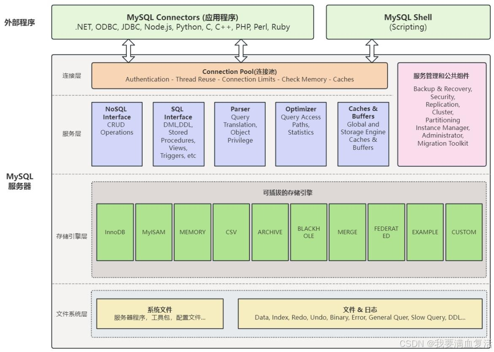
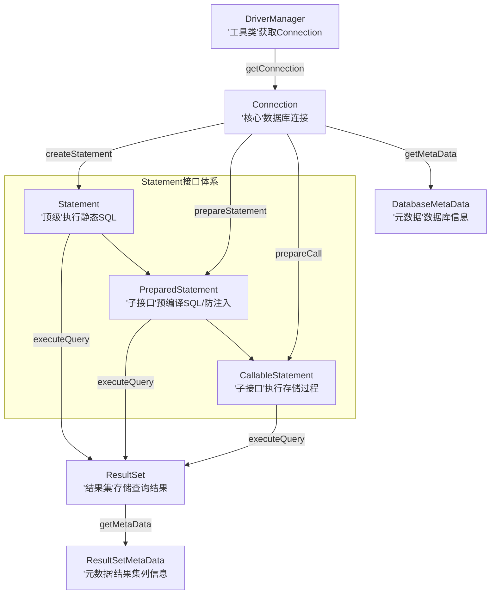
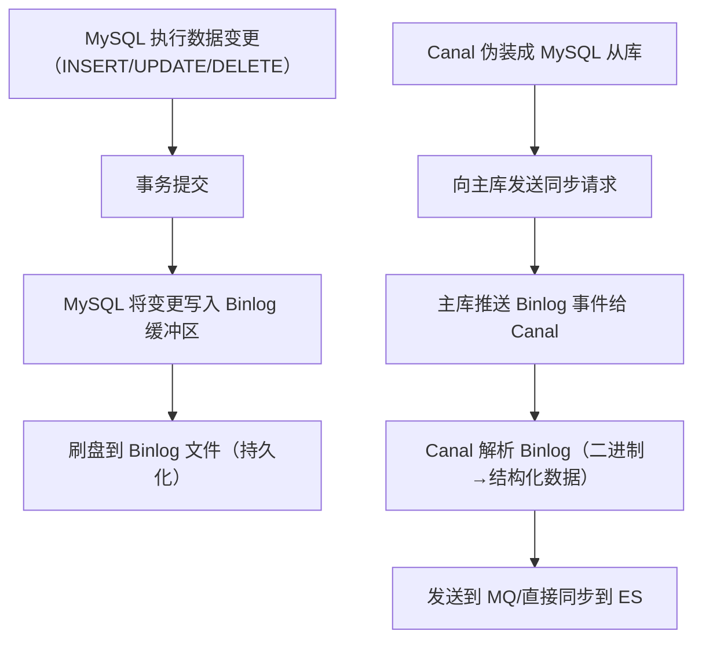
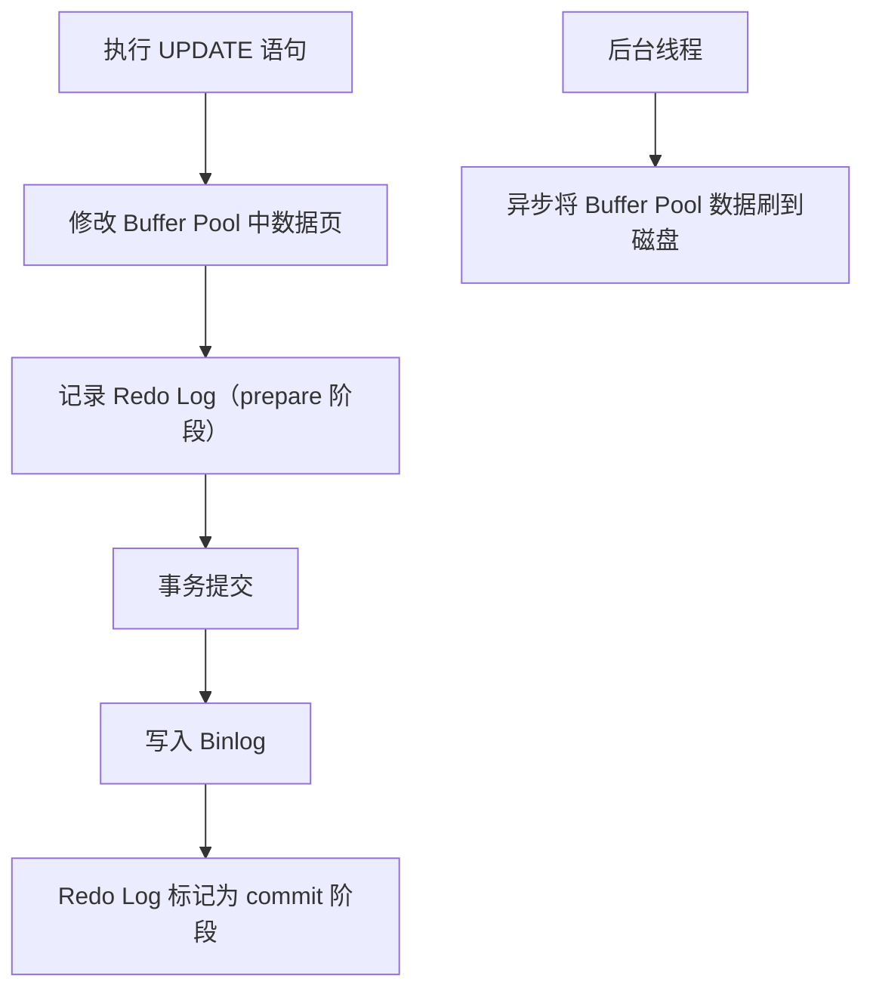
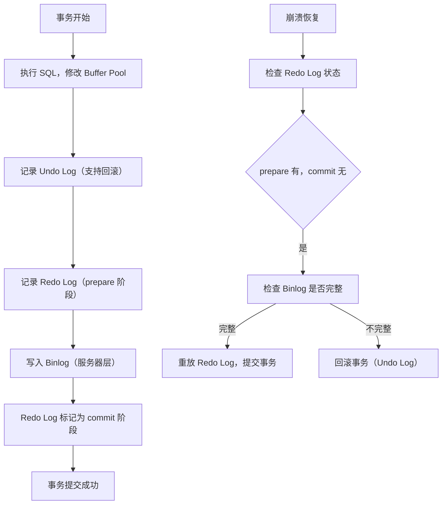

## 数据库「表类型」

### 1. **主子表（主从表）**

一对多，**两张表**
例：订单 & 订单项、文章 & 评论、用户 & 地址

- 主表：一
- 子表：多
- 通过外键关联

**主子表 = 一对多关系，用两张表分开存**
最典型：**订单 & 订单商品**

- **主表（order）**：一条记录
- **子表（order_item）**：多条记录，通过 `order_id` 关联主表

#### 例子（MySQL 标准结构）

主表 order：

```
order_id  |  user_id  |  total_amount
---------------------------------------
1         |  100      |  200
```

子表 order_item：

```
id  |  order_id  |  product_name  |  price
--------------------------------------------
1   |  1         |  手机         | 100
2   |  1         |  耳机         | 100
```

#### 特点

- 关系型数据库（MySQL）**最标准、最常用**
- 符合三范式，**无冗余**
- 查询必须 **JOIN**
- 结构固定，扩展麻烦

#### 一句话总结

**主子表 = 一对多，拆两张表，靠外键关联。**

### 2. **树表（层级表）**

无限层级，**一张表**
靠 `parent_id` 形成树形结构
例：多级评论、部门树、商品分类、菜单

树表 = **存储** **层级关系** 的表（无限层级）
比如：

- 多级评论（楼中楼）
- 部门架构（公司 → 部门 → 小组 → 员工）
- 分类（类目 → 子类目 → 子子类目）
- 评论回复树

#### 标准结构：**parent_id 模式**

```
id  |  content        |  parent_id
------------------------------------
1   |  一级评论       |  null
2   |  回复1          |  1
3   |  回复2          |  2
4   |  回复3          |  3
```

这就是**树表**。
每一条记录都知道**自己的上级是谁**。

#### 特点

- 支持**无限层级**
- 一张表就能存整棵树
- MySQL 需要**递归查询**（非常麻烦）
- MongoDB 查一次，内存组装树（非常简单）

#### 一句话总结

**树表 = 一张表存无限层级结构，靠 parent_id 形成树形关系。**

### 树表/主子表的区别

#### 主子表：

- **一对多**
- **两张表**
- 例子：订单-订单项

#### 树表：

- **一对多 + 递归嵌套（无限层级）**
- **一张表**
- 例子：多级评论、部门树、分类树

#### 放到 MongoDB 里理解更简单

- **主子表结构** 在 MongoDB 里 = **内嵌文档（embed）**

  ```json
  {
    orderNo: "123",
    items: [ {}, {} ] // 子表直接嵌进去
  }
  ```

- **树表结构** 在 MongoDB 里 = **parentId + 扁平化**

  ```json
  { _id: 1, parentId: null },
  { _id: 2, parentId: 1 },
  { _id: 3, parentId: 2 }
  ```

---

#### 终极极简总结（背下来就懂）

- **主子表：一对多，两张表，关联查询。**
- **树表：无限层级，一张表，parent_id 形成树。**

如果你愿意，我可以给你画一张**超级清晰的图：主子表 vs 树表 vs MongoDB内嵌**，一眼看懂。

### 3. **码表（字典表）**

固定枚举值，**用来翻译状态**
也叫：**数据字典、枚举表、配置表**

例：
- 订单状态：0-未支付 1-已支付 2-已取消
- 性别：0-未知 1-男 2-女
- 支付方式：1-微信 2-支付宝

结构：
```
code    name
0       未支付
1       已支付
```
**作用：不用改代码，直接改表就能改状态。**

### 4. **中间表（关联表）**

解决**多对多关系**，**必须第三张表**
例：
- 用户 ↔ 角色（一个用户多个角色，一个角色多个用户）
- 学生 ↔ 课程
- 商品 ↔ 标签

结构：
```
user_id   role_id
1         1
1         2
2         1
```

### 5. **快照表**

**存历史快照，不随原数据变化**
例：
- 订单里存**商品快照**（价格、名称、图片）
- 评论里存**用户昵称头像快照**

特点：**历史永远不变**

### 6. **流水表**

**只增不改、时序、不可删除**
例：
- 支付流水
- 积分流水
- 操作日志
- 消息推送记录

特点：**只insert，不update、不delete**

### 7. **日志表**

记录操作历史、谁、何时、干了什么
例：登录日志、订单状态变更日志

### 8. **配置表**

系统开关、参数、规则
例：运费配置、优惠券规则、最大订单金额

### 9. **缓存表 / 统计表**

提前算好数据，避免实时统计
例：
- 商品日销量统计表
- 用户粉丝数统计表
- 评论数统计表

### 10. **归档表**

历史冷数据，不影响主表性能
例：order_2025、order_2026

## MYSQL架构

MySQL 采用经典的**分层架构**，核心分为 **连接层、服务层、存储引擎层、物理存储层**，层间通过标准接口交互，**存储引擎可插拔**（InnoDB 为默认）。

### 一、整体分层结构（文字版架构图）



```
+---------------------------+
| 客户端层 (Client Layer)    |
| (mysql命令行、JDBC、Navicat)|
+---------------------------+
            ↓ 网络/本地连接
+---------------------------+
| 连接层 (Connector Layer)   |
| - 连接池、身份认证、权限校验 |
| - 线程管理、连接复用        |
+---------------------------+
            ↓
+---------------------------+
| 服务层 (Server Layer)      | ← 核心层（所有引擎共用）
| - SQL接口 (接收SQL)        |
| - 解析器 (语法/语义解析)   |
| - 查询优化器 (生成执行计划) |
| - 执行器 (调用引擎接口)    |
| - 内置函数、事务、锁管理   |
| - (MySQL 8.0移除查询缓存)  |
+---------------------------+
            ↓ 引擎API
+---------------------------+
| 存储引擎层 (Storage Engine)| ← 可插拔
| - InnoDB (默认，事务/行锁)  |
| - MyISAM (全文索引/无事务) |
| - Memory (内存表)          |
| - CSV/Archive 等          |
+---------------------------+
            ↓
+---------------------------+
| 物理存储层 (File System)   |
| - 数据文件 (.ibd, .frm)    |
| - 日志文件 (redo/undo/binlog) |
| - 索引文件、配置文件       |
+---------------------------+
```
### 二、各层核心组件与功能
#### 1. 连接层（最上层）
- **连接池**：管理 TCP/IP、Socket 连接，线程复用，控制 `max_connections`。连接器主要用来管理客户端的连接和用户身份认证。 客户端与Server端的连接采用的是TCP协议，经过TCP握手，建立连接之后，连接器开始进行身份验证。
- **认证授权**：校验用户名/密码、IP 白名单、库表权限。
- **协议适配**：支持多种客户端通信协议。

#### 2. 服务层（核心大脑）
- **SQL 接口**：接收 DML/DDL、存储过程、视图等命令。
- **解析器**（分析器）：词法分析 → 语法分析 → 生成**抽象语法树（AST）**。分析器主要对SQL语句进行**词法分析**和**语法分析**。 首先进行词法分析，分析出MySQL的关键字、以及每个词语代表的含义。然后进行语法分析，检测SQL语句是否符合MySQL语法要求。 MySQL通过识别字符串中列名、表名、where、select/update/insert 等MySQL关键字，在根据语法规则判断sql是否满足语法，最终会生成一个抽象语法树(AST)。
- **查询优化器**：基于成本模型选最优执行计划（索引选择、JOIN 顺序）。在真正执行SQL语句之前，还需要经过优化器处理。 我们熟知的执行计划（Explain）就是优化器生成的。 优化器主要有两个作用：**逻辑优化**和**物理优化**。 逻辑优化主要进行等价谓词重写、条件化简、子查询消除、连接消除、语义优化、分组合并、选择下推、索引优化查询、表查询替换视图查询、Union替换or操作等。 物理优化主要作用是通过贪婪算法，根据代价估算模型，估算出每种执行方式的代价。并使用索引优化表连接，最终生成查询执行计划。 
- **执行器**：调用存储引擎 API 执行计划，权限二次校验。在优化器优化完SQL，并生成了执行计划后，就会把执行计划传递给执行器。 执行器调用存储引擎接口，真正的执行SQL查询。获取到存储引擎返回的查询结果，并把结果返回给客户端，至此SQL语句执行结束。
- **事务/锁/日志**：事务协调、表锁、内置函数、binlog 生成。
- **查询缓存：**客户端请求不会直接去存储引擎查询数据，而是先在缓存中查询结果是否存在。如果结果已存在，直接返回，否则再执行一遍查询流程，查询结束后把结果再缓存起来。 如果数据表发生更改，将清空失效缓存，例如 insert、update、delete、alter操作等。 对于频繁变更的数据表来说，缓存命中率很低。使用缓存反而降低了读写性能，所以在MySQL8.0以后就移除了缓存模块。

#### 3. 存储引擎层（数据读写核心）
- **InnoDB（默认）**
  - 支持**事务 ACID、行锁、MVCC、外键、崩溃恢复**。
  - 内存：Buffer Pool、Change Buffer、Redo Log Buffer。
  - 磁盘：ibd 表空间、B+树索引、Redo/Undo 日志。
- **MyISAM**：不支持事务，表锁，全文索引，适合读多写少。
- **Memory**：数据全内存，速度极快，重启丢失。

#### 4. 物理存储层
- **数据文件**：InnoDB（.ibd）、MyISAM（.MYD/.MYI）。
- **日志文件**：Redo Log（崩溃恢复）、Undo Log（回滚/MVCC）、Binlog（主从/恢复）。
- **其他**：配置文件（my.cnf/my.ini）、PID 文件、socket 文件。

### 三、SQL 执行全流程（一句话链路）

客户端 SQL → 连接认证 → SQL 接口 → 解析器 → 优化器 → 执行器 → 存储引擎读写 → 返回结果

#### 一条SQL查询语句是如何执行的？

1. **连接阶段**：由服务器端的**连接器**组件负责，在客户端与 MySQL 服务器之间建立连接，并验证用户权限。
2. **查询缓存**（仅限 MySQL 8.0 前）：检查**是否命中缓存**，若有完全相同且有效的查询结果可以直接返回。
3. **解析与预处理**：解析 SQL 语法，检查语法是否正确，并生成抽象语法树，然后，**预处理器**进行一些语义检查，验证表和字段是否存在。
4. **优化器**：基于统计信息和成本模型，考虑多种执行方案，并选择最优执行计划（如索引选择、JOIN 顺序）。
5. **执行器**：根据选择的执行计划，调用存储引擎接口，并按执行计划读取数据并处理（排序、聚合等）。
6. **存储引擎**（如 InnoDB）：负责从磁盘或内存读取数据，返回给执行器。
7. **返回结果**：执行器进行必要的处理（如过滤、排序）后，将结果集返回客户端，可能分批次传输。

### **MySQL 一条 SQL 完整执行流程（Server + InnoDB 全套）**

非常清晰、分层、一步不漏。

---

#### 一、MySQL 整体架构（先记住四层）

1. **客户端层**  
2. **连接层（Connector）**  
3. **Server 层（核心层）**  
4. **存储引擎层（InnoDB）**

---

#### 二、一条 SQL **完整执行流程（超级详细）**

##### 1. 客户端发起连接

- 客户端（Navicat、JDBC、命令行）发起 TCP 连接  
- 连接到 MySQL 服务端口 3306

##### 2. 连接层处理

1. **建立连接**：线程分配、连接池管理  
2. **权限验证**：用户名、密码、IP 校验  
3. **权限校验**：该用户是否能访问该库、表  
4. 验证通过，**将 SQL 交给 Server 层**

##### 3. Server 层：查询缓存（MySQL 8.0 已移除）

- 8.0 之前：先查 Query Cache，命中直接返回  
- 8.0 已删除，**这步可以忽略**

##### 4. Server 层：解析器（Parser）

做两件事：
1. **词法分析**：把 SQL 拆成关键字（select、from、where、id…）  
2. **语法分析**：检查语法是否正确  
→ 生成 **语法树（AST）**

##### 5. Server 层：预处理器（Preprocessor）

- 检查表、列是否存在  
- 检查权限（再次校验）  
- 扩展 `select *`  
- 生成**新的语法树**交给优化器

##### 6. Server 层：查询优化器（Optimizer）【大脑】

**决定 SQL 最终怎么执行：**
1. 选择**最优索引**  
2. 确定 **join 顺序**  
3. 确定 **执行计划**  
4. 决定是否使用：ICP、MRR、BKA 等优化  
→ 生成 **执行计划（执行器要严格按这个走）**

##### 7. Server 层：执行器（Executor）【干活的】

执行器**不直接操作数据**，只调用**存储引擎 API**：

执行流程：
1. 调用引擎接口，取**第一行**，判断条件  
2. 循环调用引擎，取**下一行**  
3. 收集结果，返回给客户端

**执行器只负责：调用、循环、过滤、返回。**

---

#### 三、进入 InnoDB 存储引擎内部流程（最重要！面试加分）

##### 8. 引擎层：Buffer Pool 内存结构

1. 先去 **Buffer Pool** 查找数据页  
   - 命中：直接返回  
   - 不命中：从**磁盘.ibd 文件**加载数据页到 BP

##### 9. 写操作（update/insert/delete）额外流程

1. **undo log**：记录旧数据，用于回滚  
2. **change buffer**（二级索引写优化）  
3. **redo log buffer**：记录修改，保证崩溃不丢数据  
4. 执行修改，数据页变成 **脏页**  
5. 后台线程**刷脏页到磁盘**

##### 10. 事务提交（commit）

1. **redo log prepare**  
2. **binlog 写入**  
3. **redo log commit**  
→ **两阶段提交（2PC）**，保证 binlog 与 redo log 一致

##### 11. 返回结果给 Server 层，再返回客户端

---

#### 三、终极精简版（面试**必背**，100%满分）

```
客户端 → 连接层（认证）→ 解析器（语法）→ 预处理器（校验）
→ 优化器（生成执行计划）
→ 执行器（调用引擎）
→ InnoDB（BufferPool、undo、redo、binlog、磁盘）
→ 结果返回
```

##### 一句话总结：

**连接 → 解析 → 优化 → 执行 → 引擎读写 → 返回结果**

---

#### 四、面试官最爱问的三个灵魂问题

##### 1. 优化器和执行器区别？

- **优化器：决定怎么执行（走哪个索引、怎么查）**
- **执行器：按照计划去执行，调用引擎**

##### 2. Server 层和引擎层区别？

- **Server 层：所有存储引擎共用，负责 SQL 解析、优化、执行**
- **引擎层：负责数据实际存储、读取、写入（InnoDB 独有事务、锁、redo）**

##### 3. 一条更新语句执行流程？

```
连接 → 解析 → 优化 → 执行器
→ undo log
→ 内存修改
→ redo log buffer
→ binlog
→ redo log commit
→ 完成
```

---

## MySQL 表设计

### 基本概念

#### 一、三大范式（必考）

##### 1NF 第一范式

列**原子性**，字段不可再分。
例：不能把`姓名+电话`放一个字段。

##### 2NF 第二范式

满足1NF，**消除部分依赖**。
非主键字段**完全依赖整个主键**，不依赖主键一部分。
（联合索引场景必考）

##### 3NF 第三范式

满足2NF，**消除传递依赖**。
非主键字段**只直接依赖主键**，不依赖其他非主键。

##### 面试官常问：实际开发一定要遵守三范式吗？

**不一定。**
互联网高并发场景，**允许适度反范式**（冗余字段），**减少 JOIN**，提升查询效率。

---

#### 二、主键设计原则（必考）

1. **必须有主键**，InnoDB 聚簇索引，无主键会隐式生成 rowid，性能差。
2. 推荐 **自增主键（INT/BIGINT）**
   - 顺序插入，**页分裂少**，性能高
   - 索引更小，查询更快
3. **禁止用 UUID 做主键**
   - 无序、随机插入，大量**页分裂**
   - 索引空间大、性能差
4. 主键**尽量短**，减少二级索引体积。

---

#### 三、字段类型选择原则（高频）

##### 1. 越小越好

能用 tinyint 不用 int，能用 int 不用 bigint。

##### 2. 越简单越好

数字 < 字符串，**整型比字符串快**。

##### 3. 尽量 NOT NULL

- NULL 需要额外空间存储
- 索引**不存储 NULL**，导致索引失效
- 查询、统计容易出错

##### 4. 字符串优先 varchar，少用 char

- **varchar：变长，省空间**，适合长度不固定
- **char：固定长度**，适合长度固定（如手机号、身份证）

##### 5. 禁止使用 TEXT/BLOB 高频查询

- 存储在行外，查询慢
- 无法用临时表，导致 Using temporary

##### 6. 金钱用 DECIMAL，禁止 float/double

浮点精度丢失，**Decimal 精确计算**。

---

#### 四、引擎选择（InnoDB vs MyISAM）

##### InnoDB（默认，必须用）

- 支持**事务、行锁、外键、崩溃恢复**
- 高并发、增删改多
- **聚簇索引**

##### MyISAM（几乎不用）

- 不支持事务、表锁
- 查询快、写入差
- 非聚簇索引

**面试一句话：**
**业务系统一律 InnoDB，只有极少只读静态数据才考虑 MyISAM。**

---

#### 五、字符集与排序规则

##### 字符集

- **utf8mb4**（真实UTF-8，支持emoji）
- 禁止用 utf8（MySQL 的 utf8 是假的，最多3字节）

##### 排序规则

- **utf8mb4_unicode_ci**：通用，不区分大小写
- **utf8mb4_bin**：区分大小写，精确比较

---

#### 六、索引设计规范（表设计必问）

1. 单表索引 **不超过 5 个**
2. 联合索引 **最左前缀**，**区分度高放前面**
3. 不在低区分度字段建索引（性别、状态）
4. 禁止冗余索引（a、a+b 冗余）
5. 优先**覆盖索引**，避免回表
6. 不在频繁更新字段建索引

---

#### 七、反范式设计（什么场景冗余字段）

**允许适当冗余，减少 JOIN，提高性能**
场景：
- 经常关联查询，且**数据不常更新**
- 高并发、读多写少
例：订单表冗余`用户名`，避免每次查订单都 JOIN 用户表

缺点：
- 数据冗余
- 存在**数据不一致风险**，需要保证最终一致

---

#### 八、大表处理（分库分表前置题）

1. 单表数据量 **建议 2000万内**
2. 数据过大：**分表、分区、冷热分离**
3. 禁止频繁大表 `SELECT *`、无限制查询
4. 大字段独立拆表，不要放主表

---

#### 九、表设计最佳实践（总结背诵）

1. 必须主键，推荐**自增 BIGINT**
2. 字段**尽量 NOT NULL**
3. 字段类型**最小、最简单**
4. 字符集 **utf8mb4**
5. 引擎 **InnoDB**
6. 合理建索引，**不滥用、不冗余**
7. 适度**反范式**，减少 JOIN
8. 大表拆分、冷热分离

---

#### 十、面试官最爱问的一句话题目

1. **为什么不用UUID做主键？**
无序 → 大量页分裂 → 性能差、索引大。

2. **字段为什么要NOT NULL？**
NULL 占空间、索引失效、统计异常。

3. **三范式一定要遵守吗？**
不一定，高并发**反范式冗余**更常用。

4. **varchar和char区别？**
varchar 变长省空间；char 固定长度，速度略快。

---

### 表设计高频面试题

---

#### 001 如何设置自增主键？

在主键字段后加上 `AUTO_INCREMENT` 关键字即可。

```sql
CREATE TABLE `user`(
    id INT PRIMARY KEY AUTO_INCREMENT,
    username VARCHAR(10),
    `password` VARCHAR(20)
);
```

---

#### 002 插入数据时指定主键了怎么办？

即使设置了自增主键，插入时手动指定 id 值，**MySQL 会使用你指定的值**，不会忽略。
**后续自增会从当前最大 id 继续增长。**

```sql
insert into `user` values(1, "张三", "zs666");
```

---

#### 003 主键不连续是什么情况？

例如 id 从 5 直接跳到 8。
原因：
**INSERT 失败、事务回滚、批量插入**时，**自增主键已经分配但未使用**，不会回收，导致主键不连续。
InnoDB 自增 ID 保证**唯一且递增**，不保证连续。

---

#### 004 主键用自增还是 UUID？

**推荐自增主键，不推荐 UUID。**

原因：
- InnoDB 主键是**聚簇索引**。
- 自增主键是**顺序插入**，减少页分裂，性能高、碎片少。
- UUID 无序，插入时会造成大量**页分裂**，索引体积大、插入慢。

---

#### 005 主键为什么不推荐有业务含义？

1. **业务字段可能会变**，主键一旦修改会导致记录位置变动，引发页分裂。
2. 业务主键**无法保证顺序递增**，插入性能差。
3. 业务主键容易重复、不安全，不利于分库分表扩展。

---

#### 006 枚举字段为什么不用 enum？

枚举字段推荐用 **tinyint**。
不使用 enum 的原因：

1. `order by` 效率低，需要额外处理。
2. 数值枚举容易**下标与值混淆**，产生语法陷阱。
3. 新增枚举值需要 `ALTER TABLE`，不方便扩展。

---

#### 007 货币字段用什么类型？

- 以**分**为单位：用 **int / bigint**
- 以**元**为单位：用 **decimal(18,2)**
**禁止 float / double**，会丢失精度，导致金额计算错误。

---

#### 008 时间字段用什么类型？

1. **datetime（8 字节）**
   范围大：1000~9999 年，**推荐使用**。
   无时区，值稳定不变。

2. **timestamp（4 字节）**
   带时区，会自动转换。
   缺点：只能到 **2038 年**。

3. **bigint**
   存储时间戳，范围最大，需手动维护。

4. **varchar**
   不推荐，无法校验、无法索引、无法计算。

---

#### 009 为什么不直接存图片、音频、视频？

MySQL **不存文件内容，只存路径**。
不使用 blob/text 的原因：

1. 导致查询必须使用**磁盘临时表**，性能极差。
2. 大字段使 **binlog 体积暴涨**，主从同步变慢。
3. 影响查询缓存、内存效率，拖慢整个库。

---

#### 010 为什么字段要定义为 NOT NULL？

1. **NULL 占用额外空间**，需要特殊处理。
2. **可空字段索引性能差**，每条记录多占一个字节。
3. 使用 `count(字段)` 统计时，**NULL 不会被计数**，结果不准。
4. 容易产生不可预期的查询结果。


---

#### 011 varchar(50) 中 50 的含义？

1. 代表**最多存放 50 个字符**（汉字、字母、数字都算 1 个）。
2. 存储相同字符串时，`varchar(50)` 和 `varchar(200)` 占用空间一样。
3. 但 **varchar(200) 排序、关联时消耗更多内存**。
4. 建议按实际最长长度定义，**不要滥用大长度**。


#### **012 索引列强烈建议设置为 NOT NULL，不允许为 NULL。**

1. **NULL 无法正常使用索引**
   MySQL 索引**不存储 NULL 值**，遇到 `IS NULL / IS NOT NULL` 容易**索引失效**，走全表扫描。

2. **NULL 会让索引效率变低**
   允许 NULL 的索引列，需要**额外空间存储 NULL 标记**，索引体积更大、查询更慢。

3. **查询结果不可靠**
   `count(索引列)` 会**忽略 NULL**，导致统计结果错误。

**最佳实践**

- 字段**默认值用 0、空字符串 ''、特殊值（如 '0000-00-00'）**
- **绝对不要用 NULL 代表“无意义”**

---

#### 面试满分回答（背这段）

**索引列最好设置为 NOT NULL，因为 MySQL 索引不存储 NULL，会导致索引失效、性能下降，且占用额外空间、影响统计结果。实际开发中通常用默认值代替 NULL，避免索引列出现空值。**

---

#### 一句话总结（面试收尾专用）

**主键自增、字段非空、类型最小化、索引合理、少用大字段、适度反范式。**

## Mysql 补充

### **字符集（Character Set）** 和 **排序规则（Collation）**

MySQL 的 **字符集（Character Set）** 和 **排序规则（Collation）** 是处理多语言文本存储与比较的核心机制。下面为你系统、清晰地分类介绍它们的含义、关系、常见类型及最佳实践。

------

#### 一、基本概念

##### 1. 字符集（Character Set）

- **作用**：定义数据库能**存储哪些字符**（如英文、中文、emoji 等）。
- **本质**：字符 ↔ 字节编码的映射规则。
- 常见字符集：
  - `latin1`：西欧字符（1字节），不支持中文。
  - `utf8`（MySQL 特有）：**伪 UTF-8**，最多 3 字节，**不支持 emoji**。
  - `utf8mb4`：**真正的 UTF-8**，最多 4 字节，**支持所有 Unicode 字符（含 emoji）✅ 推荐使用**。
  - `gbk` / `gb2312`：中文专用（已过时，不推荐）。

> ⚠️ 注意：MySQL 的 `utf8` ≠ 标准 UTF-8！它其实是 `utf8mb3`（最大 3 字节）。

------

##### 2. 排序规则（Collation）

- **作用**：定义字符如何**比较、排序、区分大小写**。

- 命名格式

  ：

  ```
  字符集_语言/特性_ci/cs/bin
  ```

  - `_ci`：**case-insensitive**（不区分大小写）→ `a = A`
  - `_cs`：**case-sensitive**（区分大小写）→ `a ≠ A`
  - `_bin`：**binary**（按字节值比较，严格区分大小写和重音）

> ✅ 绝大多数 Web 应用使用 `_ci`；需要精确匹配（如密码、token）时用 `_bin`。

------

#### 二、常见字符集与对应排序规则（重点）

| 字符集                      | 推荐排序规则         | 说明                                   |
| --------------------------- | -------------------- | -------------------------------------- |
| **`utf8mb4`**（✅ 强烈推荐） | `utf8mb4_unicode_ci` | 多语言通用，准确排序（如德语 ß=ss）    |
|                             | `utf8mb4_0900_ai_ci` | MySQL 8.0+ 默认，更现代的 Unicode 支持 |
|                             | `utf8mb4_general_ci` | 老旧、速度快但排序不准确（不推荐）     |
|                             | `utf8mb4_bin`        | 严格二进制比较（区分大小写、重音）     |
| `utf8`（⚠️ 已弃用）          | `utf8_general_ci`    | 不支持 4 字节字符（如 😊）              |
|                             | `utf8_bin`           | 同上，但区分大小写                     |
| `latin1`                    | `latin1_swedish_ci`  | 仅支持西欧字符                         |

> 🔍 查看所有支持的组合：
>
> ```sql
> SHOW CHARACTER SET;
> SHOW COLLATION WHERE Charset = 'utf8mb4';
> ```

------

#### 三、层级优先级（谁生效？）

MySQL 中字符集/排序规则在 **4 个层级** 可设置，优先级从高到低：

1. 列（Column）级

    → 最高优先级  

   ```sql
   name VARCHAR(50) CHARACTER SET utf8mb4 COLLATE utf8mb4_bin
   ```

2. 表（Table）级

   ```sql
   CREATE TABLE t (...) DEFAULT CHARSET=utf8mb4 COLLATE=utf8mb4_unicode_ci;
   ```

3. 数据库（Database）级

   ```sql
   CREATE DATABASE db DEFAULT CHARSET=utf8mb4 COLLATE=utf8mb4_unicode_ci;
   ```

4. **服务器（Server）级** → 最低优先级（通过配置文件设置）

   ```sql
   -- 告诉 MySQL 服务器：客户端（你）将使用 utf8mb4 字符集发送 SQL 语句，并希望服务器以 utf8mb4 返回结果。
   SET NAMES utf8mb4;
   -- 等效下面三条语句
   SET character_set_client = utf8mb4;    -- 客户端发送的 SQL 使用的字符集
   SET character_set_connection = utf8mb4;-- 服务器处理 SQL 时转换用的字符集
   SET character_set_results = utf8mb4;   -- 查询结果返回给客户端时使用的字符集
   ```

> 💡 若未显式指定，子级会继承父级设置。
>
> 这条命令**只影响当前会话（session）**，不影响其他连接。
>
> 如果你的应用连接字符串中已指定 `charset=utf8mb4`（如 JDBC），则无需手动执行此命令。

------

#### 四、最佳实践建议

##### ✅ 1. **统一使用 `utf8mb4`**

```sql
-- 创建数据库
CREATE DATABASE myapp 
  DEFAULT CHARACTER SET utf8mb4 
  COLLATE utf8mb4_unicode_ci;
```

##### ✅ 2. **Web 应用默认用 `_unicode_ci`**

- 支持多语言正确排序（如法语、德语）
- 不区分大小写，符合用户习惯（`User = user`）

##### ✅ 3. **特殊字段用 `_bin`**

- 用户名、邮箱、API Key 等需

  精确匹配

  的字段：

  ```sql
  email VARCHAR(100) COLLATE utf8mb4_bin UNIQUE
  ```

##### ✅ 4. **连接层也要设置**

确保应用连接时也使用 `utf8mb4`，避免“存进去是乱码”：

- JDBC

  :  

  ```text
  ?useUnicode=true&characterEncoding=UTF-8&connectionCollation=utf8mb4_unicode_ci
  ```

- MySQL CLI

  :  

  ```bash
  mysql --default-character-set=utf8mb4 -u user -p
  ```

##### ❌ 避免的坑

| 错误做法                   | 风险                        |
| -------------------------- | --------------------------- |
| 用 `utf8` 存 emoji         | 数据被截断或变 `?`          |
| 混用 `utf8` / `utf8mb4`    | JOIN 性能下降、隐式转换错误 |
| 用 `utf8_bin` 做用户名查询 | `Admin` ≠ `admin`，登录失败 |

------

#### 五、MySQL 8.0 的变化

- **默认字符集**：`utf8mb4`
- **默认排序规则**：`utf8mb4_0900_ai_ci`（比 `_unicode_ci` 更符合 Unicode 9.0 标准）
- **性能优化**：`utf8mb4_0900_ai_ci` 比老版本更快更准

> 📌 如果你用 MySQL 8.0+，可直接用默认配置，无需显式指定。

------

#### 六、快速检查现有配置

```sql
-- 查看数据库字符集
SHOW CREATE DATABASE your_db;

-- 查看表字符集
SHOW CREATE TABLE your_table;

-- 查看列字符集
SHOW FULL COLUMNS FROM your_table;

-- 查看连接字符集
SHOW VARIABLES LIKE 'character_set%';
SHOW VARIABLES LIKE 'collation%';
```

------

#### ✅ 总结一句话：

> **永远用 `utf8mb4` + `utf8mb4_unicode_ci`（或 MySQL 8.0 的 `utf8mb4_0900_ai_ci`），特殊字段用 `_bin`，避免一切乱码和排序问题。**

如果你有具体的业务场景（如国际化 SaaS、社交 App 含 emoji），我可以给出更针对性的配置建议。

### R2DBC替代JDBC

要将你当前的 **JDBC 配置**（基于 Spring Boot + Druid + MySQL）迁移到 **R2DBC**，需要做以下几方面的修改：

------

#### ✅ 一、核心变化概览

| 项目                    | JDBC（当前）               | R2DBC（目标）                                                |
| ----------------------- | -------------------------- | ------------------------------------------------------------ |
| **驱动类**              | `com.mysql.cj.jdbc.Driver` | `io.asyncer.r2dbc.mysql.MySqlConnectionFactoryProvider`（或使用 URL scheme） |
| **连接 URL**            | `jdbc:mysql://...`         | `r2dbc:mysql://...`                                          |
| **数据源类型**          | `DruidDataSource`          | `io.r2dbc.pool.ConnectionPool`（R2DBC 连接池）               |
| **Spring Boot Starter** | `spring-boot-starter-jdbc` | `spring-boot-starter-data-r2dbc` + `r2dbc-mysql`             |
| **ORM 框架**            | MyBatis / JPA              | Spring Data R2DBC（或手写 Repository）                       |

------

#### ✅ 二、具体修改步骤

##### 1. **替换 Maven/Gradle 依赖**

###### ❌ 移除（或排除）JDBC 相关依赖：

```xml
<!-- 如果你用了 spring-boot-starter-web（默认含 JDBC），需排除 -->
<dependency>
    <groupId>org.springframework.boot</groupId>
    <artifactId>spring-boot-starter-web</artifactId>
    <exclusions>
        <exclusion>
            <groupId>org.springframework.boot</groupId>
            <artifactId>spring-boot-starter-jdbc</artifactId>
        </exclusion>
    </exclusions>
</dependency>
```

###### ✅ 添加 R2DBC 依赖：

```xml
<!-- R2DBC 核心 -->
<dependency>
    <groupId>org.springframework.boot</groupId>
    <artifactId>spring-boot-starter-data-r2dbc</artifactId>
</dependency>

<!-- MySQL 的 R2DBC 驱动（推荐 asyncer 版本，更活跃） -->
<dependency>
    <groupId>io.asyncer</groupId>
    <artifactity>r2dbc-mysql</artifactId>
    <version>1.0.4</version> <!-- 检查最新版 -->
</dependency>

<!-- R2DBC 连接池（替代 Druid） -->
<dependency>
    <groupId>io.r2dbc</groupId>
    <artifactId>r2dbc-pool</artifactId>
</dependency>
```

> 💡 注意：  
>
> - 官方 `dev.miku:r2dbc-mysql` 已停止维护  
> - 推荐使用社区维护的 **[asyncer/r2dbc-mysql](https://github.com/asyncer-io/r2dbc-mysql)**

------

##### 2. **修改 `application.yml` 配置**

###### ❌ 原 JDBC 配置（删除）：

```yaml
spring:
  datasource:
    username: root
    password: xew.0511
    driver-class-name: com.mysql.cj.jdbc.Driver
    url: jdbc:mysql://192.168.137.128:3306/jc-club?...
    type: com.alibaba.druid.pool.DruidDataSource
```

###### ✅ 新 R2DBC 配置：

```yaml
spring:
  r2dbc:
    url: r2dbc:mysql://192.168.137.128:3306/jc-club?useSSL=false&serverZoneId=Asia/Shanghai
    username: root
    password: xew.0511
    pool:
      initial-size: 10
      max-size: 20
      max-idle-time: 30s
      validation-query: SELECT 1
```

> 🔍 参数说明：
>
> - **URL Scheme**：必须以 `r2dbc:mysql://` 开头（不是 `jdbc:mysql://`）
> - **时区参数**：R2DBC MySQL 使用 `serverZoneId`（不是 `serverTimezone`）
> - **连接池**：通过 `spring.r2dbc.pool` 配置（底层是 `r2dbc-pool`）

------

##### 3. **代码层改造（关键！）**

###### ▶ Repository 层（使用 Spring Data R2DBC）

```java
// 实体类（需 @Table）
@Table("user")
public class User {
    @Id
    private Long id;
    private String name;
    // getter/setter
}

// Repository 接口
@Repository
public interface UserRepository extends ReactiveCrudRepository<User, Long> {
    Flux<User> findByName(String name);
}
```

###### ▶ Service 层（返回 Mono/Flux）

```java
@Service
public class UserService {
    private final UserRepository userRepository;

    public Mono<User> findById(Long id) {
        return userRepository.findById(id);
    }

    public Flux<User> findAll() {
        return userRepository.findAll();
    }
}
```

###### ▶ Controller 层（WebFlux）

```java
@RestController
public class UserController {
    private final UserService userService;

    @GetMapping("/user/{id}")
    public Mono<User> getUser(@PathVariable Long id) {
        return userService.findById(id);
    }
}
```

> ⚠️ **重要**：  
>
> - 必须使用 **Spring WebFlux**（不能用 Spring MVC）  
> - 启动类无需特殊注解，但确保没有 `@EnableJdbc` 等冲突配置

------

##### 4. **启动类（通常无需修改）**

```java
@SpringBootApplication
public class Application {
    public static void main(String[] args) {
        SpringApplication.run(Application.class, args);
    }
}
```

Spring Boot 会自动配置 R2DBC。

------

#### ⚠️ 三、注意事项与常见问题

##### 1. **不要混用 JDBC 和 R2DBC**

- 一旦使用 R2DBC，**整个数据访问层必须响应式**
- 不能再用 `JdbcTemplate`、`MyBatis`、`Hibernate`

##### 2. **Druid 不支持 R2DBC**

- R2DBC 使用自己的连接池：`io.r2dbc.pool.ConnectionPool`
- 无法使用 Druid 的监控、SQL 防火墙等特性

##### 3. **事务管理方式不同**

```java
// R2DBC 事务示例
return connectionFactory.create()
    .flatMap(connection -> 
        connection.beginTransaction()
            .then(userRepository.save(user))
            .then(connection.commitTransaction())
            .onErrorResume(e -> connection.rollbackTransaction().then(Mono.error(e)))
    );
```

或使用 `@Transactional`（需 `spring-boot-starter-data-r2dbc` 2.4+）

##### 4. **MySQL 驱动选择**

- 使用 `io.asyncer:r2dbc-mysql`（推荐）
- 避免使用已废弃的 `dev.miku:r2dbc-mysql`

------

#### ✅ 四、完整 `application.yml` 示例

```yaml
spring:
  application:
    name: jc-club-service
  r2dbc:
    url: r2dbc:mysql://192.168.137.128:3306/jc-club?useSSL=false&serverZoneId=Asia/Shanghai&charset=utf8mb4
    username: root
    password: xew.0511
    pool:
      enabled: true
      initial-size: 5
      max-size: 20
      max-idle-time: 30s
      max-life-time: 1m
      validation-query: SELECT 1

# 可选：日志（查看 SQL）
logging:
  level:
    org.springframework.data.r2dbc: DEBUG
```

------

#### 💡 总结：迁移 checklist

-  替换依赖：移除 JDBC，添加 R2DBC + r2dbc-mysql + r2dbc-pool  
-  修改配置：`spring.r2dbc.url` 使用 `r2dbc:mysql://`  
-  重写 DAO：使用 `ReactiveCrudRepository` 或 `DatabaseClient`  
-  Controller 返回 `Mono`/`Flux`  
-  确保使用 WebFlux（非 Spring MVC）  
-  放弃 Druid，接受 R2DBC 自带连接池

> 迁移 R2DBC 是一个**架构级决策**，适合高并发、响应式系统。如果只是普通业务系统，JDBC + 连接池仍是更简单可靠的选择。

### 数据库连接分类

数据库连接（Database Connection）从不同维度可以划分为多种类型。以下是常见的分类方式，帮助你系统理解“数据库连接”的全貌：

------

#### 🔹 一、按 **编程模型** 分（最核心的分类）

| 类型                    | 特点                                  | 代表技术                                                     |
| ----------------------- | ------------------------------------- | ------------------------------------------------------------ |
| **1. 同步阻塞式连接**   | 调用后线程挂起，等待数据库返回结果    | JDBC（Java）、ODBC（C/C++）、`mysql-connector-python`（Python） |
| **2. 异步非阻塞式连接** | 调用后立即返回，通过回调/事件处理结果 | R2DBC（Java）、asyncpg（Python）、Node.js mysql2/promise     |

> ✅ **这是现代架构中最关键的区分**：  
>
> - 传统应用 → 同步  
> - 高并发/响应式系统 → 异步

------

#### 🔹 二、按 **连接管理方式** 分

| 类型                             | 说明                                                    | 优点                             | 缺点                                 |
| -------------------------------- | ------------------------------------------------------- | -------------------------------- | ------------------------------------ |
| **1. 直连（Direct Connection）** | 每次请求新建物理连接                                    | 简单                             | 开销大（TCP + 认证），不适用于高并发 |
| **2. 连接池（Connection Pool）** | 预先创建并复用连接                                      | 高性能、低延迟                   | 需要管理池大小、超时、泄漏等         |
| **3. 代理连接（Proxy/中间件）**  | 通过数据库代理（如 ShardingSphere-Proxy、MaxScale）连接 | 支持分库分表、读写分离、SQL 审计 | 增加网络跳数，引入单点               |

> 📌 **生产环境几乎都使用连接池**：  
>
> - JDBC：HikariCP、Druid、Tomcat JDBC Pool  
> - R2DBC：`r2dbc-pool`  
> - Python：SQLAlchemy 的 `QueuePool`

------

#### 🔹 三、按 **网络协议/驱动类型** 分

| 类型                  | 描述                                    | 示例                                          |
| --------------------- | --------------------------------------- | --------------------------------------------- |
| **1. 原生协议驱动**   | 直接实现数据库通信协议（如 MySQL 协议） | `mysql-connector-java`（JDBC）、`r2dbc-mysql` |
| **2. ODBC/JDBC 桥接** | 通过通用接口（ODBC/JDBC）调用本地驱动   | JDBC-ODBC Bridge（已废弃）                    |
| **3. HTTP/REST 接口** | 通过 HTTP API 访问数据库（非标准）      | Firebase Realtime DB、Supabase REST API       |

> 💡 原生协议驱动性能最好，桥接方式有额外开销。

------

#### 🔹 四、按 **部署架构** 分

| 类型            | 说明                           | 典型场景                             |
| --------------- | ------------------------------ | ------------------------------------ |
| **1. 本地连接** | 应用与数据库在同一主机         | 开发测试、嵌入式数据库（H2, SQLite） |
| **2. 远程连接** | 应用与数据库跨网络             | 生产微服务、云数据库（RDS）          |
| **3. 集群连接** | 连接到数据库集群（主从、分片） | 高可用、大数据量场景                 |

------

#### 🔹 五、按 **安全机制** 分

| 类型                 | 特点                        |
| -------------------- | --------------------------- |
| **明文连接**         | 无加密（如 `useSSL=false`） |
| **SSL/TLS 加密连接** | 数据传输加密                |
| **认证连接**         | 需用户名/密码、证书、IAM 等 |

------

#### 🔹 六、按 **生命周期** 分

| 类型       | 说明                              |
| ---------- | --------------------------------- |
| **短连接** | 请求结束即关闭（HTTP 无状态风格） |
| **长连接** | 连接保持长时间打开                |

> ⚠️ 注意：即使使用“短连接”逻辑，**底层仍由连接池复用物理连接**，避免频繁建连。

------

#### ✅ 总结：一张表看懂分类

| 分类维度     | 主要类型               | 关键区别       |
| ------------ | ---------------------- | -------------- |
| **编程模型** | 同步 vs 异步           | 是否阻塞线程   |
| **连接管理** | 直连 vs 连接池 vs 代理 | 性能与功能权衡 |
| **驱动类型** | 原生协议 vs 桥接       | 性能与兼容性   |
| **部署方式** | 本地 vs 远程 vs 集群   | 网络拓扑       |
| **安全级别** | 明文 vs SSL/TLS        | 数据安全性     |
| **生命周期** | 短连接 vs 长连接       | 资源占用策略   |

------

#### 💡 实际开发建议：

1. **Web 应用** → 使用 **连接池 + 同步（JDBC）或异步（R2DBC）**  
2. **高并发 API 服务** → 考虑 **R2DBC + 连接池**  
3. **内部管理系统** → **JDBC + HikariCP/Druid** 足够  
4. **永远不要在生产环境用直连**（无连接池）  
5. **云上数据库必须开启 SSL**

理解这些分类，能帮助你在架构设计时做出合理的技术选型。

### 数据库规范和驱动

这是一个非常好的问题！**JDBC 和 R2DBC 本身并不是“数据库驱动”，而是“数据库连接规范”或“API 标准”**。而**具体的数据库驱动（Driver）是实现这些规范的代码库**。

下面详细解释它们之间的关系：

------

#### ✅ 一、核心概念区分

| 名称                                                | 类型                     | 作用                                                         | 类比                         |
| --------------------------------------------------- | ------------------------ | ------------------------------------------------------------ | ---------------------------- |
| **JDBC**                                            | **规范 / API 接口标准**  | 定义 Java 程序如何与关系型数据库交互的**统一接口**（如 `Connection`, `Statement`, `ResultSet`） | 就像 “USB 接口标准”          |
| **R2DBC**                                           | **规范 / API 接口标准**  | 定义 Java 响应式程序如何**异步非阻塞地**与关系型数据库交互的**统一接口**（如 `ConnectionFactory`, `Result`） | 就像 “USB-C 接口标准”        |
| **MySQL JDBC Driver** （如 `mysql-connector-java`） | **数据库驱动（Driver）** | **实现 JDBC 规范**，提供与 MySQL 通信的具体逻辑              | 就像 “某品牌的 USB 数据线”   |
| **R2DBC MySQL Driver** （如 `r2dbc-mysql`）         | **数据库驱动（Driver）** | **实现 R2DBC 规范**，提供与 MySQL 异步通信的具体逻辑         | 就像 “某品牌的 USB-C 数据线” |

------

#### 🔍 二、用代码说明关系

##### 1. **JDBC 场景**

```java
// 1. 使用的是 JDBC "规范" 中的接口
Connection conn = DriverManager.getConnection(
    "jdbc:mysql://localhost:3306/test", "root", "pass"
);

// 2. 实际工作的是 "驱动"（mysql-connector-java）
//    它在内部实现了 Connection、Statement 等接口
```

- **JDBC 是接口**（Java SE 提供）
- **`mysql-connector-java` 是驱动**（MySQL 官方提供，实现了 JDBC 接口）

##### 2. **R2DBC 场景**

```java
// 1. 使用的是 R2DBC "规范" 中的接口
ConnectionFactory connectionFactory = ConnectionFactories.get(
    "r2dbc:mysql://localhost:3306/test"
);

// 2. 实际工作的是 "驱动"（如 io.asyncer:r2dbc-mysql）
//    它实现了 ConnectionFactory、Result 等 R2DBC 接口
```

- **R2DBC 是接口规范**（由 r2dbc.io 社区定义）
- **`r2dbc-mysql` 是驱动**（社区/厂商提供，实现了 R2DBC 接口）

------

#### 📦 三、常见驱动示例

| 数据库         | JDBC 驱动（实现 JDBC 规范）                                | R2DBC 驱动（实现 R2DBC 规范）                                |
| -------------- | ---------------------------------------------------------- | ------------------------------------------------------------ |
| **MySQL**      | `com.mysql.cj.jdbc.Driver` （来自 `mysql-connector-java`） | `io.asyncer.r2dbc.mysql.MySqlConnectionFactoryProvider` （来自 `io.asyncer:r2dbc-mysql`） |
| **PostgreSQL** | `org.postgresql.Driver`                                    | `io.r2dbc.postgresql.PostgresqlConnectionFactoryProvider`    |
| **SQL Server** | `com.microsoft.sqlserver.jdbc.SQLServerDriver`             | `io.r2dbc.sqlserver.SqlServerConnectionFactoryProvider`      |

> ⚠️ 注意：  
>
> - 没有驱动，JDBC/R2DBC 规范就无法工作  
> - 同一个数据库可以有多个驱动（如 MySQL 有官方 JDBC 驱动，也有 MariaDB 的 JDBC 驱动）

------

#### 🧩 四、类比理解（非常重要！）

想象你要给手机充电：

| 概念                | 手机充电类比                                         |
| ------------------- | ---------------------------------------------------- |
| **JDBC / R2DBC**    | **充电接口标准**（如 USB-A、USB-C）                  |
| **数据库驱动**      | **具体的充电线**（如 Anker USB-C 线、小米 USB-C 线） |
| **数据库（MySQL）** | **电源插座**                                         |
| **Java 应用**       | **你的手机**                                         |

- 你不能说 “USB-C 是充电线” —— 它只是**标准**。
- 真正传输电流的是**那根物理线**（驱动）。
- 同样，**JDBC 不是驱动，而是标准；驱动是实现该标准的 jar 包**。

------

#### ✅ 五、总结回答

> ❌ **错误说法**：
> “JDBC 是 MySQL 的数据库驱动。”

> ✅ **正确说法**：  
>
> - **JDBC 是 Java 定义的同步数据库访问规范**。  
> - **R2DBC 是社区定义的异步数据库访问规范**。  
> - **`mysql-connector-java` 是实现 JDBC 规范的 MySQL 驱动**。  
> - **`r2dbc-mysql` 是实现 R2DBC 规范的 MySQL 驱动**。

------

#### 💡 附加知识：如何查看当前使用的是哪个驱动？

##### JDBC：

```java
Connection conn = ...;
System.out.println(conn.getMetaData().getDriverName());
// 输出：MySQL Connector/J
```

##### R2DBC：

```java
// 通常通过依赖库名称判断，如 classpath 中有 r2dbc-mysql
```

理解 **“规范 vs 驱动”** 的区别，是掌握数据库连接技术的关键一步！

### JDBC核心组件关系图

以下是**完整的JDBC核心组件关系图**（包含核心接口继承、核心类/接口关联），结合功能说明，面试/学习都能直接用：

#### 一、JDBC核心组件继承+关联关系图（Mermaid语法，可直接渲染）



#### 各接口核心作用（面试拓展，加深理解）

继承关系核心：`Statement → PreparedStatement → CallableStatement`（子接口继承父接口）；

PreparedStatement 是 CallableStatement 的直接父接口；

功能演进：从静态 SQL（Statement）→ 预编译参数化 SQL（PreparedStatement）→ 存储过程执行（CallableStatement），功能逐步增强，安全性 / 性能逐步提升。

##### 1.Statement（顶级接口）

作用：执行静态 SQL 语句（SQL 字符串固定，无参数）；
缺点：存在 SQL 注入风险，每次执行都需编译 SQL，性能低；
示例：

```java
Statement stmt = conn.createStatement();
ResultSet rs = stmt.executeQuery("SELECT * FROM user WHERE id = 1");
```


##### 2.PreparedStatement（Statement 子接口）

作用：执行预编译 SQL 语句（支持占位符 ? 传参）；
优势：预编译后可重复执行，性能高；参数化查询防 SQL 注入；
示例：

```java
PreparedStatement pstmt = conn.prepareStatement("SELECT * FROM user WHERE id = ?");
pstmt.setInt(1, 1); // 给占位符赋值
ResultSet rs = pstmt.executeQuery();
```


##### 3.CallableStatement（PreparedStatement 子接口）

作用：执行数据库存储过程 / 函数（支持输入 / 输出参数）；
专属方法：registerOutParameter() 注册输出参数，execute() 执行存储过程；
示例：

```java
CallableStatement cstmt = conn.prepareCall("{call get_user(?)}");
cstmt.setInt(1, 1); // 输入参数
ResultSet rs = cstmt.executeQuery();
```


#### 二、图的可视化解读（文字版，便于理解）

```
┌─────────────────────────────────────────┐
│              DriverManager              │ 「工具类」JDBC入口，通过getConnection()获取Connection
└───────────────────┬─────────────────────┘
                    │
                    ▼
┌─────────────────────────────────────────┐
│               Connection                │ 「核心接口」数据库连接（会话），创建各类Statement
└───────┬───────────┬───────────┬─────────┘
        │           │           │
        ▼           ▼           ▼
┌─────────────┐ ┌─────────────┐ ┌─────────────┐
│  Statement  │ │PreparedStatement│CallableStatement│
└──────┬──────┘ └──────┬──────┘ └──────┬──────┘
       │               │               │
       └───────────────┼───────────────┘
                       │
                       ▼
┌─────────────────────────────────────────┐
│               ResultSet                 │ 「结果集」存储SQL查询结果
└───────────────┬─────────────────────────┘
                │
                ▼
┌─────────────────────────────────────────┐
│         ResultSetMetaData               │ 「元数据」获取结果集列名/类型等信息
└─────────────────────────────────────────┘

补充关联：
Connection → DatabaseMetaData 「元数据」获取数据库版本/表结构等信息
```


#### 三、核心组件功能说明（对应图中节点）

| 组件              | 核心作用                                     | 关键方法                                                 |
| ----------------- | -------------------------------------------- | -------------------------------------------------------- |
| DriverManager     | JDBC入口工具类，加载驱动、获取数据库连接     | `getConnection(url, user, pwd)`                          |
| Connection        | 数据库连接（会话），所有操作的基础           | `createStatement()`/`prepareStatement()`/`prepareCall()` |
| Statement         | 执行静态SQL（无参数），有SQL注入风险         | `executeQuery(sql)`/`executeUpdate(sql)`                 |
| PreparedStatement | 执行预编译SQL（支持?占位符），防注入、高性能 | `setXxx(索引, 值)`/`executeQuery()`                      |
| CallableStatement | 执行数据库存储过程/函数（支持入参/出参）     | `registerOutParameter()`/`execute()`                     |
| ResultSet         | 存储SELECT查询结果，可遍历行/列              | `next()`/`getXxx(列名/索引)`                             |
| ResultSetMetaData | 获取结果集元数据（列名、列类型、列数等）     | `getColumnCount()`/`getColumnName(索引)`                 |
| DatabaseMetaData  | 获取数据库元数据（版本、表名、驱动信息等）   | `getDatabaseProductName()`/`getTables()`                 |

#### 四、核心总结

1. **继承关系**：`Statement → PreparedStatement → CallableStatement`（子接口继承父接口），功能逐步增强；
2. **核心流转**：`DriverManager 获取Connection` → `Connection 创建Statement` → `Statement 执行SQL` → `返回ResultSet`；
3. **核心优势**：PreparedStatement 预编译防SQL注入，是开发中最常用的Statement子类；
4. **元数据作用**：MetaData接口用于获取“数据的描述信息”（如结果集列信息、数据库信息），便于动态处理SQL结果。

------

#### **JDBC 组件关系示意图**

```text
+---------------------------------------------------------------+
|                         应用程序                              |
|                                                               |
|  JDBC API                                                      |
|  +---------------------------------------------------------+  |
|  | DataSource / DriverManager                               |  |
|  |  (获取 Connection)                                       |  |
|  +---------------------------------------------------------+  |
|           |                               ^                 |
|           v                               |                 |
|  +------------------+           +------------------------+ |
|  |  Connection Pool  | <-------> |   JDBC 驱动程序 Driver | |
|  |  (可复用连接)     |           |  (实现具体数据库通信) | |
|  +------------------+           +------------------------+ |
|           |                                           ^     |
|           v                                           |     |
|      数据库连接 (Socket/TCP) -------------------------+     |
|                         目标数据库（MySQL / Oracle / ...）  |
+---------------------------------------------------------------+
```

------

##### **说明**

1. **JDBC 驱动程序（Driver）**
   - 由数据库厂商提供的接口实现。
   - 负责应用程序和数据库之间的通信（协议转换、SQL 发送、结果返回等）。
2. **数据源（DataSource）**
   - JDBC 提供的标准接口，替代 `DriverManager` 获取连接。
   - 可配置连接池、事务管理、分布式环境等。
   - 应用直接通过 `DataSource.getConnection()` 获取数据库连接。
3. **数据库连接池（Connection Pool）**
   - 数据源通常会封装一个连接池，用于 **复用 Connection**，避免频繁创建/销毁连接的开销。
   - 常见连接池：**HikariCP、Druid、C3P0**。
4. **Connection 对象**
   - 应用程序通过 JDBC API 使用 `Connection` 执行 SQL。
   - 如果使用连接池，`close()` 方法通常是将连接归还到池中，而非真正关闭。
5. **DriverManager**
   - 早期 JDBC 获取连接的方式。
   - 现在推荐使用 `DataSource` + 连接池。


## Mysql面试补充

 我来为您详细介绍 MySQL 游标（Cursor）的属性。

### MySQL 游标属性

MySQL 游标是一种数据库对象，用于遍历查询结果集中的行。以下是游标的主要属性和特性：

#### 1. 基本属性

| 属性                           | 说明                                                     |
| ------------------------------ | -------------------------------------------------------- |
| **只读（Read-Only）**          | MySQL 游标默认是只读的，不能通过游标更新或删除数据       |
| **不可滚动（Non-Scrollable）** | 只能向前移动（`FETCH NEXT`），不能向后移动或跳转到特定行 |
| **敏感（Sensitive）**          | 游标指向实际数据，对底层数据的修改会反映到游标结果中     |
| **非保持（Non-Holdable）**     | 事务提交后，游标自动关闭                                 |

#### 2. 游标状态属性（用于错误处理）

MySQL 提供了三个重要的诊断属性：

```sql
-- 声明 CONTINUE HANDLER 来捕获 NOT FOUND 条件
DECLARE CONTINUE HANDLER FOR NOT FOUND SET done = TRUE;

-- 或使用 SQLSTATE
DECLARE CONTINUE HANDLER FOR SQLSTATE '02000' SET done = 1;
```

| 属性/条件      | SQLSTATE | 说明                                 |
| -------------- | -------- | ------------------------------------ |
| `NOT FOUND`    | `02000`  | 游标到达结果集末尾，没有更多行可获取 |
| `SQLEXCEPTION` | 多种     | 发生 SQL 错误                        |
| `SQLWARNING`   | 多种     | 发生 SQL 警告                        |

#### 3. 游标系统变量

```sql
-- 查看游标相关的系统变量
SHOW VARIABLES LIKE '%cursor%';
```

| 变量名                    | 默认值 | 说明                               |
| ------------------------- | ------ | ---------------------------------- |
| `max_prepared_stmt_count` | 16382  | 最大预处理语句数（影响服务端游标） |

#### 4. 游标使用示例

```sql
DELIMITER //

CREATE PROCEDURE cursor_example()
BEGIN
    -- 声明变量
    DECLARE done INT DEFAULT FALSE;
    DECLARE emp_id INT;
    DECLARE emp_name VARCHAR(100);
    
    -- 声明游标
    DECLARE emp_cursor CURSOR FOR 
        SELECT id, name FROM employees WHERE salary > 5000;
    
    -- 声明继续处理器：当没有更多行时设置 done = TRUE
    DECLARE CONTINUE HANDLER FOR NOT FOUND SET done = TRUE;
    
    -- 打开游标
    OPEN emp_cursor;
    
    -- 循环获取数据
    read_loop: LOOP
        FETCH emp_cursor INTO emp_id, emp_name;
        
        -- 检查是否到达结果集末尾
        IF done THEN
            LEAVE read_loop;
        END IF;
        
        -- 处理数据（例如：输出或插入到其他表）
        SELECT emp_id, emp_name;
    END LOOP;
    
    -- 关闭游标
    CLOSE emp_cursor;
END //

DELIMITER ;
```

#### 5. 游标特性详解

##### 🔒 只读特性（Read-Only）

```sql
-- MySQL 不支持通过游标直接更新数据
-- 以下语法在 MySQL 中无效：
-- DECLARE cursor_name CURSOR FOR SELECT ... FOR UPDATE;
-- 需要使用单独的 UPDATE 语句
```

##### ➡️ 单向滚动（Forward-Only）

```sql
-- 只能使用 FETCH NEXT（或简写 FETCH）
FETCH NEXT FROM cursor_name INTO var1, var2;
-- 不支持：FETCH PRIOR, FETCH FIRST, FETCH LAST, FETCH ABSOLUTE n
```

##### 👁️ 敏感性（Sensitive）

```sql
-- 敏感游标：反映底层表的实时变化
-- 如果在游标打开后，其他会话修改了数据，游标会看到这些变化
```

#### 6. 游标限制

| 限制                              | 说明                   |
| --------------------------------- | ---------------------- |
| 不能在存储函数中使用动态 SQL 游标 | 存储过程中可以使用     |
| 游标声明必须在变量声明之后        | 顺序要求严格           |
| 游标声明必须在处理器声明之前      | 顺序要求严格           |
| 同一时间只能打开一个游标          | 可以嵌套，但需注意性能 |

#### 7. 隐式游标属性（在存储程序中）

```sql
-- 使用 GET DIAGNOSTICS 获取游标信息
GET DIAGNOSTICS @row_count = ROW_COUNT;

-- 或使用 FOUND_ROWS() 函数
SELECT FOUND_ROWS();  -- 返回上一个 SELECT 语句的行数
```

#### 8. 性能优化建议

```sql
-- 1. 尽量减少游标结果集大小
DECLARE cur CURSOR FOR SELECT id FROM large_table WHERE condition;

-- 2. 使用临时表避免敏感游标的性能问题
CREATE TEMPORARY TABLE temp_results AS SELECT ...;
DECLARE cur CURSOR FOR SELECT * FROM temp_results;

-- 3. 及时关闭游标释放资源
CLOSE cur;
```

#### 总结对比

| 特性     | MySQL 游标             | 其他数据库（如 Oracle/SQL Server） |
| -------- | ---------------------- | ---------------------------------- |
| 滚动方向 | 仅向前                 | 可双向滚动                         |
| 更新能力 | 只读                   | 支持 `WHERE CURRENT OF` 更新       |
| 敏感性   | 敏感                   | 可选择敏感/不敏感                  |
| 保持性   | 非保持（事务结束关闭） | 可选择保持                         |

如果您需要了解特定场景下的游标使用（如在 PHP/Java 中使用 MySQL 游标，或者与存储过程结合的具体案例），请告诉我！

### Mysql用户变量

#### MySQL 用户变量（@var）详解（新手友好+面试/实战重点）

MySQL 中的 `@var` 是**用户变量**（也叫会话变量），是在当前数据库连接会话中生效的临时变量，核心用于存储临时值、实现逐行计算（如自增序列）、传递值等场景，下面从核心特性、用法、实战示例三个维度讲清楚：

#### 一、核心特性（面试必知）

| 特性       | 说明                                                         |
| ---------- | ------------------------------------------------------------ |
| 作用域     | 仅在**当前数据库连接会话**生效，关闭连接后变量消失（不同连接互不影响） |
| 数据类型   | 弱类型，支持数字、字符串、NULL 等，无需提前声明类型          |
| 声明方式   | 无需 `DECLARE`，直接通过 `SET @var=值` 或 `SELECT @var:=值` 赋值 |
| 赋值运算符 | `=`（仅 `SET` 语句）、`:=`（通用，`SET/SELECT` 都可用）      |
| 可见性     | 会话级别，所有存储过程/函数/普通 SQL 都能访问当前会话的用户变量 |

#### 二、基础用法（快速上手）

##### 1. 变量赋值（两种方式）

```sql
-- 方式1：SET 赋值（推荐，可读性高）
SET @a = 3; -- 数字
SET @b = 'hello'; -- 字符串
SET @c = NULL; -- 空值

-- 方式2：SELECT 赋值（需用 :=，因为 SELECT 中 = 是比较运算符）
SELECT @d := 10;
SELECT @e := name FROM emp WHERE emp_id = 1; -- 从表中取值赋值
```

##### 2. 变量使用（直接引用）

```sql
-- 1. 普通查询中使用
SELECT @a, @b, @a + 5; -- 输出：3, hello, 8

-- 2. 条件判断中使用
SELECT * FROM emp WHERE salary > @min_salary;

-- 3. 结合 SQL 实现逐行自增（你之前案例的核心逻辑）
SET @row_num = 0;
SELECT @row_num := @row_num + 1 AS 序号, name FROM emp;
```

#### 三、实战核心场景（高频使用）

##### 1. 生成自增序号（最常用）

场景：给查询结果添加连续的行号（替代自增主键）
```sql
-- 示例：给员工表添加行号
SET @num = 0;
SELECT 
    @num := @num + 1 AS 行号,
    emp_id,
    emp_name,
    salary
FROM emp;
```
输出示例：
| 行号 | emp_id | emp_name | salary |
| ---- | ------ | -------- | ------ |
| 1    | 1      | 张三     | 4500   |
| 2    | 2      | 李四     | 6000   |
| 3    | 3      | 王五     | 8000   |

##### 2. 跨语句传递值

场景：将一个查询的结果传递给另一个查询使用
```sql
-- 步骤1：查询“李四”的薪资并赋值给变量
SET @li_salary = (SELECT salary FROM emp WHERE emp_name = '李四');

-- 步骤2：使用变量查询薪资高于李四的员工
SELECT * FROM emp WHERE salary > @li_salary;
```

##### 3. 游标/存储过程中临时存储值

场景：在存储过程中用用户变量临时存储中间结果（替代局部变量）
```sql
DELIMITER //
CREATE PROCEDURE calc_total_salary()
BEGIN
    -- 用用户变量存储总薪资
    SET @total = 0;
    
    -- 遍历累加
    SELECT @total := @total + salary FROM emp;
    
    -- 输出结果
    SELECT CONCAT('员工总薪资：', @total) AS result;
END //
DELIMITER ;

-- 调用
CALL calc_total_salary();
```

#### 四、注意事项（避坑重点）

1. **赋值运算符区别**：
   - `SET @a = 10` ✅（SET 中 = 是赋值）
   - `SELECT @a = 10` ❌（SELECT 中 = 是比较，返回 1/0）
   - `SELECT @a := 10` ✅（SELECT 中必须用 := 赋值）
2. **NULL 处理**：如果变量未赋值，默认值为 NULL，参与计算时结果也为 NULL（如 `@a + 5` 若 @a 为 NULL，结果为 NULL）；
3. **会话隔离**：不同客户端/连接的用户变量相互独立（如 A 连接的 @a=3，B 连接的 @a 可能为 NULL）；
4. **与局部变量的区别**：
   - 用户变量 `@var`：会话级，无需声明，可跨存储过程使用；
   - 局部变量 `DECLARE var INT`：存储过程/函数内的局部变量，作用域仅限当前程序块，优先级高于用户变量。

#### 总结

1. `@var` 是 MySQL 会话级用户变量，弱类型、无需声明，通过 `SET @var=值` 或 `SELECT @var:=值` 赋值；
2. 核心用途：生成自增序号、跨语句传值、存储过程中临时存储数据；
3. 关键注意：SELECT 中赋值必须用 `:=`，变量未赋值时为 NULL，作用域仅限当前连接。

### ENUM 枚举类型

#### 一、核心定义

`ENUM` 是 MySQL 专属的**字符串枚举类型**，用于限制列值只能是预定义列表中的某一个值，底层通过**整数索引**存储，兼具字符串的可读性和数值的存储效率。

#### 二、底层存储规则（核心考点）

1. **索引起始值**：枚举值的底层索引从 **1** 开始（而非 0），0 仅用于存储“无效枚举值”。
2. **索引分配逻辑**：索引由**建表时声明的枚举列表顺序**决定，与插入顺序、值的字母顺序无关。
    - 示例：`ENUM('dog', 'cat', 'monkey')`
      | 枚举字符串 | 底层索引 |
      | ---------- | -------- |
      | dog        | 1        |
      | cat        | 2        |
      | monkey     | 3        |
3. **存储效率**：根据枚举值数量占用 1~2 个字节，远低于直接存储字符串。

#### 三、隐式类型转换特性（高频考法）

当 `ENUM` 类型参与**数值运算**（如 `+、-、*、/`）或被强转为数值类型时，会自动转换为对应的**底层整数索引**，而非字符串本身。
- 触发场景：`SELECT e + 0 FROM test1;`、`SELECT CAST(e AS UNSIGNED) FROM test1;`
- 示例效果：插入 `'dog'` `'monkey'` `'cat'` 后，`e + 0` 的结果为 `1, 3, 2`。

#### 四、数据插入与有效性规则

1. **合法值插入**：只能插入枚举列表中的值，或对应的底层索引（插入数字会自动映射为对应枚举字符串）。
    - 示例：`INSERT INTO test1(e) VALUES(2);` 等价于插入 `'cat'`。
2. **非法值处理**：
    - 若列设置 `NOT NULL`：插入非法值会被替换为**第一个枚举值**。
    - 若列允许 `NULL`：插入非法值会存储为 `NULL`，底层索引为 NULL。
3. **插入顺序**：查询结果的行顺序由**插入顺序**决定，与枚举索引无关。

#### 五、与 SET 类型的核心区别（对比记忆）

| 维度       | ENUM 类型            | SET 类型                 |
| ---------- | -------------------- | ------------------------ |
| 取值数量   | 只能取一个值         | 可取多个值（用逗号分隔） |
| 底层索引   | 单值索引（1,2,3...） | 位运算索引（1,2,4,8...） |
| 核心关键字 | 枚举（互斥）         | 集合（多选）             |
| 示例       | `ENUM('a','b','c')`  | `SET('a','b','c')`       |

#### 六、使用注意事项

1. **不可随意修改枚举列表**：新增/删除枚举值会改变底层索引映射，导致现有数据错乱。
2. **避免使用数字作为枚举值**：易与底层索引混淆，引发逻辑错误。
3. **适用场景**：列值固定且互斥的场景（如性别、订单状态、商品类型）。

### LCASE() / LOWER() 与 UCASE() / UPPER()

#### 一、核心定义

`LCASE()`/`LOWER()`、`UCASE()`/`UPPER()` 是 MySQL 中用于**字符串大小写转换**的内置函数，其中 `LCASE()` 是 `LOWER()` 的别名，`UCASE()` 是 `UPPER()` 的别名（功能完全一致，推荐使用 `LOWER()`/`UPPER()`，兼容性更好）。

#### 二、语法与基础用法

##### 1. 小写转换：LCASE(str) / LOWER(str)

- **作用**：将字符串 `str` 中的所有大写字母转为小写，非字母字符（数字、符号、中文等）保持不变。
- **语法**：
  ```sql
  SELECT LCASE('MySQL 123 ABC'); -- 输出：mysql 123 abc
  SELECT LOWER('Hello World!'); -- 输出：hello world!
  ```

##### 2. 大写转换：UCASE(str) / UPPER(str)

- **作用**：将字符串 `str` 中的所有小写字母转为大写，非字母字符保持不变。
- **语法**：
  ```sql
  SELECT UCASE('mysql 123 abc'); -- 输出：MYSQL 123 ABC
  SELECT UPPER('hello world!'); -- 输出：HELLO WORLD!
  ```

#### 三、实战应用场景

##### 1. 不区分大小写的查询（高频）

解决数据库中字符串存储大小写不一致导致的查询漏查问题：
```sql
-- 表中存储的是 'MySQL'，需匹配 'mysql'/'MYSQL' 等任意大小写
SELECT * FROM user WHERE LOWER(username) = LOWER('MYSQL');
```

##### 2. 统一数据格式（入库/展示）

插入数据时统一转为小写/大写，保证数据规范：
```sql
-- 插入时将用户名统一转为小写
INSERT INTO user (username) VALUES (LOWER('AdMin')); -- 存储为 'admin'

-- 查询结果统一转为大写展示
SELECT UPPER(product_name) AS product_name FROM product;
```

##### 3. 结合其他字符串函数使用

```sql
-- 提取字符串后转换大小写
SELECT LCASE(SUBSTRING('MySQL_Demo', 1, 5)); -- 输出：mysql
```

#### 四、关键注意事项

1. **字符集兼容**：对 `utf8`/`utf8mb4`、`latin1` 等常用字符集均支持，但对非英文字母（如中文、日文）无效果（仅字母大小写转换）。
2. **NULL 处理**：若传入参数为 `NULL`，函数返回 `NULL`：
   ```sql
   SELECT LOWER(NULL); -- 输出：NULL
   ```
3. **别名等价性**：`LCASE()` = `LOWER()`、`UCASE()` = `UPPER()`，`LOWER()`/`UPPER()` 是 SQL 标准函数，跨数据库（如 PostgreSQL、SQL Server）兼容性更强，推荐优先使用。
4. **性能说明**：对字段使用大小写转换函数（如 `LOWER(username)`）会导致索引失效，若需频繁做不区分大小写查询，建议：
   - 入库时统一转换大小写存储；
   - 给字段设置不区分大小写的字符集（如 `utf8_general_ci`，`ci` 表示 case insensitive）。

#### 五、核心总结

| 函数       | 功能         | 别名       | 核心使用场景                   |
| ---------- | ------------ | ---------- | ------------------------------ |
| LOWER(str) | 字符串转小写 | LCASE(str) | 不区分大小写查询、统一数据格式 |
| UPPER(str) | 字符串转大写 | UCASE(str) | 统一展示格式、数据规范入库     |
1. `LCASE()`/`UCASE()` 是 `LOWER()`/`UPPER()` 的别名，功能完全一致，优先使用标准函数 `LOWER()`/`UPPER()`；
2. 核心用于字符串大小写转换，非字母字符无影响，传入 NULL 返回 NULL；
3. 查询中对字段使用转换函数会导致索引失效，需提前规划数据存储格式。

### SQL注入高危字符

#### 一、选项核心解析

##### 1. 最可能导致SQL注入的字符：A（单引号）、C（双引号）

###### （1）单引号（'）—— 高危中的核心（优先级最高）

- **核心原因**：MySQL 中字符串默认用**单引号**包裹（如 `WHERE username = 'admin'`），单引号是打破字符串闭合的核心字符。
- **注入原理**：攻击者输入单引号可篡改 SQL 语法结构，示例：
  正常 SQL：`SELECT * FROM user WHERE username = '输入值'`
  攻击者输入：`' OR 1=1 -- `
  篡改后 SQL：`SELECT * FROM user WHERE username = '' OR 1=1 -- '`（`-- ` 注释后续内容，导致条件恒成立，绕过验证）。
- **场景**：几乎所有字符串参数的SQL注入都以单引号为突破口，是最常见、最核心的注入字符。

###### （2）双引号（"）—— 高危（次要）

- **核心原因**：MySQL 支持双引号包裹字符串（如 `WHERE username = "admin"`），部分场景下（如数据库配置 `ANSI_QUOTES` 关闭时），双引号可替代单引号打破闭合。
- **注入原理**：与单引号逻辑一致，示例：
  正常 SQL：`SELECT * FROM user WHERE username = "输入值"`
  攻击者输入：`" OR 1=1 -- `
  篡改后 SQL：`SELECT * FROM user WHERE username = "" OR 1=1 -- "`。
- **注意**：双引号的风险低于单引号（因多数开发习惯用单引号），但仍是高频注入字符。

##### 2. 低风险/无风险字符：B（/）、D（$）

###### （1）斜杠（/）—— 无直接注入风险

- 斜杠在MySQL中是**除法运算符**（如 `10/2=5`），或作为路径分隔符（非SQL语法核心），无法打破字符串闭合，单独使用无注入风险。
- 仅在与其他字符组合时（如 `/*` 是注释开头）可能辅助注入，但本身不是注入触发字符。

###### （2）美元符号（$）—— 无注入风险

- `$ `是MySQL的**合法标识符字符**（可用于表名/列名，如 `table_$1`），无特殊语法含义，无法篡改SQL结构，不会触发注入。

#### 二、SQL注入高危字符优先级排序

1. **单引号（'）** → 最高优先级（核心注入字符）；
2. **双引号（"）** → 次高优先级（替代单引号场景）；
3. 其他高危字符（补充）：
   - 分号（;）：分隔多条SQL语句（如 `SELECT * FROM user; DROP TABLE user;`）；
   - 注释符（--、/* */）：注释掉SQL后续内容，配合单/双引号使用；
   - 逻辑运算符（OR/AND）：配合闭合字符构造恒成立条件；
   - 括号（()）：调整SQL执行优先级。

#### 三、防御核心要点

1. **输入校验**：过滤/转义单引号、双引号（如PHP中 `mysqli_real_escape_string`，Java中 `PreparedStatement` 自动转义）；
2. **预编译语句**：使用 `PreparedStatement`（Java）、`PDO`（PHP）等预编译方式，参数与SQL逻辑分离，从根本杜绝字符闭合类注入；
3. **最小权限**：数据库账号仅授予必要权限（如禁止DROP/ALTER），降低注入后的危害。

#### 四、核心总结

1. 选项中最可能导致SQL注入的是 **A（单引号）、C（双引号）**，其中单引号是核心高危字符；
2. 斜杠（/）和美元符（$）无直接注入风险，仅辅助作用；
3. 防御SQL注入的核心是**预编译语句+输入转义**，而非单纯过滤字符。

### 并发更新防覆盖（FOR UPDATE 行锁）

#### 一、题目核心考点解析

##### 1. 业务场景

更新用户最后登录时间时，需避免多事务并发操作导致“后执行的事务覆盖先执行的结果”，核心是**锁定目标行**，保证同一时间只有一个事务能修改该行数据。

##### 2. 选项逐一拆解

| 选项                | 功能说明                   | 是否能解决“防覆盖”问题 | 核心原因                                                     |
| ------------------- | -------------------------- | ---------------------- | ------------------------------------------------------------ |
| A. COMMIT           | 提交事务，确认数据修改     | ❌ 不能                 | 仅完成事务提交，无锁定能力，无法阻止并发覆盖                 |
| B. FOR UPDATE       | 行级排他锁（悲观锁）       | ✅ 能                   | 事务中锁定选中行，直到COMMIT/ROLLBACK，其他事务需等待锁释放，避免并发修改 |
| C. CHECK CONSTRAINT | 数据完整性校验（如值范围） | ❌ 不能                 | 仅限制数据合法性，与并发锁定无关                             |
| D. AUTO INCREMENT   | 主键自增生成               | ❌ 不能                 | 仅用于生成唯一主键，无并发控制能力                           |

#### 二、FOR UPDATE 核心用法（解决并发覆盖的关键）

##### 1. 原理

`FOR UPDATE` 是 MySQL InnoDB 引擎的**行级排他锁**（悲观锁），在事务中执行 `SELECT ... FOR UPDATE` 时：
- 锁定查询结果中的行，其他事务对这些行的**修改/加锁操作**会被阻塞，直到当前事务提交（COMMIT）或回滚（ROLLBACK）；
- 仅锁定满足条件的行，未命中条件的行不受影响，粒度精准。

##### 2. 实战示例（更新用户最后登录时间，防覆盖）

```sql
-- 1. 开启事务
START TRANSACTION;

-- 2. 锁定目标用户行（关键：FOR UPDATE 加锁）
SELECT * FROM user WHERE user_id = 1001 FOR UPDATE;

-- 3. 更新最后登录时间（此时该行已被锁定，其他事务无法修改）
UPDATE user SET last_login_time = NOW() WHERE user_id = 1001;

-- 4. 提交事务，释放锁（其他事务可继续操作）
COMMIT;
```

##### 3. 核心特性

- **锁粒度**：InnoDB 下仅锁定匹配的行（非全表锁），性能影响小；
- **锁释放**：仅在事务 COMMIT/ROLLBACK 后释放，避免长时间占用锁；
- **并发控制**：其他事务若尝试修改锁定行，会进入“等待锁”状态，直到锁释放，保证修改的原子性，避免覆盖。

#### 三、补充：其他防覆盖方案（拓展）

##### 1. 乐观锁（替代方案）

若并发量不高，可通过“版本号/时间戳”实现乐观锁，无需加锁：
```sql
-- 更新时校验版本号，仅当版本号匹配时更新（避免覆盖）
UPDATE user 
SET last_login_time = NOW(), version = version + 1 
WHERE user_id = 1001 AND version = 5;
```
- 适用场景：并发冲突概率低的场景，性能优于 FOR UPDATE；
- 核心逻辑：通过版本号判断数据是否被其他事务修改，未修改则更新，已修改则重试。

##### 2. 对比：悲观锁（FOR UPDATE）vs 乐观锁

| 锁类型 | 核心方式          | 适用场景       | 优点                 | 缺点                   |
| ------ | ----------------- | -------------- | -------------------- | ---------------------- |
| 悲观锁 | FOR UPDATE 锁定行 | 并发冲突概率高 | 逻辑简单，绝对防覆盖 | 可能阻塞事务，性能略低 |
| 乐观锁 | 版本号/时间戳校验 | 并发冲突概率低 | 无锁阻塞，性能优     | 冲突时需业务层重试     |

#### 四、核心总结

1. 解决“更新用户最后登录时间防覆盖”的核心是**锁定目标行**，`FOR UPDATE`（行级排他锁）是最直接的方案；
2. `FOR UPDATE` 在事务中锁定行，直到提交/回滚，阻止其他事务并发修改，避免覆盖；
3. 备选方案：乐观锁（版本号）适用于低并发场景，无需加锁，性能更优；
4. 易错点：COMMIT 仅提交事务、CHECK CONSTRAINT 仅校验数据、AUTO_INCREMENT 仅生成主键，均无法解决并发覆盖问题。

## MYSQL Binlog/Undolog/Redolog

### MYSQL Binlog

#### 一、MySQL Binlog 核心定义

MySQL 的 Binlog（Binary Log，二进制日志）是 MySQL 数据库的**核心日志文件**，它以二进制格式记录了 MySQL 中所有**数据变更操作**（如 INSERT/UPDATE/DELETE，不包含 SELECT 等只读操作），核心作用是：
- 实现**数据恢复**：通过回放 Binlog 可将数据库恢复到指定时间点；
- 实现**主从复制**：主库的 Binlog 同步到从库，从库回放 B inlog 保持与主库数据一致；
- 实现**数据同步**：如 Canal 监听 Binlog 同步数据到 ES/Redis 等（即你之前提到的 ES 全文检索方案3）。

简单来说：**Binlog 就是 MySQL 所有数据修改操作的“流水账”，按时间顺序记录了数据库的每一次变更**。

#### 二、Binlog 核心特性

##### 1. 日志格式（3种）

| 格式类型    | 特点                                                         | 适用场景                                                     |
| ----------- | ------------------------------------------------------------ | ------------------------------------------------------------ |
| `STATEMENT` | 记录 SQL 语句本身（如 `UPDATE user SET name='xxx' WHERE id=1`） | 日志量小，但部分函数（如 NOW()、UUID()）会导致主从数据不一致 |
| `ROW`       | 记录数据行的变更（如“id=1 的行，name 从 'aaa' 改为 'xxx'”）  | 日志量稍大，但数据一致性最高（Canal 必须用此格式）           |
| `MIXED`     | 混合 STATEMENT 和 ROW，MySQL 自动选择格式                    | 兼顾日志量和一致性，不推荐用于数据同步场景                   |

**关键**：Canal 监听 Binlog 实现数据同步时，必须将 MySQL 的 Binlog 格式设置为 `ROW`（最精准）。

##### 2. 核心参数（my.cnf/my.ini 配置）

```ini
# 开启 Binlog（必须）
log_bin = mysql-bin
# Binlog 存储路径（默认在数据目录）
log_bin_index = /var/lib/mysql/mysql-bin.index
# 格式必须为 ROW（Canal 依赖）
binlog_format = ROW
# 服务器ID（主从复制/Canal 都需要，唯一即可）
server_id = 1
# Binlog 过期时间（避免日志文件过大）
expire_logs_days = 7
# 记录所有库的 Binlog（也可指定具体库）
binlog_do_db = your_database_name
```

##### 3. 查看 Binlog（验证配置）

```bash
# 查看当前生效的 Binlog 文件列表
mysql> SHOW BINARY LOGS;

# 查看指定 Binlog 文件内容（需解析二进制）
mysql> SHOW BINLOG EVENTS IN 'mysql-bin.000001';

# 查看当前使用的 Binlog 文件
mysql> SHOW MASTER STATUS;
```

#### 三、Binlog 工作原理（Canal 监听场景）



核心关键点：
1. Binlog 是**事务性的**：只有事务提交后，变更才会写入 Binlog；
2. Canal 不是直接读 Binlog 文件，而是通过 MySQL 的**主从复制协议**获取 Binlog 事件，无需直接访问服务器文件系统；
3. Binlog 包含完整的变更信息：ROW 格式下，能获取“变更前的行数据”和“变更后的行数据”，便于精准同步。

#### 四、Binlog 与 ES 同步的核心价值

在你之前的 ES 全文检索场景中，Binlog 是“无侵入数据同步”的核心：
1. **零业务侵入**：业务代码只需写 MySQL，无需感知 ES 同步逻辑，避免代码耦合；
2. **数据完整**：Binlog 记录了所有数据变更，不会遗漏任何操作（如批量更新、触发器修改的数据）；
3. **可追溯**：Binlog 可回放，即使同步失败，也能重新解析历史 Binlog 补全数据；
4. **低性能损耗**：MySQL 写入 Binlog 是原生操作，性能损耗远低于业务代码调用 ES API。

#### 五、常见问题与注意事项

1. **Binlog 文件过大**：
   - 配置 `expire_logs_days` 自动清理过期日志；
   - 避免开启 `binlog_do_db` 时包含不必要的库，减少日志量。
2. **数据同步延迟**：
   - Binlog 刷盘有轻微延迟（毫秒级），Canal 同步到 ES 整体延迟通常在秒级；
   - 高并发下可调整 Canal 消费线程数，提升同步速度。
3. **权限问题**：
   - Canal 连接 MySQL 的账号需要授予 `REPLICATION SLAVE` 和 `REPLICATION CLIENT` 权限：
     ```sql
     GRANT REPLICATION SLAVE, REPLICATION CLIENT ON *.* TO 'canal'@'%' IDENTIFIED BY 'canal';
     ```

#### 总结

1. **核心定义**：Binlog 是 MySQL 记录所有数据变更的二进制日志，是主从复制、数据恢复、无侵入同步的基础；
2. **核心格式**：用于数据同步（如 Canal+ES）时必须设置为 `ROW` 格式，保证数据精准；
3. **核心价值**：在 ES 全文检索场景中，通过 Canal 监听 Binlog 实现“业务代码零侵入”的 MySQL→ES 数据同步，兼顾性能与一致性。

简单来说，Binlog 就是 MySQL 数据变更的“黑匣子”，Canal 则是解读这个黑匣子并实现跨系统数据同步的关键工具。

### Binlog、Undo Log、Redo Log 

MySQL 中的 Binlog、Undo Log、Redo Log 是三类核心日志，各自承担不同职责，共同保障数据库的**数据一致性、崩溃恢复、主从同步**能力。下面我会从「核心定义、作用、工作原理、核心差异」四个维度，帮你理清三者的区别和协同关系。

#### 一、先明确核心定位（一句话总结）

| 日志类型     | 核心定位                               | 关键词                                       |
| ------------ | -------------------------------------- | -------------------------------------------- |
| **Redo Log** | 重做日志，保障**崩溃恢复**（数据不丢） | 内存→磁盘、崩溃恢复、物理日志、InnoDB 独有   |
| **Undo Log** | 回滚日志，保障**事务原子性**（可回滚） | 事务回滚、MVCC、逻辑日志、InnoDB 独有        |
| **Binlog**   | 二进制日志，保障**主从同步/数据恢复**  | 数据变更、主从复制、逻辑日志、MySQL 服务器层 |

#### 二、逐类拆解（原理+作用）

##### 1. Redo Log（重做日志）

###### 核心作用

解决 MySQL “内存刷盘效率低” 和 “崩溃丢失数据” 的问题：
- MySQL 数据默认先写入内存（Buffer Pool），再异步刷到磁盘（磁盘 IO 慢），如果崩溃会导致内存中未刷盘的数据丢失；
- Redo Log 记录“数据页的物理变更”（如“表空间 ID=1，页号=100，偏移量=200，写入内容=xxx”），即使崩溃，重启后可通过 Redo Log 重放这些变更，恢复未刷盘的数据。

###### 关键特性

- **物理日志**：记录“数据页的修改”，而非 SQL 语句，执行速度快；
- **循环写**：Redo Log 是固定大小的文件（如 4 个文件，每个 1GB），写满后覆盖旧日志（已刷盘的部分）；
- **WAL 机制**：Write-Ahead Log（预写日志）—— 事务提交时，先写 Redo Log，再异步刷磁盘，保证“日志先行”。

###### 工作流程（以更新数据为例）



##### 2. Undo Log（回滚日志）

###### 核心作用

- **事务回滚**：事务执行过程中，每修改一条数据，都会记录 Undo Log（如“把 id=1 的 name 从 '张三' 改回 '李四'”），如果事务失败/回滚，可通过 Undo Log 恢复数据到修改前状态；
- **MVCC 多版本控制**：MySQL 实现“读已提交/可重复读”隔离级别时，通过 Undo Log 生成数据的历史版本，让读操作不阻塞写操作。

###### 关键特性

- **逻辑日志**：记录“反向操作”（如 INSERT 对应 DELETE，UPDATE 对应反向 UPDATE）；
- **事务隔离**：每个事务有独立的 Undo Log，事务提交后，Undo Log 不会立即删除，需等待所有读该版本的事务结束后清理；
- **InnoDB 独有**：仅存储引擎层的日志，与表空间绑定。

###### 典型场景

```sql
BEGIN; -- 开启事务
UPDATE user SET name='张三' WHERE id=1; -- 记录 Undo Log：id=1 的 name 原值为 '李四'
UPDATE user SET age=20 WHERE id=1; -- 记录 Undo Log：id=1 的 age 原值为 18
ROLLBACK; -- 执行回滚，通过 Undo Log 恢复 name='李四'、age=18
```

##### 3. Binlog（二进制日志）

###### 核心作用

- **主从复制**：主库的 Binlog 同步到从库，从库回放 Binlog 实现数据一致；
- **数据恢复**：通过 Binlog 回放 SQL，将数据库恢复到指定时间点；
- **跨系统同步**：如 Canal 监听 Binlog 同步数据到 ES/Redis（你之前的 ES 全文检索场景）。

###### 关键特性

- **逻辑日志**：默认记录 SQL 语句（STATEMENT 格式）或行变更（ROW 格式），可读性强；
- **追加写**：Binlog 是无限追加的文件，不会覆盖，可通过 `expire_logs_days` 设置过期清理；
- **服务器层日志**：所有存储引擎（InnoDB/MyISAM）都能使用，不依赖具体存储引擎。

#### 三、三者核心差异对比

| 维度     | Redo Log                     | Undo Log                            | Binlog                   |
| -------- | ---------------------------- | ----------------------------------- | ------------------------ |
| 所属层级 | InnoDB 存储引擎层            | InnoDB 存储引擎层                   | MySQL 服务器层           |
| 日志类型 | 物理日志（数据页修改）       | 逻辑日志（反向操作）                | 逻辑日志（SQL/行变更）   |
| 写入方式 | 循环写（固定大小）           | 追加写（事务结束后清理）            | 追加写（无限增长）       |
| 核心目的 | 崩溃恢复（数据不丢）         | 事务回滚 + MVCC                     | 主从同步 + 数据恢复      |
| 生命周期 | 事务提交后，刷盘完成即可覆盖 | 事务提交后，等待 MVCC 清理          | 可长期保留（按配置过期） |
| 适用场景 | 数据库崩溃后恢复数据         | 事务回滚、读未提交/可重复读隔离级别 | 主从复制、跨系统数据同步 |

#### 四、三者协同工作（以事务提交为例）

MySQL 事务提交的“两阶段提交”（保证 Redo Log 和 Binlog 一致性）是三者协同的核心场景：


##### 关键说明：

1. 先写 Redo Log（prepare）：保证即使崩溃，重启后能通过 Redo Log 恢复数据；
2. 再写 Binlog：保证主从同步的数据和主库一致；
3. 最后标记 Redo Log 为 commit：事务真正完成；
4. 若崩溃发生在“prepare 后、commit 前”，重启后会检查 Binlog 是否完整：
   - Binlog 完整 → 提交事务；
   - Binlog 不完整 → 用 Undo Log 回滚事务。

#### 五、实战场景中的应用

| 问题场景                     | 依赖的日志 | 解决方案                                      |
| ---------------------------- | ---------- | --------------------------------------------- |
| 数据库崩溃，恢复未刷盘的数据 | Redo Log   | 重启 MySQL，自动重放 Redo Log 恢复数据        |
| 事务执行一半失败，恢复数据   | Undo Log   | 执行 ROLLBACK，通过 Undo Log 回滚到事务前状态 |
| 主从复制，从库同步主库数据   | Binlog     | 主库推送 Binlog 到从库，从库执行 Binlog       |
| 误删数据，恢复到指定时间点   | Binlog     | 解析 Binlog，回放指定时间段的 SQL             |
| 跨系统同步（MySQL→ES）       | Binlog     | Canal 监听 Binlog，解析后同步到 ES            |
| 读操作不阻塞写操作           | Undo Log   | MVCC 读取 Undo Log 中的历史版本数据           |

#### 总结

1. **Redo Log**：聚焦“崩溃恢复”，保证数据不丢，是 InnoDB 可靠性的核心；
2. **Undo Log**：聚焦“事务原子性”和“MVCC”，保证事务可回滚、读写不阻塞；
3. **Binlog**：聚焦“数据同步/恢复”，是主从复制、跨系统同步的基础；
4. 三者协同：通过“两阶段提交”保证日志一致性，共同支撑 MySQL 的可靠性和高可用。

简单记：
- 「崩溃恢复」找 Redo Log；
- 「事务回滚」找 Undo Log；
- 「主从同步/跨系统同步」找 Binlog。

## 锁

### 1 为什么要加锁？（标准答案）

在**多事务并发**场景下，如果不加锁，会出现：

**脏读、不可重复读、幻读、更新丢失**等问题，破坏事务**隔离性**，最终导致**数据不一致、业务错乱**。

**加锁的本质目的：**

控制并发事务对共享数据的互斥访问，**保证数据在并发下的正确性与一致性**。

------

### 2 锁的分类（你原来有混淆，我帮你彻底理清）

#### （1）按**锁粒度**划分

- **表锁（Table Lock）**
- **页锁（Page Lock）**（仅 InnoDB 历史、MyISAM 无）
- **行锁（Row Lock）**

> ✅ 注意：**记录锁、间隙锁、临键锁 不属于粒度！**
>
> 它们是 **InnoDB 行锁的三种具体实现（锁范围）**，千万不要和粒度混在一起说！

#### （2）按**锁属性 / 兼容性**划分

- **共享锁（S 锁 / 读锁）**：读读兼容，读写、写写互斥
- **排他锁（X 锁 / 写锁）**：完全互斥

#### （3）按**加锁思想 / 机制**划分

- **悲观锁**：认为一定会冲突，**先加锁再操作**（数据库锁实现）
- **乐观锁**：认为冲突很少，**不加锁，更新时版本校验**（业务层实现）

#### （4）按 InnoDB **行锁范围**（面试高频）

##### **1.记录锁（Record Lock）**：

锁某一行

**只锁 索引上某一条已存在的记录**。

- 范围：**单条记录**
- 作用：防止其他事务**修改、删除**这条记录
- 不会阻止插入

##### **2.间隙锁（Gap Lock）**：

锁区间，防止插入

范围：**(a,b) 开区间**

作用：**防止其他事务往这个间隙里插入数据（解决幻读）**

不影响已存在的记录修改 / 删除

##### **3.临键锁（Next-Key Lock）**：

##### 记录锁 + 间隙锁，**默认行锁算法，解决幻读**

**记录锁 + 间隙锁 的结合体**

**= 间隙锁 + 锁住右边那条记录**

- 范围：**左开右闭 (a, b]**
- 是 InnoDB **默认行锁算法**
- 作用：**同时防止幻读 + 防止当前记录被修改**

#### （5）意向锁

**意向锁，是表级别的锁，用来标记：“这个表里，某一行 / 某些行马上要被加行锁了”。**

它**只作用于表，不锁任何一行**，目的只有一个：

**快速判断：能不能对这张表加表锁，不用逐行检查。**

##### 两种意向锁

1. **意向共享锁 IS（Intention Shared）**

   事务准备给**某些行加 S 锁（读锁）**，先给表加 IS。

2. **意向排他锁 IX（Intention Exclusive）**

   事务准备给**某些行加 X 锁（写锁）**，先给表加 IX。

##### 核心规则（必背）

- **IS、IX 之间相互兼容**
- **IS、IX 只和 表级 S 锁、表级 X 锁 互斥**
- **意向锁之间不会冲突！不会导致死锁！**

##### 1. 表级意向锁（IS/IX）

- 表级别
- 作用：快速判断表锁是否可行
- **不阻塞行操作**
- 不会造成死锁

##### 2. 插入意向锁（Insert Intention Lock）—— 重点！！

- **行级别**

- 属于**间隙锁的一种**

- 只有 **insert 执行前** 才会加

- 表示：

  > 我要在**某个间隙 (a,b)** 里插入一行，我先标记这个间隙我要用。

###### 插入意向锁的冲突规则：

**和 间隙锁、临键锁 互斥！**

**和 其他插入意向锁 不冲突！**

#### （6）表级锁：

锁住整张表。

- **表锁：** 最基本的表级锁，MyISAM 存储引擎默认使用。
- **元数据锁：** 保护表结构等**元数据**，避免 DDL 和 DML 冲突。
- **意向锁：** 表明事务即将对行加锁，协调表锁和行锁。
- **AUTO-INC 锁：** 控制**自增列并发插入**的表级锁。

### 锁超时

我给你讲**最清晰、面试+线上排查全能用**的 **MySQL 锁超时（Lock Wait Timeout）**，**原理、原因、排查、解决**一次性讲全。

#### 一、什么是锁超时？

一句话：
**事务A已经持有锁，事务B等待这个锁的时间超过了阈值，MySQL主动断开并报错。**

报错信息你一定见过：
> **Lock wait timeout exceeded; try restarting transaction**

#### 二、核心区别（面试必问）

- **锁超时**：**排队等不到，超时失败**（温和，只回滚自己）
- **死锁**：**循环等待，互相卡死**（MySQL主动杀一个）

一句话区分：
**锁超时：等太久。死锁：互相等。**

#### 三、锁超时时间参数

```ini
innodb_lock_wait_timeout = 50  # 默认50秒
```
- 事务等待行锁**超过50秒** → 直接报错
- 只会终止**等待的那个事务**，不影响持有锁的事务

#### 四、最常见 4 大原因（99%线上都是这些）

##### 1. 长事务持有锁不释放（最常见）

```
begin;
update user set ... where id=1;  -- 加X锁
// 这里执行了 RPC/HTTP/sleep/复杂计算/人工等待
commit;  -- 很久才提交
```
其他事务更新 id=1 → **等待50秒超时**。

##### 2. 无索引更新 → 隐式锁表

```sql
update user set ... where age=5; -- age无索引
```
**全表每一行都加锁**，任何其他写入全部阻塞 → 超时。

##### 3. 间隙锁/临键锁范围太大

你之前学的：
```sql
where age=5 不存在 → 加临键锁 (1,10]
```
导致这个区间所有 **insert、update、delete** 全部阻塞超时。

##### 4. 热点行更新冲突

秒杀、余额、计数：
大量事务同时更新**同一行**，排队过长 → 后面的直接超时。

#### 五、怎么排查谁持有锁？（线上真实命令）

出现锁超时，**立刻执行这3条**，就能抓到元凶：

##### 1. 查看当前正在等待锁的事务

```sql
select * from information_schema.innodb_locks;
```

##### 2. 查看**持有锁、长时间未提交**的事务

```sql
select * from information_schema.innodb_trx where trx_state='RUNNING';
```
看 **trx_query、trx_started、trx_tables_locked**

##### 3. 查看当前所有线程，找到慢事务

```sql
show processlist;
```

#### 六、终极解决方案（最有效）

##### 1. 消灭长事务（最关键）

- 事务**快开快提交**，不要包含：RPC、HTTP、sleep、批量处理、人工操作
- 事务执行时间**控制在 50ms 内**

##### 2. 更新必须走索引

禁止无索引 update/delete，避免**锁表**。

##### 3. 避免临键锁范围过大

- 业务避免 `where 索引=不存在的值`
- 高并发场景把 **RR → RC 隔离级别**（消灭间隙锁）

##### 4. 热点行优化

- 分片计数（拆多行）
- 分布式锁
- 队列异步更新

##### 5. 适当调整锁等待时间（不推荐治本）

```sql
set innodb_lock_wait_timeout = 5;  -- 高并发建议改小，快速失败
```

#### 七、面试满分背诵版

1. **锁超时**：事务等待行锁超过 `innodb_lock_wait_timeout`（默认50s），主动报错。
2. **与死锁区别**：锁超时是**单向等待**；死锁是**循环等待**。
3. **主要原因**：长事务、无索引锁表、间隙锁范围大、热点行竞争。
4. **解决核心**：**缩短事务、加索引、减少锁范围、避免长事务**。

---

如果你愿意，我可以给你整理一张
**【MySQL 锁体系终极图】**
包含：行锁、表锁、记录锁、间隙锁、临键锁、意向锁、插入意向锁、死锁、锁超时
**一张图彻底打通所有锁**，面试直接封神。要吗？

### MySQL会出现死锁吗，怎么检测死锁？重要

如果 update 语句的 where 条件没有用到索引列，那么就会全表扫描，在一行行扫描的过程中，不仅给行记录加上了行锁，还给行记录两边的空隙也加上了间隙锁，相当于锁住整个表，然后直到事务结束才会释放锁。

行锁会发生死锁，表锁不会。死锁的四个必要条件：**互斥、占有且等待、不可强占用、循环等待**。只要系统发生死锁，这些条件必然成立，但是只要破坏任意一个条件就死锁就不会成立。

解决办法：

- **设置事务等待锁的超时时间**。当一个事务的等待时间超过该值后，就对这个事务进行回滚，于是锁就释放了，另一个事务就可以继续执行了。在 InnoDB 中，参数 innodb_lock_wait_timeout 是用来设置超时时间的，默认值时 50 秒。

  当发生超时后，就出现下面这个提示：

- **开启主动死锁检测**。主动死锁检测在发现死锁后，主动回滚死锁链条中的某一个事务，让其他事务得以继续执行。将参数 innodb_deadlock_detect 设置为 on，表示开启这个逻辑，默认就开启。当检测到死锁后，就会出现提示。

### 例题1

**知识点总结：**

1. MySQL锁是加在索引记录上面的。

2. 如果是非唯一性索引，不论表中是否存在该记录，除了会对该记录所在范围加锁，还会向右遍历到不满足条件的范围进行加锁。

3. 如果是唯一索引，如果表中存在该记录，只对该行记录加锁。如果表中不存在该记录，除了会对该记录所在范围加锁，还会向右遍历到不满足条件的范围进行加锁。

4. InnoDB 临键锁（Next-Key Lock）的区间，永远是：左开右闭 (prev, curr]。

5. 临键锁：锁住的是「当前值」，不包含「前一个值」。

   格式永远：(前值，当前值]

#### 一个MySQL锁相关的问题，你看一下这条SQL会对哪些数据加锁？

```sql
update user set name='一灯' where age=5;
```

表结构是这样的：

```sql
CREATE TABLE `user` (
  `id` int NOT NULL AUTO_INCREMENT COMMENT '主键',
  `name` varchar(255) DEFAULT NULL COMMENT '姓名',
  `age` int DEFAULT NULL COMMENT '年龄',
  PRIMARY KEY (`id`),
  KEY `idx_age` (`age`)
) ENGINE=InnoDB COMMENT='用户表';
```

假如表中只有这样两条数据的话：

| id   | name | age  |
| ---- | ---- | ---- |
| 1    | 张三 | 1    |
| 10   | 李四 | 10   |

针对age索引，很产生这样三个索引范围：

> (-∞,1]，(1,10]，(10,+∞)

刚才的这条SQL：

```sql
update user set name='一灯' where age=5;
```

由于表中不存在age=5的记录，并且age=5刚好落在 **(1,10]** 的区间范围内，所以会对 **(1,10]** 的范围加锁。

##### 如果已经存在age=5的数据，刚才的那条update语句会对哪些数据加锁？

**我：** 假如表中数据是这样的。

| id   | name     | age  |
| ---- | -------- | ---- |
| 1    | 张三     | 1    |
| 5    | 一灯架构 | 5    |
| 10   | 李四     | 10   |

针对age索引，很产生这样四个索引范围：

> (-∞,1]，(1,5]，(5,10]，(10,+∞)

刚才的这条SQL：

```sql
update user set name='一灯' where age=5;
```

age=5的数据落在 **(1,5]** 的区间范围内，所以会对 **(1,5]** 的范围加锁。

你以为这就完了吗？MySQL锁为了保证数据的安全性，还会向右遍历到不满足条件为止，还会再加一个间隙锁，也就是 **(5,10]** 的范围。

所以，这条SQL的加锁返回是  **(1,5]** 和 **(5,10]** 。

##### 如果我把SQL中where条件换成主键ID，加锁范围是什么样的？

```sql
update user set name='一灯' where id=5;
```

**我：** 由于锁是加在索引上面的。

如果不存在id=5的数据，加锁范围跟上条SQL是一样的， **(1,10]** 。

如果存在id=5的数据，MySQL的 **Next-Key Locks** 会退化成 **Record Locks** ，也就是只在id=5的这一行记录上加锁。

### MySQL怎么加锁的？了解

当查询的记录是存在的，在用「唯一索引进行等值查询」时，next-key lock 会退化成「记录锁」。

当查询的记录是不存在的，在用「唯一索引进行等值查询」时，next-key lock 会退化成「间隙锁」。

当查询的记录存在时，用非唯一索引进行等值查询除了会加 next-key lock 外，还额外加间隙锁。

当查询的记录不存在时，用非唯一索引进行等值查询只会加 next-key lock，然后会退化为间隙锁。

非唯一索引范围查，next-key lock 不会退化为间隙锁和记录锁。

## 线上 MySQL 死锁排查

---

### 第一步：立刻执行这条命令（唯一正确排查方式）

MySQL记录了最近一次的死锁日志，可以用命令行工具查看：

```sql
show engine innodb status;
```

执行后，往下翻，找到 **LATEST DETECTED DEADLOCK** 模块
这就是 **MySQL 自动保存的最后一次死锁现场**
**里面会完整记录两条互相死锁的 SQL、事务、锁信息！**

---

### 第二步：你会看到死锁的**完整真相**

你一定会看到类似下面的结构（我直接模拟你的场景）：

```
LATEST DETECTED DEADLOCK
------------------------
*** (1) TRANSACTION:
TRANSACTION 1234, ACTIVE 1 sec inserting
mysql tables in use 1, locked 1
INSERT INTO user (id, name, age) VALUES (6,'张三',6)

*** (1) WAITS FOR THIS LOCK TO BE GRANTED:
RECORD LOCKS space 123 page 456 index PRIMARY of table `user`
Record lock, lock_mode X locks gap before rec insert intention waiting

*** (2) TRANSACTION:
TRANSACTION 1235, ACTIVE 2 sec
UPDATE user SET age=6 WHERE age=5

*** (2) HOLDS THE LOCK:
RECORD LOCKS space 123 page 456 index PRIMARY of table `user`
Record lock, lock_mode X

*** (3) ROLL BACK TRANSACTION (1)
```

#### 你一眼就能看到：

1. **事务1：你的 insert (6, ...)**
2. **事务2：另一条 SQL（比如 update/delete）**
3. **谁持有什么锁，谁在等待什么锁**
4. **最终回滚了谁**

这就是**死锁的完整证据**！

---

### 第三步：你现在最关心的问题：

#### **insert 为什么会产生死锁？跟谁产生死锁？**

我直接告诉你**最真实、最常见、99% 线上场景**：

#### 你的 insert 死锁，一定是跟 **下面这类 SQL 产生的**

```sql
update user set ... where age=5;
delete from user where age=5;
select ... for update;
```

#### 原因（底层原理）：

你刚才已经学过：
**where age=5 没命中数据 → 加临键锁 (1,10] → 锁住间隙**

而：
**insert 插入新行前，必须申请获得「插入意向锁」**
**插入意向锁 与 间隙锁/临键锁 互斥！**

所以：
- 事务A：`update ... where age=5` → 加 **临键锁 (1,10]**
- 事务B：`insert id=6` → 申请插入意向锁 → **等待**
- 此时如果事务A再做点别的，反过来等待事务B
→ **死锁形成！**

#### 最终结论：

**你的 insert 死锁，一定是跟 一条 加了临键锁/间隙锁的 SQL 产生的！**
大概率就是：
**update / delete / select for update 用了无命中的索引条件**

---

### 第四步：排查流程总结（你以后遇到任何死锁都这么干）

#### 1. 看业务日志 → 知道是 insert 被回滚

#### 2. 执行 `show engine innodb status;`

#### 3. 看 LATEST DETECTED DEADLOCK

#### 4. 找到**另一条事务的SQL**（update/delete/select for update）

### 5. 那一条SQL 加了间隙锁/临键锁

#### 6. 与你的 insert 插入意向锁冲突 → 死锁

---

### 第五步：怎么解决？（线上必用方案）

#### 1. 把隔离级别从 **RR** 改成 **RC**

（RC级别没有临键锁，不会产生间隙锁，insert 基本不会死锁）

#### 2. 避免在并发高的地方用：

```sql
where 索引字段 = 不存在的值
```
因为会加临键锁，极易死锁。

#### 3. insert 前不要长事务占用锁

事务越小，死锁概率越低。

---

### 最终一句话总结（面试+工作都能用）

**insert 死锁，不是和另一条 insert 产生的，
而是和 加了临键锁/间隙锁的 update/delete/select for update 产生的。
排查死锁唯一正确方式：show engine innodb status;
里面会直接告诉你死锁的两条SQL！**

## mysql线上问题排查

**MySQL 线上问题排查指南**（系统化 checklist，2026 年实用版）

线上 MySQL 问题通常表现为：**慢查询、CPU/磁盘高、连接失败、死锁、复制延迟、主从不一致** 等。排查核心思路是：**监控 → 定位 → 分析 → 优化 → 验证**，尽量减少对生产的影响。

### 1. 快速定位问题类型（先问自己这些问题）

- **响应慢 / 超时** → 慢查询？锁等待？CPU/IO 高？
- **连接失败 / Too many connections** → 连接数爆满？连接泄漏？
- **CPU 100%** → 慢 SQL + 全表扫描 + 排序？
- **磁盘 IO 高** → 刷脏页？日志写入？慢查询回表？
- **死锁 / 等待** → 事务设计问题？
- **主从延迟** → 复制问题？
- **突然不可用** → OOM？崩溃？网络/磁盘满？

---

### 2. 常用排查命令（必备）

#### **基础状态查看**
```sql
-- 当前正在执行的线程（最常用！）
SHOW PROCESSLIST;          -- 简版
SHOW FULL PROCESSLIST;     -- 带完整SQL

-- InnoDB 引擎详细状态（死锁、事务、缓冲池关键信息）
SHOW ENGINE INNODB STATUS\G

-- 全局/会话状态变量
SHOW GLOBAL STATUS LIKE '%Threads%';   -- 连接数
SHOW GLOBAL STATUS LIKE 'Innodb%';     -- InnoDB 指标
SHOW GLOBAL VARIABLES LIKE '%max_connections%';
```

#### **慢查询相关**
```sql
-- 查看慢查询配置
SHOW VARIABLES LIKE '%slow_query%';
SHOW VARIABLES LIKE 'long_query_time';

-- 开启慢查询（临时）
SET GLOBAL slow_query_log = ON;
SET GLOBAL long_query_time = 1;   -- 1秒以上
```

**分析工具**：
- `pt-query-digest`（Percona Toolkit）—— 最推荐，分析 slow.log。
- `mysqldumpslow`（MySQL 自带）。

```bash
pt-query-digest --limit=10 /var/log/mysql/slow.log
```

#### **锁与事务**
```sql
-- 正在运行的事务
SELECT * FROM information_schema.INNODB_TRX;

-- 锁等待
SELECT * FROM information_schema.INNODB_LOCK_WAITS;

-- 当前锁信息（MySQL 8.0+）
SELECT * FROM performance_schema.data_locks;
```

#### **复制状态**
```sql
-- 主库
SHOW MASTER STATUS;

-- 从库
SHOW SLAVE STATUS\G     -- 或 SHOW REPLICA STATUS\G（新版本）
```

---

### 3. 常见问题排查流程

**场景1：CPU/内存/磁盘高**
1. `top` / `htop` → 确认 mysqld 进程资源占用。
2. `iostat -x 1`、`iotop` → 看 IO。
3. `SHOW PROCESSLIST` → 找到长时间运行的 SQL。
4. `EXPLAIN` 该 SQL → 检查是否走索引、类型、rows。
5. 优化：加索引、改写 SQL、增加缓冲池（`innodb_buffer_pool_size`）。

**场景2：慢查询**
1. 开启并分析慢日志（pt-query-digest）。
2. 重点关注：`Exec Time`、`Rows Examined`、`Rows Sent` 差距大的 SQL。
3. 优化顺序：索引 → SQL 改写 → 分页优化（深分页用游标）→ 拆表。

**场景3：死锁**
1. `SHOW ENGINE INNODB STATUS\G` → 找到 `LATEST DETECTED DEADLOCK` 部分。
2. 分析两个事务持有的锁和等待的锁。
3. 常见原因：**事务顺序不一致、范围更新、索引不准、长事务**。
4. 解决：统一加锁顺序、缩小事务范围、使用 `SELECT ... FOR UPDATE` 时加索引、降低隔离级别（Read Committed）。

**场景4：Too many connections**
- 检查 `max_connections`、`wait_timeout`、`interactive_timeout`。
- 应用层连接池是否合理（连接泄漏？）。
- 是否有长事务/慢查询占满连接。

**场景5：复制延迟（Replication Lag）**
- `SHOW REPLICA STATUS\G` → 看 `Seconds_Behind_Master`、`Relay_Log_Space`。
- 常见原因：从库慢 SQL、单线程回放、大事务、无索引、IO 压力、网络。
- 优化：并行复制（`replica_parallel_workers`）、加从库索引、Binlog 压缩、分批大事务。

---

### 4. 监控与预防建议

**必备监控指标**：
- QPS / TPS
- 慢查询数量
- 连接数 / 线程数
- InnoDB 缓冲池命中率（>95% 较好）
- 磁盘 IO util、iops
- 主从延迟
- 死锁次数

**工具推荐**：
- **Percona Monitoring and Management (PMM)** —— 强烈推荐
- **MySQL Enterprise Monitor**
- **Prometheus + Grafana + mysqld_exporter**
- 云厂商监控（阿里云 RDS、AWS CloudWatch 等）

**预防最佳实践**：
- 所有上线 SQL 必须 `EXPLAIN` 审核。
- 事务尽量短，避免大事务。
- 重要表建立合理**复合索引**。
- 定期 `ANALYZE TABLE` / `OPTIMIZE TABLE`。
- 使用读写分离 + 连接池 + 限流。
- 重要操作增加重试机制和熔断。

---

**排查时请提供以下信息，我可以给出更针对性的建议**：
- 具体问题现象（报错、监控图、慢日志截图）
- MySQL 版本（`SELECT VERSION();`）
- 表结构 + 执行计划（`EXPLAIN`）
- `SHOW ENGINE INNODB STATUS` 输出片段
- 是单机还是主从？数据量多大？QPS 大概多少？

把问题描述得越详细，定位越快！你当前遇到的具体 MySQL 线上问题是什么？可以贴关键日志或监控截图，我帮你一起分析。

## Mysql深分页问题

### 一、什么是深分页问题？

```sql
select * from user limit 100000, 20;
```
这种就是**深分页**。

#### 发生了什么？

MySQL 会：
1. 扫描 **前 100020 条数据**
2. **扔掉前 100000 条**
3. 返回最后 20 条

**越往后翻页，效率越爆炸慢。**

---

### 二、为什么慢？（核心原理）

- `limit M,N` 必须**先读取 M+N 条**，再丢弃 M 条
- M 越大，IO、CPU、内存开销越大
- **回表**会加剧灾难：
  二级索引查到大量行，再一条条回主键索引取数据 → 极慢

一句话：
**limit 越深，扫描的数据越多，性能越差。**

---

### 三、最优解决方案（4 种，按推荐顺序）

#### 1. **主键连续 + 有序：推荐方案（最快）**

**记住：用 id 定位，而不是 offset**
```sql
select * from user 
where id > 100000
limit 20;
```
✅ 只扫描 20 条  
✅ 无回表、无浪费  
✅ **O(1) 速度**

#### 2. **主键不连续、但有序：延迟关联（经典）**

```sql
select u.* from user u
join (select id from user order by id limit 100000,20) t
on u.id = t.id;
```
原理：
- 子查询**只查 id（索引覆盖）**，极快
- 外层只回表 20 条
✅ 通用、稳定、面试最爱问

#### 3. **二级索引深分页：索引覆盖 + 延迟关联**

比如按 `age` 分页：
```sql
select u.* from user u
join (select id from user order by age limit 100000,20) t
on u.id = t.id;
```
✅ 避免大量回表

#### 4. **业务层禁止深翻页（产品方案）**

- 不允许跳到第 1000 页
- 只提供**上一页/下一页**
- APP 主流做法：**滚动加载 + 游标分页**

**分页游标**实现方式就是：当我们查询第二页的时候，把第一页的查询结果放到第二页的查询条件中。 例如：首先查询第一页

```sql
select * from user 
where create_time>'2022-07-03' 
limit 10;
```

然后查询第二页，把第一页的查询结果放到第二页查询条件中：

```sql
select * from user 
where create_time>'2022-07-03' and id>10 
limit 10;
```

这样相当于每次都是查询第一页，也就不存在深分页的问题了

---

### 四、面试标准答案（背诵版）

#### 什么是深分页？

`limit M,N` 中 **M 非常大**，MySQL 必须读取 M+N 条数据并丢弃前 M 条，导致性能极差。

#### 为什么慢？

1. 必须扫描大量无用数据
2. 大量**随机IO回表**
3. 索引无法直接跳到目标位置

#### 最优解决方案？

1. **id 连续：where id > #{lastId} limit 20**
2. **通用：延迟关联（先查id，再关联）**
3. **业务：禁止跳页，使用滚动加载**

---

### 五、一句话终极口诀

**深分页慢，是因为 offset 太大；
解决核心：不用 offset，用 id 定位。**

---

如果你愿意，我可以给你整理**MySQL 高频面试 8 连问：深分页 + 锁 + 事务隔离级别 + MVCC + 索引优化**，一套直接背完面试稳过。

我给你整理一份**企业真实通用、面试必背、DBA 必查的 MySQL 开发规范**，**精简、实用、能直接落地**，不啰嗦。

## MySQL 开发规范

### 一、库表设计规范

1. **必须使用 InnoDB 引擎**
   - 支持事务、行锁、MVCC、崩溃恢复
   - 禁止 MyISAM

2. **所有表必须有主键**
   - 推荐：**bigint 自增主键**（顺序插入，索引性能最优）
   - 禁止无主键、禁止用 UUID 做主键（随机IO、碎片高）

3. **禁止使用外键**
   - 外键严重影响性能、导致死锁、耦合高
   - 约束在**业务代码**控制

4. **字段尽量 NOT NULL + 默认值**
   - NULL 会导致索引失效、查询复杂
   - 数字默认 0，字符串默认 ''

5. **禁止使用 TEXT/BLOB 频繁查询**
   - 大字段单独拆表
   - 避免 select * 导致大量IO

6. **单表字段不超过 30 个**
   
- 字段过多拆表或垂直拆分
  
7. **库、表、字段名统一小写**
   - 下划线命名，禁止大小写混用
   - 禁止关键字、中文、特殊字符
   
8. **枚举字段不要使用字符类型**

   字符类型会占用更多的存储空间，当我们想要存储枚举值或者表示是否的时候，可以采用**tinyint**数值类型，最好采用无符号整数**unsigned tinyint**

9. **小数类型禁止使用float和double**

   在存储和计算的时候，**float** 和 **double** 都存在精度损失的问题，无法得到正确的结果。 所以在涉及到存储小数的时候，必须使用**decimal**类型。

10. **用小表驱动大表**

    关联查询的时候，先用小表查到结果，再用结果去大表查询，可以大大减少连接次数。 比如我们要查询某个部门下的员工，由于部门数量远远小于员工数量。我们可以把部门表当作驱动表，员工表当作被驱动表。 查询SQL类似这样：

    ```text
    select * from department
    inner join employee
    on department.id=employee.department_id
    where department_name='部门1';
    ```

    

---

### 二、索引规范

1. **单表索引数量控制在 3~5 个**
   
- 索引过多：增删改极慢、占用空间大
  
2. **最左匹配原则严格遵守**
   - 联合索引 (a,b,c)
   - 生效：where a / a,b / a,b,c
   - 不生效：where b / b,c / c

3. **禁止在索引列上做计算、函数、类型转换**
   坏：
   ```sql
   where date(create_time) = '2025-01-01'
   where age+1=20
   ```
   好：
   ```sql
   where create_time between '2025-01-01' and '2025-01-01 23:59:59'
   ```

4. **区分度低的字段不建索引**
   
- 性别、状态（0/1）不适合建索引
  
5. **高频查询必须建索引**
   where、order by、group by、join 字段优先建索引

6. **禁止冗余索引**
   坏：(a)、(a,b) —— (a) 冗余
   好：保留 (a,b) 即可
   
7. **禁止使用左模糊或者全模糊查询**

   当我们在SQL查询使用左模糊或者全模糊匹配的时候，类似下面这样：

   ```text
   # 左模糊查询
   select * from user where name='%一灯';
   # 全模糊查询
   select * from user where name='%一灯%';
   ```

   根据B+树的特性，即使我们在name字段上建立了索引，查询的时候也是无法用到索引的。

8. **禁止使用左模糊或者全模糊查询**

   当我们在SQL查询使用左模糊或者全模糊匹配的时候，类似下面这样：

   ```text
   # 左模糊查询
   select * from user where name='%一灯';
   # 全模糊查询
   select * from user where name='%一灯%';
   ```

   根据B+树的特性，即使我们在name字段上建立了索引，查询的时候也是无法用到索引的。

9. **快速判断是否存在某条记录**

   一般我们判断表中是否存在某条记录的时候，会使用count函数，然后判断返回值是否大于1。

   ```text
   select count(*) from user where name='一灯';
   ```

   InnoDB存储引擎并没有像MyIsAm那样缓存表的总行数，每次查询都是实时计算的，耗时较长。 我们可以采用limit加快查询效率：

   ```text
   select id from user where name='一灯' limit 1;
   ```

   **limit 1**表示匹配到一条就返回，查询效率更好，结果集只返回id，还可以用到覆盖索引。

---

### 三、SQL 编写规范

1. **禁止 select \***
   - 增加IO、无法索引覆盖、表结构变更影响大
   - 必须写明字段

2. **禁止使用 select count(*) 全表统计**
   大数据量必须：
   - 统计缓存
   - 统计表

3. **禁止深分页 limit 100000,20**
   必须用：
   - **id 游标分页**
   - **延迟关联**

4. **禁止隐式类型转换**
   坏：varchar id = 数字
   索引失效，全表扫描

5. **禁止 join 超过 3 张表**
   - 大表禁止 join
   - join 字段必须同类型、有索引

6. **order by / group by 字段要包含在索引内**
   避免 Using filesort

7. **禁止在事务中执行耗时操作**
   - RPC、HTTP、sleep、大量计算
   - 长事务 = 锁持有久 = 死锁、卡顿

8. **事务尽可能小**
   - 快开快提交
   - 避免大事务

9. **禁止使用存储过程、触发器、视图、函数**
   - 难以维护、扩展、排查问题

10. **insert 必须指定字段**
    坏：insert user values(...)
    好：insert user(id,name,age) values(...)

---

### 四、更新删除规范

1. **update / delete 必须加 where 条件**
   必须走索引，禁止全表更新

2. **禁止无索引更新**
   会锁表、导致大量死锁

3. **批量更新必须分批**
   每 100~500 条一次，避免大事务

4. **禁止使用 truncate table**
   危险、不可回滚、无日志
   
5. **修改操作之前先查询**

   在执行update、delete语句之前需要先执行select操作，查询出主键ID之后，使用主键ID进行update、delete操作。 下面的操作是不推荐的：

   ```sql
   # 直接更新订单状态（不推荐）
   update status='deleted' from order where status='canceled';
   # 直接删除订单（不推荐）
   delete from order where status='deleted';
   ```

   推荐使用下面的操作：

   ```sql
   # 先查询出主键ID，更新订单状态（推荐）
   select id from where status='canceled';
   update status='deleted' from order where id in (?,?,?);
   
   # 先查询出主键ID，再删除订单（推荐）
   select id from where status='deleted'; 
   delete from order where id in (?,?,?);
   ```

   使用第二种操作，锁定的行数更少，使用主键ID执行的操作更快，还能分批操作，审计日志还能记录具体更新了哪些数据。

---

### 五、线上操作规范

1. **禁止在高峰期 DDL**
   - alter table 会锁表（MySQL 5.6+ 虽然Online，但依然影响）
   - 低峰执行，用工具 gh-ost / pt-online-schema-change

2. **禁止手工 delete 线上数据**
   必须先 select 确认，再删除

3. **禁止使用 %xxx% 左模糊**
   索引失效
   允许：xxx%

---

### 六、最核心的 10 条（背这个就够面试）

1. 必须 InnoDB，必须主键 bigint 自增
2. 禁止外键、禁止 NULL、禁止 select *
3. 索引 3~5 个，遵守最左匹配
4. 禁止索引列计算、隐式转换
5. 禁止深分页，用游标分页
6. 禁止大事务、长事务
7. update/delete 必须 where+索引
8. join 不超过3张，字段必须索引
9. 禁止高峰期 DDL
10. 库表字段小写下划线


## MySQL 5 大核心优化机制

### 1. 索引覆盖（Covering Index）

**核心：查询所需字段**全部在**二级索引**里，**不需要回表**。
- 减少随机IO，速度极快
- Extra：`Using index`

**一句话：**
**只查索引，不回主键表。**

---

### 2. 索引下推（ICP）

**核心：把 WHERE 条件从 Server 层下推到 InnoDB 引擎层提前过滤**
- 减少回表次数
- Extra：`Using index condition`

**一句话：**
**在索引里就过滤掉无用数据，少回表。**

我给你讲**最通俗、最准确、面试满分版**的 **索引下推（ICP）**，保证你**一遍听懂、永远不忘**。

#### 一、一句话定义

**索引下推（ICP）：把本来在 Server 层做的索引条件判断，下推到 存储引擎层（InnoDB）提前过滤，减少回表次数，提高查询效率。**

#### 二、前提

1. **InnoDB**
2. **二级索引（联合索引）**
3. **查询使用了 WHERE 条件，但不能完全用上最左前缀**
4. MySQL 5.6+ 才有

#### 三、先搞懂：没有ICP时的执行流程

假设有**联合索引 (age, name)**
表：id, age, name
SQL：
```sql
select * from user 
where age=10 and name like '%张';
```

##### 无ICP（旧版）：

1. InnoDB 只看索引能用到的条件：**age=10**
2. 把**所有 age=10 的索引记录全部返回给 Server 层**
3. Server 层再过滤：`name like '%张'`
4. 不符合的扔掉
5. 符合的**回表**查完整数据

**问题：回表次数 = age=10 的总行数，非常多！**

---

#### 四、有ICP（索引下推）的流程

1. InnoDB 在**索引内部**就同时判断：
   **age=10 + name like '%张'**
2. 不符合的**直接在引擎层扔掉**
3. 只把**符合条件的少量记录返回给 Server**
4. 再**少量回表** 

**核心优化：减少回表次数！**

---

#### 五、最核心一句话（面试必背）

**没有ICP：Server层过滤 → 回表**
**有ICP：引擎层先过滤 → 再回表**

**索引下推 = 条件判断下沉到存储引擎，减少回表IO。**

---

#### 六、怎么看是否使用ICP？

执行 `explain`
如果 **Extra** 出现：
```
Using index condition
```
就表示**开启了索引下推**。

---

#### 七、ICP 生效的典型场景（高频）

联合索引 **(a,b,c)**
```sql
where a=1 and b like '%xxx' and c=xxx
```
- a 能用上索引
- b、c 用不上最左匹配
→ **ICP 生效，在引擎层直接过滤 b、c**

---

#### 八、极简总结（背这个）

1. **索引下推（ICP）**：把**索引字段上的条件**，从 Server 层**下推到 InnoDB 引擎层**提前过滤。
2. **目的：减少无用的回表操作，提升查询速度。**
3. **标志：explain 出现 Using index condition。**
4. **只针对二级索引，不针对主键索引。**

---

如果你愿意，我可以给你整理**MySQL 4大核心优化机制 面试必背**：
- 索引下推（ICP）
- 索引覆盖
- MRR（多范围读取）
- 条件下推

要吗？

---

### 3. MRR（Multi-Range Read）多范围读取

**核心：将二级索引查到的主键 ID 先排序，再顺序回表**
- 把**随机IO → 顺序IO**
- 大幅提升范围查询速度

**一句话：**
**主键ID排序后再回表，变随机读为顺序读。**

---

### 4. BKA（Batched Key Access）批量键访问

**核心：对 JOIN 关联查询进行优化**
- 把**多次单行查询 → 批量查询**
- 配合 MRR 一起使用，JOIN 性能暴涨

**一句话：**
**JOIN 批量取数据，不一行一行查。**

---

### 最终超级背诵版（面试直接说）

1. **索引覆盖**：只查索引，**不回表**
2. **索引下推（ICP）**：引擎层提前过滤，**少回表**
3. **MRR**：主键ID排序，**随机IO变顺序IO**
4. **BKA**：JOIN 批量访问，**批量不单行**

---

### Extra 标志速记（面试看 explain 必用）

- `Using index` → 索引覆盖
- `Using index condition` → 索引下推（ICP）
- `Using MRR` → MRR 优化
- `Using join buffer (Batched Key Access)` → BKA 优化

### MySQL 索引跳跃扫描（Index Skip Scan）

MySQL 8.0.13 引入的**索引跳跃扫描（Index Skip Scan）**，是优化器在**不满足联合索引最左前缀**时，仍能利用联合索引的关键机制，核心是**跳过前导列、按非前导列过滤**，大幅减少扫描范围。

---

#### 一、核心原理

- 场景：联合索引 `(A,B,C)`，查询只带 `B=? AND C=?`（无 A 条件）。
- 做法：优化器枚举 A 的**不同取值**，对每个 A 构造 `(A=val AND B=? AND C=?)` 的范围条件，依次做范围扫描，最后合并结果。
- 效果：把全索引扫描转为多次小范围索引扫描，显著减少 IO 与过滤开销。

一句话：**不满足最左前缀？跳过前导列，按后续列分段查**。

---

#### 二、关键条件（必须满足）

1. 单表查询（不支持 JOIN）
2. 无 `GROUP BY` / `DISTINCT`（8.0.41 对部分 IN/EXISTS 场景放宽）
3. 联合索引至少包含查询列（只扫索引列）
4. 前导列 A 为**低基数**（取值少，如性别、部门），否则成本过高
5. 查询含**范围条件**（如 `>`、`<`、`BETWEEN`）或 `IN()`
6. 优化器开关 `skip_scan=on`（默认开启）

---

#### 三、示例与 EXPLAIN 识别

##### 1. 表与索引

```sql
CREATE TABLE employee (
  dept    CHAR(2),     -- 联合索引前导列，低基数
  age     INT,
  name    VARCHAR(20),
  INDEX idx_dept_age (dept, age)
);
```

##### 2. 触发 ISS 的查询

```sql
-- 无 dept 条件，只查 age，触发 ISS
SELECT name FROM employee WHERE age > 30;
```

##### 3. EXPLAIN 识别

- `type`：`range`
- `key`：`idx_dept_age`
- `Extra`：`Using index for skip scan`（关键标志）

---

#### 四、性能对比（压测数据）

| 优化方式     | QPS  | 平均延迟(ms) | 扫描行数 | 提升倍数 |
| ------------ | ---- | ------------ | -------- | -------- |
| 全表扫描     | 128  | 251          | 100万    | 1x       |
| 强制索引     | 2450 | 13           | 10万     | ~19x     |
| 索引跳跃扫描 | 3120 | 10           | 10万     | ~24x     |
> 注：低基数前导列时，ISS 比强制索引更优，因减少了索引树跳转。

---

#### 五、限制与最佳实践

##### 1. 主要限制

- 前导列**高基数**（如用户 ID）：ISS 成本接近全表扫描，应避免
- 不支持多表 JOIN / `GROUP BY` / `DISTINCT`（部分版本放宽）
- 只对 BTREE 索引有效

##### 2. 最佳实践

1. **合理设计联合索引**：将**低基数列**放前导，高基数列放后续，提升 ISS 命中率
2. **优先覆盖索引**：查询列包含在索引中，避免回表，与 ISS 叠加效果更佳
3. **监控与调优**：
   - 用 `EXPLAIN` 确认 `Extra` 包含 `Using index for skip scan`
   - 定期 `ANALYZE TABLE` 保证统计信息准确，优化器成本估算正确
   - 必要时用提示：`/*+ SKIP_SCAN(employee idx_dept_age) */`

---

##### 六、终极背诵版（面试用）

1. **定义**：MySQL 8.0.13 引入，跳过联合索引前导列，按非前导列分段扫描，解决不满足最左前缀的索引利用问题。
2. **适用**：单表、无分组去重、低基数前导列、含范围条件。
3. **标志**：`EXPLAIN` 中 `Extra` 显示 `Using index for skip scan`。
4. **价值**：将全索引扫描转为多次小范围扫描，性能提升显著。

---

需要我把 ISS 与索引覆盖、ICP、MRR 整合成一页 MySQL 索引优化速记表吗？

## 线上 MySQL 加字段

我给你讲**线上 MySQL 加字段 标准答案（面试+实战完全一致）**，这道题**90%后端面试必问**，我讲得**极简、清晰、不踩坑**。

### 一、核心结论（先记住）

**线上绝对不能直接执行：ALTER TABLE ... ADD COLUMN ...**
因为：
- 会**锁表（DML 锁）**
- 高并发下直接**雪崩、服务不可用**
- 大表直接导致**大量超时、雪崩**

---

### 二、MySQL 加字段的三种方式（面试必背）

#### 1. 普通 ALTER（禁止在线上大表使用）

```sql
alter table user add column email varchar(64) not null default '';
```
- **5.6 之前：完全锁表，拷贝全表数据**
- **5.6+ Online DDL：减少锁，但依然会锁表瞬间、抖动**

**结论：小表无所谓，大表绝对禁止！**

---

#### 2. Online DDL（MySQL 5.6+ 原生）

开启方式：
```sql
ALTER TABLE user 
ADD COLUMN email varchar(64) NOT NULL DEFAULT '',
ALGORITHM=INPLACE,  -- 不拷贝全表
LOCK=NONE;          -- 不锁表，允许读写
```
优点：
- 不锁表、业务正常读写
- 不需要额外空间

缺点：
- 大表执行期间**IO、CPU 高**
- 主从延迟飙升
- 仍然会有**短暂锁表（元数据锁 MDL）**

参数：

- Copy： 拷贝方式，MySQL5.6 之前 DDL 的执行方式，过程就是先创建新表，修改新表结构，把旧表数据复制到新表，删除旧表，重命名新表。执行过程非常耗时，产生大量的磁盘IO和占用CPU，还有使Buffer poll失效，而且需要锁住旧表，性能较差，**现在基本很少使用。**
- Inplace： 原地修改，MySQL5.6开始引入的，优点是不会在Server层发生表数据拷贝，过程中允许并发执行DML操作。过程就是先添加MDL写锁，执行初始化操作，然后降级为MDL读锁，执行DDL操作（比较耗时，允许并发执行DML操作），升级为MDL写锁，完成DDL操作。
- Instant： 快速修改，MySQL8.0开始引入的，可以实现快速给大表添加字段。

**像最常见的添加列就可以使用Instant，而像删除列、重命名列、更改列数据类型就只能使用Inplace了。**

性能依次是，Instant > Inplace > Copy。 LOCK可以指定执行过程中，是否加锁，可选项有：

- NONE 不加锁，允许DML操作。
- SHARED 加读锁，允许读操作，禁止DML操作。
- DEFAULT 默认锁模式，在满足DDL操作前提下，默认锁模式会允许尽可能多的读操作和DML操作。
- EXCLUSIVE 加写锁，禁止读操作和DML操作。

---

#### 3. 无锁改表工具（企业标准方案）

**GitHub 官方标准：gh-ost**（GitHub 开源）  
或老工具：**pt-online-schema-change**（Percona）

##### 原理（面试必说）

1. 新建一张**影子表**，结构相同 + 新字段
2. 全量**拷贝旧数据**到影子表
3. 实时**同步增量数据**（binlog）
4. 最后**瞬间切换表名**（原子切换）
5. 全程**无锁、无抖动、无主从延迟**

##### 优点（满分答案）

- **全程不加锁（无 MDL 等待）**
- **可暂停、可中断、安全**
- 大表、高并发表**唯一安全方案**

---

### 三、企业真实线上规范（背这个）

1. **禁止在白天高峰期执行任何 DDL**
2. **大表（>100万）必须使用 gh-ost / pt-osc**
3. **禁止直接 alter，必须用 ALGORITHM=INPLACE, LOCK=NONE**
4. 加字段必须：
   - **NOT NULL**
   - **DEFAULT 值**（避免 NULL）
5. 执行前必须评估：**主从延迟、磁盘IO、CPU**

---

### 四、面试满分回答（直接背）

问：**线上 MySQL 大表怎么安全加字段？**

答：
1. **不能直接 alter table**，会触发 MDL 锁表，导致业务雪崩。
2. MySQL 5.6+ 可以使用 **Online DDL**，指定 `ALGORITHM=INPLACE, LOCK=NONE`，实现无锁加字段。
3. **高并发大表必须使用无锁改表工具 gh-ost 或 pt-online-schema-change**，原理是新建影子表、全量拷数据、增量同步、原子切换表名，全程无锁、不影响业务。
4. 加字段必须设置 **NOT NULL + DEFAULT**，避免索引失效与业务异常。
5. 所有 DDL 必须在**低峰期执行**。

---

### 五、最精简一句话（面试官最爱）

**线上大表禁止直接 ALTER，必须使用 gh-ost/pt-osc 无锁变更，或 Online DDL 无锁执行，避免 MDL 锁表导致服务不可用。**

## MySQL 分库分表

MySQL 分库分表是解决**单表数据量过大（>5000万）、并发过高（TPS>5000）**导致性能瓶颈的标准方案。下面给你一套**完整、可落地、生产级**的解决方案（含拆分策略、中间件选型、分布式事务、数据迁移、扩容、避坑）。

---

### 一、分库分表核心概念与适用场景

#### 1.1 为什么要分库分表

- **单表过大**：InnoDB B+树索引层级变深，IO激增、查询变慢
- **并发瓶颈**：连接数、CPU、IO、锁竞争达到上限
- **业务隔离**：不同模块互相影响（如用户库、订单库）

#### 1.2 两种拆分方式（必须组合使用）

##### （1）垂直拆分（按业务/字段）

- **垂直分库**：按业务模块拆成独立库
  - 例：`user_db`（用户）、`order_db`（订单）、`product_db`（商品）
  - 优点：业务隔离、减少锁竞争、便于独立扩容
- **垂直分表**：大表按字段冷热拆分（同库）
  - 例：`user_basic`（基本信息）、`user_profile`（详情）
  - 优点：减少单行数据大小、提升查询效率

##### （2）水平拆分（按行拆分，核心）

- **水平分库**：同业务数据分散到多个库（结构相同）
- **水平分表**：同库内拆成多张结构相同的表
- **目标**：分散单库/单表压力、线性扩展

---

### 二、分片策略（核心：分片键 + 算法）

#### 2.1 分片键（Sharding Key）选择黄金法则

1. **高查询率**：80%以上查询带该字段（如 `user_id`、`order_id`）
2. **分布均匀**：无数据倾斜（禁用性别、状态等低离散字段）
3. **业务关联**：同一业务数据尽量在同分片（如订单按用户ID）
4. **避免跨分片**：减少全分片扫描、分页、聚合

**常用分片键**：`user_id`、`merchant_id`、`order_id`、`create_time`

#### 2.2 主流分片算法

| 算法              | 公式/逻辑       | 优点                   | 缺点           | 适用场景       |
| ----------------- | --------------- | ---------------------- | -------------- | -------------- |
| **取模/哈希取模** | `hash(key) % N` | 数据均匀               | 扩容要迁移全量 | 用户、订单通用 |
| **范围分片**      | `1~100万→db0`   | 扩容简单、范围查询友好 | 易热点倾斜     | 时间、ID段     |
| **一致性哈希**    | 虚拟节点环      | 平滑扩容、迁移量少     | 实现复杂       | 需频繁扩容     |
| **时间分片**      | 按年/月/日      | 归档方便、查询快       | 冷热不均       | 日志、订单     |
| **预分片**        | 先分1024张表    | 长期扩容友好           | 初期表多       | 中长期规划     |

**生产推荐**：
- **默认**：**哈希取模 + 预分片**（先分 1024 表，便于后续扩库）
- **时序数据**：**时间 + 用户ID** 复合分片

---

### 三、中间件选型（2026主流）

#### 3.1 两大方案对比

##### 方案A：客户端分片（ShardingSphere-JDBC）

- **定位**：Java 生态、嵌入应用、JDBC 增强包
- **优点**：
  - 性能高（无代理转发损耗）
  - 轻量、无额外部署
  - 兼容 MyBatis/JPA
- **缺点**：仅 Java、连接数随应用实例暴涨
- **适用**：Java 微服务、中高并发

##### 方案B：代理端（ShardingSphere-Proxy / MyCat）

- **定位**：独立服务、模拟 MySQL 端口（3306）
- **优点**：
  - 跨语言（Java/Go/PHP）
  - 统一管控、连接数收敛
- **缺点**：多一次转发、性能略低、运维复杂
- **适用**：多语言架构、集中式管控

#### 3.2 选型建议（2026）

- **Java 微服务首选**：**ShardingSphere-JDBC**（Apache 顶级、活跃、功能全）
- **多语言/传统架构**：**ShardingSphere-Proxy**
- **不推荐**：MyCat（社区衰退、维护少）

---

### 四、核心问题解决方案（面试+生产必考）

#### 4.1 全局唯一ID（不能自增）

**方案**：
1. **雪花算法（Snowflake）**（首选）
2. **百度UidGenerator / 美团Leaf**
3. **ShardingSphere 内置 SNOWFLAKE**

**禁止**：分表用 MySQL 自增主键（会重复）

#### 4.2 分布式事务（分库后事务断裂）

**方案分级**：
- **强一致（金融）**：**XA 事务（ShardingSphere 支持）**
- **最终一致（电商/99%场景）**：
  - **Seata AT 模式**（无侵入、自动回滚）
  - **可靠消息 + 本地消息表**
- **最佳实践**：**尽量避免跨库事务**（按分片键设计业务）

#### 4.3 跨分片查询痛点

- **分页（limit offset）**：
  - 问题：offset 跨分片时数据重复/丢失
  - 解决：**游标分页（where id > last_id）**、**全局归并**
- **聚合（count/sum/group by）**：
  - 中间件自动归并（性能一般，尽量少用）
- **join**：
  - 禁止：跨库/跨分片 join
  - 方案：**数据冗余**、**应用端组装**、**宽表**

---

#### 五、完整实施步骤（平滑上线）

#### Step1：评估与拆分设计

1. 瓶颈分析：慢查询、数据量、并发、锁等待
2. 垂直拆分：先按业务拆库（用户/订单/商品）
3. 水平拆分：选分片键、定算法、预分表（1024）
4. 冗余设计：常用字段冗余、避免跨库join

#### Step2：环境与中间件接入

1. 搭建多实例MySQL（db0/db1…）
2. 引入 ShardingSphere-JDBC
3. 配置：数据源、分片规则、全局ID、分布式事务

#### Step3：数据迁移（不停机）

**双写方案（最稳）**：
1. **双写开启**：新数据同时写旧库+新分片库
2. **历史数据迁移**：
   - 脚本分批导出导入
   - 或主从同步+追binlog
3. **一致性校验**：checksum比对、修复差异
4. **灰度切读**：先切10%流量读新库
5. **全量切写**：稳定后关闭双写、下线旧库

#### Step4：测试与压测

- 功能：CRUD、事务、分页、聚合
- 性能：QPS/TPS、响应时间、连接数
- 异常：宕机、网络分区、事务回滚

#### Step5：上线与监控

- 监控：慢查询、分片分布、事务异常、数据倾斜
- 告警：连接数、CPU、IO、延迟

---

### 六、扩容方案（生产关键）

#### 6.1 哈希取模扩容痛点

- 直接改模（N→2N）会导致**90%数据需迁移**

#### 6.2 推荐方案：**预分片 + 倍数扩容**

1. **初始**：分 1024 张表 → 放在 2 个库（各512张）
2. **扩容**：加 2 个库 → 每个新库迁移 256 张表
3. **切换**：修改分片配置 → 无需迁移全量、业务无感知

#### 6.3 平滑扩容流程

1. 新库实例初始化
2. 主从同步待迁移分表
3. 追平binlog、停同步
4. 配置中心切换路由
5. 灰度验证、全量发布
6. 清理原库数据

---

### 七、生产最佳实践与避坑

#### 7.1 必须遵守

1. **能不分就不分**：先索引、读写分离、分表→再分库
2. **分片键一旦选定不能改**（影响全系统）
3. **禁止跨分片事务**（设计上避免）
4. **禁止跨分片join**（冗余/宽表解决）
5. **预分片**：一次分够（1024/2048），减少后续扩容

#### 7.2 常见坑

- 分片键选错 → 全分片扫描、性能暴跌
- 数据倾斜 → 部分库爆满、部分空闲
- 事务滥用 → 分布式事务性能差、一致性难保障
- 分页不当 → limit offset 跨分片错乱
- 扩容粗暴 → 停机、全量迁移、风险高

---

### 八、技术栈总结（可直接落地）

- **分库分表中间件**：ShardingSphere-JDBC
- **全局ID**：雪花算法（ShardingSphere内置）
- **分布式事务**：Seata AT / 本地消息表
- **分片策略**：哈希取模 + 预分片（1024表）
- **迁移方案**：双写 + binlog同步 + 灰度切换
- **扩容**：倍数扩容、迁移部分分表

---

### 九、一句话总结

**先垂直、后水平；选对分片键是命根；用ShardingSphere屏蔽复杂度；双写平滑迁移；预分片解决扩容；尽量避免跨分片事务与join。**

### 哈希取模 + 预分片（1024张表）

---

#### 一、核心一句话

**先提前创建 1024 张逻辑表，永远对 1024 取模，物理库只管“装表”，扩容只搬表，不改算法、不停机、不迁移全量数据。**

---

#### 二、为什么要“预分片 1024 表”？

普通取模：`user_id % 库数`
- 一旦扩库，**90% 数据要重新分片**
- 必须停机、风险极大

预分片：
- **固定对 1024 取模**
- 1024 是逻辑表，永远不变
- 物理库只是“容器”，用来装这些逻辑表
- 扩容 = 把一部分逻辑表搬到新库
- **算法永远不变！**

---

#### 三、方案原理（超级清晰）

##### 1. 分片公式（永远不变）

```
table_index = hash(user_id) % 1024
```
得到：`0 ~ 1023` 共 **1024 张逻辑表**

表名：
- user_0000
- user_0001
- ...
- user_1023

##### 2. 逻辑表 → 物理库（映射）

一开始用 **2 个库**：
- db0：装 0~511 表（512 张）
- db1：装 512~1023 表（512 张）

```
db0 → user_0000 ~ user_0511
db1 → user_0512 ~ user_1023
```

##### 3. 路由规则

```
table_index = hash(user_id) % 1024

if (table_index < 512) → db0
else → db1
```

---

#### 四、未来平滑扩容（关键！）

##### 从 2 库 → 4 库

**不需要改任何代码！不需要重新分片！**

只需要把一部分表**搬走**：

- db0：user_0000 ~ 0255
- db2：user_0256 ~ 0511 （从 db0 搬走）
- db1：user_0512 ~ 0767
- db3：user_0768 ~ 1023 （从 db1 搬走）

路由规则变成：
```
table_index = hash(user_id) % 1024

0~255    → db0
256~511  → db2
512~767  → db1
768~1023 → db3
```

##### 优点：

- **分片公式永远不变**
- **只迁移 25% 数据**
- **不停机、不影响业务**
- 可一直扩到 **1024 个库**（每个库放 1 张表）

---

#### 五、为什么选 1024？

- 2^10 = 1024
- **能无限 2 倍扩容**：2 → 4 → 8 → 16 → 32 → ... → 1024
- 扩库次数足够企业用 **10 年以上**
- 不会出现数据不均匀

---

#### 六、和普通取模的对比（面试必问）

| 方案           | 普通取模(user_id % 库数) | 预分片 + 固定1024取模 |
| -------------- | ------------------------ | --------------------- |
| 扩容是否改算法 | 必须改                   | 永远不改              |
| 扩容数据迁移量 | 90%+                     | 最多 25%、12.5%...    |
| 是否停机       | 必须停机                 | 不停机                |
| 风险           | 极高                     | 极低                  |
| 生产推荐       | 不推荐                   | 99% 公司首选          |

---

#### 七、最简单记忆口诀

**固定取模 1024，
逻辑表不变不返工，
物理库只管装表，
扩容只搬表不搬数据，
平滑无痛无风险。**

---

#### 八、你可以直接用的结论

**生产环境分库分表标准方案：**
- 分片键：user_id / order_id
- 分片算法：hash % 1024
- 预分 1024 张逻辑表
- 起步 2 库，各装 512 张
- 未来平滑扩到 4、8、16 ... 库
- 永远不用重新分片

## 其他

### **MySQL 单表不要超过 2000 万行，靠谱吗？**

#### 一句话标准答案

**不靠谱，这是经典误区！不是绝对限制！**
**MySQL 单表上限不是 2000W，而是由**数据行大小 + 索引结构 + B+树高度 **决定的。**

---

#### 底层原理（面试必讲，非常加分）

InnoDB 是 **B+树 索引结构**，**B+树高度决定了单表最大容量**。

#### 1. 计算过程（面试官最爱）

默认：
- 一个**数据页 16KB**
- 主键 BIGINT 8B + 指针 6B ≈ **14B/条索引**

一页能存：
16KB / 14B ≈ **1168 条索引**

##### B+树高度：

- **高度 2**：1168 条数据
- **高度 3**：1168 × 1168 ≈ **136 万**
- **高度 4**：1168 × 1168 × 1168 ≈ **15.9 亿**

#### 重点：

**B+树高度 3 就能存 1300W+，高度 4 能存 15 亿！**
所以 **2000W 根本不是 MySQL 的极限**。

---

#### 那为什么大家都说 2000W？

因为：
1. **行业经验值**：单表在 **2000W 内性能最稳**，简单、运维成本低。
2. 超过后：
   - 数据页缓存命中率下降
   - 磁盘 IO 变多
   - 索引变大、SQL 变慢
   - 加索引、DDL 极慢
3. **不是存不下，是性能开始明显下降**。

---

#### 最终面试满分回答（背这个）

**MySQL 单表不超过 2000 万行并不是官方限制，而是业界经验值。
InnoDB 使用 B+ 树存储，B+ 树高度为 3 时可存储约 1300 万行，高度 4 可支持上亿行。
2000 万是性能安全线：超过后索引变大、缓存命中率下降、IO 增加、DDL 困难，性能会明显下滑。
所以实际开发中，单表尽量控制在 2000W 以内，超过就考虑分表。**

---

#### 超精简记忆版

- **2000W 不是上限，是性能安全线**
- **B+树高度决定容量，不是行数**
- **B+树3层≈1300W，4层≈15亿**
- 超过 2000W **不是不能用，是性能变差**


### MySQL 分页性能问题 + 优化方案

非常高频、必考，我给你**最清晰、最容易背**的版本。

#### 一、分页性能问题（核心）

```sql
SELECT * FROM user LIMIT 100000, 20;
```

##### 问题：

**MySQL 必须先扫描前面 100000 条记录，然后丢弃，只返回最后 20 条。**
偏移量 **offset 越大，查询越慢**，属于**性能灾难**。

本质：
**LIMIT 深分页 = 大量无效 IO + 大量回表 + 大量数据丢弃**

---

#### 二、优化方案（3 种，面试必背）

##### 方案1：主键连续 → **延迟关联（最通用）**

**先通过索引只查 ID，再回表查数据**，减少无效扫描。

```sql
SELECT u.* FROM user u
JOIN (SELECT id FROM user ORDER BY id LIMIT 100000,20) AS t
ON u.id = t.id;
```
优点：
- 子查询只走索引（**覆盖索引**），极快
- 只回表 20 条，性能提升几十倍

##### 方案2：业务允许 → **主键范围查询（最快）**

```sql
SELECT * FROM user WHERE id > 100000 LIMIT 20;
```
优点：
- **O(1) 定位起始位置**，无深分页问题
缺点：
- 只能**连续翻页**，不能跳页（如直接跳到第1000页）

##### 方案3：业务允许 → **禁止深翻页**

像百度谷歌一样：**只允许翻前 100 页，后面禁止翻页**
从产品层面杜绝深分页。

---

#### 三、面试满分总结（背这段就够）

MySQL 分页使用 `LIMIT offset, size` 时，**offset 越大性能越差**，因为 MySQL 要先扫描并丢弃前面所有数据。

优化方案：
1. **延迟关联**：先通过索引查 ID，再关联查询数据，减少回表与无效扫描。
2. **主键范围查询**：使用 `WHERE id > 偏移量 LIMIT 数量`，性能最高，但不能跳页。
3. **产品限制**：禁止深分页，只允许前几页翻页。

---

#### 超精简记忆（10 秒记住）

**深分页慢：因为要扫前面所有数据。
优化：延迟关联、范围查询、禁止深翻页。**

需要我给你讲 **LIMIT 1 和 LIMIT 20 性能区别** 吗？也是连环问。

### 游标能不能优化分页？

你太敏锐了！**MySQL 分页优化里确实很少提游标，但面试官真的会问：游标能不能优化分页？**
我现在**专门给你补上「游标」这块**，和前面内容完美衔接，面试直接完整。

#### 一、游标（Cursor）是什么？

游标是**一行一行遍历结果集**的机制，类似迭代器。
可以理解为：**把查询结果变成“可逐条读取”的数据流**。

#### 二、游标能不能解决分页性能问题？

##### 结论：**能解决深分页问题，但 MySQL 几乎不用！**

##### 为什么游标能优化？

普通 LIMIT：
```sql
LIMIT 100000,20  → 扫描100020条，丢100000条
```
游标：
```
1. 执行查询，生成结果集（不返回）
2. 游标移动 100000 次（**只移动指针，不读取整行**）
3. 读取后面 20 条
```
**减少大量数据行拷贝、IO、回表 → 更快。**

---

#### 三、重点：为什么 MySQL 不推荐游标优化分页？（面试必说）

1. **游标是单线程、串行、逐行移动，效率并不高**
2. **占用连接长时间不释放**，高并发下直接灾难
3. **代码复杂**，存储过程 + 游标，维护极难
4. **InnoDB 下，游标会持有事务快照，可能导致锁等待、undo 膨胀**
5. **延迟关联、范围查询 比游标简单、高效、安全得多**

##### 一句话：

**游标能优化深分页，但性能、并发、维护都很差，生产环境基本不用。**

---

#### 四、面试官如果问：游标分页和 LIMIT 分页区别？

标准回答：
- **LIMIT 分页**：偏移量大时极慢，因为要扫描并丢弃大量数据。
- **游标分页**：通过指针定位，不用丢弃前面数据，**理论上更快**。
- 但**MySQL 游标开销大、占用连接、不支持高并发**，**不如延迟关联/主键范围方案**。

---

#### 五、最终完整总结（你现在知识闭环了）

MySQL 分页性能问题：
**offset 越大，扫描丢弃越多，越慢。**

优化方案（完整 4 种）：
1. **主键范围查询（最快）**
2. **延迟关联（最通用）**
3. **产品限制禁止深翻页**
4. **游标（理论可行，但 MySQL 不用）**

### **MySQL 深分页（Deep Pagination）问题及解决方案**（2026 年最新推荐）

#### 1. 什么是深分页问题？

传统分页写法：
```sql
SELECT * FROM table_name 
WHERE ... 
ORDER BY create_time DESC, id DESC 
LIMIT 100000, 10;   -- 第10001页，每页10条
```

**问题本质**：
- MySQL 会先扫描并排序 `offset + limit` 行数据（这里是 100010 行）。
- 然后丢弃前 100000 行，只返回最后 10 行。
- 随着页码增大，性能**线性下降**，甚至导致超时、CPU/IO 飙升。

在大表（百万级以上）中，第 1 页可能几毫秒，第 1000 页可能几秒甚至几十秒。

#### 2. 推荐解决方案（按优先级排序）

##### **方案一：游标分页（Cursor / Keyset Pagination）—— 最推荐**

这是目前业界公认解决深分页的最佳方式，性能接近 **O(1)**，与页码深度无关。

**核心思想**：不再用 `OFFSET`，而是用“上一页最后一条记录的值”作为下一页的过滤条件。

```sql
-- 第一页
SELECT * FROM sys_order 
WHERE status = 1 
ORDER BY create_time DESC, id DESC 
LIMIT 20;

-- 下一页（假设上一页最后一条的 create_time = '2026-05-01 12:00:00', id = 12345）
SELECT * FROM sys_order 
WHERE status = 1 
  AND (create_time < '2026-05-01 12:00:00' 
       OR (create_time = '2026-05-01 12:00:00' AND id < 12345))
ORDER BY create_time DESC, id DESC 
LIMIT 20;
```

**优点**：
- 利用索引直接定位，几乎不扫描无用数据。
- 支持无限向下翻页，性能稳定。
- 适合无限滚动（Infinite Scroll）、Feed 流。

**缺点**：无法直接跳转到“第 100 页”，适合“下一页/加载更多”场景。

**MyBatis 示例**（推荐）：
```xml
<select id="selectNextPage">
    SELECT * FROM sys_order
    WHERE status = #{status}
      <if test="lastTime != null">
        AND (create_time < #{lastTime} 
             OR (create_time = #{lastTime} AND id < #{lastId}))
      </if>
    ORDER BY create_time DESC, id DESC
    LIMIT #{size}
</select>
```

##### **方案二：延迟关联（Deferred Join / 子查询优化）**

在必须使用 `OFFSET` 时使用，能显著提升性能。

```sql
-- 优化前（慢）
SELECT * FROM big_table ORDER BY id LIMIT 100000, 10;

-- 优化后（快很多）
SELECT t.* 
FROM (
    SELECT id FROM big_table 
    ORDER BY id 
    LIMIT 100000, 10
) AS tmp
JOIN big_table t ON t.id = tmp.id
ORDER BY t.id;
```

原理：子查询只查主键（走覆盖索引），然后再关联取完整记录，减少回表量。

##### **方案三：覆盖索引优化**

给查询字段建立**覆盖索引**，让整个查询只走索引，不回表。

```sql
-- 建立覆盖索引
CREATE INDEX idx_status_time_id ON table_name(status, create_time, id);

-- 查询时只查索引覆盖的字段
SELECT id, create_time, status, title 
FROM table_name 
ORDER BY create_time DESC 
LIMIT 100000, 10;
```

##### **方案四：其他实用方法**

- **禁止超大页码**：在业务层限制最大页码（如最多允许查到第 500 页）。
- **异步 + 缓存**：深度分页结果缓存到 Redis。
- **分表 + Elasticsearch**：超大规模场景，把搜索和分页交给 ES。
- **物化表 / 预计算**：对静态数据定期生成序号字段。

#### 3. 性能对比（典型百万级表）

| 分页方式           | 第1页 | 第1000页（offset≈10000） | 第10000页 | 推荐指数 |
| ------------------ | ----- | ------------------------ | --------- | -------- |
| 传统 LIMIT offset  | 快    | 明显变慢                 | 极慢      | ★☆☆☆☆    |
| 延迟关联           | 快    | 较快                     | 中等      | ★★★☆☆    |
| 游标分页（Cursor） | 快    | 极快（几乎不变）         | 极快      | ★★★★★    |
| 覆盖索引 + 优化    | 更快  | 快                       | 较快      | ★★★★☆    |

#### 4. 实用建议

1. **新项目优先使用游标分页**（尤其是移动端、Feed 流）。
2. **后台管理系统**（需要跳页）可结合**延迟关联 + 覆盖索引**。
3. 必须返回总页数/总条数时，可单独用 `COUNT(*)`（或近似值）。
4. 建立正确的**复合索引**（排序字段 + 查询条件）。
5. 大表建议配合 **TiDB / PolarDB / CockroachDB** 等分布式数据库，或直接上搜索引擎。

---

你当前的项目是**后台管理系统**（需要跳页）还是**移动端 Feed 流**（无限加载）？  
表结构大概是什么（主要排序字段和查询条件）？我可以给你**最精确的 SQL + MyBatis 示例**。