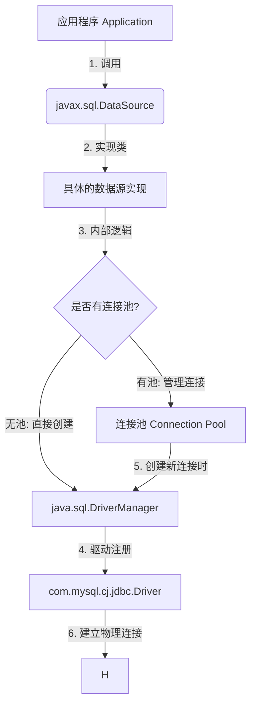
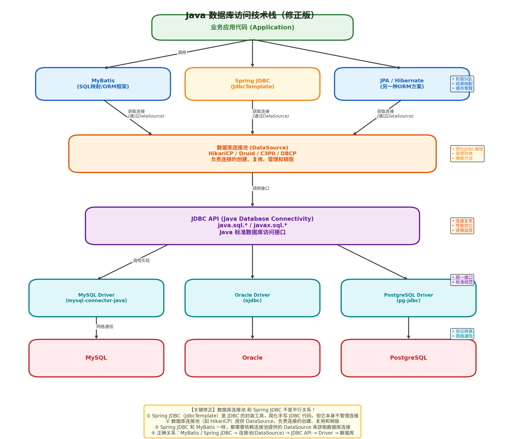

# Mysql

## myql 数据类型

### BigInteger vs BigDecimal

一句话区分：
- **BigInteger**：存**超大整数**（无小数点）
- **BigDecimal**：存**精确小数**（带小数点，钱、金额专用）

---

#### 1. 作用定位

##### BigInteger

- 任意精度**整数**
- 没有小数部分
- 用于：超大整数计算、密码学、科学计算

##### BigDecimal

- 任意精度**小数**
- 能精确控制小数点位数、舍入模式
- **金融、金额、利率、计费必须用它**

---

#### 2. 范围与存储

- **BigInteger**：理论无限大整数
- **BigDecimal**：整数+小数部分都可无限大

---

#### 3. 运算方式（重点）

两者**都不能用 + - * /**，必须调用方法：

```java
// BigInteger
a.add(b);
a.subtract(b);
a.multiply(b);
a.divide(b);

// BigDecimal 用法一样
bd1.add(bd2);
bd1.multiply(bd2);
```

---

#### 4. 最核心区别：小数与精度

##### BigInteger

- 没有小数点
- 除法会直接**整除或抛异常**

##### BigDecimal

- 支持小数点
- 除法必须指定**舍入规则**，否则除不尽抛异常
```java
bd1.divide(bd2, 2, RoundingMode.HALF_UP); // 保留2位，四舍五入
```

---

#### 5. 典型使用场景

##### 用 BigInteger

- 雪花 ID 超大整数运算
- 大数阶乘、幂运算
- 加密算法里的大素数

##### 用 BigDecimal（高频）

- **金额、价格、税费、折扣**
- 汇率、利息计算
- 任何要求**绝对不能误差**的小数计算

> float/double 会丢精度，**钱永远不能用**

---

#### 6. 与 MySQL 类型对应

- MySQL `bigint`       → Java **Long**
- MySQL `unsigned bigint` → **BigInteger**
- MySQL `decimal(19,2)` → **BigDecimal**

---

#### 极简总结

- **只算整数，特别大** → BigInteger
- **算钱、算小数、要精确** → BigDecimal
- 日常业务 99% 用 **BigDecimal**，BigInteger 很少用

### BigDecimal 

`BigDecimal` 就是 Java 里用来做**精确小数运算**的类，专门解决 `float`/`double` 精度丢失问题，**金钱、金额、计费场景必须用它**。

---

#### 1. 为什么要用 BigDecimal？

`float`/`double` 是二进制浮点，无法精确表示十进制小数（比如 0.1），会出现误差：

```java
System.out.println(0.1 + 0.2);  // 0.30000000000000004
```
金融场景绝对不能忍，所以必须用 **BigDecimal**。

---

#### 2. 创建 BigDecimal（重点：坑很多）

##### 正确方式

```java
// 1. 字符串构造（最推荐！）
BigDecimal a = new BigDecimal("0.1");

// 2. valueOf（内部也是转字符串）
BigDecimal b = BigDecimal.valueOf(0.1);
```

##### 错误方式（千万不要）

```java
// 直接用 double 构造，精度已经丢了
BigDecimal c = new BigDecimal(0.1);  // 错误！
```

##### 常用常量

```java
BigDecimal.ZERO;     // 0
BigDecimal.ONE;      // 1
BigDecimal.TEN;      // 10
```

---

#### 3. 加减乘除（必须会）

**不能用 + - * /**，必须调用方法：

```java
BigDecimal a = new BigDecimal("10");
BigDecimal b = new BigDecimal("3");

BigDecimal add = a.add(b);          // 加
BigDecimal sub = a.subtract(b);     // 减
BigDecimal mul = a.multiply(b);     // 乘
BigDecimal div = a.divide(b, 2, RoundingMode.HALF_UP); // 除
```

##### 除法必须指定：保留位数 + 舍入模式

否则除不尽直接抛异常：
`java.lang.ArithmeticException: Non-terminating decimal expansion`

---

#### 4. 舍入模式（RoundingMode）

常用 4 个：
- **RoundingMode.HALF_UP**：四舍五入（最常用）
- **RoundingMode.DOWN**：直接截断（不四舍五入）
- **RoundingMode.UP**：向上取整
- **RoundingMode.HALF_DOWN**：五舍六入

示例（保留 2 位）：
```java
a.divide(b, 2, RoundingMode.HALF_UP);
```

---

#### 5. 大小比较（重点）

**不能用 ==、>、<**
必须用：`compareTo()`

```java
BigDecimal a = new BigDecimal("1.0");
BigDecimal b = new BigDecimal("1.00");

int res = a.compareTo(b);
// res = -1 → a < b
// res = 0  → a == b
// res = 1  → a > b
```

注意：
- `a.equals(b)` 会比较**标度（小数位数）**，1.0 ≠ 1.00
- 金额比较**永远用 compareTo**

---

#### 6. 标度（scale）与精度（precision）

- **scale**：小数点后位数
  - 1.234 → scale=3
- **precision**：总有效位数
  - 1.234 → precision=4

设置小数位数：
```java
// 保留2位，四舍五入
bd = bd.setScale(2, RoundingMode.HALF_UP);
```

---

#### 7. 格式化（金额显示专用）

```java
NumberFormat format = NumberFormat.getCurrencyInstance();
format.setMaximumFractionDigits(2);
String money = format.format(bd);
```

---

#### 8. 常见坑总结（面试高频）

1. **不要用 new BigDecimal(double)**
2. **除法必须指定舍入模式**，否则抛异常
3. **比较大小用 compareTo，不要用 equals**
4. **BigDecimal 是不可变类**，运算后必须接收返回值
   ```java
   a.add(b);  // 错误，a 不会变
   a = a.add(b); // 正确
   ```
5. 不要频繁创建对象，尽量复用常量

---

#### 9. 与 MySQL 对应

- MySQL `decimal(19,2)` → Java **BigDecimal**
- MyBatis 自动映射，无需处理

---

#### 10. 一句话速记

BigDecimal = **精确小数运算**
- 创建用字符串
- 运算用方法
- 除法必舍入
- 比较用 compareTo
- 金钱场景唯一选择


------

## 一、基础篇

1. **说一下 MySQL 的存储引擎有哪些？InnoDB 和 MyISAM 的区别？**
   - ✅ 重点：事务支持、行锁 vs 表锁、外键、崩溃恢复。
2. **CHAR 与 VARCHAR 的区别是什么？**
   - ✅ 重点：定长 vs 变长、存储与性能差异。
3. **MySQL 中 DATETIME 和 TIMESTAMP 有什么区别？**
   - ✅ 重点：时区影响、存储空间、时间范围。
4. **什么是主键、唯一键、外键？它们的区别？**
   - ✅ 重点：约束作用、索引关系、是否允许空值。
5. **MySQL 中索引的类型有哪些？**
   - ✅ 重点：普通索引、唯一索引、全文索引、组合索引。
6. **说一下 MySQL 的事务特性（ACID）。**
   - ✅ Atomicity、Consistency、Isolation、Durability。

​                           


### 1️⃣ 说一下 MySQL 的存储引擎有哪些？InnoDB 和 MyISAM 的区别？

**常见存储引擎：**

- **InnoDB**（默认）
- **MyISAM**（老版本常用）
- MEMORY、ARCHIVE、CSV、BLACKHOLE 等 

**InnoDB vs MyISAM 区别：**

| 对比项       | InnoDB                   | MyISAM                 |
| ------------ | ------------------------ | ---------------------- |
| **事务支持** | ✅ 支持（ACID）           | ❌ 不支持               |
| **锁机制**   | 行锁（并发高）           | 表锁                   |
| **外键**     | 支持                     | 不支持                 |
| **崩溃恢复** | 支持（redo/undo log）    | 不支持                 |
| **主键存储** | 聚簇索引（数据即索引）   | 非聚簇索引（独立存储） |
| **适用场景** | 高频事务、数据安全要求高 | 读多写少、查询快       |


MySQL 的存储引擎是数据库底层用于管理数据存储、索引、事务等功能的核心组件，不同存储引擎适用于不同场景。以下是常见存储引擎及 InnoDB 与 MyISAM 的核心区别：

#### **一、常见的 MySQL 存储引擎**

1. **InnoDB**：  
   MySQL 5.5 及以上版本的默认存储引擎，**支持事务、行级锁、外键约束，适合高并发、数据一致性要求高的场**景（如电商订单、金融数据）。

2. **MyISAM**：  
   早期 MySQL 的默认存储引擎，不支持事务和行级锁，适合读多写少、对性能要求高但一致性要求低的场景（如日志、静态数据）。

3. **Memory（Heap）**：  
   数据存储在内存中，读写速度极快，但断电后数据丢失，适合临时数据缓存（如会话数据、临时计算结果）。

4. **CSV**：  
   以 CSV 文件格式存储数据，适合数据导入导出（如与 Excel 交互），不支持索引。

5. **Archive**：  
   用于归档大量历史数据，压缩比高，仅支持插入和查询，不支持更新/删除，适合日志归档。

6. **Blackhole**：  
   写入的数据会被丢弃，类似“黑洞”，主要用于复制场景（如作为中继节点转发日志）。

#### **二、InnoDB 与 MyISAM 的核心区别**

| **对比维度**               | **InnoDB**                              | **MyISAM**                                   |
| -------------------------- | --------------------------------------- | -------------------------------------------- |
| **事务支持**               | 支持 ACID 事务（BEGIN/COMMIT/ROLLBACK） | 不支持事务                                   |
| **锁机制**                 | 行级锁（仅锁定修改的行，并发性能好）    | 表级锁（修改时锁定整个表，并发性能差）       |
| **外键约束**               | 支持外键                                | 不支持外键                                   |
| **索引结构**               | 聚簇索引（数据与主键索引存储在一起）    | 非聚簇索引（数据与索引分开存储）             |
| **表空间**                 | 数据存储在共享表空间（或独立表空间）    | 数据存为 `.MYD` 文件，索引存为 `.MYI`        |
| **崩溃恢复**               | 支持崩溃后自动恢复（依赖 redo 日志）    | 不支持自动恢复，需手动修复（如 `myisamchk`） |
| **全文索引**               | 5.6 版本后支持                          | 原生支持                                     |
| **计数效率（`COUNT(*)`）** | 需扫描全表（或依赖二级索引）            | 有专门的计数器，查询 `COUNT(*)` 极快         |
| **适用场景**               | 高并发、事务性业务（如订单、支付）      | 读多写少、非事务场景（如博客、报表）         |

#### **三、关键差异详解**

1. **事务与数据一致性**：  
   - InnoDB 支持事务，可通过 `COMMIT`/`ROLLBACK` 保证数据原子性，适合需要事务的场景（如转账操作）。  
   - MyISAM 无事务支持，若操作中断（如断电），可能导致数据损坏。

2. **锁机制与并发性能**：  
   - InnoDB 的行级锁仅锁定修改的行，多个事务可同时修改表中不同行，并发写入性能高。  
   - MyISAM 的表级锁在写入时会锁定整个表，此时其他读写操作需等待，适合读多写少场景。

3. **索引与存储方式**：  
   - InnoDB 的聚簇索引将数据与主键索引存储在同一 B+ 树中，查询主键时效率极高；二级索引存储主键值，需回表查询数据。  
   - MyISAM 的索引与数据分离，索引叶节点存储数据地址，查询需先查索引再找数据，主键查询效率略低。

4. **崩溃恢复**：  
   - InnoDB 通过 redo 日志记录操作，崩溃后可重放日志恢复数据，保证一致性。  
   - MyISAM 无日志机制，崩溃后可能出现索引损坏，需用 `myisamchk` 工具修复。

#### **总结**

- **优先选 InnoDB**：需要事务、外键、高并发写入的场景（如电商、金融系统）。  
- **可选 MyISAM**：读操作远多于写操作，且无需事务（如静态网站、日志存储），但目前已逐渐被 InnoDB 替代。  

随着 MySQL 版本升级，InnoDB 在性能和功能上持续优化，成为绝大多数场景的首选存储引擎。

------

### 2️⃣ CHAR 与 VARCHAR 的区别是什么？

| 特性         | CHAR                       | VARCHAR                   |
| ------------ | -------------------------- | ------------------------- |
| **长度**     | 定长（不足补空格）         | 变长（按实际存储）        |
| **性能**     | 固定长度读写快             | 节省空间但更新慢          |
| **存储**     | CHAR(10) 一定占 10 字节    | VARCHAR(10) 占实际字节 +1 |
| **适用场景** | 性别、状态码等固定长度字段 | 名称、描述等可变长度字段  |

------

### 3️⃣ MySQL 中 DATETIME 和 TIMESTAMP 的区别？

| 特性         | DATETIME                             | TIMESTAMP                            |
| ------------ | ------------------------------------ | ------------------------------------ |
| **存储范围** | 1000-01-01 ~ 9999-12-31              | 1970-01-01 ~ 2038-01-19              |
| **占用空间** | 8 字节                               | 4 字节                               |
| **时区影响** | ❌ 不受影响                           | ✅ 受时区影响（存 UTC，显示本地时间） |
| **自动更新** | 可手动设置 DEFAULT CURRENT_TIMESTAMP | 默认支持自动更新                     |

> **结论：** 如果要保存绝对时间（如日志时间）→ DATETIME；
> 要保存系统时间、带时区同步 → TIMESTAMP。

------

### 4️⃣ 什么是主键、唯一键、外键？它们的区别？

- **主键（PRIMARY KEY）**：唯一标识一行数据，不可重复、不可为 NULL。
- **唯一键（UNIQUE KEY）**：数据唯一但可为 NULL（NULL 可重复）。
- **外键（FOREIGN KEY）**：用于建立表间关联，引用另一表的主键。

| 特性          | 主键       | 唯一键         | 外键             |
| ------------- | ---------- | -------------- | ---------------- |
| 是否唯一      | ✅          | ✅              | ❌                |
| 是否允许 NULL | ❌          | ✅              | ✅                |
| 是否可多列    | ✅          | ✅              | ✅                |
| 作用          | 唯一标识行 | 保证字段唯一性 | 建立表间约束关系 |

------

### 5️⃣ MySQL 中索引的类型有哪些？

**按功能分类：**

- 普通索引（INDEX）
- 唯一索引（UNIQUE）
- 主键索引（PRIMARY KEY）
- 全文索引（FULLTEXT）
- 组合索引（多列索引）

**按数据结构：**

- **B+Tree 索引（默认）**
- **Hash 索引**（Memory 引擎）
- **R-Tree 索引**（空间数据类型）
- **Full-Text 索引**（分词匹配）

#### 1️⃣ 按逻辑功能/业务场景分类

这是我们在日常开发中接触最多、也是最直观的分类方式。

| 索引类型                   | 关键特点                                                     | 适用场景                                                     |
| -------------------------- | ------------------------------------------------------------ | ------------------------------------------------------------ |
| **普通索引 (INDEX)**       | 最基本的索引类型，没有任何限制，允许重复值和 NULL 值。       | 加速查询，对非唯一字段建立索引。                             |
| **唯一索引 (UNIQUE)**      | 索引列的值必须**唯一**，但允许有 NULL（多个 NULL 不冲突）。  | 用于业务上要求唯一的字段，如手机号、身份证号、订单号等。     |
| **主键索引 (PRIMARY KEY)** | 一种特殊的唯一索引，**不允许 NULL 值**，且一张表只能有一个。 | 用于唯一标识表中的每一行数据，通常使用自增 ID。              |
| **组合索引 (Composite)**   | 在多个列上创建的索引，如 `(col1, col2)`。遵循**最左前缀原则**。 | 用于多条件查询，例如 `WHERE a=1 AND b=2`。                   |
| **全文索引 (FULLTEXT)**    | 用于大文本搜索（如文章内容），支持 `MATCH ... AGAINST` 语法。 | 适用于博客、新闻、商品描述等长文本的模糊搜索。               |
| **前缀索引 (Prefix)**      | 对字符串列的前 N 个字符建立索引，减少索引大小。              | 适用于很长的字符串字段（如 URL、长文本），但不能覆盖全量查询。 |

#### 2️⃣ 按物理存储结构分类 (InnoDB 引擎)

在 InnoDB 存储引擎中，数据的存储方式决定了索引的物理结构，这对理解查询性能至关重要。

- **聚簇索引 (Clustered Index)**
  - **特点**：数据行与索引存储在一起。InnoDB 表必须有聚簇索引，它决定了数据的物理存储顺序。
  - **规则**：如果你定义了主键，主键就是聚簇索引；如果没有主键，MySQL 会选择第一个唯一非空索引；若都没有，则会隐式创建一个 `row_id` 作为聚簇索引。
  - **优势**：通过主键查询极快（一次 I/O 即可获取数据）。
- **二级索引 (Secondary Index / 辅助索引)**
  - **特点**：叶子节点存储的是**主键值**，而不是完整的数据行。
  - **回表**：当使用二级索引查询时，如果需要获取非索引列的数据，需要先通过二级索引找到主键，再通过主键去聚簇索引中查找完整数据，这个过程叫“回表”。
  - **优化**：**覆盖索引**。如果查询的字段全部包含在索引中（例如索引是 `(a,b)`，查询 `SELECT a,b FROM table`），则无需回表，直接从索引中获取数据，性能极高。

#### 3️⃣ 按底层数据结构分类

MySQL 允许不同的存储引擎使用不同的数据结构来实现索引。

- **B+ 树索引 (B+Tree)**
  - **地位**：MySQL 中最常用、最核心的索引类型，默认使用。
  - **特点**：有序存储，支持等值查询、**范围查询**（`>`, `<`, `BETWEEN`）和排序。InnoDB 和 MyISAM 都使用 B+ 树。
- **哈希索引 (Hash)**
  - **特点**：基于哈希表实现，等值查询速度极快（接近 O(1)），但**不支持范围查询和排序**。
  - **场景**：MEMORY 存储引擎默认使用哈希索引。InnoDB 也有“自适应哈希索引”，但那是内部自动优化机制，不由用户控制。
- **空间索引 (SPATIAL)**
  - **特点**：基于 R 树，专门用于地理空间数据（如经纬度、地图坐标）。
  - **场景**：用于计算“附近的人”、地图区域查询等。

#### 💡 总结与建议

1. **首选 B+ 树**：除非你有极特殊的键值对等值匹配需求，否则 B+ 树是通用的首选。
2. **主键要自增**：尽量使用自增整数作为主键，避免使用 UUID，这样可以减少页分裂，提高写入性能。
3. **组合索引注意顺序**：将区分度高（选择性好）的列放在最左边，遵循最左前缀法则。


### MySQL 为什么选 B+ 树，而不是 B 树、Hash？

这是数据库最核心的面试/原理问题，我用**最通俗、最直白、最实用**的方式给你讲清楚，不绕弯子。

先一句话总结：
**MySQL 要的是：范围查询快、磁盘IO少、排序快、索引体积小。B+ 树完美满足，B 树和 Hash 都做不到。**

---

#### 一、先搞懂三个结构的核心区别

| 结构      | 特点                         | 适合场景               | 不适合场景               |
| --------- | ---------------------------- | ---------------------- | ------------------------ |
| **Hash**  | 哈希计算，精确查找O(1)       | 等值查询（=）          | 范围查询、排序、模糊查询 |
| **B 树**  | 节点存数据，多路平衡         | 等值+简单范围          | 范围慢、IO多、占空间大   |
| **B+ 树** | 只有叶子存数据，叶子链表相连 | 等值、范围、排序、分页 | 几乎无短板（数据库标配） |

---

#### 二、为什么不用 Hash 索引？

##### 1. 范围查询直接废了

Hash 索引是**散列存储**，数据完全无序。
- `where id > 100`
- `order by id`
- `like 'abc%'`

这些**最常用的 SQL 操作**，Hash 索引**完全无法加速**，必须全表扫描。

##### 2. 不支持最左前缀、联合索引优化

业务中大量使用**联合索引、模糊查询、排序、分页**，Hash 全部不支持。

##### 3. 哈希冲突会变慢

大量数据下，哈希冲突会让查询从 O(1) 退化成链表 O(n)。

---

#### 三、为什么不用 B 树？

B 树和 B+ 树很像，但**数据库坚决不用 B 树**，原因很致命：

##### 1. B 树：每个节点都存数据

- 数据行（一行完整记录）体积很大
- 一个磁盘页能放下的索引节点**变少**
- 树变高 → **磁盘 IO 变多 → 查询变慢**

##### 2. B+ 树：只有叶子节点存数据

非叶子节点只存键，**体积极小**
→ 一个磁盘页能存超多索引
→ 树更矮更胖
→ **磁盘 IO 大幅减少**（数据库性能关键）               

##### 3. 范围查询 B 树非常慢

B 树范围查询要**回溯父节点、反复遍历**
B+ 树**叶子节点是双向链表**
`id > 10` 直接顺着链表扫，**速度极快**

##### 4. 排序、分页 B+ 树天生支持

因为叶子是有序链表，`order by`、`limit` 直接走索引，不用额外排序。

---

#### 四、B+ 树的终极优势（数据库为什么离不开它）

##### 1. **磁盘 IO 最少**（最关键）

数据库数据存在磁盘，磁盘 IO 比内存慢 10万 倍以上。
B+ 树矮、胖、节点小 → 一次 IO 加载更多索引 → IO 次数最少。

##### 2. **范围查询、排序、模糊查询极快**

这是业务 SQL 90% 的需求，Hash 和 B 树都不行。

##### 3. **查询效率稳定**

所有数据都在叶子节点，任何查询都走相同层数，性能稳定。

##### 4. **索引体积更小**

非叶子不存数据，同样内存能缓存更多索引。

---

#### 五、一句话终极总结

- **Hash**：只适合等值查询，业务场景太窄，数据库不用。
- **B 树**：节点存数据，IO 多、范围慢，不适合磁盘存储。
- **B+ 树**：IO 最少、范围快、排序快、体积小，**完美适配数据库磁盘存储 + 业务查询需求**。

---

#### 总结

1. **不用 Hash**：不支持范围、排序、模糊查询，业务不适用
2. **不用 B 树**：节点存数据，IO 多、范围查询慢
3. **用 B+ 树**：磁盘 IO 最少、范围/排序/分页极快、查询稳定，是数据库索引的最优解

这就是 MySQL（InnoDB）**默认且唯一**使用 B+ 树作为索引结构的根本原因。

------

### 6️⃣ 说一下 MySQL 的事务特性（ACID）

1. **原子性（Atomicity）**：事务中的操作要么全部成功，要么全部失败。
2. **一致性（Consistency）**：事务执行前后，数据库状态保持一致。
3. **隔离性（Isolation）**：多个事务互不干扰（通过隔离级别控制）。
4. **持久性（Durability）**：事务提交后，修改永久保存（写入 redo log）。

> ✅ InnoDB 通过 **undo log、redo log** 保证 ACID 特性。

**当前读：** 读取数据的最新版本，并对数据进行加锁。 例如：insert、update、delete、select for update

**快照读：** 读取数据的历史版本，不对数据加锁。 例如：select 在当前读的情况下，是通过加锁来解决幻读。 在快照读的情况下，是通过MVCC来解决幻读。

#### 一、事务特性详解（ACID）

##### 1. 原子性（Atomicity）：“要么全做，要么全不做”

- **核心含义**：事务是一个不可分割的最小操作单元，事务中的所有操作（如插入、更新）要么全部执行成功，要么全部执行失败并回滚到事务开始前的状态，不会出现“部分成功”的中间态。
- **MySQL 实现**：  
  依赖 **InnoDB 存储引擎**的 **undo 日志**。事务执行时，InnoDB 会记录操作的反向日志（如插入记录时记录“删除该记录”的日志，更新记录时记录“恢复原值”的日志）；若事务执行失败（如报错、手动回滚），InnoDB 会通过 undo 日志反向操作，将数据恢复到事务开始前的状态。
- **示例**：  
  转账场景中，“A 账户减 100 元”和“B 账户加 100 元”属于同一事务。若 A 账户扣款成功但 B 账户加款失败，事务会回滚，A 账户的 100 元会恢复，避免“钱消失”的情况。

##### 2. 一致性（Consistency）：“事务前后数据状态合法”

- **核心含义**：事务执行前后，数据库的完整性约束（如主键唯一、字段非空、外键关联）不会被破坏，数据始终处于“合法”状态，不会出现逻辑矛盾。
- **MySQL 实现**：  
  依赖 **存储引擎的约束校验**（如主键冲突时报错）和 **事务原子性/隔离性的配合**。例如：  
  - 若事务中操作违反约束（如插入重复主键），InnoDB 会直接中断事务并回滚，确保数据不出现非法状态；  
  - 结合隔离性避免并发操作导致的数据逻辑错误（如多事务同时修改同一数据导致的数值异常）。
- **示例**：  
  表中“年龄”字段限制为非负整数，若事务尝试将年龄更新为 `-5`，InnoDB 会校验失败并回滚事务，保证数据始终符合“非负”的一致性要求。

##### 3. 隔离性（Isolation）：“并发事务互不干扰”

- **核心含义**：多个事务同时执行时，每个事务的操作应与其他事务隔离开，不会看到其他事务未提交的中间数据，避免“脏读、不可重复读、幻读”等并发问题。
- **MySQL 实现**：  
  依赖 **InnoDB 的隔离级别机制**和 **锁机制/多版本并发控制（MVCC）**，MySQL 支持 4 种隔离级别（从低到高）：  
  1. **读未提交（Read Uncommitted）**：最低级别，允许读取其他事务未提交的数据（会出现“脏读”），极少使用；  
  2. **读已提交（Read Committed，RC）**：默认隔离级别（MySQL 8.0 及部分版本），只能读取其他事务已提交的数据，避免“脏读”，但同一事务内多次读同一数据可能结果不同（“不可重复读”）；  
  3. **可重复读（Repeatable Read，RR）**：InnoDB 早期默认级别，同一事务内多次读同一数据结果一致，通过 MVCC 避免“不可重复读”，并通过“间隙锁”避免“幻读”；  
  4. **串行化（Serializable）**：最高级别，事务串行执行（加表锁），完全避免所有并发问题，但性能极低，仅用于数据一致性要求极高的场景（如金融对账）。
- **示例**：  
  事务 A 读取“用户余额为 1000 元”，此时事务 B 扣减该用户 500 元但未提交；若隔离级别为“读已提交”，事务 A 再次读取时仍会看到 1000 元（不会读取 B 未提交的 500 元扣减），避免“脏读”。

##### 4. 持久性（Durability）：“事务提交后数据永久保存”

- **核心含义**：事务一旦提交（`COMMIT`），其对数据的修改会永久保存到磁盘，即使后续数据库崩溃（如断电、宕机），数据也不会丢失。
- **MySQL 实现**：  
  依赖 **InnoDB 的 redo 日志**和 **刷盘机制**：  
  1. 事务执行时，InnoDB 会先将操作记录到内存的“redo 日志缓冲区”；  
  2. 事务提交时，redo 日志会被强制刷写到磁盘（`fsync` 操作），确保日志不丢失；  
  3. 数据最终会从内存缓冲池刷到磁盘，但即使未刷盘，数据库重启后也能通过 redo 日志重放事务操作，恢复已提交的数据。
- **示例**：  
  事务提交后，即使立即发生服务器断电，数据库重启时会读取 redo 日志，重新执行该事务的操作，确保提交的数据不会因断电丢失。

#### 二、关键总结

- ACID 是事务的四大核心保障，缺一不可：  
  - 原子性保证“操作不拆分”，一致性保证“数据合法”，隔离性保证“并发不干扰”，持久性保证“提交不丢失”；  
- **仅 InnoDB 存储引擎完全支持 ACID**，MyISAM 等其他引擎不支持事务，因此无法保证 ACID 特性（如 MyISAM 崩溃后可能丢失数据，无回滚机制）；  
- 实际开发中，需根据业务场景选择合适的隔离级别（如默认“读已提交”平衡性能与一致性，金融场景用“可重复读”或“串行化”）。

#### 三、undo log & redo log

InnoDB 通过 **undo log（回滚日志）** 和 **redo log（重做日志）** 两大核心日志机制，分别支撑了事务的 **原子性、一致性** 和 **持久性**，同时配合隔离级别的实现（如锁和 MVCC），共同保证了 ACID 特性。具体作用如下：

##### 一、undo log（回滚日志）：保证 **原子性** 和 **一致性**

###### 1. 核心作用

- **回滚事务**：记录事务执行过程中对数据的修改操作的“反向操作”，用于事务失败时（如 `ROLLBACK` 或崩溃）撤销所有已执行的修改，确保事务的 **原子性**（要么全成，要么全败）。  
- **支持 MVCC（多版本并发控制）**：保存数据的历史版本，让并发事务可以读取到事务开始前的数据状态，避免读取未提交的中间数据，间接保证 **隔离性** 和 **一致性**。

###### 2. 工作原理

- **记录内容**：  
  当事务执行 `INSERT`/`UPDATE`/`DELETE` 操作时，InnoDB 会生成对应的 undo log：  
  - `INSERT`：记录“删除该新增记录”的反向操作（事务回滚时删除这条记录）；  
  - `UPDATE`：记录“将字段值恢复为修改前的值”的反向操作；  
  - `DELETE`：记录“插入被删除的记录”的反向操作（实际是标记删除，undo log 保存完整记录以便恢复）。  

- **回滚过程**：  
  当事务需要回滚（`ROLLBACK`）或执行失败时，InnoDB 会反向遍历 undo log，执行其中记录的反向操作，将数据恢复到事务开始前的状态，确保原子性。  

- **与 MVCC 的配合**：  
  undo log 会保留数据的历史版本，当其他事务读取数据时，InnoDB 通过 undo log 找到对应版本的数据（而非当前被修改的未提交数据），避免“脏读”，支撑了隔离性和一致性。  

##### 二、redo log（重做日志）：保证 **持久性**

###### 1. 核心作用

- **确保已提交事务的修改不丢失**：记录事务对数据页的物理修改（如“某数据页的某偏移量修改为某值”），即使数据库崩溃（如断电），重启后可通过 redo log 重放已提交的事务操作，保证数据修改的 **持久性**。

###### 2. 工作原理

- **为什么需要 redo log？**  
  InnoDB 中数据修改先写入内存的“缓冲池（Buffer Pool）”，再异步刷到磁盘（减少磁盘 IO 次数）。若事务提交后未刷盘时发生崩溃，内存中的修改会丢失，导致持久性失效。redo log 正是为解决此问题而生。

- **记录与刷盘机制**：  
  1. 事务执行时，每修改一条数据，InnoDB 会同时将修改的物理日志（如“页号 + 偏移量 + 新值”）写入内存的 **redo log buffer**（日志缓冲区）；  
  2. 事务提交（`COMMIT`）时，InnoDB 会将 redo log buffer 中的日志 **强制刷到磁盘**（通过 `fsync` 操作，确保日志写入磁盘而非操作系统缓存）；  
  3. 数据最终会从缓冲池异步刷到磁盘，但即使未刷盘，只要 redo log 已持久化，数据库重启后可通过 redo log 重放修改，恢复已提交的数据。  

- **特点**：  
  redo log 是 **物理日志**（记录数据页的物理变化），体积小、刷盘快，且采用“循环写”机制（固定大小，满了覆盖旧日志），确保高效持久化。  

##### 三、undo log + redo log 如何协同保证 ACID？

| ACID 特性  | undo log 的作用                                              | redo log 的作用                                              | 其他配合机制                       |
| ---------- | ------------------------------------------------------------ | ------------------------------------------------------------ | ---------------------------------- |
| **原子性** | 事务失败时通过 undo log 回滚所有修改，确保“全成或全败”。     | 无直接作用，但回滚过程中产生的 undo 操作也会被 redo log 记录（保证回滚本身的持久性）。 | -                                  |
| **一致性** | 回滚非法操作（如违反约束），恢复数据到合法状态；MVCC 避免并发导致的逻辑错误。 | 确保已提交的合法修改不丢失，维持数据最终一致性。             | 存储引擎的约束校验（如主键唯一）。 |
| **隔离性** | 保存数据历史版本，支撑 MVCC，让事务读取到符合隔离级别的数据版本。 | 无直接作用，但 redo log 保证了并发事务提交后的数据持久性，间接维持隔离后的最终状态。 | 锁机制（行锁、间隙锁）。           |
| **持久性** | 无直接作用。                                                 | 事务提交后强制刷盘，崩溃后通过 redo log 重放修改，确保已提交数据不丢失。 | 缓冲池刷盘机制。                   |

##### 四、总结

- **undo log** 是“后悔药”：通过记录反向操作实现事务回滚，支撑原子性；通过保存历史版本支撑 MVCC，保证隔离性和一致性。  
- **redo log** 是“保险单”：通过记录物理修改并强制刷盘，确保已提交事务的修改不会因崩溃丢失，支撑持久性。  
- 两者与 InnoDB 的锁机制、MVCC 共同作用，最终实现了事务的 ACID 特性，是 InnoDB 作为事务型存储引擎的核心保障。

### 7.SQL SERVER

SQL Server 是微软推出的关系型数据库管理系统（RDBMS），核心用于数据的存储、管理、查询与分析，广泛应用于企业级业务系统（如财务系统、ERP、客户管理系统等）。

要快速理解它，可从核心功能、常见组件和典型应用场景三个维度切入：

---

#### 1. 核心功能

SQL Server 的核心能力围绕“高效管理关系型数据”展开，主要包括以下几点：

- **数据存储与管理**：支持标准关系型数据模型（表、行、列），通过 ACID 事务确保数据一致性（如转账、订单提交等场景）。
- **高效查询**：基于 T-SQL（Transact-SQL，SQL Server 专属的 SQL 扩展语言）实现复杂查询，内置查询优化器，可自动优化执行计划提升效率。
- **安全控制**：通过“登录用户-数据库用户-角色权限”三级体系管控访问权限，支持数据加密（如列加密、备份加密）和审计功能。
- **高可用性**：提供多种保障机制，如数据库镜像、Always On 可用性组、故障转移集群，减少因硬件故障或维护导致的停机时间。
- **数据集成与分析**：支持与 Excel、Power BI 等工具联动，内置 SSIS（SQL Server Integration Services）用于数据抽取/转换/加载（ETL），SSAS（分析服务）用于多维数据分析。

---

#### 2. 常见组件

日常使用中，经常会接触到 SQL Server 的以下关键组件：

- **数据库引擎（Database Engine）**：SQL Server 的核心服务，负责数据的存储、处理和安全管理，是所有操作的基础。
- **SQL Server Management Studio（SSMS）**：可视化管理工具，用于创建数据库、编写 T-SQL 脚本、备份恢复数据、管理用户权限等，是开发者和管理员的主要操作界面。
- **SQL Server Agent**：用于自动化任务，如定时备份数据库、执行维护计划（如索引重建）、监控数据库状态并发送警报。
- **Reporting Services（SSRS）**：用于设计和发布企业级报表（如月度销售报表、库存统计报表），支持网页、PDF、Excel 等多种输出格式。

---

#### 3. 典型应用场景

SQL Server 因稳定性和兼容性，适合以下企业级场景：

- **企业业务系统**：存储结构化业务数据，如电商订单、银行交易记录、企业员工信息等，支撑高并发读写（需配合性能优化）。
- **数据仓库与分析**：通过 SSIS 整合多源数据，构建数据仓库，再通过 SSAS 或 Power BI 进行数据分析，为企业决策提供支持（如销售趋势分析、用户行为分析）。
- **中小规模应用后端**：为 Web 应用、桌面应用提供数据存储服务，如内部管理系统、客户服务系统等，部署和维护成本相对可控。

你是想了解 SQL Server 的具体操作（如创建数据库、写 T-SQL 脚本），还是某个组件的使用（如 SSMS 管理权限）？可以告诉我你的需求，我帮你整理对应的**操作指南或核心知识点文档**。

#### SQL Server中的数据库用户与登录用户

##### 1. 核心概念区分

###### 登录用户（Login）

- 作用范围：**服务器级别**，用于登录到SQL Server数据库引擎实例。
- 核心功能：验证用户身份，决定是否有权限连接到服务器，不直接关联具体数据库的访问权限。
- 常见类型：Windows登录、SQL Server登录（如sa账户）。

###### 数据库用户（Database User）

- 作用范围：**数据库级别**，存在于具体的数据库中。
- 核心功能：映射到服务器级别的登录用户，用于分配该数据库内的操作权限（如查询表、修改数据）。
- 关键关联：一个登录用户可映射到多个数据库的不同用户，也可在某个数据库中无对应的用户（即无法访问该数据库）。

---

##### 2. 关键差异总结

| 对比维度 | 登录用户（Login）              | 数据库用户（Database User）    |
| -------- | ------------------------------ | ------------------------------ |
| 作用层级 | 服务器级                       | 数据库级                       |
| 存在位置 | 存储于`master`数据库的系统表中 | 存储于各自所属的数据库系统表中 |
| 核心目的 | 验证身份，允许连接服务器       | 分配权限，允许操作特定数据库   |
| 映射关系 | 可对应多个数据库用户           | 仅对应一个服务器登录用户       |

### 8.用户定义函数（UDF，User-Defined Function）

用户定义函数（UDF，User-Defined Function）是SQL Server中由用户编写的、可重复调用的代码块，核心用于实现特定计算逻辑或数据处理，最终返回一个值或结果集，且无法修改数据库状态。

用户定义函数不用于执行修改数据库状态的操作；

用户定义函数属于数据库，只能在该数据库下调用；

标量函数和存储过程一样，可以使用EXECUTE语句执行。

---

#### 1. 核心分类：按返回结果划分

根据返回内容的不同，用户定义函数主要分为三类，适用场景差异明显：

- **标量函数（Scalar Function）**
  - 核心能力：返回单个数据值（如int、varchar、datetime等）。
  - 典型用途：实现自定义计算，如计算商品折扣价、格式化日期字符串。
  - 示例：创建一个计算“原价×折扣”的函数 `dbo.CalcDiscountPrice(@OriginalPrice decimal(10,2), @Discount decimal(5,2))`。

- **内联表值函数（Inline Table-Valued Function, ITVF）**
  - 核心能力：返回一个表（Table），逻辑完全由单个`SELECT`语句实现，无函数体。
  - 典型用途：作为可参数化的“动态查询”，替代复杂的子查询或视图。
  - 示例：创建一个根据“部门ID”查询员工信息的函数 `dbo.GetEmployeesByDept(@DeptID int)`。

- **多语句表值函数（Multi-Statement Table-Valued Function, MSTVF）**
  - 核心能力：返回一个表，但包含多个T-SQL语句（如声明变量、循环、条件判断），需先定义表结构。
  - 典型用途：实现复杂逻辑的数据处理，如多步过滤、数据拼接后返回表结果。
  - 示例：创建一个统计“各部门月度销售TOP3产品”的函数 `dbo.GetDeptTop3Sales(@Month int, @Year int)`。

---

#### 2. 关键特性：与存储过程的核心区别

用户定义函数的特性决定了它的使用边界，最容易与存储过程混淆，需重点关注以下两点：

1. **返回值要求严格**：必须返回一个值（标量函数）或表（表值函数），无返回值的逻辑无法用UDF实现；而存储过程可无返回值，仅执行操作。
2. **可嵌入查询调用**：表值函数可直接作为“虚拟表”嵌入`SELECT`语句中（如`SELECT * FROM dbo.GetEmployeesByDept(101)`）；存储过程无法嵌入查询，只能通过`EXEC`单独执行。
3. **权限与依赖**：创建UDF需`CREATE FUNCTION`权限，调用需对应函数的`EXECUTE`权限；且UDF依赖的对象（如表、列）若被修改或删除，UDF会失效。

---

#### 3. 重要使用限制：不可突破的边界

UDF存在严格限制，这些限制是它与存储过程的核心差异之一，必须遵守：

- 禁止修改数据库状态：无法执行`INSERT`、`DELETE`、`UPDATE`语句，也不能创建/删除表、索引等数据库对象。
- 禁止使用部分T-SQL语句：如`BEGIN TRANSACTION`、`COMMIT`、`ROLLBACK`（事务相关），`PRINT`（输出语句，仅调试可用，正式调用无输出）。
- 作用范围默认局限于当前数据库：创建在A数据库的UDF，默认只能在A数据库调用；跨库调用需指定完整路径（如`DB2.dbo.MyFunc()`），且需额外权限。

### 9.标量函数

标量函数（Scalar Function）是SQL Server用户定义函数中最基础的类型，核心能力是接收输入参数、执行计算逻辑后，返回**单个确定类型的值**（如int、varchar、decimal等），且无法修改数据库状态。

理解标量函数，可从“核心特点、创建语法、调用方式、典型示例”四个维度展开，清晰掌握其使用逻辑：

---

#### 1. 核心特点：明确使用边界

标量函数的特点决定了它的适用场景，需重点关注以下3点：

- **返回单一值**：无论输入参数多少，最终仅返回一个数据值，而非结果集（表）。
- **支持参数传递**：可定义1个或多个输入参数，参数需指定数据类型，调用时需按顺序或名称传入对应值。
- **无副作用**：不能执行修改数据库状态的操作，例如`INSERT`、`DELETE`、`UPDATE`数据，或创建/删除数据库对象。

---

#### 2. 创建语法：固定结构模板

标量函数的创建需遵循固定语法，关键是指定“函数名、参数、返回值类型、计算逻辑”，语法模板如下：

```sql
CREATE FUNCTION [架构名].[函数名](
    -- 定义输入参数（可多个，格式：@参数名 数据类型）
    @参数1 数据类型,
    @参数2 数据类型
)
RETURNS 返回值数据类型 -- 指定函数最终返回的值的类型
AS
BEGIN
    -- 声明变量（若需临时存储中间结果）
    DECLARE @中间变量 数据类型;
    
    -- 核心计算逻辑（如赋值、条件判断等）
    SET @中间变量 = 计算表达式; -- 或 SELECT @中间变量 = ...
    
    -- 返回最终结果
    RETURN @中间变量;
END;
```

> 说明：默认架构为`dbo`，若不指定架构，函数会归属到`dbo`下。

---

#### 3. 调用方式：两种常用场景

标量函数的调用方式灵活，可根据需求选择“嵌入查询”或“单独执行”：

- **场景1：嵌入SELECT/UPDATE/WHERE等查询语句**  
  直接在查询中使用函数名，传入参数，如同使用系统函数（如`LEN()`）。  
  示例：调用`dbo.CalcDiscountPrice`计算商品折扣价并查询

  ```sql
  SELECT 
      商品ID,
      商品名称,
      原价,
      折扣,
      -- 调用标量函数计算折扣价
      dbo.CalcDiscountPrice(原价, 折扣) AS 折扣价
  FROM 商品表
  WHERE 折扣 < 0.8; -- 也可在WHERE中用函数筛选
  ```

- **场景2：用EXECUTE（EXEC）单独执行**  
  若只需获取函数返回值，无需关联其他数据，可通过`EXEC`单独执行，需用变量接收结果。  
  示例：单独执行函数计算某商品折扣价

  ```sql
  -- 声明变量接收结果
  DECLARE @最终折扣价 decimal(10,2);
  -- 执行函数并赋值
  EXEC @最终折扣价 = dbo.CalcDiscountPrice @OriginalPrice = 299.00, @Discount = 0.7;
  -- 查看结果
  SELECT @最终折扣价 AS 商品折扣价;
  ```

---

#### 4. 典型示例：实际业务场景

以“电商计算商品折扣价”和“格式化日期为指定字符串”两个常见场景为例，直观理解标量函数的应用：

##### 示例1：计算商品折扣价（输入原价和折扣率，返回折扣价）

```sql
-- 创建函数：计算折扣价（原价×折扣，保留2位小数）
CREATE FUNCTION dbo.CalcDiscountPrice(
    @OriginalPrice decimal(10,2), -- 商品原价
    @Discount decimal(5,2)        -- 折扣率（如0.7表示7折）
)
RETURNS decimal(10,2)
AS
BEGIN
    -- 处理异常：若折扣≤0或≥1，默认按原价返回
    IF @Discount <= 0 OR @Discount >= 1
        RETURN @OriginalPrice;
    
    -- 计算折扣价并返回
    RETURN ROUND(@OriginalPrice * @Discount, 2);
END;

-- 调用函数：查询商品列表及折扣价
SELECT 
    商品ID,
    商品名称,
    原价,
    折扣,
    dbo.CalcDiscountPrice(原价, 折扣) AS 折扣价
FROM 商品表;
```

##### 示例2：格式化日期（输入日期，返回“YYYY年MM月DD日”格式字符串）

```sql
-- 创建函数：日期格式化
CREATE FUNCTION dbo.FormatDate(
    @InputDate datetime -- 待格式化的日期
)
RETURNS varchar(20)
AS
BEGIN
    -- 处理异常：若输入日期为NULL，返回空字符串
    IF @InputDate IS NULL
        RETURN '';
    
    -- 拼接日期字符串并返回
    RETURN CONCAT(
        YEAR(@InputDate), '年',
        RIGHT('0' + CAST(MONTH(@InputDate) AS varchar(2)), 2), '月',
        RIGHT('0' + CAST(DAY(@InputDate) AS varchar(2)), 2), '日'
    );
END;

-- 调用函数：格式化订单创建时间
SELECT 
    订单ID,
    客户名称,
    dbo.FormatDate(创建时间) AS 订单创建日期
FROM 订单表;
```

### 10.数据库连接池

Java 数据库连接池（Connection Pool）框架/组件是 Java 生态中用于**管理数据库连接生命周期**的核心中间件，本质是 `javax.sql.DataSource` 接口的实现类，通过“预创建连接、复用连接、统一管控”的机制，解决数据库连接创建/销毁开销大、并发连接失控等问题，是企业级 Java 应用连接数据库的标准方案。以下从核心原理、关键特性、主流组件对比、配置实践等方面展开详细解析：

#### 一、核心原理与设计目标

##### 1. 核心原理

- **连接池初始化**：应用启动时，连接池根据配置创建一定数量的数据库连接（最小空闲连接数），并缓存到池中。
- **连接获取**：应用需要访问数据库时，从池中直接获取空闲连接，无需重新执行“网络握手、权限验证”等耗时操作。
- **连接复用**：应用使用完连接后，将连接归还给池（而非关闭），供其他请求复用。
- **动态调节**：当池中空闲连接不足时，连接池会创建新连接（不超过最大连接数）；当连接闲置时间过长，会自动销毁多余连接（维持最小空闲数）。

##### 2. 设计目标

- **提升性能**：减少连接创建/销毁的高开销操作，降低系统资源消耗。
- **控制并发**：限制最大连接数，避免数据库因连接过载而崩溃。
- **增强稳定性**：提供连接超时重试、故障恢复等机制，提升数据库访问的可靠性。
- **简化管理**：统一管控连接的生命周期，支持事务集成、监控等扩展能力。

#### 二、关键特性与核心配置参数

##### 1. 必备核心特性

- **连接池管理**：支持最小空闲连接数、最大连接数、连接超时时间等基础配置。
- **连接有效性校验**：通过“心跳检测”（如执行 `SELECT 1`）确保借出的连接可用，避免使用失效连接。
- **事务支持**：与 Java 事务管理器（如 Spring 事务）集成，保证事务的原子性。
- **资源回收**：自动销毁闲置超时的连接，释放数据库资源。

##### 2. 常见核心配置参数

| 配置参数                          | 作用说明                                                     |
| --------------------------------- | ------------------------------------------------------------ |
| 最大连接数（maxPoolSize）         | 池中允许的最大连接数量，超过则请求排队等待。                 |
| 最小空闲连接数（minIdle）         | 池中保持的最小空闲连接数量，避免频繁创建新连接。             |
| 连接超时时间（connectionTimeout） | 应用从池中获取连接的最大等待时间，超时则抛出异常。           |
| 空闲连接超时时间（idleTimeout）   | 连接闲置超过该时间则被销毁（需大于数据库的连接超时时间）。   |
| 连接存活时间（maxLifetime）       | 连接的最大生命周期，到期后强制销毁并重建，避免使用长期闲置的失效连接。 |

#### 三、主流连接池组件对比

目前 Java 生态中主流的连接池组件各有侧重，以下是核心特性对比：

| 组件         | 核心优势                                                     | 适用场景                                             | 缺点                                     |
| ------------ | ------------------------------------------------------------ | ---------------------------------------------------- | ---------------------------------------- |
| **HikariCP** | 性能最优（轻量、启动快、延迟低）；配置简单；Spring Boot 2.x+ 默认集成 | 对性能要求高、追求精简配置的场景（如微服务）         | 功能较基础，无内置监控、防注入等扩展能力 |
| **Druid**    | 功能全面（监控统计、SQL 防注入、加密传输、日志记录）；兼容性强 | 生产环境、对监控和安全性要求高的场景（如电商、金融） | 体积较大，性能略逊于 HikariCP            |
| **C3P0**     | 老牌组件，稳定性强；支持复杂的连接池配置                     | legacy 项目维护（新项目不推荐）                      | 性能较差，启动慢，资源消耗高             |
| **DBCP**     | Apache 开源，功能基础；支持 Spring 集成                      | 简单场景、对扩展能力无要求的项目                     | 扩展性弱，无内置监控，稳定性一般         |

#### 四、典型应用配置示例

以 Spring Boot 项目为例，展示 HikariCP 和 Druid 的核心配置（基于 `application.yml`）：

##### 1. HikariCP 配置（Spring Boot 默认）

```yaml
spring:
  datasource:
    url: jdbc:mysql://localhost:3306/test_db?useSSL=false&serverTimezone=UTC
    username: root
    password: 123456
    driver-class-name: com.mysql.cj.jdbc.Driver
    hikari:
      max-pool-size: 10  # 最大连接数
      min-idle: 2        # 最小空闲连接数
      connection-timeout: 30000  # 连接超时时间（30秒）
      idle-timeout: 600000        # 空闲连接超时时间（10分钟）
      max-lifetime: 1800000       # 连接最大生命周期（30分钟）
```

##### 2. Druid 配置（需引入依赖）

首先引入 Maven 依赖：

```xml
<dependency>
    <groupId>com.alibaba</groupId>
    <artifactId>druid-spring-boot-starter</artifactId>
    <version>1.2.16</version>
</dependency>
```

然后配置 `application.yml`：

```yaml
spring:
  datasource:
    url: jdbc:mysql://localhost:3306/test_db?useSSL=false&serverTimezone=UTC
    username: root
    password: 123456
    driver-class-name: com.mysql.cj.jdbc.Driver
    type: com.alibaba.druid.pool.DruidDataSource
    druid:
      max-active: 10          # 对应最大连接数
      min-idle: 2             # 最小空闲连接数
      max-wait: 30000         # 连接超时时间（30秒）
      time-between-eviction-runs-millis: 60000  # 连接校验间隔（1分钟）
      validation-query: SELECT 1                # 连接有效性校验SQL
      stat-view-servlet:                        # 开启监控控制台
        enabled: true
        login-username: admin
        login-password: admin
        url-pattern: /druid/*
      filter:
        stat: enabled: true                     # 开启SQL统计监控
        wall: enabled: true                     # 开启SQL防注入
```

#### 五、实践注意事项

1. **参数调优原则**
   - 最大连接数（maxPoolSize）：需结合数据库的最大连接数（如 MySQL 默认 151），避免超过数据库承载能力。
   - 空闲连接超时（idleTimeout）：需小于数据库的连接超时时间（如 MySQL 默认 8 小时），防止连接被数据库主动关闭后池内仍缓存失效连接。
   - 连接有效性校验：建议开启（如 Druid 的 `validation-query`），避免借出失效连接导致业务异常。

2. **安全性考量**
   - 敏感信息加密：Druid 支持数据库密码加密，避免配置文件中明文存储密码。
   - 权限控制：监控控制台（如 Druid）需设置复杂账号密码，限制访问 IP，防止未授权访问。

3. **监控与排查**
   - Druid 内置监控控制台，可查看连接池状态、SQL 执行效率、慢查询等，便于问题排查。
   - 生产环境建议集成日志框架（如 Logback），记录连接池的创建、销毁、超时等日志，便于定位问题。

#### 六、总结

Java 数据库连接池是解决数据库连接性能问题的关键组件，其中 **HikariCP** 以高性能成为轻量场景的首选，**Druid** 以丰富的扩展能力适配复杂生产环境。实际开发中需根据业务需求选择合适的组件，并结合数据库性能合理调优配置，同时重视安全性和监控能力，确保系统稳定运行。

### 11.Spring Boot 3.x 中HikariCP

在 Spring Boot 3.x 中，**HikariCP 仍然是默认的数据库连接池**，且与 Spring Boot 3.x 保持了良好的兼容性和深度集成。Spring Boot 3.x 基于 Jakarta EE 9+（而非传统的 Java EE），对底层依赖进行了升级，但 HikariCP 作为高性能连接池，其核心功能和配置方式并未发生根本性变化，仅在细节上需注意与 Jakarta 规范的适配。

#### 一、Spring Boot 3.x 中 HikariCP 的核心地位

Spring Boot 自 2.x 版本起将 HikariCP 作为默认连接池，3.x 版本延续了这一选择，原因在于：

- **性能优势**：HikariCP 以轻量（约 140KB）、启动快、连接获取延迟低著称，是目前 Java 生态中性能最优的连接池之一。
- **兼容性**：HikariCP 支持 Jakarta EE 规范（如 `jakarta.sql.DataSource`），完美适配 Spring Boot 3.x 对 Jakarta 的依赖升级（从 `javax` 包迁移到 `jakarta` 包）。
- **零配置启动**：Spring Boot 3.x 会自动检测并配置 HikariCP，无需额外引入依赖（除非主动排除）。

#### 二、依赖管理与引入

在 Spring Boot 3.x 项目中，只需引入 `spring-boot-starter-data-jpa` 或 `spring-boot-starter-jdbc`  starters，HikariCP 会被自动引入，无需单独添加依赖。

**Maven 示例**：

```xml
<dependency>
    <groupId>org.springframework.boot</groupId>
    <artifactId>spring-boot-starter-data-jpa</artifactId>
</dependency>
<!-- 或 -->
<dependency>
    <groupId>org.springframework.boot</groupId>
    <artifactId>spring-boot-starter-jdbc</artifactId>
</dependency>
```

若需指定 HikariCP 版本，可在 `pom.xml` 中显式声明（建议与 Spring Boot 3.x 兼容的版本，如 5.0+）：

```xml
<properties>
    <hikaricp.version>5.0.1</hikaricp.version>
</properties>
```

#### 三、核心配置（application.yml/application.properties）

Spring Boot 3.x 中 HikariCP 的配置方式与 2.x 基本一致，通过 `spring.datasource.hikari` 前缀指定，核心参数如下（以 `application.yml` 为例）：

```yaml
spring:
  datasource:
    url: jdbc:mysql://localhost:3306/test_db?useSSL=false&serverTimezone=UTC&allowPublicKeyRetrieval=true
    username: root
    password: 123456
    driver-class-name: com.mysql.cj.jdbc.Driver  # 数据库驱动（按需调整）
    hikari:
      max-pool-size: 10                # 最大连接数（默认 10）
      min-idle: 2                      # 最小空闲连接数（默认与 max-pool-size 相同）
      connection-timeout: 30000        # 从池获取连接的超时时间（毫秒，默认 30 秒）
      idle-timeout: 600000             # 连接空闲超时时间（毫秒，默认 10 分钟，需小于数据库超时）
      max-lifetime: 1800000            # 连接最大生命周期（毫秒，默认 30 分钟）
      connection-test-query: SELECT 1  # 连接有效性校验 SQL（可选，建议开启）
      pool-name: MyHikariPool          # 连接池名称（便于日志区分）
```

##### 关键参数说明：

- `max-pool-size`：需根据数据库最大连接数（如 MySQL 默认 151）合理设置，避免超过数据库承载能力。
- `idle-timeout`：需小于数据库的连接超时时间（如 MySQL 默认 8 小时），防止连接被数据库主动关闭后池内仍缓存失效连接。
- `connection-test-query`：建议配置（如 `SELECT 1`），确保借出的连接有效，避免业务异常。

#### 四、与 Spring Boot 3.x 的适配细节

1. **Jakarta 规范适配**  
   Spring Boot 3.x 基于 Jakarta EE 9+，依赖包从 `javax.sql` 迁移到 `jakarta.sql`。HikariCP 自 4.0 版本起已支持 `jakarta.sql.DataSource` 接口，因此与 Spring Boot 3.x 兼容无虞。

2. **自动配置类变化**  
   Spring Boot 3.x 中，HikariCP 的自动配置类仍为 `HikariDataSourceAutoConfiguration`，但底层依赖的 `DataSource` 接口已切换为 Jakarta 版本，无需手动调整。

3. **日志与监控**  
   可通过 Spring Boot Actuator 监控 HikariCP 状态，需引入 `spring-boot-starter-actuator` 并暴露相关端点：

   ```yaml
   management:
     endpoints:
       web:
         exposure:
           include: health,info,hikari
   ```

   访问 `/actuator/hikari` 可查看连接池当前状态（如活跃连接数、空闲连接数等）。

#### 五、常见问题与解决方案

1. **连接泄露排查**  
   若出现连接池耗尽（`HikariPool-1 - Connection is not available`），可通过 HikariCP 的日志定位问题：

   ```yaml
   logging:
     level:
       com.zaxxer.hikari: DEBUG  # 开启 HikariCP 调试日志
   ```

   日志中会显示连接的创建、获取、释放过程，便于排查未释放连接的代码（如未关闭 `Connection`、`Statement` 等资源）。

2. **版本兼容性**  
   确保 HikariCP 版本与 Spring Boot 3.x 兼容：

   - Spring Boot 3.0+ 建议使用 HikariCP 5.0+（支持 Jakarta EE 9+）。
   - 避免使用低于 4.0 的版本（仅支持 `javax.sql`，与 Spring Boot 3.x 冲突）。

3. **自定义 DataSource**  
   若需手动配置 HikariCP，可通过 `@Configuration` 类创建 `HikariDataSource` 实例：

   ```java
   import jakarta.sql.DataSource;
   import com.zaxxer.hikari.HikariConfig;
   import com.zaxxer.hikari.HikariDataSource;
   import org.springframework.context.annotation.Bean;
   import org.springframework.context.annotation.Configuration;
   
   @Configuration
   public class DataSourceConfig {
       @Bean
       public DataSource dataSource() {
           HikariConfig config = new HikariConfig();
           config.setJdbcUrl("jdbc:mysql://localhost:3306/test_db");
           config.setUsername("root");
           config.setPassword("123456");
           config.setMaximumPoolSize(10);
           return new HikariDataSource(config);
       }
   }
   ```

#### 总结

在 Spring Boot 3.x 中，HikariCP 依然是推荐的默认数据库连接池，其配置方式与 2.x 保持一致，仅需注意 Jakarta 规范的适配和版本兼容性。凭借高性能和简洁的设计，HikariCP 仍是 Spring Boot 3.x 项目连接数据库的首选方案，实际开发中需结合业务场景合理调优连接池参数，确保系统稳定性和性能。

### 12.DataSource

在 Spring Boot 项目中，`DataSource`（数据源）是连接数据库的关键组件，用于管理数据库连接池、配置数据库连接信息等。以下是 `DataSource` 的核心配置方式（以 MySQL 为例），包括基础配置、连接池优化、多数据源等场景。

#### 一、基础数据源配置（单数据源）

Spring Boot 会自动配置 `DataSource`，只需在 `application.yml` 中添加数据库连接信息即可。默认使用 HikariCP 连接池（性能最优，推荐）。

##### 1. 引入依赖（Maven）

```xml
<!-- Spring Boot  Starter JDBC（包含数据源自动配置） -->
<dependency>
    <groupId>org.springframework.boot</groupId>
    <artifactId>spring-boot-starter-jdbc</artifactId>
</dependency>

<!-- MySQL 驱动 -->
<dependency>
    <groupId>com.mysql</groupId>
    <artifactId>mysql-connector-j</artifactId>
    <scope>runtime</scope>
</dependency>
```

##### 2. `application.yml` 配置

```yaml
spring:
  datasource:
    # 数据库连接 URL（MySQL 8.x 需指定时区 serverTimezone）
    url: jdbc:mysql://localhost:3306/your_database?useUnicode=true&characterEncoding=utf8&serverTimezone=Asia/Shanghai&useSSL=false
    # 数据库用户名
    username: root
    # 数据库密码
    password: 123456
    # 驱动类（MySQL 8.x 用 com.mysql.cj.jdbc.Driver，5.x 用 com.mysql.jdbc.Driver）
    driver-class-name: com.mysql.cj.jdbc.Driver

    # HikariCP 连接池配置（可选，默认有合理值，生产环境建议优化）
    hikari:
      maximum-pool-size: 10  # 最大连接数（默认 10，根据并发量调整）
      minimum-idle: 5        # 最小空闲连接数（默认与最大连接数一致）
      idle-timeout: 300000   # 空闲连接超时时间（毫秒，默认 600000ms=10分钟）
      connection-timeout: 20000  # 连接超时时间（毫秒，默认 30000ms=30秒）
      max-lifetime: 1800000   # 连接最大生命周期（毫秒，默认 1800000ms=30分钟）
      pool-name: MyHikariPool  # 连接池名称（便于日志区分）
```

#### 二、多数据源配置（多库连接）

当需要连接多个数据库时，需手动配置多个 `DataSource`，并指定对应的 `SqlSessionFactory` 或 `JdbcTemplate`。

##### 1. 引入依赖（同上，需额外注意 MyBatis/MyBatis-Plus 配置）

##### 2. `application.yml` 配置多数据源

```yaml
spring:
  datasource:
    # 主数据源（默认数据源）
    primary:
      url: jdbc:mysql://localhost:3306/db1?serverTimezone=Asia/Shanghai
      username: root
      password: 123456
      driver-class-name: com.mysql.cj.jdbc.Driver
    # 从数据源（第二个数据库）
    secondary:
      url: jdbc:mysql://localhost:3306/db2?serverTimezone=Asia/Shanghai
      username: root
      password: 123456
      driver-class-name: com.mysql.cj.jdbc.Driver

    # 连接池配置（分别对每个数据源设置）
    hikari:
      primary:
        maximum-pool-size: 10
      secondary:
        maximum-pool-size: 5
```

##### 3. 配置类（手动注册数据源）

```java
import com.zaxxer.hikari.HikariConfig;
import com.zaxxer.hikari.HikariDataSource;
import org.springframework.boot.context.properties.ConfigurationProperties;
import org.springframework.context.annotation.Bean;
import org.springframework.context.annotation.Configuration;
import org.springframework.context.annotation.Primary;

import javax.sql.DataSource;

@Configuration
public class DataSourceConfig {

    // 主数据源（@Primary 标记默认数据源）
    @Primary
    @Bean(name = "primaryDataSource")
    @ConfigurationProperties(prefix = "spring.datasource.primary") // 绑定配置前缀
    public DataSource primaryDataSource() {
        return new HikariDataSource(new HikariConfig());
    }

    // 从数据源
    @Bean(name = "secondaryDataSource")
    @ConfigurationProperties(prefix = "spring.datasource.secondary")
    public DataSource secondaryDataSource() {
        return new HikariDataSource(new HikariConfig());
    }
}
```

##### 4. 绑定 JdbcTemplate（可选）

```java
import org.springframework.beans.factory.annotation.Qualifier;
import org.springframework.context.annotation.Bean;
import org.springframework.context.annotation.Configuration;
import org.springframework.jdbc.core.JdbcTemplate;

import javax.sql.DataSource;

@Configuration
public class JdbcTemplateConfig {

    // 主数据源的 JdbcTemplate
    @Primary
    @Bean(name = "primaryJdbcTemplate")
    public JdbcTemplate primaryJdbcTemplate(@Qualifier("primaryDataSource") DataSource dataSource) {
        return new JdbcTemplate(dataSource);
    }

    // 从数据源的 JdbcTemplate
    @Bean(name = "secondaryJdbcTemplate")
    public JdbcTemplate secondaryJdbcTemplate(@Qualifier("secondaryDataSource") DataSource dataSource) {
        return new JdbcTemplate(dataSource);
    }
}
```

#### 三、常见问题与优化

##### 1. 连接池选择

- **HikariCP**：Spring Boot 默认连接池，性能最优（推荐），配置简单。

- **Druid**：阿里开源连接池，支持监控、防 SQL 注入等功能，适合需要精细化管理的场景。  
  若使用 Druid，需替换依赖并修改配置：

  ```xml
  <!-- Druid 依赖 -->
  <dependency>
      <groupId>com.alibaba</groupId>
      <artifactId>druid-spring-boot-3-starter</artifactId>
      <version>1.2.20</version>
  </dependency>
  ```

  配置示例：

  ```yaml
  spring:
    datasource:
      druid:
        url: jdbc:mysql://localhost:3306/your_db?serverTimezone=Asia/Shanghai
        username: root
        password: 123456
        driver-class-name: com.mysql.cj.jdbc.Driver
        initial-size: 5  # 初始连接数
        max-active: 20   # 最大连接数
        min-idle: 5      # 最小空闲连接数
        max-wait: 60000  # 获取连接超时时间（毫秒）
  ```

##### 2. 常见错误排查

- **连接超时**：检查 `url` 中的主机、端口是否正确，数据库是否启动，防火墙是否开放端口。
- **驱动类错误**：MySQL 8.x 必须使用 `com.mysql.cj.jdbc.Driver`，且 `url` 需指定 `serverTimezone`。
- **连接池耗尽**：增大 `maximum-pool-size`，或检查代码中是否存在未释放的连接（如未关闭 `ResultSet`、`Statement`）。

##### 3. 生产环境建议

- 合理设置连接池参数（`maximum-pool-size` 不宜过大，避免数据库压力过大）。
- 开启连接池监控（如 Druid 监控页面），实时观察连接使用情况。
- 配置连接超时和重试机制，提高系统稳定性。

#### 四、总结

- 单数据源场景：只需在 `application.yml` 中配置 `spring.datasource` 相关属性，Spring Boot 会自动创建 `DataSource`。
- 多数据源场景：需手动配置多个 `DataSource` 实例，并通过 `@Qualifier` 区分注入。
- 连接池优先选择 HikariCP（默认），如需更多功能可切换为 Druid。

通过以上配置，即可实现 Spring Boot 与数据库的连接，并根据实际需求优化性能。

### 13.数据源、数据库连接池关系

你可以把整个机制想象成一个**“水厂供水系统”**：

\*  **MySQL 数据库** = **水源地（水厂）**：负责生产水（数据），每次新建连接就像从水厂铺设一条新水管到用户家，成本极高。
\*  **连接池** = **蓄水池/中转站**：提前从水厂接好一大池水，放在离用户近的地方。
\*  **数据源 (DataSource)** = **供水公司的总接口/门面**：应用程序（用户）不直接找蓄水池，也不直接找水厂，而是找“供水公司”要水。供水公司内部决定是从蓄水池给水，还是临时去水厂接水。

------

#### 🏗️ 核心关系图解

在 Java (JDBC) 体系中，它们的层级关系如下：



#### 📊 详细角色分工表

| 组件              | 角色定位       | 关键特征                                                     | 与 MySQL 的关系                                              |
| ----------------- | -------------- | ------------------------------------------------------------ | ------------------------------------------------------------ |
| **DataSource**    | **标准接口**   | Java 官方制定的规范 (`javax.sql.DataSource`)。 应用程序获取连接的**唯一标准入口**。 | 它只是一个接口，不直接操作 MySQL，需要具体实现类。           |
| **连接池实现**    | **具体实现**   | 实现了 `DataSource` 接口。 例如：**HikariCP**, **Druid**, **DBCP**, **C3P0**。 内部维护了一个“连接集合”(池)。 | 它是 DataSource 的一种高级实现，主要目的是**复用**连接。     |
| **DriverManager** | **底层创建者** | Java 核心类。 负责加载 MySQL 驱动并建立**物理连接**。        | 连接池在**第一次创建**连接时，底层必须调用它来建立与 MySQL 的 TCP 连接。 |
| **MySQL Driver**  | **驱动程序**   | `com.mysql.cj.jdbc.Driver`。 负责具体的网络通信协议。        | 连接池通过它与 MySQL 服务器进行握手、认证和数据传输。        |

#### 🔗 它们是如何协同工作的？

当你在代码中调用 `dataSource.getConnection()` 时，背后的流程如下：

\1. **应用程序**向 `DataSource` 申请连接。
\2. **连接池（作为 DataSource 的实现）** 接收到请求：
  \*  **情况 A（池中有空闲连接）**：直接从“池子”里拿出一个已经建好的连接给应用程序。**（最快，不涉及 MySQL 交互）**
  \*  **情况 B（池中无空闲，且未达最大连接数）**：连接池内部调用 `DriverManager`，通过 `MySQL Driver` 向 MySQL 服务器发起请求，建立一个新的物理连接，交给应用程序，并标记为“使用中”。
\3. **应用程序**使用连接执行 SQL 操作。
\4. **应用程序**调用 `connection.close()`：
  \*  **注意**：连接并没有真正断开！
  \*  连接池拦截了 `close()` 方法，将连接**归还**到池中，以便下次复用。

#### 💡 一个关键的误区澄清

**所有的连接池（DataSource）最终都依赖 DriverManager + Driver**

无论是 HikariCP、Druid 还是 C3P0，它们本质上都是对 `DriverManager` 的封装。

\*  **没有连接池时**：每次 `getConnection()` 都直接调用 `DriverManager` 建立新连接（昂贵）。
\*  **有连接池时**：`getConnection()` 先看池子里有没有；如果没有，才调用 `DriverManager` 建立新连接；如果有，直接复用。

**一句话总结：**
`DataSource` 是一个接口，**连接池**是这个接口的一种实现。连接池利用 `DataSource` 的标准方法，内部管理了一组由 `DriverManager` 创建的、与 MySQL 的物理连接，从而实现了连接的复用，避免了频繁建立连接的开销。




---

#### 各层关系简要说明

| 层级           | 组件                                   | 作用                                                         |
| -------------- | -------------------------------------- | ------------------------------------------------------------ |
| **最上层**     | 业务应用代码                           | 开发者编写的业务逻辑                                         |
| **ORM 层**     | MyBatis / JPA / Hibernate              | 封装 SQL、结果映射、缓存管理，让开发者不用手写大量 JDBC 样板代码 |
| **连接池层**   | HikariCP / Druid / C3P0                | 基于 JDBC 管理数据库连接的**创建、复用和销毁**，避免频繁创建连接的性能开销 |
| **标准接口层** | **JDBC API** (`java.sql.*`)            | Java 提供的**标准接口规范**，是连接一切的"契约"              |
| **驱动实现层** | MySQL Driver / Oracle Driver / pg-jdbc | 数据库厂商对 JDBC 接口的**具体实现**，负责协议转换和网络通信 |
| **最底层**     | MySQL / Oracle / PostgreSQL            | 实际的数据库服务                                             |

#### 核心要点

- **JDBC 是规范（接口）**，本身不能操作数据库。
- **Driver 是实现**，不同数据库需要不同的驱动包。
- **连接池**在 JDBC 之上做连接管理，提升性能。
- **MyBatis**在连接池之上做 SQL 映射，进一步简化开发。

下载原图：[Java 数据库访问技术栈关系图](sandbox:///mnt/agents/output/jdbc_architecture.png)

### **多种数据库驱动、JDBC规范、连接池、应用**

把你最在意的：**多种数据库驱动、JDBC规范、连接池、应用**的关系讲得**清清楚楚、教科书级别**。

#### 一、核心思想（先记住这一句）

**JDBC 是一套「接口规范」，
MySQL、Oracle、PostgreSQL 各自提供「驱动实现」，
连接池是「管理这些连接的池子」。**

---

#### 二、完整架构图（最标准、最正确、含多驱动）

```
+---------------------------------------+
|              Java 应用程序             |
+---------------------------------------+
            ↑
            │ 调用 JDBC 标准接口
            ↓
+---------------------------------------+
|           JDBC API（Java 官方规范）     |
|  (全部是 interface，没有实现)          |
|  • Connection                         |
|  • Statement                          |
|  • PreparedStatement                  |
|  • ResultSet                          |
|  • DataSource（连接池标准接口）        |
+---------------------------------------+
            ↑
            │ 连接池实现 JDBC 接口
            ↓
+---------------------------------------+
|           数据库连接池                 |
|  HikariCP、Druid、C3P0、DBCP2         |
|  作用：管理、复用物理连接             |
+---------------------------------------+
            ↑           ↑           ↑
            │           │           │
            ↓           ↓           ↓
+-----------+   +-----------+   +-----------+
| MySQL 驱动 | | Oracle 驱动| | PostgreSQL |
|(mysql-connector)|(ojdbc)| 驱动      |
+-----------+   +-----------+   +-----------+
            ↑           ↑           ↑
            │ TCP       │ TCP       │ TCP
            ↓           ↓           ↓
+-----------+   +-----------+   +-----------+
| MySQL 库  |   | Oracle 库 |   | PostgreSQL|
+-----------+   +-----------+   +-----------+
```

---

#### 三、分层逻辑（极度清晰）

##### 1. JDBC API（顶层规范）

- **Java 制定，所有数据库统一接口**
- 只定义方法，**不实现任何功能**
- 应用面向接口编程，**不关心底层数据库是谁**

##### 2. 数据库驱动（真正实现）

- **每个数据库厂商自己实现 JDBC 接口**
- MySQL 驱动：`com.mysql.cj.jdbc`
- Oracle 驱动：`oracle.jdbc`
- PostgreSQL 驱动：`org.postgresql.Driver`
- 作用：**建立 TCP、封装协议、发送SQL、返回结果**

> **关键：驱动是数据库厂商提供的，不是 Java 官方的！**

##### 3. 连接池（中间管理层）

- **不实现 JDBC，只是包装、管理驱动连接**
- 从驱动获取**物理连接**
- 给应用提供**逻辑连接**
- `close()` 不是关闭，是**归还连接池**

##### 4. 应用层

- 只使用 JDBC 接口
- 切换数据库**只换驱动、不换代码**

---

#### 四、你最关心的问题（我直接明确回答）

##### ✅ 驱动是不是有多个？

**是！完全正确！**

- MySQL 有自己的驱动
- Oracle 有自己的驱动
- PostgreSQL 有自己的驱动
- **它们都实现同一套 JDBC 接口**

##### ✅ JDBC 就是为了屏蔽不同数据库差异

**这就是 JDBC 的核心设计目的：接口统一，底层可替换。**

---

#### 五、一句话终极总结（面试满分）

**JDBC 是 Java 定义的数据库访问接口，
MySQL、Oracle 等厂商提供各自的驱动实现该接口，
连接池负责管理驱动创建的物理连接，实现复用与控制并发，
最终应用通过统一接口访问不同数据库，无需修改代码。**


### **JDBC 数据库访问执行过程**

也就是 **Java 程序通过 JDBC 操作 MySQL 的一整套固定流程**。

**Java 应用程序通过 JDBC 规范，与数据库建立连接、发送并执行 SQL、处理结果、释放资源的全过程。**

        JDBC（规范）
        ├── JDBC API（接口定义）
        │     ├── Connection
        │     ├── Statement
        │     ├── ResultSet
        │     └── DataSource
        │
        └── Driver（实现）
              ├── MySQL Driver
              ├── Oracle Driver
              └── PostgreSQL Driver
👉 **JDBC 是 Java 访问数据库的标准规范，而 JDBC API 是该规范在 Java 中的接口定义（java.sql / javax.sql），数据库厂商通过实现这些接口提供具体驱动。**

#### 1. **连接阶段**

- 加载驱动
- 和数据库建立连接 `Connection`

#### 2. **SQL 准备阶段（重点）**

- 写带 `?` 占位符的 SQL
- **`prepareStatement(sql)` 预编译 SQL**
- 给占位符设置参数：`setString()`、`setInt()`

#### 3. **执行阶段**

- 发送 SQL 到数据库执行
  - 查询：`executeQuery()`
  - 增删改：`executeUpdate()`
- 获取返回结果（`ResultSet` 或影响行数）

#### 4. **释放资源阶段**

- 关闭结果集 → 语句对象 → 连接
  （`ResultSet` → `PreparedStatement` → `Connection`）

- 你在 Spring 里用的 **JdbcTemplate、MyBatis**
- 底层 **全都是封装了这套 JDBC 流程**

我给你一句**最精准、最通俗、最透彻**的解释：

### **JdbcTemplate **

**就是 Spring 对原生 JDBC 的封装模板类**

---

#### 1. 一句话讲透

**JdbcTemplate = 简化版 JDBC**
它帮你把**连接获取、SQL执行、结果处理、资源关闭**全部自动化，你只需要关注 SQL 本身。

---

#### 2. 它解决了原生 JDBC 什么痛点？

原生 JDBC 你要写一堆代码：
- 获取连接
- 创建 PreparedStatement
- 设置参数
- 执行
- 处理 ResultSet
- 捕获异常
- **关闭资源（非常容易忘）**

用 **JdbcTemplate**：
你**只写 2 行**：
```java
jdbcTemplate.update("insert into user(name) values(?)", "张三");
```

---

#### 3. JdbcTemplate 内部执行顺序（就是你刚才问的）

JdbcTemplate 底层**完全按照你刚才学的 JDBC 顺序执行**：

1. **获取连接**
2. **预编译 SQL → PreparedStatement**
3. **给 ? 设置参数**
4. **执行 SQL**
5. **封装结果集**
6. **自动关闭资源（连接、Statement、ResultSet）**

---

#### 4. 最核心的对应关系（必懂）

```
JdbcTemplate.update() / query()
   ↓ 底层
PreparedStatement.setXXX()
   ↓
PreparedStatement.executeUpdate() / executeQuery()
```

---

#### 5. 终极总结

**JdbcTemplate 就是 Spring 提供的、简化 JDBC 操作的工具类，
底层还是你刚才学的：连接 → 预编译 → 设参 → 执行 → 关闭。**

---

#### 你现在彻底打通了吗？

**原生 JDBC**
↓ 封装
**JdbcTemplate**
↓ 再封装
**MyBatis / MyBatis-Plus**

全部底层都是 **PreparedStatement**！

### MyBatis 

**MyBatis 底层 = 还是 JDBC + PreparedStatement
只是帮你全自动管理了所有步骤，你只写 SQL 和接口。**

---

#### MyBatis 完整执行流程（内部顺序）

你写的代码：
```java
User user = userMapper.selectById(1L);
```

#### MyBatis 内部真正执行顺序（和 JDBC 完全对应）

1. **加载配置，建立 SqlSession → 对应获取 Connection**
2. **找到你写的 SQL（xml 或注解）**
3. **预编译 SQL → 创建 PreparedStatement**
4. **把方法参数自动 set 进 ? 占位符**
5. **执行 pstmt.executeQuery() / executeUpdate()**
6. **自动映射 ResultSet → Java 对象（User）**
7. **自动关闭 Statement、ResultSet、SqlSession**

---

#### 最关键对应关系（一眼看懂）

| 你写的          | MyBatis 内部 | 底层真实执行         |
| --------------- | ------------ | -------------------- |
| Mapper 接口方法 | SqlSession   | Connection           |
| SQL 语句        | 解析 SQL     | PreparedStatement    |
| 方法参数        | 参数处理     | pstmt.setLong(1, id) |
| 查询            | 执行         | pstmt.executeQuery() |
| 返回对象        | 结果映射     | ResultSet → User     |

---

#### 所以：

**MyBatis 并没有创造新东西，它只是把 JDBC 全自动了**

- 不用写 Connection
- 不用写 PreparedStatement
- 不用手动 set 参数
- 不用遍历 ResultSet
- 不用关资源

**全部自动化。**

---

#### 再往底层看一眼（真实源码级）

MyBatis 里有个核心类：
##### `PreparedStatementHandler`

里面干的事就是：
```java
// 1. 预编译
PreparedStatement stmt = connection.prepareStatement(sql);

// 2. 设置参数
parameterHandler.setParameters(stmt);

// 3. 执行查询
ResultSet rs = stmt.executeQuery();

// 4. 结果映射
resultSetHandler.handleResultSets(rs);
```

**这不就是你刚才学的原生 JDBC 顺序吗？完全一样！**

---

#### 最终整条链路总结（必背）

```
你写的 MyBatis Mapper
       ↓
MyBatis 封装（SqlSession、StatementHandler、参数、结果映射）
       ↓
JdbcTemplate 风格（简化 JDBC）
       ↓
原生 JDBC
       ↓
PreparedStatement（预编译）
       ↓
method.invoke（反射执行）
       ↓
MySQL 执行 SQL
```

---

#### 一句话终极答案

**MyBatis 底层依然是 PreparedStatement，
执行顺序和你刚才学的 JDBC 完全一样，
只是 MyBatis 把所有重复代码全帮你自动干了。**

### MyBatis **中的反射**

**MyBatis 底层几乎所有“给属性赋值、调用方法、创建对象”全是反射做的。**

---

#### 1. 创建 Mapper 接口代理对象（最经典）

你写的接口：
```java
public interface UserMapper {
    User selectById(Long id);
}
```

MyBatis 并没有实现类，它是用：
```java
Proxy.newProxyInstance(...)
```
**JDK 动态代理** 创建的代理对象。

而动态代理底层 = **反射**。

---

#### 2. 执行 Mapper 方法时：反射调用方法

当你调用：
```java
userMapper.selectById(1L);
```

MyBatis 内部通过反射拿到方法：
```java
Method method = mapperInterface.getMethod("selectById", Long.class);
```

这是**反射**。

---

#### 3. 参数赋值：反射 set 进 SQL 参数

MyBatis 拿到你的参数后，
通过反射读取对象里的字段值，塞进 `PreparedStatement`：

```java
Field field = user.getClass().getDeclaredField("username");
field.setAccessible(true);
String value = (String) field.get(user);

pstmt.setString(1, value);
```

这是**反射**。

---

#### 4. 结果映射：反射给实体类赋值（最频繁）

查询返回 ResultSet → 封装成 User 对象：
```java
User user = new User();

Field idField = User.class.getDeclaredField("id");
idField.setAccessible(true);
idField.set(user, rs.getLong("id"));

Field nameField = User.class.getDeclaredField("username");
nameField.setAccessible(true);
nameField.set(user, rs.getString("username"));
```

**这一步是 MyBatis 反射使用最多的地方！**

---

#### 5. 创建对象实例：反射 new 实例

```java
Class<?> clazz = Class.forName("com.example.User");
Object obj = clazz.newInstance(); 
```

MyBatis 映射结果时，就是这样**反射创建对象**。

---

#### 6. 调用构造方法：反射

如果你用构造器注入结果：
```xml
<constructor>
    <arg column="id" javaType="Long"/>
</constructor>
```

MyBatis 会反射找构造方法：
```java
Constructor<?> constructor = clazz.getConstructor(Long.class);
Object obj = constructor.newInstance(1001L);
```

还是**反射**。

---

#### 7. 调用 getter/setter 方法

MyBatis 也可以通过：
```java
Method setId = clazz.getMethod("setId", Long.class);
setId.invoke(user, 1001L);
```

反射调用 setter 赋值。

---

#### 最终超级精简版（MyBatis 反射 4 大核心位置）

1. **创建 Mapper 代理 → JDK 动态代理（反射）**
2. **读取参数对象属性 → 反射 get**
3. **创建结果实体对象 → 反射 newInstance**
4. **给实体类赋值 → 反射 field.set / setter.invoke**

##### **MyBatis 没有一行代码是直接 new 对象、直接调方法，

从 Mapper 代理到参数、到结果映射，全部靠反射。**

### Spring Boot 的“自动配置”机制

因为**Spring Boot 的“自动配置”机制，把底层所有繁琐操作全帮你做完了**。

我用最直白、最本质的话给你讲清楚：
**你只写几行 yml，Spring Boot 就自动把整个 JDBC/MyBatis 环境全部搭好了。**

---

#### 1. 你在 yml 里写的到底是什么？

你只写了这几样：
```yaml
spring:
  datasource:
    url: jdbc:mysql://...
    username: root
    password: 123456
    driver-class-name: com.mysql.cj.jdbc.Driver
```

这几行本质就是：
**告诉 Spring Boot 数据库在哪、账号密码是什么**

---

#### 2. Spring Boot 看到这些配置后，自动干了什么？

它**自动执行了下面所有你以前要手写的代码**：

1. **加载 MySQL 驱动**
2. **创建 DataSource（连接池 Hikari）**
3. **建立数据库连接 Connection**
4. **自动配置 JdbcTemplate**
5. **如果引入了 MyBatis：自动配置 SqlSessionFactory、MapperScannerConfigurer**
6. **把 Mapper 接口生成代理对象注入 Spring**
7. **自动事务管理**

也就是说：
##### **以前几百行代码 → 现在 4 行配置搞定**

---

#### 3. 为什么能这么爽？

因为 **spring-boot-starter-jdbc / mybatis-spring-boot-starter**
内部都有一个 **自动配置类**：

- `DataSourceAutoConfiguration`
- `JdbcTemplateAutoConfiguration`
- `MybatisAutoConfiguration`

这些类**一启动就自动运行**，读取 yml 配置，自动创建所有 Bean。

---

#### 4. 最终效果（你只需要做两件事）

1. 在 yml 写**数据库地址、账号、密码**
2. 写 Mapper 接口，直接用 `@Autowired` 注入

**中间所有 JDBC、连接、PreparedStatement 全都被隐藏了。**

---

#### 5. 一句话终极总结

##### 你在 application.yml 配置的是“连接信息”，

Spring Boot 根据这些信息自动把整个数据库环境（DataSource、连接池、MyBatis、SqlSession）全部初始化好，
所以你不用写任何底层代码，直接用就行。

---

### Druid控制台

#### 依赖

正确 Druid 依赖（SpringBoot 3）

```xml
<!-- 只有这个自带监控控制台！ -->
<dependency>
    <groupId>com.alibaba</groupId>
    <artifactId>druid-spring-boot-3-starter</artifactId>
    <version>1.2.21</version>
</dependency>
```

#### application.yaml

##### 访问地址

**http://localhost:8083/druid**

账号：`admin`

密码：`123456`

```yaml
server:
  port: 8083

spring:
  application:
    name: theater-service-wallet
  config:
    import:
      - "optional:nacos:theater-wallet.yaml?server-addr=192.168.137.128:8848"
      - "optional:nacos:theater-common.yaml?server-addr=192.168.137.128:8848"
      - "optional:nacos:theater-shared-seata.yaml?server-addr=192.168.137.128:8848"

  # ======================== 数据库 + Druid 监控 ========================
  datasource:
    driver-class-name: com.mysql.cj.jdbc.Driver
    url: jdbc:mysql://192.168.137.128:3306/theater_cloud_db?useUnicode=true&characterEncoding=utf8&useSSL=false&serverTimezone=Asia/Shanghai
    username: root
    password: xew.0511

    # 指定使用 Druid 连接池
    type: com.alibaba.druid.pool.DruidDataSource

    # Druid 监控控制台配置
    druid:
      # 开启监控页面
      stat-view-servlet:
        enabled: true
        login-username: admin
        login-password: 123456
        url-pattern: /druid/*
        allow: 127.0.0.1

      # 开启监控统计
      filter:
        stat:
          enabled: true
        wall:
          enabled: true

      # 连接池参数
      initial-size: 5
      min-idle: 5
      max-active: 20
      max-wait: 60000

  cloud:
    nacos:
      discovery:
        server-addr: 192.168.137.128:8848

# MyBatis-Plus
mybatis-plus:
  mapper-locations: classpath*:mapper/**/*.xml
  configuration:
    map-underscore-to-camel-case: true
```


Druid 控制台就是**数据库连接池的可视化监控后台**，专门给开发、运维排查数据库问题用的。
简单说：**平时看不见的数据库行为，在这全都能看得清清楚楚**。

#### 核心功能 & 实际用处

##### 1. 查看数据库连接状态（最常用）

- 当前有多少个连接
- 活跃连接、空闲连接、等待连接数
- 有没有连接泄露、连接不释放
作用：
**定位项目卡死、接口慢、数据库连接耗尽**。

##### 2. SQL 监控（非常强）

- 所有执行过的 SQL
- 每条 SQL 执行次数、最慢执行时间、平均耗时
- 哪个接口频繁查库、哪个 SQL 最慢
作用：
**快速找出慢 SQL、性能瓶颈、不合理查询**。

##### 3. SQL 防火墙（防注入）

- 自动拦截恶意 SQL
- 防止删库、拖库
作用：
**线上安全防护**。

##### 4. Web 应用监控

- 会话数、请求数
- URI 访问统计
作用：
**看接口压力、定位异常访问**。

##### 5. 数据源一键管理

- 查看连接池配置
- 重置、清理连接
作用：
**方便调试、排错**。

---

#### 对你这个项目的实际价值

你现在是**微服务 + 分布式事务（Seata）**，数据库压力会比单体大很多：

- 能看**哪个服务占连接最多**
- 能看**哪个接口导致慢查询**
- 能看**Seata 分布式事务有没有占用过多连接**
- 能快速定位：接口超时、服务卡住、数据库夯住


#### 网关

对，**网关确实没有，也不应该有！**

我给你说清楚为什么：

##### 1. 网关（Gateway）本来就**不连接数据库**

- 网关只做：路由、转发、限流、鉴权
- **不读库、不写库、不需要连接 MySQL**
- 既然没有数据源，自然**没有 Druid 控制台**

##### 2. 网关用的是 **Spring Cloud Gateway**

它基于 **WebFlux（Netty）**，不是 Web（Tomcat）
而 Druid 控制台依赖 Tomcat 等容器的 Servlet
**网关环境本身就跑不起来 Druid 页面**

##### 3. 你现在的结构是完全正确的

- **钱包服务（wallet 8083）**：有数据库 → 有 Druid 控制台
- **网关（gateway）**：无数据库 → 没有 Druid 控制台

##### 网关没有 Druid 控制台是正常、正确、应该的！

只有业务服务（订单、用户、钱包等）才有！**

你现在访问：
👉 **http://localhost:8083/druid**
能打开就说明一切正常。

---

#### 一句话总结

**Druid 控制台 = 数据库的“体检仪 + 黑匣子”**
- 开发：查慢 SQL、查连接泄露
- 测试：看压力、看并发
- 线上：监控稳定性、防 SQL 注入

你现在配好之后，访问：
**http://localhost:8083/druid**
登录进去点一圈，你马上就能感受到有多实用。

------

##  二、查询与索引优化

1. **什么是索引？为什么使用索引能加快查询速度？**

   - ✅ 重点：B+ 树结构、减少磁盘 I/O、范围查询。

2. **什么情况下索引会失效？**

   - ✅ 重点：like '%xx'、函数操作、隐式类型转换、OR、多列索引顺序。

3. **Explain 执行计划中有哪些常见字段？如何看是否用上索引？**

   - ✅ 重点：type、key、rows、Extra；重点看 type（ALL、index、range、ref、eq_ref）。

4. **什么是覆盖索引？什么是最左前缀原则？**

   - ✅ 覆盖索引：查询列都在索引中。
   - ✅ 最左前缀：复合索引按最左字段匹配顺序。

5. **MySQL 中 count(\*)、count(1)、count(column) 的区别？**

   - ✅ count(*) 和 count(1) 基本相同，count(column) 不统计 NULL。

6. **写一条查询语句：找出每个部门工资最高的员工。**

   - ✅ 示例：

     ```sql
     SELECT e.*
     FROM employee e
     WHERE (e.department_id, e.salary) IN (
         SELECT department_id, MAX(salary)
         FROM employee
         GROUP BY department_id
     );
     ```


------

### 1 什么是索引？为什么使用索引能加快查询速度？

**概念：**
 索引是一种用于快速查找数据的数据结构，本质上是数据库为了加快查询速度而建立的 **数据目录**。

**常用结构：**

- MySQL 默认使用 **B+ 树索引**（InnoDB）；
- MEMORY 引擎可用 Hash 索引；
- 空间数据类型用 R-Tree。

**加速原理：**

- 减少数据扫描量；
- 通过 B+ 树多层结构实现 **log(N)** 级查找；
- 减少磁盘 I/O，利用局部性原理预读。

**示意：**
 B+ 树的叶子节点存放实际数据（聚簇索引）或指针（辅助索引），非叶子节点存放索引键。

✅ **一句话总结：**
 索引让数据库不必全表扫描，而能像查字典一样快速定位数据。

**哈希索引只**适合等值查询，不适合范围查询。这是因为哈希索引是将索引列的值通过哈希函数转换成哈希值，这个转换过程丢失了数据的大小关系，因此无法用于范围查询。对于范围查询，B+树索引是更好的选择。

我给你整理成**面试标准答案+极简好记版**，完全对标**MySQL 面试高频三连问**，直接背就能用。

### 使用索引有哪些缺陷？

1. **占用额外磁盘空间**
   索引也是数据结构，索引越多，空间占用越大。
2. **增删改变慢（INSERT/UPDATE/DELETE）**
   数据变动时，**索引也要同步更新**，产生额外IO。
3. **查询优化器可能选错索引**
   导致反而比全表扫描更慢。
4. **维护成本高**
   数据量大、索引多后，**统计信息过时、碎片增多**。
5. **过多索引会干扰优化器选择**
   索引不是越多越好。

---

### 什么时候需要创建索引？（适合建）

- **WHERE 条件经常使用的字段**
- **JOIN 关联字段**
- **ORDER BY / GROUP BY 字段**
- **DISTINCT 字段**
- 字段**选择性高**（区分度大，如身份证、手机号）
- 表**数据量大**，但查询频繁

### 什么时候不需要创建索引？（不适合建）

- 表**数据量很小**（几百条）
- 字段**区分度极低**（性别、状态 0/1）
- 字段**经常被修改**（频繁UPDATE）
- 查询**极少用到**的字段
- **模糊查询以 % 开头**（like '%abc'）无法利用索引
- 用了**函数、运算、隐式转换**的列

---

### 索引优化

#### 1. 建立合适的索引

- 优先**联合索引**，遵循**最左前缀原则**
- 把**区分度高**的字段放前面
- 不要建冗余索引（a、a+b 冗余）

#### 2. 避免索引失效

- 不在索引列做**运算、函数、类型转换**
- 避免 **!= / not in / is not null**（可能失效）
- 避免 **like '%xxx'** 前置模糊
- 避免 OR 两边无索引
- 联合索引**不要跳过前面字段**

#### 3. 合理使用覆盖索引

- 查询只从索引取数据，**不需要回表**
- `select 只查需要的字段，不要 select *`

#### 4. 避免过度索引

- 单表索引一般 **3~5 个以内**
- 索引越多，写入越慢

#### 5. 定期维护索引

- 分析表：`analyze table` 更新统计信息
- 优化表：`optimize table` 减少碎片
- 删除重复、无用索引

#### 6. 利用 EXPLAIN 优化

- 看 `type`（最好 range/ref/eq_ref/const）
- 看 `key` 是否真正用到索引
- 看 `Extra` 避免 Using filesort、Using temporary

---

#### 极简记忆口诀（面试直接说）

**索引优点快查，缺点占空间、拖慢写入。**
**常查高区分建索引，少查低区分不建。**
**最左前缀、避免失效、覆盖索引、少而精。**


### **为什么 SQL 里要尽量避免使用 `IN` / `NOT IN`？**

#### 一句话核心结论

**IN / NOT IN 容易导致索引失效、无法优化、子查询效率极低，尤其在数据量大、子查询场景下，会让SQL瞬间变慢甚至卡死。**

---

#### 一、先讲最关键 4 个原因（开发 90% 踩坑都在这里）

##### 1. **IN 里面数据太多 → 索引失效 / 性能暴跌**

比如：
```sql
select * from user where id in (1,2,3,4,5......10000个)
```
- MySQL 会把它当成**大量范围判断**
- 数据一多，优化器直接放弃索引，走**全表扫描**
- 结果：**慢查询、锁表、CPU 打满**

##### 2. **NOT IN 几乎一定导致 全表扫描（索引无效）**

```sql
select * from user where id not in (1,2,3)
```
**索引是用来快速找“存在”的，不是用来找“不存在”的。**
`NOT IN` → **无法使用索引** → 必须全表遍历

**这是 NOT IN 最大的坑！**

##### 3. **IN 子查询 优化极差（尤其是 MySQL 5.5 及以前）**

```sql
select * from order where user_id in (select id from user where age>18)
```
MySQL 会：
- 对外表 `order` **每一行都执行一次子查询**
- 10万条数据 = 执行10万次子查询
- 结果：**慢到爆炸**

> MySQL 5.6 以后优化了，但依然不如 `JOIN`

##### 4. **NOT IN 遇到 NULL 直接“逻辑错误”**

这是最隐蔽的坑：
```sql
where id not in (1,2,null)
```
结果永远返回 **空**！
因为 `NULL` 的逻辑是 **三值逻辑（真/假/未知）**
数据库判断：
```
id != null → 结果是未知
```
最终整条语句直接失效。

---

#### 二、最形象的比喻（秒懂）

- **IN = 挨个找名单里的人**
  名单短还好，名单长就累死。

- **NOT IN = 找“不在名单里”的所有人**
  数据库必须**从头到尾扫一遍**才能确定谁不在。

---

#### 三、正确替代方案（开发必背）

##### 1. 代替 **IN**

###### ✅ 能用 `JOIN` 就用 `JOIN`（性能最好）

```sql
-- 不好
where user_id in (select id from user where age>18)

-- 好
select o.* from order o
inner join user u on o.user_id = u.id
where u.age>18
```

###### ✅ 或者用 **EXISTS**（适合子查询）

```sql
where exists (select 1 from user u where u.id=order.user_id and u.age>18)
```

##### 2. 代替 **NOT IN**

###### ✅ 用 **LEFT JOIN + IS NULL**（索引有效，性能极高）

```sql
-- 不好
where id not in (1,2,3)

-- 好
select t.*
from 表 t
left join 黑名单 b on t.id = b.id
where b.id is null
```

###### ✅ 或者用 **NOT EXISTS**（最稳）

```sql
where not exists (select 1 from 黑名单 b where b.id = t.id)
```

---

#### 四、什么时候可以用 IN？

只有一种情况安全：
**IN 里面是固定少量值**

```sql
where status in (1,2,3)
```
这种数据量小、无子查询、有索引 → **可以放心用**

---

#### 五、终极总结（背会这 4 句）

1. **IN 数据多 → 索引失效，变慢**
2. **NOT IN → 永远无法用索引，必全表扫描**
3. **IN 子查询 → 嵌套循环，效率极低**
4. **NOT IN 遇到 NULL → 直接逻辑错误**

**正确替代：**
- IN → **JOIN / EXISTS**
- NOT IN → **LEFT JOIN + IS NULL / NOT EXISTS**

---


### SQL 语句优化

#### 一、查询语句优化（核心）

1. **禁止使用 SELECT \***
   只查询业务需要的字段，减少数据传输、内存占用，**更容易用到覆盖索引**。

2. **避免索引列上做任何操作**
   - 运算：`age + 1 = 20`
   - 函数：`DATE(create_time) = '2025-01-01'`
   - 类型转换：字符串索引传数字
     都会导致**索引失效，全表扫描**。

3. **避免模糊查询前缀 %**
   - `like '%abc'` → 索引失效
   - `like 'abc%'` → 索引有效

4. **避免使用 != 、 <> 、 NOT IN 、 NOT EXISTS**
   容易导致索引失效、全表扫描。

5. **避免 IS NOT NULL**
   MySQL 优化器一般不会使用索引。

6. **OR 两边必须都有索引，否则索引失效**
   一侧有索引、一侧没有 → 整个索引失效。

7. **联合索引严格遵守最左前缀原则**
   索引 (a,b,c)
   - where a=? → 有效
   - where a=? and b=? → 有效
   - where b=? → 失效
     不要**跳过索引前列**。

8. **尽量使用覆盖索引**
   查询字段 = 索引字段，**避免回表**，速度极快。

9. **order by / group by 字段要包含在索引中**
   避免 `Using filesort`、`Using temporary`。

---

#### 二、关联查询 JOIN 优化

1. **小表驱动大表**
   - `小表 JOIN 大表` 比 `大表 JOIN 小表` 快很多
   - INNER JOIN 优化器会自动调整，LEFT/RIGHT JOIN 必须注意顺序

2. **JOIN 关联字段必须建索引**
   无索引必产生`Block Nested Loop`，极慢。

3. **禁止 JOIN 超过 3 张表**
   表越多，笛卡尔积越大，性能指数级下降。

---

#### 三、子查询优化

1. **尽量用 JOIN 代替子查询**
   MySQL 对子查询优化较差，尤其是 IN 子查询。
2. **多用 EXISTS / INNER JOIN 替代 IN**
   IN 在大数据量下性能极差。

---

#### 四、分页优化（非常高频）

1. **limit 偏移量越大越慢**
   `limit 1000000,20` 需要扫描100万条，极慢。

2. **优化方案：延迟关联**

```sql
SELECT * FROM 表 a 
JOIN (SELECT id FROM 表 WHERE 条件 LIMIT 1000000,20) b 
ON a.id = b.id;
```

3. **或使用主键范围查询（最快）**

```sql
SELECT * FROM 表 WHERE id > 1000000 LIMIT 20;
```

---

#### 五、避免使用临时表、文件排序

- 禁止复杂 `GROUP BY`、`ORDER BY` 无索引
- 禁止 `DISTINCT` 无索引
- 出现 `Using temporary`、`Using filesort` 必须优化

---

#### 六、其他通用规则

1. **尽量使用主键查询**，主键是聚簇索引，最快。
2. **大批量插入用批量 INSERT**，不要循环单条插入。
3. **避免在事务中做无关操作**，延长事务持有锁时间。
4. **count(*) 优于 count(列)，MySQL 专门优化过**。
5. **不要使用 ORDER BY RAND()**，性能灾难。

---

#### 七、面试一句话总结（背这个就行）

**避免全表扫描，避免索引失效，使用覆盖索引，小表驱动大表，减少回表与排序，优化大偏移分页。**


### 什么叫回表？

如果一个查询是先走辅助索引（聚簇索引外的索引都叫辅助索引）的，那么通过这个辅助索引（innodb中的辅助索引的data存储的是主键）没有获取到我们想要的全部数据，那么MySQL就会拿着辅助索引查询出来的主键去聚簇索引中进行查询，这个过程就是叫回表；

------

### 2 什么情况下索引会失效？

以下情况可能导致 MySQL 放弃使用索引（走全表扫描）👇

| 失效原因                                | 示例                            | 说明                                |
| --------------------------------------- | ------------------------------- | ----------------------------------- |
| **like 以 `%` 开头**                    | `LIKE '%abc'`                   | 无法走索引（反向匹配）              |
| **对索引列使用函数或运算**              | `WHERE YEAR(date)=2025`         | 改写为 `WHERE date >= '2025-01-01'` |
| **隐式类型转换**                        | `WHERE age='18'` （age 是 int） | 建议类型一致                        |
| **使用 OR 连接不同列**                  | `WHERE name='A' OR age=20`      | 若两列都无联合索引则失效            |
| **组合索引未遵守最左前缀**              | 组合索引 (a,b,c)，查询只用 b,c  | a 未出现则无法命中索引              |
| **对索引列进行 !=、<>、IS NULL 等操作** | `WHERE age != 18`               | 优化器可能不走索引                  |

✅ **优化建议：**

- 避免在索引列上做函数计算
- 合理使用联合索引
- 保证数据类型匹配
- 使用前缀匹配而非模糊前缀 `%`

字符串的模糊查询分两种情况：
\- 如果是前缀匹配（like 'abc%'），是可以使用索引的
\- 如果是后缀匹配（like '%abc'）或者包含匹配（like '%abc%'），则无法使用索引

------

### 3 Explain 执行计划中有哪些常见字段？如何看是否用上索引？

执行 `EXPLAIN SQL语句;` 可以看到 MySQL 的执行计划。

| 字段名            | 含义                                                         |
| ----------------- | ------------------------------------------------------------ |
| **id**            | 查询中执行顺序，越大越先执行                                 |
| **select_type**   | 查询类型（SIMPLE（简单查询）、PRIMARY、SUBQUERY（子查询）、DERIVED） |
| **table**         | 当前访问的表名                                               |
| **type**          | 访问类型（性能关键）                                         |
| **possible_keys** | 可能用到的索引                                               |
| **key**           | 实际使用的索引                                               |
| **rows**          | 预估扫描行数                                                 |
| **Extra**         | 额外信息，如 Using index、Using where、Using filesort        |

**type 值从好到差：**
 `system > const > eq_ref > ref > range > index > ALL`

✅ 判断是否用上索引：

- `key` 字段不为 NULL；
- `type` 至少是 range/ref/eq_ref；
- `Extra` 含 `Using index` 表示使用覆盖索引；
- 若 type = ALL，则是全表扫描。

------

### 4 什么是覆盖索引？什么是最左前缀原则？

**覆盖索引（Covering Index）：**
 查询列全部包含在索引中，无需回表即可获取结果。
 👉 优点：减少一次磁盘随机 I/O。

**示例：**

```sql
CREATE INDEX idx_name_age ON user(name, age);
SELECT name, age FROM user WHERE name = 'Tom';
```

该查询只需访问索引页，不需要再查数据页（覆盖索引生效）。

------

**最左前缀原则（Leftmost Prefix）：**
 组合索引 `(a, b, c)` 的匹配规则：

- ✅ `WHERE a=1` 可用
- ✅ `WHERE a=1 AND b=2` 可用
- ✅ `WHERE a=1 AND b=2 AND c=3` 可用
- ❌ `WHERE b=2 AND c=3` 不可用（缺少最左列）

✅ **总结口诀：**
 从索引的最左字段开始连续匹配，断开即失效。

------

### 5 MySQL 中 count(*)、count(1)、count(column) 的区别？

| 写法            | 说明                                |
| --------------- | ----------------------------------- |
| `COUNT(*)`      | 统计所有行（包含 NULL），**推荐**   |
| `COUNT(1)`      | 类似 COUNT(*)，MySQL 会忽略常数参数 |
| `COUNT(column)` | 仅统计该列非 NULL 值                |

**性能差异：**

- 在 InnoDB 下，`COUNT(*)` ≈ `COUNT(1)`；
- MyISAM 可以直接从表元数据取行数（更快）；
- InnoDB 需要扫描索引（因为行可能被事务锁定）。

✅ **推荐写法：**
 总行数统计用 `COUNT(*)`，字段非空统计用 `COUNT(column)`。

------

### 6 写一条查询语句：找出每个部门工资最高的员工。

**方法 1：子查询**

```sql
SELECT e.*
FROM employee e
WHERE (e.department_id, e.salary) IN (
    SELECT department_id, MAX(salary)
    FROM employee
    GROUP BY department_id
);
```

**方法 2：窗口函数（MySQL 8.0+）**

```sql
SELECT *
FROM (
    SELECT e.*, 
           ROW_NUMBER() OVER (PARTITION BY department_id ORDER BY salary DESC) AS rn
    FROM employee e
) t
WHERE rn = 1;
```

✅ **窗口函数写法更高效**，适合大数据场景。

### 7.聚簇索引

聚簇索引（Clustered Index）是数据库中一种将**索引结构与数据物理存储顺序完全一致**的索引类型，核心特点是“索引即数据”，一张表只能有一个聚簇索引。

理解聚簇索引需抓住其“物理存储关联”的本质，可从核心特性、与非聚簇索引的差异、适用场景三个维度展开：

---

#### 1. 核心特性：决定数据物理存储

聚簇索引的关键特性直接影响数据的存储和查询效率，需重点关注以下3点：

- **索引与数据“二合一”**：聚簇索引的叶子节点**直接存储完整的数据行**，而非像非聚簇索引那样只存储索引键和数据行地址。查询时找到索引叶子节点，就等于找到了数据，无需二次查找。
- **一张表仅一个**：由于数据的物理存储顺序只有一种，一张表最多只能创建一个聚簇索引。MySQL 中，主键（PRIMARY KEY）默认就是聚簇索引；若未定义主键，会选择唯一非空索引作为聚簇索引；若都没有，会隐式创建一个自增的行ID作为聚簇索引。
- **数据按索引键排序存储**：表中数据会严格按照聚簇索引的键值顺序（如升序、降序）物理排列。例如，聚簇索引键是“用户ID”，则数据行在磁盘上会按用户ID从1到N的顺序依次存储。

---

#### 2. 关键对比：聚簇索引 vs 非聚簇索引

最容易混淆的是聚簇索引与非聚簇索引（如MySQL的二级索引、SQL Server的非聚集索引），二者核心差异在“数据存储”和“查询流程”：

| 对比维度 | 聚簇索引（Clustered Index）                      | 非聚簇索引（Non-Clustered Index）                            |
| -------- | ------------------------------------------------ | ------------------------------------------------------------ |
| 数据存储 | 叶子节点存储**完整数据行**                       | 叶子节点存储**索引键 + 聚簇索引键**（需通过聚簇索引键二次查数据） |
| 数量限制 | 一张表仅1个                                      | 一张表可创建多个（数量受限于数据库性能）                     |
| 查询效率 | 按聚簇索引键查询时，**效率极高**（无需二次查找） | 查询需“先查非聚簇索引，再查聚簇索引”（即“书签查找”），效率略低 |
| 适用场景 | 频繁按索引键范围查询、排序（如按时间范围查订单） | 频繁按非主键字段过滤、查询（如按用户名查用户信息）           |

---

#### 3. 适用场景与注意事项

##### 适用场景

- **频繁范围查询**：由于数据按聚簇索引键排序，范围查询（如`WHERE 订单日期 BETWEEN '2024-01-01' AND '2024-01-31'`）可快速定位到连续的物理数据块，效率远高于非聚簇索引。
- **频繁排序/分组**：按聚簇索引键排序（如`ORDER BY 用户ID`）或分组（如`GROUP BY 部门ID`）时，无需额外排序操作，直接利用物理存储顺序即可。
- **主键查询为主**：若业务中大部分查询是按主键（如用户ID、订单ID）精准查找或范围查找，用主键作为聚簇索引能最大化查询效率。

##### 注意事项

- **避免修改聚簇索引键**：修改聚簇索引键会导致数据行的物理存储位置发生变化，引发大量磁盘IO操作，严重影响性能。因此聚簇索引键应选择**不可变字段**（如自增ID），避免用可修改的字段（如用户名、手机号）。
- **非聚簇索引依赖聚簇索引**：所有非聚簇索引的叶子节点都依赖聚簇索引键定位数据，若聚簇索引键过长（如用长字符串作为主键），会导致非聚簇索引体积变大，占用更多存储空间且降低查询效率。
- **插入数据需注意顺序**：按聚簇索引键顺序插入数据（如自增ID依次插入），会直接在物理存储的末尾追加数据，效率高；若乱序插入（如随机ID），会导致数据页分裂，增加磁盘碎片，降低性能。


### 8.MYSQL索引的底层原理

MySQL 索引的底层原理和 MongoDB 有相似之处（核心都是 B+树），但因存储引擎（尤其是 InnoDB）的设计差异，在实现细节、存储方式、工作机制上有明显区别。下面我会从「核心数据结构」「不同引擎的索引差异」「索引工作机制」三个维度讲解，同时对比 MongoDB 帮你加深理解。

#### 一、核心：MySQL 索引的底层数据结构

和 MongoDB 一样，MySQL 索引的底层核心也是 **B+树**（而非 B树、哈希、红黑树），但 MySQL 的 B+树针对「关系型数据库的行存储」做了专属优化：

#### 1. MySQL 中 B+树的结构（通俗版）

依然可以类比「分级目录」，但细节更贴合行数据：

- **根节点/中间节点**：只存储「索引关键字 + 子节点指针」（比如 `age=25` + 指向叶子节点的指针），不存实际数据；
- **叶子节点**：
  - 存储「索引关键字 + 行数据的物理地址/整行数据」（取决于索引类型）；
  - 所有叶子节点通过**双向链表**串联（支持范围查询、排序）；
  - 叶子节点按索引关键字有序排列，且同一节点内可存储多个关键字（MySQL 默认节点大小 16KB，可存数百个关键字）。

##### 2. MySQL 选择 B+树的核心原因（和 MongoDB 一致但更聚焦）

- **磁盘IO最优**：B+树的节点大小适配磁盘块（16KB），一次IO能读取一个节点，大幅减少IO次数；
- **查询效率稳定**：无论查哪条数据，都要从根节点走到叶子节点，时间复杂度稳定在 $O(log n)$；
- **适配关系型查询**：MySQL 常用的范围查询（`BETWEEN`）、排序（`ORDER BY`）、分组（`GROUP BY`）都能通过 B+树的叶子节点链表高效实现。

#### 二、MySQL 核心存储引擎的索引差异

MySQL 索引的底层实现**高度依赖存储引擎**，最常用的是 `InnoDB`（默认）和 `MyISAM`，两者的索引设计差异极大：

| 特性             | InnoDB（默认）                            | MyISAM                                   |
| ---------------- | ----------------------------------------- | ---------------------------------------- |
| 核心索引类型     | 聚簇索引（Clustered Index）               | 非聚簇索引（Non-Clustered）              |
| 主键索引存储内容 | 叶子节点存**整行数据**                    | 叶子节点存**行数据的物理地址**（偏移量） |
| 辅助索引存储内容 | 叶子节点存**主键值（索引键+聚簇索引键）** | 叶子节点存**行数据的物理地址**           |
| 索引与数据的关系 | 索引和数据存在同一个B+树中                | 索引和数据分开存储（.MYI 和 .MYD 文件）  |
| 事务/锁支持      | 支持（行锁）                              | 不支持（表锁）                           |

##### 1. InnoDB 聚簇索引（最核心）

InnoDB 中**主键索引（聚簇索引）是数据的核心存储方式**：

- 聚簇索引的 B+树叶子节点 = 整行数据（不再需要「回表」）；
- 每张表**只能有一个**聚簇索引（默认是主键 `PRIMARY KEY`，如果没主键，会选第一个非空唯一索引，否则自动生成隐藏的 `row_id` 作为聚簇索引）；
- 插入数据时，会按主键值的顺序插入到聚簇索引的叶子节点中，因此**主键有序（比如自增ID）能避免 B+树节点分裂，提升插入性能**（和 MongoDB 的 ObjectID 逻辑一致）。

**示例：InnoDB 主键索引查询流程**
执行 `SELECT * FROM user WHERE id = 100;`（id 是主键）：

1. 从聚簇索引的根节点开始，找到 `id=100` 对应的叶子节点；
2. 直接从叶子节点读取整行数据（无需回表，一步到位）。

##### 2. InnoDB 辅助索引（二级索引）

除主键外的所有索引（比如 `age` 索引、`name` 索引）都是辅助索引：

- 辅助索引的 B+树叶子节点存储的是「索引关键字 + 主键值」；
- 查询时需要「回表」：先通过辅助索引找到主键值，再通过主键索引（聚簇索引）找整行数据。

**示例：InnoDB 辅助索引查询流程**
执行 `SELECT * FROM user WHERE age = 25;`（age 是辅助索引）：

1. 从 `age` 辅助索引的 B+树中找到 `age=25` 对应的主键值（比如 `id=100`）；
2. 再到主键索引的 B+树中，通过 `id=100` 找到整行数据（这一步就是「回表」）；
3. 如果查询只需要主键值（比如 `SELECT id FROM user WHERE age = 25;`），则无需回表（覆盖索引）。

##### 3. MyISAM 索引（非聚簇）

MyISAM 的索引设计更简单，和 MongoDB 索引逻辑更接近：

- 所有索引（包括主键）都是非聚簇索引，叶子节点只存行数据的物理地址；
- 数据文件（.MYD）和索引文件（.MYI）分开存储，查询时先通过索引找物理地址，再到数据文件中读取数据；
- 缺点：无事务支持、表锁性能差，现在几乎被 InnoDB 取代。

#### 三、MySQL 索引的核心工作机制

##### 1. 索引的创建与维护

- **创建索引**：InnoDB 会遍历表中所有行，按索引关键字构建 B+树（聚簇索引直接组织数据，辅助索引关联主键）；
- **更新索引**：插入/删除/修改数据时，InnoDB 会自动调整 B+树结构（节点分裂/合并），保证树的平衡性；
  - 主键自增：新数据追加到叶子节点末尾，无分裂，性能最优；
  - 主键无序（比如 UUID）：新数据可能插入到叶子节点中间，导致节点分裂，性能下降（和 MongoDB 自定义 `_id` 同理）。

##### 2. 索引失效的底层原因（和 MongoDB 有共通点）

- 索引字段做函数运算（比如 `WHERE YEAR(create_time) = 2024`）：B+树无法直接匹配运算后的结果；
- 复合索引字段顺序错（比如索引是 `(name, age)`，查询只按 `age` 查）：B+树的关键字是「name+age」组合，无法匹配单独的 `age`；
- 索引选择性差（比如字段值只有「男/女」）：MySQL 优化器认为全表扫描比走索引更快；
- 使用 `OR` 连接非索引字段（比如 `WHERE age = 25 OR name = '张三'`，只有一个字段有索引）：优化器无法利用索引。

##### 3. 覆盖索引（优化回表的核心手段）

如果查询的字段都包含在辅助索引中，MySQL 会直接从辅助索引的 B+树中读取数据，无需回表，这就是「覆盖索引」：

```sql
-- 有索引 (age, name)，查询字段都在索引中，无需回表
SELECT age, name FROM user WHERE age = 25;

-- 查询包含 id（主键），也能利用覆盖索引（辅助索引叶子节点存主键值）
SELECT id, age FROM user WHERE age = 25;
```

#### 四、MySQL vs MongoDB 索引底层对比（核心差异）

| 特性         | MySQL（InnoDB）           | MongoDB                         |
| ------------ | ------------------------- | ------------------------------- |
| 核心索引类型 | 聚簇索引（主键=数据存储） | 非聚簇索引（索引和数据分开）    |
| 主键索引内容 | 叶子节点存整行数据        | 叶子节点存 RecordId（指向数据） |
| 辅助索引内容 | 叶子节点存主键值          | 叶子节点存 RecordId             |
| 主键设计     | 推荐自增ID（有序）        | 推荐 ObjectID（时间戳有序）     |
| 回表逻辑     | 辅助索引 → 主键索引       | 所有索引 → RecordId → 数据      |

#### 总结

1. MySQL 索引底层核心是 **B+树**，InnoDB 中聚簇索引（主键）是数据的存储方式，叶子节点直接存整行数据，辅助索引叶子节点存主键值；
2. InnoDB 主键有序（自增ID）能避免 B+树节点分裂，提升插入性能，这和 MongoDB 的 ObjectID 有序性逻辑一致；
3. InnoDB 辅助索引查询需要「回表」（先找主键，再找数据），覆盖索引可避免回表，是优化查询的核心手段。

------

##  三、事务与锁机制

1. **InnoDB 支持的事务隔离级别有哪些？默认是什么？**
   - ✅ READ UNCOMMITTED、READ COMMITTED、REPEATABLE READ（默认）、SERIALIZABLE。
2. **什么是脏读、不可重复读、幻读？**
   - ✅ 各种隔离级别下的典型现象。
3. **MySQL 有哪些锁？行锁与表锁的区别？**
   - ✅ 表锁（MyISAM）、行锁（InnoDB）；锁粒度与并发性能。
4. **InnoDB 的 MVCC 是如何实现的？**
   - ✅ undo log + read view 实现多版本控制，提升并发。


------

### 1 InnoDB 支持的事务隔离级别有哪些？默认是什么？

**四种隔离级别：**

| 隔离级别                    | 中文名   | 说明                       | 可能出现的问题               |
| --------------------------- | -------- | -------------------------- | ---------------------------- |
| **READ UNCOMMITTED**        | 读未提交 | 可以读取到未提交事务的数据 | 脏读、不可重复读、幻读       |
| **READ COMMITTED**          | 读已提交 | 只能读到已提交的数据       | ❌ 不可重复读、幻读           |
| **REPEATABLE READ（默认）** | 可重复读 | 同一事务中多次读取结果一致 | ❌ 幻读（被 InnoDB 部分解决） |
| **SERIALIZABLE**            | 可串行化 | 强制事务串行执行           | ✅ 无问题但性能最差           |

> ✅ **InnoDB 默认隔离级别：** `REPEATABLE READ`

隔离性描述的是一个事务所做的修改何时对其它事务可见。

**当前读：** 读取数据的最新版本，并对数据进行加锁。 例如：insert、update、delete、select for update

**快照读：** 读取数据的历史版本，不对数据加锁。 例如：select 在当前读的情况下，是通过加锁来解决幻读。 在快照读的情况下，是通过MVCC来解决幻读。

在 MySQL 的 **可重复读（Repeatable Read, RR）隔离级别** 中，解决幻读的核心机制是 **Next-Key Locking（临键锁）**——这是一种结合了「记录锁（Record Lock）」和「间隙锁（Gap Lock）」的复合锁机制，通过锁定「数据记录 + 数据之间的间隙」，防止其他事务插入新数据导致的幻读。

要理解这个问题，我们需要先明确：**什么是幻读？**  
幻读是指在同一事务中，多次执行相同的查询语句，得到的结果集行数不一致（比如第一次查询返回 2 行，第二次查询返回 3 行，多出来的 1 行是其他事务插入的新数据）。它的本质是「插入操作导致的结果集变化」，而普通的行锁无法阻止插入（因为插入的是新行，原事务没有锁定这些不存在的行）。

#### 一、RR 级别解决幻读的核心：Next-Key Locking

MySQL 在 RR 级别下默认启用 Next-Key Locking（InnoDB 存储引擎），其核心逻辑是：  
**当事务对数据执行「范围查询」时，不仅会锁定查询命中的所有记录（记录锁），还会锁定查询范围两端的「间隙」（Gap Lock），以及范围之外的「临界值」（Next Key），从而阻止其他事务在这些间隙中插入新数据。**

##### 1. 关键概念拆解

- **记录锁（Record Lock）**：锁定具体的一行数据（比如 `id=5` 的行），防止其他事务修改或删除该行。
- **间隙锁（Gap Lock）**：锁定两个记录之间的「空隙」（比如 `id=3` 和 `id=5` 之间的间隙），防止其他事务在该间隙中插入新数据。
- **临键锁（Next-Key Lock）**：= 记录锁 + 间隙锁，锁定的是「一个范围 + 临界记录」。例如查询 `id BETWEEN 1 AND 5`，Next-Key Lock 会锁定 `(-∞,1]、(1,3]、(3,5]、(5,+∞)` 这些范围（具体取决于表中实际数据分布）。

##### 2. 间隙锁的作用：阻止插入新数据

间隙锁的核心价值是「封锁不存在的数据位置」。即使某个间隙中没有任何记录，只要被间隙锁锁定，其他事务就无法在该间隙中插入新数据——这直接从根源上杜绝了“其他事务插入新行导致幻读”的可能。

#### 二、实例演示：Next-Key Locking 如何阻止幻读

假设存在一张 `user` 表，数据如下（`id` 为主键）：

| id   | name    |
| ---- | ------- |
| 1    | Alice   |
| 3    | Bob     |
| 5    | Charlie |

事务 A 和事务 B 按以下顺序执行，验证 RR 级别下是否会出现幻读：

##### 步骤 1：事务 A 启动，执行范围查询（触发 Next-Key Lock）

```sql
-- 事务 A（RR 级别）
BEGIN;
-- 查询 id 在 1~5 之间的用户（范围查询）
SELECT * FROM user WHERE id BETWEEN 1 AND 5 FOR UPDATE; 
-- 执行结果：返回 id=1、3、5 三行
```

此时，InnoDB 会通过 Next-Key Locking 锁定以下范围（基于表中实际数据的间隙）：

- 间隙锁：锁定 `(-∞,1)、(1,3)、(3,5)、(5,+∞)` 这些间隙（防止插入新数据）。
- 记录锁：锁定 `id=1、3、5` 这三行（防止修改/删除）。

##### 步骤 2：事务 B 尝试插入新数据（被间隙锁阻塞）

```sql
-- 事务 B
BEGIN;
-- 尝试在 id=3 和 id=5 之间插入新数据（id=4）
INSERT INTO user (id, name) VALUES (4, 'David'); 
-- 结果：事务 B 被阻塞，等待间隙锁释放
```

##### 步骤 3：事务 A 再次执行相同查询（结果一致，无幻读）

```sql
-- 事务 A 再次执行相同查询
SELECT * FROM user WHERE id BETWEEN 1 AND 5; 
-- 结果：仍然返回 id=1、3、5 三行（无幻读）
COMMIT; -- 事务 A 提交，释放锁
```

##### 步骤 4：事务 B 插入成功（但事务 A 已看不到）

事务 A 提交后，事务 B 的插入操作执行成功（`id=4` 被插入），但由于事务 A 已经完成查询，不会出现“重复查询结果不一致”的幻读。

#### 二、为什么 Next-Key Locking 能解决幻读？

幻读的根源是「其他事务插入新数据」，而 Next-Key Locking 通过以下两点杜绝了这种情况：

1. **范围查询触发间隙锁**：事务执行范围查询时，InnoDB 会自动锁定查询范围涉及的所有间隙，阻止其他事务插入新数据。
2. **锁定临界值**：临键锁不仅锁定间隙，还锁定范围的临界记录，确保没有“漏网之鱼”（比如查询 `id<=5` 时，会锁定 `5` 之后的间隙，防止插入 `id=6` 的数据）。

注意：**Next-Key Locking 仅在 RR 级别下生效**（Read Committed 级别会禁用间隙锁，仅使用记录锁，因此无法解决幻读）。

#### 三、特殊情况：“伪幻读”与解决方案

在 RR 级别下，有一种特殊场景可能被误认为“幻读”，但实际并非真正的幻读：

- 事务 A 执行 `SELECT * FROM user WHERE id=4`（无结果）。
- 事务 B 插入 `id=4` 的数据并提交。
- 事务 A 再次执行 `SELECT * FROM user WHERE id=4`（仍无结果，因为 RR 级别通过 MVCC 保证“可重复读”）。
- 事务 A 执行 `INSERT INTO user (id=4, name='David')`，会触发主键冲突（因为事务 B 已插入）。

这种情况看似“幻读”，但本质是「MVCC 快照读与当前读的不一致」——事务 A 的第一次查询是「快照读」（基于事务启动时的快照），而插入是「当前读」（读取最新数据）。解决这种问题的方式是：**将查询改为当前读**（比如加 `FOR UPDATE` 或 `LOCK IN SHARE MODE`），此时会触发 Next-Key Locking，阻止事务 B 插入 `id=4` 的数据。

#### 四、总结

MySQL 的 RR 级别通过 **Next-Key Locking（临键锁）** 解决幻读，核心逻辑是：

1. 范围查询时，锁定「查询命中的记录 + 记录之间的间隙 + 临界值」。
2. 间隙锁阻止其他事务插入新数据，从根源上避免幻读。
3. 结合 MVCC（多版本并发控制），确保同一事务内多次查询的结果一致性。

关键点：

- 只有 InnoDB 支持 Next-Key Locking（MyISAM 不支持事务和行锁，无法解决幻读）。
- RR 级别是 MySQL 的默认隔离级别，也是解决幻读的最优方案（既保证一致性，又兼顾性能）。
- 若业务不需要 RR 级别，可降低到 Read Committed，但需接受“可能出现幻读”的风险（或通过应用层逻辑规避）。

------

### 2 什么是脏读、不可重复读、幻读？

| 现象                                  | 定义                               | 举例                                       | 解决方式                                              |
| ------------------------------------- | ---------------------------------- | ------------------------------------------ | ----------------------------------------------------- |
| **脏读（Dirty Read）**                | 读到其他事务未提交的数据           | 事务A更新但未提交，事务B读取到该值         | 设置隔离级别 ≥ READ COMMITTED                         |
| **不可重复读（Non-repeatable Read）** | 同一事务两次读取结果不同           | 事务A两次读同一条记录，事务B中途修改并提交 | 设置隔离级别 ≥ REPEATABLE READ                        |
| **幻读（Phantom Read）**              | 同一条件下两次查询到的记录条数不同 | 事务A查询到10行，事务B插入1行后A再查到11行 | SERIALIZABLE 或 InnoDB 的 MVCC + Next-Key Lock 可避免 |

✅ **总结口诀：**

> 脏读是“读到没提交的”，
> 不可重复读是“读同一行结果变了”，
> 幻读是“多了/少了行”。

------

### 3 MySQL 有哪些锁？行锁与表锁的区别？

**1️⃣ 锁的分类方式：**

| 分类维度   | 锁类型                   | 说明                               |
| ---------- | ------------------------ | ---------------------------------- |
| **粒度**   | 行锁、表锁、页锁         | 粒度越小并发越高，开销越大         |
| **读写性** | 共享锁（S）与排他锁（X） | 读-读兼容，读-写/写-写互斥         |
| **目的**   | 意向锁（IS、IX）         | 用于多粒度锁协调（表锁与行锁共存） |

------

**2️⃣ 行锁 vs 表锁：**

| 对比项       | 行锁（InnoDB）     | 表锁（MyISAM）       |
| ------------ | ------------------ | -------------------- |
| **锁粒度**   | 行级（针对数据行） | 整个表               |
| **并发性能** | 高                 | 低                   |
| **开销**     | 大（管理复杂）     | 小                   |
| **死锁**     | 可能发生           | 不会                 |
| **应用场景** | 高频更新、高并发   | 读多写少、分析型查询 |

------

**3️⃣ 加锁示例：**

```sql
-- 共享锁（S锁）：允许其他事务读取，但不允许修改
SELECT * FROM user WHERE id = 1 LOCK IN SHARE MODE;

-- 排他锁（X锁）：禁止其他事务读取和修改该行
SELECT * FROM user WHERE id = 1 FOR UPDATE;
```

✅ **注意：**

- 上述锁语句需在事务中执行；
- 只有 **InnoDB** 支持行锁。

------

### 4 InnoDB 的 MVCC 是如何实现的？

**MVCC（Multi-Version Concurrency Control，多版本并发控制）**是 InnoDB 用于实现高并发读写、减少锁冲突的核心机制。

------

#### ✅ 实现原理

1. **隐藏列**
   - 每行记录包含两个隐藏列：
     - `trx_id`：最近修改该行的事务 ID；
     - `roll_pointer`：指向 undo log 的指针。
2. **Undo Log**
   - 存储旧版本数据，当有事务读取时可从 undo log 中恢复出“快照版本”。
3. **Read View**
   - 事务执行 `SELECT` 时生成一个 **读视图**，记录活跃事务 ID 集；
   - 判断数据版本是否可见（通过比较 `trx_id` 与 `Read View`）。
4. **版本链**
   - 一条记录的多个版本通过 `roll_pointer` 串联成“版本链”。

------

#### ✅ 不同隔离级别下 MVCC 行为

| 隔离级别         | 是否使用 MVCC | 可见数据版本       |
| ---------------- | ------------- | ------------------ |
| READ UNCOMMITTED | ❌             | 最新未提交版本     |
| READ COMMITTED   | ✅             | 每次读都创建新快照 |
| REPEATABLE READ  | ✅             | 事务开始时创建快照 |
| SERIALIZABLE     | ❌             | 强制加锁读         |

------

**一句话总结：**

> MVCC = Undo Log + Read View + 版本链
> 它让读操作不用加锁，也能看到一致的数据快照，从而大幅提升并发性能。

------

### 5.MYSQL的REPEATABLE READ如何解决幻读问题

MySQL 在 `REPEATABLE READ`（可重复读）隔离级别下解决幻读问题，主要依赖于 **MVCC（多版本并发控制）** 和 **Next-Key Locking（临键锁）** 这两种机制的协同工作。但这并非绝对，需要分情况讨论。

#### 📸 MVCC 解决快照读的幻读

对于普通的 `SELECT` 语句（即**快照读**），MySQL 通过 MVCC 机制来避免幻读。

- **核心原理**：当一个事务在 `REPEATABLE READ` 隔离级别下执行第一个查询时，会生成一个**一致性视图（Read View）**。
- **工作方式**：该事务后续的所有快照读操作，都会基于这个 `Read View` 来查找数据。即使其他事务在此期间插入了新的数据行并提交，当前事务也无法看到这些“新”数据，因为它始终在自己的一致性快照中进行查询。

**示例**：

1. **事务A** 开启，并执行 `SELECT * FROM t WHERE id > 10`，此时生成 Read View。
2. **事务B** 插入一条 `id=11` 的记录并提交。
3. **事务A** 再次执行 `SELECT * FROM t WHERE id > 10`。
4. **结果**：事务A的两次查询结果一致，看不到事务B插入的数据，从而避免了幻读。

#### 🔒 Next-Key Locking 解决当前读的幻读

对于 `UPDATE`、`DELETE`、`INSERT` 以及 `SELECT ... FOR UPDATE` 等语句（即**当前读**），它们需要读取数据的最新版本，因此无法使用 MVCC 快照。为了防止幻读，InnoDB 存储引擎会使用 **Next-Key Lock**。

- 核心原理：Next-Key Lock 是 **记录锁（Record Lock）和间隙锁（Gap Lock）**的组合。
  - **记录锁**：锁定索引记录本身。
  - **间隙锁**：锁定索引记录之间的“间隙”，防止其他事务在该间隙中插入新记录[[source_group_web_7]]。
- **工作方式**：当执行一个范围条件的当前读时，InnoDB 不仅会锁定符合条件的行，还会锁定这些行的索引范围，阻止其他事务向该范围插入新数据。

**示例**：

1. **事务A** 执行 `UPDATE t SET name='new' WHERE id > 10`。这是一个当前读，InnoDB 会对 `id > 10` 的范围加上 Next-Key Lock（包含间隙锁）。
2. **事务B** 尝试执行 `INSERT INTO t VALUES (11, 'test')`。
3. **结果**：事务B会被阻塞，因为 `id=11` 落在了事务A锁定的间隙范围内，直到事务A提交或回滚。这样就避免了幻读的产生[[source_group_web_9]]。

#### ⚠️ 仍然存在的幻读场景

尽管上述机制覆盖了大部分情况，但在 `REPEATABLE READ` 隔离级别下，依然存在一些特殊情况可能导致幻读的发生。

一个经典的场景是“**更新可见**”：

1. **事务A** 执行 `SELECT * FROM t WHERE id = 5`，结果为空（假设数据不存在）。
2. **事务B** 插入一条 `id=5` 的记录并提交。
3. **事务A** 执行 `UPDATE t SET name='updated' WHERE id = 5`。这是一个当前读，它会找到事务B插入的新记录并成功更新。
4. **事务A** 再次执行 `SELECT * FROM t WHERE id = 5`。此时，由于该记录已经被当前事务A更新过，根据MVCC规则，事务A可以看到自己修改过的数据，因此这次查询会返回一行记录。

在这个过程中，事务A先查不到数据，后又查到了数据，且更新了之前“看不见”的数据，这本质上就是一种幻读。这种情况的发生，根源在于**快照读**和**当前读**所遵循的规则不同。

##### 为什么上述场景存在幻读

简单直接的回答是：**因为 `UPDATE` 语句触发的是“当前读”（Current Read），它会绕过 MVCC 为“快照读”（Snapshot Read）建立的一致性视图（Read View）。**

在 MySQL 的 `REPEATABLE READ` 隔离级别下，MVCC 并不是在所有时候都生效，它的作用范围是有边界的。

##### 🧐 MVCC 的边界：快照读 vs. 当前读

你需要理解 MySQL InnoDB 引擎处理读操作的两种截然不同的方式：

1. **快照读**
   - **代表语句**：普通的 `SELECT` 语句。
   - **MVCC 的作用**：**生效**。它会依据事务启动时创建的 `Read View`，去 Undo Log 版本链中查找该事务“应该看到”的数据版本。这保证了你在事务中多次执行普通 `SELECT`，看到的数据是一致的，从而避免了幻读。
   - **你的例子**：步骤 1 和 步骤 4 中的 `SELECT` 都是快照读。
2. **当前读**
   - **代表语句**：`SELECT ... FOR UPDATE`、`SELECT ... LOCK IN SHARE MODE`、`UPDATE`、`DELETE`、`INSERT`。
   - **MVCC 的作用**：**不生效**。这些操作需要获取数据的最新版本，并对其进行修改或加锁。它们会直接读取数据库中已提交的最新数据，完全绕过 `Read View` 的限制。
   - **你的例子**：步骤 3 中的 `UPDATE` 就是典型的当前读。

##### 🔍 深入剖析“更新可见”全过程

现在，我们带着“快照读/当前读”的视角，重新审视你提供的例子，看看 MVCC 是如何在边界处“失效”的：

1. **事务A** 执行 `SELECT * FROM t WHERE id = 5`。
   - **类型**：快照读。
   - **MVCC**：生效。事务A的 `Read View` 看不到任何版本，返回空结果。
2. **事务B** 插入 `id=5` 的记录并提交。
   - 新的数据版本诞生。
3. **事务A** 执行 `UPDATE t SET name='updated' WHERE id = 5`。
   - **类型**：当前读。
   - **MVCC**：**失效**。`UPDATE` 语句必须读取最新的数据。它直接看到了事务B刚刚插入并提交的记录，并成功将其更新。此时，这条记录的 `DB_TRX_ID`（隐藏的事务ID字段）被标记为事务A的ID。
4. **事务A** 再次执行 `SELECT * FROM t WHERE id = 5`。
   - **类型**：快照读。
   - **MVCC**：生效，但规则有变。现在，版本链上有了两个版本：旧版本（事务B插入）和新版本（事务A更新）。MVCC 在遍历版本链时，会优先返回**当前事务自己修改过的最新版本**。因此，事务A看到了自己在步骤3中更新的那行记录。

##### 📌 结论

所以，MVCC 机制并没有“不起作用”，而是在最关键的步骤3（`UPDATE`）被绕过了。

- **快照读** 保证了事务内读取的一致性视图。
- **当前读** 为了能修改最新数据，必须打破这个一致性视图。

正是这种“快照读”和“当前读”的混合使用，导致了你在事务A中先“看不见”数据，后又“看见”数据的幻读现象。如果整个事务中全部是快照读，或者全部是当前读（并且加了合适的锁），这种特定的幻读就不会发生。

------

### 幻读是如何解决的？

**快照读**（普通 select 语句）：是**通过 MVCC 方式解决了幻读**，可重复读隔离级别下，事务执行过程中看到的数据，一直跟这个事务启动时看到的数据是一致的，即使中途有其他事务插入了一条数据，查询不出来这条数据的。

**当前读**（select ... for update 等语句）：是**通过 next-key lock（记录锁+间隙锁）方式解决了幻读**，因为当执行 select ... for update 语句的时候会加上 next-key lock，如果有其他事务在 next-key lock 锁范围内插入了一条记录，那么这个插入语句就会被阻塞，无法成功插入。

**失效**

- **对于快照读**， MVCC 并不能完全避免幻读现象。当事务 A 更新了一条事务 B 插入的记录，那么事务 A 前后两次查询的记录条目就不一样了，所以就发生幻读。
- 对于当前读，如果事务开启后，并没有执行当前读，而是先快照读，然后这期间如果其他事务插入了一条记录，那么事务后续使用当前读进行查询的时候，就会发现两次查询的记录条目就不一样了，所以就发生幻读。

即**MySQL 可重复读隔离级别并没有彻底解决幻读，只是很大程度上避免了幻读现象的发生。**

**尽量在开启事务之后，马上执行 select ... for update 这类当前读的语句**，因为它会对记录加 next-key lock，从而避免其他事务插入一条新记录。


### 乐观锁 & 悲观锁

面试**必考必问**，我给你整理成**最清晰、最好记、直接能背**的版本。

#### 一、一句话区别

- **悲观锁：很悲观，觉得别人一定会改，所以先锁住再操作。**
- **乐观锁：很乐观，觉得别人一般不改，先操作，最后更新时再校验。**

---

#### 二、悲观锁（Pessimistic Lock）

##### 思想

**先加锁，再操作，操作完释放锁。**
认为并发冲突**一定会发生**，所以全程独占资源。

##### 实现

- MySQL：`select ... for update`，必须配合 `@Transactional` 或 `begin/commit`
- Java：`synchronized`、`ReentrantLock`

**select ... for update**原理

1. 开启事务
2. 执行 `select ... for update`
3. MySQL 立刻对这行数据加**排他锁（X 锁）**
4. 其他事务想修改 / 加锁 → **阻塞等待**
5. 你提交 / 回滚事务 → 锁释放

典型思想：**先上锁，再办事，谁也别抢**

MySQL 悲观锁就是通过 select ... for update 在事务内对数据加排他锁，锁定期间其他事务阻塞，适用于高并发写、强一致场景；命中索引是行锁，否则表锁。

##### 流程

1. 开始事务
2. **上锁**（阻塞其他线程）
3. 读取数据
4. 修改
5. 提交/回滚，**释放锁**

##### 特点

- 强一致性
- 线程阻塞、排队
- **写多、冲突高**的场景适用
- 简单粗暴，不容易出错

##### 缺点

- 并发能力差
- 容易造成阻塞、死锁

---

#### 三、乐观锁（Optimistic Lock）

##### 思想

**不加锁，更新时判断版本是否被改动。**
认为冲突**很少发生**，所以不加锁，只在更新那一刻做校验。

##### 实现

**版本号机制（最常用）**

- 加字段 `version int default 1`

##### 流程

1. 查询数据，**同时拿到 version**

2. 业务计算

3. 更新时：

   ```sql
   update table
   set xxx = new_val, version = version + 1
   where id = ? and version = ?
   ```

4. **影响行数=0 说明被别人改过，本次更新失败**

##### 特点

- 无锁、无阻塞
- 高并发性能极好
- **读多写少**场景适用
- 业务需要自己处理失败重试

##### 缺点

- 冲突高时会大量失败、不断重试
- 业务代码复杂一点

---

#### 四、对比表（面试必背）

|          | 悲观锁                           | 乐观锁               |
| -------- | -------------------------------- | -------------------- |
| 核心思想 | 先锁再用                         | 无锁更新，版本校验   |
| 实现     | select for update / synchronized | version 版本号       |
| 阻塞     | 阻塞、排他                       | 无锁、不阻塞         |
| 一致性   | 强一致                           | 最终一致             |
| 性能     | 低并发还行，高并发差             | 高并发极好           |
| 适用场景 | **写多读少、冲突高**             | **读多写少、冲突低** |
| 例子     | 秒杀扣库存（极端冲突）           | 商品浏览、后台编辑   |

---

#### 五、最简单记忆口诀

- **悲观锁：我用的时候，谁都别碰。**
- **乐观锁：我改的时候，你没动我才能改。**

---

#### 六、高频面试题

##### 1. 库存扣减用什么锁？

秒杀、高并发扣库存：

- 用 **Redis 分布式锁 + 限流**
- 或 **数据库乐观锁（version）**
  不建议直接用悲观锁，会卡死。

##### 2. 乐观锁怎么实现？

**版本号机制：**
查询带 version，更新时 where version = 旧版本，成功则版本+1。

##### 3. 什么时候用悲观锁？

并发修改**极其频繁**、业务简单、不强求超高并发。

---

需要我给你写一段 **Java + MySQL 乐观锁扣库存的真实可运行代码** 吗？

------

------

## 四、高级与性能调

1. **MySQL 的慢查询日志怎么用？**
   - ✅ `slow_query_log=ON`、`long_query_time`、`mysqldumpslow` 或 `pt-query-digest`。
2. **如何排查一条 SQL 的性能问题？**
   - ✅ 步骤：`EXPLAIN` → `SHOW PROFILE` → `SHOW STATUS` → 慢查询日志。
3. **MySQL 分库分表的策略有哪些？**
   - ✅ 水平拆分（按 ID、时间范围）、垂直拆分（按业务模块）。
4. **MySQL 主从复制的原理是什么？**
   - ✅ 主库 binlog → 从库 I/O 线程拉取 → relay log → SQL 线程重放。

------

### 1 MySQL 的慢查询日志怎么用？

**作用：**
 慢查询日志用于记录执行时间超过指定阈值的 SQL，帮助我们定位性能瓶颈。

------

#### ✅ 一、开启慢查询日志

```sql
-- 查看当前配置
SHOW VARIABLES LIKE 'slow_query_log%';
SHOW VARIABLES LIKE 'long_query_time';

-- 开启慢查询日志
SET GLOBAL slow_query_log = ON;

-- 设置慢查询阈值（单位：秒）
SET GLOBAL long_query_time = 1;
```

> 表示执行时间超过 **1 秒** 的语句会被记录。

------

#### ✅ 二、日志位置

```sql
SHOW VARIABLES LIKE 'slow_query_log_file';
```

默认位置一般为：

```
/var/lib/mysql/hostname-slow.log
```

------

#### ✅ 三、分析工具

| 工具              | 功能说明                           |
| ----------------- | ---------------------------------- |
| `mysqldumpslow`   | 自带工具，按执行次数、耗时排序     |
| `pt-query-digest` | Percona 工具包，统计更全面（推荐） |

示例：

```bash
mysqldumpslow -s t -t 10 /var/lib/mysql/hostname-slow.log
# 按时间排序，取前10条最慢的SQL
```

✅ **总结：**

> “慢查询日志” + “EXPLAIN” = SQL 性能优化的起点。

------

### 2 如何排查一条 SQL 的性能问题？

排查 SQL 性能的完整步骤如下👇

------

#### 🧩 Step 1：查看执行计划

```sql
EXPLAIN SELECT ...
```

重点看：

- **type**（扫描方式，是否走索引）
- **rows**（预估扫描行数）
- **key**（是否用索引）

------

#### 🧩 Step 2：分析执行耗时

```sql
SHOW PROFILE FOR QUERY N;
```

可查看每一步的耗时，如：

- parsing、optimizing、sending data

------

#### 🧩 Step 3：查看 SQL 运行状态

```sql
SHOW STATUS LIKE 'Handler%';
SHOW SESSION STATUS LIKE 'Select_scan';
```

判断全表扫描、索引使用情况。

------

#### 🧩 Step 4：检查慢查询日志

确认该 SQL 是否长期在慢查询日志中出现。

------

#### ✅ 优化方向总结

| 问题         | 优化思路                       |
| ------------ | ------------------------------ |
| 未用索引     | 建立合适索引，遵循最左前缀原则 |
| 扫描行数多   | 限制返回列数或范围             |
| 排序/分组慢  | 创建复合索引避免 filesort      |
| 子查询慢     | 改为 JOIN 或临时表             |
| limit 偏移大 | 使用延迟关联或分页优化         |

### 分析执行慢的 SQL

 通常需要一套“组合拳”。单纯看 SQL 语句本身往往不够，我们需要借助 MySQL 的工具来查看**执行计划**（`EXPLAIN`）和**实际运行时间**（`EXPLAIN ANALYZE` 或 `SHOW PROFILE`）。

由于你刚才已经创建了 `test_explain` 数据库，我们可以基于它来演示如何分析。

以下是系统化的分析步骤和对应的 SQL 命令：

#### 第一步：开启“慢查询日志” (找到元凶)

首先，你需要知道哪条 SQL 慢。如果是在生产环境，通常通过日志发现；在测试环境，我们可以通过设置阈值来捕获它。

```sql
-- 1. 开启慢查询日志（默认是关闭的或未记录）
SET GLOBAL slow_query_log = 'ON';

-- 2. 设置慢查询阈值（例如超过 1 秒的查询）
SET GLOBAL long_query_time = 1;

-- 3. 指定日志文件位置（可选）
SET GLOBAL slow_query_log_file = '/path/to/your/mysql-slow.log';
```

*执行完这些设置后，所有超过 1 秒的 SQL 都会被记录到日志文件中。*

#### 第二步：使用 EXPLAIN 分析执行计划 (诊断病因)

这是最常用的方法。`EXPLAIN` 会告诉你 MySQL **打算**如何执行这条 SQL。

**命令：**

```sql
EXPLAIN SELECT * FROM users WHERE username = 'zhangsan';
```

**重点关注的列：**
\1. **`type`**: 访问类型。**`ALL`** 表示全表扫描（很慢），**`const`**/**`eq_ref`** 表示通过主键或唯一索引查找（很快）。
\2. **`key`**: 实际使用的索引。如果是 `NULL`，说明没用上索引。
\3. **`rows`**: 扫描的行数。这个数字越小越好。
\4. **`Extra`**: 额外信息。
  \*  **`Using filesort`**: 无法利用索引排序，需要额外排序（慢）。
  \*  **`Using temporary`**: 需要创建临时表（慢，常见于 GROUP BY 或 DISTINCT）。

#### 第三步：使用 EXPLAIN ANALYZE (真实耗时) —— MySQL 8.0+

如果你使用的是 MySQL 8.0.18 或更高版本，这是最强大的功能。它不仅告诉你计划，还会**真正执行** SQL 并返回**实际耗时**。

**命令：**

```sql
EXPLAIN ANALYZE SELECT * FROM users u JOIN orders o ON u.id = o.user_id;
```

**输出解读：**
它会返回一个 JSON 格式的树状结构，包含：
\*  **`elapsed_time`**: 实际执行时间（微秒）。
\*  **`rows_examined`**: 检查的行数。
\*  你可以清晰地看到哪一步（比如 Nested Loop Join）花费的时间最长。

#### 第四步：使用 SHOW PROFILE (详细资源消耗) —— (MySQL 5.7 及以下常用)

如果版本较低，可以使用 `SHOW PROFILE` 来查看 SQL 执行过程中各个阶段的时间消耗。

**命令流程：**

```sql
-- 1. 开启 profiling
SET profiling = 1;

-- 2. 执行你要分析的慢 SQL
SELECT * FROM users WHERE status = 1;

-- 3. 查看执行概况
SHOW PROFILES;

-- 4. 查看具体某条 SQL 的详细耗时 (假设刚才那条是 Query_ID 1)
SHOW PROFILE FOR QUERY 1;
```

*这会列出 `Sending data`、`Copying to tmp table`、`Sorting result` 等阶段的具体耗时。*

#### 第五步：常见的“耗时”原因总结

结合 `EXPLAIN` 的输出，以下情况通常会导致 SQL 耗时：

\1. **全表扫描 (`type: ALL`)**：
  \*  **原因**：没有索引，或者索引失效（如 `WHERE YEAR(create_time) = 2023`）。
  \*  **解决**：添加索引，或重写 SQL。
\2. **回表过多**：
  \*  **原因**：二级索引查到了大量主键，导致频繁去聚簇索引捞数据。
  \*  **解决**：使用覆盖索引。
\3. **临时表 (`Using temporary`)**：
  \*  **原因**：`GROUP BY` 或 `DISTINCT` 字段没有索引。
  \*  **解决**：为 `GROUP BY` 的字段添加索引。
\4. **文件排序 (`Using filesort`)**：
  \*  **原因**：`ORDER BY` 字段不在索引中，或者复合索引顺序不对。
  \*  **解决**：调整索引顺序，使其包含 `ORDER BY` 的字段。

#### 🚀 实战演练建议

在你刚才的 `test_explain` 数据库中，执行以下命令来感受一下：

```sql
-- 1. 先假装这是一个慢查询（虽然数据量小，但可以看计划）
EXPLAIN SELECT u.username, o.total_price 
FROM users u 
JOIN orders o ON u.id = o.user_id 
WHERE u.city = '北京' AND o.status = 1;

-- 2. 观察输出：
--    a. 看 `key` 列：users 表是否用到了 idx_city_age 索引？
--    b. 看 `type` 列：是否出现了 ALL（全表扫描）？
--    c. 看 `Extra` 列：是否出现了 Using where; Using join buffer？
```

通过这些工具，你就能精准定位是**索引问题**、**连接问题**还是**排序问题**导致的耗时。

------

### 3 MySQL 分库分表的策略有哪些？

当数据量或并发量过大时，单库性能成为瓶颈 → 可通过 **分库分表** 来水平扩展。

------

#### ✅ 一、垂直拆分（Vertical Sharding）

**按业务模块拆分：**

- 用户库、订单库、商品库
- 优点：业务隔离、易维护
- 缺点：跨库 join 困难

**示意：**

```
DB_User      → 用户信息
DB_Order     → 订单记录
DB_Product   → 商品信息
```

------

#### ✅ 二、水平拆分（Horizontal Sharding）

**按数据范围或哈希规则拆分：**

- 按用户ID、时间区间等
- 各分片表结构一致

**示例：**

```sql
user_0  存储 id % 2 = 0 的数据
user_1  存储 id % 2 = 1 的数据
```

**优点：**

- 单表数据量减小，查询性能提升
  **缺点：**
- 跨分片查询复杂，事务一致性难保证

------

#### ✅ 三、常见分片策略

| 策略     | 说明                                 |
| -------- | ------------------------------------ |
| 哈希取模 | 按主键取模（均匀分布）               |
| 范围分片 | 按时间/ID 范围                       |
| 映射表   | 中间表记录映射关系（灵活但维护复杂） |

------

#### ✅ 四、分库分表中间件

- **MyCat**
- **ShardingSphere**
- **TDSQL / Citus / Vitess**（分布式数据库）

✅ **经验总结：**

> 先垂直拆 → 再水平拆 → 再考虑中间件。

------

### 4 MySQL 主从复制的原理是什么？

MySQL 的主从复制（Replication）实现了读写分离与高可用，是分布式数据库的基础功能。

------

#### ✅ 一、基本原理

1. **主库（Master）**
   - 记录所有变更操作到 **binlog（二进制日志）**。
2. **从库（Slave）**
   - I/O 线程连接主库，读取 binlog 内容，写入 **relay log（中继日志）**。
   - SQL 线程读取 relay log 并执行，重放主库操作。

------

#### ✅ 二、复制流程图

```
Client → Master(binlog)
          ↓
       I/O Thread
          ↓
     Relay Log (Slave)
          ↓
       SQL Thread
```

------

#### ✅ 三、复制类型

| 类型             | 特点                             |
| ---------------- | -------------------------------- |
| 异步复制（默认） | 主库不等待从库确认               |
| 半同步复制       | 主库等待至少一个从库确认         |
| 全同步复制       | 所有从库确认后主库提交（极少用） |

------

#### ✅ 四、主从复制配置关键参数

```ini
# Master
log-bin=mysql-bin
server-id=1

# Slave
server-id=2
relay-log=relay-bin
read-only=1
```

在从库执行：

```sql
CHANGE MASTER TO
  MASTER_HOST='主库IP',
  MASTER_USER='rep_user',
  MASTER_PASSWORD='rep_pass',
  MASTER_LOG_FILE='mysql-bin.000001',
  MASTER_LOG_POS=1234;

START SLAVE;
SHOW SLAVE STATUS\G
```

------

#### ✅ 五、主从复制的常见问题

| 问题       | 原因                    | 解决                          |
| ---------- | ----------------------- | ----------------------------- |
| 主从延迟   | 从库性能不足 / 网络延迟 | 优化从库性能、使用半同步复制  |
| 数据不一致 | 手动修改 / binlog 丢失  | 定期校验（pt-table-checksum） |
| 复制中断   | binlog 断点、权限问题   | 重新定位日志位点              |

------

✅ **一句话总结：**

> MySQL 主从复制核心流程是：
> **binlog → I/O 线程 → relay log → SQL 线程重放**。
> 常用于实现 **读写分离、备份容灾、水平扩展**。

### 5.MySQL 性能优化

MySQL 性能优化是一个系统性的工作，涵盖从**硬件配置、数据库参数、表结构设计、索引优化**到**SQL 语句编写**等多个层面。作为新手，我们先聚焦在最核心、最易落地且效果最明显的几个方面。

#### 一、核心优化方向（从易到难）

##### 1. 索引优化（最核心、见效最快）

索引是 MySQL 提升查询效率的关键，相当于书籍的目录。

**① 索引设计原则**

- 只为**查询频繁、过滤性强**的字段建索引（如订单表的 `user_id`、`order_time`）
- 避免为**更新频繁、值重复度高**的字段建索引（如状态字段只有 0/1）
- 联合索引遵循**最左匹配原则**（如索引 `(a,b,c)`，仅支持 `a`、`a+b`、`a+b+c` 匹配）
- 主键优先用**自增整型**（避免 UUID 等无序值导致页分裂）

**② 常见索引错误示例 & 优化**

```sql
-- 错误：模糊查询以 % 开头，索引失效
SELECT * FROM user WHERE name LIKE '%张三';

-- 优化：如果必须模糊匹配，可考虑全文索引（MyISAM/InnoDB 5.6+ 支持）
ALTER TABLE user ADD FULLTEXT INDEX idx_name (name);
SELECT * FROM user WHERE MATCH(name) AGAINST('张三');

-- 错误：字段做函数/运算，索引失效
SELECT * FROM order WHERE DATE(create_time) = '2024-01-01';

-- 优化：改写为范围查询，利用索引
SELECT * FROM order WHERE create_time >= '2024-01-01' AND create_time < '2024-01-02';

-- 错误：联合索引顺序错误（查询条件是 b+a，索引是 (a,b)）
SELECT * FROM user WHERE b=1 AND a=2; -- 虽能用到索引，但不如 (b,a) 高效

-- 优化：按查询频率调整联合索引顺序
ALTER TABLE user ADD INDEX idx_b_a (b,a);
```

**③ 索引检查工具**
用 `EXPLAIN` 分析 SQL 是否用到索引：

```sql
EXPLAIN SELECT * FROM user WHERE id = 1;
```

关键看 `type` 列（最优：`const` > `eq_ref` > `ref` > `range` > `ALL`（全表扫描，需优化）），`key` 列显示实际使用的索引。

##### 2. SQL 语句优化

- **避免 SELECT ***：只查询需要的字段，减少数据传输和内存占用

  ```sql
  -- 差
  SELECT * FROM user WHERE id = 1;
  -- 优
  SELECT id, name, phone FROM user WHERE id = 1;
  ```

- **避免大表 JOIN/子查询**：子查询尽量改写为 JOIN，且小表驱动大表

  ```sql
  -- 差：子查询效率低
  SELECT * FROM order WHERE user_id IN (SELECT id FROM user WHERE age > 20);
  -- 优：JOIN 更高效
  SELECT o.* FROM order o JOIN user u ON o.user_id = u.id WHERE u.age > 20;
  ```

- **批量操作代替循环单条操作**

  ```sql
  -- 差：循环执行 1000 次
  INSERT INTO user (name) VALUES ('张三');
  -- 优：批量插入
  INSERT INTO user (name) VALUES ('张三'), ('李四'), ('王五');
  ```

##### 3. 表结构优化

- **选择合适的数据类型**：够用即可，避免大材小用

  | 需求           | 推荐类型         | 避免类型    |
  | -------------- | ---------------- | ----------- |
  | 年龄（0-200）  | TINYINT UNSIGNED | INT         |
  | 手机号（11位） | CHAR(11)         | VARCHAR(20) |
  | 时间记录       | DATETIME         | VARCHAR     |

- **分库分表**：单表数据量超过 1000 万时，考虑水平分表（如按用户 ID 取模分表）或垂直分表（将大表拆为基础表+详情表）

- **避免 NULL 值**：NULL 会增加索引存储成本，可设置默认值（如空字符串、0）

##### 4. 数据库参数优化（my.cnf/my.ini）

针对 InnoDB 引擎，核心参数调整：

```ini
# 缓存池大小（推荐设为物理内存的 50%-70%）
innodb_buffer_pool_size = 4G
# 日志文件大小（推荐 1G-2G）
innodb_log_file_size = 1G
# 并发连接数（根据业务调整）
max_connections = 1000
# 查询缓存（MySQL 8.0 已移除，低版本建议关闭）
query_cache_type = 0
# 临时表内存大小，避免磁盘临时表
tmp_table_size = 64M
max_heap_table_size = 64M
```

#### 二、性能监控工具

通过工具定位性能瓶颈：

1. **慢查询日志**：记录执行时间超过阈值的 SQL（如 1 秒）

   ```sql
   -- 开启慢查询日志
   SET GLOBAL slow_query_log = ON;
   SET GLOBAL long_query_time = 1; -- 阈值 1 秒
   -- 查看慢查询日志路径
   SHOW VARIABLES LIKE 'slow_query_log_file';
   ```

2. **EXPLAIN ANALYZE**（MySQL 8.0+）：比 EXPLAIN 更详细，显示实际执行时间

3. **show processlist**：查看当前运行的 SQL，定位锁等待/慢查询

   ```sql
   SHOW FULL PROCESSLIST; -- 查看所有连接的 SQL 详情
   ```

#### 总结

1. **索引是优化核心**：优先保证查询字段有合适的索引，避免全表扫描，善用 `EXPLAIN` 分析索引使用情况。
2. **SQL 编写要规范**：避免 `SELECT *`、函数操作索引字段、循环单条操作，优先用 JOIN 代替子查询。
3. **参数/结构要适配**：根据业务场景调整 InnoDB 核心参数，表结构选择合适的数据类型，大表及时分库分表。

优化的核心思路是：**先定位瓶颈（慢查询、全表扫描、锁等待），再针对性优化，最后验证效果**，避免无依据的“盲目调参”。

## 五、其他

### **1.问：MySQL 为什么使用 B+ 树作为索引结构而不是 B 树或哈希？**

 ✅ 因为 B+ 树能更好地利用磁盘预读特性，叶子节点链表适合范围查询；哈希索引不支持范围。

MySQL 选择 B+ 树作为索引结构，而非 B 树或哈希，是基于数据库查询的特性（如范围查询、排序、磁盘 IO 效率等）进行的优化。以下从 B+ 树与 B 树、哈希的核心差异入手，解释其选型原因：

#### **一、B+ 树 vs B 树：为何选择 B+ 树？**

B 树和 B+ 树都是多路平衡查找树，核心区别在于 **数据存储位置** 和 **叶子节点连接方式**，这直接影响查询效率和适用场景。

##### 1. **B 树的结构缺陷**

B 树的每个节点（包括非叶子节点）既存储索引键，也存储对应的数据记录。这种结构会导致：  

- **非叶子节点占用空间大**：每个节点存储的数据记录会减少索引键的数量（因为节点大小固定，通常为磁盘页大小 4KB），导致树的高度更高，**磁盘 IO 次数增加**（数据库索引存储在磁盘，每次访问节点需一次 IO）。  
- **范围查询效率低**：B 树的叶子节点不连续，范围查询（如 `WHERE id BETWEEN 100 AND 200`）需要频繁回溯父节点，遍历多个分支，效率低。  

##### 2. **B+ 树的优势**

B+ 树做了针对性优化：  

- **非叶子节点仅存索引键，不存数据**：相同节点大小下，可存储更多索引键，树的高度更低（通常 3-4 层即可支撑千万级数据），**减少磁盘 IO 次数**（IO 是数据库性能瓶颈）。  
- **叶子节点存储所有数据，且形成有序链表**：  
  - 叶子节点按索引键有序排列，且通过指针连接，**范围查询只需遍历叶子节点链表**（如 `BETWEEN`、`ORDER BY` 等操作效率极高）。  
  - 所有数据集中在叶子节点，查询任何数据都需从根节点走到叶子节点，**查询效率稳定**（B 树查询可能在非叶子节点命中，效率不稳定）。  

#### **二、B+ 树 vs 哈希：为何不选哈希？**

哈希索引通过哈希函数将键映射到内存地址，查询单条数据时效率极高（O(1)），但完全不适合数据库的核心查询场景。

##### 1. **哈希索引的局限性**

- **不支持范围查询和排序**：哈希索引的键是无序的，无法通过索引直接实现 `>`、`<`、`BETWEEN` 等范围查询，也无法高效支持 `ORDER BY` 排序（需全表扫描后排序）。  
- **不支持部分匹配查询**：如 `LIKE 'abc%'` 等前缀匹配，哈希索引无法利用索引，必须全表扫描。  
- **哈希冲突问题**：当大量键哈希到同一位置时，会形成链表，查询效率退化到 O(n)。  

##### 2. **B+ 树对数据库查询的适配性**

数据库的核心查询场景（如分页、范围筛选、排序、联合索引）都依赖 **有序性** 和 **范围遍历能力**，而 B+ 树的叶子节点有序链表结构天然支持这些操作：  

- 联合索引（如 `(name, age)`）可通过叶子节点的有序性，先按 `name` 排序，再按 `age` 排序，高效支持多条件查询。  
- 分页查询（如 `LIMIT 1000, 10`）可通过叶子节点链表快速定位偏移量，无需全表扫描。  

#### **三、总结：B+ 树的核心优势**

MySQL 选择 B+ 树作为索引结构，是因为它完美适配数据库的 IO 特性和查询需求：  

1. **低磁盘 IO**：非叶子节点仅存索引键，树高更低，减少磁盘访问次数。  
2. **高效范围查询**：叶子节点有序链表，支持 `BETWEEN`、`ORDER BY` 等操作。  
3. **查询稳定性**：所有数据在叶子节点，查询时间复杂度稳定（O(log n)）。  
4. **支持联合索引和前缀查询**：有序结构可利用索引的最左前缀原则。  

而 B 树因非叶子节点存数据导致树高过高，哈希因无序性无法支持范围查询，均不适合作为 MySQL 的主流索引结构。

### B+树索引

MySQL（特别是 InnoDB 存储引擎）利用 B+ 树索引的核心目标是**减少磁盘 I/O 次数**并**高效支持范围查询**[[source_group_web_1]]。简单来说，B+ 树就像一本字典的目录，让你能快速定位到数据，而不需要一页一页地翻找。

为了让你更清晰地理解这个过程，我将从 B+ 树的结构特点、查询流程以及不同索引类型的差异这几个方面为你详细拆解。

#### 1. B+ 树的结构特征

MySQL 选择 B+ 树是因为它专为磁盘存储设计，具有以下关键特性：

- **多路平衡搜索**：树的高度很低（通常只有 2-4 层），这意味着查找任意数据最多只需要 2-4 次磁盘 I/O[[source_group_web_2]]。
- **非叶子节点只存键值**：非叶子节点（目录页）仅存储索引列的值和指向子节点的指针，不存储实际数据。这样能让一个节点容纳更多的键值，进一步降低树的高度[[source_group_web_3]]。
- **叶子节点存储数据与链表**：所有实际数据（行记录）都存储在叶子节点上。并且，叶子节点之间通过双向链表连接，这使得范围查询（如 `BETWEEN`、`>`）非常高效[[source_group_web_4]]。

#### 2. 查询全过程解析

当你执行一条 SQL 语句（例如 `SELECT * FROM users WHERE id = 29`）时，MySQL 利用 B+ 树索引的过程如下：

1. **从根节点开始**：MySQL 从 B+ 树的根节点（存储在数据字典中）开始查找。
2. 逐层向下定位：
   - 将查询值（29）与当前节点中的键值进行比较。
   - 找到合适的范围，通过指针加载下一层的子节点到内存。
   - 重复此过程，直到到达叶子节点层。
3. 叶子节点获取数据：
   - 在叶子节点内部进行二分查找，定位到精确的记录。
   - 根据索引类型的不同，获取数据的方式也不同（详见下文“聚簇 vs 二级索引”）。

#### 3. 聚簇索引 vs 二级索引

在 InnoDB 中，B+ 树索引主要分为两种类型，MySQL 利用它们的方式略有不同：[[source_group_web_7]]

| 索引类型                | 结构特点                                                     | 查询过程（以 `WHERE id = 29` 为例）                          |
| ----------------------- | ------------------------------------------------------------ | ------------------------------------------------------------ |
| **聚簇索引** (主键索引) | 叶子节点存储**完整的数据行**。表数据本身就是按主键组织的 B+ 树。 | 1. 从根节点遍历到叶子节点。 2. **直接**在叶子节点中读取完整的行数据（无需回表）。 |
| **二级索引** (辅助索引) | 叶子节点存储**索引列的值 + 主键值**。                        | 1. 在二级索引树中找到对应的主键值（如 id=29）。 2. **回表查询**：拿着这个主键值，再去聚簇索引中查找完整数据。 |

#### 4. 关键场景的工作方式

- **等值查询**：就是上述提到的标准流程，通过树的遍历直接定位到唯一的叶子节点。

- 范围查询

  ：B+ 树的优势在此体现得淋漓尽致。

  1. 先定位到范围的起始点（例如 `id >= 20`）。
  2. 利用叶子节点之间的链表指针，**顺序向右扫描**，直到遇到不符合条件的记录（例如 `id > 30`）为止。这种顺序 I/O 比随机 I/O 快得多。

#### 5. 优化与注意事项

MySQL 利用 B+ 树的方式也带来了一些优化策略，理解这些能帮你写出更高效的 SQL：

- **避免回表（覆盖索引）**：如果查询的字段都包含在索引中（例如索引是 `(age, name)`，查询 `SELECT age, name`），MySQL 直接从索引的叶子节点获取数据即可，无需回表，这叫覆盖索引，性能极佳[[source_group_web_14]]。
- **最左前缀原则**：对于联合索引（如 `(a, b, c)`），查询条件必须从最左边的列开始，且不能跳过中间列（例如 `WHERE a=1 AND c=3` 只能用到 `a` 列的索引）[[source_group_web_15]]。
- **索引列不要参与运算**：如果在 WHERE 条件中对索引列使用函数或运算（如 `WHERE YEAR(create_time) = 2023`），MySQL 无法直接利用 B+ 树的有序性，会导致索引失效[[source_group_web_16]]。

总结来说，MySQL 利用 B+ 树通过**“目录导航”**的方式，将随机的磁盘读取转化为少量的、有方向的读取，从而实现了在海量数据中毫秒级的数据检索。

#### 二级索引（辅助索引）

是的，**二级索引（辅助索引）使用的也是 B+ 树**。

在 InnoDB 存储引擎中，无论是主键索引（聚簇索引）还是二级索引，底层数据结构统统都是 B+ 树[[source_group_web_1]]。

虽然结构相同，但它们在 **“存什么数据”** 和 **“查询路径”** 上有本质的区别。为了让你更清楚地理解，我为你整理了一个对比表：

##### 🌲 二级索引 B+ 树 vs 聚簇索引 B+ 树

| 特性             | 聚簇索引 (主键索引)                  | 二级索引 (辅助索引)         |
| ---------------- | ------------------------------------ | --------------------------- |
| **树的结构**     | B+ 树                                | B+ 树                       |
| **非叶子节点**   | 存储主键值 + 指针                    | 存储索引列值 + 指针         |
| **叶子节点**     | 存储**完整的数据行** (整条记录)      | 存储**索引列的值 + 主键值** |
| **数据物理存储** | 表数据文件本身就是按主键排序的 B+ 树 | 独立于表数据文件的 B+ 树    |

**因为二级索引的叶子节点存储的是索引列值和主键值，所以覆盖索引不需要回表。**

##### 🔍 具体是如何工作的？

当你为某个非主键字段（比如 `name`）创建一个二级索引时，MySQL 会做两件事：

\1. **构建独立的 B+ 树**：
  \*  MySQL 会生成一棵新的 B+ 树。
  \*  这棵树按照 `name` 字段的值进行排序。
  \*  **关键点**：这棵树的叶子节点**不存储整行数据**，只存储 `name` 的值和对应的主键 ID（比如 `id`）[[source_group_web_3]]。

\2. **查询时的“回表”操作**：**“回表”就是“回到主表去查找数据”的动作**。
  \*  当你执行 `SELECT * FROM users WHERE name = 'Alice';` 时：
  \*  **第一步**：MySQL 先在 `name` 的二级索引 B+ 树中快速找到 `'Alice'` 对应的主键 ID（假设是 100）。
  \*  **第二步**：拿着这个主键 ID（100），再去**主键索引**的 B+ 树中查找 ID 为 100 的完整数据行。
  \*  这个“通过主键再去聚簇索引查一遍”的过程，就叫做**回表**[[source_group_web_4]]。

##### 💡 为什么二级索引不直接存完整数据？

你可能会问：既然都要查两次，为什么不直接在二级索引里存完整数据，省去回表的麻烦？

这是因为 **B+ 树的叶子节点是用链表连接的**，如果在每个二级索引的叶子节点都存一份完整的数据行，会导致：
\1. **数据冗余**：同一行数据会重复存储多次（主键索引存一次，每个二级索引都存一次），占用大量磁盘。
\2. **维护困难**：更新一行数据时，需要同时更新主键索引和所有二级索引，性能极差。

所以，InnoDB 采用了一种巧妙的设计：**二级索引只存主键值**。这样既保证了索引树足够小（查询快），又避免了数据冗余（维护成本低）。

**总结一下：**
二级索引确实是 B+ 树，但它是一棵**“指向主键”**的 B+ 树，而不是直接指向数据的树。

------

### 数据库慢查询原因

慢查询本质就是**SQL执行时间过长、占用资源过高**，核心原因分 5 大类，我给你整理成最直观、最实用的版本：

---

#### 一、最常见：没有索引 / 索引失效（80% 慢查询都在这）

#### 1. 完全没建索引

- 查询条件字段（`where`/`order by`/`group by`/`join`）**没建索引**
- 数据库只能**全表扫描**，数据量越大越慢

#### 2. 索引建了但没用上（索引失效）

- `where` 里对索引列**做运算/函数**：`where age+1=10`、`where upper(name)='A'`
- **隐式类型转换**：字符串字段传数字 `where phone=13800138000`
- 使用 `!=` / `not in` / `is not null` / `like '%xxx'` 前置模糊匹配
- 联合索引**不满足最左前缀原则**
- 数据分布问题：MySQL 优化器认为全表更快，自动放弃索引

---

#### 二、SQL 语句写得烂（业务逻辑导致）

##### 1. 查询不必要的数据

- 无脑用 `select *`，返回大量无用字段
- 没有分页，一次查几万、几十万条数据
- 重复查询、嵌套查询冗余

##### 2. 关联/子查询太深

- `join` 太多表（超过 3 张就容易慢）
- 子查询嵌套层级太深
- `join` 关联字段类型不一致、无索引

##### 3. 排序/分组代价大

- `order by` / `group by` 无索引，必须**文件排序（filesort）**
- 聚合函数（`count`/`sum`）扫描全表

---

#### 三、数据库本身问题（配置/结构）

##### 1. 表结构设计不合理

- 字段类型过大（手机号用 bigint 没必要）
- 表字段太多、单表数据量过大（千万级以上）
- 没有分库分表、没有冷热数据分离

##### 2. 服务器/配置瓶颈

- 内存太小，`innodb_buffer_pool_size` 不足，频繁磁盘 IO
- 磁盘性能差（机械硬盘、IO 拥堵）
- CPU 负载高、锁等待严重
- 连接数不够、线程阻塞

---

#### 四、锁等待/并发冲突（你慢不是因为你查得慢）

- **行锁/表锁等待**：别人在修改数据，你查询被阻塞
- 事务长时间不提交，持有锁不释放
- 死锁、大量事务排队
- 高并发下读写冲突严重

---

#### 五、其他特殊原因

- 统计信息过时，MySQL 选错执行计划
- 大量碎片数据（频繁删除更新导致）
- 主从延迟，从库查询慢
- 外部压力：爬虫、批量任务、定时脚本扫表

---

#### 快速排查慢查询的 4 步（实用工具）

1. **开启慢查询日志**，抓到具体 SQL
2. 用 `explain` 看执行计划，判断是否走索引、是否全表扫描
3. 检查表结构、索引是否合理
4. 优化 SQL + 加正确索引 + 必要时分页/分表

---

#### 总结

1. **80% 慢查询 = 没索引 / 索引失效**
2. **15% = SQL 写得烂、查太多数据**
3. **5% = 配置/锁/表结构问题**
4. 最快解决方式：**加索引 + 优化 SQL + 分页**

如果你愿意，我可以**直接帮你分析一条具体慢查询SQL**，告诉你它为什么慢、怎么改最优。

### **MySQL 和 MongoDB 技术选型指南（2026 年最新视角）**

技术选型没有绝对的“最好”，而是**匹配业务需求**。MySQL 是经典的关系型数据库（RDBMS），强调**结构、一致性和复杂查询**；MongoDB 是文档型 NoSQL 数据库，强调**灵活性、开发速度和水平扩展**。以下是系统化的选型方法和决策框架。

#### 1. 核心差异对比（快速决策表）

| 维度            | MySQL（推荐场景）                  | MongoDB（推荐场景）                      | 胜出方（取决于需求） |
| --------------- | ---------------------------------- | ---------------------------------------- | -------------------- |
| **数据模型**    | 固定 Schema（表、行、列），强关系  | 灵活文档（JSON-like），Schema 可变       | MongoDB（快速迭代）  |
| **事务支持**    | 完整 ACID（多表事务强）            | 单文档 ACID + 多文档事务（较弱）         | MySQL                |
| **查询能力**    | SQL 强大，支持复杂 JOIN、聚合      | MQL + Aggregation Pipeline，文档式查询   | MySQL（复杂关系）    |
| **扩展方式**    | 垂直扩展为主（读写分离、分库分表） | 水平分片（Sharding）天然支持             | MongoDB（大规模）    |
| **写入性能**    | 适合事务性写入                     | 高吞吐插入/更新（大批量非事务场景）      | MongoDB              |
| **读取性能**    | 复杂查询、报表强                   | 单文档/嵌入式文档读取快                  | 看场景               |
| **开发速度**    | 需要提前设计 Schema                | 快速原型，数据结构易变                   | MongoDB              |
| **数据一致性**  | 强一致性、 referential integrity   | 最终一致性为主（可调）                   | MySQL                |
| **AI/向量支持** | HeatWave GenAI 等                  | 原生 Vector Search 更成熟                | MongoDB（2026）      |
| **运维复杂度**  | 成熟生态，工具丰富                 | 集群管理稍复杂，但云服务（如 Atlas）简化 | 平手                 |

#### 2. 如何做技术选型？（推荐步骤）

1. **分析业务数据特征**  
   - 数据是否高度结构化、关系复杂（用户-订单-商品）？→ **选 MySQL**。  
   - 数据是否半结构化/非结构化、字段经常变化（日志、用户生成内容、IoT、CMS）？→ **选 MongoDB**。

2. **评估查询模式**  
   - 需要大量 JOIN、多表关联、报表分析？→ **MySQL**。  
   - 以“读取整个对象/文档”为主，聚合管道够用？→ **MongoDB**。

3. **考虑规模与扩展**  
   - 中小型、预计数据量 < TB 级、事务重要 → MySQL（或 PostgreSQL）。  
   - 海量数据、高并发写、全球分布 → MongoDB（分片更容易）。

4. **事务与一致性要求**  
   - 金融、电商订单、库存等强事务场景 → **必须 MySQL**（或支持分布式事务的 NewSQL）。  
   - 社交、内容、推荐系统（最终一致性可接受） → MongoDB。

5. **团队与生态**  
   - 团队 SQL 经验丰富 → MySQL 学习成本低。  
   - 现代栈（Node.js、Python 微服务）、快速迭代 → MongoDB 更友好。  
   - 云原生：两者都有优秀托管服务（阿里云、AWS、Azure）。

6. **性能与成本验证**  
   - **做 PoC（概念验证）**：用真实数据和查询负载测试。  
   - 关注读写比例、数据量、延迟要求。  
   - 2026 年基准显示：MongoDB 在大批量写入和文档读取上更快；MySQL 在复杂 SELECT 和事务上更稳。

7. **其他因素**  
   - **备份/恢复/高可用**：两者都成熟。  
   - **总拥有成本（TCO）**：MySQL 可能在中小规模更省；MongoDB 集群在超大规模时性价比高。  
   - **未来规划**：考虑多模型（Polyglot Persistence），**两者结合使用**也很常见（MySQL 存核心事务数据，MongoDB 存用户行为/日志）。

#### 3. 典型使用场景推荐

**优先选择 MySQL**：

- 传统企业系统、ERP、财务、电商核心交易。
- 需要强 referential integrity 和复杂报表。
- 团队对 SQL 熟悉，数据关系紧密。

**优先选择 MongoDB**：
- 内容管理系统、博客、社交 feed。
- 移动 App 后端、实时分析、IoT、日志系统。
- 快速 MVP、微服务、AI 应用（向量搜索）。
- 数据模型易变、高吞吐写入。

**混合或替代**：很多团队用 **PostgreSQL**（比 MySQL 更强 JSON 支持和扩展性）作为折中；或 TiDB 等 NewSQL 实现分布式事务 + 水平扩展。

#### 4. 实用建议

- **从小项目开始**：先用 MongoDB 快速迭代验证需求，再决定是否迁移到关系型。
- **不要只看流行度**：MongoDB 在开发者中讨论多，但企业核心系统 MySQL/PostgreSQL 仍占主导。
- **工具推荐**：用 Docker 快速搭建测试环境；监控工具如 PMM（MySQL）、MongoDB Atlas；ORM 如 Prisma、SQLAlchemy、Mongoose。
- **2026 年趋势**：AI 向量搜索、实时分析能力都在快速提升，两者差距在缩小，但核心哲学差异依然存在。

**最终决策模板**：列出你的**数据量、读写比例、事务需求、扩展预期、团队技能**，逐项打分匹配即可。