## **一、Spring 基础概念**

1. Spring 框架的核心模块有哪些？
2. 什么是 IoC（控制反转）和 DI（依赖注入）？
3. Spring 中 Bean 的生命周期是怎样的？
4. Bean 的作用域有哪些？（singleton、prototype、request、session、application）
5. @Component、@Service、@Repository、@Controller 有什么区别？
6. XML 配置、注解配置和 Java 配置的区别？
7. 什么是 Spring 容器？ApplicationContext 和 BeanFactory 有什么区别？
8. 如何使用 @Autowired 自动装配 Bean？与 @Resource、@Inject 有何区别？
9. Spring 中如何解决循环依赖？
10. Spring 的懒加载（lazy-init）是什么？如何配置？


### 1. Spring 框架的核心模块有哪些？

**答：** Spring 核心模块主要包括：

- **Core Container**：提供 IoC 容器核心功能（BeanFactory、ApplicationContext）。
- **Spring AOP**：面向切面编程支持。
- **Data Access/Integration**：支持 JDBC、ORM（MyBatis、Hibernate）、事务管理。
- **Web**：Spring MVC，用于构建 web 应用。
- **Messaging**：支持 JMS 等消息服务。
- **Instrumentation**：类加载和字节码增强。
- **Test**：单元测试和集成测试支持。

> **Tip:** Spring 其实是一个模块化框架，你可以按需只引入某些模块。

### Spring 有哪些主要模块？

核心模块（必背 5 个）：

1. **spring-core**：核心工具类
2. **spring-beans**：Bean 管理
3. **spring-context**：容器上下文
4. **spring-aop**：面向切面
5. **spring-jdbc**：数据库支持
6. **spring-tx**：事务管理
7. **spring-webmvc**：Web MVC 模块

### Spring是什么？

Spring是一个轻量级框架，核心内容是IOC和AOP。它目的是用于简化企业应用程序的开发，它使得开发者只需要关心业务需求。主要包括以下七个模块（简单了解一下就行）：
● Spring Context：提供框架式的Bean访问方式，以及企业级功能（JNDI、定时任务等）；
● Spring Core：核心类库，所有功能都依赖于该类库，提供IOC和DI服务；
● Spring AOP：AOP服务；
● Spring Web：提供了基本的面向Web的综合特性，提供对常见框架如Struts2的支持，Spring能够管理这些框架，将Spring的资源注入给框架，也能在这些框架的前后插入拦截器；
● Spring MVC：提供面向Web应用的Model-View-Controller，即MVC实现。
●  Spring DAO：对JDBC的抽象封装，简化了数据访问异常的处理，并能统一管理JDBC事务；
● Spring ORM：对现有的ORM框架的支持；

### 为什么要使用 Spring？

1. **解耦**：通过 IOC 容器管理对象，不用手动 new 对象，降低代码耦合。
2. **AOP 支持**：统一处理日志、事务、权限等，不侵入业务代码。
3. **声明式事务**：不用手动写事务代码，注解 / 配置即可控制事务。
4. **方便集成**：无缝整合 MyBatis、Redis、MQ 等第三方框架。
5. **轻量无侵入**：代码不依赖 Spring API，可随时替换。
6. **生态强大**：Spring Boot、Spring Cloud 一站式解决企业开发。

一句话总结：**简化开发、解耦管理、统一事务、强大生态**。


### 什么是Spring装配？

当 bean 在 Spring 容器中组合在一起时，它被称为装配或 bean 装配。Spring容器需要知道需要什么 bean 以及容器应该如何使用依赖注入来将 bean 绑定在一起，同时装配 bean。

------

### 2. 什么是 IoC（控制反转）和 DI（依赖注入）？

**答：**

- **IoC（Inversion of Control，控制反转）**：对象不自己管理依赖关系，由容器负责创建、管理和注入。
- **DI（Dependency Injection，依赖注入）**：IoC 的实现方式之一，通过构造器注入、Setter 注入或字段注入，将依赖对象注入到对象中。

> **举例：**

```java
@Component
class ServiceA {
    @Autowired
    private ServiceB serviceB; // 依赖注入
}
```

**IoC（Inversion of Control，控制反转）** 是一种设计原则，用于**将对象的创建、生命周期管理和依赖关系的控制权从应用程序代码转移到外部容器（如 Spring 容器）**。
传统编程中，对象通常通过 `new` 主动创建其依赖；而在 IoC 模式下，对象被动地接收依赖，由容器负责装配。

**DI（Dependency Injection，依赖注入）** 是实现 IoC 最常用的方式。它指的是**容器在运行时自动将某个对象所依赖的其他对象（即“依赖”）注入到该对象中**，而无需对象自己去创建或查找。

**IOC是解决耦合问题的一种设计思想，DI是IOC的一种实现。**IOC主要的实现方式有两种：依赖查找（DL），依赖注入（DI）。

**DI（Dependency Injection）依赖注入**

→ Spring 采用的方式

**DL（Dependency Lookup）依赖查找**

→ 传统方式：手动 getBean ()、JNDI 查找

#### 依赖注入的常见方式：

1. **构造器注入（Constructor Injection）**  

   ```java
   @Component
   public class ServiceA {
       private final ServiceB serviceB;
       
       public ServiceA(ServiceB serviceB) {
           this.serviceB = serviceB;
       }
   }
   ```

2. **Setter 方法注入（Setter Injection）**  

   ```java
   @Component
   public class ServiceA {
       private ServiceB serviceB;
       
       @Autowired
       public void setServiceB(ServiceB serviceB) {
           this.serviceB = serviceB;
       }
   }
   ```

3. **字段注入（Field Injection）**（不推荐用于复杂场景，因不利于单元测试和不可变性）  

   ```java
   @Component
   public class ServiceA {
       @Autowired
       private ServiceB serviceB;
   }
   ```

#### 优势：

- **解耦**：类与类之间不再强耦合，便于维护和扩展；
- **可测试性**：依赖可通过 Mock 对象轻松替换，便于单元测试；
- **配置灵活**：依赖关系由容器管理，可通过配置文件或注解动态调整。

> **总结**：
> **IoC 是思想，DI 是实现**。Spring 框架通过 DI 机制实现了 IoC，从而让开发者专注于业务逻辑，而不用关心对象的创建与依赖管理。

------

### 注入注解和注入位置

`@Autowired` 和 `@Resource` **本身不是“字段注入”** ——它们是 Spring/JDK 提供的**依赖注入注解**，而“字段注入”是**注入的方式/位置**。这两个注解既可以用于**字段注入**，也可以用于 `setter` 注入（甚至构造器注入，仅 `@Autowired` 支持）。

简单来说：**注解是“注入的规则”，字段/setter/构造器是“注入的位置”**，二者是不同维度的概念。

#### 一、先明确核心概念

| 概念维度         | 具体内容                                                     |
| ---------------- | ------------------------------------------------------------ |
| 注入注解（规则） | `@Autowired`（Spring 原生，按类型）、`@Resource`（JDK 标准，默认按名称） |
| 注入位置（方式） | 字段注入、Setter 注入、构造器注入                            |

#### 二、`@Autowired`/`@Resource` 支持的注入位置

##### 1. 用于「字段注入」（最常用）

这是你最常见的写法，也是容易误以为“注解=字段注入”的原因：
```java
@Service
public class UserService {
    // @Autowired 字段注入
    @Autowired
    private UserDao userDao1;

    // @Resource 字段注入
    @Resource(name = "userDao")
    private UserDao userDao2;
}
```

##### 2. 用于「Setter 注入」（完全支持）

两个注解都可以标注在 `setter` 方法上，实现 Setter 注入：
```java
@Service
public class UserService {
    private UserDao userDao1;
    private UserDao userDao2;

    // @Autowired 标注在 setter 上（Setter 注入）
    @Autowired
    public void setUserDao1(UserDao userDao1) {
        this.userDao1 = userDao1;
    }

    // @Resource 标注在 setter 上（Setter 注入）
    @Resource(name = "userDao")
    public void setUserDao2(UserDao userDao2) {
        this.userDao2 = userDao2;
    }
}
```

##### 3. 构造器注入（仅 `@Autowired` 支持，`@Resource` 不支持）

`@Autowired` 可标注在构造器上（Spring 4.3+ 后可省略），但 `@Resource` 不支持构造器注入（JSR-250 规范未定义）：
```java
@Service
public class UserService {
    private UserDao userDao;

    // @Autowired 支持构造器注入
    @Autowired // Spring 4.3+ 可省略
    public UserService(UserDao userDao) {
        this.userDao = userDao;
    }

    // ❌ @Resource 不支持构造器注入（编译不报错，但运行时失效）
    // @Resource
    // public UserService(UserDao userDao) {
    //     this.userDao = userDao;
    // }
}
```

#### 三、关键注意点

1. **`@Resource` 的特殊限制**：
   - `@Resource` 是 JSR-250 标准注解，仅支持**字段注入**和 **Setter 注入**，不支持构造器注入；
   - `@Resource` 用于 Setter 注入时，默认按「方法名（去掉 set 后首字母小写）」匹配 Bean 名称，而非参数类型：
     
     ```java
     // @Resource 会先按名称 "userDao"（setUserDao → userDao）匹配 Bean，匹配失败再按类型
     @Resource
     public void setUserDao(UserDao myUserDao) {
         this.userDao = myUserDao;
     }
     ```
  ```
   
2. **核心结论**：
   - 不能说“`@Autowired`/`@Resource` 属于字段注入”，而应说“`@Autowired`/`@Resource` 可以用于字段注入”；
   - 字段注入只是这两个注解的**使用场景之一**，而非注解本身的属性。

#### 四、常见写法对比（便于理解）

| 注入方式    | @Autowired 写法                          | @Resource 写法                          |
| ----------- | ---------------------------------------- | --------------------------------------- |
| 字段注入    | `@Autowired private UserDao userDao;`    | `@Resource private UserDao userDao;`    |
| Setter 注入 | `@Autowired public void setUserDao(...)` | `@Resource public void setUserDao(...)` |
| 构造器注入  | `@Autowired public UserService(...)`     | ❌ 不支持                                |

#### 总结

1. `@Autowired`/`@Resource` 是**注入规则注解**，“字段注入”是**注入位置/方式**，二者无归属关系；
2. 两个注解都可用于**字段注入**和 **Setter 注入**，但 `@Resource` 不支持构造器注入；
3. 字段注入只是这两个注解最常用的场景，而非唯一场景——选择注入位置（字段/Setter/构造器）与选择注解（`@Autowired`/`@Resource`）是独立的两个决策。

### `@Autowired` 和 `@Resource` 

都是用于**依赖注入**的注解，但它们在**来源、注入规则、使用场景**上有明显区别。

#### 一、核心区别总览

| 特性         | `@Autowired`                                                 | `@Resource`                                            |
| :----------- | :----------------------------------------------------------- | :----------------------------------------------------- |
| **来源**     | Spring 框架专属（`org.springframework.beans.factory.annotation`） | Java EE 标准（JSR-250）（`javax.annotation.Resource`） |
| **默认注入** | **按类型 (byType)**                                          | **按名称 (byName) → 按类型 (byType)**                  |
| **指定名称** | 需配合 `@Qualifier("beanName")`                              | 直接用 `name` 属性：`@Resource(name="beanName")`       |
| **可选依赖** | 支持：`required=false`（找不到不报错）                       | **不支持**（找不到必报错）                             |
| **适用范围** | 字段、构造器、Setter、方法参数                               | 字段、Setter、方法参数                                 |
| **跨框架**   | 仅 Spring 可用                                               | 支持所有兼容 JSR-250 的框架                            |

---

#### 二、@Autowired（Spring 专属）

##### 1. 注入规则（默认）

- **第一步：按类型匹配**（优先）
- **第二步：按变量名匹配**（类型不唯一时）
- **第三步：找不到 → 抛 `NoSuchBeanDefinitionException`**

##### 2. 常用用法

​```java
// 1. 字段注入（最常用）
@Autowired
private UserService userService;

// 2. 构造器注入（推荐，Spring 4.3+ 可省略）
@Autowired
public UserController(UserService userService) {
    this.userService = userService;
}

// 3. 配合 @Qualifier 指定 Bean 名称
@Autowired
@Qualifier("userServiceV2")
private UserService userService;

// 4. 可选依赖（找不到不报错）
@Autowired(required = false)
private UserService userService;
  ```

##### 3. 适用场景

- Spring 项目，**按类型注入**更简洁
- 需要**可选依赖**（`required=false`）
- 构造器注入、Setter 注入

---

#### 三、@Resource（Java EE 标准）

##### 1. 注入规则（默认）

- **第一步：按名称匹配**（变量名 → Bean 名）
- **第二步：按类型匹配**（名称找不到时）
- **第三步：找不到 → 抛 `NoUniqueBeanDefinitionException`**

##### 2. 常用用法

```java
// 1. 默认：按变量名匹配 Bean
@Resource
private UserService userService;

// 2. 显式指定名称（最常用）
@Resource(name = "userServiceV2")
private UserService userService;

// 3. 强制按类型匹配
@Resource(type = UserService.class)
private UserService userService;
```

##### 3. 适用场景

- 跨框架项目（如 Spring + J2EE）
- **明确按名称注入**
- 追求**Java 标准**、降低 Spring 耦合

---

#### 四、面试高频问题

##### 1. 多个同类型 Bean 时，如何区分？

- **@Autowired**：必须配合 `@Qualifier("beanName")`
- **@Resource**：直接用 `name="beanName"`

##### 2. 为什么推荐 @Autowired？

- **Spring 原生**，功能更强（构造器注入、`required=false`）
- **类型安全**，代码更简洁

##### 3. 为什么推荐 @Resource？

- **Java 标准**，不依赖 Spring
- **名称优先**，更符合传统 Java EE 习惯

---

#### 五、一句话总结

- **@Autowired**：**Spring 亲儿子，按类型注入，灵活强大**
- **@Resource**：**Java 标准，按名称注入，跨框架兼容**

#### 如何判断/处理**两个相同类型的Bean**（核心场景+解决方案）

你问的核心是：**同一个接口有2个实现类，Spring 不知道注入哪一个，会报错**，我用最简单、最实战的方式给你讲清楚👇

---

##### 一、什么时候会出现「两个类型相同」？

举个最常见的例子：
```java
// 接口
public interface UserService { ... }

// 实现类1
@Service
public class UserServiceImpl implements UserService { ... }

// 实现类2
@Service
public class UserServiceV2 implements UserService { ... }
```
这两个类都实现了 `UserService`，**类型一样**，Spring 无法自动选择。

此时你直接写：
```java
@Autowired
private UserService userService;
```
**直接报错：**
> NoUniqueBeanDefinitionException: expected single matching bean but found 2

---

##### 二、怎么判断 Spring 找到了「多个同类型Bean」？

###### 1. 看启动报错（最直接）

只要报这个错，就说明**同类型下有多个Bean**：
- `NoUniqueBeanDefinitionException`
- 提示：`found 2 beans` / `expected 1`

###### 2. 看 Bean 名称（Spring 默认规则）

- 类名 `UserServiceImpl` → Bean 名：`userServiceImpl`
- 类名 `UserServiceV2` → Bean 名：`userServiceV2`

你可以理解为：**类型一样，但名字不一样**，这就是区分它们的关键。

---

##### 三、实战：有两个相同类型时，怎么正确注入？

###### 方案1：@Autowired + @Qualifier（最常用）

明确告诉 Spring **用名字找**：
```java
@Autowired
@Qualifier("userServiceV2") // 写Bean名称
private UserService userService;
```

###### 方案2：直接用 @Resource（更简单）

`@Resource` **默认按名字匹配**，一行搞定：
```java
@Resource(name = "userServiceV2")
private UserService userService;
```

###### 方案3：变量名 = Bean名（自动匹配）

```java
// 变量名写成 userServiceV2，Spring 自动匹配同名Bean
@Autowired
private UserService userServiceV2;
```
✅ 不用加任何注解，也能成功！

---

##### 四、你给的代码片段 → 对应解释

```java
// 1. 字段注入（最常用）
// ❌ 如果有2个同类型Bean，这里直接报错！
@Autowired
private UserService userService;

// 2. 构造器注入（推荐）
// ❌ 同样会报错，因为不知道选哪个
@Autowired
public UserController(UserService userService) { ... }

// 3. 配合 @Qualifier 指定名称
// ✅ 正确！明确指定注入 userServiceV2
@Autowired
@Qualifier("userServiceV2")
private UserService userService;

// 4. 可选依赖（找不到不报错）
// ❌ 有多个Bean依然报错！required=false 只处理「找不到」，不处理「找到多个」
@Autowired(required = false)
private UserService userService;
```

---

##### 五、超简总结（你记这个就够）

1. **同类型多个Bean → 启动报错**
2. 区分它们靠 **Bean 名字**
3. 解决方法：
   - `@Autowired + @Qualifier("名字")`
   - 或 `@Resource(name="名字")`
   - 或 **变量名 = Bean名**


### 三种注入方式

#### 1. 先看三种写法长啥样

**@Autowired写法（字段注入）：**

```
@Service
public class UserService {
    @Autowired  // 直接写在字段上
    private UserMapper userMapper;
    
    public void getUser() {
        userMapper.findUser();  // 可能空指针！
    }
}
```

**@Resource写法：**

```
@Service
public class UserService {
    @Resource  // JSR-250标准注解
    private UserMapper userMapper;
}
```

**构造器注入写法：**

```
@Service
public class OrderService {

    private final UserService userService;

    public OrderService(UserService userService) {
        this.userService = userService;
    }

    public void createOrder() {
        userService.saveLog("下单了");
    }
}
```

构造器方式可以更简洁点，用`Lombok`，加个`@RequiredArgsConstructor`注解：

```
@Service
@RequiredArgsConstructor
public class OrderService {

    private final UserService userService;

    public void createOrder() {
        userService.saveLog("下单了");
    }
}
```

#### 2. 为什么Spring官方推荐构造器注入？

来看一个例子:

上周我们线上出了事故，原因是因为`@Autowired`注入为`null`！

```
@Service
public class OrderService {
    @Autowired
    private PaymentService paymentService;  // 可能为null！
    
    public void createOrder() {
        paymentService.pay();  // 这里报空指针！
    }
}
```

**为什么为null？**

- • `Spring`容器启动时，`Bean`的创建顺序不确定
- • `OrderService`可能比`PaymentService`先创建
- • 这时候`paymentService`就是`null`

**如果用构造器注入：**

```
@Service
public class OrderService {
    private final PaymentService paymentService;
    private final LogisticsService logisticsService;
    
    // 构造器注入
    public OrderService(PaymentService paymentService, 
                       LogisticsService logisticsService) {
        // 如果paymentService为null，这里直接报错！
        this.paymentService = paymentService;
        this.logisticsService = logisticsService;
    }
    
    public void createOrder() {
        paymentService.pay();  // 这里是绝对安全的！
        logisticsService.ship();
    }
}
```

**构造器注入的四大好处：**

1. \1. **依赖不为空** - 如果为null，启动就报错，早发现早治疗
2. \2. **可以用final** - 防止被意外修改
3. \3. **代码更清晰** - 一看构造器就知道需要哪些依赖
4. \4. **易于测试** - 单元测试时直接new对象，不用反射设置字段

#### 3. @Autowired和@Resource到底啥区别？

**简单总结：**

- • `@Autowired`：Spring早期推荐的方式，按类型（byType）注入
- • `@Resource`：Java标准注解，按名称（byName）注入

**看个实际案例（代码注释有说明）：**

```java
public interface MessageService {
    void send();
}

@Service("smsService")  // 指定bean名称
public class SmsService implements MessageService {
    public void send() { System.out.println("发短信"); }
}

@Service("emailService")  // 另一个实现
public class EmailService implements MessageService {
    public void send() { System.out.println("发邮件"); }
}

// 案例1：@Autowired会报错
@Service
public class NotificationService {
    @Autowired  // 报错！找到两个MessageService实现
    private MessageService messageService;
}

// 案例2：@Resource可以指定名称
@Service
public class NotificationService {
    @Resource(name = "smsService")  // 明确要哪个
    private MessageService messageService;
}

// 案例3：@Autowired+@Qualifier也可以
@Service
public class NotificationService {
    @Autowired
    @Qualifier("emailService")  // 配合使用
    private MessageService messageService;
}
```

#### 4. 实际开发中怎么选择？

**记住这个选择指南：**

##### 场景1：必需依赖 → 用构造器注入

```
@Service
public class UserService {
    private final UserMapper userMapper;  // 必需
    private final OrderService orderService;  // 必需
    
    public UserService(UserMapper userMapper, OrderService orderService) {
        this.userMapper = userMapper;
        this.orderService = orderService;
    }
}
```

##### 场景2：可选依赖 → 用@Autowired（不影响主流程的依赖）

```
@Service
public class UserService {
    @Autowired(required = false)  // 可选的，没有也不会报错
    private BonusService bonusService;
}
```

##### 场景3：多个实现选特定 → 用@Resource

```
@Service
public class UserService {
    @Resource(name = "wechatNotify")  // 明确要微信通知
    private NotifyService notifyService;
}
```

##### 场景4：Setter方法注入 → 用于可选依赖

```
@Service
public class UserService {
    private ConfigService configService;
    
    @Autowired  // 写在setter方法上
    public void setConfigService(ConfigService configService) {
        this.configService = configService;
    }
}
```

#### 5. 综合案例

来看一个完整的用户服务类就一目了然了：

```java
@Service
public class UserService {
    // 必需的核心依赖：构造器注入
    private final UserMapper userMapper;
    private final OrderService orderService;
    
    // 可选的增强功能：@Autowired
    @Autowired(required = false)
    private VIPService vipService;
    
    // 多个通知实现：用@Resource指定
    @Resource(name = "smsNotify")
    private NotifyService notifyService;
    
    // 配置信息：setter注入
    private ConfigService configService;
    
    // 构造器注入必需依赖
    public UserService(UserMapper userMapper, OrderService orderService) {
        this.userMapper = userMapper;
        this.orderService = orderService;
    }
    
    // setter注入可选配置
    @Autowired
    public void setConfigService(ConfigService configService) {
        this.configService = configService;
    }
    
    public void register(User user) {
        userMapper.save(user);
        orderService.initUserOrder(user);
        
        if (vipService != null) {
            vipService.activateTrial(user);
        }java
        
        notifyService.sendWelcome(user);
    }
}
```

#### 6. 单元测试

构造器的注入可以让单元测试变得超级简单：

```java
// 生产代码
@Service
public class UserService {
    private final UserMapper userMapper;
    
    public UserService(UserMapper userMapper) {
        this.userMapper = userMapper;
    }
}

// 测试代码
public class UserServiceTest {
    @Test
    public void testUserService() {
        // 直接new，不用Mockito注解
        UserMapper mockMapper = Mockito.mock(UserMapper.class);
        UserService userService = new UserService(mockMapper);
        
        // 写测试用例...
    }
}
```

#### 7. 总结一下选择策略


| 场景       | 推荐方式                   | 示例                                    |
| :--------- | :------------------------- | :-------------------------------------- |
| 必需依赖   | 构造器注入                 | `public UserService(UserMapper mapper)` |
| 可选依赖   | @Autowired(required=false) | `@Autowired(required=false)`            |
| 按名称注入 | @Resource(name="xxx")      | `@Resource(name="smsService")`          |
| 可选配置   | Setter注入                 | `@Autowired public void setXxx()`       |

**黄金法则：**

1. \1. **首选构造器注入** - 特别是核心业务依赖
2. \2. **次要选择setter注入** - 用于可选配置
3. \3. **按名注入用@Resource** - 多个实现时
4. \4. **尽量避免字段注入** - 容易产生空指针

------

### 3. Spring 中 Bean 的生命周期是怎样的？

**答：**

1. **实例化（Instantiation）**：通过反射创建对象。
2. **属性赋值（Populate Properties）**：DI 注入依赖。
3. **初始化前处理（BeanPostProcessor before）**：调用 `postProcessBeforeInitialization`。
4. **初始化（Initialization）**：调用 `@PostConstruct` 或自定义 `init-method`。
5. **初始化后处理（BeanPostProcessor after）**：调用 `postProcessAfterInitialization`。
6. **使用（Use）**：Bean 被应用使用。
7. **销毁（Destroy）**：容器关闭时调用 `@PreDestroy` 或 `destroy-method`（仅 singleton）。

> **Tip:** prototype 类型 Bean 不会被容器管理销毁。

#### 一、完整的生命周期流程（细化版）

结合 Spring 容器的执行逻辑，完整的 Bean 生命周期可以细化为以下步骤，你的总结是核心骨架：
1. **实例化（Instantiation）**
   
   - Spring 容器通过反射调用 Bean 的无参构造器（或指定构造器）创建对象实例，此时对象仅完成内存分配，属性均为默认值（如 null/0）。
2. **属性赋值（Populate Properties）**
   
   - 容器根据配置（XML/注解/Java Config）为 Bean 的属性注入依赖（DI），比如 `@Autowired` 注入的依赖、XML 中 `<property>` 配置的属性都会在这一步赋值。
3. **Aware 接口回调**
   
   - 如果 Bean 实现了 `BeanNameAware`/`BeanFactoryAware`/`ApplicationContextAware` 等接口，容器会调用对应的 `setXxx()` 方法，让 Bean 感知容器信息（如获取 Bean 名称、容器对象）。
   - `Aware` 接口回调是 Spring 提供的**让 Bean 主动感知容器上下文信息**的核心机制，简单来说：它打破了 “Bean 被动接收依赖” 的常规 DI 模式，让 Bean 能**主动获取容器的关键信息**（比如自身的 Bean 名称、容器对象、环境配置等），从而实现更灵活的定制化逻辑。
4. **初始化前处理（BeanPostProcessor before）**
   
   - 容器遍历所有 `BeanPostProcessor` 接口实现类，调用其 `postProcessBeforeInitialization` 方法，这是初始化前的通用扩展点（比如自定义属性修改）。
5. **初始化（Initialization）**
   
   - 先执行 `@PostConstruct` 注解标注的方法（JSR-250 规范）；
   - 再执行 `InitializingBean` 接口的 `afterPropertiesSet()` 方法；
   - 最后执行自定义配置的 `init-method`（XML 的 `init-method` 或 `@Bean(initMethod="xxx")`）。
   - 这三种初始化方式**既可以只实现一种，也可以组合实现（按顺序全部执行）**
6. **初始化后处理（BeanPostProcessor after）**
   
   - 容器再次遍历所有 `BeanPostProcessor`，调用其 `postProcessAfterInitialization` 方法（AOP 动态代理就是在此步骤生成代理对象）。
7. **使用（Use）**
   
   - Bean 完全初始化完成，处于可用状态，被应用程序通过容器获取并使用（单例 Bean 常驻容器，原型 Bean 每次获取都会重复前 6 步）。
8. **销毁（Destroy）**
   
   - 仅针对 **单例（singleton）** Bean：容器关闭时（如 `ApplicationContext.close()`），执行以下销毁逻辑：
     - 先执行 `@PreDestroy` 注解标注的方法；
     
     - 再执行 `DisposableBean` 接口的 `destroy()` 方法；
     
     - 最后执行自定义配置的 `destroy-method`。
     
     - 销毁阶段的三种方式**可以只实现一种**，Spring 会精准执行你配置的那一种，无需全部实现；
     
       无任何销毁配置时，Spring 不会执行自定义销毁逻辑；
     
       推荐优先使用 `@PreDestroy`，简洁且无侵入性，是最符合现代 Spring 开发规范的选择。
   - **原型（prototype）** Bean：容器仅负责创建和初始化，不管理销毁，销毁由用户自行处理。

#### 二、代码示例：直观验证生命周期
```java
import org.springframework.beans.BeansException;
import org.springframework.beans.factory.*;
import org.springframework.context.annotation.AnnotationConfigApplicationContext;
import org.springframework.stereotype.Component;

import javax.annotation.PostConstruct;
import javax.annotation.PreDestroy;

// 1. 定义一个 Bean，实现 Aware 接口 + 生命周期接口
@Component
public class UserBean implements BeanNameAware, BeanFactoryAware, InitializingBean, DisposableBean {

    private String name;

    // 构造器（实例化阶段调用）
    public UserBean() {
        System.out.println("1. 实例化：调用构造器创建对象");
    }

    // 属性赋值（DI阶段调用）
    public void setName(String name) {
        this.name = name;
        System.out.println("2. 属性赋值：注入 name = " + name);
    }

    // ========== Aware 接口回调 ==========
    @Override
    public void setBeanName(String s) {
        System.out.println("3. BeanNameAware：获取 Bean 名称 = " + s);
    }

    @Override
    public void setBeanFactory(BeanFactory beanFactory) throws BeansException {
        System.out.println("3. BeanFactoryAware：获取 BeanFactory 对象");
    }

    // ========== 初始化阶段 ==========
    @PostConstruct
    public void postConstruct() {
        System.out.println("4. @PostConstruct：初始化前注解方法");
    }

    @Override
    public void afterPropertiesSet() throws Exception {
        System.out.println("4. InitializingBean：afterPropertiesSet 方法");
    }

    // 自定义 init-method（需在 @Bean 中指定）
    public void customInitMethod() {
        System.out.println("4. 自定义 init-method：初始化完成");
    }

    // ========== 使用阶段 ==========
    public void use() {
        System.out.println("7. 使用 Bean：name = " + this.name);
    }

    // ========== 销毁阶段 ==========
    @PreDestroy
    public void preDestroy() {
        System.out.println("8. @PreDestroy：销毁前注解方法");
    }

    @Override
    public void destroy() throws Exception {
        System.out.println("8. DisposableBean：destroy 方法");
    }

    // 自定义 destroy-method（需在 @Bean 中指定）
    public void customDestroyMethod() {
        System.out.println("8. 自定义 destroy-method：销毁完成");
    }
}

// 2. 自定义 BeanPostProcessor（初始化前后处理）
@Component
class MyBeanPostProcessor implements BeanPostProcessor {
    @Override
    public Object postProcessBeforeInitialization(Object bean, String beanName) throws BeansException {
        if (bean instanceof UserBean) {
            System.out.println("4. BeanPostProcessor before：初始化前处理");
        }
        return bean;
    }

    @Override
    public Object postProcessAfterInitialization(Object bean, String beanName) throws BeansException {
        if (bean instanceof UserBean) {
            System.out.println("6. BeanPostProcessor after：初始化后处理");
        }
        return bean;
    }
}

// 3. 配置类 + 测试主类
class SpringBeanLifecycleTest {
    public static void main(String[] args) {
        // 创建容器（触发 Bean 初始化）
        AnnotationConfigApplicationContext context = new AnnotationConfigApplicationContext();
        context.scan("com.example"); // 扫描当前包
        context.refresh();

        // 获取并使用 Bean
        UserBean userBean = context.getBean(UserBean.class);
        userBean.setName("张三"); // 手动赋值模拟 DI
        userBean.use();

        // 关闭容器（触发单例 Bean 销毁）
        context.close();
    }
}
```

#### 三、执行结果（对应生命周期步骤）
```
1. 实例化：调用构造器创建对象
2. 属性赋值：注入 name = 张三
3. BeanNameAware：获取 Bean 名称 = userBean
3. BeanFactoryAware：获取 BeanFactory 对象
4. BeanPostProcessor before：初始化前处理
4. @PostConstruct：初始化前注解方法
4. InitializingBean：afterPropertiesSet 方法
4. 自定义 init-method：初始化完成
6. BeanPostProcessor after：初始化后处理
7. 使用 Bean：name = 张三
8. @PreDestroy：销毁前注解方法
8. DisposableBean：destroy 方法
8. 自定义 destroy-method：销毁完成
```

#### 四、生命周期关系图（Mermaid 语法）
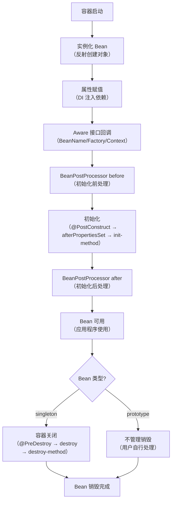

#### 总结

1. **核心流程**：实例化 → 属性赋值 → 初始化（前后处理）→ 使用 → 销毁（仅单例），其中 `BeanPostProcessor` 是核心扩展点（如 AOP 在此生成代理）。
2. **初始化优先级**：`@PostConstruct` > `InitializingBean.afterPropertiesSet()` > 自定义 `init-method`。
3. **销毁规则**：单例 Bean 由容器管理销毁，原型 Bean 仅创建/初始化，销毁由用户负责。

### Spring 中的 Bean 是线程安全的吗？

**默认不是线程安全的！**

- Spring Bean **默认单例（singleton）**，一个对象供多个线程使用。
- 如果 Bean 中有**成员变量存储状态**，就会出现线程安全问题。
- 解决方案：
  1. 不要在 Bean 中定义可变成员变量
  2. 使用 `ThreadLocal` 存线程私有数据
  3. 改为多例作用域 `prototype`

###  Spring 自动装配 Bean 有哪些方式？

4 种自动装配：

1. **no**：不自动装配（默认）
2. **byName**：按属性名匹配 Bean 名称
3. **byType**：按类型匹配（最常用）
4. **constructor**：按构造器参数类型装配

**注解开发常用：`@Autowired`（byType） + `@Qualifier`（byName）**

------

### 4. Bean 的作用域有哪些？

- **singleton**（默认）：容器中只创建一个 Bean 实例。
- **prototype**：每次请求都会创建新的 Bean 实例。
- **request**：在 HTTP 请求内有效，每个请求一个实例。
- **session**：在 HTTP 会话内有效，每个会话一个实例。
- **application**：在 ServletContext 内有效，整个 web 应用共享。


#### 一、Bean 作用域深度解析（补充细节）

| 作用域      | 核心定义                                                     | 生效环境                  | 典型使用场景                                             | 生命周期管理                                                 |
| ----------- | ------------------------------------------------------------ | ------------------------- | -------------------------------------------------------- | ------------------------------------------------------------ |
| singleton   | 容器中仅创建**一个实例**，全局共享（默认）                   | 所有环境（非 Web/ Web）   | 无状态组件（如 Service、Dao、工具类）                    | 容器启动时创建（预加载），容器关闭时销毁（由 Spring 完全管理） |
| prototype   | 每次获取（`getBean()`/注入）都会创建**新实例**               | 所有环境                  | 有状态组件（如包含可变属性的实体类、线程不安全的工具类） | Spring 仅创建/初始化，不管理销毁（需用户手动处理）           |
| request     | 每个 HTTP 请求创建**一个实例**，请求结束后销毁               | 仅 Web 环境（Spring MVC） | 存储单次请求的临时数据（如请求级别的上下文、表单数据）   | 随 HTTP 请求结束而销毁，由 Web 容器触发                      |
| session     | 每个 HTTP 会话（Session）创建**一个实例**，会话失效后销毁    | 仅 Web 环境               | 存储用户会话数据（如登录状态、用户偏好设置）             | 随 Session 失效（超时/手动销毁）而销毁                       |
| application | 整个 Web 应用（ServletContext）共享**一个实例**，应用启动到销毁唯一 | 仅 Web 环境               | 存储应用级全局数据（如系统配置、缓存字典）               | 随 ServletContext 初始化创建，应用停止时销毁                 |

> 补充：Spring 5.0+ 还新增了 `websocket` 作用域（WebSocket 会话级别），用于实时通信场景，日常开发中较少用到。

#### 二、代码示例：不同作用域的使用方式

##### 1. 基础配置（通过注解指定作用域）

```java
import org.springframework.context.annotation.Scope;
import org.springframework.stereotype.Component;
import javax.servlet.http.HttpServletRequest;

// 1. singleton（默认，可省略 @Scope）
@Component
// @Scope("singleton") // 省略也生效
public class SingletonBean {
    private int count = 0;

    public void increment() {
        count++;
        System.out.println("singleton 计数：" + count);
    }
}

// 2. prototype（每次获取新实例）
@Component
@Scope("prototype")
public class PrototypeBean {
    private int count = 0;

    public void increment() {
        count++;
        System.out.println("prototype 计数：" + count);
    }
}

// 3. request（仅 Web 环境生效）
@Component
@Scope("request")
// 可选：proxyMode 解决“单例 Bean 注入 request Bean”的问题
// @Scope(value = "request", proxyMode = ScopedProxyMode.TARGET_CLASS)
public class RequestBean {
    private String requestId;

    public void setRequestId(String requestId) {
        this.requestId = requestId;
    }

    public String getRequestId() {
        return requestId;
    }
}
```

##### 2. 验证 singleton vs prototype（核心差异）

```java
import org.springframework.context.annotation.AnnotationConfigApplicationContext;

public class ScopeTest {
    public static void main(String[] args) {
        AnnotationConfigApplicationContext context = new AnnotationConfigApplicationContext();
        context.scan("com.example");
        context.refresh();

        // 1. singleton：多次获取同一实例
        SingletonBean s1 = context.getBean(SingletonBean.class);
        SingletonBean s2 = context.getBean(SingletonBean.class);
        s1.increment(); // 输出：singleton 计数：1
        s2.increment(); // 输出：singleton 计数：2（同一实例，count 累加）
        System.out.println(s1 == s2); // 输出：true

        // 2. prototype：每次获取新实例
        PrototypeBean p1 = context.getBean(PrototypeBean.class);
        PrototypeBean p2 = context.getBean(PrototypeBean.class);
        p1.increment(); // 输出：prototype 计数：1
        p2.increment(); // 输出：prototype 计数：1（新实例，count 重置）
        System.out.println(p1 == p2); // 输出：false

        context.close();
    }
}
```

##### 3. Web 环境下使用 request/session 作用域

```java
import org.springframework.web.bind.annotation.GetMapping;
import org.springframework.web.bind.annotation.RestController;
import javax.annotation.Resource;
import javax.servlet.http.HttpServletRequest;
import java.util.UUID;

@RestController
public class ScopeController {
    // 注入 request 作用域 Bean
    @Resource
    private RequestBean requestBean;

    @GetMapping("/test-request")
    public String testRequest(HttpServletRequest request) {
        // 每个请求的 requestBean 都是新实例
        String requestId = UUID.randomUUID().toString();
        requestBean.setRequestId(requestId);
        return "当前请求的 Bean ID：" + requestBean.getRequestId();
    }
}
```
- 测试效果：多次访问 `/test-request`，每次返回的 `requestId` 都不同（每个请求一个新的 `RequestBean` 实例）。

#### 三、关键注意事项（避坑要点）

##### 1. singleton 注入 prototype 的“陷阱”

- **问题**：单例 Bean 注入原型 Bean 时，原型 Bean 只会被创建一次（因为单例 Bean 初始化时仅注入一次）；
- **解决**：
  ① 每次使用时通过 `ApplicationContext` 获取原型 Bean；
  ② 为原型 Bean 添加 `proxyMode = ScopedProxyMode.TARGET_CLASS`，生成动态代理（每次调用方法时获取新实例）。
  
  ```java
  @Component
  @Scope(value = "prototype", proxyMode = ScopedProxyMode.TARGET_CLASS)
  public class PrototypeBean {}
  ```

##### 2. 作用域生效条件

- `request/session/application` 仅在 **Spring Web 环境**（Spring MVC/Spring Boot Web）中生效，非 Web 环境使用会报错；
- Spring Boot 中需引入 `spring-boot-starter-web` 依赖，否则 Web 相关作用域无法识别。

##### 3. 生命周期差异

- **singleton**：Spring 全程管理（创建 → 初始化 → 销毁）；
- **prototype**：Spring 仅负责创建和初始化，销毁由用户手动处理（如调用 `close()` 方法）；
- **request/session/application**：由 Web 容器（Tomcat/Jetty）配合 Spring 管理生命周期，无需用户干预。

#### 四、最佳实践

1. **优先使用 singleton**：无状态组件（Service、Dao、工具类）默认用 singleton，性能最优；
2. **谨慎使用 prototype**：仅用于有状态组件（如包含可变属性的对象），注意手动销毁；
3. **Web 场景按需选择**：
   - 单次请求数据 → request 作用域；
   - 用户会话数据 → session 作用域；
   - 应用全局数据 → application 作用域。

#### 总结

1. **核心分类**：Bean 作用域分“通用型”（singleton/prototype）和“Web 专用型”（request/session/application）；
2. **核心差异**：singleton 全局单例，prototype 每次新实例，Web 作用域按请求/会话/应用隔离；
3. **使用原则**：无状态组件用 singleton，有状态组件用 prototype，Web 场景按需用 request/session/application。

------

### 5. @Component、@Service、@Repository、@Controller 有什么区别？

> **Tip:** 实际上这四个注解都是 `@Component` 的特化。

Spring 里上述注解本质都是注册 Bean：

它们最终都会被当成 Bean 管理，只是**语义不同**：

- `@Controller`：Web 层，处理请求
- `@Service`：业务逻辑层
- `@Repository`：数据访问层
- `@Component`：通用组件

**`@Controller` 本质就是注册 Bean**，而且是**Spring Bean**。

一句话结论：

- `@Controller` = `@Component` + 标识为**Web 控制器**
- 只要类上加了 `@Controller`，Spring 启动时就会把它**扫描 → 实例化 → 放进 IoC 容器**
- 所以它**完全可以被 `@Autowired / @Resource` 注入**

#### 完整真实流程（Spring 启动时就做完）

Spring 启动 → 扫描 → 找到 @Controller

1. 实例化调用构造方法，创建出 `new UserController()`对象
2. 依赖注入（属性赋值）对里面的 `@Autowired`、`@Resource`字段进行注入→ 这一步在启动时就完成
3. 初始化执行 `@Resource`等
4. **放进 IoC 容器**
5. 项目启动完成

也就是说：

**Controller 对象已经创建好了，依赖也早就注入好了，等着你浏览器发请求来调用。**

#### 一、核心区别的深度解析

##### 1. 底层关系：都是 `@Component` 的“子类”

这四个注解的底层源码本质是一致的——`@Service`/`@Repository`/`@Controller` 都标注了 `@Component`，因此**具备 `@Component` 的所有核心能力**（如被 `@ComponentScan` 扫描、注册为 Spring Bean）。

以 `@Service` 源码为例：
```java
// @Service 源码（Spring 5.x）
@Target({ElementType.TYPE})
@Retention(RetentionPolicy.RUNTIME)
@Documented
@Component // 核心：继承 @Component 的能力
public @interface Service {
    @AliasFor(annotation = Component.class)
    String value() default "";
}
```
`@Repository`/`@Controller` 同理，只是语义和附加功能不同。

##### 2. 各注解的核心差异（补充细节）

| 注解        | 核心定位                 | 关键附加能力                                                 | 典型使用场景                       |
| ----------- | ------------------------ | ------------------------------------------------------------ | ---------------------------------- |
| @Component  | 通用组件（无明确分层）   | 仅基础 Bean 注册能力，无附加功能                             | 工具类、通用组件（如自定义过滤器） |
| @Service    | 业务逻辑层（Service）    | 纯语义化标识，无额外功能，但便于代码分层和团队协作（一眼识别业务层） | 处理业务逻辑（如 UserService）     |
| @Repository | 数据持久层（DAO/Mapper） | ① 语义化标识；② **异常转换**（Spring 会自动将 JDBC/Hibernate 等底层异常转为 `DataAccessException`） | 操作数据库（如 UserRepository）    |
| @Controller | 控制层（MVC 入口）       | ① 语义化标识；② 结合 `@RequestMapping` 处理 HTTP 请求；③ 支持返回视图/JSON；④ Spring MVC 会识别并创建处理器映射 | 接收前端请求（如 UserController）  |

#### 二、关键特性的代码验证

##### 1. @Repository 的异常转换能力（核心差异）

`@Repository` 最核心的附加功能是异常转换，避免业务层处理底层数据库异常：
```java
import org.springframework.stereotype.Repository;
import java.sql.SQLException;

@Repository
public class UserRepository {
    public void queryUser() throws SQLException {
        // 模拟数据库异常
        throw new SQLException("数据库连接失败");
    }
}
```
当调用该方法时，Spring 会自动将 `SQLException` 转为 `DataAccessException`（Spring 统一的持久层异常），业务层只需处理这个统一异常即可，无需关注底层具体异常类型。

##### 2. @Controller 的 MVC 专属能力

`@Controller` 是 Spring MVC 的核心注解，只有标注它的类才会被识别为“请求处理器”：
```java
import org.springframework.stereotype.Controller;
import org.springframework.web.bind.annotation.GetMapping;
import org.springframework.web.bind.annotation.ResponseBody;

@Controller // 必须用 @Controller，不能用 @Component 替代（否则无法处理 HTTP 请求）
public class UserController {
    @GetMapping("/user")
    @ResponseBody
    public String getUser() {
        return "{'name':'张三'}";
    }
}
```
如果用 `@Component` 替代 `@Controller`，Spring MVC 不会识别该类为请求处理器，访问 `/user` 会报 404。

#### 三、使用原则：为什么不全都用 @Component？

虽然 `@Component` 是基础，但实际开发中**必须按分层使用对应注解**，核心原因：
1. **语义化清晰**：通过注解直接区分“控制层/业务层/持久层”，代码可读性大幅提升（尤其是团队协作）；
2. **框架扩展**：`@Repository`/`@Controller` 有专属附加功能，`@Component` 无法替代；
3. **规范约束**：统一的分层注解是 Spring 开发的最佳实践，便于后续维护和扩展（如 AOP 按注解分层拦截）。

#### 四、补充：@RestController 与 @Controller 的关系

额外提一个高频考点：`@RestController` 是 `@Controller + @ResponseBody` 的组合注解，专门用于返回 JSON/XML 等数据（而非视图），是当前前后端分离项目的主流选择。

#### 总结

1. 核心关系：`@Service`/`@Repository`/`@Controller` 都是 `@Component` 的特化注解，基础能力（Bean 注册）完全一致；
2. 核心差异：`@Repository` 支持异常转换，`@Controller` 适配 Spring MVC，`@Service` 仅语义化，`@Component` 是通用兜底；
3. 使用原则：必须按分层使用对应注解（控制层用 `@Controller`、业务层用 `@Service`、持久层用 `@Repository`），避免全部用 `@Component`。

### `@Repository` 和 `@Mapper` 区别

你问到的 `@Repository` 和 `@Mapper` 是开发中极易混淆的两个注解，核心区别在于**所属框架、作用场景、核心能力完全不同**——`@Repository` 是 Spring 原生注解，`@Mapper` 是 MyBatis 框架的注解。我会从核心差异、使用场景、底层原理三个维度帮你彻底理清。

#### 一、核心区别对比表

| 维度         | @Repository                                                  | @Mapper                                                      |
| ------------ | ------------------------------------------------------------ | ------------------------------------------------------------ |
| **所属框架** | Spring 核心框架                                              | MyBatis（含 MyBatis-Plus）                                   |
| **核心作用** | 1. 标记 Spring 持久层 Bean；<br>2. 触发 Spring 持久层异常转换 | 1. 标记 MyBatis 映射接口；<br>2. 让 MyBatis 动态生成接口的代理实现类 |
| **扫描方式** | 由 Spring 的 `@ComponentScan` 扫描注册为 Bean                | 由 MyBatis 的 `@MapperScan` 扫描（或配置文件扫描），生成代理对象 |
| **依赖关系** | 无需依赖 MyBatis，纯 Spring 能力                             | 必须依赖 MyBatis 框架                                        |
| **异常处理** | 自动将底层数据库异常转为 Spring 统一的 `DataAccessException` | 无异常转换能力，需手动处理或结合 `@Repository`               |
| **使用位置** | 可标注在类/接口上（但通常标注在实现类）                      | 仅标注在 MyBatis 映射接口上（不能标注在实现类）              |

#### 二、深度解析：各自的底层逻辑

##### 1. @Repository（Spring 原生）

- **本质**：Spring 对“持久层组件”的语义化标记，核心是让 Spring 识别该类为 Bean，并赋予**异常转换**能力。
- **使用场景**：
  - 非 MyBatis 场景（如原生 JDBC、JPA/Hibernate）：标注在 DAO 实现类上，既让 Spring 管理 Bean，又能自动转换数据库异常；
  - MyBatis 场景：可搭配 `@Mapper` 使用，弥补 `@Mapper` 无异常转换的缺陷。
- **示例（非 MyBatis 场景）**：
  ```java
  // 原生 JDBC 的 DAO 实现类，用 @Repository 标记
  @Repository
  public class UserDaoImpl implements UserDao {
      @Autowired
      private JdbcTemplate jdbcTemplate;
      
      @Override
      public User getUserById(Long id) {
          // 底层 SQLException 会被 Spring 转为 DataAccessException
          return jdbcTemplate.queryForObject("SELECT * FROM user WHERE id=?", new UserRowMapper(), id);
      }
  }
  ```

##### 2. @Mapper（MyBatis 专属）

- **本质**：MyBatis 用于识别“映射接口”的注解，核心是让 MyBatis 为接口动态生成代理实现类（无需手动写实现类）。
- **使用场景**：仅用于 MyBatis/MyBatis-Plus 的 Mapper 接口，是 MyBatis 实现“接口 + XML/注解 SQL”的核心。
- **示例（纯 MyBatis 场景）**：
  ```java
  // MyBatis Mapper 接口，用 @Mapper 标记
  @Mapper // MyBatis 会为该接口生成代理对象
  public interface UserMapper {
      @Select("SELECT * FROM user WHERE id=#{id}")
      User selectById(Long id);
  }
  ```
  - 注意：仅加 `@Mapper` 时，该接口的代理对象会被 MyBatis 创建，但 Spring 容器中是否能识别该 Bean，取决于是否配置 `@MapperScan`（推荐）；
  - 如果只加 `@Mapper` 不加 `@MapperScan`，需额外加 `@Repository` 让 Spring 扫描到该 Bean（避免 IDE 报“找不到 Bean”的警告）。

#### 三、实际开发中的正确用法

##### 场景1：纯 MyBatis/MyBatis-Plus 项目（主流）

**推荐用法**：`@MapperScan` 替代单个 `@Mapper` + 可选 `@Repository`（消除警告）
```java
// 启动类上配置 @MapperScan，扫描所有 Mapper 接口（无需在每个接口加 @Mapper）
@SpringBootApplication
@MapperScan("com.example.mapper") // 扫描指定包下的所有 Mapper 接口
public class MyApplication {
    public static void main(String[] args) {
        SpringApplication.run(MyApplication.class, args);
    }
}

// Mapper 接口：可选加 @Repository 消除 IDE 警告（无实际功能）
@Repository // 仅为消除 IDE "Could not autowire" 警告，无实际作用
public interface UserMapper {
    User selectById(Long id);
}
```
- 核心逻辑：`@MapperScan` 是 MyBatis 提供的批量扫描注解，比单个 `@Mapper` 更简洁；`@Repository` 仅用于消除 IDE 警告（因为 MyBatis 生成的代理对象已被 Spring 管理，只是 IDE 无法识别）。

##### 场景2：混合场景（如 MyBatis + 原生 JDBC）

- MyBatis Mapper 接口：用 `@Mapper`（或 `@MapperScan`）；
- 原生 JDBC DAO 实现类：用 `@Repository`（利用其异常转换能力）。

#### 四、常见误区澄清

1. **误区1**：“MyBatis 中必须加 `@Repository`”
   → 错误：MyBatis 识别 Mapper 仅依赖 `@Mapper`/`@MapperScan`，`@Repository` 无实际功能，仅消除 IDE 警告；
2. **误区2**：“`@Mapper` 能替代 `@Repository`”
   → 错误：`@Mapper` 无异常转换能力，若需要 Spring 统一的持久层异常，需搭配 `@Repository`；
3. **误区3**：“`@Repository` 能替代 `@Mapper`”
   → 错误：`@Repository` 只是 Spring 的 Bean 标记，无法让 MyBatis 生成代理实现类，MyBatis Mapper 接口必须加 `@Mapper`/`@MapperScan`。

#### 总结

1. **核心定位**：`@Repository` 是 Spring 标记持久层 Bean + 异常转换的注解；`@Mapper` 是 MyBatis 生成映射接口代理类的注解；
2. **MyBatis 项目用法**：优先用 `@MapperScan` 扫描 Mapper 包，`@Repository` 可选（仅消除 IDE 警告）；
3. **异常处理**：若需 Spring 统一的 `DataAccessException`，可在 Mapper 接口上加 `@Repository`，否则仅用 `@Mapper` 即可。

### DAO 和 Mapper

DAO 命名和 Mapper 命名**本身不冲突**，核心区别在于它们是**不同阶段/不同框架的命名规范**——DAO 是通用的分层概念，Mapper 是 MyBatis 框架下的专属命名，实际开发中可根据团队规范选择，甚至能兼容使用。

#### 一、先理清两个命名的本质

| 命名   | 核心定义                                                     | 所属范畴     | 典型使用场景                       |
| ------ | ------------------------------------------------------------ | ------------ | ---------------------------------- |
| DAO    | 数据访问对象（Data Access Object），是**通用的分层设计模式**，职责是封装数据访问逻辑 | 软件设计模式 | 所有持久层场景（JDBC/JPA/MyBatis） |
| Mapper | MyBatis 框架中“映射接口”的专属命名，本质是 DAO 模式在 MyBatis 中的具体实现 | 框架专属命名 | 仅 MyBatis/MyBatis-Plus 场景       |

简单来说：**Mapper 是 MyBatis 对 DAO 的“具体化命名”**，二者是“抽象概念”和“具体实现”的关系，而非对立关系。

#### 二、实际开发中的命名方案（无冲突，按需选择）

##### 方案1：纯 MyBatis 场景——用 Mapper 命名（主流）

符合 MyBatis 官方习惯，团队认知统一，无任何冲突：
```
└── com.example
    ├── mapper          // 持久层包名
    │   ├── UserMapper.java  // 映射接口（MyBatis 核心）
    │   └── UserMapper.xml   // SQL 映射文件
    ├── service         // 业务层
    └── controller      // 控制层
```
- 此时 `UserMapper` 就是 DAO 层的实现，只是命名上用 Mapper 替代了 DAO，逻辑上完全等价，无冲突。

##### 方案2：兼容通用 DAO 规范——用 DAO 命名（兼容传统）

若团队习惯传统 DAO 命名，也可混用，仅需注意“接口 + 实现”的逻辑（无冲突）：
```
└── com.example
    ├── dao             // 持久层包名（通用 DAO 命名）
    │   ├── UserDao.java     // 抽象接口（DAO 规范）
    │   └── UserDaoImpl.java // 实现类（MyBatis Mapper 注入）
    ├── mapper          // MyBatis 映射接口包（可选，也可直接放 dao 包）
    │   └── UserMapper.java
    ├── service
    └── controller
```
示例代码（兼容 DAO 命名）：
```java
// DAO 接口（抽象）
public interface UserDao {
    User getById(Long id);
}

// DAO 实现类（依赖 MyBatis Mapper）
@Repository
public class UserDaoImpl implements UserDao {
    @Autowired
    private UserMapper userMapper;

    @Override
    public User getById(Long id) {
        return userMapper.selectById(id);
    }
}
```
- 这种方式下，DAO 是抽象层，Mapper 是具体实现，二者分工明确，无任何命名冲突。

##### 方案3：极简方案——DAO 和 Mapper 合并（无冲突）

直接将 MyBatis 映射接口命名为 `XxxDao`，省略多余层级，也是常见用法：
```
└── com.example
    ├── dao             // 持久层包名
    │   ├── UserDao.java     // 直接作为 MyBatis 映射接口（加 @Mapper 注解）
    │   └── UserDao.xml      // SQL 映射文件
    ├── service
    └── controller
```
```java
@Mapper // MyBatis 标记
@Repository // Spring 持久层标记（可选）
public interface UserDao {
    @Select("SELECT * FROM user WHERE id=#{id}")
    User selectById(Long id);
}
```
- 此时 `UserDao` 既是 DAO 层接口，也是 MyBatis 的 Mapper 接口，命名上完全兼容，无冲突。

#### 三、避免“伪冲突”的核心原则

1. **包名/类名不重复**：只要不同时出现 `com.example.dao.UserMapper` 和 `com.example.mapper.UserDao` 这类易混淆的命名，就不会有冲突；
2. **团队规范统一**：要么全用 Mapper 命名（MyBatis 原生），要么全用 DAO 命名（通用），避免同一项目中部分用 Mapper、部分用 DAO 导致认知混乱；
3. **不要纠结“字面意思”**：核心是“持久层封装数据访问逻辑”，无论叫 DAO 还是 Mapper，职责一致，只是命名习惯不同。

#### 总结

1. DAO（通用设计模式）和 Mapper（MyBatis 专属）**本质无冲突**，是“抽象”和“具体”的关系；
2. 实际开发中可选择纯 Mapper 命名（MyBatis 主流）、纯 DAO 命名（兼容传统）或合并命名，均无冲突；
3. 避免冲突的关键是**团队命名规范统一**，而非纠结“该叫 DAO 还是 Mapper”。

------

### 6. XML 配置、注解配置和 Java 配置的区别？

| 配置方式                    | 优点             | 缺点               |
| --------------------------- | ---------------- | ------------------ |
| XML 配置                    | 与代码解耦，灵活 | 冗长，难维护       |
| 注解配置                    | 简洁，语义化     | 依赖代码，不够灵活 |
| Java 配置（@Configuration） | 类型安全，可编程 | 容器初始化稍复杂   |

#### 一、三种配置方式的深度解析（补充细节）

| 维度              | XML 配置                                                     | 注解配置（@Component/@Autowired 等）                         | Java 配置（@Configuration/@Bean）                            |
| ----------------- | ------------------------------------------------------------ | ------------------------------------------------------------ | ------------------------------------------------------------ |
| **核心原理**      | 基于 XML 解析器，通过标签定义 Bean                           | 基于注解扫描（ComponentScan），反射识别 Bean                 | 基于 Java 类（配置类），通过方法创建 Bean，完全可编程        |
| **核心注解/标签** | `<bean>`/`<property>`/`<import>`                             | `@Component`/`@Autowired`/`@Value`                           | `@Configuration`/`@Bean`/`@Import`                           |
| **依赖注入方式**  | 手动配置 `<property>`/`<constructor-arg>`                    | 自动扫描 + 注解注入（byType/byName）                         | 手动在 `@Bean` 方法中调用依赖，或 `@Autowired` 注入          |
| **类型安全**      | 非类型安全（XML 字符串，编译不校验）                         | 部分类型安全（注解校验基本类型）                             | 完全类型安全（编译期校验，IDE 提示）                         |
| **可编程性**      | 无（仅静态配置）                                             | 弱（仅注解参数配置）                                         | 强（可写 Java 逻辑：条件判断、循环、动态赋值）               |
| **适用场景**      | 1. 第三方类配置（无法修改源码）；<br>2. 老项目兼容；<br>3. 需要动态切换配置（不修改代码） | 1. 项目内部组件（业务层/控制层）；<br>2. 快速开发，追求简洁；<br>3. 语义化分层（@Service/@Controller） | 1. 核心组件配置（数据源、连接池、第三方客户端）；<br>2. 需要动态配置（如多环境、条件创建 Bean）；<br>3. 现代 Spring Boot 项目主流 |

#### 二、代码示例：三种配置方式实现同一功能（创建数据源 Bean）

##### 1. XML 配置方式

```xml
<!-- applicationContext.xml -->
<?xml version="1.0" encoding="UTF-8"?>
<beans xmlns="http://www.springframework.org/schema/beans"
       xmlns:xsi="http://www.w3.org/2001/XMLSchema-instance"
       xsi:schemaLocation="http://www.springframework.org/schema/beans
                           http://www.springframework.org/schema/beans/spring-beans.xsd">

    <!-- 配置数据源 Bean -->
    <bean id="dataSource" class="com.alibaba.druid.pool.DruidDataSource">
        <property name="url" value="jdbc:mysql://localhost:3306/test"/>
        <property name="username" value="root"/>
        <property name="password" value="123456"/>
        <property name="driverClassName" value="com.mysql.cj.jdbc.Driver"/>
    </bean>
</beans>
```
- 加载 XML 配置：
```java
// 传统方式加载 XML 配置
ApplicationContext context = new ClassPathXmlApplicationContext("applicationContext.xml");
DataSource dataSource = context.getBean("dataSource", DataSource.class);
```

##### 2. 注解配置方式

```java
// 1. 自定义数据源组件（注解标记）
@Component // 注册为 Bean
public class MyDataSource {
    @Value("jdbc:mysql://localhost:3306/test")
    private String url;
    @Value("root")
    private String username;
    @Value("123456")
    private String password;
    @Value("com.mysql.cj.jdbc.Driver")
    private String driverClassName;

    // getter/setter
}

// 2. 启动类开启注解扫描
@SpringBootApplication // 内置 @ComponentScan
public class App {
    public static void main(String[] args) {
        ApplicationContext context = SpringApplication.run(App.class);
        MyDataSource dataSource = context.getBean(MyDataSource.class);
    }
}
```

##### 3. Java 配置方式（Spring Boot 主流）

```java
// 1. 配置类（替代 XML）
@Configuration // 标记为配置类
public class DataSourceConfig {

    // 配置数据源 Bean（方法返回值为 Bean 类型，方法名默认是 Bean 名称）
    @Bean
    @ConditionalOnClass(DruidDataSource.class) // 可编程：仅当 Druid 依赖存在时创建
    public DataSource dataSource() {
        DruidDataSource ds = new DruidDataSource();
        // 可写任意 Java 逻辑：读取配置文件、条件判断、动态赋值
        ds.setUrl("jdbc:mysql://localhost:3306/test");
        ds.setUsername("root");
        ds.setPassword("123456");
        ds.setDriverClassName("com.mysql.cj.jdbc.Driver");
        return ds;
    }
}

// 2. 启动类加载配置类
@SpringBootApplication
@Import(DataSourceConfig.class) // 显式导入配置类（也可自动扫描）
public class App {
    public static void main(String[] args) {
        ApplicationContext context = SpringApplication.run(App.class);
        DataSource dataSource = context.getBean(DataSource.class);
    }
}
```

#### 三、演进趋势与最佳实践

##### 1. 演进路径（Spring 发展历程）

`XML 配置 → 注解配置 → Java 配置`  
- Spring 1.x：仅支持 XML 配置；
- Spring 2.x：引入注解配置（@Autowired/@Component）；
- Spring 3.x：引入 Java 配置（@Configuration/@Bean）；
- Spring Boot：主推 Java 配置 + 注解配置，几乎不用 XML。

##### 2. 最佳实践（现代开发）

- **优先用 Java 配置**：核心组件（数据源、连接池、Redis 客户端等）用 `@Configuration + @Bean`，利用其类型安全和可编程性；
- **配合注解配置**：业务层组件（Service/Controller）用 `@Service/@Controller` 等注解，简洁语义化；
- **少用 XML 配置**：仅在无法修改第三方类源码、或老项目兼容时使用。

#### 四、关键补充：三种配置方式可混合使用

Spring 支持三种配置方式混合，无冲突：
- 比如：XML 配置第三方 Bean + Java 配置核心组件 + 注解配置业务组件；
- 比如：`@ImportResource` 注解可在 Java 配置类中导入 XML 配置文件，兼容老项目。

#### 总结

1. **核心差异**：XML 配置解耦但冗长，注解配置简洁但耦合代码，Java 配置兼具类型安全和可编程性（现代主流）；
2. **使用原则**：核心组件用 Java 配置，业务组件用注解配置，仅兼容老项目/第三方类时用 XML；
3. **演进趋势**：Spring Boot 已几乎淘汰纯 XML 配置，Java 配置 + 注解配置是当前标准方案。

------

### 7. 什么是 Spring 容器？ApplicationContext 和 BeanFactory 有什么区别？

- **Spring 容器**：负责管理 Bean 的生命周期、依赖注入和配置。
- **BeanFactory**：最基本的容器，懒加载 Bean，适合轻量应用。
- **ApplicationContext**：继承 BeanFactory，功能更强大，支持事件机制、国际化、AOP、Web 环境等。

> **Tip:** 日常开发中一般使用 ApplicationContext。

#### 一、先理清核心概念

##### 1. Spring 容器的本质

Spring 容器是 Spring 框架的**核心运行环境**，本质是一个“Bean 工厂 + 上下文环境”，核心职责：
- 管理 Bean 的生命周期（实例化 → 初始化 → 使用 → 销毁）；
- 实现依赖注入（DI），解决 Bean 之间的依赖关系；
- 提供扩展能力（事件、国际化、资源加载等）。

##### 2. BeanFactory 与 ApplicationContext 的关系

`ApplicationContext` **继承并扩展**了 `BeanFactory`，二者是“基础版”和“增强版”的关系：

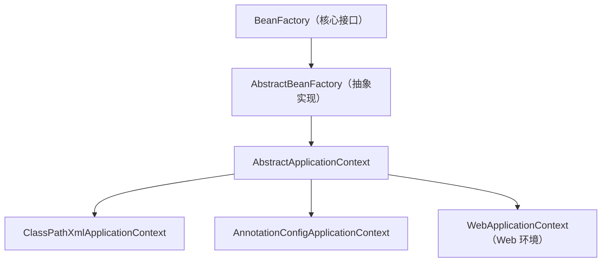
简单说：`BeanFactory` 是容器的“最小核心”，`ApplicationContext` 是在其基础上增加了企业级功能的“完整版容器”。

#### 二、核心区别对比表（补充细节）

| 维度           | BeanFactory                                  | ApplicationContext                                           |
| -------------- | -------------------------------------------- | ------------------------------------------------------------ |
| **加载方式**   | 懒加载（Lazy Loading）：获取 Bean 时才实例化 | 预加载（Eager Loading）：容器启动时就实例化所有单例 Bean     |
| **核心功能**   | 仅实现 Bean 的创建、DI 核心能力              | 包含 BeanFactory 所有功能 + 以下增强：<br>1. 事件发布/监听机制；<br>2. 国际化（MessageSource）；<br>3. 资源加载（ResourceLoader）；<br>4. 环境变量（Environment）；<br>5. 支持 Web 环境（WebApplicationContext）；<br>6. AOP 集成、注解驱动 |
| **性能/内存**  | 轻量，启动快，内存占用少                     | 启动稍慢，内存占用稍高（预加载所有单例 Bean）                |
| **异常处理**   | 获取 Bean 时才抛出配置异常（晚）             | 容器启动时就校验配置（早），提前暴露问题                     |
| **常用实现类** | XmlBeanFactory（已过时）                     | ClassPathXmlApplicationContext（XML 配置）、<br>AnnotationConfigApplicationContext（注解/Java 配置）、<br>WebApplicationContext（Spring MVC） |
| **使用场景**   | 极端轻量场景（如嵌入式设备、极简应用）       | 绝大多数企业级应用（Spring Boot 默认使用）                   |

#### 三、关键差异验证：懒加载 vs 预加载

##### 1. BeanFactory 懒加载示例（XmlBeanFactory 已过时，仅作演示）

```java
import org.springframework.beans.factory.xml.XmlBeanFactory;
import org.springframework.core.io.ClassPathResource;

public class BeanFactoryTest {
    public static void main(String[] args) {
        // 1. 创建 BeanFactory 容器（启动时不实例化 Bean）
        XmlBeanFactory factory = new XmlBeanFactory(new ClassPathResource("beans.xml"));
        System.out.println("容器启动完成，未实例化任何 Bean");

        // 2. 首次获取 Bean 时才实例化（懒加载）
        UserBean userBean = factory.getBean(UserBean.class);
        System.out.println("获取 Bean 后，实例化完成");
    }
}
```
**执行结果**：
```
容器启动完成，未实例化任何 Bean
UserBean 构造器执行（实例化）
获取 Bean 后，实例化完成
```

##### 2. ApplicationContext 预加载示例

```java
import org.springframework.context.annotation.AnnotationConfigApplicationContext;

public class ApplicationContextTest {
    public static void main(String[] args) {
        // 1. 创建 ApplicationContext 容器（启动时立即实例化所有单例 Bean）
        AnnotationConfigApplicationContext context = new AnnotationConfigApplicationContext(UserBean.class);
        System.out.println("容器启动完成，已实例化所有单例 Bean");

        // 2. 获取 Bean 时直接返回已实例化的对象
        UserBean userBean = context.getBean(UserBean.class);
    }
}
```
**执行结果**：
```
UserBean 构造器执行（实例化）
容器启动完成，已实例化所有单例 Bean
```

#### 四、Spring Boot 中的实际应用

Spring Boot 底层默认使用 `ApplicationContext` 的实现类（如 `AnnotationConfigServletWebServerApplicationContext`），并做了优化：
1. 虽然是预加载，但通过“延迟初始化”配置（`spring.main.lazy-initialization=true`）可切换为懒加载，兼顾启动速度；
2. 自动装配的核心逻辑（`@EnableAutoConfiguration`）基于 `ApplicationContext` 的扩展能力实现；
3. 日常开发中，你几乎不需要直接创建 `BeanFactory` 或 `ApplicationContext`——Spring Boot 会自动创建并管理容器。

#### 五、常见误区澄清

1. **误区1**：“BeanFactory 已完全废弃”
   → 错误：`BeanFactory` 是 Spring 容器的核心接口，`ApplicationContext` 底层仍依赖它，只是上层不直接使用；
2. **误区2**：“预加载一定比懒加载好”
   → 错误：预加载启动慢但运行时无延迟，适合生产环境；懒加载启动快但首次获取 Bean 有延迟，适合开发/测试环境；
3. **误区3**：“ApplicationContext 不支持懒加载”
   → 错误：可通过 `@Lazy` 注解为单个 Bean 开启懒加载，或全局配置懒加载。

#### 总结

1. **核心关系**：`ApplicationContext` 继承 `BeanFactory`，是功能更全的增强版容器；
2. **关键差异**：`BeanFactory` 懒加载、轻量、仅核心功能；`ApplicationContext` 预加载、功能丰富（事件/国际化等）、企业级首选；
3. **实际使用**：日常开发（尤其是 Spring Boot）默认用 `ApplicationContext`，`BeanFactory` 仅用于极端轻量场景。


------

### 8. 如何使用 @Autowired 自动装配 Bean？与 @Resource、@Inject 有何区别？

- **@Autowired**（Spring）：按类型装配，可结合 `@Qualifier` 指定 Bean 名称。
- **@Resource**（JDK/JSR-250）：默认按名称装配，也可按类型。
- **@Inject**（JSR-330）：按类型装配，不支持 `required=false`。

```java
@Autowired
@Qualifier("beanA")
private Service service;
```

#### 一、@Autowired 详细使用方法

`@Autowired` 是 Spring 原生注解，核心是**按类型装配**，是日常开发中最常用的自动装配方式。

##### 1. 基础用法（按类型装配）

```java
// 1. 定义两个同类型 Bean（示例：UserService 接口 + 两个实现类）
// 按「接口类型」匹配时，两个Bean都属于 UserService 类型,这是 Spring 按类型注入（@Autowired 默认行为）的核心判断依据。
public interface UserService {}

@Service("userServiceA") // Bean 名称：userServiceA
public class UserServiceImplA implements UserService {}

@Service("userServiceB") // Bean 名称：userServiceB
public class UserServiceImplB implements UserService {}

// 2. 注入（按类型）
@Service
public class UserController {
    // 问题：同类型有多个 Bean，直接注入会报 NoUniqueBeanDefinitionException
    // @Autowired
    // private UserService userService;

    // 解决1：用 @Qualifier 指定 Bean 名称
    @Autowired
    @Qualifier("userServiceA") // 精准指定要注入的 Bean 名称
    private UserService userService;

    // 解决2：修改变量名与 Bean 名称一致（Spring 会自动匹配）
    @Autowired
    private UserService userServiceB; // 变量名 = Bean 名称，无需 @Qualifier

    // 可选：设置 required=false（注入失败时不报错，仅为 null）
    @Autowired(required = false)
    private UserService userServiceC;
}
```

##### 2. 可注入的位置

`@Autowired` 可标注在**字段、构造器、setter 方法、方法参数**上（Spring 4.3+ 后，构造器注入可省略 `@Autowired`）：
```java
@Service
public class UserController {
    private final UserService userService;

    // 构造器注入（推荐，便于测试，Spring 4.3+ 可省略 @Autowired）
    @Autowired
    public UserController(@Qualifier("userServiceA") UserService userService) {
        this.userService = userService;
    }

    // setter 方法注入
    @Autowired
    public void setUserService(UserService userService) {
        this.userService = userService;
    }
}
```

#### 二、三个注解的核心区别对比（补充细节）

| 维度              | @Autowired（Spring）                    | @Resource（JDK/JSR-250）                           | @Inject（JSR-330）                          |
| ----------------- | --------------------------------------- | -------------------------------------------------- | ------------------------------------------- |
| **所属规范**      | Spring 原生注解                         | JDK 内置（JSR-250），无需额外依赖                  | JSR-330 标准，需导入 `javax.inject` 依赖    |
| **默认装配规则**  | 按类型（byType）                        | 按名称（byName），名称匹配失败则按类型             | 按类型（byType）                            |
| **指定名称方式**  | 需配合 `@Qualifier("beanName")`         | 直接用 `name` 属性（`@Resource(name="beanName")`） | 需配合 `@Named("beanName")`（JSR-330 注解） |
| **required 特性** | 支持 `required=false`（注入失败不报错） | 支持 `required=false`（默认 true）                 | 无此特性，注入失败直接抛异常                |
| **注入位置**      | 字段、构造器、setter、方法参数          | 字段、setter（不支持构造器）                       | 字段、构造器、setter、方法参数              |
| **兼容性**        | 仅 Spring 框架支持                      | 几乎所有 Java EE 容器都支持                        | 需导入依赖，Spring/Guice 等框架支持         |

#### 三、代码示例：@Resource 和 @Inject 的使用

##### 1. @Resource 用法（默认按名称，可指定类型）

```java
@Service
public class UserController {
    // 1. 默认按名称：变量名 = Bean 名称（userServiceA）
    @Resource
    private UserService userServiceA;

    // 2. 显式指定名称
    @Resource(name = "userServiceB")
    private UserService userService;

    // 3. 仅按类型（name 为空，type 指定类型）
    @Resource(type = UserServiceImplA.class)
    private UserService userServiceC;

    // 4. 设置 required=false
    @Resource(required = false)
    private UserService userServiceD;
}
```

##### 2. @Inject 用法（需导入依赖，按类型）

第一步：添加依赖（Maven）
```xml
<dependency>
    <groupId>javax.inject</groupId>
    <artifactId>javax.inject</artifactId>
    <version>1</version>
</dependency>
```
第二步：使用 @Inject
```java
import javax.inject.Inject;
import javax.inject.Named;

@Service
public class UserController {
    // 1. 基础用法（按类型）
    @Inject
    private UserService userService; // 同类型多 Bean 会报错

    // 2. 指定名称（配合 @Named）
    @Inject
    @Named("userServiceA")
    private UserService userService;

    // 3. 无 required=false，注入失败直接抛异常
    // 如需非必需注入，需结合 Optional
    @Inject
    private Optional<UserService> userServiceOptional; // 为空时返回 Optional.empty()
}
```

#### 四、使用场景与最佳实践

##### 1. 优先选择哪个？

- **日常开发（Spring 项目）**：优先用 `@Autowired + @Qualifier`，Spring 原生支持，功能适配性最好；
- **跨框架兼容**：用 `@Resource`（JDK 内置，无需额外依赖）或 `@Inject`（JSR 标准）；
- **构造器注入**：Spring 4.3+ 后直接省略 `@Autowired`，更简洁。

##### 2. 避坑要点

- **@Autowired 按类型装配**：同类型有多个 Bean 时，必须用 `@Qualifier` 或变量名匹配 Bean 名称，否则报错；
- **@Resource 按名称装配**：变量名默认作为 Bean 名称，若名称不存在，才会降级按类型装配；
- **@Inject 无 required=false**：如需非必需注入，用 `Optional` 包装，避免空指针。

#### 五、常见误区澄清

1. **误区1**：“@Resource 只能按名称装配”
   → 错误：`@Resource` 可通过 `type` 属性指定按类型装配，只是默认按名称；
2. **误区2**：“@Inject 完全等价于 @Autowired”
   → 错误：`@Inject` 无 `required=false`，需依赖 `@Named` 指定名称，且需要额外导入依赖；
3. **误区3**：“字段注入比构造器注入好”
   → 错误：构造器注入是 Spring 官方推荐的方式（便于测试、避免空指针、符合依赖注入原则），字段注入仅简洁但耦合性高。

#### 总结

1. **核心规则**：`@Autowired` 按类型（配 `@Qualifier` 指定名称）、`@Resource` 默认按名称、`@Inject` 按类型（无 `required=false`）；
2. **所属规范**：`@Autowired` 是 Spring 原生，`@Resource` 是 JDK 标准，`@Inject` 是 JSR 330 标准；
3. **最佳实践**：Spring 项目优先用 `@Autowired + @Qualifier`（构造器注入），跨框架场景用 `@Resource`。

------

### 9. Spring 中如何解决循环依赖？

- **单例 Bean**：
  - Spring 使用三级缓存（singletonObjects、earlySingletonObjects、singletonFactories）解决构造器/Setter 循环依赖。
  - **构造器循环依赖**无法自动解决，需要手动重构。
- **原型 Bean**：
  - 默认不支持循环依赖。
  

Spring 中解决循环依赖的核心机制是 **“三级缓存”**，通过提前暴露未完全初始化的 Bean 引用，打破相互依赖的死锁。

循环依赖指两个或多个 Bean 相互持有对方的引用（如 A 依赖 B，B 依赖 A），若不特殊处理，会导致初始化时无限循环。

**只有：字段注入 / Setter 注入（单例 Bean）**

Spring 自动用**三级缓存**解决，你**不用做任何操作**，直接不报错！

#### 一、循环依赖的场景

循环依赖分 **3 种情况**，Spring 能解决 **“单例 Bean 的 字段/setter 注入”** 循环依赖，其他情况需手动避免。

| 依赖场景                     | 是否可被 Spring 自动解决 | 原因分析                                                     |
| ---------------------------- | ------------------------ | ------------------------------------------------------------ |
| 单例 Bean + 字段/setter 注入 | 是                       | 三级缓存支持提前暴露未初始化的 Bean 引用                     |
| 单例 Bean + 构造器注入       | 否                       | 构造器执行时 Bean 未创建，无法提前暴露引用，会抛出 `BeanCurrentlyInCreationException` |
| 原型 Bean（多例）            | 否                       | 原型 Bean 每次获取都新建，不缓存，无法提前暴露引用           |

#### 二、核心解决方案：三级缓存

Spring 通过 **三个缓存（Map）** 存储不同状态的 Bean，配合“提前暴露引用”机制，解决单例 setter 注入的循环依赖。

##### 三级缓存的定义（位于 `DefaultSingletonBeanRegistry`）：

1. **一级缓存（singletonObjects）**：存储 **完全初始化完成** 的单例 Bean（最终可用的 Bean）。  
   类型：`Map<String, Object>`，key 为 Bean 名称，value 为初始化完成的 Bean 对象。

2. **二级缓存（earlySingletonObjects）**：存储 **提前暴露的未完全初始化** 的单例 Bean（已实例化，但未执行属性注入和初始化方法）。  
   类型：`Map<String, Object>`，用于临时存储，避免重复创建代理对象。

3. **三级缓存（singletonFactories）**：存储 **Bean 工厂（ObjectFactory）**，用于在需要时创建 Bean 的早期引用（可能是原始对象或代理对象）。  
   类型：`Map<String, ObjectFactory<?>>`，key 为 Bean 名称，value 为创建早期引用的工厂。

#### 三、解决循环依赖的流程（以 A 依赖 B，B 依赖 A 为例）

1. **初始化 A**：  
   - Spring 尝试从一级缓存获取 A，未命中。  
   - 创建 A 的实例（执行构造器），但不注入属性。  
   - 将 A 的工厂（`ObjectFactory`）放入三级缓存（`singletonFactories`），工厂逻辑：若 A 需要代理则返回代理对象，否则返回原始实例。  

2. **A 依赖 B，开始初始化 B**：  
   - Spring 尝试从一级缓存获取 B，未命中。  
   - 创建 B 的实例（执行构造器），不注入属性。  
   - 将 B 的工厂放入三级缓存。  

3. **B 依赖 A，获取 A 的引用**：  
   - Spring 尝试从一级缓存获取 A，未命中；二级缓存也未命中。  
   - 从三级缓存获取 A 的工厂，通过工厂创建 A 的早期引用（原始对象或代理），放入二级缓存（`earlySingletonObjects`），并移除三级缓存中的 A 工厂。  
   - 将 A 的早期引用注入 B，B 完成属性注入和初始化，放入一级缓存（`singletonObjects`）。  

4. **完成 A 的初始化**：  
   - B 初始化完成后，将 B 的引用注入 A。  
   - A 完成属性注入和初始化，放入一级缓存，同时移除二级缓存中的 A 早期引用。  

#### 四、关键逻辑：提前暴露与代理处理

- **提前暴露**：Bean 实例化后（构造器执行完），立即通过三级缓存暴露引用，此时 Bean 尚未注入属性和执行初始化方法（如 `@PostConstruct`），但已可被其他 Bean 引用。  
- **代理对象兼容**：若 Bean 需要被 AOP 代理（如事务代理），三级缓存的工厂会在首次被获取时创建代理对象并放入二级缓存，确保依赖注入的是代理对象而非原始对象，避免后续代理失效。  

#### 五、无法解决的情况及处理方式

1. **构造器循环依赖**：  
   - 报错：`BeanCurrentlyInCreationException: Requested bean is currently in creation: Is there an unresolvable circular reference?`  
   - 解决：改用 setter 注入，或通过 `@Lazy` 注解延迟初始化其中一个依赖（如 `@Autowired @Lazy B b`，让 A 依赖的 B 是代理对象，延迟实际初始化）。

2. **原型 Bean 循环依赖**：  
   - 报错：`BeanCurrentlyInCreationException`（原型 Bean 不缓存，每次创建都会触发新的循环）。  
   - 解决：避免原型 Bean 循环依赖，或改为单例 Bean。

#### 总结

Spring 解决循环依赖的核心是 **“三级缓存 + 提前暴露未初始化 Bean 引用”**，仅适用于单例 Bean 的 setter 注入场景。理解这一机制的关键是：**允许 Bean 在未完全初始化时被引用，通过缓存机制打破相互等待的死锁**。实际开发中，应尽量避免循环依赖（如通过拆分服务、引入中间层），仅在必要时依赖 Spring 的自动处理。

### Spring 循环依赖

这道题是 **Spring 最高频、最有区分度**的面试题，我给你**最清晰、最准确、最容易背**的版本。

#### 一、什么是循环依赖？

A 依赖 B，B 依赖 A  
A → B → A

#### 二、循环依赖的 **三种类型**

##### 1. **构造器循环依赖（无法解决！）**

```java
@Component
public class A {
    @Autowired
    public A(B b) {} // 构造器注入
}

@Component
public class B {
    @Autowired
    public B(A a) {}
}
```
**Spring 绝对无法解决，直接启动报错：BeanCurrentlyInCreationException**

##### 2. **setter 循环依赖（field 注入同理）**

```java
@Component
public class A {
    @Autowired
    private B b; // 字段注入
}
```
**Spring 可以完美解决！**

##### 3. **prototype 多例循环依赖（无法解决！）**

- 多例 Bean 每次创建新对象  
- 不放入缓存 → 无地方提前曝光  
- **无法解决，直接报错**

---

#### 三、Spring 能解决的**只有一种情况**

✅ **单例（singleton） + 字段注入 / setter 注入**

❌ 构造器、多例 → 都**不能解决**

---

#### 四、Spring 解决循环依赖的 **核心原理：三级缓存**

##### 三级缓存（三个 Map）

1. **一级缓存（singletonObjects）**  
   存放**完全创建好、初始化完成**的单例 Bean（成品）

2. **二级缓存（earlySingletonObjects）**  
   存放**实例化完成，但未填充属性、未初始化**的早期 Bean（半成品）

3. **三级缓存（singletonFactories）**  
   存放 **ObjectFactory<?> 工厂对象**，用于获取**早期代理对象**

---

#### 五、解决流程（极简易懂）

1. 创建 A → 实例化（只 new，未赋值）  
2. 将 A 的**原始对象/工厂**放入**三级缓存**  
3. A 开始填充属性 → 依赖 B  
4. 创建 B → 实例化  
5. B 填充属性 → 依赖 A  
6. B 去缓存找 A：  
   → 从**三级缓存**拿到 A 工厂，获取**早期原始对象/代理对象**  
   → 放入**二级缓存**，删除三级  
7. B 创建完成 → 放入**一级缓存**  
8. A 拿到 B → A 创建完成 → 放入一级缓存，删除二级  

**核心：提前曝光半成品对象，让对方先引用。**

---

#### 六、为什么**必须三级缓存？二级不行吗？**

面试**必问深挖！**

- 如果没有 AOP：**二级缓存足够**  
- 但如果有 **AOP 代理**：  
  需要返回**代理对象**，而不是原始对象  
  必须用**三级缓存（ObjectFactory）延迟生成代理**  
  保证：**全局唯一同一个代理对象**

**结论：三级缓存是为了处理 AOP + 循环依赖。**

---

#### 七、面试终极满分答案（背这段）

##### 1. 循环依赖三种类型

1. **构造器循环依赖：无法解决**
2. **字段/setter 单例循环依赖：可以解决**
3. **prototype 多例循环依赖：无法解决**

##### 2. Spring 如何解决？

通过 **三级缓存**：
- **一级：成品Bean**
- **二级：早期半成品Bean**
- **三级：ObjectFactory工厂，用于生成早期代理**

流程：Bean 实例化后**提前曝光到三级缓存**，循环依赖时从缓存获取**早期引用**，完成依赖注入，最终创建完整Bean。

##### 3. 为什么三级缓存？

为了处理 **AOP 代理 + 循环依赖**，保证全局唯一同一个代理对象。

---

#### 超级记忆口诀

**构造器死，多例死，只有单例field能活。**
**三级缓存解循环，三级为了AOP代理。**

---
需要我给你讲 **Spring 为什么不能解决构造器循环依赖？（最本质原因）** 吗？面试必挖！

### 构造器打破循环依赖

 这句话涉及 Spring 处理循环依赖的两种不同机制，我来详细解释：

---

#### 1. 三级缓存是默认机制

这是 Spring **自动启用**的，无需开发者干预。

##### 三级缓存结构

| 缓存级别 | 名称                    | 存储内容                  | 作用                   |
| -------- | ----------------------- | ------------------------- | ---------------------- |
| 第一级   | `singletonObjects`      | 完整的单例 Bean           | 最终使用的 Bean        |
| 第二级   | `earlySingletonObjects` | 早期的半成品 Bean         | 提前暴露，解决循环依赖 |
| 第三级   | `singletonFactories`    | 单例工厂（ObjectFactory） | 生成早期引用           |

##### 工作流程（字段/setter 注入）

```
创建 Bean A
  ↓
实例化 A（调用构造器）→ 将 ObjectFactory<A> 放入第三级缓存
  ↓
填充 A 的属性 → 发现依赖 B
  ↓
创建 Bean B
  ↓
实例化 B → 将 ObjectFactory<B> 放入第三级缓存
  ↓
填充 B 的属性 → 发现依赖 A
  ↓
从第三级缓存获取 A 的 ObjectFactory → 生成早期 A 引用
  ↓
B 完成创建 → A 完成创建
```

**关键**：实例化后、初始化前就暴露半成品 Bean，打破循环。

---

#### 2. @Lazy 是构造器注入的 Workaround

##### 为什么构造器注入无法使用三级缓存？

```java
@Component
public class A {
    private final B b;
    
    // 构造器注入：创建 A 时必须先有 B
    public A(B b) {  // ← 这里就卡住了，B 还没创建
        this.b = b;
    }
}
```

**死锁原因**：

- 构造器注入要求 **先完成依赖注入，才能实例化**
- 但三级缓存需要 **先实例化，才能暴露半成品**
- 两者矛盾，无法调和

##### @Lazy 如何解决？

```java
@Component
public class A {
    private final B b;
    
    // 方案1：@Lazy 注入代理对象
    public A(@Lazy B b) {  // 注入的是 B 的代理（CGLIB/JDK），不是真实 B
        this.b = b;
    }
}
```

```java
@Component
public class A {
    @Lazy
    private B b;  // 方案2：字段 + @Lazy，延迟到首次使用时注入
}
```

**原理**：
- `@Lazy` 让 Spring 注入一个 **代理对象（Proxy）**
- 创建 A 时，B 的代理可以立即生成（无需真实 B）
- 循环被打破，A 成功创建
- 当 **真正调用 B 的方法** 时，代理才从容器获取真实 B

---

#### 对比总结

| 特性             | 三级缓存（默认）          | @Lazy（Workaround）        |
| ---------------- | ------------------------- | -------------------------- |
| **适用注入方式** | 字段注入、setter 注入     | 构造器注入、字段注入       |
| **介入时机**     | 框架自动处理              | 需开发者显式添加           |
| **暴露时机**     | 实例化后立即暴露          | 延迟到首次使用             |
| **对象状态**     | 半成品（early reference） | 代理对象（Proxy）          |
| **性能影响**     | 无额外开销                | 首次调用有代理开销         |
| **解决原理**     | 提前暴露未完成的 Bean     | 打破"创建时必须依赖"的限制 |

---

#### 一句话总结

> **三级缓存** 是 Spring 内置的"时间换空间"策略（先占位，后完善）；**@Lazy** 是开发者主动采用的"空间换时间"策略（先给代理，后用真身）。两者都是打破循环，但适用场景和实现方式不同。

------

### 10. Spring 的懒加载（lazy-init）是什么？如何配置？

- **定义**：Bean 在第一次使用时才创建，而不是容器启动时创建。
- **配置方式**：
  - XML 配置：`<bean id="userService" class="..." lazy-init="true"/>`
  - 注解配置：`@Lazy @Component`
  - Java 配置：`@Lazy @Bean`

> **Tip:** 懒加载可加快容器启动速度，减少资源消耗。

------

### **BeanFactory / FactoryBean / ObjectFactory**

下面把 **BeanFactory / FactoryBean / ObjectFactory** 逐一带源码、作用、场景、区别讲透，彻底不混淆。

---

#### 1. BeanFactory（IoC 容器顶层接口）

##### 定义

```java
public interface BeanFactory {
    Object getBean(String name);
    <T> T getBean(Class<T> requiredType);
    boolean containsBean(String name);
    // ...
}
```

##### 核心定位

**Spring IoC 容器的“根接口”**
它代表**整个容器本身**，职责只有一个：
**管理 Bean：创建、获取、装配、销毁**

##### 关键点

- **ApplicationContext 是它的子接口**（功能更强大）
- 它是**Spring 最底层容器**
- 延迟初始化：默认**获取 Bean 时才创建**
- 所有 Bean 最终都由它管理

##### 一句话

**BeanFactory = 装 Bean 的容器（IoC 容器本尊）**

---

#### 2. FactoryBean（工厂 Bean，造复杂对象）

##### 定义

```java
public interface FactoryBean<T> {
    T getObject() throws Exception;     // 生产对象
    Class<?> getObjectType();           // 返回类型
    boolean isSingleton();              // 是否单例
}
```

##### 核心定位

**一个特殊的 Bean，用来“生产”另一个 Bean**

它本身是个普通 Bean（会被 BeanFactory 管理），
但它的作用是**制造复杂对象**。

##### 典型场景

- MyBatis：`SqlSessionFactoryBean`
- Redis：`RedisConnectionFactory`
- 集成第三方框架，需要复杂初始化

##### 关键规则

- 从容器 `getBean(xxx)` → 拿到的是 **getObject() 返回的对象**
- 想拿 FactoryBean 自身：`getBean("&xxx")` 加 & 符号

##### 一句话

**FactoryBean = 被容器管理、用来造对象的 Bean**

---

#### 3. ObjectFactory（延迟获取对象的函数式接口）

##### 定义

```java
@FunctionalInterface
public interface ObjectFactory<T> {
    T getObject() throws BeansException;
}
```

##### 核心定位

**一个“获取对象的回调/钩子”，用于延迟获取 Bean**

它**不是容器**，**不是 Bean**，只是一个**函数式接口**。

##### Spring 底层用途（最重要）

**三级缓存解决循环依赖**
```java
// 三级缓存
Map<String, ObjectFactory<?>> singletonFactories;
```

把**半成品 Bean**包装进 ObjectFactory，
等到需要时再调用 `getObject()` 拿到，从而打破循环。

##### 业务用途

- 延迟依赖
- 懒加载获取 Bean
- 解决循环依赖（底层）

##### 一句话

**ObjectFactory = 延迟拿对象的工具/回调**

---

#### 三者终极对比表（面试必背）

|                 | BeanFactory      | FactoryBean         | ObjectFactory      |
| :-------------- | :--------------- | :------------------ | :----------------- |
| **身份**        | IoC 容器根接口   | 特殊 Bean           | 函数式接口（工具） |
| **作用**        | 管理所有 Bean    | 生产复杂对象        | 延迟获取对象       |
| **谁管理谁**    | 管理所有 Bean    | 被 BeanFactory 管理 | 被容器内部使用     |
| **是否 Bean**   | 不是             | 是                  | 不是               |
| **核心方法**    | getBean()        | getObject()         | getObject()        |
| **Spring 地位** | 顶层容器         | 扩展机制            | 底层解决循环依赖   |
| **使用场景**    | 整个 Spring 容器 | 集成第三方框架      | 延迟获取、三级缓存 |

---

#### 终极口诀（永久不混）

- **BeanFactory：容器，管 Bean**
- **FactoryBean：Bean，造 Bean**
- **ObjectFactory：工具，拿 Bean（延迟拿）**

---

如果你需要，我可以再给你讲：
**Spring 三级缓存 + ObjectFactory 到底怎么解决循环依赖（一步一步源码级）**

### IOC 容器

**Spring 用来统一创建、管理、装配所有 Bean 的那个“大管家”。**

---

#### 1. 最直白的解释

以前你写代码是自己 new 对象：
```java
UserService userService = new UserServiceImpl();
```

现在交给 Spring：
- 你告诉 Spring 哪些类要管理（@Controller、@Service、@Component…）
- Spring 启动时**自动扫描、创建对象、存起来**
- 你要用的时候，直接 @Autowired 拿，不用自己 new

这个**负责创建 + 管理 + 查找 + 注入**的东西，就叫 **IoC 容器**。

---

#### 2. IoC 容器具体指哪些类/接口？

Spring 里，**IoC 容器就是一堆实现了 BeanFactory 的类**：

- 顶层接口：**`BeanFactory`**
  最原始的容器，只负责基本的 Bean 管理

- 常用实现/子接口：
  - **`ApplicationContext`**（日常开发用的就是它）
  - `ClassPathXmlApplicationContext`
  - `AnnotationConfigApplicationContext`
  - `SpringBoot` 启动后内部那个容器

所以平时说：
> “把对象放到 IOC 容器”
> = 交给 Spring 管理，成为一个 Bean

---

#### 3. IoC 容器到底干了啥？

1. **扫描**：找到带 @Controller/@Service/@Component 的类
2. **实例化**：new 出对象
3. **依赖注入**：把 @Autowired 的字段赋值
4. **初始化**：执行 @PostConstruct 等
5. **缓存**：放到 Map 里存起来（单例池）
6. **提供获取**：你用 getBean() 或 @Autowired 就能拿到

这一整套，就是 **IoC 容器在干活**。

---

#### 4. 和 DI、Bean 的关系

- **IoC（控制反转）**：思想——不再自己 new，交给容器管理
- **DI（依赖注入）**：实现方式——@Autowired 自动赋值
- **IoC 容器**：具体实现这个思想的“管家”

一句话：
**IoC 容器 = Spring 的 Bean 工厂 + Bean 仓库**

---

#### 5. 面试一句话回答

IoC 容器就是 Spring 提供的，**用于实例化、配置、管理 Bean 生命周期，并实现依赖注入的核心容器**，顶层接口是 `BeanFactory`，常用 `ApplicationContext`。

### 11.日志

在 Spring Boot 项目中，`application.yml` 配置日志主要通过 `logging` 节点实现，支持日志级别、输出路径、日志格式、文件滚动策略等配置。以下是常用的日志配置方案，适用于大多数场景：

#### 一、基础日志配置（控制台输出）

默认情况下，Spring Boot 使用 Logback 作为日志框架（无需额外依赖），基础配置如下：

```yaml
# application.yml
logging:
  # 全局日志级别（ERROR > WARN > INFO > DEBUG > TRACE）
  level:
    root: INFO  # 根日志级别（所有未指定的包默认使用此级别）
    com.xi: DEBUG  # 自定义包的日志级别（如 com.xi 包下的类用 DEBUG）
    org.springframework.web: WARN  # Spring Web 模块日志级别
    org.mybatis: INFO  # MyBatis 框架日志级别
    com.baomidou: INFO  # MyBatis-Plus 日志级别

  # 控制台输出格式（可选，默认有格式）
  pattern:
    console: "%d{yyyy-MM-dd HH:mm:ss.SSS} [%thread] %-5level %logger{50} - %msg%n"
    # 格式说明：
    # %d：时间戳（yyyy-MM-dd HH:mm:ss.SSS 表示年月日时分秒毫秒）
    # [%thread]：线程名
    # %-5level：日志级别（左对齐，占5位）
    # %logger{50}：日志所在类的全限定名（最多显示50个字符）
    # %msg%n：日志消息 + 换行
```

#### 二、输出日志到文件（基础配置）

如果需要将日志写入文件，添加 `file` 或 `path` 配置：

```yaml
logging:
  level:
    root: INFO
    com.xi: DEBUG

  # 日志文件路径（二选一）
  file:
    name: logs/app.log  # 直接指定文件路径（如 logs 目录下的 app.log）
    # path: logs  # 仅指定目录，日志文件名为 spring.log

  # 日志格式（文件输出格式）
  pattern:
    console: "%d{yyyy-MM-dd HH:mm:ss.SSS} [%thread] %-5level %logger{50} - %msg%n"
    file: "%d{yyyy-MM-dd HH:mm:ss.SSS} [%thread] %-5level %logger{50} - %msg%n"
```

- `file.name`：直接指定日志文件的完整路径（如 `logs/app.log`，目录不存在会自动创建）。
- `file.path`：仅指定目录，日志文件会默认命名为 `spring.log`（不推荐，建议用 `file.name` 自定义文件名）。

#### 三、高级配置（日志滚动 + 按级别拆分）

当日志文件过大时，需要配置滚动策略（按大小/时间拆分），避免单个文件过大。通过 `logback-spring.xml` 配置更灵活（推荐）：

##### 1. 先在 `application.yml` 中指定自定义配置文件

```yaml
logging:
  config: classpath:logback-spring.xml  # 自定义 logback 配置文件路径
```

##### 2. 在 `src/main/resources` 下创建 `logback-spring.xml`

```xml
<?xml version="1.0" encoding="UTF-8"?>
<configuration scan="true" scanPeriod="60 seconds" debug="false">
    <!-- 日志格式定义 -->
    <property name="LOG_PATTERN" value="%d{yyyy-MM-dd HH:mm:ss.SSS} [%thread] %-5level %logger{50} - %msg%n" />
    <!-- 日志输出目录 -->
    <property name="LOG_PATH" value="logs" />

    <!-- 控制台输出 -->
    <appender name="CONSOLE" class="ch.qos.logback.core.ConsoleAppender">
        <encoder>
            <pattern>${LOG_PATTERN}</pattern>
            <charset>UTF-8</charset>
        </encoder>
    </appender>

    <!-- 普通日志文件输出（INFO 及以上级别，按大小滚动） -->
    <appender name="FILE" class="ch.qos.logback.core.rolling.RollingFileAppender">
        <!-- 日志文件路径 -->
        <file>${LOG_PATH}/app.log</file>
        <!-- 滚动策略：按大小拆分，超过 100MB 则滚动 -->
        <rollingPolicy class="ch.qos.logback.core.rolling.FixedWindowRollingPolicy">
            <fileNamePattern>${LOG_PATH}/app.%i.log</fileNamePattern> <!-- 滚动文件名（app.1.log, app.2.log...） -->
            <minIndex>1</minIndex>
            <maxIndex>10</maxIndex> <!-- 最多保留 10 个滚动文件 -->
        </rollingPolicy>
        <triggeringPolicy class="ch.qos.logback.core.rolling.SizeBasedTriggeringPolicy">
            <maxFileSize>100MB</maxFileSize> <!-- 单个文件最大 100MB -->
        </triggeringPolicy>
        <encoder>
            <pattern>${LOG_PATTERN}</pattern>
            <charset>UTF-8</charset>
        </encoder>
    </appender>

    <!-- 错误日志文件输出（仅 ERROR 级别） -->
    <appender name="ERROR_FILE" class="ch.qos.logback.core.rolling.RollingFileAppender">
        <file>${LOG_PATH}/error.log</file>
        <rollingPolicy class="ch.qos.logback.core.rolling.FixedWindowRollingPolicy">
            <fileNamePattern>${LOG_PATH}/error.%i.log</fileNamePattern>
            <minIndex>1</minIndex>
            <maxIndex>10</maxIndex>
        </rollingPolicy>
        <triggeringPolicy class="ch.qos.logback.core.rolling.SizeBasedTriggeringPolicy">
            <maxFileSize>50MB</maxFileSize>
        </triggeringPolicy>
        <encoder>
            <pattern>${LOG_PATTERN}</pattern>
            <charset>UTF-8</charset>
        </encoder>
        <!-- 只输出 ERROR 级别日志 -->
        <filter class="ch.qos.logback.classic.filter.LevelFilter">
            <level>ERROR</level>
            <onMatch>ACCEPT</onMatch>
            <onMismatch>DENY</onMismatch>
        </filter>
    </appender>

    <!-- 日志级别配置 -->
    <root level="INFO">
        <appender-ref ref="CONSOLE" /> <!-- 控制台输出 -->
        <appender-ref ref="FILE" />    <!-- 普通日志文件 -->
        <appender-ref ref="ERROR_FILE" /> <!-- 错误日志文件 -->
    </root>

    <!-- 自定义包的日志级别（覆盖 root 配置） -->
    <logger name="com.xi" level="DEBUG" additivity="false">
        <appender-ref ref="CONSOLE" />
        <appender-ref ref="FILE" />
        <appender-ref ref="ERROR_FILE" />
    </logger>
</configuration>
```

#### 配置说明：
- **滚动策略**：按文件大小拆分（超过 100MB 生成新文件），最多保留 10 个历史文件，避免磁盘占满。
- **级别拆分**：普通日志（`app.log`）包含 `INFO` 及以上级别，错误日志（`error.log`）仅包含 `ERROR` 级别，便于问题排查。
- **自定义包级别**：`com.xi` 包下的日志使用 `DEBUG` 级别，其他包默认 `INFO` 级别。

#### 四、常用配置参数说明

| 配置项                  | 说明                                  | 示例值                          |
|-------------------------|---------------------------------------|---------------------------------|
| `logging.level.root`    | 根日志级别（全局默认）                | `INFO`/`DEBUG`/`ERROR`          |
| `logging.level.包路径`  | 指定包的日志级别（覆盖 root）         | `com.xi: DEBUG`                 |
| `logging.file.name`     | 日志文件完整路径                      | `logs/app.log`                  |
| `logging.pattern.console` | 控制台日志格式                        | `%d{yyyy-MM-dd} [%thread] %-5level %logger - %msg%n` |
| `logging.pattern.file`   | 日志文件输出格式                      | 同 console                      |
| `logging.config`        | 自定义日志配置文件路径（如 logback）  | `classpath:logback-spring.xml`  |

#### 五、日志使用示例（在代码中打印日志）

在类中注入 `org.slf4j.Logger` 即可打印日志：

```java
import org.slf4j.Logger;
import org.slf4j.LoggerFactory;
import org.springframework.web.bind.annotation.RestController;

@RestController
public class UserController {
    // 初始化日志对象（传入当前类的 Class）
    private static final Logger log = LoggerFactory.getLogger(UserController.class);

    public void test() {
        log.trace("这是 TRACE 级别的日志（最详细）");
        log.debug("这是 DEBUG 级别的日志（调试信息）");
        log.info("这是 INFO 级别的日志（普通业务信息）");
        log.warn("这是 WARN 级别的日志（警告信息）");
        log.error("这是 ERROR 级别的日志（错误信息）", new Exception("示例异常"));
    }
}
```

- 日志级别从低到高：`TRACE < DEBUG < INFO < WARN < ERROR`，设置某一级别后，低于该级别的日志不会输出（如设置 `INFO`，则 `TRACE` 和 `DEBUG` 不输出）。


通过以上配置，可实现日志的控制台输出、文件持久化、滚动拆分等功能，满足开发和生产环境的需求。生产环境建议使用 `logback-spring.xml` 进行精细化配置，便于日志管理和问题排查。

### Spring 启动流程

我给你整理成**逻辑连贯、条理分明、可直接背诵**的版本，**不绕、不乱、一步不漏**。

#### 一、一句话总纲

Spring 启动 = **加载配置 → 刷新容器 → 创建所有单例Bean → 完成初始化**

#### 二、核心流程（**最标准 12 步，面试必背**）

Spring 启动核心方法：**`AbstractApplicationContext.refresh()`**

##### 1. 准备刷新（prepareRefresh）

- 初始化状态、激活容器、记录启动时间
- 校验环境属性

##### 2. 获取BeanFactory（obtainFreshBeanFactory）

- **创建 DefaultListableBeanFactory（真正的IOC容器）**
- 加载Bean定义（扫描@Component、@Service、<bean>）
- 把所有Bean信息封装成 **BeanDefinition**

##### 3. 准备BeanFactory（prepareBeanFactory）

- 设置类加载器、表达式解析器
- 注册**ApplicationContextAware**等回调接口
- 添加 **ApplicationContextAwareProcessor** 后置处理器

##### 4. 后置处理BeanFactory（postProcessBeanFactory）

- 空方法，留给子类扩展

##### 5. 执行BeanFactoryPostProcessor

- 执行 **BeanFactory后置处理器**
- 修改、扩展BeanDefinition
- 重点：**ConfigurationClassPostProcessor 扫描 @Component、@Configuration**

##### 6. 注册BeanPostProcessor

- 把所有 **Bean后置处理器** 提前实例化、注册
- 包括：@Autowired、AOP、@PostConstruct 等底层处理器

##### 7. 初始化国际化（initMessageSource）

- 加载国际化资源

##### 8. 初始化事件广播器（initApplicationEventMulticaster）

##### 9. 刷新onRefresh（空方法，留给子类）

##### 10. 注册监听器（registerListeners）

- 注册事件监听器

##### 11. **初始化所有单例Bean（finishBeanFactoryInitialization）【最核心】**

遍历所有BeanDefinition，**创建单例Bean**：
1. 实例化（createBeanInstance）→ new 对象
2. 填充属性（populateBean）→ @Autowired 依赖注入
3. 初始化（initializeBean）
   - 执行Aware接口
   - 执行BeanPostProcessor前置
   - 执行@PostConstruct
   - 执行afterPropertiesSet
   - 执行BeanPostProcessor后置（**AOP代理生成**）
4. 放入**一级缓存 singletonObjects**

##### 12. 完成刷新（finishRefresh）

- 发布容器启动完成事件
- 清除缓存、初始化生命周期处理器
- 启动完成

---

#### 三、**最精简面试背诵版（100%满分）**

Spring 启动流程围绕 **refresh()** 方法，分为 **12 步核心：**

1. 准备刷新，初始化环境
2. 创建 **BeanFactory**，加载并解析所有 **BeanDefinition**
3. 配置BeanFactory类加载器、Aware处理器
4. 执行 **BeanFactoryPostProcessor**，扫描并修改Bean定义
5. 注册所有 **BeanPostProcessor** 后置处理器
6. 初始化国际化、事件广播器、监听器
7. **实例化所有单例Bean**：
   - 实例化 → 依赖注入 → 初始化 → AOP代理
8. 发布启动事件，容器启动完成

---

#### 四、**最核心一句话（面试官最爱听）**

**Spring 启动就是：创建BeanFactory → 扫描Bean定义 → 注册后置处理器 → 初始化所有单例Bean（实例化→填充属性→初始化→AOP代理）→ 容器就绪。**

---

#### 五、超级记忆口诀

**一创工厂二扫描，三注册后置处理器。**
**最后初始化单例，实例注入初始化。**
**AOP代理最后生，容器启动就完成。**

---

我给你做一张**最清晰、面试专用、可直接背诵的「Spring 启动流程 + Bean 生命周期 合并总图」**
结构极度清晰，**一张图 = 两道高频面试题满分答案**。

#### Spring 启动 + Bean 生命周期（完全合并版）

```
Spring 启动流程（核心：refresh()）
  ↓
1. prepareRefresh()            —— 准备刷新、环境校验、计时
2. obtainFreshBeanFactory()    —— 创建【BeanFactory】，加载【BeanDefinition】
3. prepareBeanFactory()        —— 给工厂加类加载器、Aware 处理器
4. postProcessBeanFactory()    —— 子类扩展（空方法，模板模式）
5. invokeBeanFactoryPostProcessors() —— 扫描 @Component、修改 Bean定义
6. registerBeanPostProcessors() —— 注册所有【Bean后置处理器】（AOP、@Autowired 靠它）
7. initMessageSource()         —— 国际化
8. initApplicationEventMulticaster() —— 事件广播器
9. onRefresh()                 —— 子类扩展（空方法）
10. registerListeners()        —— 注册监听器
11. finishBeanFactoryInitialization() 
        ↓↓↓  ↓↓↓  ↓↓↓ 【Bean 完整生命周期 从此开始】 ↓↓↓  ↓↓↓  ↓↓↓
        
        ==============================================
        Bean 生命周期（对每个单例 Bean 执行）
        1. 实例化 createBeanInstance()        —— new 对象（半成熟）
        2.  populateBean()                   —— 依赖注入（@Autowired 赋值）
        3.  invokeAwareMethods()              —— 执行各种 Aware：BeanNameAware...
        4.  postProcessBeforeInitialization() —— BeanPostProcessor 前置
        5.  afterPropertiesSet()             —— 初始化接口
        6.  @PostConstruct                    —— 自定义初始化方法
        7.  postProcessAfterInitialization()  —— BeanPostProcessor 后置
                                                  ←【AOP 代理在这里生成！】
        8.  Bean 初始化完成，加入一级缓存 singletonObjects
        ==============================================
        
12. finishRefresh()            —— 发布启动事件、容器启动完成
```


##### 1️⃣ Spring 启动流程（回答）

Spring 启动围绕 **`refresh()`**，分为 **12 步**：
1. 准备刷新
2. 创建 BeanFactory，加载 BeanDefinition
3. 准备工厂
4. 工厂后置扩展
5. 执行 BeanFactoryPostProcessor（扫描）
6. 注册 BeanPostProcessor
7. 国际化
8. 事件广播器
9. 子类扩展
10. 注册监听器
11. **初始化所有单例 Bean（Bean 生命周期）**
12. 发布事件，完成启动

##### 2️⃣ Bean 生命周期（回答）

1. 实例化（new）
2. 属性填充（依赖注入）
3. 执行 Aware
4. BeanPostProcessor 前置
5. afterPropertiesSet
6. @PostConstruct
7. BeanPostProcessor 后置（**AOP 代理**）
8. 成品 Bean 放入一级缓存

---

##### 🧠 超级记忆口诀（10 秒记住整张图）

**启动十二步，先创工厂后扫描。**
**注册后置处理器，最后初始化单例。**

**Bean 八步走：实例化、赋值、Aware、前后置。**
**初始化两步走，AOP代理最后有。**

---

### Spring 启动全链路执行顺序

（ApplicationListener + CommandLineRunner + 内置事件 + Bean生命周期）

**面试必背：一张时序表 + 一句话总结，覆盖所有启动扩展点的先后关系**

---

#### 一、整体执行顺序（从启动到完全就绪）

**总时序（Spring Boot 完整链路）**
```
1. ApplicationStartingEvent（启动最早事件）
2. ApplicationEnvironmentPreparedEvent（环境加载完成）
3. ApplicationContextInitializedEvent（上下文初始化，Bean定义未加载）
4. ApplicationPreparedEvent（Bean定义加载完，未实例化）

--- 进入 refresh() 容器刷新（你之前背的12步）---
5. BeanFactoryPostProcessor（修改Bean定义）
6. 【Bean生命周期】
   实例化 → 属性注入 → Aware → BeanPostProcessor前置
   → @PostConstruct → InitializingBean → init-method
   → BeanPostProcessor后置（AOP代理）
7. ContextRefreshedEvent（容器刷新完成，Bean全部就绪）
8. ApplicationStartedEvent（刷新后，Runner执行前）

--- 执行启动 Runner ---
9. ApplicationRunner.run()  →  10. CommandLineRunner.run()
    （同Order下，ApplicationRunner先执行）

11. ApplicationReadyEvent（应用完全就绪，可接收请求）
```

---

#### 二、ApplicationListener 监听的关键事件顺序（内置）

**Spring Boot 标准事件时序（最常考）**
1. **ApplicationStartingEvent**：启动第一步，上下文未创建
2. **ApplicationEnvironmentPreparedEvent**：Environment 就绪
3. **ApplicationContextInitializedEvent**：上下文初始化完成
4. **ApplicationPreparedEvent**：Bean定义加载完，未实例化
5. **ContextRefreshedEvent**：**refresh() 完成，Bean全部初始化**
6. **ApplicationStartedEvent**：容器已启动，Runner 执行前
7. **ApplicationReadyEvent**：**Runner 执行完，应用完全就绪**
8. ContextClosedEvent：容器关闭

> **ContextRefreshedEvent vs ApplicationReadyEvent 区别（高频）**
- **ContextRefreshedEvent**：Bean 初始化完，但 **Runner 还没执行**
- **ApplicationReadyEvent**：**Runner 已执行完毕**，应用可对外提供服务

---

#### 三、CommandLineRunner / ApplicationRunner 执行规则

##### 1. 执行时机

- **在 ContextRefreshedEvent、ApplicationStartedEvent 之后**
- **在 ApplicationReadyEvent 之前**
- 所有单例 Bean、AOP 代理**完全创建完成**后才执行

##### 2. 两者顺序（同 @Order 时）

**ApplicationRunner.run() → CommandLineRunner.run()**

##### 3. 排序规则

- `@Order(数字)`：**数字越小，优先级越高，越先执行**
- 未加 `@Order`：默认最低优先级（最后执行）

---

#### 四、Bean 生命周期内方法顺序（内嵌在 refresh 中）

**Bean 内部执行顺序（单例）**
```
1. 构造方法
2. 属性填充（@Autowired）
3. Aware 接口（BeanNameAware / ApplicationContextAware）
4. BeanPostProcessor.postProcessBeforeInitialization
5. @PostConstruct（JSR-250，最先执行）
6. InitializingBean.afterPropertiesSet()
7. @Bean(initMethod) / xml init-method
8. BeanPostProcessor.postProcessAfterInitialization（AOP 代理生成）
```

---

#### 五、一句话总结（面试直接背）

**Spring 启动顺序：**
**事件先启 → 环境准备 → 定义加载 → Bean生命周期 → 容器刷新（ContextRefreshed）→ ApplicationRunner → CommandLineRunner → 应用就绪（ApplicationReady）。**

---

#### 六、常见面试题答案

##### Q1：ContextRefreshedEvent 和 CommandLineRunner 谁先执行？

**ContextRefreshedEvent 先执行，然后才是 ApplicationRunner / CommandLineRunner。**

##### Q2：ApplicationRunner 和 CommandLineRunner 区别？

- 执行时机基本一致，但 **ApplicationRunner 先于 CommandLineRunner**
- 参数不同：
  - `ApplicationRunner.run(ApplicationArguments args)`
  - `CommandLineRunner.run(String... args)`

##### Q3：@PostConstruct 和 CommandLineRunner 谁先？

**@PostConstruct 先（Bean 初始化时），CommandLineRunner 后（容器完全启动后）。**


## **二、Spring AOP**

1. 什么是 AOP（面向切面编程）？
2. Spring AOP 与 AspectJ 的区别？
3. @Aspect 注解的作用是什么？
4. 什么是切点（Pointcut）？常用表达式有哪些？
5. @Before、@After、@Around 的区别？
6. JoinPoint 和 ProceedingJoinPoint 有什么区别？
7. Spring AOP 的底层实现机制（JDK 动态代理 vs CGLIB）？
8. 如何在 AOP 中获取方法参数和返回值？
9. 如何在 AOP 中处理异常？
10. Spring AOP 的执行顺序（多个切面叠加时）是怎样的？


### 1. 什么是 AOP（面向切面编程）？

**答：**
 AOP（Aspect-Oriented Programming）是**面向切面编程**，用于将横切关注点（如日志、事务、权限、安全等）从核心业务逻辑中分离出来。

- **核心概念**：
  - **切面（Aspect）**：封装横切逻辑的模块。
  - **切点（Pointcut）**：匹配要增强的方法，指定横切逻辑应用的目标方法。
  - **通知（Advice）**：切面在切点处执行的动作（前置、后置、环绕等）。
  - **目标对象（Target）**：被增强的对象。
  - **织入（Weaving）**：将切面逻辑应用到目标对象的过程。


#### 一、AOP 核心概念的通俗解读

先通过“业务场景”把抽象概念落地，更容易理解：
假设你要给“用户下单”“商品支付”等核心业务方法加**日志记录**和**事务控制**：
- **核心业务逻辑**：下单、支付（这些是业务的核心关注点）；
- **横切关注点**：日志、事务（横跨多个业务方法，与核心业务无关但必须存在）；
- **切面（Aspect）**：把日志/事务逻辑封装成一个独立的“切面类”（比如 `LogAspect`/`TransactionAspect`）；
- **切点（Pointcut）**：指定“哪些业务方法需要加日志/事务”（比如所有 `com.example.service` 包下的 `public` 方法）；
- **通知（Advice）**：指定“在业务方法执行前/后/异常时执行日志/事务逻辑”；
- **目标对象（Target）**：被增强的业务对象（比如 `OrderService`/`PayService`）；
- **织入（Weaving）**：Spring 自动把切面逻辑“植入”到目标对象的方法中（无需修改业务代码）。

#### 二、AOP 核心概念的详细说明

##### 1. 通知（Advice）的 5 种类型（核心）

这是 AOP 最常用的核心知识点，你之前的总结中未细化，补充如下：
| 通知类型                   | 执行时机                                    | 常用场景           |
| -------------------------- | ------------------------------------------- | ------------------ |
| 前置通知（Before）         | 目标方法执行**前**执行                      | 参数校验、日志入参 |
| 后置通知（After）          | 目标方法**执行完成后**执行（无论是否异常）  | 释放资源           |
| 返回通知（AfterReturning） | 目标方法**正常返回后**执行                  | 日志出参、数据统计 |
| 异常通知（AfterThrowing）  | 目标方法**抛出异常后**执行                  | 异常日志、告警     |
| 环绕通知（Around）         | 包裹目标方法，可控制方法执行前/后/异常/返回 | 事务控制、性能监控 |

##### 2. 织入（Weaving）的 3 个时机

织入是“切面逻辑绑定到目标对象”的过程，Spring AOP 主要用**运行时织入**：
- **编译时**：通过编译器（如 AspectJ 编译器）织入（很少用）；
- **类加载时**：通过自定义类加载器织入（如 AspectJ LTW）；
- **运行时**：Spring AOP 核心方式，通过动态代理（JDK 动态代理/CGLIB）在运行时生成代理对象，织入切面逻辑。

#### 三、Spring AOP 实战代码示例

以“日志切面”为例，完整演示 AOP 的使用（基于 Spring Boot）：

##### 1. 第一步：引入依赖（Spring Boot 自带 AOP 起步依赖）

```xml
<!-- Spring AOP 依赖（Spring Boot 场景启动器已包含） -->
<dependency>
    <groupId>org.springframework.boot</groupId>
    <artifactId>spring-boot-starter-aop</artifactId>
</dependency>
```


---

###### 1. 如果你是 **Spring Boot 项目**（最常见）

**不用手动加依赖！**
只要引入了：

```xml
<dependency>
    <groupId>org.springframework.boot</groupId>
    <artifactId>spring-boot-starter-web</artifactId>
</dependency>
```

它**内部已经传递依赖了**：

- `spring-boot-starter-aop`
- `spring-aop`
- `aspectjrt`
- `aspectjweaver`

所以 Spring Boot 里直接用：

- `@Aspect`
- `@Before` / `@Around` 等

**完全没问题，不会报错。**

---

###### 2. 如果你是 **传统 SSM / 纯 Spring 项目**

**必须手动加依赖！**

```xml
<!-- Spring AOP 核心 -->
<dependency>
    <groupId>org.springframework</groupId>
    <artifactId>spring-aop</artifactId>
    <version>你的spring版本</version>
</dependency>

<!-- AspectJ 织入（必须！否则@Aspect、@Before都用不了） -->
<dependency>
    <groupId>org.aspectj</groupId>
    <artifactId>aspectjweaver</artifactId>
    <version>1.9.7</version>
</dependency>
```

**少了 aspectjweaver，你的 AOP 代码直接爆红/不生效。**

---

###### 3. 关键点记住

- `@Aspect`、`@Pointcut`、`@Before`……这些注解**来自 AspectJ**，不是 Spring 原生
- Spring AOP **只是整合了 AspectJ 语法**，底层还是动态代理
- 所以 **aspectjweaver 是必须的依赖**

---

###### 一句话总结

- **Spring Boot：自带 AOP 依赖，直接写 @Aspect 即可**
- **纯 Spring 项目：必须手动引入 spring-aop + aspectjweaver**

##### 2. 第二步：定义核心业务类（目标对象）

```java
import org.springframework.stereotype.Service;

// 目标对象：被增强的业务类
@Service
public class OrderService {
    // 核心业务方法（切点）
    public String createOrder(String userId, String goodsId) {
        System.out.println("执行核心业务：创建订单，用户ID=" + userId + "，商品ID=" + goodsId);
        // 模拟异常（用于测试异常通知）
        // if (userId == null) throw new RuntimeException("用户ID不能为空");
        return "订单创建成功，订单号：" + System.currentTimeMillis();
    }
}
```

##### 3. 第三步：定义切面类（封装横切逻辑）

```java
import org.aspectj.lang.JoinPoint;
import org.aspectj.lang.ProceedingJoinPoint;
import org.aspectj.lang.annotation.*;
import org.springframework.stereotype.Component;

// 1. @Component：让 Spring 管理这个切面类（必须）
// 2. @Aspect：标记为切面类（核心）
@Component
@Aspect
public class LogAspect {

    // 定义切点：指定哪些方法需要被增强（使用 AspectJ 表达式）
    // 示例：匹配 com.example.service 包下所有类的所有 public 方法
    // servicePointcut() = 切点名字（占位符方法）,给一段规则起个外号，方便后面反复用。
	// execution(...) = 真正定义哪些方法要被增强
    @Pointcut("execution(public * com.example.service.*.*(..))")
    public void servicePointcut() {}

    // 1. 前置通知：目标方法执行前执行
    @Before("servicePointcut()")
    public void beforeAdvice(JoinPoint joinPoint) {
        String methodName = joinPoint.getSignature().getName(); // 获取目标方法名
        Object[] args = joinPoint.getArgs(); // 获取目标方法入参
        System.out.println("[前置通知] 方法：" + methodName + "，入参：" + args[0] + "," + args[1]);
    }

    // 2. 返回通知：目标方法正常返回后执行
    @AfterReturning(value = "servicePointcut()", returning = "result")
    public void afterReturningAdvice(JoinPoint joinPoint, Object result) {
        String methodName = joinPoint.getSignature().getName();
        System.out.println("[返回通知] 方法：" + methodName + "，返回值：" + result);
    }

    // 3. 异常通知：目标方法抛出异常后执行
    @AfterThrowing(value = "servicePointcut()", throwing = "ex")
    public void afterThrowingAdvice(JoinPoint joinPoint, Exception ex) {
        String methodName = joinPoint.getSignature().getName();
        System.out.println("[异常通知] 方法：" + methodName + "，异常：" + ex.getMessage());
    }

    // 4. 后置通知：目标方法执行完成后执行（无论是否异常）
    @After("servicePointcut()")
    public void afterAdvice(JoinPoint joinPoint) {
        String methodName = joinPoint.getSignature().getName();
        System.out.println("[后置通知] 方法：" + methodName + "，执行完成");
    }

    // 5. 环绕通知：最灵活，可控制目标方法的执行
    @Around("servicePointcut()")
    public Object aroundAdvice(ProceedingJoinPoint joinPoint) throws Throwable {
        long startTime = System.currentTimeMillis();
        System.out.println("[环绕通知-前] 开始计时");
        // 执行目标方法（必须调用，否则目标方法不会执行）
        // joinPoint.proceed()：真正执行目标方法
        Object result = joinPoint.proceed();
        long endTime = System.currentTimeMillis();
        System.out.println("[环绕通知-后] 计时结束，耗时：" + (endTime - startTime) + "ms");
        return result;
    }
}
```

##### 4. 第四步：测试 AOP 效果

```java
import org.springframework.boot.SpringApplication;
import org.springframework.boot.autoconfigure.SpringBootApplication;
import org.springframework.context.ApplicationContext;

@SpringBootApplication
public class AopTestApplication {
    public static void main(String[] args) {
        ApplicationContext context = SpringApplication.run(AopTestApplication.class, args);
        OrderService orderService = context.getBean(OrderService.class);
        // 调用目标方法，AOP 会自动织入切面逻辑
        orderService.createOrder("user100", "goods200");
    }
}
```

###### 执行结果（正常场景）

```
[环绕通知-前] 开始计时
[前置通知] 方法：createOrder，入参：user100,goods200
执行核心业务：创建订单，用户ID=user100，商品ID=goods200
[返回通知] 方法：createOrder，返回值：订单创建成功，订单号：1710234567890
[后置通知] 方法：createOrder，执行完成
[环绕通知-后] 计时结束，耗时：1ms

正常执行（不抛异常）顺序
环绕通知前 → @Around 前半部分
前置通知 → @Before
目标方法执行 → proceed()
环绕通知后 → @Around 后半部分
后置通知 → @After
返回通知 → @AfterReturning

环绕通知前
前置通知
目标方法抛异常
后置通知 → @After
异常通知 → @AfterThrowing
```

#### 四、AOP 实现原理（核心补充）

Spring AOP 基于**动态代理**实现织入，分为两种方式：
1. **JDK 动态代理**：
   - 条件：目标对象实现了接口；
   - 原理：通过 `java.lang.reflect.Proxy` 生成接口的代理类，调用目标方法时触发切面逻辑；
2. **CGLIB 动态代理**：
   - 条件：目标对象未实现接口；
   - 原理：通过继承目标类生成子类（代理类），重写目标方法并织入切面逻辑；
   - 注意：目标类不能是 `final`（否则无法继承），方法不能是 `final`（否则无法重写）。

> 补充：Spring Boot 2.x 后，默认优先使用 CGLIB 代理（可通过配置 `spring.aop.proxy-target-class=false` 切换为 JDK 代理）。

#### 五、AOP 的核心价值与使用场景

##### 1. 核心价值

- **解耦**：横切逻辑（日志、事务）与核心业务逻辑分离，代码更简洁、易维护；
- **复用**：横切逻辑封装在切面中，可复用在任意目标方法上；
- **无侵入**：无需修改业务代码，即可增强功能（符合“开闭原则”）。

##### 2. 典型使用场景

- 日志记录（入参、出参、异常日志）；
- 事务控制（声明式事务，`@Transactional` 本质就是 AOP）；
- 权限校验（如接口访问权限、数据权限）；
- 性能监控（方法执行耗时统计）；
- 缓存控制（方法结果缓存）。

#### 总结

1. **核心定义**：AOP 是将横切关注点从核心业务中分离的编程范式，核心是“分离关注点”；
2. **核心概念**：切面（封装横切逻辑）、切点（指定目标方法）、通知（执行时机/动作）、织入（动态代理实现）；
3. **核心使用**：Spring AOP 基于注解（`@Aspect`/`@Pointcut`/`@Before` 等）实现，常用环绕通知做复杂增强，前置/返回通知做简单增强；
4. **实现原理**：动态代理（JDK 代理/ CGLIB 代理），运行时织入切面逻辑。


### **反射 → JDK 动态代理 → CGLIB 代理**

一次性讲透，让你彻底明白 **`invoke()` 到底在哪、和 `proceed()` 是什么关系**。

---

#### 一、先讲：反射（Reflection）

##### 1. 是什么？

在**运行时**，拿到类的结构（方法、字段、构造），并**调用它**。

##### 2. 核心就是三个东西

- `Class<?> clazz`：类对象
- `Method method`：方法对象
- `method.invoke(目标对象, 参数)`：**执行方法**

##### 3. 最简单示例

```java
// 反射拿到 UserService 的 login 方法
UserService target = new UserService();
Class<?> clazz = UserService.class;
Method method = clazz.getMethod("login", String.class, String.class);

// invoke = 执行目标方法！
Object result = method.invoke(target, "zhangsan", "123456");
```

###### 关键点

- **`method.invoke()` = 真正执行目标方法的底层动作**
- 不管是 AOP、动态代理、Spring 底层，最终都是靠它调用方法

---

#### 二、动态代理是什么？

一句话：
**不写子类，不修改原代码，在方法前后加逻辑 → 这就是 AOP 的底层原理。**

Java 里有两种代理：

1. **JDK 动态代理**（接口）
2. **CGLIB 代理**（类，继承方式）

---

#### 三、JDK 动态代理（必须有接口）

它的核心是：

- `InvocationHandler`
- 里面的 **`invoke()` 方法`**

##### 代码长这样（你一看就懂）

```java
public class MyInvocationHandler implements InvocationHandler {

    private Object target; // 真实对象：UserService

    public MyInvocationHandler(Object target) {
        this.target = target;
    }

    // ↓↓↓ 这就是你记忆里的 invoke()
    @Override
    public Object invoke(Object proxy, Method method, Object[] args) throws Throwable {
        // 前置增强（对应 @Before）
        System.out.println("before");

        // ↓↓↓ 真正执行目标方法！！！
        Object result = method.invoke(target, args);

        // 后置增强（对应 @After）
        System.out.println("after");

        return result;
    }
}
```

##### 这里的逻辑对应 Spring AOP：

- `invoke(...)` 方法体 = **环绕通知 @Around**
- `method.invoke(target, args)` = **`joinPoint.proceed()`**

---

#### 四、CGLIB 动态代理（不用接口）

原理：**生成目标类的子类，重写方法**

核心接口：

- `MethodInterceptor`
- 方法：**`intercept()`**

```java
public class MyInterceptor implements MethodInterceptor {
    @Override
    public Object intercept(Object obj, Method method, Object[] args, MethodProxy proxy) {

        System.out.println("before"); // 增强前

        // 调用父类（目标类）的方法,执行父类的方法 = 执行目标方法,这就是为什么 CGLIB 不需要接口，只要继承就能代理。
        Object result = proxy.invokeSuper(obj, args);

        System.out.println("after");  // 增强后

        return result;
    }
}
```

`invokeSuper()` 本质还是**反射调用**。

---

#### 五、把它们和你刚才的 AOP 连起来（终极揭秘）

##### 你写的 AOP：

```java
@Around
public Object around(ProceedingJoinPoint pjp) {
    // before
    Object res = pjp.proceed(); // 执行目标方法
    // after
    return res;
}
```

##### 底层真实样子：

```java
public Object invoke(Object proxy, Method method, Object[] args) {
    // before 逻辑
    Object res = method.invoke(target, args); // ← proceed() 底层就是它
    // after 逻辑
    return res;
}
```

#### 三者对应关系（必背）

- **AOP 环绕通知**：`proceed()`
- **JDK 动态代理**：`method.invoke(target, args)`
- **CGLIB 代理**：`proxy.invokeSuper(obj, args)`

**它们本质是同一个东西：执行目标方法！**

---

#### 六、一句话终极总结

1. **反射** 靠 `method.invoke()` 执行方法
2. **动态代理** 靠 `invoke()`/`intercept()` 实现增强
3. **Spring AOP 的环绕通知 `proceed()`**
   → 底层就是封装了 `invoke()`
4. **只有环绕通知/代理类能控制目标方法执行**
   其他通知只是“前后插逻辑”，不能执行方法

### **JDK 动态代理 + CGLIB 动态代理 完整教程**

从代码到原理，全部讲透，看完彻底懂 AOP 底层。

---

#### 一、先统一场景

目标类：

```java
public class UserService {
    public void login(String username) {
        System.out.println("用户[" + username + "] 登录成功");
    }
}
```

我们要给它加**前后日志**，不修改原代码。

---

#### 二、JDK 动态代理（必须有接口）

##### 1. 先写接口（JDK 强制要求）

```java
public interface IUserService {
    void login(String username);
}
```

##### 2. 实现类

```java
public class UserServiceImpl implements IUserService {
    @Override
    public void login(String username) {
        System.out.println("用户[" + username + "] 登录成功");
    }
}
```

##### 3. 写 InvocationHandler（核心代理逻辑）

```java
import java.lang.reflect.InvocationHandler;
import java.lang.reflect.Method;

public class LogInvocationHandler implements InvocationHandler {

    // 真实目标对象
    private final Object target;

    public LogInvocationHandler(Object target) {
        this.target = target;
    }

    // 代理方法执行时会进入这里
    @Override
    public Object invoke(Object proxy, Method method, Object[] args) throws Throwable {
        // 前置增强
        System.out.println("[before] 方法调用前");

        // 执行目标方法（反射 invoke）
        Object result = method.invoke(target, args);

        // 后置增强
        System.out.println("[after] 方法调用后");

        return result;
    }
}
```

##### 4. 生成代理对象并测试

```java
import java.lang.reflect.Proxy;

public class JdkProxyTest {
    public static void main(String[] args) {
        // 真实对象
        IUserService userService = new UserServiceImpl();

        // 创建代理对象
        IUserService proxy = (IUserService) Proxy.newProxyInstance(
                userService.getClass().getClassLoader(),
                userService.getClass().getInterfaces(),
                new LogInvocationHandler(userService)
        );

        // 调用代理方法
        proxy.login("张三");
    }
}
```

##### 执行结果

```
[before] 方法调用前
用户[张三] 登录成功
[after] 方法调用后
```

---

#### 三、CGLIB 动态代理（不需要接口，继承实现）

##### 1. 引入依赖（Maven）

```xml
<dependency>
    <groupId>cglib</groupId>
    <artifactId>cglib</artifactId>
    <version>3.3.0</version>
</dependency>
```

##### 2. 目标类（不需要接口）

```java
public class UserService {
    public void login(String username) {
        System.out.println("用户[" + username + "] 登录成功");
    }
}
```

##### 3. 写 MethodInterceptor（CGLIB 核心）

```java
import net.sf.cglib.proxy.MethodInterceptor;
import net.sf.cglib.proxy.MethodProxy;
import java.lang.reflect.Method;

public class CglibLogInterceptor implements MethodInterceptor {

    @Override
    public Object intercept(Object obj, Method method, Object[] args, MethodProxy proxy) throws Throwable {
        System.out.println("[before] 方法调用前");

        // 调用父类方法（目标方法）
        Object result = proxy.invokeSuper(obj, args);

        System.out.println("[after] 方法调用后");

        return result;
    }
}
```

##### 4. 创建 CGLIB 代理并测试

```java
import net.sf.cglib.proxy.Enhancer;

public class CglibProxyTest {
    public static void main(String[] args) {
        // CGLIB 增强器
        Enhancer enhancer = new Enhancer();
        // 设置父类（CGLIB 是继承）
        enhancer.setSuperclass(UserService.class);
        // 设置回调拦截器
        enhancer.setCallback(new CglibLogInterceptor());

        // 创建代理对象
        UserService proxy = (UserService) enhancer.create();

        // 调用方法
        proxy.login("张三");
    }
}
```

##### 执行结果

```
[before] 方法调用前
用户[张三] 登录成功
[after] 方法调用后
```

---

#### 四、核心区别（面试必背）

|                     | JDK 动态代理                  | CGLIB 动态代理                 |
| :------------------ | :---------------------------- | :----------------------------- |
| **原理**            | 实现接口                      | **继承目标类**                 |
| **是否需要接口**    | 必须                          | 不需要                         |
| **执行目标方法**    | `method.invoke(target, args)` | `proxy.invokeSuper(obj, args)` |
| **能否代理final类** | 不能（本来就走接口）          | **不能**                       |
| **Spring 策略**     | Bean 有接口用 JDK             | 无接口用 CGLIB                 |
| **性能**            | 低版本较慢                    | 较快                           |

---

#### 五、和 Spring AOP 的关系（终极打通）

1. **@Around 环绕通知**
   对应代理类的 `invoke / intercept` 方法
2. **joinPoint.proceed()**
   对应：
   - JDK：`method.invoke(...)`
   - CGLIB：`invokeSuper(...)`
3. **Spring AOP = 动态代理封装**
   你写的 AOP 注解，底层就是上面这两套代码。

---

#### 六、一句话总结

- **JDK 代理：接口 + invoke()**
- **CGLIB 代理：继承 + invokeSuper()**
- **AOP 的 proceed() 就是封装了它们**

#### **CGLIB 的继承到底体现在哪？**

##### 一句话先戳穿

CGLIB 在运行时**动态生成了一个子类**，
这个子类**继承你原来的类**，然后**重写所有非 final 方法**。

你写的：

```java
public class UserService {
    public void login() {…}
}
```

CGLIB 运行时偷偷生成一个类似这样的类：

```java
// 伪代码，真实是字节码
public class UserService$$CglibProxy extends UserService {

    private MethodInterceptor callback;

    @Override
    public void login() {
        // 调用你的 intercept 方法
        callback.intercept(…);
    }
}
```

**继承 → 就体现在这里！**

---

##### 1. 代码层面体现：`setSuperclass`

你写 CGLIB 时一定写过这行：

```java
enhancer.setSuperclass(UserService.class);
```

这行就是：

> 给我生成一个 **UserService 的子类**

这就是**继承的明确声明**。

---

##### 2. 生成的代理类是子类

CGLIB 生成的代理类结构是这样的：

```java
// 运行时动态生成的类
class UserService$$EnhancerByCGLIB extends UserService {
    ...
}
```

- 目标类是父类
- 代理类是子类

**这就是 CGLIB 的继承。**

---

##### 3. 调用目标方法 = 调用父类方法

你之前问的这行：

```java
proxy.invokeSuper(obj, args);
```

翻译成人话就是：

```java
super.login(args);
```

因为代理是子类，目标类是父类，
**调用父类方法 = 执行目标方法**。

---

##### 4. 为什么不能代理 final 类 / final 方法？

因为：

- final 类**不能被继承**
- final 方法**不能被重写**

CGLIB 靠**继承 + 重写**吃饭，
断了这条路它就废了，所以直接报错。

---

##### 5. 最直观总结（继承体现在 3 处）

1. **代码配置**：`enhancer.setSuperclass(目标类.class)`
2. **生成类结构**：`代理类 extends 目标类`
3. **执行目标方法**：`invokeSuper → 调用父类方法`

---

##### 一句话终极版

**CGLIB 就是动态生成子类继承你的类，重写方法做增强，
invokeSuper 就是调用父类（目标对象）的原始方法。**

------

### 2. Spring AOP 与 AspectJ 的区别？

| 特性     | Spring AOP                     | AspectJ                              |
| -------- | ------------------------------ | ------------------------------------ |
| 实现方式 | 运行时代理（动态代理 + CGLIB） | 编译时、类加载时或运行时织入         |
| 功能     | 支持方法级横切                 | 支持方法、构造函数、字段、异常等横切 |
| 性能     | 较低开销                       | 较高开销，但功能更强                 |
| 使用场景 | 日常业务日志、事务管理         | 复杂切面逻辑、低层框架增强           |

> **Tip:** Spring AOP 本质是轻量级的 AOP，只支持 **方法拦截**。

------

### 3. @Aspect 注解的作用是什么？

**答：**

- `@Aspect` 用于标识一个类是切面（Aspect），里面可以定义切点和通知。
- 配合 `@Component` 或 `@Configuration` 注入 Spring 容器。

```java
@Aspect
@Component
public class LogAspect { ... }
```

------

### 4. 什么是切点（Pointcut）？常用表达式有哪些？

- **切点**：匹配要增强的方法，定义横切逻辑应用的位置（方法）。
- **常用表达式（AspectJ 风格）**：
  - `execution(* com.example.service.*.*(..))`：匹配指定包下所有方法。
  - `within(com.example..*)`：匹配指定包及子包类的方法。
  - `args(String, ..)`：匹配方法参数类型。
  - `@annotation(org.springframework.transaction.annotation.Transactional)`：匹配指定注解方法。

------

### 5. @Before、@After、@Around 的区别？

| 注解            | 执行时机                     | 说明                                           |
| --------------- | ---------------------------- | ---------------------------------------------- |
| @Before         | 目标方法前                   | 前置通知，不能改变返回值                       |
| @After          | 目标方法后（无论异常或正常） | 后置通知，相当于 finally                       |
| @AfterReturning | 正常返回后                   | 可获取返回值                                   |
| @AfterThrowing  | 异常抛出时                   | 可处理异常                                     |
| @Around         | 方法前后                     | 环绕通知，可控制方法执行、修改返回值或捕获异常 |

------

### 6. JoinPoint 和 ProceedingJoinPoint 有什么区别？

- **JoinPoint**：代表切点处的连接点，可获取方法签名、参数、目标对象。
- **ProceedingJoinPoint**：继承 JoinPoint，用于 **环绕通知**，可以调用 `proceed()` 执行目标方法。

```java
@Around("pointcut()")
public Object around(ProceedingJoinPoint pjp) throws Throwable {
    // 前置逻辑
    Object result = pjp.proceed();
    // 后置逻辑
    return result;
}
```

### 静态代理与动态代理区别？

AOP实现的关键在于 代理模式，AOP代理主要分为静态代理和动态代理。静态代理的代表为AspectJ；动态代理则以Spring AOP为代表。静态代理与动态代理区别在于生成AOP代理对象的时机不同
（1）AspectJ是静态代理，也称为**编译时增强**，AOP框架会在编译阶段生成AOP代理类，并将AspectJ(切面)织入到Java字节码中，运行的时候就是增强之后的AOP对象。
（2）Spring AOP使用的动态代理，所谓的动态代理就是说AOP框架不会去修改字节码，而是每次**运行时**在内存中**临时**为方法生成一个AOP对象，这个AOP对象包含了目标对象的全部方法，并且在特定的切点做了增强处理，并回调原对象的方法。

------

### 7. Spring AOP 的底层实现机制（JDK 动态代理 vs CGLIB）？

- **JDK 动态代理**：
  - 仅能代理接口（Interface）
  - 使用 `java.lang.reflect.Proxy`
- **CGLIB 动态代理**：
  - 可代理普通类（无接口）
  - 通过继承目标类生成子类并重写方法

#### 1. JDK 动态代理

- 基于 **接口** 代理
- 要求**目标对象必须实现接口**
- 利用 `java.lang.reflect.Proxy` + `InvocationHandler`
- 生成的代理对象**和目标类实现同一个接口**，**不是继承关系**

#### 2. CGLIB (Code Generation Library)

- 基于**继承**代理
- 无需接口，可代理**普通类**
- 生成**目标类的子类**，**重写非final方法**
- final 类、final 方法 **不能被代理**

---

#### ⚠️ 最重要：**Spring Boot 2.0+ / Spring 5+ 规则变了！（面试必问）**

##### 旧规则（Spring 4 及以前）

**目标类有接口 → JDK 代理**
**目标类无接口 → CGLIB**

##### 新规则（Spring 5 / Spring Boot 2.x 之后）

**默认全部使用 CGLIB！**
不管有没有接口，**默认都用 CGLIB 子类代理**。

##### 为什么？

因为：
- @Autowired 按**类型注入**时，JDK 代理是接口类型，容易注入失败
- CGLIB 更稳定、兼容性更好

##### 想回到 JDK 代理必须手动配置：

```yaml
spring:
  aop:
    proxy-target-class: false
```

---

##### ✅ 最终面试完美回答（背这段）

Spring AOP 底层采用**动态代理**，有两种实现：
1. **JDK 动态代理**：只能代理**实现接口的类**，通过实现接口完成代理。
2. **CGLIB 代理**：通过**继承目标类生成子类**重写方法，可代理无接口的类。

**Spring 5/Spring Boot 2.x 以后：默认全部使用 CGLIB 代理**，不再区分有无接口。
旧版 Spring 则是：**有接口用 JDK，无接口用 CGLIB**。

------

### 8. 如何在 AOP 中获取方法参数和返回值？

- **获取参数**：通过 `JoinPoint.getArgs()`
- **获取返回值**：使用 `@AfterReturning(returning="result")` 或在 `@Around` 中获取 `proceed()` 的返回值

```java
@AfterReturning(pointcut="pointcut()", returning="result")
public void after(Object result){
    System.out.println("返回值：" + result);
}
```

#### 一、获取方法参数的完整用法

`JoinPoint.getArgs()` 是获取参数的核心方法，不同通知类型中使用方式略有差异，且可结合参数名/注解精准获取指定参数。

##### 1. 基础用法（所有通知类型通用）

`JoinPoint` 是所有通知方法的基础参数，`getArgs()` 返回 `Object[]` 数组，包含目标方法的所有入参：

```java
import org.aspectj.lang.JoinPoint;
import org.aspectj.lang.annotation.Aspect;
import org.aspectj.lang.annotation.Before;
import org.springframework.stereotype.Component;

@Aspect
@Component
public class ParamAspect {

    // 前置通知中获取参数
    @Before("execution(* com.example.service.*.*(..))")
    public void getParams(JoinPoint joinPoint) {
        // 1. 获取所有参数（Object 数组）
        Object[] args = joinPoint.getArgs();
        System.out.println("所有参数：" + Arrays.toString(args));

        // 2. 获取单个参数（按索引，需注意数组越界）
        if (args.length > 0) {
            String firstParam = (String) args[0]; // 第一个参数（需强转，注意类型安全）
            System.out.println("第一个参数：" + firstParam);
        }

        // 3. 获取方法签名（辅助识别参数所属方法）
        String methodName = joinPoint.getSignature().getName();
        System.out.println("目标方法名：" + methodName);
    }
}
```

##### 2. 精准获取指定参数（按参数名/注解）

如果想避免“按索引强转”的不安全性，可通过 `JoinPoint` 结合反射获取参数名，或通过自定义注解标记参数：
```java
// 自定义注解：标记需要监控的参数
@Target(ElementType.PARAMETER)
@Retention(RetentionPolicy.RUNTIME)
public @interface MonitorParam {}

// 业务方法（用注解标记参数）
@Service
public class UserService {
    public String updateUser(@MonitorParam Long userId, String userName) {
        return "更新用户：" + userId + "-" + userName;
    }
}

// 切面中获取注解标记的参数
@Aspect
@Component
public class AnnotationParamAspect {
    @Before("execution(* com.example.service.UserService.updateUser(..))")
    public void getAnnotatedParam(JoinPoint joinPoint) {
        // 1. 获取方法参数名（需开启编译参数 -parameters，否则参数名是 arg0/arg1）
        MethodSignature signature = (MethodSignature) joinPoint.getSignature();
        String[] paramNames = signature.getParameterNames();
        Object[] args = joinPoint.getArgs();

        // 2. 遍历参数，找到@MonitorParam标记的参数
        for (int i = 0; i < paramNames.length; i++) {
            Parameter[] parameters = signature.getMethod().getParameters();
            if (parameters[i].isAnnotationPresent(MonitorParam.class)) {
                System.out.println("监控参数[" + paramNames[i] + "]：" + args[i]);
            }
        }
    }
}
```
> 注意：获取参数名需确保编译时添加 `-parameters` 参数（Spring Boot 项目默认开启，Maven/Gradle 需配置）。

#### 二、获取返回值的完整用法

返回值只能在**返回通知（AfterReturning）** 或**环绕通知（Around）** 中获取，前置/后置/异常通知无法获取（执行时机未到/执行异常）。

##### 1. AfterReturning 通知（推荐，简洁）

通过 `@AfterReturning` 的 `returning` 属性绑定返回值变量，变量名需与方法参数名一致：
```java
@Aspect
@Component
public class ReturnValueAspect {

    // returning = "result" 绑定返回值到方法参数 result
    @AfterReturning(
        pointcut = "execution(* com.example.service.UserService.updateUser(..))",
        returning = "result" // 变量名必须与方法参数名一致
    )
    public void getReturnValue(JoinPoint joinPoint, Object result) {
        // 基础用法：直接获取返回值
        System.out.println("方法返回值（Object）：" + result);

        // 类型安全处理：强转（需判断类型）
        if (result instanceof String) {
            String strResult = (String) result;
            System.out.println("方法返回值（String）：" + strResult);
        }
    }
}
```

##### 2. Around 通知（灵活，可修改返回值）

环绕通知通过 `ProceedingJoinPoint.proceed()` 执行目标方法并获取返回值，还能修改返回值后返回：
```java
@Aspect
@Component
public class AroundReturnAspect {

    @Around("execution(* com.example.service.UserService.updateUser(..))")
    public Object getReturnValueByAround(ProceedingJoinPoint joinPoint) throws Throwable {
        // 执行目标方法，获取返回值
        Object originalResult = joinPoint.proceed();
        System.out.println("原始返回值：" + originalResult);

        // 可选：修改返回值
        String modifiedResult = "【增强后】" + originalResult;
        System.out.println("修改后返回值：" + modifiedResult);

        // 必须返回（否则目标方法调用方获取不到返回值）
        return modifiedResult;
    }
}
```

#### 三、完整示例：同时获取参数和返回值

```java
import org.aspectj.lang.JoinPoint;
import org.aspectj.lang.ProceedingJoinPoint;
import org.aspectj.lang.annotation.*;
import org.aspectj.lang.reflect.MethodSignature;
import org.springframework.stereotype.Component;
import java.util.Arrays;

@Aspect
@Component
public class ParamAndReturnAspect {

    // 定义切点
    @Pointcut("execution(* com.example.service.UserService.*(..))")
    public void userServicePointcut() {}

    // 1. 前置通知：获取参数
    @Before("userServicePointcut()")
    public void before(JoinPoint joinPoint) {
        MethodSignature signature = (MethodSignature) joinPoint.getSignature();
        String methodName = signature.getName();
        Object[] args = joinPoint.getArgs();
        String[] paramNames = signature.getParameterNames();

        System.out.println("===== 前置通知 =====");
        System.out.println("方法名：" + methodName);
        System.out.println("参数名：" + Arrays.toString(paramNames));
        System.out.println("参数值：" + Arrays.toString(args));
    }

    // 2. 返回通知：获取返回值
    @AfterReturning(value = "userServicePointcut()", returning = "result")
    public void afterReturning(JoinPoint joinPoint, Object result) {
        String methodName = joinPoint.getSignature().getName();
        System.out.println("===== 返回通知 =====");
        System.out.println("方法名：" + methodName);
        System.out.println("返回值：" + result);
    }

    // 3. 环绕通知：同时获取参数和返回值（更灵活）
    @Around("userServicePointcut()")
    public Object around(ProceedingJoinPoint joinPoint) throws Throwable {
        System.out.println("===== 环绕通知-前 =====");
        // 获取参数
        Object[] args = joinPoint.getArgs();
        System.out.println("参数：" + Arrays.toString(args));

        // 执行目标方法，获取返回值
        Object result = joinPoint.proceed();

        System.out.println("===== 环绕通知-后 =====");
        System.out.println("返回值：" + result);
        return result;
    }
}
```

#### 四、避坑要点

1. **类型转换异常**：
   
   - 获取参数/返回值时，先通过 `instanceof` 判断类型，再强转（避免 `ClassCastException`）；
2. **参数名获取失败**：
   - 若 `getParameterNames()` 返回 `arg0/arg1`，需确保编译时添加 `-parameters` 参数（Maven 配置如下）：
     ```xml
     <build>
         <plugins>
             <plugin>
                 <groupId>org.apache.maven.plugins</groupId>
                 <artifactId>maven-compiler-plugin</artifactId>
                 <version>3.8.1</version>
                 <configuration>
                     <compilerArgs>
                         <arg>-parameters</arg>
                     </compilerArgs>
                 </configuration>
             </plugin>
         </plugins>
     </build>
     ```
3. **Around 通知必须返回**：
   
   - 环绕通知中若不调用 `proceed()`，目标方法不会执行；若不返回结果，调用方获取到 `null`；
4. **异常通知无法获取返回值**：
   
   - 目标方法抛出异常时，`AfterReturning` 不会执行，需在 `AfterThrowing` 中处理异常，无法获取返回值。

#### 总结

1. **获取参数**：所有通知类型可通过 `JoinPoint.getArgs()` 获取参数数组，结合 `MethodSignature` 可获取参数名（需开启 `-parameters`）；
2. **获取返回值**：`AfterReturning` 通过 `returning` 属性绑定返回值（简洁），`Around` 通过 `proceed()` 获取（可修改返回值）；
3. **核心注意**：获取参数/返回值时做好类型安全校验，环绕通知必须执行 `proceed()` 并返回结果。

------

### 9. 如何在 AOP 中处理异常？

- 使用 `@AfterThrowing` 或在 `@Around` 中捕获异常

```java
@AfterThrowing(pointcut="pointcut()", throwing="ex")
public void handleException(Exception ex){
    System.out.println("异常：" + ex.getMessage());
}
```

------

### 10. Spring AOP 的执行顺序（多个切面叠加时）是怎样的？

- **默认顺序**：按照 **切面在容器中的注册顺序**执行

- **可用 @Order 注解指定优先级**：

  - 数值越小，优先级越高，越先执行前置通知，越后执行后置通知

- **顺序示意**：

  ```
  @Order(1) 前置通知 -> @Order(2) 前置通知 -> 目标方法 -> @Order(2) 后置通知 -> @Order(1) 后置通知
  ```


### 11. Spring IOC 与 AOP 核心运行机制

Spring 的核心是 **IOC（控制反转）** 和 **AOP（面向切面编程）**：

- IOC 解决了对象创建、依赖管理的耦合问题（“不用自己 new 对象，Spring 帮你管”）；
- AOP 解决了日志、事务、权限等“横切逻辑”的复用问题（“无侵入式增强方法功能”）。

下面从“底层原理 + 执行流程 + 代码示例”三个维度，把这两个核心机制讲透。

---

#### 一、IOC（控制反转）运行机制

##### 1. 核心概念

- **控制反转（IOC）**：对象的创建、依赖注入的控制权，从“开发者手动 new”转移到“Spring 容器”；
- **依赖注入（DI）**：IOC 的具体实现方式，Spring 容器在创建对象时，自动将依赖的对象注入到目标对象中（如 `@Autowired`）；
- **Bean**：Spring 容器管理的所有对象都叫 Bean，是 IOC 容器的核心载体；
- **IOC 容器**：核心实现是 `ApplicationContext`（接口），常用实现类如 `AnnotationConfigApplicationContext`（注解配置）、`ClassPathXmlApplicationContext`（XML 配置）。

##### 2. IOC 容器的核心执行流程（生命周期）

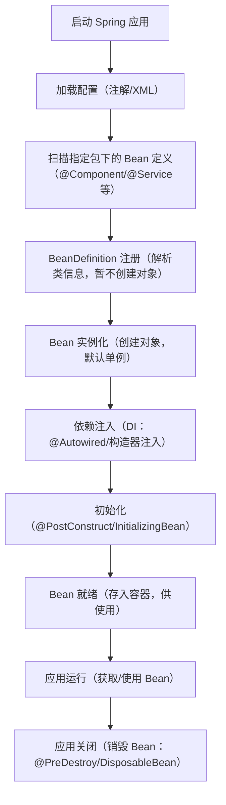

##### 3. 底层实现关键技术

- **反射**：Spring 通过反射（`Class.forName()`/`Constructor.newInstance()`）创建 Bean 实例、调用方法；
- **BeanDefinition**：存储 Bean 的元信息（类名、作用域、依赖、初始化方法等），是 Spring 创建 Bean 的“蓝图”；
- **BeanFactoryPostProcessor**：扩展点，可在 Bean 实例化前修改 BeanDefinition（如修改属性、作用域）；
- **BeanPostProcessor**：扩展点，可在 Bean 初始化前后增强（如 AOP 的动态代理就是通过这个扩展点实现）。

##### 4. 简单示例：手动模拟 IOC 核心逻辑

```java
// 1. 定义一个简单的 Bean
@Component
public class UserService {
    @Autowired
    private OrderService orderService;

    public void test() {
        System.out.println("UserService: " + orderService);
    }
}

@Component
public class OrderService {}

// 2. 手动实现简易 IOC 容器
public class SimpleIocContainer {
    // 存储 Bean 实例（单例池）
    private Map<String, Object> singletonBeans = new HashMap<>();
    // 存储 Bean 定义
    private Set<Class<?>> beanDefinitions = new HashSet<>();

    // 扫描指定包下的 @Component 注解类
    public void scan(String basePackage) {
        // 简化实现：模拟扫描，直接添加类
        beanDefinitions.add(UserService.class);
        beanDefinitions.add(OrderService.class);
    }

    // 初始化容器：创建 Bean + 依赖注入
    public void refresh() throws Exception {
        // 1. 实例化所有 Bean（先创建无依赖的）
        for (Class<?> clazz : beanDefinitions) {
            String beanName = clazz.getSimpleName().toLowerCase();
            Object bean = clazz.getConstructor().newInstance();
            singletonBeans.put(beanName, bean);
        }

        // 2. 依赖注入（简化：只处理 @Autowired）
        for (Object bean : singletonBeans.values()) {
            Field[] fields = bean.getClass().getDeclaredFields();
            for (Field field : fields) {
                if (field.isAnnotationPresent(Autowired.class)) {
                    field.setAccessible(true);
                    // 从容器中获取依赖的 Bean
                    Object dependency = singletonBeans.get(field.getType().getSimpleName().toLowerCase());
                    field.set(bean, dependency); // 注入依赖
                }
            }
        }
    }

    // 获取 Bean
    public <T> T getBean(Class<T> clazz) {
        return (T) singletonBeans.get(clazz.getSimpleName().toLowerCase());
    }

    // 测试
    public static void main(String[] args) throws Exception {
        SimpleIocContainer container = new SimpleIocContainer();
        container.scan("com.example");
        container.refresh();
        UserService userService = container.getBean(UserService.class);
        userService.test(); // 输出：UserService: com.example.OrderService@xxx
    }
}
```

##### 5. IOC 核心关键点

- **单例 Bean**：默认情况下，Spring 容器中一个 Bean 只创建一个实例（存在单例池中），所有请求共享；
- **懒加载**：默认 Bean 在容器启动时创建，可通过 `@Lazy` 注解改为“首次使用时创建”；
- **循环依赖**：Spring 通过“三级缓存”解决单例 Bean 的循环依赖（如 A 依赖 B，B 依赖 A），原型 Bean 无法解决。

---

#### 二、AOP（面向切面编程）运行机制

##### 1. 核心概念

先明确 AOP 的核心术语（通俗解释）：

| 术语               | 通俗解释                                                     |
| ------------------ | ------------------------------------------------------------ |
| 切面（Aspect）     | 横切逻辑的封装（如事务切面、日志切面）                       |
| 切点（Pointcut）   | 匹配要增强的方法（如 `execution(* com.example.*.*(..))`）    |
| 通知（Advice）     | 增强的具体逻辑（如前置通知 `@Before`、环绕通知 `@Around`,@After） |
| 目标对象（Target） | 被增强的原始对象                                             |
| 代理对象（Proxy）  | Spring 生成的包含增强逻辑的对象，对外暴露                    |

##### 2. AOP 核心实现方式

Spring AOP 基于 **动态代理** 实现，分两种方式：

- **JDK 动态代理**：目标对象实现了接口，代理类是 `Proxy` 生成的动态类，实现相同接口；
- **CGLIB 动态代理**：目标对象无接口，代理类继承目标类（通过字节码增强生成子类）。

> 注：Spring Boot 2.x 后，默认优先使用 CGLIB（可通过配置改为 JDK 代理）。

##### 3. AOP 执行流程（以 `@Transactional` 为例）

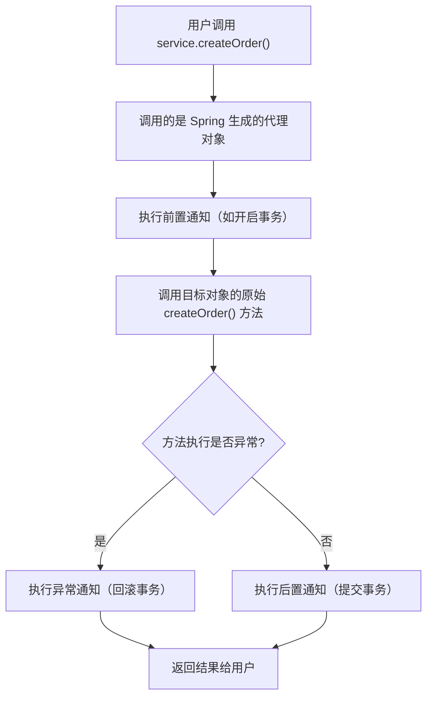

##### 4. AOP 代码示例（日志切面）

```java
// 1. 定义切面类（横切逻辑）
@Aspect // 标记为切面
@Component // 纳入 IOC 容器
public class LogAspect {

    // 定义切点：匹配 com.example.service 下所有类的所有 public 方法
    @Pointcut("execution(* com.example.service.*.*(..))")
    public void servicePointcut() {}

    // 前置通知：方法执行前执行
    @Before("servicePointcut()")
    public void before(JoinPoint joinPoint) {
        String methodName = joinPoint.getSignature().getName();
        System.out.println("【前置通知】方法 " + methodName + " 开始执行");
    }

    // 环绕通知：可控制方法执行（最强的通知）
    @Around("servicePointcut()")
    public Object around(ProceedingJoinPoint joinPoint) throws Throwable {
        long start = System.currentTimeMillis();
        // 执行原始方法
        Object result = joinPoint.proceed();
        long end = System.currentTimeMillis();
        System.out.println("【环绕通知】方法执行耗时：" + (end - start) + "ms");
        return result;
    }

    // 后置通知：方法执行后执行（无论是否异常）
    @After("servicePointcut()")
    public void after(JoinPoint joinPoint) {
        String methodName = joinPoint.getSignature().getName();
        System.out.println("【后置通知】方法 " + methodName + " 执行结束");
    }
}

// 2. 目标服务类
@Service
public class OrderService {
    public void createOrder() {
        System.out.println("执行创建订单的核心逻辑");
    }
}

// 3. 测试
public class AopTest {
    public static void main(String[] args) {
        ApplicationContext context = new AnnotationConfigApplicationContext(AppConfig.class);
        OrderService orderService = context.getBean(OrderService.class);
        // 调用的是代理对象，会触发切面逻辑
        orderService.createOrder();
    }
}
```

##### 5. AOP 与 IOC 的联动关系

AOP 依赖 IOC 容器实现：

1. Spring 启动时，先通过 IOC 扫描所有 Bean（包括切面类 `@Aspect`）；
2. 解析切面类中的切点和通知，生成 **Advisor**（通知器，包含切点+通知）；
3. 当创建目标 Bean 时，BeanPostProcessor（IOC 扩展点）会判断该 Bean 是否匹配切点：
   - 匹配：生成代理对象，替换原始 Bean 存入 IOC 容器；
   - 不匹配：直接将原始 Bean 存入容器；
4. 用户从 IOC 容器获取的是代理对象，调用方法时触发通知逻辑。

---

#### 三、核心扩展点（理解运行机制的关键）

| 扩展点                     | 作用                                 | 所属机制 |
| -------------------------- | ------------------------------------ | -------- |
| BeanPostProcessor          | Bean 初始化前后增强（AOP 代理生成）  | IOC      |
| BeanFactoryPostProcessor   | BeanDefinition 修改（动态配置 Bean） | IOC      |
| @PostConstruct/@PreDestroy | Bean 生命周期回调                    | IOC      |
| Pointcut/Advice/Aspect     | 定义 AOP 增强规则                    | AOP      |
| ProxyFactory               | 动态代理对象的创建工厂               | AOP      |

---

#### 总结

1. **IOC 核心**：通过容器接管对象的创建和依赖注入，底层依赖反射 + BeanDefinition，核心是“反转控制权”，解决对象耦合；
2. **AOP 核心**：基于动态代理（JDK/CGLIB）实现无侵入的横切逻辑增强，依赖 IOC 的 BeanPostProcessor 生成代理对象，核心是“分离横切逻辑与业务逻辑”；
3. **联动关系**：AOP 是 IOC 的扩展，IOC 容器为 AOP 提供 Bean 管理基础，AOP 通过代理对象增强 IOC 中的 Bean 功能。

------

## **三、Spring 事务管理**

1. Spring 事务管理的方式有哪些？（编程式 vs 声明式）
2. @Transactional 注解的作用？
3. propagation（传播行为）有哪些类型？
4. isolation（隔离级别）有哪些类型？默认是什么？
5. 为什么事务在同类内部方法调用时可能不生效？


### 1. Spring 事务管理的方式有哪些？（编程式 vs 声明式）

**答：**

- **编程式事务（Programmatic Transaction）**：通过 `TransactionTemplate` 或 `PlatformTransactionManager` 手动控制事务。

  ```java
  TransactionTemplate template = new TransactionTemplate(transactionManager);
  template.execute(status -> {
      // 业务操作
      return result;
  });
  ```

  - **优点**：灵活，可精确控制事务边界。
  - **缺点**：业务代码耦合事务逻辑，维护成本高。

- **声明式事务（Declarative Transaction）**：通过 `@Transactional` 注解或 XML 配置定义事务，Spring AOP 自动管理。

  ```java
  @Transactional
  public void saveUser(User user){ ... }
  

  // 自定义事务属性,@Transactional 支持自定义传播行为、隔离级别、超时时间等，弥补 “不够灵活” 的缺点：
  @Transactional(
      propagation = Propagation.REQUIRES_NEW, // 传播行为：新建事务
      isolation = Isolation.READ_COMMITTED,   // 隔离级别：读已提交
      timeout = 30,                           // 超时时间：30秒
      rollbackFor = {Exception.class, RuntimeException.class}, // 回滚异常类型
      noRollbackFor = IllegalArgumentException.class, // 不回滚的异常类型
      readOnly = false                         // 是否只读（查询时设为 true 优化性能）
  )
  public void batchUpdateOrder(List<Order> orderList) {
      orderList.forEach(order -> orderDao.update(order));
  }
  ```
  
  - **优点**：业务代码与事务逻辑分离，简单易用。
  - **缺点**：不够灵活，需要理解传播行为和事务隔离。

------

### 2. @Transactional 注解的作用？

**答：**

- 用于声明方法或类的事务属性。
- 特性：
  - **propagation**：事务传播行为
  - **isolation**：事务隔离级别
  - **timeout**：事务超时时间
  - **readOnly**：只读事务优化
  - **rollbackFor / noRollbackFor**：指定回滚异常类型

```java
@Transactional(propagation = Propagation.REQUIRED, isolation = Isolation.READ_COMMITTED, rollbackFor = Exception.class)
public void transferMoney(...) { ... }
```

> **Tip:** 类上加 `@Transactional` 默认应用于所有 public 方法。

------

### 3. propagation（传播行为）有哪些类型？

Spring 定义了 7 种传播行为：

| 类型          | 描述                                     |
| ------------- | ---------------------------------------- |
| REQUIRED      | 支持当前事务，如果没有则新建             |
| SUPPORTS      | 支持当前事务，如果没有则以非事务方式执行 |
| MANDATORY     | 必须在事务中执行，如果没有则抛异常       |
| REQUIRES_NEW  | 新建事务，挂起当前事务                   |
| NOT_SUPPORTED | 不支持事务，挂起当前事务                 |
| NEVER         | 不允许事务存在，如果有则抛异常           |
| NESTED        | 支持当前事务内嵌事务（Savepoint）        |

> **Tip:** 最常用的是 `REQUIRED`（默认）。

------

### 4. isolation（隔离级别）有哪些类型？默认是什么？

- **事务隔离级别**控制不同事务之间的数据可见性，避免脏读、不可重复读、幻读：
  
   | 类型 | 说明 |
   |------|------|
   | DEFAULT | 使用数据库默认隔离级别 |
   | READ_UNCOMMITTED | 允许脏读、不可重复读、幻读 |
   | READ_COMMITTED | 允许不可重复读、幻读，禁止脏读 |
   | REPEATABLE_READ | 允许幻读，禁止脏读、不可重复读（MySQL 默认） |
   | SERIALIZABLE | 串行化，完全隔离，性能最差 |

> **Tip:** MySQL InnoDB 默认 `REPEATABLE_READ`，适合大部分应用。

------

### 5. 为什么事务在同类内部方法调用时可能不生效？

**答：**

- 原因：Spring 的声明式事务是通过 **AOP 代理**实现的，事务逻辑被织入代理对象。

- **同类内部调用**：

  ```java
  class UserService {
      @Transactional
      public void methodA() { ... }
  
      public void methodB() {
          methodA(); // 内部调用，绕过代理
      }
  }
  ```

  - `methodA()` 被内部调用时直接使用 **this.methodA()**，没有经过代理对象，所以事务不会生效。

- **解决方案**：

  1. 将方法调用拆到不同 Bean，通过容器获取代理对象调用。
  2. 使用 `AopContext.currentProxy()` 获取当前代理对象执行方法。

```java
((UserService) AopContext.currentProxy()).methodA();
```


#### 一、底层原理：为什么内部调用会绕过代理？

先通过一张简单的流程图理解代理机制和内部调用的区别：

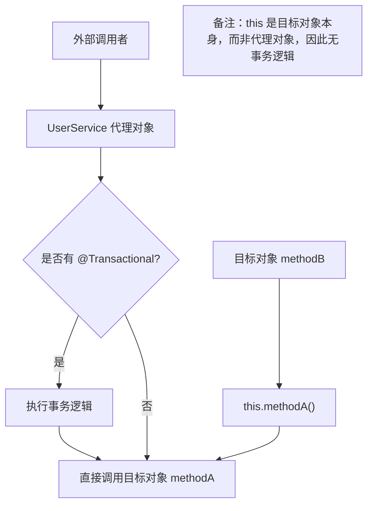

**通俗解释**：

- Spring 声明式事务的本质是**动态代理**：容器创建 `UserService` 的代理对象，事务逻辑（开启/提交/回滚）被织入代理对象的方法中；
- 外部调用 `userService.methodA()` 时，实际调用的是**代理对象**的 `methodA`，会先执行事务逻辑，再调用目标对象的 `methodA`；
- 同类内部调用 `this.methodA()` 时，`this` 指向**目标对象本身**（而非代理对象），跳过了代理的事务逻辑，因此事务失效。

#### 二、完整解决方案（附代码示例）

##### 方案1：拆分到不同 Bean（推荐，低耦合）

将事务方法拆分到独立的 Bean 中，通过依赖注入调用代理对象，是最符合 Spring 设计思想的方案。

```java
// 1. 独立的事务 Bean
@Service
public class TransactionalService {
    @Autowired
    private UserDao userDao;

    @Transactional(rollbackFor = Exception.class)
    public void methodA() {
        userDao.insert(new User());
        // 模拟异常，验证事务回滚
        // int a = 1 / 0;
    }
}

// 2. 原业务 Bean 注入并调用
@Service
public class UserService {
    @Autowired
    private TransactionalService transactionalService;

    public void methodB() {
        // 调用其他 Bean 的事务方法，走代理对象，事务生效
        transactionalService.methodA();
    }
}
```

##### 方案2：通过 AopContext 获取当前代理对象（便捷，需额外配置）

适合不想拆分 Bean 的场景，但需要开启 `exposeProxy = true` 暴露代理对象。

###### 步骤1：开启暴露代理（两种方式）

- **方式1**：启动类/配置类添加 `@EnableAspectJAutoProxy(exposeProxy = true)`
  
  ```java
  @SpringBootApplication
  @EnableAspectJAutoProxy(exposeProxy = true) // 暴露代理对象
  public class AppApplication {
      public static void main(String[] args) {
          SpringApplication.run(AppApplication.class, args);
      }
  }
  ```
- **方式2**：XML 配置（老项目）
  ```xml
  <aop:aspectj-autoproxy expose-proxy="true"/>
  ```

###### 步骤2：通过 AopContext 获取代理对象调用

```java
@Service
public class UserService {
    @Autowired
    private UserDao userDao;

    @Transactional(rollbackFor = Exception.class)
    public void methodA() {
        userDao.insert(new User());
    }

    public void methodB() {
        // 错误：this.methodA() 直接调用目标对象，事务失效
        // this.methodA();

        // 正确：获取代理对象，调用事务方法
        ((UserService) AopContext.currentProxy()).methodA();
    }
}
```

##### 方案3：自注入代理对象（简洁，需注意循环依赖）

通过 `@Autowired` 自注入当前 Bean 的代理对象，避免使用 `AopContext`。

Spring 对单例（singleton）Bean 的循环依赖，通过 “三级缓存” 机制解决：
一级缓存：存放完全初始化完成的 Bean（代理对象 / 目标对象）；
二级缓存：存放早期暴露的 Bean 引用（未完全初始化，但已创建代理）；
三级缓存：存放 Bean 的创建工厂。
**对于 UserService 自注入的场景：**
Spring 创建 UserService 实例（**目标对象）；**
为 UserService 创建代理对象（因为有 @Transactional，AOP 生成代理）；
将代理对象放入缓存，然后注入 self 变量（此时注入的是代理对象，而非未初始化的目标对象）；
完成 UserService 的初始化，无循环依赖报错。

如果用**构造器注入**的方式自依赖，即使是单例也会报错。原因：Spring 的三级缓存只能解决**字段 /setter 注入**的循环依赖，无法解决构造器注入的循环依赖（构造器执行时 Bean 还未创建，无法提前暴露引用）。

```java
@Service
public class UserService {
    // 自注入代理对象（Spring 会注入代理而非目标对象）
    @Autowired
    private UserService self;

    @Autowired
    private UserDao userDao;

    @Transactional(rollbackFor = Exception.class)
    public void methodA() {
        userDao.insert(new User());
    }

    public void methodB() {
        // 调用代理对象的 methodA，事务生效
        self.methodA();
    }
}
```
> 注意：Spring 默认允许循环依赖，因此自注入不会报错；若关闭循环依赖（`spring.main.allow-circular-references=false`），此方案失效。


#### 三、避坑要点

1. **方案2 注意事项**：
   - 必须开启 `exposeProxy = true`，否则 `AopContext.currentProxy()` 会抛出 `IllegalStateException`；
   - `AopContext` 是 Spring AOP 的内部类，耦合性略高，非必要不优先使用。

2. **方案3 注意事项**：
   - 自注入的变量名不能和类名冲突（如 `private UserService userService` 是合法的）；
   - 若 Bean 是 `prototype` 作用域，自注入可能导致代理对象不一致，需谨慎使用。

3. **通用避坑**：
   - 事务方法必须是 `public`（private/protected 方法无法被代理）；
   - 即使通过代理调用，若事务方法抛出 `Checked Exception` 且未指定 `rollbackFor`，事务仍不会回滚。

#### 四、最佳实践

| 解决方案        | 优点                 | 缺点                | 适用场景                 |
| --------------- | -------------------- | ------------------- | ------------------------ |
| 拆分到不同 Bean | 低耦合、符合设计思想 | 需新增 Bean，稍繁琐 | 新开发功能、代码重构     |
| AopContext      | 无需拆分 Bean        | 耦合 AOP 内部 API   | 老项目快速修复、临时方案 |
| 自注入代理对象  | 简洁、无需额外配置   | 依赖循环依赖开启    | 中小型项目、简单场景     |

**核心推荐**：
- 优先选择**方案1（拆分到不同 Bean）**，虽然稍繁琐，但代码结构更清晰，符合“单一职责”原则；
- 临时修复或小型项目可选择**方案3（自注入代理对象）**，简洁且无额外配置；
- 尽量避免使用 `AopContext`（方案2），降低与 Spring 内部 API 的耦合。

#### 总结

1. **失效核心原因**：内部调用使用 `this` 指向目标对象，绕过了包含事务逻辑的代理对象；
2. **核心解决方案**：让事务方法的调用走**代理对象**（拆分 Bean、自注入、AopContext）；
3. **最佳实践**：优先拆分到不同 Bean，次选自注入代理对象，尽量避免使用 AopContext。

### 6.Spring中事务以及事务失效场景

#### Spring 事务核心概念

Spring 事务本质是对数据库事务的封装，通过 **AOP（面向切面编程）** 实现声明式事务管理（常用 `@Transactional` 注解），核心是保证一组数据库操作（增删改查）要么全部成功，要么全部回滚。

Spring 事务的核心属性（常用）：
- `propagation`：传播行为（比如 `REQUIRED`（默认）、`REQUIRES_NEW` 等，决定事务如何嵌套）；
- `isolation`：隔离级别（对应数据库隔离级别，如 `READ_COMMITTED`）；
- `rollbackFor`：指定触发回滚的异常类型（默认只回滚运行时异常 `RuntimeException` 和错误 `Error`）；
- `timeout`：事务超时时间。

---

#### 一、Spring 事务的基本使用（快速上手）

先看一个典型的正确用法，帮你建立基准认知：
```java
@Service
public class OrderService {

    @Autowired
    private OrderMapper orderMapper;

    @Autowired
    private UserMapper userMapper;

    // 声明式事务：保证下单+扣余额要么都成，要么都回滚
    @Transactional(rollbackFor = Exception.class) // 显式指定回滚所有Exception
    public void createOrder(OrderDTO orderDTO) {
        // 1. 插入订单
        orderMapper.insert(orderDTO);
        // 2. 扣减用户余额
        userMapper.deductBalance(orderDTO.getUserId(), orderDTO.getAmount());
        // 3. 若任意一步抛异常，整个事务回滚
    }
}
```

---

#### 二、事务失效的 8 大常见场景（附原因+解决方案）

事务失效是 Spring 开发中高频坑，以下按“出现频率”排序，每个场景都讲清**原因**和**解决方案**：

##### 场景 1：注解加在非 public 方法上

**原因**：Spring 事务的 AOP 代理基于 JDK 动态代理/CGLIB 实现，而代理的前提是方法为 `public`（非 public 方法无法被代理拦截）。
**反例**：

```java
@Service
public class OrderService {
    // 错误：private 方法，@Transactional 无效
    @Transactional
    private void createOrder(OrderDTO orderDTO) {
        // 数据库操作
    }
}
```
**解决方案**：将方法改为 `public` 修饰。

##### 场景 2：同类内部调用（自调用）

**原因**：Spring 事务通过代理对象生效，若在同一个类中，直接调用本类的事务方法（而非代理对象），AOP 无法拦截，事务失效。
**反例**：
```java
@Service
public class OrderService {

    public void outerMethod() {
        // 内部调用事务方法，事务失效
        this.innerTransactionalMethod(); 
    }

    @Transactional
    public void innerTransactionalMethod() {
        // 数据库操作
    }
}
```
**解决方案**：
1. 注入自身代理对象（推荐）：
   ```java
   @Service
   public class OrderService {
       // 注入自身代理对象（需开启 expose-proxy = true）
       @Autowired
       private OrderService orderService;

       public void outerMethod() {
           // 调用代理对象的事务方法
           orderService.innerTransactionalMethod();
       }

       @Transactional
       public void innerTransactionalMethod() {
           // 数据库操作
       }
   }
   ```
2. 拆分到不同类（更规范）：将事务方法抽离到另一个 Service 中，通过注入调用。

##### 场景 3：异常被捕获且未抛出

**原因**：Spring 事务需要感知到异常才能触发回滚，若异常被 `try-catch` 捕获且未重新抛出，事务管理器无法感知，会认为操作成功，提交事务。
**反例**：

```java
@Service
public class OrderService {

    @Transactional(rollbackFor = Exception.class)
    public void createOrder(OrderDTO orderDTO) {
        try {
            orderMapper.insert(orderDTO);
            userMapper.deductBalance(orderDTO.getUserId(), orderDTO.getAmount());
        } catch (Exception e) {
            // 捕获异常但未抛出，事务不会回滚
            log.error("下单失败", e);
        }
    }
}
```
**解决方案**：捕获异常后重新抛出，或手动触发回滚：
```java
@Transactional(rollbackFor = Exception.class)
public void createOrder(OrderDTO orderDTO) {
    try {
        orderMapper.insert(orderDTO);
        userMapper.deductBalance(orderDTO.getUserId(), orderDTO.getAmount());
    } catch (Exception e) {
        log.error("下单失败", e);
        // 方案1：重新抛出异常
        throw new RuntimeException(e);
        // 方案2：手动回滚（适用于不想抛异常的场景）
        // TransactionAspectSupport.currentTransactionStatus().setRollbackOnly();
    }
}
```

##### 场景 4：未指定 `rollbackFor`，抛出检查型异常

**原因**：`@Transactional` 默认只回滚 `RuntimeException`（运行时异常）和 `Error`，若抛出检查型异常（如 `IOException`、`SQLException`），事务不会回滚。
**反例**：

```java
@Service
public class OrderService {

    @Transactional // 未指定 rollbackFor
    public void createOrder(OrderDTO orderDTO) throws Exception {
        orderMapper.insert(orderDTO);
        // 抛出检查型异常，事务不回滚
        throw new Exception("下单失败");
    }
}
```
**解决方案**：显式指定 `rollbackFor` 包含检查型异常：
```java
@Transactional(rollbackFor = Exception.class) // 覆盖所有Exception
public void createOrder(OrderDTO orderDTO) throws Exception {
    // 业务逻辑
}
```

##### 场景 5：事务传播行为设置错误

**原因**：传播行为决定了事务的嵌套规则，若设置为 `SUPPORTS`/`NOT_SUPPORTED`/`NEVER` 等，可能导致事务失效。

- `SUPPORTS`：有事务就加入，没有就以非事务执行；
- `NOT_SUPPORTED`：始终以非事务执行，若当前有事务则挂起；
- `NEVER`：不允许有事务，有则抛异常。

**反例**：
```java
@Service
public class OrderService {

    // 传播行为错误，无事务时直接非事务执行
    @Transactional(propagation = Propagation.SUPPORTS)
    public void createOrder(OrderDTO orderDTO) {
        // 数据库操作，无事务保护
    }
}
```
**解决方案**：默认使用 `Propagation.REQUIRED`（推荐），或根据业务选择 `REQUIRES_NEW`（新建事务）等正确的传播行为。

##### 场景 6：数据源未配置事务管理器

**原因**：Spring 事务需要绑定 `PlatformTransactionManager`（如 `DataSourceTransactionManager`），若未配置，事务注解会“静默失效”（无报错，无事务）。
**反例**：仅配置数据源，未配置事务管理器：

```java
@Configuration
public class DataSourceConfig {
    @Bean
    public DataSource dataSource() {
        // 配置数据源，但未配置事务管理器
        return new DruidDataSource();
    }
}
```
**解决方案**：手动配置事务管理器（Spring Boot 自动配置可省略，但多数据源必须手动配）：
```java
@Configuration
public class TransactionConfig {
    @Autowired
    private DataSource dataSource;

    @Bean
    public PlatformTransactionManager transactionManager() {
        // 绑定数据源，创建事务管理器
        return new DataSourceTransactionManager(dataSource);
    }
}
```

##### 场景 7：数据库不支持事务

**原因**：事务的底层依赖数据库支持，若使用不支持事务的数据库/引擎（如 MySQL 的 MyISAM 引擎），Spring 事务会失效。
**解决方案**：

1. 将 MySQL 表引擎改为 `InnoDB`（默认支持事务）；
2. 确认数据库本身支持事务（如 PostgreSQL、Oracle 均支持，SQLite 需配置）。

##### 场景 8：方法内部使用了非事务的数据库连接

**原因**：若在事务方法中，手动获取了非 Spring 管理的数据库连接（如直接 `DriverManager.getConnection()`），该操作不会纳入事务管理。
**反例**：

```java
@Transactional
public void createOrder(OrderDTO orderDTO) throws SQLException {
    // 手动获取连接，脱离 Spring 事务管理
    Connection conn = DriverManager.getConnection(url, user, pwd);
    // 该操作不会回滚
    PreparedStatement ps = conn.prepareStatement("INSERT INTO order ...");
    ps.executeUpdate();
}
```
**解决方案**：使用 Spring 管理的 `JdbcTemplate`/`MyBatis`/`JPA` 等，统一使用 Spring 绑定的事务连接。

---

#### 三、如何快速排查事务失效？

1. **开启日志调试**：在 `application.yml` 中开启 Spring 事务日志，查看事务是否创建/回滚：
   ```yaml
   logging:
     level:
       org.springframework.jdbc.support.JdbcTransactionManager: DEBUG
   ```
2. **检查代理对象**：通过 `AopContext.currentProxy()` 获取代理对象，确认调用的是代理方法而非原方法；
3. **测试回滚逻辑**：在事务方法中手动抛异常，查看数据库数据是否回滚，判断事务是否生效。

---

#### 总结

1. Spring 事务失效的核心原因：**代理未生效**（非 public、自调用）、**异常未感知**（捕获未抛、未指定 rollbackFor）、**配置错误**（传播行为、事务管理器、数据库引擎）；
2. 最常见的失效场景：同类自调用、异常被捕获、非 public 方法、未指定 rollbackFor；
3. 排查技巧：开启 DEBUG 日志 + 测试回滚逻辑 + 检查代理对象。


------

## **四、Spring MVC**

1. Spring MVC 的工作流程（请求 → 控制器 → 视图）？
2. @Controller 与 @RestController 的区别？
3. @RequestMapping、@GetMapping、@PostMapping 的区别？
4. @PathVariable 和 @RequestParam 的区别？
5. @RequestBody 和 @ResponseBody 的作用？
6. Spring MVC 中如何处理文件上传？
7. Spring MVC 的拦截器 HandlerInterceptor 与 Filter 有何区别？


### 1. Spring MVC 的工作流程（请求 → 控制器 → 视图）

**答：** Spring MVC 请求处理流程如下：

1. **客户端请求** → 发送到 **DispatcherServlet**（前端控制器）
2. **HandlerMapping**：根据 URL 查找对应的 **Controller** 方法
3. **调用 Controller 方法** → 处理业务逻辑，返回 **ModelAndView**
4. **ViewResolver**：解析视图名称，找到具体视图（JSP/HTML/JSON 等）
5. **渲染视图** → 返回响应给客户端

> **流程图示意**：

```
客户端 → DispatcherServlet → HandlerMapping → Controller → Service → ViewResolver → 客户端
```

#### 一、Spring MVC 完整工作流程（细化到 9 步）

你总结的是核心流程，实际 Spring MVC 处理请求的完整步骤包含更多关键组件（如 HandlerAdapter、数据绑定等），细化后更易理解：

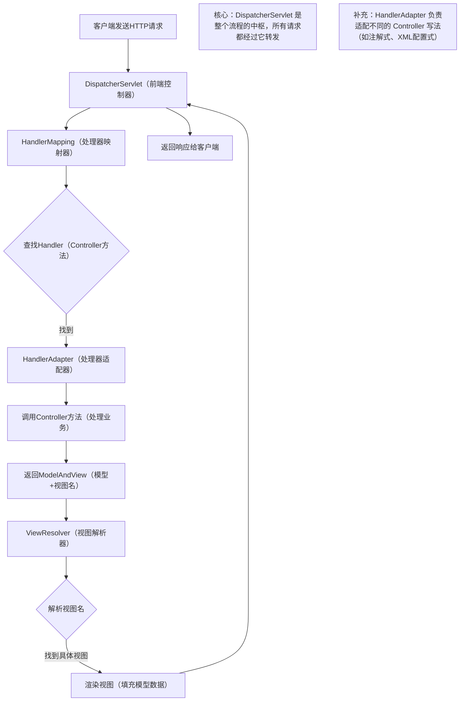

##### 完整步骤拆解（带组件作用说明）：

1. **客户端发送请求**：浏览器/PostMan 发送 HTTP 请求（如 `http://localhost:8080/user/1`），请求先到达 Tomcat 等 Web 容器，再转发给 Spring MVC 的 `DispatcherServlet`；
2. **DispatcherServlet 接收请求**：作为“前端控制器”，是 Spring MVC 的核心入口，负责协调所有组件，不处理具体业务；
3. **HandlerMapping 匹配处理器**：根据请求 URL、请求方式（GET/POST）等信息，查找对应的 `Controller` 方法（如 `UserController#getUserById(Long id)`），返回 `HandlerExecutionChain`（包含 Handler + 拦截器）；若存在拦截器则执行preHandler方法，返回True继续执行，返回False则拒绝执行。
4. **HandlerAdapter 适配执行**：`HandlerMapping` 找到 Handler 后，`DispatcherServlet` 通过 `HandlerAdapter` 调用 Controller 方法（适配不同的 Controller 实现方式，如注解式 `@Controller`、老式 `Controller` 接口）；若存在拦截器则继续执行postHandler方法。
5. **数据绑定与参数解析**：`HandlerAdapter` 会自动将请求参数（如 URL 中的 `id=1`）绑定到 Controller 方法的参数上（如 `Long id`），支持表单、JSON、路径变量等多种参数类型；
6. **Controller 处理业务**：执行 Controller 方法，调用 Service/DAO 处理业务逻辑，最终返回 `ModelAndView`（包含数据模型 `Model` 和视图名称，如 `userDetail`）；
7. **ViewResolver 解析视图**：根据视图名称（如 `userDetail`），结合视图解析器配置（如前缀 `/WEB-INF/views/`、后缀 `.jsp`），解析出具体的视图对象（如 `/WEB-INF/views/userDetail.jsp`）；
8. **视图渲染**：将 Model 中的数据填充到视图中（如 JSP 中通过 `${user.name}` 获取数据），生成 HTML/JSON 等响应内容；渲染后，调用**拦截器**的aftercompletion方法。
9. **返回响应**：`DispatcherServlet` 将渲染后的响应返回给客户端，完成请求处理。

#### 二、核心组件的作用（关键补充）

| 组件              | 核心作用                                                     | 常见实现类/配置                                      |
| ----------------- | ------------------------------------------------------------ | ---------------------------------------------------- |
| DispatcherServlet | 前端控制器，请求入口，协调所有组件                           | 配置在 `web.xml` 或 Spring Boot 自动配置             |
| HandlerMapping    | 映射 URL 到 Controller 方法                                  | `RequestMappingHandlerMapping`（注解式默认）         |
| HandlerAdapter    | 适配并执行 Controller 方法，处理参数绑定、返回值解析         | `RequestMappingHandlerAdapter`（注解式默认）         |
| Controller        | 处理器，处理业务逻辑，返回 ModelAndView 或直接返回数据（如 JSON） | 标注 `@Controller`/`@RestController` 的类            |
| ModelAndView      | 封装模型数据（Model）和视图名称（ViewName）                  | 可手动创建或由框架自动封装                           |
| ViewResolver      | 解析视图名称为具体视图对象                                   | `InternalResourceViewResolver`（JSP默认）            |
| View              | 渲染视图，生成响应内容（HTML/JSON/XML 等）                   | `JstlView`（JSP）、`MappingJackson2JsonView`（JSON） |

#### 三、代码示例：对应工作流程的核心代码

##### 1. 核心配置（Spring Boot 自动配置，无需手动写，仅作了解）

```java
// Spring Boot 启动类（自动配置 DispatcherServlet、HandlerMapping 等）
@SpringBootApplication
public class MvcApplication {
    public static void main(String[] args) {
        SpringApplication.run(MvcApplication.class, args);
    }
}

// 视图解析器配置（如需自定义 JSP 路径）
@Configuration
public class MvcConfig implements WebMvcConfigurer {
    @Bean
    public ViewResolver viewResolver() {
        InternalResourceViewResolver resolver = new InternalResourceViewResolver();
        resolver.setPrefix("/WEB-INF/views/"); // 视图前缀
        resolver.setSuffix(".jsp"); // 视图后缀
        return resolver;
    }
}
```

##### 2. Controller 示例（对应流程第 6 步）

```java
@Controller
@RequestMapping("/user")
public class UserController {

    @Autowired
    private UserService userService;

    // 对应 HandlerMapping 匹配的 Handler（URL：/user/{id}）
    @GetMapping("/{id}")
    public ModelAndView getUserById(@PathVariable Long id) {
        // 1. 处理业务逻辑（调用 Service）
        User user = userService.getById(id);
        
        // 2. 封装 ModelAndView（模型+视图名）
        ModelAndView mav = new ModelAndView();
        mav.addObject("user", user); // 模型数据
        mav.setViewName("userDetail"); // 视图名称（对应 /WEB-INF/views/userDetail.jsp）
        
        return mav;
    }

    // 前后端分离场景：直接返回 JSON（无需视图解析，ViewResolver 不生效）
    @GetMapping("/{id}/json")
    @ResponseBody
    public User getUserByIdJson(@PathVariable Long id) {
        return userService.getById(id);
    }
}
```

##### 3. JSP 视图示例（对应流程第 8 步）

```jsp
<!-- /WEB-INF/views/userDetail.jsp -->
<%@ page contentType="text/html;charset=UTF-8" language="java" %>
<html>
<head>
    <title>用户详情</title>
</head>
<body>
    <h1>用户信息</h1>
    <p>ID：${user.id}</p>
    <p>姓名：${user.name}</p>
    <p>年龄：${user.age}</p>
</body>
</html>
```

#### 四、关键细节补充（避坑/面试高频）

1. **DispatcherServlet 的核心地位**：
   - 所有请求必须经过 `DispatcherServlet`，它是 Spring MVC 的“大脑”，负责转发请求、协调组件，自身不处理任何业务逻辑；
   - Spring Boot 中默认映射 `/`（所有请求），可通过 `server.servlet.path` 自定义。

2. **HandlerAdapter 的适配作用**：
   - 早期 Spring MVC 支持多种 Controller 写法（如实现 `Controller` 接口、`HttpRequestHandler` 接口），`HandlerAdapter` 保证不同写法的 Controller 都能被 `DispatcherServlet` 调用；
   - 注解式 `@Controller` 对应的适配器是 `RequestMappingHandlerAdapter`（最常用）。

3. **@ResponseBody 跳过视图解析**：
   - 当 Controller 方法标注 `@ResponseBody`（或类标注 `@RestController`）时，返回值会被 `MessageConverter` 转换为 JSON/XML 等数据，直接返回给客户端，**跳过 ViewResolver 和视图渲染步骤**（这是前后端分离项目的核心用法）。

4. **拦截器的执行时机**：
   - 拦截器（HandlerInterceptor）在 `HandlerMapping` 找到 Handler 后、`HandlerAdapter` 执行 Controller 方法前/后执行，可用于登录校验、日志记录等；
   - 执行顺序：`preHandle()` → Controller 方法 → `postHandle()` → 视图渲染 → `afterCompletion()`。

#### 五、简化记忆版（面试快速应答）

如果面试时需要简洁回答，可按以下逻辑梳理：
> 客户端发送请求 → 前端控制器 DispatcherServlet 接收 → 处理器映射器 HandlerMapping 找到对应的 Controller 方法 → 处理器适配器 HandlerAdapter 执行 Controller 方法 → Controller 处理业务返回 ModelAndView → 视图解析器 ViewResolver 解析视图名称 → 渲染视图 → DispatcherServlet 返回响应给客户端。

#### 总结

1. **核心流程**：Spring MVC 以 `DispatcherServlet` 为核心，通过 HandlerMapping 找处理器、HandlerAdapter 执行处理器、ViewResolver 解析视图，完成“请求-处理-响应”全流程；
2. **关键组件**：DispatcherServlet（中枢）、HandlerMapping（找处理器）、HandlerAdapter（执行处理器）、ViewResolver（解析视图）是四大核心组件；
3. **灵活场景**：标注 `@ResponseBody` 可跳过视图解析，直接返回 JSON 数据（前后端分离主流用法）。

------

### 2. @Controller 与 @RestController 的区别

| 注解            | 说明                                                         |
| --------------- | ------------------------------------------------------------ |
| @Controller     | 标识控制器，返回视图名，需要配合 @ResponseBody 返回 JSON     |
| @RestController | 组合注解（@Controller + @ResponseBody），返回对象自动转换为 JSON/HTTP 响应体 |

```java
@RestController
public class UserController {
    @GetMapping("/user")
    public User getUser() { return new User("Alice"); }
}
```

------

### 3. @RequestMapping、@GetMapping、@PostMapping 的区别

| 注解            | 说明                                                         |
| --------------- | ------------------------------------------------------------ |
| @RequestMapping | 支持所有请求方法（GET、POST、PUT、DELETE 等），可加 method 限制 |
| @GetMapping     | 仅处理 GET 请求（Spring 4.3+）                               |
| @PostMapping    | 仅处理 POST 请求（Spring 4.3+）                              |

> **Tip:** GetMapping/PostMapping 是 @RequestMapping(method=...) 的快捷注解。

#### 一、注解的底层关系（本质是“封装”）

`@GetMapping` 和 `@PostMapping` 是 Spring 4.3 为了简化开发推出的**快捷注解**，本质是对 `@RequestMapping` 的封装，底层完全等价于指定 `method` 属性的 `@RequestMapping`：

| 快捷注解       | 等价的 @RequestMapping 写法                      |
| -------------- | ------------------------------------------------ |
| @GetMapping    | `@RequestMapping(method = RequestMethod.GET)`    |
| @PostMapping   | `@RequestMapping(method = RequestMethod.POST)`   |
| @PutMapping    | `@RequestMapping(method = RequestMethod.PUT)`    |
| @DeleteMapping | `@RequestMapping(method = RequestMethod.DELETE)` |

**源码佐证**（以 `@GetMapping` 为例）：
```java
// @GetMapping 源码（Spring 核心源码）
@Target({ElementType.METHOD})
@Retention(RetentionPolicy.RUNTIME)
@Documented
@RequestMapping(method = RequestMethod.GET) // 核心：封装了 method=GET
public @interface GetMapping {
    // 继承 @RequestMapping 的所有属性（value、path、params、headers 等）
    @AliasFor(annotation = RequestMapping.class)
    String[] value() default {};
    
    // 其他属性（path、params、headers 等）均与 @RequestMapping 一致
}
```

#### 二、完整代码示例（对比用法）

##### 1. @RequestMapping 的两种用法

```java
@RestController
@RequestMapping("/user") // 类级别：统一前缀，不限制请求方法
public class UserController {

    // 用法1：不限制请求方法（GET/POST/PUT/DELETE 都可访问）
    @RequestMapping("/all")
    public String allMethod() {
        return "支持所有请求方法";
    }

    // 用法2：通过 method 限制为 GET 请求（等价于 @GetMapping）
    @RequestMapping(value = "/get", method = RequestMethod.GET)
    public String getMethod() {
        return "仅支持 GET 请求";
    }
}
```

##### 2. @GetMapping/@PostMapping 快捷用法

```java
@RestController
@RequestMapping("/user")
public class UserController {

    // 等价于 @RequestMapping(method = RequestMethod.GET)
    @GetMapping("/info")
    public User getUserInfo(@RequestParam Long id) {
        return new User(id, "张三", 20);
    }

    // 等价于 @RequestMapping(method = RequestMethod.POST)
    @PostMapping("/add")
    public String addUser(@RequestBody User user) {
        return "新增用户成功：" + user.getName();
    }
}
```

##### 3. 进阶用法（结合 params/headers 等属性）

快捷注解完全继承 `@RequestMapping` 的所有属性，可实现精准匹配：
```java
// 仅处理 GET 请求，且必须包含参数 "token"，且 headers 包含 "Content-Type=application/json"
@GetMapping(value = "/detail", params = "token", headers = "Content-Type=application/json")
public User getUserDetail(@RequestParam Long id) {
    return new User(id, "李四", 25);
}
```

#### 三、核心区别与使用场景

| 维度             | @RequestMapping                                              | @GetMapping/@PostMapping                                     |
| ---------------- | ------------------------------------------------------------ | ------------------------------------------------------------ |
| **请求方法限制** | 默认支持所有方法，可通过 method 限制                         | 仅支持单一请求方法（GET/POST），不可修改                     |
| **代码简洁性**   | 稍繁琐（需手动指定 method）                                  | 简洁（无需写 method）                                        |
| **可读性**       | 低（需看 method 属性才知支持的请求方法）                     | 高（注解名直接体现请求方法）                                 |
| **适用场景**     | 1. 类级别统一前缀；<br>2. 需支持多请求方法的接口；<br>3. 老项目（Spring < 4.3） | 1. 单请求方法的接口（RESTful API 主流）；<br>2. 新开发项目（Spring 4.3+） |

#### 四、避坑要点（高频问题）

1. **类级别 vs 方法级别注解**：
   - `@RequestMapping` 可标注在**类**和**方法**上（类级别定前缀，方法级别定具体路径）；
   - `@GetMapping/@PostMapping` 仅能标注在**方法**上（标注在类上会报错）。

   ✅ 正确写法：
   ```java
   @RestController
   @RequestMapping("/user") // 类级别：前缀
   public class UserController {
       @GetMapping("/info") // 方法级别：完整路径 /user/info
       public String info() { return "info"; }
   }
   ```

   ❌ 错误写法：
   ```java
   // @GetMapping 不能标注在类上
   @RestController
   @GetMapping("/user") 
   public class UserController {}
   ```

2. **多请求方法支持**：
   - 若接口需同时支持 GET 和 POST，只能用 `@RequestMapping` + `method` 数组：
     ```java
     // 支持 GET 和 POST 两种请求方法
     @RequestMapping(value = "/save", method = {RequestMethod.GET, RequestMethod.POST})
     public String save() { return "save"; }
     ```
   - 无法用 `@GetMapping + @PostMapping` 叠加（会导致映射冲突）。

3. **RESTful API 最佳实践**：
   - 遵循“请求方法语义”：
     - 查询数据 → `@GetMapping`；
     - 新增数据 → `@PostMapping`；
     - 更新数据 → `@PutMapping`；
     - 删除数据 → `@DeleteMapping`；
   - 这种写法符合 RESTful 规范，代码可读性和维护性最优。

#### 五、总结

1. **底层关系**：`@GetMapping/@PostMapping` 是 `@RequestMapping(method=...)` 的快捷注解，功能完全等价；
2. **核心差异**：`@RequestMapping` 灵活（支持多请求方法、可标注在类上），快捷注解简洁（仅单请求方法、仅标注在方法上）；
3. **使用原则**：
   - 类级别统一路径前缀 → 用 `@RequestMapping`；
   - 方法级别单请求方法 → 用 `@GetMapping/@PostMapping`（推荐）；
   - 方法级别多请求方法 → 用 `@RequestMapping + method 数组`；
   - 新项目优先用快捷注解（符合现代 RESTful 规范），老项目兼容用 `@RequestMapping`。

### `@PostMapping`参数

`@PostMapping` 是 Spring MVC 中处理 **HTTP POST 请求** 的核心注解，它的参数本质是对 `@RequestMapping(method = RequestMethod.POST)` 的简化封装，所有参数都用于**精准匹配请求、控制请求/响应处理规则**。

下面按「常用程度+功能分类」拆解 `@PostMapping` 的所有核心参数，结合你的业务场景（微信回调）举例说明：

#### 一、核心参数（必懂）

| 参数名         | 作用                                                         | 示例（结合你的代码）                                         |
| -------------- | ------------------------------------------------------------ | ------------------------------------------------------------ |
| `value`/`path` | 定义匹配的请求路径（核心！和你代码中 `value="callback"` 对应） | `@PostMapping(value = "callback")` <br> `@PostMapping("callback")`（简写） |
| `produces`     | 指定响应体的 MIME 类型 + 字符编码，强制方法返回的内容格式    | `produces = "application/xml;charset=UTF-8"`（微信要求返回 XML） |
| `consumes`     | 指定可接收的请求体 MIME 类型，只处理符合该格式的请求         | `consumes = "application/xml"`（只接收 XML 格式的请求体）    |

##### 重点解释（结合你的业务）：

1. **`value`/`path`**：
   - 两者完全等价（`path` 是 Spring 4.3+ 新增，更语义化）；
   - 支持**单个路径**（如 `"callback"`）、**多个路径**（如 `{"callback", "wx/callback"}`）；
   - 支持**路径变量**（如 `"callback/{userId}"`，配合 `@PathVariable` 获取）。

2. **`produces`**：
   你代码中 `produces = "application/xml;charset=UTF-8"` 是典型场景：
   - 告诉 Spring 该方法返回的响应体必须是 `application/xml` 格式（微信要求回复消息为 XML）；
   - `charset=UTF-8` 强制编码，避免中文乱码；
   - 如果客户端请求头 `Accept` 不包含 `application/xml`，会直接返回 406（Not Acceptable）。

3. **`consumes`**：
   微信回调的请求体是 XML 格式，你可以补充该参数，只处理微信的 XML 请求：
   ```java
   // 只接收 XML 格式的 POST 请求，其他格式（如 JSON）直接拒绝
   @PostMapping(value = "callback", 
                consumes = "application/xml", 
                produces = "application/xml;charset=UTF-8")
   ```

#### 二、进阶参数（场景化）

| 参数名    | 作用                                                         | 适用场景                                                     |
| --------- | ------------------------------------------------------------ | ------------------------------------------------------------ |
| `params`  | 要求请求必须包含指定参数（或参数满足指定值）才匹配           | 只处理包含 `signature` 参数的请求：<br> `params = "signature"` |
| `headers` | 要求请求头包含指定字段（或字段满足指定值）才匹配             | 只处理微信的回调请求（假设微信有专属请求头）：<br> `headers = "X-Wx-Source=wechat"` |
| `name`    | 给该请求映射起一个唯一名称（极少用，可用于动态获取映射信息） | `name = "wxCallbackPost"`                                    |

##### 示例：结合 `params` 增强微信回调的安全性

```java
// 仅当请求包含 signature、timestamp、nonce 参数时，才执行该方法
@PostMapping(
    value = "callback",
    params = {"signature", "timestamp", "nonce"}, // 必须包含这3个参数
    produces = "application/xml;charset=UTF-8"
)
public String callback(...) {
    // 业务逻辑
}
```

#### 三、和方法入参的区别（新手易混淆）

⚠️ 注意：`@PostMapping` 注解的参数 ≠ 方法的入参！
- `@PostMapping` 的参数：**用于匹配请求、控制请求/响应规则**（如 `value` 匹配路径，`produces` 控制返回格式）；
- 方法的入参（如 `@RequestBody String requestBody`、`@RequestParam("signature") String signature`）：**用于提取请求中的数据**（如请求体、URL 参数）。

##### 对比你的代码，一目了然：

```java
// @PostMapping的参数：匹配路径+控制返回格式
@PostMapping(value = "callback", produces = "application/xml;charset=UTF-8")
// 方法入参：提取请求中的数据（请求体、URL参数）
public String callback(
        @RequestBody String requestBody, // 提取POST请求体
        @RequestParam("signature") String signature, // 提取URL参数signature
        @RequestParam("timestamp") String timestamp, // 提取URL参数timestamp
        @RequestParam("nonce") String nonce, // 提取URL参数nonce
        @RequestParam(value = "msg_signature", required = false) String msgSignature) {
    // 业务逻辑
}
```

#### 四、完整示例（微信回调最佳实践）

结合所有核心参数，写出更健壮的微信回调接口：
```java
@RestController
// 类级别路径前缀（可选，若加则完整路径为 /wx/callback）
// @RequestMapping("/wx")
public class WxCallbackController {

    // POST /callback 路径
    // 仅接收 XML 请求体、必须包含 signature/timestamp/nonce 参数
    // 仅返回 XML 格式响应（UTF-8 编码）
    @PostMapping(
        value = "callback",
        consumes = "application/xml;charset=UTF-8",
        produces = "application/xml;charset=UTF-8",
        params = {"signature", "timestamp", "nonce"}
    )
    public String handleWxPost(
            @RequestBody String requestBody,
            @RequestParam String signature,
            @RequestParam String timestamp,
            @RequestParam String nonce,
            @RequestParam(required = false) String msg_signature) {
        // 处理微信消息逻辑
        return "<xml>...</xml>";
    }

    // 配套的 GET 方法（Token 验证）
    @GetMapping(
        value = "callback",
        params = {"signature", "timestamp", "nonce", "echostr"}
    )
    public String handleWxGet(...) {
        // Token 验证逻辑
        return echostr;
    }
}
```

#### 总结

1. `@PostMapping` 核心参数是 `value/path`（路径）、`produces`（响应格式）、`consumes`（请求格式）；
2. `params`/`headers` 用于精准过滤请求，提升接口安全性；
3. 注解参数负责“匹配请求”，方法入参负责“提取请求数据”，两者分工明确；
4. 微信回调场景中，`produces` 和 `consumes` 建议都指定 `application/xml;charset=UTF-8`，`params` 校验必要参数，避免无效请求。

------

### 4. @PathVariable 和 @RequestParam 的区别

| 注解          | 来源           | 用法                        |
| ------------- | -------------- | --------------------------- |
| @PathVariable | URL 路径       | `/user/{id}` → 获取路径变量 |
| @RequestParam | 查询参数或表单 | `/user?id=1` → 获取请求参数 |

```java
@GetMapping("/user/{id}")
public User getUser(@PathVariable Long id, @RequestParam String name) { ... }
```

------

### 5. @RequestBody 和 @ResponseBody 的作用

- **@RequestBody**：将请求体 JSON 转为对象（需要 Jackson 或其他序列化器）
- **@ResponseBody**：将返回对象转换为 JSON 响应体

```java
@PostMapping("/user")
public User addUser(@RequestBody User user) { return user; }
```

> **Tip:** @RestController 默认给类加了 @ResponseBody。

------

### 6. Spring MVC 中如何处理文件上传？

1. **依赖**：`spring-boot-starter-web` 已支持 Multipart
2. **配置**：在 application.properties 配置大小限制

```properties
spring.servlet.multipart.max-file-size=10MB
spring.servlet.multipart.max-request-size=20MB
```

1. **Controller 示例**：

```java
@PostMapping("/upload")
public String upload(@RequestParam("file") MultipartFile file) {
    String filename = file.getOriginalFilename();
    file.transferTo(new File("/tmp/" + filename));
    return "success";
}
```

> **Tip:** MultipartResolver 用于解析上传文件。

------

### 7. Spring MVC 的拦截器 HandlerInterceptor 与 Filter 有何区别

| 特性     | Filter                   | HandlerInterceptor                       |
| -------- | ------------------------ | ---------------------------------------- |
| 生命周期 | 由 Servlet 容器管理      | 由 Spring MVC 管理                       |
| 作用范围 | 所有请求                 | DispatcherServlet 分发请求后的处理       |
| 方法     | doFilter()               | preHandle / postHandle / afterCompletion |
| 用途     | 日志、编码、权限控制     | 日志、权限、性能监控、局部请求处理       |
| 顺序     | 先 Filter 后 Interceptor | DispatcherServlet 调用后执行 Interceptor |

> **Tip:** Filter 更底层，拦截所有请求；Interceptor 更贴近 Spring MVC 控制流程。


#### 一、核心差异深度解析（补充关键细节）

| 特性         | Filter（Servlet 过滤器）                                     | HandlerInterceptor（Spring MVC 拦截器）                      |
| ------------ | ------------------------------------------------------------ | ------------------------------------------------------------ |
| **所属规范** | Servlet 规范（Java EE 标准）                                 | Spring MVC 自定义组件（仅 Spring 环境生效）                  |
| **生命周期** | 由 Servlet 容器（Tomcat/Jetty）管理，随容器启动/销毁         | 由 Spring 容器管理，属于 Bean，支持依赖注入（可 @Autowired 注入 Service/DAO） |
| **作用范围** | 拦截**所有请求**（包括静态资源、HTML/CSS/JS、非 Spring MVC 处理的请求） | 仅拦截 **DispatcherServlet 分发的请求**（即映射到 Controller 的请求，静态资源默认不拦截） |
| **执行时机** | 在请求到达 DispatcherServlet **之前**执行                    | 在 DispatcherServlet 接收请求后，HandlerMapping 匹配到 Controller 方法**之后**执行 |
| **核心方法** | `doFilter(ServletRequest, ServletResponse, FilterChain)`（单一方法，需手动调用 `chain.doFilter()` 放行） | 三个生命周期方法：<br>1. `preHandle`（Controller 方法执行前，返回 boolean 决定是否放行）<br>2. `postHandle`（Controller 方法执行后、视图渲染前）<br>3. `afterCompletion`（视图渲染后，无论是否异常都会执行） |
| **依赖注入** | 不支持（无法直接 @Autowired 注入 Spring Bean，需手动获取 Spring 上下文） | 完全支持（本身是 Spring Bean，可直接注入 Service/DAO 等）    |
| **控制粒度** | 粗粒度（仅能拦截请求，无法获取 Controller 方法信息）         | 细粒度（可获取 HandlerMethod、请求映射、方法参数等 Spring MVC 上下文信息） |
| **异常处理** | 可捕获请求处理全过程的异常，但无法感知 Spring MVC 内部异常   | `afterCompletion` 可接收异常参数，精准处理 Controller 执行中的异常 |

#### 二、执行顺序可视化（关键核心）

请求从客户端到响应的完整执行流程：
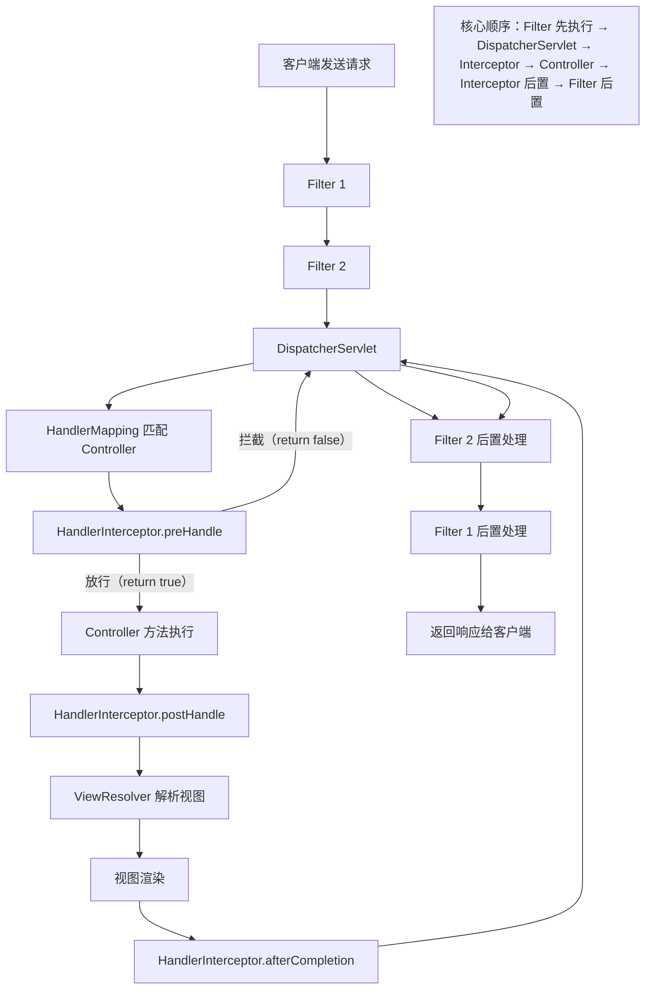

##### 关键结论：

1. Filter 是**请求进入 Spring 容器前的第一道拦截**，更底层；
2. Interceptor 是 Spring MVC 内部的拦截，仅针对 Controller 请求，更贴近业务；
3. 多个 Filter 按 `web.xml` 中配置的顺序执行（或 `@WebFilter` 的 `order` 属性）；
4. 多个 Interceptor 按 Spring 配置的 `order` 属性（或注册顺序）执行，`preHandle` 正序，`postHandle/afterCompletion` 倒序。

#### 三、代码示例（直观对比用法）

##### 1. Filter 实现（Servlet 过滤器）

```java
// 方式1：@WebFilter（需启动类加 @ServletComponentScan）
@WebFilter(urlPatterns = "/*", filterName = "logFilter")
public class LogFilter implements Filter {

    // 容器启动时初始化
    @Override
    public void init(FilterConfig filterConfig) throws ServletException {
        System.out.println("LogFilter 初始化");
    }

    @Override
    public void doFilter(ServletRequest request, ServletResponse response, FilterChain chain) 
            throws IOException, ServletException {
        // 前置处理
        long startTime = System.currentTimeMillis();
        HttpServletRequest req = (HttpServletRequest) request;
        System.out.println("Filter 拦截请求：" + req.getRequestURI());

        try {
            // 放行请求（必须调用，否则请求会被拦截）
            chain.doFilter(request, response);
        } catch (Exception e) {
            // 异常处理
            System.out.println("Filter 捕获异常：" + e.getMessage());
            throw e;
        } finally {
            // 后置处理
            long endTime = System.currentTimeMillis();
            System.out.println("Filter 处理耗时：" + (endTime - startTime) + "ms");
        }
    }

    // 容器销毁时执行
    @Override
    public void destroy() {
        System.out.println("LogFilter 销毁");
    }
}
```

##### 2. HandlerInterceptor 实现（Spring MVC 拦截器）

```java
// 第一步：实现 HandlerInterceptor 接口
@Component // 交给 Spring 管理，支持依赖注入
public class AuthInterceptor implements HandlerInterceptor {

    @Autowired
    private UserService userService; // 可直接注入 Spring Bean

    // Controller 方法执行前（核心：返回 true 放行，false 拦截）
    @Override
    public boolean preHandle(HttpServletRequest request, HttpServletResponse response, Object handler) throws Exception {
        // 细粒度控制：判断是否是 Controller 方法
        if (handler instanceof HandlerMethod) {
            HandlerMethod handlerMethod = (HandlerMethod) handler;
            String methodName = handlerMethod.getMethod().getName();
            System.out.println("Interceptor 拦截 Controller 方法：" + methodName);

            // 权限校验（可调用 Service）
            String token = request.getHeader("token");
            if (!userService.checkToken(token)) {
                response.setStatus(401);
                response.getWriter().write("未授权");
                return false; // 拦截请求
            }
        }
        return true; // 放行
    }

    // Controller 方法执行后、视图渲染前（可修改 ModelAndView）
    @Override
    public void postHandle(HttpServletRequest request, HttpServletResponse response, Object handler, ModelAndView modelAndView) throws Exception {
        if (modelAndView != null) {
            // 给视图添加公共数据
            modelAndView.addObject("timestamp", System.currentTimeMillis());
        }
        System.out.println("Interceptor postHandle 执行");
    }

    // 视图渲染后（无论是否异常，用于资源清理）
    @Override
    public void afterCompletion(HttpServletRequest request, HttpServletResponse response, Object handler, Exception ex) throws Exception {
        if (ex != null) {
            System.out.println("Interceptor 捕获异常：" + ex.getMessage());
        }
        System.out.println("Interceptor afterCompletion 执行");
    }
}

// 第二步：注册拦截器（Spring Boot 配置）
@Configuration
public class WebMvcConfig implements WebMvcConfigurer {

    @Autowired
    private AuthInterceptor authInterceptor;

    @Override
    public void addInterceptors(InterceptorRegistry registry) {
        // 注册拦截器，指定拦截路径，排除静态资源
        registry.addInterceptor(authInterceptor)
                .addPathPatterns("/api/**") // 拦截 /api 下的所有请求
                .excludePathPatterns("/api/login", "/static/**"); // 排除登录和静态资源
    }
}
```

#### 四、使用场景精准划分（核心避坑）

##### 1. 优先用 Filter 的场景（底层、全局）

- **编码统一处理**：如设置全局字符编码（`CharacterEncodingFilter`）；
- **跨域请求处理**：CORS 跨域配置（`CorsFilter`）；
- **全局请求日志**：记录所有请求（包括静态资源）的入参、出参；
- **请求限流/防刷**：针对所有请求的 IP 限流（无需区分是否是 Controller 请求）；
- **与 Servlet 容器相关的处理**：如修改 ServletRequest/ServletResponse 包装类。

##### 2. 优先用 HandlerInterceptor 的场景（业务、细粒度）

- **登录权限校验**：需调用 UserService 验证 token/会话，仅拦截业务接口；
- **接口性能监控**：统计 Controller 方法的执行耗时；
- **请求参数预处理**：如统一解析 token 中的用户信息，放入请求上下文；
- **视图公共数据填充**：如给所有页面添加登录用户信息（postHandle 中修改 ModelAndView）；
- **异常兜底处理**：捕获 Controller 执行中的异常，记录业务日志。

#### 五、关键补充：Filter 注入 Spring Bean 的方法（避坑）

Filter 本身由 Servlet 容器管理，无法直接注入 Spring Bean，如需使用 Spring 组件，可通过以下方式：
```java
@WebFilter(urlPatterns = "/*")
public class FilterWithSpringBean implements Filter {

    private UserService userService;

    @Override
    public void init(FilterConfig filterConfig) throws ServletException {
        // 手动获取 Spring 上下文
        WebApplicationContext context = WebApplicationContextUtils.getWebApplicationContext(filterConfig.getServletContext());
        // 获取 Bean
        this.userService = context.getBean(UserService.class);
    }

    @Override
    public void doFilter(ServletRequest request, ServletResponse response, FilterChain chain) throws IOException, ServletException {
        // 使用 userService 处理业务
        userService.checkPermission(request);
        chain.doFilter(request, response);
    }
}
```

#### 总结

1. **核心定位**：Filter 是 Servlet 层的全局过滤器（底层、所有请求），Interceptor 是 Spring MVC 层的业务拦截器（上层、仅 Controller 请求）；
2. **核心差异**：Interceptor 支持依赖注入、细粒度控制（可获取 Controller 方法信息），Filter 更底层、作用范围更广；
3. **使用原则**：
   - 全局、底层的处理（编码、跨域、静态资源）→ 用 Filter；
   - 业务相关、细粒度的控制（权限、性能、参数处理）→ 用 HandlerInterceptor；
   - 二者可配合使用（如 Filter 做全局编码，Interceptor 做登录校验）。


------

## **五、Spring Boot**

1. Spring Boot 与 Spring 的区别？
2. Spring Boot 的核心注解有哪些？（@SpringBootApplication、@EnableAutoConfiguration）
3. application.properties 和 application.yml 的区别？
4. 如何在 Spring Boot 中自定义配置类？
5. Spring Boot Starter 的作用？
6. Spring Boot 的自动装配原理是什么？
7. 如何在 Spring Boot 中实现定时任务？
8. Spring Boot 的 Actuator 是什么？常用功能有哪些？


### 1. Spring Boot 与 Spring 的区别

| 特性     | Spring                                    | Spring Boot                                 |
| -------- | ----------------------------------------- | ------------------------------------------- |
| 配置方式 | XML 或 Java 配置，需要大量配置            | 自动配置，约定大于配置，零/少配置即可启动   |
| 依赖管理 | 手动引入依赖                              | 提供 Starter POM，统一依赖版本              |
| 容器启动 | 手动配置 DispatcherServlet、DataSource 等 | 内嵌 Servlet 容器（Tomcat/Jetty），开箱即用 |
| 开发效率 | 较低                                      | 高，快速开发微服务应用                      |
| 部署方式 | WAR                                       | 可打包为可执行 JAR                          |

> **Tip:** Spring Boot 是 Spring 的增强，主要目标是简化配置和部署。

------

### 2. Spring Boot 的核心注解

- **@SpringBootApplication**：组合注解，包含：
  - `@Configuration`：配置类
  - `@EnableAutoConfiguration`：启用自动配置
  - `@ComponentScan`：扫描组件
- **@EnableAutoConfiguration**：根据 classpath 和配置条件自动配置 Bean
- **@ComponentScan**：扫描指定包下的组件
- **@Configuration**：声明配置类

> **Tip:** 一般只需在主类加 `@SpringBootApplication` 即可。

------

### 3. application.properties 和 application.yml 的区别

| 特性     | application.properties | application.yml       |
| -------- | ---------------------- | --------------------- |
| 格式     | key=value              | YAML 层级结构，更直观 |
| 可读性   | 一行一属性，平铺       | 支持层级、数组、对象  |
| 示例     | server.port=8080       | server: port: 8080    |
| 使用场景 | 配置少                 | 配置多、嵌套属性多    |

------

### 4. 如何在 Spring Boot 中自定义配置类

- 使用 **@ConfigurationProperties** 绑定配置
- 使用 **@Value** 注入单个属性

```java
@Component
@ConfigurationProperties(prefix="app")
public class AppConfig {
    private String name;
    private int timeout;
    // getter/setter
}
app.name=MyApp
app.timeout=30
```

> **Tip:** 配置类可配合 `@EnableConfigurationProperties` 注册。


#### 一、@ConfigurationProperties（批量绑定，推荐）

这是 Spring Boot 推荐的配置绑定方式，适合批量绑定一组相关配置，代码更整洁、支持类型校验和自动补全。

##### 1. 完整实现步骤

###### 步骤1：定义配置类（绑定配置）

```java
// 方式1：@Component + @ConfigurationProperties（适用于内部使用的配置类）
@Component
@ConfigurationProperties(prefix = "app") // 配置前缀，对应 application.yml 中的 app 节点
public class AppConfig {
    // 字段名与配置项名一致（支持驼峰/下划线自动转换，如 timeout → app.timeout 或 app.time_out）
    private String name;
    private int timeout;
    private DatabaseConfig database; // 嵌套配置

    // 必须提供 getter/setter（Spring 通过 set 方法绑定值）
    // IDEA 可通过 Lombok 的 @Data 简化（无需手动写 getter/setter）
    // @Data
    // public class AppConfig { ... }

    // 嵌套配置类（对应 app.database 节点）
    public static class DatabaseConfig {
        private String url;
        private String username;
        private String password;

        // getter/setter
    }

    // 省略全局 getter/setter
}
```

###### 步骤2：配置文件（application.yml/application.properties）

```yaml
# application.yml
app:
  name: MySpringBootApp
  timeout: 30
  database:
    url: jdbc:mysql://localhost:3306/test
    username: root
    password: 123456
```

```properties
# application.properties（等价写法）
app.name=MySpringBootApp
app.timeout=30
app.database.url=jdbc:mysql://localhost:3306/test
app.database.username=root
app.database.password=123456
```

###### 步骤3：使用配置类（直接注入）

```java
@Service
public class AppService {
    // 直接注入配置类（Spring 已自动初始化并绑定配置）
    @Autowired
    private AppConfig appConfig;

    public void printConfig() {
        System.out.println("应用名称：" + appConfig.getName());
        System.out.println("超时时间：" + appConfig.getTimeout());
        System.out.println("数据库URL：" + appConfig.getDatabase().getUrl());
    }
}
```

##### 方式2：@EnableConfigurationProperties（非@Component 场景）

若配置类不想加 `@Component`（如通用配置包、第三方依赖），可通过 `@EnableConfigurationProperties` 手动注册：
```java
// 配置类（无 @Component）
@ConfigurationProperties(prefix = "app")
public class AppConfig { ... }

// 配置类注册（启动类/任意 @Configuration 类）
@SpringBootApplication
@EnableConfigurationProperties(AppConfig.class) // 显式注册配置类
public class AppApplication {
    public static void main(String[] args) {
        SpringApplication.run(AppApplication.class, args);
    }
}
```

##### 2. 高级特性：配置校验（避免非法配置）

通过 `jakarta.validation` 注解校验配置值，启动时就暴露配置错误（需引入校验依赖）：
```xml
<!-- 校验依赖（Spring Boot 2.3+ 需手动引入） -->
<dependency>
    <groupId>org.springframework.boot</groupId>
    <artifactId>spring-boot-starter-validation</artifactId>
</dependency>
```

```java
@Component
@ConfigurationProperties(prefix = "app")
@Validated // 开启校验
public class AppConfig {
    @NotBlank(message = "应用名称不能为空") // 非空校验
    private String name;

    @Min(value = 10, message = "超时时间不能小于10秒") // 最小值校验
    @Max(value = 60, message = "超时时间不能大于60秒") // 最大值校验
    private int timeout;

    @Valid // 嵌套校验
    private DatabaseConfig database;

    public static class DatabaseConfig {
        @NotBlank(message = "数据库URL不能为空")
        private String url;
        // 其他字段校验
    }

    // getter/setter
}
```
- 若配置 `app.timeout=5`，项目启动时会抛出 `BindException`，提示“超时时间不能小于10秒”，提前暴露配置问题。

#### 二、@Value（单个属性注入）

适合零散、单个配置项的注入，语法简单，但功能较弱（无批量绑定、无校验）。

##### 1. 基础用法

```java
@Service
public class ValueService {
    // 注入单个配置项（支持默认值，格式：${key:默认值}）
    @Value("${app.name:默认应用名}") // 配置不存在时使用默认值
    private String appName;

    @Value("${app.timeout:20}")
    private int appTimeout;

    // 注入系统环境变量/表达式
    @Value("${user.name}") // 系统环境变量
    private String systemUserName;

    @Value("#{10 + 20}") // SpEL 表达式（计算结果 30）
    private int calcValue;

    public void printValue() {
        System.out.println("应用名称：" + appName);
        System.out.println("超时时间：" + appTimeout);
    }
}
```

##### 2. 注意事项

- `@Value` 不支持嵌套配置（如 `${app.database.url}` 可注入，但无法批量绑定）；
- 无类型校验（如配置 `app.timeout=abc`，注入时会抛类型转换异常）；
- 不支持自动补全（IDEA 无法识别配置项，易写错 key）；
- 若配置项不存在且未指定默认值，项目启动时会抛 `IllegalArgumentException`。

#### 三、@ConfigurationProperties vs @Value 核心对比

| 特性         | @ConfigurationProperties                  | @Value                          |
| ------------ | ----------------------------------------- | ------------------------------- |
| **绑定方式** | 批量绑定（前缀+字段）                     | 单个绑定（指定 key）            |
| **类型校验** | 支持（配合 @Validated）                   | 不支持（仅运行时类型转换）      |
| **默认值**   | 字段默认值（如 private int timeout = 20） | 支持 `${key:默认值}` 语法       |
| **嵌套配置** | 支持（嵌套类绑定）                        | 仅支持 `${key.subkey}` 单个注入 |
| **自动补全** | 支持（IDEA 可识别配置项）                 | 不支持（易写错 key）            |
| **依赖注入** | 支持（配置类是 Bean）                     | 支持（标注在字段/方法参数上）   |
| **适用场景** | 一组相关配置（如数据库、应用配置）        | 零散、单个配置项                |

#### 四、最佳实践

##### 1. 配置类命名与规范

- 配置类名：`XxxConfig`（如 `AppConfig`、`DatabaseConfig`）；
- 前缀命名：小写 + 点分隔（如 `app`、`app.database`、`redis`）；
- 字段名：驼峰命名（Spring 自动兼容下划线配置，如 `app.time_out` → `timeout`）。

##### 2. 多环境配置（补充高频场景）

不同环境（开发/测试/生产）使用不同配置，通过 `spring.profiles.active` 指定：
```yaml
# application-dev.yml（开发环境）
app:
  name: MyApp-Dev
  timeout: 20
  database:
    url: jdbc:mysql://dev:3306/test

# application-prod.yml（生产环境）
app:
  name: MyApp-Prod
  timeout: 60
  database:
    url: jdbc:mysql://prod:3306/test

# application.yml（主配置）
spring:
  profiles:
    active: dev # 激活开发环境，可通过启动参数 --spring.profiles.active=prod 覆盖
```

##### 3. 配置优先级（避坑）

Spring Boot 配置加载优先级（高→低）：
1. 命令行参数（`java -jar app.jar --app.name=Test`）；
2. 系统环境变量；
3. 应用外部配置文件（`./config/application.yml`）；
4. 应用内部配置文件（`classpath:application.yml`）；
5. 配置类默认值。

#### 五、常见问题排查

1. **配置绑定失败**：
   - 检查配置类是否加 `@Component` 或 `@EnableConfigurationProperties`；
   - 检查字段是否有 getter/setter（或加 `@Data`）；
   - 检查前缀是否正确（如 `prefix = "app"` 对应 `app.name`）。
2. **校验不生效**：
   - 确保引入 `spring-boot-starter-validation` 依赖；
   - 配置类加 `@Validated` 注解；
   - 嵌套配置类加 `@Valid` 注解。

#### 总结

1. **核心方式**：批量配置用 `@ConfigurationProperties`（推荐，支持校验、自动补全），单个配置用 `@Value`；
2. **注册方式**：配置类可通过 `@Component` 自动注册，或 `@EnableConfigurationProperties` 显式注册；
3. **最佳实践**：配置类按功能拆分、加校验、利用多环境配置区分开发/生产环境，避免硬编码。

------

### 5. Spring Boot Starter 的作用

- Starter 是 **依赖包的集合**，封装常用依赖和自动配置
- 例如：
  - `spring-boot-starter-web` → Spring MVC + Tomcat + Jackson
  - `spring-boot-starter-data-jpa` → JPA + Hibernate
  - `spring-boot-starter-security` → Spring Security

> **作用**：简化依赖管理，开箱即用。


Spring Boot Starter（启动器）是 Spring Boot 核心特性之一，其核心作用是**简化项目依赖配置和自动装配**，让开发者能够快速集成特定功能模块（如 Web 开发、数据库访问、消息队列等），无需手动管理繁琐的依赖版本和初始配置。

#### 1. **简化依赖管理，避免版本冲突**

传统 Spring 项目中，集成一个功能（如 Web 开发）需要手动引入多个相关依赖（如 `spring-web`、`spring-webmvc`、`tomcat` 等），且需保证这些依赖的版本兼容性，否则容易出现冲突。

Starter 则将某一功能所需的**所有相关依赖**打包整合，并通过 Spring Boot 父工程（`spring-boot-dependencies`）统一管理版本。开发者只需引入一个 Starter 依赖，即可自动获取该功能所需的全部依赖，无需关心版本匹配问题。

**示例**：  
引入 `spring-boot-starter-web` 即可自动包含 Spring MVC、嵌入式 Tomcat、Jackson（JSON 处理）等 Web 开发必需的依赖：
```xml
<dependency>
    <groupId>org.springframework.boot</groupId>
    <artifactId>spring-boot-starter-web</artifactId>
</dependency>
```

#### 2. **自动装配（Auto-configuration），减少手动配置**

Starter 不仅包含依赖，还内置了该功能模块的**默认配置逻辑**（通过 `spring.factories` 文件指定自动配置类）。Spring Boot 启动时会根据类路径下的 Starter 依赖，自动加载对应的配置类，完成组件的初始化和装配，开发者无需手动编写 XML 或 Java 配置。

**示例**：  
- 引入 `spring-boot-starter-data-redis` 后，Spring Boot 会自动配置 `RedisTemplate`、`StringRedisTemplate` 等组件，开发者可直接注入使用，无需手动定义 Bean。  
- 引入 `spring-boot-starter-web` 后，自动配置DispatcherServlet、Tomcat 容器等，默认监听 8080 端口。

#### 3. **“约定优于配置”的体现，降低学习成本**

Starter 遵循 Spring Boot “约定优于配置”的理念，提供一套**默认的、通用的配置方案**（如默认端口、默认连接池参数等）。开发者无需了解底层组件的细节，即可快速上手使用。

如果默认配置不符合需求，也可通过 `application.properties`/`yml` 轻松覆盖（如修改 Tomcat 端口 `server.port=8081`），无需修改底层配置代码。

#### 4. **标准化功能模块，提升开发效率**

Starter 将常用功能（如 Web、缓存、消息、安全等）标准化，形成统一的集成方式。例如：  
- 集成数据库访问：`spring-boot-starter-data-jpa`（JPA）、`spring-boot-starter-jdbc`（JDBC）  
- 集成缓存：`spring-boot-starter-cache` + 具体缓存 Starter（如 `spring-boot-starter-data-redis`）  
- 集成消息队列：`spring-boot-starter-amqp`（RabbitMQ）、`spring-boot-starter-artemis`（ActiveMQ）  

开发者只需记住对应的 Starter 名称，即可快速集成所需功能，大幅减少配置时间。

#### 5. **支持自定义 Starter，扩展灵活性**

除了 Spring Boot 官方提供的 Starter（命名格式：`spring-boot-starter-xxx`），开发者还可以根据业务需求**自定义 Starter**（通常命名为 `xxx-spring-boot-starter`），将项目中复用的功能模块（如统一日志、权限校验）封装为 Starter，供其他项目快速集成。

#### 总结

Spring Boot Starter 的核心价值是**“简化集成”**：通过整合依赖、自动配置、标准化约定，让开发者从繁琐的依赖管理和初始配置中解放出来，专注于业务逻辑开发。它是 Spring Boot 实现“开箱即用”（Out-of-the-box）体验的关键机制。

------

### 6. Spring Boot 的自动装配原理

- 基于 **@EnableAutoConfiguration** 与 **条件注解（@Conditional）**
- 核心步骤：
  1. **读取 META-INF/spring.factories** 中的自动配置类
  2. **判断条件**（如类路径、Bean 是否存在等）
  3. **注册 Bean** 到 Spring 容器
- 常用注解：
  - `@ConditionalOnClass`、`@ConditionalOnMissingBean`、`@ConditionalOnProperty`

> **Tip:** 自动装配遵循 **条件匹配 + 约定优于配置**。

Spring Boot 的**自动装配（Auto-configuration）** 是其核心特性之一，核心目标是**在启动时根据类路径下的依赖、配置文件等信息，自动完成 Bean 的注册和组件初始化**，无需开发者手动编写大量 XML 或 Java 配置。其底层原理基于 Spring 的注解驱动和 SPI（Service Provider Interface）机制，具体流程如下：

#### 一、自动装配的核心要素

1. **`@EnableAutoConfiguration` 注解**：触发自动装配的“开关”。  
2. **`spring.factories` 配置文件**：记录需要自动配置的类（SPI 机制）。  
3. **条件注解**：控制自动配置类是否生效（如 `@ConditionalOnClass`、`@ConditionalOnMissingBean` 等）。  
4. **配置属性绑定**：通过 `@ConfigurationProperties` 将配置文件参数映射到 Java 类。  

#### 二、自动装配的详细流程

##### 1. 启动类触发自动装配

Spring Boot 启动类通常标注 `@SpringBootApplication`，该注解是一个复合注解，包含：  
- `@SpringBootConfiguration`：标记当前类为配置类（类似 `@Configuration`）。  
- `@ComponentScan`：扫描当前包及子包下的组件（如 `@Component`、`@Service` 等）。  
- **`@EnableAutoConfiguration`**：核心注解，用于开启自动装配。  

```java
@SpringBootApplication // 包含 @EnableAutoConfiguration
public class MyApplication {
    public static void main(String[] args) {
        SpringApplication.run(MyApplication.class, args);
    }
}
```

##### 2. `@EnableAutoConfiguration` 的作用

`@EnableAutoConfiguration` 通过 `@Import(AutoConfigurationImportSelector.class)` 导入一个关键类 `AutoConfigurationImportSelector`，其核心功能是**从类路径中加载所有符合条件的自动配置类**。

```java
@Target(ElementType.TYPE)
@Retention(RetentionPolicy.RUNTIME)
@Documented
@Inherited
@AutoConfigurationPackage
@Import(AutoConfigurationImportSelector.class) // 导入自动配置选择器
public @interface EnableAutoConfiguration { ... }
```

##### 3. 加载 `spring.factories` 中的自动配置类

`AutoConfigurationImportSelector` 会读取类路径下 **`META-INF/spring.factories`** 文件（SPI 机制），该文件中定义了需要自动配置的类全限定名。  

以 Spring Boot 官方 Starter 为例，`spring-boot-autoconfigure` 包中的 `spring.factories` 包含大量自动配置类，例如：  
```properties
# spring-boot-autoconfigure/META-INF/spring.factories 部分内容
org.springframework.boot.autoconfigure.EnableAutoConfiguration=\
org.springframework.boot.autoconfigure.web.servlet.WebMvcAutoConfiguration,\
org.springframework.boot.autoconfigure.data.redis.RedisAutoConfiguration,\
org.springframework.boot.autoconfigure.amqp.RabbitAutoConfiguration,\
...
```

这些配置类（如 `WebMvcAutoConfiguration`、`RedisAutoConfiguration`）对应不同功能的自动装配逻辑。

##### 3.加载 `META-INF/spring/org.springframework.boot.autoconfigure.AutoConfiguration.imports` 中的自动配置类

`spring.factories` 是 **Spring Boot 2.x 及之前版本** 中实现自动装配的核心文件，而在 **Spring Boot 3.x 及之后版本** 中，它被 **`META-INF/spring/org.springframework.boot.autoconfigure.AutoConfiguration.imports`** 文件替代，核心功能不变，但实现方式更简洁。

两者的差异本质是 **SPI（服务提供者接口）机制的升级**，目的是简化配置并提升性能，具体区别如下：

###### 1. Spring Boot 2.x 及之前：`spring.factories`

- **格式**：标准的键值对 properties 文件，key 固定为 `org.springframework.boot.autoconfigure.EnableAutoConfiguration`，value 是自动配置类的全类名（多个类用逗号分隔）。
  ```properties
  # 示例：spring-boot-autoconfigure-2.7.x.jar/META-INF/spring.factories
  org.springframework.boot.autoconfigure.EnableAutoConfiguration=\
  org.springframework.boot.autoconfigure.jdbc.DataSourceAutoConfiguration,\
  org.springframework.boot.autoconfigure.web.servlet.WebMvcAutoConfiguration
  ```
- **原理**：通过 `SpringFactoriesLoader` 工具类扫描所有 Jar 包中的 `spring.factories` 文件，解析并加载自动配置类。
- **问题**：键值对格式冗余，且需要解析整个文件才能获取自动配置类，性能有优化空间。

###### 2. Spring Boot 3.x 及之后：`AutoConfiguration.imports`

- **格式**：纯文本文件，每行直接写一个自动配置类的全类名，无需键值对，更简洁。
  ```text
  # 示例：spring-boot-autoconfigure-3.0.x.jar/META-INF/spring/org.springframework.boot.autoconfigure.AutoConfiguration.imports
  org.springframework.boot.autoconfigure.jdbc.DataSourceAutoConfiguration
  org.springframework.boot.autoconfigure.web.servlet.WebMvcAutoConfiguration
  ```
- **原理**：Spring Boot 3.x 直接读取该文件中的类名列表，省去了解析键值对的步骤，加载效率更高。
- **兼容性**：为了兼容旧版本，Spring Boot 3.x 仍会读取 `spring.factories` 文件，但优先使用 `AutoConfiguration.imports` 中的配置。

###### 总结：版本对应关系

| Spring Boot 版本 | 自动配置类的配置文件                | 核心变化                     |
|------------------|-------------------------------------|------------------------------|
| 2.x 及之前       | `META-INF/spring.factories`         | 键值对格式，依赖 `SpringFactoriesLoader` |
| 3.x 及之后       | `META-INF/spring/org.springframework.boot.autoconfigure.AutoConfiguration.imports` | 纯类名列表，加载效率更高     |

如果你在开发中需要自定义自动配置类，需根据项目使用的 Spring Boot 版本选择对应的文件格式，避免因版本不匹配导致配置不生效。

##### 4. 条件筛选：过滤无效的自动配置类

加载 `spring.factories` 中的所有自动配置类后，Spring Boot 会通过**条件注解**对这些类进行筛选，只保留符合当前环境的配置类。  

常见条件注解：  
- `@ConditionalOnClass`：当类路径中存在指定类时生效（如 `RedisAutoConfiguration` 依赖 `RedisTemplate` 类）。  
- `@ConditionalOnMissingBean`：当容器中不存在指定 Bean 时生效（允许开发者自定义 Bean 覆盖默认配置）。  
- `@ConditionalOnProperty`：当配置文件中存在指定属性时生效（如 `@ConditionalOnProperty(prefix = "spring.redis", name = "enabled", havingValue = "true")`）。  
- `@ConditionalOnWebApplication`：当项目是 Web 应用时生效。  

**示例**：`RedisAutoConfiguration` 的条件注解  
```java
@Configuration
@ConditionalOnClass(RedisOperations.class) // 类路径存在 RedisOperations 时生效
@EnableConfigurationProperties(RedisProperties.class) // 绑定配置属性
public class RedisAutoConfiguration {
    // 若容器中没有 RedisTemplate，则自动配置默认实例
    @Bean
    @ConditionalOnMissingBean(name = "redisTemplate")
    public RedisTemplate<Object, Object> redisTemplate(RedisConnectionFactory factory) {
        RedisTemplate<Object, Object> template = new RedisTemplate<>();
        template.setConnectionFactory(factory);
        return template;
    }
}
```

##### 5. 配置属性绑定

自动配置类通常会通过 `@EnableConfigurationProperties` 注解关联一个**配置属性类**（标注 `@ConfigurationProperties`），用于将 `application.properties`/`yml` 中的参数映射到 Java 类的字段中，实现配置自定义。  

**示例**：`RedisProperties` 绑定配置文件  
```java
@ConfigurationProperties(prefix = "spring.redis") // 绑定前缀为 spring.redis 的配置
public class RedisProperties {
    private String host = "localhost"; // 默认值
    private int port = 6379;
    private String password;
    //  getter/setter
}
```

开发者可在配置文件中自定义 Redis 连接信息：  
```yaml
spring:
  redis:
    host: 192.168.1.100
    port: 6380
    password: 123456
```

##### 6. 注册 Bean 到 Spring 容器

经过条件筛选后，符合条件的自动配置类会被 Spring 容器处理，其内部通过 `@Bean` 注解定义的组件（如 `RedisTemplate`、`DispatcherServlet` 等）会被自动注册到 Spring 容器中，供开发者直接注入使用。  

#### 三、总结：自动装配流程简图

```
启动类 (@SpringBootApplication)
       ↓
触发 @EnableAutoConfiguration
       ↓
导入 AutoConfigurationImportSelector
       ↓
读取 META-INF/spring.factories 中的自动配置类
       ↓
通过条件注解筛选有效配置类
       ↓
绑定配置文件属性（@ConfigurationProperties）
       ↓
注册配置类中的 Bean 到 Spring 容器
```

#### 四、关键特性：允许开发者自定义覆盖

自动装配遵循**“开发者自定义优先”**原则：  
- 若开发者手动定义了某个 Bean（如自定义 `RedisTemplate`），则自动配置类中通过 `@ConditionalOnMissingBean` 定义的默认 Bean 会失效。  
- 配置文件中的参数会覆盖自动配置类的默认值（通过 `@ConfigurationProperties` 实现）。  

这一特性保证了自动装配的灵活性，既简化了默认配置，又允许按需定制。

通过上述机制，Spring Boot 实现了“开箱即用”的体验，大幅减少了手动配置工作。


------

### 7. 如何在 Spring Boot 中实现定时任务

- 注解 **@EnableScheduling** 启用定时任务
- 注解 **@Scheduled** 配置任务执行时间

```java
@SpringBootApplication
@EnableScheduling
public class App { ... }

@Component
public class Task {
    @Scheduled(fixedRate = 5000) // 每5秒执行一次
    public void run() {
        System.out.println("定时任务执行");
    }
}
```

- 支持：
  - fixedRate：固定频率
  - fixedDelay：上次执行完成后延迟
  - cron：Cron 表达式


#### 一、@Scheduled 核心参数详解（补充关键差异）

`@Scheduled` 有 3 种核心配置方式，适用场景不同，先明确各自的执行逻辑：

| 参数         | 核心逻辑                                                     | 示例                                                         | 适用场景                                         |
| ------------ | ------------------------------------------------------------ | ------------------------------------------------------------ | ------------------------------------------------ |
| fixedRate    | 以**固定频率**执行，无论上次任务是否完成（单位：毫秒）       | `fixedRate = 5000` → 每 5 秒执行                             | 任务执行时间短、无阻塞的场景                     |
| fixedDelay   | 上次任务**执行完成后**延迟指定时间再执行（单位：毫秒）       | `fixedDelay = 5000` → 上次完成后等 5 秒                      | 任务执行时间长、需等待完成的场景                 |
| initialDelay | 配合 fixedRate/fixedDelay 使用，指定**首次执行的延迟时间**（单位：毫秒） | `initialDelay = 3000, fixedRate = 5000` → 启动后 3 秒首次执行，之后每 5 秒执行 | 避免项目启动时立即执行任务（如需等数据库初始化） |
| cron         | 按 Cron 表达式执行（最灵活，支持复杂时间规则）               | `cron = "0 0 2 * * ?"` → 每天凌晨 2 点执行                   | 复杂时间规则（如每天/每周/每月执行）             |

##### 代码示例：不同参数对比

```java
@Component
public class ScheduledTask {
    // 1. fixedRate：固定频率（每5秒执行，无视任务耗时）
    @Scheduled(fixedRate = 5000)
    public void fixedRateTask() throws InterruptedException {
        System.out.println("fixedRate 任务执行：" + LocalDateTime.now());
        Thread.sleep(2000); // 任务耗时2秒 → 实际间隔：5秒（而非5-2=3秒）
    }

    // 2. fixedDelay：固定延迟（上次完成后等3秒）
    @Scheduled(fixedDelay = 3000)
    public void fixedDelayTask() throws InterruptedException {
        System.out.println("fixedDelay 任务执行：" + LocalDateTime.now());
        Thread.sleep(2000); // 任务耗时2秒 → 实际间隔：2+3=5秒
    }

    // 3. initialDelay：首次延迟+固定频率
    @Scheduled(initialDelay = 3000, fixedRate = 5000)
    public void initialDelayTask() {
        System.out.println("initialDelay 任务首次执行延迟3秒：" + LocalDateTime.now());
    }

    // 4. cron 表达式：每天凌晨2点执行
    @Scheduled(cron = "0 0 2 * * ?")
    public void cronTask() {
        System.out.println("cron 任务执行：" + LocalDateTime.now());
    }
}
```

#### 二、Cron 表达式（重点补充）

Cron 表达式是定时任务的核心，Spring Boot 支持 6/7 位表达式（7 位最后一位是年，可选），格式如下：
```
秒 分 时 日 月 周 [年]
```

##### 1. 常用通配符

| 通配符 | 含义                    | 示例                                      |
| ------ | ----------------------- | ----------------------------------------- |
| *      | 匹配所有值              | `* * * * * ?` → 每秒执行                  |
| ?      | 不指定值（仅用于日/周） | `0 0 2 * * ?` → 每天2点（日/周冲突时用?） |
| -      | 范围                    | `0 0 8-10 * * ?` → 每天8/9/10点执行       |
| ,      | 多个值                  | `0 0 8,12,18 * * ?` → 每天8/12/18点执行   |
| /      | 步长                    | `0 */10 * * * ?` → 每10分钟执行           |
| L      | 最后（仅用于日/周）     | `0 0 2 L * ?` → 每月最后一天2点执行       |

##### 2. 常用 Cron 表达式示例

| 需求                | Cron 表达式         |
| ------------------- | ------------------- |
| 每5秒执行           | `*/5 * * * * ?`     |
| 每分钟第30秒执行    | `30 * * * * ?`      |
| 每天凌晨2点执行     | `0 0 2 * * ?`       |
| 每周一到周五8点执行 | `0 0 8 ? * MON-FRI` |
| 每月1号凌晨3点执行  | `0 0 3 1 * ?`       |
| 每年10月1号10点执行 | `0 0 10 1 10 ?`     |

> 工具推荐：使用 [Cron 表达式生成器](https://cron.qqe2.com/) 快速生成/验证表达式，避免手写错误。

#### 三、异步定时任务（解决单线程阻塞问题）

##### 问题：默认定时任务是单线程执行

Spring Boot 定时任务默认使用**单线程**，若一个任务执行时间过长，会阻塞后续所有任务：
```java
// 单线程问题演示：fixedRate=5秒，但任务耗时10秒 → 后续任务会排队
@Scheduled(fixedRate = 5000)
public void blockingTask() throws InterruptedException {
    System.out.println("阻塞任务开始：" + LocalDateTime.now());
    Thread.sleep(10000); // 耗时10秒
    System.out.println("阻塞任务结束：" + LocalDateTime.now());
}
```
- 预期：每5秒执行一次 → 实际：每10秒执行一次（单线程排队）。

##### 解决方案：配置多线程定时任务池

###### 方式1：全局异步定时任务（推荐）

```java
@Configuration
@EnableScheduling // 启用定时任务
@EnableAsync // 启用异步
public class ScheduledConfig {

    // 配置定时任务线程池
    @Bean
    public TaskScheduler taskScheduler() {
        ThreadPoolTaskScheduler scheduler = new ThreadPoolTaskScheduler();
        scheduler.setPoolSize(10); // 核心线程数
        scheduler.setThreadNamePrefix("scheduled-task-"); // 线程名前缀
        scheduler.setAwaitTerminationSeconds(60); // 等待终止时间
        scheduler.setWaitForTasksToCompleteOnShutdown(true); // 关闭时等待任务完成
        return scheduler;
    }
}

// 定时任务添加 @Async 注解
@Component
public class AsyncScheduledTask {
    @Async // 异步执行，不阻塞其他任务
    @Scheduled(fixedRate = 5000)
    public void asyncTask() throws InterruptedException {
        System.out.println("异步任务执行，线程名：" + Thread.currentThread().getName());
        Thread.sleep(10000);
    }
}
```

###### 方式2：自定义线程池（更灵活）

```java
@Configuration
public class ScheduledThreadPoolConfig {
    @Bean("scheduledExecutor")
    public Executor scheduledExecutor() {
        ThreadPoolExecutor executor = new ThreadPoolExecutor(
                5, // 核心线程数
                10, // 最大线程数
                60, // 空闲线程存活时间
                TimeUnit.SECONDS,
                new LinkedBlockingQueue<>(100), // 队列
                new ThreadFactory() {
                    private int count = 0;
                    @Override
                    public Thread newThread(Runnable r) {
                        return new Thread(r, "scheduled-pool-" + (++count));
                    }
                },
                new ThreadPoolExecutor.CallerRunsPolicy() // 拒绝策略
        );
        return executor;
    }
}

// 指定线程池执行
@Component
public class CustomPoolTask {
    @Async("scheduledExecutor") // 指定自定义线程池
    @Scheduled(fixedRate = 5000)
    public void customPoolTask() {
        System.out.println("自定义线程池执行：" + Thread.currentThread().getName());
    }
}
```

#### 四、避坑要点（生产环境高频问题）

1. **时区问题**：
   - Cron 表达式默认使用服务器时区，若需指定时区，可通过 `zone` 参数：
     ```java
     @Scheduled(cron = "0 0 2 * * ?", zone = "Asia/Shanghai") // 指定上海时区
     ```

2. **任务执行超时**：
   - 避免定时任务执行时间过长（如超过线程池队列大小），可添加超时控制：
     ```java
     @Async
     @Scheduled(fixedRate = 5000)
     public void timeoutTask() {
         // 超时控制：5秒内未完成则中断
         CompletableFuture.runAsync(() -> {
             // 业务逻辑
         }).get(5, TimeUnit.SECONDS);
     }
     ```

3. **任务重复执行**：
   - 若任务执行时间超过 `fixedRate` 间隔，会导致重复执行（单线程下排队，多线程下并行）；
   - 解决方案：使用 `fixedDelay` 或加分布式锁（如 Redis 锁）避免集群环境下重复执行。

4. **集群环境定时任务**：
   - 多实例部署时，定时任务会在所有实例上执行 → 需用分布式锁（Redis/Zookeeper）保证仅一个实例执行：
     ```java
     @Scheduled(cron = "0 0 2 * * ?")
     public void clusterTask() {
         // 获取 Redis 锁，超时时间5分钟
         boolean lock = redisTemplate.opsForValue().setIfAbsent("scheduled:lock", "1", 5, TimeUnit.MINUTES);
         if (!lock) {
             System.out.println("已有实例执行任务，当前实例跳过");
             return;
         }
         // 业务逻辑
         // 释放锁
         redisTemplate.delete("scheduled:lock");
     }
     ```

#### 五、最佳实践

1. **任务拆分**：按业务逻辑拆分定时任务类（如 `OrderScheduledTask`、`DataSyncScheduledTask`），避免一个类包含所有任务；
2. **日志记录**：每个定时任务添加详细日志（开始/结束/耗时/异常），便于排查问题；
3. **异常处理**：定时任务中捕获所有异常，避免单个任务异常导致整个定时线程池挂掉：
   ```java
   @Scheduled(fixedRate = 5000)
   public void exceptionHandleTask() {
       try {
           // 业务逻辑
       } catch (Exception e) {
           log.error("定时任务执行失败", e);
           // 可选：告警（如钉钉/邮件通知）
       }
   }
   ```
4. **线程池配置**：根据任务数量和执行时间合理配置线程池大小（核心线程数 = CPU 核心数 * 2 + 1）。

#### 总结

1. **核心用法**：启动类加 `@EnableScheduling`，任务方法加 `@Scheduled`，支持 fixedRate/fixedDelay/cron 三种配置；
2. **关键优化**：默认单线程易阻塞，需配置多线程池 + `@Async` 实现异步执行；
3. **生产注意**：处理时区、超时、重复执行问题，集群环境需加分布式锁；
4. **Cron 表达式**：掌握 6 位格式和常用通配符，借助工具生成避免手写错误。

------

### 8. Spring Boot 的 Actuator 是什么？常用功能有哪些

- **Spring Boot Actuator** 提供应用 **监控、健康检查和管理端点**
- 核心功能：
  - **/actuator/health**：应用健康状态
  - **/actuator/metrics**：指标信息
  - **/actuator/env**：环境信息
  - **/actuator/beans**：已注册 Bean
  - **/actuator/loggers**：日志级别调整
- 配置：

```properties
management.endpoints.web.exposure.include=health,metrics,beans
```

> **Tip:** Actuator 是微服务运维和监控的重要工具。

------

### 9.SpringBoot依赖管理


在 Spring Boot 中，**依赖管理**是其核心特性之一，通过简化 Maven/Gradle 的依赖配置，解决了传统 Spring 项目中依赖版本冲突、配置繁琐等问题。Spring Boot 借助 **`spring-boot-dependencies`** 父工程实现统一的依赖版本管理，让开发者无需手动指定大部分依赖的版本。

#### 一、核心原理：父工程 `spring-boot-dependencies`

Spring Boot 提供了一个特殊的父工程 `spring-boot-starter-parent`，其底层依赖于 `spring-boot-dependencies`，该工程通过 **`dependencyManagement`** 标签预定义了大量常用依赖的版本（如 Spring Framework、Jackson、Tomcat 等），并保证这些版本之间的兼容性。

开发者只需在项目中继承该父工程，即可直接引入依赖而无需指定版本。

#### 二、如何使用依赖管理？

##### 1. 继承父工程（推荐）

在 Maven 项目的 `pom.xml` 中，通过 `parent` 标签继承 `spring-boot-starter-parent`：
```xml
<parent>
    <groupId>org.springframework.boot</groupId>
    <artifactId>spring-boot-starter-parent</artifactId>
    <version>2.7.0</version> <!-- Spring Boot 版本 -->
    <relativePath/> <!-- 从 Maven 仓库查找父工程 -->
</parent>
```

**作用**：  
- 继承后，项目中引入 `spring-boot-starter-*` 等依赖时，无需指定 `version`（版本由父工程统一管理）。  
- 统一 Java 版本、编码格式（默认 UTF-8）等项目配置。  

##### 2. 引入 Starter 依赖

Spring Boot 将常用功能封装为 **`Starter` 依赖**（如 Web、数据库、缓存等），引入 Starter 即可自动加载相关依赖和配置。

示例：引入 Web 开发依赖（无需指定版本）：
```xml
<dependencies>
    <!-- Web 开发 Starter：包含 Spring MVC、Tomcat 等 -->
    <dependency>
        <groupId>org.springframework.boot</groupId>
        <artifactId>spring-boot-starter-web</artifactId>
    </dependency>

    <!-- 测试 Starter：包含 JUnit、Mockito 等 -->
    <dependency>
        <groupId>org.springframework.boot</groupId>
        <artifactId>spring-boot-starter-test</artifactId>
        <scope>test</scope>
    </dependency>
</dependencies>
```

###### **常用 Starter**：  

- `spring-boot-starter-web`：Web 开发（MVC + 嵌入式服务器）  
- `spring-boot-starter-data-jpa`：JPA 数据访问  
- `spring-boot-starter-data-redis`：Redis 缓存  
- `spring-boot-starter-amqp`：RabbitMQ 消息队列  
- `spring-boot-starter-security`：安全认证  

##### 3. 自定义依赖版本

如果需要覆盖父工程预定义的依赖版本，有两种方式：

###### （1）通过 `properties` 标签修改

`spring-boot-dependencies` 中定义了大量版本属性（如 `mysql.version`、`jackson.version`），可在项目 `pom.xml` 中通过 `properties` 重写：
```xml
<properties>
    <!-- 覆盖 MySQL 驱动版本 -->
    <mysql.version>8.0.30</mysql.version>
    <!-- 覆盖 Spring Data Redis 版本 -->
    <spring-data-redis.version>2.7.5</spring-data-redis.version>
</properties>
```

###### （2）在 `dependencyManagement` 中显式声明

如果版本属性未预定义，可在项目的 `dependencyManagement` 中手动指定版本：
```xml
<dependencyManagement>
    <dependencies>
        <!-- 自定义 Elasticsearch 版本 -->
        <dependency>
            <groupId>org.elasticsearch</groupId>
            <artifactId>elasticsearch</artifactId>
            <version>7.17.0</version>
        </dependency>
    </dependencies>
</dependencyManagement>
```

##### 4. 不继承父工程的场景

如果项目需要继承其他父工程，可通过引入 `spring-boot-dependencies` 作为依赖管理，而非直接继承：
```xml
<dependencyManagement>
    <dependencies>
        <!-- 引入 Spring Boot 依赖管理 -->
        <dependency>
            <groupId>org.springframework.boot</groupId>
            <artifactId>spring-boot-dependencies</artifactId>
            <version>2.7.0</version>
            <type>pom</type>
            <scope>import</scope>
        </dependency>
    </dependencies>
</dependencyManagement>
```

#### 三、Gradle 中的依赖管理

在 Gradle 项目中，Spring Boot 依赖管理通过 `io.spring.dependency-management` 插件实现：

1. 在 `build.gradle` 中应用插件：
```groovy
plugins {
    id 'org.springframework.boot' version '2.7.0'
    id 'io.spring.dependency-management' version '1.0.15.RELEASE'
    id 'java'
}
```

2. 引入依赖（无需指定版本）：
```groovy
dependencies {
    implementation 'org.springframework.boot:spring-boot-starter-web'
    testImplementation 'org.springframework.boot:spring-boot-starter-test'
}
```

3. 自定义版本：
```groovy
ext {
    set('mysql.version', '8.0.30')
}
```

#### 四、依赖管理的优势

1. **简化配置**：无需手动指定大量依赖的版本，减少冗余代码。  
2. **避免冲突**：Spring Boot 预定义的版本经过兼容性测试，降低版本冲突风险。  
3. **统一升级**：修改父工程版本即可批量升级所有依赖（需注意兼容性）。  

#### 总结

Spring Boot 依赖管理的核心是通过 `spring-boot-dependencies` 统一版本控制，结合 Starter 依赖简化配置。开发者只需：  
1. 继承 `spring-boot-starter-parent`（或导入 `spring-boot-dependencies`）；  
2. 引入所需的 Starter 依赖；  
3. 必要时通过 `properties` 或 `dependencyManagement` 自定义版本。  

这一机制大幅提升了开发效率，是 Spring Boot “约定优于配置”理念的重要体现。

------

## **六、Spring Security**

1. Spring Security 的核心组件有哪些？
2. 如何配置基于角色的权限控制？
3. 什么是 CSRF？Spring Security 如何防护？
4. 如何实现 JWT 登录认证？
5. 如何自定义 AuthenticationProvider 或 UserDetailsService？


### 1. Spring Security 的核心组件

| 组件                                        | 功能说明                                   |
| ------------------------------------------- | ------------------------------------------ |
| **AuthenticationManager**                   | 认证管理器，处理登录验证逻辑               |
| **AuthenticationProvider**                  | 具体的认证实现（用户名/密码、LDAP 等）     |
| **UserDetailsService**                      | 提供用户信息（用户名、密码、权限）         |
| **GrantedAuthority**                        | 权限标识，如角色 ROLE_USER                 |
| **SecurityContext / SecurityContextHolder** | 保存当前认证信息和权限                     |
| **FilterChain（SecurityFilterChain）**      | 拦截请求并执行安全逻辑（认证、授权、CSRF） |

> **Tip:** 核心思想：**先认证（Authentication）→ 再授权（Authorization）→ 然后执行业务逻辑**。

------

### 2. 如何配置基于角色的权限控制

- **基于方法级权限**：

```java
@PreAuthorize("hasRole('ADMIN')")
public void adminMethod() { ... }
```

- **基于 URL 级权限**（HttpSecurity 配置）：

```java
@Override
protected void configure(HttpSecurity http) throws Exception {
    http.authorizeRequests()
        .antMatchers("/admin/**").hasRole("ADMIN")
        .antMatchers("/user/**").hasAnyRole("USER","ADMIN")
        .anyRequest().authenticated();
}
```

- **角色前缀**：Spring Security 默认角色需以 `ROLE_` 开头，如 `ROLE_ADMIN`。

------

### 3. 什么是 CSRF？Spring Security 如何防护

- **CSRF（Cross-Site Request Forgery）跨站请求伪造**：攻击者冒充用户发起请求。
- **Spring Security 防护**：
  - 默认启用 CSRF 保护
  - 通过生成 **CSRF Token**，提交请求时验证 token 是否匹配
  - 配置：

```java
http.csrf().disable(); // 禁用 CSRF（不推荐，除非是 REST API）
```

> **Tip:** 对 REST API 可以禁用 CSRF，但 Web 表单必须开启。

------

### 4. 如何实现 JWT 登录认证

1. **前端发送用户名/密码 → 后端验证**
2. **验证成功后生成 JWT**：

```java
String token = Jwts.builder()
    .setSubject(username)
    .setExpiration(expirationDate)
    .signWith(SignatureAlgorithm.HS512, secret)
    .compact();
```

1. **后续请求携带 JWT（Header Authorization: Bearer token）**
2. **通过自定义 Filter 验证 JWT 并设置 SecurityContext**：

```java
SecurityContextHolder.getContext().setAuthentication(authentication);
```

> **Tip:** JWT 免去 session，适合微服务和分布式场景。

------

### 5. 如何自定义 AuthenticationProvider 或 UserDetailsService

- **自定义 UserDetailsService**：提供用户信息

```java
@Service
public class MyUserDetailsService implements UserDetailsService {
    @Override
    public UserDetails loadUserByUsername(String username) throws UsernameNotFoundException {
        // 从数据库加载用户信息
        return new User(username, password, authorities);
    }
}
```

- **自定义 AuthenticationProvider**：自定义认证逻辑

```java
@Component
public class MyAuthProvider implements AuthenticationProvider {
    @Override
    public Authentication authenticate(Authentication authentication) throws AuthenticationException {
        String username = authentication.getName();
        String password = authentication.getCredentials().toString();
        // 自定义校验逻辑
        return new UsernamePasswordAuthenticationToken(username, password, authorities);
    }

    @Override
    public boolean supports(Class<?> authentication) {
        return UsernamePasswordAuthenticationToken.class.isAssignableFrom(authentication);
    }
}
```

> **Tip:** 自定义认证组件可替代默认的 DaoAuthenticationProvider，用于特殊登录场景（如验证码、第三方登录）。

------

如果你愿意，我可以继续帮你整理 **Spring 微服务与实战场景（46–50）题及答案**，这样你的 Spring 系列完整 50 道题都整理好了。

### 6.Spring Security登录关系与流程图示

Spring Security 的登录认证核心围绕 **过滤器链**、**认证体系**、**安全上下文** 三大组件协作，以下用结构化图示与步骤说明，帮你快速理清组件关系与执行逻辑。

#### 一、核心组件关系总览（流程图）

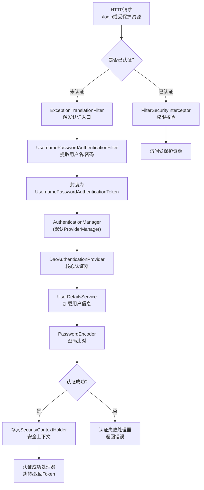

#### 二、关键组件与交互逻辑

##### 1. 过滤器链（SecurityFilterChain）

登录流程的入口，核心过滤器按顺序执行，关键组件如下：

| 过滤器                                   | 核心职责                                      | 执行时机                   |
| :--------------------------------------- | :-------------------------------------------- | :------------------------- |
| **SecurityContextPersistenceFilter**     | 管理SecurityContext（请求初加载、请求末清理） | 过滤器链头部               |
| **UsernamePasswordAuthenticationFilter** | 拦截/login请求，提取参数并封装Authentication  | 处理登录请求的核心过滤器   |
| **ExceptionTranslationFilter**           | 捕获认证/授权异常，触发登录引导（重定向/401） | 认证过滤器与授权过滤器之间 |
| **FilterSecurityInterceptor**            | 权限校验，决定是否放行资源                    | 过滤器链尾部，负责最终授权 |

##### 2. 认证体系（Authentication 核心链路）

认证是登录的核心，组件间委托关系明确：
- **Authentication**：认证信息载体，包含用户名、密码、权限（如UsernamePasswordAuthenticationToken）；
- **AuthenticationManager**：认证中央调度器，默认实现ProviderManager，负责委托给AuthenticationProvider；
- **AuthenticationProvider**：具体认证器，DaoAuthenticationProvider是默认实现，负责调用UserDetailsService和PasswordEncoder；
- **UserDetailsService**：用户信息加载接口，需自定义实现，从数据库/缓存加载用户信息；
- **PasswordEncoder**：密码编码器（如BCryptPasswordEncoder），负责密码加密与比对。

##### 3. 安全上下文（SecurityContext）

认证成功后，用户身份信息存储载体，核心是SecurityContextHolder：
- 存储已认证的Authentication对象，供后续请求复用；
- 默认基于ThreadLocal存储，确保线程安全；
- 可配置持久化（如Session），维持登录状态。

#### 三、完整登录流程步骤（表单登录为例）

1. **请求触发**：用户访问受保护资源（如/api/user），未认证时ExceptionTranslationFilter触发重定向到登录页；
2. **参数提取**：用户提交用户名/密码，UsernamePasswordAuthenticationFilter拦截/login请求，提取参数并封装为UsernamePasswordAuthenticationToken；
3. **认证调度**：Token传递给AuthenticationManager（ProviderManager），遍历匹配的AuthenticationProvider（默认DaoAuthenticationProvider）；
4. **用户加载与密码校验**：DaoAuthenticationProvider调用UserDetailsService加载用户信息，再通过PasswordEncoder比对密码；
5. **认证结果处理**：
   - 成功：将已认证的Authentication存入SecurityContextHolder，触发认证成功处理器（跳转目标页/返回Token）；
   - 失败：清空上下文，触发认证失败处理器（返回错误信息）；
6. **后续请求**：已认证请求通过FilterSecurityInterceptor进行权限校验，通过后访问受保护资源。

#### 四、前后端分离场景（JWT）简化流程

若前后端分离，流程略有调整，核心是用JWT替代Session：
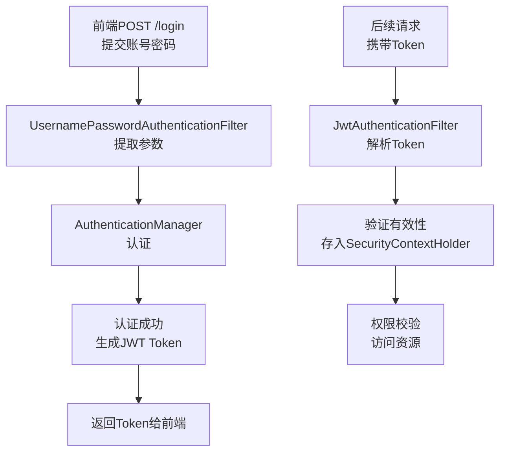

---

#### 总结

Spring Security 登录流程的核心是 **过滤器链拦截 + 认证体系委托 + 安全上下文存储**，理解组件间的委托关系与执行顺序，能快速定位认证问题（如用户信息加载失败、密码比对错误）或实现定制化需求（如多因素认证、第三方登录）。

需要我补充一份常见登录异常（如BadCredentialsException、UsernameNotFoundException）的排查要点，或给出前后端分离架构中 JWT 整合的最小配置示例吗？

我给你画一张**最清晰、面试常考、能直接画图讲清楚**的  

### **Spring Security 过滤器链关系图示**。

---

#### 1. 过滤器链整体关系图（极简版）


---

#### 2. 完整版执行顺序 + 职责图（最实用）

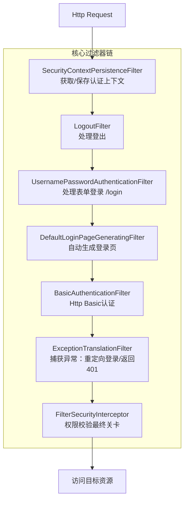

---

#### 3. 关键过滤器**执行顺序 & 作用**（必背）

1. **SecurityContextPersistenceFilter**  
   从 Session 读取/写入 SecurityContext
2. **LogoutFilter**  
   处理登出请求 `/logout`
3. **UsernamePasswordAuthenticationFilter**  
   处理**表单登录** `/login`
4. **DefaultLoginPageGeneratingFilter**  
   自动生成默认登录页面
5. **BasicAuthenticationFilter**  
   HTTP Basic 认证
6. **ExceptionTranslationFilter**  
   捕获认证/授权异常，决定跳转登录页还是返回401
7. **FilterSecurityInterceptor**  
   **最后一关**：判断是否有权限访问接口

---

#### 4. 一句话记住顺序

> **上下文 → 登出 → 登录 → 异常 → 权限拦截**

---

如果你需要，我可以再给你画一张  
**Spring Security 过滤器链 + 认证体系 + 上下文** 三合一总图（面试神图）。

### **Spring Security 认证体系关系图**

我给你画一张**最精简、面试必背、一眼看懂**的  
**Spring Security 认证体系（Authentication 核心链路）关系图**，只保留关键类。

---

#### 认证体系核心关系图（极简版）

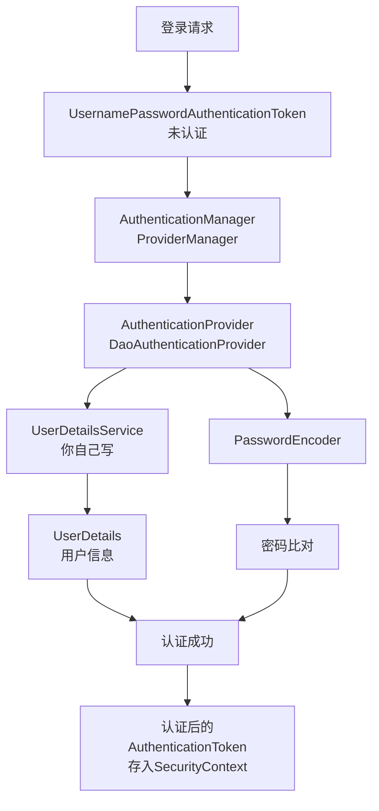

---

#### 文字版关系（背会就能讲清楚）

1. **Authentication**（Token）：装用户名、密码、权限
2. **AuthenticationManager**：统一入口，只管调度
3. **AuthenticationProvider**：真正做认证
4. **UserDetailsService**：你实现，查库拿用户
5. **PasswordEncoder**：密码加密、比对
6. **SecurityContextHolder**：存认证后的用户信息

---

#### 一句话总结链路

> **Token → AuthenticationManager → Provider → UserDetailsService → 密码比对 → 认证成功存入上下文**

需要我把 **过滤器链 + 认证体系** 合成一张**总图**吗？


这张就是你要的 **Spring Security 三合一终极总图**，面试直接画，面试官一看就懂。

### Spring Security 终极三合一总图

（过滤器链 + 认证体系 + 安全上下文）

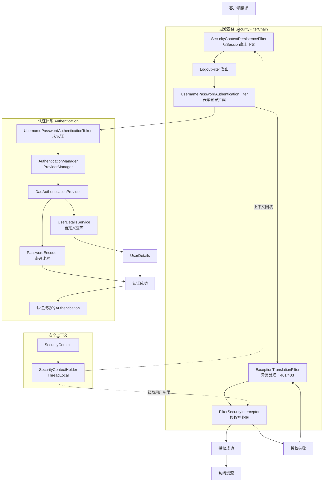

---

#### 面试口述版（背这段就够）

1. **请求先进过滤器链**
   先经过 `SecurityContextPersistenceFilter` 从 Session 里拿上下文，再到登录过滤器。

2. **登录走认证体系**
   封装未认证 Token → 交给 AuthenticationManager → Provider 调用你的 UserDetailsService 查库 + 密码比对 → 生成认证成功 Token。

3. **放进安全上下文**
   认证成功后存入 `SecurityContextHolder`，后续请求直接从这里拿用户身份。

4. **最后授权**
   `FilterSecurityInterceptor` 拿上下文里的权限，对比资源需要的权限，通过则访问，不通过抛 403。

---

#### 一句话总结

**过滤器管流程，认证管登录，上下文存用户，最后过滤器做授权。**

需要我再给你整理一份 **Spring Security 高频面试题+标准答案** 吗？

------

## **七、Spring 与微服务/实战**

1. Spring Cloud 的核心组件有哪些？（Eureka、Ribbon、Feign、Hystrix 等）
2. Spring 与 Redis/消息队列的整合方式有哪些？
3. Spring Boot 如何处理全局异常？
4. 如何在 Spring 中实现缓存？（@Cacheable、@CacheEvict）
5. Spring 应用的性能优化常用策略有哪些？

### 1. Spring Cloud 的核心组件有哪些？

| 组件               | 功能说明                                       |
| ------------------ | ---------------------------------------------- |
| **Eureka**         | 服务注册与发现（Service Registry & Discovery） |
| **Ribbon**         | 客户端负载均衡（Client-Side Load Balancer）    |
| **Feign**          | 声明式 REST 客户端，整合 Ribbon 实现负载均衡   |
| **Hystrix**        | 服务容错（熔断器、降级）                       |
| **Zuul / Gateway** | API 网关，路由与过滤                           |
| **Config**         | 配置中心，集中管理配置                         |
| **Bus / Stream**   | 消息总线，实现配置刷新或事件传播               |

> **Tip:** Spring Cloud 是 Spring Boot 的微服务扩展，提供注册发现、负载均衡、熔断、配置管理等功能。


------

### 2. Spring 与 Redis/消息队列的整合方式

- **Redis 整合**
  - **Spring Data Redis** 提供 RedisTemplate 或 StringRedisTemplate
  - 使用注解方式：
    - **@Cacheable**：缓存查询结果
    - **@CacheEvict**：清除缓存
    - **@CachePut**：更新缓存
- **消息队列整合**
  - **RabbitMQ**：Spring AMQP (`RabbitTemplate`)
  - **Kafka**：Spring Kafka (`KafkaTemplate`)
  - 使用方式：消息发送/消费、异步处理、事务消息

```java
// Redis 示例
@Cacheable(value = "user", key = "#id")
public User getUser(Long id){ ... }
```

------

### 3. Spring Boot 如何处理全局异常

- **方法 1：@ControllerAdvice + @ExceptionHandler**

```java
@ControllerAdvice
public class GlobalExceptionHandler {
    @ExceptionHandler(Exception.class)
    @ResponseBody
    public Result handleException(Exception e) {
        return Result.error(e.getMessage());
    }
}
```

- **方法 2：实现 HandlerExceptionResolver**
- **方法 3：使用 ResponseEntityExceptionHandler（继承 Spring 提供的抽象类）**

> **Tip:** 全局异常处理可统一返回 JSON 结构，方便前端处理。

------

### 4. 如何在 Spring 中实现缓存

- **注解方式（最常用）**
  - `@Cacheable`：缓存方法返回结果
  - `@CacheEvict`：清除缓存
  - `@CachePut`：更新缓存
- **示例**

```java
@Cacheable(value = "users", key = "#id")
public User getUser(Long id){ ... }

@CacheEvict(value = "users", key = "#id")
public void deleteUser(Long id){ ... }
```

- **配置**：
  - 支持多种缓存实现：Redis、Ehcache、Caffeine
  - 启用缓存：`@EnableCaching`


Spring 提供了**统一的缓存抽象层**，通过注解就能快速实现缓存功能，无需关注底层缓存实现（Redis/Ehcache/Caffeine），以下是完整的实现指南，包含核心注解、配置示例和最佳实践。

#### 一、核心注解详解（最常用）

Spring 缓存的核心是 3 个注解，覆盖“查、更、删”全场景，先理清每个注解的作用：

| 注解           | 核心作用                                                     | 适用场景                    |
| -------------- | ------------------------------------------------------------ | --------------------------- |
| `@Cacheable`   | 方法执行前先查缓存，有则返回缓存值；无则执行方法并将结果存入缓存 | 查询操作（如`getUserById`） |
| `@CachePut`    | 执行方法后，将结果更新到缓存（**方法一定会执行**）           | 更新操作（如`updateUser`）  |
| `@CacheEvict`  | 清除指定缓存                                                 | 删除操作（如`deleteUser`）  |
| `@Caching`     | 组合多个缓存注解（如同时更新+清除）                          | 复杂操作                    |
| `@CacheConfig` | 类级别配置缓存通用属性（如`value`）                          | 类内多个方法缓存前缀相同    |

#### 二、完整实现步骤（以 Redis 为例，最常用）

##### 步骤1：引入依赖（Maven）

```xml
<!-- Spring 缓存核心依赖 -->
<dependency>
    <groupId>org.springframework.boot</groupId>
    <artifactId>spring-boot-starter-cache</artifactId>
</dependency>
<!-- Redis 缓存实现（替代 Ehcache/Caffeine） -->
<dependency>
    <groupId>org.springframework.boot</groupId>
    <artifactId>spring-boot-starter-data-redis</artifactId>
</dependency>
```

##### 步骤2：启用缓存

在启动类/配置类上添加 `@EnableCaching` 注解，开启缓存功能：
```java
import org.springframework.boot.SpringApplication;
import org.springframework.boot.autoconfigure.SpringBootApplication;
import org.springframework.cache.annotation.EnableCaching;

@SpringBootApplication
@EnableCaching // 核心：启用缓存
public class CacheDemoApplication {
    public static void main(String[] args) {
        SpringApplication.run(CacheDemoApplication.class, args);
    }
}
```

##### 步骤3：Redis 基础配置（application.yml）

```yaml
spring:
  # Redis 配置
  redis:
    host: localhost # Redis 地址
    port: 6379      # 端口
    password:       # 密码（无则留空）
    database: 0     # 缓存库（默认0）
  # 缓存配置
  cache:
    type: redis     # 指定缓存类型为 Redis
    redis:
      time-to-live: 3600000 # 缓存过期时间（1小时，单位毫秒）
      key-prefix: cache_    # 缓存key前缀（避免key冲突）
      use-key-prefix: true  # 启用前缀
      cache-null-values: false # 不缓存null值（避免缓存穿透）
```

##### 步骤4：业务层使用缓存注解

```java
import org.springframework.cache.annotation.CacheEvict;
import org.springframework.cache.annotation.CachePut;
import org.springframework.cache.annotation.Cacheable;
import org.springframework.stereotype.Service;

@Service
public class UserService {

    // ========== 查询：缓存结果 ==========
    // value：缓存名称（必填），key：缓存键（SpEL表达式，#id为方法参数）
    @Cacheable(value = "users", key = "#id")
    public User getUserById(Long id) {
        // 模拟数据库查询（首次执行，后续走缓存）
        System.out.println("查询数据库，id=" + id);
        return new User(id, "张三", "zhangsan@test.com");
    }

    // ========== 更新：同步缓存 ==========
    // 执行方法后更新缓存，key与查询保持一致，确保缓存同步
    @CachePut(value = "users", key = "#user.id")
    public User updateUser(User user) {
        // 模拟数据库更新
        System.out.println("更新数据库，user=" + user);
        return user; // 方法返回值会覆盖缓存
    }

    // ========== 删除：清除缓存 ==========
    // allEntries = true：清除users缓存下所有数据（默认false，只清指定key）
    @CacheEvict(value = "users", key = "#id")
    public void deleteUser(Long id) {
        // 模拟数据库删除
        System.out.println("删除数据库，id=" + id);
    }
}
```

##### 步骤5：测试验证

```java
import org.junit.jupiter.api.Test;
import org.springframework.beans.factory.annotation.Autowired;
import org.springframework.boot.test.context.SpringBootTest;

@SpringBootTest
public class CacheTest {

    @Autowired
    private UserService userService;

    @Test
    public void testCache() {
        // 第一次调用：执行方法，打印"查询数据库"，结果存入缓存
        User user1 = userService.getUserById(1L);
        
        // 第二次调用：直接从缓存获取，不执行方法，无打印
        User user2 = userService.getUserById(1L);
        
        // 更新用户：执行方法，更新缓存
        userService.updateUser(new User(1L, "李四", "lisi@test.com"));
        
        // 第三次调用：缓存已更新，返回新值
        User user3 = userService.getUserById(1L);
        
        // 删除用户：清除缓存
        userService.deleteUser(1L);
        
        // 第四次调用：缓存已清空，重新执行方法
        User user4 = userService.getUserById(1L);
    }
}
```

#### 三、进阶用法（解决常见问题）

##### 1. 条件缓存（只缓存符合条件的数据）

```java
// 只缓存id>10的用户
@Cacheable(value = "users", key = "#id", condition = "#id > 10")
public User getUserById(Long id) { ... }

// 不缓存id=20的用户（unless与condition相反）
@Cacheable(value = "users", key = "#id", unless = "#id == 20")
public User getUserById(Long id) { ... }
```

##### 2. 自定义缓存Key生成器

当多个方法的key规则一致时，自定义KeyGenerator简化配置：
```java
import org.springframework.cache.interceptor.KeyGenerator;
import org.springframework.context.annotation.Bean;
import org.springframework.context.annotation.Configuration;
import java.lang.reflect.Method;
import java.util.Arrays;

@Configuration
public class CacheConfig {
    // 自定义Key生成器：缓存名称 + 方法名 + 参数列表
    @Bean
    public KeyGenerator customKeyGenerator() {
        return (Object target, Method method, Object... params) -> 
            method.getDeclaringClass().getName() + "_" 
            + method.getName() + "_" 
            + Arrays.toString(params);
    }
}

// 使用自定义KeyGenerator
@Cacheable(value = "users", keyGenerator = "customKeyGenerator")
public User getUserById(Long id) { ... }
```

##### 3. 解决缓存穿透/击穿/雪崩

- **缓存穿透**：配置 `cache-null-values: false`（不缓存null），或在业务层加布隆过滤器；
- **缓存击穿**：使用 Redis 分布式锁，或 `@Cacheable` 加 `sync = true`（本地锁，单实例有效）；
- **缓存雪崩**：设置随机过期时间（避免大量缓存同时失效），或 Redis 集群。

#### 四、其他缓存实现（快速切换）

Spring 缓存抽象层支持无缝切换底层实现，只需修改依赖和配置：
##### 1. Caffeine（本地缓存，性能最优）

```xml
<!-- 引入Caffeine依赖 -->
<dependency>
    <groupId>com.github.ben-manes.caffeine</groupId>
    <artifactId>caffeine</artifactId>
</dependency>
```
```yaml
spring:
  cache:
    type: caffeine # 切换为Caffeine
    caffeine:
      spec: maximumSize=1000,expireAfterWrite=3600s # 最大1000条，1小时过期
```

##### 2. Ehcache（传统本地缓存）

```xml
<!-- 引入Ehcache依赖 -->
<dependency>
    <groupId>org.ehcache</groupId>
    <artifactId>ehcache</artifactId>
</dependency>
```
```yaml
spring:
  cache:
    type: ehcache
    ehcache:
      config: classpath:ehcache.xml # 自定义配置文件
```

---

#### 总结

Spring 实现缓存的核心要点：
1. **核心注解**：`@EnableCaching` 开启缓存，`@Cacheable/@CachePut/@CacheEvict` 实现缓存增删改；
2. **配置灵活**：支持 Redis（分布式）、Caffeine（本地）等多种缓存实现，通过配置文件快速切换；
3. **避坑要点**：合理设置过期时间、避免缓存穿透/击穿/雪崩，缓存key确保唯一。

如果需要，我可以补充**缓存+事务的注意事项**（避免事务未提交缓存已更新），或**Redis缓存序列化配置**（解决缓存乱码问题）。


------

### 5. Spring 应用的性能优化常用策略

1. **Bean 层面**
   - 使用单例 Bean 避免频繁创建对象
   - 懒加载减少启动压力
2. **数据库访问**
   - 使用批量操作、分页、索引优化 SQL
   - 合理使用事务与缓存
3. **缓存优化**
   - 利用 Redis、Ehcache 等缓存热点数据
   - 避免缓存穿透、雪崩、击穿
4. **异步处理**
   - 使用 `@Async` 或消息队列处理耗时任务
5. **连接池优化**
   - 数据库连接池（HikariCP）、线程池配置合理
6. **Web 层优化**
   - 静态资源缓存、gzip 压缩、负载均衡
7. **监控与调优**
   - 使用 Actuator、Prometheus、Grafana 监控
   - GC、内存、线程监控与优化

> **Tip:** 性能优化是系统性工作，需要从架构、代码、数据库、缓存、消息、网络等多方面综合考虑。

------

