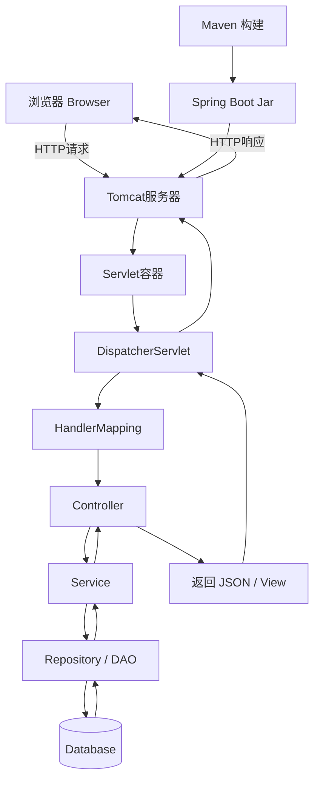
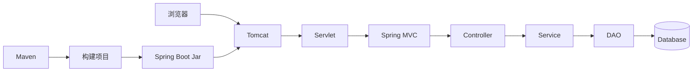
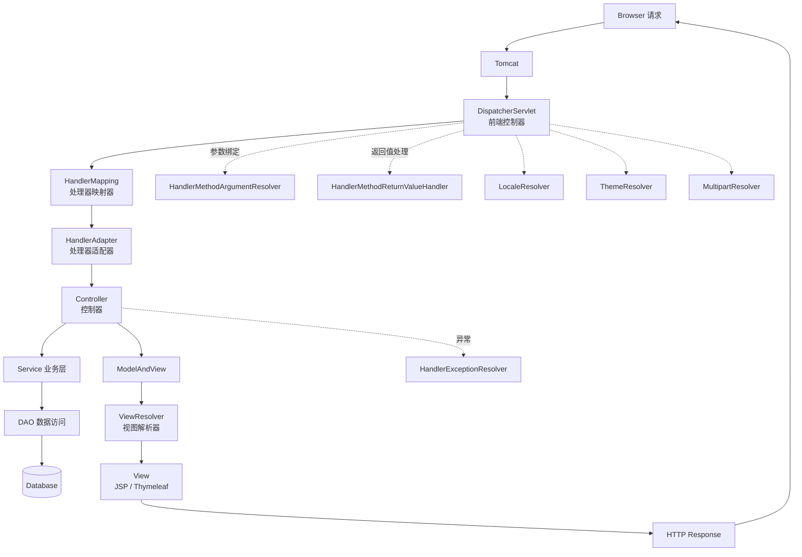
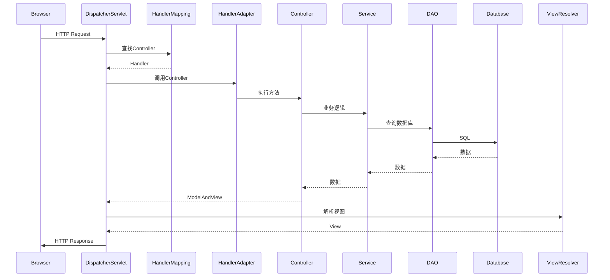
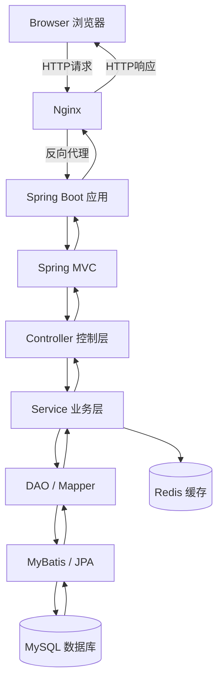
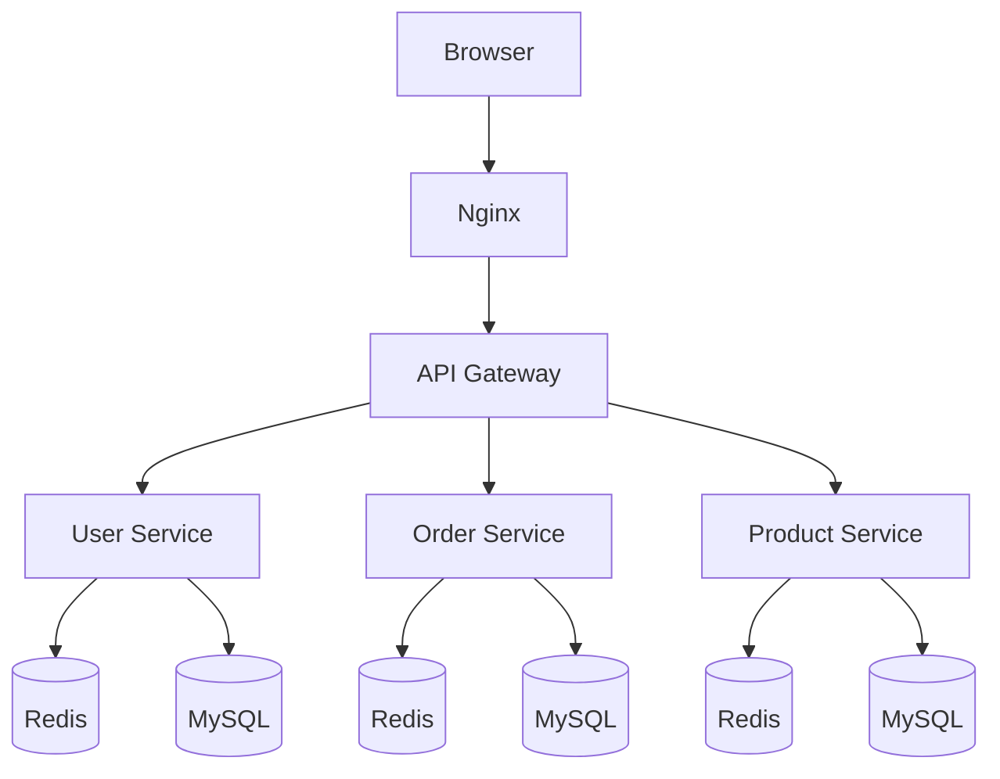
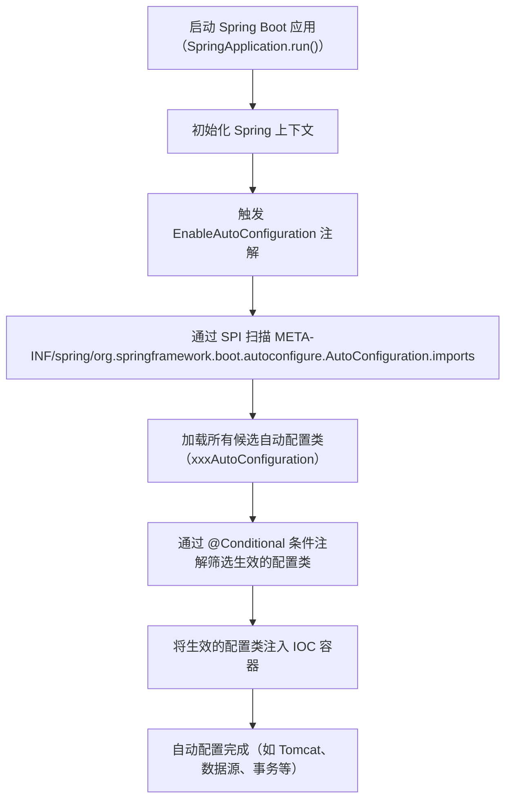
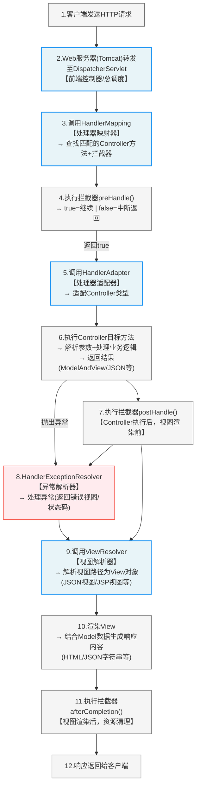

## 一张图理解 Spring Boot Web 项目运行流程



------

### 整个 Web 项目运行的 6 个步骤

#### ① Maven 构建项目

开发阶段使用 **Apache Maven**：

```bash
mvn clean package
```

生成：

```
target/app.jar
```

Spring Boot 项目通常是 **可执行 JAR**。

------

#### ② 启动 Spring Boot

运行：

```bash
java -jar app.jar
```

**Spring Boot** 会自动：

```
启动内嵌 Tomcat
加载 Spring 容器
扫描 Bean
启动 Web 服务
```

内嵌服务器通常是：

**Apache Tomcat**

------

#### ③ 浏览器发送 HTTP 请求

用户访问：

```
http://localhost:8080/user/list
```

浏览器发送：

```
HTTP Request
```

到 Tomcat。

------

#### ④ Tomcat 调用 Servlet

Tomcat 是一个 **Servlet 容器**。

它会把请求交给：

**Jakarta Servlet**

在 Spring MVC 中核心 Servlet 是：

```
DispatcherServlet
```

它是 **前端控制器**。

------

#### ⑤ Spring MVC 处理请求

DispatcherServlet 工作流程：

```
请求
 ↓
HandlerMapping
 ↓
Controller
 ↓
Service
 ↓
DAO
 ↓
Database
```

例如：

```java
@RestController
public class UserController {

    @GetMapping("/user/list")
    public List<User> list(){
        return userService.list();
    }
}
```

------

#### ⑥ 返回响应

返回流程：

```
Database
 ↓
DAO
 ↓
Service
 ↓
Controller
 ↓
JSON
 ↓
浏览器
```

浏览器最终收到：

```
HTTP Response
```

例如：

```json
[
 { "id":1,"name":"Tom" },
 { "id":2,"name":"Jerry" }
]
```

------

### 再给你一张 **架构关系图（面试超常问）**



------

### 面试最经典总结（30 秒版本）

如果面试官问 **Spring Boot Web 请求流程**，可以这样答：

> Spring Boot 项目通常通过 Maven 构建成可执行 Jar。
>
> 启动后 Spring Boot 会自动启动内嵌 Tomcat 服务器。
>
> 浏览器发送 HTTP 请求后，Tomcat 作为 Servlet 容器接收请求，并交给 DispatcherServlet。
>
> DispatcherServlet 通过 HandlerMapping 找到对应的 Controller，Controller 调用 Service 和 DAO 访问数据库。
>
> 最终 Controller 返回 JSON 或视图，通过 Tomcat 返回给浏览器。

------

如果你愿意，我可以再给你整理一张 **Java Web 面试最重要的一张图**：

**《Spring MVC 九大组件完整架构图（面试杀手图）》**

很多面试官会直接问：

```
DispatcherServlet 是怎么工作的？
Spring MVC 九大组件是什么？
```

那张图会 **一次性彻底讲清楚 Spring MVC。**


------

## 一张图理解 Spring MVC 九大组件



------

### Spring MVC 九大组件

#### 1 DispatcherServlet（前端控制器）

核心入口。

职责：

```
接收所有请求
调用其他组件
统一调度
```

流程起点：

```
Browser → DispatcherServlet
```

------

#### 2 HandlerMapping（处理器映射器）

作用：

```
根据URL找到Controller
```

例如：

```java
@GetMapping("/user/list")
```

映射到：

```
UserController.list()
```

常见实现：

```
RequestMappingHandlerMapping
```

------

#### 3 HandlerAdapter（处理器适配器）

作用：

```
调用Controller方法
```

为什么需要 Adapter？

因为 Controller 形式很多：

```
@Controller
@RestController
HttpRequestHandler
SimpleController
```

Adapter 负责统一调用。

常见实现：

```
RequestMappingHandlerAdapter
```

------

#### 4 HandlerExceptionResolver（异常解析器）

作用：

```
统一处理异常
```

例如：

```java
@ControllerAdvice
```

返回：

```
错误页面
JSON错误信息
```

------

#### 5 ViewResolver（视图解析器）

作用：

```
把逻辑视图名解析成真实视图
```

例如：

```
return "userList";
```

解析为：

```
/templates/userList.html
```

常见实现：

```
InternalResourceViewResolver
ThymeleafViewResolver
```

------

#### 6 View（视图）

负责最终渲染页面。

例如：

```
JSP
Thymeleaf
Freemarker
```

------

#### 7 MultipartResolver（文件上传解析器）

作用：

```
处理文件上传
```

例如：

```java
MultipartFile file
```

常见实现：

```
CommonsMultipartResolver
StandardServletMultipartResolver
```

------

#### 8 LocaleResolver（国际化解析器）

作用：

```
多语言处理
```

例如：

```
中文
English
日本語
```

常见实现：

```
AcceptHeaderLocaleResolver
SessionLocaleResolver
```

------

#### 9 ThemeResolver（主题解析器）

作用：

```
切换页面主题
```

例如：

```
light theme
dark theme
```

使用较少。

------

### Spring MVC 请求完整流程

完整流程：

```
1 浏览器发送 HTTP 请求
2 DispatcherServlet 接收请求
3 HandlerMapping 找到 Controller
4 HandlerAdapter 调用 Controller
5 Controller 执行业务逻辑
6 返回 ModelAndView
7 ViewResolver 解析视图
8 View 渲染页面
9 返回 HTTP Response
```

------

### 再给你一张 **面试最经典流程图**



------

### 面试标准回答（非常加分）

如果面试官问：

**Spring MVC 九大组件是什么？**

可以这样答：

> Spring MVC 的核心是 DispatcherServlet，它作为前端控制器接收所有请求。
>
> DispatcherServlet 通过 HandlerMapping 找到对应的 Controller，然后通过 HandlerAdapter 调用 Controller 方法。
>
> Controller 执行业务逻辑后返回 ModelAndView，接着 ViewResolver 将逻辑视图解析为真实视图，View 负责渲染页面并返回给客户端。
>
> 此外 Spring MVC 还提供 HandlerExceptionResolver 处理异常、MultipartResolver 处理文件上传、LocaleResolver 处理国际化、ThemeResolver 处理主题等组件。

------

如果你愿意，我可以再给你一张 **Java Web 全局架构终极图（非常适合理解整个后端体系）**：

```
Browser
 ↓
Nginx
 ↓
Spring Boot
 ↓
Spring MVC
 ↓
Spring
 ↓
MyBatis / JPA
 ↓
MySQL
```

这张图基本 **把 Java 后端体系一次性讲清楚。**

##  **Java Web 全局架构终极图**

下面给你整理一张 **Java Web 全局架构终极图**。
这张图把常见的 Java 后端技术体系串在一起，非常适合面试和整体理解。

涉及核心组件：

- **Nginx**
- **Spring Boot**
- **Spring MVC**
- **Spring Framework**
- **MyBatis**
- **MySQL**
- **Redis**

------

### Java Web 全局架构终极图



------

### 整个 Java Web 请求流程

#### ① 浏览器请求

用户访问：

```
https://example.com/user/list
```

浏览器发送：

```
HTTP Request
```

------

#### ② Nginx 反向代理

请求首先到达：

**Nginx**

作用：

```
负载均衡
反向代理
静态资源
HTTPS
```

例如：

```
Browser
   ↓
Nginx
   ↓
多个后端服务器
```

------

#### ③ Spring Boot 应用

请求进入：

**Spring Boot**

Spring Boot 会：

```
启动内嵌 Tomcat
加载 Spring 容器
初始化 Web 应用
```

------

#### ④ Spring MVC 处理请求

Web 层使用：

**Spring MVC**

核心组件：

```
DispatcherServlet
HandlerMapping
Controller
ViewResolver
```

请求流程：

```
HTTP Request
   ↓
DispatcherServlet
   ↓
Controller
```

------

#### ⑤ Controller 控制层

负责：

```
接收请求
参数解析
调用业务层
返回结果
```

例如：

```java
@RestController
public class UserController {

    @GetMapping("/user/list")
    public List<User> list(){
        return userService.list();
    }
}
```

------

#### ⑥ Service 业务层

业务逻辑处理：

```
订单逻辑
用户逻辑
事务控制
```

例如：

```
UserService
OrderService
PaymentService
```

------

#### ⑦ DAO / Mapper 数据层

负责：

```
数据库操作
SQL执行
```

常见框架：

- **MyBatis**
- **Hibernate**

------

#### ⑧ 数据库

数据最终存储在：

**MySQL**

例如：

```
user
order
product
```

------

#### ⑨ Redis 缓存

很多系统会加缓存：

**Redis**

作用：

```
提升性能
减少数据库压力
会话存储
热点数据
```

访问流程：

```
Service
  ↓
Redis
  ↓
MySQL
```

------

### 企业级架构升级版（更真实）

真实互联网系统通常是这样：



这就是 **微服务架构**。

常见组件：

```
Spring Boot
Spring Cloud
Docker
Kubernetes
```

------

### Java Web 技术栈一张图

```
浏览器
 ↓
Nginx
 ↓
Spring Boot
 ↓
Spring MVC
 ↓
Controller
 ↓
Service
 ↓
DAO / Mapper
 ↓
MyBatis / JPA
 ↓
MySQL
```

旁边：

```
Redis 缓存
```

------

### 面试经典总结（推荐背）

如果面试官问：

**Java Web 请求流程是什么？**

可以这样答：

> 浏览器发送 HTTP 请求后，请求首先到达 Nginx，Nginx 作为反向代理将请求转发到 Spring Boot 应用。
>
> Spring Boot 内部通过 Spring MVC 处理请求，由 DispatcherServlet 分发到对应的 Controller。
>
> Controller 调用 Service 层执行业务逻辑，Service 再通过 DAO 或 Mapper 访问数据库。
>
> 数据通常通过 MyBatis 或 JPA 持久化到 MySQL，同时很多系统会使用 Redis 进行缓存优化。
>
> 最终结果通过 Spring MVC 返回给浏览器。

------

如果你愿意，我可以再给你一张 **Java 后端最强的一张图**：

**《Java 后端技术体系全景图（Spring / JVM / 中间件 / 微服务）》**

很多程序员看到这张图会一下子 **把整个 Java 技术体系理解清楚**。

## **一、Spring Boot 基础概念**

1. 什么是 Spring Boot？与传统 Spring 框架相比有哪些优势？
2. Spring Boot 的自动配置原理是什么？
3. `@SpringBootApplication` 注解包含哪些功能？
4. Spring Boot 的启动流程大概是怎样的？
5. Spring Boot 如何实现约定优于配置（Convention over Configuration）？


### 1️⃣ 什么是 Spring Boot？与传统 Spring 框架相比有哪些优势？

**答案：**

- **Spring Boot** 是基于 Spring 的快速开发框架，旨在简化 Spring 应用的配置和部署。它提供了开箱即用的默认配置、内嵌服务器以及自动化依赖管理。
- **优势：**
  1. **自动配置（Auto-Configuration）**：根据项目依赖自动配置 Spring 组件，减少手动配置。
  2. **开箱即用（Opinionated Defaults）**：提供合理默认值，快速搭建项目。
  3. **内嵌服务器**：无需单独部署 Tomcat/Jetty，可直接运行 `jar` 包。
  4. **简化依赖管理**：通过 `spring-boot-starter` 系列快速引入常用功能。
  5. **生产级特性**：集成 Actuator、健康检查、监控等。

------

### 2️⃣ Spring Boot 的自动配置原理是什么？

**答案：**

- 核心是 **`@EnableAutoConfiguration`** 注解，通过 `spring.factories` 文件加载所有可能的自动配置类。
- **工作流程：**
  1. Spring Boot 扫描 classpath，识别应用依赖。
  2. 根据依赖和条件（`@ConditionalOnClass`、`@ConditionalOnMissingBean` 等）决定是否加载某个配置类。
  3. 自动实例化和配置 Bean，减少开发者手动配置。

**示意图：**

```
classpath依赖 → 判断条件 → 自动装配Bean → 应用启动
```

------

### 3️⃣ `@SpringBootApplication` 注解包含哪些功能？

**答案：**
 `@SpringBootApplication` 是一个组合注解，包含三个核心注解：

1. **`@SpringBootConfiguration`**：继承自 `@Configuration`，表示当前类是配置类。
2. **`@EnableAutoConfiguration`**：启用 Spring Boot 自动配置。
3. **`@ComponentScan`**：启用组件扫描，默认扫描当前包及子包下的组件（`@Component`、`@Service`、`@Repository`、`@Controller` 等）。

------

### 4️⃣ Spring Boot 的启动流程大概是怎样的？

**答案：**

1. **main 方法启动 SpringApplication**：执行 `SpringApplication.run()`。
2. **初始化 Spring 环境**：创建 `ApplicationContext`、读取配置文件（`application.properties`/`yml`）。
3. **触发自动配置**：扫描 `@EnableAutoConfiguration` 所有配置类，根据条件装配 Bean。
4. **刷新 ApplicationContext**：实例化 Bean、处理依赖注入。
5. **启动内嵌服务器**：Tomcat/Jetty/Undertow 初始化并绑定端口。
6. **应用就绪**：完成启动，监听 HTTP 请求。

------

### 5️⃣ Spring Boot 如何实现约定优于配置（Convention over Configuration）？

**答案：**

- Spring Boot 提供**默认配置**，开发者无需手动配置即可使用，例如：
  - 内嵌 Tomcat 默认端口 `8080`
  - 默认日志框架为 Logback
  - 自动配置数据源、JPA、Redis、MVC 等
- 如果需要覆盖默认行为，可以在 `application.properties` 或通过自定义配置类覆盖。
- 优势：减少重复配置，提高开发效率，同时保持灵活性。

### 6.异常处理

在 Spring Boot 中，异常处理是保障系统稳定性和用户体验的核心环节，其核心思路是 **统一捕获、分层处理、规范响应**。Spring Boot 提供了多种异常处理方式，从简单的默认处理到自定义全局处理器，满足不同场景的需求。以下是全面的 Spring Boot 异常处理方案详解：

#### 一、Spring Boot 异常处理的核心组件

##### 1. 异常的分类

在 Spring Boot 中，异常主要分为两类，处理策略不同：
- **业务异常（可预期）**：如参数错误、资源不存在、权限不足等，通常通过自定义异常（如 `BusinessException`）主动抛出，需返回明确的错误码和提示信息。
- **系统异常（不可预期）**：如空指针、数据库异常、IO 异常等，属于运行时异常，需捕获并返回友好提示，同时记录详细日志便于排查。

##### 2. 核心处理注解

- `@RestControllerAdvice`：全局异常处理器的核心注解，用于标识一个全局异常处理类，结合 `@ExceptionHandler` 实现异常匹配。
- `@ExceptionHandler`：方法级注解，指定当前方法处理的异常类型（如 `BusinessException.class`、`Exception.class`）。
- `@ResponseStatus`：用于指定异常对应的 HTTP 响应状态码（如 400 Bad Request、404 Not Found）。

#### 二、异常处理的实现方案

##### 方案 1：基础全局异常处理器（推荐）

通过 `@RestControllerAdvice + @ExceptionHandler` 实现全局异常捕获，适配自定义业务异常和系统异常，封装统一响应格式（如前文的 `R<T>` 类）。

###### 1. 自定义业务异常类

```java
package com.xi.exception;

import com.xi.enums.ErrorCode;
import lombok.Getter;

/**
 * 业务异常基类
 * 所有业务逻辑异常统一抛出此类，便于全局捕获和处理
 */
@Getter // Lombok 注解，自动生成 getter 方法（避免重复代码）
public class BusinessException extends RuntimeException {

    /**
     * 错误码（关联 ErrorCode 枚举，统一编码）
     */
    private final int code;

    /**
     * 错误消息（可自定义，也可使用枚举默认消息）
     */
    private final String message;

    // ========== 构造方法重载，适配不同使用场景 ==========

    /**
     * 场景1：仅传入错误码枚举（使用枚举默认消息）
     * @param errorCode 错误码枚举
     */
    public BusinessException(ErrorCode errorCode) {
        this.code = errorCode.getCode();
        this.message = errorCode.getMessage();
    }

    /**
     * 场景2：传入错误码枚举 + 自定义消息（覆盖枚举默认消息）
     * @param errorCode 错误码枚举
     * @param customMessage 自定义错误消息
     */
    public BusinessException(ErrorCode errorCode, String customMessage) {
        this.code = errorCode.getCode();
        this.message = customMessage;
    }

    /**
     * 场景3：传入错误码枚举 + 自定义消息 + 根异常（保留异常链）
     * @param errorCode 错误码枚举
     * @param customMessage 自定义错误消息
     * @param cause 根异常（如第三方接口调用异常、IO异常等）
     */
    public BusinessException(ErrorCode errorCode, String customMessage, Throwable cause) {
        super(cause); // 传递根异常，保留堆栈信息
        this.code = errorCode.getCode();
        this.message = customMessage;
    }

    /**
     * 场景4：传入错误码枚举 + 根异常（使用枚举默认消息，保留异常链）
     * @param errorCode 错误码枚举
     * @param cause 根异常
     */
    public BusinessException(ErrorCode errorCode, Throwable cause) {
        super(cause);
        this.code = errorCode.getCode();
        this.message = errorCode.getMessage();
    }
}
```

###### 2. 错误码枚举（统一管理）

```java
import lombok.Getter;

@Getter
public enum ErrorCode {
    SUCCESS(200, "操作成功"),
    PARAM_ERROR(400, "参数校验失败"),
    RESOURCE_NOT_FOUND(404, "资源不存在"),
    SYSTEM_ERROR(500, "系统异常，请联系管理员"),
    BUSINESS_ERROR(1000, "业务逻辑异常");

    private final int code;
    private final String message;

    ErrorCode(int code, String message) {
        this.code = code;
        this.message = message;
    }
}
```

###### 3. 统一响应体（`R<T>`）

```java
package com.xi.vo;

import com.xi.enums.ErrorCode;
import io.swagger.v3.oas.annotations.media.Schema;
import lombok.Data;

import java.io.Serializable;

@Data
@Schema(description = "全局统一响应体") // 描述响应体用途
public class R<T> implements Serializable {
    @Schema(description = "接口调用是否成功（true=成功，false=失败）")
    private boolean success;

    @Schema(description = "状态码（200=成功，其他为错误码）")
    private int code;

    @Schema(description = "提示信息（成功/失败描述）")
    private String message;

    @Schema(description = "业务数据（成功时返回，失败时为null）")
    private T data;

    @Schema(description = "响应时间戳（毫秒级）")
    private long timestamp;

    // 私有构造器，禁止直接实例化，通过静态方法创建
    private R() {
        this.timestamp = System.currentTimeMillis();
    }

    // 1.1.成功响应（带数据）
    public static <T> R<T> success(T data) {
        R<T> result = new R<>();
        result.setSuccess(true);
        result.setCode(200); // 成功默认码（可自定义为0）
        result.setMessage("操作成功");
        result.setData(data);
        return result;
    }

    // 1.2.成功响应（无数据，如删除/更新操作）
    public static <T> R<T> success() {
        // 调用成功响应（带null数据）
        return success(null);
    }
    

    // 2.1.失败响应（仅传错误码枚举）
    public static <T> R<T> fail(ErrorCode errorCode) {
        R<T> result = new R<>();
        result.setSuccess(false);
        result.setCode(errorCode.getCode());
        result.setMessage(errorCode.getMessage());
        result.setData(null);
        return result;
    }

    // 2.2.失败响应（错误码枚举 + 自定义消息）【关键：添加此重载方法】
    public static <T> R<T> fail(ErrorCode errorCode, String customMessage) {
        R<T> result = new R<>();
        result.setSuccess(false);
        result.setCode(errorCode.getCode());
        result.setMessage(customMessage); // 使用自定义消息
        result.setData(null);
        return result;
    }

    // 2.3.失败响应（带错误码和信息）
    public static <T> R<T> fail(int code, String message) {
        R<T> result = new R<>();
        result.setSuccess(false);
        result.setCode(code);
        result.setMessage(message);
        result.setData(null);
        return result;
    }

    // 2.4.失败响应（简化版，默认错误码如500）
    public static <T> R<T> fail(String message) {
        return fail(500, message);
    }
}
```

###### 4. 全局异常处理器

```java
import com.xi.exception.BusinessException;
import com.xi.enums.ErrorCode;
import com.xi.vo.R;
import lombok.extern.slf4j.Slf4j;
import org.springframework.web.bind.annotation.ExceptionHandler;
import org.springframework.web.bind.annotation.RestControllerAdvice;

@RestControllerAdvice // 全局捕获 Controller 层异常
@Slf4j
public class GlobalExceptionHandler {

    // 处理业务异常
    @ExceptionHandler(BusinessException.class)
    public R<Void> handleBusinessException(BusinessException e) {
        log.warn("业务异常：code={}, message={}", e.getCode(), e.getMessage(), e);
        return R.fail(e.getCode(), e.getMessage());
    }

    // 处理系统异常（兜底）
    @ExceptionHandler(Exception.class)
    public R<Void> handleSystemException(Exception e) {
        log.error("系统异常：", e); // 记录完整堆栈信息
        return R.fail(ErrorCode.SYSTEM_ERROR.getCode(), ErrorCode.SYSTEM_ERROR.getMessage());
    }
}
```

#### 方案 2：处理特定异常（如参数校验异常）

针对常见的框架级异常（如参数校验、请求方式错误），可添加专门的处理器方法：

##### 1. 依赖（参数校验）
```xml
<!-- Spring Boot 参数校验依赖 -->
<dependency>
    <groupId>org.springframework.boot</groupId>
    <artifactId>spring-boot-starter-validation</artifactId>
</dependency>
```

##### 2. 处理器中添加参数校验异常处理
```java
import org.springframework.validation.BindingResult;
import org.springframework.validation.FieldError;
import org.springframework.web.bind.MethodArgumentNotValidException;

// 处理 @RequestBody 参数校验异常
@ExceptionHandler(MethodArgumentNotValidException.class)
public R<Void> handleParamValidException(MethodArgumentNotValidException e) {
    BindingResult bindingResult = e.getBindingResult();
    StringBuilder errorMsg = new StringBuilder("参数校验失败：");
    // 遍历所有参数错误信息
    for (FieldError fieldError : bindingResult.getFieldErrors()) {
        errorMsg.append(fieldError.getField()).append("：").append(fieldError.getDefaultMessage()).append("，");
    }
    String msg = errorMsg.substring(0, errorMsg.length() - 1);
    log.warn(msg);
    return R.fail(ErrorCode.PARAM_ERROR.getCode(), msg);
}

// 处理 @RequestParam 参数校验异常
@ExceptionHandler(IllegalArgumentException.class)
public R<Void> handleIllegalArgException(IllegalArgumentException e) {
    log.warn("参数错误：{}", e.getMessage());
    return R.fail(ErrorCode.PARAM_ERROR.getCode(), e.getMessage());
}
```

##### 方案 3：自定义错误页面（适用于 MVC 项目）

若项目是传统 MVC 项目（返回页面而非 JSON），可自定义错误页面：
1. 在 `resources/templates/error/` 目录下创建错误页面（如 `404.html`、`500.html`），Spring Boot 会自动根据 HTTP 状态码匹配页面。
2. 或实现 `ErrorController` 接口自定义错误页面路由：
```java
import org.springframework.boot.web.servlet.error.ErrorController;
import org.springframework.stereotype.Controller;
import org.springframework.web.bind.annotation.GetMapping;

@Controller
public class CustomErrorController implements ErrorController {

    @GetMapping("/error")
    public String handleError() {
        // 返回自定义错误页面
        return "error/500";
    }
}
```

#### 三、事务场景下的异常处理

当 Service 方法带有 `@Transactional` 注解时，异常抛出会影响事务回滚，需注意：
1. **默认回滚规则**：`@Transactional` 默认只对 `RuntimeException` 及其子类触发回滚，受检异常（如 `IOException`）不会回滚。
2. **手动指定回滚异常**：通过 `rollbackFor` 属性指定需要回滚的异常类型：
```java
@Transactional(rollbackFor = Exception.class) // 所有异常都触发回滚
public boolean addUserAddress(UserAddress userAddress) {
    if (userAddress.getUserId() == null) {
        throw new BusinessException(ErrorCode.PARAM_ERROR, "用户ID不能为空");
    }
    // 业务逻辑...
}
```
3. **事务回滚与异常传递顺序**：事务回滚发生在异常抛出后、全局处理器捕获前。

#### 四、异常处理的最佳实践

##### 1. 分层处理原则

- **Controller 层**：不处理业务异常，仅负责接收请求和返回响应，异常由全局处理器统一捕获。
- **Service 层**：业务逻辑异常主动抛出 `BusinessException`，系统异常可直接抛出（由全局处理器兜底）。
- **Mapper 层**：不处理异常，异常向上传递至 Service 层。

##### 2. 日志记录规范

- 业务异常：使用 `warn` 级别日志，记录错误码、消息和关键上下文（如用户 ID、请求参数）。
- 系统异常：使用 `error` 级别日志，记录完整堆栈信息，便于排查问题。
- 避免日志泄露敏感信息（如密码、手机号）。

##### 3. 错误码设计规范

- 系统级错误码：复用 HTTP 状态码（如 400 参数错误、404 资源不存在、500 系统异常）。
- 业务级错误码：按模块划分（如用户模块 1000~1999，订单模块 2000~2999），避免冲突。
- 错误码文档：维护错误码清单，标注每个错误码的含义和处理建议。

##### 4. 前端适配建议

- 前端统一拦截响应结果，根据 `success` 和 `code` 判断请求状态。
- 对 401（未登录）、403（权限不足）等错误码，跳转至对应页面（如登录页）。
- 对业务异常，将 `message` 直接展示给用户；对系统异常，展示友好提示（如“系统繁忙，请稍后重试”）。

#### 五、常见问题排查

1. **全局异常处理器不生效**：
   - 检查处理器类是否添加 `@RestControllerAdvice` 注解。
   - 检查 `@ExceptionHandler` 注解的异常类型是否正确（如是否误写为 `Exception.class` 的子类）。
   - 检查处理器类是否在 Spring Boot 的扫描范围内（包路径是否正确）。

2. **参数校验异常未被捕获**：
   - 检查是否引入了 `spring-boot-starter-validation` 依赖。
   - 检查参数校验注解（如 `@NotNull`）是否正确使用，且 Controller 方法参数添加了 `@Valid` 注解。

3. **事务未回滚**：
   - 检查 `@Transactional` 注解是否添加在 public 方法上（非 public 方法注解无效）。
   - 检查异常类型是否在 `rollbackFor` 配置范围内。
   - 检查是否手动捕获了异常（若捕获后未重新抛出，事务不会回滚）。

#### 六、扩展：集成第三方监控工具

为了更好地监控和排查异常，可集成第三方工具：
1. **Sentry**：实时捕获异常并告警，记录异常上下文和堆栈信息。
2. **ELK 栈**：收集日志并进行检索分析，快速定位异常问题。
3. **Spring Boot Actuator**：暴露健康检查和指标端点，监控系统运行状态。

通过以上方案，可实现 Spring Boot 项目中异常的统一、高效处理，提升系统的稳定性和可维护性。

### 7.时间处理

在 Java 中，处理日期和时间的类经历了从早期设计缺陷到现代清晰 API 的演进。目前推荐使用 **`java.time` 包（JSR-310）**，它自 **Java 8 起引入**，取代了老旧的 `Date`、`Calendar` 等类。

下面系统梳理 Java 中常用的时间类及其使用场景。

---

#### ✅ 一、现代时间 API（推荐）—— `java.time` 包（Java 8+）

##### 1. **`LocalDateTime`**

- **含义**：不带时区的日期+时间（如：2025-04-05T14:30:00）
- **适用场景**：本地业务时间（如订单创建时间、日志时间）
- **示例**：
  ```java
  LocalDateTime now = LocalDateTime.now(); // 当前系统默认时区时间
  LocalDateTime dt = LocalDateTime.of(2025, 4, 5, 14, 30, 0);

  // 格式化
  String str = now.format(DateTimeFormatter.ofPattern("yyyy-MM-dd HH:mm:ss"));
  // 解析
  LocalDateTime parsed = LocalDateTime.parse("2025-04-05 14:30:00", 
      DateTimeFormatter.ofPattern("yyyy-MM-dd HH:mm:ss"));
  ```

---

##### 2. **`LocalDate`**

- **含义**：仅日期（如：2025-04-05）
- **适用场景**：生日、节假日、报表日期
- **示例**：
  ```java
  LocalDate today = LocalDate.now();
  LocalDate date = LocalDate.of(2025, 4, 5);
  LocalDate nextWeek = today.plusWeeks(1);
  ```

---

##### 3. **`LocalTime`**

- **含义**：仅时间（如：14:30:00）
- **适用场景**：营业开始/结束时间、闹钟
- **示例**：
  ```java
  LocalTime now = LocalTime.now();
  LocalTime time = LocalTime.of(14, 30);
  ```

---

##### 4. **`ZonedDateTime`**

- **含义**：带时区的完整时间（如：2025-04-05T14:30:00+08:00[Asia/Shanghai]）
- **适用场景**：跨国应用、需要明确时区的场景
- **示例**：
  ```java
  ZonedDateTime zdt = ZonedDateTime.now(ZoneId.of("Asia/Shanghai"));
  ZonedDateTime utc = ZonedDateTime.now(ZoneOffset.UTC);
  ```

---

##### 5. **`Instant`**

- **含义**：时间戳（UTC 时间，从 1970-01-01T00:00:00Z 开始的纳秒数）
- **适用场景**：记录系统事件、数据库存储、API 传输
- **示例**：
  ```java
  Instant now = Instant.now(); // 等价于 System.currentTimeMillis()
  long timestamp = now.toEpochMilli(); // 转毫秒时间戳

  // 从时间戳创建
  Instant instant = Instant.ofEpochMilli(System.currentTimeMillis());
  ```

---

##### 6. **`Duration` & `Period`**

- `Duration`：表示**时间量**（如 2 小时 30 分），用于 `LocalDateTime`、`Instant` 等
- `Period`：表示**日期量**（如 1 年 2 个月 3 天），用于 `LocalDate`
- **示例**：
  ```java
  Duration duration = Duration.between(start, end); // 两个时间点的差
  Period period = Period.between(birthDate, LocalDate.now()); // 年龄计算
  ```

---

#### ⚠️ 二、旧版时间类（不推荐，仅维护旧代码）

| 类                           | 问题                                       | 替代方案                              |
| ---------------------------- | ------------------------------------------ | ------------------------------------- |
| `java.util.Date`             | 可变、线程不安全、命名混乱（实际是时间戳） | `Instant` 或 `LocalDateTime`          |
| `java.util.Calendar`         | 设计复杂、月份从 0 开始、线程不安全        | `LocalDateTime` + `TemporalAdjusters` |
| `java.text.SimpleDateFormat` | **非线程安全**，性能差                     | `DateTimeFormatter`（线程安全）       |

> ❌ 示例（不要这样写）：
> ```java
> // 危险！SimpleDateFormat 非线程安全
> SimpleDateFormat sdf = new SimpleDateFormat("yyyy-MM-dd");
> String str = sdf.format(new Date());
> ```

---

#### ✅ 三、常用操作对比表

| 需求          | 推荐类                       | 方法示例                                     |
| ------------- | ---------------------------- | -------------------------------------------- |
| 获取当前时间  | `LocalDateTime.now()`        | `LocalDateTime.now()`                        |
| 字符串 ↔ 时间 | `DateTimeFormatter`          | `parse()` / `format()`                       |
| 时间戳 ↔ 时间 | `Instant`                    | `Instant.ofEpochMilli()` / `.toEpochMilli()` |
| 加减时间      | `plusDays()`, `minusHours()` | `localDateTime.plusDays(1)`                  |
| 计算时间差    | `Duration.between()`         | `Duration.between(start, end).toMinutes()`   |
| 时区转换      | `ZonedDateTime`              | `zdt.withZoneSameInstant(ZoneId.of("UTC"))`  |
| 日期比较      | `isBefore()`, `isAfter()`    | `date1.isAfter(date2)`                       |

---

#### ✅ 四、最佳实践建议

1. **优先使用 `java.time`**：所有新项目必须用 `LocalDateTime`、`Instant` 等。
2. **数据库存储**：
   - 用 **`Instant`（时间戳）** 或 **`LocalDateTime`（无时区）**
   - 避免存储带时区的字符串（除非业务强依赖）
3. **API 传输**：
   - 推荐 ISO 8601 格式：`"2025-04-05T14:30:00"` 或 `"2025-04-05T14:30:00Z"`
   - JSON 序列化库（如 Jackson）默认支持 `java.time`
4. **线程安全**：
   - `DateTimeFormatter` 是线程安全的，可定义为 `static final`
   - 旧版 `SimpleDateFormat` 必须用 `ThreadLocal` 包装（不推荐）

---

#### 🌰 五、完整示例：订单创建时间处理

```java
public class Order {
    private LocalDateTime createTime; // 存储本地时间

    public static Order create() {
        return new Order(LocalDateTime.now());
    }

    // 转为前端显示格式
    public String getCreateTimeStr() {
        return createTime.format(DateTimeFormatter.ofPattern("yyyy-MM-dd HH:mm"));
    }

    // 转为时间戳（用于日志或数据库）
    public long getCreateTimeMillis() {
        return createTime.atZone(ZoneId.systemDefault()).toInstant().toEpochMilli();
    }
}
```

---

#### ✅ 总结

| 场景                   | 推荐类                          |
| ---------------------- | ------------------------------- |
| 本地日期时间（无时区） | `LocalDateTime`                 |
| 仅日期                 | `LocalDate`                     |
| 仅时间                 | `LocalTime`                     |
| 带时区时间             | `ZonedDateTime`                 |
| 时间戳（系统/数据库）  | `Instant`                       |
| 时间格式化             | `DateTimeFormatter`（线程安全） |

> 🚀 **记住**：  
> **“新项目用 `java.time`，旧代码逐步迁移，永远别用 `SimpleDateFormat`！”**


### 8.理解Spring Boot自动装配原理。

Spring Boot 最核心的特性就是**自动装配（AutoConfiguration）** —— 它能根据你引入的依赖，自动完成 Spring 应用的配置（比如引入 `spring-boot-starter-web` 就自动配置 Tomcat、Spring MVC 等），彻底摆脱了 Spring 传统的 XML/注解繁琐配置。

先给你一个通俗的核心结论：
**自动装配 = 约定大于配置 + 条件注解 +  SPI 机制**，本质是 Spring Boot 启动时，通过特定规则扫描并加载预设的配置类，再根据条件判断是否生效。

---

#### 一、自动装配的核心执行流程

先通过流程图理清整体逻辑，再拆解每个核心环节：


---

#### 二、核心组件拆解（从注解到实现）

##### 1. 入口注解：@SpringBootApplication

自动装配的入口是 `@SpringBootApplication`，它是一个复合注解，核心依赖其中的 `@EnableAutoConfiguration`：
```java
@Target(ElementType.TYPE)
@Retention(RetentionPolicy.RUNTIME)
@SpringBootConfiguration // 本质是 @Configuration，标记配置类
@EnableAutoConfiguration // 开启自动装配（核心）
@ComponentScan // 扫描当前包及子包的 Bean
public @interface SpringBootApplication {
}
```

##### 2. 核心开关：@EnableAutoConfiguration

`@EnableAutoConfiguration` 是开启自动装配的关键，它的核心逻辑在 `AutoConfigurationImportSelector` 类中：
```java
@Target(ElementType.TYPE)
@Retention(RetentionPolicy.RUNTIME)
@Import(AutoConfigurationImportSelector.class) // 导入自动配置选择器
public @interface EnableAutoConfiguration {
}
```

###### AutoConfigurationImportSelector 的核心作用：

- **加载候选配置类**：通过 SPI 机制，读取 `META-INF/spring/org.springframework.boot.autoconfigure.AutoConfiguration.imports` 文件（Spring Boot 2.7+ 替换了旧的 `spring.factories`），这个文件里列出了所有预设的自动配置类（如 `WebMvcAutoConfiguration`、`DataSourceAutoConfiguration` 等）；
- **去重+过滤**：排除重复或不符合条件的配置类，最终返回需要加载的配置类列表。

##### 3. 条件筛选：@Conditional 系列注解

加载的候选配置类不会全部生效，Spring Boot 通过 **条件注解** 判断是否满足生效条件（比如引入了对应依赖、配置了对应属性等），核心注解如下：
| 注解                         | 生效条件                                             |
| ---------------------------- | ---------------------------------------------------- |
| @ConditionalOnClass          | 类路径下存在指定类（如引入了 Tomcat 依赖）           |
| @ConditionalOnMissingClass   | 类路径下不存在指定类                                 |
| @ConditionalOnBean           | IOC 容器中存在指定 Bean                              |
| @ConditionalOnMissingBean    | IOC 容器中不存在指定 Bean                            |
| @ConditionalOnProperty       | 配置文件中存在指定属性（如 `spring.datasource.url`） |
| @ConditionalOnWebApplication | 当前是 Web 应用                                      |

###### 示例：DataSourceAutoConfiguration（数据源自动配置）

```java
@Configuration
@ConditionalOnClass({ DataSource.class, EmbeddedDatabaseType.class }) // 存在数据源类才生效
@ConditionalOnMissingBean(type = "io.r2dbc.spi.ConnectionFactory") // 不存在 R2DBC 连接工厂
@EnableConfigurationProperties(DataSourceProperties.class) // 绑定配置文件属性
public class DataSourceAutoConfiguration {

    // 配置数据源 Bean
    @Bean
    @ConditionalOnMissingBean // 用户没自定义数据源时，才自动配置
    public DataSource dataSource(DataSourceProperties properties) {
        return properties.initializeDataSourceBuilder().build();
    }
}
```
**逻辑解读**：只有你引入了 `spring-boot-starter-jdbc`（类路径有 `DataSource`），且没自定义 `DataSource` Bean 时，Spring Boot 才会根据 `application.yml` 中的 `spring.datasource` 配置自动创建数据源 Bean。

##### 4. 配置属性绑定：@ConfigurationProperties

自动配置类会通过 `@ConfigurationProperties` 绑定配置文件（`application.yml`/`application.properties`）中的属性，实现“配置覆盖默认值”：
```java
// 绑定 spring.datasource 前缀的配置
@ConfigurationProperties(prefix = "spring.datasource")
public class DataSourceProperties {
    private String url;
    private String username;
    private String password;
    // getter/setter
}
```
你只需在 `application.yml` 中配置：
```yaml
spring:
  datasource:
    url: jdbc:mysql://localhost:3306/test
    username: root
    password: 123456
```
Spring Boot 就会自动将这些值注入到 `DataSourceProperties`，进而创建数据源。

---

#### 三、手动控制自动装配（实战常用）

##### 1. 排除指定自动配置类

如果不想让某个自动配置生效（比如不想用默认的 Tomcat，改用 Jetty），可通过 `@SpringBootApplication` 的 `exclude` 属性排除：
```java
// 排除数据源自动配置
@SpringBootApplication(exclude = DataSourceAutoConfiguration.class)
public class MyApplication {
    public static void main(String[] args) {
        SpringApplication.run(MyApplication.class, args);
    }
}
```

##### 2. 自定义配置覆盖自动配置

Spring Boot 遵循“**用户自定义优先**”原则：如果用户手动创建了某个 Bean（如 `DataSource`），自动配置类中的 `@ConditionalOnMissingBean` 会生效，自动配置的 Bean 不会被创建，从而实现自定义覆盖。

###### 示例：自定义数据源配置

```java
@Configuration
public class MyDataSourceConfig {
    @Bean
    public DataSource dataSource() {
        DruidDataSource dataSource = new DruidDataSource();
        dataSource.setUrl("jdbc:mysql://localhost:3306/my_db");
        dataSource.setUsername("root");
        dataSource.setPassword("123456");
        return dataSource;
    }
}
```
此时 `DataSourceAutoConfiguration` 中的 `dataSource` Bean 不会被创建，优先使用你自定义的。

##### 3. 关闭所有自动装配（不推荐）

通过配置文件关闭全局自动装配（仅特殊场景使用）：
```yaml
spring:
  autoconfigure:
    exclude: "*"
```

---

#### 四、自定义自动装配（扩展）

如果你想开发自己的 Starter（比如公司内部通用组件），也可以实现自动装配，核心步骤：
1. 创建自动配置类（如 `MyStarterAutoConfiguration`），使用 `@Conditional` 注解控制生效条件；
2. 在 `resources/META-INF/spring/org.springframework.boot.autoconfigure.AutoConfiguration.imports` 文件中写入自动配置类的全类名；
3. 打包为 Starter 依赖，其他项目引入后即可自动装配。

---

#### 总结

1. **自动装配核心逻辑**：`@EnableAutoConfiguration` 触发 → SPI 加载候选配置类 → `@Conditional` 筛选生效配置 → 注入 IOC 容器；
2. **核心特性**：约定大于配置（默认配置覆盖）、用户自定义优先（`@ConditionalOnMissingBean`）；
3. **关键注解**：`@SpringBootApplication`（入口）、`@EnableAutoConfiguration`（开关）、`@ConditionalOnXxx`（条件筛选）、`@ConfigurationProperties`（属性绑定）。

自动装配的本质是 Spring Boot 提前封装了大量通用配置，通过“条件判断”按需生效，既简化了开发，又保留了灵活的自定义空间。

### Spring Boot 核心配置文件

我给你讲得**非常系统、细节拉满**，面试、工作都直接能用。

#### 一、什么是 Spring Boot 核心配置文件？

Spring Boot 启动时**自动加载**的全局配置文件，用来**覆盖 Spring Boot 自动配置的默认值**。

**文件名固定，必须是：**
- **application**
- 环境配置：`application-{profile}.yml/properties`

作用：
- 配置端口、上下文路径
- 配置数据源、连接池
- 配置 Redis、MQ、MyBatis
- 配置日志、监控、第三方组件
- 自定义配置项

#### 二、Spring Boot 官方规定的**两个核心配置文件类型**

1. **application.properties**
2. **application.yml（yaml）**

**它们功能完全一样，只是语法不同。**

---

#### 三、两种配置文件详细对比（面试高频）

##### 1）application.properties

**格式：key=value**
```properties
server.port=8080
server.servlet.context-path=/demo
spring.datasource.url=jdbc:mysql://localhost:3306/test
spring.datasource.username=root
spring.datasource.password=123456
```

特点：
- 简单、直观
- 无层级，冗余多
- 不支持对象、数组结构
- 无空格要求，随便写

##### 2）application.yml（推荐）

**YAML = YAML Ain't Markup Language**
树形结构，**缩进表示层级**，**严禁使用 Tab，必须空格**。

```yaml
server:
  port: 8080
  servlet:
    context-path: /demo

spring:
  datasource:
    url: jdbc:mysql://localhost:3306/test
    username: root
    password: 123456
```

特点：
- 结构清晰、精简、可读性高
- 支持**对象、数组、列表**
- 缩进敏感（2空格或4空格统一即可）
- 企业主流使用

---

#### 四、properties 和 yml 核心区别（总结背诵）

1. **语法不同**：k=v vs 树形缩进
2. **yml 支持复杂结构（数组、对象），properties 不支持**
3. **yml 精简无冗余，properties 重复前缀多**
4. **yml 对空格缩进严格，properties 宽松**
5. **优先级：properties > yml**（同一个配置同时存在，properties 生效）

---

#### 五、配置文件的 **存放位置 & 加载优先级（非常重要！）**

Spring Boot 会从以下 4 个位置**按优先级从高到低**加载配置：

1. **项目根目录 /config 下**（最高）
2. **项目根目录下**
3. **resources /config 下**
4. **resources 下**（最低，最常用）

优先级：**1 > 2 > 3 > 4**

高优先级配置会**覆盖**低优先级。

---

#### 六、多环境切换（核心功能）

Spring Boot 支持**多环境配置**：
- application.yml
- application-dev.yml（开发）
- application-test.yml（测试）
- application-prod.yml（生产）

##### 如何激活环境？

在 `application.yml` 中写：
```yaml
spring:
  profiles:
    active: dev
```

表示启用 `application-dev.yml`

---

#### 七、配置文件的 **语法高级特性**

##### 1）YAML 数组 / 列表写法

```yaml
my:
  ids:
    - 1001
    - 1002
    - 1003
```

##### 2）YAML 对象结构

```yaml
my:
  user:
    name: zhangsan
    age: 20
```

##### 3）**配置引用（占位符）**

```yaml
app:
  name: demo
  desc: ${app.name} is my application
```

##### 4）**随机数**

```yaml
my.secret: ${random.value}
my.port: ${random.int(1000,9999)}
```

---

#### 八、如何在 Java 代码中读取配置？（3种方式）

##### 1）@Value（最常用）

```java
@Value("${server.port}")
private Integer port;
```

##### 2）@ConfigurationProperties（批量注入）

```java
@Component
@ConfigurationProperties(prefix = "spring.datasource")
public class DataSourceProperties {
    private String url;
    private String username;
    // get/set
}
```

##### 3）Environment 对象

```java
@Autowired
private Environment env;

env.getProperty("server.port");
```

---

#### 九、配置文件加载原理（面试拔高）

1. Spring Boot 启动时通过 **ApplicationEnvironmentPreparedEvent** 环境准备事件加载配置
2. 由 **ConfigFileApplicationListener** 读取配置
3. 加载顺序：
   - 命令行参数 →
   - ServletConfig →
   - ServletContext →
   - JVM系统属性 →
   - **application-{profile}.yml → application.yml**

命令行参数优先级 > 配置文件！

---

#### 十、超精简面试背诵版

1. Spring Boot 核心配置文件是 **application.properties / yml**
2. **yml 树形结构简洁，支持数组对象，properties 简单冗余**
3. **优先级：properties > yml**
4. 配置存放位置有4个，**根目录/config 优先级最高**
5. 多环境使用 `application-{profile}`，通过 `spring.profiles.active` 激活
6. 读取配置常用：**@Value、@ConfigurationProperties、Environment**
7. 命令行参数优先级高于配置文件

---

我直接给你**最准确、面试必背、一句话就能懂**的结论：

####  优先级

**相同配置项，越先加载的优先级越高 → 后面的会被覆盖，不生效。**

也就是你理解的：
**前面的说了算，后面的无效。**

---

##### 完整优先级顺序（从高 → 低）

**优先级高 → 会覆盖 → 优先级低**

1. **命令行参数（--server.port=8080）**
2. **ServletConfig 配置参数**
3. **ServletContext 配置参数**
4. **JVM 系统属性（-Dserver.port=8080）**
5. **application-{profile}.yml / properties**
6. **application.yml / properties**

##### 大白话解释：

- 你在**命令行**写了 `--server.port=8081`
- 同时 `application.yml` 写 `port=8080`

→ **最终端口是 8081，yml 里的被覆盖，无效。**


##### 1. 同一级别内部：

**properties 优先级 > yml**
同一个配置，两个文件都写：
- `application.properties` 生效
- `application.yml` 失效

##### 2. 不同目录优先级（从高到低）

1. 项目根目录 `/config`
2. 项目根目录
3. `resources/config`
4. `resources`（默认）

**高目录覆盖低目录。**

##### 3. 多环境 profile 优先级：

**application-{profile}.yml > application.yml**
- dev/test/prod 配置 > 公共配置

---

##### 最终超级精简背诵版（面试直接说）

**Spring Boot 配置加载：优先级高的覆盖低的，同key后面不生效。**

优先级顺序：
**命令行 > ServletConfig > ServletContext > JVM参数 > 带profile配置 > 公共application配置**
同文件内：**properties > yml**

### Spring Boot 热部署（热更新）

我给你整理成**面试必背 + 实际开发都能用**的版本，**只讲重点、不废话**。

#### 一、什么是热部署？

**修改代码/配置/页面后，不用手动重启项目，自动生效。**

---

#### 二、Spring Boot 实现热部署的 **3 种主流方式（面试必答这3个）**

##### 1. **spring-boot-devtools（官方推荐、最常用）**

###### 原理

- 采用**双类加载器**：
  - 基础类加载器（第三方jar，不变）
  - 重启类加载器（自己写的代码，修改就重启）
- 属于**快速重启（不是热替换）**，比手动重启快很多

###### 使用步骤

1. 引入依赖
```xml
<dependency>
    <groupId>org.springframework.boot</groupId>
    <artifactId>spring-boot-devtools</artifactId>
    <optional>true</optional>
</dependency>
```

2. 插件配置（必须）
```xml
<build>
    <plugins>
        <plugin>
            <groupId>org.springframework.boot</groupId>
            <artifactId>spring-boot-maven-plugin</artifactId>
            <configuration>
                <fork>true</fork> <!-- 必须fork，devtools才生效 -->
            </configuration>
        </plugin>
    </plugins>
</build>
```

3. IDEA 设置（必须开）
- 勾选 `Build project automatically`
- `Ctrl+Shift+Alt+/` → Registry → 勾选
  `compiler.automake.allow.when.app.running`

###### 特点

- 免费、简单、官方
- 修改 Java 会**快速重启**
- 修改页面（html/css/js）**立即生效，不重启**

---

##### 2. **JRebel（最强热部署，商业插件）**

###### 原理

**真正的热替换（HotSwap）**，直接修改字节码，**不重启容器、不重建Bean**。

###### 特点

- Java代码、配置、mybatis xml 都能**完全热更**
- 速度最快、体验最好
- 收费（学生/开源可免费）

**面试一句话：JRebel 是生产级热部署，效率远高于 devtools。**

---

##### 3. **Spring Loaded（过时，了解即可）**

- Spring 官方旧的热部署工具
- 现在基本不用，被 devtools 替代

---

#### 三、**devtools 和 JRebel 核心区别（面试高频！）**

| 对比 | devtools     | JRebel           |
| ---- | ------------ | ---------------- |
| 类型 | **快速重启** | **真正热替换**   |
| 重启 | 会重启容器   | **不重启**       |
| 速度 | 较快         | 极快             |
| 费用 | 免费         | 商业             |
| 适用 | 开发简单场景 | 大型项目、高要求 |

---

#### 四、**面试标准答案（背这段就满分）**

Spring Boot 热部署主要有**三种实现方式**：

1. **spring-boot-devtools**
   官方提供，使用**双类加载器实现快速重启**，修改代码自动重启，简单免费、配置方便，日常开发最常用。

2. **JRebel**
   商业插件，实现**真正的类热替换**，不重启容器，热更效率最高、体验最好。

3. **Spring Loaded**
   早期方案，现已基本被 devtools 替代。

**重点总结：**
**devtools 是快速重启，JRebel 是真正热替换。**

---

#### 是否重启

我直接给你**最准确、不绕弯**的回答：

##### ✅ **新增类 / 修改类名 / 新增方法签名 → 必须重启！**

不管是 **devtools** 还是 **JRebel**，**都不能热替换！**

---

##### 一、为什么？（原理一句话）

Java 类一旦被**类加载器加载到 JVM 后**：
- **不能新增类**
- **不能修改类名**
- **不能修改类结构（父类、接口、方法签名、字段）**
- **不能修改注解结构**

这些属于**类结构变更（Struct Change）**
JVM 本身**不支持热替换**。

---

##### 二、哪些能热部署？哪些不能？（必背）

###### ✅ **能热部署（不用重启）**

- 方法**内部代码逻辑**修改
- 代码块、if-else、循环、变量值
- HTML / CSS / JS / 模板页面
- 配置文件（yml/properties）

###### ❌ **必须重启（任何热部署都无效）**

1. **新建类（新的 .java 文件）**
2. **修改类名**
3. **新增方法**
4. **删除方法**
5. **修改方法名、参数、返回值**
6. **新增/删除字段**
7. **类上新增/修改注解（@RestController、@Service 等）**
8. **实现新接口、继承新类**

这些都属于**类结构变化 → 必须重启容器**

---

##### 三、devtools vs JRebel 区别（重点）

- **devtools：快速重启**
  类结构变了 → **自动快速重启**（不用手动点）
- **JRebel：真正热替换**
  方法体内随便改 → 不重启
  **类结构变了 → 仍然要重启**

---

##### 四、面试标准答案（背这段）

Spring Boot 热部署（devtools/JRebel）**只支持方法体内逻辑修改、页面、配置文件**的热更新。
**如果是新增类、修改类名、新增方法/字段、修改方法签名等类结构变更，JVM 不支持热替换，必须重启。**

---

##### 超级精简记忆口诀

**改内容不用重启，改结构必须重启。**

### SpringBoot 运行方式

#### 一、**4 种标准运行方式（必背）**

##### 1. **main 方法直接运行（开发最常用）**

编写 `SpringApplication.run(XXXApplication.class, args)`，**直接运行主类**。
```java
@SpringBootApplication
public class DemoApplication {
    public static void main(String[] args) {
        SpringApplication.run(DemoApplication.class, args);
    }
}
```

##### 2. **maven / gradle 命令运行**

- Maven：
```bash
mvn spring-boot:run
```
- Gradle：
```bash
gradle bootRun
```

##### 3. **打成 jar 包，命令行 java -jar 运行（生产环境标准方式）**

```bash
mvn clean package -DskipTests
java -jar demo.jar
```
**内嵌Tomcat，不需要外部Web容器。**

##### 4. **打成 war 包，放到外部 Tomcat 运行（传统方式）**

步骤：
1. 打包方式改为 `<packaging>war</packaging>`
2. 主类继承 `SpringBootServletInitializer` 并重写 configure
3. 放入 Tomcat/webapps 下自动部署

### SpringBoot  Jar/war 打包

我给你**最清晰、最简、面试+实操都满分**的版本，**一步不漏，直接照做即可**。

#### 一、SpringBoot 打包：Jar 方式（默认、推荐、99%场景）

##### 1. pom.xml

```xml
<packaging>jar</packaging>
```

##### 2. 主类（正常即可，无需改动）

```java
@SpringBootApplication
public class DemoApplication {
    public static void main(String[] args) {
        SpringApplication.run(DemoApplication.class, args);
    }
}
```

##### 3. 打包命令

```bash
mvn clean package -DskipTests
```

##### 4. 运行

```bash
java -jar demo.jar
```

---

#### 二、SpringBoot 打包：War 方式（外部 Tomcat 部署）

##### 必须做 **3 件事**，缺一不可！

##### 1. pom.xml 修改打包方式

```xml
<packaging>war</packaging>
```

##### 2. 排除内嵌 Tomcat（provided）

```xml
<dependency>
    <groupId>org.springframework.boot</groupId>
    <artifactId>spring-boot-starter-tomcat</artifactId>
    <scope>provided</scope>
</dependency>
```

##### 3. 主类 **继承 SpringBootServletInitializer** 并重写 configure

```java
@SpringBootApplication
public class DemoApplication extends SpringBootServletInitializer {

    public static void main(String[] args) {
        SpringApplication.run(DemoApplication.class, args);
    }

    // 打war必须重写这个方法
    @Override
    protected SpringApplicationBuilder configure(SpringApplicationBuilder builder) {
        return builder.sources(DemoApplication.class);
    }
}
```

##### 4. 打包

```bash
mvn clean package -DskipTests
```

##### 5. 部署

target 目录下生成 `.war`  
放到 **外部 Tomcat 的 webapps** 目录，启动 Tomcat 自动部署。

---

#### 三、面试必考一句话（背这个就满分）

1. **Jar 包**：默认方式，**内嵌Tomcat**，直接 `java -jar` 运行。
2. **War 包**：需要：
   - `<packaging>war</packaging>`
   - Tomcat 依赖设为 `provided`
   - 主类**继承 SpringBootServletInitializer 重写 configure**
   - 放入**外部 Tomcat** 运行

---

#### 四、超级精简记忆口诀

**Jar 不用改，直接 package。**
**War 三件事：改打包、排Tomcat、继承初始化器。**

完全清楚了吧？我可以继续给你讲 **SpringBoot 打包插件的作用（spring-boot-maven-plugin）**，也是高频面试题。

---

#### 二、**面试满分精简回答（背这段）**

SpringBoot 运行有 **4 种方式**：
1. **直接运行主类 main 方法**（开发）
2. **maven 命令 mvn spring-boot:run**（开发）
3. **打包成 jar，使用 java -jar 运行**（生产最常用）
4. **打包成 war，放到外部 Tomcat 运行**（传统部署）

---

#### 三、一句话高频考点

**SpringBoot 默认打 jar 包，内嵌 Tomcat，使用 java -jar 直接运行，无需外部容器。**

### 运行Jar/war

#### 一、运行 **打包好的 JAR**（最常用）

##### 方式1：基础运行（SpringBoot 可执行 jar）

```bash
java -jar 你的项目.jar
```

##### 方式2：指定端口/配置

```bash
java -jar app.jar --server.port=8081
```

##### 方式3：后台运行（Linux 生产）

```bash
nohup java -jar app.jar > app.log 2>&1 &
```

##### 方式4：Java17 可能需要加参数（解决反射报错）

```bash
java --add-opens java.base/java.lang=ALL-UNNAMED -jar app.jar
```

---

#### 二、运行 **打包好的 WAR**（注意：war 不能直接 java -jar！）

##### ❌ 错误：

```bash
java -jar app.war  → 无法运行！
```

##### ✅ 正确只有一种：

**放到外部 Tomcat 的 webapps 文件夹**，**启动 Tomcat 自动运行**。

##### 步骤：

1. 把 `app.war` 丢进 `tomcat/webapps/`
2. 运行 `tomcat/bin/startup.bat`（win）或 `startup.sh`（linux）
3. 访问：`http://localhost:8080/war包名`

---

#### 三、超级重要区别（面试必问）

##### 1. **SpringBoot JAR**

- 包含**内嵌 Tomcat**
- 直接：**java -jar 运行**
- 独立运行，不需要外部容器

##### 2. **WAR**

- **不包含 Tomcat**
- 必须丢到 **外部 Tomcat** 运行
- **不能直接 java -jar**

---

#### 四、一句话终极总结（背这段满分）

- **JAR 包：直接 `java -jar xxx.jar` 运行，自带内嵌服务器。**
- **WAR 包：不能直接运行，必须放入外部 Tomcat 的 webapps 目录启动。**

---

#### 五、最容易踩的坑（必看）

1. **war 包永远不能 java -jar 运行**
2. Java17 + SpringBoot3 **war 必须部署到 Tomcat 10+**
3. Java8 + SpringBoot2 **war 用 Tomcat 9**


### Linux 部署 War包

✅ **要运行 war 包，Linux 上必须先安装 Tomcat！**
因为 **war 本身没有服务器，必须靠 Tomcat 运行**。

---

#### 二、Linux 安装 Tomcat 完整步骤（复制即可）

##### 1. 先安装 JDK（Tomcat 需要 Java）

```bash
yum install -y java-1.8.0-openjdk-devel
```

##### 2. 下载 Tomcat（以 Tomcat 9 为例，适配 Java8）

```bash
cd /usr/local
wget https://archive.apache.org/dist/tomcat/tomcat-9/v9.0.85/bin/apache-tomcat-9.0.85.tar.gz
```

##### 3. 解压

```bash
tar -zxvf apache-tomcat-9.0.85.tar.gz
```

##### 4. 重命名（方便记）

```bash
mv apache-tomcat-9.0.85 tomcat
```

##### 5. 给执行权限

```bash
chmod +x /usr/local/tomcat/bin/*.sh
```

##### 6. 启动 Tomcat

```bash
/usr/local/tomcat/bin/startup.sh
```

##### 7. 开放 8080 端口（防火墙）

```bash
firewall-cmd --add-port=8080/tcp --permanent
firewall-cmd --reload
```

#### ✅ Tomcat 安装完成！

访问：
```
http://你的IP:8080
```

---

#### 三、把 war 包部署到 Linux Tomcat（最关键）

##### 1. 上传 war 包到 **webapps** 目录

```
/usr/local/tomcat/webapps/xxx.war
```

##### 2. 重启 Tomcat（自动解压 war）

```bash
/usr/local/tomcat/bin/shutdown.sh
/usr/local/tomcat/bin/startup.sh
```

##### 3. 访问项目

```
http://IP:8080/war包名
```

---

#### 四、超级重点（面试必问 + 运维必懂）

1. **war 必须依赖 Tomcat，不能直接运行**
2. **jar 自带 Tomcat，直接 java -jar**
3. **SpringBoot war 包必须用外部 Tomcat**
4. **Java8 → Tomcat9**
   **Java17+SpringBoot3 → Tomcat10+**

---

#### 五、一句话总结（背这个面试满分）

**war 包不能独立运行，必须先在 Linux 安装 Tomcat，将 war 放入 tomcat/webapps，启动 Tomcat 自动部署。**

### Linux 部署 SpringBoot：**jar  vs war **

#### 一、核心结论（必背第一句）

- **jar 包：自带内嵌服务器，独立运行，最简单、现在企业主流。**
- **war 包：无服务器，必须依赖外部 Tomcat，传统方式，逐渐淘汰。**

---

#### 二、完整对比表（面试直接说）

| 对比项     | **JAR 包（推荐）**      | **WAR 包（传统）**          |
| ---------- | ----------------------- | --------------------------- |
| 包含容器   | **包含内嵌 Tomcat**     | **不包含容器**              |
| 运行方式   | **java -jar xxx.jar**   | **放入外部 Tomcat webapps** |
| 依赖环境   | 仅需 JDK                | **必须安装 Tomcat**         |
| 访问端口   | 项目自身端口（8080）    | Tomcat 端口（8080）         |
| 访问路径   | /                       | /war包名/                   |
| 部署复杂度 | **极简单**              | 较麻烦（装JDK+装Tomcat）    |
| 启动速度   | 快                      | 较慢（Tomcat 启动）         |
| 企业现状   | **SpringBoot 主流 95%** | 老项目、遗留系统            |

---

#### 三、Linux 部署步骤（极简版）

##### 1）JAR 部署（主流方式）

1. 上传 `xxx.jar` 到 Linux
2. 运行命令：
```bash
java -jar xxx.jar
```
3. 后台运行（生产）：
```bash
nohup java -jar xxx.jar > log.log 2>&1 &
```

✅ **优点：简单、快捷、无额外依赖、微服务标准部署。**

---

##### 2）WAR 部署（传统方式）

1. **必须先安装 JDK + Tomcat**
2. 上传 `xxx.war` 到 `tomcat/webapps`
3. 启动 Tomcat：
```bash
startup.sh
```
4. 访问：`IP:8080/包名`

❌ **缺点：繁琐、依赖外部容器、路径多一段、不适合微服务。**

---

#### 四、**面试满分标准答案（背这段就够了）**

SpringBoot 项目在 Linux 上有**两种部署方式：jar 和 war**。

1. **jar 包方式（主流）**
- 打包成可执行 jar，**内嵌 Tomcat 服务器**。
- 仅需安装 JDK，**直接使用 java -jar 命令运行**。
- 部署简单、启动快、路径为根路径 /，是**微服务、云原生、当前企业首选**。

2. **war 包方式（传统）**
- 打包成 war 文件，**不包含服务器**。
- **必须先安装 Tomcat**，将 war 放入 webapps 目录，通过 Tomcat 启动。
- 部署复杂、路径带项目名、**主要用于老项目兼容**。

**总结：现在企业几乎都用 jar 方式部署，war 方式逐渐淘汰。**

---

#### 五、超级精简记忆口诀（10 秒记住）

**Jar 自带服务器，java -jar 直接跑。**
**War 不带服务器，必须装 Tomcat。**
**Jar 简单主流，War 老旧复杂。**

---

如果你需要，我可以再给你整理：
**「SpringBoot 面试高频 40 题终极小抄（全是你今天问过的重点）」**
完全按你复习的脉络整理，**背完直接面试**。要吗？

---

### **SpringCloud 项目 100% 只能用 JAR，绝对不用 WAR！**

#### 一、核心结论（必背第一句）

**SpringCloud 微服务项目，统一采用 JAR 包部署，完全抛弃 WAR。**
**WAR 方式在 SpringCloud 中不存在、不使用、不推荐！**

---

#### 二、为什么 SpringCloud 只能用 JAR？（4 个核心理由）

##### 1. 微服务每个服务都是**独立应用**

- 服务拆分：订单、用户、库存、网关、支付…每个都是独立项目
- 每个服务**自己就是一个应用**，**自带容器**最方便

##### 2. **内嵌服务器是微服务基石**

SpringCloud 基于 SpringBoot，**每个服务内置 Tomcat/Jetty**
- 独立端口
- 独立启动
- 独立注册到 Nacos/Eureka
这是**微服务架构的基础**。

##### 3. 云原生、Docker、K8s 只支持 JAR

- 容器化（Docker）：`java -jar` 是标准镜像
- 动态扩缩容：启动快、灵活
- WAR + 外部 Tomcat **无法容器化**

##### 4. 多个微服务不可能共用一个 Tomcat

- 10 个微服务 = 10 个不同端口、不同实例
- 共用 Tomcat 会**端口冲突、服务冲突、无法注册、无法负载均衡**

---

#### 三、SpringCloud 在 Linux 如何部署？（标准回答）

##### 统一：**JAR 包 + java -jar**

每个微服务：
1. 打包 `xxx.jar`
2. 上传 Linux
3. 启动：
```bash
nohup java -jar order-service.jar > order.log 2>&1 &
nohup java -jar user-service.jar > user.log 2>&1 &
```
4. 各自注册到 Nacos
5. 网关统一转发

##### 特点：

- 每个服务**独立端口**
- 独立启停
- 独立集群
- 符合微服务架构

---

#### 四、面试终极满分答案（背这段直接满分）

**SpringCloud 是微服务架构，所有服务必须采用 SpringBoot 的 JAR 包部署，绝对不使用 WAR 包。**

原因：
1. 每个微服务都是**独立应用**，需要**独立端口、独立启动、独立注册**。
2. JAR 包**内嵌 Web 服务器**，无需外部 Tomcat，符合微服务设计理念。
3. 云原生、Docker、K8s 环境只支持 JAR 包运行。
4. WAR 包需要外部 Tomcat，无法实现多服务独立部署，**不适合微服务架构**。

**结论：SpringCloud 项目统一使用 JAR 包，java -jar 启动，完全不使用 WAR。**

---

#### 五、超级精简记忆口诀（最关键）

**SpringBoot 推荐 Jar，SpringCloud 必须 Jar！**
**微服务 = 独立内嵌容器 = Jar 包！**
**War 只用于传统单体，微服务不用！**

---

如果你愿意，我可以把你今天所有复习内容整理成
**「Spring + SpringBoot + SpringCloud 面试终极小抄（30题精简版）」**
### SpringBoot 处理 CORS 跨域

我给你**最清晰、最常用、直接能用**的版本，**背这一份就够**。

#### 一、什么是 CORS？

**CORS = 跨域资源共享**
当**浏览器**发现：
**前端域名/端口** 和 **后端接口域名/端口** 不一样 → 触发跨域。

SpringBoot 必须处理，否则前端报错：
`No 'Access-Control-Allow-Origin' header`

---

#### 二、SpringBoot **4 种处理跨域方式**（按推荐程度排序）

##### 1. **全局配置类（最常用、企业标准方案）**

创建一个配置类，**全局统一允许跨域**，一劳永逸。
```java
@Configuration
public class CorsConfig implements WebMvcConfigurer {
    @Override
    public void addCorsMappings(CorsRegistry registry) {
        registry.addMapping("/**") // 所有接口
                .allowedOriginPatterns("*") // 允许所有域名
                .allowedMethods("GET", "POST", "PUT", "DELETE") // 允许方法
                .allowCredentials(true) // 允许cookie
                .maxAge(3600); // 预检有效期
    }
}
```

##### 2. **@CrossOrigin 注解（局部、单个Controller）**

```java
@RestController
@CrossOrigin(origins = "*") // 这个Controller允许跨域
public class UserController {
    // ...
}
```

##### 3. **Spring Cloud Gateway 网关配置（微服务必用）**

所有跨域**统一在网关处理**，微服务不用各自配置。
```yaml
spring:
  cloud:
    gateway:
      globalcors:
        cors-configurations:
          '[/**]':
            allowedOrigins: "*"
            allowedMethods: "*"
            allowedHeaders: "*"
```

##### 4. **过滤器方式（Filter）**

手动设置响应头：
```java
response.setHeader("Access-Control-Allow-Origin", "*");
```

---

#### 三、**面试必背核心 3 点**

1. **跨域只发生在浏览器**，后端调用接口不存在跨域。
2. **CORS 是浏览器安全策略**，后端只需要返回正确响应头。
3. **SpringBoot 推荐用全局配置类，微服务用网关统一处理。**

---

#### 四、**一句话满分回答**

SpringBoot 处理 CORS 跨域主要通过**全局配置类**实现，实现 `WebMvcConfigurer` 并重写 `addCorsMappings`，允许跨域域名、请求方法、Cookie 等。
**微服务项目统一在 Gateway 网关处理跨域。**

---

#### 五、超级精简口诀

**跨域浏览器限制，后端加头解决。**
**单体全局配置，微服务网关处理。**

---
### SpringBoot JSON 数据处理

核心：**SpringBoot 默认用 Jackson 处理 JSON，不用自己写解析**

---

#### 一、默认 JSON 框架：Jackson

SpringBoot 自带 `spring-boot-starter-web` 就包含 Jackson，**零配置直接用**
- 自动把 **对象 → JSON**
- 自动把 **JSON → 对象**

```java
@RestController
public class TestController {
    @GetMapping("/user")
    public User getUser() {
        User user = new User();
        user.setName("张三");
        user.setAge(20);
        return user; // 自动转 JSON
    }
}
```

---

#### 二、常用注解（高频必背）

##### 1. 实体类常用

- `@JsonIgnore`：**不序列化该字段**（不返回给前端）
- `@JsonFormat`：**日期格式化**
- `@JsonProperty`：**重命名字段**
- `@JsonInclude`：**值为 null 时不返回**

示例：
```java
@Data
public class User {
    private String name;
    private Integer age;

    @JsonIgnore // 不返回密码
    private String password;

    @JsonFormat(pattern = "yyyy-MM-dd HH:mm:ss", timezone = "GMT+8")
    private Date createTime;

    @JsonProperty("phone_num") // 前端字段名
    private String phone;

    @JsonInclude(JsonInclude.Include.NON_NULL) // null 不返回
    private String email;
}
```

---

#### 三、手动 JSON 转换（工具类）

##### 1. 使用 Spring 自带的 `ObjectMapper`

```java
@Autowired
private ObjectMapper objectMapper;

// 对象 → JSON
String json = objectMapper.writeValueAsString(user);

// JSON → 对象
User user = objectMapper.readValue(json, User.class);
```

##### 2. 常用替代框架：**Fastjson2**（阿里）

依赖：
```xml
<dependency>
    <groupId>com.alibaba.fastjson2</groupId>
    <artifactId>fastjson2</artifactId>
    <version>2.0.32</version>
</dependency>
```

工具方法：
```java
// 对象 → JSON
String json = JSON.toJSONString(user);

// JSON → 对象
User user = JSON.parseObject(json, User.class);
```

---

#### 四、全局日期格式化（统一配置）

```yaml
spring:
  jackson:
    date-format: yyyy-MM-dd HH:mm:ss
    time-zone: GMT+8
```

---

#### 五、面试高频点

1. **SpringBoot 默认 JSON 框架是 Jackson**
2. `@JsonIgnore` 忽略字段，`@JsonFormat` 格式化日期
3. **Jackson vs Fastjson**
   - Jackson：Spring 默认，安全、稳定
   - Fastjson2：速度快，国内常用
4. 前后端交互：**@RequestBody 接收 JSON，@ResponseBody 返回 JSON**

---

#### 六、一句话总结

**SpringBoot 内置 Jackson，自动完成对象与 JSON 互转，通过注解控制字段格式，也可使用 ObjectMapper 或 Fastjson2 手动处理。**


------

## **二、配置管理**

1. Spring Boot 的配置文件有哪些类型？如何区分优先级？
2. `application.properties` 和 `application.yml` 的区别及使用场景？
3. 如何在 Spring Boot 中读取自定义配置？
4. 什么是 `@ConfigurationProperties`，如何使用？
5. 如何实现不同环境（开发、测试、生产）的配置切换？


### 1️⃣ Spring Boot 的配置文件有哪些类型？如何区分优先级？

**答案：**

- **配置文件类型：**

  1. **`application.properties` / `application.yml`**：默认配置文件，支持 key-value 和 YAML 格式。
  2. **命令行参数**：启动时通过 `--key=value` 覆盖配置。
  3. **环境变量**：系统环境变量可覆盖配置。
  4. **外部配置文件**：可以通过 `spring.config.location` 指定外部文件。
  5. **Profile-specific 配置文件**：如 `application-dev.properties`、`application-prod.yml`。

- **优先级顺序（从高到低）：**

  ```
  命令行参数 > Java System Properties > OS 环境变量 > 外部配置文件 > 内置配置文件(application.properties/yml)
  ```

------

### 2️⃣ `application.properties` 和 `application.yml` 的区别及使用场景？

**答案：**

| 特性     | application.properties                | application.yml                    |
| -------- | ------------------------------------- | ---------------------------------- |
| 格式     | key=value                             | YAML（缩进表示层级）               |
| 层级支持 | 通过点号分隔（spring.datasource.url） | 支持嵌套结构（更清晰）             |
| 可读性   | 一行一条配置，简单                    | 可读性强，适合复杂配置             |
| 常用场景 | 小型项目或简单配置                    | 多模块、多环境或嵌套配置较多的项目 |

------

### 3️⃣ 如何在 Spring Boot 中读取自定义配置？

**答案：**

- **方法一：使用 `@Value` 注解**

```java
@Value("${my.custom.property}")
private String customProperty;
```

- **方法二：使用 `@ConfigurationProperties` 注解**（推荐用于批量配置绑定）

```java
@Component
@ConfigurationProperties(prefix = "my.custom")
public class MyConfig {
    private String name;
    private int age;
    // getter/setter
}
```

- **方法三：使用 `Environment` 对象**

```java
@Autowired
private Environment env;

String value = env.getProperty("my.custom.property");
```

------

### 4️⃣ 什么是 `@ConfigurationProperties`，如何使用？

**答案：**

- **作用：** 将配置文件中一组相关配置（带前缀）映射为 Java 对象，便于管理。
- **使用方式：**

```java
@Component
@ConfigurationProperties(prefix = "app.datasource")
public class DataSourceProperties {
    private String url;
    private String username;
    private String password;
    // getter/setter
}
```

- **特点：**
  1. 支持批量注入属性
  2. 可与 `@Validated` 配合，支持数据校验
  3. 自动绑定类型（如 int、boolean、List、Map 等）

### SpringBoot 读取配置的 **6 种方式**

我给你整理成**面试直接背、工作全能用**的版本，**按重要度排序**。

#### 一、SpringBoot 读取配置 **6 种方式**

##### 1. **@Value（最常用、最简单）**

- 单个配置注入
- 支持 `${key}`、`#{SpEL}`
```java
@Value("${server.port}")
private Integer port;
```

##### 2. **@ConfigurationProperties（批量绑定，官方推荐）**

- 批量读取一组配置
- 支持**松散绑定**（user-name → userName）
- 支持**校验 JSR303**
- 支持复杂类型：Map、List、对象
```java
@Component
@ConfigurationProperties(prefix = "spring.datasource")
public class DbProperties {
    private String url;
    private String username;
}
```

##### 3. **Environment（Spring 环境对象）**

- 通用获取配置，**动态获取**
```java
@Autowired
private Environment env;

env.getProperty("server.port");
```

##### 4. **@PropertySource（指定外部配置文件）**

- 读取 **自定义 properties 文件**（不支持 yml）
```java
@Configuration
@PropertySource("classpath:myconfig.properties")
public class Config {}
```

##### 5. **PropertySourcesPlaceholderConfigurer**

- 底层解析 `${}` 占位符
- 手动配置加载文件（较老，很少用）

##### 6. **@ImportResource（导入 XML 配置）**

- 加载老式 Spring XML 中的 `<property>`
- 几乎不用

---

#### 二、**最核心区别（面试必问）**

##### @Value vs @ConfigurationProperties

| 特性       | @Value   | @ConfigurationProperties         |
| ---------- | -------- | -------------------------------- |
| 功能       | 单个属性 | **批量绑定**                     |
| 松散绑定   | 不支持   | **支持**（user-name → userName） |
| 复杂类型   | 不支持   | **支持 List、Map、对象**         |
| JSR303校验 | 不支持   | **支持**                         |
| SpEL       | 支持     | 不支持                           |

---

#### 三、**面试满分总结（背这段）**

SpringBoot 读取配置主要有 **6 种方式**，常用 **3 种**：
1. **@Value**：读取**单个配置**，简单灵活，支持 SpEL。
2. **@ConfigurationProperties**：**批量读取**，支持松散绑定、复杂类型、数据校验，**官方推荐**。
3. **Environment**：**动态获取配置**，通用灵活。

其他：**@PropertySource**（加载自定义properties）、**PropertySourcesPlaceholderConfigurer**、**@ImportResource**（导入XML）。

---

#### 四、超级精简记忆口诀

**单个用 @Value，批量用 Properties。**
**动态获取用 Environment，自定义文件用 PropertySource。**

---

需要我给你整理 **SpringBoot 配置绑定完整示例（yml + 代码）**，复制粘贴直接跑吗？

------

### 5️⃣ 如何实现不同环境（开发、测试、生产）的配置切换？

**答案：**

- **使用 Profile 特性**：通过 `spring.profiles.active` 激活不同环境。
- **步骤：**
  1. 创建不同环境的配置文件，例如：
     - `application-dev.yml`
     - `application-test.yml`
     - `application-prod.yml`
  2. 在主配置文件 `application.yml` 或启动命令中指定激活环境：

```yaml
spring:
  profiles:
    active: dev
```

或启动命令：

```bash
java -jar app.jar --spring.profiles.active=prod
```

- **原理：** Spring Boot 会加载 `application.yml`（或 properties）后，再加载指定 profile 的文件，覆盖默认配置。


------

## **三、依赖注入与 Bean 管理**

1. Spring Boot 中常用的注解 `@Component`、`@Service`、`@Repository`、`@Controller` 有什么区别？
2. `@Autowired`、`@Resource`、`@Inject` 的区别是什么？
3. 什么是 Spring Bean 的生命周期？
4. 如何在 Spring Boot 中自定义 Bean 初始化和销毁方法？
5. Spring Boot 如何实现 Bean 的条件装配（Conditional Bean）？


### 1️⃣ Spring Boot 中常用的注解 `@Component`、`@Service`、`@Repository`、`@Controller` 有什么区别？

**答案：**

| 注解              | 功能                              | 特点/用途                                                    |
| ----------------- | --------------------------------- | ------------------------------------------------------------ |
| `@Component`      | 通用组件，标识 Spring 管理的 Bean | 可被 `@ComponentScan` 扫描                                   |
| `@Service`        | 业务逻辑层 Bean                   | 语义化，更易于理解和维护                                     |
| `@Repository`     | 数据访问层 Bean                   | 捕获持久化异常并转换为 Spring 数据访问异常（DataAccessException） |
| `@Controller`     | 控制器层 Bean                     | 将当前类标记为 **控制器（Controller）**，交给 Spring 容器管理，并用来接收前端请求、处理业务、跳转页面, 配合@RequestMapping使用。 |
| `@RestController` | `@Controller` + `@ResponseBody`   | 返回 JSON 或 XML 数据，常用于 REST 接口                      |

> **总结：** 功能上都是 Spring Bean，主要是语义化和特殊处理（如异常转换）。

------

### 2️⃣ `@Autowired`、`@Resource`、`@Inject` 的区别是什么？

**答案：**

| 注解         | 来源                 | 注入方式               | 特点                                                         |
| ------------ | -------------------- | ---------------------- | ------------------------------------------------------------ |
| `@Autowired` | Spring               | 按类型（Type）注入     | 可结合 `@Qualifier` 指定名称；默认必须存在 Bean，可设置 `required=false` |
| `@Resource`  | JSR-250（Java 标准） | 默认按名称（Name）注入 | 可以指定 `name` 属性；兼容性好                               |
| `@Inject`    | JSR-330（Java 标准） | 按类型注入             | 与 `@Autowired` 类似，但不支持 `required=false`，可配合 `@Named` 使用 |

> **总结：** Spring 推荐 `@Autowired`，标准 Java 可用 `@Resource` 或 `@Inject`。


#### @Autowired 的作用是什么？

- 自动装配注解，**由 Spring 自动注入匹配的 Bean 对象**
- 默认按 **byType** 注入
- 类型多个时，配合 `@Qualifier` 按名称注入
- `required = false`：允许 Bean 不存在，不报错

------

### 3️⃣ 什么是 Spring Bean 的生命周期？

**答案：**

1. **实例化 Bean**：通过构造函数或工厂方法创建对象
2. **设置属性**：依赖注入（DI）
3. **BeanNameAware / BeanFactoryAware 等回调**：可获取容器信息
4. **初始化前处理器**：`BeanPostProcessor.postProcessBeforeInitialization()`
5. **初始化方法**：`@PostConstruct` 或 `afterPropertiesSet()`
6. **初始化后处理器**：`BeanPostProcessor.postProcessAfterInitialization()`
7. **Bean 可用**：正常使用
8. **销毁阶段**：`@PreDestroy` 或 `destroy-method`

> **图示：**

```
实例化 → 注入属性 → 初始化前处理器 → 初始化 → 初始化后处理器 → 使用 → 销毁
```


Spring Bean 的生命周期，是指 Spring 容器中 Bean 从**创建、初始化、使用到销毁**的完整过程。Spring 容器会全程管理 Bean 的生命周期，开发者可通过自定义逻辑介入关键阶段（如初始化后执行资源加载、销毁前释放连接等）。

#### 一、核心生命周期阶段（完整流程）

Spring Bean 的生命周期可划分为 **4 大阶段 + 多个关键节点**，执行顺序如下：

##### 1. 实例化（Instantiation）

- **核心操作**：Spring 容器通过反射创建 Bean 实例（调用 Bean 的构造方法）。
- **注意**：此时 Bean 的属性（如 `@Autowired` 注入的依赖）尚未赋值，若在构造方法中使用依赖会导致空指针异常。

##### 2. 属性填充（Populate）

- **核心操作**：Spring 容器为 Bean 注入依赖属性（如通过 `@Autowired`、`@Resource`、`@Value` 注解注入的对象或配置值）。
- **关键**：依赖注入完成后，Bean 的属性才具备可用值。

##### 3. 初始化（Initialization）

- **核心操作**：Bean 实例化并完成属性填充后，执行初始化逻辑。该阶段包含多个关键节点（按执行顺序）：
  1. **Aware 接口回调**：若 Bean 实现了 `Aware` 系列接口（如 `BeanNameAware`、`BeanFactoryAware`、`ApplicationContextAware`），Spring 会调用接口方法注入对应的容器信息。
     - 示例：实现 `BeanNameAware` 获取 Bean 在容器中的名称。
  2. **BeanPostProcessor 前置处理**：调用所有 `BeanPostProcessor` 的 `postProcessBeforeInitialization` 方法，可对 Bean 进行增强（如 AOP 代理预处理）。
  3. **初始化方法执行**（3 种方式，按优先级）：
     - 实现 `InitializingBean` 接口：执行 `afterPropertiesSet()` 方法。
     - 标注 `@PostConstruct` 注解：执行注解标记的非静态无参方法。
     - 自定义 `initMethod`：执行 `@Bean(initMethod = "xxx")` 或 XML 配置中指定的初始化方法。
  4. **BeanPostProcessor 后置处理**：调用所有 `BeanPostProcessor` 的 `postProcessAfterInitialization` 方法，最终生成可用的 Bean 实例（如 AOP 代理对象）。

##### 4. 销毁（Destruction）

- **核心操作**：Spring 容器关闭时，执行 Bean 的销毁逻辑，释放资源。该阶段包含以下节点（按执行顺序）：
  1. **销毁方法执行**（3 种方式，按优先级）：
     - 标注 `@PreDestroy` 注解：执行注解标记的非静态无参方法。
     - 实现 `DisposableBean` 接口：执行 `destroy()` 方法。
     - 自定义 `destroyMethod`：执行 `@Bean(destroyMethod = "xxx")` 或 XML 配置中指定的销毁方法。
  2. **Bean 实例被回收**：容器关闭后，Bean 实例失去引用，最终被 JVM 垃圾回收。

#### 二、关键接口与注解说明

##### 1. Aware 系列接口（容器信息注入）

用于让 Bean 获取 Spring 容器的核心信息，常用接口：
- `BeanNameAware`：注入 Bean 在容器中的名称。
- `BeanFactoryAware`：注入当前 Bean 所属的 `BeanFactory` 实例。
- `ApplicationContextAware`：注入 Spring 应用上下文 `ApplicationContext` 实例。

示例代码：
```java
import org.springframework.beans.factory.BeanNameAware;
import org.springframework.stereotype.Component;

@Component
public class MyBean implements BeanNameAware {
    private String beanName;

    @Override
    public void setBeanName(String name) {
        this.beanName = name; // 注入 Bean 名称
    }
}
```

##### 2. BeanPostProcessor（Bean 增强器）

是 Spring 扩展 Bean 的核心接口，可在 Bean 初始化前后插入自定义逻辑，常用于 AOP 代理、属性修改等场景。

示例代码：
```java
import org.springframework.beans.BeansException;
import org.springframework.beans.factory.config.BeanPostProcessor;
import org.springframework.stereotype.Component;

@Component
public class MyBeanPostProcessor implements BeanPostProcessor {
    // 初始化前执行
    @Override
    public Object postProcessBeforeInitialization(Object bean, String beanName) throws BeansException {
        System.out.println("Bean 初始化前：" + beanName);
        return bean; // 返回修改后的 Bean（或原 Bean）
    }

    // 初始化后执行
    @Override
    public Object postProcessAfterInitialization(Object bean, String beanName) throws BeansException {
        System.out.println("Bean 初始化后：" + beanName);
        return bean;
    }
}
```

##### 3. 初始化/销毁相关接口与注解

| 机制                | 作用                                  | 特点                                  |
|---------------------|---------------------------------------|---------------------------------------|
| `@PostConstruct`    | 初始化方法（依赖注入后执行）          | JSR 规范，非 Spring 专属，简洁易用    |
| `InitializingBean`  | 初始化接口（需实现 `afterPropertiesSet`） | 耦合 Spring 框架，优先级高于 `@PostConstruct` |
| `initMethod`        | 自定义初始化方法（`@Bean` 指定）      | 无侵入性，适合第三方类                |
| `@PreDestroy`       | 销毁方法（容器关闭前执行）            | JSR 规范，简洁易用                    |
| `DisposableBean`    | 销毁接口（需实现 `destroy`）           | 耦合 Spring 框架，优先级高于 `@PreDestroy` |
| `destroyMethod`     | 自定义销毁方法（`@Bean` 指定）        | 无侵入性，适合第三方类                |

#### 三、生命周期执行顺序示例

以下代码可直观展示 Bean 生命周期的执行顺序：
```java
import org.springframework.beans.factory.BeanNameAware;
import org.springframework.beans.factory.DisposableBean;
import org.springframework.beans.factory.InitializingBean;
import org.springframework.stereotype.Component;
import javax.annotation.PostConstruct;
import javax.annotation.PreDestroy;

@Component
public class LifeCycleBean implements BeanNameAware, InitializingBean, DisposableBean {

    // 1. 构造方法（实例化阶段）
    public LifeCycleBean() {
        System.out.println("1. 构造方法执行（实例化 Bean）");
    }

    // 2. BeanNameAware 接口方法（属性填充后）
    @Override
    public void setBeanName(String name) {
        System.out.println("2. BeanNameAware 执行：Bean 名称 = " + name);
    }

    // 3. @PostConstruct 注解方法（初始化阶段）
    @PostConstruct
    public void postConstruct() {
        System.out.println("3. @PostConstruct 执行（初始化）");
    }

    // 4. InitializingBean 接口方法（初始化阶段）
    @Override
    public void afterPropertiesSet() throws Exception {
        System.out.println("4. InitializingBean.afterPropertiesSet 执行（初始化）");
    }

    // 5. 自定义 initMethod（需在 @Bean 中指定）
    public void customInit() {
        System.out.println("5. 自定义 initMethod 执行（初始化）");
    }

    // 6. 业务方法（Bean 可用）
    public void doBusiness() {
        System.out.println("6. 业务方法执行（Bean 正常使用）");
    }

    // 7. @PreDestroy 注解方法（销毁阶段）
    @PreDestroy
    public void preDestroy() {
        System.out.println("7. @PreDestroy 执行（销毁前）");
    }

    // 8. DisposableBean 接口方法（销毁阶段）
    @Override
    public void destroy() throws Exception {
        System.out.println("8. DisposableBean.destroy 执行（销毁前）");
    }

    // 9. 自定义 destroyMethod（需在 @Bean 中指定）
    public void customDestroy() {
        System.out.println("9. 自定义 destroyMethod 执行（销毁前）");
    }
}
```

对应的 `@Bean` 配置（指定自定义初始化/销毁方法）：
```java
import org.springframework.context.annotation.Bean;
import org.springframework.context.annotation.Configuration;

@Configuration
public class AppConfig {
    @Bean(initMethod = "customInit", destroyMethod = "customDestroy")
    public LifeCycleBean lifeCycleBean() {
        return new LifeCycleBean();
    }
}
```

**执行结果**：
```
1. 构造方法执行（实例化 Bean）
2. BeanNameAware 执行：Bean 名称 = lifeCycleBean
3. @PostConstruct 执行（初始化）
4. InitializingBean.afterPropertiesSet 执行（初始化）
5. 自定义 initMethod 执行（初始化）
6. 业务方法执行（Bean 正常使用）
7. @PreDestroy 执行（销毁前）
8. DisposableBean.destroy 执行（销毁前）
9. 自定义 destroyMethod 执行（销毁前）
```

#### 四、总结

Spring Bean 的生命周期是 Spring 容器管理 Bean 的核心机制，核心流程为 **实例化 → 属性填充 → 初始化 → 销毁**。开发者可通过 `@PostConstruct`/`@PreDestroy` 注解、`InitializingBean`/`DisposableBean` 接口、`BeanPostProcessor` 增强器等方式介入生命周期，实现自定义逻辑。

实际开发中，优先使用 `@PostConstruct` 和 `@PreDestroy`（耦合低、简洁），对第三方类使用 `initMethod`/`destroyMethod`，需深度扩展时使用 `BeanPostProcessor`。理解 Bean 生命周期有助于更好地排查依赖注入问题、设计灵活的 Spring 应用。

------

### 4️⃣ 如何在 Spring Boot 中自定义 Bean 初始化和销毁方法？

**答案：**

- **方法一：使用注解**

```java
@Component
public class MyBean {
    // 1个 Bean 实例中，@PostConstruct 方法仅执行一次（在实例化后执行），多次实例化（如原型 Bean @Scope("prototype")）会导致多次执行。
    @PostConstruct  // 大多数初始化逻辑（依赖注入后执行）确保依赖注入完成后再执行初始化操作，避免空指针异常。常用于加载资源、初始化缓存等场景
    public void init() {
        System.out.println("初始化方法");
    }

    @PreDestroy  // 资源释放（连接、文件等）
    public void destroy() {
        System.out.println("销毁方法");
    }
}
```

- **方法二：通过配置类指定 init/destroy 方法**

```java
@Bean(initMethod = "init", destroyMethod = "cleanup")
public MyBean myBean() {
    return new MyBean();
}
```

- **方法三：实现接口**

```java
public class MyBean implements InitializingBean, DisposableBean {
    @Override
    public void afterPropertiesSet() { ... }

    @Override
    public void destroy() { ... }
}
```

------

### 5️⃣ Spring Boot 如何实现 Bean 的条件装配（Conditional Bean）？

**答案：**

- **使用 `@Conditional` 系列注解**，根据条件决定是否创建 Bean。
- **常用注解：**
  1. `@ConditionalOnClass`：当指定类在 classpath 上存在时装配 Bean
  2. `@ConditionalOnMissingBean`：当容器中不存在指定 Bean 时才装配
  3. `@ConditionalOnProperty`：当配置文件中某属性存在或满足条件时装配
  4. `@ConditionalOnBean`：当容器中存在指定 Bean 时装配

**示例：**

```java
@Bean
@ConditionalOnProperty(name = "feature.enabled", havingValue = "true")
public FeatureService featureService() {
    return new FeatureService();
}
```

> **总结：** 条件装配增强了 Spring Boot 的灵活性和扩展能力。


### 6.Service依赖注入

-  `@Service`，`@Controller`、`@Repository`、`@Component` 等注解也只能加在 “具体类” 上，不能加在接口或抽象类上；
- 若一个接口有多个实现类，需通过 `@Qualifier` 或 `@Primary` 注解指定注入的实现类，避免歧义。

你的 Controller 层代码能成功注入 `UserAddressService` 依赖，核心原因是 **Service 实现类被 Spring 容器管理为 Bean，且接口与实现类的依赖关系被 Spring 正确识别**，具体逻辑如下：

#### 一、核心依赖注入原理

Spring 的依赖注入（DI）核心是“从容器中获取符合类型的 Bean”。你的场景中，注入逻辑拆解为 3 步：
1. **Service 实现类被注册为 Bean**：  
   你的 `UserAddressServiceImpl` 类添加了 `@Service` 注解，Spring 启动时会扫描该注解，将实现类实例化为 Spring Bean 并放入容器中。
2. **接口与实现类的关联**：  
   `UserAddressService` 是接口，`UserAddressServiceImpl` 是其唯一实现类。当 Controller 中通过 `@Autowired` 注入 `UserAddressService` 类型的依赖时，Spring 会自动找到其对应的实现类 Bean（`UserAddressServiceImpl`）进行注入。
3. **`@Autowired` 注解触发注入**：  
   Controller 中的 `@Autowired private UserAddressService userAddressService;` 告诉 Spring：“需要一个 `UserAddressService` 类型的对象”，Spring 从容器中找到匹配的实现类 Bean，完成赋值。

#### 二、关键前提（确保注入成功的必要条件）

1. **实现类必须加 `@Service` 注解**：  
   这是实现类被 Spring 扫描并注册为 Bean 的核心条件，若未加该注解，容器中无对应 Bean，会抛出 `NoSuchBeanDefinitionException` 异常。
2. **Spring 扫描范围包含 Service 实现类**：  
   确保 `UserAddressServiceImpl` 所在的包（如 `com.xi.service.impl`）在 Spring 的组件扫描范围内。默认情况下，Spring Boot 会扫描主启动类所在包及其子包，若 Service 类在其他包，需通过 `@ComponentScan` 手动指定扫描范围：
   ```java
   // 主启动类上添加扫描范围
   @SpringBootApplication
   @ComponentScan(basePackages = {"com.xi.controller", "com.xi.service.impl"})
   public class Application {
       public static void main(String[] args) {
           SpringApplication.run(Application.class, args);
       }
   }
   ```
3. **接口与实现类的对应关系明确**：  
   若一个接口有多个实现类，需通过 `@Service("beanName")` 给实现类指定唯一名称，注入时用 `@Qualifier("beanName")` 明确指定要注入的实现类：
   ```java
   // 多个实现类的场景
   @Service("addressServiceA")
   public class UserAddressServiceImplA implements UserAddressService { ... }

   @Service("addressServiceB")
   public class UserAddressServiceImplB implements UserAddressService { ... }

   // Controller 中指定注入的实现类
   @Autowired
   @Qualifier("addressServiceA")
   private UserAddressService userAddressService;
   ```

#### 三、常见误区澄清

1. **“接口加不加注解”不影响注入**：  
   接口的作用是定义方法规范，无需被 Spring 实例化（接口不能直接实例化），因此无需加 `@Service` 注解。注入的本质是获取接口的实现类 Bean，而非接口本身。
2. **与 `@Autowired` 的注入规则相关**：  
   `@Autowired` 默认按“类型匹配”注入，若容器中存在该接口的唯一实现类 Bean，就能成功注入；若存在多个，则需按名称匹配（结合 `@Qualifier` 或 `@Resource`）。

#### 四、注入失败的排查方向

若出现注入失败（如 `NullPointerException`、`NoSuchBeanDefinitionException`），可按以下步骤排查：
1. 检查 `UserAddressServiceImpl` 是否添加 `@Service` 注解；
2. 检查实现类所在包是否在 Spring 扫描范围内；
3. 检查是否存在多个实现类但未指定注入名称；
4. 检查依赖是否冲突（如 MyBatis-Plus、Spring 版本不兼容导致 Bean 未注册）。

综上，你的 Controller 能成功注入 `UserAddressService`，核心是“实现类被 `@Service` 标注为 Bean，且 Spring 能通过接口类型找到该实现类”。

### BeanFactory 和 ApplicationContext 区别

我给你讲得**非常透彻、好背、不绕**，这道题**必问**。

#### 一、一句话总纲

**ApplicationContext 是 BeanFactory 的子接口，功能更强大。**
- **BeanFactory**：Spring **最顶层容器接口**，**基础IOC容器**，只提供最基本的Bean管理。
- **ApplicationContext**：**高级IOC容器**，继承 BeanFactory，**扩展了大量企业级功能**。

---

#### 二、核心区别（**面试必背 5 点**）

##### 1. **加载Bean的时机不同（最核心区别！）**

###### **BeanFactory：懒加载（Lazy Loading）**

- **默认：用到时才创建Bean（getBean时才初始化）**
- 启动快，占用内存小

###### **ApplicationContext：立即加载（Pre-instantiation）**

- **默认：容器启动时就把所有单例Bean创建好**
- 启动时检查配置错误
- 项目中**100%用这个**

##### 2. **功能扩展不同**

###### BeanFactory：

只提供：**getBean、containsBean** 等基础功能。

###### ApplicationContext 额外支持：

- **国际化（i18n）MessageSource**
- **事件发布（ApplicationEvent）**
- **环境变量（Environment）**
- **AOP自动集成**
- **资源加载ResourceLoader**
- **BeanFactoryPostProcessor、BeanPostProcessor 自动识别**

##### 3. **BeanPostProcessor 支持**

- **BeanFactory：不会自动注册后置处理器，需要手动注册**
- **ApplicationContext：自动注册、自动生效**（AOP、依赖注入、事务都靠它）

##### 4. **BeanFactoryPostProcessor 支持**

- **BeanFactory：不自动调用**
- **ApplicationContext：自动执行，用来修改Bean定义**

##### 5. **使用场景**

- **BeanFactory：内存极小设备（如嵌入式、安卓）**
- **ApplicationContext：企业级项目、Spring Boot**（**默认就是这个**）

---

#### 三、继承关系（非常重要）

```
BeanFactory（顶层）
   ↓
ApplicationContext（继承BeanFactory）
   ↓
ClassPathXmlApplicationContext / AnnotationConfigApplicationContext
   ↓
Spring Boot 中的 SpringApplication
```

---

#### 四、**最精简面试背诵版（背这段就满分）**

1. **BeanFactory 是 Spring 最顶层容器，ApplicationContext 是其子接口**。
2. **BeanFactory 懒加载（getBean才创建Bean）**；
   **ApplicationContext 启动时立即初始化所有单例Bean**。
3. **ApplicationContext 支持国际化、事件、环境、资源加载、AOP自动整合**；BeanFactory 没有。
4. **ApplicationContext 自动注册 BeanPostProcessor/BeanFactoryPostProcessor**，BeanFactory 需要手动注册。
5. 实际开发**全部使用 ApplicationContext**，BeanFactory 仅用于极低内存场景。

---

#### 超级记忆口诀

**BeanFactory：老祖宗、基础、懒加载、功能少。**
**ApplicationContext：儿子、强大、立即加载、功能全、企业用。**

要不要我给你整理 **Spring 容器完整继承体系图（一条线记住所有）**？

### BeanFactory 和 FactoryBean 的区别

#### **面试必考！极易混淆！一字之差，完全不同！**

我给你**最清晰、最准确、最好背**的版本，**保证彻底分清**。

---

#### 一、最本质区别（一句话记住）

1. **BeanFactory：工厂接口 —— 是Spring容器本身，用来管理所有Bean**
2. **FactoryBean：工厂Bean —— 是一个特殊Bean，用来**创建某个Bean**的Bean**

一句话总结：
**BeanFactory 是容器；FactoryBean 是容器里的一个特殊Bean。**

---

#### 二、详细对比

##### 1. BeanFactory

- **Spring IOC 容器的顶层接口**
- 作用：**生产、管理、获取所有普通Bean**
- 方法：`getBean()`、`containsBean()` 等
- 是**容器的根接口**
- 实现：`DefaultListableBeanFactory`、`ApplicationContext` 的父接口

> **它是老板，管理所有员工。**

---

##### 2. FactoryBean

- 是一个**特殊Bean**，实现 `FactoryBean<T>` 接口
- 作用：**复杂对象创建、定制化创建Bean**
- 比如：MyBatis 的 `SqlSessionFactoryBean`、Feign 客户端
- 必须实现三个方法：
  ```java
  T getObject() // 返回创建的对象
  Class<?> getObjectType() // 返回类型
  boolean isSingleton() // 是否单例
  ```

- 特点：
  - 直接 `getBean("xxx")` → 获取的是**getObject()返回的对象**
  - 想获取 FactoryBean 本身 → 加`&`：`getBean("&xxx")`

> **它是一个员工，但这个员工专门负责造零件。**

---

#### 三、最核心区别（面试必背 4 点）

1. **身份不同**
   - BeanFactory：**容器接口**（管理所有Bean）
   - FactoryBean：**一个Bean**（工厂Bean，用来造Bean）

2. **作用不同**
   - BeanFactory：管理整个Spring中所有Bean
   - FactoryBean：**封装复杂对象创建过程**

3. **使用方式不同**
   - BeanFactory：Spring底层使用
   - FactoryBean：用来整合第三方框架（MyBatis、Dubbo等）

4. **获取方式不同**
   - `getBean(xxx)` → 获取**FactoryBean创建的对象**
   - `getBean(&xxx)` → 获取**FactoryBean本身**

---

#### 四、超级经典记忆口诀（面试必背）

**BeanFactory：容器，管所有Bean。**
**FactoryBean：Bean，造特殊对象。**

**一个是容器，一个是容器里的工厂。**

---

#### 五、面试标准答案（背这段直接满分）

- **BeanFactory** 是 Spring **IOC 容器的顶层接口**，负责**生产、管理、获取所有Bean**，是Spring容器的根接口。
- **FactoryBean** 是一个**特殊Bean**，实现 FactoryBean 接口，用于**创建复杂对象、隐藏创建逻辑**，常用于整合第三方框架。
- 区别：**BeanFactory 是容器；FactoryBean 是容器中用于创建Bean的特殊Bean。**
- 获取时：直接 `getBean` 获得其创建的对象，加 `&` 获得 FactoryBean 本身。

------

## **四、Web 开发**

1. Spring Boot 如何快速创建 RESTful 接口？
2. `@RestController` 与 `@Controller` 的区别是什么？
3. Spring Boot 如何处理全局异常？
4. `@RequestMapping`、`@GetMapping`、`@PostMapping` 的区别？
5. 如何在 Spring Boot 中实现文件上传和下载？

### 1️⃣ Spring Boot 如何快速创建 RESTful 接口？

**答案：**

- **步骤：**

1. 在 Spring Boot 项目中创建控制器类并使用 `@RestController` 注解。
2. 使用 `@RequestMapping` 或其派生注解（如 `@GetMapping`、`@PostMapping`）定义接口路径。
3. 返回对象时，Spring Boot 会自动将对象序列化为 JSON（使用 Jackson）。

**示例：**

```java
@RestController
@RequestMapping("/api/users")
public class UserController {

    @GetMapping("/{id}")
    public User getUser(@PathVariable Long id) {
        return userService.getById(id);
    }

    @PostMapping
    public User createUser(@RequestBody User user) {
        return userService.save(user);
    }
}
```

- **特点：** 快速开发、无需手动配置 JSON 转换。

------

### 2️⃣ `@RestController` 与 `@Controller` 的区别是什么？

**答案：**

| 注解              | 说明                                                         |
| ----------------- | ------------------------------------------------------------ |
| `@Controller`     | 用于 MVC 控制器，返回视图（View），通常配合模板引擎（如 Thymeleaf）使用 |
| `@RestController` | `@Controller + @ResponseBody`，返回 JSON/XML 数据，常用于 REST API |

> **总结：** REST 接口推荐使用 `@RestController`，前后端分离开发更方便。

------

### 3️⃣ Spring Boot 如何处理全局异常？

**答案：**

- **方法一：使用 `@ControllerAdvice` + `@ExceptionHandler`**

```java
@ControllerAdvice
public class GlobalExceptionHandler {

    @ExceptionHandler(Exception.class)
    @ResponseBody
    public Result handleException(Exception e) {
        return Result.fail(e.getMessage());
    }
}
```

- **方法二：继承 `ResponseEntityExceptionHandler`**
   可覆盖 Spring MVC 默认异常处理方法，更细粒度控制响应。
- **方法三：使用 `@RestControllerAdvice`**
   专门针对 REST API 全局异常，等效于 `@ControllerAdvice + @ResponseBody`。

> **特点：** 实现统一异常处理、日志记录、返回统一响应格式。


### SpringBoot 全局异常处理

SpringBoot 推荐使用 **`@RestControllerAdvice` + `@ExceptionHandler`** 实现**全局统一异常处理**，这是企业级开发的标准方案，能统一捕获 Controller 层抛出的所有异常，标准化返回格式，避免前端收到杂乱的错误信息。

#### 一、核心方案（推荐）

##### 1. 定义统一返回结果类

先封装通用的响应格式，让所有接口（正常/异常）返回格式一致：

```java
import lombok.Data;

/**
 * 全局统一返回结果
 */
@Data
public class Result<T> {
    // 响应码：200成功，500失败
    private int code;
    // 响应消息
    private String msg;
    // 响应数据
    private T data;

    // 成功响应
    public static <T> Result<T> success(T data) {
        Result<T> result = new Result<>();
        result.setCode(200);
        result.setMsg("操作成功");
        result.setData(data);
        return result;
    }

    // 失败响应
    public static <T> Result<T> error(int code, String msg) {
        Result<T> result = new Result<>();
        result.setCode(code);
        result.setMsg(msg);
        result.setData(null);
        return result;
    }
}
```

##### 2. 自定义业务异常类

区分**系统异常**和**业务异常**，让异常处理更精准：

```java
/**
 * 自定义业务异常（用于主动抛出的业务逻辑错误）
 */
public class BusinessException extends RuntimeException {
    private int code;

    public BusinessException(String msg) {
        super(msg);
        this.code = 500; // 默认错误码
    }

    public BusinessException(int code, String msg) {
        super(msg);
        this.code = code;
    }

    public int getCode() {
        return code;
    }
}
```

##### 3. 编写全局异常处理器

这是核心配置类，统一捕获所有异常：

```java
import lombok.extern.slf4j.Slf4j;
import org.springframework.web.bind.MethodArgumentNotValidException;
import org.springframework.web.bind.annotation.ExceptionHandler;
import org.springframework.web.bind.annotation.RestControllerAdvice;
import org.springframework.web.servlet.resource.NoResourceFoundException;

/**
 * 全局异常处理器
 * @RestControllerAdvice = @ControllerAdvice + @ResponseBody
 * 自动扫描所有Controller的异常
 */
@Slf4j
@RestControllerAdvice
public class GlobalExceptionHandler {

    // ====================== 1. 捕获自定义业务异常（最常用）======================
    @ExceptionHandler(BusinessException.class)
    public Result<Void> handleBusinessException(BusinessException e) {
        log.error("业务异常：{}", e.getMessage());
        return Result.error(e.getCode(), e.getMessage());
    }

    // ====================== 2. 捕获参数校验异常（@Valid）======================
    @ExceptionHandler(MethodArgumentNotValidException.class)
    public Result<Void> handleValidException(MethodArgumentNotValidException e) {
        // 获取校验失败的第一个提示信息
        String msg = e.getBindingResult().getFieldError().getDefaultMessage();
        log.error("参数校验异常：{}", msg);
        return Result.error(400, msg);
    }

    // ====================== 3. 捕获404接口不存在异常 ======================
    @ExceptionHandler(NoResourceFoundException.class)
    public Result<Void> handleNotFoundException(NoResourceFoundException e) {
        log.error("接口不存在：{}", e.getMessage());
        return Result.error(404, "请求的接口不存在");
    }

    // ====================== 4. 捕获空指针异常 ======================
    @ExceptionHandler(NullPointerException.class)
    public Result<Void> handleNullPointerException(NullPointerException e) {
        log.error("空指针异常", e);
        return Result.error(500, "服务器内部空指针错误");
    }

    // ====================== 5. 捕获所有其他异常（兜底处理）======================
    @ExceptionHandler(Exception.class)
    public Result<Void> handleGlobalException(Exception e) {
        log.error("全局未知异常", e);
        return Result.error(500, "服务器繁忙，请稍后再试");
    }
}
```

##### 4. 实战使用

在业务代码中主动抛出自定义异常，全局处理器会自动捕获：

```java
import org.springframework.web.bind.annotation.GetMapping;
import org.springframework.web.bind.annotation.RequestParam;
import org.springframework.web.bind.annotation.RestController;

@RestController
public class TestController {

    @GetMapping("/test")
    public Result<String> test(@RequestParam Integer id) {
        if (id == null || id <= 0) {
            // 主动抛业务异常，全局处理器会统一处理
            throw new BusinessException("用户ID不能为空且必须大于0");
        }
        return Result.success("查询成功，ID：" + id);
    }
}
```

#### 二、关键知识点说明

##### 1. 核心注解作用

- **`@RestControllerAdvice`**：全局增强 Controller，默认捕获**所有包**下的 Controller 异常；可通过 `basePackages` 指定扫描包（缩小范围）：

  ```java
  @RestControllerAdvice(basePackages = "com.example.project.controller")
  ```

- **`@ExceptionHandler(异常类.class)`**：指定要捕获的异常类型，**精确优先**（自定义异常 > 已知异常 > 顶层Exception）。

##### 2. 异常捕获优先级

**子类异常 > 父类异常**，例如：
`BusinessException`（自定义）→ `NullPointerException` → `Exception`（兜底）

##### 3. 支持的异常类型

可以捕获几乎所有异常：

- 业务异常（自定义）
- 参数校验异常（`@Valid`/`@Validated`）
- 404/405 请求异常
- 空指针、数组越界等系统异常
- 数据库操作异常（SQL异常、事务异常）
- 其他所有未捕获异常

#### 三、进阶优化（可选）

##### 1. 统一错误码枚举

维护标准化错误码，避免硬编码：

```java
import lombok.Getter;

@Getter
public enum ErrorCodeEnum {
    SUCCESS(200, "操作成功"),
    PARAM_ERROR(400, "参数错误"),
    NOT_FOUND(404, "资源不存在"),
    BUSINESS_ERROR(500, "业务异常"),
    SERVER_ERROR(500, "服务器异常");

    private final int code;
    private final String msg;

    ErrorCodeEnum(int code, String msg) {
        this.code = code;
        this.msg = msg;
    }
}
```

修改自定义异常：

```java
public class BusinessException extends RuntimeException {
    private final int code;

    public BusinessException(ErrorCodeEnum errorCode) {
        super(errorCode.getMsg());
        this.code = errorCode.getCode();
    }
}
```

使用：

```java
throw new BusinessException(ErrorCodeEnum.PARAM_ERROR);
```

##### 2. 忽略指定异常

如果某些异常不需要全局处理，直接在方法内捕获即可。

#### 四、方案对比

| 方案                                | 优点                                   | 缺点                   | 推荐度         |
| ----------------------------------- | -------------------------------------- | ---------------------- | -------------- |
| 局部try/catch                       | 简单                                   | 代码冗余，无法统一处理 | ❌ 不推荐       |
| @ExceptionHandler（单个Controller） | 局部生效                               | 无法全局统一           | ⭕ 仅特殊场景   |
| **@RestControllerAdvice（全局）**   | **统一处理、代码简洁、易维护、标准化** | 无明显缺点             | ✅ **强烈推荐** |

#### 总结

1. **核心实现**：`@RestControllerAdvice` + `@ExceptionHandler` 是 SpringBoot 官方推荐的全局异常处理方案。
2. **标准流程**：统一返回结果 → 自定义业务异常 → 全局异常处理器 → 业务代码抛异常。
3. **优势**：代码无冗余、前后端交互格式统一、便于排查问题、符合企业开发规范。
4. **扩展性**：可搭配错误码枚举、日志框架、参数校验等，适配所有企业级项目。

------

### 4️⃣ `@RequestMapping`、`@GetMapping`、`@PostMapping` 的区别？

**答案：**

| 注解              | 用途          | 特点                                                     |
| ----------------- | ------------- | -------------------------------------------------------- |
| `@RequestMapping` | 通用请求映射  | 可以指定 `method`（GET/POST/PUT/DELETE）                 |
| `@GetMapping`     | GET 请求映射  | 是 `@RequestMapping(method = RequestMethod.GET)` 的简写  |
| `@PostMapping`    | POST 请求映射 | 是 `@RequestMapping(method = RequestMethod.POST)` 的简写 |

- **总结：** Spring 4.3+ 提供了 `@GetMapping`、`@PostMapping`、`@PutMapping`、`@DeleteMapping` 等注解，简化 RESTful API 开发。

#### @RequestMapping 的作用是什么？

- 作用：**映射请求 URL 到 Controller 的处理方法**
- 可标注在：**类 + 方法** 上
- 属性：`value`(url)、`method`(请求方式)、`params`(参数) 等
- 等价简化注解：`@GetMapping`、`@PostMapping`

------

### 5️⃣ 如何在 Spring Boot 中实现文件上传和下载？

**答案：**

- **文件上传：**

```java
@PostMapping("/upload")
public String upload(@RequestParam("file") MultipartFile file) throws IOException {
    String filename = file.getOriginalFilename();
    file.transferTo(new File("uploads/" + filename));
    return "上传成功：" + filename;
}
```

- **配置支持：**

```properties
spring.servlet.multipart.max-file-size=10MB
spring.servlet.multipart.max-request-size=20MB
```

- **文件下载：**

```java
@GetMapping("/download/{filename}")
public ResponseEntity<Resource> download(@PathVariable String filename) throws IOException {
    Path path = Paths.get("uploads/" + filename);
    Resource resource = new UrlResource(path.toUri());
    return ResponseEntity.ok()
        .header(HttpHeaders.CONTENT_DISPOSITION, "attachment; filename=\"" + filename + "\"")
        .body(resource);
}
```

> **特点：** Spring Boot 内置 Multipart 支持，无需额外依赖；文件下载可通过 `ResponseEntity<Resource>` 直接返回。

### 6.测试

在 Spring Boot 中测试 Service 层代码，通常使用 **Spring Boot Test** 结合 **JUnit 5**，通过注入 Service 实例并模拟依赖（如数据库交互）来验证业务逻辑。以下是详细的测试步骤和示例：

#### 一、准备工作：引入测试依赖

你的 `pom.xml` 中已包含 `spring-boot-starter-test` 依赖（无需额外添加），它包含了 JUnit 5、Mockito（模拟依赖）等测试工具：
```xml
<dependency>
    <groupId>org.springframework.boot</groupId>
    <artifactId>spring-boot-starter-test</artifactId>
    <scope>test</scope>
</dependency>
```

#### 二、测试类编写规范

1. **测试类位置**：放在 `src/test/java` 目录下，包结构与主代码保持一致（如 `com.example.service.impl`）。
2. **核心注解**：
   - `@SpringBootTest`：加载 Spring 上下文，注入容器中的 Bean（如 `UserService`）。
   - `@ExtendWith(SpringExtension.class)`：JUnit 5 整合 Spring 的扩展（`@SpringBootTest` 已包含，可省略）。
3. **注入 Service**：通过 `@Autowired` 注入待测试的 Service 实例。

#### 三、测试示例（以 `UserService` 为例）

假设要测试 `addUser`、`getUserByUsername`、`updateUserSelective` 等方法，测试类代码如下：

```java
package com.example.service.impl;

import com.baomidou.mybatisplus.core.metadata.IPage;
import com.baomidou.mybatisplus.extension.plugins.pagination.Page;
import com.example.entity.User;
import com.example.service.UserService;
import org.junit.jupiter.api.Assertions;
import org.junit.jupiter.api.Test;
import org.springframework.beans.factory.annotation.Autowired;
import org.springframework.boot.test.context.SpringBootTest;
import java.util.Arrays;
import java.util.List;

/**
 * UserService 测试类
 */
@SpringBootTest // 加载 Spring 上下文，支持依赖注入
class UserServiceImplTest {

    @Autowired
    private UserService userService; // 注入待测试的 Service


    // 测试新增用户
    @Test
    void testAddUser() {
        // 1. 准备测试数据
        User user = new User();
        user.setUsername("test_user");
        user.setPassword("123456");
        user.setNickname("测试用户");
        user.setStatus(1);

        // 2. 执行测试方法
        boolean result = userService.addUser(user);

        // 3. 验证结果（断言）
        Assertions.assertTrue(result); // 新增成功返回 true
        Assertions.assertNotNull(user.getId()); // 新增后 ID 不为 null（自增主键）
    }


    // 测试根据用户名查询用户
    @Test
    void testGetUserByUsername() {
        // 1. 先新增一个测试用户（依赖上面的 testAddUser 执行，实际可单独插入）
        User user = new User();
        user.setUsername("query_user");
        user.setPassword("123");
        userService.addUser(user);

        // 2. 执行查询方法
        User result = userService.getUserByUsername("query_user");

        // 3. 验证结果
        Assertions.assertNotNull(result); // 查询结果不为 null
        Assertions.assertEquals("query_user", result.getUsername()); // 用户名匹配
    }


    // 测试选择性更新用户
    @Test
    void testUpdateUserSelective() {
        // 1. 准备数据：先新增一个用户
        User user = new User();
        user.setUsername("update_user");
        user.setPassword("123");
        userService.addUser(user);
        Long userId = user.getId(); // 获取新增的用户 ID

        // 2. 执行更新：只更新昵称和年龄
        User updateUser = new User();
        updateUser.setId(userId);
        updateUser.setNickname("更新后的昵称");
        updateUser.setAge(25); // 其他字段为 null，不会被更新
        boolean updateResult = userService.updateUserSelective(updateUser);

        // 3. 验证更新结果
        Assertions.assertTrue(updateResult); // 更新成功
        User updatedUser = userService.getUserById(userId);
        Assertions.assertEquals("更新后的昵称", updatedUser.getNickname()); // 昵称已更新
        Assertions.assertEquals(25, updatedUser.getAge()); // 年龄已更新
        Assertions.assertEquals("123", updatedUser.getPassword()); // 密码未更新（保持原值）
    }


    // 测试批量删除用户
    @Test
    void testBatchDeleteUsers() {
        // 1. 准备数据：批量新增 2 个用户
        User user1 = new User();
        user1.setUsername("batch_del1");
        user1.setPassword("123");
        User user2 = new User();
        user2.setUsername("batch_del2");
        user2.setPassword("123");
        userService.batchAddUsers(Arrays.asList(user1, user2));

        // 2. 执行批量删除
        List<Long> idList = Arrays.asList(user1.getId(), user2.getId());
        boolean deleteResult = userService.batchDeleteUsers(idList);

        // 3. 验证结果
        Assertions.assertTrue(deleteResult); // 删除成功
        Assertions.assertNull(userService.getUserById(user1.getId())); // 已删除
        Assertions.assertNull(userService.getUserById(user2.getId())); // 已删除
    }


    // 测试分页查询
    @Test
    void testGetUserPage() {
        // 1. 准备数据：新增 15 个用户（方便测试分页）
        for (int i = 0; i < 15; i++) {
            User user = new User();
            user.setUsername("page_user" + i);
            user.setPassword("123");
            userService.addUser(user);
        }

        // 2. 执行分页查询（第 2 页，每页 10 条）
        IPage<User> page = userService.getUserPage(2, 10);

        // 3. 验证结果
        Assertions.assertEquals(2, page.getCurrent()); // 当前页码
        Assertions.assertEquals(10, page.getSize()); // 每页条数
        Assertions.assertEquals(15, page.getTotal()); // 总记录数
        Assertions.assertEquals(5, page.getRecords().size()); // 第 2 页有 5 条数据
    }
}
```

#### 四、关键测试技巧

##### 1. 断言（Assertions）

使用 JUnit 5 的 `Assertions` 类验证结果，常用方法：
- `assertTrue(condition)`：验证条件为真（如新增成功）。
- `assertNotNull(object)`：验证对象不为 null（如查询到数据）。
- `assertEquals(expected, actual)`：验证预期值与实际值相等（如字段更新正确）。
- `assertThrows(exceptionClass, executable)`：验证方法抛出指定异常（如用户名重复时抛出异常）。

 示例（测试异常场景）：
 ```java
 @Test
 void testAddUser_DuplicateUsername() {
     // 1. 先新增一个用户
     User user1 = new User();
     user1.setUsername("duplicate_user");
     user1.setPassword("123");
     userService.addUser(user1);

     // 2. 再次新增同名用户，预期抛出异常
     User user2 = new User();
     user2.setUsername("duplicate_user"); // 用户名重复
     user2.setPassword("456");

     // 3. 验证是否抛出 RuntimeException
     RuntimeException exception = Assertions.assertThrows(
         RuntimeException.class,
         () -> userService.addUser(user2)
     );
     Assertions.assertEquals("用户名已存在", exception.getMessage()); // 验证异常信息
 }
 ```

##### 2. 数据库隔离（避免测试污染）

测试会操作数据库，可能影响数据一致性。解决方案：
- **使用测试数据库**：在 `application-test.yml` 中配置独立的测试库，避免影响开发库。
  ```yaml
  # src/test/resources/application-test.yml
  spring:
    profiles: test
    datasource:
      url: jdbc:mysql://localhost:3306/java_basic_test?serverTimezone=Asia/Shanghai
      username: root
      password: xew.0511
  ```
  测试类上通过 `@ActiveProfiles("test")` 激活测试配置。

- **事务回滚**：在测试方法上添加 `@Transactional` 注解，测试结束后自动回滚数据，不污染数据库。
  ```java
  @Test
  @Transactional // 测试结束后回滚，不实际插入数据
  void testAddUserWithRollback() {
      // 测试逻辑...
  }
  ```

##### 3. 模拟依赖（复杂场景）

若 Service 依赖其他组件（如远程服务、缓存），可使用 **Mockito** 模拟依赖，专注测试当前 Service 的逻辑：
```java
import org.mockito.InjectMocks;
import org.mockito.Mock;
import org.mockito.junit.jupiter.MockitoExtension;
import org.junit.jupiter.api.extension.ExtendWith;

@ExtendWith(MockitoExtension.class) // 使用 Mockito 扩展
class UserServiceImplMockTest {

    @Mock // 模拟 Mapper 依赖（无需实际操作数据库）
    private UserMapper userMapper;

    @InjectMocks // 将模拟的 Mapper 注入到 Service 中
    private UserServiceImpl userService;

    @Test
    void testGetUserById() {
        // 模拟 Mapper 的返回结果
        User mockUser = new User();
        mockUser.setId(1L);
        mockUser.setUsername("mock_user");
        Mockito.when(userMapper.selectById(1L)).thenReturn(mockUser);

        // 调用 Service 方法
        User result = userService.getUserById(1L);

        // 验证结果
        Assertions.assertNotNull(result);
        Assertions.assertEquals("mock_user", result.getUsername());
        Mockito.verify(userMapper).selectById(1L); // 验证 Mapper 方法被调用
    }
}
```

#### 五、运行测试

- **IDE 中运行**：直接右键测试类或方法，选择“Run Test”。
- **Maven 命令运行**：在项目根目录执行 `mvn test`，运行所有测试用例。

#### 总结

测试 Service 层的核心是：通过 `@SpringBootTest` 注入 Service 实例，编写测试方法覆盖正常场景和异常场景，使用断言验证结果，并通过事务回滚或测试库避免数据污染。对于复杂依赖，可结合 Mockito 模拟外部组件，确保测试的独立性和准确性。

### 7.Spring Web完整流程

Spring Web 是 Spring 框架用于开发 Web 应用的模块，其核心流程围绕 **“请求处理→响应返回”** 展开，涉及请求接收、路由分发、业务处理、响应封装等多个环节。以下是 Spring Web（基于 Spring MVC）的完整流程解析：

#### 一、核心组件

在了解流程前，先明确 Spring MVC 的核心组件（负责流程各环节的处理）：
- **DispatcherServlet**：前端控制器，统一接收请求并协调其他组件，是流程的“总调度”。
- **HandlerMapping**：处理器映射器，根据请求路径找到对应的处理器（`Controller` 中的方法）。
- **HandlerAdapter**：处理器适配器，适配不同类型的处理器（如 `@Controller` 注解的类），执行目标方法。
- **Controller**：处理器（业务控制器），包含具体的业务逻辑处理方法（如 `@GetMapping` 标注的方法）。
- **ModelAndView**：处理器返回的结果载体，包含数据（`Model`）和视图路径（`View`）。
- **ViewResolver**：视图解析器，将视图路径解析为具体的视图对象（如 JSP、HTML、JSON 等）。
- **View**：视图，负责将数据渲染为最终的响应格式（如页面、JSON 字符串）。

#### 二、完整请求处理流程（12 步）

##### 1. 客户端发送请求

用户通过浏览器、APP 等客户端发送 HTTP 请求（如 `GET /users/1` 或 `POST /orders`），请求被 Tomcat 等 Web 服务器接收。

##### 2. 请求到达前端控制器（DispatcherServlet）

Web 服务器（如 Tomcat）根据 `web.xml` 或 Spring Boot 自动配置，将所有请求转发给 `DispatcherServlet`（Spring MVC 的入口）。  
- Spring Boot 中，`DispatcherServlet` 被自动注册，默认拦截所有请求（`/*`）。

##### 3. DispatcherServlet 调用 HandlerMapping

`DispatcherServlet` 接收请求后，首先调用 `HandlerMapping`，根据请求的 **URL 路径、请求方法（GET/POST）、参数** 等信息，查找对应的处理器（`Controller` 中的目标方法）。  

- 常见的 `HandlerMapping` 实现：`RequestMappingHandlerMapping`（处理 `@RequestMapping` 注解的方法）。  
- 查找结果：返回一个 `HandlerExecutionChain`（包含目标处理器方法和拦截器 `HandlerInterceptor`）。

##### 4. 调用拦截器的 preHandle 方法

若存在拦截器（`HandlerInterceptor`），`DispatcherServlet` 会先执行拦截器的 `preHandle` 方法：  
- 若返回 `true`：继续流程；  
- 若返回 `false`：中断流程，直接返回响应。  
- 作用：实现权限校验、日志记录等前置逻辑。

##### 5. DispatcherServlet 调用 HandlerAdapter

`DispatcherServlet` 获取到处理器后，并不会直接执行，而是通过 `HandlerAdapter` 适配执行（适配不同类型的处理器，如注解式 `@Controller`、接口式 `Controller` 等）。  

- 常见的 `HandlerAdapter` 实现：`RequestMappingHandlerAdapter`（适配 `@RequestMapping` 注解的方法）。

##### 6. HandlerAdapter 执行 Controller 方法

`HandlerAdapter` 负责：  

- 解析请求参数（如 `@RequestParam`、`@PathVariable`、`@RequestBody` 等）并绑定到 Controller 方法的参数上；  
- 执行 Controller 中的目标方法（业务逻辑处理，如查询数据库、调用服务层等）；  
- 获取方法返回结果（如 `ModelAndView`、`String`、`JSON 对象`等）。  

##### 7. 调用拦截器的 postHandle 方法

⏱️ **执行时机**： **Controller 方法执行完毕之后、视图渲染（ViewResolver）之前**。

Controller 方法执行完成后，`DispatcherServlet` 调用拦截器的 `postHandle` 方法，可对返回结果（`ModelAndView`）进行修改（如添加公共数据）。  

##### 8. 处理异常（如有）

若流程中出现异常（如 Controller 方法抛出异常），会被 `HandlerExceptionResolver`（异常解析器）捕获并处理：  
- 返回指定的错误视图或错误代码（如 404、500）；  
- 常见实现：`@ControllerAdvice` + `@ExceptionHandler` 全局异常处理。  

##### 9. DispatcherServlet 调用 ViewResolver 解析视图

若 Controller 方法返回 `ModelAndView` 或视图路径（`String`），`DispatcherServlet` 会调用 `ViewResolver` 将视图路径解析为具体的 `View` 对象（如 JSP 视图、JSON 视图等）。  
- 例如：路径 `user/list` 被解析为 `/WEB-INF/views/user/list.jsp`（JSP 视图）；  
- 若返回 JSON 数据（如 `@ResponseBody` 注解），`ViewResolver` 会解析为 `MappingJackson2JsonView`（JSON 视图）。  

##### 10. 渲染视图（View）

`View` 对象根据模型数据（`Model`）和视图模板（如 JSP、HTML），渲染生成最终的响应内容（如 HTML 页面、JSON 字符串）。  

- 若为 JSON 视图：直接将 `Model` 数据序列化为 JSON 字符串；  
- 若为 JSP 视图：将 `Model` 数据放入 `request` 域，转发到 JSP 页面进行渲染。  

##### 11. 调用拦截器的 afterCompletion 方法

视图渲染完成后，`DispatcherServlet` 调用拦截器的 `afterCompletion` 方法，用于执行资源清理（如关闭文件流、释放连接等）。  

##### 12. 响应返回给客户端

`DispatcherServlet` 将渲染后的响应（如 HTML、JSON）通过 Web 服务器返回给客户端，完成一次请求处理。

#### 三、简化流程示意图

```
客户端 → Web服务器（Tomcat）→ DispatcherServlet（前端控制器）
→ HandlerMapping（找处理器）→ 拦截器preHandle
→ HandlerAdapter（执行Controller方法）→ Controller（业务处理）
→ 拦截器postHandle → ViewResolver（解析视图）
→ View（渲染视图）→ 拦截器afterCompletion
→ Web服务器 → 客户端
```

#### 四、关键注解与配置（Spring Boot 环境）

1. **启动类**：`@SpringBootApplication` 包含 `@EnableWebMvc`（自动开启 Spring MVC 配置）。  
2. **Controller**：`@Controller` 或 `@RestController`（= `@Controller` + `@ResponseBody`）标记处理器类。  
3. **请求映射**：`@RequestMapping`、`@GetMapping`、`@PostMapping` 等指定请求路径和方法。  
4. **参数绑定**：`@RequestParam`、`@PathVariable`、`@RequestBody` 等解析请求参数。  
5. **响应处理**：`@ResponseBody` 将返回值直接作为响应体（如 JSON），无需视图解析。  

#### 五、总结

Spring Web（MVC）的核心是 **“DispatcherServlet 为中心的责任链模式”**，通过多个组件分工协作完成请求处理：  
- 前端控制器（DispatcherServlet）负责调度；  
- 处理器映射器（HandlerMapping）负责找方法；  
- 处理器适配器（HandlerAdapter）负责执行方法；  
- 视图解析器（ViewResolver）负责渲染响应。  

这种设计实现了请求处理各环节的解耦，便于扩展（如自定义拦截器、异常处理器等），是 Spring Web 灵活高效的核心原因。

### Spring Web (Spring MVC) 的完整请求处理流程图

我将用 **Mermaid 流程图** 清晰可视化 Spring Web (Spring MVC) 的完整请求处理流程，包含核心组件的交互和 12 步关键环节，同时标注拦截器的执行时机和异常处理分支：



#### 流程图说明

1. **核心逻辑**：以 `DispatcherServlet` 为中心，串联所有组件，体现“请求进→处理→响应出”的闭环；
2. **拦截器时机**：明确标注 `preHandle`（前置）、`postHandle`（中置）、`afterCompletion`（后置）的执行节点；
3. **异常分支**：单独画出异常处理流程，体现 Spring MVC 对异常的统一拦截和处理；
4. **组件定位**：每个核心组件（如 HandlerMapping、ViewResolver）标注了核心作用，便于理解“谁来做、做什么”。

#### 总结

1. Spring Web 核心是 **DispatcherServlet 调度 + 组件分工**：映射器找处理器、适配器执行处理器、解析器渲染视图；
2. 拦截器在 **请求前、处理后、响应后** 三个关键节点切入，实现通用逻辑（权限、日志、资源清理）；
3. 异常处理是独立分支，通过异常解析器统一捕获流程中的异常，保证响应的完整性。

你可以将这段 Mermaid 代码复制到支持 Mermaid 的工具（如 Typora、Mermaid Live Editor、GitLab 等）中，即可生成可视化的流程图。

### 8.@JsonIgnore注解

`@JsonIgnore` 是 **Jackson JSON 处理库** 中的一个注解，用于在 **序列化（Java → JSON）和反序列化（JSON → Java）过程中忽略某个字段或方法**。

---

#### 📦 所属类（全限定名）：

```java
com.fasterxml.jackson.annotation.JsonIgnore
```

#### 📚 所属依赖（Maven）：

```xml
<dependency>
    <groupId>com.fasterxml.jackson.core</groupId>
    <artifactId>jackson-annotations</artifactId>
</dependency>
```
> ✅ 在 Spring Boot 项目中，该依赖通常已通过 `spring-boot-starter-web` 自动引入，无需手动添加。

---

#### 🔧 作用行为（关键！）

| 场景                                         | 是否忽略     |
| -------------------------------------------- | ------------ |
| **反序列化**（前端传 JSON → 后端 Java 对象） | ✅ 忽略       |
| **序列化**（后端 Java 对象 → 返回 JSON）     | ✅ **也忽略** |

> 🚨 **重要**：`@JsonIgnore` 是 **双向忽略**！  
> 它 **不会** 在返回给前端的 JSON 中包含该字段。

---

#### ✅ 示例

```java
public class User {
    @JsonIgnore
    private Long id;

    private String username;
    
    // getters / setters
}
```

##### 1. 前端传参（反序列化）：

```json
{ "id": 999, "username": "alice" }
```
→ 后端 `User` 对象的 `id = null`（被忽略）

##### 2. 后端返回（序列化）：

```java
User user = new User();
user.setId(123L);
user.setUsername("alice");
return user;
```
→ 前端收到：
```json
{ "username": "alice" }  // ❌ 没有 id！
```

---

#### ❓ 如果你希望：

> **“前端不能传 id，但后端返回时要带 id”**

❌ 不要用 `@JsonIgnore`  
✅ 应该用：

```java
@JsonProperty(access = JsonProperty.Access.READ_ONLY)
private Long id;
```

效果：
- 前端传 `id` → 被忽略（安全）
- 后端返回 → 包含 `"id": 123`（可用）

---

#### 🆚 对比总结

| 注解                                 | 反序列化（输入） | 序列化（输出） | 适用场景                               |
| ------------------------------------ | ---------------- | -------------- | -------------------------------------- |
| `@JsonIgnore`                        | 忽略             | 忽略           | 完全隐藏字段（如内部状态、敏感中间值） |
| `@JsonProperty(access = READ_ONLY)`  | 忽略             | **输出**       | **ID、创建时间、订单号等只读字段**     |
| `@JsonProperty(access = WRITE_ONLY)` | **接收**         | 忽略           | 密码、token 等只写字段                 |

---

#### 💡 最佳实践建议

- **不要用 `@JsonIgnore` 来处理主键 ID**，除非你真的不想返回它。
- 对于订单 ID、用户 ID 等 **系统生成、前端不可写但需返回** 的字段，请使用：
  ```java
  @JsonProperty(access = Access.READ_ONLY)
  private Long id;
  ```
- 更推荐：**使用 DTO 分离输入和输出模型**，彻底避免此类问题。

---

如有需要，我可以提供完整的 DTO + Jackson 配置示例。

### 9.过滤器和拦截器

在 Java Web 开发（尤其是 Spring/Spring Boot）中，**过滤器（Filter）** 和 **拦截器（Interceptor）** 都可以用于在请求处理前后执行通用逻辑（如日志、认证、编码等），但它们在**层次、能力、使用场景**上有本质区别。

下面从多个维度对比二者，并给出实际开发中的选择建议。

---

#### 🧩 一、核心区别概览

| 特性                         | **过滤器（Filter）**                            | **拦截器（Interceptor）**                                    |
| ---------------------------- | ----------------------------------------------- | ------------------------------------------------------------ |
| **所属规范**                 | Java EE（Servlet 规范）                         | Spring 框架（Spring MVC）                                    |
| **作用范围**                 | 所有进入容器的请求（包括静态资源、JSP、API 等） | 仅 Spring MVC 处理的请求（即被 `DispatcherServlet` 映射的请求） |
| **依赖容器**                 | Servlet 容器（Tomcat/Jetty）                    | Spring 容器（需 Spring 管理）                                |
| **执行时机**                 | 在 `DispatcherServlet` **之前**                 | 在 `DispatcherServlet` **内部**（Controller 前后）           |
| **能否访问 Spring Bean**     | ❌ 默认不能（除非手动获取）                      | ✅ 可直接注入 `@Autowired`                                    |
| **能否获取 Controller 信息** | ❌ 不能                                          | ✅ 可通过 `handler` 获取方法、注解等                          |
| **典型用途**                 | 编码设置、跨域、安全头、请求/响应包装           | 权限校验、日志记录、性能监控、数据预处理                     |

---

#### 📦 二、执行流程图（请求生命周期）

##### 图1

```
客户端
  ↓
[Filter 1] → doFilter()
  ↓
[Filter 2] → doFilter()
  ↓
DispatcherServlet（Spring MVC 入口）
  ↓
[Interceptor.preHandle()]
  ↓
Controller（业务逻辑）
  ↓
[Interceptor.postHandle()]   ← 仅对视图请求有效
  ↓
View 渲染（Thymeleaf/JSP）
  ↓
[Interceptor.afterCompletion()]
  ↓
[Filter 2] → chain.doFilter() 后的代码
  ↓
[Filter 1] → chain.doFilter() 后的代码
  ↓
返回响应

```

##### 图2

在Web程序中，注意到使用Filter的时候，Filter由Servlet容器管理，它在Spring MVC的Web应用程序中作用范围如下：

```

         │   ▲
         ▼   │
       ┌───────┐
       │Filter1│
       └───────┘
         │   ▲
         ▼   │
       ┌───────┐
┌ ─ ─ ─│Filter2│─ ─ ─ ─ ─ ─ ─ ─ ┐
       └───────┘
│        │   ▲                  │
         ▼   │
│ ┌─────────────────┐           │
  │DispatcherServlet│◀───┐
│ └─────────────────┘    │      │
   │              ┌────────────┐
│  │              │ModelAndView││
   │              └────────────┘
│  │                     ▲      │
   │    ┌───────────┐    │
│  ├───▶│Controller1│────┤      │
   │    └───────────┘    │
│  │                     │      │
   │    ┌───────────┐    │
│  └───▶│Controller2│────┘      │
        └───────────┘
└ ─ ─ ─ ─ ─ ─ ─ ─ ─ ─ ─ ─ ─ ─ ─ ┘

上图虚线框就是Filter2的拦截范围，Filter组件实际上并不知道后续内部处理是通过Spring MVC提供的DispatcherServlet还是其他Servlet组件，因为Filter是Servlet规范定义的标准组件，它可以应用在任何基于Servlet的程序中。


```

##### 图3

如果只基于Spring MVC开发应用程序，还可以使用Spring MVC提供的一种功能类似Filter的拦截器：Interceptor。和Filter相比，Interceptor拦截范围不是后续整个处理流程，而是仅针对Controller拦截：

```


       │   ▲
       ▼   │
     ┌───────┐
     │Filter1│
     └───────┘
       │   ▲
       ▼   │
     ┌───────┐
     │Filter2│
     └───────┘
       │   ▲
       ▼   │
┌─────────────────┐
│DispatcherServlet│◀───┐
└─────────────────┘    │
 │ ┌ ─ ─ ─ ─ ─ ─ ─ ─ ─ ┼ ─ ─ ─ ┐
 │                     │
 │ │            ┌────────────┐ │
 │              │   Render   │
 │ │            └────────────┘ │
 │                     ▲
 │ │                   │       │
 │              ┌────────────┐
 │ │            │ModelAndView│ │
 │              └────────────┘
 │ │                   ▲       │
 │    ┌───────────┐    │
 ├─┼─▶│Controller1│────┤       │
 │    └───────────┘    │
 │ │                   │       │
 │    ┌───────────┐    │
 └─┼─▶│Controller2│────┘       │
      └───────────┘
   └ ─ ─ ─ ─ ─ ─ ─ ─ ─ ─ ─ ─ ─ ┘
上图虚线框就是Interceptor的拦截范围，注意到Controller的处理方法一般都类似这样：
```


> 🔔 注意：  
>
> - 过滤器是 **双向链式调用**（前 → 后 → 前）  
> - 拦截器的 `afterCompletion` 总是在最后执行（即使发生异常）

---

#### 🛠️ 三、代码示例对比

##### 1. 过滤器（Filter）

```java
@Component
@Order(1) // 控制执行顺序
public class LogFilter implements Filter {

    @Override
    public void doFilter(ServletRequest request, ServletResponse response, FilterChain chain)
            throws IOException, ServletException {
        
        long start = System.currentTimeMillis();
        System.out.println("【Filter】请求开始: " + ((HttpServletRequest) request).getRequestURI());

        // 放行
        chain.doFilter(request, response);

        // 后置处理（响应已生成）
        long cost = System.currentTimeMillis() - start;
        System.out.println("【Filter】请求结束，耗时: " + cost + "ms");
    }
}
```

##### 2. 拦截器（Interceptor）

```java
@Component
public class AuthInterceptor implements HandlerInterceptor {

    @Autowired
    private TokenService tokenService; // ✅ 可直接注入 Spring Bean

    @Override
    public boolean preHandle(HttpServletRequest request, HttpServletResponse response, Object handler) {
        // 获取 Controller 方法信息
        if (handler instanceof HandlerMethod) {
            HandlerMethod hm = (HandlerMethod) handler;
            // 检查是否需要登录
            if (hm.getMethodAnnotation(RequiresAuth.class) != null) {
                String token = request.getHeader("Authorization");
                if (!tokenService.validate(token)) {
                    response.setStatus(401);
                    return false; // 中断请求
                }
            }
        }
        return true;
    }

    @Override
    public void afterCompletion(HttpServletRequest request, HttpServletResponse response,
                                Object handler, Exception ex) {
        // 清理资源
        MDC.clear();
    }
}
```

> ⚠️ 拦截器需注册：
```java
@Configuration
public class WebConfig implements WebMvcConfigurer {
    @Override
    public void addInterceptors(InterceptorRegistry registry) {
        registry.addInterceptor(authInterceptor).addPathPatterns("/api/**");
    }
}
```

---

#### ✅ 四、如何选择？—— 实际开发建议

| 需求场景                                       | 推荐方案                                               |
| ---------------------------------------------- | ------------------------------------------------------ |
| **设置请求/响应编码（如 UTF-8）**              | ✅ Filter（在 Spring 之前生效）                         |
| **处理跨域（CORS）**                           | ✅ Filter（或 Spring 的 `@CrossOrigin`）                |
| **包装 HttpServletRequest（如重复读取 Body）** | ✅ Filter（需在 DispatcherServlet 前包装）              |
| **权限认证、用户信息注入**                     | ✅ Interceptor（可访问 Spring Bean 和 Controller 注解） |
| **记录 API 调用日志（含用户ID、方法名）**      | ✅ Interceptor                                          |
| **静态资源（/static/**）也需要处理             | ✅ Filter（Interceptor 不会拦截静态资源）               |
| **修改 Controller 返回结果（如统一包装）**     | ✅ `ResponseBodyAdvice`（比 Interceptor 更合适）        |

---

#### ⚠️ 五、常见误区

##### ❌ 误区 1：拦截器能拦截所有请求

→ **错！** 拦截器只拦截 Spring MVC 管理的请求。  
例如：`/static/logo.png`、`/error`（默认错误页）可能不经过拦截器。

##### ❌ 误区 2：过滤器可以访问 `@Service`

→ **默认不能！** 需通过 `WebApplicationContextUtils` 手动获取：
```java
WebApplicationContext ctx = WebApplicationContextUtils.getRequiredWebApplicationContext(filterConfig.getServletContext());
TokenService service = ctx.getBean(TokenService.class);
```

##### ❌ 误区 3：`postHandle` 可用于 REST API

→ **基本无效！** 因为 `@ResponseBody` 的响应在 `postHandle` 之前已写入。

---

#### 🧪 六、验证小实验

在 Spring Boot 项目中：
1. 访问一个 API 接口（如 `/api/user`）
2. 访问一个静态文件（如 `/static/test.txt`）

你会发现：
- **Filter** 对两者都生效
- **Interceptor** 仅对 `/api/user` 生效

---

#### ✅ 总结一句话：

> **Filter 是 Servlet 层的“守门人”，Interceptor 是 Spring MVC 层的“业务助手”。**  
> - 与 **HTTP 协议、容器相关** → 用 **Filter**  
> - 与 **业务逻辑、Spring Bean 相关** → 用 **Interceptor**

合理搭配使用，才能构建健壮、清晰的 Web 应用。

### 10.过滤器和拦截器的实际用途

在实际 Java Web（尤其是 Spring Boot）项目开发中，**过滤器（Filter）** 和 **拦截器（Interceptor）** 虽然都能“拦截请求”，但它们的**定位不同、能力不同、适用场景也不同**。下面结合真实项目经验，列举它们的典型实际用途，帮助你精准选择。

---

#### ✅ 一、过滤器（Filter）的实际用途

> **定位：底层、通用、与协议/容器强相关**  
> **特点：在 Spring MVC 之前执行，能处理所有进入容器的请求（包括静态资源、错误页等）**

##### 1. **统一设置字符编码（解决中文乱码）**

```java
// 传统 Web 项目必备
public class CharacterEncodingFilter implements Filter {
    public void doFilter(...) {
        request.setCharacterEncoding("UTF-8");
        response.setCharacterEncoding("UTF-8");
        chain.doFilter(request, response);
    }
}
```
> 📌 Spring Boot 中通常用 `spring.http.encoding.charset=UTF-8` 配置，但自定义 Filter 仍可用于特殊场景。

---

##### 2. **跨域（CORS）处理**

```java
public class CorsFilter implements Filter {
    public void doFilter(...) {
        response.setHeader("Access-Control-Allow-Origin", "*");
        response.setHeader("Access-Control-Allow-Methods", "GET,POST,PUT,DELETE");
        response.setHeader("Access-Control-Allow-Headers", "Authorization,Content-Type");
        if ("OPTIONS".equalsIgnoreCase(request.getMethod())) {
            response.setStatus(HttpServletResponse.SC_OK);
        } else {
            chain.doFilter(request, response);
        }
    }
}
```
> ✅ 适用于需要全局跨域支持的场景（比 `@CrossOrigin` 更统一）。

---

##### 3. **包装 HttpServletRequest（解决流只能读一次问题）**

```java
// 用于日志记录、验签等需要多次读取 Body 的场景
public class CachedBodyFilter implements Filter {
    public void doFilter(...) {
        HttpServletRequest cachedRequest = new CachedBodyHttpServletRequest((HttpServletRequest) request);
        chain.doFilter(cachedRequest, response);
    }
}
```
> ⚠️ 必须在 `DispatcherServlet` 之前包装，否则 Controller 读完流后就无法再读。

---

##### 4. **安全防护：防 XSS、SQL 注入（基础层）**

```java
// 对参数进行全局清洗（谨慎使用，可能误杀）
public class SecurityFilter implements Filter {
    public void doFilter(...) {
        HttpServletRequest wrapped = new SanitizedRequest((HttpServletRequest) request);
        chain.doFilter(wrapped, response);
    }
}
```
> 🔒 更推荐在业务层或使用 WAF，但 Filter 可作为第一道防线。

---

##### 5. **请求/响应日志（原始层面）**

```java
// 记录原始请求头、IP、URL（不含业务信息）
public class AccessLogFilter implements Filter {
    public void doFilter(...) {
        log.info("IP: {}, Method: {}, URI: {}", 
            getClientIP(request), request.getMethod(), request.getRequestURI());
        long start = System.currentTimeMillis();
        chain.doFilter(request, response);
        log.info("Response Status: {}, Time: {}ms", 
            response.getStatus(), System.currentTimeMillis() - start);
    }
}
```

---

#### ✅ 二、拦截器（Interceptor）的实际用途

> **定位：业务层、Spring 上下文感知、与 Controller 强相关**  
> **特点：可访问 Spring Bean、Controller 方法、注解等**

##### 1. **用户身份认证 & 权限校验**

```java
public class AuthInterceptor implements HandlerInterceptor {
    @Autowired
    private TokenService tokenService;

    @Override
    public boolean preHandle(HttpServletRequest req, HttpServletResponse res, Object handler) {
        // 1. 检查是否需要登录（通过 Controller 方法上的注解）
        if (handler instanceof HandlerMethod) {
            HandlerMethod hm = (HandlerMethod) handler;
            if (hm.hasMethodAnnotation(RequiresLogin.class)) {
                String token = req.getHeader("Authorization");
                User user = tokenService.parse(token);
                if (user == null) {
                    res.sendError(401, "未登录");
                    return false;
                }
                // 2. 将用户信息存入 ThreadLocal 或 Request Attribute
                UserContext.setCurrentUser(user);
            }
        }
        return true;
    }

    @Override
    public void afterCompletion(...) {
        UserContext.clear(); // 清理 ThreadLocal
    }
}
```
> ✅ 这是**最经典、最高频**的用途。

---

##### 2. **操作日志记录（含业务语义）**

```java
@Override
public void afterCompletion(HttpServletRequest req, HttpServletResponse res, 
                            Object handler, Exception ex) {
    if (handler instanceof HandlerMethod) {
        HandlerMethod hm = (HandlerMethod) handler;
        Log logAnno = hm.getMethodAnnotation(Log.class);
        if (logAnno != null) {
            // 记录：谁（UserContext.getCurrentUser()）
            //       干了什么（logAnno.value()）
            //       是否成功（ex == null）
            operationLogService.save(...);
        }
    }
}
```
> 📌 比 Filter 日志更“懂业务”。

---

##### 3. **接口限流 / 防刷**

```java
@Override
public boolean preHandle(...) {
    String ip = getClientIP(request);
    String uri = request.getRequestURI();
    if (!rateLimiter.allow(ip + ":" + uri)) {
        response.sendError(429, "请求太频繁");
        return false;
    }
    return true;
}
```
> ✅ 可结合 Redis 实现分布式限流。

---

##### 4. **多租户 / 数据隔离**

```java
// 从 Header 或 Token 中解析 tenantId，并设置到上下文
@Override
public boolean preHandle(...) {
    String tenantId = request.getHeader("X-Tenant-ID");
    if (tenantId != null) {
        TenantContext.setTenantId(tenantId);
    }
    return true;
}
```
> 后续 Service 层可通过 `TenantContext.getTenantId()` 自动拼接查询条件。

---

##### 5. **性能监控（方法级）**

```java
private ThreadLocal<Long> startTime = new ThreadLocal<>();

@Override
public boolean preHandle(...) {
    startTime.set(System.currentTimeMillis());
    return true;
}

@Override
public void afterCompletion(...) {
    long cost = System.currentTimeMillis() - startTime.get();
    if (cost > 1000) {
        log.warn("慢请求: {} 耗时 {}ms", request.getRequestURI(), cost);
    }
}
```

---

#### 🆚 三、对比总结：何时用谁？

| 场景                                      | 推荐方案                 | 原因                                      |
| ----------------------------------------- | ------------------------ | ----------------------------------------- |
| 设置编码、跨域、安全头                    | **Filter**               | 需在 Spring 之前生效                      |
| 包装 Request/Response 流                  | **Filter**               | 必须在 DispatcherServlet 前完成           |
| 用户登录态校验                            | **Interceptor**          | 需要 Spring Bean（如 Redis、UserService） |
| 记录“谁在什么时间操作了什么”              | **Interceptor**          | 需要 Controller 注解和用户上下文          |
| 限流、防刷                                | **Interceptor**          | 可结合业务规则（如按用户ID限流）          |
| 静态资源（/static/**）也需要处理          | **Filter**               | Interceptor 不会拦截静态资源              |
| 统一返回格式（如 `{code:200, data:...}`） | **`ResponseBodyAdvice`** | 比 Interceptor 更合适                     |

---

#### 💡 最佳实践建议

1. **优先用 Interceptor 处理业务逻辑**（认证、日志、权限等）  
2. **用 Filter 处理协议层/容器层问题**（编码、跨域、流包装）  
3. **REST API 的响应包装 → 用 `@ControllerAdvice + ResponseBodyAdvice`**  
4. **不要在 Filter 中写复杂业务逻辑**（难以测试、无法用 Spring 注入）

---

#### 🌰 真实项目架构示例

```
请求 → 
  [CorsFilter] → 
  [CachedBodyFilter] → 
  DispatcherServlet → 
    [AuthInterceptor] → 
    [LogInterceptor] → 
    Controller → 
    Service → 
    DB
```

- **Filter**：解决“能不能进容器”的问题  
- **Interceptor**：解决“能不能访问这个接口”的问题  

二者**互补而非互斥**，合理搭配才能构建健壮系统。

------

## **五、数据访问**

1. Spring Boot 中常用的数据访问框架有哪些？
2. 如何在 Spring Boot 中使用 JPA？
3. `CrudRepository`、`JpaRepository`、`PagingAndSortingRepository` 的区别？
4. 如何在 Spring Boot 中实现事务管理？
5. Spring Boot 中的乐观锁和悲观锁如何使用？

### 1️⃣ Spring Boot 中常用的数据访问框架有哪些？

**答案：**

- **Spring Data JPA**：基于 JPA（Hibernate/EclipseLink 等），简化数据库操作，支持 Repository 接口。
- **MyBatis / MyBatis-Plus**：半自动化 ORM 框架，SQL 可控，适合复杂查询。
- **Spring JDBC**：基于 JDBC 模板，简化原生 JDBC 编程。
- **Spring Data Redis / MongoDB / Cassandra**：针对 NoSQL 数据库的 Spring 封装。
- **特点：** Spring Boot 通过 `spring-boot-starter-data-*` 快速集成不同数据访问框架。

------

### 2️⃣ 如何在 Spring Boot 中使用 JPA？

**答案：**

1. **引入依赖**：

```xml
<dependency>
    <groupId>org.springframework.boot</groupId>
    <artifactId>spring-boot-starter-data-jpa</artifactId>
</dependency>
<dependency>
    <groupId>com.h2database</groupId>
    <artifactId>h2</artifactId>
    <scope>runtime</scope>
</dependency>
```

1. **配置数据源**（`application.properties`）：

```properties
spring.datasource.url=jdbc:h2:mem:testdb
spring.datasource.username=sa
spring.datasource.password=
spring.jpa.hibernate.ddl-auto=update
```

1. **创建实体类**：

```java
@Entity
public class User {
    @Id
    @GeneratedValue(strategy = GenerationType.IDENTITY)
    private Long id;
    private String name;
}
```

1. **创建 Repository 接口**：

```java
public interface UserRepository extends JpaRepository<User, Long> {}
```

1. **使用 Repository**：

```java
@Autowired
private UserRepository userRepository;

User user = userRepository.save(new User("Tom"));
```

> **特点：** Spring Boot 自动扫描实体类和 Repository，支持 CRUD 和分页查询。

------

### 3️⃣ `CrudRepository`、`JpaRepository`、`PagingAndSortingRepository` 的区别？

| 接口                                | 功能                                           | 特点                                               |
| ----------------------------------- | ---------------------------------------------- | -------------------------------------------------- |
| `CrudRepository<T, ID>`             | 提供 CRUD 基础操作                             | `save`、`findById`、`delete`                       |
| `PagingAndSortingRepository<T, ID>` | 扩展 CRUD，支持分页和排序                      | `findAll(Pageable pageable)`、`findAll(Sort sort)` |
| `JpaRepository<T, ID>`              | 扩展 PagingAndSortingRepository，提供 JPA 特性 | 支持批量操作、flush、删除所有并返回列表等          |

> **总结：**
>  `CrudRepository` → 基础 CRUD
>  `PagingAndSortingRepository` → CRUD + 分页/排序
>  `JpaRepository` → 全功能 JPA 支持

------

### 4️⃣ 如何在 Spring Boot 中实现事务管理？

**答案：**

- **使用 `@Transactional` 注解**：声明在类或方法上，Spring Boot 自动管理事务。

```java
@Service
public class UserService {
    @Autowired
    private UserRepository userRepository;

    @Transactional
    public void createUser(User user) {
        userRepository.save(user);
        // 异常发生时会自动回滚
    }
}
```

- **特点：**
  - 默认只回滚 `RuntimeException`，可通过 `rollbackFor` 配置回滚其他异常
  - 支持事务传播行为（`Propagation`）
  - 可用于 JPA、MyBatis、JDBC 等

------

### 5️⃣ Spring Boot 中的乐观锁和悲观锁如何使用？

**答案：**

- **乐观锁（Optimistic Lock）**
  - 使用 `@Version` 注解字段，在更新时判断版本号是否一致。

```java
@Entity
public class User {
    @Id
    private Long id;
    private String name;
    @Version
    private Integer version;
}
```

- 优点：无阻塞，高并发下性能好；缺点：可能更新失败需重试。
- **悲观锁（Pessimistic Lock）**
  - 使用 JPA 的 `@Lock(LockModeType.PESSIMISTIC_WRITE)` 或 SQL `SELECT ... FOR UPDATE`。

```java
@Lock(LockModeType.PESSIMISTIC_WRITE)
@Query("select u from User u where u.id = :id")
User findByIdForUpdate(@Param("id") Long id);
```

- 优点：保证数据一致性；缺点：会阻塞其他事务，影响并发。

> **总结：**

- 乐观锁适用于读多写少场景
- 悲观锁适用于写多、冲突高的场景

### **乐观锁**和**逻辑删除**

#### 一、逻辑删除（软删除）

##### 是什么

删除数据时**不执行 DELETE**，而是用一个字段标记为“已删除”。

- 0 = 未删除
- 1 = 已删除

##### 为什么要用

- 防止误删，数据可恢复
- 方便审计、统计
- 关联数据不会因为删主表直接报错

##### 实现方式

###### 1）MyBatis-Plus（最常用）

```java
@TableLogic
private Integer deleted;
```

效果：

- `removeById()` → 自动变成 `UPDATE xxx SET deleted=1`
- `list()`、`getById()` → 自动加 `WHERE deleted=0`

###### 2）JPA

```java
@Column(name = "deleted")
@LogicalDelete
private Boolean deleted = false;
```

---

#### 二、乐观锁

##### 是什么

通过**版本号 version**控制并发更新，防止多人同时改同一条数据互相覆盖。

##### 原理

1. 每条数据带一个 `version`
2. 更新时必须带上当前版本
3. 版本一致才允许更新，同时版本 +1
4. 版本不一致 → 更新失败（抛异常）

##### 实现方式

###### 1）MyBatis-Plus

```java
@Version
private Integer version;
```

执行更新时自动拼接：

```sql
UPDATE xxx
SET ..., version = version + 1
WHERE id = ? AND version = ?
```

###### 2）JPA

```java
@Version
private Integer version;
```

Spring Data JPA 自动实现乐观锁逻辑。

---

#### 三、一句话区别

- **逻辑删除 = 不真删，打标记**
- **乐观锁 = 防并发修改，用版本号控制**

---

#### 四、通用实体类模板（直接复制）

```java
@Data
public class BaseEntity {

    @TableId(type = IdType.AUTO)
    private Long id;

    // 逻辑删除
    @TableLogic
    private Integer deleted;

    // 乐观锁
    @Version
    private Integer version;

    // 创建时间
    @TableField(fill = FieldFill.INSERT)
    private LocalDateTime createTime;

    // 更新时间
    @TableField(fill = FieldFill.INSERT_UPDATE)
    private LocalDateTime updateTime;
}
```

---

#### 五、常见面试题一句话答案

1. **乐观锁怎么实现？**
   用 version 字段，更新时比对版本，一致才更新。
2. **逻辑删除有什么好处？**
   数据安全、可恢复、不破坏关联。
3. **乐观锁和悲观锁区别？**
   乐观锁不加锁，靠版本比对；悲观锁直接上锁（for update）。

------

## **六、安全**

1. Spring Boot 如何集成 Spring Security？
2. 如何实现基于角色的访问控制（RBAC）？
3. Spring Security 的认证和授权流程是怎样的？
4. 如何在 Spring Boot 中实现 JWT 认证？
5. Spring Boot 如何防止 CSRF 攻击？

### 1️⃣ Spring Boot 如何集成 Spring Security？

**答案：**

- **步骤：**

1. **添加依赖**：

```xml
<dependency>
    <groupId>org.springframework.boot</groupId>
    <artifactId>spring-boot-starter-security</artifactId>
</dependency>
```

1. **创建配置类**（Spring Boot 2.x/3.x）：

```java
@EnableWebSecurity
public class SecurityConfig extends WebSecurityConfigurerAdapter {

    @Override
    protected void configure(HttpSecurity http) throws Exception {
        http
            .authorizeRequests()
            .antMatchers("/login", "/public/**").permitAll()
            .anyRequest().authenticated()
            .and()
            .formLogin().permitAll()
            .and()
            .logout().permitAll();
    }
}
```

1. **使用默认用户或自定义用户服务（UserDetailsService）**

```java
@Autowired
private UserDetailsService userDetailsService;
```

> **特点：** Spring Boot 自动加载安全配置，默认启用 HTTP Basic 和密码加密（BCrypt）。

------

### 2️⃣ 如何实现基于角色的访问控制（RBAC）？

**答案：**

- **步骤：**

1. 在用户实体中定义角色（Role/Authority）：

```java
@Entity
public class User {
    private String username;
    private String password;
    @ManyToMany(fetch = FetchType.EAGER)
    private Set<Role> roles;
}
```

1. 配置权限访问：

```java
http
  .authorizeRequests()
  .antMatchers("/admin/**").hasRole("ADMIN")
  .antMatchers("/user/**").hasAnyRole("USER","ADMIN")
  .anyRequest().authenticated();
```

1. 用户登录时，Spring Security 会根据角色授予对应权限。

> **总结：** RBAC 本质是基于 `GrantedAuthority` 的权限控制。

------

### 3️⃣ Spring Security 的认证和授权流程是怎样的？

**答案：**

1. **认证（Authentication）**
   - 用户提交凭证（用户名/密码）
   - Spring Security 调用 `UserDetailsService` 加载用户信息
   - 验证密码、状态等
   - 成功后生成 `Authentication` 对象，存入 `SecurityContextHolder`
2. **授权（Authorization）**
   - 根据请求 URL、方法或注解（如 `@PreAuthorize`）检查 `Authentication` 中的角色和权限
   - 权限符合则放行，否则返回 403

**流程图简化：**

```
请求 → 认证过滤器 → UserDetailsService → 验证 → SecurityContextHolder → 授权 → 访问资源
```

------

### 4️⃣ 如何在 Spring Boot 中实现 JWT 认证？

**答案：**

- **步骤：**

1. 用户登录成功后生成 JWT：

```java
String token = Jwts.builder()
    .setSubject(username)
    .setExpiration(new Date(System.currentTimeMillis() + 86400000))
    .signWith(SignatureAlgorithm.HS512, secretKey)
    .compact();
```

1. 客户端请求时在 Header 中携带 `Authorization: Bearer <token>`
2. 创建 JWT 过滤器验证 Token 并设置 `Authentication`：

```java
SecurityContextHolder.getContext().setAuthentication(auth);
```

1. 配置过滤器链：

```java
http.addFilterBefore(jwtFilter, UsernamePasswordAuthenticationFilter.class);
```

> **特点：** 无状态认证（Stateless），适合 REST API 和微服务架构。

------

### 5️⃣ Spring Boot 如何防止 CSRF 攻击？

**答案：**

- **CSRF（跨站请求伪造）** 防护是 Spring Security 默认开启的。
- **方式：**

1. **使用 CSRF Token**：在每次表单提交或 Ajax 请求中带上 `_csrf` token。
2. **配置禁用（仅在 API/RESTful 场景）**：

```java
http.csrf().disable();
```

1. **前端提交示例（Ajax）：**

```javascript
headers: {
  'X-CSRF-TOKEN': csrfToken
}
```

> **总结：** 对于传统 Web 表单保持默认开启，对纯 REST API 可根据需要关闭 CSRF。

------

## **七、缓存**

1. Spring Boot 中如何集成缓存（Redis/本地缓存）？
2. `@Cacheable`、`@CacheEvict`、`@CachePut` 的作用和区别？
3. 如何自定义缓存 key？
4. 如何设置缓存的过期时间？
5. Spring Boot 缓存与事务如何结合使用？

### 1️⃣ Spring Boot 中如何集成缓存（Redis/本地缓存）？

**答案：**

- **步骤：**

1. **添加依赖**

- 本地缓存：

```xml
<dependency>
    <groupId>org.springframework.boot</groupId>
    <artifactId>spring-boot-starter-cache</artifactId>
</dependency>
```

- Redis 缓存：

```xml
<dependency>
    <groupId>org.springframework.boot</groupId>
    <artifactId>spring-boot-starter-data-redis</artifactId>
</dependency>
```

1. **开启缓存支持**：

```java
@SpringBootApplication
@EnableCaching
public class Application {}
```

1. **配置 Redis 连接**（`application.properties`）：

```properties
spring.redis.host=localhost
spring.redis.port=6379
```

1. **在方法上使用缓存注解**：

```java
@Cacheable("users")
public User getUser(Long id) { ... }
```

> **特点：** Spring Boot 提供统一的缓存抽象，可灵活切换实现（如 Redis、EhCache、Caffeine）。

------

### 2️⃣ `@Cacheable`、`@CacheEvict`、`@CachePut` 的作用和区别？

| 注解          | 功能                                                         | 特点                     |
| ------------- | ------------------------------------------------------------ | ------------------------ |
| `@Cacheable`  | 查询方法，先检查缓存，存在直接返回，不存在调用方法并缓存结果 | 常用于查询               |
| `@CacheEvict` | 删除缓存，可清空指定 key 或全部缓存                          | 常用于更新/删除操作      |
| `@CachePut`   | 更新缓存，无论是否存在，都会执行方法并更新缓存               | 常用于更新数据时刷新缓存 |

**示例：**

```java
@Cacheable("users")
public User getUser(Long id) { ... }

@CachePut(value = "users", key = "#user.id")
public User updateUser(User user) { ... }

@CacheEvict(value = "users", key = "#id")
public void deleteUser(Long id) { ... }
```

------

### 3️⃣ 如何自定义缓存 key？

**答案：**

- 使用 SpEL 表达式指定 key：

```java
@Cacheable(value = "users", key = "#id")
public User getUser(Long id) { ... }

@Cacheable(value = "users", key = "#user.name + '-' + #user.age")
public User getUser(User user) { ... }
```

- **默认规则**：方法参数生成 key，单参数使用参数值，多参数使用 `SimpleKey` 封装。

------

### 4️⃣ 如何设置缓存的过期时间？

**答案：**

- **本地缓存（如 Caffeine/EhCache）**：在配置类中设置 `expireAfterWrite` 或 `timeToLive`。

```java
@Bean
public CacheManager cacheManager() {
    CaffeineCacheManager cacheManager = new CaffeineCacheManager();
    cacheManager.setCaffeine(Caffeine.newBuilder().expireAfterWrite(10, TimeUnit.MINUTES));
    return cacheManager;
}
```

- **Redis 缓存**：在 `RedisCacheManager` 或注解中配置 TTL：

```java
@Cacheable(value = "users", key = "#id", cacheManager = "redisCacheManager")
public User getUser(Long id) { ... }
RedisCacheConfiguration.defaultCacheConfig().entryTtl(Duration.ofMinutes(10));
```

------

### 5️⃣ Spring Boot 缓存与事务如何结合使用？

**答案：**

- **原则：**
  - 缓存操作应在事务提交后执行，避免脏数据写入缓存。
  - 默认 `@Cacheable`、`@CachePut` 注解不受事务影响，可通过 `@Transactional` 配合控制顺序。

**示例：**

```java
@Transactional
@CachePut(value = "users", key = "#user.id")
public User updateUser(User user) {
    userRepository.save(user); // 事务提交后缓存生效
    return user;
}
```

> **注意：**

- 避免在事务回滚时缓存已写入，导致缓存和数据库不一致。
- 可在事务管理器配置中设置缓存操作延迟或使用事件监听机制。


------

## **八、异步与调度**

1. 如何在 Spring Boot 中实现异步任务？
2. `@Async` 的原理是什么？
3. Spring Boot 中如何实现定时任务？
4. `@Scheduled` 注解的 cron 表达式怎么写？
5. 如何管理和监控异步任务执行状态？


### 1️⃣ 如何在 Spring Boot 中实现异步任务？

**答案：**

- **步骤：**

1. **开启异步支持**：

```java
@SpringBootApplication
@EnableAsync
public class Application {}
```

1. **在方法上使用 `@Async` 注解**：

```java
@Service
public class AsyncService {

    @Async
    public void asyncTask() {
        System.out.println("执行异步任务：" + Thread.currentThread().getName());
    }
}
```

1. **调用异步方法**：

```java
@Autowired
private AsyncService asyncService;

asyncService.asyncTask(); // 不阻塞调用线程
```

> **特点：** 方法调用立即返回，任务在独立线程执行。

------

### 2️⃣ `@Async` 的原理是什么？

**答案：**

- `@Async` 是通过 **Spring AOP（代理机制）** 实现的。
- **工作原理：**
  1. Spring 容器扫描 `@Async` 注解，生成代理对象。
  2. 调用方法时，代理将任务提交到 **线程池（默认 SimpleAsyncTaskExecutor）** 执行。
  3. 可返回 `void`、`Future` 或 `CompletableFuture`，方便异步结果处理。
- **注意：** 只有通过 Spring 容器代理对象调用的 `@Async` 方法才有效，**同类内部调用无效**。

### @Async 注解

一句话概括：
**@Async 是 Spring 提供的异步方法注解，让方法在独立线程中执行，不阻塞当前主线程。**

---

#### 一、基本作用

- 被 `@Async` 标记的方法，会**由 Spring 在线程池里另开线程执行**
- 主线程不用等它执行完，直接继续往下走
- 常用于：发送短信、邮件、日志记录、消息推送、耗时操作异步化

---

#### 二、使用步骤（必须做 2 步）

##### 1. 启动类开启异步支持

```java
@SpringBootApplication
@EnableAsync // 关键！开启异步
public class Application {
    public static void main(String[] args) {
        SpringApplication.run(Application.class, args);
    }
}
```

##### 2. 在方法上加 @Async

```java
@Service
public class AsyncService {

    // 异步方法
    @Async
    public void sendSms() {
        // 模拟耗时
        try { Thread.sleep(3000); } catch (Exception e) {}
        System.out.println("短信发送完成");
    }
}
```

调用它：

```java
@RestController
public class TestController {
    @Autowired
    private AsyncService asyncService;

    @GetMapping("/test")
    public String test() {
        System.out.println("开始");
        asyncService.sendSms(); // 不阻塞
        System.out.println("结束");
        return "ok";
    }
}
```

输出顺序：

```
开始
结束
短信发送完成
```

---

#### 三、有返回值的异步方法

用 `Future` 或 `CompletableFuture`：

```java
@Async
public CompletableFuture<String> asyncMethod() {
    return CompletableFuture.completedFuture("异步结果");
}
```

---

#### 四、自定义线程池（生产必须配置）

默认线程池简单，生产会有性能问题，建议自定义：

```java
@Configuration
public class AsyncConfig {
    @Bean
    public Executor taskExecutor() {
        ThreadPoolTaskExecutor executor = new ThreadPoolTaskExecutor();
        executor.setCorePoolSize(5);
        executor.setMaxPoolSize(10);
        executor.setQueueCapacity(200);
        executor.setThreadNamePrefix("async-");
        executor.initialize();
        return executor;
    }
}
```

---

#### 五、使用注意事项（高频坑点）

1. **必须是 Spring 管理的 Bean（@Service/@Component）**
2. **不能在同一个类内部调用**（this.method() 不会异步）
   必须注入后调用
3. 方法必须是 **public**
4. 异步方法抛出异常主线程感知不到，需要自己捕获或用异常处理器
5. 事务不生效：异步方法和主线程不在一个事务里

---

#### 六、面试标准答案（背这段）

`@Async` 是 Spring 提供的异步调用注解，需要配合 `@EnableAsync` 开启。
它会将方法提交到线程池中异步执行，不阻塞主线程，适用于短信、邮件、日志等耗时操作。
使用时注意不能内部调用、方法必须 public，生产环境建议自定义线程池，避免默认线程池导致的性能问题。

---

#### 七、极简口诀

**@Async 开异步，EnableAsync 不能少。
同类调用不生效，公共方法才有效。
生产要配线程池，性能安全更可靠。**

### **自定义线程池后如何使用**（完整详解）

#### 1. 推荐方式：实现 `AsyncConfigurer`（全局默认线程池）

这是最常用、最推荐的方式，自定义的线程池会成为**默认异步线程池**。

```java
@Configuration
@EnableAsync
public class AsyncConfig implements AsyncConfigurer {

    @Override
    public Executor getAsyncExecutor() {
        ThreadPoolTaskExecutor executor = new ThreadPoolTaskExecutor();
        
        executor.setCorePoolSize(10);           // 核心线程数
        executor.setMaxPoolSize(50);            // 最大线程数
        executor.setQueueCapacity(200);         // 阻塞队列容量
        executor.setKeepAliveSeconds(60);       // 空闲线程存活时间
        executor.setThreadNamePrefix("Async-Default-");  // 线程名称前缀
        executor.setRejectedExecutionHandler(new ThreadPoolExecutor.CallerRunsPolicy()); // 拒绝策略
        executor.initialize();
        
        return executor;
    }

    // 可选：自定义异常处理
    @Override
    public AsyncUncaughtExceptionHandler getAsyncUncaughtExceptionHandler() {
        return (ex, method, params) -> {
            System.err.println("异步方法异常：" + method.getName());
            ex.printStackTrace();
        };
    }
}
```

**使用方式**（最简单）：

```java
@Async   // 不写名称，默认使用上面配置的线程池
public void sendEmail() { ... }

@Async
public CompletableFuture<String> processData() { ... }
```

---

#### 2. 定义多个命名线程池（推荐生产环境）

当你有不同类型的异步任务（IO密集型、CPU密集型、邮件、推送等）时，建议定义多个线程池。

```java
@Configuration
@EnableAsync
public class AsyncConfig {

    @Bean("emailExecutor")          // 邮件线程池
    public ThreadPoolTaskExecutor emailExecutor() {
        ThreadPoolTaskExecutor executor = new ThreadPoolTaskExecutor();
        executor.setCorePoolSize(5);
        executor.setMaxPoolSize(20);
        executor.setQueueCapacity(100);
        executor.setThreadNamePrefix("Async-Email-");
        executor.initialize();
        return executor;
    }

    @Bean("notifyExecutor")         // 推送/通知线程池
    public ThreadPoolTaskExecutor notifyExecutor() {
        ThreadPoolTaskExecutor executor = new ThreadPoolTaskExecutor();
        executor.setCorePoolSize(8);
        executor.setMaxPoolSize(30);
        executor.setQueueCapacity(200);
        executor.setThreadNamePrefix("Async-Notify-");
        executor.initialize();
        return executor;
    }

    @Bean("heavyTaskExecutor")      // 重任务线程池
    public ThreadPoolTaskExecutor heavyTaskExecutor() {
        ThreadPoolTaskExecutor executor = new ThreadPoolTaskExecutor();
        executor.setCorePoolSize(10);
        executor.setMaxPoolSize(40);
        executor.setQueueCapacity(500);
        executor.setThreadNamePrefix("Async-Heavy-");
        executor.initialize();
        return executor;
    }
}
```

**使用方式**：

```java
@Service
public class AsyncService {

    @Async("emailExecutor")
    public void sendComplexEmail() {
        // 发送邮件...
        System.out.println("邮件线程：" + Thread.currentThread().getName());
    }

    @Async("notifyExecutor")
    public CompletableFuture<Boolean> pushNotification() {
        // 推送...
        return CompletableFuture.completedFuture(true);
    }

    @Async("heavyTaskExecutor")
    public void generateReport() {
        // 生成报表等重任务
    }
}
```

---

#### 3. 常用配置参数说明

| 参数                     | 建议值                         | 说明                     |
| ------------------------ | ------------------------------ | ------------------------ |
| corePoolSize             | 10~20                          | 常驻线程数               |
| maxPoolSize              | 50~100                         | 最大线程数               |
| queueCapacity            | 100~1000                       | 队列容量（满了才扩线程） |
| keepAliveSeconds         | 60                             | 空闲线程回收时间         |
| threadNamePrefix         | "Async-XXX-"                   | 方便日志排查             |
| RejectedExecutionHandler | CallerRunsPolicy / AbortPolicy | 拒绝策略                 |

---

**小贴士**：

- 生产环境**强烈建议**监控线程池状态（可集成 Micrometer + Prometheus）。
- 队列容量不要太大，避免内存溢出。
- 不同业务使用不同线程池，避免互相影响。
- `@Async` 方法仍然要注意**不能在本类中自调用**。

---

你目前是想用**单个全局线程池**，还是**多个不同名称的线程池**？  
或者有具体的业务场景（比如发邮件、处理文件、第三方接口调用等），我可以给你更针对性的配置。

------

### 3️⃣ Spring Boot 中如何实现定时任务？

**答案：**

- **步骤：**

1. **开启定时任务**：

```java
@SpringBootApplication
@EnableScheduling
public class Application {}
```

1. **在方法上使用 `@Scheduled` 注解**：

```java
@Service
public class ScheduledService {

    @Scheduled(fixedRate = 5000)
    public void task() {
        System.out.println("定时任务执行：" + new Date());
    }
}
```

- **执行类型：**
  - `fixedRate`：按固定频率执行（开始时间间隔）
  - `fixedDelay`：前一次执行完成后延迟指定时间执行
  - `cron`：使用 Cron 表达式精确控制执行时间

在Spring Boot中，定时任务（基于`@Scheduled`或其他定时框架）的应用场景非常广泛，核心是解决“周期性重复执行”的业务需求，避免人工操作或实时触发的资源浪费。以下是实际开发中最常见的具体场景，附实现思路和代码示例：

#### 一、数据同步与备份（核心场景）

##### 1. 数据库定时备份

**场景**：每天凌晨备份核心业务数据库（如订单库、用户库），防止数据丢失。  
**实现思路**：通过定时任务调用备份脚本（Shell/Python），或使用Java代码执行SQL备份命令。  

```java
@Component
public class DbBackupTask {
    // 每天凌晨2点执行备份
    @Scheduled(cron = "0 0 2 * * ?")
    public void backupDatabase() {
        try {
            // 调用备份脚本（以MySQL为例）
            String backupCmd = "mysqldump -u root -p123456 order_db > /backup/order_db_$(date +%Y%m%d).sql";
            Process process = Runtime.getRuntime().exec(new String[]{"sh", "-c", backupCmd});
            int exitCode = process.waitFor();
            if (exitCode == 0) {
                log.info("数据库备份成功");
            } else {
                log.error("数据库备份失败，退出码：{}", exitCode);
            }
        } catch (Exception e) {
            log.error("备份异常", e);
        }
    }
}
```

##### 2. 跨系统数据同步

**场景**：每小时从第三方系统（如ERP）同步商品库存数据到本地库，确保库存信息实时性。  
**实现思路**：定时调用第三方API拉取数据，对比本地数据差异后更新。  

```java
@Component
public class InventorySyncTask {
    @Autowired
    private InventoryService inventoryService;
    @Autowired
    private ErpApiClient erpApiClient; // 第三方ERP接口客户端

    // 每小时第10分钟执行同步
    @Scheduled(cron = "0 10 * * * ?")
    public void syncInventory() {
        log.info("开始同步ERP库存数据");
        // 1. 调用ERP接口获取最新库存
        List<ErpInventory> erpInventories = erpApiClient.getLatestInventory();
        // 2. 同步到本地数据库（仅更新变化的数据）
        inventoryService.syncFromErp(erpInventories);
        log.info("库存同步完成，共处理{}条数据", erpInventories.size());
    }
}
```

#### 二、业务数据处理（高频场景）

##### 1. 订单超时自动取消

**场景**：用户下单后30分钟未支付，自动取消订单并释放库存（电商核心场景）。  
**实现思路**：每分钟扫描未支付订单，对超时订单执行取消逻辑。  

```java
@Component
public class OrderTimeoutTask {
    @Autowired
    private OrderService orderService;

    // 每分钟执行一次（扫描超时订单）
    @Scheduled(cron = "0 * * * * ?")
    public void cancelTimeoutOrders() {
        // 1. 查询30分钟前未支付的订单
        LocalDateTime timeoutTime = LocalDateTime.now().minusMinutes(30);
        List<Order> timeoutOrders = orderService.listUnpaidOrdersBefore(timeoutTime);
        if (CollectionUtils.isEmpty(timeoutOrders)) {
            return;
        }
        // 2. 批量取消订单（释放库存、发送通知）
        orderService.batchCancel(timeoutOrders);
        log.info("自动取消超时订单{}个", timeoutOrders.size());
    }
}
```

##### 2. 统计报表生成

**场景**：每天凌晨生成前一天的业务报表（如销售额、用户增长），供运营查看。  
**实现思路**：定时聚合历史数据，计算核心指标后存入报表库或生成Excel。  

```java
@Component
public class ReportGenerateTask {
    @Autowired
    private ReportService reportService;

    // 每天凌晨3点生成前一天报表
    @Scheduled(cron = "0 0 3 * * ?")
    public void generateDailyReport() {
        LocalDate yesterday = LocalDate.now().minusDays(1);
        // 生成销售额报表
        SalesReport salesReport = reportService.calculateSales(yesterday);
        // 生成用户增长报表
        UserGrowthReport userReport = reportService.calculateUserGrowth(yesterday);
        // 保存或推送报表
        reportService.saveReports(salesReport, userReport);
        log.info("{}报表生成完成", yesterday);
    }
}
```

#### 三、系统运维与监控（基础场景）

##### 1. 服务健康检查与告警

**场景**：每5分钟检查核心依赖服务（如Redis、MySQL）的可用性，异常时发送告警（邮件/短信）。  
**实现思路**：定时执行健康检查脚本，检测失败则触发告警机制。  

```java
@Component
public class ServiceHealthCheckTask {
    @Autowired
    private RedisTemplate<String, Object> redisTemplate;
    @Autowired
    private DataSource dataSource;
    @Autowired
    private AlarmService alarmService;

    // 每5分钟检查一次
    @Scheduled(fixedRate = 300000) // 5分钟=300000毫秒
    public void checkServiceHealth() {
        // 1. 检查Redis
        boolean redisHealthy = checkRedis();
        // 2. 检查MySQL
        boolean mysqlHealthy = checkMysql();
        // 3. 异常告警
        if (!redisHealthy) {
            alarmService.send("Redis服务不可用，请及时处理");
        }
        if (!mysqlHealthy) {
            alarmService.send("MySQL连接失败，请及时处理");
        }
    }

    private boolean checkRedis() {
        try {
            redisTemplate.opsForValue().get("health_check");
            return true;
        } catch (Exception e) {
            return false;
        }
    }

    private boolean checkMysql() {
        try (Connection conn = dataSource.getConnection()) {
            return conn.isValid(1000);
        } catch (Exception e) {
            return false;
        }
    }
}
```

##### 2. 缓存清理与过期数据删除

**场景**：每周日凌晨清理过期缓存（如Redis中30天未访问的用户会话）和数据库冗余数据（如日志表中3个月前的记录）。  
**实现思路**：定时执行删除命令，避免数据堆积占用存储空间。  

```java
@Component
public class CleanupTask {
    @Autowired
    private StringRedisTemplate redisTemplate;
    @Autowired
    private LogMapper logMapper;

    // 每周日凌晨4点执行清理
    @Scheduled(cron = "0 0 4 ? * 1") // 周字段1=周日
    public void cleanupExpiredData() {
        // 1. 清理Redis中30天未访问的会话（假设key前缀为"session:"，且设置了过期时间）
        Set<String> sessionKeys = redisTemplate.keys("session:*");
        if (sessionKeys != null) {
            redisTemplate.delete(sessionKeys);
        }
        // 2. 删除数据库中3个月前的日志
        LocalDateTime threeMonthsAgo = LocalDateTime.now().minusMonths(3);
        logMapper.deleteBefore(threeMonthsAgo);
        log.info("过期数据清理完成");
    }
}
```

#### 四、定时任务的进阶考量

1. **任务并发与阻塞**：  
   - `@Scheduled`默认单线程执行，若任务耗时过长会阻塞后续任务，需通过`@EnableAsync`+`@Async`实现异步执行：  
     ```java
     @EnableAsync // 启动类添加，开启异步
     @SpringBootApplication
     public class MyApp { ... }

     @Component
     public class AsyncTask {
         @Async // 该任务将在独立线程执行，不阻塞其他任务
         @Scheduled(cron = "0 * * * * ?")
         public void longTimeTask() {
             // 耗时操作（如大数据处理）
         }
     }
     ```

2. **分布式环境下的任务幂等**：  
   多实例部署时，需避免定时任务重复执行（如多实例同时取消同一订单），解决方案：  
   - 用分布式锁（Redis/ZooKeeper）：任务执行前抢锁，抢到锁才执行。  
   - 基于调度中心（如XXL-Job、Quartz集群）：由调度中心统一分配任务，确保单实例执行。

3. **任务监控与失败重试**：  
   对核心任务，需记录执行日志、失败次数，失败后重试（可结合`@Retryable`注解），并配置告警机制。


这些场景覆盖了数据、业务、运维三大领域，实际开发中可根据需求组合使用。如果需要某个场景的完整代码（如分布式锁实现防重复执行），可以告诉我，我会进一步补充~


------

### 4️⃣ `@Scheduled` 注解的 cron 表达式怎么写？

**答案：**

- **Cron 格式（Spring 支持 6 或 7 位）**：

```
秒（0-59） 分（0-59） 小时（0-23） 日（1-31） 月（1-12） 星期（0-7，0或7表示周日） [年（可选）]
```

- **示例：**

```java
// 每天凌晨 1 点执行
@Scheduled(cron = "0 0 1 * * ?")

// 每周一早上 9 点执行
@Scheduled(cron = "0 0 9 ? * MON")
```

- 支持通配符：
  - `*` 任意值
  - `?` 不指定值
  - `,` 枚举
  - `-` 范围
  - `/` 步长


`@Scheduled` 注解的 `cron` 表达式是用于定义定时任务执行时间的字符串，格式严谨且灵活，核心是通过 **6个或7个字段** 描述“秒、分、时、日、月、周、年（可选）”的触发规则。

cron 表达式的标准格式为 **6个字段**，按顺序依次表示：  
`[秒] [分] [时] [日] [月] [周]`  

| 位置 | 字段   | 允许值范围       | 特殊字符         | 含义                     |
|------|--------|------------------|------------------|--------------------------|
| 1    | 秒     | 0-59             | , - * /          | 每秒/特定秒触发          |
| 2    | 分     | 0-59             | , - * /          | 每分/特定分触发          |
| 3    | 时     | 0-23             | , - * /          | 每时/特定时触发          |
| 4    | 日     | 1-31             | , - * / ? L W    | 每月的哪几天触发         |
| 5    | 月     | 1-12 或 JAN-DEC  | , - * /          | 每年的哪几个月触发       |
| 6    | 周     | 1-7（1=周日）或 SUN-SAT | , - * / ? L # | 每周的哪几天触发         |

> 注意：`日` 和 `周` 字段可能冲突（如“每月1日”和“每周一”同时设置），此时需用 `?` 表示“不指定”其中一个字段。

#### 二、特殊字符的含义与用法

特殊字符用于简化规则定义，是写对 cron 表达式的关键：

| 特殊字符 | 含义示例                                                                 |
|----------|--------------------------------------------------------------------------|
| `*`      | 匹配所有值，如“分”字段为 `*` 表示“每分钟”。                              |
| `?`      | 仅用于 `日` 和 `周` 字段，表示“不指定”（避免冲突），如“日”设为 `5` 则“周”设为 `?`。 |
| `-`      | 表示范围，如“时”字段 `9-18` 表示“9点到18点之间每小时”。                  |
| `,`      | 表示多个值，如“周”字段 `1,3,5` 表示“周日、周二、周四”（1=周日）。        |
| `/`      | 表示“间隔”，格式为 `起始值/步长`：<br>- 秒字段 `0/10` 表示“每10秒”（0,10,20...）<br>- 时字段 `9/3` 表示“从9点开始，每3小时”（9,12,15...） |
| `L`      | 表示“最后”：<br>- 日字段 `L` 表示“当月最后一天”<br>- 周字段 `L` 表示“周六”（因7=周六） |
| `W`      | 仅用于日字段，表示“最近的工作日”（周一至周五），如 `15W` 表示“15号最近的工作日”（若15号是周六，则触发14号周五）。 |
| `#`      | 仅用于周字段，格式为 `n#m` 表示“第m周的星期n”，如 `2#3` 表示“第3周的周一”（2=周一）。 |

#### 三、常用示例（必背）

以下是实际开发中高频使用的 cron 表达式，可直接套用：

| 需求描述                     | cron表达式               | 解析                                  |
|------------------------------|--------------------------|---------------------------------------|
| 每秒执行一次                 | `* * * * * ?`            | 秒、分、时、日、月任意，周不指定      |
| 每分钟的第30秒执行           | `30 * * * * ?`           | 秒=30，其余任意                       |
| 每小时的第10分30秒执行       | `30 10 * * * ?`          | 秒=30，分=10，其余任意                |
| 每天9点整执行                | `0 0 9 * * ?`            | 秒=0，分=0，时=9，其余任意            |
| 每天9点到18点，每小时执行一次 | `0 0 9-18 * * ?`         | 秒=0，分=0，时在9-18之间，每小时一次  |
| 每天9点、12点、18点执行      | `0 0 9,12,18 * * ?`      | 秒=0，分=0，时=9/12/18                |
| 每周一至周五9点执行          | `0 0 9 * * 2-6`          | 秒=0，分=0，时=9，周=2-6（周一至周五）|
| 每月1号和15号9点执行         | `0 0 9 1,15 * ?`         | 秒=0，分=0，时=9，日=1/15，周不指定   |
| 每月最后一天9点执行          | `0 0 9 L * ?`            | 秒=0，分=0，时=9，日=L（最后一天）    |
| 每周日23点执行               | `0 0 23 ? * 1`           | 秒=0，分=0，时=23，周=1（周日），日不指定 |

#### 四、注意事项

1. **周字段的坑**： cron 中“周1”表示周日（`1=SUN`），“周2”表示周一（`2=MON`），以此类推（`7=SAT`），避免与日常认知混淆。  
2. **避免日和周冲突**：若指定了“日”（如 `5`），则“周”必须设为 `?`；若指定了“周”（如 `2`），则“日”必须设为 `?`，否则可能导致任务不执行或乱执行。  
3. **年字段可选**：部分框架支持7个字段（最后加年，如 `* * * * * ? 2024`），但 `@Scheduled` 不支持年字段，只需写6个字段。  
4. **在线验证工具**：不确定表达式是否正确时，可用 [Cron表达式在线生成器](https://cron.qqe2.com/) 验证。


掌握这些规则后，就能灵活定义各种定时任务了。如果需要某个特定场景的表达式（如“每月最后一个周五”），可以告诉我，我会帮你拆解~

------

### 5️⃣ 如何管理和监控异步任务执行状态？

**答案：**

- **方法一：使用 `Future` 或 `CompletableFuture` 获取任务状态**：

```java
@Async
public CompletableFuture<String> asyncTask() {
    return CompletableFuture.supplyAsync(() -> "完成");
}

// 调用
CompletableFuture<String> future = asyncService.asyncTask();
if (!future.isDone()) { ... }
```

- **方法二：自定义线程池并设置监控参数**：

```java
@Bean("taskExecutor")
public Executor taskExecutor() {
    ThreadPoolTaskExecutor executor = new ThreadPoolTaskExecutor();
    executor.setCorePoolSize(5);
    executor.setMaxPoolSize(10);
    executor.setQueueCapacity(50);
    executor.setThreadNamePrefix("async-");
    executor.initialize();
    return executor;
}
```

- **方法三：使用 Spring Boot Actuator**
  - 可监控线程池使用情况、任务执行情况。
  - 配合指标收集工具（如 Micrometer + Prometheus）监控异步任务。

> **总结：** 异步和调度功能结合线程池和监控工具，可实现高并发、可控的任务管理。

------

## **九、微服务与分布式**

1. Spring Boot 如何与 Spring Cloud 结合？
2. 如何使用 Nacos实现服务注册与发现？
3. OpenFeign 与 RestTemplate 的区别？
4. Sentinel的作用是什么？如何实现服务熔断？
5. 如何在 Spring Boot 微服务中实现分布式事务？


你问的这5个问题覆盖了Spring Boot与Spring Cloud集成的核心场景，从基础整合到服务治理再到分布式事务，形成了完整的微服务技术链。下面我会逐一拆解，用“原理+实战步骤”的方式讲清楚。


### 1. Spring Boot 如何与 Spring Cloud 结合？
Spring Boot是“基石”（快速开发单个服务），Spring Cloud是“上层建筑”（微服务治理），两者通过**依赖管理+自动装配**无缝结合，核心是“Spring Cloud基于Spring Boot的自动配置扩展出分布式能力”。

#### 结合方式（核心3步）：
1. **统一版本管理**  
   在`pom.xml`中通过`spring-cloud-dependencies`管理Spring Cloud组件版本，确保与Spring Boot版本兼容（如Spring Boot 2.7.x对应Spring Cloud Alibaba 2021.0.5.0）：  
   ```xml
   <!-- 父工程指定Spring Boot版本 -->
   <parent>
       <groupId>org.springframework.boot</groupId>
       <artifactId>spring-boot-starter-parent</artifactId>
       <version>2.7.0</version>
   </parent>

   <!-- 引入Spring Cloud依赖管理 -->
   <dependencyManagement>
       <dependencies>
           <dependency>
               <groupId>com.alibaba.cloud</groupId>
               <artifactId>spring-cloud-alibaba-dependencies</artifactId>
               <version>2021.0.5.0</version>
               <type>pom</type>
               <scope>import</scope>
           </dependency>
       </dependencies>
   </dependencyManagement>
   ```

2. **引入Spring Cloud组件**  
   根据需求添加具体组件（如注册中心、网关），组件会通过Spring Boot的自动装配机制生效：  
   ```xml
   <!-- 服务注册发现（Nacos） -->
   <dependency>
       <groupId>com.alibaba.cloud</groupId>
       <artifactId>spring-cloud-starter-alibaba-nacos-discovery</artifactId>
   </dependency>
   <!-- 服务调用（OpenFeign） -->
   <dependency>
       <groupId>org.springframework.cloud</groupId>
       <artifactId>spring-cloud-starter-openfeign</artifactId>
   </dependency>
   ```

3. **启用组件功能**  
   通过注解开启Spring Cloud功能，例如启动类添加`@EnableDiscoveryClient`（服务注册发现）、`@EnableFeignClients`（OpenFeign调用）：  
   ```java
   @SpringBootApplication
   @EnableDiscoveryClient // 启用服务注册发现
   @EnableFeignClients // 启用OpenFeign
   public class UserServiceApplication {
       public static void main(String[] args) {
           SpringApplication.run(UserServiceApplication.class, args);
       }
   }
   ```

#### 核心逻辑：
Spring Cloud组件（如Nacos、OpenFeign）本质是“Spring Boot Starter”，包含自动配置类（如`NacosDiscoveryAutoConfiguration`），通过`spring.factories`（或3.x的`AutoConfiguration.imports`）触发自动装配，在Spring Boot基础上扩展出分布式能力（如服务注册、负载均衡）。


### 2. 如何使用 Nacos实现服务注册与发现？
Nacos是集注册中心与配置中心于一体的组件，实现服务注册与发现只需3步：“部署Nacos→服务注册→服务发现”。

#### 步骤1：部署Nacos服务端
1. 下载[Nacos Server](https://github.com/alibaba/nacos/releases)，解压后启动：  
   ```bash
   # Linux/Mac
   sh bin/startup.sh -m standalone
   # Windows
   cmd bin/startup.cmd -m standalone
   ```
2. 访问控制台（http://localhost:8848/nacos，默认账号密码`nacos`），确认启动成功。

#### 步骤2：服务注册（Provider端）
1. 引入依赖（同上述Spring Cloud集成中的Nacos依赖）。  
2. 配置Nacos地址（`application.yml`）：  
   ```yaml
   spring:
     application:
       name: user-service # 服务名（注册中心的唯一标识）
     cloud:
       nacos:
         discovery:
           server-addr: localhost:8848 # Nacos服务端地址
   ```
3. 启动服务：服务会自动向Nacos注册，在控制台“服务列表”中可看到`user-service`。

#### 步骤3：服务发现（Consumer端）
1. 同样引入Nacos依赖，配置Nacos地址（同上）。  
2. 通过`@DiscoveryClient`或负载均衡组件获取服务实例：  
   - **方式1：用Spring Cloud LoadBalancer（自动负载均衡）**  
     ```java
     @RestController
     public class OrderController {
         @Autowired
         private RestTemplate restTemplate;

         @GetMapping("/order/{userId}")
         public String getOrder(@PathVariable Long userId) {
             // 直接通过服务名调用（lb://服务名）
             String user = restTemplate.getForObject("http://user-service/user/" + userId, String.class);
             return "订单关联用户：" + user;
         }
     }

     // 配置RestTemplate并启用负载均衡
     @Configuration
     public class RestTemplateConfig {
         @Bean
         @LoadBalanced // 关键：启用客户端负载均衡
         public RestTemplate restTemplate() {
             return new RestTemplate();
         }
     }
     ```
   - **方式2：用OpenFeign（声明式调用）**  
     定义Feign接口，直接通过接口方法调用服务：  
     ```java
     // 声明Feign接口
     @FeignClient(name = "user-service") // 绑定服务名
     public interface UserFeignClient {
         @GetMapping("/user/{id}")
         String getUser(@PathVariable("id") Long id);
     }

     // 控制器中使用
     @RestController
     public class OrderController {
         @Autowired
         private UserFeignClient userFeignClient;

         @GetMapping("/order/{userId}")
         public String getOrder(@PathVariable Long userId) {
             String user = userFeignClient.getUser(userId); // 像调用本地方法一样调用远程服务
             return "订单关联用户：" + user;
         }
     }
     ```


### 3. OpenFeign 与 RestTemplate 的区别？
两者都是Spring Cloud中服务调用工具，但设计理念和使用方式差异显著，核心区别如下：

| 对比维度         | RestTemplate                          | OpenFeign                              |
|------------------|---------------------------------------|----------------------------------------|
| 调用方式         | 命令式：手动构建URL、设置参数（如`restTemplate.getForObject("http://user-service/xxx", ...)`） | 声明式：通过接口+注解定义（如`@GetMapping("/xxx") String getXXX()`） |
| 代码侵入性       | 高：每次调用都需编写HTTP请求逻辑         | 低：接口定义与业务逻辑分离，更简洁      |
| 功能集成度       | 需手动添加`@LoadBalanced`启用负载均衡，熔断需额外配置 | 自动集成负载均衡（Spring Cloud LoadBalancer）、熔断（Sentinel/Resilience4j），支持拦截器 |
| 可读性与维护性   | 差：URL硬编码，参数拼接繁琐（如`?id={id}`） | 好：接口定义与Controller风格一致，支持Spring MVC注解（`@GetMapping`、`@PostMapping`） |
| 适用场景         | 简单场景（少量调用、快速测试），需高度自定义HTTP细节 | 微服务高频调用，追求代码简洁和统一风格 |

**总结**：优先用OpenFeign，减少重复代码；简单场景或需要自定义请求（如复杂Header）时用RestTemplate。


### 4. Sentinel的作用是什么？如何实现服务熔断？
Sentinel是阿里开源的**流量治理组件**，核心作用是“保障微服务稳定性”，通过限流、熔断、降级等手段防止服务雪崩。

#### 核心作用：
1. **流量控制**：限制接口QPS/并发数，避免服务被高并发打垮。  
2. **服务熔断**：当服务调用失败率过高时，暂时断开调用，避免故障扩散。  
3. **降级兜底**：触发限流/熔断时，返回预设结果（如缓存数据），提升用户体验。  
4. **热点防护**：对高频参数（如热门商品ID）单独限流，保护非热点业务。

#### 如何实现服务熔断？
熔断的核心是“当服务不可用时，快速失败并降级”，步骤如下：

1. **引入依赖**（同上述Sentinel依赖）。  
2. **配置熔断规则**（通过Sentinel控制台）：  
   - 选择要熔断的资源（如Feign接口方法）。  
   - 设置触发条件（如“异常率>50%且1分钟内请求数>20”）。  
   - 设置熔断时长（如5秒，5秒后进入半开状态尝试恢复）。  

3. **定义降级逻辑**：  
   通过`@SentinelResource`注解指定熔断后的降级方法：  
   ```java
   @FeignClient(name = "user-service")
   public interface UserFeignClient {
       @GetMapping("/user/{id}")
       @SentinelResource(
           value = "getUser",
           fallback = "getUserFallback" // 熔断/异常时执行的降级方法
       )
       String getUser(@PathVariable("id") Long id);

       // 降级方法：参数和返回值需与原方法一致
       default String getUserFallback(Long id) {
           return "获取用户信息失败，返回默认数据";
       }
   }
   ```

4. **熔断状态流转**：  
   - **闭合（Closed）**：正常调用，统计失败率。  
   - **打开（Open）**：触发熔断条件，直接执行降级方法，拒绝请求。  
   - **半开（Half-Open）**：熔断时长后，允许少量请求尝试调用，成功则恢复闭合，失败则重新打开。


### 5. 如何在 Spring Boot 微服务中实现分布式事务？
分布式事务指“跨多个服务/数据库的事务”，需保证ACID特性，常用方案有**Seata（AT模式）、TCC、本地消息表**，其中Seata AT模式因“无侵入”适合快速落地。

#### 基于Seata实现分布式事务（AT模式）
以“订单服务创建订单→库存服务扣减库存”为例：

1. **部署Seata Server**  
   下载[Seata Server](https://github.com/seata/seata/releases)，修改配置文件连接Nacos（注册中心），启动服务。

2. **项目集成Seata**  
   - 引入依赖：  
     ```xml
     <dependency>
         <groupId>com.alibaba.cloud</groupId>
         <artifactId>spring-cloud-starter-alibaba-seata</artifactId>
     </dependency>
     ```
   - 配置Seata（`application.yml`）：  
     ```yaml
     spring:
       cloud:
         alibaba:
           seata:
             tx-service-group: my_test_tx_group # 事务分组，需与Seata Server配置一致
     ```

3. **初始化undo_log表**  
   在所有参与事务的数据库中创建Seata的回滚日志表（用于异常时回滚），SQL脚本参考[Seata官方文档](https://seata.io/zh-cn/docs/user/quickstart.html)。

4. **标记分布式事务**  
   - 在**发起方（订单服务）** 的方法上添加`@GlobalTransactional`：  
     ```java
     @Service
     public class OrderService {
         @Autowired
         private OrderMapper orderMapper;
         @Autowired
         private InventoryFeignClient inventoryFeignClient;

         // 标记为全局事务发起方
         @GlobalTransactional
         public void createOrder(Long userId, Long productId, Integer count) {
             // 1. 创建订单（本地事务）
             Order order = new Order(userId, productId, count);
             orderMapper.insert(order);
             // 2. 调用库存服务扣减库存（远程事务）
             inventoryFeignClient.deduct(productId, count);
         }
     }
     ```
   - 参与方（库存服务）无需额外注解，Seata会自动拦截并加入事务。

#### 其他方案对比：
| 方案         | 特点                                  | 适用场景                          |
|--------------|---------------------------------------|-----------------------------------|
| Seata AT模式 | 无侵入、自动回滚，依赖undo_log表      | 大多数微服务场景（CRUD操作）      |
| TCC          | 手动实现Try/Confirm/Cancel，灵活性高  | 复杂业务（如金融交易）            |
| 本地消息表   | 基于消息队列异步补偿，最终一致性      | 非核心业务（如日志同步、通知）    |


以上方案均经过实战验证，可根据业务复杂度选择。需要具体组件的详细配置（如Seata Server部署、TCC代码示例）可以告诉我，我会进一步补充~

------

## **十、性能优化与监控**

1. Spring Boot 项目启动慢如何排查？
2. 如何开启 Spring Boot Actuator 进行应用监控？
3. Spring Boot 如何整合日志框架（Logback/Log4j2）？
4. Spring Boot 如何进行性能调优（数据库、缓存、线程池）？
5. 如何在 Spring Boot 中实现限流和降级？


### 1️⃣ Spring Boot 项目启动慢如何排查？

**答案：**

- **排查步骤：**

1. **分析启动日志**：`spring-boot-devtools` 或 `--debug` 输出详细 Bean 初始化信息。
2. **使用 Spring Boot Actuator / Micrometer** 查看应用健康和指标。
3. **排查 Bean 初始化慢**：可通过 `@Lazy` 延迟加载或拆分配置类。
4. **数据库连接**：检查数据源初始化、慢 SQL 等。
5. **依赖扫描**：减少不必要的包扫描，优化 `@ComponentScan` 范围。
6. **第三方库**：排查外部依赖（如 Kafka、Redis、消息队列）连接延迟。

> **工具**：Spring Boot DevTools、Actuator、JProfiler、VisualVM。

------

### 2️⃣ 如何开启 Spring Boot Actuator 进行应用监控？

**答案：**

1. **添加依赖**：

```xml
<dependency>
    <groupId>org.springframework.boot</groupId>
    <artifactId>spring-boot-starter-actuator</artifactId>
</dependency>
```

1. **配置启用端点（application.yml）**：

```yaml
management:
  endpoints:
    web:
      exposure:
        include: "*"
```

1. **常用监控端点**：
    | 端点 | 作用 |
    |------|------|
    | `/actuator/health` | 应用健康状态 |
    | `/actuator/metrics` | 系统指标 |
    | `/actuator/env` | 环境配置 |
    | `/actuator/httptrace` | HTTP 请求跟踪 |
    | `/actuator/loggers` | 日志级别动态调整 |

------

### 3️⃣ Spring Boot 如何整合日志框架（Logback/Log4j2）？

**答案：**

- **默认日志框架**：Spring Boot 默认使用 **Logback**
- **配置方法**：

1. **使用 `application.properties` 设置日志级别**：

```properties
logging.level.root=INFO
logging.level.com.example=DEBUG
logging.file.name=logs/app.log
```

1. **自定义配置文件**：
   - Logback：`logback-spring.xml`
   - Log4j2：`log4j2-spring.xml`
2. **动态调整日志级别**：结合 Actuator `/actuator/loggers` 端点。

------

### 4️⃣ Spring Boot 如何进行性能调优（数据库、缓存、线程池）？

**答案：**

- **数据库优化**：
  - 开启 SQL 日志分析慢查询
  - 使用连接池（HikariCP 默认）、调整 maxPoolSize、连接超时
  - 分页查询、索引优化、减少 N+1 查询
- **缓存优化**：
  - 使用 Redis 或 Caffeine 缓存热点数据
  - 设置合理 TTL，避免缓存雪崩
  - 避免缓存穿透，可结合布隆过滤器
- **线程池优化**：
  - 对异步任务和定时任务配置线程池
  - 设置核心线程数、最大线程数、队列容量
  - 监控线程池使用率、防止阻塞
- **其他优化**：
  - 减少启动时 Bean 初始化数量
  - 延迟加载非必要 Bean
  - 静态资源压缩缓存

------

### 5️⃣ 如何在 Spring Boot 中实现限流和降级？

**答案：**

- **限流方法**：

1. **基于注解的限流**（如 Bucket4j、Resilience4j）

```java
@RateLimiter(name = "userService", limitForPeriod = 5, refreshPeriod = "1s")
public User getUser(Long id) { ... }
```

1. **基于网关限流**（Spring Cloud Gateway + Redis）

```yaml
redis-rate-limiter:
  replenishRate: 10
  burstCapacity: 20
```

- **降级方法**：

1. **Hystrix / Resilience4j**

```java
@HystrixCommand(fallbackMethod = "fallbackGetUser")
public User getUser(Long id) { ... }
```

1. **控制熔断策略**：
   - 超时阈值
   - 最大失败次数
   - 窗口时间

> **总结**：限流保护服务稳定性，降级保证系统可用性和用户体验。

------

在Spring Boot中实现限流和降级，核心是通过**流量控制组件（如Sentinel、Resilience4j）** 结合**拦截器/过滤器**，对接口请求进行限制和容错处理。以下是基于主流工具的落地方案，涵盖核心实现步骤和场景适配。

#### 一、基于 Sentinel 实现限流和降级（推荐）

Sentinel是阿里开源的流量控制组件，支持限流、熔断、降级等功能，集成简单且功能全面，适合Spring Boot项目快速落地。

##### 1. 引入依赖

```xml
<!-- Spring Boot 2.x 依赖 -->
<dependency>
    <groupId>com.alibaba.cloud</groupId>
    <artifactId>spring-cloud-starter-alibaba-sentinel</artifactId>
    <version>2.2.7.RELEASE</version> <!-- 版本需与Spring Cloud Alibaba对应 -->
</dependency>

<!-- 可选：Sentinel控制台依赖（用于可视化配置规则） -->
<dependency>
    <groupId>com.alibaba.csp</groupId>
    <artifactId>sentinel-transport-simple-http</artifactId>
    <version>1.8.6</version>
</dependency>
```

##### 2. 配置限流规则（两种方式）

###### 方式1：代码配置（硬编码，适合简单场景）

通过`InitFunc`初始化限流规则，限制接口的QPS：
```java
@Component
public class SentinelRuleConfig implements InitFunc {
    @Override
    public void init() {
        // 限流规则：限制 "/api/user" 接口的QPS为10
        List<FlowRule> rules = new ArrayList<>();
        FlowRule rule = new FlowRule();
        rule.setResource("/api/user"); // 资源名（接口路径或方法名）
        rule.setGrade(RuleConstant.FLOW_GRADE_QPS); // 限流维度：QPS
        rule.setCount(10); // QPS阈值：10
        rules.add(rule);
        FlowRuleManager.loadRules(rules);
    }
}
```

###### 方式2：Sentinel控制台配置（动态生效，推荐生产环境）

1. 下载[Sentinel控制台](https://github.com/alibaba/Sentinel/releases)，启动：
   ```bash
   java -jar sentinel-dashboard-1.8.6.jar --server.port=8080
   ```
2. 项目配置控制台地址（`application.yml`）：
   ```yaml
   spring:
     cloud:
       sentinel:
         transport:
           dashboard: localhost:8080 # 控制台地址
   ```
3. 访问控制台（http://localhost:8080，默认账号密码sentinel），在“流控规则”中添加对`/api/user`的QPS限制。

##### 3. 实现降级逻辑（熔断+降级）

当接口触发限流或异常时，返回友好提示或默认数据，避免直接抛出错误。

###### 方式1：使用`@SentinelResource`注解（方法级控制）

```java
@RestController
public class UserController {
    // value：资源名；blockHandler：限流/熔断时的降级方法；fallback：业务异常时的降级方法
    @GetMapping("/api/user")
    @SentinelResource(
        value = "userResource",
        blockHandler = "userBlockHandler", // 限流/熔断触发
        fallback = "userFallback" // 业务异常触发
    )
    public Result getUser() {
        // 业务逻辑：可能抛出异常或被限流
        return Result.success(userService.getUser());
    }

    // 限流/熔断降级方法（参数和返回值需与原方法一致，最后可加BlockException参数）
    public Result userBlockHandler(BlockException e) {
        return Result.error("当前请求过多，请稍后再试");
    }

    // 业务异常降级方法（参数和返回值需与原方法一致）
    public Result userFallback() {
        return Result.error("服务处理失败，请重试");
    }
}
```

###### 方式2：全局降级（统一处理所有接口）

通过`WebMvcConfigurer`配置全局异常处理器，捕获Sentinel的限流异常：
```java
@RestControllerAdvice
public class GlobalExceptionHandler {
    // 处理限流/熔断异常
    @ExceptionHandler(BlockException.class)
    public Result handleBlockException(BlockException e) {
        return Result.error("系统繁忙，请稍后再试");
    }
}
```

#### 二、基于 Resilience4j 实现（轻量级方案）

Resilience4j是Spring Cloud官方推荐的熔断降级组件（替代Hystrix），轻量级且支持函数式编程，适合微服务场景。

##### 1. 引入依赖

```xml
<dependency>
    <groupId>io.github.resilience4j</groupId>
    <artifactId>resilience4j-spring-boot2</artifactId>
    <version>1.7.1</version>
</dependency>
<dependency>
    <groupId>org.springframework.boot</groupId>
    <artifactId>spring-boot-starter-actuator</artifactId> <!-- 可选：监控指标 -->
</dependency>
```

##### 2. 配置限流（RateLimiter）和降级（CircuitBreaker）

在`application.yml`中配置规则：
```yaml
resilience4j:
  ratelimiter: # 限流配置
    instances:
      userApi: # 对应@RateLimiter(name = "userApi")
        limitRefreshPeriod: 1s # 刷新令牌的周期
        limitForPeriod: 10 # 每个周期的令牌数（即QPS=10）
  circuitbreaker: # 熔断降级配置
    instances:
      userApi: # 对应@CircuitBreaker(name = "userApi")
        failureRateThreshold: 50 # 失败率阈值（超过50%触发熔断）
        waitDurationInOpenState: 5000 # 熔断打开状态持续时间（5秒后进入半开）
        permittedNumberOfCallsInHalfOpenState: 3 # 半开状态允许的测试调用数
```

##### 3. 接口中使用注解

```java
@RestController
public class UserController {
    @GetMapping("/api/user")
    // 同时启用限流和熔断，fallbackMethod指定降级方法
    @RateLimiter(name = "userApi", fallbackMethod = "userRateLimitFallback")
    @CircuitBreaker(name = "userApi", fallbackMethod = "userCircuitFallback")
    public Result getUser() {
        // 业务逻辑
        return Result.success(userService.getUser());
    }

    // 限流降级方法
    public Result userRateLimitFallback(Exception e) {
        return Result.error("请求过于频繁，请稍后再试");
    }

    // 熔断降级方法
    public Result userCircuitFallback(Exception e) {
        return Result.error("服务暂时不可用，请稍后再试");
    }
}
```

#### 三、核心场景与最佳实践

1. **限流维度选择**：
   - 接口级限流：适合限制单个接口的QPS（如`/api/user`）。
   - 客户端IP限流：通过拦截器获取请求IP，结合Sentinel的“热点参数限流”限制单IP请求频率。
   - 用户ID限流：对登录用户，基于`userId`参数限流，防止恶意用户刷接口。

2. **降级策略设计**：
   - 核心接口：降级后返回缓存数据（如用户基本信息从Redis读取）。
   - 非核心接口：返回默认值（如推荐列表降级为热门商品固定列表）。
   - 降级逻辑必须轻量：避免降级方法依赖外部服务，防止“降级链崩溃”。

3. **监控与调优**：
   - 通过Sentinel/Resilience4j的监控指标（如QPS、异常率、熔断状态）观察系统负载。
   - 动态调整阈值：在流量高峰前提高限流阈值，低谷时降低，避免资源浪费。

#### 总结

- 追求功能全面（限流+熔断+控制台）：优先选**Sentinel**，适合中小团队快速落地。
- 追求轻量和Spring生态适配：选**Resilience4j**，适合微服务架构深度集成。

两种方案均支持动态规则配置（结合Nacos/Apollo），可根据业务规模灵活选择。需要具体场景的代码示例（如IP限流、动态规则更新）可以告诉我，我会进一步补充~

## JMS + JMX

我给你**最精简、面试专用、完全不啰嗦**的 **JMS + JMX 标准介绍**，背这一段就能直接应对面试。

### 一、JMS（Java Message Service）

**JMS 是 Java 消息服务规范，是一套标准接口，不是具体实现。**

作用：
用于**分布式系统之间的异步通信、解耦、流量削峰、异步通知**。

核心模型：
1. **点对点（Queue）**：一条消息只能被一个消费者消费
2. **发布/订阅（Topic）**：一条消息可被多个订阅者消费

核心角色：
生产者、消费者、消息队列、连接工厂、消息。

常见实现：
ActiveMQ、RabbitMQ、RocketMQ 等。

**一句话总结：**
**JMS 是异步消息通信标准，用于系统间发消息、解耦、异步处理。**

---

### 二、JMX（Java Management Extensions）

**JMX 是 Java 管理扩展规范，用于监控、管理 Java 应用。**

作用：
**监控 JVM、查看运行状态、动态配置、管理 Bean、获取线程/内存信息**。

核心组件：
- **MBean**：被管理的资源（Bean、服务、JVM）
- **MBeanServer**：管理容器
- 工具：JConsole、VisualVM、jmc

SpringBoot 关系：
**Actuator 监控底层就是基于 JMX**，并把监控数据暴露成 HTTP 接口。

**一句话总结：**
**JMX 是 Java 应用监控与管理标准，用于运维、监控、状态查看。**

#### 一、JMX 是什么（极简回顾）

**JMX = Java Management Extensions**
- Java 官方**监控、管理、配置**标准
- 可以**动态修改参数、查看状态、调用方法、监控JVM**
- 核心：**MBean（被管理的Bean）**

#### 二、JMX 三种 MBean

1. **Standard MBean**（最常用、最简单）
2. Dynamic MBean
3. Open MBean
4. Model MBean

**企业 99% 只用 Standard MBean**，我只教这个。

#### 三、Standard MBean 规则（必须遵守）

1. 定义接口：`XXXMBean`
2. 实现类：`XXX`（**名字必须和接口前面一样**）
3. 接口中的方法 → 就是**JMX暴露的属性/操作**

---

#### 四、手写一个完整 JMX MBean（原生）

##### 1. 创建 MBean 接口（固定命名：xxxMBean）

```java
public interface AppConfigMBean {
    // 属性
    String getAppName();
    void setAppName(String appName);
    int getPort();
    void setPort(int port);

    // 操作（方法）
    String restart();
    String status();
}
```

##### 2. 实现类（名字必须 = 接口名去掉 MBean）

```java
import org.springframework.stereotype.Component;

@Component
public class AppConfig implements AppConfigMBean {

    private String appName = "spring-boot-app";
    private int port = 8080;

    @Override
    public String getAppName() {
        return appName;
    }

    @Override
    public void setAppName(String appName) {
        this.appName = appName;
    }

    @Override
    public int getPort() {
        return port;
    }

    @Override
    public void setPort(int port) {
        this.port = port;
    }

    @Override
    public String restart() {
        return "服务重启中...";
    }

    @Override
    public String status() {
        return "运行正常，name=" + appName + ", port=" + port;
    }
}
```

##### 3. 注册 MBean 到 MBeanServer（SpringBoot 版）

```java
import org.springframework.context.annotation.Bean;
import org.springframework.context.annotation.Configuration;
import javax.management.MBeanServer;
import javax.management.ObjectName;
import java.lang.management.ManagementFactory;

@Configuration
public class JmxConfig {

    @Bean
    public void registerJmxBean(AppConfig appConfig) throws Exception {
        MBeanServer server = ManagementFactory.getPlatformMBeanServer();
        
        ObjectName objectName = new ObjectName(
            "com.example.jmx:type=AppConfig,name=appConfigBean"
        );
        
        server.registerMBean(appConfig, objectName);
    }
}
```

#### 五、启动项目，用 JConsole 连接查看

##### 1. 启动 SpringBoot

##### 2. 打开 JConsole（JDK 自带）

cmd 输入：
```bash
jconsole
```

##### 3. 选择你的 SpringBoot 进程 → 连接

##### 4. 选择 **MBean** 标签

你会看到：
- `com.example.jmx`
  - type=AppConfig
    - **Attributes（属性）**：appName、port
    - **Operations（方法）**：restart()、status()

**你可以：**
- 实时查看属性
- **动态修改属性**（立即生效！）
- 调用方法

这就是 **JMX 最强大的地方：动态管理运行中的Java程序**。

---

#### 六、SpringBoot + JMX 自动配置（更简单）

SpringBoot 自动支持 JMX，只需加注解：

1. **原生 JDK JMX** → **必须写 XXXMBean 接口**
2. **SpringBoot JMX 自动配置** → **不用写接口！直接注解搞定！**

SpringBoot 提供了一套**注解式 JMX**，自动帮你生成 MBean，自动注册，超级简单！

SpringBoot **默认自动开启 JMX**，你什么都不用配置！

只要加注解，Bean 自动变成 MBean。

|         注解          |              作用              |
| :-------------------: | :----------------------------: |
| **@ManagedResource**  |         把类变成 MBean         |
| **@ManagedAttribute** | 把 getter/setter 变成 JMX 属性 |
| **@ManagedOperation** | 把方法暴露成可调用的 JMX 操作  |

```java
@Component
// 把这个类变成 JMX MBean
@ManagedResource(
    objectName = "com.example:type=MyService,name=myJmxBean"
)
public class MyJmxService {

    private String config = "默认配置";

    // 暴露为 JMX 属性（可读可写）
    @ManagedAttribute
    public String getConfig() {
        return config;
    }

    @ManagedAttribute
    public void setConfig(String config) {
        this.config = config;
    }

    // 暴露为 JMX 操作（可调用方法）
    @ManagedOperation
    public String sayHello() {
        return "Hello JMX! 当前配置：" + config;
    }
}
```
**不用写接口，注解直接暴露 JMX！**
SpringBoot 自动注册。

---

#### 七、JMX + Actuator 关系（最重要！面试必问）

- **JMX：底层标准**
- **Actuator：把 JMX 数据暴露成 HTTP 接口**

开启 Actuator 同时暴露 JMX：
```yaml
management:
  endpoints:
    jmx:
      exposure:
        include: "*" # 暴露所有端点到JMX
    web:
      exposure:
        include: "*" # HTTP也暴露
```

你会在 JConsole 看到：
- `org.springframework.boot`
  - Endpoints
    - health
    - beans
    - env
    - metrics
    - threads

**Actuator 所有端点，本质都是 JMX Bean！**

---

#### 八、JMX 完整总结（面试直接背）

1. **JMX 是 Java 官方监控管理规范**，用于**动态管理运行中的应用**。
2. 核心是 **MBean**，分为属性和操作。
3. **Standard MBean 规则：接口 XXXMBean，实现类 XXX**。
4. SpringBoot 提供 **@ManagedResource/@ManagedAttribute/@ManagedOperation** 快速暴露。
5. **Actuator 底层就是 JMX**，并将其包装为 HTTP 接口供监控系统使用。
6. 常用工具：**jconsole、visualvm、Prometheus、Grafana**。

---

#### 九、超级记忆口诀

**JMX 管运行，MBean 是载体。**
**属性可读可写，方法可调用。**
**Actuator 包装它，HTTP 暴露监控。**

---

#### Actuator

**完全正确！SpringBoot 开发中，99% 的场景根本不直接写 JMX，我们只用 Actuator！**

我给你把**本质、关系、用途、面试标准答案**一次性讲透，**这就是真实企业开发**。

##### 一、最核心真相（一定要背）

1. **JMX 是底层标准（地基）**
2. **Actuator 是基于 JMX 封装的监控工具（房子）**

**SpringBoot 项目：没有人自己写 JMX MBean，全部用 Actuator。**

---

##### 二、为什么 SpringBoot JMX 本身很少用？

1. **JMX 只能用 JConsole、VisualVM 连接，不方便**
2. **监控系统（Prometheus/Grafana）只认 HTTP，不认 JMX**
3. 自己写 `@ManagedResource` 非常麻烦
4. **Actuator 已经把所有监控做好了：**
   - `/actuator/health` 健康检查
   - `/actuator/beans` Bean 信息
   - `/actuator/env` 环境变量
   - `/actuator/metrics` 监控指标
   - `/actuator/threaddump` 线程栈
   → **全部 HTTP 接口，直接给监控平台用**

所以：
**JMX 是底层能力，Actuator 是面向生产的实际工具。
我们用 Actuator，不用原生 JMX。**

---

##### 三、那 JMX 存在的意义是什么？

**Actuator 底层就是靠 JMX 拿数据！**

- JVM 内存
- 线程
- Bean 生命周期
- 配置属性
**全是 JMX 提供的**
Actuator 只是**把 JMX 转成 HTTP 接口**给你用。

###### 比喻最清楚：

- **JMX = 电表、水表（底层数据）**
- **Actuator = 你手机上看到的用电量（HTTP接口展示）**

**你不会去摸电表，但你会看手机。
你不会写 JMX，但你一定会用 Actuator。**

---

##### 四、面试满分标准答案（背这段就无敌）

1. **JMX 是 Java 原生的监控管理规范，是底层标准。**
2. **SpringBoot Actuator 底层基于 JMX 实现，将 JMX 能力封装成 HTTP 接口暴露。**
3. **实际开发中，不会手动编写 JMX MBean，因为麻烦且不适合监控系统。**
4. **生产环境统一使用 Actuator 进行健康检查、指标监控、状态查看。**
5. **结论：JMX 是底层支撑，Actuator 是实际使用入口。**

---

##### 五、超级精简口诀（最好记）

**JMX是地基，Actuator是房子。
生产只用Actuator，从不手写JMX。**

---

### 三、面试终极一句话（最精简高分版）

- **JMS：Java 消息服务，用于系统间异步通信、发消息、解耦。**
- **JMX：Java 管理扩展，用于应用监控、JVM 管理、运维。**

---

如果你要，我可以给你**JMS vs JMX 5 秒区分口诀（超级好记）**，要吗？

### **SpringBoot Actuator 使用教程**

**从入门到精通，一步到位，可直接复制粘贴使用！**

#### 一、Actuator 是什么？

**SpringBoot 官方提供的生产级监控工具。**
- 查看**健康状态、Bean、配置、环境、线程、内存、日志**等
- 给 **Prometheus/Grafana、监控平台、运维** 使用
- **底层基于 JMX，暴露 HTTP 接口**
- **没有控制台，引入了，可以使用idea中的actuator。**

---

#### 二、使用步骤（最简）

##### 1. 引入依赖

```xml
<dependency>
    <groupId>org.springframework.boot</groupId>
    <artifactId>spring-boot-starter-actuator</artifactId>
</dependency>
```

##### 2. application.yml 配置（必须）

```yaml
management:
  endpoints:
    web:
      exposure:
        include: "*"  # 暴露所有端点（生产可只开 health,info）
  # endpoint = 一个监控功能 = 一个 HTTP 访问路径，endpoint 就是：Actuator 暴露的一个个「监控接口 / 功能点」
  endpoint:
    health:
      show-details: always  # 显示健康检查详细信息
```

访问地址：
**http://localhost:8080/actuator**

---

#### 三、最常用端点（必背）

| 端点                   | 作用                     |
| ---------------------- | ------------------------ |
| `/actuator/health`     | 健康检查（服务是否正常） |
| `/actuator/info`       | 应用信息                 |
| `/actuator/env`        | 环境变量、配置           |
| `/actuator/beans`      | 所有 Spring Bean         |
| `/actuator/conditions` | 自动配置生效/未生效原因  |
| `/actuator/loggers`    | 查看/修改日志级别        |
| `/actuator/threaddump` | 线程栈（排查死锁）       |
| `/actuator/heapdump`   | 堆内存快照（排查OOM）    |
| `/actuator/shutdown`   | 优雅关闭（默认关闭）     |
| `/actuator/prometheus` | 对接监控系统             |

---

#### 四、开启优雅关闭（可选）

```yaml
management:
  endpoint:
    shutdown:
      enabled: true
```

POST 请求：
```
POST http://localhost:8080/actuator/shutdown
```

---

#### 五、自定义 info 信息（展示版本、作者）

```yaml
info:
  app: SpringBoot-Actuator
  author: test
  version: 1.0.0
```

访问 `/actuator/info` 即可看到。

---

#### 六、Actuator 安全（生产必须）

引入 security：
```xml
<dependency>
    <groupId>org.springframework.boot</groupId>
    <artifactId>spring-boot-starter-security</artifactId>
</dependency>
```

配置账号密码：
```yaml
spring:
  security:
    user:
      name: admin
      password: 123456
```

##### 只放行 actuator 和 login：

```java
@Configuration
public class SecurityConfig {
    @Bean
    public SecurityFilterChain filterChain(HttpSecurity http) throws Exception {
        http.authorizeHttpRequests()
                .requestMatchers("/actuator/**").authenticated()
                .anyRequest().permitAll()
                .and().formLogin()
                .and().csrf().disable();
        return http.build();
    }
}
```

---

#### 七、Actuator 与 JMX 的关系（面试必考）

- **JMX：Java 底层监控标准**
- **Actuator：基于 JMX 封装，提供 HTTP 接口**

我们**从不直接使用 JMX**，**只用 Actuator**。

---

#### 八、生产最佳实践（真实企业用法）

1. 只暴露 **health、info、prometheus**
2. 开启**权限控制**
3. 对接 **Prometheus + Grafana** 监控
4. 不开 `beans`、`env`、`heapdump` 等敏感端点

---

#### 九、面试满分回答（背这段）

**Actuator 是 SpringBoot 提供的生产级监控组件，底层基于 JMX，通过 HTTP 暴露监控端点，可查看健康状态、Bean、配置、线程、内存等。
实际生产中使用 Actuator 做监控、健康检查，不会直接使用 JMX。**

---

#### 十、超级总结

- **Actuator = SpringBoot 监控神器**
- **底层 JMX，但我们不用直接写 JMX**
- **生产必用，面试必考**
- **简单、强大、标准**

---

需要我给你整理 **Actuator 高频面试题（5题）+ 标准答案** 吗？