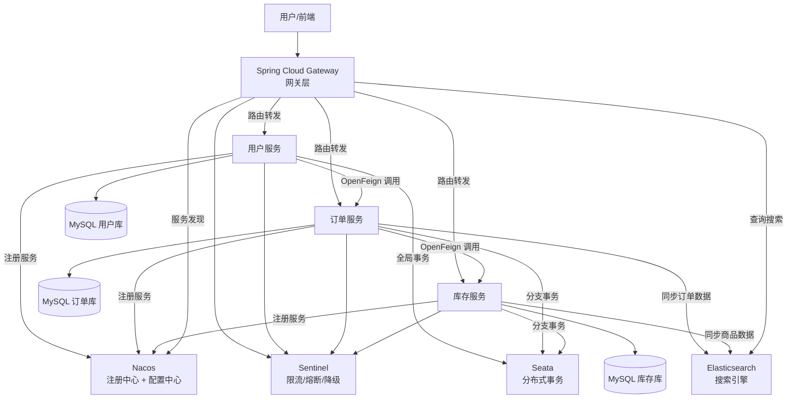
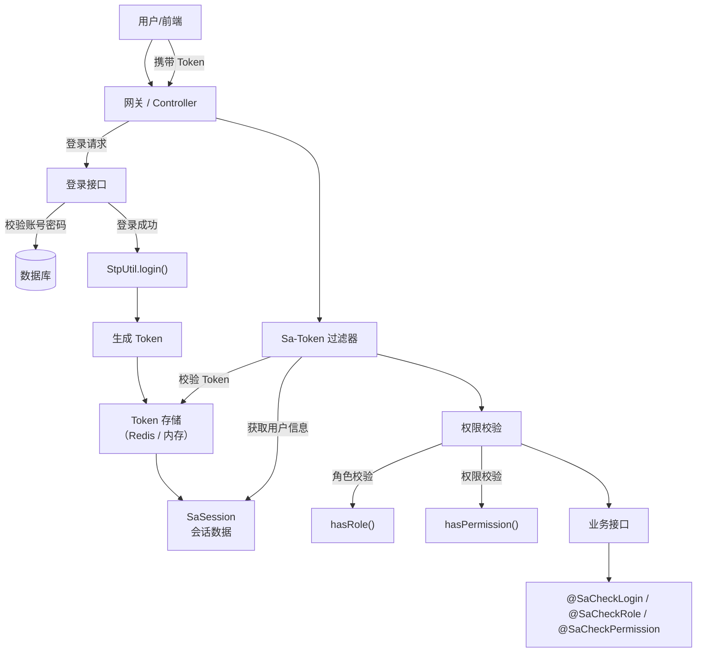
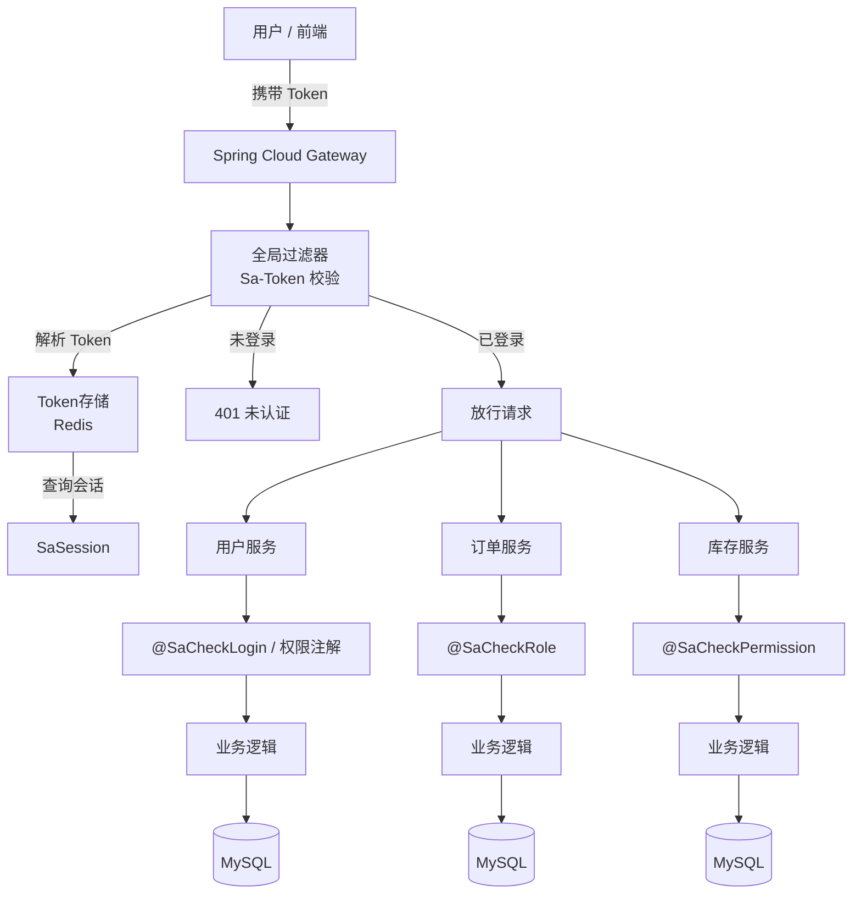
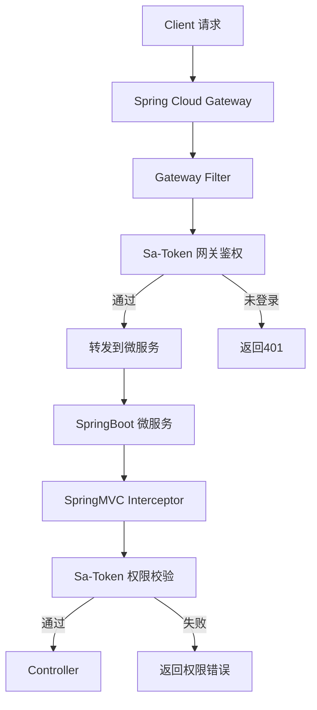
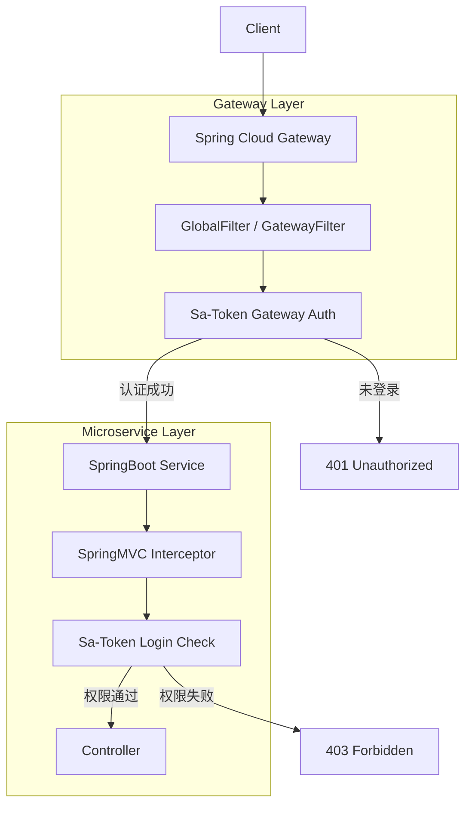
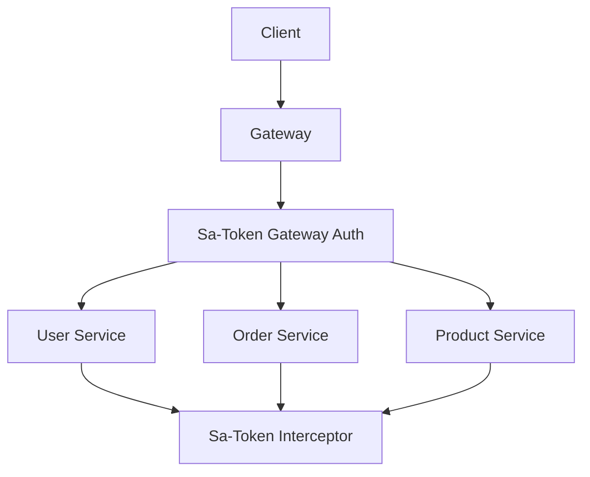
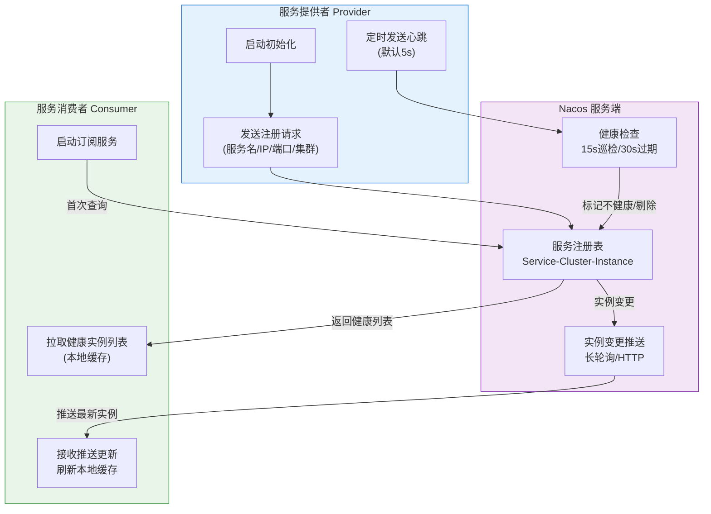
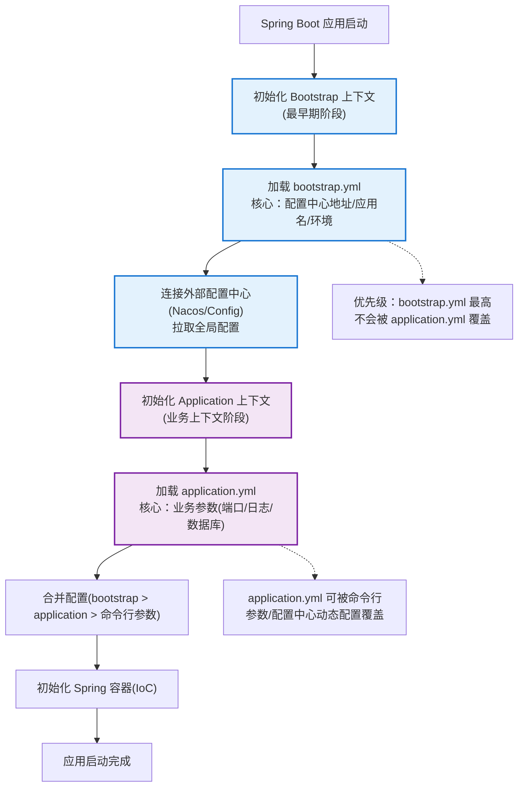
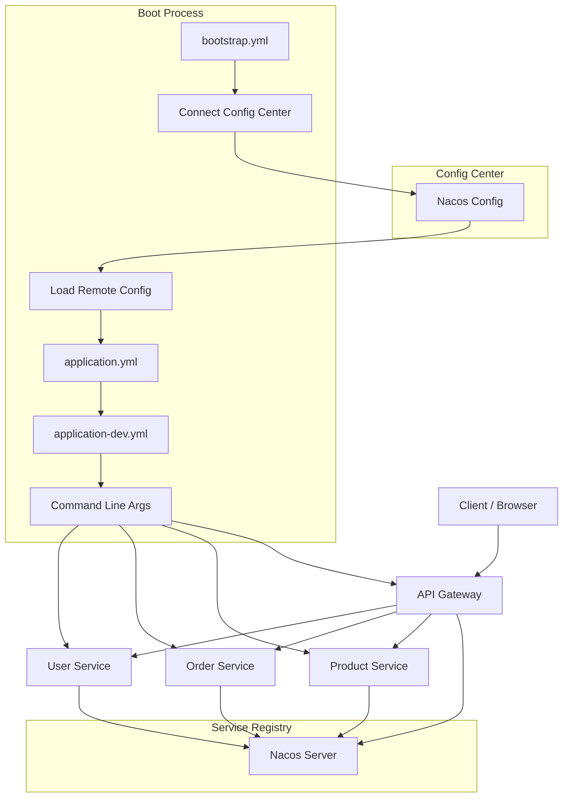

## Spring Cloud 微服务架构关系图

给你一张**面向面试 + 架构理解**的 Spring Cloud 全家桶关系图（包含你提到的 Nacos、OpenFeign、Gateway、ES、Sentinel、Seata），我用 **Mermaid** 帮你画清楚整体调用链👇

------

### 🌐 Spring Cloud 微服务架构关系图



------

### 🧠 一句话理解整个链路（面试必备）

👉 请求流程：

```
用户 → Gateway → 微服务 → 数据库 / ES
```

👉 服务治理：

```
Nacos = 注册中心 + 配置中心
```

👉 服务调用：

```
OpenFeign = 服务间远程调用
```

👉 稳定性：

```
Sentinel = 限流 + 熔断 + 降级
```

👉 数据一致性：

```
Seata = 分布式事务控制
```

------

### 🔥 各组件“人话版”理解

#### 1️⃣ Gateway（网关）

👉 相当于：**系统门卫**

- 统一入口
- 路由转发
- 鉴权 / 限流

------

#### 2️⃣ Nacos

👉 相当于：**通讯录 + 配置中心**

- 服务注册（谁在哪）
- 服务发现（我找谁）
- 配置管理（统一配置）

------

#### 3️⃣ OpenFeign

👉 相当于：**远程函数调用（RPC）**

```java
@FeignClient("order-service")
public interface OrderClient {
    @GetMapping("/order/{id}")
    Order getOrder(@PathVariable Long id);
}
```

👉 本质：HTTP + 接口调用

------

#### 4️⃣ Sentinel

👉 相当于：**系统保险丝**

- 限流（防止流量打爆）
- 熔断（服务挂了就断）
- 降级（返回兜底数据）

------

#### 5️⃣ Seata

👉 相当于：**分布式事务协调员**

典型场景：

```
下单 = 扣库存 + 扣余额
```

👉 要么全成功，要么全失败

------

#### 6️⃣ Elasticsearch（ES）

👉 相当于：**搜索引擎 + 高性能查询**

- 商品搜索
- 订单查询
- 日志分析

------

### ⚡ 面试高频问题总结

#### ❓1：Gateway 和 Nginx 区别

- Nginx：偏**基础流量转发**
- Gateway：偏**微服务治理**

------

#### ❓2：Feign 和 RestTemplate 区别

- RestTemplate：手写 HTTP
- Feign：接口式调用（更优雅）

------

#### ❓3：Sentinel vs Hystrix

- Sentinel：阿里主推（现在主流）
- Hystrix：已停止维护

------

#### ❓4：Seata 解决什么问题

👉 分布式事务一致性

------

### 🚀 如果你想更进一步

我可以帮你再画几张“进阶图”：

✅ Spring Cloud **完整调用时序图（请求一步一步走）**
✅ Seata **AT模式执行流程图**
✅ Sentinel **限流算法图（滑动窗口）**
✅ Nacos **注册&心跳机制图**

直接说一句：
👉「进阶版架构图」我给你画一套面试王炸级的 👍

## **Sa-Token 权限认证体系完整关系图**

给你一张**Sa-Token 权限认证体系完整关系图**（面试 + 实战都能用），我帮你把登录、鉴权、Session、Token 全串起来👇

------

### 🌐 Sa-Token 整体架构关系图



------

### 🧠 一句话理解

```text
登录 → 生成Token → 存储 → 请求携带Token → 校验 → 权限判断 → 放行
```

------

### 🔥 核心组件拆解（面试重点）

#### 1️⃣ StpUtil（核心入口）

👉 Sa-Token 的“总控制器”

```java
StpUtil.login(userId);     // 登录
StpUtil.logout();         // 登出
StpUtil.getLoginId();     // 获取当前用户
```

------

#### 2️⃣ Token

👉 用户身份凭证（类似 JWT，但更灵活）

特点：

- 可存 Redis / 内存
- 支持踢人下线
- 支持多端登录

------

#### 3️⃣ SaSession（会话）

👉 存储用户数据

```java
StpUtil.getSession().set("name", "张三");
```

👉 类似：

```text
HttpSession 的升级版
```

------

#### 4️⃣ 权限控制（两种方式）

##### ✅ 编程式

```java
StpUtil.checkPermission("user:add");
StpUtil.checkRole("admin");
```

------

##### ✅ 注解式（推荐）

```java
@SaCheckLogin
@SaCheckRole("admin")
@SaCheckPermission("user:add")
```

------

#### 5️⃣ 过滤器 / 拦截器

👉 自动做这些事：

- Token 校验
- 是否登录
- 权限验证

------

### ⚡ Sa-Token vs Spring Security（面试必问）

| 对比     | Sa-Token            | Spring Security |
| -------- | ------------------- | --------------- |
| 上手难度 | ⭐ 简单              | ❌ 复杂          |
| 灵活性   | ⭐⭐⭐⭐⭐               | ⭐⭐⭐             |
| 功能     | 认证 + 权限 + 会话  | 全家桶（偏重）  |
| 适合     | 中小项目 / 快速开发 | 大型复杂系统    |

------

### 🚀 典型请求流程（面试说这个直接加分）

#### 🧾 登录流程

```text
1. 用户输入账号密码
2. 后端校验成功
3. 调用 StpUtil.login(userId)
4. 生成 Token
5. 返回给前端
```

------

#### 🔁 访问流程

```text
1. 前端携带 Token
2. 进入 Sa-Token 过滤器
3. 校验 Token 是否有效
4. 校验权限
5. 放行到业务接口
```

------

#### ❌ 未登录 / 无权限

```text
→ 抛出异常
→ 全局异常处理
→ 返回 401 / 403
```

------

### 🧩 实战架构（你做项目可以这么用）

```text
Spring Boot
 + Sa-Token
 + Redis（存Token）
 + MySQL（用户数据）
 + Gateway（统一鉴权）
```

------

### 💡 你可以再升级一层（我可以帮你画）

如果你要冲**面试高分 / 架构进阶**，我可以再帮你画：

✅ Sa-Token + Gateway **统一认证架构图**
✅ Sa-Token + JWT **对比架构图**
✅ Sa-Token **多端登录（PC + App）图**
✅ Sa-Token + Redis **分布式会话图**

直接说一句：
👉「进阶版 Sa-Token」我给你整一套更炸的 💥

##  Sa-Token + Gateway 统一认证

好，这一张是**面试含金量非常高的架构图** 👉
👉 **Sa-Token + Gateway 统一认证（微服务必备方案）**

我帮你把**认证前移到网关层 + 服务内部细粒度鉴权**全部串起来👇

------

### 🌐 Sa-Token + Gateway 统一认证架构图



------

### 🧠 一句话理解（面试直接背）

```text
Gateway做“统一认证”，微服务做“权限控制”
```

------

### 🔥 核心设计思想（非常重要）

#### ✅ 1️⃣ 为什么要“认证前移到 Gateway”

👉 本质：**减少重复代码 + 提升性能**

传统问题：

```text
每个微服务都要写一遍登录校验 ❌
```

现在：

```text
Gateway统一校验一次 ✅
```

------

#### ✅ 2️⃣ 职责划分（面试重点）

| 层级    | 负责什么                    |
| ------- | --------------------------- |
| Gateway | 是否登录（Token是否合法）   |
| 微服务  | 是否有权限（角色 / 权限点） |

------

### ⚡ 完整请求流程（建议你背）

#### 🔁 正常请求流程

```text
1. 用户登录 → 获取 Token
2. 请求携带 Token → 进入 Gateway
3. Gateway 全局过滤器校验 Token
4. 校验成功 → 转发到微服务
5. 微服务通过 @SaCheckPermission 做权限校验
6. 通过 → 返回数据
```

------

### ❌ 异常流程

#### 🚫 Token 无效

```text
→ Gateway直接拦截
→ 返回 401
```

#### 🚫 权限不足

```text
→ 微服务抛异常
→ 返回 403
```

------

### 🧩 核心代码（面试加分点）

#### ① Gateway 全局过滤器（统一认证）

```java
@Component
public class SaTokenGlobalFilter implements GlobalFilter {

    @Override
    public Mono<Void> filter(ServerWebExchange exchange, GatewayFilterChain chain) {

        try {
            // 校验是否登录
            StpUtil.checkLogin();
        } catch (Exception e) {
            // 未登录
            exchange.getResponse().setStatusCode(HttpStatus.UNAUTHORIZED);
            return exchange.getResponse().setComplete();
        }

        return chain.filter(exchange);
    }
}
```

------

#### ② 微服务权限控制

```java
@RestController
public class OrderController {

    @SaCheckPermission("order:create")
    @PostMapping("/order")
    public String createOrder() {
        return "创建订单成功";
    }
}
```

------

### 🚀 架构升级（高级玩法）

#### 🔥 1️⃣ Token 透传优化

Gateway 校验后，把用户信息传给下游：

```text
Header:
X-User-Id
X-User-Role
```

👉 微服务无需再查 Token（性能提升）

------

#### 🔥 2️⃣ Redis 集群（分布式）

```text
Token → Redis
Session → Redis
```

👉 支持：

- 多实例
- 横向扩展

------

#### 🔥 3️⃣ 单点登录（SSO）

```text
多个系统共享一套 Token
```

------

#### 🔥 4️⃣ 多端登录控制

```text
PC / App / 小程序 独立 Token
```

------

### ⚔️ 面试高频问题

#### ❓ Gateway 能不能做权限控制？

👉 可以，但不推荐：

```text
Gateway → 粗粒度（是否登录）
Service → 细粒度（权限点）
```

------

#### ❓ 为什么不用 JWT？

👉 对比：

|        | Sa-Token       | JWT    |
| ------ | -------------- | ------ |
| 可控性 | ✅ 强（可踢人） | ❌ 弱   |
| 存储   | Redis          | 无状态 |
| 实时性 | ✅              | ❌      |

------

#### ❓ Token 存哪里？

```text
Redis（推荐） > 内存
```

------

### 🎯 一句话总结（面试王炸）

```text
Sa-Token + Gateway = 统一认证 + 分布式权限控制 + 高性能鉴权体系
```

------

如果你下一步想冲更高阶，我可以帮你再画👇

✅ **Sa-Token + Spring Cloud 全家桶（终极架构图）**
✅ **登录 → Token → Redis → 权限 → Gateway 全流程时序图（超清晰）**
✅ **多租户 + 多角色 + RBAC 权限模型图**

直接说一句：
👉「终极架构图」我给你整一张能吊打面试官的 💥

## 认证: **Gateway → Filter → 微服务 → Interceptor** 的层级处理

在 **Sa-Token + Spring Cloud** 微服务体系中，认证通常会经过 **Gateway → Filter → 微服务 → Interceptor** 的层级处理。
其中 **Spring Cloud Gateway** 负责统一入口，Sa-Token 在 **网关层和服务层** 都可以进行鉴权。

下面给出完整关系结构。

------

### 一、Sa-Token 在 SpringCloud 中的调用链



------

### 二、整体架构关系图



------

### 三、各组件职责

| 层级   | 组件             | 作用          |
| ------ | ---------------- | ------------- |
| 网关层 | Gateway          | 统一入口      |
| 网关层 | Filter           | 请求过滤      |
| 网关层 | Sa-Token Gateway | Token 校验    |
| 服务层 | Interceptor      | MVC 拦截      |
| 服务层 | Sa-Token         | 登录/权限验证 |
| 服务层 | Controller       | 业务处理      |

------

### 四、请求完整执行流程

```text
1 用户请求
      │
      ▼
2 Spring Cloud Gateway
      │
      ▼
3 Gateway Filter
      │
      ▼
4 Sa-Token Token 校验
      │
      ├── 未登录 → 返回 401
      │
      ▼
5 转发到微服务
      │
      ▼
6 SpringMVC Interceptor
      │
      ▼
7 Sa-Token 权限校验
      │
      ├── 权限不足 → 403
      │
      ▼
8 Controller
      │
      ▼
9 返回数据
```

------

### 五、为什么要两层鉴权（面试重点）

原因：

#### 1️⃣ 网关层

统一认证

```text
未登录请求
直接拦截
减少微服务压力
```

#### 2️⃣ 服务层

细粒度权限

```text
角色
权限
菜单
接口级控制
```

------

### 六、Sa-Token 微服务推荐架构



------

### 七、面试总结（一句话）

**Sa-Token 在 Spring Cloud 中通常采用 “Gateway Filter + Service Interceptor” 双层鉴权架构：网关负责登录校验，微服务负责权限校验。**

## **一、Spring Cloud 基础概念**

1. 什么是微服务架构？Spring Cloud 在微服务中扮演什么角色？
2. Spring Cloud 的核心模块有哪些？分别简述作用。
3. 服务注册与发现（Nacos）原理是什么？
4. Spring Cloud Config 的作用是什么？如何实现配置中心管理？
5. Spring Cloud Bus 的作用是什么？它如何实现配置刷新？
6. Spring Cloud Gateway 与 Zuul 有什么区别？
7. 什么是服务熔断和降级？为什么微服务需要它？
8. Spring Cloud Sleuth 的作用是什么？如何实现链路追踪？


### 1️⃣ 什么是微服务架构？Spring Cloud 在微服务中扮演什么角色？

**答案要点：**

- **微服务架构（Microservices Architecture）**：
  - 将单体应用拆分为多个小型、独立服务，每个服务有自己的业务功能、数据库、部署单元。
  - 服务之间通过轻量级通信（通常是 HTTP/REST、gRPC、消息队列）协作。
  - 优势：可独立部署、可扩展、易维护。
- **Spring Cloud 的作用**：
  - 提供微服务常用组件（注册中心、配置中心、负载均衡、熔断器、网关等）。
  - 简化微服务开发、部署和运维。
  - 集成了 Netflix OSS、Spring Boot、Spring Security 等生态，实现快速微服务开发。

#### HTTP/REST、gRPC、消息队列

这是一个非常经典、面试也常问的问题：
**OpenFeign 确实是微服务之间常用的调用方式，但它本质上只是对 REST+HTTP 的封装，并不是唯一方案，更不能替代 gRPC 和消息队列。**

---

##### 1. OpenFeign 到底是什么？

OpenFeign = **声明式 REST 客户端**
底层还是：
**HTTP + JSON + 同步阻塞调用**

它的特点：
- 简单、通用、跨语言友好
- 适合**同步、实时、强依赖**的接口调用
- 开发成本低，Spring Cloud 全家桶默认方案

但它有明显短板：
- 性能一般（HTTP 头大、JSON 序列化慢）
- 只能**同步调用**，不能异步解耦
- 高并发下容易产生**链式阻塞、雪崩**

所以：
**OpenFeign 解决的是“方便地调用 REST 接口”，不是解决所有微服务通信问题。**

---

##### 2. 为什么还要 gRPC？

gRPC 是基于 **HTTP/2 + Protocol Buffers** 的高性能 RPC 框架。

和 Feign/REST 相比优势非常明显：
- 更快：二进制协议，体积小、序列化快
- 支持**流式传输**（客户端流、服务端流、双向流）
- 强类型契约，不易出错
- 长连接、低延迟，适合高并发内部调用

###### 适用场景

- 内部服务高频调用
- 大数据量、低延迟要求高
- 跨语言微服务（Java ↔ Go ↔ C++ 等）
- 流媒体、日志上报、消息推送等

简单说：
**Feign 是通用方便，gRPC 是高性能内部通信。**

---

##### 3. 为什么还要消息队列（MQ）？

MQ（RabbitMQ / Kafka / RocketMQ）解决的是**异步、解耦、削峰、最终一致性**。

它和 Feign/gRPC 有本质区别：
- Feign/gRPC：**同步调用**（A 调用 B，必须等 B 返回）
- MQ：**异步通信**（A 发消息，不等待 B 处理）

###### MQ 解决的核心问题

1. **服务解耦**
   A 不直接依赖 B，B 挂了不影响 A 继续运行
2. **流量削峰**
   秒杀、下单突增流量，先入队列慢慢消费
3. **异步提速**
   不需要实时返回的操作（发短信、日志、统计）异步处理
4. **流量削峰、错峰处理**
   保护下游不被打崩
5. **最终一致性**
   分布式事务柔性方案

##### 典型场景

- 下单成功 → 发送 MQ → 积分、物流、通知异步执行
- 日志收集、用户行为埋点
- 跨服务数据同步、缓存更新

一句话：
**同步用 Feign/gRPC，异步解耦削峰用 MQ。**

---

##### 4. 三者关系总结（最清晰版）

| 方式        | 本质                         | 通信模型  | 适用场景                     |
| ----------- | ---------------------------- | --------- | ---------------------------- |
| OpenFeign   | REST/HTTP 同步调用           | 同步实时  | 简单业务、强依赖、实时查询   |
| gRPC        | HTTP/2 + Protobuf 高性能 RPC | 同步/流式 | 内部高频、高性能、跨语言     |
| 消息队列 MQ | 异步消息                     | 异步解耦  | 削峰、异步、解耦、最终一致性 |

---

##### 5. 一句话回答你的疑惑

- **OpenFeign 只是 REST 的简化工具，不是通信底层**
- **gRPC 替代的是 REST/Feign，追求更高性能**
- **消息队列解决的是同步调用解决不了的异步、解耦、削峰问题**

所以微服务通信不是“只用一种”，而是**根据场景组合使用**。

---

如果你需要，我可以帮你画一张**微服务通信架构图**，把 Feign、gRPC、MQ、网关、注册中心放一起，一眼看懂整个流程。

#### OpenFeign/gRPC

**是的，在Java/Spring Cloud微服务生态里，OpenFeign的实际使用率确实远高于gRPC**，但这不是因为gRPC不好，而是**场景、成本、生态成熟度**共同决定的结果。

##### 一、为什么OpenFeign用得更多（核心原因）

###### 1. 生态绑定，开箱即用（最关键）

- OpenFeign是**Spring Cloud官方标配**，与Eureka/Nacos、Sentinel、Ribbon/LoadBalancer、Hystrix/Resilience4j无缝集成。
- 写一个`@FeignClient`接口，5分钟就能完成服务调用，**零额外学习成本**。
- 完全复用Spring MVC的注解、参数校验、异常处理，**团队上手成本极低**。

###### 2. 开发/调试/运维成本低

- **HTTP+JSON**：抓包、Postman、浏览器直接调试，问题定位快。
- 无IDL、无代码生成、无编译依赖，**改完接口直接跑**。
- 线上监控、日志、链路追踪（SkyWalking/Pinpoint）对HTTP友好，**成熟度高**。

###### 3. 性能“够用”

- 大多数业务场景（CRUD、普通接口），**Feign性能完全满足**。
- 只有**千万级QPS、核心链路、低延迟强要求**时，gRPC的性能优势才会凸显。

###### 4. 团队技术栈惯性

- 绝大多数Java团队熟悉HTTP/REST，**gRPC需要额外学习Protobuf、HTTP/2、代码生成**。
- 中小公司/项目，**不愿为“潜在性能收益”投入额外成本**。

---

##### 二、gRPC为什么“使用率低但不可替代”

###### 1. 性能碾压（但有场景门槛）

- gRPC = **HTTP/2多路复用 + Protobuf二进制序列化**，性能通常是Feign的**2–5倍**，带宽节省60%+。
- 适合：**高频调用、大数据量、低延迟、高并发**的核心链路（如订单↔库存、用户↔风控）。

###### 2. 强类型契约，接口更稳

- 用`.proto`定义接口，**强类型、自动生成代码、版本兼容好**，适合跨团队、跨语言服务。

###### 3. 流式通信（Feign做不到）

- 支持**双向流、服务端推送、大数据流式传输**（如日志上报、实时监控、AI流式响应）。

###### 4. 跨语言友好

- gRPC原生支持Java/Go/C++/Python等，**多语言微服务架构首选**。

---

##### 三、真实选型现状（2026年）

###### 1. 绝大多数项目：Feign为主

- **中小公司、普通业务**：100%用OpenFeign，**gRPC几乎不用**。
- **中大型公司、非核心链路**：Feign为主，**gRPC仅用于核心高频场景**。

###### 2. 头部/高并发项目：混合架构（最常见）

- **对外API**：REST/Feign → 网关 → 前端。
- **内部普通调用**：OpenFeign（简单、易调试）。
- **核心高频链路**：gRPC（性能优先）。
- **异步/解耦**：消息队列（Kafka/RocketMQ）。

###### 3. 极端场景：gRPC全面替代

- **千万级QPS、低延迟要求极高**（如抖音、电商核心交易）：**内部全面gRPC**，网关做HTTP→gRPC转换。

---

##### 四、一句话总结选型

- **OpenFeign**：**生态好、开发快、调试易、够用** → 使用率**极高**（90%+场景）。
- **gRPC**：**性能强、强类型、流式、跨语言** → 使用率**低但关键**（核心链路/高并发）。

简单说：**能用Feign就用Feign，性能扛不住/有特殊需求才上gRPC**。

需要我给你做一份**Feign vs gRPC**的选型决策清单，帮你快速判断项目该用哪个吗？

------

### 2️⃣ Spring Cloud 的核心模块有哪些？分别简述作用。

**常见模块与作用**：

| 模块                                              | 作用                            |
| ------------------------------------------------- | ------------------------------- |
| **Nacos/Eureka / Consul / Zookeeper**             | 服务注册与发现                  |
| **SpringCloud LoaderBalancer/Ribbon(旧版已弃用)** | 客户端负载均衡                  |
| **OpenFeign**                                     | 声明式服务调用（REST 调用封装） |
| **Sentinel/Hystrix / Resilience4j**               | 服务熔断与降级                  |
| **Spring Cloud Config**                           | 配置中心管理                    |
| **Spring Cloud Bus**                              | 分布式事件总线、配置刷新        |
| **Gateway / Zuul**                                | API 网关、路由与过滤            |
| **Sleuth / Zipkin**                               | 分布式链路追踪                  |
| **Spring Cloud Stream**                           | 消息驱动微服务通信              |
| **Spring Cloud Security**                         | 微服务安全、鉴权                |


Spring Cloud 是基于 Spring Boot 的微服务开发套件，核心目标是解决微服务架构中的**服务治理、通信、容错、监控、安全**等核心问题。下面先对核心模块做详细拆解，再分析主流组件（Nacos/LoadBalancer/Sentinel/Seata）的选型逻辑。

---

#### 一、核心模块详细介绍（含功能+区别）

##### 1. 服务注册与发现（核心基石）

###### 核心作用

解决微服务架构中「服务地址动态管理」问题：服务启动时自动注册到注册中心，调用方无需硬编码地址，直接从注册中心获取可用服务列表。
###### 主流组件对比

| 组件      | 核心特性                                                     | 区别/适用场景                                       |
| --------- | ------------------------------------------------------------ | --------------------------------------------------- |
| Nacos     | 一站式（注册中心+配置中心）、AP+CP双模式、动态配置、易用性高 | 阿里开源，Spring Cloud Alibaba 核心，国内主流       |
| Eureka    | AP 模式（高可用）、无主从、自我保护机制                      | Netflix 开源，已停更，适合传统 Spring Cloud 体系    |
| Consul    | CP 模式（强一致性）、支持健康检查、KV 存储                   | 跨平台，适合对一致性要求高的场景，配置稍复杂        |
| Zookeeper | CP 模式、基于 ZAB 协议、性能高                               | 需自行封装注册发现逻辑，适合大数据生态（如 Hadoop） |


##### 2. 客户端负载均衡

###### 核心作用

从注册中心获取服务列表后，在调用方（客户端）实现请求分发，避免单个服务节点过载，提升系统可用性。
###### 主流组件对比

| 组件         | 核心特性                                             | 区别/适用场景                        |
| ------------ | ---------------------------------------------------- | ------------------------------------ |
| LoadBalancer | Spring 官方维护、轻量、支持多种负载策略（轮询/随机） | 替代 Ribbon，Spring Cloud 2020+ 标配 |
| Ribbon       | Netflix 开源、功能丰富、支持自定义策略               | 已弃用，仅老项目维护使用             |

##### 3. 声明式服务调用

###### 核心作用

封装 HTTP 远程调用（REST），通过注解简化服务间通信（无需手动编写 HttpClient/OkHttp 代码），整合负载均衡自动分发请求。
###### 核心组件：OpenFeign

- 底层基于 `RestTemplate` + 负载均衡组件（LoadBalancer/Ribbon）；
- 注解式编程：`@FeignClient("service-name")` 声明调用目标服务，方法注解映射 HTTP 接口（`@GetMapping`/`@PostMapping`）；
- 支持请求/响应编解码、拦截器、熔断降级整合（与 Sentinel/Hystrix 联动）。

##### 4. 服务熔断与降级

###### 核心作用

解决微服务调用中的「雪崩效应」：当某个服务故障时，快速失败并返回兜底结果，避免故障扩散到整个链路。
###### 主流组件对比

| 组件         | 核心特性                                                 | 区别/适用场景                                   |
| ------------ | -------------------------------------------------------- | ----------------------------------------------- |
| Sentinel     | 阿里开源、流量控制+熔断降级+系统保护、控制台可视化、轻量 | 国内主流，支持多维度限流（QPS/线程数/热点参数） |
| Hystrix      | Netflix 开源、熔断+降级+舱壁模式                         | 已停更，仅老项目使用                            |
| Resilience4j | 轻量、函数式编程、支持熔断/限流/重试                     | 适合 Spring Boot 2.x 新项目，国外使用较多       |

##### 5. 配置中心

###### 核心作用

集中管理所有微服务的配置（如数据库连接、业务参数），支持配置动态刷新（无需重启服务），区分环境（dev/test/prod）。
###### 主流组件对比

| 组件                | 核心特性                                      | 区别/适用场景                            |
| ------------------- | --------------------------------------------- | ---------------------------------------- |
| Nacos Config        | 与 Nacos 注册中心一体化、热更新、配置版本管理 | 国内主流，无需额外部署独立组件           |
| Spring Cloud Config | 基于 Git 存储配置、需配合 Bus 实现刷新        | 原生 Spring Cloud 组件，配置存储依赖 Git |

##### 6. 分布式事件总线（Spring Cloud Bus）

###### 核心作用

基于消息队列（Kafka/RabbitMQ）实现微服务间的事件通信，最常用场景是「配置中心刷新」：修改配置后，通过 Bus 广播通知所有服务刷新配置。
###### 关键特点

- 解耦服务间通信，无需点对点调用；
- 常与 Config/Nacos 配合使用，替代手动逐个重启服务。

##### 7. API 网关

###### 核心作用

微服务的「统一入口」：路由转发（将请求分发到对应服务）、过滤（鉴权/日志/限流）、跨域处理、协议转换。
###### 主流组件对比

| 组件    | 核心特性                                    | 区别/适用场景                                        |
| ------- | ------------------------------------------- | ---------------------------------------------------- |
| Gateway | Spring 官方、基于 WebFlux（非阻塞）、性能高 | 2020+ 主流，支持动态路由、整合 LoadBalancer/Sentinel |
| Zuul    | Netflix 开源、基于 Servlet（阻塞）          | 已弃用，Zuul 2 未纳入 Spring Cloud 体系              |

##### 8. 分布式链路追踪

###### 核心作用

追踪微服务调用链路（如 A→B→C 的调用流程），定位慢请求/故障节点，核心是「TraceID（全局链路ID）+ SpanID（节点ID）」。
###### 主流组件

- Sleuth：生成 TraceID/SpanID，埋点到日志中；
- Zipkin：收集链路数据，可视化展示调用耗时/拓扑。

结合你补充的核心要点，我帮你把分布式链路追踪的内容梳理得更完整（含核心原理、组件协作、国内选型、落地示例），既保留核心概念，又补充实战层面的关键信息：

###### 一、核心作用（补充落地价值）

- 基础：生成全局唯一 `TraceID`（标识一次完整请求链路）和 `SpanID`（标识链路中每个服务/方法节点），串联跨微服务的调用流程（如 A→B→C）；
- 核心价值：
  1. 故障定位：通过 `TraceID` 快速检索全链路日志，定位哪个服务/节点抛出异常；
  2. 性能优化：可视化展示每个 `Span` 的耗时，找到链路中的慢请求节点（如 B 服务接口响应耗时 5s）；
  3. 拓扑分析：展示微服务间的调用关系和频次，发现不合理的调用依赖。

###### 二、核心概念（通俗解释）

| 概念     | 作用                                                         |
| -------- | ------------------------------------------------------------ |
| TraceID  | 全局链路ID，一次请求（如用户下单）从入口到结束，所有相关服务共用同一个 TraceID |
| SpanID   | 节点ID，标识链路中单个服务/方法的调用（如订单服务调用库存服务的 SpanID） |
| ParentID | 父SpanID，标识 Span 之间的调用关系（如库存服务的 SpanID 是订单服务 SpanID 的子节点） |

###### 四、国内主流选型（补充实战建议）

| 组合方案                           | 适用场景                           | 优缺点                                                      |
| ---------------------------------- | ---------------------------------- | ----------------------------------------------------------- |
| Sleuth + Zipkin                    | 中小团队、Spring Cloud 2.x 老项目  | 轻量易部署，但功能较基础                                    |
| Apache SkyWalking                  | 中大型企业、国产化需求、全链路监控 | 无侵入（Agent 方式）、功能全（链路+APM+日志联动），国内主流 |
| Micrometer Tracing + Zipkin/Jaeger | Spring Boot 3.x 新项目             | 官方新标准，替代 Sleuth                                     |

###### 总结

1. 分布式链路追踪的核心是 `TraceID`（全局标识）+ `SpanID`（节点标识），解决微服务调用“链路不可见”问题；
3. 国内实战中，中大型项目优先选 Apache SkyWalking（功能更全、无侵入），Spring Boot 3.x 新项目选 Micrometer Tracing 替代 Sleuth。

##### 9. 消息驱动微服务（Spring Cloud Stream）

###### 核心作用

封装 Kafka/RabbitMQ 等消息中间件，提供统一的消息收发接口，解耦生产者和消费者，支持消息分组/分区。

##### 10. 微服务安全（Spring Cloud Security）

###### 核心作用

整合 Spring Security/OAuth2.0，实现微服务鉴权（如 token 验证）、授权（基于角色的访问控制）、单点登录（SSO）。

##### 11. 分布式事务（Seata）

###### 核心作用

解决微服务跨库操作的「数据一致性」问题（如订单服务+库存服务的原子性操作），补充 Spring Cloud 原生无分布式事务的短板。
###### 核心模式

- AT 模式（主流）：无侵入，基于本地事务+补偿；
- TCC 模式：手动编码 Try/Confirm/Cancel，灵活性高；
- SAGA 模式：长事务拆分，支持补偿。

---

#### 二、为什么常用 Nacos/LoadBalancer/Sentinel/Seata？

##### 1. Nacos：一站式解决方案，性价比最高

- **一站式能力**：同时支持「服务注册发现 + 配置中心」，无需分别部署 Eureka + Config + Bus，减少组件运维成本；
- **高可用性**：支持 AP/CP 模式切换（Eureka 仅 AP，Consul 仅 CP），适配不同业务场景（如金融场景选 CP，电商选 AP）；
- **本土化优势**：阿里开源，中文文档齐全，国内社区活跃，适配 Spring Cloud Alibaba 生态，解决国外组件（Eureka/Consul）停更、适配差的问题；
- **易用性**：自带可视化控制台，配置热更新、服务健康检查、权重调整等功能开箱即用，学习成本低。

##### 2. Spring Cloud LoadBalancer：官方标配，轻量稳定

- **官方维护**：Ribbon 已被 Netflix 弃用，Spring 官方推出 LoadBalancer 作为替代，长期维护有保障；
- **轻量无侵入**：无缝整合 Spring Cloud 体系，支持与 OpenFeign 联动（Feign 自动集成 LoadBalancer），无需额外配置；
- **灵活扩展**：支持自定义负载策略（轮询/随机/加权轮询），适配不同的流量分发需求；
- **性能优化**：基于 Spring Boot 2.x 重构，适配非阻塞编程模型，性能优于 Ribbon。

##### 3. Sentinel：全方位流量治理，适配国内场景

- **功能全面**：不仅支持熔断降级（替代 Hystrix），还提供流量控制（QPS/线程数/热点参数限流）、系统负载保护、黑白名单等，覆盖「熔断+限流+降级」全场景；
- **可视化控制台**：实时监控流量、熔断状态，支持动态调整规则（无需重启服务），运维成本低；
- **本土化适配**：阿里开源，适配国内电商秒杀、大促等高并发场景，支持 Dubbo/Spring Cloud 等多框架；
- **轻量高效**：核心库仅几十 KB，对服务性能影响极小，相比 Hystrix 资源占用更低。

##### 4. Seata：解决分布式事务痛点，易用性高

- **Spring Cloud 原生短板补充**：Spring Cloud 核心组件未提供分布式事务解决方案，Seata 是阿里开源的专用组件，适配 Spring Cloud 生态；
- **低侵入性**：AT 模式无需修改业务代码，仅需加注解（`@GlobalTransactional`），学习和开发成本远低于 TCC 手动编码；
- **性能优异**：相比传统 2PC 事务，AT 模式基于本地事务+日志补偿，性能损耗低，支持高并发场景；
- **生态整合**：无缝整合 Spring Cloud、MyBatis、MySQL 等主流技术栈，适配微服务常见的数据库操作场景。

---

#### 总结

1. **选型核心逻辑**：国内微服务选型优先「本土化、一站式、易维护」，Nacos/LoadBalancer/Sentinel/Seata 均符合这一特点，且由大厂维护、社区活跃；
2. **组件互补性**：Nacos 解决注册/配置问题，LoadBalancer 解决负载均衡，Sentinel 解决容错限流，Seata 解决分布式事务，共同覆盖微服务核心痛点；
3. **对比优势**：相比国外组件（Eureka/Ribbon/Hystrix），这些组件更适配国内业务场景（高并发、大促），且无停更风险，是 Spring Cloud Alibaba 生态的核心标配。

#### **AP / CP**

这里的 **AP / CP** 就是 **CAP 定理**里的那两个，面试必考，我用最直白、能直接背的话讲给你。

##### 先说结论

- **AP 模式**：Nacos 默认模式 → **保证高可用、最终一致**
- **CP 模式**：Nacos 可选模式 → **保证强一致、牺牲部分可用性**

---

##### 1. CAP 定理快速回忆（30 秒懂）

分布式系统只能三选二：
- **C（Consistency）**：强一致性 —— 所有节点同一时间数据完全一样
- **A（Availability）**：高可用 —— 服务永远能访问，不报错
- **P（Partition tolerance）**：分区容错 —— 网络断了也能继续工作

**分布式系统必须保留 P**，所以实际只有两种选择：
- **AP**：A + P → 高可用，但可能短暂不一致
- **CP**：C + P → 强一致，但可能暂时不可用

---

##### 2. Nacos 的 AP 模式（默认）

**适合：服务注册发现**

特点：
- 节点挂了、网络断了 → **服务依然能注册、能发现**
- 数据可能短暂不一致，但最终会同步一致
- 对服务注册来说：**能访问比绝对一致更重要**

一句话：
**注册中心要的是“服务不能断”，所以默认 AP。**

---

##### 3. Nacos 的 CP 模式

**适合：配置中心、需要强一致的数据**

特点：
- 数据必须**所有节点一致**才能写入/读取
- 半数以上节点正常才能工作
- 网络分区时会**拒绝写入**，保证一致

一句话：
**配置不能错，所以要强一致 CP。**

---

##### 4. 你看到那句话的真实含义

> Nacos 一站式（注册中心+配置中心）、AP+CP双模式、动态配置、易用性高

翻译成人话就是：
- **服务注册用 AP 模式**：保证高可用、不宕机
- **配置中心用 CP 模式**：保证配置强一致、不乱
- Nacos 一个组件同时支持两种模式，不用分开部署两套

---

##### 5. 超级好记的总结（面试直接说）

- **AP = 高可用，最终一致** → 服务注册发现用
- **CP = 强一致，可能不可用** → 配置中心用
- **Nacos 最牛的地方就是一个组件同时支持 AP/CP**，不用 Eureka + Config 两套

直接给你最真实、面试也能直接说的结论：

##### 结论

**Nacos 不需要你手动选 AP 还是 CP，它会自动根据场景用不同模式：**
- **服务注册发现 → 自动用 AP 模式**
- **配置中心 → 自动用 CP 模式**

**你不用做任何切换，两种模式同时存在、同时生效。**

---

###### 为什么能同时 AP + CP？

因为 Nacos 内部是**两套独立实现**：

1. **服务注册（Service Discovery）**
   - 采用 **Distro 协议**
   - 特点：最终一致、高可用
   - 对应：**AP 模式**

2. **配置中心（Config Center）**
   - 采用 **Raft 协议**
   - 特点：强一致、选举机制
   - 对应：**CP 模式**

所以：
**Nacos 既是 AP 系统（服务注册），又是 CP 系统（配置），两者互不干扰，同时工作。**

---

###### 用最简单的话记

- **服务注册：AP**
  服务不能断，哪怕数据稍微不一致也没关系，能访问最重要。

- **配置下发：CP**
  配置不能错，必须所有节点一致才能生效，宁可等一会也不能乱。

---

###### 面试标准答案（背这段就行）

Nacos 支持 **AP + CP 双模式统一部署**：
- **服务注册发现**使用 Distro 协议，保证高可用，属于 **AP 模式**；
- **配置中心**使用 Raft 强一致性协议，属于 **CP 模式**；
- 两者独立运行，**不需要手动切换，同时生效**。

---

如果你愿意，我可以顺便帮你对比：
Nacos vs Eureka vs Consul 的 CAP 模式，这是高频面试题。

------

### 3️⃣ 服务注册与发现（Nacos）原理是什么？

**答案要点：**

Nacos服务注册与发现的核心原理是**“服务端存储映射+客户端双向交互”**，通过维护“服务名-实例列表”的映射关系，让服务消费者能实时找到可用的服务提供者，同时确保实例状态准确。

#### 一、核心数据模型：服务注册表

Nacos服务端的核心是**服务注册表**，它是存储所有服务与实例信息的“通讯录”，结构按三层维度组织，确保查询高效：
1. **服务（Service）**：顶层维度，用服务名（如`user-service`）唯一标识，是消费者查找的key。
2. **集群（Cluster）**：中间维度，同一服务可部署在多个集群（如“北京集群”“上海集群”），支持就近调用。
3. **实例（Instance）**：底层维度，每个实例对应一个具体的服务节点，包含IP、端口、健康状态、权重等关键信息（如`192.168.1.101:8080`）。

此外，Nacos支持**数据持久化**：默认用嵌入式数据库（Derby）存储注册表，生产环境可切换为MySQL，避免服务端重启后数据丢失。

#### 二、服务注册流程：Provider主动上报信息

服务提供者（Provider）启动后，会主动向Nacos服务端注册自己的信息，让“通讯录”新增一条记录，流程分3步：
1. **初始化客户端**：Provider引入Nacos客户端依赖后，启动时会读取配置（如Nacos服务端地址、服务名），初始化`NacosNamingService`客户端实例。
2. **发送注册请求**：客户端向Nacos服务端发送HTTP请求，携带完整实例信息（服务名、IP、端口、集群名、健康状态等）。
3. **服务端更新注册表**：
   - 服务端验证请求合法性（如实例是否重复）。
   - 将实例信息写入服务注册表，并更新内存缓存（确保后续查询快）。
   - 触发“数据变更事件”，通知订阅该服务的消费者（Consumer）。

#### 三、服务发现流程：Consumer实时获取实例

服务消费者（Consumer）要调用服务时，需从Nacos获取可用实例列表，流程分“首次拉取+实时更新”两步，确保列表实时性：
1. **首次拉取实例**：
   - Consumer启动时，通过客户端向Nacos服务端发送“订阅请求”，指定要获取的服务名（如`user-service`）。
   - 服务端从注册表中筛选出“健康”的实例（排除下线、故障节点），返回给Consumer，Consumer将列表缓存到本地。
2. **实时更新实例**：
   - 当服务实例发生变更（如新增实例、实例下线、健康状态变化），Nacos服务端会触发“数据变更事件”。
   - 服务端通过**推送机制**（默认HTTP长轮询）主动向所有订阅该服务的Consumer发送最新实例列表。
   - Consumer收到推送后，立即更新本地缓存的实例列表，确保下一次调用时使用最新节点。

#### 四、实例健康检查：确保列表“有效”

Nacos通过“客户端心跳+服务端检查”双重机制，实时剔除故障实例，避免Consumer调用无效节点：
1. **客户端主动心跳**：
   - Provider客户端启动后，会开启定时任务（默认5秒一次），向Nacos服务端发送“心跳包”，携带实例唯一标识和当前健康状态。
   - 服务端收到心跳后，更新该实例的“最后心跳时间”，标记实例为“健康”。
2. **服务端被动检查**：
   - 服务端启动定时任务（默认15秒一次），遍历所有实例，检查“最后心跳时间”。
   - 若某实例超过30秒（默认阈值）未发送心跳，服务端将其标记为“不健康”，从可用实例列表中剔除；若后续恢复心跳，再重新标记为“健康”并加入列表。

#### **Nacos 服务注册与发现完整原理流程图**

我给你画一张**Nacos 服务注册与发现完整原理流程图**，包含：服务注册、心跳、健康检查、服务发现、推送更新全流程，一眼看懂。



---

##### 流程一句话总结

1. **Provider** 启动 → 注册 → 定时**心跳**保活
2. **Nacos** 存注册表 → 健康检查 → 实例变更**主动推送**
3. **Consumer** 订阅 → 拉取列表 → 接收推送**实时更新**

需要我再帮你把这张图**精简成面试口述版**吗？

------

### 4️⃣ Spring Cloud Config 的作用是什么？如何实现配置中心管理？

**答案要点：**

- **作用**：
  - 集中管理微服务配置，支持动态刷新。
  - 支持 Git、SVN、本地文件等作为配置源。
- **实现方法**：
  1. 搭建 **Config Server**：
     - 指定配置仓库路径。
  2. 各微服务作为 **Config Client**：
     - 在 `bootstrap.yml` 或 `bootstrap.properties` 配置服务器地址。
     - 启动时拉取配置。
  3. 可配合 **Spring Cloud Bus** 实现配置刷新：
     - 发布刷新事件，客户端自动更新配置。

------

### 5️⃣ Spring Cloud Bus 的作用是什么？它如何实现配置刷新？

**答案要点：**

- **作用**：
  - 实现微服务之间的事件广播。
  - 支持配置变更的实时通知，刷新客户端配置。
- **工作原理**：
  1. 配置中心更新配置。
  2. 发送 `RefreshRemoteApplicationEvent` 到消息总线（如 Kafka / RabbitMQ）。
  3. 所有客户端收到事件，执行 `@RefreshScope` 配置刷新。

------

### 6️⃣ Spring Cloud Gateway 与 Zuul 有什么区别？

| 特性     | Spring Cloud Gateway           | Zuul               |
| -------- | ------------------------------ | ------------------ |
| 底层     | Spring WebFlux（非阻塞）       | Servlet（阻塞）    |
| 性能     | 高吞吐、低延迟                 | 相对较低           |
| 路由     | Predicate + Filter             | Filter             |
| 功能     | 内置限流、重试、熔断、重写请求 | 需扩展实现高级功能 |
| 适用场景 | 新项目推荐                     | 旧项目或简单路由   |


#### 一、核心区别（补充完整对比表）

| 对比维度     | Spring Cloud Gateway                                         | Zuul（主要指 Zuul 1.x，Zuul 2.x 未纳入 Spring Cloud 体系） |
| ------------ | ------------------------------------------------------------ | ---------------------------------------------------------- |
| **底层架构** | 基于 Spring WebFlux（Reactor 模式），非阻塞 I/O              | 基于 Servlet 2.5/3.0，阻塞式 I/O，每个请求占用一个线程     |
| **性能表现** | 高吞吐、低延迟（异步非阻塞），能支撑高并发                   | 吞吐低、延迟高（同步阻塞），线程池易打满，高并发下性能下降 |
| **核心机制** | 「Predicate（路由断言） + Filter（过滤器）」双核心           | 仅 Filter 机制（分为 Pre/Route/Post/Error 四类）           |
| **路由规则** | 支持丰富的 Predicate（路径、方法、Header、时间、Cookie 等）  | 仅支持简单的路径匹配，复杂规则需自定义 Filter              |
| **高级功能** | 内置限流（基于令牌桶）、重试、熔断（整合 Sentinel/Hystrix）、请求重写、路径重定向 | 所有高级功能（限流/熔断/重试）需手动扩展 Filter 实现       |
| **生态整合** | 无缝整合 Spring Cloud 生态（LoadBalancer/Sentinel/Nacos）    | 整合性弱，需手动适配 Spring Cloud 组件                     |
| **启动速度** | 快（基于 Spring Boot 轻量封装）                              | 慢（依赖 Servlet 容器初始化）                              |
| **配置方式** | 支持代码配置 + 配置文件（YAML/Properties），动态路由（无需重启） | 主要依赖配置文件，动态路由需额外开发                       |
| **异常处理** | 内置全局异常处理机制，易扩展                                 | 异常处理分散在 Filter 中，不易统一管理                     |
| **维护状态** | Spring 官方维护，持续迭代更新                                | Netflix 已停更，Zuul 2.x 未集成到 Spring Cloud 主流版本    |

#### 二、关键差异的通俗解释

##### 1. 底层架构：非阻塞 vs 阻塞（核心性能差异）
- **Zuul**：基于 Servlet 阻塞模型，就像“一个窗口只能处理一个业务”，请求进来后会占用线程直到响应返回，高并发时线程池耗尽，后续请求排队等待，性能瓶颈明显；
- **Gateway**：基于 WebFlux 非阻塞模型，就像“一个窗口能同时处理多个业务”，通过少量线程即可处理大量请求，异步回调机制避免线程阻塞，高并发下性能优势显著。

##### 2. 核心机制：Predicate + Filter 更灵活
- **Gateway**：先通过 Predicate 判断“请求是否匹配某个路由”（比如“路径以 /user 开头且请求方法是 GET”），再通过 Filter 处理请求（比如鉴权、限流、添加请求头），逻辑拆分清晰；
- **Zuul**：所有逻辑都在 Filter 中，既要判断路由，又要处理请求，代码耦合度高，复杂场景下易混乱。

##### 3. 功能开箱即用 vs 手动扩展
- **Gateway**：比如要实现“接口限流”，只需配置 `spring.cloud.gateway.filter.request-rate-limiter` 即可，无需写代码；
- **Zuul**：要实现限流，需自己基于 Guava 令牌桶/漏桶算法写 Filter，开发成本高。

#### 三、选型建议

1. **新项目**：优先选 **Spring Cloud Gateway**
   - 性能优势明显，能支撑高并发场景（如电商秒杀、高流量接口）；
   - 内置丰富功能，减少重复开发；
   - 官方维护，生态整合好，适配 Spring Cloud Alibaba（Nacos/Sentinel）等主流组件。

2. **老项目**：若已使用 Zuul 1.x 且无性能问题
   - 可继续维护，无需强行迁移；
   - 若出现性能瓶颈（如高并发下响应慢、线程池打满），建议逐步迁移到 Gateway。

3. **特殊场景**：
   - 若项目仍基于 Servlet 传统架构，且流量较小，Zuul 1.x 也可临时使用，但不推荐长期依赖；
   - 绝对不要选择 Zuul 2.x（未集成到 Spring Cloud 生态，适配成本极高）。

#### 总结

1. **核心差异**：Gateway 胜在「非阻塞架构+丰富功能+生态整合」，Zuul 1.x 仅适合低流量旧项目；
2. **性能关键**：Gateway 的非阻塞 I/O 是高并发场景下的核心优势，Zuul 的阻塞模型是性能瓶颈；
3. **选型原则**：新项目必选 Gateway，老项目无性能问题可保留 Zuul，有性能问题优先迁移 Gateway。


------

### 7️⃣ 什么是服务熔断和降级？为什么微服务需要它？

**答案要点：**

- **熔断（Circuit Breaker）**：
  - 当某个服务异常或响应超时时，熔断器断开请求，避免雪崩效应。
- **降级（Fallback）**：
  - 在服务不可用时返回备用逻辑或默认值。
- **原因**：
  - 微服务调用链长，某个服务故障可能导致连锁反应。
  - 熔断+降级可以提高系统稳定性和可用性。

------

### 8️⃣ Spring Cloud Sleuth 的作用是什么？如何实现链路追踪？

**答案要点：**

- **作用**：

  - 为分布式系统生成唯一请求 ID（TraceId），方便调用链路跟踪。
  - 与日志系统结合，输出包含 TraceId、SpanId 的日志。

- **实现方法**：

  1. 引入依赖：

     ```xml
     <dependency>
       <groupId>org.springframework.cloud</groupId>
       <artifactId>spring-cloud-starter-sleuth</artifactId>
     </dependency>
     ```

  2. 可与 Zipkin 或 Elastic APM 集成，收集链路数据。

  3. 通过自动注入 TraceId/SpanId 到日志，实现链路追踪。

**Spring Cloud Sleuth 在国内已非主流，且地位正在被「Micrometer Tracing」和国产 APM 取代。** 是否还需要，取决于你的 Spring Cloud 版本与架构选型。

#### 一、国内主流度现状

1.  **生态位被替代**
    Spring Boot 3.0 / Spring Cloud 2022.0.x 及以上版本中，Sleuth 已被官方移除，核心能力迁移至 **Micrometer Tracing**，这是 Spring 官方统一的可观测性标准。新项目应直接使用 Micrometer Tracing，而非 Sleuth。
2.  **国产选型占优**
    国内企业更偏好功能全面、中文友好的国产 APM 工具。**Apache SkyWalking** 凭借无侵入 Agent、服务拓扑、日志联动等特性，成为国内微服务链路追踪的主流选择。Zipkin + Sleuth 的组合更多用于中小团队或传统 Spring Cloud 项目，并非首选。

#### 二、还需要用吗？分场景判断

| 场景                                                  | 是否推荐 | 原因                                                         |
| :---------------------------------------------------- | :------- | :----------------------------------------------------------- |
| **新项目（Spring Boot 3.x / Spring Cloud 2022.0+）**  | ❌ 不推荐 | 官方已弃用，应转向 **Micrometer Tracing + OpenTelemetry**，符合云原生标准。 |
| **存量项目（Spring Boot 2.x / Spring Cloud 2020.x）** | ✅ 可保留 | 稳定兼容，无需强行迁移；但需注意官方不再维护，仅做安全维护。 |
| **云原生/多语言架构**                                 | ❌ 不推荐 | 选择 **OpenTelemetry** 或 **Jaeger** 更具生态通用性。        |
| **国内企业级监控需求**                                | ❌ 不推荐 | 优先选择 **SkyWalking**，其日志联动、服务拓扑、告警等功能更完善，适配国产化场景。 |

#### 三、替代方案与迁移建议

1.  **官方继任者：Micrometer Tracing**
    引入依赖即可启用，与 Spring 生态深度整合，支持与 Zipkin、Jaeger、SkyWalking 等集成。
    ```xml
    <dependency>
        <groupId>io.micrometer</groupId>
        <artifactId>micrometer-tracing</artifactId>
    </dependency>
    <dependency>
        <groupId>io.micrometer</groupId>
        <artifactId>micrometer-tracing-bridge-otel</artifactId>
    </dependency>
    ```
2.  **国产首选：Apache SkyWalking**
    无侵入式 Agent 部署，功能覆盖链路追踪、APM、日志联动，适合国内企业需求。

#### 总结

1.  **核心结论**：Sleuth 已完成历史使命，国内主流选型为 **Micrometer Tracing** 或 **SkyWalking**。
2.  **使用原则**：新项目坚决不用 Sleuth，直接使用 Micrometer Tracing 或 SkyWalking；存量 2.x 项目可继续使用，但计划升级时应同步迁移。
3.  **选型建议**：追求标准选 Micrometer Tracing；追求全面功能和国产适配选 SkyWalking。

需要我给你一个从 Sleuth 迁移到 Micrometer Tracing 的快速迁移清单和关键配置示例吗？

### 9.bootstrap

在Spring Cloud生态中，`bootstrap` 主要指 **bootstrap 上下文** 和 **bootstrap.yml/bootstrap.properties 配置文件**，它是Spring应用启动时的“早期配置入口”，核心作用是加载**外部配置中心（如Nacos、Config Server）的配置**，优先级高于普通的application配置。

#### 一、核心定位：启动早期的“配置引导者”

Spring应用启动时，会先创建两个上下文，`bootstrap` 上下文的启动早于普通的`application`上下文，职责明确：
1. **优先加载**：`bootstrap` 上下文在应用初始化最早期启动，比`@SpringBootApplication`注解的扫描、application配置文件加载都要早。
2. **加载外部配置**：核心任务是通过配置的“配置中心地址、应用名、环境”等信息，从外部配置中心（如Nacos）拉取全局配置（如数据库连接、服务注册地址）。
3. **传递配置**：将拉取到的外部配置注入到`application`上下文，供后续业务逻辑使用，确保应用启动时就能拿到完整配置。

#### 二、关键组件：bootstrap.yml 配置文件

`bootstrap` 上下文的行为由 `bootstrap.yml`（或 `.properties`）控制，它的配置项优先级最高，不会被application配置覆盖，核心配置项如下：

```yaml
# bootstrap.yml 核心配置示例（以Nacos为配置中心）
spring:
  application:
    name: user-service # 应用名（配置中心拉取配置的关键标识）
  cloud:
    nacos:
      config:
        server-addr: 127.0.0.1:8848 # 配置中心地址
        file-extension: yaml # 配置文件格式（yaml/properties）
        namespace: dev # 配置隔离命名空间（如开发环境、生产环境）
        group: DEFAULT_GROUP # 配置分组
  profiles:
    active: dev # 激活的环境（对应配置中心的环境维度，如dev/test/prod）
```
- **核心作用**：通过上述配置，应用启动时会自动向 `127.0.0.1:8848` 的Nacos请求，拉取 `user-service-dev.yaml`（应用名-环境-格式）的配置文件。

#### 三、与 application.yml 的核心区别

很多人会混淆 `bootstrap.yml` 和 `application.yml`，两者的定位和优先级差异明显：

| 对比维度       | bootstrap.yml                          | application.yml                          |
|----------------|----------------------------------------|------------------------------------------|
| 加载时机       | 应用启动最早期（bootstrap上下文阶段）  | bootstrap之后（application上下文阶段）   |
| 优先级         | 最高，不会被其他配置覆盖               | 低于bootstrap，可被外部配置、命令行参数覆盖 |
| 核心作用       | 加载外部配置中心地址，拉取全局配置     | 配置应用自身业务参数（如端口、日志级别） |
| 配置内容       | 配置中心地址、应用名、环境等“启动必需配置” | 业务参数（如server.port、logging.level） |
| 是否必需       | 仅当使用外部配置中心时必需             | 所有Spring Boot应用默认必需              |

##### 加载执行流程图

我为你绘制了 `bootstrap.yml` 和 `application.yml` 的加载执行流程图，清晰展示二者的加载顺序、优先级和核心作用，一眼看懂差异：



##### 流程图核心解读

1. **加载顺序不可逆**：`bootstrap.yml` 是“启动前置配置”，必须在 `application.yml` 之前加载——因为如果需要从配置中心拉取配置，必须先通过 `bootstrap.yml` 知道配置中心的地址，才能加载后续的业务配置；
2. **优先级规则**：`bootstrap.yml` 的配置是“根基配置”，不会被后续的 `application.yml` 或命令行参数覆盖；而 `application.yml` 是“业务配置”，优先级更低，可灵活调整；
3. **核心分工**：
   - `bootstrap.yml` 管“应用怎么启动”（连配置中心、确定环境）；
   - `application.yml` 管“应用启动后做什么”（业务参数、端口等）。

##### 总结

1. 加载时序：`bootstrap.yml` 先于 `application.yml` 加载，是 Spring Boot 启动的“前置配置阶段”；
2. 优先级：`bootstrap.yml` 优先级最高，仅用于配置“启动必需项”（如配置中心地址）；
3. 职责分工：`bootstrap.yml` 对接外部配置中心，`application.yml` 配置应用自身业务参数。


#### 四、适用场景：什么时候需要用 bootstrap？

`bootstrap` 并非所有场景都需要，仅在以下情况必须配置：
1. **使用外部配置中心**：当应用依赖Nacos、Spring Cloud Config等外部配置中心时，必须通过bootstrap配置“配置中心地址、应用名”等信息，否则无法拉取外部配置，导致应用启动失败。
2. **需要早期加载敏感配置**：若某些配置（如加密的数据库密码、API密钥）需在应用启动前加载（如数据源初始化），需通过bootstrap从配置中心拉取，确保启动时可用。
3. **配置隔离与环境区分**：当不同环境（dev/test/prod）的配置存放在配置中心不同命名空间时，通过bootstrap的`spring.profiles.active`和`nacos.config.namespace`实现环境隔离，避免配置混乱。

#### 五、注意点：如何启用 bootstrap 功能？

在Spring Cloud项目中，默认不会自动启用bootstrap上下文，需手动添加依赖（以Spring Cloud Alibaba为例）：
```xml
<!-- pom.xml 引入bootstrap依赖 -->
<dependency>
    <groupId>org.springframework.cloud</groupId>
    <artifactId>spring-cloud-starter-bootstrap</artifactId>
    <!-- 版本由Spring Cloud版本管理，无需手动指定 -->
</dependency>
```
- 若不添加该依赖，`bootstrap.yml` 会被当作普通配置文件，无法触发早期配置拉取逻辑。

### bootstrap现状

**结论：新版（Spring Cloud 2020.0+/Boot 2.4+）默认不用 bootstrap，推荐用 `application.yml + spring.config.import`；老项目/兼容场景可手动启用 bootstrap。**

#### 一、版本分水岭（关键）

- **Spring Boot 2.4 + Spring Cloud 2020.0 (Ilford) 起**：
  - **bootstrap.yml/bootstrap.properties 默认关闭、不自动加载**
  - 官方推荐：**全部写到 application.yml**，用 `spring.config.import` 连配置中心
- **Spring Cloud Alibaba 2025.1.0+（适配 Boot 4.0）**：
  - **彻底移除 bootstrap 支持**，只能用 `spring.config.import`

#### 二、现在怎么用（标准写法）

**Nacos 配置中心（新版推荐）**
```yaml
# application.yml
spring:
  application:
    name: order-service
  cloud:
    nacos:
      config:
        server-addr: 127.0.0.1:8848
  # 关键：替代 bootstrap
  config:
    import:
      - optional:nacos:${spring.application.name}.yaml?refreshEnabled=true
```

**Spring Cloud Config**
```yaml
spring:
  config:
    import: configserver:http://localhost:8888
```

#### 三、非要用 bootstrap（兼容老代码）

1. 加依赖
```xml
<dependency>
    <groupId>org.springframework.cloud</groupId>
    <artifactId>spring-cloud-starter-bootstrap</artifactId>
</dependency>
```
2. 或启动参数/环境变量：
```
-Dspring.cloud.bootstrap.enabled=true
# 或
-Dspring.config.use-legacy-processing=true
```

#### 四、为什么弃用 bootstrap

- 旧：**双上下文（父bootstrap + 主应用）**
  - 启动慢、优先级混乱、调试难
- 新：**单上下文 + spring.config.import**
  - 统一加载、性能更好、配置更清晰

#### 五、一句话选型

- **新项目（Boot 2.4+/3.x/4.x）**：**不用 bootstrap**，全用 `application.yml + spring.config.import`
- **老项目升级**：可加 `spring-cloud-starter-bootstrap` 兼容；建议逐步迁移到新版写法
- **Spring Cloud Alibaba 2025.1+**：**必须移除 bootstrap**，只能用 `import`

要不要我把你现有的 bootstrap.yml 转成新版 application.yml 的可直接复制配置？

### 网关 vs 过滤器 核心区别

先给一句话总结：
**过滤器（Filter）是单体/单个服务内部的请求拦截组件，只作用于当前应用；网关（Gateway）是全局流量入口，拦截所有微服务请求，是跨服务、系统级的统一入口管控。**

#### 一、基础定位与作用范围

##### 1. 过滤器（Filter）

- **层级**：**Web 容器级**（Tomcat、Jetty），属于单个服务内部组件
- **范围**：**只拦截当前项目/单个服务**的请求
- **归属**：Spring Web、Servlet 原生规范
- **位置**：请求进入 Controller **之前**，在同一服务内部链路

##### 2. 网关（Spring Cloud Gateway）

- **层级**：**微服务全局流量入口**，独立的单独服务
- **范围**：拦截**所有微服务**的请求，统一入口路由转发
- **归属**：Spring Cloud 微服务生态、中间件层
- **位置**：所有微服务最前端，请求先过网关，再转发到具体业务服务

---

#### 二、核心职责对比

##### 过滤器 Filter 能干什么

只做**单服务内**通用处理：
1. 统一编码、跨域、请求头/响应头修改
2. 单点登录校验、局部权限拦截
3. 请求日志打印、参数预处理
4. 防重复提交（单服务）

##### 网关 Gateway 能干什么

做**全局流量治理**，能力远强于过滤器：
1. **路由转发**：根据路径/权重转发到不同微服务
2. **全局限流、熔断、降级**
3. **统一认证授权**（OAuth2、JWT 全局鉴权）
4. 灰度发布、负载均衡、黑白名单
5. 全局跨域、请求清洗、安全拦截（防SQL注入、爬虫）
6. 监控、灰度、流量染色

---

#### 三、执行顺序

1. 客户端请求 → **网关** → 微服务 → **过滤器** → Interceptor → Controller
2. 网关是**第一层拦截**，过滤器是**服务内第二层拦截**

---

#### 四、关键技术差异

| 对比维度     | 过滤器 Filter          | 网关 Gateway                      |
| :----------- | :--------------------- | :-------------------------------- |
| **生效范围** | 单个服务               | 整个微服务集群                    |
| **运行环境** | 内嵌在业务服务中       | 独立部署、单独服务                |
| **协议支持** | 仅 HTTP                | HTTP、WebSocket、TCP 等           |
| **性能损耗** | 低（本地拦截）         | 中等（全局转发）                  |
| **限流熔断** | 不支持，需手动写       | 原生支持（Resilience4j/Sentinel） |
| **路由能力** | 无                     | 核心能力                          |
| **使用场景** | 单体项目、简单统一处理 | 微服务架构、分布式系统            |

---

#### 五、Spring 中容易混淆的三者补充（帮你彻底分清）

1. **Filter（过滤器）**：Servlet 规范，容器层，最先执行，不能获取 Spring Bean
2. **Interceptor（拦截器）**：Spring MVC 层，在 Filter 之后、Controller 之前，可使用 Spring Bean
3. **Gateway（网关）**：全局入口，微服务架构专属

---

#### 六、使用场景选型

1. **单体项目、简单需求**（统一编码、简单跨域）→ 用 **Filter/Interceptor**
2. **微服务分布式项目**（统一鉴权、限流、路由、灰度）→ 必须用 **网关**
3. 二者可以**组合使用**：网关做全局粗粒度管控，过滤器做单服务细粒度校验

需要我给你贴一段 **Gateway 全局过滤器 + 普通Filter** 的极简可运行代码示例，直观看执行顺序吗？

------

## **二、服务注册与发现**

1. Nacos的注册中心原理是什么？如何实现服务注册与发现？
2. Nacos客户端如何实现服务心跳机制？
3. Nacos 集群模式如何部署？
4. Consul 与 Zookeeper 的注册发现机制有什么区别？
5. Spring Cloud 如何实现客户端负载均衡？
6. 如何在 Spring Cloud 中实现动态服务列表更新？

---

### 1. Nacos的注册中心原理是什么？如何实现服务注册与发现？
Nacos注册中心基于“服务端存储+客户端交互”实现，核心是维护服务与实例的映射关系，让服务消费者能找到提供者。

#### 核心原理
Nacos服务端通过**服务注册表**存储数据，结构为“服务名 → 集群名 → 实例列表”，同时支持数据持久化（默认嵌入式数据库，可切换MySQL）。

#### 服务注册与发现流程

1. **服务注册（Provider端）**
   - Provider启动时，通过Nacos客户端向服务端发送注册请求，携带服务名、IP、端口、健康状态等信息。
   - 服务端验证请求后，将实例信息存入注册表，并触发数据变更事件。
2. **服务发现（Consumer端）**
   - Consumer启动时，向服务端订阅目标服务的实例列表。
   - 服务端返回当前可用实例列表，同时在实例信息变更时（如新增、下线），通过推送机制主动通知Consumer，确保列表实时性。

---

### 2. Nacos客户端如何实现服务心跳机制？
Nacos客户端通过“定时上报+服务端健康检查”双重机制，确保服务实例状态准确，避免消费者调用无效实例。

1. **客户端主动上报心跳**
   - Provider客户端启动后，会开启一个定时任务（默认5秒一次），向服务端发送心跳请求，携带实例的唯一标识和健康状态。
   - 服务端收到心跳后，更新该实例的“最后心跳时间”，标记实例为“健康”。
2. **服务端被动健康检查**
   - 服务端维护一个定时任务（默认15秒一次），检查所有实例的“最后心跳时间”。
   - 若某实例超过30秒（默认阈值）未上报心跳，服务端会将其标记为“不健康”，并从可用实例列表中剔除；若后续恢复心跳，再重新标记为“健康”。

---

### 3. Nacos 集群模式如何部署？
Nacos集群部署需满足“3个及以上节点”（保证高可用），核心是通过**一致性协议（Raft）** 实现数据同步，部署步骤可分为4步。

1. **环境准备**
   - 准备3台服务器（或虚拟机），确保节点间网络互通，且均安装JDK 1.8+。
   - 搭建MySQL集群（或单节点，生产环境建议集群），执行Nacos提供的初始化SQL脚本，用于持久化服务数据。
2. **修改配置文件**
   - 每个节点解压Nacos安装包，修改`conf/application.properties`，配置MySQL连接信息（URL、用户名、密码）。
   - 修改`conf/cluster.conf`，添加所有集群节点的IP和端口（如`192.168.1.101:8848`、`192.168.1.102:8848`）。
3. **启动集群节点**
   - 每个节点执行`bin/startup.sh`（Linux）或`bin/startup.cmd`（Windows），启动Nacos服务。
   - 启动后，节点会通过Raft协议选举Leader，Leader负责处理写请求，Follower同步数据并处理读请求。
4. **配置负载均衡（可选）**
   - 为集群前端添加NGINX，配置反向代理指向所有Nacos节点，消费者和提供者通过NGINX地址访问注册中心，避免单点依赖。

---

### 5. Spring Cloud 如何实现客户端负载均衡？
Spring Cloud通过**Ribbon**（旧版）或**Spring Cloud LoadBalancer**（新版）实现客户端负载均衡，核心是“消费者本地选择实例”，而非依赖服务端负载均衡器。

#### 实现原理

1. **获取服务实例列表**：消费者启动时，从注册中心（如Nacos、Eureka）订阅目标服务的实例列表，缓存在本地。
2. **选择负载均衡策略**：消费者发起请求前，负载均衡组件（如Ribbon）根据预设策略，从本地实例列表中选择一个实例。
3. **发起请求**：消费者直接向选中的实例发送HTTP请求，无需经过中间负载均衡器。

#### 常见负载均衡策略
- 轮询（Round Robin）：按顺序依次选择实例，默认策略。
- 随机（Random）：随机选择一个实例。
- 权重（Weighted）：根据实例权重选择，权重高的实例被选中概率高，适合实例性能有差异的场景。
- 最少连接（Least Connections）：选择当前连接数最少的实例，适合请求处理时间不均的场景。

---

### 6. 如何在 Spring Cloud 中实现动态服务列表更新？

Spring Cloud通过“注册中心推送+客户端定时拉取”结合的方式，实现服务列表动态更新，确保消费者能及时感知实例上下线。

#### 实现方式（以Nacos+Spring Cloud为例）
1. **基于注册中心推送通知**
   - 消费者向Nacos注册中心订阅服务时，会注册一个“数据变更监听器”。
   - 当服务实例发生变更（如新增、下线、健康状态变化），Nacos服务端会主动向消费者推送变更后的实例列表，消费者收到后立即更新本地缓存。
2. **客户端定时拉取兜底**
   - 为避免推送机制失效（如网络波动），消费者会开启定时任务（默认30秒一次），主动向注册中心拉取最新实例列表。
   - 拉取后与本地缓存对比，若有差异则更新缓存，确保列表最终一致性。

#### 代码配置（简化版）
在Spring Boot启动类或配置类中，通过注解开启服务发现和动态更新能力：
```java
@SpringBootApplication
@EnableDiscoveryClient // 开启服务发现，自动支持列表动态更新
public class ConsumerApplication {
    public static void main(String[] args) {
        SpringApplication.run(ConsumerApplication.class, args);
    }
}
```

### Spring Cloud 集成 Nacos （服务注册发现 + 配置中心）

这是一份**可直接落地**的完整教程，覆盖环境准备、依赖配置、服务注册、动态配置与实战验证，适配 Spring Cloud Alibaba 2023.x 与 Spring Boot 3.x 主流版本。

#### 一、环境准备（必做）

##### 1. 下载并启动 Nacos Server

```bash
# 1. 下载（以 2.4.2 稳定版为例）
wget https://github.com/alibaba/nacos/releases/download/2.4.2/nacos-server-2.4.2.tar.gz

# 2. 解压
tar -zxvf nacos-server-2.4.2.tar.gz

# 3. 启动（单机模式，生产环境用集群）
cd nacos/bin
sh startup.sh -m standalone

# 4. 访问控制台（默认账号/密码：nacos/nacos）
# 地址：http://localhost:8848/nacos
```

⚠️ 启动失败排查：8848 端口是否被占用；JDK 版本需 11+。

##### 2. 版本兼容（关键！避免版本冲突）

| Spring Cloud Alibaba | Spring Boot | Nacos Server |
| -------------------- | ----------- | ------------ |
| 2023.0.1.0           | 3.2.x       | 2.2.3+       |
| 2022.0.0.0           | 3.1.x       | 2.0.0+       |
| 2021.0.1.0           | 2.7.x       | 1.4.1+       |

#### 二、项目集成（核心步骤）

##### 1. 父工程（统一版本管理）

```xml
<?xml version="1.0" encoding="UTF-8"?>
<project xmlns="http://maven.apache.org/POM/4.0.0"
         xmlns:xsi="http://www.w3.org/2001/XMLSchema-instance"
         xsi:schemaLocation="http://maven.apache.org/POM/4.0.0 http://maven.apache.org/xsd/maven-4.0.0.xsd">
    <modelVersion>4.0.0</modelVersion>

    <groupId>com.example</groupId>
    <artifactId>spring-cloud-nacos-demo</artifactId>
    <version>1.0.0</version>
    <packaging>pom</packaging>
    <modules>
        <module>nacos-provider</module>
        <module>nacos-consumer</module>
    </modules>

    <!-- 统一依赖版本 -->
    <properties>
        <spring-boot.version>3.2.5</spring-boot.version>
        <spring-cloud-alibaba.version>2023.0.1.0</spring-cloud-alibaba.version>
        <spring-cloud.version>2023.0.1</spring-cloud.version>
    </properties>

    <dependencyManagement>
        <dependencies>
            <!-- Spring Boot 依赖管理 -->
            <dependency>
                <groupId>org.springframework.boot</groupId>
                <artifactId>spring-boot-dependencies</artifactId>
                <version>${spring-boot.version}</version>
                <type>pom</type>
                <scope>import</scope>
            </dependency>
            <!-- Spring Cloud Alibaba 依赖管理 -->
            <dependency>
                <groupId>com.alibaba.cloud</groupId>
                <artifactId>spring-cloud-alibaba-dependencies</artifactId>
                <version>${spring-cloud-alibaba.version}</version>
                <type>pom</type>
                <scope>import</scope>
            </dependency>
        </dependencies>
    </dependencyManagement>
</project>
```

##### 2. 服务提供者（nacos-provider）

**提供者（Provider）**：**提供接口给别人调用**

###### （1）添加依赖

```xml
<dependencies>
    <!-- Spring Web -->
    <dependency>
        <groupId>org.springframework.boot</groupId>
        <artifactId>spring-boot-starter-web</artifactId>
    </dependency>
    <!-- Nacos 服务注册发现 -->
    <dependency>
        <groupId>com.alibaba.cloud</groupId>
        <artifactId>spring-cloud-starter-alibaba-nacos-discovery</artifactId>
    </dependency>
    <!-- Nacos 配置中心（可选，按需添加） -->
    <dependency>
        <groupId>com.alibaba.cloud</groupId>
        <artifactId>spring-cloud-starter-alibaba-nacos-config</artifactId>
    </dependency>
</dependencies>
```

###### （2）配置文件（bootstrap.yml 优先于 application.yml）

```yaml
# bootstrap.yml（配置中心必须用这个，优先加载）
spring:
  application:
    name: nacos-provider # 服务名（唯一标识）
  cloud:
    nacos:
      # 配置中心配置
      config:
        server-addr: 127.0.0.1:8848 # Nacos 地址
        file-extension: yaml # 配置格式（支持 yaml/properties）
        namespace: dev # 命名空间（隔离环境，可选）
        group: DEFAULT_GROUP # 分组（可选）
      # 服务注册发现配置
      discovery:
        server-addr: 127.0.0.1:8848 # Nacos 注册中心地址
        cluster-name: DEFAULT # 集群名（可选，用于负载均衡）

# 应用端口
server:
  port: 8081
```

###### （3）启动类与业务代码

```java
// 启动类（Spring Cloud 2020+ 可省略 @EnableDiscoveryClient，自动生效）
@SpringBootApplication
public class NacosProviderApplication {
    public static void main(String[] args) {
        SpringApplication.run(NacosProviderApplication.class, args);
    }
}

// 控制器（提供服务）
@RestController
@RequestMapping("/provider")
public class ProviderController {
    // 注入 Nacos 配置（需配置中心有对应配置）
    @Value("${provider.msg: Hello Nacos!}")
    private String msg;

    @GetMapping("/hello")
    public String hello() {
        return "提供者返回：" + msg;
    }
}
```

##### 3. 服务消费者（nacos-consumer）

**消费者（Consumer）**：**去调用别人的接口**

###### （1）添加依赖

```xml
<dependencies>
    <dependency>
        <groupId>org.springframework.boot</groupId>
        <artifactId>spring-boot-starter-web</artifactId>
    </dependency>
    <!-- Nacos 注册发现 -->
    <dependency>
        <groupId>com.alibaba.cloud</groupId>
        <artifactId>spring-cloud-starter-alibaba-nacos-discovery</artifactId>
    </dependency>
    <!-- 负载均衡（调用服务必需） -->
    <dependency>
        <groupId>org.springframework.cloud</groupId>
        <artifactId>spring-cloud-starter-loadbalancer</artifactId>
    </dependency>
</dependencies>
```

###### （2）配置文件

```yaml
spring:
  application:
    name: nacos-consumer
  cloud:
    nacos:
      discovery:
        server-addr: 127.0.0.1:8848

server:
  port: 8082
```

###### （3）启动类与调用代码

```java
@SpringBootApplication
public class NacosConsumerApplication {
    // 注入 RestTemplate 并开启负载均衡
    @Bean
    @LoadBalanced
    public RestTemplate restTemplate() {
        return new RestTemplate();
    }

    public static void main(String[] args) {
        SpringApplication.run(NacosConsumerApplication.class, args);
    }
}

// 消费者控制器
@RestController
@RequestMapping("/consumer")
public class ConsumerController {
    @Autowired
    private RestTemplate restTemplate;

    @GetMapping("/call")
    public String callProvider() {
        // 直接用服务名调用（Nacos 服务发现）
        String url = "http://nacos-provider/provider/hello";
        return restTemplate.getForObject(url, String.class);
    }
}
```

#### 三、配置中心实战（动态配置）

##### 1. 发布配置到 Nacos 控制台

1. 登录 Nacos 控制台（http://localhost:8848/nacos）

2. 进入「配置管理」→「配置列表」→ 点击「+ 新建配置」

3. 填写信息：

   - **Data ID**：nacos-provider（与服务名一致）

   - **Group**：DEFAULT_GROUP（默认）

   - **配置格式**：YAML

   - **配置内容**：

     ```yaml
     provider:
       msg: Hello Nacos Config! # 覆盖配置
     ```

4. 点击「发布」，配置生效

##### 2. 动态刷新配置

```java
// 方式 1：用 @RefreshScope 刷新控制器
@RestController
@RequestMapping("/provider")
@RefreshScope // 开启配置刷新
public class ProviderController {
    @Value("${provider.msg}")
    private String msg;
    // ...
}

// 方式 2：用 @NacosConfigListener 监听配置变更（更灵活）
@Service
public class ConfigListenerService {
    // 监听指定配置
    @NacosConfigListener(dataId = "nacos-provider", group = "DEFAULT_GROUP")
    public void onConfigChange(String newConfig) {
        System.out.println("配置更新：" + newConfig);
        // 自定义业务逻辑
    }
}
```

#### 四、实战验证

1. 依次启动 **Nacos Server** → **nacos-provider** → **nacos-consumer**
2. 验证服务注册：访问 Nacos 控制台「服务管理」→「服务列表」，看到 `nacos-provider` 和 `nacos-consumer` 已注册
3. 验证服务调用：访问消费者接口
   - 地址：http://localhost:8082/consumer/call
   - 预期结果：`提供者返回：Hello Nacos Config!`（配置中心生效）
4. 验证动态配置：修改 Nacos 中 `nacos-provider` 的配置内容，再次访问接口，无需重启服务，配置自动刷新

#### 五、关键配置与进阶

##### 1. 核心配置说明

| 配置项                                      | 说明                                  |
| ------------------------------------------- | ------------------------------------- |
| `spring.application.name`                   | 服务名，Nacos 服务注册的唯一标识      |
| `spring.cloud.nacos.discovery.server-addr`  | Nacos 注册中心地址                    |
| `spring.cloud.nacos.config.server-addr`     | Nacos 配置中心地址                    |
| `spring.cloud.nacos.config.namespace`       | 命名空间 ID（隔离开发/测试/生产环境） |
| `spring.cloud.nacos.discovery.cluster-name` | 集群名（用于同集群优先负载均衡）      |

##### 2. 命名空间（环境隔离）

1. 在 Nacos 控制台「命名空间」→ 新建命名空间（如 dev、test、prod）

2. 配置文件中指定 namespace（填 ID 而非名称）：

   ```yaml
   spring:
     cloud:
       nacos:
         config:
           namespace: dev-xxx-xxx-xxx # 新建命名空间的 ID
   ```

##### 3. 集群部署（生产环境）

1. 复制 Nacos 安装包，修改每个节点的 `conf/application.properties`：

   ```properties
   # 集群节点 IP 列表
   cluster.names=192.168.1.100,192.168.1.101,192.168.1.102
   # 数据库持久化（推荐 MySQL）
   db.num=1
   db.url.0=jdbc:mysql://192.168.1.100:3306/nacos?characterEncoding=utf8&connectTimeout=1000&socketTimeout=3000&autoReconnect=true
   ```

2. 每个节点启动：`sh startup.sh`（默认集群模式）

3. 配置 Nginx 反向代理，统一入口：

   ```nginx
   upstream nacos-cluster {
       server 192.168.1.100:8848;
       server 192.168.1.101:8848;
       server 192.168.1.102:8848;
   }
   server {
       listen 80;
       location /nacos/ {
           proxy_pass http://nacos-cluster/nacos/;
       }
   }
   ```

#### 六、常见问题排查

1. **服务注册失败**
   - 检查 Nacos Server 是否启动
   - 检查 `spring.cloud.nacos.discovery.server-addr` 配置是否正确
   - 检查服务名是否重复

2. **配置加载失败**
   - 配置文件必须用 `bootstrap.yml`（优先级高于 `application.yml`）
   - 检查 Data ID 格式：`${prefix}-${profile}.${file-extension}`（如 `nacos-provider-dev.yaml`）
   - 检查 Nacos 控制台配置是否发布成功

3. **动态刷新不生效**
   - 控制器添加 `@RefreshScope`
   - 确保配置格式正确（YAML/Properties 语法无错）

#### 七、总结

Spring Cloud 集成 Nacos 核心流程：**启动 Nacos Server → 引入依赖 → 配置文件 → 启用注解 → 验证**。

- 服务注册发现：通过 `spring-cloud-starter-alibaba-nacos-discovery` 实现，自动注册与发现，支持负载均衡。
- 配置中心：通过 `spring-cloud-starter-alibaba-nacos-config` 实现动态配置，结合 `@RefreshScope` 实现无重启刷新。

下一步可扩展：集成 OpenFeign 简化服务调用、结合 Sentinel 实现流量控制、用 Seata 处理分布式事务，构建完整微服务架构。

需要我补充 **OpenFeign 集成示例** 或 **Nacos 集群部署详细步骤** 吗？

### Nacos注册中心

**注册中心 ≠ 单独用，它是给“服务调用工具”提供地址的**。

除了 **OpenFeign**，注册中心最常配合的还有下面这几个，我用最简单、最实战的方式给你说清楚：

---

#### 一、注册中心配合谁一起用？

##### 1. **OpenFeign（最主流、最常用）**

作用：**声明式调用**，像调用本地方法一样调用远程服务

```java
@FeignClient("user-service")
public interface UserFeignClient {
    @GetMapping("/user/{id}")
    User getUserById(@PathVariable Long id);
}
```

- 注册中心作用：帮 Feign 找到 `user-service` 在哪台机器
- 结论：**Feign + 注册中心 = 微服务标配**

---

##### 2. **RestTemplate + @LoadBalanced（最原始、最简单）**

你之前写的那种：

```java
@Bean
@LoadBalanced
public RestTemplate restTemplate() {
    return new RestTemplate();
}
```

```java
restTemplate.getForObject("http://user-service/user/1", User.class);
```

- `@LoadBalanced` 会**自动从注册中心拉取服务列表**
- 不用写死 IP + 端口
- 适合简单调用、不想引入 Feign 的场景

---

##### 3. **Gateway 网关（Spring Cloud Gateway）**

网关是**所有请求入口**，它必须转发到各个微服务

```yaml
spring:
  cloud:
    gateway:
      routes:
        - id: user-route
          uri: lb://user-service   # lb = 从注册中心找服务
          predicates:
            - Path=/user/**
```

- 网关必须依赖注册中心
- 否则不知道要转发到哪
- **网关 + 注册中心 = 必须配合**

---

##### 4. **LoadBalancer 负载均衡器**

Spring Cloud 自带的负载均衡组件
不管是 Feign 还是 Gateway，底层都用它

- 从注册中心拿到服务列表
- 自动轮询、随机访问多个实例

---

##### 5. **Sentinel 流量控制/熔断**

```java
@SentinelRestTemplate
RestTemplate restTemplate();
```

或 Feign + Sentinel

- Sentinel 需要知道调用的是哪个服务
- 服务名来自注册中心
- 限流、熔断、降级都要配合注册中心使用

---

#### 二、一句话总结（最关键）

**注册中心本身不做调用，它只提供“服务地址”。
凡是需要“通过服务名调用远程服务”的组件，都要配合注册中心。**

---

#### 三、最常用组合（企业真实架构）

1. **注册中心 Nacos + OpenFeign**（服务之间调用）
2. **注册中心 Nacos + Gateway**（网关转发）
3. **注册中心 Nacos + Sentinel**（限流熔断）
4. **注册中心 Nacos + LoadBalancer**（负载均衡）

---

#### 四、你最容易 confusion 的点我帮你理清

- **注册中心 = 通讯录**
- **Feign / RestTemplate / Gateway = 打电话的人**
- **没有通讯录，你不知道打给谁**


### **Spring Cloud LoadBalancer（SCL）** 

是 Spring 官方推出的**客户端负载均衡器**，用来替代已停更的 Ribbon，是目前微服务（Spring Cloud / Alibaba）的**标配负载均衡组件**。
它的核心作用：**把“服务名”自动解析为具体IP+端口，并按策略分发请求，实现负载均衡与高可用**。

---

#### 一、核心定位与作用

##### 1. 什么是客户端负载均衡？

- **客户端负载均衡**：调用方（订单服务）本地维护服务实例列表，自己选一个节点调用
- **服务端负载均衡**：统一网关/中间件（Nginx）分发，客户端只认域名

**Spring Cloud LoadBalancer = 客户端负载均衡**

- 从 Nacos/Eureka 拉取服务实例
- 本地缓存、本地选实例
- 直接请求目标IP:Port，少一次转发

##### 2. 为什么用它（替代 Ribbon）

- **官方原生**：Spring 自家出品，无缝适配 Boot 2.7+/3.x
- **轻量简洁**：无额外依赖，体积小
- **支持响应式**：WebFlux 可用
- **活跃维护**：Ribbon 已停更，SCL 持续更新
- **与注册中心深度整合**：Nacos 生态首选

##### 3. 典型使用场景

- RestTemplate + @LoadBalanced：用服务名调用
- OpenFeign：底层默认依赖 SCL
- WebClient（响应式）负载均衡

---

#### 二、核心原理与流程

##### 1. 核心架构（三大接口）

1. **LoadBalancerClient**：同步负载均衡客户端（给 RestTemplate 用）
2. **ReactiveLoadBalancer**：响应式客户端（给 WebClient 用）
3. **ServiceInstanceListSupplier**：服务实例列表提供者（从注册中心拉取）

##### 2. 完整执行流程

1. **服务发现**：启动/定时从 Nacos 拉取 `user-service` 实例列表，本地缓存
2. **负载策略**：按算法（轮询/随机）选一个 ServiceInstance（ip+port）
3. **URL 替换**：把 `http://user-service/get` → `http://192.168.1.100:8081/get`
4. **发起请求**：RestTemplate/OpenFeign 真正执行 HTTP 调用

##### 3. 自带负载均衡策略

- **RoundRobinLoadBalancer（默认）**：轮询（依次分发）
- **RandomLoadBalancer**：随机选择
- **SimpleLoadBalancer**：固定取第一个（不推荐）

---

#### 三、实战：RestTemplate + LoadBalancer

##### 1. 依赖（Maven）

```xml
<!-- Spring Cloud LoadBalancer -->
<dependency>
    <groupId>org.springframework.cloud</groupId>
    <artifactId>spring-cloud-starter-loadbalancer</artifactId>
</dependency>

<!-- 注册中心（Nacos） -->
<dependency>
    <groupId>com.alibaba.cloud</groupId>
    <artifactId>spring-cloud-starter-alibaba-nacos-discovery</artifactId>
</dependency>
```

##### 2. 配置 RestTemplate（关键：@LoadBalanced）

```java
@Configuration
public class RestTemplateConfig {
    @Bean
    @LoadBalanced // 开启负载均衡：识别服务名、自动选实例
    public RestTemplate restTemplate() {
        return new RestTemplate();
    }
}
```

##### 3. 业务调用（服务名方式）

```java
@Service
public class OrderService {
    @Autowired
    private RestTemplate restTemplate;

    public User getUser(Long userId) {
        // 直接写服务名，不用IP端口
        return restTemplate.getForObject(
            "http://user-service/user/" + userId,
            User.class
        );
    }
}
```

---

#### 四、与 OpenFeign 的关系

- **OpenFeign 默认集成 LoadBalancer**
- 你写 `@FeignClient("user-service")`
- Feign 底层自动通过 SCL 选实例、负载均衡
- **不用额外配置**，开箱即用

---

#### 五、自定义负载均衡策略

##### 方式1：全局策略（所有服务）

```java
@Configuration
public class LoadBalancerConfig {
    @Bean
    public ReactorLoadBalancer<ServiceInstance> randomLoadBalancer() {
        return new RandomLoadBalancer();
    }
}
```

##### 方式2：指定服务策略（推荐）

1. 定义配置类（不要加 @Configuration）

```java
public class UserServiceLoadBalancerConfig {
    @Bean
    public ReactorLoadBalancer<ServiceInstance> randomLoadBalancer() {
        return new RandomLoadBalancer();
    }
}
```

2. 启动类绑定服务

```java
@SpringBootApplication
@LoadBalancerClient(
    name = "user-service", // 对哪个服务生效
    configuration = UserServiceLoadBalancerConfig.class
)
public class OrderApplication {}
```

---

#### 六、核心面试点：LoadBalancer vs Ribbon

| 维度           | Spring Cloud LoadBalancer | Ribbon                         |
| :------------- | :------------------------ | :----------------------------- |
| **维护状态**   | 活跃维护（Spring 官方）   | 已停更（Netflix）              |
| **响应式**     | 支持（WebFlux）           | 不支持                         |
| **架构**       | 轻量、Spring 原生         | 较重、Netflix 生态             |
| **策略**       | 轮询、随机                | 更多（轮询、随机、权重、重试） |
| **Boot 3.x**   | 完美支持                  | 不兼容                         |
| **Nacos 适配** | 最佳                      | 一般                           |

---

#### 七、总结（必背）

1. **Spring Cloud LoadBalancer = 客户端负载均衡，替代 Ribbon**
2. **@LoadBalanced 给 RestTemplate 开启负载均衡**
3. **作用**：服务名 → IP:Port，自动负载、高可用
4. **默认轮询**，支持自定义随机/权重
5. **OpenFeign 底层就是它**
6. **外部接口（百度/阿里）不要加 @LoadBalanced**


------

## **三、服务调用与负载均衡**

1. OpenFeign 的原理是什么？如何与 什么配合使用？
2. OpenFeign如何支持自定义拦截器？
3. RestTemplate 与 OpenFeign的区别和适用场景？
4. Spring Cloud LoadBalancer 的工作原理是什么？
5. 如何实现基于权重的负载均衡？
6. 什么是客户端负载均衡与服务端负载均衡？
7. Spring Cloud Gateway 如何实现路由转发和负载均衡？

### 1. OpenFeign 的原理是什么？如何与其他组件配合使用？

#### 核心原理
OpenFeign是基于**声明式接口**的HTTP客户端，核心是通过“动态代理”简化服务间调用。  
- 启动时，OpenFeign会扫描标注`@FeignClient`的接口，为其生成动态代理类。  
- 代理类会将接口方法的调用，转化为HTTP请求（自动拼接URL、处理参数、设置请求头）。  
- 底层通过HTTP客户端（默认JDK的`HttpURLConnection`，可替换为OkHttp、HttpClient）发送请求，并解析响应为返回值。

#### 与其他组件的配合
OpenFeign本身是调用工具，需与微服务生态组件配合实现完整功能：  
- **注册中心（如Nacos/Eureka）**：通过服务名从注册中心获取实例列表（如`@FeignClient(name = "user-service")`中的`user-service`对应服务名）。  
- **负载均衡（如Spring Cloud LoadBalancer）**：从实例列表中选择一个节点发起请求（默认集成，无需额外配置）。  
- **熔断组件（如Sentinel/Hystrix）**：通过`fallback`属性配置降级逻辑，当服务调用失败时执行（如`@FeignClient(fallback = UserServiceFallback.class)`）。  
- **配置中心（如Nacos）**：动态配置超时时间、拦截器等参数（如`feign.client.config.user-service.connect-timeout=5000`）。


### 2. OpenFeign如何支持自定义拦截器？
OpenFeign通过`RequestInterceptor`接口支持自定义拦截器，用于在请求发送前统一处理（如添加Token、日志打印）。  

#### 实现步骤
1. **定义拦截器类**：实现`RequestInterceptor`接口，重写`apply`方法：  
   
   ```java
   @Component
   public class CustomFeignInterceptor implements RequestInterceptor {
       @Override
       public void apply(RequestTemplate template) {
           // 添加全局请求头（如Token）
           template.header("Authorization", "Bearer " + getToken());
           // 打印请求信息
           log.info("Feign请求URL: {}", template.url());
       }
   }
   ```

2. **配置生效**：  
   - 全局生效：将拦截器注册为Spring Bean（如上例`@Component`），对所有`@FeignClient`生效。  
   - 局部生效：仅对特定服务生效，需在配置类中指定：  
     ```java
     @Configuration
     public class FeignConfig {
         @Bean
         public RequestInterceptor customInterceptor() {
             return new CustomFeignInterceptor();
         }
     }
     // 在FeignClient中引用
     @FeignClient(name = "user-service", configuration = FeignConfig.class)
     ```


### OpenFeign 详解

**OpenFeign = Spring 官方的声明式服务调用组件**
作用：**像调用本地方法一样调用远程微服务接口**，不用写 URL、不用发 HTTP，代码极度简洁。

---

#### 1. 为什么要用 OpenFeign？

对比 RestTemplate 你就懂了：

##### RestTemplate 写法（麻烦）

```java
User user = restTemplate.getForObject("http://user-service/user/info/" + userId, User.class);
```

缺点：

- URL 手写，容易写错
- 参数拼接麻烦
- 代码不优雅
- 维护成本高

##### OpenFeign 写法（优雅）

```java
User user = userClient.getUserInfo(userId);
```

优点：

- 像调用本地方法一样
- 不用关心 URL、IP、服务名
- 自动从 Nacos 找服务
- 自带负载均衡
- 代码干净、易维护

---

#### 2. 使用 OpenFeign 完整步骤（复制即用）

##### ① 引入依赖

```xml
<!-- OpenFeign -->
<dependency>
    <groupId>org.springframework.cloud</groupId>
    <artifactId>spring-cloud-starter-openfeign</artifactId>
</dependency>

<!-- 负载均衡（必须！新版必须手动引） -->
<dependency>
    <groupId>org.springframework.cloud</groupId>
    <artifactId>spring-cloud-starter-loadbalancer</artifactId>
</dependency>

<!-- Nacos 注册发现（必须） -->
<dependency>
    <groupId>com.alibaba.cloud</groupId>
    <artifactId>spring-cloud-starter-alibaba-nacos-discovery</artifactId>
</dependency>
```

---

##### ② 启动类加开启注解

```java
@SpringBootApplication
@EnableFeignClients // 开启 OpenFeign
public class ConsumerApplication {
    public static void main(String[] args) {
        SpringApplication.run(ConsumerApplication.class, args);
    }
}
```

---

##### ③ 编写 Feign 调用接口（核心）

格式：
`@FeignClient("被调用服务名")`
方法写法 **和提供者 Controller 一模一样**

示例：调用 user-service

```java
import org.springframework.cloud.openfeign.FeignClient;
import org.springframework.web.bind.annotation.GetMapping;
import org.springframework.web.bind.annotation.PathVariable;

// 要调用的微服务名称（Nacos 注册的名字）
@FeignClient("user-service")
public interface UserFeignClient {

    // 完全照搬提供者接口写法
    @GetMapping("/user/info/{userId}")
    User getUserInfo(@PathVariable("userId") Long userId);
}
```

---

##### ④ 业务中直接注入使用

```java
@Service
public class OrderService {

    @Autowired
    private UserFeignClient userFeignClient;

    public Order createOrder(Long userId) {
        // 像调用本地方法一样调用远程服务
        User user = userFeignClient.getUserInfo(userId);
        // ... 业务逻辑
        return order;
    }
}
```

---

#### 3. OpenFeign 支持的请求方式（全覆盖）

##### GET（路径参数）

```java
@GetMapping("/user/{id}")
User getById(@PathVariable("id") Long id);
```

##### GET（请求参数）

```java
@GetMapping("/user/page")
PageResult<User> page(
    @RequestParam("pageNum") Integer pageNum,
    @RequestParam("pageSize") Integer pageSize
);
```

##### POST（JSON 格式）

```java
@PostMapping("/user/save")
Result<Void> saveUser(@RequestBody User user);
```

##### PUT / DELETE

```java
@PutMapping("/user/update")
Result<Void> update(@RequestBody User user);

@DeleteMapping("/user/{id}")
Result<Void> delete(@PathVariable("id") Long id);
```

---

#### 4. OpenFeign 底层原理（简单理解）

1. `@FeignClient("服务名")`
2. 从 **Nacos 注册中心** 获取服务地址列表
3. 通过 **LoadBalancer 负载均衡** 选一台机器
4. 自动拼接 URL：http://ip:port/xxx
5. 发送 HTTP 请求
6. 自动把 JSON 转成对象返回

---

#### 5. OpenFeign 必须记住的关键点

##### ① 必须配合注册中心（Nacos）使用

因为它**通过服务名调用**，必须从注册中心获取地址。

##### ② 不能用来调用外部接口（百度/阿里/支付）

外部接口不在 Nacos 里，**不适合用 Feign**，要用 RestTemplate。

##### ③ 自带负载均衡

不需要额外配置，默认轮询。

##### ④ 写法必须和提供者接口完全一致

- 请求方式（GET/POST）
- 路径
- 参数注解（@PathVariable、@RequestParam、@RequestBody）
  一个都不能错，否则调用失败。

---

#### 6. OpenFeign vs RestTemplate（超级清晰）

|            | RestTemplate       | OpenFeign              |
| ---------- | ------------------ | ---------------------- |
| 写法       | 手写 URL、拼接参数 | 声明接口，像本地方法   |
| 服务发现   | 需要 @LoadBalanced | 自动集成               |
| 负载均衡   | 需要手动配合       | 自带                   |
| 适用场景   | 外部接口、简单调用 | **微服务内部调用首选** |
| 代码优雅度 | 一般               | 极高                   |
| 企业使用   | 少量使用           | **主流标准**           |

---

#### 7. 最实用口诀

- **内部微服务调用 → OpenFeign**
- **外部第三方接口 → RestTemplate**
- **只写接口不写实现 → Feign 帮你自动生成**

---

#### 8. 你现在最需要的示例（完整可跑）

##### 提供者（user-service）

```java
@RestController
@RequestMapping("/user")
public class UserController {
    @GetMapping("/info/{id}")
    public User info(@PathVariable Long id) {
        return new User(id, "张三");
    }
}
```

##### 消费者（order-service）Feign 接口

```java
@FeignClient("user-service")
public interface UserFeign {
    @GetMapping("/user/info/{id}")
    User info(@PathVariable("id") Long id);
}
```

##### 调用

```java
@Autowired
UserFeign userFeign;

User user = userFeign.info(1001);
```

### Feign 统一拦截器（Token 传递）详解

在微服务里，**调用其他服务时，要把前端传过来的 Token 带过去**，不然别的服务会认为你没登录。

OpenFeign 提供了 **`RequestInterceptor`** 统一拦截器，可以在**所有 Feign 请求发出前，自动往请求头里放 Token**。

下面给你**最标准、可直接复制**的完整实现。

---

#### 一、核心原理

1. 前端请求 → 网关/当前服务 → 携带 Token 在请求头 `Authorization`
2. 当前服务调用其他微服务（Feign）
3. **拦截器自动把 Header 里的 Token 取出来**
4. **放进新的 Feign 请求头**
5. 目标服务就能拿到 Token 进行鉴权

---

#### 二、完整实现步骤

##### 1. 编写 Feign 请求拦截器

```java
import feign.RequestInterceptor;
import feign.RequestTemplate;
import jakarta.servlet.http.HttpServletRequest;
import org.springframework.context.annotation.Configuration;
import org.springframework.web.context.request.RequestContextHolder;
import org.springframework.web.context.request.ServletRequestAttributes;

@Configuration
public class FeignTokenInterceptor implements RequestInterceptor {

    @Override
    public void apply(RequestTemplate template) {
        // 1. 获取当前请求 request
        ServletRequestAttributes attributes = 
            (ServletRequestAttributes) RequestContextHolder.getRequestAttributes();

        if (attributes == null) return;
        HttpServletRequest request = attributes.getRequest();

        // 2. 从请求头获取 token
        String token = request.getHeader("Authorization");

        // 3. 把 token 放入 Feign 新请求头
        if (token != null) {
            template.header("Authorization", token);
        }
    }
}
```

作用：
**所有 @FeignClient 调用都会自动带上 Token**

---

#### 三、如果是 SpringBoot 2.x（javax.servlet）

把包名换成：

```java
import javax.servlet.http.HttpServletRequest;
```

其他完全一样。

---

#### 四、让 Feign 加载这个配置

两种方式任选一种：

##### 方式1：全局生效（推荐）

启动类上直接扫包：

```java
@EnableFeignClients(basePackages = "com.xxx")
```

拦截器加了 `@Configuration` 就会**全局生效**。

##### 方式2：指定某个 Feign 接口生效

```java
@FeignClient(name = "user-service", configuration = FeignTokenInterceptor.class)
```

---

#### 五、常见 Token 头名称（根据你的项目改）

你的项目可能是下面其中一种：

```java
String token = request.getHeader("token");
String token = request.getHeader("Authorization");
String token = request.getHeader("access-token");
```

改成你实际的头名称即可。

---

#### 六、异步环境下会失效（重要）

如果你的代码是 **@Async 异步 / 新线程** 里调用 Feign：
`RequestContextHolder` 获取不到 request，会 null。

解决方法：

```java
ServletRequestAttributes attributes = 
    (ServletRequestAttributes) RequestContextHolder.getRequestAttributes();

// 异步前手动传递上下文
RequestContextHolder.setRequestAttributes(attributes);
```

---

#### 七、一句话总结

**Feign 拦截器 = 自动把当前请求头的 Token，带到下一个微服务请求里**

不用每个 Feign 接口手动传 Header，一次配置，全局生效。

---

需要我再给你写 **Feign 日志配置 / 超时配置 / 结合 Sentinel 熔断** 吗？

### 什么时候必须写 Feign 拦截器？什么时候不用？

**只要你的微服务做了登录鉴权（需要 token / 会话），并且服务之间要互相调用，就必须写 Feign 拦截器。**

---

#### 一、什么时候必须写 Feign 拦截器？

满足下面任意一个场景，**必须写**：

##### 1）前端传 token，你要在微服务之间传递

- 前端 → 订单服务（带 token）
- 订单服务调用用户服务（**需要把 token 带过去**）
- 用户服务要校验 token 是否登录

这种情况：
**必须用拦截器把 token 从当前请求头，复制到 Feign 请求头**
否则下游服务会认为：**未登录 / 无权限**

##### 2）微服务之间调用需要身份认证

比如：

- 网关鉴权
- Sa-Token 鉴权
- Spring Security 鉴权
- JWT 鉴权

只要下游服务会检查请求头里的：

- `token`
- `Authorization`
- `login-info`
- 自定义会话ID

**你就必须写拦截器传递。**

##### 3）需要统一添加公共请求头

比如：

- 租户 ID（tenant-id）
- 日志 traceId
- 来源标识 source
- 版本号 version

统一加在 Feign 请求里，**不用每个接口手动加**。

---

#### 二、什么时候**不需要**写 Feign 拦截器？

下面这些情况，**完全不用写**：

##### 1）服务之间调用**不需要登录、不需要 token**

比如：

- 商品服务公开接口
- 公共字典服务
- 无需登录的测试接口

##### 2）只是内部调用，没有鉴权

##### 3）不涉及登录、不涉及请求头传递

---

#### 三、最经典真实场景（你以后一定会遇到）

##### 场景：创建订单

1. 前端调用 `/order/create`，**携带 token**
2. 订单服务需要调用用户服务获取用户信息
3. 用户服务有登录校验，**必须看到 token 才放行**

如果你**不写拦截器**：

- Feign 调用时**不会自动带 token**
- 用户服务返回：401 未登录
- 订单创建失败

**写了拦截器：**

- 自动把当前请求头的 token 复制过去
- 调用成功

---

#### 四、超级好记的判断口诀

##### **有 token 要传递 → 写拦截器**

##### **无 token、公开接口 → 不用写**

---

#### 五、你现在的阶段该怎么做？

如果你正在学微服务：

- 暂时没做登录 → **不用写**
- 已经做登录/鉴权 → **必须写**
- 以后做商城、后台管理 → **100% 要写**


### 3. RestTemplate 与 OpenFeign的区别和适用场景？

两者都是Spring Cloud中服务调用工具，但设计理念和使用方式差异明显：

| 对比维度         | RestTemplate                          | OpenFeign                              |
|------------------|---------------------------------------|----------------------------------------|
| 调用方式         | 命令式：手动构建URL、设置参数（如`restTemplate.getForObject("http://user-service/xxx", User.class)`） | 声明式：通过接口+注解定义（如`@GetMapping("/xxx") User getUser()`） |
| 代码侵入性       | 高：每次调用都需写HTTP请求逻辑         | 低：接口定义与业务逻辑分离，更简洁      |
| 功能扩展性       | 需手动集成负载均衡（如`@LoadBalanced`）、熔断 | 自动集成负载均衡、熔断，支持拦截器等扩展 |
| 可读性与维护性   | 差：URL硬编码，参数拼接繁琐            | 好：接口定义清晰，与Controller风格一致  |

#### 适用场景
- **RestTemplate**：适合简单场景（如少量调用、快速测试），或需要高度自定义HTTP请求细节的场景。  
- **OpenFeign**：适合微服务架构中频繁的服务间调用，尤其团队希望统一接口风格、减少重复代码时。

### RestTemplate 详解

#### 一、一句话定义

**RestTemplate = Spring 提供的 通用 HTTP 请求工具**
作用：**在 Java 代码里发送 HTTP 请求，调用任何接口**（自己的服务、外部接口、第三方API都可以）

你就把它理解成：
**后端代码里的浏览器 / Postman**

---

#### 二、核心特点（必须记住）

1. **可以发送 GET、POST、PUT、DELETE**
2. **可以调用任何网址（http/https）**
3. **不依赖注册中心、不依赖微服务**
4. **配合 @LoadBalanced 可以用服务名调用微服务**
5. **简单、稳定、企业常用**

---

#### 三、2 种使用场景（最重要）

##### 场景1：调用外部接口（百度、支付宝、快递、天气）

**只能用 RestTemplate**

```java
restTemplate.getForObject("https://www.baidu.com", String.class);
```

##### 场景2：调用自己内部微服务（订单→用户）

可以用 RestTemplate，也可以用 OpenFeign

```java
restTemplate.getForObject("http://user-service/getUser", User.class);
```

---

#### 四、最完整使用步骤（直接复制）

##### 1. 先注册 Bean（项目启动时只写一次）

```java
import org.springframework.context.annotation.Bean;
import org.springframework.context.annotation.Configuration;
import org.springframework.web.client.RestTemplate;

@Configuration
public class RestTemplateConfig {

    @Bean
    // @LoadBalanced  // 只有调用微服务（服务名）才加！
    public RestTemplate restTemplate() {
        return new RestTemplate();
    }
}
```

##### 重点：

- **调用外部接口（百度/阿里） → 不加 @LoadBalanced**
- **调用微服务（服务名） → 必须加 @LoadBalanced**

---

#### 五、最常用 4 种请求写法（背会就够用）

##### 1. GET 请求（获取数据）

```java
// 调用外部接口
String result = restTemplate.getForObject(
    "https://www.baidu.com",
    String.class
);

// 调用微服务
User user = restTemplate.getForObject(
    "http://user-service/user/1",
    User.class
);
```

##### 2. POST 请求（提交数据）

```java
User user = new User();
user.setName("张三");

String result = restTemplate.postForObject(
    "http://user-service/add",
    user,    // 请求体
    String.class
);
```

##### 3. PUT 请求（修改）

```java
restTemplate.put(
    "http://user-service/update",
    user
);
```

##### 4. DELETE 请求（删除）

```java
restTemplate.delete(
    "http://user-service/delete/1"
);
```

---

#### 六、最关键区别（你一定会混淆）

##### ✔ 不加 @LoadBalanced

作用：**调用真实网址（IP/域名）**
适用：**外部接口、百度、阿里、第三方API**

##### ✔ 加 @LoadBalanced

作用：**从 Nacos 注册中心找服务，实现负载均衡**
适用：**微服务之间调用（服务名）**

---

#### 七、RestTemplate vs OpenFeign（超级清晰）

| 工具             | 用途           | 是否依赖注册中心 | 写法    |
| ---------------- | -------------- | ---------------- | ------- |
| **RestTemplate** | 通用HTTP调用   | 不依赖           | 手写URL |
| **OpenFeign**    | 微服务内部调用 | 必须依赖Nacos    | 写接口  |

##### 口诀：

- **外部接口 → RestTemplate**
- **内部微服务 → OpenFeign**

---

#### 八、你最该记住的结论

1. **RestTemplate 就是发 HTTP 请求的工具**
2. **调用百度/阿里/外部接口 → 必须用 RestTemplate**
3. **调用微服务 → 可以用，但企业更推荐 OpenFeign**
4. **加 @LoadBalanced 才能用服务名访问**

---

#### 九、我再给你一个最标准示例（调用百度）

```java
@RestController
public class TestController {

    @Autowired
    private RestTemplate restTemplate;

    @GetMapping("/test/baidu")
    public String baidu() {
        String html = restTemplate.getForObject("https://www.baidu.com", String.class);
        return html;
    }
}
```

---

#### 最终总结（你彻底懂了）

**RestTemplate = 后端的 HTTP 客户端**
**能调任何接口，简单、通用、必备！**


### 4. Spring Cloud LoadBalancer 的工作原理是什么？
Spring Cloud LoadBalancer（SCL）是Spring Cloud官方的客户端负载均衡器，替代了Netflix Ribbon，核心是“本地实例选择”。

#### 工作流程
1. **获取服务实例列表**：通过`ServiceInstanceListSupplier`从注册中心（如Nacos）获取目标服务的所有实例（缓存+定时刷新）。  
2. **过滤可用实例**：默认通过`DefaultInstanceFilter`过滤掉“不健康”的实例（如注册中心标记为下线的节点）。  
3. **选择负载均衡策略**：根据配置的策略（默认轮询）从可用实例中选一个：  
   - 轮询（RoundRobin）：按顺序依次选择。  
   - 随机（Random）：随机选择实例。  
4. **返回选中实例**：将实例的IP和端口返回给调用方（如OpenFeign/RestTemplate），发起请求。

#### 关键组件
- `LoadBalancerClient`：核心接口，提供`choose`方法选择实例。  
- `ReactiveLoadBalancer`：响应式负载均衡器，支持WebFlux场景。


### 5. 如何实现基于权重的负载均衡？
Spring Cloud LoadBalancer默认不支持权重策略，需自定义实现。核心思路是“根据实例权重分配选中概率”。

#### 实现步骤

1. **让实例携带权重信息**：注册服务时，在元数据中添加权重（以Nacos为例，在`application.yml`中配置）：  
   ```yaml
   spring:
     cloud:
       nacos:
         discovery:
           metadata:
             weight: 10 # 权重值，越大被选中概率越高
   ```

2. **自定义权重负载均衡策略**：  
   ```java
   public class WeightedLoadBalancer implements ReactiveLoadBalancer<ServiceInstance> {
       private final ServiceInstanceListSupplier supplier;
       
       @Override
       public Mono<Response<ServiceInstance>> choose() {
           return supplier.get().next().map(instances -> {
               // 1. 过滤出有权重的实例
               List<ServiceInstance> weightedInstances = instances.stream()
                   .filter(instance -> instance.getMetadata().containsKey("weight"))
                   .collect(Collectors.toList());
               // 2. 计算总权重
               int totalWeight = weightedInstances.stream()
                   .mapToInt(instance -> Integer.parseInt(instance.getMetadata().get("weight")))
                   .sum();
               // 3. 按权重随机选择
               int random = new Random().nextInt(totalWeight);
               int current = 0;
               for (ServiceInstance instance : weightedInstances) {
                   current += Integer.parseInt(instance.getMetadata().get("weight"));
                   if (current > random) {
                       return new DefaultResponse(instance);
                   }
               }
               return new EmptyResponse();
           });
       }
   }
   ```

3. **配置策略生效**：  
   ```java
   @Configuration
   public class LoadBalancerConfig {
       @Bean
       public ReactiveLoadBalancer<ServiceInstance> weightedLoadBalancer(Environment environment,
                                                                         LoadBalancerClientFactory clientFactory) {
           String name = environment.getProperty(LoadBalancerClientFactory.PROPERTY_NAME);
           return new WeightedLoadBalancer(clientFactory.getLazyProvider(name, ServiceInstanceListSupplier.class));
       }
   }
   ```


### 6. 什么是客户端负载均衡与服务端负载均衡？
两者是负载均衡的两种实现模式，核心区别在于“决策发生的位置”。

| 类型               | 客户端负载均衡（如SCL、Ribbon）          | 服务端负载均衡（如NGINX、F5）          |
|--------------------|------------------------------------------|----------------------------------------|
| 决策位置           | 服务消费者本地（客户端）                  | 独立的负载均衡服务器（服务端）          |
| 实例列表获取       | 客户端从注册中心拉取并缓存               | 负载均衡器维护实例列表（需与注册中心同步） |
| 通信方式           | 客户端直接调用选中的服务实例              | 客户端先请求负载均衡器，再由其转发      |
| 优点               | 减少中间节点，性能损耗低；灵活度高        | 集中管理，配置简单；对客户端透明        |
| 缺点               | 客户端需集成负载均衡逻辑；实例列表同步有延迟 | 单点风险（需集群）；增加网络跳转开销    |
| 适用场景           | 微服务内部调用（如服务A调用服务B）        | 外部请求入口（如用户请求到API网关）      |


### 7. Spring Cloud Gateway 如何实现路由转发和负载均衡？
Spring Cloud Gateway是微服务网关，基于Netty响应式编程，核心功能包括路由转发和负载均衡。

#### 路由转发原理
1. **路由定义**：通过`RouteLocator`或配置文件定义路由规则（包含ID、断言、过滤器、目标URI）：  
   
   ```yaml
   spring:
     cloud:
       gateway:
         routes:
           - id: user-service-route
             uri: lb://user-service # lb协议表示启用负载均衡
             predicates:
               - Path=/user/** # 路径匹配断言
             filters:
               - StripPrefix=1 # 过滤掉路径中的第一个前缀（如/user/1 → /1）
   ```

2. **请求匹配**：客户端请求进入网关后，Gateway通过`Predicate`（断言）匹配路由规则（如路径、方法、Header等）。  
3. **过滤器链执行**：匹配成功后，执行路由关联的`Filter`（如路径重写、添加请求头、熔断）。  
4. **转发请求**：通过目标URI（如`lb://user-service`）转发请求到对应服务。

#### 负载均衡实现
- 当路由的`uri`以`lb://`开头时，Gateway会自动集成Spring Cloud LoadBalancer：  
  1. 从`lb://user-service`中解析出服务名`user-service`。  
  2. 调用SCL获取`user-service`的实例列表。  
  3. 按负载均衡策略（默认轮询）选择一个实例，将请求转发到该实例的IP和端口。  

------

## **四、熔断、降级与限流**

1. Sentinel的核心概念有哪些？
2. Sentinel如何实现熔断与降级？
3. 熔断器的几种触发条件是什么？
4. Sentinel 与 Hystrix 的区别？
5. Sentinel 如何实现流量控制和热点参数限流？
6. 降级策略有哪些？如何设计合理的降级方案？
7. 如何结合 Sentinel 实现熔断与重试？

---

### 1. Sentinel的核心概念有哪些？
Sentinel核心围绕“资源”展开，关键概念可归纳为4个，是理解其所有功能的基础。
- **资源**：Sentinel保护的对象，如接口、方法、服务，是限流、熔断的基本单位。
- **规则**：定义保护逻辑的配置，包括流量控制规则、熔断降级规则、热点参数规则等。
- **Slot（插槽）**：Sentinel的核心执行链，通过不同Slot依次完成限流、统计、熔断等逻辑，如`FlowSlot`（限流）、`DegradeSlot`（熔断）。
- **Dashboard**：可视化控制台，用于配置规则、监控资源指标（QPS、异常率）、查看实时监控数据。

---

### 2. Sentinel如何实现熔断与降级？
Sentinel通过“状态机+规则判定”实现熔断，核心是监控资源健康状态并触发保护。
1. **状态定义**：熔断器有3个状态，按条件自动切换。
   - 闭合（Closed）：资源正常，允许请求通过，同时统计异常率/慢调用率。
   - 打开（Open）：触发熔断条件后，熔断器打开，直接拒绝请求，避免资源过载；默认等待5秒后进入半开状态。
   - 半开（Half-Open）：允许少量请求尝试访问资源，若请求成功则恢复闭合状态，失败则重新进入打开状态。
2. **执行逻辑**：请求进入时，先经过`DegradeSlot`，判断熔断器当前状态：
   - 闭合状态：放行请求，同时记录调用结果（成功/失败/超时）。
   - 打开状态：直接返回降级结果（如默认提示、自定义 fallback 逻辑）。
   - 半开状态：放行部分请求，根据结果更新状态。

---

### 3. 熔断器的几种触发条件是什么？
Sentinel支持3种触发熔断的条件，可单独配置或结合使用。
- **异常率触发**：当资源的异常请求占比（异常数/总请求数）超过设定阈值（如50%），且分钟级请求数≥5时，触发熔断。
- **慢调用率触发**：当资源的慢调用占比（响应时间超过阈值的请求数/总请求数）超过设定阈值（如50%），且分钟级请求数≥5时，触发熔断。
- **异常数触发**：当资源的分钟级异常请求数超过设定阈值（如10次）时，触发熔断，适合异常数稳定的场景。

---

### 4. Sentinel 与 Hystrix 的区别？
两者都是熔断降级工具，但设计理念和功能侧重差异明显，核心区别如下表：

| 对比维度     | Sentinel                                        | Hystrix                             |
| ------------ | ----------------------------------------------- | ----------------------------------- |
| 核心设计理念 | 流量为核心，支持多维度控制（限流、熔断、热点）  | 熔断为核心，侧重服务容错            |
| 规则配置方式 | 支持动态配置（控制台、API、配置中心），实时生效 | 主要通过代码配置，动态修改较复杂    |
| 监控能力     | 内置Dashboard，支持实时监控、链路追踪、集群聚合 | 需结合Turbine+Dashboard，配置较复杂 |
| 资源粒度     | 支持接口、方法、自定义资源，粒度更灵活          | 主要以线程池/信号量为粒度，粒度较粗 |
| 性能消耗     | 基于Netty异步模型，轻量级，性能损耗低           | 基于线程池隔离，线程切换成本较高    |

---

### 5. Sentinel 如何实现流量控制和热点参数限流？
两者都是“控制流量”，但前者针对资源整体，后者针对资源的特定参数，逻辑不同。

#### （1）流量控制（整体限流）
核心是控制资源的请求QPS或并发数，避免资源被打满。

**QPS = Queries Per Second**

直译：**每秒查询数**

1. **控制维度**：
   - QPS限流：限制单位时间内的请求次数（如每秒100次）。
   - 并发数限流：限制同时处理的请求数（如最多50个线程）。
2. **执行逻辑**：请求进入`FlowSlot`时，对比当前QPS/并发数与规则阈值，超过则触发限流（直接拒绝、排队等待、预热等）。

#### （2）热点参数限流
针对资源的“热点参数”（如频繁访问的用户ID、商品ID）单独限流，避免单个参数占用过多资源。
1. **核心逻辑**：先标记资源的热点参数（如方法的第1个参数），再配置该参数的限流阈值（如单个用户ID每秒最多10次请求）。
2. **执行逻辑**：`ParamFlowSlot`会解析请求中的参数，统计单个参数值的访问频率，超过阈值则限流，不影响其他参数值的请求。

---

### 6. 降级策略有哪些？如何设计合理的降级方案？
降级策略是“熔断后如何处理请求”，合理设计可减少用户感知，保障系统可用性。

#### （1）常见降级策略

- **默认降级**：返回默认提示（如“服务繁忙，请稍后再试”）。
- **自定义fallback**：执行预设的 fallback 方法（如返回缓存数据、默认值）。
- **熔断降级**：直接拒绝请求，不执行资源逻辑，快速返回结果。

#### （2）合理降级方案设计
1. **按业务优先级分级**：核心业务（如支付）降级后返回缓存或降级服务，非核心业务（如推荐）可直接返回默认值。
2. **结合监控动态调整**：通过Dashboard观察资源的异常率、响应时间，当指标恶化时提前调整降级阈值，避免突发熔断。
3. **预留降级资源**：fallback逻辑尽量简单（如查本地缓存），避免降级逻辑本身依赖外部服务，导致“降级链崩溃”。
4. **明确降级触发条件**：核心业务用“慢调用率+异常率”双重触发，非核心业务可用“异常数”触发，减少误判。

---

### 7. 如何结合 Sentinel 实现熔断与重试？

Sentinel本身不直接提供“重试”能力，需结合重试框架（如Spring Retry）或自定义逻辑，核心是“熔断后选择性重试”。
1. **实现步骤**：
   - 第一步：配置Sentinel熔断规则（如异常率50%触发熔断），确保资源异常时能进入熔断状态。
   - 第二步：在业务代码中集成重试逻辑（以Spring Retry为例），通过`@Retryable`注解标记需要重试的方法。
   - 第三步：设置重试条件，仅在“非熔断状态下的异常”触发重试（如网络波动导致的异常），熔断状态下不重试（避免无效请求）。
2. **关键注意点**：
   - 重试次数不宜过多（建议1-2次），避免加重资源负担。
   - 重试间隔需设置（如100ms），防止短时间内重复请求。
   - 明确重试的异常类型（如只重试`IOException`，不重试业务异常）。

### Spring Cloud 集成 Sentinel

#### 一、Sentinel 是什么？（一句话）

**Sentinel = 阿里开源的微服务流量防卫兵**
核心功能：

- **限流**（接口并发太高 → 拦截）
- **熔断降级**（依赖服务挂了 → 不崩，返回兜底）
- **系统保护**（系统负载过高 → 保护）
- **热点参数限流**（某个参数频繁 → 拦截）
- **规则动态配置**（控制台实时修改）

---

#### 二、集成 Sentinel 完整步骤（核心 3 步）

##### 第 1 步：引入依赖（必须）

###### 1）核心依赖

```xml
<!-- Sentinel 核心 -->
<dependency>
    <groupId>com.alibaba.cloud</groupId>
    <artifactId>spring-cloud-starter-alibaba-sentinel</artifactId>
</dependency>
```

###### 2）Feign 支持（如果用 Feign 调用，必须加）

```xml
<!-- Sentinel 对 Feign 的支持 -->
<dependency>
    <groupId>com.alibaba.cloud</groupId>
    <artifactId>spring-cloud-starter-alibaba-sentinel-feign</artifactId>
</dependency>
```

###### 3）完整最小依赖（微服务项目）

```xml
<!-- web -->
<dependency>
    <groupId>org.springframework.boot</groupId>
    <artifactId>spring-boot-starter-web</artifactId>
</dependency>

<!-- Nacos 注册发现 -->
<dependency>
    <groupId>com.alibaba.cloud</groupId>
    <artifactId>spring-cloud-starter-alibaba-nacos-discovery</artifactId>
</dependency>

<!-- Sentinel 核心 -->
<dependency>
    <groupId>com.alibaba.cloud</groupId>
    <artifactId>spring-cloud-starter-alibaba-sentinel</artifactId>
</dependency>

<!-- Feign 支持（如果用 Feign） -->
<dependency>
    <groupId>org.springframework.cloud</groupId>
    <artifactId>spring-cloud-starter-openfeign</artifactId>
</dependency>

<!-- Sentinel Feign 支持 -->
<dependency>
    <groupId>com.alibaba.cloud</groupId>
    <artifactId>spring-cloud-starter-alibaba-sentinel-feign</artifactId>
</dependency>
```

---

##### 第 2 步：配置文件（application.yml）

###### 1）基础配置

```yaml
spring:
  application:
    name: sentinel-demo
  cloud:
    sentinel:
      transport:
        dashboard: 127.0.0.1:8080  # Sentinel 控制台地址
        port: 8719  # 客户端通信端口（默认即可，被占用自动+1）
      # 开启 Feign 熔断支持（必须！）
      feign:
        enabled: true
    # Nacos 注册发现（必须）
    nacos:
      discovery:
        server-addr: 127.0.0.1:8848

# 服务端口
server:
  port: 8080
```

###### 2）重要配置说明

- **transport.dashboard**：Sentinel 控制台地址，用于监控和配置规则
- **transport.port**：客户端与控制台通信端口，默认 8719
- **feign.enabled**：开启 Feign 熔断支持，默认 false（必须开启）

---

##### 第 3 步：启动 Sentinel 控制台

###### 1）下载控制台

下载地址：https://github.com/alibaba/Sentinel/releases
下载 `sentinel-dashboard-1.8.8.jar`（最新稳定版）

###### 2）启动控制台

```bash
# 默认端口 8080
java -jar sentinel-dashboard-1.8.8.jar
```

###### 3）访问控制台

地址：**http://localhost:8080**
账号/密码：`sentinel / sentinel`

> 注意：客户端启动后，**必须先访问一次接口**，控制台才会显示客户端信息（Sentinel 是懒加载）。

---

#### 三、核心功能详解（必学）

##### 1 接口限流（@SentinelResource）

###### 1）注解使用

```java
@RestController
public class TestController {

    @GetMapping("/test")
    @SentinelResource(
        value = "test",  // 资源名称（唯一）
        blockHandler = "dealTest",  // 限流/降级 处理方法
        blockHandlerClass = TestBlockHandler.class  // 处理类（如果方法在其他类）
    )
    public String test() {
        return "正常访问";
    }
}
```

###### 2）限流处理方法（blockHandler）

```java
// 限流/降级 处理方法（必须和原方法参数、返回值一致，多一个 BlockException 参数）
public String dealTest(BlockException e) {
    return "接口访问过于频繁，请稍后再试！";
}
```

###### 3）在 Sentinel 控制台配置限流规则

1. 访问控制台 → 簇点链路 → 找到 `/test`
2. 点击 **新增规则**
3. 填写：
   - 资源名：test（和注解一致）
   - 限流类型：QPS
   - 阈值：1（1秒只能访问1次）
4. 保存

###### 4）测试

频繁访问 `http://localhost:8080/test`
超过阈值 → 返回限流提示

---

##### 2 Feign 熔断降级（最常用）

###### 1）Feign 接口配置

```java
@FeignClient(
    name = "user-service",  // 被调用服务名
    fallback = UserFeignFallback.class  // 熔断降级类（失败后走这里）
)
public interface UserFeign {
    @GetMapping("/user/{id}")
    String getUser(@PathVariable("id") Long id);
}
```

###### 2）降级兜底类（必须实现 Feign 接口）

```java
@Component
public class UserFeignFallback implements UserFeign {
    @Override
    public String getUser(Long id) {
        return "用户服务暂时不可用，请稍后再试！";
    }
}
```

###### 3）测试

1. 启动 user-service
2. 访问 `http://localhost:8080/order/getUser/1` → 正常返回
3. 关闭 user-service
4. 再次访问 → 返回兜底信息，**不报错**

---

##### 3 热点参数限流

###### 1）接口配置

```java
@GetMapping("/hot")
@SentinelResource(
    value = "hot",
    blockHandler = "dealHot"
)
public String hot(@RequestParam Long id) {
    return "热点参数访问：" + id;
}

public String dealHot(Long id, BlockException e) {
    return "热点参数限流：id=" + id;
}
```

###### 2）控制台配置

1. 簇点链路 → 找到 `hot`
2. 新增热点规则
3. 配置：
   - 资源名：hot
   - 参数索引：0（第一个参数）
   - 阈值：1
4. 保存

###### 3）测试

访问 `http://localhost:8080/hot?id=1` 多次
id=1 超过阈值 → 限流

---

##### 4 系统保护规则

###### 1）配置

在控制台 → 系统规则 → 新增规则
可以配置：

- CPU 负载
- 平均 RT
- 入口 QPS
- 并发线程数

###### 2）作用

当系统达到阈值 → 自动保护，拒绝请求，**防止系统崩溃**

---

#### 四、原理（必懂）

##### 1）Sentinel 工作流程

1. 客户端启动 → 连接 Sentinel 控制台（transport.dashboard）
2. 接口被调用 → Sentinel 记录资源访问
3. 控制台配置规则 → 推送到客户端
4. 客户端根据规则（限流/熔断）拦截请求

##### 2）Feign 熔断原理

- Feign 调用 → Sentinel 拦截 → 检查规则
- 触发熔断 → 走 fallback 类
- 不触发 → 正常调用

---

#### 五、常用配置（完整版）

```yaml
spring:
  cloud:
    sentinel:
      transport:
        dashboard: 127.0.0.1:8080
        port: 8719
        client-ip: 127.0.0.1  # 客户端IP
      # 开启 Feign 支持
      feign:
        enabled: true
      # 日志配置
      log:
        dir: /Users/xxx/logs/sentinel  # 日志目录
        switch-on: true  # 开启日志
      # 数据源（规则持久化，推荐 Nacos）
      datasource:
        flow:
          nacos:
            server-addr: 127.0.0.1:8848
            data-id: ${spring.application.name}-flow-rules
            group-id: SENTINEL_GROUP
            rule-type: flow  # 限流规则
        degrade:
          nacos:
            server-addr: 127.0.0.1:8848
            data-id: ${spring.application.name}-degrade-rules
            group-id: SENTINEL_GROUP
            rule-type: degrade  # 降级规则
```

---

#### 六、规则持久化（生产环境必须）

默认规则存在内存中，**服务重启后丢失**，生产环境必须持久化到 Nacos/Apollo/ZooKeeper。

##### 1 集成 Nacos 持久化

###### 1）引入依赖

```xml
<!-- Sentinel 动态数据源（Nacos） -->
<dependency>
    <groupId>com.alibaba.csp</groupId>
    <artifactId>sentinel-datasource-nacos</artifactId>
</dependency>
```

###### 2）配置 yml

```yaml
spring:
  cloud:
    sentinel:
      datasource:
        flow:
          nacos:
            server-addr: 127.0.0.1:8848
            data-id: ${spring.application.name}-flow-rules
            group-id: SENTINEL_GROUP
            rule-type: flow
        degrade:
          nacos:
            server-addr: 127.0.0.1:8848
            data-id: ${spring.application.name}-degrade-rules
            group-id: SENTINEL_GROUP
            rule-type: degrade
```

###### 3）Nacos 配置规则

在 Nacos 控制台 → 配置列表 → 新增配置：

**Data ID**：sentinel-demo-flow-rules
**Group**：SENTINEL_GROUP
**配置格式**：JSON
**配置内容**：

```json
[
  {
    "resource": "test",
    "limitApp": "default",
    "grade": 1,
    "count": 1,
    "strategy": 0,
    "controlBehavior": 0
  }
]
```

重启服务 → 规则自动加载，**持久化**

---

#### 七、完整总结（背会即可）

1. **依赖**：sentinel-core + sentinel-datasource-nacos + sentinel-feign
2. **配置**：transport.dashboard + feign.enabled = true
3. **注解**：@SentinelResource + blockHandler
4. **Feign**：@FeignClient(fallback = 类.class)
5. **控制台**：限流/熔断/降级/热点规则配置
6. **持久化**：Nacos 数据源，防止规则丢失


------

## **五、配置管理与动态刷新**

1. Spring Cloud Config Server 的架构和工作流程是什么？
2. 配置中心支持哪些存储方式？
3. 如何实现客户端配置自动刷新？
4. 配置文件优先级如何确定？
5. Git 与本地文件作为配置源有什么优劣？


### 1️⃣ Spring Cloud Config Server 的架构和工作流程是什么？

**答案要点：**

- **架构**：
  - **Config Server**：配置中心服务，提供统一 REST 接口，管理所有微服务配置。
  - **Config Client**：微服务客户端，启动时从 Config Server 拉取配置。
  - **存储后端**：Git、SVN、本地文件、数据库等。
- **工作流程**：
  1. 开发者在配置仓库中维护微服务配置文件（如 `application.yml`）。
  2. Config Server 启动并暴露 REST API。
  3. 微服务启动时，通过 `bootstrap.yml` 指定 Config Server 地址拉取配置。
  4. 配置更新时可通过 Spring Cloud Bus 或手动刷新实现动态刷新。

**示例**：

```yaml
# bootstrap.yml
spring:
  application:
    name: user-service
  cloud:
    config:
      uri: http://localhost:8888
```

------

### 2️⃣ 配置中心支持哪些存储方式？

**答案要点：**

- **Git/SVN**：
  - 常用，支持版本控制，便于回滚。
- **本地文件**：
  - 适合单机或开发环境。
- **数据库（JDBC）**：
  - 动态修改配置较方便，可与业务系统结合。
- **Vault**：
  - 用于敏感配置管理（如密钥、密码）。

------

### 3️⃣ 如何实现客户端配置自动刷新？

**方法**：

1. 使用 `@RefreshScope` 注解：

   ```java
   @RestController
   @RefreshScope
   public class ConfigController {
       @Value("${user.name}")
       private String userName;
   
       @GetMapping("/userName")
       public String getUserName() {
           return userName;
       }
   }
   ```

2. 配合 **Spring Cloud Bus**：

   - Config Server 配置更新后，发送事件到消息总线（如 RabbitMQ/Kafka）。
   - 所有客户端收到事件后自动刷新。

3. 手动触发：

   ```bash
   curl -X POST http://localhost:8080/actuator/refresh
   ```

------

### 4️⃣ 配置文件优先级如何确定？

**Spring Boot 默认配置优先级**（从高到低）：

1. 命令行参数（`--key=value`）
2. `SPRING_APPLICATION_JSON` 环境变量
3. `application-{profile}.yml` / `application-{profile}.properties`
4. `application.yml` / `application.properties`
5. Config Server 提供的远程配置
6. 默认值（`@Value("${key:default}")`）

> 注意：`bootstrap.yml` 会优先于 `application.yml` 加载，用于 Config Client 初始化。

### 配置加载

在 **Spring Boot + Spring Cloud** 体系中，配置加载实际上分为 **两阶段**：

1️⃣ **Bootstrap Context（启动上下文）**
2️⃣ **Application Context（应用上下文）**

`bootstrap.yml` 就属于 **第一阶段**，主要用于加载 **远程配置中心（如 Spring Cloud Config / Nacos）**。

------

#### 一、加入 bootstrap.yml 后的配置优先级

完整优先级（从高 → 低）：

1️⃣ **命令行参数**

```
--server.port=8081
```

2️⃣ **SPRING_APPLICATION_JSON**

```
SPRING_APPLICATION_JSON='{"server":{"port":8081}}'
```

3️⃣ **application-{profile}.yml**

```
application-dev.yml
application-test.yml
```

4️⃣ **application.yml**

```
application.yml
```

5️⃣ **远程配置中心**

来自：

- Spring Cloud Config
- Nacos Config

（bootstrap 阶段加载）

6️⃣ **bootstrap-{profile}.yml**

```
bootstrap-dev.yml
```

7️⃣ **bootstrap.yml**

（用于配置 Config Server / Nacos 地址）

8️⃣ **默认值**

```
@Value("${port:8080}")
```

------

#### 二、配置加载流程（核心理解）

Spring Cloud 启动流程：

```
启动应用
   │
   ▼
Bootstrap Context 创建
   │
   ├── bootstrap.yml
   │
   ├── 连接配置中心
   │       │
   │       ├── Spring Cloud Config
   │       └── Nacos Config
   │
   ▼
获取远程配置
   │
   ▼
Application Context 创建
   │
   ├── application.yml
   ├── application-dev.yml
   ├── 命令行参数
   │
   ▼
Bean 初始化
```

------

#### 三、Spring Cloud 配置体系关系图

```
                   ┌───────────────────────┐
                   │      启动 SpringBoot   │
                   └──────────┬────────────┘
                              │
                              ▼
                ┌─────────────────────────┐
                │     Bootstrap Context    │
                │   （最早初始化阶段）      │
                └──────────┬──────────────┘
                           │
                ┌──────────▼──────────┐
                │     bootstrap.yml    │
                │ 配置 Config Server   │
                │ 或 Nacos 地址        │
                └──────────┬──────────┘
                           │
                           ▼
                ┌─────────────────────────┐
                │   远程配置中心          │
                │                         │
                │  Spring Cloud Config   │
                │  Nacos Config          │
                └──────────┬─────────────┘
                           │
                           ▼
                ┌─────────────────────────┐
                │     Application Context │
                └──────────┬──────────────┘
                           │
        ┌──────────────────┼──────────────────┐
        │                  │                  │
        ▼                  ▼                  ▼
 application.yml   application-dev.yml   命令行参数
        │                  │                  │
        └───────────配置合并（高覆盖低）───────┘
                           │
                           ▼
                      Bean 初始化
```

------

#### 四、典型 bootstrap.yml 示例

##### 使用 Nacos

```yaml
spring:
  application:
    name: order-service

  cloud:
    nacos:
      config:
        server-addr: localhost:8848
        file-extension: yaml
```

作用：

```
bootstrap.yml
      │
      ▼
连接 Nacos
      │
      ▼
加载远程配置
order-service.yaml
```

------

#### 五、为什么需要 bootstrap.yml（面试高频）

原因：

**远程配置必须在 application.yml 之前加载**

否则：

```
application.yml
  ↓
需要远程配置
  ↓
但是远程地址还没配置
```

所以必须：

```
bootstrap.yml
     ↓
先加载配置中心地址
     ↓
再加载远程配置
     ↓
再加载 application.yml
```

------

#### 六、Spring Boot 2.4 之后的重要变化（高级面试点）

从 **Spring Boot 2.4+** 开始：

```
bootstrap.yml 被弱化
```

官方推荐：

```
spring.config.import
```

例如：

```yaml
spring:
  config:
    import: nacos:order-service.yaml
```

------

✅ **总结一句话（面试版）：**

```
bootstrap.yml 用于 Spring Cloud 在应用启动前
初始化配置中心连接，
优先于 application.yml 加载，
主要作用是获取远程配置。
```

------

如果你愿意，我可以给你再画一张 **“SpringBoot + Nacos + Config + Gateway + 微服务完整配置加载架构图”**（这张图是 **Java 微服务面试王炸图**）。


### 微服务体系的完整配置加载架构图

下面是一张 **Spring Boot + Spring Cloud + Nacos + Spring Cloud Gateway 微服务体系的完整配置加载架构图**。

该图体现 **配置中心、网关、微服务、配置加载顺序** 的整体关系。

------

#### 一、Spring Cloud 微服务配置加载总体架构



------

#### 二、完整配置加载流程（启动顺序）

一个 **微服务启动时**：

```
SpringBoot Application Start
        │
        ▼
加载 bootstrap.yml
        │
        ▼
连接 Nacos Server
        │
        ▼
获取远程配置
Nacos Config
        │
        ▼
加载 application.yml
        │
        ▼
加载 application-dev.yml
        │
        ▼
加载命令行参数
        │
        ▼
Spring Bean 初始化
        │
        ▼
服务注册到 Nacos
```

------

#### 三、微服务体系结构（更完整视角）

```
                ┌───────────────┐
                │    Client     │
                └───────┬───────┘
                        │
                        ▼
             ┌─────────────────────┐
             │  Spring Cloud Gateway │
             └──────────┬──────────┘
                        │
        ┌───────────────┼───────────────┐
        ▼               ▼               ▼
   User Service    Order Service   Product Service
   SpringBoot      SpringBoot      SpringBoot
        │               │               │
        └───────────────┼───────────────┘
                        ▼
                 Nacos Registry
              （服务注册中心）

                        │
                        ▼
                 Nacos Config
              （配置中心）

                        │
                        ▼
               bootstrap.yml
             （配置中心地址）

                        │
                        ▼
               application.yml
              （本地配置文件）
```

------

#### 四、关键组件作用

| 组件                          | 作用               |
| ----------------------------- | ------------------ |
| **Spring Boot**               | 微服务基础框架     |
| **Spring Cloud Gateway**      | API 网关、统一入口 |
| **Nacos Server**              | 服务注册中心       |
| **Nacos Config**              | 分布式配置中心     |
| **bootstrap.yml**             | 配置中心连接配置   |
| **application.yml**           | 本地服务配置       |
| **application-{profile}.yml** | 环境配置           |

------

#### 五、真实项目配置示例

##### bootstrap.yml

```yaml
spring:
  application:
    name: order-service

  cloud:
    nacos:
      discovery:
        server-addr: 127.0.0.1:8848
      config:
        server-addr: 127.0.0.1:8848
        file-extension: yaml
```

------

##### application.yml

```yaml
server:
  port: 8081

spring:
  profiles:
    active: dev
```

------

##### Nacos Config

```
order-service-dev.yaml
mysql:
  host: 127.0.0.1
  port: 3306
```

------

#### 六、面试总结版（一句话）

**Spring Boot 微服务在启动时先加载 `bootstrap.yml` 连接 Nacos 配置中心获取远程配置，然后加载 `application.yml` 本地配置，最终通过 Spring Cloud Gateway 对外提供统一访问入口。**

------

如果你愿意，我可以再给你画一张 **“SpringCloud 全家桶终极架构图（Gateway + Nacos + Sentinel + Seata + MQ）”**，那张图是 **Java高级面试/架构师面试必画图**。

------

### 5️⃣ Git 与本地文件作为配置源有什么优劣？

| 特性 | Git                          | 本地文件                     |
| ---- | ---------------------------- | ---------------------------- |
| 优点 | 支持版本管理、多人协作、回滚 | 简单易用，开发环境快速       |
| 缺点 | 依赖网络，配置修改需提交     | 不支持版本控制，不适合多环境 |
| 场景 | 生产环境、团队协作           | 单机、测试、开发快速验证     |

------

如果你希望，我可以帮你整理 **六、消息总线与事件驱动** 这一部分的面试题和答案，带 Spring Cloud Stream、Bus 等示例，完整覆盖微服务实战知识。

你希望我直接整理吗？

------

## **六、消息总线与事件驱动**

1. Spring Cloud Bus 的原理和作用是什么？
2. 如何通过 Spring Cloud Bus 实现微服务配置刷新？
3. Spring Cloud Stream 的作用是什么？
4. Kafka 与 RabbitMQ 在微服务中的使用场景有什么区别？


### 1️⃣ Spring Cloud Bus 的原理和作用是什么？

**答案要点：**

- **作用**：
  - 在微服务系统中传播事件，实现服务间通信。
  - 典型应用：配置刷新、广播消息、分布式事件通知。
- **原理**：
  - 利用消息中间件（如 **RabbitMQ** 或 **Kafka**）作为总线。
  - 微服务发布事件到总线，其他服务订阅并响应事件。
  - 内部使用 Spring `ApplicationEvent` + 消息总线进行事件广播。
- **优势**：
  - 简化服务间通信，不需要直接调用。
  - 支持跨服务、跨实例的事件同步。

------

### 2️⃣ 如何通过 Spring Cloud Bus 实现微服务配置刷新？

**步骤**：

1. **客户端配置**：

   - 在微服务配置类上使用 `@RefreshScope`：

     ```java
     @RestController
     @RefreshScope
     public class ConfigController {
         @Value("${user.name}")
         private String userName;
     
         @GetMapping("/userName")
         public String getUserName() {
             return userName;
         }
     }
     ```

2. **更新 Config Server 配置**：

   - 修改 Git 配置文件，并提交。

3. **发送刷新事件**：

   - 使用 POST 请求触发：

     ```bash
     curl -X POST http://localhost:8080/actuator/bus-refresh
     ```

4. **事件传播**：

   - Bus 将事件广播给所有客户端实例，客户端自动刷新配置。

------

### 3️⃣ Spring Cloud Stream 的作用是什么？

**答案要点：**

- **作用**：

  - 提供统一接口构建 **消息驱动微服务**。
  - 将消息中间件（Kafka、RabbitMQ）封装为声明式接口。

- **核心概念**：

  - **Binder**：桥接微服务与消息中间件。
  - **Source / Sink / Processor**：消息输入输出抽象。

- **示例**：

  ```java
  @EnableBinding(Source.class)
  @RestController
  public class MessageController {
      private final MessageChannel output;
  
      public MessageController(Source source) {
          this.output = source.output();
      }
  
      @PostMapping("/send")
      public void sendMessage(@RequestParam String msg) {
          output.send(MessageBuilder.withPayload(msg).build());
      }
  }
  ```

------

### 4️⃣ Kafka 与 RabbitMQ 在微服务中的使用场景有什么区别？

| 特性     | Kafka                      | RabbitMQ                     |
| -------- | -------------------------- | ---------------------------- |
| 消息模型 | 发布/订阅、分区顺序        | 队列、交换机路由             |
| 消息存储 | 持久化、可回溯             | 默认消费后删除，持久化可选   |
| 吞吐量   | 高吞吐量，适合大数据流     | 中等吞吐量，适合任务队列     |
| 消费模式 | Pull 模式                  | Push 模式                    |
| 场景     | 日志收集、流式处理、事件源 | 异步任务、订单处理、消息通知 |

------


### 5.Redis/RabbitMQ/RocketMQ/Kafka 核心区别

这四款组件分属不同技术领域（Redis 是缓存/轻量消息，后三者是专业消息中间件），但常被用于消息通信场景，下面从**核心定位、架构特性、性能、适用场景**四个维度拆解区别，并给出落地选型建议：

#### 一、核心定位与底层架构（先分清“是什么”）
| 组件     | 核心定位                    | 底层架构/协议                   | 核心设计目标                   |
| -------- | --------------------------- | ------------------------------- | ------------------------------ |
| Redis    | 内存数据库（缓存为主）      | 单线程+IO多路复用，基于RESP协议 | 高性能读写、缓存、轻量消息通信 |
| RabbitMQ | 通用消息中间件（AMQP 标准） | Erlang 开发，基于AMQP 0-9-1协议 | 可靠投递、灵活路由、低延迟     |
| RocketMQ | 分布式消息中间件（国产）    | Java 开发，自定义协议           | 高吞吐、高可用、事务消息       |
| Kafka    | 分布式流处理平台            | Scala/Java 开发，基于TCP协议    | 超高吞吐、日志存储、流处理     |

#### 二、关键特性对比（核心差异）
| 对比维度       | Redis                          | RabbitMQ                       | RocketMQ                       | Kafka                        |
| -------------- | ------------------------------ | ------------------------------ | ------------------------------ | ---------------------------- |
| **消息模型**   | 发布订阅/队列（List/Stream）   | 交换机+队列（直连/主题/扇出）  | 主题+队列（生产者组/消费者组） | 主题+分区（副本机制）        |
| **消息可靠性** | 弱（内存为主，持久化易丢）     | 强（支持持久化/确认/死信）     | 强（同步/异步刷盘、重试）      | 中（异步刷盘，副本保障）     |
| **吞吐量**     | 极高（单机10w+ TPS，纯内存）   | 中（单机1-2w TPS）             | 高（单机10w+ TPS）             | 超高（单机百万级 TPS）       |
| **延迟**       | 微秒级（纯内存）               | 毫秒级（低延迟）               | 毫秒级                         | 毫秒级（高吞吐下略高）       |
| **消息堆积**   | 弱（内存有限，堆积易OOM）      | 弱（磁盘存储，堆积性能下降）   | 强（海量堆积，磁盘线性读写）   | 极强（专为日志堆积设计）     |
| **核心功能**   | 缓存、分布式锁、轻量消息、限流 | 死信队列、延迟队列、优先级队列 | 事务消息、定时消息、批量消息   | 日志采集、流处理、数据同步   |
| **生态适配**   | 全场景通用，无消息生态依赖     | 适配企业级业务系统             | 适配电商/金融等国产场景        | 适配大数据/日志采集场景      |
| **运维复杂度** | 低（单实例/集群易部署）        | 中（Erlang 运维成本高）        | 中（Java 生态，易运维）        | 高（分区/副本/集群配置复杂） |
| **国产化支持** | 无（国外开源）                 | 无（国外开源）                 | 有（阿里开源，中文文档）       | 无（国外开源）               |

#### 三、通俗解释核心差异（新手易懂）
1. **Redis**：“闪电侠”——速度极快，但消息只是“副业”，适合少量、高频、非核心的消息（如秒杀通知、简单通知），不适合海量消息堆积；
2. **RabbitMQ**：“精密仪器”——功能全、可靠性高，适合对消息投递准确性要求高的场景（如订单确认、支付通知），但吞吐一般；
3. **RocketMQ**：“国产全能选手”——兼顾吞吐和可靠性，支持事务消息、定时消息等电商/金融刚需功能，适配国内业务场景；
4. **Kafka**：“数据洪流处理器”——专为海量日志/数据流设计，能扛住百万级吞吐和TB级消息堆积，适合大数据、日志采集、实时计算场景。

#### 四、适用场景（落地选型核心）

| 场景类型                    | 推荐组件          | 原因                                                   |
| --------------------------- | ----------------- | ------------------------------------------------------ |
| 缓存/分布式锁/轻量通知      | Redis             | 纯内存高性能，无需额外部署消息中间件，成本低           |
| 企业级业务消息（订单/支付） | RabbitMQ/RocketMQ | RabbitMQ 可靠性高，RocketMQ 支持事务消息，适配国内业务 |
| 电商秒杀/大促消息           | RocketMQ          | 高吞吐+事务消息+定时消息，适配秒杀场景的峰值压力       |
| 日志采集/大数据处理         | Kafka             | 超高吞吐+海量堆积，支持流处理，是大数据生态标配        |
| 跨系统异步通信（通用）      | RabbitMQ          | 灵活路由+可靠投递，适配大部分通用业务场景              |
| 国产化项目                  | RocketMQ          | 阿里开源，中文文档，适配国产化服务器/数据库            |

#### 五、避坑提醒（新手易混淆点）

1. **Redis 不是专业消息中间件**：不要用 Redis 做核心业务的消息通信（如订单状态同步），内存溢出或重启易丢消息；
2. **Kafka 不适合低延迟场景**：Kafka 为吞吐牺牲了部分实时性，金融级低延迟场景优先选 RabbitMQ/RocketMQ；
3. **RabbitMQ 不适合海量堆积**：堆积超过百万条消息后性能显著下降，海量堆积场景选 RocketMQ/Kafka；
4. **RocketMQ 生态适配性**：与 Spring Cloud/Alibaba 深度整合，国内微服务项目优先选。

#### 总结

1. **核心维度**：Redis 是缓存（消息为副业），RabbitMQ 重可靠，RocketMQ 重国产适配+全能，Kafka 重吞吐+堆积；
2. **选型原则**：
   - 轻量高频消息 → Redis；
   - 可靠通用业务 → RabbitMQ；
   - 国产/电商/金融 → RocketMQ；
   - 大数据/日志/高吞吐 → Kafka；
3. **性能排序**：吞吐量（Kafka > RocketMQ > Redis > RabbitMQ），延迟（Redis < RabbitMQ < RocketMQ < Kafka）。


### 6.Spring Task 和 XXL-Job

Spring Task 和 XXL-Job 是 Java 生态中最常用的两种定时任务解决方案，但定位、能力和适用场景差异极大——**Spring Task 是轻量级内置方案，适合简单单机任务；XXL-Job 是分布式任务调度平台，适合复杂的分布式/高可用任务场景**。

下面从「核心维度对比」「适用场景」「实战选型」三个层面，讲清楚两者的区别和落地选择。

#### 一、核心维度对比（表格更清晰）

| 对比维度        | Spring Task（Spring 内置）             | XXL-Job（分布式任务调度平台）                    |
| --------------- | -------------------------------------- | ------------------------------------------------ |
| **定位**        | 轻量级单机定时任务框架                 | 分布式任务调度中心（服务端+客户端架构）          |
| **部署方式**    | 无独立部署，嵌入应用进程中             | 独立部署（调度中心+执行器），支持集群            |
| **分布式支持**  | 弱（需手动处理分布式锁，易重复执行）   | 原生支持（调度中心统一管控，避免重复执行）       |
| **任务管理**    | 无可视化界面，需改代码/配置重启应用    | 自带可视化管理平台（任务新增/暂停/修改/日志）    |
| **任务类型**    | 仅支持 cron 表达式定时任务             | 支持 cron 定时、一次性任务、触发式任务、分片任务 |
| **失败重试**    | 需手动编码实现（try-catch + 重试逻辑） | 内置失败重试、失败告警（邮件/钉钉/企业微信）     |
| **任务日志**    | 依赖应用日志（如 Logback），无专门归集 | 任务日志集中存储、在线查看、日志下载             |
| **动态调整**    | 不支持（改 cron 需重启应用）           | 支持动态修改 cron、暂停/恢复任务，无需重启       |
| **分片执行**    | 不支持（需手动实现分片逻辑）           | 原生支持分片任务（如100万数据分给10台机器执行）  |
| **监控告警**    | 无原生支持，需手动对接监控             | 内置监控、任务失败告警、执行器健康检查           |
| **依赖/复杂度** | 零额外依赖，学习成本极低               | 需部署调度中心、配置执行器，学习成本中等         |
| **高可用**      | 单机部署，应用宕机则任务停摆           | 调度中心/执行器均支持集群，宕机自动切换          |
| **适用规模**    | 小型应用、单机任务、简单定时逻辑       | 中大型应用、分布式任务、复杂调度场景             |

#### 二、核心区别拆解（通俗理解）

##### 1. 架构层面：“内置工具” vs “独立平台”

- **Spring Task**：是 Spring 框架的一个“小功能”，代码写在业务项目里，和应用进程绑定——比如你在电商项目里写一个 `@Scheduled` 注解的定时任务，这个任务就跟着电商应用启动/停止，没有独立的管控入口。
- **XXL-Job**：是一套“独立的分布式系统”——分为「调度中心」（独立部署的 Web 服务，负责管理任务、触发调度）和「执行器」（嵌入业务应用的客户端，负责执行任务），任务的管控和执行分离，支持多执行器集群。

##### 2. 分布式场景：“手动兜底” vs “原生支持”

这是两者最核心的区别，比如一个“每天凌晨1点统计订单”的任务：
- **用 Spring Task**：如果部署3台应用实例，这个任务会在3台机器上同时执行（重复统计）——你必须手动加 Redis 分布式锁，防止重复执行，且锁的逻辑需要自己维护（防死锁、重试等）；
- **用 XXL-Job**：调度中心会保证“同一个任务只在一个执行器实例上执行”，无需手动加锁；如果需要多实例并行执行（比如分片统计），XXL-Job 还能原生支持分片逻辑。

##### 3. 运维层面：“改代码重启” vs “可视化管控”

- **Spring Task**：如果要修改任务的执行时间（比如从凌晨1点改成2点），需要修改代码里的 cron 表达式，然后重启应用——生产环境重启风险高，且无法临时暂停任务；
- **XXL-Job**：在可视化管理平台上，直接修改任务的 cron 表达式、点击“暂停/恢复”按钮，无需重启任何应用，还能在线查看任务执行日志、失败原因，甚至手动触发任务执行。

#### 三、适用场景（该怎么选？）

##### 选 Spring Task 的场景（满足其一即可）

1. 项目是**单机部署**，没有分布式需求；
2. 定时任务逻辑**极简单**（比如每天清理本地缓存、定时推送少量消息）；
3. 项目追求“轻量”，不想引入额外的中间件/部署独立服务；
4. 任务执行结果无需监控、无需告警，即使失败也影响不大。

**示例场景**：

- 单机应用中，每天凌晨清理临时文件；
- 每隔5分钟刷新本地内存中的配置；
- 简单的定时推送通知（非核心业务）。

##### 选 XXL-Job 的场景（满足其一即可）

1. 项目是**分布式部署**（多实例），需要避免任务重复执行；
2. 定时任务是**核心业务**（比如订单结算、数据同步、秒杀库存预热），需要高可用、失败重试、告警；
3. 需要**动态调整任务**（改执行时间、暂停/恢复），或需要分片执行、一次性任务；
4. 要求**可视化管理**（查看执行日志、手动触发、监控任务状态）。

**示例场景**：
- 电商平台每天凌晨的订单对账、退款自动处理；
- 大数据量分片处理（比如1000万用户数据分给10台机器同步）；
- 秒杀活动前的库存预热、活动结束后的数据分析；
- 核心业务的定时任务（失败需立即告警、自动重试）。

#### 四、实战示例（快速理解用法差异）

##### 1. Spring Task 实现定时任务（极简）

```java
// 1. 启动类开启定时任务
@SpringBootApplication
@EnableScheduling // 核心注解
public class App {
    public static void main(String[] args) {
        SpringApplication.run(App.class, args);
    }
}

// 2. 编写定时任务
@Component
public class SimpleTask {
    // 每天凌晨1点执行
    @Scheduled(cron = "0 0 1 * * ?")
    public void statOrder() {
        System.out.println("统计昨日订单数据（Spring Task）");
        // 业务逻辑...
    }
}
```
**问题**：如果部署3台实例，这个任务会执行3次，需手动加分布式锁。

##### 2. XXL-Job 实现定时任务（分布式）

###### 步骤1：部署 XXL-Job 调度中心（略，可参考官方文档）

###### 步骤2：业务应用集成执行器

```xml
<!-- 引入依赖 -->
<dependency>
    <groupId>com.xuxueli</groupId>
    <artifactId>xxl-job-core</artifactId>
    <version>2.4.0</version>
</dependency>
```
```yaml
# 配置执行器
xxl:
  job:
    admin:
      addresses: http://127.0.0.1:8080/xxl-job-admin # 调度中心地址
    executor:
      appname: order-job-executor # 执行器名称
      address:
      ip:
      port: 9999 # 执行器端口
    accessToken: default_token # 通信令牌
```
###### 步骤3：编写任务

```java
@Component
public class XxlJobTask {
    // 任务注解（XXL-Job 管理平台配置任务时关联这个方法）
    @XxlJob("statOrderJob")
    public void statOrder() throws Exception {
        XxlJobHelper.log("开始统计昨日订单数据（XXL-Job）");
        // 业务逻辑...
        XxlJobHelper.handleSuccess("统计完成");
    }
}
```
###### 步骤4：在 XXL-Job 管理平台配置任务

- 新增任务，选择执行器 `order-job-executor`；
- 配置 cron 表达式 `0 0 1 * * ?`；
- 任务参数、失败重试次数、告警方式等；
- 保存后启动任务，即可在平台上监控执行状态。

#### 五、总结

| 维度     | Spring Task              | XXL-Job                        |
| -------- | ------------------------ | ------------------------------ |
| 核心优势 | 轻量、无依赖、开发快     | 分布式、可视化、高可用、易运维 |
| 核心劣势 | 分布式支持弱、无管控能力 | 需独立部署、有一定学习成本     |
| 选型结论 | 小型单机、简单任务       | 中大型分布式、核心业务任务     |

简单来说：
- 如果你的定时任务只是“小打小闹”，用 Spring Task 足够；
- 如果定时任务是核心业务、需要分布式执行/可视化管控/高可用，直接选 XXL-Job（这也是国内大部分中大型项目的选择）。

### Spring Cloud Bus现状

**Spring Cloud Bus 已经不再是主流技术选型，处于“维护态”，新项目不推荐使用，旧项目建议逐步迁移。**

#### 1. 核心现状（2026年最新）

- **维护状态**：自 Spring Cloud 2020.x 起进入**维护模式**，仅接受安全补丁，不再新增功能。
- **生态定位**：被 **Nacos 配置动态推送**、**Spring Cloud Stream** 等方案替代。
- **行业趋势**：2026年企业首选 **Nacos**（注册+配置一体），配合 Stream 处理事件通信。

#### 2. 为什么不再主流？

| 维度         | Spring Cloud Bus                 | 替代方案（Nacos + Stream） | 原因                               |
| :----------- | :------------------------------- | :------------------------- | :--------------------------------- |
| **核心能力** | 依赖 RabbitMQ/Kafka 广播配置刷新 | Nacos 内置动态配置推送     | Nacos 无需中间件，更轻量、高效     |
| **生态集成** | 与 Config 强绑定，生态单一       | 与 Nacos/Sentinel 无缝集成 | 符合 Spring Cloud Alibaba 主流生态 |
| **维护活性** | 低（仅维护）                     | 高（持续迭代）             | 官方资源倾斜于替代组件             |
| **使用成本** | 需额外引入消息中间件             | 一站式平台，降低运维复杂度 | Nacos 注册配置一体，减少组件依赖   |

#### 3. 迁移方案（快速落地）

##### 场景 A：仅用于配置刷新（最常见）

- **原方案**：Spring Cloud Config + Bus + RabbitMQ
- **新方案**：**Nacos Config**
  直接替换依赖，利用 Nacos 内置的配置动态更新能力，无需消息中间件即可实现一键刷新。

##### 场景 B：用于服务间事件通信

- **原方案**：Spring Cloud Bus
- **新方案**：**Spring Cloud Stream** + Kafka/RabbitMQ
  专注业务级消息处理，支持分区、消费组、持久化等高级特性，灵活性更强。

##### 4. 总结与建议

- **新项目**：直接选择 **Nacos + Spring Cloud Alibaba** 栈，避免引入维护态组件。
- **旧项目**：逐步迁移至 Nacos（配置）和 Stream（事件），降低长期维护成本。
- **一句话**：Spring Cloud Bus 是“历史产物”，现在用它等于给自己增加技术债，果断替换更省心。


你问到了**最精髓、最容易困惑**的地方：

### 为什么已经有 MQ，还要用 Spring Cloud Stream？

一句话先给你结论：
**Spring Cloud Stream 不是替代 MQ，而是给 MQ 套一层“统一外套”，让你不用关心底层是 Kafka 还是 RabbitMQ，代码完全一样，切换 MQ 只改配置，不改代码。**

---

#### 1. 最核心原因：**屏蔽底层 MQ 差异，统一编程模型**

Kafka 和 RabbitMQ API **完全不一样**：

- RabbitMQ：`Channel`、`Exchange`、`Queue`、`Binding`
- Kafka：`Topic`、`ConsumerRecord`、`ProducerRecord`、`组`

如果你直接用原生客户端：

- 订单系统用 RabbitMQ 写一套
- 以后要换成 Kafka → **全部代码重写**

用 Spring Cloud Stream：

- 发送消息：`streamBridge.send(...)`
- 接收消息：`@Bean Consumer<Msg> consume()`
- **换成 Kafka 只改 yml，Java 代码一行不动**

这就是 **面向接口编程，不面向实现**。

---

#### 2. 第二个大好处：**代码极度简洁**

##### 原生 RabbitMQ 代码（又臭又长）

```java
// 创建连接
// 创建通道
// 声明交换机、队列
// 绑定
// 生产者发送
// 消费者监听
```

几十行，还要处理连接、异常、重连。

##### Spring Cloud Stream 代码（极简）

发送：

```java
streamBridge.send("topic-name", message);
```

接收：

```java
@Bean
public Consumer<String> consume() {
    return msg -> {
        System.out.println("收到消息：" + msg);
    };
}
```

**就这几行，完事儿。**

---

#### 3. 第三个好处：**自动配置、自动重连、自动序列化**

Stream 帮你做了：

- 自动创建连接
- 自动重连
- 自动 JSON 序列化/反序列化
- 自动异常处理
- 自动消费重试
- 自动批量消费
- 自动事务（部分 MQ）

你不用管底层细节，专注业务。

---

#### 4. 第四个好处：**微服务标准统一**

在 Spring Cloud 体系里：

- Nacos 服务发现
- OpenFeign 服务调用
- Sentinel 限流
- **Spring Cloud Stream 消息通信**

这一套是**官方标准组合**，结构统一、团队协作舒服。

---

#### 5. 最形象比喻

- **RabbitMQ/Kafka = 汽车（大众、丰田）**
- **Spring Cloud Stream = 驾照 + 通用开车方法**

你学会一套操作，
**开大众、开丰田、开比亚迪都一样开。**

不用每换一辆车，重新学怎么开车。

---

#### 6. 最终结论（你一定能记住）

##### 直接用原生 MQ 缺点：

- 代码耦合 MQ 厂商
- 换 MQ 要重写代码
- 代码量大、重复劳动
- 要自己处理连接、重连、序列化

##### 使用 Spring Cloud Stream 优点：

- **统一 API，不绑定具体 MQ**
- **代码极简**
- **自动配置、自动重连、自动序列化**
- **微服务标准方案，生态完美**
- **企业开发 99% 都用 Stream**

---

#### 一句话终极总结

**MQ 是发动机，Stream 是方向盘。
你不用懂发动机原理，会握方向盘就能开车。**

---

如果你想，我可以给你写一个
**Spring Cloud Stream + RabbitMQ/Kafka 二合一最简示例（代码完全一样，只改配置）**
你一看就懂它有多爽！

### Spring Cloud Stream

**Spring Cloud Stream = Spring 官方的消息队列统一封装层**

作用：

- **屏蔽 RabbitMQ/Kafka/RocketMQ 差异**
- 一套代码，切换 MQ 只改配置
- 代码极简、自动配置、自动重连、自动序列化
- 微服务异步通信**标准方案**

---

#### 1. 核心结构（看懂这个就全会了）

```
生产者 → Channel（管道） → Binder（绑定器） → MQ中间件
消费者 ← Channel（管道） ← Binder（绑定器） ← MQ中间件
```

- **Binder**：屏蔽 MQ 差异（RabbitMQ/Kafka 适配器）
- **Channel**：发送/接收消息的通道（对应 Topic/Queue）
- **Message**：消息体（自动 JSON 序列化）

---

#### 2. 为什么要用它？（核心价值）

##### ① 与 MQ 解耦

今天用 RabbitMQ，明天换 Kafka
**Java 代码一行不动，只改 yml 配置**

##### ② 代码极度简单

不用连接、不用信道、不用声明队列
**几行代码完成发送/消费**

##### ③ 自动处理底层问题

- 自动重连
- 自动 JSON 转换
- 自动异常重试
- 自动批量消费
- 自动消息确认

##### ④ 微服务生态完美契合

和 Nacos/Feign/Sentinel 一套体系
企业微服务标配

---

#### 3. 核心概念（必须记住）

- **Source**：生产者（发送消息）
- **Sink**：消费者（接收消息）
- **Processor** = Source + Sink（既发又收）
- **Binder**：对接 MQ 的实现（kafka、rabbit、rocket）
- **Topic/Exchange**：消息主题
- **Group**：消费组（防止重复消费）

---

#### 4. 最简使用步骤（以 Kafka 为例，RabbitMQ 完全一样）

##### ① 引入依赖

```xml
<!-- Stream 核心 -->
<dependency>
    <groupId>org.springframework.cloud</groupId>
    <artifactId>spring-cloud-starter-stream</artifactId>
</dependency>

<!-- 绑定 Kafka -->
<dependency>
    <groupId>org.springframework.cloud</groupId>
    <artifactId>spring-cloud-stream-binder-kafka</artifactId>
</dependency>

<!-- 如果用 RabbitMQ，就用这个，替换上面 kafka 即可
<dependency>
    <groupId>org.springframework.cloud</groupId>
    <artifactId>spring-cloud-stream-binder-rabbit</artifactId>
</dependency>
-->
```

---

#### 5. 配置文件 application.yml

```yaml
spring:
  cloud:
    stream:
      # 绑定的 MQ 地址
      kafka:
        binder:
          brokers: 127.0.0.1:9092

      # 消息通道绑定
      bindings:
        # 生产者通道名
        order-output:
          destination: order-topic # 对应 Topic

        # 消费者通道名
        order-input:
          destination: order-topic
          group: order-group # 消费组，必须加
```

---

#### 6. 发送消息（生产者）

```java
@Service
public class OrderProducer {

    @Autowired
    private StreamBridge streamBridge;

    public void send(String msg) {
        // 发送到 order-topic
        streamBridge.send("order-output", msg);
    }
}
```

---

#### 7. 接收消息（消费者）

```java
@Configuration
public class OrderConsumer {

    @Bean
    public Consumer<String> order-input() {
        return msg -> {
            System.out.println("收到消息：" + msg);
            // 业务逻辑...
        };
    }
}
```

**就这么简单！**

---

#### 8. 发送对象（自动 JSON）

```java
// 发送
Order order = new Order(1L, "手机", 1999.0);
streamBridge.send("order-output", order);
```

```java
// 接收
@Bean
public Consumer<Order> order-input() {
    return order -> {
        System.out.println("订单：" + order);
    };
}
```

**自动转 JSON，不用你处理！**

---

#### 9. Spring Cloud Stream 三大适用场景（你必用）

##### ① 异步解耦

订单创建 → 发短信、扣库存、加积分
**不阻塞主线程**

##### ② 流量削峰

秒杀、高并发
请求扔 MQ，慢慢消费

##### ③ 最终一致性分布式事务

订单成功 = 消息一定送达
积分、库存、物流最终执行成功

---

#### 10. 什么时候不用 Stream？

- 需要**实时同步结果** → 用 Feign
- 简单小项目，不想引入 MQ
- 强一致性事务（用 Seata）

---

#### 11. 最关键总结（你一定记住）

##### Spring Cloud Stream 不是 MQ，是 MQ 的统一外壳

- 底层可以是 **Kafka**
- 可以是 **RabbitMQ**
- 可以是 **RocketMQ**

**一套代码，通用所有 MQ！**

---

#### 12. 一句话终极口诀

**同步调用用 Feign
异步通知用 Stream + MQ**

---

如果你愿意，我可以给你写：
**Spring Cloud Stream + RabbitMQ + Kafka 双版本完整可运行Demo**
代码完全一样，只改配置就能切换！

好，我直接给你**最完整、最规范、可直接运行、配置最全**的四套代码：

1. **原生 RabbitMQ 代码（最原始）**
2. **Spring Cloud Stream + RabbitMQ（企业标准）**
3. **Spring Cloud Stream + Kafka**
4. **Spring Cloud Stream + RocketMQ**

**全部代码完整、配置完整、注释完整、结构标准。**
你复制就能跑，一看就懂差距在哪。

---

### SpringCloud Stream vs 原生RabbitMQ

所有 **Spring Cloud Stream 版本**
**Java 代码完全一样！只改 pom + yml！**

---

#### 一、原生 RabbitMQ（不推荐，仅对比）

##### 1. pom.xml

```xml
<dependency>
    <groupId>com.rabbitmq</groupId>
    <artifactId>amqp-client</artifactId>
    <version>5.18.0</version>
</dependency>
```

##### 2. 生产者

```java
import com.rabbitmq.client.Channel;
import com.rabbitmq.client.Connection;
import com.rabbitmq.client.ConnectionFactory;

import java.nio.charset.StandardCharsets;

public class NativeRabbitProducer {
    private static final String EXCHANGE = "order-exchange";
    private static final String ROUTE_KEY = "order.create";

    public static void main(String[] args) throws Exception {
        ConnectionFactory factory = new ConnectionFactory();
        factory.setHost("localhost");
        factory.setUsername("guest");
        factory.setPassword("guest");

        try (Connection connection = factory.newConnection();
             Channel channel = connection.createChannel()) {

            // 声明交换机、队列、绑定
            channel.exchangeDeclare(EXCHANGE, "topic");
            channel.queueDeclare("order-queue", true, false, false, null);
            channel.queueBind("order-queue", EXCHANGE, "order.#");

            String msg = "原生 RabbitMQ 发送订单消息";
            channel.basicPublish(EXCHANGE, ROUTE_KEY, null, msg.getBytes(StandardCharsets.UTF_8));
            System.out.println("发送成功");
        }
    }
}
```

##### 3. 消费者

```java
import com.rabbitmq.client.Channel;
import com.rabbitmq.client.Connection;
import com.rabbitmq.client.ConnectionFactory;
import com.rabbitmq.client.DeliverCallback;

public class NativeRabbitConsumer {
    public static void main(String[] args) throws Exception {
        ConnectionFactory factory = new ConnectionFactory();
        factory.setHost("localhost");
        factory.setUsername("guest");
        factory.setPassword("guest");

        Connection connection = factory.newConnection();
        Channel channel = connection.createChannel();

        DeliverCallback callback = (consumerTag, delivery) -> {
            String msg = new String(delivery.getBody());
            System.out.println("收到消息 = " + msg);
        };

        channel.basicConsume("order-queue", true, callback, tag -> {});
    }
}
```

---

#### 二、Spring Cloud Stream + RabbitMQ（推荐）

##### 1. pom.xml

```xml
<dependencies>
    <dependency>
        <groupId>org.springframework.boot</groupId>
        <artifactId>spring-boot-starter-web</artifactId>
    </dependency>

    <!-- Stream 核心 -->
    <dependency>
        <groupId>org.springframework.cloud</groupId>
        <artifactId>spring-cloud-starter-stream</artifactId>
    </dependency>

    <!-- RabbitMQ 绑定器 -->
    <dependency>
        <groupId>org.springframework.cloud</groupId>
        <artifactId>spring-cloud-stream-binder-rabbit</artifactId>
    </dependency>
</dependencies>
```

##### 2. application.yml（超级完整）

```yaml
spring:
  # 微服务应用名称（必须）
  application:
    name: stream-rabbit-demo

  # 【原生RabbitMQ连接配置】
  # 给 spring-rabbit 用的，Stream 也会共用这里的连接信息
  rabbitmq:
    host: localhost
    port: 5672
    username: guest
    password: guest

  cloud:
    stream:
      # ====================== 1. RabbitMQ 绑定器（binder）全局配置 ======================
      rabbit:
        binder:
          addresses: localhost:5672          # MQ 地址
          username: guest                    # 用户名
          password: guest                    # 密码
          auto-create-exchange: true         # 自动创建交换机（默认true，强烈推荐开启）
          auto-bind-queue: true              # 自动绑定队列到交换机（默认true）

      # ====================== 2. 消息通道绑定配置（核心） ======================
      bindings:
        # -------------------- 生产者通道（输出） --------------------
        order-out-0:
          destination: order-exchange        # 【关键】对应 RabbitMQ 的交换机名称
          content-type: application/json     # 消息类型：JSON（自动序列化对象）

        # -------------------- 消费者通道（输入） --------------------
        order-in-0:
          destination: order-exchange        # 要监听的交换机（和生产者保持一致）
          group: order-group                 # 【关键】消费者组 → 同一个组只会被消费一次
                                             # 会自动生成队列：order-exchange.order-group
          content-type: application/json     # 接收JSON格式消息，自动转对象
          consumer:
            max-attempts: 3                  # 消息消费失败重试次数（报错重试3次）
            concurrency: 1                   # 消费者并发线程数（调大可提高消费速度）

      # ====================== 3. RabbitMQ 专属扩展配置（自定义交换机、队列、route-key） ======================
      rabbit:
        bindings:
          order-in-0:
            consumer:
              exchange-type: topic          # 交换机类型：topic / direct / fanout
              routing-key: order.#           # 绑定的路由键（只有匹配的消息才会进入队列）
              queue-name: order-queue        # 【自定义队列名】不填则自动生成
```

##### 3. 生产者

```java
@Service
public class RabbitProducer {
    @Autowired
    private StreamBridge streamBridge;

    public void sendOrderMsg() {
        String msg = "Spring Cloud Stream + RabbitMQ 订单消息";
        streamBridge.send("order-out-0", msg);
        System.out.println("发送完成");
    }
}
```

##### 4. 消费者

```java
@Configuration
public class RabbitConsumer {
    @Bean
    public Consumer<String> order-in-0() {
        return msg -> {
            System.out.println("消费消息 = " + msg);
        };
    }
}
```

---

#### 三、Spring Cloud Stream + Kafka（代码完全一样）

##### 1. pom.xml

```xml
<dependency>
    <groupId>org.springframework.cloud</groupId>
    <artifactId>spring-cloud-starter-stream</artifactId>
</dependency>
<dependency>
    <groupId>org.springframework.cloud</groupId>
    <artifactId>spring-cloud-stream-binder-kafka</artifactId>
</dependency>
```

##### 2. application.yml

```yaml
spring:
  # 微服务应用名称（必须）
  application:
    name: stream-kafka-demo

  cloud:
    stream:
      # ====================== 1. Kafka 绑定器（binder）全局配置 ======================
      kafka:
        binder:
          brokers: localhost:9092      # Kafka 服务器地址（集群用逗号分隔）
          auto-create-topics: true      # 自动创建 Topic（不存在则自动创建，推荐开启）

      # ====================== 2. 消息通道绑定配置（核心） ======================
      bindings:
        # -------------------- 生产者通道（输出） --------------------
        order-out-0:
          destination: order-topic       # 【关键】对应 Kafka 的 Topic 名称
          content-type: application/json # 消息以 JSON 格式发送（自动序列化对象）

        # -------------------- 消费者通道（输入） --------------------
        order-in-0:
          destination: order-topic       # 监听的 Kafka Topic（和生产者一致）
          group: order-group             # 【关键】消费者组，同一组内不会重复消费
          content-type: application/json # 接收 JSON 消息，自动转对象
          consumer:
            max-attempts: 3              # 消费失败重试次数（报错自动重试3次）
```

##### 3. 生产者、消费者

**和上面 RabbitMQ 代码完全一样，一行不改！**

---

#### 四、Spring Cloud Stream + RocketMQ（代码一样）

##### 1. pom.xml

```xml
<dependency>
    <groupId>com.alibaba.cloud</groupId>
    <artifactId>spring-cloud-starter-stream-rocketmq</artifactId>
</dependency>
```

##### 2. application.yml

```yaml
spring:
  # 应用名称，微服务中用于标识当前服务
  application:
    name: stream-rocketmq-demo

  cloud:
    stream:
      # ==================== RocketMQ 绑定器配置 ====================
      rocketmq:
        binder:
          # RocketMQ 名称服务器地址（集群用逗号分隔：127.0.0.1:9876,127.0.0.2:9876）
          name-server: localhost:9876

      # ==================== 消息通道绑定定义 ====================
      bindings:
        # 生产者通道名称（输出），与 StreamBridge.send 中保持一致
        order-out-0:
          # 对应 RocketMQ 的 Topic
          destination: order-topic
          # 消息体类型：JSON，自动序列化对象
          content-type: application/json

        # 消费者通道名称（输入）
        order-in-0:
          # 监听的 Topic（要和生产者一致）
          destination: order-topic
          # 消费者分组（同一个 group 下消息不重复消费）
          group: order-group
          # 消息体类型：JSON，自动反序列化为对象
          content-type: application/json
          consumer:
            # 消费异常时最大重试次数
            max-attempts: 3
```

#### 3. 生产者、消费者

**代码还是完全一样！！！**

---

#### 五、终极对比表（最关键）

| 对比项          | 原生 RabbitMQ | Spring Cloud Stream + 任意MQ |
| --------------- | ------------- | ---------------------------- |
| 代码量          | 50~100 行     | 3~5 行                       |
| 切换 MQ         | 全部重写      | 只改 yml                     |
| 声明交换机/队列 | 手动代码      | 自动创建                     |
| 序列化          | 手动          | 自动 JSON                    |
| 重连/异常       | 手动处理      | 自动                         |
| 重试机制        | 自己写        | 自动配置                     |
| 微服务支持      | 差            | 完美                         |
| 企业使用        | 几乎不用      | 100% 标准                    |

---

#### 六、Stream 自动帮你创建什么？

```
destination → 交换机/Topic
group → 消费组 → 队列名
route-key → 默认 #
交换机类型 → topic
自动绑定 → 自动声明 → 自动重连
```

---

#### 七、最终结论（你必须记住）

1. **原生 MQ 只适合学习，不适合微服务**
2. **Spring Cloud Stream 是微服务异步通信标准**
3. **一套代码 = RabbitMQ + Kafka + RocketMQ**
4. **不用管队列、交换机、route key**
5. **企业开发 100% 用 Stream**

###  Spring Cloud Stream + RabbitMQ 延迟插件

---

#### 一、前提（必须做）

1. 安装 RabbitMQ 延迟消息插件：**`rabbitmq_delayed_message_exchange`**
2. 开启插件：

```bash
rabbitmq-plugins enable rabbitmq_delayed_message_exchange
```

3. 插件安装后，会出现一种**特殊交换机**：`x-delayed-message`

---

#### 二、Spring Cloud Stream + 延迟消息 核心原理

1. 交换机类型必须是：`x-delayed-message`
2. 必须声明：`x-delayed-type = topic / direct`
3. 发送消息时，header 带：`x-delay`（延迟毫秒数）

---

#### 三、完整实现（直接复制可用）

##### 1. application.yml 核心配置（关键！）

```yaml
spring:
  application:
    name: stream-rabbit-demo

  cloud:
    stream:
      # RabbitMQ 绑定器
      rabbit:
        binder:
          addresses: localhost:5672
          username: guest
          password: guest

      # 通道定义
      bindings:
        # 生产者
        delay-out-0:
          destination: delay-exchange
          content-type: application/json

        # 消费者
        delay-in-0:
          destination: delay-exchange
          group: delay-group
          content-type: application/json
          consumer:
            max-attempts: 3

      # ====================== 【延迟消息核心配置】 ======================
      rabbit:
        bindings:
          # 生产者通道：声明为延迟交换机
          delay-out-0:
            producer:
              exchange-type: x-delayed-message   # 延迟插件专用类型
              delayed-exchange: true             # 开启延迟
              delayed-type: topic                # 底层实际路由类型

          # 消费者通道
          delay-in-0:
            consumer:
              exchange-type: x-delayed-message
              delayed-exchange: true
              delayed-type: topic
              routing-key: #
              queue-name: delay-queue
```

---

#### 四、发送延迟消息（关键代码）

##### 生产者：必须在消息头里设置 `x-delay`

```java
@Service
public class DelayProducer {

    @Autowired
    private StreamBridge streamBridge;

    public void sendDelayMsg(String msg, long delayMs) {
        // 构建消息，携带 x-delay 头
        Message<String> message = MessageBuilder.withPayload(msg)
                .setHeader("x-delay", delayMs) // 【关键】延迟毫秒数
                .build();

        // 发送到延迟交换机
        streamBridge.send("delay-out-0", message);
        System.out.println("发送延迟消息，延迟：" + delayMs + "ms");
    }
}
```

---

##### 五、消费者代码（和普通消息一样）

```java
@Configuration
public class DelayConsumer {

    @Bean
    public Consumer<Message<String>> delay-in-0() {
        return msg -> {
            System.out.println("【消费延迟消息】" + LocalDateTime.now());
            System.out.println("内容：" + msg.getPayload());
        };
    }
}
```

---

#### 六、测试（5秒后收到消息）

```java
@RestController
public class TestController {
    @Autowired
    private DelayProducer producer;

    @GetMapping("/test")
    public String test() {
        // 发送延迟5秒的消息
        producer.sendDelayMsg("我是延迟5秒的消息", 5000);
        return "发送成功";
    }
}
```

---

#### 七、最关键的 3 个点（必须记住）

1. **交换机类型必须是：`x-delayed-message`**
2. **必须配置：`delayed-exchange: true`**
3. **发送消息必须带 header：`x-delay`（毫秒）**

---

#### 八、最终效果

1. 发送消息
2. 消息**暂存在延迟交换机**
3. 到达延迟时间后 → 投递到队列
4. 消费者正常消费

---

#### 九、一句话总结

**Spring Cloud Stream + RabbitMQ 延迟消息 =交换机设为 x-delayed-message + 消息头带 x-delay**

完全不用自己创建队列、绑定，全部自动处理！


------

## **七、安全与鉴权**

1. Spring Cloud Security 的作用是什么？
2. OAuth2 与 JWT 在微服务中的区别和使用方式？
3. 如何在微服务中实现统一鉴权？
4. Gateway 如何实现 API 网关安全策略（限流、认证）？


### 1️⃣ Spring Cloud Security 的作用是什么？

**答案要点：**

- 为微服务提供 **统一的安全解决方案**。
- 功能包括：
  - 鉴权（Authentication）和授权（Authorization）。
  - OAuth2 / JWT 集成。
  - 与 Spring Security 无缝结合，实现安全控制。
- 应用场景：
  - 保护微服务接口，防止未授权访问。
  - 与 API 网关结合，提供集中化安全策略。

------

### 2️⃣ OAuth2 与 JWT 在微服务中的区别和使用方式？

| 特性     | OAuth2                          | JWT                                  |
| -------- | ------------------------------- | ------------------------------------ |
| 类型     | 授权协议                        | 令牌格式                             |
| 作用     | 控制访问资源，颁发 Access Token | 用于携带用户身份信息，支持自包含验证 |
| 存储     | 服务器存储 Token（或不存储）    | 无需存储，Token 自包含信息           |
| 使用方式 | 配合授权服务器颁发 Token        | 微服务直接解析 Token 验证身份        |
| 场景     | 分布式系统统一授权              | 轻量级、无状态服务验证               |

**示例（Spring Security OAuth2 + JWT）**：

```java
http
    .authorizeRequests()
    .antMatchers("/public/**").permitAll()
    .anyRequest().authenticated()
    .and()
    .oauth2ResourceServer()
    .jwt();
```

------

### 3️⃣ 如何在微服务中实现统一鉴权？

**方法**：

1. **API 网关统一鉴权**：
   - 网关拦截请求，验证 Token/权限。
   - 微服务内部只需信任网关，简化逻辑。
2. **集中式鉴权服务**：
   - 通过 OAuth2 授权服务器颁发 Token。
   - 微服务验证 Token 或调用鉴权服务。
3. **Token 验证**：
   - JWT：每个微服务通过解码 Token 获取用户信息。
   - OAuth2：微服务通过 OAuth2 Client 验证 Token。
4. **示例**（网关拦截）：

```java
@Bean
public SecurityWebFilterChain securityWebFilterChain(ServerHttpSecurity http) {
    http
      .authorizeExchange()
      .pathMatchers("/public/**").permitAll()
      .anyExchange().authenticated()
      .and().oauth2ResourceServer().jwt();
    return http.build();
}
```

------

### 4️⃣ Gateway 如何实现 API 网关安全策略（限流、认证）？

**方法**：

1. **认证**：

   - 在 Gateway 配置 JWT 或 OAuth2 过滤器。

   - 示例：

     ```yaml
     spring:
       cloud:
         gateway:
           routes:
           - id: user-service
             uri: lb://user-service
             predicates:
             - Path=/users/**
             filters:
             - TokenRelay=
     ```

2. **限流**：

   - 内置限流 Filter：`RequestRateLimiter`。

   - 示例：

     ```yaml
     filters:
     - name: RequestRateLimiter
       args:
         redis-rate-limiter.replenishRate: 10
         redis-rate-limiter.burstCapacity: 20
     ```

   - 每秒最多允许 10 个请求，突发容量 20。

3. **自定义安全策略**：

   - 通过 `GlobalFilter` 实现统一日志、限流或鉴权。


------

## **八、监控、链路追踪与日志**

1. Spring Cloud Sleuth 的工作原理是什么？
2. Zipkin 在微服务链路追踪中的作用？
3. 如何实现分布式日志聚合与监控？
4. Spring Boot Actuator 与 Spring Cloud Metrics 如何结合使用？
5. Prometheus 与 Grafana 在微服务监控中的作用？

### 链路追踪现状

在国内 Spring 生态里做**链路追踪（Distributed Tracing）**，主流方案基本已经从“Spring Cloud Sleuth + Zipkin”逐步迁移到 **OpenTelemetry + APM 平台（SkyWalking / Jaeger）** 的组合。

下面按“国内使用现状 + 对比”给你梳理清楚👇

------

#### 一、国内最主流的 3 大链路追踪方案

##### 1）Apache SkyWalking（国内最主流 ⭐⭐⭐⭐⭐）

###### ✔ 使用现状

- 国内互联网公司使用率非常高（尤其中大型公司）
- Spring Boot / Spring Cloud **基本一键接入**
- “监控 + 链路 + 指标 + 告警”一体化

###### ✔ 特点

- **零侵入或低侵入（Java Agent）**
- 自动采集：
  - HTTP 调用链
  - Redis / MySQL
  - MQ（Kafka / RabbitMQ）
- UI 很强（链路图非常直观）

###### ✔ 优点

- 国内文档丰富
- 运维友好
- 可视化强

###### ❌ 缺点

- 定制化程度不如 OpenTelemetry
- Agent 有一定性能开销

------

##### 2）Pinpoint（老牌强者）

###### ✔ 使用现状

- 很多金融、传统企业在用
- 早期 Spring Cloud 标配方案之一

###### ✔ 特点

- 基于 Java Agent + bytecode 插桩
- 非侵入式

###### ✔ 优点

- 性能损耗较低
- 链路粒度细（方法级别）

###### ❌ 缺点

- UI 偏旧
- 社区活跃度下降
- 云原生支持较弱

------

##### 3）OpenTelemetry（未来主流 ⭐⭐⭐⭐⭐）

###### ✔ 使用现状

- 正在成为事实标准
- Spring 官方也逐步支持（Micrometer Tracing）

###### ✔ 特点

- 统一标准（Tracing + Metrics + Logs）
- 支持：
  - Jaeger
  - Prometheus
  - SkyWalking（兼容）
  - Zipkin

###### ✔ 优点

- **厂商中立（标准化）**
- 云原生/Kubernetes 友好
- 可自由切换后端

###### ❌ 缺点

- 配置复杂度较高
- 需要一定学习成本

------

##### 4）Zipkin + Spring Sleuth（传统方案）

###### ✔ 使用现状

- 老项目仍在用
- 新项目基本不推荐

###### ✔ 特点

- Spring Cloud Sleuth 自动埋点
- Zipkin 做链路存储与展示

###### ❌ 缺点（关键）

- Spring 体系已经逐步废弃 Sleuth
- 扩展性弱
- 不适合云原生

------

#### 二、Spring 体系当前推荐组合（重点）

##### ⭐ 新主流架构（推荐）

👉 Spring Boot + OpenTelemetry + SkyWalking / Jaeger

常见组合：

###### 方案 A（国内企业常用）

- Spring Boot
- OpenTelemetry SDK / Agent
- Apache SkyWalking

###### 方案 B（云原生标准）

- Spring Boot
- OpenTelemetry
- Jaeger
- Prometheus + Grafana

------

#### 三、方案对比总结

| 方案            | 使用现状 | 推荐程度 | 特点                 |
| --------------- | -------- | -------- | -------------------- |
| SkyWalking      | ⭐⭐⭐⭐⭐    | ⭐⭐⭐⭐⭐    | 国内最常用，一体化强 |
| Pinpoint        | ⭐⭐⭐      | ⭐⭐       | 老牌、方法级追踪     |
| OpenTelemetry   | ⭐⭐⭐⭐⭐    | ⭐⭐⭐⭐⭐    | 未来标准             |
| Sleuth + Zipkin | ⭐⭐       | ❌        | 已过时               |

------

#### 四、面试一句话总结（很重要）

如果你面试可以这样说：

> 国内 Spring 链路追踪主流方案是 SkyWalking 和 OpenTelemetry。
> 传统方案是 Sleuth + Zipkin，但已经逐步被 OpenTelemetry 替代。
> 大厂更倾向于使用 OpenTelemetry + SkyWalking 或 Jaeger 构建云原生可观测体系。

------

#### 五、如果你要深入（建议方向）

可以继续往这几个点学：

- TraceId / Span 传播机制
- MDC 日志链路绑定
- OpenTelemetry Collector
- Java Agent 插桩原理
- SkyWalking 存储结构（ES / H2 / OAP）


### SkyWalking 和TraceId

> Apache SkyWalking **不是“配合 TraceId 使用”，而是它本身就基于 TraceId（以及 Span）来构建链路追踪体系的。**

------

#### 一、核心关系一句话讲清

👉 SkyWalking = **自动生成 + 传递 + 解析 TraceId 的系统**

👉 TraceId = **SkyWalking 用来串联一次请求的核心标识**

------

#### 二、正确理解三者关系（很重要🔥）

在 SkyWalking 中：

```text
Trace（一次请求）
 ├── TraceId（整条链路ID）
 ├── Span（每一段调用）
 └── Context（上下文传播）
```

------

#### 三、SkyWalking 到底做了什么？

##### ✔ 1️⃣ 自动生成 TraceId

你不用写：

```java
UUID.randomUUID()
```

SkyWalking Agent 在请求入口自动生成

------

##### ✔ 2️⃣ 自动传播 TraceId

例如：

```text
Gateway → Order → Inventory
```

SkyWalking 自动做：

- HTTP Header 透传
- RPC 透传
- 线程上下文绑定

------

##### ✔ 3️⃣ 自动记录 Span（比 TraceId 更重要）

TraceId 只是“主线”，真正细节是 Span：

```text
TraceId: A1B2C3

Span 1: Gateway (20ms)
Span 2: Order (100ms)
Span 3: DB (30ms)
```

------

##### ✔ 4️⃣ 自动在 UI 里还原链路

你在 UI 看到的不是 TraceId 本身，而是：

👉 TraceId + Span 组合后的完整调用树

------

#### 四、所以你可以这样理解（面试关键点）

##### ❌ 错误理解：

> SkyWalking 是用来“配合 TraceId 使用的”

------

##### ✔ 正确理解：

> SkyWalking 是一个基于 TraceId + Span 的分布式链路追踪系统，它通过 Java Agent 自动生成并传播 TraceId，从而实现全链路可观测性。

------

#### 五、TraceId 在 SkyWalking 中的真实作用

TraceId 在 SkyWalking 中主要用于：

##### 1️⃣ 串联一次请求

👉 所有服务属于同一个 Trace

------

##### 2️⃣ 查询入口

👉 在 UI 输入 TraceId 可查全链路

------

##### 3️⃣ 日志关联

👉 和 MDC 日志打通

------

#### 六、一个真实调用过程（很重要）

```text
用户请求
   ↓
Gateway（生成 TraceId）
   ↓
Order Service（继承 TraceId）
   ↓
Inventory Service（继承 TraceId）
   ↓
DB 调用（绑定 Span）
```

SkyWalking 做的事：

✔ 生成 TraceId
✔ 自动传递
✔ 拆分 Span
✔ 还原调用链

------

#### 七、总结一句话（面试必背）

> SkyWalking 并不是简单配合 TraceId 使用，而是一个基于 TraceId 和 Span 的分布式链路追踪系统，它通过 Java Agent 在请求入口自动生成 TraceId，并在整个调用链中自动传播，从而实现全链路可观测性。

------

如果你想再往深一点，我可以帮你讲👇：

👉 SkyWalking 是如何通过“字节码增强”自动获取 TraceId 的
👉 或 TraceId vs SpanId vs SegmentId 的底层结构（面试高级题）

### SkyWalking 

Apache SkyWalking 本身就是一个“后端采集 + 存储 + Web 可视化平台”，它的 Web 端用来展示链路、拓扑、指标等信息。

------

#### 一、SkyWalking 的 Web 端是什么？

👉 官方叫：**SkyWalking UI / Webapp**

它是一个独立的前端服务，用来展示：

- 分布式链路（Trace）
- 服务拓扑图
- 性能指标（RT、QPS、错误率）
- JVM / CPU / 内存
- 告警信息

------

#### 二、Web 端长什么样（功能模块）

##### 1️⃣ 服务拓扑（Service Map）

```text
Gateway → Order Service → Inventory Service → DB
```

👉 用图的形式展示服务依赖

------

##### 2️⃣ Trace 链路查询（核心功能🔥）

输入 TraceId：

```text
abc123
```

展示：

- 每个 Span
- 每一层耗时
- 哪个节点慢/报错

------

##### 3️⃣ 服务监控面板

包括：

- QPS
- 平均 RT
- 错误率
- P99 延迟

------

##### 4️⃣ JVM 监控

- GC 情况
- 堆内存
- CPU 使用率

------

##### 5️⃣ 告警中心

例如：

- 接口 RT > 500ms
- 错误率 > 5%
- 服务不可用

------

#### 三、Web 端怎么启动？

SkyWalking 通常有 3 个组件：

```text
1. OAP Server（数据分析后端）
2. Storage（ES / MySQL）
3. Web UI（前端页面）
```

------

##### 启动 Web UI：

```bash
bin/webappService.sh
```

默认访问：

```text
http://localhost:8080
```

------

#### 四、Web UI 技术栈（你面试可以加分）

SkyWalking UI 其实是：

- Vue.js（前端）
- REST API 调用 OAP
- 图表：ECharts

------

#### 五、Web UI 和 TraceId 的关系

非常重要👇

👉 Web UI 本身**不生成 TraceId**

它只是：

✔ 接收 TraceId
✔ 查询链路数据
✔ 可视化展示

------

#### 六、真实工作中的使用方式

##### 场景 1：线上报错

你只需要：

```text
traceId = abc123
```

在 Web UI 搜索：

👉 直接看到整条链路

------

##### 场景 2：性能优化

Web UI 可以看到：

- 哪个服务最慢
- 哪个 DB 查询耗时最高
- 哪个 RPC 是瓶颈

------

#### 七、总结一句话（面试用）

> SkyWalking 提供了完整的 Web 可视化界面，用于展示分布式系统的链路追踪、服务拓扑和性能指标。用户可以通过 TraceId 在 Web UI 中快速定位一次请求的完整调用链，从而实现可观测性和故障排查。

------

#### 八、如果你想继续深入（建议）

我可以帮你讲👇：

👉 SkyWalking Web UI 架构（前端如何查询 Trace）
👉 OAP Server 如何存储 Trace 数据（ES 结构）
👉 TraceId 在 ES 里是怎么索引的（面试高级题）

### SkyWalking 场景

可以，而且你列的这几个场景基本就是 Apache SkyWalking 的“主战场”。但别把它当成万能监控，它有强项也有边界。我按你的场景逐个说清楚它能做到什么、做到什么程度。

------

#### 一、SpringBoot / SpringCloud 微服务项目

👉 **完全适配（核心场景）**

SkyWalking 对以下组件是“无侵入支持”：

- Spring Boot（MVC / WebFlux）
- Spring Cloud（Gateway / Feigin / RestTemplate）
- MyBatis / JDBC

你只需要：

```bash
-javaagent:skywalking-agent.jar
```

👉 就能自动拿到：

- 接口调用
- 服务间调用
- SQL 执行

✔ 结论：**这是它设计的主要使用场景之一**

------

#### 二、排查接口响应慢的原因

👉 **这是 SkyWalking 最强的能力**

它会把一次请求拆成完整链路，比如：

```text
请求入口（Gateway）  20ms
  → order-service     150ms
      → user-service   50ms
      → MyBatis SQL   80ms
```

你可以直接看到：

- 哪个服务慢
- 哪个方法慢
- 哪条 SQL 慢

👉 在 UI 的 Trace 页面可以逐层展开

✔ 结论：**定位慢接口非常高效（远强于纯日志）**

------

#### 三、查看微服务之间的调用关系

👉 **这是它的“招牌功能”——拓扑图**

SkyWalking 会自动生成：

```text
gateway → order → user → db
```

并且带：

- 调用次数
- 平均耗时
- 成功率

👉 在 UI 的 **Topology（拓扑图）** 页面

✔ 结论：**非常直观，适合架构分析 & 问题定位**

------

#### 四、监控调用成功率和耗时分布

👉 **支持，但要理解“粒度”**

SkyWalking 提供：

##### 1️⃣ 成功率（SLA）

- 每个接口成功率
- 每个服务成功率

------

##### 2️⃣ 响应时间（RT）

- 平均 RT
- P95 / P99

------

##### 3️⃣ 吞吐量（QPS）

------

👉 在 UI 的 Metrics 页面可以看到

✔ 结论：**可以做服务健康监控，但不等于 Prometheus 那种全指标监控**

------

#### 五、它还能帮你做什么（你可能没意识到）

##### 🔥 1. SQL 级别分析

你之前那个问题：

```text
MyBatisSystemException
```

👉 用 SkyWalking 可以直接看到：

- 哪条 SQL
- 参数
- 执行时间
- 是否报错

------

##### 🔥 2. 日志 + Trace 打通

加上：

```xml
%X{traceId}
```

👉 可以做到：

```text
日志 → traceId → SkyWalking → 完整链路
```

------

##### 🔥 3. 异常定位

你可以看到：

- 异常发生在哪一层（controller / service / dao）
- 上下游调用路径

------

#### 六、但也要说清楚它的“边界”（很多人误用）

##### ❌ 1. 不是完整监控系统

它不是：

- 服务器监控（CPU / 内存）
- 容器监控

👉 这些要配：

- Prometheus + Grafana

------

##### ❌ 2. 不适合业务指标统计

比如：

- 订单数
- GMV

👉 用埋点系统（如埋点日志 / BI）

------

##### ❌ 3. 高并发下有性能开销

一般：

- 3% ~ 10% 性能损耗

👉 生产环境要评估

------

#### 七、结合你当前情况（很关键）

你现在在排查：

- MyBatis 异常
- 接口问题
- 微服务调用

👉 SkyWalking 可以帮你做到：

✔ 精确定位哪条 SQL 出问题
✔ 看调用链是否断
✔ 找慢接口瓶颈

👉 比你现在“看日志 + 猜”效率高很多

------

#### 总结一句话

👉 **你列的这 4 个场景，SkyWalking 不仅能做，而且是它最核心的使用场景。**

------

如果你愿意，我可以帮你做一版：

👉 **“SpringCloud + Gateway + MyBatis + SkyWalking 实战排查案例”**

直接用你现在的异常（MyBatisSystemException）做一次真实链路分析，让你彻底掌握 👍

### Spring 集成 Apache SkyWalking

在 Spring（尤其是 Spring Boot / Spring Cloud）中集成 Apache SkyWalking，核心思想其实很简单：

> **不用改业务代码，主要靠 Java Agent + 可选的 SDK 上报**

下面给你按“生产级接入方式”讲清楚👇

------

#### 一、最主流方式（推荐）：Java Agent 无侵入接入 ⭐⭐⭐⭐⭐

这是 SkyWalking 最常用方式，也是面试标准答案。

##### 1）下载 SkyWalking Agent

从官方包中获取：

- `apache-skywalking-apm-bin`

- 找到：

  ```
  skywalking-agent/skywalking-agent.jar
  ```

------

##### 2）启动 Spring Boot 时挂载 Agent

###### ✔ 命令行方式

```bash
java -javaagent:/path/skywalking-agent.jar \
     -Dskywalking.agent.service_name=order-service \
     -Dskywalking.collector.backend_service=127.0.0.1:11800 \
     -jar app.jar
```

------

##### 3）关键参数说明

| 参数            | 作用                |
| --------------- | ------------------- |
| service_name    | 服务名（出现在 UI） |
| backend_service | SkyWalking OAP 地址 |
| javaagent       | 启动探针            |

------

##### 4）启动后效果

自动采集：

- HTTP 请求链路（Spring MVC）
- Feign 调用
- RestTemplate
- MySQL
- Redis
- MQ（Kafka / RabbitMQ）

👉 **完全不用写代码**

------

#### 二、Spring Cloud 场景（微服务链路）

只需要：

##### 每个服务启动加 agent：

```bash
-javaagent:skywalking-agent.jar
-Dskywalking.agent.service_name=order-service
-Dskywalking.agent.service_name=user-service
```

------

##### 链路效果：

```
gateway
  ↓
order-service
  ↓
user-service
  ↓
mysql
```

SkyWalking UI 会自动画出完整调用链。

------

#### 三、日志关联（TraceId 打通）

##### 1）SkyWalking 自动注入 TraceId

Spring Boot 日志中可自动输出：

```
[traceId] 业务日志内容
```

------

##### 2）Logback 配置（推荐）

```xml
<pattern>
%d{yyyy-MM-dd HH:mm:ss} [%thread] %-5level %logger{36} 
[%X{SW_CTX}] - %msg%n
</pattern>
```

或：

```xml
%X{traceId}
```

------

#### 四、Spring Boot 配合优化（建议做）

##### 1）Feign / RestTemplate 自动支持

Agent 已经自动拦截：

- OpenFeign
- RestTemplate
- WebClient（部分版本）

------

##### 2）数据库插件

自动支持：

- MySQL
- PostgreSQL
- Oracle（需插件）

------

##### 3）MQ 支持

支持：

- Kafka
- RabbitMQ
- RocketMQ（部分版本）

------

#### 五、进阶方式（可选）：OpenTelemetry 接入

如果你不用纯 Agent，也可以：

👉 Spring Boot + OpenTelemetry SDK → SkyWalking OAP

但一般不推荐（复杂）

------

#### 六、SkyWalking 后端部署（必须有）

##### 1）启动 OAP（后端）

```bash
./bin/oapService.sh
```

默认：

- gRPC：11800
- HTTP：12800

------

##### 2）启动 UI

```bash
./bin/webappService.sh
```

访问：

```
http://localhost:8080
```

------

#### 七、完整生产架构（面试加分点）

```
Spring Boot 服务
   ↓ (Java Agent)
SkyWalking Agent
   ↓
OAP Server（链路分析）
   ↓
Storage（ES / MySQL）
   ↓
SkyWalking UI
```

------

#### 八、常见问题（面试高频）

##### ❓1. SkyWalking 为什么不用改代码？

👉 因为 Java Agent 使用字节码增强（ByteBuddy）

------

##### ❓2. 性能影响大吗？

👉 一般 3% ~ 5% CPU 开销（可接受）

------

##### ❓3. 和 Sleuth 区别？

| 对比 | SkyWalking   | Sleuth      |
| ---- | ------------ | ----------- |
| 接入 | Agent        | 代码侵入    |
| 功能 | 全链路 + APM | 仅 tracing  |
| UI   | 强           | 依赖 Zipkin |

------

#### 九、最标准面试回答（可以直接背）

> SkyWalking 在 Spring 中主要通过 Java Agent 方式无侵入接入，在启动时通过 -javaagent 参数挂载探针，自动对 Spring MVC、Feign、数据库、MQ 等组件进行字节码增强，从而实现分布式链路追踪。
> 后端通过 OAP Server 收集数据并存储到 ES 或 MySQL，最后通过 UI 展示调用链路。

------

如果你想继续深入，我可以帮你补一版👇：

👉 **“SkyWalking + Spring Cloud Alibaba 全链路压测 + TraceId 贯穿设计（面试高级版）”**


### IDEA 使用Apache SkyWalking

👉 **启动后端（OAP） → 配置 Agent → 在 IDEA 挂载 → 访问 UI 看链路**

我给你一套**从 0 到能看到链路的完整步骤（可直接照做）**。

------

#### 一、准备环境（只做一次）

##### 1️⃣ 下载 SkyWalking

去官网下发行版（建议 9.x+），解压后目录：

```bash
apache-skywalking-apm-bin/
  ├── agent/
  ├── bin/
  └── webapp/
```

------

##### 2️⃣ 启动 OAP（后端服务）

###### 👉 方式1：直接启动（最简单）

Windows：

```bash
bin\startup.bat
```

Linux / Mac：

```bash
bin/startup.sh
```

------

###### 👉 默认端口

| 组件     | 端口  |
| -------- | ----- |
| OAP gRPC | 11800 |
| OAP HTTP | 12800 |
| UI       | 8080  |

------

###### 3️⃣ 打开 UI

浏览器访问：

```bash
http://localhost:8080
```

👉 如果打不开，说明 OAP 没启动成功

------

#### 二、IDEA 配置 Agent（核心步骤）

##### 1️⃣ 打开运行配置

```bash
Run → Edit Configurations
```

找到你的 Spring Boot 启动项

------

##### 2️⃣ 在 VM options 添加

```bash
-javaagent:D:\skywalking\agent\skywalking-agent.jar
-Dskywalking.agent.service_name=order-service
-Dskywalking.collector.backend_service=127.0.0.1:11800
```

------

##### 3️⃣ 参数解释（必须懂）

| 参数            | 含义              |
| --------------- | ----------------- |
| -javaagent      | 挂载 Agent        |
| service_name    | 服务名（UI 展示） |
| backend_service | SkyWalking 后端   |

------

#### 三、启动服务验证

##### 1️⃣ 启动 Spring Boot

在 IDEA 点击 Run

------

##### 2️⃣ 控制台关键日志

看到：

```bash
SkyWalking Agent initialized successfully
```

👉 才算成功

------

##### 3️⃣ 访问接口

比如：

```bash
http://localhost:8081/order/create
```

------

##### 4️⃣ 打开 UI 看结果

你会看到：

- 服务：order-service
- 调用链（Trace）
- 接口耗时（RT）
- SQL（如果用 MyBatis）

------

#### 四、Spring Cloud 场景（重点）

如果你是微服务：

```bash
gateway → order → user → db
```

👉 每个服务都要加：

```bash
-Dskywalking.agent.service_name=xxx
```

例如：

```bash
gateway-service
order-service
user-service
```

------

#### 五、你必须验证的 5 个点（避免踩坑）

##### ✅ 1. OAP 是否启动成功

```bash
netstat -ano | findstr 11800
```

------

##### ❌ 2. Agent 路径错误（最常见）

```bash
-javaagent:D:\xxx\skywalking-agent.jar
```

👉 必须是**绝对路径**

------

##### ❌ 3. 端口不一致

```bash
-Dskywalking.collector.backend_service=127.0.0.1:11800
```

------

##### ❌ 4. service_name 全一样

👉 会导致 UI 混乱

------

##### ❌ 5. 没有请求流量

👉 SkyWalking 是“被动采集”，必须调用接口才有数据

------

#### 六、进阶配置（强烈建议）

##### 1️⃣ 日志打印 traceId

logback.xml：

```xml
<pattern>%d{yyyy-MM-dd HH:mm:ss} [%X{traceId}] %msg%n</pattern>
```

👉 日志和链路打通

------

##### 2️⃣ 忽略无用接口

```properties
skywalking.trace.ignore_path=/actuator,/health
```

------

##### 3️⃣ 自定义埋点

```java
import org.apache.skywalking.apm.toolkit.trace.Trace;

@Trace
public void business() {
}
```

------

#### 七、和你当前问题的关系（很关键）

你之前遇到：

```text
MyBatisSystemException
```

👉 接入 SkyWalking 后你可以直接看到：

- 哪个接口触发
- 哪条 SQL 执行
- 哪一步报错
- 耗时在哪

👉 比纯日志排查效率高很多

------

#### 八、最终最简流程总结

```bash
1. 启动 SkyWalking（OAP + UI）
2. IDEA 配置 -javaagent
3. 启动 Spring Boot
4. 调接口
5. UI 查看链路
```

------

#### 如果你现在卡住了

你可以把下面信息贴出来，我帮你直接定位：

- IDEA 的 VM options
- 启动日志（前 50 行）
- UI 是否有服务


### 用 Docker 跑 Apache SkyWalking 的 OAP

（后端服务）其实不复杂，但很多人会卡在**端口、存储、网络**这三件事。我给你一套**能直接用 + 可扩展**的配置。

------

#### 一、最简单可运行版本（快速起）

👉 适合本地开发 / IDEA 调试

```bash
docker run -d \
  --name skywalking-oap \
  -p 11800:11800 \
  -p 12800:12800 \
  apache/skywalking-oap-server
```

------

##### 启动 UI（必须）

```bash
docker run -d \
  --name skywalking-ui \
  -p 8080:8080 \
  -e SW_OAP_ADDRESS=http://localhost:12800 \
  apache/skywalking-ui
```

------

##### 验证

浏览器访问：

```bash
http://localhost:8080
```

👉 能打开 UI 就说明 OAP 正常

------

#### 二、你在 IDEA 里要这样连 OAP

VM options：

```bash
-javaagent:D:\skywalking\agent\skywalking-agent.jar
-Dskywalking.agent.service_name=order-service
-Dskywalking.collector.backend_service=127.0.0.1:11800
```

👉 注意：

- 11800 = gRPC（Agent 用）
- 12800 = HTTP（UI 用）

------

#### 三、推荐版本（带存储，避免数据丢失）

默认 OAP 用的是 **内存存储**（重启就没了）

👉 建议用 Elasticsearch

------

##### 1️⃣ 启动 ES

```bash
docker run -d \
  --name es \
  -p 9200:9200 \
  -e "discovery.type=single-node" \
  elasticsearch:7.17.9
```

------

##### 2️⃣ 启动 OAP（连接 ES）

```bash
docker run -d \
  --name skywalking-oap \
  -p 11800:11800 \
  -p 12800:12800 \
  -e SW_STORAGE=elasticsearch \
  -e SW_STORAGE_ES_CLUSTER_NODES=es:9200 \
  --link es \
  apache/skywalking-oap-server
```

------

##### 3️⃣ UI 一样

```bash
docker run -d \
  --name skywalking-ui \
  -p 8080:8080 \
  -e SW_OAP_ADDRESS=http://localhost:12800 \
  apache/skywalking-ui
```

------

#### 四、推荐用 docker-compose（更规范）

创建 `docker-compose.yml`：

```yaml
version: '3.8'

services:
  es:
    image: elasticsearch:7.17.9
    container_name: es
    environment:
      - discovery.type=single-node
    ports:
      - "9200:9200"

  oap:
    image: apache/skywalking-oap-server
    container_name: skywalking-oap
    depends_on:
      - es
    ports:
      - "11800:11800"
      - "12800:12800"
    environment:
      - SW_STORAGE=elasticsearch
      - SW_STORAGE_ES_CLUSTER_NODES=es:9200

  ui:
    image: apache/skywalking-ui
    container_name: skywalking-ui
    depends_on:
      - oap
    ports:
      - "8080:8080"
    environment:
      - SW_OAP_ADDRESS=http://oap:12800
```

启动：

```bash
docker-compose up -d
```

------

#### 五、常见坑（你大概率会遇到）

##### ❌ 1. Agent 连不上 OAP

错误写法：

```bash
-Dskywalking.collector.backend_service=localhost:11800
```

👉 如果你的服务也在 Docker 里，这样是错的！

应该：

```bash
-Dskywalking.collector.backend_service=oap:11800
```

------

##### ❌ 2. ES 启动失败

常见问题：

- 内存不足
- vm.max_map_count 太小

解决：

```bash
sysctl -w vm.max_map_count=262144
```

------

##### ❌ 3. UI 没数据

排查顺序：

1. Agent 是否启动成功
2. OAP 是否收到数据
3. 是否有接口请求

------

##### ❌ 4. 端口冲突

你之前已经遇到：

```text
Port 8082 was already in use
```

👉 SkyWalking 默认：

- 8080（UI）
- 11800 / 12800（OAP）

确保没冲突

------

#### 六、进阶建议（生产必看）

##### 👉 不要用 --link（已过时）

生产用：

```yaml
networks:
  skywalking-net:
```

------

##### 👉 ES 建议：

- 2G+ 内存
- 开启持久化 volume

------

##### 👉 OAP 可集群

```bash
多个 OAP + 注册中心（ZK / K8S）
```

------

#### 七、一句话总结

👉 **Docker 配置 OAP 本质就是：启动 OAP（11800/12800）+ UI（8080）+ 可选 ES 存储，然后让 Agent 连 11800。**

------

##### 如果你现在卡住了

可以把这些贴出来，我帮你直接定位：

- docker-compose.yml
- IDEA VM options
- UI 截图（有没有服务）

我可以帮你一步一步把链路跑通 👍


### **TraceId（链路追踪ID）** 

本质上是分布式系统里的一个**全局唯一请求标识符**。

------

#### 一、TraceId 是什么（一句话）

> TraceId 是一次请求在整个分布式系统中“从入口到所有下游服务”的唯一身份ID，用来串联整条调用链。

------

#### 二、它解决什么问题？

在微服务架构里，一个请求通常是这样的：

```text
用户请求
  ↓
Gateway
  ↓
Order Service
  ↓
Inventory Service
  ↓
Redis / DB
```

没有 TraceId 时：

- 每个服务日志是独立的
- 你看不到“这是同一个请求”
- 排查问题 = 翻日志地狱

------

有 TraceId 后：

```text
TRACE_ID = abc123

Gateway log      [abc123]
Order log        [abc123]
Inventory log    [abc123]
DB log           [abc123]
```

👉 所有日志被“串起来”

------

#### 三、TraceId 在链路追踪中的位置

在 Apache SkyWalking 或 OpenTelemetry 中，一个完整链路结构是：

```text
Trace（一次完整请求）
 ├── Span（每一段调用）
 │     ├── HTTP 调用
 │     ├── RPC 调用
 │     ├── DB 调用
 │
 └── TraceId（整条链路的唯一ID）
```

------

#### 四、TraceId vs SpanId（重点面试点）

| 概念         | 含义                 |
| ------------ | -------------------- |
| TraceId      | 一条完整请求链路的ID |
| SpanId       | 链路中的某一段操作   |
| ParentSpanId | 上一层调用           |

------

##### 示例：

```text
TraceId: A1B2C3

Gateway Span (0)
  ↓
Order Span (1)
  ↓
DB Span (2)
```

------

#### 五、TraceId 如何传递？

核心机制：**HTTP Header / RPC Metadata 透传**

------

##### 1️⃣ HTTP 场景

```http
GET /order/create
Header:
  trace-id: abc123
```

------

##### 2️⃣ RPC（Feign / Dubbo）

自动透传：

- OpenFeign 拦截器
- Dubbo filter

------

##### 3️⃣ MQ 场景

消息里携带：

```json
{
  "traceId": "abc123",
  "orderId": 1001
}
```

------

#### 六、TraceId 在日志系统中的作用（非常重要🔥）

通常配合 MDC：

```java
log.info("create order success");
```

实际输出：

```text
[traceId=abc123] create order success
```

------

#### 七、TraceId 在 SkyWalking 中的作用

在 Apache SkyWalking UI 中：

👉 你输入 TraceId，就能看到：

- 整条调用链
- 每个服务耗时
- 哪一步慢
- 哪一步报错

------

#### 八、TraceId 的生成方式

通常是：

##### ✔ UUID

```
550e8400-e29b-41d4-a716-446655440000
```

##### ✔ 雪花算法变种

```
1289371298371923
```

##### ✔ OpenTelemetry / SkyWalking 自定义

```
traceId = hash + timestamp + random
```

------

#### 九、真实生产中的价值（重点）

TraceId 的价值可以总结为 3 点：

##### 1️⃣ 定位问题

> 一条日志查不到 → 用 TraceId 串全链路

------

##### 2️⃣ 性能分析

> 找出哪个 span 慢（DB？RPC？Redis？）

------

##### 3️⃣ 事故复盘

> “这次事故完整请求路径是什么？”

------

#### 十、面试标准回答（可以直接背）

> TraceId 是分布式系统中用于标识一次完整请求的唯一ID，它贯穿所有微服务调用链，用于将不同服务的日志、调用信息关联起来，实现全链路追踪。在链路追踪系统（如 SkyWalking 或 OpenTelemetry）中，TraceId 会随着请求在 HTTP、RPC、MQ 等组件中透传，从而帮助定位性能瓶颈和排查线上问题。

------

如果你想继续深入，我可以帮你讲👇：

👉 TraceId 是如何通过“线程上下文 + MDC”自动绑定的
👉 或 SkyWalking 是如何“自动生成 + 传播 TraceId（字节码增强原理）”

------

### TraceId生成位置

------

#### 一、结论先说清楚（标准答案）

> TraceId 一般在**请求入口层生成**，也就是整个分布式调用链的“第一个服务”。

最常见位置：

##### ✔ 1）API 网关（最推荐）

- Spring Cloud Gateway
- Nginx + 网关服务

##### ✔ 2）第一个被调用的业务服务（无网关时）

##### ✔ 3）Agent / APM 自动生成（如 SkyWalking）

------

#### 二、真实生产中的“标准位置”

##### 1️⃣ 最主流：网关层生成 ⭐⭐⭐⭐⭐

```text
用户请求
   ↓
API Gateway（生成 TraceId）
   ↓
Order Service
   ↓
Inventory Service
```

------

##### 为什么在网关生成？

因为：

###### ✔ 统一入口

所有流量都经过网关

###### ✔ 统一标准

避免每个服务各自生成不一致 TraceId

###### ✔ 易于追踪

一个 TraceId 覆盖全链路

------

##### 2️⃣ 没有网关时：第一个业务服务生成

```text
用户 → Order Service（生成 TraceId）
        ↓
     Inventory Service
```

------

##### 规则：

> 如果请求 Header 没有 TraceId，就创建一个

------

##### 3️⃣ APM 自动生成（最常见于 SkyWalking）

在 Apache SkyWalking 中：

👉 TraceId 甚至**不需要你写代码**

##### 发生位置：

- Java Agent 拦截 HTTP 请求入口
- 自动生成 TraceId
- 自动注入 MDC / Header

------

#### 三、核心设计原则（非常重要🔥）

##### ✔ 1. “入口生成，逐层传递”

```text
Gateway（生成）
   ↓
Service A（透传）
   ↓
Service B（透传）
```

------

##### ✔ 2. “只生成一次”

❌ 错误做法：

- 每个服务都生成 TraceId

👉 会导致：

- 链路断裂
- 日志无法串联

------

##### ✔ 3. “只在缺失时生成”

标准逻辑：

```java
if (traceId == null) {
    traceId = UUID.randomUUID().toString();
}
```

------

#### 四、真实企业架构推荐

##### ✔ 推荐架构

```text
Client
  ↓
API Gateway（生成 TraceId）
  ↓
Spring Boot Services
  ↓
MQ / DB / Redis
```

------

#### 五、TraceId 传播方式（重点）

生成后必须“带着走”：

##### 1️⃣ HTTP Header

```http
traceId: abc123
```

------

##### 2️⃣ Feign / RPC

自动拦截器：

- Feign RequestInterceptor
- Dubbo Filter

------

##### 3️⃣ MQ 消息

```json
{
  "traceId": "abc123"
}
```

------

#### 六、SkyWalking 的特殊情况

在 Apache SkyWalking 中：

👉 TraceId 由 Agent 自动生成

特点：

- 在“第一个 HTTP entry span”生成
- 自动绑定线程上下文
- 自动跨服务传播

------

#### 七、面试标准回答（建议直接背）

> TraceId 通常在分布式系统的入口层生成，例如 API 网关或第一个接收请求的业务服务。如果系统使用 SkyWalking 等 APM 工具，则 TraceId 由 Java Agent 在请求入口自动生成。生成后会通过 HTTP Header、RPC 调用或 MQ 消息进行全链路透传，确保一次请求在所有微服务中的日志可以被串联起来。

------

#### 八、总结一句话

> TraceId 一般在“系统入口层（网关或首个服务）生成”，并在整个调用链中逐级透传，保证一次请求全链路可追踪。

------

如果你想继续深入，我可以帮你讲👇：

👉 “TraceId + SpanId 的完整生成机制（底层原理）”
👉 或 “为什么 SkyWalking 不需要你手动生成 TraceId（字节码增强原理）”

### TraceId 作用

在真实业务里，TraceId 的使用核心不是“生成一个ID”，而是**把它贯穿到日志、链路、排查、监控整套体系中**，让一次请求在分布式系统里“可追踪、可定位、可复盘”。

我按生产环境真实用法给你拆👇

------

#### 一、TraceId 在真实业务里的 4 个核心使用场景

------

##### 1️⃣ 线上问题排查（最核心用途🔥）

###### 场景

用户反馈：

> “下单失败 / 接口慢 / 支付异常”

------

###### 没有 TraceId：

你只能做这些：

- 查 gateway 日志
- 查 order-service 日志
- 查 payment 日志
- 手动对时间、用户ID

👉 结果：效率极低 + 容易漏信息

------

###### 有 TraceId：

你只需要：

```text
TRACE_ID = abc123
```

然后：

###### ✔ 一键全链路查询

```text
grep abc123 logs/
```

就能看到：

```
Gateway     [abc123] request start
Order       [abc123] create order
Inventory   [abc123] lock stock ❌ timeout
Payment     [abc123] not executed
```

👉 直接定位问题：库存服务超时

------

##### 2️⃣ 分布式日志串联（日志系统标准做法）

在 Spring Boot 中通常结合 MDC：

```java
log.info("create order success");
```

实际日志：

```text
[traceId=abc123] create order success
```

------

###### 真实用途：

- ELK（Elasticsearch + Logstash + Kibana）查询
- Loki 日志系统查询
- 按 TraceId 聚合日志

------

👉 一次请求 = 一条“日志链”

------

##### 3️⃣ 链路追踪系统定位（SkyWalking / Jaeger）

在 Apache SkyWalking 中：

你可以直接输入：

```text
traceId = abc123
```

系统会展示：

```text
Gateway (20ms)
  ↓
Order Service (150ms) ❌
  ↓
Inventory Service (timeout)
  ↓
Redis (ok)
```

------

###### 真实用途：

- 找慢接口
- 找瓶颈点
- 看调用链路结构

------

##### 4️⃣ MQ / 异步链路追踪

在真实电商系统中：

```text
下单服务
  ↓
发送 MQ（order-created）
  ↓
库存扣减消费者
  ↓
积分系统消费者
```

------

###### TraceId 作用：

MQ 消息里必须带：

```json
{
  "traceId": "abc123",
  "orderId": 1001
}
```

------

###### 价值：

- 异步任务仍然能串起来
- 排查“MQ延迟 / 消费失败”

------

#### 二、TraceId 在真实系统中的完整流转过程

```text
用户请求
  ↓
Gateway (生成 TraceId)
  ↓  (HTTP header 透传)
Order Service
  ↓  (RPC / Feign 透传)
Inventory Service
  ↓  (DB / Redis / MQ)
```

------

#### 三、TraceId 在代码中的真实用法（Spring）

##### 1️⃣ 自动生成（网关或拦截器）

```java
MDC.put("traceId", UUID.randomUUID().toString());
```

------

##### 2️⃣ HTTP 透传

```java
request.addHeader("traceId", traceId);
```

------

##### 3️⃣ Feign 自动传播（常见做法）

```java
Feign RequestInterceptor
→ 自动把 traceId 放进 header
```

------

##### 4️⃣ 日志输出绑定

```xml
%X{traceId}
```

------

#### 四、TraceId 在公司里的真实价值总结

------

##### 1️⃣ 故障定位从“小时级” → “分钟级”

没有 TraceId：

- 翻日志
- 猜调用链

有 TraceId：

- 一键串联所有日志

------

##### 2️⃣ 微服务从“黑盒”变“可观测系统”

TraceId + 链路系统 =

👉 每个请求都能被“复盘”

------

##### 3️⃣ 事故复盘标准工具

比如：

> “为什么支付失败？”

直接 TraceId 拉全链路：

- 哪一步慢
- 哪一步报错
- 哪个依赖异常

------

#### 五、面试标准回答（建议背）

> TraceId 在真实业务中主要用于分布式系统的全链路追踪。它贯穿一次请求在各个微服务中的调用过程，通过在 HTTP Header、RPC、MQ 等场景中透传，将不同服务的日志和调用信息串联起来。在实际生产中，TraceId 常用于线上问题排查、日志聚合查询、链路追踪系统定位性能瓶颈以及异步消息链路追踪，从而大幅提升问题定位效率。

------

#### 六、如果你想再进阶（建议）

我可以继续帮你讲👇：

👉 TraceId + MDC + SkyWalking 是怎么“自动绑定”的
👉 TraceId 在高并发下如何保证不丢失
👉 或“一个请求从网关到数据库的完整 Trace 传播机制图（面试必杀）”

### 1️⃣ Spring Cloud Sleuth 的工作原理是什么？

**答案要点：**

- **作用**：

  - 为分布式系统生成唯一 **TraceId** 和 **SpanId**，实现调用链追踪。
  - 自动将 TraceId 注入日志，方便问题定位。

- **工作原理**：

  1. 每个请求生成一个 TraceId。
  2. 每个方法调用生成 Span，记录开始和结束时间。
  3. Sleuth 将 TraceId/SpanId 自动传递到下游微服务。

- **集成**：

  ```xml
  <dependency>
      <groupId>org.springframework.cloud</groupId>
      <artifactId>spring-cloud-starter-sleuth</artifactId>
  </dependency>
  ```

------

### 2️⃣ Zipkin 在微服务链路追踪中的作用？

**答案要点：**

- **作用**：
  - 收集 Sleuth 生成的 Trace 数据。
  - 可视化显示调用链和耗时。
- **原理**：
  - Sleuth 将 Trace 信息发送到 Zipkin Server。
  - Zipkin 提供 Web UI 显示调用链、瓶颈和延迟。
- **应用场景**：
  - 定位慢请求、异常服务。
  - 分析微服务依赖关系。

------

### 3️⃣ 如何实现分布式日志聚合与监控？

**方法**：

1. **日志采集**：

   - 使用 **Logback/Log4j2** 输出 JSON 格式日志。

2. **集中采集**：

   - ELK/EFK Stack：
     - Elasticsearch：存储日志
     - Logstash/Fluentd：日志采集和处理
     - Kibana：日志可视化

3. **结合 Sleuth**：

   - TraceId 注入日志，实现跨服务调用链追踪。

4. **示例**：

   ```xml
   <dependency>
       <groupId>net.logstash.logback</groupId>
       <artifactId>logstash-logback-encoder</artifactId>
   </dependency>
   ```

------

### 4️⃣ Spring Boot Actuator 与 Spring Cloud Metrics 如何结合使用？

- **作用**：

  - **Actuator**：暴露应用运行指标（健康检查、请求数、内存、线程等）。
  - **Spring Cloud Metrics / Micrometer**：收集指标数据，输出到 Prometheus、InfluxDB 等。

- **集成示例**：

  ```yaml
  management:
    endpoints:
      web:
        exposure:
          include: health, metrics, prometheus
  ```

  ```java
  @RestController
  public class HelloController {
      @Autowired
      private MeterRegistry registry;
  
      @GetMapping("/hello")
      public String hello() {
          registry.counter("hello_requests_total").increment();
          return "Hello";
      }
  }
  ```

------

### 5️⃣ Prometheus 与 Grafana 在微服务监控中的作用？

| 组件       | 作用                                                       |
| ---------- | ---------------------------------------------------------- |
| Prometheus | 数据采集与存储，周期性拉取应用指标（/actuator/prometheus） |
| Grafana    | 可视化展示指标，支持告警和仪表盘配置                       |

- **工作流程**：
  1. 微服务暴露 `/actuator/prometheus` 接口。
  2. Prometheus 拉取指标，存储在 TSDB。
  3. Grafana 可配置面板，显示请求量、延迟、错误率、系统指标等。
- **优势**：
  - 实时监控微服务健康状态。
  - 可设置告警规则，快速响应异常。

------

## **九、微服务架构设计与实战**

1. 微服务拆分原则有哪些？如何避免服务过度拆分？
2. 如何设计微服务间的事务处理（分布式事务）？
3. 微服务间如何保证数据一致性？（如最终一致性模式）
4. 在高并发场景下，如何保证微服务的可靠性和伸缩性？

### 1️⃣ 微服务拆分原则有哪些？如何避免服务过度拆分？

**拆分原则**：

- **按业务领域拆分（DDD）**：将系统拆分成独立业务模块。
- **高内聚、低耦合**：服务内部功能高度相关，服务间依赖尽量少。
- **独立部署**：服务可以独立上线、扩缩容。
- **按团队边界拆分**：服务与开发团队对应，便于责任划分。

**避免过度拆分**：

- 每个服务尽量承担完整业务功能，避免拆得太细导致调用链复杂。
- 控制服务数量，合理组合相关功能。
- 引入聚合服务或网关聚合接口，减少跨服务调用。

------

### 2️⃣ 如何设计微服务间的事务处理（分布式事务）？

**常用方案**：

1. **两阶段提交（2PC）**：
   - 优点：保证强一致性。
   - 缺点：性能低、锁资源多。
2. **基于消息的最终一致性（异步补偿）**：
   - 典型模式：Saga 模式。
   - 每个服务本地事务提交成功后，发送事件通知其他服务。
   - 若中间失败，通过补偿事务回滚。
3. **Seata 等分布式事务框架**：
   - 提供 AT/ TCC/ SAGA 模式，简化事务管理。

**示例（Saga 思想）**：

```
OrderService -> 扣减库存（InventoryService） -> 扣减支付（PaymentService）
若库存失败 -> 回滚订单
```

------

### 3️⃣ 微服务间如何保证数据一致性？（如最终一致性模式）

**方法**：

1. **事件驱动（Event Driven）**：
   - 发布事件（Kafka/RabbitMQ）通知其他服务更新状态。
2. **定时或异步同步**：
   - 定期同步数据，保证最终一致性。
3. **补偿机制**：
   - 失败后执行补偿操作，保证业务完整性。
4. **示例**：

```text
订单支付成功 -> 发布 PaymentSuccessEvent -> 库存服务减少库存
库存扣减失败 -> 发布 CompensationEvent -> 回滚支付或订单
```

------

### 4️⃣ 在高并发场景下，如何保证微服务的可靠性和伸缩性？

**策略**：

1. **熔断与降级**：
   - Hystrix / Resilience4j 避免雪崩。
2. **限流与流量控制**：
   - Sentinel / Gateway 限制请求 QPS。
3. **异步处理与消息队列**：
   - 使用 Kafka / RabbitMQ 缓冲高峰流量。
4. **缓存优化**：
   - Redis 缓存热点数据，减轻数据库压力。
5. **服务自动伸缩**：
   - Kubernetes / Spring Cloud 与容器编排结合，实现横向扩展。
6. **分布式锁与幂等设计**：
   - 防止重复请求导致的数据不一致。
7. **监控与告警**：
   - Sleuth + Prometheus + Grafana 实时监控，及时发现异常。

在高并发场景下，微服务的可靠性和伸缩性需通过“多层防护+弹性扩展”体系保障，核心是从流量控制、服务容错、资源弹性、数据安全四个维度构建防护网。

---

#### 一、保障可靠性：避免服务雪崩，确保核心功能可用

可靠性的核心是“隔离故障、快速恢复”，通过多维度容错机制，防止单个服务故障扩散至整个集群。

##### 1. 流量入口控制：拦截过载请求

- **网关限流**：通过Spring Cloud Gateway/Nginx在入口层拦截高并发流量，基于QPS、IP、用户ID等维度限流（如Gateway的`RequestRateLimiter`过滤器），避免无效请求进入后端服务。
- **热点参数限流**：用Sentinel针对高频访问的参数（如热门商品ID、用户Token）单独限流，防止单个参数占用过多资源，保护非热点业务。

##### 2. 服务间调用容错：隔离故障影响

- **熔断降级**：通过Sentinel/Hystrix对调用失败的服务触发熔断（如异常率超50%时断开调用），降级返回缓存数据或默认值，避免服务持续重试导致资源耗尽。
- **超时控制**：为所有HTTP调用（OpenFeign/RestTemplate）设置超时时间（如2秒），防止单个慢请求阻塞线程池，例如配置`feign.client.config.default.connect-timeout=2000`。
- **舱壁模式**：用线程池隔离不同业务的请求（如订单服务用独立线程池处理支付回调），避免一个业务的线程耗尽影响其他业务。

##### 3. 数据层防护：确保数据一致性与可用性

- **缓存防护**：核心数据用Redis缓存，减少DB压力；同时设置缓存过期时间、降级策略（如Redis宕机时切换本地缓存），避免缓存穿透/击穿/雪崩（如用布隆过滤器防穿透、互斥锁防击穿）。
- **DB高可用**：部署DB主从集群，主库写入、从库读，通过读写分离分散压力；同时配置主从自动切换（如MGR、Keepalived），避免DB单点故障。
- **分布式事务**：核心业务（如订单-支付）用Seata/TCC保证数据一致性，非核心业务可接受最终一致性（如消息队列异步补偿），避免同步事务导致的性能瓶颈。

---

#### 二、保障伸缩性：随流量动态调整资源，应对高并发

伸缩性的核心是“按需分配资源”，通过动态扩缩容和资源优化，让系统能应对流量波动。

##### 1. 无状态设计：支持水平扩展

- 服务设计为无状态（不存储本地会话、缓存），会话数据统一存储在Redis（如Spring Session），确保新节点启动后可直接承接请求，支持快速水平扩容。
- 避免服务间直接依赖本地文件、内存数据，所有共享数据通过分布式存储（如MinIO、Nacos）管理。

##### 2. 自动扩缩容：基于流量动态调整实例

- **容器化部署**：用K8s部署微服务，通过HPA（Horizontal Pod Autoscaler）基于CPU使用率、QPS等指标自动扩容/缩容（如CPU超70%时增加实例，低于30%时减少实例）。
- **云原生服务**：使用云厂商的弹性伸缩服务（如AWS Auto Scaling、阿里云ESS），结合自定义监控指标（如订单创建QPS）触发扩缩容，响应更精准。

##### 3. 资源优化：提升单实例承载能力

- **线程池优化**：根据服务类型调整线程池参数（如IO密集型服务线程数设为CPU核心数×2，CPU密集型设为CPU核心数+1），避免线程过多导致上下文切换损耗。
- **JVM优化**：调整JVM堆内存（如-Xms2g -Xmx2g）、垃圾回收器（如G1），减少Full GC频率，避免GC停顿影响服务响应。
- **异步化处理**：非核心流程（如日志记录、消息通知）用消息队列（RabbitMQ/Kafka）异步处理，释放主线程资源，提升单实例并发量。

---

#### 三、监控与告警：提前发现风险，快速定位问题

可靠性和伸缩性需依赖实时监控，确保问题可感知、可追溯。
1. **全链路监控**：用SkyWalking/Pinpoint追踪请求链路，监控每个服务的响应时间、异常率，快速定位慢请求和故障节点。
2. **核心指标监控**：通过Prometheus+Grafana监控CPU、内存、QPS、DB连接数等指标，设置阈值告警（如QPS超阈值、DB连接数达80%时触发告警）。
3. **日志聚合**：用ELK（Elasticsearch+Logstash+Kibana）聚合所有服务日志，支持按请求ID、服务名检索日志，快速排查问题。

