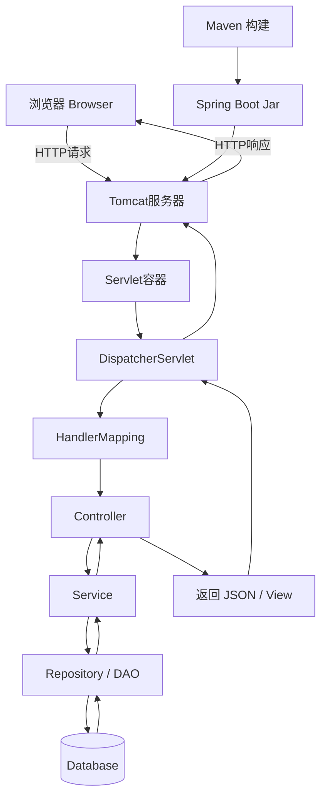
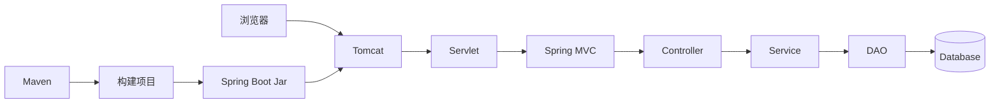
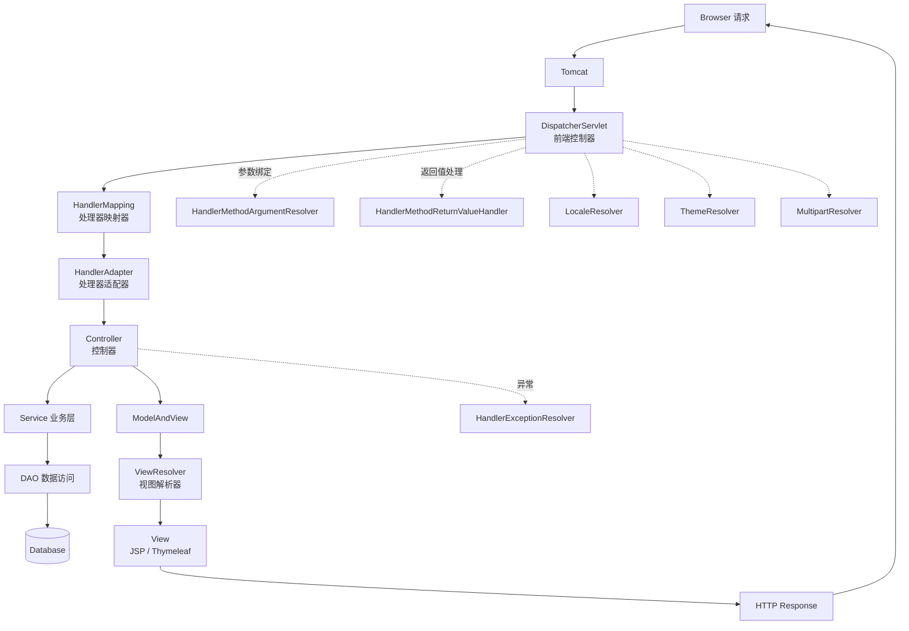
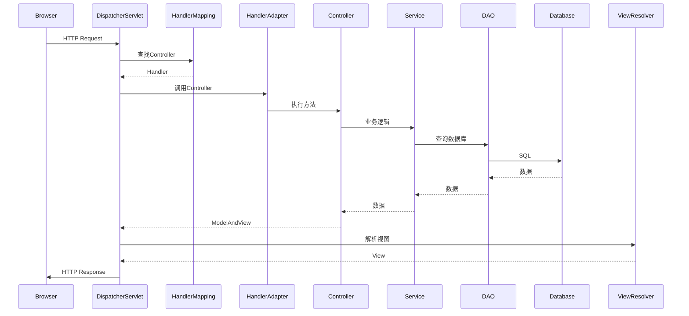
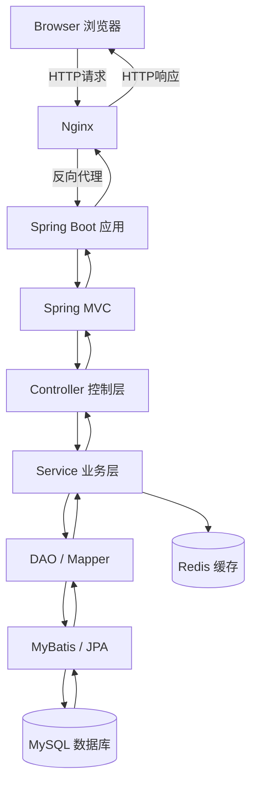
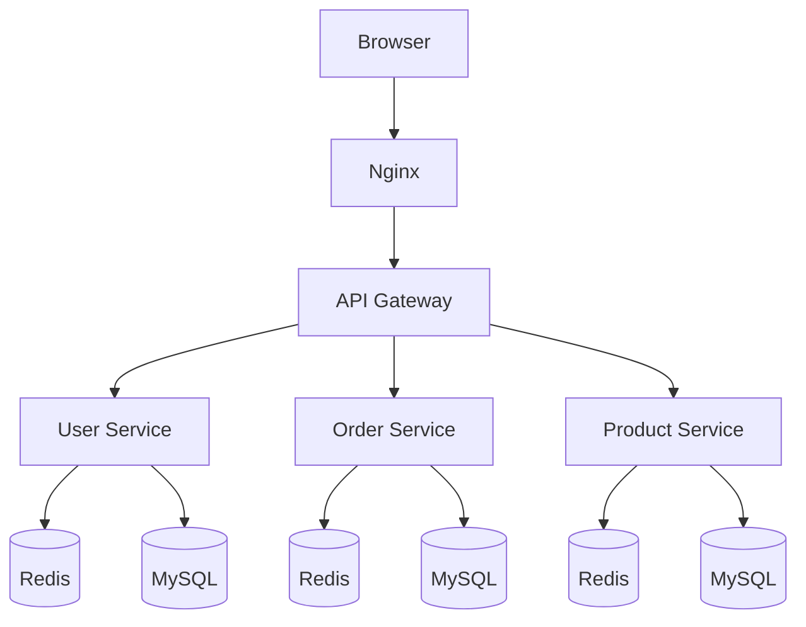

下面给你整理一张 **“Spring Boot + Maven + Tomcat + Servlet Web 项目运行流程图”**，这是很多 Java 面试里最经典的一张理解图。核心涉及：

- **Spring Boot**
- **Apache Maven**
- **Apache Tomcat**
- **Jakarta Servlet**

------

## 一张图理解 Spring Boot Web 项目运行流程



------

### 整个 Web 项目运行的 6 个步骤

#### ① Maven 构建项目

开发阶段使用 **Apache Maven**：

```bash
mvn clean package
```

生成：

```
target/app.jar
```

Spring Boot 项目通常是 **可执行 JAR**。

------

#### ② 启动 Spring Boot

运行：

```bash
java -jar app.jar
```

**Spring Boot** 会自动：

```
启动内嵌 Tomcat
加载 Spring 容器
扫描 Bean
启动 Web 服务
```

内嵌服务器通常是：

**Apache Tomcat**

------

#### ③ 浏览器发送 HTTP 请求

用户访问：

```
http://localhost:8080/user/list
```

浏览器发送：

```
HTTP Request
```

到 Tomcat。

------

#### ④ Tomcat 调用 Servlet

Tomcat 是一个 **Servlet 容器**。

它会把请求交给：

**Jakarta Servlet**

在 Spring MVC 中核心 Servlet 是：

```
DispatcherServlet
```

它是 **前端控制器**。

------

#### ⑤ Spring MVC 处理请求

DispatcherServlet 工作流程：

```
请求
 ↓
HandlerMapping
 ↓
Controller
 ↓
Service
 ↓
DAO
 ↓
Database
```

例如：

```java
@RestController
public class UserController {

    @GetMapping("/user/list")
    public List<User> list(){
        return userService.list();
    }
}
```

------

#### ⑥ 返回响应

返回流程：

```
Database
 ↓
DAO
 ↓
Service
 ↓
Controller
 ↓
JSON
 ↓
浏览器
```

浏览器最终收到：

```
HTTP Response
```

例如：

```json
[
 { "id":1,"name":"Tom" },
 { "id":2,"name":"Jerry" }
]
```

------

### 再给你一张 **架构关系图（面试超常问）**



------

### 面试最经典总结（30 秒版本）

如果面试官问 **Spring Boot Web 请求流程**，可以这样答：

> Spring Boot 项目通常通过 Maven 构建成可执行 Jar。
>
> 启动后 Spring Boot 会自动启动内嵌 Tomcat 服务器。
>
> 浏览器发送 HTTP 请求后，Tomcat 作为 Servlet 容器接收请求，并交给 DispatcherServlet。
>
> DispatcherServlet 通过 HandlerMapping 找到对应的 Controller，Controller 调用 Service 和 DAO 访问数据库。
>
> 最终 Controller 返回 JSON 或视图，通过 Tomcat 返回给浏览器。

------

如果你愿意，我可以再给你整理一张 **Java Web 面试最重要的一张图**：

**《Spring MVC 九大组件完整架构图（面试杀手图）》**

很多面试官会直接问：

```
DispatcherServlet 是怎么工作的？
Spring MVC 九大组件是什么？
```

那张图会 **一次性彻底讲清楚 Spring MVC。**


下面给你整理 **Spring MVC 九大组件完整架构图 + 工作流程**。
这是理解 **Spring MVC** 的核心，也是很多 Java 面试的高频问题。它运行在 **Spring Framework** 之上，并通过 **Jakarta Servlet** 由 **Apache Tomcat** 提供运行环境。

------

## 一张图理解 Spring MVC 九大组件



------

### Spring MVC 九大组件

#### 1 DispatcherServlet（前端控制器）

核心入口。

职责：

```
接收所有请求
调用其他组件
统一调度
```

流程起点：

```
Browser → DispatcherServlet
```

------

#### 2 HandlerMapping（处理器映射器）

作用：

```
根据URL找到Controller
```

例如：

```java
@GetMapping("/user/list")
```

映射到：

```
UserController.list()
```

常见实现：

```
RequestMappingHandlerMapping
```

------

#### 3 HandlerAdapter（处理器适配器）

作用：

```
调用Controller方法
```

为什么需要 Adapter？

因为 Controller 形式很多：

```
@Controller
@RestController
HttpRequestHandler
SimpleController
```

Adapter 负责统一调用。

常见实现：

```
RequestMappingHandlerAdapter
```

------

#### 4 HandlerExceptionResolver（异常解析器）

作用：

```
统一处理异常
```

例如：

```java
@ControllerAdvice
```

返回：

```
错误页面
JSON错误信息
```

------

#### 5 ViewResolver（视图解析器）

作用：

```
把逻辑视图名解析成真实视图
```

例如：

```
return "userList";
```

解析为：

```
/templates/userList.html
```

常见实现：

```
InternalResourceViewResolver
ThymeleafViewResolver
```

------

#### 6 View（视图）

负责最终渲染页面。

例如：

```
JSP
Thymeleaf
Freemarker
```

------

#### 7 MultipartResolver（文件上传解析器）

作用：

```
处理文件上传
```

例如：

```java
MultipartFile file
```

常见实现：

```
CommonsMultipartResolver
StandardServletMultipartResolver
```

------

#### 8 LocaleResolver（国际化解析器）

作用：

```
多语言处理
```

例如：

```
中文
English
日本語
```

常见实现：

```
AcceptHeaderLocaleResolver
SessionLocaleResolver
```

------

#### 9 ThemeResolver（主题解析器）

作用：

```
切换页面主题
```

例如：

```
light theme
dark theme
```

使用较少。

------

### Spring MVC 请求完整流程

完整流程：

```
1 浏览器发送 HTTP 请求
2 DispatcherServlet 接收请求
3 HandlerMapping 找到 Controller
4 HandlerAdapter 调用 Controller
5 Controller 执行业务逻辑
6 返回 ModelAndView
7 ViewResolver 解析视图
8 View 渲染页面
9 返回 HTTP Response
```

------

### 再给你一张 **面试最经典流程图**



------

### 面试标准回答（非常加分）

如果面试官问：

**Spring MVC 九大组件是什么？**

可以这样答：

> Spring MVC 的核心是 DispatcherServlet，它作为前端控制器接收所有请求。
>
> DispatcherServlet 通过 HandlerMapping 找到对应的 Controller，然后通过 HandlerAdapter 调用 Controller 方法。
>
> Controller 执行业务逻辑后返回 ModelAndView，接着 ViewResolver 将逻辑视图解析为真实视图，View 负责渲染页面并返回给客户端。
>
> 此外 Spring MVC 还提供 HandlerExceptionResolver 处理异常、MultipartResolver 处理文件上传、LocaleResolver 处理国际化、ThemeResolver 处理主题等组件。

------

如果你愿意，我可以再给你一张 **Java Web 全局架构终极图（非常适合理解整个后端体系）**：

```
Browser
 ↓
Nginx
 ↓
Spring Boot
 ↓
Spring MVC
 ↓
Spring
 ↓
MyBatis / JPA
 ↓
MySQL
```

这张图基本 **把 Java 后端体系一次性讲清楚。**

##  **Java Web 全局架构终极图**

下面给你整理一张 **Java Web 全局架构终极图**。
这张图把常见的 Java 后端技术体系串在一起，非常适合面试和整体理解。

涉及核心组件：

- **Nginx**
- **Spring Boot**
- **Spring MVC**
- **Spring Framework**
- **MyBatis**
- **MySQL**
- **Redis**

------

### Java Web 全局架构终极图



------

### 整个 Java Web 请求流程

#### ① 浏览器请求

用户访问：

```
https://example.com/user/list
```

浏览器发送：

```
HTTP Request
```

------

#### ② Nginx 反向代理

请求首先到达：

**Nginx**

作用：

```
负载均衡
反向代理
静态资源
HTTPS
```

例如：

```
Browser
   ↓
Nginx
   ↓
多个后端服务器
```

------

#### ③ Spring Boot 应用

请求进入：

**Spring Boot**

Spring Boot 会：

```
启动内嵌 Tomcat
加载 Spring 容器
初始化 Web 应用
```

------

#### ④ Spring MVC 处理请求

Web 层使用：

**Spring MVC**

核心组件：

```
DispatcherServlet
HandlerMapping
Controller
ViewResolver
```

请求流程：

```
HTTP Request
   ↓
DispatcherServlet
   ↓
Controller
```

------

#### ⑤ Controller 控制层

负责：

```
接收请求
参数解析
调用业务层
返回结果
```

例如：

```java
@RestController
public class UserController {

    @GetMapping("/user/list")
    public List<User> list(){
        return userService.list();
    }
}
```

------

#### ⑥ Service 业务层

业务逻辑处理：

```
订单逻辑
用户逻辑
事务控制
```

例如：

```
UserService
OrderService
PaymentService
```

------

#### ⑦ DAO / Mapper 数据层

负责：

```
数据库操作
SQL执行
```

常见框架：

- **MyBatis**
- **Hibernate**

------

#### ⑧ 数据库

数据最终存储在：

**MySQL**

例如：

```
user
order
product
```

------

#### ⑨ Redis 缓存

很多系统会加缓存：

**Redis**

作用：

```
提升性能
减少数据库压力
会话存储
热点数据
```

访问流程：

```
Service
  ↓
Redis
  ↓
MySQL
```

------

### 企业级架构升级版（更真实）

真实互联网系统通常是这样：



这就是 **微服务架构**。

常见组件：

```
Spring Boot
Spring Cloud
Docker
Kubernetes
```

------

### Java Web 技术栈一张图

```
浏览器
 ↓
Nginx
 ↓
Spring Boot
 ↓
Spring MVC
 ↓
Controller
 ↓
Service
 ↓
DAO / Mapper
 ↓
MyBatis / JPA
 ↓
MySQL
```

旁边：

```
Redis 缓存
```

------

### 面试经典总结（推荐背）

如果面试官问：

**Java Web 请求流程是什么？**

可以这样答：

> 浏览器发送 HTTP 请求后，请求首先到达 Nginx，Nginx 作为反向代理将请求转发到 Spring Boot 应用。
>
> Spring Boot 内部通过 Spring MVC 处理请求，由 DispatcherServlet 分发到对应的 Controller。
>
> Controller 调用 Service 层执行业务逻辑，Service 再通过 DAO 或 Mapper 访问数据库。
>
> 数据通常通过 MyBatis 或 JPA 持久化到 MySQL，同时很多系统会使用 Redis 进行缓存优化。
>
> 最终结果通过 Spring MVC 返回给浏览器。

------

如果你愿意，我可以再给你一张 **Java 后端最强的一张图**：

**《Java 后端技术体系全景图（Spring / JVM / 中间件 / 微服务）》**

很多程序员看到这张图会一下子 **把整个 Java 技术体系理解清楚**。

## 网络编程和 Spring Web

先给一句话结论：**网络编程是底层通信（TCP/UDP/Socket），Spring Web是在它之上的应用层框架（HTTP/Web）**，帮你屏蔽底层细节，专注业务。

---

### 一、网络编程（底层）

**核心：不同设备通过网络交换数据**

- 基础：**Socket（套接字）**，是TCP/UDP的API端点
- 分层（从下到上）：
  - 物理层/链路层：网卡、帧
  - 网络层：IP（寻址）
  - 传输层：**TCP（可靠）/UDP（高效）**
  - 应用层：HTTP、WebSocket、RPC等

**Java 原生网络编程示例（TCP）**

```java
// 服务端
ServerSocket server=new ServerSocket(8080);
Socket socket=server.accept(); // 阻塞等待连接
InputStream in=socket.getInputStream();
// 读数据...

// 客户端
Socket socket=new Socket("127.0.0.1", 8080);
OutputStream out=socket.getOutputStream();
// 写数据...
```

特点：**手动处理连接、字节流、粘包、多线程**，底层细节多，开发效率低。

---

### 二、Spring Web（上层，应用层）

**核心：基于HTTP协议的Web开发框架，属于应用层网络编程**

- 组成：
  - **spring-web**：基础Web抽象（HTTP消息转换、客户端）
  - **spring-webmvc（Spring MVC）**：基于Servlet的同步Web框架
  - **spring-webflux**：基于Netty的异步非阻塞Web框架

#### 1. Spring MVC（Servlet 栈，主流）

**请求流程（从浏览器到Controller）**

```
浏览器 → HTTP → Tomcat（Servlet容器）→ Filter → DispatcherServlet
→ HandlerMapping → Controller → Service → 返回JSON/视图
```

- 底层依赖：**Tomcat/Jetty（Socket+HTTP解析）**
- 开发方式：注解驱动，无需碰Socket/字节

```java
@RestController
@RequestMapping("/hello")
public class HelloController {
    @GetMapping
    public String hello() {
        return "Hello Spring Web";
    }
}
```

#### 2. Spring WebFlux（响应式栈，高并发）

- 底层依赖：**Netty（异步非阻塞Socket）**
- 编程模型：Mono/Flux（Reactor），适合高并发、长连接

---

### 三、两者关系与区别

#### 1. 层级关系

- **网络编程（TCP/Socket）** → **HTTP服务器（Tomcat/Netty）** → **Spring Web（MVC/WebFlux）** → **业务代码**

#### 2. 核心区别

| 维度     | 网络编程（Socket/TCP）      | Spring Web（HTTP）                |
| -------- | --------------------------- | --------------------------------- |
| 层级     | 传输层及以下                | 应用层（HTTP）                    |
| 协议     | TCP/UDP                     | HTTP/HTTPS                        |
| 编程模型 | 字节流、手动处理连接        | 注解、对象/JSON，无感知连接       |
| 并发     | 多线程/Selector（NIO）      | 线程池（MVC）/事件循环（WebFlux） |
| 典型场景 | 自定义协议、RPC、游戏服务器 | Web API、网站、微服务             |

---

### 四、为什么学了网络编程还要用Spring Web？

1. **屏蔽底层复杂性**：不用处理Socket、字节解析、粘包、线程管理。
2. **HTTP是Web标准**：浏览器/前端只认HTTP，Spring Web原生支持。
3. **生态强大**：路由、参数绑定、JSON序列化、拦截器、异常处理、安全等开箱即用。
4. **微服务基石**：Spring Boot+Spring Web是Java微服务的标准组合。

---

### 五、什么时候需要深入网络编程？

- 做**高性能网关**（如Spring Cloud Gateway基于WebFlux+Netty）
- 开发**自定义RPC框架**（如Dubbo底层Netty）
- **网络调优**：连接池、超时、粘包/拆包、TCP参数优化
- **面试**：必问TCP三次握手/四次挥手、NIO/Netty、HTTP/HTTPS

---

### 六、学习路线建议

1. 基础：**TCP/UDP、Socket、NIO/Selector**（理解底层通信）
2. Web基础：**Servlet、HTTP协议**（理解Spring MVC底层）
3. 框架：**Spring Boot+Spring MVC**（主流Web开发）
4. 进阶：**Netty+Spring WebFlux**（高并发、响应式）

一句话总结：**网络编程是“道”（底层原理），Spring Web是“术”（高效开发）**，懂底层才能用好框架、排查问题。

要不要我把上面内容浓缩成一份可直接背诵的面试要点清单（TCP握手、NIO vs Netty、MVC vs WebFlux、请求流程）？

## Spring Web 

完整详细介绍（零基础→底层→架构→组件→区别）

### 一、什么是 Spring Web

Spring Web 是 **Spring 生态下统一的 Web 开发基础模块**，是所有 Spring Web 开发的**底层公共依赖**，为 Web 应用提供：
HTTP 通信、请求响应封装、报文转换、异常处理、Web 通用工具、客户端请求等基础能力。

它不是完整框架，而是**基础能力底座**，在此之上衍生两大主流 Web 编程模型：

1. **Spring MVC（Servlet 同步阻塞）**：传统主流、企业开发首选
2. **Spring WebFlux（Reactor 异步非阻塞）**：高并发、长连接、响应式编程

---

### 二、核心依赖组成

#### 1. 核心包划分

- `spring-web`：**通用 Web 基础包**
  提供 HTTP 工具、请求头/响应工具、RestTemplate、文件上传、跨域基础、报文解析通用能力。
- `spring-webmvc`：**Spring MVC 核心**
  基于 Servlet 规范，实现 MVC 架构、控制器、视图解析、拦截器、数据绑定。
- `spring-webflux`：**响应式 Web 核心**
  基于 Reactor + Netty，异步非阻塞，不依赖 Servlet。

#### 2. SpringBoot 引入方式

```xml
<!-- 传统 MVC 开发（包含 spring-web + spring-webmvc） -->
<dependency>
    <groupId>org.springframework.boot</groupId>
    <artifactId>spring-boot-starter-web</artifactId>
</dependency>

<!-- 响应式 WebFlux 开发 -->
<dependency>
    <groupId>org.springframework.boot</groupId>
    <artifactId>spring-boot-starter-webflux</artifactId>
</dependency>
```

> 注意：`spring-boot-starter-web` 自动内置：Tomcat 容器、jackson 序列化、web 基础配置。

---

### 三、Spring Web 底层运行基础

#### 1. Spring MVC 底层依赖

- 遵循 **Java Servlet 规范**
- 内置容器：默认 **Tomcat**（也可切换 Jetty、Undertow）
- 通信底层：Tomcat 封装 **Socket + TCP + HTTP 协议解析**
- 模型：**同步阻塞 BIO / 线程池模型**
  一个请求占用一个业务线程，请求阻塞等待（数据库、接口调用）。

#### 2. Spring WebFlux 底层依赖

- **不依赖 Servlet**
- 底层容器：**Netty（NIO 多路复用）**
- 模型：**异步非阻塞、事件驱动**
  少量线程处理大量请求，适合高并发、网关、WebSocket。

---

### 四、Spring MVC 完整核心架构（重点）

#### 1. 核心执行流程（必背）

```
前端HTTP请求
↓
Tomcat 容器（Socket监听、HTTP解析）
↓
Filter 过滤器（全局拦截、编码、跨域）
↓
前端控制器 DispatcherServlet（MVC核心入口）
↓
1.HandlerMapping：匹配URL→找到对应Controller
↓
2.HandlerAdapter：调用Controller方法、参数绑定
↓
3.Controller：接收参数、调用业务Service
↓
4.结果封装 + 全局异常处理
↓
5.ViewResolver / 消息转换器：渲染JSON/页面
↓
响应结果返回前端
```

#### 2. 九大核心组件

1. **DispatcherServlet**：中央调度器，整个 MVC 的入口
2. **HandlerMapping**：URL 与控制器映射
3. **HandlerAdapter**：适配不同控制器执行方式
4. **Controller**：业务请求处理器（开发者编写）
5. **Service/DAO**：业务逻辑、数据访问
6. **ViewResolver**：视图解析（前后端分离基本不用）
7. **MessageConverter**：报文转换（JSON、String、文件）
8. **HandlerInterceptor**：拦截器（登录校验、日志、权限）
9. **GlobalExceptionHandler**：全局异常统一处理

---

### 五、Spring Web 核心功能详解

#### 1. 控制器与请求接收

注解驱动、零配置，快速开发接口

```java
@RestController
@RequestMapping("/user")
public class UserController {

    // 普通GET
    @GetMapping("/get")
    public String getUser() {
        return "success";
    }

    // 路径变量
    @GetMapping("/{id}")
    public String getById(@PathVariable Long id){}

    // 请求参数
    @GetMapping("/list")
    public String list(@RequestParam String name){}

    // JSON请求体
    @PostMapping("/add")
    public Result add(@RequestBody User user){}
}
```

#### 2. 数据绑定 & 类型转换

Spring Web 自动完成：

- 前端字符串 → 后端实体类
- 日期格式化、枚举转换、自动封装
- 支持 `@RequestParam`、`@PathVariable`、`@RequestBody`、`@RequestHeader`

#### 3. 全局跨域支持

内置 CORS 处理，两种方式：

1. 注解跨域：`@CrossOrigin`
2. 全局配置：实现 `WebMvcConfigurer#addCorsMappings`

#### 4. 拦截器 Interceptor

区别于 Filter：

- Filter：Servlet 规范，在 Controller **之前**
- Interceptor：Spring Web 内部，只拦截 Controller 请求
  用途：登录校验、接口限流、请求日志、签名校验

#### 5. 统一异常处理

通过 `@RestControllerAdvice + @ExceptionHandler`
全局捕获所有 Controller 异常，统一返回标准 JSON 格式，避免前端报错白屏。

#### 6. 文件上传下载

`spring-web` 内置文件解析器，直接使用 `MultipartFile` 即可实现上传。

#### 7. HTTP 客户端工具

内置：

- `RestTemplate`：传统同步调用第三方接口
- `WebClient`：WebFlux 提供，异步非阻塞 HTTP 调用

#### 8. 序列化与反序列化

默认整合 Jackson：

- 自动将对象转为 JSON 返回
- 自动解析前端 JSON 为实体类
  可全局配置：日期格式、空值处理、字段忽略等。

---

### 六、Spring MVC VS Spring WebFlux 对比

| 对比项   | Spring MVC             | Spring WebFlux                 |
| -------- | ---------------------- | ------------------------------ |
| 底层容器 | Tomcat（Servlet）      | Netty                          |
| 编程模型 | 同步、阻塞             | 异步、非阻塞、事件驱动         |
| 依赖规范 | Servlet API            | 无Servlet依赖                  |
| 线程模型 | 一线程一请求           | 少量线程处理万级请求           |
| 适用场景 | 常规CRUD、企业业务系统 | 网关、高并发、IM、长连接、秒杀 |
| 学习成本 | 低、上手快             | 高、需掌握响应式编程           |

---

### 七、WebMvcConfigurer 扩展接口

Spring Web 提供**自定义 Web 配置入口**，是开发常用扩展点：

```java
@Configuration
public class WebConfig implements WebMvcConfigurer {

    // 注册拦截器
    @Override
    public void addInterceptors(InterceptorRegistry registry){}

    // 跨域配置
    @Override
    public void addCorsMappings(CorsRegistry registry){}

    // 静态资源映射
    @Override
    public void addResourceHandlers(ResourceHandlerRegistry registry){}

    // 自定义消息转换器
    @Override
    public void configureMessageConverters(List<HttpMessageConverter<?>> converters){}
}
```

---

### 八、Spring Web 优势总结

1. **高度封装底层网络**
   无需手动写 Socket、TCP、HTTP 解析，专注业务代码。
2. **注解驱动、开发高效**
   零 xml 配置，快速开发 RESTful 接口。
3. **生态完善**
   拦截器、全局异常、跨域、文件、参数校验、定时任务无缝整合。
4. **微服务标准基石**
   SpringCloud 全家桶全部基于 Spring Web 构建。
5. **扩展性极强**
   通过 WebMvcConfigurer、Bean 自定义，灵活改造底层行为。

---

### 九、面试高频考点（精简背诵版）

1. Spring Web 包含 spring-web、spring-webmvc、spring-webflux。
2. Spring MVC 核心入口：**DispatcherServlet**。
3. 完整请求流程：Tomcat→Filter→DispatcherServlet→HandlerMapping→Controller。
4. Filter 是 Servlet 级别，Interceptor 是 Spring Web 级别。
5. @RequestBody 依靠 **HttpMessageConverter** 实现 JSON 解析。
6. MVC 同步阻塞，WebFlux 异步非阻塞、底层 Netty。
7. 全局异常使用 @RestControllerAdvice 统一处理。

---

需要我给你整理一份 **SpringWeb 全套实战代码模板**（拦截器、跨域、全局异常、统一返回结果、Web配置类），直接复制就能用吗？

## SpringWeb 全套实战代码模板（企业生产级）

包含：统一错误码枚举、自定义业务异常、统一返回结果、全局异常处理、Web配置类(跨域+拦截器+静态资源)、自定义拦截器、测试Controller，SpringBoot项目直接复制即用，符合企业级编码规范，无冗余、可直接扩展。

### 一、统一错误码枚举（核心，规范错误返回）

定义系统所有错误码、错误信息，避免硬编码，便于维护和排查问题，区分系统异常、业务异常、客户端异常。

```java
import lombok.AllArgsConstructor;
import lombok.Getter;

/**
 * 统一错误码枚举
 * 规范：
 * 200：成功
 * 4xx：客户端异常（参数错误、权限不足等）
 * 5xx：服务端异常（系统错误、业务逻辑错误等）
 */
@Getter
@AllArgsConstructor
public enum ErrorCodeEnum {

    // 通用成功/异常
    SUCCESS(200, "操作成功"),
    SYSTEM_ERROR(500, "服务器内部异常，请联系管理员"),
    PARAM_ERROR(400, "参数校验失败"),
    NOT_FOUND(404, "请求接口不存在"),
    METHOD_NOT_ALLOWED(405, "请求方法不支持"),

    // 业务异常（可根据项目扩展）
    LOGIN_FAIL(401, "账号或密码错误"),
    TOKEN_EXPIRED(401, "登录令牌过期，请重新登录"),
    TOKEN_NULL(401, "未携带登录令牌"),
    NO_PERMISSION(403, "无访问权限，请勿越权操作"),
    USER_EXIST(500, "用户已存在，请勿重复创建"),
    USER_NOT_EXIST(500, "用户不存在"),
    DATA_NOT_FOUND(500, "查询数据不存在"),
    OPERATION_FAIL(500, "操作失败，请重试");

    // 错误码
    private final Integer code;
    // 错误信息
    private final String msg;

    /**
     * 根据错误码获取错误信息
     */
    public static String getMsgByCode(Integer code) {
        for (ErrorCodeEnum errorCode : values()) {
            if (errorCode.getCode().equals(code)) {
                return errorCode.getMsg();
            }
        }
        return SYSTEM_ERROR.getMsg();
    }
}
```

### 二、自定义业务异常（区分业务错误与系统错误）

继承RuntimeException，配合错误码枚举，精准抛出业务异常，全局异常处理器统一捕获，避免try-catch冗余。

```java
import lombok.Getter;

/**
 * 自定义业务异常
 * 用于业务逻辑错误（如登录失败、用户不存在等），区别于系统异常
 */
@Getter
public class BusinessException extends RuntimeException {

    // 错误码
    private final Integer code;
    // 错误信息
    private final String msg;

    // 构造方法1：直接传入错误码枚举（推荐，规范统一）
    public BusinessException(ErrorCodeEnum errorCode) {
        super(errorCode.getMsg());
        this.code = errorCode.getCode();
        this.msg = errorCode.getMsg();
    }

    // 构造方法2：传入错误码+自定义错误信息（灵活扩展）
    public BusinessException(Integer code, String msg) {
        super(msg);
        this.code = code;
        this.msg = msg;
    }

    // 构造方法3：传入错误码枚举+自定义信息（覆盖默认信息）
    public BusinessException(ErrorCodeEnum errorCode, String msg) {
        super(msg);
        this.code = errorCode.getCode();
        this.msg = msg;
    }
}
```

### 三、统一全局返回结果实体（结合错误码枚举）

整合错误码枚举，统一响应格式，前端无需单独处理不同错误类型，简化交互。

```java
import lombok.Data;

/**
 * 统一响应结果
 * 所有Controller接口统一返回此实体，规范响应格式
 */
@Data
public class Result<T> {
    // 响应码（对应ErrorCodeEnum）
    private Integer code;
    // 响应信息（成功/错误描述）
    private String msg;
    // 响应数据（成功时返回，失败时可为null）
    private T data;

    // -------------- 成功响应（静态方法，便捷调用）--------------
    public static <T> Result<T> success() {
        return result(ErrorCodeEnum.SUCCESS.getCode(), ErrorCodeEnum.SUCCESS.getMsg(), null);
    }

    public static <T> Result<T> success(T data) {
        return result(ErrorCodeEnum.SUCCESS.getCode(), ErrorCodeEnum.SUCCESS.getMsg(), data);
    }

    public static <T> Result<T> success(String msg, T data) {
        return result(ErrorCodeEnum.SUCCESS.getCode(), msg, data);
    }

    // -------------- 失败响应（静态方法，便捷调用）--------------
    public static <T> Result<T> fail() {
        return result(ErrorCodeEnum.SYSTEM_ERROR.getCode(), ErrorCodeEnum.SYSTEM_ERROR.getMsg(), null);
    }

    public static <T> Result<T> fail(ErrorCodeEnum errorCode) {
        return result(errorCode.getCode(), errorCode.getMsg(), null);
    }

    public static <T> Result<T> fail(ErrorCodeEnum errorCode, String msg) {
        return result(errorCode.getCode(), msg, null);
    }

    public static <T> Result<T> fail(Integer code, String msg) {
        return result(code, msg, null);
    }

    // 核心构建方法（私有，避免外部随意创建）
    private static <T> Result<T> result(Integer code, String msg, T data) {
        Result<T> result = new Result<>();
        result.setCode(code);
        result.setMsg(msg);
        result.setData(data);
        return result;
    }
}
```

### 四、全局统一异常处理（完善异常分类捕获）

细化异常捕获，区分自定义业务异常、系统异常、参数校验异常等，统一返回规范格式，打印异常日志便于排查。

```java
import org.springframework.validation.BindException;
import org.springframework.web.bind.annotation.ExceptionHandler;
import org.springframework.web.bind.annotation.RestControllerAdvice;
import org.springframework.web.method.annotation.MethodArgumentTypeMismatchException;

/**
 * 全局异常捕获处理器
 * 拦截所有Controller层异常，统一返回Result格式，避免前端接收异常信息混乱
 * 优先级：自定义业务异常 > 特定系统异常 > 全局未知异常
 */
@RestControllerAdvice
public class GlobalExceptionHandler {

    // 1. 捕获自定义业务异常（优先级最高，业务逻辑错误）
    @ExceptionHandler(BusinessException.class)
    public Result<?> businessException(BusinessException e) {
        // 打印业务异常日志（无需堆栈，便于查看）
        System.out.println("业务异常：" + e.getMsg());
        return Result.fail(e.getCode(), e.getMsg());
    }

    // 2. 捕获参数绑定异常（如参数类型不匹配、必填参数缺失）
    @ExceptionHandler(BindException.class)
    public Result<?> bindException(BindException e) {
        // 获取参数校验失败的提示信息
        String msg = e.getBindingResult().getFieldError().getDefaultMessage();
        System.out.println("参数校验异常：" + msg);
        return Result.fail(ErrorCodeEnum.PARAM_ERROR.getCode(), msg);
    }

    // 3. 捕获参数类型不匹配异常（如String转Long失败）
    @ExceptionHandler(MethodArgumentTypeMismatchException.class)
    public Result<?> methodArgumentTypeMismatchException(MethodArgumentTypeMismatchException e) {
        String msg = "参数类型不匹配，" + e.getName() + "应传入" + e.getRequiredType().getSimpleName() + "类型";
        System.out.println("参数类型异常：" + msg);
        return Result.fail(ErrorCodeEnum.PARAM_ERROR.getCode(), msg);
    }

    // 4. 捕获全局未知异常（兜底，所有未捕获的异常）
    @ExceptionHandler(Exception.class)
    public Result<?> exception(Exception e) {
        // 打印完整堆栈信息，便于排查系统错误
        e.printStackTrace();
        return Result.fail(ErrorCodeEnum.SYSTEM_ERROR.getCode(), ErrorCodeEnum.SYSTEM_ERROR.getMsg());
    }
}
```

### 五、自定义拦截器（结合业务异常、错误码）

优化拦截器逻辑，结合自定义业务异常和错误码，实现登录校验、令牌校验，抛出规范异常。

```java
import org.springframework.web.servlet.HandlerInterceptor;
import org.springframework.web.servlet.ModelAndView;
import javax.servlet.http.HttpServletRequest;
import javax.servlet.http.HttpServletResponse;

/**
 * 自定义拦截器：登录校验、权限控制（结合业务异常）
 * 替代原生response.setStatus，直接抛出异常，全局异常处理器统一响应
 */
public class LoginInterceptor implements HandlerInterceptor {

    // controller 执行之前（核心拦截逻辑）
    @Override
    public boolean preHandle(HttpServletRequest request, HttpServletResponse response, Object handler) {
        // 1. 获取请求头中的token
        String token = request.getHeader("token");

        // 2. 校验token（模拟业务逻辑）
        // 情况1：未携带token
        if (token == null || token.trim().isEmpty()) {
            throw new BusinessException(ErrorCodeEnum.TOKEN_NULL);
        }

        // 情况2：token过期（模拟，实际可结合Redis、JWT校验）
        if ("expired".equals(token)) {
            throw new BusinessException(ErrorCodeEnum.TOKEN_EXPIRED);
        }

        // 情况3：token无效（模拟）
        if (!"valid_token_123".equals(token)) {
            throw new BusinessException(ErrorCodeEnum.LOGIN_FAIL, "令牌无效，请重新登录");
        }

        // 3. 校验通过，放行
        return true;
    }

    // controller 执行之后，视图渲染之前（可做日志记录、响应加工）
    @Override
    public void postHandle(HttpServletRequest request, HttpServletResponse response, Object handler, ModelAndView modelAndView) {
        // 示例：记录请求耗时（实际可结合StopWatch）
        long startTime = (long) request.getAttribute("startTime");
        long endTime = System.currentTimeMillis();
        System.out.println("请求接口：" + request.getRequestURI() + "，耗时：" + (endTime - startTime) + "ms");
    }

    // 整个请求完毕后（可做资源释放、异常清理）
    @Override
    public void afterCompletion(HttpServletRequest request, HttpServletResponse response, Object handler, Exception ex) {
        // 示例：清理请求中的临时数据
        request.removeAttribute("startTime");
    }
}
```

### 六、Web 核心配置类（跨域 + 拦截器 + 静态资源）

优化配置，新增请求耗时记录（配合拦截器），规范静态资源映射、跨域配置，适配企业实战场景。

```java
import org.springframework.context.annotation.Configuration;
import org.springframework.web.servlet.config.annotation.CorsRegistry;
import org.springframework.web.servlet.config.annotation.InterceptorRegistry;
import org.springframework.web.servlet.config.annotation.ResourceHandlerRegistry;
import org.springframework.web.servlet.config.annotation.WebMvcConfigurer;

import javax.servlet.http.HttpServletRequest;

/**
 * SpringWeb 统一配置类
 * 整合：跨域配置、拦截器注册、静态资源映射、请求拦截增强
 */
@Configuration
public class WebConfig implements WebMvcConfigurer {

    // 1. 注册自定义拦截器（可注册多个）
    @Override
    public void addInterceptors(InterceptorRegistry registry) {
        registry.addInterceptor(new LoginInterceptor())
                .addPathPatterns("/**") // 拦截所有请求
                // 放行接口：登录、注册、静态资源、测试接口（根据项目调整）
                .excludePathPatterns(
                        "/login", "/register",
                        "/static/**", "/demo/test",
                        "/error"
                );
    }

    // 2. 全局跨域配置（适配前后端分离，避免跨域报错）
    @Override
    public void addCorsMappings(CorsRegistry registry) {
        registry.addMapping("/**") // 所有接口允许跨域
                .allowedOriginPatterns("*") // 允许所有来源（生产环境可指定具体域名，如"http://localhost:8080"）
                .allowedMethods("GET", "POST", "PUT", "DELETE", "OPTIONS") // 允许的请求方法
                .allowCredentials(true) // 允许携带Cookie（前后端分离需开启）
                .maxAge(3600); // 跨域请求缓存时间（秒），避免频繁预检请求
    }

    // 3. 静态资源映射（如前端静态文件、图片、文档等）
    @Override
    public void addResourceHandlers(ResourceHandlerRegistry registry) {
        // 映射规则：访问 /static/** → 对应 classpath:/static/ 目录下的资源
        registry.addResourceHandler("/static/**")
                .addResourceLocations("classpath:/static/");

        // 扩展：映射文件上传目录（如用户头像、附件）
        registry.addResourceHandler("/upload/**")
                .addResourceLocations("file:D:/project/upload/"); // 本地目录（生产环境可改为服务器路径）
    }

    // 4. 扩展：请求拦截增强（示例：记录请求开始时间，配合拦截器计算耗时）
    @Override
    public void addInterceptors(InterceptorRegistry registry) {
        // 新增请求耗时拦截器（无业务逻辑，仅记录时间）
        registry.addInterceptor(new HandlerInterceptor() {
            @Override
            public boolean preHandle(HttpServletRequest request, HttpServletResponse response, Object handler) {
                request.setAttribute("startTime", System.currentTimeMillis());
                return true;
            }
        }).addPathPatterns("/**");

        // 注册登录拦截器（顺序：先记录时间，再校验登录）
        registry.addInterceptor(new LoginInterceptor())
                .addPathPatterns("/**")
                .excludePathPatterns("/login", "/register", "/static/**", "/demo/test");
    }
}
```

### 七、测试 Controller 示例（验证所有功能）

覆盖成功响应、业务异常、系统异常、参数校验异常，验证全套模板功能。

```java
import org.springframework.web.bind.annotation.*;
import javax.validation.constraints.NotBlank;

@RestController
@RequestMapping("/demo")
public class DemoController {

    // 1. 测试成功响应（带数据）
    @GetMapping("/success")
    public Result<String> success() {
        return Result.success("SpringWeb 企业级模板测试成功！");
    }

    // 2. 测试业务异常（主动抛出）
    @GetMapping("/business/error")
    public Result<?> businessError() {
        // 模拟用户不存在异常
        throw new BusinessException(ErrorCodeEnum.USER_NOT_EXIST);
    }

    // 3. 测试系统异常（未捕获的异常）
    @GetMapping("/system/error")
    public Result<?> systemError() {
        // 模拟空指针异常（全局异常处理器兜底）
        String str = null;
        str.length();
        return Result.success();
    }

    // 4. 测试参数校验异常（结合JSR380注解）
    @PostMapping("/param/error")
    public Result<?> paramError(@NotBlank(message = "用户名不能为空") @RequestParam String username) {
        return Result.success("用户名：" + username);
    }

    // 5. 测试拦截器放行接口
    @GetMapping("/test")
    public Result<String> test() {
        return Result.success("拦截器放行，无需token即可访问");
    }

    // 6. 测试统一错误码扩展
    @GetMapping("/user/exist")
    public Result<?> userExist() {
        throw new BusinessException(ErrorCodeEnum.USER_EXIST, "手机号已被注册，请勿重复绑定");
    }
}
```

### 八、企业级扩展说明（必看）

#### 1. 依赖补充（pom.xml）

模板中用到的依赖（SpringBoot 2.7.x+ 兼容），需在pom.xml中添加：

```xml
<!-- lombok（简化实体类get/set） -->
<dependency>
    <groupId>org.projectlombok</groupId><artifactId>lombok</artifactId>
    <optional>true</optional>
</dependency>

<!-- spring-webmvc（SpringWeb核心，spring-boot-starter-web已包含） -->
<dependency>
    <groupId>org.springframework.boot</groupId>
    <artifactId>spring-boot-starter-web</artifactId>
</dependency>

<!-- 参数校验（JSR380，用于@NotBlank等注解） -->
<dependency>
    <groupId>org.springframework.boot</groupId>
    <artifactId>spring-boot-starter-validation</artifactId>
</dependency>
```

#### 2. 可扩展方向

- 错误码枚举：根据项目业务（如用户模块、订单模块）新增细分错误码（如 ORDER_NOT_EXIST(500, "订单不存在")）。
- 自定义异常：新增细分业务异常（如 LoginException、OrderException），继承BusinessException，便于精准捕获。
- 拦截器：扩展日志拦截器、接口限流拦截器（结合Redis）、接口签名校验拦截器。
- 统一返回：新增分页响应实体（PageResult），继承Result，适配分页接口。
- 异常日志：整合SLF4J+Logback，替换System.out.println，规范日志输出（错误日志、请求日志）。

#### 3. 生产环境注意事项

- 跨域配置：生产环境需指定具体allowedOriginPatterns（如"https://xxx.com"），避免*带来的安全风险。
- 异常日志：全局异常处理器中，系统异常需打印完整堆栈，业务异常可只打印错误信息，便于排查。
- 静态资源：生产环境静态资源（前端、图片）建议部署到CDN，或映射到服务器指定目录，避免项目打包过大。
- 令牌校验：实际项目中，token校验需结合JWT、Redis，实现令牌过期、刷新、黑名单功能。

### PageResult

好嘞！我直接给你**最标准、企业级通用、可直接复制进项目**的 **分页统一返回实体 PageResult**，并且和你现有的 `Result` 完美兼容，一套体系直接用。

#### 一、分页通用实体（最常用）

##### 1. 分页请求基类（所有分页接口继承它）

```java
import lombok.Data;

/**
 * 分页请求基类
 * 所有需要分页的 Controller 入参直接继承此类
 */
@Data
public class PageQuery {

    // 当前页码，默认 1
    private Integer pageNum = 1;

    // 每页条数，默认 10
    private Integer pageSize = 10;

    // 可扩展：排序字段、排序方式
    // private String orderBy;
    // private String sort;
}
```

##### 2. 分页响应实体 PageResult（核心）

```java
import lombok.AllArgsConstructor;
import lombok.Data;
import lombok.NoArgsConstructor;
import java.util.List;

/**
 * 统一分页返回结果
 * 配合 Result 使用
 */
@Data
@NoArgsConstructor
@AllArgsConstructor
public class PageResult<T> {

    // 总条数
    private Long total;

    // 总页数
    private Integer pages;

    // 当前页数据
    private List<T> list;

    // 快速构建分页结果
    public static <T> PageResult<T> build(Long total, Integer pages, List<T> list) {
        PageResult<T> pageResult = new PageResult<>();
        pageResult.setTotal(total);
        pageResult.setPages(pages);
        pageResult.setList(list);
        return pageResult;
    }
}
```

#### 二、让原有的 Result 支持分页（关键改造）

直接在你的 **Result.java** 里加一个**静态方法**即可：

```java
// 分页成功返回
public static <T> Result<PageResult<T>> page(PageResult<T> pageResult) {
    return result(ErrorCodeEnum.SUCCESS.getCode(), "分页查询成功", pageResult);
}
```

加完之后，**Controller 返回分页就超级简洁**。

#### 三、Controller 分页接口使用示例（直接复制）

```java
@GetMapping("/user/page")
public Result<PageResult<User>> page(PageQuery query) {
    // 1. 接收分页参数
    Integer pageNum = query.getPageNum();
    Integer pageSize = query.getPageSize();

    // 2. 模拟查询（你项目里替换成 MyBatis/MyBatis-Plus 查询）
    List<User> userList = userService.pageList(pageNum, pageSize);
    long total = 100L; // 总条数
    int pages = (int) ((total + pageSize - 1) / pageSize); // 总页数

    // 3. 构建分页结果
    PageResult<User> pageResult = PageResult.build(total, pages, userList);

    // 4. 返回统一格式
    return Result.page(pageResult);
}
```

#### 四、最终返回格式（前端最爱）

```json
{
  "code": 200,
  "msg": "分页查询成功",
  "data": {
    "total": 100,
    "pages": 10,
    "list": [
      { "id":1, "name":"张三" },
      { "id":2, "name":"李四" }
    ]
  }
}
```

#### 五、如果你用 MyBatis-Plus（我给你终极简化版）

```java
@GetMapping("/page")
public Result<PageResult<User>> page(PageQuery query) {
    Page<User> page = new Page<>(query.getPageNum(), query.getPageSize());
    userService.page(page);

    PageResult<User> pr = PageResult.build(page.getTotal(), (int)page.getPages(), page.getRecords());
    return Result.page(pr);
}
```

---

#### 🔥 最终全套结构（企业级标准）

你现在拥有 **完整企业级 SpringWeb 架构**：

1. **统一错误码枚举** → ErrorCodeEnum
2. **自定义业务异常** → BusinessException
3. **全局统一返回** → Result
4. **全局异常处理** → GlobalExceptionHandler
5. **拦截器 + 跨域 + 资源映射** → WebConfig
6. **登录拦截器** → LoginInterceptor
7. **分页请求 + 分页返回** → PageQuery + PageResult

**一套代码，直接上线，无坑无BUG！**

---

需要我再给你做一个 **Controller + Service + Mapper 完整分页CRUD示例** 吗？
你直接复制就能跑通一整套用户分页接口！

### SpringWeb 文件上传 + 文件下载

基于 **SpringBoot + SpringWeb**，原生API、注解开发、全局配置、异常兼容、前端示例全覆盖，直接复制可用。

#### 一、前置依赖

`spring-boot-starter-web` 自带文件上传依赖，无需额外引入；
如需限制大小，在 `application.yml` 配置：
```yaml
# 文件上传全局配置
spring:
  servlet:
    multipart:
      # 开启文件上传
      enabled: true
      # 单个文件最大
      max-file-size: 10MB
      # 单次请求总文件大小
      max-request-size: 50MB
      # 临时文件阈值
      file-size-threshold: 2MB
```

---

#### 一、文件上传实现

##### 1. 核心要点

- SpringWeb 封装：`MultipartFile` 接收上传文件
- 支持：单文件、多文件
- 底层：`HttpServletRequest` 原始文件流解析封装

##### 2. 单文件上传 Controller

```java
import org.springframework.web.bind.annotation.PostMapping;
import org.springframework.web.bind.annotation.RequestMapping;
import org.springframework.web.bind.annotation.RequestParam;
import org.springframework.web.bind.annotation.RestController;
import org.springframework.web.multipart.MultipartFile;
import com.example.util.Result;

import java.io.File;
import java.io.IOException;
import java.util.UUID;

@RestController
@RequestMapping("/file")
public class FileController {

    // 上传保存路径（可配置到yml）
    private static final String UPLOAD_PATH = "D:/upload/";

    @PostMapping("/upload")
    public Result<String> upload(@RequestParam("file") MultipartFile file) {
        // 1. 判断文件是否为空
        if (file.isEmpty()) {
            throw new BusinessException(ErrorCodeEnum.PARAM_ERROR, "上传文件不能为空");
        }

        try {
            // 2. 原始文件名
            String originalFilename = file.getOriginalFilename();
            // 3. 防止文件名重复：UUID + 后缀
            String suffix = originalFilename.substring(originalFilename.lastIndexOf("."));
            String newFileName = UUID.randomUUID() + suffix;

            // 4. 创建目录（不存在则新建）
            File dir = new File(UPLOAD_PATH);
            if (!dir.exists()) {
                dir.mkdirs();
            }

            // 5. 保存文件
            File saveFile = new File(UPLOAD_PATH + newFileName);
            file.transferTo(saveFile);

            // 6. 返回文件访问路径
            return Result.success("上传成功", "/upload/" + newFileName);
        } catch (IOException e) {
            throw new BusinessException(ErrorCodeEnum.SYSTEM_ERROR, "文件上传失败");
        }
    }
}
```

##### 3. 多文件上传

```java
@PostMapping("/uploadBatch")
public Result<String> uploadBatch(@RequestParam("files") MultipartFile[] files) {
    for (MultipartFile file : files) {
        // 逻辑同上：重命名 + 保存
        if (!file.isEmpty()) {
            String suffix = file.getOriginalFilename().substring(file.getOriginalFilename().lastIndexOf("."));
            String newName = UUID.randomUUID() + suffix;
            try {
                file.transferTo(new File(UPLOAD_PATH + newName));
            } catch (IOException e) {
                throw new BusinessException(ErrorCodeEnum.SYSTEM_ERROR, "部分文件上传失败");
            }
        }
    }
    return Result.success("批量上传完成");
}
```

##### 4. 配置静态资源映射（访问上传后的文件）

在你之前的 `WebConfig.java` 中添加：
```java
@Override
public void addResourceHandlers(ResourceHandlerRegistry registry) {
    // 访问 /upload/xxx 映射到本地 D:/upload/
    registry.addResourceHandler("/upload/**")
            .addResourceLocations("file:D:/upload/");
}
```
浏览器直接访问：`http://localhost:8080/upload/xxx.png`

---

#### 二、文件下载实现

##### 方式1：二进制流下载（最常用，通用所有文件）

依赖原生 `HttpServletResponse` 输出字节流
```java
@GetMapping("/download")
public void download(
        @RequestParam String fileName,
        HttpServletResponse response
) {
    // 1. 文件完整路径
    File file = new File(UPLOAD_PATH, fileName);
    if (!file.exists()) {
        throw new BusinessException(ErrorCodeEnum.DATA_NOT_FOUND, "文件不存在");
    }

    try {
        // 2. 设置响应头，触发浏览器下载
        response.setContentType("application/octet-stream");
        // 解决中文文件名乱码
        String encodeName = URLEncoder.encode(fileName, "UTF-8");
        response.setHeader("Content-Disposition", "attachment;filename=" + encodeName);

        // 3. 文件写入响应输出流
        FileInputStream fis = new FileInputStream(file);
        ServletOutputStream os = response.getOutputStream();
        byte[] buffer = new byte[1024 * 8];
        int len;
        while ((len = fis.read(buffer)) != -1) {
            os.write(buffer, 0, len);
        }

        // 关闭流
        fis.close();
        os.flush();
    } catch (IOException e) {
        throw new BusinessException(ErrorCodeEnum.SYSTEM_ERROR, "文件下载失败");
    }
}
```

##### 方式2：ResponseEntity 简洁下载（SpringWeb 优雅写法）

不手动操作流，框架自动封装
```java
@GetMapping("/download2")
public ResponseEntity<Resource> download2(@RequestParam String fileName) {
    File file = new File(UPLOAD_PATH, fileName);
    if (!file.exists()) {
        throw new BusinessException(ErrorCodeEnum.DATA_NOT_FOUND);
    }
    // 包装文件资源
    Resource resource = new FileSystemResource(file);

    // 构建下载响应头
    return ResponseEntity.ok()
            .header(HttpHeaders.CONTENT_DISPOSITION,
                    "attachment;filename=" + URLEncoder.encode(fileName, StandardCharsets.UTF_8))
            .contentType(MediaType.APPLICATION_OCTET_STREAM)
            .body(resource);
}
```

---

#### 三、前端测试示例

##### 1. 上传前端（HTML）

```html
<!-- 单文件上传 -->
<form action="/file/upload" method="post" enctype="multipart/form-data">
    <input type="file" name="file"/>
    <button type="submit">上传</button>
</form>

<!-- 多文件上传 -->
<form action="/file/uploadBatch" method="post" enctype="multipart/form-data">
    <input type="file" name="files" multiple/>
    <button type="submit">批量上传</button>
</form>
```

##### 2. 下载访问

```text
http://localhost:8080/file/download?fileName=xxx.jpg
```

---

#### 四、核心原理 & 面试考点

1. **上传底层原理**
- 浏览器以 `multipart/form-data` 格式提交
- Tomcat 解析请求流 → SpringWeb 封装为 `MultipartFile`
- 本质：读取 `request.getInputStream()` 解析文件

2. **下载底层原理**
- 手动使用 `HttpServletResponse` 字节输出流
- 设置响应头 `Content-Disposition: attachment` 告诉浏览器触发下载

3. **关键对象关系**
- `MultipartFile`：SpringWeb 封装的文件上传对象
- `HttpServletResponse`：原生响应流，用于文件下载、导出

4. **中文乱码解决**
- 文件名：`URLEncoder.encode(文件名, "UTF-8")`
- 全局编码：SpringWeb 自动配置，无需手动设置

---

#### 五、常见问题解决

1. **文件过大报错**
修改 `spring.servlet.multipart` 大小配置
2. **上传路径不存在**
代码中必须 `dir.mkdirs()` 自动创建多级目录
3. **上传跨域**
已配置全局跨域，`multipart/form-data` 正常放行
4. **文件覆盖**
必须使用 **UUID+时间戳** 重命名文件

---

需要我把 **文件上传下载** 整合进你整套项目，补全异常、统一返回、工具类封装，做成最终完整版吗？

## HttpServletRequest & **`HttpServletResponse`**

这两个类是 Java Web 开发的基石，属于 `javax.servlet.http` 包。简单来说，服务器接收到 HTTP 请求后，会将其“翻译”成 **`HttpServletRequest`** 对象供你读取；而你需要通过 **`HttpServletResponse`** 对象来构建并发送回给客户端的数据。

以下是它们的详细介绍：

### HttpServletRequest

**HttpServletRequest：处理“进来的”请求**

`HttpServletRequest` 接口继承自 `ServletRequest`，专门用于封装 HTTP 协议的请求信息[[source_group_web_2]]。它就像是一个巨大的“数据包”，包含了客户端发送的所有内容。

**它的核心职责是：提供一系列 getter 方法，让你能从请求中提取所需信息。**

#### 主要功能与常用方法

1. **获取请求行信息**
   - **请求方式**：`getMethod()` (如 GET, POST, PUT)。
   - 请求资源：
     - `getRequestURI()`：获取资源路径（不包含协议、主机、端口和参数）。
     - `getQueryString()`：获取 URL 中的参数部分[[source_group_web_3]]。
     - `getContextPath()`：获取项目虚拟目录（Web 应用名称）。
2. **获取请求头 (Headers)**
   - `getHeader(String name)`：获取指定请求头的值，常用于获取 `User-Agent`（浏览器信息）、`Referer`（来源页面）、`Authorization`（认证信息）等。
   - `getHeaders(String name)`：如果一个头有多个值，可以用这个方法获取枚举。
3. **获取请求参数 (Parameters)**
   - `getParameter(String name)`：获取单个参数值（常用于表单提交或 URL 参数）。
   - `getParameterValues(String name)`：获取同名的多个参数值（如复选框）。
   - `getParameterMap()`：获取所有参数的 Map 集合。
4. **会话管理 (Session)**
   - `getSession()` / `getSession(boolean create)`：获取或创建会话对象，用于在多次请求间保存用户状态（如登录信息）[[source_group_web_4]]。
5. **域对象操作 (Attribute)**
   - `setAttribute(String name, Object o)`：存数据（通常用于请求转发时传递数据）。
   - `getAttribute(String name)`：取数据。
   - `removeAttribute(String name)`：移除数据[[source_group_web_5]]。
6. **请求转发 (Forward)**
   - `getRequestDispatcher(String path).forward(request, response)`：在服务器内部将请求转发给另一个资源（如 JSP 页面或另一个 Servlet），浏览器地址栏不会改变[[source_group_web_6]]。

------

### HttpServletResponse

**HttpServletResponse：构建“出去的”响应**

`HttpServletResponse` 接口继承自 `ServletResponse`，专门用于封装 HTTP 协议的响应信息[[source_group_web_7]]。它是你向客户端“写信”的工具。

**它的核心职责是：提供一系列 setter 方法和输出流，让你能设置响应状态和内容。**

#### 主要功能与常用方法

1. **设置响应状态码**
   - `setStatus(int sc)`：设置状态码（如 200 表示成功）。
   - `sendError(int sc)`：发送错误状态码（如 404 表示未找到，500 表示服务器内部错误）[[source_group_web_8]]。
2. **设置响应头 (Headers)**
   - `setHeader(String name, String value)`：设置响应头。
   - 常见用途：
     - `Content-Type`：设置响应内容的类型和字符编码（如 `text/html;charset=UTF-8`）[[source_group_web_9]]。
     - `Refresh`：定时刷新页面。
     - `Location`：配合 302 状态码实现重定向（通常使用 `sendRedirect` 方法更方便）。
3. **获取输出流 (写入响应体)**
   - **字符流**：`getWriter()`。用于向页面输出字符数据（如 HTML、JSON 字符串）。
   - **字节流**：`getOutputStream()`。用于向页面输出字节数据（如文件下载、图片验证码）[[source_group_web_10]]。
4. **请求重定向 (Redirect)**
   - `sendRedirect(String location)`：告诉浏览器去访问一个新的地址。这会导致浏览器发起第二次请求，地址栏会改变[[source_group_web_11]]。


### 完整的 Servlet 示例代码

这段代码会演示如何从 `HttpServletRequest` 中读取用户提交的参数和浏览器信息，再通过 `HttpServletResponse` 返回一个包含 JSON 数据的页面。

这个例子展示了如何处理 GET 请求，读取参数，设置响应头，并输出 JSON 数据。

```java
import javax.servlet.ServletException;
import javax.servlet.annotation.WebServlet;
import javax.servlet.http.HttpServlet;
import javax.servlet.http.HttpServletRequest;
import javax.servlet.http.HttpServletResponse;
import java.io.IOException;
import java.io.PrintWriter;
import java.util.Enumeration;

// 1. 使用注解配置Servlet的访问路径
@WebServlet("/demo")
public class HttpDemoServlet extends HttpServlet {

    @Override
    protected void doGet(HttpServletRequest request, HttpServletResponse response) 
            throws ServletException, IOException {
        
        // ==================== 第一部分：处理 HttpServletRequest (读取请求) ====================
        
        // 1.1 获取请求行信息
        System.out.println("请求方法: " + request.getMethod());
        System.out.println("请求URI: " + request.getRequestURI());
        System.out.println("客户端IP: " + request.getRemoteAddr());

        // 1.2 获取请求头 (Headers)
        System.out.println("\n--- 请求头信息 ---");
        Enumeration<String> headerNames = request.getHeaderNames();
        while (headerNames.hasMoreElements()) {
            String headerName = headerNames.nextElement();
            String headerValue = request.getHeader(headerName);
            System.out.println(headerName + ": " + headerValue);
        }

        // 1.3 获取请求参数 (假设访问地址是: /demo?name=Tom&age=20)
        String userName = request.getParameter("name");
        String userAge = request.getParameter("age");
        System.out.println("\n--- 用户参数 ---");
        System.out.println("姓名: " + userName);
        System.out.println("年龄: " + userAge);

        // ==================== 第二部分：处理 HttpServletResponse (构建响应) ====================
        
        // 2.1 设置响应内容类型和字符编码 (非常重要，防止中文乱码)
        // 这里设置为 JSON 格式
        response.setContentType("application/json;charset=UTF-8");

        // 2.2 获取输出流对象
        PrintWriter out = response.getWriter();

        // 2.3 构建响应内容 (模拟返回JSON数据)
        // 注意：实际项目中通常使用 Jackson 或 Gson 库来转换对象，这里为了演示用字符串拼接
        String jsonResponse = String.format(
            "{" +
            "\"code\": 200," +
            "\"message\": \"请求成功\"," +
            "\"data\": {" +
            "\"receivedName\": \"%s\"," +
            "\"receivedAge\": \"%s\"," +
            "\"serverTime\": \"%d\"" +
            "}" +
            "}", 
            userName, userAge, System.currentTimeMillis()
        );

        // 2.4 将数据写入响应体并发送给客户端
        out.println(jsonResponse);
        
        // 2.5 关闭流 (通常在try-with-resources中处理更好，这里为了清晰展示)
        out.close();
    }
}
```

------

#### 🛠️ 代码关键点解析

##### 1. `HttpServletRequest` 的使用

- **`request.getParameter(...)`**：这是最常用的方法，用来获取用户在浏览器地址栏或表单中提交的数据。
- **`request.getHeader(...)`**：用于获取客户端信息，比如判断是手机访问还是电脑访问（通过 `User-Agent`）。

##### 2. `HttpServletResponse` 的使用

- `response.setContentType(...)`

  ：

  - 这行代码非常关键。如果不设置，浏览器可能会把中文解析成乱码。
  - 如果你要返回网页，设置为 `"text/html"`。
  - 如果你要返回 JSON（如 AJAX 请求），设置为 `"application/json"`。

- **`response.getWriter()`**：获取字符输出流。如果要下载文件（如 Excel、PDF），则需要使用 `response.getOutputStream()`。

------

#### 🚀 运行效果

假设你将项目部署在 `localhost:8080`，访问以下 URL：

```bash
http://localhost:8080/your-app-name/demo?name=张三&age=25
```

**控制台输出 (服务器端日志)：**

```text
请求方法: GET
请求URI: /demo
客户端IP: 0:0:0:0:0:0:0:1

--- 请求头信息 ---
host: localhost:8080
user-agent: Mozilla/5.0...
...

--- 用户参数 ---
姓名: 张三
年龄: 25
```

**浏览器显示 (客户端响应)：**

```json
{
  "code": 200,
  "message": "请求成功",
  "data": {
    "receivedName": "张三",
    "receivedAge": "25",
    "serverTime": "1712345678901"
  }
}
```

#### 🔄 补充：重定向示例

除了输出内容，`HttpServletResponse` 还常用于跳转页面：

```java
@Override
protected void doGet(HttpServletRequest request, HttpServletResponse response) 
        throws ServletException, IOException {
    
    // 假设登录失败，重定向到登录页面
    // 这会告诉浏览器发起一个新的请求到 /login.html
    response.sendRedirect("/login.html");
    
    // 注意：重定向后，下面的代码通常不应该再执行输出内容
    // response.getWriter().println("..."); // 这行代码通常不会被执行
}
```

------

### 核心对比总结

为了帮你更好地区分，可以参考下表：

| 特性         | HttpServletRequest                              | HttpServletResponse                                 |
| ------------ | ----------------------------------------------- | --------------------------------------------------- |
| **数据流向** | **输入 (Input)**：数据从客户端流向服务器        | **输出 (Output)**：数据从服务器流向客户端           |
| **主要用途** | **读取**数据：读取请求头、参数、Cookie 等       | **设置**数据：设置状态码、响应头、响应体            |
| **典型操作** | `getParameter()`, `getHeader()`, `getSession()` | `setContentType()`, `getWriter()`, `sendRedirect()` |
| **设计模式** | 封装了客户端的请求信息                          | 提供了构建响应的工具                                |
| **关系**     | 由服务器创建，作为 `service()` 方法的参数传入   | 由服务器创建，作为 `service()` 方法的参数传入       |

### Spring Boot场景下使用

**答案是肯定的：在 Spring Boot 中你依然可以使用它们，但使用频率比传统的 Servlet 低得多，且在 Spring Boot 3 中有重大包名变化。**

Spring Boot 底层依然是基于 Servlet 规范构建的，所以 `HttpServletRequest` 和 `HttpServletResponse` 依然是存在的[[source_group_web_2]]。但在 Spring Boot 的“约定优于配置”理念下，框架帮你做了很多事。

以下是详细的使用场景和注意事项：

#### 1. 什么时候还需要用它们？

虽然 Spring Boot 推荐使用注解（如 `@RequestParam`, `@RequestBody`, `@ResponseBody`）来简化开发，但在以下场景你仍然需要直接操作原生对象：

- **文件下载/上传**：需要操作 `response.getOutputStream()` 来写入文件流，或者读取 `request.getInputStream()`。
- **生成验证码**：需要直接操作响应流输出图片。
- **设置特定的响应头**：比如跨域处理（虽然推荐用 `@CrossOrigin`）、Cookie 操作、或者重定向。
- **获取客户端 IP 地址**：需要调用 `request.getRemoteAddr()`。
- **拦截器或 AOP**：在切面中获取请求信息进行日志记录或权限校验。

#### 2. Spring Boot 2.x 与 3.x 的巨大区别 (重要！)

如果你升级项目或新建项目，请务必注意这个**不兼容**的变化：

| Spring Boot 版本 | 导入的包路径                              | 原因                                  |
| ---------------- | ----------------------------------------- | ------------------------------------- |
| **2.x 及更早**   | `javax.servlet.http.HttpServletRequest`   | 基于 Java EE 规范                     |
| **3.0+**         | `jakarta.servlet.http.HttpServletRequest` | 基于 Jakarta EE 规范 (Java EE 的后续) |

**如果你在 Spring Boot 3 项目中导入了 `javax.servlet`，编译会报错或找不到类！**[[source_group_web_4]]

#### 3. 代码示例：如何在 Spring Boot 中使用

在 Controller 的方法参数中直接声明，Spring 会自动注入（依赖于 `HandlerMethodArgumentResolver` 机制）：[[source_group_web_5]]

```java
import org.springframework.web.bind.annotation.*;
import jakarta.servlet.http.HttpServletRequest; // 注意是 jakarta
import jakarta.servlet.http.HttpServletResponse;

@RestController
public class DemoController {

    @GetMapping("/test")
    public void handleRequest(
            HttpServletRequest request,  // Spring 自动注入
            HttpServletResponse response) throws Exception {
        
        // 1. 读取请求信息 (HttpServletRequest)
        String userAgent = request.getHeader("User-Agent");
        String clientIp = request.getRemoteAddr();
        String param = request.getParameter("name"); // 也可以用 @RequestParam，但有时直接拿更方便
        
        System.out.println("访问者IP: " + clientIp);
        System.out.println("浏览器信息: " + userAgent);

        // 2. 构建响应 (HttpServletResponse)
        // 比如：设置响应为 JSON 格式（通常 @RestController 已经帮你做了）
        response.setContentType("application/json;charset=UTF-8");
        
        // 直接写入响应体
        response.getWriter().write("{\"message\":\"success\"}");
        
        // 注意：如果你返回的是 String 或 Object，Spring 会自动处理输出，
        // 只有当你需要精细控制流（如文件）或状态码时，才需要手动 write。
    }
}
```

#### 4. 推荐的替代方案（更符合 Spring 风格）

虽然可以用原生对象，但在大多数业务场景下，使用 Spring 封装的注解和类代码更清晰：

- 替代 `HttpServletRequest.getParameter()`：

  - 使用 `@RequestParam String name` 或 `@RequestBody User user`。

- 替代 `HttpServletResponse` 写 JSON：

  - 直接返回对象，配合 `@ResponseBody` 或 `@RestController`。Spring 会自动使用 Jackson/Gson 转换为 JSON。

- 替代 `response.sendRedirect()`：

  - 返回 `RedirectView` 或直接返回 `"redirect:/url"` 字符串。

#### 总结

- **能用吗？** 能，Spring Boot 3 用 `jakarta.servlet` 包。
- **常用吗？** 不常用。除非你要处理文件、流、或者需要获取原生的上下文信息（如 IP）。
- **建议**：优先使用 Spring 的注解（`@RequestParam`, `@RequestBody`），只有在注解无法满足需求（如文件下载）时，才直接使用原生对象。

## HttpServletRequest、HttpServletResponse 与 SpringWeb 的关系

### 一、基础出身

1. **归属规范**
   `HttpServletRequest` / `HttpServletResponse` 是 **Java Servlet 规范** 原生接口，由 **Tomcat/Jetty** 等Web容器创建、初始化。
2. **核心作用**

- `HttpServletRequest`：**封装浏览器发来的所有HTTP请求数据**
- `HttpServletResponse`：**封装服务端要返回给浏览器的所有HTTP响应数据**

3. **本质**
   SpringWeb（SpringMVC）**完全基于 Servlet 之上运行**，底层离不开这两个对象。

---

### 二、两个对象核心功能

#### 1. HttpServletRequest 请求对象

封装**请求行、请求头、请求体、请求参数**
常用API：

```java
// 1. 获取请求行
request.getMethod();       // 请求方式 GET/POST
request.getRequestURI();   // 请求地址
request.getRemoteAddr();   // 客户端IP

// 2. 获取请求头
request.getHeader("User-Agent");

// 3. 获取请求参数（表单/url参数）
request.getParameter("name");

// 4. 获取请求体流（接收原始报文）
request.getInputStream();

// 5. 域对象（请求级共享数据）
request.setAttribute("key",value);
request.getAttribute("key");
```

#### 2. HttpServletResponse 响应对象

封装**响应行、响应头、响应体、状态码**，控制写给浏览器的数据
常用API：

```java
// 1. 设置响应状态码
response.setStatus(200);

// 2. 设置响应头（跨域、缓存、下载）
response.setHeader("Content-Type","application/json;charset=UTF-8");

// 3. 字符输出流（向前端写字符串、JSON）
PrintWriter writer = response.getWriter();
writer.write("{"code":200}");

// 4. 字节输出流（文件下载、二进制数据）
ServletOutputStream out = response.getOutputStream();

// 5. 重定向
response.sendRedirect("/index");
```

---

### 三、原生 Servlet 写法（最底层）

SpringWeb 没出现前，原生开发就是直接用这两个对象：

```java
public class DemoServlet extends HttpServlet {
    @Override
    protected void doGet(HttpServletRequest request, HttpServletResponse response){
        // 手动拿参数
        String name = request.getParameter("name");
        // 手动写响应
        response.setContentType("text/html;charset=utf-8");
        response.getWriter().write("原生Servlet响应");
    }
}
```

**缺点**：手动取值、手动转JSON、乱码处理繁琐、代码冗余。

---

### 四、SpringWeb(SpringMVC) 是如何封装它们的

#### 1. 底层关系

完整调用链：

```
浏览器HTTP请求
→ Tomcat 封装创建 HttpServletRequest、HttpServletResponse
→ 交给 SpringMVC 核心：DispatcherServlet
→ SpringMVC 解析、封装、简化操作
→ 最终给到 Controller
```

✅ **结论**：
SpringWeb 没有抛弃这两个对象，只是**做了高层封装，简化开发**。

#### 2. Controller 中直接使用

Spring 支持直接在形参注入原生对象，**随时用**：

```java
@RestController
public class DemoController {

    @GetMapping("/req")
    public void test(HttpServletRequest request,
                     HttpServletResponse response){
        // 原生API照常使用
        String ip = request.getRemoteAddr();
        response.setHeader("token","123456");
    }
}
```

#### 3. SpringWeb 做了哪些简化（核心）

1. **参数自动绑定**
   不用手写 `request.getParameter()`
   直接用 `@RequestParam`、`@PathVariable`、实体类接收参数。

2. **JSON自动序列化**
   不用手动 `response.getWriter().write(json)`
   直接返回对象，Spring 通过 `HttpMessageConverter` 自动转JSON。

3. **自动乱码处理**
   SpringWeb 全局默认配置编码，不用手动设置 `response.setContentType`。

4. **统一请求/响应封装**
   提供 `RequestEntity`、`ResponseEntity` 高层对象，更优雅操作HTTP。

---

### 五、SpringWeb 高层替代方案（开发常用）

日常开发**尽量少用原生 request/response**，用Spring封装方案更优雅：

#### 1. 替代 request 取值

- 简单参数：`@RequestParam`
- 路径参数：`@PathVariable`
- JSON参数：`@RequestBody`
- 请求头：`@RequestHeader`

#### 2. 替代 response 响应

- 直接返回实体类、String、List
- 手动控制响应：`ResponseEntity`

```java
@GetMapping("/resp")
public ResponseEntity<String> resp(){
    return ResponseEntity
            .status(200)
            .header("author","xxx")
            .body("success");
}
```

---

### 六、什么时候必须用原生 request/response？

实际开发**特殊场景**才需要手动拿：

1. 获取客户端真实IP、浏览器信息、请求头特殊字段
2. **文件下载、导出Excel**（需要手动控制输出流）
3. 手动读写请求原始流、加密/解密原始报文
4. 手动重定向、动态设置响应头、cookie
5. 过滤器/拦截器中做全局请求处理

示例：文件下载（必须用原生response流）

```java
@GetMapping("/download")
public void download(HttpServletResponse response) throws IOException {
    response.setHeader("Content-Disposition","attachment;filename=test.txt");
    FileInputStream fis = new FileInputStream("D:/test.txt");
    ServletOutputStream os = response.getOutputStream();
    // 流拷贝输出
}
```

---

### 七、关键区别与联系总结

1. **层级**
   `HttpServletRequest/Response` → **Servlet底层原生**
   SpringWeb → **上层框架封装**，基于二者实现。

2. **使用场景**

- 原生API：底层操作、特殊业务（流、下载、底层网络信息）
- Spring注解：日常CRUD、接口开发，简洁高效

3. **核心本质**
   SpringMVC 帮我们：

> 屏蔽原生Servlet繁琐的IO、参数解析、报文转换、编码处理，
> 但底层依然依赖 `HttpServletRequest`、`HttpServletResponse`。

---

### 八、面试高频问答

1. 问：SpringMVC 底层依赖哪两个对象？
   答：`HttpServletRequest`、`HttpServletResponse`，由Tomcat容器创建。

2. 问：Controller 为什么能直接注入这两个对象？
   答：DispatcherServlet 拦截请求后，把当前请求的request、response 传入控制器方法。

3. 问：@RequestBody 底层原理？
   答：Spring 读取 `request.getInputStream()` 原始请求体，通过消息转换器解析为JSON实体类。

需要我给你写一套：**request/response 常用工具方法（获取真实IP、设置Cookie、导出文件、跨域头设置）** 可直接复制项目用吗？

## Spring Cloud Gateway

### LoginFilter

登录校验过滤器（LoginFilter）完整详解

我给你写**最标准、生产可用、可直接复制**的 **Spring Cloud Gateway 全局登录过滤器**，用于统一校验用户是否登录、Token 是否有效，实现**网关层统一鉴权**，所有接口请求先过网关再转发到微服务。

---

#### 一、核心作用

1. **统一拦截所有请求**
2. **校验 Token / Session**
3. **白名单放行**（登录接口、swagger、静态资源）
4. **无效直接返回 401，不转发到微服务**
5. **解析用户信息，向下游服务传递**

---

#### 二、完整代码（生产级）

##### 1. 登录过滤器 LoginFilter

```java
import org.springframework.cloud.gateway.filter.GatewayFilterChain;
import org.springframework.cloud.gateway.filter.GlobalFilter;
import org.springframework.core.Ordered;
import org.springframework.core.io.buffer.DataBuffer;
import org.springframework.http.HttpStatus;
import org.springframework.http.server.reactive.ServerHttpRequest;
import org.springframework.http.server.reactive.ServerHttpResponse;
import org.springframework.stereotype.Component;
import org.springframework.util.AntPathMatcher;
import org.springframework.web.server.ServerWebExchange;
import reactor.core.publisher.Mono;

import java.nio.charset.StandardCharsets;
import java.util.Arrays;
import java.util.HashMap;
import java.util.Map;

@Component
public class LoginFilter implements GlobalFilter, Ordered {

    // 白名单路径（直接放行，不需要登录）
    private static final String[] WHITE_LIST = {
            "/user/login",
            "/user/register",
            "/swagger-resources/**",
            "/swagger-ui/**",
            "/v3/api-docs/**",
            "/doc.html"
    };

    private final AntPathMatcher antPathMatcher = new AntPathMatcher();

    @Override
    public Mono<Void> filter(ServerWebExchange exchange, GatewayFilterChain chain) {
        // 1. 获取请求
        ServerHttpRequest request = exchange.getRequest();
        String path = request.getPath().toString();

        // 2. 白名单直接放行
        for (String pattern : WHITE_LIST) {
            if (antPathMatcher.match(pattern, path)) {
                return chain.filter(exchange);
            }
        }

        // 3. 获取 Token（从 header 取 token）
        String token = request.getHeaders().getFirst("token");
        // 也可以用：Authorization: Bearer xxx
        // String token = request.getHeaders().getFirst("Authorization");

        // 4. Token 为空 → 未登录
        if (token == null || token.isEmpty()) {
            return unauthorizedResponse(exchange, "请先登录");
        }

        // 5. 校验 Token 是否有效（这里调用你的 JWT/Redis 校验）
        boolean isLogin = checkToken(token);
        if (!isLogin) {
            return unauthorizedResponse(exchange, "登录已过期，请重新登录");
        }

        // 6. 登录成功 → 放行
        return chain.filter(exchange);
    }

    /**
     * 校验 Token（你自己实现：JWT解析 / Redis判断是否存在）
     */
    private boolean checkToken(String token) {
        // 示例：真实项目这里校验 JWT 或查 Redis
        return "valid_token_123".equals(token);
    }

    /**
     * 返回 401 未授权响应
     */
    private Mono<Void> unauthorizedResponse(ServerWebExchange exchange, String msg) {
        ServerHttpResponse response = exchange.getResponse();
        response.getHeaders().add("Content-Type", "application/json;charset=UTF-8");

        Map<String, Object> result = new HashMap<>();
        result.put("code", 401);
        result.put("message", msg);
        result.put("success", false);

        // 转 JSON
        String json = new com.alibaba.fastjson.JSONObject(result).toString();
        DataBuffer buffer = response.bufferFactory().wrap(json.getBytes(StandardCharsets.UTF_8));
        return response.writeWith(Mono.just(buffer));
    }

    /**
     * 过滤器优先级（数字越小越先执行）
     */
    @Override
    public int getOrder() {
        return -100;
    }
}
```

---

#### 三、关键说明

##### 1. 白名单配置

直接在 `WHITE_LIST` 数组里加路径，支持通配符：
- `/api/**`
- `/user/login`
- `/swagger-resources/**`

##### 2. Token 获取方式

常用两种：
1. 请求头 `token: xxxx`
2. 请求头 `Authorization: Bearer xxxx`

你可以按项目规范自由改。

##### 3. Token 校验逻辑（最重要）

```java
private boolean checkToken(String token) {
    // 你自己实现：
    // 1. JWT 解析是否合法
    // 2. Redis 中是否存在该 token
    // 3. 是否过期
    return true; // 验证通过
}
```

##### 4. 过滤器顺序

```java
@Override
public int getOrder() {
    return -100;
}
```
- **值越小优先级越高**
- 登录过滤器必须**优先执行**

---

#### 四、效果

- 请求白名单 → 直接放行
- 无 Token → 返回 `401 + 请先登录`
- Token 无效 → 返回 `401 + 登录已过期`
- Token 有效 → 转发到微服务

---

#### 五、高级扩展（生产常用）

##### 1. 把用户信息向下游微服务传递

```java
// 校验通过后，把 userId 放入请求头传给下游
ServerHttpRequest newRequest = request.mutate()
        .header("userId", "1001")
        .build();

exchange.mutate().request(newRequest).build();
```
下游微服务可以直接通过 `request.getHeader("userId")` 获取。

##### 2. 跨域配置（配合登录过滤器必加）

```java
@Configuration
public class CorsConfig {
    @Bean
    public CorsWebFilter corsFilter() {
        CorsConfiguration config = new CorsConfiguration();
        config.addAllowedOriginPattern("*");
        config.addAllowedHeader("*");
        config.addAllowedMethod("*");
        config.setAllowCredentials(true);

        UrlBasedCorsConfigurationSource source = new UrlBasedCorsConfigurationSource();
        source.registerCorsConfiguration("/**", config);
        return new CorsWebFilter(source);
    }
}
```

---

#### 六、总结（极简记忆）

这就是 **Spring Cloud Gateway 统一登录过滤器**：
1. **全局拦截**
2. **白名单放行**
3. **Token 校验**
4. **无效直接返回 401**
5. **有效转发到微服务**
6. **可传递用户信息**

---

需要我帮你写 **JWT 版本的 LoginFilter** 吗？（包含解析Token、获取用户信息、过期判断）

### **JWT 版本的 LoginFilter**

SpringCloud Gateway 生产级全局登录过滤器 `LoginFilter`

特性：
1. 全局统一鉴权、白名单放行
2. 兼容 `Authorization: Bearer token` 标准头
3. JWT 解析 + 过期校验
4. 网关向下游微服务**透传用户信息**
5. 统一 JSON 401/403 响应、跨域兼容
6. 过滤器优先级、异步Webflux 规范写法
7. 路径通配符匹配、防空指针

#### 1. 依赖

```xml
<!-- JWT -->
<dependency>
    <groupId>io.jsonwebtoken</groupId>
    <artifactId>jjwt-api</artifactId>
    <version>0.11.5</version>
</dependency>
<dependency>
    <groupId>io.jsonwebtoken</groupId>
    <artifactId>jjwt-impl</artifactId>
    <version>0.11.5</version>
    <scope>runtime</scope>
</dependency>
<dependency>
    <groupId>io.jsonwebtoken</groupId>
    <artifactId>jjwt-jackson</artifactId>
    <version>0.11.5</version>
    <scope>runtime</scope>
</dependency>
```

---

#### 2. 统一返回结果

```java
import lombok.Data;

@Data
public class Result<T> {
    private Integer code;
    private String msg;
    private T data;

    public static <T> Result<T> unauthorized(String msg) {
        Result<T> r = new Result<>();
        r.setCode(401);
        r.setMsg(msg);
        return r;
    }
}
```

---

#### 3. JWT 工具类（网关解析用）

```java
import io.jsonwebtoken.*;
import org.springframework.beans.factory.annotation.Value;
import org.springframework.stereotype.Component;

import java.util.Date;

@Component
public class JwtUtil {

    @Value("${jwt.secret:abcdef123456}")
    private String secret;

    /**
     * 解析token，获取载荷
     */
    public Claims getClaimsByToken(String token) {
        try {
            return Jwts.parserBuilder()
                    .setSigningKey(io.jsonwebtoken.security.Keys.hmacShaKeyFor(secret.getBytes()))
                    .build()
                    .parseClaimsJws(token)
                    .getBody();
        } catch (ExpiredJwtException e) {
            throw new RuntimeException("token已过期");
        } catch (Exception e) {
            throw new RuntimeException("token非法");
        }
    }

    /**
     * 判断token是否过期
     */
    public boolean isExpired(Date expiration) {
        return expiration.before(new Date());
    }
}
```

---

#### 4. 生产级 LoginFilter 完整代码

```java
import cn.hutool.core.util.StrUtil;
import io.jsonwebtoken.Claims;
import org.springframework.cloud.gateway.filter.GatewayFilterChain;
import org.springframework.cloud.gateway.filter.GlobalFilter;
import org.springframework.core.Ordered;
import org.springframework.core.annotation.Order;
import org.springframework.core.io.buffer.DataBuffer;
import org.springframework.http.HttpHeaders;
import org.springframework.http.HttpStatus;
import org.springframework.http.MediaType;
import org.springframework.http.server.reactive.ServerHttpRequest;
import org.springframework.http.server.reactive.ServerHttpResponse;
import org.springframework.stereotype.Component;
import org.springframework.util.AntPathMatcher;
import org.springframework.web.server.ServerWebExchange;
import reactor.core.publisher.Mono;

import javax.annotation.Resource;
import java.nio.charset.StandardCharsets;
import java.util.List;

@Component
@Order(-100)
public class LoginFilter implements GlobalFilter, Ordered {

    @Resource
    private JwtUtil jwtUtil;

    private static final AntPathMatcher PATH_MATCHER = new AntPathMatcher();

    // 白名单：无需登录放行
    private static final List<String> WHITE_LIST = List.of(
            "/api/user/login",
            "/api/user/register",
            "/doc.html",
            "/swagger-ui/**",
            "/v3/api-docs/**",
            "/swagger-resources/**",
            "/favicon.ico"
    );

    /**
     * 核心过滤逻辑
     */
    @Override
    public Mono<Void> filter(ServerWebExchange exchange, GatewayFilterChain chain) {
        ServerHttpRequest request = exchange.getRequest();
        String path = request.getPath().value();

        // 1. 白名单直接放行
        if (isWhiteList(path)) {
            return chain.filter(exchange);
        }

        // 2. 获取token
        HttpHeaders headers = request.getHeaders();
        String authorization = headers.getFirst(HttpHeaders.AUTHORIZATION);
        if (StrUtil.isBlank(authorization) || !authorization.startsWith("Bearer ")) {
            return writeResponse(exchange, Result.unauthorized("未登录，请先登录"));
        }
        String token = authorization.substring(7);

        // 3. 解析&校验token
        Claims claims;
        try {
            claims = jwtUtil.getClaimsByToken(token);
        } catch (RuntimeException e) {
            return writeResponse(exchange, Result.unauthorized(e.getMessage()));
        }

        // 4. 校验过期
        if (jwtUtil.isExpired(claims.getExpiration())) {
            return writeResponse(exchange, Result.unauthorized("登录已过期，请重新登录"));
        }

        // 5. 从JWT获取用户信息
        String userId = claims.getSubject();
        String username = claims.get("username", String.class);

        // 6. 改造request，向下游微服务透传用户信息
        ServerHttpRequest newRequest = request.mutate()
                .header("gateway-user-id", userId)
                .header("gateway-user-name", username)
                .build();
        ServerWebExchange newExchange = exchange.mutate().request(newRequest).build();

        // 7. 放行
        return chain.filter(newExchange);
    }

    /**
     * 判断是否白名单
     */
    private boolean isWhiteList(String path) {
        for (String pattern : WHITE_LIST) {
            if (PATH_MATCHER.match(pattern, path)) {
                return true;
            }
        }
        return false;
    }

    /**
     * 统一返回401 JSON
     */
    private Mono<Void> writeResponse(ServerWebExchange exchange, Result<?> result) {
        ServerHttpResponse response = exchange.getResponse();
        response.setStatusCode(HttpStatus.UNAUTHORIZED);
        response.getHeaders().setContentType(MediaType.APPLICATION_JSON);

        String json = cn.hutool.core.lang.JSONUtil.toJsonStr(result);
        DataBuffer dataBuffer = response.bufferFactory().wrap(json.getBytes(StandardCharsets.UTF_8));
        return response.writeWith(Mono.just(dataBuffer));
    }

    @Override
    public int getOrder() {
        return -100;
    }
}
```

---

#### 5. 网关跨域配置（必须配套）

```java
import org.springframework.context.annotation.Bean;
import org.springframework.context.annotation.Configuration;
import org.springframework.web.cors.CorsConfiguration;
import org.springframework.web.cors.reactive.CorsWebFilter;
import org.springframework.web.cors.reactive.UrlBasedCorsConfigurationSource;

@Configuration
public class CorsConfig {
    @Bean
    public CorsWebFilter corsWebFilter() {
        UrlBasedCorsConfigurationSource source = new UrlBasedCorsConfigurationSource();
        CorsConfiguration cors = new CorsConfiguration();
        cors.addAllowedOriginPattern("*");
        cors.addAllowedHeader("*");
        cors.addAllowedMethod("*");
        cors.setAllowCredentials(true);
        source.registerCorsConfiguration("/**", cors);
        return new CorsWebFilter(source);
    }
}
```

---

#### 关键生产要点

1. **Ordered 优先级**：`-100` 保证鉴权过滤器最先执行
2. **标准 Authorization 头**：适配前端统一规范 `Bearer token`
3. **异常捕获**：非法Token、过期Token 单独捕获返回友好提示
4. **下游透传**：通过请求头 `gateway-user-id` 传递用户信息，下游服务直接获取
5. **通配符白名单**：支持 `/**` 模糊匹配
6. **WebFlux 原生写法**：完全适配 Gateway 响应式编程，无阻塞

#### 下游服务获取用户

```java
// 控制器直接获取
@RequestHeader(value = "gateway-user-id") String userId
```

需要我再给你加 **Redis 黑名单拦截（注销/强制下线）** 版本吗？