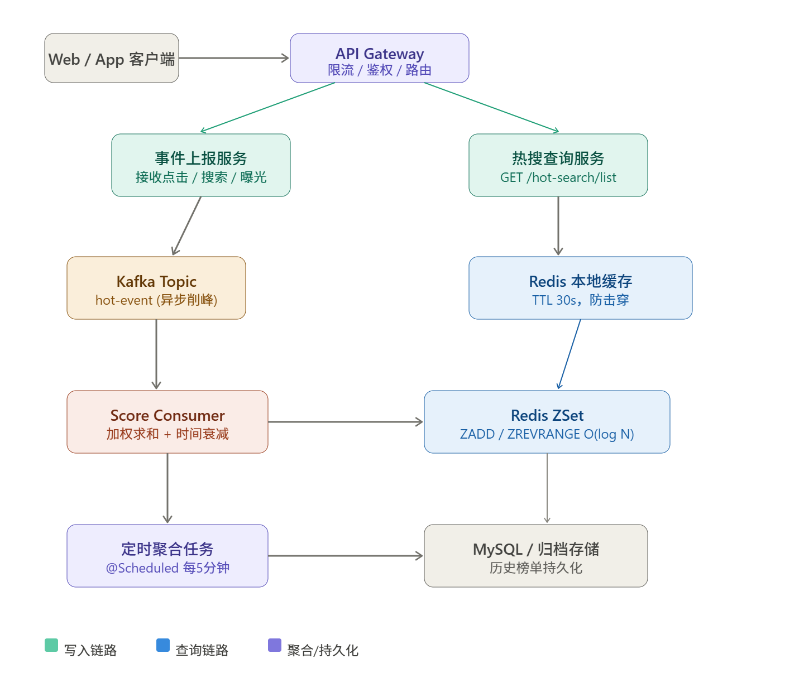

## 十三、登录认证系统设计（SSO 单点登录）

### 痛点

多微服务、多系统，重复登录、登录态共享

### 方案

1. **统一认证中心**
   登录只走认证服务，颁发 JWT / Token
2. **网关统一鉴权**
   所有请求过网关，统一拦截校验Token
3. **分布式会话**
   登录信息存入 Redis 统一共享
4. **SSO 单点登录**
   CAS/OAuth2.0/OIDC，一次登录、多系统免登

### 安全点

- Token 过期、刷新令牌
- 防篡改、加盐加密、HTTPS
- 黑名单注销、异地下线

---

## 十四、限流 & 防刷系统设计

### 场景

活动、秒杀、爬虫、恶意请求

### 限流维度

- 全局限流、接口限流、IP限流、用户ID限流

### 算法

1. **令牌桶**：允许突发流量，网关/Sentinel常用
2. **漏桶**：匀速流出，削峰
3. **滑动窗口**：精准统计QPS，平滑限流

### 防刷

- 验证码、行为校验、频率限制、IP黑名单

---

## 十五、热搜/排行榜设计

### 需求

实时热度、榜单排序、高并发查询

### 设计

1. 热度计数：**Redis ZSet 有序集合**
2. 点赞/浏览/评论 累加分数
3. 定时聚合、降级兜底
4. 热点缓存、本地缓存多级优化

### 优点

天然排序、高性能、聚合简单

## **热搜 / 排行榜系统设计**-GPT

------

### 一、核心需求

热搜系统通常需要满足：

#### 1 功能需求

1. 实时统计内容热度（文章 / 视频 / 商品 / 话题）
2. 按热度排序展示 TopN
3. 支持不同维度榜单
   - 全站榜
   - 分类榜（娱乐 / 科技）
   - 地区榜
4. 支持时间窗口
   - 实时榜
   - 小时榜
   - 日榜

#### 2 非功能需求

- **高并发**
- **实时性**
- **防刷**
- **高可用**
- **可扩展**

------

### 二、热度计算模型（核心）

热度不是简单浏览量，而是 **加权计算**。

典型公式：

```
HotScore =
    View * 1
  + Like * 5
  + Comment * 10
  + Share * 20
```

进阶版：

```
HotScore =
    (View + 5*Like + 10*Comment + 20*Share)
    * TimeDecay
```

时间衰减：

```
TimeDecay = 1 / (1 + hours)
```

意义：

- 新内容更容易上榜
- 防止旧内容长期霸榜

------

### 三、系统整体架构

典型互联网架构：

```
用户行为
   │
   ▼
行为日志采集
   │
   ▼
Kafka消息队列
   │
   ▼
实时计算服务
   │
   ▼
Redis ZSet排行榜
   │
   ▼
API服务
   │
   ▼
客户端展示
```

详细流程：

```
用户点赞/评论/浏览
        │
        ▼
行为日志服务
        │
        ▼
Kafka
        │
        ▼
热度计算服务
        │
        ▼
Redis ZSet
        │
        ▼
排行榜API
        │
        ▼
客户端
```

------

### 四、核心数据结构（Redis）

排行榜最适合：

**Redis Sorted Set (ZSet)**

结构：

```
key: hot_rank

member       score
-----------------------
topic_1      1200
topic_2      950
topic_3      880
```

优点：

- 自动排序
- O(logN) 插入
- O(logN) 查询

------

### 五、核心接口

#### 1 更新热度

```
ZINCRBY hot_rank 5 topic_1
```

点赞：

```
ZINCRBY hot_rank 5 topic_1
```

评论：

```
ZINCRBY hot_rank 10 topic_1
```

------

#### 2 获取排行榜

Top10：

```
ZREVRANGE hot_rank 0 9 WITHSCORES
```

------

#### 3 获取某内容排名

```
ZREVRANK hot_rank topic_1
```

------

### 六、实时计算架构（推荐）

大厂不会直接写 Redis，而是：

**Kafka + Stream计算**

架构：

```
用户行为
   │
   ▼
日志服务
   │
   ▼
Kafka
   │
   ▼
Flink / Spark Streaming
   │
   ▼
计算HotScore
   │
   ▼
Redis排行榜
```

优点：

- 可扩展
- 支持复杂计算
- 支持窗口统计

------

### 七、时间窗口排行榜

例如：

- **1小时榜**
- **24小时榜**

解决方案：

#### 方案1（推荐）

多个ZSet

```
hot_rank:1h
hot_rank:24h
hot_rank:7d
```

定时任务滚动更新。

------

#### 方案2（滑动窗口）

使用 **Flink Window**

```
Tumbling Window
Sliding Window
```

实时计算热度。

------

### 八、防刷设计（非常重要）

如果没有防刷：

- 机器人刷榜
- 刷评论
- 刷点赞

常见手段：

#### 1 限制用户行为

Redis记录：

```
like:userId:contentId
```

防止重复点赞。

------

#### 2 IP限流

```
INCR ip:like:1.1.1.1
EXPIRE 60
```

------

#### 3 机器学习识别

特征：

- 短时间大量点赞
- 同IP
- 新账号

------

### 九、热点缓存问题

热门榜单会被大量访问。

解决：

**多级缓存**

```
客户端
   │
   ▼
CDN
   │
   ▼
Nginx缓存
   │
   ▼
Redis
   │
   ▼
DB
```

------

### 十、海量数据优化

如果内容很多（1亿+）。

问题：

```
ZSet不能无限增长
```

解决：

只保留TopN。

```
ZREMRANGEBYRANK hot_rank 1000 -1
```

只留：

```
Top1000
```

------

### 十一、冷热分离

热榜数据：

```
Redis
```

历史榜：

```
MySQL / ClickHouse
```

------

### 十二、工业级架构（大厂）

完整架构：

```
用户行为
   │
   ▼
埋点SDK
   │
   ▼
日志系统
   │
   ▼
Kafka
   │
   ▼
Flink实时计算
   │
   ▼
Redis ZSet
   │
   ▼
API服务
   │
   ▼
客户端
```

补充系统：

```
风控系统
特征工程
机器学习排序
```

------

### 十三、进阶优化（面试加分）

#### 1 分榜单

例如：

```
hot:global
hot:tech
hot:finance
```

------

#### 2 地域榜

```
hot:beijing
hot:shanghai
```

------

#### 3 个性化推荐

排行榜 + 推荐系统

```
热度 * 用户兴趣权重
```

------

### 十四、面试总结回答（30秒版本）

如果面试官问：

**如何设计热搜排行榜？**

可以回答：

> 热搜排行榜一般通过用户行为（浏览、点赞、评论、转发）计算热度值。
> 用户行为先进入Kafka，然后通过Flink实时计算HotScore，最后写入Redis ZSet作为排行榜。
> ZSet根据score自动排序，通过ZREVRANGE获取TopN。
> 为避免旧内容长期霸榜，会加入时间衰减算法。同时通过限流和风控防止刷榜。
> 高并发访问通过Redis和CDN缓存优化。

------

### MQ替代Kfka

------

#### 一、在热搜系统中 MQ 的作用

在热搜系统里，MQ主要做 **行为日志解耦 + 异步处理**。

流程一般是：

```
用户行为(点赞/评论/浏览)
        │
        ▼
行为服务
        │
        ▼
MQ（Kafka/RabbitMQ/RocketMQ）
        │
        ▼
实时计算服务
        │
        ▼
Redis ZSet排行榜
```

作用：

1. **削峰填谷**
2. **解耦业务**
3. **日志持久化**
4. **支持实时计算**

------

#### 二、RabbitMQ 能不能用？

可以，但**不太适合超大规模热搜系统**。

使用 **RabbitMQ** 的架构：

```
用户行为
   │
   ▼
RabbitMQ
   │
   ▼
消费服务
   │
   ▼
Redis ZSet
```

优点：

- 延迟低
- 支持多种路由模式
- 消息可靠性好

缺点：

1. **吞吐量较低**

RabbitMQ：

```
几万 ~ 十几万 TPS
```

而热搜系统：

```
百万级行为日志
```

1. **日志回放能力弱**

RabbitMQ消息消费后一般会删除，不适合：

```
历史重算
数据回溯
```

1. **不适合日志流系统**

热搜行为更像：

```
log stream
```

------

#### 三、RocketMQ 能不能用？

完全可以，而且**很多国内大厂就是这样做的**。

例如：

- 阿里
- 美团
- 滴滴

使用 **Apache RocketMQ** 的架构：

```
用户行为
   │
   ▼
RocketMQ
   │
   ▼
实时计算服务
   │
   ▼
Redis排行榜
```

优点：

1. **高吞吐**

```
百万级TPS
```

1. **顺序消息**

适合：

```
用户行为流
订单流
```

1. **支持消息回溯**

可以重新消费历史数据。

1. **延迟消息**

适合：

```
榜单刷新
定时计算
```

------

#### 四、Kafka 为什么最常见

热搜系统更像 **日志流系统**。

因此 **Apache Kafka** 更适合。

特点：

##### 1 超高吞吐

```
百万 ~ 千万 TPS
```

##### 2 天然日志系统

Kafka本质是：

```
commit log
```

可以长期保存。

##### 3 支持实时计算生态

可以直接接：

- Apache Flink
- Apache Spark Streaming

例如：

```
Kafka -> Flink -> Redis
```

------

#### 五、三者对比（面试回答很好用）

| MQ              | 适合场景      | 吞吐 | 日志回放 | 生态 |
| --------------- | ------------- | ---- | -------- | ---- |
| RabbitMQ        | 业务消息      | 中   | 不强     | 一般 |
| Apache RocketMQ | 大型业务系统  | 高   | 支持     | 好   |
| Apache Kafka    | 日志流/数据流 | 极高 | 非常强   | 最强 |

------

#### 六、面试推荐回答（非常加分）

如果面试官问：

**MQ一定要Kafka吗？**

你可以这样回答：

> 不一定，RabbitMQ和RocketMQ也可以实现。但热搜系统本质是用户行为日志流，需要高吞吐、消息持久化和回放能力，因此Kafka更适合。如果是业务系统内部事件通知，可以使用RabbitMQ；如果是互联网业务系统，也可以使用RocketMQ。

------

#### 七、真实互联网架构

很多公司热搜系统：

```
用户行为
   │
   ▼
Kafka / RocketMQ
   │
   ▼
Flink实时计算
   │
   ▼
Redis ZSet
   │
   ▼
排行榜服务
```

------

如果你愿意，我可以再给你一份 **“真正的大厂级热搜系统架构（比普通面试答案高一个档次）”**，里面会包含：

- **冷热榜设计**
- **刷榜风控**
- **热搜突然爆发处理**
- **千万级QPS排行榜优化**

这套是 **字节 / 腾讯面试常问的完整架构。**

## 数据写入 ZSet

在热搜/排行榜系统里，把数据写入 **Redis** 的 **ZSet（Sorted Set）** 本质就是 **更新某个成员的 score（热度值）**。通常有两种写入方式：**实时增量更新** 和 **计算后直接写入**。

------

### 一、ZSet 基本结构

ZSet结构：

```
key: hot_rank

member (内容ID)     score (热度值)
--------------------------------
topic_1001          1500
topic_1002          1200
topic_1003          980
```

- **member**：内容ID / 话题ID / 视频ID
- **score**：热度分数

ZSet会**自动按score排序**。

------

### 二、方式1：实时增量写入（最常见）

当用户行为发生时（浏览/点赞/评论），直接增加 score。

例如：

行为 → MQ → 消费者 → Redis

流程：

```
用户点赞
   │
   ▼
MQ(Kafka/RocketMQ)
   │
   ▼
热度计算服务
   │
   ▼
ZINCRBY 写入 Redis
```

示例：

浏览：

```
ZINCRBY hot_rank 1 topic_1001
```

点赞：

```
ZINCRBY hot_rank 5 topic_1001
```

评论：

```
ZINCRBY hot_rank 10 topic_1001
```

转发：

```
ZINCRBY hot_rank 20 topic_1001
```

效果：

```
topic_1001 score += weight
```

优点：

- 实时
- 实现简单
- 性能高

时间复杂度：

```
O(logN)
```

------

### 三、方式2：计算完热度再写入

如果热度算法复杂（例如时间衰减），可以先计算，再写入。

例如：

```
HotScore =
(View + 5*Like + 10*Comment + 20*Share)
* TimeDecay
```

计算后：

```
ZADD hot_rank 1850 topic_1001
```

示例：

```
ZADD hot_rank 1850 topic_1001
```

含义：

```
member = topic_1001
score  = 1850
```

------

### 四、批量写入（高并发优化）

如果事件非常多（例如抖音级流量），会先 **聚合再写入**。

流程：

```
用户行为
   │
   ▼
MQ
   │
   ▼
Flink聚合
   │
   ▼
每秒统计一次
   │
   ▼
批量更新Redis
```

例如：

```
ZINCRBY hot_rank 300 topic_1001
ZINCRBY hot_rank 150 topic_1002
ZINCRBY hot_rank 90 topic_1003
```

减少 Redis QPS。

------

### 五、Java 示例（SpringBoot）

使用 **Spring Data Redis**：

#### 写入

```java
@Autowired
private StringRedisTemplate redisTemplate;

public void addScore(String topicId, double score) {
    redisTemplate.opsForZSet()
        .incrementScore("hot_rank", topicId, score);
}
```

对应 Redis：

```
ZINCRBY hot_rank score topicId
```

------

#### 查询排行榜

Top10：

```java
Set<ZSetOperations.TypedTuple<String>> top =
    redisTemplate.opsForZSet()
        .reverseRangeWithScores("hot_rank", 0, 9);
```

对应：

```
ZREVRANGE hot_rank 0 9 WITHSCORES
```

------

### 六、排行榜控制大小（重要）

ZSet不能无限增长。

通常只保留：

```
Top 1000
```

定时清理：

```
ZREMRANGEBYRANK hot_rank 1000 -1
```

意思：

```
删除1000名之后的所有数据
```

------

### 七、不同榜单设计

多个 key：

```
hot_rank:global
hot_rank:tech
hot_rank:game
hot_rank:1h
hot_rank:24h
```

写入：

```
ZINCRBY hot_rank:global 10 topic_1001
ZINCRBY hot_rank:tech 10 topic_1001
```

------

### 八、工业级完整流程

真实热搜写入流程：

```
用户行为
   │
   ▼
日志SDK
   │
   ▼
MQ (Kafka / RocketMQ)
   │
   ▼
实时计算(Flink)
   │
   ▼
计算HotScore
   │
   ▼
写入Redis ZSet
   │
   ▼
API查询排行榜
```

------

### 九、面试标准回答（推荐）

如果面试官问：

**排行榜是怎么写入 Redis 的？**

可以回答：

> 排行榜通常使用 Redis 的 ZSet 存储，member 是内容 ID，score 是热度值。当用户产生浏览、点赞、评论等行为时，通过消息队列进入热度计算服务，然后通过 ZINCRBY 增加对应内容的 score，Redis 会自动按 score 排序。查询排行榜时使用 ZREVRANGE 获取 TopN。

------

如果你愿意，我可以再给你一份 **“大厂热搜排行榜完整设计（包含时间衰减 + 滑动窗口 + 防刷 + Redis优化）”**，那一套是 **系统设计面试高频满分答案**。

## **分层计算 + 异步聚合**

------

### 一、为什么“计算后写入”会慢

如果每个行为都这样做：

```text
用户点赞
   ↓
查询当前数据(View/Like/Comment)
   ↓
重新计算 HotScore
   ↓
ZADD 写入 Redis
```

问题：

1️⃣ **频繁读取数据库**

```text
DB QPS 爆炸
```

2️⃣ **计算复杂**

如果有：

- 时间衰减
- 权重
- 热度模型

计算成本高。

3️⃣ **高并发**

例如：

```text
1秒 100万行为
```

每次都计算：

```text
CPU压力巨大
```

------

### 二、真实系统做法：增量更新（主流）

最常见方案：

**直接增量更新 Redis score**

例如：

```text
浏览  +1
点赞  +5
评论 +10
转发 +20
```

写入：

```text
ZINCRBY hot_rank 5 topic_1001
```

优点：

- O(logN)
- 无需重新计算
- 极快

流程：

```text
用户行为
   ↓
MQ
   ↓
消费服务
   ↓
ZINCRBY Redis
```

延迟通常：

```text
毫秒级
```

------

### 三、复杂算法怎么做（工业级方案）

如果需要：

- 时间衰减
- 机器学习
- 排序模型

不会实时算。

而是 **离线/准实时计算**。

架构：

```text
用户行为
   ↓
MQ
   ↓
实时统计服务
   ↓
聚合统计
   ↓
每30秒/1分钟计算一次
   ↓
ZADD更新排行榜
```

例如：

```
topic_1001
view=2000
like=300
comment=50
```

再统一计算：

```
HotScore =
2000
+ 300*5
+ 50*10
```

再写：

```text
ZADD hot_rank 3500 topic_1001
```

------

### 四、实时计算系统（大厂方案）

大型系统会用流计算：

常见架构：

```text
用户行为
   ↓
MQ
   ↓
流计算
   ↓
窗口聚合
   ↓
Redis ZSet
```

例如使用：

- Apache Flink
- Apache Spark Streaming

计算：

```text
1秒窗口
```

然后批量写 Redis。

------

### 五、进一步优化（减少 Redis 写入）

如果 QPS 极高，例如：

```text
10万点赞/秒
```

不会每个都写 Redis。

而是：

**先在内存聚合**

例如：

```
topic_1001
1秒点赞 500
```

然后：

```text
ZINCRBY hot_rank 500 topic_1001
```

Redis写入减少：

```text
500 次 → 1 次
```

------

### 六、真实热搜系统完整流程

工业级架构：

```text
用户行为
   │
   ▼
日志采集
   │
   ▼
MQ（Kafka/RocketMQ）
   │
   ▼
流计算(Flink)
   │
   ▼
窗口聚合
   │
   ▼
计算热度
   │
   ▼
批量更新 Redis ZSet
   │
   ▼
排行榜 API
```

特点：

- 高吞吐
- 低延迟
- 可扩展

------

### 七、面试最佳回答

如果面试官问：

**计算后写入 Redis 会不会很慢？**

推荐回答：

> 如果每个用户行为都实时计算完整热度确实会带来较高的计算开销，因此通常采用增量更新或者流式聚合计算。简单场景下直接使用 ZINCRBY 增量更新 score；复杂热度模型则通过消息队列进入流计算系统，例如 Flink，在窗口内聚合后批量更新 Redis ZSet，这样可以大幅减少计算次数和 Redis 写入次数。

------

如果你愿意，我可以再给你讲一个 **“字节跳动热搜系统真正的核心难点”**：

**如何防止“热点突然爆发导致 Redis 排行榜崩掉”**（这个是很多高级面试题）。

## 热搜/排行榜-Claude

这是一套完整的 Java 面试级热搜/排行榜设计方案，以下逐层展开。



------

### 核心数据结构：Redis ZSet

这是整套方案的基石。`ZADD hot:search <score> <keyword>` 把每个话题的热度分作为 score 存入有序集合，`ZREVRANGE hot:search 0 49 WITHSCORES` 即可 O(log N) 取出 Top 50。

面试重点：score 怎么算。一个典型加权公式是：

```
score = 搜索次数×1.0 + 点击次数×0.6 + 转发次数×1.2 + 评论次数×1.5
        × 时间衰减因子(e^(-λt))
```

时间衰减让旧话题自然掉榜，λ 通常取 0.1~0.3（单位：小时）。

------

### 写入链路：异步削峰

用户的每次搜索/点击触发一条事件，高峰期 QPS 可达几十万，不能同步写 Redis。标准做法是：

```java
// Controller 只负责发消息，立即返回
kafkaTemplate.send("hot-event", new HotEvent(keyword, EventType.SEARCH, userId));
```

Kafka Consumer 批量消费后再聚合写入 Redis，实现削峰。Consumer 端用 `ZINCRBY` 原子地给 score 加分：

```java
redisTemplate.opsForZSet().incrementScore("hot:search", keyword, delta);
```

------

### 查询链路：多级缓存防击穿

Top 热搜几乎是全局热点，要做三层防护：

1. JVM 本地缓存（Caffeine）：TTL 10s，拦截 99% 的流量
2. Redis ZSet：TTL 30s，作为主存储
3. 互斥锁（`SET NX`）：防止缓存失效时大量请求击穿 Redis，只让一个线程去重建

```java
public List<HotItem> getHotList() {
    List<HotItem> local = localCache.getIfPresent("hot_list");
    if (local != null) return local;

    String lock = "hot_list:rebuild_lock";
    if (redisTemplate.opsForValue().setIfAbsent(lock, "1", 5, SECONDS)) {
        try {
            List<HotItem> list = buildFromZSet();
            localCache.put("hot_list", list);
            return list;
        } finally {
            redisTemplate.delete(lock);
        }
    }
    return fallbackFromDB(); // 获取不到锁，降级走 DB
}
```

------

### 定时聚合与持久化

每 5 分钟一个 `@Scheduled` 任务：

- 将当前 ZSet Top 100 快照写入 MySQL，供历史榜单查询
- 对 ZSet 整体做一次衰减乘法（`pipeline` 批量 `ZADD`），让旧分自然缩减
- 清除 score < 阈值的长尾话题（`ZREMRANGEBYSCORE`）

------

### 高频追问

| 问题          | 答法要点                                                     |
| ------------- | ------------------------------------------------------------ |
| ZSet key 设计 | 按时间窗口分 key，如 `hot:search:2026041915`（15 分钟粒度），滚动合并 |
| 反作弊        | 同 IP/UID 短时高频去重（Redis Bitmap），机器流量识别后不入队 |
| 单 Key 热点   | ZSet 分片（hash slot），或用 `{}` 强制同一 slot 做 pipeline  |
| 精确 vs 近似  | 数据量极大时用 HyperLogLog 统计 UV，Count-Min Sketch 估算频次 |
| 数据一致性    | Kafka at-least-once + Consumer 幂等（eventId 去重）          |

如需深入某一块（比如时间窗口滑动算法、Caffeine 配置、或 Kafka Consumer Group 设计），可以继续聊。

---

## 十六、海量日志收集系统

### 流程

业务服务 → Logback 本地打印 → MQ(Kafka) → 日志消费 → ES存储 → Kibana展示

### 核心

1. 异步解耦，不阻塞业务
2. 海量日志削峰
3. ES 分布式存储、检索
4. 链路追踪 TraceId 串联全链路

---

## 十七、定时关闭优惠券/过期积分

### 方案对比

1. 定时扫库：低效、压DB
2. Redis 过期监听：不可靠、丢失
3. **延时消息 MQ**（最优）
   发放优惠券时发送延时消息，到期自动过期作废

### 兜底

定时小批量巡检补偿，保证数据一致

---

## 十八、消息可靠投递设计（不丢、不重、不乱序）

1. **不丢消息**
   生产者重试、事务消息、持久化、ACK确认
2. **不重复消费**
   消费者幂等、唯一ID去重、幂等表
3. **消息不乱序**
   分区有序、单线程消费、顺序队列

---

## 十九、分库分表设计

### 场景

单表千万级、查询慢、存储瓶颈

### 分片方案

1. 水平分表：按用户ID/订单ID哈希分片
2. 垂直分库：订单库、用户库、商品库拆分

### 中间件

Sharding-JDBC 客户端分片，无中间层、高性能

### 问题

跨库关联、分页深分页、分布式事务、扩容迁移

---

## 二十、多级缓存架构设计

**本地缓存(Caffeine) → 分布式缓存(Redis) → DB**

1. 本地缓存：速度最快，单机隔离
2. Redis：全局共享、统一过期
3. 缓存更新策略：
   - Cache Aside 旁路缓存（主流）
   - 先更库、再删缓存
4. 保障：缓存三大问题+定时预热

---

## 二十一、支付系统设计

### 核心流程

下单 → 生成支付单 → 调起第三方支付(微信/支付宝) → 异步回调通知 → 更新订单状态 → 扣库存/发券

### 难点

1. 回调幂等（重复通知）
2. 资金一致性、对账
3. 超时关闭、退款逆向流程

### 关键

- 异步回调+幂等校验+定时对账


你这个总结已经抓住支付系统的主干了，但在面试里还不够“拉开差距”。支付系统真正的分水岭在于：**一致性怎么做 + 状态怎么驱动 + 异常怎么兜底**。

我帮你把这一块升级成一个更“面试可打”的版本。

------

## 支付系统设计-gpt

### 一、核心链路（标准支付闭环）

**订单系统 → 支付系统 → 三方支付 → 回调 → 订单/支付状态联动**

1. 创建订单（Order）
2. 生成支付单（Pay Order）
   - 唯一支付单号（全局唯一）
   - 初始状态：`INIT`
3. 调用微信/支付宝下单
   - 获取 `prepay_id / pay_url`
4. 用户完成支付
5. 第三方**异步回调 notify**
6. 支付系统更新支付单状态
7. 推动订单状态变更（已支付）
8. 扣库存 / 发优惠券 / 发货准备

------

### 二、核心难点（面试重点）

#### 1. 回调幂等（最核心）

##### 问题

微信/支付宝**一定会重复通知**
（至少 2~10 次，甚至失败重试）

##### 解决方案（标准三件套）

- 数据库唯一约束（核心）
  - `pay_order_no` 唯一
- 状态机校验
  - 只有 `INIT -> SUCCESS` 才允许更新
- 幂等标记（可选 Redis）

```sql
update pay_order
set status = 'SUCCESS'
where pay_order_no = ?
and status = 'INIT';
```

👉 关键点：**用数据库保证原子性，而不是靠代码判断**

------

#### 2. 资金一致性（支付系统灵魂）

#### 关键原则

👉 **支付成功 ≠ 订单成功（中间可能失败）**

##### 推荐设计：最终一致性

使用：

- MQ（Kafka/RocketMQ）
- 本地消息表（Outbox）

流程：

1. 支付成功
2. 写支付成功记录
3. 发 MQ 事件：`PAY_SUCCESS`
4. 订单服务消费消息更新订单

------

#### 3. 超时关闭（防止“僵尸订单”）

##### 方式一：定时任务

- XXL-JOB / Quartz
- 扫描 `INIT` 状态 + 超时（30min）

```sql
update pay_order
set status = 'CLOSED'
where status = 'INIT'
and create_time < now() - interval 30 minute;
```

##### 方式二（更优）：延迟消息

- RocketMQ delay message
- RabbitMQ TTL + DLX

👉 推荐：**MQ 延迟消息 > 定时轮询**

------

#### 4. 退款 / 逆向流程（高频加分点）

支付系统必须支持：

- 全额退款
- 部分退款
- 多次退款（分批）

状态设计：

```
INIT → SUCCESS → REFUNDING → REFUNDED
```

关键点：

- 退款也要幂等
- 退款单（refund_order）独立建表
- 退款和支付解耦

------

### 三、支付系统关键设计（面试加分）

#### 1. 状态机设计（非常重要）

支付系统必须“状态驱动”：

```
INIT（创建）
PAYING（支付中）
SUCCESS（成功）
FAILED（失败）
CLOSED（关闭）
REFUNDING（退款中）
REFUNDED（已退款）
```

👉 面试官很看重：**有没有状态机意识**

------

#### 2. 一致性方案（核心区别点）

| 方案                 | 场景             |
| -------------------- | ---------------- |
| 强一致（分布式事务） | 很少用（性能差） |
| 最终一致（MQ）       | 主流             |
| TCC                  | 高级支付/金融    |
| 本地消息表           | 兜底方案         |

------

#### 3. 对账系统（企业级必备）

##### 为什么需要？

- 第三方可能漏通知
- 网络失败
- 本地状态异常

##### 对账方式：

每天定时：

1. 拉取支付宝/微信账单
2. 对比本地支付表
3. 找差异：
   - 本地成功，第三方失败（异常）
   - 第三方成功，本地失败（补单）

👉 这是支付系统“可信度”的核心

------

### 四、完整高可用架构（面试画图点）

```
订单服务
   ↓
支付服务
   ↓
MQ（异步事件）
   ↓
第三方支付（微信/支付宝）

回调 →
支付服务（幂等校验）
   ↓
MQ事件：PAY_SUCCESS
   ↓
订单服务 / 库存服务 / 发券服务

定时任务：
- 超时关单
- 对账修复
```

------

### 五、面试一句话总结（非常加分）

> 支付系统的核心不是“支付”，而是通过**状态机 + 幂等控制 + 最终一致性机制 + 对账兜底**，保证资金链路在分布式环境下仍然可靠可恢复。

------

如果你愿意，我可以帮你再升级一版：

👉 **“支付系统 + 秒杀 + 订单 + 库存”四件套面试整合架构图（企业级标准答案）**

---

## 二十二、大数据量导出 Excel

### 痛点

一次性导出 OOM、超时、大文件

### 方案

1. 分页查询、分批写入
2. 异步导出：后台任务生成文件，完成短信/消息通知下载
3. 禁止一次性全表查询，限制最大导出条数

---

## 二十三、避免重复提交

1. 前端：按钮禁用、防重复点击
2. 后端：
   - 全局唯一请求ID + Redis 防重
   - 分布式锁短时间锁定
   - 数据库唯一索引/状态机

---

## 二十四、高并发点赞设计

1. 点赞动作：Redis 记录状态（是否点赞）
2. 计数：Redis 累加
3. 落库：定时批量异步持久化到DB
4. 避免：频繁写库、并发更新行锁

### 参考回答

点赞这个功能看似特别简单，就点一下亮了，再点一下灭了。但在稍微大一点的互联网平台，它其实是一个典型的「高频读写」场景。一篇文章或一个视频发布后，可能会在短时间内涌入大量用户疯狂点赞或取消点赞，同时每一个进来刷文章的用户，系统都得立即告诉他「这篇文章总共有多少赞」以及「你刚才到底有没有点过赞」。

如果要应对这种高并发，我们传统的「直接往 MySQL 数据库里写一条记录，然后再查出来」的方案是绝对扛不住的，数据库很容易就被频繁的读写操作给打挂了。

所以，设计点赞系统的核心思路就一句话：**所有的核心读写操作必须完全交给 Redis 在内存中完成，然后再通过异步的方式悄悄把数据同步到 MySQL 做永久保存**。

具体落地上，我会把设计分为以下三个核心步骤来和您汇报：

#### 第一步是核心：在 Redis 里怎么存储点赞的数据？

我们需要满足两个需求：获知「总赞数」和获知「某人有没有点过赞」。对于记录谁点过赞，我会在 Redis 里使用 Set（集合）这个数据结构。比如这篇文章的 ID 是 10086，那我就可以建一个叫 `article:likes:10086` 的 Set。

- 用户A点赞了，我就把他的 UserID `sadd` 塞进这个集合里；
- 他取消点赞了，我就 `srem` 把他的 UserID 移出来；
- 需要高亮前端的点赞按钮时，我就用 `sismember` 判断一下他的 UserID 在不在集合里。同时，利用 Set 自带的 `scard` 命令，我就可以非常快速地查出这个集合里有多少个人，也就是这篇文章的「总赞数」了。（补充：如果平台极大，比如抖音，可以考虑单独用 Redis 的 String 利用原子加减 `incr/decr` 来单独维护一个点赞总数，把状态和总数分开，进一步提升性能。）

#### 第二步是持久化：数据怎么回到 MySQL 里兜底？

因为 Redis 是内存数据库，如果哪怕有一点数据丢失，也是我们不想看到的，所以我们终究要把这些点赞记录存进 MySQL 的「点赞明细表」和「内容汇总表」里。但这绝对不能是同步的。我会引入**消息队列（MQ）**，比如 Kafka 或者 RocketMQ。当用户在前端点赞，后端在 Redis 里操作成功后，不立刻写数据库，而是往 MQ 发送一条消息（比如：用户A在X时间点点赞了文章B）。然后后端会有专门的消费者去慢拉取这些消息，把它们攒成一批（批量操作），平滑、缓慢地写到 MySQL 里。这就叫「异步削峰」，哪怕前端洪水滔天，后端数据库也能像涓涓细流一样安稳。

#### 第三步是进阶防范：如何处理「大V热点」问题？

在实际业务里，最怕的就是某位顶流明星突然发了一条微博，几百万人瞬间冲过来点赞。这时候就算全用 Redis，也可能会因为这一个帖子导致大量的请求打到同一台 Redis 服务器上，形成「热点 Key」问题。为了应对这种情况，我会在 Redis 之上再加一层「本地对象缓存（Local Cache）」。一旦系统探测到这是个热点文章，就把总赞数缓存进应用服务器自己的 JVM 内存里（比如用 Guava Cache），并且每隔一两秒汇总一下这段时间的「新增赞数」，合并成一次请求再去更新 Redis。这样就能成百上千倍地减少 Redis 的压力。

#### 总结

总结一下我的设计逻辑：点赞系统的全貌就是：前端请求打过来 -> 拦截器校验后落入 Redis 处理点赞状态（Set）和总数 -> 业务立马返回给前端响应 -> 后台通过**消息队列（MQ）**异步削峰批量落库 MySQL -> 遇到大V爆款时，利用**本地缓存汇总合并**的手段保护系统。

## 点赞系统-GPT

**点赞系统（Like System）**是后端 / Java / 分布式系统面试里的经典设计题，常见于社交平台例如 Twitter、Facebook、TikTok。
核心是：**高并发 + 去重 + 计数准确 + 实时性**。

下面给你一套 **面试标准设计思路**。

------

### 一、先说核心需求（面试第一步）

点赞系统一般需要支持：

1️⃣ **点赞**

```text
用户 → 点赞一条内容
```

2️⃣ **取消点赞**

```text
用户 → 取消点赞
```

3️⃣ **查看点赞数**

```text
文章 / 视频 / 评论 → 点赞数量
```

4️⃣ **查看用户是否点赞**

```text
用户是否点赞过该内容
```

5️⃣ **高并发支持**

热门内容可能：

```text
10万~100万点赞
```

------

### 二、系统整体架构

典型架构：

```
用户
 │
 │
Gateway / Nginx
 │
 │
点赞服务
 │
 ├── Redis（实时点赞）
 │
 ├── MQ（异步处理）
 │
 └── MySQL（最终存储）
```

核心思想：

```
Redis做实时数据
MQ削峰
MySQL最终存储
```

------

### 三、数据库设计

需要两张核心表。

#### 1 点赞关系表

```sql
like_record
-------------
id
user_id
target_id
target_type
create_time
```

说明：

```
target_id   内容ID
target_type 类型
```

例如：

```
1 = 文章
2 = 评论
3 = 视频
```

------

#### 2 点赞统计表

```sql
like_count
-------------
target_id
target_type
like_count
```

原因：

```
避免每次 count(*)
```

------

### 四、点赞流程设计

点赞流程：

```
用户点赞
 ↓
Redis判断是否点赞
 ↓
Redis记录点赞
 ↓
Redis点赞数+1
 ↓
发送MQ消息
 ↓
异步写入数据库
```

示例代码逻辑：

```java
String key = "like:user:" + userId + ":" + targetId;

Boolean success = redis.setIfAbsent(key, "1");

if(success){
    redis.incr("like:count:" + targetId);
    mq.send("like_event");
}
```

------

### 五、为什么要用 Redis

因为点赞属于：

```
高频操作
```

例如：

```
1秒10万点赞
```

如果直接写数据库：

```
数据库会被打爆
```

Redis优势：

```
原子操作
高性能
内存存储
```

------

### 六、防止重复点赞

用户不能重复点赞。

解决方案：

Redis Set。

```
like:user:{targetId}
```

存储：

```
Set<UserId>
```

代码示例：

```java
redis.sadd("like:user:" + targetId, userId);
```

判断：

```java
redis.sismember("like:user:" + targetId, userId);
```

优点：

```
天然去重
```

------

### 七、取消点赞设计

流程：

```
用户取消点赞
 ↓
Redis删除用户
 ↓
点赞数-1
 ↓
发送MQ
 ↓
数据库更新
```

示例：

```java
redis.srem("like:user:" + targetId, userId);
redis.decr("like:count:" + targetId);
```

------

### 八、MQ异步落库

为什么需要 MQ？

因为：

```
点赞操作非常频繁
```

直接写数据库：

```
性能差
```

流程：

```
点赞
 ↓
MQ
 ↓
消费服务
 ↓
写数据库
```

MQ可以使用：

- Kafka
- RocketMQ
- RabbitMQ

------

### 九、热门点赞优化

如果某个视频：

```
100万点赞
```

Redis Set 可能过大。

优化方案：

#### 1 Bitmap

结构：

```
Bitmap[userId] = 1
```

优点：

```
节省内存
```

------

#### 2 分片

例如：

```
like:user:1001:1
like:user:1001:2
```

减少热点。

------

### 十、统计一致性问题

问题：

```
Redis + MySQL 数据不一致
```

解决：

#### 1 定时任务对账

定时：

```
Redis → MySQL
```

------

#### 2 MQ重试

消费失败：

```
自动重试
```

------

### 十一、高并发优化

#### 1 多级缓存

```
客户端
 ↓
CDN
 ↓
Redis
 ↓
MySQL
```

------

#### 2 批量更新数据库

MQ消费者：

```
批量写数据库
```

例如：

```
1000条一起更新
```

------

### 十二、点赞系统完整流程

```
1 用户点击点赞

2 Redis判断是否点赞

3 Redis记录点赞

4 Redis点赞数+1

5 发送MQ消息

6 MQ消费者写数据库

7 返回点赞成功
```

------

### 十三、面试加分点

如果面试官继续追问，可以说：

#### 1 如何防刷点赞

```
IP限流
用户限流
```

------

#### 2 如何支持排行榜

可以用 Redis：

```
SortedSet
```

------

#### 3 Redis挂了怎么办

降级方案：

```
直接写数据库
```

------

### 十四、面试总结（推荐话术）

可以这样总结：

> 点赞系统的核心是 **去重 + 高并发计数**。
> 通常使用 **Redis存储用户点赞关系和点赞数**，
> 通过 **Set或Bitmap实现去重**，
> 并通过 **MQ异步写入数据库保证最终一致性**，
> 从而支撑高并发点赞场景。

------

如果你在准备 **Java高级面试 / 架构面试**，我还可以给你一套 **面试官最喜欢深挖的点赞系统 8 个问题**，例如：

- Redis Set 和 Bitmap 怎么选？
- 如何设计 **亿级点赞系统**？
- Redis Key 过大怎么办？
- 如何支持 **点赞排行榜**？
- 如何解决 **热点Key问题**？

这套基本是 **大厂系统设计面试必问的。**

## 点赞系统设计-Claude

------

### 需求分析

| 功能            | 说明                             |
| --------------- | -------------------------------- |
| 点赞 / 取消点赞 | 同一用户对同一内容只能点赞一次   |
| 点赞数查询      | 内容维度的总点赞数               |
| 是否已点赞      | 用户维度判断（列表页需批量查询） |
| 点赞列表        | 谁赞了我（可选）                 |
| 高并发写入      | 热点内容瞬间大量点赞             |

------

### 整体架构

```
用户点赞请求
     ↓
  网关限流
     ↓
  点赞服务
     ↓
Redis 原子操作（主链路）
     ↓
  MQ 异步
     ↓
MySQL 持久化 + 计数更新
```

------

### 数据模型设计

**MySQL — 持久化明细**

```sql
-- 点赞明细表（追加写，不做物理删除）
CREATE TABLE user_like (
    id          BIGINT PRIMARY KEY AUTO_INCREMENT,
    user_id     BIGINT NOT NULL,
    target_id   BIGINT NOT NULL,          -- 被点赞的内容ID
    target_type TINYINT NOT NULL,         -- 1=帖子 2=评论 3=视频
    status      TINYINT DEFAULT 1,        -- 1=已点赞 0=已取消
    created_at  DATETIME DEFAULT NOW(),
    updated_at  DATETIME DEFAULT NOW() ON UPDATE NOW(),
    UNIQUE KEY uk_user_target (user_id, target_id, target_type),
    INDEX idx_target (target_id, target_type)
);

-- 点赞计数表（独立维护，避免 COUNT 全表扫描）
CREATE TABLE like_count (
    target_id   BIGINT NOT NULL,
    target_type TINYINT NOT NULL,
    like_count  BIGINT DEFAULT 0,
    PRIMARY KEY (target_id, target_type)
);
```

**Redis — 缓存层**

```
# 1. 用户点赞集合（判断是否点赞、获取点赞列表）
SET  like:user:{userId}:{targetType}  →  {targetId1, targetId2, ...}

# 2. 内容点赞数计数器
STRING  like:count:{targetType}:{targetId}  →  "12345"

# 3. 内容被谁点赞（可选，谁赞了我）
SET  like:target:{targetType}:{targetId}  →  {userId1, userId2, ...}
```

------

### 核心接口实现

**点赞 / 取消点赞**

```java
@Service
public class LikeService {

    public Result toggleLike(Long userId, Long targetId, Integer targetType) {
        String userLikeKey   = "like:user:" + userId + ":" + targetType;
        String countKey      = "like:count:" + targetType + ":" + targetId;
        String targetLikeKey = "like:target:" + targetType + ":" + targetId;

        // 用 Lua 脚本保证原子性
        String luaScript = """
            local liked = redis.call('SISMEMBER', KEYS[1], ARGV[1])
            if liked == 1 then
                redis.call('SREM', KEYS[1], ARGV[1])
                redis.call('SREM', KEYS[3], ARGV[2])
                redis.call('DECR', KEYS[2])
                return 0   -- 取消点赞
            else
                redis.call('SADD', KEYS[1], ARGV[1])
                redis.call('SADD', KEYS[3], ARGV[2])
                redis.call('INCR', KEYS[2])
                return 1   -- 点赞成功
            end
            """;

        Long result = redis.eval(luaScript,
            List.of(userLikeKey, countKey, targetLikeKey),
            List.of(String.valueOf(targetId), String.valueOf(userId))
        );

        // 发 MQ，异步同步到 MySQL
        mqProducer.send("like-topic", new LikeEvent(userId, targetId, targetType, result == 1));

        return result == 1 ? Result.success("点赞成功") : Result.success("取消点赞");
    }
}
```

**查询点赞数 + 是否已点赞**

```java
// 单个查询
public LikeVO queryLike(Long userId, Long targetId, Integer targetType) {
    String countKey    = "like:count:" + targetType + ":" + targetId;
    String userLikeKey = "like:user:" + userId + ":" + targetType;

    // Pipeline 批量查询减少网络 RTT
    List<Object> results = redis.executePipelined(conn -> {
        conn.get(countKey);
        conn.sIsMember(userLikeKey, targetId.toString());
    });

    return new LikeVO(
        Long.parseLong((String) results.get(0)),  // 点赞数
        (Boolean) results.get(1)                   // 是否已点赞
    );
}

// 列表页批量查询（N 条内容是否已点赞）
public Map<Long, Boolean> batchQueryLiked(Long userId, List<Long> targetIds, Integer targetType) {
    String userLikeKey = "like:user:" + userId + ":" + targetType;
    // SMEMBERS 一次拿出用户所有点赞，内存判断
    Set<String> likedSet = redis.smembers(userLikeKey);
    return targetIds.stream().collect(Collectors.toMap(
        id -> id,
        id -> likedSet.contains(id.toString())
    ));
}
```

------

### 异步落库（MQ 消费者）

```java
@RabbitListener(queues = "like-queue")
public void handleLikeEvent(LikeEvent event) {
    // 1. 幂等校验（消息可能重复消费）
    String idempotentKey = "like:mq:" + event.getUserId() + ":" + event.getTargetId();
    if (!redis.setIfAbsent(idempotentKey, "1", 10, TimeUnit.SECONDS)) {
        return; // 重复消息，直接丢弃
    }

    // 2. 更新明细表（INSERT ON DUPLICATE KEY UPDATE）
    likeMapper.upsert(event.getUserId(), event.getTargetId(),
                      event.getTargetType(), event.isLiked() ? 1 : 0);

    // 3. 更新计数表
    if (event.isLiked()) {
        likeCountMapper.increment(event.getTargetId(), event.getTargetType());
    } else {
        likeCountMapper.decrement(event.getTargetId(), event.getTargetType());
    }
}
-- upsert SQL
INSERT INTO user_like (user_id, target_id, target_type, status)
VALUES (#{userId}, #{targetId}, #{targetType}, #{status})
ON DUPLICATE KEY UPDATE
    status = #{status}, updated_at = NOW();
```

------

### Redis 数据冷热分层

```
热数据（近 7 天活跃内容）→ 常驻 Redis
冷数据（7 天无访问）     → 惰性加载：访问时从 MySQL 回填

// 回填逻辑
public long getLikeCount(Long targetId, Integer targetType) {
    String key = "like:count:" + targetType + ":" + targetId;
    String val = redis.get(key);
    if (val != null) return Long.parseLong(val);

    // 回源 MySQL
    long count = likeCountMapper.queryCount(targetId, targetType);
    redis.setex(key, 3600, String.valueOf(count));
    return count;
}
```

------

### 计数一致性保障

```
Redis 计数  ←→  MySQL 计数  可能存在短暂不一致

解决方案：
1. 定时对账任务（每小时）：SELECT COUNT(*) FROM user_like
   WHERE target_id=? AND status=1 对比 like_count 表，偏差超阈值则修正

2. 日终全量重算：将 like_count 表全量与明细表 GROUP BY 比对修复

3. 容忍短暂不一致：点赞数非强一致业务，±5 以内用户无感知
```

------

### 高并发热点问题

**问题：** 微博热搜、爆款视频瞬间百万点赞，单个 Redis Key 成为热点

```java
// 方案：Key 分片，将单个计数拆成 N 个分片
public void incrLikeCount(Long targetId) {
    int shard = ThreadLocalRandom.current().nextInt(10); // 10个分片
    String key = "like:count:" + targetId + ":shard:" + shard;
    redis.incr(key);
}

public long getLikeCount(Long targetId) {
    long total = 0;
    for (int i = 0; i < 10; i++) {
        String val = redis.get("like:count:" + targetId + ":shard:" + i);
        if (val != null) total += Long.parseLong(val);
    }
    return total;
}
```

------

### 面试高频追问

| 追问                     | 要点                                                |
| ------------------------ | --------------------------------------------------- |
| Redis 宕机数据丢失？     | RDB+AOF 持久化；MQ 消息补偿；定期从DB回刷           |
| 如何防刷（机器人刷赞）？ | 同IP频率限制 + 行为特征识别 + 账号风控              |
| 点赞数要求强一致怎么办？ | 去掉异步，直接写DB，加行锁或乐观锁                  |
| 分库分表怎么设计？       | user_like 按 user_id 分；like_count 按 target_id 分 |
| 取消点赞是否物理删除？   | 推荐软删除（status=0），保留行为记录便于风控分析    |

------

**一句话总结：** Redis Lua 原子操作保证点赞幂等，MQ 异步削峰落库，Set 结构支持批量查询是否点赞，分片 Key 解决热点计数，定时对账保证最终一致性。

---

### 终极整合版（面试口述万能模板）

遇到任意系统设计题，套这个结构：

1. **先拆痛点**：并发、数据量大、一致性、可用性、安全
2. **分层架构**：前端层 → 网关层 → 业务服务 → 缓存 → MQ → 数据库
3. **核心优化**：缓存、异步、限流、分片、幂等、多级降级
4. **数据一致**：最终一致、异步补偿、定时兜底
5. **高可用**：集群、熔断降级、故障隔离
