# 后端高频系统设计场景题

全部是 Java/微服务/分布式 必考场景题，**题干+核心问题+设计方案+技术选型**，一套打通。

---

## 一、秒杀系统设计（最高频）
### 核心难点

秒杀场景的核心特点是高并发、低库存、短时间爆发式访问。因此，设计时需要解决以下几个问题：
1.高并发处理：如何应对大量用户同时访问？
2.库存一致性：如何保证库存不会超卖或少卖？
3.用户体验：如何减少用户等待时间，避免页面崩溃？
4.防刷机制：如何防止恶意用户利用脚本抢购商品？

针对秒杀场景的四大核心问题，结合架构设计原则，具体解决方案如下：

#### 1. 高并发处理：如何应对大量用户同时访问？

**核心策略：分层过滤 + 异步化 + 削峰**
*   **接入层过滤（CDN + 网关）**：
    *   **CDN静态化**：将商品详情页、活动页做成静态资源（HTML/CSS/图片）部署在CDN，让90%的静态资源请求直接由边缘节点响应，不回源到应用服务器。
    *   **网关限流**：在API网关层通过**IP限流**（限制单IP请求频率）、**用户限流**（限制单用户请求次数）和**接口级限流**（控制全局QPS），过滤掉大量无效请求，削峰填谷。
*   **核心链路异步化**：
    *   **请求快速返回**：网关层通过Redis预扣库存成功后，不要直接去写库，而是向消息队列（MQ）发送一个异步消息，然后立即返回“处理中”给用户，避免长连接占用服务器资源。
    *   **MQ缓冲**：利用消息队列（如RocketMQ/Kafka）的高吞吐特性，将瞬时爆发的流量缓冲起来，下游服务根据自身消费能力慢慢处理，实现流量“削峰”。

#### 2. 库存一致性：如何保证库存不会超卖或少卖？

**核心策略：Redis原子操作 + 最终一致性校验**
*   **Redis预扣减（防超卖）**：
    *   库存数据优先存储在Redis中，利用Redis单线程特性和Lua脚本，保证库存扣减的原子性。直接使用`DECR`或`HINCRBY`等原子命令，或者编写Lua脚本确保“检查-扣减”一气呵成，防止并发情况下的超卖。
*   **数据库落库与乐观锁（防少卖）**：
    *   消费MQ消息落单时，数据库层面使用**乐观锁**（`update stock set num = num -1 where id = xx and num > 0`），利用数据库的事务隔离机制，确保更新时库存足够。
*   **最终一致性对账（兜底）**：
    *   引入定时任务（如XXL-Job），定期对比Redis中的缓存库存与数据库中的实际库存。如果发现不一致（如Redis扣了但库没扣成功），触发补偿机制（回滚订单或修正库存），确保数据终态一致。

#### 3. 用户体验：如何减少用户等待时间，避免页面崩溃？

**核心策略：本地缓存 + 服务端缓存 + 长轮询/WebSocket**
*   **前端优化**：
    *   **页面静态化**：减少首屏加载时间。
    *   **按钮防重**：点击“立即抢购”后，前端按钮直接置灰，防止用户重复点击造成的重复请求。
*   **服务端多级缓存**：
    *   **本地缓存（Guava/Caffeine）**：Tomcat/Jetty容器内增加本地缓存，热门商品数据直接内存读取，绕过网络IO。
    *   **Redis分布式缓存**：所有的库存查询、扣减都走Redis，内存级操作，响应时间控制在1ms以内。
*   **响应机制**：
    *   如果系统过载，直接返回“活动太火爆”的静态页面，而不是让浏览器转圈等待（Loading），通过快速失败机制提升用户感知。

#### 4. 防刷机制：如何防止恶意用户利用脚本抢购？

**核心策略：风控校验 + 唯一性约束**

*   **接入层校验**：
    *   **验证码/滑块**：在活动开始前或请求峰值时，强制要求用户输入验证码或完成滑块验证，区分人机行为。
    *   **登录校验**：未登录用户直接拦截，秒杀请求必须携带合法的Token。
*   **业务层防刷**：
    *   **一人一单**：基于“用户ID+商品ID”构建唯一索引或唯一Redis Key，限制每个用户只能下单一次。
    *   **风控识别**：识别高频请求的异常IP（如同一IP在1秒内请求100次），直接拉入黑名单。
*   **幂等性保证**：
    *   所有的请求都带有唯一的请求标识（如UUID），消费端处理前先校验是否已处理过，防止重复请求导致的重复下单。

---
#### 总结架构图（精简版）

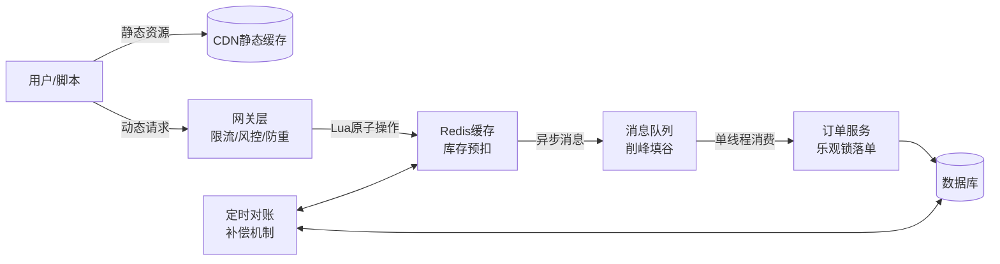

需要我根据这些方案，提供一份具体的**核心代码伪代码**（比如Redis扣减Lua脚本或Java代码示例）吗？

### 设计方案

1. **流量分层拦截**
- 前端：按钮置灰、限流、验证码
- 网关：限流、黑名单、IP限制
2. **多级缓存削峰**
- 商品库存、活动信息全放 **Redis**
- 静态页面 CDN 缓存
3. **库存防超卖**
- Redis + Lua 脚本**原子扣库存**
- 禁止超卖、原子减扣
4. **异步削峰**
- 下单请求入 MQ 异步消费
- 避免同步大量写库
5. **最终一致性**
- 定时任务+消息补偿，校准Redis与DB库存
6. **防重复下单**
- 分布式锁 + 唯一订单ID + 幂等

### 技术栈
Redis + Lua + MQ + 网关限流 + 分布式锁 + 定时补偿

关键的核心业务逻辑实现，**库存防超卖方案采用：Redis原子操作 + 异步扣减数据库**。

### 高并发订单秒杀业务流程图

以下是基于你提供的业务逻辑，绘制的**可视化流程图**，采用Mermaid语法（可直接在支持Mermaid的工具/平台渲染，如Markdown编辑器、ProcessOn等），清晰还原各层交互逻辑：

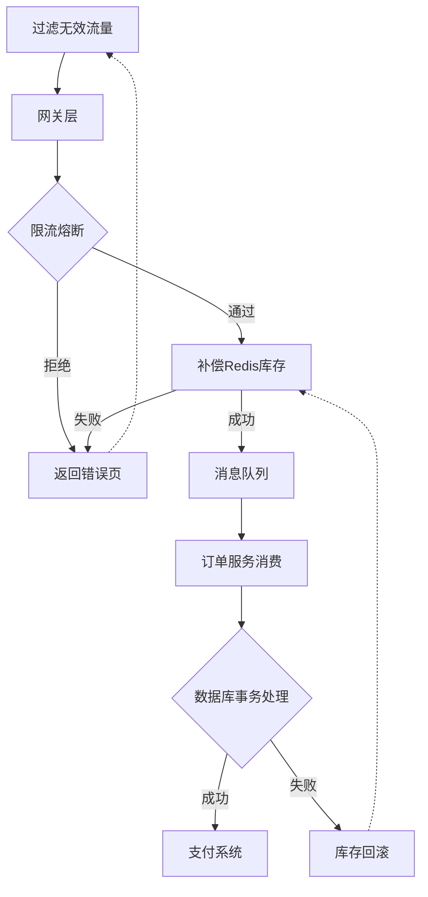

#### 流程图核心逻辑说明

##### 1. 正向流程（正常下单）

用户请求 → 网关层过滤 → 限流熔断通过 → Redis原子预扣库存成功 → 写入消息队列异步缓冲 → 订单服务消费消息 → 数据库事务落单成功 → 调用支付系统。

##### 2. 异常分支（核心容错）

- 限流熔断拒绝：直接返回错误页，拦截无效请求，保护后端；
- Redis预扣减失败：库存不足/并发冲突，返回错误页，终止流程；
- 数据库事务失败：触发库存回滚，补偿Redis中预扣的库存，保证库存数据一致。

##### 3. 关键设计亮点

- **分层拦截**：从用户请求到最终支付，每一层都具备容错/过滤能力，避免系统雪崩；
- **异步解耦**：通过消息队列衔接Redis预扣与订单服务，削峰填谷，提升接口吞吐量；
- **最终一致性**：库存回滚机制兜底，确保Redis缓存库存与数据库落库库存数据同步。

这是一张**高并发场景下的订单秒杀/库存扣减业务流程图**，核心逻辑是通过“Redis预扣减+异步队列+最终一致性”来保障系统高可用和数据准确，以下是针对每一层的详细设计方案：

#### 1. 用户请求层

**设计目标**：降低无效请求，过滤恶意流量
* **接入层优化**：
    * **页面静态化**：将秒杀商品页、列表页做CDN静态化部署，减轻源站压力。
    * **本地缓存**：前端增加浏览器缓存，按钮点击后立即置灰防重复提交。
* **请求校验**：
    * **登录校验**：拦截未登录用户的直接请求，提前返回登录态。
    * **参数校验**：网关层校验请求签名（Sign）、商品ID合法性，过滤非法参数。

#### 2. 网关层 & 限流熔断层

**设计目标**：系统削峰填谷，保障核心服务可用
* **限流策略（Rate Limiting）**：
    * **IP维度**：单IP单位时间内限制请求次数（如5次/秒），防CC攻击。
    * **用户维度**：限制单个用户的下单频率。
    * **全局令牌桶**：针对秒杀接口设置全局QPS上限，将突发流量削平。
* **熔断降级（Circuit Breaker）**：
    * 当后端Redis或数据库响应超时、错误率达到阈值（如50%）时，快速熔断接口，直接返回“活动太火爆”页，避免雪崩。
* **排队机制**：对通过限流的请求引入“令牌桶”或“排队池”，让超出吞吐量的请求等待，而非直接拒绝。

#### 3. Redis 库存预扣减层

**设计目标**：快速响应，原子性扣减，防止超卖
* **原子性操作**：
    * 使用 `Redis Incr/Decr` 或 `Lua` 脚本执行**库存原子扣减**，保证多线程下数据一致性。
    * 预扣减成功：写入消息队列，触发后续下单流程。
    * 预扣减失败：返回“库存不足”，回滚释放资源。
* **缓存设计优化**：
    * **多级缓存**：本地Guava缓存 + Redis集群，减少网络IO。
    * **库存分片**：若库存极大，将库存分片存储在多个Redis Key中，降低锁竞争。

#### 4. 消息队列层

**设计目标**：异步解耦，流量削峰，实现最终一致性
* **队列选型**：使用RabbitMQ、RocketMQ或Kafka作为缓冲层。
* **业务解耦**：
    * 生产者（Redis层）仅负责发送“订单创建请求”，无需等待下游处理结果，快速释放连接。
    * 消费者（订单服务）异步拉取消息，单台消费者处理不过来时可水平扩容。
* **重试机制**：
    * 配置死信队列（DLX），处理下单失败的消息，人工介入排查，避免数据丢失。

#### 5. 订单服务消费层

**设计目标**：保证幂等性，防止重复下单
* **幂等设计**：
    * 基于“用户ID+商品ID+秒杀活动ID”构建唯一业务键，消费前先查询是否已存在成功订单，存在则直接丢弃重复消息。
* **数据补录**：
    * 若Redis预扣减成功但MQ发送失败，需通过定时任务或补偿机制补写订单数据，保证库存与订单一致。

#### 6. 数据库事务处理层

**设计目标**：落盘数据，触发支付流程
* **事务控制**：
    * 本地事务：创建订单记录 -> 写入订单商品表 -> 扣减数据库库存（若需落库校验）。
    * **分库分表**：订单表按用户ID或时间分库分表，避免单表性能瓶颈。
* **状态机设计**：
    * 订单状态初始化为“待支付”，成功后通知支付系统。

#### 7. 异常兜底层

**设计目标**：数据回滚，防止库存错乱
* **库存回滚**：
    * 若数据库事务失败，需触发**反向补偿逻辑**：调用Redis接口**恢复库存**，并发送告警通知人工核查。
    * 引入**定时对账任务**：每日对比Redis库存与数据库库存，发现差异及时修复。
* **支付回调**：
    * 支付系统若回调失败，依赖本地消息表或定时任务主动轮询支付结果，确保订单状态终态闭环。

#### 核心优化总结

1. **先缓存后数据库**：用Redis抗高并发，数据库只处理最终落单请求。
2. **异步化处理**：MQ将同步转为异步，大幅提升接口TPS。
3. **熔断与降级**：保护核心链路，坏的情况（如数据库宕机）不影响整体可用性。
4. **最终一致性**：通过补偿机制和对账机制，保证数据不丢失、不超卖。

### 时序图

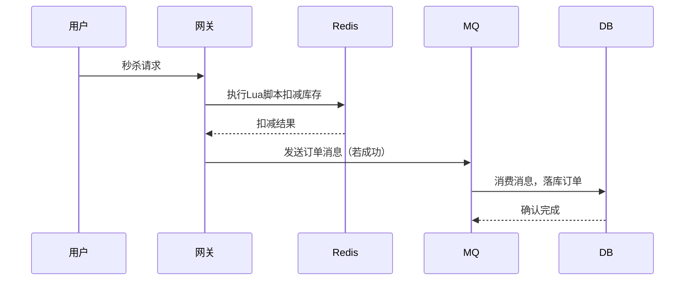

以下是图片内容的完整复述：

---

#### （时序图部分）

（图中从上到下的参与者依次为：用户、网关、Redis、MQ、DB）

1.  **用户 → 网关**：发送秒杀请求
2.  **网关 → Redis**：执行Lua脚本扣减库存
3.  **Redis → 网关**：返回扣减结果
4.  **网关 → MQ**：（若扣减成功）发送订单消息
5.  **MQ → DB**：消费消息，落库订单
6.  **DB → MQ**：确认完成

---

#### 具体流程如下：

-   **秒杀请求达到**：用户发起秒杀请求，系统接收到请求后，首先进行一些基础校验（如用户身份验证、活动是否开始等）。如果校验通过，进入库存扣减逻辑。
-   **Redis库存扣减**：在Redis中检查商品库存是否充足。例如，使用 `GET` 命令获取当前库存数量。如果库存不足，直接返回失败，结束流程。如果库存充足，使用Redis的原子操作（如 `DECR` 或Lua脚本）扣减库存。
-   **异步更新数据库**：如果Redis库存扣减成功，生成一个秒杀成功的消息，并将其放入消息队列
-   **后台服务消费消息**：后台服务从消息队列中消费秒杀成功的消息，执行以下操作：
    -   1、为用户创建订单记录；
    -   2、使用乐观锁将数据库中的库存数量减少1；
    -   3、通过唯一标识（如用户ID+商品ID+时间戳）防止重复消费。
-   **最终一致性校验**：在Redis库存扣减和数据库库存更新之间，可能会存在短暂的不一致状态。为了保证最终一致性，可以采取以下措施：
    -   1、定期将Redis中的库存数据与数据库进行同步。
    -   2、如果发现Redis和数据库库存不一致，触发补偿逻辑（如回滚订单或调整库存）。

### 回答参考

这是一套**经典且高可用**的秒杀系统设计方案，核心逻辑在于**“层层漏斗拦截 + 异步削峰填谷”**，通过多级防护将流量拦截在数据库层之上，确保系统在高并发下不崩且不超卖。以下是核心要点的深度总结：

#### 一、 核心设计原则：层层漏斗

秒杀的痛点是**瞬时并发极高、读写少、绝对不能超卖**。方案的核心思路是**在请求到达数据库前，设置多道防线，层层拦截，尽量把流量挡在上游**，不让数据库承担核心压力。

#### 二、 三级拦截流程详解

##### 1. 第一关：前端与网关层（拦截无效请求，动静分离）

*   **核心手段**：
    *   **动静分离**：秒杀页面的图片、CSS 等静态资源全部上 **CDN**，减轻后端服务压力。
    *   **限流与防刷**：
        *   **IP 限流**：限制单 IP 单位时间内的请求次数。
        *   **验证屏障**：增加**滑块验证码**或**答题校验**。
*   **核心目的**：拦截机器脚本发起的恶意请求，将原本高度集中的“毫秒级秒杀”打散成“秒级请求”，物理上降低瞬时流量峰值。

##### 2. 第二关：Redis 预扣库存（抗压与防超卖）

*   **核心手段**：
    *   **缓存前置**：请求绝不直接打 MySQL，库存必须提前缓存在 Redis。
    *   **原子性扣减（防超卖核心）**：使用 **Lua 脚本** 封装“查库存”和“扣库存”操作。
        *   原理：Lua 脚本保证了这两个动作是**原子性**的，同一时刻只有一个线程能执行，彻底避免并发下的“超卖”问题（如查库存时被插队）。
*   **核心目的**：Redis 单机 QPS 极高，能承受十万级流量冲击。库存扣为 0 后，直接拦截剩余 99.9% 的请求，不让其进入下游逻辑。

##### 3. 第三关：消息队列 MQ（异步削峰，保护数据库）

*   **核心手段**：
    *   **异步下单**：Redis 扣减成功后，不直接操作数据库，而是向 MQ 发一条消息，立即返回前端“排队中”。
    *   **消费者慢处理**：订单服务作为 MQ 消费者，根据数据库承载能力（如每秒处理 2 个），**慢速**消费并落库。
*   **核心目的**：
    *   **削峰填谷**：将瞬时爆发的流量平滑化。
    *   **兜底防护**：即使后续步骤异常，MQ 可重试；数据库只承担稳定的写入压力，绝对不会被冲垮。

#### 三、 整体架构逻辑

1.  **进**：10 万请求涌入，第一关（CDN+验证码）拦截掉 9 万无效请求。
2.  **压**：剩下 1 万请求打向 Redis，第二关（Lua 原子扣减）拦截掉 9990 个，仅 10 人成功。
3.  **稳**：这 10 个成功请求进入 MQ，第三关（异步消费）以极慢速度写入 MySQL。
4.  **果**：数据库只承受了极小的稳定流量，因此这套方案既能**抗住高并发**，又能**杜绝超卖**。

#### 四、 关键技术亮点总结

| 环节           | 关键技术           | 解决问题                                           |
| :------------- | :----------------- | :------------------------------------------------- |
| **防超卖**     | Redis + Lua 脚本   | 保证库存查询与扣减的原子性，并发环境下数据绝对一致 |
| **高并发抗压** | CDN + 网关限流     | 拦截恶意流量，打散请求峰值，降低后端负载           |
| **护库兜底**   | 消息队列 MQ 异步化 | 削峰填谷，将瞬时流量转为匀速消费，保护数据库底层   |

需要我基于这个架构，给你提供具体的**Redis Lua 防超卖脚本代码**或**MQ 异步下单的伪代码实现**吗？

## 幂等

在**秒杀系统**里，“幂等”是非常重要的设计点。因为秒杀场景会出现：

- 用户重复点击
- 请求重试
- 网络超时重发
- MQ 消息重复消费
- 接口被恶意刷

如果没有幂等控制，就可能出现：

- **一个用户下多个订单**
- **库存被多扣**
- **重复支付**

------

### 一、什么是幂等

幂等的含义：

> **同一个请求执行多次，结果仍然一致**

例如：

```text
用户A秒杀商品1001
```

无论请求发 **1次 / 10次**
最终都应该：

```text
只生成 1 个订单
```

------

### 二、秒杀系统常见幂等问题

主要有三个地方需要保证幂等：

1️⃣ **秒杀请求幂等（防止重复下单）**
2️⃣ **订单创建幂等**
3️⃣ **MQ 消费幂等**

------

### 三、第一层幂等：用户维度防重复秒杀

最常见做法：

#### Redis 判断用户是否已经秒杀

```text
key: seckill:user:商品ID
value: userId
```

请求时：

```text
SADD seckill:user:1001 20001
```

如果返回：

- **1 → 第一次**
- **0 → 已经秒杀过**

示例：

```java
Long result = redisTemplate.opsForSet()
    .add("seckill:user:" + productId, userId);

if(result == 0){
    return "已经秒杀过";
}
```

优点：

- O(1)
- 非常快

------

### 四、第二层幂等：数据库唯一约束

即使 Redis 挡住了，大规模并发下仍可能漏掉，所以必须有 **DB 兜底**。

订单表增加唯一索引：

```text
UNIQUE(user_id, product_id)
```

效果：

```text
同一个用户同一个商品只能生成一条订单
```

如果重复插入：

```text
Duplicate Key
```

系统捕获异常即可。

------

### 五、第三层幂等：MQ 消费幂等

秒杀系统通常流程：

```text
用户请求
   ↓
Redis 扣库存
   ↓
发送 MQ
   ↓
订单服务消费
   ↓
创建订单
```

MQ 可能：

- 重复投递
- 消费失败重试

解决方案：

#### 订单唯一 ID

```text
orderNo = userId + productId
```

或者：

```text
snowflakeId
```

#### 再加数据库唯一约束。

------

### 六、第四层幂等：请求 Token（防止重复点击）

常见做法：

#### 秒杀 Token

步骤：

1️⃣ 用户进入秒杀页面
2️⃣ 服务器生成 token

```text
seckill_token:userId:productId
```

3️⃣ 秒杀请求必须带 token

校验：

```text
GETDEL token
```

只能用一次。

------

### 七、完整幂等方案（工业级）

秒杀系统一般是 **多层幂等**：

```text
用户请求
   ↓
① 秒杀Token防重复请求
   ↓
② Redis判断用户是否秒杀
   ↓
③ Redis扣库存
   ↓
④ MQ异步下单
   ↓
⑤ DB唯一索引(userId, productId)
   ↓
⑥ MQ消费幂等
```

------

### 八、为什么要多层幂等？

因为单点控制不可靠：

| 层级  | 作用           |
| ----- | -------------- |
| Token | 防重复点击     |
| Redis | 高并发快速拦截 |
| MQ    | 异步削峰       |
| DB    | 最终一致性     |

------

### 九、面试标准回答（推荐背）

> 秒杀系统的幂等通常通过多层保证：
> 第一层在 Redis 中记录用户是否秒杀过，避免重复请求；
> 第二层在数据库建立 `(userId, productId)` 唯一索引作为最终兜底；
> 第三层在 MQ 消费端做幂等处理，避免重复消费创建订单。
> 通过 Redis + MQ + DB 唯一约束多层保障，实现高并发下的业务幂等。

------

如果你愿意，我可以再给你讲一个**大厂面试特别爱问的进阶问题**：

**“10万用户抢10个商品，如何保证不超卖？”**

里面会涉及：

- Redis Lua
- 原子扣库存
- 分布式锁
- 队列削峰


## 幂等类型

------

### 一、幂等实现的常见类型

常见可以分为 **6 类**：

1️⃣ 唯一索引幂等
2️⃣ 幂等 Token（幂等码）
3️⃣ Redis 幂等（SETNX）
4️⃣ 状态机幂等
5️⃣ 去重表幂等（防 MQ 重复消费）
6️⃣ 业务号幂等（OrderNo / RequestId）

------

### 二、唯一索引幂等（数据库兜底）

这是**最可靠的一种幂等**。

例如订单表：

```sql
UNIQUE(user_id, product_id)
```

效果：

```text
同一个用户同一个商品只能生成一个订单
```

如果重复请求：

```text
Duplicate Key
```

系统捕获异常即可。

------

### 三、幂等 Token（幂等码）

也叫：

> **Idempotency Key**

典型场景：

- 防止表单重复提交
- 秒杀接口
- 支付请求

流程：

1️⃣ 用户进入页面生成 token

```text
token = uuid
```

存入 Redis：

```text
seckill:token:userId
```

------

2️⃣ 请求时携带 token

```http
POST /order
token=xxxxx
```

------

3️⃣ 服务端验证

```text
GETDEL token
```

成功：

```text
允许执行
```

失败：

```text
重复请求
```

------

### 四、Redis SETNX 幂等

核心思想：

> **只允许第一次成功**

Redis：

```text
SETNX order:request:123 1
```

返回：

| 返回值 | 含义       |
| ------ | ---------- |
| 1      | 第一次执行 |
| 0      | 已执行     |

示例代码：

```java
Boolean success = redisTemplate.opsForValue()
        .setIfAbsent(key, "1");
```

------

### 五、状态机幂等

主要用于：

- 支付回调
- 订单状态
- MQ重复消费

更新必须带条件：

```sql
UPDATE order
SET status='PAID'
WHERE status='UNPAID'
```

如果已经更新过：

```text
update 0 rows
```

说明已经处理过。

------

### 六、去重表幂等（MQ 消费）

MQ 最大问题：

```text
消息可能重复投递
```

解决方案：

建一张表：

```text
message_consume_log
```

字段：

```text
msg_id
consumer
create_time
```

消费逻辑：

```sql
INSERT INTO message_consume_log(msg_id)
```

如果：

```text
Duplicate key
```

说明已经消费过。

------

### 七、业务号幂等

每个请求生成唯一业务号：

例如：

```text
orderNo
paymentNo
requestId
```

支付系统经典设计：

```text
requestId = UUID
```

数据库：

```sql
UNIQUE(request_id)
```

------

### 八、幂等方式对比

| 方式        | 场景        | 优点       |
| ----------- | ----------- | ---------- |
| 唯一索引    | 订单 / 支付 | 最可靠     |
| Token       | 防重复提交  | 前端友好   |
| Redis SETNX | 高并发接口  | 性能高     |
| 状态机      | 状态更新    | 逻辑严谨   |
| 去重表      | MQ消费      | 防重复消费 |
| 业务号      | API调用     | 统一管理   |

------

### 九、真实系统一般怎么做？

**多层幂等**

例如支付系统：

```text
用户请求
   ↓
Token幂等
   ↓
Redis SETNX
   ↓
MQ
   ↓
状态机幂等
   ↓
数据库唯一索引
```

------

### 十、面试标准回答（推荐）

> 系统幂等通常通过多种方式实现，包括数据库唯一索引、幂等 Token、Redis SETNX、状态机条件更新、MQ 去重表以及业务唯一请求号等。在高并发系统中通常采用多层幂等机制，例如 Redis 进行快速拦截，数据库唯一索引作为最终兜底，以保证系统最终一致性。

------

如果你愿意，我可以再给你整理一份 **“大厂系统设计中 10 种幂等实现方式（非常全）”**，里面还有：

- **支付回调幂等**
- **接口幂等网关**
- **分布式幂等锁**
- **幂等缓存设计**

这在 **Java 后端 / 系统设计面试里几乎必问**。


## 秒杀系统设计-Claude

秒杀系统的核心挑战是**瞬间高并发 + 库存超卖防护**，需要从多个层面逐层拦截请求。

------

### 整体架构思路

**核心原则：** 请求漏斗 — 每一层都要尽量减少到达下一层的请求量。

```
用户请求
   ↓
CDN / 静态页面缓存（拦截 90%+）
   ↓
Nginx 限流 / 网关层（拦截高频请求）
   ↓
Redis 预减库存（原子操作，快速失败）
   ↓
MQ 异步削峰（消息队列缓冲）
   ↓
数据库扣减库存（最终落库）
```

------

### 关键问题与解决方案

**1. 库存超卖**

最常被问到的核心问题，有三种方案：

```java
// 方案一：Redis + Lua 脚本（原子操作，推荐）
String luaScript = """
    local stock = tonumber(redis.call('get', KEYS[1]))
    if stock <= 0 then return -1 end
    redis.call('decr', KEYS[1])
    return stock - 1
    """;
Long result = jedis.eval(luaScript, List.of("stock:item:1001"), List.of());
if (result < 0) {
    return "秒杀失败，库存不足";
}

// 方案二：数据库乐观锁
UPDATE seckill_stock 
SET stock = stock - 1, version = version + 1
WHERE item_id = 1001 AND version = #{version} AND stock > 0;

// 方案三：数据库悲观锁（并发低时可用）
SELECT stock FROM seckill_stock WHERE item_id = 1001 FOR UPDATE;
```

**2. 重复下单（幂等控制）**

```java
// Redis SetNX 保证同一用户同一商品只能下一次单
String key = "seckill:order:" + userId + ":" + itemId;
Boolean success = redisTemplate.opsForValue()
    .setIfAbsent(key, "1", 24, TimeUnit.HOURS);
if (!success) {
    throw new BusinessException("您已参与过该商品秒杀");
}
```

**3. MQ 异步削峰**

```java
// 秒杀接口只做两件事：预减库存 + 发消息
@PostMapping("/seckill")
public Result doSeckill(Long userId, Long itemId) {
    // 1. Redis 预减库存
    long stock = redisService.decrement("stock:" + itemId);
    if (stock < 0) return Result.fail("已售罄");

    // 2. 发送 MQ 消息，异步创建订单
    SeckillMessage msg = new SeckillMessage(userId, itemId);
    mqProducer.send("seckill-topic", msg);

    // 3. 前端轮询订单结果
    return Result.success("排队中，请稍候...");
}

// Consumer 消费消息，落库
@RabbitListener(queues = "seckill-queue")
public void handleOrder(SeckillMessage msg) {
    // 再次校验库存（双重保险）
    // 创建订单
    // 扣减数据库库存
}
```

**4. 接口防刷**

```java
// 基于 Redis 滑动窗口限流
public boolean isAllowed(String userId) {
    String key = "rate:" + userId;
    long now = System.currentTimeMillis();
    long windowStart = now - 1000; // 1秒窗口

    redisTemplate.opsForZSet().removeRangeByScore(key, 0, windowStart);
    Long count = redisTemplate.opsForZSet().zCard(key);

    if (count < 5) { // 每秒最多5次
        redisTemplate.opsForZSet().add(key, String.valueOf(now), now);
        return true;
    }
    return false;
}
```

------

### 数据库设计要点

```sql
CREATE TABLE seckill_stock (
    item_id     BIGINT PRIMARY KEY,
    total_stock INT NOT NULL,
    sale_stock  INT NOT NULL DEFAULT 0,  -- 已售数量
    version     INT NOT NULL DEFAULT 0,  -- 乐观锁版本
    INDEX idx_item (item_id)
);

CREATE TABLE seckill_order (
    order_id  BIGINT PRIMARY KEY,
    user_id   BIGINT NOT NULL,
    item_id   BIGINT NOT NULL,
    status    TINYINT DEFAULT 0,  -- 0待支付 1已支付 2已取消
    UNIQUE KEY uk_user_item (user_id, item_id)  -- 防重复下单
);
```

------

### 面试高频追问

| 追问                     | 要点                                        |
| ------------------------ | ------------------------------------------- |
| Redis 宕机怎么办？       | Redis 集群 + 持久化；降级到 DB 限流兜底     |
| 如何预热库存？           | 服务启动时或活动开始前将库存写入 Redis      |
| 超时未支付如何回补库存？ | 延迟队列（RabbitMQ TTL + 死信队列）定时检查 |
| 分布式部署如何保证幂等？ | Redis SetNX / 数据库唯一索引                |
| 如何压测验证方案？       | JMeter / Gatling 模拟并发，观察 RT 和超卖率 |

------

**一句话总结：** Redis 原子操作挡超卖，MQ 削峰挡并发，唯一索引挡重复，Nginx 限流挡恶意请求 — 层层过滤，保护数据库。

## “**秒杀系统设计**”-GPT

是 Java / 后端 / 分布式系统面试里的**经典架构题**。面试官通常不是要你写代码，而是看你能否从 **高并发 → 防超卖 → 限流 → 架构扩展 → 一致性** 逐层设计。

下面给你一套 **面试级回答框架（从简单到高级）**。

------

### 一、先说核心问题（面试第一句话）

秒杀系统的核心挑战有 4 个：

1️⃣ **瞬时高并发**

- 正常系统：1000 QPS
- 秒杀瞬间：10万 ~ 100万 QPS

2️⃣ **库存不能超卖**

3️⃣ **数据库不能被打爆**

4️⃣ **防止恶意请求（刷接口 / 黄牛）**

------

### 二、整体架构（面试最重要）

一个标准秒杀架构：

```
用户
  │
  │
CDN（静态缓存）
  │
  │
Nginx / Gateway（限流）
  │
  │
秒杀服务
  │
  ├── Redis（库存）
  │
  ├── MQ（削峰）
  │
  └── MySQL（订单）
```

架构思想：

```
缓存抗流量
队列削峰
数据库最终落地
```

------

### 三、第一层：静态资源缓存（CDN）

秒杀页面 **绝对不能动态渲染**。

全部静态化：

```
HTML
JS
CSS
```

通过 **CDN分发**。

请求：

```
用户 -> CDN -> 页面
```

作用：

- 减少服务器压力
- 加快访问速度

------

### 四、第二层：接口限流（非常重要）

在 **网关层做限流**。

例如：

```
Nginx
Gateway
Sentinel
```

限流方式：

#### 1 固定窗口限流

```
1000 req/s
```

#### 2 Token Bucket（令牌桶）

常见实现：

- Guava RateLimiter
- Sentinel
- Redis Lua

示例：

```java
RateLimiter limiter = RateLimiter.create(1000);

if(!limiter.tryAcquire()){
    return "系统繁忙";
}
```

------

### 五、第三层：库存预热（Redis）

秒杀开始前：

把库存加载到 Redis

```
商品ID : 库存
```

例如：

```
seckill:1001 -> 100
```

秒杀时 **只操作 Redis**

而不是数据库。

------

### 六、第四层：防止超卖（核心）

#### 错误方案（面试会被扣分）

```
select stock from db
if(stock >0)
update stock
```

问题：

```
并发导致超卖
```

------

#### 正确方案：Redis原子扣减

Redis命令：

```
DECR
```

示例：

```java
Long stock = redis.decr("seckill:1001");

if(stock < 0){
    return "秒杀结束";
}
```

特点：

```
原子操作
单线程执行
不会超卖
```

------

### 七、第五层：MQ削峰（非常关键）

秒杀最大的压力来自：

```
订单创建
支付
库存更新
```

解决方案：

**使用消息队列**

例如：

- Kafka
- RocketMQ
- RabbitMQ

流程：

```
用户请求
   │
   │
Redis扣库存
   │
   │
发送MQ消息
   │
   │
异步创建订单
```

流程图：

```
用户
 │
 │
秒杀服务
 │
 │ Redis扣库存
 │
 │
MQ（削峰）
 │
 │
订单服务
 │
 │
MySQL
```

作用：

```
瞬时10万请求
MQ慢慢消费
```

------

### 八、防止重复下单

秒杀常见问题：

```
一个人下100次
```

解决：

#### Redis setnx

```
userId + goodsId
```

key：

```
seckill:user:1001:888
```

代码：

```java
Boolean success = redis.setIfAbsent(key, "1");

if(!success){
    return "不能重复秒杀";
}
```

------

### 九、接口防刷

常见手段：

#### 1 验证码

防止脚本请求。

#### 2 秒杀路径隐藏

例如：

```
/seckill/3sd9fjsl/1001
```

不是：

```
/seckill/1001
```

------

#### 3 用户限流

```
1用户 / 秒
```

Redis实现：

```
INCR + EXPIRE
```

------

### 十、数据库最终一致性

流程：

```
Redis扣库存
MQ消息
创建订单
数据库扣库存
```

问题：

```
Redis成功
数据库失败
```

解决：

#### 补偿机制

例如：

```
MQ消费失败 -> 重试
```

或者：

```
定时任务对账
```

------

### 十一、库存分片（高级优化）

如果库存很大：

```
10000
```

可以分片：

```
stock:1001:1 -> 2000
stock:1001:2 -> 2000
stock:1001:3 -> 2000
```

随机扣减。

作用：

```
减少Redis热点
```

------

### 十二、秒杀系统完整流程（面试终极版）

```
1 用户访问秒杀页面（CDN）

2 请求秒杀接口

3 网关限流

4 Redis判断库存

5 Redis判断是否重复购买

6 Redis扣库存

7 发送MQ消息

8 MQ消费者创建订单

9 写入MySQL

10 返回秒杀成功
```

------

### 十三、面试加分回答（架构级）

如果面试官继续追问，可以说：

#### 1 热点Key问题

```
Redis Cluster
库存分片
```

------

#### 2 Redis挂了怎么办

降级方案：

```
直接返回秒杀结束
```

------

#### 3 如何防止缓存击穿

```
库存永不过期
```

------

#### 4 如何防止库存不一致

```
最终一致性
定时对账
```

------

### 十四、面试总结（标准话术）

你可以这样总结：

> 秒杀系统的核心设计是 **缓存抗流量、MQ削峰、Redis原子扣库存、数据库最终一致性**。
> 通过 **CDN + 网关限流 + Redis库存 + MQ异步下单** 的架构，既保证系统高并发处理能力，又避免库存超卖。

------

如果你准备 **Java高级面试 / 架构面试**，我可以再给你一套 **面试官最喜欢追问的 12 个秒杀深挖问题**，比如：

- Redis 扣库存一定不会超卖吗？
- MQ 消息丢了怎么办？
- Redis 和 MySQL 如何保证一致性？
- 如何设计 **百万 QPS 秒杀系统架构**？

这一套基本是 **大厂面试标准题库**。

---

## 二、短链接系统设计

### 核心难点
1. 长链接→短码映射
2. 海量数据存储
3. 访问量统计、防恶意攻击

### 设计思路
1. 短码生成：**62进制**（数字+大小写字母）
2. 唯一ID：雪花算法/号段模式 生成全局自增ID，再转62进制
3. 存储：
   - 冷热分离：MySQL存映射，Redis缓存热点短链
4. 跳转逻辑：
   访问短链 → 查缓存/DB → 302重定向长链接
5. 附加：过期时间、访问统计、黑名单

### 参考回答

关于短链系统的设计，这个系统在微博、营销短信里非常常见。它的核心需求其实就两件事：

一是把长长的网址变成短短的字符串，

二是当用户点击短网址时，能精准地跳回原来的长链接。 

如果让我来从头设计这个系统，我会沿着整个请求的生命周期，按下面这几个核心模块去展开：

#### 总结

总结一下我的设计思路：整个流转过程就是：用户请求转换长链 -> 通过分布式ID发号器拿一个唯一数字 -> 借用Base62转成短短的6位字符 -> 存入 MySQL 和 Redis -> 用户点击短链 -> 命中 Redis 缓存 -> 返回 HTTP 302 状态码完成重定向跳转。搭配好布隆过滤器防攻击，基本就能扛住大厂的日常考查了。

---

#### 第一步

第一步是从业务上先解决「是怎么跳转的？」这个核心原理。很多人可能觉得这是个啥黑科技，其实不管长链短链，它利用的纯粹就是 HTTP 协议里的重定向机制。当用户浏览器访问短链时，我们的服务器去查到对应的长链，然后给浏览器返回一个特定的状态码和一个 `Location` 响应头，浏览器就会自动跳往真实地址。
这里有个特别经典的考点：状态码千万别用 301，要用 302。因为 301 是「永久重定向」，浏览器非常聪明，它第一次拿到真地址后就会把它死死缓存在本地，下次用户再点短链，浏览器自己就跳过去了，根本不经过咱们的服务器。这会导致业务方想统计个「短链点击量」完全统计不到。而 302 是「临时重定向」，每次点击都会先老老实实来请求一次咱们的服务器，方便我们做数据埋点和流量监控。

#### 第二步

第二步也是最硬核的环节：怎么生成这个短链？短链一般就是类似于像 `t.cn/XyA1b2` 这种后缀大概包含 6 位随机字符（数字+大小写字母）的短串。很多人第一时间想到用 MD5 等哈希算法对长链接做哈希处理。这种方案有个致命缺点，哈希冲突。哈希值如果截断成6位短串，很容易出现两个不同的长链接算出来一模一样的短链，处理冲突的代码会写得让人怀疑人生。
所以我更推荐目前的业界标配：「分布式ID发号器 + Base62转换」方案。这逻辑极其精妙且简单：

1. 先利用咱们常说的分布式事务ID生成机制（比如 MySQL号段模式 或者 Redis自增），给每一个新发来的长链接，分配一个全局唯一、绝对不重复的递增数字ID（比如 10086）。
2. 把这个十进制的数字ID，用类似数学里「十进制转二进制」的除法取余逻辑，转换成 62进制。为什么是62？因为 0-9、a-z、A-Z 加起来刚好62个字符。您可别小看这62进制，哪怕只生成 6位长度的短链，62的6次方就能存下大概 568亿 个不同的链接，完全够全网用好多多年了，而且绝对不会发生冲突。

#### 第三步

第三步是系统落地：怎么做存储和抗并发？短链系统是个典型的「读多写少」的系统。写操作就是生成短链，存在 MySQL 里就行，建两列，一列存数字ID（或者生成的短串），一列存原始长链，并且给短串加上唯一索引。但是「读操作」的并发往往极其恐怖，比如一条热点营销短信发出去，瞬间几百万点击进来查短链。所以绝对不能让请求直接打到 MySQL 上。我们必须引入 Redis做缓存。用户拿短链来访问，先去 Redis 查映射关系，查到了直接拼装 302 响应返回。查不到，再去 MySQL 捞一把，捞到了立刻写进 Redis 备用。这样系统的吞吐量就能上得去。

---

#### 最后

最后，考虑一下系统的健壮性和兜底（高级防范）。如果是对外的公众短链服务，一定会遇到黑客恶意攻击，比如一直瞎传不存在的短链过来，试图绕过 Redis 直接把咱们的 MySQL 查穿（这就是典型的「缓存穿透」）。为了防范这一点，我会引入 布隆过滤器（Bloom Filter） 把所有生成过的短链存起来，或者在 Redis 里对查不到的废弃短链存一个极短时间的「空值」，直接在缓存层就把恶意请求挡回去。同时要在网关层加上 IP 的限流操作，防止被薅羊毛。

## 短链接系统-GPT

**短链接系统（Short URL System）**是后端 / Java / 系统设计面试非常常见的题，类似于 Bitly、TinyURL 这样的服务。

面试官主要考察：

- **高并发设计**
- **ID生成策略**
- **存储设计**
- **缓存与重定向性能**
- **防冲突 / 防攻击**

下面给你一套 **面试标准回答结构**。

------

### 一、先说核心需求（面试第一步）

短链接系统主要功能：

1️⃣ **长链接转短链接**

```
https://www.example.com/article/123456
↓
https://s.com/Ab3kL9
```

2️⃣ **访问短链接自动跳转**

```
https://s.com/Ab3kL9
↓
302 Redirect
↓
https://www.example.com/article/123456
```

3️⃣ **统计访问数据（可选）**

- 点击次数
- 地域
- 浏览器
- 来源

------

### 二、系统整体架构

典型架构：

```
用户
 │
 │
CDN
 │
 │
Nginx / Gateway
 │
 │
短链服务
 │
 ├── Redis（缓存）
 │
 ├── MySQL（映射关系）
 │
 └── MQ（统计日志）
```

核心思路：

```
缓存提升访问速度
数据库存储映射关系
消息队列做统计
```

------

### 三、核心表结构设计

数据库只需要 **一张核心表**。

```sql
short_url
---------
id
short_key
long_url
create_time
expire_time
click_count
```

示例：

| short_key | long_url                    |
| --------- | --------------------------- |
| Ab3kL9    | https://xxx.com/article/123 |

------

### 四、短链生成算法（重点）

面试最关键的问题：**如何生成短链接？**

常见方案 4 种。

------

#### 方案1：自增ID + Base62（最经典）

数据库生成：

```
id = 123456
```

转成 **Base62编码**

字符集：

```
0-9
a-z
A-Z
```

结果：

```
123456 → Ab3kL
```

优点：

- 简单
- 不冲突
- 可逆

示例代码（Java）：

```java
static final String BASE62 = "0123456789abcdefghijklmnopqrstuvwxyzABCDEFGHIJKLMNOPQRSTUVWXYZ";

public String encode(long num) {
    StringBuilder sb = new StringBuilder();
    while (num > 0) {
        sb.append(BASE62.charAt((int)(num % 62)));
        num /= 62;
    }
    return sb.reverse().toString();
}
```

面试官一般会认可这个方案。

------

#### 方案2：Hash算法

例如：

```
MD5(longUrl)
```

取前6位：

```
https://abc.com/xxx
↓
e4d909
```

问题：

```
可能冲突
```

解决方法：

```
冲突 → 重新hash
```

------

#### 方案3：随机字符串

例如：

```
6位随机
```

空间：

```
62^6 ≈ 568亿
```

优点：

```
简单
```

缺点：

```
需要检测重复
```

------

#### 方案4：分布式ID（大厂方案）

使用：

- Snowflake
- Leaf
- UUID

流程：

```
Snowflake ID
↓
Base62
↓
短链接
```

优点：

```
分布式高并发
```

------

### 五、短链访问流程

访问：

```
https://s.com/Ab3kL9
```

流程：

```
浏览器
  │
  │
Nginx
  │
  │
短链服务
  │
  │
Redis查找
  │
  │
MySQL查找
  │
  │
302重定向
```

代码逻辑：

```java
String longUrl = redis.get(shortKey);

if(longUrl == null){
    longUrl = db.query(shortKey);
    redis.set(shortKey,longUrl);
}

response.sendRedirect(longUrl);
```

------

### 六、为什么用 302 重定向？

常见两种：

#### 301

```
永久重定向
```

浏览器会缓存。

#### 302

```
临时重定向
```

短链系统一般用：

```
302
```

原因：

```
方便统计访问
```

------

### 七、缓存设计（非常重要）

短链访问量很大。

必须使用：

```
Redis
```

缓存结构：

```
shortKey → longUrl
```

示例：

```
Ab3kL9 → https://xxx.com/article
```

好处：

```
大部分请求不访问数据库
```

------

### 八、点击统计设计

每次访问都写数据库会崩。

正确做法：

```
MQ + 异步统计
```

流程：

```
用户访问
 ↓
Redis查短链
 ↓
MQ发送日志
 ↓
统计服务
 ↓
数据库
```

MQ可以使用：

- Kafka
- RocketMQ
- RabbitMQ

------

### 九、防止恶意攻击

短链系统很容易被攻击。

#### 1 防止刷接口

使用：

```
限流
验证码
IP限制
```

例如：

```
1 IP 每分钟 100 次
```

------

#### 2 防止恶意URL

检测：

```
钓鱼网站
病毒网站
```

可以调用安全接口。

------

### 十、高并发优化

如果访问量很大：

#### 1 多级缓存

```
CDN
↓
Nginx
↓
Redis
↓
MySQL
```

------

#### 2 热点缓存

热门短链：

```
Redis永不过期
```

------

#### 3 数据库分库分表

例如：

```
short_url_0
short_url_1
short_url_2
```

按：

```
hash(shortKey)
```

------

### 十一、面试总结话术（非常加分）

你可以这样总结：

> 短链接系统核心是 **短码生成 + 高性能重定向**。
> 通常使用 **自增ID + Base62生成短码**，
> 存储 **shortKey → longUrl 映射关系**。
> 访问时通过 **Redis缓存提高性能**，
> 使用 **302重定向跳转**，
> 并通过 **MQ异步统计访问数据**，
> 从而支持高并发访问。

------

如果你愿意，我可以再给你一份 **面试官最爱追问的短链接系统深挖问题（10个）**，例如：

- 为什么 Base62 不会冲突？
- 如何设计 **亿级短链接系统**？
- Redis 挂了怎么办？
- 短链接过期如何删除？
- 如何防止短链被暴力枚举？

这套问题基本是 **阿里 / 腾讯 / 字节 系统设计面试常问的。**


## 短链接系统设计-Claude

------

### 核心需求分析

| 功能        | 说明                           |
| ----------- | ------------------------------ |
| 长链 → 短链 | 生成唯一短码，存储映射关系     |
| 短链 → 长链 | 根据短码快速重定向（302/301）  |
| 高可用      | 读多写少，QPS 可达百万级       |
| 可选功能    | 访问统计、过期时间、自定义短码 |

------

### 整体架构

```
用户访问 short.ly/abc123
         ↓
      CDN 缓存
         ↓ (miss)
    Nginx 网关
         ↓
    短链服务集群
         ↓
   Redis 缓存层           ← 命中直接返回
         ↓ (miss)
    MySQL 持久化          ← 兜底查询
         ↓
  302 重定向到原始 URL
```

------

### 短码生成方案对比

**方案一：自增 ID + 62进制编码（推荐）**

```java
// 核心思路：数据库自增 ID → 转 62 进制 → 短码
public class Base62Encoder {
    private static final String CHARS =
        "0123456789ABCDEFGHIJKLMNOPQRSTUVWXYZabcdefghijklmnopqrstuvwxyz";

    public static String encode(long id) {
        StringBuilder sb = new StringBuilder();
        while (id > 0) {
            sb.append(CHARS.charAt((int)(id % 62)));
            id /= 62;
        }
        return sb.reverse().toString();
    }

    public static long decode(String code) {
        long id = 0;
        for (char c : code.toCharArray()) {
            id = id * 62 + CHARS.indexOf(c);
        }
        return id;
    }
}
// 62^6 = 568亿，6位短码绰绰有余
```

**方案二：MurmurHash**

```java
public String generateCode(String longUrl) {
    long hashValue = MurmurHash3.hash64(longUrl.getBytes());
    // 取绝对值后转 62 进制，取前 6 位
    String code = Base62Encoder.encode(Math.abs(hashValue)).substring(0, 6);
    // 冲突检测：若已存在则追加随机盐重试
    while (exists(code)) {
        code = Base62Encoder.encode(
            Math.abs(MurmurHash3.hash64((longUrl + UUID.randomUUID()).getBytes()))
        ).substring(0, 6);
    }
    return code;
}
```

**方案三：发号器（分布式场景）**

```
用 Redis INCR / Snowflake 生成全局唯一 ID → Base62 编码
优点：天然无冲突，适合集群部署
```

------

### 数据库设计

```sql
CREATE TABLE short_link (
    id          BIGINT PRIMARY KEY AUTO_INCREMENT,
    short_code  VARCHAR(16) NOT NULL UNIQUE,   -- 短码索引
    long_url    VARCHAR(2048) NOT NULL,         -- 原始长链
    user_id     BIGINT,                         -- 创建者
    expire_time DATETIME,                       -- 过期时间，NULL表示永久
    created_at  DATETIME DEFAULT NOW(),
    click_count BIGINT DEFAULT 0,               -- 点击数（异步更新）
    INDEX idx_short_code (short_code),
    INDEX idx_user (user_id)
);
```

------

### 核心接口实现

**创建短链**

```java
@PostMapping("/shorten")
public String shorten(@RequestBody String longUrl) {
    // 1. 校验 URL 合法性
    if (!isValidUrl(longUrl)) throw new IllegalArgumentException("非法URL");

    // 2. 查缓存：相同长链是否已生成过短码（可选去重）
    String cached = redis.get("long2short:" + longUrl);
    if (cached != null) return "https://short.ly/" + cached;

    // 3. 生成短码
    long id = idGenerator.nextId();       // 分布式发号器
    String code = Base62Encoder.encode(id);

    // 4. 写 DB + 写缓存
    shortLinkMapper.insert(new ShortLink(code, longUrl));
    redis.setex("short2long:" + code, 86400 * 30, longUrl);

    return "https://short.ly/" + code;
}
```

**访问短链（重定向）**

```java
@GetMapping("/{code}")
public void redirect(@PathVariable String code, HttpServletResponse resp) {
    // 1. 查 Redis
    String longUrl = redis.get("short2long:" + code);

    // 2. Redis miss → 查 DB → 回填缓存
    if (longUrl == null) {
        ShortLink link = shortLinkMapper.findByCode(code);
        if (link == null || isExpired(link)) {
            resp.sendError(404); return;
        }
        longUrl = link.getLongUrl();
        redis.setex("short2long:" + code, 86400, longUrl);
    }

    // 3. 异步记录访问日志（不阻塞重定向）
    mqProducer.send("click-topic", new ClickEvent(code, getIP(), getUserAgent()));

    // 4. 重定向（302 临时重定向，不缓存，便于统计）
    resp.sendRedirect(302, longUrl);
}
```

**301 vs 302 的选择：**

- `301` 永久重定向：浏览器缓存，服务端无法统计点击，减少服务器压力
- `302` 临时重定向：每次经过服务端，**可以统计点击量**（推荐）

------

### 访问统计设计

```java
// MQ 消费者异步处理点击事件
@RabbitListener(queues = "click-queue")
public void handleClick(ClickEvent event) {
    // 写入 Redis HyperLogLog 统计 UV（去重）
    redis.pfadd("uv:" + event.getCode(), event.getIp());

    // 写入 Redis 计数器统计 PV
    redis.incr("pv:" + event.getCode());

    // 定时批量刷回 MySQL（每分钟聚合一次）
}

// 定时任务：Redis 数据刷回 DB
@Scheduled(fixedRate = 60000)
public void flushStats() {
    // 批量更新 click_count
}
```

------

### 高并发优化要点

| 场景     | 方案                               |
| -------- | ---------------------------------- |
| 热点短链 | 多级缓存：本地 Caffeine + Redis    |
| 缓存穿透 | 短码不存在时缓存空值 / 布隆过滤器  |
| 缓存雪崩 | 过期时间加随机抖动                 |
| 写入瓶颈 | MQ 异步写统计，主链路只读          |
| 集群发号 | Redis INCR 或 Snowflake 保证唯一性 |

------

### 布隆过滤器防穿透

```java
// 服务启动时加载所有已存在的 short_code 到布隆过滤器
BloomFilter<String> bloomFilter = BloomFilter.create(
    Funnels.stringFunnel(UTF_8), 100_000_000, 0.001);

// 查询前先过布隆过滤器
if (!bloomFilter.mightContain(code)) {
    resp.sendError(404);  // 一定不存在，直接返回
    return;
}
// 可能存在，再查 Redis / DB
```

------

### 面试高频追问

| 追问                     | 要点                                       |
| ------------------------ | ------------------------------------------ |
| 短码冲突怎么处理？       | 发号器方案天然无冲突；Hash方案加盐重试     |
| 如何支持自定义短码？     | 单独校验是否已被占用，写入时加唯一索引兜底 |
| 如何实现过期清理？       | 定时任务扫描 + Redis 设置 TTL 联动删除     |
| 单 DB 写入扛不住怎么办？ | 短码按首字母分库分表；写操作异步化         |
| 如何防止恶意批量生成？   | 接口限流 + 用户鉴权 + IP 封禁              |

------

**一句话总结：** 发号器保证唯一性，Base62 压缩长度，Redis 多级缓存抗读压力，MQ 异步统计不阻塞主链路，布隆过滤器防穿透。

---

## 三、延时订单/订单超时关闭（30分钟未支付取消）
### 难点
定时轮询数据库压力大、时效性、延迟任务量大

### 三种方案
1. **定时任务轮询（简单粗暴）**
   缺点：DB压力大、精度差
2. **Redis Key过期监听**
   订单创建写入过期key，过期触发关闭
   缺点：过期事件丢失、可靠性一般
3. **MQ延时队列（生产级）✅**
   - RocketMQ/Kafka 延时消息
   - 下单发送 30min 延时消息
   - 到期消费，校验订单状态，未支付则关闭、释放库存

### 参考回答


## 订单超时取消-GPT

这是电商 / Java / 分布式系统面试里的**高频题：订单超时取消**。
例如在 Alibaba、JD.com、Amazon 这样的电商系统中，都会实现 **30分钟未支付自动取消订单**。

面试官主要考察：

- **延迟任务设计**
- **高并发订单处理**
- **可靠性**
- **分布式一致性**

下面给你一套 **面试标准答案结构**。

------

### 一、需求描述

用户下单后：

```text
订单状态：待支付
```

如果：

```text
30分钟未支付
```

系统需要：

```text
自动取消订单
恢复库存
```

------

### 二、最简单方案：定时任务扫描（不推荐）

实现方式：

```text
每分钟扫描数据库
查找未支付订单
```

SQL：

```sql
SELECT * 
FROM orders
WHERE status = 'UNPAID'
AND create_time < NOW() - 30min
```

流程：

```
定时任务
   ↓
扫描数据库
   ↓
取消订单
```

问题：

```
订单量大
数据库压力大
延迟高
```

如果一天：

```
1000万订单
```

扫描会非常慢。

所以一般不用这种方式。

------

### 三、常见方案：延迟队列（推荐）

核心思想：

```text
下单时发送一个30分钟延迟消息
```

如果用户支付：

```text
删除消息
```

如果没支付：

```text
消费消息 → 取消订单
```

流程：

```
用户下单
   ↓
发送延迟消息（30分钟）
   ↓
用户支付？
   ├── 是 → 删除消息
   └── 否 → 消费消息取消订单
```

------

### 四、MQ延迟队列实现

常见MQ：

- Kafka
- RabbitMQ
- RocketMQ

例如使用 RabbitMQ：

流程：

```
订单服务
   ↓
发送延迟消息（TTL=30分钟）
   ↓
延迟队列
   ↓
30分钟后进入消费队列
   ↓
订单服务消费
   ↓
检查订单状态
   ↓
取消订单
```

注意：

```text
消费时必须再次检查订单状态
```

防止：

```
用户刚支付
```

------

### 五、RocketMQ 延迟消息（电商常用）

Apache RocketMQ 自带延迟消息。

流程：

```
下单
   ↓
发送延迟消息
   ↓
延迟级别：30分钟
   ↓
消费者收到消息
   ↓
检查订单状态
   ↓
取消订单
```

优点：

```
实现简单
可靠性高
```

------

### 六、Redis延迟队列实现

如果没有 MQ，可以用 Redis。

使用：

```text
ZSet（有序集合）
```

结构：

```
key: order:timeout

score: 过期时间
value: orderId
```

下单时：

```text
score = 当前时间 + 30分钟
```

示例：

```java
redis.zadd("order:timeout", expireTime, orderId);
```

定时任务：

```
扫描score <= 当前时间
```

代码逻辑：

```java
Set<String> orders =
redis.zrangeByScore("order:timeout", 0, now);
```

然后：

```
取消订单
```

优点：

```
实现简单
```

缺点：

```
需要定时扫描
```

------

### 七、时间轮（高并发系统）

更高级方案：

```
时间轮（Time Wheel）
```

例如：

Netty 的：

```
HashedWheelTimer
```

原理：

```
类似时钟
```

例如：

```
30分钟任务
放入对应槽位
```

到时间执行。

优点：

```
百万级定时任务
性能极高
```

------

### 八、完整流程（电商真实架构）

```
用户下单
   ↓
创建订单（待支付）
   ↓
发送延迟消息（30分钟）
   ↓
用户支付？
   ├── 是 → 更新订单状态
   └── 否 → MQ消费
            ↓
        检查订单状态
            ↓
        取消订单
            ↓
        恢复库存
```

------

### 九、必须注意的问题（面试加分）

#### 1 防止重复取消

必须检查：

```text
订单状态
```

例如：

```java
if(order.status == UNPAID){
    cancelOrder();
}
```

------

#### 2 消息可靠性

MQ需要：

```
消息持久化
消费重试
```

------

#### 3 幂等设计

取消订单必须：

```
幂等
```

例如：

```
重复消费不会出问题
```

------

### 十、面试总结（推荐话术）

你可以这样回答：

> 订单30分钟未支付自动取消，一般通过 **延迟消息队列实现**。
> 在用户下单时发送一条 **30分钟延迟消息**，如果用户支付则更新订单状态。
> 延迟消息到期后由消费者检查订单状态，如果仍未支付则 **取消订单并恢复库存**。
> 这种方式避免了定时扫描数据库，能够支持高并发订单场景。

------

如果你愿意，我可以再给你整理一份 **电商订单系统面试 8 大必问架构题**，例如：

- 如何设计 **防止重复下单**？
- **库存扣减**如何保证不超卖？
- **支付回调幂等**如何设计？
- **订单号生成系统**怎么做？
- 如何设计 **千万级订单系统架构**？

这基本是 **大厂 Java 面试最核心的一组系统设计题**。

可以，但**要看规模和场景**。

## 用 XXL-JOB 实现

 **30分钟未支付取消订单**是可行的，不过一般有两种用法。

------

### 一、方案1：XXL-JOB 定时扫描（最常见）

思路：

```text
每分钟扫描一次未支付订单
```

流程：

```
XXL-JOB 定时任务
      ↓
扫描数据库
      ↓
找到30分钟未支付订单
      ↓
取消订单
      ↓
恢复库存
```

SQL 示例：

```sql
SELECT id
FROM orders
WHERE status = 'UNPAID'
AND create_time < NOW() - INTERVAL 30 MINUTE
LIMIT 1000;
```

Java 任务示例：

```java
@XxlJob("cancelTimeoutOrder")
public void cancelTimeoutOrder() {

    List<Order> orders = orderService.queryTimeoutOrders();

    for (Order order : orders) {
        orderService.cancelOrder(order.getId());
    }
}
```

优点：

- 实现简单
- 不需要MQ
- 运维方便

缺点：

- 数据量大时扫描数据库压力大
- 延迟不精确（例如 30~31 分钟）

适合：

```
中小型系统
订单量 < 百万
```

------

### 二、方案2：XXL-JOB + 分片扫描（优化版）

XXL-JOB支持：

```
任务分片
```

例如：

```
机器1 扫描订单 0-100000
机器2 扫描订单 100000-200000
```

代码：

```java
@XxlJob("cancelTimeoutOrder")
public void cancelTimeoutOrder() {

    int shardIndex = XxlJobHelper.getShardIndex();
    int shardTotal = XxlJobHelper.getShardTotal();

    List<Order> orders =
        orderService.queryTimeoutOrdersByShard(shardIndex, shardTotal);

    for(Order order : orders){
        orderService.cancelOrder(order.getId());
    }
}
```

优点：

```
减少单机压力
支持分布式
```

------

### 三、为什么大厂更喜欢 MQ 延迟消息

如果面试官继续追问，你可以这样回答：

XXL-JOB 的问题：

```
需要扫描数据库
任务延迟不精确
```

而 MQ 延迟消息：

```
每个订单一个定时任务
到时间精准触发
不需要扫描数据库
```

架构：

```
下单
  ↓
发送30分钟延迟消息
  ↓
MQ
  ↓
消费者
  ↓
取消订单
```

常见MQ：

- Apache RocketMQ
- RabbitMQ
- Apache Kafka

------

### 四、面试最佳回答（推荐）

面试时建议这样说：

> 可以使用 **XXL-JOB 定时任务扫描未支付订单**实现超时取消，这种方式实现简单，适合中小规模系统。
> 但在高并发电商系统中，更常见的是使用 **MQ 延迟消息**，在下单时发送一条 30 分钟延迟消息，到期后检查订单状态并取消订单，这样可以避免频繁扫描数据库，系统扩展性更好。

------

如果你准备 **Java高级/架构面试**，我可以再给你讲一个很多面试官会追问的点：

**“如果用户在第29分59秒支付，而MQ刚好触发取消怎么办？”**

这个问题其实涉及 **订单状态一致性设计**，是电商系统非常经典的面试题。

## 订单超时自动取消设计-Claude

------

### 方案全景对比

| 方案           | 原理             | 精度         | 可靠性     | 适用场景     |
| -------------- | ---------------- | ------------ | ---------- | ------------ |
| 定时任务轮询   | 定期扫描DB       | 低（分钟级） | 中         | 简单小流量   |
| JDK DelayQueue | 内存延迟队列     | 高（秒级）   | ❌ 重启丢失 | 单机测试     |
| Redis 过期监听 | key 过期事件     | 中           | ❌ 不可靠   | 不推荐生产   |
| Redis ZSet     | 有序集合轮询     | 高           | 中         | 中小规模     |
| MQ 延迟消息    | 消息延迟投递     | 高（秒级）   | ✅ 高       | **生产推荐** |
| 时间轮         | HashedWheelTimer | 极高（ms级） | 中         | 高性能场景   |

------

### 方案一：定时任务轮询（最简单）

```java
@Scheduled(fixedRate = 60000) // 每分钟扫一次
public void cancelTimeoutOrders() {
    LocalDateTime deadline = LocalDateTime.now().minusMinutes(30);
    
    // 只扫"待支付"状态，加索引！
    List<Order> timeoutOrders = orderMapper.findTimeoutOrders(deadline);
    
    for (Order order : timeoutOrders) {
        try {
            cancelOrder(order.getId());
        } catch (Exception e) {
            log.error("取消订单失败: {}", order.getId(), e);
        }
    }
}
-- 关键：created_at + status 联合索引
SELECT id FROM orders 
WHERE status = 0                          -- 待支付
  AND created_at < #{deadline}            -- 超时
  AND created_at > NOW() - INTERVAL 2 DAY -- 限制扫描范围
LIMIT 100;                                -- 分批处理，防止一次性太多

ALTER TABLE orders ADD INDEX idx_status_created (status, created_at);
```

**缺点：** 最多延迟 1 分钟；数据量大时扫表压力大

------

### 方案二：Redis ZSet 延迟队列

```
ZSet 结构：
Key:   delay:order:cancel
Score: 超时时间戳（Unix毫秒）
Value: orderId

score=1704067800000  →  orderId=10001
score=1704067860000  →  orderId=10002
score=1704067920000  →  orderId=10003
        ↑
   按时间排序，到期的排在最前面
```

**写入（下单时）：**

```java
public void createOrder(Order order) {
    // 1. 写入 DB
    orderMapper.insert(order);
    
    // 2. 写入 ZSet，score = 当前时间 + 30分钟
    long expireAt = System.currentTimeMillis() + 30 * 60 * 1000;
    redisTemplate.opsForZSet().add(
        "delay:order:cancel",
        String.valueOf(order.getId()),
        expireAt
    );
}
```

**消费（轮询到期订单）：**

```java
@Scheduled(fixedRate = 3000) // 每3秒轮询一次
public void processExpiredOrders() {
    long now = System.currentTimeMillis();
    
    // 取出 score <= now 的所有元素（已到期）
    Set<String> expiredOrders = redisTemplate.opsForZSet()
        .rangeByScore("delay:order:cancel", 0, now);
    
    if (CollectionUtils.isEmpty(expiredOrders)) return;
    
    for (String orderId : expiredOrders) {
        // 用 ZSet ZREM 做分布式抢占，防止集群重复消费
        Long removed = redisTemplate.opsForZSet()
            .remove("delay:order:cancel", orderId);
        
        if (removed != null && removed > 0) {
            // 抢到了，执行取消
            cancelOrder(Long.parseLong(orderId));
        }
        // 没抢到（其他节点已处理），跳过
    }
}
```

------

### 方案三：RabbitMQ 延迟消息（生产推荐）

**两种实现方式：**

```
方式A：TTL + 死信队列（无需插件，原生支持）
方式B：延迟插件 rabbitmq-delayed-message-exchange（更简单）
```

**方式A：死信队列架构**

```
下单 → [延迟队列 no-consumer]  
            ↓ 30分钟后消息过期
       [死信交换机 DLX]
            ↓
       [取消队列 consumer]  →  执行取消逻辑
// 配置：声明延迟队列和死信队列
@Configuration
public class OrderDelayQueueConfig {

    @Bean
    public Queue delayQueue() {
        return QueueBuilder.durable("order.delay.queue")
            .withArgument("x-dead-letter-exchange", "order.dlx.exchange")
            .withArgument("x-dead-letter-routing-key", "order.cancel")
            .withArgument("x-message-ttl", 30 * 60 * 1000) // 30分钟
            .build();
    }

    @Bean
    public Queue cancelQueue() {
        return QueueBuilder.durable("order.cancel.queue").build();
    }

    @Bean
    public DirectExchange dlxExchange() {
        return new DirectExchange("order.dlx.exchange");
    }

    @Bean
    public Binding cancelBinding() {
        return BindingBuilder.bind(cancelQueue())
            .to(dlxExchange())
            .with("order.cancel");
    }
}
// 下单时发送消息
@Service
public class OrderService {
    
    public void createOrder(Order order) {
        orderMapper.insert(order);
        
        // 发送到延迟队列（不设单条TTL，用队列级别TTL）
        rabbitTemplate.convertAndSend(
            "order.delay.exchange",
            "order.delay",
            order.getId().toString()
        );
        
        log.info("订单 {} 已创建，30分钟后自动取消", order.getId());
    }
}
// 消费死信（到期后自动流转到此）
@Component
public class OrderCancelConsumer {

    @RabbitListener(queues = "order.cancel.queue")
    public void handleCancelMessage(String orderId, Channel channel,
                                    @Header(AmqpHeaders.DELIVERY_TAG) long tag) {
        try {
            log.info("收到取消订单消息: {}", orderId);
            cancelOrder(Long.parseLong(orderId));
            channel.basicAck(tag, false); // 手动 ACK
            
        } catch (Exception e) {
            log.error("取消订单失败: {}", orderId, e);
            // 重试3次后丢入人工处理队列
            channel.basicNack(tag, false, false);
        }
    }
    
    private void cancelOrder(Long orderId) {
        Order order = orderMapper.findById(orderId);
        
        // 幂等校验：只取消"待支付"状态的订单
        if (order == null || order.getStatus() != OrderStatus.PENDING) {
            log.info("订单 {} 已支付或不存在，跳过取消", orderId);
            return;
        }
        
        // 状态机流转：PENDING → CANCELLED
        int rows = orderMapper.updateStatus(
            orderId, OrderStatus.PENDING, OrderStatus.CANCELLED
        );
        
        if (rows > 0) {
            // 释放库存、优惠券等资源
            inventoryService.release(order);
            couponService.release(order);
            log.info("订单 {} 已自动取消", orderId);
        }
    }
}
-- 乐观锁更新状态，防并发问题
UPDATE orders 
SET status = 2, updated_at = NOW()     -- 2=已取消
WHERE id = #{orderId} 
  AND status = 0                        -- 只取消待支付的
```

------

### 方案四：时间轮（高性能本地方案）

```java
// Netty HashedWheelTimer，适合单机超高并发
@Component
public class OrderTimeoutWheelTimer {
    
    // 精度 1 秒，轮盘 60 格
    private final HashedWheelTimer timer = 
        new HashedWheelTimer(1, TimeUnit.SECONDS, 60);

    public void scheduleCancel(Long orderId) {
        timer.newTimeout(timeout -> {
            cancelOrder(orderId);
        }, 30, TimeUnit.MINUTES);
    }
}
```

⚠️ **缺点：** 重启后内存任务全部丢失，需配合 DB 补偿扫描兜底

------

### 完整可靠性保障

```
主链路：MQ 延迟消息（精准触发）
     +
兜底链路：定时任务扫描（每5分钟）
     +
幂等保护：数据库乐观锁（status CAS）
     +
消息可靠：MQ 手动 ACK + 死信重试队列
// 兜底定时任务（防 MQ 消息丢失）
@Scheduled(cron = "0 */5 * * * *") // 每5分钟
public void compensateScan() {
    LocalDateTime deadline = LocalDateTime.now().minusMinutes(31); // 多1分钟容错
    List<Long> ids = orderMapper.findPendingTimeout(deadline);
    ids.forEach(this::cancelOrder); // cancelOrder 内部做幂等
}
```

------

### 面试高频追问

| 追问                           | 要点                                       |
| ------------------------------ | ------------------------------------------ |
| 用户支付了但消息也到了怎么办？ | DB 乐观锁 CAS，只有 status=待支付 才能取消 |
| MQ 消息丢了怎么办？            | 定时扫表兜底 + MQ 持久化 + 手动 ACK        |
| 集群部署重复消费怎么办？       | ZSet ZREM 抢占 / MQ 天然单消费             |
| 延迟时间需要动态修改？         | ZSet 方案删除重新插入；MQ 方案重发消息     |
| 千万级订单扫表慢？             | 状态+时间联合索引 + 分批 + 分库分表        |

------

**一句话总结：** 生产用 **RabbitMQ 死信队列** 做精准延迟触发，**定时扫表** 做兜底补偿，**数据库乐观锁** 保证幂等，三层保障缺一不可。

---

## 四、全局唯一ID设计/分布式 ID 发号器

### 需求
高并发、有序、不重复、高性能、索引友好

### 方案
1. **雪花算法**（主流）
时间戳+机器ID+序列号，本地生成、高性能、趋势递增
2. **号段模式**（美团Leaf）
批量预取ID，DB压力小
3. **Redis INCR**
简单，适合中小流量

### 避坑
雪花算法：**时钟回拨**问题


### 参考回答


我们在设计这个东西的时候，必须先明确它要达成什么目标：首先肯定得是**全局唯一**的；其次，生成的 ID 最好是「趋势递增」的（一般是全数字的 long 类型），因为这些 ID 最终大多数是要作为数据库主键的，如果乱序插入，会引发 MySQL 底层 B+ 树索引页的频繁分裂，导致性能剧烈下降。（这也是为什么我们在大型商业项目里，几乎永远不会采用 UUID 做分布式主键的原因）。

围绕着「全局唯一、趋势递增、高性能」这三点，如果让我来设计，我会提供两种业内最成熟的架构方案来应对不同的场景：

#### **第一种方案，追求极致性能与去中心化：雪花算法（Snowflake）**。

这其实是把计算逻辑全放在服务器本地的一种设计。我会把一个 64 位的数字像「切蛋糕」一样划分出不同的职能区间：

1. 最高位 1 位空着不用。
2. 接着 41 位用来存时间戳（精确到毫秒），这保证了 ID 整体上是随着时间往前递增的。
3. 接着 10 位用来存机器的专属 WorkerID，这样哪怕多台机器同一毫秒在并发，也能保证生成的范围互不干扰。
4. 最后 12 位留给流水号，万一这台机器在同一毫秒内来了好几个请求，就靠这 12 位做本地的原子递增（最多一毫秒能生成 4096 个）。

这种设计的最大优势是**纯本地内存计算**，没有任何网络 IO，发号速度快得惊人。但它有个著名的隐患叫「时钟回拨」，因为它极度依赖服务器本地时间。如果因为系统校时，把服务器时间往前拨慢了几毫秒，那系统就有可能回退到过去，生成出重复的 ID。针对这一点，我会在代码里做个兜底拦截，每次生成前记下上一次的时间，如果发现当前时间比上一次还小，就让线程自旋等待几毫秒，或者直接抛异常走备用发号器。

#### **第二种方案，追求绝对高可用与紧凑排序：数据库号段模式（类似美团 Leaf 的核心思想）**。

如果业务对「时钟回拨」零容忍，我就会设计一个中心化的发号服务。一说到用数据库发号，大家直觉就是「每次来要一个 ID 就去查一次数据库，并发一高数据库就挂了」。所以「号段模式」对它进行了极其巧妙的改良，核心思想改成了「批发」。

简单来说：
1. 当业务服务器来请求 ID 时，发号器不给 1 个，而是直接给一个「号段」的范围，比如 `1 ~ 1000`。
2. 业务机器拿到这 1000 个号码后，就把它们**缓存在本地内存里**。接下来 1000 次用户请求，全部从应用内存里通过原子加（`AtomicLong`）悄悄分发掉，根本不需要经过网络。
3. 那快用完了怎么办？这里我会设计一个「双 Buffer 机制」。当第一批号码用到比如 20% 的时候，异步开启一个后台线程，提前去发号库把下一批号段（比如 `1001 ~ 2000`）预先加载到内存里备用。

这种设计的好处在于，它极其坚若磐石。哪怕底层的 MySQL 发号库突然宕机了十几分钟，靠着各个应用服务器内存里囤积的备用号码，整个业务系统依然能稳如泰山地运转，完全感受不到底层的故障。

#### 总结

**总结一下我的思路**：如果是普通的互联网常规业务，希望成本足够低且没有网络依赖，我会直接引入增加防时钟回拨策略的**雪花算法**；如果是金融级别的核心链路，要求绝对可靠、ID 必须紧密递增，我会主导搭建基于双向缓存机制的**数据库号段发号器**。实际工作中，我会根据公司的基建现状来二选一。


## 分布式 ID 发号器-GPT

**分布式 ID 发号器（Distributed ID Generator）** 是 Java / 架构面试非常常见的系统设计题。典型场景包括订单号、用户ID、支付流水等。很多公司都会用类似 Snowflake 的方案。

面试官主要考察：

- **全局唯一**
- **高并发**
- **趋势递增**
- **高可用**

下面给你一套 **标准面试回答框架**。

------

### 一、先说需求（面试第一句话）

分布式 ID 系统通常需要满足：

1️⃣ **全局唯一**

```text
不同机器生成的ID不能重复
```

2️⃣ **高性能**

```text
10万 ~ 100万 QPS
```

3️⃣ **趋势递增**

```text
便于数据库索引
```

4️⃣ **高可用**

```text
不能单点故障
```

5️⃣ **长度可控**

```text
一般使用64位
```

------

### 二、常见实现方案（面试必须知道）

常见 5 种方案。

| 方案       | 优点   | 缺点       |
| ---------- | ------ | ---------- |
| UUID       | 简单   | 无序、太长 |
| 数据库自增 | 简单   | 单点瓶颈   |
| Redis INCR | 性能好 | Redis单点  |
| 号段模式   | 高性能 | 实现复杂   |
| Snowflake  | 分布式 | 依赖时间   |

------

### 三、UUID方案（最简单）

Java自带：

```java
UUID.randomUUID()
```

例如：

```
550e8400-e29b-41d4-a716-446655440000
```

问题：

```
太长（36位）
无序
索引性能差
```

因此一般不用在数据库主键。

------

### 四、数据库自增ID

结构：

```
DB
 ↑
所有服务
```

流程：

```
insert
auto_increment
```

问题：

```
数据库瓶颈
单点故障
```

如果 QPS 高：

```
DB会崩
```

------

### 五、Redis INCR 方案

利用 Redis 原子操作：

```
INCR order_id
```

特点：

```
原子操作
高性能
```

结构：

```
服务
  │
  │
Redis
```

问题：

```
Redis单点
ID连续容易被猜
```

------

### 六、号段模式（Leaf）

这是很多公司使用的方案，例如 Meituan 的 **Leaf 发号器**。

核心思想：

```
数据库只分配号段
应用本地发号
```

例如：

数据库：

```
10000 ~ 20000
```

服务拿到号段：

```
10000
10001
10002
...
```

流程：

```
服务启动
 ↓
从DB获取号段
 ↓
本地生成ID
 ↓
用完再申请
```

优点：

```
减少数据库访问
性能极高
```

------

### 七、Snowflake算法（面试最常见）

Snowflake 是目前最经典的分布式ID方案。

ID结构：

```
64 bit
```

组成：

```
1 bit   符号位
41 bit  时间戳
10 bit  机器ID
12 bit  序列号
```

结构图：

```
0 | timestamp | workerId | sequence
```

解释：

| 字段      | 作用       |
| --------- | ---------- |
| timestamp | 时间       |
| workerId  | 机器ID     |
| sequence  | 同毫秒序列 |

------

### 八、Snowflake生成流程

流程：

```
获取当前时间
 ↓
判断是否同一毫秒
 ↓
sequence++
 ↓
拼接ID
```

伪代码：

```java
long id = (timestamp << 22)
        | (workerId << 12)
        | sequence;
```

特点：

```
单机4096 ID/ms
```

性能：

```
单机百万QPS
```

------

### 九、Snowflake核心问题

面试官经常追问。

------

#### 1 时钟回拨

问题：

```
服务器时间回退
```

可能导致：

```
ID重复
```

解决方案：

```
等待时间恢复
或拒绝服务
```

或者：

```
使用逻辑时钟
```

------

#### 2 workerId分配

如何保证不同机器 ID 不重复？

##### 常见方案：

###### 1 手动配置

```
配置文件
```

###### 2 数据库分配

```
启动时注册
```

###### 3 ZooKeeper

通过：

Apache ZooKeeper

自动分配节点ID。

------

### 十、系统架构设计

一个典型 ID 服务架构：

```
业务系统
   │
   │
ID Generator Service
   │
   │
Snowflake
```

服务部署：

```
多个实例
```

例如：

```
ID Service 1
ID Service 2
ID Service 3
```

通过：

```
workerId
```

区分。

------

### 十一、高可用设计

为了避免单点：

#### 1 多实例部署

```
ID Service Cluster
```

------

#### 2 本地生成

Snowflake优势：

```
不依赖网络
```

------

#### 3 降级方案

如果ID服务挂了：

```
本地UUID
```

------

### 十二、面试总结话术（推荐）

可以这样总结：

> 分布式 ID 发号器需要满足 **全局唯一、高并发、趋势递增、高可用**。
> 常见方案包括 **UUID、数据库自增、Redis、号段模式、Snowflake算法**。
> 在实际生产中，大多数系统会使用 **Snowflake 或号段模式**，既保证高性能，又能支持分布式部署。

------

如果你准备 **Java高级 / 架构面试**，我可以再给你一套 **面试官最爱追问的分布式ID 10个深挖问题**，比如：

- Snowflake 为什么是 **41位时间戳**？
- 为什么序列号是 **12位**？
- 如何设计 **亿级 ID 服务**？
- 时钟回拨如何彻底解决？
- Snowflake 在容器环境怎么分配 workerId？

这些是 **阿里 / 腾讯 / 字节系统设计面试高频题**。


## 分布式 ID 发号器设计-Claude

------

### 为什么需要分布式 ID？

```
单机自增 ID 的问题：
├── 分库分表后 ID 冲突
├── 暴露业务数据量（被竞争对手爬取）
├── 单点故障，DB 挂了无法生成 ID
└── 高并发下自增锁争抢性能差
```

**好的分布式 ID 应具备：** 全局唯一、趋势递增、高性能、高可用、安全（不暴露规律）

------

### 方案全景对比

| 方案        | 性能 | 有序性     | 依赖  | 适用场景   |
| ----------- | ---- | ---------- | ----- | ---------- |
| UUID        | 极高 | ❌ 无序     | 无    | 日志追踪   |
| DB 自增     | 低   | ✅ 有序     | DB    | 小流量单库 |
| DB 号段模式 | 高   | ✅ 趋势递增 | DB    | 通用业务   |
| Redis INCR  | 高   | ✅ 有序     | Redis | 简单场景   |
| Snowflake   | 极高 | ✅ 趋势递增 | 时钟  | 高并发推荐 |
| 美团 Leaf   | 极高 | ✅ 趋势递增 | DB/ZK | 生产首选   |

------

### 方案一：Snowflake（最经典）

**64 位 ID 结构：**

```
┌─────────────────────────────────────────────────────────────┐
│ 0 │    41位时间戳    │  10位机器ID  │    12位序列号    │
│ 1 │  毫秒级时间戳    │ 5位DC+5位机器│  同毫秒内自增    │
└─────────────────────────────────────────────────────────────┘
  ↑         ↑                ↑                ↑
符号位   69年不重复      1024台机器      每毫秒4096个ID
```

**核心实现：**

```java
public class Snowflake {
    // 起始时间戳（2024-01-01），越晚设置可用年限越长
    private static final long START_EPOCH = 1704067200000L;

    private static final long WORKER_ID_BITS   = 5L;
    private static final long DATACENTER_BITS  = 5L;
    private static final long SEQUENCE_BITS    = 12L;

    private static final long MAX_WORKER_ID    = ~(-1L << WORKER_ID_BITS);   // 31
    private static final long MAX_DATACENTER_ID= ~(-1L << DATACENTER_BITS);  // 31
    private static final long MAX_SEQUENCE     = ~(-1L << SEQUENCE_BITS);    // 4095

    private static final long WORKER_ID_SHIFT  = SEQUENCE_BITS;              // 12
    private static final long DC_SHIFT         = SEQUENCE_BITS + WORKER_ID_BITS; // 17
    private static final long TIMESTAMP_SHIFT  = DC_SHIFT + DATACENTER_BITS; // 22

    private final long workerId;
    private final long datacenterId;
    private long sequence   = 0L;
    private long lastStamp  = -1L;

    public Snowflake(long workerId, long datacenterId) {
        if (workerId > MAX_WORKER_ID || workerId < 0)
            throw new IllegalArgumentException("workerId 超出范围");
        if (datacenterId > MAX_DATACENTER_ID || datacenterId < 0)
            throw new IllegalArgumentException("datacenterId 超出范围");
        this.workerId     = workerId;
        this.datacenterId = datacenterId;
    }

    public synchronized long nextId() {
        long currentStamp = System.currentTimeMillis();

        // 时钟回拨检测
        if (currentStamp < lastStamp) {
            long offset = lastStamp - currentStamp;
            if (offset <= 5) {
                // 回拨小于 5ms，等待追上
                try { Thread.sleep(offset << 1); } catch (Exception ignored) {}
                currentStamp = System.currentTimeMillis();
            } else {
                // 回拨超过 5ms，直接抛异常，触发告警
                throw new RuntimeException("时钟回拨过大: " + offset + "ms");
            }
        }

        if (currentStamp == lastStamp) {
            // 同一毫秒内，序列号自增
            sequence = (sequence + 1) & MAX_SEQUENCE;
            if (sequence == 0) {
                // 当前毫秒序列号耗尽，等待下一毫秒
                currentStamp = waitNextMillis(lastStamp);
            }
        } else {
            // 新的毫秒，序列号重置（加随机避免起始值规律）
            sequence = ThreadLocalRandom.current().nextLong(0, 2);
        }

        lastStamp = currentStamp;

        return ((currentStamp - START_EPOCH) << TIMESTAMP_SHIFT)
             | (datacenterId << DC_SHIFT)
             | (workerId     << WORKER_ID_SHIFT)
             | sequence;
    }

    private long waitNextMillis(long lastStamp) {
        long ts = System.currentTimeMillis();
        while (ts <= lastStamp) ts = System.currentTimeMillis();
        return ts;
    }
}
```

------

### 方案二：号段模式（DB-based，生产常用）

**核心思路：** 每次从 DB 批量领取一段 ID，在内存中自增消费，减少 DB 压力

```sql
CREATE TABLE id_segment (
    biz_tag     VARCHAR(64) PRIMARY KEY,  -- 业务标识
    max_id      BIGINT NOT NULL,          -- 当前最大已分配 ID
    step        INT NOT NULL,             -- 每次领取的步长
    description VARCHAR(256),
    updated_at  DATETIME DEFAULT NOW() ON UPDATE NOW()
);

-- 初始数据
INSERT INTO id_segment VALUES ('order', 0, 1000, '订单ID', NOW());
public class SegmentIdGenerator {

    // 双 Buffer：当前号段消费到 90% 时，异步加载下一号段
    private volatile Segment current;
    private volatile Segment next;
    private volatile boolean isLoadingNext = false;

    public long nextId(String bizTag) {
        // 当前号段消费超过 90%，异步预加载下一号段
        if (current.getIdle() < current.getStep() * 0.1 && !isLoadingNext) {
            asyncLoadNext(bizTag);
        }

        long id = current.getAndIncrement();

        // 当前号段耗尽，切换到下一号段
        if (id > current.getMaxId()) {
            synchronized (this) {
                if (id > current.getMaxId()) {
                    if (next != null) {
                        current = next;
                        next = null;
                        isLoadingNext = false;
                    } else {
                        // 极端情况：同步加载
                        current = loadSegmentFromDB(bizTag);
                    }
                }
            }
            id = current.getAndIncrement();
        }
        return id;
    }

    private Segment loadSegmentFromDB(String bizTag) {
        // 乐观锁更新，防并发多次领取
        int rows = 0;
        long maxId = 0;
        int step = 0;
        do {
            IdSegment seg = mapper.selectByTag(bizTag);
            step = seg.getStep();
            maxId = seg.getMaxId() + step;
            rows = mapper.updateMaxId(bizTag, maxId, seg.getMaxId());
        } while (rows == 0); // CAS 失败则重试

        return new Segment(maxId - step + 1, maxId, step);
    }

    private void asyncLoadNext(String bizTag) {
        isLoadingNext = true;
        CompletableFuture.runAsync(() -> next = loadSegmentFromDB(bizTag));
    }
}
@Data
public class Segment {
    private final AtomicLong cursor;  // 当前消费位置
    private final long maxId;
    private final int step;

    public Segment(long minId, long maxId, int step) {
        this.cursor = new AtomicLong(minId);
        this.maxId  = maxId;
        this.step   = step;
    }

    public long getAndIncrement() { return cursor.getAndIncrement(); }
    public long getIdle() { return maxId - cursor.get(); }
}
```

------

### 方案三：Redis INCR

```java
// 简单场景够用，注意持久化配置
public long nextId(String bizTag) {
    String key = "id:gen:" + bizTag;
    long id = redisTemplate.opsForValue().increment(key);

    // 拼接日期前缀防止重启后重复（可选）
    String date = LocalDate.now().format(DateTimeFormatter.BASIC_ISO_DATE);
    // 返回：20240101 + 0000001234 格式
    return Long.parseLong(date + String.format("%010d", id));
}
```

⚠️ **注意：** Redis 需开启 AOF 持久化，且每次 fsync，否则重启丢数据导致 ID 重复

------

### 时钟回拨的完整解决方案

```
时钟回拨原因：NTP 时间同步、VM 漂移、人工调整系统时间

解决方案分级：
├── 回拨 < 5ms   → 等待时钟追上，影响极小
├── 回拨 5~100ms → 借用未来序列号位扩展（预分配）
└── 回拨 > 100ms → 告警 + 拒绝服务，人工介入

// 进阶方案：用 workerID 的最后 1 位做时钟回拨容错位
// 发生回拨时切换该位（0→1 或 1→0），牺牲一半机器数换取容错
```

------

### 美团 Leaf 架构（生产最佳实践）

```
Leaf 同时支持两种模式：

Leaf-Segment（号段模式）
├── 双 Buffer 预加载，几乎无延迟
├── DB 只是存储，不是性能瓶颈
└── DB 挂了仍可撑一段时间（号段用完才影响）

Leaf-Snowflake（雪花模式）
├── 用 ZooKeeper 解决 workerId 分配问题
├── 启动时向 ZK 注册节点，自动获取唯一 workerID
└── ZK 缓存到本地磁盘，ZK 挂了仍可用缓存启动
```

------

### workerId 自动分配（不依赖配置）

```java
// 方案：启动时用 ZooKeeper 临时顺序节点自动分配 workerID
public class WorkerIdAssigner {
    private static final String ZK_PATH = "/snowflake/workers/";

    public long assignWorkerId(CuratorFramework client) throws Exception {
        // 创建临时顺序节点，ZK 自动分配序号
        String path = client.create()
            .creatingParentsIfNeeded()
            .withMode(CreateMode.EPHEMERAL_SEQUENTIAL)
            .forPath(ZK_PATH + "worker-", getLocalIp().getBytes());

        // 取序号作为 workerId（对最大值取模）
        String seqStr = path.substring(path.lastIndexOf("worker-") + 7);
        long workerId = Long.parseLong(seqStr) % 1024;

        // 持久化到本地磁盘，ZK 不可用时可降级使用
        saveToLocal(workerId);
        return workerId;
    }
}
```

------

### 面试高频追问

| 追问                       | 要点                                        |
| -------------------------- | ------------------------------------------- |
| Snowflake 时钟回拨怎么办？ | 小回拨等待；大回拨告警拒绝；或借位容错      |
| 号段模式 DB 挂了怎么办？   | 内存号段可继续用；双主 DB 高可用            |
| 如何保证 workerId 唯一？   | ZK 临时节点 / Redis SETNX / 手动配置        |
| 为什么不用 UUID？          | 无序导致 B+ 树页分裂，写性能差；太长占空间  |
| ID 反解析时间戳？          | `(id >> 22) + START_EPOCH` 可还原生成时间   |
| 每秒最大 QPS？             | 单机 Snowflake：`1000 * 4096 = 409.6 万/秒` |

------

**一句话总结：** 中小项目用号段模式简单可靠，高并发用 Snowflake 性能最强，生产环境用美团 Leaf 两者结合，ZooKeeper 自动分配 workerId 免去运维负担。

---

## 五、海量消息/Feed流设计（朋友圈、动态）

### 两种模式
1. **推模式（写扩散）**
发动态 → 主动推送给所有粉丝
优点：**读快**，刷信息流超快
缺点：写压力大，大V用户不友好

2. **拉模式（读扩散）**
发动态只存自己，浏览时聚合所有人动态
优点：写压力小
缺点：**读慢**，查询复杂

### 工业折中
- 普通用户：推模式
- 大V明星：拉模式

## Feed流

“Feed流表示”一般在面试里指的是：**信息流（Timeline / Feed Stream）的数据结构 + 存储模型 + 展示方式**。

我帮你从**“是什么 → 怎么存 → 怎么推 → 怎么读”**讲清楚。

------

### 一、Feed流是什么

Feed流本质就是：

> 用户看到的一条条“内容列表”，按时间或算法排序展示

例如：

- 微信朋友圈
- 抖音推荐流
- 小红书首页
- 微博首页

------

### 二、Feed流的“表示”（核心理解）

Feed流在系统里通常有两种表示方式：

------

#### 1️⃣ 以“内容为中心”的表示（Content Model）

##### 数据结构（核心表）

```sql
feed_item
-----------------
id
author_id
content
media_url
create_time
like_count
comment_count
```

👉 这是“内容本体”

------

#### 2️⃣ 以“用户视角”的表示（User Feed）

```sql
user_feed
-----------------
user_id
feed_id
score
create_time
```

👉 这是“用户看到的流”

------

### 三、Feed流的两种核心模型（面试重点）

------

#### 1️⃣ Push模式（写扩散 / 生产时分发）

##### 思路：

发内容时 → 直接写入所有粉丝的Feed表

```text
作者发一条内容
   ↓
写入所有粉丝 inbox
   ↓
用户读取自己的 feed
```

------

##### 优点：

- 读很快（直接查 user_feed）

##### 缺点：

- 写爆炸（大V：1M粉丝 → 写1M次）

------

##### 适用：

- 普通用户系统
- 粉丝量不大场景

------

#### 2️⃣ Pull模式（读扩散 / 读取时合并）

##### 思路：

用户访问时再拉取：

```text
用户请求Feed
   ↓
查关注列表
   ↓
合并所有关注人的内容
   ↓
排序返回
```

------

##### 优点：

- 写轻
- 不爆炸

##### 缺点：

- 读慢（实时计算）

------

###### 适用：

- 大V系统
- 关注关系复杂系统

------

#### 3️⃣ 企业级方案（混合模型 ⭐⭐⭐）

现实系统（微博/抖音）：

👉 **Push + Pull 混合**

------

##### 策略：

###### 普通用户 → Push

###### 大V（粉丝多）→ Pull

------

###### 结构：

```text
小用户 → 写扩散（push inbox）
大用户 → 读扩散（pull timeline）
```

------

### 四、Feed流存储结构（核心设计）

------

#### 1️⃣ Timeline模型（用户维度）

```text
user_timeline
-----------------
user_id
feed_id
rank_score
timestamp
```

👉 用于首页Feed

------

#### 2️⃣ Inbox模型（收件箱）

```text
user_inbox
-----------------
user_id
feed_id_list
```

👉 类似“未读Feed列表”

------

#### 3️⃣ 内容索引（内容表）

```text
feed_content
-----------------
feed_id
author_id
content
```

------

### 五、Feed流排序（面试加分点）

Feed不是简单按时间：

------

#### 排序公式（常见）

```text
score =
  w1 * 时间衰减 +
  w2 * 点赞数 +
  w3 * 评论数 +
  w4 * 用户兴趣匹配
```

------

#### 时间衰减模型：

genui{"math_block_widget_always_prefetch_v2":{"content":"score = e^{-\lambda t}"}}

👉 时间越久，权重越低

------

### 六、Feed流读取流程（标准面试答案）

```text
用户请求Feed
   ↓
查本地缓存（Redis）
   ↓
miss → 查 user_feed / timeline
   ↓
排序（时间 or 算法）
   ↓
返回
   ↓
异步更新缓存
```

------

### 七、性能优化（重点加分）

#### 1️⃣ 分页（必须）

- cursor分页（不是offset）

```text
?last_id=12345
```

------

#### 2️⃣ Redis缓存

- user_feed缓存
- 热点用户预热

------

#### 3️⃣ 分片存储

- 按 user_id hash 分库分表

------

#### 4️⃣ 异步化

- feed写入 MQ
- 异步扩展粉丝列表

------

### 八、经典问题（面试必问）

------

#### Q1：大V怎么办？

👉 不能 push

方案：

- 大V走 Pull模式
- 或写 fanout 限流

------

#### Q2：如何保证实时性？

- MQ实时分发
- Redis缓存更新
- 双写策略

------

#### Q3：如何避免重复？

- feed_id 唯一索引
- 幂等写入

------

### 九、一句话总结（面试用）

> Feed流本质是一个“写扩散与读扩散权衡的分布式消息流系统”，通过 Push/Pull 混合模型 + 多级缓存 + 排序算法，实现高并发下的个性化内容分发。

------

如果你想继续深入，我可以帮你补一版：

👉 **“抖音级推荐Feed流（推荐算法 + 向量召回 + 实时排序）”**
👉 或 **“微博Fanout架构图（面试画图版）”**

## 海量 **Feed流系统（朋友圈 / 动态流）**-GPT

 是大厂系统设计面试的高频题，典型案例包括：

- WeChat 朋友圈
- Twitter 时间线
- Instagram Feed
- Facebook News Feed

核心目标是 **支持海量用户、高并发写入、低延迟读取、个性化排序**。

我按 **面试级架构深度**讲一套完整设计。

------

### 一、Feed流系统核心需求

#### 1 功能需求

用户可以：

1. 发布动态
2. 关注好友
3. 查看好友动态
4. 点赞 / 评论
5. 删除动态

Feed流主要解决：

```
用户打开APP
↓
看到好友最新动态
↓
支持分页滚动
```

------

### 二、Feed流的两种核心模式（面试必问）

Feed系统有两种经典模式：

```
Push 模式
Pull 模式
```

------

### 三、Push模式（写扩散）

又叫：

```
Fanout On Write
```

当用户发布动态：

```
发布动态
↓
推送到所有粉丝的Feed列表
```

例如：

用户A发布动态

```
A → B
A → C
A → D
```

B/C/D 的 Feed 中都插入一条。

------

#### 架构流程

```
用户发动态
     │
     ▼
Feed Service
     │
     ▼
MQ（Kafka）
     │
     ▼
Fanout Worker
     │
     ├── 写入 B 的 Feed
     ├── 写入 C 的 Feed
     └── 写入 D 的 Feed
```

数据库：

```
Feed表
user_id
post_id
time
```

------

##### 优点

读取非常快

```
打开朋友圈
↓
直接读取Feed表
```

延迟低。

------

##### 缺点

如果一个大V：

```
1000万粉丝
```

发布动态

需要：

```
写 1000万条 Feed
```

写入压力巨大。

------

### 四、Pull模式（读扩散）

又叫：

```
Fanout On Read
```

用户打开Feed时：

```
读取好友列表
↓
查询好友动态
↓
合并排序
```

------

#### 架构

```
用户打开Feed
     │
     ▼
查询关注列表
     │
     ▼
查询好友动态
     │
     ▼
Merge + Sort
     │
     ▼
返回Feed
```

------

#### 优点

写入压力小

发布动态：

```
只写一条
```

------

#### 缺点

读非常慢

例如：

```
关注500人
```

需要：

```
查询500个用户动态
```

再：

```
排序
```

------

### 五、工业界真实方案（混合模式）

真实系统不会只用一种。

采用：

```
Push + Pull 混合
```

策略：

| 用户类型 | 方案 |
| -------- | ---- |
| 普通用户 | Push |
| 大V      | Pull |

------

#### 举例

普通用户：

```
100个粉丝
```

直接：

```
写扩散
```

大V：

```
1000万粉丝
```

不推送

粉丝打开时：

```
实时拉取
```

------

### 六、Feed系统核心表设计

#### 用户动态表

```
post
---------
post_id
user_id
content
image_url
create_time
```

------

#### Feed表

```
feed
---------
id
user_id
post_id
create_time
```

含义：

```
用户看到哪些动态
```

------

#### 关注关系表

```
follow
---------
user_id
follow_user_id
```

------

### 七、Feed流缓存设计（关键）

Feed系统必须使用缓存：

```
Redis
```

缓存结构：

```
feed:userId
```

结构：

```
ZSET
```

score：

```
发布时间
```

例如：

```
ZADD feed:1001 17000000 post1
ZADD feed:1001 17000001 post2
```

读取：

```
ZRANGE feed:1001
```

分页：

```
ZREVRANGE feed:1001 0 20
```

------

### 八、Feed分页方案（面试重点）

Feed不能使用：

```
limit offset
```

原因：

```
offset 越大越慢
```

正确方式：

```
游标分页（cursor）
```

例如：

返回：

```
next_cursor = timestamp
```

下一页：

```
score < timestamp
```

Redis：

```
ZREVRANGEBYSCORE
```

------

### 九、系统整体架构

完整架构：

```
          用户发动态
               │
               ▼
           API Gateway
               │
               ▼
          Feed Service
               │
        ┌──────┴───────┐
        ▼              ▼
    Post DB         MQ(Kafka)
                       │
                       ▼
                 Fanout Worker
                       │
                       ▼
                  Redis Feed
                       │
                       ▼
                用户读取Feed
```

------

### 十、热点问题设计（面试必问）

#### 1 大V发布动态怎么办

解决方案：

```
大V不做Push
只做Pull
```

------

#### 2 防止缓存击穿

用户打开Feed：

```
Redis miss
```

解决：

```
回源数据库
并重建缓存
```

------

#### 3 防止Feed过大

每个用户只保留：

```
最近1000条
```

Redis：

```
ZREMRANGEBYRANK
```

------

#### 4 删除动态

用户删除：

```
post
```

需要：

```
异步删除Feed
```

或：

```
软删除
```

------

### 十一、Feed系统扩展能力

大型系统还会增加：

#### 1 推荐算法

Feed排序不再是：

```
时间
```

而是：

```
推荐算法
```

例如：

```
点赞数
评论数
兴趣标签
```

------

#### 2 Feed分层

例如：

```
关注Feed
推荐Feed
广告Feed
```

------

### 十二、面试加分点（非常关键）

如果你在面试说到这些，基本就是 **高级工程师水平**：

#### 1 Kafka削峰

```
写扩散
↓
Kafka
↓
异步Fanout
```

------

#### 2 Feed预计算

用户上线时：

```
提前生成Feed
```

------

#### 3 冷热数据分离

```
最近Feed → Redis
历史Feed → MySQL/HBase
```

------

#### 4 分库分表

Feed表：

```
按 user_id 分片
```

------

### 十三、经典面试总结（标准答案）

一句话总结：

```
Feed系统采用 Push + Pull 混合模式

普通用户使用 Fanout On Write
大V 使用 Fanout On Read

Redis ZSET 作为Feed缓存
Kafka 异步扩散
MySQL 存储动态
使用 Cursor 分页
```

------

如果你愿意，我可以再给你一份 **互联网大厂级 Feed 系统终极架构图（面试秒杀版）**，包含：

- **千万QPS Feed架构**
- **微博级Feed设计**
- **Redis + Kafka + ES完整链路**
- **点赞评论计数系统**

基本是 **P7 / 架构师面试答案级别**。

## 海量消息/Feed流系统设计-Claude

以下是海量消息/Feed流系统设计的完整架构解析：

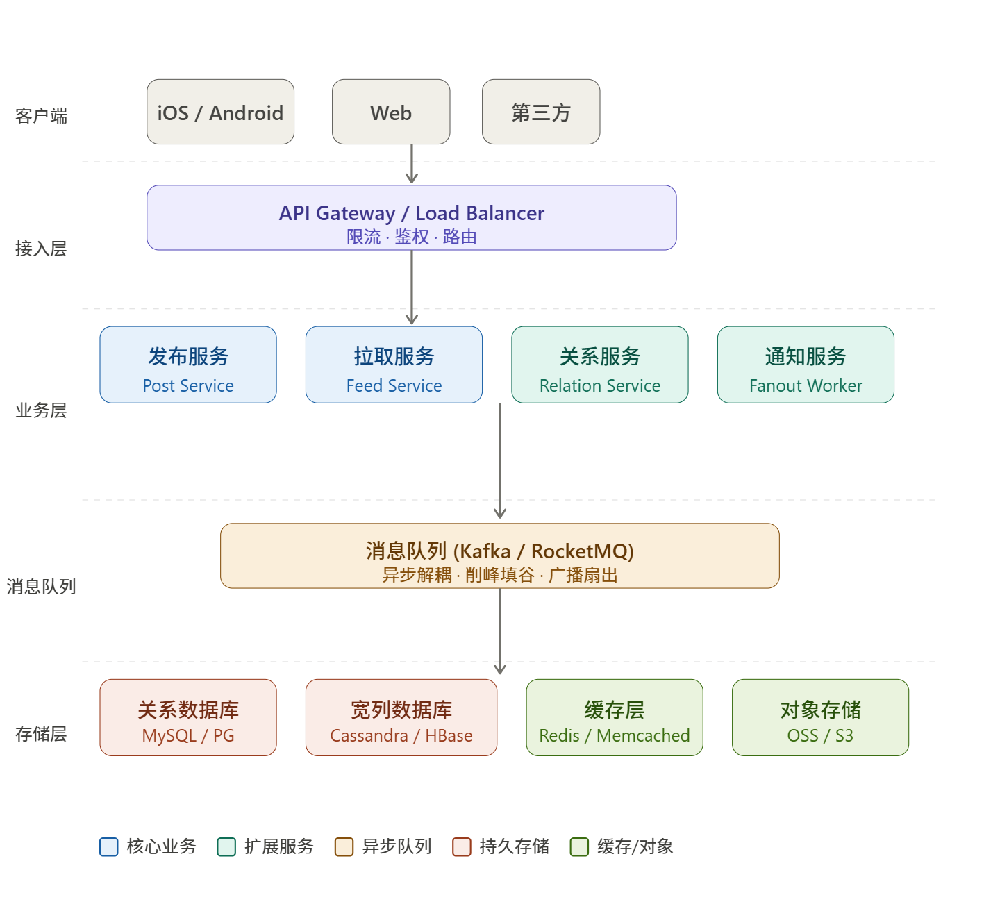

上图是系统的整体分层。点击各模块可深入探讨。下面重点看最核心的设计决策：**推拉模式的选择**。

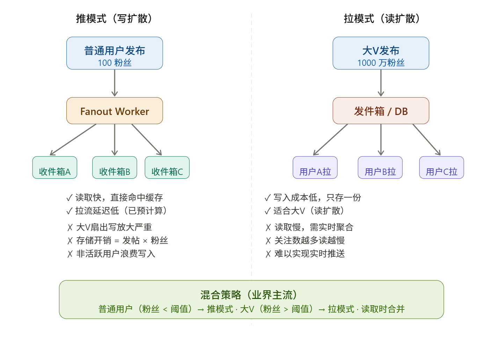

接下来看 Redis 如何支撑 Feed 流的缓存结构，以及数据库的分库分表策略：

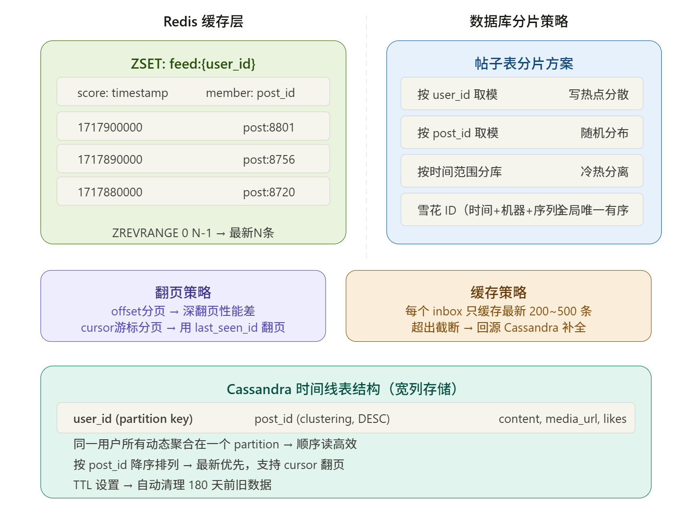

最后是系统中最容易被忽略的几个关键挑战：---

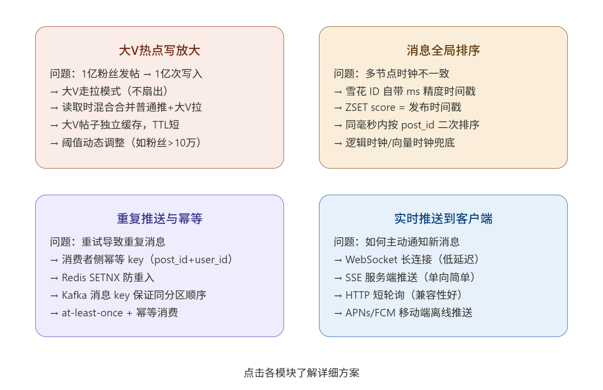

#### 设计要点总结

**核心决策链路**

推还是拉，取决于写放大和读放大的权衡：微博/朋友圈的标准答案是**混合模式**——普通用户走推（写扩散），大V走拉（读扩散），读取时在 Feed Service 层实时合并两份数据。阈值通常设在粉丝数 1~10 万之间，根据实际写入压力动态调整。

**存储选型**

帖子内容本体存 MySQL（强一致，易查询），时间线（inbox/outbox）存 Cassandra（宽列，时序读高效），热点数据缓存进 Redis Sorted Set（score = 时间戳），媒体文件走 OSS/S3。

**性能关键点**

- Redis ZSET 每个用户只保留最新 200~500 条，超出部分回源 Cassandra
- 分页用 cursor（`last_seen_id`），而非 offset——深翻页时 offset 会全表扫描
- 帖子 ID 用雪花算法生成，天然有序，避免 UUID 导致的 B-tree 碎片

**可靠性**

Kafka 保证消息至少一次投递，消费者用 `post_id + user_id` 做幂等 key，防止重试带来重复推送。

------

想深入哪个模块（大V扇出、Cassandra Schema、实时推送、数据库分片、消息排序）？点击图中卡片或直接告诉我。

---

## 六、评论系统设计
### 核心问题
海量评论、层级回复、分页、热点评论

### 设计
1. 分库分表：按业务ID分片
2. 热点评论缓存 Redis
3. 楼中楼、层级通过 **parentId** 关联
4. 点赞数、浏览数 缓存+定时落库

## 评论系统-GPT

**评论系统（Comment System）** 是社交平台、电商、内容平台的核心模块之一，例如：

- WeChat 朋友圈评论
- Bilibili 视频评论
- YouTube 评论区
- Reddit 帖子评论

在系统设计面试中，评论系统重点考察 **数据模型、分页、树结构、并发写入、热点处理**。

我给你一套 **大厂级评论系统设计（面试完整答案）**。

------

### 一、评论系统核心需求

#### 功能需求

用户可以：

```
发表评论
回复评论
查看评论列表
点赞评论
删除评论
```

典型结构：

```
文章
 ├─ 评论A
 │   ├─ 回复A1
 │   └─ 回复A2
 └─ 评论B
     └─ 回复B1
```

------

### 二、评论系统设计难点

评论系统的难点：

1️⃣ 评论层级（树结构）
2️⃣ 评论分页
3️⃣ 高并发写入
4️⃣ 热点评论
5️⃣ 评论排序（热度/时间）

------

### 三、评论数据结构设计

常见表设计：

```
comment
```

字段：

```
comment_id
object_id      (文章/视频ID)
user_id
parent_id      (父评论)
root_id        (根评论)
content
like_count
reply_count
create_time
status
```

解释：

| 字段        | 含义     |
| ----------- | -------- |
| object_id   | 所属文章 |
| parent_id   | 回复谁   |
| root_id     | 一级评论 |
| reply_count | 回复数   |

------

#### 示例

评论结构：

```
文章1
 ├ 评论100
 │   ├ 评论101
 │   └ 评论102
```

数据：

```
100
parent_id=0
root_id=100

101
parent_id=100
root_id=100

102
parent_id=100
root_id=100
```

------

### 四、评论树实现方案

评论树有三种实现方式：

------

#### 1 邻接表（最常见）

每条记录存：

```
parent_id
```

优点：

```
结构简单
```

缺点：

```
查询树结构慢
```

适合：

```
大部分互联网评论系统
```

------

#### 2 Path路径存储

存储：

```
path = 1/100/101
```

优点：

```
查询子树快
```

缺点：

```
更新复杂
```

------

#### 3 Closure Table

额外存储关系表：

```
ancestor descendant
```

优点：

```
树查询最快
```

缺点：

```
写入复杂
```

------

工业界基本使用：

```
邻接表 + root_id
```

------

### 五、评论分页设计（面试重点）

评论分页通常是：

```
两级分页
```

结构：

```
一级评论分页
二级评论分页
```

------

#### 一级评论

查询：

```
where object_id = ?
and parent_id = 0
order by create_time
limit 20
```

------

#### 二级评论

点击展开：

```
where root_id = ?
```

分页：

```
limit 20
```

------

### 六、评论排序设计

评论排序通常有：

#### 1 时间排序

```
最新
```

------

#### 2 热度排序

公式：

```
score = like + reply + weight
```

例如：

```
score = like*3 + reply*2
```

------

#### 3 Reddit 热度算法

类似 Reddit：

```
score = log(likes) + time_decay
```

------

### 七、高并发评论写入

评论写入流程：

```
用户发表评论
     │
     ▼
Comment Service
     │
     ▼
MySQL
     │
     ▼
更新评论数
```

------

#### 并发问题

热门文章：

```
大量评论
```

解决：

#### 1 评论计数异步化

```
评论写入
↓
MQ
↓
更新 reply_count
```

使用：

```
Kafka / RocketMQ
```

------

#### 2 批量更新

避免：

```
每条评论更新文章表
```

改为：

```
批量更新
```

------

### 八、评论缓存设计

评论系统必须用缓存。

缓存：

```
Redis
```

结构：

```
comment:list:articleId
```

类型：

```
ZSET
```

score：

```
时间 or 热度
```

读取：

```
ZREVRANGE
```

------

### 九、热点评论问题

热门文章：

```
100万评论
```

问题：

```
数据库压力大
```

解决方案：

#### 1 Redis缓存评论列表

```
Top100评论
```

------

#### 2 CDN缓存

静态评论。

------

#### 3 读写分离

```
MySQL 主从
```

------

### 十、评论删除设计

删除评论有两种：

------

#### 1 软删除

```
status = deleted
```

显示：

```
评论已删除
```

优点：

```
保持评论结构
```

------

#### 2 级联删除

删除：

```
评论 + 回复
```

风险：

```
数据丢失
```

一般不用。

------

### 十一、系统架构设计

整体架构：

```
        用户评论
            │
            ▼
       API Gateway
            │
            ▼
      Comment Service
            │
     ┌──────┴──────┐
     ▼             ▼
  Redis Cache   MySQL
     │
     ▼
 Message Queue
     │
     ▼
统计更新 / 推荐
```

------

### 十二、评论系统扩展能力

真实系统还会有：

------

#### 1 评论审核

```
AI审核
敏感词过滤
```

------

#### 2 评论折叠

例如：

```
低质量评论折叠
```

------

#### 3 @用户

```
@xxx
```

触发通知。

------

#### 4 反垃圾

限制：

```
1分钟5条
```

------

### 十三、面试高级加分点

如果你说到这些，面试官基本会认可你：

------

#### 1 评论分库分表

```
按 object_id 分片
```

------

#### 2 评论ES搜索

支持：

```
关键词搜索评论
```

使用：

```
Elasticsearch
```

------

#### 3 评论流式加载

类似：

- YouTube
- Bilibili

滚动加载。

------

### 十四、评论系统面试标准总结

一句话总结：

```
评论系统使用邻接表存储树结构
root_id实现快速查询
评论两级分页
Redis缓存热门评论
MQ异步更新计数
MySQL分库分表支撑海量评论
```

------

如果你准备 **Java架构 / 大厂系统设计面试**，我可以再给你一份非常重要的内容：

**《互联网十大系统设计面试题（完整架构版）》**

包括：

1️⃣ Feed流系统
2️⃣ 评论系统
3️⃣ 点赞系统
4️⃣ 秒杀系统
5️⃣ 短链接系统
6️⃣ IM聊天系统
7️⃣ 分布式ID生成器
8️⃣ 搜索系统
9️⃣ 推荐系统
🔟 实时消息推送系统

我可以给你整理成 **一张完整架构脑图（面试几乎全覆盖）**。

## 评论系统-Claude

评论系统是个看似简单实则充满陷阱的设计题——难点在于**树形结构的存储与渲染**、**楼中楼的分页**，以及**高并发下的计数一致性**。分三张图展开。

首先是整体架构与核心数据模型：

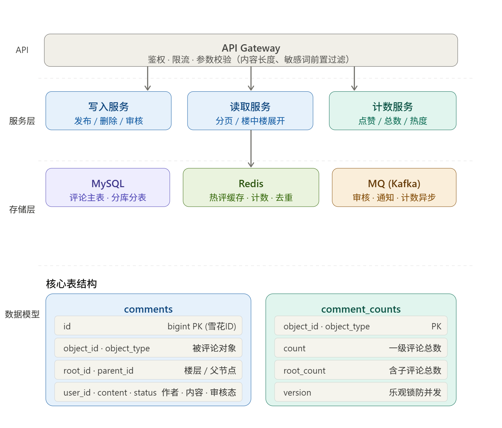

评论系统最本质的挑战是**如何存储树形结构**。不同的方案在读、写、移动三个维度上各有取舍：

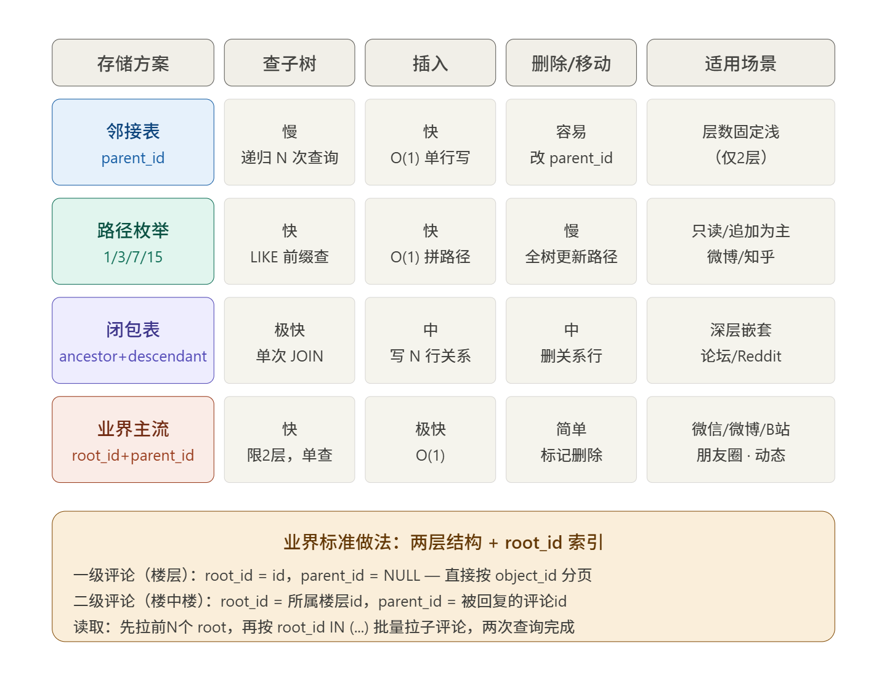

定好存储模型后，最容易踩坑的是**写入链路**（审核 + 计数一致性）和**读取链路**（分页 + 缓存热评）：

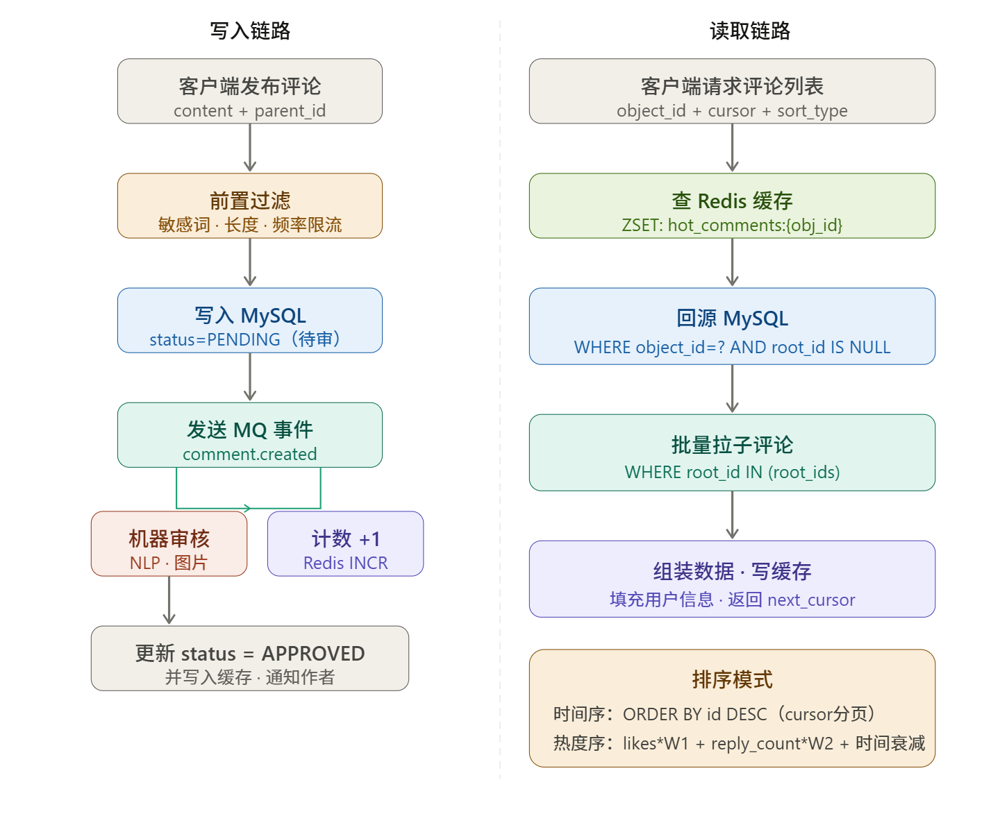

最后是四个最常被问到的高频挑战点：---

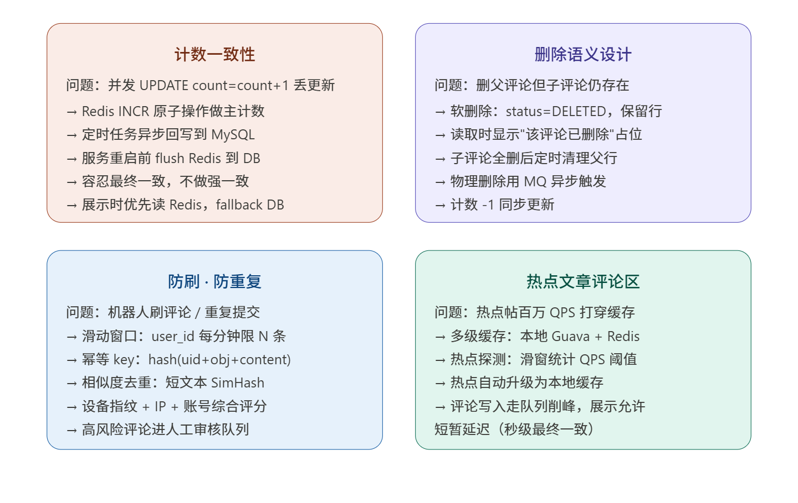

### 设计要点总结

**树形存储的核心选择**

绝大多数产品（微博、B站、微信）的评论只有两层。这个产品决策直接决定了存储方案：限定两层后，`root_id + parent_id` 方案在性能、简洁度、可扩展性上全面优于闭包表和路径枚举。读取只需两次查询——先按 `object_id` 分页拉一级楼层，再用 `root_id IN (...)` 批量拉对应子评论。

**计数的正确姿势**

`COUNT(*)` 在大表上不可用。正确做法是维护独立的 `comment_counts` 表，写入时 `+1`，删除时 `-1`，用 Redis `INCR` 吸收并发写压力，再异步批量回写 MySQL。展示时容忍几秒的最终一致即可——用户看到的评论数不需要精确到毫秒。

**分页策略**

评论列表必须用 cursor 分页（基于 `id` 或 `(likes, id)` 的组合），禁止 offset。原因是评论列表会实时插入新数据，offset 翻页会导致跳过或重复条目，而且深翻页的 `LIMIT 10000, 10` 会做全表扫描。

**删除的陷阱**

删除父评论时若有子评论仍存在，不能物理删除行——否则子评论的 `parent_id` 指向空记录。正确做法是软删除（`status = DELETED`），前端展示「该评论已删除」占位符，等子评论也全部删除后再由后台任务清理物理行。

------

想深入哪个模块？点击图中卡片，或直接提问。

---

## 七、分布式定时任务设计
### 问题
集群部署，定时任务重复执行

### 方案

1. **分布式锁**
定时任务执行前抢锁，抢到才执行（Redisson）
2. **成熟框架**
XXL-Job / Elastic-Job
- 分片任务、路由策略、失败重试、日志、告警

---

## 八、幂等系统设计（支付/订单/重复提交）

### 场景
接口重试、网络超时、MQ重复消费、前端重复点击

### 五大实现方案
1. **唯一索引**：数据库唯一约束，防重复
2. **全局唯一ID**：订单号/请求ID做幂等key
3. **状态机**：已支付/已完成 禁止二次操作
4. **分布式锁**：短时间锁住资源
5. **幂等表**：操作记录落库，先查后写

## 幂等系统-GPT

**幂等系统（Idempotent System）设计** 是支付、订单、消息消费等系统的核心问题。典型场景包括：

- Alipay 支付回调
- WeChat 微信支付
- 电商订单提交
- MQ消息重复消费

面试时通常问：

```
如何防止重复提交？
如何保证接口幂等？
支付回调如何避免重复扣款？
```

下面给你一套 **大厂级幂等设计方案（系统设计面试答案）**。

------

### 一、什么是幂等

幂等定义：

```
同一个请求执行一次
和执行多次
结果是一样的
```

例如：

```
支付接口调用3次
只扣一次钱
```

------

### 二、幂等问题出现的原因

现实系统中会产生 **重复请求**：

#### 1 用户重复点击

```
用户连续点击“支付”
```

------

#### 2 网络超时重试

```
客户端没收到响应
自动重试
```

------

#### 3 MQ重复消费

例如：

```
Kafka
RocketMQ
```

可能出现：

```
at-least-once
```

------

#### 4 第三方回调重复

例如：

- Alipay
- WeChat

支付回调可能：

```
回调多次
```

------

### 三、幂等设计核心原则

幂等系统设计核心：

```
唯一请求标识
```

即：

```
每个请求都有唯一ID
```

例如：

```
request_id
order_id
payment_id
```

------

### 四、幂等实现方案（面试必答）

常见有 **5种方案**。

------

#### 1 Token机制（防重复提交）

流程：

```
客户端请求token
↓
服务器生成token
↓
客户端提交订单携带token
↓
服务器验证token
```

例如：

```
POST /order
token = abc123
```

Redis：

```
SETNX token:abc123
```

处理：

```
成功 → 执行订单
失败 → 已提交
```

------

#### 2 唯一索引（最常见）

数据库设计：

```
order_no UNIQUE
```

插入：

```
insert order(order_no)
```

重复提交：

```
Duplicate Key
```

优点：

```
最简单
```

缺点：

```
只能控制数据库层
```

------

#### 3 状态机控制

订单状态：

```
INIT
PAYING
PAID
CLOSED
```

支付逻辑：

```
INIT -> PAYING -> PAID
```

如果已经：

```
PAID
```

再次请求：

```
直接返回成功
```

------

#### 4 Redis幂等锁

流程：

```
SETNX order:1001
```

成功：

```
执行逻辑
```

失败：

```
重复请求
```

设置：

```
过期时间
```

例如：

```
SETNX order:1001 EX 5
```

------

#### 5 幂等表（大厂常用）

专门设计：

```
idempotent_table
```

结构：

```
request_id
status
response
create_time
```

流程：

```
请求到达
↓
检查 request_id
↓
存在 → 返回结果
↓
不存在 → 执行业务
```

------

### 五、支付系统幂等设计（经典面试）

例如：

用户支付订单：

```
order_id = 1001
```

流程：

```
用户支付
↓
第三方支付
↓
支付回调
↓
系统处理
```

关键问题：

```
回调可能多次
```

解决：

数据库：

```
payment(order_id UNIQUE)
```

处理：

```
update order
set status = paid
where order_id = ?
and status != paid
```

如果已经：

```
paid
```

说明重复回调。

------

### 六、MQ消费幂等

MQ例如：

```
Kafka
RocketMQ
```

消息可能：

```
重复消费
```

解决方案：

#### 1 消息ID去重

Redis：

```
SETNX msgId
```

------

#### 2 消费记录表

表：

```
consume_log
```

字段：

```
msg_id
status
```

消费逻辑：

```
先插入
再消费
```

------

### 七、完整幂等架构

典型架构：

```
客户端
   │
   ▼
API Gateway
   │
   ▼
Service
   │
 ┌─┴─────────┐
 ▼           ▼
Redis      MySQL
(幂等Key)  (唯一索引)
```

------

### 八、幂等设计关键问题（面试必问）

#### 1 Token过期

解决：

```
TTL
```

------

#### 2 并发问题

解决：

```
Redis SETNX
```

------

#### 3 防止锁失效

使用：

```
Redisson
```

------

#### 4 返回相同结果

幂等系统应该：

```
返回相同响应
```

------

### 九、大厂幂等设计组合方案

真实系统通常 **组合使用**：

```
Token + Redis + DB唯一索引
```

流程：

```
Token防重复提交
Redis防并发
DB唯一索引最终兜底
```

------

### 十、面试标准答案总结

面试回答可以这样说：

```
幂等系统通过唯一请求ID实现

客户端生成token
服务端使用Redis SETNX保证并发安全
数据库使用唯一索引兜底
订单状态机避免重复处理
MQ消费通过msgId去重
```

------

### 十一、面试加分点（高级）

如果你说到这些，面试官会觉得你 **做过真实系统**：

#### 1 全链路幂等ID

```
request_id
```

贯穿：

```
API → MQ → DB
```

------

#### 2 防止幂等Key爆炸

使用：

```
BloomFilter
```

------

#### 3 幂等日志系统

记录：

```
request
response
```

用于：

```
重放
```

------

如果你愿意，我可以再给你一套 **互联网系统设计面试最常考的 7 个“高频系统”完整设计**（很多 Java 架构面试都会问）：

1️⃣ 秒杀系统
2️⃣ Feed流系统
3️⃣ 评论系统
4️⃣ 点赞系统
5️⃣ 短链接系统
6️⃣ IM聊天系统
7️⃣ 分布式ID生成器

我可以整理成 **一张系统设计架构总图（面试通杀版）**，很多人靠这个拿到大厂 Offer。

---

## 九、缓存设计 + 缓存三大问题
### 1. 缓存穿透
**问题**：查不存在数据，直达DB
**解决**：空值缓存、布隆过滤器、接口校验

### 2. 缓存击穿
**问题**：热点key过期，瞬间打垮DB
**解决**：互斥锁、热点key永不过期、定时预热

### 3. 缓存雪崩
**问题**：大量key同时过期 / Redis宕机
**解决**：过期时间加随机值、Redis集群、多级缓存、服务降级

---

## 十、购物车设计

1. 未登录：LocalStorage 前端存储
2. 已登录：Redis 存储购物车数据（Hash结构）
3. 登录合并：未登录购物车→合并到账号购物车
4. 定时持久化、商品价格实时校验


## 购物车系统设计-GPT

**购物车系统（Shopping Cart）设计** 是电商系统设计面试的经典题之一。几乎所有电商平台都有，例如：

- Amazon
- Alibaba Group 的 Taobao
- JD

购物车看起来简单，但在真实系统中涉及 **高并发、数据一致性、价格变化、库存校验、用户未登录等问题**。

下面是一套 **面试级购物车系统设计**。

------

### 一、购物车核心需求

用户可以：

```
加入商品
删除商品
修改数量
查看购物车
勾选商品结算
```

典型流程：

```
浏览商品
↓
加入购物车
↓
修改数量
↓
勾选商品
↓
提交订单
```

------

### 二、购物车设计难点

电商购物车主要挑战：

1️⃣ 未登录购物车
2️⃣ 登录购物车合并
3️⃣ 商品价格变化
4️⃣ 商品库存变化
5️⃣ 高并发读写
6️⃣ 数据持久化

------

### 三、购物车数据模型

数据库表：

```
cart
```

字段：

```
id
user_id
sku_id
count
checked
price_snapshot
create_time
update_time
```

解释：

| 字段           | 含义             |
| -------------- | ---------------- |
| user_id        | 用户ID           |
| sku_id         | 商品SKU          |
| count          | 数量             |
| checked        | 是否选中         |
| price_snapshot | 加入购物车时价格 |

------

### 四、购物车存储方案

购物车一般 **两层存储**：

```
Redis + MySQL
```

原因：

```
读多写多
```

------

#### Redis结构

Key：

```
cart:userId
```

Value：

```
Hash
```

例如：

```
HSET cart:1001 sku123 2
HSET cart:1001 sku456 1
```

表示：

```
sku123 ×2
sku456 ×1
```

------

#### MySQL存储

用于：

```
持久化
```

定时：

```
同步Redis → MySQL
```

------

### 五、未登录购物车设计

用户未登录时：

```
没有 user_id
```

解决：

```
cookie
```

生成：

```
cart_id
```

Redis：

```
cart:temp:cart_id
```

------

### 六、登录购物车合并

用户登录：

```
temp_cart + user_cart
```

流程：

```
读取临时购物车
↓
读取用户购物车
↓
合并商品
↓
删除临时购物车
```

合并规则：

```
相同sku → 数量相加
```

------

### 七、加入购物车流程

流程：

```
用户点击加入购物车
     │
     ▼
Cart Service
     │
     ▼
查询商品信息
     │
     ▼
写入Redis
```

伪代码：

```
HINCRBY cart:userId skuId 1
```

------

### 八、购物车展示设计

展示购物车时需要：

```
商品信息
库存
价格
```

流程：

```
查询购物车
↓
查询商品服务
↓
拼装返回
```

返回：

```
skuId
title
price
count
stock
checked
```

------

### 九、价格变化处理

商品价格可能变化。

解决：

```
下单时重新计算价格
```

购物车中的：

```
price_snapshot
```

只是：

```
展示用
```

------

### 十、库存校验

库存校验时机：

```
下单
```

流程：

```
提交订单
↓
校验库存
↓
锁定库存
```

库存系统：

```
Inventory Service
```

------

### 十一、购物车系统架构

典型架构：

```
       用户
        │
        ▼
   API Gateway
        │
        ▼
    Cart Service
        │
  ┌─────┴──────┐
  ▼            ▼
Redis        MySQL
        │
        ▼
Product Service
Inventory Service
```

------

### 十二、高并发优化

购物车访问非常频繁。

优化方式：

------

#### 1 Redis缓存

```
购物车数据全部放Redis
```

------

#### 2 批量查询商品

避免：

```
N+1查询
```

改为：

```
批量SKU查询
```

------

#### 3 异步持久化

Redis：

```
写
```

MySQL：

```
异步同步
```

------

### 十三、购物车容量限制

防止恶意用户：

```
加入100万商品
```

限制：

```
最多100~200商品
```

------

### 十四、购物车清理策略

长期不用：

```
自动清理
```

例如：

```
30天
```

Redis：

```
TTL
```

------

### 十五、面试高级加分点

如果你说到这些，面试官会觉得你 **做过真实电商系统**：

------

#### 1 购物车分片

用户很多：

```
Redis Cluster
```

Key：

```
cart:userId
```

自然分片。

------

#### 2 购物车预计算

计算：

```
总价
商品数
```

缓存。

------

#### 3 购物车促销

例如：

```
满减
优惠券
```

需要：

```
Promotion Service
```

------

### 十六、购物车系统面试总结

标准回答：

```
购物车系统使用Redis存储购物车数据
MySQL做持久化
未登录用户使用cookie存储临时购物车
登录后进行购物车合并
下单时重新校验价格和库存
通过Redis提升读写性能
```

------

如果你在准备 **Java后端 / 架构师系统设计面试**，我可以再给你一份非常有价值的内容：

**电商系统10大经典设计题完整答案**：

1️⃣ 购物车系统
2️⃣ 订单系统
3️⃣ 支付系统
4️⃣ 秒杀系统
5️⃣ 库存系统
6️⃣ 评论系统
7️⃣ Feed流系统
8️⃣ 推荐系统
9️⃣ 搜索系统
🔟 优惠券系统

我可以整理成 **一张完整电商系统架构图（大厂级设计）**，很多面试基本都会覆盖这些。

---

## 十一、限流系统设计
### 常见算法
1. 漏桶：限制流出速率，削峰
2. 令牌桶：允许突发流量，网关常用
3. 滑动窗口：平滑限流、统计QPS

### 维度
IP限流、接口限流、用户维度、全局限流

---

## 十二、文件/图片上传设计

1. 上传流程：客户端 → 网关 → 对象存储(OSS/MinIO)
2. 断点续传、分片上传
3. 图片压缩、格式校验、防盗链、访问鉴权

## 文件 / 图片上传系统-gpt

**文件 / 图片上传系统（File Upload System）** 是互联网系统设计中非常常见的模块，几乎所有平台都有，例如：

- WeChat 图片发送
- Instagram 图片上传
- YouTube 视频上传

在系统设计面试中主要考察：

```
大文件上传
高并发上传
断点续传
CDN分发
存储设计
```

下面是一套 **大厂级文件/图片上传系统设计**。

------

### 一、上传系统核心需求

用户可以：

```
上传图片
上传文件
查看文件
删除文件
```

非功能需求：

```
高可用
高并发
安全
快速访问
```

例如：

```
每天1000万图片上传
```

------

### 二、系统核心难点

文件系统设计主要挑战：

1️⃣ 大文件上传
2️⃣ 断点续传
3️⃣ 文件存储
4️⃣ CDN加速
5️⃣ 文件安全
6️⃣ 存储成本控制

------

### 三、文件上传整体架构

典型架构：

```
          用户
           │
           ▼
       CDN节点
           │
           ▼
       Upload API
           │
           ▼
       File Service
           │
   ┌───────┴────────┐
   ▼                ▼
Object Storage     DB
(S3 / OSS)        Metadata
```

常见对象存储：

- Amazon S3
- Alibaba Cloud OSS
- Google Cloud Storage

------

### 四、文件上传流程

标准流程：

```
客户端请求上传
↓
获取上传凭证
↓
客户端直接上传文件
↓
对象存储保存文件
↓
回调服务器记录文件信息
```

------

### 五、直传模式（推荐）

避免：

```
文件先传到业务服务器
```

否则：

```
服务器带宽压力巨大
```

正确方案：

```
客户端 → 对象存储
```

流程：

```
客户端请求上传token
↓
服务端生成STS临时凭证
↓
客户端直接上传到OSS
```

优势：

```
服务器不参与文件传输
```

------

### 六、数据库设计

文件元数据表：

```
file
```

字段：

```
file_id
user_id
file_name
file_url
file_size
file_type
md5
create_time
```

用途：

```
记录文件信息
```

------

### 七、图片处理设计

图片上传后通常需要：

```
压缩
缩略图
水印
```

处理流程：

```
上传成功
↓
发送MQ消息
↓
图片处理服务
↓
生成缩略图
```

常见组件：

```
ImageMagick
FFmpeg
```

------

### 八、大文件上传（分片上传）

大文件：

```
>100MB
```

需要：

```
分片上传
```

流程：

```
文件切片
↓
每片上传
↓
服务器记录分片
↓
全部完成后合并
```

示例：

```
file.part1
file.part2
file.part3
```

对象存储通常支持：

```
Multipart Upload
```

------

### 九、断点续传设计

断点续传流程：

```
客户端上传部分分片
↓
网络中断
↓
客户端查询已上传分片
↓
继续上传
```

数据库记录：

```
upload_id
chunk_index
status
```

------

### 十、秒传（文件去重）

用户上传文件时：

```
先计算MD5
```

流程：

```
客户端计算MD5
↓
请求服务器
↓
服务器查询MD5
↓
存在 → 直接返回URL
```

优势：

```
无需重新上传
```

例如：

网盘系统。

------

### 十一、CDN加速

访问文件时：

```
直接访问对象存储
```

速度慢。

解决：

```
CDN
```

例如：

```
用户
↓
CDN
↓
OSS
```

好处：

```
降低延迟
减少带宽
```

------

### 十二、文件安全设计

文件系统必须考虑安全。

------

#### 1 文件类型校验

防止：

```
上传恶意文件
```

校验：

```
MIME type
```

------

#### 2 文件扫描

例如：

```
病毒扫描
```

------

#### 3 权限控制

文件URL：

```
私有访问
```

生成：

```
签名URL
```

例如：

```
URL + token
```

------

### 十三、存储优化

海量文件需要：

------

#### 1 冷热分层

```
热数据 → SSD
冷数据 → HDD
```

------

#### 2 生命周期管理

例如：

```
30天后归档
```

------

#### 3 压缩存储

减少：

```
存储成本
```

------

### 十四、系统扩展能力

真实系统还会有：

------

#### 1 视频转码

上传视频：

```
1080p
720p
480p
```

使用：

```
FFmpeg
```

------

#### 2 图片CDN优化

生成：

```
不同尺寸
```

例如：

```
avatar_small
avatar_large
```

------

### 十五、文件上传系统面试总结

标准答案可以这样说：

```
文件上传系统采用对象存储（如OSS/S3）
客户端直传减少服务器带宽压力
支持分片上传实现大文件上传
通过MD5实现秒传
使用MQ异步处理图片压缩和缩略图
通过CDN加速文件访问
数据库只存储文件元数据
```

------

如果你是在准备 **Java架构/系统设计面试**，还有 **三个非常高频的系统设计题**，面试官几乎必问：

1️⃣ **短链接系统设计**（抖音/微博链接）
2️⃣ **点赞系统设计**（高并发写入）
3️⃣ **IM聊天系统设计**（微信/消息推送）

我可以给你整理一套 **《互联网系统设计20题架构图版》**，基本覆盖 **P6-P8面试题库**。

---

## 极简背诵版（面试口述直接用）

1. **秒杀**：CDN+网关限流+Redis库存Lua+MQ异步+分布式锁+库存补偿
2. **短链接**：全局唯一ID+62进制+Redis热点缓存+302重定向
3. **超时订单**：延时MQ最优，其次Redis过期，避免数据库轮询
4. **Feed流**：普通用户推模式、大V拉模式，读写折中
5. **缓存问题**：穿透(布隆/空缓存)、击穿(互斥锁)、雪崩(随机过期+集群)
6. **幂等**：唯一ID、状态机、唯一索引、幂等表、分布式锁
7. **定时任务**：分布式锁 or XXL-Job 避免重复执行


## IM 系统设计-GPT

---

**IM聊天系统（Instant Messaging）设计** 是系统设计面试中非常经典的一题。典型产品包括：

- WeChat
- WhatsApp
- Telegram
- Slack

IM系统的核心目标是 **实时消息传递、海量并发连接、消息可靠送达**。

下面给你一套 **大厂级 IM 系统设计（面试标准答案）**。

------

### 一、IM系统核心需求

用户可以：

```
发送消息
接收消息
离线消息
群聊
消息历史
```

非功能需求：

```
低延迟
高并发
高可用
消息可靠
```

例如：

```
1000万在线用户
```

------

### 二、IM系统核心难点

IM系统主要挑战：

1️⃣ 海量长连接
2️⃣ 实时消息推送
3️⃣ 离线消息存储
4️⃣ 消息顺序保证
5️⃣ 多端同步
6️⃣ 消息可靠投递

------

### 三、IM系统整体架构

典型架构：

```
               用户
                │
                ▼
          Load Balancer
                │
                ▼
          Connection Server
                │
        ┌───────┴────────┐
        ▼                ▼
   Message Queue       Redis
        │                │
        ▼                ▼
   Message Service     Online Service
        │
        ▼
      MySQL
```

模块说明：

| 组件              | 作用         |
| ----------------- | ------------ |
| Connection Server | 长连接管理   |
| Message Queue     | 消息异步处理 |
| Redis             | 在线状态     |
| MySQL             | 消息存储     |

------

### 四、长连接设计

IM系统必须使用 **长连接**。

常见协议：

```
WebSocket
TCP
```

Web端通常使用：

```
WebSocket
```

连接流程：

```
用户登录
↓
建立WebSocket连接
↓
Connection Server维护连接
```

服务器维护：

```
userId → connection
```

------

### 五、消息发送流程

用户A发送消息给B：

```
A客户端
   │
   ▼
Connection Server
   │
   ▼
Message Service
   │
   ▼
MQ
   │
   ▼
B所在Connection Server
   │
   ▼
B客户端
```

------

### 六、在线状态管理

用户在线状态存储在：

```
Redis
```

Key：

```
online:userId
```

Value：

```
connectionId
```

用户上线：

```
SET online:1001 server1
```

用户下线：

```
DEL online:1001
```

------

### 七、离线消息设计

如果用户B不在线：

```
消息存储
```

数据库：

```
message
```

字段：

```
msg_id
sender_id
receiver_id
content
status
create_time
```

用户上线：

```
拉取离线消息
```

------

### 八、消息顺序保证

IM系统必须保证：

```
消息顺序
```

解决方案：

#### 1 会话ID

```
conversation_id
```

------

#### 2 单线程队列

同一会话：

```
进入同一个队列
```

例如：

```
hash(conversationId)
```

------

### 九、消息可靠性设计

IM系统必须防止：

```
消息丢失
```

机制：

------

#### 1 ACK机制

流程：

```
服务器发送消息
↓
客户端ACK
↓
服务器确认送达
```

------

#### 2 重试机制

如果：

```
未收到ACK
```

服务器：

```
重新发送
```

------

### 十、多端同步

用户可能：

```
手机
电脑
平板
```

需要：

```
多端同步
```

方案：

```
每条消息有 seq
```

客户端记录：

```
last_seq
```

上线：

```
拉取 seq > last_seq
```

------

### 十一、群聊设计

群聊消息：

```
A -> 群
```

服务器处理：

```
遍历群成员
```

优化：

```
MQ Fanout
```

流程：

```
发送群消息
↓
MQ
↓
群成员推送
```

------

### 十二、消息存储设计

IM系统数据量非常大。

优化：

------

#### 1 分库分表

按：

```
conversation_id
```

分片。

------

#### 2 热冷数据分离

```
最近消息 → Redis
历史消息 → MySQL
```

------

#### 3 历史归档

旧数据：

```
HBase / Object Storage
```

------

### 十三、消息推送

如果用户 **App不在线**：

需要：

```
系统推送
```

例如：

- Apple Push Notification service
- Firebase Cloud Messaging

流程：

```
IM服务器
↓
Push服务
↓
手机通知
```

------

### 十四、高并发优化

IM系统优化重点：

------

#### 1 Connection Server水平扩展

使用：

```
负载均衡
```

例如：

```
Nginx
```

------

#### 2 消息队列削峰

使用：

```
Kafka
RocketMQ
```

------

#### 3 Netty高性能网络框架

Java常用：

```
Netty
```

------

### 十五、系统完整架构

完整IM架构：

```
           用户
            │
            ▼
        LoadBalancer
            │
            ▼
      Connection Server
            │
   ┌────────┴────────┐
   ▼                 ▼
 Message Queue     Redis
   │                 │
   ▼                 ▼
Message Service   Online Service
   │
   ▼
MySQL / HBase
```

------

### 十六、IM系统面试总结

标准回答：

```
IM系统采用WebSocket长连接
Connection Server维护连接
消息通过MQ异步传递
Redis存储在线状态
MySQL存储历史消息
通过ACK保证消息可靠
离线用户存储离线消息
使用Push服务进行系统通知
```

------

如果你在准备 **Java后端 / 架构师系统设计面试**，还有 **三个几乎必问的大厂题**：

1️⃣ **短链接系统设计（微博/抖音链接）**
2️⃣ **点赞系统设计（高并发写入）**
3️⃣ **分布式ID生成器（Snowflake）**

我可以给你整理一份 **《互联网系统设计30题 + 架构图 + 面试答案》**，基本覆盖 **阿里 / 腾讯 / 字节 的系统设计面试题库**。


## 实时天气系统-GPT

实时天气系统是一个典型的“**数据采集 + 分发 + 缓存 + 高并发读取**”系统，面试里一般考察你对：缓存设计、数据源、更新策略、架构拆分、以及“实时性 vs 成本”的权衡。

我给你按**面试可讲版本（从简单到企业级）**拆一遍。

------

### 一、核心需求拆解

#### 1. 功能需求

- 查询某城市实时天气
- 支持未来 7~15 天天气预报
- 支持多端访问（Web / App / API）
- 支持城市级定位查询

#### 2. 非功能需求

- 高并发读（天气是“读多写少”）
- 低延迟（毫秒~秒级）
- 数据准实时（1~10分钟更新）
- 高可用（第三方天气源不稳定）

------

### 二、核心数据来源

天气系统**不是自己生成数据**，而是：

#### 1. 第三方天气API

- OpenWeather
- 和风天气
- 国家气象局数据

#### 2. 数据特点

- 更新频率：5~30分钟
- QPS限制
- 可能失败 / 延迟 / 不稳定

👉 结论：**必须做缓存 + 兜底**

------

### 三、整体架构设计（核心）

```
            +----------------------+
            |   第三方天气API      |
            +----------+-----------+
                       |
                定时拉取 / 触发更新
                       |
              +--------v---------+
              |   数据采集服务    |
              +--------+---------+
                       |
               MQ / 定时任务
                       |
        +--------------v--------------+
        |        天气数据服务         |
        +--------------+--------------+
                       |
            Redis / 多级缓存
                       |
        +--------------v--------------+
        |       API 查询服务         |
        +--------------+--------------+
                       |
                   用户请求
```

------

### 四、核心设计点（面试重点）

#### 1. 缓存设计（核心中的核心）

##### 为什么必须缓存？

- 天气数据读多写少（典型缓存场景）
- 第三方 API 有 QPS 限制

------

##### 缓存结构设计

###### Redis Key 设计

```
weather:city:shanghai
weather:city:beijing
```

###### Value（示例）

```json
{
  "temp": 28,
  "humidity": 60,
  "condition": "sunny",
  "updateTime": 1710000000
}
```

------

##### 缓存策略

###### 方案1：定时刷新（推荐）

- 每 5~10 分钟批量拉取城市天气
- 写入 Redis

👉 优点：稳定、抗压

------

###### 方案2：懒加载（备选）

```
请求 → Redis没有 → 查第三方API → 回填缓存
```

👉 缺点：

- 高并发时打爆第三方API

------

##### 企业级组合方案（最佳）

👉 **定时刷新 + 懒加载兜底**

------

#### 2. 数据更新机制

##### 方式一：定时任务（最常见）

- XXL-JOB / Quartz
- 每 5 分钟拉取热点城市

```
北京 / 上海 / 深圳 / 广州
```

------

##### 方式二：MQ驱动更新（进阶）

- 城市变化 / 用户查询触发
- 发 MQ → 更新对应城市天气

------

##### 推荐：

👉 **定时任务为主 + MQ补充**

------

#### 3. 热点城市优化

现实中：

- 80%流量集中在 20%城市

##### 优化策略：

###### 热点缓存预热

- 启动时加载 Top 100 城市天气
- 常驻 Redis

------

###### LRU / 本地缓存

- Guava Cache / Caffeine
- 防 Redis 被打爆

------

#### 4. 高并发设计

##### 读路径优化（关键）

```
用户请求
  ↓
本地缓存（Caffeine）
  ↓（miss）
Redis
  ↓（miss）
兜底第三方API
```

👉 三层缓存结构（非常加分）

------

#### 5. 数据一致性问题

天气系统本质是：
👉 **允许最终一致，不需要强一致**

------

问题：

- Redis 旧数据
- API 新数据

解决：

##### 方案：加版本号 / 更新时间

```json
updateTime: 1710000000
```

规则：

```
只覆盖更新更晚的数据
```

------

#### 6. 容错设计（非常重要）

##### 第三方API失败怎么办？

###### 方案1：降级缓存

- 返回 Redis 上一次数据

###### 方案2：多数据源

- API1失败 → API2

###### 方案3：熔断

- Sentinel / Resilience4j

------

#### 7. 城市定位问题

用户输入：

- “上海天气”
- “Tanjong Pagar天气”

解决：

- 地理编码（Geo API）
- 城市ID映射表

------

### 五、数据库设计（可选但加分）

```sql
city_weather
-------------------
city_id
city_name
temperature
humidity
condition
update_time
source
```

------

### 六、最终架构总结（面试回答版本）

你可以这样说：

> 实时天气系统本质是一个“第三方数据驱动的高读缓存系统”，核心设计在于如何通过多级缓存和定时刷新机制，将外部不稳定数据转化为内部高可用服务。

------

### 七、面试加分点总结（一定要记）

✔ 读多写少 → 缓存系统
✔ 定时刷新 + 懒加载双策略
✔ 多级缓存（本地 + Redis + API）
✔ 热点城市预热
✔ 降级与熔断机制
✔ 最终一致性即可

------

### 如果你想继续升级👇

我可以帮你把这个系统再“面试杀穿级升级”：

👉 加上 **“秒级实时天气推送（WebSocket + 订阅模型）”**
👉 或者 **“天气 + 推荐系统（基于天气推荐内容）”**
👉 或者 **“类似美团级 LBS 天气服务架构”**

只要说一声 👍


# 其他

## **1.QPS突然提升10倍，如何设计系统**

如果真的遇到这种情况，我会从「紧急止血（保命）」和「架构全面演进（治本）」两个阶段来设计和应对。

#### 第一阶段

首先是第一阶段：紧急应对，核心原则是「弃车保帅，保证系统不挂」。如果是突发流量，系统可能瞬间被打死，所以第一时间一定是限流和降级。我们可以利用像 Sentinel 这样的工具，在网关层就设置好最大 TPS 阈值，超过系统承载能力的请求直接快速失败，返回「系统繁忙」的提示。即使损失了一部分用户的体验，也绝对比整个系统崩溃、所有人都不能用要强。另外就是业务降级，比如在电商场景下，我会立刻关掉像「猜你喜欢」、评论显示、积分发放这些非核心业务，把所有的服务器 CPU 和内存资源全让给「下单」和「支付」这两个最核心的动作。如果公司的基建完善，我会马上通过 K8s 动态增加容器节点来进行弹性扩容，用加机器来硬扛。

---

#### 第二阶段

接下来是第二阶段：如果这 10 倍 QPS 变成了常态，我们的架构必须要进行彻底的演进。这就需要把系统内部拆开来看，把读流量和写流量分开治理。

- 第一，要想扛住 10 倍的读请求，唯一的法宝就是「多级缓存储备」。这个时候单靠底层的 MySQL 是绝对不可能的，哪怕只靠 Redis 集群可能也会因为网络带宽被打满而出现瓶颈。所以，我一定会引入「本地缓存（比如 Caffeine 或 Guava） + Redis 分布式系统缓存」的双层架构。把那些极少变化的热点数据，直接加载到应用服务器自己的 JVM 内存里。这样大量的读请求连网络请求都不用发，在服务器本地就直接拿到数据返回了，系统的响应时间会被压到极致，也能极大地保护后端的 Redis 和 MySQL。

- 第二，要想扛住 10 倍的写请求，核心思路是「排队削峰」。当 10 倍的用户同时进行下单或者点赞这种写操作时，绝对不能让请求直接打进数据库。我会引入消息队列（MQ，比如 Kafka 或 RocketMQ）。前台的请求一过来，只要基础校验通过，立刻扔一条消息进 MQ，然后马上告诉前端「请求正在处理中」。接着，后端的服务根据数据库能承受的真实写入速度，平稳、慢速地从 MQ 里拉取请求去执行。这就像游乐场门口的蛇形排队通道一样，把瞬间爆发的流量洪峰，变成了平平稳稳的细水长流。

- 第三，数据库底层的终极改造。如果上述方案做完，发现底层存储的数据量和并发连接数还是达到了瓶颈，那说明单台 MySQL 彻底到极限了。这时候就必须走向「读写分离」和「分库分表」。用主库抗写压力，多台从库抗读压力；把原来的一张上亿级的大表，按规律拆分成 1000 张小表，分散到不同的机器上，以此来成倍扩充底层的吞吐量。

---

#### 总结

总结一下我的完整思路就是：面对 10 倍激增，先用限流、降级和扩容保住系统的命；然后用多级客户端及本地缓存挡住绝大部分读流量；用 MQ 异步削峰消化突发的写流量；最后兜底改造数据库，推进分库分表。一套组合拳下来，基本就能把这 10 倍的 QPS 稳稳地吃下来了。

## QPS突然提升10倍-GPT

这是**系统设计 / 架构面试的经典问题**。面试官通常不会只想听一个答案，而是想看你能否从 **架构层 → 服务层 → 数据层 → 流量治理** 全面思考。

例如在高并发业务（如 Alibaba、JD.com、TikTok）中，**QPS突然提升10倍**时，需要从多个层面优化。

------

### 一、先分析问题（面试第一步）

当 QPS 提升 10 倍时，可能出现：

```text
1 CPU打满
2 数据库连接耗尽
3 Redis压力过大
4 网络带宽不足
5 服务线程池耗尽
```

所以要从 **流量入口 → 服务层 → 数据层** 逐层设计。

------

### 二、第一步：限流（保护系统）

如果流量突然暴涨，第一件事不是扩容，而是：

```text
保护系统
```

常见限流方案：

#### 1 网关限流

在 Gateway / Nginx：

```text
10000 QPS → 限制 5000 QPS
```

工具：

- Nginx
- Sentinel

算法：

```text
令牌桶
漏桶
```

------

### 三、第二步：水平扩容（最直接）

如果服务是 **无状态服务**，可以直接扩容。

例如：

```text
原来 3 台服务
↓
扩容到 30 台
```

架构：

```text
负载均衡
   │
 ┌─┴─────┐
服务1  服务2  服务3 ... 服务30
```

负载均衡可以使用：

- Nginx
- HAProxy

------

### 四、第三步：缓存抗流量

很多请求其实是：

```text
读请求
```

可以通过缓存解决。

常见缓存：

```text
本地缓存
Redis
CDN
```

例如：

使用 Redis：

```text
数据库 QPS 10000
↓
Redis缓存
↓
数据库 QPS 100
```

缓存策略：

```text
Cache Aside
```

------

### 五、第四步：MQ削峰

如果请求量过大，可以使用消息队列削峰。

例如：

```text
用户请求
↓
MQ队列
↓
慢慢消费
```

常见 MQ：

- Apache Kafka
- Apache RocketMQ
- RabbitMQ

典型场景：

```text
秒杀
下单
日志
```

------

### 六、第五步：数据库扩展

数据库往往是瓶颈。

优化方法：

#### 1 读写分离

```text
主库 → 写
从库 → 读
```

架构：

```text
        主库
         │
   ┌─────┴─────┐
  从库1       从库2
```

------

#### 2 分库分表

如果数据量非常大：

```text
order_0
order_1
order_2
order_3
```

按：

```text
userId hash
```

------

### 七、第六步：热点数据优化

如果某个 Key 非常热门：

```text
Redis热点Key
```

解决方案：

#### 1 Key分片

例如：

```text
like:1001:1
like:1001:2
like:1001:3
```

------

#### 2 本地缓存

例如：

```text
Caffeine
```

减少 Redis 压力。

------

### 八、第七步：异步化

如果系统有很多同步操作：

```text
下单 → 扣库存 → 发短信 → 发通知
```

可以改为：

```text
下单
↓
MQ
↓
异步处理
```

这样可以：

```text
降低响应时间
```

------

### 九、第八步：降级策略

如果系统压力过大，需要降级。

例如：

```text
关闭推荐系统
关闭排行榜
关闭统计
```

只保留核心功能：

```text
下单
支付
```

------

### 十、完整架构升级路径

当 QPS 提升 10 倍时，一般会这样演进：

```text
1 限流保护
2 服务扩容
3 引入缓存
4 MQ削峰
5 数据库分库分表
6 热点Key优化
7 异步化
8 服务降级
```

------

### 面试总结（推荐话术）

如果面试官问：

**“系统QPS突然提升10倍怎么办？”**

可以这样回答：

> 如果系统 QPS 提升 10 倍，我会从多个层面优化：
> 首先通过 **限流保护系统**，防止雪崩；
> 然后通过 **水平扩容** 提升服务能力；
> 同时利用 **Redis缓存减少数据库压力**，并通过 **MQ削峰和异步化处理** 来应对流量高峰；
> 如果数据规模继续增长，则会采用 **读写分离和分库分表** 来提升数据库能力。

------

如果你准备 **Java高级 / 架构面试**，我可以再给你一份：

**《后端系统设计 20 个高频架构题（大厂面试版）》**

里面包括：

- 秒杀系统
- 短链接系统
- IM聊天系统
- 推荐系统
- 分布式ID
- 热点Key问题
- 缓存雪崩 / 击穿 / 穿透

这基本就是 **阿里 / 腾讯 / 字节后端面试题库**。


## 2.如果做一个大流量的网站，单Redis无法承压了如何解决？

- **读写分离**：部署多个Redis从节点（Slave），主节点（Master）负责写操作，从节点负责读操作。主节点将数据同步到从节点，从节点可以处理大量的读请求，减轻主节点的压力。

- **构建集群**：部署Redis Cluster集群，Redis Cluster将数据自动划分为16384个槽（slots），每个槽都可以存储键值对。这些槽会被分配到多个Redis节点上，通过哈希函数将键映射到相应的槽，再由槽映射到具体的Redis节点。例如，使用 `CRC16(key) % 16384` 来确定键属于哪个槽，然后根据槽与节点的映射关系将键值对存储到相应节点。通过数据分片，将数据和请求分散到多个节点，避免单个节点的负载过高。不同节点负责不同的槽，各自处理一部分请求，实现负载均衡。


## 3.10w顾客抢购一个只有10个库存的商品如何设计

#### 参考回答

这个问题其实就是典型的「秒杀」场景。核心目标其实就两个：
- 第一，系统别被 10 万并发直接打崩；
- 第二，库存绝对不能超卖，用户体验也别太差。

我的整体思路是分三层：先在入口把流量「削平」，再在中间用一个足够快的组件做原子扣减，最后把下单这种重活异步化落库。

---

#### 首先

首先入口层我一定会做限流和隔离。像 Nginx / 网关做全局限流、按 IP/用户限流，防刷和机器人校验也要上，比如验证码、滑块、设备指纹之类的。然后接口本身要做到极简，只干一件事：拿资格。因为如果每个请求都直接打到数据库去查库存，10 万并发数据库必死。

#### 然后

然后真正防超卖的关键我会放在 Redis 或者类似的原子计数器里。最常见的做法是把库存预热到 Redis，用 Lua 脚本做「检查库存>0并扣减」的原子操作，同时做一人一单的校验，比如用 `SETNX userId` 或者在 Lua 里顺便判断用户是否已抢过。这样一个请求过来，要么直接返回成功拿到资格，要么失败，整个过程完全在 Redis 内完成，性能扛得住，而且原子性保证不会超卖。

#### 拿到资格之后

拿到资格之后我不会立刻同步走创建订单、扣数据库库存这种重流程，而是把它写进消息队列，比如 Kafka/RocketMQ。这样前端能很快收到「你已抢到资格，订单处理中」的结果，系统后面慢慢消费消息去真正创建订单、落库、扣真实库存。

#### 数据库层

数据库层我会用「最终一致」的方式兜底：比如库存表用乐观锁 `update ... set stock=stock-1 where id=? and stock>0`，就算 Redis 那边有极端情况，也能在 DB 这层再挡一次超卖。

#### 再往后

再往后，我会补两个关键的工程细节。

- 一个是「订单有效期」，因为抢到资格的人不一定付款，所以要给订单一个超时时间，比如 15 分钟不支付就自动取消，并把库存归还到 Redis 和 DB，这块也通常靠延迟消息或者定时任务做。
- 另一个是「重复请求和幂等」，因为用户会狂点、网络会重试，所以资格发放和下单消费都要有幂等键，比如以 `userId+skuId` 作为唯一键，保证不会重复创建订单。

#### 总结

总结一下就是：入口限流抗压，Redis 原子扣减防超卖，MQ 异步落库抗峰值，DB 乐观锁兜底一致性，再加上超时释放库存和幂等，基本就能把 10 万抢 10 个这种场景稳住。


## GPT

这是典型的**高并发秒杀 + 超卖控制 + 削峰填谷**问题，也是电商面试“必杀题”。

场景：

```text
10万用户抢 10个库存
目标：不超卖 + 系统不崩 + 响应快
```

------

### 一、核心矛盾（面试第一句话要说这个）

秒杀系统本质矛盾：

```text
流量极大
库存极小
```

必须解决三件事：

1️⃣ 不超卖（核心）
2️⃣ 扛住 10w QPS
3️⃣ 快速响应（不能打爆DB）

------

### 二、整体架构（标准答案）

```text
用户
 ↓
CDN（静态页面）
 ↓
Nginx / 网关（限流）
 ↓
秒杀服务
 ↓
Redis（库存 + 预扣）
 ↓
MQ（削峰）
 ↓
订单服务
 ↓
MySQL
```

------

### 三、第一步：流量入口限流（防止系统被打爆）

在最前面直接挡掉大部分请求：

#### 1 网关限流

使用：

- Nginx
- Sentinel

策略：

```text
100000请求 → 放 5000 进入
```

算法：

```text
令牌桶 / 漏桶
```

------

#### 2 用户维度限流

```text
1用户 / 1秒 / 1请求
```

防止刷接口。

------

### 四、第二步：Redis 预扣库存（核心）

库存必须提前放到 Redis：

```text
stock:skuId = 10
```

使用原子操作：

```java
Long stock = redis.decr("stock:1001");

if(stock < 0){
    return "已售罄";
}
```

------

#### ⚠️关键点：Redis保证不会超卖

原因：

```text
Redis单线程 + 原子操作
```

所以：

👉 10个库存不会变成11个成交

------

### 五、第三步：快速失败（关键优化）

10万请求不能都进数据库：

流程：

```text
请求 → Redis扣库存 → 直接返回结果
```

成功：

```text
返回“排队中”
```

失败：

```text
直接“已售罄”
```

------

### 六、第四步：MQ削峰（核心架构）

库存扣完后，不直接写数据库：

使用：

- Apache RocketMQ
- Kafka / RabbitMQ

流程：

```text
Redis扣库存成功
 ↓
发送MQ消息
 ↓
订单服务异步创建订单
 ↓
写MySQL
```

------

### 七、第五步：订单异步化

```text
用户请求
 ↓
Redis扣库存
 ↓
MQ
 ↓
订单服务
 ↓
生成订单
```

这样：

```text
10w请求 → MQ慢慢处理
```

------

### 八、第六步：防止重复购买

一个用户只能抢一次：

Redis Set：

```text
seckill:user:sku
```

判断：

```java
if(redis.sismember(key, userId)){
    return "不能重复抢购";
}
```

------

### 九、第七步：最终一致性保证

问题：

```text
Redis扣了库存
但订单没创建成功
```

解决：

#### 1 MQ重试

#### 2 定时对账

#### 3 补偿库存

------

### 十、第八步：库存兜底（关键）

防止 Redis 异常：

方案：

#### MySQL 乐观锁

```sql
update stock
set stock = stock - 1
where id = ? and stock > 0;
```

------

### 十一、完整流程（面试必说）

```text
1 用户进入秒杀页（CDN）

2 请求秒杀接口

3 网关限流（挡90%流量）

4 Redis判断库存

5 Redis原子扣减库存

6 判断是否重复购买

7 成功 → 发MQ

8 MQ → 订单服务

9 创建订单

10 返回结果
```

------

### 十二、为什么这个设计能抗 10w QPS？

核心原因：

#### 1 Redis扛住核心流量

```text
10w QPS → Redis内存操作
```

------

#### 2 MQ削峰

```text
10w请求 → 1000条/秒消费
```

------

#### 3 数据库完全不扛流量

```text
DB只处理MQ
```

------

### 十三、关键面试加分点

#### 1 为什么不用直接DB扣库存？

```text
DB锁太重
容易死锁
性能低
```

------

#### 2 为什么Redis不会超卖？

```text
单线程 + 原子操作
```

------

#### 3 Redis挂了怎么办？

降级：

```text
直接返回失败
或走DB兜底
```

------

#### 4 如何防止瞬时击穿？

```text
库存预热 + 永不过期
```

------

### 十四、面试总结（标准话术）

可以这样回答：

> 10万用户抢10个库存的核心是“流量削峰 + 库存原子控制”。
> 首先通过网关限流削减大部分请求，然后使用 Redis 进行库存预扣，利用其原子性保证不超卖。
> 成功请求进入 MQ 队列，由订单服务异步处理，最终写入数据库，从而实现高并发下的安全下单。

------

### 如果你要继续深挖（面试官最爱问）

我可以帮你继续展开这些高频追问：

- Redis扣库存一定安全吗？
- MQ丢消息怎么办？
- 如何防止“超卖 + 订单不一致”？
- 10万QPS如何压测？
- 如何设计“全球秒杀系统”？

这些是 **大厂架构面试第二轮深挖题**。

## **订单有效期** + 幂等性

你这个问题已经开始进入**秒杀系统的“生产级设计细节”**了：不只是能扛住 10万 QPS，还要保证 **订单不会乱、不会重复、不会“幽灵库存”**。

我分别帮你把两个关键点讲清楚：**订单有效期** + **幂等性（重点）**。

------

### 一、订单有效期（30分钟未支付自动取消）

#### 1️⃣ 为什么必须有有效期？

秒杀系统里：

```text
用户下单成功 ≠ 交易完成
```

如果不做超时处理，会出现：

- 用户占着库存不支付
- 库存长期被锁
- 系统“假售罄”

------

#### 2️⃣ 标准设计（推荐）

##### 👉 下单时做两件事：

```text
1 创建订单（状态：UNPAID）
2 注册一个“30分钟后执行任务”
```

常见实现：

##### 方案A：MQ延迟消息（最常用）

例如：

- Apache RocketMQ

流程：

```text
下单成功
  ↓
发送延迟消息（30分钟）
  ↓
MQ触发
  ↓
检查订单状态
  ↓
未支付 → 取消订单 + 释放库存
```

------

###### ⚠️关键点（面试加分）

消费时必须 **再次校验状态**：

```java
if(order.status == UNPAID){
    cancelOrder();
}
```

👉 防止“刚支付就被取消”

------

##### 方案B：XXL-JOB扫描（低并发可用）

- XXL-JOB

```text
定时扫描未支付订单
```

缺点：

- 不精准
- 数据库压力大

------

### 二、幂等性设计（秒杀系统核心中的核心）

#### 1️⃣ 什么是幂等？

一句话：

```text
同一个请求执行多次，结果必须一样
```

------

#### 2️⃣ 为什么秒杀必须幂等？

因为在高并发下：

##### 会发生这些情况：

```text
1 重复点击
2 网络重试
3 MQ重复消费
4 服务重启
5 超时重发
```

👉 如果不做幂等：

- 一个用户下 2 个订单
- 库存扣 2 次
- 钱扣多次 ❌

------

### 三、秒杀系统的 3 层幂等设计（面试标准答案）

------

#### ✅ 第一层：防重复下单（接口层）

用 Redis Set / SETNX

```java
Boolean ok = redis.setIfAbsent(
    "order:user:sku",
    "1"
);
```

含义：

```text
同一用户同一商品只能成功一次
```

------

#### ✅ 第二层：库存幂等（核心）

库存扣减必须原子：

```text
Redis DECR / Lua脚本
```

Lua保证：

```text
判断库存 + 扣减 = 原子操作
```

------

#### ✅ 第三层：订单幂等（数据库层）

##### 关键：订单唯一约束

```sql
unique(user_id, sku_id)
```

或者：

```sql
unique(order_no)
```

------

##### 💡 典型处理逻辑：

```java
if(order exists){
    return;
}
createOrder();
```

------

#### ✅ 第四层（非常重要）：MQ幂等（防重复消费）

因为 MQ 一定可能重复投递。

解决：

```text
消费端必须幂等
```

方式：

##### 1 消息ID去重

```text
messageId → Redis set
```

##### 2 数据库唯一键

```text
orderNo 唯一索引
```

------

### 四、订单有效期 + 幂等的关系（面试高分点）

这两个其实是联动的：

------

#### 🎯 正常流程

```text
1 下单（幂等控制）
2 锁库存（原子）
3 创建订单（唯一约束）
4 延迟消息（30分钟）
```

------

#### 🎯 超时流程

```text
MQ触发
  ↓
查订单状态
  ↓
如果 UNPAID → 取消
```

------

#### 🎯 幂等保证点（重点总结）

| 层级   | 幂等手段          |
| ------ | ----------------- |
| 接口层 | Redis SETNX       |
| 库存层 | Redis/Lua原子操作 |
| 订单层 | 唯一索引          |
| MQ层   | messageId去重     |

------

### 五、最关键的一句话总结（面试用）

你可以这样说：

> 秒杀系统必须同时解决“订单超时取消”和“重复幂等问题”。
> 订单有效期一般通过延迟消息或定时任务实现，在超时后检查订单状态并取消，同时释放库存。
> 幂等性则贯穿整个链路，包括接口防重复提交、库存原子扣减、数据库唯一约束以及MQ消费去重，从而保证在高并发和重复请求场景下系统仍然一致可靠。

------

### 如果你想继续深挖（面试杀手级问题）

我可以帮你继续展开这几个“面试官一定追问”的点：

- 如果 MQ 重复 + 超时取消同时发生怎么办？
- 如何避免“已支付但被取消订单”？
- Redis 扣库存成功但订单失败怎么补偿？
- 如何设计“100万 QPS 秒杀架构”？

这些是**真正区分初中级和高级后端的关键点**。