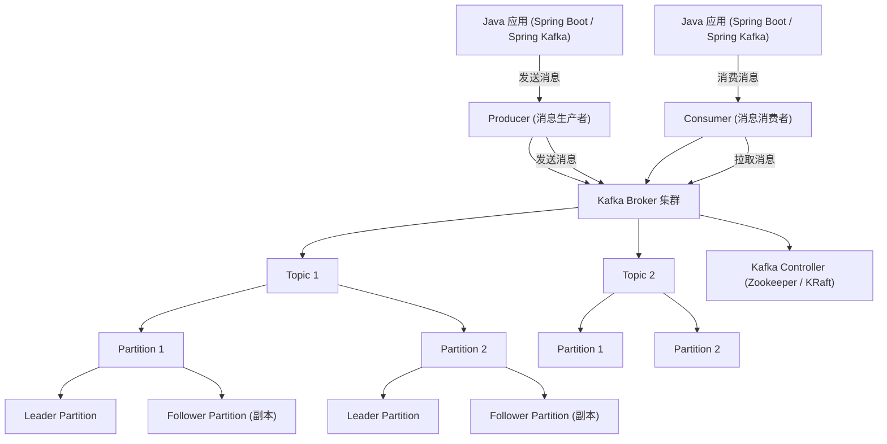

明白了，你希望一张 **Kafka 与 Java 后端相关的关系图示**，方便面试时讲解 **Kafka 架构、生产者/消费者模型及集群管理**。下面我整理一个 Mermaid 图示版本：

------

## Kafka 与 Java 后端关系示意图（Mermaid 版）

------

### 图示说明：

1. **Java 应用层**
   - **Producer**：发送消息到 Kafka Broker。
   - **Consumer**：从 Broker 拉取消息。
   - 使用 Spring Kafka 或 Kafka 原生客户端。
2. **Kafka Broker 集群**
   - 管理 Topic 和 Partition，负责消息存储和投递。
   - 支持水平扩展和高吞吐量。
3. **Topic 与 Partition**
   - **Topic**：逻辑上消息的分类。
   - **Partition**：物理存储单位，支持分布式并发消费。
   - 每个 Partition 有 **Leader** 和多个 **Follower** 副本，提高可靠性。
4. **Kafka Controller / Zookeeper / KRaft**
   - 管理集群元数据、Leader 选举和副本同步。
   - 旧版依赖 Zookeeper，最新版本可使用 KRaft 模式。
5. **高可用与可靠性**
   - Leader Partition 处理读写请求。
   - Follower Partition 做副本同步，保证数据可靠性。
6. **消息流程**
   - Producer 将消息发送到对应 Partition 的 Leader。
   - Consumer 拉取 Leader Partition 的消息。
   - Leader 将消息同步给 Follower Partition。

------

我可以帮你生成一个 **更直观的可视化 Kafka 架构图**，用 **Java 应用 → Producer/Consumer → Broker → Topic/Partition → Leader/Follower → Controller** 层次清晰展示，非常适合面试讲解。

你希望我直接帮你画这个可视化版本吗？