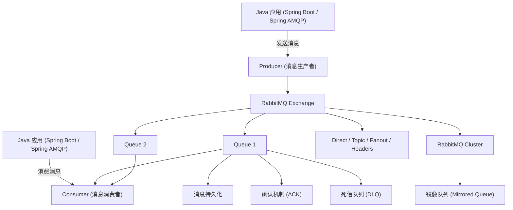

## 一、RabbitMQ 基础概念

1. 什么是 RabbitMQ？它的核心特点是什么？
2. RabbitMQ 的架构组成有哪些？
3. 什么是 AMQP？RabbitMQ 如何实现 AMQP 协议？
4. RabbitMQ 中的 **Exchange**、**Queue** 和 **Binding** 有什么作用？
5. RabbitMQ 的消息路由流程是怎样的？
6. 什么是 **Direct、Fanout、Topic、Headers** 类型的 Exchange？分别适合什么场景？
7. RabbitMQ 支持哪些消息确认机制？
8. 什么是 **消息持久化（Durable）**、**队列持久化**、**消息确认**？
9. RabbitMQ 如何保证消息不丢失？
10. RabbitMQ 与 Kafka、ActiveMQ 的区别是什么？

### **1. 什么是 RabbitMQ？它的核心特点是什么？**

- **定义**：RabbitMQ 是一个开源的消息队列（Message Broker），实现了 **AMQP（Advanced Message Queuing Protocol，高级消息队列协议）**，用于在分布式系统中异步传递消息。
- **核心特点**：
  1. **可靠传输**：支持持久化、事务、确认机制保证消息不丢失。
  2. **多种消息模式**：支持点对点（Work Queue）、发布/订阅（Pub/Sub）、路由（Routing）、主题（Topic）等。
  3. **灵活路由**：通过 Exchange + Binding 灵活路由消息。
  4. **高可用与可扩展**：支持集群、镜像队列（Mirrored Queue）。
  5. **支持多语言客户端**：Java、Python、C# 等。

------

### **2. RabbitMQ 的架构组成有哪些？**

- **Connection（连接）**：客户端与 RabbitMQ 服务器的 TCP 连接。
- **Channel（通道）**：逻辑通信通道，一个连接可以包含多个 Channel。
- **Exchange（交换机）**：接收生产者消息并根据路由规则发送到队列。
- **Queue（队列）**：消息存储的缓冲区，消费者从这里获取消息。
- **Binding（绑定）**：Exchange 与 Queue 之间的路由规则。
- **Message（消息）**：实际传递的数据，包含 body 和 properties。

你的这个总结 **基本正确**，但如果是 **面试级别的 RabbitMQ 架构**，确实 **少了一个核心组件：Broker**。
RabbitMQ 的整体结构应该是 **以 Broker 为中心** 的。

下面先给你一张 **完整关系图**（面试非常常见的一种画法）。

------

#### 一、RabbitMQ 架构关系图

```
                    +----------------------+
                    |       Producer       |
                    |   (消息生产者)        |
                    +----------+-----------+
                               |
                               | Message
                               v
                        +--------------+
                        |   Channel    |
                        |  (通信通道)   |
                        +-------+------+
                                |
                                v
                        +---------------+
                        |   Exchange    |
                        |   (交换机)     |
                        +-------+-------+
                                |
                        Binding |  路由规则
                                v
                        +---------------+
                        |     Queue     |
                        |    (队列)      |
                        +-------+-------+
                                |
                                v
                        +---------------+
                        |   Consumer    |
                        |   (消费者)     |
                        +---------------+


         +------------------------------------------------+
         |                   Broker                        |
         |                                                |
         |  Connection -> Channel -> Exchange -> Queue    |
         |                                                |
         +------------------------------------------------+
```

------

#### 二、Broker 是否必须写？

**必须写。**

在 RabbitMQ 中：

**Broker = RabbitMQ 服务器实例**

它负责管理：

- Exchange
- Queue
- Binding
- Connection
- Channel
- Message

可以理解为：

```
RabbitMQ Broker
     │
     ├── Exchange
     ├── Queue
     ├── Binding
     ├── Connection
     └── Channel
```

所以完整结构应该是：

```
Client
   │
Connection
   │
Channel
   │
Exchange
   │
Binding
   │
Queue
   │
Consumer
```

这些 **全部运行在 Broker 内部**。

------

#### 三、RabbitMQ 完整架构层级（面试推荐说法）

RabbitMQ 一般可以分为 **三层结构**：

```
应用层
 ├── Producer
 └── Consumer

通信层
 ├── Connection
 └── Channel

消息路由层（Broker 内部）
 ├── Exchange
 ├── Queue
 └── Binding
```

------

#### 四、RabbitMQ 最完整架构图（面试高分版本）

```
                    Producer
                       |
                       v
                +-------------+
                | Connection  |
                +-------------+
                       |
                       v
                +-------------+
                |   Channel   |
                +-------------+
                       |
                       v
                +-------------+
                |  Exchange   |
                +-------------+
                     /   \
                    /     \
             Binding       Binding
                  /           \
                 v             v
           +---------+   +---------+
           |  Queue  |   |  Queue  |
           +----+----+   +----+----+
                |             |
                v             v
            Consumer      Consumer


        所有组件运行在 RabbitMQ Broker 内
```

------

#### 五、RabbitMQ 架构组件总结（面试标准回答）

RabbitMQ 的核心组件包括：

| 组件           | 作用                                  |
| -------------- | ------------------------------------- |
| **Broker**     | RabbitMQ 服务实例，负责消息存储和转发 |
| **Connection** | 客户端与 Broker 的 TCP 连接           |
| **Channel**    | 逻辑通信通道                          |
| **Exchange**   | 接收消息并路由到队列                  |
| **Queue**      | 存储消息                              |
| **Binding**    | Exchange 与 Queue 的路由关系          |
| **Message**    | 实际传输的数据                        |
| **Producer**   | 生产消息                              |
| **Consumer**   | 消费消息                              |

------

#### 六、面试官最喜欢追问的一个问题

很多人都会被问：

**为什么 RabbitMQ 需要 Channel？**

标准回答：

因为 **TCP 连接创建开销大**，如果每次发送消息都创建 Connection，会非常耗资源。

所以 RabbitMQ 设计了：

```
Connection（TCP连接）
      │
  多个 Channel（轻量级通信）
```

一个连接可以开 **几百个 Channel**。

------

### **3. 什么是 AMQP？RabbitMQ 如何实现 AMQP 协议？**

- **AMQP**：Advanced Message Queuing Protocol，高级消息队列协议，是一种标准化、跨平台的消息传递协议。
- **RabbitMQ 实现**：
  - 使用 AMQP 定义消息格式、交换机类型、路由规则、确认机制等。
  - RabbitMQ 的 broker 按照 AMQP 规范实现消息传递、队列管理、持久化、确认机制。
- **特点**：
  - **互操作性**：不同语言和平台都能通过 AMQP 通信。
  - **可靠性**：提供事务、确认机制、持久化。

------

### **4. RabbitMQ 中的 Exchange、Queue 和 Binding 有什么作用？**

- **Exchange（交换机）**：接受生产者消息，并根据路由规则发送消息到队列。

- **Queue（队列）**：存储消息，等待消费者消费。

- **Binding（绑定）**：Exchange 与 Queue 之间的连接规则，决定消息能否进入某个队列。

- **关系示意**：

  ```
  Producer -> Exchange -> Binding -> Queue -> Consumer
  ```

------

### **5. RabbitMQ 的消息路由流程是怎样的？**

1. **生产者发送消息**到 Exchange。
2. **Exchange 根据类型和 Binding 规则**决定消息去向哪个队列。
3. **消息进入队列**，等待消费者消费。
4. **消费者消费消息**后，可发送 ACK 确认。

- **示意流程**：

  ```
  Producer -> Exchange -> Routing Key & Binding -> Queue -> Consumer -> ACK
  ```

------

### **6. 什么是 Direct、Fanout、Topic、Headers 类型的 Exchange？分别适合什么场景？**

| 类型    | 特点                       | 场景                                 |
| ------- | -------------------------- | ------------------------------------ |
| Direct  | 精确匹配 Routing Key       | 点对点消息，任务分发                 |
| Fanout  | 广播消息，忽略 Routing Key | 发布/订阅，广播通知                  |
| Topic   | 支持通配符匹配 Routing Key | 灵活路由，如日志分级或主题路由       |
| Headers | 根据消息 Header 属性匹配   | 更灵活的条件路由，不依赖 Routing Key |

------

### **7. RabbitMQ 支持哪些消息确认机制？**

1. **生产者确认（Publisher Confirm）**：保证消息被 broker 接收。
2. **消费者确认（Consumer Ack）**：保证消息被成功消费。
3. **事务机制（Transaction）**：保证消息发送的原子性（性能开销大，生产环境少用）。


- 生产者确认机制中，“消息被 broker 接收” 的完整流程是：
  1. 生产者发送消息到 RabbitMQ broker；
  2. broker 接收消息后，首先将消息路由到对应的 exchange；
  3. exchange 根据绑定规则将消息转发到匹配的 queue；
  4. 只有当消息被成功写入 queue（持久化消息还需写入磁盘）后，broker 才会向生产者返回确认（ack）。
- broker 不是特指 exchange，而是包含 exchange、queue 在内的整个 RabbitMQ 服务；


##### 消费者确认机制

消费者确认（Consumer Ack，即消费者手动/自动确认机制）的核心目标，就是**确保消息被消费者成功处理完成后，才从 RabbitMQ 的队列中删除**，避免消息丢失或重复消费。

###### 一、Consumer Ack 的核心逻辑

RabbitMQ 中，消息从队列投递到消费者后，并不会立即删除，而是等待消费者发送 **确认信号（Ack）**：
- 消费者处理完业务逻辑（如订单取消、库存恢复）后，发送 `basicAck` 确认 → RabbitMQ 收到后删除消息；
- 消费者处理失败（如抛出异常），发送 `basicNack`/`basicReject` 拒绝 → RabbitMQ 按配置决定是否重新入队或路由到死信队列；
- 消费者未发送任何确认（如宕机）→ 连接断开后，RabbitMQ 会将消息重新放回队列，等待其他消费者处理。

###### 二、两种确认模式（自动 vs 手动）

1. 自动确认（`ackMode="AUTO"`，默认）

- 行为：消费者接收到消息后，**立即自动发送 Ack**，无论业务处理是否成功。
- 风险：如果业务处理失败（如数据库宕机），消息已被删除，导致消息丢失（违背“成功消费才确认”的核心）。
- 适用场景：对消息可靠性要求极低的场景（如日志收集），不推荐用于核心业务（如订单、支付）。

 **2. 手动确认（`ackMode="MANUAL"`，推荐核心业务使用）**

- 行为：消费者必须通过代码手动调用 `basicAck`/`basicNack`，才会触发消息确认/拒绝。
- 优势：完全控制确认时机，确保业务处理成功后再确认，避免消息丢失。
- 代码示例（Spring AMQP）：
  ```java
  @RabbitListener(queues = "order.timeout", ackMode = "MANUAL")
  public void handleOrderTimeout(Message message, Channel channel) throws IOException {
      long deliveryTag = message.getMessageProperties().getDeliveryTag(); // 消息唯一标识
      String orderId = new String(message.getBody());

      try {
          // 1. 执行业务逻辑（核心：必须确保业务处理成功）
          orderService.cancelOrderTimeout(orderId); // 订单取消、库存恢复等

          // 2. 业务成功 → 手动确认（第二个参数 false 表示不批量确认）
          channel.basicAck(deliveryTag, false);
          log.info("订单{}处理成功，已确认消息", orderId);
      } catch (Exception e) {
          log.error("订单{}处理失败", orderId, e);
          // 3. 业务失败 → 拒绝消息（requeue=false 表示不重新入队，路由到死信队列）
          channel.basicNack(deliveryTag, false, false);
      }
  }
  ```

###### 三、关键注意事项（避免踩坑）

**1. 必须手动调用确认/拒绝**

手动模式下，若消费者未调用 `basicAck`/`basicNack`，消息会一直处于“未确认”状态，占用队列内存，最终导致队列堆积。

**2. 拒绝消息的两种方式（`basicNack` vs `basicReject`）**

| 方法          | 区别                                  | 适用场景                  |
|---------------|---------------------------------------|---------------------------|
| `basicNack`   | 支持批量拒绝（第二个参数 `multiple=true`） | 批量处理消息时拒绝多条    |
| `basicReject` | 仅支持单条拒绝，不支持批量            | 单条消息处理失败时拒绝    |

**3. `requeue` 参数的选择**

- `requeue=true`：消息重新放回队列尾部，等待再次投递（适合瞬时故障，如网络抖动）；
- `requeue=false`：消息不再入队，直接路由到死信队列（适合业务逻辑失败，如订单已取消）。
- 风险：`requeue=true` 可能导致消息无限重试，需配合重试次数限制或死信队列。

**4. 消息顺序性**

若队列是“有序队列”（如按订单创建时间排序），手动确认时需注意：**只有前一条消息确认后，再处理下一条**，否则可能导致消息顺序错乱（如先处理后创建的订单）。

###### 四、与“消息幂等性”的配合

Consumer Ack 保证了“消息不会丢失”，但可能导致“重复消费”（如消费者确认前宕机，消息重新投递）。因此，手动确认必须搭配 **幂等性处理**（如之前提到的 Redis 去重、订单状态校验），才能完整保证消息可靠性。

###### 总结

- 核心目标：**业务处理成功 → 确认消息 → 队列删除消息**，确保消息“被成功消费”后才清理。
- 推荐方案：核心业务（订单、支付、库存）必须使用 **手动确认模式（MANUAL）** + 幂等性处理 + 死信队列，形成“可靠消费”闭环。
- 避坑关键：手动模式下切勿遗漏确认/拒绝，失败消息避免无限重试。


------

### **8. 什么是消息持久化（Durable）、队列持久化、消息确认？**

- **消息持久化**：将消息写入磁盘，RabbitMQ 重启后不会丢失。
- **队列持久化**：队列本身持久化，重启后仍然存在。
- **消息确认**：消费者处理消息后，发送 ACK 给 broker，避免消息丢失或重复消费。

------

### **9. RabbitMQ 如何保证消息不丢失？**

1. **队列和消息持久化**。
2. **消费者 ACK 确认**。
3. **Publisher Confirm**。
4. **使用镜像队列（Mirrored Queue）**实现高可用，保证单点故障不丢失消息。

------

### **10. RabbitMQ 与 Kafka、ActiveMQ 的区别是什么？**

| 特性     | RabbitMQ               | Kafka            | ActiveMQ           |
| -------- | ---------------------- | ---------------- | ------------------ |
| 消息模型 | 队列+交换机            | 日志+主题        | 队列/主题          |
| 消费方式 | push（消费者拉取也可） | pull             | push/pull          |
| 消息顺序 | 队列内顺序保证         | 分区内顺序       | 队列内顺序         |
| 持久化   | 可选持久化             | 高度持久化       | 可选持久化         |
| 性能     | 中等                   | 高吞吐           | 中等               |
| 使用场景 | 任务队列、异步通信     | 大数据、日志收集 | 企业集成、异步消息 |


### 11.**RabbitMQ 与 Java 后端相关的关系图示**

明白了，你希望一张 **RabbitMQ 与 Java 后端相关的关系图示**，方便面试时讲解消息队列在 Java 开发中的架构和交互。下面我给你整理一个 Mermaid 图示：

------

#### RabbitMQ 与 Java 后端关系示意图（Mermaid 版）



------

#### 图示说明：

1. **Java 应用层**
   - 使用 Spring AMQP 或 RabbitMQ 原生客户端发送消息（Producer）或消费消息（Consumer）。
2. **Exchange**
   - 消息路由中心，根据路由键将消息发送到一个或多个队列。
   - 支持 **Direct、Topic、Fanout、Headers** 类型。
3. **Queue**
   - 消息存储点，消费者从队列中消费消息。
   - 支持消息持久化、确认机制和死信队列。
4. **高可用与集群**
   - 支持 RabbitMQ 集群部署和镜像队列（Mirrored Queue）保证 HA。
5. **可靠性机制**
   - 消息持久化、确认机制、死信队列保证消息不丢失。

### 12.RabbitMQ 与 Kafka、RocketMQ三者区别

RabbitMQ、Kafka、RocketMQ 是三款主流的消息中间件，核心定位和设计理念差异显著，我会从**核心设计、功能特性、性能、适用场景**四个维度，用通俗易懂的语言+对比表格帮你理清三者的核心区别，同时补充实际开发中的选型建议。

#### 一、核心定位与设计理念

##### 1. RabbitMQ

- **核心定位**：基于 AMQP 协议的**通用型消息中间件**，主打「可靠投递」「灵活路由」，适用于企业级业务的解耦、异步通信。
- **设计理念**：以「队列」为核心，强调消息的可靠传输（确认机制、死信队列）和灵活的路由策略（直连、主题、扇形、头交换机），偏向「业务场景」的消息处理。
- **底层实现**：Erlang 语言开发，天生支持高并发、高可用，但跨语言调用性能略逊。

##### 2. Kafka

- **核心定位**：基于「日志模型」的**高性能消息中间件**，主打「高吞吐」「低延迟」，适用于大数据、流处理、日志收集场景。
- **设计理念**：以「主题+分区」为核心，牺牲部分消息可靠性（默认异步刷盘）换取极致吞吐，偏向「数据传输管道」的设计，专为海量数据场景优化。
- **底层实现**：Scala/Java 开发，基于磁盘顺序读写（性能远超随机IO），分区机制天然支持水平扩展。

##### 3. RocketMQ

- **核心定位**：阿里开源的**融合型消息中间件**，兼顾「可靠性」和「高性能」，适用于电商、金融等互联网业务场景。
- **设计理念**：吸收 Kafka 的高吞吐设计（分区、顺序写）+ RabbitMQ 的可靠特性（确认机制、事务消息），偏向「互联网业务场景」的平衡设计。
- **底层实现**：Java 开发，适配国内互联网大厂的技术栈，运维和二次开发成本低。

#### 二、核心区别对比表

| 维度             | RabbitMQ                          | Kafka                                   | RocketMQ                               |
| ---------------- | --------------------------------- | --------------------------------------- | -------------------------------------- |
| **核心协议**     | AMQP（高级消息队列协议）          | 自定义 TCP 协议                         | 自定义 TCP 协议（兼容部分 Kafka 协议） |
| **消息模型**     | 交换机 + 队列（路由灵活）         | 主题 + 分区（日志模型）                 | 主题 + 队列 + 分区（融合设计）         |
| **性能（吞吐）** | 中（万级 TPS）                    | 高（十万级 TPS）                        | 高（十万级 TPS）                       |
| **延迟**         | 毫秒级（微秒级优化后）            | 毫秒级（批量场景可达微秒级）            | 毫秒级（接近 Kafka）                   |
| **消息可靠性**   | 强（支持确认、死信、事务消息）    | 中（默认异步刷盘，可配置同步）          | 强（支持同步刷盘、事务消息、死信）     |
| **消息顺序性**   | 单队列可保证顺序，多队列不行      | 分区内严格顺序，跨分区不行              | 分区/队列内严格顺序，支持全局顺序      |
| **消息回溯**     | 仅死信队列支持有限回溯            | 基于 offset 任意回溯（日志保留）        | 基于 offset 回溯，支持按时间回溯       |
| **重试机制**     | 手动配置重试策略，支持死信        | 无内置重试，需业务层实现                | 内置重试机制，支持最大重试次数         |
| **事务消息**     | 支持（AMQP 事务）                 | 不支持（需业务层实现最终一致）          | 原生支持（分布式事务场景友好）         |
| **部署运维**     | 简单（单节点/集群）               | 中等（依赖 ZooKeeper/Kafka Controller） | 中等（依赖 NameServer，集群易扩展）    |
| **生态/社区**    | 成熟（开源早，插件丰富）          | 极其成熟（大数据生态核心组件）          | 国内活跃（阿里维护，适配阿里云）       |
| **语言支持**     | 多语言（Erlang 原生，跨语言友好） | 主要 Java，其他语言需客户端             | 主要 Java，适配国内技术栈              |

#### 三、典型适用场景

##### 1. RabbitMQ 适用场景

- 企业级业务解耦：如订单创建后异步通知库存、物流（强调可靠投递）；
- 短消息/通知推送：如验证码、营销短信（路由灵活，支持扇形广播）；
- 低吞吐、高可靠场景：如金融交易通知（不能丢失消息）。

##### 2. Kafka 适用场景

- 大数据/流处理：如日志收集（ELK 栈）、用户行为分析（Flink/Spark 对接）；
- 高吞吐数据传输：如电商秒杀的流量削峰（先入 Kafka 再消费）；
- 日志/监控数据采集：如服务器日志、应用监控指标（海量数据低延迟）。

##### 3. RocketMQ 适用场景

- 互联网电商/金融：如订单交易、支付回调（兼顾高吞吐和可靠性）；
- 分布式事务：如电商下单扣库存（原生事务消息，避免数据不一致）；
- 国产化/云原生场景：如阿里云 RocketMQ 版，适配国内云环境。

#### 四、开发中的选型建议

1. **优先选 RabbitMQ**：如果你的场景是「小流量、高可靠、路由灵活」（如企业内部业务解耦），RabbitMQ 的易用性和可靠性是首选；
2. **优先选 Kafka**：如果是「大数据、高吞吐、流处理」（如日志收集、实时计算），Kafka 的性能和生态优势明显；
3. **优先选 RocketMQ**：如果是「互联网业务、分布式事务、国产化」（如电商、金融），RocketMQ 兼顾性能和业务特性，且Java 技术栈适配性更好。

#### 总结

1. **RabbitMQ**：「可靠优先」的通用型消息中间件，适合企业级业务解耦，核心优势是灵活路由和高可靠性；
2. **Kafka**：「性能优先」的大数据消息中间件，适合海量数据传输/流处理，核心优势是高吞吐、低延迟；
3. **RocketMQ**：「平衡型」互联网消息中间件，兼顾可靠性和高性能，适合电商、金融等国内互联网场景。

## RabbitMQ如何保证消息有序

在使用 **RabbitMQ** 时，消息默认是 **尽力保证顺序**，但在一些情况下（多消费者、并发消费、重试等）会导致**顺序被打乱**。因此如果业务需要**严格顺序消费**，需要做额外设计。

下面从**原理 + 实现方案**系统讲清楚。

------

### 一、RabbitMQ 默认的顺序保证

在最简单情况下：

```text
Producer → Queue → Consumer
```

如果满足以下条件：

1. **单 Producer**
2. **单 Queue**
3. **单 Consumer**
4. **自动 ACK 或顺序 ACK**

那么：

> RabbitMQ 会按照 **FIFO（先进先出）** 投递消息。

即：

```text
消息1
消息2
消息3
```

消费顺序：

```text
消息1 → 消息2 → 消息3
```

------

### 二、为什么顺序会被打乱

常见原因有 3 个。

------

#### 1 多消费者并发

例如：

```text
Queue
 ├── Consumer1
 └── Consumer2
```

消息：

```text
1 2 3 4
```

可能变成：

```text
Consumer1 → 1
Consumer2 → 2
Consumer2 → 3
Consumer1 → 4
```

消费顺序就乱了。

------

#### 2 消费失败重试

如果：

```text
消息2 处理失败
```

RabbitMQ 会重新入队：

```text
1 2 3
↓
1 3 2
```

顺序被破坏。

------

#### 3 prefetch 机制

RabbitMQ 默认会提前推送多条消息：

```text
prefetch = 10
```

消费者并发处理：

```text
1 2 3 4
```

完成顺序可能是：

```text
2 1 3 4
```

------

### 三、保证消息顺序的方案

常见有 **4 种方案**。

------

#### 方案一：单队列 + 单消费者（最简单）

架构：

```text
Producer → Queue → Consumer
```

优点：

- 完全保证顺序
- 实现简单

缺点：

- **吞吐量低**

适合：

- 日志处理
- 配置更新
- 低并发系统

------

#### 方案二：单队列 + 限制并发

设置：

```text
prefetch = 1
```

示例：

```java
channel.basicQos(1);
```

含义：

> 每次只消费一条消息，处理完再拿下一条。

优点：

- 基本保证顺序

缺点：

- 性能下降

------

#### 方案三：分区队列（推荐方案）

思路：

> **同一个业务Key进入同一个队列**

例如订单系统：

```text
orderId
```

路由规则：

```text
queueIndex = orderId % N
```

架构：

```text
Producer
   ↓
Exchange
   ↓
Queue0 → Consumer0
Queue1 → Consumer1
Queue2 → Consumer2
```

保证：

```text
同一个 orderId 的消息一定进入同一个 Queue
```

因此：

> **同一订单顺序保证，全局并发提升**

------

#### 方案四：消费端顺序控制

消费端做：

```text
顺序缓存 + 排序
```

例如：

```text
消息1 seq=1
消息3 seq=3
消息2 seq=2
```

缓存后再执行：

```text
1 → 2 → 3
```

缺点：

- 实现复杂
- 延迟增加

------

### 四、真实生产系统常用方案

在大型系统中通常采用：

#### **Key 分区顺序消费**

架构：

```text
Producer
   ↓
Exchange
   ↓
多个 Queue
   ↓
每个 Queue 单线程消费
```

例如：

```text
用户ID % 队列数
```

这样可以保证：

```text
同一个用户消息顺序
```

同时系统可以：

```text
横向扩展
```

------

### 五、面试标准回答

如果面试问：

**RabbitMQ 如何保证消息有序？**

可以这样回答：

> RabbitMQ 默认在单队列单消费者情况下可以保证 FIFO 顺序。但在多消费者并发、消息重试、prefetch 机制等情况下顺序可能被打乱。
> 实际生产中通常通过 **单队列单消费者** 或 **按业务 Key 分区路由到多个队列，每个队列单线程消费** 的方式保证同一业务维度的消息顺序，同时提升系统吞吐量。

------

如果你愿意，我可以再讲一个**面试里经常一起问的进阶问题**：

**“Kafka 为什么天然支持消息顺序，而 RabbitMQ 不完全支持？”**

这个问题很多大厂面试都会问，而且能顺带讲 **Kafka partition 原理**。

## 业务是否需要消息有序？

> 在使用 **RabbitMQ** 时，**大多数业务其实不需要严格保证消息有序**，只有少数对业务状态强依赖顺序的场景才需要保证。

下面从**实际工程经验**解释为什么。

------

### 一、大多数业务不需要严格顺序

很多系统使用 MQ 的目的其实是：

```text
异步
削峰
解耦
```

例如：

#### 1 发送短信

```text
用户注册
 ↓
发送短信
```

即使顺序错乱：

```text
短信A
短信B
```

变成：

```text
短信B
短信A
```

通常也 **不影响业务**。

------

#### 2 日志记录

```text
操作日志
行为日志
埋点数据
```

顺序不重要。

------

#### 3 异步通知

例如：

```text
订单创建
 ↓
积分增加
 ↓
消息通知
```

顺序基本不影响系统正确性。

------

### 二、真正需要保证顺序的场景

只有当 **消息之间存在强状态依赖** 时，才必须保证顺序。

例如：

------

#### 1 订单状态流转

```text
订单创建
 ↓
支付成功
 ↓
发货
 ↓
完成
```

如果顺序乱：

```text
发货
支付成功
```

业务就会出问题。

------

#### 2 账户余额流水

```text
余额 +100
余额 -50
```

如果顺序乱：

```text
-50
+100
```

可能导致余额错误。

------

#### 3 库存操作

```text
锁库存
扣库存
释放库存
```

顺序必须正确。

------

### 三、为什么很多系统故意不保证顺序

保证顺序的代价很大：

| 问题       | 原因           |
| ---------- | -------------- |
| 吞吐量下降 | 需要单线程消费 |
| 扩展性差   | 无法水平扩展   |
| 延迟变高   | 必须排队       |

例如：

```text
单队列 + 单消费者
```

吞吐量可能只有：

```text
几千 QPS
```

而并行消费可以：

```text
几十万 QPS
```

------

### 四、真实系统常见做法

真实生产系统通常是：

#### **只保证局部顺序**

例如：

```text
同一个订单有序
不同订单无序
```

实现方式：

```text
orderId % queueCount
```

这样：

```text
订单A → queue1
订单B → queue3
```

保证：

```text
订单A 内部顺序正确
```

同时系统可以：

```text
高并发处理
```

------

### 五、工程经验总结

在大多数项目中：

| 场景     | 是否保证顺序 |
| -------- | ------------ |
| 日志     | 不需要       |
| 通知     | 不需要       |
| 异步任务 | 不需要       |
| 订单状态 | 需要         |
| 账户余额 | 需要         |
| 库存     | 需要         |

------

### 六、面试标准回答

如果面试问：

**使用 RabbitMQ 是否需要保证消息有序？**

推荐回答：

> 在大多数系统中并不需要严格保证消息有序，因为 MQ 的主要作用是异步解耦和削峰填谷。只有在存在状态依赖的场景，例如订单状态流转、账户余额变更等业务中，才需要保证顺序。实际生产中通常采用按业务 Key 分区队列的方式，保证同一业务维度内的消息顺序，同时保持系统的并发能力。

------

如果你愿意，我可以再告诉你一个 **很多面试官喜欢继续追问的问题**：

## **“如果 RabbitMQ 消息乱序了，业务层如何保证最终正确？”**

这个问题其实是 **系统设计高级考点**（涉及：状态机、版本号、乐观锁）。

如果 **RabbitMQ** 出现**消息乱序**，工程上通常不会强依赖 MQ 保证顺序，而是通过**业务层设计**保证 **最终状态正确（最终一致性）**。常见有几种方法。

------

### 一、状态机控制（最常用）

核心思想：

> **状态只能按合法流程流转**

例如订单状态：

```text
CREATED → PAID → SHIPPED → FINISHED
```

更新必须带条件：

```sql
UPDATE order
SET status = 'PAID'
WHERE order_id = ?
AND status = 'CREATED'
```

如果消息乱序：

```
SHIPPED
PAID
```

执行：

1️⃣ 先执行 SHIPPED

```sql
UPDATE order
SET status='SHIPPED'
WHERE status='PAID'
```

更新失败（因为还是 CREATED）

2️⃣ 再执行 PAID

```sql
UPDATE order
SET status='PAID'
WHERE status='CREATED'
```

成功。

最终状态仍然正确。

------

### 二、版本号控制（乐观锁）

每条消息带 **version**。

例如账户变更：

```
version=1 余额+100
version=2 余额-50
version=3 余额+20
```

数据库：

```
version=0
```

更新：

```sql
UPDATE account
SET balance=?, version=version+1
WHERE id=? AND version=?
```

如果消息顺序变成：

```
3 → 1 → 2
```

执行：

```
3（失败）
1（成功）
2（成功）
3（重试成功）
```

最终正确。

------

### 三、按序号消费（序列控制）

消息带 **sequence**：

```
seq=1
seq=2
seq=3
```

消费者维护：

```
lastSeq
```

如果收到：

```
1
3
2
```

处理：

```
1 → 执行
3 → 暂存
2 → 执行
3 → 执行
```

适合：

- 日志系统
- 账户流水

------

### 四、幂等 + 最终状态覆盖

某些业务允许：

> **后状态覆盖前状态**

例如订单：

```
CREATED
PAID
SHIPPED
```

如果乱序：

```
SHIPPED → PAID
```

更新逻辑：

```sql
UPDATE order
SET status='SHIPPED'
WHERE status!='SHIPPED'
```

保证：

```
最终状态 = SHIPPED
```

------

### 五、时间戳策略

消息携带：

```
eventTime
```

更新时只接受 **更新更晚的事件**。

```sql
UPDATE order
SET status=?, update_time=?
WHERE order_id=?
AND update_time < ?
```

这样旧消息不会覆盖新状态。

------

### 六、真实系统最常见组合

大部分系统会使用：

```
幂等控制
+
状态机
+
乐观锁
```

流程：

```
MQ消息
   ↓
幂等校验
   ↓
状态机条件更新
   ↓
失败则丢弃或重试
```

------

### 七、工程经验总结

MQ 乱序时，一般通过 **业务层保证正确**：

| 方法     | 场景       |
| -------- | ---------- |
| 状态机   | 订单、支付 |
| 版本号   | 账户余额   |
| sequence | 日志流     |
| 时间戳   | 状态同步   |
| 幂等     | 所有 MQ    |

------

### 八、面试标准回答

如果面试问：

**RabbitMQ 消息乱序怎么办？**

可以回答：

> RabbitMQ 在并发消费或重试情况下可能出现消息乱序，因此通常不依赖 MQ 层保证严格顺序，而是在业务层保证最终一致性。常见做法包括：
>
> - 使用状态机控制合法状态流转
> - 使用版本号或乐观锁控制更新顺序
> - 使用消息序列号进行顺序校验
> - 使用时间戳防止旧消息覆盖新状态
>   同时结合幂等处理，确保重复或乱序消息不会影响最终结果。

------

如果你愿意，我可以再给你讲一个 **很多架构面试一定会问的升级问题**：

**“Kafka 为什么比 RabbitMQ 更容易保证消息顺序？”**

这个问题背后其实是 **分区模型 vs 队列模型** 的区别。

------

## **二、RabbitMQ Java API 使用**

1. 如何在 Java 中创建 RabbitMQ 连接？
2. Channel 与 Connection 的区别是什么？
3. Java 如何声明一个 Queue 和 Exchange？
4. 如何使用 Java 发送简单消息？
5. Java 消费者如何订阅队列？
6. 什么是 **自动确认（autoAck）** 与 **手动确认** 消费？
7. Java 如何实现消息确认机制（ack、nack、reject）？
8. Java 如何实现消息 TTL 和死信队列？
9. 如何在 Java 中使用 Topic Exchange 进行模糊路由？
10. Java 中如何设置消息优先级（Priority）？


------

### **1. 如何在 Java 中创建 RabbitMQ 连接？**

- **核心类**：`ConnectionFactory`、`Connection`、`Channel`
- **示例代码**：

```java
import com.rabbitmq.client.ConnectionFactory;
import com.rabbitmq.client.Connection;
import com.rabbitmq.client.Channel;

ConnectionFactory factory = new ConnectionFactory();
factory.setHost("localhost");
factory.setPort(5672);
factory.setUsername("guest");
factory.setPassword("guest");

Connection connection = factory.newConnection();
Channel channel = connection.createChannel();
```

- **说明**：
  - `Connection`：TCP 连接，重量级，建议多线程复用
  - `Channel`：逻辑通道，轻量，可在多线程中独立使用

------

### **2. Channel 与 Connection 的区别是什么？**

| 特性 | Connection                    | Channel                            |
| ---- | ----------------------------- | ---------------------------------- |
| 作用 | TCP 连接                      | 逻辑通信通道                       |
| 消耗 | 重量级                        | 轻量级                             |
| 线程 | 多线程共享可能出现阻塞        | 线程不安全，需要每线程独立 Channel |
| 建议 | 一般应用只创建少量 Connection | 多个 Channel 实现并发              |

------

### **3. Java 如何声明一个 Queue 和 Exchange？**

```java
// 声明 Exchange
channel.exchangeDeclare("my_exchange", "direct", true);

// 声明 Queue
channel.queueDeclare("my_queue", true, false, false, null);

// 绑定 Queue 到 Exchange
channel.queueBind("my_queue", "my_exchange", "routingKey");
```

- 参数说明：
  - `durable`：队列是否持久化
  - `exclusive`：是否只对当前连接可见
  - `autoDelete`：是否在最后一个消费者断开后自动删除

------

### **4. 如何使用 Java 发送简单消息？**

```java
String message = "Hello RabbitMQ!";
channel.basicPublish("my_exchange", "routingKey", null, message.getBytes());
```

- 参数说明：
  - `exchange`：目标 Exchange
  - `routingKey`：路由键
  - `props`：消息属性，如持久化
  - `body`：消息内容
- **发送持久化消息**：

```java
AMQP.BasicProperties props = new AMQP.BasicProperties
                                     .Builder()
                                     .deliveryMode(2) // 2 表示持久化
                                     .build();
channel.basicPublish("my_exchange", "routingKey", props, message.getBytes());
```

------

### **5. Java 消费者如何订阅队列？**

```java
import com.rabbitmq.client.DeliverCallback;

DeliverCallback deliverCallback = (consumerTag, delivery) -> {
    String msg = new String(delivery.getBody(), "UTF-8");
    System.out.println("Received: " + msg);
};

channel.basicConsume("my_queue", true, deliverCallback, consumerTag -> {});
```

- `autoAck = true` 表示自动确认，false 表示手动确认

### 发送/消费 消息

------

#### 一、消费消息 `basicConsume`

```java
channel.basicConsume("my_queue", true, deliverCallback, consumerTag -> {});
```

参数含义：

| 参数                | 含义                 |
| ------------------- | -------------------- |
| `my_queue`          | 要监听的队列         |
| `true`              | 是否自动 ACK         |
| `deliverCallback`   | 收到消息后的处理逻辑 |
| `consumerTag -> {}` | 取消消费时的回调     |

##### 关键点：`autoAck`

这里写的是：

```java
true
```

表示：

```text
自动确认消息
```

流程：

```
MQ -> 发送消息
      ↓
消费者收到
      ↓
RabbitMQ 立刻认为消费成功
```

如果此时程序 **处理失败或宕机**：

```
消息会丢失
```

------

##### 实际生产一般这样写

```java
channel.basicConsume("my_queue", false, deliverCallback, consumerTag -> {});
```

关闭自动 ACK。

处理成功后：

```java
channel.basicAck(deliveryTag, false);
```

处理失败：

```java
channel.basicNack(deliveryTag, false, true);
```

------

#### 二、发送消息 `basicPublish`

```java
channel.basicPublish("my_exchange", "routingKey", props, message.getBytes());
```

参数含义：

| 参数                 | 含义     |
| -------------------- | -------- |
| `my_exchange`        | 交换机   |
| `routingKey`         | 路由键   |
| `props`              | 消息属性 |
| `message.getBytes()` | 消息体   |

发送流程：

```
Producer
   ↓
Exchange
   ↓
RoutingKey匹配
   ↓
Queue
```

**生产者只发送到 Exchange（交换机），而不是直接发送到 Queue（队列）**。

Exchange 通过 **Binding（绑定） + routingKey** 来决定消息去哪个队列。

------

#### 三、`props` 的作用

`props` 是：

```java
AMQP.BasicProperties
```

可以控制很多重要功能。

常见配置：

##### 1 持久化消息

```java
props = new AMQP.BasicProperties
        .Builder()
        .deliveryMode(2)
        .build();
```

`deliveryMode=2` 表示：

```
消息持久化
```

------

##### 2 消息ID（幂等）

```java
.messageId(UUID.randomUUID().toString())
```

用于：

```
消费幂等
```

------

##### 3 延迟 / TTL

```java
.expiration("60000")
```

表示：

```
60秒过期
```

------

#### 四、完整生产者示例

```java
AMQP.BasicProperties props =
        new AMQP.BasicProperties.Builder()
                .deliveryMode(2)
                .messageId(UUID.randomUUID().toString())
                .build();

channel.basicPublish(
        "order_exchange",
        "order.create",
        props,
        message.getBytes()
);
```

binding 一般在 **系统启动时创建**。

binding 属于 MQ 配置
basicPublish 属于发送消息

#### 例如

```java
channel.exchangeDeclare("order_exchange", "direct", true);

channel.queueDeclare("order_queue", true, false, false, null);

channel.queueBind(
        "order_queue",
        "order_exchange",
        "order.create"
);
```

#### 完整消息流程

```
Producer
   │
   │ basicPublish
   ▼
Exchange(order_exchange)
   │
   │ routingKey = order.create
   ▼
Binding 匹配
   │
   ▼
Queue(order_queue)
   │
   ▼
Consumer
```


------

#### 五、完整消费者示例

```java
channel.basicConsume("order_queue", false, (consumerTag, delivery) -> {

    String msg = new String(delivery.getBody());

    try {

        // 业务处理
        process(msg);

        // 手动ACK
        channel.basicAck(delivery.getEnvelope().getDeliveryTag(), false);

    } catch (Exception e) {

        // 重新入队
        channel.basicNack(delivery.getEnvelope().getDeliveryTag(), false, true);

    }

}, consumerTag -> {});
```

------

#### 六、工程中必须注意的 3 个坑

##### 1 自动 ACK 会丢消息

不要这样：

```
autoAck=true
```

------

##### 2 不做幂等

MQ **至少一次投递**：

```
可能重复消费
```

必须：

```
业务幂等
```

------

##### 3 不限流

消费者需要：

```java
channel.basicQos(1);
```

否则：

```
MQ可能一次推送大量消息
导致消费者崩溃
```

------

#### 七、面试最爱问的问题

看到这段代码面试官通常会继续问：

1️⃣ **RabbitMQ 如何保证消息不丢失？**

涉及：

```
生产者确认
消息持久化
消费者ACK
```

2️⃣ **RabbitMQ 如何保证消息不重复？**

涉及：

```
幂等
去重表
Redis
```

3️⃣ **RabbitMQ 如何保证顺序？**

涉及：

```
单队列
单消费者
分区队列
```


------

### **6. 什么是自动确认（autoAck）与手动确认？**

- **自动确认**：
  - 消费者接收到消息后立即告诉 RabbitMQ 已经消费
  - 优点：简单，性能高
  - 缺点：消费者处理失败消息也算已消费，可能丢失
- **手动确认**：
  - 消费者处理完消息后调用 `channel.basicAck`
  - 优点：处理失败可重试，保证消息不丢失
  - 缺点：代码复杂一点

------

### **7. Java 如何实现消息确认机制（ack、nack、reject）？**

```java
// 手动确认
channel.basicAck(deliveryTag, false);

// 拒绝消息
channel.basicReject(deliveryTag, false); // false 表示不重回队列

// 批量确认
channel.basicNack(deliveryTag, true, true); // requeue=true 表示重新入队
```

- **说明**：
  - `deliveryTag`：消息标识
  - `multiple`：是否批量确认

------

### **8. Java 如何实现消息 TTL 和死信队列？**

```java
Map<String, Object> args = new HashMap<>();
args.put("x-message-ttl", 10000); // 10秒过期
args.put("x-dead-letter-exchange", "dlx_exchange");
channel.queueDeclare("ttl_queue", true, false, false, args);
```

- **说明**：
  - `x-message-ttl`：消息过期时间
  - `x-dead-letter-exchange`：过期或拒绝的消息发送到死信队列

------

### **9. 如何在 Java 中使用 Topic Exchange 进行模糊路由？**

```java
channel.exchangeDeclare("topic_logs", "topic", true);
channel.queueBind("queue1", "topic_logs", "*.error");
channel.queueBind("queue2", "topic_logs", "order.*");
```

- **Routing Key 通配符**：
  - `*`：匹配一个单词
  - `#`：匹配零个或多个单词

------

### **10. Java 中如何设置消息优先级（Priority）？**

```java
Map<String, Object> args = new HashMap<>();
args.put("x-max-priority", 10); // 队列最大优先级 10
channel.queueDeclare("priority_queue", true, false, false, args);

AMQP.BasicProperties props = new AMQP.BasicProperties.Builder()
                             .priority(5)
                             .build();
channel.basicPublish("exchange", "routingKey", props, "high-priority-message".getBytes());
```

- 消息在队列中会根据优先级先后排序消费

### 11.了解Rabbit MQ消息丢失、重复、幂等解决方案。

#### 一、消息丢失场景与解决方案

RabbitMQ 消息丢失主要发生在三个环节：**生产者 → MQ**、**MQ 自身**、**MQ → 消费者**。

##### 1. 生产者到 MQ 丢失

**原因**：网络闪断、MQ 宕机，消息未到达 Broker。
**方案**：

1. **Confirm 机制（生产者确认）**
   - 开启 `publisher-confirm-type: correlated`
   - 消息发送成功后 Broker 异步返回 `ack`，失败返回 `nack`
2. **Return 机制（消息未路由到队列）**
   - 开启 `publisher-returns: true`
   - 处理无法路由到队列的消息（如备份到数据库、告警）
3. **生产者重试 + 落库**
   - 发送前先将消息入库（状态：待发送）
   - 收到 ack 后更新为已发送
   - 定时任务重发未 ack 消息（控制重试次数）

##### 2. MQ 自身丢失

**原因**：MQ 重启、宕机，内存消息未持久化。
**方案**：

1. **交换机、队列、消息都持久化**
   - 队列：`durable=true`
   - 消息：`deliveryMode=2`（持久化）
2. **镜像队列 / 集群高可用**
   - 主节点挂了，从节点顶上，避免单点丢失

##### 3. 消费者到业务处理丢失

**原因**：自动 ack，消费者刚拿到消息就宕机，MQ 认为已消费。
**方案**：

1. **手动 ACK（必须）**
   - 关闭自动 ack：`acknowledge-mode: manual`
   - 业务处理**成功**再 `channel.basicAck()`
   - 业务失败：`basicNack()` / `basicReject` 重新入队或丢弃
2. 避免：try 里成功 ack，catch 里什么都不做

---

#### 二、消息重复消费场景

**根本原因**：网络重传、消费者超时未 ack、重试机制导致同一条消息多次投递。
RabbitMQ **不保证消息只投递一次**，只保证 **至少一次（at least once）**。

**通用处理思路**：
让重复消费对业务结果无影响 → **幂等性**。

---

#### 三、幂等性解决方案（重点）

幂等：**同一消息执行多次，结果与执行一次相同**。

##### 方案1：唯一消息ID + 去重表（最通用、最稳）

1. 生产者发送时携带 **全局唯一ID**（如业务单号+序列号）
2. 消费者流程：
   - 开启事务
   - 查询去重表是否存在该 ID
   - 存在：直接 ack，不再处理
   - 不存在：执行业务 → 插入去重表 → 提交事务 → ack
3. 去重表可按时间分表/清理，避免过大

##### 方案2：数据库唯一约束（适合插入类业务）

- 业务表建立 **唯一索引**（如订单号）
- 重复消费时插入报唯一冲突，捕获异常直接 ack

##### 方案3：状态机机制（适合订单、支付等流转业务）

- 订单状态：待支付 → 支付中 → 已支付
- 只有状态为“待支付”才允许执行支付逻辑
- 重复消息到达时状态已变，直接忽略

##### 方案4：Redis 分布式锁（高并发场景）

- 以消息ID为 key，加分布式锁
- 拿到锁才执行业务，执行完释放锁
- 适合并发极高、不想频繁写数据库去重表的场景

---

#### 四、生产级最佳实践总结（面试加分）

1. 生产者：**Confirm + Return + 消息落库 + 定时重发**
2. Broker：**持久化 + 镜像队列**
3. 消费者：**手动 ack + 幂等保证**
4. 幂等优先选择：**唯一ID + 去重表（事务保证）**
5. 严禁：自动 ack、不做幂等、无重试兜底

---

### 12.Springboot 使用RabbitMQ完成消息的收发

#### 前置条件

1. 已安装并启动 RabbitMQ 服务（默认端口 5672，账号密码 guest/guest）
2. 新建 Spring Boot 项目，引入以下依赖：

```xml
<!-- pom.xml 核心依赖 -->
<dependencies>
    <!-- Spring Boot Web（方便测试） -->
    <dependency>
        <groupId>org.springframework.boot</groupId>
        <artifactId>spring-boot-starter-web</artifactId>
    </dependency>
    <!-- Spring AMQP（RabbitMQ 核心依赖） -->
    <dependency>
        <groupId>org.springframework.boot</groupId>
        <artifactId>spring-boot-starter-amqp</artifactId>
    </dependency>
    <!-- lombok（简化代码，可选） -->
    <dependency>
        <groupId>org.projectlombok</groupId>
        <artifactId>lombok</artifactId>
        <optional>true</optional>
    </dependency>
</dependencies>
```

---

#### 步骤1：配置 RabbitMQ 连接

在 `application.yml` 中配置 RabbitMQ 连接信息和基础可靠性参数：

```yaml
spring:
  # RabbitMQ 基础配置
  rabbitmq:
    host: localhost      # MQ 地址（本地部署）
    port: 5672           # 默认端口
    username: guest      # 默认账号
    password: guest      # 默认密码
    virtual-host: /      # 默认虚拟主机
    # 生产者确认机制（避免消息从生产者到MQ丢失）
    publisher-confirm-type: correlated  # 开启异步确认
    publisher-returns: true             # 开启消息未路由返回机制
    # 消费者配置
    listener:
      simple:
        acknowledge-mode: manual        # 手动ACK（避免消息从MQ到消费者丢失）
        concurrency: 1                  # 消费者最小线程数
        max-concurrency: 5              # 消费者最大线程数
```

---

#### 步骤2：声明队列、交换机、绑定关系(声明式)

创建配置类，显式声明队列、交换机（这里用最常用的 **Direct 交换机**），并绑定：

```java
import org.springframework.amqp.core.Binding;
import org.springframework.amqp.core.BindingBuilder;
import org.springframework.amqp.core.DirectExchange;
import org.springframework.amqp.core.Queue;
import org.springframework.context.annotation.Bean;
import org.springframework.context.annotation.Configuration;

@Configuration
public class RabbitMQConfig {

    // 1. 声明队列（持久化）
    public static final String TEST_QUEUE = "test.queue";
    // 2. 声明交换机（持久化）
    public static final String TEST_EXCHANGE = "test.exchange";
    // 3. 声明路由键
    public static final String TEST_ROUTING_KEY = "test.routing.key";

    // 定义队列：durable = true 表示持久化，避免MQ重启队列丢失
    @Bean
    public Queue testQueue() {
        return new Queue(TEST_QUEUE, true);
    }

    // 定义Direct交换机：持久化
    @Bean
    public DirectExchange testExchange() {
        return new DirectExchange(TEST_EXCHANGE, true, false);
    }

    // 绑定队列和交换机：指定路由键
    @Bean
    public Binding bindingTestQueue(Queue testQueue, DirectExchange testExchange) {
        return BindingBuilder.bind(testQueue).to(testExchange).with(TEST_ROUTING_KEY);
    }
}
```

---

#### 步骤3：实现消息生产者（发送消息）

创建生产者类，支持发送普通消息，并添加 **生产者确认回调**（确保消息到达 MQ）：

```java
import lombok.extern.slf4j.Slf4j;
import org.springframework.amqp.rabbit.connection.CorrelationData;
import org.springframework.amqp.rabbit.core.RabbitTemplate;
import org.springframework.beans.factory.annotation.Autowired;
import org.springframework.stereotype.Component;

import javax.annotation.PostConstruct;
import java.util.UUID;

@Slf4j
@Component
public class MessageProducer {

    @Autowired
    private RabbitTemplate rabbitTemplate;

    // 初始化：设置生产者确认和返回回调
    @PostConstruct
    public void init() {
        // 1. 消息发送到MQ后的确认回调（成功/失败）
        rabbitTemplate.setConfirmCallback((correlationData, ack, cause) -> {
            String msgId = correlationData != null ? correlationData.getId() : "未知ID";
            if (ack) {
                log.info("消息【{}】成功发送到MQ", msgId);
            } else {
                log.error("消息【{}】发送到MQ失败，原因：{}", msgId, cause);
                // 这里可添加重试、落库等兜底逻辑
            }
        });

        // 2. 消息到达MQ但未路由到队列的回调
        rabbitTemplate.setReturnsCallback(returned -> {
            log.error("消息【{}】未路由到队列，响应码：{}，原因：{}",
                    returned.getMessage().getMessageProperties().getMessageId(),
                    returned.getReplyCode(), returned.getReplyText());
        });
    }

    // 发送消息方法
    public void sendMessage(String content) {
        // 生成全局唯一消息ID（用于追踪、去重）
        String msgId = UUID.randomUUID().toString();
        // 设置消息ID
        CorrelationData correlationData = new CorrelationData(msgId);
        
        // 发送消息：交换机 + 路由键 + 消息内容 + 消息ID
        rabbitTemplate.convertAndSend(
                RabbitMQConfig.TEST_EXCHANGE,
                RabbitMQConfig.TEST_ROUTING_KEY,
                content,
                correlationData
        );
        log.info("生产者发送消息：ID={}, 内容={}", msgId, content);
    }
}
```

---

#### 步骤4：实现消息消费者（接收并处理消息）

创建消费者类，使用手动 ACK 机制（确保业务处理完成后再确认消息）：

```java
import com.rabbitmq.client.Channel;
import lombok.extern.slf4j.Slf4j;
import org.springframework.amqp.core.Message;
import org.springframework.amqp.rabbit.annotation.RabbitListener;
import org.springframework.stereotype.Component;

import java.io.IOException;

@Slf4j
@Component
public class MessageConsumer {

    // 监听指定队列
    @RabbitListener(queues = RabbitMQConfig.TEST_QUEUE)
    public void consumeMessage(String content, Message message, Channel channel) throws IOException {
        // 获取消息的投递标签（用于ACK确认）
        long deliveryTag = message.getMessageProperties().getDeliveryTag();
        try {
            // 1. 执行业务逻辑（这里模拟业务处理）
            log.info("消费者接收到消息：内容={}", content);
            // 模拟业务处理（比如入库、调用接口等）
            // doBusiness(content);

            // 2. 手动ACK：确认消息已处理完成，MQ可删除该消息
            // multiple = false：只确认当前这条消息
            channel.basicAck(deliveryTag, false);
            log.info("消息确认成功，deliveryTag={}", deliveryTag);
        } catch (Exception e) {
            log.error("处理消息失败：{}", e.getMessage(), e);
            // 3. 手动NACK：处理失败时，拒绝消息并重新入队（可根据业务调整）
            // requeue = true：重新入队；false：直接丢弃（或走死信队列）
            channel.basicNack(deliveryTag, false, true);
        }
    }
}

```

---

#### 步骤5：测试消息收发

创建一个测试接口，通过 HTTP 请求触发消息发送：

```java
import org.springframework.beans.factory.annotation.Autowired;
import org.springframework.web.bind.annotation.GetMapping;
import org.springframework.web.bind.annotation.RequestParam;
import org.springframework.web.bind.annotation.RestController;

@RestController
public class TestController {

    @Autowired
    private MessageProducer messageProducer;

    // 测试接口：http://localhost:8080/sendMsg?content=HelloRabbitMQ
    @GetMapping("/sendMsg")
    public String sendMsg(@RequestParam String content) {
        messageProducer.sendMessage(content);
        return "消息发送请求已提交，内容：" + content;
    }
}
```

---

#### 运行测试

1. 启动 Spring Boot 项目（确保 RabbitMQ 已启动）；
2. 访问接口：`http://localhost:8080/sendMsg?content=HelloRabbitMQ`；
3. 查看控制台日志：
   - 生产者日志：`生产者发送消息：ID=xxx, 内容=HelloRabbitMQ` → `消息【xxx】成功发送到MQ`；
   - 消费者日志：`消费者接收到消息：内容=HelloRabbitMQ` → `消息确认成功，deliveryTag=1`。

---

#### 核心注意事项

1. **手动ACK是关键**：如果用自动ACK，消费者刚拿到消息就宕机，MQ会认为消息已消费，导致消息丢失；
2. **消息持久化**：队列、交换机、消息（默认deliveryMode=2）都要持久化，避免MQ重启丢失；
3. **生产者确认**：Confirm 机制确保消息到达 MQ，Return 机制处理路由失败的消息；
4. **异常处理**：消费者处理失败时，可通过 basicNack 重新入队（注意避免死循环，可限制重试次数）。

---

#### 总结

1. RabbitMQ 消息收发核心是 **生产者 → 交换机 → 队列 → 消费者**，通过路由键匹配绑定关系；
2. 可靠性基础配置：**生产者Confirm/Return + 手动ACK + 持久化**，可避免绝大多数消息丢失问题；
3. 代码中通过 `RabbitTemplate` 发送消息，`@RabbitListener` 监听队列接收消息，是 Spring Boot 集成 RabbitMQ 的标准用法。

## 基于 **Spring AMQP** 的**注解驱动方式**

在 Spring 里指的就是基于 **Spring AMQP** 的**注解驱动方式**：不用显式写 `Queue / Exchange / Binding Bean`，而是用注解让 Spring 自动帮你完成绑定关系。

这是现在项目里**最常见的一种写法**。

------

### 一、核心注解方式（最常用）

#### 1️⃣ 监听消息（消费端）

```java
@RabbitListener(queues = "test.queue")
public void handleMessage(String msg) {
    System.out.println("收到消息：" + msg);
}
```

👉 作用：

- 自动监听队列
- 自动创建 consumer
- 自动消费消息

------

### 二、自动声明队列 + 交换机 + binding（重点）

#### 2️⃣ 完整注解绑定方式

```java
@RabbitListener(bindings = @QueueBinding(
        value = @Queue(value = "test.queue", durable = "true"),
        exchange = @Exchange(value = "test.exchange", type = "direct"),
        key = "test.routing.key"
))
public void handleMessage(String msg) {
    System.out.println(msg);
}
```

#### ✔ 自动创建 Queue

```text
test.queue
```

#### ✔ 自动创建 Exchange

```text
test.exchange
```

#### ✔ 自动创建 Binding

```text
routingKey = test.routing.key
```

------

### 三、发送消息（生产者）

```java
rabbitTemplate.convertAndSend(
        "test.exchange",
        "test.routing.key",
        "hello"
);
```

------

### 四、注解方式 vs 传统方式

| 方式        | 写法                   | 特点       |
| ----------- | ---------------------- | ---------- |
| Bean配置    | Queue/Exchange/Binding | 显式、清晰 |
| Channel API | queueDeclare           | 底层控制   |
| 注解式      | @QueueBinding          | 自动化最高 |

------

### 五、注解方式的核心特点

#### 1️⃣ 自动声明（很重要）

只要启动：

```text
Spring Boot 启动
```

就会自动创建：

- queue
- exchange
- binding

------

#### 2️⃣ 零配置绑定

不用写：

```java
@Bean
```

------

#### 3️⃣ 适合快速开发

比如：

```text
订单系统
通知系统
日志系统
```

------

### 六、进阶注解（面试加分）

#### 1️⃣ 并发消费

```java
@RabbitListener(queues = "test.queue", concurrency = "3-10")
```

------

#### 2️⃣ 手动 ACK

```java
@RabbitListener(queues = "test.queue", ackMode = "MANUAL")
public void handle(Message msg, Channel channel) throws Exception {

    try {
        System.out.println(msg);
        channel.basicAck(msg.getMessageProperties().getDeliveryTag(), false);
    } catch (Exception e) {
        channel.basicNack(...);
    }
}
```

------

#### 3️⃣ 监听对象

```java
@RabbitListener(queues = "test.queue")
public void handle(Order order) {
    System.out.println(order.getId());
}
```

### 生产者（标准方式）

生产者**没有 @RabbitListener 对应注解**，主流方式是：

#### 1️⃣ RabbitTemplate（最常用）

```java
@Autowired
private RabbitTemplate rabbitTemplate;

public void send(String msg) {
    rabbitTemplate.convertAndSend(
            "test.exchange",
            "test.routing.key",
            msg
    );
}
```

------

#### 2️⃣ 带消息属性（幂等/持久化）

```java
public void send(String msg) {

    MessageProperties props = new MessageProperties();
    props.setDeliveryMode(MessageDeliveryMode.PERSISTENT);
    props.setMessageId(UUID.randomUUID().toString());

    Message message = new Message(msg.getBytes(), props);

    rabbitTemplate.send(
            "test.exchange",
            "test.routing.key",
            message
    );
}
```

------

### 生产者“类注解封装方式”（进阶）

虽然没有直接注解发送，但可以这样封装：

#### 方式1：Service + 注解语义化

```java
@Service
public class OrderProducer {

    @Autowired
    private RabbitTemplate rabbitTemplate;

    public void sendOrderCreated(Order order) {
        rabbitTemplate.convertAndSend(
                "order.exchange",
                "order.create",
                order
        );
    }
}
```

------

#### 方式2：事件驱动（推荐）

```java
applicationEventPublisher.publishEvent(orderEvent);
```

监听：

```java
@EventListener
public void handle(OrderEvent event) {
    rabbitTemplate.convertAndSend(...);
}
```

👉 实现“类注解化生产”

------

### 七、注解方式的本质

很多人误以为：

> 注解 = 简化写法

其实本质是：

```text
Spring 容器启动时自动注册：
Queue / Exchange / Binding / Consumer
```

------

### 八、优缺点

#### ✔ 优点

- 写法简单
- 自动创建 MQ 结构
- 开发效率高
- Spring 生态统一

------

#### ❌ 缺点

- 隐式配置（不直观）
- 不利于 MQ 架构统一管理
- 大型系统可能混乱

------

### 九、真实项目建议

一般企业会这样用：

| 层级     | 做法            |
| -------- | --------------- |
| 基础设施 | Bean 显式声明   |
| 业务消费 | @RabbitListener |
| 生产消息 | RabbitTemplate  |

👉 即：

```text
声明用 Bean
消费用注解
发送用模板
```

------

### 十、面试标准回答（可以直接背）

> RabbitMQ 在 Spring 中可以通过注解方式实现消息监听与队列绑定，使用 @RabbitListener 可以监听队列消费消息，同时结合 @QueueBinding、@Exchange 和 @Queue 注解可以自动声明队列、交换机及绑定关系，从而实现零配置的消息消费模式。该方式简化了配置，但在大型系统中通常与显式 Bean 声明结合使用。

------

### 十一、如果你想继续深入（面试高频追问）

我可以继续帮你讲：

👉 **@RabbitListener 底层是怎么启动 consumer 的？**
👉 **注解方式如何避免重复声明 queue？**
👉 **并发消费为什么可能导致乱序？**

这些都是 RabbitMQ 面试的“进阶杀手题”。

------

## **三、RabbitMQ 消息模式**

1. 什么是 **工作队列（Work Queue）** 模式？
2. 什么是 **发布/订阅（Pub/Sub）** 模式？
3. 什么是 **路由（Routing）** 模式？
4. 什么是 **主题（Topic）** 模式？
5. 什么是 **RPC（远程过程调用）** 模式？
6. 如何使用 Java 实现简单的 RPC 消息通信？
7. 什么是 **死信队列（Dead Letter Queue）**？如何在 Java 中配置？
8. 什么是 **延迟队列（Delayed Queue）**？Java 实现方式有哪些？
9. 如何实现消息广播给多个消费者？
10. 什么是 **消息幂等**？如何保证幂等消费？

------

### **1. 什么是工作队列（Work Queue）模式？**

- **定义**：工作队列模式用于将任务分发给多个消费者，通常用来实现任务异步处理和负载均衡。
- **特点**：
  - 一条消息只被一个消费者处理
  - 可以通过多个消费者共享队列，实现负载均衡
- **示意**：

```
Producer -> Queue -> Consumer1
                     Consumer2
```

- **Java 示例**：

```java
channel.queueDeclare("task_queue", true, false, false, null);
channel.basicPublish("", "task_queue", MessageProperties.PERSISTENT_TEXT_PLAIN, message.getBytes());
```

------

### **2. 什么是发布/订阅（Pub/Sub）模式？**

- **定义**：发布/订阅模式用于广播消息给多个消费者，每个消费者都能收到消息。
- **实现方式**：使用 **Fanout Exchange**
- **示意**：

```
Producer -> Fanout Exchange -> Queue1 -> Consumer1
                              Queue2 -> Consumer2
```

- **Java 示例**：

```java
channel.exchangeDeclare("logs", "fanout");
channel.basicPublish("logs", "", null, message.getBytes());
```

------

### **3. 什么是路由（Routing）模式？**

- **定义**：路由模式使用 **Direct Exchange**，根据 Routing Key 将消息发送到不同队列。
- **示意**：

```
Producer -> Direct Exchange -> Queue1 (key=info)
                             Queue2 (key=error)
```

- **Java 示例**：

```java
channel.exchangeDeclare("direct_logs", "direct");
channel.queueBind("error_queue", "direct_logs", "error");
channel.basicPublish("direct_logs", "error", null, message.getBytes());
```

------

### **4. 什么是主题（Topic）模式？**

- **定义**：主题模式使用 **Topic Exchange**，通过 Routing Key 通配符实现灵活路由。
- **Routing Key 通配符**：
  - `*` 匹配一个单词
  - `#` 匹配零个或多个单词
- **示意**：

```
Routing Key: "order.created"
Queue binding: "order.*"
```

- **Java 示例**：

```java
channel.exchangeDeclare("topic_logs", "topic");
channel.queueBind("queue1", "topic_logs", "order.*");
channel.basicPublish("topic_logs", "order.created", null, message.getBytes());
```

------

### **5. 什么是 RPC（远程过程调用）模式？**

- **定义**：RPC 模式允许客户端发送请求消息到服务器，并等待响应消息，实现同步调用。
- **特点**：
  - 需要临时队列（Reply Queue）
  - 需要 `correlationId` 匹配请求和响应

------

### **6. 如何使用 Java 实现简单的 RPC 消息通信？**

- **客户端示例**：

```java
String replyQueue = channel.queueDeclare().getQueue();
AMQP.BasicProperties props = new AMQP.BasicProperties.Builder()
                              .correlationId(corrId)
                              .replyTo(replyQueue)
                              .build();
channel.basicPublish("", "rpc_queue", props, message.getBytes());
```

- **服务端示例**：

```java
DeliverCallback deliverCallback = (consumerTag, delivery) -> {
    String response = process(new String(delivery.getBody()));
    AMQP.BasicProperties replyProps = new AMQP.BasicProperties.Builder()
                                      .correlationId(delivery.getProperties().getCorrelationId())
                                      .build();
    channel.basicPublish("", delivery.getProperties().getReplyTo(), replyProps, response.getBytes());
    channel.basicAck(delivery.getEnvelope().getDeliveryTag(), false);
};
channel.basicConsume("rpc_queue", false, deliverCallback, consumerTag -> {});
```

------

### **7. 什么是死信队列（Dead Letter Queue）？如何在 Java 中配置？**

- **定义**：死信队列用于存放被拒绝、过期或达到最大重试次数的消息。
- **Java 配置示例**：

```java
Map<String, Object> args = new HashMap<>();
args.put("x-dead-letter-exchange", "dlx_exchange");
channel.queueDeclare("main_queue", true, false, false, args);
```

- 消息被拒绝或 TTL 到期后，会被转发到 `dlx_exchange` 对应的队列。

------

### **8. 什么是延迟队列（Delayed Queue）？Java 实现方式有哪些？**

- **定义**：延迟队列用于延迟消费消息。
- **实现方式**：
  1. **TTL + 死信队列**（最常用）
  2. **插件 x-delayed-message**（官方插件支持，直接设置延迟时间）
- **Java TTL + DLX 示例**：

```java
Map<String, Object> args = new HashMap<>();
args.put("x-message-ttl", 60000); // 延迟 60 秒
args.put("x-dead-letter-exchange", "dlx_exchange");
channel.queueDeclare("delay_queue", true, false, false, args);
```

------

### **9. 如何实现消息广播给多个消费者？**

- **方式**：使用 **Fanout Exchange**
- **原理**：绑定多个队列到同一个 Exchange，每个队列都有独立消费者，每个消费者都收到同样消息。
- **Java 示例**：

```java
channel.exchangeDeclare("logs", "fanout");
channel.queueBind("queue1", "logs", "");
channel.queueBind("queue2", "logs", "");
```

------

### **10. 什么是消息幂等？如何保证幂等消费？**

- **幂等定义**：消息重复处理不会改变系统状态。
- **保证方式**：
  1. 消息中带唯一 ID（如 UUID）
  2. 消费端检查 ID 是否已处理过
  3. 数据库操作使用唯一约束或事务保证
- **Java 示例**：

```java
if (!processedIds.contains(msgId)) {
    processedIds.add(msgId);
    // 执行消费逻辑
}
```

我给你把**概念、为什么会重复、怎么保证、原理图**一次性讲透，直接背！

---

#### 一、什么是消息幂等？

**一句话：重复消费 = 只执行一次效果，不会出错。**

- 执行1次：成功
- 执行100次：结果**和执行1次完全一样**
→ 这就是**幂等**

##### 反例（不幂等，会出问题）

- 重复扣款 → 扣2次钱
- 重复插入 → 数据库2条相同数据
- 重复加积分 → 加2次

---

#### 二、为什么消息会重复？（必懂）

消息队列（MQ）重复发送的3大原因：
1. **网络波动** → 没收到ACK，重发
2. **消费者崩溃** → 任务没完成，重发
3. **生产者重试** → 重复投递

**结论：MQ 只能保证【至少投递一次】，不能保证【只投递一次】**
→ 所以**必须自己做幂等**！

---

#### 三、幂等原理图（最直观）

```
┌──────────┐     重复投递2次     ┌──────────┐
│  生产者  │ ──────────────────→ │  消费者  │
└──────────┘                    └────┬─────┘
                                     │
                          ┌──────────┴──────────┐
                          │     幂等拦截器      │
                          │ （判断是否处理过）   │
                          └──────────┬──────────┘
                                     │
            ┌────────────────┬───────┴────────┬─────────────┐
            │                │                │              │
      第一次处理        重复直接丢弃        执行业务        数据库
      标记已处理                           只执行1次      唯一约束
```

---

#### 四、最常用 4 种幂等方案（背这4个）

##### 1. **唯一ID + 去重表（最常用）**

- 每条消息带唯一ID（msgId）
- 消费前先查：处理过？
- 处理过 → 直接丢弃
- 没处理 → 执行业务 + 记录ID

```
流程：
查msgId → 不存在 → 执行业务 → 插入msgId
查msgId → 已存在 → 直接return
```

##### 2. **数据库唯一索引（最简单）**

- 给业务字段加 **unique 唯一约束**
- 重复插入会报错，捕获后忽略

##### 3. **Redis 分布式锁（高并发）**

- `setnx msgId`
- 加锁成功 → 消费
- 加锁失败 → 重复消息

##### 4. **状态机判断**

- 订单状态：待支付 → 已支付
- 重复消息来时，状态已是“已支付”→ 不处理

---

#### 五、你给的代码为什么不完美？

你写的：
```java
if (!processedIds.contains(msgId)) {
    processedIds.add(msgId);
    // 执行消费逻辑
}
```
✅ 思路对
❌ **问题**：
- JVM 内存存ID，重启丢失
- 分布式环境无效
- 高并发会出现**并发安全问题**（同时判断都不存在）

##### 【企业级正确写法】（唯一ID + 数据库/Redis）

```java
// 1. 先判断是否已消费（查DB/Redis）
boolean isConsumed = redisTemplate.hasKey(msgId);

if (isConsumed) {
    log.info("消息已消费，直接丢弃：" + msgId);
    return;
}

// 2. 加分布式锁，防止并发重复消费
RLock lock = redissonClient.getLock("msg_lock:" + msgId);
lock.lock();
try {
    // 二次检查
    if (redisTemplate.hasKey(msgId)) {
        return;
    }

    // 3. 执行业务逻辑
    doBusiness();

    // 4. 标记已消费
    redisTemplate.opsForValue().set(msgId, "true", 24, TimeUnit.HOURS);
} finally {
    lock.unlock();
}
```

---

#### 六、面试标准答案（直接背）

##### 问：什么是消息幂等？

**多次消费和一次消费结果一致，系统状态不会被重复修改。**

##### 问：如何保证消息幂等？

1. **全局唯一ID**（msgId）
2. **消费前判断是否已处理**
3. **通过数据库唯一索引、Redis、去重表实现**
4. **高并发下加分布式锁**

---

#### 七、超级记忆口诀

**消息重复不可怕，幂等处理要记下。
唯一ID先判断，存过直接return它。
数据库加唯一键，Redis锁防并发。**

---

#### 总结

- **幂等 = 重复执行 = 结果不变**
- **必须做**，因为 MQ 一定会重复投递
- **最佳方案**：唯一ID + Redis/数据库判断 + 分布式锁

需要我给你整理 **消息队列面试15题合集** 吗？

------

## **四、消息可靠性与事务**

1. RabbitMQ 中有哪些消息确认机制？
2. 如何保证消息不丢失？
3. 什么是 **Publisher Confirm**？Java 如何实现？
4. 什么是事务（Transaction）模式？和 Confirm 模式的区别？
5. 消息重试机制在 Java 中如何实现？

------

### **1. RabbitMQ 中有哪些消息确认机制？**

- **消息确认机制主要分为两类**：

| 类型                                | 描述                                                         |
| ----------------------------------- | ------------------------------------------------------------ |
| **消费者确认（Consumer Ack）**      | 消费者处理完消息后发送 `basicAck`，保证消息被可靠消费。      |
| **生产者确认（Publisher Confirm）** | 生产者发送消息后，RabbitMQ 返回 ACK/NACK，保证消息被 broker 接收。 |
| **事务（Transaction）模式**         | 生产者发送消息前后使用 `txSelect` / `txCommit` / `txRollback`，保证发送操作的原子性。 |


#### 一、总览图（三大机制层级）

```
RabbitMQ 可靠性保障
├─ ① 生产者端确认
│   ├─ Publisher Confirm （确认模式，推荐）
│   └─ Transaction 事务模式（性能差，极少用）
│
└─ ② 消费者端确认
    └─ Consumer Ack（手动ACK，必须掌握）
```

---

#### 二、① 生产者确认机制

##### 1）Publisher Confirm（推荐）

###### 原理图

```
生产者  ─────发送消息────→  Broker（交换机）
            ↓（确认）
生产者  ←───ACK/NACK─────  Broker
```

###### 流程

1. 开启 **confirm 模式**
2. 消息到达交换机 → Broker 返回 **ACK**
3. 消息无法到达 → 返回 **NACK**
4. 生产者根据 ACK/NACK 决定**重发/丢弃**

###### 特点

- **异步、高性能**
- 只保证到**交换机**，不保证到队列
- 配合 **return 机制** 可保证到队列

---

##### 2）Transaction 事务模式（极少用）

###### 原理图

```
生产者
   ↓
txSelect() 开启事务
   ↓
发送消息
   ↓
txCommit() 提交 → 消息生效
txRollback() 回滚 → 消息丢弃
```

###### 特点

- **同步、阻塞、性能极差**
- 实际项目**几乎不用**
- 面试只需要知道：**慢、重、不用**

---

#### 三、② 消费者确认机制（Consumer ACK）

##### 核心原理图

```
Broker  ────消息────→  消费者
            ↓（处理）
消费者  ───basicAck──→  Broker
```

##### 两种模式

1. **自动 ACK（autoAck=true）**
   - 消息一发送就删除
   - **极易丢失消息**，生产禁用

2. **手动 ACK（autoAck=false，推荐）**
   - 业务执行成功 → `basicAck()` → 删除消息
   - 业务异常/失败 → `basicNack()`/`basicReject()`
     → **重新入队** 或 **丢弃**

##### 手动ACK流程图

```
收到消息
   ↓
执行业务逻辑
   ↓
成功？→ basicAck → 消息删除
失败？→ basicNack → 消息重回队列
```

---

#### 四、三者对比表（面试必背）

| 机制                  | 角色   | 性能 | 推荐度 | 作用               |
| --------------------- | ------ | ---- | ------ | ------------------ |
| **Publisher Confirm** | 生产者 | 高   | ⭐⭐⭐⭐⭐  | 确认消息到交换机   |
| **Transaction**       | 生产者 | 极低 | ⭐      | 原子提交/回滚      |
| **Consumer Ack**      | 消费者 | 高   | ⭐⭐⭐⭐⭐  | 确保消息被正确消费 |

---

#### 五、一句话终极总结（背这个）

1. **生产者用 Confirm 确认消息到Broker**
2. **消费者用手动Ack确保消息不丢失**
3. **事务模式慢到爆炸，基本不用**

如果你需要，我可以给你画一张
**「生产者Confirm + 消费者Ack + 持久化」完整可靠性链路大图**

### confirm机制/ return机制

直击重点：**Return 机制 = 消息无法到达队列时，Broker 回传给生产者**

我用**最通俗的话 + 图**一次性讲透！

---

#### 一、先搞懂场景

**Confirm 机制只保证消息「到交换机」，不保证「到队列」！**

如果出现：
- 路由键写错
- 队列不存在
- 绑定错误

结果：
**消息到了交换机 → 但进不去队列 → 消息丢了！**
但 Confirm 依然返回 **ACK**（因为它只负责到交换机）

---

#### 二、Return 机制是什么？

**Return 就是：交换机发现消息无法路由到队列时，主动把消息退回给生产者。**

---

#### 三、原理图（一眼看懂）

```
生产者
   │
   │ 发消息
   ▼
┌────────────┐     正常     ┌──────────┐
│ 交换机 EX  │ ───────────→ │ 队列 Queue │
└────────────┘              └──────────┘
      │
      │ 无法路由（找不到队列）
      ▼
生产者 ←────── 消息退回（Return）────── 交换机
```

---

#### 四、Confirm + Return 组合作用

##### **Confirm：保证消息到交换机**

##### **Return：保证消息能进队列**

**两者一起 = 生产者 100% 确保消息落地到队列！**

---

#### 五、关键配置

开启 Return 必须加：
```java
// 关键！必须设为 true，否则无法退回
factory.setPublisherReturns(true);

// 监听退回消息
rabbitTemplate.setReturnCallback((message, replyCode, replyText, exchange, routingKey) -> {
    System.out.println("消息退回：" + new String(message.getBody()));
    // 这里可以重发消息
});
```

---

#### 六、面试标准答案（背这个）

- **Confirm 确认**：消息是否到达**交换机**
- **Return 机制**：消息从**交换机无法到达队列**时，将消息退回生产者
- **配合使用**：保证消息**可靠到达队列**，不丢失

---

#### 一句话总结

**Confirm 保到交换机，Return 保进队列，两者一起才是真可靠！**

需要我给你整理 **RabbitMQ 消息不丢失的完整 5 步保障**吗？

------

### **2. 如何保证消息不丢失？**

1. **队列和消息持久化**：队列设置 `durable=true`，消息 `deliveryMode=2`。
2. **消费者 ACK**：确保消费者处理完成消息后再确认。
3. **Publisher Confirm**：生产者发送消息后等待 broker 确认。
4. **镜像队列（Mirrored Queue）**：在集群中多个节点备份队列，避免单点故障。

- **示例：持久化队列与消息**：

```java
channel.queueDeclare("task_queue", true, false, false, null);
AMQP.BasicProperties props = new AMQP.BasicProperties.Builder()
                             .deliveryMode(2) // 消息持久化
                             .build();
channel.basicPublish("", "task_queue", props, message.getBytes());
```

------

### **3. 什么是 Publisher Confirm？Java 如何实现？**

- **定义**：生产者发送消息后，broker 返回 ACK 或 NACK，确保消息已成功入队。
- **特点**：
  - 异步确认机制，高性能
  - 可以避免使用事务带来的性能开销
- **Java 实现示例**：

```java
channel.confirmSelect(); // 开启确认模式
channel.basicPublish("", "task_queue", null, message.getBytes());
if (channel.waitForConfirms()) {
    System.out.println("Message sent successfully!");
} else {
    System.out.println("Message send failed!");
}
```

- **异步监听方式**：

```java
channel.addConfirmListener(new ConfirmListener() {
    public void handleAck(long deliveryTag, boolean multiple) { }
    public void handleNack(long deliveryTag, boolean multiple) { }
});
```

------

### **4. 什么是事务（Transaction）模式？和 Confirm 模式的区别？**

| 特性     | 事务（Transaction）                  | Publisher Confirm                   |
| -------- | ------------------------------------ | ----------------------------------- |
| 可靠性   | 保证消息原子提交                     | 保证消息到 broker 成功              |
| 性能     | 开销大，吞吐低                       | 高性能，可异步确认                  |
| 使用方式 | `txSelect`、`txCommit`、`txRollback` | `confirmSelect` + `waitForConfirms` |
| 应用场景 | 少量消息需强事务                     | 高吞吐量生产者确认                  |

- **Java 示例：事务模式**：

```java
channel.txSelect();
try {
    channel.basicPublish("", "task_queue", null, message.getBytes());
    channel.txCommit();
} catch (Exception e) {
    channel.txRollback();
}
```

------

### **5. 消息重试机制在 Java 中如何实现？**

- **方式一：使用死信队列 + TTL**

```java
Map<String, Object> args = new HashMap<>();
args.put("x-dead-letter-exchange", "dlx_exchange");
args.put("x-message-ttl", 5000); // 延迟 5 秒
channel.queueDeclare("retry_queue", true, false, false, args);
```

- **方式二：在消费端捕获异常手动重试**

```java
try {
    processMessage(msg);
    channel.basicAck(deliveryTag, false);
} catch (Exception e) {
    // 重回队列
    channel.basicNack(deliveryTag, false, true);
}
```

- **方式三：结合数据库状态记录幂等 + 重试次数**
  - 记录消息 ID
  - 达到最大重试次数则发送到死信队列


------

## **五、性能优化与高可用**

1. RabbitMQ 性能瓶颈一般出现在什么地方？
2. 如何优化生产者发送性能？
3. 如何优化消费者消费性能？
4. RabbitMQ 高可用方案有哪些？
5. 什么是 **镜像队列（Mirrored Queue）**？


------

### **1. RabbitMQ 性能瓶颈一般出现在什么地方？**

- **常见瓶颈**：

1. **磁盘 I/O**：消息持久化、日志写入频繁会成为性能瓶颈。
2. **网络**：大量生产者和消费者同时发送/接收消息，网络延迟或拥堵。
3. **CPU**：消息序列化/反序列化、路由计算（Exchange）占用 CPU。
4. **队列阻塞**：单队列堆积大量消息，导致消费者处理慢。
5. **不合理的 ack 或 confirm**：频繁同步确认影响吞吐量。

------

### **2. 如何优化生产者发送性能？**

- **批量发送消息**：减少 TCP/确认开销
- **异步发送确认（Publisher Confirm）**：避免阻塞等待
- **减少消息持久化**：非关键消息可以不持久化，减少磁盘 I/O
- **连接/通道复用**：避免频繁创建 Connection 或 Channel
- **示例：异步确认**：

```java
channel.confirmSelect();
channel.addConfirmListener((deliveryTag, multiple) -> {
    System.out.println("Ack for deliveryTag: " + deliveryTag);
}, (deliveryTag, multiple) -> {
    System.out.println("Nack for deliveryTag: " + deliveryTag);
});
```

------

### **3. 如何优化消费者消费性能？**

- **使用多线程或多 Channel 消费**：每个 Channel 单线程，使用线程池并发处理
- **合理设置 prefetchCount**：控制 QoS，避免消息积压
- **批量确认消息**：

```java
channel.basicQos(10); // 一次拉取 10 条消息
```

- **避免复杂业务逻辑阻塞消费者**：可以异步处理消息内容

------

### **4. RabbitMQ 高可用方案有哪些？**

- **集群模式（Cluster）**：多节点共享元数据和队列，但队列不自动复制
- **镜像队列（Mirrored Queue）**：队列在多个节点间同步，保证单点故障不丢失
- **消息持久化 + Publisher Confirm**：保证即使节点重启消息不丢失
- **HAProxy 或客户端负载均衡**：保证生产者/消费者高可用访问节点

------

### **5. 什么是镜像队列（Mirrored Queue）？**

- **定义**：镜像队列在 RabbitMQ 集群中将队列及其消息同步到多个节点副本。
- **特点**：
  1. 主队列和副本队列同步消息
  2. 当主节点挂掉时，副本节点自动提升为主节点
  3. 可提高高可用性，但会增加磁盘 I/O 和网络开销
- **Java 配置示例**（RabbitMQ 集群中策略配置）：

```java
Map<String, Object> args = new HashMap<>();
args.put("x-ha-policy", "all"); // 所有节点镜像
channel.queueDeclare("mirrored_queue", true, false, false, args);
```

- **注意**：镜像队列适合关键任务队列，不适合高吞吐量普通队列（会增加开销）。

------

**总结**：

- 性能优化主要从 **生产者、消费者、网络、磁盘、确认策略** 方面入手
- 高可用主要通过 **镜像队列 + 集群 + 持久化 + confirm** 组合实现


------

## **六、Spring Boot 与 RabbitMQ 集成**

1. 如何在 Spring Boot 中集成 RabbitMQ？
2. Spring Boot 中如何配置 Queue、Exchange、Binding？
3. 如何使用 `@RabbitListener` 注解消费消息？
4. 如何在 Spring Boot 中实现消息重试与死信队列？
5. Spring Boot 中如何实现消息确认机制（ack/nack）？

------

### **1. 如何在 Spring Boot 中集成 RabbitMQ？**

- **步骤**：

1. **引入依赖**（Maven）：

```xml
<dependency>
    <groupId>org.springframework.boot</groupId>
    <artifactId>spring-boot-starter-amqp</artifactId>
</dependency>
```

1. **配置 application.yml**：

```yaml
spring:
  rabbitmq:
    host: localhost
    port: 5672
    username: guest
    password: guest
```

1. **使用 `RabbitTemplate` 发送消息**：

```java
@Autowired
private RabbitTemplate rabbitTemplate;

rabbitTemplate.convertAndSend("exchange_name", "routing_key", "Hello RabbitMQ!");
```

- Spring Boot 会自动创建 `ConnectionFactory`、`RabbitTemplate`、`RabbitAdmin` 等 Bean。

------

### **2. Spring Boot 中如何配置 Queue、Exchange、Binding？**

- **使用 `@Configuration` 定义 Bean**：

```java
@Configuration
public class RabbitConfig {

    @Bean
    public Queue myQueue() {
        return new Queue("my_queue", true);
    }

    @Bean
    public DirectExchange myExchange() {
        return new DirectExchange("my_exchange", true, false);
    }

    @Bean
    public Binding binding(Queue myQueue, DirectExchange myExchange) {
        return BindingBuilder.bind(myQueue).to(myExchange).with("routing_key");
    }
}
```

- Spring 会在启动时自动声明队列、交换机和绑定关系


在 Spring Boot 中配置 RabbitMQ 的 Queue（队列）、Exchange（交换机）、Binding（绑定关系）通常有两种方式：**基于注解**和**基于 Java 配置类**。以下是具体实现方法：

#### **1. 前提依赖**

首先，需要在 `pom.xml`（Maven）或 `build.gradle`（Gradle）中添加 RabbitMQ 依赖：

```xml
<!-- Maven -->
<dependency>
    <groupId>org.springframework.boot</groupId>
    <artifactId>spring-boot-starter-amqp</artifactId>
</dependency>
```

#### **2. 配置方式一：基于注解**

通过 `@Queue`、`@Exchange`、`@Binding` 等注解，可直接在消息监听方法上声明队列、交换机及绑定关系。

#### 示例代码：

```java
import org.springframework.amqp.rabbit.annotation.*;
import org.springframework.stereotype.Component;

@Component
public class RabbitMQListener {

    // 声明队列、交换机并绑定，同时监听消息
    @RabbitListener(
        bindings = @QueueBinding(
            value = @Queue(
                name = "test.queue",  // 队列名称
                durable = "true",    // 是否持久化
                exclusive = "false", // 是否排他
                autoDelete = "false" // 是否自动删除
            ),
            exchange = @Exchange(
                name = "test.exchange", // 交换机名称
                type = "direct",        // 交换机类型（direct/fanout/topic/headers）
                durable = "true"        // 是否持久化
            ),
            key = "test.routing.key"  // 路由键
        )
    )
    public void handleMessage(String message) {
        System.out.println("收到消息：" + message);
    }
}
```

**说明**：  
- `@QueueBinding`：将队列、交换机、路由键绑定在一起。  
- 注解属性对应 RabbitMQ 原生参数（如 `durable` 表示重启后是否保留）。  

#### **3. 配置方式二：基于 Java 配置类**

通过 `@Configuration` 类手动声明 `Queue`、`Exchange`、`Binding` 实例，更适合复杂配置场景（如多个绑定关系）。

##### 示例代码：

```java
import org.springframework.amqp.core.*;
import org.springframework.context.annotation.Bean;
import org.springframework.context.annotation.Configuration;

@Configuration
public class RabbitMQConfig {

    // 1. 声明队列
    @Bean
    public Queue testQueue() {
        // 参数：队列名、是否持久化、是否排他、是否自动删除、额外参数
        return QueueBuilder.durable("test.queue")
                          .exclusive(false)
                          .autoDelete(false)
                          .build();
    }

    // 2. 声明交换机（示例：direct 类型）
    @Bean
    public DirectExchange testExchange() {
        // 参数：交换机名、是否持久化、是否自动删除、额外参数
        return ExchangeBuilder.directExchange("test.exchange")
                             .durable(true)
                             .autoDelete(false)
                             .build();
    }

    // 3. 声明绑定关系（队列 + 交换机 + 路由键）
    @Bean
    public Binding testBinding(Queue testQueue, DirectExchange testExchange) {
        return BindingBuilder.bind(testQueue)
                             .to(testExchange)
                             .with("test.routing.key"); // 路由键
    }
}
```

**说明**：  
- 交换机类型可根据需求替换（如 `FanoutExchange`、`TopicExchange` 等）。  
- 多个队列或交换机可通过多个 `@Bean` 方法声明，并通过 `Binding` 关联。  

#### **4. 补充：配置文件（application.yml）**

需在配置文件中指定 RabbitMQ 服务器地址等信息：

```yaml
spring:
  rabbitmq:
    host: localhost    # 服务器地址
    port: 5672         # 端口（默认5672）
    username: guest    # 用户名（默认guest）
    password: guest    # 密码（默认guest）
    virtual-host: /    # 虚拟主机（默认/）
```

#### **总结**

- **注解方式**：简单快捷，适合绑定关系简单的场景，直接在监听方法上声明。  
- **配置类方式**：灵活度高，适合复杂配置（如动态参数、多个绑定关系），便于集中管理。  

两种方式均可实现 Queue、Exchange、Binding 的配置，根据实际业务场景选择即可。

------

### **3. 如何使用 `@RabbitListener` 注解消费消息？**

- **示例代码**：

```java
@Component
public class MyConsumer {

    @RabbitListener(queues = "my_queue")
    public void receive(String message) {
        System.out.println("Received: " + message);
    }
}
```

- **说明**：
  - 默认使用自动确认（autoAck=true）
  - 可以通过 `ackMode` 配置手动确认

------

### **4. 如何在 Spring Boot 中实现消息重试与死信队列？**

- **死信队列配置**：

```java
@Bean
public Queue mainQueue() {
    Map<String, Object> args = new HashMap<>();
    args.put("x-dead-letter-exchange", "dlx_exchange");
    args.put("x-message-ttl", 5000); // 消息 5 秒后过期
    return new Queue("main_queue", true, false, false, args);
}
```

- **消费者端重试策略**（Spring Retry 配合 RabbitListener）：

```java
@EnableRabbit
@Configuration
public class RabbitRetryConfig {

    @Bean
    public SimpleRabbitListenerContainerFactory rabbitListenerContainerFactory(
            ConnectionFactory connectionFactory) {
        SimpleRabbitListenerContainerFactory factory = new SimpleRabbitListenerContainerFactory();
        factory.setConnectionFactory(connectionFactory);
        factory.setDefaultRequeueRejected(false);
        factory.setAdviceChain(RetryInterceptorBuilder.stateless()
            .maxAttempts(3)
            .backOffOptions(1000, 2.0, 10000) // 初始1s,倍数2,最大10s
            .recoverer(new RejectAndDontRequeueRecoverer())
            .build());
        return factory;
    }
}
```

------

### **5. Spring Boot 中如何实现消息确认机制（ack/nack）？**

- **开启手动 ack**：

```java
@RabbitListener(queues = "my_queue", ackMode = "MANUAL")
public void receive(Message message, Channel channel) throws IOException {
    try {
        String msg = new String(message.getBody(), StandardCharsets.UTF_8);
        System.out.println("Received: " + msg);
        channel.basicAck(message.getMessageProperties().getDeliveryTag(), false);
    } catch (Exception e) {
        // 重回队列或丢弃
        channel.basicNack(message.getMessageProperties().getDeliveryTag(), false, true);
    }
}
```

- **说明**：
  - `basicAck`：手动确认消息成功
  - `basicNack`：拒绝消息，可选择是否重新入队

------

**总结**：

- Spring Boot 集成 RabbitMQ 非常方便，核心在于：
  1. 配置 Queue/Exchange/Binding
  2. 使用 `RabbitTemplate` 发送消息
  3. 使用 `@RabbitListener` 消费消息
  4. 手动 ack/nack 实现可靠消费
  5. 死信队列 + 重试机制保证可靠性


------

## **七、实战与场景应用**

1. 如何使用 RabbitMQ 实现秒杀系统的高并发限流？
2. 如何实现延迟任务队列？
3. 如何实现订单系统中的消息最终一致性？
4. 如何实现消息堆积与过载保护？
5. 如何在 Java 项目中监控 RabbitMQ 队列和消息状态？

------

### **1. 如何使用 RabbitMQ 实现秒杀系统的高并发限流？**

- **原理**：
  - 将秒杀请求异步写入队列
  - 消费者按队列处理请求，保证系统削峰
- **做法**：
  1. 前端通过分布式令牌桶或限流器控制请求流入
  2. 将请求写入 RabbitMQ 队列
  3. 消费者按序处理消息，完成扣库存、下单操作
- **Java 示例**：

```java
// 生产者
rabbitTemplate.convertAndSend("seckill_exchange", "seckill", orderRequest);

// 消费者
@RabbitListener(queues = "seckill_queue")
public void processOrder(String msg) {
    // 扣库存、生成订单
}
```

- **优点**：
  - 降低瞬时并发压力
  - 消息顺序可保证部分业务逻辑

------

### **2. 如何实现延迟任务队列？**

- **方式一：TTL + 死信队列**（常用）

```java
Map<String, Object> args = new HashMap<>();
args.put("x-message-ttl", 60000); // 延迟 60 秒
args.put("x-dead-letter-exchange", "dlx_exchange");
channel.queueDeclare("delay_queue", true, false, false, args);
```

- **方式二：使用插件 x-delayed-message**（直接设置延迟时间）

```java
channel.exchangeDeclare("delayed_exchange", "x-delayed-message",
                        true, false, Map.of("x-delayed-type", "direct"));
channel.basicPublish("delayed_exchange", "key", props, message.getBytes());
```

- **使用场景**：
  - 支付超时取消订单
  - 定时消息通知


在分布式系统中，延迟任务队列（如订单超时取消、定时提醒等场景）通常可通过 **RabbitMQ** 或 **Redis** 实现。以下是两种主流方案的具体实现方式：

#### **方案一：基于 RabbitMQ 实现延迟队列**

RabbitMQ 本身不直接支持延迟队列，但可通过 **TTL（消息过期时间）+ 死信交换机（Dead Letter Exchange）** 组合实现。

##### 核心原理：

1. **TTL（Time-To-Live）**：设置消息的过期时间，过期后消息变为“死信”。  
2. **死信交换机（DLX）**：当消息成为死信后，会被转发到绑定的死信交换机，再路由到实际消费队列。

##### 实现步骤：

###### 1. 配置队列和交换机

```java
import org.springframework.amqp.core.*;
import org.springframework.context.annotation.Bean;
import org.springframework.context.annotation.Configuration;

@Configuration
public class DelayQueueConfig {

    // 1. 实际消费队列（处理延迟任务）
    @Bean
    public Queue delayProcessQueue() {
        return QueueBuilder.durable("delay.process.queue")
                          .build();
    }

    // 2. 死信交换机（接收过期消息）
    @Bean
    public DirectExchange deadLetterExchange() {
        return ExchangeBuilder.directExchange("dead.letter.exchange")
                             .durable(true)
                             .build();
    }

    // 3. 绑定：死信交换机 -> 实际消费队列（指定路由键）
    @Bean
    public Binding deadLetterBinding(Queue delayProcessQueue, DirectExchange deadLetterExchange) {
        return BindingBuilder.bind(delayProcessQueue)
                             .to(deadLetterExchange)
                             .with("dead.letter.routing.key");
    }

    // 4. 延迟队列（消息在此队列中等待过期）
    @Bean
    public Queue delayQueue() {
        return QueueBuilder.durable("delay.queue")
                          // 设置死信交换机
                          .withArgument("x-dead-letter-exchange", "dead.letter.exchange")
                          // 设置死信路由键
                          .withArgument("x-dead-letter-routing-key", "dead.letter.routing.key")
                          // 队列整体过期时间（可选，优先级低于消息单独TTL）
                          .withArgument("x-message-ttl", 10000) // 10秒
                          .build();
    }

    // 5. 延迟交换机（用于发送延迟消息）
    @Bean
    public DirectExchange delayExchange() {
        return ExchangeBuilder.directExchange("delay.exchange")
                             .durable(true)
                             .build();
    }

    // 6. 绑定：延迟交换机 -> 延迟队列
    @Bean
    public Binding delayBinding(Queue delayQueue, DirectExchange delayExchange) {
        return BindingBuilder.bind(delayQueue)
                             .to(delayExchange)
                             .with("delay.routing.key");
    }
}
```

###### 2. 发送延迟消息

```java
import org.springframework.amqp.rabbit.core.RabbitTemplate;
import org.springframework.beans.factory.annotation.Autowired;
import org.springframework.stereotype.Component;

@Component
public class DelayMessageSender {

    @Autowired
    private RabbitTemplate rabbitTemplate;

    // 发送延迟消息（指定延迟时间，单位：毫秒）
    public void sendDelayMessage(String message, long delayMillis) {
        rabbitTemplate.convertAndSend(
            "delay.exchange",          // 延迟交换机
            "delay.routing.key",       // 路由键
            message,
            // 设置消息单独的TTL（优先级高于队列TTL）
            msg -> {
                msg.getMessageProperties().setExpiration(String.valueOf(delayMillis));
                return msg;
            }
        );
    }
}
```

###### 3. 消费延迟任务

```java
import org.springframework.amqp.rabbit.annotation.RabbitListener;
import org.springframework.stereotype.Component;

@Component
public class DelayMessageReceiver {

    // 监听实际消费队列，处理延迟任务
    @RabbitListener(queues = "delay.process.queue")
    public void processDelayMessage(String message) {
        System.out.println("处理延迟任务：" + message);
    }
}
```

#### **方案二：基于 Redis 实现延迟队列**

Redis 可通过 **ZSet（有序集合）** 实现延迟队列，利用其按分数（过期时间戳）排序的特性。

##### 核心原理：

1. 发送延迟消息时，将消息作为 ZSet 的 `value`，过期时间戳作为 `score` 存入 ZSet。  
2. 启动一个定时任务，不断扫描 ZSet 中 `score <= 当前时间戳` 的消息，取出并处理。

##### 实现步骤：

###### 1. 依赖与配置

确保引入 Redis 依赖：
```xml
<dependency>
    <groupId>org.springframework.boot</groupId>
    <artifactId>spring-boot-starter-data-redis</artifactId>
</dependency>
```

###### 2. 延迟队列工具类

```java
import org.springframework.data.redis.core.RedisTemplate;
import org.springframework.stereotype.Component;
import java.util.Set;
import java.util.UUID;
import java.util.concurrent.TimeUnit;

@Component
public class RedisDelayQueue {

    private static final String DELAY_QUEUE_KEY = "delay_queue";

    @Autowired
    private RedisTemplate<String, Object> redisTemplate;

    // 发送延迟消息
    public String sendDelayMessage(Object message, long delayMillis) {
        String messageId = UUID.randomUUID().toString();
        // 计算过期时间戳（当前时间 + 延迟时间）
        long expireTime = System.currentTimeMillis() + delayMillis;
        // 存入ZSet：value=消息ID，score=过期时间戳
        redisTemplate.opsForZSet().add(DELAY_QUEUE_KEY, messageId, expireTime);
        // 单独存储消息内容（避免ZSet过大）
        redisTemplate.opsForValue().set(messageId, message, 24, TimeUnit.HOURS);
        return messageId;
    }

    // 扫描并获取到期消息
    public void scanExpiredMessages() {
        long currentTime = System.currentTimeMillis();
        // 查询score <= 当前时间的消息（即已过期）
        Set<Object> expiredMessageIds = redisTemplate.opsForZSet()
                .rangeByScore(DELAY_QUEUE_KEY, 0, currentTime);

        if (expiredMessageIds != null && !expiredMessageIds.isEmpty()) {
            for (Object messageId : expiredMessageIds) {
                // 原子性删除，避免重复消费
                Long removeCount = redisTemplate.opsForZSet()
                        .remove(DELAY_QUEUE_KEY, messageId);
                if (removeCount != null && removeCount > 0) {
                    // 获取消息内容并处理
                    Object message = redisTemplate.opsForValue().get(messageId);
                    if (message != null) {
                        processMessage(message);
                        // 删除消息内容
                        redisTemplate.delete(messageId.toString());
                    }
                }
            }
        }
    }

    // 处理消息（实际业务逻辑）
    private void processMessage(Object message) {
        System.out.println("处理延迟任务：" + message);
    }
}
```

###### 3. 启动定时扫描任务

```java
import org.springframework.beans.factory.annotation.Autowired;
import org.springframework.scheduling.annotation.EnableScheduling;
import org.springframework.scheduling.annotation.Scheduled;
import org.springframework.stereotype.Component;

@EnableScheduling
@Component
public class DelayQueueScheduler {

    @Autowired
    private RedisDelayQueue redisDelayQueue;

    // 每1秒扫描一次
    @Scheduled(fixedRate = 1000)
    public void scanDelayQueue() {
        redisDelayQueue.scanExpiredMessages();
    }
}
```

#### **两种方案对比**

| 特性               | RabbitMQ 方案                          | Redis 方案                          |
|--------------------|----------------------------------------|-------------------------------------|
| 可靠性             | 支持消息持久化、ack确认，可靠性高      | 需手动保证消息不丢失（如持久化）    |
| 延迟精度           | 较高（依赖RabbitMQ处理速度）           | 依赖扫描频率（如每秒扫描，误差≤1秒）|
| 分布式支持         | 天然支持（多消费者负载均衡）           | 需手动处理分布式锁避免重复消费      |
| 适用场景           | 高可靠性、延迟精度要求高的场景         | 轻量级、低复杂度场景                |

根据业务需求选择方案：追求高可靠性选 RabbitMQ，追求简单轻量选 Redis。

### 2.RabbitMQ实现延迟队列

RabbitMQ 本身不直接提供“延迟队列”功能，但可以通过 **TTL（消息过期时间）+ 死信交换机（Dead Letter Exchange，DLX）** 的组合方案间接实现延迟任务队列。核心思路是让消息在“临时队列”中等待指定时间，过期后成为“死信”，再通过死信交换机路由到实际消费队列进行处理。

#### 一、核心概念

1. **TTL（Time-To-Live）**：消息的存活时间，超过该时间后消息会变为“死信”（Dead Letter）。  
   - 可设置在**队列**上（队列中所有消息统一过期时间）。  
   - 可设置在**消息**上（单个消息独立过期时间，优先级高于队列TTL）。  

2. **死信交换机（DLX）**：专门接收“死信”的交换机。当消息成为死信后，RabbitMQ 会自动将其转发到队列绑定的死信交换机，再由死信交换机路由到指定队列（最终消费队列）。  

3. **死信产生条件**：  
   - 消息过期（TTL 到期）。  
   - 消息被消费者拒绝（`basic.reject` 或 `basic.nack`）且 `requeue=false`。  
   - 队列达到最大长度，新消息入队导致旧消息被丢弃。  

#### 二、实现步骤（以 Spring Boot 为例）

##### 1. 配置队列、交换机和绑定关系

需要声明 2 个队列、2 个交换机：  
- **延迟队列**：消息在此队列中等待过期（不会被消费者直接消费）。  
- **死信交换机**：接收延迟队列的死信消息。  
- **实际消费队列**：最终处理延迟任务的队列（消费者监听此队列）。  
- **延迟交换机**：用于发送消息到延迟队列。  

```java
import org.springframework.amqp.core.*;
import org.springframework.context.annotation.Bean;
import org.springframework.context.annotation.Configuration;

@Configuration
public class RabbitDelayConfig {

    // 1. 实际消费队列（处理延迟任务）
    @Bean
    public Queue processQueue() {
        return QueueBuilder.durable("process.queue") // 持久化队列
                          .build();
    }

    // 2. 死信交换机（接收延迟队列的死信）
    @Bean
    public DirectExchange deadLetterExchange() {
        return ExchangeBuilder.directExchange("dead.letter.exchange") // 直连交换机
                             .durable(true) // 持久化
                             .build();
    }

    // 3. 绑定：死信交换机 -> 实际消费队列（指定路由键）
    @Bean
    public Binding deadLetterBinding(Queue processQueue, DirectExchange deadLetterExchange) {
        return BindingBuilder.bind(processQueue)
                             .to(deadLetterExchange)
                             .with("dead.letter.routing.key"); // 死信路由键
    }

    // 4. 延迟队列（消息在此等待过期，设置死信相关参数）
    @Bean
    public Queue delayQueue() {
        return QueueBuilder.durable("delay.queue") // 持久化队列
                          // 设置死信交换机（消息过期后转发到该交换机）
                          .withArgument("x-dead-letter-exchange", "dead.letter.exchange")
                          // 设置死信路由键（死信交换机通过此键路由到实际队列）
                          .withArgument("x-dead-letter-routing-key", "dead.letter.routing.key")
                          // 可选：队列全局TTL（所有消息默认过期时间，优先级低于消息单独TTL）
                          // .withArgument("x-message-ttl", 5000) // 5秒
                          .build();
    }

    // 5. 延迟交换机（用于发送消息到延迟队列）
    @Bean
    public DirectExchange delayExchange() {
        return ExchangeBuilder.directExchange("delay.exchange")
                             .durable(true)
                             .build();
    }

    // 6. 绑定：延迟交换机 -> 延迟队列
    @Bean
    public Binding delayBinding(Queue delayQueue, DirectExchange delayExchange) {
        return BindingBuilder.bind(delayQueue)
                             .to(delayExchange)
                             .with("delay.routing.key"); // 延迟消息路由键
    }
}
```

##### 2. 发送延迟消息

发送消息时，通过 `setExpiration` 为消息设置单独的 TTL（单位：毫秒），消息会先进入“延迟队列”等待过期。

```java
import org.springframework.amqp.rabbit.core.RabbitTemplate;
import org.springframework.beans.factory.annotation.Autowired;
import org.springframework.stereotype.Component;

@Component
public class DelayMessageSender {

    @Autowired
    private RabbitTemplate rabbitTemplate;

    // 发送延迟消息（参数：消息内容、延迟时间（毫秒））
    public void sendDelayMessage(String message, long delayMillis) {
        rabbitTemplate.convertAndSend(
            "delay.exchange",          // 延迟交换机
            "delay.routing.key",       // 延迟队列路由键
            message,                   // 消息内容
            // 设置消息单独的TTL（过期时间）
            msg -> {
                msg.getMessageProperties().setExpiration(String.valueOf(delayMillis));
                return msg;
            }
        );
    }
}
```

##### 3. 消费延迟任务

消费者监听“实际消费队列”，当消息过期并通过死信交换机路由到该队列后，消费者会自动处理消息。

```java
import org.springframework.amqp.rabbit.annotation.RabbitListener;
import org.springframework.stereotype.Component;

@Component
public class DelayMessageReceiver {

    // 监听实际消费队列，处理延迟任务
    @RabbitListener(queues = "process.queue")
    public void handleDelayMessage(String message) {
        System.out.println("处理延迟任务：" + message + "，时间：" + System.currentTimeMillis());
    }
}
```

#### 三、工作流程

1. 发送方通过“延迟交换机”将消息发送到“延迟队列”，并设置消息 TTL。  
2. 消息在“延迟队列”中等待，此时没有消费者监听该队列，消息不会被处理。  
3. 当消息过期（TTL 到期），成为“死信”。  
4. RabbitMQ 自动将死信通过“死信交换机”和指定的“死信路由键”转发到“实际消费队列”。  
5. 消费者监听“实际消费队列”，接收并处理延迟任务。  

#### 四、注意事项

1. **延迟精度**：依赖 RabbitMQ 服务器的处理速度，理论上存在毫秒级误差，但实际场景中足够使用。  
2. **消息持久化**：队列、交换机、消息均需设置持久化（`durable=true`），避免服务重启后消息丢失。  
3. **队列阻塞问题**：如果延迟队列中存在一条 TTL 很长的消息，其后的短 TTL 消息可能会被阻塞（因为 RabbitMQ 只会检查队头消息是否过期）。解决方案：  
   - 为不同延迟时间创建多个队列（如 10s、30s、1min 各一个队列）。  
   - 使用 RabbitMQ 插件 `rabbitmq_delayed_message_exchange`（更优雅，支持动态延迟时间）。  

#### 五、优化方案：使用延迟交换机插件

RabbitMQ 官方提供了 `rabbitmq_delayed_message_exchange` 插件，可直接声明“延迟交换机”，无需依赖死信机制，更简洁高效。  

1. **安装插件**：  
   
   ```bash
   rabbitmq-plugins enable rabbitmq_delayed_message_exchange
   ```

2. **配置延迟交换机**：  
   ```java
   @Bean
   public CustomExchange delayExchange() {
       // 类型必须为 x-delayed-message
       Map<String, Object> args = new HashMap<>();
       args.put("x-delayed-type", "direct"); // 底层交换机类型（direct/fanout/topic）
       return new CustomExchange("delay.exchange", "x-delayed-message", true, false, args);
   }
   ```

3. **发送消息时指定延迟时间**：  
   
   ```java
   msg.getMessageProperties().setHeader("x-delay", delayMillis); // 延迟时间（毫秒）
   ```

该方案可避免“队列阻塞问题”，推荐在生产环境使用。


通过以上方式，RabbitMQ 可稳定实现延迟任务队列，适用于订单超时取消、定时提醒、重试机制等场景。

------

### **3. 如何实现订单系统中的消息最终一致性？**

- **问题**：分布式系统中，订单和库存可能在不同服务，事务跨服务无法保证原子性
- **方案**：
  1. **事务消息**：发送本地事务 + RabbitMQ 消息
  2. **可靠消息最终一致性**：
     - 本地事务成功后发送消息
     - 消费者消费消息完成对应操作
- **Java 示例**：

```java
@Transactional
public void createOrder(Order order) {
    orderRepository.save(order); // 本地事务
    rabbitTemplate.convertAndSend("order_exchange", "order.created", order.getId());
}
```

- 消费者收到消息后执行库存扣减操作

------

### **4. 如何实现消息堆积与过载保护？**

- **方案**：
  1. **限制队列长度**：

```java
Map<String, Object> args = new HashMap<>();
args.put("x-max-length", 1000); // 最大 1000 条消息
channel.queueDeclare("queue", true, false, false, args);
```

1. **限流和拒绝策略**：
   - 前端限流
   - 消费端批量消费
   - 超过队列长度丢弃或进入死信队列

- **优点**：
  - 防止系统因消息堆积导致内存/磁盘溢出
  - 保证关键业务消息优先处理

------

### **5. 如何在 Java 项目中监控 RabbitMQ 队列和消息状态？**

- **方式一：管理插件 Web UI**
  - URL: `http://localhost:15672`
  - 可以查看队列长度、消费者状态、消息堆积
- **方式二：使用 Java 客户端 API**

```java
Properties props = channel.queueDeclarePassive("queue_name").getArguments();
int messageCount = channel.queueDeclarePassive("queue_name").getMessageCount();
int consumerCount = channel.queueDeclarePassive("queue_name").getConsumerCount();
```

- **方式三：通过 Spring Boot Actuator + micrometer-rabbitmq**
  - 监控队列消息量、吞吐量、延迟

------

**总结实战场景**：

- **秒杀系统**：异步队列 + 限流
- **延迟任务**：TTL + DLX 或插件
- **订单最终一致性**：本地事务 + 消息
- **消息堆积保护**：队列长度限制 + 死信队列
- **监控**：Web UI、Java API、Actuator

### 6.RabbitMQ 应用场景

RabbitMQ 是一款基于消息队列（MQ）中间件，核心作用是**在分布式系统中实现“异步通信”和“解耦”**，通过“生产者-消费者”模式传递消息，解决系统间直接调用带来的耦合高、并发压力大、故障传递等问题。在实际项目中，它的作用可以概括为：**削峰填谷、解耦服务、异步通信、重试缓冲、流量控制**。

#### 一、核心作用与实际场景举例

##### 1. 削峰填谷：应对突发流量，保护核心服务

**场景**：电商平台的“秒杀活动”  

- 问题：秒杀瞬间会有几十万用户同时抢购，直接调用订单系统会导致数据库、服务器压力骤增，甚至崩溃。  
- RabbitMQ 解决方案：  
  - 用户点击“抢购”按钮后，请求先发送到 RabbitMQ（生产者发送消息），消息内容包含用户 ID、商品 ID 等；  
  - 订单系统作为消费者，按自身处理能力（如每秒 1000 单）从队列中拉取消息处理，避免瞬间被压垮；  
  - 队列中暂时堆积的消息，会在流量峰值过后被逐步消化，起到“削峰”作用。  

**效果**：即使秒杀瞬间有 10 万请求，也不会直接冲击核心服务，而是通过队列“缓冲”，保障系统稳定。

##### 2. 解耦服务：降低系统间依赖，提升扩展性

**场景**：用户下单后，需要触发一系列操作（扣库存、生成物流单、发送短信通知、增加用户积分）  

- 问题：如果订单系统直接调用库存系统、物流系统、短信系统、积分系统，会导致：  
  - 订单系统与其他系统强耦合，任何一个下游系统故障（如短信服务挂了）都会影响订单创建；  
  - 新增一个操作（如“推送APP消息”）需要修改订单系统代码，扩展性差。  
- RabbitMQ 解决方案：  
  - 订单系统完成下单后，仅向 RabbitMQ 发送一条“订单创建成功”的消息，无需关心后续操作；  
  - 库存系统、物流系统、短信系统、积分系统分别作为消费者，订阅该消息队列，各自处理自己的业务（扣库存、生成物流单等）；  
  - 新增操作时，只需新增一个消费者订阅消息，无需修改订单系统。  

**效果**：系统间通过消息间接通信，互不依赖，一个系统故障不会影响其他系统，且易于扩展。

##### 3. 异步通信：非实时操作异步化，提升接口响应速度

**场景**：用户注册后，需要发送欢迎邮件、初始化用户数据、推送新人福利  

- 问题：如果注册接口同步执行这些操作（调用邮件服务、数据库初始化、福利发放），会导致接口响应时间变长（比如从 100ms 变成 1s），用户体验差。  
- RabbitMQ 解决方案：  
  - 注册接口仅完成“用户信息写入数据库”的核心操作，然后向 RabbitMQ 发送一条“用户注册成功”的消息，立即返回给用户（响应时间仍为 100ms）；  
  - 邮件服务、用户数据初始化服务、福利发放服务作为消费者，异步处理消息（发送邮件、初始化数据等）。  

**效果**：核心接口响应速度提升，用户无需等待非实时操作完成，体验更好。

##### 4. 重试缓冲：失败任务暂存，自动/手动重试

**场景**：支付系统向银行接口发起扣款请求，偶尔因网络波动导致调用失败  

- 问题：如果直接放弃，会导致用户支付失败；如果立即重试，可能因银行接口仍不稳定而再次失败。  
- RabbitMQ 解决方案：  
  - 支付系统发送“扣款请求”消息到 RabbitMQ，设置消息的“过期时间”和“重试次数”；  
  - 消费者（调用银行接口的服务）获取消息后执行扣款，若失败则将消息重新放入队列（或放入“死信队列”等待后续处理）；  
  - 队列会按设置的策略（如每隔 10s 重试一次，最多重试 3 次）自动重试，直到成功或达到最大次数。  

**效果**：避免因临时故障导致任务失败，减少人工干预，保证数据一致性。

##### 5. 流量控制：按消费者能力分配任务，避免过载

**场景**：数据同步系统需要将 A 数据库的 100 万条数据同步到 B 数据库  

- 问题：如果一次性将 100 万条数据发给同步服务，可能导致服务内存溢出；如果同步服务性能有限（如每秒处理 1000 条），直接推送会造成压力。  
- RabbitMQ 解决方案：  
  - 生产者（数据读取服务）分批向队列发送消息（如每次发送 1000 条）；  
  - 消费者（同步服务）通过“预取机制”（prefetch count）控制每次从队列拉取的消息数量（如每次拉 100 条），处理完再拉取下一批；  
  - 若同步服务性能不足，可增加多个消费者实例共同处理队列消息（负载均衡）。  

**效果**：根据消费者处理能力动态分配任务，避免单个服务过载，提高整体处理效率。

#### 二、RabbitMQ 与其他 MQ 的对比（为何选它？）

- **优势**：支持多种消息模式（简单队列、工作队列、发布订阅、路由、主题等），灵活性高；支持消息持久化、确认机制、死信队列，可靠性强；社区成熟，文档丰富。  
- **适用场景**：对消息可靠性、灵活性要求高的业务（如金融交易、电商订单）。  

#### 总结

RabbitMQ 本质是分布式系统的“通信桥梁”，通过消息的“存储-转发”机制，解决了服务间直接调用的痛点。在实际项目中，无论是高并发场景的流量缓冲、复杂业务的系统解耦，还是异步操作的效率提升，它都能发挥关键作用，是构建高可用、可扩展分布式系统的重要组件。


### 7.Sentinel 和 RabbitMQ 

都能应对流量问题，但两者的**核心定位、技术原理和适用场景完全不同**，并非替代关系，在实际项目中常结合使用。简单来说：**Sentinel 负责“限流熔断”（拦截过载请求），RabbitMQ 负责“削峰填谷”（缓冲过载请求并异步消化）**，二者互补形成完整的流量治理方案。

#### 一、核心差异：Sentinel vs RabbitMQ

| 维度                | Sentinel（流量控制组件）                          | RabbitMQ（消息队列中间件）                        |
|---------------------|--------------------------------------------------|--------------------------------------------------|
| **核心目标**        | 拦截超出系统承载能力的请求，避免服务被压垮        | 缓冲超出系统承载能力的请求，后续异步逐步处理      |
| **技术原理**        | 实时监控服务的 QPS、线程数等指标，触发阈值后直接拒绝/降级请求 | 基于“生产者-消费者”模式，将请求封装为消息存入队列，消费者按能力拉取处理 |
| **请求处理方式**    | 同步拦截（超出阈值的请求立即返回失败，如“系统繁忙”） | 异步缓冲（超出阈值的请求暂存队列，后续正常处理）  |
| **数据一致性**      | 不存储请求，被拒绝的请求需业务层处理（如提示用户重试） | 支持消息持久化，确保缓冲的请求不丢失              |
| **适用场景**        | 实时接口的流量控制、熔断降级（如查询接口、提交接口） | 非实时/准实时的高并发场景（如秒杀下单、批量数据处理） |

#### 二、为何需要同时用？举个秒杀场景的例子

以电商秒杀为例，用户点击“抢购”按钮后，整个链路的流量治理需要 Sentinel 和 RabbitMQ 配合：

##### 1. 第一步：Sentinel 拦截“超极限”流量（守门人）

秒杀活动中，可能存在两种流量：
- **正常峰值流量**：比如每秒 1 万请求，订单系统每秒能处理 2000 单（通过 RabbitMQ 缓冲）；
- **恶意/突发超极限流量**：比如每秒 10 万请求（可能是爬虫、刷接口导致）。

此时 Sentinel 的作用：
- 配置 QPS 阈值（如每秒 1.2 万），超出部分直接返回“系统繁忙，请稍后重试”，避免 RabbitMQ 队列被瞬间压满（队列存储容量有限，过多消息会导致内存溢出或处理延迟过高）；
- 同时监控订单系统的负载（如 CPU 使用率、数据库连接数），若服务本身过载，即使流量未达 QPS 阈值，也触发降级，优先保障服务存活。

##### 2. 第二步：RabbitMQ 缓冲“正常峰值”流量（缓冲池）

经过 Sentinel 拦截后，每秒 1.2 万以内的请求进入 RabbitMQ：
- 订单系统作为消费者，按自身处理能力（每秒 2000 单）从队列拉取消息，避免直接冲击数据库；
- 队列中堆积的消息（每秒 1.2 万 - 2000 = 1 万条）在流量峰值过后逐步消化，确保每个有效请求都能被处理（如用户真实抢购的订单不会丢失）；
- 结合 RabbitMQ 的持久化、确认机制，防止因服务重启导致消息丢失，保障交易数据一致性。

##### 3. 缺失任一组件的问题

- **只⽤ Sentinel**：超出阈值的请求直接被拒绝，即使是用户真实的抢购请求也无法处理，导致用户体验差、业务损失；
- **只⽤ RabbitMQ**：若遭遇每秒 10 万的恶意流量，队列会被瞬间压满，消息堆积过多可能导致 RabbitMQ 崩溃，进而引发整个秒杀系统瘫痪。

#### 三、其他互补场景

##### 1. 接口调用链路的流量治理

- 前端 -> API 网关（Sentinel 限流）-> RabbitMQ（缓冲请求）-> 后端服务（消费者处理）；
- Sentinel 在网关层拦截无效流量，RabbitMQ 在服务层缓冲有效流量，各司其职。

##### 2. 非实时任务的流量控制

- 比如用户下单后发送短信、推送通知：
  - Sentinel 限制每秒发送短信的请求数（避免短信接口被压垮）；
  - RabbitMQ 缓冲超出阈值的短信请求，后续异步发送，确保每个用户都能收到通知（不会因限流直接丢失）。

#### 总结

Sentinel 和 RabbitMQ 是流量治理的“黄金搭档”：
- **Sentinel 是“守门人”**：挡在最前线，拒绝超出系统承受范围的流量，防止整体崩溃；
- **RabbitMQ 是“缓冲池”**：承接守门人放行的有效流量，让后端服务按节奏处理，避免瞬间过载，同时保障请求不丢失。

在实际项目中，根据业务场景灵活组合二者，既能保证系统稳定性，又能最大化处理有效请求，提升用户体验。