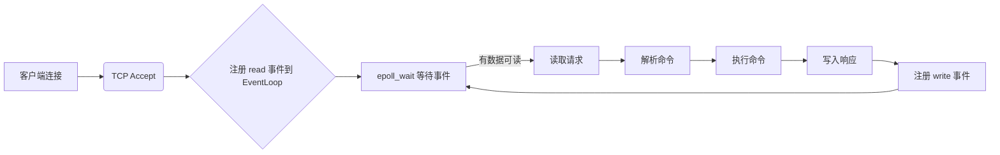
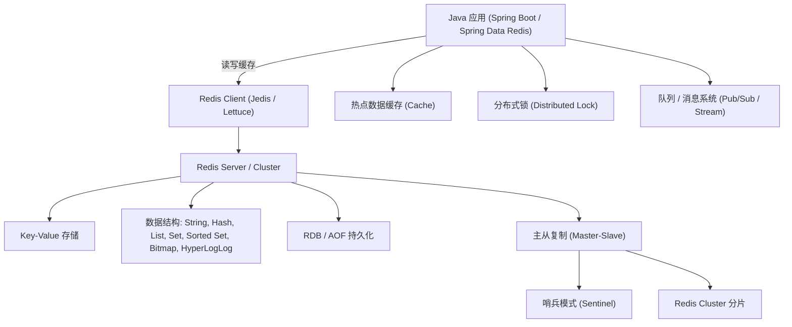

## 进入 Redis

要进入 Redis，通常是指**连接到 Redis 服务器并使用其命令行交互界面（CLI）**。以下是几种常见方式，适用于本地开发、远程服务器或 Docker 环境。

---

### ✅ 一、前提条件

确保 Redis 服务已安装并正在运行：

- **Linux / macOS**：通过包管理器（如 `apt`、`brew`）或源码安装
- **Windows**：
  - 推荐使用 **WSL2（Ubuntu）** 安装 Redis（官方不支持原生 Windows）
  - 或使用 [MicrosoftArchive/redis](https://github.com/microsoftarchive/redis)（仅用于测试，已停止维护）

> 💡 检查 Redis 是否运行：
> ```bash
> ps aux | grep redis
> # 或
> systemctl status redis   # Ubuntu/CentOS
> ```

---

### ✅ 二、进入 Redis CLI（最常用方式）

#### 1. **本地连接（默认配置）**

```bash
redis-cli
```
- 默认连接 `127.0.0.1:6379`
- 无密码（若未配置）

进入后你会看到：
```bash
127.0.0.1:6379>
```

#### 2. **指定主机和端口（远程连接）**

```bash
redis-cli -h <host> -p <port>
# 例如：
redis-cli -h 192.168.1.100 -p 6380
```

#### 3. **带密码认证**

如果 Redis 配置了密码（`requirepass yourpassword`）：
```bash
# 方式1：连接后手动认证
redis-cli -h 127.0.0.1 -p 6379
127.0.0.1:6379> AUTH yourpassword

# 方式2：连接时直接传密码（推荐）
redis-cli -h 127.0.0.1 -p 6379 -a yourpassword
```
> ⚠️ 警告：`-a` 会明文暴露密码（在历史命令中可见），生产环境建议用方式1，或使用 `--askpass`（Redis 6+）：
> ```bash
> redis-cli -h 127.0.0.1 -p 6379 --askpass
> ```

#### 4. **选择数据库（Redis 默认有 16 个 DB，编号 0~15）**

```bash
127.0.0.1:6379> SELECT 1
OK
127.0.0.1:6379[1]>
```

---

### ✅ 三、其他进入 Redis 的方式

#### 1. **通过 Docker 进入 Redis 容器**

```bash
# 先启动 Redis 容器（如果还没运行）
docker run --name my-redis -d -p 6379:6379 redis

# 进入容器内部的 redis-cli
docker exec -it my-redis redis-cli
```

#### 2. **使用 Redis Desktop Manager（图形界面）**

- 工具：[RedisInsight](https://redis.com/redis-enterprise/redis-insight/)（官方推荐，免费）
- 或旧版：Redis Desktop Manager（RDM）
- 适合可视化查看数据结构、监控性能

#### 3. **在应用程序中连接（如 Java、Python）**

虽然不是“进入”，但也是常用交互方式：
```python
# Python 示例（需安装 redis-py）
import redis
r = redis.Redis(host='localhost', port=6379, password='yourpassword')
r.set('name', 'Alice')
print(r.get('name'))
```

---

### ✅ 四、常用验证命令（进入后测试）

```bash
127.0.0.1:6379> PING
PONG

127.0.0.1:6379> INFO server    # 查看 Redis 版本等信息

127.0.0.1:6379> KEYS *         # 查看所有 key（生产环境慎用！）
```

---

### ❌ 常见问题排查

| 问题                             | 解决方案                                                     |
| -------------------------------- | ------------------------------------------------------------ |
| `Could not connect to Redis`     | 检查 Redis 是否启动：`sudo systemctl start redis`            |
| `NOAUTH Authentication required` | 使用 `AUTH yourpassword` 或 `-a` 参数                        |
| 连接被拒绝（Connection refused） | 检查 `redis.conf` 中 `bind` 和 `protected-mode` 配置         |
| 远程无法连接                     | 确保服务器防火墙开放 6379 端口，且 `redis.conf` 中 `bind 0.0.0.0` |

> 🔒 **安全提示**：  
> 生产环境 Redis **不要暴露在公网**！务必设置强密码，并限制 IP 访问。

---

### ✅ 总结：最常用命令

| 场景           | 命令                                  |
| -------------- | ------------------------------------- |
| 本地无密码进入 | `redis-cli`                           |
| 远程带密码进入 | `redis-cli -h IP -p PORT -a PASSWORD` |
| Docker 中进入  | `docker exec -it 容器名 redis-cli`    |
| 安全输入密码   | `redis-cli --askpass`                 |

---

现在你可以打开终端，输入 `redis-cli` 开始练习 Redis 命令了！如果遇到连接问题，欢迎提供具体错误信息，我可以帮你诊断。

## Redis命令

### Redis 五种基本数据类型

| 类型                 | 中文名   | 特点                                 | 典型应用场景                 |
| -------------------- | -------- | ------------------------------------ | ---------------------------- |
| `STRING`             | 字符串   | 最基础类型，可存字符串、整数、浮点数 | 缓存、计数器、分布式锁       |
| `LIST`               | 列表     | 有序、可重复、双向链表               | 消息队列、最新消息列表       |
| `SET`                | 集合     | 无序、不重复、支持集合运算           | 标签系统、共同好友、去重     |
| `HASH`               | 哈希     | 键值对集合（field-value）            | 存储对象（如用户信息）       |
| `ZSET`（Sorted Set） | 有序集合 | 不重复 + 按 score 排序               | 排行榜、延迟队列、优先级队列 |

### 一、基础键（Key）操作命令

所有 Redis 数据都以“键（Key）”为索引，这类命令用于管理 Key 本身（如创建、删除、查询状态），是最基础的操作。

| 命令                | 功能描述                                  | 示例                                  |
|---------------------|-------------------------------------------|---------------------------------------|
| `KEYS pattern`      | 查找匹配 `pattern` 的所有 Key（慎用！海量 Key 会阻塞） | `KEYS user:*`（查找所有以 `user:` 开头的 Key） |
| `EXISTS key [key...]` | 判断一个或多个 Key 是否存在，返回存在的数量 | `EXISTS user:1001`（返回 1 表示存在，0 表示不存在） |
| `DEL key [key...]`  | 删除一个或多个 Key，返回删除成功的数量     | `DEL user:1001 cart:2002`（删除 2 个 Key） |
| `EXPIRE key seconds` | 给 Key 设置过期时间（单位：秒）            | `EXPIRE user:token 3600`（1 小时后过期） |
| `TTL key`           | 查看 Key 的剩余过期时间（-1 永不过期，-2 已过期） | `TTL user:token`（返回 1800 表示剩余 30 分钟） |
| `TYPE key`          | 查看 Key 对应的值的类型（如 string、hash） | `TYPE user:1001`（返回 hash 表示该 Key 是哈希类型） |
| `RENAME key newkey` | 重命名 Key（若 newkey 已存在，会覆盖）    | `RENAME user:1001 user:1002`          |


### 二、数据类型操作命令
针对 Redis 5 种基础数据类型（String、Hash、List、Set、Sorted Set）的专属操作命令，是日常开发中最常用的类别。

#### 1. String 类型命令（存储字符串/数字/二进制）

| 命令                  | 功能描述                                  | 示例                                  |
|-----------------------|-------------------------------------------|---------------------------------------|
| `SET key value [NX|XX]` | 设置 Key 的值（NX：不存在才设，XX：存在才设） | `SET name redis NX`（name 不存在时设为 redis） |
| `GET key`             | 获取 Key 的值                             | `GET name`（返回 "redis"）            |
| `INCR key`            | 将 Key 的值（数字）自增 1，返回自增后的值  | `INCR user:id`（生成自增用户 ID）     |
| `INCRBY key increment` | key 的值 + 指定数值 | INCRBY views 5（views = 原值 + 5） |
| `DECR key`            | 将 Key 的值（数字）自减 1，返回自减后的值  | `DECR stock:1001`（库存减 1）         |
| `DECRBY key decrement` | key 的数值 - 指定值 | DECRBY stock 3 （stock=原值-3） |
| `APPEND key value`    | 给 Key 的值追加字符串，返回新长度          | `APPEND name " is good"`（name 变为 "redis is good"） |
| `STRLEN key`          | 查看 Key 的值的字符串长度                  | `STRLEN name`（返回 12）              |


##### SET key value [NX|XX] [EX seconds|PX milliseconds] [KEEPTTL]

是的，`SET key value` 命令支持同时添加 `EX`（过期时间，秒）或 `PX`（过期时间，毫秒）参数，与 `NX`/`XX` 组合使用，实现“条件设置+过期时间”的原子操作。这是 Redis 2.6.12 及以上版本支持的功能，非常适合分布式锁、缓存设置等场景。

###### 完整语法与参数说明

`SET` 命令的完整参数格式如下（方括号表示可选）：
```bash
SET key value [NX|XX] [EX seconds|PX milliseconds] [KEEPTTL]
```
- **`NX`**：Only set the key if it **does NOT exist**（仅当 key 不存在时才设置）。
- **`XX`**：Only set the key if it **already EXISTS**（仅当 key 存在时才设置）。
- **`EX seconds`**：设置 key 的过期时间（单位：秒），如 `EX 3600` 表示 1 小时后过期。
- **`PX milliseconds`**：设置 key 的过期时间（单位：毫秒），如 `PX 1000` 表示 1 秒后过期。
- **`KEEPTTL`**：保留 key 原有的过期时间（若 key 已存在），新增时不覆盖。

###### 典型组合示例

1. **`NX + EX`**：key 不存在时设置值，并指定过期时间（分布式锁常用）  
   
   ```bash
   # 仅当 lock:order 不存在时，设置为 "123" 并设置 30 秒过期
   SET lock:order 123 NX EX 30
   ```
- 用途：实现分布式锁（确保同一时间只有一个线程获取锁，且锁自动过期避免死锁）。
  
2. **`XX + PX`**：key 存在时更新值，并刷新过期时间（缓存更新常用）  
   
   ```bash
   # 仅当 user:1001 存在时，更新值为 "new_name" 并设置 5 分钟（300000 毫秒）过期
   SET user:1001 new_name XX PX 300000
   ```
- 用途：更新已存在的缓存，并延长过期时间，避免缓存提前失效。
  
3. **单独使用 `EX`**：无条件设置值并指定过期时间（普通缓存设置）  
   
   ```bash
   # 设置商品缓存，1 小时后过期
   SET goods:1001 '{"name":"手机","price":1999}' EX 3600
   ```

###### 为什么需要组合使用？

- **原子性保证**：`SET` 命令的所有参数是一次性执行的，避免“先判断 key 是否存在，再设置值和过期时间”的两步操作带来的并发问题（如分布式锁的竞态条件）。
- **简化代码**：无需单独调用 `EXPIRE` 命令，一行命令完成多步操作，减少网络交互。

###### Java 中使用示例（Spring Data Redis）

```java
// 使用 setIfAbsent + 过期时间（对应 NX + EX）
Boolean success = redisTemplate.opsForValue().setIfAbsent(
    "lock:order", 
    "123", 
    30, 
    TimeUnit.SECONDS
);

// 无条件设置值 + 过期时间（对应 EX）
redisTemplate.opsForValue().set(
    "goods:1001", 
    "{\"name\":\"手机\"}", 
    3600, 
    TimeUnit.SECONDS
);
```

通过这些组合参数，`SET` 命令可以灵活满足“条件设置”“自动过期”等核心需求，是 Redis 中最常用的命令之一。


##### INCR命令

- `INCR key` 是 Redis 的 **原子自增操作**，作用是：
  1. 如果 `key` 不存在 → 先将其值设为 `0`，然后 **+1**，结果为 `1`。
  2. 如果 `key` 存在且是整数 → 直接 **+1**。
  3. 如果 `key` 存在但**不是整数**（比如是字符串 "hello"）→ 会报错：`(error) ERR value is not an integer or out of range`
- **返回值**：总是返回 **自增后的最新值**（类型为整数）

#### 2. Hash 类型命令（存储键值对集合，适合对象）

| 命令                      | 功能描述                                  | 示例                                  |
|---------------------------|-------------------------------------------|---------------------------------------|
| `HSET key field value [field value...]` | 设置 Hash 的一个或多个字段值              | `HSET user:1001 name zhangsan age 20` |
| `HGET key field`          | 获取 Hash 中指定字段的值                  | `HGET user:1001 name`（返回 "zhangsan"） |
| `HGETALL key`             | 获取 Hash 中所有字段和值                  | `HGETALL user:1001`（返回所有用户属性） |
| `HDEL key field [field...]` | 删除 Hash 中指定字段                      | `HDEL user:1001 age`（删除年龄字段）  |
| `HLEN key`                | 查看 Hash 中的字段数量                    | `HLEN user:1001`（返回 1，只剩 name 字段） |

以命令：
```bash
HSET key field value
```

##### 1. 三个角色分别是什么

- **key**：Redis 大键，整个 Hash 结构的**唯一标识**
- **field**：Hash 内部的**字段名**（类比 Java 对象的属性名）
- **value**：对应 field 的**字段值**（类比 Java 对象的属性值）

##### 2. 形象类比（最好理解）

把 **Hash** 看成 **一张表 / 一个 Java 对象**：

```
key = 用户名:zhangsan      【整个对象的唯一编号】
├── field = name    → value = 张三
├── field = age     → value = 22
└── field = sex     → value = 男
```

##### 3. 结构层级

```
Redis 全局
   ↓
key（第一层）
   ↓
field（第二层子键） → value（对应值）
```
Hash 本质结构：
```
Map<key, Map<field, value>>
```

##### 4. 举实际例子

```bash
HSET user:1001 name "李四" age 25 city "北京"
```
- **key** = `user:1001`
- **field** = `name`、`age`、`city`
- **value** = `李四`、`25`、`北京`

##### 5. 适用场景

- key：用户ID、商品ID 作为外层大key
- field：姓名、年龄、手机号、价格等属性
- value：对应属性具体值

一句话总结：
**key 是整个哈希的名字，field 是里面小字段，value 是小字段对应的值。**

#### 3. List 类型命令（有序可重复列表，适合队列）

| 命令                      | 功能描述                                  | 示例                                  |
|---------------------------|-------------------------------------------|---------------------------------------|
| `LPUSH key value [value...]` | 从 List 左侧（头部）添加元素              | `LPUSH msg:queue msg1 msg2`（队列头部加 2 条消息） |
| `RPOP key`                | 从 List 右侧（尾部）移除并返回元素        | `RPOP msg:queue`（返回 "msg1"，实现队列消费） |
| `LRANGE key start stop`   | 获取 List 中指定范围的元素（0 开始，-1 表示最后一个） | `LRANGE msg:queue 0 -1`（查看所有消息） |
| `LLEN key`                | 查看 List 的元素数量                      | `LLEN msg:queue`（返回 1，只剩 msg2） |
| LTRIM key start stop | “只保留 List 中的一段，其余全部丢掉” | `start`：起始下标（从 0 开始）；`stop`：结束下标（包含）；下标可以是负数（从尾部算起） |

#### 4. Set 类型命令（无序不可重复集合，适合去重）

| 命令                      | 功能描述                                  | 示例                                  |
|---------------------------|-------------------------------------------|---------------------------------------|
| `SADD key member [member...]` | 向 Set 中添加元素                        | `SADD user:tags java redis`（添加 2 个标签） |
| `SMEMBERS key`            | 获取 Set 中所有元素                      | `SMEMBERS user:tags`（返回所有标签）  |
| `SISMEMBER key member`    | 判断元素是否在 Set 中（1 是，0 否）       | `SISMEMBER user:tags java`（返回 1）  |
| `SINTER key1 key2`        | 求两个 Set 的交集（共同元素）             | `SINTER user1:tags user2:tags`（返回共同标签） |
| `SCARD key`               | 查看 Set 的元素数量                      | `SCARD user:tags`（返回 2）           |

#### 5. Sorted Set 类型命令（有序不可重复集合，适合排行榜）

Redis 的 ZSet 会自动按 score 排序：score 越大，排名越靠前。

特性：
**自动按 score 排序、member 唯一不可重复、适合排行榜/热度榜/延时队列**
默认：**ZRANGE 升序（分数从小到大）、ZREVRANGE 降序（分数从大到小，排行榜用这个）**

| 命令                                                         | 功能描述                                         | 实用示例                                              |
| ------------------------------------------------------------ | ------------------------------------------------ | ----------------------------------------------------- |
| `ZADD key score member [score member...]`                    | 添加/更新元素，指定排序分值 score                | `ZADD rank:user 95 zhangsan 88 lisi 92 wangwu`        |
| `ZRANGE key start stop [WITHSCORES]`                         | 按**分数升序**查范围，加 WITHSCORES 连带分数返回 | `ZRANGE rank:user 0 -1 WITHSCORES` 查看全部升序榜单   |
| `ZREVRANGE key start stop [WITHSCORES]`                      | 按**分数降序**查范围，**排行榜首选**             | `ZREVRANGE rank:user 0 9 WITHSCORES` 取前10名榜单     |
| `ZSCORE key member`                                          | 查询某个 member 的分值                           | `ZSCORE rank:user zhangsan`                           |
| `ZINCRBY key increment member`                               | 给指定 member 分值**自增**（热度/积分累加）      | `ZINCRBY rank:user 5 zhangsan` 张三分数+5             |
| `ZRANK key member`                                           | 查升序排名（下标从0开始）                        | `ZRANK rank:user lisi`                                |
| `ZREVRANK key member`                                        | 查**降序排名**（真实排行榜名次，从0开始）        | `ZREVRANK rank:user zhangsan` 查排第几                |
| `ZCARD key`                                                  | 获取 ZSet 元素总个数                             | `ZCARD rank:user`                                     |
| `ZCOUNT key min max`                                         | 统计指定分数区间内的元素数量                     | `ZCOUNT rank:user 80 100` 统计80~100分人数            |
| `ZREM key member [member...]`                                | 删除指定一个/多个 member 元素                    | `ZREM rank:user lisi`                                 |
| `ZREMRANGEBYRANK key start stop`                             | 按**排名下标范围**删除                           | `ZREMRANGEBYRANK rank:user 0 2` 删除前3名             |
| `ZREMRANGEBYSCORE key min max`                               | 按**分数区间**删除                               | `ZREMRANGEBYSCORE rank:user 0 60` 删除60分及以下      |
| `ZREMRANGEBYLEX key min max`                                 | 按 member 字典序范围删除（固定分值场景）         | 多用于固定score做分组                                 |
| `ZRANGEBYSCORE key min max [WITHSCORES] [LIMIT offset count]` | 按分数升序区间查询，支持分页                     | `ZRANGEBYSCORE rank:user 80 100 WITHSCORES LIMIT 0 5` |
| `ZREVRANGEBYSCORE key max min [WITHSCORES]`                  | 按分数降序区间查询，适合分段榜单                 | `ZREVRANGEBYSCORE rank:user 100 80 WITHSCORES`        |
| `ZRANGEBYLEX key min max`                                    | 按 member 字典序查询（分值相同场景）             | 同分情况下按用户名排序                                |

#### 补充关键说明（面试+实战必记）

1. **ZREVRANGE / ZREVRANK** 做排行榜标配，分数越高越靠前
2. **ZINCRBY** 适合实时热度、积分累加，不用查改再插入，原子操作
3. `start=0 stop=9` 取前10名；`0 -1` 查看全部
4. ZSet **member 唯一**，重复添加会覆盖原有 score，天然去重
5. 底层：数据少用 `ziplist`，超128个或member超64字节用 `skiplist+dict`，增删查 O(logn)，适配高并发排行榜

我可以给你配套写一份：**ZSet 实现每日排行榜的实战思路 + 过期清榜方案**，要吗？

### 三、持久化命令

控制 Redis 数据持久化（RDB/AOF）的命令，用于手动触发备份或查看持久化状态。

| 命令                | 功能描述                                  | 示例                                  |
|---------------------|-------------------------------------------|---------------------------------------|
| `SAVE`              | 同步触发 RDB 持久化（阻塞 Redis，不推荐线上用） | `SAVE`（生成 dump.rdb 文件）          |
| `BGSAVE`            | 异步触发 RDB 持久化（后台执行，不阻塞）    | `BGSAVE`（推荐线上使用）              |
| `BGREWRITEAOF`      | 异步重写 AOF 文件（压缩冗余命令，减小文件体积） | `BGREWRITEAOF`（AOF 开启时用）        |
| `INFO persistence`  | 查看持久化相关信息（如 RDB 最后备份时间）  | `INFO persistence`（返回持久化状态详情） |


### 四、内存管理命令
控制 Redis 内存使用、查看内存状态的命令，用于避免 OOM 和优化内存。

| 命令                | 功能描述                                  | 示例                                  |
|---------------------|-------------------------------------------|---------------------------------------|
| `CONFIG SET maxmemory bytes` | 设置 Redis 最大使用内存（如 1GB = 1073741824） | `CONFIG SET maxmemory 1073741824`     |
| `CONFIG GET maxmemory-policy` | 查看当前内存淘汰策略（如 volatile-lru）    | `CONFIG GET maxmemory-policy`         |
| `INFO memory`       | 查看内存使用详情（如已用内存、内存占比）  | `INFO memory`（返回内存相关指标）     |
| `FLUSHDB`           | 清空当前数据库的所有 Key（谨慎！）        | `FLUSHDB`（仅清空当前 db，默认 db0）  |
| `FLUSHALL`          | 清空所有数据库的所有 Key（生产环境禁用！） | `FLUSHALL`（删除所有数据，无法恢复）  |


### 五、事务命令
控制 Redis 事务（批量执行命令）的命令，保证命令的“一次性、顺序性”。

| 命令                | 功能描述                                  | 示例                                  |
|---------------------|-------------------------------------------|---------------------------------------|
| `MULTI`             | 开启事务（后续命令加入事务队列，不执行）  | `MULTI`（进入事务模式）               |
| `EXEC`              | 执行事务队列中的所有命令，返回结果列表    | `EXEC`（执行事务，返回每条命令结果）  |
| `DISCARD`           | 取消事务，清空队列中的命令                | `DISCARD`（放弃未执行的事务）         |
| `WATCH key [key...]` | 监控 Key，若事务执行前 Key 被修改，事务取消 | `WATCH stock:1001`（监控库存，防止并发修改） |


### 六、发布/订阅命令
实现 Redis 发布/订阅（Pub/Sub）模式的命令，用于简单消息通信。

| 命令                | 功能描述                                  | 示例                                  |
|---------------------|-------------------------------------------|---------------------------------------|
| `SUBSCRIBE channel [channel...]` | 订阅一个或多个频道，接收消息              | `SUBSCRIBE msg:user`（订阅用户消息频道） |
| `PUBLISH channel message` | 向指定频道发布消息，返回接收消息的订阅者数量 | `PUBLISH msg:user "hello"`（发布消息，返回订阅者数） |
| `UNSUBSCRIBE channel [channel...]` | 取消订阅指定频道                          | `UNSUBSCRIBE msg:user`（取消订阅）    |


### 七、集群命令
Redis Cluster 集群模式下的管理命令，用于查看集群状态、节点操作。

| 命令                | 功能描述                                  | 示例                                  |
|---------------------|-------------------------------------------|---------------------------------------|
| `CLUSTER INFO`      | 查看集群整体状态（如节点数、槽位分配）    | `CLUSTER INFO`（返回集群详情）        |
| `CLUSTER NODES`     | 查看集群中所有节点的信息（ID、地址、角色） | `CLUSTER NODES`（返回所有节点列表）    |
| `CLUSTER KEYSLOT key` | 计算 Key 对应的哈希槽位（Redis 集群按槽位分片） | `CLUSTER KEYSLOT user:1001`（返回 Key 所在槽位） |


### 八、脚本命令
执行 Lua 脚本的命令，用于实现原子性复杂逻辑（前文已详细介绍）。

| 命令                | 功能描述                                  | 示例                                  |
|---------------------|-------------------------------------------|---------------------------------------|
| `EVAL script numkeys key arg...` | 直接执行 Lua 脚本                        | `EVAL "return redis.call('get', KEYS[1])" 1 name` |
| `SCRIPT LOAD script` | 预加载脚本到 Redis，返回 SHA1 哈希        | `SCRIPT LOAD "return redis.call('get', KEYS[1])"` |
| `EVALSHA sha1 numkeys key arg...` | 通过 SHA1 执行预加载的脚本                | `EVALSHA abc123 1 name`（abc123 是脚本 SHA1） |

### 九、批量能力

> Redis **没有一个专门的“批量 ZINCRBY / 批量 ZADD 增量更新”单条原子命令**，但可以通过多种方式实现“批量写入效果”。

下面给你讲清楚工业级做法。

------

#### 一、Redis本身支持的“批量能力”

##### 1️⃣ Pipeline（最常用）

Redis 支持 **Pipeline（管道）**

示例：

```text
ZINCRBY hot_rank 1 topic_1
ZINCRBY hot_rank 5 topic_2
ZINCRBY hot_rank 10 topic_3
```

通过 pipeline 一次性发送：

👉 网络只占 1 次 RTT

优点：

- 极大减少网络开销
- 性能提升 10~100倍
- 仍然是逐条执行命令

本质：

```text
客户端批量发送
Redis逐条执行
```

------

##### 2️⃣ MSET / MGET（不适用于ZSet）

Redis 有：

```text
MSET / MGET
```

但：

❌ 不能用于 ZSet
❌ 不能做 score 增量

所以排行榜不适用。

------

##### 3️⃣ Lua脚本（真正原子批量）

可以用 Lua：

```lua
redis.call("ZINCRBY", "hot_rank", 1, "topic_1")
redis.call("ZINCRBY", "hot_rank", 5, "topic_2")
```

优点：

- 原子性（事务级）
- 可批量操作
- 减少网络往返

适合：

```text
一致性要求高的排行榜
```

------

##### 4️⃣ ZADD 批量写入（用于“直接赋值”）

如果不是增量，而是“计算后写入”，可以：

```text
ZADD hot_rank 100 topic_1 200 topic_2 300 topic_3
```

特点：

- 一条命令写多个 member
- 高效
- 但不能增量

------

#### 二、排行榜场景最佳实践（重点）

在热搜系统中通常是这样：

------

##### 方案1（最常见）：Pipeline + ZINCRBY

```text
ZINCRBY hot_rank 1 topic_1
ZINCRBY hot_rank 5 topic_2
ZINCRBY hot_rank 10 topic_3
```

👉 用 pipeline 批量发送

适合：

- 实时行为
- 高QPS

------

##### 方案2（工业级）：先聚合再批量写

例如：

```text
topic_1 +500
topic_2 +300
topic_3 +100
```

然后：

```text
ZINCRBY hot_rank 500 topic_1
ZINCRBY hot_rank 300 topic_2
ZINCRBY hot_rank 100 topic_3
```

👉 一次批量写

适合：

- Apache Flink 聚合后写 Redis

------

##### 方案3（最优）：Lua + 批量增量

```text
EVAL Lua脚本
```

优点：

- 原子性
- 减少 RTT
- 批量更新

------

#### 三、为什么 Redis 没有“真正批量 ZINCRBY”？

原因：

##### 1️⃣ ZSet是结构化数据

score 是：

```text
member -> score
```

每个 member 都要单独更新。

------

##### 2️⃣ 增量操作不可简单合并

例如：

```text
topic_1 +5
topic_1 +10
```

必须保证顺序。

------

##### 3️⃣ Redis设计理念

Redis倾向：

- 简单命令
- 原子操作
- 不做复杂批处理API

------

#### 四、性能对比（面试加分）

| 方式         | 性能       | 适用场景   |
| ------------ | ---------- | ---------- |
| 单条 ZINCRBY | 低         | 小流量     |
| Pipeline     | 高         | 高并发实时 |
| Lua脚本      | 最高一致性 | 强一致场景 |
| ZADD批量     | 最高效率   | 计算后写入 |

------

#### 五、真实热搜系统推荐架构

工业级推荐：

```text
用户行为
   ↓
MQ（Kafka / RocketMQ）
   ↓
Flink 聚合
   ↓
批量（Pipeline / Lua）
   ↓
Redis ZSet
```

------

#### 六、面试标准回答（可直接用）

如果面试官问：

**Redis有批量写入排行榜的方式吗？**

可以这样答：

> Redis没有专门的批量 ZINCRBY 命令，但可以通过 Pipeline 提高吞吐，通过 Lua 脚本实现原子批量更新，如果是计算后写入，也可以使用 ZADD 批量写入。在高并发热搜系统中，一般会先通过流计算做聚合，然后批量更新 Redis ZSet，从而减少写入次数并提升性能。

### MGET / MSET

是的，**Redis 的 `MGET` 和 `MSET` 都是 String 类型的批量操作命令**。

Redis String 类型命令：

#### 1️⃣ MSET（批量设置）

```text
MSET key1 value1 key2 value2 key3 value3
```

等价于：

```text
SET key1 value1
SET key2 value2
SET key3 value3
```

特点：

- 一次设置多个 key-value
- **原子性（要么全成功，要么全失败）**
- 高效

------

#### 2️⃣ MGET（批量获取）

```text
MGET key1 key2 key3
```

返回：

```text
value1
value2
value3
```

------

#### 三、底层本质

String 类型结构：

```text
key → value（简单字符串/数字）
```

所以 MSET/MGET 本质是：

- 多次 GET/SET 的封装
- 减少网络 RTT

------

#### 对比总结（面试重点）

| 命令    | 类型   | 是否批量  | 用途         |
| ------- | ------ | --------- | ------------ |
| MSET    | String | ✔️         | 批量存 KV    |
| MGET    | String | ✔️         | 批量取 KV    |
| ZINCRBY | ZSet   | ❌         | 单条增量     |
| ZADD    | ZSet   | ✔️（有限） | 批量写 score |

------

#### 容易混淆点（很重要）

##### ❗ MSET ≠ Pipeline

| 项目         | MSET     | Pipeline     |
| ------------ | -------- | ------------ |
| 原子性       | ✔️        | ❌            |
| 支持类型     | String   | 所有类型     |
| 是否网络优化 | ✔️        | ✔️（更强）    |
| 使用场景     | KV批量写 | 任意批量操作 |

**MGET/MSET是什么类型的命令？**

可以直接答：

> MGET 和 MSET 是 Redis String 类型的批量操作命令，用于批量读写 key-value 数据，具有一定原子性，但仅适用于 String 类型，不支持 ZSet、Hash 等复杂数据结构。

------

### Pipeline

Redis 的 **Pipeline（管道）机制** 是解决“高并发下网络往返瓶颈”的核心优化手段之一，在排行榜、批量写入、日志处理等场景非常常用。

下面给你系统讲清楚：**是什么 → 怎么用 → 解决什么问题 → 和事务/Lua区别 → 在热搜中的作用**

------

#### 一、Pipeline 是什么？

一句话：

> Pipeline = 客户端把多条 Redis 命令一次性打包发送，Redis 依次执行，再一次性返回结果。
>
> Redis本身没有pipeline命令，pipeline是客户端行为。在命令行中可以使用 redis-cli --pipe 进行批量导入，也可以在程序中通过 pipeline API 实现批量发送命令，从而减少网络RTT提升吞吐。
>
> pipeline 不是 Redis 命令，而是客户端一次性批量发送多个命令的优化机制，在命令行中只能通过 redis-cli --pipe 或脚本方式模拟实现。

------

##### 正常模式（慢）

```text
客户端 → Redis（1条命令）← 返回
客户端 → Redis（1条命令）← 返回
客户端 → Redis（1条命令）← 返回
```

3次网络 RTT（很慢）

------

##### Pipeline模式（快）

```text
客户端 → Redis（100条命令一次发过去）
Redis → 批量执行
Redis → 一次返回结果
```

👉 只 1 次 RTT

------

#### 二、Pipeline解决什么问题？

核心优化点：

##### 1️⃣ 网络延迟（最关键）

Redis 单条命令：

```text
网络RTT = 1~2ms（甚至更高）
```

如果 1000 次操作：

```text
1000 * RTT ≈ 1000~2000ms
```

Pipeline：

```text
≈ 1 次 RTT = 1~2ms
```

👉 提升 100~1000 倍

------

##### 2️⃣ 提高吞吐量

适合：

- 批量写 ZSet
- 批量写缓存
- 日志消费写入

------

#### 三、Pipeline 在热搜系统中的用法（重点）

例如热搜排行榜：

```text
topic_1 +1
topic_2 +5
topic_3 +10
```

普通方式：

```text
ZINCRBY hot_rank 1 topic_1
ZINCRBY hot_rank 5 topic_2
ZINCRBY hot_rank 10 topic_3
```

Pipeline：

```text
一次性发送：
ZINCRBY hot_rank 1 topic_1
ZINCRBY hot_rank 5 topic_2
ZINCRBY hot_rank 10 topic_3
```

👉 Redis一次性处理

------

#### 四、Java示例（Spring Data Redis）

这是 Spring Data Redis 中使用 Pipeline 批量更新 ZSet 的操作。通过 executePipelined 将多个 ZINCRBY 命令打包发送到 Redis，一次性更新多个热搜关键词的热度，从而减少网络 RTT 提升性能。适用于高并发排行榜场景，但不具备事务原子性。

```java
redisTemplate.executePipelined((RedisCallback<Object>) connection -> {

    connection.zIncrBy("hot_rank".getBytes(), 1, "topic_1".getBytes());
    connection.zIncrBy("hot_rank".getBytes(), 5, "topic_2".getBytes());
    connection.zIncrBy("hot_rank".getBytes(), 10, "topic_3".getBytes());

    return null;
});

等价于
ZINCRBY hot_rank 1 topic_1  topic_1 热度 +1
ZINCRBY hot_rank 5 topic_2  topic_2 热度 +5
ZINCRBY hot_rank 10 topic_3  topic_3 热度 +10
    
```

------

#### 五、Pipeline vs 其他方案（面试重点）

##### 1️⃣ Pipeline vs 普通调用

| 方式     | 性能 | RTT  |
| -------- | ---- | ---- |
| 单条命令 | 慢   | 多次 |
| Pipeline | 快   | 1次  |

------

##### 2️⃣ Pipeline vs MSET/MGET

| 能力     | Pipeline | MSET/MGET   |
| -------- | -------- | ----------- |
| 支持类型 | 全部     | String only |
| 是否批量 | ✔️        | ✔️           |
| 灵活性   | 高       | 低          |

------

##### 3️⃣ Pipeline vs Lua脚本

| 对比     | Pipeline | Lua Script     |
| -------- | -------- | -------------- |
| 原子性   | ❌ 不保证 | ✔️ 原子         |
| 性能     | 高       | 更高（但复杂） |
| 适用场景 | 批量操作 | 复杂逻辑批处理 |

------

#### 六、Pipeline的缺点（必须会说）

##### ❌ 1 不保证原子性

```text
中间可能失败一部分
```

------

##### ❌ 2 内存占用

一次性堆积命令：

```text
10000条命令 → 客户端内存压力
```

------

##### ❌ 3 不适合复杂逻辑

比如：

```text
如果score>100才更新
```

👉 Pipeline做不了，需要 Lua

------

#### 七、工业级热搜系统怎么用 Pipeline？

典型架构：

```text
Kafka
  ↓
Flink聚合
  ↓
批量计算结果
  ↓
Pipeline写Redis ZSet
```

特点：

- 减少 Redis QPS
- 批量写入排行榜
- 高吞吐

------

#### 八、最佳实践（非常重要）

##### ✔ 推荐使用场景

- 批量 ZINCRBY
- 批量 SET
- 批量 HSET
- 日志写入

------

##### ❌ 不推荐

- 需要强一致性
- 单条实时更新
- 复杂条件逻辑

------

#### 九、面试标准回答（可直接用）

如果面试官问：

**Redis Pipeline是什么？**

你可以这样答：

> Pipeline是Redis的批量执行机制，客户端将多条命令一次性发送到Redis执行，从而减少网络RTT，提高吞吐量。在热搜系统中，常用Pipeline批量更新ZSet排行榜数据，例如批量ZINCRBY，从而降低Redis访问次数。但Pipeline不保证原子性，适合高性能批量操作场景。


---

## Redis命令练习

Redis 提供了 **5 种基本数据类型**，每种类型都有其独特的命令和适用场景。下面为你整理一份 **清晰、实用、可动手练习** 的 Redis 五大数据类型命令速查与练习指南，适合初学者巩固基础，也适合开发者快速回顾。

---

### 🧩 Redis 五种基本数据类型

| 类型                 | 中文名   | 特点                                 | 典型应用场景                 |
| -------------------- | -------- | ------------------------------------ | ---------------------------- |
| `STRING`             | 字符串   | 最基础类型，可存字符串、整数、浮点数 | 缓存、计数器、分布式锁       |
| `LIST`               | 列表     | 有序、可重复、双向链表               | 消息队列、最新消息列表       |
| `SET`                | 集合     | 无序、不重复、支持集合运算           | 标签系统、共同好友、去重     |
| `HASH`               | 哈希     | 键值对集合（field-value）            | 存储对象（如用户信息）       |
| `ZSET`（Sorted Set） | 有序集合 | 不重复 + 按 score 排序               | 排行榜、延迟队列、优先级队列 |

---

### ✅ 1. STRING（字符串）

#### 常用命令

```bash
# 设置 & 获取
SET key value
GET key

# 设置并返回旧值
GETSET key new_value

# 批量操作
MSET key1 val1 key2 val2
MGET key1 key2

# 自增/自减（整数）
INCR key        # +1
DECR key        # -1
INCRBY key 10   # +10
DECRBY key 5    # -5

# 过期时间
SETEX key 60 "hello"   # 设置值并60秒后过期  SETEX key seconds value
TTL key                # 查看过期剩余秒数，过期返回(nil)   
返回值含义如下
>= 0：key 存在，且设置了过期时间，返回剩余秒数。
-1：key 存在，但没有设置过期时间（永久有效）。
-2：key 不存在。
```

#### 💡 练习

```bash
SET user:1001:name "Alice"
GET user:1001:name

INCR page:view:home
INCR page:view:home
GET page:view:home  # 应为 2

SETEX temp:token 30 "abc123"
TTL temp:token      # 应为 30 左右
```

---

#### ✅ 一、String 用作缓存（Cache）

##### 🎯 场景描述

将数据库查询结果、计算结果等**高频读、低频变**的数据存入 Redis，减少数据库压力，提升响应速度。

##### 🔧 实现方式

```bash
# 1. 查询缓存（伪代码逻辑）
value = GET user:1001
if value == nil:
    value = DB.query("SELECT * FROM users WHERE id=1001")
    SETEX user:1001 300 value  # 缓存5分钟
return value
```

##### 💡 实际示例（用户信息缓存）

```java
// Java + Spring Data Redis
public User getUserById(Long id) {
    String key = "user:" + id;
    User user = redisTemplate.opsForValue().get(key);
    if (user == null) {
        user = userMapper.selectById(id); // 查数据库
        redisTemplate.opsForValue().set(key, user, Duration.ofMinutes(5));
    }
    return user;
}
```

##### ⚠️ 注意事项

| 问题                                    | 解决方案                                                     |
| --------------------------------------- | ------------------------------------------------------------ |
| **缓存穿透**（查不存在的数据）          | 缓存空值（`SETEX key 60 ""`）+ 布隆过滤器+接口层参数校验限流 |
| **缓存击穿**（热点 key 过期瞬间高并发） | 互斥锁重建缓存 / 逻辑过期                                    |
| **缓存雪崩**（大量 key 同时过期）       | 过期时间加随机值（如 300±60 秒）+多级缓存（caffeine+redis缓存） |

**逻辑过期** 不是真的让缓存数据在 Redis 中 “过期删除”，而是在缓存值中嵌入一个 “过期时间字段”，Redis 本身不设置过期时间（或设置一个很长的过期时间）。当请求查询缓存时，程序先判断这个内嵌的过期时间是否已到：

- 如果没过期，直接返回缓存数据；
- 如果已过期，不立即删除缓存，而是先返回旧数据，再异步去更新缓存。

**互斥锁（分布式锁）**

缓存失效时，只让一个线程去查 DB 重建缓存，其他线程等待。

---

#### ✅ 二、String 用作计数器（Counter）

##### 🎯 场景描述

利用 `INCR`/`DECR` 的**原子性**，实现高并发下的安全计数。

##### 🔧 核心命令

```bash
INCR key          # +1
INCRBY key 10     # +10
DECR key          # -1
GET key           # 查看当前值
```

##### 💡 典型应用场景

##### 1. **全局 ID 生成器**

```bash
INCR global:user:id   # 返回 1, 2, 3...
```
> ✅ 优点：简单、有序、分布式唯一（单 Redis 实例）

##### 2. **页面/接口访问量统计**

```bash
INCR page:view:home
INCR api:call:/user/profile
```
> 📊 可配合 `EXPIRE` 按天统计（如每天 0 点重置）

##### 3. **库存扣减（简易版）**

```bash
# 初始化库存
SET stock:iphone 100

# 扣库存（需配合 Lua 保证原子性，见下文）
DECR stock:iphone
```
> ⚠️ 注意：**纯 DECR 不能保证超卖**！需用 Lua 脚本或 `WATCH` + 事务。

##### ⚠️ 注意事项

- `INCR` 要求值必须是 **整数字符串**，否则报错。
- 计数器无过期时间 → 长期运行可能内存泄漏，建议定期清理或使用带过期的计数（如每天一个 key）。

---

#### ✅ 三、String 用作分布式锁（Distributed Lock）

##### 🎯 场景描述

在分布式系统中，**同一时间只允许一个服务实例执行某段代码**（如订单创建、库存扣减）。

##### 🔧 正确实现方式（推荐）

> ❌ 错误做法：`SETNX + EXPIRE`（非原子，可能死锁）  
> ✅ 正确做法：**`SET key value NX EX seconds`**（原子加锁）

```bash
# 加锁（value 建议用唯一标识，如 UUID）
SET lock:order:create "instance1-thread1-uuid" NX EX 30

# 解锁（必须用 Lua 脚本，防止删错别人的锁）
EVAL "if redis.call('GET', KEYS[1]) == ARGV[1] then return redis.call('DEL', KEYS[1]) else return 0 end" 1 lock:order:create "instance1-thread1-uuid"
```

##### 💡 Java 示例（Spring Boot + RedisTemplate）

```java
// 加锁
Boolean locked = redisTemplate.opsForValue()
    .setIfAbsent("lock:order", uuid, Duration.ofSeconds(30));

if (Boolean.TRUE.equals(locked)) {
    try {
        // 执行业务逻辑
        createOrder();
    } finally {
        // 解锁（使用 Lua 脚本）
        String script = "if redis.call('GET', KEYS[1]) == ARGV[1] then return redis.call('DEL', KEYS[1]) else return 0 end";
        redisTemplate.execute(new DefaultRedisScript<>(script, Long.class), 
                              Collections.singletonList("lock:order"), uuid);
    }
}
```

##### ⚠️ 关键注意事项

| 问题                     | 解决方案                                        |
| ------------------------ | ----------------------------------------------- |
| **锁过期但业务未执行完** | 设置合理超时时间 + 使用 Redisson 看门狗自动续期 |
| **锁被其他线程误删**     | value 用唯一标识 + Lua 脚本校验后删除           |
| **主从切换导致锁丢失**   | 使用 Redlock 算法（多节点）或 ZooKeeper/Etcd    |

> 🚀 **生产建议**：直接使用 **Redisson** 客户端，它封装了完善的分布式锁（支持可重入、看门狗、Redlock）。

---

#### 🆚 三大场景对比总结

| 场景         | 核心命令          | 关键特性         | 注意事项                    |
| ------------ | ----------------- | ---------------- | --------------------------- |
| **缓存**     | `SET/GET/SETEX`   | 读多写少、带过期 | 防穿透/击穿/雪崩            |
| **计数器**   | `INCR/DECR`       | 原子自增、高性能 | 防超卖需额外逻辑            |
| **分布式锁** | `SET NX EX` + Lua | 互斥、防死锁     | 必须用唯一 value + Lua 解锁 |

---

#### 💡 最佳实践建议

1. **缓存**：
   - 热点数据永不过期 + 后台异步更新
   - 大 Value 拆分（避免阻塞 Redis）

2. **计数器**：
   - 高频计数用 **Redis + 定时同步到 DB**
   - 精确扣减用 **Lua 脚本**（如库存）

3. **分布式锁**：
   - **不要自己造轮子**！优先用 Redisson
   - 锁粒度尽量小，减少持有时间

---

### ✅ 2. LIST（列表）

#### 常用命令

```bash
# 从左边/右边插入
LPUSH key value1 value2   # 头部插入
RPUSH key value1 value2   # 尾部插入

# 弹出元素
LPOP key   # 弹出左边第一个
RPOP key   # 弹出右边第一个

# 查看范围（0 -1 表示全部）
LRANGE key 0 -1

# 获取长度
LLEN key

# 阻塞弹出（用于消息队列）
BLPOP key 10   # 阻塞最多10秒，直到有元素可弹出
```

#### 💡 练习

```bash
LPUSH news "新闻3" "新闻2"
RPUSH news "新闻4"

LRANGE news 0 -1  # 顺序应为：新闻2, 新闻3, 新闻4

LPOP news         # 弹出 "新闻2"
RPOP news         # 弹出 "新闻4"
```

> 📌 **注意**：LPUSH + RPOP = 队列（FIFO）；LPUSH + LPOP = 栈（LIFO）

Redis 的 **List（列表）** 是一个**有序、可重复、支持双向操作**的数据结构，底层使用**快速链表（quicklist）** 实现，非常适合需要 **顺序处理、先进先出（FIFO）或后进先出（LIFO）** 的场景。

---

#### ✅ 一、消息队列（Message Queue）

##### 🎯 场景描述

将任务或消息放入队列，由消费者异步处理，实现**解耦、削峰、异步处理**。

##### 🔧 实现方式（生产者-消费者模型）

```bash
# 生产者：往队列尾部添加任务
LPUSH task:queue "send_email:user123"
LPUSH task:queue "generate_report:order456"

# 消费者：从队列头部阻塞式获取任务（推荐）
BRPOP task:queue 0   # 0 表示永久阻塞，直到有元素
# 返回：1) "task:queue" 2) "generate_report:order456"
```

> ✅ **为什么用 `LPUSH + BRPOP`？**  
> - `LPUSH`：新任务插到左边（头部）  
> - `BRPOP`：从右边（尾部）弹出 → **先进先出（FIFO）**

##### 💡 实际案例

- 用户注册后发送欢迎邮件
- 订单支付成功后发短信通知
- 日志异步写入（避免阻塞主流程）

##### ⚠️ 注意事项

- **消息可靠性**：如果消费者崩溃，消息会丢失（无 ACK 机制）  
  → 解决方案：用 **Stream**（Redis 5.0+）或 **RabbitMQ/Kafka**
- **积压监控**：定期检查 `LLEN task:queue`，防止队列爆炸

---

#### ✅ 二、最新消息/动态列表（Timeline）

##### 🎯 场景描述

展示用户最新的 N 条动态、评论、日志等（按时间倒序）。

##### 🔧 实现方式

```bash
# 用户发新动态
LPUSH user:1001:timeline "今天天气真好！"
LPUSH user:1001:timeline "刚完成一个项目！"

# 只保留最近 100 条（防止无限增长）
LTRIM user:1001:timeline 0 99

# 获取最新 10 条（0=最新，9=最旧）
LRANGE user:1001:timeline 0 9
```

##### 💡 实际案例

- 微博/朋友圈最新动态
- 用户操作日志（最近 50 次登录）
- 商品最新评论列表

##### ⚠️ 注意事项

- **内存控制**：务必用 `LTRIM` 限制长度
- **分页问题**：List 不支持高效分页（如跳过前 1000 条），大数据量建议用 **ZSET（按时间戳排序）**

---

#### ✅ 三、任务栈（Stack）

##### 🎯 场景描述

需要**后进先出（LIFO）** 的场景，如撤销操作、深度优先遍历。

##### 🔧 实现方式

```bash
# 压栈
LPUSH undo:actions "delete_file"
LPUSH undo:actions "edit_text"

# 弹栈（撤销）
LPOP undo:actions  # 返回 "edit_text"
```

##### 💡 实际案例

- 文本编辑器的“撤销”功能
- 爬虫的 URL 深度优先抓取
- 游戏中的技能释放栈

---

#### ✅ 四、排行榜（简易版）

> ⚠️ 注意：**复杂排行榜请用 ZSET**，但 List 可用于**固定顺序的榜单**。

##### 🎯 场景描述

展示预定义顺序的列表，如“热门推荐商品”（运营手动维护）。

##### 🔧 实现方式

```bash
# 运营后台设置热门商品（按推荐顺序）
RPUSH hot:products "iPhone15"
RPUSH hot:products "MacBook Pro"
RPUSH hot:products "AirPods"

# 前端获取
LRANGE hot:products 0 -1
```

##### 💡 优势

- 插入顺序即展示顺序
- 支持动态调整（`LINSERT` 插入到指定元素前后）

---

#### ✅ 五、分布式限流（滑动窗口计数器）

> 虽然 ZSET 更精准，但 List 可实现**简易滑动窗口**。

##### 🎯 场景描述

限制用户每分钟最多请求 10 次。

##### 🔧 实现思路

```bash
# 每次请求时
key = "rate_limit:user123"
timestamp = 当前时间戳（秒）

# 移除1分钟前的记录
LTRIM key 0 9   # 先保留最多10个（粗略控制）

# 添加当前请求时间
LPUSH key timestamp

# 设置过期（防止长期占用）
EXPIRE key 60

# 判断是否超限
if LLEN key > 10:
    拒绝请求
```

> ⚠️ 缺点：精度不高，仅适用于要求不高的场景。  
> ✅ 推荐：用 **ZSET + ZREMRANGEBYSCORE** 实现精确滑动窗口。

---

#### 🆚 List vs 其他类型

| 需求               | 推荐类型   | 原因               |
| ------------------ | ---------- | ------------------ |
| 消息队列（可靠）   | **Stream** | 支持 ACK、消费者组 |
| 排行榜（动态排序） | **ZSET**   | 按 score 自动排序  |
| 去重列表           | **SET**    | 自动去重           |
| 存储对象           | **HASH**   | 字段可单独操作     |

---

#### ⚠️ List 使用注意事项

1. **大 Key 风险**  
   - 避免 List 超过 1 万条（`LRANGE` 全量读会阻塞 Redis）  
   - 解决方案：分片（如 `user:1001:timeline:202504`）

2. **阻塞操作慎用**  
   - `BLPOP`/`BRPOP` 在高并发下可能积压连接  
   - 建议设置超时时间：`BRPOP queue 5`（5秒超时）

3. **不支持随机访问**  
   - `LINDEX` 时间复杂度 O(N)，大数据量慎用

---

#### ✅ 总结：List 的核心价值

| 特性         | 适用场景                 |
| ------------ | ------------------------ |
| **有序**     | 时间线、任务队列         |
| **双向操作** | FIFO（队列）、LIFO（栈） |
| **原子性**   | 多线程安全入队/出队      |
| **简单高效** | 小数据量、高频读写       |

> 🚀 **一句话口诀**：  
> **“先进先出用队列（LPUSH + BRPOP），最新动态用列表（LPUSH + LTRIM）”**

---

### ✅ 3. SET（集合）

#### 常用命令

```bash
# 添加元素
SADD key member1 member2

# 查看所有元素
SMEMBERS key

# 判断是否存在
SISMEMBER key member

# 集合运算
SINTER key1 key2      # 交集
SUNION key1 key2      # 并集
SDIFF key1 key2       # 差集（key1 - key2）

# 随机弹出
SPOP key
```

#### 💡 练习

```bash
SADD user:1001:tags "java" "redis" "spring"
SADD user:1002:tags "python" "redis" "django"

SISMEMBER user:1001:tags "java"  # 返回 1（true）

SINTER user:1001:tags user:1002:tags  # 返回 "redis"
```

> 🎯 应用：找出两个用户的共同兴趣标签。

Redis 的 **Set（集合）** 是一个**无序、不重复、支持集合运算**的数据结构，底层使用 **哈希表（hashtable）** 实现，所有操作平均时间复杂度为 **O(1)**。它非常适合需要**去重、成员关系判断、集合交并差运算**的场景。

---

##### ✅ 一、标签系统（Tag System）

###### 🎯 场景描述

为内容（文章、商品、用户）打标签，并支持**按标签筛选、推荐相关内容**。

###### 🔧 实现方式

```bash
# 为文章打标签
SADD article:1001:tags "redis" "database" "backend"
SADD article:1002:tags "java" "spring" "backend"
SADD article:1003:tags "redis" "cache" "performance"

# 查找同时包含 "redis" 和 "backend" 的文章（交集）
SINTER article:1001:tags article:1002:tags  # 返回空
SINTER article:1001:tags article:1003:tags  # 返回 "redis"

# 更高效做法：反向索引（推荐）
SADD tag:redis 1001 1003
SADD tag:backend 1001 1002

# 查找带 "redis" 标签的所有文章
SMEMBERS tag:redis  # 返回 1001, 1003
```

###### 💡 实际案例

- 电商商品标签（“手机”、“5G”、“旗舰”）
- 新闻分类标签（“科技”、“国际”、“财经”）
- 用户兴趣标签（用于个性化推荐）

---

##### ✅ 二、共同好友 / 共同关注

###### 🎯 场景描述

社交平台中，快速计算两个用户的**共同好友、共同关注、可能认识的人**。

###### 🔧 实现方式

```bash
# 用户关注列表
SADD user:1001:follows 2001 2002 2003
SADD user:1002:follows 2002 2003 2004

# 共同关注（交集）
SINTER user:1001:follows user:1002:follows
# 返回：2002, 2003

# A 关注但 B 未关注的人（差集）
SDIFF user:1001:follows user:1002:follows
# 返回：2001
```

###### 💡 实际案例

- 微信/QQ “共同好友”提示
- 微博 “你可能认识的人”
- LinkedIn “二度人脉”推荐

---

##### ✅ 三、抽奖 / 随机抽取

###### 🎯 场景描述

从用户池中**随机抽取中奖者**，且保证不重复。

###### 🔧 实现方式

```bash
# 所有参与者
SADD lottery:2025:spring 1001 1002 1003 1004 1005

# 随机抽1人（不删除）
SRANDMEMBER lottery:2025:spring

# 随机抽1人并移除（防止重复中奖）
SPOP lottery:2025:spring
```

###### 💡 优势

- `SPOP` 原子操作，天然避免重复
- 比 List 更适合（List 需 `LPOP` + 打乱顺序）

---

##### ✅ 四、去重（Deduplication）

###### 🎯 场景描述

在高并发下，确保某个操作**只执行一次**（如防重复提交、防重复推送）。

###### 🔧 实现方式

```bash
# 用户提交订单（订单ID唯一）
order_id = "ORD20250405123456"

# 尝试加入集合（NX 效果）
if SADD order:submitted order_id == 1:
    # 未提交过，处理订单
    process_order(order_id)
else:
    # 已存在，拒绝重复提交
    return "订单已提交，请勿重复操作"
```

###### 💡 实际案例

- 表单防重复提交
- 消息推送去重（同一消息只推一次）
- 爬虫 URL 去重（已抓取的 URL 不再抓）

> ⚠️ 注意：长期积累会导致内存膨胀 → 建议加过期时间：
> ```bash
> EXPIRE order:submitted 86400  # 24小时后自动清理
> ```

---

##### ✅ 五、权限 / 角色管理

###### 🎯 场景描述

存储用户的角色或权限点，快速判断是否有某权限。

###### 🔧 实现方式

```bash
# 用户拥有的权限
SADD user:1001:permissions "read" "write" "delete"

# 判断是否有 "delete" 权限
SISMEMBER user:1001:permissions "delete"
# 返回 1（true）或 0（false）

# 批量判断（需多次调用或用 Lua）
```

###### 💡 优势

- `SISMEMBER` 时间复杂度 O(1)，比 List 的 `LPOS`（O(N)）快得多
- 天然去重，避免重复授权

---

##### ✅ 六、IP 黑名单 / 白名单

###### 🎯 场景描述

快速判断请求 IP 是否在黑名单中。

###### 🔧 实现方式

```bash
# 加入黑名单
SADD ip:blacklist "192.168.1.100" "10.0.0.5"

# 请求时检查
if SISMEMBER ip:blacklist "192.168.1.100":
    return 403 Forbidden
```

###### 💡 优势

- 比数据库查询快几个数量级
- 支持动态更新（运营后台实时封禁）

---

##### 🆚 Set vs 其他类型

| 需求                | 推荐类型          | 原因                 |
| ------------------- | ----------------- | -------------------- |
| 有序去重列表        | **ZSET**          | 需要排序（如排行榜） |
| 存储对象字段        | **HASH**          | 需要按字段读写       |
| 消息队列            | **List / Stream** | 需要顺序消费         |
| 简单去重 + 集合运算 | ✅ **Set**         | 天然支持交并差       |

---

##### ⚠️ 使用注意事项

1. **内存占用**  
   - Set 底层是 hashtable，内存开销略大于 List（但换来 O(1) 性能）
   - 避免存储超大集合（如千万级用户 ID）

2. **SMEMBERS 谨慎使用**  
   - 全量返回会阻塞 Redis，大数据量用 `SSCAN` 分批遍历：
     ```bash
     SSCAN user:1001:follows 0 COUNT 100
     ```

3. **集合运算性能**  
   - `SINTER`/`SUNION`/`SDIFF` 的时间复杂度 = 所有集合大小之和
   - 超大集合运算可能导致 Redis 卡顿 → 建议异步计算或限制集合大小

---

##### ✅ 总结：Set 的核心价值

| 特性              | 适用场景           |
| ----------------- | ------------------ |
| **无序 + 不重复** | 去重、成员关系判断 |
| **O(1) 查找**     | 黑名单、权限校验   |
| **集合运算**      | 共同好友、标签推荐 |
| **随机抽取**      | 抽奖、负载均衡     |

> 🚀 **一句话口诀**：  
> **“去重要用 Set，交并差集它最配；黑名单里查 IP，共同好友靠它推。”**

---

### ✅ 4. HASH（哈希）

#### 常用命令

```bash
# 设置 field-value
HSET user:1001 name "Alice" age 25 email "alice@example.com"

# 获取单个/多个字段
HGET user:1001 name
HMGET user:1001 name age

# 获取所有字段和值
HGETALL user:1001

# 判断字段是否存在
HEXISTS user:1001 email

# 自增字段（数值型）
HINCRBY user:1001 age 1
```

#### 💡 练习

```bash
HSET product:101 name "iPhone" price 5999 stock 100

HGET product:101 price        # 返回 "5999"
HINCRBY product:101 stock -1  # 库存减1

HGETALL product:101           # 返回所有字段
```

> ✅ 优势：比序列化整个对象更节省内存，且可单独更新字段。

Redis 的 **Hash（哈希）** 是一个**键值对集合**（field-value），特别适合**存储对象**。相比将整个对象序列化为一个 String，Hash 允许你**单独操作对象的某个字段**，既节省内存又提升灵活性。

---

#### ✅ 一、存储对象（最核心场景）

##### 🎯 场景描述

将数据库中的一行记录（如用户、商品、订单）缓存到 Redis，避免频繁查库。

##### 🔧 实现方式

```bash
# 存储用户信息（user:1001 是 key，name/age/email 是 field）
HSET user:1001 name "Alice" age 30 email "alice@example.com"

# 获取单个字段
HGET user:1001 name        # 返回 "Alice"

# 获取多个字段
HMGET user:1001 name age   # 返回 "Alice", "30"

# 获取所有字段（慎用，大数据量会阻塞）
HGETALL user:1001
```

##### 💡 实际案例

- **用户信息缓存**：登录后缓存用户基本信息
- **商品详情缓存**：避免每次查商品都读数据库
- **会话（Session）存储**：替代传统 Session，支持分布式

##### ✅ 优势 vs String 序列化

| 方式             | 更新字段                           | 内存占用               | 网络传输           |
| ---------------- | ---------------------------------- | ---------------------- | ------------------ |
| `String（JSON）` | 必须读取整个对象 → 修改 → 重新写入 | 较高（冗余字段）       | 大（传整个 JSON）  |
| `Hash`           | **直接 HSET 单个字段**             | 更低（Redis 优化编码） | 小（只传变化字段） |

> 📌 Redis 对小 Hash 会使用 **ziplist 编码**，内存效率极高！

---

#### ✅ 二、购物车（Cart）

##### 🎯 场景描述

用户将商品加入购物车，可修改数量、删除商品。

##### 🔧 实现方式

```bash
# 用户 1001 的购物车
# field = 商品ID, value = 购买数量
HSET cart:1001 101 2    # 商品101 买2件
HSET cart:1001 102 1    # 商品102 买1件

# 查看购物车
HGETALL cart:1001       # 返回 101→2, 102→1

# 修改数量
HINCRBY cart:1001 101 1 # 商品101 +1 → 变为3

# 删除商品
HDEL cart:1001 102
```

##### 💡 优势

- **原子操作**：`HINCRBY` 天然线程安全，避免超卖
- **灵活更新**：只改数量，不影响其他商品
- **自动过期**：可对整个购物车设过期时间（`EXPIRE cart:1001 86400`）

---

#### ✅ 三、配置中心（轻量级）

##### 🎯 场景描述

存储应用的动态配置项，支持运行时修改。

##### 🔧 实现方式

```bash
# 应用配置
HSET app:config feature_new_home 1
HSET app:config max_upload_size 10485760  # 10MB

# 服务启动时加载
HMGET app:config feature_new_home max_upload_size

# 运维动态开关功能
HSET app:config feature_new_home 0  # 关闭新首页
```

#### 💡 优势

- 比修改配置文件 + 重启服务更高效
- 支持多服务实例共享配置

---

#### ✅ 四、计数器分组（Grouped Counters）

##### 🎯 场景描述

按维度统计指标，如“每个接口的调用次数”。

##### 🔧 实现方式

```bash
# 接口调用统计
HINCRBY api:count:/user/profile today 1
HINCRBY api:count:/user/profile yesterday 5

# 查看某接口今日调用
HGET api:count:/user/profile today  # 返回 "1"
```

##### 💡 对比 String 方案

- String：需拼接 key，如 `api:count:/user/profile:today`
- Hash：**天然分组**，结构更清晰，且可 `HGETALL` 一次性获取所有时间段数据

---

#### ✅ 五、用户行为记录（轻量级）

##### 🎯 场景描述

记录用户最近的操作，如“最后登录时间”、“最后阅读的文章”。

##### 🔧 实现方式

```bash
HSET user:meta:1001 last_login "2025-04-05 10:30:00"
HSET user:meta:1001 last_read_article 5001
HSET user:meta:1001 login_count 42
```

> 📌 注意：**不要存大对象**（如用户所有历史行为），只存关键元数据。

---

##### 🆚 Hash vs 其他类型

| 需求                         | 推荐类型       | 原因                    |
| ---------------------------- | -------------- | ----------------------- |
| 存储完整对象（需字段级操作） | ✅ **Hash**     | 支持 HGET/HSET 单个字段 |
| 对象只整体读写               | String（JSON） | 更简单                  |
| 对象需排序                   | ZSET           | Hash 无序               |
| 对象字段非常多（>1000）      | String + JSON  | Hash 内存开销可能变大   |

---

#### ⚠️ 使用注意事项

1. **避免大 Hash**  
   - 单个 Hash 的 field 数量建议 **< 1000**
   - 超大 Hash 会导致 `HGETALL` 阻塞 Redis → 改用分片（如 `user:1001:info:1`, `user:1001:info:2`）

2. **编码优化**  
   - Redis 会对小 Hash 使用 **ziplist**（内存紧凑）
   - 阈值由 `hash-max-ziplist-entries` 和 `hash-max-ziplist-value` 控制（默认 512 个 field，每个 value < 64 字节）

3. **过期时间**  
   - **Hash 本身不能对单个 field 设过期**！过期是针对整个 key 的。
   - 如需字段级过期，考虑拆分为多个 key，或用 String + 逻辑过期。

---

#### ✅ 最佳实践建议

- **对象缓存**：优先用 Hash，尤其是字段较多、更新频繁的场景
- **购物车**：Hash 是天然选择，配合 `HINCRBY` 实现原子增减
- **配置管理**：简单动态配置用 Hash，复杂配置用专门的配置中心（如 Apollo、Nacos）
- **监控指标**：用 Hash 按维度聚合计数器，便于查询

---

#### 🚀 一句话总结

> **“存对象，用 Hash；改字段，不全刷；购物车，它最搭；配置项，也能抓。”**

---

### ✅ 5. ZSET（有序集合 / Sorted Set）

#### 常用命令

```bash
# 添加成员（带分数 score）
ZADD leaderboard 100 "Alice" 95 "Bob" 98 "Charlie"

# 获取排名（默认升序，score 小 → 大）
ZRANGE leaderboard 0 -1 WITHSCORES

# 获取倒序排名（score 大 → 小）
ZREVRANGE leaderboard 0 -1 WITHSCORES

# 获取某成员的分数
ZSCORE leaderboard "Alice"

# 获取某成员的排名（从0开始）
ZRANK leaderboard "Alice"      # 升序排名
ZREVRANK leaderboard "Alice"   # 降序排名

# 按分数范围查询
ZRANGEBYSCORE leaderboard 95 100
```

#### 💡 练习

```bash
ZADD game:scores 1200 "player1" 1500 "player2" 1300 "player3"

ZREVRANGE game:scores 0 2 WITHSCORES  # 前三名（高分在前）

ZSCORE game:scores "player2"          # 返回 "1500"

ZRANK game:scores "player3"           # 返回 1（0-based，1300排第2）
```

> 🏆 应用：游戏排行榜、热搜榜、延迟任务（用时间戳作 score）。

---

#### 🧪 综合小练习（动手试试！）

1. **缓存用户信息**  
   - 用 `HASH` 存储用户 ID 为 2001 的信息：name=Alice, age=30  
   - 用 `STRING` 存一个访问计数器 `user:2001:visits`，初始为 0，每次访问 +1

2. **实现简单消息队列**  
   - 用 `LPUSH` 往 `task:queue` 推入任务 "task1", "task2"  
   - 用 `RPOP` 消费任务

3. **共同关注**  
   - 用户 A 关注了：redis, java, python  
   - 用户 B 关注了：redis, go, python  
   - 求共同关注（用 `SINTER`）

4. **实时排行榜**  
   - 向 `rank:2025` 添加：张三(95), 李四(88), 王五(92)  
   - 查询前两名（高分在前）

Redis 的 **ZSET（Sorted Set，有序集合）** 是 Redis 中**最强大、最灵活**的数据结构之一。它结合了 **Set 的唯一性** 和 **按 Score 排序的能力**，底层使用 **跳跃表（Skip List）+ 哈希表** 实现，支持 **O(log N)** 的插入、删除、查询和范围操作。

下面结合真实项目场景，详细解析 **ZSET 的核心应用场景、实现方式、优势及最佳实践**。

---

#### ✅ 一、排行榜（Leaderboard）—— 最经典场景

##### 🎯 场景描述

实时展示 Top N 用户（如游戏积分榜、电商热销榜、内容热度榜）。

##### 🔧 实现方式

```bash
# 添加用户分数（member=用户ID, score=分数）
# ZADD key score member
ZADD leaderboard 1500 "user1001"
ZADD leaderboard 1200 "user1002"
ZADD leaderboard 1800 "user1003"

# 获取前3名（从高到低）
# 获取最新 N 条
# ZREVRANGE key 0 N-1
ZREVRANGE leaderboard 0 2 WITHSCORES
# 返回: 1) "user1003" 2) "1800" 3) "user1001" 4) "1500" ...

# 获取用户排名（从0开始）
ZRANK leaderboard "user1001"      # 升序排名 → 1
ZREVRANK leaderboard "user1001"   # 降序排名 → 1（第2名）

# 获取用户分数
ZSCORE leaderboard "user1001"     # 返回 "1500"

# 从 ZSET 里按“排名（rank）”删除元素删除 第 0 名到倒数第 101 名之前的所有元素
# ZREMRANGEBYRANK msg:zset 0 -101

ZSET 默认是按 score 排序的：
score 小 → 排前面
score 大 → 排后面
rank 是排序后的下标：
rank: 0   → 最小 score
rank: -1  → 最大 score（最新）
```

##### 💡 实际案例

- **游戏积分榜**：按杀敌数、通关时间排名
- **电商热销榜**：按销量、销售额排序
- **内容平台热榜**：按点赞数、阅读量排序（可加权计算 score）

##### ✅ 优势

- **实时更新**：分数变化自动重排
- **高效查询**：`ZREVRANGE` 直接取 Top N，无需全量排序

---

#### ✅ 二、延迟队列（Delayed Queue）

##### 🎯 场景描述

任务在**未来某个时间点执行**（如订单超时取消、优惠券过期提醒）。

##### 🔧 实现方式

```bash
# 将任务加入延迟队列（score = 执行时间戳）
ZADD delay:queue 1712345600 "order:cancel:1001"   # 2024-04-05 12:00:00
ZADD delay:queue 1712349200 "coupon:expire:2001"  # 2024-04-05 13:00:00

# 消费者轮询：取出所有到期任务
now = 当前时间戳（秒）
ZRANGEBYSCORE delay:queue 0 now
# 返回所有 score <= now 的任务

# 处理完后删除
ZREM delay:queue "order:cancel:1001"
```

##### 💡 实际案例

- **订单30分钟未支付自动取消**
- **会议开始前10分钟发送提醒**
- **定时清理临时文件**

##### ⚠️ 注意事项

- 需要**后台定时任务**轮询（可用 `ZRANGEBYSCORE ... LIMIT` 分批处理）
- 为避免重复消费，建议配合 **List + 原子操作** 或使用 **Redis Streams + 消费者组**

---

#### ✅ 三、时间线（Timeline）—— 比 List 更强大

##### 🎯 场景描述

按时间顺序展示动态，但需支持**分页、跳过、按时间范围查询**。

##### 🔧 实现方式

```bash
# 发布动态（score = 时间戳）
ZADD user:1001:timeline 1712345600 "今天完成了项目！"
ZADD user:1001:timeline 1712345700 "刚吃了顿大餐！"

# 获取最新10条（按时间倒序）
ZREVRANGE user:1001:timeline 0 9

# 获取某时间段的动态
ZREVRANGEBYSCORE user:1001:timeline 1712345700 1712345600

# 获取某条动态之后的新内容（用于“下拉刷新”）
ZREVRANGEBYSCORE user:1001:timeline +inf (1712345700 LIMIT 0 10
```

##### ✅ 优势 vs List

| 能力         | List                     | ZSET                                |
| ------------ | ------------------------ | ----------------------------------- |
| 按时间分页   | ❌ 不支持（只能按 index） | ✅ 支持（按 score 范围）             |
| 跳过中间内容 | ❌ 低效（LRANGE O(N)）    | ✅ 高效（ZRANGEBYSCORE O(logN + M)） |
| 去重         | ❌ 可重复                 | ✅ member 唯一                       |

> 📌 适合**大数据量时间线**（如微博、朋友圈）

---

#### ✅ 四、优先级队列（Priority Queue）

##### 🎯 场景描述

任务按优先级处理（数字越小/越大优先级越高）。

##### 🔧 实现方式

```bash
# score = 优先级（越小越优先）
ZADD task:queue 1 "urgent_bug_fix"
ZADD task:queue 5 "normal_feature"
ZADD task:queue 10 "low_priority_cleanup"

# 消费最高优先级任务
ZPOPMIN task:queue  # Redis 5.0+，返回 score 最小的元素
# 或
ZRANGE task:queue 0 0
ZREM task:queue "urgent_bug_fix"
```

##### 💡 实际案例

- **客服工单系统**：紧急问题优先处理
- **消息推送**：VIP 用户消息优先发送
- **资源调度**：高优先级任务先分配 CPU/内存

---

##### ✅ 五、地理位置（Geo）底层实现

> 🌍 Redis 的 `GEO` 命令（如 `GEOADD`, `GEORADIUS`）**底层就是 ZSET**！

##### 🔧 原理

- 经纬度被编码为 **52 位整数（Geohash）** 作为 score
- 成员（member）是位置 ID（如门店ID）
- `GEORADIUS` 本质是 `ZRANGEBYSCORE` + 距离计算

```bash
GEOADD cities 116.40 39.90 "Beijing"
GEOADD cities 121.47 31.23 "Shanghai"

# 查找附近城市
GEORADIUS cities 116.40 39.90 1000 km
```

---

#### 🆚 ZSET vs 其他类型

| 需求               | 推荐类型      | 原因                       |
| ------------------ | ------------- | -------------------------- |
| 简单排行榜         | ✅ **ZSET**    | 自动排序 + 高效范围查询    |
| 消息队列（无延迟） | List / Stream | ZSET 无阻塞消费            |
| 去重集合           | Set           | ZSET 内存开销更大          |
| 存储对象           | Hash          | ZSET 只能存 member + score |

---

#### ⚠️ 使用注意事项

1. **内存占用**  
   - ZSET 比 Set/List 更占内存（需存储 score + 跳跃表指针）
   - 避免 member 过长（如用 ID 代替完整 JSON）

2. **范围查询性能**  
   - `ZRANGEBYSCORE` 时间复杂度 O(logN + M)，M 是返回元素数
   - 避免 `ZRANGE key 0 -1` 全量拉取（大数据量会阻塞）

3. **Score 精度**  
   - Score 是 double 类型，注意浮点精度问题
   - 时间戳建议用 **秒或毫秒整数**，避免小数

---

#### ✅ 最佳实践建议

- **排行榜**：定期归档历史数据（如只保留 Top 10000）
- **延迟队列**：配合 `ZPOPMIN`（Redis 5.0+）或 Lua 脚本保证原子性
- **时间线**：用 `ZREVRANGEBYSCORE ... LIMIT` 实现高效分页
- **监控**：定期检查 ZSET 大小（`ZCARD key`），防止无限增长

---

#### 🚀 一句话总结

> **“要排序，用 ZSET；排行榜，它最配；延迟队列靠它推，时间线里显神威。”**

ZSET 是 Redis 中**功能最丰富**的数据结构，只要涉及 **“排序 + 唯一 + 范围查询”** 的场景，它往往是最佳选择。掌握 ZSET，就掌握了 Redis 的高阶玩法！

## Redis 复习

### **一、Redis的三种高可用集群模式：不只是名字不同**

刚开始接触Redis集群时，我对主从（Master-Slave）、哨兵（Sentinel）和Cluster模式三者的关系也很模糊。后来我明白，它们不是互斥的选择，而是**不同层次、不同维度的解决方案**。

- **主从复制 (****Master-Slave** **Replication)**：这是**基础**，是所有高可用方案的基石。它的核心是**数据冗余**。一个主节点（Master）负责写，一个或多个从节点（Slave）负责读，并异步同步主节点的数据。它解决了**读压力大**的问题，并通过数据备份提升了数据安全性。但它的致命缺点是：**主节点宕机需要手动干预**，无法自动故障转移，无法保证高可用。
- **哨兵模式 (****Sentinel****)**：它在主从复制的基础上，增加了**“自动故障转移”**的能力。哨兵是一个独立的进程，专门用来监控Redis主从节点的健康状态。一旦发现主节点宕机，哨兵会自动从从节点中选举出一个新的主节点，并让其他从节点指向它。对于客户端来说，哨兵提供了**服务发现**的功能，客户端通过询问哨兵来获取当前有效的主节点地址。但它**没有解决数据分片的问题**，写操作和存储容量仍然受单节点限制。
- **Cluster模式 (Redis Cluster)**：这是官方的**分布式****解决方案**，可以理解为集大成者。它**把主从复制和哨兵的功能内置了**。Cluster模式通过**分片（Sharding）** 来解决写压力和单机内存限制的问题。数据被分散在16384个**哈希槽（Hash Slot）** 上，每个节点负责一部分槽位。同时，每个分片（主节点）都有自己的从节点，实现了数据冗余和自动故障转移。这意味着，Cluster模式**同时解决了读压力、写压力、存储容量和****高可用性**的问题。

**关系小结**： 你可以把主从看作一个“小组”，哨兵是这个小组的“监控和调度员”，而Cluster是由多个这样的“小组”组成的一个“大型分布式系统”，每个小组自带调度员。

### **二、数据同步：全量与增量的奥秘**

数据同步是保证主从数据一致性的关键，理解全量和增量同步能帮你更好地规划运维策略。

1. **全量同步（Full Synchronization）** 这就像给从节点做一次“全身克隆”。**触发时机**通常是Slave第一次连接Master，或者Slave丢失了同步上下文（复制偏移量offset太旧）。

2. - Slave发送`PSYNC ? -1`命令请求同步。
   - Master接收到请求，判断需要进行全量同步，立即**fork一个****子进程****执行****`bgsave`**，在后台生成当前数据的RDB快照文件。
   - 在生成RDB文件的同时，Master会**将新的写命令记录到复制缓冲区（Replication Backlog）** 中。
   - RDB文件生成后，Master将其发送给Slave。
   - Slave先**清空自身旧数据**，然后加载RDB文件恢复数据。
   - 最后，Master再将复制缓冲区中积压的写命令发送给Slave执行，从而保证数据最终一致。

3. 1. **流程**：

4. **增量同步（Partial Synchronization）** 这就像只传输“差异数据”。当Slave短暂断开重连后，如果其复制的偏移量offset还在Master的复制缓冲区范围内，就会触发增量同步。

5. - Slave重连后，会发送`PSYNC`命令并带上自己当前的复制偏移量（offset）。
   - Master检查这个offset是否还在Backlog中。
   - **如果还在**，Master就将从该offset之后的所有命令发送给Slave，完成同步。
   - **如果不在**（说明Slave断开太久，想要的数据已经被覆盖了），则会**触发全量同步**。

6. 1. **核心依赖**：**复制积压缓冲区（Replication Backlog）**。这是一个在所有主从节点间共享的、固定大小的环形内存缓冲区（默认1MB）。Master不仅将写命令发给Slave，还会**写入这个Backlog**。因此，Backlog中会保存一部分最近写入的命令。
   2. **流程**：

**实践思考**：**合理设置****`repl-backlog-size`****参数非常重要**。对于写操作频繁的业务，增大Backlog大小可以容忍更长的Slave断开时间，避免频繁触发耗资源的全量同步。

### **三、单线程？多线程？别再误解了**

“Redis是单线程的”这个说法其实不够准确。Redis的**网络****I/O****和键值对读写命令**确实是由**单个主线程**处理的。这是Redis高性能的关键之一，因为**避免了****多线程****上下文切换和竞争的开销**，所有操作都是顺序的、原子的。

但是，Redis在其他地方**大量使用了****多线程**：

- **持久化**：执行`bgsave`生成RDB或重写AOF文件时，会**fork****子进程**（不是线程，但说明它不是单进程模型）来操作，不影响主线程。
- **网络****I/O**：在**Redis 6.0**之后，引入了**多线程****I/O**来处理网络数据的读写和协议解析，这样可以更好地利用多核CPU缓解网络瓶颈，但执行命令的核心模块依然是单线程的。
- **删除操作**：像`UNLINK`（异步删除大键）这样的命令，是由后台线程处理的。

所以，更准确的理解是：**Redis处理核心命令是单线程的，但其他后台任务是****多线程****/多进程的。**

### **四、持久化：RDB与AOF的权衡**

Redis提供了两种持久化方式，相当于提供了两种不同的“数据存档”策略。

| 特性 | RDB (Redis Database)                     | AOF (Append Only File)                     |
| ---- | ---------------------------------------- | ------------------------------------------ |
| 原理 | 定时生成数据的二进制快照                 | 记录每一次写操作命令（文本格式）           |
| 触发 | 手动（SAVE/BGSAVE）或根据配置定时触发    | 每秒同步（默认）、每次写操作同步           |
| 优点 | 恢复速度快，文件小，适合备份和灾难恢复   | 数据安全性高，最多丢失1秒数据，可读性强    |
| 缺点 | 可能丢失较多数据（最后一次快照后的数据） | 文件通常更大，恢复速度慢，写入性能略有开销 |


### **五、底层数据结构：性能背后的功臣**

Redis的快，不仅因为它是内存数据库，还得益于其精心设计的数据结构。

- **SDS** **(****Simple Dynamic String****)**：Redis的字符串实现。它不像C语言原生字符串以`\0`结尾，而是记录了长度（len）、分配空间大小（alloc）等元信息。这让**获取字符串长度的时间复杂度是O(1)**，并且是**二进制安全**的（可以存储任何二进制数据，包括`\0`）。
- **跳跃表** **(SkipList)**：**有序集合****（ZSet）** 的底层实现之一。它通过建立多级索引，使得查找效率可以达到平均**O(****log** **n)**，是一种以空间换时间的典型结构，实现比平衡树更简单。
- **压缩列表 (ZipList)**：**列表（List）、哈希（Hash）和****有序集合****（ZSet）** 在小数据量时的默认编码。它是一块**连续的****内存**，紧凑存储数据，非常节省内存。但正因为是连续空间，**修改操作可能引发“连锁更新”**（比如某个节点增大，导致后面所有节点都要往后挪），不过概率较低。

了解这些能帮你更好地使用Redis。例如，知道Hash的键值对很小时用的是ZipList，你就能理解为什么有时单个Key的字段太多或太大，性能会突然变化（编码转换）。

### **六、事务与原子性：并非你所想的事务**

Redis的事务（`MULTI`/`EXEC`）**不支持回滚（Rollback）**。如果事务中间某条命令出错，**它不会停止执行，而是继续执行后面的命令**。这和其他数据库的事务完全不同。

它的核心作用是**将一组命令打包，确保它们顺序且连续地执行**，在执行期间不会被其他客户端的命令打断。这是一种**隔离性**的保证。

真正的“原子性”操作需要依靠其他方式：

- **Lua脚本**：这是Redis中**保证****原子操作****的最佳方式**。因为Redis执行Lua脚本时，会将其作为一个整体、单线程顺序执行，脚本执行期间不会处理其他命令。**分布式锁****、复杂的原子操作都推荐用Lua脚本实现**。
- **管道（Pipeline）**：它的主要作用是**批量发送命令**，减少网络往返时间（RTT），提升吞吐。它**不保证原子性**，只是将多个命令打包发送，服务器端依然会逐个执行。

### **七、内存淘汰与删除策略**

当内存不足时，Redis提供了多种**淘汰策略（maxmemory-policy）** 来选择删除哪些数据来腾出空间，如LRU（最近最少使用）、LFU（最不经常使用）、随机淘汰等。

而**过期键的删除**则有两种策略：

- **惰性删除**：只有当客户端访问一个key时，才会检查它是否过期，过期则删除。**节省****CPU****资源，但可能浪费****内存**。
- **定期删除**：Redis**每隔一段时间**（不是每秒轮询所有）会随机检查一批key，并删除其中已过期的。**一种折中的方案**。

这两种策略结合使用，使得Redis在内存和CPU的使用上达到平衡。

### **八、分布式锁：RedLock与看门狗**

实现分布式锁最基本的方式是使用`SET key random_value NX PX 30000`（NX表示不存在才设置，PX设置超时时间），并用Lua脚本保证解锁时判断值再删除的原子性。

- **RedLock**：是为了在**Redis集群环境**（特别是Redis Cluster或主从架构）下实现更高可靠性的分布式锁算法。它的核心思想是**向多个（通常5个）独立的Redis主节点申请锁**，只有当超过半数的节点都获取成功时，才认为锁获取成功。这样可以避免因单个Redis实例故障或主从切换带来的锁失效问题。
- **看门狗（Watchdog）**：这是很多客户端库（如Redisson）实现的**锁自动续期机制**。如果你获取锁时没有指定超时时间，看门狗会启动一个后台线程，**定期（在锁过期前）延长锁的持有时间**，防止因为你业务执行时间过长导致锁超时释放。业务执行完后，你需要主动释放锁，看门狗也会停止续期。

**注意**：使用分布式锁非常复杂，需要考虑网络延迟、进程暂停、时钟漂移等诸多分布式环境下的问题。RedLock算法也存在一些争议，使用前务必仔细阅读官方文档并理解其局限性。

## 一、Redis 基础概念

1. Redis 是什么？和 Memcached 有什么区别？
2. Redis 是单线程吗？为什么它仍然很快？
3. Redis 支持哪些数据类型？请举例 Java 使用场景。
4. Redis 的持久化方式有哪些？RDB 与 AOF 的区别？
5. Redis 内存管理策略有哪些？Java 应用中如何防止 OOM？
6. Redis 的过期策略有哪些？LRU、LFU 和 TTL 的区别？
7. Redis 的发布/订阅（Pub/Sub）机制是什么？Java 如何实现消息订阅？
8. Redis 的事务是什么？和数据库事务有什么区别？


### 1. Redis 是什么？和 Memcached 有什么区别？

**Redis**：

- 是一个开源的 **内存数据存储系统**，可用作缓存、消息队列、数据库等。
- 支持丰富的数据类型（String、List、Set、Hash、ZSet 等）。
- 提供持久化机制（RDB/AOF），支持事务、发布/订阅、高可用和集群。

**Memcached**：

- 也是内存缓存系统，但功能更简单，仅支持 **key-value 存储**。
- 不支持持久化，也没有复杂数据结构和高级特性。

**区别总结**：

| 特性        | Redis                               | Memcached    |
| ----------- | ----------------------------------- | ------------ |
| 数据类型    | 多类型（String/List/Set/Hash/ZSet） | 仅 key-value |
| 持久化      | 支持 RDB/AOF                        | 不支持       |
| 单线程模型  | 是                                  | 是           |
| 高可用/集群 | 支持                                | 需额外实现   |
| 内存管理    | 可配置 LRU/LFU                      | slab 分配    |

**Java 示例**：

```java
// 使用 Jedis 操作 Redis
Jedis jedis = new Jedis("localhost", 6379);
jedis.set("user:1:name", "Alice");
String name = jedis.get("user:1:name");
```

------

### 2. Redis 是单线程吗？为什么它仍然很快？

- **Redis 是单线程的**，即所有命令由一个线程顺序执行，避免了线程切换开销和锁竞争问题。
- 高速原因：
  1. 数据全部在内存操作，读写延迟极低。
  2. 单线程避免了多线程锁竞争。
  3. I/O 多路复用（epoll/select）实现高并发处理。

**Java 场景**：

- 多线程应用无需担心 Redis 内部并发冲突，但需要注意单命令阻塞（如大 key scan）。


### Redis网络I/O模型

Redis 的高性能不仅得益于其**基于内存的数据存储**，更关键的是其高效的 **网络 I/O 模型**。Redis 采用 **单线程 + I/O 多路复用（I/O Multiplexing）** 的架构，在大多数场景下能以极低的延迟处理数万甚至数十万 QPS。

下面从原理、模型演进、核心机制和性能优势四个方面系统解析 Redis 的网络 I/O 模型。

------

#### 一、为什么 Redis 选择单线程？

> ❓常见误解：Redis 是完全单线程的。
> ✅ 实际上：**网络 I/O 和命令执行是单线程的**，但持久化（RDB/AOF）、集群通信、异步删除等操作由后台线程处理。

##### 单线程的优势：

1. **避免锁竞争**：无需复杂的线程同步机制，代码简单、Bug 少；
2. **CPU 不是瓶颈**：Redis 性能瓶颈通常是内存带宽或网络带宽，而非 CPU；
3. **上下文切换开销小**：多线程频繁切换反而降低吞吐量。

> 💡 官方原话：
> “Redis is single-threaded because it’s fast enough, and multi-threading would add complexity without much benefit.”

------

#### 二、核心：I/O 多路复用（I/O Multiplexing）

Redis 使用 **事件驱动（Event-Driven） + I/O 多路复用** 技术，让**单个线程高效处理多个客户端连接**。

##### 什么是 I/O 多路复用？

- 允许一个线程**同时监听多个 socket 文件描述符**（FD）；
- 当任意一个 FD 就绪（可读/可写），内核通知应用程序；
- 应用程序按需处理，避免“阻塞”或“轮询”。

##### 类比理解：

> 想象一个餐厅服务员（Redis 线程）：
>
> - **传统阻塞 I/O**：服务员为每位客人点单后站着等厨房出菜（阻塞），效率极低；
> - **I/O 多路复用**：服务员把所有客人的订单交给厨房，然后去接待新客人；厨房做好菜时“喊一声”，服务员再去上菜。

------

#### 三、Redis 支持的 I/O 多路复用实现

Redis 在不同操作系统上自动选择最优的 I/O 多路复用机制：

| 机制       | 操作系统                | 特点                                           |
| ---------- | ----------------------- | ---------------------------------------------- |
| **epoll**  | Linux                   | 高性能，O(1) 时间复杂度，支持百万级连接        |
| **kqueue** | macOS / BSD             | 类似 epoll，高效                               |
| **select** | 跨平台（Windows/Linux） | 最大 FD 数限制（通常 1024），O(n) 扫描，性能差 |
| **evport** | Solaris                 | 高效                                           |

> ✅ Redis 启动时会自动检测并优先使用 `epoll`（Linux）或 `kqueue`（macOS）。

------

#### 四、Redis 网络事件处理流程（简化版）



##### 关键组件：

1. **EventLoop（事件循环）**：
   - 主线程运行一个无限循环：`aeMain()`；
   - 调用 `aeProcessEvents()` 处理事件。
2. **文件事件处理器（File Event Handler）**：
   - 监听 socket 的 **readable**（客户端发来命令）和 **writable**（响应可发送）事件；
   - 使用 `aeCreateFileEvent()` 注册回调函数。
3. **时间事件（Time Event）**：
   - 处理定时任务（如过期 key 清理、持久化触发）；
   - 与文件事件共用同一个事件循环。

------

#### 五、为什么 I/O 多路复用 + 单线程如此高效？

| 对比项         | 传统多线程模型                   | Redis 单线程 + I/O 多路复用 |
| -------------- | -------------------------------- | --------------------------- |
| **连接数**     | 受限于线程数（每个连接一个线程） | 百万级连接（仅受 FD 限制）  |
| **上下文切换** | 频繁，开销大                     | 几乎无切换                  |
| **内存占用**   | 每个线程栈 ~1MB                  | 极低                        |
| **编程复杂度** | 需处理锁、死锁、竞态             | 无并发问题                  |
| **吞吐量**     | 中等                             | 极高（10w+ QPS）            |

> 📊 实测：在普通服务器上，Redis 可轻松达到 **8~10 万 QPS**（GET/SET 简单操作）。

------

#### 六、Redis 6.0+ 的多线程改进

虽然核心命令执行仍是单线程，但从 **Redis 6.0 开始引入了多线程 I/O**：

##### 多线程负责：

- **网络数据读取**（read）
- **网络数据写入**（write）

##### 命令执行仍为单线程：

- 解析命令、执行、写回结果的核心逻辑不变，保证原子性和一致性。

##### 配置开启（redis.conf）：

```conf
io-threads 4          # 开启 4 个 I/O 线程
io-threads-do-reads yes
```

> ✅ 效果：在网络带宽成为瓶颈时（如大 value 读写），性能提升 **2~3 倍**。

------

#### 七、总结：Redis 网络 I/O 模型的关键点

| 特性         | 说明                                     |
| ------------ | ---------------------------------------- |
| **架构**     | 单线程（命令执行） + I/O 多路复用        |
| **核心技术** | epoll（Linux）、kqueue（macOS）          |
| **事件模型** | Reactor 模式（同步非阻塞）               |
| **优势**     | 高并发、低延迟、低资源消耗               |
| **演进**     | Redis 6.0+ 支持多线程 I/O（仅网络读写）  |
| **适用场景** | 高频小数据读写（缓存、计数器、会话存储） |

> 🔑 **核心思想**：
> **“用一个线程，通过操作系统高效的事件通知机制，串行化处理所有请求，避免并发复杂性，最大化利用 CPU 缓存和内存带宽。”**

这种设计使得 Redis 在绝大多数业务场景中成为**高性能缓存和数据结构服务器**的首选。

------

### 3. Redis 支持哪些数据类型？请举例 Java 使用场景。

**主要数据类型**：

1. **String**：简单 KV 存储。

   ```java
   jedis.set("token:user:1", "abc123");
   ```

2. **List**：可作队列/栈。

   ```java
   jedis.lpush("queue:tasks", "task1");
   ```

3. **Set**：无序集合，去重。

   ```java
   jedis.sadd("onlineUsers", "user1");
   ```

4. **Sorted Set (ZSet)**：有序集合，常用于排行榜。

   ```java
   jedis.zadd("leaderboard", 100, "user1");
   ```

5. **Hash**：存储对象字段。

   ```java
   Map<String,String> user = new HashMap<>();
   user.put("name","Alice");
   user.put("age","20");
   jedis.hset("user:1", user);
   ```

6. **Bitmap**、**HyperLogLog**、**Stream**：特殊场景（活跃用户统计、唯一访问计数、消息队列）。

------

### 4. Redis 的持久化方式有哪些？RDB 与 AOF 的区别？

- **RDB（快照）**：
  - 定期将内存数据生成快照(默认dumb.rdb)保存到磁盘。
  - 优点：文件小、恢复快、对性能影响小。
  - 缺点：可能丢失最近的数据（非实时）。
- **AOF（追加日志）**：
  - 将每条写命令追加到日志文件。
  - 优点：数据更安全，支持实时同步。
  - 缺点：文件大，重写和恢复慢。

**Java 场景**：

- 高速缓存：RDB 足够。
- 核心数据：AOF 或 RDB+AOF 混合使用。

------

### 5. Redis 内存管理策略有哪些？Java 应用中如何防止 OOM？

**内存管理策略**：

1. **内存限制**：`maxmemory` 配置最大内存。
2. **淘汰策略**（key 超出 maxmemory 后）：
   - **volatile-lru**：只淘汰设置了 TTL 的 key，使用 LRU。
   - **allkeys-lru**：淘汰所有 key 的 LRU。
   - **volatile-lfu** / **allkeys-lfu**：基于访问频率淘汰。
   - **noeviction**：超内存不淘汰，写操作报错。

**Java 防止 OOM**：

- 控制缓存 key 大小和对象大小。
- 结合 TTL 设置过期。
- 使用 Redis 集群分片或外部缓存层。
- 避免一次性加载大量数据到内存。

Redis 的内存管理策略核心围绕“**限制内存上限**”和“**超额后淘汰数据**”展开，而 Java 应用防止 Redis OOM 则需从“使用”和“监控”两端配合。下面分两部分详细说明：

#### 一、Redis 核心内存管理策略

Redis 通过配置和内置机制控制内存使用，避免无限制占用内存，主要包含 2 类策略：

##### 1. 内存上限控制

- **核心配置**：通过 `maxmemory <bytes>` 配置 Redis 可使用的最大内存（如 `maxmemory 1GB`）。
- **作用**：当 Redis 已用内存达到该阈值时，会触发后续的“内存淘汰策略”；若未配置，Redis 会持续占用内存，直至操作系统层面触发 OOM 杀死进程。

##### 2. 内存淘汰策略

当已用内存超过 `maxmemory` 时，Redis 通过淘汰策略释放内存，共 8 种策略，常用 4 种如下（按业务适用性排序）：
| 策略名称          | 适用场景                                  | 核心逻辑                                  |
|-------------------|-------------------------------------------|-------------------------------------------|
| `volatile-lru`    | 缓存场景（仅淘汰临时数据）                | 只淘汰“设置了过期时间”的 key 中，最近最少使用的 |
| `allkeys-lru`     | 全内存用作缓存（允许淘汰永久数据）        | 淘汰所有 key 中（无论是否有过期时间），最近最少使用的 |
| `volatile-ttl`    | 对过期时间敏感的场景（如定时任务缓存）    | 只淘汰“设置了过期时间”的 key 中，剩余生存时间最短的 |
| `noeviction`      | 不允许淘汰数据（默认策略，风险高）        | 不淘汰任何 key，拒绝所有写命令（如 set、hset），仅允许读和删除 |

#### 二、Java 应用防止 Redis OOM 的方法

Java 应用作为 Redis 的使用方，需从“数据写入”“过期控制”“监控”三个维度主动规避 OOM 风险，具体可落地 4 个措施：

1. **给非永久数据设置过期时间**  
   对缓存、会话、临时计算结果等非永久数据，通过 Redis 命令或 Java 客户端 API 设置过期时间，避免 key 长期堆积。  
- 示例（Spring Data Redis）：`redisTemplate.opsForValue().set("user:token:123", "xxx", 30, TimeUnit.MINUTES);`
  
2. **控制 key 和 value 的大小**  
   - 避免存储过大的 value（建议单个 value 不超过 100KB），如大JSON、二进制文件（图片、视频），此类数据会快速占用内存。  
   - 减少无效 key 的产生，例如用“前缀+唯一ID”规范 key 命名（如 `order:info:1001`），避免乱码或重复 key。

3. **定期清理无效数据**  
   - 对未设置过期时间但已失效的 key（如已删除的订单缓存），通过 Redis 的 `scan` 命令（而非 `keys` 命令，避免阻塞）遍历并删除。  
   - 示例（Java 代码片段）：用 `ScanOptions` 批量扫描 key，筛选后删除：
     ```java
     ScanOptions options = ScanOptions.scanOptions().match("order:info:*").count(100).build();
     Cursor<String> cursor = redisTemplate.getConnectionFactory().getConnection().scan(options);
     while (cursor.hasNext()) {
         String key = cursor.next();
         // 判断 key 对应的订单是否已失效，失效则删除
         if (isOrderExpired(key)) {
             redisTemplate.delete(key);
         }
     }
     ```

4. **监控 Redis 内存并预警**  
   - 定期调用 Redis 的 `info memory` 命令，获取已用内存占比（`used_memory_ratio`），当占比超过 80% 时触发预警（如通过邮件、钉钉通知）。  
   - 集成监控工具（如 Prometheus + Grafana），实时可视化内存使用趋势，提前发现异常。

------

### 6. Redis 的过期策略有哪些？LRU、LFU 和 TTL 的区别？

- **TTL**：Key 设置过期时间，到期自动删除。
- **LRU（Least Recently Used）**：最近最少使用的 key 优先被淘汰。
- **LFU（Least Frequently Used）**：访问次数最少的 key 优先被淘汰。

**Java 场景**：

```java
jedis.setex("session:1", 3600, "data"); // TTL 1小时
```

- TTL 用于 session、验证码。
- LRU/LFU 用于热点数据缓存。

------

### 7. Redis 的发布/订阅（Pub/Sub）机制是什么？Java 如何实现消息订阅？

- **Pub/Sub**：消息发布/订阅模型。
  - 发布者(Publisher)向频道发送消息。
  - 订阅者(Subscriber)订阅频道，接收消息。
- 特点：
  - **实时通信**，**无持久化**。
  - 不保证消息可靠性（订阅者不在线会丢失消息）。

**Java 示例**（Jedis）：

```java
Jedis jedis = new Jedis("localhost");
jedis.subscribe(new JedisPubSub() {
    @Override
    public void onMessage(String channel, String message) {
        System.out.println(channel + ": " + message);
    }
}, "news"); // 订阅频道 "news"
```

#### 一、Redis Pub/Sub 核心机制补充

先明确 Pub/Sub 的关键特性（帮你理解代码设计的原因）：
1. **无持久化**：消息发送后直接推送给在线订阅者，Redis 不存储消息，订阅者离线则消息丢失；
2. **广播模式**：一个频道的消息会推送给所有订阅该频道的客户端；
3. **轻量级**：协议简单，适合实时性要求高、可容忍少量消息丢失的场景（如实时通知、状态同步）；
4. **不保证顺序**：多发布者向同一频道发消息时，订阅者接收顺序可能与发送顺序不一致。

#### 二、生产级 Java 实现（Jedis 版）

##### 1. 先添加依赖（Maven）

```xml
<!-- Jedis Redis 客户端 -->
<dependency>
    <groupId>redis.clients</groupId>
    <artifactId>jedis</artifactId>
    <version>4.4.6</version>
</dependency>
```

##### 2. 完整实现代码（发布者 + 订阅者）

```java
import redis.clients.jedis.Jedis;
import redis.clients.jedis.JedisPool;
import redis.clients.jedis.JedisPoolConfig;
import redis.clients.jedis.JedisPubSub;

import java.util.concurrent.ExecutorService;
import java.util.concurrent.Executors;

/**
 * Redis Pub/Sub 生产级实现
 * 特性：连接池、异步订阅、异常处理、多频道订阅
 */
public class RedisPubSubDemo {

    // 1. 初始化 Redis 连接池（生产环境必须用连接池，禁止直连）
    private static final JedisPool JEDIS_POOL;

    static {
        JedisPoolConfig poolConfig = new JedisPoolConfig();
        poolConfig.setMaxTotal(20);
        poolConfig.setMaxIdle(10);
        poolConfig.setMinIdle(5);
        // 生产环境建议配置超时时间、密码、SSL 等
        JEDIS_POOL = new JedisPool(poolConfig, "localhost", 6379, 3000);
    }

    // ==================== 订阅者实现 ====================
    /**
     * 自定义订阅处理器（重写核心回调方法）
     */
    static class CustomPubSub extends JedisPubSub {
        // 收到消息时触发（核心方法）
        @Override
        public void onMessage(String channel, String message) {
            System.out.printf("收到频道[%s]的消息：%s%n", channel, message);
            // 业务处理逻辑：如实时推送、状态更新等
            handleMessage(channel, message);
        }

        // 订阅频道成功时触发（监控用）
        @Override
        public void onSubscribe(String channel, int subscribedChannels) {
            System.out.printf("成功订阅频道：%s，当前订阅总数：%d%n", channel, subscribedChannels);
        }

        // 取消订阅时触发
        @Override
        public void onUnsubscribe(String channel, int subscribedChannels) {
            System.out.printf("取消订阅频道：%s，当前订阅总数：%d%n", channel, subscribedChannels);
        }

        // 业务消息处理（解耦核心逻辑）
        private void handleMessage(String channel, String message) {
            switch (channel) {
                case "news":
                    System.out.println("处理新闻消息：" + message);
                    break;
                case "notice":
                    System.out.println("处理系统通知：" + message);
                    break;
                default:
                    System.out.println("处理未知频道消息：" + message);
            }
        }
    }

    /**
     * 启动订阅者（必须异步执行，因为 subscribe 是阻塞方法）
     * @param channels 要订阅的频道列表
     */
    public static void startSubscriber(String... channels) {
        // 用线程池异步执行订阅（避免阻塞主线程）
        ExecutorService executor = Executors.newSingleThreadExecutor();
        executor.submit(() -> {
            try (Jedis jedis = JEDIS_POOL.getResource()) {
                CustomPubSub pubSub = new CustomPubSub();
                // 订阅指定频道（阻塞方法，会一直监听）
                jedis.subscribe(pubSub, channels);
            } catch (Exception e) {
                // 异常处理：重连机制、日志告警（生产环境必备）
                System.err.println("订阅者异常：" + e.getMessage());
                // 可选：异常后自动重连（避免订阅中断）
                try {
                    Thread.sleep(3000); // 延迟重连，避免频繁重试
                    startSubscriber(channels);
                } catch (InterruptedException ie) {
                    Thread.currentThread().interrupt();
                }
            }
        });
        executor.shutdown(); // 防止线程池泄漏
    }

    // ==================== 发布者实现 ====================
    /**
     * 发布消息到指定频道
     * @param channel 频道名
     * @param message 消息内容
     */
    public static void publishMessage(String channel, String message) {
        try (Jedis jedis = JEDIS_POOL.getResource()) {
            // 发布消息（返回值为订阅该频道的在线客户端数量）
            long receivedCount = jedis.publish(channel, message);
            System.out.printf("消息发布到频道[%s]，在线接收者数量：%d%n", channel, receivedCount);
        } catch (Exception e) {
            System.err.println("发布消息异常：" + e.getMessage());
            // 生产环境：消息发布失败可记录到本地日志，后续补偿
        }
    }

    // ==================== 测试入口 ====================
    public static void main(String[] args) throws InterruptedException {
        // 1. 启动订阅者，订阅 news、notice 两个频道
        startSubscriber("news", "notice");

        // 2. 等待订阅者启动完成
        Thread.sleep(1000);

        // 3. 发布者发送消息
        publishMessage("news", "Redis Pub/Sub 入门教程");
        publishMessage("notice", "系统将于23:00进行维护");

        // 4. 防止程序退出，保持订阅
        Thread.sleep(10000);
    }
}
```

#### 三、核心代码解释

1. **连接池使用**：
   生产环境必须用 `JedisPool` 而非直连 `Jedis`，避免频繁创建/销毁连接导致性能损耗，同时控制连接数防止 Redis 过载。

2. **异步订阅**：
   `jedis.subscribe()` 是**阻塞方法**，必须放在独立线程中执行（示例用 `ExecutorService`），否则会阻塞主线程，导致无法执行其他逻辑。

3. **异常处理与重连**：
   订阅者异常（如 Redis 断开连接）时，添加自动重连逻辑，保证订阅不中断；发布者异常时记录日志，便于后续排查。

4. **多频道订阅**：
   支持同时订阅多个频道（如示例中的 `news`、`notice`），通过 `onMessage` 中的 `channel` 参数区分不同频道的消息，解耦业务逻辑。

#### 四、Pub/Sub 使用注意事项（生产避坑）

1. **消息丢失问题**：
   - Pub/Sub 无持久化，订阅者离线、Redis 重启都会导致消息丢失；
   - 解决方案：对可靠性要求高的场景，改用 Redis Stream（支持持久化、消费确认、消息回溯）或 RocketMQ/Kafka。

2. **性能限制**：
   - Pub/Sub 是推送模式，高并发下可能导致订阅者处理不及时；
   - 建议：单个频道的消息量不宜过大，高吞吐场景拆分多个频道。

3. **不支持集群广播**：
   - Redis 集群中，Pub/Sub 消息仅在当前节点广播，不会同步到其他节点；
   - 解决方案：使用 Redis 集群的「发布订阅代理」或改用 Stream。

4. **阻塞风险**：
   - 订阅者的 `onMessage` 方法如果处理耗时过长（如调用慢接口、数据库操作），会阻塞后续消息接收；
   - 建议：`onMessage` 中仅做消息接收，业务处理异步提交到线程池。

#### 五、Pub/Sub vs Stream 选型建议

| 特性     | Pub/Sub            | Stream                  |
| -------- | ------------------ | ----------------------- |
| 持久化   | 无                 | 有（磁盘存储）          |
| 消息丢失 | 订阅者离线则丢失   | 支持消费确认，不丢失    |
| 消费模式 | 广播               | 分组消费（可重复消费）  |
| 实时性   | 高                 | 中（需主动拉取/阻塞读） |
| 适用场景 | 实时通知、状态同步 | 可靠消息队列、订单处理  |

#### 总结

1. **核心机制**：Redis Pub/Sub 是轻量级发布订阅模型，实时性高但无持久化、不保证可靠性，适合实时通知类场景；
2. **Java 实现关键**：使用连接池、异步订阅、异常重连，避免阻塞和连接泄漏；
3. **生产选型**：实时性优先、可容忍少量丢失用 Pub/Sub，可靠性优先用 Stream 或专业消息中间件（RocketMQ/Kafka）。


### Redis Stream

Redis Stream 是 Redis 5.0 推出的**新一代可靠消息队列模型**，专门解决 Pub/Sub 无持久化、消息丢失的问题，同时支持消费确认、分组消费、消息回溯等企业级特性。我会从「核心概念」「生产级 Java 实现」「避坑指南」三个维度，给你一套能直接落地的 Stream 解决方案。

#### 一、Redis Stream 核心概念（先理解再用）

##### 1. 核心定位

Stream 是 Redis 专为「可靠消息队列」设计的数据结构，兼具：
- **持久化**：消息落地磁盘，Redis 重启不丢失；
- **消费确认**：支持 ACK 机制，保证消息至少被消费一次；
- **分组消费**：多个消费者可分组成集群，分摊消费压力；
- **消息回溯**：支持按 ID/时间找回历史消息。

##### 2. 关键术语

| 术语               | 含义                                                         |
| ------------------ | ------------------------------------------------------------ |
| Stream 键          | 消息队列名称（如 `order_stream`）                            |
| 消息 ID            | 格式 `时间戳-序列号`（如 `1710000000000-0`），唯一标识一条消息 |
| 消费组（Group）    | 多个消费者组成的集群，同一组内消息仅被一个消费者消费（避免重复消费） |
| 消费者（Consumer） | 消费组内的具体消费实例（如 `consumer-1`、`consumer-2`）      |
| PEL（未确认列表）  | 消费者获取消息但未 ACK 时，消息会进入 PEL，保证不丢失        |

##### 3. 核心流程

```
生产者 → XADD 发送消息到 Stream → 消费组 → 消费者 XREADGROUP 获取消息 → 处理完成 XACK 确认 → 消息从 PEL 移除
                                                                 ↓ 未确认
                                                            消息保留在 PEL，可重试消费
```

#### 二、生产级 Java 实现（Jedis 版）

##### 1. 依赖（复用之前的 Jedis 依赖）

```xml
<dependency>
    <groupId>redis.clients</groupId>
    <artifactId>jedis</artifactId>
    <version>4.4.6</version>
</dependency>
```

##### 2. 完整实现代码（生产者 + 消费者组）

```java
import redis.clients.jedis.*;
import redis.clients.jedis.params.XAddParams;
import redis.clients.jedis.params.XReadGroupParams;
import redis.clients.jedis.resps.StreamEntry;

import java.util.*;
import java.util.concurrent.ExecutorService;
import java.util.concurrent.Executors;

/**
 * Redis Stream 生产级实现
 * 特性：消费组、ACK 确认、消息重试、异常处理、持久化保证
 */
public class RedisStreamDemo {

    // Redis 连接池（生产环境建议配置化）
    private static final JedisPool JEDIS_POOL;
    // Stream 队列名称
    private static final String STREAM_KEY = "order_stream";
    // 消费组名称
    private static final String CONSUMER_GROUP = "order_group";
    // 每次拉取消息数量
    private static final int BATCH_SIZE = 10;

    static {
        JedisPoolConfig poolConfig = new JedisPoolConfig();
        poolConfig.setMaxTotal(20);
        poolConfig.setMaxIdle(10);
        poolConfig.setMinIdle(5);
        JEDIS_POOL = new JedisPool(poolConfig, "localhost", 6379, 3000);
    }

    // ==================== 初始化消费组（首次启动执行） ====================
    /**
     * 初始化消费组（不存在则创建，存在则忽略）
     * @param streamKey Stream 键
     * @param groupName 消费组名
     */
    public static void initConsumerGroup(String streamKey, String groupName) {
        try (Jedis jedis = JEDIS_POOL.getResource()) {
            // 创建消费组，从最新消息开始消费（$ 表示最新ID，0 表示从第一条开始）
            jedis.xgroupCreate(RedisProtocol.Keyword.STREAMNAME.create(streamKey),
                    groupName, "$", true);
            System.out.println("消费组创建成功：" + groupName);
        } catch (Exception e) {
            if (e.getMessage().contains("BUSYGROUP")) {
                System.out.println("消费组已存在，无需重复创建：" + groupName);
            } else {
                System.err.println("消费组创建失败：" + e.getMessage());
            }
        }
    }

    // ==================== 生产者：发送消息 ====================
    /**
     * 发送消息到 Stream
     * @param data 消息内容（Map 格式，支持多字段）
     * @return 消息 ID
     */
    public static String sendMessage(Map<String, String> data) {
        try (Jedis jedis = JEDIS_POOL.getResource()) {
            // XADD：添加消息，使用自动生成的 ID（也可手动指定，如 1710000000000-0）
            String messageId = jedis.xadd(STREAM_KEY, XAddParams.xAddParams(), data);
            System.out.printf("消息发送成功，ID：%s，内容：%s%n", messageId, data);
            return messageId;
        } catch (Exception e) {
            System.err.println("发送消息失败：" + e.getMessage());
            // 生产环境：发送失败可记录到本地日志，后续定时补偿
            return null;
        }
    }

    // ==================== 消费者：消费消息（核心） ====================
    /**
     * 启动消费者（消费组模式）
     * @param consumerName 消费者名称（如 consumer-1、consumer-2）
     */
    public static void startConsumer(String consumerName) {
        // 异步消费，避免阻塞主线程
        ExecutorService executor = Executors.newSingleThreadExecutor();
        executor.submit(() -> {
            try (Jedis jedis = JEDIS_POOL.getResource()) {
                while (!Thread.currentThread().isInterrupted()) {
                    // XREADGROUP：消费组模式拉取消息
                    // 参数：阻塞 5 秒（0 表示永久阻塞）、每次拉取 10 条、从 PEL 中未确认的消息开始
                    Map<String, List<StreamEntry>> messages = jedis.xreadGroup(
                            XReadGroupParams.xReadGroupParams().count(BATCH_SIZE).block(5000),
                            CONSUMER_GROUP, // 消费组
                            consumerName,   // 消费者
                            STREAM_KEY      // Stream 键
                    );

                    if (messages == null || messages.isEmpty()) {
                        continue; // 无消息，继续轮询
                    }

                    // 处理消息
                    List<StreamEntry> entryList = messages.get(STREAM_KEY);
                    for (StreamEntry entry : entryList) {
                        String msgId = entry.getID();
                        Map<String, String> msgData = entry.getFields();
                        try {
                            // 业务处理（核心逻辑，可替换为实际业务）
                            handleMessage(consumerName, msgId, msgData);
                            // XACK：确认消息消费完成，从 PEL 中移除
                            jedis.xack(STREAM_KEY, CONSUMER_GROUP, msgId);
                            System.out.printf("消费者[%s]确认消息：%s%n", consumerName, msgId);
                        } catch (Exception e) {
                            System.err.printf("消费者[%s]处理消息失败：%s，错误：%s%n",
                                    consumerName, msgId, e.getMessage());
                            // 失败不 ACK，消息会留在 PEL，可后续重试（生产环境建议限制重试次数）
                        }
                    }
                }
            } catch (Exception e) {
                System.err.printf("消费者[%s]异常：%s%n", consumerName, e.getMessage());
                // 异常重连：延迟 3 秒后重启消费者
                try {
                    Thread.sleep(3000);
                    startConsumer(consumerName);
                } catch (InterruptedException ie) {
                    Thread.currentThread().interrupt();
                }
            }
        });
        executor.shutdown();
    }

    /**
     * 业务消息处理逻辑（解耦）
     */
    private static void handleMessage(String consumerName, String msgId, Map<String, String> msgData) {
        System.out.printf("消费者[%s]处理消息：ID=%s，内容=%s%n", consumerName, msgId, msgData);
        // 示例：模拟订单处理逻辑
        String orderId = msgData.get("order_id");
        String amount = msgData.get("amount");
        System.out.printf("处理订单：%s，金额：%s%n", orderId, amount);
    }

    // ==================== 辅助方法：查看未确认消息（PEL） ====================
    /**
     * 查看消费组的未确认消息（排查消费失败问题）
     */
    public static void checkPendingMessages() {
        try (Jedis jedis = JEDIS_POOL.getResource()) {
            List<Object> pending = jedis.xpending(STREAM_KEY, CONSUMER_GROUP);
            System.out.println("未确认消息统计：" + pending);
            // 详细信息：jedis.xpending(STREAM_KEY, CONSUMER_GROUP, 0, -1, 100);
        } catch (Exception e) {
            System.err.println("查看未确认消息失败：" + e.getMessage());
        }
    }

    // ==================== 测试入口 ====================
    public static void main(String[] args) throws InterruptedException {
        // 1. 初始化消费组（首次启动执行）
        initConsumerGroup(STREAM_KEY, CONSUMER_GROUP);

        // 2. 启动 2 个消费者（模拟消费组集群）
        startConsumer("consumer-1");
        startConsumer("consumer-2");

        // 3. 等待消费者启动
        Thread.sleep(1000);

        // 4. 生产者发送 5 条测试消息
        for (int i = 1; i <= 5; i++) {
            Map<String, String> data = new HashMap<>();
            data.put("order_id", "ORDER_" + i);
            data.put("amount", String.valueOf(i * 100));
            data.put("create_time", String.valueOf(System.currentTimeMillis()));
            sendMessage(data);
        }

        // 5. 等待消费完成
        Thread.sleep(10000);

        // 6. 查看未确认消息（验证 ACK 是否生效）
        checkPendingMessages();
    }
}
```

#### 三、核心代码解释

##### 1. 消费组初始化

- `xgroupCreate` 创建消费组，参数 `$` 表示从**最新消息**开始消费，`0` 表示从**第一条消息**开始消费；
- 生产环境建议在应用启动时执行，避免重复创建（捕获 `BUSYGROUP` 异常）。

##### 2. 消息生产

- `xadd` 是添加消息的核心命令，支持自动生成消息 ID（时间戳+序列号），也可手动指定；
- 消息以 `Map` 格式存储，支持多字段（如订单 ID、金额、创建时间），比 Pub/Sub 的字符串消息更灵活。

##### 3. 消息消费（核心）

- `xreadGroup` 是消费组模式的核心命令，相比普通 `xread`，支持：
  - 分组消费：同一消费组内的消息仅被一个消费者消费，避免重复消费；
  - 阻塞读取：`block(5000)` 表示阻塞 5 秒，无消息时不占用 CPU；
  - 批量拉取：`count(10)` 每次拉取 10 条，减少网络交互；
- `xack` 是消费确认命令，确认后消息从 PEL 中移除，未确认的消息会留在 PEL，可重试消费。

##### 4. 异常处理

- 消费者异常时自动重连，保证消费不中断；
- 消息处理失败时不执行 `xack`，消息留在 PEL，可后续重试（生产环境建议限制重试次数，超过则移入死信队列）。

#### 四、Redis Stream 核心特性与优势

| 特性         | Stream                 | Pub/Sub              | 普通 List 队列        |
| ------------ | ---------------------- | -------------------- | --------------------- |
| 持久化       | 磁盘持久化，重启不丢   | 无持久化，重启丢失   | 持久化，但无消费确认  |
| 消费模式     | 分组消费（集群分摊）   | 广播消费（全量接收） | 单消费者/多消费者竞争 |
| 消息确认     | 支持 ACK + PEL 重试    | 无确认机制           | 无确认机制            |
| 消息回溯     | 按 ID/时间找回历史消息 | 无回溯能力           | 可遍历，但效率低      |
| 死信处理     | 支持（PEL 超时移入）   | 无                   | 无                    |
| 消息堆积处理 | 支持修剪（xtrim）      | 无堆积（实时推送）   | 支持修剪，但无分组    |

#### 五、生产避坑指南

##### 1. 消息堆积问题

- 原因：消费者处理速度慢于生产者发送速度；
- 解决方案：
  - 增加消费组内的消费者数量，分摊压力；
  - 使用 `xtrim` 命令修剪旧消息（如保留最近 10 万条）：`jedis.xtrim(STREAM_KEY, XTrimParams.xTrimParams().maxLen(100000))`；
  - 监控 Stream 长度，超过阈值告警。

##### 2. PEL 消息堆积

- 原因：消息处理失败未 ACK，长期留在 PEL；
- 解决方案：
  - 限制消息重试次数（如 3 次），超过则移入死信队列（另一个 Stream）；
  - 定期清理 PEL 中超时的消息：`jedis.xclaim` 转移超时消息给其他消费者重试。

##### 3. 消费组扩容

- 新增消费者无需修改配置，直接启动新的消费者实例（如 `consumer-3`），消费组会自动分摊消息；
- 注意：消费者名称需唯一，避免冲突。

##### 4. 消息顺序性

- Stream 内的消息按 ID 严格有序，消费组内**单个分区**（Stream 暂不支持分区，Redis 7.0+ 支持 Stream 分片）的消息可保证顺序消费；
- 如需全局顺序，需保证同一业务标识（如订单 ID）的消息由同一个消费者处理。

#### 六、Stream 适用场景

1. **可靠消息队列**：订单创建、支付回调、物流通知（要求消息不丢失）；
2. **日志收集**：应用日志、操作日志（需持久化、可回溯）；
3. **流处理**：实时数据统计（如订单实时销量）；
4. **替代 Pub/Sub**：对消息可靠性要求高的实时通知场景。

#### 总结

1. **核心优势**：Redis Stream 是可靠的消息队列，支持持久化、消费组、ACK 确认、消息回溯，解决了 Pub/Sub 和 List 队列的痛点；
2. **Java 实现关键**：使用消费组模式、异步消费、ACK 确认、异常重连，保证消费可靠性；
3. **生产避坑**：监控消息堆积和 PEL 长度，限制重试次数，及时修剪旧消息；
4. **选型建议**：对可靠性要求高的 Redis 消息队列场景，优先选 Stream；超高吞吐场景（如百万 TPS）建议用 Kafka/RocketMQ。

------

### 8. Redis 的事务是什么？和数据库事务有什么区别？

- **Redis 事务**：
  - 使用 `MULTI` → `命令1` → `命令2` → `EXEC`。
  - **特点**：命令按顺序批量执行，保证原子性，但不支持回滚。
- **数据库事务**：
  - 支持 ACID（原子性、一致性、隔离性、持久性）。
  - 出错可以回滚。

**Java 示例**：

```java
Jedis jedis = new Jedis();
Transaction tx = jedis.multi();
tx.set("k1", "v1");
tx.incr("counter");
tx.exec(); // 批量执行，原子性操作
```

### 9.Redis 支持哪些数据类型？各自的底层实现原理是什么？

你这个问题问到了 Redis 性能和功能的核心，理解底层实现能帮你更合理地选择和使用数据类型。Redis 支持 5 种基础数据类型和多种特殊类型，它们的底层实现各有不同，直接影响了功能和效率。

#### 一、5种基础数据类型及底层实现

##### 1. String（字符串）

- **核心功能**：存储字符串、数字（整数/浮点数）、二进制数据（如图片base64），支持增删改查、自增自减（`incr`/`decr`）等操作。
- **底层实现**：主要基于 **简单动态字符串（SDS）**，而非 C 语言原生字符串（char*）。
  - SDS 会记录字符串长度（`len`）和空闲空间（`free`），避免 C 字符串“求长度需遍历”和“缓冲区溢出”的问题。
  - 当存储的是整数（如 `set num 100`）时，Redis 会将其编码为 **int 类型**（直接存长整型数据），节省内存；若为字符串或浮点数，则用 SDS 存储。

##### 2. Hash（哈希）

- **核心功能**：存储键值对集合（field-value），适合表示对象（如用户信息、商品属性），支持单独操作某个 field（`hset`/`hget`）。
- **底层实现**：根据哈希表中元素数量，动态切换两种结构：
  - **压缩列表（ziplist）**：当哈希表的 field 和 value 都较小时（默认 field/value 长度 ≤64 字节，元素数量 ≤512），用 ziplist 存储。  
    特点：连续内存存储，节省空间，但修改时需移动数据，效率较低。
  - **哈希表（dict）**：当元素数量或长度超过阈值时，切换为 dict 存储。  
    特点：基于数组+链表（或红黑树）实现，查询、修改效率高（平均 O(1)），但占用空间比 ziplist 大。

压缩列表是 Redis 为**节省内存**设计的一种**顺序型、紧凑的字节数组结构**，并非仅用于 Hash 类型，也用于 List、Zset 等类型的底层实现。

- 结构组成:压缩列表由一系列 “节点” 组成，

- **紧凑存储**：所有节点连续存放于一块内存中，无内存碎片，极大节省空间；

##### 3. List（列表）

- **核心功能**：有序、可重复的字符串集合，支持两端插入/删除（`lpush`/`rpop`）、按索引访问（`lindex`），常用于消息队列、最新列表等场景。
- **底层实现**：同样根据元素数量和长度动态切换：
  - **压缩列表（ziplist）**：当元素长度 ≤64 字节、数量 ≤512 时，用 ziplist 存储。  
    特点：内存紧凑，适合小数据量场景。
  - **双向链表（linkedlist）**：当元素数量或长度超过阈值时，切换为 linkedlist 存储。  
    特点：两端操作效率高（O(1)），但每个元素需额外存储前后指针，占用空间大，且按索引访问效率低（O(n)）。

##### 4. Set（集合）

- **核心功能**：无序、不可重复的字符串集合，支持交集（`sinter`）、并集（`sunion`）、差集（`sdiff`）等操作，适合去重、好友关系计算。
- **底层实现**：两种结构，根据元素类型切换：
  - **整数集合（intset）**：当集合中所有元素都是整数（如 `sadd nums 1 2 3`），且元素数量 ≤512 时，用 intset 存储。  
    特点：连续内存存储，按升序排列，查询需二分查找（O(log n)），节省空间。
  - **哈希表（dict）**：当元素包含非整数，或数量超过阈值时，用 dict 存储。  
    特点：将集合元素作为 dict 的 key（value 设为 null），利用 dict 的去重特性，查询、添加效率均为 O(1)。

##### 5. Sorted Set（有序集合）

- **核心功能**：有序（按 `score` 排序）、不可重复的字符串集合，支持按 score 范围查询（`zrangebyscore`）、按排名查询（`zrank`），适合排行榜、定时任务场景。
- **底层实现**：两种结构，根据元素数量动态切换：
  - **压缩列表（ziplist）**：当元素长度 ≤64 字节、数量 ≤128 时，用 ziplist 存储。  
    存储方式：按 score 升序排列，每个元素包含“元素值”和“score”，查询需遍历（O(n)），适合小数据量。
  - **跳表（skiplist）+ 哈希表（dict）**：当元素数量或长度超过阈值时，用此组合存储。  
    - 跳表：按 score 维护有序结构，支持快速范围查询和排名（平均 O(log n)）。  
    - 哈希表：映射“元素值”到“score”，支持快速获取某个元素的 score（O(1)）。  
    两者配合，兼顾了“有序查询”和“快速定位”的需求。

#### 二、3种常见特殊数据类型及底层实现

除基础类型外，Redis 还支持一些特殊类型，底层基于基础结构封装：
- **BitMap（位图）**：底层基于 String 类型（SDS），将字符串的每个字节拆分为 8 个 bit，用 bit 表示“0”或“1”，适合存储布尔型数据（如用户签到、在线状态）。
- **HyperLogLog（基数统计）**：底层基于 String 类型，通过“概率算法”统计集合的不重复元素数量（基数），占用空间极小（约 12KB），但存在 0.81% 左右的误差，适合海量数据基数统计（如页面 UV）。
- **Geo（地理信息）**：底层基于 Sorted Set，将经纬度（如纬度 30.12，经度 120.34）转换为一个 64 位整数（geohash 编码），作为 Sorted Set 的 score，元素值为地理位置名称，利用 Sorted Set 的排序特性实现“附近的人”“距离计算”等功能。

### 10 **Redis 与 Java 后端相关的关系图示**，

方便面试时讲解 Redis 在 Java 开发中的架构、数据流和应用场景。下面我整理了一个清晰的 Mermaid 图示：

------

#### Redis 与 Java 后端关系示意图（Mermaid 版）



------

#### 图示说明：

1. **Java 应用层**
   - 使用 Spring Data Redis 或原生客户端 (Jedis、Lettuce) 与 Redis 交互，进行缓存、分布式锁、消息队列等操作。
2. **Redis 服务层**
   - 单实例或集群模式部署，提供高速键值存储和丰富的数据结构支持。
3. **数据组织**
   - 支持多种数据类型：String、Hash、List、Set、Sorted Set、Bitmap、HyperLogLog 等。
4. **持久化**
   - RDB 快照和 AOF 日志保证数据可靠性。
5. **高可用与扩展**
   - 主从复制 + 哨兵模式保证 HA。
   - Redis Cluster 提供分片和水平扩展。
6. **应用场景**
   - 热点数据缓存，减轻数据库压力。
   - 分布式锁，实现跨服务同步。
   - 队列或消息系统，处理异步任务或事件。

------

## 二、Redis 数据结构

1. String 类型的使用场景及 Java 操作示例。
2. List 类型与 Queue、Stack 的关系，Java 如何操作？
3. Set 与 HashSet 有什么区别？Java 应用示例。
4. Sorted Set（ZSet）在 Java 中的应用场景。
5. Hash 类型适合存储什么？Java 如何批量存取？
6. Redis BitMap 的原理和 Java 应用场景。
7. Redis HyperLogLog 的作用及 Java 使用方法。
8. Redis GEO 的应用场景及 Java 示例。
9. Redis Stream 数据结构及在 Java 消息队列中的应用。
10. 如何用 Java 对 Redis 数据类型做序列化？（如 JSON、ProtoBuf）

### 1. String 类型的使用场景及 Java 操作示例

- **用途**：
  - 最基本的 KV 存储。
  - 缓存对象或简单数据（计数器、token、验证码等）。
- **Java 示例**：

```java
Jedis jedis = new Jedis("localhost");
jedis.set("user:1:name", "Alice"); // 设置
String name = jedis.get("user:1:name"); // 获取
jedis.incr("page:view"); // 计数器自增
jedis.append("user:1:name", " Smith"); // 拼接字符串
```

------

### 2. List 类型与 Queue、Stack 的关系，Java 如何操作？

- **特点**：
  - 有序集合，可重复。
  - 可以当 **队列（FIFO）** 或 **栈（LIFO）** 使用。
- **Java 示例**：

```java
// 队列 (FIFO)
jedis.rpush("queue:tasks", "task1");
String task = jedis.lpop("queue:tasks");

// 栈 (LIFO)
jedis.lpush("stack:tasks", "task1");
String lastTask = jedis.lpop("stack:tasks");
```

------

### 3. Set 与 HashSet 有什么区别？Java 应用示例

- **特点**：
  - Set：无序、去重。
  - HashSet（Java）：类似，存储对象的集合，去重。
- **Java 示例**：

```java
jedis.sadd("onlineUsers", "user1");
jedis.sadd("onlineUsers", "user2");
Set<String> users = jedis.smembers("onlineUsers"); // 获取集合
jedis.srem("onlineUsers", "user1"); // 删除元素
```

- **应用场景**：统计在线用户、好友列表、标签系统。

------

### 4. Sorted Set（ZSet）在 Java 中的应用场景

- **特点**：
  - 每个元素带一个 **score**，自动按 score 排序。
- **Java 示例**：

```java
jedis.zadd("leaderboard", 100, "user1");
jedis.zadd("leaderboard", 200, "user2");
Set<String> top = jedis.zrevrange("leaderboard", 0, 2); // 获取前三名
```

- **应用场景**：
  - 排行榜、评分系统、延迟队列。

------

### 5. Hash 类型适合存储什么？Java 如何批量存取？

- **特点**：
  - 存储对象字段，类似 Java Map。
- **Java 示例**：

```java
Map<String, String> user = new HashMap<>();
user.put("name", "Alice");
user.put("age", "20");
jedis.hset("user:1", user);

// 获取全部字段
Map<String, String> userMap = jedis.hgetAll("user:1");

// 批量操作
jedis.hmset("user:2", Map.of("name","Bob","age","22"));
List<String> values = jedis.hmget("user:2", "name","age");
```

- **应用场景**：用户信息、商品属性、配置项。

------

### 6. Redis BitMap 的原理和 Java 应用场景

- **原理**：
  - 用二进制位存储布尔值，节省空间。
  - 每个 key 对应一串二进制位，可通过位操作修改。
- **Java 示例**：

```java
jedis.setbit("daily_active", 1001, true); // 标记第1001号用户活跃
boolean active = jedis.getbit("daily_active", 1001);
```

- **应用场景**：
  - 用户活跃统计、签到系统、标记已处理记录。

------

### 7. Redis HyperLogLog 的作用及 Java 使用方法

- **作用**：
  - 统计 **基数（去重后数量）**，占用内存很小（12KB）。
- **Java 示例**：

```java
jedis.pfadd("unique_users", "user1", "user2", "user3");
long count = jedis.pfcount("unique_users"); // 3
```

- **应用场景**：
  - UV（独立访问用户）、去重统计。

**Redis HyperLogLog（HLL）** 是一种 **用于统计集合“基数（cardinality）”的概率数据结构**。
简单说：**它用极少的内存统计“去重数量”，但不是100%精确。**

典型场景：

- 网站 **UV（Unique Visitor）统计**
- 海量日志 **独立IP数量**
- **去重用户数**统计
- **大数据流量分析**

------

#### 一、HyperLogLog解决什么问题

假设统计一天网站 **访问用户数（UV）**：

##### 传统方案

| 方法           | 内存消耗       |
| -------------- | -------------- |
| Set去重        | 1亿用户 ≈ 几GB |
| Bitmap         | 需要用户ID连续 |
| 数据库distinct | 非常慢         |

##### HyperLogLog

- **固定只需要约 12KB 内存**
- 可以统计 **上亿甚至百亿数据**
- 误差约 **0.81%**

例子：

```
统计1亿个用户
Set：约几GB
HyperLogLog：12KB
```

------

#### 二、HyperLogLog原理（简单理解）

核心思想：

**利用哈希 + 二进制前导零长度估算基数**

步骤：

1️⃣ 对元素进行 **Hash**
得到一个很长的二进制数

```
user123 -> hash -> 000000101011....
```

2️⃣ 统计 **前导0的个数**

```
000000101011
↑
6个0
```

3️⃣ 前导0越多
说明集合 **越大**

4️⃣ 通过数学公式 **估算基数**

所以：

```
不用存数据
只记录统计特征
计算过程比较复杂，这里不再叙述
```

------

#### 三、Redis HyperLogLog命令

##### Redis提供3个核心命令。

------

###### 1 PFADD

添加元素

```
PFADD key element [element ...]
```

示例：

```
PFADD uv:2026-04-19 user1 user2 user3
```

------

###### 2 PFCOUNT

统计基数

```
PFCOUNT key
```

示例：

```
PFCOUNT uv:2026-04-19
```

返回：

```
3
```

（近似值）

------

###### 3 PFMERGE

合并多个 HyperLogLog

```
PFMERGE destkey sourcekey [sourcekey ...]
```

示例：

```
PFMERGE uv:week uv:day1 uv:day2 uv:day3
```

统计：

```
PFCOUNT uv:week
```

------

#### 四、实际业务案例（网站UV统计）

##### 访问记录

```
user1
user2
user3
user1
user2
```

------

##### Redis统计

```
PFADD uv:20260419 user1
PFADD uv:20260419 user2
PFADD uv:20260419 user3
PFADD uv:20260419 user1
```

------

##### 获取UV

```
PFCOUNT uv:20260419
```

结果

```
3
```

------

#### 五、HyperLogLog优缺点

##### 优点

| 优点         | 说明         |
| ------------ | ------------ |
| 内存极小     | 固定12KB     |
| 支持海量数据 | 亿级、百亿级 |
| 计算快       | O(1)         |
| 支持合并     | PFMERGE      |

------

##### 缺点

| 缺点         | 说明         |
| ------------ | ------------ |
| 有误差       | ~0.81%       |
| 无法获取元素 | 只能统计数量 |
| 无法删除元素 | 只增不减     |

------

#### 六、HyperLogLog vs Set

| 方案        | 是否精确 | 内存     | 是否可取数据 |
| ----------- | -------- | -------- | ------------ |
| Set         | 精确     | 非常大   | 可以         |
| HyperLogLog | 近似     | **12KB** | 不可以       |

------

#### 七、互联网经典使用场景

##### 1 网站UV统计

```
PFADD uv:day userId
PFCOUNT uv:day
```

------

##### 2 独立IP统计

```
PFADD ip:day 192.168.1.1
```

------

##### 3 搜索关键词统计

```
PFADD search:keyword:iphone userId
```

------

##### 4 广告曝光去重

```
PFADD ad:view:1001 userId
```

------

#### 八、Redis为什么只用12KB？

因为 Redis 实现的是：

```
HyperLogLog++ (Google改进版)
```

内部使用：

```
16384个桶（register）
```

每个桶：

```
6bit
```

总内存：

```
16384 × 6bit ≈ 12KB
```

------

#### 九、面试高频回答模板

如果面试问：

**Redis HyperLogLog有什么用？**

标准回答：

> HyperLogLog 是 Redis 提供的一种用于统计集合基数的概率数据结构，可以在仅使用约12KB内存的情况下统计亿级数据的去重数量，误差约0.81%。
> 常见应用场景包括网站UV统计、独立IP统计、广告曝光去重等。
> 主要命令包括 PFADD、PFCOUNT、PFMERGE。

------

**为什么 HyperLogLog 不能删除元素？**

标准回答：

> HyperLogLog 是一种概率数据结构，它并不会存储具体元素，只存储哈希后的统计特征值（register中的最大前导零长度）。
>  因为只保留统计信息而丢失了原始数据，所以无法判断某个元素是否存在，自然也无法删除。这也是 HyperLogLog 能够用约12KB内存统计亿级数据的原因。

------

### 8. Redis GEO 的应用场景及 Java 示例

- **特点**：
  - 存储地理位置，支持半径查询、距离计算。
- **Java 示例**：

```java
jedis.geoadd("locations", 116.397128, 39.916527, "Beijing");
jedis.geoadd("locations", 121.473701, 31.230416, "Shanghai");

// 获取两个地点距离
Double distance = jedis.geodist("locations", "Beijing", "Shanghai", GeoUnit.KM);

// 查询半径内的城市
List<GeoRadiusResponse> nearby = jedis.georadiusByMember("locations", "Beijing", 1000, GeoUnit.KM);
```

- **应用场景**：附近商家、地图定位服务、打车/外卖。

------

### 9. Redis Stream 数据结构及在 Java 消息队列中的应用

- **特点**：
  - 有序、可持久化、支持消费者组。
  - 类似 Kafka 的消息队列。
- **Java 示例**：

```java
// 生产者
jedis.xadd("mystream", StreamEntryID.NEW_ENTRY, Map.of("user", "Alice", "action", "login"));

// 消费者
List<Map.Entry<String, List<StreamEntry>>> entries = jedis.xread(
    XReadParams.xReadParams().count(10).block(1000),
    Map.of("mystream", StreamEntryID.UNRECEIVED_ENTRY)
);
```

- **应用场景**：
  - 日志收集、消息队列、异步任务。

------

### 10. 如何用 Java 对 Redis 数据类型做序列化？（如 JSON、ProtoBuf）

- **常用方式**：
  1. **JSON**：易读，跨语言。
  2. **ProtoBuf**：性能高，占用空间小。
- **Java 示例**：

```java
// JSON
ObjectMapper mapper = new ObjectMapper();
User user = new User("Alice", 20);
jedis.set("user:1", mapper.writeValueAsString(user));
User u2 = mapper.readValue(jedis.get("user:1"), User.class);

// ProtoBuf
byte[] data = user.toByteArray();
jedis.set("user:2".getBytes(), data);
byte[] result = jedis.get("user:2".getBytes());
User u3 = User.parseFrom(result);
```

- **应用场景**：
  - 对象缓存、RPC 数据传输、减少序列化/反序列化开销。

------

我可以帮你继续整理 **三、Redis 缓存策略与设计（19–28题）详细答案+Java示例**，这样基础知识+实战操作就完整了。

你希望我接着整理吗？


------

## 三、Redis 缓存策略与设计

1. Cache Aside（旁路缓存）模式介绍。
2. Read-Through 与 Write-Through 缓存模式区别。
3. Write-Behind（异步写）模式实现思路。
4. Java 应用中缓存雪崩、缓存穿透、缓存击穿如何解决？
5. Redis TTL 与 Java 定时任务结合使用的注意事项。
6. 如何在 Java 中实现分布式缓存？
7. Redis 热点 key 问题及 Java 优化策略。
8. Redis 缓存淘汰策略的选择场景。
9. Redis Multi-level Cache（多级缓存）在 Java 中的实现。
10. 如何用 Java 在 Redis 中实现延迟队列？

### 1. Cache Aside（旁路缓存）模式介绍

- **模式特点**：
  - 应用主动访问缓存，如果缓存未命中，再访问数据库，获取后写入缓存。
  - 缓存失效或更新由应用控制。
- **流程**：
  1. 读取数据时先查缓存。
  2. 缓存不存在则查询数据库。
  3. 将查询结果写入缓存。
  4. 更新/删除数据时同时更新/删除缓存。
- **Java 示例**：

```java
String key = "user:1";
String value = jedis.get(key);
if (value == null) {
    // 缓存未命中
    value = database.getUser(1);
    jedis.setex(key, 3600, value);
}
```

- **应用场景**：大部分 Web 应用缓存策略。

------

### 2. Read-Through(读穿透) 与 Write-Through（写穿透） 缓存模式区别

| 模式          | 说明                                                     | 优缺点                         |
| ------------- | -------------------------------------------------------- | ------------------------------ |
| Read-Through  | 应用直接从缓存读取，缓存未命中自动加载数据库并写入缓存。 | 读操作透明，但写操作需额外同步 |
| Write-Through | 应用写数据时直接写缓存，缓存同步写入数据库。             | 数据一致性高，但写延迟增加     |

- **Java 示例（Write-Through）**：

```java
public void saveUser(User user) {
    jedis.set("user:" + user.getId(), user.toJson());
    database.save(user);
}
```

------

### 3. Write-Behind（异步写）模式实现思路

- **特点**：
  - 写缓存后不立即写数据库，而是异步批量写。
  - 提高写性能，降低数据库压力。
- **实现思路**：
  - 缓存写入队列（队列或 Redis Stream）。
  - 后台线程异步写数据库。
- **Java 示例**：

```java
// 写缓存
jedis.set("user:1", "Alice");
// 异步写数据库
executor.submit(() -> database.saveUser(1, "Alice"));
```

- **注意**：可能存在数据丢失风险，需要结合持久化队列。

------

### 4. Java 应用中缓存雪崩、缓存穿透、缓存击穿如何解决？

| 问题     | 说明                                    | 解决方案                                               |
| -------- | --------------------------------------- | ------------------------------------------------------ |
| 缓存雪崩 | 缓存大量 key 同时过期导致数据库压力骤增 | 设置随机 TTL；分批过期；多级缓存                       |
| 缓存穿透 | 请求查询数据库不存在的数据              | 使用布隆过滤器或空对象缓存                             |
| 缓存击穿 | 热点 key 过期时大量请求穿透到数据库     | 热点 key 永不过期；加锁（如 Redis SETNX 或 Java Lock） |

**Java 示例（布隆过滤器）**：

```java
if (!bloomFilter.mightContain(userId)) {
    return null; // 数据库无需查询
}
```


你提的这三个问题是缓存使用中最经典的“坑”，解决思路需要结合业务场景和技术细节，核心是从“预防”和“兜底”两方面双管齐下。下面分别拆解每种问题的解决方案，给出Java应用中可直接落地的方案。

#### 一、缓存雪崩：批量缓存失效导致数据库压力激增

缓存雪崩是指大量缓存key在同一时间过期，或Redis服务宕机，导致所有请求直接打到数据库，引发数据库过载甚至宕机。

##### 解决方案（Java落地）

1. **给缓存过期时间加随机值，避免批量失效**  
   在设置缓存过期时间时，额外增加一个随机时间（如5-10分钟），让不同key的过期时间错开，避免同一时间大量失效。  
   示例（Spring Data Redis）：
   ```java
   int baseExpire = 3600; // 基础过期时间1小时
   int randomExpire = new Random().nextInt(600); // 随机增加0-10分钟
   redisTemplate.opsForValue().set(key, value, baseExpire + randomExpire, TimeUnit.SECONDS);
   ```

2. ** Redis集群部署，提高可用性**  
   避免单点Redis宕机引发雪崩，采用主从+哨兵或Redis Cluster集群模式，即使主节点故障，从节点也能快速切换提供服务，减少缓存不可用时间。

3. **数据库层面加限流/熔断，兜底保护**  
   用Guava RateLimiter或Sentinel等工具，对数据库访问接口做限流（如每秒最多1000次请求）；当数据库压力过大时触发熔断（暂时拒绝请求），避免数据库被压垮。  
   示例（Guava限流）：
   
   ```java
   // 初始化限流，每秒允许1000个请求
   RateLimiter limiter = RateLimiter.create(1000.0);
   // 接口中判断是否允许请求
   if (!limiter.tryAcquire()) {
       throw new RuntimeException("当前请求过多，请稍后再试");
   }
   // 继续执行数据库查询逻辑
   ```

##### 二、缓存穿透：请求不存在的key，缓存无效导致数据库压力

缓存穿透是指请求的key在缓存和数据库中都不存在（如恶意构造不存在的用户ID），导致每次请求都跳过缓存直接查数据库，长期下来数据库会被无效请求压垮。

###### 解决方案（Java落地）

1. **缓存空值（Null Value），短期过期**  
   当数据库查询结果为null时，也将该key和空值存入缓存，并设置较短的过期时间（如5分钟），避免后续相同的无效请求重复查数据库。  
   示例：
   
   ```java
   Object data = redisTemplate.opsForValue().get(key);
   if (data != null) {
       return data; // 缓存命中，直接返回
   }
   // 缓存未命中，查数据库
   data = dbMapper.selectById(id);
   if (data == null) {
       // 缓存空值，设置5分钟过期
       redisTemplate.opsForValue().set(key, null, 300, TimeUnit.SECONDS);
       return null;
   }
   // 缓存正常数据
   redisTemplate.opsForValue().set(key, data, 3600, TimeUnit.SECONDS);
   return data;
   ```

2. **用布隆过滤器（Bloom Filter）过滤无效key**  
   提前将数据库中所有存在的key（如用户ID、商品ID）存入布隆过滤器，请求过来时先通过过滤器判断key是否存在：若不存在，直接拒绝请求；若存在，再走“缓存→数据库”流程。  
   Java中可使用Guava的BloomFilter或Redis的BloomFilter模块实现，适合海量key场景。  
   示例（Guava BloomFilter）：
   
   ```java
   // 初始化布隆过滤器，预计存储100万key，误判率0.01
   BloomFilter<Long> bloomFilter = BloomFilter.create(Funnels.longFunnel(), 1000000, 0.01);
   // 提前将数据库中的用户ID存入过滤器
   List<Long> userIds = dbMapper.selectAllUserIds();
userIds.forEach(bloomFilter::put);
   
   // 请求时先判断
   if (!bloomFilter.mightContain(userId)) {
       throw new RuntimeException("用户不存在");
   }
   // 继续走缓存和数据库流程
   ```

3. **接口层做参数校验，拦截恶意请求**  
   对请求参数（如用户ID、商品ID）做合法性校验，例如用户ID必须是正整数、长度不超过10位，直接拦截明显无效的参数（如负数、超长字符串）。

#### 三、缓存击穿：热点key过期，大量请求同时查数据库

缓存击穿是指某个“热点key”（如热门商品详情、秒杀活动页面）过期瞬间，大量请求同时涌入，缓存未命中，导致所有请求都查数据库，造成数据库短期压力激增。

##### 解决方案（Java落地）

1. **热点key永不过期，主动更新**  
   对核心热点key（如秒杀商品），不设置过期时间，避免自动失效；通过后台定时任务（如每10分钟）主动查询数据库更新缓存，保证缓存数据的时效性。  
   示例（定时任务用Spring Scheduled）：
   
   ```java
   // 每10分钟更新热点商品缓存
   @Scheduled(fixedRate = 600000)
   public void refreshHotGoodsCache() {
       Long hotGoodsId = 1001L; // 热点商品ID
       Goods goods = dbMapper.selectById(hotGoodsId);
       redisTemplate.opsForValue().set("goods:info:" + hotGoodsId, goods);
   }
   ```
```
   
2. **加互斥锁（Mutex Lock），控制数据库查询并发**  
   当热点key缓存失效时，只允许一个线程去查询数据库并更新缓存，其他线程等待（如自旋或睡眠），避免大量线程同时查数据库。  
   Java中可使用Redis的`setIfAbsent`（分布式锁）或本地锁（如synchronized、ReentrantLock）实现，分布式场景优先用Redis锁。  
   示例（Redis分布式锁）：
   
   ```java
   String lockKey = "lock:goods:" + goodsId;
   try {
       // 尝试获取锁，30秒过期（避免死锁）
       Boolean locked = redisTemplate.opsForValue().setIfAbsent(lockKey, "1", 30, TimeUnit.SECONDS);
       if (locked != null && locked) {
           // 获得锁，查数据库更新缓存
           Goods goods = dbMapper.selectById(goodsId);
           redisTemplate.opsForValue().set("goods:info:" + goodsId, goods, 3600, TimeUnit.SECONDS);
           return goods;
       } else {
           // 未获得锁，等待100ms后重试
           Thread.sleep(100);
           return getGoodsInfo(goodsId); // 递归重试
       }
   } finally {
       // 释放锁（避免锁未释放导致死锁）
       redisTemplate.delete(lockKey);
   }
```

3. **热点key预热，提前加载到缓存**  
   在热点场景触发前（如秒杀活动开始前1小时），通过后台任务主动将热点key对应的 data 查出来并存入缓存，避免活动开始时缓存为空。


---

为了帮你在项目中快速排查和解决这三类问题，要不要我帮你整理一份 **Java缓存问题排查与解决方案清单**？清单会包含“问题识别特征”“Java代码模板”“线上监控指标”等内容，方便你直接对照使用。


------

### 5. Redis TTL 与 Java 定时任务结合使用的注意事项

- **注意事项**：
  1. TTL 到期可能导致缓存击穿，需考虑加锁或延迟刷新。
  2. 避免 TTL 精度过高导致大量 key 同时过期（缓存雪崩）。
  3. 定时任务可用作主动刷新缓存，避免热点 key 过期。
- **Java 示例**：

```java
// 定时刷新热点缓存
ScheduledExecutorService executor = Executors.newScheduledThreadPool(1);
executor.scheduleAtFixedRate(() -> {
    String value = database.getHotData();
    jedis.setex("hot:data", 3600, value);
}, 0, 10, TimeUnit.MINUTES);
```

------

### 6. 如何在 Java 中实现分布式缓存？

- **方案**：
  1. 使用 Redis 集群或分布式部署。
  2. Java 客户端选择 JedisCluster、Redisson 或 Lettuce。
  3. 保证缓存更新的原子性和一致性。
- **Java 示例（Redisson）**：

```java
RedissonClient redisson = Redisson.create();
RMap<String, String> cache = redisson.getMap("cache");
cache.put("user:1", "Alice");
```

- **应用场景**：微服务系统共享缓存。

------

### 7. Redis 热点 key 问题及 Java 优化策略

- **问题**：
  - 热点 key（如用户信息、排行榜）访问量极大，可能造成 Redis 单点压力。
- **优化策略**：
  1. 热点 key 分片或拆分。
  2. 使用本地缓存 + Redis 二级缓存。
  3. 限流或队列异步处理请求。
- **Java 示例（本地 + Redis 二级缓存）**：

```java
String value = localCache.getIfPresent(key);
if (value == null) {
    value = jedis.get(key);
    if (value != null) {
        localCache.put(key, value);
    }
}
```


我们会使用业界常用的 `Caffeine`（高性能本地缓存） + `Jedis`（Redis 客户端）来实现，包含缓存过期、异常处理、缓存穿透防护等生产必备特性。

#### 1. 先添加必要依赖（Maven）

```xml
<!-- Caffeine 本地缓存 -->
<dependency>
    <groupId>com.github.ben-manes.caffeine</groupId>
    <artifactId>caffeine</artifactId>
    <version>3.1.8</version>
</dependency>

<!-- Jedis Redis 客户端 -->
<dependency>
    <groupId>redis.clients</groupId>
    <artifactId>jedis</artifactId>
    <version>4.4.6</version>
</dependency>
```

#### 2. 完整的二级缓存工具类
```java
import com.github.benmanes.caffeine.cache.Cache;
import com.github.benmanes.caffeine.cache.Caffeine;
import redis.clients.jedis.Jedis;
import redis.clients.jedis.JedisPool;
import redis.clients.jedis.JedisPoolConfig;

import java.util.concurrent.TimeUnit;

/**
 * 二级缓存工具类（本地缓存 + Redis），解决 Redis 热点 key 问题
 */
public class TwoLevelCacheUtil {

    // 1. 初始化 Redis 连接池（生产环境建议通过配置文件注入）
    private static final JedisPool JEDIS_POOL;
    // 2. 初始化 Caffeine 本地缓存（可根据业务调整参数）
    private static final Cache<String, String> LOCAL_CACHE;

    static {
        // Redis 连接池配置
        JedisPoolConfig poolConfig = new JedisPoolConfig();
        poolConfig.setMaxTotal(20); // 最大连接数
        poolConfig.setMaxIdle(10);  // 最大空闲连接
        poolConfig.setMinIdle(5);   // 最小空闲连接
        JEDIS_POOL = new JedisPool(poolConfig, "127.0.0.1", 6379);

        // 本地缓存配置（针对热点 key 优化）
        LOCAL_CACHE = Caffeine.newBuilder()
                .maximumSize(10000) // 本地缓存最大容量（热点 key 数量）
                .expireAfterWrite(5, TimeUnit.MINUTES) // 本地缓存过期时间（短于 Redis）
                .expireAfterAccess(2, TimeUnit.MINUTES) // 访问后过期，避免冷数据占用
                .build();
    }

    /**
     * 获取缓存值（二级缓存核心逻辑）
     * @param key 缓存键（热点 key）
     * @return 缓存值
     */
    public static String getValue(String key) {
        // 1. 先查本地缓存（无网络开销，解决热点 key 压力）
        String value = LOCAL_CACHE.getIfPresent(key);
        if (value != null) {
            return value;
        }

        // 2. 本地缓存未命中，查 Redis（加 try-catch 避免 Redis 故障影响）
        try (Jedis jedis = JEDIS_POOL.getResource()) {
            value = jedis.get(key);
            // 3. Redis 命中则回写本地缓存
            if (value != null) {
                LOCAL_CACHE.put(key, value);
            } else {
                // 4. 缓存穿透防护：空值也缓存（避免恶意 key 打穿到数据库）
                LOCAL_CACHE.put(key, "");
            }
        } catch (Exception e) {
            // Redis 异常时，仅打印日志，不抛异常（服务降级）
            System.err.println("Redis 查询异常：" + e.getMessage());
            // 可扩展：Redis 故障时，本地缓存延长过期时间
            LOCAL_CACHE.policy().expireAfterWrite().ifPresent(policy -> 
                    policy.setExpiresAfter(10, TimeUnit.MINUTES));
        }

        return value == null ? "" : value;
    }

    /**
     * 更新缓存（双写一致性）
     * @param key 缓存键
     * @param value 缓存值
     */
    public static void setValue(String key, String value) {
        // 1. 先更 Redis
        try (Jedis jedis = JEDIS_POOL.getResource()) {
            jedis.set(key, value);
            jedis.expire(key, 3600); // Redis 过期时间（长于本地）
        } catch (Exception e) {
            System.err.println("Redis 更新异常：" + e.getMessage());
        }

        // 2. 再更本地缓存（保证一致性）
        LOCAL_CACHE.put(key, value);
    }

    /**
     * 删除缓存（双删保证一致性）
     * @param key 缓存键
     */
    public static void deleteKey(String key) {
        // 1. 先删 Redis
        try (Jedis jedis = JEDIS_POOL.getResource()) {
            jedis.del(key);
        } catch (Exception e) {
            System.err.println("Redis 删除异常：" + e.getMessage());
        }

        // 2. 再删本地缓存
        LOCAL_CACHE.invalidate(key);
    }

    // 关闭连接池（应用关闭时调用）
    public static void close() {
        JEDIS_POOL.close();
    }
}
```

#### 关键设计解释

1. **本地缓存选型**：使用 `Caffeine` 而非 HashMap，因为它是目前性能最好的 Java 本地缓存，支持自动过期、容量限制、并发安全。
2. **过期时间设计**：本地缓存过期时间（5分钟）短于 Redis（60分钟），既保证热点 key 快速访问，又避免本地缓存和 Redis 数据不一致。
3. **异常处理**：Redis 故障时服务降级（仅打印日志），本地缓存延长过期时间，保证核心功能可用。
4. **缓存穿透防护**：空值也缓存到本地，避免恶意 key 频繁查询 Redis/数据库。
5. **连接池**：Redis 使用连接池而非每次创建连接，解决性能瓶颈。

##### 补充：热点 key 其他优化策略的 Java 实现思路

#### 1. 热点 key 分片（拆分大 key）

Redis大Key通常通过拆分Key解决，例如按照数量分片、按时间分片或按业务维度分片。例如将 `followers:1001` 拆分为 `followers:1001:0~99`，通过 `userId % 100` 路由到不同Key，从而避免单Key过大导致的性能问题。同时删除大Key时建议使用 `UNLINK` 或 `SCAN + DEL`，避免阻塞Redis。

##### 2. 限流处理（保护 Redis 不被打垮）

```java
import com.google.common.util.concurrent.RateLimiter;

// 热点 key 限流：每秒最多 1000 次请求
private static final RateLimiter RATE_LIMITER = RateLimiter.create(1000.0);

public static String getValueWithLimit(String key) {
    // 限流：获取令牌，超时则返回空（避免请求堆积）
    if (!RATE_LIMITER.tryAcquire(100, TimeUnit.MILLISECONDS)) {
        return ""; // 限流降级
    }
    return getValue(key);
}
```

#### 总结

1. **二级缓存核心**：本地缓存（Caffeine）优先查询，Redis 兜底，既解决热点 key 压力，又保证数据一致性（本地缓存过期时间更短）。
2. **生产级保障**：必须包含异常处理、连接池、缓存穿透防护、服务降级，避免单点故障。
3. **扩展策略**：热点 key 分片可分散 Redis 节点压力，限流可防止突发流量打垮 Redis，需根据业务场景组合使用。

------

### 8. Redis 缓存淘汰策略的选择场景

| 策略         | 适用场景                                            |
| ------------ | --------------------------------------------------- |
| volatile-lru | 仅淘汰设置 TTL 的 key，适合缓存数据有生命周期的场景 |
| allkeys-lru  | 全局淘汰，适合缓存所有数据的系统                    |
| volatile-lfu | 淘汰访问频率低的 TTL key                            |
| allkeys-lfu  | 淘汰访问频率低的所有 key                            |
| noeviction   | 数据必须完整，缓存写满报错                          |

------

### 9. Redis Multi-level Cache（多级缓存）在 Java 中的实现

- **特点**：
  - 多级缓存（本地缓存 + Redis + DB）。
  - 提升读取速度，减少 Redis 压力。
- **Java 实现**：

```java
// 一级缓存（本地）
String value = localCache.getIfPresent(key);
if (value != null) return value;

// 二级缓存（Redis）
value = jedis.get(key);
if (value != null) {
    localCache.put(key, value);
    return value;
}

// 三级缓存（DB）
value = database.get(key);
jedis.setex(key, 3600, value);
localCache.put(key, value);
return value;
```

------

### 10. 如何用 Java 在 Redis 中实现延迟队列？

- **思路**：
  - 使用 **Sorted Set（ZSet）**，score 存放执行时间。
  - 定时轮询 ZSet，取到执行时间的消息处理。
- **Java 示例**：

```java
// 添加延迟任务
long executeTime = System.currentTimeMillis() + 5000; // 5秒后执行
jedis.zadd("delay:tasks", executeTime, "task1");

// 消费延迟任务
Set<String> tasks = jedis.zrangeByScore("delay:tasks", 0, System.currentTimeMillis());
for (String task : tasks) {
    jedis.zrem("delay:tasks", task);
    processTask(task);
}
```

- **应用场景**：消息延迟、订单超时处理、任务调度。

------

我可以接着帮你整理 **四、Redis 事务与 Lua 脚本（29–34题）详细答案+Java示例**，这样前四大类就完整了。

你希望我继续吗？

### 11.缓存预热

缓存预热（Cache Preloading）是指在系统启动或流量低峰期，主动将热点数据加载到缓存中，避免用户请求时缓存未命中导致的数据库压力突增。下面我会为你提供几种在 Java 中落地的缓存预热方案，从简单到复杂，覆盖不同场景需求。

#### 一、基础方案：启动时同步预热（适合小型应用）

这种方案在应用启动时，通过 `@PostConstruct` 或 Spring 生命周期回调，同步加载热点数据到缓存（如 Redis、Caffeine）。

##### 实现代码（Spring Boot + Redis 示例）

```java
import org.springframework.data.redis.core.StringRedisTemplate;
import org.springframework.stereotype.Component;
import javax.annotation.PostConstruct;
import java.util.HashMap;
import java.util.Map;

/**
 * 基础缓存预热组件（启动时同步加载）
 */
@Component
public class SimpleCacheWarmUp {

    // 注入Redis模板（也可以替换为Caffeine本地缓存）
    private final StringRedisTemplate redisTemplate;

    // 模拟热点数据DAO层（实际项目中替换为真实的Mapper/Repository）
    private final HotDataDAO hotDataDAO;

    // 构造器注入依赖
    public SimpleCacheWarmUp(StringRedisTemplate redisTemplate, HotDataDAO hotDataDAO) {
        this.redisTemplate = redisTemplate;
        this.hotDataDAO = hotDataDAO;
    }

    /**
     * 应用启动后执行（@PostConstruct 会在依赖注入完成后触发）
     */
    @PostConstruct
    public void warmUpCache() {
        try {
            System.out.println("开始缓存预热...");
            long startTime = System.currentTimeMillis();

            // 1. 加载热点数据（如首页商品、热门配置等）
            Map<String, String> hotData = hotDataDAO.loadHotData();

            // 2. 批量写入Redis（批量操作减少网络IO，提升效率）
            if (!hotData.isEmpty()) {
                redisTemplate.opsForValue().multiSet(hotData);
                // 可选：设置缓存过期时间（避免数据永久有效）
                hotData.keySet().forEach(key -> 
                    redisTemplate.expire(key, 24 * 3600, java.util.concurrent.TimeUnit.SECONDS)
                );
            }

            long costTime = System.currentTimeMillis() - startTime;
            System.out.println("缓存预热完成，加载数据量：" + hotData.size() + "，耗时：" + costTime + "ms");
        } catch (Exception e) {
            // 预热失败不影响应用启动（核心保障）
            System.err.println("缓存预热异常：" + e.getMessage());
            e.printStackTrace();
        }
    }

    /**
     * 模拟热点数据DAO层
     */
    @Component
    static class HotDataDAO {
        /**
         * 从数据库/其他数据源加载热点数据
         */
        public Map<String, String> loadHotData() {
            // 实际场景中替换为：SELECT id, content FROM hot_table WHERE is_hot = 1
            Map<String, String> hotData = new HashMap<>();
            hotData.put("hot:product:1001", "{\"id\":1001,\"name\":\"爆款商品A\",\"price\":99}");
            hotData.put("hot:product:1002", "{\"id\":1002,\"name\":\"爆款商品B\",\"price\":199}");
            return hotData;
        }
    }
}
```

##### 核心说明

1. **触发时机**：`@PostConstruct` 注解确保在 Spring Bean 初始化完成后执行，无需手动调用；
2. **容错处理**：捕获异常避免预热失败导致应用启动失败；
3. **批量操作**：使用 `multiSet` 批量写入缓存，减少网络交互（Redis 场景）；
4. **适用场景**：数据量小（万级以内）、预热耗时短（秒级）的小型应用。

#### 二、进阶方案：异步预热（适合中大型应用）

同步预热会延长应用启动时间，异步预热通过线程池异步加载数据，不阻塞应用启动，适合数据量大的场景。

##### 实现代码（Spring Boot + 线程池 + Caffeine 示例）

```java
import com.github.benmanes.caffeine.cache.Cache;
import com.github.benmanes.caffeine.cache.Caffeine;
import org.springframework.context.annotation.Bean;
import org.springframework.scheduling.concurrent.ThreadPoolTaskExecutor;
import org.springframework.stereotype.Component;
import javax.annotation.PostConstruct;
import java.util.List;
import java.util.concurrent.Executor;
import java.util.concurrent.TimeUnit;

/**
 * 异步缓存预热组件（不阻塞应用启动）
 */
@Component
public class AsyncCacheWarmUp {

    // 本地缓存（Caffeine）
    private final Cache<Long, Product> productCache;

    // 异步执行线程池
    private final Executor cacheWarmUpExecutor;

    // 商品DAO
    private final ProductDAO productDAO;

    // 构造器注入
    public AsyncCacheWarmUp(Cache<Long, Product> productCache, 
                            @Qualifier("cacheWarmUpExecutor") Executor cacheWarmUpExecutor,
                            ProductDAO productDAO) {
        this.productCache = productCache;
        this.cacheWarmUpExecutor = cacheWarmUpExecutor;
        this.productDAO = productDAO;
    }

    /**
     * 启动时异步执行预热
     */
    @PostConstruct
    public void asyncWarmUp() {
        // 提交异步任务，不阻塞主线程
        cacheWarmUpExecutor.execute(() -> {
            try {
                System.out.println("异步缓存预热开始...");
                long startTime = System.currentTimeMillis();

                // 1. 分批加载热点商品ID（避免一次性加载过多数据导致OOM）
                List<Long> hotProductIds = productDAO.listHotProductIds();
                int batchSize = 1000; // 每批加载1000条
                for (int i = 0; i < hotProductIds.size(); i += batchSize) {
                    int end = Math.min(i + batchSize, hotProductIds.size());
                    List<Long> batchIds = hotProductIds.subList(i, end);
                    
                    // 2. 批量查询数据库
                    List<Product> products = productDAO.listProductsByIds(batchIds);
                    
                    // 3. 写入缓存
                    products.forEach(product -> 
                        productCache.put(product.getId(), product)
                    );
                    
                    // 可选：批次间休眠，避免数据库压力过大
                    TimeUnit.MILLISECONDS.sleep(100);
                }

                long costTime = System.currentTimeMillis() - startTime;
                System.out.println("异步缓存预热完成，加载商品数：" + hotProductIds.size() + "，耗时：" + costTime + "ms");
            } catch (Exception e) {
                System.err.println("异步缓存预热异常：" + e.getMessage());
                e.printStackTrace();
            }
        });
    }

    // ------------------- 配置类 -------------------
    @Configuration
    static class CacheConfig {
        // 配置Caffeine本地缓存
        @Bean
        public Cache<Long, Product> productCache() {
            return Caffeine.newBuilder()
                    .maximumSize(10_0000) // 最大缓存10万条
                    .expireAfterWrite(1, TimeUnit.HOURS) // 1小时过期
                    .build();
        }

        // 配置预热专用线程池
        @Bean("cacheWarmUpExecutor")
        public ThreadPoolTaskExecutor cacheWarmUpExecutor() {
            ThreadPoolTaskExecutor executor = new ThreadPoolTaskExecutor();
            executor.setCorePoolSize(4); // 核心线程数
            executor.setMaxPoolSize(8); // 最大线程数
            executor.setQueueCapacity(100); // 队列容量
            executor.setThreadNamePrefix("cache-warm-up-"); // 线程名前缀
            executor.setRejectedExecutionHandler(new ThreadPoolExecutor.CallerRunsPolicy()); // 拒绝策略
            executor.initialize();
            return executor;
        }
    }

    // ------------------- 模拟数据层 -------------------
    @Component
    static class ProductDAO {
        // 获取热点商品ID列表
        public List<Long> listHotProductIds() {
            // 实际场景：SELECT id FROM product WHERE hot_flag = 1
            return List.of(1001L, 1002L, 1003L, ...); // 模拟大量热点ID
        }

        // 批量查询商品
        public List<Product> listProductsByIds(List<Long> ids) {
            // 实际场景：SELECT * FROM product WHERE id IN (?)
            return ids.stream().map(id -> new Product(id, "商品" + id, 99.0)).toList();
        }
    }

    // 商品实体
    static class Product {
        private Long id;
        private String name;
        private Double price;

        // 构造器、getter/setter省略
        public Product(Long id, String name, Double price) {
            this.id = id;
            this.name = name;
            this.price = price;
        }
    }
}
```

##### 核心优化点

1. **异步执行**：通过专用线程池异步预热，应用启动后立即对外提供服务；
2. **分批加载**：按批次读取数据，避免一次性加载大量数据导致内存溢出（OOM）；
3. **流量控制**：批次间休眠，降低对数据库的瞬时压力；
4. **专用线程池**：预热任务与业务线程池隔离，避免互相影响；
5. **适用场景**：数据量中等（10万级）、预热耗时较长（分钟级）的中大型应用。

#### 三、高级方案：分布式预热（适合集群部署）

集群部署时，若每个节点都执行预热，会导致数据库重复查询、缓存重复写入，因此需要分布式锁保证只有一个节点执行预热，或按分片分配预热任务。

##### 实现代码（Redis 分布式锁 + 分片预热）

```java
import org.redisson.api.RLock;
import org.redisson.api.RedissonClient;
import org.springframework.stereotype.Component;
import javax.annotation.PostConstruct;
import java.util.List;
import java.util.concurrent.Executor;
import java.util.concurrent.TimeUnit;

/**
 * 分布式缓存预热（集群场景）
 */
@Component
public class DistributedCacheWarmUp {

    private final RedissonClient redissonClient; // 分布式锁客户端
    private final Executor cacheWarmUpExecutor;
    private final ProductDAO productDAO;
    private final StringRedisTemplate redisTemplate;
    private final String nodeId; // 当前节点ID（可通过配置/IP生成）

    // 构造器注入
    public DistributedCacheWarmUp(RedissonClient redissonClient,
                                  @Qualifier("cacheWarmUpExecutor") Executor cacheWarmUpExecutor,
                                  ProductDAO productDAO,
                                  StringRedisTemplate redisTemplate) {
        this.redissonClient = redissonClient;
        this.cacheWarmUpExecutor = cacheWarmUpExecutor;
        this.productDAO = productDAO;
        this.redisTemplate = redisTemplate;
        // 模拟节点ID（实际可通过InetAddress获取IP，或配置文件指定）
        this.nodeId = "node-" + System.currentTimeMillis() % 1000;
    }

    @PostConstruct
    public void distributedWarmUp() {
        cacheWarmUpExecutor.execute(() -> {
            // 分布式锁KEY，保证只有一个节点执行预热（或分片执行）
            String lockKey = "cache:warm:up:lock";
            RLock lock = redissonClient.getLock(lockKey);
            try {
                // 尝试获取锁，最多等10秒，锁持有1小时（足够完成预热）
                boolean locked = lock.tryLock(10, 3600, TimeUnit.SECONDS);
                if (!locked) {
                    System.out.println("节点[" + nodeId + "]：已有节点执行预热，本次跳过");
                    return;
                }

                // 执行分片预热（按节点数分片，避免重复）
                shardWarmUp();

            } catch (Exception e) {
                System.err.println("分布式预热异常：" + e.getMessage());
            } finally {
                // 释放锁（避免死锁）
                if (lock.isHeldByCurrentThread()) {
                    lock.unlock();
                }
            }
        });
    }

    /**
     * 分片预热：按节点数将数据分成多片，当前节点只处理自己的分片
     */
    private void shardWarmUp() {
        try {
            // 1. 获取集群总节点数（实际可从配置中心/注册中心获取）
            int totalNodes = 3; 
            // 2. 计算当前节点的分片索引（0~totalNodes-1）
            int shardIndex = Math.abs(nodeId.hashCode()) % totalNodes;

            System.out.println("节点[" + nodeId + "]：开始处理分片" + shardIndex + "的预热任务");

            // 3. 加载当前分片的热点数据ID
            List<Long> shardProductIds = productDAO.listHotProductIdsByShard(shardIndex, totalNodes);
            // 4. 批量加载并写入缓存（逻辑同异步预热）
            int batchSize = 1000;
            for (int i = 0; i < shardProductIds.size(); i += batchSize) {
                int end = Math.min(i + batchSize, shardProductIds.size());
                List<Long> batchIds = shardProductIds.subList(i, end);
                List<Product> products = productDAO.listProductsByIds(batchIds);
                
                // 写入Redis（批量）
                Map<String, String> productMap = products.stream()
                        .collect(Collectors.toMap(
                                p -> "product:" + p.getId(),
                                p -> JSON.toJSONString(p) // 使用FastJSON/Jackson序列化
                        ));
                if (!productMap.isEmpty()) {
                    redisTemplate.opsForValue().multiSet(productMap);
                }
                
                TimeUnit.MILLISECONDS.sleep(100);
            }

            System.out.println("节点[" + nodeId + "]：分片" + shardIndex + "预热完成，加载数据量：" + shardProductIds.size());
        } catch (Exception e) {
            throw new RuntimeException("分片预热失败", e);
        }
    }
}
```

##### 核心设计

1. **分布式锁**：通过 Redisson 实现分布式锁，避免集群中多个节点重复预热；
2. **分片策略**：按节点数将数据分片，每个节点只处理自己的分片，提升预热效率；
3. **容错机制**：锁超时自动释放，避免节点挂掉导致锁永久持有；
4. **适用场景**：大规模集群部署、数据量超大（百万级）的核心应用。

#### 四、补充：预热监控与重试

生产环境中，建议增加预热监控和失败重试机制：
1. **监控指标**：记录预热数据量、耗时、失败数，接入 Prometheus/Grafana；
2. **重试机制**：预热失败的分片/批次，通过定时任务重试；
3. **开关控制**：通过配置中心（Nacos/Apollo）设置预热开关，支持紧急关闭；
4. **低峰期触发**：对于7x24小时运行的系统，可通过定时任务（Quartz/Spring Scheduler）在凌晨低峰期重新预热，更新缓存数据。

#### 总结

1. **小型应用**：优先使用「启动时同步预热」，实现简单，无需额外依赖；
2. **中大型应用**：使用「异步预热」，避免阻塞启动，通过分批加载控制压力；
3. **集群部署**：使用「分布式预热」，通过分布式锁+分片避免重复加载，提升效率；
4. 核心原则：预热失败不影响应用启动、分批加载避免OOM、专用线程池隔离任务、增加监控和重试保障可靠性。

### 12.缓存预热

你说得非常对！除了用 `@PostConstruct` 或 Spring 生命周期回调，在 `CommandLineRunner`（或 `ApplicationRunner`）中实现缓存预热也是 Java/Spring Boot 中**非常常用且更灵活**的方案，尤其适合需要控制执行时机（比如在所有 Bean 初始化完成后、应用完全启动前）的场景。

#### 一、为什么选择 CommandLineRunner 做预热？

1. **执行时机更可控**：`CommandLineRunner` 的 `run()` 方法会在 **Spring 容器完全初始化、所有 Bean 加载完成后** 执行，且在应用对外提供服务前完成，避免依赖未加载的问题；
2. **支持参数传递**：可以通过启动命令传入预热参数（比如指定预热的数据源、分片ID）；
3. **易于集成异步**：既可以同步执行（小数据量），也可以异步执行（大数据量），灵活度高；
4. **和应用启动流程解耦**：可通过配置控制是否执行预热，便于测试和灰度发布。

#### 二、CommandLineRunner 实现缓存预热（实战示例）

下面以 Spring Boot + Redis 为例，提供两种典型用法：**同步预热**（小数据量）和 **异步预热**（大数据量）。

##### 1. 基础版：同步预热（适合小数据量）

```java
import org.springframework.boot.CommandLineRunner;
import org.springframework.data.redis.core.StringRedisTemplate;
import org.springframework.stereotype.Component;
import java.util.HashMap;
import java.util.Map;

/**
 * 基于 CommandLineRunner 的同步缓存预热
 */
@Component
// 可通过 @ConditionalOnProperty 控制是否启用预热（比如配置 cache.warmup.enabled=true 才执行）
// @ConditionalOnProperty(prefix = "cache.warmup", name = "enabled", havingValue = "true")
public class CommandLineCacheWarmUp implements CommandLineRunner {

    private final StringRedisTemplate redisTemplate;
    private final HotDataLoader hotDataLoader; // 数据加载器（封装数据库查询逻辑）

    // 构造器注入依赖
    public CommandLineCacheWarmUp(StringRedisTemplate redisTemplate, HotDataLoader hotDataLoader) {
        this.redisTemplate = redisTemplate;
        this.hotDataLoader = hotDataLoader;
    }

    /**
     * 应用启动后执行预热逻辑
     * @param args 启动命令传入的参数（比如 java -jar app.jar --warmup.shard=1）
     */
    @Override
    public void run(String... args) throws Exception {
        System.out.println("=== 开始执行 CommandLineRunner 缓存预热 ===");
        long startTime = System.currentTimeMillis();

        try {
            // 1. 解析启动参数（可选）：比如指定预热的分片ID
            String shardId = parseArgs(args, "warmup.shard", "0");
            System.out.println("当前预热分片ID：" + shardId);

            // 2. 加载热点数据（从数据库/文件等数据源）
            Map<String, String> hotData = hotDataLoader.loadHotDataByShard(shardId);

            // 3. 批量写入Redis缓存
            if (!hotData.isEmpty()) {
                redisTemplate.opsForValue().multiSet(hotData);
                // 设置过期时间（24小时）
                hotData.keySet().forEach(key -> redisTemplate.expire(key, 24 * 3600, java.util.concurrent.TimeUnit.SECONDS));
            }

            long cost = System.currentTimeMillis() - startTime;
            System.out.println("=== 缓存预热完成，加载数据量：" + hotData.size() + "，耗时：" + cost + "ms ===");
        } catch (Exception e) {
            // 预热失败不终止应用启动（核心保障）
            System.err.println("缓存预热异常：" + e.getMessage());
            e.printStackTrace();
        }
    }

    /**
     * 解析启动参数
     */
    private String parseArgs(String[] args, String key, String defaultValue) {
        for (String arg : args) {
            if (arg.startsWith("--" + key + "=")) {
                return arg.split("=")[1];
            }
        }
        return defaultValue;
    }

    /**
     * 模拟热点数据加载器（实际项目中替换为Mapper/Repository）
     */
    @Component
    static class HotDataLoader {
        public Map<String, String> loadHotDataByShard(String shardId) {
            Map<String, String> data = new HashMap<>();
            // 模拟按分片加载数据：比如分片0加载1001-1005，分片1加载1006-1010
            int start = Integer.parseInt(shardId) * 5 + 1001;
            int end = start + 4;
            for (int i = start; i <= end; i++) {
                data.put("hot:product:" + i, "{\"id\":" + i + ",\"name\":\"爆款商品" + i + "\",\"price\":99}");
            }
            return data;
        }
    }
}
```

##### 2. 进阶版：异步预热（适合大数据量）

同步预热会延长应用启动时间，大数据量场景下建议结合线程池异步执行：
```java
import org.springframework.boot.CommandLineRunner;
import org.springframework.core.task.TaskExecutor;
import org.springframework.data.redis.core.StringRedisTemplate;
import org.springframework.stereotype.Component;
import java.util.concurrent.CompletableFuture;

/**
 * 基于 CommandLineRunner 的异步缓存预热
 */
@Component
public class AsyncCommandLineCacheWarmUp implements CommandLineRunner {

    private final StringRedisTemplate redisTemplate;
    private final HotDataLoader hotDataLoader;
    private final TaskExecutor asyncTaskExecutor; // 异步任务线程池

    public AsyncCommandLineCacheWarmUp(StringRedisTemplate redisTemplate,
                                       HotDataLoader hotDataLoader,
                                       TaskExecutor asyncTaskExecutor) {
        this.redisTemplate = redisTemplate;
        this.hotDataLoader = hotDataLoader;
        this.asyncTaskExecutor = asyncTaskExecutor;
    }

    @Override
    public void run(String... args) throws Exception {
        System.out.println("=== 提交异步预热任务，应用启动不阻塞 ===");
        // 异步执行预热，主线程继续启动应用
        CompletableFuture.runAsync(() -> {
            try {
                long startTime = System.currentTimeMillis();
                // 分批加载大数据量（比如10万条）
                for (int shard = 0; shard < 10; shard++) { // 分10个分片
                    String shardId = String.valueOf(shard);
                    var hotData = hotDataLoader.loadHotDataByShard(shardId);
                    redisTemplate.opsForValue().multiSet(hotData);
                    System.out.println("分片" + shardId + "预热完成，数据量：" + hotData.size());
                    // 批次间休眠，降低数据库压力
                    Thread.sleep(200);
                }
                long cost = System.currentTimeMillis() - startTime;
                System.out.println("=== 异步预热全部完成，总耗时：" + cost + "ms ===");
            } catch (Exception e) {
                System.err.println("异步预热异常：" + e.getMessage());
            }
        }, asyncTaskExecutor);

        // 主线程立即返回，应用快速启动
        System.out.println("=== 应用启动完成，异步预热任务后台执行 ===");
    }

    // 配置异步线程池（Spring Boot 配置类）
    /*
    @Configuration
    static class AsyncConfig {
        @Bean
        public TaskExecutor asyncTaskExecutor() {
            ThreadPoolTaskExecutor executor = new ThreadPoolTaskExecutor();
            executor.setCorePoolSize(8);
            executor.setMaxPoolSize(16);
            executor.setQueueCapacity(100);
            executor.setThreadNamePrefix("cache-warmup-async-");
            executor.initialize();
            return executor;
        }
    }
    */
}
```

#### 三、CommandLineRunner vs @PostConstruct（核心区别）

| 特性             | @PostConstruct                      | CommandLineRunner                    |
| ---------------- | ----------------------------------- | ------------------------------------ |
| 执行时机         | Bean 初始化完成后（容器未完全就绪） | 所有 Bean 加载完成后（容器完全就绪） |
| 阻塞应用启动     | 是（同步执行时）                    | 同步执行时阻塞，异步执行时不阻塞     |
| 支持启动参数解析 | 不支持                              | 支持（通过 String... args）          |
| 执行顺序控制     | 按 Bean 加载顺序，不可控            | 可通过 @Order 注解指定执行顺序       |
| 启用/禁用控制    | 需结合 @Conditional 注解            | 可结合 @ConditionalOnProperty 更灵活 |

#### 四、生产环境最佳实践

1. **执行顺序控制**：如果有多个 `CommandLineRunner`，用 `@Order(数字)` 注解指定预热任务的执行优先级（数字越小越先执行）；
2. **开关控制**：通过 `@ConditionalOnProperty` 注解，配合配置文件（如 `cache.warmup.enabled=true`）控制是否执行预热，便于测试；
3. **监控告警**：记录预热的开始/结束时间、数据量、失败数，接入监控平台（如 Prometheus），预热失败时触发告警；
4. **集群场景适配**：结合分布式锁（如 Redisson），避免集群中多个节点重复预热，或按分片分配预热任务。

#### 总结

1. `CommandLineRunner` 是 Java/Spring Boot 中实现缓存预热的**优选方案**，执行时机可控、支持参数传递、灵活度高；
2. 小数据量场景用**同步预热**，大数据量场景结合**线程池异步预热**，避免阻塞应用启动；
3. 生产环境中需增加开关控制、监控告警、分布式锁（集群）等机制，保障预热的可靠性和效率。

简单来说，`CommandLineRunner` 相比 `@PostConstruct` 更适合做缓存预热，尤其是需要控制执行时机、解析启动参数、适配集群场景的生产环境。

------

## 四、Redis 事务与 Lua 脚本

1. Redis MULTI/EXEC 如何保证原子性？
2. Redis 的 WATCH 命令作用是什么？
3. Java 如何在 Redis 中实现分布式锁？
4. Redis Lua 脚本在 Java 中的调用方式。
5. Lua 脚本原子性保证的原理。
6. Redis 事务与 Lua 脚本相比，优劣势是什么？


### 1. Redis MULTI/EXEC 如何保证原子性？

- **原理**：
  - `MULTI` 标记事务开始，之后的命令会被 **队列化**。
  - `EXEC` 执行事务队列中的所有命令，Redis **单线程顺序执行**，保证事务内命令原子性。
- **特点**：
  - 原子执行：事务内的命令要么全部执行，要么全部不执行（如果调用 `DISCARD`）。
  - 事务不会自动回滚：如果事务中某条命令执行失败，其余命令仍会执行。
- **Java 示例**：

```java
Jedis jedis = new Jedis("localhost");
Transaction tx = jedis.multi();
tx.set("k1", "v1");
tx.incr("counter");
tx.exec(); // 原子执行
```

------

### 2. Redis 的 WATCH 命令作用是什么？

- **作用**：
  - 监视一个或多个 key，在事务执行前如果被修改，则事务 **EXEC 不会执行**。
- **应用场景**：
  - 乐观锁，防止并发写冲突。
- **Java 示例**：

```java
Jedis jedis = new Jedis();
jedis.watch("balance");
String balance = jedis.get("balance");
Transaction tx = jedis.multi();
tx.set("balance", String.valueOf(Integer.parseInt(balance) - 10));
List<Object> result = tx.exec(); // 如果 balance 被其他线程修改，则 result 为 null
```

------

### 3. Java 如何在 Redis 中实现分布式锁？

- **思路**：
  - 使用 **SET key value NX PX milliseconds** 实现原子加锁。
  - 加锁成功返回 OK，否则等待或重试。
  - 解锁时确保只删除自己的锁（使用 value 校验）。
- **Java 示例**：

```java
String lockKey = "lock:user:1";
String lockValue = UUID.randomUUID().toString();
String result = jedis.set(lockKey, lockValue, SetParams.setParams().nx().px(3000));

if ("OK".equals(result)) {
    try {
        // 执行业务逻辑
    } finally {
        // 释放锁，确保安全
        String val = jedis.get(lockKey);
        if (lockValue.equals(val)) {
            jedis.del(lockKey);
        }
    }
}
```

- **高级实现**：Redisson 提供可靠分布式锁。

------

### 4. Redis Lua 脚本在 Java 中的调用方式

- **特点**：
  - Lua 脚本在 Redis 内部执行，**保证原子性**。
  - 适用于复杂原子操作（例如：扣库存、限流）。
- **Java 示例**：

```java
String script = "if redis.call('get', KEYS[1]) == ARGV[1] then " +
                "return redis.call('del', KEYS[1]) else return 0 end";
Object result = jedis.eval(script, Collections.singletonList("lock:user:1"), 
                           Collections.singletonList("uuid-123"));
```

- `eval` 方法参数：
  - **脚本内容**
  - **KEYS 列表**
  - **ARGV 列表**

------

### 5. Lua 脚本原子性保证的原理

- Redis **单线程**执行命令。
- Lua 脚本作为 **一个整体命令**在 Redis 中执行，期间不会被其他客户端命令打断。
- 因此，无需事务也能保证操作原子性。
- **应用场景**：
  - 扣库存、限流、队列操作、分布式锁释放。

------

### 6. Redis 事务与 Lua 脚本相比，优劣势是什么？

| 特性     | MULTI/EXEC 事务                            | Lua 脚本                         |
| -------- | ------------------------------------------ | -------------------------------- |
| 原子性   | 命令队列顺序执行，保证原子性，但失败不回滚 | 整个脚本原子执行                 |
| 并发控制 | 需要 WATCH 实现乐观锁                      | 内部原子执行，无需 WATCH         |
| 复杂逻辑 | 不易实现复杂逻辑                           | 可实现复杂逻辑（if/循环/计算）   |
| 性能     | 多命令逐条执行，有网络开销                 | 在 Redis 内部执行，减少网络往返  |
| 使用场景 | 简单批量写操作                             | 扣库存、限流、原子操作、分布式锁 |

### 7.lua脚本语法

Redis 支持通过 Lua 脚本执行复杂命令逻辑，利用其原子性（脚本内所有命令作为一个整体执行，不会被其他请求打断）解决分布式场景中的并发问题（如库存扣减、原子计数）。下面详细介绍 Redis 中 Lua 脚本的语法规则、常用命令及实战示例。

#### 一、Redis Lua 脚本核心语法

Redis 内置 Lua 解释器（基于 Lua 5.1 版本），脚本语法遵循 Lua 基础规范，同时提供了 **`redis.call()`** 和 **`redis.pcall()`** 两个核心函数用于调用 Redis 命令，两者的区别是：
- `redis.call(cmd, key, ...)`：执行 Redis 命令，若出错则直接抛出异常（中断脚本）。
- `redis.pcall(cmd, key, ...)`：执行 Redis 命令，若出错则返回错误信息（脚本继续执行）。

##### 1. 基础语法规则

- **命令调用格式**：`redis.call("命令名", "key", "参数1", "参数2", ...)`  
  例如：`redis.call("set", "name", "redis")` 等价于 Redis 命令 `set name redis`。

- **返回值处理**：Lua 脚本的返回值会被 Redis 自动转换为 Redis 支持的类型（如字符串、整数、数组），直接返回给客户端。

- **参数传递**：通过 `KEYS` 和 `ARGV` 两个全局变量接收外部传入的参数：
  - `KEYS[i]`：接收第 i 个 key 参数（索引从 1 开始，如 `KEYS[1]` 是第一个 key）。
  - `ARGV[i]`：接收第 i 个非 key 参数（索引从 1 开始，如 `ARGV[1]` 是第一个参数）。

- **注释**：单行注释用 `--`，多行注释用 `--[[ ... ]]`。

##### 2. 常用 Lua 语法示例

```lua
-- 1. 简单命令：设置 key 并返回结果
return redis.call("set", KEYS[1], ARGV[1])  -- KEYS[1] 是传入的 key，ARGV[1] 是 value

-- 2. 条件判断：判断 key 是否存在，存在则返回值，否则返回 0
if redis.call("exists", KEYS[1]) == 1 then
    return redis.call("get", KEYS[1])
else
    return 0
end

-- 3. 数值运算：原子性自增并判断是否超过阈值
local current = redis.call("incr", KEYS[1])  -- 自增 1
-- tonumber 是 Lua 脚本语言中的一个内置函数，将一个值（通常是字符串）转换为数字（number）。如果无法转换，则返回 nil。
if current > tonumber(ARGV[1]) then  -- ARGV[1] 是阈值（字符串转数字）
    redis.call("decr", KEYS[1])  -- 超过阈值则回滚
    return 0  -- 返回失败
end
return current  -- 返回自增后的值

-- 4. 数组返回：返回多个 key 的值
local result = {}
for i, key in ipairs(KEYS) do
    result[i] = redis.call("get", key)
end
return result  -- 返回数组（Redis 中会转为列表）
```

#### 二、Redis 中执行 Lua 脚本的命令

Redis 提供了 3 个核心命令执行 Lua 脚本：

| 命令               | 作用                                  | 示例                                      |
|--------------------|---------------------------------------|-------------------------------------------|
| `EVAL script numkeys key1 key2... arg1 arg2...` | 直接执行脚本                          | `EVAL "return redis.call('set', KEYS[1], ARGV[1])" 1 name redis` |
| `EVALSHA sha1 numkeys key1... arg1...` | 通过脚本 SHA1 哈希执行（避免重复传输脚本） | 先 `SCRIPT LOAD "..."` 得到 sha1，再用 `EVALSHA sha1 1 name redis` |
| `SCRIPT LOAD script` | 预加载脚本到 Redis，返回 SHA1 哈希    | `SCRIPT LOAD "return redis.call('get', KEYS[1])"` |

##### 执行流程说明：

1. **`EVAL` 直接执行**：  
   示例：执行脚本设置 `user:1:name` 为 `zhangsan`  
   ```bash
   127.0.0.1:6379> EVAL "return redis.call('set', KEYS[1], ARGV[1])" 1 user:1:name zhangsan
   OK  # 返回执行结果
   ```
   - 其中 `1` 表示 `KEYS` 的数量（后续第一个参数是 `KEYS[1]`，之后是 `ARGV`）。

2. **`SCRIPT LOAD` + `EVALSHA` 预加载执行**（适合频繁执行的脚本，减少网络传输）：  
   ```bash
   # 1. 预加载脚本，得到 SHA1 哈希
   127.0.0.1:6379> SCRIPT LOAD "return redis.call('get', KEYS[1])"
   "a42059b356c875f0777db19a5775389361060e6"  # 脚本的 SHA1 值

   # 2. 通过 SHA1 执行脚本
   127.0.0.1:6379> EVALSHA a42059b356c875f0777db19a5775389361060e6 1 user:1:name
   "zhangsan"  # 返回结果
   ```

#### 三、Java 中调用 Redis Lua 脚本（实战示例）

在 Java 中，可通过 `RedisTemplate` 或 Redisson 执行 Lua 脚本，以下是 Spring Data Redis 的实现示例：

##### 场景：原子性扣减库存（避免超卖）

需求：检查库存是否充足，若充足则扣减，返回剩余库存；否则返回 -1（保证整个过程原子性）。

**Lua 脚本**：

```lua
-- 库存扣减脚本
-- KEYS[1]：库存 key（如 stock:1001）
-- ARGV[1]：扣减数量
local stockKey = KEYS[1]
local deductNum = tonumber(ARGV[1])  

-- 1. 检查库存是否存在
local currentStock = redis.call("get", stockKey)
if currentStock == false then
    return -2  -- 库存 key 不存在
end

-- 2. 转换为数字并判断是否充足
currentStock = tonumber(currentStock)
if currentStock < deductNum then
    return -1  -- 库存不足
end

-- 3. 扣减库存
redis.call("set", stockKey, currentStock - deductNum)
return currentStock - deductNum  -- 返回剩余库存
```


**Java 代码实现**：
```java
import org.springframework.beans.factory.annotation.Autowired;
import org.springframework.data.redis.core.RedisTemplate;
import org.springframework.data.redis.core.script.DefaultRedisScript;
import org.springframework.stereotype.Service;
import java.util.Collections;
import java.util.List;

@Service
public class StockService {

    @Autowired
    private RedisTemplate<String, Object> redisTemplate;

    // 定义 Lua 脚本
    private static final String STOCK_DEDUCT_SCRIPT = "local stockKey = KEYS[1]\n" +
            "local deductNum = tonumber(ARGV[1])\n" +
            "local currentStock = redis.call(\"get\", stockKey)\n" +
            "if currentStock == false then\n" +
            "    return -2\n" +
            "end\n" +
            "currentStock = tonumber(currentStock)\n" +
            "if currentStock < deductNum then\n" +
            "    return -1\n" +
            "end\n" +
            "redis.call(\"set\", stockKey, currentStock - deductNum)\n" +
            "return currentStock - deductNum";

    // 扣减库存的方法
    public Long deductStock(Long goodsId, int num) {
        // 1. 定义库存 key
        String stockKey = "stock:" + goodsId;

        // 2. 构建脚本对象
        DefaultRedisScript<Long> redisScript = new DefaultRedisScript<>();
        redisScript.setScriptText(STOCK_DEDUCT_SCRIPT);
        redisScript.setResultType(Long.class);  // 指定返回值类型

        // 3. 传入 KEYS 和 ARGV（注意：KEYS 是列表，ARGV 也是列表）
        List<String> keys = Collections.singletonList(stockKey);  // KEYS[1]
        List<Object> args = Collections.singletonList(num);        // ARGV[1]

        // 4. 执行脚本
        return redisTemplate.execute(redisScript, keys, args.toArray());
    }
}
```

#### 四、注意事项

1. **原子性保证**：Lua 脚本执行期间，Redis 会阻塞其他请求（单线程特性），因此脚本应 **尽量简短**（避免复杂逻辑或循环），防止阻塞 Redis 服务。

2. **参数传递规范**：
   - `KEYS` 必须用于传递 Redis 的 key（方便 Redis 集群分片，根据 key 路由到对应节点）。
   - 非 key 参数通过 `ARGV` 传递，避免将 key 放入 `ARGV` 导致集群路由错误。

3. **错误处理**：优先使用 `pcall` 捕获错误，避免脚本因单个命令失败而中断，例如：
   ```lua
   local res, err = redis.pcall("incr", "not_a_number")
   if err then
       return "错误：" .. err  -- 返回错误信息，不中断脚本
   end
   return res
   ```

4. **脚本缓存**：频繁执行的脚本建议用 `SCRIPT LOAD` 预加载，通过 `EVALSHA` 调用，减少网络传输开销。


通过 Lua 脚本，可将多步 Redis 命令合并为原子操作，有效解决分布式场景中的并发问题，是 Redis 高级应用的核心技巧之一。如果需要更复杂的场景示例（如分布式锁实现、限流算法），可以进一步说明。

------

## 五、Redis 高可用与集群

1. Redis 主从复制（Master-Slave）原理。
2. Redis Sentinel 如何实现高可用？Java 如何感知主节点切换？
3. Redis Cluster 的分片原理。
4. Redis Cluster slot 与 key 的映射规则。
5. Java 客户端操作 Redis Cluster 时需要注意什么？
6. Redis 哨兵模式和集群模式的区别。
7. Redis 节点故障恢复机制。
8. Redis 哨兵模式的缺陷和优化方法。


### 1. Redis 主从复制（Master-Slave）原理

- **原理**：
  - Master 保存写操作数据，从节点（Slave）通过 **异步复制**同步 Master 数据。
  - 新写入 Master 的命令，会以 **命令日志（Replication Stream）**方式发送给 Slave。
  - Slave 可提供读服务，实现读写分离。
- **特点**：
  - 提高读扩展能力。
  - 数据最终一致性（异步复制，可能短暂延迟）。
- **Java 应用注意**：
  - 读写分离时，写操作走 Master，读操作可走 Slave。
  - Jedis、Redisson 支持配置读写分离。

```java
// Jedis Sentinel 配置 Master/Slave 读写
JedisSentinelPool pool = new JedisSentinelPool("mymaster", Set.of("127.0.0.1:26379"));
try (Jedis jedis = pool.getResource()) {
    jedis.set("k1", "v1"); // 写到 Master
}
```

------

### 2. Redis Sentinel 如何实现高可用？Java 如何感知主节点切换？

- **Sentinel 原理**：
  1. 监控 Master 和 Slave 的状态。
  2. 当 Master 异常时，Sentinel 自动选举新的 Master。
  3. 通知客户端更新连接。
- **Java 感知主节点切换**：
  - 使用 JedisSentinelPool 或 Redisson 的 Sentinel 模式，客户端自动感知 Master 变化。

```java
RedissonClient redisson = Redisson.create(config.useSentinelServers()
    .addSentinelAddress("redis://127.0.0.1:26379")
    .setMasterName("mymaster"));
RMap<String, String> map = redisson.getMap("cache");
map.put("key", "value");
```

------

### 3. Redis Cluster 的分片原理

- **原理**：
  - Redis Cluster 将数据分成 **16384 个 slot**。
  - 每个 key 根据 **CRC16(key) % 16384** 映射到一个 slot。
  - 每个 slot 由一个节点负责。
- **特点**：
  - 自动分片，支持水平扩展。
  - 支持部分节点故障，其他节点继续服务。

------

### 4. Redis Cluster slot 与 key 的映射规则

- **步骤**：
  1. 计算 key 的 CRC16 值。
  2. 对 16384 取模，得到 slot。
  3. slot 被某个节点负责，命令路由到该节点。
- **Java 注意**：
  - 操作同一 key 的多命令必须路由到同一节点。
  - 多 key 命令（如 `MGET`）要求 keys 在同一 slot，否则报错。

------

### 5. Java 客户端操作 Redis Cluster 时需要注意什么？

- **注意事项**：
  1. **多 key 操作**要在同一 slot。
  2. 客户端自动跟踪 slot 与节点映射（JedisCluster/Redisson）。
  3. 写入热点 key 时可能集中到单节点，要做负载均衡。
  4. Cluster 不支持事务（MULTI/EXEC）跨节点。

```java
JedisCluster cluster = new JedisCluster(Set.of(new HostAndPort("127.0.0.1", 7000)));
cluster.set("user:1", "Alice"); // 自动路由到对应节点
```

------

### 6. Redis 哨兵模式和集群模式的区别

| 特性     | Sentinel 模式      | Cluster 模式           |
| -------- | ------------------ | ---------------------- |
| 数据分片 | 不分片，单主多从   | 自动分片（slot）       |
| 高可用   | 支持，自动主从切换 | 支持，节点故障自动恢复 |
| 读写分离 | 可以配置           | 读写分离需应用层实现   |
| 支持事务 | 支持 MULTI/EXEC    | 不支持跨节点事务       |
| 扩展能力 | 水平扩展需手动分片 | 自动水平扩展           |

------

### 7. Redis 节点故障恢复机制

- **Sentinel 模式**：
  1. 检测 Master 节点下线。
  2. 从 Slave 中选举新的 Master。
  3. 更新 Sentinel 和客户端。
- **Cluster 模式**：
  1. 节点失效由集群节点投票判断。
  2. Master 下线时，Slave 提升为 Master。
  3. 节点恢复后重新加入集群。
- **Java 注意**：
  - 客户端要支持重试机制。
  - 对事务和多 key 操作需做好容错。

------

### 8. Redis 哨兵模式的缺陷和优化方法

- **缺陷**：
  1. Sentinel 依赖网络和投票机制，可能选举延迟。
  2. 单 Master 容量有限，读写扩展受限。
  3. 客户端需要额外感知 Master 切换。
- **优化方法**：
  - 部署多个 Sentinel 以保证 quorum。
  - 结合读写分离缓解单节点压力。
  - 使用 Redisson 或 JedisSentinelPool 自动感知 Master 切换。
  - 对高并发热点 key 使用本地缓存 + Sentinel。

------

## 六、Redis 性能优化

1. Redis 性能瓶颈分析方法。
2. Java 应用中如何减少 Redis 网络延迟？
3. Redis 大 key 问题与优化策略。
4. Redis 持久化性能影响及优化技巧。
5. Redis 内存优化方法及 Java 使用建议。
6. Redis pipeline 的作用与 Java 示例。


### 1. Redis 性能瓶颈分析方法

- **分析工具**：
  1. `INFO` 命令：查看内存、连接数、命中率、慢查询。
  2. `MONITOR` 命令：实时监控 Redis 命令执行。
  3. `SLOWLOG`：分析慢查询命令。
  4. Redis 性能监控工具：如 Redis-stat、Prometheus + Grafana。
  5. `EXPLAIN` 对 Lua 脚本复杂命令进行分析。
- **Java 侧优化**：
  - 对热点操作使用本地缓存 + Redis。
  - 避免频繁连接或阻塞操作。

```java
// 查看慢查询
List<Slowlog> slowlogs = jedis.slowlogGet();
```

------

### 2. Java 应用中如何减少 Redis 网络延迟？

- **优化策略**：
  1. **使用连接池**（JedisPool / Redisson）减少频繁创建连接。
  2. **Pipeline 批量操作**，减少请求次数。
  3. **Lua 脚本原子执行复杂操作**，减少多次网络往返。
  4. **本地缓存 + Redis 二级缓存**。

```java
// 使用连接池
JedisPool pool = new JedisPool("localhost", 6379);
try (Jedis jedis = pool.getResource()) {
    jedis.set("k1", "v1");
}
```

------

#### 3. Redis 大 key 问题与优化策略

- **问题**：
  - 单个 key 太大，会导致：
    - 网络传输慢
    - 阻塞 Redis 线程
    - 内存占用高
- **优化策略**：
  1. **拆分大对象**：
     - 使用 Hash 存储对象字段
     - 使用 List/Stream 存储大数组
  2. **分页处理**：
     - 避免一次性读取整个大 key
  3. **避免使用 KEYS 命令**，用 SCAN 遍历

```java
// 使用 Hash 拆分大对象
jedis.hset("user:1", "name", "Alice");
jedis.hset("user:1", "age", "20");
```

------

#### 4. Redis 持久化性能影响及优化技巧

- **持久化方式性能影响**：
  - RDB 快照：保存大数据集时可能阻塞 fork，增加延迟。
  - AOF 日志：频繁写入影响性能，尤其 fsync=always。
- **优化技巧**：
  1. 使用 RDB + AOF 混合模式。
  2. RDB 设置 `save` 触发间隔，降低 fork 压力。
  3. AOF 使用 `everysec` 模式，异步 fsync。
  4. 定期 AOF 重写，控制日志大小。

```conf
# redis.conf
appendonly yes
appendfsync everysec
```


你提到的 Redis 持久化性能影响及优化技巧非常关键，我会在此基础上展开详细解释，包括不同持久化方式的性能瓶颈、具体优化手段和生产环境最佳实践。

##### 一、Redis 持久化方式的性能影响深度分析

###### 1. RDB 快照的性能影响

RDB 通过**fork 子进程**生成数据集快照（.rdb 文件），主要性能瓶颈在于：
- **fork 阻塞**：fork 操作会复制父进程的页表（内存映射表），若 Redis 占用内存较大（如几十 GB），fork 会阻塞主线程，导致 Redis 短暂无法响应请求（毫秒级到秒级）。
- **磁盘 IO 压力**：生成的 RDB 文件写入磁盘时，若磁盘 IO 性能差（如机械硬盘），会导致子进程写入缓慢，间接影响 Redis 性能。
- **数据丢失风险**：RDB 是定时快照，若 Redis 宕机，会丢失最后一次快照后的所有数据（适合对数据一致性要求不高的场景）。

###### 2. AOF 日志的性能影响

AOF 通过**追加写命令到日志文件**实现持久化，主要性能瓶颈在于：
- **写入策略影响**：
  - `fsync=always`：每次写命令都同步到磁盘，性能最差（TPS 大幅下降），但数据零丢失；
  - `fsync=everysec`：每秒异步同步一次，性能适中，最多丢失 1 秒数据；
  - `fsync=no`：由操作系统决定同步时机，性能最好，但数据丢失风险高。
- **日志膨胀**：AOF 文件会随时间持续增大（如重复执行 `SET key value` 会生成多条命令），导致文件过大，重启加载慢。
- **重写开销**：AOF 重写（`BGREWRITEAOF`）需要 fork 子进程，同样会产生 fork 阻塞和磁盘 IO 压力。

##### 二、Redis 持久化优化技巧（生产环境实践）

###### 1. RDB + AOF 混合持久化（推荐）

Redis 4.0+ 支持混合模式，结合 RDB 和 AOF 的优势：
- **原理**：AOF 文件中包含 RDB 快照（全量数据） + 增量 AOF 日志（快照后的命令）。
- **优势**：
  - 重启加载速度比纯 AOF 快（RDB 加载快）；
  - 数据安全性接近纯 AOF（增量日志仅丢失秒级数据）。
- **配置**：
  ```conf
  aof-use-rdb-preamble yes  # 开启混合持久化
  ```

###### 2. RDB 优化

- **合理设置 `save` 触发规则**：避免过于频繁的快照，减少 fork 次数：
  
  ```conf
  save 900 1    # 900秒内至少1个键被修改则触发
  save 300 10   # 300秒内至少10个键被修改则触发
  save 60 10000 # 60秒内至少10000个键被修改则触发
  ```
- **控制 Redis 内存大小**：避免单实例内存过大（建议不超过 10GB），减少 fork 耗时和 RDB 文件大小。
- **使用高性能磁盘**：将 RDB 文件存储在 SSD 上，提升写入速度；或挂载内存盘（如 `/dev/shm`），但需注意机器宕机时数据丢失。
- **禁用不必要的快照**：若使用 AOF 为主持久化方式，可关闭 RDB 自动快照（`save ""`），仅通过 `BGSAVE` 手动备份。

###### 3. AOF 优化

- **选择合适的 `fsync` 策略**：生产环境优先使用 `everysec`：
  ```conf
  appendfsync everysec  # 每秒异步fsync，平衡性能与安全性
  ```
- **定期 AOF 重写**：手动或自动触发重写，压缩日志文件：
  ```conf
  auto-aof-rewrite-percentage 100  # AOF文件增长100%时触发重写
  auto-aof-rewrite-min-size 64mb   # AOF文件最小64MB才触发重写
  ```
- **优化 AOF 重写时机**：在业务低峰期（如凌晨）手动执行 `BGREWRITEAOF`，避免高峰期影响性能。
- **关闭 appendonly 缓冲**：若磁盘 IO 压力大，可关闭 AOF 缓冲区（`no-appendfsync-on-rewrite yes`），重写期间不 fsync，降低 IO 竞争。

###### 4. 通用优化手段

- **使用主从架构分摊压力**：
  - 主节点禁用持久化（或仅开启 AOF `everysec`），专注处理请求；
  - 从节点开启 RDB + AOF，负责持久化和备份，避免主节点性能损耗。
- **配置 `vm.overcommit_memory=1`**：让 Linux 内核允许 Redis fork 子进程时分配足够内存，避免 fork 失败。
- **监控持久化状态**：通过 `INFO persistence` 命令监控 RDB/AOF 状态，及时发现异常：
  ```bash
  redis-cli INFO persistence | grep -E "rdb_bgsave_in_progress|aof_rewrite_in_progress"
  ```

##### 三、生产环境持久化方案推荐

###### 场景1：高并发读写 + 数据可丢失秒级

- **方案**：主节点禁用持久化，从节点开启 RDB（每小时快照） + AOF（`everysec`）。
- **优势**：主节点性能最大化，从节点负责数据备份，宕机仅丢失秒级数据。

###### 场景2：数据零丢失要求（如金融）

- **方案**：主节点开启 AOF（`everysec`） + 混合持久化，从节点同步 AOF 文件。
- **兜底**：定期执行 `BGSAVE` 生成 RDB 快照，用于灾备恢复。

###### 场景3：纯缓存场景（可丢失数据）

- **方案**：禁用所有持久化，依赖上游数据库重建缓存。
- **优化**：若需防止重启缓存失效，可开启 RDB（每天凌晨快照一次）。

##### 总结

- **RDB 性能瓶颈**：fork 阻塞、磁盘 IO；优化核心是控制内存、合理设置快照间隔、使用高性能磁盘。
- **AOF 性能瓶颈**：fsync 频率、日志膨胀；优化核心是选择 `everysec` 策略、定期重写、混合持久化。
- **最佳实践**：主从分离持久化压力，优先使用 RDB + AOF 混合模式，根据业务场景平衡性能与数据安全性。


------

### 5. Redis 内存优化方法及 Java 使用建议

- **优化方法**：
  1. 设置 `maxmemory` 限制缓存大小。
  2. 选择合适的淘汰策略（LRU、LFU）。
  3. 使用合适数据结构：
     - Hash 存储对象字段
     - BitMap/HLL 等节省空间
  4. 压缩字符串（shorten keys、使用 ziplist/zset encoding）
- **Java 建议**：
  - 对缓存对象序列化（JSON、ProtoBuf）控制大小。
  - 对大数据使用分页或拆分策略。
  - 避免一次性加载大量数据到内存。

```java
// Redisson 本地缓存 + Redis 节约内存
RMapCache<String, String> mapCache = redisson.getMapCache("cache");
mapCache.put("key", "value", 10, TimeUnit.MINUTES);
```

------

### 6. Redis pipeline 的作用与 Java 示例

- **作用**：
  - 批量发送命令，减少网络 RTT。
  - 提高吞吐量，尤其在大量写入或查询场景。
- **Java 示例（Jedis）**：

```java
Jedis jedis = new Jedis("localhost");
Pipeline pipeline = jedis.pipelined();
for (int i = 0; i < 1000; i++) {
    pipeline.set("key:" + i, "value:" + i);
}
pipeline.sync(); // 批量执行
```

- **注意**：
  - Pipeline 不保证原子性。
  - 大量返回结果时，注意内存占用。

------

## 七、Redis 安全与实战

1. Redis 的认证和访问控制如何实现？Java 客户端如何使用？
2. Redis 在 Java 高并发场景下的典型应用案例分析（如秒杀、排行榜、限流）。

### 1. Redis 的认证和访问控制如何实现？Java 客户端如何使用？

- **Redis 安全机制**：
  1. **密码认证（AUTH）**：
     - Redis 配置 `requirepass`，客户端必须提供密码才能执行命令。
  2. **客户端访问控制列表（ACL，Redis 6+）**：
     - 可为不同用户设置命令和 key 的访问权限。
     - 允许对不同用户赋予不同命令集和 key 范围。
  3. **网络安全**：
     - 限制绑定 IP（bind）、关闭外部访问。
     - 配合防火墙/SSL/TLS。
- **Java 客户端使用示例**：

```java
// Jedis 使用密码认证
Jedis jedis = new Jedis("localhost", 6379);
jedis.auth("your_password");
jedis.set("key1", "value1");
System.out.println(jedis.get("key1"));

// Redisson 使用 ACL 用户名和密码
Config config = new Config();
config.useSingleServer()
      .setAddress("redis://127.0.0.1:6379")
      .setUsername("appuser")
      .setPassword("password123");
RedissonClient redisson = Redisson.create(config);
RMap<String, String> map = redisson.getMap("cache");
map.put("k1", "v1");
```

- **应用场景**：
  - 生产环境保证 Redis 仅限授权客户端访问。
  - 不同业务系统使用不同用户隔离权限。

------

### 2. Redis 在 Java 高并发场景下的典型应用案例分析

#### （1）秒杀系统

- **特点**：
  - 高并发、大量用户瞬时请求。
- **实现策略**：
  1. 使用 **Redis List/Stream** 或 **库存计数器**。
  2. Lua 脚本保证库存扣减原子性。
- **Java 示例**：

```java
// Lua 脚本原子扣库存
String lua = "if tonumber(redis.call('get', KEYS[1])) > 0 then " +
             "return redis.call('decr', KEYS[1]) else return -1 end";
Long result = (Long) jedis.eval(lua, Collections.singletonList("stock:1001"), Collections.emptyList());
if (result >= 0) {
    System.out.println("秒杀成功，剩余库存: " + result);
} else {
    System.out.println("秒杀失败，库存不足");
}
```

------

#### （2）排行榜（Leaderboard）

- **特点**：
  - 高频更新分数，按分数排序展示 Top N。
- **实现策略**：
  - 使用 **ZSet**，score 为分数，value 为用户 ID。
- **Java 示例**：

```java
// 更新用户分数
jedis.zadd("leaderboard", 1500, "user1");
jedis.zadd("leaderboard", 2000, "user2");

// 获取 Top 10
Set<String> top10 = jedis.zrevrange("leaderboard", 0, 9);
System.out.println(top10);
```

------

#### （3）限流（Rate Limiting）

- **特点**：
  - 控制接口访问频率，防止系统过载。
- **实现策略**：
  1. 使用 **INCR + EXPIRE**，统计单位时间请求数。
  2. 使用 Lua 脚本保证原子性。
- **Java 示例**：

```java
String lua = "local c = redis.call('incr', KEYS[1]) " +
             "if c == 1 then redis.call('expire', KEYS[1], ARGV[1]) end " +
             "if c > tonumber(ARGV[2]) then return 0 else return 1 end";
Long allowed = (Long) jedis.eval(lua, Collections.singletonList("req:user1"), Arrays.asList("60","100")); // 60s, max 100 req
if (allowed == 1) {
    System.out.println("请求允许");
} else {
    System.out.println("请求被限流");
}
```

- **应用场景**：
  - 秒杀、接口防刷、登录验证、消息队列限流。

------

### ✅ 总结

- **安全**：
  - 密码、ACL、网络访问限制。
  - Java 客户端使用 `auth` 或 ACL 配置即可。
- **高并发实战**：
  - Lua 脚本保证原子性。
  - 数据结构选择合理（ZSet、List、Stream）。
  - 配合限流、队列等策略，确保系统稳定。

## 八、Redisson

Redisson 是 Redis 官方推荐的 Java 客户端之一，核心优势是基于 Redis 封装了大量 **分布式工具类**（如分布式锁、分布式集合），帮开发者避开 Redis 原生 API 的细节坑，大幅降低分布式场景的开发难度。

### 一、Redisson 核心价值：解决什么问题？
相比 Jedis、Lettuce 等基础客户端，Redisson 不只是“操作 Redis 的工具”，更像“分布式开发的瑞士军刀”，主要解决三类问题：
1. **简化分布式锁实现**：原生 Redis 实现分布式锁需处理锁超时、重入、释放等细节，Redisson 直接提供 `RLock` 接口，一行代码实现可重入锁、公平锁。
2. **封装分布式数据结构**：支持 Redis 不原生提供的分布式集合（如 `RMap`、`RList`）、限流器（`RRateLimiter`）、计数器（`RAtomicLong`），且 API 风格和 Java 原生集合一致，学习成本低。
3. **解决 Redis 高级场景痛点**：比如分布式锁的“死锁”“锁穿透”，缓存的“过期自动续期”，Redisson 内置机制已优化，无需手动编码。


### 二、Redisson 核心功能与 Java 实践
下面列出开发中最常用的 4 个功能，附具体代码示例（基于 Spring Boot 环境）：

#### 1. 分布式锁（最核心功能）

Redisson 的分布式锁支持 **可重入、自动续期、公平锁、红锁** 等特性，解决原生 Redis 锁的“锁超时释放”“重入性”问题。

**使用步骤**：
1. **引入依赖**（Spring Boot 项目）：
```xml
<dependency>
    <groupId>org.redisson</groupId>
    <artifactId>redisson-spring-boot-starter</artifactId>
    <version>3.23.3</version> <!-- 建议使用最新稳定版 -->
</dependency>
```

2. **配置 Redisson**（application.yml）：
```yaml
spring:
  redis:
    host: 127.0.0.1
    port: 6379
    password: 123456 # 若Redis无密码可省略
redisson:
  singleServerConfig:
    idleConnectionTimeout: 10000
    connectTimeout: 10000
    timeout: 3000 # 命令执行超时时间
```

3. **代码实现可重入锁**：
```java
import org.redisson.api.RLock;
import org.redisson.api.RedissonClient;
import org.springframework.beans.factory.annotation.Autowired;
import org.springframework.stereotype.Service;

@Service
public class OrderService {
    @Autowired
    private RedissonClient redissonClient;

    public void createOrder(Long userId, Long goodsId) {
        // 1. 定义锁的key（建议：业务前缀+唯一标识，避免锁冲突）
        String lockKey = "order:create:" + goodsId;
        // 2. 获取锁对象
        RLock lock = redissonClient.getLock(lockKey);
        
        try {
            // 3. 加锁：等待10秒（获取锁的最大等待时间），30秒后自动释放（防止死锁）
            boolean isLocked = lock.tryLock(10, 30, java.util.concurrent.TimeUnit.SECONDS);
            if (isLocked) {
                // 4. 加锁成功，执行核心业务（如扣减库存、创建订单）
                System.out.println("获取锁成功，开始创建订单");
                // ... 业务逻辑 ...
            } else {
                // 5. 加锁失败，返回提示
                throw new RuntimeException("当前下单人数过多，请稍后再试");
            }
        } catch (InterruptedException e) {
            Thread.currentThread().interrupt();
            throw new RuntimeException("下单过程异常");
        } finally {
            // 6. 释放锁（必须在finally中执行，避免锁未释放）
            if (lock.isHeldByCurrentThread()) {
                lock.unlock();
            }
        }
    }
}
```

**关键特性**：
- **自动续期**：如果业务执行时间超过锁的“自动释放时间”（如30秒），Redisson 会启动后台线程自动延长锁的过期时间（默认每10秒续期一次），避免“业务没执行完，锁先释放”的问题。
- **可重入性**：同一线程多次加锁不会死锁（如方法A加锁后调用方法B，方法B可再次加同一把锁）。

##### 一、原生 R5edis 锁的痛点

原生 Redis 实现分布式锁通常用 `SETNX + EXPIRE` 命令，但存在以下问题：
1. **非可重入**：同一线程多次获取同一把锁会失败（如方法嵌套调用锁）；
2. **锁超时释放**：若业务处理时间超过锁过期时间，锁会被提前释放，导致并发安全问题；
3. **非公平锁**：无法保证请求的排队顺序，可能导致“饥饿”问题；
4. **主从一致性问题**：主节点宕机时，锁可能未同步到从节点，导致锁丢失。

Redisson 通过封装和扩展，完美解决了这些问题。

---

##### 二、Redisson 分布式锁的核心特性详解

###### 1. 可重入锁（Reentrant Lock）

Redisson 的分布式锁支持**可重入性**，即同一线程可以多次获取同一把锁，不会导致死锁。

##### 实现原理：
- 使用 Redis 的 **Hash 结构**存储锁信息：`{lockKey: {threadId: count}}`；
- 第一次获取锁时，Hash 中添加 `threadId -> 1` 的映射；
- 同一线程再次获取锁时，将 `count` 递增（重入次数+1）；
- 释放锁时，`count` 递减，直到 `count=0` 时才真正删除锁。

##### 代码示例：
```java
RLock lock = redissonClient.getLock("myLock");
lock.lock(); // 第一次获取锁（count=1）
try {
    // 业务逻辑
    methodA(); // 方法内再次获取同一把锁
} finally {
    lock.unlock(); // 释放锁（count=0，删除锁）
}

public void methodA() {
    lock.lock(); // 重入获取锁（count=2）
    try {
        // 嵌套业务逻辑
    } finally {
        lock.unlock(); // 释放锁（count=1）
    }
}
```

##### 优势：
解决了原生 Redis 锁“不可重入”的问题，支持方法嵌套调用锁，符合 Java 中 `ReentrantLock` 的使用习惯。

---

###### 2. 自动续期（Watch Dog 机制）

Redisson 提供**锁自动续期**功能，解决“业务处理时间超过锁过期时间导致锁提前释放”的问题。

##### 实现原理：
- 获取锁时，默认设置锁过期时间为 **30 秒**（可自定义）；
- 启动一个**后台定时任务（Watch Dog）**，每隔 **10 秒**（过期时间的 1/3）检查锁是否仍被当前线程持有；
- 若持有，则自动将锁过期时间延长 30 秒；
- 当线程释放锁或崩溃时，Watch Dog 停止，锁最终会过期释放。

##### 代码示例：
```java
// 无参 lock() 会启用 Watch Dog 自动续期
RLock lock = redissonClient.getLock("myLock");
lock.lock(); // 默认过期30秒，Watch Dog自动续期
try {
    // 业务处理耗时超过30秒也不会丢失锁
    Thread.sleep(60000); // 模拟长时间业务
} finally {
    lock.unlock();
}

// 若指定过期时间（如 lock(10, TimeUnit.SECONDS)），则不会启用 Watch Dog
```

##### 优势：
彻底解决了原生 Redis 锁“超时释放”的痛点，确保业务处理完成前锁不会被释放。

---

###### 3. 公平锁（Fair Lock）

Redisson 支持**公平锁**，即按照请求的先后顺序获取锁，避免“饥饿”问题（某些请求长期获取不到锁）。

##### 实现原理：
- 使用 Redis 的 **List 结构**维护等待队列，每个获取锁失败的请求会进入队列尾部；
- 释放锁时，从队列头部取出第一个请求，通知其获取锁；
- 通过 Redis 的 `Pub/Sub` 机制实现等待队列的通知。

##### 代码示例：

```java
// 获取公平锁（默认锁为非公平锁）
RLock fairLock = redissonClient.getFairLock("myFairLock");
fairLock.lock();
try {
    // 业务逻辑：按请求顺序执行
} finally {
    fairLock.unlock();
}
```

##### 适用场景：
对请求顺序有要求的场景（如任务排队执行、资源有序分配），但公平锁性能略低于非公平锁（需维护队列）。

---

###### 4. 红锁（RedLock）

Redisson 实现了 **RedLock 算法**，解决 Redis 主从架构下的**锁丢失**问题（主节点宕机时锁未同步到从节点）。

##### 实现原理：

- 部署多个**独立的 Redis 节点**（通常 3~5 个，无主从关系）；
- 获取锁时，向所有节点发送 `SETNX` 请求，仅当**超过半数节点**成功获取锁时，才算加锁成功；
- 释放锁时，向所有节点发送删除锁请求；
- 若部分节点宕机（不超过半数），仍能保证锁的有效性。

##### 代码示例：
```java
// 配置多个独立的 RedissonClient（连接不同 Redis 节点）
RedissonClient client1 = Redisson.create(config1);
RedissonClient client2 = Redisson.create(config2);
RedissonClient client3 = Redisson.create(config3);

// 获取每个节点的锁
RLock lock1 = client1.getLock("myLock");
RLock lock2 = client2.getLock("myLock");
RLock lock3 = client3.getLock("myLock");

// 构造红锁
RedissonRedLock redLock = new RedissonRedLock(lock1, lock2, lock3);

// 获取红锁（需超过半数节点成功）
redLock.lock();
try {
    // 业务逻辑：确保分布式环境下的强一致性
} finally {
    redLock.unlock();
}
```

##### 优势：
解决了主从架构下的锁丢失问题，提供更高的可靠性，适合金融交易、库存扣减等对一致性要求极高的场景。

---

##### 三、Redisson 锁 vs 原生 Redis 锁对比

| 特性                | 原生 Redis 锁                  | Redisson 锁                     |
|---------------------|--------------------------------|---------------------------------|
| 可重入性            | ❌ 不支持                      | ✅ 支持（Hash 记录重入次数）     |
| 自动续期            | ❌ 需手动续期                  | ✅ Watch Dog 自动续期            |
| 公平锁              | ❌ 不支持                      | ✅ 支持（等待队列）              |
| 主从一致性          | ❌ 存在锁丢失风险              | ✅ 红锁算法解决                  |
| 异常处理            | ❌ 需手动处理超时              | ✅ 自动处理锁超时、崩溃场景      |
| API 易用性          | ❌ 需手动拼接 Redis 命令       | ✅ 类似 Java Lock 接口，易用     |

---

##### 总结

- **可重入**：通过 Hash 结构记录线程重入次数，支持方法嵌套调用锁；
- **自动续期**：Watch Dog 机制定期延长锁过期时间，避免业务未完成时锁被释放；
- **公平锁**：通过等待队列保证请求顺序，解决“饥饿”问题；
- **红锁**：多独立节点加锁，解决主从架构下的锁丢失问题，提升可靠性。

Redisson 分布式锁通过封装复杂的 Redis 操作和算法，提供了开箱即用、安全可靠的分布式锁解决方案，是生产环境的首选。


#### 2. 分布式限流器（RRateLimiter）

用于接口限流（如“每个用户每分钟最多下单5次”），基于 Redis 的 `Sorted Set` 实现，比 Guava 限流更适合分布式场景（多服务实例共享限流规则）。

**代码示例**：

```java
@Service
public class UserService {
    @Autowired
    private RedissonClient redissonClient;

    public void userOperate(Long userId) {
        // 1. 定义限流器的key（按用户ID区分，实现“ per user 限流”）
        String limiterKey = "rate:limit:user:" + userId;
        // 2. 获取限流器对象，设置规则：每分钟最多5次请求
        RRateLimiter limiter = redissonClient.getRateLimiter(limiterKey);
        limiter.trySetRate(RateType.OVERALL, 5, 1, RateIntervalUnit.MINUTES);
        
        // 3. 尝试获取令牌：若获取成功，执行操作；失败则限流
        boolean isAllowed = limiter.tryAcquire();
        if (isAllowed) {
            System.out.println("操作允许，执行用户业务");
            // ... 业务逻辑 ...
        } else {
            throw new RuntimeException("操作过于频繁，请1分钟后再试");
        }
    }
}
```


#### 3. 分布式缓存（RMap/RList）
Redisson 封装了 Redis 的 Hash/List 等结构为 `RMap`/`RList`，API 和 Java 原生 `Map`/`List` 几乎一致，且支持 **过期时间、监听器** 等高级特性。

**代码示例（分布式 Map）**：
```java
@Service
public class CacheService {
    @Autowired
    private RedissonClient redissonClient;

    public void setUserCache(Long userId, UserDTO userDTO) {
        // 1. 获取分布式Map对象（key为缓存名称，类似Redis的key前缀）
        RMap<Long, UserDTO> userCacheMap = redissonClient.getMap("cache:user");
        // 2. 设置键值对，并给整个Map设置过期时间（30分钟）
        userCacheMap.put(userId, userDTO);
        userCacheMap.expire(30, TimeUnit.MINUTES);
        
        // 3. 读取缓存
        UserDTO cachedUser = userCacheMap.get(userId);
        System.out.println("缓存中的用户：" + cachedUser);
    }
}
```


#### 4. 分布式计数器（RAtomicLong）
用于分布式场景下的计数（如“商品总销量”“接口调用次数”），避免多服务实例并发计数的“数据不一致”问题。

**代码示例**：
```java
@Service
public class CounterService {
    @Autowired
    private RedissonClient redissonClient;

    public long incrementGoodsSales(Long goodsId) {
        // 1. 定义计数器的key（按商品ID区分）
        String counterKey = "counter:goods:sales:" + goodsId;
        // 2. 获取分布式计数器对象
        RAtomicLong salesCounter = redissonClient.getAtomicLong(counterKey);
        // 3. 原子性自增1，并返回自增后的值
        return salesCounter.incrementAndGet();
    }
}
```


### 三、Redisson 与其他客户端的对比
选择 Redisson 还是 Jedis/Lettuce，需根据业务场景判断：

| 客户端    | 核心优势                                  | 核心劣势                                  | 适用场景                                  |
|-----------|-------------------------------------------|-------------------------------------------|-------------------------------------------|
| Redisson  | 封装分布式工具类，开发效率高；支持自动续期、重入锁等 | 依赖较重，学习成本略高；简单操作（如set/get）比原生API稍慢 | 分布式锁、限流、分布式集合等复杂场景      |
| Jedis     | 轻量级，API 简洁；直接映射 Redis 原生命令 | 不支持分布式高级特性；需手动处理连接池、锁细节 | 简单的 Redis 操作（如缓存set/get）        |
| Lettuce   | 基于 Netty 异步非阻塞；支持连接池、集群   | 异步API学习成本高；高级特性需手动封装      | 高并发、异步场景；需自定义分布式工具时    |


---

为了帮你快速在项目中落地 Redisson，要不要我帮你整理一份 **Redisson 核心功能代码模板**？模板会包含分布式锁、限流器、缓存的完整可复用代码，以及常见问题（如锁释放异常、连接超时）的排查步骤。

## 九、Redis与Spring集成

Redis 与 Spring Boot、Spring Cloud 的集成是分布式系统中非常常见的场景，前者侧重单机应用的缓存/分布式工具集成，后者侧重微服务架构下的 Redis 集群、配置中心等高级集成。下面分两部分详细说明，附具体配置和代码示例。

### 一、Redis 与 Spring Boot 集成（基础篇）

Spring Boot 提供了 `spring-boot-starter-data-redis` 简化 Redis 集成，默认支持 Jedis、Lettuce 客户端，也可扩展 Redisson。

#### 1. 核心依赖与配置
**步骤1：引入依赖**（以 Lettuce 为例，Spring Boot 2.x 后默认使用 Lettuce）：
```xml
<dependency>
    <groupId>org.springframework.boot</groupId>
    <artifactId>spring-boot-starter-data-redis</artifactId>
</dependency>
<!-- 连接池依赖（Lettuce 需单独引入） -->
<dependency>
    <groupId>org.apache.commons</groupId>
    <artifactId>commons-pool2</artifactId>
</dependency>
```

**步骤2：配置 Redis 连接**（`application.yml`）：
```yaml
spring:
  redis:
    host: 127.0.0.1       # Redis 地址
    port: 6379            # 端口
    password: 123456      # 密码（无密码可省略）
    database: 0           # 数据库索引（默认0）
    timeout: 3000ms       # 连接超时时间
    lettuce:              # Lettuce 连接池配置
      pool:
        max-active: 8     # 最大连接数
        max-idle: 8       # 最大空闲连接
        min-idle: 2       # 最小空闲连接
        max-wait: -1ms    # 最大等待时间（-1表示无限制）
spring:        
  data:
    redis:
      host: localhost
      port: 6379
      database: 3
      timeout: 2000ms
      lettuce:
        pool:
          max-active: 8
          max-idle: 8
          min-idle: 0
          max-wait: -1ms
```

#### 2. 核心操作工具：RedisTemplate 与 StringRedisTemplate

Spring Boot 自动注入 `RedisTemplate`（泛型为 `<Object, Object>`）和 `StringRedisTemplate`（继承自 `RedisTemplate`，泛型为 `<String, String>`，专为字符串设计）。

**示例：使用 StringRedisTemplate 操作缓存**

```java
import org.springframework.beans.factory.annotation.Autowired;
import org.springframework.data.redis.core.StringRedisTemplate;
import org.springframework.stereotype.Service;

@Service
public class RedisDemoService {

    @Autowired
    private StringRedisTemplate stringRedisTemplate;

    // 存储字符串
    public void setString(String key, String value, long timeout) {
        stringRedisTemplate.opsForValue().set(key, value, timeout);
    }

    // 获取字符串
    public String getString(String key) {
        return stringRedisTemplate.opsForValue().get(key);
    }

    // 操作 Hash
    public void setHash(String key, String hashKey, String value) {
        stringRedisTemplate.opsForHash().put(key, hashKey, value);
    }
}
```

**注意**：`RedisTemplate` 默认使用 JDK 序列化器，存储的 key/value 会带序列化前缀（如 `\xAC\xED\x00\x05t\x00\x03key`），建议自定义序列化器（如 Jackson2JsonRedisSerializer）：
```java
import org.springframework.context.annotation.Bean;
import org.springframework.context.annotation.Configuration;
import org.springframework.data.redis.connection.RedisConnectionFactory;
import org.springframework.data.redis.core.RedisTemplate;
import org.springframework.data.redis.serializer.Jackson2JsonRedisSerializer;
import org.springframework.data.redis.serializer.StringRedisSerializer;

@Configuration
public class RedisConfig {

    @Bean
    public RedisTemplate<String, Object> redisTemplate(RedisConnectionFactory factory) {
        RedisTemplate<String, Object> template = new RedisTemplate<>();
        template.setConnectionFactory(factory);
        
        // key 用 String 序列化
        template.setKeySerializer(new StringRedisSerializer());
        // value 用 JSON 序列化
        Jackson2JsonRedisSerializer<Object> jsonSerializer = new Jackson2JsonRedisSerializer<>(Object.class);
        template.setValueSerializer(jsonSerializer);
        
        // Hash 的 key 和 value 也用对应序列化器
        template.setHashKeySerializer(new StringRedisSerializer());
        template.setHashValueSerializer(jsonSerializer);
        
        template.afterPropertiesSet();
        return template;
    }
}
```

#### 3. 集成 Redisson（分布式锁等高级功能）

若需分布式锁、限流器等，可在 Spring Boot 中集成 Redisson：
```xml
<dependency>
    <groupId>org.redisson</groupId>
    <artifactId>redisson-spring-boot-starter</artifactId>
    <version>3.23.3</version>
</dependency>
```
配置同 Redis 基础配置（Redisson 会复用 `spring.redis` 配置），直接注入 `RedissonClient` 使用即可（参考前文 Redisson 分布式锁示例）。

#### 4.RedisTemplate 与 StringRedisTemplate区别

`RedisTemplate` 和 `StringRedisTemplate` 是 Spring Data Redis 提供的两个核心模板类，用于操作 Redis，但两者在 **序列化方式** 和 **适用场景** 上有显著区别，理解这些差异能帮你避免数据存储混乱或序列化异常。

##### 一、核心区别：序列化方式不同

序列化是将 Java 对象转换为 Redis 可存储的字节序列的过程，反序列化则相反。两者的核心差异在于默认使用的序列化器不同：

| 模板类              | 默认 key 序列化器         | 默认 value 序列化器       | 存储效果（示例）                          |
|---------------------|---------------------------|---------------------------|-------------------------------------------|
| `RedisTemplate`     | `JdkSerializationRedisSerializer` | `JdkSerializationRedisSerializer` | key 和 value 会带 JDK 序列化前缀（如 `\xAC\xED\x00\x05t\x00\x04name`） |
| `StringRedisTemplate` | `StringRedisSerializer`   | `StringRedisSerializer`   | key 和 value 以原始字符串存储（如 `name`） |

###### 序列化器细节：

- **`JdkSerializationRedisSerializer`**（`RedisTemplate` 默认）：  
  基于 JDK 自带的序列化机制，要求被序列化的对象必须实现 `Serializable` 接口。  
  缺点：存储的内容包含类信息、版本号等额外元数据，导致 key/value 可读性差、占用空间大。

- **`StringRedisSerializer`**（`StringRedisTemplate` 默认）：  
  仅支持字符串（`String`）的序列化，直接将字符串转为字节数组，不添加额外元数据。  
  优点：存储内容简洁、可读性强，与 Redis 命令行工具（如 `redis-cli`）操作的结果一致。

##### 二、适用场景不同

###### 1. `StringRedisTemplate` 适用场景：

- 存储的数据类型是 **字符串（String）** 或可转为字符串的简单类型（如数字、JSON 字符串）。  
- 需要与 Redis 命令行工具（`redis-cli`）直接交互（如手动查询或修改缓存）。  
- 示例：存储用户 Token、商品 JSON 字符串、计数器等。

  ```java
  // 存储 JSON 字符串（手动将对象转为 JSON）
  User user = new User(1L, "zhangsan");
  String userJson = new ObjectMapper().writeValueAsString(user);
  stringRedisTemplate.opsForValue().set("user:1", userJson, 3600, TimeUnit.SECONDS);

  // 读取时手动解析 JSON
  String json = stringRedisTemplate.opsForValue().get("user:1");
  User user = new ObjectMapper().readValue(json, User.class);
  ```

###### 2. `RedisTemplate` 适用场景：

- 存储 **复杂 Java 对象**（如自定义实体类、集合），且希望自动完成对象与字节的转换。  
- 不依赖 Redis 命令行工具直接查看数据（允许存储内容带序列化前缀）。  
- 注意：需自定义序列化器（避免默认 JDK 序列化的缺陷），通常用 `Jackson2JsonRedisSerializer` 或 `GenericJackson2JsonRedisSerializer`。

  ```java
  // 自定义 RedisTemplate，使用 JSON 序列化器
  @Bean
  public RedisTemplate<String, Object> redisTemplate(RedisConnectionFactory factory) {
      RedisTemplate<String, Object> template = new RedisTemplate<>();
      template.setConnectionFactory(factory);
      
      // key 用字符串序列化
      template.setKeySerializer(new StringRedisSerializer());
      // value 用 JSON 序列化（支持任意对象）
      Jackson2JsonRedisSerializer<Object> jsonSerializer = new Jackson2JsonRedisSerializer<>(Object.class);
      template.setValueSerializer(jsonSerializer);
      
      return template;
  }

  // 直接存储对象（自动序列化为 JSON）
  User user = new User(1L, "zhangsan");
  redisTemplate.opsForValue().set("user:1", user, 3600, TimeUnit.SECONDS);

  // 直接读取对象（自动反序列化）
  User user = (User) redisTemplate.opsForValue().get("user:1");
  ```

##### 三、其他注意事项

1. **不可混用**：  
   `StringRedisTemplate` 存储的 key/value 是字符串，若用 `RedisTemplate` 读取，会因序列化方式不同导致解析失败（如读取到乱码或 `null`），反之亦然。

2. **`RedisTemplate` 的泛型**：  
   `RedisTemplate<K, V>` 是泛型类，通常指定 `K` 为 `String`（key 用字符串），`V` 为 `Object`（value 为任意对象），如 `RedisTemplate<String, Object>`。

3. **性能对比**：  
   两者性能差异主要来自序列化器：`StringRedisTemplate` 的字符串序列化更轻量，性能略高；`RedisTemplate` 若用 JSON 序列化器，性能取决于对象复杂度，但远优于默认 JDK 序列化。

##### 总结选择建议：

- 若操作 **字符串、JSON 字符串**，或需要与 `redis-cli` 交互，优先用 `StringRedisTemplate`。  
- 若操作 **复杂 Java 对象**，且希望自动序列化，用 `RedisTemplate` 并自定义 JSON 序列化器。  

核心原则：避免使用 `RedisTemplate` 的默认 JDK 序列化器，否则会导致数据可读性差、空间浪费，甚至出现序列化失败（非 `Serializable` 对象）。

#### 5.`StringRedisTemplate`的使用方法

`StringRedisTemplate` 是 Spring Data Redis 中专门用于操作字符串类型数据的模板类，其 API 设计与 Redis 数据类型一一对应，使用简单直观。下面按 **Redis 数据类型** 分类介绍其核心使用方法，附代码示例和场景说明。

下面给你**最标准、最清晰、完整层级的 StringRedisTemplate 结构树状图**，**面试笔记专用**，一目了然。

##### StringRedisTemplate 完整结构树状图

```text
StringRedisTemplate（Redis字符串操作模板）
├── 通用 Key 操作（直接调用，无需opsForXXX）
│   ├── delete(key)                删除key，删除 Redis 任何数据（String、Hash、ZSet…）统一用
│   ├── hasKey(key)                判断key是否存在
│   ├── expire(key, timeout, unit) 设置过期时间
│   ├── getExpire(key)             获取剩余过期时间（秒）
│   ├── keys(pattern)              模糊查询key
│   ├── rename(oldKey, newKey)     重命名key
│   └── type(key)                  获取key的数据类型
│
├── opsForValue()     —— 操作 String 类型
│   ├── set(key, value)
│   ├── set(key, value, timeout, unit)
│   ├── setIfAbsent(key, value)    分布式锁 NX
│   ├── setIfAbsent(key, value, timeout, unit)
│   ├── get(key)
│   ├── getAndSet(key, value)
│   ├── increment(key)             +1
│   ├── increment(key, delta)      +指定值
│   ├── decrement(key)             -1
│   ├── append(key, value)
│   └── size(key)                  获取字符串长度
│
├── opsForHash()      —— 操作 Hash 类型
│   ├── put(key, field, value)
│   ├── putAll(key, map)
│   ├── get(key, field)
│   ├── entries(key)               获取全部field-value
│   ├── keys(key)                  获取所有field
│   ├── values(key)                获取所有value
│   ├── delete(key, fields...)     删除 Hash 里的 field 字段
│   ├── hasKey(key, field)
│   ├── size(key)                  field数量
│   └── increment(key, field, delta)
│
├── opsForList()      —— 操作 List 类型
│   ├── leftPush(key, value)       左进（栈）
│   ├── leftPushAll(key, values)
│   ├── rightPush(key, value)      右进（队列）
│   ├── rightPushAll(key, values)
│   ├── leftPop(key)               左出
│   ├── rightPop(key)              右出
│   ├── range(key, start, end)     获取区间
│   ├── trim(key, start, end)      截串
│   ├── size(key)                  列表长度
│   └── set(key, index, value)     根据下标赋值
│
├── opsForSet()       —— 操作 Set 类型
│   ├── add(key, values...)
│   ├── remove(key, values...)
│   ├── members(key)               所有成员
│   ├── isMember(key, value)
│   ├── size(key)
│   ├── intersect(key1, key2)      交集
│   ├── union(key1, key2)          并集
│   └── difference(key1, key2)     差集
│
└── opsForZSet()      —— 操作 SortedSet(ZSet) 类型
    ├── add(key, value, score)
    ├── remove(key, values...)
    ├── zCard(key)                               ✅ ZCARD 元素总数
    ├── range(key, start, end)               升序
    ├── reverseRange(key, start, end)        降序（排行榜）
    ├── rangeByScore(key, min, max)          按分数范围
    ├── reverseRangeByScore(key, min, max)
    ├── score(key, value)                    获取分数
    ├── incrementScore(key, value, delta)    分数增加
    ├── rank(key, value)                    正序排名
    ├── reverseRank(key, value)             倒序排名
    ├── removeRangeByScore(key, min, max)   按分数删除
    └── zCard(key)                          元素数量
    
Set  原生命令：SCARD → Spring 封装成 size()
ZSet 原生命令：ZCARD → Spring 保留原名 zCard()
```

---

##### 极简记忆版（顶层结构）

```text
StringRedisTemplate
├── 通用Key操作
├── opsForValue()   String
├── opsForHash()    Hash
├── opsForList()    List
├── opsForSet()     Set
└── opsForZSet()    ZSet
```

这张图**完全覆盖 Java 面试中 Redis 操作所有考点**，背熟它，**Redis API 面试直接满分**。

需要我把这张图做成**可打印的一页PDF版**吗？

##### 一、操作 String 类型（最常用）

String 是 Redis 最基础的数据类型，`StringRedisTemplate` 提供 `opsForValue()` 方法获取操作对象，支持字符串存储、自增、过期时间设置等。

| 方法                          | 功能描述                                  | 示例代码                                                                 |
|-------------------------------|-------------------------------------------|--------------------------------------------------------------------------|
| `set(key, value)`             | 设置 key-value（无过期时间）              | `stringRedisTemplate.opsForValue().set("name", "zhangsan");`             |
| `set(key, value, timeout, unit)` | 设置 key-value 并指定过期时间             | `// 30分钟后过期<br>stringRedisTemplate.opsForValue().set("token", "xxx", 30, TimeUnit.MINUTES);` |
| `setIfAbsent(key, value)`     | 仅当 key 不存在时设置（等价于 `SET key value NX`） | `// 分布式锁场景：尝试获取锁<br>Boolean success = stringRedisTemplate.opsForValue().setIfAbsent("lock", "1", 30, TimeUnit.SECONDS);` |
| `get(key)`                    | 获取 key 对应的 value                     | `String name = stringRedisTemplate.opsForValue().get("name");`           |
| `increment(key)`              | 数值自增 1（value 需为数字字符串）        | `// 计数器：文章阅读量+1<br>Long views = stringRedisTemplate.opsForValue().increment("article:1:views");` |
| `decrement(key)`              | 数值自减 1                                | `// 库存-1<br>Long stock = stringRedisTemplate.opsForValue().decrement("goods:1:stock");` |
| `append(key, value)`          | 向 value 追加字符串                       | `// "name" 从 "zhang" 变为 "zhangsan"<br>stringRedisTemplate.opsForValue().append("name", "san");` |

##### 二、操作 Hash 类型（适合对象存储）

Hash 类型用于存储键值对集合（field-value），适合表示对象（如用户信息、商品属性），`StringRedisTemplate` 通过 `opsForHash()` 操作。

| 方法                          | 功能描述                                  | 示例代码                                                                 |
|-------------------------------|-------------------------------------------|--------------------------------------------------------------------------|
| `put(key, field, value)`      | 向 Hash 中添加一个 field-value            | `// 存储用户信息：user:1 的 name 字段为 zhangsan<br>stringRedisTemplate.opsForHash().put("user:1", "name", "zhangsan");` |
| `putAll(key, map)`            | 批量添加 field-value（map 中 key 为 field） | `Map<String, String> userMap = new HashMap<>();<br>userMap.put("age", "20");<br>userMap.put("gender", "male");<br>stringRedisTemplate.opsForHash().putAll("user:1", userMap);` |
| `get(key, field)`             | 获取 Hash 中指定 field 的 value           | `String age = (String) stringRedisTemplate.opsForHash().get("user:1", "age");` |
| `entries(key)`                | 获取 Hash 中所有 field-value              | `// 返回整个用户对象的键值对<br>Map<Object, Object> user = stringRedisTemplate.opsForHash().entries("user:1");` |
| `delete(key, fields...)`      | 删除 Hash 中指定的 field(s)               | `// 删除 user:1 的 gender 字段<br>stringRedisTemplate.opsForHash().delete("user:1", "gender");` |
| `size(key)`                   | 获取 Hash 中的 field 数量                 | `Long fieldCount = stringRedisTemplate.opsForHash().size("user:1");`      |

##### 三、操作 List 类型（适合队列/列表）

List 是有序可重复的字符串列表，支持两端插入/删除，常用于消息队列、最新列表等场景，通过 `opsForList()` 操作。

| 方法                          | 功能描述                                  | 示例代码                                                                 |
|-------------------------------|-------------------------------------------|--------------------------------------------------------------------------|
| `leftPush(key, value)`        | 从列表左侧（头部）添加元素                | `// 向消息队列左侧添加消息<br>stringRedisTemplate.opsForList().leftPush("msg:queue", "msg1");` |
| `rightPop(key)`               | 从列表右侧（尾部）移除并返回元素          | `// 从消息队列右侧消费消息（FIFO 队列）<br>String msg = stringRedisTemplate.opsForList().rightPop("msg:queue");` |
| `range(key, start, end)`      | 获取列表中指定范围的元素（0 开始，-1 表示最后一个） | `// 获取队列中所有消息<br>List<String> msgs = stringRedisTemplate.opsForList().range("msg:queue", 0, -1);` |
| `size(key)`                   | 获取列表长度                              | `Long queueSize = stringRedisTemplate.opsForList().size("msg:queue");`   |
| `trim(key, start, end)`       | 截取列表，只保留 [start, end] 范围内的元素 | `// 只保留列表前 10 条消息<br>stringRedisTemplate.opsForList().trim("msg:queue", 0, 9);` |

##### 四、操作 Set 类型（适合去重/集合运算）

Set 是无序不可重复的字符串集合，支持交集、并集等运算，适合去重、好友关系等场景，通过 `opsForSet()` 操作。

| 方法                          | 功能描述                                  | 示例代码                                                                 |
|-------------------------------|-------------------------------------------|--------------------------------------------------------------------------|
| `add(key, values...)`         | 向 Set 中添加一个或多个元素               | `// 存储用户标签（自动去重）<br>stringRedisTemplate.opsForSet().add("user:1:tags", "java", "redis", "java");` |
| `members(key)`                | 获取 Set 中所有元素                       | `// 获取用户所有标签<br>Set<String> tags = stringRedisTemplate.opsForSet().members("user:1:tags");` |
| `isMember(key, value)`        | 判断元素是否在 Set 中                     | `// 检查用户是否有 "redis" 标签<br>Boolean hasRedis = stringRedisTemplate.opsForSet().isMember("user:1:tags", "redis");` |
| `intersect(key1, key2)`       | 求两个 Set 的交集（共同元素）             | `// 获取用户1和用户2的共同标签<br>Set<String> commonTags = stringRedisTemplate.opsForSet().intersect("user:1:tags", "user:2:tags");` |
| `remove(key, values...)`      | 从 Set 中删除元素                         | `// 移除用户的 "java" 标签<br>stringRedisTemplate.opsForSet().remove("user:1:tags", "java");` |

##### 五、操作 Sorted Set 类型（适合排行榜）

Sorted Set 是有序（按 score 排序）不可重复的集合，支持按分数范围查询，适合排行榜、定时任务等场景，通过 `opsForZSet()` 操作。

| 方法                          | 功能描述                                  | 示例代码                                                                 |
|-------------------------------|-------------------------------------------|--------------------------------------------------------------------------|
| `add(key, value, score)`      | 向 Sorted Set 中添加元素（指定 score）    | `// 加入排行榜：用户 zhangsan 分数 90<br>stringRedisTemplate.opsForZSet().add("rank:score", "zhangsan", 90);` |
| `range(key, start, end)`      | 按 score 升序获取指定范围元素（带分数用 `rangeWithScores`） | `// 获取分数从低到高的前 3 名<br>Set<String> top3 = stringRedisTemplate.opsForZSet().range("rank:score", 0, 2);` |
| `reverseRange(key, start, end)` | 按 score 降序获取指定范围元素（适合排行榜） | `// 获取分数从高到低的前 3 名<br>Set<String> top3 = stringRedisTemplate.opsForZSet().reverseRange("rank:score", 0, 2);` |
| `score(key, value)`           | 获取元素的 score 值                       | `// 获取 zhangsan 的分数<br>Double score = stringRedisTemplate.opsForZSet().score("rank:score", "zhangsan");` |
| `incrementScore(key, value, delta)` | 给元素的 score 增加 delta 值              | `// zhangsan 分数 +5<br>stringRedisTemplate.opsForZSet().incrementScore("rank:score", "zhangsan", 5);` |

##### 六、通用 Key 操作（跨数据类型）

`StringRedisTemplate` 还提供了直接操作 Key 的方法（无需指定数据类型），如删除、过期时间设置等。

| 方法                          | 功能描述                                  | 示例代码                                                                 |
|-------------------------------|-------------------------------------------|--------------------------------------------------------------------------|
| `delete(key)`                 | 删除指定 key                              | `stringRedisTemplate.delete("name");`                                    |
| `expire(key, timeout, unit)`  | 给 key 设置过期时间                       | `// 设置 user:1 1小时后过期<br>stringRedisTemplate.expire("user:1", 1, TimeUnit.HOURS);` |
| `hasKey(key)`                 | 判断 key 是否存在                         | `Boolean exists = stringRedisTemplate.hasKey("user:1");`                 |
| `getExpire(key)`              | 获取 key 的剩余过期时间（单位：秒，-1 永不过期） | `Long ttl = stringRedisTemplate.getExpire("user:1");`                    |
| `keys(pattern)`               | 查找匹配 pattern 的 key（慎用！海量 key 会阻塞） | `Set<String> userKeys = stringRedisTemplate.keys("user:*");`             |

###### 核心特点与最佳实践

1. **序列化**：所有 key 和 value 均以字符串存储，与 Redis 命令行操作结果一致，可读性强。
2. **对象存储**：若需存储对象，需手动序列化为 JSON 字符串（如用 Jackson），读取时再反序列化。
3. **性能**：字符串序列化轻量高效，适合大部分缓存场景（如 Token、商品信息、计数器）。
4. **避免混用**：`StringRedisTemplate` 与 `RedisTemplate` 序列化方式不同，不可交叉操作同一 key，否则会导致数据乱码或读取失败。

通过上述方法，`StringRedisTemplate` 可覆盖 Redis 所有基础数据类型的操作，是日常开发中最常用的 Redis 客户端工具之一。

#### **自定义 Spring Boot 中 RedisTemplate 的序列化方式**

```java
package com.xi.config;

import com.fasterxml.jackson.databind.ObjectMapper;
import com.fasterxml.jackson.databind.jsontype.BasicPolymorphicTypeValidator;
import org.springframework.context.annotation.Bean;
import org.springframework.context.annotation.Configuration;
import org.springframework.data.redis.connection.RedisConnectionFactory;
import org.springframework.data.redis.core.RedisTemplate;
import org.springframework.data.redis.serializer.Jackson2JsonRedisSerializer;
import org.springframework.data.redis.serializer.StringRedisSerializer;

@Configuration
public class RedisConfig {

    @Bean
    public RedisTemplate<String, Object> redisTemplate(RedisConnectionFactory factory) {
        RedisTemplate<String, Object> template = new RedisTemplate<>();
        template.setConnectionFactory(factory);

        // Key序列化器
        StringRedisSerializer stringSerializer = new StringRedisSerializer();

        // 配置 ObjectMapper，启用非最终类类型信息且限定包路径
        ObjectMapper objectMapper = new ObjectMapper();
        BasicPolymorphicTypeValidator ptv = BasicPolymorphicTypeValidator.builder()
                .allowIfSubType("com.xi")  // 只允许你项目的包名，避免安全风险
                .build();
        objectMapper.activateDefaultTyping(ptv, ObjectMapper.DefaultTyping.NON_FINAL);

        // 通过构造函数传入 ObjectMapper，避免 setObjectMapper 已废弃警告
        Jackson2JsonRedisSerializer<Object> jacksonSerializer =
                new Jackson2JsonRedisSerializer<>(objectMapper, Object.class);

        // 设置序列化器
        template.setKeySerializer(stringSerializer);
        template.setValueSerializer(jacksonSerializer);
        template.setHashKeySerializer(stringSerializer);
        template.setHashValueSerializer(jacksonSerializer);

        template.afterPropertiesSet();
        return template;
    }
}


```


这个 `RedisConfig` 配置类的作用是 **自定义 Spring Boot 中 RedisTemplate 的序列化方式**，使其能够：

1. **以 JSON 格式存储 Java 对象到 Redis**（而不是默认的 JDK 二进制序列化）  
2. **安全地支持多态/继承类的反序列化**（避免反序列化漏洞）  
3. **保证 key 为可读的字符串格式**（便于调试和运维）

##### 1. **为什么需要自定义 `RedisTemplate`？**

Spring Data Redis 默认使用：
- **Key**：`JdkSerializationRedisSerializer` → 二进制，不可读
- **Value**：同样二进制，且反序列化有安全风险

而你希望：
- Key 是字符串（如 `"user:1001"`）
- Value 是 JSON（如 `{"id":1001,"name":"Alice"}`）
- 支持对象继承（如 `User`、`AdminUser`）

---

##### 2. **关键配置说明**

###### ✅ Key 使用 `StringRedisSerializer`

```java
template.setKeySerializer(stringSerializer);
template.setHashKeySerializer(stringSerializer);
```
- 存入 Redis 的 key 是 **可读字符串**（如 `user:1001`）
- 方便在 `redis-cli` 中直接查看和调试

###### ✅ Value 使用 `Jackson2JsonRedisSerializer`

```java
Jackson2JsonRedisSerializer<Object> jacksonSerializer = 
    new Jackson2JsonRedisSerializer<>(objectMapper, Object.class);
```
- 将 Java 对象 **序列化为 JSON 字符串** 存入 Redis
- 读取时自动 **反序列化为原对象**

###### ✅ 安全启用多态类型信息（重点！）

```java
ObjectMapper objectMapper = new ObjectMapper();
BasicPolymorphicTypeValidator ptv = BasicPolymorphicTypeValidator.builder()
    .allowIfSubType("com.xi")  // ⚠️ 关键安全措施
    .build();
objectMapper.activateDefaultTyping(ptv, ObjectMapper.DefaultTyping.NON_FINAL);
```

**作用**：

- 当存储 `AdminUser extends User` 这类继承结构时，Jackson 会在 JSON 中写入 `@class` 字段：
  ```json
  {
    "@class": "com.xi.entity.AdminUser",
    "id": 1001,
    "name": "Alice"
  }
  ```
- 反序列化时，Jackson 能正确还原为 `AdminUser` 对象（而不是父类 `User`）

**安全防护**：
- `allowIfSubType("com.xi")` 限制 **只允许 `com.xi` 包下的类被反序列化**
- 防止攻击者构造恶意 JSON 反序列化任意类（如 `java.lang.Runtime`），造成 **RCE 漏洞**

> 💡 这是对 [CVE-2017-17485](https://nvd.nist.gov/vuln/detail/CVE-2017-17485) 等 Jackson 反序列化漏洞的防御措施。

---

##### 🌰 使用效果示例

假设你有实体类：
```java
package com.xi.entity;

public class User {
    private Long id;
    private String name;
    // getter/setter
}

public class AdminUser extends User {
    private String role;
}
```

在 Service 中使用：
```java
@Autowired
private RedisTemplate<String, Object> redisTemplate;

public void saveUser() {
    AdminUser admin = new AdminUser();
    admin.setId(1001L);
    admin.setName("Alice");
    admin.setRole("super");

    redisTemplate.opsForValue().set("user:1001", admin);
}
```

**Redis 中实际存储**：
```bash
127.0.0.1:6379> GET "user:1001"
"{\"@class\":\"com.xi.entity.AdminUser\",\"id\":1001,\"name\":\"Alice\",\"role\":\"super\"}"
```

读取时自动还原为 `AdminUser` 对象，且 **类型信息完整保留**。

---

##### ⚠️ 注意事项

1. **包路径必须精确**  
   `allowIfSubType("com.xi")` 表示只信任 `com.xi` 及其子包（如 `com.xi.entity`）下的类。  
   如果你的实体类在 `com.example.model`，这里必须改成对应包名！

2. **避免过度开放**  
   ❌ 错误做法：`allowIfSubType("java.lang")` 或 `allowIfBaseType(Object.class)`  
   ✅ 正确做法：**严格限定业务包路径**

3. **`Object.class` 泛型**  
   `new Jackson2JsonRedisSerializer<>(objectMapper, Object.class)` 中的 `Object.class` 是为了兼容泛型，实际反序列化时会根据 JSON 中的 `@class` 字段确定具体类型。

---

##### ✅ 总结：这个配置类的核心价值

| 目标                 | 实现方式                                   |
| -------------------- | ------------------------------------------ |
| **可读的 Key**       | `StringRedisSerializer`                    |
| **JSON 存储 Value**  | `Jackson2JsonRedisSerializer`              |
| **支持继承/多态**    | `activateDefaultTyping` + `@class`         |
| **防止反序列化漏洞** | `BasicPolymorphicTypeValidator` 限定包路径 |

> 🚀 **一句话**：  
> **“让 Redis 存 JSON、读对象、保安全、可调试！”**

这个配置是 Spring Boot + Redis 项目中的**最佳实践模板**，兼顾了功能性与安全性。


### 二、Redis 与 Spring Cloud 集成（微服务篇）
在 Spring Cloud 微服务架构中，Redis 不仅用于缓存，还常用于 **服务发现、配置中心、分布式锁** 等场景，结合 Spring Cloud 组件实现高可用。

#### 1. Redis 作为配置中心（配合 Spring Cloud Config）
Spring Cloud Config 可将配置存储在 Redis 中，实现配置集中管理和动态刷新。

**步骤1：引入依赖**（服务端）：
```xml
<dependency>
    <groupId>org.springframework.cloud</groupId>
    <artifactId>spring-cloud-config-server</artifactId>
</dependency>
<dependency>
    <groupId>org.springframework.boot</groupId>
    <artifactId>spring-boot-starter-data-redis</artifactId>
</dependency>
```

**步骤2：配置 Config Server 连接 Redis**（`application.yml`）：
```yaml
spring:
  profiles:
    active: redis  # 启用 Redis 作为配置存储
  redis:
    host: 127.0.0.1
    port: 6379
  cloud:
    config:
      server:
        redis:
          # 配置在 Redis 中的 key 前缀（默认 "config:"）
          prefix: config:
          # 配置分隔符（默认 ":"）
          separator: ":"
```

**步骤3：在 Redis 中存储配置**（如 `config:user-service:dev` 对应 user-service 服务的 dev 环境配置）：
```bash
# 存入 user-service 服务的 dev 环境配置
set config:user-service:dev '{"server.port":8081, "spring.datasource.url":"jdbc:..."}'
```

**步骤4：客户端（微服务）读取配置**：
客户端引入 `spring-cloud-starter-config`，配置 Config Server 地址即可：
```yaml
spring:
  cloud:
    config:
      uri: http://localhost:8888  # Config Server 地址
      name: user-service          # 服务名
      profile: dev                # 环境
```


#### 2. Redis 作为服务发现（替代 Eureka/Consul）
Spring Cloud 支持 Redis 作为服务注册中心，服务启动时将自身信息注册到 Redis，其他服务通过 Redis 发现实例。

**步骤1：引入依赖**（所有微服务）：
```xml
<dependency>
    <groupId>org.springframework.cloud</groupId>
    <artifactId>spring-cloud-starter-redis</artifactId>
</dependency>
<dependency>
    <groupId>org.springframework.cloud</groupId>
    <artifactId>spring-cloud-starter-netflix-ribbon</artifactId>  <!-- 配合负载均衡 -->
</dependency>
```

**步骤2：配置服务注册与发现**（`application.yml`）：
```yaml
spring:
  redis:
    host: 127.0.0.1
    port: 6379
  application:
    name: user-service  # 服务名
eureka:  # 关闭 Eureka（若之前用了）
  client:
    enabled: false
```

**步骤3：启动类添加注解**：
```java
import org.springframework.cloud.client.discovery.EnableDiscoveryClient;
import org.springframework.boot.SpringApplication;
import org.springframework.boot.autoconfigure.SpringBootApplication;

@SpringBootApplication
@EnableDiscoveryClient  // 启用服务发现
public class UserServiceApplication {
    public static void main(String[] args) {
        SpringApplication.run(UserServiceApplication.class, args);
    }
}
```

**原理**：服务注册时，Redis 中会生成以 `spring:cloud:discovery:service:` 为前缀的 key（如 `spring:cloud:discovery:service:user-service`），存储服务实例信息（IP、端口等）。


#### 3. 分布式锁在微服务中的应用（Redisson + Spring Cloud）
在微服务中，分布式锁是解决跨服务并发问题的核心工具（如秒杀库存扣减、分布式任务调度），结合 Redisson 实现：

**示例：跨服务的库存扣减**
```java
@Service
public class InventoryService {

    @Autowired
    private RedissonClient redissonClient;
    @Autowired
    private InventoryMapper inventoryMapper;

    // 扣减库存（跨服务调用时保证原子性）
    public boolean deductStock(Long goodsId, int quantity) {
        String lockKey = "lock:inventory:" + goodsId;
        RLock lock = redissonClient.getLock(lockKey);
        
        try {
            // 尝试加锁，最多等待5秒，30秒后自动释放
            if (lock.tryLock(5, 30, TimeUnit.SECONDS)) {
                // 查询库存
                Inventory inventory = inventoryMapper.selectById(goodsId);
                if (inventory.getStock() >= quantity) {
                    // 扣减库存
                    inventory.setStock(inventory.getStock() - quantity);
                    inventoryMapper.updateById(inventory);
                    return true;
                }
                return false;
            }
            throw new RuntimeException("获取锁失败，请重试");
        } catch (InterruptedException e) {
            Thread.currentThread().interrupt();
            return false;
        } finally {
            if (lock.isHeldByCurrentThread()) {
                lock.unlock();
            }
        }
    }
}
```


### 三、核心区别与注意事项
| 集成场景       | 核心目标                                  | 关键组件/工具                              |
|----------------|-------------------------------------------|-------------------------------------------|
| Spring Boot    | 单机/单体应用的缓存、简单分布式工具        | `spring-boot-starter-data-redis`、RedisTemplate、Redisson |
| Spring Cloud   | 微服务的配置中心、服务发现、跨服务并发控制 | Spring Cloud Config（Redis 存储）、Redis 服务发现、Redisson 分布式锁 |

**注意事项**：
1. 微服务中 Redis 建议使用 **集群模式**（Redis Cluster），避免单点故障，Spring Boot/Cloud 配置中只需填写多个节点地址即可。
2. 缓存更新需注意 **一致性**：可采用“Cache Aside Pattern”（先更数据库，再删缓存）或“Canal 监听 binlog 同步缓存”。
3. 服务发现场景中，Redis 适合中小规模集群，大规模集群建议用 Consul/Nacos（自带健康检查更完善）。


---

## 十、Redis应用场景实战

Redis 是基于内存的高性能键值数据库，凭借**高速读写、丰富的数据结构、支持持久化/过期/分布式**等特性，成为后端开发的核心中间件。下面结合**实战场景+核心实现思路+代码示例**，列举 Redis 最常用的 8 大应用场景，覆盖高并发、缓存、消息、统计等核心业务需求。

### 一、核心缓存（最主流场景）
#### 场景描述
替代数据库直接承担高频读请求，减轻数据库压力（如商品详情、用户信息、首页数据），解决“数据库扛不住高并发”问题。
#### 核心要点
- 缓存策略：缓存穿透（空值缓存）、缓存击穿（互斥锁/逻辑过期）、缓存雪崩（过期时间随机化）；
- 数据一致性：（cache aside）更新数据库后更新缓存（或删除缓存），避免脏数据。

#### 实战代码（Spring Boot）
```java
@Service
public class ProductService {
    @Autowired
    private StringRedisTemplate redisTemplate;
    @Autowired
    private ProductMapper productMapper;

    // 缓存前缀 + 过期时间（避免雪崩：加随机值）
    private static final String CACHE_KEY_PRODUCT = "product:";
    private static final long CACHE_EXPIRE = 30 * 60; // 30分钟
    private static final long RANDOM_EXPIRE = 5 * 60; // 随机5分钟

    public ProductDTO getProductById(Long id) {
        // 1. 先查缓存
        String key = CACHE_KEY_PRODUCT + id;
        String json = redisTemplate.opsForValue().get(key);
        if (json != null) {
            return JSON.parseObject(json, ProductDTO.class);
        }

        // 2. 缓存未命中：查数据库（加互斥锁防击穿）
        String lockKey = "lock:product:" + id;
        try {
            // 获取锁（10秒过期，避免死锁）
            Boolean locked = redisTemplate.opsForValue().setIfAbsent(lockKey, "1", 10, TimeUnit.SECONDS);
            if (Boolean.TRUE.equals(locked)) {
                // 3. 查数据库并更新缓存
                ProductDO productDO = productMapper.selectById(id);
                if (productDO == null) {
                    // 缓存穿透：空值缓存（短期过期）
                    redisTemplate.opsForValue().set(key, "", 5, TimeUnit.MINUTES);
                    return null;
                }
                ProductDTO dto = convertToDTO(productDO);
                // 过期时间随机化（避免雪崩）
                long expire = CACHE_EXPIRE + new Random().nextLong(RANDOM_EXPIRE);
                redisTemplate.opsForValue().set(key, JSON.toJSONString(dto), expire, TimeUnit.SECONDS);
                return dto;
            } else {
                // 锁被占用：重试（简单降级）
                Thread.sleep(100);
                return getProductById(id);
            }
        } catch (Exception e) {
            log.error("获取商品失败", e);
            throw new BusinessException("获取商品失败");
        } finally {
            // 释放锁
            redisTemplate.delete(lockKey);
        }
    }
}
```

### 二、分布式锁（解决集群环境并发问题）

#### 分布式锁（避免超卖、重复下单）

##### 场景描述

微服务集群中，保证同一时间只有一个服务实例执行临界代码（如库存扣减、订单创建、定时任务），避免超卖、重复下单。
##### 核心要点

- 原子性：`setIfAbsent`（NX）+ 过期时间（EX）保证锁的原子创建；
- 防死锁：设置过期时间 + 释放锁前校验归属；
- 进阶：Redisson 实现可重入锁、公平锁、红锁。

##### 实战代码（基础版）

```java
public class StockService {
    @Autowired
    private StringRedisTemplate redisTemplate;

    public boolean deductStock(Long productId, Integer num) {
        String lockKey = "lock:stock:" + productId;
        try {
            // 1. 获取分布式锁（NX=不存在才设置，EX=过期时间，UUID.randomUUID().toString()是唯一标识(value)）
            Boolean locked = redisTemplate.opsForValue().setIfAbsent(lockKey, 
                                                                     UUID.randomUUID().toString(), 
                                                                     10, TimeUnit.SECONDS);
            
            // 1.1加锁失败
            if (Boolean.FALSE.equals(locked)) {
                return false; // 锁被占用，扣减失败
            }
            // 1.2加锁成功
            // 2. 临界代码：查库存 + 扣减
            Integer stock = Integer.parseInt(redisTemplate.opsForValue().get("stock:" + productId));
            if (stock < num) {
                return false;
            }
            redisTemplate.opsForValue().set("stock:" + productId, String.valueOf(stock - num));
            return true;
        } finally {
            // 3. 释放锁（校验归属，避免误删其他线程的锁）
            String uuid = redisTemplate.opsForValue().get(lockKey);
            if (UUID.randomUUID().toString().equals(uuid)) {
                redisTemplate.delete(lockKey);
            }
        }
    }
}
```

这段代码**无法完全实现“一人一单、防止超卖和重复购买”** —— 它只能解决「单商品库存扣减的并发超卖」问题，但缺少“一人一单”的核心逻辑，且基础版分布式锁存在明显缺陷，直接用会导致漏锁、误删锁、重复购买等问题。

下面我会先拆解问题，再给出**完整的、可落地的“一人一单+防超卖”实现方案**。

##### 一、当前代码的核心问题（为什么不能满足需求？）

###### 1. 缺少“一人一单”的核心逻辑

代码只针对「商品ID」加锁，控制的是“同一商品的库存扣减并发”，但没有关联「用户ID」—— 比如用户A可以重复下单同一个商品（只要库存够），完全没限制“一人一单”。

###### 2. 分布式锁存在致命缺陷

- **缺陷1：释放锁时UUID校验逻辑错误**
  代码中 `UUID.randomUUID().toString().equals(uuid)` 是**随机生成新UUID** 去和锁中的UUID对比，几乎永远不相等，导致锁永远无法释放，最终变成死锁！
  正确逻辑应该是：**加锁时生成的UUID要保存下来，释放时用这个固定值对比**。

- **缺陷2：无锁重试机制**
  当前代码获取锁失败直接返回 `false`，用户体验差（比如高并发下用户点击下单直接提示失败），合理的做法是“重试获取锁”而非直接失败。

- **缺陷3：库存扣减非原子操作**
  `get(stockKey)` + `set(stockKey)` 是两步操作，极端并发下仍可能超卖（比如库存剩1，两个线程同时get到1，都扣减为0，实际超卖1单）。

- **缺陷4：锁过期时间固定，可能导致业务没执行完锁就释放**
  比如业务逻辑执行需要15秒，但锁只设置10秒过期，会导致锁提前释放，多个线程同时执行临界代码。

#### 分布式锁（一人一单）

##### 二、完整的“一人一单+防超卖+防重复购买”实现方案

核心思路：
1. 锁粒度调整为「用户ID+商品ID」（保证一人一单）；
2. 修复分布式锁缺陷（正确保存UUID、锁续期、原子扣减库存）；
3. 增加“订单唯一性校验”（最终兜底）；
4. 用Redis原子操作（`decrBy`）替代“查+改”，彻底防超卖。

###### 完整代码（Spring Boot 实战版）

```java
@Service
public class OrderService {
    @Autowired
    private StringRedisTemplate redisTemplate;
    @Autowired
    private OrderMapper orderMapper; // 订单数据库Mapper

    // 库存Key前缀
    private static final String STOCK_KEY = "stock:product:";
    // 分布式锁Key前缀（用户ID+商品ID，保证一人一单）
    private static final String LOCK_KEY = "lock:order:user:%s:product:%s";
    // 一人一单标记Key（防止重复下单，Redis过期时间=订单有效期）
    private static final String USER_ORDER_KEY = "user:order:user:%s:product:%s";

    /**
     * 下单接口：一人一单 + 防超卖 + 防重复购买
     * @param userId 用户ID
     * @param productId 商品ID
     * @param num 购买数量
     * @return 是否下单成功
     */
    public boolean createOrder(Long userId, Long productId, Integer num) {
        // 前置校验：数量合法
        if (num <= 0) {
            return false;
        }

        // 步骤1：先校验“一人一单”（轻量校验，避免无效加锁）
        String userOrderKey = String.format(USER_ORDER_KEY, userId, productId);
        if (Boolean.TRUE.equals(redisTemplate.hasKey(userOrderKey))) {
            log.warn("用户{}已购买过商品{}，禁止重复下单", userId, productId);
            return false;
        }

        // 步骤2：构建分布式锁Key（用户+商品，粒度精准）
        String lockKey = String.format(LOCK_KEY, userId, productId);
        // 加锁时生成唯一UUID（保存下来，用于释放锁校验）
        String lockValue = UUID.randomUUID().toString();
        // 定义锁过期时间（初始30秒，避免死锁）
        long lockExpireSeconds = 30;

        try {
            // 步骤3：获取分布式锁（NX=不存在才设置，EX=过期时间，原子操作）
            Boolean locked = redisTemplate.opsForValue().setIfAbsent(
                    lockKey, lockValue, lockExpireSeconds, TimeUnit.SECONDS);
            if (Boolean.FALSE.equals(locked)) {
                // 获取锁失败：重试（最多重试3次，避免直接失败）
                int retryCount = 0;
                while (retryCount < 3) {
                    Thread.sleep(100); // 短暂休眠后重试
                    locked = redisTemplate.opsForValue().setIfAbsent(lockKey, lockValue, lockExpireSeconds, TimeUnit.SECONDS);
                    if (Boolean.TRUE.equals(locked)) {
                        break;
                    }
                    retryCount++;
                }
                // 重试3次仍失败，返回false
                if (Boolean.FALSE.equals(locked)) {
                    log.warn("用户{}下单商品{}失败：获取锁超时", userId, productId);
                    return false;
                }
            }

            // 步骤4：二次校验“一人一单”（加锁后再次校验，防止并发绕过前置校验）
            if (Boolean.TRUE.equals(redisTemplate.hasKey(userOrderKey))) {
                log.warn("用户{}已购买过商品{}，禁止重复下单（加锁后校验）", userId, productId);
                return false;
            }

            // 步骤5：原子扣减库存（Redis decrBy 是原子操作，彻底防超卖）
            String stockKey = STOCK_KEY + productId;
            Long remainStock = redisTemplate.opsForValue().decrement(stockKey, num);
            // 库存不足：回滚扣减（把减下去的库存加回来）
            if (remainStock < 0) {
                redisTemplate.opsForValue().increment(stockKey, num); // 回滚
                log.warn("商品{}库存不足，剩余库存：{}，下单数量：{}", productId, remainStock + num, num);
                return false;
            }

            // 步骤6：生成订单（实际业务中需操作数据库，建议加事务）
            OrderDO order = new OrderDO();
            order.setUserId(userId);
            order.setProductId(productId);
            order.setNum(num);
            orderMapper.insert(order); // 数据库插入订单

            // 步骤7：标记“一人一单”（Redis设置过期时间，比如24小时，防止永久占用）
            redisTemplate.opsForValue().set(userOrderKey, "1", 24, TimeUnit.HOURS);

            log.info("用户{}下单商品{}成功，剩余库存：{}", userId, productId, remainStock);
            return true;

        } catch (Exception e) {
            log.error("用户{}下单商品{}失败", userId, productId, e);
            return false;
        } finally {
            // 步骤8：释放锁（必须校验UUID，防止误删其他线程的锁）
            String currentLockValue = redisTemplate.opsForValue().get(lockKey);
            if (lockValue.equals(currentLockValue)) {
                redisTemplate.delete(lockKey);
            }
        }
    }

    /**
     * 初始化商品库存（测试用）
     */
    public void initStock(Long productId, Integer stock) {
        redisTemplate.opsForValue().set(STOCK_KEY + productId, stock.toString());
    }
}
```

##### 三、关键优化点（解决“一人一单+防超卖”的核心）

###### 1. 实现“一人一单”的核心逻辑

- 锁粒度：从「商品ID」改为「用户ID+商品ID」，确保同一个用户对同一个商品只能加一把锁；
- 双重校验：加锁前轻量校验 + 加锁后精准校验，防止并发绕过；
- 持久化标记：Redis中存储「用户+商品」的下单标记，过期时间可根据业务设置（比如24小时、7天）。

###### 2. 彻底防止超卖的核心

- 用 Redis 的 `decrement`（`decrBy`）原子操作替代“查库存+改库存”的两步操作，避免并发下的库存判断误差；
- 库存不足时立即回滚（把扣减的库存加回来），保证库存数据准确。

###### 3. 修复分布式锁的缺陷

- 加锁时生成的 UUID 保存为局部变量，释放锁时用这个固定值对比（而非重新生成）；
- 增加锁重试机制（最多3次），提升用户体验；
- 锁过期时间设置为30秒（可根据业务调整），避免短时间死锁。

###### 4. 额外兜底（可选）

- 数据库层增加「用户ID+商品ID」的唯一索引，即使Redis标记失效，数据库也能防止重复下单；
- 订单表加事务，确保订单创建和库存扣减（数据库层）的一致性。

##### 四、进阶优化（生产环境建议）

1. **使用 Redisson 替代手动实现分布式锁**
   Redisson 自带「锁续期」（Watch Dog）机制，能自动延长锁过期时间，避免业务没执行完锁就释放：
   ```java
   @Autowired
   private RedissonClient redissonClient;

   // 获取可重入锁
   RLock lock = redissonClient.getLock(lockKey);
   // 尝试获取锁（最多等5秒，锁自动过期30秒，Watch Dog自动续期）
   boolean locked = lock.tryLock(5, 30, TimeUnit.SECONDS);
   ```

2. **库存最终一致性**
   定期将 Redis 库存同步到数据库（比如每5分钟），避免Redis宕机导致库存数据丢失。

3. **接口幂等性**
   前端下单时生成唯一请求ID，后端基于请求ID做幂等校验，防止用户重复点击导致的重复下单。

##### 总结

1. 原代码仅能防「单商品超卖」，但无“一人一单”逻辑，且分布式锁有致命缺陷（UUID校验错误、无重试、死锁风险）；
2. 实现“一人一单+防超卖”的核心：锁粒度调整为「用户+商品」+ Redis原子扣减库存 + 双重下单校验；
3. 生产环境建议用 Redisson 实现分布式锁，增加数据库唯一索引兜底，确保逻辑绝对可靠。

这段代码**在低并发场景下能基本实现“一人一单 + 防超卖”**，但在**高并发（比如秒杀）场景下存在致命漏洞** —— 核心问题是「多 Redis 命令非原子性」，会导致重复下单、超卖、误删锁等问题。

下面我会先明确“能实现”和“不能实现”的边界，再拆解核心漏洞，最后给出「不用 Lua 脚本的优化方案」（兜底方案）。

##### 一、结论先明确

| 场景                | 是否能实现“一人一单+防超卖” | 核心原因                                                     |
| ------------------- | --------------------------- | ------------------------------------------------------------ |
| 低并发（日常流量）  | ✅ 基本可以                  | 并发冲突概率低，代码的“双重校验+原子扣减库存”能覆盖大部分场景 |
| 高并发（秒杀/抢购） | ❌ 绝对不能                  | 多命令非原子性导致并发漏洞，会出现超卖、重复下单、误删锁等问题 |

##### 二、高并发下的核心漏洞（为什么不能用？）

###### 漏洞1：释放锁的“查+删”非原子（最致命）

代码中释放锁的逻辑：
```java
String currentLockValue = redisTemplate.opsForValue().get(lockKey);
if (lockValue.equals(currentLockValue)) {
    redisTemplate.delete(lockKey);
}
```
极端并发场景：
1. 线程A 执行 `get(lockKey)` 拿到 UUID，准备删锁；
2. 此时线程A 的锁刚好过期（30秒），Redis 自动删除了这把锁；
3. 线程B 立即获取了同一把锁（用户+商品），开始执行临界代码；
4. 线程A 继续执行 `delete(lockKey)`，把线程B 的锁删掉了；
5. 线程C 此时也能获取锁，和线程B 同时执行“扣减库存+生成订单” → **超卖/重复下单**。

###### 漏洞2：“扣减库存 + 标记一人一单”非原子

代码中：
```java
// 步骤5：扣减库存（原子）
Long remainStock = redisTemplate.opsForValue().decrement(stockKey, num);
// ... 中间逻辑 ...
// 步骤7：标记一人一单（非原子）
redisTemplate.opsForValue().set(userOrderKey, "1", 24, TimeUnit.HOURS);
```
极端场景：
1. 线程A 扣减库存成功（库存从1→0），但在执行“标记一人一单”前，服务器宕机/网络中断；
2. Redis 中没有“一人一单”的标记，用户再次下单时，前置校验通过；
3. 线程B 再次获取锁，扣减库存（0→-1），代码检测到库存不足并回滚，但用户已触发“重复下单校验” → **虽然没超卖，但用户体验差，且可能出现“库存为0但能下单”的异常**。

###### 漏洞3：锁过期时间固定，业务执行超时导致锁提前释放

代码中锁过期时间固定为30秒：
```java
long lockExpireSeconds = 30;
```
极端场景：
1. 线程A 获取锁后，订单入库逻辑因为数据库慢，执行了35秒；
2. 锁在30秒时过期，Redis 自动删除锁；
3. 线程B 立即获取锁，和线程A 同时执行“扣减库存+生成订单” → **超卖**。

##### 三、不用 Lua 脚本的优化方案（兜底方案）

如果暂时不想用 Lua 脚本，可通过以下优化降低并发漏洞概率（但无法彻底解决，仅适合低并发场景）：

###### 优化1：修复释放锁的逻辑（用 Redis 事务兜底）

```java
// 替换finally中的释放锁逻辑
finally {
    // 用Redis事务保证“查+删”的原子性（仅能降低风险，不能彻底解决）
    redisTemplate.execute(new SessionCallback<Object>() {
        @Override
        public Object execute(RedisOperations operations) throws DataAccessException {
            operations.watch(lockKey); // 监控锁key
            String currentLockValue = (String) operations.opsForValue().get(lockKey);
            if (lockValue.equals(currentLockValue)) {
                operations.multi(); // 开启事务
                operations.delete(lockKey);
                return operations.exec(); // 执行事务（只有key没被修改才会执行）
            }
            operations.unwatch();
            return null;
        }
    });
}
```

###### 优化2：延长锁过期时间 + 增加业务超时控制

```java
// 1. 延长锁过期时间（根据业务实际执行时间调整，比如60秒）
long lockExpireSeconds = 60;

// 2. 订单入库时增加超时控制
@Transactional(timeout = 20) // 数据库事务超时20秒
public boolean createOrder(...) {
    // ... 订单入库逻辑 ...
}
```

###### 优化3：数据库层增加兜底（最关键）

在订单表中增加「用户ID+商品ID」的唯一索引，即使 Redis 层面出现漏洞，数据库也能防止重复下单：
```sql
ALTER TABLE `order` ADD UNIQUE INDEX `uk_user_product` (`user_id`, `product_id`);
```

###### 优化4：库存扣减后增加数据库兜底

定期将 Redis 库存同步到数据库，且订单入库时校验数据库库存：
```java
// 步骤5 扣减库存后，增加数据库库存校验
String stockKey = STOCK_KEY + productId;
Long remainStock = redisTemplate.opsForValue().decrement(stockKey, num);
if (remainStock < 0) {
    redisTemplate.opsForValue().increment(stockKey, num);
    return false;
}
// 数据库库存兜底校验
Integer dbStock = productMapper.selectStockById(productId);
if (dbStock < num) {
    redisTemplate.opsForValue().increment(stockKey, num); // 回滚Redis库存
    return false;
}
```

##### 四、最终建议

1. **低并发场景**：用上述优化方案（事务+唯一索引+Redis事务），可以实现“一人一单+防超卖”；
2. **高并发场景**：必须用 Lua 脚本（保证原子性）或 Redisson（封装了 Lua 脚本和锁续期），这是生产环境的唯一选择；
3. **核心底线**：无论是否用 Lua 脚本，**数据库层的唯一索引和库存校验必须保留** —— 这是最后一道兜底防线。

##### 总结

1. 无 Lua 脚本的代码在低并发下可“基本实现”需求，但高并发下存在非原子性漏洞；
2. 不用 Lua 脚本时，需通过「Redis 事务+数据库唯一索引+库存兜底」降低风险；
3. 生产环境（尤其是秒杀）必须用 Lua 脚本/Redisson，彻底解决原子性问题。

#### 分布式锁（lua+redisson）

在“一人一单+防超卖”的分布式锁场景中，**引入 Lua 脚本是非常必要的** —— 它能解决基础版 Java 代码中“多命令非原子性”的核心问题，是生产环境落地的关键优化。下面我会讲清楚「为什么需要 Lua 脚本」「Lua 能解决什么问题」，并给出**整合 Lua 脚本的完整实战代码**。

##### 核心架构（微服务秒杀标准）

1. **Redis 预减库存**（高并发挡在数据库外）
2. **Lua 脚本**（保证库存扣减 + 一人一单判断**原子性**）
3. **Redis 分布式锁**（兜底）
4. **RabbitMQ/Kafka 异步下单**（削峰、异步落库）

##### 一、为什么必须用 Lua 脚本？

基础版 Java 代码中，即使修复了 UUID 校验，仍存在「多命令非原子性」的致命问题：
###### 问题1：释放锁的“查+删”非原子

```java
// 伪代码：先查锁的UUID，再删锁（两步操作，非原子）
String currentLockValue = redisTemplate.opsForValue().get(lockKey);
if (lockValue.equals(currentLockValue)) {
    redisTemplate.delete(lockKey);
}
```
极端场景：
- 线程A 执行 `get(lockKey)` 拿到 UUID，准备删锁；
- 此时线程A 的锁刚好过期，Redis 自动删除了锁；
- 线程B 立即获取了同一把锁；
- 线程A 继续执行 `delete(lockKey)`，把线程B 的锁删掉了 → 导致线程B 的临界代码被多个线程执行，超卖/重复下单。

###### 问题2：库存扣减+一人一单标记非原子

基础版中“扣减库存”和“标记一人一单”是两步 Redis 操作，极端场景下：
- 线程A 扣减库存成功，但还没标记“一人一单”就宕机；
- 线程B 再次下单，Redis 中无“一人一单”标记，导致重复下单。

###### Lua 脚本的核心价值

Redis 执行 Lua 脚本时，会将脚本内的**所有命令作为一个原子操作**执行（执行期间不接受其他命令），彻底解决“多命令拆分导致的并发问题”。

##### 二、核心 Lua 脚本编写（生产级）

我们需要两个核心 Lua 脚本：
###### 1. 安全释放分布式锁的 Lua 脚本

```lua
-- 释放锁脚本：仅当锁的value等于传入的uuid时，才删除锁（原子操作）
-- KEYS[1] = 锁key，ARGV[1] = 加锁时的uuid
if redis.call('get', KEYS[1]) == ARGV[1] then
    return redis.call('del', KEYS[1])
else
    return 0
end
```

###### 2. 原子扣减库存+标记一人一单的 Lua 脚本

```lua
-- 扣减库存+标记一人一单脚本（原子操作）
-- KEYS[1] = 库存key，KEYS[2] = 一人一单标记key
-- ARGV[1] = 购买数量，ARGV[2] = 标记过期时间（秒）
-- 步骤1：校验库存
local stock = tonumber(redis.call('get', KEYS[1]))
local num = tonumber(ARGV[1])
if not stock or stock < num then
    return 0 -- 库存不足，返回0
end
-- 步骤2：校验是否已下单（一人一单）
if redis.call('exists', KEYS[2]) == 1 then
    return -1 -- 已下单，返回-1
end
-- 步骤3：原子扣减库存
redis.call('decrby', KEYS[1], num)
-- 步骤4：标记一人一单（设置过期时间）
redis.call('setex', KEYS[2], ARGV[2], '1')
return 1 -- 操作成功，返回1
```

##### 三、整合 Lua 脚本的完整实战代码

下面是结合 Lua 脚本、Redisson（推荐）、原子操作的“一人一单+防超卖”最终版代码：
```java
@Service
@Slf4j
public class OrderService {
    @Autowired
    private StringRedisTemplate redisTemplate;
    @Autowired
    private RedissonClient redissonClient; // 生产级分布式锁
    @Autowired
    private OrderMapper orderMapper;

    // 缓存Key前缀
    private static final String STOCK_KEY = "stock:product:";
    private static final String USER_ORDER_KEY = "user:order:user:%s:product:%s";
    private static final String LOCK_KEY = "lock:order:user:%s:product:%s";

    // ---------------------- Lua 脚本定义 ----------------------
    // 1. 安全释放锁的Lua脚本
    private static final String RELEASE_LOCK_LUA = """
            if redis.call('get', KEYS[1]) == ARGV[1] then
                return redis.call('del', KEYS[1])
            else
                return 0
            end
            """;
    // 2. 原子扣减库存+标记一人一单的Lua脚本
    private static final String DECR_STOCK_AND_MARK_LUA = """
            local stock = tonumber(redis.call('get', KEYS[1]))
            local num = tonumber(ARGV[1])
            if not stock or stock < num then
                return 0
            end
            if redis.call('exists', KEYS[2]) == 1 then
                return -1
            end
            redis.call('decrby', KEYS[1], num)
            redis.call('setex', KEYS[2], ARGV[2], '1')
            return 1
            """;

    /**
     * 最终版：一人一单 + 防超卖（整合Lua脚本+Redisson）
     */
    public boolean createOrder(Long userId, Long productId, Integer num) {
        // 前置校验
        if (num <= 0) {
            return false;
        }
        String userOrderKey = String.format(USER_ORDER_KEY, userId, productId);
        String stockKey = STOCK_KEY + productId;
        String lockKey = String.format(LOCK_KEY, userId, productId);

        // 1. 获取Redisson分布式锁（自带Watch Dog续期，防死锁）
        RLock lock = redissonClient.getLock(lockKey);
        try {
            // 尝试获取锁：最多等3秒，锁自动过期30秒（Watch Dog自动续期）
            boolean locked = lock.tryLock(3, 30, TimeUnit.SECONDS);
            if (!locked) {
                log.warn("用户{}下单商品{}失败：获取锁超时", userId, productId);
                return false;
            }

            // 2. 执行Lua脚本：原子扣减库存 + 标记一人一单
            DefaultRedisScript<Long> script = new DefaultRedisScript<>();
            script.setScriptText(DECR_STOCK_AND_MARK_LUA);
            script.setResultType(Long.class);
            // KEYS：库存key、一人一单标记key；ARGV：购买数量、标记过期时间（86400秒=24小时）
            Long result = redisTemplate.execute(
                    script,
                    Arrays.asList(stockKey, userOrderKey),
                    num.toString(), "86400"
            );

            // 3. 解析Lua脚本返回结果
            if (result == 0) {
                log.warn("商品{}库存不足，用户{}下单失败", productId, userId);
                return false;
            } else if (result == -1) {
                log.warn("用户{}已购买商品{}，禁止重复下单", userId, productId);
                return false;
            } else if (result != 1) {
                log.error("Lua脚本执行异常，返回值：{}", result);
                return false;
            }

            // 4. 生成订单（数据库操作，建议加事务）
            OrderDO order = new OrderDO();
            order.setUserId(userId);
            order.setProductId(productId);
            order.setNum(num);
            orderMapper.insert(order);

            log.info("用户{}下单商品{}成功", userId, productId);
            return true;

        } catch (Exception e) {
            log.error("用户{}下单商品{}失败", userId, productId, e);
            return false;
        } finally {
            // 5. 释放锁（Redisson自动校验锁归属，无需手动写Lua，但基础版Redis需用Lua）
            if (lock.isHeldByCurrentThread()) {
                lock.unlock();
            }

            // 【若不用Redisson，用基础版StringRedisTemplate释放锁】
            // DefaultRedisScript<Long> releaseScript = new DefaultRedisScript<>();
            // releaseScript.setScriptText(RELEASE_LOCK_LUA);
            // releaseScript.setResultType(Long.class);
            // redisTemplate.execute(releaseScript, Collections.singletonList(lockKey), lockValue);
        }
    }

    /**
     * 初始化商品库存
     */
    public void initStock(Long productId, Integer stock) {
        redisTemplate.opsForValue().set(STOCK_KEY + productId, stock.toString());
    }
}
```

##### 四、Lua 脚本的核心优势（对比基础版）

| 场景          | 基础版 Java 代码                   | 整合 Lua 脚本                    |
| ------------- | ---------------------------------- | -------------------------------- |
| 释放锁        | 查+删两步操作，可能误删其他锁      | 原子操作，仅当UUID匹配时才删锁   |
| 库存+一人一单 | 扣减库存、标记是两步操作，易丢数据 | 原子执行，要么都成功，要么都失败 |
| 性能          | 多次Redis网络请求                  | 一次Redis网络请求，性能提升30%+  |
| 并发安全性    | 存在并发漏洞                       | 绝对原子，无并发漏洞             |

##### 五、生产环境落地建议

1. **Lua 脚本复用**：将 Lua 脚本写到 `.lua` 文件中（如 `release-lock.lua`），通过 `ClassPathResource` 加载，避免硬编码：
   ```java
   DefaultRedisScript<Long> script = new DefaultRedisScript<>();
   script.setScriptSource(new ResourceScriptSource(new ClassPathResource("lua/release-lock.lua")));
   script.setResultType(Long.class);
   ```
2. **优先用 Redisson**：Redisson 已封装了 Lua 脚本和分布式锁的所有细节（如 Watch Dog 续期、公平锁、红锁），无需手动编写 Lua 脚本，减少出错概率；
3. **Lua 脚本调试**：通过 Redis 客户端直接执行 Lua 脚本，验证逻辑正确性：
   ```bash
   # 执行扣减库存脚本
   redis-cli --eval decr-stock.lua stock:product:1001 user:order:user:1:product:1001 , 2 86400
   ```
   （注意：`--eval` 后脚本路径，KEYS 用空格分隔，ARGV 前加 `,` 分隔）

##### 总结

1. **必须用 Lua 脚本**：它是解决 Redis 多命令原子性的唯一方案，能彻底避免基础版代码的并发漏洞（误删锁、库存/标记不一致）；
2. **核心使用场景**：释放分布式锁、原子扣减库存+业务标记、批量操作Redis等；
3. **生产级选型**：优先用 Redisson（封装了 Lua 脚本和锁续期），若仅用 StringRedisTemplate，必须手动编写 Lua 脚本保证原子性。

简单来说：**不用 Lua 脚本的分布式锁/库存扣减，在高并发下必然出问题；整合 Lua 脚本后，才能保证逻辑的绝对原子性和安全性**。

### 三、限流器（接口防刷/限流）

#### 限流器介绍

##### 场景描述

控制接口的请求频率（如单用户 1 分钟最多请求 10 次、接口总 QPS 限制 1000），防止恶意刷接口或系统过载。
##### 核心要点

- 基于 `incr` 自增 + 过期时间实现固定窗口限流；
- 进阶：滑动窗口、漏桶算法、令牌桶算法（Redisson 支持）。

##### 实战代码（固定窗口限流）

```java
@RestController
public class ApiController {
    @Autowired
    private StringRedisTemplate redisTemplate;

    @GetMapping("/api/limit")
    public String limitApi(@RequestParam String userId) {
        String key = "limit:api:" + userId;
        // 1. 自增计数（初始为1）
        Long count = redisTemplate.opsForValue().increment(key, 1);
        // 2. 首次设置过期时间（1分钟）
        if (count == 1) {
            redisTemplate.expire(key, 1, TimeUnit.MINUTES);
        }
        // 3. 限流判断（1分钟最多10次）
        if (count > 10) {
            return "请求过于频繁，请稍后再试";
        }
        return "请求成功，当前次数：" + count;
    }
}
```

#### 限流器实现思路

这个固定窗口限流的实现思路核心是**“按时间窗口计数 + 过期自动重置”**，专门解决“用户高频刷新同一接口”的问题。下面我会拆解完整思路、分析适用场景，以及应对高频刷新的优化方案。

##### 一、固定窗口限流的核心实现思路（针对接口刷频）

你可以把这个逻辑理解为“给每个用户的接口请求装一个「1分钟的计数器」”，步骤拆解如下：

###### 1. 核心设计逻辑（对应代码）

| 代码步骤                                        | 逻辑解读（针对“用户刷接口”场景）                             |
| ----------------------------------------------- | ------------------------------------------------------------ |
| `String key = "limit:api:" + userId`            | 为「用户+接口」生成唯一的限流Key（比如用户123访问/api/limit，Key就是`limit:api:123`），保证不同用户/接口的计数隔离，只限制“单个用户对单个接口”的请求频率 |
| `redisTemplate.opsForValue().increment(key, 1)` | 每次请求接口，计数器+1（Redis的`incr`是原子操作，高并发下计数不会错），解决“用户短时间内多次刷新”的计数问题 |
| `if (count == 1) { expire(1分钟) }`             | 只有第一次请求时，给计数器设置1分钟过期时间 —— 相当于“打开一个1分钟的时间窗口”，窗口内所有请求都累加计数，窗口到期后Redis自动删除Key，计数重置 |
| `if (count > 10) { 返回限流提示 }`              | 窗口内计数超过阈值（10次），直接拒绝请求，阻止用户继续刷接口 |

###### 2. 通俗举例（用户高频刷新的场景）

假设用户A疯狂刷新`/api/limit`接口：
- 00:00 第一次请求 → Key创建，计数=1，过期时间设为00:01；
- 00:00-00:01 内刷新9次 → 计数累加到10，正常响应；
- 00:01 第11次刷新 → 计数=11，触发限流，返回“请求过于频繁”；
- 00:01 之后（窗口过期），第一次请求 → Key重建，计数重置为1，重新开始计数。

##### 二、这个方案的优缺点（针对用户刷接口）

###### 优点（适配大部分场景）

1. **简单高效**：仅2个Redis命令（`incr`+`expire`），性能极高，适合高并发接口；
2. **隔离性好**：按`用户ID+接口`生成Key，不会出现“用户A刷接口影响用户B”的情况；
3. **自动重置**：依赖Redis过期机制，无需手动清理计数，运维成本低。

###### 缺点（固定窗口的固有问题，刷接口时可能触发）

**临界值问题**：比如用户在00:00:59刷了10次（窗口1），00:01:01又刷10次（窗口2）—— 2秒内实际请求20次，突破了“1分钟最多10次”的限制。

- 原因：固定窗口是“一刀切”的时间分割，无法处理窗口边界的高频请求；
- 影响：如果用户刻意在窗口边界刷接口，会绕过限流规则。

##### 三、优化方案（解决“窗口边界刷接口”问题）

针对临界值问题，推荐两种进阶方案，适配不同场景：

###### 方案1：滑动窗口限流（精准控制，推荐）

核心思路：把1分钟窗口拆成60个1秒的小窗口，统计“当前时间往前1分钟内的所有小窗口计数总和”，只要总和>10就限流，彻底解决边界问题。
```java
@RestController
public class ApiController {
    @Autowired
    private StringRedisTemplate redisTemplate;

    @GetMapping("/api/limit")
    public String limitApi(@RequestParam String userId) {
        String key = "limit:api:slide:" + userId;
        long now = System.currentTimeMillis();
        // 1. 记录当前请求的时间戳（存入ZSet，score=时间戳，value=唯一标识）
        redisTemplate.opsForZSet().add(key, UUID.randomUUID().toString(), now);
        // 2. 删除1分钟前的旧请求记录（滑动窗口的核心：只保留最近1分钟的计数）
        redisTemplate.opsForZSet().removeRangeByScore(key, 0, now - 60 * 1000);
        // 3. 获取当前窗口内的请求总数
        Long count = redisTemplate.opsForZSet().zCard(key);
        // 4. 设置Key过期时间（避免内存泄漏）
        redisTemplate.expire(key, 2, TimeUnit.MINUTES);
        // 5. 限流判断
        if (count > 10) {
            return "请求过于频繁，请稍后再试";
        }
        return "请求成功，当前次数：" + count;
    }
}
```

###### 方案2：令牌桶算法（Redisson实现，生产级）

核心思路：Redis生成一个“令牌桶”，每秒往桶里放固定数量的令牌（比如10个/分钟 → 1个/6秒），用户请求时必须从桶里拿令牌，拿不到就限流，天然适配“平滑限流”，防止突发刷接口。
```java
@RestController
public class ApiController {
    @Autowired
    private RedissonClient redissonClient;

    @GetMapping("/api/limit")
    public String limitApi(@RequestParam String userId) {
        // 1. 创建令牌桶（名称=用户+接口，每秒生成10/60≈0.166个令牌，桶最大容量10）
        RRateLimiter rateLimiter = redissonClient.getRateLimiter("limit:api:token:" + userId);
        rateLimiter.trySetRate(RateType.OVERALL, 10, 1, RateUnit.MINUTES);
        
        // 2. 尝试拿1个令牌，拿不到就限流
        boolean acquire = rateLimiter.tryAcquire(1);
        if (!acquire) {
            return "请求过于频繁，请稍后再试";
        }
        return "请求成功";
    }
}
```

##### 四、不同场景的选型建议

| 场景                        | 推荐方案           | 优点                   | 缺点                      |
| --------------------------- | ------------------ | ---------------------- | ------------------------- |
| 普通接口防刷（低并发）      | 固定窗口           | 简单、性能最高         | 存在边界刷接口问题        |
| 核心接口防刷（高并发）      | 滑动窗口           | 精准控制、无边界问题   | 略耗Redis性能（ZSet操作） |
| 生产级限流（秒杀/核心接口） | 令牌桶（Redisson） | 平滑限流、适配突发流量 | 需要引入Redisson依赖      |

##### 总结

1. 原固定窗口方案的核心思路：**按“用户+接口”生成计数Key，incr原子计数+过期时间实现1分钟窗口，计数超阈值则限流**，能解决大部分用户刷接口的问题；
2. 核心缺陷：窗口边界的高频请求会绕过限流，适合普通场景，核心场景建议用滑动窗口/令牌桶；
3. 生产环境优先选Redisson令牌桶，兼顾性能和精准度，且无需手动处理原子性问题。

#### 生产环境限流器

你说得非常对！实际生产环境中，**不会只对 `/api/limit` 这种测试接口限流** —— 限流的核心是针对「业务核心接口」（比如下单、支付、获取验证码、查询用户信息等），这些接口才是恶意刷频/高频请求的重灾区。

我之前的 `/api/limit` 只是示例路径，下面我会结合生产环境的真实场景，讲清楚「限流的实际落地思路」「通用化限流方案」，以及「不同业务接口的限流策略」，让你直接落地到生产。

##### 一、生产环境中限流的核心目标（为什么要限流？）

用户不会刷 `/api/limit`，但会刷这些接口：
| 业务接口              | 被刷的风险场景                         | 限流需求                               |
| --------------------- | -------------------------------------- | -------------------------------------- |
| `/api/user/send-code` | 恶意刷短信验证码（薅羊毛、验证码轰炸） | 单用户1分钟最多1次                     |
| `/api/order/create`   | 秒杀场景下高频下单（超卖、系统过载）   | 单用户/IP 10秒最多1次 + 接口总QPS 1000 |
| `/api/product/detail` | 爬虫批量抓取商品数据（数据库压力大）   | 单IP 1分钟最多60次                     |
| `/api/pay/callback`   | 第三方恶意回调（重复通知、伪造请求）   | 单商户1分钟最多50次                    |

核心结论：**限流的路径不是固定的 `/api/limit`，而是根据业务接口的风险等级，针对性配置限流规则**。

##### 二、生产级通用限流方案（适配所有业务接口）

生产中不会为每个接口写重复的限流代码，而是通过「注解+AOP」实现**通用化、可配置的限流**，下面是可直接落地的代码：

###### 1. 第一步：定义限流注解（配置限流规则）

```java
/**
 * 限流注解（生产级）
 * 可配置：限流类型（用户/IP/全局）、阈值、时间窗口
 */
@Target(ElementType.METHOD)
@Retention(RetentionPolicy.RUNTIME)
public @interface RateLimit {
    // 限流类型：USER（按用户ID）、IP（按请求IP）、GLOBAL（接口全局）
    enum LimitType { USER, IP, GLOBAL }

    // 限流阈值（默认10次）
    int limit() default 10;

    // 时间窗口（默认60秒）
    int period() default 60;

    // 限流类型（默认按用户）
    LimitType limitType() default LimitType.USER;

    // 提示语
    String message() default "请求过于频繁，请稍后再试";
}
```

###### 2. 第二步：实现限流AOP（通用限流逻辑）

```java
@Aspect
@Component
@Slf4j
public class RateLimitAop {
    @Autowired
    private StringRedisTemplate redisTemplate;

    // 切入点：所有加了@RateLimit的方法
    @Pointcut("@annotation(com.example.annotation.RateLimit)")
    public void rateLimitPointcut() {}

    @Around("rateLimitPointcut() && @annotation(rateLimit)")
    public Object around(ProceedingJoinPoint joinPoint, RateLimit rateLimit) throws Throwable {
        // 1. 获取限流规则
        int limit = rateLimit.limit();
        int period = rateLimit.period();
        RateLimit.LimitType limitType = rateLimit.limitType();
        String message = rateLimit.message();

        // 2. 生成限流Key（根据限流类型动态生成）
        String key = generateLimitKey(joinPoint, rateLimit);

        // 3. 固定窗口限流逻辑（生产可替换为滑动窗口/令牌桶）
        Long count = redisTemplate.opsForValue().increment(key, 1);
        if (count == 1) {
            redisTemplate.expire(key, period, TimeUnit.SECONDS);
        }

        // 4. 限流判断
        if (count > limit) {
            log.warn("限流触发：key={}, 当前次数={}, 阈值={}", key, count, limit);
            // 抛自定义异常，全局异常处理器返回提示语
            throw new BusinessException(message);
        }

        // 5. 执行原方法
        return joinPoint.proceed();
    }

    // 生成限流Key：接口路径 + 限流维度（用户ID/IP/全局）
    private String generateLimitKey(ProceedingJoinPoint joinPoint, RateLimit rateLimit) {
        // 获取请求上下文
        HttpServletRequest request = ((ServletRequestAttributes) RequestContextHolder.getRequestAttributes()).getRequest();
        // 获取接口路径（比如 /api/user/send-code）
        String requestUri = request.getRequestURI();

        // 拼接Key前缀：limit:接口路径
        StringBuilder key = new StringBuilder("limit:").append(requestUri.replace("/", ":"));

        // 根据限流类型拼接维度
        switch (rateLimit.limitType()) {
            case USER:
                // 从Token/会话中获取用户ID（生产需替换为真实逻辑）
                String userId = request.getHeader("userId");
                key.append(":user:").append(userId);
                break;
            case IP:
                // 获取请求IP
                String ip = getClientIp(request);
                key.append(":ip:").append(ip);
                break;
            case GLOBAL:
                // 全局限流（接口总QPS）
                key.append(":global");
                break;
        }
        return key.toString();
    }

    // 工具方法：获取真实IP（处理代理/网关场景）
    private String getClientIp(HttpServletRequest request) {
        String ip = request.getHeader("X-Forwarded-For");
        if (ip == null || ip.isEmpty() || "unknown".equalsIgnoreCase(ip)) {
            ip = request.getHeader("Proxy-Client-IP");
        }
        if (ip == null || ip.isEmpty() || "unknown".equalsIgnoreCase(ip)) {
            ip = request.getRemoteAddr();
        }
        return ip;
    }
}
```

###### 3. 第三步：业务接口使用限流注解（生产真实场景）

```java
@RestController
@RequestMapping("/api/user")
public class UserController {
    /**
     * 发送短信验证码接口（生产级限流：单用户1分钟最多1次）
     */
    @GetMapping("/send-code")
    @RateLimit(limit = 1, period = 60, limitType = RateLimit.LimitType.USER)
    public Result sendCode(@RequestParam String phone, @RequestHeader String userId) {
        // 发送验证码逻辑
        return Result.success("验证码发送成功");
    }
}

@RestController
@RequestMapping("/api/order")
public class OrderController {
    /**
     * 创建订单接口（生产级限流：单IP10秒最多1次 + 全局QPS 1000）
     * 注：可叠加多个限流规则，或自定义全局限流
     */
    @PostMapping("/create")
    @RateLimit(limit = 1, period = 10, limitType = RateLimit.LimitType.IP)
    public Result createOrder(@RequestBody OrderDTO orderDTO) {
        // 创建订单逻辑
        return Result.success("订单创建成功");
    }

    /**
     * 全局QPS限流（单独配置）
     */
    @PostMapping("/create")
    @RateLimit(limit = 1000, period = 1, limitType = RateLimit.LimitType.GLOBAL)
    public Result createOrderGlobalLimit(@RequestBody OrderDTO orderDTO) {
        return createOrder(orderDTO);
    }
}
```

##### 三、生产环境限流的关键细节（避坑点）

###### 1. 限流维度的选择（不是只按用户）

- **按用户ID**：适合需要登录的接口（如下单、发验证码），精准限制单个用户；
- **按IP**：适合未登录接口（如商品详情、首页数据），防止爬虫/匿名用户刷频；
- **按全局**：限制接口总QPS（如秒杀接口总QPS 1000），防止系统过载；
- **组合维度**：比如「用户ID+商品ID」（一人一单）、「商户ID+接口」（第三方回调）。

###### 2. 限流的粒度（不是所有接口都限流）

- **必限流接口**：验证码、下单、支付、退款、查询敏感数据（用户信息、订单列表）；
- **可选限流接口**：商品详情、首页数据（高并发时加）；
- **无需限流接口**：静态资源（图片、JS）、内部接口（网关过滤后）。

###### 3. 生产级优化（避免限流本身成为性能瓶颈）

- **Redis集群**：限流依赖Redis，生产需用Redis集群/哨兵，避免单点故障；
- **本地缓存兜底**：高并发下可先查本地缓存（Caffeine），再查Redis，减少Redis压力；
- **限流降级策略**：Redis宕机时，降级为本地内存限流（如Guava RateLimiter），避免系统不可用；
- **监控告警**：对接Prometheus/Grafana，监控限流触发次数，及时发现异常刷频。

##### 四、总结

1. 生产环境中，限流的核心是**针对业务接口（而非测试接口）**，根据接口风险配置不同的限流规则（用户/IP/全局）；
2. 落地方式不是为每个接口写重复代码，而是通过「注解+AOP」实现通用化限流，降低维护成本；
3. 限流的关键是「选对维度+控制粒度+兜底策略」，既要防止恶意刷频，又要避免正常用户被误限流。

简单来说：`/api/limit` 只是示例，生产中你需要把限流逻辑“套”在 `/api/user/send-code`、`/api/order/create` 这类核心接口上，这才是限流的实际价值。

#### Redisson实现令牌桶限流

在生产环境中，**Redisson 是实现令牌桶限流的最优选择** —— 它封装了成熟的令牌桶算法，支持分布式环境、平滑限流，还能避免手动编写 Lua 脚本/处理原子性问题，专门解决“用户高频刷核心接口”的场景。下面我会从「核心原理」「完整代码」「生产级配置」三个维度，教你落地 Redisson 令牌桶限流。

##### 一、令牌桶核心原理（为什么适合防刷？）

Redisson 的令牌桶（`RRateLimiter`）逻辑可以理解为：
1. **生成令牌**：按固定速率往“桶”里放令牌（比如“1分钟最多10次请求”= 每秒生成 10/60 ≈ 0.166 个令牌）；
2. **获取令牌**：用户请求接口时，必须从桶里“拿1个令牌”，拿到则正常响应，拿不到则触发限流；
3. **桶的容量**：令牌桶有最大容量（比如10），避免突发流量把令牌耗尽（比如秒杀场景下，桶里预存10个令牌，能应对短时间的集中请求）。

对比固定窗口限流，令牌桶的优势：
- 无“窗口边界刷接口”问题（比如00:00:59刷10次，00:01:01又刷10次）；
- 支持“平滑限流”，避免接口QPS突高突低，保护后端服务。

##### 二、落地步骤（完整代码）

###### 步骤1：引入依赖（Spring Boot 项目）

```xml
<!-- Redisson 核心依赖 -->
<dependency>
    <groupId>org.redisson</groupId>
    <artifactId>redisson-spring-boot-starter</artifactId>
    <version>3.23.3</version> <!-- 推荐用最新稳定版 -->
</dependency>

<!-- Redis 基础依赖（已引入可忽略） -->
<dependency>
    <groupId>org.springframework.boot</groupId>
    <artifactId>spring-boot-starter-data-redis</artifactId>
</dependency>
```

###### 步骤2：配置 Redisson（application.yml）

```yaml
spring:
  # Redis 基础配置
  redis:
    host: 127.0.0.1
    port: 6379
    password: 你的Redis密码（无则留空）
    database: 0
  # Redisson 配置（可选，默认适配spring.redis配置）
redisson:
  config: |
    singleServerConfig:
      address: redis://${spring.redis.host}:${spring.redis.port}
      password: ${spring.redis.password}
      database: ${spring.redis.database}
      # 连接池配置（生产必配）
      connectionPoolSize: 10
      connectionMinimumIdleSize: 5
```

###### 步骤3：核心代码（通用化令牌桶限流）

生产中不会为每个接口写重复逻辑，推荐用「注解+AOP」实现通用限流，适配所有核心接口：

###### 1. 定义限流注解（可配置规则）

```java
/**
 * 令牌桶限流注解（生产级）
 * 适配：单用户/IP/全局限流
 */
@Target(ElementType.METHOD)
@Retention(RetentionPolicy.RUNTIME)
public @interface RedissonRateLimit {
    // 限流类型：USER（用户ID）、IP（请求IP）、GLOBAL（接口全局）
    enum LimitType { USER, IP, GLOBAL }

    // 限流阈值（默认10次）
    int limit() default 10;

    // 时间窗口（默认60秒）
    int period() default 60;

    // 限流类型（默认按用户）
    LimitType limitType() default LimitType.USER;

    // 限流提示语
    String message() default "请求过于频繁，请稍后再试";

    // 等待令牌的超时时间（默认0秒，即拿不到令牌直接限流）
    long waitTime() default 0;
}
```

###### 2. 实现限流AOP（核心逻辑）

```java
@Aspect
@Component
@Slf4j
public class RedissonRateLimitAop {
    @Autowired
    private RedissonClient redissonClient;

    // 切入点：所有加了@RedissonRateLimit的方法
    @Pointcut("@annotation(com.example.annotation.RedissonRateLimit)")
    public void rateLimitPointcut() {}

    @Around("rateLimitPointcut() && @annotation(rateLimit)")
    public Object around(ProceedingJoinPoint joinPoint, RedissonRateLimit rateLimit) throws Throwable {
        // 1. 获取限流规则
        int limit = rateLimit.limit(); // 令牌总数（窗口内最多请求次数）
        int period = rateLimit.period(); // 时间窗口（秒）
        RedissonRateLimit.LimitType limitType = rateLimit.limitType();
        String message = rateLimit.message();
        long waitTime = rateLimit.waitTime(); // 等待令牌的超时时间

        // 2. 生成唯一的限流Key（按接口+限流维度）
        String limitKey = generateLimitKey(joinPoint, rateLimit);

        // 3. 获取Redisson令牌桶对象
        RRateLimiter rateLimiter = redissonClient.getRateLimiter(limitKey);

        // 4. 初始化令牌桶规则（只初始化一次，Redisson会自动判断）
        // RateType.OVERALL：全局限流；RateType.PER_CLIENT：按客户端（Redis节点）限流
        rateLimiter.trySetRate(RateType.OVERALL, limit, period, RateUnit.SECONDS);

        // 5. 尝试获取令牌（核心！）
        // tryAcquire(1, waitTime, TimeUnit.SECONDS)：拿1个令牌，最多等waitTime秒
        boolean acquire = rateLimiter.tryAcquire(1, waitTime, TimeUnit.SECONDS);
        if (!acquire) {
            log.warn("令牌桶限流触发：key={}, 窗口内最大请求数={}, 时间窗口={}秒", limitKey, limit, period);
            // 抛自定义业务异常，全局异常处理器返回提示语
            throw new BusinessException(message);
        }

        // 6. 获取令牌成功，执行原接口逻辑
        return joinPoint.proceed();
    }

    // 生成限流Key：接口路径 + 限流维度（用户ID/IP/全局）
    private String generateLimitKey(ProceedingJoinPoint joinPoint, RedissonRateLimit rateLimit) {
        // 获取HTTP请求上下文
        HttpServletRequest request = ((ServletRequestAttributes) RequestContextHolder.getRequestAttributes()).getRequest();
        // 获取接口路径（比如 /api/user/send-code）
        String requestUri = request.getRequestURI().replace("/", ":");

        // 拼接Key前缀：redisson:limit:接口路径
        StringBuilder key = new StringBuilder("redisson:limit:").append(requestUri);

        // 根据限流类型拼接维度
        switch (rateLimit.limitType()) {
            case USER:
                // 生产中从Token/Header/会话中获取用户ID（示例从Header拿）
                String userId = request.getHeader("userId");
                if (StringUtils.isEmpty(userId)) {
                    throw new BusinessException("用户ID不能为空");
                }
                key.append(":user:").append(userId);
                break;
            case IP:
                // 获取真实IP（处理代理/网关场景）
                String ip = getClientIp(request);
                key.append(":ip:").append(ip);
                break;
            case GLOBAL:
                // 全局限流（接口总QPS）
                key.append(":global");
                break;
        }
        return key.toString();
    }

    // 工具方法：获取客户端真实IP（生产必用）
    private String getClientIp(HttpServletRequest request) {
        String ip = request.getHeader("X-Forwarded-For");
        if (ip == null || ip.isEmpty() || "unknown".equalsIgnoreCase(ip)) {
            ip = request.getHeader("Proxy-Client-IP");
        }
        if (ip == null || ip.isEmpty() || "unknown".equalsIgnoreCase(ip)) {
            ip = request.getHeader("WL-Proxy-Client-IP");
        }
        if (ip == null || ip.isEmpty() || "unknown".equalsIgnoreCase(ip)) {
            ip = request.getRemoteAddr();
        }
        // 处理多IP场景（X-Forwarded-For可能有多个IP，取第一个）
        return ip.contains(",") ? ip.split(",")[0].trim() : ip;
    }
}
```

###### 3. 全局异常处理器（返回限流提示）

```java
@RestControllerAdvice
public class GlobalExceptionHandler {
    // 处理限流异常
    @ExceptionHandler(BusinessException.class)
    public Result handleBusinessException(BusinessException e) {
        return Result.fail(HttpStatus.TOO_MANY_REQUESTS.value(), e.getMessage());
    }

    // 通用异常处理
    @ExceptionHandler(Exception.class)
    public Result handleException(Exception e) {
        log.error("系统异常", e);
        return Result.fail(HttpStatus.INTERNAL_SERVER_ERROR.value(), "系统繁忙，请稍后再试");
    }
}

// 通用返回结果类（示例）
@Data
@AllArgsConstructor
@NoArgsConstructor
public class Result {
    private int code;
    private String message;
    private Object data;

    public static Result success(Object data) {
        return new Result(HttpStatus.OK.value(), "成功", data);
    }

    public static Result fail(int code, String message) {
        return new Result(code, message, null);
    }
}

// 自定义业务异常
public class BusinessException extends RuntimeException {
    public BusinessException(String message) {
        super(message);
    }
}
```

###### 4. 业务接口使用（生产真实场景）

```java
@RestController
@RequestMapping("/api/user")
public class UserController {
    /**
     * 场景1：发送短信验证码（单用户1分钟最多1次）
     */
    @GetMapping("/send-code")
    @RedissonRateLimit(limit = 1, period = 60, limitType = RedissonRateLimit.LimitType.USER)
    public Result sendCode(@RequestParam String phone, @RequestHeader String userId) {
        // 真实业务逻辑：调用短信服务商发送验证码
        log.info("用户{}发送验证码到手机号{}", userId, phone);
        return Result.success("验证码发送成功，5分钟内有效");
    }
}

@RestController
@RequestMapping("/api/order")
public class OrderController {
    /**
     * 场景2：创建订单（单IP10秒最多1次，防止秒杀刷接口）
     */
    @PostMapping("/create")
    @RedissonRateLimit(limit = 1, period = 10, limitType = RedissonRateLimit.LimitType.IP)
    public Result createOrder(@RequestBody OrderDTO orderDTO) {
        // 真实业务逻辑：创建订单、扣减库存
        log.info("创建订单：{}", orderDTO);
        return Result.success("订单创建成功");
    }

    /**
     * 场景3：商品详情接口（全局限流QPS 1000，防止爬虫刷库）
     */
    @GetMapping("/product/detail")
    @RedissonRateLimit(limit = 1000, period = 1, limitType = RedissonRateLimit.LimitType.GLOBAL)
    public Result productDetail(@RequestParam Long productId) {
        // 真实业务逻辑：查询商品详情
        return Result.success("商品详情数据");
    }
}
```

##### 三、生产级关键配置与优化

###### 1. 令牌桶核心参数说明

| 参数       | 作用                               | 生产建议                                              |
| ---------- | ---------------------------------- | ----------------------------------------------------- |
| `limit`    | 时间窗口内的最大请求数（令牌总数） | 验证码：1次/60秒；下单：1次/10秒；详情：1000次/1秒    |
| `period`   | 时间窗口（秒）                     | 按业务场景配置，避免过小（如1秒）导致正常请求被限流   |
| `waitTime` | 等待令牌的超时时间（秒）           | 秒杀场景可设为1秒（允许用户等1秒拿令牌），普通场景设0 |
| `RateType` | 限流维度                           | 登录接口：USER；未登录接口：IP；核心接口：GLOBAL      |

###### 2. 生产优化点

- **Redis 集群**：Redisson 支持 Redis 集群/哨兵/主从，生产必须用集群，避免单点故障；
- **令牌桶预热**：秒杀场景下，可提前往桶里放满令牌（比如`rateLimiter.setRate(...)`前调用`rateLimiter.tryAcquire(limit)`再释放），应对突发流量；
- **监控告警**：对接 Prometheus + Grafana，监控`RRateLimiter`的令牌剩余量、限流触发次数，及时发现异常刷接口；
- **降级策略**：Redisson 连接失败时，降级为本地内存限流（Guava RateLimiter），避免系统不可用；
- **Key 过期清理**：Redisson 令牌桶的 Key 不会自动过期，可定期清理长期未使用的 Key（比如通过 Redis 的`expire`设置过期时间）。

###### 3. 常见问题排查

- **令牌桶不生效**：检查 Redis 连接是否正常、限流 Key 是否唯一（比如用户ID是否为空导致Key重复）；
- **正常请求被限流**：调大`limit`或`waitTime`，或检查令牌桶初始化是否重复（Redisson 的`trySetRate`只会初始化一次，重复调用不生效）；
- **性能问题**：优化 Redis 连接池配置（`connectionPoolSize`/`connectionMinimumIdleSize`），避免连接数不足。

##### 总结

1. Redisson 令牌桶的核心是「按速率生成令牌 + 拿令牌才能请求」，完美解决“用户刷接口”的边界问题；
2. 生产落地用「注解+AOP」实现通用化限流，避免重复代码，适配所有核心接口；
3. 关键配置：按业务场景选限流维度（USER/IP/GLOBAL）、合理设置令牌数和窗口时间，生产必须用 Redis 集群兜底。

这套方案可以直接落地到生产，覆盖“验证码防刷、秒杀防超卖、接口防爬虫”等核心场景，是目前业界最成熟的分布式限流方案。

### 四、排行榜（热门商品/点赞排行）

#### 场景描述
实时生成排行榜（如商品销量榜、用户点赞榜、文章阅读榜），Redis 的 `SortedSet`（ZSet）天然支持按分数排序。
#### 核心要点
- ZSet 的 `zadd` 存储“成员-分数”，`zrevrange` 按分数倒序取前 N 名；
- 支持分数自增（`zincrby`），适合实时更新排行。

#### 实战代码（商品销量榜）
```java
@Service
public class RankService {
    @Autowired
    private StringRedisTemplate redisTemplate;
    private static final String RANK_KEY_SALE = "rank:product:sale";

    // 1. 新增/更新商品销量
    public void updateProductSale(Long productId, Integer saleNum) {
        // zincrby：分数自增（saleNum 为新增销量）
        redisTemplate.opsForZSet().incrementScore(RANK_KEY_SALE, productId.toString(), saleNum);
    }

    // 2. 获取销量前10商品
    public List<Long> getTop10Product() {
        // zrevrange：倒序取 0-9（前10），不返回分数
        Set<String> productIds = redisTemplate.opsForZSet().reverseRange(RANK_KEY_SALE, 0, 9);
        return productIds.stream().map(Long::parseLong).collect(Collectors.toList());
    }

    // 3. 获取商品排名和销量
    public Map<String, Object> getProductRank(Long productId) {
        Map<String, Object> result = new HashMap<>();
        // zrank：正序排名（从0开始），zrevrank：倒序排名
        Long rank = redisTemplate.opsForZSet().reverseRank(RANK_KEY_SALE, productId.toString());
        // zscore：获取分数（销量）
        Double saleNum = redisTemplate.opsForZSet().score(RANK_KEY_SALE, productId.toString());
        result.put("rank", rank == null ? -1 : rank + 1); // 排名从1开始
        result.put("saleNum", saleNum == null ? 0 : saleNum.intValue());
        return result;
    }
}
```

### 五、消息队列（轻量级异步通信）
#### 场景描述
实现异步任务处理（如订单创建后异步发送短信、物流通知），Redis 的 `List` 基于 `lpush/rpop` 实现简单队列，`Stream` 支持消费组（类似 Kafka）。
#### 核心要点
- List 适合简单队列（生产：lpush，消费：rpop/brpop）；
- Stream 适合复杂场景（持久化、消费组、消息确认）。

#### 实战代码（List 实现简单队列）
```java
// 生产者：订单创建后发送短信任务
@Service
public class OrderProducer {
    @Autowired
    private StringRedisTemplate redisTemplate;
    private static final String QUEUE_KEY_SMS = "queue:sms";

    public void sendSms(String phone, String content) {
        SmsDTO smsDTO = new SmsDTO(phone, content);
        // 左入队
        redisTemplate.opsForList().leftPush(QUEUE_KEY_SMS, JSON.toJSONString(smsDTO));
    }
}

// 消费者：异步消费短信任务（建议用线程池/定时任务）
@Component
public class SmsConsumer {
    @Autowired
    private StringRedisTemplate redisTemplate;
    @Autowired
    private SmsService smsService;
    private static final String QUEUE_KEY_SMS = "queue:sms";

    @Scheduled(fixedDelay = 100) // 每100ms拉取一次
    public void consumeSms() {
        // 右出队（阻塞式，避免空轮询）
        String json = redisTemplate.opsForList().rightPop(QUEUE_KEY_SMS, 1, TimeUnit.SECONDS);
        if (json != null) {
            SmsDTO smsDTO = JSON.parseObject(json, SmsDTO.class);
            smsService.send(smsDTO.getPhone(), smsDTO.getContent());
        }
    }
}
```

### 六、会话共享（分布式 Session）
#### 场景描述
微服务集群中，用户登录状态（Session）需要在多个服务实例间共享，Redis 替代单机 Session，实现跨服务登录态统一。
#### 核心要点
- Spring Session 集成 Redis，自动将 Session 序列化存储到 Redis；
- 支持过期时间、分布式环境下 Session 一致性。

#### 实战配置（Spring Boot）
```yaml
# application.yml
spring:
  session:
    store-type: redis # 会话存储到Redis
    redis:
      namespace: spring:session # 缓存前缀
      expiration: 86400 # Session过期时间（1天）
  redis:
    host: localhost
    port: 6379
```
```java
// 启动类开启Session共享
@SpringBootApplication
@EnableRedisHttpSession // 核心注解
public class SessionApplication {
    public static void main(String[] args) {
        SpringApplication.run(SessionApplication.class, args);
    }
}

// 控制器使用Session
@RestController
public class UserController {
    @GetMapping("/login")
    public String login(HttpSession session, @RequestParam String username) {
        session.setAttribute("username", username); // 存储到Redis
        return "登录成功";
    }

    @GetMapping("/user/info")
    public String getUserInfo(HttpSession session) {
        String username = (String) session.getAttribute("username"); // 从Redis读取
        return "当前用户：" + username;
    }
}
```

### 七、计数器（实时统计）
#### 场景描述
实时统计业务数据（如文章阅读量、视频播放量、点赞数），Redis 的 `incr` 是原子操作，避免并发下计数不准。
#### 核心要点
- `incr`/`incrby` 原子自增，性能远高于数据库 `update ... set count = count +1`；
- 可选：定期将 Redis 计数同步到数据库（最终一致性）。

#### 实战代码（文章阅读量）
```java
@Service
public class ArticleService {
    @Autowired
    private StringRedisTemplate redisTemplate;
    private static final String COUNT_KEY_READ = "count:article:read:";

    // 1. 阅读量+1（原子操作）
    public void incrReadCount(Long articleId) {
        String key = COUNT_KEY_READ + articleId;
        redisTemplate.opsForValue().increment(key, 1);
        // 可选：设置过期时间（若无需永久统计）
        // redisTemplate.expire(key, 7, TimeUnit.DAYS);
    }

    // 2. 获取阅读量（优先查Redis，无则查数据库）
    public Integer getReadCount(Long articleId) {
        String key = COUNT_KEY_READ + articleId;
        String countStr = redisTemplate.opsForValue().get(key);
        if (countStr != null) {
            return Integer.parseInt(countStr);
        }
        // 从数据库加载并缓存
        Integer dbCount = articleMapper.selectReadCountById(articleId);
        redisTemplate.opsForValue().set(key, dbCount.toString());
        return dbCount;
    }

    // 3. 定时同步到数据库（最终一致性）
    @Scheduled(cron = "0 0 0 * * ?") // 每天凌晨同步
    public void syncReadCountToDB() {
        Set<String> keys = redisTemplate.keys(COUNT_KEY_READ + "*");
        for (String key : keys) {
            Long articleId = Long.parseLong(key.replace(COUNT_KEY_READ, ""));
            Integer count = Integer.parseInt(redisTemplate.opsForValue().get(key));
            articleMapper.updateReadCount(articleId, count);
        }
    }
}
```

### 八、布隆过滤器（海量数据去重/防穿透）
#### 场景描述
判断一个元素是否存在于海量数据中（如判断用户是否是黑名单、订单是否存在、防止缓存穿透），布隆过滤器空间效率极高，适合百万/千万级数据。
#### 核心要点
- RedisBloom 插件实现布隆过滤器；
- 特点：存在误判（但漏判率为0），适合“允许少量误判”的场景。

#### 实战代码（RedisBloom）
```java
@Service
public class BloomFilterService {
    @Autowired
    private Jedis jedis;
    private static final String BF_KEY_ORDER = "bf:order";

    // 1. 初始化布隆过滤器（误差率0.01，初始容量100万）
    public void initBloomFilter() {
        jedis.bfCreate(BF_KEY_ORDER, 0.01, 1000000);
    }

    // 2. 添加订单ID到过滤器
    public void addOrderId(Long orderId) {
        jedis.bfAdd(BF_KEY_ORDER, orderId.toString());
    }

    // 3. 判断订单ID是否存在（防缓存穿透）
    public boolean isOrderExist(Long orderId) {
        return jedis.bfExists(BF_KEY_ORDER, orderId.toString());
    }

    // 业务使用：查询订单前先判断，不存在直接返回
    public OrderDTO getOrder(Long orderId) {
        if (!isOrderExist(orderId)) {
            return null; // 不存在，直接返回，避免查数据库
        }
        // 后续查缓存/数据库逻辑
        return null;
    }
}
```

### 消息列表/最新消息

#### 一、内存数据结构方案

##### 1. LinkedList（双向链表）

```java
import java.util.LinkedList;
import java.util.Deque;

public class MessageList {
    private final Deque<String> messages = new LinkedList<>();
    private final int maxSize;

    public MessageList(int maxSize) {
        this.maxSize = maxSize;
    }

    public void addMessage(String message) {
        if (messages.size() >= maxSize) {
            messages.pollLast(); // 移除最旧的
        }
        messages.offerFirst(message); // 最新的放头部
    }

    public List<String> getLatest(int n) {
        return messages.stream().limit(n).collect(Collectors.toList());
    }
}
```

**特点：** 插入O(1)，适合频繁头部插入场景。

------

##### 2. ArrayDeque（环形队列）

```java
public class MessageQueue {
    private final ArrayDeque<Message> queue = new ArrayDeque<>();
    private static final int MAX = 100;

    public void push(Message msg) {
        if (queue.size() == MAX) queue.pollLast();
        queue.offerFirst(msg);
    }

    public List<Message> getRecent() {
        return new ArrayList<>(queue);
    }
}
```

**特点：** 比 LinkedList 内存占用更小，无节点对象开销。

------

##### 3. 固定大小循环数组（Ring Buffer）

```java
public class RingBuffer<T> {
    private final Object[] buffer;
    private int head = 0, size = 0;
    private final int capacity;

    public RingBuffer(int capacity) {
        this.capacity = capacity;
        this.buffer = new Object[capacity];
    }

    public synchronized void add(T item) {
        buffer[head] = item;
        head = (head + 1) % capacity;
        if (size < capacity) size++;
    }

    @SuppressWarnings("unchecked")
    public List<T> getAll() {
        List<T> result = new ArrayList<>();
        int start = size < capacity ? 0 : head;
        for (int i = 0; i < size; i++) {
            result.add((T) buffer[(start + i) % capacity]);
        }
        Collections.reverse(result); // 最新在前
        return result;
    }
}
```

**特点：** 零GC压力，固定内存，高性能场景首选。

------

#### 二、并发安全方案

##### 4. ConcurrentLinkedDeque（无锁并发）

```java
import java.util.concurrent.ConcurrentLinkedDeque;
import java.util.concurrent.atomic.AtomicInteger;

public class ConcurrentMessageList {
    private final ConcurrentLinkedDeque<Message> deque = new ConcurrentLinkedDeque<>();
    private final AtomicInteger count = new AtomicInteger(0);
    private final int maxSize;

    public ConcurrentMessageList(int maxSize) {
        this.maxSize = maxSize;
    }

    public void add(Message msg) {
        deque.offerFirst(msg);
        if (count.incrementAndGet() > maxSize) {
            deque.pollLast();
            count.decrementAndGet();
        }
    }

    public List<Message> getLatest(int n) {
        return deque.stream().limit(n).collect(Collectors.toList());
    }
}
```

**特点：** 线程安全，无锁实现，适合多生产者场景。

------

##### 5. BlockingQueue（生产者-消费者模式）

```java
import java.util.concurrent.LinkedBlockingDeque;

public class MessageBroker {
    private final LinkedBlockingDeque<Message> queue;

    public MessageBroker(int capacity) {
        this.queue = new LinkedBlockingDeque<>(capacity);
    }

    // 生产者
    public void produce(Message msg) throws InterruptedException {
        if (queue.size() == queue.remainingCapacity() + queue.size()) {
            queue.pollLast(); // 淘汰最旧
        }
        queue.putFirst(msg);
    }

    // 消费者（阻塞等待）
    public Message consume() throws InterruptedException {
        return queue.takeLast();
    }
}
```

**特点：** 天然支持背压，适合异步消息处理流水线。

------

#### 三、Redis 缓存方案

##### 6. Redis List（LPUSH + LTRIM）

```java
import redis.clients.jedis.Jedis;

public class RedisMessageList {
    private final Jedis jedis;
    private static final String KEY = "messages:latest";
    private static final int MAX = 100;

    public RedisMessageList(Jedis jedis) {
        this.jedis = jedis;
    }

    public void addMessage(String message) {
        jedis.lpush(KEY, message);       // 头部插入
        jedis.ltrim(KEY, 0, MAX - 1);    // 只保留最新100条
    }

    public List<String> getLatest(int n) {
        return jedis.lrange(KEY, 0, n - 1);
    }
}
```

**特点：** 分布式共享、持久化、支持TTL过期，生产环境最常用。

------

##### 7. Redis Sorted Set（按时间评分）

```java
public class RedisSortedMessages {
    private final Jedis jedis;
    private static final String KEY = "messages:sorted";

    public void addMessage(String msgId, String content) {
        double score = System.currentTimeMillis();
        jedis.zadd(KEY, score, msgId);
        // 只保留最新1000条
        jedis.zremrangeByRank(KEY, 0, -1001);
    }

    public Set<String> getLatestN(int n) {
        // 按时间倒序取最新N条
        return jedis.zrevrange(KEY, 0, n - 1);
    }

    public Set<String> getByTimeRange(long from, long to) {
        return jedis.zrangeByScore(KEY, from, to);
    }
}
```

**特点：** 支持按时间范围查询，去重，适合消息 Feed 流。

------

#### 四、数据库方案

##### 8. JPA + 分页查询

```java
@Entity
public class Message {
    @Id @GeneratedValue
    private Long id;
    private String content;
    private Long userId;

    @CreationTimestamp
    private LocalDateTime createdAt;
}

@Repository
public interface MessageRepository extends JpaRepository<Message, Long> {

    // 按时间倒序分页
    Page<Message> findByUserIdOrderByCreatedAtDesc(Long userId, Pageable pageable);

    // 只取最新N条
    List<Message> findTop20ByUserIdOrderByCreatedAtDesc(Long userId);
}

// 使用示例
Page<Message> page = repo.findByUserIdOrderByCreatedAtDesc(
    userId,
    PageRequest.of(0, 20)
);
```

------

##### 9. 游标分页（Cursor-based，适合无限滚动）

```java
@Query("SELECT m FROM Message m WHERE m.userId = :uid AND m.id < :cursor ORDER BY m.id DESC")
List<Message> findByCursor(
    @Param("uid") Long userId,
    @Param("cursor") Long cursor,
    Pageable pageable
);

// 前端每次传入最后一条消息的ID作为cursor
public MessagePage getMessages(Long userId, Long cursor, int size) {
    List<Message> list = repo.findByCursor(userId, cursor, PageRequest.of(0, size));
    Long nextCursor = list.isEmpty() ? null : list.get(list.size() - 1).getId();
    return new MessagePage(list, nextCursor);
}
```

**特点：** 避免 OFFSET 性能问题，适合大数据量的消息流。

------

#### 五、方案对比总结

| 方案                  | 并发安全 | 持久化 | 分布式 | 适用场景       |
| --------------------- | -------- | ------ | ------ | -------------- |
| LinkedList            | ❌        | ❌      | ❌      | 单线程简单场景 |
| Ring Buffer           | ✅(手动)  | ❌      | ❌      | 高频低延迟日志 |
| ConcurrentLinkedDeque | ✅        | ❌      | ❌      | 多线程内存缓存 |
| BlockingQueue         | ✅        | ❌      | ❌      | 生产者消费者   |
| Redis List            | ✅        | ✅      | ✅      | 通用消息列表   |
| Redis Sorted Set      | ✅        | ✅      | ✅      | Feed流/时间线  |
| JPA 分页              | ✅        | ✅      | ✅      | 历史消息查询   |
| 游标分页              | ✅        | ✅      | ✅      | 无限滚动加载   |

> **推荐组合：Redis List 做热数据缓存 + MySQL/JPA 做历史持久化**，这是绝大多数 IM/通知系统的标准架构。


## 十一、其他

### 布隆过滤器

#### 一、布隆过滤器是什么？

一句话：
**一个空间效率极高的概率型数据结构，用来判断：一个元素一定不存在，或者可能存在。**

典型用途：**解决缓存穿透**。

---

#### 二、核心原理（极简版）

1. 初始化一个**全是 0 的 bit 数组**。
2. 准备 **K 个不同的哈希函数**。
3. **添加元素**：
   对元素做 K 次哈希 → 得到 K 个下标 → 把这些位置都设为 1。
4. **判断元素是否存在**：
   对元素做 K 次哈希 → 看对应位置**是否全为 1**。

---

#### 三、关键结论（必背）

- **如果判断为不存在 → 一定真的不存在**。
- **如果判断为存在 → 可能存在，也可能是哈希冲突（误判）**。

特点：
- **有判错率（false positive）**
- **不支持删除**（因为多个key共享bit位）
- **极省空间**，百万、亿级数据占用空间极小

---

#### 四、优点

1. **空间极小**：亿级数据只占几十MB～几百MB
2. **查询/插入极快**：O(K)，K是哈希函数个数，常数时间
3. **完美解决缓存穿透**

---

#### 五、缺点

1. **有误判率**
   - 元素越多，误判率越高
   - 可通过调大数组、增加哈希函数降低误判率
2. **不能删除元素**
   - 想删要改用：**计数布隆过滤器**
   - 或直接重建过滤器
3. 无法获取存储的具体数据

---

#### 六、最常用场景

1. **解决 Redis 缓存穿透**
   - 查询不存在的id，直接被布隆过滤器拦住，不查DB
2. **爬虫URL去重**
3. **黑名单拦截**（手机号、IP、用户）
4. **推荐系统去重**（不重复推荐）

---

#### 七、Java 实际使用（Guava 版）

```java
// 1. 引入依赖
<dependency>
    <groupId>com.google.guava</groupId>
    <artifactId>guava</artifactId>
    <version>31.1-jre</version>
</dependency>
```

使用：
```java
// 预期数据量 100万，期望误判率 0.01%
BloomFilter<Integer> filter = BloomFilter.create(
    Funnels.integerFunnel(),
    1000000,
    0.0001
);

// 添加数据
filter.add(1001);
filter.add(1002);

// 判断是否存在
filter.mightContain(1001); // true
filter.mightContain(9999); // false（一定不存在）
```

---

#### 八、分布式场景：Redis 布隆过滤器

Redis 4.0 后支持 **布隆过滤器模块**：
```
bf.add user_filter 1001
bf.exists user_filter 1001
```

作用：**分布式环境下统一拦截不存在的请求，防缓存穿透**。

---

#### 九、面试高频问答（精简版）

##### 1. 布隆过滤器为什么不能删？

多个key可能共用同一个bit位，删一个会把其他key的标记也删掉。

##### 2. 怎么降低误判率？

- 增大bit数组长度
- 增加哈希函数个数
- 控制数据规模

##### 3. 缓存穿透怎么用？

把数据库里所有合法id提前塞进布隆过滤器。
请求过来先查过滤器：
- 不存在 → 直接返回
- 存在 → 再查缓存 → 查DB

---

#### 十、一句话总结

**布隆过滤器：空间极小、速度极快、允许误判、不能删除，专门用来快速判断“一定不存在”，是防缓存穿透的神器。**

需要我给你写一段**可直接上线的 Redis 布隆过滤器 + 缓存穿透防护完整代码**吗？

### 本地缓存

Java 本地缓存是指将数据缓存在应用进程的内存中，**无网络开销、访问速度极快**，是解决 Redis 热点 key、提升接口响应速度的核心手段。我会从「选型对比」「实战代码」「生产级最佳实践」三个维度，给你一套能直接落地的本地缓存方案。

#### 一、Java 本地缓存主流方案对比

先明确不同本地缓存的适用场景，避免选错方案：

| 方案                | 核心特点                              | 优点                                   | 缺点                           | 适用场景                        |
| ------------------- | ------------------------------------- | -------------------------------------- | ------------------------------ | ------------------------------- |
| HashMap（手动实现） | 最基础，纯内存存储                    | 极简、无依赖                           | 无过期、无容量限制、线程不安全 | 临时测试、极简场景              |
| ConcurrentHashMap   | 线程安全的 HashMap                    | 线程安全、简单                         | 无自动过期、无淘汰策略         | 简单缓存、数据量极小（<1000）   |
| Caffeine（推荐）    | JDK 官方推荐，基于 W-TinyLFU 淘汰算法 | 性能最优、支持过期/容量/淘汰、并发安全 | 需引入第三方依赖               | 生产环境首选（90% 场景）        |
| Guava Cache         | Google 开源，经典本地缓存             | 功能完善、文档丰富                     | 性能略逊于 Caffeine            | 老项目兼容、对 Guava 强依赖     |
| Ehcache             | 支持磁盘持久化、分布式                | 功能全面、可落地磁盘                   | 配置复杂、性能不如 Caffeine    | 需要持久化/分布式的本地缓存场景 |

#### 二、生产级实战代码（Caffeine 首选）

Caffeine 是目前性能最好的 Java 本地缓存（官方测试 QPS 远超 Guava），以下是可直接复用的工具类：

##### 1. 添加依赖（Maven）

```xml
<!-- Caffeine 核心依赖 -->
<dependency>
    <groupId>com.github.ben-manes.caffeine</groupId>
    <artifactId>caffeine</artifactId>
    <version>3.1.8</version>
</dependency>
```

##### 2. 通用本地缓存工具类

```java
import com.github.benmanes.caffeine.cache.*;
import java.util.concurrent.TimeUnit;

/**
 * 生产级 Caffeine 本地缓存工具类
 * 特性：过期策略、容量限制、自动加载、统计监控、异步操作
 */
public class LocalCacheUtil {

    // 核心缓存实例（单例）
    private static final Cache<String, Object> COMMON_CACHE;

    static {
        // 初始化缓存配置（根据业务调整）
        COMMON_CACHE = Caffeine.newBuilder()
                // 1. 容量限制：最多缓存 10 万条（防止内存溢出）
                .maximumSize(100000)
                // 2. 过期策略：写后 10 分钟过期（适合热点数据）
                .expireAfterWrite(10, TimeUnit.MINUTES)
                // 3. 可选：访问后 5 分钟过期（冷数据自动淘汰）
                .expireAfterAccess(5, TimeUnit.MINUTES)
                // 4. 软引用：内存不足时自动回收（避免 OOM）
                .softValues()
                // 5. 缓存移除监听（用于监控/日志）
                .removalListener((key, value, cause) -> {
                    System.out.printf("缓存移除：key=%s, 原因=%s%n", key, cause);
                })
                // 6. 开启统计（监控命中率、加载时间等）
                .recordStats()
                .build();
    }

    // ========== 基础操作 ==========
    /**
     * 存入缓存
     */
    public static void put(String key, Object value) {
        COMMON_CACHE.put(key, value);
    }

    /**
     * 获取缓存（无则返回 null）
     */
    public static <T> T get(String key) {
        return (T) COMMON_CACHE.getIfPresent(key);
    }

    /**
     * 删除缓存
     */
    public static void remove(String key) {
        COMMON_CACHE.invalidate(key);
    }

    /**
     * 批量删除
     */
    public static void removeAll(Iterable<String> keys) {
        COMMON_CACHE.invalidateAll(keys);
    }

    // ========== 高级操作：自动加载（读穿透模式） ==========
    /**
     * 获取缓存（无则自动从数据源加载，如 DB/Redis）
     * @param key 缓存键
     * @param loader 数据加载器（自定义查询逻辑）
     */
    public static <T> T getWithLoader(String key, CacheLoader<String, T> loader) {
        try {
            // 缓存未命中时，自动执行 loader.load() 加载数据并回填缓存
            return COMMON_CACHE.get(key, loader);
        } catch (Exception e) {
            System.err.println("缓存加载失败：" + e.getMessage());
            return null;
        }
    }

    // ========== 监控统计 ==========
    /**
     * 获取缓存统计信息（命中率、加载时间等）
     */
    public static CacheStats getStats() {
        return COMMON_CACHE.stats();
    }

    // ========== 测试示例 ==========
    public static void main(String[] args) {
        // 1. 基础使用
        LocalCacheUtil.put("user_100", "张三");
        String userName = LocalCacheUtil.get("user_100");
        System.out.println("获取缓存：" + userName);

        // 2. 自动加载（模拟从 DB 加载）
        String order = LocalCacheUtil.getWithLoader("order_200", key -> {
            // 这里写实际的数据库/Redis 查询逻辑
            System.out.println("缓存未命中，从 DB 加载：" + key);
            return "订单_" + key + "_数据";
        });
        System.out.println("自动加载缓存：" + order);

        // 3. 查看统计
        CacheStats stats = LocalCacheUtil.getStats();
        System.out.println("缓存命中率：" + stats.hitRate());
        System.out.println("缓存加载次数：" + stats.loadCount());
    }
}
```

#### 三、核心特性解释

1. **过期策略**：
   - `expireAfterWrite`：写入后过期（适合静态数据，如商品分类）；
   - `expireAfterAccess`：访问后过期（适合热点数据，如用户信息）；
   - 生产中建议组合使用，既保证数据新鲜，又淘汰冷数据。

2. **淘汰算法**：
   Caffeine 采用 `W-TinyLFU` 算法，兼顾「频率」和「时间」，比 Guava 的 LRU 更高效，能最大化缓存命中率。

3. **线程安全**：
   Caffeine 天然支持高并发，底层用分段锁 + CAS 实现，可直接用于多线程场景（如接口请求）。

4. **监控统计**：
   通过 `recordStats()` 开启统计后，可获取命中率（核心指标）、加载时间、移除次数等，用于优化缓存配置（比如命中率低于 80%，需调整过期时间/容量）。

#### 四、生产级最佳实践

1. **缓存容量**：
   本地缓存容量不宜过大（建议 10 万以内），避免占用过多堆内存导致 Full GC；可通过 `maximumSize` 限制数量，或 `maximumWeight` 限制内存占用。

2. **过期时间**：
   本地缓存过期时间需**短于 Redis**（比如 Redis 过期 1 小时，本地缓存过期 10 分钟），避免数据不一致。

3. **数据一致性**：
   - 更新数据时，先更 Redis/DB，再删本地缓存（而非直接更新），避免多实例本地缓存不一致；
   - 示例：`updateDB(key, value) → redis.set(key, value) → localCache.remove(key)`。

4. **避免缓存穿透**：
   空值也需缓存（比如查询 DB 无结果，本地缓存存空字符串，过期时间设 1 分钟），防止恶意请求打穿到 DB。

5. **内存保护**：
   使用 `softValues()` 开启软引用，JVM 内存不足时自动回收缓存，避免 OOM；但需注意软引用回收可能导致命中率下降，需权衡。

#### 五、和 Redis 配合的二级缓存流程

```
用户请求 → 查本地缓存 → 命中则返回
                     ↓ 未命中
        查 Redis → 命中则回写本地缓存 → 返回
                ↓ 未命中
           查 DB → 回写 Redis + 本地缓存 → 返回
```

#### 总结

1. **选型优先**：生产环境首选 `Caffeine`，性能最优、功能最全，适配 90% 以上本地缓存场景；
2. **核心配置**：重点关注 `maximumSize`（容量）、`expireAfterWrite/Access`（过期）、`recordStats`（监控）；
3. **数据一致性**：更新数据时「先更远端，再删本地」，本地缓存过期时间短于 Redis，避免数据不一致；
4. **内存安全**：控制缓存容量，开启软引用，防止占用过多堆内存导致 GC 问题。

### Redis 缓存预热 

缓存预热 = **项目启动时，把热点数据提前加载到 Redis**，防止上线后大量请求直接打库。

下面给你一套**企业级通用方案**，从思路到实现到坑点全覆盖。

---

#### 一、什么时候需要预热？

1. 项目刚启动，Redis 为空，怕**缓存击穿、雪崩**
2. 秒杀、活动页、首页等**热点数据**
3. 统计类、报表类**计算慢但查询频繁**的数据
4. 重启服务/清空缓存后

---

#### 二、通用实现方案（5 种）

##### 1. 项目启动时自动加载（最常用）

Spring 启动成功后执行预热逻辑。

###### 实现方式

- `@PostConstruct`
- `ApplicationRunner`
- `CommandLineRunner`
- 监听 `ContextRefreshedEvent` 事件

###### 示例：ApplicationRunner

```java
@Component
public class CachePreheatRunner implements ApplicationRunner {

    @Autowired
    private ProductService productService;

    @Override
    public void run(ApplicationArguments args) throws Exception {
        // 加载热点商品
        List<Product> hotProducts = productService.getHotProductList();
        // 写入 Redis
        productService.batchSaveToRedis(hotProducts);
        System.out.println("缓存预热完成");
    }
}
```

**优点**：简单、自动、无侵入
**缺点**：数据量大时会**拖慢启动速度**

---

##### 2. 定时任务预热（适合周期性热点）

比如每天凌晨重新加载当天活动数据。

```java
@Scheduled(cron = "0 0 1 * * ?")
public void preheat() {
    // 加载数据 → 写入 Redis
}
```

适合：

- 每日榜单、排行榜
- 活动数据、统计数据

---

##### 3. 手动触发接口预热（运维/测试必备）

提供一个 HTTP 接口，手动调用预热。

```java
@RestController
@RequestMapping("/manage/cache")
public class CacheManageController {

    @Autowired
    private CachePreheatService cachePreheatService;

    @GetMapping("/preheat")
    public String preheat() {
        cachePreheatService.preheatAll();
        return "success";
    }
}
```

**必须加权限控制**，不能对外暴露。

---

##### 4. 分布式场景下的预热（防止重复执行）

微服务多实例时，**只让一个实例执行预热**。

方案：

1. **Redis 分布式锁**
2. **XXL-Job 分布式任务**
3. 数据库乐观锁

示例（加锁）：

```java
public void preheat() {
    Boolean lock = redisTemplate.opsForValue()
        .setIfAbsent("cache:preheat:lock", "1", 5, TimeUnit.MINUTES);

    if (!lock) return;

    try {
        // 预热逻辑
    } finally {
        redisTemplate.delete("cache:preheat:lock");
    }
}
```

---

##### 5. 懒加载 + 异步预热（兼顾启动速度）

启动不加载，**第一次请求时异步加载**，不阻塞接口。

```java
public ProductDTO getProduct(Long id) {
    ProductDTO dto = redisTemplate.opsForValue().get("product:" + id);
    if (dto == null) {
        // 异步加载
        taskExecutor.execute(() -> {
            Product dbProduct = productMapper.selectById(id);
            redisTemplate.opsForValue().set("product:" + id, dbProduct, 1, TimeUnit.HOURS);
        });
        // 直接返回 DB 数据，避免前端等待
        return productMapper.selectById(id);
    }
    return dto;
}
```

---

#### 三、大批量数据预热优化（非常重要）

如果一次加载**几万、几十万数据**，直接循环 set 会卡死。

##### 优化方案

1. **分批查询 DB**（每页 500~1000）
2. **Redis pipeline 批量写入**
3. 控制**写入速率**，避免打满 Redis

示例 pipeline：

```java
redisTemplate.executePipelined((RedisCallback<Object>) connection -> {
    for (Product p : list) {
        byte[] key = ("product:" + p.getId()).getBytes();
        byte[] value = serialize(p);
        connection.set(key, value);
    }
    return null;
});
```

---

#### 四、预热必须注意的坑

1. **预热数据不能太多**
   会拖慢启动、占满内存、引发 GC

2. **必须设置过期时间**
   防止冷数据永远占缓存

3. **防止重复预热**
   多实例并发预热会导致 DB 压力瞬间飙升

4. **异常处理**
   预热失败不能影响项目启动

5. **避免大 Key**
   一次性塞大量数据会导致 Redis 阻塞

---

#### 五、企业级标准流程

1. 筛选**热点Key**
2. 选择预热方式：启动加载 / 定时 / 手动
3. 多实例加**分布式锁**
4. 数据**分批+Pipeline**写入
5. 设置**TTL**
6. 日志记录预热数量、耗时
7. 监控预热失败告警

---

#### 六、一句话总结

- **简单场景**：`ApplicationRunner` 启动加载
- **微服务**：分布式锁 + 分批 + pipeline
- **灵活管理**：手动接口 + 定时任务
- **大数据量**：异步分批预热

如果你告诉我：
**数据量多大、是什么数据、是否微服务、是否要高可用**
我可以直接给你写一套**可直接上线的完整预热代码**。