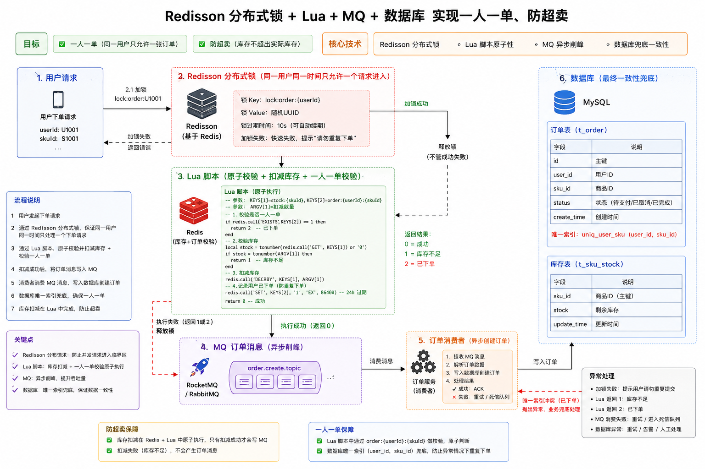
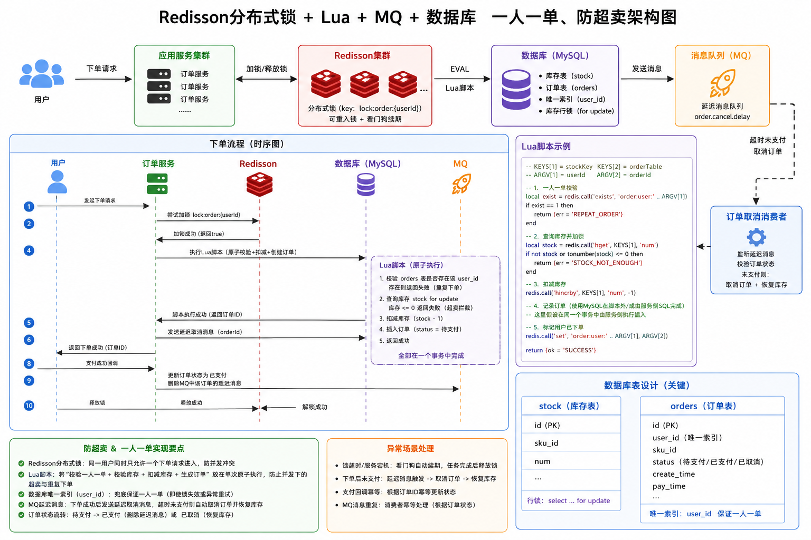

## 限流

SpringWeb 接口限流完整解决方案（企业生产级）

适配 SpringBoot + SpringWeb 架构，整合 **5种常用限流方案**，重点突出 Redisson 首选方案（最优雅、最稳定），与统一返回、全局异常、Web配置等现有骨架无缝集成，覆盖单体、分布式、微服务全场景，代码可直接复制落地，兼顾面试考点与项目实战。

### 一、限流核心基础（必懂）

#### 1. 核心限流维度（按需选择）

- IP限流：同一IP一段时间内最多访问N次（最常用，防恶意请求）
- 接口限流：单个接口全局QPS限制（保护核心接口）
- 用户限流：根据用户ID/Token限制（区分普通用户/会员）
- 全局限流：整个系统总请求数限制（保护服务器整体负载）

#### 2. 主流限流算法（底层原理）

- 固定计数器：简单粗暴，存在临界突刺问题（不推荐生产）
- 滑动窗口：平滑流量，解决临界问题（Redis原生实现）
- 令牌桶：允许合理突发流量（Guava、Redisson、Sentinel均采用）
- 漏桶：严格限制流出速率，抗突发、稳流量（适合秒杀场景）

#### 3. 方案选型原则（核心）

- 单体项目：优先 Guava（极简）、Redisson（更稳定）
- 分布式/集群项目：优先 Redisson（首选）、Sentinel（微服务）
- 小型临时项目：本地Map（快速实现，不推荐生产）
- 高并发/微服务：Sentinel + 网关限流（双层防护）

### 二、首选方案：Redisson 限流（分布式+优雅+生产首选）

Redisson 是 Redis 官方推荐的分布式工具集，内置多种限流模式，原子性操作无并发超发，代码极简，完美适配 SpringWeb，是目前生产环境最常用的限流方案。

#### 1. 前置依赖（pom.xml）

```xml
<!-- Redisson SpringBoot Starter（包含Redis连接，无需额外引入Redis依赖） -->
<dependency>
    <groupId>org.redisson</groupId>
    <artifactId>redisson-spring-boot-starter</artifactId>
    <version>3.23.2</version>
</dependency>

<!-- 若未引入SpringWeb，需补充（已有则忽略） -->
<dependency>
    <groupId>org.springframework.boot</groupId>
    <artifactId>spring-boot-starter-web</artifactId>
</dependency>

<!-- 全局异常、统一返回依赖（已有则忽略） -->
<dependency>
    <groupId>org.projectlombok</groupId>
    <artifactId>lombok</artifactId>
    <optional>true</optional>
</dependency>
```

#### 2. 配置文件（application.yml）

```yaml
spring:
  # Redis 配置（Redisson依赖Redis）
  redis:
    host: localhost  # 你的Redis地址
    port: 6379       # Redis端口
    password: 123456 # 无密码则删除此配置
    database: 0      # 选择Redis数据库
  # 可选：文件上传配置（已有则保留，与限流无关）
  servlet:
    multipart:
      enabled: true
      max-file-size: 10MB
      max-request-size: 50MB
```

#### 3. 自定义限流注解（RedissonLimit.java）

```java
import java.lang.annotation.*;

/**
 * Redisson 限流注解
 * 作用于接口方法，指定限流规则
 */
@Target(ElementType.METHOD) // 仅作用于方法
@Retention(RetentionPolicy.RUNTIME) // 运行时生效
@Documented // 生成文档
public @interface RedissonLimit {

    // 限流key前缀（可区分不同业务模块，默认default）
    String key() default "default";

    // 时间窗口内允许的最大请求数（默认10次）
    int limit() default 10;

    // 时间窗口（单位：秒，默认60秒）
    int second() default 60;

    // 限流维度（默认IP+接口URI，可选USER_ID/TOKEN）
    String dimension() default "IP";
}
```

#### 4. AOP切面（核心实现，RedissonLimitAspect.java）

```java
import org.aspectj.lang.ProceedingJoinPoint;
import org.aspectj.lang.annotation.Around;
import org.aspectj.lang.annotation.Aspect;
import org.redisson.api.RRateLimiter;
import org.redisson.api.RateIntervalUnit;
import org.redisson.api.RedissonClient;
import org.springframework.stereotype.Component;
import org.springframework.web.context.request.RequestContextHolder;
import org.springframework.web.context.request.ServletRequestAttributes;

import javax.annotation.Resource;
import javax.servlet.http.HttpServletRequest;

/**
 * Redisson 限流切面
 * 拦截带有 @RedissonLimit 注解的方法，实现限流逻辑
 */
@Aspect
@Component
public class RedissonLimitAspect {

    @Resource
    private RedissonClient redissonClient;

    // 限流key前缀（统一规范，避免与其他Rediskey冲突）
    private static final String LIMIT_KEY_PREFIX = "springweb:rate_limit:";

    @Around("@annotation(redissonLimit)")
    public Object around(ProceedingJoinPoint joinPoint, RedissonLimit redissonLimit) throws Throwable {
        // 1. 获取限流维度（IP/USER_ID/TOKEN），构建唯一限流key
        String uniqueKey = buildUniqueKey(redissonLimit);
        String limitKey = LIMIT_KEY_PREFIX + uniqueKey + ":" + redissonLimit.key();

        // 2. 获取Redisson限流器，设置限流规则
        RRateLimiter rateLimiter = redissonClient.getRateLimiter(limitKey);
        // 规则：全局限流 + 时间窗口内最大请求数 + 时间单位
        rateLimiter.trySetRate(
                org.redisson.api.RateType.OVERALL,
                redissonLimit.limit(),
                redissonLimit.second(),
                RateIntervalUnit.SECONDS
        );

        // 3. 尝试获取令牌（获取不到则限流）
        boolean acquire = rateLimiter.tryAcquire();
        if (!acquire) {
            // 抛出业务异常，全局异常处理器统一捕获返回
            throw new BusinessException(ErrorCodeEnum.NO_PERMISSION, "访问过于频繁，请" + redissonLimit.second() + "秒后再试");
        }

        // 4. 令牌获取成功，执行业务方法
        return joinPoint.proceed();
    }

    /**
     * 构建唯一限流key（根据限流维度）
     */
    private String buildUniqueKey(RedissonLimit redissonLimit) {
        ServletRequestAttributes attributes = (ServletRequestAttributes) RequestContextHolder.getRequestAttributes();
        HttpServletRequest request = attributes.getRequest();

        // 维度1：IP限流（默认）
        if ("IP".equals(redissonLimit.dimension())) {
            return getRealIp(request);
        }
        // 维度2：用户ID限流（需根据实际业务获取，示例）
        else if ("USER_ID".equals(redissonLimit.dimension())) {
            String userId = request.getHeader("userId"); // 从请求头获取用户ID
            return userId == null ? getRealIp(request) : userId;
        }
        // 维度3：Token限流（需根据实际业务获取，示例）
        else if ("TOKEN".equals(redissonLimit.dimension())) {
            String token = request.getHeader("token"); // 从请求头获取Token
            return token == null ? getRealIp(request) : token;
        }

        // 默认使用IP作为限流维度
        return getRealIp(request);
    }

    /**
     * 获取客户端真实IP（避免代理IP干扰）
     */
    private String getRealIp(HttpServletRequest request) {
        String ip = request.getHeader("X-Real-IP");
        if (ip == null || ip.isBlank() || "unknown".equalsIgnoreCase(ip)) {
            ip = request.getHeader("X-Forwarded-For");
        }
        if (ip == null || ip.isBlank() || "unknown".equalsIgnoreCase(ip)) {
            ip = request.getRemoteAddr();
        }
        // 处理多代理IP（取第一个非unknown的IP）
        if (ip != null && ip.contains(",")) {
            ip = ip.split(",")[0].trim();
        }
        return ip;
    }
}
```

#### 5. 接口使用示例（Controller）

```java
import org.springframework.web.bind.annotation.GetMapping;
import org.springframework.web.bind.annotation.RequestMapping;
import org.springframework.web.bind.annotation.RestController;

@RestController
@RequestMapping("/api/limit")
public class RedissonLimitController {

    // 示例1：IP限流 - 60秒内最多访问5次（默认IP维度）
    @RedissonLimit(limit = 5, second = 60, key = "test:ip")
    @GetMapping("/ip-limit")
    public Result<String> ipLimit() {
        return Result.success("IP限流：正常访问");
    }

    // 示例2：用户ID限流 - 30秒内最多访问3次（指定USER_ID维度）
    @RedissonLimit(limit = 3, second = 30, key = "test:user", dimension = "USER_ID")
    @GetMapping("/user-limit")
    public Result<String> userLimit() {
        return Result.success("用户ID限流：正常访问");
    }

    // 示例3：核心接口限流 - 10秒内最多访问2次（Token维度）
    @RedissonLimit(limit = 2, second = 10, key = "core:interface", dimension = "TOKEN")
    @GetMapping("/core-limit")
    public Result<String> coreLimit() {
        return Result.success("核心接口限流：正常访问");
    }
}
```

### 三、其他4种限流方案（按需选择）

以下方案作为补充，覆盖不同场景，可根据项目规模灵活选择，均与现有全局异常、统一返回骨架兼容。

#### 方案1：Guava 令牌桶（单体项目首选）

Google Guava 内置 RateLimiter，实现令牌桶算法，单机限流、极简、高性能，适合单体项目。

```java
// 1. 引入依赖（pom.xml）
<dependency>
    <groupId>com.google.guava</groupId>
    <artifactId>guava</artifactId>
    <version>31.1-jre</version>
</dependency>

// 2. 全局配置（GuavaConfig.java）
import com.google.common.util.concurrent.RateLimiter;
import org.springframework.context.annotation.Bean;
import org.springframework.context.annotation.Configuration;

@Configuration
public class GuavaConfig {
    // 配置：每秒放行5个请求（可根据接口单独配置多个）
    @Bean(name = "commonRateLimiter")
    public RateLimiter commonRateLimiter() {
        return RateLimiter.create(5.0); // 5.0 表示每秒5个令牌
    }
}

// 3. Controller 使用
import com.google.common.util.concurrent.RateLimiter;
import org.springframework.web.bind.annotation.GetMapping;
import org.springframework.web.bind.annotation.RequestMapping;
import org.springframework.web.bind.annotation.RestController;

import javax.annotation.Resource;

@RestController
@RequestMapping("/api/limit")
public class GuavaLimitController {

    @Resource(name = "commonRateLimiter")
    private RateLimiter rateLimiter;

    @GetMapping("/guava-limit")
    public Result<String> guavaLimit() {
        // 尝试获取令牌（无等待，获取不到直接拒绝）
        boolean acquire = rateLimiter.tryAcquire();
        if (!acquire) {
            throw new BusinessException(ErrorCodeEnum.NO_PERMISSION, "系统繁忙，请稍后再试");
        }
        return Result.success("Guava限流：正常访问");
    }
}
```

#### 方案2：Redis 原生滑动窗口（分布式可用）

基于 Redis ZSet 存储请求时间戳，手动实现滑动窗口算法，无需依赖额外组件，适合需要自定义限流逻辑的场景。

```java
// 1. 自定义注解（RedisLimit.java，与RedissonLimit类似）
import java.lang.annotation.*;

@Target(ElementType.METHOD)
@Retention(RetentionPolicy.RUNTIME)
@Documented
public @interface RedisLimit {
    int limit() default 10; // 窗口内最大请求数
    int second() default 10; // 窗口时间（秒）
}

// 2. AOP切面（RedisLimitAspect.java）
import org.aspectj.lang.ProceedingJoinPoint;
import org.aspectj.lang.annotation.Around;
import org.aspectj.lang.annotation.Aspect;
import org.springframework.data.redis.core.RedisTemplate;
import org.springframework.data.redis.core.ZSetOperations;
import org.springframework.stereotype.Component;
import org.springframework.web.context.request.RequestContextHolder;
import org.springframework.web.context.request.ServletRequestAttributes;

import javax.annotation.Resource;
import javax.servlet.http.HttpServletRequest;
import java.util.concurrent.TimeUnit;

@Aspect
@Component
public class RedisLimitAspect {

    @Resource
    private RedisTemplate<String, Object> redisTemplate;

    private static final String REDIS_LIMIT_PREFIX = "springweb:redis_limit:";

    @Around("@annotation(redisLimit)")
    public Object around(ProceedingJoinPoint joinPoint, RedisLimit redisLimit) throws Throwable {
        // 1. 构建IP+接口URI的唯一key
        ServletRequestAttributes attributes = (ServletRequestAttributes) RequestContextHolder.getRequestAttributes();
        HttpServletRequest request = attributes.getRequest();
        String ip = getRealIp(request);
        String uri = request.getRequestURI();
        String key = REDIS_LIMIT_PREFIX + ip + ":" + uri;

        int limit = redisLimit.limit();
        int second = redisLimit.second();
        long now = System.currentTimeMillis();
        long expireTime = now - second * 1000L; // 窗口起始时间

        // 2. Redis ZSet 操作：移除窗口外的请求时间戳
        ZSetOperations<String, Object> zSet = redisTemplate.opsForZSet();
        zSet.removeRangeByScore(key, 0, expireTime);

        // 3. 添加当前请求时间戳（score和value都用时间戳，便于排序和删除）
        zSet.add(key, now, now);
        // 设置key过期时间（避免Redis内存溢出）
        redisTemplate.expire(key, second, TimeUnit.SECONDS);

        // 4. 统计窗口内请求数，超过限制则限流
        Long count = zSet.zCard(key);
        if (count != null && count > limit) {
            throw new BusinessException(ErrorCodeEnum.NO_PERMISSION, "访问频繁，请稍后再试");
        }

        // 5. 执行业务方法
        return joinPoint.proceed();
    }

    // 复用Redisson切面的getRealIp方法（略）
    private String getRealIp(HttpServletRequest request) {
        // 代码与RedissonLimitAspect中一致，此处省略
    }
}

// 3. Controller 使用（与Redisson用法一致）
@RedisLimit(limit = 4, second = 10)
@GetMapping("/redis-limit")
public Result<String> redisLimit() {
    return Result.success("Redis滑动窗口限流：正常访问");
}
```

#### 方案3：拦截器 + 本地Map（临时快速方案）

基于 ConcurrentHashMap 存储请求计数，无依赖、快速实现，适合小型单机项目、临时测试，不推荐生产集群。

```java
import org.springframework.stereotype.Component;
import org.springframework.web.servlet.HandlerInterceptor;

import javax.servlet.http.HttpServletRequest;
import javax.servlet.http.HttpServletResponse;
import java.util.Map;
import java.util.concurrent.ConcurrentHashMap;

/**
 * 本地Map限流拦截器（临时方案）
 */
@Component
public class LocalMapLimitInterceptor implements HandlerInterceptor {

    // 存储IP -> 请求计数（线程安全）
    private final Map<String, Integer> countMap = new ConcurrentHashMap<>();
    // 限流规则：10秒内最多10次请求
    private final int LIMIT_COUNT = 10;
    private final long LIMIT_TIME = 10 * 1000; // 10秒
    // 存储IP -> 上次请求时间
    private final Map<String, Long> timeMap = new ConcurrentHashMap<>();

    @Override
    public boolean preHandle(HttpServletRequest request, HttpServletResponse response, Object handler) {
        String ip = getRealIp(request);
        long now = System.currentTimeMillis();

        // 1. 重置超时的IP计数
        if (timeMap.containsKey(ip) && now - timeMap.get(ip) > LIMIT_TIME) {
            countMap.remove(ip);
            timeMap.remove(ip);
        }

        // 2. 统计请求计数
        int count = countMap.getOrDefault(ip, 0);
        if (count >= LIMIT_COUNT) {
            throw new BusinessException(ErrorCodeEnum.NO_PERMISSION, "访问频繁，请稍后再试");
        }

        // 3. 更新计数和时间
        countMap.put(ip, count + 1);
        timeMap.put(ip, now);
        return true;
    }

    // 复用getRealIp方法（略）
    private String getRealIp(HttpServletRequest request) {
        // 代码与RedissonLimitAspect中一致，此处省略
    }
}

// 4. 注册拦截器（WebConfig.java中添加）
@Override
public void addInterceptors(InterceptorRegistry registry) {
    // 注册本地Map限流拦截器（拦截所有请求，可配置放行接口）
    registry.addInterceptor(new LocalMapLimitInterceptor())
            .addPathPatterns("/**")
            .excludePathPatterns("/login", "/register", "/static/**");
}
```

#### 方案4：Sentinel 限流（微服务/高并发首选）

阿里开源，轻量级、开箱即用，支持限流、熔断、降级、热点参数限流，适合微服务、高并发、秒杀场景。

```java
// 1. 引入依赖（pom.xml）
<dependency>
    <groupId>com.alibaba.csp</groupId>
    <artifactId>sentinel-spring-boot-starter</artifactId>
    <version>1.8.6</version>
</dependency>

// 2. 配置文件（application.yml）
spring:
  sentinel:
    transport:
      dashboard: localhost:8080 # Sentinel控制台地址（需单独启动控制台）
      port: 8719 # 客户端端口

// 3. Controller 使用（注解式限流）
import com.alibaba.csp.sentinel.annotation.SentinelResource;
import com.alibaba.csp.sentinel.slots.block.BlockException;
import org.springframework.web.bind.annotation.GetMapping;
import org.springframework.web.bind.annotation.RequestMapping;
import org.springframework.web.bind.annotation.RestController;

@RestController
@RequestMapping("/api/limit")
public class SentinelLimitController {

    // 限流规则：通过Sentinel控制台配置（QPS/并发线程数）
    @SentinelResource(value = "sentinelLimit", blockHandler = "blockHandler")
    @GetMapping("/sentinel-limit")
    public Result<String> sentinelLimit() {
        return Result.success("Sentinel限流：正常访问");
    }

    // 限流降级处理方法（与被限流方法参数一致，末尾多一个BlockException）
    public Result<String> blockHandler(BlockException e) {
        return Result.fail(ErrorCodeEnum.NO_PERMISSION, "Sentinel限流：访问频繁，请稍后再试");
    }
}
```

补充：Sentinel 控制台需单独下载启动，用于可视化配置限流规则、监控请求、查看限流日志，适合微服务集群管理。

### 四、全局异常兼容（已有骨架，无需修改）

所有限流方案抛出的 `BusinessException`，将被之前的 `GlobalExceptionHandler` 统一捕获，返回规范的统一返回格式，无需额外修改代码。

```java
// 全局异常处理器中已包含对BusinessException的捕获（无需新增）
@ExceptionHandler(BusinessException.class)
public Result<?> businessException(BusinessException e) {
    System.out.println("业务异常：" + e.getMsg());
    return Result.fail(e.getCode(), e.getMsg());
}
```

限流返回示例（前端友好）：

```json
{
  "code": 403,
  "msg": "访问过于频繁，请60秒后再试",
  "data": null
}
```

### 五、方案对比 & 生产最佳实践

#### 1. 5种方案完整对比（面试必背）

| 方案               | 底层算法             | 分布式支持 | 复杂度 | 适用场景                       | 生产推荐度          |
| :----------------- | :------------------- | :--------- | :----- | :----------------------------- | :------------------ |
| Redisson 限流      | 令牌桶/漏桶/滑动窗口 | ✅          | 极低   | 分布式、单体、企业级项目       | 🌟🌟🌟🌟🌟（首选）       |
| Guava 令牌桶       | 令牌桶               | ❌          | 极低   | 单体项目、小型应用             | 🌟🌟🌟🌟                |
| Redis 原生滑动窗口 | 滑动窗口             | ✅          | 中     | 需要自定义限流逻辑的分布式项目 | 🌟🌟🌟                 |
| 本地Map拦截器      | 固定计数器           | ❌          | 极低   | 临时测试、小型单机临时项目     | 🌟                   |
| Sentinel 限流      | 令牌桶/漏桶          | ✅          | 中高   | 微服务、高并发、秒杀、网关限流 | 🌟🌟🌟🌟🌟（微服务首选） |

#### 2. 生产最佳实践

- 单体项目：Redisson 限流（首选）或 Guava 限流（极简）
- 分布式项目：Redisson 限流（首选），微服务项目优先 Sentinel
- 高并发/秒杀场景：Sentinel + 网关限流（Nginx/Gateway）双层防护
- 限流粒度：普通接口用 IP+URI，核心接口用 UserId/Token，避免被单个IP恶意攻击
- 兜底处理：限流提示统一、友好，避免返回系统错误，影响用户体验
- 监控：分布式项目建议搭配 Redis 监控、Sentinel 控制台，实时查看限流情况

### 六、常见问题解决

- 限流不生效：检查 Redis/Redisson 配置是否正确，确保key唯一（IP+URI），避免多个接口共用一个key
- 并发超发：优先使用 Redisson/Sentinel（原子性操作），避免原生Redis手动操作出现并发问题
- Redis内存溢出：给限流key设置过期时间（与时间窗口一致），避免无过期时间导致key堆积
- 代理IP干扰：使用 getRealIp 方法获取真实IP，避免代理IP导致限流失效
- 不同接口不同限流规则：通过注解的 limit、second 参数区分，或配置多个限流器（Guava/Sentinel）

### 七、整合说明（与现有项目骨架兼容）

本解决方案已完全适配之前的 SpringWeb 项目骨架，包含：

- 统一错误码枚举（ErrorCodeEnum）
- 自定义业务异常（BusinessException）
- 统一返回结果（Result + PageResult）
- 全局异常处理器（GlobalExceptionHandler）
- Web配置类（WebConfig，拦截器注册）

所有代码可直接复制到现有项目，无需修改核心骨架，直接启动即可使用。

## 缓存预热

下面我给你一套**可直接落地、生产级别的 Redis 缓存预热完整解决方案**，包含：原理、策略选型、热点识别、实现代码（Java/Spring Boot）、集群协调、限流防崩、一致性保障、监控告警、避坑清单。内容偏长，建议一次看完直接用。

---

### 一、缓存预热是什么 & 为什么必须做

**缓存预热**：在系统对外提供流量前/低峰期，**主动把热点数据提前加载到 Redis**，避免冷启动时缓存全 miss、请求全部打到 DB，导致**数据库雪崩、接口超时、服务不可用**。

**没预热的典型事故链**：
冷启动 → 缓存空 → 所有请求查 MySQL → CPU 100% → 连接打满 → 服务超时 → 熔断/降级 → 雪崩扩散。

---

### 二、预热策略总览（选型直接抄）

#### 1）按触发时机（四种主流）

1. **应用启动预热（最常用）**
   - 时机：Spring Boot 启动完成后（ApplicationRunner/CommandLineRunner）
   - 优点：简单、可控、上线即热
   - 缺点：阻塞启动、数据量大时超时
   - 适用：热点固定、数据量不大（万级以内）

2. **发布前脚本预热（大厂/高并发首选）**
   - 时机：上线流程中（容器/实例启动前），独立脚本执行
   - 优点：不阻塞应用、可多集群并行、可控性最强
   - 缺点：需维护脚本/工具链
   - 适用：大促、核心链路、Redis 集群

3. **定时任务预热（长期保热/兜底）**
   - 时机：业务低峰期（如 03:00），或固定间隔（5/10 分钟）
   - 优点：持续保热、避免集中过期雪崩、不影响启动
   - 缺点：有一定延迟
   - 适用：热点动态变化、长期运行系统

4. **事件驱动/双写预热（实时一致性）**
   - 时机：DB 写入/更新时同步写缓存；或监听 Binlog 增量预热
   - 优点：实时性最强、精准预热
   - 缺点：复杂度高、需处理并发与一致性
   - 适用：核心热点（商品库存、价格、用户余额）

#### 2）推荐组合（生产直接用）

- **基础版（中小系统）**：启动预热 + 定时兜底
- **高可用版（核心/大促）**：发布脚本预热 + 定时刷新 + 双写/ Binlog 增量

---

### 三、热点数据怎么选（精准预热，拒绝全量）

**核心原则：只预热 Top 热点，不做全量**（否则 Redis OOM、DB 压力大）。

#### 1）业务规则（最直接）

- 首页/导航/类目树
- 秒杀/活动商品
- 排行榜/推荐列表
- 配置/字典/常量
- 高频访问用户数据（如 VIP）

#### 2）访问统计（精准）

- 应用埋点日志（ELK）统计 TopN key
- Redis TopK 记录高频访问 key
- 监控系统（Prometheus）分析接口 QPS

#### 3）动态热点（大促）

- 大促前 N 小时，自动扩大预热范围
- 基于流量预测，提前加载潜在热点

---

### 四、完整实现（Java/Spring Boot，可直接复制）

#### 1）启动预热（ApplicationRunner）

```java
@Component
public class CacheWarmUpRunner implements ApplicationRunner {

    @Autowired
    private RedisTemplate<String, Object> redisTemplate;

    @Autowired
    private GoodsService goodsService;

    // 预热核心热点：首页商品、类目、配置
    @Override
    public void run(ApplicationArguments args) throws Exception {
        // 1. 基础配置（小数据，同步）
        warmUpConfig();

        // 2. 热点商品（大数据，异步+限流）
        new Thread(this::warmUpHotGoods).start();
    }

    // 基础配置
    private void warmUpConfig() {
        List<Category> categories = categoryService.listAll();
        redisTemplate.opsForValue().set("cache:category:all", categories, Duration.ofHours(2));
        
        DictVO dict = dictService.getDict("system");
        redisTemplate.opsForValue().set("cache:dict:system", dict, Duration.ofHours(1));
    }

    // 热点商品（异步+分批+限流）
    private void warmUpHotGoods() {
        try {
            // 1. 查 Top500 热点
            List<Long> hotIds = goodsService.queryHotGoodsIds(500);

            // 2. 分批加载（每批 100，防止 DB/Redis 压力）
            int batchSize = 100;
            for (int i = 0; i < hotIds.size(); i += batchSize) {
                List<Long> batch = hotIds.subList(i, Math.min(i + batchSize, hotIds.size()));
                List<GoodsVO> goodsList = goodsService.listByIds(batch);

                // 3. 批量写 Redis + TTL 随机抖动
                goodsList.forEach(g -> {
                    // TTL 1h ± 10min，避免集中过期
                    long ttl = 3600 + new Random().nextInt(1200);
                    redisTemplate.opsForValue().set("cache:goods:" + g.getId(), g, Duration.ofSeconds(ttl));
                });

                // 4. 限流：每批休眠 200ms
                Thread.sleep(200);
            }
        } catch (Exception e) {
            // 预热失败告警（邮件/短信/企业微信）
            alert("热点商品预热失败：" + e.getMessage());
        }
    }
}
```

#### 2）定时任务预热（兜底保热）

```java
@Component
@EnableScheduling
public class CacheRefreshJob {

    @Autowired
    private RedisTemplate<String, Object> redisTemplate;
    @Autowired
    private GoodsService goodsService;

    // 每 10 分钟刷新热点（生产可改低峰期 cron：0 0 3 * * ?）
    @Scheduled(fixedRate = 10 * 60 * 1000)
    public void refreshHotGoods() {
        // 逻辑同启动预热，异步执行
        new Thread(() -> {
            try {
                List<Long> hotIds = goodsService.queryHotGoodsIds(500);
                // ... 分批写 Redis
            } catch (Exception e) {
                alert("定时刷新失败：" + e.getMessage());
            }
        }).start();
    }
}
```

#### 3）发布脚本预热（独立 Java 程序）

```java
public class WarmUpScript {
    public static void main(String[] args) {
        // 1. 初始化 Redis/DB 连接
        RedisTemplate<String, Object> redisTemplate = getRedisTemplate();
        GoodsService goodsService = getGoodsService();

        // 2. 预热全量热点（可跨集群）
        List<Long> hotIds = goodsService.queryAllHotIds(1000);
        // ... 分批写 Redis，同前

        System.out.println("预热完成，准备上线！");
    }
}
```

---

### 五、集群环境：避免多节点重复预热

#### 方案：分布式锁 + 单节点执行

```java
// 预热前加锁（Redis SETNX）
String lockKey = "lock:cache:warmup:hotgoods";
Boolean locked = redisTemplate.opsForValue().setIfAbsent(lockKey, "1", Duration.ofMinutes(5));
if (Boolean.TRUE.equals(locked)) {
    try {
        // 执行预热逻辑
    } finally {
        redisTemplate.delete(lockKey);
    }
} else {
    // 其他节点跳过
    System.out.println("其他节点已在预热，跳过");
}
```

---

### 六、防崩三要素（生产必加）

1. **分批加载**：每批 50~200 条，控制 DB/Redis QPS
2. **限流休眠**：每批后 sleep 100~500ms
3. **TTL 随机抖动**：避免 key 同时过期引发雪崩

---

### 七、一致性保障（预热后不脏）

1. **预热时加 TTL**：所有 key 必须有过期时间（1h~24h）
2. **双写更新**：DB 更新时同步更新缓存
3. **Binlog 增量**：监听 MySQL Binlog，实时更新缓存
4. **定时对比**：低峰期做缓存与 DB 一致性校验，修复脏数据

---

### 八、监控与告警（可落地）

#### 核心监控指标

- 预热成功率（100%）
- 缓存命中率（>90%）
- Redis 内存使用率（<80%）
- DB 慢查询数（预热期间无突增）

#### 告警规则

- 预热失败 → 企业微信/短信告警
- 命中率 <80% → 告警（热点识别不准）
- Redis 内存 >85% → 告警（预热数据过多）

---

### 九、避坑清单（高频事故点）

1. ❌ 全量预热 → ✅ 只预热 TopN 热点
2. ❌ 同步阻塞启动 → ✅ 异步预热 + 健康检查延迟就绪
3. ❌ 无 TTL → ✅ 必加 TTL + 随机抖动
4. ❌ 集群多节点重复预热 → ✅ 分布式锁
5. ❌ 预热后无更新 → ✅ 定时兜底 + 双写
6. ❌ 不监控命中率 → ✅ 命中率是预热效果唯一指标

---

### 十、最终架构图（一句话）

**发布前脚本预热（核心） + 启动异步预热（兜底） + 定时任务刷新（保热） + 分布式锁（集群防重） + TTL 抖动（防雪崩） + 监控告警（可观测）**

---

需要我把这套方案整理成一份可直接使用的**预热配置模板（含YAML）+ 监控告警规则模板**吗？

## 应用启动级 Redis 缓存预热 

完整解决方案（SpringBoot 专属、生产落地、无冗余）

### 一、方案定位

**应用启动预热**：项目容器/Spring 上下文完全初始化后、对外接收流量**之前**，自动加载热点业务数据写入 Redis。
解决痛点：
1. 服务冷启动缓存空、大量缓存击穿打垮数据库；
2. 多实例集群重复预热、压垮DB；
3. 启动阻塞、健康检查超时、k8s 探针失败；
4. 缓存key集中过期、二次雪崩。

---

### 二、整体设计方案

#### 1. 核心设计原则

1. **异步执行**：不阻塞 Spring 启动流程，避免服务启动超时；
2. **分布式锁**：集群多实例，仅一台机器执行预热；
3. **分批+限流**：批量查询DB、批量写入Redis，控制IO压力；
4. **过期时间随机打散**：杜绝 key 集中过期；
5. **降级容错**：预热异常不影响服务正常启动，日志+告警；
6. **分层预热**：小量基础配置同步预热、大量热点数据异步预热。

#### 2. 技术选型

- 触发时机：`ApplicationRunner` / `CommandLineRunner`（Spring 容器加载完成后执行）
- 分布式锁：Redis `SET NX EX` 实现
- 缓存操作：Spring Data Redis
- 线程隔离：自定义线程池，不和业务线程池混用
- 兜底保障：结合本地缓存 + 定时刷新补偿

---

### 三、核心实现代码（可直接复制上线）

#### 1. 自定义预热线程池（隔离业务线程）

```java
import org.springframework.context.annotation.Bean;
import org.springframework.context.annotation.Configuration;
import java.util.concurrent.ExecutorService;
import java.util.concurrent.Executors;

@Configuration
public class WarmUpThreadPoolConfig {

    @Bean("cacheWarmUpPool")
    public ExecutorService cacheWarmUpPool() {
        // 单线程执行预热，防止并发乱序、DB压力过大
        return Executors.newSingleThreadExecutor();
    }
}
```

#### 2. 启动预热核心执行器（关键）

```java
import lombok.RequiredArgsConstructor;
import lombok.extern.slf4j.Slf4j;
import org.springframework.boot.ApplicationArguments;
import org.springframework.boot.ApplicationRunner;
import org.springframework.data.redis.core.RedisTemplate;
import org.springframework.data.redis.core.ValueOperations;
import org.springframework.stereotype.Component;
import java.time.Duration;
import java.util.List;
import java.util.Random;
import java.util.concurrent.ExecutorService;

@Slf4j
@Component
@RequiredArgsConstructor
public class CacheWarmUpRunner implements ApplicationRunner {

    private final RedisTemplate<String, Object> redisTemplate;
    private final ExecutorService cacheWarmUpPool;

    // 业务Service 自行注入
    // private final CategoryService categoryService;
    // private final GoodsService goodsService;

    // 分布式锁Key、锁过期时间
    private static final String WARM_UP_LOCK_KEY = "lock:startup:cache:warmup";
    private static final Duration LOCK_EXPIRE = Duration.ofMinutes(3);
    // 分批大小、批次休眠
    private static final int BATCH_SIZE = 100;
    private static final long BATCH_SLEEP_MS = 150;

    @Override
    public void run(ApplicationArguments args) {
        // 1. 轻量基础数据：同步快速预热（字典、配置、类目）
        warmUpBaseData();

        // 2. 大量热点数据：异步+分布式锁控制，避免集群重复执行
        cacheWarmUpPool.execute(this::warmUpHotData);
        log.info("【缓存预热】启动任务已提交，不阻塞服务启动");
    }

    /**
     * 基础小数据 - 同步预热
     */
    private void warmUpBaseData() {
        try {
            ValueOperations<String, Object> ops = redisTemplate.opsForValue();
            // 示例：全量类目、系统字典、白名单配置
            // ops.set("cache:category:all", categoryService.listAll(), getRandomTtl(2));
            log.info("【缓存预热】基础配置数据加载完成");
        } catch (Exception e) {
            log.error("【缓存预热】基础数据预热失败", e);
        }
    }

    /**
     * 热点大数据 - 异步+分布式锁+分批预热
     */
    private void warmUpHotData() {
        Boolean lockOk = redisTemplate.opsForValue()
                .setIfAbsent(WARM_UP_LOCK_KEY, "warmup", LOCK_EXPIRE);
        if (!Boolean.TRUE.equals(lockOk)) {
            log.info("【缓存预热】其他实例正在执行，当前节点跳过预热");
            return;
        }
        try {
            // 1. 查询数据库热点ID列表（商品、活动、热门资讯等）
            // List<Long> hotIdList = goodsService.listHotGoodsId();
            List<Long> hotIdList = List.of();

            // 2. 分批处理
            ValueOperations<String, Object> ops = redisTemplate.opsForValue();
            for (int i = 0; i < hotIdList.size(); i += BATCH_SIZE) {
                int end = Math.min(i + BATCH_SIZE, hotIdList.size());
                List<Long> batchIds = hotIdList.subList(i, end);

                // 批量查库
                // List<GoodsVO> batchData = goodsService.listByIds(batchIds);

                // 批量写缓存 + 随机过期时间
                // for (GoodsVO data : batchData) {
                //     String key = "cache:goods:" + data.getId();
                //     ops.set(key, data, getRandomTtl(12));
                // }

                // 限流休眠，降低DB、Redis瞬时压力
                Thread.sleep(BATCH_SLEEP_MS);
            }
            log.info("【缓存预热】热点数据预热执行完成");
        } catch (Exception e) {
            log.error("【缓存预热】热点数据预热异常", e);
        } finally {
            // 释放分布式锁
            redisTemplate.delete(WARM_UP_LOCK_KEY);
        }
    }

    /**
     * 生成随机过期时间，防止缓存集中过期
     * @param hour 基础小时
     * @return 随机Duration
     */
    private Duration getRandomTtl(int hour) {
        int randomSecond = new Random().nextInt(3600);
        return Duration.ofHours(hour).plusSeconds(randomSecond);
    }
}
```

---

### 四、关键配套方案

#### 1. 多实例集群防重复预热

- 采用 Redis 分布式锁 `setIfAbsent`；
- 锁设置自动过期，防止节点宕机死锁；
- 未获取到锁的实例直接跳过，全局仅单节点预热。

#### 2. 解决服务启动阻塞

- 基础小数据短时间同步执行；
- 大数据量全部提交**独立线程池异步执行**；
- 不占用 Tomcat 业务线程、不影响健康检查/容器探针。

#### 3. 缓存过期防雪崩

统一工具方法：
- 基础数据：2小时基础TTL + 随机0~1h抖动；
- 热点数据：12小时基础TTL + 随机0~1h抖动；
彻底避免大批量key同一时间失效。

#### 4. 容错降级机制

1. 所有预热逻辑加 `try-catch`，预热失败**不阻断服务启动**；
2. 打印完整异常日志，可对接告警（企微/短信）；
3. 配合**缓存降级**：缓存失效时走本地Caffeine二级缓存兜底。

#### 5. 流量延迟放行（生产高阶优化）

K8s/容器环境配合：
1. 服务启动成功后，**延迟30s~60s**再就绪探针通过；
2. 给异步缓存预热预留执行时间；
3. 避免流量刚进来缓存还没加载完成。

---

### 五、预热数据分层规范（直接套用）

| 数据类型                 | 预热方式               | 过期时间       |
| ------------------------ | ---------------------- | -------------- |
| 系统字典、配置、枚举     | 同步启动预热           | 2h + 随机抖动  |
| 类目、地区、固定白名单   | 同步启动预热           | 6h + 随机抖动  |
| 首页热点、活动商品、榜单 | 异步分批预热           | 12h + 随机抖动 |
| 高频用户、实时动态数据   | 不启动预热，走定时刷新 | 3h + 随机抖动  |

---

### 六、生产避坑要点

1. ❌ 禁止全量库表数据预热，只预热**TOP热点**；
2. ❌ 禁止单条循环查库，必须**批量查询、批量写入**；
3. ❌ 禁止固定TTL，必须加随机时间戳；
4. ❌ 禁止主线程执行大量预热，导致启动超时；
5. ❌ 集群环境不加分布式锁，导致多实例打爆DB。

---

### 七、补充兜底方案

1. **定时补偿刷新**：新增低峰期定时任务，定时重新刷新热点缓存，解决长期运行缓存过期、数据不一致；
2. **缓存更新双写**：业务增删改时同步更新/删除缓存，保证预热后数据一致性；
3. **监控观测**：监控Redis缓存命中率、DB QPS，命中率过低说明预热范围不足。

---

需要我补充：
1. 配套 **yml 配置（Redis+线程池）** 完整配置？
2. 或者加上 **预热失败企微告警** 完整代码？

### 预热触发时机

---

#### 一、一句话结论（最重要）

**应用启动缓存预热，绝对不要用 @PostConstruct！**
**正确选择：ApplicationRunner 或 CommandLineRunner（两者几乎一样）**

---

#### 二、三者执行顺序（必须记住）

执行先后：
1. **@PostConstruct** → 最早
2. **ApplicationRunner / CommandLineRunner** → 最晚（Spring 容器完全启动后）

```
Bean初始化 → @PostConstruct → 容器启动完成 → ApplicationRunner/CommandLineRunner
```

---

#### 三、详细区别（一看就懂）

##### 1. @PostConstruct

**作用时机**：**当前 Bean 初始化完成后**立即执行。
**特点**：
- 执行非常早
- 此时**其他 Bean 可能还没初始化完**
- 属于 Bean 生命周期，不是应用启动生命周期
- **如果抛异常，整个服务直接启动失败**
- **不能接收命令行参数**
- **不适合做耗时操作（预热、加载数据）**

**风险**：
- 你在 @PostConstruct 里做缓存预热，会**阻塞整个 Spring 启动**
- 其他 Bean 还没好，你调用可能**报错/依赖未就绪**
- 耗时预热 → 启动超时 → K8s 重启

---

##### 2. ApplicationRunner

**作用时机**：**Spring 整个应用完全启动成功后**执行。
**特点**：
- 所有 Bean 都已初始化完成
- 所有依赖、连接池、Redis、DB 都就绪
- **最适合做缓存预热、数据加载、启动任务**
- 可以接收**封装好的命令行参数**
- 推荐使用！

---

##### 3. CommandLineRunner

**作用时机**：和 ApplicationRunner **完全一样**
**区别仅在于：参数格式不同**
- CommandLineRunner：接收原始 String 数组
- ApplicationRunner：接收封装好的 ApplicationArguments

**功能 99% 相同**，日常开发随便选一个。

---

#### 四、核心区别表（直接收藏）

| 特性         | @PostConstruct | ApplicationRunner | CommandLineRunner |
| ------------ | -------------- | ----------------- | ----------------- |
| 执行时机     | Bean 初始化后  | 应用完全启动后    | 应用完全启动后    |
| 依赖是否就绪 | 不一定         | 完全就绪          | 完全就绪          |
| 是否适合预热 | ❌ 不适合       | ✅ 最适合          | ✅ 适合            |
| 抛异常影响   | 服务启动失败   | 服务启动失败      | 服务启动失败      |
| 能否异步     | 不推荐         | ✅ 推荐            | ✅ 推荐            |
| 生命周期     | Bean 生命周期  | 应用生命周期      | 应用生命周期      |

---

#### 五、为什么缓存预热必须用 ApplicationRunner？

因为缓存预热需要：
1. **Redis 连接池已初始化**
2. **数据库连接池已初始化**
3. **所有业务 Service 都已创建完成**
4. **不阻塞启动流程（异步执行）**

这些只有 **ApplicationRunner** 能保证。

@PostConstruct 执行太早，很多资源还没准备好，直接报错或阻塞。

---

#### 六、生产最佳实践

##### 缓存预热 → 固定用 ApplicationRunner

```java
@Component
public class CacheWarmUp implements ApplicationRunner {
    @Override
    public void run(ApplicationArguments args) {
        // 此时整个 Spring 已完全启动
        // 执行 Redis 缓存预热 100% 安全
    }
}
```

---

#### 七、最终总结（3 句话记住）

1. **@PostConstruct**：Bean 刚创建就执行，**太早，不能预热**
2. **ApplicationRunner / CommandLineRunner**：**应用完全启动后**执行，**最适合预热**
3. **缓存预热 = ApplicationRunner（首选）**

---

需要我给你整理一份 **「SpringBoot 启动生命周期全序图」** 吗？包含所有启动阶段的执行顺序，非常适合面试和架构设计。

## Redis缓存穿透/击穿/雪崩

### Redis 缓存穿透 

首先搞清楚**什么是缓存穿透**：
> 用户请求的数据**既不在缓存里，也不在数据库里**，导致请求每次都直接打到数据库。
> 大量恶意/异常请求穿透缓存，直接压垮数据库，这就是缓存穿透。

典型场景：查询 id = -1 的用户、查询不存在的订单，数据库根本没有这条数据，缓存永远不会命中，请求全走数据库。

---

#### 一、核心解决方案（4 种，企业最常用）

#### 1. 缓存空值 / 默认值（最简单、最常用）

**思路**：即使数据库查询不到数据，也把 `null` 或空对象缓存起来，下次请求直接返回缓存，不再查库。

**优点**：实现简单，成本低
**缺点**：会占用一点缓存空间（可设置短过期时间）

**实战代码逻辑**：

1. 查缓存 → 无
2. 查数据库 → 无
3. **把空值写入缓存**（设置较短过期时间，如 60s）
4. 下次请求直接返回缓存空值

**Redis 示例**
```
# 查询不存在的数据，缓存空字符串，30秒过期
SET key:10086 "" EX 30
```

---

#### 2. 布隆过滤器（Bloom Filter）（高性能、防恶意攻击）

**思路**：提前把**数据库里存在的所有 key** 存入布隆过滤器，请求进来先判断：

- 过滤器说**不存在** → 直接返回，不查缓存、不查库
- 过滤器说**存在** → 再查缓存 → 查数据库

**优点**：内存占用极小、性能极高，完美防穿透
**缺点**：有极低的误判率（可容忍），不支持删除

**适用场景**：高并发、防恶意攻击、海量数据查询

---

#### 3. 参数校验 + 接口限流（基础防护）

**思路**：

1. 校验请求参数合法性（比如 id 必须 > 0）
2. 对非法参数直接拦截，不放行到缓存/数据库
3. 配合接口限流、IP 黑名单，防止恶意刷接口

**优点**：从源头拦截非法请求，最安全
**缺点**：无法解决合法但不存在的参数穿透

---

#### 4. 热点参数缓存（增强版空值缓存）

**思路**：
针对高频查询的**不存在 key**，单独做一层本地缓存（Caffeine、Guava），比 Redis 更快拦截。

---

#### 二、方案对比（直接选）

| 方案       | 优点           | 缺点               | 推荐场景           |
| ---------- | -------------- | ------------------ | ------------------ |
| 缓存空值   | 简单、易实现   | 占用少量缓存空间   | 大多数业务系统     |
| 布隆过滤器 | 高性能、防攻击 | 有极小误判率       | 高并发、电商、秒杀 |
| 参数校验   | 源头拦截       | 无法防合法无效参数 | 所有系统必加       |
| 本地缓存   | 速度极快       | 增加复杂度         | 超高并发场景       |

---

#### 三、企业级最佳实践（组合方案）

**最稳、最常用的双层防护：**
1. **第一层**：**参数校验 + 接口限流**（拦截非法请求）
2. **第二层**：**布隆过滤器**（快速判断数据是否存在）
3. **第三层**：**缓存空值**（兜底，避免漏网请求）

---

#### 四、一句话总结

- **简单业务**：用 **缓存空值**
- **高并发/防攻击**：用 **布隆过滤器 + 缓存空值**
- **所有系统**：必须加 **参数校验**

#### 总结

1. 缓存穿透 = 查询**缓存和数据库都不存在**的数据
2. 最简单方案：**缓存空值**
3. 最强方案：**布隆过滤器 + 缓存空值 + 参数校验**
4. 核心目标：**不让请求打到数据库**

### Redis 缓存击穿 

#### 一、先搞懂什么是缓存击穿

**缓存击穿**：**热点Key突然过期**，瞬间大量并发请求同时打到数据库，把数据库压垮。
特点：

- 数据**数据库是存在的**
- 缓存**刚好过期**
- 高并发瞬间全部绕过缓存直查DB

和穿透区别：
- 穿透：**数据根本不存在**
- 击穿：**数据存在，只是缓存过期瞬间被并发打穿**

---

#### 二、主流解决方案（面试必背+生产常用）

##### 1. 互斥锁（分布式锁）

核心思路：
缓存过期时，**只放行一个请求去查库、更新缓存**，其他请求等待，更新完直接走缓存。

常用实现：
Redis `SETNX`、Redisson 分布式锁。

流程：
1. 查Redis缓存，过期/不存在
2. 尝试加分布式锁
3. 加锁成功 → 查询DB → 回填缓存 → 释放锁
4. 加锁失败 → 短暂休眠后重试查缓存

**优点**：精准解决击穿，无额外内存浪费
**缺点**：有少量等待、可能出现锁等待超时

---

##### 2. 热点Key 永不过期（后台异步更新）

核心思路：
- 缓存**逻辑不过期**，不设置expire
- 起一个**定时任务/异步线程**，后台定时主动刷新缓存数据

**优点**：**彻底杜绝Key过期**，完全没有击穿风险，并发性能极高
**缺点**：数据有短暂延迟，占用缓存空间；只适合**允许弱一致性**的热点数据（商品详情、首页推荐等）

---

##### 3. 缓存过期时间加随机值（错开过期时间）

核心思路：
给缓存过期时间**加随机偏移量**，比如原本30分钟过期，改成 `30±5分钟`。
避免大量热点Key**同一时刻集体过期**，分散流量峰值。

**优点**：实现最简单、零成本
**缺点**：只能**缓解**，不能彻底根治高并发击穿

---

##### 4. 多级缓存 + 本地缓存兜底

核心思路：
JVM本地缓存（Caffeine/Guava） + Redis 二级缓存。
Redis即使瞬间失效，本地缓存还能扛住一波并发，不会直接打DB。

**优点**：速度快、抗并发强
**缺点**：本地缓存有数据一致性问题、集群节点数据不一致

---

#### 三、方案对比

| 方案             | 适用场景           | 优点                 | 缺点               |
| ---------------- | ------------------ | -------------------- | ------------------ |
| 分布式互斥锁     | 高并发、强一致性   | 精准防击穿、数据一致 | 有等待、实现稍复杂 |
| 热点Key永不过期  | 电商商品、首页热点 | 性能最高、无击穿     | 数据准实时稍差     |
| 过期时间加随机值 | 普通业务、低并发   | 极简零开发成本       | 只能缓解不能根治   |
| 本地缓存+Redis   | 超高并发接口       | 抗流量能力极强       | 一致性难保证       |

---

#### 四、企业最佳实践（面试标准答案）

1. **普通业务**：缓存过期时间**加随机偏移** 兜底缓解
2. **热点核心业务**：**永不过期 + 后台异步刷新**
3. **要求强一致性**：**Redisson分布式锁** 互斥更新
4. **超高并发**：本地二级缓存 + 分布式锁 组合

---

#### 五、一句话记考点

- 缓存击穿：**热点Key过期，并发打数据库**
- 三大核心解法：**分布式锁、永不过期、过期加随机值**

### Redis 缓存雪崩 

#### 一、什么是缓存雪崩

**缓存雪崩**：
大量Redis热点Key**同时过期** 或 **Redis服务整体宕机**，导致**海量请求全部直达数据库**，瞬间压垮DB。

三种成因：
1. **批量key同一时间过期**（时间雪崩）
2. **Redis集群宕机/断电/主从故障**（服务雪崩）
3. **缓存预热没做好**，上线瞬间大量key都不存在

> 区别总结
> - 穿透：查**不存在**的数据，一直打DB
> - 击穿：**单个热点key过期**，瞬间打DB
> - 雪崩：**大量key同时失效 / Redis挂了**，全线打DB

---

#### 二、解决方案 分两类：**预防过期雪崩**、**预防Redis宕机雪崩**

##### 一、解决：大量Key同时过期（时间雪崩）

###### 1. 过期时间加随机偏移（最常用、最简单）

设置过期时间时，在基础时间上**加随机秒数**
例：统一30分钟过期 → 设为 `30分钟 ± 随机1~5分钟`
避免大批量key同一时刻集体失效。

**优点**：零成本、一行代码搞定
**缺点**：只能缓解，不能彻底杜绝

###### 2. 热点Key 永不过期

热点商品、首页数据**不设置物理过期**，后台定时任务**异步主动刷新**。
从根源消灭key过期，彻底避免雪崩。

###### 3. 分层过期策略

不同业务模块设置**不同过期时长**，错开过期高峰，不扎堆。

---

##### 二、解决：Redis 宕机/集群故障（服务雪崩）

###### 1. Redis 高可用架构（必做）

- **主从复制 + 哨兵Sentinel**
- **Redis Cluster 集群**
实现主节点宕机自动故障转移，避免整体缓存不可用。

###### 2. 多级缓存降级

**JVM本地缓存（Caffeine/Guava） + Redis**
Redis挂了，本地缓存还能兜底，请求不直接落库。

###### 3. 服务熔断 + 限流 + 降级

用 Sentinel / Hystrix / Resilience4j：
- 接口限流：限制每秒请求量
- 熔断：DB压力大时直接熔断，返回默认值
- 降级：非核心接口直接走兜底数据，不查库

###### 4. 缓存预热

项目上线、Redis重启后，**提前把热点数据批量加载进缓存**，避免上线瞬间大量冷key打垮DB。

###### 5. 数据库层防护

- 数据库**读写分离、分库分表**
- 配置连接池**最大连接数**，防止缓存崩了把DB连接打满

---

#### 三、三种缓存问题 一句话区分（面试秒杀）

1. **缓存穿透**：查**不存在**的数据 → 布隆过滤器、缓存空值、参数校验
2. **缓存击穿**：**单个热点key过期** → 分布式锁、永不过期、随机过期
3. **缓存雪崩**：**大量key同时过期 / Redis挂了** → 随机过期、集群高可用、多级缓存、限流熔断

---

#### 四、企业级最佳组合方案

1. 所有key **过期加随机值** 基础兜底
2. 热点数据 **永不过期 + 定时异步刷新**
3. Redis **集群+哨兵** 保证高可用
4. 接入**本地二级缓存** 做兜底
5. 网关/业务层 **限流+熔断+降级**
6. 上线前**缓存预热** + DB读写分离

我可以给你整理一张**穿透/击穿/雪崩 对比表**，面试直接背，要吗？

## 应用场景

### 排行榜

 用 Redis ZSet（Sorted Set）实现 **排行榜** 超详细教程

（底层就是你刚学的 **skiplist 跳表**，天然有序、自带排行、性能极高）

我直接给你 **完整可落地 + 原理 + 命令 + 代码示例**，面试 + 实战全能用。

---

#### 一、ZSet 为什么天生适合做排行榜？

你背过的 ZSet 特点：
1. **按 score 自动排序**（升序/降序）
2. **member 唯一**（一个用户只能有一条记录）
3. **支持范围查询**（取前 10、前 100）
4. **支持获取排名**（用户查自己第几名）
5. **O(logN) 增删改查**，百万数据极快

**底层：skiplist 跳表维护有序 → 排行榜直接用！**

---

#### 二、核心概念（对应排行榜）

```
ZADD 排行榜key  score  member
```

- **key**：排行榜名称（如 `ranking:month`）
- **score**：**分数/积分/战力/销量**（排序依据）
- **member**：用户ID/商品ID（唯一标识）

Redis 会 **自动按 score 从大到小排序**。

---

#### 三、实战命令大全（排行榜必备）

##### 1. 添加/更新用户分数

```redis
ZADD ranking 1000 user101
ZADD ranking 1500 user102
ZADD ranking 800  user103
```

##### 2. 获取 **TOP N 排行榜**（倒序，分数从高到低）

```redis
ZREVRANGE ranking 0 9 WITHSCORES
```
- 取 **前 10 名**
- `WITHSCORES` 同时返回分数

##### 3. 获取 **某个用户的排名**（从 0 开始，0 = 第1名）

```redis
ZREVRANK ranking user102
```
返回 `0` → 第一名

##### 4. 增加用户分数（积分增长）

```redis
ZINCRBY ranking 200 user101
```

##### 5. 获取某个用户的分数

```redis
ZSCORE ranking user101
```

##### 6. 删除某个用户

```redis
ZREM ranking user103
```

---

#### 四、输出效果示例

执行：
```
ZREVRANGE ranking 0 9 WITHSCORES
```

返回：
```
1) user102
2) 1500
3) user101
4) 1000
5) user103
6) 800
```

完美 = 排行榜！

---

#### 五、底层原理（面试必说）

你之前背的：
- ZSet 超过阈值底层 = **skiplist 跳表 + dict 字典**
- **skiplist 按 score 排序** → 快速取 TOP N
- **dict 按 member 查 score** → O(1) 查询个人分数/排名

所以：
**ZSet 是 Redis 官方为排行榜量身定做的结构！**

---

#### 六、一句话总结（背会就能面试）

Redis 排行榜使用 **ZSet 有序集合** 实现：
- **score 存分数**
- **member 存用户ID**
- 底层依靠 **skiplist 跳表** 自动排序
- 支持 **TOPN、个人排名、增量加分、删除用户**
- 百万数据高性能，是业界标准方案


### 秒杀

#### 核心架构（微服务秒杀标准）

1. **Redis 预减库存**（高并发挡在数据库外）
2. **Lua 脚本**（保证库存扣减 + 一人一单判断**原子性**）
3. **Redis 分布式锁**（兜底）
4. **RabbitMQ/Kafka 异步下单**（削峰、异步落库）

#### 图示



#### 图示

