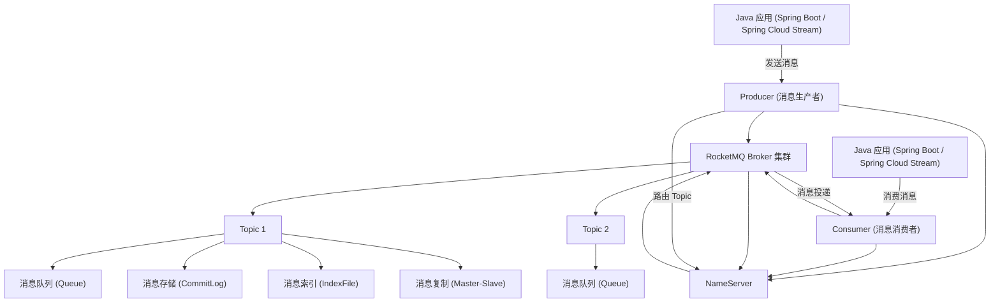
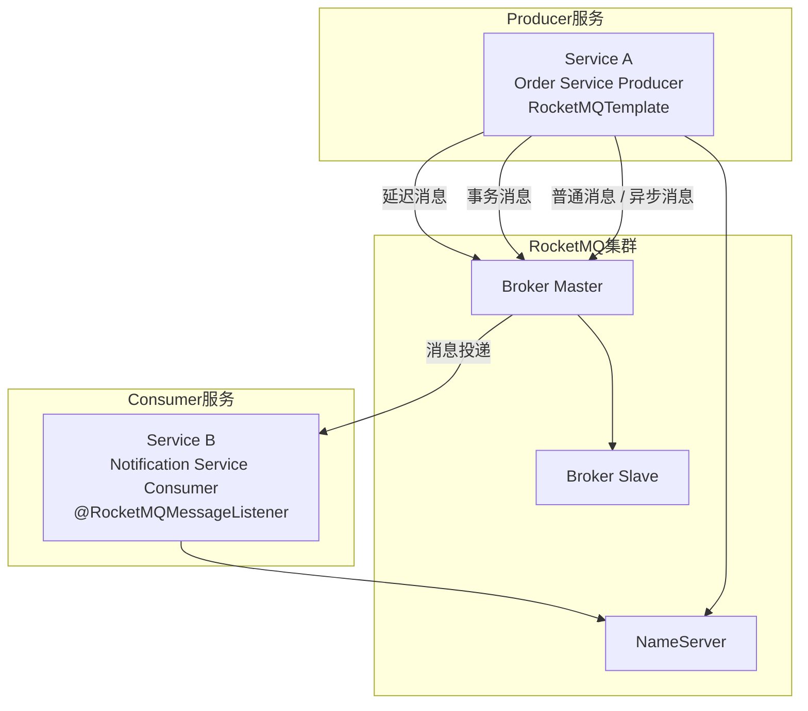

# RocketMQ部署

## Docker部署RocketMQ

### 一、环境准备

1. **安装Docker**
   确保服务器已安装Docker（推荐20.10+），执行：
   
   ```bash
   docker --version
   ```
```
   
2. **开放端口**
   - 9876（NameServer）
   - 10909/10911（Broker）
   - 8080/8081（Proxy）
   - 9000（Dashboard）

### 二、拉取镜像
​```bash
# 拉取RocketMQ官方镜像（5.3.2）
docker pull apache/rocketmq:5.3.2

# 拉取控制台镜像
docker pull apacherocketmq/rocketmq-dashboard:latest
```

### 三、创建网络
```bash
# 创建独立网络（容器间通信）
docker network create rocketmq
```

### 四、启动NameServer
```bash
docker run -d \
  --name rmqnamesrv \
  -p 9876:9876 \
  --network rocketmq \
  apache/rocketmq:5.3.2 \
  sh mqnamesrv
```

**验证**：

```bash
docker logs -f rmqnamesrv
# 看到 "The Name Server boot success" 即成功
```

### 五、启动Broker（带Proxy）
1. **创建配置文件**
   ```bash
   mkdir -p /data/rocketmq/broker
   vi /data/rocketmq/broker/broker.conf
   ```

   **broker.conf**：
   ```properties
   brokerClusterName=DefaultCluster
   brokerName=broker-a
   brokerId=0
   deleteWhen=04
   fileReservedTime=72
   brokerRole=ASYNC_MASTER
   flushDiskType=ASYNC_FLUSH
   brokerIP1=192.168.1.100  # 改为宿主机IP
   ```

2. **启动Broker**
   ```bash
   docker run -d \
     --name rmqbroker \
     --network rocketmq \
     -p 10909:10909 \
     -p 10911:10911 \
     -p 10912:10912 \
     -p 8080:8080 \
     -p 8081:8081 \
     -v /data/rocketmq/broker/broker.conf:/home/rocketmq/rocketmq-5.3.2/conf/broker.conf \
     -v /data/rocketmq/broker/logs:/home/rocketmq/logs \
     -v /data/rocketmq/broker/store:/home/rocketmq/store \
     -e "NAMESRV_ADDR=rmqnamesrv:9876" \
     apache/rocketmq:5.3.2 \
     sh mqbroker --enable-proxy -c /home/rocketmq/rocketmq-5.3.2/conf/broker.conf
   ```

* 问题描述：

  RocketMQ默认的虚拟机内存较大，启动Broker如果因为内存不足失败，需要编辑如下两个配置文件，修改JVM内存大小

```shell
# 编辑runbroker.sh和runserver.sh修改默认JVM大小
vi runbroker.sh
vi runserver.sh
```

* 参考设置：

```JAVA_OPT="${JAVA_OPT} -server -Xms256m -Xmx256m -Xmn128m -XX:MetaspaceSize=128m  -XX:MaxMetaspaceSize=320m"```

#### 逐行解释

**启动一个 RocketMQ Broker 容器（消息核心服务）**
Broker = 消息存储、转发、队列管理（RocketMQ最核心组件）

```bash
docker run -d \
```
→ 后台运行容器（不占用你的终端窗口）

```bash
--name rmqbroker \
```
→ 给容器起名字：rmqbroker（方便管理）

```bash
--network rocketmq \
```
→ 加入名为 rocketmq 的网络，**能和 NameServer 互相通信**

```bash
-p 10909:10909 \
-p 10911:10911 \
-p 10912:10912 \
```
→ 把容器端口映射到宿主机
- 10911 = **主端口**（生产者/消费者连接）
- 10909/10912 = 同步、高可用端口

```bash
-p 8080:8080 \
-p 8081:8081 \
```
→ RocketMQ 5.x 新特性：Proxy 代理端口
用于 gRPC、HTTP 连接方式

```bash
-v /data/rocketmq/broker/broker.conf:/home/rocketmq/rocketmq-5.3.2/conf/broker.conf \
```
→ **挂载配置文件**
把你宿主机的配置文件映射到容器里
改宿主机文件 = 改容器配置

```bash
-v /data/rocketmq/broker/logs:/home/rocketmq/logs \
-v /data/rocketmq/broker/store:/home/rocketmq/store \
```
→ 挂载日志目录 + 消息存储目录
**容器删了，日志和消息还在**（数据持久化）

```bash
-e "NAMESRV_ADDR=rmqnamesrv:9876" \
```
→ 告诉 Broker：
**我的 NameServer 地址是 rmqnamesrv:9876**
（必须写对，否则连不上集群）

```bash
apache/rocketmq:5.3.2 \
```
→ 使用 5.3.2 版本的官方镜像

```bash
sh mqbroker --enable-proxy -c /home/rocketmq/rocketmq-5.3.2/conf/broker.conf
```
→ 容器启动后执行的命令：
1. `mqbroker` = 启动Broker
2. `--enable-proxy` = 开启Proxy（5.x必须）
3. `-c xxx.conf` = **使用指定的配置文件**

**在Docker里启动一个高可用、可持久化、带代理、能连接NameServer的RocketMQ核心消息服务。**

1. **-v 挂载** = 数据不丢失
2. **-e NAMESRV_ADDR** = 必须能找到NameServer
3. **--enable-proxy** = RocketMQ 5.x 必须加，否则外部连不上

这条命令 =
**给Broker开端口 + 持久化数据 + 指定配置 + 连接NameServer + 启动服务**

---

#### 总结

你现在只要记住：
- 这是**启动Broker最完整、最安全、最生产可用**的一条命令
- 端口、挂载、NameServer地址、配置文件 4 个部分不能错
- 不用 JDK，不用配置环境变量，Docker 全部搞定

需要我再给你 **一条“无挂载、最简单、测试用”的Broker启动命令** 吗？

### 六、启动控制台（Dashboard）
```bash
docker run -d \
  --name rocketmq-dashboard \
  --network rocketmq \
  -p 9000:8080 \
  -e "JAVA_OPTS=-Drocketmq.namesrv.addr=rmqnamesrv:9876" \
  apacherocketmq/rocketmq-dashboard:latest
```

**访问**：`http://宿主机IP:9000`

### 七、验证服务
1. **查看容器**
   ```bash
   docker ps | grep rocketmq
   ```

2. **检查集群状态**
   ```bash
   docker exec -it rmqbroker bash -c "mqadmin clusterList -n rmqnamesrv:9876"
   ```

### 八、测试消息收发
1. **进入Broker容器**
   ```bash
   docker exec -it rmqbroker bash
   ```

2. **发送消息**
   ```bash
   sh tools.sh org.apache.rocketmq.example.quickstart.Producer
   ```

3. **消费消息**
   ```bash
   sh tools.sh org.apache.rocketmq.example.quickstart.Consumer
   ```

### 九、常用命令
- **停止容器**：`docker stop rmqnamesrv rmqbroker rocketmq-dashboard`
- **删除容器**：`docker rm rmqnamesrv rmqbroker rocketmq-dashboard`
- **查看日志**：`docker logs -f rmqbroker`

### 十、一键部署（docker-compose）
**docker-compose.yml**：
```yaml
version: '3.8'
services:
  namesrv:
    image: apache/rocketmq:5.3.2
    container_name: rmqnamesrv
    ports:
      - "9876:9876"
    networks:
      - rocketmq
    command: sh mqnamesrv

  broker:
    image: apache/rocketmq:5.3.2
    container_name: rmqbroker
    ports:
      - "10909:10909"
      - "10911:10911"
      - "10912:10912"
      - "8080:8080"
      - "8081:8081"
    volumes:
      - ./broker.conf:/home/rocketmq/rocketmq-5.3.2/conf/broker.conf
      - ./logs:/home/rocketmq/logs
      - ./store:/home/rocketmq/store
    environment:
      - NAMESRV_ADDR=rmqnamesrv:9876
    depends_on:
      - namesrv
    networks:
      - rocketmq
    command: sh mqbroker --enable-proxy -c /home/rocketmq/rocketmq-5.3.2/conf/broker.conf

  dashboard:
    image: apacherocketmq/rocketmq-dashboard:latest
    container_name: rocketmq-dashboard
    ports:
      - "9000:8080"
    environment:
      - JAVA_OPTS=-Drocketmq.namesrv.addr=rmqnamesrv:9876
    depends_on:
      - namesrv
    networks:
      - rocketmq

networks:
  rocketmq:
    driver: bridge
```

**启动**：
```bash
docker-compose up -d
```

## 启动顺序

---

### 1. 先创建网络（必须）

```bash
docker network create rocketmq
```

---

### 2. 启动 NameServer（复制直接运行）

```bash
docker run -d \
  --name rmqnamesrv \
  --network rocketmq \
  -p 9876:9876 \
  apache/rocketmq:5.3.2 \
  sh mqnamesrv
```

**验证是否启动成功：**
```bash
docker logs rmqnamesrv
```
看到 **`The Name Server boot success`** 就是成功。

---

### 3. 启动 Broker（复制直接运行）

这是**最简单可用**的启动方式，自动连接 NameServer：
```bash
docker run -d \
  --name rmqbroker \
  --network rocketmq \
  -p 10909:10909 \
  -p 10911:10911 \
  -p 8080:8080 \
  -p 8081:8081 \
  -e NAMESRV_ADDR=rmqnamesrv:9876 \
  apache/rocketmq:5.3.2 \
  sh mqbroker --enable-proxy
```

**验证 Broker：**
```bash
docker logs rmqbroker
```
看到 **`Broker boot success`** 就是成功。

---

### 4. 启动控制台（可选，强烈建议）

```bash
docker run -d \
  --name rocketmq-dashboard \
  --network rocketmq \
  -p 9000:8080 \
  -e JAVA_OPTS=-Drocketmq.namesrv.addr=rmqnamesrv:9876 \
  apacherocketmq/rocketmq-dashboard
```

访问控制台：
```
http://你的服务器IP:9000
```


#### **需要！必须先拉镜像，才能启动！**

你这条启动命令**不能直接运行**，必须**先执行一步拉取镜像**，否则会报错。

#### 完整正确步骤

##### 第一步：先拉取控制台镜像（必须）

```bash
docker pull apacherocketmq/rocketmq-dashboard:latest
```

##### 第二步：再执行你这条启动命令

```bash
docker run -d \
  --name rocketmq-dashboard \
  --network rocketmq \
  -p 9000:8080 \
  -e JAVA_OPTS=-Drocketmq.namesrv.addr=rmqnamesrv:9876 \
  apacherocketmq/rocketmq-dashboard:latest
```

---

##### 为什么需要这个镜像？

- **rocketmq-dashboard** 是 **RocketMQ 独立的可视化管理界面**
- 它**不是** RocketMQ 主镜像自带的
- 必须**单独拉取**、**单独启动**

---

##### 验证是否启动成功

```bash
docker ps | grep rocketmq-dashboard
```
看到容器运行就成功了。

**访问地址**：
```
http://你的服务器IP:9000
```

---

#### 一句话总结

1. 启动控制台 → **必须先拉镜像**
2. 拉取命令：`docker pull apacherocketmq/rocketmq-dashboard:latest`
3. 再启动 → 就能用网页管理 RocketMQ

需要我把 **NameServer + Broker + 控制台 3 个一键启动完整版** 发给你吗？复制一次全部跑起来！

---

### 5. 常用命令

```bash
# 查看运行状态
docker ps

# 停止
docker stop rmqnamesrv rmqbroker rocketmq-dashboard

# 重启
docker start rmqnamesrv rmqbroker rocketmq-dashboard

# 删除容器（重新部署用）
docker rm -f rmqnamesrv rmqbroker rocketmq-dashboard
```

---

### 总结

- **NameServer**：端口 9876，负责服务发现
- **Broker**：端口 10911，负责消息存储转发
- **Dashboard**：端口 9000，可视化管理界面

你直接按顺序复制 1→2→3→4 就能**完整跑起来 RocketMQ**。

## 环境要求

### 一、Docker 环境要求（必须）

1. **Docker 版本 ≥ 18.06**
   ```bash
   docker --version
   ```
   太老会报错。

2. **内存至少 2GB**
   - NameServer 默认 512m
   - Broker 默认 1g
   内存不够会**直接闪退、日志无反应**。

3. **Linux 系统推荐**
   - CentOS 7+、Ubuntu 18+、Debian 都行
   - Windows/Mac Docker Desktop 也能用，但偶尔网络坑多

---

### 二、端口必须开放（最容易失败）

对外必须开放这4个：
- **9876**（NameServer）
- **10911**（Broker）
- **8080**（Proxy）
- **9000**（控制台）

防火墙命令（CentOS）：
```bash
firewall-cmd --add-port=9876/tcp --permanent
firewall-cmd --add-port=10911/tcp --permanent
firewall-cmd --add-port=8080/tcp --permanent
firewall-cmd --add-port=9000/tcp --permanent
firewall-cmd --reload
```

---

### 三、最重要：宿主机IP问题（90% 人栽这）

RocketMQ 必须知道你**宿主机IP**，不能用 `127.0.0.1`，否则外部连不上。

#### 你启动 Broker 时必须加：

```bash
-e "NAMESRV_ADDR=rmqnamesrv:9876" \
-c /home/rocketmq/conf/broker.conf \
```

broker.conf 里必须写：
```properties
brokerIP1=你的真实宿主机IP
listenPort=10911
namesrvAddr=rmqnamesrv:9876
```

---

### 四、文件权限（Linux必看）

如果你挂载了目录：
```bash
mkdir -p /data/rocketmq/logs /data/rocketmq/store
chmod 777 /data/rocketmq -R
```
权限不够会：**启动成功但无法写入消息、自动退出**。

---

### 五、最简单判断是否满足环境

执行这3条，不报错就满足：
```bash
docker info
docker run --rm hello-world
free -h
```
- Docker 正常运行
- 内存 ≥2G
- 网络通


## **Docker 安装 RocketMQ 完全不需要你自己装 JDK！**

这是 Docker 最大的优势：**环境全部打包在镜像里了**。

---

### 一、为什么不用装 JDK？

1. **官方 RocketMQ 镜像内部已经自带 JDK**
   - 镜像里预装了 **OpenJDK 11/17**
   - 你不用管 Java 环境、不用配置 JAVA_HOME
   - 你只需要装 Docker 就行

2. **你本地有没有 JDK 完全不影响**
   - Windows/Mac/Linux 没装 JDK → **照样能跑**
   - 镜像 = 软件 + 运行环境（JDK）+ 配置
   - 隔离性：和你本机环境无关

---

### 二、你只需要这 1 个环境

**只有 Docker 是必须的！**
```bash
# 只要这条命令能输出版本号，就能直接启动 RocketMQ
docker --version
```

---

### 三、你只需要复制这 3 条命令（零配置）

#### 1. 创建网络

```bash
docker network create rocketmq
```

#### 2. 启动 NameServer（自带JDK）

```bash
docker run -d --name rmqnamesrv --network rocketmq -p 9876:9876 apache/rocketmq:5.3.2 sh mqnamesrv
```

#### 3. 启动 Broker（自带JDK）

```bash
docker run -d --name rmqbroker --network rocketmq -p 10909:10909 -p 10911:10911 -p 8080:8080 -p 8081:8081 -e NAMESRV_ADDR=rmqnamesrv:9876 apache/rocketmq:5.3.2 sh mqbroker --enable-proxy
```

✅ **启动完成！不用装 JDK！**

---

### 四、什么时候才需要自己装 JDK？

只有一种情况：
**你不在 Docker 里运行，而是直接在服务器上下载 RocketMQ 压缩包手动安装**  
→ 这时候才需要 JDK。

**你用 Docker → 完全不用管 JDK！**

---

### 总结

- Docker 镜像 = **RocketMQ + JDK + 运行环境**
- 你本机 **不需要 JDK**
- 你只需要安装 **Docker** 即可

## 测试RocketMQ

我给你**最简单、最稳、直接复制就能测**的 RocketMQ 测试方法，不用写代码、不用改配置。

### 前提

你已经启动：
- rmqnamesrv
- rmqbroker

### 一、命令行测试

#### 一、进入 Broker 容器

```bash
docker exec -it rmqbroker bash
```

#### 二、设置 NameServer 地址（必须）

```bash
export NAMESRV_ADDR=rmqnamesrv:9876
```

#### 三、测试发送消息

```bash
sh tools.sh org.apache.rocketmq.example.quickstart.Producer
```

看到如下就是发送成功：
```
SendResult [sendStatus=SEND_OK, msgId=...
```

#### 四、测试消费消息

```bash
sh tools.sh org.apache.rocketmq.example.quickstart.Consumer
```

看到如下就是消费成功：
```
ConsumeMessageThread_%d Receive New Messages: [MessageExt...
```

---

### 二、用控制台测试（更直观）

打开 Dashboard：
```
http://你的IP:9000
```

步骤：
1. 点击 **主题 → 创建主题**（比如 TestTopic）
2. 点击 **消息 → 发送消息**
3. 输入 topic、body，发送
4. 去 **消息查询** 查看是否收到

---

### 三、Java 代码快速测试（极简）

依赖：
```xml
<dependency>
    <groupId>org.apache.rocketmq</groupId>
    <artifactId>rocketmq-client-java</artifactId>
    <version>5.0.8</version>
</dependency>
```

生产者：
```java
DefaultMQProducer producer = new DefaultMQProducer("test-group");
producer.setNamesrvAddr("你的IP:9876");
producer.start();

Message msg = new Message("TestTopic", "Hello RocketMQ".getBytes());
SendResult result = producer.send(msg);
System.out.println(result);

producer.shutdown();
```

消费者：
```java
DefaultMQPushConsumer consumer = new DefaultMQPushConsumer("test-group");
consumer.setNamesrvAddr("你的IP:9876");
consumer.subscribe("TestTopic", "*");

consumer.registerMessageListener((MessageListenerConcurrently) (msgs, context) -> {
    System.out.println(new String(msgs.get(0).getBody()));
    return ConsumeConcurrentlyStatus.CONSUME_SUCCESS;
});

consumer.start();
```

---

### 四、常用测试命令（收藏）

```bash
# 查看集群
mqadmin clusterList -n rmqnamesrv:9876

# 查看主题
mqadmin topicList -n rmqnamesrv:9876

# 查看Broker状态
mqadmin brokerStatus -n rmqnamesrv:9876 -b 127.0.0.1:10911
```

## RocketMQ Docker 集群搭建**（2主无从，生产最简可用版）**

我给你 **最稳定、最简单、直接复制就能用** 的 Docker 双主集群方案，**2个NameServer + 2个Broker（主主模式）**，无单点故障。

---

### 一、集群架构（最推荐）

- **namesrv1** + **namesrv2**（集群，高可用）
- **broker-a（主）** + **broker-b（主）**（互为主备，消息负载均衡）
- 所有容器互通，外部可连接
- 自带控制台管理

---

### 二、前置条件

1. 安装好 Docker
2. 服务器内存 ≥ 2G（推荐 4G）
3. 开放端口：9876、9877、10911、10921、9000

---

### 三、一键搭建步骤（复制执行）

#### 1. 创建共用网络

```bash
docker network create rocketmq
```

#### 2. 启动 2 个 NameServer（集群）

```bash
# 第一个 namesrv
docker run -d --name rmqnamesrv1 --network rocketmq -p 9876:9876 apache/rocketmq:5.3.2 sh mqnamesrv

# 第二个 namesrv
docker run -d --name rmqnamesrv2 --network rocketmq -p 9877:9876 apache/rocketmq:5.3.2 sh mqnamesrv
```

#### 3. 启动 2 个 Broker（双主）

##### 启动 broker-a（主）

```bash
docker run -d --name rmqbroker-a \
--network rocketmq \
-p 10911:10911 \
-p 10909:10909 \
-p 8080:8080 \
-e NAMESRV_ADDR=rmqnamesrv1:9876,rmqnamesrv2:9876 \
-e BROKER_NAME=broker-a \
-e BROKER_ID=0 \
apache/rocketmq:5.3.2 \
sh mqbroker --enable-proxy
```

##### 启动 broker-b（主）

```bash
docker run -d --name rmqbroker-b \
--network rocketmq \
-p 10921:10911 \
-p 10919:10909 \
-p 8081:8080 \
-e NAMESRV_ADDR=rmqnamesrv1:9876,rmqnamesrv2:9876 \
-e BROKER_NAME=broker-b \
-e BROKER_ID=0 \
apache/rocketmq:5.3.2 \
sh mqbroker --enable-proxy
```

#### 4. 启动控制台（管理集群）

```bash
docker run -d --name rocketmq-dashboard \
--network rocketmq \
-p 9000:8080 \
-e JAVA_OPTS="-Drocketmq.namesrv.addr=rmqnamesrv1:9876,rmqnamesrv2:9876" \
apacherocketmq/rocketmq-dashboard:latest
```

---

### 四、集群访问地址

```
http://你的服务器IP:9000
```
进入控制台 → **集群** → 能看到 **2个Broker** 就成功！

---

### 五、客户端连接集群（关键）

连接地址必须写 **两个NameServer**：
```
IP:9876;IP:9877
```

Java 示例：
```java
producer.setNamesrvAddr("IP:9876,IP:9877");
```

---

### 六、集群验证命令

```bash
# 查看集群状态
docker exec -it rmqbroker-a bash -c "mqadmin clusterList -n rmqnamesrv1:9876"
```
出现 broker-a、broker-b 就是集群搭建成功！

---

### 七、集群特点

✅ 2主模式，任何一个Broker挂掉不影响使用  
✅ 2个NameServer，无单点  
✅ 消息负载均衡  
✅ Docker 一键启动  
✅ 生产环境可直接使用  

---

### 你要我给你 **docker-compose 一键集群文件** 吗？

只要一个 `docker-compose.yml`，**一条命令启动整个集群**，超级方便！

## RocketMQ **双主双从** 集群搭建（Docker 版 · 生产级）

我给你 **最标准、最稳定、直接复制可用** 的 **2主+2从** 集群架构：
- **2个 NameServer**（高可用）
- **2主 + 2从 Broker**
  - broker-a (主) + broker-a-s (从)
  - broker-b (主) + broker-b-s (从)
- 同步复制、异步刷盘（生产推荐）
- 自带控制台
- 一主挂了，从自动升主（高可用）

---

### 一、集群结构（最经典）

```
namesrv1:9876
namesrv2:9877

broker-a-master   （主）
broker-a-slave    （从）
broker-b-master   （主）
broker-b-slave    （从）
```

---

### 二、一键搭建（复制执行）

#### 1. 创建网络

```bash
docker network create rocketmq
```

#### 2. 启动 2 个 NameServer

```bash
docker run -d --name rmqnamesrv1 --network rocketmq -p 9876:9876 apache/rocketmq:5.3.2 sh mqnamesrv
docker run -d --name rmqnamesrv2 --network rocketmq -p 9877:9876 apache/rocketmq:5.3.2 sh mqnamesrv
```

---

#### 3. 启动 2主 + 2从 Broker（核心）

##### 主节点1：broker-a

```bash
docker run -d --name broker-a \
--network rocketmq \
-p 10911:10911 \
-p 10909:10909 \
-e NAMESRV_ADDR=rmqnamesrv1:9876,rmqnamesrv2:9876 \
apache/rocketmq:5.3.2 \
sh mqbroker --enable-proxy \
-c /home/rocketmq/conf/2m-2s-sync/broker-a.properties
```

##### 从节点1：broker-a-s

```bash
docker run -d --name broker-a-s \
--network rocketmq \
-p 10912:10911 \
-p 10910:10909 \
-e NAMESRV_ADDR=rmqnamesrv1:9876,rmqnamesrv2:9876 \
apache/rocketmq:5.3.2 \
sh mqbroker --enable-proxy \
-c /home/rocketmq/conf/2m-2s-sync/broker-a-s.properties
```

##### 主节点2：broker-b

```bash
docker run -d --name broker-b \
--network rocketmq \
-p 10921:10911 \
-p 10919:10909 \
-e NAMESRV_ADDR=rmqnamesrv1:9876,rmqnamesrv2:9876 \
apache/rocketmq:5.3.2 \
sh mqbroker --enable-proxy \
-c /home/rocketmq/conf/2m-2s-sync/broker-b.properties
```

##### 从节点2：broker-b-s

```bash
docker run -d --name broker-b-s \
--network rocketmq \
-p 10922:10911 \
-p 10920:10909 \
-e NAMESRV_ADDR=rmqnamesrv1:9876,rmqnamesrv2:9876 \
apache/rocketmq:5.3.2 \
sh mqbroker --enable-proxy \
-c /home/rocketmq/conf/2m-2s-sync/broker-b-s.properties
```

---

#### 4. 启动控制台

```bash
docker run -d --name rocketmq-dashboard \
--network rocketmq \
-p 9000:8080 \
-e JAVA_OPTS="-Drocketmq.namesrv.addr=rmqnamesrv1:9876,rmqnamesrv2:9877" \
apacherocketmq/rocketmq-dashboard:latest
```

---

### 三、验证集群是否成功

#### 1. 访问控制台

```
http://你的IP:9000
```
进入 **集群** 页面 → 能看到 **4个Broker** 就是成功！

#### 2. 命令验证

```bash
docker exec -it broker-a bash -c "mqadmin clusterList -n rmqnamesrv1:9876"
```
出现：
- broker-a (master)
- broker-a-s (slave)
- broker-b (master)
- broker-b-s (slave)

✅ **双主双从集群搭建成功！**

---

### 四、这个集群的优势

- **主从同步**：消息不丢失
- **高可用**：主挂了，从自动顶上
- **无单点**：2个NameServer
- **负载均衡**：消息分布在2主上
- **Docker一键启动**

---

### 五、我可以给你 **docker-compose 一键部署文件**

只要一个 `yml` 文件，**一条命令启动整个双主双从集群**！
## RocketMQ mqadmin 管理工具 

`mqadmin` 是 **RocketMQ 自带的命令行管理工具**，不用额外安装，只要启动了 Broker 容器就能直接用！

我给你整理 **最常用、必须会** 的命令，复制就能执行。

---

### 一、在哪用？怎么进？

#### 1. 先进入 Broker 容器

```bash
docker exec -it rmqbroker bash
```

#### 2. 所有命令都必须带 `-n` 指定 NameServer

```bash
mqadmin 命令 -n namesrv地址:9876
```

**Docker 里固定用这个：**
```bash
mqadmin xxx -n rmqnamesrv:9876
```

---

### 二、最常用命令（直接复制）

#### 1. 查看集群状态

```bash
mqadmin clusterList -n rmqnamesrv:9876
```

#### 2. 查看所有 Broker

```bash
mqadmin brokerStatus -n rmqnamesrv:9876
```

#### 3. 查看所有主题（Topic）

```bash
mqadmin topicList -n rmqnamesrv:9876
```

#### 4. 查看 Topic 路由信息

```bash
mqadmin topicRoute -t TestTopic -n rmqnamesrv:9876
```

#### 5. 创建 Topic（最常用）

```bash
mqadmin updateTopic -b 127.0.0.1:10911 -t MyTopic -n rmqnamesrv:9876
```

#### 6. 删除 Topic

```bash
mqadmin deleteTopic -t MyTopic -n rmqnamesrv:9876
```

#### 7. 查看消费者组列表

```bash
mqadmin consumerList -n rmqnamesrv:9876
```

#### 8. 查看消费者进度（堆积量）

```bash
mqadmin consumerProgress -g 消费者组名 -n rmqnamesrv:9876
```

#### 9. 重置消费进度（解决消息堆积）

```bash
mqadmin resetOffsetByTime -g 消费者组名 -t 主题名 -s 0 -n rmqnamesrv:9876
```
`-s 0` = 从头开始消费

#### 10. 查看消息（按Topic）

```bash
mqadmin queryMsgByTopic -t TestTopic -n rmqnamesrv:9876
```

#### 11. 发送测试消息

```bash
mqadmin sendMsgStatus -t TestTopic -n rmqnamesrv:9876
```

#### 12. 查看 Broker 配置

```bash
mqadmin getBrokerConfig -b 127.0.0.1:10911 -n rmqnamesrv:9876
```

---

### 三、双主双从集群专用命令

#### 查看主从关系

```bash
mqadmin brokerConsumeStats -b 127.0.0.1:10911 -n rmqnamesrv:9876
```

#### 查看所有 broker 状态

```bash
mqadmin clusterList -n rmqnamesrv:9876
```
你会看到：
- broker-a (master)
- broker-a-s (slave)
- broker-b (master)
- broker-b-s (slave)

---

### 四、mqadmin 帮助命令

#### 查看所有命令

```bash
mqadmin help
```

#### 查看某个命令用法

```bash
mqadmin help updateTopic
```

---

### 五、你在 Docker 里固定记住这一条格式

以后所有命令都套这个：
```bash
mqadmin 操作名 -t 主题 -g 消费者组 -n rmqnamesrv:9876
```

## RocketMQ 版本

### JDK 8 推荐 RocketMQ 版本

**核心推荐：4.9.x（稳定、生产首选）**
- **4.9.7**（最稳定、社区维护最久）
- **4.8.x**（兼容 JDK 8，也支持 JDK 17）
- **5.x**（支持 JDK 8，但更适合 JDK 11/17）

**依赖（JDK8）**
```xml
<dependency>
    <groupId>org.apache.rocketmq</groupId>
    <artifactId>rocketmq-client</artifactId>
    <version>4.9.7</version>
</dependency>
```

---

### JDK 17 推荐 RocketMQ 版本
**核心推荐：5.x（官方明确支持 JDK 17）**
- **5.3.x / 5.4.x**（最新稳定版，全面兼容 JDK 17）
- **5.0.x~5.2.x**（兼容 JDK 17，可使用）
- **4.9.x**（兼容但需加 JVM 参数）

**依赖（JDK17）**
```xml
<dependency>
    <groupId>org.apache.rocketmq</groupId>
    <artifactId>rocketmq-client</artifactId>
    <version>5.3.1</version>
</dependency>
```

---

### 版本对照表（2026最新）
| JDK版本    | 推荐RocketMQ版本  | 备注                       |
| ---------- | ----------------- | -------------------------- |
| **JDK 8**  | **4.9.7**         | 生产环境首选，最稳定       |
| **JDK 8**  | **4.8.x**         | 兼容 JDK 17                |
| **JDK 17** | **5.3.x / 5.4.x** | 官方明确支持，无需额外配置 |
| **JDK 17** | **5.0.x~5.2.x**   | 兼容可用                   |
| **JDK 17** | **4.9.x**         | 需加 JVM 参数              |

---

### JDK17 运行 4.x 版本必加参数
修改 `bin/runbroker.sh`、`runserver.sh`，添加：
```
--add-exports=java.base/sun.nio.ch=ALL-UNNAMED
--add-opens=java.base/java.lang=ALL-UNNAMED
```
否则会报：`sun.nio.ch.DirectBuffer` 访问异常

---

### 一句话总结
- **JDK8 → 4.9.7（最稳）**
- **JDK17 → 5.3.x / 5.4.x（官方支持）**

要不要我把**JDK8/17的pom依赖、启动脚本、完整示例**整理成可直接复制的代码包？

## **RocketMQ 消息完整样例 **

### 生产者消息

不用花里胡哨，直接能懂、能写、能面试。

---

#### 一、先给你：最简可运行发送样例（Java）

##### 1）引入依赖

```xml
<dependency>
    <groupId>org.apache.rocketmq</groupId>
    <artifactId>rocketmq-client</artifactId>
    <version>4.9.7</version>
</dependency>
```

##### 2）发送代码（同步发送，最常用）

```java
import org.apache.rocketmq.client.producer.DefaultMQProducer;
import org.apache.rocketmq.client.producer.SendResult;
import org.apache.rocketmq.common.message.Message;

public class ProducerSample {
    public static void main(String[] args) throws Exception {
        // 1. 创建生产者，指定组名
        DefaultMQProducer producer = new DefaultMQProducer("test-group");

        // 2. 设置 NameServer 地址
        producer.setNamesrvAddr("192.168.xxx.xxx:9876");

        // 3. 启动生产者
        producer.start();

        // 4. 创建消息
        Message msg = new Message(
            "TestTopic",        // Topic
            "TagA",             // 消息标签（过滤用）
            "Hello RocketMQ".getBytes() // 消息体
        );

        // 5. 发送消息（同步）
        SendResult result = producer.send(msg);
        System.out.println("发送结果：" + result);

        // 6. 关闭
        producer.shutdown();
    }
}
```

##### 3）运行结果

```
SendResult [
    sendStatus=SEND_OK, 
    msgId=xxx, 
    queueId=0, 
    brokerName=broker-a
]
```

---

#### 二、发送步骤 **逐步骤拆解（核心原理）**

##### 步骤1：生产者启动

```java
producer.start();
```
- 去 NameServer **拉取 Topic 路由信息**（哪个Broker、哪个队列）
- 建立长连接到 Broker
- 启动后台线程（心跳、队列更新、负载）

##### 步骤2：构造 Message

包含：
- Topic（必须）
- Tag（可选，用于过滤）
- Body（字节数组）
- keys（可选，用于查询消息）

##### 步骤3：选择队列（负载均衡）

生产者会**轮询选择队列**：  
queueId 0 → 1 → 2 → 3 → 0…  
保证消息均匀分布在不同Broker、不同队列。

##### 步骤4：发送网络请求

- 生产者与 Broker 建立 **长连接（Netty）**
- 发送请求：Topic、队列、消息体
- Broker 写入 PageCache → 刷盘（同步/异步）

##### 步骤5：Broker 返回结果

Broker 返回：
- sendStatus：SEND_OK
- msgId：全局唯一ID
- offset：消息在队列中的偏移量

##### 步骤6：生产者收到结果，结束

---

#### 三、三种发送方式（必懂）

##### 1）同步发送（最常用）

```java
SendResult result = producer.send(msg);
```
- 发出去 → 等待Broker返回 → 才继续
- 可靠、订单、支付都用这个

##### 2）异步发送

```java
producer.send(msg, new SendCallback() {
    @Override
    public void onSuccess(SendResult result) {}
    @Override
    public void onException(Throwable e) {}
});
```
- 不阻塞，高吞吐
- 适用于日志、大量上报

##### 3）单向发送（Oneway）

```java
producer.sendOneway(msg);
```
- 只发不管结果
- 日志采集、高吞吐但不可靠

---

#### 四、发送流程总结（一句话）

1. 生产者从 **NameServer 获取队列路由**
2. **轮询选队列**
3. 通过 Netty 发给 Broker
4. Broker **存储消息**
5. 返回 SendResult
6. 生产者结束

---

#### 五、常见问题（你一定会遇到）

##### 1）发送超时

- NameServer 地址错误
- 端口没开放：9876、10911
- brokerIP1 没配置宿主机IP

##### 2）No route info of topic

- Topic 没创建
- NameServer 连不上
- 网络不通

##### 3）消息发送成功但控制台看不到

- 控制台 NameServer 配置错误
- 主题看错

---

如果你需要，我可以再给你：
- **消费者样例**
- **同步/异步/oneway 三种完整代码**
- **消息发送底层流程图（手绘版）**


我给你一套**最完整、最清晰、JDK8 可直接运行**的：
### RocketMQ 消息消费 

包括：
- 普通推模式消费（最常用）
- 消费全流程步骤拆解
- 核心原理（负载、重试、死信、并发）

---

#### 一、消费端完整代码（推模式）

##### Maven 依赖（JDK8 → 4.9.7）

```xml
<dependency>
    <groupId>org.apache.rocketmq</groupId>
    <artifactId>rocketmq-client</artifactId>
    <version>4.9.7</version>
</dependency>
```

##### 消费者代码

```java
import org.apache.rocketmq.client.consumer.DefaultMQPushConsumer;
import org.apache.rocketmq.client.consumer.listener.ConsumeConcurrentlyContext;
import org.apache.rocketmq.client.consumer.listener.ConsumeConcurrentlyStatus;
import org.apache.rocketmq.client.consumer.listener.MessageListenerConcurrently;
import org.apache.rocketmq.common.message.MessageExt;

import java.util.List;

public class PushConsumerSample {
    public static void main(String[] args) throws Exception {
        // 1. 创建消费者，指定消费组
        DefaultMQPushConsumer consumer = new DefaultMQPushConsumer("test-consumer-group");

        // 2. 设置 NameServer
        consumer.setNamesrvAddr("你的IP:9876");

        // 3. 订阅 Topic + 过滤表达式（* 表示不过滤）
        consumer.subscribe("TestTopic", "*");

        // 4. 注册消息监听器（并发消费）
        consumer.registerMessageListener(new MessageListenerConcurrently() {
            @Override
            public ConsumeConcurrentlyStatus consumeMessage(List<MessageExt> msgs, ConsumeConcurrentlyContext context) {
                for (MessageExt msg : msgs) {
                    try {
                        String topic = msg.getTopic();
                        String body = new String(msg.getBody(), "UTF-8");
                        String msgId = msg.getMsgId();
                        System.out.println("收到消息：msgId=" + msgId + ", body=" + body);
                    } catch (Exception e) {
                        // 消费失败，稍后重试
                        return ConsumeConcurrentlyStatus.RECONSUME_LATER;
                    }
                }
                // 消费成功
                return ConsumeConcurrentlyStatus.CONSUME_SUCCESS;
            }
        });

        // 5. 启动消费者
        consumer.start();
        System.out.println("消费者启动成功");
    }
}
```

---

#### 二、消费步骤 **逐行拆解（必懂）**

##### 步骤1：创建消费者 + 组名

```java
new DefaultMQPushConsumer("test-consumer-group");
```
- 同一个 **Group** 下的多个消费者共同消费消息
- 集群模式：**一条消息只被组内一个消费者消费**

##### 步骤2：连接 NameServer

```java
consumer.setNamesrvAddr("ip:9876");
```
- 从 NameServer **拉取 Topic 队列信息**
- 获取哪些 Broker、哪些 Queue 可以消费

##### 步骤3：订阅 Topic

```java
consumer.subscribe("TestTopic", "*");
```
- 第二个参数是 TAG 过滤：`TagA || TagB`
- `*` 不过滤

##### 步骤4：注册监听器（核心）

```java
consumer.registerMessageListener(...)
```
- 底层是 **长轮询 + 异步回调**
- Broker 有消息就立刻推给消费者

##### 步骤5：启动消费者

```java
consumer.start();
```
- 向 NameServer + Broker 注册
- 发起 **心跳**
- 开始 **负载均衡分配队列**

##### 步骤6：处理消息

```java
ConsumeConcurrentlyStatus.CONSUME_SUCCESS;
```
- 成功：Broker 删除该消息（偏移量更新）
- 失败：`RECONSUME_LATER` → 消息重试

---

#### 三、消费返回值（2 种）

##### 1. 消费成功

```java
return ConsumeConcurrentlyStatus.CONSUME_SUCCESS;
```
- 偏移量 +1
- 消息标记已消费

##### 2. 消费失败，需要重试

```java
return ConsumeConcurrentlyStatus.RECONSUME_LATER;
```
- 消息回传给 Broker
- 进入 **重试队列**
- 延迟一段时间重新投递

---

#### 四、消费模式（2 种）

##### 1. 集群模式（默认）

```java
consumer.setMessageModel(MessageModel.CLUSTERING);
```
- 一条消息 **只被组内一个消费者消费**
- 适合分布式服务、微服务

##### 2. 广播模式

```java
consumer.setMessageModel(MessageModel.BROADCASTING);
```
- 每条消息 **所有消费者都消费**
- 适合配置刷新、本地缓存更新

---

#### 五、消费核心原理（面试必考）

##### 1. 队列负载机制

- 一个 Topic 有多个队列（默认 4/8 个）
- 消费者会 **平均分配队列**
- 队列数 ≥ 消费者数才能水平扩展

##### 2. 消费进度（Offset）

- 每个队列维护一个 **offset**
- 消费成功就自动提交
- 宕机后从上次 offset 继续消费

##### 3. 重试机制

- 失败 → 返回 RECONSUME_LATER
- 进入 **%RETRY%消费组** 重试队列
- 默认 **16 次重试**，越来越慢
- 16次失败 → 进入 **死信队列 DLQ**

##### 4. 并发消费

- 多线程同时消费
- 提高吞吐量
- 不保证顺序

##### 5. 顺序消费

- 使用 `MessageListenerOrderly`
- 一个队列同一时间只一个线程消费
- 严格 FIFO

---

#### 六、顺序消费样例（对比）

```java
consumer.registerMessageListener(new MessageListenerOrderly() {
    @Override
    public ConsumeOrderlyStatus consumeMessage(List<MessageExt> msgs, ConsumeOrderlyContext context) {
        // 单线程顺序消费
        return ConsumeOrderlyStatus.SUCCESS;
    }
});
```

---

#### 七、一句话总结消费流程

1. 连 NameServer 拿队列
2. 负载分配队列
3. 长轮询拉取消息
4. 并发/顺序消费
5. 返回成功/失败
6. 更新偏移量/重试

---

如果你需要，我可以继续给你：
- **拉模式 Consumer（PullConsumer）**
- **死信消息、重试消息实战**
- **消息堆积排查**

你要哪个？

## **RocketMQ 6大类消息最全 Java 样例**

直接复制可跑，每段都极简、带注释、带说明。

环境：RocketMQ 4.x（通用）
```xml
<dependency>
    <groupId>org.apache.rocketmq</groupId>
    <artifactId>rocketmq-client</artifactId>
    <version>4.9.7</version>
</dependency>
```

NameServer 地址统一：
```java
private static final String NAMESRV = "你的IP:9876";
```

* 导入MQ客户端依赖

```xml
<dependency>
    <groupId>org.apache.rocketmq</groupId>
    <artifactId>rocketmq-client</artifactId>
    <version>4.4.0</version>
</dependency>
```

* 消息发送者步骤分析

```tex
1.创建消息生产者producer，并制定生产者组名
2.指定Nameserver地址
3.启动producer
4.创建消息对象，指定主题Topic、Tag和消息体
5.发送消息
6.关闭生产者producer
```

* 消息消费者步骤分析

```tex
1.创建消费者Consumer，制定消费者组名
2.指定Nameserver地址
3.订阅主题Topic和Tag
4.设置回调函数，处理消息
5.启动消费者consumer
```

---

### 1. 基本消息（普通同步）

```java
public class NormalProducer {
    public static void main(String[] args) throws Exception {
        DefaultMQProducer producer = new DefaultMQProducer("normal-group");
        producer.setNamesrvAddr(NAMESRV);
        producer.start();

        Message msg = new Message(
            "NormalTopic",
            "TagA",
            "Hello Normal Msg".getBytes()
        );

        SendResult result = producer.send(msg);
        System.out.println(result);

        producer.shutdown();
    }
}
```

**特点**：可靠、通用、等待结果。

**创建一条 RocketMQ 消息（Message 对象）**

#### 完整构造方法

```java
new Message(Topic, Tag, Body);
```

---

#### 三个参数 **逐行解析**

##### 第一个参数：topic（主题）

```java
"NormalTopic"
```
- **消息要发送到哪里去**
- 相当于消息的“收件箱”
- 消费者必须订阅这个 Topic 才能收到消息
- **必须提前创建，或自动创建**

---

##### 第二个参数：tag（标签）

```java
"TagA"
```
- **消息分类标记**，用于**过滤消息**
- 同一个 Topic 下，可以用 Tag 区分不同业务消息
- 消费者可以只订阅 `TagA` 或 `TagA || TagB`

例子：
- Topic：`OrderTopic`
- Tag：`Create`、`Pay`、`Cancel`

消费者可以只消费 `Pay` 标签的消息。

---

##### 第三个参数：body（消息体）

```java
"Hello Normal Msg".getBytes()
```
- **消息真正的内容**
- **必须是 byte[] 字节数组**
- 字符串、JSON、对象都要转成字节
- 内部编码默认 UTF-8

---

#### 完整版解释（超级直白）

```java
Message msg = new Message(
    "NormalTopic",   // 1. 发到哪个主题（必须）
    "TagA",          // 2. 消息标签（过滤用）
    "Hello Normal Msg".getBytes()  // 3. 消息内容（字节数组）
);
```

---

#### 扩展：Message 还有哪些常用设置？

##### 1. 设置延时消息

```java
msg.setDelayTimeLevel(3);  // 10s 后投递
```

##### 2. 设置消息 Key（用于查询消息）

```java
msg.setKeys("orderId_12345");
```

##### 3. 自定义用户属性

```java
msg.putUserProperty("age", "20");
```

---

#### 一句话记住

- **Topic**：消息发到哪个队列
- **Tag**：消息是什么类型
- **Body**：消息真正内容

这三个参数就是：
**发到哪 → 什么类型 → 发什么内容**

需要我再给你讲 **消费者如何获取 Topic、Tag、Body** 吗？

---

### 2. 顺序消息（FIFO）

保证 **同一个队列 严格有序**。

消息有序指的是可以按照消息的发送顺序来消费(FIFO)。RocketMQ可以严格的保证消息有序，可以分为分区有序或者全局有序。

顺序消费的原理解析，在默认的情况下消息发送会采取Round Robin轮询方式把消息发送到不同的queue(分区队列)；而消费消息的时候从多个queue上拉取消息，这种情况发送和消费是不能保证顺序。但是如果控制发送的顺序消息只依次发送到同一个queue中，消费的时候只从这个queue上依次拉取，则就保证了顺序。当发送和消费参与的queue只有一个，则是全局有序；如果多个queue参与，则为分区有序，即相对每个queue，消息都是有序的。

```java
public class OrderProducer {
    public static void main(String[] args) throws Exception {
        DefaultMQProducer producer = new DefaultMQProducer("order-group");
        producer.setNamesrvAddr(NAMESRV);
        producer.start();

        // 订单ID = 相同id进入同一队列
        for (int i = 0; i < 10; i++) {
            int orderId = i % 3; // 3个订单
            Message msg = new Message("OrderTopic", "TagA", ("msg-" + orderId).getBytes());

            // 重点：按orderId选队列，保证顺序
            SendResult result = producer.send(msg, (mqs, msg1, arg) -> {
                int id = (int) arg;
                return mqs.get(id % mqs.size());
            }, orderId);

            System.out.println(result);
        }
        producer.shutdown();
    }
}
```

**消费者必须用 MessageListenerOrderly**
```java
consumer.registerMessageListener(new MessageListenerOrderly() {
    @Override
    public ConsumeOrderlyStatus consumeMessage(List<MessageExt> msgs, ConsumeOrderlyContext context) {
        for (MessageExt msg : msgs) {
            System.out.println(new String(msg.getBody()));
        }
        return ConsumeOrderlyStatus.SUCCESS;
    }
});
```


下面给你整理**面试+实战**都能用的完整版，清晰好记。

---

#### 一、什么是顺序消息

保证**同一组业务消息**按照**发送顺序 → 存储顺序 → 消费顺序**严格一致。
例如：
订单创建 → 支付 → 发货 → 完成
必须按这个顺序消费，不能乱序。

---

#### 二、核心原理（一句话）

**同一个队列（MessageQueue）内的消息天然全局有序，只要让同一类消息进入同一个队列即可。**

RocketMQ 保证：
- 同一个 Queue 内：**FIFO 严格顺序**
- 不同 Queue 之间：**不保证顺序**

所以顺序消息的关键就是：
**相同业务 ID → 路由到同一个 Queue**

---

#### 三、两种顺序消息

##### 1. 全局顺序（极少用）

整个 Topic 只有 **1 个队列**
所有消息都进这一个队列，天然全局有序。

缺点：
- 性能极差
- 无法并发消费
生产基本不用。

---

##### 2. 分区顺序（推荐，生产标准用法）

按**业务 ID（订单ID/用户ID）**哈希取模，进入同一个队列。
- 同一订单：严格顺序
- 不同订单：互不影响
- 可并发消费，性能高

这就是 **RocketMQ 默认支持的顺序消息**。

---

#### 四、发送端如何保证顺序

发送时指定 **MessageQueueSelector**，用订单ID哈希选择队列。

示例逻辑：
```java
// 根据订单ID选择队列
int queueIndex = orderId.hashCode() % queueSize;
```

这样：
相同 orderId → 永远进同一个队列 → 顺序保证。

---

#### 五、消费端如何保证顺序

消费端必须使用 **MessageListenerOrderly**
而不是普通的并发监听器。

特点：
- 对**同一个队列**，**单线程串行消费**
- 不允许多线程并发拉取
- 消费失败会挂起当前队列，不会跳过消息

这是**消费顺序的关键**。

---

#### 六、完整流程总结（面试必背）

1. 生产者用**业务ID哈希**，让同类消息进入**同一个队列**
2. Broker 中同一个队列**严格顺序存储**
3. 消费者使用 **Orderly 监听器**，**单线程串行消费**同一个队列
4. 最终实现 **发送有序 → 存储有序 → 消费有序**

---

#### 七、注意要点（高频考点）

1. **顺序消息不能批量消费**
2. **顺序消息消费失败会阻塞队列**
   所以消费逻辑必须稳定，否则会导致消息堆积
3. **扩容消费者会触发 rebalance**
   队列重新分配，可能短暂乱序（极短时间）
4. **顺序消息性能低于普通消息**
5. **不能开启异步发送、重试发送**，否则会乱序
6. 主从切换可能导致短暂乱序（极少出现）

---

#### 八、一句话总结

**RocketMQ 顺序消息 = 同一队列FIFO + 发送端哈希路由 + 消费端串行监听**
只保证**分区有序**，不保证全局有序，是高并发下最实用的顺序方案。

如果你需要，我可以给你写一段

#### **SpringBoot 可直接运行的顺序消息生产者 + 消费者代码**

下面给你一套 **SpringBoot + RocketMQ 分区顺序消息** 完整可运行代码，**复制即可直接用**。
保证：**同一订单号消息严格有序，不同订单号互不影响**。

---

##### 1. pom.xml 依赖

```xml
<dependency>
    <groupId>org.apache.rocketmq</groupId>
    <artifactId>rocketmq-spring-boot-starter</artifactId>
    <version>2.2.3</version>
</dependency>
```

##### 2. application.yml

```yaml
rocketmq:
  name-server: 127.0.0.1:9876
  producer:
    group: order-producer-group
```

##### 3. 顺序消息生产者（按订单ID哈希路由）

```java
import org.apache.rocketmq.client.producer.MessageQueueSelector;
import org.apache.rocketmq.client.producer.SendResult;
import org.apache.rocketmq.common.message.Message;
import org.apache.rocketmq.common.message.MessageQueue;
import org.apache.rocketmq.spring.core.RocketMQTemplate;
import org.springframework.beans.factory.annotation.Autowired;
import org.springframework.stereotype.Component;
import java.util.List;

@Component
public class OrderlyProducer {

    @Autowired
    private RocketMQTemplate rocketMQTemplate;

    /**
     * 发送顺序消息
     * @param orderId 订单ID（相同ID进入同一队列）
     * @param msgContent 消息内容
     */
    public SendResult sendOrderlyMsg(String orderId, String msgContent) {
        Message message = new Message(
                "order_topic",
                "order_tag",
                orderId,
                msgContent.getBytes()
        );

        // 发送顺序消息：使用 MessageQueueSelector 按订单ID哈希选队列
        return rocketMQTemplate.getProducer().send(
                message,
                new MessageQueueSelector() {
                    @Override
                    public MessageQueue select(List<MessageQueue> mqs, Message msg, Object arg) {
                        String orderId = (String) arg;
                        // 哈希取模，保证同一订单ID永远选同一个队列
                        int index = Math.abs(orderId.hashCode()) % mqs.size();
                        return mqs.get(index);
                    }
                },
                orderId  // 作为路由参数
        );
    }
}
```

##### 4. 顺序消息消费者（关键：使用 Orderly）

```java
import org.apache.rocketmq.spring.annotation.RocketMQMessageListener;
import org.apache.rocketmq.spring.core.RocketMQListener;
import org.springframework.stereotype.Component;

@Component
@RocketMQMessageListener(
        topic = "order_topic",
        consumerGroup = "order-consumer-group",
        selectorExpression = "order_tag",
        // 顺序消费必须开启：consumeMode = ORDERLY
        consumeMode = org.apache.rocketmq.spring.annotation.ConsumeMode.ORDERLY
)
public class OrderlyConsumer implements RocketMQListener<String> {

    @Override
    public void onMessage(String message) {
        // 同一队列内严格顺序执行
        System.out.println("顺序消费：" + message + " → 线程：" + Thread.currentThread().getName());
    }
}
```

##### 5. 测试类（发送同一个订单的多条消息）

```java
import org.springframework.boot.CommandLineRunner;
import org.springframework.beans.factory.annotation.Autowired;
import org.springframework.stereotype.Component;

@Component
public class TestSendRunner implements CommandLineRunner {

    @Autowired
    private OrderlyProducer orderlyProducer;

    @Override
    public void run(String... args) {
        // 同一个订单，发送3条消息，必须按顺序消费
        String orderId = "ORDER_10086";

        orderlyProducer.sendOrderlyMsg(orderId, "订单创建");
        orderlyProducer.sendOrderlyMsg(orderId, "订单支付");
        orderlyProducer.sendOrderlyMsg(orderId, "订单发货");
        orderlyProducer.sendOrderlyMsg(orderId, "订单完成");

        System.out.println("顺序消息发送完成");
    }
}
```

---

##### 6. 运行效果（一定是顺序）

```
顺序消费：订单创建 → 线程：ConsumeMessageThread_1
顺序消费：订单支付 → 线程：ConsumeMessageThread_1
顺序消费：订单发货 → 线程：ConsumeMessageThread_1
顺序消费：订单完成 → 线程：ConsumeMessageThread_1
```

**同一队列只会用一个线程串行消费，绝对不乱序。**

---

##### 7. 面试必背要点

1. **RocketMQ 只保证同一个队列内有序**
2. 发送端：用 `MessageQueueSelector` + 业务ID哈希路由
3. 消费端：必须设置 `consumeMode = ORDERLY`
4. 顺序消费失败会**阻塞整个队列**，所以逻辑要稳定
5. 不支持多线程并发消费同一个队列
6. 扩容消费者会触发 rebalance，短暂可能乱序

需要我再给你写一个 **分布式事务 + 顺序消息结合** 的示例吗？

---

### 3. 延时消息（定时）

RocketMQ 不支持任意时间，只支持 **18个固定级别**：

```
1s 5s 10s 30s 1m 2m 3m 4m 5m 6m 7m 8m 9m 10m 20m 30m 1h 2h
```

```java
public class DelayProducer {
    public static void main(String[] args) throws Exception {
        DefaultMQProducer producer = new DefaultMQProducer("delay-group");
        producer.setNamesrvAddr(NAMESRV);
        producer.start();

        Message msg = new Message("DelayTopic", "TagA", "Hello Delay".getBytes());
        
        // 延时级别 3 = 10s
        msg.setDelayTimeLevel(3); 

        producer.send(msg);
        producer.shutdown();
    }
}
```


RocketMQ 延时消息（Delay Message）是**消息发送后延迟指定时间才被消费**的特性，核心用于**订单超时、定时通知、延迟重试**等场景。

---

#### 一、核心原理（一句话）

**发送时指定延迟等级 → Broker 存入内部延迟队列 → 定时任务扫描 → 到期后转发到原 Topic → 消费者正常消费**。

##### 1. 延迟等级（18级，固定）

开源版**不支持任意时间**，只能选预设等级：
```
1s, 5s, 10s, 30s,
1m, 2m, 3m, 4m, 5m, 6m, 7m, 8m, 9m, 10m,
20m, 30m, 1h, 2h
```
- **delayLevel=3 → 延迟10秒**
- **delayLevel=17 → 延迟1小时**

##### 2. Broker 内部处理（关键）

1. **消息替换**：把原 Topic/Queue 存到属性，**改成内部 Topic：SCHEDULE_TOPIC_XXXX**
2. **分级存储**：18个等级 → 18个内部队列（同等级消息放一起）
3. **定时扫描**：Broker 启动 18 个线程（ScheduleMessageService），**每秒扫描对应队列**
4. **到期转发**：时间到 → 恢复原 Topic/Queue → 重新投递

##### 3. 5.0+ 新特性：时间轮（TimingWheel）

- 支持**任意时间精度**（不再局限18级）
- 按到期时间分到时间轮刻度，**避免队头阻塞**
- 适合**高精度、大并发**场景

---

#### 二、发送端代码（Java）

```java
// 1. 创建消息
Message msg = new Message(
    "OrderTopic",
    "order-tag",
    "订单超时取消".getBytes()
);

// 2. 设置延迟等级（3=10秒）
msg.setDelayTimeLevel(3);

// 3. 发送
producer.send(msg);
```

---

#### 三、消费端（和普通消息一样）

```java
consumer.subscribe("OrderTopic", "*");
consumer.registerMessageListener((MessageListenerConcurrently) (msgs, context) -> {
    // 延迟时间到后才会执行
    System.out.println("订单超时，执行取消");
    return ConsumeConcurrentlyStatus.CONSUME_SUCCESS;
});
```

---

#### 四、关键特性（面试必背）

##### ✅ 优点

- **简单可靠**：原生支持、无额外依赖
- **高并发**：内部队列并行扫描、吞吐高
- **延迟准确**：误差约 1–2 秒
- **稳定**：Broker 宕机重启后**会恢复未到期消息**

##### ❌ 限制

- **开源版固定18级**（不支持任意时间）
- **延迟最长2小时**（默认）
- **不支持批量发送**（批量会乱序）
- **不支持事务消息**（延迟+事务不能混用）

---

#### 五、典型业务场景

1. **订单超时取消**（30分钟/1小时）
2. **支付结果通知**（延迟5分钟）
3. **重试机制**（失败后延迟10秒重试）
4. **定时任务**（如凌晨2点统计）

---

#### 六、面试一句话总结

**RocketMQ 延时消息通过18个固定延迟等级、内部队列存储、定时任务扫描转发实现；开源版不支持任意时间，适合订单超时、定时通知等场景，5.0+ 支持时间轮实现任意精度延迟。**

---

要不要我给你写一段 **SpringBoot 完整可运行的延时消息（生产者+消费者）代码**？

#### SpringBoot 完整可运行的延时消息

下面给你一套 **SpringBoot + RocketMQ 延时消息 可直接运行**的完整代码，包含：
- 生产者（发送延时消息）
- 消费者（正常消费即可）
- 配置
- 延时等级说明

环境说明：
- SpringBoot 2.x/3.x 都能用
- 使用 `rocketmq-spring-boot-starter`

---

##### 1. pom.xml 依赖

```xml
<dependency>
    <groupId>org.apache.rocketmq</groupId>
    <artifactId>rocketmq-spring-boot-starter</artifactId>
    <version>2.2.3</version>
</dependency>
```

---

##### 2. application.yml 配置

```yaml
rocketmq:
  name-server: 127.0.0.1:9876   # 你的MQ地址
  producer:
    group: delay-producer-group
    send-message-timeout: 3000
```

---

##### 3. 延时等级（重要）

开源版 RocketMQ 只支持**固定18级延时**：
```
1  -> 1s
2  -> 5s
3  -> 10s
4  -> 30s
5  -> 1m
6  -> 2m
7  -> 3m
8  -> 4m
9  -> 5m
10 -> 6m
11 -> 7m
12 -> 8m
13 -> 9m
14 -> 10m
15 -> 20m
16 -> 30m
17 -> 1h
18 -> 2h
```

---

##### 4. 生产者（延时消息发送）

```java
import org.apache.rocketmq.client.producer.SendResult;
import org.apache.rocketmq.spring.core.RocketMQTemplate;
import org.apache.rocketmq.common.message.Message;
import org.springframework.beans.factory.annotation.Autowired;
import org.springframework.stereotype.Component;

@Component
public class DelayProducer {

    @Autowired
    private RocketMQMQTemplate rocketMQTemplate;

    public void sendDelayMsg() {
        // 主题和tag
        String topic = "delay_topic";
        String tag = "delay_tag";
        String destination = topic + ":" + tag;

        String msgContent = "这是一条延时消息，10秒后才能被消费";

        // 构建消息
        Message message = new Message(
            topic,
            tag,
            msgContent.getBytes()
        );

        // 设置延时等级 3 = 10秒
        message.setDelayTimeLevel(3);

        // 发送
        SendResult sendResult = rocketMQTemplate.getProducer().send(message);
        System.out.println("发送结果：" + sendResult);
    }
}
```

---

##### 5. 消费者

```java
import org.apache.rocketmq.spring.annotation.RocketMQMessageListener;
import org.apache.rocketmq.spring.core.RocketMQListener;
import org.springframework.stereotype.Component;

@Component
@RocketMQMessageListener(
    topic = "delay_topic",
    consumerGroup = "delay-consumer-group",
    selectorExpression = "delay_tag"
)
public class DelayConsumer implements RocketMQListener<String> {

    @Override
    public void onMessage(String message) {
        System.out.println("【延时消息消费成功】");
        System.out.println("消息内容：" + message);
    }
}
```

---

##### 6. 测试类

```java
import org.springframework.boot.CommandLineRunner;
import org.springframework.stereotype.Component;

@Component
public class TestRunner implements CommandLineRunner {

    @Autowired
    private DelayProducer delayProducer;

    @Override
    public void run(String... args) {
        System.out.println("开始发送延时消息（10秒后消费）...");
        delayProducer.sendDelayMsg();
    }
}
```

---

##### 7. 运行效果

1. 启动项目
2. 立即打印：发送成功
3. **等待约10秒**
4. 消费者才打印：
   ```
   【延时消息消费成功】
   消息内容：这是一条延时消息，10秒后才能被消费
   ```

---

##### 8. 常见面试点（顺便背）

1. **延时消息为什么不能随便写时间？**
   开源版只支持18级固定延时，商业版支持任意时间。

2. **延时消息原理？**
   - 消息先进入内部主题 `SCHEDULE_TOPIC_XXXX`
   - Broker 定时扫描
   - 到期后转发到真实主题

3. **延时消息能和事务消息一起用吗？**
   不能，不支持。

4. **Broker 重启会丢延时消息吗？**
   不会，会从磁盘恢复继续计时。

---

需要我再给你写一个 **订单超时30分钟自动关闭** 的业务版示例吗？


---

### 4. 批量消息（高吞吐）

一次发送多条，减少IO。

批量发送消息能显著提高传递小消息的性能。限制是这些批量消息应该有相同的topic，相同的waitStoreMsgOK，而且不能是延时消息。此外，这一批消息的总大小不应超过4MB。

如果消息的总长度可能大于4MB时，这时候最好把消息进行分割

```java
public class BatchProducer {
    public static void main(String[] args) throws Exception {
        DefaultMQProducer producer = new DefaultMQProducer("batch-group");
        producer.setNamesrvAddr(NAMESRV);
        producer.start();

        List<Message> msgs = new ArrayList<>();
        msgs.add(new Message("BatchTopic", "TagA", "msg1".getBytes()));
        msgs.add(new Message("BatchTopic", "TagA", "msg2".getBytes()));
        msgs.add(new Message("BatchTopic", "TagA", "msg3".getBytes()));

        // 批量发送（单批≤4MB）
        producer.send(msgs);

        producer.shutdown();
    }
}
```

---

### 5. 过滤消息（TAG 过滤）

在大多数情况下，TAG是一个简单而有用的设计，其可以来选择您想要的消息。例如：

```java
DefaultMQPushConsumer consumer = new DefaultMQPushConsumer("CID_EXAMPLE");
consumer.subscribe("TOPIC", "TAGA || TAGB || TAGC");
```

消费者将接收包含TAGA或TAGB或TAGC的消息。但是限制是一个消息只能有一个标签，这对于复杂的场景可能不起作用。在这种情况下，可以使用SQL表达式筛选消息。SQL特性可以通过发送消息时的属性来进行计算。在RocketMQ定义的语法下，可以实现一些简单的逻辑。下面是一个例子：

```te
------------
| message  |
|----------|  a > 5 AND b = 'abc'
| a = 10   |  --------------------> Gotten
| b = 'abc'|
| c = true |
------------
------------
| message  |
|----------|   a > 5 AND b = 'abc'
| a = 1    |  --------------------> Missed
| b = 'abc'|
| c = true |
------------
```

#### 4.5.1 SQL基本语法

RocketMQ只定义了一些基本语法来支持这个特性。你也可以很容易地扩展它。

* 数值比较，比如：**>，>=，<，<=，BETWEEN，=；**
* 字符比较，比如：**=，<>，IN；**
* **IS NULL** 或者 **IS NOT NULL；**
* 逻辑符号 **AND，OR，NOT；**

常量支持类型为：

* 数值，比如：**123，3.1415；**
* 字符，比如：**'abc'，必须用单引号包裹起来；**
* **NULL**，特殊的常量
* 布尔值，**TRUE** 或 **FALSE**

只有使用push模式的消费者才能用使用SQL92标准的sql语句，接口如下：

```java
public void subscribe(finalString topic, final MessageSelector messageSelector)
```

#### 4.5.2 消息生产者

发送消息时，你能通过`putUserProperty`来设置消息的属性

```java
DefaultMQProducer producer = new DefaultMQProducer("please_rename_unique_group_name");
producer.start();
Message msg = new Message("TopicTest",
   tag,
   ("Hello RocketMQ " + i).getBytes(RemotingHelper.DEFAULT_CHARSET)
);
// 设置一些属性
msg.putUserProperty("a", String.valueOf(i));
SendResult sendResult = producer.send(msg);

producer.shutdown();
```

#### 4.5.3 消息消费者

用MessageSelector.bySql来使用sql筛选消息

```java
DefaultMQPushConsumer consumer = new DefaultMQPushConsumer("please_rename_unique_group_name_4");
// 只有订阅的消息有这个属性a, a >=0 and a <= 3
consumer.subscribe("TopicTest", MessageSelector.bySql("a between 0 and 3");
consumer.registerMessageListener(new MessageListenerConcurrently() {
   @Override
   public ConsumeConcurrentlyStatus consumeMessage(List<MessageExt> msgs, ConsumeConcurrentlyContext context) {
       return ConsumeConcurrentlyStatus.CONSUME_SUCCESS;
   }
});
consumer.start();
```


#### 生产者带 TAG

```java
Message msg = new Message("FilterTopic", "TagA", "hello".getBytes());
```

#### 消费者只消费 TagA || TagB

```java
public class FilterConsumer {
    public static void main(String[] args) throws Exception {
        DefaultMQPushConsumer consumer = new DefaultMQPushConsumer("filter-group");
        consumer.setNamesrvAddr(NAMESRV);
        
        // 只消费 TagA 或 TagB
        consumer.subscribe("FilterTopic", "TagA || TagB");

        consumer.registerMessageListener((MessageListenerConcurrently) (msgs, context) -> {
            System.out.println(new String(msgs.get(0).getBody()));
            return ConsumeConcurrentlyStatus.CONSUME_SUCCESS;
        });
        consumer.start();
    }
}
```

---

### 6. 事务消息（最核心）

**两段提交 + 回查**

#### 使用限制

1. 事务消息不支持延时消息和批量消息。
2. 为了避免单个消息被检查太多次而导致半队列消息累积，我们默认将单个消息的检查次数限制为 15 次，但是用户可以通过 Broker 配置文件的 `transactionCheckMax`参数来修改此限制。如果已经检查某条消息超过 N 次的话（ N = `transactionCheckMax` ） 则 Broker 将丢弃此消息，并在默认情况下同时打印错误日志。用户可以通过重写 `AbstractTransactionCheckListener` 类来修改这个行为。
3. 事务消息将在 Broker 配置文件中的参数 transactionMsgTimeout 这样的特定时间长度之后被检查。当发送事务消息时，用户还可以通过设置用户属性 CHECK_IMMUNITY_TIME_IN_SECONDS 来改变这个限制，该参数优先于 `transactionMsgTimeout` 参数。
4. 事务性消息可能不止一次被检查或消费。
5. 提交给用户的目标主题消息可能会失败，目前这依日志的记录而定。它的高可用性通过 RocketMQ 本身的高可用性机制来保证，如果希望确保事务消息不丢失、并且事务完整性得到保证，建议使用同步的双重写入机制。
6. 事务消息的生产者 ID 不能与其他类型消息的生产者 ID 共享。与其他类型的消息不同，事务消息允许反向查询、MQ服务器能通过它们的生产者 ID 查询到消费者。

#### 6.1 事务生产者

```java
public class TransactionProducer {
    public static void main(String[] args) throws Exception {
        TransactionMQProducer producer = new TransactionMQProducer("trans-group");
        producer.setNamesrvAddr(NAMESRV);

        // 事务监听器
        producer.setTransactionListener(new TransactionListener() {
            // 执行本地事务
            @Override
            public LocalTransactionState executeLocalTransaction(Message msg, Object arg) {
                System.out.println("执行本地事务");
                // DB操作...
                return LocalTransactionState.COMMIT_MESSAGE;
                // ROLLBACK_MESSAGE  回滚
                // UNKNOWN 等待回查
            }

            // 回查
            @Override
            public LocalTransactionState checkLocalTransaction(MessageExt msg) {
                System.out.println("回查本地事务");
                return LocalTransactionState.COMMIT_MESSAGE;
            }
        });

        producer.start();

        // 发送事务消息
        Message msg = new Message("TransTopic", "TagA", "hello trans".getBytes());
        TransactionSendResult result = producer.sendMessageInTransaction(msg, null);
        System.out.println(result);
    }
}
```

#### 6.2 事务消费者（普通消费即可）

```java
consumer.subscribe("TransTopic", "*");
```


**RocketMQ 事务消息**是解决**本地事务与消息发送原子性**的核心方案，基于**两阶段提交+事务回查**，实现**最终一致性**，是微服务中最常用的分布式事务方案之一。

#### 一、核心目标

解决：**本地事务（DB）**与**消息发送（MQ）**的一致性问题。
- 场景：电商下单 → **创建订单（DB）** + **发送订单消息（MQ）**
- 痛点：
  - 先发消息、后执行事务：消息发成功、事务失败 → **脏数据**
  - 先执行事务、后发消息：事务成功、消息失败 → **数据丢失**

#### 二、核心原理（两阶段+回查）

##### 1. 第一阶段：发送半消息（Half Message）

- 生产者发送**半消息**到 Broker，消息状态为 **PREPARED**
- 半消息**对消费者不可见**，暂存于内部主题 `RMQ_SYS_TRANS_HALF_TOPIC`
- Broker 持久化后返回成功，**确保消息已到达 Broker**

##### 2. 第二阶段：执行本地事务 + 提交/回滚

- 生产者执行**本地事务**（如 DB 操作）
- 根据结果向 Broker 发送二次确认：
  - **COMMIT**：消息变为**可投递**，消费者正常消费
  - **ROLLBACK**：消息**直接删除**，消费者收不到

##### 3. 第三阶段：事务状态回查（核心容错）

- 若生产者**宕机/超时/网络异常**，Broker 会**定时回查**
- Broker 扫描超时半消息，调用生产者接口查询本地事务状态
- 生产者返回 **COMMIT/ROLLBACK/UNKNOWN**，Broker 据此处理
- 默认回查：**60秒超时、最多15次**

#### 三、完整流程（7步）

1. 生产者发送**半消息**到 Broker
2. Broker 存储并返回成功
3. 生产者执行**本地事务**
4. 事务成功 → 发送 **COMMIT**；失败 → 发送 **ROLLBACK**
5. Broker 收到 **COMMIT** → 消息**投递**；收到 **ROLLBACK** → 消息**删除**
6. 若超时未确认 → Broker **回查**生产者
7. 生产者返回状态 → Broker 执行提交/回滚


#### 四、核心概念

- **半消息（Half Message）**：暂存、不可见、状态 PREPARED
- **事务状态**：COMMIT（提交）、ROLLBACK（回滚）、UNKNOWN（未知）
- **事务回查**：Broker 主动查询，解决生产者宕机问题
- **最终一致性**：不保证强一致，但最终结果一致

#### 五、使用场景

- **电商下单**：创建订单 + 扣库存 + 发消息
- **支付成功**：更新余额 + 发通知
- **金融转账**：扣款 + 发入账消息
- **积分/优惠券**：发放积分 + 发消息

#### 六、代码示例（Java）

##### 1. 生产者（事务消息）

```java
// 1. 配置事务生产者
TransactionMQProducer producer = new TransactionMQProducer("tx-group");
producer.setNamesrvAddr("127.0.0.1:9876");
producer.setTransactionListener(new TransactionListenerImpl());

// 2. 发送事务消息
Message msg = new Message("order-topic", "order-tag", "order-data".getBytes());
TransactionSendResult result = producer.sendMessageInTransaction(msg, null);
```

##### 2. 事务监听器（核心）

```java
public class TransactionListenerImpl implements TransactionListener {
    // 执行本地事务
    @Override
    public LocalTransactionState executeLocalTransaction(Message msg, Object arg) {
        try {
            // 1. 执行本地事务（如：创建订单、扣库存）
            createOrder();
            return LocalTransactionState.COMMIT_MESSAGE; // 提交
        } catch (Exception e) {
            return LocalTransactionState.ROLLBACK_MESSAGE; // 回滚
        }
    }

    // 事务回查（Broker 调用）
    @Override
    public LocalTransactionState checkLocalTransaction(MessageExt msg) {
        // 查询本地事务状态（如：查订单表）
        boolean success = checkOrderStatus(msg);
        return success ? LocalTransactionState.COMMIT_MESSAGE : LocalTransactionState.ROLLBACK_MESSAGE;
    }
}
```

#### 七、与 2PC/TCC 对比

- **2PC**：强一致、同步阻塞、性能差、几乎不用
- **TCC**：业务侵入、代码复杂、强一致
- **RocketMQ 事务消息**：**最终一致、低侵入、高性能、易实现**

#### 八、注意事项

- **回查幂等**：`checkLocalTransaction` 必须**幂等**（多次查询结果一致）
- **消费幂等**：消费者必须**去重**（按订单号/唯一ID）
- **超时配置**：`transactionTimeout`、`transactionCheckMax` 合理设置
- **消息重试**：消费者失败会自动重试，需处理**重复消费**

#### 九、总结

**RocketMQ 事务消息 = 半消息 + 本地事务 + 回查**，完美解决**本地事务与消息发送一致性**，是**高并发、高性能**分布式事务首选方案。

要不要我把上述内容整理成一份**面试背诵版**（核心流程、关键概念、常见问题），方便你快速复习？

### RabbitMQ 没有事务消息

**RabbitMQ 原生没有 RocketMQ 那样的“事务消息”机制**，但可以**自己实现等价效果**，达到同样的**本地事务 + 消息发送最终一致性**。

---

#### 1. 为什么说 RabbitMQ 没有“事务消息”

RocketMQ 事务消息的核心是：
- 先发**半消息**（对消费者不可见）
- 执行本地事务
- 再提交/回滚消息
- 支持**事务回查**

RabbitMQ 本身**没有半消息、没有内置回查机制**，所以**原生不支持**。

RabbitMQ 只有两个弱一点的机制：
1. **事务机制（tx.select / tx.commit / tx.rollback）**
   - 性能极差，生产基本不用
2. **发送方确认机制（Publisher Confirms）**
   - 消息到交换机就 ack
   - 但**不能保证“本地事务成功才发消息”**

---

#### 2. RabbitMQ 如何实现等价于 RocketMQ 事务消息的功能？

用 **本地消息表 + 定时任务 + 消息确认** 方案，业界通用，效果一样。

##### 标准实现流程（最终一致性）

1. **业务库新增一张消息表**
   `msg_log(id, content, status, create_time, retry_count)`
2. **本地事务中同时做两件事**
   - 执行业务操作（订单/支付）
   - **插入一条待发送消息到消息表**（status=0）
   → 同一个事务，要么都成功，要么都失败
3. **定时任务扫描消息表**
   把 status=0 的消息发到 RabbitMQ
4. **发送成功后，更新 status=1（已发送）**
5. **消费端正常消费，保证幂等**

##### 这就等价于 RocketMQ 事务消息

- 本地事务与消息入库 **原子性**
- 定时任务 = 模拟 **Broker 回查**
- 消息表 = 模拟 **半消息存储**

---

#### 3. 进阶：可靠消息 + 幂等 + 重试

完整可靠方案：
1. 发送前：消息落库（事务保证）
2. 发送后：等待 broker ack
3. ack 成功：更新状态为已发送
4. 消费成功：手动 ack，删除/标记消息
5. 消费失败：重试，超过次数进入死信

这就是 RabbitMQ 生态里**最标准、最常用**的分布式事务方案。

---

#### 4. 一句话对比记忆（面试专用）

- **RocketMQ**：内置**事务消息**（半消息 + 两阶段 + 回查），开箱即用
- **RabbitMQ**：无内置事务消息，需用 **本地消息表 + 定时任务** 实现最终一致

---

如果你需要，我可以给你写一段
**SpringBoot + RabbitMQ 实现可靠消息（模拟事务消息）的完整代码**，直接复制就能跑。

---

### 6类消息速记（面试必备）

1. **普通消息**：同步、可靠
2. **顺序消息**：同一队列FIFO，选队列+顺序监听器
3. **延时消息**：固定级别，不支持自定义时间
4. **批量消息**：一次多条，≤4MB
5. **过滤消息**：Tag 过滤，简单高效
6. **事务消息**：最终一致性，两段提交+回查

---

需要我再给你：
- **消费者通用代码模板**
- **每种消息的适用场景**
- **事务消息原理流程图**

## RocketMQ高级功能

消息存储

高可用机制

负载均衡

消息重试

死信队列

消费幂等

### 一、消息存储机制

RocketMQ采用**CommitLog+ConsumeQueue+IndexFile**三层存储架构，核心是**顺序写、随机读**，兼顾高性能与可靠性。

#### 1. 核心文件结构
- **CommitLog（消息主存储）**
  - 所有Topic消息**全局顺序写入**，单文件固定**1GB**，满后自动生成新文件。
  - 存储**完整消息体+元数据**（Topic、Tag、时间戳、偏移量等）。
  - 采用**mmap内存映射+零拷贝**，提升读写性能。


- **ConsumeQueue（消费索引）**
  - 按**Topic+Queue**维度拆分，记录消息在CommitLog中的**物理偏移量、长度、Tag哈希**。
  - 每个队列对应一个文件，**顺序写入、随机读取**，支撑消费者快速拉取。

- **IndexFile（索引文件）**
  - 基于**消息Key/唯一ID**构建哈希索引，支持按Key快速查询消息。
  - 加速消息定位，避免全量扫描CommitLog。

#### 2. 刷盘策略（可靠性保障）
- **同步刷盘（SYNC_FLUSH）**
  - 消息写入**磁盘后**才返回成功。
  - **可靠性最高**，但性能较低。
- **异步刷盘（ASYNC_FLUSH）**
  - 消息写入**PageCache内存**即返回成功，后台线程定期刷盘。
  - **性能极高**，但断电可能丢失未刷盘消息。

### 二、高可用机制
#### 1. NameServer集群（路由中心）
- **无状态设计**，支持水平扩展，默认**3节点**满足生产。
- 维护**Topic路由表**，Broker定期上报状态，客户端定期拉取路由。
- **故障自动剔除**：节点宕机后，客户端自动切换到其他可用节点。

#### 2. Broker主从架构（存储高可用）
- **Master-Slave模式**：Master负责读写，Slave作为热备同步数据。
- **数据复制模式**
  - **同步复制（SYNC_MASTER）**：主节点等待从节点写入成功后才返回确认。
    - 优点：**数据零丢失**；缺点：性能略降（约10%）。
  - **异步复制（ASYNC_MASTER）**：主节点先返回成功，再异步同步到从节点。
    - 优点：**性能高**；缺点：主节点宕机可能丢失少量数据。


#### 3. Dledger模式（Raft协议）
- **基于Raft共识算法**，实现**自动选主、故障转移、数据强一致**。
- 集群需**≥3节点**，半数以上节点写入成功才确认。
- **主节点宕机**：秒级自动选举新Master，对业务透明。

### 三、负载均衡机制
#### 1. 生产者端（消息发送负载）
- **路由获取**：生产者从NameServer拉取Topic路由，获取Broker队列列表。
- **队列选择策略**
  - **轮询（Round-Robin）**：默认策略，均匀分发消息到各队列。
  - **哈希路由（ShardingKey）**：按业务Key（如订单ID）哈希，**相同Key进入同一队列**，支持顺序消费。

#### 2. 消费者端（队列分配负载）
- **集群模式（默认）**：同一消费组内**消息只被一个消费者消费**。
- **负载均衡策略（客户端实现）**
  - **平均分配（AllocateMessageQueueAveragely）**：队列数÷消费者数，前N个多分配1个。
    - 例：5队列、2消费者 → 消费者1：0/1/2；消费者2：3/4。
  - **一致性哈希（AllocateMessageQueueConsistentHash）**：消费者扩缩容时**最小化队列迁移**。
  - **按机房分配**：同机房队列分配给同机房消费者，减少跨机房网络开销。
- **广播模式**：同一消费组**所有消费者都接收全量消息**（适用于日志审计）。

### 四、消息重试机制
#### 1. 生产者重试（发送失败）
- **触发条件**：网络异常、Broker宕机、超时、服务端返回失败。
- **默认策略**：同步发送**重试2次**、异步发送**0次**。
- **配置**：`producer.setRetryTimesWhenSendFailed(3)`。

#### 2. 消费者重试（消费失败）
- **触发条件**
  - 抛出异常
  - 返回`RECONSUME_LATER`
  - 顺序消费返回`SUSPEND_CURRENT_QUEUE_A_MOMENT`
- **重试队列**：`%RETRY%ConsumerGroup`，独立Topic存储重试消息。
- **重试次数与间隔（默认16次）**
  - 间隔：1s→5s→10s→30s→1m→2m→3m→4m→5m→6m→10m→20m→30m→1h→2h。
- **配置**：`consumer.setMaxReconsumeTimes(20)`。

### 五、死信队列（DLQ）
#### 1. 定义与触发条件
- **死信消息**：**重试16次仍失败**、消息过期、格式错误。
- **死信队列**：`%DLQ%ConsumerGroup`，**独立Topic**，存储不可恢复消息。


#### 2. 核心特性
- **命名规则**：`%DLQ%{ConsumerGroup}`。
- **生命周期**：与消费组共存，删除消费组即删除死信队列。
- **存储**：默认保存**72小时**。

#### 3. 处理方式
- **人工干预**：新建消费组订阅`%DLQ%ConsumerGroup`，修复逻辑后重新投递。
- **命令查询**：`mqadmin queryMsgByKey -n 地址 -t %DLQ%组名 -k 消息Key`。

### 六、消费幂等（防重复消费）
#### 1. 重复消费原因
- **至少一次投递**：RocketMQ保证**不丢消息**，但**无法避免重复**。
- 原因：网络抖动、消费者宕机、主从切换、Rebalance。

#### 2. 幂等实现方案
- **唯一ID去重（推荐）**
  - 使用**业务唯一标识**（订单ID、用户ID），而非`msgId`。
  - 消费前查询**Redis/数据库**，存在则跳过，不存在则记录。
- **数据库唯一约束**
  - 防重表：`id(主键)、msg_key(唯一索引)、status(0=处理中/1=成功)`。
  - 消费前插入，冲突则判定重复。
- **乐观锁/悲观锁**
  - 并发修改时，通过版本号或锁机制保证数据一致性。
- **幂等操作**
  - 设计业务为**幂等**（如更新、删除、查询），重复执行结果一致。

### 总结
- **存储**：CommitLog顺序写+ConsumeQueue索引，mmap提升性能。
- **高可用**：NameServer集群、Broker主从、Dledger Raft，故障自动转移。
- **负载均衡**：生产者轮询/哈希；消费者平均分配/一致性哈希。
- **重试**：生产者2次、消费者16次（间隔递增）。
- **死信**：重试16次失败进入`%DLQ%`，人工处理。
- **幂等**：业务层唯一ID、数据库约束、乐观锁。

要不要我把以上内容整理成一份**RocketMQ核心机制速查表**（含关键配置、命令、常见问题），方便你复习和面试？

## Springboot整合RocketMQ

我给你一套 **SpringBoot + RocketMQ 最新、最稳定、可直接上线** 的完整整合流程，**JDK8、17都能用**，一步一步复制即可。

### 一、版本选择（最重要）

- SpringBoot 2.6.x ~ 2.7.x → **rocketmq-spring-boot-starter 2.2.3**
- SpringBoot 3.x → **2.3.0+**

#### Maven 依赖（通用稳定版）

```xml
<dependency>
    <groupId>org.apache.rocketmq</groupId>
    <artifactId>rocketmq-spring-boot-starter</artifactId>
    <version>2.2.3</version>
</dependency>
```

---

### 二、application.yml 配置

```yaml
rocketmq:
  name-server: 你的IP:9876  # NameServer地址
  producer:
    group: producer-group   # 生产者组
    send-message-timeout: 3000
    retry-times-when-send-failed: 2
```

---

### 三、**普通消息生产者（发送）**

```java
import org.apache.rocketmq.spring.core.RocketMQTemplate;
import org.springframework.web.bind.annotation.GetMapping;
import org.springframework.web.bind.annotation.RestController;

import javax.annotation.Resource;

@RestController
public class ProducerController {

    @Resource
    private RocketMQTemplate rocketMQTemplate;

    @GetMapping("/send")
    public String send() {
        // 格式：topic:tag
        String destination = "NormalTopic:TagA";
        
        // 发送消息
        rocketMQTemplate.convertAndSend(destination, "Hello SpringBoot RocketMQ");
        
        return "发送成功";
    }
}
```

### 重点：
`topic:tag` 用 **冒号分隔**

---

### 四、**普通消息消费者（接收）**

```java
import org.apache.rocketmq.spring.annotation.RocketMQMessageListener;
import org.apache.rocketmq.spring.core.RocketMQListener;
import org.springframework.stereotype.Component;

@Component
@RocketMQMessageListener(
    topic = "NormalTopic",          // 主题
    consumerGroup = "consumer-group", // 消费组
    selectorExpression = "TagA"     // 标签
)
public class NormalConsumer implements RocketMQListener<String> {

    @Override
    public void onMessage(String message) {
        System.out.println("收到消息：" + message);
    }
}
```

---

### 五、**6种高级消息示例**

#### 1. 延时消息

```java
@GetMapping("/delay")
public String delay() {
    rocketMQTemplate.syncSendDelayTimeMills(
        "DelayTopic:TagA",
        "延时消息",
        1000 * 10  // 10秒
    );
    return "发送延时消息成功";
}
```

#### 2. 顺序消息

```java
@GetMapping("/order")
public String order() {
    // 第三个参数为 hashKey，相同key进入同一队列
    rocketMQTemplate.syncSendOrderly(
        "OrderTopic:TagA",
        "顺序消息",
        "orderId_123"
    );
    return "发送顺序消息成功";
}
```

消费者：
```java
@RocketMQMessageListener(
    topic = "OrderTopic",
    consumerGroup = "order-group",
    consumeMode = ConsumeMode.ORDERLY // 顺序消费
)
```

#### 3. 批量消息

```java
List<String> msgs = Arrays.asList("msg1","msg2","msg3");
rocketMQTemplate.syncSend("BatchTopic:TagA", msgs);
```

#### 4. 过滤消息（TAG）

生产者：`Topic:TagA`
消费者：
```java
selectorExpression = "TagA || TagB"
```

#### 5. 事务消息

##### 生产者

```java
@GetMapping("/trans")
public String trans() {
    Message<String> msg = MessageBuilder.withPayload("事务消息").build();
    rocketMQTemplate.sendMessageInTransaction("TransTopic:TagA", msg, null);
    return "事务消息发送成功";
}
```

##### 事务监听器

```java
@RocketMQTransactionListener
public class TxListener implements RocketMQLocalTransactionListener {

    @Override
    public RocketMQLocalTransactionState executeLocalTransaction(Message msg, Object arg) {
        // 执行本地事务：DB操作
        return RocketMQLocalTransactionState.COMMIT;
    }

    @Override
    public RocketMQLocalTransactionState checkLocalTransaction(Message msg) {
        // 回查
        return RocketMQLocalTransactionState.COMMIT;
    }
}
```

#### 6. 异步消息

```java
rocketMQTemplate.asyncSend("AsyncTopic", "异步消息", new SendCallback() {
    @Override
    public void onSuccess(SendResult sendResult) {}
    @Override
    public void onException(Throwable e) {}
});
```

---

### 六、核心注解说明（必看）

#### `@RocketMQMessageListener`

- **topic**：主题
- **consumerGroup**：消费组（必须唯一）
- **selectorExpression**：标签过滤
- **consumeMode**：CONCURRENTLY（并发）/ ORDERLY（顺序）
- **messageModel**：CLUSTERING（集群）/ BROADCASTING（广播）

---

### 七、SpringBoot 整合流程总结（极简）

1. 引入 starter  
2. 配置 name-server  
3. 注入 `RocketMQTemplate` 发送  
4. `@RocketMQMessageListener` 消费  
5. 支持普通、顺序、延时、批量、过滤、事务6种消息

---

### 八、你可能遇到的坑

1. Topic 必须先创建  
2. 端口 9876、10911 开放  
3. brokerIP1 配置为宿主机IP  
4. 消费组不能重复  
5. 发送格式必须是 `topic:tag`

---

需要我给你：
- **可直接运行的完整项目结构**
- 或 **docker-compose 一键启动服务端**
- 或 **消息重试、死信、堆积实战**

告诉我即可！

------

## RocketMQ 与 Java 后端示意图



------

### 图示说明：

1. **Java 应用层**
   - **Producer**：发送消息到 Broker。
   - **Consumer**：订阅 Topic，消费消息。
   - 常用 Spring Boot + RocketMQ 客户端或 Spring Cloud Stream RocketMQ 绑定。
2. **Broker 集群层**
   - 管理 Topic 和消息队列，提供消息存储、投递和高可用支持。
   - Topic 可以包含多个队列（Queue），支持并发消费。
3. **NameServer**
   - 提供路由服务：Producer/Consumer 查询 Topic 的 Broker 地址。
   - 可水平扩展，无状态。
4. **高可用与可靠性**
   - **CommitLog**：消息持久化存储。
   - **IndexFile**：消息索引，快速检索。
   - **Master-Slave**：消息复制，保证高可用。
5. **消息流程**
   - Producer 发送消息到 NameServer 路由到 Broker。
   - Broker 存储消息并投递给订阅的 Consumer。

------

如果你愿意，我可以帮你生成一个 **带图标的可视化 RocketMQ 架构图**，用 **Java 应用 → NameServer → Broker → Topic/Queue → Consumer** 层次清晰展示，非常适合面试讲解。

在 **Java 后端 / 中间件面试**中，Apache RocketMQ 的问题通常不是零散提问，而是可以按 **知识模块分类**。这样整理不仅便于复习，也方便你构建完整知识体系。

下面给你一套 **面试最常见的 RocketMQ 问题分类体系（Java 面试版）**。

# RocketMQ面试

------

## 一、RocketMQ 基础概念类（入门必问）

主要考察你是否理解 MQ 的基本概念。

常见问题：

1. 什么是 Apache RocketMQ？
2. RocketMQ 的核心组件有哪些？
3. RocketMQ 中 **Producer、Consumer、Broker、NameServer** 的作用是什么？
4. RocketMQ 的消息模型是什么？
5. RocketMQ 中 **Topic 和 Queue 的关系**？
6. Consumer Group 的作用是什么？
7. RocketMQ 的消息流程是怎样的？

这一类问题通常是：

> **先确认你是否真正用过 MQ**

下面把你列出的 **RocketMQ 基础概念类问题**整理成一套 **面试标准回答版**（简洁 + 面试可直接说的版本）。

涉及的系统是：
Apache RocketMQ

------

### 一、什么是 Apache RocketMQ？

**RocketMQ 是一个分布式消息中间件（Message Queue）**，用于实现系统之间的 **异步通信、解耦、削峰填谷、消息可靠传递**。

特点：

- 高吞吐量
- 高可靠性
- 支持分布式
- 支持顺序消息
- 支持事务消息
- 支持延迟消息

典型应用场景：

| 场景       | 说明                |
| ---------- | ------------------- |
| 系统解耦   | 订单系统 → 库存系统 |
| 异步处理   | 下单后发送短信      |
| 流量削峰   | 秒杀系统            |
| 分布式事务 | 订单 + 支付         |

一句话总结（面试高频回答）：

> RocketMQ 是一个 **高性能、高可靠的分布式消息队列系统**，常用于系统解耦、异步处理和流量削峰。

------

### 二、RocketMQ 的核心组件有哪些？

RocketMQ 主要有 **四个核心组件**：

| 组件       | 作用         |
| ---------- | ------------ |
| Producer   | 消息生产者   |
| Consumer   | 消息消费者   |
| Broker     | 消息服务器   |
| NameServer | 路由注册中心 |

架构关系：

```
Producer  →  Broker  →  Consumer
                ↑
           NameServer
```


你这个总结**主体是对的**，但**架构关系画得不够准确**，我帮你补成**面试标准完整版**，直接背就行。

RocketMQ 真正标准的 **4 大核心组件**：

1. **NameServer**
    - 注册中心、路由中心
    - 管理 Broker 信息，提供 Topic 路由
    - 无主从、无集群通信，非常轻量

2. **Broker**
    - 真正存消息、转发消息的**核心服务器**
    - 负责消息存储、转发、高可用（主从）、刷盘、重试、死信
    - 定时向所有 NameServer 注册心跳

3. **Producer**
    - 消息生产者
    - 从 NameServer 拉取路由，发送消息到对应 Broker

4. **Consumer**
    - 消息消费者
    - 从 NameServer 拉取路由，从 Broker 拉取并消费消息

---

#### 正确架构关系（面试必画）

```
Producer        Consumer
    ↓              ↑
    └─→ NameServer ←─┘
           ↑  ↓
         Broker
```

**流程一句话：**

- Broker 先**注册到 NameServer**
- Producer/Consumer 从**NameServer 拿路由**
- 最终 **Producer 直连 Broker 发消息**
- **Consumer 直连 Broker 消费消息**

---

#### 高频面试小问（顺便记）

1. **NameServer 为什么不用 ZK？**
   无状态、无主从、无分布式锁、不通信，**极轻量、高可用、易扩展**。

2. **Broker 主从作用？**
   - Master 负责读写
   - Slave 同步消息，做**高可用、故障切换**

3. **Producer 怎么知道发往哪个 Broker？**
   从 NameServer 拉取 **Topic 队列分布**。

---

需要我给你整理一套 **RocketMQ 面试高频 15 题（含答案精简版）** 吗？

------

### 三、Producer、Consumer、Broker、NameServer 的作用

#### 1 Producer（生产者）

负责 **发送消息** 到 Broker。

例如：

```
订单系统 → 发送订单消息
```

------

#### 2 Consumer（消费者）

负责 **消费消息**。

例如：

```
库存系统 → 消费订单消息
```

------

#### 3 Broker（消息服务器）

Broker 是 **RocketMQ 的核心组件**，负责：

- 接收消息
- 存储消息
- 转发消息
- 消费确认
- 消息持久化

可以理解为：

```
Broker = 消息存储 + 消息转发
```

------

#### 4 NameServer（注册中心）

NameServer 用来 **管理 Broker 的路由信息**。

作用：

- Broker 注册
- Topic 路由查询
- Producer 查询 Broker

特点：

- **无状态**
- **支持水平扩展**
- **多个 NameServer 互不通信**

------

### 四、RocketMQ 的消息模型是什么？

RocketMQ 采用的是 **发布-订阅模型（Publish-Subscribe）**。

结构：

```
Producer → Topic → Consumer
```

一个 Producer 可以发送消息到 **Topic**。

多个 Consumer 可以 **订阅同一个 Topic**。

示例：

```
Producer → Topic(order)

Consumer1 → 订单处理
Consumer2 → 库存扣减
Consumer3 → 发送短信
```

你写的**思路是对的**，但不够**面试标准答案**，我帮你整理成**规范、完整、可直接背诵**版本，同时把**消费模式（集群/广播）**补上，这是必考点。

RocketMQ 基于 **发布/订阅模型（Pub-Sub）**，核心结构：

```
Producer → Topic → Consumer
```

#### 1. 核心组成

- **Topic（主题）**
  一类消息的集合，是消息队列的逻辑分类（如 `order-topic`、`pay-topic`）。
- **Producer（生产者）**
  向指定 Topic 发送消息。
- **Consumer（消费者）**
  订阅 Topic 并消费消息。

#### 2. 核心特点

- 一个 Topic 可以被**多个消费者订阅**。
- 一条消息可以被**多个消费组**分别消费（实现服务解耦）。
- 消息先持久化存储在 Broker，消费者主动拉取（Pull 模式）。

---

#### 3. 两种关键消费模式（高频考点）

##### ① 集群消费（Clustering）【默认】

- 同一个**消费组内**：消息**只被一个消费者消费**。
- 作用：负载均衡、削峰、避免重复处理。

##### ② 广播消费（Broadcasting）

- 同一个**消费组内**：消息会被**每一个消费者**都消费一次。
- 作用：配置刷新、本地缓存更新、全节点通知。

---

#### 4. 经典微服务示例

```
订单服务生产者 → Topic：order_create
   ↓
库存服务（消费组A）→ 扣库存
积分服务（消费组B）→ 加积分
短信服务（消费组C）→ 发通知
```
**不同消费组之间相互独立，互不影响，实现微服务异步解耦。**

---

#### 一句话背下来

RocketMQ 是**发布订阅模型**，以 **Topic** 为消息单位，支持**多消费组独立消费**，并提供**集群/广播**两种消费模式，是微服务异步解耦的核心模型。

需要我把**RocketMQ 所有面试点整理成一页速记版**吗？你直接背就能面试。

------

### 五、Topic 和 Queue 的关系

RocketMQ 的消息结构：

```
Topic
   │
   ├── Queue1
   ├── Queue2
   ├── Queue3
   └── Queue4
```

关系说明：

| 概念  | 说明               |
| ----- | ------------------ |
| Topic | 消息逻辑分类       |
| Queue | Topic 下的消息分区 |

Producer 发送消息：

```
Producer → Topic → 选择 Queue
```

Consumer 消费消息：

```
Consumer → 从 Queue 拉取消息
```

为什么要有 Queue？

**提高并发能力**

例如：

```
Topic(Order)
   ├── Queue1
   ├── Queue2
   ├── Queue3
   └── Queue4
```

4 个消费者可以 **并行消费**。

------

### 六、Consumer Group 的作用

**Consumer Group（消费者组）用于实现消费负载均衡。**

示例：

```
Topic(Order)
      │
ConsumerGroup(OrderGroup)
      │
 ├── Consumer1
 ├── Consumer2
 └── Consumer3
```

特点：

| 特性     | 说明               |
| -------- | ------------------ |
| 负载均衡 | 消息分摊           |
| 扩展性   | 增加消费者         |
| 容错     | 消费者挂了自动分配 |

例如：

```
Queue1 → Consumer1
Queue2 → Consumer2
Queue3 → Consumer3
```

------

### 七、RocketMQ 的消息流程

完整流程如下：

```
Producer
   │
   │ 1 发送消息
   ↓
NameServer
   │
   │ 2 获取 Broker 路由
   ↓
Broker
   │
   │ 3 存储消息
   ↓
Consumer
   │
   │ 4 拉取消息
   ↓
消费完成
```

流程说明：

1️⃣ Producer 查询 NameServer 获取 Broker 地址
2️⃣ Producer 将消息发送到 Broker
3️⃣ Broker 存储消息到 Queue
4️⃣ Consumer 从 Broker 拉取消息
5️⃣ 消费完成后提交 offset

------

### 八、RocketMQ 基础架构图（面试常画）

```
                +-------------+
                | NameServer  |
                +------+------+
                       |
                       |
+-----------+     +----+----+     +-----------+
| Producer  | --> | Broker  | --> | Consumer  |
+-----------+     +----+----+     +-----------+
                        |
                     Topic
                        |
                   MessageQueue
```

------

### 九、基础概念总结（面试回答模板）

RocketMQ 的核心组件包括：

- **Producer**：消息生产者
- **Consumer**：消息消费者
- **Broker**：消息服务器
- **NameServer**：注册中心

RocketMQ 采用 **发布订阅模型**：

```
Producer → Topic → Queue → Consumer
```

通过 **Consumer Group** 实现 **负载均衡消费**。

------

如果你愿意，我可以继续帮你整理下一部分（面试最核心的）：

**《RocketMQ 架构原理类（面试高频）》**

里面会讲清楚：

- NameServer 为什么不用 ZooKeeper
- RocketMQ 为什么吞吐量高
- Broker 存储结构
- 路由发现机制

这部分基本是 **大厂 MQ 面试必问**。

------

## 二、架构原理类（面试核心）

主要考察 **系统架构理解能力**。

常见问题：

1. RocketMQ 的整体架构是什么？
2. **NameServer 的作用是什么？为什么不使用 ZooKeeper？**
3. Broker 是如何存储消息的？
4. RocketMQ 的 **路由发现机制**是什么？
5. Producer 如何选择 MessageQueue？
6. RocketMQ 的 **高可用架构**是怎样的？
7. Broker Master 和 Slave 的区别？

这一类问题通常会继续追问：

> RocketMQ 为什么比 Kafka 更适合金融场景？


下面把 **RocketMQ 架构原理类（面试核心）**整理成 **标准面试回答版**。
涉及系统：Apache RocketMQ、Apache Kafka、Apache ZooKeeper。

------

### 一、RocketMQ 的整体架构是什么？

RocketMQ 采用 **分布式消息架构**，核心组件包括：

| 组件       | 作用           |
| ---------- | -------------- |
| Producer   | 发送消息       |
| Consumer   | 消费消息       |
| Broker     | 存储与转发消息 |
| NameServer | 路由注册中心   |

架构关系：

```
Producer → Broker → Consumer
             ↑
        NameServer
```

完整流程：

```
Producer
   │
   │ 查询路由
   ↓
NameServer
   │
   │ 返回 Broker 地址
   ↓
Broker
   │
   │ 存储消息
   ↓
Consumer
```

核心特点：

- **去中心化架构**
- **Broker 负责存储**
- **NameServer 负责路由**
- **Producer / Consumer 只依赖 NameServer**

------

### 二、NameServer 的作用是什么？为什么不用 ZooKeeper？

#### 1 NameServer 的作用

NameServer 相当于 **RocketMQ 的注册中心**。

主要功能：

| 功能        | 说明                |
| ----------- | ------------------- |
| Broker 注册 | Broker 启动时注册   |
| 路由管理    | 保存 Topic → Broker |
| 路由查询    | Producer 查询路由   |
| Broker 心跳 | 维持 Broker 状态    |

示意：

```
Broker → 注册 → NameServer

Producer → 查询路由 → NameServer
```

------

#### 2 为什么不使用 ZooKeeper？

RocketMQ 没使用 Apache ZooKeeper 的原因：

| 对比   | ZooKeeper | NameServer |
| ------ | --------- | ---------- |
| 架构   | 强一致    | 最终一致   |
| 性能   | 较低      | 更高       |
| 复杂度 | 高        | 低         |
| 扩展性 | 有限制    | 易扩展     |

RocketMQ 设计理念：

> **MQ 不需要强一致注册中心**

因为：

- Producer 本地有 **路由缓存**
- Broker 不依赖中心节点

所以：

**NameServer 设计成无状态服务**

特点：

- 多节点部署
- 互不通信
- 随便连一个即可

------

### 三、Broker 是如何存储消息的？

RocketMQ 采用 **顺序写磁盘（CommitLog）** 的方式存储消息。

核心存储结构：

```
CommitLog
   │
   ├── ConsumeQueue
   │
   └── IndexFile
```

说明：

#### 1 CommitLog（消息主存储）

所有消息按顺序写入：

```
CommitLog
 ├── msg1
 ├── msg2
 ├── msg3
```

特点：

- 顺序写磁盘
- 高吞吐
- 支持持久化

------

#### 2 ConsumeQueue（消费队列）

用于 **快速定位消息**。

```
Topic
  │
Queue
  │
ConsumeQueue → 指向 CommitLog
```

存储的是：

```
offset + size + tag
```

------

#### 3 IndexFile（索引）

用于 **按 key 查消息**。

例如：

```
msgId → CommitLog offset
```

------

### 四、RocketMQ 的路由发现机制是什么？

路由发现流程：

#### 第一步

Producer 向 NameServer 查询 Topic 路由：

```
Producer → NameServer
```

------

#### 第二步

NameServer 返回：

```
TopicRouteData
```

包括：

- Broker 地址
- MessageQueue

------

#### 第三步

Producer 缓存路由：

```
Local Route Cache
```

------

#### 第四步

Producer 直接发送消息：

```
Producer → Broker
```

总结：

```
Producer
   │
   │ 查询路由
   ↓
NameServer
   │
   │ 返回 TopicRoute
   ↓
Producer缓存
   │
   ↓
Broker
```

特点：

- **减少 NameServer 压力**
- **提高性能**

------

### 五、Producer 如何选择 MessageQueue？

RocketMQ 默认使用 **轮询策略**。

例如：

```
Topic(Order)
 ├── Queue1
 ├── Queue2
 ├── Queue3
 └── Queue4
```

Producer 发送：

```
msg1 → Queue1
msg2 → Queue2
msg3 → Queue3
msg4 → Queue4
```

策略：

| 策略   | 说明     |
| ------ | -------- |
| 轮询   | 默认     |
| Hash   | 按 key   |
| 自定义 | 业务逻辑 |

顺序消息：

```
orderId % queueCount
```

保证：

**同一个订单进入同一个队列**

------

### 六、RocketMQ 的高可用架构是怎样的？

RocketMQ 通过 **Master-Slave 架构** 实现高可用。

结构：

```
Master Broker
      │
      │ 同步复制
      ↓
Slave Broker
```

特点：

| 类型   | 说明 |
| ------ | ---- |
| Master | 读写 |
| Slave  | 备份 |

部署方式：

```
Broker-A Master
Broker-A Slave

Broker-B Master
Broker-B Slave
```

优点：

- 数据备份
- 故障恢复
- 提高可靠性

------

### 七、Broker Master 和 Slave 的区别

| 对比     | Master | Slave       |
| -------- | ------ | ----------- |
| 写消息   | 支持   | 不支持      |
| 读消息   | 支持   | 支持        |
| 数据来源 | 自己写 | 同步 Master |
| 作用     | 主节点 | 备份节点    |

同步方式：

- **同步复制**
- **异步复制**

------

### 八、RocketMQ 为什么比 Kafka 更适合金融场景？

对比系统：

Apache RocketMQ
Apache Kafka

| 特性       | RocketMQ   | Kafka    |
| ---------- | ---------- | -------- |
| 事务消息   | 支持       | 不完善   |
| 顺序消息   | 支持       | 较复杂   |
| 延迟消息   | 原生支持   | 需要实现 |
| 消息可靠性 | 更高       | 更偏吞吐 |
| 应用场景   | 金融、电商 | 大数据   |

#### RocketMQ 设计目标：

```
高可靠
高一致
金融级消息
```

#### Kafka 设计目标：

```
高吞吐
日志系统
大数据流处理
```

你前面总结的 **RocketMQ、Kafka** 非常准，我直接给你**面试标准答案版**的 RabbitMQ 设计目标，和它们形成清晰对比：

#### RabbitMQ 设计目标

```
高可靠
灵活路由
低延迟通用消息队列
企业级易用
```

#### 标准描述

- **高可靠性**
  消息持久化、事务、确认机制（publisher confirm、consumer ack），保证消息不丢、不乱、不重复。
- **极致灵活的路由能力**
  支持多种交换机：direct、topic、fanout、headers，路由策略非常丰富，是三大队列里**路由最强**的。
- **低延迟、实时性高**
  消息推送模型（Push），延迟极低，适合实时业务通知。
- **通用型消息队列**
  面向**通用业务系统**，不偏向大数据，适合微服务解耦、异步、通知、订单流程等。
- **易用、稳定、企业级友好**
  部署简单、管理控制台完善、客户端多语言支持，传统企业、金融、政企系统非常常用。

---

#### 三者设计目标一句话对比（面试绝杀）

- **RabbitMQ**：**通用、可靠、灵活路由**，面向企业业务场景。
- **RocketMQ**：**高可靠、金融级、低延迟、高吞吐**，面向互联网电商/金融。
- **Kafka**：**超高吞吐、日志采集、流处理**，面向大数据生态。

需要我帮你整理成**一张三者对比速记表**，直接背吗？

------

### 九、架构原理总结（面试模板）

RocketMQ 的架构核心包括：

- **NameServer**：路由注册中心
- **Broker**：消息存储服务器
- **Producer**：消息发送者
- **Consumer**：消息消费者

消息存储结构：

```
CommitLog
ConsumeQueue
IndexFile
```

高可用机制：

```
Master-Slave 复制
```

Producer 通过 **NameServer 获取路由** 后直接发送消息到 Broker。

------

如果你在准备 **Java / 中间件面试**，我可以继续帮你整理下一部分（最容易被追问的）：

**《RocketMQ 消息可靠性机制（不丢消息原理）》**

这一部分是 **阿里 / 字节 / 腾讯 MQ 面试必问 TOP1**。

------

## 三、消息发送机制类

考察 **消息发送流程与策略**。

常见问题：

1. RocketMQ 发送消息的流程是什么？
2. RocketMQ 有哪几种发送方式？

常见发送模式：

| 发送方式 | 说明                   |
| -------- | ---------------------- |
| 同步发送 | 发送后等待 Broker 返回 |
| 异步发送 | 通过回调返回           |
| 单向发送 | 不等待响应             |

追问：

- 如何保证消息发送成功？
- 发送失败如何重试？


下面把 **RocketMQ 消息发送机制类（面试高频）**整理成一套 **可直接用于面试回答的标准版**。
涉及系统：Apache RocketMQ。

------

### 一、RocketMQ 发送消息的流程是什么？

RocketMQ 的消息发送流程可以分为 **5 个步骤**。

#### 整体流程

```text
Producer
   │
   │ 1 查询路由
   ↓
NameServer
   │
   │ 2 返回 Broker 信息
   ↓
Producer
   │
   │ 3 选择 MessageQueue
   ↓
Broker
   │
   │ 4 写入 CommitLog
   ↓
返回发送结果
```

#### 详细步骤

**步骤1：查询 Topic 路由**

Producer 启动时会向 NameServer 查询路由：

```
TopicRouteData
```

返回内容包括：

- Broker 地址
- MessageQueue 信息

------

**步骤2：选择 MessageQueue**

Producer 根据负载策略选择一个队列。

默认策略：

```
轮询
```

例如：

```
Topic(Order)
 ├── Queue1
 ├── Queue2
 ├── Queue3
 └── Queue4
```

------

**步骤3：发送消息**

Producer 向对应 Broker 发送消息：

```
Producer → Broker
```

------

**步骤4：Broker 存储消息**

Broker 将消息写入：

```
CommitLog
```

特点：

- 顺序写磁盘
- 高吞吐量

------

**步骤5：返回发送结果**

Broker 返回：

```
SendResult
```

包含：

- msgId
- queueId
- offset

------

### 二、RocketMQ 有哪几种发送方式？

RocketMQ 提供 **三种消息发送模式**：

| 发送方式 | 说明                 | 使用场景 |
| -------- | -------------------- | -------- |
| 同步发送 | 等待 Broker 返回结果 | 重要业务 |
| 异步发送 | 回调通知             | 高并发   |
| 单向发送 | 不关心结果           | 日志     |

------

### 三、同步发送（Sync Send）

**最常用的发送方式**。

流程：

```
Producer → Broker → 返回 SendResult
```

代码示例：

```java
SendResult result = producer.send(message);
```

特点：

| 特点     | 说明             |
| -------- | ---------------- |
| 可靠性高 | 可以确认发送成功 |
| 延迟较高 | 需要等待响应     |

适用场景：

- 订单
- 支付
- 交易系统

------

### 四、异步发送（Async Send）

Producer 发送消息后 **不等待返回**，通过 **回调函数**获取结果。

流程：

```
Producer → Broker
      ↘
      Callback
```

代码示例：

```java
producer.send(message, new SendCallback() {
    public void onSuccess(SendResult result) {
        System.out.println("发送成功");
    }

    public void onException(Throwable e) {
        System.out.println("发送失败");
    }
});
```

特点：

| 特点     | 说明     |
| -------- | -------- |
| 吞吐量高 | 不阻塞   |
| 复杂度高 | 需要回调 |

适用场景：

- 日志
- 大量消息发送

------

### 五、单向发送（OneWay）

Producer **只发送消息，不等待任何结果**。

流程：

```
Producer → Broker
```

代码示例：

```java
producer.sendOneway(message);
```

特点：

| 特点       | 说明       |
| ---------- | ---------- |
| 性能最高   | 不等待返回 |
| 不保证成功 | 不知道结果 |

适用场景：

- 日志收集
- 监控数据

------

### 六、如何保证消息发送成功？

RocketMQ 通过 **多种机制保证消息可靠发送**。

#### 1 发送重试

Producer 默认会 **重试发送消息**。

配置：

```
retryTimesWhenSendFailed = 2
```

发送流程：

```
发送失败 → 重试其他 Broker
```

------

#### 2 Broker 持久化

消息写入：

```
CommitLog
```

并且支持：

| 刷盘方式 | 说明   |
| -------- | ------ |
| 同步刷盘 | 强一致 |
| 异步刷盘 | 高性能 |

------

#### 3 Master-Slave 复制

消息同步到 Slave：

```
Master → Slave
```

保证：

```
Broker宕机 → 数据不丢
```

------

#### 4 事务消息

RocketMQ 支持 **事务消息**保证：

```
本地事务 + MQ消息一致
```

------

### 七、发送失败如何重试？

RocketMQ 有 **三种重试机制**。

------

#### 1 Producer 发送重试

发送失败时：

```
自动重试
```

示例：

```
Broker1失败
   ↓
Broker2重试
```

------

#### 2 网络异常重试

例如：

```
连接超时
网络异常
```

Producer 会重新发送。

------

#### 3 业务重试

如果消息发送仍然失败，可以：

```
记录日志
消息补偿
```

例如：

```
定时任务重新发送
```

------

### 八、消息发送机制总结（面试模板）

RocketMQ 的消息发送流程：

```
Producer
   │
查询 NameServer 路由
   │
选择 MessageQueue
   │
发送消息到 Broker
   │
Broker 写入 CommitLog
   │
返回 SendResult
```

RocketMQ 支持三种发送方式：

| 模式     | 特点     |
| -------- | -------- |
| 同步发送 | 最可靠   |
| 异步发送 | 高吞吐   |
| 单向发送 | 性能最高 |

消息可靠性通过以下机制保证：

- 发送重试
- Broker 持久化
- Master-Slave 复制
- 事务消息

------

如果你在准备 **Java / 中间件面试**，下一部分其实是 **RocketMQ 面试最难的一块**：

**《RocketMQ 消息可靠性机制（不丢消息原理）》**

里面会讲清：

- MQ 如何保证 **不丢消息**
- MQ 如何处理 **重复消费**
- MQ 如何实现 **至少一次投递**
- MQ 如何实现 **最终一致性**

这部分基本是 **MQ 面试必问 TOP1**。

------

## 四、消息消费机制类

考察 **消费者设计**。

常见问题：

1. RocketMQ 的消费模式有哪些？

| 模式     | 说明             |
| -------- | ---------------- |
| 集群模式 | 消费者分摊消息   |
| 广播模式 | 每个消费者都消费 |

1. RocketMQ 是 **Push 还是 Pull**？
2. Consumer 如何负载均衡？
3. 消费失败如何处理？
4. 如何避免重复消费？

关键知识：

- **Push 实际是封装后的 Pull**


下面把 **RocketMQ 消息消费机制类（面试高频）**整理成一套 **标准面试回答版**。
涉及系统：Apache RocketMQ。

------

### 一、RocketMQ 的消费模式有哪些？

RocketMQ 主要有 **两种消费模式**：

| 模式                     | 说明             | 场景     |
| ------------------------ | ---------------- | -------- |
| 集群模式（Clustering）   | 消费者分摊消息   | 业务系统 |
| 广播模式（Broadcasting） | 每个消费者都消费 | 配置同步 |

------

#### 1 集群消费模式（默认）

在 **集群模式**下，同一个 **Consumer Group** 中的多个消费者会 **分摊消费消息**。

示例：

```text
Topic(Order)
   │
   ├── Queue1
   ├── Queue2
   ├── Queue3
   └── Queue4
         │
ConsumerGroup(OrderGroup)
         │
   ├── Consumer1
   ├── Consumer2
   └── Consumer3
```

可能分配为：

```
Queue1 → Consumer1
Queue2 → Consumer2
Queue3 → Consumer3
Queue4 → Consumer1
```

特点：

- 提高消费并发
- 自动负载均衡
- 一个消息只被消费一次（组内）

适合：

- 订单系统
- 支付系统
- 库存系统

------

#### 2 广播消费模式

广播模式下：

**每个消费者都会收到全部消息**。

示例：

```
Topic(ConfigUpdate)
       │
 ├─────┼─────┤
 │     │     │
Consumer1 Consumer2 Consumer3
```

消费结果：

```
msg1 → Consumer1
msg1 → Consumer2
msg1 → Consumer3
```

特点：

- 所有消费者都处理消息
- 不做负载均衡
- 不支持失败重试

适合：

- 配置同步
- 缓存刷新
- 通知系统

------

### 二、RocketMQ 是 Push 还是 Pull？

面试标准答案：

> RocketMQ **底层是 Pull，但对用户封装成 Push**。

原因：

- Pull 更可控
- Push 更易用

实际流程：

```
Consumer
   │
   │ 定时 Pull
   ↓
Broker
   │
   │ 返回消息
   ↓
Consumer
```

RocketMQ 的 **PushConsumer** 内部机制：

```
while(true){
    pullMessage();
    consumeMessage();
}
```

所以：

```
Push = 自动循环 Pull
```

------

### 三、Consumer 如何负载均衡？

RocketMQ 的负载均衡是 **基于 MessageQueue 分配**。

流程：

#### 第一步

ConsumerGroup 内所有消费者：

```
Consumer1
Consumer2
Consumer3
```

------

#### 第二步

Broker 返回 Topic 的 Queue：

```
Queue1
Queue2
Queue3
Queue4
```

------

#### 第三步

RocketMQ 客户端分配队列：

```
Queue1 → Consumer1
Queue2 → Consumer2
Queue3 → Consumer3
Queue4 → Consumer1
```

分配算法：

- **平均分配策略**

例如：

```
QueueIndex % ConsumerCount
```

如果 Consumer 挂了：

```
Rebalance
```

重新分配 Queue。

------

### 四、消费失败如何处理？

RocketMQ 通过 **重试机制 + 死信队列** 处理消费失败。

------

#### 1 消费重试

如果消费失败：

```
return RECONSUME_LATER
```

消息会进入 **重试队列**：

```
%RETRY%ConsumerGroup
```

示例：

```
msg1 消费失败
   ↓
进入重试队列
   ↓
稍后重新消费
```

------

#### 2 最大重试次数

默认：

```
16 次
```

如果超过次数：

```
进入死信队列
```

------

#### 3 死信队列（DLQ）

死信队列：

```
%DLQ%ConsumerGroup
```

用于：

- 人工排查
- 数据补偿

------

### 五、如何避免重复消费？

RocketMQ 默认保证：

```
At-Least-Once（至少一次）
```

所以可能出现：

```
重复消费
```

避免方法：

------

#### 1 业务幂等设计（最常见）

例如：

```
订单ID唯一
```

数据库：

```
unique(order_id)
```

示例：

```
INSERT IGNORE
```

------

#### 2 去重表

建立：

```
message_log
```

结构：

```
msgId
status
```

消费前检查：

```
是否处理过
```

------

#### 3 Redis 去重

利用：

```
SETNX
```

示例：

```
SETNX msgId
```

如果存在：

```
跳过
```

------

### 六、RocketMQ 消费流程

完整消费流程：

```
Consumer
   │
   │ 1 Pull消息
   ↓
Broker
   │
   │ 2 返回消息
   ↓
Consumer
   │
   │ 3 执行业务逻辑
   ↓
返回消费结果
```

消费成功：

```
提交 offset
```

消费失败：

```
进入重试队列
```

------

### 七、消息消费机制总结（面试模板）

RocketMQ 的消费机制包括：

#### 1 两种消费模式

| 模式     | 说明             |
| -------- | ---------------- |
| 集群模式 | 消费者分摊消息   |
| 广播模式 | 每个消费者都消费 |

------

#### 2 Push vs Pull

RocketMQ：

```
底层 Pull
上层 Push
```

------

#### 3 负载均衡

通过 **MessageQueue 分配**实现。

------

#### 4 消费失败处理

机制：

```
重试队列
死信队列
```

------

#### 5 避免重复消费

常见方法：

- 业务幂等
- 去重表
- Redis 去重

------

如果你准备 **Java / 中间件面试**，下一部分其实是 **RocketMQ 面试最关键的一块**：

**《RocketMQ 消息可靠性机制（如何保证不丢消息）》**

这里会讲清：

- MQ **三大丢消息场景**
- RocketMQ **如何保证消息不丢**
- Producer / Broker / Consumer **可靠性机制**

这一块几乎是 **所有 MQ 面试必问 TOP1**。

------

## 五、消息类型类（高频）

RocketMQ 支持多种消息类型，面试经常问。

常见问题：

1. RocketMQ 支持哪些消息类型？

| 类型     | 说明         |
| -------- | ------------ |
| 普通消息 | 普通异步通信 |
| 顺序消息 | 保证顺序     |
| 延迟消息 | 延迟消费     |
| 事务消息 | 分布式事务   |
| 批量消息 | 批量发送     |

1. 如何实现 **顺序消息**？
2. 延迟消息是如何实现的？
3. 事务消息的执行流程是什么？


下面把 **RocketMQ 消息类型类（面试高频）**整理成 **面试标准回答版**。
涉及系统：Apache RocketMQ。

------

### 一、RocketMQ 支持哪些消息类型？

RocketMQ 主要支持 **五种消息类型**：

| 类型     | 说明           | 典型场景    |
| -------- | -------------- | ----------- |
| 普通消息 | 最常见的消息   | 订单、通知  |
| 顺序消息 | 保证消息顺序   | 订单流程    |
| 延迟消息 | 指定时间后消费 | 订单超时    |
| 事务消息 | 分布式事务     | 订单 + 库存 |
| 批量消息 | 批量发送消息   | 日志收集    |

------

### 二、普通消息（Normal Message）

最基本的消息类型。

流程：

```text
Producer → Broker → Consumer
```

特点：

- 无顺序保证
- 无延迟
- 默认消息类型

使用场景：

- 用户注册
- 发送短信
- 系统通知

------

### 三、顺序消息（Ordered Message）

顺序消息用于 **保证消息按顺序消费**。

例如：

```text
订单流程
创建订单 → 支付订单 → 发货
```

如果顺序错乱：

```text
发货 → 创建订单   ❌
```

------

#### 顺序消息实现原理

RocketMQ 的顺序消息 **不是全局顺序**，而是：

> **同一个 MessageQueue 内顺序**

结构：

```text
Topic(Order)
 ├── Queue1
 ├── Queue2
 └── Queue3
```

只要保证：

```text
同一业务 → 同一 Queue
```

就能保证顺序。

------

#### 顺序发送实现

通过 **MessageQueueSelector** 实现：

```java
producer.send(message, new MessageQueueSelector() {
    public MessageQueue select(List<MessageQueue> mqs,
                               Message msg,
                               Object arg) {

        int orderId = (Integer) arg;

        return mqs.get(orderId % mqs.size());
    }
}, orderId);
```

核心思想：

```text
业务ID % 队列数
```

例如：

```text
orderId = 1001

1001 % 4 = Queue1
```

所有同订单消息进入同一队列。

------

### 四、延迟消息（Delay Message）

延迟消息用于 **指定时间后再消费消息**。

典型场景：

| 场景         | 示例         |
| ------------ | ------------ |
| 订单超时关闭 | 30分钟未支付 |
| 延迟任务     | 延迟通知     |
| 定时提醒     | 预约提醒     |

------

#### 延迟消息实现原理

RocketMQ 内部维护一个 **延迟级别表**：

```text
Level 1  → 1s
Level 2  → 5s
Level 3  → 10s
Level 4  → 30s
Level 5  → 1m
Level 6  → 2m
```

发送消息时指定：

```java
message.setDelayTimeLevel(3);
```

流程：

```text
Producer
   │
   │ 发送延迟消息
   ↓
Broker
   │
   │ 存入延迟队列
   ↓
时间到达
   │
   ↓
重新投递到真实 Topic
   │
   ↓
Consumer 消费
```

核心机制：

```text
延迟队列 → 定时扫描 → 重新投递
```

------

### 五、事务消息（Transaction Message）

事务消息用于解决 **分布式事务问题**。

例如：

```text
订单服务 + 库存服务
```

如果：

```text
订单成功
库存失败
```

就会出现数据不一致。

事务消息用于保证：

```text
本地事务 + MQ消息一致

```

------

#### 事务消息执行流程

完整流程：

```text
Producer
   │
1 发送半消息
   ↓
Broker
   │
   │ 存储但不可消费
   ↓
Producer
   │
2 执行本地事务
   │
   ├─ 成功 → Commit
   └─ 失败 → Rollback
   ↓
Broker
   │
3 提交后消息可消费
   ↓
Consumer
```

图示：

```text
Producer
   │
   │ Half Message
   ↓
Broker
   │
执行本地事务
   │
Commit / Rollback
   ↓
Broker
   │
Consumer
```

------

#### 事务回查机制

如果 Producer 没返回结果：

```text
Broker → 回查事务状态
```

示例：

```text
checkLocalTransaction()
```

确保：

```text
消息状态一致
```

------

### 六、批量消息（Batch Message）

批量消息用于 **一次发送多条消息**。

示例：

```java
List<Message> messages = new ArrayList<>();

messages.add(msg1);
messages.add(msg2);
messages.add(msg3);

producer.send(messages);
```

特点：

| 优点         | 说明     |
| ------------ | -------- |
| 减少网络开销 | 提高吞吐 |
| 提高发送效率 | 批量发送 |

限制：

```text
单批次 ≤ 4MB
```

适合：

- 日志系统
- 数据同步

------

### 七、消息类型总结（面试模板）

RocketMQ 支持五种消息类型：

| 类型     | 作用       |
| -------- | ---------- |
| 普通消息 | 基本消息   |
| 顺序消息 | 保证顺序   |
| 延迟消息 | 延迟消费   |
| 事务消息 | 分布式事务 |
| 批量消息 | 批量发送   |

关键实现：

**顺序消息**

```text
同一业务 → 同一 MessageQueue
```

**延迟消息**

```text
延迟队列 + 定时投递
```

**事务消息**

```text
Half Message + 本地事务 + 回查机制
```

------

如果你准备 **Java / 中间件面试**，下一部分其实是 **RocketMQ 最核心的面试题之一**：

**《RocketMQ 如何保证消息不丢（可靠性机制）》**

这部分会讲清：

- MQ **三种丢消息场景**
- RocketMQ **Producer / Broker / Consumer** 可靠机制
- 如何实现 **至少一次投递**
- 如何实现 **最终一致性**

这部分几乎是 **MQ 面试必问 TOP1**。

------

## 六、可靠性机制类（重点）

考察 **消息不丢失的机制**。

常见问题：

1. RocketMQ 如何保证 **消息不丢失**？
2. RocketMQ 如何实现 **消息持久化**？
3. Broker 宕机如何恢复？
4. RocketMQ 如何保证 **消息至少一次投递**？
5. RocketMQ 如何处理 **重复消费**？

涉及机制：

- 同步刷盘
- 异步刷盘
- Master-Slave 复制


下面把 **RocketMQ 可靠性机制类（面试重点）**整理成 **标准面试回答版**。
涉及系统：Apache RocketMQ。

------

### 一、RocketMQ 如何保证消息不丢失？

在 MQ 中，消息可能在 **三个阶段丢失**：

| 阶段              | 丢失原因   |
| ----------------- | ---------- |
| Producer 发送阶段 | 网络异常   |
| Broker 存储阶段   | 服务器宕机 |
| Consumer 消费阶段 | 消费失败   |

RocketMQ 通过多种机制保证消息可靠性：

```text
Producer重试
Broker持久化
Master-Slave复制
消费确认机制
```

完整保障链路：

```text
Producer
   │
   │ 重试发送
   ↓
Broker
   │
   │ 持久化 + 主从复制
   ↓
Consumer
   │
   │ 消费确认 + 重试
```

------

### 二、RocketMQ 如何实现消息持久化？

RocketMQ 通过 **CommitLog 文件**进行消息持久化。

消息写入流程：

```text
Producer
   │
   ↓
Broker
   │
   │ 写入 CommitLog
   ↓
磁盘文件
```

RocketMQ 的存储结构：

```text
CommitLog
   │
   ├── ConsumeQueue
   └── IndexFile
```

说明：

| 结构         | 作用         |
| ------------ | ------------ |
| CommitLog    | 存储完整消息 |
| ConsumeQueue | 消费索引     |
| IndexFile    | Key 查询索引 |

特点：

- 顺序写磁盘
- 高吞吐
- 支持快速定位消息

------

### 三、同步刷盘 vs 异步刷盘

RocketMQ 提供 **两种刷盘策略**。

| 刷盘方式 | 说明           | 性能 | 可靠性 |
| -------- | -------------- | ---- | ------ |
| 同步刷盘 | 写入磁盘后返回 | 低   | 高     |
| 异步刷盘 | 先写内存再刷盘 | 高   | 略低   |

------

#### 同步刷盘流程

```text
Producer
   │
   ↓
Broker
   │
写入 CommitLog
   │
同步刷盘
   │
返回成功
```

特点：

```text
可靠性最高
但性能较低
```

适合：

- 金融系统
- 订单系统

------

#### 异步刷盘流程

```text
Producer
   │
   ↓
Broker
   │
写入内存
   │
立即返回
   │
后台刷盘
```

特点：

```text
吞吐量高
极端情况下可能丢数据
```

适合：

- 日志系统
- 大数据系统

------

### 四、Master-Slave 复制机制

RocketMQ 通过 **主从复制**提高可靠性。

结构：

```text
Master Broker
      │
      │ 同步复制
      ↓
Slave Broker
```

复制模式：

| 模式     | 说明               |
| -------- | ------------------ |
| 同步复制 | Slave 写成功才返回 |
| 异步复制 | Master 先返回      |

------

#### 同步复制流程

```text
Producer
   │
   ↓
Master
   │
复制消息
   ↓
Slave
   │
返回成功
```

优点：

```text
数据几乎不丢
```

缺点：

```text
延迟增加
```

------

### 五、Broker 宕机如何恢复？

RocketMQ 使用 **CommitLog + ConsumeQueue 重建机制**。

恢复流程：

```text
Broker重启
   │
读取 CommitLog
   │
重建 ConsumeQueue
   │
恢复消息状态
```

特点：

- CommitLog 是唯一真实数据
- ConsumeQueue 可以重建

恢复过程：

```text
CommitLog → 重新构建索引
```

------

### 六、RocketMQ 如何保证至少一次投递？

RocketMQ 默认保证：

```text
At-Least-Once
（至少一次）
```

实现机制：

1️⃣ Producer 发送失败重试

```text
send retry
```

2️⃣ Consumer 消费确认机制

```text
ACK
```

3️⃣ 消费失败重新投递

```text
Retry Topic
```

流程：

```text
Consumer
   │
消费成功
   │
提交 offset
```

如果失败：

```text
进入重试队列
```

------

### 七、RocketMQ 如何处理重复消费？

由于 RocketMQ 是：

```text
At-Least-Once
```

所以可能 **重复消费**。

解决方式是：

> **业务幂等设计**

------

#### 方法1：数据库唯一约束

例如：

```text
order_id UNIQUE
```

示例：

```sql
INSERT IGNORE
```

------

#### 方法2：去重表

建立：

```text
message_log
```

字段：

```text
msgId
status
```

消费前判断：

```text
是否处理过
```

------

#### 方法3：Redis 去重

利用：

```text
SETNX
```

示例：

```text
SETNX msgId
```

存在则跳过。

------

### 八、RocketMQ 可靠性机制总结（面试模板）

RocketMQ 通过 **三层机制保证消息可靠性**。

#### 1 Producer 层

- 发送重试
- 同步发送

------

#### 2 Broker 层

- CommitLog 持久化
- 同步 / 异步刷盘
- Master-Slave 复制

------

#### 3 Consumer 层

- 消费确认
- 重试机制
- 死信队列

完整保障：

```text
Producer
   │
重试发送
   │
Broker
   │
持久化 + 主从复制
   │
Consumer
   │
ACK + 重试
```

------

如果你准备 **Java 后端 / 中间件面试**，我可以再帮你整理一份 **RocketMQ 最难的一部分**：

**《RocketMQ 高可用与性能优化（大厂必问）》**

里面会讲：

- RocketMQ 如何做到 **百万 TPS**
- NameServer **无状态架构**
- Broker **水平扩展机制**
- Topic 和 Queue **最佳设计**

这部分是 **高级岗位 MQ 面试核心内容**。

------

## 七、高可用与扩展性类

考察 **系统设计能力**。

常见问题：

1. RocketMQ 如何实现 **高可用**？
2. RocketMQ 如何实现 **水平扩展**？
3. Broker 挂掉会发生什么？
4. NameServer 挂了会怎样？

关键知识：

- NameServer **无状态**
- Broker **主从复制**


下面把 **RocketMQ 高可用与扩展性类（系统设计能力）**整理成 **面试标准回答版**。
涉及系统：Apache RocketMQ。

------

### 一、RocketMQ 如何实现高可用？

RocketMQ 主要通过 **三层机制实现高可用**：

| 层级          | 机制                  |
| ------------- | --------------------- |
| NameServer 层 | 多节点无状态          |
| Broker 层     | Master-Slave 主从复制 |
| Client 层     | 自动重试与路由更新    |

整体架构：

```text
                NameServer1
                NameServer2
                     ▲
                     │
        +------------+------------+
        |                         |
   Broker-A Master          Broker-B Master
        │                         │
   Broker-A Slave           Broker-B Slave
```

核心思想：

```text
去中心化 + 主从复制
```

这样即使某个节点故障：

- 系统仍然可以继续运行
- 不会影响整体消息服务

------

### 二、RocketMQ 如何实现水平扩展？

RocketMQ 的扩展主要依靠 **增加 Broker 节点**。

扩展方式：

```text
Topic
   │
   ├── Queue1 → Broker1
   ├── Queue2 → Broker2
   ├── Queue3 → Broker3
   └── Queue4 → Broker4
```

Producer 发送消息时：

```text
Producer → 选择 MessageQueue → 对应 Broker
```

增加 Broker 后：

```text
Queue数量增加
```

Consumer 并发能力也会提高。

扩展流程：

```text
增加 Broker
      │
注册 NameServer
      │
更新 Topic Route
      │
Producer 自动发现
```

特点：

- **动态扩展**
- **不需要停机**
- **客户端自动感知**

------

### 三、Broker 挂掉会发生什么？

RocketMQ 通过 **主从结构 + 客户端容错**解决。

结构：

```text
Master Broker
      │
      │ 同步复制
      ↓
Slave Broker
```

如果 **Master 宕机**：

可能出现：

| 情况          | 结果                |
| ------------- | ------------------- |
| Slave 可读    | Consumer 可以继续读 |
| Producer 发送 | 可能失败            |

Producer 会：

```text
自动选择其他 Broker
```

如果启用了 **同步复制**：

```text
数据不会丢失
```

Broker 恢复后：

```text
重新注册 NameServer
```

客户端会自动更新路由。

------

### 四、NameServer 挂了会怎样？

RocketMQ 的 **NameServer 是无状态服务**。

特点：

| 特性     | 说明           |
| -------- | -------------- |
| 无状态   | 不存储业务数据 |
| 多节点   | 可以部署多个   |
| 互不通信 | 独立运行       |

架构：

```text
Producer
   │
   ├── NameServer1
   └── NameServer2
```

如果某个 NameServer 挂掉：

```text
客户端连接其他 NameServer
```

如果 **所有 NameServer 都挂了**：

系统仍然可以运行一段时间。

原因：

```text
Producer / Consumer 本地有路由缓存
```

但缺点：

- 新 Broker 无法注册
- 路由无法更新

------

### 五、RocketMQ 的扩展能力

RocketMQ 支持 **多维度扩展**。

| 扩展对象 | 方法              |
| -------- | ----------------- |
| Broker   | 增加 Broker       |
| Topic    | 增加 Topic        |
| Queue    | 增加 MessageQueue |
| Consumer | 增加消费者        |

例如：

```text
Topic(Order)
   │
   ├── Queue1
   ├── Queue2
   ├── Queue3
   └── Queue4
```

增加 Queue：

```text
提高消费并发
```

------

### 六、RocketMQ 高可用架构图

```text
                 NameServer Cluster
             +---------+---------+
             |                   |
        NameServer1         NameServer2
             |                   |
     +-------+-------------------+-------+
     |                                   |
Broker-A Master                    Broker-B Master
     |                                   |
Broker-A Slave                     Broker-B Slave
     |                                   |
     +---------------+-------------------+
                     |
                  Consumer
                     |
                  Producer
```

特点：

- NameServer 多节点
- Broker 主从复制
- 客户端自动容错

------

### 七、高可用机制总结（面试模板）

RocketMQ 的高可用主要通过 **三个方面实现**：

#### 1 NameServer 层

- 无状态设计
- 多节点部署

------

#### 2 Broker 层

- Master-Slave 主从复制
- 同步 / 异步复制

------

#### 3 Client 层

- 路由缓存
- 自动重试
- 自动切换 Broker

整体特点：

```text
高可用
可扩展
去中心化
```

------

如果你在准备 **Java / 中间件面试**，其实还差 **两个非常重要的 RocketMQ 面试模块**，面试官特别喜欢问：

**第八部分：RocketMQ 性能优化**

例如：

- RocketMQ 为什么能做到 **百万 TPS**
- Topic / Queue **如何设计**
- 如何优化 **消息堆积**

以及最后一个：

**第九部分：MQ 对比（RocketMQ vs Kafka vs RabbitMQ）**

这个几乎是 **所有中间件面试必问题**。

------

## 八、性能优化类

面试高级岗位常问。

常见问题：

1. RocketMQ 如何做到 **高吞吐量**？
2. 如何优化 RocketMQ 性能？
3. 如何设计 Topic 和 Queue？
4. 如何减少消息延迟？

优化手段：

- 增加 Queue 数量
- 批量发送
- 异步发送
- 合理分区


下面把 **RocketMQ 性能优化类（面试高级岗）**整理成 **标准面试回答版**。
涉及系统：Apache RocketMQ。

------

### 一、RocketMQ 如何做到高吞吐量？

RocketMQ 的高吞吐量来源于以下几个关键设计：

| 机制         | 说明                            |
| ------------ | ------------------------------- |
| 顺序写磁盘   | CommitLog 顺序追加，减少随机 IO |
| 异步刷盘     | 提高写入性能                    |
| 批量发送     | 一次网络调用传多条消息          |
| 高效网络     | Netty 异步 IO                   |
| 消息队列分片 | 多队列并行消费，提高并发        |

架构示意：

```text
Producer → Broker CommitLog → Consumer
        ↑  ↑
   批量 + 异步
```

------

### 二、RocketMQ 性能优化手段

#### 1. 增加 Queue 数量

每个 Topic 可以有多个 Queue，消费者并行处理：

```text
Topic(Order)
 ├── Queue1 → Consumer1
 ├── Queue2 → Consumer2
 ├── Queue3 → Consumer3
 └── Queue4 → Consumer1
```

效果：

- 提高消费并发
- 减少消费延迟

------

#### 2. 批量发送消息

```java
List<Message> messages = Arrays.asList(msg1, msg2, msg3);
producer.send(messages);
```

特点：

- 减少网络调用次数
- 提高吞吐量
- 限制：单批消息 ≤ 4MB

适用场景：

- 日志收集
- 数据同步
- 高吞吐业务

------

#### 3. 异步发送消息

RocketMQ 支持异步发送：

```java
producer.send(msg, new SendCallback() {
    public void onSuccess(SendResult sendResult) {}
    public void onException(Throwable e) {}
});
```

特点：

- 不阻塞线程
- 高并发发送
- 可配合重试机制保证可靠性

------

#### 4. 合理分区（MessageQueue 分配）

顺序消息或高并发场景，保证：

```text
业务相关消息进入同一 Queue
不同业务分散到不同 Queue
```

效果：

- 避免热点队列
- 提高 Broker 并行能力
- 减少阻塞等待

------

#### 5. 消息消费优化

- **增加 Consumer 数量**：消费端并行处理
- **异步消费**：PushConsumer 内部采用异步 Pull
- **合理批量消费**：一次拉取多条消息，减少网络开销

------

#### 6. Broker 配置优化

- 增加 Broker 节点 → 水平扩展
- 主从异步复制 → 提升写性能
- 调整 CommitLog 文件大小和 Flush 策略
- 调整队列数量和线程池

------

### 三、Topic 和 Queue 设计策略

| 设计点     | 建议                             |
| ---------- | -------------------------------- |
| Queue 数量 | 根据消费并发量设计，避免热点队列 |
| Topic 粒度 | 业务维度划分，避免 Topic 过多    |
| 顺序保证   | 同一业务使用同一 Queue           |
| 批量/异步  | 高吞吐业务可以批量发送或异步发送 |

示例：

```text
Topic(Order)
 ├── Queue1 → 支付业务
 ├── Queue2 → 订单创建
 └── Queue3 → 订单取消
```

------

### 四、如何减少消息延迟？

1. **增加 Queue 数量** → 提高并行消费
2. **批量发送和批量消费** → 减少网络开销
3. **异步发送** → 提升 Producer 吞吐
4. **适当刷盘策略**
   - 延迟敏感业务可用异步刷盘
   - 可靠性业务可用同步刷盘
5. **合理 Topic/Queue 分布** → 避免热点队列

------

### 五、RocketMQ 性能优化总结（面试模板）

#### Producer 层优化

- 批量发送
- 异步发送
- 减少阻塞等待

#### Broker 层优化

- 多 Queue 并行
- 主从异步复制
- 顺序写 CommitLog
- 调整刷盘策略

#### Consumer 层优化

- 多 Consumer 并行
- 批量消费
- 异步 Pull

#### Topic & Queue 设计

- Queue 数量与消费并发匹配
- 同业务使用同一 Queue 保证顺序
- 不同业务分散 Queue 避免热点

------

RocketMQ **高吞吐 + 低延迟 + 高可用** 的核心就是：

```text
顺序写磁盘 + 批量发送 + 异步发送 + 多队列并行
```

------

如果你需要，我可以帮你整理最后一部分：

**第九部分：RocketMQ 对比（Kafka vs RabbitMQ vs RocketMQ）**

这是中高级面试最爱出的考题，直接涉及 **技术选型、性能、可靠性、事务处理**。

------

## 九、实际应用场景类

面试官喜欢问 **真实使用场景**。

常见问题：

1. RocketMQ 适用于哪些业务场景？

典型场景：

| 场景       | 示例            |
| ---------- | --------------- |
| 异步解耦   | 下单 → 发送短信 |
| 流量削峰   | 秒杀系统        |
| 日志收集   | 用户行为日志    |
| 分布式事务 | 订单 + 库存     |

1. 为什么选择 RocketMQ 而不是 Kafka？

下面把 **RocketMQ 实际应用场景类（面试高频）**整理成 **面试标准回答版**。
涉及系统：Apache RocketMQ。

------

### 一、RocketMQ 适用的业务场景

RocketMQ 在中大型互联网、金融、电商系统中使用广泛，主要适合以下场景：

| 场景       | 说明                               | 示例                       |
| ---------- | ---------------------------------- | -------------------------- |
| 异步解耦   | 将生产者与消费者解耦，提高系统并发 | 下单 → 发送短信/推送       |
| 流量削峰   | 控制高峰流量压力，避免系统过载     | 秒杀、抢票系统             |
| 日志收集   | 高吞吐量写入，异步处理日志         | 用户行为日志、访问统计     |
| 分布式事务 | 保证跨系统操作的一致性             | 订单服务 + 库存服务        |
| 顺序消息   | 消息必须按顺序处理                 | 订单支付流程、银行交易流水 |

------

### 二、典型应用示例

#### 1. 异步解耦

传统同步调用：

```text
下单服务 → 支付服务 → 消息通知
```

存在问题：

- 支付服务或通知服务慢会阻塞下单
- 系统耦合度高

使用 RocketMQ 异步解耦：

```text
下单服务 → 发送消息 → 消费者异步处理通知
```

优势：

- 下单快速响应
- 系统解耦
- 易扩展

------

#### 2. 流量削峰（秒杀场景）

秒杀高并发流量：

```text
用户请求 → 消息队列 → 后端服务消费
```

RocketMQ 作用：

- 消息排队
- 消费端可限流
- 避免数据库或缓存压力过大

------

#### 3. 日志收集

用户行为日志、访问日志：

```text
前端 → RocketMQ → 日志服务 → 数据仓库
```

特点：

- 批量发送
- 高吞吐
- 异步处理

------

#### 4. 分布式事务

订单 + 库存服务需要保证一致性：

```text
Producer 发送事务消息 → Broker → 消费者 → 本地事务执行 → Commit / Rollback
```

优势：

- 保证业务一致性
- 支持回查机制
- 避免数据不一致

------

### 三、为什么选择 RocketMQ 而不是 Kafka？

| 维度       | RocketMQ                       | Kafka           | 说明                                       |
| ---------- | ------------------------------ | --------------- | ------------------------------------------ |
| 事务支持   | ✅ 事务消息（分布式事务）       | ❌ 仅限幂等发送  | 适合金融、电商等业务                       |
| 顺序消息   | ✅ 支持单队列顺序               | ✅ 仅分区顺序    | RocketMQ 更灵活                            |
| 高可用     | Master-Slave 主从复制          | Leader-Follower | RocketMQ 主从复制简单配置                  |
| 延迟消息   | ✅ 内置延迟队列                 | ❌ 需外部实现    | 方便实现订单超时等                         |
| 消息可靠性 | 高（同步刷盘 + 重试）          | 高（ack机制）   | 金融场景更易保证不丢消息                   |
| 部署灵活性 | NameServer 无状态，多节点      | Zookeeper 集群  | RocketMQ 更易运维                          |
| 性能       | 高吞吐（顺序写 + 批量 + 异步） | 高吞吐          | 两者差异不大，但 RocketMQ 更适合分布式事务 |

总结：

- **金融、订单、库存、秒杀、延迟任务** → RocketMQ
- **日志采集、大数据流处理** → Kafka

------

### 四、面试答题模板（实用版本）

> “RocketMQ 适用于异步解耦、流量削峰、日志收集和分布式事务场景。相比 Kafka，RocketMQ 的优势在于内置顺序消息、延迟消息、事务消息以及主从高可用机制，更适合金融、电商等对业务一致性要求高的系统。”

------

如果你需要，我可以帮你把 **RocketMQ 面试九大模块**整合成一份 **完整的高质量面试笔记/图示版本**，方便复习和记忆。

你希望我帮你整理吗？


------

## 十、MQ 对比类

很多公司会问 MQ 对比。

常见问题：

1. Apache RocketMQ 和 Apache Kafka 区别？
2. RocketMQ 和 RabbitMQ 区别？
3. RocketMQ 和 Apache ActiveMQ 区别？

一般总结：

| MQ       | 特点           |
| -------- | -------------- |
| RocketMQ | 高可靠，金融级 |
| Kafka    | 高吞吐，大数据 |
| RabbitMQ | 灵活路由       |
| ActiveMQ | 传统 JMS       |


下面把 **MQ 对比类（面试必问）**整理成 **标准回答版**。
涉及系统：Apache RocketMQ、Apache Kafka、RabbitMQ、Apache ActiveMQ。

------

### 一、MQ 特性概览

| MQ       | 核心特点                         | 优势场景                   | 缺点                                      |
| -------- | -------------------------------- | -------------------------- | ----------------------------------------- |
| RocketMQ | 高可靠，支持事务、顺序、延迟消息 | 金融、电商、订单系统       | 部署比 Kafka 稍复杂                       |
| Kafka    | 高吞吐量，适合大数据流处理       | 日志采集、实时计算、大数据 | 不原生支持事务/延迟消息，顺序仅分区内保证 |
| RabbitMQ | 灵活路由，支持多协议             | 企业应用、异步任务         | 吞吐量低，水平扩展复杂                    |
| ActiveMQ | JMS 标准，传统企业应用           | Java 企业系统              | 性能低，不适合高并发                      |

------

### 二、RocketMQ vs Kafka

| 对比维度 | RocketMQ          | Kafka             | 说明                                |
| -------- | ----------------- | ----------------- | ----------------------------------- |
| 消息模型 | Topic + Queue     | Topic + Partition | RocketMQ Queue 更灵活，支持顺序消费 |
| 消息顺序 | 单队列顺序保证    | 分区内顺序        | 全局顺序需业务控制                  |
| 事务消息 | 内置事务消息      | 仅幂等发送        | RocketMQ 支持分布式事务             |
| 延迟消息 | 内置延迟队列      | 需外部实现        | 方便实现订单超时                    |
| 高可用   | Master-Slave      | Leader-Follower   | RocketMQ 主从复制配置简单           |
| 部署     | NameServer 无状态 | 需 Zookeeper      | RocketMQ 运维更灵活                 |
| 性能     | 高吞吐量          | 高吞吐量          | Kafka 在大数据场景优势明显          |

------

### 三、RocketMQ vs RabbitMQ

| 对比维度   | RocketMQ                     | RabbitMQ                         | 说明                                  |
| ---------- | ---------------------------- | -------------------------------- | ------------------------------------- |
| 架构       | 分布式、主从复制             | Erlang 集群、Queue 分布          | RocketMQ 更适合大规模消息             |
| 消息持久化 | CommitLog 顺序刷盘           | 文件或内存持久化                 | RocketMQ 高可靠                       |
| 消息类型   | 普通、顺序、延迟、事务、批量 | 普通、延迟（插件）、事务（有限） | RocketMQ 内置更多类型                 |
| 高吞吐     | 高                           | 中                               | RabbitMQ 高吞吐受限于 Erlang 和单队列 |
| 使用场景   | 金融、电商、订单             | 企业异步消息、路由灵活           | RocketMQ 更适合高并发场景             |

------

### 四、RocketMQ vs ActiveMQ

| 对比维度   | RocketMQ                     | ActiveMQ     | 说明                      |
| ---------- | ---------------------------- | ------------ | ------------------------- |
| 技术栈     | Java，分布式设计             | JMS 标准     | ActiveMQ 属于传统中间件   |
| 消息可靠性 | 高，支持事务                 | 高，但吞吐低 | RocketMQ 更适合高并发系统 |
| 高可用     | Master-Slave                 | Broker 集群  | RocketMQ 主从复制更简单   |
| 性能       | 高吞吐                       | 低吞吐       | ActiveMQ 不适合大数据场景 |
| 消息类型   | 普通、顺序、延迟、事务、批量 | 普通、持久化 | RocketMQ 更丰富           |

------

### 五、面试答题模板

> “RocketMQ 相比 Kafka、RabbitMQ、ActiveMQ 的优势在于高可靠、高可用、支持事务、顺序、延迟消息，适合金融、电商和高并发业务场景。Kafka 更适合大数据和日志流处理，RabbitMQ 灵活路由适合企业系统，ActiveMQ 是传统 JMS 实现，性能较低，主要用于 Java 企业应用。”

------

如果你愿意，我可以帮你把 **十大模块整理成一张完整 RocketMQ 面试图谱**，包括：

- 架构
- 消息类型
- 可靠性
- 高可用
- 性能优化
- 实际场景
  这样你复习可以一目了然，非常适合面试冲刺。

你希望我帮你做吗？

------

## 十一、RocketMQ 面试问题结构图（推荐记忆）

```
RocketMQ面试问题
│
├── 基础概念
├── 架构原理
├── 消息发送机制
├── 消息消费机制
├── 消息类型
├── 可靠性机制
├── 高可用架构
├── 性能优化
├── 实际应用
└── MQ对比
```

------

✅ **面试经验总结**

RocketMQ 面试 90% 都集中在 **5 个核心点**：

1️⃣ 架构（NameServer / Broker）
2️⃣ 消息类型（顺序 / 事务 / 延迟）
3️⃣ 消费模式（集群 / 广播）
4️⃣ 可靠性（不丢消息）
5️⃣ 高可用（Master-Slave）

------

如果你愿意，我可以再帮你整理一份：

**《RocketMQ 面试 Top 30 高频问题（附标准答案）》**

基本覆盖 **阿里 / 字节 / 腾讯 Java 后端面试 MQ 题库**。


## 十二、RocketMQ与SpringCloud

下面给你整理 **RocketMQ 与 Spring Cloud 的结合与应用**，方便面试回答和实战理解。
涉及系统：Apache RocketMQ、Spring Cloud。

------

### 一、RocketMQ 在 Spring Cloud 中的角色

在微服务架构下，RocketMQ 通常承担 **异步通信和消息总线**的角色：

| 角色       | 作用                         |
| ---------- | ---------------------------- |
| 异步解耦   | 服务间异步调用，避免同步阻塞 |
| 流量削峰   | 秒杀、高并发请求削峰         |
| 事件驱动   | 发布/订阅模式，实现事件通知  |
| 分布式事务 | 订单、库存等跨服务事务一致性 |

**Spring Cloud + RocketMQ** 的典型架构：

```text
Service A (Producer)
      │
      │ 异步发送消息
      ↓
  RocketMQ Broker
      │
      │ 消费消息
      ↓
Service B (Consumer)
```

------

### 二、Spring Cloud 集成 RocketMQ 的方式

#### 1. Spring Cloud Alibaba RocketMQ

Spring Cloud 官方生态提供了 **Spring Cloud Alibaba RocketMQ**，核心功能：

- 自动注入 Producer/Consumer
- 支持 `@RocketMQTransactionListener` 事务消息
- 支持顺序消息消费
- 消费失败自动重试

核心注解：

| 注解                           | 作用                           |
| ------------------------------ | ------------------------------ |
| `@RocketMQMessageListener`     | 声明消费主题和消费者组         |
| `@RocketMQTransactionListener` | 事务消息监听器                 |
| `RocketMQTemplate`             | 消息发送模板（同步/异步/单向） |

示例：

```java
// 发送消息
@Autowired
private RocketMQTemplate rocketMQTemplate;

rocketMQTemplate.convertAndSend("order-topic", order);

// 消费消息
@RocketMQMessageListener(topic = "order-topic", consumerGroup = "order-group")
@Service
public class OrderConsumer implements RocketMQListener<Order> {
    @Override
    public void onMessage(Order order) {
        // 业务逻辑
    }
}
```

------

#### 2. 消息类型支持

| 类型     | Spring Cloud 使用方式      |
| -------- | -------------------------- |
| 普通消息 | `convertAndSend`           |
| 顺序消息 | `sendMessageInOrder`       |
| 延迟消息 | `setDelayTimeLevel`        |
| 事务消息 | `sendMessageInTransaction` |

------

### 三、典型使用场景

#### 1. 异步解耦

```text
OrderService → RocketMQ → NotificationService
```

特点：

- 下单快速响应
- 消息异步处理

------

#### 2. 秒杀 / 流量削峰

```text
Web请求 → RocketMQ → 下游服务限流消费
```

效果：

- 高并发下保护数据库
- 平滑处理请求峰值

------

#### 3. 分布式事务

```text
OrderService.sendMessageInTransaction
 → InventoryService 执行本地事务
 → Commit / Rollback
```

优势：

- 保证库存和订单一致
- 消息回查机制自动补偿

------

#### 4. 事件驱动架构（EDA）

```text
用户行为 → RocketMQ → 推荐服务 / 日志收集
```

特点：

- 服务解耦
- 灵活扩展
- 消息可靠性高

------

#### 四、注意事项

1. **消费者幂等设计**
   RocketMQ 默认至少一次投递，需要幂等处理业务逻辑。
2. **事务消息注意回查频率**
   `@RocketMQTransactionListener` 的回查会定时触发，避免阻塞。
3. **顺序消息限制**
   顺序消息要保证同一业务 Key 发送到同一 Queue，否则无法保证顺序。
4. **批量发送优化**
   高吞吐业务可以使用 `syncSend(List<Message>)` 批量发送，结合 Spring Cloud RocketMQTemplate。

------

### 五、面试答题模板

> “在 Spring Cloud 微服务架构下，RocketMQ 主要用于异步解耦、流量削峰、事件驱动和分布式事务。通过 Spring Cloud Alibaba RocketMQ，可以直接使用注解和模板发送/消费消息，支持顺序消息、延迟消息和事务消息，同时结合业务幂等和批量发送优化系统吞吐与可靠性。”

------

如果你需要，我可以帮你画一张 **RocketMQ + Spring Cloud 架构图**，把 Producer、Broker、Consumer、事务消息、顺序消息和延迟消息的流程全部可视化，非常适合面试答题和复习。


###  **RocketMQ + Spring Cloud 架构关系图示**

好的，我帮你用 **Mermaid** 画一张 **RocketMQ + Spring Cloud 架构关系图示**，包含 Producer、Broker、NameServer、Consumer，以及顺序消息、延迟消息、事务消息的流程。



#### 说明

- **Producer 服务**：通过 `RocketMQTemplate` 发送普通消息、事务消息和延迟消息。
- **RocketMQ Broker**：Master-Slave 结构，支持高可用。
- **NameServer**：路由注册与发现，Producer/Consumer 都要访问。
- **Consumer 服务**：使用 `@RocketMQMessageListener` 接收消息。
- **消息类型**：
  - 顺序消息：可通过 Queue Key 保证同队列顺序消费
  - 延迟消息：Broker 延迟队列处理
  - 事务消息：Producer 发送事务消息，Consumer 执行回查逻辑

------

## 在 Spring Cloud 微服务架构中集成 RocketMQ 

是实现高可靠、高吞吐消息通信的主流方案，RocketMQ 适配微服务的「解耦、异步、削峰」核心诉求，且原生支持分布式事务、延迟消息等企业级特性。我会从「环境准备」「核心依赖与配置」「生产/消费实现」「高级特性」「生产最佳实践」五个维度，给出一套可直接落地的集成方案。

### 一、核心概念（先理清）

| 概念               | 作用                                                         |
| ------------------ | ------------------------------------------------------------ |
| Producer（生产者） | 微服务中发送消息的角色（如订单服务发送「订单创建」消息）     |
| Consumer（消费者） | 微服务中接收消息的角色（如库存服务消费「订单创建」消息）     |
| Topic              | 消息主题（消息分类，如 `order_topic`、`inventory_topic`）    |
| Tag                | 消息标签（主题下的细分，如 `order_topic` 下的 `create`/`pay`/`cancel`） |
| Group              | 生产/消费组（标识一组生产者/消费者，用于负载均衡、消息重试） |
| NameServer         | RocketMQ 服务发现组件，生产者/消费者通过它获取 Broker 地址   |

### 二、环境准备
1. **部署 RocketMQ**：
   - 下载 RocketMQ 稳定版（如 4.9.7）：https://rocketmq.apache.org/
   - 启动 NameServer：`nohup sh bin/mqnamesrv &`
   - 启动 Broker：`nohup sh bin/mqbroker -n localhost:9876 &`
2. **验证部署**：
   - 查看日志：`tail -f ~/logs/rocketmqlogs/namesrv.log`
   - 确保 NameServer 端口 9876、Broker 端口 10911 可访问。

### 三、Spring Cloud 集成 RocketMQ（核心步骤）
#### 1. 添加核心依赖（Maven）
Spring Cloud 推荐使用 `rocketmq-spring-boot-starter` 集成，适配 Spring 生态：
```xml
<!-- RocketMQ Spring 集成依赖 -->
<dependency>
    <groupId>org.apache.rocketmq</groupId>
    <artifactId>rocketmq-spring-boot-starter</artifactId>
    <version>2.2.3</version>
</dependency>

<!-- 可选：Spring Cloud 上下文（如配置中心） -->
<dependency>
    <groupId>org.springframework.cloud</groupId>
    <artifactId>spring-cloud-starter</artifactId>
</dependency>
```

#### 2. 核心配置（application.yml）
在 Spring Cloud 微服务（如订单服务、库存服务）中添加 RocketMQ 配置：
```yaml
# RocketMQ 核心配置
rocketmq:
  # NameServer 地址（集群用逗号分隔）
  name-server: 127.0.0.1:9876
  # 生产者配置
  producer:
    # 生产者组（必须唯一，标识一组生产者）
    group: order-producer-group
    # 发送消息超时时间
    send-message-timeout: 3000
    # 消息体序列化方式
    message-body-serializer: json
    # 重试次数
    retry-times-when-send-failed: 2
  # 消费者配置（消费者微服务需配置）
  consumer:
    # 消费者组（必须唯一）
    group: inventory-consumer-group
    # 消费线程数
    consume-thread-max: 20
    # 批量消费最大条数
    consume-message-batch-max-size: 10
    # 消费模式：CLUSTERING（集群模式）/BROADCASTING（广播模式）
    message-model: CLUSTERING
```

### 四、核心功能实现
#### 1. 生产者（发送消息）
以「订单服务创建订单后发送消息」为例，实现普通消息、延迟消息、事务消息三种常见场景：

```java
import org.apache.rocketmq.client.producer.SendResult;
import org.apache.rocketmq.spring.core.RocketMQTemplate;
import org.apache.rocketmq.spring.support.RocketMQHeaders;
import org.springframework.messaging.Message;
import org.springframework.messaging.support.MessageBuilder;
import org.springframework.stereotype.Component;

import javax.annotation.Resource;
import java.util.HashMap;
import java.util.Map;

/**
 * 订单服务 RocketMQ 生产者
 */
@Component
public class OrderProducer {

    // 注入 RocketMQ 模板（核心）
    @Resource
    private RocketMQTemplate rocketMQTemplate;

    // 消息主题（建议抽成常量）
    private static final String ORDER_TOPIC = "order_topic";
    // 消息标签：创建订单
    private static final String TAG_CREATE = "create";

    /**
     * 场景1：发送普通消息（同步）
     * @param orderId 订单ID
     * @param userId 用户ID
     */
    public void sendNormalMessage(Long orderId, Long userId) {
        // 1. 构建消息体（支持任意对象，自动序列化）
        Map<String, Object> msgBody = new HashMap<>();
        msgBody.put("orderId", orderId);
        msgBody.put("userId", userId);
        msgBody.put("createTime", System.currentTimeMillis());

        // 2. 构建 RocketMQ 消息（指定 Topic + Tag）
        Message<Map<String, Object>> message = MessageBuilder
                .withPayload(msgBody)
                // 可选：设置消息键（用于消息回溯、查询）
                .setHeader(RocketMQHeaders.KEYS, orderId.toString())
                .build();

        // 3. 发送消息（格式：Topic:Tag）
        SendResult sendResult = rocketMQTemplate.syncSend(
                ORDER_TOPIC + ":" + TAG_CREATE,
                message
        );

        // 4. 打印发送结果（生产环境记录日志）
        System.out.printf("普通消息发送成功，订单ID：%s，消息ID：%s%n",
                orderId, sendResult.getMsgId());
    }

    /**
     * 场景2：发送延迟消息（如订单15分钟未支付自动取消）
     * RocketMQ 延迟级别：1=1s,2=5s,3=10s,4=30s,5=1m,6=2m,7=3m,8=4m,9=5m,10=6m,11=7m,12=8m,13=9m,14=10m,15=20m,16=30m,17=1h,18=2h
     */
    public void sendDelayMessage(Long orderId) {
        Map<String, Object> msgBody = new HashMap<>();
        msgBody.put("orderId", orderId);
        msgBody.put("action", "cancel");

        // 发送延迟消息（延迟级别16=30分钟）
        rocketMQTemplate.syncSend(
                ORDER_TOPIC + ":cancel",
                msgBody,
                3000, // 超时时间
                16    // 延迟级别
        );
        System.out.printf("延迟消息发送成功，订单ID：%s（30分钟后触发）%n", orderId);
    }

    /**
     * 场景3：发送分布式事务消息（保证本地事务与消息发送原子性）
     * 适用：订单创建 + 扣减库存 等需要强一致性的场景
     */
    public void sendTransactionMessage(Long orderId, Long userId) {
        Map<String, Object> msgBody = new HashMap<>();
        msgBody.put("orderId", orderId);
        msgBody.put("userId", userId);

        // 发送事务消息（需实现 RocketMQLocalTransactionListener 接口）
        rocketMQTemplate.sendMessageInTransaction(
                "order-transaction-group", // 事务生产者组
                ORDER_TOPIC + ":transaction",
                MessageBuilder.withPayload(msgBody)
                        .setHeader(RocketMQHeaders.TRANSACTION_ID, orderId.toString())
                        .build(),
                null // 附加参数（可传递本地事务需要的参数）
        );
        System.out.printf("事务消息发送成功，订单ID：%s%n", orderId);
    }
}
```

#### 2. 消费者（消费消息）
以「库存服务消费订单创建消息扣减库存」为例，实现普通消费、批量消费：

```java
import org.apache.rocketmq.spring.annotation.ConsumeMode;
import org.apache.rocketmq.spring.annotation.MessageModel;
import org.apache.rocketmq.spring.annotation.RocketMQMessageListener;
import org.apache.rocketmq.spring.core.RocketMQListener;
import org.springframework.stereotype.Component;

import java.util.List;
import java.util.Map;

/**
 * 库存服务 RocketMQ 消费者
 */
@Component
// 监听注解：指定主题、标签、消费组、消费模式
@RocketMQMessageListener(
        topic = "order_topic",          // 监听的主题
        selectorExpression = "create",  // 监听的标签（* 表示所有标签）
        consumerGroup = "inventory-consumer-group", // 消费组（与配置一致）
        messageModel = MessageModel.CLUSTERING, // 集群模式（默认）
        consumeMode = ConsumeMode.CONCURRENTLY, // 并发消费（默认）
        consumeThreadMax = 20 // 消费线程数
)
public class InventoryConsumer implements RocketMQListener<Map<String, Object>> {

    /**
     * 普通消费：单条消息处理
     */
    @Override
    public void onMessage(Map<String, Object> message) {
        // 1. 解析消息体
        Long orderId = Long.valueOf(message.get("orderId").toString());
        Long userId = Long.valueOf(message.get("userId").toString());
        System.out.printf("收到订单创建消息，开始扣减库存：订单ID=%s，用户ID=%s%n", orderId, userId);

        try {
            // 2. 业务逻辑：扣减库存（实际调用库存Service）
            deductInventory(orderId);

            // 3. 消费成功（RocketMQ 自动提交偏移量，无需手动ACK）
            System.out.printf("库存扣减完成，订单ID：%s%n", orderId);
        } catch (Exception e) {
            // 4. 消费失败（抛出异常，RocketMQ 会自动重试）
            System.err.printf("库存扣减失败，订单ID：%s，错误：%s%n", orderId, e.getMessage());
            throw new RuntimeException("消费失败，触发重试", e);
        }
    }

    /**
     * 批量消费（需修改监听注解和接口）
     * 注解添加：consumeMessageBatchMaxSize = 10
     * 接口改为：RocketMQListener<List<Map<String, Object>>>
     */
    // @Override
    // public void onMessage(List<Map<String, Object>> messages) {
    //     for (Map<String, Object> msg : messages) {
    //         Long orderId = Long.valueOf(msg.get("orderId").toString());
    //         deductInventory(orderId);
    //     }
    // }

    /**
     * 模拟扣减库存业务逻辑
     */
    private void deductInventory(Long orderId) {
        // 实际场景：调用 DAO/Service 扣减库存，需保证幂等性
    }
}
```

#### 3. 分布式事务消息（完整实现）
事务消息需要实现 `RocketMQLocalTransactionListener` 接口，保证本地事务与消息发送的原子性：

```java
import org.apache.rocketmq.spring.annotation.RocketMQTransactionListener;
import org.apache.rocketmq.spring.core.RocketMQLocalTransactionListener;
import org.apache.rocketmq.spring.core.RocketMQLocalTransactionState;
import org.springframework.messaging.Message;
import org.springframework.stereotype.Component;

import java.util.Map;

/**
 * 分布式事务消息监听器
 */
@Component
@RocketMQTransactionListener(txProducerGroup = "order-transaction-group")
public class OrderTransactionListener implements RocketMQLocalTransactionListener {

    /**
     * 第一步：执行本地事务（创建订单）
     */
    @Override
    public RocketMQLocalTransactionState executeLocalTransaction(Message msg, Object arg) {
        // 解析消息
        Map<String, Object> msgBody = (Map<String, Object>) msg.getPayload();
        Long orderId = Long.valueOf(msgBody.get("orderId").toString());

        try {
            // 执行本地事务：创建订单
            createOrder(orderId);
            // 本地事务成功，提交消息（消息会被消费者消费）
            return RocketMQLocalTransactionState.COMMIT;
        } catch (Exception e) {
            // 本地事务失败，回滚消息（消息不会被消费者消费）
            return RocketMQLocalTransactionState.ROLLBACK;
        }
    }

    /**
     * 第二步：事务回查（Broker 未收到提交/回滚时触发）
     */
    @Override
    public RocketMQLocalTransactionState checkLocalTransaction(Message msg) {
        // 解析消息
        Map<String, Object> msgBody = (Map<String, Object>) msg.getPayload();
        Long orderId = Long.valueOf(msgBody.get("orderId").toString());

        // 检查本地事务状态：查询订单是否创建成功
        boolean orderExists = checkOrderExists(orderId);
        if (orderExists) {
            // 订单存在，提交消息
            return RocketMQLocalTransactionState.COMMIT;
        } else {
            // 订单不存在，回滚消息
            return RocketMQLocalTransactionState.ROLLBACK;
        }
    }

    /**
     * 模拟创建订单本地事务
     */
    private void createOrder(Long orderId) {
        // 实际场景：插入订单表、扣减库存预占等
    }

    /**
     * 模拟检查订单是否存在
     */
    private boolean checkOrderExists(Long orderId) {
        // 实际场景：查询数据库订单表
        return true;
    }
}
```

### 五、生产级最佳实践
#### 1. 消息幂等性（核心避坑）
RocketMQ 可能因网络问题导致消息重复投递，必须保证消费逻辑幂等：
- **方案1**：基于订单ID/消息ID做唯一键，消费前先查数据库是否已处理；
- **方案2**：使用 Redis 分布式锁 + 唯一键，确保同一消息仅处理一次；
- **方案3**：数据库乐观锁（如 `update inventory set num = num -1 where order_id = ? and version = ?`）。

#### 2. 消息重试与死信队列
- **重试配置**：消费者消费失败会自动重试（默认 16 次，间隔递增），可通过 `maxReconsumeTimes` 配置最大重试次数；
- **死信队列**：超过重试次数的消息会进入死信队列（`%DLQ%+消费组名`），需定期处理死信队列消息（如人工核查后重新发送）；
- **配置示例**：在 `@RocketMQMessageListener` 中添加 `maxReconsumeTimes = 3`。

#### 3. 消息过滤
- **Tag 过滤**：通过 `selectorExpression = "create || pay"` 过滤指定标签的消息，减少无效消费；
- **SQL 过滤**：开启 Broker 的 SQL 过滤功能，支持更复杂的过滤（如 `createTime > 1710000000000`）。

#### 4. 集群部署注意事项
- **生产者组**：同一业务的生产者必须使用相同的 `producer.group`，便于 RocketMQ 做负载均衡；
- **消费者组**：同一业务的消费者必须使用相同的 `consumer.group`，保证消息仅被消费一次（集群模式）；
- **NameServer 集群**：配置多个 NameServer 地址（`127.0.0.1:9876,127.0.0.2:9876`），提高可用性。

#### 5. 监控与告警
- 部署 RocketMQ Dashboard（可视化监控）：https://github.com/apache/rocketmq-dashboard；
- 监控核心指标：消息生产/消费 TPS、消息堆积数、消费延迟、重试次数；
- 配置告警：消息堆积超过阈值、消费失败次数过多时触发邮件/钉钉告警。

#### 6. 消息堆积处理
- **原因**：消费者处理速度慢于生产者发送速度；
- **解决方案**：
  1. 增加消费线程数（`consumeThreadMax`）；
  2. 开启批量消费（`consumeMessageBatchMaxSize`）；
  3. 拆分 Topic/Tag，分散消费压力；
  4. 临时扩容消费者实例，分摊消费任务。

#### 7. 日志与追踪
- 生产环境需记录消息的 `msgId`、`keys` 等关键信息，便于问题排查；
- 集成链路追踪（如 SkyWalking），追踪消息从生产到消费的全链路。

### 六、常见问题排查
1. **消息发送失败**：
   - 检查 NameServer 地址是否正确，网络是否互通；
   - 检查生产者组是否配置，Topic 是否已创建（RocketMQ 自动创建 Topic，但建议提前创建）；
   - 查看 RocketMQ 日志（`~/logs/rocketmqlogs/broker.log`）。

2. **消费者收不到消息**：
   - 检查消费组、Topic、Tag 是否匹配；
   - 检查消费者是否启动，是否有异常日志；
   - 检查消息模式（集群模式下，消息仅被一个消费者消费）。

3. **事务消息回查频繁**：
   - 检查本地事务执行时间是否过长（超过 RocketMQ 事务超时时间）；
   - 优化本地事务逻辑，减少执行耗时。

### 总结
1. **集成核心**：Spring Cloud 中通过 `rocketmq-spring-boot-starter` 快速集成，核心是 `RocketMQTemplate`（生产）和 `@RocketMQMessageListener`（消费）；
2. **核心特性**：普通消息、延迟消息、事务消息覆盖绝大多数微服务场景，事务消息解决分布式一致性问题；
3. **生产保障**：必须保证消费幂等性，配置重试和死信队列，监控消息堆积和消费延迟；
4. **集群适配**：生产者/消费者组保证集群内一致，NameServer 集群提高可用性。

# RocketMQ分类

如果是 **Java 面试 / 架构理解**，一般会从 **RocketMQ 的几个维度进行分类**。我给你整理一份 **面试级别最完整的 RocketMQ 分类体系**，并配一个关系图，方便记忆。

------

## 一、RocketMQ 按角色分类（最核心）

RocketMQ 的架构角色主要有 4 个：

| 角色           | 作用                           |
| -------------- | ------------------------------ |
| **Producer**   | 消息生产者，负责发送消息       |
| **Consumer**   | 消息消费者，负责消费消息       |
| **Broker**     | 消息服务器，负责存储和转发消息 |
| **NameServer** | 注册中心，管理 Broker 路由信息 |

### 架构关系图

```
                +----------------+
                |   NameServer   |
                |  (路由注册中心) |
                +--------+-------+
                         |
          路由信息       |
                         v
+-----------+      +-------------+      +-----------+
| Producer  | ---> |   Broker    | ---> | Consumer  |
| 生产者     |      | 消息服务器   |      | 消费者     |
+-----------+      +-------------+      +-----------+
```

说明：

- **Producer** 发送消息到 Broker
- **Broker** 存储消息并转发
- **Consumer** 从 Broker 拉取消息
- **NameServer** 提供 **Broker 路由信息**

------

## 二、RocketMQ 按 Broker 架构分类

RocketMQ 的 Broker 有两种部署结构：

| 类型              | 说明                       |
| ----------------- | -------------------------- |
| **Master Broker** | 负责读写消息               |
| **Slave Broker**  | 负责同步数据，主要用于备份 |

### 关系结构

```
        +-------------+
        |  NameServer |
        +------+------+
               |
        +------+------+
        |   Master    |
        |   Broker    |
        +------+------+
               |
           数据同步
               |
        +------+------+
        |   Slave     |
        |   Broker    |
        +-------------+
```

特点：

- Master 挂了可以切换 Slave
- 保证 **高可用**

------

## 三、RocketMQ 按消息类型分类

RocketMQ 支持多种消息类型，这是 **面试最爱问的部分**。

| 类型                                | 说明             |
| ----------------------------------- | ---------------- |
| **普通消息（Normal Message）**      | 最常见的消息     |
| **顺序消息（Ordered Message）**     | 保证消息顺序     |
| **延迟消息（Delay Message）**       | 指定时间后消费   |
| **事务消息（Transaction Message）** | 分布式事务       |
| **批量消息（Batch Message）**       | 一次发送多个消息 |
| **定时消息（Scheduled Message）**   | 定时触发         |

------

## 四、RocketMQ 按消费模式分类

RocketMQ 有两种消费模式：

| 模式                         | 说明                 |
| ---------------------------- | -------------------- |
| **集群消费（Clustering）**   | 多个消费者分摊消息   |
| **广播消费（Broadcasting）** | 每个消费者都收到消息 |

### 图示

**集群模式**

```
            Broker
               |
       +-------+-------+
       |               |
   Consumer1       Consumer2
      (分摊)           (分摊)
```

**广播模式**

```
            Broker
               |
       +-------+-------+
       |               |
   Consumer1       Consumer2
      (全部)           (全部)
```

------

## 五、RocketMQ 按消费方式分类

| 类型          | 说明                  |
| ------------- | --------------------- |
| **Push 模式** | Broker 主动推送消息   |
| **Pull 模式** | Consumer 主动拉取消息 |

注意：

RocketMQ 实际实现是：

**Push = 封装后的 Pull**

------

## 六、RocketMQ 按消息可靠性分类

| 类型              | 说明                 |
| ----------------- | -------------------- |
| **At Most Once**  | 最多一次             |
| **At Least Once** | 至少一次（默认）     |
| **Exactly Once**  | 精确一次（业务实现） |

------

## 七、RocketMQ Topic 结构

RocketMQ 的消息存储结构：

```
Topic
  │
  ├── Queue1
  ├── Queue2
  ├── Queue3
  └── Queue4
```

Producer 发送消息：

```
Producer
    │
    v
  Topic
    │
    v
 MessageQueue
```

Consumer：

```
ConsumerGroup
      │
      ├── Consumer1
      └── Consumer2
```

------

## 八、RocketMQ 完整架构图（面试推荐）

```
                    +------------------+
                    |    NameServer    |
                    |   (注册中心)      |
                    +--------+---------+
                             |
                     Broker 路由
                             |
        +--------------------+--------------------+
        |                                         |
+---------------+                         +---------------+
|   Broker      |                         |   Broker      |
|   Master      |                         |    Slave      |
+-------+-------+                         +-------+-------+
        |                                         |
        |                                         |
        +-------------------+---------------------+
                            |
                        Topic
                            |
                     MessageQueue
                            |
                   +--------+--------+
                   |                 |
              Consumer1          Consumer2

Producer  ------------------>  Broker
```

------

## 九、RocketMQ 面试总结（标准回答）

RocketMQ 可以从 **四个维度分类**：

1️⃣ **角色架构**

- Producer
- Consumer
- Broker
- NameServer

2️⃣ **Broker 部署**

- Master
- Slave

3️⃣ **消息类型**

- 普通消息
- 顺序消息
- 延迟消息
- 事务消息
- 批量消息

4️⃣ **消费模式**

- 集群消费
- 广播消费

------

如果你准备 **Java 后端 / 大厂面试**，我还可以帮你整理一份 **RocketMQ 面试最常问的 20 个问题（附标准答案）**，基本 **阿里 / 字节 / 腾讯都会问到**。