# Seata

Seata（Simple Extensible Autonomous Transaction Architecture）是阿里巴巴开源的一款 **分布式事务解决方案**，致力于在微服务架构下提供高性能、易用的分布式事务支持。其核心目标是 **“对业务无侵入”** 地实现 **ACID 事务语义**。

Seata 支持多种事务模式，目前主流包括以下三种：

------

## 一、AT 模式（Auto Transaction Mode）—— 默认推荐模式

### ✅ 核心思想

**“两阶段提交 + 自动补偿”**，无需编写回滚逻辑，Seata 自动生成反向 SQL 实现回滚。

### 🔧 工作原理

#### 第一阶段：本地事务 + 全局锁注册

1. **业务 SQL 执行前**：Seata 拦截 SQL，解析并记录 **Before Image（BI）**；
2. **执行业务 SQL**（如 `UPDATE account SET balance = balance - 100 WHERE user_id = 1`）；
3. **执行后**：记录 **After Image（AI）**；
4. **生成 undo_log**：将 BI/AI 封装成 undo log，与业务数据在**同一个本地事务中提交**；(undo_log表需要手动创建)
5. 向 TC（Transaction Coordinator）注册分支事务，并申请**全局行锁**（防止并发修改）。

> 📌 全局锁：Seata 在 TC 中维护一个“行级锁表”，确保同一行数据不会被多个全局事务同时修改。

#### 第二阶段：提交 or 回滚

- **提交**：异步删除 undo_log（快速完成）；
- **回滚**：根据 undo_log 中的 BI，自动生成反向 SQL（如 `UPDATE ... SET balance = 原值`）执行回滚。

### ✅ 优点

- 对业务代码**几乎无侵入**（只需加 `@GlobalTransactional`）；
- 开发简单，自动补偿；
- 性能较好（第一阶段即提交本地事务）。

### ⚠️ 局限

- 仅支持 **关系型数据库**（MySQL、Oracle 等）；
- 要求表必须有**主键**（用于定位回滚行）；
- 不支持**DDL** 和某些复杂 SQL（如多表 JOIN 更新）；**DDL** 是 **Data Definition Language（数据定义语言）** 的缩写，指的是用于**定义或修改数据库结构**的 SQL 语句，而不是操作数据本身。
- 全局锁可能影响高并发性能。

### 📌 使用示例

```java
@GlobalTransactional
public void transfer(String from, String to, BigDecimal amount) {
    accountDAO.debit(from, amount);
    accountDAO.credit(to, amount);
}
```

### AT模式所需配置

你看到的 `@GlobalTransactional` 只是**最顶层的入口注解**，Seata AT 模式要正常工作，**还需要完成一整套环境、配置、依赖、数据源代理的搭建**，只加这一个注解绝对跑不起来，会直接报错。

我给你把**核心真相**和**必须的配置**一次性讲清楚：

---

#### 一、先明确：这个注解的作用是什么？

`@GlobalTransactional` 只做一件事：
**标记这个方法是分布式事务的发起方（TM 事务管理器）**，告诉 Seata：
> “我这个方法里调用的所有微服务/数据库操作，都要纳入同一个全局事务！”

它**不负责**：
- 代理数据源
- 生成 undo_log 回滚日志
- 与 TC（Seata 服务端）通信
- 分支事务注册、提交、回滚

这些底层能力全靠**其他配置**支撑。

---

#### 二、Seata AT 模式 **必须满足的 6 个条件**

少一个都不能用！

##### 1. 引入 Seata 依赖（客户端）

SpringBoot / SpringCloud 必须引入：
```xml
<!-- seata 核心客户端 -->
<dependency>
    <groupId>io.seata</groupId>
    <artifactId>seata-spring-boot-starter</artifactId>
    <version>你的版本</version>
</dependency>
```

##### 2. 配置 Seata 服务端（TC）

application.yml 必须配置：
- 事务分组
- 服务组映射
- 连接 TC 地址

示例：
```yaml
seata:
  enabled: true
  application-id: account-service
  tx-service-group: my_test_tx_group  # 事务组名
  service:
    vgroup-mapping:
      my_test_tx_group: default    # 映射到 TC 集群名
    grouplist:
      default: 127.0.0.1:8091      # Seata 服务器地址
```

##### 3. **必须代理数据源（最关键！）**

AT 模式的核心原理就是**代理数据源**，拦截 SQL、生成 undo_log。

你**必须**做下面两件事之一：
###### 方式1：自动代理（推荐，starter 自动配置）

确保配置开启：
```yaml
seata:
  datasource-proxy-autoproxy: true
```

###### 方式2：手动创建数据源 Bean（防止冲突）

```java
@Bean
public DataSource dataSource() {
    return new DataSourceProxy(originalDataSource); // 必须包一层
}
```
**不加代理 = AT 模式完全失效！**

##### 4. 每个参与事务的库都必须建 `undo_log` 表

Seata AT 模式**强制要求**：
```sql
CREATE TABLE `undo_log` (
  `id` bigint NOT NULL AUTO_INCREMENT,
  `branch_id` bigint NOT NULL,
  `xid` varchar(100) NOT NULL,
  `context` varchar(128) NOT NULL,
  `rollback_info` longblob NOT NULL,
  `log_status` int NOT NULL,
  `log_created` datetime NOT NULL,
  `log_modified` datetime NOT NULL,
  PRIMARY KEY (`id`),
  UNIQUE KEY `ux_undo_log` (`xid`,`branch_id`)
) ENGINE=InnoDB DEFAULT CHARSET=utf8mb4;
```
没有这张表 → 直接抛异常。

##### 5. 必须启动 Seata 服务器（TC）

下载 seata-server → 启动 `sh seata.sh`
分布式事务的**协调中心**，没有它事务无法提交/回滚。

##### 6. 所有参与微服务都要集成 Seata

比如：
- 账户服务
- 订单服务
- 库存服务

只要参与分布式事务，**都要配置 Seata 客户端**。

---

#### 三、你的代码真正能跑的前提

```java
@GlobalTransactional
public void transfer(String from, String to, BigDecimal amount) {
    accountDAO.debit(from, amount);
    accountDAO.credit(to, amount);
}
```
这段代码能工作的**真实条件**：
1. 项目引入了 `seata-starter`
2. 配置了 TC 地址
3. 数据源被 `DataSourceProxy` 代理
4. 数据库有 `undo_log` 表
5. Seata 服务端正在运行
6. 没有关闭 seata 自动配置

**缺任何一项，都会直接报错。**

---

#### 四、最简单的一句话总结

`@GlobalTransactional` = **分布式事务的开关**
但 Seata AT 模式 = **客户端 + 服务端 + 数据源代理 + undo_log + 配置** 的完整体系。

---

#### 总结

1. **只加注解绝对不能用**，这是新手最容易踩的坑
2. AT 模式核心是**数据源代理** + **undo_log** + **TC 协调**
3. `@GlobalTransactional` 只是标记“这是全局事务入口”
4. 必须完整集成 Seata 环境才能工作

如果你需要，我可以直接给你：
✅ 可直接复制的完整 yml 配置
✅ 项目搭建步骤（从零到运行）
✅ 测试分布式事务回滚的 demo

### **Seata AT 模式完整关系图**

下面给你一张 **Seata AT 模式（Auto Transaction Mode）完整关系图**，这张图基本就是 **Java 面试 / 架构理解常用的一张图**，包含：

- TC（事务协调器）
- TM（事务管理器）
- RM（资源管理器）
- undo_log
- Before Image / After Image
- 全局锁
- 两阶段提交流程

我用 **Mermaid 结构图**画出来，你可以直接放到 **draw.io / Markdown / Mermaid Live / Typora** 里渲染。

------

#### Seata AT 模式关系图

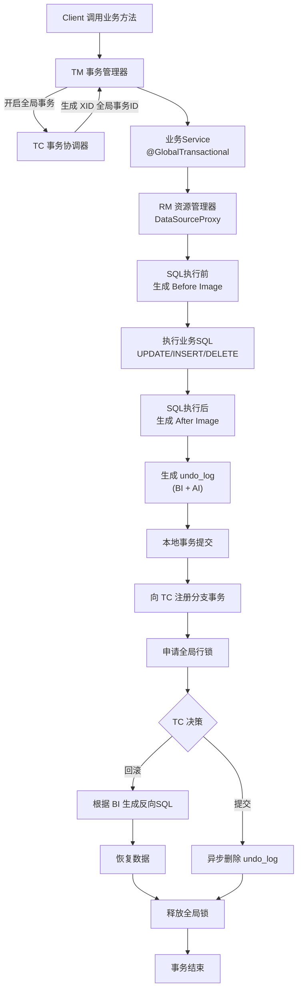

------

#### AT 模式核心组件关系图（架构视角）

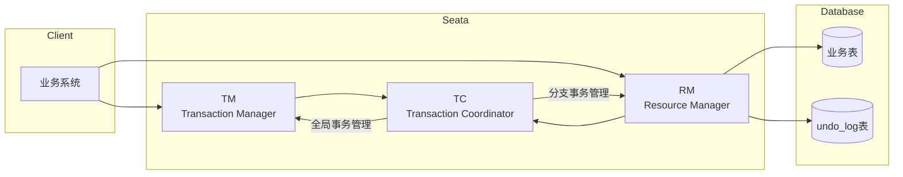

------

#### AT 模式执行流程图（面试最常问）

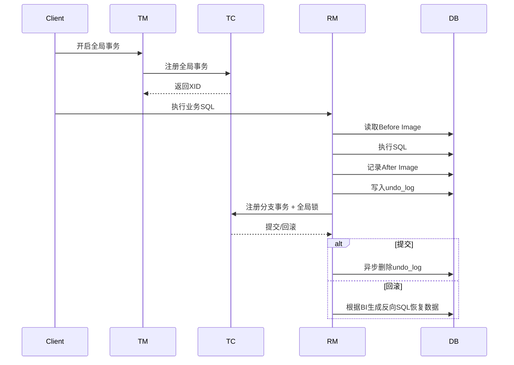

------

#### 一张图理解 AT 模式（最核心逻辑）

```
业务SQL执行
      │
      ▼
记录 Before Image
      │
      ▼
执行 SQL
      │
      ▼
记录 After Image
      │
      ▼
写入 undo_log
      │
      ▼
注册分支事务 + 全局锁
      │
      ▼
TC 决策
 ├── commit → 删除 undo_log
 └── rollback → 根据 BI 恢复数据
```

------

如果你愿意，我可以 **再帮你生成一套 Java 面试常用的 Seata 四张图**（面试基本必问）：

1️⃣ **Seata 整体架构图（TM / TC / RM）**
2️⃣ **AT 模式完整执行流程图（最经典）**
3️⃣ **undo_log 回滚原理图**
4️⃣ **Seata + SpringCloud 微服务事务图**


---

## Seata 的 AT 模式完整操作步骤（分 6 步）

Seata 的 AT 模式是微服务分布式事务中最常用、最易上手的模式（无侵入、自动回滚），我会给你一份**从环境准备到代码实现的完整、可落地的操作步骤**，新手也能一步步跟着做。

### 核心前提

AT 模式核心逻辑：**一阶段提交本地事务，二阶段根据全局事务结果自动回滚/提交**，全程无代码侵入，基于 SQL 解析实现。

### 步骤 1：环境准备（基础依赖）

#### 1.1 部署 Seata Server 服务端
Seata Server 是分布式事务的协调中心，负责全局事务的提交/回滚决策。
- **下载 Seata Server**：从 [Seata 官网](https://seata.io/zh-cn/blog/download.html) 下载稳定版（推荐 1.6.1+）。
- **配置 Seata Server**：
  1. 修改 `conf/application.yml`，配置注册中心（Nacos）和配置中心（Nacos）、存储模式（推荐 DB 存储）：
     ```yaml
     server:
       port: 8091
     spring:
       application:
         name: seata-server
     seata:
       registry:
         type: nacos
         nacos:
           server-addr: 127.0.0.1:8848 # 你的 Nacos 地址
           namespace: "" # 按需配置
           group: SEATA_GROUP
           application: seata-server
       config:
         type: nacos
         nacos:
           server-addr: 127.0.0.1:8848
           group: SEATA_GROUP
       store:
         mode: db # 存储模式：file（测试）/db（生产）/redis
         db:
           datasource: druid
           db-type: mysql
           driver-class-name: com.mysql.cj.jdbc.Driver
           url: jdbc:mysql://127.0.0.1:3306/seata?useUnicode=true&rewriteBatchedStatements=true
           user: root
           password: 你的密码
     ```
  2. 初始化 Seata 数据库：执行 [Seata 官方 DB 脚本](https://github.com/seata/seata/blob/1.6.1/server/src/main/resources/db/mysql.sql)，创建 `branch_table`、`global_table`、`lock_table` 三张核心表。
- **启动 Seata Server**：
  ```bash
  # 进入 Seata 解压目录
  sh bin/seata-server.sh -p 8091 -h 127.0.0.1 -m db
  ```

#### 1.2 业务数据库准备（每个微服务库）
每个参与分布式事务的微服务数据库，都需要创建 **undo_log 表**（AT 模式回滚的核心表）：
```sql
CREATE TABLE `undo_log` (
  `id` bigint(20) NOT NULL AUTO_INCREMENT,
  `branch_id` bigint(20) NOT NULL,
  `xid` varchar(100) NOT NULL,
  `context` varchar(128) NOT NULL,
  `rollback_info` longblob NOT NULL,
  `log_status` int(11) NOT NULL,
  `log_created` datetime NOT NULL,
  `log_modified` datetime NOT NULL,
  `ext` varchar(100) DEFAULT NULL,
  PRIMARY KEY (`id`),
  UNIQUE KEY `ux_undo_log` (`xid`,`branch_id`)
) ENGINE=InnoDB AUTO_INCREMENT=1 DEFAULT CHARSET=utf8mb4;
```

### 步骤 2：微服务引入 Seata 依赖（以 Spring Boot 为例）
在每个参与分布式事务的微服务 `pom.xml` 中添加依赖：
```xml
<!-- Seata 核心依赖 -->
<dependency>
    <groupId>com.alibaba.cloud</groupId>
    <artifactId>spring-cloud-starter-alibaba-seata</artifactId>
    <version>2022.0.0.0-RC2</version> <!-- 适配 Spring Cloud Alibaba 版本 -->
</dependency>
<!-- Seata 与 Nacos 集成（如果用 Nacos 注册） -->
<dependency>
    <groupId>io.seata</groupId>
    <artifactId>seata-spring-boot-starter</artifactId>
    <version>1.6.1</version>
</dependency>
```

### 步骤 3：微服务配置 Seata（application.yml）
每个微服务都要配置 Seata 客户端，关联到 Seata Server：
```yaml
spring:
  cloud:
    alibaba:
      seata:
        tx-service-group: my_test_tx_group # 事务组名称（必须和 Seata 配置一致）
seata:
  enabled: true
  application-id: order-service # 当前微服务名称（如订单/库存/账户）
  tx-service-group: my_test_tx_group
  registry:
    type: nacos
    nacos:
      server-addr: 127.0.0.1:8848
      namespace: ""
      group: SEATA_GROUP
      application: seata-server
  config:
    type: nacos
    nacos:
      server-addr: 127.0.0.1:8848
      group: SEATA_GROUP
  service:
    vgroup-mapping:
      my_test_tx_group: default # 事务组映射（必须和 Seata Server 一致）
  client:
    rm:
      report-success-enable: true
    undo:
      log-serialization: jackson # 序列化方式
      log-table: undo_log # 对应步骤1.2创建的回滚表
```

### 步骤 4：配置数据源代理（核心！AT 模式必须）
AT 模式需要 Seata 代理数据源，才能拦截 SQL 生成回滚日志，需自定义数据源配置类：
```java
import com.alibaba.druid.pool.DruidDataSource;
import io.seata.rm.datasource.DataSourceProxy;
import org.springframework.boot.context.properties.ConfigurationProperties;
import org.springframework.context.annotation.Bean;
import org.springframework.context.annotation.Configuration;
import org.springframework.context.annotation.Primary;

import javax.sql.DataSource;

@Configuration
public class SeataDataSourceConfig {

    // 1. 读取原有数据源配置
    @Bean
    @ConfigurationProperties(prefix = "spring.datasource")
    public DataSource druidDataSource() {
        return new DruidDataSource();
    }

    // 2. 用 Seata 代理数据源（核心）
    @Bean
    @Primary // 优先使用代理后的数据源
    public DataSource dataSourceProxy(DataSource druidDataSource) {
        return new DataSourceProxy(druidDataSource);
    }
}
```

### 步骤 5：编写业务代码（无侵入，只加注解）
#### 5.1 全局事务发起方（如订单服务）
在**最外层调用方法**上添加 `@GlobalTransactional` 注解（全局事务入口）：
```java
import io.seata.spring.annotation.GlobalTransactional;
import org.springframework.stereotype.Service;
import javax.annotation.Resource;

@Service
public class OrderService {

    @Resource
    private OrderMapper orderMapper; // 本地订单DAO
    @Resource
    private StorageFeignClient storageFeignClient; // 库存服务Feign调用
    @Resource
    private AccountFeignClient accountFeignClient; // 账户服务Feign调用

    // 全局事务入口：创建订单→扣库存→扣账户余额
    @GlobalTransactional(rollbackFor = Exception.class) // 异常时全局回滚
    public void createOrder(OrderDTO orderDTO) {
        // 1. 本地事务：创建订单（一阶段提交）
        orderMapper.createOrder(orderDTO);
        
        // 2. 调用库存服务：扣减库存（远程事务）
        storageFeignClient.deductStorage(orderDTO.getProductId(), orderDTO.getCount());
        
        // 3. 调用账户服务：扣减余额（远程事务）
        accountFeignClient.deductAccount(orderDTO.getUserId(), orderDTO.getAmount());
        
        // 4. 模拟异常：触发全局回滚
        // int i = 1 / 0;
    }
}
```

#### 5.2 参与方服务（如库存/账户服务）
参与方无需特殊注解，只需保证本地方法是 Spring 事务（默认即可）：
```java
// 库存服务示例
@Service
public class StorageService {

    @Resource
    private StorageMapper storageMapper;

    // 本地事务：扣减库存（被全局事务管理）
    public void deductStorage(Long productId, Integer count) {
        storageMapper.deductStorage(productId, count);
    }
}

// 账户服务示例
@Service
public class AccountService {

    @Resource
    private AccountMapper accountMapper;

    // 本地事务：扣减余额
    public void deductAccount(Long userId, BigDecimal amount) {
        accountMapper.deductAccount(userId, amount);
    }
}
```

### 步骤 6：测试验证
1. **正常场景**：调用订单服务 `createOrder`，订单创建、库存扣减、账户扣减全部成功，Seata Server 记录全局事务状态为提交。
2. **异常场景**：打开代码中 `int i = 1 / 0;` 注释，触发异常：
   - 订单服务本地事务回滚（undo_log 表生成回滚日志）；
   - 库存/账户服务的本地事务自动回滚；
   - 所有数据库数据恢复到事务前状态，实现**全局一致性**。

---

### 总结
1. **环境层**：部署 Seata Server（配置 DB 存储）+ 每个业务库创建 `undo_log` 表；
2. **配置层**：微服务引入 Seata 依赖 + 配置注册/配置中心 + 数据源代理（核心）；
3. **代码层**：全局事务发起方加 `@GlobalTransactional`，参与方无需额外注解；
4. **核心逻辑**：AT 模式通过代理数据源拦截 SQL，一阶段提交本地事务，二阶段根据全局结果自动回滚/提交，全程无代码侵入。

### 关键注意事项
- `undo_log` 表必须每个业务库都创建，否则无法回滚；
- 数据源必须用 Seata 代理，这是 AT 模式生效的核心；
- `@GlobalTransactional` 只能加在**最外层方法**，内层方法加无效；
- Seata Server 和客户端的事务组名称（tx-service-group）必须一致。

##  **Seata 整体架构图**

下面是一张 **Seata 整体架构图**，核心组件就是 **TM / TC / RM** 三个角色，这是 **Java 面试中最经典的一张 Seata 架构图**。

我给你 **3种形式**：

- 架构关系图（最常用）
- 微服务场景架构图（最容易理解）
- 时序流程图（面试解释流程）

------

### 一、Seata 整体架构关系图（核心版）

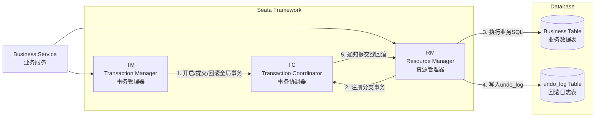

------

### 二、Seata 微服务架构图（真实项目）

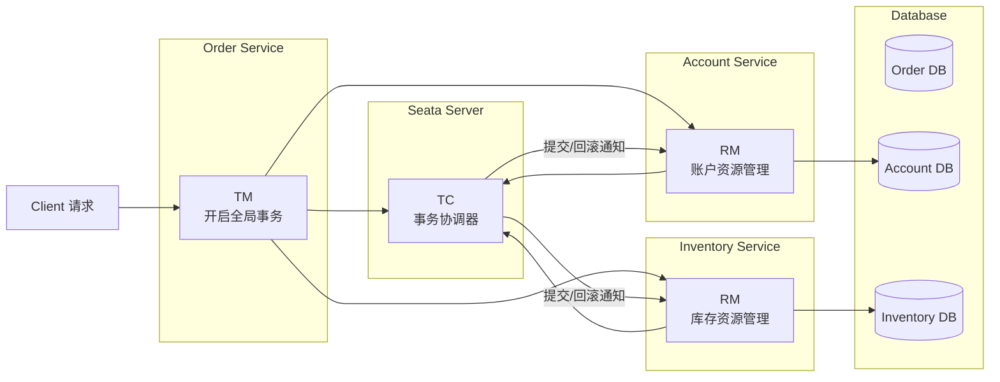

------

### 三、Seata 事务执行流程图（面试讲解版）

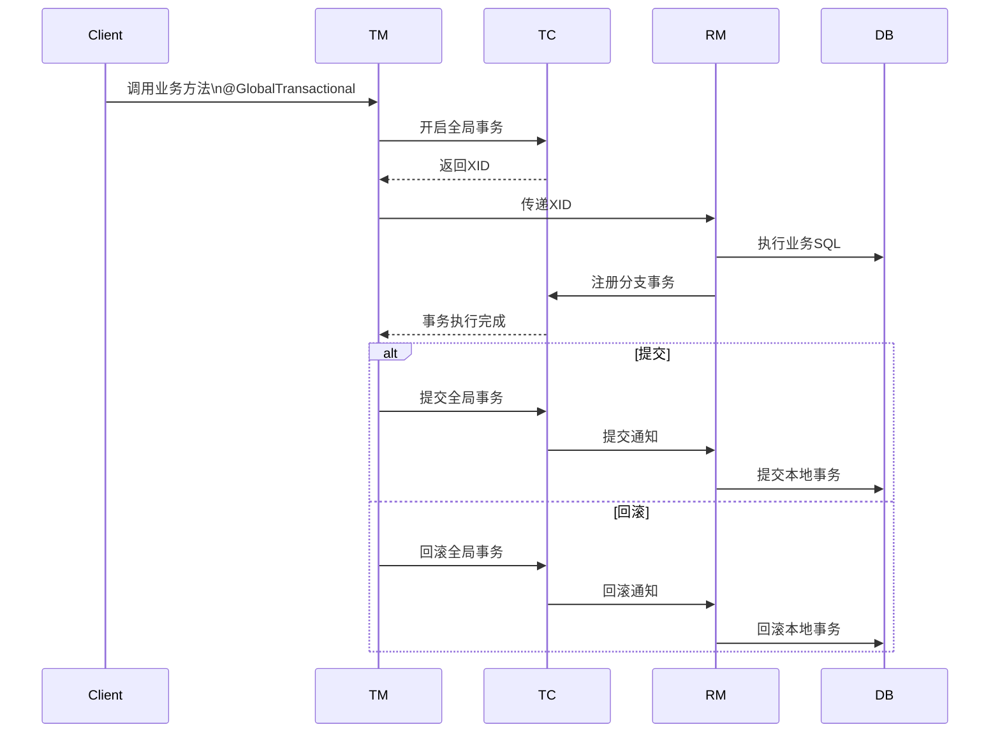

------

### 四、三大核心组件职责（面试必答）

#### TM（Transaction Manager）事务管理器

职责：

- 开启全局事务
- 提交全局事务
- 回滚全局事务

典型注解：

```java
@GlobalTransactional
```

------

#### TC（Transaction Coordinator）事务协调器

核心作用：

- 维护 **全局事务状态**
- 管理 **分支事务**
- 协调 **提交 / 回滚**

TC 是 **Seata Server**。

------

#### RM（Resource Manager）资源管理器

职责：

- 管理数据库资源
- 注册分支事务
- 执行 SQL
- 执行回滚逻辑

RM 一般就是：

```
DataSourceProxy
```

------

### 五、一句话总结 Seata 架构（面试高频）

```
TM：控制事务
TC：协调事务
RM：执行事务
```

执行逻辑：

```
TM 开启全局事务
      ↓
RM 执行业务SQL
      ↓
RM 注册分支事务到 TC
      ↓
TC 决定 commit / rollback
      ↓
RM 执行提交或回滚
```

------

如果你愿意，我可以 **再给你画一张 Java 面试最经典的图**（很多人靠这张图讲清楚 Seata）：

**《Seata AT 模式完整执行流程图（含 undo_log / 全局锁 / BI / AI）》**

这张图基本是 **面试官最喜欢问的一张 Seata 图**。


------

## 二、TCC 模式（Try-Confirm-Cancel）

### ✅ 核心思想

**“手工编码实现两阶段”**，由开发者显式定义 Try、Confirm、Cancel 三个方法。

### 🔧 三阶段语义

| 阶段        | 作用                       | 要求             |
| ----------- | -------------------------- | ---------------- |
| **Try**     | 资源预留（冻结、占位）     | 幂等、可空回滚   |
| **Confirm** | 真正执行业务（扣款、发货） | 幂等             |
| **Cancel**  | 释放预留资源（解冻、取消） | 幂等、支持空回滚 |

### ✅ 优点

- **灵活性极高**：适用于非 DB 资 源（如 Redis、MQ、第三方 API）；
- **性能好**：Try 阶段即可释放本地锁，不阻塞；
- **无全局锁**，适合高并发场景。

### ⚠️ 局限

- **侵入性强**：需为每个业务编写三套逻辑；
- 开发成本高，需处理幂等、空回滚、悬挂等复杂问题。

### 📌 使用示例

```java
@LocalTCC
public interface AccountService {

    @TwoPhaseBusinessAction(name = "debit", commitMethod = "confirmDebit", rollbackMethod = "cancelDebit")
    boolean debit(@BusinessActionContextParameter(paramName = "userId") String userId,
                  @BusinessActionContextParameter(paramName = "amount") BigDecimal amount);

    boolean confirmDebit(BusinessActionContext context);
    boolean cancelDebit(BusinessActionContext context);
}
```

> 💡 **典型场景**：红包发放、库存预占、积分兑换等。


### Seata TCC 模式 必须满足的条件

TCC（Try-Confirm-Cancel）和 AT 模式**完全不同**：
- AT 是**自动代理、自动回滚**（无侵入）
- TCC 是**手动编码、手动实现三个方法**（高可控）

**没有任何自动魔法，所有逻辑必须自己写！**

我直接给你**最精简、必须满足的 6 个硬性条件**，少一个都不能用。

---

#### 一、TCC 必须满足的 6 个核心条件

##### 1. 必须手动编写 3 个方法：Try / Confirm / Cancel

这是 TCC 最核心的要求：**你必须自己实现业务逻辑 + 手动提交/回滚**。

一个标准 TCC 接口长这样：
```java
// 1. Try  ：资源检查、预留、锁定（扣减冻结金额）
// 2. Confirm：真正执行提交（扣减正式金额）
// 3. Cancel ：释放预留资源，回滚（解冻金额）
public interface AccountTccService {
    @TwoPhaseBusinessAction(name = "accountDebitTcc", commitMethod = "confirm", rollbackMethod = "cancel")
    boolean tryDebit(
        @BusinessActionContextParameter(paramName = "from") String from,
        @BusinessActionContextParameter(paramName = "amount") BigDecimal amount
    );

    boolean confirm(BusinessActionContext context);
    boolean cancel(BusinessActionContext context);
}
```
**缺任何一个方法 → TCC 直接失效。**

我给你**用最简单、最直白、最能理解的方式**讲清楚这两个东西到底干嘛用的，绝对不绕弯子。

###### 1. `name = "accountDebitTcc"`

**作用：给这个 TCC 事务起一个唯一的名字。**

**必须记住 3 点**

1. **全局唯一**
   一个服务里不能有两个 TCC 接口叫同一个名字，否则 Seata 不知道调用哪个 Confirm/Cancel。

2. **Seata 用来跟踪事务**
   Seata 服务端（TC）靠这个名字识别：
   “哦，这个分支事务是 accountDebitTcc，我要记住它，等下要调用它的 confirm 或 cancel”。

3. **随便起，但见名知意**
   比如：
   - 扣款：`accountDebitTcc`
   - 加款：`accountCreditTcc`
   - 扣库存：`stockDeductTcc`

---

###### 2. `@BusinessActionContextParameter(paramName = "from")`

**作用：把 Try 方法的参数，传递给 Confirm 和 Cancel 方法！**

**超级关键：**

Confirm 和 Cancel 方法**没有参数**，只有一个 `BusinessActionContext`。
你在 Try 里扣的钱、转给谁、金额多少，**必须靠这个注解存起来**。

**例子：**

```java
tryDebit(
    @BusinessActionContextParameter(paramName = "from") String from,
    @BusinessActionContextParameter(paramName = "amount") BigDecimal amount
);
```

意思就是：
- 把变量 `from` 存到上下文，key 叫 `"from"`
- 把变量 `amount` 存到上下文，key 叫 `"amount"`

然后在 **Confirm / Cancel** 里就能取出来：
```java
// 取出来
String from = (String) context.getActionContext("from");
BigDecimal amount = (BigDecimal) context.getActionContext("amount");
```

**一句话总结：**

**这个注解就是 TCC 的“参数快递员”。**

---

###### 3. 完整流程一眼看懂

```java
// 1. Try 里存参数
@TwoPhaseBusinessAction(name = "accountDebitTcc")
boolean tryDebit(
    @BusinessActionContextParameter("from") String from,
    @BusinessActionContextParameter("amount") BigDecimal amount
) {
    // 冻结金额
}

// 2. Confirm 里取参数
boolean confirm(BusinessActionContext context) {
    String from = (String) context.getActionContext("from");
    BigDecimal amount = (BigDecimal) context.getActionContext("amount");
    // 真正扣款
}

// 3. Cancel 里也能取
boolean cancel(BusinessActionContext context) {
    String from = (String) context.getActionContext("from");
    BigDecimal amount = (BigDecimal) context.getActionContext("amount");
    // 解冻
}
```

---

###### 4. 最精简记忆口诀

- **name**：TCC 事务的**唯一名字**
- **@BusinessActionContextParameter**：把 Try 的参数**传给 Confirm/Cancel**

---

###### 总结

1. `name`：给 TCC 起**唯一标识名**，Seata 靠它找 Confirm/Cancel
2. `@BusinessActionContextParameter`：**参数传递工具**，把 Try 的值传到 Confirm/Cancel
3. 这两个是 TCC 必须写的，**缺一不可**

如果你愿意，我可以马上给你写一个**能直接运行、包含 Try-Confirm-Cancel、参数传递、幂等、防悬挂**的完整 TCC 示例代码。

---

##### 2. 必须使用 @TwoPhaseBusinessAction 注解

这是 TCC 的**核心注解**，作用：
- 标记这是一个 TCC 资源
- 指定 `Try` 入口
- 指定 `Confirm` 提交方法
- 指定 `Cancel` 回滚方法

**没有这个注解 = 不是 TCC 模式**。

---

##### 3. 全局事务入口必须加 @GlobalTransactional

和 AT 一样，**分布式事务入口必须标记**，让 Seata 开启全局事务：
```java
@Service
public class TransferServiceImpl implements TransferService {

    @Autowired
    private AccountTccService accountTccService;

    // 全局事务发起方
    @GlobalTransactional
    public void transfer(String from, String to, BigDecimal amount) {
        // 调用 TCC 服务
        accountTccService.tryDebit(from, amount);
        // 其他TCC服务...
    }
}
```

---

##### 4. 必须保证 幂等性 + 防悬挂 + 空回滚（强制！）

TCC 框架**不会自动处理**，你必须自己解决 3 个问题，否则会出现：
- 重复扣款
- 金额扣多了
- 服务异常后数据错乱

必须在数据库增加 **事务控制表**，记录：
- 全局事务 XID
- 分支事务 ID
- 状态：try / confirm / cancel

```sql
CREATE TABLE `tcc_transaction_log` (
  `xid` varchar(128) NOT NULL,
  `branch_id` bigint NOT NULL,
  `status` int NOT NULL COMMENT '0:Try,1:Confirm,2:Cancel',
  `create_time` datetime DEFAULT NULL,
  PRIMARY KEY (`xid`,`branch_id`)
) ENGINE=InnoDB DEFAULT CHARSET=utf8mb4;
```
**不做这三个保障，线上绝对出事故！**

---

##### 5. 必须引入 Seata 依赖 + 配置 Seata 服务端（TC）

和 AT 模式一样：
1. 引入 `seata-spring-boot-starter`
2. 配置 `application.yml` 连接 Seata 服务器
3. 启动 seata-server（TC 协调器）

TCC 也依赖 Seata 服务端做全局事务协调。

---

##### 6. 所有参与者都必须是 TCC 接口

TCC 模式下：
- 不能混用普通 DAO
- 不能混用 AT 模式的自动事务
- **所有参与分布式事务的服务，都必须写成 TCC 接口**

比如转账：
- 扣款：TCC
- 加款：TCC
**两个都必须是 TCC 实现。**

---

#### 二、TCC 模式 与 AT 模式 最大区别

| 特性     | AT 模式        | TCC 模式                      |
| -------- | -------------- | ----------------------------- |
| 代码侵入 | 无，只加注解   | 高，必须写 Try/Confirm/Cancel |
| 回滚实现 | 自动 undo_log  | 手动编码回滚                  |
| 性能     | 一般           | 极高                          |
| 适用场景 | 单库、简单业务 | 跨库、跨服务、复杂业务        |
| 可靠性   | 依赖 Seata     | 完全自己控制                  |

---

#### 三、一句话记住 TCC

**TCC = 手动实现 Try 预留 + Confirm 确认 + Cancel 回滚 + 幂等防悬挂控制**
注解只是标记，**核心全靠手写业务逻辑**。

---

#### 总结

1. **必须手写 3 个方法**：Try / Confirm / Cancel
2. **必须加 @TwoPhaseBusinessAction** 定义 TCC
3. **必须解决 3 大问题**：幂等、空回滚、防悬挂
4. **必须有事务日志表** 保证数据安全
5. 入口必须加 `@GlobalTransactional`
6. 必须配置 Seata 服务端

#### 幂等、空回滚、防悬挂

这三个是 **TCC 必须手动解决**的问题，不解决会**扣错钱、多扣钱、金额错乱**，线上绝对出事故！

---

##### 先记结论

1. **幂等**：同一个请求执行多次，结果不变
2. **空回滚**：Try 没执行，却触发 Cancel，要直接返回，不能报错
3. **防悬挂**：Cancel 空回滚完，Try 才到，要拒绝执行

---

##### 1. 幂等（Idempotent）—— 最基础

###### 是什么？

**同一个 Confirm/Cancel 被调用多次，不能重复扣款/重复解冻。**

###### 为什么会出现？

网络重试、Seata 重试、服务超时重传 → **Cancel/Confirm 会被调用多次**。

###### 例子（转账场景）

- Cancel 第一次：解冻 100 元 ✅
- Cancel 第二次：又解冻 100 元 ❌ **钱多了**

###### 怎么解决？

用 **事务日志表 tcc_log**，记录：
- xid
- branchId
- 状态（已执行/未执行）

每次执行前先查：**如果已经执行过，直接返回成功，不再执行。**

---

##### 2. 空回滚（Null Rollback）—— 最容易踩坑

###### 是什么？

**Try 方法还没执行，Cancel 先到了。**
这时候 Cancel 不能报错，要**直接返回成功**。

###### 为什么会出现？

服务拥堵、网络延迟、调用超时 → **Seata 以为 Try 失败，直接触发 Cancel**。

###### 例子

1. 发起转账
2. **Cancel 先执行**（Try 还没到）
3. Cancel 去解冻：账户里根本没冻结金额 → 报错 ❌
4. 全局事务失败，数据不一致

###### 正确做法

Cancel 发现：**没有对应的 Try 记录**
→ 直接返回成功，**什么都不做**。

---

##### 3. 防悬挂（Prevent Suspension）—— 最隐蔽

###### 是什么？

**Cancel 空回滚执行完了，Try 方法才到。**
必须**拒绝执行 Try**，否则资源永远锁住。

###### 为什么会出现？

网络时序乱序：
1. Cancel 空回滚
2. Try 延迟到达

###### 例子

1. Cancel 先执行，空回滚，事务结束
2. Try 后到，执行冻结金额
→ **冻结了永远不会释放的资金** ❌ 死锁

###### 解决

只要 Cancel 已经执行过
→ Try 直接拒绝，**不允许预留资源**。

---

##### 一张图看懂三者关系

```
正常顺序：
Try → Confirm / Cancel

异常顺序（产生三大问题）：
1. Cancel → Try （空回滚 + 防悬挂）
2. Cancel 执行多次 （幂等）
3. Confirm 执行多次 （幂等）
```

---

##### 最简单总结（背会这三句）

1. **幂等**：重复调用不重复执行
2. **空回滚**：Try 没执行，Cancel 直接返回
3. **防悬挂**：Cancel 执行过，Try 拒绝执行

---

##### 通用解决方案（所有 TCC 都能用）

建一张 **事务日志表**：
```sql
CREATE TABLE `tcc_transaction_log` (
  `xid` VARCHAR(128) NOT NULL,
  `branch_id` BIGINT NOT NULL,
  `status` TINYINT NOT NULL,  -- 0=try,1=confirm,2=cancel
  PRIMARY KEY (`xid`,`branch_id`)
) ENGINE=InnoDB DEFAULT CHARSET=utf8mb4;
```

三大问题**全部靠这张表解决**。

---

##### 最终总结

- **幂等**：防止重复执行
- **空回滚**：Try 未执行，Cancel 不报错
- **防悬挂**：Cancel 已执行，Try 不执行

这三个是 **TCC 开发的铁律**，必须实现！

---

如果你需要，我可以直接给你：
✅ 通用幂等+空回滚+防悬挂工具类
✅ 可直接复制到项目里的代码
✅ 转账 TCC 完整可运行 Demo

你要哪个？

### **Seata TCC 模式关系图**

下面给你整理了一套 **Seata TCC 模式关系图**，用于理解 **Try-Confirm-Cancel 三阶段事务**。我给你 **3种常见图示**：

1️⃣ TCC 核心关系图（架构理解）
2️⃣ TCC 执行流程图（面试常用）
3️⃣ 微服务场景图（真实业务）

这些图基本可以直接放进 **Mermaid / draw.io / Markdown 文档**。

------

#### 一、Seata TCC 模式整体关系图

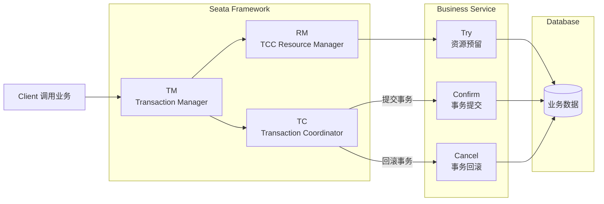

------

#### 二、TCC 三阶段执行流程图（最经典）

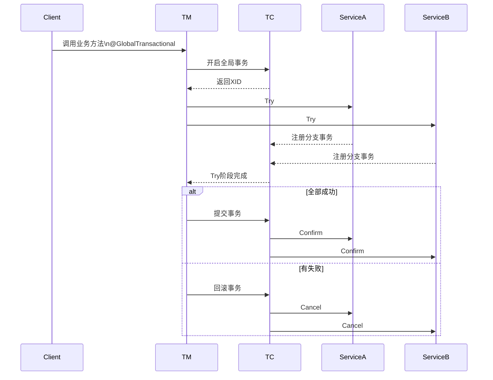

------

#### 三、TCC 微服务业务场景图（库存+账户）

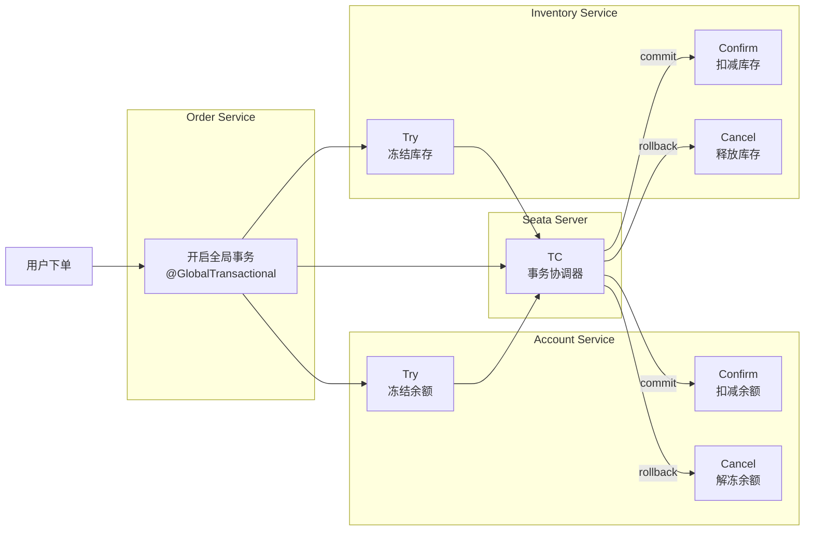

------

#### 四、TCC 三阶段关系图（理解本质）

```
        Try
   （资源预留/冻结）
        │
        ▼
  ┌─────────────┐
  │ TC判断结果   │
  └─────────────┘
     │        │
     ▼        ▼
 Confirm    Cancel
（真正执行） （释放资源）
```

------

#### 五、TCC 与 AT 模式对比（面试必问）

| 特性     | AT 模式              | TCC 模式       |
| -------- | -------------------- | -------------- |
| 事务实现 | 自动回滚（undo_log） | 手动三阶段     |
| 侵入性   | 低                   | 高             |
| 全局锁   | 有                   | 无             |
| 性能     | 中等                 | 高             |
| 适用资源 | 关系型 DB            | 任意资源       |
| 典型场景 | 普通业务事务         | 高并发核心交易 |

------

✅ **一句话理解 TCC**

```
Try     ：预留资源
Confirm ：真正执行
Cancel  ：释放资源
```

------

如果你在准备 **Java / 微服务 / 分布式事务面试**，我可以再给你整理一张 **Seata 四种模式完整架构图**（一张图彻底理解）：

- AT
- TCC
- SAGA
- XA

很多架构师都是用 **这一张图讲完整个 Seata 体系**。

------

## 三、Saga 模式（长事务模式）

### ✅ 核心思想

**“事件驱动 + 补偿事务”**，适用于**长时间运行**的业务流程（如订单履约、审批流）。

### 🔧 工作方式

- 正向服务链：`A → B → C → D`
- 若 D 失败，则依次执行反向补偿：`Compensate C → Compensate B → Compensate A`

### ✅ 优点

- 支持**超长事务**（几分钟到几天）；
- 无锁设计，吞吐量高；
- 可与状态机结合（Seata Saga 支持状态图定义）。

### ⚠️ 局限

- **不保证隔离性**：中间状态可能被其他事务看到（脏读）；
- 补偿逻辑需**人工编写**，且必须成功；
- 无法回滚已提交的外部系统操作（如短信已发送）。

### 📌 适用场景

- 跨多个外部系统的业务流程（如旅游预订：机票+酒店+租车）；
- 最终一致性可接受的场景。

### **Seata Saga 模式关系图示**

下面给你整理一套 **Seata Saga 模式关系图示**。Saga 是 **事件驱动 + 补偿事务** 的长事务方案，通常用于 **跨系统业务流程编排**。

我给你 **3种图示（架构 / 流程 / 补偿机制）**，基本能完整理解 Saga。

------

#### 一、Saga 模式整体架构图

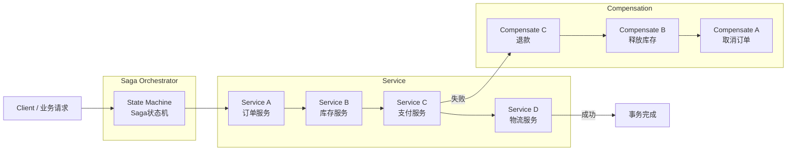

------

#### 二、Saga 执行流程图（正向 + 补偿）

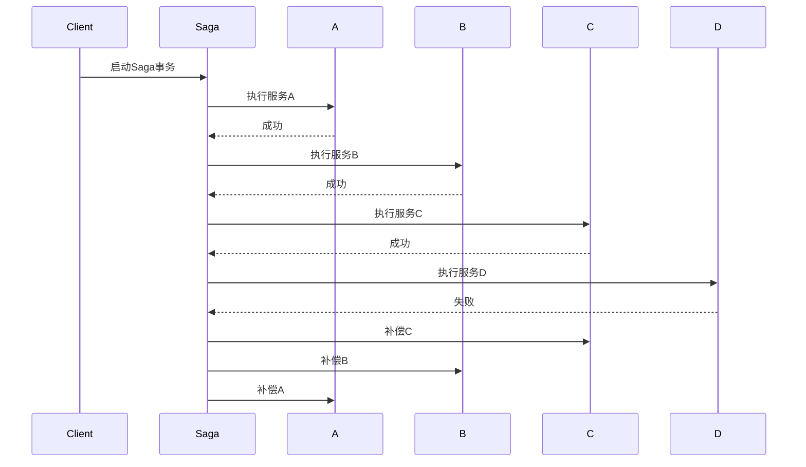

------

#### 三、Saga 事务关系图（核心逻辑）

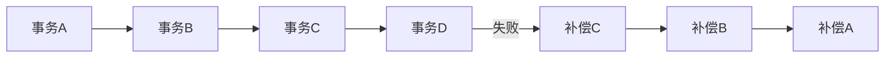

------

#### 四、Saga 状态机模式（Seata 实现）

Seata Saga 实际是 **状态机驱动的事务流程**：

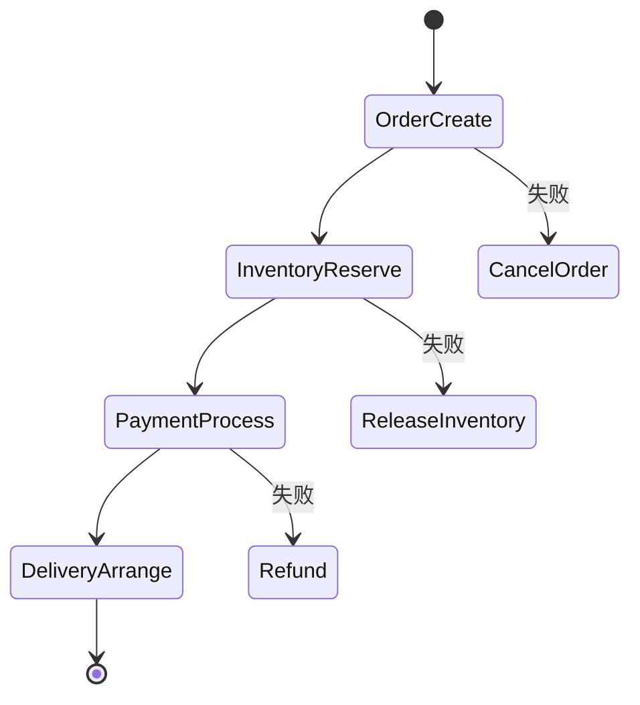

------

#### 五、典型业务场景（旅游预订）

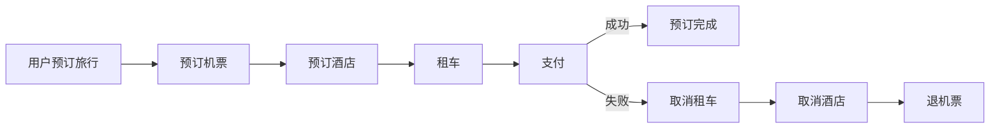

------

#### 六、Saga 模式核心思想（面试总结）

```text
正向流程：
A → B → C → D

失败补偿：
Compensate C → Compensate B → Compensate A
```

特点：

- 无锁
- 最终一致性
- 长事务
- 依赖补偿

------

#### 七、Seata 四种事务模式对比（面试高频）

| 模式 | 原理               | 是否侵入 | 是否有锁 | 适用场景       |
| ---- | ------------------ | -------- | -------- | -------------- |
| AT   | undo_log 自动回滚  | 低       | 有       | 常规数据库事务 |
| TCC  | Try/Confirm/Cancel | 高       | 无       | 高并发核心交易 |
| Saga | 事件驱动补偿       | 中       | 无       | 长事务流程     |
| XA   | 两阶段提交         | 低       | 强锁     | 强一致事务     |

------

💡 如果你在做 **Java 面试 / 微服务架构整理**，我可以帮你画一张 **“Seata 四种模式全景架构图”**（AT / TCC / Saga / XA 在一张图里）。

那张图基本是 **理解 Seata 最完整的一张架构图**。

------

## 四、XA 模式（强一致性模式）

> Seata 从 1.0 开始支持 XA 模式，兼容传统 JTA 规范。

### ✅ 特点

- 基于 **数据库原生 XA 协议**（如 MySQL 5.7+ 支持）；
- **强一致性**：第一阶段不提交，直到全局事务提交；
- 严格遵循 ACID。

### ⚠️ 缺点

- **性能差**：资源长时间锁定；
- 数据库需开启 XA 支持；
- 不适合高并发场景。

### 📌 适用场景

- 对一致性要求极高的金融核心系统；
- 已有 XA 基础设施的遗留系统迁移。


###  **Seata XA 模式关系图示**

下面给你整理一套 **Seata XA 模式关系图示**。
XA 是 **基于数据库 XA 协议的两阶段提交（2PC）**，强调 **强一致性**，常用于 **金融级事务**。

我给你 **3种常见图示**：

1️⃣ XA 整体架构图
2️⃣ XA 两阶段提交流程图（核心）
3️⃣ 微服务 + 数据库 XA 场景图

------

#### 一、Seata XA 模式整体架构图

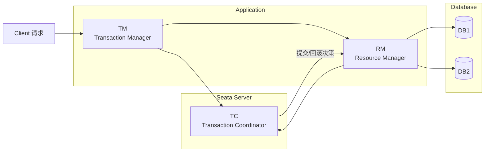

------

#### 二、XA 两阶段提交流程图（核心原理）

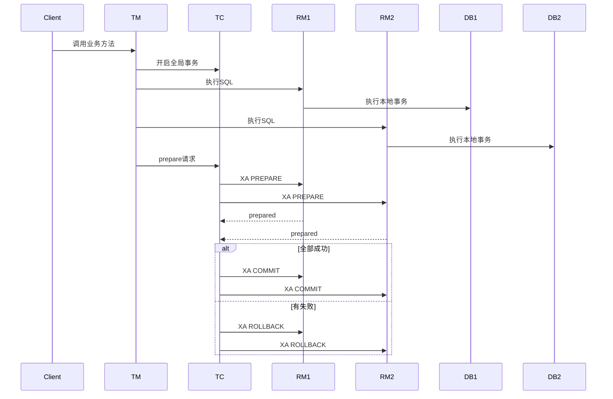

------

#### 三、XA 两阶段提交关系图

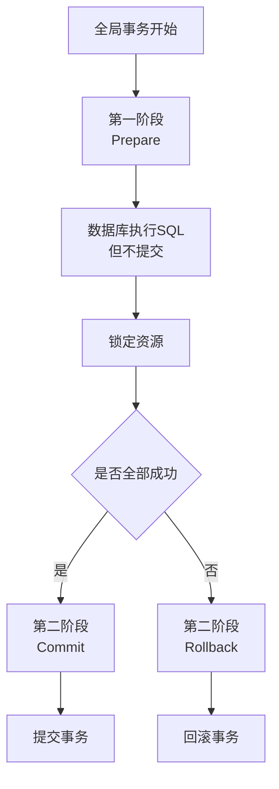

------

#### 四、微服务 XA 场景图

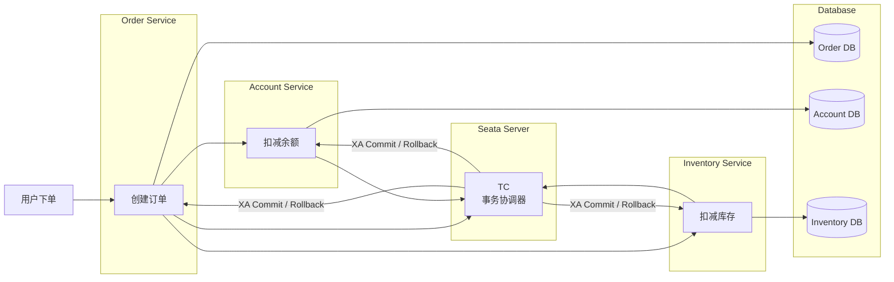

------

#### 五、XA 两阶段提交核心逻辑

```text
第一阶段（Prepare）
执行SQL → 不提交 → 锁定资源

第二阶段（Commit / Rollback）
TC决定：
  成功 → Commit
  失败 → Rollback
```

特点：

- 强一致性
- 严格 ACID
- 资源长时间锁定

------

#### 六、Seata 四种模式关系总览（面试总结）

| 模式 | 原理                   | 是否锁资源 | 性能 | 适用           |
| ---- | ---------------------- | ---------- | ---- | -------------- |
| AT   | undo_log 自动回滚      | 行级锁     | 高   | 普通业务       |
| TCC  | Try / Confirm / Cancel | 无         | 很高 | 高并发核心交易 |
| Saga | 事件驱动补偿           | 无         | 高   | 长事务         |
| XA   | 两阶段提交             | 强锁       | 低   | 强一致         |

------

💡 如果你在整理 **Java 面试架构知识图**，我可以帮你再画一张 **“Seata 四种事务模式全景对比图（AT / TCC / Saga / XA）”**。

那张图能 **一眼看懂四种模式区别**，也是很多架构师讲分布式事务时用的经典图。


------

## 五、四种模式对比总结

| 模式     | 一致性   | 隔离性             | 性能  | 侵入性          | 适用场景            |
| -------- | -------- | ------------------ | ----- | --------------- | ------------------- |
| **AT**   | 最终一致 | 有全局锁（弱隔离） | ★★★★☆ | 低              | 普通微服务，DB 事务 |
| **TCC**  | 最终一致 | 无锁（需业务控制） | ★★★★★ | 高              | 高并发、混合资源    |
| **Saga** | 最终一致 | 无隔离（脏读风险） | ★★★★☆ | 中              | 长流程、跨系统      |
| **XA**   | 强一致   | 强隔离             | ★★☆☆☆ | 低（但依赖 DB） | 金融核心、强一致    |

------

## 六、在项目中的选择建议（以剧院票务系统为例）

- **订单创建 + 库存扣减 + 支付**：使用 **AT 模式**（简单、可靠）；
- **优惠券核销 + 积分增加**：若涉及 Redis 或第三方接口，用 **TCC 模式**；
- **订单超时自动取消**：用 **Saga + 定时触发**；
- **财务对账模块**：若要求强一致，可考虑 **XA 模式**（但慎用）。

> 💡 **最佳实践**：
> **优先 AT，复杂场景 TCC，长流程用 Saga，强一致才选 XA**。

通过合理选择 Seata 模式，我们能在保证数据一致性的同时，兼顾系统性能与开发效率。

明白了，你希望一张 **Seata 与 Java 后端相关的关系图示**，方便面试时讲解 **分布式事务管理** 的架构和流程。下面我整理一个 Mermaid 图示版本：

------

## Seata 与 Java 后端关系示意图（Mermaid 版）

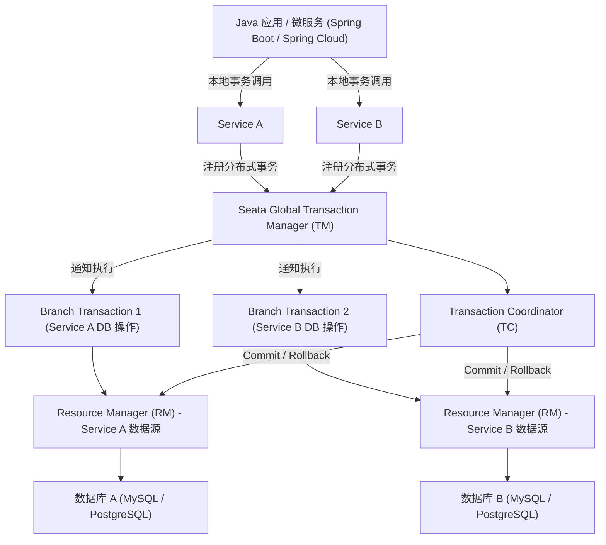

------

### 图示说明：

1. **Java 应用层**
   - 微服务调用本地业务方法（Service A、Service B），每个方法可能操作自己的数据库。
2. **Seata 事务管理**
   - **TM (Transaction Manager)**：全局事务管理器，协调各服务的分布式事务。
   - **RM (Resource Manager)**：各服务的资源管理器，管理本地数据库事务。
   - **TC (Transaction Coordinator)**：核心协调器，负责全局事务的提交或回滚。
3. **事务分支**
   - 每个服务的数据库操作被注册为分支事务，由 TC 统一协调。
4. **提交/回滚流程**
   - 如果全局事务成功，TC 下发 commit 指令给各 RM。
   - 如果失败，TC 下发 rollback 指令，保证分布式事务一致性。

------

# Saga 模式

## Saga 模式

### 一、核心定义与起源

**Saga模式**是分布式事务中解决**长事务（Long Transaction）**的标准方案，1987年由Hector & Kenneth在论文《Sagas》中提出，核心思想是：**将一个分布式长事务拆成一串独立的本地短事务，每个短事务执行后立即提交；若后续步骤失败，则逆序执行已成功步骤的“补偿操作”，最终达成数据最终一致性**。

在Seata中，Saga是与AT、TCC、XA并列的四大分布式事务模式之一，主打**无锁、高性能、长流程、最终一致**。

### 二、核心原理：正向执行+反向补偿
#### 1. 基本模型
一个Saga由n个**正向子事务Ti**和对应的n个**补偿子事务Ci**组成：
- **正向流程**：按T1→T2→T3→…→Tn顺序执行，每个Ti完成后**立即提交本地事务、释放资源**（无锁）。
- **成功**：全部Ti执行成功，全局事务正常结束。
- **失败**：若Tk（k≤n）失败，则**逆序执行补偿Ck-1→Ck-2→…→C1**，撤销已提交的T1~Tk-1，实现回滚。


#### 2. 与TCC的关键区别
- **TCC**：Try（资源检查/锁定）→Confirm（提交）→Cancel（回滚），**三阶段、有锁、强一致、业务侵入高**。
- **Saga**：无Try阶段，**直接提交（一阶段）+补偿回滚（二阶段）、无锁、最终一致、长流程友好**。

### 三、Seata Saga标准实现：状态机模式（推荐）
Seata的Saga标准实现为**状态机引擎驱动**（区别于简单注解模式），通过**JSON状态定义文件**编排流程，支持复杂分支、并发、子流程、异常捕获，企业级首选。

#### 1. 核心组件
- **状态机定义（JSON）**：用状态图描述流程，含**节点（服务调用）、补偿节点、分支判断、异常处理**。
- **状态机引擎**：Seata Server内置，负责**驱动状态流转、记录执行日志、触发补偿、持久化状态**。
- **业务服务**：实现**正向接口（Ti）**和**补偿接口（Ci）**，需保证**幂等性**（避免重复执行）。

#### 2. 执行流程（含状态机）
1. **定义状态机**：绘制状态图→生成JSON（含节点、补偿、分支），示例：
```json
{
  "Start": "ReduceInventory",
  "States": {
    "ReduceInventory": {
      "Service": "inventoryService.reduce",
      "Compensate": "CompensateReduceInventory",
      "Next": "ReduceBalance"
    },
    "ReduceBalance": {
      "Service": "accountService.reduce",
      "Compensate": "CompensateReduceBalance",
      "Next": "Succeed"
    },
    "CompensateReduceInventory": { "Service": "inventoryService.compensateReduce" },
    "CompensateReduceBalance": { "Service": "accountService.compensateReduce" }
  }
}
```
2. **启动事务**：客户端请求Seata Server，创建**全局事务ID（XID）**，引擎加载状态机JSON。
3. **正向执行**：引擎按状态顺序调用Ti服务，每个Ti提交本地事务，引擎记录“已完成节点”。
4. **异常触发补偿**：若某Ti失败，引擎**逆序调用对应补偿节点Ci**，逐个回滚已提交的Ti；补偿完成后，全局事务标记为“回滚”。
5. **事务结束**：全部Ti成功→全局提交；补偿完成→全局回滚；状态机执行日志持久化到库。

#### 3. 状态图示例（订单扣库存+扣余额）


- **正常流程**：Start→ReduceInventory（扣库存）→ReduceBalance（扣余额）→Succeed。
- **异常流程**：若ReduceBalance失败→触发CompensateReduceInventory（恢复库存）→事务失败。

### 四、关键特性
1. **无锁高性能**：一阶段直接提交本地事务，**无全局锁、无资源阻塞**，适合高并发长流程。
2. **长流程友好**：支持**跨服务、跨系统、跨企业**的长事务（如订单→支付→物流→出库）。
3. **编排能力强**：状态机支持**分支选择、并发执行、子流程嵌套、参数映射、异常捕获/重试**。
4. **最终一致性**：通过补偿机制保证数据最终一致，但**中间过程可能不一致**（无隔离性）。
5. **业务侵入可控**：需实现正向+补偿接口，但状态机模式**配置化编排、低侵入**。

### 五、适用场景
- ✅ **长周期事务**：流程长、步骤多、执行时间久（如供应链、跨境电商、金融审批）。
- ✅ **跨系统/遗留系统**：参与者含第三方公司或遗留服务，**无法提供TCC的Try/Confirm/Cancel三接口**。
- ✅ **高并发高性能**：无锁设计，适合高吞吐、低延迟场景。
- ❌ **强隔离/强一致**：不支持脏读/脏写隔离，中间态不一致，不适合金融核心交易（如转账）。

### 六、优缺点
#### 优点
- **无锁、高性能、高吞吐**。
- **长流程、跨系统、异步化支持好**。
- **状态机编排灵活，支持复杂流程**。
- **补偿逻辑相对直观，易实现**。

#### 缺点
- **无隔离性**：中间态数据不一致，可能脏读/脏写，需业务层控制（如状态标记）。
- **补偿逻辑复杂**：需手动编写，且**必须幂等**；补偿失败可能需人工干预。
- **最终一致非实时**：一致性有延迟，不适合强实时场景。

### 七、与其他模式对比
| 特性         | Saga（状态机） | TCC          | AT               | XA       |
| :----------- | :------------- | :----------- | :--------------- | :------- |
| **一致性**   | 最终一致       | 强一致       | 最终一致         | 强一致   |
| **锁机制**   | 无锁           | 行锁（Try）  | 全局锁（一阶段） | 两阶段锁 |
| **性能**     | 最高           | 中           | 高               | 低       |
| **流程长度** | 长流程友好     | 短流程       | 中短流程         | 短流程   |
| **业务侵入** | 中（需补偿）   | 高（三接口） | 低（无代码）     | 低       |
| **隔离性**   | 无             | 有           | 无               | 有       |

### 八、开发要点（状态机模式）
1. **正向接口（Ti）**：实现业务逻辑，**提交本地事务**，保证幂等。
2. **补偿接口（Ci）**：实现回滚逻辑（如扣库存→加库存），**幂等+可逆**。
3. **状态机JSON**：定义节点、补偿、分支、异常，**避免循环依赖**。
4. **幂等设计**：所有接口（正向/补偿）必须**支持重试、防重复执行**（如唯一键、状态表）。
5. **异常处理**：定义补偿失败策略（重试/告警/人工），**避免悬挂事务**。

### 总结
**Saga标准模式（Seata状态机版）**是长分布式事务的最优解之一，通过“**拆分长事务、本地提交、异常补偿**”实现无锁、高性能、最终一致，尤其适合跨系统、长周期、高并发的业务场景。开发核心是**设计幂等的正向/补偿接口+配置化状态机编排**，同时需接受中间态不一致的特性，通过业务手段控制隔离性问题。

要不要我基于这个原理，给你写一个可直接运行的Saga状态机模式示例（含JSON配置、正向/补偿接口）？

# Seata Saga 模式（标准状态机版）

## 一、整体架构
1. 依赖：SpringCloud + Seata + Nacos/注册中心
2. 核心角色
   - Seata-Server：事务协调器、状态机引擎
   - 业务微服务：实现**正向业务接口** + **反向补偿接口**
   - 状态机JSON：编排事务流程、绑定补偿、异常分支
3. 事务流程：调用方发起Saga事务 → 状态机顺序执行服务 → 异常自动逆序补偿

## 二、环境准备
### 1. 引入Maven依赖
```xml
<!-- Seata Saga 核心依赖 -->
<dependency>
    <groupId>io.seata</groupId>
    <artifactId>seata-spring-boot-starter</artifactId>
    <version>1.7.1</version>
</dependency>
<dependency>
    <groupId>io.seata</groupId>
    <artifactId>seata-saga-statemachine-designer</artifactId>
</dependency>
```

### 2. 配置application.yml
```yaml
spring:
  application:
    name: saga-order-service
seata:
  registry:
    type: nacos
    nacos:
      server-addr: 127.0.0.1:8848
  config:
    type: nacos
  transaction-service-group: my_tx_group
  saga:
    statemachine:
      # 存放状态机json文件路径
      file-path: classpath:saga/
```

### 3. 启动Seata Server
```bash
sh seata-server.sh -p 8091
```

## 三、业务场景
模拟下单分布式事务：
**创建订单 → 扣减库存 → 扣减账户余额**
任意步骤失败，**反向补偿**：恢复余额 → 恢复库存 → 取消订单

## 四、第一步：编写正向业务接口
### 1. 订单服务 OrderService
```java
@Service
public class OrderService {

    // 正向：创建订单
    public void createOrder(Long orderId, Long userId, Long goodsId, Integer num) {
        // 本地事务新增订单
        System.out.println("创建订单成功：" + orderId);
    }

    // 补偿：取消订单
    public void cancelOrder(Long orderId) {
        System.out.println("补偿：取消订单：" + orderId);
    }
}
```

### 2. 库存服务 InventoryService
```java
@Service
public class InventoryService {

    // 正向：扣库存
    public void deductStock(Long goodsId, Integer num) {
        System.out.println("扣减商品库存：" + goodsId);
    }

    // 补偿：加回库存
    public void addStock(Long goodsId, Integer num) {
        System.out.println("补偿：恢复商品库存");
    }
}
```

### 3. 账户服务 AccountService
```java
@Service
public class AccountService {

    // 正向：扣余额
    public void deductBalance(Long userId, BigDecimal money) {
        // 模拟异常测试：金额大于100抛出异常触发补偿
        if(money.compareTo(new BigDecimal("100")) > 0){
            throw new RuntimeException("余额不足");
        }
        System.out.println("扣减用户余额成功");
    }

    // 补偿：返还余额
    public void refundBalance(Long userId, BigDecimal money) {
        System.out.println("补偿：返还用户余额");
    }
}
```

## 五、第二步：定义Saga状态机JSON（核心）
新建 `resources/saga/order_saga.json`
```json
{
  "Name": "create_order_saga",
  "Start": "CreateOrder",
  "Comment": "下单Saga分布式事务",
  "States": {
    "CreateOrder": {
      "Service": "orderService#createOrder",
      "Compensate": "CancelOrder",
      "Next": "DeductStock"
    },
    "DeductStock": {
      "Service": "inventoryService#deductStock",
      "Compensate": "AddStock",
      "Next": "DeductBalance"
    },
    "DeductBalance": {
      "Service": "accountService#deductBalance",
      "Compensate": "RefundBalance",
      "Next": "Succeed"
    },
    // 补偿节点定义
    "CancelOrder": {
      "Service": "orderService#cancelOrder"
    },
    "AddStock": {
      "Service": "inventoryService#addStock"
    },
    "RefundBalance": {
      "Service": "accountService#refundBalance"
    },
    "Succeed": {
      "Type": "Success"
    },
    "Fail": {
      "Type": "Fail"
    }
  }
}
```
**语法说明**
- `服务名#方法名`：Spring容器BeanName#方法名
- `Compensate`：当前节点失败，执行对应的补偿节点
- 执行失败自动**逆序补偿**

## 六、第三步：全局事务入口调用
```java
@RestController
@RequestMapping("/saga/order")
public class SagaOrderController {

    @Autowired
    private StateMachineEngine stateMachineEngine;

    @PostMapping("/create")
    public String createOrder() {
        // 构造入参
        Map<String, Object> params = new HashMap<>();
        params.put("orderId", 1001L);
        params.put("userId", 1L);
        params.put("goodsId", 10L);
        params.put("num", 2);
        params.put("money", new BigDecimal("150"));

        try {
            // 执行saga状态机事务
            StateMachineInstance result = stateMachineEngine.start("create_order_saga", params);
            return "事务执行结果：" + result.getStatus().name();
        } catch (Exception e) {
            return "事务异常，已自动补偿：" + e.getMessage();
        }
    }
}
```

## 七、第四步：开启Saga事务注解
启动类加上**Seata、Saga开启注解**
```java
@SpringBootApplication
@EnableDiscoveryClient
@EnableSeata
public class SagaApplication {
    public static void main(String[] args) {
        SpringApplication.run(SagaApplication.class,args);
    }
}
```

## 八、运行测试
1. 正常流程（金额<100）
```
创建订单成功
扣减商品库存
扣减用户余额成功
事务执行结果：SUCCEEDED
```

2. 异常流程（金额150触发异常）
```
创建订单成功
扣减商品库存
余额不足
# 自动逆序补偿
补偿：返还用户余额
补偿：恢复商品库存
补偿：取消订单
```

## 九、生产必须遵守的5大规范
### 1. 所有正向/补偿接口 **必须幂等**
用事务ID、订单ID做防重，防止重试重复执行。

### 2. 补偿逻辑必须**可逆**
正向做什么，补偿精准回退什么，不能丢数据。

### 3. 禁止长阻塞业务
Saga无锁，适合长流程，不适合短事务强一致性场景。

### 4. 补偿失败兜底方案
状态机日志入库，补偿失败写入告警，人工对账修复。

### 5. 不依赖事务隔离
Saga无隔离性，中间数据可被查询，业务层加**订单状态字段**控制展示。

## 十、Saga 两种实现方式区别
1. **状态机模式（上面实现）**
   - 企业标准推荐
   - JSON编排、支持分支、条件判断、子流程
   - 适合复杂长流程

2. **注解简易Saga**
   - `@SagaStart` + `@Compensate`
   - 代码硬编码流程，灵活性差
   - 只适合简单两步事务

## 十一、适用与禁用场景
### 适用
- 订单、物流、供应链、审批长流程
- 跨第三方系统、无法改造接入TCC
- 高并发、追求高性能分布式事务

### 禁用
- 金融核心转账、充值（需要强一致性+隔离性）
- 短流程简单事务（优先用AT）

## 十二、常见面试考点
1. Saga执行顺序：**正向顺序执行，失败反向补偿**
2. 和TCC区别：Saga无Try，直接提交本地事务，靠补偿回滚
3. Seata Saga底层：状态机引擎驱动，持久化执行节点日志
4. 一致性：**最终一致性，无事务隔离**

需要我给你整理**Saga面试高频题**，或者给你一份**可直接复制的完整微服务工程结构**吗？

# 分布式事务

我给你用**不绕弯、能直接写进简历、能直接讲给面试官**的版本，把所有分布式事务方案一次性讲透。

---

## 一、先搞懂：什么是分布式事务？

**单机事务：**
一个方法里，同时操作 MySQL 一张表 → 要么全成功，要么全失败（ACID）。

**分布式事务：**
一次请求，**跨多个服务、多个数据库、多个MQ** 操作数据。
比如：
下单服务（扣库存） + 订单服务（创建订单） + 账户服务（扣钱）
必须**同时成功 / 同时失败**。

> 分布式事务 = 保证多个独立服务的数据一致性。

---

## 二、核心理论（必须懂）

### 1. CAP 定理

分布式系统只能三选二：
- **C 一致性**
- **A 可用性**
- **P 分区容错性**

**分布式系统必须保留 P，所以只能选择：**
- **CP**（一致性优先，如ZooKeeper）
- **AP**（可用性优先，如Eureka）

### 2. BASE 理论

分布式无法做到强一致，只能做到：
- **基本可用**
- **软状态**
- **最终一致性**

**所有分布式事务方案，最终目标都是：最终一致性。**

---

## 三、**7 种主流分布式事务方案（企业实战版）**

我按 **使用频率 + 企业推荐度** 排序。

---

### 方案 1：**Seata（最主流、SpringCloud 首选）**

阿里开源的**一站式分布式事务框架**，**现在企业 90% 都用它**。支持 4 种模式

#### ① **AT 模式（无侵入，最常用）**

- 对代码**0侵入**
- 自动拦截 SQL
- 两阶段提交：
  - 一阶段：本地事务执行 +  undo/redo 日志
  - 二阶段：自动提交或回滚
- **优点**：简单、接入快
- **缺点**：性能一般，适合大多数业务

#### ② **TCC 模式（Try-Confirm-Cancel，高性能）**

- Try：预留资源
- Confirm：确认提交
- Cancel：取消回滚
- **优点**：性能极高
- **缺点**：代码侵入强，开发量大

#### ③ **Saga 模式（长事务，流程编排）**

- 把分布式事务拆成多个本地事务
- 失败反向补偿
- 适合：订单、支付、物流等长事务

#### 4 **XA 协议（数据库层面的标准分布式事务）**

**XA = 数据库厂商支持的 2PC 标准实现**

- MySQL、Oracle、PostgreSQL 都支持
- 分 **RM（资源管理器）** 和 **TM（事务管理器）**
- 两阶段：prepare → commit/rollback

**优点：**

- 强一致性
- 对业务无侵入

**缺点：**

- 锁持有时间长
- **性能极差，高并发场景绝对不能用**

**适用：**

低并发、后台管理系统、财务对账等**强一致但不追求高 QPS**场景。

#### 总结

**Seata = 企业分布式事务事实标准。**


### 方案二：本地消息表（经典最终一致性方案，面试必考！

这是**最经典、最实用、很多老项目都在用**的方案，我刚才没单独列，现在补上：

#### 流程：

1. **本地事务中：业务操作 + 写入消息表（同一事务）**
2. 定时任务扫描**待发送消息**
3. 发送给 MQ
4. 消费者消费，执行成功后**删除 / 标记消息**
5. 失败重试

#### 核心：

**业务数据和消息在同一个本地事务，保证不丢消息。**

#### 优点：

- 最终一致性
- 高可用
- 不依赖中间件

#### 缺点：

- 有轮询开销
- 消息表耦合业务

#### 地位：

**面试必问，实际项目非常常用！**

这是面试**必问、分布式事务最常用、生产落地最多**的方案，核心就是：**用数据库事务保证业务数据 + 消息数据原子性，再通过异步任务保证消息可靠投递**。

---

#### 一、核心思想

1. **业务操作 + 消息记录，放在同一个本地事务里**
   要么都成功，要么都失败 → 保证**不丢消息**
2. 用**定时任务/异步线程**扫描消息表，把消息发到 MQ
3. 消费端消费成功后，**删除/标记消息完成**
4. 天然实现**最终一致性**

---

#### 二、完整流程（标准 7 步）

##### 1. 建表：本地消息表

```sql
CREATE TABLE local_msg (
  id BIGINT PRIMARY KEY AUTO_INCREMENT,
  msg_id VARCHAR(64) UNIQUE NOT NULL,  -- 消息唯一ID
  business_id VARCHAR(64),              -- 业务ID（订单号/用户ID）
  content TEXT,                         -- 消息内容
  status TINYINT DEFAULT 0,             -- 0=待发送 1=已发送 2=发送失败 3=已消费
  retry_count INT DEFAULT 0,             -- 重试次数
  create_time DATETIME,
  update_time DATETIME
);
```

##### 2. 业务执行 + 插入消息（同一事务）

以“创建订单 → 发积分消息”为例：
```
BEGIN TRANSACTION;
  1. 插入订单记录（业务操作）
  2. 插入一条消息到 local_msg（status=0 待发送）
COMMIT;
```
关键点：
**订单和消息必须在同一个事务**，保证原子性。

##### 3. 定时任务扫描待发送消息

定时任务（XXL-Job/Quartz/Scheduled）：
```
SELECT * FROM local_msg
WHERE status = 0
AND retry_count < 3
LIMIT 100;
```

##### 4. 发送消息到 MQ（RocketMQ/RabbitMQ）

发送成功 → 更新 `status=1`（已发送）
发送失败 → `retry_count +1`，超过次数标记为失败

##### 5. 消费者监听消息并执行业务

积分服务消费消息 → 增加用户积分

##### 6. 消费成功 → 确认消息

- MQ 手动 ack
- 调用接口更新消息表 `status=3`（已消费）
  或者由消费方自己维护消费表

##### 7. 异常兜底：死信/人工处理

重试多次仍失败 → 进入死信队列/人工排查

---

#### 三、为什么这是“经典最终一致性”

- **业务DB与消息强一致**（同一事务）
- **消息投递最终可靠**（重试+定时）
- **不阻塞主流程**（异步解耦）
- **兼容所有 MQ**（RabbitMQ/RocketMQ/Kafka 都能用）

---

#### 四、优缺点

##### 优点

- 实现简单、稳定可靠
- 不依赖中间件高级特性（RabbitMQ 也能用）
- 高并发场景性能好
- 可监控、可重试、可人工处理

##### 缺点

- 多了一张消息表，有侵入性
- 依赖定时任务，有秒级延迟
- 需要自己处理幂等、重复投递

---

#### 五、和 RocketMQ 事务消息对比

| 方案   | 本地消息表          | RocketMQ 事务消息 |
| ------ | ------------------- | ----------------- |
| 实现   | 业务层自己实现      | MQ 内置支持       |
| 依赖   | 数据库 + 定时任务   | 依赖 RocketMQ     |
| 一致性 | 最终一致            | 最终一致          |
| 复杂度 | 中等                | 低（开箱即用）    |
| 延迟   | 秒级                | 毫秒级            |
| 适用   | 所有 MQ、老项目改造 | 仅限 RocketMQ     |

---

#### 六、面试一句话背诵版

本地消息表是经典的**最终一致性分布式事务方案**，
将**业务数据和消息数据放在同一个数据库事务中保证原子性**，
再通过**定时任务异步投递消息到MQ**，消费端处理完成后更新消息状态，
最终实现分布式系统间的数据一致，具有**高可靠、易落地、通用强**的特点。

需要我给你写一段 **SpringBoot 完整可运行代码（事务+消息表+定时任务）** 吗？

---

### 方案 3：**RocketMQ 事务消息（最终一致性）**

#### 适用场景

**不需要强一致，但必须最终一致**
如：订单创建 → 扣库存 → 加积分

#### 流程

1. 生产者发送**半条消息**到 MQ
2. MQ 响应 OK
3. 生产者**执行本地事务**
4. 本地事务成功 → 发送提交指令
5. MQ 投递消息给消费者
6. 消费者执行成功

#### 优点

- 性能极高
- 无分布式事务锁
- 架构简单

#### 缺点

**只保证最终一致性**


RocketMQ 事务消息，核心是用**两阶段提交+事务回查**，解决“本地事务执行”与“发消息”的原子性，保证**最终一致性**。

---

#### 一、核心概念

- **半消息（Half Message）**：第一阶段发到 Broker、**消费者不可见**，存于系统主题 `RMQ_SYS_TRANS_HALF_TOPIC`。
- **Commit**：本地事务成功 → 半消息转正，投递给消费者。
- **Rollback**：本地事务失败 → 半消息删除，不投递。
- **事务回查**：Broker 长时间没收到 Commit/Rollback（生产者宕机/网络断），**定期反查**生产者本地事务状态（默认 60s 一次，最多 15 次）。

---

#### 二、完整流程（6步）

1. **发半消息**：生产者调用 `sendMessageInTransaction`，Broker 存半消息并返回成功。
2. **执行本地事务**：生产者执行 DB 操作（如创建订单、扣库存）。
3. **二次确认**：
   - 成功：发 **Commit** → Broker 转正消息，可消费。
   - 失败：发 **Rollback** → Broker 删除半消息。
4. **异常触发回查**：Broker 没收到确认，定时回查生产者。
5. **生产者响应回查**：查本地事务状态，返回 Commit/Rollback。
6. **最终一致**：Broker 按回查结果处理，避免消息丢失或脏数据。


---

#### 三、代码实现（核心）

##### 1. 生产者（事务监听器）

```java
// 1. 创建事务生产者
TransactionMQProducer producer = new TransactionMQProducer("tx_producer_group");
producer.setNamesrvAddr("127.0.0.1:9876");
// 设置事务监听器
producer.setTransactionListener(new TransactionListener() {
    // 执行本地事务
    @Override
    public LocalTransactionState executeLocalTransaction(Message msg, Object[] args) {
        try {
            // 本地事务：创建订单、扣库存...
            return LocalTransactionState.COMMIT_MESSAGE; // 提交
        } catch (Exception e) {
            return LocalTransactionState.ROLLBACK_MESSAGE; // 回滚
        }
    }

    // 事务回查
    @Override
    public LocalTransactionState checkLocalTransaction(MessageExt msg) {
        // 根据 msg 查本地事务状态（如查订单表）
        return LocalTransactionState.COMMIT_MESSAGE;
    }
});
producer.start();

// 2. 发送事务消息
Message msg = new Message("order_topic", "create", "订单创建".getBytes());
producer.sendMessageInTransaction(msg, null);
```

##### 2. 消费者（普通消费）

```java
DefaultMQPushConsumer consumer = new DefaultMQPushConsumer("tx_consumer_group");
consumer.setNamesrvAddr("127.0.0.1:9876");
consumer.subscribe("order_topic", "*");
consumer.registerMessageListener((MessageListenerConcurrently) (msgs, context) -> {
    // 处理订单消息
    return ConsumeConcurrentlyStatus.CONSUME_SUCCESS;
});
consumer.start();
```

---

#### 四、关键注意事项

1. **适用场景**：本地事务+发消息需原子性（如订单创建→通知物流）；**不适用强一致**场景（如转账）。
2. **回查幂等**：消费者要**幂等**（消息可能重投），生产者回查也要幂等。
3. **避免悬挂**：回查时若本地事务已回滚，返回 Rollback，防止半消息长期挂起。
4. **超时控制**：本地事务要加超时，避免阻塞回查。

---

#### 五、与 TCC/Seata AT 对比

| 特性   | RocketMQ 事务消息   | TCC                      | Seata AT           |
| ------ | ------------------- | ------------------------ | ------------------ |
| 一致性 | 最终一致            | 强一致（补偿）           | 强一致（undo log） |
| 侵入性 | 低（仅发消息+回查） | 高（Try/Confirm/Cancel） | 低（注解）         |
| 性能   | 高（异步）          | 中                       | 中                 |
| 适用   | 生产端事务+发消息   | 全链路分布式事务         | 数据库分布式事务   |

---

一句话总结：**RocketMQ 事务消息用“先发后备+回查兜底”，保证本地事务与消息发送的原子性，是生产端最终一致的轻量方案**。

要不要我把上面的代码整理成一个可直接运行的 Spring Boot Demo，包含配置、生产者、消费者和建表语句？

---

### 方案 4：**2PC 两阶段提交（传统方案，很少用）**

#### 流程

- **阶段 1：所有参与者执行事务，响应就绪**
- **阶段 2：协调者下发提交/回滚**

#### 缺点

- 性能极差
- 阻塞严重
- 协调者单点故障
- **企业几乎不用**

---

### 方案 5：**3PC 三阶段提交（2PC 改良版，理论多）**

比 2PC 多了一个预询阶段，解决单点故障问题。
**实际企业几乎不用。**

**3PC（三阶段提交）**：是**协议层面**的分布式事务算法，偏理论、偏底层。

**TCC（Try-Confirm-Cancel）**：是**业务层面**的分布式事务模式，偏工程、偏实用。

#### 最关键的区别

|   维度   |       3PC       |          TCC           |
| :------: | :-------------: | :--------------------: |
|   层级   | 协议 / 数据库层 |       业务代码层       |
|   依赖   | 依赖数据库事务  |    不依赖数据库事务    |
|  一致性  |     强一致      |        最终一致        |
|   性能   |       差        |           高           |
| 实际使用 |    几乎不用     | 广泛使用（支付、订单） |
| 代表实现 |    理论协议     |       Seata TCC        |

### 方案 6：**Saga 模式（长事务解决方案）**

#### 流程

- 把大事务拆成多个小事务
- 正向执行 A→B→C→D
- 失败反向执行 D→C→B→A（补偿）

#### 适用

- 订单流程
- 支付流程
- 物流流程

#### 优点

- 长事务友好
- 性能好

#### 缺点

- 要写补偿逻辑
- 开发量大

**互联网常规业务：极少用、基本不用；大厂复杂长链路分布式事务、老旧系统拆微服务、长流程业务才会用。**

#### 一、先搞懂 Saga 是什么

Saga 是**长事务拆分**：
把一个分布式长事务，拆成**一串本地子事务**，每个子事务都有**正向执行 + 逆向补偿**。
- 正常：串行依次执行每一步
- 某一步失败：**反向依次执行前面所有步骤的补偿回滚**

不用 Seata AT 的 undo_log、不用 TCC 的 Try/Confirm/Cancel，靠**补偿接口**实现最终一致。

#### 二、实际业务现状

##### 1. 普通业务（电商、转账、订单、账户）

**几乎不用**
原因：
1. **开发成本太高**：每一个接口都要**单独写补偿回滚接口**，工作量翻倍
2. 流程链路一长，补偿逻辑极难维护、极易出 Bug
3. 有更简单替代：
   - 短链路：**Seata AT** 无脑用
   - 异步通知：**RocketMQ 事务消息 / 最大努力通知**
   - 核心金融强一致：**TCC**

##### 2. 哪些场景**真的会用 Saga**

1. **长流程长链路分布式事务**
   比如：出行订票（下单→锁座位→支付→出票→推送→退款逆向全流程）
2. **老旧单体拆微服务**
   原有大事务拆成多服务，不方便改 TCC/AT，用 Saga 编排补偿
3. **跨多第三方系统、跨多异构库**
   没法用 Seata 代理数据源，只能靠正向+补偿编排
4. **金融、保险、理赔长流程业务**
   流程步骤多、周期长，适合 Saga 状态机编排

#### 三、Saga 和 TCC/AT 核心区别

| 模式     | 侵入性 | 回滚方式           | 适用                     | 实际使用频率 |
| -------- | ------ | ------------------ | ------------------------ | ------------ |
| Seata AT | 极低   | 自动 undo_log      | 短链路微服务DB事务       | 极高         |
| TCC      | 高     | 手动 Try/Cancel    | 核心资金、强一致         | 中等         |
| Saga     | 很高   | 手动写**补偿接口** | 长流程、长事务、异构系统 | 很低         |

#### 四、面试怎么答（标准答案）

1. 实际业务中**普通电商、支付、订单短链路基本不用 Saga**；
2. Saga 适合**长流程、长链路、跨多服务/异构系统**的分布式事务；
3. 原理是拆分多个本地子事务，**每步提供正向执行+逆向补偿**，失败则反向补偿回滚；
4. 缺点是**补偿逻辑开发维护成本高**，日常开发优先用 AT、TCC、事务消息，只有长流程复杂业务才考虑 Saga。

#### 五、补充：Seata 也支持 Saga

Seata 有 Saga 模式，基于**状态机编排**，但国内业务**极少落地**，面试知道概念即可，工作中几乎碰不到。

需要我给你一份 **Saga 简易执行流程 + 补偿逻辑示例**，方便面试口述吗？

---

### 方案 7：**最大努力通知（最简单）**

- 调用方执行完
- 被动通知被调用方
- 失败重试
- 适合：不重要、可重试的业务

#### 一、核心定义

**最大努力通知**：
本地事务先执行完成，然后**尽可能多次**给第三方/下游发通知，**尽最大努力保证对方收到**；
不保证强实时、不保证瞬间一致，只保证**最终能通知到**。

#### 二、核心流程

1. 本地业务事务**先提交**（自己库先落库）
2. 主动调用/发消息通知下游
3. **通知失败 → 定时任务不断重试**
4. 直到对方返回**接收成功**，停止重试
5. 重试有最大次数，超次数人工告警兜底

#### 三、特点

- **最简单、代码侵入极低**
- 只保证**最终一致性**，不保证实时一致
- 下游必须**支持幂等**（重复通知不脏数据）
- 没有分布式事务复杂逻辑，不用 Seata、不用 TCC、不用事务消息

#### 四、适用场景

- 不重要、允许短暂延迟
- 可重复消费、能做幂等
- 比如：
  - 支付结果通知商户
  - 短信、站内信推送
  - 订单状态变更通知
  - 积分到账通知

#### 五、不适用场景

- 转账、扣库存这类**强一致性**业务
- 不允许延迟、不允许通知丢失的核心交易

#### 六、标准实现套路（面试常答）

1. 业务完成，**本地记录通知日志**（待通知状态）
2. 同步调用下游接口发通知
3. 收到成功 → 更新日志为**已通知**
4. 失败/超时 → 定时任务**轮询未成功记录**，不断重试
5. 重试达上限 → 人工运维处理

#### 七、和其他分布式事务方案对比极简记

- **Seata AT**：强一致，无侵入
- **TCC**：强一致，高侵入，手动三阶段
- **RocketMQ事务消息**：最终一致，异步解耦
- **最大努力通知**：**最简最终一致，重试兜底，适合通知类业务**

#### 八、一句话背面试题

最大努力通知就是：**本地事务先完成，主动通知+定时重试，尽最大努力让下游收到，依赖下游幂等，适合支付回调、消息推送这类非核心强一致场景**。

需要我给你写一份**最大努力通知最简代码模板 + 通知日志表结构**吗？

---

### 四、**方案怎么选？（面试官最爱问）**

我给你总结成**一句话选择法**：

#### 1. **微服务、SpringCloud 项目 → 直接用 Seata AT**

最简单、无侵入、公司最爱。

#### 2. **高性能、支付、核心交易 → Seata TCC**

#### 3. **订单、物流、长流程 → Seata Saga**

#### 4. **追求高性能、允许最终一致 → 事务消息（RocketMQ）**

#### 5. **老式项目、传统架构 → 2PC**

---

### 五、**超简总结（面试直接背）**

1. **Seata** 是现在**绝对主流**，支持 AT/TCC/Saga
2. **AT 模式 0 侵入，最常用**
3. **事务消息**适合最终一致性
4. **2PC** 性能差，基本淘汰
5. 分布式无法保证强一致，只能保证**最终一致**

---

如果你愿意，我可以给你：
✅ **SpringBoot + Seata AT 模式 完整代码示例（直接运行）**
✅ **分布式事务面试 20 题（标准答案）**

# 分布式事务解决方案-Claude

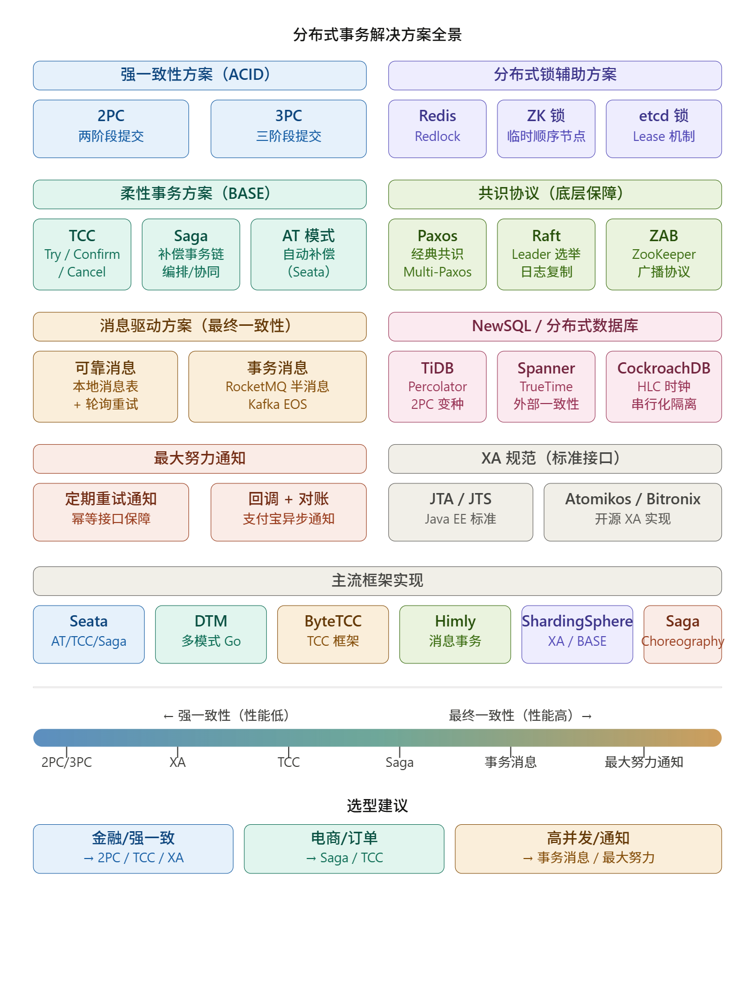


### 一、强一致性（ACID）

**2PC（两阶段提交）** — 协调者驱动，准备阶段 + 提交阶段。优点是实现简单；缺点是同步阻塞、协调者单点故障、脑裂风险。适合低并发、强一致场景（如数据库跨库）。

**3PC（三阶段提交）** — 在 2PC 基础上加入"预提交"阶段，引入超时机制，降低阻塞概率，但仍无法彻底解决网络分区问题，实现复杂，工业界较少直接使用。

------

### 二、柔性事务（BASE）

**TCC（Try-Confirm-Cancel）** — 业务侵入型，将操作分为预留资源（Try）、确认提交（Confirm）、取消回滚（Cancel）三步。需要业务自己实现三个接口，并保证幂等性。适合资金类操作。

**Saga 模式** — 将长事务拆分为一系列本地事务，每步有对应补偿操作。有两种实现：编排式（Choreography，事件驱动）和协同式（Orchestration，中心协调器）。适合长流程业务（如订单、物流）。

**AT 模式（Auto Transaction）** — Seata 特有，通过 SQL 解析自动生成 undo log 实现回滚，对业务无侵入。性能介于 XA 与 TCC 之间。

------

### 三、消息驱动（最终一致性）

**本地消息表** — 业务操作和写消息表在同一本地事务中完成，后台定时任务轮询发送，消费者幂等处理。简单可靠，适合异步解耦。

**事务消息** — RocketMQ 的半消息机制（先发 half message，业务提交后确认投递）；Kafka 通过 EOS（Exactly Once Semantics）语义实现。吞吐高，适合高并发场景。

------

### 四、最大努力通知

通过定期重试 + 幂等接口保障最终送达，不保证强一致。典型场景是支付宝、微信支付的异步回调通知。

------

### 五、分布式锁（辅助手段）

用于并发控制而非事务本身，常与上述方案结合使用：Redis Redlock、ZooKeeper 临时顺序节点、etcd Lease 机制。

------

### 六、共识协议（底层基础）

**Paxos / Raft / ZAB** — 解决多节点状态一致性的理论基础，是 ZooKeeper、etcd、TiDB 等系统的底层实现，不直接对业务暴露。

------

### 七、NewSQL / 分布式数据库

**TiDB**（Percolator 协议）、**Google Spanner**（TrueTime + 2PL）、**CockroachDB**（HLC 混合逻辑时钟）—— 在数据库层面原生支持分布式事务，对应用透明，但运维复杂度更高。

------

### 八、XA 规范

X/Open 组织制定的分布式事务标准接口，基于 2PC。Java 生态中对应 JTA/JTS 规范，实现有 Atomikos、Bitronix、Narayana 等。ShardingSphere 也支持 XA 模式。

------

### 选型原则

| 场景              | 推荐方案             |
| ----------------- | -------------------- |
| 资金/金融，强一致 | TCC、XA/2PC          |
| 电商订单长流程    | Saga、TCC            |
| 高并发异步解耦    | 事务消息（RocketMQ） |
| 简单通知场景      | 最大努力通知 + 幂等  |
| 已用分布式数据库  | NewSQL 原生事务      |
| 遗留系统快速接入  | Seata AT 模式        |


# 分布式事务解决方案

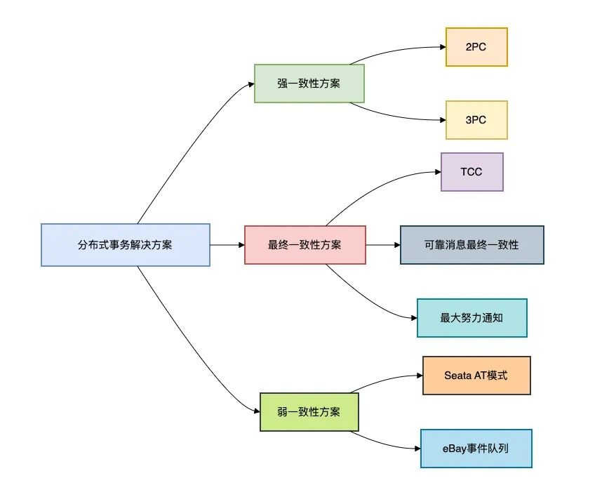

## **1.为什么分布式事务如此棘手？**

在单体应用时代，数据库的ACID事务保证了数据一致性。

但在微服务架构下，**一个业务操作需要跨多个服务、多个数据库**，传统事务模型不再适用。

想象一下电商下单场景：

1. 订单服务创建订单（订单数据库）
2. 库存服务扣减库存（库存数据库）
3. 支付服务处理支付（支付数据库）
4. 积分服务增加积分（积分数据库）

这四个操作要么**全部成功，要么全部失败**。

这就是分布式事务要解决的核心问题。

那么，如何解决问题呢？

## **2. 常见的解决方案**

### **2.1 2PC（两阶段提交）**

该方案是强一致性方案。

2PC是最经典的分布式事务协议，通过**协调者（Coordinator）** 统一调度**参与者（Participant）** 的执行。

分为两个阶段：


**第一阶段：准备阶段**协调者询问所有参与者：“能否提交事务？”

参与者执行本地事务但不提交，锁定资源并回复YES/NO。

```
// 参与者伪代码
public boolean prepare() {
    try {
        startTransaction();
        executeSql("UPDATE account SET frozen = 100 WHERE id = 1"); // 预留资源
        return true; // 返回YES
    } catch (Exception e) {
        rollback();
        return false; // 返回NO
    }
}
```

**第二阶段：提交/回滚阶段**

- 若所有参与者返回YES，协调者发送commit命令，参与者提交事务
- 若有任一参与者返回NO，协调者发送rollback命令，参与者回滚事务

**致命缺陷**：

- **同步阻塞**：所有参与者在prepare后锁定资源，直到收到commit/rollback（高并发下吞吐量骤降）
- **单点故障**：协调者宕机导致参与者永久阻塞
- **数据不一致**：网络分区时部分参与者可能提交成功

### **2.2 3PC（三阶段提交）**

该方案也是强一致性方案。

3PC可以解决2PC阻塞问题。

3PC在2PC基础上增加**预提交阶段**，并引入**超时机制**：


1. **CanCommit阶段**：协调者询问参与者状态（不锁定资源）
2. **PreCommit阶段**：参与者锁定资源并执行SQL（不提交）
3. **DoCommit阶段**：正式提交

**改进点**：

- 参与者超时未收到命令自动提交（降低阻塞风险）
- 预提交阶段发现异常可提前终止

**但依然存在问题**：

- 网络分区时仍可能数据不一致
- 实现复杂度显著增加

### **2.3 TCC（Try-Confirm-Cancel）**

该方案是最终一致性方案。

它是业务层面的2PC。

TCC将业务逻辑拆分为三个阶段：

- **Try**：预留资源（如冻结库存）
- **Confirm**：确认操作（正式扣减库存）
- **Cancel**：释放资源（解冻库存）

```java
// 积分服务TCC实现
publicclass PointsService {
    
    @Transactional
    public boolean tryDeductPoints(Long userId, int points) {
        // 检查用户积分是否充足
        UserPoints user = userPointsDao.selectForUpdate(userId);
        if (user.getAvailable() < points) {
            thrownew InsufficientPointsException();
        }
        // 冻结积分
        userPointsDao.freeze(userId, points);
    }
    
    public boolean confirmDeductPoints(Long userId, int points) {
        // 实际扣减冻结积分
        userPointsDao.confirmDeduct(userId, points);
    }
    
    public boolean cancelDeductPoints(Long userId, int points) {
        // 释放冻结积分
        userPointsDao.unfreeze(userId, points);
    }
}
```

**执行流程**：

1. 主业务调用所有服务的try方法
2. 全部try成功则调用confirm；任一try失败则调用cancel

**优势**：

- **无全局锁**：只在try阶段锁定局部资源
- **高可用**：协调者可集群部署

**挑战**：

- 需**手动实现回滚逻辑**（业务侵入性强）
- 所有服务需提供三种接口

> 金融核心系统首选：某银行跨境支付系统采用TCC方案，日均处理200万笔交易，跨5个服务的事务成功率99.99%

### **2.4 可靠消息最终一致性**

该方案也是最终一致性方案。

可以使用RocketMQ的事务消息。

RocketMQ的事务消息完美解决**本地操作与消息发送的一致性**问题：


**关键步骤**：

1. 发送half消息（对消费者不可见）
2. 执行本地事务
3. 根据本地事务结果commit/rollback
4. MQ定时回查未决事务

**示例代码**：

```java
// 订单服务使用事务消息
publicclass OrderService {
    
    @Autowired
    private RocketMQTemplate rocketMQTemplate;
    
    public void createOrder(Order order) {
        // 1. 发送half消息
        Message msg = MessageBuilder.withPayload(order).build();
        TransactionSendResult result = rocketMQTemplate.sendMessageInTransaction(
            "order_topic", msg, null);
        
        // 2. 执行本地事务（在TransactionListener中实现）
    }
}

// 事务监听器
@RocketMQTransactionListener
class OrderTransactionListener implements RocketMQLocalTransactionListener {

    @Override
    public RocketMQLocalTransactionState executeLocalTransaction(Message msg, Object arg) {
        try {
            Order order = (Order) msg.getPayload();
            orderDao.save(order); // 本地事务
            return RocketMQLocalTransactionState.COMMIT;
        } catch (Exception e) {
            return RocketMQLocalTransactionState.ROLLBACK;
        }
    }

    @Override
    public RocketMQLocalTransactionState checkLocalTransaction(Message msg) {
        // 回查逻辑
        return checkOrderStatus(msg);
    }
}
```

### **2.5 最大努力通知**

该方案是弱一致性方案。

适用于**对实时性要求低**的场景（如短信通知）：

1. 业务主流程完成后发送通知
2. 失败后按策略重试（如间隔1min、5min、10min）
3. 达到阈值后人工干预

```java
// 最大努力通知服务
publicclass BestEffortNotifier {
    
    privatestaticfinalint[] RETRY_INTERVALS = {1, 5, 10, 30, 60}; // 分钟
    
    public void notify(String event) {
        int retryCount = 0;
        while (retryCount < RETRY_INTERVALS.length) {
            try {
                if (sendNotification(event)) {
                    return; // 通知成功
                }
            } catch (Exception e) {
                // 记录日志
            }
            Thread.sleep(RETRY_INTERVALS[retryCount] * 60 * 1000);
            retryCount++;
        }
        alertManualIntervention(event); // 人工介入
    }
}
```

> 实战经验：支付回调采用此方案，重试8次跨12小时，99.5%的通知在30分钟内成功

### **2.6 Seata AT模式**

该方案是自动化的TCC。

Seata的**AT（Auto Transaction）模式**在**不侵入业务代码**的前提下实现分布式事务：

**核心机制**：

1. **全局锁**：TC（事务协调器）管理内存级全局锁（替代数据库行锁）
2. **SQL代理**：解析业务SQL自动生成回滚日志
3. **二阶段异步提交**：极大提升吞吐量

```
/* 原始SQL */
UPDATE product SET stock = stock - 10 WHERE id = 1001;

/* Seata自动记录回滚日志 */
INSERT INTO undo_log (branch_id, xid, 
  before_image, after_image) 
VALUES (?, ?, 
  '{"stock":100}',  -- 更新前值
  '{"stock":90}');  -- 更新后值
```

**性能对比**：

| 方案     | 锁持有时间 | 锁冲突检测耗时 | 适用场景         |
| :------- | :--------- | :------------- | :--------------- |
| 传统2PC  | 500~2000ms | 5~20ms         | 低并发强一致性   |
| Seata AT | 1~10ms     | 0.01ms         | 高并发最终一致性 |

**局限**：

- 不支持嵌套事务
- 热点数据更新冲突率高

### **2.7 eBay事件队列**

该方案是基于本地事务的最终一致性方案。

eBay提出的经典方案：

1. 将分布式操作拆分为**本地事务+异步事件**
2. 使用**事件表**确保事件不丢失
3. 通过**补偿机制**解决失败场景

```
-- 订单服务数据库
BEGIN TRANSACTION;
-- 1. 创建订单
INSERT INTO orders (...) VALUES (...); 
-- 2. 记录事件（与订单在同一个事务）
INSERT INTO event_queue (event_type, payload, status) 
VALUES ('ORDER_CREATED', '{"orderId":1001}', 'PENDING');
COMMIT;

-- 定时任务扫描事件表并发布
```

> 该方案在早期eBay系统中每天处理1亿+事件，保证核心交易链路最终一致

## **3.方案的选型指南**

根据业务场景选择合适方案：

| 方案             | 一致性级别 | 性能 | 复杂度 | 适用场景             |
| :--------------- | :--------- | :--- | :----- | :------------------- |
| 2PC/3PC          | 强一致性   | 低   | 中     | 银行核心系统         |
| TCC              | 最终一致   | 高   | 高     | 电商交易、积分体系   |
| RocketMQ事务消息 | 最终一致   | 高   | 中     | 订单创建、物流通知   |
| 最大努力通知     | 弱一致     | 高   | 低     | 短信提醒、运营通知   |
| Seata AT         | 最终一致   | 高   | 低     | 微服务架构的常规业务 |
| eBay事件队列     | 最终一致   | 高   | 中     | 内部状态同步         |

**黄金法则**：

- **强一致性需求**：选择2PC/ZooKeeper（牺牲性能）
- **高并发场景**：选择可靠消息/Seata AT（最终一致）
- **弱一致性场景**：最大努力通知（成本最低）

## **总结**

经过十年演进，分布式事务解决方案已从**强一致性**向**高性能最终一致性**发展。

> 技术没有绝对的好坏，只有适合与否。

我曾见过团队为了追求理论上的强一致性，把系统搞得复杂不堪；也见过过度追求性能导致资金损失的血泪教训。

分布式事务的本质，是在业务需求与技术可行性之间找到平衡点。

**致开发者**：不必追求完美的分布式事务解决方案，**适合业务场景的才是最好的**。

在设计时多问自己：

1. 业务能容忍多长时间不一致？
2. 事务失败后如何补偿？
3. 是否有完善的监控和人工介入机制？

愿你在分布式系统的海洋中，乘风破浪，游刃有余。

