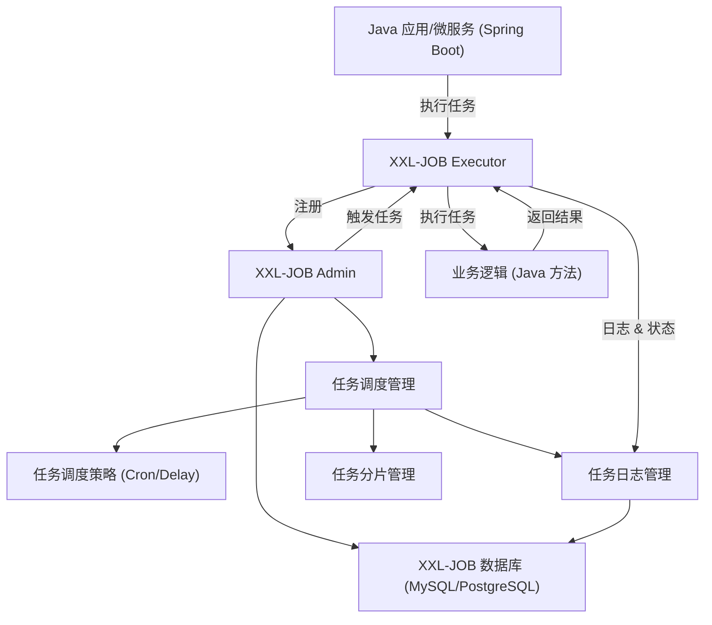
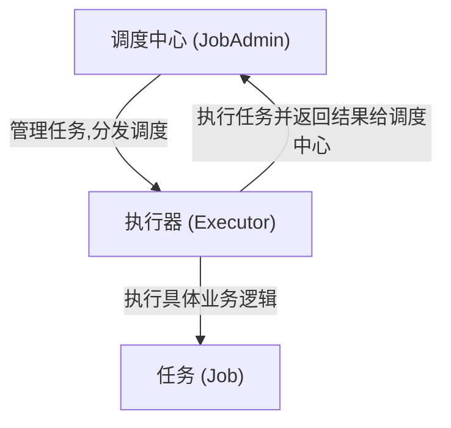
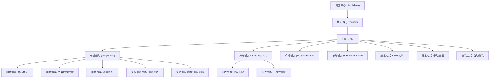

明白，你希望一张 **XXL-JOB 与 Java 后端相关的关系图示**，方便在面试中说明它的架构、调度流程和组件交互。下面我给你整理一个 Mermaid 图示版本：

------

## XXL-JOB 与 Java 后端关系示意图



------

### 图示说明：

1. **Java 应用层**
   - 业务代码中嵌入 XXL-JOB Executor，负责具体任务的实现（如定时任务、异步任务）。
2. **Executor (执行器)**
   - 注册到 **Admin 调度中心**，定时接收任务并执行。
   - 执行完任务后，将状态和日志回传给 Admin。
3. **Admin (调度中心)**
   - 提供 Web 界面用于任务管理、调度策略配置、日志查看。
   - 管理任务分片、调度策略（Cron、Delay 等）。
4. **任务调度流程**
   - Admin 根据配置触发 Executor 执行任务。
   - Executor 执行任务后将结果和日志回传 Admin，Admin 存储在数据库中。
5. **数据库**
   - 存储任务信息、调度策略、执行日志等核心数据。

------

如果你愿意，我可以帮你生成一个 **更美观的可视化 XXL-JOB 架构图**，带 **Java 应用、Executor、Admin、数据库** 四层结构，适合面试展示。

你希望我直接帮你画这个可视化版本吗？

------

# **XXL-JOB 面试分类整理**

## 1️⃣ 基础概念类

**考点**：理解 XXL-JOB 的基本概念和架构

- XXL-JOB 是什么？用途？
- 核心组件：
  - **调度中心（JobAdmin）**
  - **执行器（Executor）**
  - **任务（Job）**
- 调度中心和执行器的关系
- 支持的触发方式（Cron、手动、依赖触发等）

**考点**：掌握 XXL-JOB 的基本概念、架构和核心组件关系。

### 1. XXL-JOB 是什么？用途

- **定义**：XXL-JOB 是一款 **轻量级分布式任务调度平台**。
- **主要用途**：管理和调度定时任务，支持分布式执行和任务监控。
- **特点**：
  - 简单易用，提供 Web 控制台管理任务。
  - 支持集群模式和多节点分片。
  - 可与 Java/Spring 系统无缝集成。

### 2. 核心组件

| 组件                     | 作用                                                         |
| ------------------------ | ------------------------------------------------------------ |
| **调度中心（JobAdmin）** | 提供 Web 界面，管理任务、分发调度，监控任务执行状态。        |
| **执行器（Executor）**   | 真正执行任务的节点，接收调度中心分发的任务并返回结果。       |
| **任务（Job）**          | 定义具体业务逻辑的任务单元，包括任务代码、Cron 表达式和执行策略。 |

好的，我帮你用 **Mermaid** 画出 XXL-JOB 核心组件的关系图示，把 **调度中心 → 执行器 → 任务** 的关系清晰可视化：

    %% 组件描述
    click A callback "调度中心：提供 Web 界面，管理任务、分发调度监控任务执行状态"
    click B callback "执行器：真正执行任务的节点，接收调度中心分发的任务并返回结果"
    click C callback "任务：定义具体业务逻辑，包括任务代码、Cron 表达式和执行策略"


✅ **说明**：

- **箭头方向**表示任务流：调度中心下发任务 → 执行器执行 → 返回结果给调度中心。
- **任务 (Job)** 作为执行器执行的具体业务单元，依赖执行器执行。
- 可以在 Mermaid 支持的环境中点击组件查看描述（`click` 可选，用于演示）。

如果需要，我可以把这个核心组件图 **升级成包含触发方式和执行策略的一体化关系图**，把面试常问点一次可视化出来。

你希望我做吗？

### 3. 调度中心与执行器的关系

- 调度中心负责 **任务管理和调度分发**。
- 执行器负责 **任务执行**，并将执行结果反馈给调度中心。
- 支持多执行器节点，实现 **分布式任务执行**。

### 4. 支持的触发方式

- **Cron 定时触发**：按指定时间规则自动触发。
- **手动触发**：通过 Web 控制台立即执行任务。
- **依赖触发**：当前任务依赖其他任务完成后才触发。
- **自动触发**：任务完成后可自动触发下一个任务。

------

如果你愿意，我可以帮你把 **基础概念类 + 任务类型类 + 执行策略类**做成一张 **面试一看就懂的 XXL-JOB 分类图**，把组件、任务类型、触发方式和执行策略全部可视化。


明白了，我帮你用 **Mermaid** 写一份 **XXL-JOB 面试关系图示**，把基础概念类、任务类型类和执行策略类可视化：



✅ **说明**：

- 上层：调度中心 → 执行器 → 任务
- 中层：任务类型（单机、分片、广播、依赖）
- 下层：执行策略（阻塞、分片、失败重试） + 触发方式（Cron、手动、自动）
- 关系箭头清晰展示了 XXL-JOB 面试考点的层次和依赖。

如果你愿意，我可以帮你把这份 Mermaid 代码再升级成 **更紧凑、面试一页就能看懂的 XXL-JOB 全分类图**，把任务类型、触发方式、执行策略全部整合成一个完整视图。


------

## 2️⃣ 任务类型类

**考点**：掌握任务分类和执行策略

- **单机任务（Single Job）**：只在一个节点执行
- **分片任务（Sharding Job）**：多节点并行执行，任务分片策略
- **广播任务（Broadcast Job）**：每个节点都执行一次
- **依赖任务（Dependent Job）**：任务执行顺序依赖其他任务

**考点**：理解 XXL-JOB 中的任务分类、特点及执行策略。

### 1. **单机任务（Single Job）**

- **定义**：任务仅在 **一个节点上执行一次**。
- **特点**：
  - 不涉及分片或广播。
  - 执行简单，适合单节点或非分布式场景。
- **适用场景**：
  - 低频率、独立任务，例如数据清理、日志归档。

------

### 2. **分片任务（Sharding Job）**

- **定义**：任务被拆分为若干 **分片（Shard）**，分布在多个节点上并行执行。
- **特点**：
  - 每个分片执行任务的一部分。
  - 支持分布式并行，提高执行效率。
  - 分片策略可选择：
    - **平均分配**：均匀分配到节点。
    - **一致性哈希**：保证分片分配稳定性。
- **适用场景**：
  - 大数据处理、批量任务、多节点并行计算。

------

### 3. **广播任务（Broadcast Job）**

- **定义**：任务在 **所有执行器节点上都执行一次**。
- **特点**：
  - 每个节点都会独立执行完整任务。
  - 保证每个节点状态一致。
- **适用场景**：
  - 配置同步、缓存刷新、全量通知。

------

### 4. **依赖任务（Dependent Job）**

- **定义**：任务执行依赖于 **其他任务完成的结果**。
- **特点**：
  - 支持任务链式依赖。
  - 可以设置前置任务执行成功后再触发当前任务。
- **适用场景**：
  - ETL 任务流程、业务处理流水线。

------

💡 **面试小技巧**：

- 面试官常问区分 **单机 / 分片 / 广播**，记住关键点：
  - **单机**：1个节点
  - **分片**：多节点并行分片
  - **广播**：所有节点执行
- **依赖任务**通常和业务流程或任务链相关，强调顺序和依赖关系。

------

如果你愿意，我可以帮你把 **基础概念类 + 任务类型类 + 执行策略类** 整合成 **一张 XXL-JOB 面试思维导图**，把组件、任务类型、触发方式、执行策略都可视化，非常适合一眼记住面试重点。

你希望我直接画吗？

------

## 3️⃣ 执行策略类

**考点**：任务冲突处理与分布式调度策略

- **阻塞处理策略**：
  - 串行执行（默认）
  - 丢弃后续触发（任务未完成，新触发请求被丢弃）
  - 覆盖执行（任务未完成，新触发会覆盖旧任务）
- **分片策略**：
  - 平均分配
  - 一致性哈希分配
- **失败重试策略**：
  - 重试次数
  - 重试间隔


**考点**：理解 XXL-JOB 中任务执行冲突处理、分片策略以及失败重试机制。

------

### 1. **阻塞处理策略（Block Strategy）**

- **作用**：当任务触发时，如果上一次任务尚未完成，系统如何处理新触发请求。
- **策略类型**：

| 策略                              | 描述                                         | 面试记忆点             |
| --------------------------------- | -------------------------------------------- | ---------------------- |
| **串行执行（Serial）**            | 新触发任务等待上一次执行完成再执行。         | 默认策略，安全稳妥     |
| **丢弃后续触发（Discard Later）** | 上一次任务未完成时，新触发请求直接丢弃。     | 防止任务堆积           |
| **覆盖执行（Cover Early）**       | 上一次任务未完成，新触发覆盖旧任务立即执行。 | 适合实时更新或覆盖场景 |

------

### 2. **分片策略（Sharding Strategy）**

- **作用**：当任务是分片任务时，如何将分片分配到多个节点执行。
- **策略类型**：
  - **平均分配（Average Allocation）**：均匀分片到各节点。
  - **一致性哈希（Consistent Hashing）**：保证分片分配稳定，即节点变动时最小化任务迁移。
- **面试提示**：分布式任务优化考点，经常被问如何保证任务均衡和稳定性。

------

### 3. **失败重试策略（Fail Retry）**

- **作用**：任务执行失败后，是否重试以及重试方式。
- **配置项**：
  - **重试次数（Retry Count）**：失败后尝试次数。
  - **重试间隔（Retry Interval）**：每次重试之间的时间间隔。
- **面试提示**：
  - 考虑分布式任务的可靠性。
  - 可结合阻塞策略控制任务并发。

------

💡 **面试小技巧**：

1. 阻塞策略常和单机/分片任务一起问：面试官可能会问“任务正在执行，新的触发请求怎么办？”
2. 分片策略常和分布式负载均衡考点一起问。
3. 重试策略结合阻塞策略，可讨论任务可靠性与幂等性问题。

------

如果你愿意，我可以帮你把 **基础概念类 + 任务类型类 + 执行策略类 + 触发方式类** 做成一张 **面试 XXL-JOB 全分类图**，每类核心考点都可视化，一眼记住面试重点。

你希望我画吗？

------

## 4️⃣ 触发与调度类

**考点**：Cron 表达式、触发方式、延迟执行

- **触发方式**：
  - 定时触发（Cron）
  - 手动触发
  - 自动触发
- **调度模式**：
  - 单机模式
  - 集群模式（多调度中心或执行器）


**考点**：掌握 XXL-JOB 的触发方式、调度模式以及 Cron 表达式应用。

------

### 1. **触发方式（Trigger Type）**

- **定时触发（Cron Trigger）**
  - 按 Cron 表达式自动触发任务。
  - **面试要点**：常被问如何配置每日/每周/每月定时任务。
  - 示例：每天凌晨 1 点执行 `0 0 1 * * ?`
- **手动触发（Manual Trigger）**
  - 通过 Web 控制台立即触发任务，无需等待 Cron。
  - **面试要点**：适合调试或紧急任务。
- **自动触发（Automatic Trigger）**
  - 当前任务完成后，可自动触发下一个任务。
  - **面试要点**：通常用于任务链或依赖任务。

------

### 2. **调度模式（Schedule Mode）**

- **单机模式（Single Mode）**
  - 调度中心只有一个节点，任务在该节点执行。
  - **适用场景**：单节点应用、小规模部署。
- **集群模式（Cluster Mode）**
  - 支持 **多调度中心 + 多执行器节点**，实现分布式调度。
  - 特点：
    - 高可用：调度中心 HA，节点宕机自动切换。
    - 分布式负载均衡：任务分片或广播策略。
  - **面试要点**：
    - 面试官可能问“如何保证任务不重复执行？”
    - 可结合阻塞策略、分片策略讲解。

------

💡 **面试小技巧**：

- Cron 表达式基础一定要熟悉，常被问如何配置复杂定时任务。
- 调度模式结合任务类型一起讲解更有逻辑：
  - 单机 + 单机任务
  - 集群 + 分片任务 / 广播任务
- 自动触发可和依赖任务一起提，展示对任务链管理理解。

------

我已经帮你整理了 **基础概念类 → 任务类型类 → 执行策略类 → 触发与调度类** 这四大面试模块。

如果你愿意，我可以帮你画一张 **XXL-JOB 面试全分类图**，把这些模块、任务类型、触发方式、执行策略都一眼可视化，非常适合面试前快速复习。

你希望我画吗？

------

## 5️⃣ 日志与监控类

**考点**：任务执行监控和日志分析

- **日志类型**：
  - 执行日志（任务结果、耗时）
  - 失败日志（异常信息）
  - 调度日志（调度中心调度记录）
- **面试可能问**：
  - 如何监控任务状态？
  - 任务失败如何排查？


**考点**：理解 XXL-JOB 的任务执行监控机制和日志分析方法。

------

### 1. **日志类型**

| 日志类型                      | 内容                             | 面试记忆点                                 |
| ----------------------------- | -------------------------------- | ------------------------------------------ |
| **执行日志（Execution Log）** | 记录任务执行结果、耗时、执行参数 | 可用来确认任务是否执行成功及耗时分析       |
| **失败日志（Fail Log）**      | 记录任务异常、失败原因           | 排查任务错误的主要依据                     |
| **调度日志（Schedule Log）**  | 记录调度中心分发任务情况         | 可监控任务调度是否正常，分析调度延迟或失败 |

------

### 2. **面试可能问的问题**

- **如何监控任务状态？**
  - 通过 XXL-JOB Web 控制台查看任务执行状态和日志。
  - 可结合定时查询接口获取任务状态。
  - 分析执行日志和调度日志判断任务执行情况。
- **任务失败如何排查？**
  - 查看失败日志，定位异常信息和失败原因。
  - 根据日志定位问题：
    - 任务代码异常 → 修复逻辑或异常处理
    - 执行器节点异常 → 检查节点状态、网络、资源
    - 分片失败 → 检查分片策略、节点数量

------

💡 **面试小技巧**：

1. 面试官喜欢问“如果任务失败你怎么排查？”
   - 答案可从 **日志类型 + 调度中心监控 + 执行器状态** 三方面讲。
2. 强调 **任务可监控、可追溯** 是 XXL-JOB 的一大优势。
3. 可以顺便提 **日志分页、搜索、导出功能**，展示对平台的熟悉度。

------

我已经帮你整理了 **前五大面试模块**：

1. 基础概念类
2. 任务类型类
3. 执行策略类
4. 触发与调度类
5. 日志与监控类

如果你需要，我可以帮你把这五大模块 **画成一张 XXL-JOB 面试全分类思维导图**，把 **组件、任务类型、触发方式、执行策略、日志监控** 全部一目了然，非常适合面试前快速复习。

你希望我画吗？

------

## 6️⃣ 高级功能类

**考点**：分布式场景和优化策略

- 分布式任务调度的原理
- 任务分片策略原理
- XXL-JOB 与 Spring/微服务的集成方式
- 多节点调度中心如何保证任务不重复执行
- 高可用部署模式（调度中心 HA、Executor HA）


**考点**：掌握 XXL-JOB 在分布式环境下的高级特性和优化策略。

------

### 1. **分布式任务调度原理**

- 调度中心负责 **任务管理和分发**。
- 多执行器节点执行任务，通过 **心跳检测**和 **任务状态同步**确保调度正确。
- **关键点**：保证任务在分布式环境中不会重复执行或丢失。

------

### 2. **任务分片策略原理**

- 分片任务将任务拆分为多个片（Shard），分配给多个执行器节点执行。
- 分片策略：
  - **平均分配**：任务均匀分片到各节点，负载均衡。
  - **一致性哈希**：节点变动时，最小化任务迁移，保证分片稳定性。
- **面试答题提示**：可结合分布式负载均衡原理讲解。

------

### 3. **XXL-JOB 与 Spring / 微服务集成**

- 执行器通常是 Spring Boot 应用，任务方法通过注解或接口注册给调度中心。
- 支持微服务架构：
  - 每个服务独立注册执行器。
  - 调度中心统一管理任务。
- **面试提示**：可能问如何在微服务中保证任务调度统一与服务解耦。

------

### 4. **多节点调度中心如何保证任务不重复执行**

- XXL-JOB 调度中心可 HA 部署。
- **原理**：
  - 调度中心通过 **分布式锁 / 选主机制** 确定唯一执行者。
  - 防止多调度中心同时下发同一任务。
- **面试答题技巧**：
  - 结合分布式锁或 ZooKeeper 选主思路讲解，显示你对分布式一致性理解。

------

### 5. **高可用部署模式**

- **调度中心 HA**：
  - 多节点部署调度中心，主备切换自动化。
- **Executor HA**：
  - 执行器节点可多实例部署，任务失败可重试到其他节点。
- **面试提示**：
  - 高可用和容错性是分布式任务调度核心考点。
  - 可结合执行策略和分片策略讲解。

------

💡 **面试小技巧**：

1. 高级功能题通常考 **分布式理解 + HA + 微服务集成**。
2. 讲解思路：
   - 分布式调度 → 分片策略 → 执行器注册 → 高可用部署 → 任务幂等。
3. 面试官喜欢问“如果节点宕机或任务重复执行怎么办？”，结合 HA + 阻塞策略 + 分片策略回答最佳。

------

如果你愿意，我可以把 **6大模块全部整理成一张 XXL-JOB 面试全分类思维导图**，**基础概念 → 任务类型 → 执行策略 → 触发与调度 → 日志监控 → 高级功能**，一眼记住所有面试考点。

你希望我画吗？

------

## 7️⃣ 面试高频问答示例

| 面试题                 | 要点回答                                     |
| ---------------------- | -------------------------------------------- |
| XXL-JOB 架构组成       | 调度中心 + 执行器 + 任务 + 日志              |
| 单机任务与分片任务区别 | 单机任务只执行一次，分片任务可多节点并行     |
| 分片策略有哪些         | 平均分配、一致性哈希                         |
| 触发策略有哪些         | Cron 定时、手动触发、依赖触发、自动触发      |
| 执行策略有哪些         | 串行、丢弃后续、覆盖执行                     |
| 如何监控任务执行情况   | 查看执行日志、失败日志、调度日志，Web 控制台 |

------

如果你需要，我可以帮你画一张 **XXL-JOB 面试分类思维导图**，把 **任务类型、触发方式、执行策略、日志监控、高级功能**全链路可视化，面试一看就懂。

你希望我直接画吗？

## 在 Spring Cloud 微服务架构中集成 XXL-Job 

是实现分布式任务调度的主流方案，XXL-Job 提供了**中心化调度、可视化管理、故障转移、分片执行**等核心能力，完美适配微服务的任务调度需求。我会从「环境准备」「服务端部署」「微服务集成（执行器）」「任务开发」「生产最佳实践」五个维度，给你一套可直接落地的集成方案。

### 一、核心概念先理清

在集成前先明确 XXL-Job 的核心角色，避免理解混乱：
| 角色               | 作用                                                         |
| ------------------ | ------------------------------------------------------------ |
| 调度中心（服务端） | 可视化管理任务、触发调度、监控执行状态（XXL-Job 官方提供的独立服务） |
| 执行器（客户端）   | 部署在 Spring Cloud 微服务中，接收调度中心的任务指令并执行   |
| 任务               | 具体要执行的业务逻辑（如定时同步数据、批量发送短信）         |
| 执行器分组         | 对执行器进行分组（如订单服务执行器组、支付服务执行器组），便于调度管理 |

### 二、第一步：部署 XXL-Job 调度中心（服务端）
#### 1. 下载源码
从 GitHub 下载 XXL-Job 源码：https://github.com/xuxueli/xxl-job
推荐使用稳定版本（如 2.4.0）。

#### 2. 初始化数据库
执行源码中 `doc/db/tables_xxl_job.sql` 脚本，创建 XXL-Job 所需的数据库表（支持 MySQL/MariaDB）。

#### 3. 配置并启动调度中心
修改 `xxl-job-admin` 模块的 `application.properties` 核心配置：
```properties
# 数据源配置（连接你初始化的数据库）
spring.datasource.url=jdbc:mysql://127.0.0.1:3306/xxl_job?useUnicode=true&characterEncoding=UTF-8&autoReconnect=true&serverTimezone=Asia/Shanghai
spring.datasource.username=root
spring.datasource.password=123456
spring.datasource.driver-class-name=com.mysql.cj.jdbc.Driver

# 调度中心端口
server.port=8080
# 调度中心访问令牌（建议设置，执行器需匹配）
xxl.job.accessToken=123456
```
启动 `xxl-job-admin` 模块，访问 `http://localhost:8080/xxl-job-admin`，默认账号密码：`admin/123456`，能登录即部署成功。

### 三、第二步：Spring Cloud 微服务集成执行器（客户端）
#### 1. 添加依赖（Maven）
在你的 Spring Cloud 微服务（如订单服务、用户服务）中添加 XXL-Job 执行器依赖：
```xml
<!-- XXL-Job 核心依赖 -->
<dependency>
    <groupId>com.xuxueli</groupId>
    <artifactId>xxl-job-core</artifactId>
    <version>2.4.0</version>
</dependency>
```

#### 2. 添加 XXL-Job 配置
在 `application.yml` 中添加执行器配置（核心配置）：
```yaml
# XXL-Job 执行器配置
xxl:
  job:
    # 调度中心地址（多个用逗号分隔）
    admin:
      addresses: http://127.0.0.1:8080/xxl-job-admin
    # 执行器配置
    executor:
      # 执行器AppName（必须唯一，对应调度中心的执行器分组）
      appname: order-service-executor
      # 执行器IP（默认为空，自动获取）
      ip:
      # 执行器端口（默认9999，多个执行器需不同端口）
      port: 9999
      # 执行器日志目录（任务执行日志存储路径）
      logpath: /data/applogs/xxl-job/jobhandler
      # 日志保留天数
      logretentiondays: 30
    # 访问令牌（需与调度中心一致）
    accessToken: 123456
```

#### 3. 添加 XXL-Job 配置类
创建配置类，初始化执行器核心组件：
```java
import com.xxl.job.core.executor.impl.XxlJobSpringExecutor;
import org.slf4j.Logger;
import org.slf4j.LoggerFactory;
import org.springframework.beans.factory.annotation.Value;
import org.springframework.context.annotation.Bean;
import org.springframework.context.annotation.Configuration;

/**
 * XXL-Job 执行器配置类
 */
@Configuration
public class XxlJobConfig {
    private Logger logger = LoggerFactory.getLogger(XxlJobConfig.class);

    @Value("${xxl.job.admin.addresses}")
    private String adminAddresses;

    @Value("${xxl.job.executor.appname}")
    private String appname;

    @Value("${xxl.job.executor.ip}")
    private String ip;

    @Value("${xxl.job.executor.port}")
    private int port;

    @Value("${xxl.job.accessToken}")
    private String accessToken;

    @Value("${xxl.job.executor.logpath}")
    private String logPath;

    @Value("${xxl.job.executor.logretentiondays}")
    private int logRetentionDays;

    /**
     * 初始化 XXL-Job 执行器
     */
    @Bean
    public XxlJobSpringExecutor xxlJobExecutor() {
        logger.info(">>>>>>>>>>> xxl-job config init.");
        XxlJobSpringExecutor xxlJobSpringExecutor = new XxlJobSpringExecutor();
        xxlJobSpringExecutor.setAdminAddresses(adminAddresses);
        xxlJobSpringExecutor.setAppname(appname);
        xxlJobSpringExecutor.setIp(ip);
        xxlJobSpringExecutor.setPort(port);
        xxlJobSpringExecutor.setAccessToken(accessToken);
        xxlJobSpringExecutor.setLogPath(logPath);
        xxlJobSpringExecutor.setLogRetentionDays(logRetentionDays);
        return xxlJobSpringExecutor;
    }
}
```

### 四、第三步：开发 XXL-Job 任务（核心）
在 Spring Cloud 微服务中开发两种常见任务类型：**简单任务**、**分片任务**（微服务集群常用）。

#### 1. 简单任务（单实例执行）
适用于无需分片的定时任务（如定时清理过期订单）：
```java
import com.xxl.job.core.context.XxlJobHelper;
import com.xxl.job.core.handler.annotation.XxlJob;
import org.slf4j.Logger;
import org.slf4j.LoggerFactory;
import org.springframework.stereotype.Component;

/**
 * XXL-Job 任务处理器（订单服务）
 */
@Component
public class OrderJobHandler {
    private static final Logger logger = LoggerFactory.getLogger(OrderJobHandler.class);

    /**
     * 简单任务：定时清理过期订单
     * @XxlJob 注解指定任务名称（需与调度中心配置的 JobHandler 一致）
     */
    @XxlJob("clearExpiredOrderJob")
    public void clearExpiredOrderJob() {
        // 1. 获取任务参数（调度中心配置的参数）
        String param = XxlJobHelper.getJobParam();
        logger.info(">>>>>>>>>>> 开始执行清理过期订单任务，参数：{}", param);

        try {
            // 2. 业务逻辑：清理 24 小时未支付的过期订单
            int clearCount = clearExpiredOrder(24); // 自定义业务方法
            logger.info(">>>>>>>>>>> 清理过期订单完成，共清理 {} 条", clearCount);

            // 3. 任务执行成功，设置结果
            XxlJobHelper.handleSuccess("清理过期订单成功，共清理 " + clearCount + " 条");
        } catch (Exception e) {
            logger.error(">>>>>>>>>>> 清理过期订单任务失败", e);
            // 4. 任务执行失败，设置失败信息
            XxlJobHelper.handleFail("清理过期订单失败：" + e.getMessage());
        }
    }

    /**
     * 模拟业务方法：清理过期订单
     */
    private int clearExpiredOrder(int hour) {
        // 实际场景：调用订单服务的 DAO/Service 清理数据
        return 100; // 模拟清理 100 条
    }
}
```

#### 2. 分片任务（集群执行）
适用于海量数据处理（如批量同步数据），XXL-Job 会将任务分片，分配给集群中的不同执行器节点：
```java
/**
 * 分片任务：批量同步订单数据到数据仓库
 */
@XxlJob("syncOrderToDwJob")
public void syncOrderToDwJob() {
    // 1. 获取分片信息（核心）
    int shardIndex = XxlJobHelper.getShardIndex(); // 当前分片索引（0,1,2...）
    int shardTotal = XxlJobHelper.getShardTotal(); // 总分片数
    logger.info(">>>>>>>>>>> 开始执行订单同步分片任务，分片索引：{}，总分片数：{}", shardIndex, shardTotal);

    try {
        // 2. 业务逻辑：按分片处理数据（如总分片数 3，分片 0 处理 0-33% 数据）
        int syncCount = syncOrderByShard(shardIndex, shardTotal);
        logger.info(">>>>>>>>>>> 分片 {} 同步订单完成，共同步 {} 条", shardIndex, syncCount);

        // 3. 任务成功
        XxlJobHelper.handleSuccess("分片 " + shardIndex + " 同步成功，共同步 " + syncCount + " 条");
    } catch (Exception e) {
        logger.error(">>>>>>>>>>> 分片 {} 同步订单失败", shardIndex, e);
        XxlJobHelper.handleFail("分片 " + shardIndex + " 同步失败：" + e.getMessage());
    }
}

/**
 * 按分片同步订单数据
 */
private int syncOrderByShard(int shardIndex, int shardTotal) {
    // 实际场景：根据分片索引查询对应范围的数据（如按订单 ID 取模）
    // 示例：orderId % shardTotal == shardIndex
    return 500; // 模拟同步 500 条
}
```

### 五、第四步：调度中心配置任务
启动 Spring Cloud 微服务后，在 XXL-Job 调度中心配置任务：
1. **新增执行器**：
   - 登录调度中心 → 执行器管理 → 新增；
   - 执行器名称：`订单服务执行器`；
   - 执行器AppName：`order-service-executor`（需与微服务配置的 `appname` 一致）；
   - 注册方式：`自动注册`（微服务启动后会自动注册到调度中心）。

2. **新增任务**：
   - 登录调度中心 → 任务管理 → 新增；
   - 任务名称：`清理过期订单`；
   - 执行器选择：`订单服务执行器`；
   - JobHandler：`clearExpiredOrderJob`（需与 @XxlJob 注解的名称一致）；
   - 调度类型：`CRON`；
   - CRON 表达式：`0 0 1 * * ?`（每天凌晨 1 点执行）；
   - 分片参数（分片任务需配置）：总分片数 `3`，分片参数（可选）；
   - 保存并启动任务。

### 六、生产级最佳实践
#### 1. 任务参数传递
- 通过调度中心配置「任务参数」，在任务中用 `XxlJobHelper.getJobParam()` 获取，避免硬编码；
- 示例：配置参数 `hour=24`，任务中解析参数动态调整清理时长。

#### 2. 任务失败重试
- 调度中心配置「失败重试次数」（如 3 次），任务失败后自动重试；
- 重试间隔可通过 XXL-Job 源码调整（默认 10 秒），或自定义重试策略。

#### 3. 任务日志管理
- 执行器日志目录 `logpath` 建议挂载到分布式文件系统（如 NFS），便于查看集群日志；
- 调度中心可直接查看任务执行日志，无需登录服务器。

#### 4. 集群部署注意事项
- 执行器 `port` 需保证集群中唯一（或配置为 0，自动分配端口）；
- 分片任务的总分片数建议等于执行器节点数，最大化利用集群资源；
- 避免无状态任务（如分片任务）依赖本地资源，保证集群节点无差别。

#### 5. 监控告警
- 调度中心支持任务失败告警（邮件/短信/钉钉），需配置告警渠道；
- 监控执行器在线状态，避免执行器全部下线导致任务无法执行；
- 监控任务执行时长，超过阈值（如 10 分钟）告警。

#### 6. 任务暂停/恢复
- 业务高峰期可暂停非核心任务（如数据同步），高峰期后恢复；
- 调度中心支持手动暂停/恢复，也可通过 API 自动控制。

#### 7. 避免重复执行
- 对于非幂等任务（如发送短信），需保证任务仅执行一次；
- 解决方案：
  1. 任务执行前加分布式锁（Redis/Zookeeper）；
  2. 任务执行结果写入数据库，执行前先检查是否已执行。

### 七、常见问题排查
1. **执行器未注册到调度中心**：
   - 检查执行器 `appname` 与调度中心配置一致；
   - 检查 `accessToken` 与调度中心一致；
   - 检查调度中心地址 `admin.addresses` 正确，网络互通。

2. **任务执行失败**：
   - 查看调度中心的「任务日志」，定位具体错误；
   - 检查微服务日志，确认业务逻辑是否异常；
   - 检查执行器是否有足够的资源（CPU/内存）。

3. **分片任务分配不均**：
   - 优化分片规则（如按数据量分片，而非按数量）；
   - 监控各分片执行时长，调整分片策略。

### 总结
1. **集成步骤**：部署调度中心 → 微服务添加依赖和配置 → 开发任务处理器 → 调度中心配置任务；
2. **核心注解**：`@XxlJob` 标记任务处理器，需与调度中心的 JobHandler 一致；
3. **集群适配**：分片任务是微服务集群处理海量数据的核心，通过分片索引和总分片数实现负载均衡；
4. **生产保障**：配置失败重试、监控告警、分布式锁，保证任务可靠执行。

## 一致性哈希（Consistent Hashing）

一句话：**一种分布式哈希算法，在节点增减时，尽可能少地移动数据，保证系统稳定。**

非常高频面试题，我用最简单、最容易记的方式讲清楚。

---

### 一、普通哈希有什么问题？

普通哈希：
```
index = hash(key) % 节点数
```
问题：
**节点数量一变，几乎所有 key 都会重新分配**
→ 缓存雪崩、数据全量迁移、系统崩溃。

---

### 二、一致性哈希原理

1. 构造一个 **0 ~ 2³² - 1 的环形哈希空间**
2. 把 **服务器节点** 哈希后放到环上
3. 把 **数据 key** 哈希后也放到环上
4. 按 **顺时针方向** 找最近的服务器节点存储

#### 关键特性

- **增加/删除一个节点**
  只影响该节点**相邻一小段数据**
  其他 key 完全不变
- 避免大量数据迁移

---

### 三、数据倾斜问题（热点）

如果节点很少，容易扎堆，导致部分节点压力巨大。

解决方法：**虚拟节点（Virtual Node）**
- 一个真实节点对应 **100~200 个虚拟节点**
- 虚拟节点打散在环上
- 数据均匀分布
- 真实节点上下线，虚拟节点平滑迁移

这就是一致性哈希的**经典优化**。


#### 示例

---

##### 场景：数据倾斜

假设只有 **2 台真实服务器**：
- A
- B

它们哈希后扔到环上，结果可能是：
```
0 ————————— A ————— B ————————— 2^32
```
- A 只占**很小一段**
- B 占**超大一段**

结果：
**B 扛了 90% 流量，A 几乎闲着**
这就叫 **数据倾斜 / 热点**。

---

#### 虚拟节点怎么解决？（对应你那段话）

##### 1）一个真实节点对应 100~200 个虚拟节点

- 真实节点 A → 虚拟节点：A1、A2、A3 … A150
- 真实节点 B → 虚拟节点：B1、B2、B3 … B150

##### 2）虚拟节点打散在环上

300 个节点扔到环上，**天然均匀散开**，不会扎堆。

环变成密密麻麻、均匀分布：
```
A1 B2 A3 B5 A7 B9 ... 一圈均匀铺满
```

##### 3）数据均匀分布

数据 key 顺时针找最近的虚拟节点，
因为虚拟节点均匀，**数据自然均匀**。
不会出现某台机器压力爆炸。

##### 4）真实节点上下线，平滑迁移

- 加一台真实节点 C
  → 生成 C1~C150 撒入环
  → 从 A、B 均匀“挖走”一小部分数据
  → 无倾斜、无全局震荡

- 下线一台真实节点 A
  → 移除 A1~A150
  → 这些数据均匀转移给周围 B、C 的虚拟节点
  → 不会集中压到某一台

---

#### 一句话总结你那段话

**真实节点太少容易扎堆不均 → 用大量虚拟节点把环铺满 → 数据均匀、扩缩容平滑。**

---

#### 面试标准答案（可直接背）

一致性哈希在节点数量较少时，容易出现**数据倾斜**，部分节点压力过大。
解决方案是引入**虚拟节点**：
将一个真实物理节点映射为多个虚拟节点，均匀分布在哈希环上，使数据分配更均匀；
当物理节点上下线时，只需迁移对应虚拟节点的数据，实现平滑扩缩容，避免热点与雪崩。

---

### 四、RocketMQ 中的一致性哈希

RocketMQ 消费者负载均衡有策略：
```
AllocateMessageQueueConsistentHash
```
作用：
- 消费者集群扩容/缩容时
- **队列尽量不重新分配**
- 避免顺序消息乱序
- 避免大量消息重新平衡

---

### 五、面试背诵版

一致性哈希是将节点与数据映射到**环形哈希空间**，通过顺时针寻址实现负载均衡。
**节点变化时仅影响相邻数据，大幅减少数据迁移**，配合虚拟节点解决数据倾斜问题，广泛用于分布式缓存、分布式队列、负载均衡场景。

---

### 六、一句话超精简版

**一致性哈希 = 环形哈希 + 虚拟节点，解决节点变动时大量数据迁移问题。**

### 应用场景

一致性哈希最核心、最常考的一句话：
**主要用于分布式节点会动态扩缩容，同时又希望数据尽量不大量迁移、不雪崩的场景。**

下面我按**面试高频 + 实际工作**给你归类，记这些就够了。

---

#### 一、最经典场景：分布式缓存（Redis / Memcached）

这是**一致性哈希诞生的初衷**。
- 缓存集群加节点、减节点
- 如果用普通 hash % n，**几乎所有缓存失效 → 雪崩**
- 用一致性哈希：**只迁移少量数据**，命中率基本不受影响

面试常问：
> Redis 集群如何保证扩缩容不雪崩？
> 答：用**一致性哈希 + 虚拟节点**。

---

#### 二、消息队列负载均衡（RocketMQ 必考）

RocketMQ 消费者负载均衡策略：
**AllocateMessageQueueConsistentHash**

作用：
- 消费者上下线、扩容缩容
- 队列分配尽量不变
- **顺序消息不乱序**
- 避免队列大规模重新分配导致消费抖动

所以：
**顺序消费 + 一致性哈希 = 绝配**

---

#### 三、分布式 RPC / 负载均衡（Dubbo、SpringCloud）

场景：
- 服务提供者集群动态扩缩容
- 希望**同一个用户/订单**，永远落到同一台提供者
- 避免会话丢失、状态不一致

用一致性哈希负载均衡：
- hash(用户ID) % 环
- 节点增减只影响少量请求

---

#### 四、分布式数据库分库分表（Sharding-JDBC 等）

- 按 user_id 分片
- 扩容增加数据库节点
- 希望**只迁移部分数据**，而不是全量重分片

一致性哈希能做到：
- 加节点只迁移相邻区间数据
- 业务影响最小

---

#### 五、其他典型场景

- 分布式文件系统（FastDFS、MinIO）
- 网关路由、CDN 节点调度
- 分布式任务分配（保证任务不频繁重新分配）

---

#### 六、面试标准答案（直接背）

一致性哈希主要用于**分布式系统中节点动态扩缩容**的场景，
目的是**减少节点变化时的数据迁移量**，避免缓存雪崩、服务抖动、消息乱序等问题。
典型应用包括：**分布式缓存、消息队列负载均衡、RPC负载均衡、分库分表**等。

---

#### 七、极简记忆版

- **Redis 集群：防雪崩**
- **RocketMQ 消费：防顺序乱序、队列抖动**
- **Dubbo 负载均衡：同用户固定同机器**
- **分库分表：减少扩容数据迁移**

需要我帮你把**一致性哈希**所有考点整理成一页**面试速背版**吗？

### 示例

好，我**一步一步、超详细举例**，带你完整走一遍：
真实节点 → 虚拟节点 → 哈希环 → 数据映射，你马上彻底通透。

#### 场景

我们只有 **2 台真实服务器**
- A
- B

---

#### 1. 不加虚拟节点：数据倾斜严重

直接把 A、B 哈希放到环上，假设结果是：
- hash(A) = 05:00
- hash(B) = 06:00

环（简化成钟表 0~12 点）：
```
00 01 02 03 04 05(A) 06(B) 07 08 09 10 11 12 → 00
```

数据顺时针找最近节点：
- 05~06 → A
- 06~05（一圈剩下所有） → B

结果：
**A 只负责 1 小时，B 负责 11 小时**
严重倾斜！

---

#### 2. 加虚拟节点（核心来了）

##### 规则：

1 台真实机器 = **3 个虚拟节点**（演示用3个，真实用100~200个）

##### 对 A 服务器：

生成 3 个虚拟节点：
**A#1、A#2、A#3**

分别计算哈希，放到环上：
- hash(A#1) = 01:00
- hash(A#2) = 05:00
- hash(A#3) = 09:00

##### 对 B 服务器：

生成 3 个虚拟节点：
**B#1、B#2、B#3**

哈希后放到环上：
- hash(B#1) = 03:00
- hash(B#2) = 07:00
- hash(B#3) = 11:00

---

#### 3. 现在哈希环长这样（全是虚拟节点）

```
00   01(A#1)   03(B#1)   05(A#2)   07(B#2)   09(A#3)   11(B#3)   12 → 00
```

**虚拟节点均匀铺满整个环！**
不再扎堆。

---

#### 4. 数据如何映射？（最关键）

规则：
**数据 → 顺时针找最近虚拟节点 → 映射回真实服务器**

举例：

##### 数据 key1，hash=02:00

顺时针找 → **03:00 B#1**
B#1 → 真实服务器 **B**

##### 数据 key2，hash=04:00

顺时针找 → **05:00 A#2**
A#2 → 真实服务器 **A**

##### 数据 key3，hash=08:00

顺时针找 → **09:00 A#3**
A#3 → 真实服务器 **A**

##### 数据 key4，hash=10:00

顺时针找 → **11:00 B#3**
B#3 → 真实服务器 **B**

---

#### 5. 结果：数据均匀了！

- A 的虚拟节点：A#1、A#2、A#3
- B 的虚拟节点：B#1、B#2、B#3

整个环被均匀瓜分，
**A 和 B 压力基本一样**
不再倾斜。

---

#### 6. 回答你最关心的那句：

 **“A服务器节点直接使用多个虚拟节点替代了，B服务器节点也是”**

**✅ 100% 正确！**

- **真实节点 A 不再直接出现在环上**
  由 **A#1、A#2、A#3** 替代

- **真实节点 B 也不再直接出现在环上**
  由 **B#1、B#2、B#3** 替代

- 环上**只有虚拟节点**
- 数据找到虚拟节点后，再“归位”到真实服务器

---

#### 7. 超精简总结

- 真实节点太少 → 分布不均、倾斜
- 给每个真实节点造一堆**虚拟节点**
- 虚拟节点撒满环 → 分布均匀
- 数据找虚拟节点 → 映射回真实节点
- A、B 都被自己的虚拟节点替代

如果你愿意，我可以再举一个
**加一台新机器 C，虚拟节点如何平滑迁移** 的例子，让你彻底吃透一致性哈希。

------

# **XXL-JOB 分类介绍**

## 1️⃣ XXL-JOB 简介

**XXL-JOB** 是一款轻量级分布式任务调度平台，主要用于 **定时任务管理和调度**，特点是：

- 简单易用：提供 Web 界面管理任务。
- 分布式支持：可扩展多节点。
- 支持多种触发方式：Cron 表达式、手动触发等。
- 可与 Spring 系统无缝集成。

------

## 2️⃣ XXL-JOB 核心概念分类

### (1) **调度中心（JobAdmin）**

- **职责**：任务管理和调度分发。
- **功能**：
  - 提供 Web 界面管理任务。
  - 管理执行器（Executor）信息。
  - 日志查看和监控任务执行情况。

### (2) **执行器（Executor）**

- **职责**：执行具体业务任务。
- **功能**：
  - 接收调度中心下发的任务。
  - 执行任务代码（Java 方法）。
  - 返回任务执行结果和日志。
- **特点**：
  - 可分布式部署多节点。
  - 支持 **任务分片**（Sharding）处理。

### (3) **任务（Job）**

- **分类**：
  1. **单机任务（Single Job）**
     - 仅在一个执行器节点上执行。
  2. **分片任务（Sharding Job）**
     - 将任务分片，在多节点并行执行。
  3. **广播任务（Broadcast Job）**
     - 所有节点都执行一次。
- **属性**：
  - Cron 表达式：定时触发规则。
  - 执行器选择：绑定哪个 Executor。
  - 执行策略：失败重试、阻塞处理等。

### (4) **触发策略分类（Trigger）**

- **定时触发**：Cron 表达式定时执行。
- **手动触发**：通过 Web 界面立即执行。
- **自动触发**：任务完成后自动触发下一个任务。
- **依赖触发**：按任务依赖链顺序触发。

### (5) **执行策略分类（Executor Handler）**

- **单机串行**：同一任务在同一节点串行执行。
- **丢弃后续**：任务正在执行时丢弃新触发请求。
- **覆盖执行**：任务正在执行时覆盖执行。
- **分片策略**：
  - **平均分配**：将任务平均分片到节点。
  - **一致性哈希**：保证分片分配稳定性。

### (6) **日志管理**

- **分类**：
  - 执行日志：每次任务的执行结果。
  - 失败日志：任务异常或失败记录。
  - 调度日志：调度中心调度记录。
- **作用**：
  - 可用于审计、分析任务性能。
  - 支持分页、搜索和导出。

------

## 3️⃣ XXL-JOB 使用分类总结表

| 分类     | 类型/策略                     | 说明                           |
| -------- | ----------------------------- | ------------------------------ |
| 任务类型 | 单机 / 分片 / 广播            | 控制任务在哪些节点执行         |
| 触发方式 | 定时 / 手动 / 自动 / 依赖     | 控制任务触发的方式             |
| 执行策略 | 串行 / 丢弃 / 覆盖 / 分片策略 | 控制任务执行时的冲突与分配     |
| 日志类型 | 执行 / 失败 / 调度            | 用于监控和审计任务             |
| 部署模式 | 单机 / 集群                   | 决定调度中心和执行器数量及分布 |

------

如果你需要，我可以帮你画一张 **XXL-JOB 分类架构图**，把 **调度中心、执行器、任务类型、触发策略、执行策略和日志** 全部关系可视化，面试用一眼就懂。

你希望我画吗？