> 大家学习中如果碰到困难，可以加入[**黑马智学伴侣**](https://b11et3un53m.feishu.cn/wiki/M9LKwYAlHiZoyhkB5iKcgOh1nmc)寻求帮助，有学习交流群，老师、同学在线答疑。还有独享的企业级项目，避免与人撞车。


B站对应视频：


黑马商城作为一个电商项目，商品的搜索肯定是访问频率最高的页面之一。目前搜索功能是基于数据库的模糊搜索来实现的，存在很多问题。

**首先**，查询效率较低。

由于数据库模糊查询不走索引，在数据量较大的时候，查询性能很差。黑马商城的商品表中仅仅有不到9万条数据，基于数据库查询时，搜索接口的表现如图：

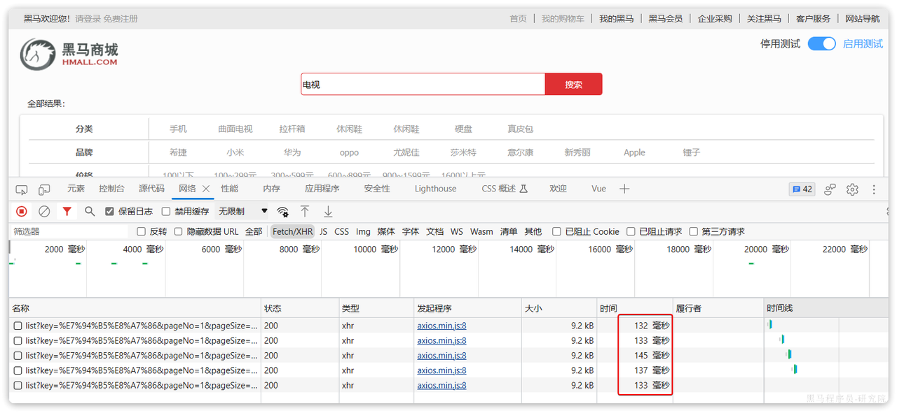

改为基于搜索引擎后，查询表现如下：

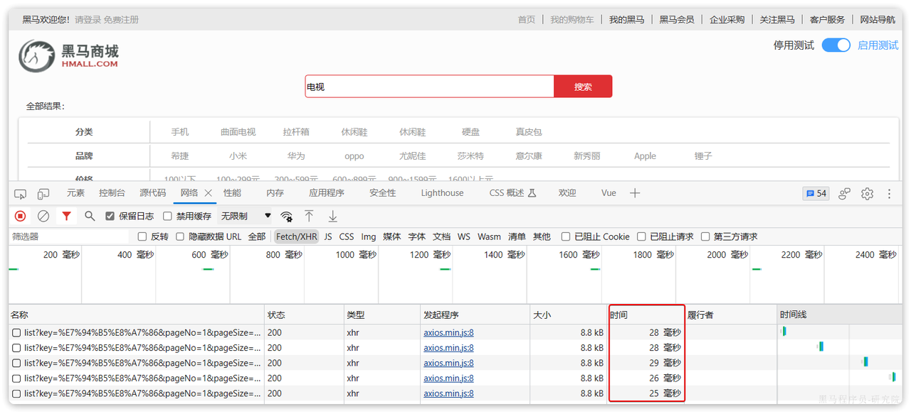

需要注意的是，数据库模糊查询随着表数据量的增多，查询性能的下降会非常明显，而搜索引擎的性能则不会随着数据增多而下降太多。目前仅10万不到的数据量差距就如此明显，如果数据量达到百万、千万、甚至上亿级别，这个性能差距会非常夸张。

**其次**，功能单一

数据库的模糊搜索功能单一，匹配条件非常苛刻，必须恰好包含用户搜索的关键字。而在搜索引擎中，用户输入出现个别错字，或者用拼音搜索、同义词搜索都能正确匹配到数据。

综上，在面临海量数据的搜索，或者有一些复杂搜索需求的时候，推荐使用专门的搜索引擎来实现搜索功能。

目前全球的搜索引擎技术排名如下：

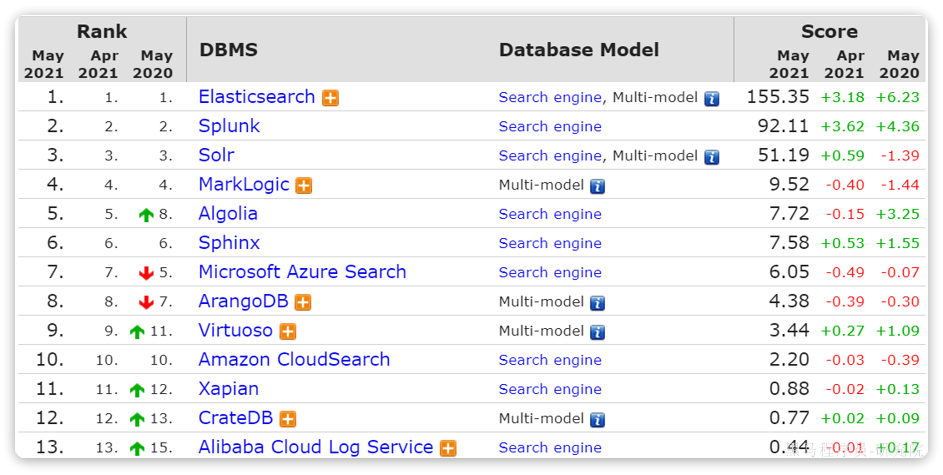

排名第一的就是我们今天要学习的elasticsearch.

elasticsearch是一款非常强大的开源搜索引擎，支持的功能非常多，例如：

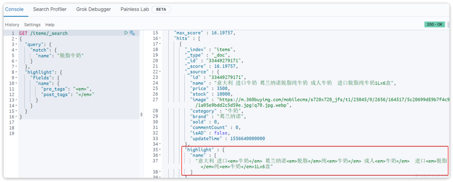

**代码搜索**


**商品搜索**

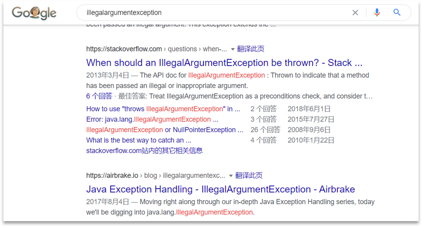

**解决方案搜索**

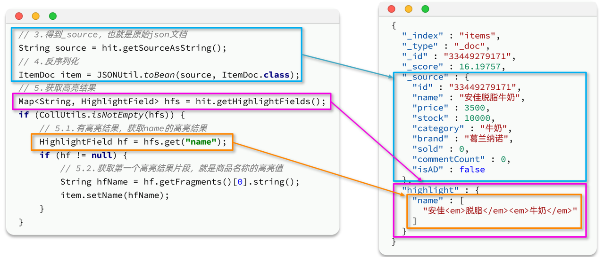

**地图搜索**


## ES-08

通过今天的学习大家要达成下列学习目标：

* 理解倒排索引原理

* 会使用IK分词器

* 理解索引库Mapping映射的属性含义

* 能创建索引库及映射

* 能实现文档的CRUD


## 1.初识elasticsearch

Elasticsearch的官方网站如下：

本章我们一起来初步了解一下Elasticsearch的基本原理和一些基础概念。

认识和安装
2004年Shay Banon基于Lucene开发了Compass
2010年Shay Banon重写了Compass，取名为Elasticsearch。
官网地址:https://wwwelastic.co/cn/，目前最新的版本是：8.x.x，由于8与7API变换较大，所以一般国内公司使用7.x和6.x。
elasticsearch具备下列优势：

- 支持分布式，可水平扩展
- 提供Restful接口，可被任何语言调用

### 1.1.认识和安装

Elasticsearch是由elastic公司开发的一套搜索引擎技术，它是elastic技术栈中的一部分。完整的技术栈包括：

* Elasticsearch：用于数据存储、计算和搜索

* Logstash/Beats：用于数据收集抓取

* Kibana：用于数据可视化

整套技术栈被称为ELK，经常用来做日志收集、系统监控和状态分析等等：

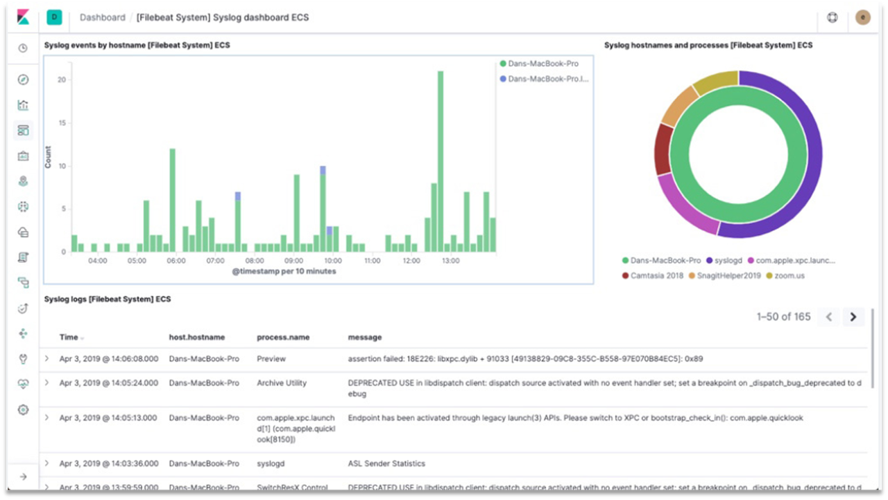


整套技术栈的核心就是用来**存储**、**搜索**、**计算**的Elasticsearch，因此我们接下来学习的核心也是Elasticsearch。


我们要安装的内容包含2部分：

* elasticsearch：存储、搜索和运算

* kibana：图形化展示


首先Elasticsearch不用多说，是提供核心的数据存储、搜索、分析功能的。

然后是Kibana，Elasticsearch对外提供的是Restful风格的API，任何操作都可以通过发送http请求来完成。不过http请求的方式、路径、还有请求参数的格式都有严格的规范。这些规范我们肯定记不住，因此我们要借助于Kibana这个服务。

Kibana是elastic公司提供的用于操作Elasticsearch的可视化控制台。它的功能非常强大，包括：

* 对Elasticsearch数据的搜索、展示

* 对Elasticsearch数据的统计、聚合，并形成图形化报表、图形

* 对Elasticsearch的集群状态监控

* 它还提供了一个开发控制台（DevTools），在其中对Elasticsearch的Restful的API接口提供了**语法提示**

#### 1.1.0 下载es

```
docker pull elasticsearch:7.17.20

```


#### 1.1.1.安装elasticsearch

通过下面的Docker命令即可安装单机版本的elasticsearch：

```bash
docker run -d \
  --name es \
  -e "ES_JAVA_OPTS=-Xms512m -Xmx512m" \
  -e "discovery.type=single-node" \
  -v es-data:/usr/share/elasticsearch/data \
  -v es-plugins:/usr/share/elasticsearch/plugins \
  --privileged \
  --network hm-net \
  -p 9200:9200 \
  -p 9300:9300 \
  elasticsearch:7.12.1
```

好的 👍，我帮你把这个 **Docker 启动 Elasticsearch 的命令**逐一拆解讲清楚：

------

##### **完整命令**

```bash
docker run -d \
  --name es \
  -e "ES_JAVA_OPTS=-Xms512m -Xmx512m" \
  -e "discovery.type=single-node" \
  -v es-data:/usr/share/elasticsearch/data \
  -v es-plugins:/usr/share/elasticsearch/plugins \
  --privileged \
  --network hm-net \
  -p 9200:9200 \
  -p 9300:9300 \
  elasticsearch:7.12.1
  
  
docker run -d \
  --name es \
  -e "ES_JAVA_OPTS=-Xms512m -Xmx512m" \
  -e "discovery.type=single-node" \
  -v es-data:/usr/share/elasticsearch/data \
  -v es-plugins:/usr/share/elasticsearch/plugins \
  --privileged \
  --network theatre-ticket-network \
  -p 9200:9200 \
  -p 9300:9300 \
  elasticsearch:7.17.20
```

------

##### **逐项解析**

###### 1. `docker run -d`

- `docker run`：运行一个新的容器。
- `-d`：后台运行（detached 模式），不会占用当前终端。

------

###### 2. `--name es`

- 给容器取一个名字：`es`。
   这样你以后可以直接用 `docker stop es`、`docker start es` 来管理容器，而不用输入容器的 ID。

------

###### 3. `-e "ES_JAVA_OPTS=-Xms512m -Xmx512m"`

- `-e`：设置环境变量。
- `ES_JAVA_OPTS`：指定 **Elasticsearch 的 JVM 启动参数**。
  - `-Xms512m`：设置 JVM 最小堆内存为 512MB。
  - `-Xmx512m`：设置 JVM 最大堆内存为 512MB。
- **作用**：限制 Elasticsearch 在容器中使用的内存，避免占用过多资源（默认可能较大，容易 OOM）。

------

###### 4. `-e "discovery.type=single-node"`

- 告诉 Elasticsearch 运行在 **单节点模式**（非集群）。
- 如果不加这个参数，ES 会默认认为要组建集群，启动时会报错（因为找不到其他节点）。

------

###### 5. `-v es-data:/usr/share/elasticsearch/data`

- `-v`：挂载卷。
- `es-data`：Docker 卷的名字，用于持久化存储。
- `/usr/share/elasticsearch/data`：Elasticsearch 容器内的数据目录。
- **作用**：数据持久化，容器删除后数据不会丢失。

------

###### 6. `-v es-plugins:/usr/share/elasticsearch/plugins`

- 将 `es-plugins` 卷挂载到容器的插件目录 `/usr/share/elasticsearch/plugins`。
- **作用**：可以方便地安装和管理 Elasticsearch 插件（如 IK 分词器），避免容器删除后插件丢失。

------

###### 7. `--privileged`

- 以 **特权模式**运行容器，允许容器内有更多权限。
- **一般 ES 不一定需要**，但某些情况下文件系统权限不足会报错，加上它可以避免问题。

------

###### 8. `--network hm-net`

- 指定容器加入到 Docker 的自定义网络 `hm-net`。
- **作用**：让 Elasticsearch 容器和其他容器（比如 Kibana、Logstash、业务服务）在同一个网络中通信。

------

###### 9. `-p 9200:9200`

- 将宿主机的 `9200` 端口映射到容器的 `9200` 端口。
- `9200`：Elasticsearch **HTTP API** 端口（外部访问 ES 的接口）。
- 例如：访问 `http://localhost:9200/` 就能查看 ES 是否启动成功。

------

###### 10. `-p 9300:9300`

- 将宿主机的 `9300` 端口映射到容器的 `9300` 端口。
- `9300`：Elasticsearch **节点间通信的端口**，用于集群内部通信。
- 单节点情况下用处不大，但保留没坏处。

------

###### 11. `elasticsearch:7.12.1`

- 指定要运行的镜像：`elasticsearch`，版本号 `7.12.1`。
- 如果本地没有该镜像，Docker 会自动从 [Docker Hub](https://hub.docker.com/_/elasticsearch) 拉取。

------

###### **总结**

这个命令就是在 Docker 中启动一个 **单节点的 Elasticsearch 7.12.1** 实例，配置了内存限制、持久化存储、插件目录、网络和端口映射。
 运行后你可以直接访问：
 👉 [http://localhost:9200](http://localhost:9200/) 来验证是否启动成功。

------

要不要我帮你把 **安装 Kibana**（Elasticsearch 可视化工具）的 Docker 命令也写出来？这样你可以直接在浏览器里用页面管理 ES 数据。

**注意，这里我们采用的是elasticsearch的7.12.1版本，由于8以上版本的JavaAPI变化很大，在企业中应用并不广泛，企业中应用较多的还是8以下的版本。**

如果拉取镜像困难，可以直接导入课前资料提供的镜像tar包：

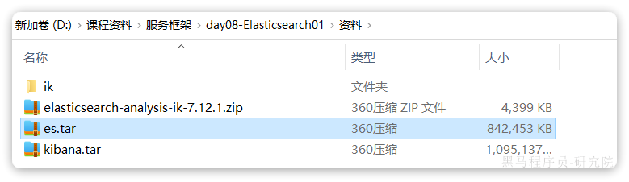


安装完成后，访问9200端口，即可看到响应的Elasticsearch服务的基本信息：

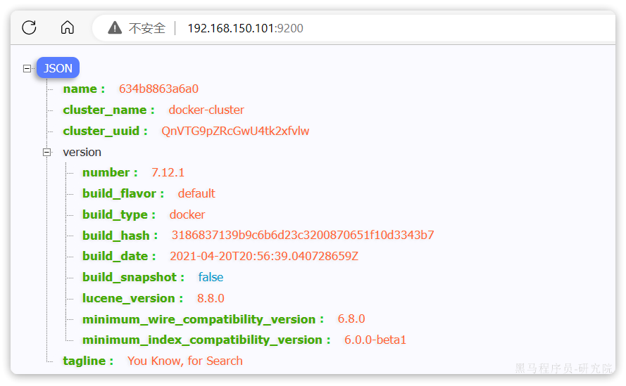


#### 1.1.2.安装Kibana

通过下面的Docker命令，即可部署Kibana：

```bash
docker pull kibana:7.17.20   # 拉取和 ES 对应的版本


docker run -d \
--name kibana \
-e ELASTICSEARCH_HOSTS=http://es:9200 \
--network=theatre-ticket-network \
-p 5601:5601  \
kibana:7.17.20
```


如果拉取镜像困难，可以直接导入课前资料提供的镜像tar包：

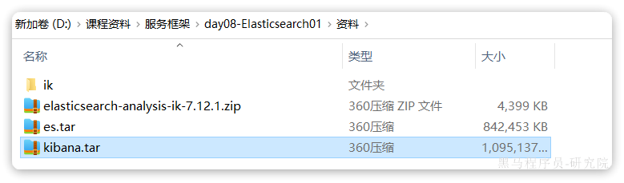


安装完成后，直接访问5601端口，即可看到控制台页面：

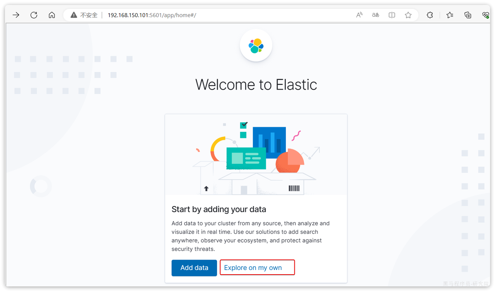

选择`Explore on my own`之后，进入主页面：

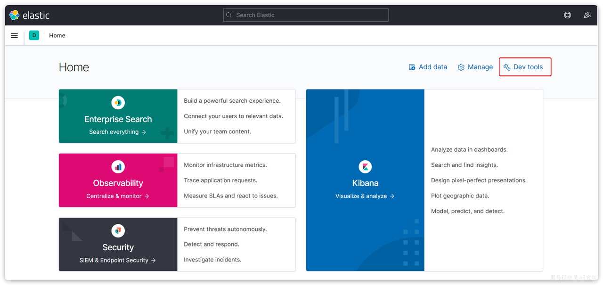

然后选中`Dev tools`，进入开发工具页面：

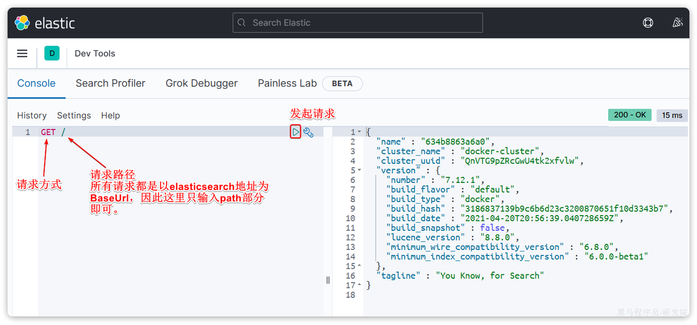


### 1.2.倒排索引

elasticsearch之所以有如此高性能的搜索表现，正是得益于底层的倒排索引技术。那么什么是倒排索引呢？

**倒排**索引的概念是基于MySQL这样的**正向**索引而言的。

#### 1.2.1.正向索引

我们先来回顾一下正向索引。

例如有一张名为`tb_goods`的表：

| **id** | **title** | **price** |
| ------ | --------- | --------- |
| 1      | 小米手机      | 3499      |
| 2      | 华为手机      | 4999      |
| 3      | 华为小米充电器   | 49        |
| 4      | 小米手环      | 49        |
| ...    | ...       | ...       |


其中的`id`字段已经创建了索引，由于索引底层采用了B+树结构，因此我们根据id搜索的速度会非常快。但是其他字段例如`title`，只在叶子节点上存在。

因此要根据`title`搜索的时候只能遍历树中的每一个叶子节点，判断title数据是否符合要求。

比如用户的SQL语句为：

```sql
select * from tb_goods where title like '%手机%';
```

那搜索的大概流程如图：

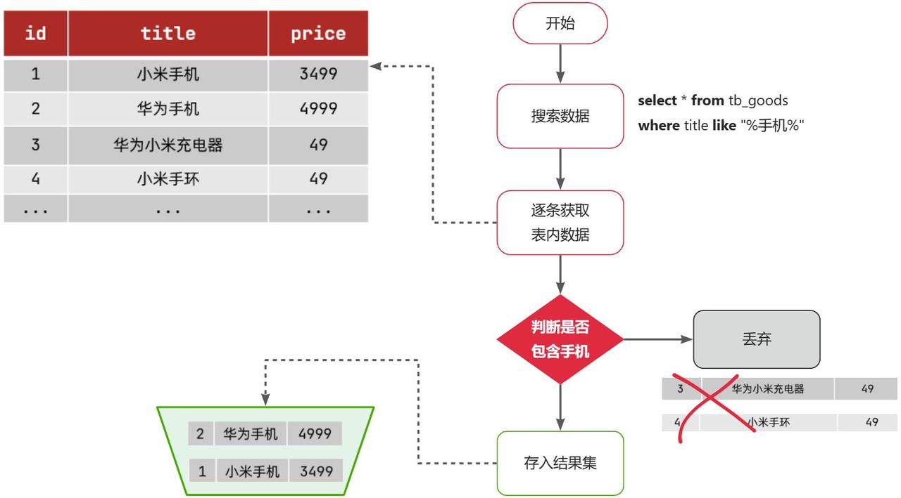

说明：

* 1）检查到搜索条件为`like '%手机%'`，需要找到`title`中包含`手机`的数据

* 2）逐条遍历每行数据（每个叶子节点），比如第1次拿到`id`为1的数据

* 3）判断数据中的`title`字段值是否符合条件

* 4）如果符合则放入结果集，不符合则丢弃

* 5）回到步骤1


综上，根据id精确匹配时，可以走索引，查询效率较高。而当搜索条件为模糊匹配时，由于索引无法生效，导致从索引查询退化为全表扫描，效率很差。

因此，正向索引适合于根据索引字段的精确搜索，不适合基于部分词条的模糊匹配。

而倒排索引恰好解决的就是根据部分词条模糊匹配的问题。

#### 1.2.2.倒排索引

倒排索引中有两个非常重要的概念：

* 文档（`Document`）：用来搜索的数据，其中的每一条数据就是一个文档。例如一个网页、一个商品信息

* 词条（`Term`）：对文档数据或用户搜索数据，利用某种算法分词，得到的具备含义的词语就是词条。例如：我是中国人，就可以分为：我、是、中国人、中国、国人这样的几个词条


**创建倒排索引**是对正向索引的一种特殊处理和应用，流程如下：

* 将每一个文档的数据利用**分词算法**根据语义拆分，得到一个个词条

* 创建表，每行数据包括词条、词条所在文档id、位置等信息

* 因为词条唯一性，可以给词条创建**正向**索引

此时形成的这张以词条为索引的表，就是倒排索引表，两者对比如下：

**正向索引**

| **id（索引）** | **title** | **price** |
| ---------- | --------- | --------- |
| 1          | 小米手机      | 3499      |
| 2          | 华为手机      | 4999      |
| 3          | 华为小米充电器   | 49        |
| 4          | 小米手环      | 49        |
| ...        | ...       | ...       |

**倒排索引**

| **词条（索引）** | **文档id** |
| ---------- | -------- |
| 小米         | 1，3，4    |
| 手机         | 1，2      |
| 华为         | 2，3      |
| 充电器        | 3        |
| 手环         | 4        |


倒排索引的**搜索流程**如下（以搜索"华为手机"为例），如图：

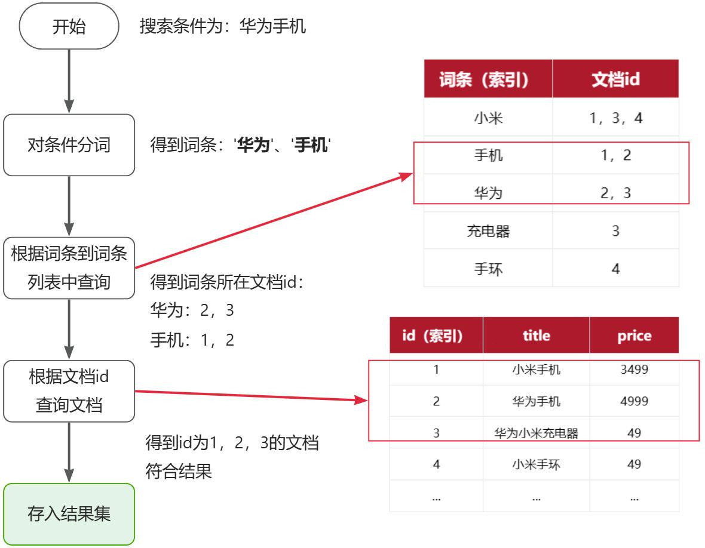

流程描述：

1）用户输入条件`"华为手机"`进行搜索。

2）对用户输入条件**分词**，得到词条：`华为`、`手机`。

3）拿着词条在倒排索引中查找（**由于词条有索引，查询效率很高**），即可得到包含词条的文档id：`1、2、3`。

4）拿着文档`id`到正向索引中查找具体文档即可（由于`id`也有索引，查询效率也很高）。


虽然要先查询倒排索引，再查询倒排索引，但是无论是词条、还是文档id都建立了索引，查询速度非常快！无需全表扫描。

#### 1.2.3.正向和倒排

那么为什么一个叫做正向索引，一个叫做倒排索引呢？

* &#x20;**正向索引**是最传统的，根据id索引的方式。但根据词条查询时，必须先逐条获取每个文档，然后判断文档中是否包含所需要的词条，是**根据文档找词条的过程**。&#x20;

* &#x20;而**倒排索引**则相反，是先找到用户要搜索的词条，根据词条得到保护词条的文档的id，然后根据id获取文档。是**根据词条找文档的过程**。&#x20;


是不是恰好反过来了？

那么两者方式的优缺点是什么呢？

**正向索引**：

* 优点：&#x20;

  * 可以给多个字段创建索引

  * 根据索引字段搜索、排序速度非常快

* 缺点：&#x20;

  * 根据非索引字段，或者索引字段中的部分词条查找时，只能全表扫描。


**倒排索引**：

* 优点：&#x20;

  * 根据词条搜索、模糊搜索时，速度非常快

* 缺点：&#x20;

  * 只能给词条创建索引，而不是字段

  * 无法根据字段做排序


### 1.3.基础概念

elasticsearch中有很多独有的概念，与mysql中略有差别，但也有相似之处。

#### 1.3.1.文档和字段

elasticsearch是面向**文档（Document）**存储的，可以是数据库中的一条商品数据，一个订单信息。文档数据会被序列化为`json`格式后存储在`elasticsearch`中：


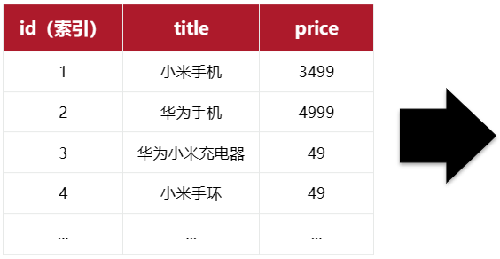


```json
{
    "id": 1,
    "title": "小米手机",
    "price": 3499
}
{
    "id": 2,
    "title": "华为手机",
    "price": 4999
}
{
    "id": 3,
    "title": "华为小米充电器",
    "price": 49
}
{
    "id": 4,
    "title": "小米手环",
    "price": 299
}

```

因此，原本数据库中的一行数据就是ES中的一个JSON文档；而数据库中每行数据都包含很多列，这些列就转换为JSON文档中的**字段（Field）**。


#### 1.3.2.索引和映射

随着业务发展，需要在es中存储的文档也会越来越多，比如有商品的文档、用户的文档、订单文档等等：

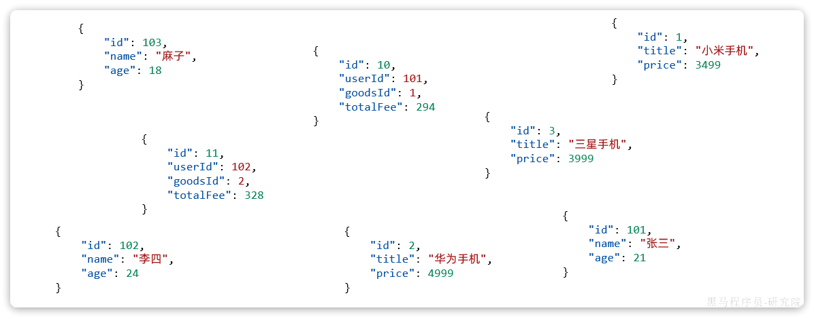

所有文档都散乱存放显然非常混乱，也不方便管理。

因此，我们要将类型相同的文档集中在一起管理，称为**索引（Index）**。例如：

**商品索引**

```json
{
    "id": 1,
    "title": "小米手机",
    "price": 3499
}

{
    "id": 2,
    "title": "华为手机",
    "price": 4999
}

{
    "id": 3,
    "title": "三星手机",
    "price": 3999
}
```

**用户索引**

```json
{
    "id": 101,
    "name": "张三",
    "age": 21
}

{
    "id": 102,
    "name": "李四",
    "age": 24
}

{
    "id": 103,
    "name": "麻子",
    "age": 18
}
```

**订单索引**

```json
{
    "id": 10,
    "userId": 101,
    "goodsId": 1,
    "totalFee": 294
}

{
    "id": 11,
    "userId": 102,
    "goodsId": 2,
    "totalFee": 328
}

```


* 所有用户文档，就可以组织在一起，称为用户的索引；

* 所有商品的文档，可以组织在一起，称为商品的索引；

* 所有订单的文档，可以组织在一起，称为订单的索引；

因此，我们可以把索引当做是数据库中的表。

数据库的表会有约束信息，用来定义表的结构、字段的名称、类型等信息。因此，索引库中就有**映射（mapping）**，是索引中文档的字段约束信息，类似表的结构约束。


#### 1.3.3.mysql与elasticsearch

我们统一的把mysql与elasticsearch的概念做一下对比：

| **MySQL** | **Elasticsearch** | **说明**                                                   |
| --------- | ----------------- | -------------------------------------------------------- |
| Table     | Index             | 索引(index)，就是文档的集合，类似数据库的表(table)                         |
| Row       | Document          | 文档（Document），就是一条条的数据，类似数据库中的行（Row），文档都是JSON格式           |
| Column    | Field             | 字段（Field），就是JSON文档中的字段，类似数据库中的列（Column）                  |
| Schema    | Mapping           | Mapping（映射）是索引中文档的约束，例如字段类型约束。类似数据库的表结构（Schema）          |
| SQL       | DSL               | DSL是elasticsearch提供的JSON风格的请求语句，用来操作elasticsearch，实现CRUD |

如图：

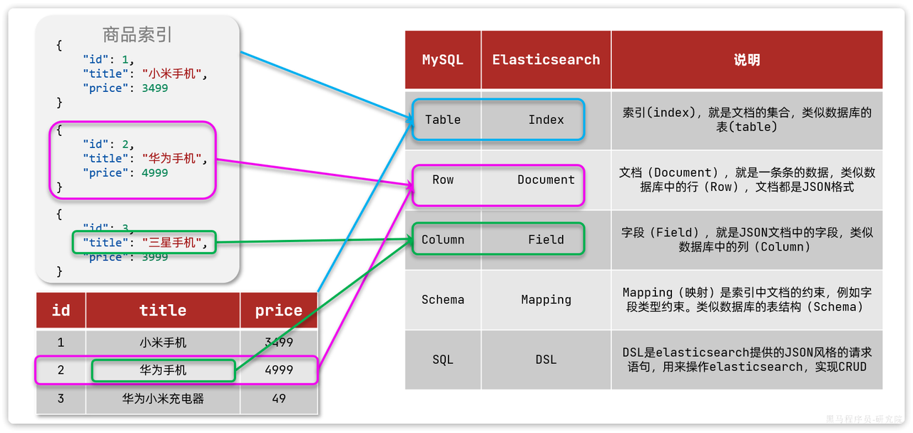


那是不是说，我们学习了elasticsearch就不再需要mysql了呢？

并不是如此，两者各自有自己的擅长之处：

* &#x20;Mysql：擅长事务类型操作，可以确保数据的安全和一致性&#x20;

* &#x20;Elasticsearch：擅长海量数据的搜索、分析、计算&#x20;


因此在企业中，往往是两者结合使用：

* 对安全性要求较高的写操作，使用mysql实现

* 对查询性能要求较高的搜索需求，使用elasticsearch实现

* 两者再基于某种方式，实现数据的同步，保证一致性

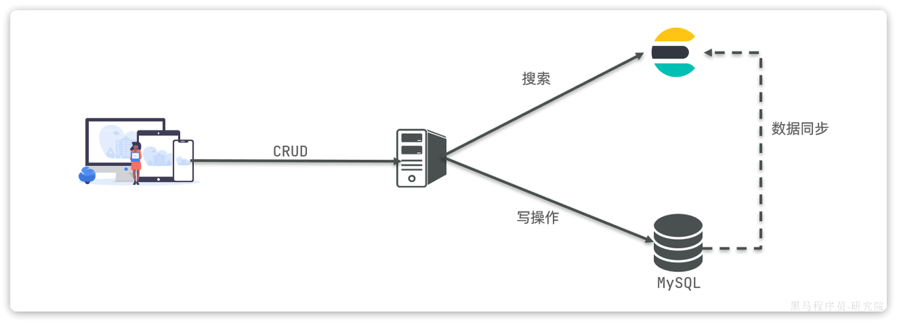


### 1.4.IK分词器

Elasticsearch的关键就是倒排索引，而倒排索引依赖于对文档内容的分词，而分词则需要高效、精准的分词算法，IK分词器就是这样一个中文分词算法。

**注意**：IK分词器的版本一般与es版本一一对应。

#### 1.4.1.安装IK分词器

**方案一**：在线安装

运行一个命令即可：

```shell
docker exec -it es ./bin/elasticsearch-plugin  install https://github.com/medcl/elasticsearch-analysis-ik/releases/download/v7.12.1/elasticsearch-analysis-ik-7.12.1.zip
```

然后重启es容器：

```shell
docker restart es
```


**方案二**：离线安装

如果网速较差，也可以选择离线安装。

首先，查看之前安装的Elasticsearch容器的plugins数据卷目录：

```shell
docker volume inspect es-plugins
```

结果如下：

```json
[
    {
        "CreatedAt": "2024-11-06T10:06:34+08:00",
        "Driver": "local",
        "Labels": null,
        "Mountpoint": "/var/lib/docker/volumes/es-plugins/_data",
        "Name": "es-plugins",
        "Options": null,
        "Scope": "local"
    }
]
```

可以看到elasticsearch的插件挂载到了`/var/lib/docker/volumes/es-plugins/_data`这个目录。我们需要把IK分词器上传至这个目录。


找到课前资料提供的ik分词器插件，课前资料提供了`7.12.1`版本的ik分词器压缩文件，你需要对其解压：

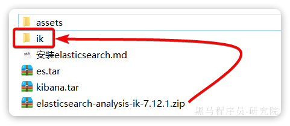

然后上传至虚拟机的`/var/lib/docker/volumes/es-plugins/_data`这个目录：

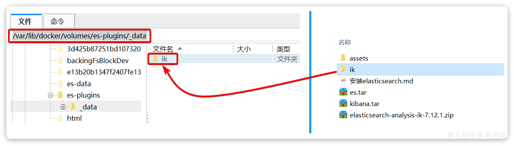

最后，重启es容器：

```shell
docker restart es
```


#### 1.4.2.使用IK分词器

IK分词器包含两种模式：

* &#x20;`ik_smart`：智能语义切分&#x20;

* &#x20;`ik_max_word`：最细粒度切分&#x20;


我们在Kibana的DevTools上来测试分词器，首先测试Elasticsearch官方提供的标准分词器：

```json
POST /_analyze
{
  "analyzer": "standard",
  "text": "黑马程序员学习java太棒了"
}
```

结果如下：

```json
{
  "tokens" : [
    {
      "token" : "黑",
      "start_offset" : 0,
      "end_offset" : 1,
      "type" : "<IDEOGRAPHIC>",
      "position" : 0
    },
    {
      "token" : "马",
      "start_offset" : 1,
      "end_offset" : 2,
      "type" : "<IDEOGRAPHIC>",
      "position" : 1
    },
    {
      "token" : "程",
      "start_offset" : 2,
      "end_offset" : 3,
      "type" : "<IDEOGRAPHIC>",
      "position" : 2
    },
    {
      "token" : "序",
      "start_offset" : 3,
      "end_offset" : 4,
      "type" : "<IDEOGRAPHIC>",
      "position" : 3
    },
    {
      "token" : "员",
      "start_offset" : 4,
      "end_offset" : 5,
      "type" : "<IDEOGRAPHIC>",
      "position" : 4
    },
    {
      "token" : "学",
      "start_offset" : 5,
      "end_offset" : 6,
      "type" : "<IDEOGRAPHIC>",
      "position" : 5
    },
    {
      "token" : "习",
      "start_offset" : 6,
      "end_offset" : 7,
      "type" : "<IDEOGRAPHIC>",
      "position" : 6
    },
    {
      "token" : "java",
      "start_offset" : 7,
      "end_offset" : 11,
      "type" : "<ALPHANUM>",
      "position" : 7
    },
    {
      "token" : "太",
      "start_offset" : 11,
      "end_offset" : 12,
      "type" : "<IDEOGRAPHIC>",
      "position" : 8
    },
    {
      "token" : "棒",
      "start_offset" : 12,
      "end_offset" : 13,
      "type" : "<IDEOGRAPHIC>",
      "position" : 9
    },
    {
      "token" : "了",
      "start_offset" : 13,
      "end_offset" : 14,
      "type" : "<IDEOGRAPHIC>",
      "position" : 10
    }
  ]
}

```


可以看到，标准分词器智能1字1词条，无法正确对中文做分词。

我们再测试IK分词器：

```json
POST /_analyze
{
  "analyzer": "ik_smart",
  "text": "黑马程序员学习java太棒了"
}
```

执行结果如下：

```json
{
  "tokens" : [
    {
      "token" : "黑马",
      "start_offset" : 0,
      "end_offset" : 2,
      "type" : "CN_WORD",
      "position" : 0
    },
    {
      "token" : "程序员",
      "start_offset" : 2,
      "end_offset" : 5,
      "type" : "CN_WORD",
      "position" : 1
    },
    {
      "token" : "学习",
      "start_offset" : 5,
      "end_offset" : 7,
      "type" : "CN_WORD",
      "position" : 2
    },
    {
      "token" : "java",
      "start_offset" : 7,
      "end_offset" : 11,
      "type" : "ENGLISH",
      "position" : 3
    },
    {
      "token" : "太棒了",
      "start_offset" : 11,
      "end_offset" : 14,
      "type" : "CN_WORD",
      "position" : 4
    }
  ]
}

```


#### 1.4.3.拓展词典

随着互联网的发展，“造词运动”也越发的频繁。出现了很多新的词语，在原有的词汇列表中并不存在。比如：“泰裤辣”，“传智播客” 等。

IK分词器无法对这些词汇分词，测试一下：

```json
POST /_analyze
{
  "analyzer": "ik_max_word",
  "text": "传智播客开设大学,真的泰裤辣！"
}
```

结果：

```json
{
  "tokens" : [
    {
      "token" : "传",
      "start_offset" : 0,
      "end_offset" : 1,
      "type" : "CN_CHAR",
      "position" : 0
    },
    {
      "token" : "智",
      "start_offset" : 1,
      "end_offset" : 2,
      "type" : "CN_CHAR",
      "position" : 1
    },
    {
      "token" : "播",
      "start_offset" : 2,
      "end_offset" : 3,
      "type" : "CN_CHAR",
      "position" : 2
    },
    {
      "token" : "客",
      "start_offset" : 3,
      "end_offset" : 4,
      "type" : "CN_CHAR",
      "position" : 3
    },
    {
      "token" : "开设",
      "start_offset" : 4,
      "end_offset" : 6,
      "type" : "CN_WORD",
      "position" : 4
    },
    {
      "token" : "大学",
      "start_offset" : 6,
      "end_offset" : 8,
      "type" : "CN_WORD",
      "position" : 5
    },
    {
      "token" : "真的",
      "start_offset" : 9,
      "end_offset" : 11,
      "type" : "CN_WORD",
      "position" : 6
    },
    {
      "token" : "泰",
      "start_offset" : 11,
      "end_offset" : 12,
      "type" : "CN_CHAR",
      "position" : 7
    },
    {
      "token" : "裤",
      "start_offset" : 12,
      "end_offset" : 13,
      "type" : "CN_CHAR",
      "position" : 8
    },
    {
      "token" : "辣",
      "start_offset" : 13,
      "end_offset" : 14,
      "type" : "CN_CHAR",
      "position" : 9
    }
  ]
}

```

可以看到，`传智播客`和`泰裤辣`都无法正确分词。

所以要想正确分词，IK分词器的词库也需要不断的更新，IK分词器提供了扩展词汇的功能。

1）打开IK分词器config目录：

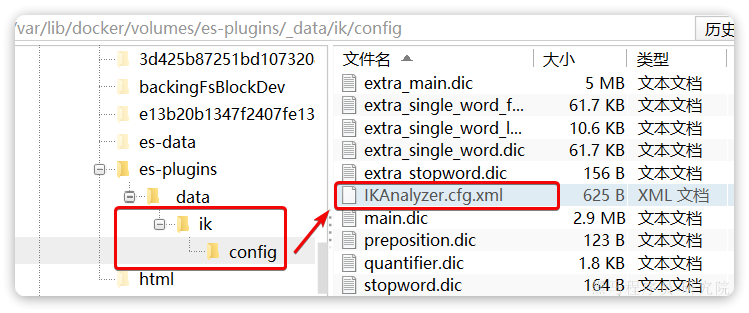

注意，如果采用在线安装的通过，默认是没有config目录的，需要把课前资料提供的ik下的config上传至对应目录。


2）在IKAnalyzer.cfg.xml配置文件内容添加：

```xml
<?xml version="1.0" encoding="UTF-8"?>
<!DOCTYPE properties SYSTEM "http://java.sun.com/dtd/properties.dtd">
<properties>
        <comment>IK Analyzer 扩展配置</comment>
        <!--用户可以在这里配置自己的扩展字典 *** 添加扩展词典-->
        <entry key="ext_dict">ext.dic</entry>
</properties>
```


3）在IK分词器的config目录新建一个 `ext.dic`，可以参考config目录下复制一个配置文件进行修改

```plain&#x20;text
传智播客
泰裤辣
```


4）重启elasticsearch

```shell
docker restart es

# 查看 日志
docker logs -f elasticsearch
```


再次测试，可以发现`传智播客`和`泰裤辣`都正确分词了：

```json
{
  "tokens" : [
    {
      "token" : "传智播客",
      "start_offset" : 0,
      "end_offset" : 4,
      "type" : "CN_WORD",
      "position" : 0
    },
    {
      "token" : "开设",
      "start_offset" : 4,
      "end_offset" : 6,
      "type" : "CN_WORD",
      "position" : 1
    },
    {
      "token" : "大学",
      "start_offset" : 6,
      "end_offset" : 8,
      "type" : "CN_WORD",
      "position" : 2
    },
    {
      "token" : "真的",
      "start_offset" : 9,
      "end_offset" : 11,
      "type" : "CN_WORD",
      "position" : 3
    },
    {
      "token" : "泰裤辣",
      "start_offset" : 11,
      "end_offset" : 14,
      "type" : "CN_WORD",
      "position" : 4
    }
  ]
}
```


#### 1.4.4.总结

分词器的作用是什么？

* 创建倒排索引时，对文档分词

* 用户搜索时，对输入的内容分词


IK分词器有几种模式？

* `ik_smart`：智能切分，粗粒度

* `ik_max_word`：最细切分，细粒度


IK分词器如何拓展词条？如何停用词条？

* 利用config目录的`IkAnalyzer.cfg.xml`文件添加拓展词典和停用词典

* 在词典中添加拓展词条或者停用词条


## 2.索引库操作

Index就类似数据库表，Mapping映射就类似表的结构。我们要向es中存储数据，必须先创建Index和Mapping

### 2.1.Mapping映射属性

Mapping是对索引库中文档的约束，常见的Mapping属性包括：

* `type`：字段数据类型，常见的简单类型有：&#x20;
* 字符串：`text`（可分词的文本）、`keyword`（精确值，例如：品牌、国家、ip地址）
  
* 数值：`long`、`integer`、`short`、`byte`、`double`、`float`、
  
* 布尔：`boolean`
  
* 日期：`date`
  
* 对象：`object`
  
* `index`：是否创建索引，默认为`true`

* `analyzer`：使用哪种分词器

* `properties`：该字段的子字段


例如下面的json文档：

```json
{
    "age": 21,
    "weight": 52.1,
    "isMarried": false,
    "info": "黑马程序员Java讲师",
    "email": "zy@itcast.cn",
    "score": [99.1, 99.5, 98.9],
    "name": {
        "firstName": "云",
        "lastName": "赵"
    }
}
```

对应的每个字段映射（Mapping）：

| **字段名**   |           | **字段类型**  | **类型说明**  | **是否****参与搜索** | **是否****参与分词** | **分词器** |
| --------- | --------- | --------- | --------- | -------------- | -------------- | ------- |
| age       |           | `integer` | 整数        |                |                | ——      |
| weight    |           | `float`   | 浮点数       |                |                | ——      |
| isMarried |           | `boolean` | 布尔        |                |                | ——      |
| info      |           | `text`    | 字符串，但需要分词 |                |                | IK      |
| email     |           | `keyword` | 字符串，但是不分词 |                |                | ——      |
| score     |           | `float`   | 只看数组中元素类型 |                |                | ——      |
| name      | firstName | `keyword` | 字符串，但是不分词 |                |                | ——      |
|           | lastName  | `keyword` | 字符串，但是不分词 |                |                | ——      |


### 2.2.索引库的CRUD

由于Elasticsearch采用的是Restful风格的API，因此其请求方式和路径相对都比较规范，而且请求参数也都采用JSON风格。

我们直接基于Kibana的DevTools来编写请求做测试，由于有语法提示，会非常方便。

#### 2.2.1.创建索引库和映射

**基本语法**：

* 请求方式：`PUT`

* 请求路径：`/索引库名`，可以自定义

* 请求参数：`mapping`映射


**格式**：

```json
PUT /索引库名称
{
  "mappings": {
    "properties": {
      "字段名":{
        "type": "text",
        "analyzer": "ik_smart"
      },
      "字段名2":{
        "type": "keyword",
        "index": "false"
      },
      "字段名3":{
        "properties": {
          "子字段": {
            "type": "keyword"
          }
        }
      },
      // ...略
    }
  }
}
```


**示例**：

```json
# PUT /heima
{
  "mappings": {
    "properties": {
      "info":{
        "type": "text",
        "analyzer": "ik_smart"
      },
      "email":{
        "type": "keyword",
        "index": "false"
      },
      "name":{
        "properties": {
          "firstName": {
            "type": "keyword"
          }
        }
      }
    }
  }
}
```


#### 2.2.2.查询索引库

**基本语法**：

* &#x20;请求方式：GET&#x20;

* &#x20;请求路径：/索引库名&#x20;

* &#x20;请求参数：无&#x20;


**格式**：

```plain&#x20;text
GET /索引库名
```


**示例**：

```plain&#x20;text
GET /heima
```


#### 2.2.3.修改索引库

倒排索引结构虽然不复杂，但是一旦数据结构改变（比如改变了分词器），就需要重新创建倒排索引，这简直是灾难。因此索引库**一旦创建，无法修改mapping**。


**注意**：虽然无法修改mapping中已有的字段，但是却允许添加新的字段到mapping中，因为不会对倒排索引产生影响。因此修改索引库能做的就是向索引库中添加新字段，或者更新索引库的基础属性。

**语法说明**：

```json
PUT /索引库名/_mapping
{
  "properties": {
    "新字段名":{
      "type": "integer"
    }
  }
}
```


**示例**：

```json
PUT /heima/_mapping
{
  "properties": {
    "age":{
      "type": "integer"
    }
  }
}
```


#### 2.2.4.删除索引库

**语法：**

* &#x20;请求方式：DELETE&#x20;

* &#x20;请求路径：/索引库名&#x20;

* &#x20;请求参数：无&#x20;


**格式：**

```plain&#x20;text
DELETE /索引库名
```


示例：

```plain&#x20;text
DELETE /heima
```


#### 2.2.5.总结

索引库操作有哪些？

* 创建索引库：PUT /索引库名

* 查询索引库：GET /索引库名

* 删除索引库：DELETE /索引库名

* 修改索引库，添加字段：PUT /索引库名/\_mapping


可以看到，对索引库的操作基本遵循的Restful的风格，因此API接口非常统一，方便记忆。

## 3.文档操作

有了索引库，接下来就可以向索引库中添加数据了。

Elasticsearch中的数据其实就是JSON风格的文档。操作文档自然保护`增`、`删`、`改`、`查`等几种常见操作，我们分别来学习。

### 3.1.新增文档

这里新增时要指定id，否则会随机创建id，后续无法找到特定Id

**语法：**

```json
POST /索引库名/_doc/文档id
{
    "字段1": "值1",
    "字段2": "值2",
    "字段3": {
        "子属性1": "值3",
        "子属性2": "值4"
    },
}
```


**示例：**

```json
POST /heima/_doc/1
{
    "info": "黑马程序员Java讲师",
    "email": "zy@itcast.cn",
    "name": {
        "firstName": "云",
        "lastName": "赵"
    }
}
```


**响应：**

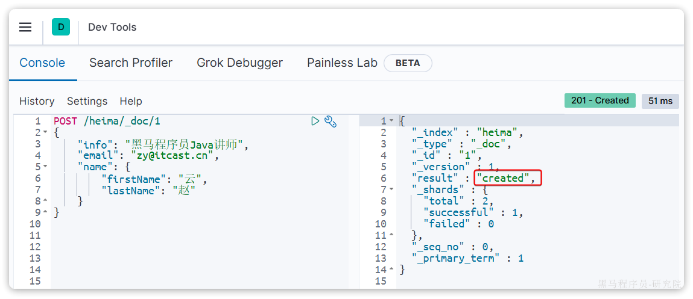


### 3.2.查询文档

根据rest风格，新增是post，查询应该是get，不过查询一般都需要条件，这里我们把文档id带上。

**语法：**

```json
GET /{索引库名称}/_doc/{id}
```


**示例：**

```javascript
GET /heima/_doc/1
```


**查看结果：**

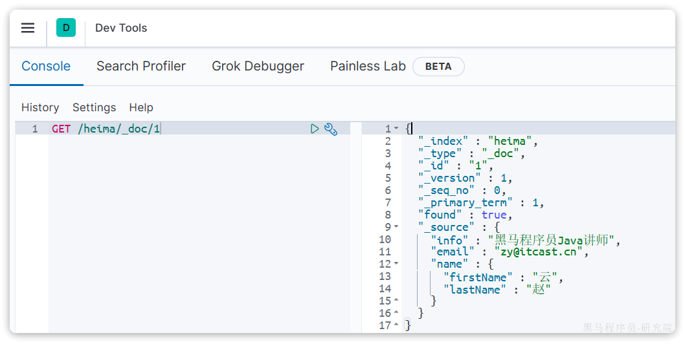


### 3.3.删除文档

删除使用DELETE请求，同样，需要根据id进行删除：

**语法：**

```javascript
DELETE /{索引库名}/_doc/id值
```


**示例：**

```json
DELETE /heima/_doc/1
```


**结果：**

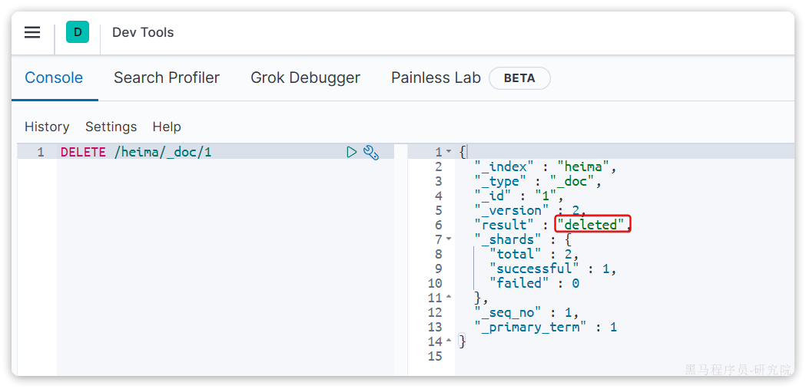


### 3.4.修改文档

修改有两种方式：

* 全量修改：直接覆盖原来的文档

* 局部修改：修改文档中的部分字段


#### 3.4.1.全量修改

全量修改是覆盖原来的文档，其本质是两步操作：

* 根据指定的id删除文档

* 新增一个相同id的文档

**注意**：如果根据id删除时，id不存在，第二步的新增也会执行，也就从修改变成了新增操作了。


**语法：**

```json
PUT /{索引库名}/_doc/文档id
{
    "字段1": "值1",
    "字段2": "值2",
    // ... 略
}
```


**示例：**

```json
PUT /heima/_doc/1
{
    "info": "黑马程序员高级Java讲师",
    "email": "zy@itcast.cn",
    "name": {
        "firstName": "云",
        "lastName": "赵"
    }
}
```


由于`id`为`1`的文档已经被删除，所以第一次执行时，得到的反馈是`created`：

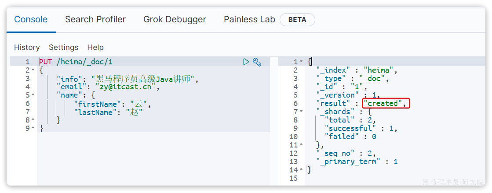

所以如果执行第2次时，得到的反馈则是`updated`：

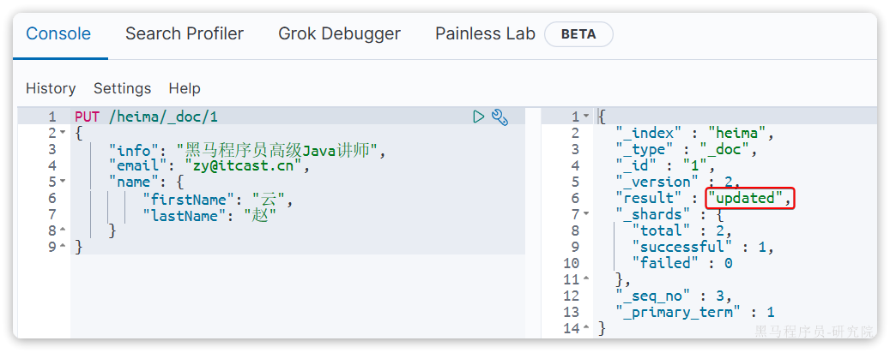


#### 3.4.2.局部修改

局部修改是只修改指定id匹配的文档中的部分字段。

**语法：**

```json
POST /{索引库名}/_update/文档id
{
    "doc": {
         "字段名": "新的值",
    }
}
```


**示例：**

```json
POST /heima/_update/1
{
  "doc": {
    "email": "ZhaoYun@itcast.cn"
  }
}
```


**执行结果**：

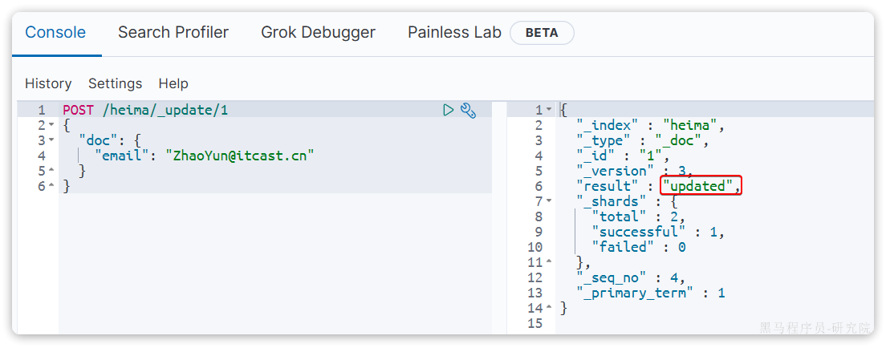


### 3.5.批处理

批处理采用POST请求，基本语法如下：

```java
POST _bulk  
{ "index" : { "_index" : "test", "_id" : "1" } } # 注意这里不能换行，否则报错
{ "field1" : "value1" }
{ "delete" : { "_index" : "test", "_id" : "2" } }
{ "create" : { "_index" : "test", "_id" : "3" } }
{ "field1" : "value3" }
{ "update" : {"_id" : "1", "_index" : "test"} }
{ "doc" : {"field2" : "value2"} }
```

其中：

* `index`代表新增操作
* `_index`：指定索引库名
  
* `_id`指定要操作的文档id
  
* `{ "field1" : "value1" }`：则是要新增的文档内容
  
* `delete`代表删除操作

  * `_index`：指定索引库名

  * `_id`指定要操作的文档id

* `update`代表更新操作

  * `_index`：指定索引库名

  * `_id`指定要操作的文档id

  * `{ "doc" : {"field2" : "value2"} }`：要更新的文档字段


示例，批量新增：

```java
POST /_bulk
{"index": {"_index":"heima", "_id": "3"}}
{"info": "黑马程序员C++讲师", "email": "ww@itcast.cn", "name":{"firstName": "五", "lastName":"王"}}
{"index": {"_index":"heima", "_id": "4"}}
{"info": "黑马程序员前端讲师", "email": "zhangsan@itcast.cn", "name":{"firstName": "三", "lastName":"张"}}
```


批量删除：

```java
POST /_bulk
{"delete":{"_index":"heima", "_id": "3"}}
{"delete":{"_index":"heima", "_id": "4"}}
```


### 3.6.总结

文档操作有哪些？

* 创建文档：`POST /{索引库名}/_doc/文档id   { json文档 }`

* 查询文档：`GET /{索引库名}/_doc/文档id`

* 删除文档：`DELETE /{索引库名}/_doc/文档id`

* 修改文档：&#x20;

  * 全量修改：`PUT /{索引库名}/_doc/文档id { json文档 }`

  * 局部修改：`POST /{索引库名}/_update/文档id { "doc": {字段}}`

```
# 创建索引库并设置mapping映射
 PUT /heima
{
  "mappings": {
    "properties": {
      "info":{
        "type": "text",
        "analyzer": "ik_smart"
      },
      "email":{
        "type": "keyword",
        "index": "false"
      },
      "name":{
        "properties": {
          "firstName": {
            "type": "keyword"
          }
        }
      }
    }
  }
}
# 查询索引库
GET /heima

# 删除索引库
DELETE /heima

# 修改索引库
PUT /heima/_mapping
{
  "properties": {
    "age":{
      "type": "integer"
    }
  }
}


# 新增文档
POST /heima/_doc/1
{
  "info": "黑马程序员Java讲师",
  "email": "zy@itcast.cn",
  "name": {
    "firstName": "云",
    "lastName": "赵"
  }
}

#查询文档
GET /heima/_doc/1

# 删除文档
DELETE /heima/_doc/1

# 修改文档
POST /heima/_update/1
{
  "doc": {
    "email": "ZhaoYun@itcast.cn"
  }
}


# 批量新增
POST /_bulk
{"index":{"_index":"heima","_id":"5"}}
{"info":"黑马程序员C++讲师","email":"ww@itcast.cn","name":{"firstName":"五","lastName":"王"}}
{"index":{"_index":"heima","_id":"6"}}
{"info":"黑马程序员前端讲师","email":"zhangsan@itcast.cn","name":{"firstName":"三","lastName":"张"}}

```


## 4.RestAPI

ES官方提供了各种不同语言的客户端，用来操作ES。这些客户端的本质就是组装DSL语句，通过http请求发送给ES。

官方文档地址：

<https://www.elastic.co/guide/en/elasticsearch/client/index.html>

由于ES目前最新版本是8.8，提供了全新版本的客户端，老版本的客户端已经被标记为过时。而我们采用的是7.12版本，因此只能使用老版本客户端：版本8.x相对于老版本的API发生了较大变化，企业里面一般还是选用之前的老版本。

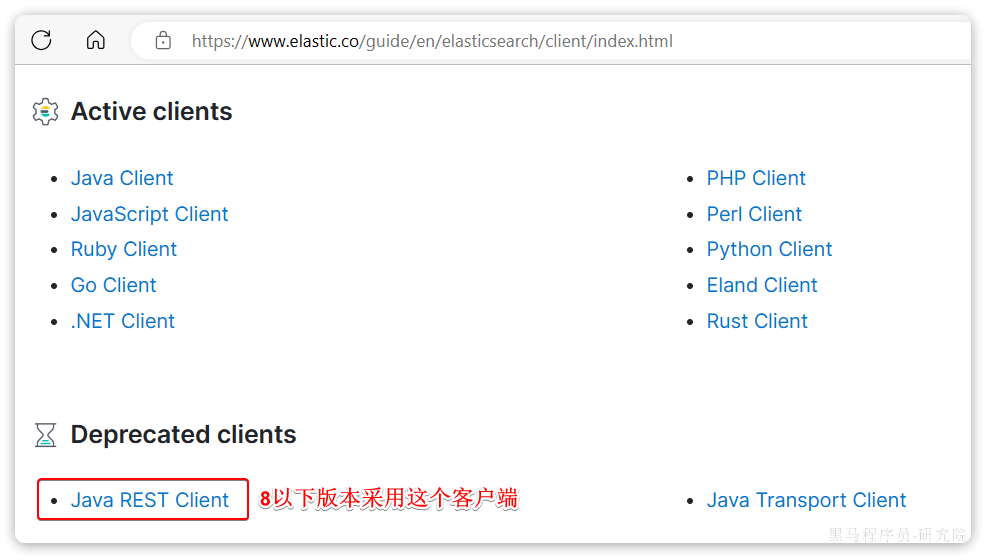

然后选择7.12版本，HighLevelRestClient版本：

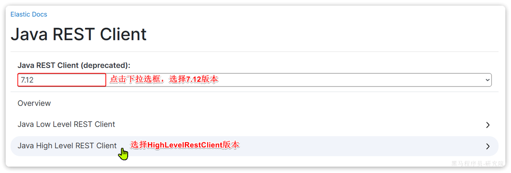


### 4.1.初始化RestClient

在elasticsearch提供的API中，与elasticsearch一切交互都封装在一个名为`RestHighLevelClient`的类中，必须先完成这个对象的初始化，建立与elasticsearch的连接。


分为三步：

1）在`item-service`模块中引入`es`的`RestHighLevelClient`依赖：

```xml
<dependency>
    <groupId>org.elasticsearch.client</groupId>
    <artifactId>elasticsearch-rest-high-level-client</artifactId>
</dependency>
```


2）因为SpringBoot默认的ES版本是`7.17.10`，所以我们需要覆盖默认的ES版本：

```xml
  <properties>
      <maven.compiler.source>11</maven.compiler.source>
      <maven.compiler.target>11</maven.compiler.target>
      <elasticsearch.version>7.12.1</elasticsearch.version>
  </properties>
```


3）初始化RestHighLevelClient：

初始化的代码如下：

```java
RestHighLevelClient client = new RestHighLevelClient(RestClient.builder(
        HttpHost.create("http://192.168.150.101:9200")
));
```


这里为了单元测试方便，我们创建一个测试类`IndexTest`，然后将初始化的代码编写在`@BeforeEach`方法中：

```java
package com.hmall.item.es;

import org.apache.http.HttpHost;
import org.elasticsearch.client.RestClient;
import org.elasticsearch.client.RestHighLevelClient;
import org.junit.jupiter.api.AfterEach;
import org.junit.jupiter.api.BeforeEach;
import org.junit.jupiter.api.Test;

import java.io.IOException;

public class IndexTest {

    private RestHighLevelClient client;

    @BeforeEach
    void setUp() {
        this.client = new RestHighLevelClient(RestClient.builder(
                HttpHost.create("http://192.168.150.101:9200")
        ));
    }

    @Test
    void testConnect() {
        System.out.println(client);
    }

    @AfterEach
    void tearDown() throws IOException {
        this.client.close();
    }
}
```


### 4.1.创建索引库

由于要实现对商品搜索，所以我们需要将商品添加到Elasticsearch中，不过需要根据搜索业务的需求来设定索引库结构，而不是一股脑的把MySQL数据写入Elasticsearch.

#### 4.1.1.Mapping映射

搜索页面的效果如图所示：


实现搜索功能需要的字段包括三大部分：

* 搜索过滤字段

  * 分类

  * 品牌

  * 价格

* 排序字段

  * 默认：按照更新时间降序排序

  * 销量

  * 价格

* 展示字段

  * 商品id：用于点击后跳转

  * 图片地址

  * 是否是广告推广商品

  * 名称

  * 价格

  * 评价数量

  * 销量

对应的商品表结构如下，索引库无关字段已经划掉：

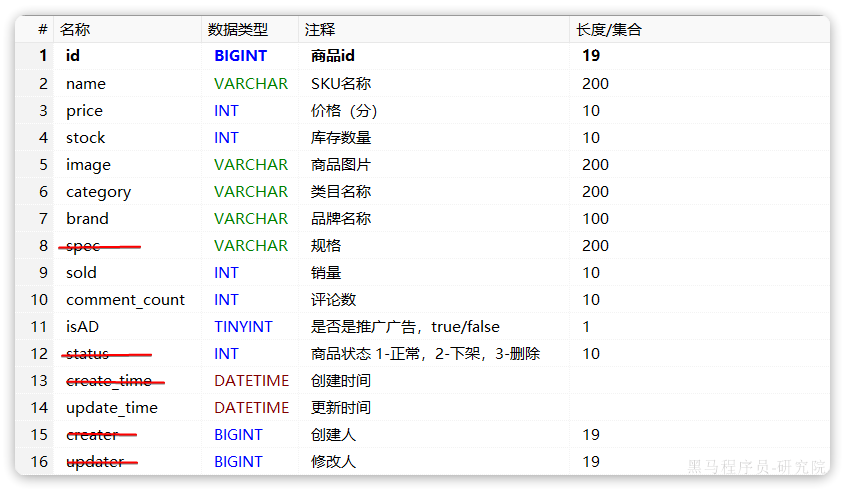


结合数据库表结构，以上字段对应的mapping映射属性如下：

| **字段名**      |   | **字段类型**  | **类型说明**    | **是否****参与搜索** | **是否****参与分词** | **分词器** |
| ------------ | - | --------- | ----------- | -------------- | -------------- | ------- |
| id           |   | `long`    | 长整数         |                |                | ——      |
| name         |   | `text`    | 字符串，参与分词搜索  |                |                | IK      |
| price        |   | `integer` | 以分为单位，所以是整数 |                |                | ——      |
| stock        |   | `integer` | 字符串，但需要分词   |                |                | ——      |
| image        |   | `keyword` | 字符串，但是不分词   |                |                | ——      |
| category     |   | `keyword` | 字符串，但是不分词   |                |                | ——      |
| brand        |   | `keyword` | 字符串，但是不分词   |                |                | ——      |
| sold         |   | `integer` | 销量，整数       |                |                | ——      |
| commentCount |   | `integer` | 评价，整数       |                |                | ——      |
| isAD         |   | `boolean` | 布尔类型        |                |                | ——      |
| updateTime   |   | `Date`    | 更新时间        |                |                | ——      |

因此，最终我们的索引库文档结构应该是这样：

```json
PUT /items
{
  "mappings": {
    "properties": {
      "id": {
        "type": "keyword"
      },
      "name":{
        "type": "text",
        "analyzer": "ik_max_word"
      },
      "price":{
        "type": "integer"
      },
      "stock":{
        "type": "integer"
      },
      "image":{
        "type": "keyword",
        "index": false
      },
      "category":{
        "type": "keyword"
      },
      "brand":{
        "type": "keyword"
      },
      "sold":{
        "type": "integer"
      },
      "commentCount":{
        "type": "integer",
        "index": false
      },
      "isAD":{
        "type": "boolean"
      },
      "updateTime":{
        "type": "date"
      }
    }
  }
}
```


#### 4.1.2.创建索引

创建索引库的API如下：

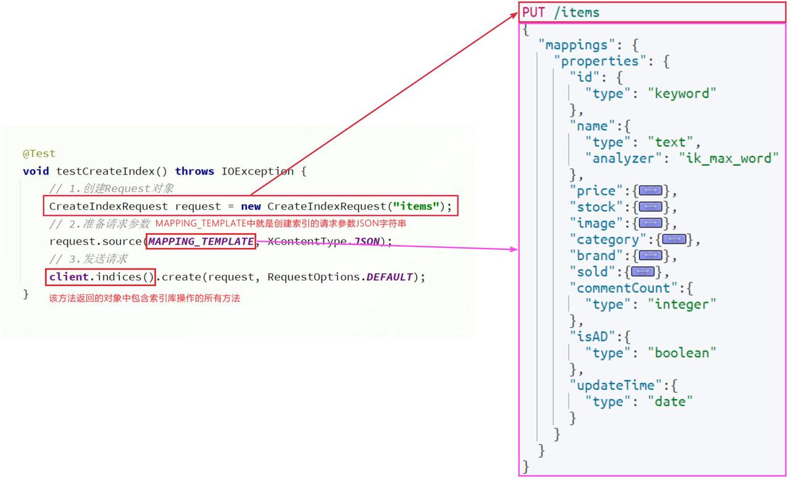

代码分为三步：

* 1）创建Request对象。

  * 因为是创建索引库的操作，因此Request是`CreateIndexRequest`。

* 2）添加请求参数

  * 其实就是Json格式的Mapping映射参数。因为json字符串很长，这里是定义了静态字符串常量`MAPPING_TEMPLATE`，让代码看起来更加优雅。

* 3）发送请求

  * `client.indices()`方法的返回值是`IndicesClient`类型，封装了所有与索引库操作有关的方法。例如创建索引、删除索引、判断索引是否存在等


在`item-service`中的`IndexTest`测试类中，具体代码如下：

```java
@Test
void testCreateIndex() throws IOException {
    // 1.创建Request对象
    CreateIndexRequest request = new CreateIndexRequest("items");
    // 2.准备请求参数
    request.source(MAPPING_TEMPLATE, XContentType.JSON);
    // 3.发送请求
    client.indices().create(request, RequestOptions.DEFAULT);
}

static final String MAPPING_TEMPLATE = "{\n" +
            "  \"mappings\": {\n" +
            "    \"properties\": {\n" +
            "      \"id\": {\n" +
            "        \"type\": \"keyword\"\n" +
            "      },\n" +
            "      \"name\":{\n" +
            "        \"type\": \"text\",\n" +
            "        \"analyzer\": \"ik_max_word\"\n" +
            "      },\n" +
            "      \"price\":{\n" +
            "        \"type\": \"integer\"\n" +
            "      },\n" +
            "      \"stock\":{\n" +
            "        \"type\": \"integer\"\n" +
            "      },\n" +
            "      \"image\":{\n" +
            "        \"type\": \"keyword\",\n" +
            "        \"index\": false\n" +
            "      },\n" +
            "      \"category\":{\n" +
            "        \"type\": \"keyword\"\n" +
            "      },\n" +
            "      \"brand\":{\n" +
            "        \"type\": \"keyword\"\n" +
            "      },\n" +
            "      \"sold\":{\n" +
            "        \"type\": \"integer\"\n" +
            "      },\n" +
            "      \"commentCount\":{\n" +
            "        \"type\": \"integer\"\n" +
            "      },\n" +
            "      \"isAD\":{\n" +
            "        \"type\": \"boolean\"\n" +
            "      },\n" +
            "      \"updateTime\":{\n" +
            "        \"type\": \"date\"\n" +
            "      }\n" +
            "    }\n" +
            "  }\n" +
            "}";
```


### 4.2.删除索引库

删除索引库的请求非常简单：

```json
DELETE /hotel
```

与创建索引库相比：

* 请求方式从PUT变为DELTE

* 请求路径不变

* 无请求参数


所以代码的差异，注意体现在Request对象上。流程如下：

* 1）创建Request对象。这次是DeleteIndexRequest对象

* 2）准备参数。这里是无参，因此省略

* 3）发送请求。改用delete方法


在`item-service`中的`IndexTest`测试类中，编写单元测试，实现删除索引：

```java
@Test
void testDeleteIndex() throws IOException {
    // 1.创建Request对象
    DeleteIndexRequest request = new DeleteIndexRequest("items");
    // 2.发送请求
    client.indices().delete(request, RequestOptions.DEFAULT);
}
```


### 4.3.判断索引库是否存在

判断索引库是否存在，本质就是查询，对应的请求语句是：

```json
GET /hotel
```


因此与删除的Java代码流程是类似的，流程如下：

* 1）创建Request对象。这次是GetIndexRequest对象

* 2）准备参数。这里是无参，直接省略

* 3）发送请求。改用exists方法

```java
@Test
void testExistsIndex() throws IOException {
    // 1.创建Request对象
    GetIndexRequest request = new GetIndexRequest("items");
    // 2.发送请求
    boolean exists = client.indices().exists(request, RequestOptions.DEFAULT);
    // 3.输出
    System.err.println(exists ? "索引库已经存在！" : "索引库不存在！");
}
```


### 4.4.总结

JavaRestClient操作elasticsearch的流程基本类似。核心是`client.indices()`方法来获取索引库的操作对象。

索引库操作的基本步骤：

* 初始化`RestHighLevelClient`

* 创建XxxIndexRequest。XXX是`Create`、`Get`、`Delete`

* 准备请求参数（ `Create`时需要，其它是无参，可以省略）

* 发送请求。调用`RestHighLevelClient#indices().xxx()`方法，xxx是`create`、`exists`、`delete`


## 5.RestClient操作文档

索引库准备好以后，就可以操作文档了。为了与索引库操作分离，我们再次创建一个测试类，做两件事情：

* 初始化RestHighLevelClient

* 我们的商品数据在数据库，需要利用IHotelService去查询，所以注入这个接口

```java
package com.hmall.item.es;

import com.hmall.item.service.IItemService;
import org.apache.http.HttpHost;
import org.elasticsearch.client.RestClient;
import org.elasticsearch.client.RestHighLevelClient;
import org.junit.jupiter.api.AfterEach;
import org.junit.jupiter.api.BeforeEach;
import org.springframework.beans.factory.annotation.Autowired;
import org.springframework.boot.test.context.SpringBootTest;

import java.io.IOException;

@SpringBootTest(properties = "spring.profiles.active=local")
public class DocumentTest {

    private RestHighLevelClient client;
    @Autowired
    private IItemService itemService;

    @BeforeEach
    void setUp() {
        this.client = new RestHighLevelClient(RestClient.builder(
                HttpHost.create("http://192.168.150.101:9200")
        ));
    }
    
    @AfterEach
    void tearDown() throws IOException {
        this.client.close();
    }
}
```


### 一个pom文件

```java
<?xml version="1.0" encoding="UTF-8"?>
<project xmlns="http://maven.apache.org/POM/4.0.0"
         xmlns:xsi="http://www.w3.org/2001/XMLSchema-instance"
         xsi:schemaLocation="http://maven.apache.org/POM/4.0.0 http://maven.apache.org/xsd/maven-4.0.0.xsd">
    <parent>
        <artifactId>jc-club-subject</artifactId>
        <groupId>com.jingdianjichi</groupId>
        <version>1.0-SNAPSHOT</version>
    </parent>
    <modelVersion>4.0.0</modelVersion>

    <artifactId>jc-club-infra</artifactId>

    <properties>
        <maven.compiler.source>1.8</maven.compiler.source>
        <maven.compiler.target>1.8</maven.compiler.target>
        <maven.compiler.compilerVersion>1.8</maven.compiler.compilerVersion>
        <project.build.sourceEncoding>UTF-8</project.build.sourceEncoding>
        <project.reporting.outputEncoding>UTF-8</project.reporting.outputEncoding>
    </properties>


    <dependencies>
        <!-- jdbcStarter -->
        <dependency>
            <groupId>org.springframework.boot</groupId>
            <artifactId>spring-boot-starter-jdbc</artifactId>
            <version>2.4.2</version>
        </dependency>
        <!-- druid连接池 -->
        <dependency>
            <groupId>com.alibaba</groupId>
            <artifactId>druid-spring-boot-starter</artifactId>
            <version>1.1.22</version>
        </dependency>
        <!-- mysql -->
        <dependency>
            <groupId>mysql</groupId>
            <artifactId>mysql-connector-java</artifactId>
            <version>8.0.22</version>
        </dependency>
        <!-- mybatisplus -->
        <dependency>
            <groupId>com.baomidou</groupId>
            <artifactId>mybatis-plus-boot-starter</artifactId>
            <version>3.4.0</version>
        </dependency>
        <dependency>
            <groupId>com.jingdianjichi</groupId>
            <artifactId>jc-club-common</artifactId>
            <version>1.0-SNAPSHOT</version>
        </dependency>

        <!-- 这里引入了 该模块自身 + 它声明的传递性依赖（transitive dependencies），最重要的是引入了OpenFeign依赖，
            关键限制：依赖范围（scope）和可选依赖（optional）
            1. <scope>provided</scope> 的依赖不会传递
            常见于：Servlet API、Lombok（编译期使用）
            这些依赖只在 auth-api 编译时需要，运行时由你的主项目提供
            2. <optional>true</optional> 的依赖不会传递
            如果 auth-api 的某个依赖被标记为 optional，Maven 不会自动引入它
            你需要自己显式声明（如果确实需要）
            3. 依赖冲突时，Maven 会按“最近优先”原则选择版本
        -->
        <dependency>
            <groupId>com.jingdianjichi</groupId>
            <artifactId>jc-club-auth-api</artifactId>
            <version>1.0-SNAPSHOT</version>
        </dependency>

        <dependency>
            <groupId>org.elasticsearch</groupId>
            <artifactId>elasticsearch</artifactId>
            <version>7.5.2</version>
        </dependency>

        <dependency>
            <groupId>org.elasticsearch.client</groupId>
            <artifactId>elasticsearch-rest-client</artifactId>
            <version>7.5.2</version>
        </dependency>

        <dependency>
            <groupId>org.elasticsearch.client</groupId>
            <artifactId>elasticsearch-rest-high-level-client</artifactId>
            <version>7.5.2</version>
        </dependency>

        <dependency>
            <groupId>org.apache.commons</groupId>
            <artifactId>commons-collections4</artifactId>
            <version>4.4</version>
        </dependency>

    </dependencies>

</project>
```

这个pom文件包含三个es相关依赖包

在这段 POM 配置中，Elasticsearch 相关的三个依赖项共同协作，构成了一个分层的客户端架构。它们的作用可以理解为一个“三层楼”的结构，每一层都建立在下一层之上，提供更高程度的抽象和便利性。

#### 🏗️ 1. 核心基础层：`elasticsearch`

```xml
<dependency>
    <groupId>org.elasticsearch</groupId>
    <artifactId>elasticsearch</artifactId>
    <version>${elastic.version}</version>
</dependency>
```

**作用：** 这是 Elasticsearch 的**核心库**，是整个大厦的地基。

- **提供基础模型：** 它包含了 Elasticsearch 服务端和客户端通用的核心类、数据结构、版本信息和解析工具（如 `XContentParser`）。
- **不可或缺：** 无论你使用哪种客户端（Transport、REST 或 High Level REST），都需要这个核心库来处理底层的协议和数据定义。

#### 🚚 2. 底层通信层：`elasticsearch-rest-client`

```xml
<dependency>
    <groupId>org.elasticsearch.client</groupId>
    <artifactId>elasticsearch-rest-client</artifactId>
    <version>${elastic.version}</version>
</dependency>
```

**作用：** 这是**低级别 REST 客户端**，充当 HTTP 通信的引擎。

- **负责网络传输：** 它只做一件事，就是通过 HTTP 协议与 Elasticsearch 集群进行通信。你可以把它想象成一个专门发送 HTTP 请求的工具。
- **处理原始数据：** 它发送请求，并接收原始的字节流或字符串响应。**它不关心**你发送的 HTTP 请求体是不是合法的 Elasticsearch 查询 DSL，也不帮你解析返回的 JSON 数据。

#### 🎛️ 3. 高层业务层：`elasticsearch-rest-high-level-client`

```xml
<dependency>
    <groupId>org.elasticsearch.client</groupId>
    <artifactId>elasticsearch-rest-high-level-client</artifactId>
    <version>${elastic.version}</version>
    <exclusions>
        <!-- 排除传递依赖 -->
    </exclusions>
</dependency>
```

**作用：** 这是**高级别 REST 客户端**，是你编写业务代码时直接使用的 API。

- **提供面向对象的 API：** 它封装了复杂的细节。你不再需要手动拼接 JSON 格式的查询语句，而是使用 `SearchRequest`、`IndexRequest` 等 Java 对象来构建请求。
- **自动序列化/反序列化：** 它负责将你的 Java 对象转换成 HTTP 请求体（序列化），并把接收到的原始响应转换回 Java 对象（反序列化），极大提升了开发效率和代码可读性。
- **依赖关系：** 它在内部依赖并使用了上述的 `elasticsearch-rest-client` 来执行实际的网络通信。

------

#### 📌 总结

这三个依赖的关系可以概括如下：

1. **你**编写代码时，调用的是 **`elasticsearch-rest-high-level-client`** 提供的高级 API。
2. 高级客户端将你的请求对象转换为 HTTP 请求，交给 **`elasticsearch-rest-client`** 发送出去。
3. 低级客户端负责底层的网络通信，并将收到的原始数据交还给高级客户端。
4. 高级客户端利用 **`elasticsearch`** 核心库中的工具来解析数据，并将结果返回给你。


### 5.1.新增文档

我们需要将数据库中的商品信息导入elasticsearch中，而不是造假数据了。

**由于`<elasticsearch.version>7.12.1</elasticsearch.version>`版本与java17不兼容会报错，所以需要使用java11测试**

#### 5.1.1.实体类

索引库结构与数据库结构还存在一些差异，因此我们要定义一个索引库结构对应的实体。

在`hm-service`模块的`com.hmall.item.domain.dto`包中定义一个新的DTO：

```java
package com.hmall.item.domain.po;

import io.swagger.annotations.ApiModel;
import io.swagger.annotations.ApiModelProperty;
import lombok.Data;

import java.time.LocalDateTime;

@Data
@ApiModel(description = "索引库实体")
public class ItemDoc{

    @ApiModelProperty("商品id")
    private String id;

    @ApiModelProperty("商品名称")
    private String name;

    @ApiModelProperty("价格（分）")
    private Integer price;

    @ApiModelProperty("商品图片")
    private String image;

    @ApiModelProperty("类目名称")
    private String category;

    @ApiModelProperty("品牌名称")
    private String brand;

    @ApiModelProperty("销量")
    private Integer sold;

    @ApiModelProperty("评论数")
    private Integer commentCount;

    @ApiModelProperty("是否是推广广告，true/false")
    private Boolean isAD;

    @ApiModelProperty("更新时间")
    private LocalDateTime updateTime;
}
```


#### 5.1.2.API语法

新增文档的请求语法如下：

```json
POST /{索引库名}/_doc/1
{
    "name": "Jack",
    "age": 21
}
```

对应的JavaAPI如下：

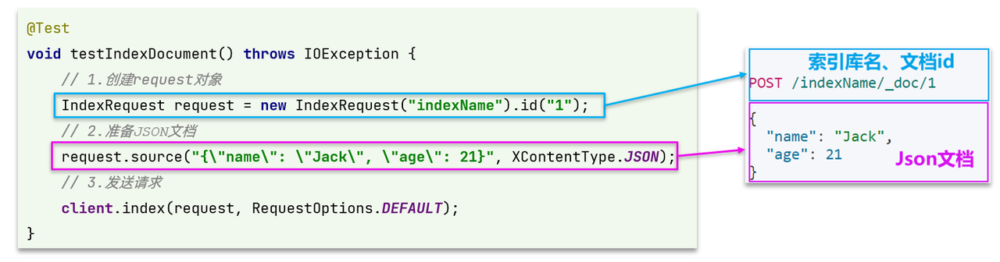

可以看到与索引库操作的API非常类似，同样是三步走：

* 1）创建Request对象，这里是`IndexRequest`，因为添加文档就是创建倒排索引的过程

* 2）准备请求参数，本例中就是Json文档

* 3）发送请求


变化的地方在于，这里直接使用`client.xxx()`的API，不再需要`client.indices()`了。


#### 5.1.3.完整代码

我们导入商品数据，除了参考API模板“三步走”以外，还需要做几点准备工作：

* 商品数据来自于数据库，我们需要先查询出来，得到`Item`对象

* `Item`对象需要转为`ItemDoc`对象

* `ItemDTO`需要序列化为`json`格式


因此，代码整体步骤如下：

* 1）根据id查询商品数据`Item`

* 2）将`Item`封装为`ItemDoc`

* 3）将`ItemDoc`序列化为JSON

* 4）创建IndexRequest，指定索引库名和id

* 5）准备请求参数，也就是JSON文档

* 6）发送请求


在`item-service`的`DocumentTest`测试类中，编写单元测试：

```java
@Test
void testAddDocument() throws IOException {
    // 1.根据id查询商品数据
    Item item = itemService.getById(100002644680L);
    // 2.转换为文档类型
    ItemDoc itemDoc = BeanUtil.copyProperties(item, ItemDoc.class);
    // 3.将ItemDTO转json
    String doc = JSONUtil.toJsonStr(itemDoc);

    // 1.准备Request对象
    IndexRequest request = new IndexRequest("items").id(itemDoc.getId());
    // 2.准备Json文档
    request.source(doc, XContentType.JSON);
    // 3.发送请求
    client.index(request, RequestOptions.DEFAULT);
}
```


### 5.2.查询文档

我们以根据id查询文档为例

#### 5.2.1.语法说明

查询的请求语句如下：

```json
GET /{索引库名}/_doc/{id}
```


与之前的流程类似，代码大概分2步：

* 创建Request对象

* ~~准备请求参数，这里是无参，直接省略~~

* 发送请求


不过查询的目的是得到结果，解析为ItemDTO，还要再加一步对结果的解析。示例代码如下：

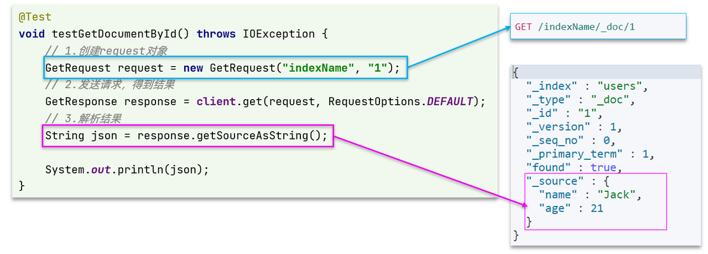

可以看到，响应结果是一个JSON，其中文档放在一个`_source`属性中，因此解析就是拿到`_source`，反序列化为Java对象即可。


其它代码与之前类似，流程如下：

* 1）准备Request对象。这次是查询，所以是`GetRequest`

* 2）发送请求，得到结果。因为是查询，这里调用`client.get()`方法

* 3）解析结果，就是对JSON做反序列化


#### 5.2.2.完整代码

在`item-service`的`DocumentTest`测试类中，编写单元测试：

```java
@Test
void testGetDocumentById() throws IOException {
    // 1.准备Request对象
    GetRequest request = new GetRequest("items").id("100002644680");
    // 2.发送请求
    GetResponse response = client.get(request, RequestOptions.DEFAULT);
    // 3.获取响应结果中的source
    String json = response.getSourceAsString();
    
    ItemDoc itemDoc = JSONUtil.toBean(json, ItemDoc.class);
    System.out.println("itemDoc= " + ItemDoc);
}
```


### 5.3.删除文档

删除的请求语句如下：

```json
DELETE /hotel/_doc/{id}
```


与查询相比，仅仅是请求方式从`DELETE`变成`GET`，可以想象Java代码应该依然是2步走：

* 1）准备Request对象，因为是删除，这次是`DeleteRequest`对象。要指定索引库名和id

* 2）~~准备参数，无参，直接省略~~

* 3）发送请求。因为是删除，所以是`client.delete()`方法


在`item-service`的`DocumentTest`测试类中，编写单元测试：

```java
@Test
void testDeleteDocument() throws IOException {
    // 1.准备Request，两个参数，第一个是索引库名，第二个是文档id
    DeleteRequest request = new DeleteRequest("item", "100002644680");
    // 2.发送请求
    client.delete(request, RequestOptions.DEFAULT);
}
```


### 5.4.修改文档

修改我们讲过两种方式：

* 全量修改：本质是先根据id删除，再新增

* 局部修改：修改文档中的指定字段值


在RestClient的API中，全量修改与新增的API完全一致，判断依据是ID：

* 如果新增时，ID已经存在，则修改

* 如果新增时，ID不存在，则新增


这里不再赘述，我们主要关注局部修改的API即可。

#### 5.4.1.语法说明

局部修改的请求语法如下：

```json
POST /{索引库名}/_update/{id}
{
  "doc": {
    "字段名": "字段值",
    "字段名": "字段值"
  }
}
```


代码示例如图：

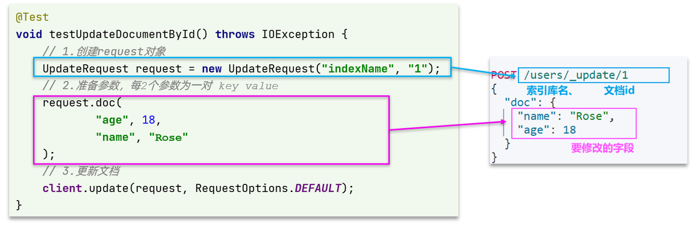

与之前类似，也是三步走：

* 1）准备`Request`对象。这次是修改，所以是`UpdateRequest`

* 2）准备参数。也就是JSON文档，里面包含要修改的字段

* 3）更新文档。这里调用`client.update()`方法


#### 5.4.2.完整代码

在`item-service`的`DocumentTest`测试类中，编写单元测试：

```java
@Test
void testUpdateDocument() throws IOException {
    // 1.准备Request
    UpdateRequest request = new UpdateRequest("items", "100002644680");
    // 2.准备请求参数
    request.doc(
            "price", 58800,
            "commentCount", 1
    );
    // 3.发送请求
    client.update(request, RequestOptions.DEFAULT);
}
```


### 5.5.批量导入文档

在之前的案例中，我们都是操作单个文档。而数据库中的商品数据实际会达到数十万条，某些项目中可能达到数百万条。

我们如果要将这些数据导入索引库，肯定不能逐条导入，而是采用批处理方案。常见的方案有：

* 利用Logstash批量导入

  * 需要安装Logstash

  * 对数据的再加工能力较弱

  * 无需编码，但要学习编写Logstash导入配置

* 利用JavaAPI批量导入

  * 需要编码，但基于JavaAPI，学习成本低

  * 更加灵活，可以任意对数据做再加工处理后写入索引库


接下来，我们就学习下如何利用JavaAPI实现批量文档导入。

#### 5.5.1.语法说明

批处理与前面讲的文档的CRUD步骤基本一致：

* 创建Request，但这次用的是`BulkRequest`

* 准备请求参数

* 发送请求，这次要用到`client.bulk()`方法


`BulkRequest`本身其实并没有请求参数，其本质就是将多个普通的CRUD请求组合在一起发送。例如：

* 批量新增文档，就是给每个文档创建一个`IndexRequest`请求，然后封装到`BulkRequest`中，一起发出。

* 批量删除，就是创建N个`DeleteRequest`请求，然后封装到`BulkRequest`，一起发出


因此`BulkRequest`中提供了`add`方法，用以添加其它CRUD的请求：

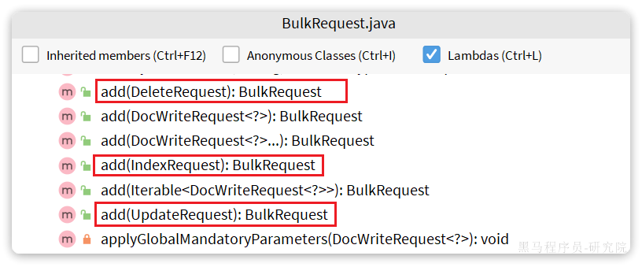

可以看到，能添加的请求有：

* `IndexRequest`，也就是新增

* `UpdateRequest`，也就是修改

* `DeleteRequest`，也就是删除


因此Bulk中添加了多个`IndexRequest`，就是批量新增功能了。示例：

```java
@Test
void testBulk() throws IOException {
    // 1.创建Request
    BulkRequest request = new BulkRequest();
    // 2.准备请求参数
    request.add(new IndexRequest("items").id("1").source("json doc1", XContentType.JSON));
    request.add(new IndexRequest("items").id("2").source("json doc2", XContentType.JSON));
    // 3.发送请求
    client.bulk(request, RequestOptions.DEFAULT);
}
```

#### 5.5.2.完整代码

当我们要导入商品数据时，由于商品数量达到数十万，因此不可能一次性全部导入。建议采用循环遍历方式，每次导入1000条左右的数据。

`item-service`的`DocumentTest`测试类中，编写单元测试：

```java
@Test
void testLoadItemDocs() throws IOException {
    // 分页查询商品数据
    int pageNo = 1;
    int size = 1000;
    while (true) {
        Page<Item> page = itemService.lambdaQuery().eq(Item::getStatus, 1).page(new Page<Item>(pageNo, size));
        // 非空校验
        List<Item> items = page.getRecords();
        if (CollUtils.isEmpty(items)) {
            return;
        }
        log.info("加载第{}页数据，共{}条", pageNo, items.size());
        // 1.创建Request
        BulkRequest request = new BulkRequest("items");
        // 2.准备参数，添加多个新增的Request
        for (Item item : items) {
            // 2.1.转换为文档类型ItemDTO
            ItemDoc itemDoc = BeanUtil.copyProperties(item, ItemDoc.class);
            // 2.2.创建新增文档的Request对象
            request.add(new IndexRequest()
                            .id(itemDoc.getId())
                            .source(JSONUtil.toJsonStr(itemDoc), XContentType.JSON));
        }
        // 3.发送请求
        client.bulk(request, RequestOptions.DEFAULT);

        // 翻页
        pageNo++;
    }
}
```


### 5.6.小结

文档操作的基本步骤：

* 初始化`RestHighLevelClient`

* 创建XxxRequest。

  * XXX是`Index`、`Get`、`Update`、`Delete`、`Bulk`

* 准备参数（`Index`、`Update`、`Bulk`时需要）

* 发送请求。

  * 调用`RestHighLevelClient#.xxx()`方法，xxx是`index`、`get`、`update`、`delete`、`bulk`

* 解析结果（`Get`时需要）


## 6.作业

### 6.1.服务拆分

搜索业务并发压力可能会比较高，目前与商品服务在一起，不方便后期优化。

**需求**：创建一个新的微服务，命名为`search-service`，将搜索相关功能抽取到这个微服务中


### 6.2.商品查询接口

在`item-service`服务中提供一个根据id查询商品的功能，并编写对应的FeignClient


### 6.3.数据同步

每当商品服务对商品实现增删改时，索引库的数据也需要同步更新。

**提示**：可以考虑采用MQ异步通知实现。


> 大家学习中如果碰到困难，可以加入[**黑马智学伴侣**](https://b11et3un53m.feishu.cn/wiki/M9LKwYAlHiZoyhkB5iKcgOh1nmc)寻求帮助，有学习交流群，老师、同学在线答疑。还有独享的企业级项目，避免与人撞车。


对应的B站视频：


## ES-09

在昨天的学习中，我们已经导入了大量数据到elasticsearch中，实现了商品数据的存储。不过查询商品数据时依然采用的是根据id查询，而非模糊搜索。

所以今天，我们来研究下elasticsearch的数据搜索功能。Elasticsearch提供了基于JSON的DSL（[Domain Specific Language](https://www.elastic.co/guide/en/elasticsearch/reference/7.12/query-dsl.html)）语句来定义查询条件，其JavaAPI就是在组织DSL条件。

因此，我们先学习DSL的查询语法，然后再基于DSL来对照学习JavaAPI，就会事半功倍。

## 1.DSL查询

Elasticsearch的查询可以分为两大类：

* **叶子查询（Leaf query clauses）**：一般是在特定的字段里查询特定值，属于简单查询，很少单独使用。

* **复合查询（Compound query clauses）**：以逻辑方式组合多个叶子查询或者更改叶子查询的行为方式。


### 1.1.快速入门

我们依然在Kibana的DevTools中学习查询的DSL语法。首先来看查询的语法结构：

```json
GET /{索引库名}/_search
{
  "query": {
    "查询类型": {
      // .. 查询条件
    }
  }
}
```

说明：

* `GET /{索引库名}/_search`：其中的`_search`是固定路径，不能修改


例如，我们以最简单的无条件查询为例，无条件查询的类型是：match\_all，因此其查询语句如下：

```json
GET /items/_search
{
  "query": {
    "match_all": {
      
    }
  }
}
```

由于match\_all无条件，所以条件位置不写即可。

执行结果如下：

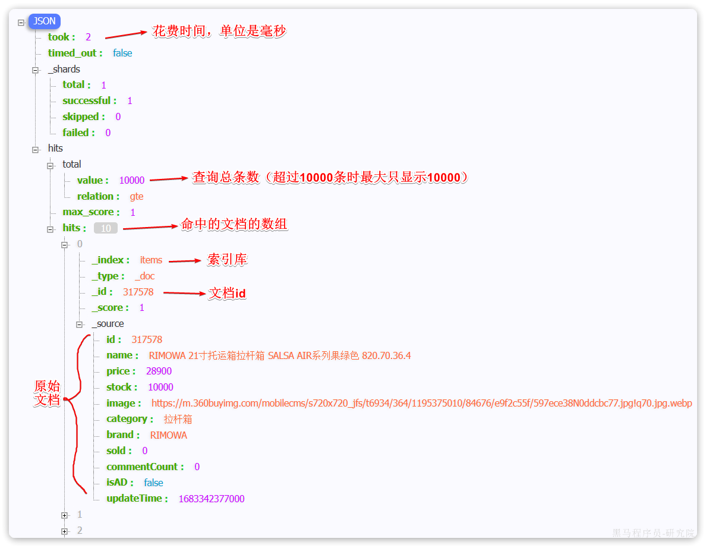

你会发现虽然是match\_all，但是响应结果中并不会包含索引库中的所有文档，而是仅有10条。这是因为处于安全考虑，elasticsearch设置了默认的查询页数。

### 1.2.叶子查询

叶子查询的类型也可以做进一步细分，详情大家可以查看官方文档：

如图：

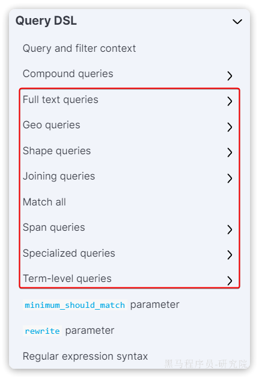


这里列举一些常见的，例如：

* **全文检索查询（Full Text Queries）**：利用分词器对用户输入搜索条件先分词，得到词条，然后再利用倒排索引搜索词条。例如：

  * `match`：

  * `multi_match`

* **精确查询（Term-level queries）**：不对用户输入搜索条件分词，根据字段内容精确值匹配。但只能查找keyword、数值、日期、boolean类型的字段。例如：
* `ids`
  
* `term`
  
* `range`
  
* **地理坐标查询：**用于搜索地理位置，搜索方式很多，例如：
* `geo_bounding_box`：按矩形搜索
  
* `geo_distance`：按点和半径搜索
  
* ...略


#### 1.2.1.全文检索查询

全文检索的种类也很多，详情可以参考官方文档：


以全文检索中的`match`为例，语法如下：

```json
GET /{索引库名}/_search
{
  "query": {
    "match": {
      "字段名": "搜索条件"
    }
  }
}
```

示例：

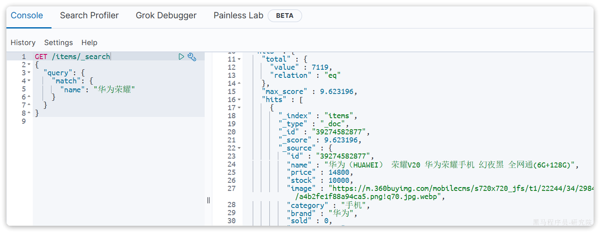


与`match`类似的还有`multi_match`，区别在于可以同时对多个字段搜索，而且多个字段都要满足，语法示例：

```json
GET /{索引库名}/_search
{
  "query": {
    "multi_match": {
      "query": "搜索条件",
      "fields": ["字段1", "字段2"]
    }
  }
}
```

示例：

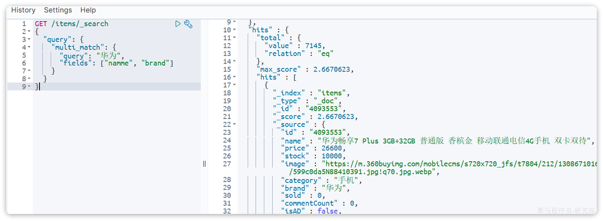


#### 1.2.2.精确查询

精确查询，英文是`Term-level query`，顾名思义，词条级别的查询。也就是说不会对用户输入的搜索条件再分词，而是作为一个词条，与搜索的字段内容精确值匹配。因此推荐查找`keyword`、数值、日期、`boolean`类型的字段。例如：

* id

* price

* 城市

* 地名

* 人名

等等，作为一个整体才有含义的字段。

详情可以查看官方文档：


**以`term`查询为例，其语法如下：**

```json
GET /{索引库名}/_search
{
  "query": {
    "term": {
      "字段名": {
        "value": "搜索条件"
      }
    }
  }
}
```

示例：

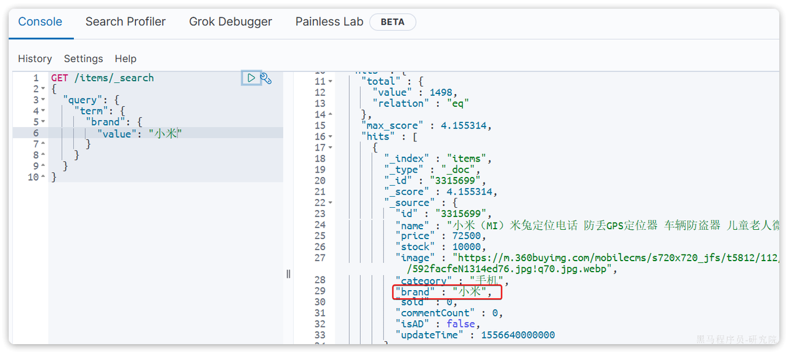


**当你输入的搜索条件不是词条，而是短语(term)时，由于不做分词，你反而搜索不到：**

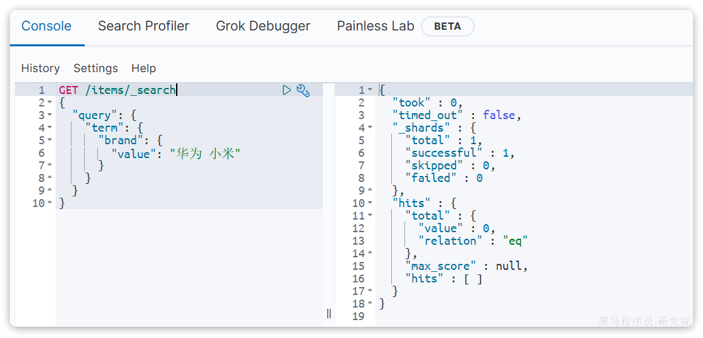


**再来看下`range`查询，语法如下：**

```json
GET /{索引库名}/_search
{
  "query": {
    "range": {
      "字段名": {
        "gte": {最小值},
        "lte": {最大值}
      }
    }
  }
}
```

`range`是范围查询，对于范围筛选的关键字有：

* `gte`：大于等于

* `gt`：大于

* `lte`：小于等于

* `lt`：小于

示例：

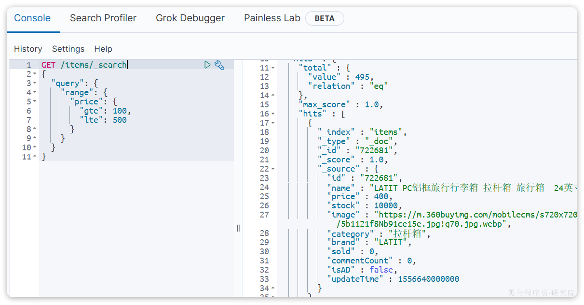

**ids查询**

```
GET /{索引库名}/_search
{
  "query": {
    "ids": {
      "value": ["xxxx","xxxxx"]
    }
  }
}
```


### 1.3.复合查询

复合查询大致可以分为两类：

* 第一类：基于逻辑运算组合叶子查询，实现组合条件，例如

  * bool

* 第二类：基于某种算法修改查询时的文档相关性算分，从而改变文档排名。例如：

  * function\_score

  * dis\_max

其它复合查询及相关语法可以参考官方文档：


#### 1.3.1.算分函数查询（选讲）

当我们利用match查询时，文档结果会根据与搜索词条的**关联度打分**（**\_score**），返回结果时按照分值降序排列。

例如，我们搜索 "手机"，结果如下：

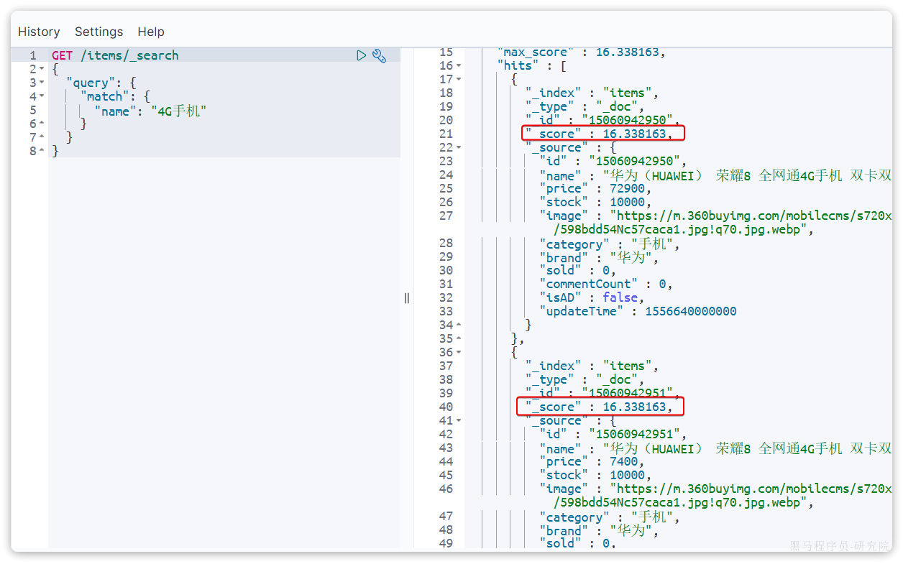

从elasticsearch5.1开始，采用的相关性打分算法是BM25算法，公式如下：


基于这套公式，就可以判断出某个文档与用户搜索的关键字之间的关联度，还是比较准确的。但是，在实际业务需求中，常常会有竞价排名的功能。不是相关度越高排名越靠前，而是掏的钱多的排名靠前。

例如在百度中搜索Java培训，排名靠前的就是广告推广：


要想认为控制相关性算分，就需要利用elasticsearch中的function score 查询了。

**基本语法**：

function score 查询中包含四部分内容：

* **原始查询**条件：query部分，基于这个条件搜索文档，并且基于BM25算法给文档打分，**原始算分**（query score)

* **过滤条件**：filter部分，符合该条件的文档才会重新算分

* **算分函数**：符合filter条件的文档要根据这个函数做运算，得到的**函数算分**（function score），有四种函数&#x20;
* weight：函数结果是常量
  
* field\_value\_factor：以文档中的某个字段值作为函数结果
  
* random\_score：以随机数作为函数结果
  
* script\_score：自定义算分函数算法
  
* **运算模式**：算分函数的结果、原始查询的相关性算分，两者之间的运算方式，包括：&#x20;

  * multiply：相乘

  * replace：用function score替换query score

  * 其它，例如：sum、avg、max、min


function score的运行流程如下：

* 1）根据**原始条件**查询搜索文档，并且计算相关性算分，称为**原始算分**（query score）

* 2）根据**过滤条件**，过滤文档

* 3）符合**过滤条件**的文档，基于**算分函数**运算，得到**函数算分**（function score）

* 4）将**原始算分**（query score）和**函数算分**（function score）基于**运算模式**做运算，得到最终结果，作为相关性算分。


因此，其中的关键点是：

* 过滤条件：决定哪些文档的算分被修改

* 算分函数：决定函数算分的算法

* 运算模式：决定最终算分结果


示例：给IPhone这个品牌的手机算分提高十倍，分析如下：

* 过滤条件：品牌必须为IPhone

* 算分函数：常量weight，值为10

* 算分模式：相乘multiply

对应代码如下：

```json
GET /hotel/_search
{
  "query": {
    "function_score": {
      "query": {  .... }, // 原始查询，可以是任意条件
      "functions": [ // 算分函数
        {
          "filter": { // 满足的条件，品牌必须是Iphone
            "term": {
              "brand": "Iphone"
            }
          },
          "weight": 10 // 算分权重为2
        }
      ],
      "boost_mode": "multipy" // 加权模式，求乘积
    }
  }
}
```


#### 1.3.2.bool查询

bool查询，即布尔查询。就是利用逻辑运算来组合一个或多个查询子句的组合。bool查询支持的逻辑运算有：

* must：必须匹配每个子查询，类似“与”

* should：选择性匹配子查询，类似“或”

* must\_not：必须不匹配，**不参与算分**，类似“非”

* filter：必须匹配，**不参与算分**

bool查询的语法如下：

```json
GET /items/_search
{
  "query": {
    "bool": {
      "must": [
        {"match": {"name": "手机"}}
      ],
      "should": [
        {"term": {"brand": { "value": "vivo" }}},
        {"term": {"brand": { "value": "小米" }}}
      ],
      "must_not": [
        {"range": {"price": {"gte": 2500}}}
      ],
      "filter": [
        {"range": {"price": {"lte": 1000}}}
      ]
    }
  }
}
```


出于性能考虑，与搜索关键字无关的查询尽量采用must\_not或filter逻辑运算，避免参与相关性算分。

例如黑马商城的搜索页面：

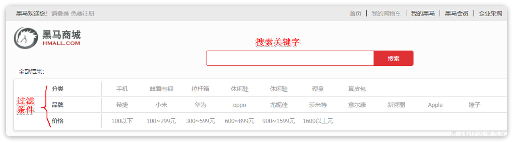

**其中输入框的搜索条件肯定要参与相关性算分，可以采用match。但是价格范围过滤、品牌过滤、分类过滤等尽量采用filter，不要参与相关性算分。**

比如，我们要搜索`手机`，但品牌必须是`华为`，价格必须是`900~1599`，那么可以这样写：

```json
GET /items/_search
{
  "query": {
    "bool": {
      "must": [
        {"match": {"name": "手机"}}
      ],
      "filter": [
        {"term": {"brand": { "value": "华为" }}},
        {"range": {"price": {"gte": 90000, "lt": 159900}}}
      ]
    }
  }
}
```


### 1.4.排序

elasticsearch默认是根据相关度算分（`_score`）来排序，但是也支持自定义方式对搜索结果排序。不过分词字段无法排序，能参与排序字段类型有：`keyword`类型、数值类型、地理坐标类型、日期类型等。

详细说明可以参考官方文档：

语法说明：

```json
GET /indexName/_search
{
  "query": {
    "match_all": {}
  },
  "sort": [
    {
      "排序字段": {
        "order": "排序方式asc和desc"
      }
    }
  ]
}
```


示例，我们按照商品价格排序：

```json
GET /items/_search
{
  "query": {
    "match_all": {}
  },
  "sort": [
    {
      "price": {
        "order": "desc"
      }
    }
  ]
}

====================
GET /items/_search
{
  "query": {
    "match_all": {}
  },
  "sort": [
    {
      "price": "desc",  # 简写
        "sold":"asc"
      
    }
  ]
}
```


### 1.5.分页

elasticsearch 默认情况下只返回top10的数据。而如果要查询更多数据就需要修改分页参数了。

#### 1.5.1.基础分页

elasticsearch中通过修改`from`、`size`参数来控制要返回的分页结果：

* `from`：从第几个文档开始

* `size`：总共查询几个文档

类似于mysql中的`limit ?, ?`

官方文档如下：

语法如下：

```json
GET /items/_search
{
  "query": {
    "match_all": {}
  },
  "from": 0, // 分页开始的位置，默认为0
  "size": 10,  // 每页文档数量，默认10
  "sort": [
    {
      "price": {
        "order": "desc"
      }
    }
  ]
}
```


#### 1.5.2.深度分页

elasticsearch的数据一般会采用分片存储，也就是把一个索引中的数据分成N份，存储到不同节点上。这种存储方式比较有利于数据扩展，但给分页带来了一些麻烦。

比如一个索引库中有100000条数据，分别存储到4个分片，每个分片25000条数据。现在每页查询10条，查询第99页。那么分页查询的条件如下：

```json
GET /items/_search
{
  "from": 990, // 从第990条开始查询
  "size": 10, // 每页查询10条
  "sort": [
    {
      "price": "asc"
    }
  ]
}
```

从语句来分析，要查询第990\~1000名的数据。

从实现思路来分析，肯定是将所有数据排序，找出前1000名，截取其中的990\~1000的部分。但问题来了，我们如何才能找到所有数据中的前1000名呢？

要知道每一片的数据都不一样，第1片上的第900\~1000，在另1个节点上并不一定依然是900\~1000名。所以我们只能在每一个分片上都找出排名前1000的数据，然后汇总到一起，重新排序，才能找出整个索引库中真正的前1000名，此时截取990\~1000的数据即可。

如图：

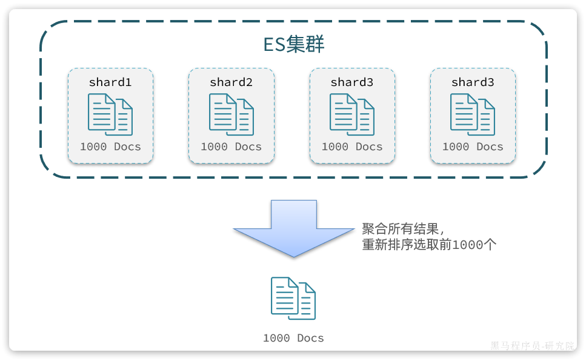


试想一下，假如我们现在要查询的是第999页数据呢，是不是要找第9990\~10000的数据，那岂不是需要把每个分片中的前10000名数据都查询出来，汇总在一起，在内存中排序？如果查询的分页深度更深呢，需要一次检索的数据岂不是更多？

由此可知，当查询分页深度较大时，汇总数据过多，对内存和CPU会产生非常大的压力。

因此elasticsearch会禁止`from+ size `超过10000的请求。


针对深度分页，elasticsearch提供了两种解决方案：

* `search after`：分页时需要排序，原理是从上一次的排序值开始，查询下一页数据。官方推荐使用的方式。

* `scroll`：原理将排序后的文档id形成快照，保存下来，基于快照做分页。官方已经不推荐使用。


详情见文档：https://www.elastic.co/guide/en/elasticsearch/reference/7.12/paginate-search-results.html

search after模式：

- 优点：没有查询上限，支持深度分页
- 缺点：只能向后逐页查询，不能随机翻页
- 场景：数据迁移，手机滚动查询等

> **总结：**
>
> 大多数情况下，我们采用普通分页就可以了。查看百度、京东等网站，会发现其分页都有限制。例如百度最多支持77页，每页不足20条。京东最多100页，每页最多60条。
>
> 因此，一般我们采用限制分页深度的方式即可，无需实现深度分页。


### 1.6.高亮

#### 1.6.1.高亮原理

什么是高亮显示呢？

我们在百度，京东搜索时，关键字会变成红色，比较醒目，这叫高亮显示：

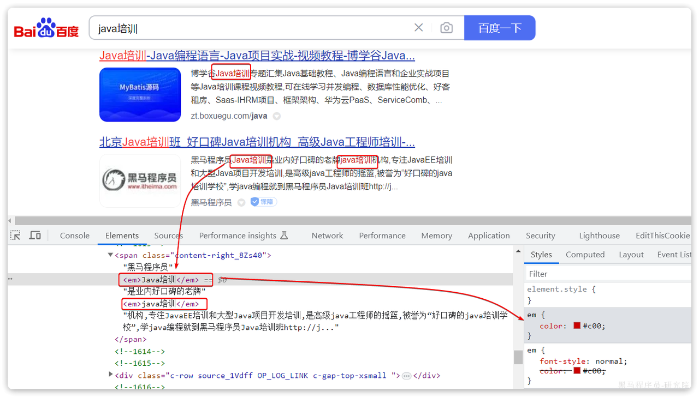

观察页面源码，你会发现两件事情：

* 高亮词条都被加了`<em>`标签

* `<em>`标签都添加了红色样式


css样式肯定是前端实现页面的时候写好的，但是前端编写页面的时候是不知道页面要展示什么数据的，不可能给数据加标签。而服务端实现搜索功能，要是有`elasticsearch`做分词搜索，是知道哪些词条需要高亮的。

因此词条的**高亮标签肯定是由服务端提供数据的时候已经加上的**。


因此实现高亮的思路就是：

* 用户输入搜索关键字搜索数据

* 服务端根据搜索关键字到elasticsearch搜索，并给搜索结果中的关键字词条添加`html`标签

* 前端提前给约定好的`html`标签添加`CSS`样式


#### 1.6.2.实现高亮

事实上elasticsearch已经提供了给搜索关键字加标签的语法，无需我们自己编码。

基本语法如下：

```json
GET /{索引库名}/_search
{
  "query": {
    "match": {
      "搜索字段": "搜索关键字"
    }
  },
  "highlight": {
    "fields": {
      "高亮字段名称": {
        "pre_tags": "<em>",
        "post_tags": "</em>"
      }
    }
  }
}

===============
GET /{索引库名}/_search
{
  "query": {
    "match": {
      "搜索字段": "搜索关键字"
    }
  },
  "highlight": {
    "fields": {
      "高亮字段名称": {} # 可以简写，默认是加em标签
    }
  }
}
```

> **注意**：
>
> * 搜索必须有查询条件，而且是全文检索类型的查询条件，例如`match`
>
> * 参与高亮的字段必须是`text`类型的字段
>
> * 默认情况下参与高亮的字段要与搜索字段一致，除非添加：`required_field_match=false`


示例：

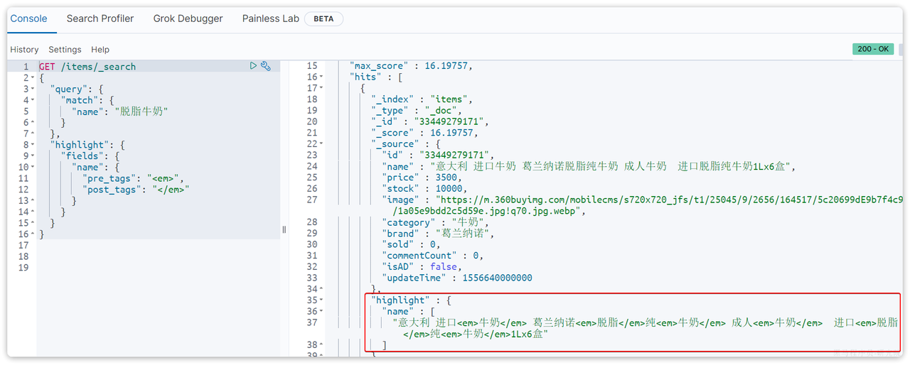


### 1.7.总结

查询的DSL是一个大的JSON对象，包含下列属性：

* `query`：查询条件

* `from`和`size`：分页条件

* `sort`：排序条件

* `highlight`：高亮条件

示例：


## 2.RestClient查询

文档的查询依然使用昨天学习的 `RestHighLevelClient`对象，查询的基本步骤如下：

* 1）创建`request`对象，这次是搜索，所以是`SearchRequest`

* 2）准备请求参数，也就是查询DSL对应的JSON参数

* 3）发起请求

* 4）解析响应，响应结果相对复杂，需要逐层解析


### 2.1.快速入门

之前说过，由于Elasticsearch对外暴露的接口都是Restful风格的接口，因此JavaAPI调用就是在发送Http请求。而我们核心要做的就是利用**利用Java代码组织请求参数**，**解析响应结果**。

这个参数的格式完全参考DSL查询语句的JSON结构，因此我们在学习的过程中，会不断的把JavaAPI与DSL语句对比。大家在学习记忆的过程中，也应该这样对比学习。

#### 2.1.1.发送请求

首先以`match_all`查询为例，其DSL和JavaAPI的对比如图：

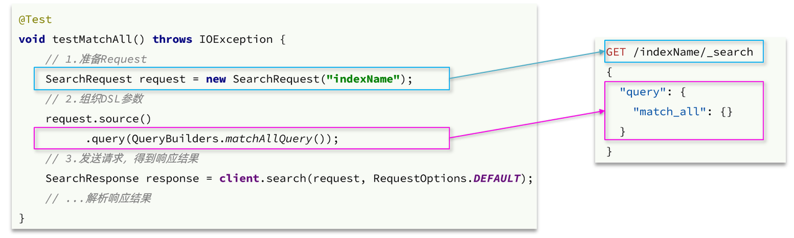

代码解读：

* &#x20;第一步，创建`SearchRequest`对象，指定索引库名&#x20;

* &#x20;第二步，利用`request.source()`构建DSL，DSL中可以包含查询、分页、排序、高亮等&#x20;

  * `query()`：代表查询条件，利用`QueryBuilders.matchAllQuery()`构建一个`match_all`查询的DSL

* &#x20;第三步，利用`client.search()`发送请求，得到响应&#x20;


这里关键的API有两个，一个是`request.source()`，它构建的就是DSL中的完整JSON参数。其中包含了`query`、`sort`、`from`、`size`、`highlight`等所有功能：

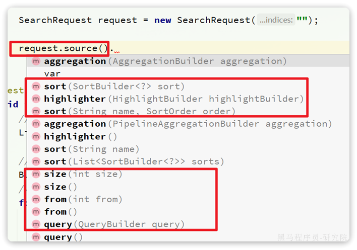

另一个是`QueryBuilders`，其中包含了我们学习过的各种**叶子查询**、**复合查询**等：

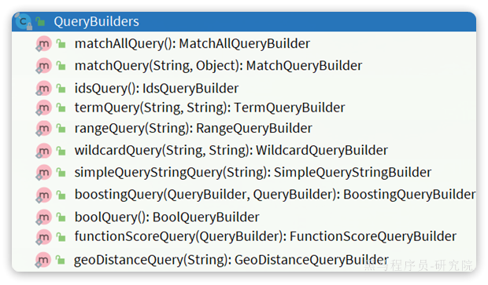


#### 2.1.2.解析响应结果

在发送请求以后，得到了响应结果`SearchResponse`，这个类的结构与我们在kibana中看到的响应结果JSON结构完全一致：

```json
{
    "took" : 0,
    "timed_out" : false,
    "hits" : {
        "total" : {
            "value" : 2,
            "relation" : "eq"
        },
        "max_score" : 1.0,
        "hits" : [
            {
                "_index" : "heima",
                "_type" : "_doc",
                "_id" : "1",
                "_score" : 1.0,
                "_source" : {
                "info" : "Java讲师",
                "name" : "赵云"
                }
            }
        ]
    }
}
```


因此，我们解析`SearchResponse`的代码就是在解析这个JSON结果，对比如下：

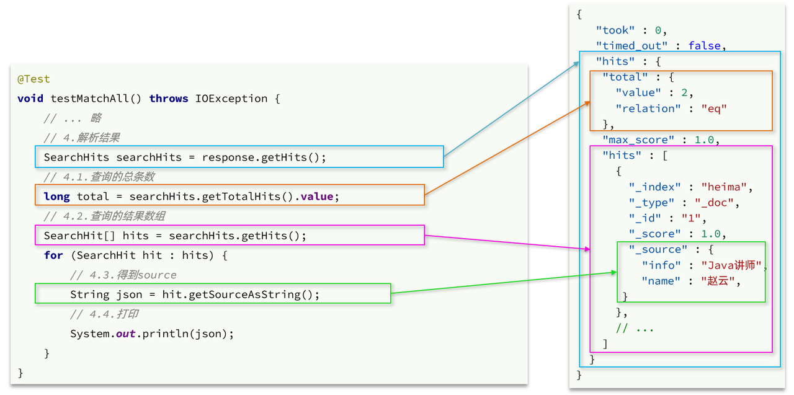


**代码解读**：

elasticsearch返回的结果是一个JSON字符串，结构包含：

* `hits`：命中的结果&#x20;

  * `total`：总条数，其中的value是具体的总条数值

  * `max_score`：所有结果中得分最高的文档的相关性算分

  * `hits`：搜索结果的文档数组，其中的每个文档都是一个json对象&#x20;

    * `_source`：文档中的原始数据，也是json对象


因此，我们解析响应结果，就是逐层解析JSON字符串，流程如下：

* `SearchHits`：通过`response.getHits()`获取，就是JSON中的最外层的`hits`，代表命中的结果&#x20;

  * `SearchHits#getTotalHits().value`：获取总条数信息

  * `SearchHits#getHits()`：获取`SearchHit`数组，也就是文档数组&#x20;

    * `SearchHit#getSourceAsString()`：获取文档结果中的`_source`，也就是原始的`json`文档数据


#### 2.1.3.总结

文档搜索的基本步骤是：

1. 创建`SearchRequest`对象

2. 准备`request.source()`，也就是DSL。

   1. `QueryBuilders`来构建查询条件

   2. 传入`request.source()` 的`  query()  `方法

3. 发送请求，得到结果

4. 解析结果（参考JSON结果，从外到内，逐层解析）


完整代码如下：

```java
@Test
void testMatchAll() throws IOException {
    // 1.创建Request
    SearchRequest request = new SearchRequest("items");
    // 2.组织请求参数
    request.source().query(QueryBuilders.matchAllQuery());
    // 3.发送请求
    SearchResponse response = client.search(request, RequestOptions.DEFAULT);
    // 4.解析响应
    handleResponse(response);
}

private void handleResponse(SearchResponse response) {
    SearchHits searchHits = response.getHits();
    // 1.获取总条数
    long total = searchHits.getTotalHits().value;
    System.out.println("共搜索到" + total + "条数据");
    // 2.遍历结果数组
    SearchHit[] hits = searchHits.getHits();
    for (SearchHit hit : hits) {
        // 3.得到_source，也就是原始json文档
        String source = hit.getSourceAsString();
        // 4.反序列化并打印
        ItemDoc item = JSONUtil.toBean(source, ItemDoc.class);
        System.out.println(item);
    }
}
```


### 2.2.叶子查询

所有的查询条件都是由QueryBuilders来构建的，叶子查询也不例外。因此整套代码中变化的部分仅仅是query条件构造的方式，其它不动。

例如`match`查询：

```java
@Test
void testMatch() throws IOException {
    // 1.创建Request
    SearchRequest request = new SearchRequest("items");
    // 2.组织请求参数
    request.source().query(QueryBuilders.matchQuery("name", "脱脂牛奶"));
    // 3.发送请求
    SearchResponse response = client.search(request, RequestOptions.DEFAULT);
    // 4.解析响应
    handleResponse(response);
}
```

再比如`multi_match`查询：

```java
@Test
void testMultiMatch() throws IOException {
    // 1.创建Request
    SearchRequest request = new SearchRequest("items");
    // 2.组织请求参数
    request.source().query(QueryBuilders.multiMatchQuery("脱脂牛奶", "name", "category"));
    // 3.发送请求
    SearchResponse response = client.search(request, RequestOptions.DEFAULT);
    // 4.解析响应
    handleResponse(response);
}
```

还有`range`查询：

```java
@Test
void testRange() throws IOException {
    // 1.创建Request
    SearchRequest request = new SearchRequest("items");
    // 2.组织请求参数
    request.source().query(QueryBuilders.rangeQuery("price").gte(10000).lte(30000));
    // 3.发送请求
    SearchResponse response = client.search(request, RequestOptions.DEFAULT);
    // 4.解析响应
    handleResponse(response);
}
```

还有`term`查询：

```java
@Test
void testTerm() throws IOException {
    // 1.创建Request
    SearchRequest request = new SearchRequest("items");
    // 2.组织请求参数
    request.source().query(QueryBuilders.termQuery("brand", "华为"));
    // 3.发送请求
    SearchResponse response = client.search(request, RequestOptions.DEFAULT);
    // 4.解析响应
    handleResponse(response);
}
```


### 2.3.复合查询

复合查询也是由`QueryBuilders`来构建，我们以`bool`查询为例，DSL和JavaAPI的对比如图：

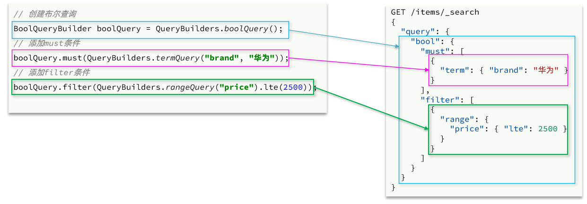

完整代码如下：

```java
@Test
void testBool() throws IOException {
    // 1.创建Request
    SearchRequest request = new SearchRequest("items");
    // 2.组织请求参数
    // 2.1.准备bool查询
    BoolQueryBuilder bool = QueryBuilders.boolQuery();
    // 2.2.关键字搜索
    bool.must(QueryBuilders.matchQuery("name", "脱脂牛奶"));
    // 2.3.品牌过滤
    bool.filter(QueryBuilders.termQuery("brand", "德亚"));
    // 2.4.价格过滤
    bool.filter(QueryBuilders.rangeQuery("price").lte(30000));
    request.source().query(bool);
    // 3.发送请求
    SearchResponse response = client.search(request, RequestOptions.DEFAULT);
    // 4.解析响应
    handleResponse(response);
}
```


### 2.4.排序和分页

之前说过，`requeset.source()`就是整个请求JSON参数，所以排序、分页都是基于这个来设置，其DSL和JavaAPI的对比如下：

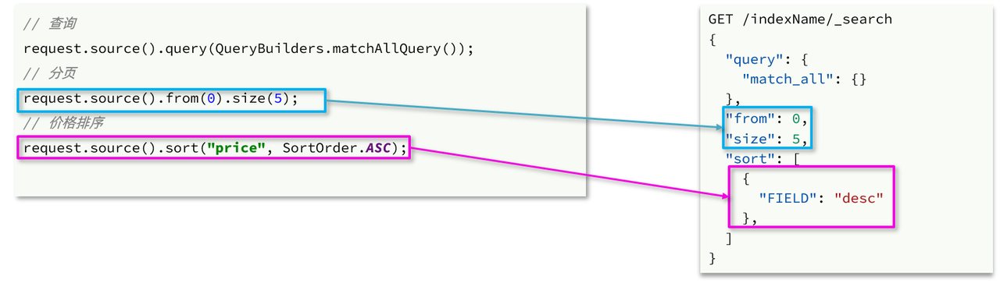

完整示例代码：

```java
@Test
void testPageAndSort() throws IOException {
    int pageNo = 1, pageSize = 5;

    // 1.创建Request
    SearchRequest request = new SearchRequest("items");
    // 2.组织请求参数
    // 2.1.搜索条件参数
    request.source().query(QueryBuilders.matchQuery("name", "脱脂牛奶"));
    // 2.2.排序参数
    request.source().sort("price", SortOrder.ASC);
    // 2.3.分页参数
    request.source().from((pageNo - 1) * pageSize).size(pageSize);
    // 3.发送请求
    SearchResponse response = client.search(request, RequestOptions.DEFAULT);
    // 4.解析响应
    handleResponse(response);
}
```


### 2.5.高亮

高亮查询与前面的查询有两点不同：

* 条件同样是在`request.source()`中指定，只不过高亮条件要基于`HighlightBuilder`来构造

* 高亮响应结果与搜索的文档结果不在一起，需要单独解析


首先来看高亮条件构造，其DSL和JavaAPI的对比如图：

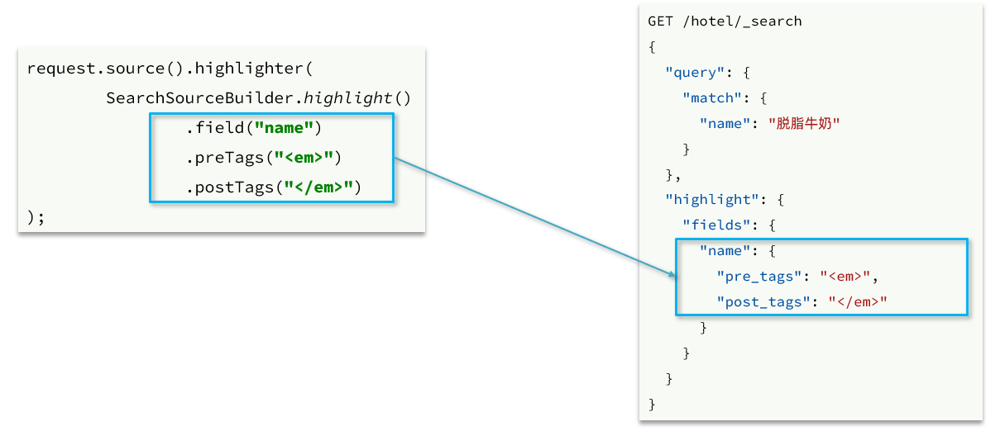

示例代码如下：

```java
@Test
void testHighlight() throws IOException {
    // 1.创建Request
    SearchRequest request = new SearchRequest("items");
    // 2.组织请求参数
    // 2.1.query条件
    request.source().query(QueryBuilders.matchQuery("name", "脱脂牛奶"));
    // 2.2.高亮条件
    request.source().highlighter(
            SearchSourceBuilder.highlight()
                    .field("name")
                    .preTags("<em>")
                    .postTags("</em>")
    );
    // 3.发送请求
    SearchResponse response = client.search(request, RequestOptions.DEFAULT);
    // 4.解析响应
    handleResponse(response);
}
```


再来看结果解析，文档解析的部分不变，主要是高亮内容需要单独解析出来，其DSL和JavaAPI的对比如图：


代码解读：

* 第`3、4`步：从结果中获取`_source`。`hit.getSourceAsString()`，这部分是非高亮结果，json字符串。还需要反序列为`ItemDoc`对象

* 第`5`步：获取高亮结果。`hit.getHighlightFields()`，返回值是一个`Map`，key是高亮字段名称，值是`HighlightField`对象，代表高亮值

* 第`5.1`步：从`Map`中根据高亮字段名称，获取高亮字段值对象`HighlightField`

* 第`5.2`步：从`HighlightField`中获取`Fragments`，并且转为字符串。这部分就是真正的高亮字符串了

* 最后：用高亮的结果替换`ItemDoc`中的非高亮结果


完整代码如下：

```java
private void handleResponse(SearchResponse response) {
    SearchHits searchHits = response.getHits();
    // 1.获取总条数
    long total = searchHits.getTotalHits().value;
    System.out.println("共搜索到" + total + "条数据");
    // 2.遍历结果数组
    SearchHit[] hits = searchHits.getHits();
    for (SearchHit hit : hits) {
        // 3.得到_source，也就是原始json文档
        String source = hit.getSourceAsString();
        // 4.反序列化
        ItemDoc item = JSONUtil.toBean(source, ItemDoc.class);
        // 5.获取高亮结果
        Map<String, HighlightField> hfs = hit.getHighlightFields();
        if (CollUtils.isNotEmpty(hfs)) {
            // 5.1.有高亮结果，获取name的高亮结果
            HighlightField hf = hfs.get("name");
            if (hf != null) {
                // 5.2.获取第一个高亮结果片段，就是商品名称的高亮值
                String hfName = hf.getFragments()[0].string();
                item.setName(hfName);
            }
        }
        System.out.println(item);
    }
}
```


## 3.数据聚合

聚合（`aggregations`）可以让我们极其方便的实现对数据的统计、分析、运算。例如：

* 什么品牌的手机最受欢迎？

* 这些手机的平均价格、最高价格、最低价格？

* 这些手机每月的销售情况如何？

实现这些统计功能的比数据库的sql要方便的多，而且查询速度非常快，可以实现近实时搜索效果。

官方文档：


聚合常见的有三类：

* &#x20;**桶（`Bucket`）**聚合：用来对文档做分组&#x20;

  * `TermAggregation`：按照文档字段值分组，例如按照品牌值分组、按照国家分组

  * `Date Histogram`：按照日期阶梯分组，例如一周为一组，或者一月为一组

* &#x20;**度量（`Metric`）**聚合：用以计算一些值，比如：最大值、最小值、平均值等&#x20;

  * `Avg`：求平均值

  * `Max`：求最大值

  * `Min`：求最小值

  * `Stats`：同时求`max`、`min`、`avg`、`sum`等

* &#x20;**管道（`pipeline`）**聚合：其它聚合的结果为基础做进一步运算&#x20;


**注意：参加聚合的字段必须是keyword、日期、数值、布尔类型，即不能分词的字段**


### 3.1.DSL实现聚合

与之前的搜索功能类似，我们依然先学习DSL的语法，再学习JavaAPI.

#### 3.1.1.Bucket聚合

例如我们要统计所有商品中共有哪些商品分类，其实就是以分类（category）字段对数据分组。category值一样的放在同一组，属于`Bucket`聚合中的`Term`聚合。

基本语法如下：

```json
GET /items/_search
{
  "query":{"match_all":{}},// 可以省略
  "size": 0, 
  "aggs": {
    "category_agg": {
      "terms": {
        "field": "category",
        "size": 20
      }
    }
  }
}
```

语法说明：

* `size`：设置`size`为0，就是每页查0条，则结果中就不包含文档，只包含聚合

* `aggs`：定义聚合
* `category_agg`：聚合名称，自定义，但不能重复
  
  * `terms`：聚合的类型，按分类聚合，所以用`term`
  
    * `field`：参与聚合的字段名称
  
    * `size`：希望返回的聚合结果的最大数量，默认20

来看下查询的结果：

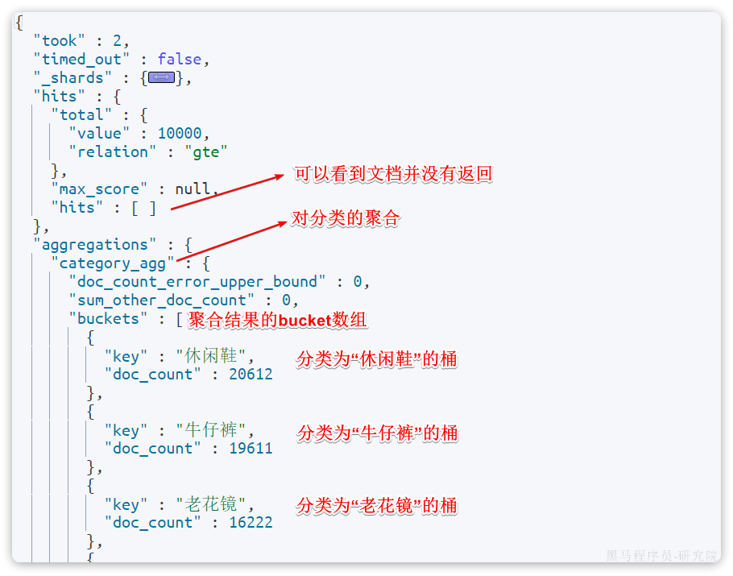


#### 3.1.2.带条件聚合

默认情况下，Bucket聚合是对索引库的所有文档做聚合，例如我们统计商品中所有的品牌，结果如下：

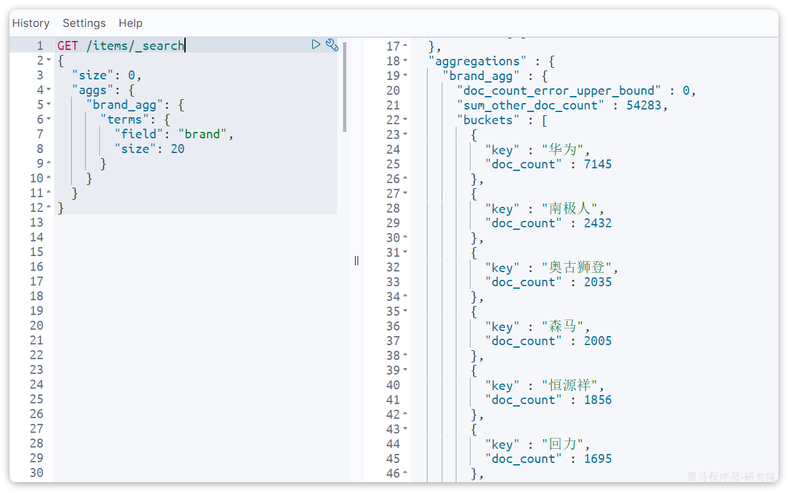

可以看到统计出的品牌非常多。

但真实场景下，用户会输入搜索条件，因此聚合必须是对搜索结果聚合。那么聚合必须添加限定条件。

例如，我想知道价格高于3000元的手机品牌有哪些，该怎么统计呢？

我们需要从需求中分析出搜索查询的条件和聚合的目标：

* **搜索查询条件：使用bool查询**
* 价格高于3000
  
* 必须是手机
  
* **聚合目标：统计的是品牌，肯定是对brand字段做term聚合**

语法如下：

```json
GET /items/_search
{
  "query": {
    "bool": {
      "filter": [
        {
          "term": {
            "category": "手机"
          }
        },
        {
          "range": {
            "price": {
              "gte": 300000
            }
          }
        }
      ]
    }
  }, 
  "size": 0, 
  "aggs": {
    "brand_agg": {
      "terms": {
        "field": "brand",
        "size": 20
      }
    }
  }
}
```

聚合结果如下：

```json
{
  "took" : 2,
  "timed_out" : false,
  "hits" : {
    "total" : {
      "value" : 13,
      "relation" : "eq"
    },
    "max_score" : null,
    "hits" : [ ]
  },
  "aggregations" : {
    "brand_agg" : {
      "doc_count_error_upper_bound" : 0,
      "sum_other_doc_count" : 0,
      "buckets" : [
        {
          "key" : "华为",
          "doc_count" : 7
        },
        {
          "key" : "Apple",
          "doc_count" : 5
        },
        {
          "key" : "小米",
          "doc_count" : 1
        }
      ]
    }
  }
}

```

可以看到，结果中只剩下3个品牌了。

#### 3.1.3.Metric聚合

上节课，我们统计了价格高于3000的手机品牌，形成了一个个桶。现在我们需要对桶内的商品做运算，获取每个品牌价格的最小值、最大值、平均值。

这就要用到`Metric`聚合了，例如`stat`聚合，就可以同时获取`min`、`max`、`avg`等结果。

语法如下：

```json
GET /items/_search
{
  "query": {
    "bool": {
      "filter": [
        {
          "term": {
            "category": "手机"
          }
        },
        {
          "range": {
            "price": {
              "gte": 300000
            }
          }
        }
      ]
    }
  }, 
  "size": 0, 
  "aggs": {
    "brand_agg": {
      "terms": {
        "field": "brand",
        "size": 20
      },
      "aggs": {
        "stats_meric": {
          "stats": {
            "field": "price"
          }
        }
      }
    }
  }
}
```

`query`部分就不说了，我们重点解读聚合部分语法。

可以看到我们在`brand_agg`聚合的内部，我们新加了一个`aggs`参数。这个聚合就是`brand_agg`的子聚合，会对`brand_agg`形成的每个桶中的文档分别统计。

* `stats_meric`：聚合名称

  * `stats`：聚合类型，stats是`metric`聚合的一种

    * `field`：聚合字段，这里选择`price`，统计价格


由于stats是对brand\_agg形成的每个品牌桶内文档分别做统计，因此每个品牌都会统计出自己的价格最小、最大、平均值。

结果如下：

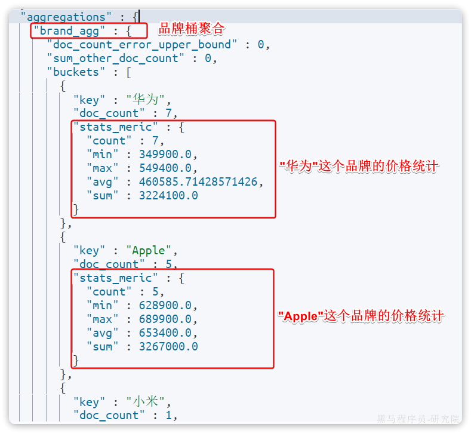

另外，我们还可以让聚合按照每个品牌的价格平均值排序：

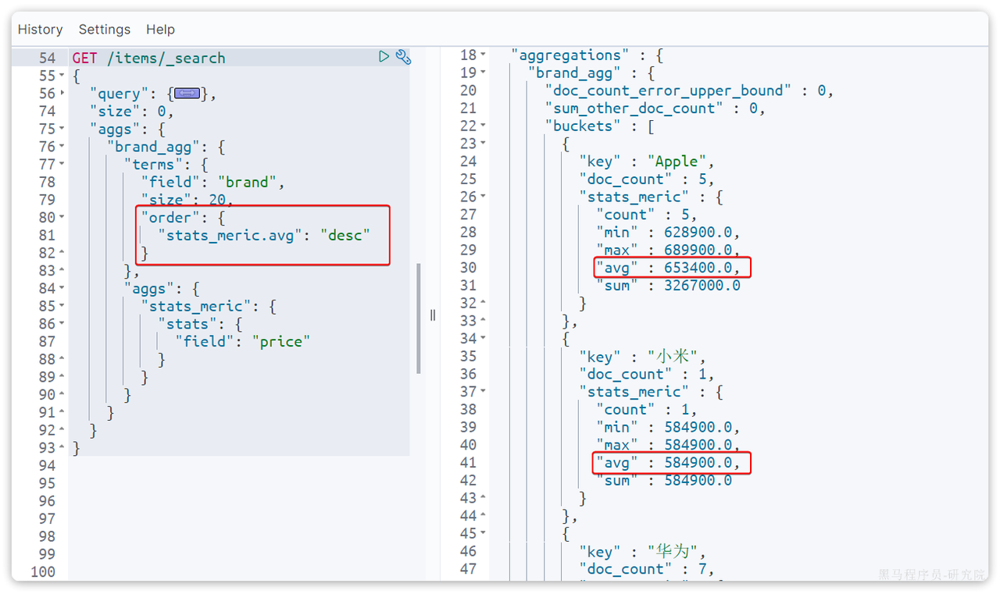


#### 3.1.4.总结

aggs代表聚合，与query同级，此时query的作用是？

* 限定聚合的的文档范围

聚合必须的三要素：

* 聚合名称

* 聚合类型

* 聚合字段

聚合可配置属性有：

* size：指定聚合结果数量

* order：指定聚合结果排序方式

* field：指定聚合字段


### 3.2.RestClient实现聚合

可以看到在DSL中，`aggs`聚合条件与`query`条件是同一级别，都属于查询JSON参数。因此依然是利用`request.source()`方法来设置。

不过聚合条件的要利用`AggregationBuilders`这个工具类来构造。DSL与JavaAPI的语法对比如下：

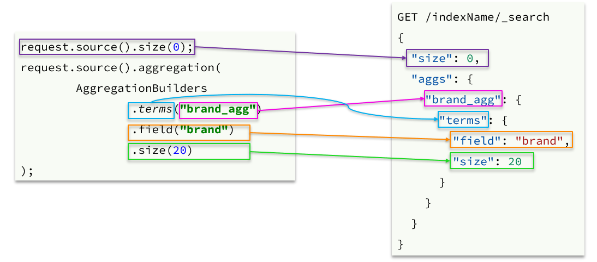

聚合结果与搜索文档同一级别，因此需要单独获取和解析。具体解析语法如下：

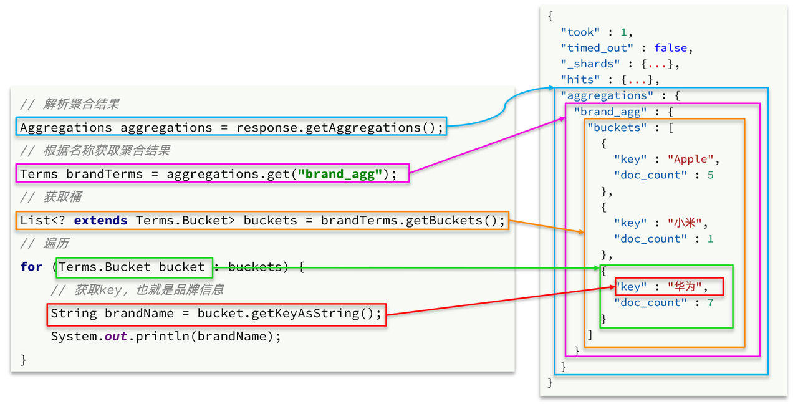


完整代码如下：

```java
@Test
void testAgg() throws IOException {
    // 1.创建Request
    SearchRequest request = new SearchRequest("items");
    // 2.准备请求参数
    BoolQueryBuilder bool = QueryBuilders.boolQuery()
            .filter(QueryBuilders.termQuery("category", "手机"))
            .filter(QueryBuilders.rangeQuery("price").gte(300000));
    request.source().query(bool).size(0);
    // 3.聚合参数
    request.source().aggregation(
            AggregationBuilders.terms("brand_agg").field("brand").size(5)
    );
    // 4.发送请求
    SearchResponse response = client.search(request, RequestOptions.DEFAULT);
    // 5.解析聚合结果
    Aggregations aggregations = response.getAggregations();
    // 5.1.获取品牌聚合
    Terms brandTerms = aggregations.get("brand_agg");
    // 5.2.获取聚合中的桶
    List<? extends Terms.Bucket> buckets = brandTerms.getBuckets();
    // 5.3.遍历桶内数据
    for (Terms.Bucket bucket : buckets) {
        // 5.4.获取桶内key
        String brand = bucket.getKeyAsString();
        System.out.print("brand = " + brand);
        long count = bucket.getDocCount();
        System.out.println("; count = " + count);
    }
}
```


## 4.作业

Elasticsearch的基本语法我们已经学完，足以应对大多数搜索业务需求了。接下来大家就可以基于学习的知识实现商品搜索的业务了。

在昨天的作业中要求大家拆分一个独立的微服务：`search-service`，在这个微服务中实现搜索数据的导入、商品数据库数据与elasticsearch索引库数据的同步。

接下来的搜索功能也要在`search-service`服务中实现。


### 4.1.实现搜索接口

在黑马商城的搜索页面，输入关键字，点击搜索时，会发现前端会发起查询商品的请求：

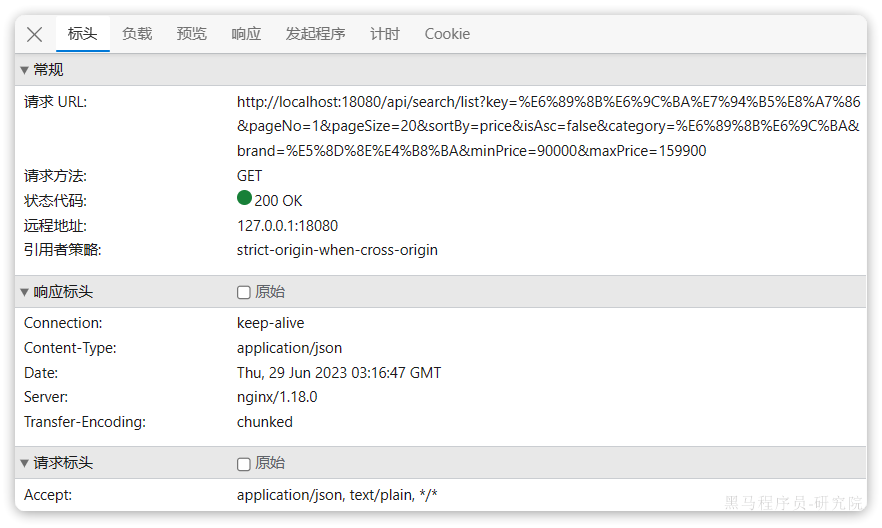

请求的接口信息如下：

* **请求方式**：`GET`

* **请求路径**：`/search/list`

* **请求参数**：

  * **key**：搜索关键字

  * **pageNo**：页码

  * **pageSize**：每页大小

  * **sortBy**：排序字段

  * **isAsc**：是否升序

  * **category**：分类

  * **brand**：品牌

  * **minPrice**：价格最小值

  * **maxPrice**：价格最大值


请求参数可以参考原本`item-service`中`com.hmall.item.controller.SearchController`类中的基于数据库查询的接口：

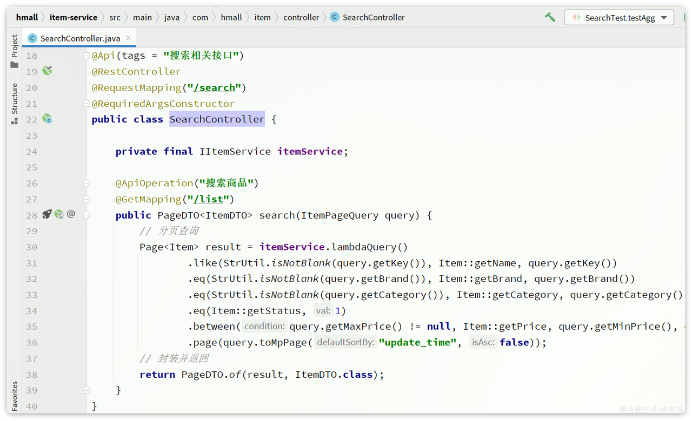


### 4.2.过滤条件聚合

搜索页面的过滤项目前是写死的：


但是大家思考一下，随着搜索条件的变化，过滤条件展示的过滤项是不是应该跟着变化。

例如搜索`电视`，那么搜索结果中展示的肯定只有电视，而此时过滤条件中的**分类**就不能还出现手机、拉杆箱等内容。过滤条件的**品牌**中就不能出现与电视无关的品牌。而是应该展示搜索结果中存在的分类和品牌。


那么问题来，我们怎么知道搜索结果中存在哪些分类和品牌呢？

大家应该能想到，就是利用聚合，而且是带有限定条件的聚合。用户搜索的条件是什么，我们在对分类、品牌聚合时的条件也就是什么，这样就能统计出搜索结果中包含的分类、品牌了。

事实上，搜索时，前端已经发出了请求，尝试搜索栏中除价格以外的过滤项：

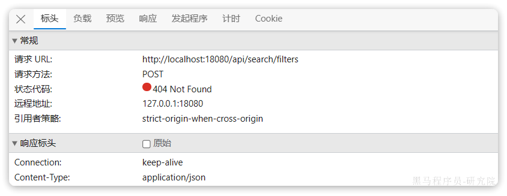

由于采用的是POST请求，所以参数在请求体中：

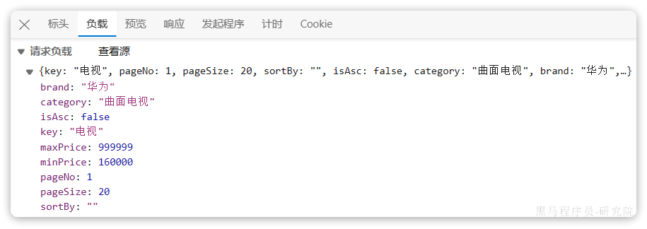


接口信息如下：

* **请求方式**：`POST`

* **请求路径**：`/search/filters`

* **请求参数**：

  * **key**：搜索关键字

  * **pageNo**：页码

  * **pageSize**：每页大小

  * **sortBy**：排序字段

  * **isAsc**：是否升序

  * **category**：分类

  * **brand**：品牌

  * **minPrice**：价格最小值

  * **maxPrice**：价格最大值


可见参数与搜索参数一致，不过这里大家可以忽略分页和排序参数。

返回值参考这个格式：

```json
{
  "category": ["手机", "曲面电视", "拉杆箱", "休闲鞋", "休闲鞋", "硬盘", "真皮包"],
  "brand": ["希捷", "小米", "华为", "oppo", "新秀丽", "Apple","锤子"]
}
```


### 4.3.竞价排名

elasticsearch的默认排序规则是按照相关性打分排序，而这个打分是可以通过API来控制的。详情可以参考复合查询中的算分函数查询（1.3.1小节）

对应的JavaAPI可以参考文档：


在商品的数据库表中，已经设计了`isAD`字段来标记广告商品，请利用`function_score`查询在原本搜索的结果基础上，让这些`isAD`字段值为`true`的商品排名到最前面。