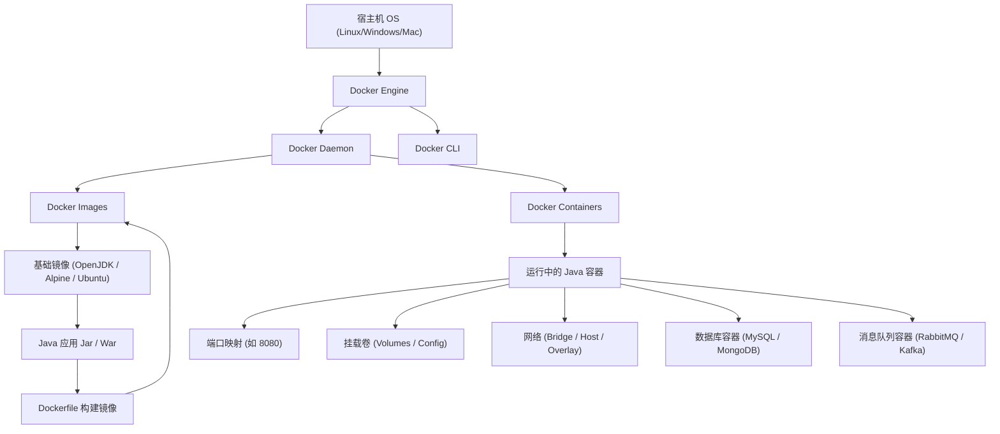

# Docker

## Dockerfile

### Dockerfile

Dockerfile 是构建 Docker 镜像的**文本蓝图**，由一组按顺序执行的指令组成，每条指令生成一个镜像层，最终打包为可分发的镜像。下面从**基础概念、核心指令、构建流程、多阶段构建、最佳实践、完整示例**六个维度详细介绍。

---

#### 一、基础概念

##### 1. 什么是 Dockerfile？

- 纯文本文件，命名为 `Dockerfile`（首字母大写）。
- 包含一系列指令，自动化构建镜像，确保环境一致性。
- 核心价值：**自动化、可重复、可版本化、透明化**。

##### 2. 基本语法规则

- 指令**大写**（约定俗成，区分参数），参数小写。
- 从上到下顺序执行，**每条指令生成一个镜像层**。
- `#` 开头为注释，不影响构建。
- 必须以 `FROM` 开头（解析器指令、`ARG` 除外）。
- 支持**行续符 `\`**，跨行写指令。

##### 3. 构建上下文（Build Context）

- `docker build` 命令执行目录下的所有文件，是镜像构建的“资源池”。
- `.dockerignore` 排除无关文件（如 `.git`、`node_modules`、日志），减小构建体积、加速构建。

---

#### 二、核心指令详解（按常用顺序）

##### 1. `FROM`：指定基础镜像（必选）

- **作用**：定义新镜像的基础，所有镜像都基于此构建。
- **语法**：
  ```dockerfile
  FROM <image>[:<tag>] [AS <name>]
  ```
- **示例**：
  ```dockerfile
  FROM ubuntu:22.04
  FROM node:18-alpine AS builder  # 多阶段构建，命名阶段
  ```
- **最佳实践**：使用**官方轻量镜像**（如 `alpine`），固定 `tag`（避免 `latest` 不确定性）。

##### 2. `ARG`：构建时参数

- **作用**：定义构建过程中的变量，仅构建时有效，容器运行时不可见。
- **语法**：
  ```dockerfile
  ARG <name>[=<default>]
  ```
- **示例**：
  ```dockerfile
  ARG VERSION=1.0
  FROM ubuntu:${VERSION}
  ```
- **传参**：`docker build --build-arg VERSION=2.0 -t my-img .`

##### 3. `LABEL`：镜像元数据

- **作用**：添加镜像描述信息（作者、版本、描述），替代旧指令 `MAINTAINER`。
- **语法**：
  ```dockerfile
  LABEL <key>=<value> <key>=<value> ...
  ```
- **示例**：
  ```dockerfile
  LABEL maintainer="user@example.com"
  LABEL version="1.0" description="My Docker Image"
  ```

##### 4. `ENV`：环境变量

- **作用**：设置容器运行时的环境变量，构建和运行时均有效。
- **语法**：
  ```dockerfile
  ENV <key>=<value>
  ENV <key1>=<value1> <key2>=<value2>
  ```
- **示例**：
  ```dockerfile
  ENV PATH=/app/bin:$PATH
  ENV NODE_ENV=production
  ```

##### 5. `WORKDIR`：工作目录

- **作用**：指定后续 `RUN`、`CMD`、`ENTRYPOINT`、`COPY`、`ADD` 的默认工作目录。
- **语法**：
  ```dockerfile
  WORKDIR /path/to/dir
  ```
- **示例**：
  ```dockerfile
  WORKDIR /app
  RUN pwd  # 输出 /app
  ```
- **最佳实践**：用**绝对路径**，避免多次 `RUN cd`，直接用 `WORKDIR` 替代。

##### 6. `COPY`：复制文件（推荐）

- **作用**：从**构建上下文**复制文件/目录到镜像内。
- **语法**：
  ```dockerfile
  COPY <src> <dest>
  COPY ["<src>", "<dest>"]  # 路径含空格时用
  ```
- **示例**：
  ```dockerfile
  COPY . /app
  COPY target/app.jar /app/
  ```
- **特点**：仅本地文件、不解压、不支持 URL、**可缓存、安全**。

##### 7. `ADD`：增强复制（慎用）

- **作用**：类似 `COPY`，额外支持：
  - 自动解压本地 `tar.gz` 到目标目录。
  - 从 URL 下载文件到镜像。
- **语法**：同 `COPY`。
- **示例**：
  ```dockerfile
  ADD https://example.com/file.tar.gz /tmp/
  ADD app.tar.gz /app/
  ```
- **最佳实践**：优先用 `COPY`；仅需解压或下载时用 `ADD`。

##### 8. `RUN`：构建时执行命令

- **作用**：在构建镜像时执行命令（如安装软件、编译代码），**生成新镜像层**。
- **语法**：
  - Shell 格式（默认 `/bin/sh -c`）：
    ```dockerfile
    RUN <command>
    ```
  - Exec 格式（推荐，避免 shell 问题）：
    ```dockerfile
    RUN ["executable", "param1", "param2"]
    ```
- **示例**：
  ```dockerfile
  RUN apt update && apt install -y nginx
  RUN ["apt", "install", "-y", "curl"]
  ```
- **最佳实践**：
  - **合并多个 `RUN`**，减少镜像层数（如 `RUN apt update && apt install -y nginx curl`）。
  - 清理缓存（如 `apt clean`），减小镜像体积。

##### 9. `EXPOSE`：声明端口

- **作用**：声明容器运行时监听的端口，**仅文档说明，不自动开放端口**。
- **语法**：
  ```dockerfile
  EXPOSE <port> [<port>/<protocol>]
  ```
- **示例**：
  ```dockerfile
  EXPOSE 80
  EXPOSE 443/tcp
  ```
- **开放端口**：运行时用 `-p` 映射端口：`docker run -p 8080:80 my-img`。

##### 10. `VOLUME`：数据卷

- **作用**：创建匿名卷，挂载到容器指定目录，**持久化数据、共享数据**。
- **语法**：
  ```dockerfile
  VOLUME ["/path/to/dir"]
  ```
- **示例**：
  ```dockerfile
  VOLUME /data
  ```
- **注意**：运行时可挂载命名卷或宿主机目录：`docker run -v my-volume:/data my-img`。

##### 11. `USER`：运行用户

- **作用**：指定容器运行时的用户（默认 `root`），**提升安全性**。
- **语法**：
  ```dockerfile
  USER <user>[:<group>]
  ```
- **示例**：
  ```dockerfile
  USER appuser
  ```
- **最佳实践**：避免用 `root` 运行容器，创建普通用户并授权。

##### 12. `CMD`：容器启动命令

- **作用**：定义容器启动后默认执行的命令，**运行时可被覆盖**。
- **语法**：
  - Shell 格式：
    ```dockerfile
    CMD <command>
    ```
  - Exec 格式（推荐）：
    ```dockerfile
    CMD ["executable", "param1", "param2"]
    ```
- **示例**：
  ```dockerfile
  CMD ["java", "-jar", "app.jar"]
  CMD echo "Container started"
  ```
- **注意**：一个 Dockerfile 仅**最后一个 `CMD` 生效**。
- **覆盖**：`docker run my-img java -jar custom.jar`。

##### 13. `ENTRYPOINT`：入口点（不可覆盖）

- **作用**：与 `CMD` 类似，但**运行时不可被覆盖**，`CMD` 可作为其参数。
- **语法**：同 `CMD`。
- **示例**：
  ```dockerfile
  ENTRYPOINT ["java", "-jar"]
  CMD ["app.jar"]
  ```
- **运行**：`docker run my-img custom.jar` → 执行 `java -jar custom.jar`。

##### 14. `HEALTHCHECK`：健康检查

- **作用**：定义容器健康状态检查命令，Docker 定期执行，判断容器是否正常运行。
- **语法**：
  ```dockerfile
  HEALTHCHECK [OPTIONS] CMD <command>
  ```
  - 选项：`--interval`（检查间隔，默认 30s）、`--timeout`（超时，默认 30s）、`--retries`（重试次数，默认 3）。
- **示例**：
  ```dockerfile
  HEALTHCHECK --interval=5s --timeout=3s CMD curl -f http://localhost/ || exit 1
  ```

##### 15. `ONBUILD`：延迟执行指令

- **作用**：当该镜像作为**基础镜像**被其他 Dockerfile 构建时，触发执行 `ONBUILD` 定义的指令。
- **语法**：
  ```dockerfile
  ONBUILD <instruction>
  ```
- **示例**：
  ```dockerfile
  ONBUILD COPY . /app
  ONBUILD RUN npm install
  ```

---

#### 三、镜像构建流程

1. 编写 `Dockerfile` 和 `.dockerignore`。
2. 执行构建命令：
   ```bash
   docker build -t my-image:1.0 .
   ```
   - `-t`：指定镜像标签（名称:版本）。
   - `.`：构建上下文为当前目录。
3. Docker 按顺序执行指令，每条指令生成一个镜像层，最终合并为新镜像。
4. 查看镜像：`docker images`。
5. 运行容器：`docker run -d -p 8080:80 my-image:1.0`。

---

#### 四、多阶段构建（Multi-stage Builds）

##### 1. 作用

- **减小最终镜像体积**：将构建过程（编译、依赖安装）与运行环境分离，最终镜像仅保留运行时必需文件。
- **提高构建效率**：并行执行构建阶段。

##### 2. 语法

- 用 `AS <name>` 命名构建阶段，后续阶段可复制前一阶段文件。

##### 3. 示例（Node.js 应用）

```dockerfile
# 构建阶段：编译代码、安装依赖
FROM node:18-alpine AS builder
WORKDIR /app
COPY package*.json ./
RUN npm install
COPY . .
RUN npm run build

# 运行阶段：仅保留运行时必需文件
FROM node:18-alpine
WORKDIR /app
COPY --from=builder /app/dist ./dist
COPY --from=builder /app/package*.json ./
RUN npm install --production
EXPOSE 3000
CMD ["node", "dist/index.js"]
```

---

#### 五、最佳实践

1. **最小化基础镜像**：优先用 `alpine`、`slim` 等轻量镜像，减小体积、提升安全性。
2. **合并 `RUN` 指令**：减少镜像层数，加速构建、减小体积。
3. **使用 `.dockerignore`**：排除无关文件，减小构建上下文大小。
4. **固定镜像版本**：避免用 `latest`，确保构建一致性。
5. **非 root 用户运行**：创建普通用户，提升容器安全性。
6. **合理使用缓存**：将不常变动的指令（如 `COPY package*.json`）放在前面，利用 Docker 缓存加速构建。
7. **多阶段构建**：分离构建与运行环境，减小最终镜像体积。
8. **清理无用依赖**：`RUN` 后清理缓存（如 `apt clean`、`npm cache clean`）。

---

#### 六、完整示例（Nginx 静态网站）

##### 1. 项目结构

```
my-nginx/
├── Dockerfile
├── .dockerignore
└── html/
    └── index.html
```

##### 2. `.dockerignore`

```
.git
node_modules
*.log
.DS_Store
```

##### 3. `Dockerfile`

```dockerfile
# 基础镜像
FROM nginx:1.25-alpine

# 元数据
LABEL maintainer="user@example.com"
LABEL version="1.0" description="Nginx Static Website"

# 复制静态文件
COPY html/ /usr/share/nginx/html/

# 声明端口
EXPOSE 80

# 启动命令
CMD ["nginx", "-g", "daemon off;"]
```

##### 4. 构建与运行

```bash
# 构建镜像
docker build -t my-nginx:1.0 .

# 运行容器
docker run -d -p 8080:80 --name my-nginx-container my-nginx:1.0

# 访问
curl http://localhost:8080
```

---

#### 总结

Dockerfile 是容器化应用的核心，通过**指令化、自动化**构建镜像，确保环境一致性、可重复性。掌握核心指令、构建流程、多阶段构建和最佳实践，可高效构建**轻量、安全、可维护**的 Docker 镜像。

### Docker 构建 Java 应用

（超详细 + 最佳实践）

我给你一份**生产环境可用、体积最小、速度最快**的 Java 项目 Docker 构建方案，包含 **Maven / Gradle 项目**、**多阶段构建**、**JDK/JRE 区分**、**启动优化**，直接复制就能用。

#### 一、先搞懂：Java 镜像怎么选？

Java 构建 Docker 镜像分两步：
1. **构建阶段**：需要 JDK（编译代码、打包）
2. **运行阶段**：只需要 JRE（运行 jar，更小更安全）

**最佳基础镜像**（轻量 + 官方 + 安全）：
- `eclipse-temurin:17-jdk-jammy` （构建用 JDK）
- `eclipse-temurin:17-jre-alpine` （运行用 JRE，极小）

> 不推荐 openjdk:8 之类，已停止维护！

---

#### 二、最简单 Dockerfile（单阶段，适合测试）

适合快速打包，**不追求镜像大小**

```dockerfile
# 基础镜像（带JDK）
FROM eclipse-temurin:17-jre-jammy

# 工作目录
WORKDIR /app

# 复制jar包（把你本地打好的jar放进来）
COPY target/demo-0.0.1-SNAPSHOT.jar app.jar

# 暴露端口
EXPOSE 8080

# 启动命令
ENTRYPOINT ["java", "-jar", "app.jar"]
```

##### 构建 & 运行

```bash
# 先打包jar
mvn clean package -DskipTests

# 构建镜像
docker build -t java-app:1.0 .

# 运行容器
docker run -d -p 8080:8080 --name my-java-app java-app:1.0
```

---

#### 三、生产级方案：多阶段构建（强烈推荐）

**优点**：
- 最终镜像**极小**（只有几十M）
- 不包含源码、编译依赖
- 安全、干净、速度快

##### 最终 Dockerfile（直接复制使用）

```dockerfile
# ======================
# 第一阶段：构建（JDK）
# ======================
FROM eclipse-temurin:17-jdk-jammy AS builder
WORKDIR /app

# 先复制pom，利用缓存（重点！加速构建）
COPY mvnw .
COPY .mvn .mvn
COPY pom.xml .
RUN ./mvnw dependency:go-offline

# 复制源码
COPY src ./src

# 打包（跳过测试）
RUN ./mvnw clean package -DskipTests

# ======================
# 第二阶段：运行（仅JRE）
# ======================
FROM eclipse-temurin:17-jre-alpine
WORKDIR /app

# 从构建阶段复制jar包
COPY --from=builder /app/target/*.jar app.jar

# 非root运行（安全）
RUN addgroup -S app && adduser -S app -G app
USER app

# 端口 + 启动
EXPOSE 8080
ENTRYPOINT ["java", "-jar", "app.jar"]
```

##### 这个镜像有多小？

- 普通单阶段：~500MB  
- 多阶段 alpine：~80MB  

**差 6 倍！**

---

#### 四、SpringBoot 专用优化（必加）

给 Java 启动加 JVM 参数，让容器更稳定：

```dockerfile
ENTRYPOINT ["java", \
  "-XX:+UseContainerSupport", \
  "-XX:MaxRAMPercentage=75.0", \
  "-jar", "app.jar"]
```

解释：
- `UseContainerSupport`：让 JVM 识别容器内存
- `MaxRAMPercentage=75`：限制最大内存占比（避免OOM）

---

#### 五、常用命令速查

```bash
# 构建镜像
docker build -t java-app:1.0 .

# 运行
docker run -d -p 8080:8080 java-app:1.0

# 查看日志
docker logs -f my-java-app

# 进入容器
docker exec -it my-java-app sh
```

---

#### 六、我帮你定制（你只需告诉我）

你直接回复我这 3 个信息，我可以给你**生成专属完美 Dockerfile**：
1. JDK 版本（8/11/17/21）
2. SpringBoot 还是普通 Java？
3. 你的 jar 包名称/路径

### Docker 构建 Vue3 项目

（超简单 + 生产最小镜像）

Vue3 是**前端静态项目**，Docker 构建最佳方案：
**多阶段构建** → 先用 Node 环境打包编译，再用 Nginx 运行静态文件，最终镜像只有 **20MB 左右**！

---

#### 一、先看你的项目结构（标准 Vue3/Vite 项目）

```
你的项目/
├── Dockerfile         # 我们要创建的
├── .dockerignore      # 可选，推荐
├── package.json
├── vite.config.js     或  vue.config.js
└── src/
```

---

#### 二、直接可用的 Dockerfile（复制即用）

```dockerfile
# ======================================
# 阶段1：构建阶段 —— 编译 Vue3 代码
# ======================================
FROM node:18-alpine AS builder

# 设置工作目录
WORKDIR /app

# 复制依赖文件（利用Docker缓存，加速构建）
COPY package*.json ./

# 安装依赖（淘宝镜像，速度更快）
RUN npm config set registry https://registry.npmmirror.com && \
    npm install

# 复制全部项目代码
COPY . .

# 打包构建（生成 dist 文件夹）
RUN npm run build

# ======================================
# 阶段2：运行阶段 —— Nginx 托管静态文件
# ======================================
FROM nginx:stable-alpine

# 复制构建好的 dist 到 Nginx 目录
COPY --from=builder /app/dist /usr/share/nginx/html

# 暴露 80 端口
EXPOSE 80

# 启动 Nginx
CMD ["nginx", "-g", "daemon off;"]
```

---

#### 三、创建 .dockerignore（必须加，减小体积）

创建 `.dockerignore` 文件，写入：
```
node_modules
dist
.DS_Store
.git
.gitignore
*.log
```

---

#### 四、一键构建 + 运行

##### 1. 构建镜像

```bash
docker build -t vue3-app:1.0 .
```

##### 2. 启动容器

```bash
docker run -d -p 8080:80 --name my-vue3 vue3-app:1.0
```

##### 3. 访问

打开浏览器访问：
```
http://localhost:8080
```

---

#### 五、如果你的 Vue 项目路由是 history 模式（必看）

history 模式直接用上面的 Dockerfile 会**刷新 404**，需要加 Nginx 配置：

##### 1. 项目根目录创建 `nginx.conf`

```nginx
server {
    listen 80;
    root /usr/share/nginx/html;
    index index.html;

    # 解决 history 路由刷新 404 问题
    location / {
        try_files $uri $uri/ /index.html;
    }
}
```

##### 2. 修改 Dockerfile，添加配置

```dockerfile
# 在运行阶段增加一行
COPY nginx.conf /etc/nginx/conf.d/default.conf
```

完整运行阶段：
```dockerfile
FROM nginx:stable-alpine
COPY --from=builder /app/dist /usr/share/nginx/html
COPY nginx.conf /etc/nginx/conf.d/default.conf
EXPOSE 80
CMD ["nginx", "-g", "daemon off;"]
```

---

#### 六、核心优势

- **超小体积**：最终镜像 ≈ 20MB
- **生产可用**：Nginx 高性能、稳定
- **安全干净**：不包含源码、依赖包
- **速度快**：利用缓存，构建超快

---

#### 七、常用命令

```bash
# 构建
docker build -t vue3-app .

# 运行
docker run -d -p 8080:80 vue3-app

# 停止
docker stop my-vue3

# 删除容器
docker rm my-vue3
```

需要我帮你适配 **Vite + Vue3** 或 **Vue-CLI** 专属版本吗？

##  docker-compose.yml

### docker-compose.yml 完全指南

`docker-compose.yml` 是 **Docker Compose** 的核心配置文件，用于**一键定义、配置和启动多个 Docker 容器**（比如前端、后端、数据库、Redis 一起启动），替代繁琐的 `docker run` 命令。

它使用 **YAML 语法**，文件必须命名为 `docker-compose.yml` 或 `docker-compose.yaml`。

---

#### 一、基础结构（必看）

核心层级：
```yaml
# 版本（新版 Compose 可省略）
version: '3.8'

# 定义所有服务（容器）
services:
  服务名称1:
    配置项: 值
  服务名称2:
    配置项: 值

# 可选：数据卷（持久化存储）
volumes:
  卷名称:

# 可选：自定义网络
networks:
  网络名称:
```

---

#### 二、最常用配置项

| 配置项           | 作用                                   |
| ---------------- | -------------------------------------- |
| `image`          | 使用的镜像（如 `nginx:alpine`）        |
| `build`          | 从本地 Dockerfile 构建镜像             |
| `ports`          | 端口映射 `主机端口:容器端口`           |
| `volumes`        | 目录/文件挂载（持久化）                |
| `environment`    | 环境变量                               |
| `networks`       | 加入自定义网络                         |
| `depends_on`     | 依赖服务（启动顺序）                   |
| `restart`        | 重启策略（`always`/`no`/`on-failure`） |
| `container_name` | 自定义容器名                           |

---

#### 三、实战示例（最常用场景）

##### 示例 1：Nginx + MySQL + PHP（Web 环境）

```yaml
version: '3.8'

services:
  # Nginx 服务
  nginx:
    image: nginx:alpine
    container_name: my-nginx
    ports:
      - "80:80"          # 主机80 → 容器80
    volumes:
      - ./html:/usr/share/nginx/html  # 网站目录挂载
      - ./nginx.conf:/etc/nginx/conf.d/default.conf
    restart: always
    networks:
      - app-network

  # MySQL 服务
  mysql:
    image: mysql:8.0
    container_name: my-mysql
    ports:
      - "3306:3306"
    environment:
      MYSQL_ROOT_PASSWORD: 123456   # root 密码
      MYSQL_DATABASE: mydb         # 自动创建数据库
    volumes:
      - mysql-data:/var/lib/mysql  # 数据持久化
    restart: always
    networks:
      - app-network

# 自定义网络（容器间互通）
networks:
  app-network:

# 数据卷（防止数据丢失）
volumes:
  mysql-data:
```

##### 示例 2：单服务（Node.js 应用）

```yaml
version: '3.8'

services:
  node-app:
    build: .                # 从当前目录 Dockerfile 构建
    container_name: node-app
    ports:
      - "3000:3000"
    environment:
      - NODE_ENV=production
    restart: always
```

---

#### 四、常用 Docker Compose 命令

在**包含 docker-compose.yml 的目录**下执行：

```bash
# 启动所有服务（-d 后台运行）
docker-compose up -d

# 停止所有服务（不删除容器）
docker-compose stop

# 停止并删除容器、网络
docker-compose down

# 查看日志
docker-compose logs -f

# 重启服务
docker-compose restart

# 查看运行中的服务
docker-compose ps
```

---

#### 五、关键注意事项

1. **缩进严格**：YAML 用 2 个空格缩进（不能用 Tab）
2. **容器互通**：同一网络下，服务名可直接当域名访问（如 Nginx 访问 MySQL：`mysql:3306`）
3. **数据持久化**：数据库必须挂载 `volumes`，否则删除容器数据会丢失
4. **重启策略**：生产环境建议用 `restart: always`

---

#### 总结

1. `docker-compose.yml` 用于**批量管理容器**，一键启动整套环境
2. 核心结构：`services`（容器）+ `volumes`（存储）+ `networks`（网络）
3. 常用命令：`up -d` 启动、`down` 停止删除、`logs` 查看日志
4. 生产环境务必做**数据卷挂载**和**自动重启**配置

你需要我根据你的**具体项目**（如 Java/Go/Python/前后端分离）生成专属的 `docker-compose.yml` 吗？

## 防火墙重置后

虚拟机防火墙重置后，**Docker的iptables规则会被清空**，导致容器端口映射、网络转发失效。

### 一、为什么会失效？

- **Docker依赖iptables**：启动时自动创建 `DOCKER`、`DOCKER-USER`、`FORWARD` 等规则
- **防火墙重置 = 清空iptables**：`firewalld`/`ufw`/`iptables` 重启会清空Docker规则
- **典型现象**：
  - 容器端口（`-p 8080:80`）无法访问
  - 容器间网络不通
  - 报错：`Failed to Setup IP tables`

### 二、快速恢复（3种方法）
#### 1. 重启Docker（最常用）
```bash
# 重启Docker服务
sudo systemctl restart docker

# 验证规则是否恢复
sudo iptables -L -n | grep DOCKER
```
- **优点**：一键恢复所有Docker网络规则
- **缺点**：容器会短暂重启（业务中断）

#### 2. 重载Docker规则（不重启容器）
```bash
# 发送SIGHUP信号重载规则（推荐）
sudo systemctl reload docker

# 或直接给dockerd发信号
sudo kill -HUP $(pidof dockerd)
```
- **优点**：**不中断容器**，仅重建iptables规则

#### 3. 手动修复（适合特殊场景）
```bash
# 1. 允许docker0网桥转发
sudo iptables -A FORWARD -i docker0 -o docker0 -j ACCEPT

# 2. 允许已建立连接
sudo iptables -A FORWARD -m conntrack --ctstate RELATED,ESTABLISHED -j ACCEPT

# 3. 开放容器端口（示例：8080）
sudo iptables -A INPUT -p tcp --dport 8080 -j ACCEPT
```

### 三、永久解决（避免再次失效）
#### 方案A：Docker管理iptables（推荐）
1. 确保Docker启用iptables（默认开启）
```bash
# 检查
docker info | grep iptables
# 输出：iptables: true
```
2. 配置防火墙允许Docker规则
- **firewalld**
```bash
# 允许docker0网桥
sudo firewall-cmd --permanent --add-interface=docker0
sudo firewall-cmd --permanent --add-masquerade
sudo firewall-cmd --reload
```
- **UFW**
```bash
# 允许转发
sudo ufw allow docker
sudo ufw allow 8080/tcp
sudo ufw reload
```

#### 方案B：禁用Docker管理iptables（手动维护）
1. 修改Docker配置
```bash
sudo vim /etc/docker/daemon.json
```
```json
{
  "iptables": false
}
```
2. 重启Docker
```bash
sudo systemctl restart docker
```
3. 手动添加端口规则（示例）
```bash
sudo firewall-cmd --add-port=8080/tcp --permanent
sudo firewall-cmd --reload
```

### 四、验证与排查
```bash
# 1. 查看Docker规则
sudo iptables -L DOCKER -n

# 2. 查看端口映射
docker port <容器名>

# 3. 测试连通性
curl http://虚拟机IP:8080
```

### 五、总结
- **临时恢复**：`systemctl restart docker` 或 `reload docker`
- **永久解决**：**让Docker管理iptables**，防火墙放行docker0
- **不推荐**：禁用Docker iptables，手动维护规则

## firewalld和docker

在 CentOS 7 虚拟机上，**Docker 会自动修改 iptables 规则**，导致 `firewalld` 防火墙对容器端口的限制失效。下面是完整的配置方案，让你能正常控制 Docker 端口访问。

---

### 一、核心问题：Docker 与 firewalld 的冲突
- **Docker 默认行为**：启动容器时，自动在 iptables 的 `DOCKER` 和 `DOCKER-USER` 链添加规则，**绕过 firewalld**。
- **后果**：即使防火墙开启，外部仍能直接访问容器映射端口。

---

### 二、方案1：关闭 firewalld（简单但不安全）
适合测试环境，不建议生产使用。
```bash
# 停止并禁用防火墙
systemctl stop firewalld
systemctl disable firewalld

# 重启 Docker（可选）
systemctl restart docker
```

---

### 三、方案2：让 firewalld 控制 Docker（推荐）
#### 1. 修改 Docker 配置，禁用自动 iptables
```bash
# 编辑配置文件
vi /etc/docker/daemon.json

# 添加/修改内容（如果文件为空，直接复制）
{
  "iptables": false
}

# 重启 Docker
systemctl restart docker
```
- **作用**：Docker 不再自动修改 iptables，交由 firewalld 管理。

#### 2. 开放 Docker 端口（firewalld 规则）
```bash
# 开放单个端口（如 8080）
firewall-cmd --permanent --add-port=8080/tcp

# 开放端口范围（如 3000-3010）
firewall-cmd --permanent --add-port=3000-3010/tcp

# 重载生效
firewall-cmd --reload

# 查看已开放端口
firewall-cmd --list-ports
```

#### 3. 允许 Docker 网桥（docker0）通信
```bash
# 将 docker0 加入信任区域
firewall-cmd --permanent --zone=trusted --change-interface=docker0

# 重载生效
firewall-cmd --reload
```

#### 4. 限制特定 IP 访问（白名单）
```bash
# 允许 192.168.1.100 访问 8080 端口
firewall-cmd --permanent --add-rich-rule="rule family='ipv4' source address='192.168.1.100' port protocol='tcp' port='8080' accept"

# 重载生效
firewall-cmd --reload
```

---

### 四、方案3：直接操作 iptables（进阶）
适合需要精细控制的场景。
```bash
# 查看 Docker 相关规则
iptables -L DOCKER-USER -n -v

# 清空并重建 DOCKER-USER 链（需停止 Docker）
systemctl stop docker
firewall-cmd --permanent --direct --remove-chain ipv4 filter DOCKER-USER
firewall-cmd --permanent --direct --add-chain ipv4 filter DOCKER-USER

# 设置默认拒绝
firewall-cmd --permanent --direct --add-rule ipv4 filter DOCKER-USER 0 -j DROP

# 允许特定 IP 访问 3000 端口
firewall-cmd --permanent --direct --add-rule ipv4 filter DOCKER-USER 1 -o docker0 -p tcp --dport 3000 -s 192.168.1.100 -j ACCEPT

# 重载并启动 Docker
firewall-cmd --reload
systemctl start docker
```

---

### 五、常用命令汇总
```bash
# 防火墙状态
firewall-cmd --state

# 查看所有规则
firewall-cmd --list-all

# 开放端口
firewall-cmd --add-port=端口/协议 --permanent

# 删除端口
firewall-cmd --remove-port=端口/协议 --permanent

# 重载生效
firewall-cmd --reload

# 查看 Docker 网络
docker network inspect bridge
```

---

### 六、总结
- **测试环境**：直接关闭 firewalld。
- **生产环境**：**方案2最佳**：
  1. `daemon.json` 设置 `"iptables": false`。
  2. firewalld 开放端口。
  3. docker0 加入 trusted 区域。

### 七、示例

你这句 **Docker 启动 Seata 命令**，明明 CentOS7 开着防火墙（firewalld），**为什么外部还能直接访问 8091 端口？**

```
docker run -d \
  --name seata-theater \
  --restart always \
  --network net-jc-club \
  -p 8091:8091 \
  -e SEATA_IP=192.168.137.128 \
  -e SEATA_PORT=8091 \
  -e SEATA_REGISTRY_TYPE=nacos \
  -e SEATA_REGISTRY_NACOS_SERVER_ADDR=nacos-jc-club:8848 \
  -e SEATA_REGISTRY_NACOS_NAMESPACE= \
  -e SEATA_REGISTRY_NACOS_GROUP=DEFAULT_GROUP \
  -e SEATA_REGISTRY_NACOS_USERNAME=nacos \
  -e SEATA_REGISTRY_NACOS_PASSWORD=nacos \
  -e SEATA_REGISTRY_NACOS_APPLICATION=seata-server \
  seataio/seata-server:1.5.2
```


#### 🔥 核心原因

**因为 Docker 默认会绕过 firewalld，直接修改 iptables 放行端口！**

你虽然运行了：
```
-p 8091:8091
```
Docker 就会**自动在 iptables 里加一条放行规则**，这条规则**优先级比 firewalld 更高**。

所以：
✅ firewalld 没开 8091
✅ 但外部依然能访问 8091
✅ 因为 Docker 直接开了后门

---

#### 🧾 给你看证据（你可以直接执行）

```bash
iptables -t nat -L DOCKER -n
```
你会看到一条：
```
ACCEPT     tcp  --  0.0.0.0/0            172.18.0.3           tcp dpt:8091
```
这就是 Docker 自动加的，**防火墙拦不住**。

---

#### ✅ 怎么让防火墙真正控制 8091？

只需要两步：

##### 1. 让 Docker 不再自动修改 iptables

```bash
vi /etc/docker/daemon.json
```
写入：
```json
{
  "iptables": false
}
```

##### 2. 重启 Docker

```bash
systemctl daemon-reload
systemctl restart docker
```

##### 3. 防火墙放行 8091（需要才放）

```bash
firewall-cmd --permanent --add-port=8091/tcp
firewall-cmd --reload
```

---

#### 🎯 最终结论

**你现在能访问 8091，不是防火墙没生效，是 Docker 直接绕过了防火墙。**

只要加上 `"iptables": false`，防火墙就能真正管住 Docker 端口了。

---

需要我帮你把**一键修复命令**发给你吗？复制粘贴就能解决。

这里给你整理一份**最常用、最实用的 Docker 命令清单**，按场景分类，新手直接照着用就行！

## Docker 常用命令

#### 一、镜像相关（下载、查看、删除）

```bash
# 1. 从 Docker Hub 下载镜像
docker pull 镜像名:标签
# 例：docker pull nginx
# 例：docker pull ubuntu:22.04

# 2. 查看本地所有镜像
docker images

# 3. 删除本地镜像
docker rmi 镜像ID/镜像名
# 例：docker rmi nginx

# 4. 给镜像打标签（改名）
docker tag 原镜像 新镜像:新标签
# 例：docker tag nginx nginx:v1
```

---

#### 二、容器相关（启动、停止、查看、进入）

```bash
# 1. 运行容器（最常用）
docker run -d --name 自定义名称 -p 主机端口:容器端口 镜像名
# -d 后台运行
# --name 给容器起名字
# -p 端口映射

# 示例：启动 nginx
docker run -d --name my-nginx -p 80:80 nginx

# 2. 查看正在运行的容器
docker ps

# 3. 查看所有容器（包括停止的）
docker ps -a

# 4. 停止容器
docker stop 容器名/容器ID

# 5. 启动已停止的容器
docker start 容器名/容器ID

# 6. 重启容器
docker restart 容器名/容器ID

# 7. 删除容器（必须先停止）
docker rm 容器名/容器ID

# 8. 强制删除正在运行的容器
docker rm -f 容器名/容器ID

# 9. 进入容器内部（操作命令行）
docker exec -it 容器名/容器ID /bin/bash
# 退出容器：输入 exit
```

---

#### 三、日志与信息

```bash
# 查看容器日志
docker logs 容器名/容器ID

# 实时查看日志
docker logs -f 容器名/容器ID

# 查看容器详细信息
docker inspect 容器名/容器ID
```

---

#### 四、清理（释放空间）

```bash
# 删除所有停止的容器
docker container prune

# 删除所有无用镜像
docker image prune

# 一键清理所有无用资源（镜像、容器、缓存）
docker system prune
```

---

#### 五、最常用的 10 条命令（背会就够用）

1. `docker pull` → 下载镜像
2. `docker images` → 看镜像
3. `docker run` → 启动容器
4. `docker ps` → 看运行中的容器
5. `docker ps -a` → 看所有容器
6. `docker exec -it` → 进入容器
7. `docker stop` → 停止容器
8. `docker rm` → 删除容器
9. `docker rmi` → 删除镜像
10. `docker logs` → 看日志

---

#### 总结

- **镜像**：下载、查看、删除、打标签
- **容器**：运行、停止、进入、删除、看日志
- 日常开发**记住前 10 条命令**就足够用了

需要我给你做一份**可直接复制的 Docker 速查表（一页版）**吗？

## **一、Docker 基础概念**

1. **Docker 是什么？它与虚拟机有什么区别？**
   - **思路**：容器是轻量级隔离环境，共享宿主机内核；虚拟机有完整操作系统，资源占用大，启动慢。
2. **Docker 的主要组成部分有哪些？**
   - **思路**：
     - Docker Engine（守护进程 + CLI）
     - Docker 镜像
     - Docker 容器
     - Docker Hub（镜像仓库）
3. **Docker 镜像与容器有什么区别？**
   - **思路**：镜像是静态模板，容器是镜像的运行实例，有可写层。
4. **Docker 的优点有哪些？**
   - **思路**：轻量、快速启动、环境一致性、易于扩展与微服务化。


你梳理的Docker基础概念框架很清晰，覆盖了核心定义和区别。下面我会基于你的思路，用更具体、结构化的方式拆解每个问题，补充关键细节，让答案更完整易懂。


### 1. Docker 是什么？它与虚拟机有什么区别？
#### Docker 定义
Docker 是一个**开源的容器化平台**，通过“容器”技术将应用及其依赖（如库、配置文件）打包成标准化单元（镜像），实现“一次构建，到处运行”，确保环境一致性和快速部署。

#### 与虚拟机（VM）的核心区别
两者本质都是“隔离环境”，但底层架构不同，导致资源占用、启动速度等差异显著：

| 对比维度       | Docker 容器                          | 虚拟机（VM）                          |
|----------------|--------------------------------------|---------------------------------------|
| 底层架构       | 共享宿主机操作系统内核，仅隔离应用进程 | 包含完整操作系统（内核+用户空间），完全隔离 |
| 资源占用       | 轻量：仅占用应用运行所需资源（MB级）  | 重量级：需占用完整OS资源（GB级）       |
| 启动速度       | 极快（秒级，如1-3秒）                | 较慢（分钟级，如30秒-2分钟）           |
| 镜像大小       | 小巧（基础镜像仅几十MB）              | 庞大（基础OS镜像数GB）                 |
| 隔离级别       | 进程级隔离（隔离性较弱）              | 系统级隔离（隔离性强）                 |
| 兼容性         | 依赖宿主机内核，跨OS（如Linux→Windows）兼容性有限 | 完全独立，跨OS兼容性强                 |


### 2. Docker 的主要组成部分有哪些？
Docker 生态核心由4个部分构成，各组件分工明确，协同实现容器化流程：

#### （1）Docker Engine（核心引擎）
Docker 的运行核心，包含3个组件：
- **Docker Daemon（守护进程）**：后台运行的服务，负责管理镜像、容器的生命周期（如创建、启动、停止容器）。
- **Docker CLI（命令行工具）**：用户与 Daemon 交互的入口，通过命令（如`docker run`、`docker pull`）发送指令给 Daemon 执行。
- **REST API**：Daemon 对外提供的接口，CLI 或第三方工具（如 Docker Compose）通过 API 与 Daemon 通信。

#### （2）Docker 镜像（Image）
- 定义：容器的“静态模板”，包含运行应用所需的代码、依赖、配置、环境变量等（如`nginx:latest`镜像包含 Nginx 服务及基础运行环境）。
- 特性：只读（Read-Only），基于分层文件系统（Layered FS）构建，分层可复用（如多个镜像可共享基础层，减少存储空间）。

#### （3）Docker 容器（Container）
- 定义：镜像的“运行实例”，是动态的、可读写的环境（在镜像只读层之上添加一层可写层）。
- 特性：独立运行的进程，拥有自己的网络、文件系统、进程空间，可通过`docker start/stop`等命令管理。

#### （4）Docker 仓库（Repository）
- 定义：存储 Docker 镜像的远程仓库，类似“代码仓库”，用于镜像的共享和分发。
- 分类：
  - **公共仓库**：如 Docker Hub（官方仓库，包含大量开源镜像，如`ubuntu`、`mysql`）。
  - **私有仓库**：企业或个人搭建的内部仓库（如 Harbor），用于存储私有镜像，保障安全性。


### 3. Docker 镜像与容器有什么区别？
镜像和容器是 Docker 中“静态”与“动态”的核心对应关系，关键区别如下：

| 对比维度       | Docker 镜像（Image）                 | Docker 容器（Container）              |
|----------------|--------------------------------------|---------------------------------------|
| 状态           | 静态（模板），无运行状态             | 动态（实例），有运行/停止/暂停等状态   |
| 可写性         | 只读（所有层均为 Read-Only）         | 可读写（在镜像层之上添加“可写层”，修改仅保存在可写层） |
| 生命周期       | 创建后长期存在，可重复使用           | 随启动/停止变化，删除后可写层数据丢失（除非挂载数据卷） |
| 核心作用       | 用于打包应用和依赖，作为分发单元     | 用于运行应用，是实际的执行环境         |
| 命令关联       | 通过`docker build/pull`创建/获取     | 通过`docker run`从镜像创建，`docker rm`删除 |

**简单类比**：镜像 = 安装包（.exe 文件），容器 = 安装后运行的程序（进程）。


### 4. Docker 的优点有哪些？
Docker 能成为主流容器化工具，核心源于以下5个关键优势：

1. **环境一致性，解决“开发-生产不一致”问题**  
   开发环境打包的镜像，可直接在测试、生产环境运行，避免因“本地能跑，线上报错”（如依赖版本、配置差异）导致的问题。

2. **轻量高效，资源占用低**  
   容器共享宿主机内核，无需额外占用完整 OS 资源，相比虚拟机，启动速度快10倍以上，相同硬件可部署更多容器，提升资源利用率。

3. **快速部署与扩展，适配微服务**  
   基于镜像创建容器仅需秒级，配合编排工具（如 Kubernetes）可实现容器的自动扩缩容（如流量高峰时增加容器实例），适合微服务架构的动态部署需求。

4. **隔离性好，进程间互不干扰**  
   每个容器有独立的网络、文件系统和进程空间，应用运行时互不影响（如一个容器的崩溃不会导致其他容器故障），同时隔离性低于虚拟机，兼顾安全与效率。

5. **易于版本管理与回滚**  
   镜像支持版本标签（如`nginx:1.21`、`nginx:1.22`），可快速切换不同版本的应用；若新版本出现问题，只需基于旧版本镜像重新创建容器，实现秒级回滚。

为了帮你更直观理解镜像与容器的关系，要不要我帮你整理一份**Docker 基础命令实战清单**？里面会包含“拉取镜像→创建容器→启动/停止容器→删除镜像”的完整命令示例，你可以直接在终端实操练习。

### **Docker 与 Java 开发相关的关系图示**

明白了，你想要一张 **Docker 与 Java 开发相关的关系图示**，方便面试时解释 Docker 在 Java 后端开发中的使用场景、组件和关系。我可以帮你生成一个结构清晰的图示。下面是概念设计：

------

#### Docker 与 Java 后端关系示意图（文字版 Mermaid 示例）



------

#### 说明：

1. **宿主机 OS**：Docker 依赖操作系统提供内核功能（如 Linux 的 cgroups 和 namespace）。
2. **Docker Engine**：核心，包含 Docker Daemon（后台服务）和 CLI（命令行交互）。
3. **镜像**：静态模板，包含 OpenJDK 等基础环境和 Java 应用。
4. **容器**：镜像的运行实例，隔离运行环境、端口、卷和网络。
5. **数据库与消息队列**：常见的 Java 后端服务依赖，可以容器化部署。
6. **构建流程**：使用 Dockerfile 构建镜像，生成可移植的应用部署单元。

------

如果你愿意，我可以帮你生成一个 **更美观的图形化版本**，带图标风格和层级感，适合直接打印或面试展示。

你希望我帮你生成这个可视化版本吗？

------

## **二、Docker 镜像管理**

1. **Dockerfile 常用指令有哪些？**

   - **思路**：FROM、RUN、COPY、ADD、WORKDIR、ENV、EXPOSE、CMD、ENTRYPOINT。

2. **如何优化 Docker 镜像体积？**

   - **思路**：使用精简基础镜像（alpine）、多阶段构建、合并 RUN 命令、删除临时文件、使用 `.dockerignore`。

3. **如何查看、删除 Docker 镜像？**

   - **思路**：

     ```bash
     docker images       # 查看镜像
     docker rmi <image>  # 删除镜像
     ```


你整理的Docker镜像管理思路很精准，这三个问题是镜像操作的核心。下面我会基于你的你的思路，补充每个指令的细节用法、优化技巧的原理，以及实际操作中的注意事项，让内容更具实操性。


### 1. Dockerfile 常用指令有哪些？
Dockerfile 是构建镜像的“脚本文件”，通过指令指令定义镜像的构建步骤。核心指令及用法如下：

| 指令         | 作用                                                                 | 示例                                                                 |
|--------------|----------------------------------------------------------------------|----------------------------------------------------------------------|
| `FROM`       | 指定基础镜像（必须是 Dockerfile 首行，除了注释）                     | `FROM ubuntu:22.04`（基于 Ubuntu 22.04 构建）<br>`FROM openjdk:8-jre-alpine`（基于轻量 Java 镜像） |
| `RUN`        | 执行命令，用于安装依赖、配置环境（每行会生成一个新的镜像层）         | `RUN apt-get update && apt-get install -y nginx`（合并命令减少层数） |
| `COPY`       | 从宿主机复制文件/目录到镜像中（仅复制，不解压）                       | `COPY app.jar /app/`（复制本地 app.jar 到镜像的 /app 目录）          |
| `ADD`        | 类似 `COPY`，但支持自动解压压缩包（如 .tar.gz）和 URL 下载（不推荐） | `ADD app.tar.gz /app/`（复制并解压 app.tar.gz 到 /app）              |
| `WORKDIR`    | 设置后续命令的工作目录（类似 `cd`，推荐使用绝对路径）                 | `WORKDIR /app`（后续命令默认在 /app 目录执行）                       |
| `ENV`        | 定义环境变量（构建时和容器运行时均有效）                             | `ENV JAVA_HOME /usr/lib/jvm/java-8-openjdk`                         |
| `EXPOSE`     | 声明容器运行时监听的端口（仅作文档说明，不实际映射）                 | `EXPOSE 8080`（声明容器会监听 8080 端口）                            |
| `CMD`        | 定义容器启动时执行的命令（可被 `docker run` 后的命令覆盖）           | `CMD ["java", "-jar", "app.jar"]`（启动 Java 应用）                  |
| `ENTRYPOINT` | 定义容器启动时的“入口命令”（不可被覆盖，`docker run` 后的参数作为其参数） | `ENTRYPOINT ["java", "-jar"]`，启动时执行 `docker run app.jar` 等价于 `java -jar app.jar` |

**关键区别**：  
- `CMD` 和 `ENTRYPOINT` 都用于定义启动命令，推荐组合使用：`ENTRYPOINT` 写固定命令，`CMD` 写默认参数（如 `ENTRYPOINT ["echo"]; CMD ["hello"]`，`docker run` 不加参数输出 hello，加参数则替换 CMD）。  
- `COPY` 和 `ADD`：优先用 `COPY`（更明确），仅在需要解压时用 `ADD`。


### 2. 如何优化 Docker 镜像体积？
镜像体积过大会导致存储占用高、传输慢、部署耗时，优化核心是“减少镜像层数”和“删除冗余文件”，具体方法如下：

#### （1）使用精简基础镜像
- 优先选择 `alpine` 版本（基于 Alpine Linux，体积仅几 MB），如：  
  - 替代 `ubuntu:latest`（≈700MB）→ `alpine:latest`（≈5MB）  
  - 替代 `openjdk:8`（≈600MB）→ `openjdk:8-jre-alpine`（≈80MB）  
- 对 Java 应用，可使用 `distroless` 镜像（仅包含运行时依赖，无 shell，更安全）。

#### （2）多阶段构建（核心技巧）
将构建过程拆分为“构建阶段”和“运行阶段”，仅将运行所需文件复制到最终镜像，丢弃构建工具（如编译器、Maven）。  
**示例（Java 应用）**：  
```dockerfile
# 第一阶段：构建应用（使用带 Maven 的镜像）
FROM maven:3.8-openjdk-8 AS builder
WORKDIR /app
COPY pom.xml .
COPY src ./src
RUN mvn package -DskipTests  # 编译打包，生成 target/app.jar

# 第二阶段：运行应用（仅保留 JRE 和 jar 包）
FROM openjdk:8-jre-alpine
WORKDIR /app
COPY --from=builder /app/target/app.jar .  # 仅复制构建产物
EXPOSE 8080
CMD ["java", "-jar", "app.jar"]
```
**效果**：最终镜像仅包含 JRE 和 app.jar，体积从数百 MB 降至 100MB 以内。

#### （3）合并 `RUN` 命令，清理缓存
- 用 `&&` 合并多个命令，减少镜像层数（每层都会占用空间）。  
- 命令执行后立即删除临时文件（如 apt 缓存、编译中间文件）。  
**示例**：  
```dockerfile
# 不好的写法（多图层，未清理缓存）
RUN apt-get update
RUN apt-get install -y nginx
RUN rm -rf /var/lib/apt/lists/*

# 优化写法（单图层，即时清理）
RUN apt-get update && \
    apt-get install -y nginx && \
    rm -rf /var/lib/apt/lists/*  # 删除 apt 缓存，减少体积
```

#### （4）使用 `.dockerignore` 文件
排除不需要打包到镜像的文件（如本地日志、IDE 配置、`node_modules`），避免镜像包含冗余内容。  
**示例（.dockerignore）**：  
```
.git          # 排除 git 版本控制文件
logs/         # 排除日志目录
target/*.jar  # 若用多阶段构建，排除本地构建的 jar（避免覆盖构建阶段的产物）
```

#### （5）其他技巧
- 避免在镜像中存储敏感信息（如密码、密钥），通过环境变量或外部挂载传入。  
- 对前端应用，可使用 `nginx:alpine` 作为基础镜像，仅复制打包后的 `dist` 目录。


### 3. 如何查看、删除 Docker 镜像？
#### 查看镜像
```bash
# 查看所有本地镜像（包含标签、ID、大小）
docker images
# 或简写
docker image ls

# 查看指定镜像（如 nginx 相关）
docker images nginx

# 查看镜像的详细信息（包括分层、创建时间等）
docker inspect <镜像ID或镜像名:标签>
# 示例：docker inspect nginx:latest
```

#### 删除镜像
```bash
# 删除指定镜像（需先停止并删除依赖该镜像的容器）
docker rmi <镜像ID或镜像名:标签>
# 示例：docker rmi nginx:latest 或 docker rmi a1b2c3d4e5f6

# 强制删除（即使有容器依赖，不推荐，可能导致残留）
docker rmi -f <镜像ID>

# 删除所有未被使用的镜像（无标签的镜像，即 "none" 镜像）
docker image prune

# 删除所有不被容器使用的镜像（包括有标签但未被引用的）
docker image prune -a
```

**注意事项**：  
- 镜像被容器引用时（即使容器未运行），无法直接删除，需先删除容器（`docker rm <容器ID>`）。  
- 镜像 ID 可只写前3-4位（唯一即可），如 `docker rmi a1b2` 等价于 `docker rmi a1b2c3d4e5f6`。

### Docker Tag

#### Docker Tag 是什么？

简单说：**Docker Tag 就是 Docker 镜像的「版本号 + 别名」**，用来给镜像打标签、区分版本、重命名、标记镜像。

#### 核心作用

1. **区分镜像版本**  
   同一个镜像（比如 `nginx`），可以有 `latest`、`1.25`、`alpine` 等不同标签，代表不同版本。
2. **给镜像重命名**  
   把本地镜像改名，方便推送到私有仓库/远程仓库。
3. **标记镜像**  
   给同一个镜像打多个标签（一个镜像可以对应多个 tag）。

---

#### 标准格式

```
[仓库地址/]镜像名:标签
```

- **仓库地址**：可选，比如 `docker.io`、`harbor.xxx.com`
- **镜像名**：比如 `nginx`、`ubuntu`、`my-app`
- **标签**：版本号/标识，比如 `latest`、`v1.0`、`stable`

最常见的默认标签是 **`latest`**（最新版）。

---

#### 常用命令

##### 1. 查看镜像的 tag

```bash
docker images
```
输出里的 **TAG 列**就是标签：
```
REPOSITORY   TAG       IMAGE ID
nginx        latest    abc123
nginx        1.25      def456
```

##### 2. 给镜像打标签（重命名）

```bash
docker tag 原镜像:原标签 新镜像:新标签
```

示例：
```bash
# 给 nginx:latest 打一个新标签 v1.0
docker tag nginx:latest nginx:v1.0

# 重命名镜像，准备推送到私有仓库
docker tag my-app:latest harbor.xxx.com/my-app:v2.1
```

---

#### 一句话总结

**Tag = 镜像的版本号/别名**，用来区分、命名、管理 Docker 镜像。

#### 总结

1. Docker Tag 是镜像的**版本标识 + 别名**
2. 格式：`镜像名:标签`
3. 常用命令：`docker tag` 打标签、`docker images` 查看标签
4. 一个镜像可以拥有**多个不同标签**

------

## **三、Docker 容器管理**

1. **如何创建和启动容器？**

   - **思路**：

     ```bash
     docker run -d --name my_container image_name
     docker start/stop/restart <container>
     ```

2. **如何查看容器状态和日志？**

   - **思路**：

     ```bash
     docker ps            # 查看运行容器
     docker ps -a         # 查看所有容器
     docker logs <container>  # 查看日志
     ```

3. **如何进入运行中的容器进行调试？**

   - **思路**：

     ```bash
     docker exec -it <container> /bin/bash
     docker attach <container>
     ```

4. **容器的生命周期包括哪些阶段？**

   - **思路**：创建（created）、运行（running）、暂停（paused）、停止（stopped）、退出（exited）、删除（removed）。


你总结的容器管理核心命令和生命周期阶段非常准确，这些是日常操作容器的基础。下面我会基于你的思路，补充每个操作的细节、场景差异及注意事项，让命令使用更精准。


### 1. 如何创建和启动容器？
`docker run` 是创建并启动容器的核心命令，支持丰富的参数配置，满足不同场景需求。

#### 基础命令
```bash
# 创建并启动容器（后台运行，指定名称和镜像）
docker run -d --name my_container nginx:latest
# -d：后台运行（detach）
# --name：指定容器名称（不指定则自动生成）
# nginx:latest：基于该镜像创建容器
```

#### 常用参数（扩展场景）
| 参数         | 作用                                                                 | 示例                                                                 |
|--------------|----------------------------------------------------------------------|----------------------------------------------------------------------|
| `-p`         | 端口映射（宿主机端口:容器端口），让外部可访问容器服务                 | `docker run -d -p 8080:80 nginx`（宿主机8080端口映射到容器80端口）  |
| `-v`         | 数据卷挂载（宿主机路径:容器路径），持久化数据（容器删除后数据不丢失） | `docker run -d -v /host/data:/container/data mysql`（挂载数据目录）   |
| `--env`/`-e` | 设置环境变量                                                         | `docker run -d -e "SPRING_PROFILES_ACTIVE=prod" app:latest`          |
| `--rm`       | 容器停止后自动删除（适合临时任务，如一次性脚本执行）                 | `docker run --rm ubuntu:latest echo "hello"`                        |
| `--network`  | 指定容器所属网络（默认使用 bridge 网络，可自定义网络实现容器互通）   | `docker run -d --network my_net --name app1 app:v1`                  |

#### 启动/停止/重启已有容器
```bash
# 启动已停止的容器
docker start my_container  # 按名称启动
docker start 1a2b3c        # 按容器ID启动（前几位即可）

# 停止运行中的容器
docker stop my_container

# 重启容器（先停止再启动）
docker restart my_container
```


### 2. 如何查看容器状态和日志？
#### 查看容器状态
```bash
# 查看正在运行的容器（默认）
docker ps
# 输出字段：容器ID、镜像、启动命令、创建时间、状态、端口映射、名称

# 查看所有容器（包括停止的、暂停的）
docker ps -a

# 查看容器的详细信息（配置、网络、挂载等）
docker inspect my_container  # 按名称
docker inspect 1a2b3c        # 按ID
```

#### 查看容器日志
```bash
# 查看容器实时日志（默认最后10行）
docker logs my_container

# 实时跟踪日志（类似 tail -f）
docker logs -f my_container

# 查看指定行数的日志（如最后100行）
docker logs -n 100 my_container

# 查看最近30分钟的日志
docker logs --since 30m my_container

# 显示日志时包含时间戳
docker logs -t my_container
```

**注意**：若容器未启动（如启动失败），`docker logs` 仍能查看启动过程的日志，帮助排查失败原因（如端口被占用、配置错误）。


### 3. 如何进入运行中的容器进行调试？
进入容器主要用于临时查看文件、执行命令或调试问题，常用两种方式：`docker exec` 和 `docker attach`，适用场景不同。

#### 方式1：`docker exec`（推荐）
在容器中**新启动一个进程**（如 bash），不影响容器主进程，退出后容器仍正常运行。
```bash
# 进入容器并启动交互式终端（最常用）
docker exec -it my_container /bin/bash
# -i：保持标准输入打开
# -t：分配伪终端（终端交互）
# /bin/bash：启动 bash shell（若容器没有 bash，可用 /bin/sh）

# 示例：进入 alpine 容器（默认无 bash，用 sh）
docker exec -it alpine_container /bin/sh
```

#### 方式2：`docker attach`（慎用）
直接**连接到容器的主进程**（如 nginx 的主进程），退出时可能导致容器停止（按 `Ctrl+C` 会终止主进程）。
```bash
docker attach my_container
# 退出需按 Ctrl+P+Q（不终止容器），若按 Ctrl+C 会停止容器
```

**最佳实践**：优先用 `docker exec -it`，安全且灵活；`docker attach` 仅用于调试主进程输出（如查看启动日志）。


### 4. 容器的生命周期包括哪些阶段？
容器从创建到删除会经历6个核心阶段，状态可通过 `docker ps -a` 查看：

1. **创建（Created）**  
   - 触发：`docker create` 命令（仅创建容器，不启动）或 `docker run` 初始化未完成时。  
   - 状态：容器已初始化文件系统和配置，但未运行任何进程。  

2. **运行（Running）**  
   - 触发：`docker start` 启动容器，或 `docker run` 直接创建并启动。  
   - 状态：容器主进程（如 nginx、java）正在运行，可对外提供服务。  

3. **暂停（Paused）**  
   - 触发：`docker pause <容器>` 命令，将容器进程冻结（保留内存状态）。  
   - 状态：进程暂停，CPU 占用为0，可通过 `docker unpause` 恢复运行。  

4. **停止（Stopped）**  
   - 触发：`docker stop` 命令（优雅终止进程）或 `docker kill` 命令（强制终止）。  
   - 状态：进程已终止，容器保留文件系统和配置，可通过 `docker start` 重新启动。  

5. **退出（Exited）**  
   - 触发：容器主进程自然结束（如一次性任务执行完成）或异常崩溃。  
   - 状态：同 Stopped，区别在于 Exited 通常是进程主动退出（有退出码，可通过 `docker logs` 查看原因）。  

6. **删除（Removed）**  
   - 触发：`docker rm <容器>` 命令，删除已停止的容器。  
   - 状态：容器彻底从系统中移除，文件系统（未挂载数据卷的部分）被删除。  


**生命周期流转示例**：  
`Created` →（`docker start`）→ `Running` →（`docker stop`）→ `Stopped` →（`docker rm`）→ `Removed`  

如果需要练习容器管理的完整流程（从创建到删除，含数据持久化），我可以提供一个“Nginx 容器实战示例”，包含端口映射、日志查看、进入调试和数据卷挂载的具体操作~

------

## **四、Docker 网络与存储**

1. **Docker 网络模式有哪些？**

   - **思路**：bridge、host、none、overlay。

2. **容器如何进行端口映射？**

   - **思路**：

     ```bash
     docker run -p 宿主机端口:容器端口 image_name
     ```

3. **Docker 数据卷（Volume）和绑定挂载（Bind Mount）区别？**

   - **思路**：Volume 由 Docker 管理，跨容器共享；Bind Mount 依赖宿主机路径，更灵活但受宿主环境影响。

你梳理的Docker网络与存储核心点非常清晰，这两块是容器持久化和跨容器通信的关键。下面我会基于你的思路，补充每种网络模式的适用场景、端口映射的细节，以及数据卷与绑定挂载的底层差异和最佳实践。


### 1. Docker 网络模式有哪些？

Docker 提供4种核心网络模式，默认使用 `bridge`，不同模式适用于不同的通信场景，底层隔离和配置方式差异显著：

| 网络模式                | 核心特点                                                     | 适用场景                                                     |
| ----------------------- | ------------------------------------------------------------ | ------------------------------------------------------------ |
| **bridge（桥接模式）**  | Docker 默认网络模式，容器通过虚拟网桥（docker0）与宿主机及其他容器通信；每个容器有独立IP，与宿主机通过NAT转换通信。 | 最常用，适合容器间需要通信（如前端容器调用后端容器），但需隔离宿主机网络的场景。 |
| **host（主机模式）**    | 容器直接使用宿主机的网络栈（IP、端口），无网络隔离；容器内的端口直接绑定到宿主机端口。 | 追求网络性能（无NAT开销），或需要容器使用宿主机特定网络配置（如绑定特权端口）的场景（如DNS服务、监控代理）。 |
| **none（无网络模式）**  | 容器无网络接口，完全隔离网络；仅能通过 `docker exec` 本地访问。 | 不需要网络的离线任务（如本地数据处理、日志分析）。           |
| **overlay（覆盖网络）** | 跨宿主机的容器网络（需配合Docker Swarm或Kubernetes），让不同宿主机的容器在同一虚拟网络中通信，仿佛在同一主机。 | 分布式集群场景（如微服务部署在多台服务器，需要跨机通信）。   |

#### 补充：自定义网络（推荐）

除了上述内置模式，还可创建自定义bridge网络，相比默认bridge网络，支持**容器名直接通信**（无需记IP），且隔离性更好：

```bash
# 创建自定义网络
docker network create my_net

# 启动容器时指定网络
docker run -d --name app1 --network my_net nginx
docker run -d --name app2 --network my_net nginx

# 容器间可通过名称通信（如 app1 中 ping app2 会解析到对应IP）
```

#### 容器切换网络

**Docker 容器不能直接在线切换主网络（如 bridge → host）**，但有两种常用方案：**在线加新网络（多网卡）**、**停容器重建（彻底切换）**。

##### 一、先查看网络（必备）

```bash
# 列出所有网络
docker network ls

# 查看容器当前网络
docker inspect <容器名/ID> | grep NetworkMode
```

---

##### 二、方案1：在线添加/切换网络（不停机）

**适用：** 给容器**加一个新网络**（多网卡），保留原网络。

###### 1. 连接到新网络（添加）

```bash
# 格式：docker network connect <网络名> <容器名/ID>
docker network connect my-custom-net seata-server
```

###### 2. 断开旧网络（可选）

```bash
# 格式：docker network disconnect <旧网络名> <容器名/ID>
docker network disconnect bridge seata-server
```

###### 3. 验证

```bash
docker inspect seata-server | grep Network
docker inspect seata-theater | grep Network
```

**效果：** 容器同时在 **bridge + my-custom-net** 两个网络。

---

##### 三、方案2：彻底切换主网络（必须停机）

**适用：** 从 `bridge` → `host` / `none` / 自定义网络。

###### 1. 停止容器

```bash
docker stop seata-server
```

###### 2. 删除旧容器（保留镜像）

```bash
docker rm seata-server
```

###### 3. 重建容器（指定新网络）

```bash
# 示例1：切换到 host 网络
docker run -d \
  --name seata-server \
  --network host \
  -p 8091:8091 \
  seata-server:latest

# 示例2：切换到自定义网络
docker run -d \
  --name seata-server \
  --network my-custom-net \
  -p 8091:8091 \
  seata-server:latest
```

---

##### 四、常见网络模式说明

- **bridge（默认）**：独立IP，NAT转发，适合大多数场景。
- **host**：共享宿主机网络（无端口映射），性能最高。
- **none**：无网络，完全隔离。
- **自定义网络**：可指定网段、网关，容器间通过**服务名**互通。

---

##### 五、你当前问题（Seata 连不上 Nacos）

**建议操作：**
1. 给 `seata-server` **加一个与 Nacos 同网段的自定义网络**
2. 或直接把 `seata-server` 切到 **host 网络**（最简单）

```bash
# 快速切换到 host 网络（解决网络不通）
docker stop seata-server
docker rm seata-server
docker run -d --name seata-server --network host seata-server:latest
```

---

##### 六、总结

- **在线加网络**：`docker network connect`（不停机）
- **彻底切换**：**停→删→重建**（指定 `--network`）
- **Seata 连 Nacos**：推荐切到 **host 网络** 或 **同网段自定义网络**

### 删除网络

#### 一、删除单个网络（你现在需要的）

你要删的是：**net-jc-club、theatre-ticket-network**

##### 1. 先看网络列表（确认名字）

```bash
docker network ls
```

##### 2. 删除网络（必须先断开容器）

**第一步：断开容器（关键！）**

```bash
# 断开 seata 容器与 net-jc-club 的连接
docker network disconnect net-jc-club seata

# 断开 seata 容器与 theatre-ticket-network 的连接
docker network disconnect theatre-ticket-network seata
```

**第二步：删除网络**

```bash
# 删除 net-jc-club
docker network rm net-jc-club

# 删除 theatre-ticket-network
docker network rm theatre-ticket-network
```

---

#### 二、批量清理所有未使用网络（一键清理）

```bash
# 清理所有没被容器使用的网络
docker network prune -f
```

---

#### 三、你现在的操作（直接复制执行）

```bash
# 1. 断开 seata 容器
docker network disconnect net-jc-club seata
docker network disconnect theatre-ticket-network seata

# 2. 删除两个网络
docker network rm net-jc-club
docker network rm theatre-ticket-network

# 3. 验证删除
docker network ls
```

---

#### 四、常见报错：`network has active endpoints`

**原因**：网络还被容器占用
**解决**：
```bash
# 查看哪些容器在用这个网络
docker network inspect net-jc-club

# 强制断开（容器在运行也能断）
docker network disconnect -f net-jc-club seata
```

---

#### 五、安全提醒

- **不要删默认网络**：`bridge、host、none`（删了会出大问题）
- **自定义网络**：删之前**必须断开所有容器**

---

#### 六、你现在做完这些就可以

1. 删除旧网络
2. 按我之前给你的命令重建 **Seata 容器（host网络）**
3. 重启项目，错误消失！

要不要我帮你写一个一键清理+重建Seata的完整脚本？

### 2. 容器如何进行端口映射？

端口映射是让外部（宿主机或其他机器）访问容器服务的核心方式，通过 `-p` 或 `-P` 参数配置，细节如下：

#### 基础语法

```bash
# 格式：宿主机端口:容器端口
docker run -d -p 8080:80 nginx
# 宿主机的8080端口映射到容器的80端口，外部访问 http://宿主机IP:8080 即可访问容器内的Nginx
```

#### 扩展用法

| 场景                 | 命令示例                                       | 说明                                                         |
| -------------------- | ---------------------------------------------- | ------------------------------------------------------------ |
| 绑定到宿主机特定IP   | `docker run -d -p 192.168.1.100:8080:80 nginx` | 仅允许通过宿主机的192.168.1.100IP访问8080端口，增强安全性。  |
| 映射UDP端口          | `docker run -d -p 53:53/udp dns-server`        | 容器内的UDP 53端口（DNS服务）映射到宿主机UDP 53端口。        |
| 随机映射容器暴露端口 | `docker run -d -P nginx`（大写P）              | 自动将容器 `EXPOSE` 声明的端口（如80）映射到宿主机的随机端口（32768+），适合临时测试。 |
| 映射多个端口         | `docker run -d -p 8080:80 -p 8443:443 nginx`   | 同时映射80→8080（HTTP）和443→8443（HTTPS）。                 |

#### 查看端口映射

```bash
# 查看容器的端口映射关系
docker port my_container
# 输出示例：80/tcp -> 0.0.0.0:8080
```

### 3. Docker 数据卷（Volume）和绑定挂载（Bind Mount）区别？

两者都是实现“容器数据持久化”或“宿主机与容器数据共享”的方式，但底层管理和适用场景差异很大：

- 网络模式：默认用 `bridge`，跨机通信用 `overlay`，追求性能用 `host`，推荐创建自定义网络简化容器间通信。  
- 端口映射：通过 `-p` 精确控制，生产环境避免随机端口，确保端口占用可管理。  
- 数据持久化：生产环境优先用 `Volume`（安全、易管理），开发环境用 `Bind Mount`（方便调试）。

如果需要实践“多容器协作（如Nginx+MySQL通过自定义网络通信，数据持久化到Volume）”的完整流程，可以告诉我，我会提供详细步骤~

| 对比维度         | 数据卷（Volume）                                             | 绑定挂载（Bind Mount）                                       |
| ---------------- | ------------------------------------------------------------ | ------------------------------------------------------------ |
| **管理方式**     | 由 Docker 引擎完全管理，存储路径由 Docker 自动分配（默认在 `/var/lib/docker/volumes/`）。 | 依赖宿主机的文件系统路径，需手动指定宿主机目录（如 `/host/path:/container/path`）。 |
| **跨平台兼容性** | 完全兼容（Docker 负责适配不同OS的存储机制），在Windows、Linux、Mac上行为一致。 | 依赖宿主机路径格式（如Windows的 `C:\` 和Linux的 `/` 不同），跨平台需调整路径。 |
| **数据隔离性**   | 与宿主机文件系统隔离，仅通过 Docker 命令管理，避免误操作删除。 | 宿主机可直接修改挂载的文件/目录，可能因权限、格式问题导致容器异常。 |
| **跨容器共享**   | 支持多个容器挂载同一个Volume，数据自动同步（适合多容器协作，如前端+后端共享静态资源）。 | 可通过共享宿主机路径实现跨容器共享，但需手动保证宿主机路径一致，管理复杂。 |
| **备份与迁移**   | 支持 `docker volume cp` 复制数据，`docker volume export` 导出，迁移方便。 | 需手动备份宿主机路径下的数据，迁移时需确保目标机路径一致。   |
| **适用场景**     | 数据库数据（如MySQL的 `/var/lib/mysql`）、容器间共享数据、需要长期持久化的数据。 | 开发环境（如本地代码目录挂载到容器，实时生效）、临时数据共享、需要宿主机直接访问的场景。 |

#### 实战示例

- **数据卷（Volume）**：

  ```bash
  # 创建数据卷
  docker volume create mysql_data
  # 挂载到容器（MySQL数据持久化）
  docker run -d -v mysql_data:/var/lib/mysql -e MYSQL_ROOT_PASSWORD=123456 mysql
  ```

- **绑定挂载（Bind Mount）**：

  ```bash
  # 本地代码目录挂载到Nginx容器（开发时实时更新）
  docker run -d -p 8080:80 -v /local/project/html:/usr/share/nginx/html nginx
  ```


**Docker 数据卷（Volume）** 和 **绑定挂载（Bind Mount）** 是两种实现容器数据持久化的核心方式，主要区别在于**管理主体、存储位置、可移植性**和**适用场景**。

#### 一、数据卷 (Volume)

**定义**：由 Docker 统一管理的宿主机文件系统目录，独立于容器生命周期。
**存储位置**：Linux 上默认在 `/var/lib/docker/volumes/`。
**核心特性**：

- **Docker 全权管理**：创建、删除、备份、迁移均通过 `docker volume` 命令。
- **自动创建**：挂载不存在的卷时，Docker 自动创建。
- **高可移植性**：不依赖宿主机路径，跨主机、跨平台（Windows/macOS/Linux）兼容。
- **权限隔离**：Docker 自动处理权限，安全性更高。
- **高性能**：绕过 UnionFS，读写性能接近宿主机文件系统。

**常用命令**：
```bash
# 创建数据卷
docker volume create my-volume

# 查看数据卷
docker volume ls

# 挂载数据卷（--mount 更推荐）
docker run -d --name my-app --mount source=my-volume,target=/app/data nginx
# 或 -v 语法
docker run -d --name my-app -v my-volume:/app/data nginx

# 删除数据卷
docker volume rm my-volume
```

#### 二、绑定挂载 (Bind Mount)

**定义**：将宿主机**任意指定目录/文件**直接映射到容器内。
**存储位置**：用户指定的宿主机路径（如 `/home/user/code`）。
**核心特性**：
- **用户管理**：完全由用户控制路径，Docker 不干预。
- **不自动创建**：宿主机路径不存在时，挂载失败。
- **低可移植性**：强依赖宿主机绝对路径，跨平台/主机兼容性差。
- **权限依赖**：容器内权限完全继承宿主机目录权限。
- **实时同步**：宿主机修改文件，容器内立即生效。

**常用命令**：
```bash
# 挂载宿主机目录到容器
docker run -d --name my-app --mount type=bind,source=/home/user/code,target=/app/code nginx
# 或 -v 语法
docker run -d --name my-app -v /home/user/code:/app/code nginx

# 挂载单个文件
docker run -d --name my-app -v /home/user/nginx.conf:/etc/nginx/nginx.conf nginx
```

#### 三、核心区别对比

| 特性         | **数据卷 (Volume)**                | **绑定挂载 (Bind Mount)**          |
| :----------- | :--------------------------------- | :--------------------------------- |
| **管理方**   | Docker 管理                        | 用户管理                           |
| **存储位置** | `/var/lib/docker/volumes/`         | 宿主机任意路径                     |
| **自动创建** | 是                                 | 否                                 |
| **可移植性** | 高（跨平台/主机）                  | 低（依赖宿主机路径）               |
| **权限控制** | Docker 自动处理                    | 依赖宿主机权限                     |
| **安全性**   | 高（隔离性好）                     | 低（容器可修改宿主机文件）         |
| **适用场景** | 生产环境、数据库、日志、多容器共享 | 开发环境、代码热更新、配置文件同步 |

#### 四、如何选择？

- **优先用数据卷（Volume）**：
  - **生产环境**：数据库、缓存、应用数据。
  - **需要备份/迁移**：跨主机部署。
  - **多容器共享数据**：日志聚合、数据管道。
  - **不想手动管理路径**：让 Docker 全权处理。

- **优先用绑定挂载（Bind Mount）**：
  - **开发环境**：本地代码实时同步到容器。
  - **配置文件**：直接修改宿主机配置，容器内立即生效。
  - **日志收集**：容器日志直接输出到宿主机。
  - **需要直接操作宿主机文件**。

#### 五、总结

- **数据卷**：Docker 推荐、**安全、可移植、适合生产**。
- **绑定挂载**：**灵活、实时同步、适合开发**。

**一句话口诀**：**开发用绑定，生产用数据卷**。

你应该是想问：**Docker 容器数据持久化到底有哪几种？**
我给你用最简单、最清晰的方式总结一遍，只讲重点。

### Docker 容器数据持久化 三种方式

1. **绑定挂载（Bind Mount）**
   把宿主机**任意目录/文件**直接挂进容器。
   - 路径自己定
   - 开发常用，改代码实时生效

2. **数据卷（Volume）**
   Docker 自己管理的目录，存放在 `/var/lib/docker/volumes`。
   - 生产推荐
   - 安全、可移植、可备份
   - 数据库、业务数据都用它

3. **tmpfs 挂载（临时挂载）**
   数据只存在内存里，容器停了就没。
   - 存临时文件、密码、缓存
   - 不落地磁盘

---

#### 最简单一句话区分

- **开发 → 绑定挂载**
- **生产数据 → 数据卷**
- **临时机密 → tmpfs**

### **容器数据持久化命令**

分三类：**数据卷 Volume、绑定挂载 Bind Mount、临时挂载 tmpfs**。

---

#### 一、数据卷（Volume）命令（生产推荐）

##### 1. 创建数据卷

```bash
docker volume create my-vol
```

##### 2. 运行容器并挂载数据卷

```bash
docker run -d -v my-vol:/容器内路径 镜像名
```
示例（MySQL）：
```bash
docker run -d -v mysql-data:/var/lib/mysql mysql
```

##### 3. 查看数据卷

```bash
docker volume ls
```

##### 4. 查看数据卷详情

```bash
docker volume inspect my-vol
```

##### 5. 删除数据卷

```bash
docker volume rm my-vol
```

##### 6. 清理无用数据卷

```bash
docker volume prune
```

---

#### 二、绑定挂载（Bind Mount）命令（开发常用）

##### 挂载宿主机目录到容器

```bash
docker run -d -v /宿主机绝对路径:/容器内路径 镜像名
```

示例：
```bash
docker run -d -v /home/user/app:/app nginx
```

##### 只读挂载（安全）

（防止容器改坏宿主机文件）

```bash
// -v 加 :ro
docker run -d -v /host/path:/container/path:ro 镜像名

// --mount 加 readonly
docker run -d --mount type=bind,src=/host,dst=/app,readonly nginx
```

---

#### 三、tmpfs 临时挂载（内存存储，不落地）

```bash
docker run -d --tmpfs /容器内临时目录 镜像名
```

---

#### 四、统一推荐写法（--mount 更清晰）

##### Volume

```bash
docker run -d --mount type=volume,src=my-vol,dst=/data nginx
```

##### Bind Mount

```bash
docker run -d --mount type=bind,src=/host/path,dst=/data nginx
```

---

#### 五、Docker Compose 持久化写法

```yaml
volumes:
  # 数据卷
  my-vol:

services:
  app:
    image: nginx
    volumes:
      # 绑定挂载
      - ./local:/app
      # 数据卷
      - my-vol:/data
```

---

### **Linux / Docker 命令的标准语法规则**

#### 核心原因

- **`-v` 是短参数** → 只用 **一个横杠 `-`**
- **`--mount` 是长参数** → 必须用 **两个横杠 `--`**

---

#### 1. 短参数：-v

- 格式：**`-` + 单个字母**
- 例子：`-v`、`-d`、`-p`、`-i`、`-t`
- 特点：**简写、快速、方便敲**
```bash
-v  # volume 缩写
-d  # detach 缩写
-p  # port 缩写
```

---

#### 2. 长参数：--mount

- 格式：**`--` + 完整单词**
- 例子：`--mount`、`--name`、`--help`、`--version`
- 特点：**语义清晰、不容易写错**
```bash
--mount   # 完整单词
--name    # 完整单词
--help    # 完整单词
```

---

#### 3. 它们功能完全一样！

只是**写法不同**，不是功能不同。

```bash
-v my-vol:/data           # 短参数（一个横杠）
--mount src=my-vol,dst=/data  # 长参数（两个横杠）
```

**效果 100% 相同**。

---

#### 4. 超级好记的规则

- **一个字母 → 一个横杠 `-`**
  `-v` `-d` `-p`

- **多个字母/单词 → 两个横杠 `--`**
  `--mount` `--name` `--help`

---

#### 总结

- `-v` = 短参数 → **`-`**
- `--mount` = 长参数 → **`--`**
- 功能一样，只是写法规范不同！

现在彻底懂了吧？😀

------

## **五、Docker 安全与优化**

1. **如何限制容器的 CPU、内存使用？**

   - **思路**：

     ```bash
     docker run -m 512m --cpus="1.5" image_name
     ```

2. **如何保证 Docker 容器安全？**

   - **思路**：使用非 root 用户、最小化基础镜像、限制网络权限、扫描漏洞、定期更新镜像。

3. **Docker 镜像和容器的清理策略？**

   - **思路**：

     ```bash
     docker system prune -a  # 清理未使用的镜像、容器、网络
     ```


你整理的Docker安全与优化要点很实用，这部分直接关系到容器的稳定性、资源利用率和安全性。下面我会基于你的思路，补充资源限制的细节参数、安全措施的具体落地方式，以及清理策略的精细化操作，让方案更具可操作性。


### 1. 如何限制容器的 CPU、内存使用？
Docker 提供了精细的资源限制参数，防止单个容器过度占用宿主机资源（如“内存泄漏”导致整机崩溃），核心参数如下：

#### 内存限制
```bash
# 基础内存限制（最多使用512MB内存）
docker run -d -m 512m --name app1 image:latest
# -m/--memory：设置内存上限（支持单位 b/k/m/g，如 512m=512MB）

# 扩展：设置内存+交换分区总限制（默认内存限制=交换分区限制）
docker run -d -m 512m --memory-swap 1g image:latest
# 总可用内存（内存+swap）=1GB，其中swap=512MB（1g - 512m）

# 内存使用达到阈值时的策略（默认是“OOM杀死容器”）
docker run -d -m 512m --oom-kill-disable image:latest
# --oom-kill-disable：禁止OOM杀死容器（仅建议在确保容器不会耗尽内存时使用，否则可能导致宿主机OOM）
```

#### CPU 限制
```bash
# 限制CPU核心数（最多使用1.5个核心）
docker run -d --cpus="1.5" image:latest
# 适用于多核CPU，如4核机器中，容器最多使用1.5个核心的算力

# 限制CPU使用率（相对权重，默认1024，仅在CPU竞争时生效）
docker run -d --cpu-shares 512 image:latest
# 若容器A（512）和容器B（1024）竞争CPU，A会获得1/3算力，B获得2/3（非绝对限制，空闲时可超用）

# 绑定CPU核心（仅允许使用宿主机的0和1号核心）
docker run -d --cpuset-cpus="0,1" image:latest
# 适合对CPU亲和性有要求的场景（如高性能计算）
```

**最佳实践**：  
- 为所有容器设置内存上限（`-m`），避免单个容器耗尽内存导致宿主机崩溃。  
- CPU 限制优先用 `--cpus`（直观且精确），`--cpu-shares` 仅用于柔性分配。


### 2. 如何保证 Docker 容器安全？
容器安全需从“镜像构建→运行配置→生命周期管理”全流程防护，核心措施如下：

#### （1）镜像层面：减少攻击面
- **使用最小化基础镜像**：优先选择 `alpine` 或 `distroless` 镜像（无冗余工具和库，如 `nginx:alpine` 比 `nginx:latest` 少90%以上的文件），减少漏洞载体。  
- **非 root 用户运行**：在 Dockerfile 中创建普通用户，避免容器内进程以 root 权限运行（即使容器逃逸，也能降低危害）：  
  ```dockerfile
  # 示例：创建 appuser 并切换
  RUN addgroup -S appgroup && adduser -S appuser -G appgroup
  USER appuser  # 后续命令及容器运行时均以 appuser 执行
  ```
- **禁用不必要的工具**：镜像中删除 `bash`、`ssh` 等非必需工具（如 `distroless` 镜像默认无 shell），防止攻击者进入容器后横向移动。  
- **定期扫描镜像漏洞**：使用工具（如 `trivy`、`clair`）扫描镜像中的系统漏洞和依赖漏洞，拒绝部署高危镜像：  
  ```bash
  # 安装 trivy 后扫描镜像
  trivy image nginx:latest
  ```

#### （2）运行层面：限制权限
- **禁止特权模式**：不使用 `--privileged` 启动容器（该参数会赋予容器几乎所有宿主机权限，极易导致逃逸）。  
- **限制容器 capabilities**：仅保留必要的系统调用权限（如禁止 `CAP_NET_RAW` 防止容器发送原始网络包）：  
  ```bash
  docker run -d --cap-drop ALL --cap-add NET_BIND_SERVICE image:latest
  # --cap-drop ALL：禁用所有权限；--cap-add NET_BIND_SERVICE：仅允许绑定端口
  ```
- **限制网络访问**：通过自定义网络隔离容器，禁止不必要的端口暴露（如数据库容器仅允许应用容器访问，不暴露到公网）。  
- **只读文件系统**：对不需要写入的容器（如静态资源服务）设置只读根文件系统，仅挂载必要的可写目录：  
  ```bash
  docker run -d --read-only -v /tmp:/tmp image:latest
  # --read-only：根目录只读；-v：仅允许 /tmp 目录可写
  ```

#### （3）生命周期管理：动态防护
- **定期更新镜像和 Docker 引擎**：及时修复 Docker 引擎本身及基础镜像的安全漏洞（如 CVE 漏洞）。  
- **监控容器行为**：通过工具（如 `sysdig`、`falco`）监控容器的异常行为（如异常文件写入、网络连接），触发告警。  
- **禁止容器挂载敏感目录**：避免挂载宿主机的 `/proc`、`/sys` 等目录（可能被用于容器逃逸）。


### 3. Docker 镜像和容器的清理策略？
Docker 运行一段时间后会产生大量未使用的资源（如停止的容器、悬空镜像），需定期清理释放磁盘空间，核心命令和策略如下：

#### 基础清理命令
```bash
# 清理所有未被使用的资源（镜像、容器、网络、构建缓存）
docker system prune
# 注意：默认不删除未被引用的Volume（需手动确认）

# 强制清理所有未使用资源（包括Volume）
docker system prune -a --volumes
# -a：删除所有未被容器使用的镜像（包括有标签的）；--volumes：删除未被使用的Volume

# 单独清理容器（删除所有已停止的容器）
docker container prune

# 单独清理镜像（删除悬空镜像，即标签为 <none> 的镜像）
docker image prune

# 单独清理Volume（删除未被使用的Volume，谨慎使用！）
docker volume prune
```

#### 精细化清理策略
- **按条件删除容器**：删除指定时间前停止的容器（如7天前）：  
  ```bash
  docker rm $(docker ps -a -q --filter "status=exited" --filter "created-at<7d ago")
  ```
- **按条件删除镜像**：删除指定仓库（如 `myapp`）且7天未使用的镜像：  
  ```bash
  docker rmi $(docker images --filter "reference=myapp/*" --filter "dangling=false" --format "{{.ID}}" --filter "since=7d ago")
  ```
- **自动清理**：在生产环境中，通过 `cron` 定时执行清理命令（如每天凌晨3点清理）：  
  ```bash
  # 添加到 crontab（每天3点执行）
  0 3 * * * docker system prune -a -f --volumes  # -f：强制清理，无需确认
  ```

**注意事项**：  
- 清理前确保已停止的容器和未使用的镜像无保留价值（如备份数据）。  
- Volume 清理需格外谨慎（可能包含数据库等核心数据），建议手动确认后再删除。  


通过以上措施，可有效提升容器的资源利用率和安全性。如果需要具体场景的安全配置示例（如“Nginx 容器的最小权限配置”）或清理脚本，我可以进一步补充~

------

## **六、Docker 实战部署**

1. **如何使用 Docker Compose 启动多容器应用？**
   - **思路**：使用 `docker-compose.yml` 定义服务、网络和卷，然后执行 `docker-compose up -d`。
2. **如何在生产环境中部署 Java 后端应用？**
   - **思路**：多阶段构建减少镜像体积，复制 jar 包，暴露端口，持久化日志，使用 Compose 或 Kubernetes 管理多实例。
3. **容器启动失败如何排查？**
   - **思路**：查看容器日志 `docker logs <container>`，使用 `docker inspect <container>` 查看状态和错误信息，检查端口冲突和依赖服务。

你总结的Docker实战实战部署核心思路非常贴合实际开发需求，这三个问题是从本地调试到生产落地的关键环节。下面我会基于你的思路，补充具体配置示例、部署细节和排查技巧，让方案更具可操作性。


### 1. 如何使用 Docker Compose 启动多容器应用？
Docker Compose 是管理多容器应用的工具，通过 `docker-compose.yml` 定义所有服务（如前端、后端、数据库）的配置，一键启动/停止整个应用栈。

#### 核心步骤
##### （1）编写 `docker-compose.yml`
以“Spring Boot 后端 + MySQL 数据库 + Nginx 前端”为例：
```yaml
# docker-compose.yml
version: '3.8'  # Compose 版本（需与 Docker 版本兼容）

# 定义所有服务
services:
  # 后端服务
  backend:
    build: ./backend  # 基于 ./backend 目录的 Dockerfile 构建镜像
    image: myapp-backend:v1  # 镜像名称
    ports:
      - "8080:8080"  # 端口映射
    environment:  # 环境变量（数据库连接信息）
      - SPRING_DATASOURCE_URL=jdbc:mysql://db:3306/myapp?useSSL=false
      - SPRING_DATASOURCE_USERNAME=root
      - SPRING_DATASOURCE_PASSWORD=123456
    depends_on:  # 依赖 db 服务，确保 db 先启动
      - db
    restart: always  # 容器退出时自动重启（生产环境推荐）
    networks:  # 加入自定义网络
      - myapp-net

  # 数据库服务
  db:
    image: mysql:8.0  # 使用官方 MySQL 镜像
    ports:
      - "3306:3306"
    environment:
      - MYSQL_ROOT_PASSWORD=123456
      - MYSQL_DATABASE=myapp  # 初始化数据库
    volumes:
      - mysql-data:/var/lib/mysql  # 数据卷持久化数据
      - ./db/init.sql:/docker-entrypoint-initdb.d/init.sql  # 初始化脚本
    networks:
      - myapp-net

  # 前端 Nginx 服务
  frontend:
    image: nginx:alpine
    ports:
      - "80:80"
    volumes:
      - ./frontend/dist:/usr/share/nginx/html  # 挂载前端静态文件
      - ./nginx/nginx.conf:/etc/nginx/conf.d/default.conf  # 自定义 Nginx 配置
    depends_on:
      - backend
    networks:
      - myapp-net

# 定义数据卷（持久化数据）
volumes:
  mysql-data:  # 自动创建数据卷，存储 MySQL 数据

# 定义自定义网络（服务间通过服务名通信）
networks:
  myapp-net:
    driver: bridge  # 桥接模式
```

##### （2）常用命令
```bash
# 构建并启动所有服务（后台运行）
docker-compose up -d

# 查看服务状态
docker-compose ps

# 查看某个服务的日志（如 backend）
docker-compose logs -f backend

# 停止并删除所有服务、网络（保留数据卷）
docker-compose down

# 停止并删除所有服务、网络和数据卷（谨慎使用，数据会丢失）
docker-compose down -v

# 重启单个服务（如修改后端代码后）
docker-compose restart backend
```

#### 核心优势
- **一站式配置**：所有服务的依赖、网络、存储集中定义，避免手动逐个启动容器。
- **服务名通信**：同一网络内的服务可通过服务名（如 `db`）访问，无需记 IP。
- **环境隔离**：不同项目的服务在独立网络中，避免端口和资源冲突。


### 2. 如何在生产环境中部署 Java 后端应用？
生产环境部署需兼顾**稳定性、可维护性和资源效率**，核心流程如下：

#### （1）构建优化的 Java 镜像（多阶段构建）
```dockerfile
# ./backend/Dockerfile
# 第一阶段：编译打包（使用 Maven 镜像）
FROM maven:3.8-openjdk-11 AS builder
WORKDIR /app
COPY pom.xml .
# 缓存依赖（避免每次构建重复下载）
RUN mvn dependency:go-offline
COPY src ./src
RUN mvn package -DskipTests  # 生成 target/app.jar

# 第二阶段：运行（仅保留 JRE 和 jar 包）
FROM openjdk:11-jre-slim  # 比 alpine 更稳定（alpine 可能有 JDK 兼容性问题）
WORKDIR /app
# 创建非 root 用户运行
RUN addgroup --system --gid 1001 appgroup && \
    adduser --system --uid 1001 --gid 1001 appuser
USER appuser

# 复制构建产物
COPY --from=builder /app/target/app.jar ./app.jar

# 暴露端口
EXPOSE 8080

# 启动命令（推荐用 exec 形式，确保信号能传递给 Java 进程）
ENTRYPOINT ["java", "-jar", "app.jar"]
```

#### （2）关键配置（生产环境必加）
- **资源限制**：避免应用占用过多资源，在 `docker-compose.yml` 中配置：
  ```yaml
  services:
    backend:
      # ... 其他配置
      deploy:
        resources:
          limits:
            cpus: '1'  # 最多使用1个CPU核心
            memory: 512M  # 最多使用512MB内存
  ```

- **日志持久化**：将应用日志挂载到宿主机，便于收集和分析：
  ```yaml
  services:
    backend:
      # ... 其他配置
      volumes:
        - ./logs:/app/logs  # 应用日志目录挂载到宿主机
  ```

- **健康检查**：自动检测应用是否存活，异常时重启：
  ```yaml
  services:
    backend:
      # ... 其他配置
      healthcheck:
        test: ["CMD", "curl", "-f", "http://localhost:8080/actuator/health"]  # 检测健康接口
        interval: 30s  # 每30秒检查一次
        timeout: 10s   # 超时时间
        retries: 3     # 连续3次失败视为不健康
        start_period: 60s  # 启动后60秒再开始检查（等待应用初始化）
  ```

- **多实例部署**：通过 `--scale` 快速扩展实例（简单负载均衡）：
  ```bash
  # 启动3个后端实例（配合前端 Nginx 反向代理实现负载均衡）
  docker-compose up -d --scale backend=3
  ```

#### （3）生产环境管理工具
- **小规模**：用 Docker Compose 足够（简单易用，适合单机多容器）。
- **大规模**：用 Kubernetes（K8s）管理（支持多机部署、自动扩缩容、滚动更新）。


### 3. 容器启动失败如何排查？
容器启动失败是常见问题，需按“日志→配置→依赖→资源”的顺序逐步排查：

#### （1）查看启动日志（最关键）
```bash
# 查看容器启动日志（即使容器已退出）
docker logs <容器ID或名称>

# 若日志无明显错误，查看 Docker 引擎事件日志（Linux）
journalctl -u docker  # 查看 Docker 服务日志
```

#### （2）检查容器配置和状态
```bash
# 查看容器详细配置（端口、挂载、环境变量等）
docker inspect <容器ID>

# 重点关注以下字段：
# - "State"：查看容器状态（如 ExitCode 非0表示异常退出）
# - "Mounts"：检查数据卷/挂载是否正确（路径是否存在、权限是否匹配）
# - "NetworkSettings"：检查端口映射是否冲突（"Ports" 字段是否有冲突提示）
# - "Env"：确认环境变量是否正确设置（如数据库地址、密码）
```

#### （3）排查常见失败原因
- **端口冲突**：容器端口已被宿主机或其他容器占用。  
  解决：`netstat -tulpn | grep <端口>` 查看占用进程，修改映射端口。

- **依赖服务未就绪**：如后端启动时数据库还未初始化完成（`depends_on` 仅保证启动顺序，不保证就绪）。  
  解决：在应用中添加重试机制（如 Spring 数据库连接重试），或使用工具（如 `wait-for-it`）等待依赖服务就绪。

- **权限问题**：容器内用户无权限访问文件（如挂载的宿主机目录权限为 `root:root`，但容器用普通用户运行）。  
  解决：调整宿主机目录权限（`chmod 777` 临时测试，生产环境需精确授权），或在 Dockerfile 中配置用户权限。

- **资源不足**：宿主机内存/CPU 不足，导致容器被 OOM 杀死。  
  解决：`docker stats` 查看资源使用，增加宿主机资源或调整容器资源限制。

- **镜像损坏**：镜像下载不完整或构建错误。  
  解决：重新拉取或构建镜像（`docker rmi <镜像> && docker build ...`）。

#### （4）进入容器调试（若能启动但异常）
若容器能启动但服务异常（如应用启动失败），可进入容器手动执行命令排查：
```bash
# 以交互模式启动容器，覆盖默认启动命令（执行 bash）
docker run -it --rm --entrypoint /bin/bash <镜像名>

# 然后手动执行启动命令，观察错误（如 java -jar app.jar）
```

通过以上步骤，可快速定位绝大多数容器启动问题。如果需要具体场景的排查案例（如“Spring Boot 容器因数据库连接失败启动失败”），我可以补充详细的排查流程~

# Docker

## **一、Docker 与微服务架构**

1. **Docker 如何支持微服务架构？**
   - **思路**：每个微服务打包成独立容器，实现隔离、快速部署、可扩展；通过容器网络实现服务通信。
2. **微服务中容器通信方式有哪些？**
   - **思路**：Bridge 网络内通信、Host 网络、使用 Docker Compose 或 Service Discovery（Consul/Eureka/DNS）。
3. **如何在微服务中实现容器健康检查？**
   - **思路**：使用 Docker `HEALTHCHECK` 指令，或通过外部监控工具（如 K8s readiness/liveness probe）。
4. **多容器微服务如何管理环境变量和配置？**
   - **思路**：使用 `.env` 文件、Docker Compose environment 配置、或配置中心（Spring Cloud Config）。
5. **如何实现微服务的容器水平扩展？**
   - **思路**：增加容器副本数（`docker-compose scale` 或 Kubernetes Deployment replicas），结合负载均衡。
6. **容器之间的依赖如何处理？**
   - **思路**：使用 Docker Compose `depends_on`、Kubernetes init containers，确保服务按顺序启动。

------

## **二、Docker 与 K8s**

1. **Docker 容器与 Kubernetes Pod 的区别？**
   - **思路**：Pod 是 K8s 最小调度单元，可包含一个或多个容器；Pod 内共享网络和卷，生命周期由 K8s 管理。
2. **Kubernetes 如何调度 Docker 容器？**
   - **思路**：K8s 使用 kube-scheduler 按资源需求、节点标签、亲和性策略调度容器到节点。
3. **K8s 中如何实现容器滚动更新？**
   - **思路**：Deployment 配置 `rollingUpdate`，逐步替换旧容器副本，保证服务可用。
4. **Docker 镜像在 K8s 中的拉取策略有哪些？**
   - **思路**：`Always`（总是拉取）、`IfNotPresent`（本地不存在才拉）、`Never`（仅使用本地）。
5. **如何在 K8s 中实现容器日志收集？**
   - **思路**：容器输出到 stdout/stderr，通过 DaemonSet 部署 ELK/EFK 或 Fluentd 收集日志。
6. **K8s 中的 ConfigMap 和 Secret 如何挂载到 Docker 容器？**
   - **思路**：通过 volume 或 environment variables 挂载配置或密钥，支持动态更新（ConfigMap）。
7. **K8s Pod 启动失败常见原因？如何排查？**
   - **思路**：资源不足、镜像拉取失败、启动命令错误、依赖服务未就绪；使用 `kubectl describe pod` 和 `kubectl logs` 排查。

------

## **三、Docker 与 CI/CD**

1. **如何将 Docker 集成到 CI/CD 流程？**
   - **思路**：在 CI 阶段构建 Docker 镜像、单元测试；在 CD 阶段推送镜像到私有仓库并部署到测试/生产环境。
2. **常用 CI/CD 工具如何与 Docker 配合？**
   - **思路**：Jenkins、GitLab CI、GitHub Actions，可通过 Docker Agent 构建镜像、执行测试和部署。
3. **如何在 CI/CD 中实现镜像版本管理？**
   - **思路**：使用 Git commit hash 或 Semantic Version 生成镜像标签，避免覆盖已有版本。
4. **CI/CD 中如何快速回滚容器版本？**
   - **思路**：在部署时使用版本化镜像标签，出现问题直接切换到旧版本标签重新部署。
5. **如何在 CI/CD 流程中进行多环境部署？**
   - **思路**：使用 Docker Compose override 文件或 Kubernetes Namespace 区分 dev/test/prod 环境，配置环境变量和资源限制。

------

## **四、Docker 性能优化与监控**

1. **Docker 容器启动慢的原因？如何优化？**
   - **思路**：镜像大、启动脚本复杂；优化方式：使用精简镜像、多阶段构建、减少启动依赖。
2. **Docker 容器性能监控指标有哪些？**
   - **思路**：CPU 使用率、内存使用率、磁盘 I/O、网络流量；工具：`docker stats`、cAdvisor、Prometheus+Grafana。
3. **如何优化 Docker 网络性能？**
   - **思路**：使用 Host 网络模式减少 NAT 开销、优化 Overlay 网络、减少容器跨主机通信。
4. **如何减少 Docker 容器磁盘 IO 开销？**
   - **思路**：使用 Volume 持久化数据、避免大量小文件写入、尽量使用 tmpfs 临时存储。
5. **Docker 镜像拉取慢如何优化？**
   - **思路**：使用国内镜像源、构建私有 Registry、使用分层缓存和多阶段构建。
6. **如何监控容器资源超限并自动伸缩？**
   - **思路**：结合 Kubernetes HPA（Horizontal Pod Autoscaler）、Prometheus AlertManager，或 Docker Swarm 的 auto-scaling 工具。
7. **Docker 容器内存泄漏如何排查？**
   - **思路**：使用 JVM 参数（如 `-Xmx` 限制内存）、`docker stats` 监控内存变化、分析应用日志和堆内存 dump。

## 项目开发中，CI/CD 到底体现在哪里？

我用**最接地气、开发能直接感知**的方式告诉你：**CI/CD 不是抽象概念，它就是你写代码后的一整套自动化流程**。

你只需要记住一句话：
**CI = 自动检查 + 自动构建
CD = 自动部署 + 自动发布**

下面我按**你真实开发场景**讲，你立刻就能明白它体现在哪。

---

### 一、CI（持续集成）体现在哪里？

**你一提交代码，它就自动干活。**

你平时开发会做这些事：
- 写代码
- git push 到仓库
- 想知道代码有没有报错
- 想知道编译通不通过
- 想知道测试能不能过

**CI 就是把这些全部自动化。**

#### CI 在项目中的具体体现：

1. **你 push 代码 → 自动触发检查**
2. **自动拉取最新代码**
3. **自动编译/构建**
4. **自动跑单元测试、接口测试**
5. **自动代码规范检查（ESLint、CheckStyle）**
6. **自动生成构建产物（jar、dist、image）**

#### 你能感受到的效果：

- 不用自己手动编译
- 不用自己跑测试
- 提交代码几分钟就告诉你：**能不能合入、有没有bug**
- 团队代码质量自动保证

---

### 二、CD（持续部署/持续交付）体现在哪里？

**构建成功后，自动帮你部署到服务器，不用你手动上传。**

CD 分两层：

#### 1. 持续交付（Delivery）

- 自动把打包好的应用
- 推送到仓库（Docker 镜像、npm包、jar包）
- **随时可以部署，但需要手动点一下部署**

#### 2. 持续部署（Deployment）

- **完全自动**
- 构建成功 → 直接部署到测试环境/预发环境/生产环境

##### CD 在项目中的真实体现：

- 你提交代码 → 自动构建 → **自动部署到测试环境**
- 测试环境自动更新，不用手动上传
- 测试人员马上能测最新版本
- 上线时，一键/自动发布到生产环境

---

### 三、用一句话总结你能感知的 CI/CD

#### **提交代码 → 自动检查 → 自动构建 → 自动测试 → 自动部署 → 最新版本上线**

你不用做：
- 手动打包
- 手动传服务器
- 手动重启服务
- 手动跑测试
- 手动检查代码错误

这些全部**自动完成**。

---

### 四、最常见的 CI/CD 工具（你项目里大概率会见到）

- Jenkins
- GitLab CI/CD
- GitHub Actions
- Docker + Kubernetes（配合CI/CD）

---

### 五、最简单的例子（一看就懂）

你写了一段Vue/Java代码：

1. `git push`
2. GitLab CI 自动触发
3. 自动安装依赖
4. 自动跑测试
5. 自动构建 `dist` 或 `jar`
6. 自动构建 Docker 镜像
7. 自动推送到镜像仓库
8. **自动部署到服务器并启动**

**全程你只干了一件事：提交代码。**

这就是 **CI/CD**。

---

### 总结

- **CI**：代码提交后**自动检查、构建、测试**
- **CD**：构建成功后**自动部署、发布**
- **你感受到的就是：不用手动打包、不用手动部署，提交代码就能用最新版本**

如果你愿意，我可以给你画一张**CI/CD 完整流程图（超清晰）**，或者用你的项目技术栈给你讲**你们团队的 CI/CD 长什么样**。

# Jenkins 

Jenkins 是**开源、Java 编写的自动化服务器**，核心作用是把**CI/CD（持续集成/持续交付）全流程自动化**，是企业 DevOps 最常用的流水线引擎。

---

### 一、Jenkins 是什么（一句话）

- **定位**：CI/CD 自动化平台，把“拉代码→编译→测试→打包→部署”全部自动跑起来。
- **作者与历史**：2004 年由 Kohsuke Kawaguchi 创立，原名 Hudson；2011 年因 Oracle 商标问题分叉为 Jenkins，社区主导至今。
- **运行环境**：纯 Java 程序，自带 Jetty，跨平台（Linux/Windows/macOS），默认端口 **8080**。


---

### 二、核心架构：Master + Agent（主从）
Jenkins 靠**分布式架构**横向扩展，不卡单节点。

#### 1）Master（控制器/大脑）
- 提供 Web UI、权限管理、任务调度、构建历史存储。
- **不建议在 Master 上跑构建**，只做调度，保证稳定。

#### 2）Agent（代理/工人）
- 真正执行：拉代码、编译、测试、打包、部署。
- 类型：
  - **静态 Agent**：固定 VM/物理机，适合特殊环境、长任务。
  - **动态 Agent（推荐）**：Docker/K8s Pod 按需创建、用完销毁，弹性好、成本低。

#### 3）通信
- Master ↔ Agent：**SSH（Linux）/JNLP（Windows）**，安全加密。

---

### 三、核心能力（你日常会用到的）
#### 1）持续集成 CI
- **代码提交自动触发**（GitLab/GitHub Webhook）。
- 自动：拉代码 → 编译 → 单元测试 → 代码扫描（SonarQube）→ 生成报告。
- 快速反馈：提交后几分钟就知道“能不能合、有没有 bug”。

#### 2）持续交付 CD
- 构建成功后自动：打包（Jar/镜像）→ 推仓库（Nexus/Docker Hub）→ 部署到测试/预发。
- 支持**一键发布到生产**、灰度、回滚。

#### 3）流水线即代码（Pipeline as Code）
- 用 **Jenkinsfile（Groovy）** 把流程写进 Git，版本化、可复用、可评审。
```groovy
pipeline {
  agent any
  stages {
    stage('Build') { steps { sh 'mvn clean package' } }
    stage('Test') { steps { sh 'mvn test' } }
    stage('Deploy') { steps { sh 'deploy.sh' } }
  }
}
```

#### 4）插件生态（最强竞争力）
- **1800+ 插件**，几乎能对接所有工具：
  - 代码管理：Git/SVN
  - 构建：Maven/Gradle/Docker
  - 测试：JUnit/TestNG/Coverity
  - 部署：K8s/Ansible/SSH
  - 通知：邮件/钉钉/企业微信/Slack。

#### 5）分布式构建
- 多 Agent 并行跑，**大型项目/微服务速度提升数倍**。

---

### 四、Jenkins 优势与劣势
#### ✅ 优势
- **开源免费**：无授权费，企业省钱。
- **极度灵活**：插件+Groovy 脚本，**再复杂的流程都能定制**。
- **跨平台+全语言**：Java/Python/Go/前端/移动端都支持。
- **社区成熟**：问题一搜就有答案，资料极多。
- **复杂/遗留系统首选**：比 GitLab CI、GitHub Actions 更能适配老架构、混合云。

#### ❌ 劣势
- **学习曲线陡**：插件多、配置项杂，Pipeline 要学 Groovy。
- **UI 偏旧**：原生界面老，需装 Blue Ocean 美化。
- **维护成本**：要定期升级、清理日志、管理 Agent。
- **云原生不如原生工具**：GitLab CI、Argo CD 在 K8s 生态更轻量、集成更好。

---

### 五、典型工作流（开发天天见）
1. 你 `git push` 到 GitLab
2. Webhook 触发 Jenkins Job
3. Master 分配 Agent
4. Agent 拉代码 → Maven 编译 → 跑单元测试 → Sonar 扫描
5. 打包成 Jar → 构建 Docker 镜像 → 推镜像仓库
6. 自动部署到测试环境 → 发钉钉通知结果
7. 测试通过后，一键发布到生产

**全程你只做：写代码、push、点发布**。

---

### 六、常见对比（什么时候用 Jenkins？）
- **Jenkins**：复杂流程、多语言、遗留系统、混合云、高度定制 → **企业级首选**。
- **GitLab CI**：GitLab 项目、云原生、轻量 → **中小团队、快速上手**。
- **GitHub Actions**：GitHub 项目、开源、简单流程 → **个人/开源项目**。
- **Argo CD**：纯 K8s 部署 → **专注 CD，不做 CI**。

---

### 七、安装与入门（极简步骤）
1. 装 Java 11+
2. 下载 Jenkins 包（war/msi）
3. 启动：`java -jar jenkins.war`
4. 浏览器访问 `http://ip:8080`，解锁、装插件、建第一个 Pipeline

---

### 八、总结
Jenkins 是**“全能自动化管家”**：
- **CI**：自动构建、测试、扫描
- **CD**：自动打包、部署、发布
- **核心**：插件生态 + 分布式架构 + Pipeline as Code
- **适合**：复杂项目、微服务、遗留系统、混合云企业

要不要我给你一份**可直接复制的 Jenkinsfile 模板（含 Maven+Docker+K8s 部署）**？