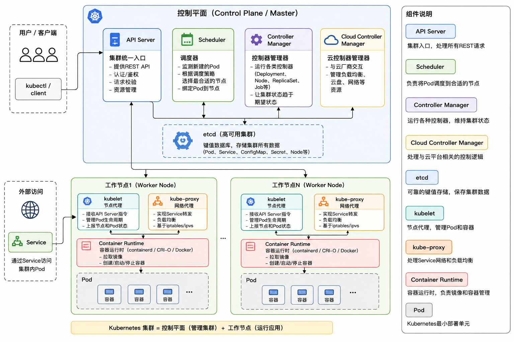

# K8S

## K8S架构图




### K8s 完整业务架构拓扑图

```
┌─────────────────────────────────────────────────────────────┐
│                      外网客户端                              │
└───────────────────────┬─────────────────────────────────────┘
                        │
                        ▼
┌─────────────────────────────────────────────────────────────┐
│                    Ingress 网关层                            │
│  域名解析、SSL解密、路由分发、限流、跨域                      │
└───────────────┬───────────────────────────┬─────────────────┘
                │                           │
        ┌───────▼──────┐           ┌───────▼──────┐
        │ 前端Service  │           │ 后端网关Service│
        └───────┬──────┘           └───────┬──────┘
                │                           │
        ┌───────▼──────┐           ┌───────▼──────┐
        │ Nginx前端Pod │◄─────┐     │ SpringCloud │
        │ (Deployment) │      │     │ Gateway Pod  │
        └─────────────┘      │     │ (Deployment) │
                             │     └───────┬──────┘
                             │             │
                             │     ┌───────▼──────┐
                             │     │ 订单Service  │
                             │     └───────┬──────┘
                             │             │
                             │     ┌───────▼──────┐
                             │     │ 订单微服务Pod│
                             │     │ (Deployment) │
                             │     └───────┬──────┘
                             │             │
                             │     ┌───────▼──────┐
                             │     │ 用户Service  │
                             │     └───────┬──────┘
                             │             │
                             │     ┌───────▼──────┐
                             │     │ 用户微服务Pod│
                             │     │ (Deployment) │
                             └─────┤             │
                                   └───────┬──────┘
                                           │
                                   ┌───────▼──────┐
                                   │ 数据库Service│
                                   └───────┬──────┘
                                           │
                                   ┌───────▼──────┐
                                   │ MySQL Pod    │
                                   │ (StatefulSet)│
                                   │ 绑定Volume存储│
                                   └──────────────┘

┌─────────────────────────────────────────────────────────────┐
│ K8s 集群节点 Node 集群                                       │
│ ┌─────────┐  ┌─────────┐  ┌─────────┐                       │
│ │ Node1   │  │ Node2   │  │ Node3   │                       │
│ │ 服务器  │  │ 服务器  │  │ 服务器  │                       │
│ └─────────┘  └─────────┘  └─────────┘                       │
└─────────────────────────────────────────────────────────────┘

┌──────────── 配套资源挂载 ────────────┐
│ ConfigMap  → 通用业务配置、环境参数   │
│ Secret     → 数据库账号密码、密钥证书 │
│ Volume     → 数据库数据、日志持久化   │
└─────────────────────────────────────┘
```

#### 层级释义

1. **接入层**：Ingress承接外网请求，按路径/域名分流
2. **前端层**：Nginx容器托管静态页面，Deployment管控副本
3. **微服务层**：网关路由转发，各业务服务以Deployment部署，Service统一访问入口
4. **数据层**：MySQL用StatefulSet部署，依托Volume保证数据持久化
5. **基础资源**：ConfigMap、Secret挂载配置与敏感信息，所有Pod运行在集群Node节点上

### 组件

---

#### 1. **Node（节点）= 服务器**

就是**一台真实的机器**（物理机/虚拟机/云服务器）。
K8s 就是把很多 Node 组合成一个**大集群**。

- 作用：提供 CPU、内存、硬盘
- 你可以理解成：**机房里的一台电脑**

---

#### 2. **Pod = 运行应用的最小盒子**

K8s 中**最小的运行单位**。
一个 Pod 里跑 1 个或多个容器（你的 SpringBoot、Nginx、MySQL）。

- Pod ≈ 一个应用实例
- 会自动创建、销毁、重启
- **IP 不固定，会死会重建**

---

#### 3. **Deployment = 无状态应用控制器（最常用）**

用来管理 **Pod**。
你告诉它：**我要跑 3 个副本**，它就永远保证 3 个在运行。

- 管：Web 服务、微服务、网关、前端
- 特点：无状态、随便删、随便重建、不丢数据
- **企业 80% 服务都用它**

---

#### 4. **StatefulSet = 有状态应用控制器**

给 **MySQL、Redis、Mongo、Elasticsearch** 这种数据库用的。

- 每个 Pod 有固定名字
- 每个 Pod 有独立存储
- 重启后身份不变
- **只用于数据库/有数据的服务**

---

#### 5. **Service = 固定入口 + 负载均衡**

因为 **Pod IP 会变**，所以用 Service 提供一个**固定地址**。

- 作用：
  - 固定 IP
  - 固定域名
  - 自动代理到后端多个 Pod
  - 负载均衡
- 你可以理解成：**服务的稳定门牌**

---

#### 6. **Ingress = 统一网关入口（外网访问）**

给 **外部用户访问集群内部服务** 用的。

- 支持域名
- 支持 HTTPS
- 支持路由 /api /user /order
- 相当于 **Nginx 网关**

> 用户 → Ingress → Service → Pod

---

#### 7. **ConfigMap = 普通配置文件**

存放不敏感的配置：
- 数据库地址
- 环境参数
- 微服务配置

特点：**明文存储**

---

#### 8. **Secret = 密码/密钥/证书**

存放敏感信息：
- 数据库账号密码
- Token
- SSL 证书

特点：**加密存储，安全**

---

#### 9. **Volume = 存储卷（数据持久化）**

容器/Pod 删了数据就没了，
Volume 让数据**永久保存**。

- 存数据库文件
- 存上传文件
- 存日志

---

#### 最经典比喻（看完永远不忘）

- **Node 节点 = 一栋大楼**
- **Pod 容器 = 办公室**
- **Deployment 管理 = 物业，保证办公室永远够用**
- **StatefulSet = 带保险柜的办公室（数据库）**
- **Service = 办公室门牌（固定地址）**
- **Ingress = 大楼大门（外部入口）**
- **ConfigMap = 公告栏**
- **Secret = 保险柜**
- **Volume = 储物间（数据不丢）**

---

#### 它们之间的关系（最核心）

1. **Deployment/StatefulSet 创建并管理 Pod**
2. **Pod 运行在 Node 上**
3. **Service 给 Pod 提供固定入口**
4. **Ingress 给外部提供访问入口**
5. **ConfigMap/Secret 给 Pod 提供配置**
6. **Volume 给 Pod 提供持久化存储**

---

#### 最终极简总结

- **Node：服务器**
- **Pod：最小运行单位**
- **Deployment：无状态应用（Web/微服务）**
- **StatefulSet：有状态应用（数据库）**
- **Service：固定IP + 负载均衡**
- **Ingress：外网访问入口**
- **ConfigMap：普通配置**
- **Secret：密码密钥**
- **Volume：数据持久化**

---


## 一、核心定位与价值

- **本质**：容器操作系统，管理容器全生命周期。
- **核心能力**：
  - **自愈**：自动重启崩溃容器、替换故障节点。
  - **弹性扩缩**：基于CPU/内存或自定义指标自动扩缩副本。
  - **服务发现与负载均衡**：稳定IP+DNS，自动分发流量。
  - **滚动更新/回滚**：零停机发布，一键回滚。
  - **存储编排**：自动挂载本地/云/网络存储。
  - **配置与密钥管理**：ConfigMap/Secret，无需重建镜像。

### 1. 自愈能力

系统持续监测容器、Pod、节点运行状态，异常自动修复，无需人工介入
- 容器异常：通过存活探针检测进程卡死、服务无响应，自动重启损坏容器
- Pod故障：副本数不达标时，控制器快速新建Pod补足数量
- 节点宕机：识别失联节点，将其上Pod调度至健康节点重建，保障业务不中断

### 2. 弹性扩缩容

根据业务负载动态调整实例数量，适配流量峰谷，合理利用资源
- 手动扩缩：按需指定副本数，快速增减服务实例
- 自动水平扩缩HPA：依据CPU、内存、接口QPS等指标，自动增减Pod副本
- 集群节点扩缩：资源耗尽时新增服务器，闲置节点自动下线，降低资源损耗

### 3. 服务发现与负载均衡

屏蔽容器动态IP变化，提供固定访问入口，均匀分发请求流量
- 固定访问地址：Service提供稳定集群IP与内部DNS域名，后端Pod变动不影响访问
- 内置负载均衡：默认轮询策略分发请求，规避单点压力
- 跨服务自动寻址：集群内服务通过域名即可互相调用，无需手动维护IP清单

### 4. 滚动更新与版本回滚

实现业务不停服迭代，更新出错可快速恢复旧版本
- 滚动发布：分批替换Pod实例，部分实例运行新版本、部分保留旧版本，全程业务可用
- 灰度发布：小流量验证新版本，无异常再全量切换
- 一键回滚：新版本出现故障，快速切回历史稳定版本，缩短故障时长

### 5. 存储编排

统一管理各类存储资源，数据脱离容器独立持久化保存
- 存储解耦：容器删除重建，数据不会丢失
- 多存储适配：支持本地磁盘、NAS、云盘、分布式存储等各类介质
- 存储挂载调度：跟随Pod调度自动绑定存储卷，有状态业务数据稳定留存

### 6. 配置与密钥管理

配置、密码与程序镜像分离，修改配置无需重新打包镜像
- ConfigMap：存放普通配置、环境参数、配置文件，修改后可热加载生效
- Secret：加密存储账号、密码、证书等敏感信息，权限管控规避泄露风险
- 环境注入：配置可直接注入容器环境变量或挂载为文件，灵活适配程序读取


---

## 二、集群架构（Master-Worker）

### 架构图

K8s集群分为**控制平面（Master）**和**工作节点（Worker）**，所有组件通过`kube-apiserver`交互，数据存于`etcd`。

```
# K8s 集群架构：控制平面(Master) + 工作节点(Worker)
┌─────────────────────────────────────────────────────────────────────┐
│                        控制平面 Master 节点集群                       │
│                                                                     │
│  ┌──────────┐  ┌──────────┐  ┌──────────┐  ┌──────────┐  ┌──────────┐│
│  │ kube-apiserver        │  │ etcd 数据库          │                ││
│  │ 集群唯一入口、认证鉴权 │  │ 存储集群所有资源数据 │                ││
│  └──────────┘  └──────────┘                                          │
│                                                                     │
│  ┌──────────┐  ┌──────────┐  ┌──────────┐                            │
│  │ kube-controller-manager │ │ kube-scheduler调度器 │                │
│  │ 控制器管理器、维持副本数 │ │ 筛选最优节点调度Pod │                │
│  └──────────┘  └──────────┘                                          │
└───────────────────────────────┬─────────────────────────────────────┘
                                │ 集群内部通信
                                ▼
┌─────────────────────────────────────────────────────────────────────┐
│                      工作节点 Worker 节点集群                        │
│                                                                     │
│  ┌────────────────────────────────────┐   ┌────────────────────────┐ │
│  │ Worker 1                           │   │ Worker 2                │ │
│  │                                    │   │                        │ │
│  │  ┌─────────┐    ┌─────────────┐   │   │ 同组件部署             │ │
│  │  │ kubelet │    │ kube-proxy   │   │   │                        │ │
│  │  │ 管理Pod │    │ 网络代理负载 │   │   │                        │ │
│  │  └─────────┘    └─────────────┘   │   │                        │ │
│  │                                    │   │                        │ │
│  │  ┌────────────────────────────┐  │   │                        │ │
│  │  │ 容器运行时 containerd       │  │   │                        │ │
│  │  │ 启停容器、镜像管理          │  │   │                        │ │
│  │  └────────────────────────────┘  │   │                        │ │
│  │                                    │   │                        │ │
│  │  ▶ Pod业务容器组                  │   │                        │ │
│  │  Deployment/StatefulSet管理应用   │   │                        │ │
│  │  Service、Ingress、配置存储卷等   │   │                        │ │
│  └────────────────────────────────────┘   └────────────────────────┘ │
└─────────────────────────────────────────────────────────────────────┘
```

#### 组件简要说明

##### 控制平面 Master

1. **kube-apiserver**：集群网关，所有增删改查请求必经入口
2. **etcd**：键值数据库，持久化存放集群全部资源状态
3. **kube-scheduler**：负责把Pod调度分配到空闲工作节点
4. **kube-controller-manager**：各类控制器，保障资源期望状态

##### 工作节点 Worker

1. **kubelet**：本机Pod生命周期管理，对接控制平面指令
2. **kube-proxy**：维护节点网络规则，实现Service访问与负载均衡
3. **containerd**：底层容器运行时，创建、启停容器实例
4. 业务载体：Pod、各类控制器、网络、配置、存储资源均运行于此

### 1. 控制平面（Master：集群大脑）

- **kube-apiserver**：统一入口，RESTful API，认证/授权/准入控制。
- **etcd**：分布式键值库，存储集群所有状态（配置/元数据），强一致性，高可用（3/5节点）。
- **kube-scheduler**：调度器，按资源需求、节点亲和性、污点/容忍等策略，将Pod分配到最优Worker节点。
- **kube-controller-manager**：控制器管理器，运行各类控制器维持期望状态：
  - **ReplicaSet**：确保Pod副本数稳定。
  - **Deployment**：管理ReplicaSet，支持滚动更新/回滚。
  - **Node Controller**：监控节点状态，故障时迁移Pod。
- **cloud-controller-manager（可选）**：对接公有云API，管理负载均衡、云存储等。


#### 控制平面 Master 核心作用

作为集群管控中枢，统筹全局调度、数据存储、状态维护与请求处理

1. **统一请求入口**
kube-apiserver接收kubectl、客户端、集群内部所有操作请求，完成认证、鉴权、数据校验，是集群唯一交互出入口。

2. **集群数据持久存储**
etcd数据库保存全部资源数据，包含节点、Pod、配置、部署规则、运行状态等核心信息，断电重启数据不丢失。

3. **Pod调度分配**
kube-scheduler依据节点资源使用率、亲和性、污点等规则，为新建Pod筛选最优工作节点并绑定。

4. **维持期望状态**
kube-controller-manager内置各类控制器，持续比对实际运行状态与预设规格，自动处理副本扩缩、故障重建、资源修复。

5. **集群全局管控**
统一管理版本更新、权限管控、故障预警、资源配额，下发指令管控所有工作节点与业务应用。

#### 1. kube-apiserver

集群唯一统一访问入口，所有读写操作必经此处
- 通信协议：基于RESTful API，提供标准化接口，客户端、各组件均通过接口交互
- 核心职责
  1. 身份认证：校验访问账号、令牌、证书合法性，拦截非法请求
  2. 权限授权：判定用户/组件是否具备对应资源操作权限
  3. 准入控制：校验资源配置合规性，拦截非法参数、违规配置
  4. 数据转发：合法请求写入etcd，同时同步集群状态给到其他组件

#### 2. etcd

集群专属分布式键值数据库，集群数据唯一存储仓库
- 存储内容：节点信息、Pod、服务、配置、权限等全量集群元数据
- 特性
  - 强一致性：多节点数据同步一致，不会出现状态错乱
  - 高可用部署：生产环境常规3/5节点集群部署，单节点故障不丢数据
  - 读写隔离：仅apiserver可读写，其他组件无权直接操作

#### 3. kube-scheduler

Pod调度决策组件，负责给新建Pod匹配合适工作节点
- 调度流程
  1. 筛选过滤：剔除资源不足、故障、不符合规则的节点
  2. 打分优选：依据CPU内存占用、节点亲和、污点容忍、负载均衡等维度评分
  3. 绑定节点：选定最优节点，完成Pod与节点的绑定关系

#### 4. kube-controller-manager

控制器合集，持续比对**期望状态**与**实际状态**，自动调优对齐
- 内置常用控制器
  - ReplicaSet控制器：严格维持预设Pod副本数量，少则新建、多则销毁
  - Deployment控制器：管控ReplicaSet实例，实现应用滚动升级、版本回滚、副本伸缩
  - Node控制器：实时监控节点健康度，节点失联故障时，自动疏散重建其上Pod
  - 其他：账号、存储、端点等配套控制器，保障各类资源正常运行

#### 5. cloud-controller-manager（可选）

云厂商适配组件，私有化集群一般无需部署
- 作用：打通K8s集群与公有云底层接口
- 管理资源：云服务器负载均衡、云硬盘、弹性网卡、外网IP等云原生资源
- 价值：让集群可以直接调用云平台能力，自动创建销毁云上基础设施


### 2. 工作节点（Worker：干活的手脚）

- **kubelet**：节点代理，与API Server通信，管理Pod生命周期（启动/停止/监控容器）。
- **kube-proxy**：网络代理，维护节点iptables/IPVS规则，实现Service负载均衡与流量转发。
- **容器运行时**：如containerd、CRI-O，负责拉取镜像、启停容器。
- **Pod**：K8s最小调度单元，包含1个或多个共享网络/存储的容器。

#### 工作节点 Worker 核心作用

承接控制平面指令，实际运行业务、落地执行所有操作

1. **节点代理管控**
kubelet接收主控下发指令，负责本机Pod创建、启停、销毁，上报容器运行状态。

2. **网络流量处理**
kube-proxy维护节点网络策略，实现Service负载均衡、集群内外流量转发通信。

3. **容器底层运行**
containerd负责镜像拉取、容器生命周期管理，真正启动运行业务容器。

4. **承载业务服务**
运行Pod实例，部署前后端应用、数据库、网关等业务程序，对外提供服务。

5. **本地资源管理**
调用本机CPU、内存、磁盘资源，挂载配置、存储卷，保障数据读写与服务稳定运行。

#### 1. kubelet

节点核心代理进程，对接控制平面
- 定期和kube-apiserver交互，同步节点、Pod状态
- 全权管控Pod全生命周期：创建、启停、销毁容器
- 执行健康探针检测，异常容器触发重启修复
- 挂载存储、注入配置，保障Pod运行环境就绪

kubelet是工作节点核心守护进程，是控制平面与本机资源的通信桥梁，负责落地集群管控指令。

1. **集群状态同步**
持续与kube-apiserver建立通信，定时上报本机节点硬件资源、在线状态；同时拉取集群下发的资源调度指令，保持集群全局状态一致。

2. **Pod全生命周期管理**
依据主控下发的Pod配置，调用容器运行时完成容器创建、启动、停止、删除操作；严格按照部署规则管控实例数量，保障应用正常运行。

3. **健康状态巡检自愈**
执行存活、就绪两类探针检测，监控容器运行状态。探测异常时自动触发容器重启，剔除故障实例，保障服务可用性。

4. **运行环境资源调配**
为Pod挂载Volume存储卷实现数据持久化，关联ConfigMap、Secret注入配置与密钥；分配节点CPU、内存资源，搭建完整运行环境。

5. **事件与日志上报**
记录容器启停、异常报错、资源变更等事件，同步至集群；归集应用运行日志，便于故障排查与集群监控。

#### 2. kube-proxy

集群网络流量转发组件
- 在节点维护iptables/IPVS路由规则
- 监听Service变化，实时更新转发策略
- 实现服务负载均衡、集群内部访问互通
- 屏蔽Pod动态IP，保证访问链路稳定

工作节点网络代理进程，负责集群流量调度与访问互通

1. **维护本地转发规则**
在节点内核配置iptables或IPVS路由策略，搭建流量转发基础通路。

2. **动态同步服务变更**
实时监听集群Service资源变动，配置增减、端口调整、后端Pod变化时，自动刷新转发规则。

3. **实现负载均衡调度**
请求访问Service时，按调度算法分发流量至后端多个正常Pod，分摊访问压力。

4. **屏蔽Pod浮动IP**
Pod销毁重建后IP会改变，依托固定Service地址访问，上层无需感知实例真实地址，链路访问始终稳定。

5. **打通集群网络通信**
支撑节点间、服务间、内外网的数据交互，保障集群内所有资源正常互相调用。

#### 3. 容器运行时（container-runtime）

底层容器执行引擎，遵循CRI标准
- 主流选型：containerd、CRI-O
- 核心工作：拉取镜像、解压镜像、创建容器
- 管控容器进程、资源限额、生命周期启停

K8s 节点上**真正负责“启动容器、运行容器”的底层软件**，是容器技术的执行者。

---

##### 1. 它是什么？

- 遵循 **CRI（容器运行时接口）** 标准的底层引擎
- 运行在 **每一个 Worker 节点**
- K8s 不直接操作容器，全部交给它来执行

##### 2. 主流产品

- **containerd**（K8s 1.24+ 默认、最主流）
- **CRI-O**（RedHat 主推）
- **Docker**（老版本用，现在已被淘汰）

##### 3. 核心功能（最关键）

###### ① 管理镜像

从镜像仓库拉取镜像、存储镜像、解压镜像、检查镜像完整性。

###### ② 创建 & 运行容器

- 创建隔离环境（PID、网络、文件系统隔离）
- 调用 Linux 内核 `cgroup` 做资源限制（CPU/内存）
- 调用 `namespace` 做环境隔离
- **真正启动业务进程**

###### ③ 容器生命周期管理

- 启动
- 停止
- 重启
- 删除
- 查看状态、日志

###### ④ 资源隔离与限制

保证一个容器不会把节点资源吃满：
- 限制 CPU 使用率
- 限制内存最大使用量
- 限制磁盘 I/O、网络等

##### 4. 它和 kubelet 的关系

- **kubelet 下达命令**
- **容器运行时执行命令**

命令流程：
```
apiserver → kubelet → 容器运行时 → 真正创建容器
```

##### 5. 为什么抛弃 Docker，改用 containerd？

- Docker 功能太多（有构建、GUI、客户端等），太重
- containerd 更轻量、更稳定、更安全
- 符合 CRI 标准，专门给 K8s 设计
- **K8s 1.24+ 彻底不再支持 Docker 作为运行时**

##### 6. 一句话总结

**容器运行时就是 K8s 节点里的“容器操作工”：
负责拉镜像、建容器、跑容器、管容器，是一切业务运行的基础。**

---

需要我继续给你讲：
**etcd / apiserver / scheduler / controller-manager** 这几个 Master 核心组件吗？
我也用同样清晰的方式给你讲透！

#### 4. Pod

K8s最小调度与运行单元
- 单个Pod可封装1~多个业务容器
- 组内容器共享同一网络栈、存储卷、IP地址
- 生命周期短暂，销毁后无法恢复原有实例
- 统一调度、启停，作为整体被集群管理

##### Pod 详细介绍

Pod是K8s体系里最小调度、部署、运行单元，集群所有业务都依托它承载

1. **容器组合载体**
一个Pod内可包含单个主业务容器，也可搭配日志收集、监控探针等辅助容器，协同完成业务能力。

2. **资源共享特性**
组内所有容器共用一套网络命名空间，拥有唯一Pod IP；同时共享挂载存储卷、进程空间，容器间可直接本地端口互访。

3. **生命周期特性**
Pod属于临时性资源，触发重建、迁移、故障恢复时会销毁旧实例，重新生成全新Pod，原有实例无法复原，IP地址也会随之变更。

4. **整体管控机制**
Pod内部容器统一调度调度、同步启停，集群不会单独操作某个容器，始终以Pod整体维度完成管理、调度与销毁操作。

---

## 三、核心资源对象（CRD）

### 1. 基础运行层

- **Pod**：最小部署单元，共享网络（同一IP/端口）与存储卷；**短暂易逝**，IP动态变化。
- **Node**：物理机/虚拟机，提供CPU/内存/磁盘，运行Pod。
- **Namespace（NS）**：虚拟子集群，资源隔离与权限控制（如dev/test/prod）。

#### Pod

K8s最小调度、部署单元
- 同一Pod内所有容器共用**同一个IP、网络栈、端口空间**
- 容器间共享存储卷，可直接本地文件交互通信
- 生命周期临时，故障/重建后IP会改变，无法固定访问
- 不建议单独直接创建，交由工作负载控制器管理

#### Node

集群实际运算载体
- 实体为物理服务器、虚拟机、云主机
- 提供CPU、内存、磁盘、网络等硬件资源
- 承载运行所有Pod，受控制平面统一调度管控
- 可查看状态、资源使用率，支持集群扩缩节点

#### Namespace

逻辑隔离的虚拟集群分区
- 划分dev、test、prod等环境，区分业务与场景
- 同命名空间内资源名称唯一，跨命名空间可重名
- 可配合配额、权限策略，限制资源使用范围
- 实现多项目、多团队资源互不干扰管理


### 2. 编排控制层（工作负载）

- **Deployment**：无状态应用（Web/API），管理ReplicaSet，支持**滚动更新（maxSurge/maxUnavailable）**、回滚、扩缩容。
- **StatefulSet**：有状态应用（MySQL/Kafka），稳定网络标识、持久化存储、有序部署/扩容/删除。
- **DaemonSet**：每个节点（或指定节点）运行1个Pod（如日志收集/监控代理）。
- **Job**：一次性任务（如批处理），运行至完成；**CronJob**：定时任务。

这一层是 K8s 真正**“自动化管理应用”**的核心，专门解决：怎么部署、怎么运行、怎么保证不挂、怎么升级、怎么执行任务。

我用**最通俗、最容易理解**的方式给你讲透👇

---

#### 1. Deployment（最常用、无状态应用）

**定位**：部署**无状态服务**（Web、API、前端、微服务）
**一句话**：你只管说“我要跑3个副本”，剩下的自愈、扩缩、更新全交给它。

##### 核心能力

1. **自动维持副本数**
   - 少了自动补，多了自动删
   - 节点挂了 → 自动在别的节点重建 Pod

2. **滚动更新（零停机发布）**
   - 分批启动新版本
   - 分批销毁旧版本
   - 全程服务不中断
   - 配置：
     - `maxSurge`：最多额外启动多少个新 Pod
     - `maxUnavailable`：最多允许多少个 Pod 不可用

3. **一键回滚**
   - 新版本出问题 → 直接回到上一个稳定版本
   - 保留历史版本，可随时切换

4. **手动/自动扩缩容**
   - 流量大 → 加到 10 副本
   - 流量小 → 缩到 2 副本
   - 配合 HPA 可全自动扩缩

##### 适合场景

- Nginx、前端页面
- SpringCloud / Go / Python 微服务
- 所有**不存数据、不依赖固定身份**的服务

##### 关键词

无状态、副本、自愈、滚动更新、回缩、扩缩容

---

#### 2. StatefulSet（有状态应用）

**定位**：部署**有状态服务**（数据库、消息队列、分布式存储）
**一句话**：给每个 Pod 一个**固定身份 + 固定存储**，死了重建还是原来的名字、原来的数据。

##### 核心特性

1. **稳定的网络标识（固定名字）**
   - Pod 名字固定：`mysql-0`、`mysql-1`、`mysql-2`
   - 重启重建后名字不变、域名不变
   - 集群内部可通过固定域名互相访问

2. **稳定的持久化存储**
   - 每个 Pod 绑定独立 PVC / PV
   - 删了 Pod → 数据还在
   - 重建 Pod → 自动挂回原来的数据盘

3. **有序部署、有序扩容、有序删除**
   - 启动：0 → 1 → 2
   - 删除：2 → 1 → 0
   - 保证集群依赖顺序不混乱

##### 适合场景

- MySQL、PostgreSQL、MongoDB
- Redis 集群、ZooKeeper、Etcd
- Kafka、Elasticsearch

##### 关键词

有状态、固定名字、固定存储、有序启动、数据不丢

---

#### 3. DaemonSet（守护进程）

**定位**：**每个节点只跑一个 Pod**
**一句话**：集群加节点 → 自动在新节点跑一个；删节点 → 自动清理。

##### 核心特点

- 不手动调度，自动在每个节点运行 1 个
- 新节点加入集群 → 自动部署
- 可通过节点亲和性，只在某些节点运行

##### 适合场景

- 日志收集：Filebeat、Fluentd
- 监控代理：Node Exporter
- 网络插件、安全客户端、存储客户端

##### 关键词

每节点一个、自动跟随节点、守护进程、监控/日志/网络

---

#### 4. Job / CronJob（一次性/定时任务）

##### Job（一次性任务）

**运行一次，运行成功就结束**
- 数据计算
- 数据导入
- 备份脚本
- 跑完就停，不长期占用资源

##### CronJob（定时任务）

**按时间表自动执行 Job**
- 每天凌晨备份
- 每小时清理日志
- 每周生成报表

完全类似 Linux 的 `crontab`，但在 K8s 里更安全、可追踪、可重试。

##### 关键词

一次性、定时、批处理、备份、清理、报表

---

#### 超级总结（一眼区分 4 种工作负载）

| 类型            | 特点                       | 典型用途             |
| --------------- | -------------------------- | -------------------- |
| **Deployment**  | 无状态、多副本、可随意替换 | Web、API、微服务     |
| **StatefulSet** | 有状态、固定名字、固定存储 | MySQL、Redis、Kafka  |
| **DaemonSet**   | 每节点跑一个               | 日志、监控、网络插件 |
| **Job/CronJob** | 一次性/定时执行            | 备份、计算、清理     |


### 3. 网络服务层

- **Service（SVC）**：稳定网络入口，**ClusterIP（集群内）/NodePort（节点端口）/LoadBalancer（云负载均衡）/ExternalName（外部域名）**；通过标签选择器关联Pod，自动负载均衡。
- **Ingress**：HTTP/HTTPS路由，统一入口，路径/域名转发到Service，支持SSL终止。

#### Service

屏蔽Pod动态IP，提供固定访问入口，实现服务互通与流量分发
1. **核心原理**
依靠标签选择器匹配后端Pod集合，维护访问端点列表，Pod增减不改变访问地址，内置负载均衡能力。

2. **四种访问类型**
- **ClusterIP**：默认类型，仅集群内部可访问，用于服务间互相调用
- **NodePort**：开放节点固定端口，外网可通过节点IP+端口访问服务
- **LoadBalancer**：依托云厂商负载均衡，分配公网IP，对外正式暴露业务
- **ExternalName**：映射集群外部域名，实现集群内直接调用第三方外网服务

#### Ingress

专门管控HTTP、HTTPS七层流量，统一网关入口
1. **核心作用**
整合多个Service，按域名、请求路径做路由转发，无需为每个服务单独开端口。
2. **关键能力**
- 域名路由：不同域名分发至对应后端服务
- 路径路由：同一域名下不同接口路径匹配不同服务
- SSL证书解密：统一处理HTTPS加密，简化证书管理
- 可配置限流、重定向、跨域等网关策略
3. **运行前提**
集群需部署Ingress控制器（Nginx、Traefik等），规则才能生效

#### 二者简易区别

- Service：四层网络转发，适配TCP/UDP通用协议
- Ingress：七层应用路由，专注网页、接口类HTTP业务

### 4. 配置存储层

- **ConfigMap**：非敏感配置（配置文件/环境变量），挂载到Pod或注入环境变量。
- **Secret**：敏感数据（密码/密钥/证书），Base64编码，安全分发。
- **Volume（PV/PVC）**：持久化存储，**PV（集群级存储）/PVC（Pod绑定PV）**，支持NFS/云盘/本地存储。

#### ConfigMap

存放普通非涉密配置信息
- 存储内容：应用参数、配置文件、环境变量、启动脚本等
- 使用方式：注入容器环境变量，或以文件形式挂载进Pod
- 优势：配置与镜像解耦，修改配置无需重新打包发布镜像

#### Secret

专门保管敏感隐私数据
- 存储内容：账号密码、密钥令牌、SSL证书、数据库凭证
- 存储形式：数据自动Base64编码存储，降低明文泄露风险
- 权限管控：精细控制访问权限，仅授权Pod可读取

#### Volume 存储体系

实现数据持久化，容器销毁数据不丢失
1. **PV 持久卷**
集群层面统一存储资源，由管理员预先创建，对应本地磁盘、NFS、云盘等实际存储介质

2. **PVC 持久卷申领**
Pod侧存储申请声明，按需指定容量、访问模式，自动匹配符合条件的PV完成绑定

3. 存储特性
- 脱离容器生命周期，重建Pod依旧保留原有数据
- 兼容多类存储方案，适配不同业务数据存储需求


---

## 四、核心流程：从创建到运行

1. **用户提交配置**：`kubectl apply -f deployment.yaml` → **kube-apiserver** → **etcd**存储。
2. **控制器协调**：**Deployment Controller**创建**ReplicaSet** → 确保副本数达标。
3. **调度决策**：**Scheduler**为未调度Pod选择最优Node → 绑定Node。
4. **节点执行**：目标Node的**kubelet**创建Pod → 拉取镜像 → 启动容器。
5. **网络配置**：**kube-proxy**配置iptables/IPVS → Service流量转发到Pod。
6. **状态维持**：**Controller**持续监控 → 实际状态偏离期望时自动修复（如重启崩溃Pod）。


### 应用创建运行全流程详解

1. **提交下发**
执行kubectl命令推送yaml配置，请求抵达kube-apiserver，校验合法后存入etcd数据库，留存集群期望状态。

2. **控制器调度生成实例**
Deployment控制器监听资源变动，对应创建ReplicaSet对象，依据设定副本数量，发起Pod创建请求。

3. **节点筛选绑定**
kube-scheduler筛选合规节点，综合资源占用、调度策略打分，选定最优工作节点，完成Pod与节点绑定记录。

4. **节点本地启动容器**
目标节点kubelet感知绑定信息，调用容器运行时拉取镜像，创建并启动容器，同时挂载配置与存储卷。

5. **网络规则生效**
kube-proxy同步服务信息，更新节点内核转发规则，建立Service到后端Pod的流量转发通路。

6. **常态化状态巡检自愈**
各类控制器持续比对实际运行状态与预设期望状态，出现副本缺失、容器异常、节点故障时，自动执行修复重建。

---

## 五、核心特性详解

### 1. 自愈（Self-healing）

- **容器重启**：kubelet定期探针（livenessProbe/readinessProbe），失败则重启。
- **Pod替换**：节点宕机，Controller在其他节点重建Pod。
- **滚动更新**：Deployment逐步替换Pod，无停机；失败自动回滚。

---

#### 1. 什么是自愈？

**K8s 会时刻盯着你的应用，一旦坏了、挂了、不健康了，自动给你修好，不用人管。**
你只需要告诉 K8s：
**“我要 3 个副本一直跑着”**
剩下的崩溃、重启、重建、迁移，全自动化。

---

#### 2. 三大自愈机制详解

##### ① 容器重启（最细粒度的自愈）

**谁负责：节点上的 kubelet**
**靠什么判断：健康探针（Probe）**

###### 两种探针

1. **存活探针 livenessProbe**
   - 问：容器**还活着吗**？
   - 死了 / 没响应 → **直接杀死容器并重启**
   - 解决：进程卡死、死循环、服务僵住

2. **就绪探针 readinessProbe**
   - 问：容器**准备好接收流量了吗**？
   - 没准备好 → **从 Service 负载均衡里摘掉**
   - 解决：启动慢、初始化中、暂时过载

###### 触发动作

探针失败 → kubelet 自动执行：
- 重启容器
- 重新检查
- 直到恢复正常

**这就是：容器挂了自动拉起来！**

---

##### ② Pod 替换（更高层级的自愈）

**谁负责：控制平面的 Controller（Deployment/ReplicaSet）**

###### 场景

- 节点宕机
- 节点失联
- Pod 被意外删除
- 节点资源耗尽

###### 动作

Controller 发现：
**实际运行副本数 < 你期望的副本数**

立刻自动：
1. 在**其他健康节点**上创建新 Pod
2. 等待启动成功
3. 流量切过去

**一句话：Pod 没了，立刻给你重新造一个！**

---

##### ③ 滚动更新中的自愈（发布时的高可用）

**谁负责：Deployment Controller**

##### 滚动更新（零停机发布）

你更新镜像版本时：
1. 先启动**新 Pod**
2. 等待就绪
3. 再销毁**旧 Pod**
4. 一批一批替换
**全程服务不中断**

##### 发布失败自动回滚（自愈的高级形态）

如果新版本：
- 起不来
- 探针失败
- 崩溃重启

Deployment 会：
- 自动停止发布
- 自动恢复到上一个稳定版本
- 保证业务不受影响

**这叫：发布坏了，自动救回来！**

---

#### 3. 自愈完整流程（一眼看懂）

1. Pod 挂了
2. kubelet 探针检测到
3. 立刻重启容器
4. 如果重启多次无效 → 标记 Pod 失败
5. Controller 发现副本不足
6. 在其他节点**重新创建新 Pod**
7. 流量自动切换到新 Pod
8. 业务恢复正常

**全程无人干预！**

---

#### 4. 最通俗的比喻

- **容器重启 = 电脑死机自动重启**
- **Pod 替换 = 电脑坏了，直接换一台新的**
- **滚动更新 = 换零件不关机，业务一直可用**

---

#### 5. 总结（极简版）

- **kubelet** 负责**容器级别**自愈（重启）
- **Controller** 负责 **Pod 级别**自愈（重建）
- **Deployment** 负责**发布级别**自愈（回滚）

**三层自愈，保证你的应用永远在线、永远可用。

### 2. 弹性扩缩（Scaling）

- **水平扩缩（HPA）**：基于CPU/内存或自定义指标（如QPS）自动调整Deployment副本数。
- **集群扩缩（Cluster Autoscaler）**：Pod因资源不足Pending时，自动新增节点；节点空闲时缩容。

#### 水平扩缩 HPA

针对Pod副本数量动态调整，适配业务流量波动
- 监控维度：默认采集CPU、内存使用率，也可接入QPS、并发数等自定义业务指标
- 运行逻辑：指标超出阈值自动增加副本分担压力；负载回落后缩减副本节省资源
- 作用范围：仅管控Deployment、StatefulSet等工作负载实例数，节点数量保持不变
- 优势：秒级响应流量起伏，兼顾服务稳定性与资源利用率

#### 集群扩缩 Cluster Autoscaler

针对集群服务器节点数量扩容缩容
- 扩容场景：节点资源耗尽，新Pod处于Pending无法调度，自动新增节点机器
- 缩容场景：长期低负载、节点空闲资源富余，自动剔除闲置节点
- 适配场景：大规模突发业务、离线批量任务，按需伸缩集群整体算力
- 层级区别：HPA改实例数，集群扩缩改服务器总数，两级联动调配资源

### 3. 服务发现与负载均衡

- **Service**：稳定ClusterIP，DNS域名（`svc-name.ns.svc.cluster.local`），自动关联Pod，轮询负载均衡。
- **Ingress**：统一HTTP/HTTPS入口，域名路由，SSL终止，支持Nginx/Traefik等控制器。


#### Service（四层：TCP/UDP）

- **稳定虚拟IP（ClusterIP）**：集群内固定地址，**Pod动态变化但IP不变**。
- **DNS服务发现**：格式 `服务名.命名空间.svc.cluster.local`（如`order.default.svc.cluster.local`），集群内可直接用**服务名访问**。
- **标签选择器**：通过`selector`匹配Pod标签，**自动关联后端Pod**并实时更新健康端点。
- **负载均衡（默认轮询）**：kube-proxy通过**iptables/IPVS**转发流量，自动剔除未就绪Pod。
- **四种类型**：
  - **ClusterIP**：仅集群内访问（默认）。
  - **NodePort**：节点开放端口，外网可通过`节点IP:端口`访问。
  - **LoadBalancer**：云厂商负载均衡，暴露公网IP。
  - **ExternalName**：映射到外部域名（无代理）。

#### Ingress（七层：HTTP/HTTPS）

- **统一入口**：集中管理域名/路径路由，避免多Service暴露外网端口。
- **核心能力**：
  - **域名路由**：按`host`（如`www.example.com`）转发到对应Service。
  - **路径路由**：按`path`（如`/api`→后端、`/`→前端）分发流量。
  - **SSL终止**：统一配置证书，**HTTPS解密后转发内网HTTP**。
- **主流控制器**（需独立部署）：
  - **Nginx Ingress**：社区最常用，稳定、功能全。
  - **Traefik**：动态配置、自动证书、易集成。
  - **HAProxy/Envoy（如Contour）**：高性能、服务网格友好。

#### 两者关系（通俗理解）

- **Service**：后端Pod的“**稳定门牌+流量调度员**”，管四层端口。
- **Ingress**：外网访问的“**统一大门+七层路由器**”，管域名/路径/证书。
- **典型架构**：用户→**Ingress（域名/SSL）**→**Service（负载均衡）**→**Pod（业务容器）**。

要不要我把这部分浓缩成面试高频问答（含一句话亮点），方便你快速背诵？

---

## 六、常用命令（kubectl）

```bash
# 集群信息
kubectl cluster-info
kubectl get nodes

# 资源管理
kubectl apply -f yaml-file.yaml  # 创建/更新资源
kubectl get pods                   # 查看Pod
kubectl describe pod <pod-name>   # 查看Pod详情
kubectl logs <pod-name>            # 查看Pod日志
kubectl exec -it <pod-name> -- /bin/sh  # 进入Pod

# 工作负载
kubectl get deployments
kubectl scale deployment <name> --replicas=3  # 手动扩缩
kubectl rollout history deployment <name>       # 查看更新历史
kubectl rollout undo deployment <name>          # 回滚

# 网络
kubectl get services
kubectl get ingress
```

---

## 七、应用场景

- **微服务架构**：拆分服务，独立部署、升级、扩缩。
- **云原生应用**：容器化+K8s，跨环境一致性（物理机/虚拟机/公有云）。
- **大规模AI/大数据**：批量任务、分布式训练、资源调度。
- **高可用系统**：自愈、多副本、故障转移，保障业务连续性。

---

## 八、总结

K8s核心是**声明式API+自愈+弹性**，通过标准化接口屏蔽底层基础设施差异，让开发者专注业务，运维专注平台。掌握K8s需重点理解**架构组件协同、核心资源对象、调度与自愈机制**。

要不要我给你一份可直接运行的`Deployment+Service+Ingress`完整YAML示例，附带关键配置说明？


# 可视化的kubernetes管理工具

portainer

使用k8s安装portainer管理可视化自己

Portainer 是**容器/集群可视化管理面板**，支持 Docker、K8s（含 k3s），一键 Web 管理，**替代 80% kubectl 命令**。

---

### 一、Portainer 核心是什么

- **定位**：K8s/Docker 的**图形化控制面板**，免费社区版（CE）够用。
- **作用**：Web 界面管理集群、节点、Pod、Service、日志、终端、YAML 部署。
- **优势**：**零命令行、多集群统一管理、轻量（单容器）、新手友好**。


---

### 二、在 k3s 集群安装 Portainer（最简）
#### 方式1：官方 YAML（推荐）
在 k3s master 执行：
```bash
# 部署 Portainer（含命名空间、权限、Service）
kubectl apply -f https://downloads.portainer.io/ce2-21/portainer-agent-k8s-lb.yaml

# 查看 Pod 状态（等 Running）
kubectl get pods -n portainer

# 查看访问地址
kubectl get svc -n portainer
```
- 访问：`http://<节点IP>:9000`
- 首次设置 admin 密码。

#### 方式2：Helm 安装
```bash
helm repo add portainer https://portainer.github.io/k8s/
helm repo update
helm install portainer portainer/portainer \
  --namespace portainer --create-namespace \
  --set service.type=NodePort
```

---

### 三、Portainer 核心功能（K8s 日常）
1. **集群总览**：节点状态、CPU/内存、命名空间、Pod 数量。
2. **Pod 管理**：查看/删除/重启 Pod、**实时日志**、**Web 终端进容器**。
3. **工作负载**：Deployment/StatefulSet 可视化、一键扩缩容、镜像更新。
4. **Service/Ingress**：查看端口、绑定节点、配置路由。
5. **配置管理**：ConfigMap/Secret 在线编辑。
6. **YAML 部署**：Web 上传/编辑 YAML，一键 apply。


---

### 四、k3s + Portainer 实操示例
#### 1. 部署 Nginx（Web 点几下）
- 左侧 → Workloads → Deployments → Add deployment
- 填名称：`nginx-demo`，镜像：`nginx:alpine`，副本数：2
- 点 **Deploy** → 自动创建 Pod。

#### 2. 查看日志

- 点 Pod → Logs → 实时输出，无需 `kubectl logs`。

#### 3. 进容器终端
- 点 Pod → Exec → 选容器 → 直接操作，替代 `kubectl exec`。

#### 4. 扩缩容
- Deployment → Scale → 改副本数 → 自动调度。

---

### 五、Portainer vs 命令行
- ✅ **新手/演示**：Portainer 可视化、零记忆、快。
- ✅ **复杂操作/脚本**：kubectl + YAML 更灵活。
- ✅ **日常 80% 场景**：Portainer 足够，效率更高。

---

### 六、常见问题
- 连不上：**防火墙放行 9000/30000–32767**，或用 `NodePort` 暴露。
- Pod 起不来：检查 `portainer` 命名空间权限、内存是否 ≥512MB。
- 多集群：Portainer 可**添加多个 k3s/k8s 环境**，统一管理。

---

要不要我给你一份可直接复制的 **portainer.yaml**，你一条命令就能部署到 k3s？

# kubectl

 kubectl 命令行工具同创建的kubnetes集群进行交互

### kubectl 命令行工具：与 K8s 集群交互的**唯一入口**

我给你用**最通俗、最核心、最实用**的方式讲透，**学完就能直接用**！

---

#### 一、kubectl 是什么？

一句话：
**kubectl = K8s 的命令行遥控器/控制台**

- 你所有操作 K8s 的指令，都通过它发送
- 它连接 `kube-apiserver`（Master 大脑）
- 你发命令 → kubectl → apiserver → 集群执行

**没有 kubectl，你就无法操作 K8s！**

---

#### 二、kubectl 能做什么？（全覆盖）

1. **查看资源**（节点、Pod、服务、部署…）
2. **创建资源**（用 yaml 一键部署）
3. **删除资源**（下线应用）
4. **修改资源**（扩缩容、更新版本）
5. **查看日志**（排查 Spring Boot 报错）
6. **进入容器**（调试应用）
7. **查看集群状态**

---

#### 三、kubectl 核心语法（记住这个就够）

```bash
kubectl [命令] [资源类型] [资源名称] [选项]
```

例子：
```bash
kubectl get pods
```

---

#### 四、最常用 20 条命令（企业 90% 场景都用这些）

##### 1. 查看类（最常用）

```bash
kubectl get nodes          # 看节点
kubectl get pods           # 看Pod（当前命名空间）
kubectl get pods -A        # 看所有命名空间的Pod
kubectl get deployments    # 看部署
kubectl get svc            # 看服务
kubectl get ingress        # 看网关
kubectl get configmap      # 看配置
kubectl get secret         # 看密钥
```

##### 2. 详细信息（排查问题）

```bash
kubectl describe pod  pod名       # 看Pod详情、事件、错误
kubectl describe node 节点名       # 看节点信息
```

##### 3. 日志（查 Spring Boot 报错）

```bash
kubectl logs -f pod名             # 实时查看日志
```

#### 4. 进入容器（调试）

```bash
kubectl exec -it pod名 -- /bin/bash
```

#### 5. 创建/更新资源（部署应用）

```bash
kubectl apply -f xxx.yaml   # 用yaml创建/更新
```

#### 6. 删除资源

```bash
kubectl delete -f xxx.yaml
kubectl delete pod pod名
kubectl delete deploy 部署名
```

#### 7. 扩缩容

```bash
kubectl scale deployment myapp --replicas=3
```

---

#### 五、kubectl 如何连接集群？

##### 1. 配置文件：`~/.kube/config`

kubectl **靠这个文件知道连接哪个集群**

- minikube 自动生成
- k3s 自动生成
- 生产环境由管理员提供

##### 2. 查看当前连接哪个集群

```bash
kubectl config current-context
```

##### 3. 测试是否连通

```bash
kubectl cluster-info
```

---

#### 六、命令使用示例（部署 Spring Boot）

##### 1. 写 deployment.yaml

```yaml
apiVersion: apps/v1
kind: Deployment
metadata:
  name: spring-boot-demo
spec:
  replicas: 2
  selector:
    matchLabels:
      app: demo
  template:
    metadata:
      labels:
        app: demo
    spec:
      containers:
      - name: demo
        image: nginx:alpine
        ports:
        - containerPort: 80
```

##### 2. 执行命令部署

```bash
kubectl apply -f deployment.yaml
```

##### 3. 查看是否运行

```bash
kubectl get pods
```

---

#### 七、一句话总结（必须背会）

**kubectl 是 K8s 命令行工具，负责向 Master 发送指令，管理集群所有资源。**


# 使用搭建k8s环境

## 本地搭建k8s

### minikubet搭建k8s环境

minikube是一个轻量级的kubetnetes实现，可在本地计算机上创建虚拟机，并部署仅仅包含一个节点的简单集群。

---

#### 一、Minikube 到底是什么？

一句话：
**Minikube = 个人电脑上的迷你版 K8s 单节点集群**

- 轻量级、适合学习、测试、开发
- 自动创建虚拟机/容器环境
- 自动安装好 **Master + Worker 合一的单节点 K8s**
- 一键启动、一键停止
- 包含完整 K8s 功能：Pod、Service、Deployment、Ingress 全部能用

---

#### 二、它的架构（超级简单）

```
你的电脑（Windows/Mac/Linux）
   ↓
Minikube（启动一个虚拟机/容器）
   ↓
K8s 单节点集群
   ├─ Master 控制平面（apiserver、etcd、scheduler…）
   └─ Worker 工作节点（kubelet、kube-proxy、containerd…）
```

**一个节点 = 同时扮演 Master + Worker**
这就是学习环境最方便的地方。

---

#### 三、为什么要用 Minikube？

- 不用搞多台虚拟机
- 不用复杂配置
- 几分钟就能拥有完整 K8s
- 支持 kubectl 完全操作
- 适合学习、测试、开发调试

---

#### 四、核心功能（全部支持）

- 运行 Pod
- 运行 Deployment / Service / Ingress
- 运行 ConfigMap / Secret
- 运行容器镜像
- 端口映射、本地调试
- 面板（dashboard）一键打开可视化页面

---

#### 五、安装步骤（跟着做就能成功）

##### 1. 前置依赖

必须安装两个东西：
1. **容器引擎**（Docker / Podman）
2. **kubectl**（K8s 命令行工具）

##### 2. 安装 Minikube

###### Windows

```
winget install minikube
```
或官网下载安装包

###### Mac

```
brew install minikube
```

###### Linux

```
curl -LO https://storage.googleapis.com/minikube/releases/latest/minikube-linux-amd64
sudo install minikube-linux-amd64 /usr/local/bin/minikube
```

---

#### 六、启动 K8s 集群（一条命令）

```bash
minikube start
```

自动完成：
- 创建虚拟机
- 下载 K8s
- 安装 Master 组件
- 安装 Worker 组件
- 配置 kubectl

**启动完成 = 你拥有了一个完整 K8s！**

---

#### 七、常用命令（必须记住）

##### 查看集群状态

```bash
minikube status
```

##### 停止集群

```bash
minikube stop
```

##### 删除集群

```bash
minikube delete
```

##### 打开 K8s 面板（超级好用）

```bash
minikube dashboard
```

##### 查看日志

```bash
minikube logs
```

##### 进入 minikube 虚拟机内部

```bash
minikube ssh
```

---

#### 八、kubectl 连接 minikube

minikube 会自动配置 kubectl
直接用：
```bash
kubectl get nodes
kubectl get pods -A
```

就能看到 K8s 所有组件。

---

#### 九、Minikube 适合做什么？

✅ 学习 K8s
✅ 测试 Spring Boot 部署
✅ 测试微服务部署
✅ 测试 Service / Ingress
✅ 学习 yaml 文件
✅ 本地开发调试

---

#### 十、一句话终极总结

**Minikube 就是把一整套 K8s（Master+Worker）打包成一个轻量级工具，让你在自己电脑上一键运行 K8s 集群。**

---

需要我继续给你讲：
**【Minikube 部署 Spring Boot 完整教程】**
或者
**【Minikube 可视化面板使用】**？


#### Minikube 可视化面板使用

面板直观展示集群资源、运行状态，图形化操作替代命令行，适配本地学习调试

##### 一、启动面板

终端执行命令，自动拉起浏览器访问页面
```bash
minikube dashboard
```
启动成功后输出访问地址，浏览器自动跳转；终端保持运行，关闭窗口面板即断开。

##### 二、核心功能分区

1. **概览**
汇总节点、Pod、部署、服务数量，直观查看集群整体健康状态。

2. **工作负载**
- Pod：查看所有容器实例运行状态、日志、详情，可手动删除重启
- Deployment/StatefulSet：管控副本数、更新策略，查看版本与运行事件

3. **服务与网络**
查看Service、Ingress资源，核对端口映射、访问规则，测试服务连通性。

4. **配置存储**
管理ConfigMap、Secret配置文件，查看挂载信息；管理Volume存储卷。

5. **集群**
查看节点硬件资源、组件运行状态，权限、命名空间管理。

##### 三、常用实操操作

1. **查看Pod日志**
选中Pod→详情→日志标签页，实时查看应用输出，排查报错。

2. **进入容器终端**
选中Pod→执行Shell，直接交互式操作容器内部。

3. **编辑资源配置**
任意资源点击编辑，可视化修改YAML参数，保存即刻生效。

4. **监控资源占用**
查看CPU、内存使用率，判断服务负载与资源瓶颈。

##### 四、关闭面板

1. 关闭浏览器页面
2. 终端按下 `Ctrl+C` 终止进程即可

##### 五、使用小贴士

- 仅本地测试学习使用，不用于生产环境管控
- 面板数据与kubectl命令实时同步，操作双向互通
- 资源异常、启动失败可优先在面板查看事件日志定位问题


### 使用k3s和Multipass搭建一个多节点的k8s集群环境

这是**目前最轻量、最快、最适合学习**的多节点 K8s 搭建方案！
比 Minikube 更真实（**真正多 Master + Worker**），比 kubeadm 简单 10 倍！

---

#### 一、先搞懂 2 个工具是什么

##### 1. Multipass

- 由 Ubuntu 官方出品
- **一键创建、管理虚拟机**
- 超轻量、秒启动、占用极低
- 我们用它创建：**3台 Ubuntu 虚拟机**

##### 2. k3s

- 由 Rancher 出品
- **轻量级 K8s 发行版**（50MB 大小）
- 生产可用、嵌入式 etcd
- 搭建集群**只要 1 条命令**

---

#### 二、最终目标

我们要搭一个**标准 3 节点 K8s 集群**：
- **k3s-master1** → Master 节点（控制平面）
- **k3s-worker1** → Worker 节点
- **k3s-worker2** → Worker 节点

---

#### 三、环境准备

##### 1. 安装 Multipass

###### Windows

```
winget install Canonical.Multipass
```

###### Mac

```
brew install multipass
```

###### Linux

```
sudo snap install multipass
```

---

#### 四、一步一步搭建（跟着做必成功）

##### 第 1 步：创建 3 台虚拟机

```bash
# 创建 Master
multipass launch --name k3s-master1 --cpus 2 --mem 2G --disk 10G

# 创建 Worker1
multipass launch --name k3s-worker1 --cpus 2 --mem 2G --disk 10G

# 创建 Worker2
multipass launch --name k3s-worker2 --cpus 2 --mem 2G --disk 10G
```

查看虚拟机：
```bash
multipass list
```

---

##### 第 2 步：在 Master 节点安装 k3s

进入 Master 虚拟机：
```bash
multipass shell k3s-master1
```

执行安装命令：
```bash
curl -sfL https://get.k3s.io | sh -
```

✅ **安装完成！**
现在这台机器就是 **K8s Master**。

---

##### 第 3 步：获取节点加入令牌（关键）

在 Master 内执行：
```bash
cat /var/lib/rancher/k3s/server/node-token
```
复制这一串 token，后面要用！

再查看 Master IP：
```bash
hostname -I
```
例如：`192.168.64.2`

---

##### 第 4 步：Worker 节点加入集群

###### 加入 Worker1

新开终端：
```bash
multipass shell k3s-worker1
```

执行（**替换 IP 和 Token**）：
```bash
curl -sfL https://get.k3s.io | K3S_URL=https://192.168.64.2:6443 K3S_TOKEN=你复制的token sh -
```

---

###### 加入 Worker2

新开终端：
```bash
multipass shell k3s-worker2
```

执行同样命令：
```bash
curl -sfL https://get.k3s.io | K3S_URL=https://192.168.64.2:6443 K3S_TOKEN=你复制的token sh -
```

---

##### 第 5 步：查看集群节点（成功！）

回到 Master：
```bash
kubectl get nodes
```

你会看到：
```
NAME          STATUS   ROLES                  AGE
k3s-master1   Ready    control-plane,master   5m
k3s-worker1   Ready    <none>                 1m
k3s-worker2   Ready    <none>                 1m
```

🎉 **3 节点 K8s 集群搭建完成！**

---

#### 五、常用命令（必须收藏）

##### 1. 虚拟机管理

```bash
multipass list              # 查看所有虚拟机
multipass shell 节点名      # 进入虚拟机
multipass stop 节点名       # 停止
multipass start 节点名      # 启动
multipass delete 节点名     # 删除
multipass purge             # 清理垃圾
```

##### 2. k3s 集群命令（在 Master 执行）

```bash
kubectl get nodes           # 查看节点
kubectl get pods -A         # 查看所有 Pod
kubectl get svc             # 查看服务
```

---

#### 六、这个集群能做什么？

✅ 真正多节点集群
✅ 部署 Spring Boot
✅ 部署 Spring Cloud
✅ 部署 Nginx 前端
✅ 部署 MySQL、Redis
✅ 使用 Deployment、Service、Ingress、ConfigMap、Secret
✅ 学习高可用、调度、弹性伸缩

---

#### 七、一句话总结

**Multipass 创建虚拟机 → k3s 一键装 K8s → 2 条命令加入节点 = 真实生产级多节点 K8s 集群！**

---

需要我继续教你：
**在这个 k3s 集群上部署 Spring Boot + 前端 + MySQL 全套项目**吗？
我可以给你一套完整可运行的 YAML！


### k3d

### kind

## 在线搭建搭建k8s环境

killercoda 和pay with Kubernetes是在线搭建k8s工具，不需要安装任何工具，在浏览器就可以使用且都是免费的。

### killercoda

### pay with Kubernetes

# Docker 与 K8s 关系

## 一、核心定位

- **Docker**：容器**打包、运行**工具，负责把应用+依赖打包成镜像，单机启停容器。
- **K8s**：容器**编排调度**平台，管理集群海量容器，实现自动化运维。

### Docker

专注容器镜像构建与单机容器运行的工具
1. **镜像打包**：将程序代码、运行环境、依赖库、配置文件统一封装为标准化镜像，一次构建可随处运行，规避环境差异问题。
2. **单机运行**：依托内核容器技术，在单台服务器上创建、启动、停止、删除容器实例，隔离资源与进程。
3. **基础能力**：提供镜像仓库上传下载、本地容器生命周期管控、简易网络与存储挂载，仅适配单节点使用场景。

### Kubernetes(K8s)

面向集群的容器编排管控平台
1. **集群统筹**：跨多台物理/虚拟节点，统一管控成百上千容器实例，打破单机运行限制。
2. **调度编排**：自动分配容器运行节点，按需调整实例数量，规范应用发布流程。
3. **自动化运维**：内置自愈、负载均衡、故障迁移、版本回滚能力，减少人工干预，保障大规模微服务稳定运转。

## 二、层级从属

1. **Docker 是底层执行者**
作为容器技术基础载体，核心承担镜像制作、本地容器启停工作。应用打包、环境封装、镜像推拉都依托Docker完成，产出标准化镜像文件，为集群部署提供可运行程序包；单机层面实现进程、资源隔离，支撑容器实例正常运行，是K8s调度落地的先决条件。

2. **K8s 是上层管理者**
处于架构上层统筹位置，不会直接调用Docker原生接口。遵循**CRI容器运行时标准接口**，统一对接containerd等运行组件，间接管控容器。跨多节点统一调度资源、编排业务实例，全局管控容器部署、扩缩、故障修复全生命周期，统筹集群整体运行状态。

## 三、分工对比
| Docker               | K8s                                  |
| -------------------- | ------------------------------------ |
| 单机容器管理         | 集群多节点容器管理                   |
| 打包镜像、本地运行   | 调度、扩缩、自愈、发布、网络存储编排 |
| 适合单机、小规模部署 | 适合微服务、大规模生产集群           |

## 四、协作流程

1. **镜像制作上传**
开发者借助Docker将程序、依赖、配置封装成统一镜像，校验无误后推送至公共或私有镜像仓库，统一存储分发。

2. **集群调度拉取**
用户提交资源配置后，K8s完成调度分配，目标工作节点通过容器运行时，从仓库拉取对应镜像文件到本地。

3. **运行监控管控**
运行时基于镜像创建并启动容器，对外提供业务服务；K8s持续监测容器、Pod与节点状态，异常自动修复，全程管控生命周期。

## 五、关键演变

1. **早期强耦合阶段**
K8s初期原生适配Docker，直接调用Docker专属接口来创建、启停容器。集群节点必须安装Docker引擎，容器运行完全依赖它，二者绑定度极高，替换其他容器引擎兼容性差。

2. **CRI标准统一解耦**
为破除单一依赖、兼容多款容器引擎，社区制定**CRI容器运行时接口**规范。K8s只遵循标准接口下发指令，不再对接某一款产品私有接口，实现管控层与底层运行层分离。

3. **现阶段分工形态**
- **containerd**：成为集群默认容器运行时，承接CRI调用，负责拉取镜像、创建管理容器，承接原本Docker的运行职责。
- **Docker**：弱化运行服务能力，仅保留镜像构建、打包制作功能，产出标准镜像供集群使用，不再直接被K8s调度调用。

---

### 一、K8s 1.13 ~ 1.19（2018–2020）：强绑定Docker，dockershim内置

- 状态：**Docker是唯一默认运行时**，K8s深度绑定Docker Engine。
- 支持Docker版本：1.13.1 ~ 19.03.x（必须严格匹配）。
- 调用链：
  ```
  kubelet → dockershim（内置）→ docker daemon → containerd → runc
  ```
- 特点：
  - K8s代码里自带`dockershim`垫片，把kubelet的CRI请求转成Docker API。
  - 必须整节点装Docker，**没有Docker就跑不了K8s**。
  - 问题：多一层shim、依赖Docker全家桶（CLI、build等）、维护成本高、性能损耗。

---

### 二、K8s 1.20 ~ 1.23（2020.12–2022.4）：宣布弃用Docker，dockershim“Deprecated”

- 关键事件（2020.7）：社区正式宣布**未来移除dockershim**，不再推荐Docker作为运行时。
- 版本细节：
  - **1.20**：`dockershim`从K8s主代码库中**分离**，变成可选外部组件；默认仍可用，但文档强烈建议迁移到containerd/CRI-O。
  - **1.21–1.23**：持续警告，`dockershim`进入“废弃倒计时”，不再新增功能，只修严重bug。
- 调用链（两种并存）：
  1）老方式（仍可用）：
  ```
  kubelet → dockershim（外部）→ docker daemon → containerd → runc
  ```
  2）新方式（推荐）：
  ```
  kubelet → containerd（CRI插件）→ runc
  ```
- 结论：**1.20是分水岭**——从此Docker从“必须”变成“不推荐”，containerd开始转正。

---

### 三、K8s 1.24+（2022.5 至今）：dockershim彻底删除，Docker不再是运行时

- **1.24（2022.5）**：
  - **彻底移除内置/外置dockershim**，K8s**不再原生支持Docker Engine**。
  - 直接拒绝`--container-runtime=docker`配置，启动失败。
- **1.25–1.26**：
  
  - containerd成为**官方默认、首选运行时**（kubeadm默认装containerd）。
  - CRI接口升级到**v1**，只支持实现CRI v1的运行时（containerd 1.4+、CRI-O 1.21+）。
- **1.27–1.36（当前最新）**：
  - 完全**CRI原生**：kubelet直接调用containerd/CRI-O的CRI gRPC接口。
  - Docker角色**退回到纯镜像构建工具**：
    - 你仍可在开发机用`docker build`做镜像；
    - 集群节点**不需要装Docker**，只装containerd即可；
    - 镜像格式完全兼容（OCI标准）。
- 调用链（标准生产）：
  ```
  kubelet → containerd（CRI v1）→ runc
  ```
- 非要继续用Docker？
  需额外部署**cri-dockerd**（Mirantis维护的第三方shim）：
  
  ```
  kubelet → cri-dockerd → docker daemon → containerd → runc
  ```
  社区**不推荐、不支持**，仅作过渡方案。

---

### 四、关键版本速览表（一眼看懂）

| K8s 版本  | 发布时间    | dockershim | Docker 状态             | 推荐运行时           |
| --------- | ----------- | ---------- | ----------------------- | -------------------- |
| 1.13–1.19 | 2018–2020   | 内置，必需 | 默认唯一运行时          | Docker               |
| 1.20      | 2020.12     | 分离，废弃 | 仍可用，不推荐          | containerd           |
| 1.21–1.23 | 2021–2022.4 | 外部，废弃 | 可用，警告              | containerd           |
| 1.24+     | 2022.5+     | 彻底删除   | 不支持（需cri-dockerd） | containerd           |
| 1.26+     | 2022.12+    | ——         | ——                      | containerd（CRI v1） |

---

### 五、一句话总结（带版本）

- **≤1.23**：K8s靠dockershim用Docker，强绑定；
- **1.24+**：dockershim删掉，K8s直接用containerd，**Docker只用来build镜像，不再跑容器**。

要不要我把以上内容浓缩成一份可直接执行的**升级迁移检查清单**（含1.23→1.24切换containerd的步骤）？

## 六、一句话总结
**Docker负责造容器、跑容器；K8s负责管一堆容器，统筹集群调度运维。**

# K8s 与 Spring 关系

## 一、核心定位区分
1. **Spring**
Java主流开发框架，用于编写业务代码、搭建微服务应用，提供Web开发、事务、依赖注入、配置、切面等编程能力，产出可打包部署的应用程序。

2. **K8s**
容器编排运维平台，不参与代码编写，负责应用打包后的集群部署、调度、扩缩容、监控自愈、流量管理。

## 二、层级从属
- **Spring 在上层业务层**：开发业务逻辑，生成Jar包，最终打包为容器镜像
- **K8s 在底层运维层**：统一托管运行所有Spring应用实例

## 三、协作流程
1. 开发者使用Spring Boot/Spring Cloud开发微服务，编译打包成Jar
2. 通过Docker将Jar制作成容器镜像，上传镜像仓库
3. 编写K8s资源清单，提交集群完成应用部署
4. K8s调度节点启动容器，运行Spring应用
5. K8s全权管控服务启停、故障恢复、版本更新、资源分配

## 四、技术互补场景

1. **服务治理互补**
Spring Cloud侧重代码内服务注册发现、熔断限流、配置中心；K8s从集群层面提供Service网络、Ingress网关、节点级容错。

2. **配置管理配合**
Spring自身配置文件、Nacos配置中心，可结合K8s ConfigMap/Secret挂载配置，拆分环境参数。

3. **弹性能力联动**
Spring应用负载波动时，K8s HPA依据指标自动扩缩Pod副本，应对流量变化。

4. **生命周期适配**
Spring优雅关闭钩子，配合K8s探针、启停策略，实现应用平稳上下线。

## 五、核心差异对比
| Spring                   | K8s                            |
| ------------------------ | ------------------------------ |
| 代码开发框架，写业务功能 | 容器运维平台，管应用运行       |
| 聚焦单体/微服务业务逻辑  | 聚焦集群调度、资源、故障、发布 |
| 运行在容器内部           | 容器外部集群管控平台           |

## 六、一句话总结
Spring负责**把服务做出来**，K8s负责**把服务管好跑起来**，二者搭配构成云原生Java微服务完整架构。

# 在 K8s 上部署 Spring Boot 应用

我用**最简单、最实用、生产可用**的步骤，带你从 0 到 1 部署成功。

## 整体流程（4 步）

1. 写一个正常的 Spring Boot 项目（**pom 里不需要任何 K8s 依赖**）
2. 打包成 Jar 包
3. 编写 Dockerfile 构建镜像
4. 编写 K8s YAML 部署文件 → 一键部署

---

## 第 1 步：Spring Boot 项目（正常写）

**不需要任何 K8s 相关代码！**

示例 Controller：
```java
@RestController
public class TestController {

    @GetMapping("/hello")
    public String hello() {
        return "Hello Spring Boot on K8s!!!";
    }
}
```

application.yml
```yaml
server:
  port: 8080
```

---

## 第 2 步：打包 Jar

```bash
mvn clean package -DskipTests
```
得到：`target/demo-0.0.1-SNAPSHOT.jar`

---

## 第 3 步：编写 Dockerfile（构建容器镜像）

在项目根目录创建 `Dockerfile`：
```dockerfile
# 基础 JDK 环境
FROM openjdk:17-jdk-slim

# 拷贝 Jar 包到容器
COPY target/demo-0.0.1-SNAPSHOT.jar app.jar

# 启动命令
ENTRYPOINT ["java","-jar","/app.jar"]
```

构建镜像：
```bash
docker build -t spring-boot-demo:v1 .
```

推送到镜像仓库（私有仓库/Harbor/Docker Hub）：
```bash
docker push spring-boot-demo:v1
```

---

## 第 4 步：K8s 部署（核心！）

创建 2 个 YAML 文件：
1. **deployment.yaml**（运行应用）
2. **service.yaml**（暴露访问入口）

### 1）deployment.yaml

```yaml
apiVersion: apps/v1
kind: Deployment
metadata:
  name: spring-boot-demo
spec:
  replicas: 2  # 2个副本
  selector:
    matchLabels:
      app: spring-boot-demo
  template:
    metadata:
      labels:
        app: spring-boot-demo
    spec:
      containers:
      - name: spring-boot-demo
        image: spring-boot-demo:v1  # 你的镜像
        ports:
        - containerPort: 8080
        # 健康检查（生产必备）
        livenessProbe:
          httpGet:
            path: /actuator/health
            port: 8080
          initialDelaySeconds: 30
          periodSeconds: 10
```

### 2）service.yaml

```yaml
apiVersion: v1
kind: Service
metadata:
  name: spring-boot-svc
spec:
  type: ClusterIP  # 集群内部访问
  selector:
    app: spring-boot-demo
  ports:
  - port: 80
    targetPort: 8080
```

---

## 第 5 步：一键部署到 K8s

```bash
kubectl apply -f deployment.yaml
kubectl apply -f service.yaml
```

---

## 第 6 步：查看是否运行成功

```bash
kubectl get pods
kubectl get svc
```

看到 `READY 2/2` 和 `Running` 就成功了！

---

## 第 7 步：外部访问（可选）

### 方式 1：NodePort（测试用）

修改 service.yaml：
```yaml
type: NodePort
```

重新应用：
```bash
kubectl apply -f service.yaml
```

访问：
```
http://节点IP:30000端口/hello
```

### 方式 2：Ingress（生产用）

配置域名访问。

---

## 最重要的结论（一定要记住）

### ✅ Spring Boot **完全不知道 K8s 存在**

### ✅ pom.xml **绝对没有 K8s 依赖**

### ✅ 只需要：Jar → Docker 镜像 → K8s 运行

### ✅ K8s 负责：运行、自愈、扩缩容、负载均衡


# 在 K8s 上部署 **Spring Cloud 微服务** 

我给你讲**最清晰、最落地、生产环境真实在用**的方案，一次性讲透！

---

## 一、先搞懂核心结论（最重要）

**Spring Cloud 部署在 K8s 上 = 每个微服务都是一个独立的 Deployment + Service**

- 订单服务 → 1套 K8s 部署
- 用户服务 → 1套 K8s 部署
- 商品服务 → 1套 K8s 部署
- 网关服务 → 1套 K8s 部署

**每个服务都是独立容器，K8s 统一托管运行。**

---

## 二、Spring Cloud + K8s 两种主流架构

### 1）传统版：Spring Cloud + Nacos/Eureka（最常用）

- 服务注册发现：**Nacos / Eureka**
- 配置中心：**Nacos / Spring Cloud Config**
- 网关：**Spring Cloud Gateway**
- 部署：**全部跑在 K8s 里**

### 2）云原生版：Spring Cloud + K8s 原生（高级）

- 服务注册发现：**K8s Service**
- 网关：**K8s Ingress / Gateway API**
- 配置：**K8s ConfigMap/Secret**
- 不再需要 Nacos/Eureka

---

## 三、企业 99% 用的方案（推荐）

### **Spring Cloud + Nacos + Gateway + K8s 部署**

我直接给你**完整可复制的部署方案**。

---

## 四、部署步骤（完整流程）

### 1. 把每个微服务打包成 Jar

订单、用户、商品、网关… 每个服务正常打包
```
mvn clean package -DskipTests
```

**pom.xml 不需要任何 K8s 依赖！**

---

### 2. 为每个服务写 Dockerfile（通用模板）

```dockerfile
FROM openjdk:17-jdk-slim
COPY target/order-service.jar app.jar
ENTRYPOINT ["java","-jar","app.jar"]
```

构建镜像：
```
docker build -t order-service:v1 .
docker push 镜像仓库
```

---

### 3. 在 K8s 中部署 Nacos（注册中心+配置中心）

你需要先在 K8s 里跑一个 Nacos。

**nacos.yaml**
```yaml
apiVersion: apps/v1
kind: Deployment
metadata:
  name: nacos
spec:
  replicas: 1
  selector:
    matchLabels:
      app: nacos
  template:
    metadata:
      labels:
        app: nacos
    spec:
      containers:
      - name: nacos
        image: nacos/nacos-server:v2.2.3
        env:
        - name: MODE
          value: "standalone"
        ports:
        - containerPort: 8848
---
apiVersion: v1
kind: Service
metadata:
  name: nacos-svc
spec:
  type: ClusterIP
  selector:
    app: nacos
  ports:
  - port: 8848
    targetPort: 8848
```

启动：
```
kubectl apply -f nacos.yaml
```

---

### 4. 部署微服务（以订单服务为例）

#### order-service.yaml

```yaml
apiVersion: apps/v1
kind: Deployment
metadata:
  name: order-service
spec:
  replicas: 2
  selector:
    matchLabels:
      app: order-service
  template:
    metadata:
      labels:
        app: order-service
    spec:
      containers:
      - name: order-service
        image: order-service:v1
        ports:
        - containerPort: 8080
        env:
        - name: SPRING_PROFILES_ACTIVE
          value: "prod"
        - name: NACOS_ADDR
          value: "nacos-svc:8848"  # K8s内部DNS
---
apiVersion: v1
kind: Service
metadata:
  name: order-svc
spec:
  selector:
    app: order-service
  ports:
  - port: 8080
    targetPort: 8080
```

启动：
```
kubectl apply -f order-service.yaml
```

---

### 5. 部署网关（Spring Cloud Gateway）

#### gateway.yaml

```yaml
apiVersion: apps/v1
kind: Deployment
metadata:
  name: gateway
spec:
  replicas: 1
  selector:
    matchLabels:
      app: gateway
  template:
    metadata:
      labels:
        app: gateway
    spec:
      containers:
      - name: gateway
        image: gateway:v1
        ports:
        - containerPort: 8888
        env:
        - name: NACOS_ADDR
          value: "nacos-svc:8848"
---
apiVersion: v1
kind: Service
metadata:
  name: gateway-svc
spec:
  type: NodePort
  selector:
    app: gateway
  ports:
  - port: 80
    targetPort: 8888
```

---

## 五、服务之间如何调用？（超关键）

### 在 K8s 中，服务调用有两种方式：

#### 方式1（Spring Cloud 标准方式，推荐）

服务名调用（走 Nacos 注册中心）
```
http://order-service/api/order
```
完全不用改代码！

#### 方式2（K8s 原生 DNS）

直接访问 K8s Service 名称
```
http://order-svc:8080/api/order
```

---

## 六、外部访问

通过 **Gateway + NodePort / Ingress** 暴露出去：
```
http://节点IP:30088/order/list
http://节点IP:30088/user/info
```

生产环境用 **Ingress + 域名** 访问。

---

## 七、整套架构图（一眼看懂）

```
用户 → 网关 Gateway（K8s）
        ↓
订单服务（K8s Deployment）
用户服务（K8s Deployment）
商品服务（K8s Deployment）
        ↓
Nacos（K8s 注册中心 + 配置中心）
```

---

## 八、最核心总结

### ✅ Spring Cloud 微服务 **不需要改代码** 就能跑在 K8s

### ✅ 每个微服务 = 1个 Deployment + 1个 Service

### ✅ 服务之间调用 **不变**，和传统部署一样

### ✅ pom.xml 完全没有 K8s 相关依赖

### ✅ K8s 负责：自愈、扩缩容、负载均衡、高可用

---

如果你需要，我可以直接给你：
**一套完整可运行的 Spring Cloud + K8s 全套 YAML（订单/用户/网关/Nacos）**

# 前端部署

**前端可以部署在K8s，且主流做法是把前端打包进Nginx容器，统一托管在K8s集群**。

## 两种部署形式

1. **纯服务器Nginx部署**
前端打包产物直接丢物理机/云主机Nginx目录，配置站点代理。
- 优点：上手简单、成本低
- 缺点：无法集群扩缩、无自愈、运维分散，不匹配微服务云原生架构

2. **K8s内Nginx容器部署前端**
前端代码+Nginx配置打包成镜像，以Pod形式运行在集群。
- 优点：和后端微服务统一运维、弹性伸缩、故障自愈、灰度发布、统一网关流量

## 标准部署流程
1. 前端项目执行`npm run build`打包静态资源
2. 编写Dockerfile，基于Nginx基础镜像，拷贝打包文件与站点配置
```dockerfile
FROM nginx:alpine
COPY dist /usr/share/nginx/html
COPY nginx.conf /etc/nginx/conf.d/default.conf
EXPOSE 80
CMD ["nginx","-g","daemon off;"]
```
3. 构建镜像推送仓库
4. 编写Deployment+Service资源文件部署到K8s
5. 配合Ingress做域名路由，统一对外访问

## 架构搭配
- 外网请求 → K8s Ingress → 前端Nginx Pod → 转发请求至后端Spring Cloud服务
- 前后端全部容器化，一套K8s统一管控，运维体系一致

## 选型建议
- 小型项目、单机访问：普通服务器Nginx即可
- 微服务集群、高并发、迭代频繁、需要自动化运维：**K8s+Nginx容器部署前端**

# 前端企业主流选型&划分

## 一、中小项目/传统业务
**物理机/云主机直接部署Nginx**
- 适用：单体应用、访问量平稳、迭代节奏慢、无集群运维体系
- 特点：部署简单、成本低，直接放静态包+配置文件即可
- 劣势：无弹性扩容、故障不能自动恢复，版本发布管控弱

## 二、中大型项目/微服务云原生架构
**前端打包进Nginx容器，统一部署K8s**
企业主流标准方案，前后端全部容器化托管
- 适用：多微服务、高并发、频繁发版、团队统一运维、要求高可用
- 核心优势
1. 运维统一：前后端都在K8s，一套体系管理扩缩、自愈、监控
2. 发布灵活：支持灰度、滚动更新、快速回滚
3. 弹性抗压：流量暴涨自动加副本，低谷缩容省资源
4. 环境一致：开发、测试、生产镜像统一，规避环境差异问题

## 三、大厂额外方案
**CDN+K8s Nginx兜底**
静态资源丢CDN加速，动态接口转发到集群内前端Nginx Pod，兼顾访问速度与服务稳定性

---
## 企业选型速判
1. 没搭建K8s集群、业务体量小 → 原生服务器Nginx
2. 已上K8s、微服务架构、追求自动化运维 → **K8s部署Nginx容器承载前端**（市面绝大多数互联网、政企项目首选）