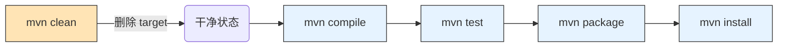
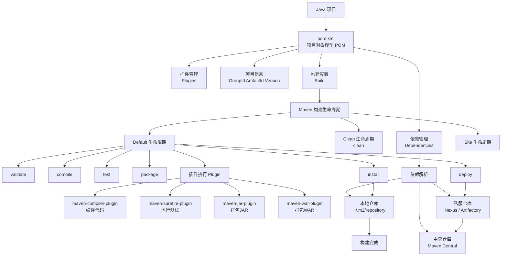
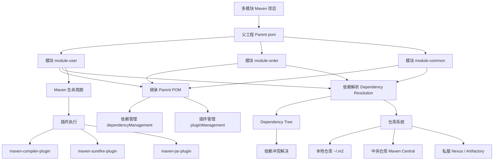

# Maven

Maven 是一个由 Apache 软件基金会开发的**项目管理与构建自动化工具**，主要用于 Java 项目，但也支持其他语言（如 Scala、C# 等）。它基于 **项目对象模型（Project Object Model, POM）** 的概念，通过一个名为 `pom.xml` 的 XML 文件来管理项目的构建、依赖、文档、报告等。

------

## 一、Maven 的核心功能

### 1. 依赖管理（Dependency Management）

- 自动下载项目所需的第三方库（JAR 包）及其传递性依赖。
- 依赖版本冲突自动解决（遵循“最近优先”原则）。
- 本地仓库（`~/.m2/repository`）缓存已下载的依赖，避免重复下载。

### 2. 标准化项目结构

Maven 强制使用约定优于配置（Convention over Configuration）的理念，标准目录结构如下：

```
my-app
├── pom.xml
└── src
    ├── main
    │   ├── java        # 主代码
    │   └── resources   # 配置文件
    └- test
        ├── java        # 测试代码
        └── resources   # 测试配置
```

### 3. 构建生命周期（Build Lifecycle）

Maven 定义了三套标准生命周期：

- **clean**：清理项目（删除 target 目录）
- **default**（核心生命周期）：编译、测试、打包、部署等
- **site**：生成项目站点文档

每个生命周期包含多个阶段（phase），例如 default 生命周期包括：

```
validate → compile → test → package → verify → install → deploy
```

执行 `mvn package` 会自动依次执行前面所有阶段。

### 4. 插件机制（Plugins）

- 所有构建行为都由插件完成（如 `maven-compiler-plugin` 编译 Java 代码）。
- 可扩展：开发者可编写自定义插件。

### 5. 多模块项目支持

通过父 POM 和子模块（modules）实现大型项目的分层管理。

------

## 二、POM 文件详解（pom.xml）

```xml
<project xmlns="http://maven.apache.org/POM/4.0.0"
         xmlns:xsi="http://www.w3.org/2001/XMLSchema-instance"
         xsi:schemaLocation="http://maven.apache.org/POM/4.0.0
                             http://maven.apache.org/xsd/maven-4.0.0.xsd">
    <modelVersion>4.0.0</modelVersion>

    <!-- 坐标（GAV） -->
    <groupId>com.example</groupId>
    <artifactId>my-app</artifactId>
    <version>1.0.0</version>
    <packaging>jar</packaging> <!-- jar, war, pom 等 -->

    <!-- 依赖 -->
    <dependencies>
        <dependency>
            <groupId>junit</groupId>
            <artifactId>junit</artifactId>
            <version>4.13.2</version>
            <scope>test</scope>
        </dependency>
    </dependencies>

    <!-- 构建配置 -->
    <build>
        <plugins>
            <plugin>
                <groupId>org.apache.maven.plugins</groupId>
                <artifactId>maven-compiler-plugin</artifactId>
                <version>3.8.1</version>
                <configuration>
                    <source>11</source>
                    <target>11</target>
                </configuration>
            </plugin>
        </plugins>
    </build>
</project>
```

- **GAV 坐标**：`groupId` + `artifactId` + `version` 唯一标识一个构件。
- **scope**：依赖作用域（compile, test, runtime, provided, system 等）。

POM（Project Object Model，项目对象模型）是 Maven 的核心概念。**`pom.xml` 是 Maven 项目的配置文件**，它以 XML 格式描述了项目的元数据、依赖、构建方式、插件、模块结构等信息。Maven 通过读取 `pom.xml` 来执行构建生命周期中的各项任务。

下面对 `pom.xml` 的各个组成部分进行**详细、系统化**的介绍：

------

### 1、基本结构与命名空间

```xml
<project xmlns="http://maven.apache.org/POM/4.0.0"
         xmlns:xsi="http://www.w3.org/2001/XMLSchema-instance"
         xsi:schemaLocation="http://maven.apache.org/POM/4.0.0
                             http://maven.apache.org/xsd/maven-4.0.0.xsd">
```

- **`xmlns`**：指定 XML 命名空间，表明这是 Maven 4.0.0 规范的 POM。
- **`xsi:schemaLocation`**：用于 IDE 或验证工具校验 XML 结构是否合法。

> ⚠️ 必须包含 `<modelVersion>4.0.0</modelVersion>`，目前所有现代 Maven 项目都使用此版本。

------

### 2、项目坐标（GAV）

Maven 使用 **GAV 坐标**（Group ID, Artifact ID, Version）唯一标识一个项目或构件（JAR/WAR 等）。

```xml
<groupId>com.example</groupId>
<artifactId>my-web-app</artifactId>
<version>1.2.0-SNAPSHOT</version>
```

| 元素         | 说明                                                        |
| ------------ | ----------------------------------------------------------- |
| `groupId`    | 组织或公司域名倒写，如 `com.alibaba`、`org.springframework` |
| `artifactId` | 项目或模块名称，如 `spring-core`、`user-service`            |
| `version`    | 版本号，支持快照（`-SNAPSHOT`）和正式版（如 `1.0.0`）       |

> ✅ **最佳实践**：  
>
> - 正式发布用固定版本（如 `1.0.0`）  
> - 开发中用 `-SNAPSHOT`（如 `1.0.0-SNAPSHOT`），表示可变的开发版本

------

### 3、打包类型（packaging）

```xml
<packaging>jar</packaging>
```

常见值：

- `jar`（默认）：普通 Java 库
- `war`：Web 应用（需部署到 Tomcat 等）
- `ear`：企业级应用（Java EE）
- `pom`：用于父项目或多模块聚合（不生成代码）

------

### 4、项目基本信息（可选但推荐）

```xml
<name>My Application</name>
<description>A demo project for Maven</description>
<url>https://example.com/my-app</url>

<licenses>
    <license>
        <name>Apache License, Version 2.0</name>
        <url>https://www.apache.org/licenses/LICENSE-2.0.txt</url>
    </license>
</licenses>

<developers>
    <developer>
        <name>Zhang San</name>
        <email>zhangsan@example.com</email>
    </developer>
</developers>
```

这些信息在生成项目站点（`mvn site`）或发布到中央仓库时非常有用。

------

### 5、依赖管理（Dependencies）

#### 1. 基本依赖声明

```xml
<dependencies>
    <dependency>
        <groupId>junit</groupId>
        <artifactId>junit</artifactId>
        <version>4.13.2</version>
        <scope>test</scope>
    </dependency>
</dependencies>
```

#### 2. 依赖范围（scope）

| scope             | 作用                                      | 是否传递 | classpath 范围 |
| ----------------- | ----------------------------------------- | -------- | -------------- |
| `compile`（默认） | 编译、测试、运行都需要                    | 是       | 所有阶段       |
| `test`            | 仅测试（如 JUnit）                        | 否       | 测试阶段       |
| `runtime`         | 编译不需要，运行需要（如 JDBC 驱动）      | 是       | 测试 + 运行    |
| `provided`        | JDK 或容器已提供（如 Servlet API）        | 否       | 编译 + 测试    |
| `system`          | 类似 provided，但需指定本地路径（不推荐） | 否       | ——             |

> ❗ 避免使用 `system` scope，破坏可移植性。

#### 3. 可选依赖（optional）

```xml
<optional>true</optional>
```

- 表示该依赖**不会被传递**给引用本项目的其他项目。
- 适用于“插件式”功能（如支持多种数据库驱动，但用户只选其一）。

#### 4. 排除传递性依赖（exclusions）

```xml
<dependency>
    <groupId>org.springframework</groupId>
    <artifactId>spring-context</artifactId>
    <version>5.3.0</version>
    <exclusions>
        <exclusion>
            <groupId>commons-logging</groupId>
            <artifactId>commons-logging</artifactId>
        </exclusion>
    </exclusions>
</dependency>
```

用于解决依赖冲突或移除不需要的传递依赖。

------

### 6、依赖管理（dependencyManagement）

用于**统一管理依赖版本**，尤其在多模块项目中。

```xml
<dependencyManagement>
    <dependencies>
        <dependency>
            <groupId>org.springframework</groupId>
            <artifactId>spring-core</artifactId>
            <version>5.3.0</version>
        </dependency>
    </dependencies>
</dependencyManagement>
```

- 子模块只需声明 `groupId` 和 `artifactId`，无需写 `version`。
- 不会实际引入依赖，仅“声明”版本。

> ✅ 优势：避免版本混乱，便于升级。

------

### 7、构建配置（build）

控制编译、资源处理、插件等行为。

```xml
<build>
    <!-- 最终构件名称（不含版本） -->
    <finalName>my-app</finalName>

    <!-- 资源目录配置 -->
    <resources>
        <resource>
            <directory>src/main/resources</directory>
            <filtering>true</filtering> <!-- 启用属性替换 -->
        </resource>
    </resources>

    <!-- 插件配置 -->
    <plugins>
        <plugin>
            <groupId>org.apache.maven.plugins</groupId>
            <artifactId>maven-compiler-plugin</artifactId>
            <version>3.8.1</version>
            <configuration>
                <source>11</source>
                <target>11</target>
                <encoding>UTF-8</encoding>
            </configuration>
        </plugin>
    </plugins>

    <!-- 插件管理（类似 dependencyManagement） -->
    <pluginManagement>
        <plugins>
            <!-- 统一插件版本 -->
        </plugins>
    </pluginManagement>
</build>
```

#### 常用插件示例：

| 插件                                    | 用途                   |
| --------------------------------------- | ---------------------- |
| `maven-compiler-plugin`                 | 指定 Java 版本         |
| `maven-surefire-plugin`                 | 控制单元测试执行       |
| `maven-jar-plugin` / `maven-war-plugin` | 打包 JAR/WAR           |
| `maven-shade-plugin`                    | 构建 fat jar（含依赖） |

------

### 8、多模块项目（Aggregation & Inheritance）

#### 1. 聚合（Aggregation）

父 POM 使用 `<modules>` 包含子模块：

```xml
<packaging>pom</packaging>
<modules>
    <module>user-service</module>
    <module>order-service</module>
</modules>
```

执行 `mvn clean install` 时，会按顺序构建所有子模块。

#### 2. 继承（Inheritance）

子模块通过 `<parent>` 继承父 POM 的配置：

```xml
<parent>
    <groupId>com.example</groupId>
    <artifactId>parent-project</artifactId>
    <version>1.0.0</version>
    <relativePath>../pom.xml</relativePath>
</parent>
```

继承内容包括：

- `dependencyManagement`
- `pluginManagement`
- 属性（properties）
- 默认配置等

------

### 9、属性（properties）

定义可复用的变量，避免硬编码：

```xml
<properties>
    <java.version>11</java.version>
    <spring.version>5.3.0</spring.version>
    <project.build.sourceEncoding>UTF-8</project.build.sourceEncoding>
</properties>
```

使用方式：`${java.version}`

> ✅ 推荐将版本号、编码等提取为属性，便于维护。

------

### 10、Profiles（构建环境切换）

根据环境（dev/test/prod）激活不同配置：

```xml
<profiles>
    <profile>
        <id>dev</id>
        <activation>
            <activeByDefault>true</activeByDefault>
        </activation>
        <properties>
            <env>development</env>
        </properties>
    </profile>
    <profile>
        <id>prod</id>
        <properties>
            <env>production</env>
        </properties>
    </profile>
</profiles>
```

激活方式：

- 命令行：`mvn clean package -Pprod`
- 自动激活（如检测 JDK 版本、OS 类型等）

------

### 总结：POM 文件的核心要素

| 部分                 | 作用                   |
| -------------------- | ---------------------- |
| GAV 坐标             | 唯一标识项目           |
| dependencies         | 声明直接依赖           |
| dependencyManagement | 统一依赖版本（多模块） |
| build/plugins        | 控制构建行为           |
| properties           | 定义变量               |
| profiles             | 多环境支持             |
| modules/parent       | 多模块管理             |

------

✅ **最佳实践建议**：

1. 使用 `<properties>` 管理版本和编码；
2. 多模块项目用 `dependencyManagement` + `parent`；
3. 避免 `system` scope 和硬编码路径；
4. 合理使用 `exclusions` 解决冲突；
5. 保持 `pom.xml` 简洁，复杂逻辑可考虑 Gradle。

------

如需具体示例（如 Spring Boot 项目 POM、多模块微服务结构、私有仓库配置等），欢迎继续提问！

------

## 三、常用 Maven 命令

| 命令                     | 说明             |
| ------------------------ | ---------------- |
| `mvn clean`              | 清理 target 目录 |
| `mvn compile`            | 编译主代码       |
| `mvn test`               | 运行测试         |
| `mvn package`            | 打包（jar/war）  |
| `mvn install`            | 安装到本地仓库   |
| `mvn deploy`             | 发布到远程仓库   |
| `mvn dependency:tree`    | 查看依赖树       |
| `mvn archetype:generate` | 生成项目骨架     |

Maven 提供了一系列命令（goals）用于执行项目构建、依赖管理、测试、部署等任务。这些命令基于 **生命周期（Lifecycle）** 和 **插件（Plugin）** 机制，通过 `mvn [选项] <goal或phase>` 的形式调用。

**核心概念：Maven 的 Default 生命周期**

Maven 定义了一个名为 **`default`** 的核心生命周期，用于处理项目构建。该生命周期包含多个**有序阶段（phases）**，其中就包括你提到的几个命令：

```text
... → validate → compile → test → package → verify → install → deploy
```

> ✅ **关键规则**：
> **执行某个阶段时，Maven 会自动按顺序执行它之前的所有阶段**。

**关系图解（执行链）**



🔗 **箭头表示“依赖”或“自动触发”**
例如：执行 `mvn install` ⇒ 自动执行 `package` ⇒ 自动执行 `test` ⇒ 自动执行 `compile`

------

### 1、基础构建命令

| 命令          | 说明                                       | 执行的生命周期阶段                  |
| ------------- | ------------------------------------------ | ----------------------------------- |
| `mvn clean`   | 删除 `target/` 目录（清理上次构建产物）    | `clean` 生命周期的 `clean` 阶段     |
| `mvn compile` | 编译主代码（`src/main/java`）              | `default` 生命周期的 `compile` 阶段 |
| `mvn test`    | 编译并运行单元测试（`src/test/java`）      | 执行到 `test` 阶段（含 compile）    |
| `mvn package` | 打包（生成 JAR/WAR 等）                    | 执行到 `package` 阶段               |
| `mvn install` | 将构件安装到本地仓库（`~/.m2/repository`） | 执行到 `install` 阶段               |
| `mvn deploy`  | 将构件发布到远程仓库（如 Nexus）           | 执行到 `deploy` 阶段                |

> ✅ **注意**：Maven 是“阶段驱动”的——执行 `mvn package` 会自动依次执行 `validate → initialize → ... → compile → test → package`。

------

### 2、跳过测试（开发调试常用）

| 命令                                           | 说明                                 |
| ---------------------------------------------- | ------------------------------------ |
| `mvn install -DskipTests`                      | 跳过测试**执行**，但仍会编译测试代码 |
| `mvn install -Dmaven.test.skip=true`           | 完全跳过测试（不编译也不执行）       |
| `mvn package -Dmaven.test.failure.ignore=true` | 测试失败也继续构建                   |

> ⚠️ 生产环境或 CI 流水线中**不应跳过测试**！

------

### 3、依赖与仓库相关命令

| 命令                                      | 说明                                         |
| ----------------------------------------- | -------------------------------------------- |
| `mvn dependency:tree`                     | **查看依赖树**（排查冲突必备）               |
| `mvn dependency:analyze`                  | 分析未使用或未声明的依赖                     |
| `mvn dependency:copy-dependencies`        | 将所有依赖复制到 `target/dependency/`        |
| `mvn help:effective-pom`                  | 输出**最终生效的 POM**（含继承和插件默认值） |
| `mvn versions:display-dependency-updates` | 检查依赖是否有新版本                         |

> 💡 示例：查找谁引入了 `log4j`：
>
> ```bash
> mvn dependency:tree -Dincludes=org.apache.logging.log4j
> ```

------

### 4、多模块项目命令

| 命令                                 | 说明                                                         |
| ------------------------------------ | ------------------------------------------------------------ |
| `mvn clean install -pl module-name`  | 仅构建指定模块（`-pl` = `--projects`）                       |
| `mvn clean install -am`              | 同时构建**被依赖的上游模块**（`-am` = `--also-make`）        |
| `mvn clean install -amd`             | 构建指定模块及其**下游依赖模块**（`-amd` = `--also-make-dependents`） |
| `mvn clean install -rf :module-name` | 从某个模块开始**继续构建**（`-rf` = `--resume-from`）        |

> ✅ 示例：只构建 `user-service` 及其依赖：
>
> ```bash
> mvn clean install -pl user-service -am
> ```

------

### 5、项目生成与原型（Archetype）

| 命令                                                         | 说明                            |
| ------------------------------------------------------------ | ------------------------------- |
| `mvn archetype:generate`                                     | 交互式创建 Maven 项目（从模板） |
| `mvn archetype:generate -DgroupId=com.example -DartifactId=my-app -DarchetypeArtifactId=maven-archetype-quickstart -DinteractiveMode=false` | 非交互式快速创建 Java 项目      |

> 📦 常见 Archetype：
>
> - `maven-archetype-quickstart`：基础 Java 项目
> - `maven-archetype-webapp`：Web 应用（WAR）
> - `spring-boot-archetype`：Spring Boot 项目（需指定仓库）

------

### 6、其他实用命令

| 命令                                  | 说明                                     |
| ------------------------------------- | ---------------------------------------- |
| `mvn site`                            | 生成项目文档站点（含测试报告、依赖图等） |
| `mvn help:describe -Dplugin=compiler` | 查看插件详细信息                         |
| `mvn -X` 或 `mvn --debug`             | 开启调试模式（排查构建失败原因）         |
| `mvn -q` 或 `mvn --quiet`             | 静默模式（减少日志输出）                 |
| `mvn -T 4`                            | 并行构建（4 个线程，加速大型项目）       |

------

### 7、常用组合命令示例

```bash
# 清理 + 编译 + 打包 + 安装（最常用）
mvn clean install

# 跳过测试并打包（开发调试）
mvn clean package -DskipTests

# 查看完整依赖树（排查冲突）
mvn dependency:tree -Dverbose

# 并行构建多模块项目
mvn clean install -T 1C  # 1C = 每核1线程
```

------

### 8、注意事项

1. **命令大小写敏感**：`mvn Clean` ❌，必须 `mvn clean` ✅  

2. **插件前缀可省略**：`dependency:tree` 实际是 `org.apache.maven.plugins:maven-dependency-plugin:tree`  

3. 生命周期 vs 插件目标

   ：

   - `compile` 是生命周期阶段
   - `dependency:tree` 是插件目标（不属于任何生命周期）

------

### 附：Maven 三大生命周期简表

| 生命周期    | 主要阶段（部分）                                             |
| ----------- | ------------------------------------------------------------ |
| **clean**   | pre-clean → clean → post-clean                               |
| **default** | validate → compile → test → package → verify → install → deploy |
| **site**    | pre-site → site → post-site → site-deploy                    |

> 执行 `mvn <phase>` 会触发该生命周期中**之前所有阶段**。

------

掌握这些命令，你就能高效地使用 Maven 进行日常开发、调试和发布！如需特定场景（如 Spring Boot 打包、私有仓库部署等）的命令示例，欢迎继续提问。

------

## 四、Maven 仓库（Repositories）

1. **本地仓库**：`~/.m2/repository`
2. **中央仓库**：Maven 默认从 https://repo1.maven.org/maven2/ 下载
3. **远程仓库**：公司私有仓库（如 Nexus、Artifactory）

可通过 `settings.xml` 配置镜像、认证信息等。


------

## 五、优点与缺点

### ✅ 优点

- 标准化项目结构，降低学习成本
- 强大的依赖管理，避免“JAR 地狱”
- 社区庞大，插件丰富
- 与 CI/CD 工具（Jenkins、GitLab CI）集成良好

### ❌ 缺点

- XML 配置冗长（相比 Gradle 的 Groovy/Kotlin DSL）
- 构建速度较慢（尤其大型项目）
- 生命周期不够灵活（Gradle 更适合复杂构建逻辑）

------

## 六、Maven vs Gradle

| 特性     | Maven              | Gradle              |
| -------- | ------------------ | ------------------- |
| 配置方式 | XML                | Groovy / Kotlin DSL |
| 性能     | 较慢               | 增量构建更快        |
| 灵活性   | 低（约定优于配置） | 高（脚本化）        |
| 学习曲线 | 平缓               | 较陡                |
| 适用场景 | 中小型标准项目     | 大型/复杂构建需求   |

------

## 七、学习资源

- 官网：https://maven.apache.org/
- Maven 中央仓库：https://search.maven.org/
- 书籍：《Maven 实战》（许晓斌）

------

如果你有具体使用场景（如 Spring Boot 项目集成、多模块构建、私服配置等），可以继续提问！

## POM文件目录

### Spring Boot 项目模块化

明白了，你希望把 **Spring Boot 项目目录**改造成更 **模块化/工程化**的结构，引入 **common、core、模块化包**，适合中大型项目或者微服务风格。下面我帮你整理一个升级版目录：

------

#### Spring Boot 项目模块化示例目录

```text
demo
├── pom.xml                           # 父级 Maven POM，管理依赖、插件、版本
├── mvnw / mvnw.cmd
├── .mvn/
├── src
│   ├── main
│   │   ├── java
│   │   │   └── com
│   │   │       └── example
│   │   │           └── demo
│   │   │               ├── DemoApplication.java       # 启动类
│   │   │               ├── common/                    # 公共模块
│   │   │               │   ├── config/               # 公共配置
│   │   │               │   │   └── RedisConfig.java
│   │   │               │   ├── util/                 # 工具类
│   │   │               │   │   └── JwtUtil.java
│   │   │               │   ├── dto/                  # 公共 DTO
│   │   │               │   │   └── ResponseDTO.java
│   │   │               │   └── exception/            # 公共异常类
│   │   │               │       └── BusinessException.java
│   │   │               ├── core/                      # 核心模块
│   │   │               │   ├── service/               # 核心服务接口
│   │   │               │   │   └── UserService.java
│   │   │               │   ├── service/impl/          # 核心服务实现
│   │   │               │   │   └── UserServiceImpl.java
│   │   │               │   ├── repository/            # 核心 DAO / Mapper
│   │   │               │   │   └── UserRepository.java
│   │   │               │   └── model/entity/          # 核心实体类
│   │   │               │       └── User.java
│   │   │               ├── module/                    # 功能模块（可拆分为多个子模块）
│   │   │               │   └── order/                 # 订单模块示例
│   │   │               │       ├── controller/        # 控制层
│   │   │               │       │   └── OrderController.java
│   │   │               │       ├── service/           # 业务逻辑
│   │   │               │       │   └── OrderService.java
│   │   │               │       ├── service/impl/      # 实现类
│   │   │               │       │   └── OrderServiceImpl.java
│   │   │               │       ├── repository/        # DAO
│   │   │               │       │   └── OrderRepository.java
│   │   │               │       └── model/entity/      # 实体类
│   │   │               │           └── Order.java
│   │   │               └── config/                     # 应用配置类
│   │   │                   └── SecurityConfig.java
│   │   └── resources
│   │       ├── application.yml / application.properties
│   │       ├── static/
│   │       │   └── index.html
│   │       ├── templates/
│   │       │   └── home.html
│   │       ├── mapper/                  # MyBatis Mapper XML
│   │       │   └── UserMapper.xml
│   │       └── db/
│   │           └── init.sql
│   └── test
│       └── java
│           └── com
│               └── example
│                   └── demo
│                       └── DemoApplicationTests.java
└── target/
```

------

#### 改进说明

1. **common 模块**
   - 公共配置、工具类、DTO、异常等放在 `common`，便于多个模块共享。
   - 典型：`RedisConfig.java`、`JwtUtil.java`、`ResponseDTO.java`。
2. **core 模块**
   - 核心业务逻辑和实体类，所有模块通用的核心服务。
   - 典型：用户服务、基础实体、核心 DAO。
3. **module 功能模块**
   - 每个业务模块独立，例如订单模块 `order`。
   - 保持 MVC 分层：`controller → service → service/impl → repository → entity`。
4. **config 配置**
   - 应用级配置，如 Spring Security、安全策略、Swagger 等。
5. **resources**
   - 放置配置文件、静态资源、模板、Mapper 文件、数据库脚本。

------

这样结构清晰，适合：

- 微服务化拆分
- 中大型项目多模块开发
- 公共工具和核心业务逻辑复用

------

如果你愿意，我可以帮你画一张 **可视化的“Spring Boot 多模块项目架构图”**，直接显示 **common → core → module → controller → service → repository → entity → config → resources → test** 的全流程，非常直观，适合面试展示。

你希望我画吗？

明白了，你希望把 Spring Boot 项目改造成 **多模块 Maven 项目**，每个模块都是独立的 Maven 子模块，拥有自己的 `pom.xml`，并且有一个父级 `pom.xml` 统一管理依赖和插件。这是中大型项目或者微服务开发常用的结构。下面我帮你整理一个 **典型多模块项目结构示例**。

------

### 多模块 Maven + Spring Boot 项目目录示例

```text
demo-parent/
├── pom.xml                       # 父级 POM，管理版本、依赖、插件、模块
├── common/                       # 公共模块
│   ├── pom.xml                   # common 子模块 POM
│   └── src/main/java/com/example/demo/common
│       ├── config/               # 公共配置
│       │   └── RedisConfig.java
│       ├── dto/                  # 公共 DTO
│       │   └── ResponseDTO.java
│       ├── util/                 # 工具类
│       │   └── JwtUtil.java
│       └── exception/            # 公共异常
│           └── BusinessException.java
├── core/                         # 核心业务模块
│   ├── pom.xml
│   └── src/main/java/com/example/demo/core
│       ├── service/             # 核心服务接口
│       │   └── UserService.java
│       ├── service/impl/        # 核心服务实现
│       │   └── UserServiceImpl.java
│       ├── repository/          # DAO / Mapper
│       │   └── UserRepository.java
│       └── model/entity/        # 实体类
│           └── User.java
├── module-order/                 # 订单模块
│   ├── pom.xml
│   └── src/main/java/com/example/demo/order
│       ├── controller/          # 控制层
│       │   └── OrderController.java
│       ├── service/             # 服务接口
│       │   └── OrderService.java
│       ├── service/impl/        # 服务实现
│       │   └── OrderServiceImpl.java
│       ├── repository/          # DAO / Mapper
│       │   └── OrderRepository.java
│       └── model/entity/        # 实体类
│           └── Order.java
├── module-product/               # 产品模块
│   ├── pom.xml
│   └── src/main/java/com/example/demo/product
│       ├── controller/
│       │   └── ProductController.java
│       ├── service/
│       │   └── ProductService.java
│       ├── service/impl/
│       │   └── ProductServiceImpl.java
│       ├── repository/
│       │   └── ProductRepository.java
│       └── model/entity/
│           └── Product.java
├── application/                  # Spring Boot 启动模块
│   ├── pom.xml
│   └── src/main/java/com/example/demo
│       └── DemoApplication.java   # Spring Boot 启动类
└── pom.xml                       # 父 POM（可选重复标注）
```

------

#### 说明

1. **父级 POM (`demo-parent/pom.xml`)**
   - 声明 `<modules>`：common、core、module-order、module-product、application
   - 统一管理 Spring Boot 版本、插件版本、依赖版本
2. **公共模块 (`common`)**
   - 提供所有模块共享的工具类、DTO、异常、配置等
3. **核心模块 (`core`)**
   - 提供核心服务和实体，供各业务模块依赖
4. **业务模块 (`module-order`, `module-product`)**
   - 每个业务模块独立
   - 拥有自己的 `pom.xml`，可以单独打包或单独运行测试
5. **启动模块 (`application`)**
   - 只依赖其他模块
   - 启动 Spring Boot 应用
6. **依赖关系示意**

```text
common --> core --> module-order / module-product --> application
```

------

#### 父 POM 示例

```xml
<project>
    <modelVersion>4.0.0</modelVersion>
    <groupId>com.example.demo</groupId>
    <artifactId>demo-parent</artifactId>
    <version>1.0.0-SNAPSHOT</version>
    <packaging>pom</packaging>

    <modules>
        <module>common</module>
        <module>core</module>
        <module>module-order</module>
        <module>module-product</module>
        <module>application</module>
    </modules>

    <dependencyManagement>
        <dependencies>
            <dependency>
                <groupId>org.springframework.boot</groupId>
                <artifactId>spring-boot-starter</artifactId>
                <version>3.2.0</version>
            </dependency>
            <!-- 可以统一管理版本 -->
        </dependencies>
    </dependencyManagement>
</project>
```

------

这种结构特点：

- 模块清晰，每个模块可独立构建
- 公共逻辑复用方便
- 业务模块互相解耦
- 支持微服务拆分，容易扩展

------

我可以帮你画一张 **多模块 Maven + Spring Boot 可视化架构图**，显示 **父 POM → common → core → 各业务模块 → 启动模块** 的关系，非常直观，适合面试或者团队说明。

明白了，我帮你整理一个 **多模块 Spring Boot 项目**中 **父模块 POM + 各子模块 POM 示例**，展示标准写法和依赖管理方式。假设项目结构如前一条回答：

```
demo-parent/
├── pom.xml          # 父模块
├── common/pom.xml
├── core/pom.xml
├── module-order/pom.xml
├── module-product/pom.xml
└── application/pom.xml
```

------

#### 1️⃣ 父模块 POM（`demo-parent/pom.xml`）

```xml
<project xmlns="http://maven.apache.org/POM/4.0.0"
         xmlns:xsi="http://www.w3.org/2001/XMLSchema-instance"
         xsi:schemaLocation="http://maven.apache.org/POM/4.0.0
                             http://maven.apache.org/xsd/maven-4.0.0.xsd">
                             
    <modelVersion>4.0.0</modelVersion>

    <groupId>com.example.demo</groupId>
    <artifactId>demo-parent</artifactId>
    <version>1.0.0-SNAPSHOT</version>
    <packaging>pom</packaging>
    <name>Demo Multi-Module Project</name>

    <!-- 子模块列表 -->
    <modules>
        <module>common</module>
        <module>core</module>
        <module>module-order</module>
        <module>module-product</module>
        <module>application</module>
    </modules>

    <!-- 统一管理依赖版本 -->
    <dependencyManagement>
        <dependencies>
            <!-- Spring Boot BOM -->
            <dependency>
                <groupId>org.springframework.boot</groupId>
                <artifactId>spring-boot-dependencies</artifactId>
                <version>3.2.0</version>
                <type>pom</type>
                <scope>import</scope>
            </dependency>
        </dependencies>
    </dependencyManagement>

    <properties>
        <java.version>17</java.version>
        <spring-boot.version>3.2.0</spring-boot.version>
    </properties>

    <build>
        <pluginManagement>
            <plugins>
                <!-- Spring Boot Maven Plugin -->
                <plugin>
                    <groupId>org.springframework.boot</groupId>
                    <artifactId>spring-boot-maven-plugin</artifactId>
                    <version>${spring-boot.version}</version>
                </plugin>
            </plugins>
        </pluginManagement>
    </build>

</project>
```

------

#### 2️⃣ 公共模块 POM（`common/pom.xml`）

```xml
<project xmlns="http://maven.apache.org/POM/4.0.0"
         xmlns:xsi="http://www.w3.org/2001/XMLSchema-instance"
         xsi:schemaLocation="http://maven.apache.org/POM/4.0.0
                             http://maven.apache.org/xsd/maven-4.0.0.xsd">

    <modelVersion>4.0.0</modelVersion>

    <parent>
        <groupId>com.example.demo</groupId>
        <artifactId>demo-parent</artifactId>
        <version>1.0.0-SNAPSHOT</version>
    </parent>

    <artifactId>common</artifactId>
    <packaging>jar</packaging>

    <dependencies>
        <!-- 公共依赖示例 -->
        <dependency>
            <groupId>org.springframework.boot</groupId>
            <artifactId>spring-boot-starter</artifactId>
        </dependency>
        <!-- lombok 用于简化实体类 -->
        <dependency>
            <groupId>org.projectlombok</groupId>
            <artifactId>lombok</artifactId>
            <scope>provided</scope>
        </dependency>
    </dependencies>

</project>
```

------

#### 3️⃣ 核心模块 POM（`core/pom.xml`）

```xml
<project xmlns="http://maven.apache.org/POM/4.0.0"
         xmlns:xsi="http://www.w3.org/2001/XMLSchema-instance"
         xsi:schemaLocation="http://maven.apache.org/POM/4.0.0
                             http://maven.apache.org/xsd/maven-4.0.0.xsd">

    <modelVersion>4.0.0</modelVersion>

    <parent>
        <groupId>com.example.demo</groupId>
        <artifactId>demo-parent</artifactId>
        <version>1.0.0-SNAPSHOT</version>
    </parent>

    <artifactId>core</artifactId>
    <packaging>jar</packaging>

    <dependencies>
        <!-- 依赖公共模块 -->
        <dependency>
            <groupId>com.example.demo</groupId>
            <artifactId>common</artifactId>
            <version>${project.version}</version>
        </dependency>

        <!-- Spring Data JPA / MyBatis 等 -->
        <dependency>
            <groupId>org.springframework.boot</groupId>
            <artifactId>spring-boot-starter-data-jpa</artifactId>
        </dependency>
    </dependencies>

</project>
```

------

#### 4️⃣ 业务模块 POM（示例 `module-order/pom.xml`）

```xml
<project xmlns="http://maven.apache.org/POM/4.0.0"
         xmlns:xsi="http://www.w3.org/2001/XMLSchema-instance"
         xsi:schemaLocation="http://maven.apache.org/POM/4.0.0
                             http://maven.apache.org/xsd/maven-4.0.0.xsd">

    <modelVersion>4.0.0</modelVersion>

    <parent>
        <groupId>com.example.demo</groupId>
        <artifactId>demo-parent</artifactId>
        <version>1.0.0-SNAPSHOT</version>
    </parent>

    <artifactId>module-order</artifactId>
    <packaging>jar</packaging>

    <dependencies>
        <!-- 核心模块依赖 -->
        <dependency>
            <groupId>com.example.demo</groupId>
            <artifactId>core</artifactId>
            <version>${project.version}</version>
        </dependency>

        <!-- 公共模块依赖 -->
        <dependency>
            <groupId>com.example.demo</groupId>
            <artifactId>common</artifactId>
            <version>${project.version}</version>
        </dependency>

        <!-- Spring Boot Web -->
        <dependency>
            <groupId>org.springframework.boot</groupId>
            <artifactId>spring-boot-starter-web</artifactId>
        </dependency>
    </dependencies>

</project>
```

------

#### 5️⃣ 启动模块 POM（`application/pom.xml`）

```xml
<project xmlns="http://maven.apache.org/POM/4.0.0"
         xmlns:xsi="http://www.w3.org/2001/XMLSchema-instance"
         xsi:schemaLocation="http://maven.apache.org/POM/4.0.0
                             http://maven.apache.org/xsd/maven-4.0.0.xsd">

    <modelVersion>4.0.0</modelVersion>

    <parent>
        <groupId>com.example.demo</groupId>
        <artifactId>demo-parent</artifactId>
        <version>1.0.0-SNAPSHOT</version>
    </parent>

    <artifactId>application</artifactId>
    <packaging>jar</packaging>

    <dependencies>
        <!-- 业务模块依赖 -->
        <dependency>
            <groupId>com.example.demo</groupId>
            <artifactId>module-order</artifactId>
            <version>${project.version}</version>
        </dependency>
        <dependency>
            <groupId>com.example.demo</groupId>
            <artifactId>module-product</artifactId>
            <version>${project.version}</version>
        </dependency>
        <dependency>
            <groupId>com.example.demo</groupId>
            <artifactId>core</artifactId>
            <version>${project.version}</version>
        </dependency>
        <dependency>
            <groupId>com.example.demo</groupId>
            <artifactId>common</artifactId>
            <version>${project.version}</version>
        </dependency>

        <!-- Spring Boot Starter -->
        <dependency>
            <groupId>org.springframework.boot</groupId>
            <artifactId>spring-boot-starter</artifactId>
        </dependency>
    </dependencies>

    <build>
        <plugins>
            <!-- 打包 Spring Boot 可执行 JAR -->
            <plugin>
                <groupId>org.springframework.boot</groupId>
                <artifactId>spring-boot-maven-plugin</artifactId>
            </plugin>
        </plugins>
    </build>

</project>
```

------

✅ 关键特点：

1. 父 POM 管理版本、插件和模块。
2. 每个模块有自己 `pom.xml`，可单独构建或单独依赖。
3. `common` 和 `core` 模块提供基础依赖，业务模块依赖它们。
4. 启动模块依赖所有需要启动的模块，最终打包成可执行 JAR。

------

如果你愿意，我可以帮你画一张 **可视化 Maven 多模块依赖关系图**，显示 **父 POM → common/core → 业务模块 → 启动模块** 的完整依赖链，非常直观。

你希望我画吗？

# Maven分类介绍

在 **Apache Maven** 中，一般可以从 **功能结构、依赖类型、仓库类型、项目结构** 等几个维度进行分类理解。下面给你用比较口语化、适合面试和学习的方式整理一下。

------

## 一、按 **Maven核心组成** 分类

Maven 本身主要由三个核心部分组成：

### 1️⃣ POM（Project Object Model）

POM 是 Maven 的核心配置文件。

- 文件名：`pom.xml`
- 作用：
  - 项目基本信息
  - 依赖管理
  - 插件管理
  - 构建配置

示例：

```xml
<project>
    <groupId>com.example</groupId>
    <artifactId>demo</artifactId>
    <version>1.0</version>

    <dependencies>
        <dependency>
            <groupId>org.springframework</groupId>
            <artifactId>spring-core</artifactId>
            <version>6.0.0</version>
        </dependency>
    </dependencies>
</project>
```

核心三元坐标：

```
groupId + artifactId + version
```

例如：

```
org.springframework:spring-core:6.0.0
```

------

### 2️⃣ Dependency（依赖管理）

Maven 最重要的功能之一：**自动管理 jar 包依赖**。

例如：

```xml
<dependency>
    <groupId>junit</groupId>
    <artifactId>junit</artifactId>
    <version>4.13</version>
</dependency>
```

Maven 会自动：

```
下载依赖
解决依赖冲突
管理依赖版本
```

------

### 3️⃣ Plugin（插件机制）

Maven 的所有构建行为都是通过 **插件** 完成的。

例如：

| 插件                  | 作用      |
| --------------------- | --------- |
| maven-compiler-plugin | 编译 Java |
| maven-surefire-plugin | 运行测试  |
| maven-jar-plugin      | 打 jar 包 |
| maven-war-plugin      | 打 war 包 |

示例：

```xml
<build>
    <plugins>
        <plugin>
            <artifactId>maven-compiler-plugin</artifactId>
            <version>3.10.1</version>
        </plugin>
    </plugins>
</build>
```

------

## 二、按 **依赖作用域（Scope）分类**

Maven 依赖有 **6 种作用域**：

| 作用域   | 说明                         |
| -------- | ---------------------------- |
| compile  | 默认作用域，编译和运行都需要 |
| provided | 编译需要，运行由容器提供     |
| runtime  | 运行需要                     |
| test     | 只在测试阶段使用             |
| system   | 本地依赖                     |
| import   | 导入依赖管理                 |

示例：

```xml
<dependency>
    <groupId>javax.servlet</groupId>
    <artifactId>servlet-api</artifactId>
    <scope>provided</scope>
</dependency>
```

例如：

- Web 项目中
  `servlet-api` → 由 **Apache Tomcat** 提供。

------

## 三、按 **仓库类型（Repository）分类**

Maven 依赖来自 **仓库（Repository）**。

### 1️⃣ 本地仓库

存储在本地电脑：

```
~/.m2/repository
```

作用：

```
缓存依赖
避免重复下载
```

------

### 2️⃣ 中央仓库

官方仓库：

**Maven Central Repository**

网址：

```
https://repo.maven.apache.org
```

绝大多数依赖都来自这里。

------

### 3️⃣ 私服仓库

公司内部仓库，例如：

- **Nexus Repository Manager**
- **JFrog Artifactory**

作用：

```
缓存中央仓库
存储公司私有jar
提高下载速度
```

------

## 四、按 **项目结构分类**

Maven 项目可以分为：

### 1️⃣ 单模块项目

结构：

```
project
 ├── src
 ├── pom.xml
```

适合：

```
小型项目
简单项目
```

------

### 2️⃣ 多模块项目

结构：

```
parent-project
 ├── pom.xml
 ├── module-user
 │    └── pom.xml
 ├── module-order
 │    └── pom.xml
 └── module-common
      └── pom.xml
```

父工程：

```xml
<packaging>pom</packaging>
```

作用：

```
统一依赖版本
统一插件版本
模块解耦
```

------

## 五、按 **Maven构建生命周期分类**

Maven 有 **3 大生命周期**：

### 1️⃣ Clean 生命周期

```
clean
```

作用：

```
删除 target 目录
```

------

### 2️⃣ Default 生命周期（最常用）

常见阶段：

```
compile
test
package
install
deploy
```

例如：

```bash
mvn package
```

执行流程：

```
compile → test → package
```

------

### 3️⃣ Site 生命周期

用于生成项目文档。

```
mvn site
```

------

## 六、按 **打包类型（Packaging）分类**

| 类型 | 说明      |
| ---- | --------- |
| jar  | Java 项目 |
| war  | Web 项目  |
| pom  | 父项目    |
| ear  | 企业应用  |

例如：

```xml
<packaging>jar</packaging>
```

------

## 七、一句话总结 Maven 分类

Maven 通常可以从 **5 个维度理解**：

```
Maven分类

1 核心组成
   POM
   Dependency
   Plugin

2 依赖作用域
   compile
   provided
   runtime
   test

3 仓库
   本地仓库
   中央仓库
   私服仓库

4 项目结构
   单模块
   多模块

5 生命周期
   clean
   default
   site
```

------

如果你愿意，我可以再给你整理一张 **“Maven 一张图彻底理解（架构图 + 生命周期 + 仓库 + 依赖）”**，基本是 **面试和学习最清晰的一张图**。

## 一张图彻底理解 Maven

我给你整理了一张 **“一张图彻底理解 Maven”** 的结构图（架构 + 生命周期 + 仓库 + 依赖），非常适合 **面试回答 + 复习记忆**。核心围绕 **Apache Maven** 的完整工作流程。

------

### Maven 一张图彻底理解



------

#### 一张图理解 Maven 的完整流程

整个流程其实可以总结为 **5 步**：

##### ① 读取 POM

Maven 首先读取 `pom.xml`：

包含：

```
项目坐标
依赖
插件
构建配置
```

例如：

```
groupId
artifactId
version
```

------

##### ② 解析依赖

Maven 会自动下载依赖：

顺序：

```
本地仓库
↓
私服仓库
↓
中央仓库
```

常见仓库：

- **Maven Central Repository**
- 公司私服：
  - **Nexus Repository Manager**
  - **JFrog Artifactory**

下载后缓存到：

```
~/.m2/repository
```

------

##### ③ 执行生命周期

Maven 的核心是 **生命周期（Lifecycle）**：

三个：

```
Clean
Default
Site
```

最常用的是 **Default**：

```
validate
compile
test
package
install
deploy
```

例如：

```bash
mvn package
```

会执行：

```
validate → compile → test → package
```

------

##### ④ 插件执行

Maven **本身不做任何事情**，所有功能都通过插件完成。

常见插件：

| 插件                  | 作用      |
| --------------------- | --------- |
| maven-compiler-plugin | 编译 Java |
| maven-surefire-plugin | 运行测试  |
| maven-jar-plugin      | 打 jar    |
| maven-war-plugin      | 打 war    |

------

##### ⑤ 构建输出

最终结果：

```
target/
```

例如：

```
target/demo.jar
target/demo.war
```

------

### 面试版总结（30秒回答）

如果面试官问 **Maven 原理**，可以这样回答：

> Maven 是一个项目构建和依赖管理工具。它通过 `pom.xml` 描述项目结构，包含依赖、插件和构建配置。
>
> 构建时 Maven 会先解析依赖，从 **本地仓库 → 私服仓库 → 中央仓库** 下载依赖。
>
> 然后按照 **生命周期（clean、default、site）** 执行构建阶段，例如 `compile、test、package`。
>
> 每个阶段由 **插件** 完成，例如 `maven-compiler-plugin` 负责编译代码。
>
> 最终生成构建产物，例如 `jar` 或 `war` 包。

------

如果你愿意，我可以再给你整理 **一张比这个更高级的图**：

**《Maven 底层原理架构图（面试杀手版）》**

里面会包含：

```
Dependency Tree
依赖冲突解决
继承与聚合
多模块项目
插件执行原理
```

很多 **Java 面试官非常喜欢问这个。**

## 一张图理解 Maven 深层架构

下面给你整理一份 **Maven 深入理解图 + 关键原理总结**，把你提到的 5 个面试高频点全部串在一起：

- Dependency Tree
- 依赖冲突解决
- 继承与聚合
- 多模块项目
- 插件执行原理

核心对象是 **Apache Maven**。



------

### 1 Dependency Tree（依赖树）

Maven 解析依赖时会形成 **依赖树结构**。

例如：

```xml
A项目
 └── B依赖
      └── C依赖
           └── D依赖
```

实际结构：

```
A
├── B
│   └── C
│        └── D
```

查看依赖树：

```bash
mvn dependency:tree
```

示例输出：

```
com.example:demo
 ├─ spring-core
 │  └─ commons-logging
 └─ junit
```

依赖树作用：

```
查看传递依赖
定位依赖冲突
分析依赖来源
```

------

### 2 依赖冲突解决（面试必问）

假设依赖关系：

```
A
├── B → C 1.0
└── D → C 2.0
```

最终只能保留一个版本。

Maven 的规则：

#### 规则1：路径最短优先

```
A → C 1.0
A → B → C 2.0
```

选择：

```
C 1.0
```

因为路径短。

------

#### 规则2：先声明优先

如果路径一样：

```
A
├── B → C 1.0
└── D → C 2.0
```

谁在 `pom.xml` **先写**，谁生效。

------

#### 规则3：手动指定版本

最推荐方式：

```xml
<dependency>
    <groupId>xxx</groupId>
    <artifactId>C</artifactId>
    <version>2.0</version>
</dependency>
```

------

### 3 继承（Inheritance）

Maven 支持 **父子工程继承**。

父工程：

```xml
<packaging>pom</packaging>
```

父 POM：

```xml
<dependencyManagement>
    <dependencies>
        <dependency>
            <groupId>org.springframework</groupId>
            <artifactId>spring-core</artifactId>
            <version>6.0.0</version>
        </dependency>
    </dependencies>
</dependencyManagement>
```

子工程：

```xml
<parent>
    <groupId>com.example</groupId>
    <artifactId>parent</artifactId>
</parent>
```

子模块使用依赖时：

```xml
<dependency>
    <groupId>org.springframework</groupId>
    <artifactId>spring-core</artifactId>
</dependency>
```

**不用写 version**。

------

### 4 聚合（Aggregation）

聚合用于 **统一构建多个模块**。

父工程：

```xml
<modules>
    <module>module-user</module>
    <module>module-order</module>
    <module>module-common</module>
</modules>
```

项目结构：

```
parent-project
 ├── pom.xml
 ├── module-user
 ├── module-order
 └── module-common
```

执行：

```
mvn install
```

Maven 会自动：

```
编译所有模块
按依赖顺序构建
```

------

### 5 多模块项目结构

标准结构：

```
project-parent
│
├── pom.xml
│
├── common
│   └── pom.xml
│
├── user-service
│   └── pom.xml
│
└── order-service
    └── pom.xml
```

依赖关系：

```
user-service → common
order-service → common
```

好处：

```
代码复用
模块解耦
统一版本管理
统一构建
```

------

### 6 插件执行原理

Maven **核心设计理念**：

```
Maven 本身几乎不做任何事情
所有功能都由插件完成
```

例如：

| 阶段    | 插件            |
| ------- | --------------- |
| compile | compiler plugin |
| test    | surefire plugin |
| package | jar plugin      |

常见插件：

- `maven-compiler-plugin`
- `maven-surefire-plugin`
- `maven-jar-plugin`

执行过程：

```
Lifecycle
   ↓
Phase
   ↓
Plugin
   ↓
Goal
```

例如：

```
compile phase
   ↓
maven-compiler-plugin
   ↓
compiler:compile goal
```

------

### 面试总结（高频回答）

如果面试官问 **Maven 原理**，标准答案：

> Maven 通过 `pom.xml` 描述项目结构和依赖关系。
>
> 依赖解析时会生成 **Dependency Tree**，并根据
> **路径最短优先、先声明优先** 的规则解决依赖冲突。
>
> 在大型项目中通常使用 **父子工程继承** 管理依赖版本，
> 通过 **聚合（modules）** 统一构建多个模块。
>
> Maven 构建基于 **生命周期 → 阶段 → 插件 → goal** 的执行模型，
> 所有构建任务最终都是由插件完成。

------

如果你需要，我可以再给你画一张 **Java面试最经典的图**：

**《Spring Boot + Maven + Tomcat + Servlet 一张图理解 Web 项目运行流程》**

这张图能把 **Java Web 架构一次性讲清楚**，很多面试官都会问


------

# 其他

